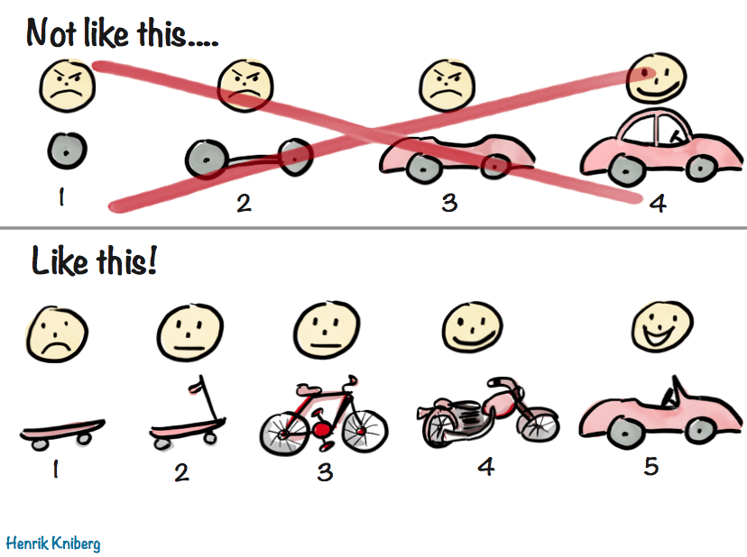

# Feature development

## Size

When possible, build features with incremental sets of small and focused PRs, but don't check in unused code, and don't expose any feature on main that you would not be comfortable releasing.

If your feature cannot be broken down into smaller components, or multiple engineers will be contributing, you have a few other options to consider.

**1. Hide your feature behind a feature flag**

Features can be merged behind a flag if you are not ready to make them the default experience, but all code should still be tested, complete and bug free.

A good question to ask yourself is, how will you feel if a customer turns this feature on? Is it usable, even if not up to the level of something we would market? It should have some level of minimal utility.

Another question to ask yourself is, if this feature gets cancelled, how difficult will it be to remove?

**2. Develop on a feature branch**

This option is useful if you have more than one contributor working on a large feature. The downside is handling code conflicts when rebasing with the main branch.

Consider how you want to handle the PR review. Reviewing each PR going into the feature branch can lighten the review process when merging into the main branch.

**3. Use an example plugin**

If you are building a service for developers, create an [example plugin](https://github.com/elastic/kibana/tree/main/examples) to showcase and test intended usage. This is a great way for reviewers and PMs to play around with a feature through the UI, before the production UI is ready. This can also help developers consuming your services get hands on.

## Embrace the monorepo

{{kib}} uses a monorepo and our processes and tooling are built around this decision. Utilizing a monorepo allows us to have a consistent peer review process and enforce the same code quality standards across all of {{kib}}'s code. It also eliminates the necessity to have separate versioning strategies and constantly coordinate changes across repos.

When experimenting with code, it's completely fine to create a separate GitHub repo to use for initial development. Once the code has matured to a point where it's ready to be used within {{kib}}, it should be integrated into the {{kib}} GitHub repo.

There are some exceptions where a separate repo makes sense. However, they are exceptions to the rule. A separate repo has proven beneficial when there's a dedicated team collaborating on a package which has multiple consumers, for example [EUI](https://github.com/elastic/eui).

It may be tempting to get caught up in the dream of writing the next package which is published to npm and downloaded millions of times a week. Knowing the quality of developers that are working on {{kib}}, this is a real possibility. However, knowing which packages will see mass adoption is impossible to predict. Instead of jumping directly to writing code in a separate repo and accepting all the complications that come along with it, prefer keeping code inside the {{kib}} repo. A {{kib}} package follows the npm idioms and can be later converted into a npm package, moved into an external repo and be published into the npm if a good reason for it was found (for example to enable external contributions).
