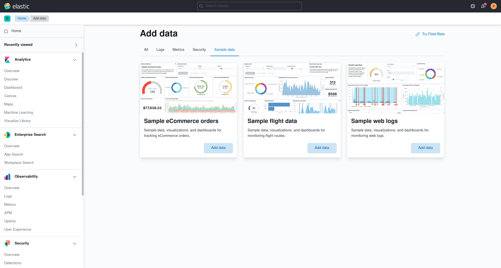
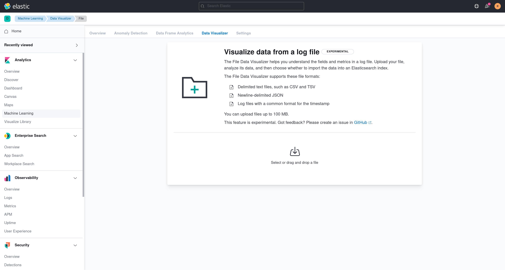

# Add data

Building a feature and need an easy way to test it out with some data? Below are three options.

## Sample data

Kibana ships with sample data that you can install at the click of the button. If you are building a feature and need some data to test it out with, sample data is a great option. The only limitation is that this data will not work for Security or Observability solutions (see [#62962](https://github.com/elastic/kibana/issues/62962)).

1. Navigate to the home page.
2. Click **Add data**.
3. Click on the **Sample data** tab.
4. Select a dataset by clicking on the **Add data** button.



## Upload a file

Kibana can import CSV, NDJSON, log files, GeoJSON, and shapefiles through the **Upload a file** feature (provided by the File Upload and Data Visualizer plugins). Where the entry point appears depends on the solution view:

- **Classic navigation**: From the home page, click **Add data**, then open the **Upload file** tab. The feature is also reachable from **Machine Learning → Data Visualizer**, and from the empty state shown when creating a data view with no matching indices.
- **Search solution**: Use the **Add data** button on the Getting Started page, or the "Get started with Elasticsearch" card on the Search home page.
- **Observability solution**: Launch the **Onboarding** flow and select the **Upload a file** card.
- **Security solution**: The generic file upload is not surfaced in the Security nav. Security provides its own domain-specific uploaders (asset criticality, entity resolution, SIEM migration lookups).

These entry points all route to one of two URLs:

- `/app/home#/tutorial_directory/fileDataViz`
- `/app/ml/filedatavisualizer`



## makelogs

The makelogs script generates sample web server logs. Make sure Elasticsearch is running before running the script.

```sh
node scripts/makelogs --auth <username>:<password>
```

## Realistic solution data

:::{warning} Internal only
Security and Observability solution applications only work if data exists in particularly named indices, abiding by our [ECS format](https://www.elastic.co/guide/en/ecs/current/index.html). If you would like to use these applications with realistic data, check out the [oblt_cli tool](https://github.com/elastic/observability-test-environments/blob/main/docs/tools/oblt-cli/CONTRIBUTING.md). This tool sets you up to connect to a remote Elasticsearch cluster that contains the appropriate data via CCS.
:::