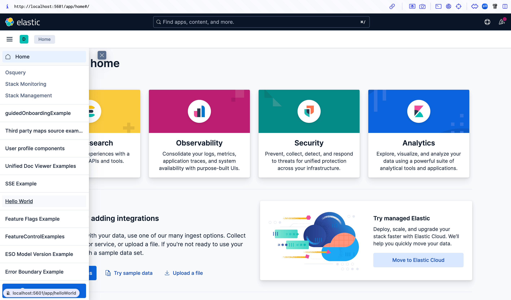
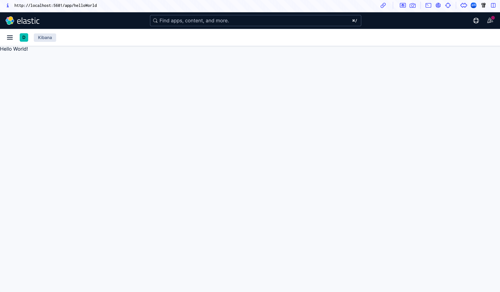
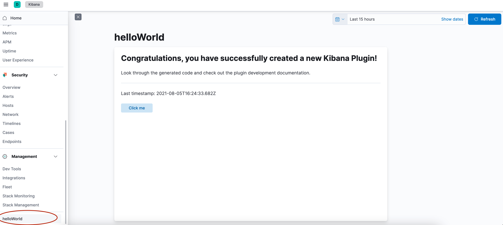

# Hello World

This tutorial walks you through two ways to create a plugin that registers an application that says "Hello World!".

You can view the tested example plugin at [examples/hello_world](https://github.com/elastic/kibana/tree/main/examples/hello_world).

## 1. Set up your development environment

Read through [these instructions](./set-up-a-development-environment.md) to get your development environment set up.

## 2. Option 1 — Use the plugin generator (recommended)

This is the fastest way to get a working Kibana plugin. The generator scaffolds an **external plugin** in the root `plugins/` directory. This is the supported location for plugins that are not checked into the Kibana repo.

From the Kibana repo root:

```sh
node scripts/generate_plugin --name hello_world
```

You'll be prompted for a description, ownership, and whether to generate UI and/or server code.

When it finishes, your plugin is at `plugins/hello_world/` with:

- `kibana.json` — the manifest Kibana reads at startup
- `public/`, `server/`, `common/` — scaffolded plugin code
- `tsconfig.json` and a `package.json` with dev scripts

### Run your new plugin

External plugins use a two-terminal workflow: one builds the browser bundle, the other runs Kibana.

In one terminal, from inside your plugin directory, build and watch the browser bundle:

```sh
cd plugins/hello_world
yarn dev --watch
```

In another terminal, from the Kibana repo root, boot Elasticsearch and Kibana:

```sh
yarn es snapshot --license trial
```

```sh
yarn start
```

When Kibana picks up your plugin, you'll see it in the startup logs:

```text
[INFO ][plugins-system.standard] Setting up […] plugins: […, helloWorld, …]
```

Open Kibana in your browser and find your application in the side navigation.

## 3. Option 2 — Write it manually as an in-repo example

This option is useful if you want to understand the bare minimum needed to register an application, or if you are contributing a plugin to the Kibana repo. The tested example at [examples/hello_world](https://github.com/elastic/kibana/tree/main/examples/hello_world) is based on this option.

1. Create your plugin folder. Start off in the `kibana` folder.

```sh
cd examples
mkdir hello_world
cd hello_world
```

2. Create the [kibana.jsonc manifest file](../key-concepts/platform-architecture/anatomy-of-a-plugin.md#kibana-jsonc).

```sh
touch kibana.jsonc
```

and add the following:

```json
{
  "type": "plugin",
  "id": "@kbn/hello-world-plugin",
  "owner": "@elastic/kibana-core",
  "description": "A plugin which registers a very simple hello world application.",
  "plugin": {
    "id": "helloWorld",
    "server": false,
    "browser": true,
    "requiredPlugins": ["developerExamples"]
  }
}
```

3. Create a [tsconfig.json file](../key-concepts/platform-architecture/anatomy-of-a-plugin.md#tsconfig-json).

```sh
touch tsconfig.json
```

And add the following to it:

```json
{
  "extends": "../../tsconfig.base.json",
  "compilerOptions": {
    "outDir": "target/types"
  },
  "include": [
    "index.ts",
    "common/**/*.ts",
    "public/**/*.ts",
    "public/**/*.tsx",
    "server/**/*.ts",
    "../../typings/**/*"
  ],
  "exclude": ["target/**/*"],
  "kbn_references": ["@kbn/core", "@kbn/developer-examples-plugin"]
}
```

4. Create a [`public/plugin.tsx` file ](../key-concepts/platform-architecture/anatomy-of-a-plugin.md).

```sh
mkdir public
cd public
touch plugin.tsx
```

And add the following to it:

```ts
import React from 'react';
import ReactDOM from 'react-dom';
import { AppMountParameters, CoreSetup, CoreStart, Plugin } from '@kbn/core/public';
import { DeveloperExamplesSetup } from '@kbn/developer-examples-plugin/public';

interface SetupDeps {
  developerExamples: DeveloperExamplesSetup;
}

export class HelloWorldPlugin implements Plugin<void, void, SetupDeps> {
  public setup(core: CoreSetup, deps: SetupDeps) {
    // Register an application into the side navigation menu
    core.application.register({
      id: 'helloWorld',
      title: 'Hello World',
      async mount({ element }: AppMountParameters) {
        ReactDOM.render(<div data-test-subj="helloWorldDiv">Hello World!</div>, element);
        return () => ReactDOM.unmountComponentAtNode(element);
      },
    });

    // This section is only needed to get this example plugin to show up in our Developer Examples.
    deps.developerExamples.register({
      appId: 'helloWorld',
      title: 'Hello World Application',
      description: `Build a plugin that registers an application that simply says "Hello World"`,
    });
  }
  public start(core: CoreStart) {
    return {};
  }
  public stop() {}
}
```

5. Create a [`public/index.ts` file ](../key-concepts/platform-architecture/anatomy-of-a-plugin.md).

```
touch index.ts
```

```ts
import { HelloWorldPlugin } from './plugin';

export function plugin() {
  return new HelloWorldPlugin();
}
```

### Run your new plugin

In-repo example plugins are discovered via the workspace's package map, so you must bootstrap after creating the manifest:

```sh
yarn kbn bootstrap
```

In one terminal, run `yarn es snapshot --license trial` to boot up Elasticsearch.

In another terminal, run `yarn start --run-examples` to boot up Kibana and include the example plugins. Your example plugin should show up in the navigation at the very bottom.

If you built it manually, it will look something like this:





If you built it with the generator, it will look something like this:


