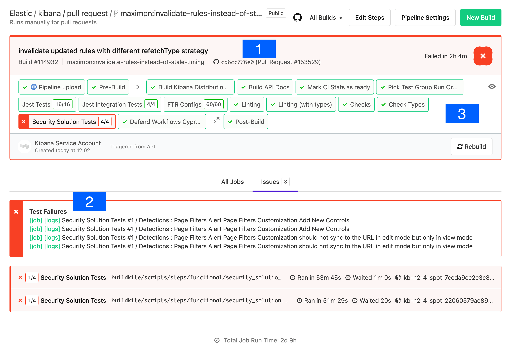
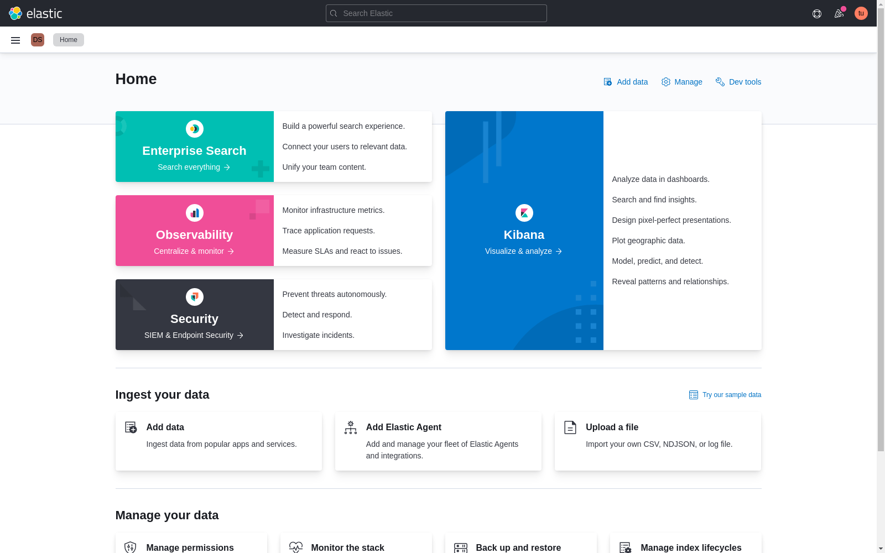
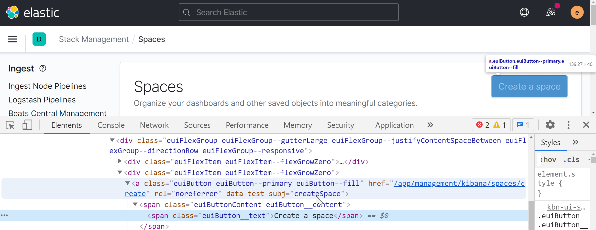

---
mapped_pages:
  - https://www.elastic.co/guide/en/kibana/current/interpreting-ci-failures.html
---

# Interpreting CI Failures [interpreting-ci-failures]

{{kib}} CI uses a Buildkite feature called "Pipelines" to automate testing of the code in pull requests and on tracked branches. Pipelines are defined within the repository via the `Pipelines` at the `.buildkite/pipelines` folder.

More information about Buildkite Pipelines can be found [in the docs](https://buildkite.com/docs/pipelines).

## Github Checks [_github_checks]

When a test fails it will be reported to Github via Github Checks. We currently bucket tests into several categories which run in parallel to make CI faster. Groups like `ciGroup{{X}}` get a single check in Github, and other tests like linting, or type checks, get their own checks.

Clicking the link next to the check in the conversation tab of a pull request will take you to the log output from that section of the tests. If that log output is truncated, or doesn’t clearly identify what happened, you can usually get more complete information by visiting Buildkite directly.

## Viewing Job Executions in Kibana [_viewing_job_executions_in_kibana]

To view the results of a job execution in Buildkite, either click the link in the comment left by `@elasticmachine` or search for the `kibana-ci` check in the list at the bottom of the PR. This link will take you to the top-level page for the specific job execution that failed.



1. **Git commit:** the git commit that caused this build.
2. **Test Results:** A link to the test results screen, and shortcuts to the logs and jobs of the failed tests. Functional tests capture and store the log output from each specific test, and make it visible at these links.
3. **Pipeline Steps:**: A breakdown of the pipeline that was executed, along with individual log output for each step in the pipeline.

## Debugging Functional UI Test Failures [_debugging_functional_ui_test_failures]

The logs in Pipeline Steps contain `Info` level logging. To debug Functional UI tests it’s usually helpful to see the debug logging. You can go to the test failure details by clicking on the **logs** (1).


Looking at the failure, we first look at the Error and stack trace. In the example below, this test failed to find an element within the timeout; `Error: retry.try timeout: TimeoutError: Waiting for element to be located By(css selector, [data-test-subj="createSpace"])`

We know the test file from the stack trace was on line 50 of `test/accessibility/apps/spaces.ts` (this test and the stack trace context is kibana/x-pack/ so the file is [`x-pack/platform/test/accessibility/apps/group1/spaces.ts`](https://github.com/elastic/kibana/blob/master/x-pack/platform/test/accessibility/apps/group1/spaces.ts#L50). The function to click on the element was called from a page object method in [`test/functional/page_objects/space_selector_page.ts`](https://github.com/elastic/kibana/blob/master/x-pack/test/functional/page_objects/space_selector_page.ts#L58).

```
[00:03:36]             │ debg --- retry.try error: Waiting for element to be located By(css selector, [data-test-subj="createSpace"])
[00:03:36]             │      Wait timed out after 10020ms
[00:03:36]             │ info Taking screenshot "/dev/shm/workspace/parallel/24/kibana/x-pack/test/functional/screenshots/failure/Kibana spaces page meets a11y validations a11y test for click on create space page.png"
[00:03:37]             │ info Current URL is: http://localhost:61241/app/home#/
[00:03:37]             │ info Saving page source to: /dev/shm/workspace/parallel/24/kibana/x-pack/test/functional/failure_debug/html/Kibana spaces page meets a11y validations a11y test for click on create space page.html
[00:03:37]             └- ✖ fail: Kibana spaces page meets a11y validations a11y test for click on create space page
[00:03:37]             │      Error: retry.try timeout: TimeoutError: Waiting for element to be located By(css selector, [data-test-subj="createSpace"])
[00:03:37]             │ Wait timed out after 10020ms
[00:03:37]             │     at /dev/shm/workspace/parallel/24/kibana/node_modules/selenium-webdriver/lib/webdriver.js:842:17
[00:03:37]             │     at runMicrotasks (<anonymous>)
[00:03:37]             │     at processTicksAndRejections (internal/process/task_queues.js:93:5)
[00:03:37]             │       at onFailure (/dev/shm/workspace/parallel/24/kibana/test/common/services/retry/retry_for_success.ts:17:9)
[00:03:37]             │       at retryForSuccess (/dev/shm/workspace/parallel/24/kibana/test/common/services/retry/retry_for_success.ts:57:13)
[00:03:37]             │       at Retry.try (/dev/shm/workspace/parallel/24/kibana/test/common/services/retry/retry.ts:32:14)
[00:03:37]             │       at Proxy.clickByCssSelector (/dev/shm/workspace/parallel/24/kibana/test/functional/services/common/find.ts:420:7)
[00:03:37]             │       at TestSubjects.click (/dev/shm/workspace/parallel/24/kibana/test/functional/services/common/test_subjects.ts:109:7)
[00:03:37]             │       at SpaceSelectorPage.clickCreateSpace (test/functional/page_objects/space_selector_page.ts:59:7)
[00:03:37]             │       at Context.<anonymous> (test/accessibility/apps/spaces.ts:50:7)
[00:03:37]             │       at Object.apply (/dev/shm/workspace/parallel/24/kibana/node_modules/@kbn/test/src/functional_test_runner/lib/mocha/wrap_function.js:73:16)
```

But we don’t know _why_ the test didn’t find the element. It could be that its not on the right page, or that the element has changed.

Just above the `✖ fail:` line, there is a line `info Taking screenshot ...` which tells us the name of the screenshot to look for in the **Google Cloud Storage (GCS) Upload Report:**

Clicking the `[Download]` link for that png shows this image:



If we use a running Kibana instance and inspect elements, we find that the `createSpace` data-test-subj attribute is on this button in the Spaces page in Stack Management:



We know the test was not on the correct page to find the element to click. We see in the debug log the repeated attempts to find the element. If we scroll to the start of those repeated attempts, we see that the first thing the test did was this attempt to click on the `createSpace` element.

```
[00:01:30]           └-> a11y test for manage spaces menu from top nav on Kibana home
[00:01:30]           └-> a11y test for manage spaces page
[00:01:30]           └-> a11y test for click on create space page
[00:01:30]             └-> "before each" hook: global before each for "a11y test for click on create space page"
[00:01:30]             │ debg TestSubjects.click(createSpace)
```

And we can confirm that looking at the test code.

So we need to backtrack further to find where the test opens the Spaces page. It turns out that the test before this one would have navigated to the proper page, but the test is skipped (marked `it.skip` in a PR).

```
it.skip('a11y test for manage spaces page', async () => {
  await PageObjects.spaceSelector.clickManageSpaces();
```

Perhaps someone skipped the previous tests not realizing that the tests were not independent. A best practice would be for every test to be atomic and not depend on the results of any other test(s). But in UI testing, the setup takes time and we generally need to optimize for groups of tests within a describe block.
