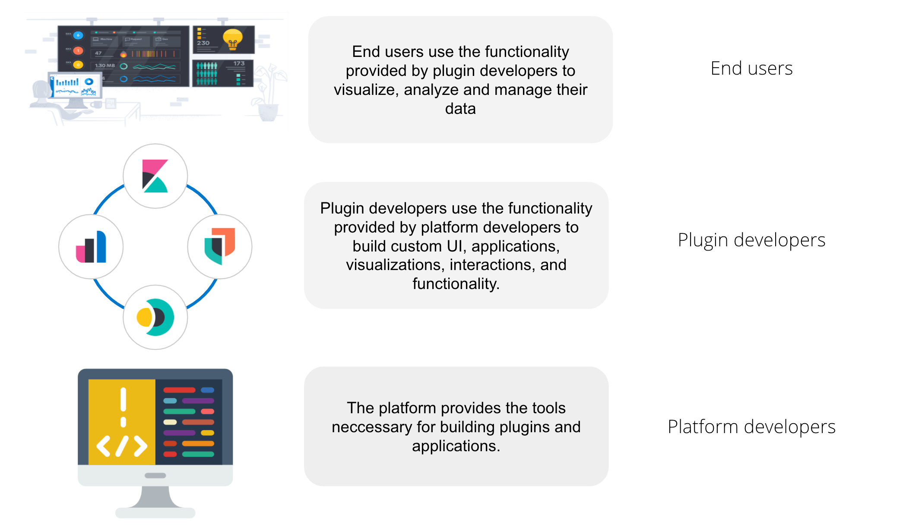
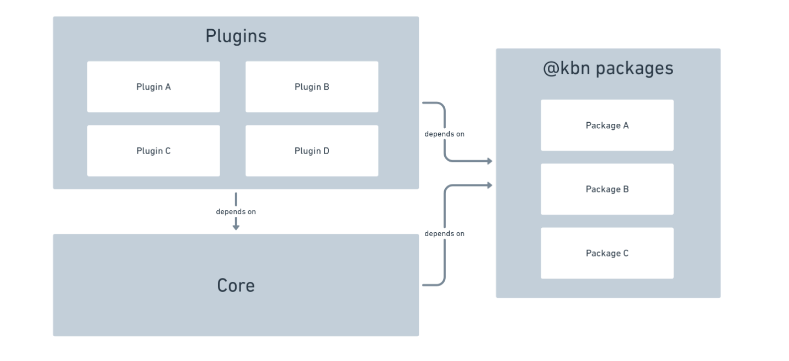
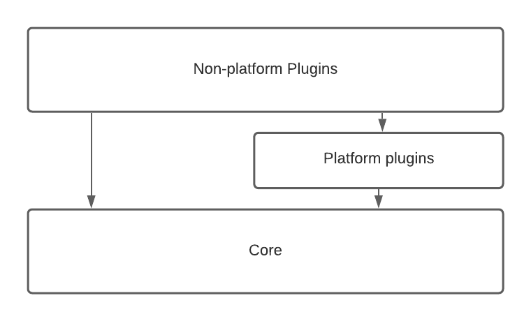
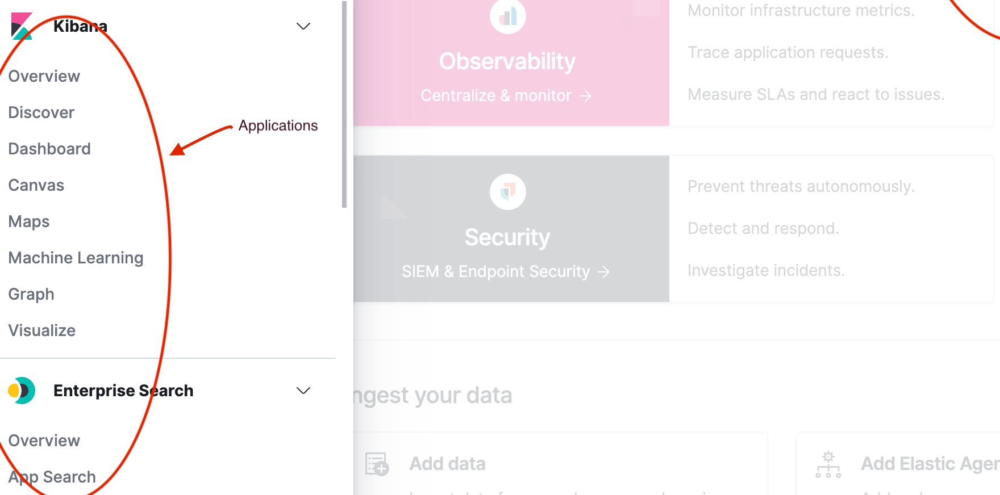

# Plugins, packages, and the platform

From an end user perspective, Kibana is a tool for interacting with Elasticsearch, providing an easy way to visualize and analyze data.

From a developer perspective, Kibana is a platform that provides a set of tools to build not only the UI you see in Kibana today, but a wide variety of applications that can be used to explore, visualize, and act upon data in Elasticsearch. The platform provides developers the ability to build applications, or inject extra functionality into
already existing applications. Did you know that almost everything you see in the
Kibana UI is built inside a plugin? If you removed all plugins from Kibana, you'd be left with an empty navigation menu, and a set of developer tools. The Kibana platform is a blank canvas, just waiting for a developer to come along and create something!

## 1,000 foot view

At a super high-level, Kibana is composed of **plugins**, **core**, and **Kibana packages**.

**Plugins** provide the majority of all functionality in Kibana. All applications and UIs are defined here.

**Core** provides the runtime and the most fundamental services.

**@kbn packages** provide stateless, reusable functionality that can be imported anywhere in Kibana.

:::{dropdown} FAQ: Should I put my code in a plugin or a package?

**If the code is stateful, it has to be exposed from a plugin's [lifecycle methods](./plugins-packages-and-the-platform.md#lifecycle-methods). Do not statically export stateful code.**

Benefits to packages:

1. <b>_Potentially_ reduced page load time</b>. All code that is statically exported from plugins will be downloaded on _every single page load_, even if that code isn't needed. With packages, only code that is imported is downloaded, which can be minimized by using async imports.
2. <b>Puts the consumer is in charge of how and when to async import</b>. If a consumer async imports code exported from a plugin, it makes no difference, because of the above point. It's already been downloaded. However, simply moving code into a package is _not_ a guaranteed performance improvement. It does give the consumer the power to make smart performance choices, however. If they require code from multiple packages, the consumer can async import from multiple packages at the same time. Read more in our [performance docs](../performance/plugin-performance-and-optimization.md).

:::

:::{dropdown} FAQ: What is the difference between services provided by plugins and those by Core?
:::{note}
We try to put only the most stable and fundamental code into `Core`, while optional add-ons, applications, and solution-oriented functionality goes in a plugin.

Today it looks something like this.

"Platform plugins" provide core-like functionality, just outside of core, and their public APIs tend to be more volatile. Other plugins may still expose shared services, but they are intended only for usage by a small subset of specific plugins, and may not be generic or "platform-like".
:::

:::

## Plugins

Plugins are code that is written to extend and customize Kibana. Plugin's don't have to be part of the Kibana repo, though the Kibana
repo does contain many plugins! Plugins add customizations by
using [extension points](./plugins-packages-and-the-platform.md#extension-points) provided by platform services.
Sometimes people confuse the term "plugin" and "application". While often there is a 1:1 relationship between a plugin and an application, it is not always the case.
A plugin may register many applications, or none.

### Applications

Applications are top level pages in the Kibana UI. Discover, Dashboard, Dev Tools, Maps, etc, are all examples of applications:

A plugin can register an application by
adding it to core's application registry.

### Public plugin API

A plugin's public API consists of everything exported from a plugin's [start or setup lifecycle methods](./plugins-packages-and-the-platform.md#lifecycle-methods),
as well as from the top level `index.ts` files that exist in the three "scope" folders:

- common/index.ts
- public/index.ts
- server/index.ts

Any plugin that exports something from those files, or from the lifecycle methods, is exposing a public service. We sometimes call these "plugin services" or
"shared services".

## Lifecycle methods

Core, and plugins, expose different features at different parts of their lifecycle. We describe the lifecycle of core services and plugins with specifically-named functions on the service definition.

Kibana has three lifecycles: `setup`, `start`, and `stop`. Each plugin’s setup function is called sequentially while Kibana is setting up on the server or when it is being loaded in the browser. The start functions are called sequentially after setup has been completed for all plugins. The stop functions are called sequentially while Kibana is gracefully shutting down the server or when the browser tab or window is being closed.

The table below explains how each lifecycle relates to the state of Kibana.

| lifecycle | purpose                                                      | server                                                             | browser                                                                                    |
| --------- | ------------------------------------------------------------ | ------------------------------------------------------------------ | ------------------------------------------------------------------------------------------ |
| setup     | perform "registration" work to setup environment for runtime | configure REST API endpoint, register saved object types, etc.     | configure application routes in SPA, register custom UI elements in extension points, etc. |
| start     | bootstrap runtime logic                                      | respond to an incoming request, request Elasticsearch server, etc. | start polling Kibana server, update DOM tree in response to user interactions, etc.        |
| stop      | cleanup runtime                                              | dispose of active handles before the server shutdown.              | store session data in the LocalStorage when the user navigates away from Kibana, etc.      |

Different service interfaces can and will be passed to setup, start, and stop because certain functionality makes sense in the context of a running plugin while other types
of functionality may have restrictions or may only make sense in the context of a plugin that is stopping.

## Extension points

An extension point is a function provided by core, or a plugin's plugin API, that can be used by other plugins to customize the Kibana experience. Examples of extension points are:

- `core.application.register` (The extension point talked about above)
- `core.notifications.toasts.addSuccess`
- `core.overlays.showModal`
- `embeddables.registerEmbeddableFactory`
- `uiActions.registerAction`
- `core.savedObjects.registerType`

## Follow up material

Learn how to build your own plugin by following [Hello World](../../getting-started/hello-world.md).