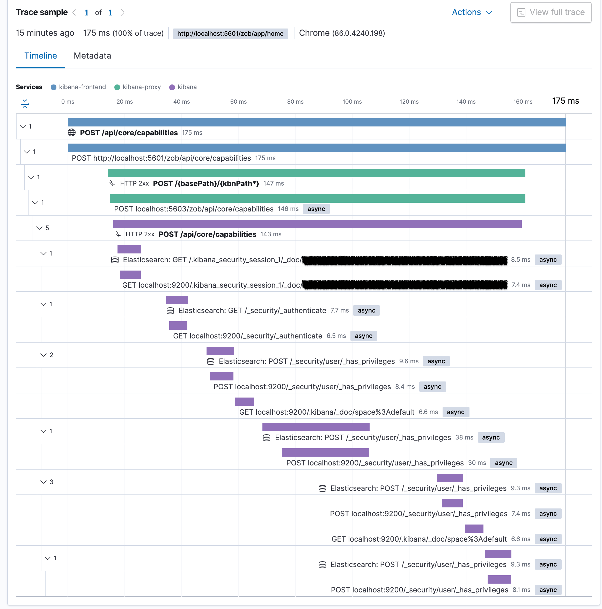
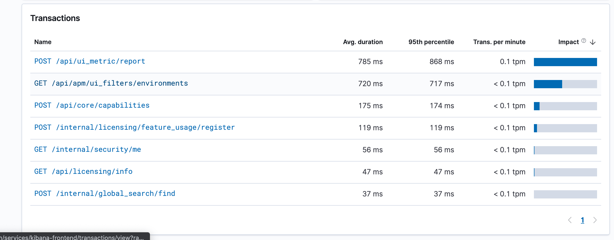

---
mapped_pages:
  - https://www.elastic.co/guide/en/kibana/current/kibana-debugging.html
---

# Debugging Kibana [kibana-debugging]

For information about how to debug unit tests, refer to [Debugging Unit Tests](/extend/development-tests.md#debugging-unit-tests).


## Server Code [_server_code]

`yarn debug` will start the server with Node’s inspect flag. {{kib}}'s development mode will start three processes on ports `9229`, `9230`, and `9231`. Chrome’s developer tools need to be configured to connect to all three connections. Add `localhost:<port>` for each {{kib}} process in Chrome’s developer tools connection tab.


## Instrumenting with Elastic APM [_instrumenting_with_elastic_apm]

{{kib}} ships with the [Elastic APM Node.js Agent](https://github.com/elastic/apm-agent-nodejs) built-in for debugging purposes.

With an application as varied and complex as Kibana has become, it’s not practical or scalable to craft all possible performance measurements by hand ahead of time. As such, we need to rely on tooling to help us catch things we may otherwise have missed.

For example, say you implement a brand new feature, plugin or service but don’t quite know how it will impact Kibana’s performance as a whole. APM allows us to not only spot that something is slow, but also hints at why it might be performing slowly. For example, if a function is slow on specific types of inputs, we can see where the time is spent by viewing the trace for that function call in the APM UI.



The net of metrics captured by APM are both a wide and deep because the entire application is instrumented at runtime and we simply take a sample of these metrics. This means that we don’t have to know what we need to measure ahead of time, we’ll instead just get (most) of the data we’re likely going to need by default.

This type of data can help us identify unknown bottlenecks, spot when a performance regression may have been introduced, and inform how the performance of Kibana is changing between releases. Using APM allows us to be proactive in getting ahead of potential performance regressions before they are released.

The default APM configuration is meant to be used by core {{kib}} developers only, but it can easily be re-configured to your needs. In its default configuration it’s disabled and will, once enabled, send APM data to a centrally managed {{es}} cluster accessible only to Elastic employees.

To change the location where data is sent, use the [`serverUrl`](apm-agent-nodejs://reference/configuration.md#server-url) APM config option. To activate the APM agent, use the [`active`](apm-agent-nodejs://reference/configuration.md#active) APM config option.

All config options can be set by creating an appropriate config file under `config/kibana.dev.yml`.

Example `config/kibana.dev.yml` file:

```yaml
elastic:
  apm:
    active: true
```

APM [Real User Monitoring agent](apm-agent-rum-js://reference/index.md) is not available in the {{kib}} distributables, however the agent can be enabled by setting `ELASTIC_APM_ACTIVE` to `true`. flags

```
ELASTIC_APM_ACTIVE=true yarn start
// activates both Node.js and RUM agent
```
Once the agent is active, it will trace all incoming HTTP requests to {{kib}}, monitor for errors, and collect process-level metrics. The collected data will be sent to the APM Server and is viewable in the APM UI in {{kib}}.


## Running Kibana with the APM Agent Locally [_running_kibana_with_the_apm_agent_locally]

The easiest and recommended way of running Kibana with the APM agent locally is to use the solution provided by the [apm-integration-testing](https://github.com/elastic/apm-integration-testing) repo. You’ll need [Docker](https://www.docker.com/community-edition), [Docker Compose](https://docs.docker.com/compose/install/) and [Python (version 3 preferred)](https://www.python.org/downloads) to use the tool.


### Quick start guide [_quick_start_guide]

1. Clone the [elastic/apm-integration-testing](https://github.com/elastic/apm-integration-testing) repo.
2. Change into the apm-integration-testing repo:

    ```bash
    cd apm-integration-testing
    ```

3. Run {{es}} and the APM servers without running Kibana:

    ```bash
    ./scripts/compose.py start master --no-kibana
    ```

4. Clone the [elastic/kibana](https://github.com/elastic/kibana) repo.
5. Change into the {{kib}} repo:

    ```bash
    cd ../kibana
    ```

6. Change the elasticsearch credentials in your `kibana.yml` configuration file to match those needed by elasticsearch and the APM server (see the apm-integration-testing repo’s [README](https://github.com/elastic/apm-integration-testing#logging-in) for users provided to test different scenarios).
7. Make sure that the APM agent is active and points to the local APM server by adding the following configuration settings to a config file under `config/kibana.dev.yml`:

    Example `config/kibana.dev.yml` file:

    ```yaml
    elastic:
      apm:
        active: true
        serverUrl: http://localhost:8200
        secretToken: very_secret
        centralConfig: true
        breakdownMetrics: true
        transactionSampleRate: 0.1
    ```

8. Start Kibana with APM active using:

    ```bash
    yarn start
    ```

9. After Kibana starts up, navigate to the APM app, where you should see some transactions.



You can now continue doing what you want to in Kibana (e.g. install sample data sets, issue queries in dashboards, build new visualizations etc). Once you’re finished, you can stop Kibana normally, then stop the {{es}} and APM servers in the apm-integration-testing clone with the following script:

```bash
./scripts/compose.py stop
```

