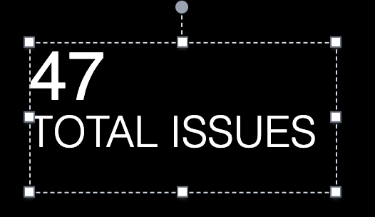

---
mapped_pages:
  - https://www.elastic.co/guide/en/kibana/current/kibana-expressions-plugin.html
---

# expressions plugin [kibana-expressions-plugin]

Expression pipeline is a chain of functions that **pipe** its output to the input of the next function. Functions can be configured using arguments provided by the user. The final output of the expression pipeline can be rendered using one of the **renderers** registered in `expressions` plugin.

All the arguments to expression functions need to be serializable, as well as input and output. Expression functions should try to stay *pure*. This makes functions easy to reuse and also make it possible to serialize the whole chain as well as output at every step of execution.

It is possible to add comments to expressions by starting them with a `//` sequence or by using `/*` and `*/` to enclose multi-line comments.

Expressions power visualizations in Dashboard and Lens, as well as, every **element** in Canvas is backed by an expression.

This plugin provides methods which will parse & execute an **expression pipeline** string for you, as well as a series of registries for advanced users who might want to incorporate their own functions, types, and renderers into the service for use in their own application.

## Examples [_examples_8]

Below is an example of serialized expression for one Canvas element that fetches data using `essql` function, pipes it further to `math` and `metric` functions, and final `render` function renders the result.

```
filters
| essql
  query="SELECT COUNT(timestamp) as total_errors
    FROM kibana_sample_data_logs
    WHERE tags LIKE '%warning%' OR tags LIKE '%error%'"
| math "total_errors" // take "total_errors" column
/* Represent as a number over a label */
| metric "TOTAL ISSUES"
  metricFont={font family="'Open Sans', Helvetica, Arial, sans-serif" size=48 align="left" color="#FFFFFF" weight="normal" underline=false italic=false}
  labelFont={font family="'Open Sans', Helvetica, Arial, sans-serif" size=30 align="left" color="#FFFFFF" weight="lighter" underline=false italic=false}
| render
[/source]
```

% TO DO: Use `:class: screenshot`



