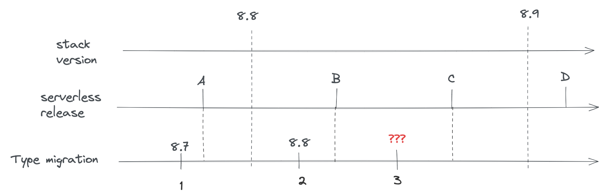
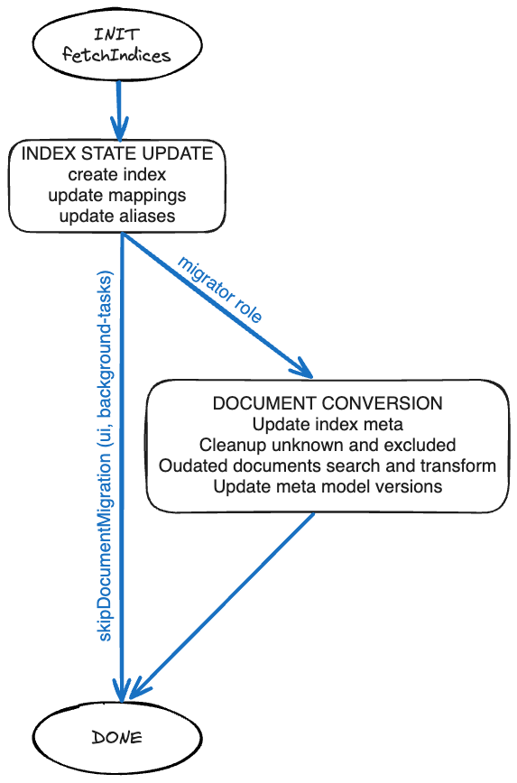
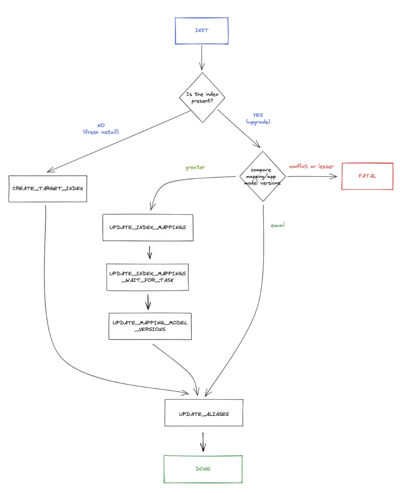
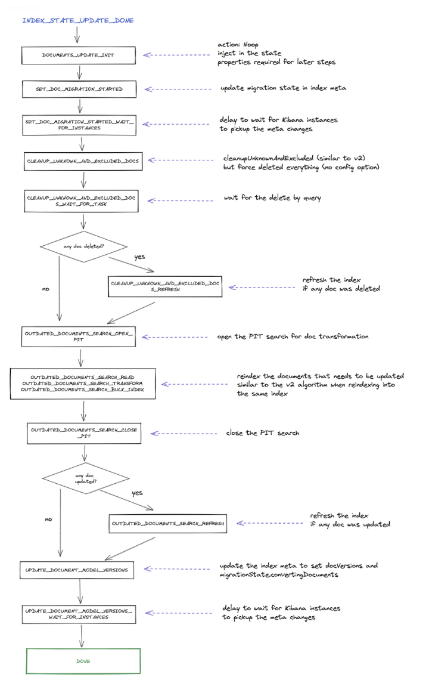

# Saved Object migrations [saved-objects-migrations]

This page describes how changes to **Saved Object type** schemas and mappings are rolled out, depending on the deployment architecture.

Model versions decouple Saved Object versioning from the stack version and support both traditional upgrades (with downtime) and zero-downtime Serverless upgrades. The legacy migration API was tied to stack versions and did not meet backward-compatibility and zero-downtime requirements for Serverless, so it has been deprecated in favor of `modelVersions`.

## Migration algorithms

Kibana has two separate migration algorithms that handle updating Saved Object system indices: **v2** and **ZDT (Zero Downtime)**. The algorithm is selected via the `migrations.algorithm` configuration setting, which accepts either `'v2'` or `'zdt'`.

* **v2** is the traditional algorithm used on classic stack deployments. It runs during startup with downtime: all old-version nodes are stopped before the new version boots and migrates.
* **ZDT** is the algorithm used on Serverless deployments. It supports zero-downtime upgrades where old and new Kibana versions cohabit.

The selection happens in `KibanaMigrator.runMigrationsInternal` (see `src/core/packages/saved-objects/migration-server-internal/src/kibana_migrator.ts`), which branches on `migrations.algorithm` to call either `runV2Migration` or `runZeroDowntimeMigration`.

Regardless of which algorithm is active, both share the same **Saved Object type definitions** (including `modelVersions`) and the same underlying component for transforming individual documents: the `DocumentMigrator` (`src/core/packages/saved-objects/migration-server-internal/src/document_migrator/document_migrator.ts`). The `DocumentMigrator` reads the type registry, builds an ordered pipeline of transforms from model version `changes`, and applies them to bring each document to the target model version. It supports both upgrades and downgrades (via `forwardCompatibility` schemas).

## Classic stack upgrades

**Classic stack** includes self-managed Kibana and [Elastic Cloud Hosted (ECH)](https://www.elastic.co/docs/deploy-manage/deploy/elastic-cloud/cloud-hosted).

On these deployments, upgrades are typically done **with downtime**:

1. All nodes running the previous Kibana version are shut down.
2. The new version is deployed.
3. At any given time, only one Kibana version is running.

Because there is no cohabitation of old and new versions, there is no risk of the new version applying migrations that change document shape in a way the old version cannot read. Migrations run once during the upgrade, and rollback is done by redeploying the previous version and restoring data if needed.

When you change a Saved Object type on the classic stack:

* Add new **model versions** (do not use the deprecated `migrations` property for new changes).
* Ensure mapping changes are **backward compatible** (additive only; no field removal or type changes that require reindexing).
* The upgrade process applies the model version transformations so documents and index mappings match the new version.

Validation (e.g. `node scripts/check_saved_objects`) and the rules in [Validate](validate.md) still apply so that the same type definitions remain safe when used on Serverless or in future rollback scenarios.

## Serverless upgrades

**Serverless** refers to [Elastic Cloud Serverless (ECS)](https://www.elastic.co/docs/deploy-manage/deploy/elastic-cloud/serverless), where Kibana and Elasticsearch are fully managed and upgrades are performed without user-managed downtime.

### How the Serverless rollout works

The Serverless rollout is driven by a **GitOps** workflow that updates Kibana across a series of Kubernetes clusters. The upgrade is performed as a **rolling upgrade**: new-version pods are brought up while old-version pods are still running, so both versions **cohabit** for a brief period. Traffic shifts to the new version as pods are replaced. Once all old-version pods are gone, the **ZDT (Zero Downtime) migration logic** runs in the background to update Saved Object system indices (mappings and documents) so they match the new version's model versions.

### How the ZDT migration algorithm works (Saved Objects)

The **ZDT (Zero Downtime)** migration logic applies Saved Object type changes (model versions and their `changes`) to the system indices. It is implemented under `src/core/packages/saved-objects/migration-server-internal/src/zdt/`.

#### One state machine per system index

Kibana has multiple system indices (e.g. `.kibana`, `.kibana_task_manager`). Types are grouped by the index they use (`indexPattern`). The ZDT runner starts one **state machine per such index**; each machine migrates a single index independently (see `runZeroDowntimeMigration` and `buildMigratorConfigs`).

#### Three main phases

From a high level, the state machine consists of three main phases:

1. **INIT** — Fetches the system indices to understand their current state (aliases, mappings, model versions stored in `_meta`).
2. **Index state update** — Creates the index if it does not exist, updates mappings and aliases. This phase is executed by **all Kibana node roles** (`ui`, `background_tasks`) as well as the `migrator` role.
3. **Document conversion** — Updates index metadata, cleans up unknown and excluded documents, and transforms outdated documents according to the model versions defined for each Saved Object type. This phase is executed **solely by the background migration process**, which is a Kubernetes Job that starts a short-lived Kibana instance with the `migrator` role. The component responsible for upgrading each document is the `DocumentMigrator`.

The algorithm uses the node's **role information** to decide which phases to run. The config option `migrations.zdt.runOnRoles` (default: `['migrator']`) controls which roles execute the document conversion phase. Nodes whose role is not in that list skip document conversion and transition directly to `DONE` after the index state update.

#### Goal

The algorithm updates **index mappings** to match the types' current mappings (derived from model versions and their `mappings_addition` changes) and **transforms documents** so their shape and stored model version match the latest model version for each type. That is why defining new model versions and their `changes` (and keeping mappings backward compatible) is critical for Serverless: the ZDT migrator consumes the type registry and the document migrator (built from model versions) to drive these updates.

#### Phase 1: INIT

| Stage | Description |
|-------|-------------|
| **INIT** | Fetches indices matching the index prefix, resolves current aliases and mappings, and computes additive mapping changes from the type registry. Determines whether the index exists or needs to be created, and compares mapping/app model versions to decide the next step. |

If the index does not exist, the machine transitions to **CREATE_TARGET_INDEX** (fresh install). If the index exists and model versions are **greater** than what is stored, it transitions to **UPDATE_INDEX_MAPPINGS**. If versions are **equal**, it may skip straight to **UPDATE_ALIASES** or **INDEX_STATE_UPDATE_DONE**. If versions are **lesser** or **conflicting**, it transitions to **FATAL**.

#### Phase 2: Index state update

| Stage | Description |
|-------|-------------|
| **CREATE_TARGET_INDEX** | Creates a new index with the correct mappings and initial aliases (fresh install path). After creation, document migration is skipped because the index is empty. |
| **UPDATE_INDEX_MAPPINGS** | Applies additive mapping changes via `updateAndPickupMappings`, which starts an asynchronous Elasticsearch task. |
| **UPDATE_INDEX_MAPPINGS_WAIT_FOR_TASK** | Waits for the mapping update task to complete. Retries on retriable errors; transitions to **FATAL** on non-retriable failures. |
| **UPDATE_MAPPING_MODEL_VERSIONS** | Updates the index `_meta` to record that mapping migration is complete, persisting the virtual model versions per type. |
| **UPDATE_ALIASES** | Updates index aliases to point at the correct index. Transitions to **FATAL** on `alias_not_found_exception` or `index_not_found_exception`. |
| **INDEX_STATE_UPDATE_DONE** | Marks the index state update as done. If `skipDocumentMigration` is `true` (non-migrator nodes, or fresh index), transitions to **DONE**. Otherwise transitions to **DOCUMENTS_UPDATE_INIT** to begin document conversion. |

#### Phase 3: Document conversion

| Stage | Description |
|-------|-------------|
| **DOCUMENTS_UPDATE_INIT** | Prepares document migration by building the outdated-documents query, exclude filters, and the transform function. Compares document model versions: if **greater** than stored, proceeds; if **equal** or **lesser**, skips to **DONE**. |
| **SET_DOC_MIGRATION_STARTED** | Updates the index `_meta` to set `migrationState.convertingDocuments`, signaling that document migration is in progress. |
| **SET_DOC_MIGRATION_STARTED_WAIT_FOR_INSTANCES** | Waits a configurable delay (`metaPickupSyncDelaySec`) so other Kibana instances pick up the metadata change. |
| **CLEANUP_UNKNOWN_AND_EXCLUDED_DOCS** | Deletes documents of unknown types and documents excluded via `excludeOnUpgrade` hooks, using a delete-by-query operation. |
| **CLEANUP_UNKNOWN_AND_EXCLUDED_DOCS_WAIT_FOR_TASK** | Waits for the delete-by-query task to complete. Retries on failure up to a limit. |
| **CLEANUP_UNKNOWN_AND_EXCLUDED_DOCS_REFRESH** | Refreshes the index after cleanup so subsequent searches see the updated content. Only runs if documents were actually deleted. |
| **OUTDATED_DOCUMENTS_SEARCH_OPEN_PIT** | Opens a Point-in-Time (PIT) snapshot for paginated search of outdated documents. |
| **OUTDATED_DOCUMENTS_SEARCH_READ** | Reads a batch of outdated documents using the PIT and `search_after` pagination. |
| **OUTDATED_DOCUMENTS_SEARCH_TRANSFORM** | Transforms the batch of documents using the `DocumentMigrator`, which applies each type's model version `changes` (e.g. `data_backfill`, `unsafe_transform`) to bring documents to the latest model version. |
| **OUTDATED_DOCUMENTS_SEARCH_BULK_INDEX** | Bulk-indexes the transformed documents back into the same index. Splits large payloads into sub-batches if needed. |
| **OUTDATED_DOCUMENTS_SEARCH_CLOSE_PIT** | Closes the PIT after all batches have been processed. |
| **OUTDATED_DOCUMENTS_SEARCH_REFRESH** | Refreshes the index after bulk indexing so the transformed documents are searchable. Only runs if documents were actually transformed. |
| **UPDATE_DOCUMENT_MODEL_VERSIONS** | Updates the index `_meta` to record that document migration is complete, persisting the document model versions per type (via `docVersions`). |
| **UPDATE_DOCUMENT_MODEL_VERSIONS_WAIT_FOR_INSTANCES** | Waits a configurable delay so other Kibana instances pick up the completion metadata. |
| **DONE** | Terminal success state. The migration for this index is complete. |

If any stage encounters an unrecoverable error, the machine transitions to the **FATAL** terminal state.

### Important considerations

* **Zero-downtime upgrades** — The platform upgrades without shutting down the service. Old and new Kibana versions can **cohabit** for a period.
* **Rollback safety** — The platform must be able to roll back to a previous version. After rollback, the previous version may read documents that were already migrated by the new version, so document shape and migration behavior must stay backward compatible.

This leads to strict requirements for Saved Object type changes:

* **Model versions only** — Use `modelVersions` (not the deprecated `migrations`). Each change is described in a structured way (mapping additions, backfills, data removal, schemas).
* **Forward compatibility** — Each model version should define a `forwardCompatibility` schema. When a document’s version is **newer** than the version known to the running Kibana instance, that schema is used to strip unknown fields and return a document shape the old version understands. This is critical for safe rollback.
* **One new model version per release** — A single release must not introduce more than one model version per type, so rollouts and rollbacks are predictable. Multi-step changes (e.g. stop using a field, then remove it) are done across multiple releases.
* **Immutability** — Once a model version is released, it is never changed or removed. Fixes or further changes require a **new** model version.

Validation (including fixtures and the upgrade/rollback/up-again simulation) ensures that type owners do not introduce changes that break rollback. See [Validate: Ensuring safe Saved Objects type changes](validate.md#ensuring-safe-saved-objects-type-changes) and [Validate: Ensuring robust serverless rollbacks](validate.md#ensuring-robust-serverless-rollbacks).

### Limitations and edge cases in Serverless

* **`find` API with `fields` option** — When `fields` is used, returned documents are **not** migrated, because some model version changes cannot be applied to a partial set of attributes. Callers must only request fields that already existed in the **previous** model version; otherwise behavior can be inconsistent during upgrades. Both the previous and next Kibana versions must follow this rule.
* **`bulkUpdate` and large JSON** — `bulkUpdate` updates documents in memory then reindexes them. Updating many objects with large JSON blobs (or large arrays) in some fields can hit memory limits. Avoid using `bulkUpdate` for types that store large arrays or big JSON blobs in attributes.
