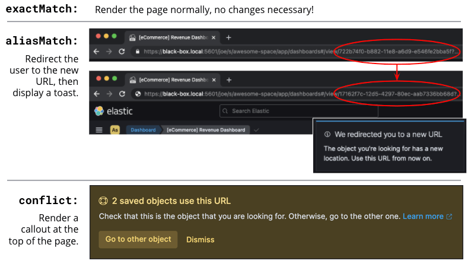
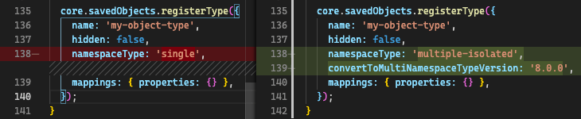
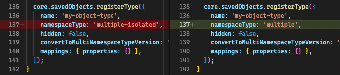
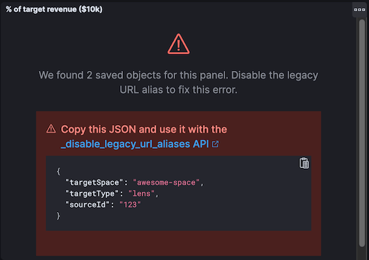

# Share across spaces [sharing-saved-objects]

This guide describes the "Sharing saved objects" effort, and the breaking changes that plugin developers need to be aware of for the planned 8.0 release of {{kib}}. It also describes how developers can take advantage of this feature.

From 8.7.0, as a step towards *zero downtime upgrades*, plugins are no longer allowed to update existing single space saved object types to become shareable. Note that new saved object types can still be defined as `'multiple'` or `'multiple-isolated'`.

## Overview [sharing-saved-objects-overview]

[Saved objects](/extend/saved-objects.md) (hereinafter "objects") are used to store all sorts of things in {{kib}}, from Dashboards to Index Patterns to Machine Learning Jobs. The effort to make objects shareable can be summarized in a single picture:


Each plugin can register different object types to be used in {{kib}}. Historically, objects could be *isolated* (existing in a single [space](docs-content://deploy-manage/manage-spaces.md)) or *global* (existing in all spaces), there was no in-between. As of the 7.12 release, {{kib}} now supports two additional types of objects:

|  | **Where it exists** | **Object IDs** | **Registered as:** |
| --- | --- | --- | --- |
| Global | All spaces | Globally unique | `namespaceType: 'agnostic'` |
| Isolated | 1 space | Unique in each space | `namespaceType: 'single'` |
| (NEW) Share-capable | 1 space | Globally unique | `namespaceType: 'multiple-isolated'` |
| (NEW) Shareable | 1 or more spaces | Globally unique | `namespaceType: 'multiple'` |

Ideally, most types of objects in {{kib}} will eventually be *shareable*; however, we have also introduced [*share-capable* objects](#sharing-saved-objects-faq-share-capable-vs-shareable) as a stepping stone for plugin developers to fully support this feature.

Implementing a shareable saved object type is done in two phases:

* **Phase 1**: Convert an existing isolated object type into a share-capable one. Keep reading!
* **Phase 2**: Switch an existing share-capable object type into a shareable one, *or* create a new shareable saved object type. Jump to the [Phase 2 developer flowchart](#sharing-saved-objects-phase-2)!


## Breaking changes [sharing-saved-objects-breaking-changes]

To implement this feature, we had to make a key change to how objects are serialized into raw {{es}} documents. As a result, [some existing object IDs need to be changed](#sharing-saved-objects-faq-changing-object-ids), and this will cause some breaking changes to the way that consumers (plugin developers) interact with objects. We have implemented mitigations so that **these changes will not affect end-users *if* consumers implement the required steps below.**

Existing, isolated object types will need to go through a special *conversion process* to become share-capable upon upgrading {{kib}} to version 8.0. Once objects are converted, they can easily be switched to become fully shareable in any future release. This conversion will change the IDs of any existing objects that are not in the Default space. Changing object IDs itself has several knock-on effects:

* Nonstandard links to other objects can break - *mitigated by [Step 1](#sharing-saved-objects-step-1)*
* "Deep link" pages (URLs) to objects can break - *mitigated by [Step 2](#sharing-saved-objects-step-2) and [Step 3](#sharing-saved-objects-step-3)*
* Encrypted objects may not be able to be decrypted - *mitigated by [Step 5](#sharing-saved-objects-step-5)*

**To be perfectly clear: these effects will all be mitigated *if and only if* you follow the steps below!**

::::{tip}
External plugins can also convert their objects, but [they don't have to do so before the 8.0 release](#sharing-saved-objects-faq-external-plugins).
::::


## Phase 1 developer flowchart [sharing-saved-objects-phase-1]

If you're still reading this page, you're probably developing a {{kib}} plugin that registers an object type, and you want to know what steps you need to take to prepare for the 8.0 release and mitigate any breaking changes! Depending on how you are using saved objects, you may need to take up to 5 steps, which are detailed in separate sections below. Refer to this flowchart:


::::{tip}
There is a proof-of-concept (POC) pull request to demonstrate these changes. It first adds a simple test plugin that allows users to create and view notes. Then, it goes through the steps of the flowchart to convert the isolated "note" objects to become share-capable. As you read this guide, you can [follow along in the POC](https://github.com/elastic/kibana/pull/107256) to see exactly how to take these steps.
::::


### Question 1 [sharing-saved-objects-q1]

% [TBC: QUOTE]
If your objects store *any* links to other objects (with an object type/ID), you need to take specific steps to ensure that these links continue functioning after the 8.0 upgrade.


### Step 1 [sharing-saved-objects-step-1]

⚠️ This step **must** be completed no later than the 7.16 release. ⚠️

% [TBC: QUOTE]
If you answered "Yes" to [Question 1](#sharing-saved-objects-q1), you need to make sure that your object links are *only* stored in the root-level `references` field. When a given object's ID is changed, this field will be updated accordingly for other objects.

The image below shows two different examples of object links from a "case" object to an "action" object. The top shows the incorrect way to link to another object, and the bottom shows the correct way.


If your objects *do not* use the root-level `references` field, you'll need to [add a migration](/extend/saved-objects/update.md) *before the 8.0 release* to fix that. Here's a migration function for the example above:

```ts
function migrateCaseToV716(
  doc: SavedObjectUnsanitizedDoc<{ connector: { type: string; id: string } }>
): SavedObjectSanitizedDoc<unknown> {
  const {
    connector: { type: connectorType, id: connectorId, ...otherConnectorAttrs },
  } = doc.attributes;
  const { references = [] } = doc;
  return {
    ...doc,
    attributes: {
      ...doc.attributes,
      connector: otherConnectorAttrs,
    },
    references: [...references, { type: connectorType, id: connectorId, name: 'connector' }],
  };
}

...

// Use this migration function where the "case" object type is registered
migrations: {
  '7.16.0': migrateCaseToV716,
},
```

::::{note}
Reminder, don't forget to add unit tests and integration tests!
::::


### Question 2 [sharing-saved-objects-q2]

% [TBC: QUOTE]
A deep link is a URL to a page that shows a specific object. End-users may bookmark these URLs or schedule reports with them, so it is critical to ensure that these URLs continue working. The image below shows an example of a deep link to a Canvas workpad object:


Note that some URLs may contain [deep links to multiple objects](#sharing-saved-objects-faq-multiple-deep-link-objects), for example, a Dashboard *and* a filter for an Index Pattern.


### Step 2 [sharing-saved-objects-step-2]

⚠️ This step will preferably be completed in the 7.16 release; it **must** be completed no later than the 8.0 release. ⚠️

% [TBC: QUOTE]
If you answered "Yes" to [Question 2](#sharing-saved-objects-q2), you need to make sure that when you use the SavedObjectsClient to fetch an object using its ID, you use a different API to do so. The existing `get()` function will only find an object using its current ID. To make sure your existing deep link URLs don't break, you should use the new `resolve()` function; [this attempts to find an object using its old ID *and* its current ID](#sharing-saved-objects-faq-legacy-url-alias).

In a nutshell, if your deep link page had something like this before:

```ts
const savedObject = savedObjectsClient.get(objType, objId);
```

You'll need to change it to this:

```ts
const resolveResult = savedObjectsClient.resolve(objType, objId);
const savedObject = resolveResult.saved_object;
```

::::{tip}
See an example of this in [step 2 of the POC](https://github.com/elastic/kibana/pull/107256#user-content-example-steps)!
::::


The [SavedObjectsResolveResponse interface](https://github.com/elastic/kibana/blob/master/src/core/packages/saved-objects/api-server/src/apis/resolve.ts) has four fields, summarized below:

* `saved_object` - The saved object that was found.
* `outcome` - One of the following values: `'exactMatch' | 'aliasMatch' | 'conflict'`
* `alias_target_id` - This is defined if the outcome is `'aliasMatch'` or `'conflict'`. It means that a legacy URL alias with this ID points to an object with a *different* ID.
* `alias_purpose` - This is defined if the outcome is `'aliasMatch'` or `'conflict'`. It describes why the legacy URL alis was created.

The SavedObjectsClient is available both on the server-side and the client-side. You may be fetching the object on the server-side via a custom HTTP route, or you may be fetching it on the client-side directly. Either way, the `outcome` and `alias_target_id` fields need to be passed to your client-side code, and you should update your UI accordingly in the next step.

::::{note}
You don't need to use `resolve()` everywhere, [you should only use it for deep links](#sharing-saved-objects-faq-resolve-instead-of-get)!
::::


### Step 3 [sharing-saved-objects-step-3]

⚠️ This step will preferably be completed in the 7.16 release; it **must** be completed no later than the 8.0 release. ⚠️

% [TBC: QUOTE]
The Spaces plugin API exposes React components and functions that you should use to render your UI in a consistent manner for end-users. Your UI will need to use the Core HTTP service and the Spaces plugin API to do this.

Your page should change [according to the outcome](#sharing-saved-objects-faq-resolve-outcomes):



::::{tip}
See an example of this in [step 3 of the POC](https://github.com/elastic/kibana/pull/107256#user-content-example-steps)!
::::


1. Update your plugin's `kibana.json` to add a dependency on the Spaces plugin:

    ```ts
    ...
    "optionalPlugins": ["spaces"]
    ```

2. Update your plugin's `tsconfig.json` to add a dependency to the Space's plugin's type definitions:

    ```ts
    ...
    "references": [
      ...
      { "path": "../spaces/tsconfig.json" },
    ]
    ```

3. Update your Plugin class implementation to depend on the Spaces plugin API:

    ```ts
    interface PluginStartDeps {
      spaces?: SpacesPluginStart;
    }

    export class MyPlugin implements Plugin<{}, {}, {}, PluginStartDeps> {
      public setup(core: CoreSetup<PluginStartDeps>) {
        core.application.register({
          ...
          async mount(appMountParams: AppMountParameters) {
            const [, pluginStartDeps] = await core.getStartServices();
            const { spaces: spacesApi } = pluginStartDeps;
            ...
            // pass `spacesApi` to your app when you render it
          },
        });
        ...
      }
    }
    ```

4. In your deep link page, add a check for the `'aliasMatch'` outcome:

    ```ts
    if (spacesApi && resolveResult.outcome === 'aliasMatch') {
      // We found this object by a legacy URL alias from its old ID; redirect the user to the page with its new ID, preserving any URL hash
      const newObjectId = resolveResult.alias_target_id!;
      // This is always defined if outcome === 'aliasMatch'
      const newPath = `/this/page/${newObjectId}${window.location.hash}`;
      // Use the *local* path within this app (do not include the "/app/appId" prefix)
      await spacesApi.ui.redirectLegacyUrl({
        path: newPath,
        aliasPurpose: resolveResult.alias_purpose, <1>
        objectNoun: OBJECT_NOUN <2>
      });
      return;
    }
    ```

    1. The `aliasPurpose` field is required as of 8.2, because the API response now includes the reason the alias was created to inform the client whether a toast should be shown or not.
    2. The `objectNoun` field is optional. It just changes "object" in the toast to whatever you specify; you may want the toast to say "dashboard" or "data view" instead.

5. And finally, in your deep link page, add a function that will create a callout in the case of a `'conflict'` outcome:

    ```tsx
    const getLegacyUrlConflictCallout = () => {
      // This function returns a callout component *if* we have encountered a "legacy URL conflict" scenario
      if (spacesApi && resolveResult.outcome === 'conflict') {
        // We have resolved to one object, but another object has a legacy URL alias associated with this ID/page. We should display a
        // callout with a warning for the user, and provide a way for them to navigate to the other object.
        const currentObjectId = savedObject.id;
        const otherObjectId = resolveResult.alias_target_id!; // This is always defined if outcome === 'conflict'
        const otherObjectPath = `/this/page/${otherObjectId}${window.location.hash}`; // Use the *local* path within this app (do not include the "/app/appId" prefix)
        return (
          <>
            {spacesApi.ui.components.getLegacyUrlConflict({
              objectNoun: OBJECT_NOUN,
              currentObjectId,
              otherObjectId,
              otherObjectPath,
            })}
            <EuiSpacer />
          </>
        );
      }
      return null;
    };
    ...
    return (
      <EuiPage>
        <EuiPageBody>
          <EuiPageSection>
            {/* If we have a legacy URL conflict callout to display, show it at the top of the page */}
            {getLegacyUrlConflictCallout()}
            <EuiPageHeader>
    ...
    );
    ```

6. [Generate staging data and test your page's behavior with the different outcomes.](https://github.com/elastic/kibana/pull/107099#issuecomment-891147792)

::::{note}
Reminder, don't forget to add unit tests and functional tests!
::::


### Step 4 [sharing-saved-objects-step-4]

⚠️ This step **must** be completed in the 8.0 release (no earlier and no later). ⚠️

% [TBC: QUOTE]
After [Step 3](#sharing-saved-objects-step-3) is complete, you can add the code to convert your objects.

::::{warning}
The previous steps can be backported to the 7.x branch, but this step, the conversion itself, can only take place in 8.0! You should use a separate pull request for this.
::::


When you register your object, you need to change the `namespaceType` and also add a `convertToMultiNamespaceTypeVersion` field. This special field will trigger the actual conversion that will take place during the Core migration upgrade process when a user installs the Kibana 8.0 release:



::::{tip}
See an example of this in [step 4 of the POC](https://github.com/elastic/kibana/pull/107256#user-content-example-steps)!
::::


::::{note}
Reminder, don't forget to add integration tests!
::::


### Question 3 [sharing-saved-objects-q3]

% [TBC: QUOTE]
Saved objects can optionally be [encrypted](docs-content://deploy-manage/security/secure-saved-objects.md) by using the Encrypted Saved Objects plugin. Very few object types are encrypted, so most plugin developers will not be affected.


### Step 5 [sharing-saved-objects-step-5]

⚠️ This step **must** be completed in the 8.0 release (no earlier and no later). ⚠️

% [TBC: QUOTE]
If you answered "Yes" to [Question 3](#sharing-saved-objects-q3), you need to take additional steps to make sure that your objects can still be decrypted after the conversion process. Encrypted saved objects use some fields as part of "additionally authenticated data" (AAD) to defend against different types of cryptographic attacks. The object ID is part of this AAD, and so it follows that the after the object's ID is changed, the object will not be able to be decrypted with the standard process.

To mitigate this, you need to add a "no-op" ESO migration that will be applied immediately after the object is converted during the 8.0 upgrade process. This will decrypt the object using its old ID and then re-encrypt it using its new ID:


::::{note}
Reminder, don't forget to add unit tests and integration tests!
::::


## Phase 2 developer flowchart [sharing-saved-objects-phase-2]

This section covers switching a share-capable object type into a shareable one *or* creating a new shareable saved object type. Refer to this flowchart:


### Step 6 [sharing-saved-objects-step-6]

% [TBC: QUOTE]
When you register your object, you need to set the proper `namespaceType`. If you have an existing object type that is "share-capable", you can simply change it:




### Step 7 [sharing-saved-objects-step-7]

% [TBC: QUOTE]
If an object is shared to multiple spaces, it cannot be deleted without using the [`force` delete option](https://github.com/elastic/kibana/blob/master/src/core/packages/saved-objects/api-server/src/apis/delete.ts). You should always be aware when a saved object exists in multiple spaces, and you should warn users in that case.

If your UI allows users to delete your objects, you can define a warning message like this:

```tsx
const { namespaces, id } = savedObject;
const warningMessage =
  namespaces.length > 1 || namespaces.includes('*') ? (
    <FormattedMessage
      id="myPlugin.deleteObjectWarning"
      defaultMessage="When you delete this object, you remove it from every space it is shared in. You can't undo this action."
    />
  ) : null;
```

The [Data Views page](docs-content://explore-analyze/find-and-organize/data-views.md) in [Stack Management](docs-content://deploy-manage/index.md) uses a [similar approach](https://github.com/elastic/kibana/blob/master/src/platform/plugins/shared/data_view_management/public/components/edit_index_pattern/edit_index_pattern.tsx) to show a warning in its delete confirmation modal:


### Step 8 [sharing-saved-objects-step-8]

% [TBC: QUOTE]
Users will need a way to view what spaces your objects are currently assigned to and share them to additional spaces. You can accomplish this in two ways, and many consumers will want to implement both:

1. (Highly recommended) Add reusable components to your application, making it "space-aware". The space-related components are exported by the spaces plugin, and you can use them in your own application.

    First, make sure your page contents are wrapped in a [spaces context provider](https://github.com/elastic/kibana/blob/master/x-pack/platform/plugins/shared/spaces/public/spaces_context/types.ts):

    ```tsx
    const ContextWrapper = useMemo(
      () =>
        spacesApi ? spacesApi.ui.components.getSpacesContextProvider : getEmptyFunctionComponent,
      [spacesApi]
    );

    ...

    return (
      <ContextWrapper feature='my-feature-id'>
        <!-- your page contents here -->
      </ContextWrapper>
    );
    ```

    Second, display a [list of spaces](https://github.com/elastic/kibana/blob/master/x-pack/platform/plugins/shared/spaces/public/space_list/types.ts) for an object, and third, show a [flyout](https://github.com/elastic/kibana/blob/master/x-pack/platform/plugins/shared/spaces/public/share_saved_objects_to_space/types.ts) for the user to edit the object's assigned spaces. You may want to follow the example of the [Data Views page](docs-content://explore-analyze/find-and-organize/data-views.md) and [combine these into a single component](https://github.com/elastic/kibana/blob/master/src/platform/plugins/shared/data_view_management/public/components/index_pattern_table/spaces_list.tsx) so that the space list can be clicked to show the flyout:

    ```tsx
    const [showFlyout, setShowFlyout] = useState(false);
    const LazySpaceList = useCallback(spacesApi.ui.components.getSpaceList, [spacesApi]);
    const LazyShareToSpaceFlyout = useCallback(spacesApi.ui.components.getShareToSpaceFlyout, [spacesApi]);

    const shareToSpaceFlyoutProps: ShareToSpaceFlyoutProps = {
      savedObjectTarget: {
        type: myObject.type,
        namespaces: myObject.namespaces,
        id: myObject.id,
        icon: 'beaker', <1>
        title: myObject.attributes.title, <2>
        noun: OBJECT_NOUN, <3>
      },
      onUpdate: () => { /* callback when the object is updated */ },
      onClose: () => setShowFlyout(false),
    };

    const canAssignSpaces = !capabilities || !!capabilities.savedObjectsManagement.shareIntoSpace;
    const clickProperties = canAssignSpaces
      ? { cursorStyle: 'pointer', listOnClick: () => setShowFlyout(true) }
      : { cursorStyle: 'not-allowed' };
    return (
      <>
        <LazySpaceList
          namespaces={spaceIds}
          displayLimit={8}
          behaviorContext="outside-space" <4>
          {...clickProperties}
        />
        {showFlyout && <LazyShareToSpaceFlyout {...shareToSpaceFlyoutProps} />}
      </>
    );
    ```

    1. The `icon` field is optional. It specifies an [EUI icon](https://elastic.github.io/eui/#/display/icons) type that will be displayed in the flyout header.
    2. The `title` field is optional. It specifies a human-readable identifier for your object that will be displayed in the flyout header.
    3. The `noun` field is optional. It just changes "object" in the flyout to whatever you specify; you may want the flyout to say "dashboard" or "data view" instead.
    4. The `behaviorContext` field is optional. It controls how the space list is displayed. When using an `"outside-space"` behavior context, the space list is rendered outside of any particular space, so the active space is included in the list. On the other hand, when using a `"within-space"` behavior context, the space list is rendered within the active space, so the active space is excluded from the list.

2. Allow users to access your objects in the [Saved Objects Management page](docs-content://explore-analyze/find-and-organize/saved-objects.md) in [Stack Management](docs-content://deploy-manage/index.md). You can do this by ensuring that your objects are marked as [importable and exportable](https://github.com/elastic/kibana/blob/master/src/core/packages/saved-objects/server/src/saved_objects_management.ts) in your [saved object type registration](/extend/saved-objects/create.md#saved-objects-type-registration):

    ```ts
    name: 'my-object-type',
    management: {
      isImportableAndExportable: true,
    },
    ...
    ```

    If you do this, then your objects will be visible in the [Saved Objects Management page](docs-content://explore-analyze/find-and-organize/saved-objects.md), where users can assign them to multiple spaces.

## Frequently asked questions (FAQ) [sharing-saved-objects-faq]

### 1. Why are there both "share-capable" and "shareable" object types? [sharing-saved-objects-faq-share-capable-vs-shareable]

We implemented the share-capable object type as an intermediate step for consumers who currently have isolated objects, but are not yet ready to support fully shareable objects. This is primarily because we want to make sure all object types are converted at the same time in the 8.0 release to minimize confusion and disruption for the end-user experience.

We realize that the conversion process and all that it entails can be a not-insignificant amount of work for some Kibana teams to prepare for by the 8.0 release. As long as an object is made share-capable, that ensures that its ID will be globally unique, so it will be trivial to make that object shareable later on when the time is right.

A developer can easily flip a switch to make a share-capable object into a shareable one, since these are both serialized the same way. However, we envision that each consumer will need to enact their own plan and make additional UI changes when making an object shareable. For example, some users may not have access to the Saved Objects Management page, but we still want those users to be able to see what space(s) their objects exist in and share them to other spaces. Each application should add the appropriate UI controls to handle this.


### 2. Why do object IDs need to be changed? [sharing-saved-objects-faq-changing-object-ids]

This is because of how isolated objects are serialized to raw Elasticsearch documents. Each raw document ID today contains its space ID (*namespace*) as a prefix. When objects are copied or imported to other spaces, they keep the same object ID, they just have a different prefix when they are serialized to Elasticsearch. This has resulted in a situation where many Kibana installations have saved objects in different spaces with the same object ID:


Once an object is converted, we need to remove this prefix. Because of limitations with our migration process, we cannot actively check if this would result in a conflict. Therefore, we decided to pre-emptively regenerate the object ID for every object in a non-Default space to ensure that every object ID becomes globally unique:


### 3. What if one page has deep links to multiple objects? [sharing-saved-objects-faq-multiple-deep-link-objects]

As mentioned in [Question 2](#sharing-saved-objects-q2), some URLs may contain multiple object IDs, effectively deep linking to multiple objects. These should be handled on a case-by-case basis at the plugin owner's discretion. A good rule of thumb is:

* The "primary" object on the page should always handle the three `resolve()` outcomes as described in [Step 3](#sharing-saved-objects-step-3).
* Any "secondary" objects on the page may handle the outcomes differently. If the secondary object ID is not important (for example, it just functions as a page anchor), it may make more sense to ignore the different outcomes. If the secondary object *is* important but it is not directly represented in the UI, it may make more sense to throw a descriptive error when a `'conflict'` outcome is encountered.

    * Embeddables should use `spacesApi.ui.components.getEmbeddableLegacyUrlConflict` to render conflict errors:

        

        Viewing details shows the user how to disable the alias and fix the problem using the [_disable_legacy_url_aliases API](https://www.elastic.co/docs/api/doc/kibana/v8/group/endpoint-spaces):

        

    * If the secondary object is resolved by an external service (such as the index pattern service), the service should simply make the full outcome available to consumers.


Ideally, if a secondary object on a deep link page resolves to an `'aliasMatch'` outcome, the consumer should redirect the user to a URL with the new ID and display a toast message. The reason for this is that we don't want users relying on legacy URL aliases more often than necessary. However, such handling of secondary objects is not considered critical for the 8.0 release.


### 4. What is a "legacy URL alias"? [sharing-saved-objects-faq-legacy-url-alias]

As depicted above, when an object is converted to become share-capable, if it exists in a non-Default space, its ID gets changed. To preserve its old ID, we also create a special object called a [*legacy URL alias*](/extend/legacy-url-aliases.md) ("alias" for short); this alias retains the target object's old ID (*sourceId*), and it contains a pointer to the target object's new ID (*targetId*).

Aliases are meant to be mostly invisible to end-users by design. There is no UI to manage them directly. Our vision is that aliases will be used as a stop-gap to help us through the 8.0 upgrade process, but we will nudge users away from relying on aliases so we can eventually deprecate and remove them.


### 5. Why are there three different resolve outcomes? [sharing-saved-objects-faq-resolve-outcomes]

The `resolve()` function checks both if an object with the given ID exists, *and* if an object has an alias with the given ID.

1. If only the former is true, the outcome is an `'exactMatch'`, we found the exact object we were looking for.
2. If only the latter is true, the outcome is an `'aliasMatch'`, we found an alias with this ID, that pointed us to an object with a different ID.
3. Finally, if *both conditions* are true, the outcome is a `'conflict'`, we found two objects using this ID. Instead of returning an error in this situation, in the interest of usability, we decided to return the *most correct match*, which is the exact match. By informing the consumer that this is a conflict, the consumer can render an appropriate UI to the end-user explaining that this might not be the object they are actually looking for.

**Outcome 1**

When you resolve an object with its current ID, the outcome is an `'exactMatch'`:


This can happen in the Default space *and* in non-Default spaces.

**Outcome 2**

When you resolve an object with its old ID (the ID of its alias), the outcome is an `'aliasMatch'`:


This outcome can only happen in non-Default spaces.

**Outcome 3**

The third outcome is an edge case that is a combination of the others. If you resolve an object ID and two objects are found, one as an exact match and the other as an alias match, then the outcome is a `'conflict'`:


We actually have controls in place to prevent this scenario from happening when you share, import, or copy objects. However, this scenario *could* still happen in a few different situations, if objects are created a certain way or if a user tampers with an object's raw ES document. Since we can't 100% rule out this scenario, we must handle it gracefully, but we do expect this will be a rare occurrence.

It is important to note that when a `'conflict'` occurs, the object that is returned is the "most correct" match, the one with the ID that exactly matches.


### 6. Should I always use resolve instead of get? [sharing-saved-objects-faq-resolve-instead-of-get]

Reading through this guide, you may think it is safer or better to use `resolve()` everywhere instead of `get()`. Actually, we made an explicit design decision to add a separate `resolve()` function because we want to limit the affects of and reliance upon legacy URL aliases. To that end, we collect anonymous usage data based on how many times `resolve()` is used and the different outcomes are encountered. That usage data is less useful is `resolve()` is used more often than necessary.

Ultimately, `resolve()` should *only* be used for data flows that involve a user-controlled deep link to an object. There is no reason to change any other data flows to use `resolve()`.


### 7. What about external plugins? [sharing-saved-objects-faq-external-plugins]

External plugins (those not shipped with {{kib}}) can use this guide to convert any isolated objects to become share-capable or fully shareable! If you are an external plugin developer, the steps are the same, but you don't need to worry about getting anything done before a specific release. The only thing you need to know is that your plugin cannot convert your objects until the 8.0 release.


### 8. How will users be impacted? [_8_how_will_users_be_impacted]

Refer to [Saved Object IDs](docs-content://explore-analyze/find-and-organize/saved-objects.md) documentation for more details how users should expect to be impacted.
