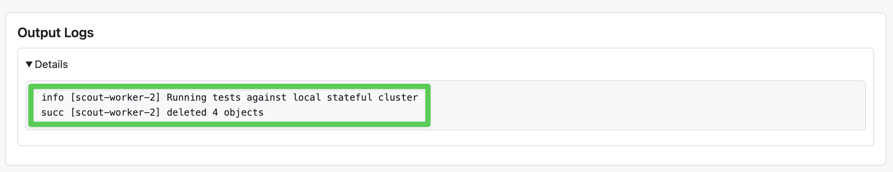

# Logging in Scout tests [scout-logging]

This page explains how logging works in Scout: the `log` [fixture](./fixtures.md) used inside tests, and how to inspect logs from the systems under test (Kibana, Elasticsearch, and the browser).

::::{note}
**Inspecting serverless MKI project logs**: see the Elasticians-only internal [Troubleshoot Cloud test failures](https://codex.elastic.dev/r/kibana-team/testing/elastic-cloud-testing/troubleshoot-cloud-test-failures) guide.
::::

## The `log` fixture [scout-logging-fixture]

`log` is a [fixture](./fixtures.md) available in every Scout test, for logging from the **test process itself** — separate from the server-side logs of the systems under test (Kibana, Elasticsearch, and so on), covered later on this page.

Standard levels are available: `error`, `warning`, `success`, `info`, `debug`, and `verbose`. Prefer `debug` for ad hoc diagnostic logging in your test — avoid adding `info`-level logs too liberally, since `info` is the default level and prints on every run.

Use it inside a test or fixture like any other fixture:

```ts
test('does the thing', async ({ log }) => {
  log.debug('detailed state: %o', someState);
});
```

You'll see this output in your local console, in the Buildkite job log for CI runs, and in the Scout HTML report (attached to each test, under **Output Logs**):



Scout's own services and fixtures log their setup at the `debug` level (for example, `[serviceName] loaded`), so if you want to see fixture wiring and lifecycle messages, run with `debug` (see below).

Under the hood, `log` is backed by `ScoutLogger`, a thin wrapper around `@kbn/tooling-log`'s `ToolingLog`. Each worker gets its own logger instance tagged with a context string, and messages are written to stdout.

## Controlling verbosity: `SCOUT_LOG_LEVEL` [scout-logging-level]

The log level is resolved in this order:

1. An explicit `logLevel` passed when constructing the logger (rarely done outside Scout internals)
2. The `SCOUT_LOG_LEVEL` environment variable
3. The `LOG_LEVEL` environment variable
4. The default level, `info`

The value is case-insensitive. The recognized values are `silent`, `info`, `debug`, and `verbose`; other `ToolingLog` levels such as `error`, `warning`, and `success` are not recognized here and fall back to the default `info`. Note that `quiet` is normalized to `error` internally, but because `error` itself is not recognized, `SCOUT_LOG_LEVEL=quiet` also currently falls back to `info` rather than restricting output to errors.

**Default locally and in CI**: `info`. There is no CI-specific override — Buildkite pipelines don't set `SCOUT_LOG_LEVEL`, so CI runs use the same `info` default as a local run unless you set the variable yourself.

To get more verbose output (for example, fixture/service lifecycle messages), run with:

```bash
SCOUT_LOG_LEVEL=debug node scripts/scout run-tests \
  --arch stateful \
  --domain classic \
  --config <plugin-path>/test/scout/ui/playwright.config.ts
```

See also [Debug Scout test runs](./debugging.md) for other debugging tips.

### Best practices [scout-logging-best-practices]

- **Log sparingly.** When a test fails, the assertion failure (expected/received, stack trace) usually already tells you what went wrong — you don't need to log every step to diagnose it.
- **Prefer interactive debugging over log statements** when working locally. [Playwright UI mode](./debugging.md#playwright-ui-mode) or breakpoints often get you to the root cause faster than adding `log.debug` calls and re-running.

## Server logs (Kibana, Elasticsearch) [scout-logging-servers]

When Scout starts a local Kibana/Elasticsearch stack (for example via `node scripts/scout start-server`), server logs print directly to that same console by default. To capture them to files instead, pass `--logToFile`, which writes `kibana.log` and `es-cluster-<name>.log` under a generated directory in `data/ftr_servers_logs/` (yes, `ftr_servers_logs` — Scout reuses the legacy FTR server-management code and its log directory naming).

This only applies to servers Scout manages directly (local runs). It doesn't apply when running against Cloud (ECH) or MKI serverless projects — see the note at the top of this page for how to find server logs in that case.

## Browser logs [scout-logging-browser]

Scout's UI test fixtures capture browser console errors during a test run and attach them to the test's artifacts whenever any console errors were produced (regardless of whether the test passed or failed). You can find them in the Scout HTML report, alongside the rest of the test's artifacts — there's no separate console output to watch for these locally.
