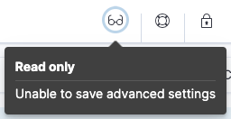

# {{product.kibana}} advanced settings [advanced-options]

**Advanced Settings** control the behavior of {{product.kibana}}. You can change the settings that apply to a specific space only, or to all of {{product.kibana}}. For example, you can change the format used to display dates, specify the default data view, and apply your own branding.

::::{warning}
Changing a setting can affect {{product.kibana}} performance and cause problems that are difficult to diagnose. Setting a property value to a blank field reverts to the default behavior, which might not be compatible with other configuration settings. Deleting a custom setting permanently removes it from {{product.kibana}}.
::::

Settings on this page are ordered as they appear in {{product.kibana}}.


## Required permissions [_required_permissions_9]

You must have the `Advanced Settings` {{product.kibana}} privilege to access the **Advanced Settings** page.

When you have insufficient privileges to edit advanced settings, the edit options are not visible, and the following indicator shows:

% TO DO: Use `:class: screenshot`


To add the privilege, go to the **Roles** management page using the navigation menu or the [global search field](docs-content://explore-analyze/find-and-organize/find-apps-and-objects.md).

For more information on granting access to {{product.kibana}}, refer to [Granting access to {{product.kibana}}](docs-content://deploy-manage/users-roles/cluster-or-deployment-auth/built-in-roles.md).


## Change the space-specific setting [kibana-settings-reference]

Change the settings that apply only to a specific {{product.kibana}} space.

1. Go to the **Advanced settings** page using the navigation menu or the [global search field](docs-content://explore-analyze/find-and-organize/find-apps-and-objects.md).
2. Click **Space Settings**.
3. Scroll or search for the setting.
4. Make your change, then click **Save changes**.


### General [kibana-general-settings]

$$$hideAnnouncements$$$`hideAnnouncements` {applies_to}`stack: ga 9.0-9.3, deprecated 9.4+` {applies_to}`serverless: unavailable`
:   Stops showing messages and tours that highlight new features. `false` by default. 
    :::{note}
    :applies_to: stack: ga 9.4+
    If this setting is set to `false` but the `hideAnnouncements` setting located in the **Global Settings** tab is set to `true`, then messages and tours that highlight new features won't show for the current space.
    :::

$$$dateformat$$$`dateFormat` {applies_to}`stack: ga` {applies_to}`serverless: unavailable`
:   The format to use for displaying [pretty formatted dates](https://momentjs.com/docs/#/displaying/format/).

$$$dateformat-tz$$$`dateFormat:tz` {applies_to}`stack: ga` {applies_to}`serverless: ga`
:   The timezone that {{product.kibana}} uses. `Browser` by default, which uses the timezone detected by the browser.

$$$dateformat-scaled$$$`dateFormat:scaled` {applies_to}`stack: ga` {applies_to}`serverless: ga`
:   The values that define the format to use to render ordered time-based data. Formatted timestamps must adapt to the interval between measurements. Keys are [ISO8601 intervals](http://en.wikipedia.org/wiki/ISO_8601#Time_intervals).

$$$dateformat-dow$$$`dateFormat:dow` {applies_to}`stack: ga` {applies_to}`serverless: ga`
:   The day that a week should start on.

$$$datenanosformat$$$`dateNanosFormat` {applies_to}`stack: ga` {applies_to}`serverless: ga`
:   The format to use for displaying [pretty formatted dates](https://momentjs.com/docs/#/displaying/format/) of [{{product.elasticsearch}} date_nanos type](elasticsearch://reference/elasticsearch/mapping-reference/date_nanos.md).

$$$theme-darkmode$$$`theme:darkMode` {applies_to}`stack: deprecated 9.0` {applies_to}`serverless: unavailable`
:   The UI theme that the {{product.kibana}} UI should use. Set to `enabled` or `disabled` to enable or disable the dark theme. Set to `system` to have the {{product.kibana}} UI theme follow the system theme. You must refresh the page to apply the setting.

$$$state-storeinsessionstorage$$$`state:storeInSessionStorage` {applies_to}`stack: preview 9.0-9.3, deprecated 9.4+` {applies_to}`serverless: unavailable`
:   {{product.kibana}} tracks UI state in the URL, which can lead to problems when there is a lot of state information, and the URL gets long. Enabling this setting stores part of the URL in your browser session to keep the URL short.

$$$savedobjects-perpage$$$`savedObjects:perPage` {applies_to}`stack: ga` {applies_to}`serverless: unavailable`
:   The number of objects to show on each page of the list of saved objects. `20` by default.

$$$savedobjects-listinglimit$$$`savedObjects:listingLimit` {applies_to}`stack: ga` {applies_to}`serverless: unavailable`
:   The number of objects to fetch for lists of saved objects. `1000` by default. Do not set above `10000`.

$$$csv-separator$$$`csv:separator` {applies_to}`stack: ga` {applies_to}`serverless: unavailable`
:   The separator for exported values. `,` by default.

$$$csv-quotevalues$$$`csv:quoteValues` {applies_to}`stack: ga` {applies_to}`serverless: ga`
:   Quotes exported values in CSV exports when activated. `true` by default.

$$$shortdots-enable$$$`shortDots:enable` {applies_to}`stack: ga` {applies_to}`serverless: unavailable`
:   Shortens long field names in visualizations. For example, shows `f.b.baz` instead of `foo.bar.baz`. `false` by default.

$$$format-defaulttypemap$$$`format:defaultTypeMap` {applies_to}`stack: ga` {applies_to}`serverless: unavailable`
:   A map of the default format name for each field type. Field types that are not explicitly mentioned use "_default_".

$$$format-number-defaultpattern$$$`format:number:defaultPattern` {applies_to}`stack: ga` {applies_to}`serverless: ga`
:   The [numeral pattern](docs-content://explore-analyze/numeral-formatting.md) for the "number" format. `0,0.[000]` by default.

$$$format-percent-defaultpattern$$$`format:percent:defaultPattern` {applies_to}`stack: ga` {applies_to}`serverless: ga`
:   The [numeral pattern](docs-content://explore-analyze/numeral-formatting.md) for the "percent" format. `0,0.[000]%` by default.

$$$format-bytes-defaultpattern$$$`format:bytes:defaultPattern` {applies_to}`stack: ga` {applies_to}`serverless: ga`
:   The default [numeral pattern](docs-content://explore-analyze/numeral-formatting.md) format for the "bytes" format. `0,0.[0]b` by default.

$$$format-currency-defaultpattern$$$`format:currency:defaultPattern` {applies_to}`stack: ga` {applies_to}`serverless: ga`
:   The default [numeral pattern](docs-content://explore-analyze/numeral-formatting.md) format for the "currency" format. `($0,0.[00])` by default.

$$$format-number-defaultlocale$$$`format:number:defaultLocale` {applies_to}`stack: ga` {applies_to}`serverless: ga`
:   The [numeral pattern](docs-content://explore-analyze/numeral-formatting.md) locale. `en` by default.

$$$data_views-fields_excluded_data_tiers$$$`data_views:fields_excluded_data_tiers` {applies_to}`stack: ga` {applies_to}`serverless: unavailable`
:   Allows the exclusion of listed data tiers when getting a field list for faster performance.

$$$data-views-cache-max-age$$$`data_views:cache_max_age` {applies_to}`stack: ga` {applies_to}`serverless: unavailable`
:   Sets how long data view fields API requests are cached in seconds. A value of 0 turns off caching. Modifying this value might not take immediate effect, users need to clear browser cache or wait until the current cache expires. To get immediate changes, try a hard reload of {{product.kibana}}. `5` by default.

$$$metafields$$$`metaFields` {applies_to}`stack: ga` {applies_to}`serverless: ga`
:   Fields that exist outside of `_source`. {{product.kibana}} merges these fields into the document when displaying it. `_source, _id, _index, _score, _ignored` by default.

$$$query-querystring-options$$$`query:queryString:options` {applies_to}`stack: ga` {applies_to}`serverless: unavailable`
:   Options for the Lucene query string parser. Only used when `search:queryLanguage` is set to **Lucene**.

$$$query-allowleadingwildcards$$$`query:allowLeadingWildcards` {applies_to}`stack: ga` {applies_to}`serverless: unavailable`
:   Allows a wildcard (*) as the first character in a query clause. To disallow leading wildcards in Lucene queries, use `query:queryString:options`. `True` by default.

$$$search-querylanguage$$$`search:queryLanguage` {applies_to}`stack: ga` {applies_to}`serverless: unavailable`
:   The query language to use in the query bar. Choices are [KQL](elasticsearch://reference/query-languages/kql.md)(default), a language built specifically for {{product.kibana}}, and the [Lucene query syntax](docs-content://explore-analyze/query-filter/languages/lucene-query-syntax.md).

$$$sort-options$$$`sort:options` {applies_to}`stack: ga` {applies_to}`serverless: unavailable`
:   Options for the {{product.elasticsearch}} [sort](elasticsearch://reference/elasticsearch/rest-apis/sort-search-results.md) parameter.

$$$defaultindex$$$`defaultIndex` {applies_to}`stack: ga` {applies_to}`serverless: ga`
:   The default data view to access if none is set in Discover and Dashboards. `null` by default.

$$$histogram-bartarget$$$`histogram:barTarget` {applies_to}`stack: ga` {applies_to}`serverless: unavailable`
:   When date histograms use the `auto` interval, {{product.kibana}} attempts to generate this number of bars. `50` by default.

$$$histogram-maxbars$$$`histogram:maxBars` {applies_to}`stack: ga` {applies_to}`serverless: unavailable`
:   Limits the density of date and number histograms across {{product.kibana}} using a test query to improve performance. When the test query contains too many buckets, the interval between buckets increases. Applies separately to each histogram aggregation, and does not apply to other types of aggregations. To find the maximum value, divide the {{product.elasticsearch}} `search.max_buckets` value by the maximum number of aggregations in each visualization. `1000` by default.

$$$history-limit$$$`history:limit` {applies_to}`stack: ga` {applies_to}`serverless: unavailable`
:   In fields that have history, such as query inputs, shows this many recent values. `10` by default.

$$$timepicker-refreshintervaldefaults$$$`timepicker:refreshIntervalDefaults` {applies_to}`stack: ga` {applies_to}`serverless: unavailable`
:   The default refresh interval for the time filter. Specify the `value` parameter in milliseconds. `{"pause": true, "value": 60000}` by default.

$$$timepicker-timedefaults$$$`timepicker:timeDefaults` {applies_to}`stack: ga` {applies_to}`serverless: ga`
:   The default selection in the time filter. Must be an object containing "from" and "to" (refer to [accepted formats](elasticsearch://reference/elasticsearch/rest-apis/common-options.md#date-math)). `{"from": "now-15m", "to": "now"}` by default.

$$$timepicker-quickranges$$$`timepicker:quickRanges` {applies_to}`stack: ga` {applies_to}`serverless: ga`
:   The list of ranges to show in the Quick section of the time filter. This must be an array of objects, with each object containing `from`, `to` (refer to [accepted formats](elasticsearch://reference/elasticsearch/rest-apis/common-options.md#date-math)), and `display` (the title to be displayed).

$$$filters-pinnedbydefault$$$`filters:pinnedByDefault` {applies_to}`stack: ga` {applies_to}`serverless: ga`
:   Makes filters have a global state and be pinned by default when activated. `false` by default.

$$$filtereditor-suggestvalues$$$`filterEditor:suggestValues` {applies_to}`stack: ga` {applies_to}`serverless: unavailable`
:   Enables the filter editor and KQL autocomplete to suggest values for fields. `true` by default.

$$$defaultroute$$$`defaultRoute` {applies_to}`stack: ga` {applies_to}`observability: ga`
:   The default route when opening {{product.kibana}}. Use this setting to route users to a specific dashboard, application, or saved object as they enter each space.

$$$fileupload-maxfilesize$$$`fileUpload:maxFileSize` {applies_to}`stack: ga` {applies_to}`serverless: unavailable`
:   Sets the file size limit when importing files. `100MB` by default. The highest supported value for this setting is `1GB`.

$$$enableESQL$$$`enableESQL` {applies_to}`stack: ga` {applies_to}`serverless: unavailable`
:   Enables {{esql}} in {{product.kibana}}. `true` by default.

    When deactivated, hides the {{esql}} user interface from various applications. However, users can still access existing {{esql}}-based Discover sessions, visualizations, and other objects.

$$$metrics-maxbuckets$$$`metrics:max_buckets` {applies_to}`stack: ga` {applies_to}`serverless: unavailable`
:   Affects the **TSVB** histogram density. Must be set higher than `histogram:maxBars`. `2000` by default.

$$$metrics:allowStringIndices$$$`metrics:allowStringIndices` {applies_to}`stack: ga` {applies_to}`serverless: unavailable`
:   Enables you to use {{es}} indices in **TSVB** visualizations. `false` by default.

$$$workflows:ui:enabled$$$`workflows:ui:enabled` {applies_to}`stack: preview 9.3` {applies_to}`serverless: preview`
:   Enables Elastic Workflows and related experiences. `false` by default.

$$$fields-popularlimit$$$`fields:popularLimit` {applies_to}`stack: ga` {applies_to}`serverless: unavailable`
:   The top N most popular fields to show. `10` by default.

$$$aiAssistant:preferredAIAssistantType$$$`aiAssistant:preferredAIAssistantType` {applies_to}`stack: ga 9.1` {applies_to}`serverless: unavailable`
:   This setting allows you to choose which AI Assistants are available to use and where. You can choose to only show the AI Assistants in their solutions, in other {{product.kibana}} applications (for example, Discover, Dashboards, and {{stack-manage-app}} pages), or nowhere.

      ::::{note}
      :applies_to: stack: ga 9.2
      Configure the `aiAssistant:preferredAIAssistantType` setting from the **GenAI Settings** page, which you can find using the Classic navigation menu or the [global search field](docs-content://explore-analyze/find-and-organize/find-apps-and-objects.md). Note that this setting is unavailable from the **GenAI Settings** page when using a [solution view](docs-content://deploy-manage/manage-spaces.md).
      ::::


### Presentation Labs [presentation-labs]

$$$labs-dashboard-defer-below-fold$$$`labs:dashboard:deferBelowFold` {applies_to}`stack: ga` {applies_to}`serverless: unavailable`
:   Enables deferred loading of dashboard panels below the fold. *Below the fold* refers to panels that are not immediately visible when you open a dashboard, but become visible as you scroll. `false` by default.

$$$labs-canvas-by-value-embeddable$$$`labs:canvas:byValueEmbeddable` {applies_to}`stack: ga` {applies_to}`serverless: unavailable`
:   Enables support for by-value embeddables in Canvas. `true` by default.

$$$labs-dashboard-enable-ui$$$`labs:dashboard:enable_ui` {applies_to}`stack: ga` {applies_to}`serverless: unavailable`
:   Provides access to the experimental **Labs** features for **Dashboard** when activated. `false` by default.

$$$labs-canvas-enable-ui$$$`labs:canvas:enable_ui` {applies_to}`stack: ga` {applies_to}`serverless: unavailable`
:   Provides access to the experimental **Labs** features for **Canvas** when activated. `false` by default.


### Accessibility [kibana-accessibility-settings]

$$$accessibility-disableanimations$$$`accessibility:disableAnimations` {applies_to}`stack: ga` {applies_to}`serverless: ga`
:   Turns off all optional animations in the {{product.kibana}} UI. Refresh the page to apply the changes. `false` by default.


### Autocomplete [kibana-autocomplete-settings]

$$$autocomplete-valuesuggestionmethod$$$`autocomplete:valueSuggestionMethod` {applies_to}`stack: ga` {applies_to}`serverless: unavailable`
:   The method to retrieve values for KQL autocomplete suggestions. `terms_enum` by default.

    - When set to `terms_enum`, autocomplete uses the terms enum API for value suggestions. {{product.kibana}} returns results faster, but suggestions are approximate, sorted alphabetically, and can be outside the selected time range. (Note that this API is incompatible with [Document-Level-Security](docs-content://deploy-manage/users-roles/cluster-or-deployment-auth/controlling-access-at-document-field-level.md).)
    - When set to `terms_agg`, {{product.kibana}} uses a terms aggregation for value suggestions, which is slower, but suggestions include all values that optionally match your time range and are sorted by popularity.

$$$auto-complete-use-time-range$$$`autocomplete:useTimeRange` {applies_to}`stack: ga` {applies_to}`serverless: unavailable`
:   When off, autocomplete suggestions come from your data set instead of the time range. `true` by default.

### Banners [kibana-banners-settings]

::::{note}
Banners are a [subscription feature](https://www.elastic.co/subscriptions).
::::


$$$banners-placement$$$`banners:placement` {applies_to}`stack: ga` {applies_to}`serverless: ga`
:   The placement of the banner for this space. Set to `Top` to display a banner above the Elastic header. Uses the value of the `xpack.banners.placement` configuration property by default.

$$$banners-textcontent$$$`banners:textContent` {applies_to}`stack: ga` {applies_to}`serverless: ga`
:   The text to display inside the banner for this space, either plain text or Markdown. Uses the value of the `xpack.banners.textContent` configuration property by default.

$$$banners-textcolor$$$`banners:textColor` {applies_to}`stack: ga` {applies_to}`serverless: ga`
:   The color for the banner text for this space. Uses the value of the `xpack.banners.textColor` configuration property by default.

$$$banners-linkcolor$$$`banners:linkColor` {applies_to}`stack: ga 9.1` {applies_to}`serverless: unavailable`
:   The color for the banner link text for this space. Uses the value of the `xpack.banners.linkColor` configuration property by default.

$$$banners-backgroundcolor$$$`banners:backgroundColor` {applies_to}`stack: ga` {applies_to}`serverless: ga`
:   The color of the banner background for this space. Uses the value of the `xpack.banners.backgroundColor` configuration property by default.


### Discover [kibana-discover-settings]

$$$doctable-highlight$$$`doc_table:highlight` {applies_to}`stack: ga` {applies_to}`serverless: unavailable`
:   Highlights search results in **Discover** and Discover session panels on dashboards. Highlighting slows requests when working on large documents. `true` by default.

$$$defaultcolumns$$$`defaultColumns` {applies_to}`stack: ga` {applies_to}`serverless: ga`
:   The columns that appear by default on the **Discover** page. When empty, displays a summary of the document. Empty by default.

$$$discover-max-doc-fields-displayed$$$`discover:maxDocFieldsDisplayed` {applies_to}`stack: ga` {applies_to}`serverless: unavailable`
:   Specifies the maximum number of fields to show in the document column of the **Discover** table. `200` by default.

$$$discover-sample-size$$$`discover:sampleSize` {applies_to}`stack: ga` {applies_to}`serverless: unavailable`
:   Sets the maximum number of rows for the entire document table. This is the maximum number of documents fetched from {{product.elasticsearch}}. `500` by default.

$$$discover-sampleRowsPerPage$$$`discover:sampleRowsPerPage` {applies_to}`stack: ga` {applies_to}`serverless: unavailable`
:   Limits the number of rows per page in the document table. `100` by default.

$$$discover-sort-defaultorder$$$`discover:sort:defaultOrder` {applies_to}`stack: ga` {applies_to}`serverless: unavailable`
:   The default sort direction for time-based {{data-sources}}. `Descending` by default.

$$$discover-searchonpageload$$$`discover:searchOnPageLoad` {applies_to}`stack: ga` {applies_to}`serverless: unavailable`
:   Controls whether a search runs when **Discover** first loads. This setting does not have an effect when loading a saved Discover session. `true` by default.

$$$doctable-hidetimecolumn$$$`doc_table:hideTimeColumn` {applies_to}`stack: ga` {applies_to}`serverless: unavailable`
:   Hides the "Time" column in **Discover** and in all Discover session panels on dashboards. `false` by default.

$$$context-defaultsize$$$`context:defaultSize` {applies_to}`stack: ga` {applies_to}`serverless: unavailable`
:   The number of surrounding entries to display in the context view. `5` by default.

$$$context-step$$$`context:step` {applies_to}`stack: ga` {applies_to}`serverless: unavailable`
:   The number by which to increment or decrement the context size. `5` by default.

$$$context-tiebreakerfields$$$`context:tieBreakerFields` {applies_to}`stack: ga` {applies_to}`serverless: unavailable`
:   A comma-separated list of fields to use for breaking a tie between documents that have the same timestamp value. The first field that is present and sortable in the current data view is used. `_doc` by default.

$$$discover-modify-columns-on-switch$$$`discover:modifyColumnsOnSwitch` {applies_to}`stack: ga` {applies_to}`serverless: unavailable`
:   Removes columns that are not in the newly selected data view when changing {{data-sources}}. `true` by default.

$$$discover:showFieldStatistics$$$`discover:showFieldStatistics` {applies_to}`stack: beta`
:   Enables the Field statistics view. Examine details such as the minimum and maximum values of a numeric field or a map of a geo field. `true` by default.

$$$discover:showMultiFields$$$`discover:showMultiFields` {applies_to}`stack: ga` {applies_to}`serverless: unavailable`
:   Controls the display of multi-fields in the expanded document view. This option is only available when `searchFieldsFromSource` is off. `false` by default.

$$$discover-row-height-option$$$`discover:rowHeightOption` {applies_to}`stack: ga` {applies_to}`serverless: unavailable`
:   The number of lines to allow in a row. A value of -1 automatically adjusts the row height to fit the contents. A value of 0 displays the content in a single line. `3` by default.


### {{product.machine-learning}} [kibana-ml-settings]

$$$ml-anomalydetection-results-enabletimedefaults$$$`ml:anomalyDetection:results:enableTimeDefaults` {applies_to}`stack: ga` {applies_to}`observability: ga` {applies_to}`security: ga`
:   Uses the default time filter in the **Single Metric Viewer** and **Anomaly Explorer** when activated. When deactivated, shows results for the full time range. `false` by default.

$$$ml-anomalydetection-results-timedefaults$$$`ml:anomalyDetection:results:timeDefaults` {applies_to}`stack: ga` {applies_to}`observability: ga` {applies_to}`security: ga`
:   The default time filter for viewing {{anomaly-job}} results. Must contain from and to values (refer to [accepted formats](elasticsearch://reference/elasticsearch/rest-apis/common-options.md#date-math)). Ignored unless the `ml:anomalyDetection:results:enableTimeDefaults` setting is activated. `{"from": "now-15m", "to": "now"}` by default.


### Notifications [kibana-notification-settings]

$$$notifications-banner$$$`notifications:banner` {applies_to}`stack: ga` {applies_to}`serverless: ga`
:   A custom banner intended for temporary notices to all users. Supports [Markdown syntax](https://docs.github.com/en/get-started/writing-on-github/getting-started-with-writing-and-formatting-on-github/basic-writing-and-formatting-syntax).

$$$notifications-lifetime-banner$$$`notifications:lifetime:banner` {applies_to}`stack: ga` {applies_to}`serverless: ga`
:   The duration, in milliseconds, for banner notification displays. `3000000` by default.

$$$notifications-lifetime-error$$$`notifications:lifetime:error` {applies_to}`stack: ga` {applies_to}`serverless: ga`
:   The duration, in milliseconds, for error notification displays. `300000` by default.

$$$notifications-lifetime-warning$$$`notifications:lifetime:warning` {applies_to}`stack: ga` {applies_to}`serverless: ga`
:   The duration, in milliseconds, for warning notification displays. `10000` by default.

$$$notifications-lifetime-info$$$`notifications:lifetime:info` {applies_to}`stack: ga` {applies_to}`serverless: ga`
:   The duration, in milliseconds, for information notification displays. `5000` by default.


### {{observability}} [observability-advanced-settings]

$$$ai-anonymization-settings$$$`ai:anonymizationSettings` {applies_to}`stack: preview` {applies_to}`observability: preview` {applies_to}`elasticsearch: preview`
:   List of anonymization rules for AI Assistant. Includes rules for Named Entity Recognition (NER) models and regular expression patterns to identify and anonymize sensitive data.

    :::{dropdown} Default configuration
    ```json
    {
      "rules": [
        {
          "entityClass": "EMAIL",
          "type": "RegExp",
          "pattern": "([a-zA-Z0-9._%+-]+@[a-zA-Z0-9.-]+\\.[a-zA-Z]{2,})",
          "enabled": false
        },
        {
          "type": "NER",
          "modelId": "elastic__distilbert-base-uncased-finetuned-conll03-english",
          "enabled": false,
          "allowedEntityClasses": [
            "PER",
            "ORG",
            "LOC"
          ],
          "timeoutSeconds": 30
        }
      ]
    }
    ```
    :::

$$$observability-log-sources$$$`observability:logSources` {applies_to}`stack: ga` {applies_to}`observability: ga`
:   Sources to use for logs data. If the data of these indices is not logs data, you can experience degraded functionality. Changes to this setting can potentially impact the sources queried in Log Threshold rules. `logs-*-*, logs-*, filebeat-*` by default.

$$$observability-streams-enable-content-packs$$$`observability:streamsEnableContentPacks` {applies_to}`stack: preview` {applies_to}`observability: preview`
:   Enable Streams content packs. `false` by default.

$$$observability-ai-assistant-simulated-function-calling$$$`observability:aiAssistantSimulatedFunctionCalling` {applies_to}`stack: preview` {applies_to}`observability: preview` {applies_to}`elasticsearch: preview`
:   Simulated function calling does not need API support for functions or tools, but it can decrease performance. Currently always activated for connectors that do not have API support for Native function calling. `false` by default.

$$$observability-ai-assistant-search-connector-index-pattern$$$`observability:aiAssistantSearchConnectorIndexPattern` {applies_to}`stack: preview` {applies_to}`observability: ga` {applies_to}`elasticsearch: ga`
:   Index pattern used by the AI Assistant when querying search connectors indices (part of the knowledge base). Empty by default: the index for every search connector is queried.

$$$observability-new-logs-overview$$$`observability:newLogsOverview` {applies_to}`stack: preview` {applies_to}`observability: preview`
:   Enable the new logs overview experience. `true` by default.

$$$observability-enable-inspect-es-queries$$$`observability:enableInspectEsQueries` {applies_to}`stack: ga` {applies_to}`observability: ga`
:   When activated, allows you to inspect {{es}} queries in API responses. `false` by default.

$$$observability-max-suggestions$$$`observability:maxSuggestions` {applies_to}`stack: ga` {applies_to}`serverless: unavailable`
:   Maximum number of suggestions fetched in autocomplete selection boxes. `100` by default.

$$$observability-apm-enable-comparison$$$`observability:enableComparisonByDefault` {applies_to}`stack: ga` {applies_to}`observability: ga`
:   Enables the comparison feature by default in the {{product.apm}} app. `true` by default.

$$$observability-default-service-env$$$`observability:apmDefaultServiceEnvironment` {applies_to}`stack: ga` {applies_to}`observability: ga`
:   The default environment for the {{product.apm}} app. When left empty, displays data from all environments by default. Empty by default.

$$$observability-enable-progressive-loading$$$`observability:apmProgressiveLoading` {applies_to}`stack: preview 9.0, ga 9.1` {applies_to}`observability: ga`
:   Enables progressive loading of some {{product.apm}} views. Data can be requested with a lower sampling rate first, with lower accuracy but faster response times, while the unsampled data loads in the background. `Off` by default.

$$$observability-apm-optimized-sort$$$`observability:apmServiceInventoryOptimizedSorting` {applies_to}`stack: preview 9.0, removed 9.1`
:   Sort services without anomaly detection rules on the {{product.apm}} Service inventory page by service name. `false` by default.

$$$observability-apm-max-groups$$$`observability:apmServiceGroupMaxNumberOfServices` {applies_to}`stack: ga` {applies_to}`observability: ga`
:   Limit the number of services in a given service group. `500` by default.

$$$observability-apm-trace-explorer-tab$$$`observability:apmTraceExplorerTab` {applies_to}`stack: preview 9.0, removed 9.1`
:   Enable the {{product.apm}} Trace Explorer feature, that allows you to search and inspect traces with KQL or EQL. `true` by default.

$$$observability-apm-labs$$$`observability:apmLabsButton` {applies_to}`stack: removed 9.1` {applies_to}`serverless: unavailable`
:   Activates the {{product.apm}} Labs button, a quick way to enable and disable technical preview features in {{product.apm}}. `false` by default.

$$$observability-infrastructure-profiling-integration$$$`observability:enableInfrastructureProfilingIntegration` {applies_to}`stack: preview 9.0, removed 9.1`
:   Enables the Profiling view in Host details within Infrastructure. `true` by default.

$$$observability-infrastructure-asset-custom-dashboard$$$`observability:enableInfrastructureAssetCustomDashboards` {applies_to}`stack: preview 9.0`
:   Enables the option to link custom dashboards in the Asset Details view. `false` by default.

$$$observability-enable-aws-lambda-metrics$$$`observability:enableAwsLambdaMetrics` {applies_to}`stack: preview 9.0, removed 9.1`
:   Display Amazon Lambda metrics in the service metrics tab. `true` by default.

$$$apm-agent-explorer$$$`observability:apmAgentExplorerView` {applies_to}`stack: beta 9.0, removed 9.1` {applies_to}`serverless: unavailable`
:   Enable the Agent explorer view. `true` by default.

$$$observability-apm-enable-table-search-bar$$$`observability:apmEnableTableSearchBar` {applies_to}`stack: preview` {applies_to}`observability: preview`
:   Enables faster searching in {{product.apm}} tables by adding a handy search bar with live filtering. Available for the following tables: Services, Transactions, and Errors. `true` by default.

$$$observability-apm-enable-service-inventory-table-search-bar$$$`observability:apmEnableServiceInventoryTableSearchBar` {applies_to}`stack: preview` {applies_to}`observability: preview`
:   Enables faster searching in the {{product.apm}} Service inventory table by adding a handy search bar with live filtering. `true` by default.

$$$apm-aws-price$$$`observability:apmAWSLambdaPriceFactor` {applies_to}`stack: ga` {applies_to}`observability: ga`
:   Set the price per Gb-second for your AWS Lambda functions. `{"x86_64": 0.0000166667,"arm": 0.0000133334}` by default.

$$$apm-aws-request$$$`observability:apmAWSLambdaRequestCostPerMillion` {applies_to}`stack: ga` {applies_to}`observability: ga`
:   Set the AWS Lambda cost per million requests. `0.2` by default.

$$$apm-enable-service-metrics$$$`observability:apmEnableServiceMetrics` {applies_to}`stack: beta 9.0, removed 9.1` {applies_to}`serverless: unavailable`
:   Enable the usage of service transaction metrics, which are low cardinality metrics that can be used by certain views like the service inventory for faster loading times. `true` by default.

$$$apm-continuous-rollups$$$`observability:apmEnableContinuousRollups` {applies_to}`stack: beta 9.0, removed 9.1` {applies_to}`serverless: unavailable`
:   When continuous rollups is activated, the UI selects metrics with the appropriate resolution. On larger time ranges, lower resolution metrics are used, which improves loading times. `true` by default.

$$$observability-apm-critical-path$$$`observability:apmEnableCriticalPath` {applies_to}`stack: removed 9.1` {applies_to}`serverless: unavailable`
:   When activated, displays the critical path of a trace. `false` by default.

$$$observability-synthetics-throttling-enabled$$$`observability:syntheticsThrottlingEnabled` {applies_to}`stack: preview` {applies_to}`serverless: unavailable`
:   Enable the throttling setting in Synthetics monitor configurations. Throttling might still not be available for your monitors even if the setting is active. `false` by default.

    :::{warning}
    This setting is intended for Elastic-internal use only. [Learn more](https://github.com/elastic/synthetics/blob/main/docs/throttling.md)
    :::

$$$observability-enable-legacy-uptime-app$$$`observability:enableLegacyUptimeApp` {applies_to}`stack: ga` {applies_to}`serverless: unavailable`
:   By default, the legacy Uptime app is hidden from the interface when it doesn't have any data for more than a week. Enabling this option always shows it. `false` by default.

$$$observability-apm-enable-profiling$$$`observability:apmEnableProfilingIntegration` {applies_to}`stack: removed 9.1` {applies_to}`serverless: unavailable`
:   Enable the Universal Profiling integration in {{product.apm}}. `true` by default.

$$$observability-profiling-show-error-frames$$$`observability:profilingShowErrorFrames` {applies_to}`stack: ga` {applies_to}`serverless: unavailable`
:   Show error frames in the Universal Profiling views to indicate stack unwinding failures. `false` by default.

$$$observability-profiling-per-vcpu-watt-x86$$$`observability:profilingPervCPUWattX86` {applies_to}`stack: ga` {applies_to}`serverless: unavailable`
:   The average amortized per-core power consumption (based on 100% CPU utilization) for x86 architecture. `7` by default.

$$$observability-profiling-per-vcpu-watt-arm64$$$`observability:profilingPervCPUWattArm64` {applies_to}`stack: ga` {applies_to}`serverless: unavailable`
:   The average amortized per-core power consumption (based on 100% CPU utilization) for arm64 architecture. `2,8` by default.

$$$observability-profiling-datacenter-PUE$$$`observability:profilingDatacenterPUE` {applies_to}`stack: ga` {applies_to}`serverless: unavailable`
:   Data center power usage effectiveness (PUE) measures how efficiently a data center uses energy. `1.7` by default, the average on-premise data center PUE according to the [Uptime Institute](https://ela.st/uptimeinstitute) survey.

$$$observability-profiling-per-co2-per-kwh$$$`observability:profilingCo2PerKWH` {applies_to}`stack: ga` {applies_to}`serverless: unavailable`
:   Carbon intensity measures how clean your data center electricity is. Specifically, it measures the average amount of CO2 emitted per kilowatt-hour (kWh) of electricity consumed in a particular region. Use the [cloud carbon footprint data sheet](https://ela.st/grid-datasheet) to update this value according to your region. Defaults to US East (N. Virginia).

$$$observability-profiling-aws-cost-discount-rate$$$`observability:profilingAWSCostDiscountRate` {applies_to}`stack: ga` {applies_to}`serverless: unavailable`
:   If you're enrolled in the AWS Enterprise Discount Program (EDP), enter your discount rate to update the profiling cost calculation. Empty by default.

$$$observability-profiling-azure-cost-discount-rate$$$`observability:profilingAzureCostDiscountRate` {applies_to}`stack: ga` {applies_to}`serverless: unavailable`
:   If you have an Azure Enterprise Agreement with Microsoft, enter your discount rate to update the profiling cost calculation. Empty by default.

$$$observability-profiling-cost-per-vcpu-per-hour$$$`observability:profilingCostPervCPUPerHour` {applies_to}`stack: ga` {applies_to}`serverless: unavailable`
:   Default Hourly Cost per CPU Core for machines not on AWS or Azure. `0,0425` by default.

$$$observability-apm-enable-transaction-profiling$$$`observability:apmEnableTransactionProfiling` {applies_to}`stack: ga` {applies_to}`serverless: unavailable`
:   Enables Universal Profiling on Transaction view. `true` by default.

$$$observability-profiling-use-topNFunctions-from-stacktraces$$$`observability:profilingFetchTopNFunctionsFromStacktraces` {applies_to}`stack: removed 9.1` {applies_to}`serverless: unavailable`
:   Switch to fetch the TopN Functions from the Stacktraces API. `false` by default.

$$$observability-search-excluded-data-tiers$$$`observability:searchExcludedDataTiers` {applies_to}`stack: preview` {applies_to}`serverless: unavailable`
:   Specify the data tiers to exclude from search, such as data_cold or data_frozen. When configured, indices allocated in the selected tiers are ignored from search requests. Affected apps: {{product.apm}}, Infrastructure. Empty by default.

$$$observability-enable-diagnostic-mode$$$`observability:enableDiagnosticMode` {applies_to}`stack: preview` {applies_to}`observability: preview`
:   Enable diagnostic mode for debugging and troubleshooting capabilities. Currently available only in the Service map view. `false` by default.

$$$observability-streams-enable-significant-events$$$`observability:streamsEnableSignificantEvents` {applies_to}`stack: preview` {applies_to}`observability: preview`
:   Enable streams significant events. `false` by default.


### Reporting [kibana-reporting-settings]

$$$xpackreporting-custompdflogo$$$`xpackReporting:customPdfLogo` {applies_to}`stack: ga` {applies_to}`serverless: unavailable`
:   A custom image to use in the footer of the PDF. None by default.


### Rollup [kibana-rollups-settings]

::::{warning} - Rollups were deprecated in 8.11.0.
Rollups are deprecated and will be removed in a future version. Use [downsampling](docs-content://manage-data/data-store/data-streams/downsampling-time-series-data-stream.md) instead.
::::


$$$rollups-enableindexpatterns$$$`rollups:enableIndexPatterns` {applies_to}`stack: deprecated 8.15` {applies_to}`serverless: unavailable`
:   Enables the creation of {{data-sources}} that capture rollup indices, which in turn enables visualizations based on rollup data. Refresh the page to apply the changes.


### {{product.elasticsearch}} [kibana-search-settings]

$$$courier-ignorefilteriffieldnotinindex$$$`courier:ignoreFilterIfFieldNotInIndex` {applies_to}`stack: ga` {applies_to}`elasticsearch: ga`
:   Enhances support for dashboards containing visualizations accessing several dissimilar {{data-sources}}. When activated, filters are ignored for a visualization when the visualization's data view does not contain the filtering field. When deactivated, all filters are applied to all visualizations. `false` by default.

$$$courier-setrequestpreference$$$`courier:setRequestPreference` {applies_to}`stack: ga` {applies_to}`serverless: unavailable`
:   Sets which shards handle your search requests.

    * **Session ID** (default): Restricts operations to execute all search requests on the same shards. This has the benefit of reusing shard caches across requests.
    * **Custom**: Allows you to define your own preference. Use `courier:customRequestPreference` to customize your preference value.
    * **None**: Do not set a preference. This might provide better performance because requests can be spread across all shard copies. However, results might be inconsistent because different shards might be in different refresh states.

$$$courier-customrequestpreference$$$`courier:customRequestPreference` {applies_to}`stack: ga` {applies_to}`serverless: unavailable`
:   [Request preference](https://www.elastic.co/docs/api/doc/elasticsearch/operation/operation-search#operation-search-preference) to use when `courier:setRequestPreference` uses `custom`. `_local` by default.

$$$courier-maxconcurrentshardrequests$$$`courier:maxConcurrentShardRequests` {applies_to}`stack: ga` {applies_to}`serverless: unavailable`
:   Controls the [max_concurrent_shard_requests](https://www.elastic.co/docs/api/doc/elasticsearch/operation/operation-msearch) setting used for `_msearch` requests sent by {{product.kibana}}. Set to 0 to disable this config and use the {{product.elasticsearch}} default. `0` by default.

$$$search-includefrozen$$$`search:includeFrozen` {applies_to}`stack: deprecated 7.16` {applies_to}`serverless: unavailable`
:    Includes [frozen indices](docs-content://manage-data/lifecycle/data-tiers.md#frozen-tier) in results. Searching through frozen indices might increase the search time. `false` by default.

$$$search-timeout$$$`search:timeout` {applies_to}`stack: ga` {applies_to}`serverless: unavailable`
:   The maximum timeout, in milliseconds, for search requests. To deactivate the timeout and allow queries to run to completion, set to `0`. `600000` (10 minutes) by default.


### Security solution [kibana-siem-settings]

$$$securitysolution-refreshintervaldefaults$$$`securitySolution:refreshIntervalDefaults` {applies_to}`stack: ga` {applies_to}`security: ga`
:   The default refresh interval for the Security time filter, in milliseconds. `300000` by default.

$$$securitysolution-timedefaults$$$`securitySolution:timeDefaults` {applies_to}`stack: ga` {applies_to}`security: ga`
:   The default period of time of the Security solution time filter. `{"from": "now/d","to": "now/d"}` by default.

$$$securitysolution-defaultindex$$$`securitySolution:defaultIndex` {applies_to}`stack: ga` {applies_to}`security: ga`
:   A comma-delimited list of {{es}} indices from which the {{security-app}} collects events. `apm-*-transaction*, auditbeat-*, endgame-*, filebeat-*, logs-*, packetbeat-*, traces-apm*, winlogbeat-*, -*elastic-cloud-logs-*` by default.

$$$securitysolution-threatindices$$$`securitySolution:defaultThreatIndex` {applies_to}`stack: ga` {applies_to}`security: ga`
:   A comma-delimited list of Threat Intelligence indices from which the {{security-app}} collects indicators. `logs-ti_*` by default.

$$$securitysolution-defaultanomalyscore$$$`securitySolution:defaultAnomalyScore` {applies_to}`stack: ga` {applies_to}`security: ga`
:   The threshold above which {{ml}} job anomalies are displayed in the {{security-app}}. The value must be between `0` and `100`. `50` by default.

$$$securitysolution-enablenewsfeed$$$`securitySolution:enableNewsFeed` {applies_to}`stack: ga` {applies_to}`security: ga`
:   Enables the security news feed on the Security **Overview** page. `true` by default.

$$$security-solution-exclude-cold-frozen-tiers-analyzer$$$`securitySolution:excludeColdAndFrozenTiersInAnalyzer` {applies_to}`stack: ga` {applies_to}`serverless: unavailable`
:   Skips cold and frozen tiers in Analyzer's queries when activated. `false` by default.

$$$security-solution-enable-graph-visualization$$$`securitySolution:enableGraphVisualization` {applies_to}`stack: preview` {applies_to}`security: preview`
:   Enables the Graph Visualization feature within the Security solution. `false` by default.

$$$security-solution-enable-asset-inventory$$$`securitySolution:enableAssetInventory` {applies_to}`stack: preview` {applies_to}`security: preview`
:   Enables the Asset Inventory experience within the Security solution. When activated, you can access the Inventory feature through the Security solution navigation. `false` by default.

    :::{note}
    Disabling this setting will not disable the Entity Store or clear persistent Entity metadata. To manage or disable the Entity Store, visit the **Entity Store Management** page.
    :::

$$$security-solution-enable-cloud-connector$$$`securitySolution:enableCloudConnector` {applies_to}`stack: preview` {applies_to}`security: preview`
:   Enables the Cloud Connector experience within the Security solution. `true` by default.

$$$security-solution-rules-table-refresh$$$`securitySolution:rulesTableRefresh` {applies_to}`stack: ga` {applies_to}`security: ga`
:   Enables auto refresh on the rules and monitoring tables, in milliseconds. `{"on": true,"value": 60000}` by default.

$$$securitysolution-newsfeedurl$$$`securitySolution:newsFeedUrl` {applies_to}`stack: ga` {applies_to}`security: ga`
:   The URL to retrieve the security news feed content from. `https://feeds.elastic.co/security-solution` by default.

$$$securitysolution-ipreputationlinks$$$`securitySolution:ipReputationLinks` {applies_to}`stack: ga` {applies_to}`security: ga`
:   A JSON array containing links for verifying the reputation of an IP address. The links are displayed on [IP detail](docs-content://solutions/security/explore/network-page.md) pages.

    :::{dropdown} Default array
    ```json
    [
      { "name": "virustotal.com", "url_template": "https://www.virustotal.com/gui/search/{{ip}}" },
      { "name": "talosIntelligence.com", "url_template": "https://talosintelligence.com/reputation_center/lookup?search={{ip}}" }
    ]
    ```
    :::

$$$securitysolution-enableCcsWarning$$$`securitySolution:enableCcsWarning` {applies_to}`stack: ga` {applies_to}`serverless: unavailable`
:   Enables privilege check warnings in rules for CCS indices. `true` by default.

$$$security-solution-suppression-behavior-on-alert-closure$$$`securitySolution:suppressionBehaviorOnAlertClosure` {applies_to}`stack: ga` {applies_to}`security: ga`
:   If an alert is closed while suppression is active, you can choose whether suppression continues or resets. `Restart suppression` by default.

$$$securitySolution-showRelatedIntegrations$$$`securitySolution:showRelatedIntegrations` {applies_to}`stack: ga` {applies_to}`security: ga`
:   Shows related integrations on the rules and monitoring tables. `true` by default.

$$$security-solution-alert-tags$$$`securitySolution:alertTags` {applies_to}`stack: ga` {applies_to}`security: ga`
:   List of tag options for use with alerts generated by Security Solution rules. `Duplicate, False Positive, Further investigation required` by default.

$$$security-solution-excluded-data-tiers-for-rule-execution$$$`securitySolution:excludedDataTiersForRuleExecution` {applies_to}`stack: ga` {applies_to}`security: ga`
:   Specifies data tiers to exclude from searching during rule execution. Excludes events from the specified data tiers, which might help improve rule performance or reduce execution time. For example: `data_frozen,data_cold`. Empty by default.


$$$security-solution-enable-privileged-user-monitoring$$$`securitySolution:enablePrivilegedUserMonitoring` {applies_to}`stack: preview 9.1, removed 9.3` {applies_to}`serverless: unavailable`
:   Enables the privileged user monitoring dashboard and onboarding experience, which are in technical preview. `true` by default.

$$$security-solution-enable-esql-risk-scoring$$$`securitySolution:enableEsqlRiskScoring` {applies_to}`stack: preview 9.0, removed 9.3` {applies_to}`serverless: unavailable`
:   Enables risk scoring based on {{esql}} queries. Disabling this reverts to using scripted metrics. `true` by default.

$$$security-solution-default-ai-connector$$$`securitySolution:defaultAIConnector` {applies_to}`stack: unavailable` {applies_to}`security: ga`
:   Default AI connector for serverless AI features (Elastic AI SOC Engine). `Elastic Managed LLM` by default.

$$$security-solution-default-value-report-minutes$$$`securitySolution:defaultValueReportMinutes` {applies_to}`stack: unavailable` {applies_to}`security: ga`
:   The average review time in minutes for an analyst to review an alert. Used for calculations in the Value report. `8` by default.

$$$security-solution-default-value-report-rate$$$`securitySolution:defaultValueReportRate` {applies_to}`stack: unavailable` {applies_to}`security: ga`
:   The average hourly rate for a security analyst. Used for calculations in the Value report. `75` by default.

$$$security-solution-default-value-report-title$$$`securitySolution:defaultValueReportTitle` {applies_to}`stack: unavailable` {applies_to}`security: ga`
:   The title of the Value report. `Elastic AI value report` by default.


### Timelion [kibana-timelion-settings]

$$$timelion-estimefield$$$`timelion:es.timefield` {applies_to}`stack: ga` {applies_to}`serverless: unavailable`
:   The default field containing a timestamp when using the `.es()` query. `@timestamp` by default.

$$$timelion-esdefaultindex$$$`timelion:es.default_index` {applies_to}`stack: ga` {applies_to}`serverless: unavailable`
:   The default index when using the `.es()` query. `_all` by default.

$$$timelion-targetbuckets$$$`timelion:target_buckets` {applies_to}`stack: ga` {applies_to}`serverless: unavailable`
:   Used for calculating automatic intervals in visualizations, this is the number of buckets to try to represent. `200` by default.

$$$timelion-maxbuckets$$$`timelion:max_buckets` {applies_to}`stack: ga` {applies_to}`serverless: unavailable`
:   The maximum number of buckets a single data source can return. This value is used for calculating automatic intervals in visualizations. `2000` by default.

$$$timelion-mininterval$$$`timelion:min_interval` {applies_to}`stack: ga` {applies_to}`serverless: unavailable`
:   The smallest interval to calculate when using "auto". `1ms` by default.


### Visualization [kibana-visualization-settings]

$$$visualization-heatmap-maxbuckets$$$`visualization:heatmap:maxBuckets` {applies_to}`stack: ga` {applies_to}`serverless: unavailable`
:   The maximum number of buckets a datasource can return. High numbers can have a negative impact on your browser rendering performance. `50` by default.

$$$visualization-visualize-heatmapChartslibrary$$$`visualization:visualize:legacyHeatmapChartsLibrary` {applies_to}`stack: deprecated` {applies_to}`serverless: unavailable`
:   Enables legacy charts library for heatmap charts in visualize. `false` by default.

$$$visualization-uselegacytimeaxis$$$`visualization:useLegacyTimeAxis` {applies_to}`stack: deprecated 8.10, removed 9.1` {applies_to}`serverless: unavailable`
:   Enables the legacy time axis for charts in Lens, Discover, Visualize, and TSVB. `true` by default.

### Developer tools [developer-tools]

$$$dev-tools-enable-persistent-console$$$`devTools:enablePersistentConsole` {applies_to}`stack: ga` {applies_to}`elasticsearch: ga`
:   Enables a persistent console in the {{product.kibana}} UI. This setting does not affect the standard Console in Dev Tools. `true` by default.


## Change the global settings [kibana-global-settings-reference]
```{applies_to}
stack: ga
serverless: unavailable
```

Change the settings that apply to all of {{product.kibana}}.

1. Go to the **Advanced settings** page using the navigation menu or the [global search field](docs-content://explore-analyze/find-and-organize/find-apps-and-objects.md).
2. Click **Global Settings**.
3. Scroll or search for the setting.
4. Make your change, then click **Save changes**.

### General [kibana-general-global-settings]

$$$hideAnnouncements-global$$$`hideAnnouncements` {applies_to}`stack: ga 9.4+` {applies_to}`serverless: unavailable`
:   Stops showing messages and tours that highlight new features. `false` by default.


### Custom branding [kibana-custom-branding-settings]

::::{note}
Custom branding is a [subscription feature](https://www.elastic.co/subscriptions).
::::

$$$custom-logo$$$`xpackCustomBranding:logo` {applies_to}`stack: ga` {applies_to}`serverless: unavailable`
:   A custom image that appears in the header of all {{product.kibana}} pages. Images must have a transparent background, and 128x128 pixels or smaller.

$$$organization-name$$$`xpackCustomBranding:customizedLogo` {applies_to}`stack: ga` {applies_to}`serverless: unavailable`
:   The custom text that appears in the header of all {{product.kibana}} pages. Images must have a transparent background, and 200x84 pixels or smaller.

$$$page-title$$$`xpackCustomBranding:pageTitle` {applies_to}`stack: ga` {applies_to}`serverless: unavailable`
:   The custom text that appears on {{product.kibana}} browser tabs.

$$$favicon-svg$$$`xpackCustomBranding:faviconSVG` {applies_to}`stack: ga` {applies_to}`serverless: unavailable`
:   The URL of a custom SVG image that appears on {{product.kibana}} browser tabs. Images must be 16x16 pixels.

$$$favicon-png$$$`xpackCustomBranding:faviconPNG` {applies_to}`stack: ga` {applies_to}`serverless: unavailable`
:   The URL of a custom PNG image that appears on {{product.kibana}} browser tabs.