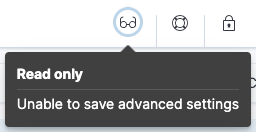

# {{product.kibana}} advanced settings [advanced-options]

**Advanced Settings** control the behavior of {{product.kibana}}. You can change the settings that apply to a specific space only, or to all of {{product.kibana}}. For example, you can change the format used to display dates, specify the default data view, and apply your own branding.

::::{warning}
Changing a setting can affect {{product.kibana}} performance and cause problems that are difficult to diagnose. Setting a property value to a blank field reverts to the default behavior, which might not be compatible with other configuration settings. Deleting a custom setting permanently removes it from {{product.kibana}}.
::::

Settings on this page are ordered as they appear in {{product.kibana}}.


## Required permissions [_required_permissions_9]

You must have the `Advanced Settings` {{product.kibana}} privilege to access the **Advanced Settings** page.

When you have insufficient privileges to edit advanced settings, the edit options are not visible, and the following indicator shows:

% TO DO: Use `:class: screenshot`


To add the privilege, go to the **Roles** management page using the navigation menu or the [global search field](docs-content://explore-analyze/find-and-organize/find-apps-and-objects.md).

For more information on granting access to {{product.kibana}}, refer to [Granting access to {{product.kibana}}](docs-content://deploy-manage/users-roles/cluster-or-deployment-auth/built-in-roles.md).


## Change the space-specific setting [kibana-settings-reference]

:::{settings} /reference/advanced-settings-space.yml
:::

## Change the global settings [kibana-global-settings-reference]
```{applies_to}
stack: ga
serverless: unavailable
```

:::{settings} /reference/advanced-settings-global.yml
:::