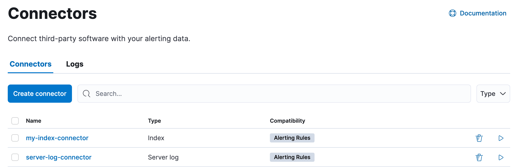
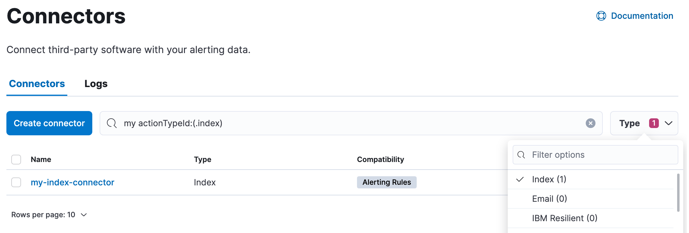
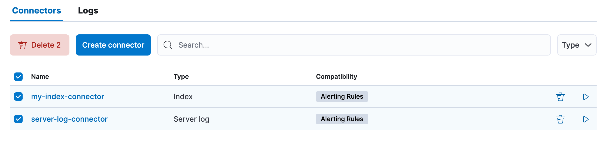
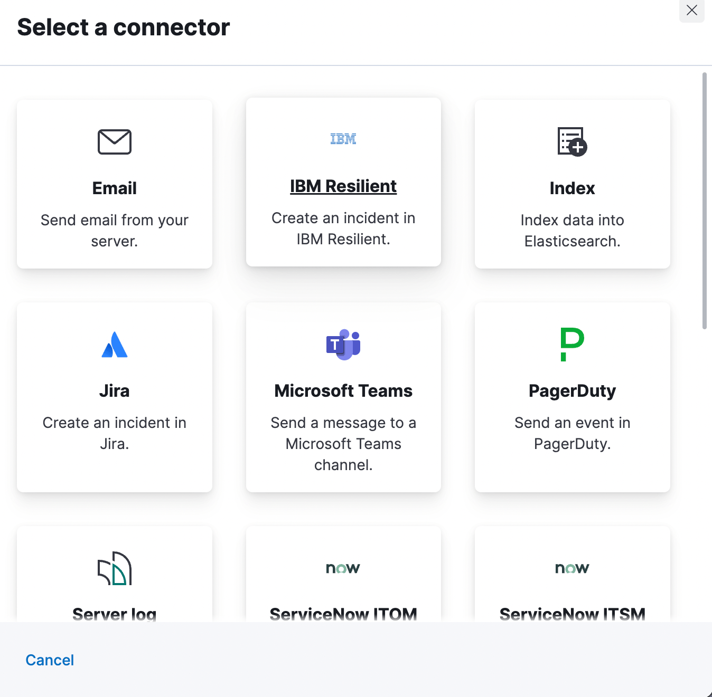
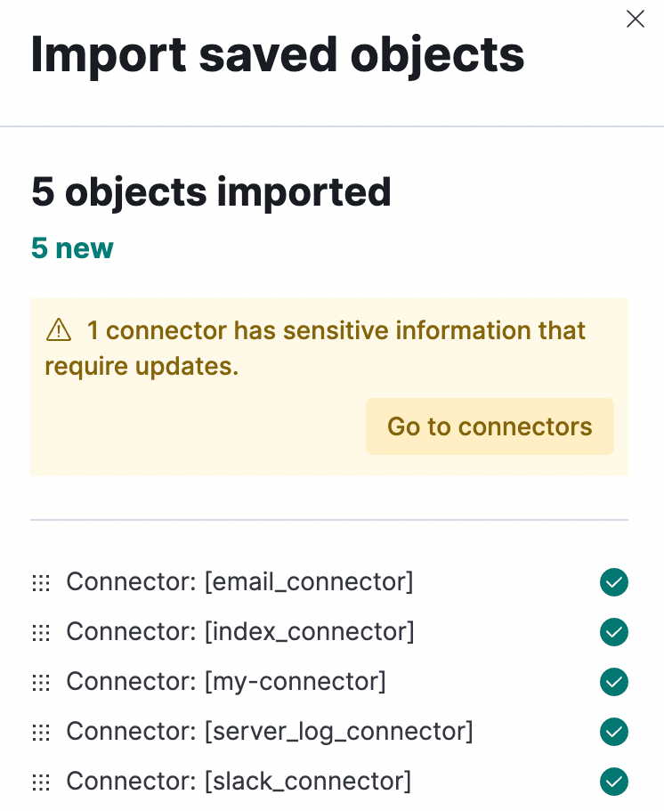
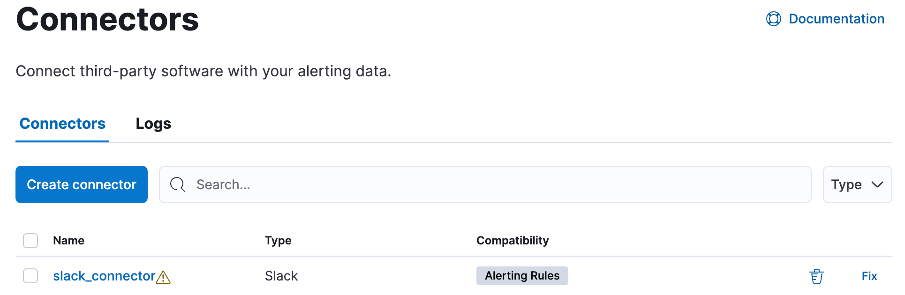

---
mapped_pages:
  - https://www.elastic.co/guide/en/kibana/current/action-types.html
navigation_title: Connectors
applies_to:
  serverless: ga
  stack: ga
---
# Kibana connectors [action-types]

Connectors provide a central place to store connection information for services and integrations with Elastic or third party systems.
Actions are instantiations of a connector that are linked to rules and run as background tasks on the {{kib}} server when rule conditions are met.
{{kib}} provides the following types of connectors:

* [{{bedrock}}](/reference/connectors-kibana/bedrock-action-type.md): Send a request to {{bedrock}}.
* [Cases](/reference/connectors-kibana/cases-action-type.md): Add alerts to cases.
* [CrowdStrike](/reference/connectors-kibana/crowdstrike-action-type.md): Send a request to CrowdStrike.
* [D3 Security](/reference/connectors-kibana/d3security-action-type.md): Send a request to D3 Security.
* [{{gemini}}](/reference/connectors-kibana/gemini-action-type.md): Send a request to {{gemini}}.
* [Elastic Managed LLM](/reference/connectors-kibana/elastic-managed-llm.md): Send a request to Elastic Managed LLM.
* [Email](/reference/connectors-kibana/email-action-type.md): Send email from your server.
* [{{ibm-r}}](/reference/connectors-kibana/resilient-action-type.md): Create an incident in {{ibm-r}}.
* [Index](/reference/connectors-kibana/index-action-type.md): Index data into Elasticsearch.
* [Jira](/reference/connectors-kibana/jira-action-type.md): Create an incident in Jira.
* [Microsoft Defender for Endpoint](/reference/connectors-kibana/defender-action-type.md): Send requests to  Microsoft Defender-enrolled hosts.
* [Microsoft Teams](/reference/connectors-kibana/teams-action-type.md): Send a message to a Microsoft Teams channel.
* [Observability AI Assistant](/reference/connectors-kibana/obs-ai-assistant-action-type.md): Add AI-driven insights and custom actions to your workflow.
* [OpenAI](/reference/connectors-kibana/openai-action-type.md): Send a request to OpenAI.
* [{{opsgenie}}](/reference/connectors-kibana/opsgenie-action-type.md): Create or close an alert in {{opsgenie}}.
* [PagerDuty](/reference/connectors-kibana/pagerduty-action-type.md): Send an event in PagerDuty.
* [SentinelOne](/reference/connectors-kibana/sentinelone-action-type.md): Send a request to SentinelOne.
* [ServerLog](/reference/connectors-kibana/server-log-action-type.md): Add a message to a Kibana log.
* [{{sn-itsm}}](/reference/connectors-kibana/servicenow-action-type.md): Create an incident in {{sn}}.
* [{{sn-sir}}](/reference/connectors-kibana/servicenow-sir-action-type.md): Create a security incident in {{sn}}.
* [{{sn-itom}}](/reference/connectors-kibana/servicenow-itom-action-type.md): Create an event in {{sn}}.
* [Slack](/reference/connectors-kibana/slack-action-type.md): Send a message to a Slack channel or user.
* [{{swimlane}}](/reference/connectors-kibana/swimlane-action-type.md): Create an incident in {{swimlane}}.
* [{{hive}}](/reference/connectors-kibana/thehive-action-type.md): Create cases and alerts in {{hive}}.
* [Tines](/reference/connectors-kibana/tines-action-type.md): Send events to a Tines Story.
* [Torq](/reference/connectors-kibana/torq-action-type.md): Trigger a Torq workflow.
* [{{webhook}}](/reference/connectors-kibana/webhook-action-type.md): Send a request to a web service.
* [{{webhook-cm}}](/reference/connectors-kibana/cases-webhook-action-type.md): Send a request to a Case Management web service.
* [xMatters](/reference/connectors-kibana/xmatters-action-type.md): Send actionable alerts to on-call xMatters resources.
* [{{xsoar}}](/reference/connectors-kibana/xsoar-action-type.md): Create an incident in Cortex {{xsoar}}.

::::{note}
Some connector types are paid commercial features, while others are free. For a comparison of the Elastic subscription levels, go to [the subscription page](https://www.elastic.co/subscriptions).

::::

## Managing connectors [connector-management]

Rules use connectors to route actions to different destinations like log files, ticketing systems, and messaging tools. While each {{kib}} app can offer their own types of rules, they typically share connectors. **{{stack-manage-app}} > {{connectors-ui}}** offers a central place to view and manage all the connectors in the current space.

% TO DO: Use `:class: screenshot`

## Required permissions [_required_permissions_2]

Access to connectors is granted based on your privileges to alerting-enabled features. For more information, go to [Security](docs-content://explore-analyze/alerts-cases/alerts/alerting-setup.md#alerting-security).

## Connector networking configuration [_connector_networking_configuration]

Use the [action configuration settings](/reference/configuration-reference/alerting-settings.md#action-settings) to customize connector networking configurations, such as proxies, certificates, or TLS settings. You can set configurations that apply to all your connectors or use `xpack.actions.customHostSettings` to set per-host configurations.

## Connector list [connectors-list]

In **{{stack-manage-app}} > {{connectors-ui}}**, you can find a list of the connectors in the current space. You can use the search bar to find specific connectors by name and type. The **Type** dropdown also enables you to filter to a subset of connector types.

% TO DO: Use `:class: screenshot`

You can delete individual connectors using the trash icon. Alternatively, select multiple connectors and delete them in bulk using the **Delete** button.

% TO DO: Use `:class: screenshot`

::::{note}
You can delete a connector even if there are still actions referencing it. When this happens the action will fail to run and errors appear in the {{kib}} logs.

::::

## Creating a new connector [creating-new-connector]

New connectors can be created with the **Create connector** button, which guides you to select the type of connector and configure its properties.

% TO DO: Use `:class: screenshot`

After you create a connector, it is available for use any time you set up an action in the current space.

For out-of-the-box and standardized connectors, refer to [preconfigured connectors](/reference/connectors-kibana/pre-configured-connectors.md).

::::{tip}
You can also manage connectors as resources with the [Elasticstack provider](https://registry.terraform.io/providers/elastic/elasticstack/latest) for Terraform. For more details, refer to the [elasticstack_kibana_action_connector](https://registry.terraform.io/providers/elastic/elasticstack/latest/docs/resources/kibana_action_connector) resource.
::::

## Importing and exporting connectors [importing-and-exporting-connectors]

To import and export connectors, use the [Saved Objects Management UI](docs-content://explore-analyze/find-and-organize/saved-objects.md).

% TO DO: Use `:class: screenshot`

If a connector is missing sensitive information after the import, a **Fix** button appears in **{{connectors-ui}}**.

% TO DO: Use `:class: screenshot`

## Monitoring connectors [monitoring-connectors]

The [Task Manager health API](docs-content://deploy-manage/monitor/kibana-task-manager-health-monitoring.md) helps you understand the performance of all tasks in your environment. However, if connectors fail to run, they will report as successful to Task Manager. The failure stats will not accurately depict the performance of connectors.

For more information on connector successes and failures, refer to the [Event log index](docs-content://explore-analyze/alerts-cases/alerts/event-log-index.md).
