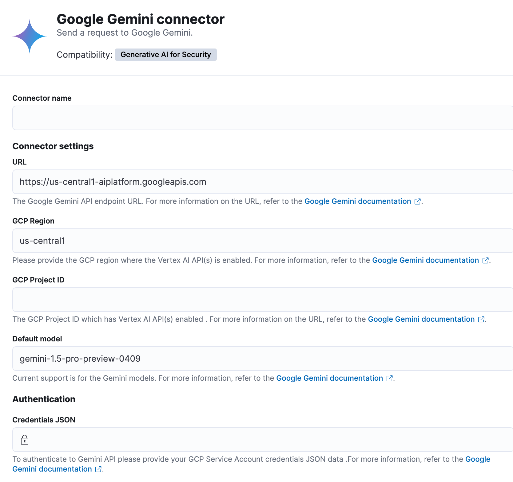
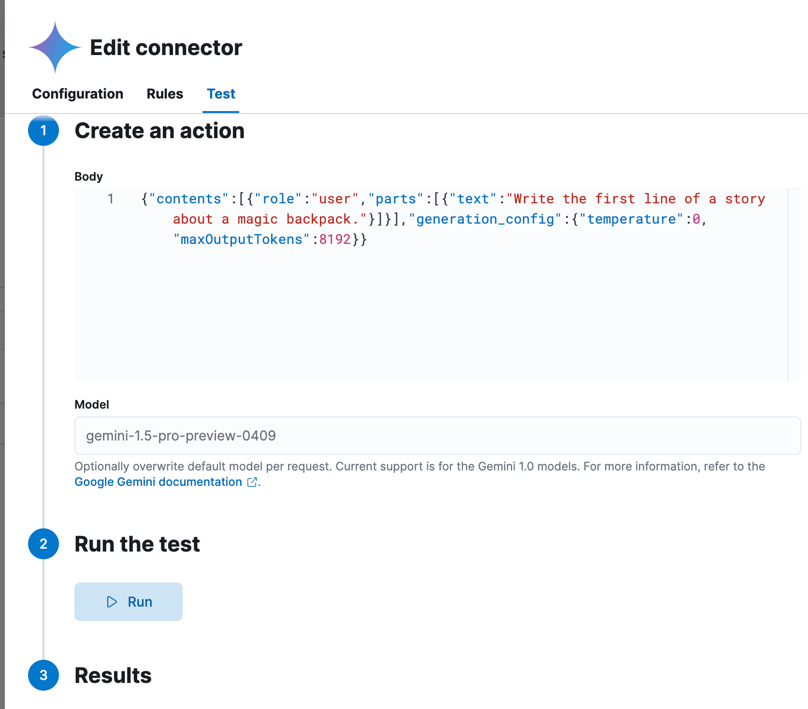

# {{gemini}} connector and action [gemini-action-type]


The {{gemini}} connector uses [axios](https://github.com/axios/axios) to send a POST request to {{gemini}}.


## Create connectors in {{kib}} [define-gemini-ui]

You can create connectors in **{{stack-manage-app}} > {{connectors-ui}}**.  For example:

% TO DO: Use `:class: screenshot`



### Connector configuration [gemini-connector-configuration]

{{gemini}} connectors have the following configuration properties:

Name
:   The name of the connector.

API URL
:   The {{gemini}} request URL.

Project ID
:   The project which has Vertex AI endpoint enabled.

Region
:   The GCP region where the Vertex AI endpoint enabled.

Default model
:   The GAI model for {{gemini}} to use. Current support is for the Google Gemini models, defaulting to gemini-1.5-pro-002. The model can be set on a per request basis by including a "model" parameter alongside the request body.

Credentials JSON
:   The GCP service account JSON file for authentication.


## Test connectors [gemini-action-configuration]

You can test connectors as you’re creating or editing the connector in {{kib}}. For example:

% TO DO: Use `:class: screenshot`


The {{gemini}} actions have the following configuration properties.

Body
:   A stringified JSON payload sent to the {{gemini}} invoke model API. For example:

    ```text
    {
      body: JSON.stringify({
            contents: [{
                role: user,
                parts: [{ text: 'Hello world!' }]
            }],
            generation_config: {
                temperature: 0,
                maxOutputTokens: 8192
            }
      })
    }
    ```


Model
:   An optional string that overwrites the connector’s default model.


## Connector networking configuration [gemini-connector-networking-configuration]

Use the [Action configuration settings](/reference/configuration-reference/alerting-settings.md#action-settings) to customize connector networking configurations, such as proxies, certificates, or TLS settings. You can set configurations that apply to all your connectors or use `xpack.actions.customHostSettings` to set per-host configurations.

