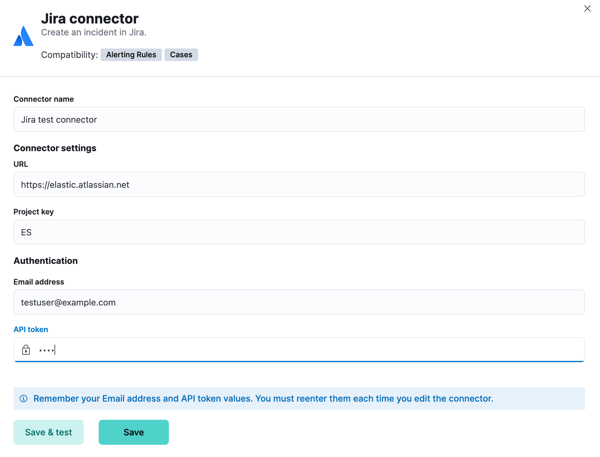
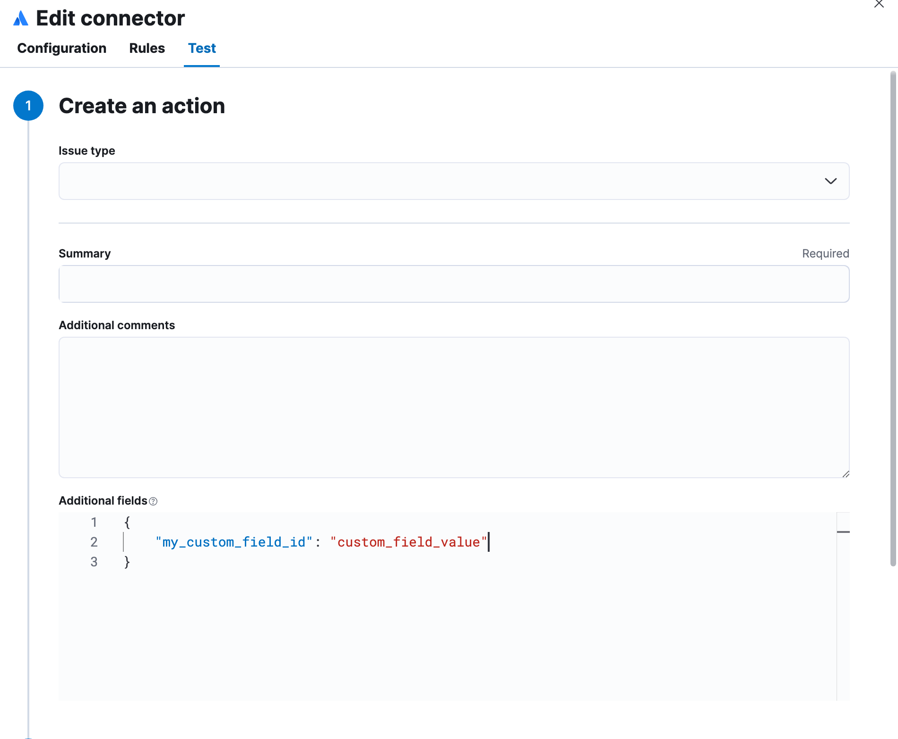

# Jira connector and action [jira-action-type]

The Jira connector uses the [REST API v2](https://developer.atlassian.com/cloud/jira/platform/rest/v2/) to create Atlassian Jira issues.

## Compatibility [jira-compatibility]

Jira Cloud and Jira Data Center are supported. Jira on-premise deployments are not supported.

## Create connectors in {{kib}} [define-jira-ui]

You can create connectors in **{{stack-manage-app}} > {{connectors-ui}}** or as needed when you’re creating a rule. For example:

% TO DO: Use `:class: screenshot`

### Connector configuration [jira-connector-configuration]

Jira connectors have the following configuration properties:

Name
:   The name of the connector.

URL
:   Jira instance URL.

Project key
:   Jira project key.

Email
:   The account email for HTTP Basic authentication.

API token
:   Jira API authentication token for HTTP Basic authentication. For Jira Data Center, this value should be the password associated with the email owner.

## Test connectors [jira-action-configuration]

You can test connectors as you’re creating or editing the connector in {{kib}}. For example:

% TO DO: Use `:class: screenshot`

Jira actions have the following configuration properties.

Issue type
:   The type of the issue.

Priority
:   The priority of the incident.

Labels
:   The labels for the incident.

Title
:   A title for the issue, used for searching the contents of the knowledge base.

Description
:   The details about the incident.

Parent
:   The ID or key of the parent issue. Only for `Subtask` issue types.

Additional comments
:   Additional information for the client, such as how to troubleshoot the issue.

Additional fields
:   An object that contains custom field identifiers and their values. These custom fields must comply with your Jira policies; they are not validated by the connector. For example, if a rule action does not include custom fields that are mandatory, the action might fail.

## Connector networking configuration [jira-connector-networking-configuration]

Use the [Action configuration settings](/reference/configuration-reference/alerting-settings.md#action-settings) to customize connector networking configurations, such as proxies, certificates, or TLS settings. You can set configurations that apply to all your connectors or use `xpack.actions.customHostSettings` to set per-host configurations.

