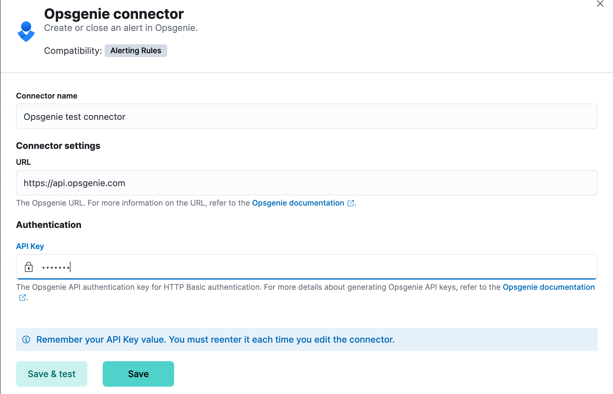
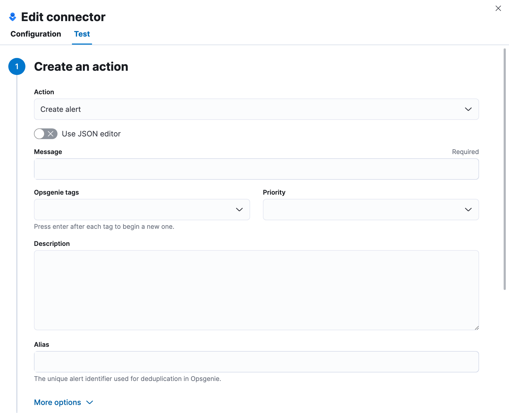
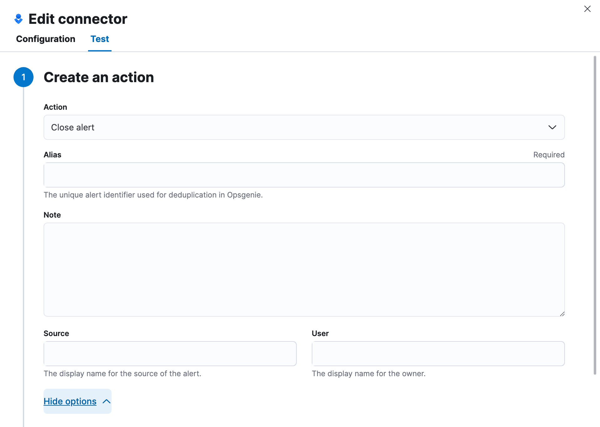
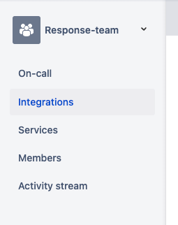
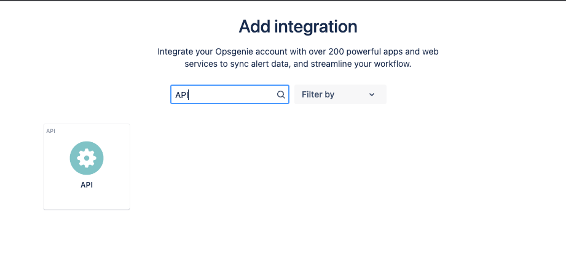
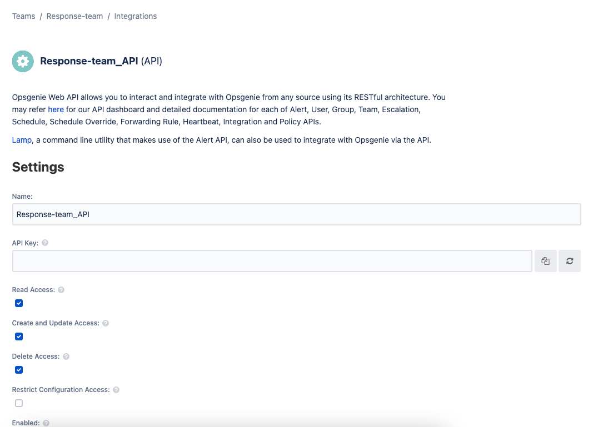

# Opsgenie connector and action [opsgenie-action-type]


An {{opsgenie}} connector enables you to create and close alerts in {{opsgenie}}. In particular, it uses the [{{opsgenie}} alert API](https://docs.opsgenie.com/docs/alert-api).

To create this connector, you must have a valid {{opsgenie}} URL and API key. For configuration tips, refer to [Configure an Opsgenie account](#configuring-opsgenie).


## Create connectors in {{kib}} [define-opsgenie-ui]

You can create connectors in **{{stack-manage-app}} > {{connectors-ui}}** or as needed when you’re creating a rule. For example:

% TO DO: Use `:class: screenshot`



### Connector configuration [opsgenie-connector-configuration]

Opsgenie connectors have the following configuration properties:

Name
:   The name of the connector. The name is used to identify a connector in the management UI connector listing, or in the connector list when configuring an action.

URL
:   The Opsgenie URL. For example, [https://api.opsgenie.com](https://api.opsgenie.com) or [https://api.eu.opsgenie.com](https://api.eu.opsgenie.com).

    ::::{note}
    If you are using the [`xpack.actions.allowedHosts`](/reference/configuration-reference/alerting-settings.md#action-settings) setting, make sure the hostname is added to the allowed hosts.
    ::::


API Key
:   The Opsgenie API authentication key for HTTP basic authentication. For more details about generating Opsgenie API keys, refer to [Opsgenie documentation](https://support.atlassian.com/opsgenie/docs/create-a-default-api-integration/).


## Test connectors [opsgenie-action-configuration]

After you create a connector, use the **Test** tab to test its actions:

* [Create alert](#opsgenie-action-create-alert-configuration)
* [Close alert](#opsgenie-action-close-alert-configuration)


### Create alert action [opsgenie-action-create-alert-configuration]

When you create a rule that uses an {{opsgenie}} connector, its actions (with the exception of recovery actions) create {{opsgenie}} alerts. You can test this type of action when you create or edit your connector:

% TO DO: Use `:class: screenshot`


You can configure the create alert action through the form view or using a JSON editor.


#### Form view [opsgenie-action-create-alert-form-configuration]

The create alert action form has the following configuration properties.

Message
:   The message for the alert (required).

Opsgenie tags
:   The tags for the alert (optional).

Priority
:   The priority level for the alert.

Description
:   A description that provides detailed information about the alert (optional).

Alias
:   The alert identifier, which is used for alert deduplication in Opsgenie. For more information, refer to the [Opsgenie documentation](https://support.atlassian.com/opsgenie/docs/what-is-alert-de-duplication/) (optional).

Entity
:   The domain of the alert (optional).

Source
:   The source of the alert (optional).

User
:   The display name of the owner (optional).

Note
:   Additional information for the alert (optional).


#### JSON editor [opsgenie-action-create-alert-json-configuration]

A JSON editor is provided as an alternative to the form view and supports additional fields not shown in the form view. The JSON editor supports all of the forms configuration properties but as lowercase keys as [described in the Opsgenie API documentation](https://docs.opsgenie.com/docs/alert-api#create-alert). The JSON editor supports the following additional properties:

responders
:   The entities to receive notifications about the alert (optional).

visibleTo
:   The teams and users that the alert will be visible to without sending a notification to them (optional).

actions
:   The custom actions available to the alert (optional).

details
:   The custom properties of the alert (optional).

$$$opsgenie-action-create-alert-json-example-configuration$$$
Example JSON editor contents

```json
{
  "message": "An example alert message",
  "alias": "Life is too short for no alias",
  "description":"Every alert needs a description",
  "responders":[
      {"id":"4513b7ea-3b91-438f-b7e4-e3e54af9147c", "type":"team"},
      {"name":"NOC", "type":"team"},
      {"id":"bb4d9938-c3c2-455d-aaab-727aa701c0d8", "type":"user"},
      {"username":"trinity@opsgenie.com", "type":"user"},
      {"id":"aee8a0de-c80f-4515-a232-501c0bc9d715", "type":"escalation"},
      {"name":"Nightwatch Escalation", "type":"escalation"},
      {"id":"80564037-1984-4f38-b98e-8a1f662df552", "type":"schedule"},
      {"name":"First Responders Schedule", "type":"schedule"}
  ],
  "visibleTo":[
      {"id":"4513b7ea-3b91-438f-b7e4-e3e54af9147c","type":"team"},
      {"name":"rocket_team","type":"team"},
      {"id":"bb4d9938-c3c2-455d-aaab-727aa701c0d8","type":"user"},
      {"username":"trinity@opsgenie.com","type":"user"}
  ],
  "actions": ["Restart", "AnExampleAction"],
  "tags": ["OverwriteQuietHours","Critical"],
  "details":{"key1":"value1","key2":"value2"},
  "entity":"An example entity",
  "priority":"P1"
}
```


### Close alert action [opsgenie-action-close-alert-configuration]

When you create a rule that uses an {{opsgenie}} connector, its recovery actions close {{opsgenie}} alerts. You can test this type of action when you create or edit your connector:

% TO DO: Use `:class: screenshot`


The close alert action has the following configuration properties.

Alias
:   The alert identifier, which is used for alert deduplication in Opsgenie (required). The alias must match the value used when creating the alert. For more information, refer to the [Opsgenie documentation](https://support.atlassian.com/opsgenie/docs/what-is-alert-de-duplication/).

Note
:   Additional information for the alert (optional).

Source
:   The display name of the source (optional).

User
:   The display name of the owner (optional).


## Connector networking configuration [opgenie-connector-networking-configuration]

Use the [Action configuration settings](/reference/configuration-reference/alerting-settings.md#action-settings) to customize connector networking configurations, such as proxies, certificates, or TLS settings. You can set configurations that apply to all your connectors or use `xpack.actions.customHostSettings` to set per-host configurations.


## Configure an Opsgenie account [configuring-opsgenie]

After obtaining an Opsgenie instance, configure the API integration. For details, refer to the [Opsgenie documentation](https://support.atlassian.com/opsgenie/docs/create-a-default-api-integration/).

If you’re using a free trial, go to the `Teams` dashboard and select the appropriate team.


Select the `Integrations` menu item, then select `Add integration`.



Search for `API` and select the `API` integration.



Configure the integration and ensure you record the `API Key`. This key will be used to populate the `API Key` field when creating the Kibana Opsgenie connector. Click `Save Integration` after you finish configuring the integration.



