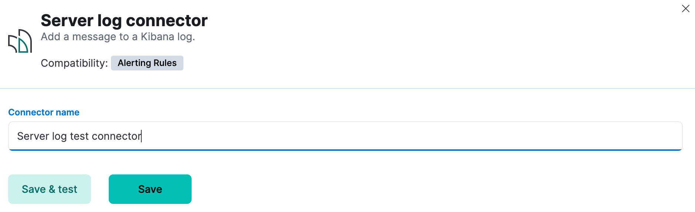
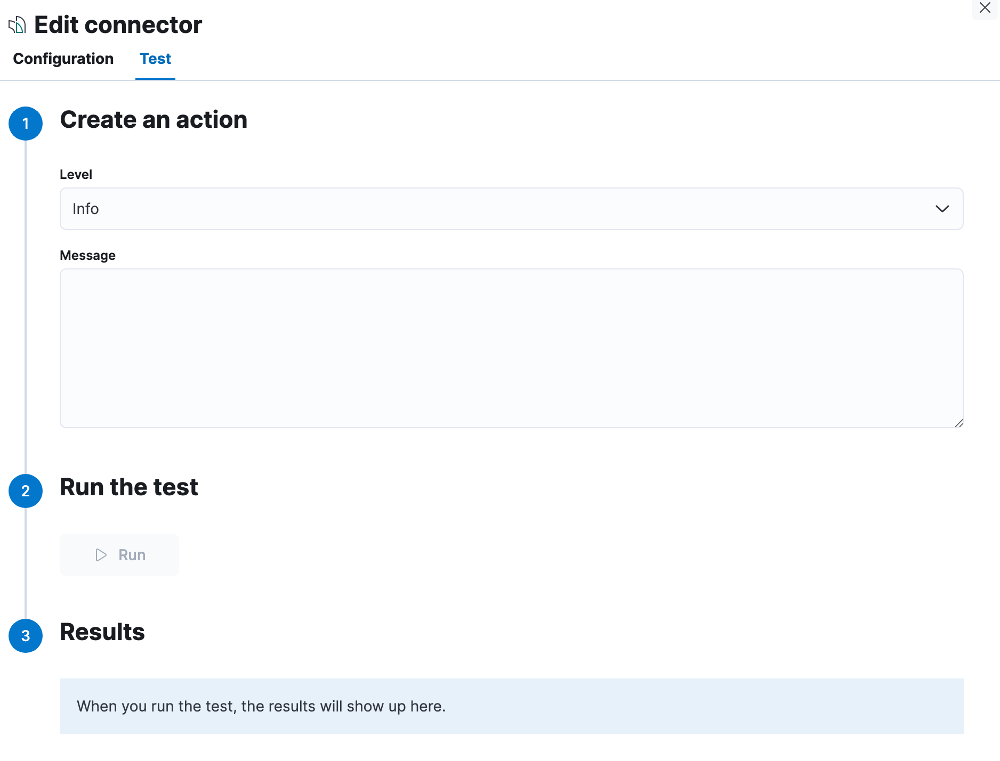

# Server log connector and action [server-log-action-type]

A server log connector writes an entry to the {{kib}} server log.

## Create connectors in {{kib}} [define-serverlog-ui]

You can create connectors in **{{stack-manage-app}} > {{connectors-ui}}** or as needed when you’re creating a rule. For example:

% TO DO: Use `:class: screenshot`

### Connector configuration [server-log-connector-configuration]

Server log connectors do not have any configuration properties other than a name.

## Test connectors [server-log-action-configuration]

You can test connectors as you’re creating or editing the connector in {{kib}}. For example:

% TO DO: Use `:class: screenshot`

Server log connector actions contain a message and a log level, which defaults to `info`. Valid log level values are `trace`, `debug`, `info`, `warn`, `error`, and `fatal`.

