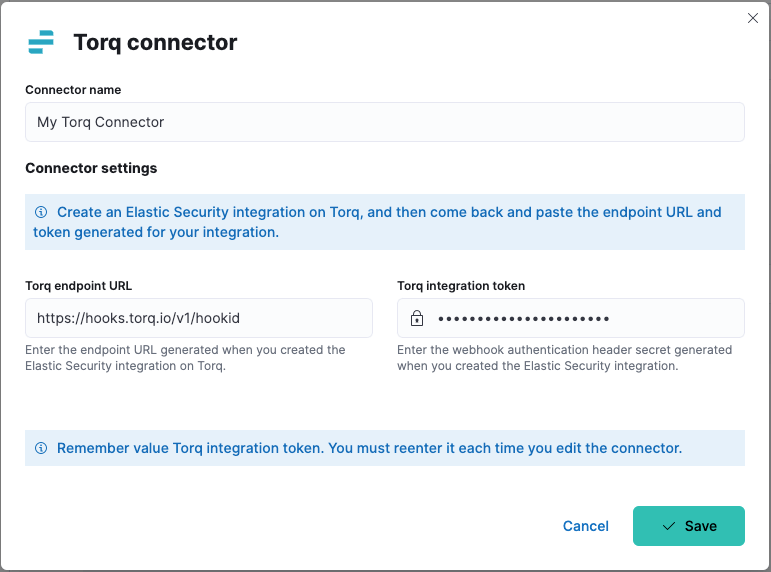
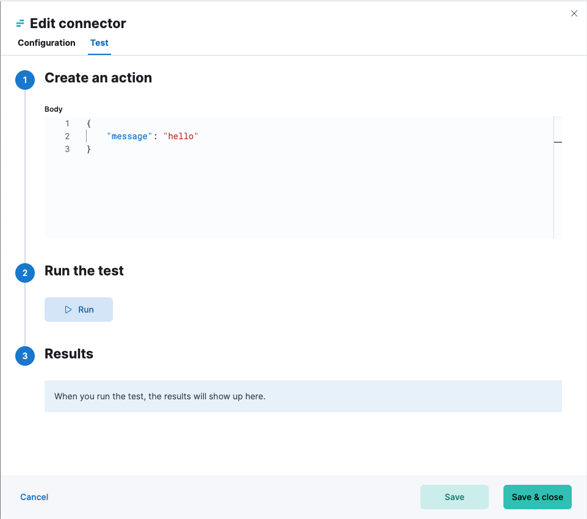

# Torq connector and action [torq-action-type]

The Torq connector uses a Torq webhook to trigger workflows with Kibana actions.

## Create connectors in {{kib}} [define-torq-ui]

You can create connectors in **{{stack-manage-app}} > {{connectors-ui}}** or as needed when you’re creating a rule. For example:

% TO DO: Use `:class: screenshot`

### Connector configuration [torq-connector-configuration]

Torq connectors have the following configuration properties:

Name
:   The name of the connector. The name is used to identify a connector in the Stack Management UI connector listing, and in the connector list when configuring an action.

Torq endpoint URL
:   Endpoint URL (webhook) of the Elastic Security integration you created in Torq.

Torq authentication header secret
:   Secret of the webhook authentication header.

## Test connectors [torq-action-configuration]

You can test connectors as you’re creating or editing the connector in {{kib}}. For example:

% TO DO: Use `:class: screenshot`

Torq actions have the following configuration properties.

Body
:   JSON payload to send to Torq.

