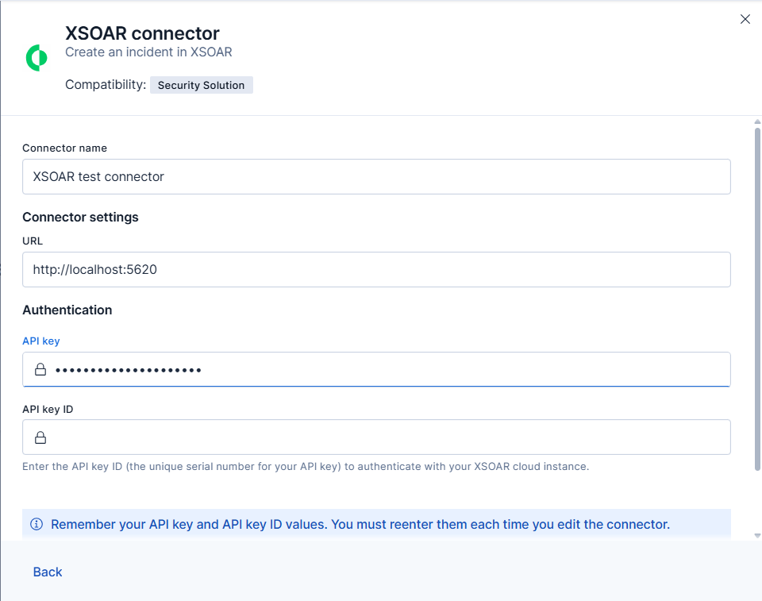
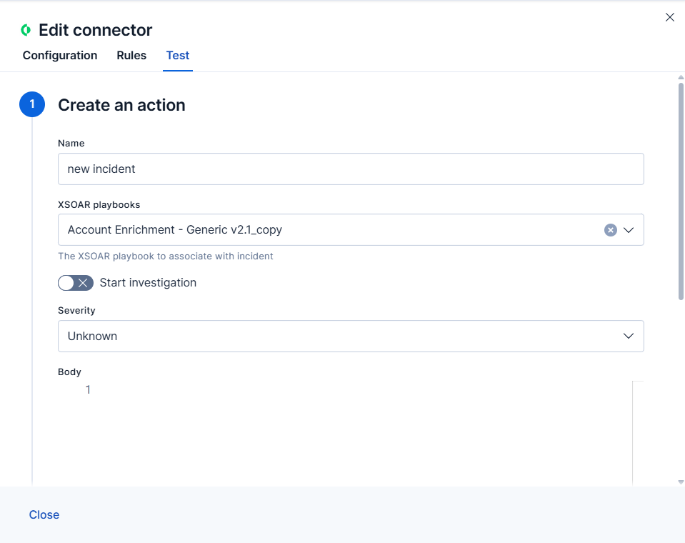

# {{xsoar}} connector and action [xsoar-action-type]


{{xsoar}} connector uses the [{{xsoar}} REST API](https://cortex-panw.stoplight.io/docs/cortex-xsoar-8/m0qlgh9inh4vk-create-or-update-an-incident) to create Cortex {{xsoar}} incidents.


## Create connectors in {{kib}} [define-xsoar-ui]

You can create connectors in **{{stack-manage-app}} > {{connectors-ui}}** or as needed when you’re creating a rule. For example:

% TO DO: Use `:class: screenshot`



### Connector configuration [xsoar-connector-configuration]

{{xsoar}} connectors have the following configuration properties:

Name
:   The name of the connector.

URL
:   The {{xsoar}} instance URL.

API key
:   The {{xsoar}} API key for authentication.

    ::::{note}
    If you do not have an API key, refer to [Create a new API key](https://cortex-panw.stoplight.io/docs/cortex-xsoar-8/t09y7hrb5d14m-create-a-new-api-key) to make one for your {{xsoar}} instance.
    ::::

API key id
:   The {{xsoar}} API key ID for authentication. (Mandatory for cloud instance users.)


## Test connectors [xsoar-action-configuration]

You can test connectors as you’re creating or editing the connector in {{kib}}. For example:

% TO DO: Use `:class: screenshot`


{{xsoar}} actions have the following configuration properties.

Name
:   The incident name.

Playbook
:   The playbook to associate with the incident.

Start investigation
:   If turned on, will automatically start the investigation process after the incident is created.

Severity
:   The severity of the incident. Can be `Unknown`, `Informational`, `Low`, `Medium`, `High` or `Critical`.

    ::::{note}
    Turn on `Keep severity from rule` to create an incident that inherits the rule's severity.
    ::::

Body
:   A JSON payload that includes additional parameters to be included in the API request.

    ```json
    {
      "details": "This is an example incident",
      "type": "Unclassified"
    }
    ```


## Connector networking configuration [xsoar-connector-networking-configuration]

Use the [Action configuration settings](/reference/configuration-reference/alerting-settings.md#action-settings) to customize connector networking configurations, such as proxies, certificates, or TLS settings. You can set configurations that apply to all your connectors or use `xpack.actions.customHostSettings` to set per-host configurations.
