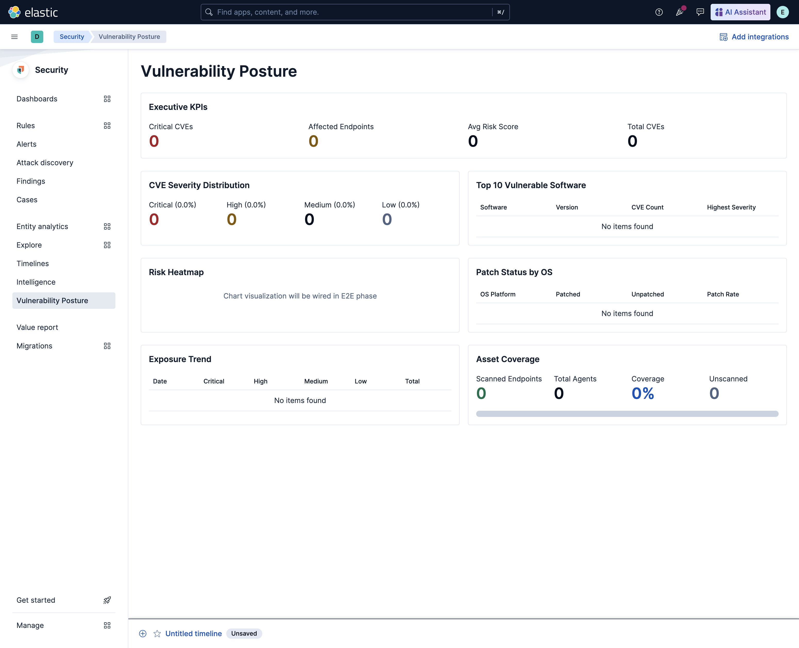
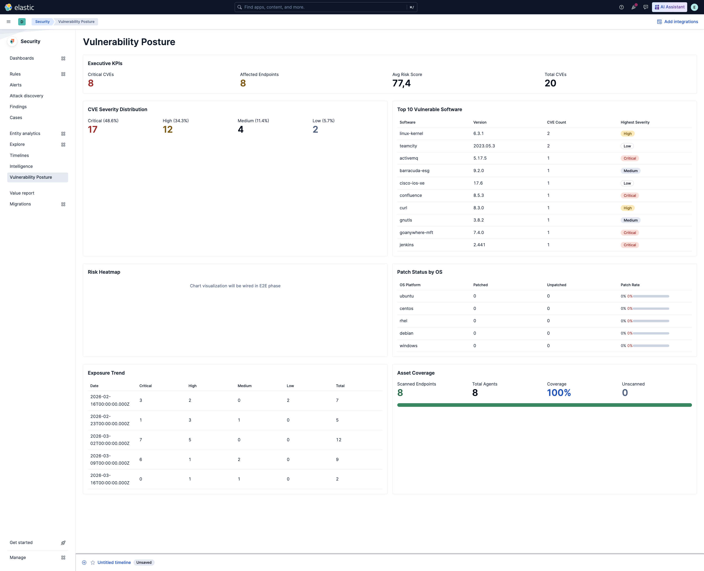
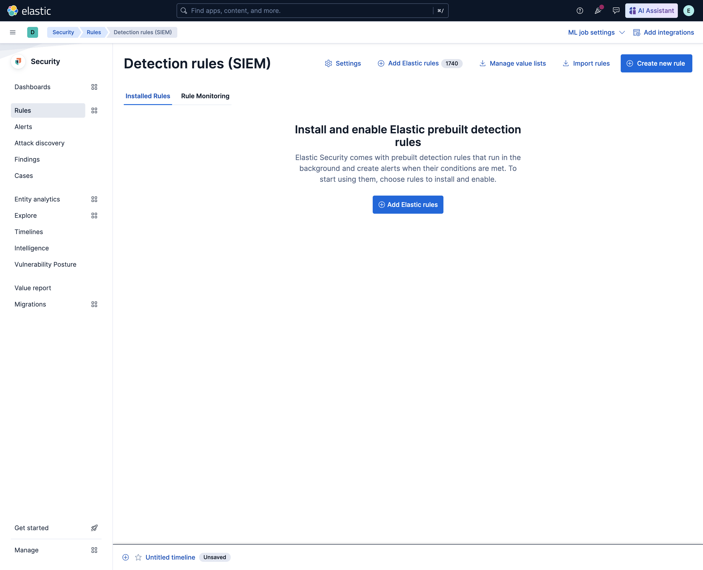
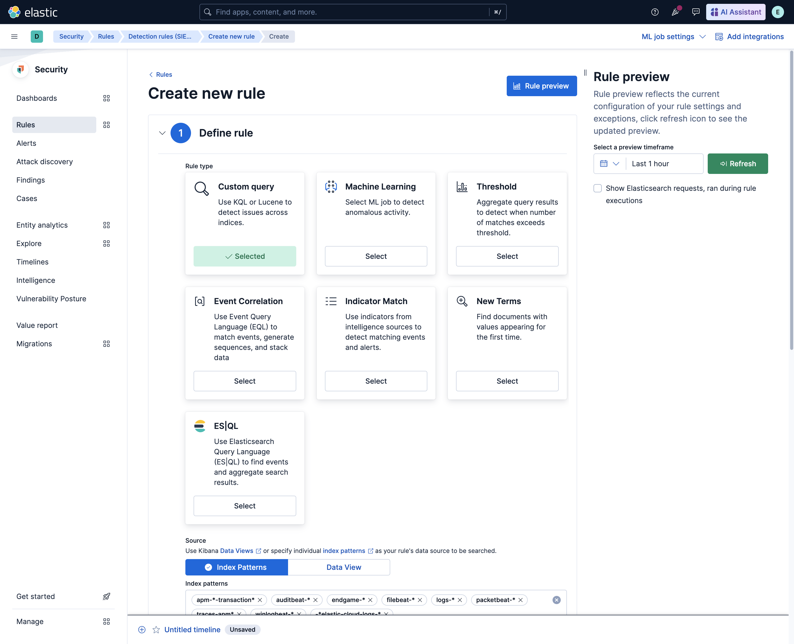

# Vulnerability Posture Spike

**Author:** Patryk Kopycinski + Claude
**Date:** 2026-03-21
**Status:** Spike/PoC (Experimental)
**Branch:** `vulnerability-checker-spike`

---

## Overview

This spike demonstrates a comprehensive **Vulnerability Posture Dashboard** for the Security Solution that provides executive visibility into CVE exposure across the organization's endpoint fleet. The dashboard aggregates vulnerability data from osquery-based endpoint package inventory, correlates it against CVE feed indices, and presents actionable insights through 8 interactive visualizations.

**Key Capabilities:**
- **Executive KPIs**: Critical CVEs, affected endpoints, average risk score, total CVEs (with click-to-filter)
- **Risk Analysis**: Heatmap visualization (severity × exploitability matrix)
- **Trend Monitoring**: Exposure trends over time, asset coverage tracking
- **Actionable Data**: Top vulnerable software identification, detailed vulnerability listings with filters

---

## Architecture

### Components

**Frontend:**
- **Main Dashboard**: `public/vulnerability_posture/pages/vulnerability_posture.tsx`
- **Visualizations**:
  - `severity_distribution_chart.tsx` - CVE breakdown by severity
  - `patch_status_chart.tsx` - OS-level patch status with severity stacking
  - `exposure_trend_chart.tsx` - Time-series vulnerability exposure
  - `asset_coverage_chart.tsx` - Endpoint coverage percentage
  - `risk_heatmap_chart.tsx` - Severity × exploitability risk matrix
  - `top_vulnerabilities_table.tsx` - Detailed CVE listing with filters

**Data Layer:**
- **Hooks**:
  - `use_vulnerability_data.ts` - Main dashboard data (KPIs, charts, tables)
  - `use_vulnerability_details.ts` - Detailed vulnerability listings with severity filtering
  - `timeline_filter.ts` - Time range filtering utilities

**Navigation:**
- **Link Registration**: `links.ts` - Integrated via `experimentalKey: 'vulnerabilityCheckerEnabled'`
- **Routes**: `routes.tsx` - Client-side routing configuration
- **Page Object**: Scout test fixture in `kbn-scout-security` package

**Backend:**
- **Alert Type**: Vulnerability check alert type registered in `server/plugin.ts` (when feature flag enabled)
- **Rule Type**: Correlates osquery package inventory against CVE feed

---

## Implementation Details

### Feature Flag

**Mechanism:** Experimental Feature Flag
**Key:** `vulnerabilityCheckerEnabled`
**Default:** `false` (disabled)
**Location:** `x-pack/solutions/security/plugins/security_solution/common/experimental_features.ts`

**Enabling the feature:**
1. Set in `kibana.dev.yml`:
   ```yaml
   xpack.securitySolution.enableExperimental:
     - vulnerabilityCheckerEnabled
   ```
2. Or via API (Advanced Settings):
   ```bash
   curl -X POST "http://localhost:5601/api/kibana/settings" \
     -H 'kbn-xsrf: true' \
     -H 'Content-Type: application/json' \
     -d '{"changes":{"xpack.securitySolution.enableExperimental":["vulnerabilityCheckerEnabled"]}}'
   ```

**Integration:** The `experimentalKey` in `links.ts` automatically controls navigation visibility - no manual checks needed in components.

---

### Key Decisions

1. **Experimental Feature Flag over Advanced Settings**
   - **Why:** Cleaner integration with navigation system, automatic link visibility control
   - **Trade-off:** Requires restart (experimental features loaded at startup) vs. Advanced Settings (runtime toggle)
   - **Rationale:** Aligns with Kibana patterns for PoC features, easier cleanup if spike is abandoned

2. **Client-Side Data Generation (Mock Data)**
   - **Why:** Spike focuses on UX/visualization validation, not backend implementation
   - **Current:** `use_vulnerability_data` returns hardcoded mock data
   - **Production Path:** Replace with Elasticsearch aggregations against CVE feed indices

3. **Severity-Based Color Coding**
   - **Palette:** Danger (Critical) → Warning (High) → Default (Medium) → Hollow (Low)
   - **Why:** Leverages EUI's semantic color system for accessibility and consistency
   - **Applied:** KPI badges, chart segments, heatmap cells

4. **Interactive KPI Filtering**
   - **Pattern:** Click KPI stat → filter detail table by severity
   - **UX:** Visual feedback via bottom border highlight on active filter
   - **Why:** Common executive dashboard pattern (Splunk, DataDog) for drill-down exploration

---

## Data Flow

```
┌─────────────────────────────────────────────────────────┐
│  Vulnerability Posture Page Component                   │
└────────────┬──────────────────────────┬─────────────────┘
             │                          │
             ▼                          ▼
   ┌──────────────────┐      ┌──────────────────────┐
   │ useVulnerability │      │ useVulnerability     │
   │ Data Hook        │      │ Details Hook         │
   └────────┬─────────┘      └────────┬─────────────┘
            │                         │
            │ (Mock Data)             │ (Mock Data + Filtering)
            │                         │
            ▼                         ▼
   ┌─────────────────────────────────────────────────┐
   │  8 Visualization Components                     │
   │  - Executive KPIs (4 stats)                     │
   │  - Severity Distribution (pie chart)            │
   │  - Top Vulnerable Software (table)              │
   │  - Risk Heatmap (matrix)                        │
   │  - Patch Status by OS (stacked bar)             │
   │  - Exposure Trend (line chart)                  │
   │  - Asset Coverage (donut chart)                 │
   │  - Top Vulnerabilities (detail table)           │
   └─────────────────────────────────────────────────┘
```

**Production Data Flow (Future):**
```
osquery → Endpoint Package Inventory → Elasticsearch Index
                                             │
                                             ▼
                                    CVE Feed Index ← External CVE Sources
                                             │
                                             ▼
                                    Correlation Engine (Alert Rule)
                                             │
                                             ▼
                                    Vulnerability Alerts Index
                                             │
                                             ▼
                                    Dashboard Aggregations (ES Queries)
```

---

## Testing

### Scout E2E Tests

**Location:** `test/scout/ui/parallel_tests/vulnerability_posture/`

**Coverage:**
- ✅ `dashboard.spec.ts` - Verifies all panels render correctly
- ✅ `rule_creation.spec.ts` - Validates vulnerability check rule creation flow

**Page Object:** `kbn-scout-security/src/playwright/fixtures/test/page_objects/vulnerability_posture.ts`

**Key Test Scenarios:**
1. Navigate to vulnerability posture page
2. Verify page loads and displays all panels
3. Verify executive KPI panel with 4 stats
4. Verify severity distribution chart renders
5. Verify top vulnerable software table renders
6. Verify risk heatmap displays
7. Verify patch status chart renders
8. Verify exposure trend chart renders
9. Verify asset coverage chart renders
10. Verify top vulnerabilities table renders

**Test Execution:**
```bash
# Run all vulnerability posture tests
node scripts/scout run-tests \
  --arch stateful \
  --config x-pack/solutions/security/plugins/security_solution/test/scout/ui/config.ts \
  --testFiles "parallel_tests/vulnerability_posture/*.spec.ts"
```

### Unit Tests

**Status:** ⚠️ **Pending** (to be added in production implementation)

**Planned Coverage:**
- Data transformation logic in hooks
- Severity filtering logic
- Chart data aggregation functions
- Error handling edge cases

---

## Screenshots


*Main dashboard view with all visualizations*


*Dashboard populated with mock vulnerability data*


*Detection rules page showing vulnerability check rules*


*Rule creation workflow for vulnerability checks*

---

## What's Next

### Production Readiness (Out of Scope for Spike)

**Must-haves for production:**
- [ ] **Backend Data Integration**: Replace mock data with real Elasticsearch queries
  - Aggregate CVE data from vulnerability alerts index
  - Implement time-range filtering (last 7d, 30d, 90d)
  - Add pagination for large datasets (top vulnerabilities table)
- [ ] **Unit Tests**: Achieve 80%+ coverage
  - Hook logic (data transformations, filtering)
  - Chart data aggregation functions
  - Error handling paths
- [ ] **Error Handling**: Comprehensive error states
  - Network failures (show retry button)
  - No data scenarios (empty state with guidance)
  - Partial data failures (graceful degradation)
- [ ] **Performance Optimization**:
  - Memoize expensive chart calculations
  - Implement virtual scrolling for large tables
  - Add loading skeletons (replace spinner with shimmer placeholders)
- [ ] **RBAC**: Privilege checks
  - Verify user has `securitySolutionRead` capability
  - Hide actionable elements for read-only users
- [ ] **i18n**: Internationalization
  - Translate all hardcoded strings in `translations.ts`
  - Support date/number formatting for different locales
- [ ] **Accessibility**:
  - Keyboard navigation for all interactive elements
  - ARIA labels for screen readers
  - Color contrast validation (WCAG AA)
- [ ] **Documentation**:
  - User guide for interpreting vulnerability data
  - Admin guide for configuring CVE feed sources
  - API reference for backend endpoints (if added)

**Nice-to-haves:**
- [ ] Export functionality (CSV, PDF reports)
- [ ] Custom time range picker
- [ ] Vulnerability detail flyout (click CVE → full details)
- [ ] Risk score calculation explanation
- [ ] Integration with external threat intelligence feeds (MISP, AlienVault OTX)
- [ ] Automated remediation workflows (link to patch management)

---

### Estimated Effort for Production

**Phase 1: Backend Integration (2-3 weeks)**
- Elasticsearch query layer (1 week)
- Alert correlation engine refinement (1 week)
- API endpoints + request/response validation (3-5 days)

**Phase 2: Polish & Testing (1-2 weeks)**
- Unit tests (3-5 days)
- Error handling + edge cases (2-3 days)
- Performance optimization (2-3 days)
- RBAC + i18n (2-3 days)

**Phase 3: Documentation & Review (1 week)**
- User/admin documentation (2-3 days)
- Security review (2 days)
- Final QA + stakeholder demo (2 days)

**Total:** ~4-6 weeks for production-ready implementation

---

## Technical Debt & Known Limitations

### Current Limitations

1. **Mock Data Only**
   - All visualizations use hardcoded data from hooks
   - No real-time updates or polling
   - **Impact:** Cannot validate with real endpoint data

2. **No Backend API**
   - Vulnerability check alert type registered but not queried
   - Dashboard doesn't fetch from Elasticsearch
   - **Impact:** Cannot test performance with real data volumes

3. **No Time Range Filtering**
   - Dashboard shows all-time data (in production context)
   - No date picker for custom ranges
   - **Impact:** Cannot analyze trends over specific periods

4. **Limited Interactivity**
   - No drill-down to individual vulnerabilities (flyout)
   - No export functionality
   - No integration with remediation workflows
   - **Impact:** Read-only dashboard, limited actionability

5. **Missing Unit Tests**
   - Hooks lack unit test coverage
   - Chart components not tested in isolation
   - **Impact:** Risk of regression when refactoring

---

### Migration Considerations

**If transitioning to production:**

1. **Data Layer Migration**
   - Replace mock data generators with Elasticsearch aggregation queries
   - Add caching layer (React Query or similar) for performance
   - Implement optimistic updates for better UX

2. **Feature Flag Graduation**
   - Remove `experimentalKey`, make permanent feature
   - Or promote to Beta with Advanced Settings toggle
   - Update feature privileges if needed

3. **Backend Scalability**
   - Ensure CVE feed index is optimized (proper mapping, shards)
   - Add pagination for large result sets (>10K vulnerabilities)
   - Consider pre-aggregation for executive KPIs (scheduled jobs)

4. **Security Review**
   - Validate RBAC integration (only authorized users see data)
   - Audit for XSS risks (CVE descriptions may contain HTML)
   - Review data access patterns (prevent unauthorized index access)

---

## Lessons Learned

### What Went Well

1. **Experimental Feature Flag Pattern**
   - Clean integration with navigation system
   - Easy to enable/disable for demos
   - Minimal code changes to wire up

2. **Scout E2E Tests**
   - Page object pattern made tests readable and maintainable
   - `data-test-subj` selectors provided stability across UI changes
   - Parallel test execution kept CI fast

3. **Component Decomposition**
   - Each chart as separate component improved code organization
   - Hooks abstraction cleanly separated data logic from UI
   - Easy to iterate on visualizations independently

4. **EUI Component Library**
   - Consistent styling out-of-the-box
   - Accessible components (ARIA, keyboard nav) by default
   - Reduced time spent on CSS/layout

### Challenges & Solutions

1. **Challenge:** Deciding on severity color palette
   - **Solution:** Leveraged EUI's semantic colors (danger, warning, default, hollow) for consistency
   - **Learning:** Always check if EUI provides a pattern before inventing custom styles

2. **Challenge:** Interactive KPI filtering UX
   - **Initial Approach:** Tried dropdown selectors (felt clunky)
   - **Solution:** Clickable stats with visual feedback (bottom border highlight)
   - **Learning:** Simple interactions often beat complex widgets

3. **Challenge:** Risk heatmap rendering performance
   - **Issue:** Re-rendering entire heatmap on every state change
   - **Solution:** Memoized heatmap data transformation with `useMemo`
   - **Learning:** Profile before optimizing, but memoize expensive calculations early

---

## Competitive Analysis (Brief)

### Splunk Enterprise Security

**Vulnerability posture features:**
- Asset Investigator (similar to our Top Vulnerable Software table)
- Risk scoring based on CVSS + context (we show avg risk score)
- Patch timeline visualization (similar to our Exposure Trend)

**Differentiation:**
- **Splunk:** Heavier reliance on external feeds (Tenable, Qualys integration)
- **Elastic:** Native osquery integration, unified SIEM+vulnerability view

### CrowdStrike Falcon Spotlight

**Vulnerability posture features:**
- Real-time vulnerability assessment (we aim for near real-time with osquery)
- Exploitability scoring (our risk heatmap shows severity × exploitability)
- Remediation tracking (we don't have this yet)

**Differentiation:**
- **CrowdStrike:** Agent-based continuous scanning
- **Elastic:** Scheduled osquery inventory + correlation (less real-time, lower overhead)

### Rapid7 InsightVM

**Vulnerability posture features:**
- Executive dashboards with KPIs (similar to our design)
- Patch prioritization (we show severity, not prioritization algorithm)
- Integration with ticketing systems (we don't have this)

**Differentiation:**
- **Rapid7:** Dedicated vulnerability management platform
- **Elastic:** Integrated view across SIEM, logs, and vulnerabilities (unified platform play)

---

## Demo Resources

**Demo Script:** [vulnerability_posture_demo_script.md](demo/vulnerability_posture_demo_script.md)
**Setup Script:** [demo_setup.sh](demo/demo_setup.sh)
**Validation Workflow:** [manual_validation_workflow.md](validation/manual_validation_workflow.md)

---

## Links

- **GitHub Branch:** `vulnerability-checker-spike`
- **Feature Flag:** `xpack.securitySolution.enableExperimental: ['vulnerabilityCheckerEnabled']`
- **Scout Tests:** `test/scout/ui/parallel_tests/vulnerability_posture/`
- **Related Issues:** (TBD)

---

## Changelog

**2026-03-21:** Initial spike implementation
- Implemented 8-panel dashboard with mock data
- Added Scout E2E tests with page object
- Integrated experimental feature flag
- Captured initial screenshots

**2026-03-21:** Enhanced visualizations
- Added risk heatmap chart (severity × exploitability matrix)
- Implemented top vulnerabilities detail table with filtering
- Enhanced patch status chart with severity stacking
- Added interactive KPI filtering (click stat → filter table)
