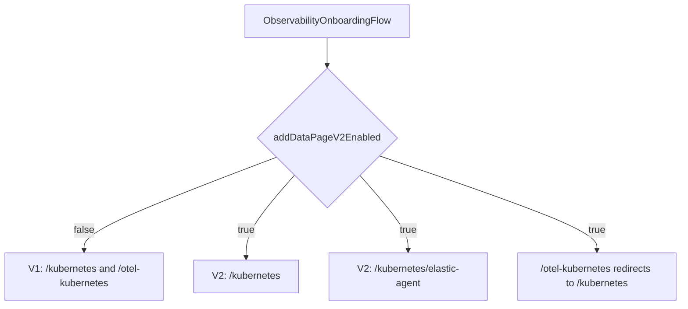

# Kubernetes Onboarding V2 Implementation Plan

> **For agentic workers:** REQUIRED SUB-SKILL: Use superpowers:subagent-driven-development or superpowers:executing-plans to implement this task-by-task. Steps use checkbox syntax for tracking.

**Goal:** Build a feature-flagged V2 Kubernetes onboarding flow with a collection method selector, defaulting to OpenTelemetry at `/kubernetes` and offering Elastic Agent at `/kubernetes/elastic-agent`.

**Architecture:** Keep the existing V1 `KubernetesPage`, `OtelKubernetesPage`, `KubernetesPanel`, and `OtelKubernetesPanel` as wrappers. Extract their step bodies into reusable components, then compose two new V2 pages with `OnboardingFlowLayout`, `CollectionMethodSelector`, URL-backed ingestion mode, and inline setup errors. Route ownership is explicit in `observability_onboarding_flow.tsx` so V1 and V2 never compete for `/kubernetes` in the same flag state.

**Tech Stack:** React, TypeScript, EUI, React Router v5 compatibility APIs, Kibana feature flags, Jest, Scout Playwright.

## File Map

Create:
- `x-pack/solutions/observability/plugins/observability_onboarding/public/application/pages/kubernetes_v2/index.ts`
- `x-pack/solutions/observability/plugins/observability_onboarding/public/application/pages/kubernetes_v2/kubernetes_otel_page.tsx`
- `x-pack/solutions/observability/plugins/observability_onboarding/public/application/pages/kubernetes_v2/kubernetes_elastic_agent_page.tsx`
- `x-pack/solutions/observability/plugins/observability_onboarding/public/application/pages/kubernetes_v2/kubernetes_collection_method_options.ts`
- `x-pack/solutions/observability/plugins/observability_onboarding/public/application/pages/kubernetes_v2/__tests__/kubernetes_otel_page.test.tsx`
- `x-pack/solutions/observability/plugins/observability_onboarding/public/application/pages/kubernetes_v2/__tests__/kubernetes_elastic_agent_page.test.tsx`
- `x-pack/solutions/observability/plugins/observability_onboarding/public/application/pages/kubernetes_v2/__tests__/feature_flag_gate.test.tsx`
- `x-pack/solutions/observability/plugins/observability_onboarding/test/scout/ui/fixtures/page_objects/kubernetes_v2_page.ts`
- `x-pack/solutions/observability/plugins/observability_onboarding/test/scout/ui/tests/kubernetes_v2_flow.spec.ts`

Modify:
- `x-pack/solutions/observability/plugins/observability_onboarding/public/application/observability_onboarding_flow.tsx`
- `x-pack/solutions/observability/plugins/observability_onboarding/public/application/pages/index.ts`
- `x-pack/solutions/observability/plugins/observability_onboarding/public/application/integrations_grid/integration_tiles.ts`
- `x-pack/solutions/observability/plugins/observability_onboarding/public/application/pages/landing.test.tsx`
- `x-pack/solutions/observability/plugins/observability_onboarding/public/application/quickstart_flows/otel_kubernetes/otel_kubernetes_panel.tsx`
- `x-pack/solutions/observability/plugins/observability_onboarding/public/application/quickstart_flows/kubernetes/index.tsx`
- `x-pack/solutions/observability/plugins/observability_onboarding/test/scout/ui/fixtures/page_objects/index.ts`

Optional create, if extraction is cleaner as separate modules:
- `x-pack/solutions/observability/plugins/observability_onboarding/public/application/quickstart_flows/otel_kubernetes/steps/index.ts`
- `x-pack/solutions/observability/plugins/observability_onboarding/public/application/quickstart_flows/otel_kubernetes/steps/add_repository_step.tsx`
- `x-pack/solutions/observability/plugins/observability_onboarding/public/application/quickstart_flows/otel_kubernetes/steps/install_step.tsx`
- `x-pack/solutions/observability/plugins/observability_onboarding/public/application/quickstart_flows/otel_kubernetes/steps/instrument_step.tsx`
- `x-pack/solutions/observability/plugins/observability_onboarding/public/application/quickstart_flows/otel_kubernetes/steps/visualize_step.tsx`
- `x-pack/solutions/observability/plugins/observability_onboarding/public/application/quickstart_flows/kubernetes/steps/index.ts`
- `x-pack/solutions/observability/plugins/observability_onboarding/public/application/quickstart_flows/kubernetes/steps/install_step.tsx`
- `x-pack/solutions/observability/plugins/observability_onboarding/public/application/quickstart_flows/kubernetes/steps/visualize_step.tsx`

## Route Shape



## Task 1: Add Routing And Tile Tests First

**Files:**
- Modify: `x-pack/solutions/observability/plugins/observability_onboarding/public/application/pages/landing.test.tsx`
- Create: `x-pack/solutions/observability/plugins/observability_onboarding/public/application/pages/kubernetes_v2/__tests__/feature_flag_gate.test.tsx`

- [ ] Add failing `landing.test.tsx` coverage that clicks `observabilityOnboardingIntegrationTile-kubernetes` when the V2 flag is enabled and expects `/kubernetes`.

Use the same pattern as the existing Host tile test:

```tsx
it('navigates to the Kubernetes V2 page when its tile is clicked', async () => {
  const { getByTestId } = renderLandingWithRouter(true);
  const tile = getByTestId('observabilityOnboardingIntegrationTile-kubernetes');
  await userEvent.click(tile);
  expect(getByTestId('locationPathname')).toHaveTextContent('/kubernetes');
});
```

- [ ] Add failing route-gate tests for these cases:
  - Flag off `/kubernetes` renders `KubernetesPage`.
  - Flag off `/otel-kubernetes` renders `OtelKubernetesPage`.
  - Flag on `/kubernetes` renders `KubernetesOtelPage`.
  - Flag on `/kubernetes/elastic-agent` renders `KubernetesElasticAgentPage`.
  - Flag on `/otel-kubernetes?ingestion=wired` redirects to `/kubernetes?ingestion=wired`.

Mock route components with simple `data-test-subj` stubs, following `pages/host/__tests__/feature_flag_gate.test.tsx`.

- [ ] Run the failing tests:
  - `node scripts/jest x-pack/solutions/observability/plugins/observability_onboarding/public/application/pages/landing.test.tsx`
  - `node scripts/jest x-pack/solutions/observability/plugins/observability_onboarding/public/application/pages/kubernetes_v2/__tests__/feature_flag_gate.test.tsx`

Expected: failures show the Kubernetes tile has no route and V2 route modules do not exist yet.

## Task 2: Wire The Feature-Flagged Routes And Tile

**Files:**
- Modify: `x-pack/solutions/observability/plugins/observability_onboarding/public/application/observability_onboarding_flow.tsx`
- Modify: `x-pack/solutions/observability/plugins/observability_onboarding/public/application/integrations_grid/integration_tiles.ts`
- Modify: `x-pack/solutions/observability/plugins/observability_onboarding/public/application/pages/index.ts`
- Create: `x-pack/solutions/observability/plugins/observability_onboarding/public/application/pages/kubernetes_v2/index.ts`
- Create temporary thin placeholders for the two V2 page files, then replace them in later tasks.

- [ ] Export `KubernetesOtelPage` and `KubernetesElasticAgentPage` from `pages/kubernetes_v2/index.ts`, and re-export them from `pages/index.ts`.

- [ ] Add `route: '/kubernetes'` to the Kubernetes tile in `integration_tiles.ts`.

- [ ] Replace the always-on Kubernetes route block in `observability_onboarding_flow.tsx` with explicit V1/V2 route arrays:

```tsx
const v2KubernetesRoutes = isAddDataPageV2Enabled
  ? [
      <Route key="kubernetes-v2-otel" exact path="/kubernetes">
        <KubernetesOtelPage />
      </Route>,
      <Route key="kubernetes-v2-elastic-agent" exact path="/kubernetes/elastic-agent">
        <KubernetesElasticAgentPage />
      </Route>,
      <Route key="otel-kubernetes-v2-redirect" exact path="/otel-kubernetes">
        <Redirect to={`/kubernetes${location.search}`} />
      </Route>,
    ]
  : [
      <Route key="kubernetes-v1" path="/kubernetes">
        <KubernetesPage />
      </Route>,
      <Route key="otel-kubernetes-v1" path="/otel-kubernetes">
        <OtelKubernetesPage />
      </Route>,
    ];
```

Then render `{v2KubernetesRoutes}` where the old `/kubernetes` and `/otel-kubernetes` routes lived.

- [ ] Run the route and landing tests again. Expected: route and tile tests pass once page placeholders exist.

## Task 3: Extract OpenTelemetry Kubernetes Step Bodies

**Files:**
- Modify: `x-pack/solutions/observability/plugins/observability_onboarding/public/application/quickstart_flows/otel_kubernetes/otel_kubernetes_panel.tsx`
- Create: `x-pack/solutions/observability/plugins/observability_onboarding/public/application/quickstart_flows/otel_kubernetes/steps/index.ts`
- Create: `x-pack/solutions/observability/plugins/observability_onboarding/public/application/quickstart_flows/otel_kubernetes/steps/add_repository_step.tsx`
- Create: `x-pack/solutions/observability/plugins/observability_onboarding/public/application/quickstart_flows/otel_kubernetes/steps/install_step.tsx`
- Create: `x-pack/solutions/observability/plugins/observability_onboarding/public/application/quickstart_flows/otel_kubernetes/steps/instrument_step.tsx`
- Create: `x-pack/solutions/observability/plugins/observability_onboarding/public/application/quickstart_flows/otel_kubernetes/steps/visualize_step.tsx`

- [ ] Move the add-repository JSX into `OtelKubernetesAddRepositoryStep` with prop `addRepoCommand: string`.

- [ ] Move the install JSX into `OtelKubernetesInstallStep` with props:

```ts
interface OtelKubernetesInstallStepProps {
  installStackCommand?: string;
  valuesFileUrl?: string;
  ingestionMode: IngestionMode;
  onIngestionModeChange: (mode: IngestionMode) => void;
  streamsDocLink?: string;
  wiredStreamsStatus: Pick<
    UseWiredStreamsStatusResult,
    'isEnabled' | 'isLoading' | 'isEnabling' | 'enableWiredStreams'
  >;
}
```

- [ ] Move the instrument JSX into `OtelKubernetesInstrumentStep`. Keep `idSelected` state inside this component so both V1 and V2 get an isolated language selector.

- [ ] Move visualize JSX into `OtelKubernetesVisualizeStep` with props:

```ts
interface OtelKubernetesVisualizeStepProps {
  isMonitoringStepActive: boolean;
  data?: { onboardingId: string };
  actionLinks: ActionLink[];
  useWiredStreams: boolean;
  onDataReceived: () => void;
}
```

- [ ] Replace the original inline step bodies in `OtelKubernetesPanel` with the extracted components, preserving existing titles, status logic, `ManagedOtlpCallout`, full-panel error behavior, `EuiPanel`, `EuiSteps`, and `FeedbackButtons` placement.

- [ ] Run:
  - `node scripts/jest x-pack/solutions/observability/plugins/observability_onboarding/public/application/quickstart_flows/otel_kubernetes/otel_kubernetes_panel.tsx`
  - If no colocated test exists, run `node scripts/type_check --project x-pack/solutions/observability/plugins/observability_onboarding/tsconfig.json` after this extraction.

Expected: no type regressions and no changed V1 visual structure.

## Task 4: Extract Elastic Agent Kubernetes Step Bodies

**Files:**
- Modify: `x-pack/solutions/observability/plugins/observability_onboarding/public/application/quickstart_flows/kubernetes/index.tsx`
- Create: `x-pack/solutions/observability/plugins/observability_onboarding/public/application/quickstart_flows/kubernetes/steps/index.ts`
- Create: `x-pack/solutions/observability/plugins/observability_onboarding/public/application/quickstart_flows/kubernetes/steps/install_step.tsx`
- Create: `x-pack/solutions/observability/plugins/observability_onboarding/public/application/quickstart_flows/kubernetes/steps/visualize_step.tsx`

- [ ] Move the install step body into `KubernetesElasticAgentInstallStep` with props:

```ts
interface KubernetesElasticAgentInstallStepProps {
  status: FetchStatus;
  data?: KubernetesFlowData;
  isMonitoringStepActive: boolean;
  ingestionMode: IngestionMode;
  onIngestionModeChange: (mode: IngestionMode) => void;
}
```

Define the data type locally from the values actually consumed by `CommandSnippet`: `apiKeyEncoded`, `onboardingId`, `elasticsearchUrl`, and `elasticAgentVersionInfo`.

- [ ] Move the monitor step body into `KubernetesElasticAgentVisualizeStep` with props:

```ts
interface KubernetesElasticAgentVisualizeStepProps {
  isMonitoringStepActive: boolean;
  data?: { onboardingId: string };
  actionLinks: ActionLink[];
  onDataReceived: () => void;
}
```

- [ ] Replace the original inline step bodies in `KubernetesPanel` with the extracted components, preserving the full-panel error return and the V1 `EuiPanel` wrapper.

- [ ] Run a scoped type check after extraction:
  - `node scripts/type_check --project x-pack/solutions/observability/plugins/observability_onboarding/tsconfig.json`

Expected: type check passes. If it is too slow locally, run the narrower Jest suite once new page tests exist.

## Task 5: Add Kubernetes Collection Method Options

**Files:**
- Create: `x-pack/solutions/observability/plugins/observability_onboarding/public/application/pages/kubernetes_v2/kubernetes_collection_method_options.ts`

- [ ] Add constants matching Host V2 structure:

```ts
export const KUBERNETES_SELECTOR_LEGEND = i18n.translate(
  'xpack.observability_onboarding.kubernetesV2.selectorLegend',
  { defaultMessage: 'Choose a collection method' }
);

export const KUBERNETES_SELECTOR_STEP_TITLE = i18n.translate(
  'xpack.observability_onboarding.kubernetesV2.selectorStepTitle',
  { defaultMessage: 'Choose how to collect Kubernetes telemetry' }
);
```

- [ ] Add `buildKubernetesCollectionMethodOptions({ otelNavigateTo, elasticAgentNavigateTo })` returning two `CollectionMethodOption`s:
  - `id: 'otel'`, label `OpenTelemetry`, logo `opentelemetry`, recommended `true`, navigate to `/kubernetes` plus current search.
  - `id: 'elastic-agent'`, label `Elastic Agent`, `euiIconType: 'agentApp'`, navigate to `/kubernetes/elastic-agent` plus current search.

- [ ] Use descriptions specific to Kubernetes, for example:
  - OpenTelemetry: `Use the Elastic Distribution of OpenTelemetry Collector for Kubernetes logs and metrics.`
  - Elastic Agent: `Deploy a standalone Elastic Agent on your Kubernetes cluster.`

## Task 6: Implement `KubernetesOtelPage`

**Files:**
- Modify: `x-pack/solutions/observability/plugins/observability_onboarding/public/application/pages/kubernetes_v2/kubernetes_otel_page.tsx`
- Create/modify: `x-pack/solutions/observability/plugins/observability_onboarding/public/application/pages/kubernetes_v2/__tests__/kubernetes_otel_page.test.tsx`

- [ ] Write page tests with mocks for extracted OTel step components, `EmptyPrompt`, `useKubernetesFlow`, data detection hooks, pricing, wired streams status, and managed OTLP availability.

Cover:
- Layout renders with `data-test-subj="observabilityOnboardingKubernetesV2Layout-otel"`.
- Selector renders with `otel` selected and `elastic-agent` unselected.
- `?ingestion=wired` passes `ingestionMode="wired"` into `OtelKubernetesInstallStep`.
- Setup error renders inline `EmptyPrompt`, keeps selector visible, and drops later OTel steps.
- `usePreExistingDataCheck` is called with `{ flow: 'kubernetes', onboardingId, enabled: useWiredStreams }`.
- `useWindowBlurDataMonitoringTrigger` is called with `onboardingFlowType: 'kubernetes_otel'`.

- [ ] Implement the page with the same state model as `OtelKubernetesPanel`, but URL-backed ingestion mode:
  - `useFlowBreadcrumb('Kubernetes: OpenTelemetry')`.
  - `useSearchParams` plus `parseIngestionMode`.
  - `setSearchParams(next, { replace: true })` for ingestion changes.
  - `useKubernetesFlow('kubernetes_otel')`.
  - `useWiredStreamsStatus()` and pass its result to `OtelKubernetesInstallStep`.
  - `useManagedOtlpServiceAvailability()` and `ManagedOtlpCallout` in the layout banner slot.
  - `FeedbackButtons flow="otel_kubernetes"` in the layout feedback slot.

- [ ] Build the step list with this order:
  - Collection method selector.
  - Add repository.
  - Install OpenTelemetry Operator, or inline error when setup fails.
  - Instrument application, only when metrics onboarding is enabled and setup did not fail.
  - Visualize data, only when setup did not fail.

- [ ] Run:
  - `node scripts/jest x-pack/solutions/observability/plugins/observability_onboarding/public/application/pages/kubernetes_v2/__tests__/kubernetes_otel_page.test.tsx`

## Task 7: Implement `KubernetesElasticAgentPage`

**Files:**
- Modify: `x-pack/solutions/observability/plugins/observability_onboarding/public/application/pages/kubernetes_v2/kubernetes_elastic_agent_page.tsx`
- Create/modify: `x-pack/solutions/observability/plugins/observability_onboarding/public/application/pages/kubernetes_v2/__tests__/kubernetes_elastic_agent_page.test.tsx`

- [ ] Write page tests with mocks for extracted Elastic Agent step components, `EmptyPrompt`, `useKubernetesFlow`, data detection hooks, pricing, and locators.

Cover:
- Layout renders with `data-test-subj="observabilityOnboardingKubernetesV2Layout-elastic-agent"`.
- Selector renders with `elastic-agent` selected and `otel` unselected.
- `?ingestion=wired` passes `ingestionMode="wired"` into `KubernetesElasticAgentInstallStep`.
- Setup error renders inline `EmptyPrompt`, keeps selector visible, and drops visualize step.
- `useKubernetesFlow()` is called without arguments.
- `useWindowBlurDataMonitoringTrigger` is called with `onboardingFlowType: 'kubernetes'`.

- [ ] Implement the page with the same flow state as `KubernetesPanel`, but URL-backed ingestion mode:
  - `useFlowBreadcrumb('Kubernetes: Elastic Agent')`.
  - `useSearchParams` plus `parseIngestionMode`.
  - `useKubernetesFlow()`.
  - `usePreExistingDataCheck({ flow: 'kubernetes', onboardingId: data?.onboardingId })`.
  - `DataIngestStatus` remains inside the extracted visualize step.
  - `FeedbackButtons flow="kubernetes"` in the layout feedback slot.

- [ ] Reuse the existing Kubernetes dashboard and logs action-link construction from `KubernetesPanel`; if duplication becomes hard to follow, extract a local helper such as `buildKubernetesElasticAgentActionLinks` in this page file or the Kubernetes quickstart folder.

- [ ] Run:
  - `node scripts/jest x-pack/solutions/observability/plugins/observability_onboarding/public/application/pages/kubernetes_v2/__tests__/kubernetes_elastic_agent_page.test.tsx`

## Task 8: Complete Route, Landing, And Regression Coverage

**Files:**
- Modify: `x-pack/solutions/observability/plugins/observability_onboarding/public/application/pages/kubernetes_v2/__tests__/feature_flag_gate.test.tsx`
- Modify: `x-pack/solutions/observability/plugins/observability_onboarding/public/application/pages/landing.test.tsx`

- [ ] Run and fix the route-gate tests from Task 1 now that the real pages exist.

- [ ] Ensure the redirect assertion checks both path and search string. Use a location probe that renders `pathname + search`, and assert `/kubernetes?ingestion=wired` after starting at `/otel-kubernetes?ingestion=wired`.

- [ ] Ensure flag-off route tests prove V1 pages are still the owners:
  - `/kubernetes` renders the existing `KubernetesPage` stub.
  - `/otel-kubernetes` renders the existing `OtelKubernetesPage` stub.
  - `/kubernetes/elastic-agent` falls through to the landing page or current catch-all behavior.

- [ ] Run:
  - `node scripts/jest x-pack/solutions/observability/plugins/observability_onboarding/public/application/pages/landing.test.tsx`
  - `node scripts/jest x-pack/solutions/observability/plugins/observability_onboarding/public/application/pages/kubernetes_v2`

## Task 9: Add Scout Page Object And V2 Flow Spec

**Files:**
- Create: `x-pack/solutions/observability/plugins/observability_onboarding/test/scout/ui/fixtures/page_objects/kubernetes_v2_page.ts`
- Modify: `x-pack/solutions/observability/plugins/observability_onboarding/test/scout/ui/fixtures/page_objects/index.ts`
- Create: `x-pack/solutions/observability/plugins/observability_onboarding/test/scout/ui/tests/kubernetes_v2_flow.spec.ts`

- [ ] Add a `KubernetesV2Page` page object mirroring `HostV2Page`:
  - `gotoLanding()`
  - `gotoPath(path: string)`
  - `kubernetesTile()`
  - `layout(method: 'otel' | 'elastic-agent')`
  - `collectionMethodSelector()`
  - `collectionMethodCard(id: 'otel' | 'elastic-agent')`
  - `ingestionSelector()`
  - `returnLink()`
  - `emptyPrompt()`
  - `emptyPromptRetryButton()`

- [ ] Register it in `page_objects/index.ts` as `kubernetesV2`.

- [ ] Add `kubernetes_v2_flow.spec.ts` with the same feature flag setup as `host_v2_flow.spec.ts`.

Cover:
- Clicking the Kubernetes tile lands on `/kubernetes` and selects OpenTelemetry.
- Toggling to Elastic Agent lands on `/kubernetes/elastic-agent`.
- Toggling back lands on `/kubernetes` using an anchored URL assertion.
- Selecting wired streams keeps `ingestion=wired` when toggling to Elastic Agent.
- Navigating to `/otel-kubernetes?ingestion=wired` redirects to `/kubernetes?ingestion=wired`.
- Disabling the flag makes `/kubernetes` render the V1 experience.

- [ ] Run only the new Scout spec when implementation is ready:
  - `node scripts/scout run-tests --arch stateful --domain classic --testFiles x-pack/solutions/observability/plugins/observability_onboarding/test/scout/ui/tests/kubernetes_v2_flow.spec.ts`

## Task 10: Final Verification

**Files:**
- All modified files from previous tasks.

- [ ] Run scoped Jest:
  - `node scripts/jest x-pack/solutions/observability/plugins/observability_onboarding/public/application/pages/kubernetes_v2`
  - `node scripts/jest x-pack/solutions/observability/plugins/observability_onboarding/public/application/pages/landing.test.tsx`

- [ ] Run type check:
  - `node scripts/type_check --project x-pack/solutions/observability/plugins/observability_onboarding/tsconfig.json`

- [ ] Run i18n check after adding new labels:
  - `node scripts/i18n_check --fix`

- [ ] Run lint on changed files:
  - `node scripts/eslint --fix $(git diff --name-only)`

- [ ] Run mandatory repository validation:
  - `node scripts/check_changes.ts`

- [ ] Run Scout if local services are available:
  - `node scripts/scout run-tests --arch stateful --domain classic --testFiles x-pack/solutions/observability/plugins/observability_onboarding/test/scout/ui/tests/kubernetes_v2_flow.spec.ts`

## Self-Review Checklist

- Every spec route has a task: flag-off V1, flag-on V2 OTel, flag-on V2 Elastic Agent, and `/otel-kubernetes` redirect.
- V1 page layout remains owned by the existing wrappers.
- Step extraction preserves command snippets, selectors, action links, loading skeletons, errors, feedback placement, and existing test IDs.
- V2 setup errors are inline and keep the layout plus selector visible.
- Search params survive collection method changes.
- OpenTelemetry is the default and recommended method.
- No broad abstraction is introduced unless it removes duplication in the two concrete Kubernetes V2 pages.
