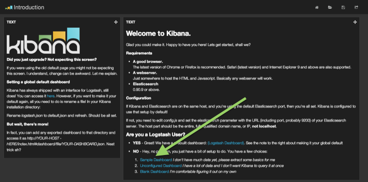
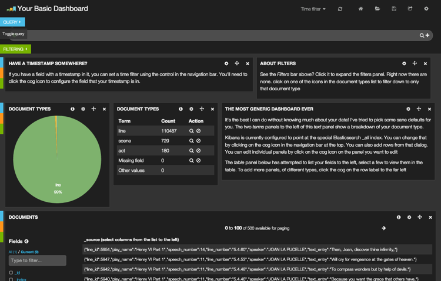
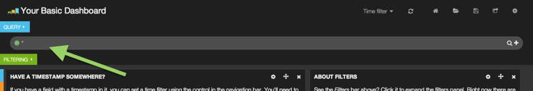
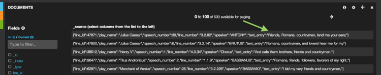
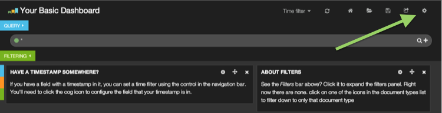
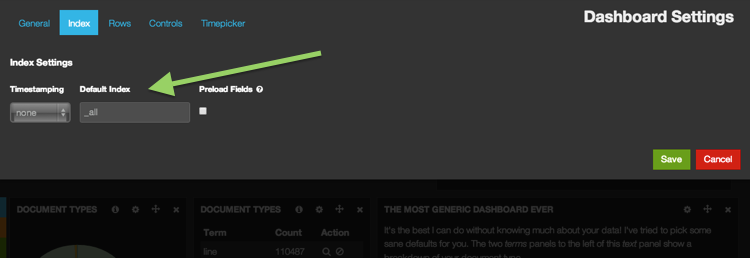

## Using Kibana for the first time

Kibana is a great tool for real time data analytics and simply being on this page has put you on your way to making the most of it! If you have not downloaded Kibana yet, you can get it here: [Download Kibana](http://www.elasticsearch.org/overview/kibana/installation/). We recommend you start this tutorial with a clean Elasticsearch instance.

By the end of this document you will have: 

- Imported some data
- Tried out the sample dashboard
- Searched your data
- Configured Kibana to point only at your new index instead of all indices

We will assume you have already:

- Installed Elasticsearch on your workstation
- Have webserver installed on your workstation and have the distribution extracted into the configured document root.
- You are familiar with the UNIX command line and have used `curl`

### Import some data

We will be using the entire collected works of Shakespeare as our example data. In order to make the best use of Kibana you will likely want to apply a mapping to your new index. Let's create the shakespeare index with the following mapping. Our data with have more fields than this, but these are the ones we want to explicitly map. Specifically we do not want to analyze 'speaker' and 'play_name'. You'll see why later on.

Run in a terminal:


```
curl -XPUT http://localhost:9200/shakespeare -d '
{
 "mappings" : {
  "_default_" : {
   "properties" : {
    "speaker" : {"type": "string", "index" : "not_analyzed" },
    "play_name" : {"type": "string", "index" : "not_analyzed" },
    "line_id" : { "type" : "integer" },
    "speech_number" : { "type" : "integer" }
   }
  }
 }
}
';
```

Great, we've created the index. Now we want to import the data. You can download the entire works of shakespeare in elasticsearch bulk import format here: [shakespeare.json](./shakespeare.jsonIntr)

Import it into your local elasticsearch instance the following command. This may take a few minutes. Shakespeare wrote a lot of stuff! 

```
curl -XPUT localhost:9200/_bulk --data-binary @shakespeare.json
```

### Accessing the Kibana interface

Now that you have data, let's do something with it. Point your browser at your local webserver, the one with Kibana already installed. 


If you have Kibana extracted to your document root you will be presented with this lovely welcome page. 
Click **Sample Dashboard**


And there you have your sample dashboard! Now if you started with a clean elasticsearch instance you'll see a very heavily weighted pie chart. This represents the type of documents in your index. As you can see, 99% them are lines for characters, with only a few denoting acts and scenes.

Below that you will see a long list of JSON formatted lines of shakespeare.

### The first search

Kibana allows you to search Elasticsearch data via the Lucene Query String syntax. Queries can be run via the query input at the top of the page


This this in the query bar. Then check out the first few rows of the table.

```
friends, romans, countrymen
```




We can also match exact phrases, note the double quotes:

```
"to be or not to be"
```

Or in a specifc fields:

```
line_id:86169
```

We can express complex searches with AND/OR, note these words must be capitalized:

```
food AND love
```

Or parantheses:

```
("played upon" OR "every man") AND stage
```

Numeric ranges can also be easily searched:

```
line_id:[30000 TO 80000] AND havoc
```

### Configuring another index
Right now Kibana is pointing at the special Elasticsearch index `_all`. Think of `_all` as a composite index that points at all of your indices. Right now you only have one, `shakespeare`, but you might have more someday and we don't want Kibana searching all of that data if you're only looking for your favorite line from Macbeth.

To configure the the index click the configure icon in the top right:



From here, you can set your index to `shakespeare` and ensure that Kibana only searches the `shakespeare` index. This setting is relative to the dashboard you are operating on



### Next steps

Congratulations, you've installed and configured kibana and dipped your toes in the water. Next, check out some of our videos and other tutorials for more advanced used, including sorting data, adding new charts and using Kibana with Logstash.