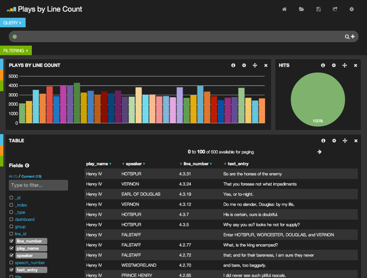
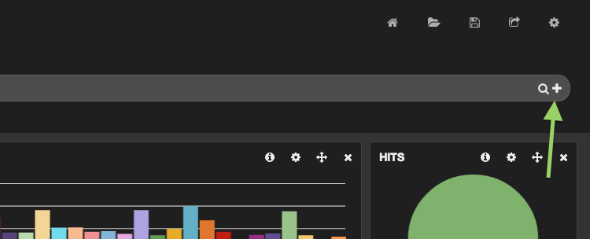
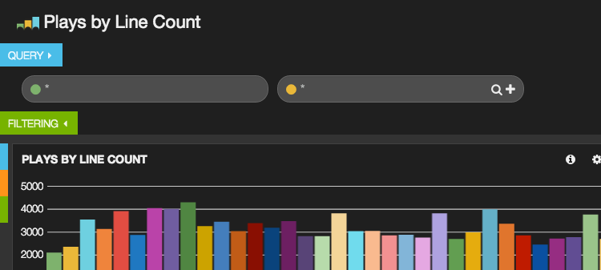
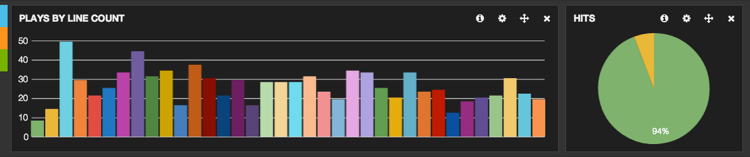
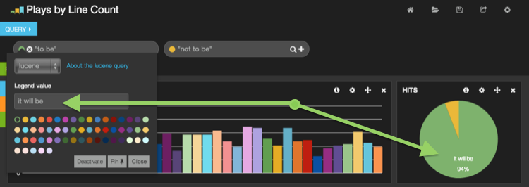
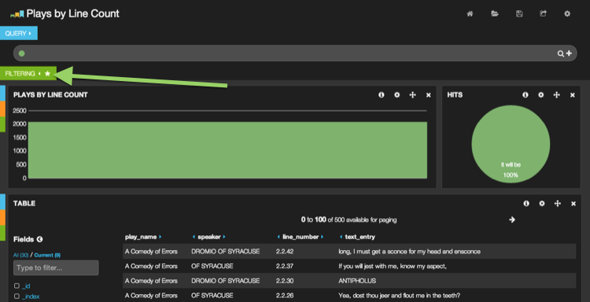
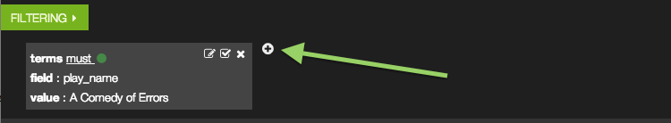

## Working with Queries and Filters

Charts and tables and maps oh my! But how do we constrain the data displayed on them. This is the role of queries and filters. Because Kibana is powered by Elasticsearch it supports the powerful Lucene Query String syntax, as well as making use of some of Elasticsearch's filter capabilities

We will assume you have already:

- Installed Elasticsearch on your workstation
- Have webserver installed on your workstation and have the distribution extracted into the configured document root.
- Have read [Using Kibana for the first time](../intro/index.html) and have the `shakespeare` index populated with the data from the tutorial.

### Our Dashboard

Our dashboard looks like this, we will be searching through lines of If you would like to follow along with the screenshots in this guide you can [download the exported dashboard schema ](./plays.json)



### Queries

Type this very simple query into the search bar

```
to be or not to be
```

You will notice, in the table, your first hit is Hamlet as expected. However, look at the next line by Sir Andrew, it does not contain "to be", nor does it contain "not to be". The search we have actually performed is: `to OR be OR or OR not OR to OR be`.

We can also match the entire phrase

```
"to be or not to be"
```

Or in a specifc fields:

```
line_id:86169
```

We can express complex searches with AND/OR, note these words must be capitalized:

```
food AND love
```

Or parantheses:

```
("played upon" OR "every man") AND stage
```

Numeric ranges can also be easily searched:

```
line_id:[30000 TO 80000] AND havoc
```

And of course to search everything:

```
*
```

### Multiple queries

Kibana can also handle multiple queries, joining them with a logical `OR` and using the knowledge that they should be treated as seperate to influence visualizations.

#### Adding

Click the **+** to the right of the query input to add another query. 



You should now have this


 
In the lefthand, green input, type `"to be"` and in the right, yellow input, type `"not to be"`. This will search for every document that has `"to be"` OR `"not to be"` in it, and break that down on our hits pie chart. So we go from a big green circle to:



#### Removing

To remove a query, click the **x** icon that appears when you mouse over the query input field


### Colors and Legends

Kibana will automatically determine a free color to use for your queries, but you can set your color explicitly if you'd like by clicking the colored dot associated with the query to open the query settings drop down. From here you can change the color of the query, or set a new value for the legend



### Filters

Many Kibana charts are interactive and can be used to filter the view of your data. For example, click on the first bar of the chart. You will end up with something like this. As you can see, the chart has become one big green bar. This is because a filter was added to match that term in the `play_name` field.



"But where" you say? 

The answer lies in that little white star that appeared on the filtering tab. Give the tab a click and we can see that a filter has added to the *filtering* panel. From the *filtering* panel filters can be added, edited, toggled and removed. Many panels have the ability to add filters, including the table, histogram, map and others.



Filters can also be added manually by clicking the **+**

### Next steps

Now that you have a solid handle on filters and queries you might be interested in how they're described in [the Kibana schema](http://linktotheschema). If you're interested in inserting queries or filters via URL parameters you might also take a look at [Templated and Scripted Dashboards](../templates_and_scripts/index.html)
