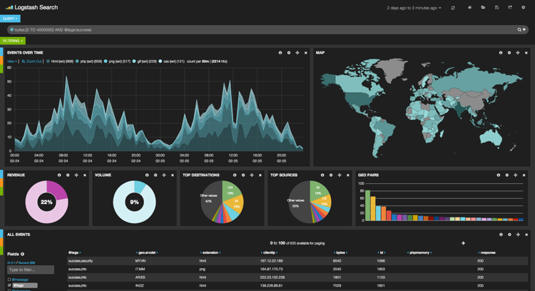

## Saving and Loading Dashboards

You've built an amazing dashboard! Now you want to share it with your team, maybe turn on auto-refresh and put it up on a big screen? Kibana can persist dashboard designs to Elasticsearch and allow you to recall them via the load menu or links.




### Saving your awesome dashboard

Saving your flashy new interface is as easy as opening the save drop down by clicking the **Save** icon in the upper righthand corner. Give your new dashboard a name and hit *enter*.


### Recalling your dashboard

To search a list of your saved dashboards click the **Load** icon in the upper righthand corner. From here you can load, share and remove dashboards.


### Sharing dashboards

Saved dashboards can be shared via the URL in your brower's navigation bar. Dashboards persisted to Elasticsearch will have a URL that points to them, such as:

```
http://your_host/index.html#/dashboard/elasticsearch/MYDASHBOARD
```

In this example `MYDASHBOARD` is the title we have given the dashboard when saving.


You can also share links to adhoc dashboards by generating a temporary URL to them by clicking the **Share** icon in the upper righthand corner of Kibana.


By default these temporary URLs live for 30 days.


### Saving a static dashboard

Dashboards can also be saved to disk on your server as .json files. Place them in the `app/dashboards` directory and access them via

```
http://your_host/index.html#/dashboard/file/MYDASHBOARD.json
```

Where `MYDASHBOARD.json` is the name of the file on disk. Note the path `/#dashboard/file/` appears similar to the above path for accessing Elasticsearch stored dashboards, but in this case we are accessing a file instead of elasticsearch. For information on exporting the dashboard schema to a file see [The Dashboard Schema Explained](../dashboard_schema/index.html)

### Next steps

Now that you know how to save dashboards, how to load them and how to access them on disk you might be interested in passing them parameters via the URL so you can programatically make links to data from other applications. See [Templated and Scripted Dashboards](../templates_and_scripts/index.html)