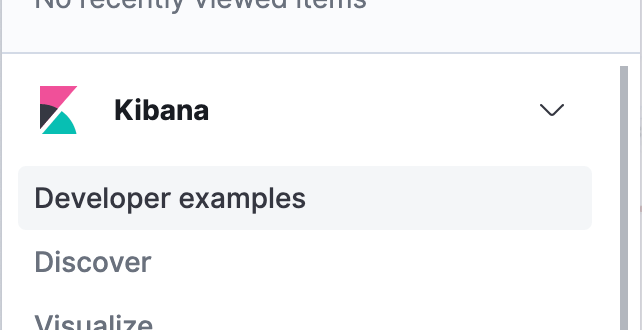

## Developer examples

Owner: Kibana application architecture team

The developer examples app is a landing page where developers go to search for working, tested examples of various developer 
services. Add your a link to your example using the developerExamples `register` function offered on the `setup` contract:

```ts
  setup(core, { developerExamples }) {
    developerExamples.register({
      appId: 'myFooExampleApp',
      title: 'Foo services',
      description: `Foo services let you do bar and zed.`,
      links: [
        {
          label: 'README',
          href: 'https://github.com/elastic/kibana/tree/master/src/plugins/foo/README.md',
          iconType: 'logoGithub',
          target: '_blank',
          size: 's',
        },
      ],
      image: img,
    });
  }
```

Run Kibana with developer examples via:

```
yarn start --run-examples
```

Then navigate to "Developer examples":


