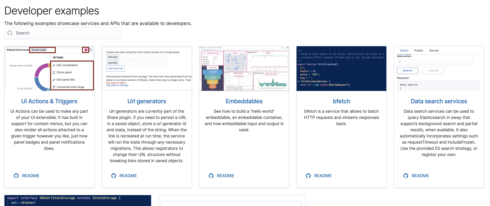

## Developer examples

Owner: Kibana application architecture team

Register your API services, a description, and add links to examples and READMEs.  These
will appear in the Developer portal app when Kibana in dev mode, is run via :

```
yarn start --run-examples
```



