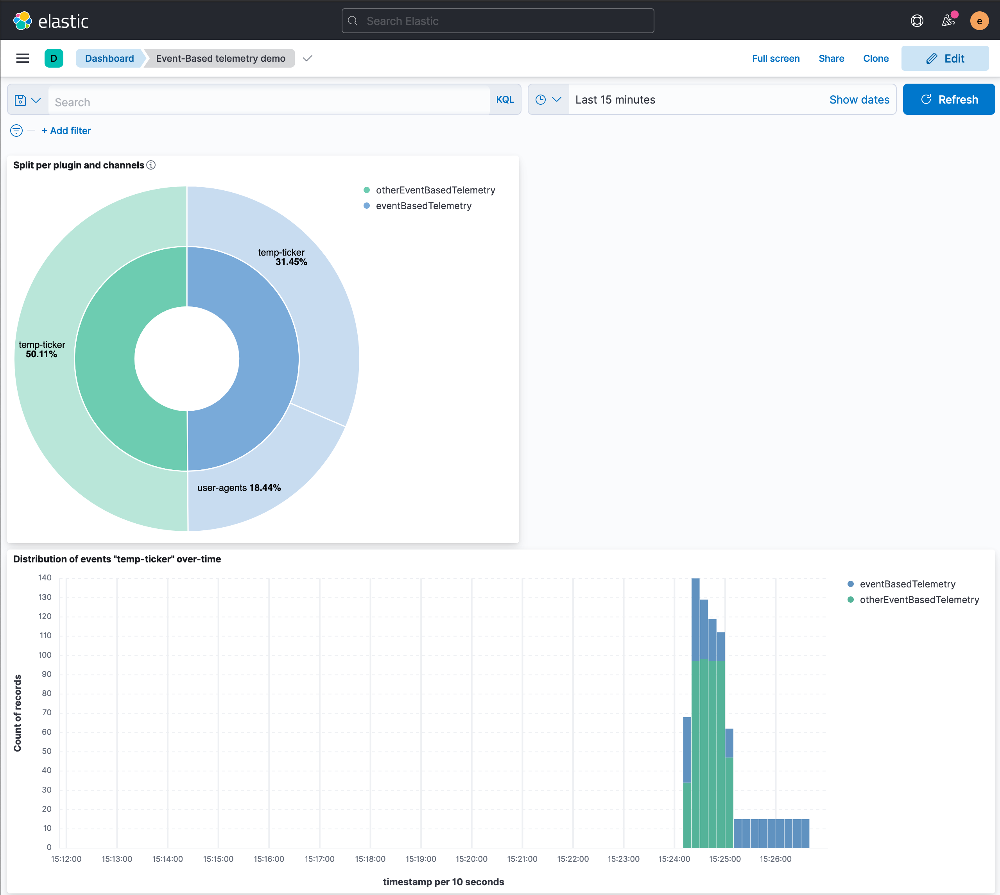
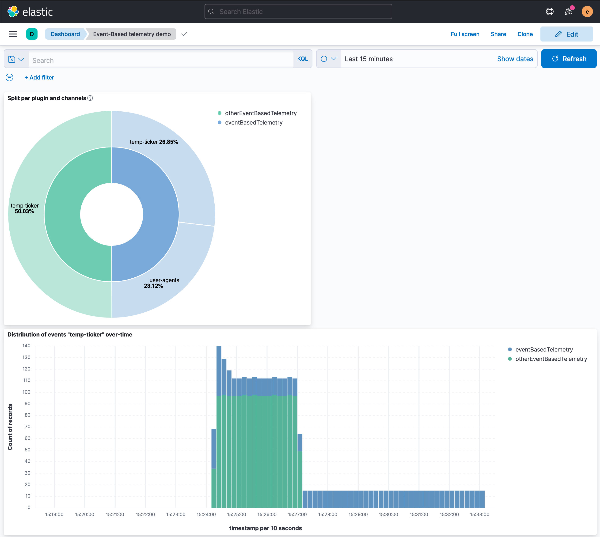

# Event-Based Telemetry Examples

This directory contains 2 plugins: `eventBasedTelemetry` and `otherEventBasedTelemetry`. 
Their purpose is to demonstrate the queueing and backpressure mechanisms implemented in the Event-Based Telemetry Service.

## Example plugins in this folder

### `eventBasedTelemetry`

This plugin:

1. Registers an app at http://localhost:5601/app/eventBasedTelemetry that has 2 buttons:
    1. Generates 100 events in the channel `user-agents`. The payload looks like `{ "user_agent": "Mozilla..." }`.
    2. Generates an invalid event to the channel `user-agents` so we can see the validation taking place, not enqueueing the event, and log.error the validation.
2. Generates an event to the channel `temp-ticker` with the format `{ "now": "{DATE_IN_ISO_STRING}" }` at the rate claimed by the setting `examples.event_based_telemetry.temp_ticker_interval_ms`.
3. Registers the API `/v3/send/kibana-events` to listen to the telemetry requests and indexes every event in the index `event-based-telemetry`.

### `otherEventBasedTelemetry`

This plugin generates an event to the channel `temp-ticker` with the format `{ "now": "{DATE_IN_ISO_STRING}", "kibana": { "uuid": "{KIBANA_UUID}" }` at the rate claimed by the setting `examples.other_event_based_telemetry.temp_ticker_interval_ms`.

## How to demo

### Configuration

To demo, you might want to use the following config in `config/kibana.yml` and run `yarn start --run-examples`:

```yaml
# Set the example plugins to generate one event every 100ms
examples.event_based_telemetry.temp_ticker_interval_ms: 100
examples.other_event_based_telemetry.temp_ticker_interval_ms: 100
# - Point to localhost (the API is listening at eventBasedTelemetry example plugin)
telemetry.url: "http://localhost:5601/v2/some-telemetry"
# - Send every 5s so we don't need to wait too much
telemetry.events.leaky_bucket.max_frequency_of_requests: 5s
```

During the demo, you might want to see all the `telemetry.events` log messages (including the debug ones to know what's happening under the hood). To achieve that, set the logging config as:

```yaml
telemetry:
  logging:
    loggers:
      - name: events
        level: debug
        appenders: [console]
```

Also, you may want to test what happens when the leaky bucket is too small that it can only contain 1 event per request.
It should evenly split the load among plugins by sending 1 event of each plugin (no matter how many channels each one of them have). To achieve this, set this config parameter:

```yaml
telemetry.events.leaky_bucket.threshold: 10b
```

### View the results

Import [this dashboard](./export.ndjson) and open it. You should see the number of events is evenly distributed at the plugin level, and then split among channels depending on the amount of data they generate:



In the screenshot we can also see the distribution of events `temp-ticker` are different. This happens because the channel in the plugin `eventBasedTelemetry` has a explicit quota of 10% the plugin's allowance. So _older_ events are dropped in favour of more recent ones. However, all the events generated by `otherEventBasedTelemetry` are eventually reported.



You can change the 10% assigned quota anytime by setting `examples.event_based_telemetry.temp_ticker_quota_percentage` to see the different effects.
