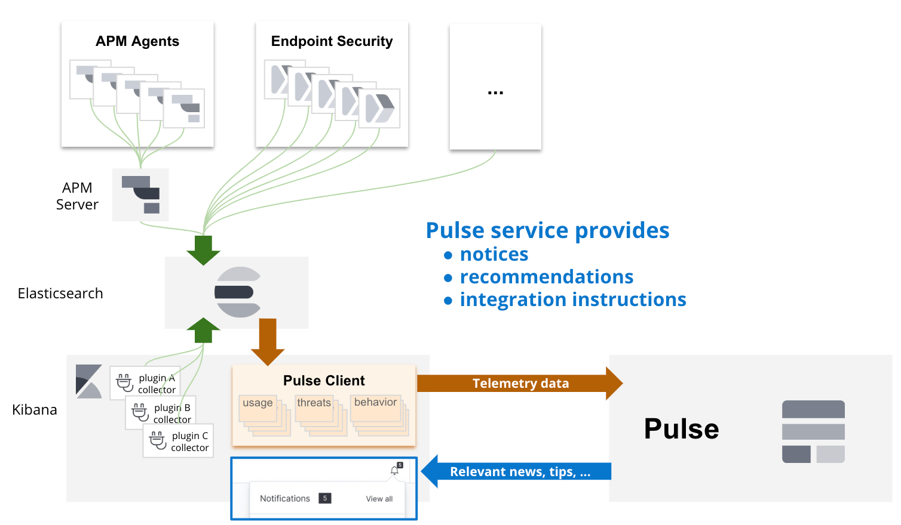

- Start Date: 2020-02-07
- RFC PR: [#57108](https://github.com/elastic/kibana/pull/57108)
- Kibana Issue: (leave this empty)

# Table of contents

- [Summary](#summary)
- [Motivation](#motivation)
- [Detailed design](#detailed-design)
  - [Concepts](#concepts)
  - [Architecture](#architecture)
    1. [Remote Pulse Service](#1-remote-pulse-service)
        - [Deployment](#deployment)
        - [Endpoints](#endpoints)
          - [Authenticate](#authenticate)
          - [Opt-In|Out](#opt-inout)
          - [Inject telemetry](#inject-telemetry)
          - [Retrieve instructions](#retrieve-instructions)
        - [Data model](#data-model)
        - [Access Control](#access-control)
    2. [Local Pulse Service](#2-local-pulse-service)
        - [Data storage](#data-storage)
        - [Sending telemetry](#sending-telemetry)
        - [Instruction polling](#instruction-polling)
- [Drawbacks](#drawbacks)
- [Alternatives](#alternatives)
- [Adoption strategy](#adoption-strategy)
- [How we teach this](#how-we-teach-this)
- [Unresolved questions](#unresolved-questions)

# Summary

Evolve our telemetry to collect more diverse data, enhance our products with that data and engage with users by enabling:

1. _Two-way_ communication link between us and our products.
2. Flexibility to collect diverse data and different granularity based on the type of data.
3. Enhanced features in our products, allowing remote-driven _small tweaks_ to existing builds.
4. All this while still maintaining transparency about what we send and making sure we don't track any of the user's data.

# Basic example

There is a POC implemented in the branch [`pulse_poc`](https://github.com/elastic/kibana/tree/pulse_poc) in this repo.

It covers the following scenarios:

- Track the behaviour of our users in the UI, reporting UI events throughout our platform.
- Report to Elastic when an unexpected error occurs and keep track of it. When it's fixed, it lets the user know, encouraging them to update to their deployment to the latest release (PR [#56724](https://github.com/elastic/kibana/pull/56724)).
- Keep track of the notifications and news in the newsfeed to know when they are read/kept unseen. This might help us on improving the way we communicate updates to the user (PR [#53596](https://github.com/elastic/kibana/pull/53596)).
- Provide a cost estimate for running that cluster in Elastic Cloud, so the user is well-informed about our up-to-date offering and can decide accordingly (PR [#56324](https://github.com/elastic/kibana/pull/56324)).
- Customised "upgrade guide" from your current version to the latest (PR [#56556](https://github.com/elastic/kibana/pull/56556)).


_Basic example of the architecture_

# Motivation

Based on our current telemetry, we have many _lessons learned_ we want to tackle:

- It only supports one type of data:
  - It makes simple tasks like reporting aggregations of usage based on a number of days [an overengineered solution](https://github.com/elastic/kibana/issues/46599#issuecomment-545024137)
  - When reporting arrays (i.e.: `ui_metrics`), it cannot be consumed, making the data useless.
- _One index to rule them all_:  
The current unique document structure comes at a price:
  - People consuming that information finding it hard to understand each element in the document ([[DISCUSS] Data dictionary for product usage data](https://github.com/elastic/telemetry/issues/211))
  - Maintaining the mappings is a tedious and risky process. It involved increasing the setting for the limit of fields in a mapping and reindexing documents (now millions of them).
  - We cannot fully control the data we insert in the documents: If we set `mappings.dynamic: 'strict'`, we'll reject all the documents containing more information than the actually mapped, losing all the other content we do want to receive.
- Opt-out ratio:  
We want to reduce the number of `opt-out`s by providing some valuable feedback to our users so that they want to turn telemetry ON because they do benefit from it.

# Detailed design

This design is going to be tackled by introducing some common concepts to be used by the main two main components in this architecture:

1. Remote Pulse Service (RPS)
2. Local Pulse Service (LPS)

After that, it explains how we envision the architecture and design of each of those components.

## Concepts

There are some new concepts we'd like to introduce with this new way of reporting telemetry:

- **Deployment Hash ID**  
This is the _anonymised_ random ID assigned for a deployment. It is used to link multiple pieces of information for further analysis like cross-referencing different bits of information from different sources.
- **Channels**  
This is each stream of data that have common information. Typically each channel will have a well defined source of information, different to the rest. It will also result in a different structure to the rest of channels. However, all the channels will maintain a minimum piece of common schema for cross-references (like **Deployment Hash ID** and **timestamp**).
- **Instructions**  
These are the messages generated in the form of feedback to the different channels.  
Typically, channels will follow a bi-directional communication process _(Local <-> Remote)_ but there might be channels that do not generate any kind of instruction _(Local -> Remote)_ and, similarly, some other channels that do not provide any telemetry at all, but allows Pulse to send updates to our products _(Local <- Remote)_.

## Phased implementation

At the moment of writing this document, anyone can push _fake_ telemetry data to our Telemetry cluster. They only need to know the public encryption key, the endpoint and the format of the data, all of that easily retrievable. We take that into consideration when analysing the data we have at the moment and it is a risk we are OK with for now.

But, given that we aim to provide feedback to the users and clusters in the form of instructions, the **Security and Integrity of the information** is critical. We need to come up with a solution that ensures the instructions are created based on data that was uniquely created (signed?) by the source. If we cannot ensure that, we should not allow that piece of information to be used in the generation of the instructions for that cluster and we should mark it so we know it could be maliciously injected when using it in our analysis.

But also, we want to be able to ship the benefits of Pulse on every release. That's why we are thinking on a phased release, starting with limited functionality and evolving to the final complete vision of this product. This RFC suggests the following phased implementation:

1. **Be able to ingest granular data**  
With the introduction of the **channels**, we can start receiving granular data that will help us all on our analysis. At this point, the same _security_ features as the current telemetry are considered: The payload is encrypted by the Kibana server so no mediator can spoof the data.  
The same risks as the current telemetry still apply at this point: anyone can _impersonate_ and send the data on behalf of another cluster, making the collected information useless.  
Because this information cannot be used to generate any instruction, we may not care about the **Deployment Hash ID** at this stage. This means no authentication is required to push data.  
The works at this point in time will be focused on creating the initial infraestructure, receiving early data and start with the migration of the current telemetry into the new channel-based model. Finally, start exploring the new visualisations we can provide with this new model of data.

2. **Secured ingest channel**  
In this phase, our efforts will focus on securing the communications and integrity of the data. This includes:
    - **Generation of the Deployment Hash ID**:  
    Discussions on whether it should be self-generated and accepted/rejected by the Remote Pulse Service (RPS) or it should be generated and assigned by the RPS because it is the only one that can ensure uniqueness.
    - **Locally store the Deployment Hash ID as an encrypted saved object**:  
    This comes back with a caveat: OSS versions will not be able to receive instructions. We will need to maintain a fallback mechanism to the phase 1 logic (it may be a desired scenario because it could happen the encrypted saved objects are not recoverable due to an error in the deployment and we should still be able to apply that fallback).
    - **Authenticity of the information (Local -> Remote)**:  
    We need to _sign_ the data in some way the RPS can confirm the information reported as for a _Deployment Hash ID_ comes from the right source.
    - **Authenticity of the information (Remote -> Local)**:  
    We need the Local Pulse Service (LPS) to be able to confirm the responses from the RPS data has not been altered by any mediator. It could be done via encryption using a key provided by the LPS. This should be provided to the RPS inside an encrypted payload in the same fashion we currently encrypt the telemetry.
    - **Integrity of the data in the channels**:  
    We need to ensure an external plugin cannot push data to channels to avoid malicious corruption of the data. We could achieve this by either making this plugin only available to Kibana-shipped plugins or storing the `pluginID` that is pushing the data to have better control of the source of the data (then an ingest pipeline can reject any source of data that should not be accepted).

    All the suggestions in this phase can be further discussed at that point (I will create another RFC to discuss those terms after this RFC is approved and merged).

3. **Instruction handling**  
This final phase we'll implement the instruction generation and handling at the same time we are adding more **channels**.  
We can discuss at this point if we want to be able to provide _harmless_ instructions for those deployments that are not _secured_ (i.e.: Cloud cost estimations, User-profiled-based marketing updates, ...).

## Architecture

As mentioned earlier, at the beginning of this chapter, there are two main components in this architecture:

1. Remote Pulse Service
2. Local Pulse Service

### 1. Remote Pulse Service

This is the service that will receive and store the telemetry from all the _opted-in_ deployments. It will also generate the messages we want to report back to each deployment (aka: instructions).

#### Deployment

- The service will be hosted by Elastic.
- Most likely maintained by the Infra team.
- GCP is contemplated at this moment, but we need to confirm how would it affect us regarding the FedRamp approvals (and similar).
- Exposes an API (check [Endpoints](#endpoints) to know more) to inject the data and retrieve the _instructions_.
- The data will be stored in an ES cluster.

#### Endpoints

The following endpoints **will send every payload** detailed in below **encrypted** with a similar mechanism to the current telemetry encryption.

##### Authenticate

This Endpoint will be used to retrieve a randomised `deploymentID` and a `token` for the cluster to use in all the subsequent requests. Ideally, it will provide some sort of identifier (like `cluster_uuid` or `license.uuid`) so we can revoke its access to any of the endpoints if explicitly requested ([Blocking telemetry input](https://github.com/elastic/telemetry/pull/221) and [Delete previous telemetry data](https://github.com/elastic/telemetry/issues/209)).

I'd appreciate some insights here to come up with a strong handshake mechanism to avoid stealing identities.

In order to _dereference_ the data, we can store these mappings in a Vault or Secrets provider instead of an index in our ES.

_NB: Not for phase 1_

##### Opt-In|Out

Similar to the current telemetry, we want to keep track of when the user opts in or out of telemetry. The implementation can be very similar to the current one. But we recently learned we need to add the origin to know what application has telemetry disabled (Kibana, Beats, Enterprise Search, ...). This makes me wonder if we will ever want to provide a granular option for the user to be able to cherry-pick about what channels are sent and which ones should be disabled.

##### Inject telemetry

In order to minimise the amount of requests, this `POST` should accept bulks of data in the payload (mind the payload size limits if any). It will require authentication based on the `deploymentID` and `token` explained in the [previous endpoint](#authenticate) (_NB: Not for phase 1_).

The received payload will be pushed to a streaming technology (AWS Firehose, Google Pub/Sub, ...). This way we can maintain a buffer in cases the ingestion of data spikes or we need to stop our ES cluster for any maintenance purposes.

A subscriber to that stream will receive that info a split the payload into smaller documents per channel and index them into their separate indices.

This indexing should also trigger some additional processes like the **generation of instructions** and _special views_ (only if needed, check the point [Access control](#access-control) for more details).

_NB: We might want to consider some sort of piggy-backing to include the instructions in the response. But for the purpose of this RFC, scalability and separation of concerns, I'd rather keep it for future possible improvements._

##### Retrieve instructions

_NB: Only after phase 3_

This `GET` endpoint should return the list of instructions generated for that deployment. To control the likely ever-growing list of instructions for each deployment, it will accept a `since` query parameter where the requester can specify the timestamp ever since it was to retrieve the new values.

This endpoint will read the `instructions-*` indices, filtering `updated-at` by the `since` query parameter (if provided) and it will return the results, grouping them by channels.

Additionally, we can consider accepting an additional query parameter to retrieve only specific channels. For use cases like distributed components (endpoint, apm, beats, ...) polling instructions themselves.

#### Data model

The storage of each of the documents, will be based on monthly-rolling indices split by channels. This means we'll have indices like `pulse-raw-{CHANNEL_NAME}-YYYY.MM` and `pulse-instructions-{CHANNEL_NAME}-YYYY.MM` (final names TBD).

The first group will be used to index all the incoming documents from the telemetry. While the second one will contain the instructions to be sent to the deployments.

The mapping for those indices will be **`strict`** to avoid anyone storing unwanted/not-allowed info. The indexer defined in [the _Inject telemetry_ endpoint](#inject-telemetry) will need to handle accordingly the errors derived from the strict mapping.  
We'll set up a process to add new mappings and their descriptions before every new release.

#### Access control

- The access to _raw_ data indices will be very limited. Only granted to those in need of troubleshooting the service and maintaining mappings (this is the Pulse/Telemetry team at the moment).
- Special views (as in aggregations/visualisations/snapshots of the data stored in special indices via separated indexers/aggregators/ES transform or via _BigQuery_ or similar) will be defined for different roles in the company to help them to take informed decisions based on the data.  
This way we'll be able to control "who can see what" on a very granual basis. It will also provide us with more flexibility to change to structure of the _raw_ if needed.

### 2. Local Pulse Service

This refers to the plugin running in Kibana in each of our customers' deployments. It will be a core service in NP, available for all plugins to get the existing channels, to send pieces of data, and subscribe to instructions.

The channel handlers are only defined inside the pulse context and are used to normalise the data for each channel before sending it to the remote service. The CODEOWNERS should notify the Pulse team every time there's an intended change in this context.

#### Data storage

For the purpose of transparency, we want the user to be able to retrieve the telemetry we send at any point, so we should store the information we send for each channel in their own local _dot_ internal indices (similar to a copy of the `pulse-raw-*` and `pulse-instructions-*` indices in our remote service). We may want to also sync back from the remote service any updates we do to the documents: enrichment of the document, anonymisation, categorisation when it makes sense in that specific channel, ...

In the same effort, we could even provide some _dashboards_ in Kibana for specific roles in the cluster to understand more about their deployment.

Only those specific roles (admin?) should have access to these local indices, unless they grant permissions to other users they want to share this information with.

The users should be able to control how long they want to keep that information for via ILM. A default ILM policy will be setup during the startup if it doesn't exist.

#### Sending telemetry

The telemetry will be sent, preferably, from the server. Only falling back to the browser in case we detect the server is behind firewalls and it cannot reach the service or if the user explicitly sets the behaviour in the config.

Periodically, the process (either in the server or the browser) will retrieve the telemetry to be sent by the channels, compile it into 1 bulk payload and send it encrypted to the [ingest endpoint](#inject-telemetry) explained earlier.

How often it sends the data, depends on the channel specifications. We will have 3 levels of periodicity:

- `URGENT`: The data is sent as soon as possible.
- `HIGH`: Sent every hour.
- `NORMAL`: Sent every 24 hours.
- `LOW`: Sent every 3 days.

Some throttling policy should be applied to avoid exploiting the exceeded use of `URGENT`.

#### Instruction polling

Similarly to the sending of the telemetry, the instruction polling should happen only on one end (either the server or the browser). It will store the responses in the local index for each channel and the plugins reacting to those instructions will be able to consume that information based on their own needs (either load only the new ones or all the historic data at once).

Depending on the subscriptions to the channels by the plugins, the polling will happen with different periodicity, similar to the one described in the chapter above.

#### Exposing channels to the plugins

The plugins will be able to send messages and/or consume instructions for any channel by using the methods provided as part of the `coreContext` in the `setup` and `start` lifecycle methods in a fashion like (types to be properly defined when implementing it):

```typescript
const coreContext: CoreSetup | CoreStart = {
  ...existingCoreContext,
  pulse: {
    sendToChannel: async (channelName: keyof Channels, payload: Channels[channelName]) => void,
    instructionsFromChannel$: (channelName: keyof Channels) => Observable<ChannelInstructions[channelName]>,
  },
}
```

Plugins will simply need to call `core.pulse.sendToChannel('errors', myUnexpectedErrorIWantToReport)` whenever they want to report any new data to that channel. This will call the channel's handler to store the data.

Similarly, they'll be able to subscribe to channels like:

```typescript
core.pulse.instructionsFromChannel$('ui_behaviour_tracking')
  .pipe(filterInstructionsForMyPlugin) // Initially, we won't filter the instructions based on the plugin ID (might not be necessary in all cases)
  .subscribe(changeTheOrderOfTheComponents);
```

Internally in those methods we should append the `pluginId` to know who is sending/receiving the info.

##### The _legacy_ collection

The current telemetry collection via the `UsageCollector` service will be maintained until all the current telemetry is fully migrated into their own channels. In the meantime, the current existing telemetry will be sent to Pulse as the `legacy` channel. This way we can maintain the same architecture for the old and new telemetry to come. At this stage, there is no need for any plugin to update their logic unless they want to send more granular data using other (even specific to that plugin) channels.

The mapping for this `legacy` channel will be kept `dynamic: false` instead of `strict` to ensure compatibility.

# Drawbacks

- Pushing data into telemetry nowadays is as simple as implementing your own `usageCollector`. For consuming, though, the telemetry team needs to update the mappings. But as soon as they do so, the previous data is available. Now we'll be more strict about the mapping. Rejecting any data that does not comply. Changing the structure of the reported data will result in data loss in that channel.
- Hard dependency on the Pulse team's availability to update the metrics and on the Infra team to deploy the instruction handlers.
- Testing architecture: any dockerised way to test the local dev environment?
- We'll increase the local usage of indices. Making it more expensive to users to maintain the cluster. We need be to careful with this! Although it might not change much, compared to the current implementation, if any plugin decides to maintain its own index/saved objects to do aggregations afterwards. Similarly, more granularity per channel, may involve more network usage.
- It is indeed a breaking change, but it can be migrated over-time as new features, making use of the instructions.
- We need to update other products already reporting telemetry from outside Kibana (like Beats, Enterprise Search, Logstash, ...) to use the new way of pushing telemetry.

# Alternatives

> What other designs have been considered?

We currently have the newsfeed to be able to communicate to the user. This is actually pulling in Kibana from a public API to retrieve the list of entries to be shown in the notification bar. But this is only limitted to notifications to the user while the new _intructions_ can provide capabilities like self-update/self-configuration of components like endpoints, elasticsearch, ...

> What is the impact of not doing this?

Users might not see any benefit from providing telemetry and will opt-out. The quality of the telemetry will likely not be as good (or it will require a higher effort on the plugin end to provide it like in [the latest lens effort](https://github.com/elastic/kibana/issues/46599#issuecomment-545024137))

# Adoption strategy

Initially, we'll focus on the remote service and move the current telemetry to report as a `"legacy"` channel to the new Pulse service.

Then, we'll focus on doing the client side, providing new APIs to report the data, aiming for the minimum changes on the public end. For instance, the current usage collectors already report an ID, we can work on those IDs mapping to a channel (only grouping them when it makes sense). Nevertheless, it will require the devs to engage with the Pulse team for the mappings and definitions to be properly set up and updated. And any views to be added.

Finally, the instruction handling APIs are completely new and it will require development on both _remote_ and _local_ ends for the instruction generation and handling.

# How we teach this

> What names and terminology work best for these concepts and why? How is this
idea best presented? As a continuation of existing Kibana patterns?

We have 3 points of view to show here:

- From the users perspective, we need to show the value for them to have the telemetry activated.
- From the devs, how to generate data and consume instructions.
- From the PMs, how to consume the views + definitions of the fields.

> Would the acceptance of this proposal mean the Kibana documentation must be
re-organized or altered? Does it change how Kibana is taught to new developers
at any level?

This telemetry is supposed to be internal only. Only internal developers will be able to add to this. So the documentation will only be for internal puposes. As mentioned in the _Adoption strategy_, the idea is that the devs to report new data to telemetry will need to engage with the Pulse team.

> How should this feature be taught to existing Kibana developers?

# Unresolved questions

- Pending to define a proper handshake in the authentication mechanism to reduce the chance of a man-in-the-middle attack or DDoS. => We already have some ideas thanks to @jportner and @kobelb but it will be resolved during the _Phase 2_ design.
- Opt-in/out per channel?
