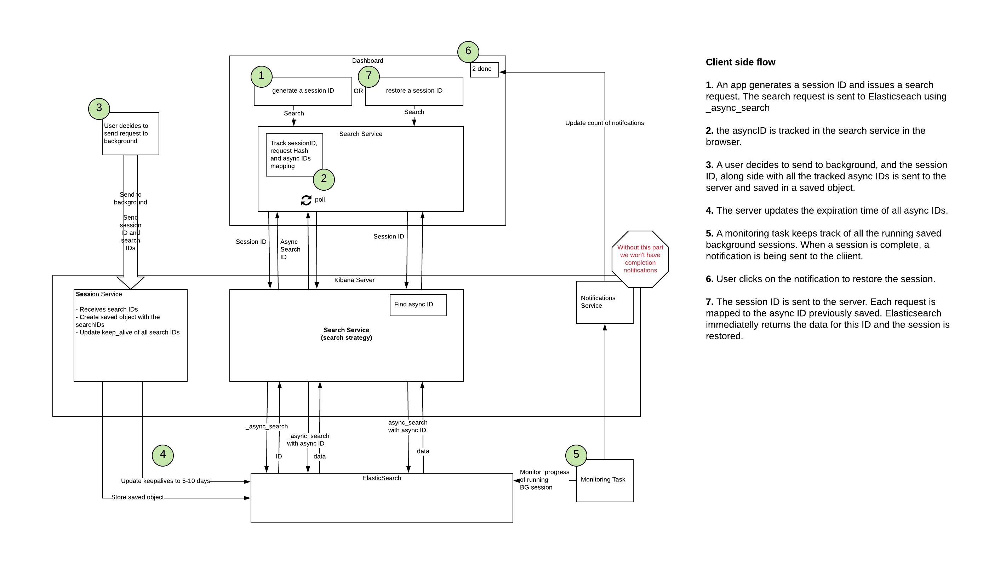
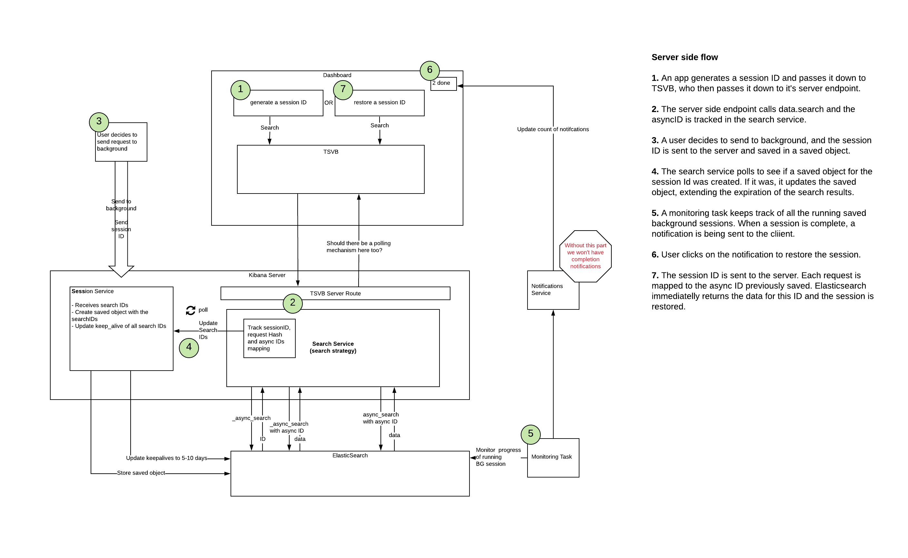

- Start Date: (fill me in with today's date, YYYY-MM-DD)
- RFC PR: (leave this empty)
- Kibana Issue: (leave this empty)

- Architecture diagram: https://app.lucidchart.com/documents/edit/cf35b512-616a-4734-bc72-43dde70dbd44/0_0
- Mockups: https://www.figma.com/proto/FD2M7MUpLScJKOyYjfbmev/ES-%2F-Query-Management-v4?node-id=440%3A1&viewport=984%2C-99%2C0.09413627535104752&scaling=scale-down
- Old issue: https://github.com/elastic/kibana/issues/53335
- Search Sessions roadmap: https://github.com/elastic/kibana/issues/61738
- POC: https://github.com/elastic/kibana/pull/64641   

# Summary

Search Sessions will enable Kibana applications and solutions to start a group of related search requests (such as those coming from a single load of a dashboard or SIEM timeline), navigate away or close the browser, then retrieve the results when they have completed.

# Basic example

At its core, search sessions are enabled via several new APIs, that:
- Start a session, associating multiple search requests with a single entity
- Store the session (and continue search requests in the background)
- Restore the saved search session

```ts
const searchService = dataPluginStart.search;

if (appState.sessionId) {
  // If we are restoring a session, set the session ID in the search service
  searchService.session.restore(sessionId);
} else {
  // Otherwise, start a new search session to associate our search requests
  appState.sessionId = searchService.session.start();
} 

// Search, passing in the generated session ID. 
// If this is a new session, the `search_interceptor` will associate and keep track of the async search ID with the session ID. 
// If this is a restored session, the server will immediately return saved results.
// In the case where there is no saved result for a given request, or if the results have expired, `search` will throw an error with a meaningful error code.
const request = buildKibanaRequest(...);
request.sessionId = searchService.session.get();
const response$ = await searchService.search(request);

// Calling `session.store()`, creates a saved object for this session, allowing the user to navigate away.
// The session object will be saved with all async search IDs that were executed so far. 
// Any follow up searches executed with this sessionId will be saved into this object as well.  
const searchSession = await searchService.session.store();
```

# Motivation

Kibana is great at providing fast results from large sets of "hot" data. However, there is an increasing number of use cases where users want to analyze large amounts of "colder" data (such as year-over-year reports, historical or audit data, batch queries, etc.). 

For these cases, users run into two limitations: 
 1. Kibana has a default timeout of 30s per search. This is controlled by the `elasticsearch.requestTimeout` setting (originally intended to protect clusters from unintentional overload by a single query).
 2. Kibana cancels queries upon navigating away from an application, once again, as means of protecting clusters and reducing unnecessary load. 

In 7.7, with the introduction of the `_async_search` API in Elasticsearch, we provided Kibana users a way to bypass the timeout, but users still need to remain on-screen for the entire duration of the search requests.

The primary motivation of this RFC is to enable users to do the following without needing to keep Kibana open, or while moving onto other work inside Kibana:

- Run long search requests (beyond 30 seconds)
- View their status (complete/incomplete)
- Cancel incomplete search requests
- Retrieve completed search request results 

# Detailed design

Because a single view (such as a dashboard with multiple visualizations) can initiate multiple search requests, we need a way to associate the search requests together in a single entity. 

We call this entity a `session`, and when a user decides that they want to continue running the search requests while moving onto other work, we will create a saved object corresponding with that specific `session`, persisting the *sessionId* along with a mapping of each *request's hash* to the *async ID* returned by Elasticsearch.

## High Level Flow Charts

### Client side search

This diagram matches any case where `data.search` is called from the front end:



### Server side search

This case happens if the server is the one to invoke the `data.search` endpoint, for example with TSVB.



## Data and Saved Objects

### Search Session Status

```ts
export enum SearchSessionStatus {
  Running,   // The session has at least one running search ID associated with it.
  Done,      // All search IDs associated with this session have completed.
  Error,     // At least one search ID associated with this session had an error. 
  Expired,   // The session has expired. Associated search ID data was cleared from ES.
}
```

### Saved Object Structure

The saved object created for a search session will be scoped to a single space, and will be a `hidden` saved object
(so that it doesn't show in the management listings). We will provide a separate interface for users to manage their own
saved search sessions (which will use the `list`, `expire`, and `extend` methods described below, which will be restricted
per-user).

```ts
interface SearchSessionAttributes extends SavedObjectAttributes {
  sessionId: string;
  userId: string; // Something unique to the user who generated this session, like username/realm-name/realm-type
  status: SearchSessionStatus;
  name: string;
  creation: Date;
  expiration: Date;
  idMapping: { [key: string]: string };
  url: string; // A URL relative to the Kibana root to retrieve the results of a completed search session (and/or to return to an incomplete view)
  metadata: { [key: string]: any } // Any data the specific application requires to restore a search session view
}
```

The URL that is provided will need to be generated by the specific application implementing search sessions. We
recommend using the URL generator to ensure that URLs are backwards-compatible since search sessions may exist as
long as a user continues to extend the expiration. 

## Frontend Services

Most sessions will probably not be saved. Therefore, to avoid creating unnecessary saved objects, the browser will keep track of requests and their respective search IDs, until the user chooses to store the session. Once a session is stored, any additional searches will be immediately saved on the server side. 

### New Session Service

We will expose a new frontend `session` service on the `data` plugin `search` service. 

The service will expose the following APIs:

```ts
interface ISessionService {
   /** 
    * Returns the current session ID
    */
   getActiveSessionId: () => string;

  /**
   * Sets the current session
   * @param sessionId: The ID of the session to set
   * @param isRestored: Whether or not the session is being restored
   */
   setActiveSessionId: (sessionId: string, isRestored: boolean) => void;

   /**
    * Start a new session, by generating a new session ID (calls `setActiveSessionId` internally)
    */
   start: () => string;

   /**
    * Store a session, alongside with any tracked searchIds.
    * @param sessionId Session ID to store. Probably retrieved from `sessionService.get()`.
    * @param name A display name for the session.
    * @param url TODO: is the URL provided here? How?
    * @returns The stored `SearchSessionAttributes` object
    * @throws Throws an error in OSS.
    */
   store: (sessionId: string, name: string, url: string) => Promise<SearchSessionAttributes>

   /**
    * @returns Is the current session stored (i.e. is there a saved object corresponding with this sessionId).
    */
   isStored: () => boolean;

   /** 
    * @returns Is the current session a restored session
    */
   isRestored: () => boolean;

   /**
    * Mark a session and and all associated searchIds as expired.
    * Cancels active requests, if there are any.
    * @param sessionId Session ID to store. Probably retrieved from `sessionService.get()`.
    * @returns success status
    * @throws Throws an error in OSS.
    */
   expire: (sessionId: string) => Promise<boolean> 
   
   /**
    * Extend a session and all associated searchIds.
    * @param sessionId Session ID to extend. Probably retrieved from `sessionService.get()`.
    * @param extendBy Time to extend by, can be a relative or absolute string.
    * @returns success status
    * @throws Throws an error in OSS.
    */
   extend: (sessionId: string, extendBy: string)=> Promise<boolean>

   /**
    * @param sessionId the ID of the session to retrieve the saved object.
    * @returns a filtered list of SearchSessionAttributes objects. 
    * @throws Throws an error in OSS.
    */
   get: (sessionId: string) => Promise<SearchSessionAttributes>

   /**
    * @param options The options to query for specific search session saved objects.
    * @returns a filtered list of SearchSessionAttributes objects. 
    * @throws Throws an error in OSS.
    */
   list: (options: SavedObjectsFindOptions) => Promise<SearchSessionAttributes[]>

   /**
    * Clears out any session info as well as the current session. Called internally whenever the user navigates
    * between applications.
    * @internal
    */
   clear: () => void;

   /** 
    * Track a search ID of a sessionId, if it exists. Called internally by the search service.
    * @param sessionId
    * @param request 
    * @param searchId
    * @internal
    */
  trackSearchId: (
    sessionId: string,
    request: IKibanaSearchRequest,
    searchId: string,
  ) => Promise<boolean>
}
```

## Backend Services and Routes

The server side's feature implementation builds on how Elasticsearch's `async_search` endpoint works. When making an
initial new request to Elasticsearch, it returns a search ID that can be later used to retrieve the results.

The server will then store that `request`, `sessionId`, and `searchId` in a mapping in memory, and periodically query
for a saved object corresponding with that session. If the saved object is found, it will update the saved object to
include this `request`/`searchId` combination, and remove it from memory. If, after a period of time (5 minutes?) the
saved object has not been found, we will stop polling for that `sessionId` and remove the `request`/`searchId` from
memory.  

When the server receives a search request that has a `sessionId` and is marked as a `restore` request, the server will
attempt to find the correct id within the saved object, and use it to retrieve the results previously saved.

### New Session Service

```ts
interface ISessionService {
  /** 
   * Adds a search ID to a Search Session, if it exists.
   * Also extends the expiration of the search ID to match the session's expiration.
   * @param request 
   * @param sessionId
   * @param searchId 
   * @returns true if id was added, false if Search Session doesn't exist or if there was an error while updating.
   * @throws an error if `searchId` already exists in the mapping for this `sessionId`
   */
  trackSearchId: (
    request: KibanaRequest,
    sessionId: string,
    searchId: string,
  ) => Promise<boolean>

  /** 
   * Get a Search Session object.
   * @param request 
   * @param sessionId
   * @returns the Search Session object if exists, or undefined.
   */
  get: async (
    request: KibanaRequest,
    sessionId: string
  ) => Promise<SearchSessionAttributes?>

  /** 
   * Get a searchId from a Search Session object.
   * @param request 
   * @param sessionId
   * @returns the searchID if exists on the Search Session, or undefined.
   */
  getSearchId: async (
    request: KibanaRequest,
    sessionId: string
  ) => Promise<string?>

   /**
    * Store a session.
    * @param request 
    * @param sessionId Session ID to store. Probably retrieved from `sessionService.get()`.
    * @param searchIdMap A mapping of hashed requests mapped to the corresponding searchId.
    * @param url TODO: is the URL provided here? How?
    * @returns The stored `SearchSessionAttributes` object
    * @throws Throws an error in OSS.
    */
  store: (
    request: KibanaRequest,
    sessionId: string,
    name: string,
    url: string,
    searchIdMapping?: Record<string, string>
  ) => Promise<SearchSessionAttributes>

   /**
    * Mark a session as and all associated searchIds as expired.
    * @param request 
    * @param sessionId
    * @returns success status
    * @throws Throws an error in OSS.
    */
  expire: async (
    request: KibanaRequest,
    sessionId: string
  ) => Promise<boolean>

   /**
    * Extend a session and all associated searchIds.
    * @param request 
    * @param sessionId 
    * @param extendBy Time to extend by, can be a relative or absolute string.
    * @returns success status
    * @throws Throws an error in OSS.
    */
  extend: async (
    request: KibanaRequest,
    sessionId: string,
    extendBy: string,
  ) => Promise<boolean>

   /**
    * Get a list of Search Session objects.
    * @param request 
    * @param sessionId
    * @returns success status
    * @throws Throws an error in OSS.
    */
  list: async (
    request: KibanaRequest,
  ) => Promise<SearchSessionAttributes[]>

   /**
    * Update the status of a given session
    * @param request 
    * @param sessionId
    * @param status
    * @returns success status
    * @throws Throws an error in OSS.
    */
  updateStatus: async (
    request: KibanaRequest,
    sessionId: string,
    status: SearchSessionStatus
  ) => Promise<boolean>
}

```

### Search Service Changes

There are cases where search requests are issued by the server (Like TSVB).
We can simplify this flow by introducing a mechanism, similar to the frontend one, tracking the information in memory and polling for a saved object with a corresponding sessionId to store the ids into it.

```ts
interface SearchService {
  /**
   * The search API will accept the option `trackId`, which will track the search ID, if available, on the server, until a corresponding saved object is created.  
   **/
  search: async (
    context: RequestHandlerContext,	  
    request: IEnhancedEsSearchRequest,
    options?: ISearchOptions
  ) => ISearchResponse<Payload=any>
}
```

### Server Routes

Each route exposes the corresponding method from the Session Service (used only by the client-side service, not meant to be used directly by any consumers):

`POST /internal/session/store`

`POST /internal/session/extend`

`POST /internal/session/expire`

`GET /internal/session/list`

### Search Strategy Integration 

If the `EnhancedEsSearchStrategy` receives a `restore` option, it will attempt reloading data using the Search Session saved object matching the provided `sessionId`. If there are any errors during that process, the strategy will return an error response and *not attempt to re-run the request.

The strategy will track the asyncId on the server side, if `trackId` option is provided.

### Monitoring Service

The `data` plugin will register a task with the task manager, periodically monitoring the status of incomplete search sessions. 

It will query the list of all incomplete sessions, and check the status of each search that is executing. If the search requests are all complete, it will update the corresponding saved object to have a `status` of `complete`. If any of the searches return an error, it will update the saved object to an `error` state. If the search requests have expired, it will update the saved object to an `expired` state. Expired sessions will be purged once they are older than the time definedby the `EXPIRED_SESSION_TTL` advanced setting.  

Once there's a notification area in Kibana, we may use that mechanism to push completion \ error notifications to the client.

## Miscellaneous

#### Relative dates and restore URLs

Restoring a sessionId depends on each request's `sha-256` hash matching exactly to the ones saved, requiring special attention to relative date ranges, as having these might yield ambiguous results. 

There are two potential scenarios: 
 - A relative date (for example `now-1d`) is being used in query DSL - In this case any future hash will match, but the returned data *won't match the displayed timeframe*. For example, a report might state that it shows data from yesterday, but actually show data from a week ago.
 - A relative date is being translated by the application before being set to the query DSL - In this case a different date will be sent and the hash will never match, resulting in an error restoring the dashboard.

Both scenarios require careful attention during the UI design and implementation. 

The former can be resolved by clearly displaying the creation time of the restored Search Session. We could also attempt translating relative dates to absolute one's, but this might be challenging as relative dates may appear deeply nested within the DSL. 

The latter case happens at the moment for the timepicker only: The relative date is being translated each time into an absolute one, before being sent to Elasticsearch. In order to avoid issues, we'll have to make sure that restore URLs are generated with an absolute date, to make sure they are restored correctly.

#### Changing a restored session

If you have restored a Search Session, making any type of change to it (time range, filters, etc.) will trigger new (potentially long) searches. There should be a clear indication in the UI that the data is no longer stored. A user then may choose to send it to background, resulting in a new Search Session being saved.

#### Loading an errored \ expired \ canceled session

When trying to restore a Search Session, if any of the requests hashes don't match the ones saved, or if any of the saved async search IDs are expired, a meaningful error code will be returned by the server **by those requests**. It is each application's responsibility to handle these errors appropriately.

In such a scenario, the session will be partially restored.

#### Extending Expiration

Sessions are given an expiration date defined in an advanced setting (5 days by default). This expiration date is measured from the time the Search Session is saved, and it includes the time it takes to generate the results. 

A session's expiration date may be extended indefinitely. However, if a session was canceled or has already expired, it needs to be re-run.

# Limitations

In the first iteration, cases which require multiple search requests to be made serially will not be supported. The
following are examples of such scenarios:

- When a visualization is configured with a terms agg with an "other" bucket
- When using blended layers or term joins in Maps

Eventually, when expressions can be run on the server, they will run in the context of a specific `sessionId`, hence enabling those edge cases too.

# Drawbacks

One drawback of this approach is that we will be regularly polling Elasticsearch for saved objects, which will increase
load on the Elasticsearch server, in addition to the Kibana server (since all server-side processes share the same event
loop). We've opened https://github.com/elastic/kibana/issues/77293 to track this, and hopefully come up with benchmarks
so we feel comfortable moving forward with this approach.

Two potential drawbacks stem from storing things in server memory. If a Kibana server is restarted, in-memory results
will be lost. (This can be an issue if a search request has started, and the user has sent to background, but the
search session saved object has not yet been updated with the search request ID.) In such cases, the user interface
will need to indicate errors for requests that were not stored in the saved object.

There is also the consideration of the memory footprint of the Kibana server; however, since
we are only storing a hash of the request and search request ID, and are periodically cleaning it up (see Backend
Services and Routes), we do not anticipate the footprint to increase significantly.

The results of search requests that have been sent to the background will be stored in Elasticsearch for several days,
even if they will only be retrieved once. This will be mitigated by allowing the user manually delete a search
session object after it has been accessed.

# Alternatives

What other designs have been considered? What is the impact of not doing this?

# Adoption strategy

(See "Basic example" above.)

Any application or solution that uses the `data` plugin `search` services will be able to facilitate search sessions
fairly simply. The public side will need to create/clear sessions when appropriate, and ensure the `sessionId` is sent
with all search requests. It will also need to ensure that any necessary application data, as well as a `restoreUrl` is
sent when creating the saved object.

The server side will just need to ensure that the `sessionId` is sent to the `search` service. If bypassing the `search`
service, it will need to also call `trackSearchId` when the first response is received, and `getSearchId` when restoring
the view.  

# How we teach this

What names and terminology work best for these concepts and why? How is this
idea best presented? As a continuation of existing Kibana patterns?

Would the acceptance of this proposal mean the Kibana documentation must be
re-organized or altered? Does it change how Kibana is taught to new developers
at any level?

How should this feature be taught to existing Kibana developers?

# Unresolved questions

Optional, but suggested for first drafts. What parts of the design are still
TBD?
