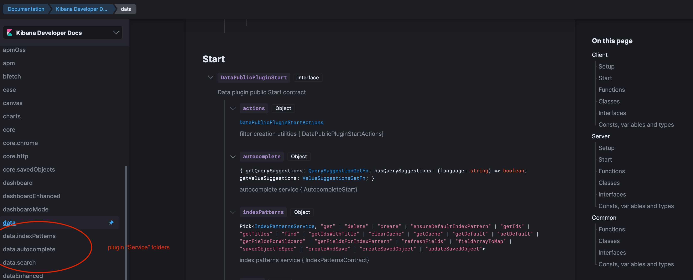

- Start Date: 2020-12-21
- RFC PR: (leave this empty)
- Kibana Issue: (leave this empty)
- [POC PR](https://github.com/elastic/kibana/pull/86232)

# Goal

Automatically generate API documentation for every plugin that exposes a public API within Kibana in order to help Kibana plugin developers 
find and understand the services available to them. Automatic generation ensures the APIs are _always_ up to date. The system will make it easy to find
APIs that are lacking documentation.

Note this does not cover REST API docs, but is targetted towards our javascript
plugin APIs.

# Technology: ts-morph vs api-extractor

[Api-extractor](https://api-extractor.com/) is a utility built from microsoft that parses typescript code into json files that can then be used in a custom [api-documenter](https://api-extractor.com/pages/setup/generating_docs/) in order to build documentation. This is what we [have now](https://github.com/elastic/kibana/tree/main/docs/development), except we use the default api-documenter. 

## Limitations with the current implementation using api-extractor & api-documenter

The current implementation relies on the default api-documenter. It has the following limitations:

- One page per API item
- Files are .md not .mdx
- There is no entry page per plugin (just an index.md per plugin/public and plugin/server)
- Incorrectly marks these entries as packages.


- Does not generate links to APIs exposed from other plugins, nor inside the same plugin.


## Options to improve

We have two options to improve on the current implementation. We can use a custom api-documenter, or use ts-morph.

### Custom Api-Documenter

- According to the current maintainer of the sample api-documenter, it's a surprising amount of work to maintain.
- If we wish to re-use code from the sample api-documenter, we'll have to fork the rush-stack repo, or copy their code into our system.
- No verified ability to support cross plugin links. We do have some ideas (can explore creating a package.json for every page, and/or adding source file information to every node).
- More limited feature set, we wouldn't get thinks like references and source file paths.
- There are very few examples of other companies using custom api-documenters to drive their documentation systems (I could not find any on github).

### Custom implementation using ts-morph 

[ts-morph](https://github.com/dsherret/ts-morph) is a utility built and maintained by a single person, which sits a layer above the raw typescript compiler.

- Requires manually converting the types to how we want them to be displayed in the UI. Certain types have to be handled specially to show up
in the right way (for example, for arrow functions to be categorized as functions). This special handling is the bulk of the logic in the PR, and
may be a maintenance burden.
- Relies on a package maintained by a single person, albiet they have been very responsive and have a history of keeping the library up to date with
typescript upgrades.
- Affords us flexibility to do things like extract the setup and start types, grab source file paths to create links to github, and get
reference counts (reference counts not implemented in MVP). 
- There are some issues with type links and signatures not working correctly (see https://github.com/dsherret/ts-morph/issues/923).


## Recommendation: ts-morph for the short term, switch to api-extractor when limitations can be worked around

Both approaches will have a decent amount of code to maintain, but the api-extractor approach appears to be a more stable long term solution, since it's built and maintained by Microsoft and
is likely going to grow in popularity as more TypeScript API doc systems exist.
If we had a working example that supported cross plugin links, I would suggest continuing down that road. However, we don't, while we _do_ have a working ts-morph implementation.   

I recommend that we move ahead with ts-morph in the short term, because we have an implementation that offers a much improved experience over the current system, but that we continually
re-evaluate as time goes on and we learn more about the maintenance burden of the current approach, and see what happens with our priorities and the api-extractor library.

Progress over perfection.


If we do switch, we can re-use all of the tests that take example TypeScript files and verify the resulting ApiDeclaration shapes.

# Terminology

**API** - A plugin's public API consists of every function, class, interface, type, variable, etc, that is exported from it's index.ts file, or returned from it's start or setup
contract. 

**API Declaration** - Each function, class, interface, type, variable, etc, that is part of a plugins public API is a "declaration". This
terminology is motivated by [these docs](https://www.typescriptlang.org/docs/handbook/modules.html#exporting-a-declaration).

# MVP

Every plugin will have one or more API reference pages. Every exported declaration will be listed in the page. It is first split by "scope" - client, server and common. Underneath
that, setup and start contracts are at the top, the remaining declarations are grouped by type (classes, functions, interfaces, etc).
Plugins may opt to have their API split into "service" sections (see [proposed manifest file changes](#manifest-file-changes)). If a plugin uses service folders, the API doc system will automatically group declarations that are defined inside the service folder name. This is a simple way to break down very large plugins. The start and setup contract will
always remain with the main plugin name.



- Cross plugin API links work inside `signature`.
- Github links with source file and line number
- using `serviceFolders` to split large plugins

## Post MVP

- Plugin `{@link AnApi}` links work. Will need to decide if we only support per plugin links, or if we should support a way to do this across plugins.
- Ingesting stats like number of public APIs, and number of those missing comments
- Include and expose API references
- Use namespaces to split large plugins

# Information available for each API declaration

We have the following pieces of information available from each declaration:

- Label. The name of the function, class, interface, etc.

- Description. Any comment that was able to be extracted. Currently it's not possible for this data to be formatted, for example if it has a code example with back tics. This
is dependent on the elastic-docs team moving the infrastructure to NextJS instead of Gatsby, but it will eventually be supported.

- Tags. Any `@blahblah` tags that were extracted from comments. Known tags, like `beta`, will be show help text in a tooltip when hovered over.

- Type. This can be thought of as the _kind_ of type (see [TypeKind](#typekind)). It allows us to group each type into a category. It can be a primitive, or a
more complex grouping. Possibilities are: array, string, number, boolean, object, class, interface, function, compound (unions or intersections)

- Required or optional. (whether or not the type was written with `| undefined` or `?`). This terminology makes the most sense for function
parameters, not as much when thinking about an exported variable that might be undefined.

- Signature. This is only relevant for some types: functions, objects, type, arrays and compound. Classes and interfaces would be too large.
For primitives, this is equivalent to "type".

- Children. Only relevant for some types, this would include parameters for functions, class members and functions for classes, properties for
interfaces and objects. This makes the structure recursive. Each child is a nested API component.

- Return comment. Only relevant for function types.


### ApiDeclaration type

```ts
interface ApiDeclaration {
  label: string;
  type: TypeKind; // string, number, boolean, class, interface, function, type, etc.
  description: TextWithLinks;
  signature: TextWithLinks;
  tags: string[];  // Declarations may be tagged as beta, or deprecated.
  children: ApiDeclaration[]; // Recursive - this could be function parameters, class members, or interface/object properties.
  returnComment?: TextWithLinks;
  lifecycle?: Lifecycle.START | Lifecycle.SETUP;
}

```

# Architecture design

## Location

The generated docs will reside inside the kibana repo, inside a top level `api_docs` folder. In the long term, we could investigate having the docs system run a script to generated the mdx files, so we don’t need to store them inside the repo. Every ci run should destroy and re-create this folder so removed plugins don't have lingering documentation files.

They will be hosted online wherever the new docs system ends up. This can temporarily be accessed at https://elasticdocstest.netlify.app/docs/.

## Algorithm overview

The first stage is to collect the list of plugins using the existing `findPlugins` logic.

For every plugin, the initial list of ts-morph api node declarations are collected from three "scope" files:
 - plugin/public/index.ts
 - plugin/server/index.ts
 - plugin/common/index.ts

Each ts-morph declaration is then transformed into an [ApiDeclaration](#ApiDeclaration-type) type, which is recursive due to the `children` property. Each
type of declaration is handled slightly differently, mainly in regard to whether or not a signature or return type is added, and how children are added.

For example:

```ts
if (node.isClassDeclaration()) {
  // No signature or return.
  return {
    label,
    description,
    type: TypeKind.ClassKind,
    // The class members are captured in the children array.
    children: getApiDeclaration(node.getMembers()),
  }
} else if (node.isFunctionDeclaration()) {
    return {
    label,
    description,
    signature: getSignature(node),
    returnComment: getReturnComment(node),
    type: TypeKind.FunctionKind,
    // The function parameters are captured in the children array. This logic is more specific because
    // the comments for a function parameter are captured in the function comment, with "@param" tags.
    children: getParameterList(node.getParameters(), getParamTagComments(node)),
  }
} if (...) 
....
```

The handling of each specific type is what encompasses the vast majority of the logic in the PR.

The public and server scope have 0-2 special interfaces indicated by "lifecycle". This is determined by using ts-morph to extract the first two generic types 
passed to `... extends Plugin<start, setup>` in the class defined inside the plugin's `plugin.ts` file.

A [PluginApi](#pluginapi) is generated for each plugin, which is used to generate the json and mdx files. One or more json/mdx file pair
 per plugin may be created, depending on the value of `serviceFolders` inside the plugin's manifest files. This is because some plugins have such huge APIs that
 it is too large to render in a single page.


## Types

### TypeKind

TypeKind is an enum that will identify what "category" or "group" name we can call this particular export. Is it a function, an interface, a class a variable, etc.
This list is likely incomplete, and we'll expand as needed.

```ts
export enum TypeKind {
  ClassKind = 'Class',
  FunctionKind = 'Function',
  ObjectKind = 'Object',
  InterfaceKind = 'Interface',
  TypeKind = 'Type', // For things like `export type Foo = ...`
  UnknownKind = 'Unknown', // For the special "unknown" typescript type.
  AnyKind = 'Any', // For the "any" kind, which should almost never be used in our public API.
  UnCategorized = 'UnCategorized', // There are a lot of ts-morph types, if I encounter something not handled, I dump it in here.
  StringKind = 'string',
  NumberKind = 'number',
  BooleanKind = 'boolean',
  ArrayKind = 'Array',
  CompoundTypeKind = 'CompoundType', // Unions & intersections, to handle things like `string | number`. 
}
```


### Text with reference links

Signatures, descriptions and return comments may all contain links to other API declarations. This information needs to be serializable into json. This serializable type encompasses the information needed to build the DocLink components within these fields. The logic of building
the DocLink components currently resides inside the elastic-docs system. It's unclear if this will change.

```ts
/**
 * This is used for displaying code or comments that may contain reference links. For example, a function
 * signature that is `(a: import("src/plugin_b").Bar) => void` will be parsed into the following Array:
 *
 * ```ts
 * [
 *   '(a: ',
 *   { docId: 'pluginB', section: 'Bar', text: 'Bar' },
 *   ') => void'
 * ]
 * ```
 *
 * This is then used to render text with nested DocLinks so it looks like this:
 *
 * `(a: => <DocLink docId="pluginB" section="Bar" text="Bar"/>) => void`
 */
export type TextWithLinks = Array<string | Reference>;

/**
 * The information neccessary to build a DocLink.
 */
export interface Reference {
  docId: string;
  section: string;
  text: string;
}
```

### ScopeApi

Scope API is essentially just grouping an array of ApiDeclarations into different categories that makes building the mdx files from a
single json file easier.

```ts
export interface ScopeApi {
  setup?: ApiDeclaration;
  start?: ApiDeclaration;
  classes: ApiDeclaration[];
  functions: ApiDeclaration[];
  interfaces: ApiDeclaration[];
  objects: ApiDeclaration[];
  enums: ApiDeclaration[];
  misc: ApiDeclaration[];
  // We may add more here as we sit fit to pull out of `misc`.
}
```

With this structure, the mdx files end up looking like:

```
### Start
<DocDefinitionList data={[actionsJson.server.start]}/>
### Functions
<DocDefinitionList data={actionsJson.server.functions}/>
### Interfaces
<DocDefinitionList data={actionsJson.server.interfaces}/>
```

### PluginApi

A plugin API is the component that is serialized into the json file. It is broken into public, server and common components.  `serviceFolders` is a way for the system to
write separate mdx files depending on where each declaration is defined. This is because certain plugins (and core)
are huge, and can't be rendered in a single page.


```ts
export interface PluginApi {
  id: string;
  serviceFolders?: readonly string[];
  client: ScopeApi;
  server: ScopeApi;
  common: ScopeApi;
}
```

## kibana.json Manifest file changes

### Using a kibana.json file for core

For the purpose of API infrastructure, core is treated like any other plugin. This means it has to specify serviceFolders section inside a manifest file to be split into sub folders. There are other ways to tackle this - like a hard coded array just for the core folder, but I kept the logic as similar to the other plugins as possible.

### New parameters

**serviceFolders?: string[]**

Used by the system to group services into sub-pages. Some plugins, like data and core, have such huge APIs they are very slow to contain in a single page, and they are less consummable by solution developers. The addition of an optional list of services folders will cause the system to automatically create a separate page with every API that is defined within that folder. The caveat is that core will need to define a manifest file in order to define its service folders...

**teamOwner: string**

Team owner can be determined via github CODEOWNERS file, but we want to encourage single team ownership per plugin. Requiring a team owner string in the manifest file will help with this and will allow the API doc system to manually add a section to every page that has a link to the team owner. Additional ideas are teamSlackChannel or teamEmail for further contact. 

**summary: string**


A brief description of the plugin can then be displayed in the automatically generated API documentation.

# Future features

## Indexing stats

Can we index statistics about our API as part of this system? For example, I'm dumping information about which api declarations are missing comments in the console.

## Longer term approach to "plugin service folders"

Using sub folders is a short term plan. A long term plan hasn't been established yet, but it should fit in with our folder structure hierarchy goals, along with
any support we have for sharing services among a related set of plugins, that are not exposed as part of the public API.
# Recommendations for writing comments

## @link comments for the referenced type

Core has a pattern of writing comments like this:

```ts
  /** {@link IUiSettingsClient} */
  uiSettings: IUiSettingsClient;
```

I don't see the value in this. In the IDE, I can click on the IUiSettingsClient type and get directed there, and in the API doc system, the
type will already be clickable. This ends up with a weird looking API:


The plan is to make @link comments work like links, which means this is unneccessary information.

I propose we avoid this kind of pattern.

## Export every referenced type

The docs system handles broken link warnings but to avoid breaking the ci, I suggest we turn this off initially. However, this will mean
we may miss situations where we are referencing a type that is not actually exported. This will cause a broken link in the docs
system

For example if your index.ts file has:
```ts
export type foo: string | AnInterface;
```

and does not also export `AnInterface`, this will be a broken link in the docs system.

Until we have better CI tools to catch these mistakes, developers will need to export every referenced type.

## Avoid `Pick` pattern

Connected to the above, if you use `Pick`, there are two problems. One is that it's difficult for a developer to see the functionality
available to them at a glance, since they would have to keep flipping from the interface definition to the properties that have been picked.

The second potential problem is that you will have to export the referenced type, and in some situations, it's an internal type that isn't exported.


# Open questions

## Required attribute

`isRequired` is an optional parameter that can be used to display a badge next to the API.
We can mark function parameters that do not use `?` or `| undefined` as required. Open questions:

1. Are we okay with a badge showing for `required` rather than `optional` when marking a parameter as optional is extra work for a developer, and `required` is the default?

2. Should we only mark function parameters as `required` or interface/class parameters? Essentially, should any declaration that is not nullable
have the `required` tag?

## Signatures on primitive types

1. Should we _always_ include a signature for variables and parameters, even if they are a repeat of the TypeKind? For example:


2. If no, should we include signatures when the only difference is `| undefined`? For function parameters this information is captured by
the absence of the `required` badge. Is this obvious? What about class members/interface props?

## Out of scope

### REST API

This RFC does not cover REST API documentation, though it worth considering where
REST APIs registered by plugins should go in the docs. The docs team has a proposal for this but it is not inside the `Kibana Developer Docs` mission.

### Package APIs

Package APIs are not covered in this RFC.

# Adoption strategy

In order to generate useful API documentation, we need to approach this by two sides.

1. Establish a habit of writing documentation.
2. Establish a habit of reading documentation.

Currently what often happens is a developer asks another developer a question directly, and it is answered. Every time this happens, ask yourself if
there is a link you can share instead of a direct answer. If there isn't, file an issue for that documentation to be created. When we start responding
to questions with links, solution developers will naturally start to look in the documentation _first_, saving everyone time!

The APIs WILL need to be well commented or they won't be useful. We can measure the amount of missing comments and set a goal of reducing this number.

# External documentation system examples

- [Microsoft .NET](https://docs.microsoft.com/en-us/dotnet/api/microsoft.visualbasic?view=netcore-3.1)
- [Android](https://developer.android.com/reference/androidx/packages)

# Architecure review

The primary concern coming out of the architecture review was over the technology choice of ts-morph vs api-extractor, and the potential maintenance
burdern of using ts-morph. For the short term, we've decide tech leads will own this section of code, we'll consider it experimental and
 focus on deriving value out of it. Once we are confident of the value, we can focus on stabilizing the implementation details.