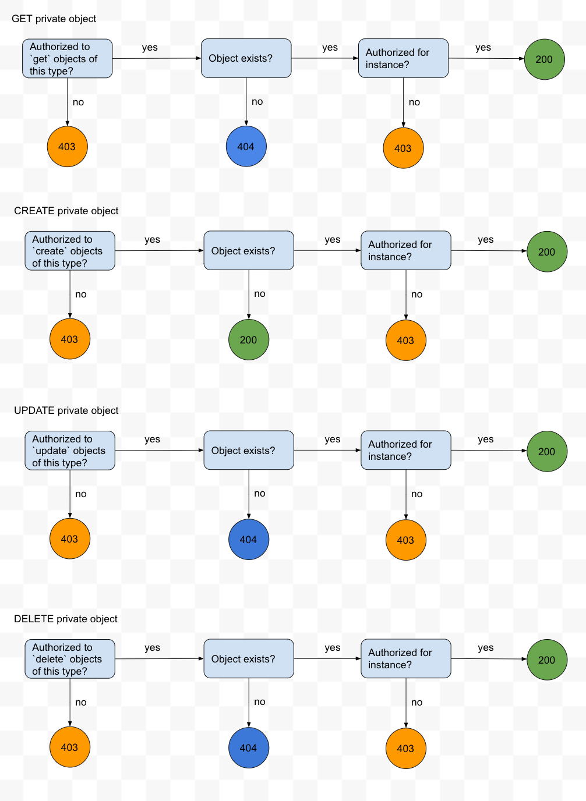

- Start Date: 2020-03-01
- RFC PR: (leave this empty)
- Kibana Issue: (leave this empty)

---
- [1. Summary](#1-summary)
- [2. Motivation](#2-motivation)
- [3. Detailed design](#3-detailed-design)
  - [3.1 Saved Objects Service](#31-saved-objects-service)
    - [3.1.1 Type registry](#311-type-registry)
    - [3.1.2 Schema](#312-schema)
    - [3.1.3 Saved Objects Client: Security wrapper](#313-saved-objects-client-security-wrapper)
      - [Attaching Access Controls](#attaching-access-controls)
      - [Authorization changes](#authorization-changes)
  - [3.2 Saved Objects API](#32-saved-objects-api)
    - [`get` / `bulk_get`](#get--bulk_get)
      - [Performance considerations](#performance-considerations)
    - [`create` / `bulk_create`](#create--bulk_create)
      - [Performance considerations](#performance-considerations-1)
    - [`update` / `bulk_update`](#update--bulk_update)
      - [Performance considerations](#performance-considerations-2)
    - [`delete`](#delete)
      - [Performance considerations](#performance-considerations-3)
    - [`find`](#find)
      - [Performance considerations](#performance-considerations-4)
    - [`addToNamespaces` / `deleteFromNamespaces`](#addtonamespaces--deletefromnamespaces)
      - [Performance considerations](#performance-considerations-5)
  - [3.3 Behavior with various plugin configurations](#33-behavior-with-various-plugin-configurations)
    - [Alternative](#alternative)
  - [3.4 Impacts on telemetry](#34-impacts-on-telemetry)
- [4. Drawbacks](#4-drawbacks)
- [5. Alternatives](#5-alternatives)
  - [5.1 Document level security](#51-document-level-security)
  - [5.2 Re-using the repository's pre-flight checks](#52-re-using-the-repositorys-pre-flight-checks)
    - [5.2.1 Move audit logging code into the repository](#521-move-audit-logging-code-into-the-repository)
    - [5.2.2 Pluggable authorization](#522-pluggable-authorization)
    - [5.2.3 Repository callbacks](#523-repository-callbacks)
    - [5.2.4 Pass down preflight objects](#524-pass-down-preflight-objects)
- [6. Adoption strategy](#6-adoption-strategy)
- [7. How we teach this](#7-how-we-teach-this)
- [8. Unresolved questions](#8-unresolved-questions)
  - [8.1 `accessControl.owner`](#81-accesscontrolowner)
  - [8.2 Authorization for private objects](#82-authorization-for-private-objects)
  - [8.3 Behavior when security is disabled](#83-behavior-when-security-is-disabled)
- [9. Resolved Questions](#9-resolved-questions)
  - [9.2 Authorization for private objects](#92-authorization-for-private-objects)
  - [9.3 Behavior when security is disabled](#93-behavior-when-security-is-disabled)

# 1. Summary

Object-level security ("OLS") authorizes Saved Object CRUD operations on a per-object basis.
This RFC focuses on the [phase 1](https://github.com/elastic/kibana/issues/82725), which introduces "private" saved object types. These private types
are owned by individual users, and are _generally_ only accessible by their owners.

This RFC does not address any [followup phases](https://github.com/elastic/kibana/issues/39259), which may support sharing, and ownership of "public" objects.

# 2. Motivation

OLS allows saved objects to be owned by individual users. This allows Kibana to store information that is specific
to each user, which enables further customization and collaboration throughout our solutions.

The most immediate feature this unlocks is [User settings and preferences (#17888)](https://github.com/elastic/kibana/issues/17888),
which is a very popular and long-standing request.

# 3. Detailed design

Phase 1 of OLS allows consumers to register "private" saved object types.
These saved objects are owned by individual end users, and are subject to additional security controls.

Public (non-private) saved object types are not impacted by this RFC. This proposal does not allow types to transition to/from `public`/`private`, and is considered out of scope for phase 1.

## 3.1 Saved Objects Service

### 3.1.1 Type registry
The [saved objects type registry](https://github.com/elastic/kibana/blob/main/src/core/packages/saved-objects/base-server-internal/src/saved_objects_type_registry.ts) will allow consumers to register "private" saved object types via a new `accessClassification` property:

```ts
/**
 * The accessClassification dictates the protection level of the saved object:
 *  * public (default): instances of this saved object type will be accessible to all users within the given namespace, who are authorized to act on objects of this type.
 *  * private: instances of this saved object type will belong to the user who created them, and will not be accessible by other users, except for administrators.
 */
export type SavedObjectsAccessClassification = 'public' | 'private';

// Note: some existing properties have been omitted for brevity.
export interface SavedObjectsType {
  name: string;
  hidden: boolean;
  namespaceType: SavedObjectsNamespaceType;
  mappings: SavedObjectsTypeMappingDefinition;

  /**
   * The {@link SavedObjectsAccessClassification | accessClassification} for the type.
   */
  accessClassification?: SavedObjectsAccessClassification;
}

// Example consumer
class MyPlugin {
  setup(core: CoreSetup) {
    core.savedObjects.registerType({
      name: 'user-settings',
      accessClassification: 'private',
      namespaceType: 'single',
      hidden: false,
      mappings,
    })
  }
}
```

### 3.1.2 Schema
Saved object ownership will be recorded as metadata within each `private` saved object. We do so by adding a top-level `accessControl` object with a singular `owner` property. See [unresolved question 1](#81-accessControl.owner) for details on the `owner` property.

```ts
/**
 * Describes which users should be authorized to access this SavedObject.
 *
 * @public
 */
export interface SavedObjectAccessControl {
  /** The owner of this SavedObject. */
  owner: string;
}

// Note: some existing fields have been omitted for brevity
export interface SavedObject<T = unknown> {
  id: string;
  type: string;
  attributes: T;
  references: SavedObjectReference[];
  namespaces?: string[];
  /** Describes which users should be authorized to access this SavedObject. */
  accessControl?: SavedObjectAccessControl;
}
```

### 3.1.3 Saved Objects Client: Security wrapper

The [security wrapper](https://github.com/elastic/kibana/blob/8.6/x-pack/plugins/security/server/saved_objects/secure_saved_objects_client_wrapper.ts) authorizes and audits operations against saved objects.

There are two primary changes to this wrapper:

#### Attaching Access Controls

This wrapper will be responsible for attaching an access control specification to all private objects before they are created in Elasticsearch.
It will also allow users to provide their own access control specification in order to support the import/create use cases.

Similar to the way we treat `namespaces`, it will not be possible to change an access control specification via the `update`/`bulk_update` functions in this first phase. We may consider adding a dedicated function to update the access control specification, similar to what we've done for sharing to spaces.

#### Authorization changes

This wrapper will be updated to ensure that access to private objects is only granted to authorized users. A user is authorized to operate on a private saved object if **all of the following** are true:
Step 1) The user is authorized to perform the operation on saved objects of the requested type, within the requested space. (Example: `update` a `user-settings` saved object in the `marketing` space)
Step 2) The user is authorized to access this specific instance of the saved object, as described by that object's access control specification. For this first phase, the `accessControl.owner` is allowed to perform all operations. The only other users who are allowed to access this object are administrators (see [resolved question 2](#92-authorization-for-private-objects))

Step 1 of this authorization check is the same check we perform today for all existing saved object types. Step 2 is a new authorization check, and **introduces additional overhead and complexity**. We explore the logic for this step in more detail later in this RFC. Alternatives to this approach are discussed in [alternatives, section 5.2](#52-re-using-the-repositorys-pre-flight-checks).



## 3.2 Saved Objects API

OLS Phase 1 does not introduce any new APIs, but rather augments the existing Saved Object APIs.

APIs which return saved objects are augmented to include the top-level `accessControl` property when it exists. This includes the `export` API.

APIs that create saved objects are augmented to accept an `accessControl` property. This includes the `import` API.

### `get` / `bulk_get`

The security wrapper will ensure the user is authorized to access private objects before returning them to the consumer.

#### Performance considerations
None. The retrieved object contains all of the necessary information to authorize the current user, with no additional round trips to Elasticsearch.

### `create` / `bulk_create`

The security wrapper will ensure that an access control specification is attached to all private objects.

If the caller has requested to overwrite existing `private` objects, then the security wrapper must ensure that the user is authorized to do so.

#### Performance considerations
When overwriting existing objects, the security wrapper must first retrieve all of the existing `private` objects to ensure that the user is authorized. This requires another round-trip to `get`/`bulk-get` all `private` objects so we can authorize the operation.

This overhead does not impact overwriting "public" objects. We only need to retrieve objects that are registered as `private`. As such, we do not expect any meaningful performance hit initially, but this will grow over time as the feature is used.

### `update` / `bulk_update`

The security wrapper will ensure that the user is authorized to update all existing `private` objects. It will also ensure that an access control specification is not provided, as updates to the access control specification are not permitted via `update`/`bulk_update`.

#### Performance considerations
Similar to the "create / override" scenario above, the security wrapper must first retrieve all of the existing `private` objects to ensure that the user is authorized. This requires another round-trip to `get`/`bulk-get` all `private` objects so we can authorize the operation.

This overhead does not impact updating "public" objects. We only need to retrieve objects that are registered as `private`. As such, we do not expect any meaningful performance hit initially, but this will grow over time as the feature is used.

### `delete`

The security wrapper will first retrieve the requested `private` object to ensure the user is authorized.

#### Performance considerations
The security wrapper must first retrieve the existing `private` object to ensure that the user is authorized. This requires another round-trip to `get` the `private` object so we can authorize the operation.

This overhead does not impact deleting "public" objects. We only need to retrieve objects that are registered as `private`. As such, we do not expect any meaningful performance hit initially, but this will grow over time as the feature is used.


### `find`
The security wrapper will supply or augment a [KQL `filter`](https://github.com/elastic/kibana/blob/main/src/core/packages/saved-objects/api-server/src/apis/find.ts#L117) which describes the objects the current user is authorized to see.

```ts
// Sample KQL filter
const filterClauses = typesToFind.reduce((acc, type) => {
  if (this.typeRegistry.isPrivate(type)) {
    return [
      ...acc,
      // note: this relies on specific behavior of the SO service's `filter_utils`,
      // which automatically wraps this in an `and` node to ensure the type is accounted for.
      // we have added additional safeguards there, and functional tests will ensure that changes
      // to this logic will not accidentally alter our authorization model.

      // This is equivalent to writing the following, if this syntax was allowed by the SO `filter` option:
      // esKuery.nodeTypes.function.buildNode('and', [
      //   esKuery.nodeTypes.function.buildNode('is', `accessControl.owner`, this.getOwner()),
      //   esKuery.nodeTypes.function.buildNode('is', `type`, type),
      // ])
      esKuery.nodeTypes.function.buildNode('is', `${type}.accessControl.owner`, this.getOwner()),
    ];
  }
  return acc;
}, []);

const privateObjectsFilter =
  filterClauses.length > 0 ? esKuery.nodeTypes.function.buildNode('or', filterClauses) : null;
```

#### Performance considerations
We are sending a more complex query to Elasticsearch for any find request which requests a `private` saved object. This has the potential to hurt query performance, but at this point it hasn't been quantified.

Since we are only requesting saved objects that the user is authorized to see, there is no additional overhead for Kibana once Elasticsearch has returned the results of the query.


### `addToNamespaces` / `deleteFromNamespaces`

The security wrapper will ensure that the user is authorized to share/unshare all existing `private` objects.
#### Performance considerations
Similar to the "create / override" scenario above, the security wrapper must first retrieve all of the existing `private` objects to ensure that the user is authorized. This requires another round-trip to `get`/`bulk-get` all `private` objects so we can authorize the operation.

This overhead does not impact sharing/unsharing "public" objects. We only need to retrieve objects that are registered as `private`. As such, we do not expect any meaningful performance hit initially, but this will grow over time as the feature is used.


## 3.3 Behavior with various plugin configurations
Kibana can run with and without security enabled. When security is disabled,
`private` saved objects will be accessible to all users.

| **Plugin Configuration** | Security | Security & Spaces | Spaces |
| ---- | ------ | ------ | --- |
|| ✅ Enforced | ✅ Enforced | 🚫 Not enforced: objects will be accessible to all

### Alternative
If this behavior is not desired, we can prevent `private` saved objects from being accessed whenever security is disabled.

See [unresolved question 3](#83-behavior-when-security-is-disabled)

## 3.4 Impacts on telemetry

The proposed design does not have any impacts on telemetry collection or reporting. Telemetry collectors run in the background against an "unwrapped" saved objects client. That is to say, they run without space-awareness, and without security. Since the security enforcement for private objects exists within the security wrapper, telemetry collection can continue as it currently exists.

# 4. Drawbacks

As outlined above, this approach introduces additional overhead to many of the saved object APIs. We minimize this by denoting which saved object types require this additional authorization.

This first phase also does not allow a public object to become private. Search sessions may migrate to OLS in the future, but this will likely be a coordinated effort with Elasticsearch, due to the differing ownership models between OLS and async searches.

# 5. Alternatives

## 5.1 Document level security
OLS can be thought of as a Kibana-specific implementation of [Document level security](https://www.elastic.co/guide/en/elasticsearch/reference/current/document-level-security.html) ("DLS"). As such, we could consider enhancing the existing DLS feature to fit our needs (DLS doesn't prevent writes at the moment, only reads). This would involve considerable work from the Elasticsearch security team before we could consider this, and may not scale to subsequent phases of OLS.

## 5.2 Re-using the repository's pre-flight checks
The Saved Objects Repository uses pre-flight checks to ensure that operations against multi-namespace saved objects are adhering the user's current space. The currently proposed implementation has the security wrapper performing pre-flight checks for `private` objects.

If we have `private` multi-namespace saved objects, then we will end up performing two pre-flight requests, which is excessive. We could explore re-using the repository's pre-flight checks instead of introducing new checks.

The primary concern with this approach is audit logging. Currently, we audit create/update/delete events before they happen, so that we can record that the operation was attempted, even in the event of a network outage or other transient event.

If we re-use the repository's pre-flight checks, then the repository will need a way to signal that audit logging should occur. We have a couple of options to explore in this regard:

### 5.2.1 Move audit logging code into the repository
Now that we no longer ship an OSS distribution, we could move the audit logging code directly into the repository. The implementation could still be provided by the security plugin, so we could still record information about the current user, and respect the current license.

If we take this approach, then we will need a way to create a repository without audit logging. Certain features rely on the fact that the repository does not perform its own audit logging (such as Alerting, and the background repair jobs for ML).

Core originally provided an [`audit_trail_service`](https://github.com/elastic/kibana/blob/v7.9.3/src/core/server/audit_trail/audit_trail_service.ts) for this type of functionality, with the thinking that OSS features could take advantage of this if needed. This was abandoned when we discovered that we had no such usages at the time, so we simplified the architecture. We could re-introduce this if desired, in order to support this initiative.

Not all saved object audit events can be recorded by the repository. When users are not authorized at the type level (e.g., user can't `create` `dashboards`), then the wrapper will record this and not allow the operation to proceed. This shared-responsibility model will likely be even more confusing to reason about, so I'm not sure it's worth the small performance optimization we would get in return.

### 5.2.2 Pluggable authorization
This inverts the current model. Instead of security wrapping the saved objects client, security could instead provide an authorization module to the repository. The repository could decide when to perform authorization (including audit logging), passing along the results of any pre-flight operations as necessary.

This arguably a lot of work, but worth consideration as we evolve both our persistence and authorization mechanisms to support our maturing solutions.

Similar to alternative `5.2.1`, we would need a way to create a repository without authorization/auditing to support specific use cases.

### 5.2.3 Repository callbacks

A more rudimentary approach would be to provide callbacks via each saved object operation's `options` property. This callback would be provided by the security wrapper, and called by the repository when it was "safe" to perform the audit operation.

This is a very simplistic approach, and probably not an architecture that we want to encourage or support long-term.

### 5.2.4 Pass down preflight objects

Any client wrapper could fetch the object/s on its own and pass that down to the repository in an `options` field (preflightObject/s?) so the repository can reuse that result if it's defined, instead of initiating an entire additional preflight check. That resolves our problem without much additional complexity.
Of course we don't want consumers (mis)using this field, we can either mark it as `@internal` or we could explore creating a separate "internal SOC" interface that is only meant to be used by the SOC wrappers.


# 6. Adoption strategy

Adoption for net-new features is hopefully straightforward. Like most saved object features, the saved objects service will transparently handle all authorization and auditing of these objects, so long as they are properly registered.

Adoption for existing features (public saved object types) is not addressed in this first phase.

# 7. How we teach this

Updates to the saved object service's documentation to describe the different `accessClassification`s would be required. Like other saved object security controls, we want to ensure that engineers understand that this only "works" when the security wrapper is applied. Creating a bespoke instance of the saved objects client, or using the raw repository will intentionally bypass these authorization checks.

# 8. Unresolved questions

## 8.1 `accessControl.owner`

The `accessControl.owner` property will uniquely identify the owner of each `private` saved object. We are still iterating with the Elasticsearch security team on what this value will ultimately look like. It is highly likely that this will not be a human-readable piece of text, but rather a GUID-style identifier.

## 8.2 Authorization for private objects

This has been [resolved](#92-authorization-for-private-objects).

The user identified by `accessControl.owner` will be authorized for all operations against that instance, provided they pass the existing type/space/action authorization checks.

In addition to the object owner, we also need to allow administrators to manage these saved objects. This is beneficial if they need to perform a bulk import/export of private objects, or if they wish to remove private objects from users that no longer exist. The open question is: **who counts as an administrator?**

We have historically used the `Saved Objects Management` feature for these administrative tasks. This feature grants access to all saved objects, even if you're not authorized to access the "owning" application. Do we consider this privilege sufficient to see and potentially manipulate private saved objects?

## 8.3 Behavior when security is disabled

This has been [resolved](#93-behavior-when-security-is-disabled).

When security is disabled, should `private` saved objects still be accessible via the Saved Objects Client?


# 9. Resolved Questions

## 9.2 Authorization for private objects

Users with the `Saved Objects Management` privilege will be authorized to access private saved objects belonging to other users.
Additionally, we will introduce a sub-feature privilege which will allow administrators to control which of their users with `Saved Objects Management` access are authorized to access these private objects.

## 9.3 Behavior when security is disabled

When security is disabled, `private` objects will still be accessible via the Saved Objects Client.