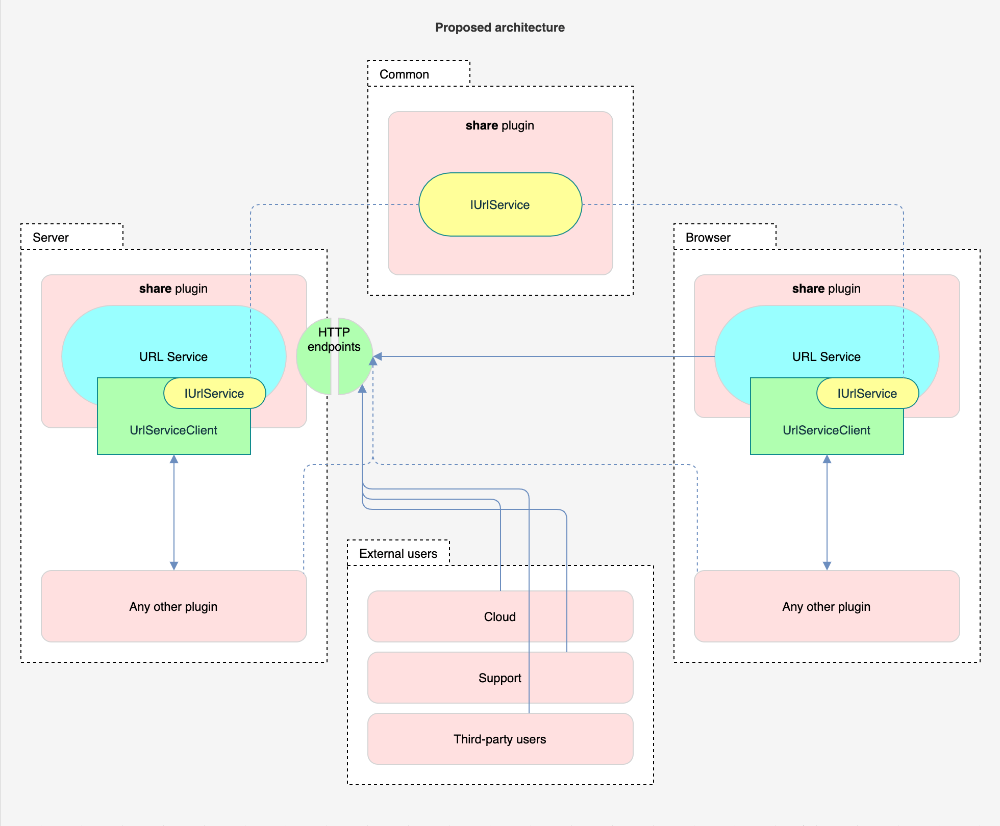

- Start Date: 2021-03-26
- RFC PR: (leave this empty)
- Kibana Issue: (leave this empty)


# Summary

Currently in the Kibana `share` plugin we have two services that deal with URLs.

One is *Short URL Service*: given a long internal Kibana URL it returns an ID.
That ID can be used to "resolve" back to the long URL and redirect the user to
that long URL page. (The Short URL Service is now used in Dashboard, Discover,
Visualize apps, and have a few upcoming users, for example, when sharing panels
by Slack or e-mail we will want to use short URLs.)

```ts
// It does not have a plugin API, you can only use it through an HTTP request.
const shortUrl = await http.post('/api/shorten_url', {
  url: '/some/long/kibana/url/.../very?long=true#q=(rison:approved)'
});
```

The other is the *URL Generator Service*: it simply receives an object of
parameters and returns back a deep link within Kibana. (You can use it, for
example, to navigate to some specific query with specific filters for a
specific index pattern in the Discover app. As of this writing, there are
eight registered URL generators, which are used by ten plugins.)

```ts
// You first register a URL generator.
const myGenerator = plugins.share.registerUrlGenerator(/* ... */);

// You can fetch it from the registry (if you don't already have it).
const myGenerator = plugins.share.getUrlGenerator(/* ... */);

// Now you can use it to generate a deep link into Kibana.
const deepLink: string = myGenerator.createUrl({ /* ... */ });
```


## Goals of the project

The proposal is to unify both of these services (Short URL Service and URL
Generator Service) into a single new *URL Service*. The new unified service
will still provide all the functionality the above mentioned services provide
and in addition will implement the following improvements:

1. Standardize a way for apps to deep link and navigate into other Kibana apps,
   with ability to use *location state* to specify the state of the app which is
   not part of the URL.
2. Combine Short URL Service with URL Generator Service to allow short URLs to
   be constructed from URL generators, which will also allow us to automatically
   migrate the short URLs if the parameters of the underlying URL generator
   change and be able to store location state in every short URL.
3. Make the short url service easier to use. (It was previously undocumented,
   and no server side plugin APIs existed, which meant consumers had to use
   REST APIs which is discouraged. Merging the two services will help achieve
   this goal by simplifying the APIs.)
4. Support short urls being deleted (previously not possible).
5. Support short urls being migrated (previously not possible). 

See more detailed explanation and other small improvements in the "Motivation"
section below.


# Terminology

In the proposed new service we introduce "locators". This is mostly a change
in language, we are renaming "URL generators" to "locators". The old name would
no longer make sense as we are not returning URLs from locators.


# Basic example

The URL Service will have a client (`UrlServiceClient`) which will have the same
interface, both, on the server-side and the client-side. It will also have a
documented public set of HTTP API endpoints for use by: (1) the client-side
client; (2) external users, Elastic Cloud, and Support.

The following code examples will work, both, on the server-side and the
client-side, as the base `UrlServiceClient` interface will be similar in both
environments.

Below we consider four main examples of usage of the URL Service. All four
examples are existing use cases we currently have in Kibana.


## Navigating within Kibana using locators

In this example let's consider a case where Discover app creates a locator,
then another plugin uses that locator to navigate to a deep link within the
Discover app.

First, the Discover plugin creates its locator (usually one per app). It needs
to do this on the client and server.


```ts
const locator = plugins.share.locators.create({
  id: 'DISCOVER_DEEP_LINKS',
  getLocation: ({
    indexPattern,
    highlightedField,
    filters: [],
    query: {},
    fields: [],
    activeDoc: 'xxxxxxxx-xxxx-xxxx-xxxx-xxxxxxxxxxxxx',
  }) => {
    app: 'discover',
    route: `/${indexPatten}#_a=(${risonEncode({filters, query, fields})})`,
    state: {
      highlightedField,
      activeDoc,
    },
  },
});
```

Now, the Discover plugin exports this locator from its plugin contract.

```ts
class DiscoverPlugin() {
  start() {
    return {
      locator,
    };
  }
}
```

Finally, if any other app now wants to navigate to a deep link within the
Discover application, they use this exported locator.

```ts
plugins.discover.locator.navigate({
  indexPattern: 'xxxxxxxx-xxxx-xxxx-xxxx-xxxxxxxxxxxx',
  highlightedField: 'foo',
});
```

Note, in this example the `highlightedField` parameter will not appear in the
URL bar, it will be passed to the Discover app through [`history.pushState()`](https://developer.mozilla.org/en-US/docs/Web/API/History/pushState)
mechanism (in Kibana case, using the [`history`](https://www.npmjs.com/package/history) package, which is used by `core.application.navigateToApp`).


## Sending a deep link to Kibana

We have use cases were a deep link to some Kibana app is sent out, for example,
through e-mail or as a Slack message.

In this example, lets consider some plugin gets hold of the Discover locator
on the server-side.

```ts
const location = plugins.discover.locator.getRedirectPath({
  indexPattern: 'xxxxxxxx-xxxx-xxxx-xxxx-xxxxxxxxxxxx',
  highlightedField: 'foo',
});
```

This would return the location of the client-side redirect endpoint. The redirect
endpoint could look like this:

```
/app/goto/_redirect/DISCOVER_DEEP_LINKS?params={"indexPattern":"xxxxxxxx-xxxx-xxxx-xxxx-xxxxxxxxxxxx","highlightedField":"foo"}&paramsVersion=7.x
```

This redirect client-side endpoint would find the Discover locator and and
execute the `.navigate()` method on it.


## Creating a short link

In this example, lets create a short link using the Discover locator.

```ts
const shortUrl = await plugins.discover.locator.createShortUrl(
  {
    indexPattern: 'xxxxxxxx-xxxx-xxxx-xxxx-xxxxxxxxxxxx',
    highlightedField: 'foo',
  }
  'human-readable-slug',
});
```

The above example creates a short link and persists it in a saved object. The
short URL can have a human-readable slug, which uniquely identifies that short
URL.

```ts
shortUrl.slug === 'human-readable-slug'
```

The short URL can be used to navigate to the Discover app. The redirect
client-side endpoint currently looks like this:

```
/app/goto/human-readable-slug
```

This persisted short URL would effectively work the same as the full version:

```
/app/goto/_redirect/DISCOVER_DEEP_LINKS?params={"indexPattern":"xxxxxxxx-xxxx-xxxx-xxxx-xxxxxxxxxxxx","highlightedField":"foo"}&paramsVersion=7.x
```


## External users navigating to a Kibana deep link

Currently Elastic Cloud and Support have many links linking into Kibana. Most of
them are deep links into Discover and Dashboard apps where, for example, index
pattern is selected, or filters and time range are set.

The external users could use the above mentioned client-side redirect endpoint
to navigate to their desired deep location within Kibana, for example, to the
Discover application:

```
/app/goto/_redirect/DISCOVER_DEEP_LINKS?params={"indexPattern":"xxxxxxxx-xxxx-xxxx-xxxx-xxxxxxxxxxxx","highlightedField":"foo"}&paramsVersion=7.x
```


# Motivation

Our motivation to improve the URL services comes from us intending to use them
more, for example, for panel sharing to Slack or e-mail; and we believe that the
current state of the URL services needs an upgrade.


## Limitations of the Short URL Service

We have identified the following limitations in the current implementation of
the Short URL Service:

1. There is no migration system. If an application exposes this functionality,
   every possible URL that might be generated should be supported forever. A
   migration could be written inside the app itself, on page load, but this is a
   risky path for URLs with many possibilities.
   1. __Will do:__ Short URLs will be created using locators. We will use
      migrations provided by the locators to migrate the stored parameters
      in the short URL saved object.
1. Short URLs store only the URL of the destination page. However, the
   destination page might have other state which affects the display of the page
   but is not present in the URL. Once the short URL is used to navigate to that
   page, any state that is kept only in memory is lost.
   1. __Will do:__ The new implementation of the short URLs will also persist
      the location state of the URL. That state would be provided to a
      Kibana app once a user navigates to that app using a short URL.
1. It exposes only HTTP endpoint API.
   1. __Will do:__ We will also expose a URL Service client through plugin
      contract on the server and browser.
1. It only has 3 HTTP endpoints, yet all three have different paths:
   (1) `/short_url`, (2) `/shorten_url`; and (3) `/goto`.
   1. __Will do:__ We will normalize the HTTP endpoints. We will use HTTP
      method "verbs" like POST, instead of verbs in the url like "shorten_url".
1. There is not much documentation for developers.
   1. __Will do:__ The new service will have a much nicer API and docs.
1. There is no way to delete short URLs once they are created.
   1. __Will do:__ The new service will provide CRUD API to manage short URLs,
      including deletion.
1. Short URL service uses MD5 algorithm to hash long URLs. Security team
   requested to stop using that algorithm.
   1. __Will do:__ The new URL Service will not use MD5 algorithm.
1. Short URLs are not automatically deleted when the target (say dashboard) is
   deleted. (#10450)
   1. __Could do:__ The URL Service will not provide such feature. Though the
      short URLs will keep track of saved object references used in the params
      to generate a short URL. Maybe those saved references could somehow be
      used in the future to provide such a facility.
      
      Currently, there are two possible avenues for deleting a short URL when
      the underlying dashboard is deleted:

      1. The Dashboard app could keep track of short URLs it generates for each
         dashboard. Once a dashboard is deleted, the Dashboard app also
         deletes all short URLs associated with that dashboard.
      1. Saved Objects Service could implement *cascading deletes*. Once a saved
         object is deleted, the associated saved objects are also deleted
         (#71453).
1. Add additional metadata to each short URL.
   1. __Could do:__ Each short URL already keeps a counter of how often it was
      resolved, we could also keep track of a timestamp when it was last
      resolved, and have an ability for users to give a title to each short URL.
1. Short URLs don't have a management UI.
   1. __Will NOT do:__ We will not create a dedicated UI for managing short
      URLs. We could improve how short URLs saved objects are presented in saved
      object management UI.
1. Short URLs can't be created by read-only users (#18006).
   1. __Will NOT do:__ Currently short URLs are stored as saved objects of type
      `url`, we would like to keep it that way and benefit from saved object
      facilities like references, migrations, authorization etc.. The consensus
      is that we will not allow anonymous users to create short URLs. We want to
      continue using saved object for short URLs going forward and not
      compromise on their security model.


## Limitations of the URL Generator Service

We have identified the following limitations in the current implementation of
the URL Generator Service:

1. URL generator generate only the URL of the destination. However there is
   also the ability to use location state with `core.application.navigateToApp`
   navigation method.
   1. __Will do:__ The new locators will also generate the location state, which
      will be used in `.navigateToApp` method.
1. URL generators are available only on the client-side. There is no way to use
   them together with short URLs.
   1. __Will do:__ We will implement locators also on the server-side
      (they will be available in both environments) and we will combine them
      with the Short URL Service.
1. URL generators are not exposed externally, thus Cloud and Support cannot use
   them to generate deep links into Kibana.
   1. __Will do:__ We will expose HTTP endpoints on the server-side and the
      "redirect" app on the client-side which external users will be able to use
      to deep link into Kibana using locators.


## Limitations of the architecture

One major reason we want to "refresh" the Short URL Service and the URL
Generator Service is their architecture.

Currently, the Short URL Service is implemented on top of the `url` type saved
object on the server-side. However, it only exposes the
HTTP endpoints, it does not expose any API on the server for the server-side
plugins to consume; on the client-side there is no plugin API either, developers
need to manually execute HTTP requests. 

The URL Generator Service is only available on the client-side, there is no way
to use it on the server-side, yet we already have use cases (for example ML
team) where a server-side plugin wants to use a URL generator.


The current architecture does not allow both services to be conveniently used,
also as they are implemented in different locations, they are disjointed&mdash;
we cannot create a short URL using an URL generator.


# Detailed design

In general we will try to provide as much as possible the same API on the
server-side and the client-side.


## High level architecture

Below diagram shows the proposed architecture of the URL Service.




## Plugin contracts

The aim is to provide developers the same experience on the server and browser.

Below are preliminary interfaces of the new URL Service. `IUrlService` will be
a shared interface defined in `/common` folder shared across server and browser.
This will allow us to provide users a common API interface on the server and
browser, wherever they choose to use the URL Service:

```ts
/**
 * Common URL Service client interface for the server-side and the client-side.
 */
interface IUrlService {
  locators: ILocatorClient;
  shortUrls: IShortUrlClient;
}
```


### Locators

The locator business logic will be contained in `ILocatorClient` client and will
provide two main functionalities:

1. It will provide a facility to create locators.
1. It will also be a registry of locators, every newly created locator is
   automatically added to the registry. The registry should never be used when
   locator ID is known at the compile time, but is reserved only for use cases
   when we only know ID of a locator at runtime.

```ts
interface ILocatorClient {
  create<P>(definition: LocatorDefinition<P>): Locator<P>;
  get<P>(id: string): Locator<P>;
}
```

The `LocatorDefinition` interface is a developer-friendly interface for creating
new locators. Mainly two things will be required from each new locator:

1. Implement the `getLocation()` method, which gives the locator specific `params`
   object returns a Kibana location, see description of `KibanaLocation` below.
2. Implement the `PersistableState` interface which we use in Kibana. This will
   allow to migrate the locator `params`. Implementation of the `PersistableState`
   interface will replace the `.isDeprecated` and `.migrate()` properties of URL
   generators.


```ts
interface LocatorDefinition<P> extends PeristableState<P> {
  id: string;
  getLocation(params: P): KibanaLocation;
}
```

Each constructed locator will have the following interface:

```ts
interface Locator<P> {
  /** Creates a new short URL saved object using this locator. */
  createShortUrl(params: P, slug?: string): Promise<ShortUrl>;
  /** Returns a relative URL to the client-side redirect endpoint using this locator. */
  getRedirectPath(params: P): string;
  /** Navigate using core.application.navigateToApp() using this locator. */
  navigate(params: P): void; // Only on browser.
}
```


### Short URLs

The short URL client `IShortUrlClient` which will be the same on the server and
browser. However, the server and browser might add extra utility methods for
convenience.

```ts
/**
 * CRUD-like API for short URLs.
 */
interface IShortUrlClient {
  /**
   * Delete a short URL.
   * 
   * @param slug The slug (ID) of the short URL.
   * @return Returns true if deletion was successful.
   */
  delete(slug: string): Promise<boolean>;

  /**
   * Fetch short URL.
   * 
   * @param slug The slug (ID) of the short URL.
   */
  get(slug: string): Promise<ShortUrl>;

  /**
   * Same as `get()` but it also increments the "view" counter and the
   * "last view" timestamp of this short URL.
   * 
   * @param slug The slug (ID) of the short URL.
   */
  resolve(slug: string): Promise<ShortUrl>;
}
```

Note, that in this new service to create a short URL the developer will have to
use a locator (instead of creating it directly from a long URL).

```ts
const shortUrl = await plugins.share.shortUrls.create(
  plugins.discover.locator,
  {
    indexPattern: 'xxxxxxxx-xxxx-xxxx-xxxx-xxxxxxxxxxxx',
    highlightedField: 'foo',
  },
  'optional-human-readable-slug',
);
```

These short URLs will be stored in saved objects of type `url` and will be
automatically migrated using the locator. The long URL will NOT be stored in the
saved object. The locator ID and locator params will be stored in the saved
object, that will allow us to do the migrations for short URLs.


### `KibanaLocation` interface

The `KibanaLocation` interface is a simple interface to store a location in some
Kibana application.

```ts
interface KibanaLocation {
  app: string;
  route: string;
  state: object;
}
```

It maps directly to a `.navigateToApp()` call.

```ts
let location: KibanaLocation;

core.application.navigateToApp(location.app, {
  route: location.route,
  state: location.state,
});
```


## HTTP endpoints


### Short URL CRUD+ HTTP endpoints

Below HTTP endpoints are designed to work specifically with short URLs:

| HTTP method           | Path                                | Description                                                                                                                              |
|-----------------------|-------------------------------------|------------------------------------------------------------------------------------------------------------------------------------------|
| __POST__              | `/api/short_url`                    | Endpoint for creating new short URLs.                                                                                                    |
| __GET__               | `/api/short_url/<slug>`             | Endpoint for retrieving information about an existing short URL.                                                                         |
| __DELETE__            | `/api/short_url/<slug>`             | Endpoint for deleting an existing short URL.                                                                                             |
| __POST__              | `/api/short_url/<slug>`             | Endpoint for updating information about an existing short URL.                                                                           |
| __POST__              | `/api/short_url/<slug>/_resolve`    | Similar to `GET /api/short_url/<slug>`, but also increments the short URL access count counter and the last access timestamp.            |


### The client-side navigate endpoint

__NOTE.__ We are currently investigating if we really need this endpoint. The
main user of it was expected to be Cloud and Support to deeply link into Kibana,
but we are now reconsidering if we want to support this endpoint and possibly
find a different solution.

The `/app/goto/_redirect/<locatorId>?params=...&paramsVersion=...` client-side
endpoint will receive the locator ID and locator params, it will use those to
find the locator and execute `locator.navigate(params)` method.

The `paramsVersion` parameter will be used to specify the version of the
`params` parameter. If the version is behind the latest version, then the migration
facilities of the locator will be used to on-the-fly migrate the `params` to the
latest version.


### Legacy endpoints

Below are the legacy HTTP endpoints implemented by the `share` plugin, with a
plan of action for each endpoint:

| HTTP method           | Path                                | Description                                                                                                                              |
|-----------------------|-------------------------------------|------------------------------------------------------------------------------------------------------------------------------------------|
| __ANY__               | `/goto/<slug>`                      | Endpoint for redirecting short URLs, we will keep it to redirect short URLs.                                                             |
| __GET__               | `/api/short_url/<slug>`             | The new `GET /api/short_url/<slug>` endpoint will return a superset of the payload that the legacy endpoint now returns.                 |
| __POST__              | `/api/shorten_url`                  | The legacy endpoints for creating short URLs. We will remove it or deprecate this endpoint and maintain it until 8.0 major release.      |


# Drawbacks

Why should we *not* do this?

- Implementation cost will be a few weeks, but the code complexity and quality
  will improve.
- There is a cost of migrating existing Kibana plugins to use the new API.


# Alternatives

We haven't considered other design alternatives.

One alternative is still do the short URL improvements outlined above. But
reconsider URL generators:

- Do we need URL generators at all?
  - Kibana URLs are not stable and have changed in our past experience. Hence,
    the URL generators were created to make the URL generator parameters stable
    unless a migration is available.
- Do we want to put migration support in URL generators?
  - Alternative would be for each app to support URLs forever or do the
    migrations on the fly for old URLs.
- Should Kibana URLs be stable and break only during major releases?
- Should the Kibana application interface be extended such that some version of
  URL generators is built in?

The impact of not doing this change is essentially extending technical debt. 


# Adoption strategy

Is this a breaking change? It is a breaking change in the sense that the API
will change. However, all the existing use cases will be supported. When
implementing this we will also adjust all Kibana code to use the new API. From
the perspective of the developers when using the existing URL services nothing
will change, they will simply need to review a PR which stops using the URL
Generator Service and uses the combined URL Service instead, which will provide
a superset of features.

Alternatively, we can deprecate the URL Generator Service and maintain it for a
few minor releases.


# How we teach this

For the existing short URL and URL generator functionality there is nothing to
teach, as they will continue working with a largely similar API.

Everything else in the new URL Service will have JSDoc comments and good
documentation on our website.
