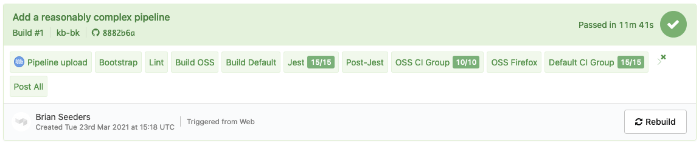
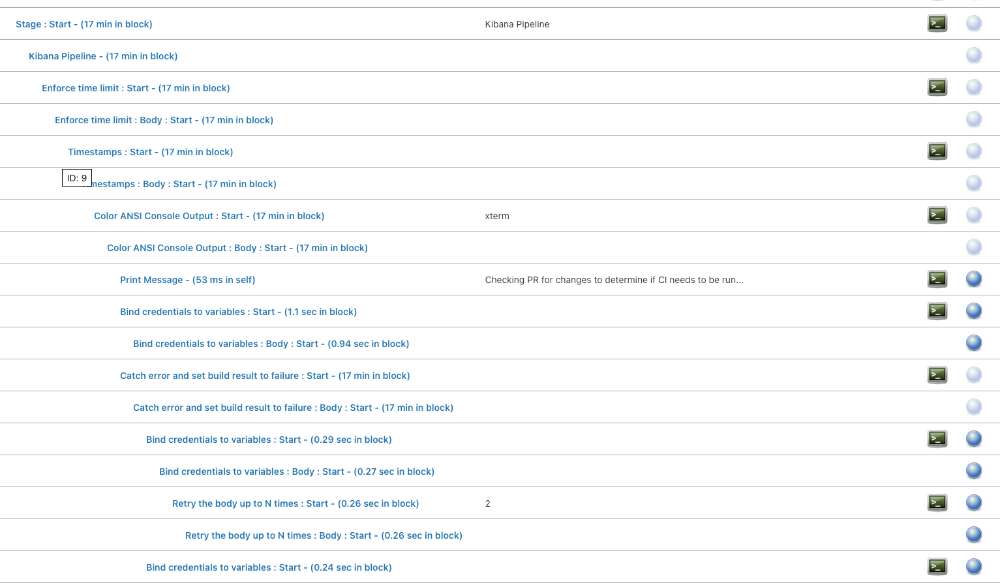

- Start Date: 2021-03-29
- RFC PR: [#95070](https://github.com/elastic/kibana/pull/95070)
- Kibana Issue: [#94630](https://github.com/elastic/kibana/issues/94630)

---

- [Summary](#summary)
- [Motivation](#motivation)
  - [Required and Desired Capabilities](#required-and-desired-capabilities)
    - [Required](#required)
      - [Scalable](#scalable)
      - [Stable](#stable)
      - [Surfaces information intuitively](#surfaces-information-intuitively)
      - [Pipelines](#pipelines)
      - [Advanced Pipeline logic](#advanced-pipeline-logic)
      - [Cloud-friendly pricing model](#cloud-friendly-pricing-model)
      - [Public access](#public-access)
      - [Secrets handling](#secrets-handling)
      - [Support or Documentation](#support-or-documentation)
      - [Scheduled Builds](#scheduled-builds)
      - [Container support](#container-support)
    - [Desired](#desired)
      - [Customization](#customization)
      - [Core functionality is first-party](#core-functionality-is-first-party)
      - [First-class support for test results](#first-class-support-for-test-results)
      - [GitHub Integration](#github-integration)
- [Buildkite - Detailed design](#buildkite---detailed-design)
  - [Overview](#overview)
  - [Required and Desired Capabilities](#required-and-desired-capabilities-1)
    - [Required](#required-1)
      - [Scalable](#scalable-1)
      - [Stable](#stable-1)
      - [Surfaces information intuitively](#surfaces-information-intuitively-1)
      - [Pipelines](#pipelines-1)
      - [Advanced Pipeline logic](#advanced-pipeline-logic-1)
      - [Cloud-friendly pricing model](#cloud-friendly-pricing-model-1)
      - [Public access](#public-access-1)
      - [Secrets handling](#secrets-handling-1)
      - [Support or Documentation](#support-or-documentation-1)
      - [Scheduled Builds](#scheduled-builds-1)
      - [Container support](#container-support-1)
    - [Desired](#desired-1)
      - [Customization](#customization-1)
      - [Core functionality is first-party](#core-functionality-is-first-party-1)
      - [First-class support for test results](#first-class-support-for-test-results-1)
      - [GitHub Integration](#github-integration-1)
  - [What we will build and manage](#what-we-will-build-and-manage)
    - [Elastic Buildkite Agent Manager](#elastic-buildkite-agent-manager)
      - [Overview](#overview-1)
      - [Design](#design)
        - [Protection against creating too many instances](#protection-against-creating-too-many-instances)
      - [Configuration](#configuration)
      - [Build / Deploy](#build--deploy)
    - [Elastic Buildkite PR Bot](#elastic-buildkite-pr-bot)
      - [Overview](#overview-2)
      - [Configuration](#configuration-1)
      - [Build / Deploy](#build--deploy-1)
    - [Infrastructure](#infrastructure)
    - [Monitoring / Alerting](#monitoring--alerting)
    - [Agent Image management](#agent-image-management)
    - [Buildkite org-level settings management](#buildkite-org-level-settings-management)
    - [IT Security Processes](#it-security-processes)
- [Drawbacks](#drawbacks)
- [Alternatives](#alternatives)
  - [Jenkins](#jenkins)
    - [Required](#required-2)
      - [Scalable](#scalable-2)
      - [Stable](#stable-2)
        - [Updates](#updates)
      - [Surfaces information intuitively](#surfaces-information-intuitively-2)
      - [Pipelines](#pipelines-2)
      - [Advanced Pipeline logic](#advanced-pipeline-logic-2)
      - [Cloud-friendly pricing model](#cloud-friendly-pricing-model-2)
      - [Public access](#public-access-2)
      - [Secrets handling](#secrets-handling-2)
      - [Support or Documentation](#support-or-documentation-2)
      - [Scheduled Builds](#scheduled-builds-2)
      - [Container support](#container-support-2)
    - [Desired](#desired-2)
      - [Customization](#customization-2)
      - [Core functionality is first-party](#core-functionality-is-first-party-2)
      - [First-class support for test results](#first-class-support-for-test-results-2)
      - [GitHub Integration](#github-integration-2)
  - [Other solutions](#other-solutions)
    - [CircleCI](#circleci)
    - [GitHub Actions](#github-actions)
- [Adoption strategy](#adoption-strategy)
- [How we teach this](#how-we-teach-this)

# Summary

Implement a CI system for Kibana teams that is highly scalable and stable, surfaces information in an intuitive way, and supports pipelines that are easy to understand and change.

This table provides an overview of the conclusions made throughout the rest of this document. A lot of this is subjective, but we've tried to take an honest look at each system and feature, based on a large amount of research on and/or experience with each system, our requirements, and our preferences as a team. Your team would likely come to different conclusions based on your preferences and requirements.

|                                      | Jenkins | Buildkite | GitHub Actions | CircleCI | TeamCity |
| ------------------------------------ | ------- | --------- | -------------- | -------- | -------- |
| Scalable                             | No      | Yes       | No             | Yes      | No       |
| Stable                               | No      | Yes       | No             | Yes      | Partial  |
| Surfaces information intuitively     | No      | Yes       | No             | Yes      | Yes      |
| Pipelines                            | Yes     | Yes       | Yes            | Yes      | Partial  |
| Advanced Pipeline logic              | Yes     | Yes       | Partial        | Partial  | No       |
| Cloud-friendly pricing model         | Yes     | Yes       | Yes            | No       | No       |
| Public access                        | Yes     | Yes       | Yes            | Partial  | Yes      |
| Secrets handling                     | Yes     | Partial   | Yes            | Partial  | Partial  |
| Support or Documentation             | No      | Yes       | Yes            | Partial  | Yes      |
| Scheduled Builds                     | Yes     | Yes       | Yes            | Yes      | Yes      |
| Container support                    | Partial | Yes       | Yes            | Yes      | Partial  |
|                                      |         |           |                |          |          |
| Customization                        | No      | Yes       | No             | No       | No       |
| Core functionality is first-party    | No      | Yes       | Mostly         | Yes      | Mostly   |
| First-class support for test results | Buggy   | No        | No             | Yes      | Yes      |
| GitHub Integration                   | Yes     | Limited   | Yes            | Yes      | Yes      |

# Motivation

We have lived with the scalability and stability problems of our current Jenkins infrastructure for several years. We have spent a significant amount of time designing around problems, and are limited in how we can design our pipelines. Since the company-wide effort to move to a new system has been cancelled for the foreseeable future, we are faced with either re-engineering the way we use Jenkins, or exploring other solutions and potentially managing one ourselves.

This RFC is focused on the option of using a system other than Jenkins, and managing it ourselves (to the extent that it must be managed). If the RFC is rejected, the alternative will be to instead invest significantly into Jenkins to further stabilize and scale our usage of it.

## Required and Desired Capabilities

### Required

#### Scalable

- Able to run 100s of pipelines and 1000s of individual steps in parallel without issues.
- If scaling agents/hosts is self-managed, dynamically scaling up and down based on usage should be supported and reasonably easy to do.

#### Stable

- Every minute of downtime can affect 100s of developers.
- The Kibana Operations team can't have an on-call rotation, so we need to minimize our responsibilities around stability/uptime.
- For systems provided as a service, they should not have frequent outages. This is a bit hard to define. 1-2 hours of downtime, twice a month, during peak working hours, is extremely disruptive. 10 minutes of downtime once or twice a week can also be very disruptive, as builds might need to be re-triggered, etc.
- For self-hosted solutions, they should be reasonably easy to keep online and have a solution for high-availability. At a minimum, most upgrades should not require waiting for all currently running jobs to finish before deploying.
- Failures are ideally handled gracefully. For example, agents may continue running tasks correctly, once the primary service becomes available again.

#### Surfaces information intuitively

- Developers should be able to easily understand what happened during their builds, and find information related to failures.
- User interfaces should be functional and easy to use.
- Overview and details about failures and execution time are particularly important.

#### Pipelines

- Pipelines should be defined as code.
- Pipelines should be reasonably easy to understand and change. Kibana team members should be able to follow a simple guide and create new pipelines on their own.
- Changes to pipelines should generally be able to be tested in Pull Requests before being merged.

#### Advanced Pipeline logic

With such a large codebase and CI pipeline, we often have complex requirements around when and how certain tasks should run, and we want the ability to handle this built into the system we use. It can be very difficult and require complex solutions for fairly simple use cases when the system does not support advanced pipeline logic out of the box.

For example, the flaky test suite runner that we currently have in Jenkins is fairly simple: run a given task (which might have a dependency) `N` number of times on `M` agents. This is very difficult to model in a system like TeamCity, which does not have dynamic dependencies.

- Retries
  - Automatic (e.g. run a test suite twice to account for flakiness) and manual (user-initiated)
  - Full (e.g. a whole pipeline) and partial (e.g. a single step)
- Dynamic pipelines
  - Conditional dependencies/steps
    - Based on user input
    - Based on external events/data (e.g. PR label)
    - Based on source code or changes (e.g. only run this for .md changes)
- Metadata and Artifacts re-usable between tasks
  - Metadata could be a docker image tag for a specific task, built from a previous step

#### Cloud-friendly pricing model

If the given system has a cost, the pricing model should be cloud-friendly and/or usage-based.

A per-agent or per-build model based on peak usage in a month is not a good model, because our peak build times are generally short-lived (e.g. around feature freeze).

A model based on build-minutes can also be bad, if it encourages running things in parallel on bigger machines to keep costs down. For example, running two tasks on a single 2-CPU machine with our own orchestration should not be cheaper than running two tasks on two 1-CPU machines using the system's built-in orchestration.

#### Public access

Kibana is a publicly-available repository with contributors from outside Elastic. CI information needs to be available publicly in some form.

#### Secrets handling

Good, first-class support for handling secrets is a must-have for any CI system. This support can take many forms.

- Secrets should not need to be stored in plaintext, in a repo nor on the server.
- For systems provided as a service, it is ideal if secrets are kept mostly/entirely on our infrastructure.
- There should be protections against accidentally leaking secrets to the console.
- There should be programmatic ways to manage secrets.
- Secrets are, by nature, harder to handle. However, the easier the system makes it, the more likely people are to follow best practices.

#### Support or Documentation

For paid systems, both self-hosted and as a service, good support is important. If a problem specific to Elastic is causing us downtime, we expect quick and efficient support. Again, 100s of developers are potentially affected by downtime.

For open source solutions, good documentation is especially important. If much of the operational knowledge of a system can only be gained by working with the system and/or reading the source code, it will be harder to solve problems quickly.

#### Scheduled Builds

We have certain pipelines (ES Snapshots) that run once daily, and `master` CI currently only runs once an hour. We need the ability to configure scheduled builds.

#### Container support

We have the desire to use containers to create fast, clean environments for CI stages that can also be used locally. We think that we can utilize [modern layer-caching options](https://github.com/moby/buildkit#cache), both local and remote, to optimize bootstrapping various CI stages, doing retries, etc.

For self-hosted options, containers will allow us to utilize longer-running instances (with cached layers, git repos, etc) without worrying about polluting the build environment between builds.

If we use containers for CI stages, when a test fails, developers can pull the image and reproduce the failure in the same environment that was used in CI.

So, we need a solution that at least allows us to build and run our own containers. The more features that exist for managing this, the easier it will be.

### Desired

#### Customization

We have very large CI pipelines which generate a lot of information (bundle sizes, performance numbers, etc). Being able to attach this information to builds, so that it lives with the builds in the CI system, is highly desirable. The alternative is building custom reports and UIs outside of the system.

#### Core functionality is first-party

Most core functionality that we depend on should be created and maintained by the organization maintaining the CI software. It's important for bugs to be addressed quickly, for security issues to be resolved, and for functionality to be tested before a new release of the system. In this way, there is a large amount of risk associated with relying on third-party solutions for too much core functionality.

#### First-class support for test results

One of the primary reasons we run CI is to run tests and make sure they pass. There are currently around 65,000 tests (unit, integration, and functional) that run in CI. Being able to see summaries, histories, and details of test execution directly on build pages is extremely useful. Flaky test identification is also very useful, as we deal with flaky tests on a daily basis.

For example, being able to easily see that a build passed but included 5,000 tests fewer than the previous build can make something like a pipeline misconfiguration more obvious. Being able to click on a failed test and see other recent builds where the same test failed can help identify what kind of failure it is and how important it is to resolve it quickly (e.g is it failing in 75% of builds or 5% of builds?).

For any system that doesn't have this kind of support, we will need to maintain our own solution, customize build pages to include this (if the system allows), or both.

#### GitHub Integration

- Ability to trigger jobs based on webhooks
- Integrate GitHub-specific information into UI, e.g. a build for a PR should link back to the PR
- Ability to set commit statuses based on job status
- Fine-grained permission handling for pull request triggering

# Buildkite - Detailed design

For the alternative system in this RFC, we are recommending Buildkite. The UI, API, and documentation have been a joy to work with, they provide most of our desired features and functionality, the team is responsive and knowledgeable, and the pricing model does not encourage bad practices to lower cost.

## Overview

[Buildkite](https://buildkite.com/home) is a CI system where the user manages and hosts their own agents, and Buildkite manages and hosts everything else (core services, APIs, UI).

The [Buildkite features](https://buildkite.com/features) page is a great overview of the functionality offered.

For some public instances of Buildkite in action, see:

- [Bazel](https://buildkite.com/bazel)
- [Rails](https://buildkite.com/rails)
- [Chef](https://buildkite.com/chef-oss)

## Required and Desired Capabilities

How does Buildkite stack up against our required and desired capabilities?

### Required

#### Scalable

Buildkite claims to support up to 10,000 connected agents "without breaking a sweat."

We were able to connect 2,200 running agents and run a [single job with 1,800 parallel build steps](https://buildkite.com/elastic/kibana-custom/builds/8). The job ran with only about 15 seconds of total overhead (the rest of the time, the repo was being cloned, or the actual tasks were executing). We would likely never define a single job this large, but not only did it execute without any problems, the UI handles it very well.

2,200 agents was the maximum that we were able to test because of quotas on our GCP account that could not easily be increased.

We also created a job with 5 parallel steps, and triggered 300 parallel builds at once. The jobs executed and finished quickly, across ~1500 agents, with no issues and very little overhead. Interestingly, it seems that we were able to see the effects of our test in Buildkite's status page graphs (see below), but, from a user perspective, we were unable to notice any issues.


#### Stable

So far, we have witnessed no stability issues in our testing.

If Buildkite's status pages are accurate, they seem to be extremely stable, and respond quickly to issues.

- [Buildkite Status](https://www.buildkitestatus.com/)
- [Historical Uptime](https://www.buildkitestatus.com/uptime)
- [Incident History](https://www.buildkitestatus.com/history)

For agents, stability and availability will depend primarily on the infrastructure that we build and the availability of the cloud provider (GCP, primarily) running our agents. Since [we control our agents](#elastic-buildkite-agent-manager), we will be able to run agents across multiple zones, and possibly regions, in GCP for increased availability.

They have a [99.95% uptime SLA](https://buildkite.com/enterprise) for Enterprise customers.

#### Surfaces information intuitively

The Buildkite UI is very easy to use, and works as expected. Here is some of the information surfaced for each build:

- The overall status of the job, as well as which steps succeeded and failed.
- Logs for each individual step
- The timeline for each individual step, including how long it took Buildkite to schedule/handle the job on their end
- Artifacts uploaded by each step
- The entire agent/job configuration at the time the step executed, expressed as environment variables


Note that dependencies between steps are mostly not shown in the UI. See screenshot below for an example. There are several layers of dependencies between all of the steps in this pipeline. The only one that is shown is the final step (`Post All`), which executes after all steps beforehand are finished. There are some other strategies to help organize the steps (such as the new grouping functionality) if we need.



Buildkite has rich build page customization via "annotations" which will let us surface custom information. See the [customization section](#customization-1).

#### Pipelines

- [Buildkite pipelines](https://buildkite.com/docs/pipelines) must be defined as code. Even if you configure them through the UI, you still have to do so using yaml.
- This is subjective, but the yaml syntax for pipelines is friendly and straightforward. We feel that it will be easy for teams to create and modify pipelines with minimal instructions.
- If your pipeline is configured to use yaml stored in your repo for its definition, branches and PRs will use the version in their source by default. This means that PRs that change the pipeline can be tested as part of the PR CI.
- Top-level pipeline configurations, i.e. basically a pointer to a repo that has the real pipeline yaml in it, can be configured via the UI, API, or terraform.

#### Advanced Pipeline logic

Buildkite supports very advanced pipeline logic, and has support for generating dynamic pipeline definitions at runtime.

- [Conditionals](https://buildkite.com/docs/pipelines/conditionals)
- [Dependencies](https://buildkite.com/docs/pipelines/dependencies) with lots of options, including being optional/conditional
- [Retries](https://buildkite.com/docs/pipelines/command-step#retry-attributes), both automatic and manual, including configuring retry conditions by different exit codes
- [Dynamic pipelines](https://buildkite.com/docs/pipelines/defining-steps#dynamic-pipelines) - pipelines can be generated by running a script at runtime
- [Metadata](https://buildkite.com/docs/pipelines/build-meta-data) can be set in one step, and read in other steps
- [Artifacts](https://buildkite.com/docs/pipelines/artifacts) can be uploaded from and downloaded in steps, and are visible in the UI
- [Parallelism and Concurrency](https://buildkite.com/docs/tutorials/parallel-builds) settings

Here's an example of a dynamically-generated pipeline based on user input that runs a job `RUN_COUNT` times (from user input), across up to a maximum of 25 agents at once:

```yaml
# pipeline.yml

steps:
  - input: 'Test Suite Runner'
    fields:
      - select: 'Test Suite'
        key: 'test-suite'
        required: true
        options:
          - label: 'Default CI Group 1'
            value: 'default:cigroup:1'
          - label: 'Default CI Group 2'
            value: 'default:cigroup:2'
      - text: 'Number of Runs'
        key: 'run-count'
        required: true
        default: 75
  - wait
  - command: .buildkite/scripts/flaky-test-suite-runner.sh | buildkite-agent pipeline upload
    label: ':pipeline: Upload'
```

```bash
#!/usr/bin/env bash

# flaky-test-suite-runner.sh

set -euo pipefail

TEST_SUITE="$(buildkite-agent meta-data get 'test-suite')"
export TEST_SUITE

RUN_COUNT="$(buildkite-agent meta-data get 'run-count')"
export RUN_COUNT

UUID="$(cat /proc/sys/kernel/random/uuid)"
export UUID

cat << EOF
steps:
  - command: |
      echo 'Bootstrap'
    label: Bootstrap
    agents:
      queue: bootstrap
    key: bootstrap
  - command: |
      echo 'Build Default Distro'
    label: Build Default Distro
    agents:
      queue: bootstrap
    key: default-build
    depends_on: bootstrap
  - command: 'echo "Running $TEST_SUITE"; sleep 10;'
    label: 'Run $TEST_SUITE'
    agents:
      queue: ci-group
    parallelism: $RUN_COUNT
    concurrency: 25
    concurrency_group: '$UUID'
    depends_on: default-build
EOF
```

#### Cloud-friendly pricing model

Buildkite is priced using a per-user model, where a user is effectively an Elastic employee triggering builds for Kibana via PR, merging code, or through the Buildkite UI. That means that the cost essentially grows with our company size. Most importantly, we don't need to make CI pipeline design decisions based on the Buildkite pricing model.

However, since we manage our own agents, we will still pay for our compute usage, and will need to consider that cost when designing our pipelines.

#### Public access

Buildkite has read-only public access, configurable for each pipeline. An organization can contain a mix of both public and private pipelines.

There are not fine-grained settings for this, and all information in the build is publicly accessible.

#### Secrets handling

[Managing Pipeline Secrets](https://buildkite.com/docs/pipelines/secrets)

Because agents run on customers' infrastructure, secrets can stay completely in the customer's environment. For this reason, Buildkite doesn't provide a real mechanism for storing secrets, and instead provide recommendations for accessing secrets in pipelines in secure ways.

There are two recommended methods for handling secrets: using a third-party secrets service like Vault or GCP's Secret Manager, or baking them into agent images and only letting certain jobs access them. Since Elastic already uses Vault, we could utilize Vault the same way we do in Jenkins today.

Also, a new experimental feature, [redacted environment variables](https://buildkite.com/docs/pipelines/managing-log-output#redacted-environment-variables) can automatically redact the values of environment variables that match some configurable suffixes if they are accidentally written to the console. This would only redact environment variables that were set prior to execution of a build step, e.g. during the `environment` or `pre-command` hooks, and not variables that were created during execution, e.g. by accessing Vault in the middle of a build step.

#### Support or Documentation

[Buildkite's documentation](https://buildkite.com/docs/pipelines) is extensive and well-written, as mentioned earlier.

Besides this, [Enterprise](https://buildkite.com/enterprise) customers get 24/7 emergency help, prioritized support, a dedicated chat channel, and guaranteed response times. They will also consult on best practices, etc.

#### Scheduled Builds

[Buildkite has scheduled build](https://buildkite.com/docs/pipelines/scheduled-builds) support with a cron-like syntax. Schedules are defined separately from the pipeline yaml, and can be managed via the UI, API, or terraform.

#### Container support

Since we will manage our own agents with Buildkite, we have full control over the container management tools we install and use. In particular, this means that we can easily use modern container tooling, such as Docker with Buildkit, and we can pre-cache layers or other data in our agent images.

[Buildkite maintains](https://buildkite.com/docs/tutorials/docker-containerized-builds) two officially-supported plugins for making it easier to create pipelines using containers: [one for Docker](https://github.com/buildkite-plugins/docker-buildkite-plugin) and [one for Docker Compose](https://github.com/buildkite-plugins/docker-compose-buildkite-plugin).

The Docker plugin is essentially a wrapper around `docker run` that makes it easier to define steps that run in containers, while setting various flags. It also provides some logging, and provides mechanisms for automatically propagating environment variables or mounting the workspace into the container.

A simple, working example for running Jest tests using a container is below. The `Dockerfile` contains all dependencies for CI, and runs `yarn kbn bootstrap` so that it contains a full environment, ready to run tasks.

```yaml
steps:
  - command: |
      export DOCKER_BUILDKIT=1 && \
      docker build -t gcr.io/elastic-kibana-184716/buildkite/ci/base:$BUILDKITE_COMMIT -f .ci/Dockerfile . --progress plain && \
      docker push gcr.io/elastic-kibana-184716/buildkite/ci/base:$BUILDKITE_COMMIT
  - wait
  - command: node scripts/jest --ci --verbose --maxWorkers=6
    label: 'Jest'
    artifact_paths: target/junit/**/*.xml
    plugins:
      - docker#v3.8.0:
          image: 'gcr.io/elastic-kibana-184716/buildkite/ci/base:$BUILDKITE_COMMIT'
          propagate-environment: true
          mount-checkout: false
    parallelism: 2
    timeout_in_minutes: 120
```

### Desired

#### Customization

We have very large CI pipelines which generate a lot of information (bundle sizes, performance numbers, etc). Being able to attach this information to builds, so that it lives with the builds in the CI system, is highly desirable. The alternative is building custom reports and UIs outside of the system.

[Annotations](https://buildkite.com/docs/agent/v3/cli-annotate) provide a way to add rich, well-formatted, custom information to build pages using CommonMark Markdown. There are several built-in CSS classes for formatting and several visual styles. Images, emojis, and links can be embedded as well. Just for some examples: Metrics such as bundle sizes, links to the distro builds for that build, and screenshots for test failures could all be embedded directly into the build pages.

The structure of logs can also be easily customized by adding [collapsible groups](https://buildkite.com/docs/pipelines/managing-log-output#collapsing-output) for log messages.

#### Core functionality is first-party

There's a large number of [plugins for Buildkite](https://buildkite.com/plugins), but, so far, there are only two plugins we've been considering using (one for Docker and one for test results), and they're both maintained by Buildkite. All other functionality we've assessed that we need is either built directly into Buildkite, or [we are building it](#what-we-will-build-and-manage).

#### First-class support for test results

Buildkite doesn't really have any built-in support specifically for handling test results. Test result reports (e.g. JUnit) can be uploaded as artifacts, and test results can be rendered on the build page using annotations. They have [a plugin](https://github.com/buildkite-plugins/junit-annotate-buildkite-plugin) for automatically annotating builds with test results from JUnit reports in a simple fashion. We would likely want to build our own annotation for this.

This does mean that Buildkite lacks test-related features of other CI systems: tracking tests over time across build, flagging flaky tests, etc. We would likely need to ingest test results into Elasticsearch and build out Kibana dashboards/visualizations for this, or similar.

#### GitHub Integration

Buildkite's [GitHub Integration](https://buildkite.com/docs/integrations/github) can trigger builds based on GitHub webhooks (e.g. on commit/push for branches and PRs), and update commit statuses. Buildkite also adds basic information to build pages, such as links to commits on GitHub and links to PRs. This should cover what we need for tracked branch builds.

However, for Pull Requests, because we have a lot of requirements around when builds should run and who can run them, we will need to [build a solution](#elastic-buildkite-pr-bot) for handling PRs ourselves. The work for this is already close to complete.

## What we will build and manage

### Elastic Buildkite Agent Manager

#### Overview

Currently, with Buildkite, the agent lifecycle is managed entirely by customers. Customers can run "static" workers that are online all of the time, or dynamically scale their agents up and down as needed.

For AWS, Buildkite maintains an auto-scaling solution called [Elastic CI Stack for AWS](https://github.com/buildkite/elastic-ci-stack-for-aws).

Since, we primarily need support for GCP, we built our own agent manager. It's not 100% complete, but has been working very well during our testing/evaluation of Buildkite, and can handle 1000s of agents.

[Elastic Buildkite Agent Manager](https://github.com/brianseeders/buildkite-agent-manager)

Features:

- Handles many different agent configurations with one instance
- Configures long-running agents, one-time use agents, and agents that will terminate after being idle for a configured amount of time
- Configures both minimum and maximum agent limits - i.e. can ensure a certain number of agents are always online, even if no jobs currently require them
- Supports overprovisioning agents by a percentage or a fixed number
- Supports many GCE settings: zone, image/image family, machine type, disk type and size, tags, metadata, custom startup scripts
- Agent configuration is stored in a separate repo and read at runtime
- Agents are gracefully replaced (e.g. after they finish their current job) if they are running using an out-of-date agent configuration that can affect the underlying GCE instance
- Detect and remove orphaned GCP instances
- Handles 1000s of agents (tested with 2200 before we hit GCP quotas)
- Does instance creation/deletion in large, parallel batches so that demand spikes are handled quickly

Also planned:

- Balance creating agents across numerous GCP zones for higher availability
- Automatically gracefully replace agents if disk usage gets too high
- Scaling idle timeouts: e.g. the first agent for a configuration might have an idle timeout of 1 hour, but the 200th might be 5 minutes

#### Design

The agent manager is primarily concerned with ensuring that, given an agent configuration, the number of online agents for that configuration is **greater than or equal to** the desired number. Buildkite then determines how to use the agents: which jobs they should execute and when they should go offline (due to being idle, done with jobs, etc). Even when stopping agents due to having an outdated configuration, Buildkite still determines the actual time that the agent should disconnect.

The current version of the agent manager only handles GCP-based agents, but support for other platforms could be added as well, such as AWS or Kubernetes. There's likely more complexity in managing all of the various agent images than in maintaining support in the agent manager.

It is also designed to itself be stateless, so that it is easy to deploy and reason about. State is effectively stored in GCP and Buildkite.


The high-level design for the agent manager is pretty straightforward. There are three primary stages during execution:

1. Gather Current State
   1. Data and agent configuration is gathered from various sources/APIs in parallel
2. Create Plan
   1. Given the current state across the various services, a plan is created based on agent configurations, current Buildkite job queue sizes, and current GCE instances.
   2. Instances need to be created when there aren't enough online/in-progress agents of a particular configuration to satisfy the needs of its matching queue.
   3. Agents need to be stopped when the agents have been online for too long (based on their configuration) or when their configuration is out-of-date. This is a soft stop, they will terminate after finishing their current job.
   4. Instances need to be deleted if they have been stopped (which happens when their agent stops), or when they have been online past their hard stop time (based on configuration).
3. Execute Plan
   1. The different types of actions in the plan are executed in parallel. Instance creating and deleting is done in batches to handle spikes quickly.

An error at any step, e.g. when checking current state of GCP instances, will cause the rest of the run to abort.

Because the service gathers data about the total current state and creates a plan based on that state each run, it's reasonably resistant to errors and it's self-healing.

##### Protection against creating too many instances

Creating too many instances in GCP could be costly, so it is worth mentioning here. Since the agent manager itself is stateless, and only looks at the current, external state when determining an execution plan, there is the possibility of creating too many instances.

There are two primary mechanisms to protect against this:

One is usage of GCP quotas. Maintaining reasonable GCP quotas will ensure that we don't create too many instances in a situation where something goes catastrophically wrong during operation. It's an extra failsafe.

The other is built into the agent manager. The agent manager checks both the number of connected agents in Buildkite for a given configuration, as well as the number of instances currently running and being created in GCP. It uses whichever number is greater as the current number of instances.

This is a simple failsafe, but means that a large number of unnecessary instances should only be able to be created in a pretty specific scenario (keep in mind that errors will abort the current agent manager run):

- The GCP APIs (both read and create) are returning success codes
- The GCP API for listing instances is returning partial/missing/erroneous data, with a success code
- GCP instances are successfully being created
- Created GCP instances are unable to connect to Buildkite, or Buildkite Agents API is returning partial/missing/erroneous data

All of these things would need to be true at the same time for a large number of instances to be created. In the unlikely event that that were to happen, the GCP quotas would still be in-place.

#### Configuration

Here's an example configuration, which would likely reside in the `master` branch of the kibana repository.

```js
{
  gcp: {
    // Configurations at this level are defaults for all configurations defined under `agents`
    project: 'elastic-kibana-184716',
    zone: 'us-central1-b',
    serviceAccount: 'elastic-buildkite-agent@elastic-kibana-184716.iam.gserviceaccount.com',
    agents: [
      {
        queue: 'default',
        name: 'kibana-buildkite',
        overprovision: 0, // percentage or flat number
        minimumAgents: 1,
        maximumAgents: 500,
        gracefulStopAfterSecs: 60 * 60 * 6,
        hardStopAfterSecs: 60 * 60 * 9,
        idleTimeoutSecs: 60 * 60,
        exitAfterOneJob: false,
        imageFamily: 'kibana-bk-dev-agents',
        machineType: 'n2-standard-1',
        diskType: 'pd-ssd',
        diskSizeGb: 85
      },
      {
        // ...
      },
  }
}
```

#### Build / Deploy

Currently, the agent manager is built and deployed using [Google Cloud Build](https://cloud.google.com/build). It is deployed to and hosted using [GKE Auto-Pilot](https://cloud.google.com/blog/products/containers-kubernetes/introducing-gke-autopilot) (Kubernetes). GKE was used, rather than Cloud Run, primarily because the agent manager runs continuously (with a 30sec pause between executions) whereas Cloud Run is for services that respond to HTTP requests.

It uses [Google Secret Manager](https://cloud.google.com/secret-manager) for storing/retrieving tokens for accessing Buildkite. It uses a GCP service account and [Workload Identity](https://cloud.google.com/kubernetes-engine/docs/how-to/workload-identity) to manage GCP resources.

### Elastic Buildkite PR Bot

#### Overview

For TeamCity, we built a bot that was going to handle webhooks from GitHub and trigger builds for PRs based on configuration, user permissions, etc. Since we will not be moving to TeamCity, we've repurposed this bot for Buildkite, since Buildkite does not support all of our requirements around triggering builds for PRs out-of-the-box. The bot supports everything we currently use in Jenkins, and has some additional features as well.

[Elastic Buildkite PR Bot](https://github.com/elastic/buildkite-pr-bot)

Features supported by the bot:

- Triggering builds on commit / when the PR is opened
- Triggering builds on comment
- Permissions for who can trigger builds based on: Elastic org membership, write and/or admin access to the repo, or user present in an allowed list
- Limit builds to PRs targeting a specific branch
- Custom regex for trigger comment, e.g. "buildkite test this"
- Triggering builds based on labels
- Setting labels, comment body, and other PR info as env vars on triggered build
- Skip triggering build if a customizable label is present
- Option to set commit status on trigger
- Capture custom arguments from comment text using capture groups and forward them to the triggered build

#### Configuration

The configuration is stored in a `json` file (default: `.ci/pull-requests.json`) in the repo for which pull requests will be monitored. Multiple branches in the repo can store different configurations, or one configuration (e.g. in `master`) can cover the entire repo.

Example configuration:

```json
{
  "jobs": [
    {
      "repoOwner": "elastic",
      "repoName": "kibana",
      "pipelineSlug": "kibana",

      "enabled": true,
      "target_branch": "master",
      "allow_org_users": true,
      "allowed_repo_permissions": ["admin", "write"],
      "allowed_list": ["renovate[bot]"],
      "set_commit_status": true,
      "commit_status_context": "kibana-buildkite",
      "trigger_comment_regex": "^(?:(?:buildkite\\W+)?(?:build|test)\\W+(?:this|it))|^retest$"
    }
  ]
}
```

Github Webhooks must also be configured to send events to the deployed bot.

#### Build / Deploy

Currently, the bot is built and deployed using [Google Cloud Build](https://cloud.google.com/build). It is deployed to and hosted on [Google Cloud Run](https://cloud.google.com/run). It uses [Google Secret Manager](https://cloud.google.com/secret-manager) for storing/retrieving tokens for accessing GitHub and Buildkite.

[Build/deploy configuration](https://github.com/elastic/buildkite-pr-bot/blob/main/cloudbuild.yaml)

### Infrastructure

We will need to maintain our infrastructure related to Buildkite, primarily ephemeral agents. To start, it will mean supporting infrastructure in GCP, but could later mean AWS as well.

- Separate GCP project for CI resources
- Hosting for bots/services we maintain, such as the Agent Manager (GKE Auto-Pilot) and GitHub PR bot (Cloud Run)
- Google Storage Buckets for CI artifacts
- Networking (security, we may also need Cloud NAT)
- IAM and Security
- Agent images

We are already using Terraform to manage most resources related to Buildkite, and will continue to do so.

### Monitoring / Alerting

We will need to set up and maintain monitoring and alerting for our GCP infrastructure, as well as Buildkite metrics.

Some examples:

GCP

- Number of instances by type
- Age of instances
- Resource Quotas

Buildkite

- Agent queues
- Job wait times
- Build status

### Agent Image management

We will need to maintain images used to create GCP instances for our Buildkite agents. These images would need to be built on a regular basis (daily, or possibly more often).

We could likely maintain a single linux-based image to cover all of our current CI needs. However, in the future, if we need to maintain many images across different operating systems and architectures, this is likely to become the most complex part of the CI system that we would need to maintain. Every operating system and architecture we need to support adds another group of required images, with unique dependencies and configuration automation.

Another thing to note: Just because we need to run something on a specific OS or architecture, it doesn't necessarily mean we need to maintain an agent image for it. For example, we might use something like Vagrant to create a separate VM, using the default, cloud-provided images, that we run something on (e.g. for testing system packages), rather than running it on the same machine as the agent. In this case, we would potentially only be managing a small number of images, or even a single image.

Also, we always have the option of running a small number of jobs using Jenkins, if we need to do so to target additional OSes and architectures.

For our testing, we have a single GCP image, [built using Packer](https://github.com/elastic/kibana/tree/kb-bk/.buildkite/agents/packer), with the Buildkite agent installed and all of our dependencies.

Summary of Responsibilities

- An automated process for creating new images, at least daily, running automated smoke tests against them, and promoting them
- Delete old images when creating new ones
- Ability to roll back images easily and/or pin specific image versions
- Manage dependencies, failures, updates, etc across all supported OSes and architectures, on a regular basis

### Buildkite org-level settings management

There are a few settings outside of pipelines that we will need to manage.

- Top-level pipelines and their settings
- Pipeline schedules / scheduled jobs
- Public visibility of pipelines
- Teams and Permissions
- Single Sign On settings

Most of the content for our pipelines will be stored in repositories as YAML. However, a job still must exist in Buildkite that points to that repo and that YAML. For managing those top-level configurations, an official [Terraform provider](https://registry.terraform.io/providers/buildkite/buildkite/latest/docs/resources/pipeline) exists, which we will likely take advantage of.

Pipeline schedules can also be managed using the Terraform provider.

Teams can also be managed using Terraform, but it's unlikely we will need to use Teams.

For everything else, we will likely start off using UI and build automation (or contribute to the Terraform provider) where we see fit. Most of the other settings are easy to configure, and unlikely to change.

### IT Security Processes

There will likely be numerous IT Security processes we will need to follow, since we will be managing infrastructure. This could include regular audits, specific software and configurations that must be baked into our agents, documentation procedures, or other conditions that we will need to satisfy. There is risk here, as the processes and workload are currently unknown to us.

# Drawbacks

The biggest drawback to doing this is that we will be duplicating a large amount of work and providing/maintaining a service that is already provided to us by another team at Elastic. Jenkins is already provided to us, and there is automation for creating Jenkins worker images and managing worker instances in both AWS and GCP, and IT Security policies are already being handled for all of this. It is hard to predict what the extra workload will be for the Kibana Operations team if we move our CI processes to Buildkite, but we know we will have to maintain all of the things listed under [What we will build and manage](#what-we-will-build-and-manage).

Some other drawbacks:

- CI Pipelines and other jobs built in Jenkins will need to be re-built, which includes building support for things like CI Stats, Slack notifications, GitHub PR comments, etc.
- Developers will need to learn a new system.
- The service is an additional cost to the company.
- There is a lot of Jenkins knowledge throughout the company, but likely little Buildkite knowledge.

# Alternatives

## Jenkins

We are not happy with the experience provided by our instance of Jenkins and our current pipelines. If we stick with Jenkins, we will need to invest a likely significant amount of time in improving the experience and making our pipelines scale given the limitations we face.

### Required

#### Scalable

Our current Jenkins instance only allows for 300-400 connected agents, before effectively going offline. We have struggled with this issue for several years, and completely redesigned our pipelines around this limitation. The resulting design, which involves running 20+ tasks in parallel on single, large machines, and managing all of the concurrency ourselves, is complicated and problematic.

Other teams at Elastic, especially over the last few months, have been experiencing this same limitation with their Jenkins instances as well. The team that manages Jenkins at Elastic is well aware of this issue, and is actively investigating. It is currently unknown whether or not it is a solvable problem (without sharding) or a limitation of Jenkins.

#### Stable

Firstly, Jenkins was not designed for high availability. If the primary/controller goes offline, CI is offline.

The two biggest sources of stability issues for us are currently related to scaling (see above) and updates.

##### Updates

The typical update process for Jenkins looks like this:

- Put Jenkins into shutdown mode, which stops any new builds from starting
- Wait for all currently-running jobs to finish
- Shutdown Jenkins
- Do the update
- Start Jenkins

For us, shutdown mode also means that `gobld` stops creating new agents for our jobs. This means that many running jobs will never finish executing while shutdown mode is active.

So, for us, the typical update process is:

- Put Jenkins into shutdown mode, which stops any new builds from starting, and many from finishing
- Hard kill all of our currently running jobs
- Shutdown Jenkins
- Do the update
- Start Jenkins
- A human manually restarts CI for all PRs that were running before the update

This is pretty disruptive for us, as developers have to wait several hours longer before merging or seeing the status of their PRs, plus there is manual work that must be done to restart CI. If we stay with Jenkins, we'll need to fix this process, and likely build some automation for it.

#### Surfaces information intuitively

Our pipelines are very complex, mainly because of the issues mentioned above related to designing around scaling issues, and none of the UIs in Jenkins work well for us.

The [Stage View](https://kibana-ci.elastic.co/job/elastic+kibana+pipeline-pull-request) only works for very simple pipelines. Even if we were able to re-design our pipelines to populate this page better, there are just too many stages to display in this manner.

[Blue Ocean](https://kibana-ci.elastic.co/blue/organizations/jenkins/elastic%2Bkibana%2Bpipeline-pull-request/activity), which is intended to be the modern UI for Jenkins, doesn't work at all for our pipelines. We have nested parallel stages in our pipelines, which [are not supported](https://issues.jenkins.io/browse/JENKINS-54010).

[Pipeline Steps](https://kibana-ci.elastic.co/job/elastic+kibana+pipeline-pull-request/) (Choose a build -> Pipeline Steps) shows information fairly accurately (sometimes logs/errors are not attached to any steps, and do not show), but is very difficult to read. There are entire pages of largely irrelevant information (Setting environment variables, starting a `try` block, etc), which is difficult to read through, especially developers who don't interact with Jenkins every day.



We push a lot of information to GitHub and Slack, and have even built custom UIs, to try to minimize how much people need to interact directly with Jenkins. In particular, when things go wrong, it is very difficult to investigate using the Jenkins UI.

#### Pipelines

Jenkins supports pipeline-as-code through [Pipelines](https://www.jenkins.io/doc/book/pipeline), which we currently use.

Pros:

- Overall pretty powerful, pipelines execute Groovy code at runtime, so pipelines can do a lot and can be pretty complex, if you're willing to write the code
- Pipeline changes can be tested in PRs
- Shared Libraries allow shared code to be used across pipelines easily

Cons:

- The sandbox is pretty difficult to work with. There's a [hard-coded list](https://github.com/jenkinsci/script-security-plugin/tree/e99ba9cffb0502868b05d19ef5cd205ca7e0e5bd/src/main/resources/org/jenkinsci/plugins/scriptsecurity/sandbox/whitelists) of allowed methods for pipelines. Other methods must be approved separately, or put in a separate shared repository that runs trusted code.
- Pipeline code is serialized by Jenkins, and the serialization process leads to a lot of issues that are difficult to debug and reason about. See [JENKINS-44924](https://issues.jenkins.io/browse/JENKINS-44924) - `List.sort()` doesn't work and silently returns `-1` instead of a list
- Reasonably complex pipelines are difficult to view in the UI ([see above](#surfaces-information-intuitively-2))
- Using Pipelines to manage certain configurations (such as Build Parameters) requires running an outdated job once and letting it fail to update it
- Jobs that reference a pipeline have to be managed separately. Only third-party tools exist for managing these jobs as code (JJB and Job DSL).
- Very difficult to test code without running it live in Jenkins

#### Advanced Pipeline logic

See above section. Jenkins supports very advanced pipeline logic using scripted pipelines and Groovy.

#### Cloud-friendly pricing model

Given that Jenkins is open-source, we pay only for infrastructure and people to manage it.

#### Public access

- Fine-grained authorization settings
- Anonymous user access
- Per-job authorization, so some jobs can be private

#### Secrets handling

- Supports [Credentials](https://www.jenkins.io/doc/book/using/using-credentials/), which are stored encrypted on disk and have authorization settings
  - Credentials are difficult to manage in an automated way
- Pipeline support for accessing credentials
- Credentials masked in log output
- Support for masking custom values in log output

#### Support or Documentation

Documentation for Jenkins is notoriously fragmented. All major functionality is provided in plugins, and documentation is spread out across the Jenkins Handbook, the CloudBees website, JIRA issues, wikis, GitHub repos, JavaDoc pages. Many plugins have poor documentation, and source code often has to be read to understand how to configure something.

CloudBees offers paid support, but we're not familiar with it at this time.

#### Scheduled Builds

Jenkins supports scheduled builds via a Cron-like syntax, and can spread scheduled jobs out. For example, if many jobs are scheduled to run every day at midnight, a syntax is available that will automatically spread the triggered jobs evenly out across the midnight hour.

#### Container support

Jenkins has support for using Docker to [run containers for specific stages in a Pipeline](https://www.jenkins.io/doc/book/pipeline/docker/). It is effectively a wrapper around `docker run`. There are few conveniences, and figuring out how to do things like mount the workspace into the container is left up to the user. There are also gotchas that are not well-documented, such as the fact that the user running inside the container will be automatically changed using `-u`, which can cause issues.

Though we have control over the agents running our jobs at Elastic, and thus all of the container-related tooling, it is not currently easy for the Operations team to manage our container tooling. We are mostly dependent on another team to do this for us.

### Desired

#### Customization

The only way to customize information added to build pages is through custom plugins. [Creating and maintaining plugins for Jenkins](https://www.jenkins.io/doc/developer/plugin-development/) is a fairly significant investment, and we do not currently have a good way to manage plugins for Jenkins instances at Elastic. It's a pretty involved process that, at the moment, has to be done by another team.

Given that, we feel we would be able to build a higher-quality experience in less time by creating custom applications separate from Jenkins, which we have actually [done in the past](https://ci.kibana.dev/es-snapshots).

#### Core functionality is first-party

Jenkins is very modular, and almost all Jenkins functionality is provided by plugins.

It's difficult to understand which plugins are required to support which base features. For example, Pipelines support is provided by a group of many plugins, and many of them have outdated names ([Pipeline: Nodes and Processes](https://github.com/jenkinsci/workflow-durable-task-step-plugin) is actually a plugin called `workflow-durable-task-step-plugin`).

Many plugins are maintained by CloudBees employees, but it can be very difficult to determine which ones are, without knowing the names of CloudBees employees. All Jenkins community/third-party plugins reside under the `jenkinsci` organization in GitHub, which makes finding "official" ones difficult. Given the open source nature of the Jenkins ecosystem and the way that development is handled by Cloudbees, it might be incorrect to say that any plugins outside of the Cloudbees plugins (for the Cloudbees Jenkins distribution) are "first-party".

#### First-class support for test results

It's a bit buggy at times (for example, if you run the same test multiple times, you have to load pages in a specific order to see the correct results in the UI), but Jenkins does have support for ingesting and displaying test results, including graphs that show changes over time. We use this feature to ingest test results from JUnit files produced by unit tests, integration tests, and end-to-end/functional tests.

#### GitHub Integration

Jenkins has rich support for GitHub spread across many different plugins. It can trigger builds in response to webhook payloads, automatically create jobs for repositories in an organization, has support for self-hosted GitHub, and has many settings for triggering pull requests.

It's worth mentioning, however, that we've had and continue to have many issues with these integrations. For example, the GitHub Pull Request Builder plugin, which currently provides PR triggering for us and other teams, has been the source of several issues at Elastic. It's had performance issues, triggers builds erroneously, and has been mostly unmaintained for several years.

## Other solutions

### CircleCI

CircleCI is a mature, widely-used option that is scalable and fulfills a lot of our requirements. We felt that we could create a good CI experience with this solution, but it had several disadvantages for us compared to Buildkite:

- The pricing model for self-hosted runners felt punishing for breaking CI into smaller tasks
- Public access to build pages is gated behind a login, and gives CircleCI access to your private repos by default
- There are no customization options for adding information to build pages
- Options for advanced pipeline logic are limited compared to other solutions

### GitHub Actions

GitHub Actions is an interesting option, but it didn't pass our initial consideration round for one main reason: scalability.

To ensure we're able to run the number of parallel tasks that we need to run, we'll have to use self-hosted runners. Self-hosted runners aren't subject to concurrency limits. However, managing auto-scaling runners seems to be pretty complex at the moment, and GitHub doesn't seem to have any official guidance on how to do it.

Also, even with self-hosted runners, there is a 1,000 API request per hour hard limit, though it does not specify which APIs. Assuming even that 1 parallel step in a job is one API request, given the large number of small tasks that we'd like to split our CI into, we will likely hit this limit pretty quickly.

# Adoption strategy

We have already done a lot of the required legwork to begin building and running pipelines in Buildkite, including getting approval from various business groups inside Elastic. After all business groups have signed off, and a deal has been signed with Buildkite, we can begin adopting Buildkite. A rough plan outline is below. It's not meant to be a full migration plan.

- Build minimal supporting services, automation, and pipelines to migrate a low-risk job from Jenkins to Buildkite (e.g. "Baseline" CI for tracked branches)
  - The following will need to exist (some of which has already been built)
    - New GCP project for infrastructure, with current implementations migrated
    - Agent Manager
    - Agent image build/promote
    - Slack notifications for failures (possibly utilize Buildkite's built-in solution)
    - The Buildkite pipeline and supporting code
  - Run the job in parallel with Jenkins until we have confidence that it's working well
  - Turn off the Jenkins version
- Build, test, migrate the next low-risk pipelines: ES Snapshot and/or Flaky Test Suite Runner
- Build, test, migrate tracked branch pipelines
- Build, test, migrate PR pipelines
  - Will additionally need PR comment support
  - PR pipelines are the most disruptive if there are problems, so we should have a high level of confidence before migrating

# How we teach this

The primary way that developers interact with Jenkins/CI today is through pull requests. Since we push a lot of information to pull requests via comments, developers mostly only need to interact with Jenkins when something goes wrong.

The Buildkite UI is simple and intuitive enough that, even without documentation, there would likely be a pretty small learning curve to navigating the build page UI that will be linked from PR comments. That's not to say we're not going to provide documentation, we just think it would be easy even without it!

We would also like to provide simple documentation that will guide developers through setting up new pipelines without our help. Getting a new job up and running with our current Jenkins setup is a bit complicated for someone who hasn't done it before, and there isn't good documentation for it. We'd like to change that if we move to Buildkite.

To teach and inform, we will likely do some subset of these things:

- Documentation around new CI pipelines in Buildkite
- Documentation on how to handle PR failures using Buildkite
- Documentation on the new infrastructure, supporting services, etc.
- Zoom sessions with walkthrough and Q&A
- E-mail announcement with links to documentation
- Temporarily add an extra message to PR comments, stating the change and adding links to relevant documentation
