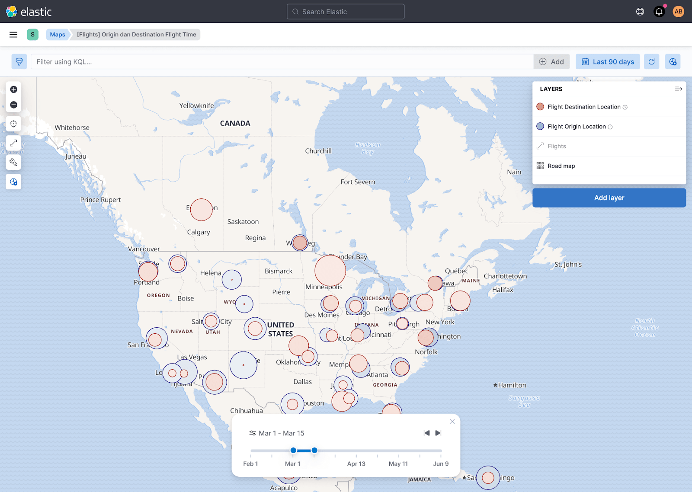
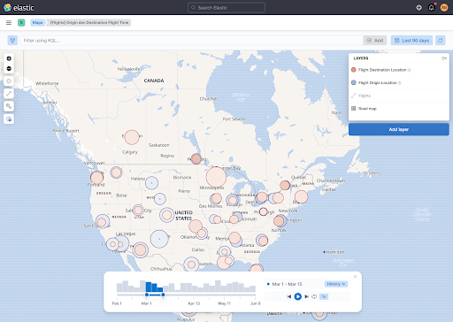
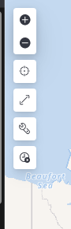

- Start Date: 2020-04-26
- RFC PR: (leave this empty)
- Kibana Issue: (leave this empty)

---
- [1. Summary](#1-summary)
- [2. Detailed design](#2-detailed-design)
- [3. Unresolved questions](#3-unresolved-questions)

# 1. Summary

A timeslider is a UI component that allows users to intuitively navigate through time-based data.

This RFC proposes adding a timeslider control to the Maps application. 

It proposes a two phased roll-out in the Maps application. The [design proposal](#2-detailed-design) focuses on the first phase.

Since the timeslider UI is relevant for other Kibana apps, the implementation should be portable. We propose to implement the control as a React-component 
without implicit dependencies on Kibana-state or Maps-state.

The RFC details the integration of this control in Maps. It includes specific consideration to how timeslider affects data-refresh in the context of Maps.

This RFC also outlines a possible integration  of this Timeslider-React component with an Embeddable, and the introduction of a new piece of embeddable-state `Timeslice`.

This RFC does not address how this component should _behave_ in apps other than the Maps-app.

# 2. Detailed design

Below outlines:
- the two delivery phases intended for Kibana Maps
- outline of the Timeslider UI component implementation (phase 1)
- outline of the integration in Maps of the Timeslider UI component (phase 1)

## 2.1 Design phases overview


### 2.1.1 Time-range selection and stepped navigation

A first phase includes arbitrary time-range selection and stepped navigation.



This is the focus of this RFC.

Check [https://github.com/elastic/kibana/pull/96791](https://github.com/elastic/kibana/pull/96791) for a POC implementation.

### 2.2.2 Data distribution preview with histogram and playback

A second phase adds a date histogram showing the preview of the data.



Details on this phase 2 are beyond the scope of this RFC.

## 2.2 The timeslider UI React-component (phase 1)

This focuses on Phase 1. Phase 2, with date histogram preview and auto-playback is out of scope for now.

### 2.2.1 Interface of the React-component

The core timeslider-UI is a React-component.

The component has no implicit dependencies on any Kibana-state or Maps-store state. 

Its interface is fully defined by its `props`-contract.

```
export type Timeslice = {
  from: number; // epoch timestamp
  to: number;   // epoch timestamp
};

export interface TimesliderProps {
  onTimesliceChanged: (timeslice: Timeslice) => void;
  timerange: TimeRange; // TimeRange The start and end time of the entire time-range. TimeRange is defined in `data/common` 
  timeslice?: Timeslice; // The currently displayed timeslice. Needs to be set after onTimesliceChange to be reflected back in UI. If ommitted, the control selects the first timeslice.
}
```

`timeslice` is clamped to the bounds of `timeRange`.

Any change to `timeslice`, either by dragging the handles of the timeslider, or pressing the back or forward buttons, calls the `onTimesliceChanged` handler.

Since the initial use is inside Maps, the initial location of this React-component is inside the Maps plugin, `x-pack/plugins/maps/public/timeslider`.

Nonetheless, this UI-component should be easily "cut-and-pastable" to another location.

### 2.2.2 Internals

The timeslider automatically subdivides the timerange with equal breaks that are heuristically determined. 

It assigns about 6-10 breaks within the `timerange`, snaps the "ticks" to a natural "pretty date" using `calcAutoIntervalNear` from `data/common`. 

For example;
- a `timerange` of 8.5 days, it would assign a 8 day-steps, plus some padding on either end, depending on the entire `timerange`.
- a `timerange` of 6.9 years would snap to year-long step, plus some padding on either end, depending on the entire `timerange`.

The slider itself is a `<EuiDualRange>`.

### 2.2.2 End-user behavior

- the user can manipulate the `timeslice`-double ranged slider to any arbitrary range within `timerange`.
- the user can press the forward and back buttons for a stepped navigation. The range of the current time-slice is preserved when there is room for the `timeslice` within the `timerange`. 
     - when the user has _not modified the width_ of the `timeslice`, using the buttons means stepping through the pre-determined ticks (e.g. by year, by day, ...)
     - when the user has _already modified the width_ of the `timeslice`, it means stepping through the `timerange`, with a stride of the width of the `timeslice`.
- the `timeslice` "snaps" to the beginning or end (depending on direction) of the `timerange`. In practice, this means the `timeslice` will collaps or reduce in width.
    
## 2.3 Maps integration of the timeslider React component

This control will be integrated in the Maps-UI.

Maps is Redux-based, so `timeslice` selection and activation/de-activation all propagates to the Redux-store.

#### 2.3.1 Position in the UI

The timeslider control is enabled/disabled by the timeslider on/off toggle-button in the main toolbar.




#### 2.3.2 Layer interactions


Enabling the Timeslider will automatically retrigger refresh of _all_ time-based layers to the currently selected `timeslice`.

The Layer-TOC will indicate which layer is currently "time-filtered" by the timeslider.

On a layer-per-layer basis, users will be able to explicitly opt-out if they should be governed by the timerange or not. This is an existing toggle in Maps already.
This is relevant for having users add contextual layers that should _not_ depend on the time.


#### 2.3.3 Omitting timeslider on a dashboard

Maps will not display the timeslider-activation button on Maps that are embedded in a Dashboard. 

We believe that a Timeslider-embeddable would be a better vehicle to bring timeslider-functionality do Dashboards. See also the [last section](#3-unresolved-questions).

#### 2.3.3 Data-fetch considerations

---
**NOTE**

The below section is very Maps-specific, although similar challenges would be present in other applications as well. 

Some of these considerations will not generalize to all of Kibana.

The main ways that Maps distinguishes in data-fetch from other use-cases:
 - the majority of the data-fetching for layers in Maps depends on the scale and extent. Ie. different data is requested based on the current zoom-level and current-extent of the Map. So for example, even if two views share the same time, query and filter-state, if their extent and/or scale is different, their requests to ES will be different.
 - for some layer-types, Maps will fetch individual documents, rather than the result of an aggregation.

---

Data-fetch for timeslider should be responsive and smooth. A user dragging the slider should have an immediate visual result on the map.
 
In addition, we expect the timeslider will be used a lot for "comparisons". For example, imagine a user stepping back&forth between timeslices.

For this reason, apps using a timeslider (such as Maps) ideally:
- pre-fetch data when possible
- cache data when possible

For Maps specifically, when introducing timeslider, layers will therefore need to implement time-based data fetch based on _two_ pieces of state
- the entire `timerange` (aka. the global Kibana timerange)
- the selected `timeslice` (aka. the `timeslice` chosen by the user using the UI-component)

##### 2.3.3.1 Pre-fetching individual documents and masking of data

ES-document layers (which display individual documents) can prefetch all documents within the entire `timerange`, when the total number of docs is below some threshold. In the context of Maps, this threshold is the default index-search-size of the index.

Maps can then just mask data on the map based on some filter-expression. The evaluation of this filter-expression is done by mapbox-gl is fast because it occurs on the GPU. There is immediate visual feedback to the user as they manipulate the timeslider, because it does not require a roundtrip to update the data.

##### 2.3.3.2 Caching of aggregated searches

Aggregated data can be cached on the client, so toggling between timeslices can avoid a round-trip data-fetch. 
The main technique here is for layers to use `.mvt`-data format to request data. Tiled-based data can be cached client-side

We do _not_ propose _pre-fetching_ of aggregated data in this initial phase of the Maps timeslider effort. There is a couple reasons:
- Based on the intended user-interactions for timeslider, because a user can flexibly select a `timeslice` of arbitrary widths, it would be really hard to determine how to determine which timeslices to aggregate up front.
- Maps already strains the maximum bucket sizes it can retrieve from Elasticsearch. Cluster/grid-layers often push up to 10k or more buckets, and terms-aggregations for choropleth maps also is going up to 10k buckets. Prefetching this for timeslices (e.g. say x10 timeslices) would easily exceed the default bucket limit sizes of Elasticsearch.


##### 2.3.3.3 Decouple data-fetch from UI-effort

Apart from refactoring the data-fetch for layers to now use two pieces of time-based state, the implementation will decouple any data-fetch considerations from the actual timeslider-UI work.
 
The idea is that dial in data-fetch optimizations can be dialed into Maps in a parallel work-thread, not necessarily dependent on any changes or additions to the UI. 
Any optimizations would not only affect timeslider users, but support all interaction patterns that require smooth data-updates (e.g. panning back&forth to two locations, toggling back&forth between two filters, ...)

The main effort to support efficient data-fetch in a maps-context is to use `.mvt` as the default data format ([https://github.com/elastic/kibana/issues/79868](https://github.com/elastic/kibana/issues/79868)). This is a stack-wide effort in collaboration with the Elasticsearch team ([https://github.com/elastic/elasticsearch/issues/58696](https://github.com/elastic/elasticsearch/issues/58696), which will add `.mvt` as a core response format to Elasticsearch.

Growing the use of `mvt`([https://docs.mapbox.com/vector-tiles/reference/](https://docs.mapbox.com/vector-tiles/reference/)) in Maps will help with both pre-fetching and client-side caching:
- `mvt` is a binary format which allows more data to be packed inside, as compared to Json. Multiple tiles are patched together, so this introduces a form of parallelization as well. Due to growing the amount of data inside a single tile, and due to the parallelization, Maps has a pathway to increase the number of features that can be time-filtered.
- Because vector tiles have fixed extents and scales (defined by a `{x}/{y}/{scale}`-tuple), this type of data-fetching allows tiles to be cached on the client. This cache can be the implicit browser disc-cache, or the transient in-mem cache of mapbox-gl. Using mvt thus provides a pathway for fast toggling back&forth between timeslices, without round-trips to fetch data.


##### 2.3.3.4 timeslider and async search

It is unclear on what the practical uses for async-search would be in the context of a timeslider-control in Maps. 

Timeslider is a highly interactive control that require immediate visual feedback. We also do not intend to activate timeslider in Maps on a Dashboard (see above).

End-users who need to view a dashboard with a long-running background search will need to manipulate the _global Kibana time picker_ to select the time-range, and will not be able to use the timeslider to do so.

# 3. Unresolved questions

## Making Timeslider a Kibana Embeddable

This below is a forward looking section. It is a proposal of how the Timeslider-UI can be exposed as an Embeddable, when that time should come.

We expect a few steps:
- This would require the extraction of the timeslider React-component out of Maps into a separate plugin. As outlined above, this migration should be fairly straightforward, a "cut and paste".
- It would require the creation of a `TimesliderEmbeddable` which wraps this UI-component.
- It would also require the introduction of a new piece of embeddable-state, `Timeslice`, which can be controlled by the `TimesliderEmbeddable`. 
We believe it is important to keep `timeslice` and `timerange` separate, as individual apps and other embeddables will have different mechanism to efficiently fetch data and respond to changes in `timeslice` and/or `timerange`.

Having timeslider as a core Embeddable likely provides a better pathway to integrate timeslider-functionality in Dashboards or apps other than Maps.

