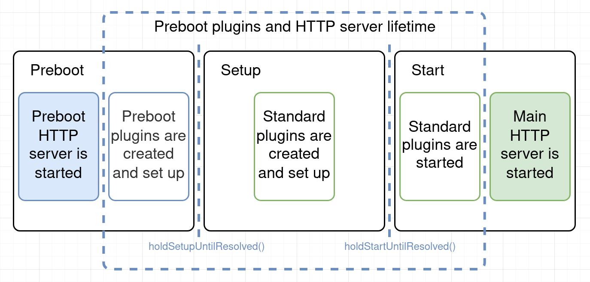

- Start Date: 2020-06-04
- RFC PR: (leave this empty)
- Kibana Issue: https://github.com/elastic/kibana/issues/89287

---
- [1. Summary](#1-summary)
- [2. Motivation](#2-motivation)
- [3. Detailed design](#3-detailed-design)
  - [3.1 Core client-side changes](#31-core-client-side-changes)
  - [3.2 Core server-side changes](#32-core-server-side-changes)
    - [3.2.1 Plugins service](#321-plugins-service)
    - [3.2.2 HTTP service](#322-http-service)
    - [3.2.3 Elasticsearch service](#323-elasticsearch-service)
    - [3.2.4 UI Settings service](#324-ui-settings-service)
    - [3.2.5 Rendering service](#325-rendering-service)
    - [3.2.6 I18n service](#326-i18n-service)
    - [3.2.7 Environment service](#327-environment-service)
    - [3.2.8 Core app service](#328-core-app-service)
    - [3.2.9 Preboot service](#329-preboot-service)
    - [3.2.10 Bootstrap](#3210-bootstrap)
- [4. Drawbacks](#4-drawbacks)
- [5. Alternatives](#5-alternatives)
- [6. Adoption strategy](#6-adoption-strategy)
- [7. How we teach this](#7-how-we-teach-this)
- [8. Unresolved questions](#8-unresolved-questions)
  - [8.1 Lifecycle stage name](#81-lifecycle-stage-name)
  - [8.2 Development mode and basepath proxy](#82-development-mode-and-basepath-proxy)
- [9. Resolved questions](#9-resolved-questions)
  - [9.1 Core client-side changes](#91-core-client-side-changes)

# 1. Summary

The `preboot` (see [unresolved question 1](#81-lifecycle-stage-name)) is the Kibana initial lifecycle stage at which it only initializes a bare minimum of the core services and a limited set of special-purpose plugins. It's assumed that Kibana can change and reload its own configuration at this stage and may require administrator involvement before it can proceed to the `setup` and `start` stages.

# 2. Motivation

The `preboot` lifecycle stage is a prerequisite for the Kibana interactive setup mode. This is the mode Kibana enters to on the first launch if it detects that user hasn't explicitly configured their own connection to Elasticsearch. In this mode, Kibana will present an interface to the user that would allow them to provide Elasticsearch connection information and potentially any other configuration information. Once the information is verified, Kibana will write it to the disk and allow the rest of Kibana to start.

The interactive setup mode will be provided through a dedicated `userSetup` plugin that will be initialized at the `preboot` stage.

# 3. Detailed design

The central part of the `preboot` stage is a dedicated HTTP server instance formerly known as `Not Ready` server. Kibana starts this server at the `preboot` stage and shuts it down as soon as the main HTTP server is ready to start, as illustrated at the following diagram:



Currently, preboot HTTP server only exposes a status endpoint and renders a static `Kibana server is not ready yet` string whenever users try to access Kibana before it's completely initialized. The changes proposed in this RFC should allow special-purpose plugins to define custom HTTP endpoints, and serve interactive client-side applications on this server, and hence make Kibana interactive setup mode possible.

## 3.1 Core client-side changes

The RFC aims to limit the changes to only those that are absolutely required and doesn't assume any modifications in the client-side part of the Kibana Core at the moment. This may introduce a certain level of inconsistency in the client-side codebase, but we consider it insignificant. See [resolved question 1](#91-core-client-side-changes) for more details.

## 3.2 Core server-side changes

We'll update only several Core server-side services to support the new `preboot` lifecycle stage and preboot plugins.

Once none of the `preboot` plugins holds the `setup` anymore, Kibana might need to reload the configuration before it can finally proceed to `setup`. This doesn't require any special care from the existing plugin developers since Kibana would instantiate plugins only after it reloads the config. We'll also make sure that neither of the Core services relies on the stale configuration it may have acquired during the `preboot` stage.

### 3.2.1 Plugins service

First of all, we'll introduce a new type of special-purpose plugins: preboot plugins, in contrast to standard plugins. Kibana will initialize preboot plugins at the `preboot` stage, before even instantiating standard plugins.

Preboot plugins have only `setup` and `stop` methods, and can only depend on other preboot plugins. Standard plugins cannot depend on the preboot plugins since Kibana will stop them before starting the standard plugins:

```ts
export interface PrebootPlugin<TSetup = void, TPluginsSetup extends object = object> {
  setup(core: CorePrebootSetup, plugins: TPluginsSetup): TSetup;
  stop?(): void;
}
```

To differentiate preboot and standard plugins we'll introduce a new _optional_ `type` property in the plugin manifest. The property can have only two possible values: `preboot` for `preboot` plugins and `standard` for the standard ones. If `type` is omitted, the `standard` value will be assumed.

```json5
// NOTE(azasypkin): all other existing properties have been omitted for brevity.
{
  "type": "preboot", // 'preboot' | 'standard' | undefined
}
```

The Plugins service will split plugins into two separate groups during discovery to use them separately at the `preboot`, `setup`, and `start` stages. The Core contract that preboot plugins will receive during their `setup` will be different from the one standard plugins receive, and will only include the functionality that is currently required for the interactive setup mode. We'll discuss this functionality in details in the following sections:

```ts
export interface CorePrebootSetup {
  elasticsearch: ElasticsearchServicePrebootSetup;
  http: HttpServicePrebootSetup;
  preboot: PrebootServiceSetup;
}
```

### 3.2.2 HTTP service

We'll change HTTP service to initialize and start preboot HTTP server (formerly known as `Not Ready` server) in the new `preboot` method instead of `setup`. The returned `InternalHttpServicePrebootSetup` contract will presumably be very similar to the existing `InternalHttpServiceSetup` contract, but will only include APIs we currently need to support interactive setup mode:

```ts
// NOTE(azasypkin): some existing properties have been omitted for brevity.
export interface InternalHttpServicePrebootSetup
  extends Pick<HttpServiceSetup, 'auth' | 'csp' | 'basePath' | 'getServerInfo'> {
  server: HttpServerSetup['server'];
  externalUrl: ExternalUrlConfig;
  registerRoutes(path: string, callback: (router: IRouter) => void): void;
}
```

The only part of this contract that will be available to the preboot plugins via `CorePrebootSetup` is the API to register HTTP routes on the already running preboot HTTP server:

```ts
export interface HttpServicePrebootSetup {
  registerRoutes(path: string, callback: (router: IRouter) => void): void;
}
```

The Core HTTP context available to handlers of the routes registered on the preboot HTTP server will only expose the `uiSettings` service. As explained in the [UI Settings service section](#324-ui-settings-service), this service will only give access to the **default Core** UI settings and their overrides set through Kibana configuration, if any.
```ts
// NOTE(azasypkin): the fact that the client is lazily initialized has been omitted for brevity.
export interface PrebootCoreRouteHandlerContext {
  readonly uiSettings: { client: IUiSettingsClient };
}
```

The authentication and authorization components are not available at the `preboot` stage, and hence all preboot HTTP server routes can be freely accessed by anyone with access to the network Kibana is exposed to.

Just as today, Kibana will shut the preboot HTTP server down as soon as it's ready to start the main HTTP server.

### 3.2.3 Elasticsearch service

As mentioned in the [Motivation section](#2-motivation), the main goal of the interactive setup mode is to give the user a hassle-free way to configure Kibana connection to an Elasticsearch cluster. That means that users might provide certain connection information, and Kibana preboot plugins should be able to construct a new Elasticsearch client using this information to verify it and potentially call Elasticsearch APIs.

To support this use case we'll add a new `preboot` method to the Elasticsearch service that will return the following contract, and make it available to the preboot plugins via `CorePrebootSetup`:

```ts
export interface ElasticsearchServicePrebootSetup {
  readonly createClient: (
    type: string,
    clientConfig?: Partial<ElasticsearchClientConfig>
  ) => ICustomClusterClient;
}
```

The Elasticsearch clients created with `createClient` rely on the default Kibana Elasticsearch configuration and any configuration overrides specified by the consumer.

__NOTE:__ We may need to expose a full or portion of Elasticsearch config to the preboot plugins for them to check if the user has already configured Elasticsearch connection. There are other ways to check that without direct access to the configuration though.

### 3.2.4 UI Settings service

We'll introduce a new `preboot` method in the UI Settings service that will produce a UI Settings client instance. Since during the `preboot` stage Kibana can access neither user information nor Saved Objects, this client will only give access to the **default Core** UI settings and their overrides set through Kibana configuration, if any:

```ts
export interface InternalUiSettingsServicePrebootSetup {
  defaultsClient(): IUiSettingsClient;
}
```

UI Settings service isn't strictly necessary during the `preboot` stage, but many Kibana Core components rely on it explicitly and implicitly, which justifies this simple change.

### 3.2.5 Rendering service

We'll introduce a new `preboot` method in the Rendering service that will register Kibana main UI bootstrap template route on the preboot HTTP server as it does for the main HTTP server today. The main difference is that bootstrap UI will only reference bundles of the preboot plugins and will rely on the default UI settings.

### 3.2.6 I18n service

We'll introduce a new `preboot` method in the I18n service to only include translations for the Core itself and preboot plugins in the translations bundle loaded with the preboot UI bootstrap template. This would potentially allow us to switch locale during interactive setup mode if there is such a need in the future.

### 3.2.7 Environment service

There are no changes required in the Environment service itself, but we'll expose one additional property from its `setup` contract to the plugins: the paths to the known configuration files. The interactive setup mode should be able to figure out to which configuration file Kibana should save any changes users might need to make.

### 3.2.8 Core app service

We'll introduce a new `preboot` method in the Core app service to register routes on the preboot HTTP server necessary for the rendering of the Kibana preboot applications. Most of the routes will be the same as for the main HTTP server, but there are three notable exceptions:

1. JS bundles routes will only include those exposed by the preboot plugins

2. Default route for the preboot HTTP server will be hardcoded to the root path (`/`) since we cannot rely on the default value of the `defaultRoute` UI setting (`/app/home`)

3. Main application route (`/app/{id}/{any*}`) will be replaced with the catch-all route (`/{path*}`). The reason is that if the user tries to access Kibana with a legit standard application URL (e.g. `/app/discover/?parameters`) while Kibana is still at the `preboot` stage, they will end up with `Application is not found` error. Instead, with the catch-all route, Kibana will capture the original URL in the `next` query string parameter and redirect the user to the root (e.g. `/?next=%2Fapp%2Fdiscover%2F%3Fparameters`). This will allow us to automatically redirect the user back to the original URL as soon as Kibana is ready. The main drawback and limitation of this approach are that there can be only one root-level preboot application. We can lift this limitation in the future if we have to though, for example, to support post-preboot Saved Objects migration UI or something similar.

Serving a proper Kibana application on the root route of the preboot HTTP server implies that we'll also have a chance to replace the static `Kibana server is not ready yet` string with a more helpful and user-friendly application. Such application may potentially display a certain set of Kibana status information.

### 3.2.9 Preboot service

To support interactive applications at the `preboot` stage we should allow preboot plugins to pause Kibana startup sequence. This functionality will be exposed by the new Preboot service, and will be available to the preboot plugins via `CorePrebootSetup`. Preboot plugins will be able to provide a promise to hold `setup` and/or `start` for as long as needed, and also let Kibana know if it has to reload configuration before it enters the `setup` stage.

```ts
export interface PrebootServiceSetup {
  readonly isSetupOnHold: () => boolean;
  readonly holdSetupUntilResolved: (
    reason: string,
    promise: Promise<{ shouldReloadConfig: boolean } | void>
  ) => void;
  readonly isStartOnHold: () => boolean;
  readonly holdStartUntilResolved: (
    reason: string,
    promise: Promise<void>
  ) => void
}
```

Preboot service will provide a pair of helper `isSetupOnHold` and `isStartOnHold` methods that would allow consumers to check if `setup` or `start` are on hold before they are blocked on waiting.

Internal Preboot service contract will also expose `waitUntilCanSetup` and `waitUntilCanStart` methods that bootstrap process can use to know when it can proceed to `setup` and `start` stages. If any of these methods returns a `Promise` that is rejected, Kibana will shut down.

```ts
// NOTE(azasypkin): some existing properties have been omitted for brevity.
export interface InternalPrebootServiceSetup {
  readonly waitUntilCanSetup: () => Promise<{ shouldReloadConfig: boolean } | void>;
  readonly waitUntilCanStart: () => Promise<void>;
}
```

### 3.2.10 Bootstrap

We'll update Kibana bootstrap sequence to include `preboot` stage and to conditionally reload configuration before proceeding to `setup` and `start` stages:

```ts
// NOTE(azasypkin): some functionality and checks have been omitted for brevity.
const { preboot } = await root.preboot();

const { shouldReloadConfig } = await preboot.waitUntilCanSetup();
if (shouldReloadConfig) {
  await reloadConfiguration('pre-boot request');
}
await root.setup();

await preboot.waitUntilCanStart();
await root.start();
```

It's not yet clear if we need to adjust the base path proxy to account for this new lifecycle stage (see [unresolved question 2](#82-development-mode-and-basepath-proxy)).

# 4. Drawbacks

The main drawback is that proposed changes affect quite a few Kibana Core services that may impose a risk of breaking something in the critical parts of Kibana.

# 5. Alternatives

The most viable alternative to support interactive setup mode for Kibana was a standalone application that would be completely separated from Kibana. We ruled out this option since we won't be able to leverage existing and battle-tested Core services, UI components, and development tools. This would make the long-term maintenance burden unreasonably high.

# 6. Adoption strategy

The new `preboot` stage doesn't need an adoption strategy since it's intended for internal platform use only.

# 7. How we teach this

The new `preboot` stage shouldn't need much knowledge sharing since it's intended for internal platform use only and doesn't affect the standard plugins. All new services, methods, and contracts will be sufficiently documented in the code.

# 8. Unresolved questions

## 8.1 Lifecycle stage name

Is `preboot` the right name for this new lifecycle stage? Do we have a better alternative?

## 8.2 Development mode and basepath proxy

Currently, the base path proxy blocks any requests to Kibana until it receives `SERVER_LISTENING` message. Kibana's main process sends this message only after `start`, but we should change that to support interactive preboot applications. It's not yet clear how big the impact of this change will be.

# 9. Resolved questions

## 9.1 Core client-side changes

The server-side part of the `preboot` plugins will follow a new `PrebootPlugin` interface that doesn't have a `start` method, but the client-side part will stay the same as for standard plugins. This significantly simplifies implementation and doesn't introduce any known technical issues, but, unfortunately, brings some inconsistency to the codebase. We agreed that it's tolerable assuming we define a dedicated client-side `PrebootPlugin` interface that would hide from `CoreStart` all services that are unavailable to the preboot plugins (e.g., Saved Objects service).