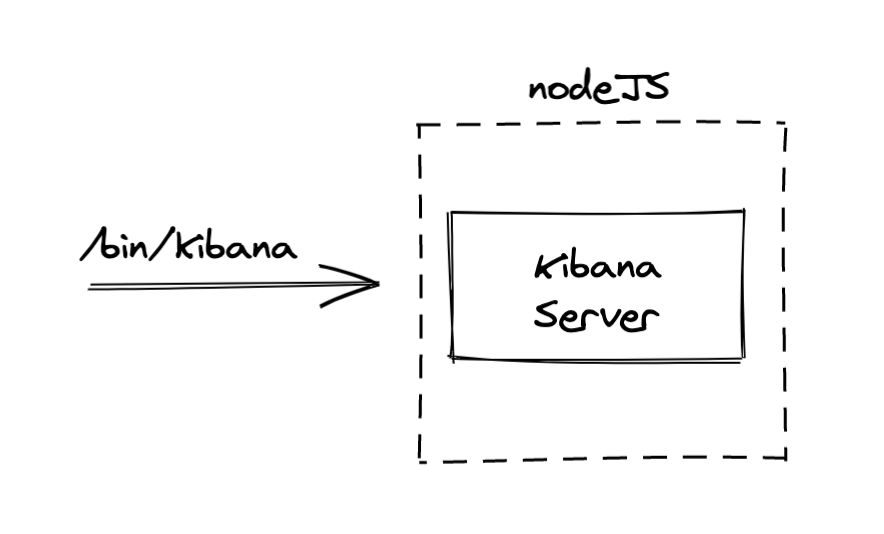
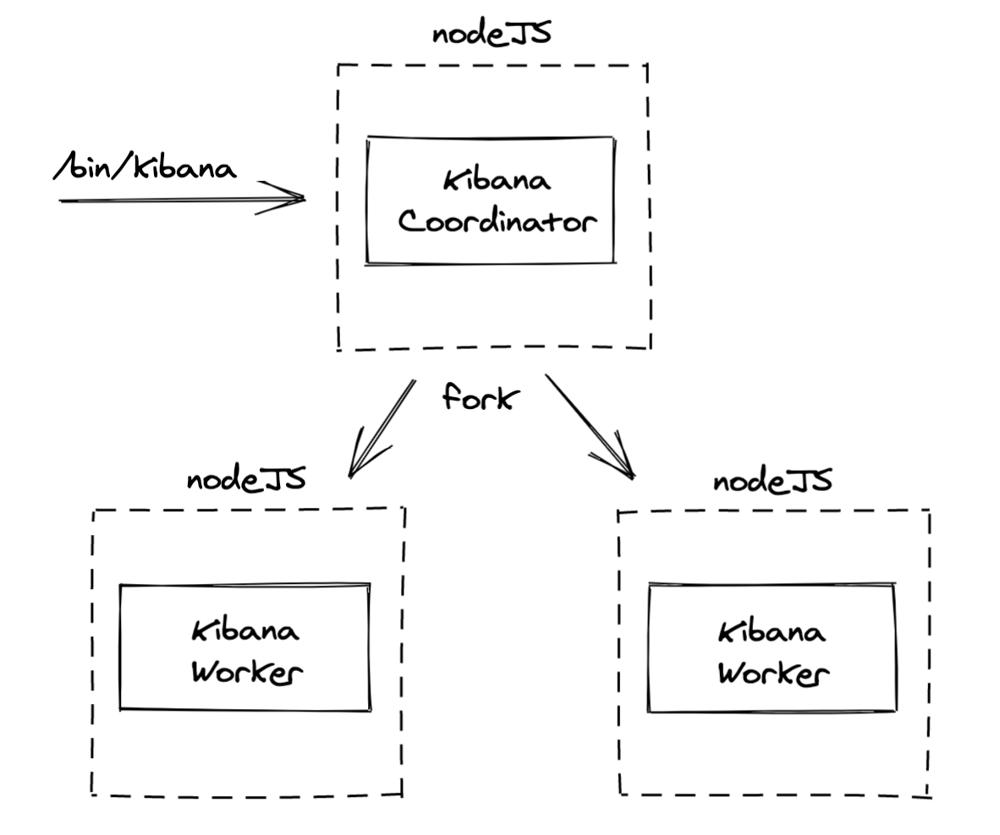
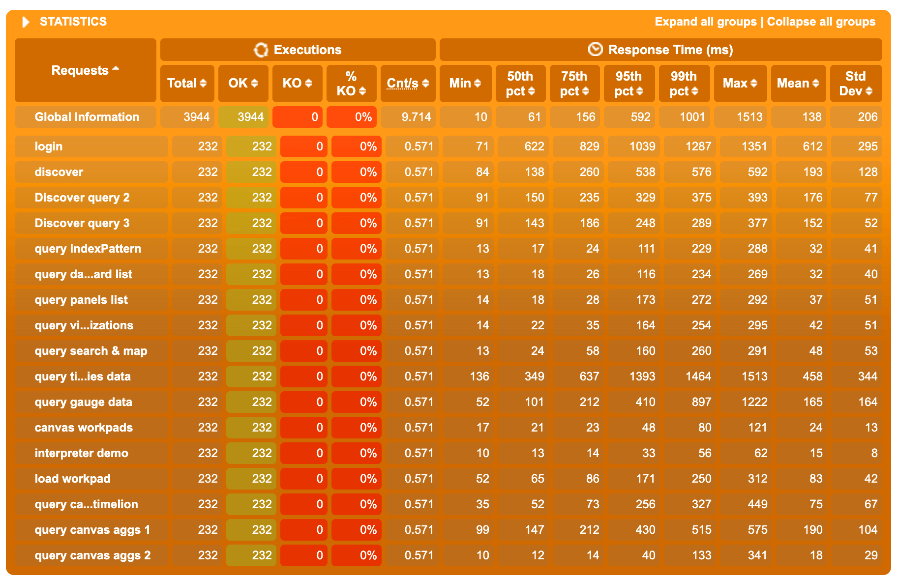
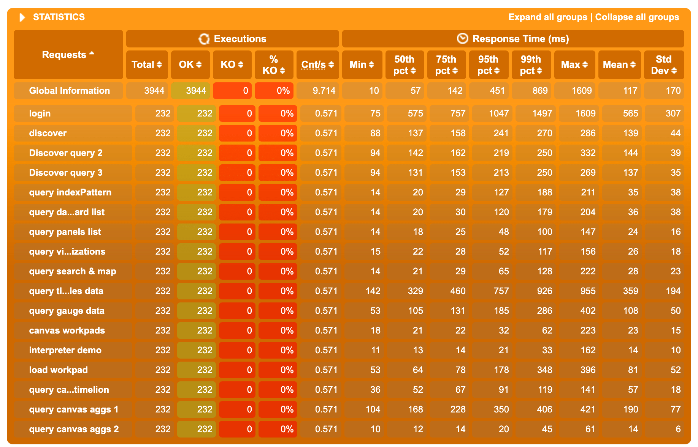

- Start Date: 2021-03-09
- RFC PR: https://github.com/elastic/kibana/pull/94057
- Kibana Issue: https://github.com/elastic/kibana/issues/68626
- POC PR: https://github.com/elastic/kibana/pull/93380

---

- [1. Summary](#1-summary)
- [2. Motivation](#2-motivation)
- [3. Architecture](#3-architecture)
- [4. Testing](#4-testing)
  - [4.1 Local testing](#41-local-testing)
    - [4.1.1 Raw results](#411-raw-results)
      - [Non-clustered mode](#non-clustered-mode)
      - [Clustered mode, 2 workers](#clustered-mode-2-workers)
      - [Clustered mode, 4 workers](#clustered-mode-4-workers)
    - [4.1.2 Analysis](#412-analysis)
  - [4.2 Testing against cloud](#42-testing-against-cloud)
- [5. Detailed design](#5-detailed-design)
  - [5.1 Enabling clustering mode](#51-enabling-clustering-mode)
  - [5.2 Cross-worker communication](#52-cross-worker-communication)
  - [5.3 Executing code on a single worker](#53-executing-code-on-a-single-worker)
  - [5.4 The node service API](#54-the-node-service-api)
    - [5.4.1 Example: Saved Object Migrations](#541-example-saved-object-migrations)
  - [5.5 Sharing state between workers](#55-sharing-state-between-workers)
- [6. Technical impact](#6-technical-impact)
  - [6.1 Technical impact on Core](#61-technical-impact-on-core)
    - [6.1.1 Handling multi-process logs](#611-handling-multi-process-logs)
      - [Options we considered:](#options-we-considered)
      - [Our recommended approach:](#our-recommended-approach)
    - [6.1.2 The rolling-file appender](#612-the-rolling-file-appender)
      - [Options we considered:](#options-we-considered-1)
      - [Our recommended approach:](#our-recommended-approach-1)
    - [6.1.3 The status API](#613-the-status-api)
    - [6.1.4 The stats API \& metrics service](#614-the-stats-api--metrics-service)
      - [Options we considered:](#options-we-considered-2)
      - [Our recommended approach:](#our-recommended-approach-2)
    - [6.1.5 PID file](#615-pid-file)
    - [6.1.6 Saved Objects migration](#616-saved-objects-migration)
    - [6.1.7 Memory consumption](#617-memory-consumption)
    - [6.1.8 Workers error handling](#618-workers-error-handling)
    - [6.1.9 Data folder](#619-data-folder)
    - [6.1.10 instanceUUID](#6110-instanceuuid)
  - [6.2 Technical impact on Plugins](#62-technical-impact-on-plugins)
    - [6.2.1 What types of things could break?](#621-what-types-of-things-could-break)
      - [Concurrent access to the same resources](#concurrent-access-to-the-same-resources)
      - [Using instanceUUID as a unique Kibana process identifier](#using-instanceuuid-as-a-unique-kibana-process-identifier)
      - [Things needing to run only once per Kibana instance](#things-needing-to-run-only-once-per-kibana-instance)
    - [6.2.2 Identified required changes](#622-identified-required-changes)
      - [Reporting](#reporting)
      - [Telemetry](#telemetry)
      - [Task Manager](#task-manager)
      - [Alerting](#alerting)
  - [6.3 Summary of breaking changes](#63-summary-of-breaking-changes)
    - [6.3.1 `/stats` API \& metrics service](#631-stats-api--metrics-service)
- [7. Drawbacks](#7-drawbacks)
- [8. Alternatives](#8-alternatives)
- [9. Adoption strategy](#9-adoption-strategy)
  - [Phase 0](#phase-0)
  - [Phase 1](#phase-1)
  - [Phase 2](#phase-2)
  - [Phase 3](#phase-3)
- [10. How we teach this](#10-how-we-teach-this)
- [11. Unresolved questions](#11-unresolved-questions)
- [12. Resolved questions](#12-resolved-questions)

# 1. Summary

This RFC proposes a new core service which leverages the [Node.js cluster API](https://nodejs.org/api/cluster.html)
to support multi-process Kibana instances.

# 2. Motivation

The Kibana server currently uses a single Node process to serve HTTP traffic.
This is a byproduct of the single-threaded nature of Node's event loop.

As a consequence, Kibana cannot take advantage of multi-core hardware: If you run Kibana on an
8-core machine, it will only utilize one of those cores. This makes it expensive to scale out
Kibana, as server hardware will typically have multiple cores, so you end up paying for power
you never use. Since Kibana is generally more CPU-intensive than memory-intensive, it would be
advantageous to use all available cores to maximize the performance we can get out of a single
machine.

Another benefit of this approach would be improving Kibana's overall performance for most users
without requiring an operator to scale out the server, as it would allow the server to handle
more http requests at once, making it less likely that a single bad request could delay the
event loop and impact subsequent requests.

The introduction of a clustering mode would allow spawning multiple Kibana processes ('workers')
from a single Kibana instance. (See [Alternatives](#8-alternatives) to learn more about the
difference between clustering and worker pools). You can think of these processes as individual
instances of the Kibana server which listen on the same port on the same machine, and serve
incoming traffic in a round-robin fashion.

Our intent is to eventually make clustering the default behavior in Kibana, taking advantage of
all available CPUs out of the box. However, this should still be an optional way to run Kibana
since users might have use cases for single-process instances (for example, users running Kibana
inside Docker containers might choose to rather use their container orchestration to run a
container per host CPU with a single Kibana process per container).

# 3. Architecture

In 'classic' mode, the Kibana server is started in the main Node.js process.



In clustering mode, the main Node.js process would only start the coordinator, which would then
fork workers using Node's `cluster` API. Node's underlying socket implementation allows multiple
processes to listen to the same ports, effectively performing http traffic balancing between the
workers for us.



The coordinator's primary responsibility is to orchestrate the workers. It would not be a 'super'
worker handling both the job of a worker while being in charge of managing the other workers.

In addition, the coordinator would be responsible for some specific activities that need to be
handled in a centralized manner:
- collecting logs from each of the workers & writing them to a single file or stdout
- gathering basic status information from each worker for use in the `/status` and `/stats` APIs

Over time, it is possible that the role of the coordinator would expand to serve more purposes,
especially if we start implementing custom routing logic to run different services on specialized
processes.

# 4. Testing

Thorough performance testing is critical in evaluating the success of this plan. The results
below reflect some initial testing that was performed against an experimental
[proof-of-concept](https://github.com/elastic/kibana/pull/93380). Should we move forward with this
RFC, one of the first tasks will be to update the POC and build out a more detailed test plan that
covers all of the scenarios we are concerned with.

## 4.1 Local testing

These tests were performed against a local development machine, with an 8-core CPU(2.4 GHz 8-Core
Intel Core i9 - 32 GB 2400 MHz DDR4), using the default configuration of the `kibana-load-testing` tool.

### 4.1.1 Raw results

#### Non-clustered mode


#### Clustered mode, 2 workers



#### Clustered mode, 4 workers



### 4.1.2 Analysis 

- Between non-clustered and 2-worker cluster mode, we observe a 20/25% gain in the 50th percentile response time. 
  Gain for the 75th and 95th are between 10% and 40%
- Between 2-worker and 4-workers cluster mode, the gain on 50th is negligible, but the 75th and the 95th are 
  significantly better on the 4-workers results, sometimes up to 100% gain (factor 2 ratio)

Overall, switching to 2 workers comes with the most significant improvement in the 50th pct, 
and increasing further to 4 workers decreases even more significantly the highest percentiles. 
Even if increasing the number of workers doesn’t just linearly increase the performances 
(which totally make sense, most of our requests response time is caused by awaiting ES response), 
the improvements of the clustering mode on performance under heavy load are far from negligible.

## 4.2 Testing against cloud

There is currently no easy way to test the performance improvements this could provide on Cloud, as we can't
deploy custom builds or branches on Cloud at the moment.

On Cloud, Kibana is running in a containerised environment using CPU CFS quota and CPU shares. 

If we want to investigate the potential perf improvement on Cloud further, our only option would be to setup a 
similar-ish environment locally (which wasn't done during the initial investigation).

# 5. Detailed design

## 5.1 Enabling clustering mode

Enabling clustering mode will be done using the `node.enabled` configuration property.

If clustering is enabled by default, then no configuration would be required by users, and
Kibana would automatically use all available cores. However, more detailed configuration
would be available for users with more advanced use cases:
```yaml
node:
  enabled: true               # enabled by default

  coordinator:
    max_old_space_size: 1gb   # optional, allows to configure memory limit for coordinator only

  # Basic config for multiple workers with the same options
  workers:                    # when count is provided, all workers share the same config
    count: 2                  # worker names (for logging) are generated: `worker-1`, `worker-2`
    max_old_space_size: 1gb   # optional, allows to configure memory limits per-worker

  # Alternative advanced config, allowing for worker "types" to be configured
  workers:
    foo:                      # the key here would be used as the worker name
      count: 2
      max_old_space_size: 1gb
    bar:
      count: 1
      max_old_space_size: 512mb
```

This per-worker design would give us the flexibility to eventually provide more fine-grained configuration,
like dedicated workers for http requests or background jobs.

## 5.2 Cross-worker communication

For some of our changes (such as the `/status` API, see below), we will need some kind of cross-worker
communication. This will need to pass through the coordinator, which will also serve as an 'event bus',
or IPC forwarder.

This IPC API will be exposed from the node service:

```ts
export interface NodeServiceSetup {
  // [...]
  broadcast: (type: string, payload?: WorkerMessagePayload, options?: BroadcastOptions) => void;
  addMessageHandler: (type: string, handler: MessageHandler) => MessageHandlerUnsubscribeFn;
}
```

To preserve isolation and to avoid creating an implicit cross-plugin API, handlers registered from a
given plugin will only be invoked for messages sent by the same plugin.

Notes:
-  To reduce clustered and non-clustered mode divergence, in non-clustered mode, these APIs would just be no-ops. 
   It will avoid forcing (most) code to check which mode Kibana is running before calling them.
     - In the case where `sendToSelf` is true, we would still attempt to broadcast the message.
-  We could eventually use an Observable pattern instead of a handler pattern to subscribe to messages.

## 5.3 Executing code on a single worker

In some scenarios, we would like to have parts of the code executed only from a single process. 

Saved object migrations would be a good example: 
we don't need to have each worker try to perform the migration, and we'd prefer to have one performing/trying
the migration, and the others waiting for it. Due to the architecture, we can't have the coordinator perform
such single-process jobs, as it doesn't actually run a Kibana server.

There are various ways to address such use-cases. What seems to be the best compromise right now would be the
concept of 'main worker'. The coordinator would arbitrarily elect a worker as the 'main' one at startup. The
node service would then expose an API to let workers identify themselves as main or not.

```ts
export interface NodeServiceSetup {
  // [...]
  isMainWorker: () => boolean;
}
```

Notes:
- In non-clustered mode, `isMainWorker` would always return true, to reduce the divergence between clustered and 
  non-clustered modes.

## 5.4 The node service API

We propose adding a new node service to Core, which will be responsible for adding the necessary cluster APIs,
and handling interaction with Node's `cluster` API. This service would be accessible via Core's setup and start contracts
(`coreSetup.node` and `coreStart.node`).

At the moment, no need to extend Core's request handler context with node related APIs has been identified.

The initial contract interface would look like this:

```ts
type WorkerMessagePayload = Serializable;

interface BroadcastOptions {
  /**
   * If true, will also send the message to the worker that sent it.
   * Defaults to false.
   */
  sendToSelf?: boolean;
  /**
   * If true, the message will also be sent to subscribers subscribing after the message was effectively sent.
   * Defaults to false.
   */
  persist?: boolean;
}

export interface NodeServiceSetup {
  /**
   * Return true if clustering mode is enabled, false otherwise
   */
  isEnabled: () => boolean;
  /**
   * Return the current worker's id. In non-clustered mode, will return `1`
   */
  getWorkerId: () => number;
  /**
   * Broadcast a message to other workers.
   * In non-clustered mode, this is a no-op.
   */
  broadcast: (type: string, payload?: WorkerMessagePayload, options?: BroadcastOptions) => void;
  /**
   * Registers a handler for given `type` of IPC messages
   * In non-clustered mode, this is a no-op that returns a no-op unsubscription callback.
   */
  addMessageHandler: (type: string, handler: MessageHandler) => MessageHandlerUnsubscribeFn;
  /**
   * Returns true if the current worker has been elected as the main one.
   * In non-clustered mode, will always return true
   */
  isMainWorker: () => boolean;
}
```

### 5.4.1 Example: Saved Object Migrations

To take the example of SO migration, the `KibanaMigrator.runMigrations` implementation could change to
(naive implementation, the function is supposed to return a promise here, did not include that for simplicity):

```ts
runMigration() {
   if (node.isMainWorker()) {
     this.runMigrationsInternal().then((result) => {
        applyMigrationState(result);
        // persist: true will send message even if subscriber subscribes after the message was actually sent
        node.broadcast('migration-complete', { payload: result }, { persist: true });
      })
   } else {
     const unsubscribe = node.addMessageHandler('migration-complete', ({ payload: result }) => {
       applyMigrationState(result);
       unsubscribe();
     });
   }
}
```

Notes:
  - To be sure that we do not encounter a race condition with the event subscribing / sending (workers subscribing after 
    the main worker actually sent the `migration-complete` event and then waiting indefinitely), we are using the `persist`
    option of the `broadcast` API. We felt this was a better approach than the alternative of having shared state among workers.

## 5.5 Sharing state between workers

This is not identified as necessary at the moment, and IPC broadcast should be sufficient, hopefully. We prefer to avoid
the added complexity and risk of implicit dependencies if possible.

If we do eventually need shared state, we would probably have to use syscall libraries to share buffers such as
[mmap-io](https://www.npmjs.com/package/mmap-io), and expose a higher level API for that from the `node` service. More
research would be required if this proved to be a necessity.

# 6. Technical impact

This section attempts to be an exhaustive inventory of the changes that would be required to support clustering mode.

## 6.1 Technical impact on Core

### 6.1.1 Handling multi-process logs

This is an example of log output in a 2 workers cluster, coming from the POC:

```
[2021-03-02T10:23:41.834+01:00][INFO ][plugins-service] Plugin initialization disabled.
[2021-03-02T10:23:41.840+01:00][INFO ][plugins-service] Plugin initialization disabled.
[2021-03-02T10:23:41.900+01:00][WARN ][savedobjects-service] Skipping Saved Object migrations on startup. Note: Individual documents will still be migrated when read or written.
[2021-03-02T10:23:41.903+01:00][WARN ][savedobjects-service] Skipping Saved Object migrations on startup. Note: Individual documents will still be migrated when read or written.
```

The workers logs are interleaved, and, most importantly, there is no way to see which process each log entry is coming from. 
We will need to address that.

#### Options we considered:

1. Having a distinct logging configuration (with separate log files) for each worker
2. Centralizing log collection in the coordinator and writing all logs to a single file (or stdout)

#### Our recommended approach:

Overall we recommend keeping a single log file (option 2), and centralizing the logging system in the coordinator,
with each worker sending the coordinator log messages via IPC. While this is a more complex implementation in terms
of our logging system, it solves several problems:
- Preserves backwards compatibility.
- Avoids the issue of interleaved log messages that could occur with multiple processes writing to the same file or stdout.
- Provides a solution for the rolling-file appender (see below), as the coordinator would handle rolling all log files
- The changes to BaseLogger could potentially have the added benefit of paving the way for our future logging MDC.

We could add the process name information to the log messages, and add a new conversion to be able to display it with 
the pattern layout, such as `%worker` for example.

The default pattern could evolve to (ideally, only when clustering is enabled):
```
[%date][%level][%worker][%logger] %message
```

The logging output would then look like:
```
[2021-03-02T10:23:41.834+01:00][INFO ][worker-1][plugins-service] Plugin initialization disabled.
[2021-03-02T10:23:41.840+01:00][INFO ][worker-2][plugins-service] Plugin initialization disabled.
```

Notes:
- The coordinator will probably need to output logs too. `%worker` would be interpolated to `coordinator` 
  for the coordinator process.
- Even if we add the `%worker` pattern, we could still consider letting users configure per-worker log
files as a future enhancement.

### 6.1.2 The rolling-file appender

The rolling process of the `rolling-file` appender is going to be problematic in clustered mode, as it will cause 
concurrency issues during the rolling. We need to find a way to have this rolling stage clustered-proof.

#### Options we considered:

1. have the rolling file appenders coordinate themselves when rolling

By using a broadcast message based mutex mechanism, the appenders could acquire a ‘lock’ to roll a specific file, and
notify other workers when the rolling is complete (quite similar to what we want to do with SO migration for example).

An alternative to this option would be to only have the main worker handle the rolling logic. We will lose control
on the exact size the file is when rolling, as we would need to wait until the main worker receives a log message
for the rolling appender before the rolling is effectively performed. The upside would be that it reduces the inter-workers
communication to a notification from the main worker to the others once the rolling is done for them to reopen their
file handler.

2. have the coordinator process perform the rolling

Another option would be to have the coordinator perform the rotation instead. When a rolling is required, the appender 
would send a message to the coordinator, which would perform the rolling and notify the workers once the operation is complete. 

Note that this option is even more complicated than the previous one, as it forces to move the rolling implementation 
outside of the appender, without any significant upsides identified.

3. centralize the logging system in the coordinator

We could go further, and change the way the logging system works in clustering mode by having the coordinator centralize 
the logging system. The worker’s logger implementation would just send messages to the coordinator. If this may be a 
correct design, the main downside is that the logging implementation would be totally different in cluster and 
non cluster mode, and seems to be way more work that the other options.

#### Our recommended approach:
Even though it's more complex, we feel that centralizing the logging system in the coordinator is the right move here,
as it will also solve for how to enable the coordinator to log its own messages.

### 6.1.3 The status API

In clustering mode, the workers will all have an individual status. One could have a connectivity issue with ES 
while the other ones are green. Hitting the `/status` endpoint will reach a random (and different each time) worker, 
meaning that it would not be possible to know the status of the cluster as a whole.

We will need to add some centralized status state in the coordinator. Also, as the `/status` endpoint cannot be served 
from the coordinator, we will also need to have the workers retrieve the global status from the coordinator to serve 
the status endpoint.

Ultimately, we'd need to make the following updates to the `/status` API, neither of which
is a breaking change:
1. The response will return the highest-severity status level for each plugin, which will be
determined by looking at the shared global status stored in the coordinator.
2. We will introduce an extension to the existing `/status` response to allow inspecting
per-worker statuses.

### 6.1.4 The stats API & metrics service

The `/stats` endpoint is somewhat problematic in that it contains a handful of `process` metrics
which will differ from worker-to-worker:
```json
{
  // ...
  "process": {
    "memory": {
      "heap": {
        "total_bytes": 533581824,
        "used_bytes": 296297424,
        "size_limit": 4345298944
      },
      "resident_set_size_bytes": 563625984
    },
    "pid": 52646,
    "event_loop_delay": 0.22967800498008728,
    "uptime_ms": 1706021.930404
  },
  // ...
}
```

As each request could be routed to a different worker, different results may come back each time.

This endpoint, registered from the `usage_collection` plugin, is getting these stats from Core's
`metrics` service (`getOpsMetrics$`), which is also used in the `monitoring` plugin for stats
collection.

Ultimately we will extend the API to provide per-worker stats, but the question remains what we
should do with the existing `process` stats.

#### Options we considered:
1. Deprecate them? (breaking change)
2. Accept a situation where they may be round-robined to different workers? (probably no)
3. Try to consolidate them somehow? (can't think of a good way to do this)
4. Always return stats for one process, e.g. main or coordinator? (doesn't give us the full picture)

#### Our recommended approach:
We agreed that we would go with (3) and have each worker report metrics to the coordinator for
sharing, with the metrics aggregated as follows:
```json
{
  // ...
  "process": {
    "memory": {
      "heap": {
        "total_bytes": 533581824, // sum of coordinator + workers
        "used_bytes": 296297424, // sum of coordinator + workers
        "size_limit": 4345298944 // sum of coordinator + workers
      },
      "resident_set_size_bytes": 563625984 // sum of coordinator + workers
    },
    "pid": 52646, // pid of the coordinator
    "event_loop_delay": 0.22967800498008728, // max of coordinator + workers
    "uptime_ms": 1706021.930404 // uptime of the coordinator
  },
  // ...
}
```

This has its downsides (`size_limit` in particular could be confusing), but otherwise generally makes sense:
- sum of available/used heap & node rss is straightforward
- `event_loop_delay` max makes sense, as we are mostly only interested in that number if it is high anyway
- `pid` and `uptime_in_millis` from the coordinator make sense, especially as long as we are killing
all workers any time one of them dies. In the future if we respawn workers that die, this could be
misleading, but hopefully by then we can deprecate this and move Metricbeat to using the per-worker
stats.

### 6.1.5 PID file

Without changes, each worker is going to try to write and read the same PID file. Also, this breaks the whole pid file 
usage, as the PID stored in the file will be a arbitrary worker’s PID, instead of the coordinator (main process) PID.

In clustering mode, we will need to have to coordinator handle the PID file logic, and to disable pid file handling 
in the worker's environment service.

### 6.1.6 Saved Objects migration

In the current state, all workers are going to try to perform the migration. Ideally, we would have only one process 
perform the migration, and the other ones just wait for a ready signal. We can’t easily have the coordinator do it, 
so we would probably have to leverage the ‘main worker’ concept here.

The SO migration v2 is supposed to be resilient to concurrent attempts though, as we already support multi-instances 
Kibana, so this can probably be considered an improvement.

### 6.1.7 Memory consumption

In clustered mode, node options such as `max-old-space-size` will be used by all processes. 

The `kibana` startup script will read this setting out of the CLI or `config/node.options` and set a NODE_OPTIONS environment
variable, which will be passed to any workers, possibly leading to unexpected behavior.

e.g. using `--max-old-space-size=1024` in a 2 workers cluster would have a maximum memory usage of 3gb (1 coordinator + 2 workers). 

Our plan for addressing this is to _disable clustering if a user has `max-old-space-size` set at all_, which would ensure it isn't
possible to hit unpredictable behavior. To enable clustering, the user would simply remove `max-old-space-size` settings, and
clustering would be on by default. They could alternatively configure memory settings for each worker individually, as shown above.

### 6.1.8 Workers error handling

When using `cluster`, the common best practice is to have the coordinator recreate ('restart') workers when they terminate unexpectedly. 
However, given Kibana's architecture, some failures are not recoverable (workers failing because of config validation, failed migration...). 

For instance, if a worker (well, all workers) terminates because of an invalid configuration property, it doesn't make
any sense to have the coordinator recreate them indefinitely, as the error requires manual intervention. 

As a first step, we plan to terminate the main Kibana process when any worker terminates unexpectedly for any reason (after all,
this is already the behavior in non-cluster mode). In the future, we will look toward distinguishing between recoverable
and non-recoverable errors as an enhancement, so that we can automatically restart workers on any recoverable error.

### 6.1.9 Data folder

The data folder (`path.data`) is currently the same for all workers. 

We still have to identify with the teams if this is going to be a problem. It could be, for example, if some plugins
are accessing files in write mode, which could result in concurrency issues between the workers.

If that was confirmed, we would plan to create and use a distinct data folder for each worker, which would be non-breaking
as we don't consider the layout of this directory to be part of our public API.

### 6.1.10 instanceUUID

The same instance UUID (`server.uuid` / `{dataFolder}/uuid`) is currently used by all the workers. 

So far, we have not identified any places where this will be problematic, however, we will look to other teams to
help validate this.

Note that if we did need to have per-worker UUIDs, this could be a breaking change, as the single `server.uuid`
configuration property would not be enough. If this change becomes necessary, one approach could be to have unique worker
IDs with `${serverUuid}-${workerId}`.

## 6.2 Technical impact on Plugins

### 6.2.1 What types of things could break?

#### Concurrent access to the same resources

Is there, for example, some part of the code that is accessing and writing files from the data folder (or anywhere else) 
and makes the assumption that it is the sole process actually writing to that file?

#### Using instanceUUID as a unique Kibana process identifier

Is there, for example, schedulers that are using the instanceUUID a single process id, in opposition to a single 
Kibana instance id? Are there situations where having the same instance UUID for all the workers is going to be a problem?

#### Things needing to run only once per Kibana instance

Is there any part of the code that needs to be executed only once in a multi-worker mode, such as initialization code, 
or starting schedulers? 

An example would be Reporting's queueFactory polling. As we want to only be running a single headless at a time per 
Kibana instance, only one worker should have polling enabled.

### 6.2.2 Identified required changes

#### Reporting

We will probably want to restrict to a single headless per Kibana instance. For that, we will have to change the logic 
in [createQueueFactory](https://github.com/elastic/kibana/blob/4584a8b570402aa07832cf3e5b520e5d2cfa7166/x-pack/plugins/reporting/server/lib/create_queue.ts#L60-L64)
to only have the 'main' worker be polling for reporting tasks.

#### Telemetry

- Server side fetcher
  
The telemetry/server/fetcher.ts will attempt sending the telemetry usage multiple times once per day from each process. 
We do store a state in the SavedObjects store of the last time the usage was sent to prevent sending multiple times 
(although race conditions might occur).

- Tasks storing telemetry data
  
We have tasks across several plugins storing data in savedobjects specifically for telemetry. Under clustering these 
tasks will be registered multiple times.

Note that sending the data multiple times doesn’t have any real consequences, apart from the additional number of ES requests, 
so this should be considered non-blocking and only an improvement.

- Event-based telemetry

Event-based telemetry may be affected as well. Both the existing one in the Security Solutions team and the general 
one that is in the works. More specifically, the size of the queues will be multiplied per worker, also growing in the
amount of network bandwidth used, and potentially affecting our customers.

We could address that by making sure that the queues are held only in the main worker.

#### Task Manager

Currently, task manager does "claims" for jobs to run based on the server uuid. We think this could still work with 
a multi-process setup - each task manager in the worker would be doing "claims" for the same server uuid, which
seems functionally the same as setting max_workers to `current max_workers * number of workers`.
Another alternative would be to compose something like `${server.uuid}-${worker.Id}`, as TM only
really needs a unique identifier.

However, as a first step we can simply run Task Manager on the main worker. This doesn't completely solve potential
noisy neighbor problems as the main worker will still be receiving & serving http requests, however it will at least
ensure that other worker processes are free to serve http requests without risk of TM interference. Long term, we
could explore manually spawning a dedicated child process for background tasks that can be called from workers, and
thinking of a way for plugins to tell Core when they need to run things in the background.

It would be ideal if we could eventually solve this with our multi-process setup, however this needs more design work
and could necessitate an RFC in its own right. The key thing to take away here is that the work we are doing in this
RFC would not prevent us from exploring this path further in a subsequent phase. In fact, it could prove to be a
helpful first step in that direction.

#### Alerting

Currently haven't identified any Alerting-specific requirements that aren't already covered by the
Task Manager requirements.

## 6.3 Summary of breaking changes

### 6.3.1 `/stats` API & metrics service

Currently the only breaking change we have identified is for the `/stats` API.

The `process` memory usage reported doesn't really make sense in a multi-process Kibana, and
even though we have a plan to aggregate this data as a temporary solution (see 6.1.4), this
could still lead to confusion for users as it doesn't paint a clear picture of the state of the system.

Our plan is to deprecate the `process` field, and later remove it or change the structure
to better support a multi-process Kibana.

# 7. Drawbacks

- Implementation cost is going to be significant as this will require multiple phases, both in core and in plugins.
  Also, this will have to be a collaborative effort, as we can't enable cluster mode in production until all of the
  identified breaking changes have been addressed.
- Even if it is easier to deploy, at a technical level it doesn't really provide anything more than a multi-instance Kibana setup.
- This will add complexity to the code, especially in Core where some parts of the logic will drastically diverge between
  clustered and non-clustered modes (most notably our logging system).
- There is a risk of introducing subtle bugs in clustered mode, as we may overlook some breaking changes, or developers
  may neglect to ensure clustered mode compatibility when adding new features.
- Proper testing of all the edge cases is going to be tedious, and in some cases realistically impossible. Proper
  education of developers is going to be critical to ensure we are building new features with clustering in mind.

# 8. Alternatives

One alternative to the `cluster` module is using a worker pool via `worker_threads`. Both have distinct use cases
though. Clustering is meant to have multiple workers with the same codebase, often sharing a network socket to balance
network traffic. Worker threads is a way to create specialized workers in charge of executing isolated, CPU intensive
tasks on demand (e.g. encrypting or descrypting a file). If we were to identify that under heavy load, the actual bottleneck
is ES, maybe exposing a worker thread service and API from Core (task_manager would be a perfect example of potential consumer) 
would make more sense.

However, we believe the simplicity and broad acceptance of the `cluster` API in the Node community makes it the
better approach over `worker_threads`, and would prefer to only go down the road of a worker pool as a last resort.

Another alternative would be to provide tooling to ease the deployment of multi-instance Kibana setups, and only support
multi-instance mode moving forward.

# 9. Adoption strategy

Because the changes proposed in this RFC touch the lowest levels of Kibana's core, and therefore have potential to impact
large swaths of Kibana's codebase, we propse a multi-phase strategy:

## Phase 0
In the prepratory phase, we will evolve the existing POC to validate the finer details of this RFC, while also putting together
a more detailed testing strategy that can be used to benchmark our future work.

## Phase 1
To start implementation, we will make the required changes in Core, adding the `node.enabled` configuration property.
At first, we'll include a big warning in the logs to make it clear that this shouldn't be used in production yet.
This way, we allow developers to test their features against clustering mode and to adapt their code
to use the new `node` API and service. At this point we will also aim to document any identified breaking changes and
add deprecation notices where applicable, to allow developers time to prepare for 8.0.

## Phase 2
When all the required changes have been performed in plugin code, we will enable the `node` configuration on production
mode as a `beta` feature. We would ideally also add telemetry collection for the clustering usages (relevant metrics TBD)
to have a precise vision of the adoption of the feature.

## Phase 3
Once the new feature has been validated and we are comfortable considering it GA, we will enable `node` by default.
(We could alternatively enable it by default from the outset, still with a `beta` label).

# 10. How we teach this

During Phase 1, we should create documentation on the clustering mode: best practices, how to identify code that may break in
clustered mode, and so on.

We will specifically look to make changes to our docs around contributing to Kibana, specifically we can add a section
in the [best practices](https://www.elastic.co/guide/en/kibana/master/development-best-practices.html#_testing_stability) to
remind contributers to be thinking about the fact that you cannot rely on a 1:1 relationship between the Kibana process and
an individual machine.

Lastly, we'll take advantage of internal communications to kibana-contributors, and make an effort to individually check in
with the teams who we think will most likely be affected by these changes.

# 11. Unresolved questions

**Are breaking changes required for the `/stats` API & metrics service?**

See 6.1.4 above.

# 12. Resolved questions

**How do we handle http requests that need to be served by a specific process?**

The Node.js cluster API is not really the right solution for this, as it won't allow for custom scheduling policies. A custom scheduling policy would basically mean re-implementing the cluster API on our own. At this point we will not be solving this particular issue with the clustering project, however the abstraction proposed in this RFC will not preclude us from changing out the underlying implementation in the future should we choose to do so. 

**How do we handle http requests that need to have knowledge of all processes?**

`/status` and `/stats` are the big issues here, as they could be reported differently from each process. The current plan is to manage their state centrally in the coordinator and have each process report this data at a regular interval, so that all processes can retrieve it and serve it in response to any requests against that endpoint. Exact details of the changes to those APIs would need to be determined. I think `status` will likely require breaking changes as pointed out above, however `stats` may not.

**Is it okay for the workers to share the same `path.data` directory?**

We have been unable to identify any plugins which are writing to this directory.
The App Services team has confirmed that `path.data` is no longer in use in the reporting plugin.

**Is using the same `server.uuid` in each worker going to cause problems?**

We have been unable to identify any plugins for which this would cause issues.
The Alerting team has confirmed that Task Manager doesn't need server uuid, just a unique
identifier. That means something like server.uuid + worker.id would work.
