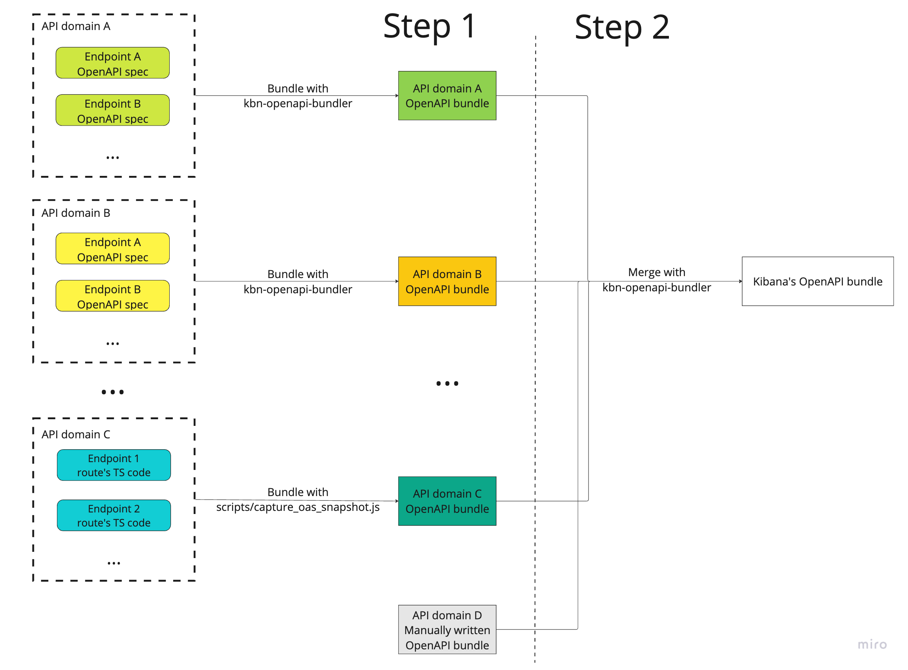

# Kibana API reference documentation

Kibana's API reference documentation is autogenerated from OpenAPI bundles while OpenAPI bundles are built automatically. This documentation explains OpenAPI bundling workflow and configuration.

## Workflow

The workflow consists of two steps where the final goal is to produce Kibana OpenAPI bundle containing Kibana's API endpoints we expect to be published on the API reference documentation platform.

ESS and Serverless OpenAPI bundles generation workflows are similar. There is a slight difference in API endpoint descriptions gets into the result Kibana OpenAPI bundle. The workflow is depicted below

### Step 1

At the first step we generate domain-specific OpenAPI bundles. It depends on each solution/team what approach to choose. There are three ways to do that:

- Use **Specification first approach** via [`kbn-openapi-bundler`](../packages/kbn-openapi-bundler/README.md) to process source OpenAPI specs describing individual OpenAPI endpoints. It works well with OpenAPI code generation and provides a lot of flexibility during development to avoid publishing documentation for not yet released API endpoints. Currently used in Security Solution, see [examples](#security-solution) below.

- Use **Code first approach** via `scripts/capture_oas_snapshot.js` to generate an OpenAPI specs bundle from the source code of Kibana API routes that rely on the `@kbn/config-schema`. It allows to produce a bundle with minimum effort but requires running ES and Kibana for that. This approach is also a bit less flexible in terms of controlling what gets added to the bundle in what form.

- Use **Manually written** domain-specific OpenAPI bundles if neither of the above works for you. This approach is considered a temporary measure and is generally not recommended.

### Step 2

At the second step, those domain-specific OpenAPI bundles are getting merged together by the `kbn-openapi-bundler` to produce the final resulting bundle.

### Scripts

The `oas_docs/scripts` folder contains scripts that point to the source domain-specific OpenAPI bundles and specify additional parameters for producing the final output bundle. Currently, there are two groups of scripts:

- The `merge_ess_oas.js` and `merge_serverless_oas.js` scripts produce production output bundles for ESS and Serverless respectively.

- The `merge_ess_oas_staging.js` and `merge_serverless_oas_staging.js` scripts produce staging output bundles for ESS and Serverless respectively.

### Output Kibana OpenAPI bundles

The `oas_docs/output` folder contains the final resulting Kibana OpenAPI bundles. There are two groups of them:

- `kibana.yaml` and `kibana.serverless.yaml` are production ready ESS and Serverless Kibana OpenAPI bundles to be published on the API reference documentation platform. Publishing process isn't fully automated yet and performed by the Docs Engineering team. These bundles are being deployed to https://www.elastic.co/docs/api.

- `kibana.staging.yaml` and `kibana.serverless.staging.yaml` are staging ESS and Serverless Kibana OpenAPI bundles. Staging bundles currently aren't published anywhere and required for polishing API reference documentation on domains not yet included in the production ready Kibana OpenAPI bundles.

## Bundling commands

Besides the scripts in the `oas_docs/scripts` folder, there is an `oas_docs/makefile` to simplify the workflow. The following makefile targets are available:

| Command                    | Description                                                                                                                                                                                                        |
| -------------------------- | ------------------------------------------------------------------------------------------------------------------------------------------------------------------------------------------------------------------ |
| `api-docs`                 | Builds ESS Kibana OpenAPI bundle                                                                                                                                                                                   |
| `api-docs-serverless`      | Builds Serverless Kibana OpenAPI bundle                                                                                                                                                                            |
| `api-docs-lint`            | Lints built result bundles                                                                                                                                                                                         |
| `api-docs-lint-errs`       | Lints built result bundles for errors                                                                                                                                                                              |
| `api-docs-preview`         | Generates (ESS + Serverless) Kibana OpenAPI bundles preview                                                                                                                                                        |
| `api-docs-overlay`         | Applies [overlays](https://docs.bump.sh/help/specification-support/overlays/) from `overlays` folder to the Kibana OpenAPI bundles and generate `*.new.yaml` files. Overlays help to fine tune the result bundles. |
| `api-docs-overlay-preview` | Generates a preview for bundles produced by `api-docs-overlay`                                                                                                                                                     |

## Bundling automation

To keep the final resulting bundles always up-to-date and in sync with the source OpenAPI specs, the bundling runs as part of the `Checks` step in CI on every PR build and on merge builds. If there are any changes to the source OpenAPI files, these changes get propagated to the final bundles and CI commits the changes. In that case the build is marked as failed and needs to be restarted.

## Bundling solution domains

### Security Solution

Security Solution uses **specification first approach**. There are multiple OpenAPI files describing individual API endpoints. It helps to enable code generation besides automatic API reference documentation. That OpenAPI files are bundled into domain OpenAPI bundles by `kbn-openapi-bundler`. Paths to produced Security Solution domain OpenAPI bundles were added to the merge scripts `merge_ess_oas.js` and `merge_serverless_oas.js` to include these bundles in Kibana OpenAPI bundle. There are the following API domains in Security Solution included in the Kibana OpenAPI bundle:

- Security AI Assistant

  - Bundling script: `x-pack/packages/kbn-elastic-assistant-common/scripts/openapi/bundle.js`
  - Bundles location: `x-pack/packages/kbn-elastic-assistant-common/docs/openapi/{ess|serverless}`

- Security Detections

  - Bundling script: `x-pack/plugins/security_solution/scripts/openapi/bundle_detections.js`
  - Bundles location: `x-pack/plugins/security_solution/docs/openapi/{ess|serverless}`

- Security Endpoint Exceptions

  - Bundling script: `packages/kbn-securitysolution-endpoint-exceptions-common/scripts/openapi_bundle.js`
  - Bundles location: `packages/kbn-securitysolution-endpoint-exceptions-common/docs/openapi/{ess|serverless}`

- Security Endpoint Management

  - Bundling script: `x-pack/plugins/security_solution/scripts/openapi/bundle_endpoint_management.js`
  - Bundles location: `x-pack/plugins/security_solution/docs/openapi/{ess|serverless}`

- Security Endpoint Management

  - Bundling script: `x-pack/plugins/security_solution/scripts/openapi/bundle_entity_analytics.js`
  - Bundles location: `x-pack/plugins/security_solution/docs/openapi/{ess|serverless}`

- Security Security Exceptions

  - Bundling script: `packages/kbn-securitysolution-exceptions-common/scripts/openapi_bundle.js`
  - Bundles location: `packages/kbn-securitysolution-exceptions-common/docs/openapi/{ess|serverless}`

- Security Lists

  - Bundling script: `packages/kbn-securitysolution-lists-common/scripts/openapi_bundle.js`
  - Bundles location: `packages/kbn-securitysolution-lists-common/docs/openapi/{ess|serverless}`

- Security Osquery

  - Bundling script: `x-pack/plugins/osquery/scripts/openapi/bundle.js`
  - Bundles location: `x-pack/plugins/osquery/docs/openapi/{ess|serverless}`

- Security Timeline
  - Bundling script: `x-pack/plugins/security_solution/scripts/openapi/bundle_timeline.js`
  - Bundles location: `x-pack/plugins/security_solution/docs/openapi/{ess|serverless}`
