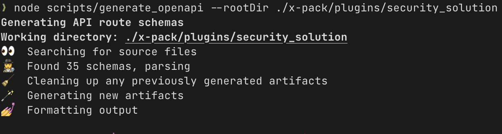

# OpenAPI Code Generator for Kibana

This code generator could be used to generate runtime types, documentation, server stub implementations, clients, and much more given OpenAPI specification.

## Getting started

To start with code generation you should have OpenAPI specification describing your API endpoint request and response schemas along with common types used in your API. The code generation script supports OpenAPI 3.1.0, refer to https://swagger.io/specification/ for more details.

OpenAPI specification should be in YAML format and have `.schema.yaml` extension. Here's a simple example of OpenAPI specification:

```yaml
openapi: 3.0.0
info:
  title: Install Prebuilt Rules API endpoint
  version: 2023-10-31
paths:
  /api/detection_engine/rules/prepackaged:
    put:
      operationId: InstallPrebuiltRules
      x-codegen-enabled: true
      summary: Installs all Elastic prebuilt rules and timelines
      tags:
        - Prebuilt Rules API
      responses:
        200:
          description: Indicates a successful call
          content:
            application/json:
              schema:
                type: object
                properties:
                  rules_installed:
                    type: integer
                    description: The number of rules installed
                    minimum: 0
                  rules_updated:
                    type: integer
                    description: The number of rules updated
                    minimum: 0
                  timelines_installed:
                    type: integer
                    description: The number of timelines installed
                    minimum: 0
                  timelines_updated:
                    type: integer
                    description: The number of timelines updated
                    minimum: 0
                required:
                  - rules_installed
                  - rules_updated
                  - timelines_installed
                  - timelines_updated
```

Put it anywhere in your plugin, the code generation script will traverse the whole plugin directory and find all `.schema.yaml` files.

Then to generate code run the following command:

```bash
node scripts/generate_openapi --rootDir ./x-pack/plugins/security_solution
```



By default it uses the `zod_operation_schema` template which produces runtime types for request and response schemas described in OpenAPI specification. The generated code will be placed adjacent to the `.schema.yaml` file and will have `.gen.ts` extension.

Example of generated code:

```ts
import { z } from '@kbn/zod';

/*
 * NOTICE: Do not edit this file manually.
 * This file is automatically generated by the OpenAPI Generator, @kbn/openapi-generator.
 * 
 * info:
 *   title: Install Prebuilt Rules API endpoint
 *   version: 1
 */

export type InstallPrebuiltRulesResponse = z.infer<typeof InstallPrebuiltRulesResponse>;
export const InstallPrebuiltRulesResponse = z.object({
  /**
   * The number of rules installed
   */
  rules_installed: z.number().int().min(0),
  /**
   * The number of rules updated
   */
  rules_updated: z.number().int().min(0),
  /**
   * The number of timelines installed
   */
  timelines_installed: z.number().int().min(0),
  /**
   * The number of timelines updated
   */
  timelines_updated: z.number().int().min(0),
});
```

## Programmatic API

Alternatively, you can use the code generator programmatically. You can create a script file and run it with `node` command. This could be useful if you want to set up code generation in your CI pipeline. Here's an example of such script:

```ts
require('../../../../../src/setup_node_env');
const { generate } = require('@kbn/openapi-generator');
const { resolve } = require('path');

const SECURITY_SOLUTION_ROOT = resolve(__dirname, '../..');

generate({
  rootDir: SECURITY_SOLUTION_ROOT, // Path to the plugin root directory
  sourceGlob: './**/*.schema.yaml', // Glob pattern to find OpenAPI specification files
  templateName: 'zod_operation_schema', // Name of the template to use
});
```

## CI integration

To make sure that generated code is always in sync with its OpenAPI specification it is recommended to add a command to your CI pipeline that will run code generation on every pull request and commit the changes if there are any.

First, create a script that will run code generation and commit the changes. See `.buildkite/scripts/steps/code_generation/security_solution_codegen.sh` for an example:

```bash
#!/usr/bin/env bash

set -euo pipefail

source .buildkite/scripts/common/util.sh

.buildkite/scripts/bootstrap.sh

echo --- Security Solution OpenAPI Code Generation

(cd x-pack/plugins/security_solution && yarn openapi:generate)
check_for_changed_files "yarn openapi:generate" true
```

This script sets up the minimal environment required for code generation and runs the code generation script. Then it checks if there are any changes and commits them if there are any using the `check_for_changed_files` function.

Then add the code generation script to the build pipeline. Open the buildkite checks at`.buildkite/scripts/steps/checks.sh`, and add the path to your code generation script:

```sh
...
.buildkite/scripts/steps/checks/saved_objects_definition_change.sh
.buildkite/scripts/steps/code_generation/elastic_assistant_codegen.sh
.buildkite/scripts/steps/code_generation/security_solution_codegen.sh
.buildkite/scripts/steps/code_generation/osquery_codegen.sh
.buildkite/scripts/steps/checks/yarn_deduplicate.sh
...
```

Now on every pull request the code generation script will run and commit the changes if there are any.

## OpenAPI Schema

The code generator supports the OpenAPI definitions described in the request, response, and component sections of the document.

For every API operation (GET, POST, etc) it is required to specify the `operationId` field. This field is used to generate the name of the generated types. For example, if the `operationId` is `InstallPrebuiltRules` then the generated types will be named `InstallPrebuiltRulesResponse` and `InstallPrebuiltRulesRequest`. If the `operationId` is not specified then the code generation will throw an error.

The `x-codegen-enabled` field is used to enable or disable code generation for the operation. If it is not specified then code generation is disabled by default. This field could be also used to disable code generation of common components described in the `components` section of the OpenAPI specification.

Keep in mind that disabling code generation for common components that are referenced by external OpenAPI specifications could lead to errors during code generation.

### Schema files organization

It is recommended to limit the number of operations and components described in a single OpenAPI specification file. Having one HTTP operation in a single file will make it easier to maintain and will keep the generated artifacts granular for ease of reuse and better tree shaking. You can have as many OpenAPI specification files as you want.

### Common components

It is common to have shared types that are used in multiple API operations. To avoid code duplication you can define common components in the `components` section of the OpenAPI specification and put them in a separate file. Then you can reference these components in the `parameters` and `responses` sections of the API operations.

Here's an example of the schema that references common components:

```yaml
openapi: 3.0.0
info:
  title: Delete Rule API endpoint
  version: 2023-10-31
paths:
  /api/detection_engine/rules:
    delete:
      operationId: DeleteRule
      description: Deletes a single rule using the `rule_id` or `id` field.
      parameters:
        - name: id
          in: query
          required: false
          description: The rule's `id` value.
          schema:
            $ref: '../../../model/rule_schema/common_attributes.schema.yaml#/components/schemas/RuleSignatureId'
        - name: rule_id
          in: query
          required: false
          description: The rule's `rule_id` value.
          schema:
            $ref: '../../../model/rule_schema/common_attributes.schema.yaml#/components/schemas/RuleObjectId'
      responses:
        200:
          description: Indicates a successful call.
          content:
            application/json:
              schema:
                $ref: '../../../model/rule_schema/rule_schemas.schema.yaml#/components/schemas/RuleResponse'
```