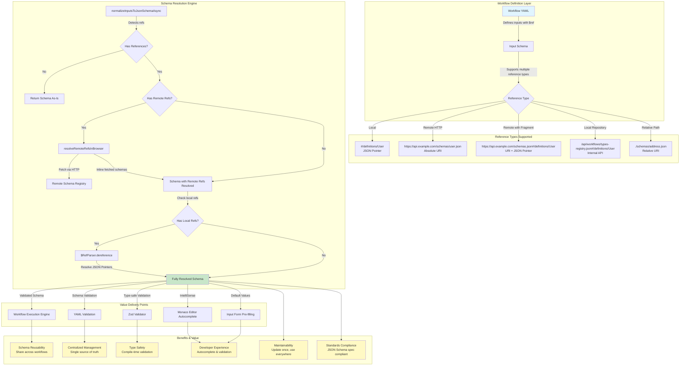
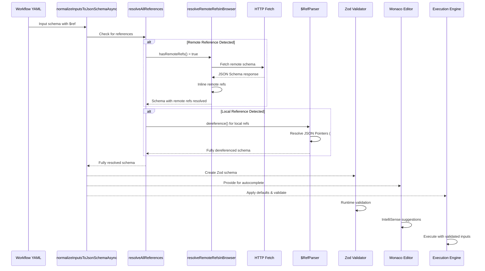
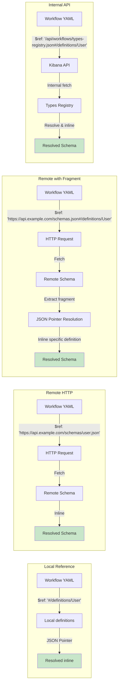
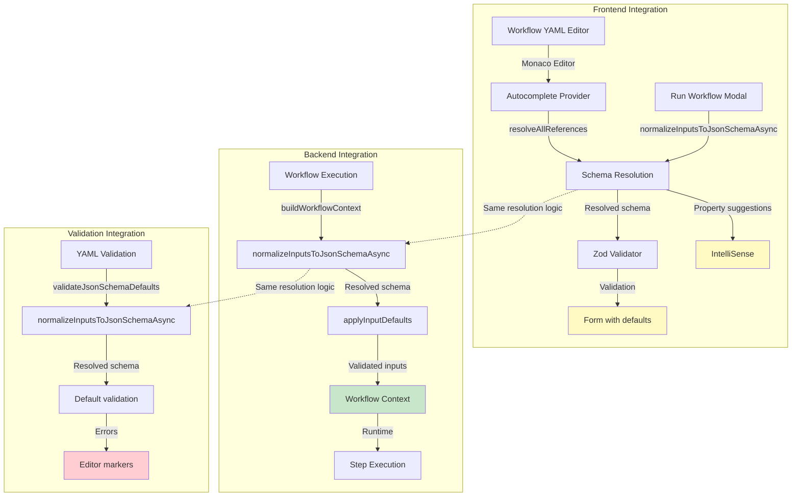
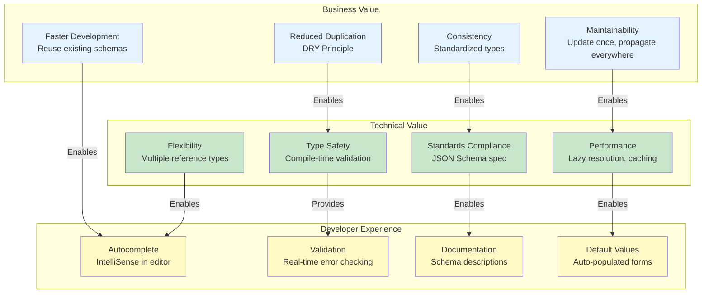

# Remote JSON Schema Reference Architecture

## Architecture Overview

## Reference Resolution Flow

## Reference Type Examples

## Integration Architecture

## Value Proposition Matrix

## Reference Type Use Cases

| Reference Type | Use Case | Example | Benefits |
|---------------|----------|---------|----------|
| **Local (`#/definitions/...`)** | Workflow-specific types | `$ref: "#/definitions/User"` | Simple, self-contained |
| **Remote HTTP** | External schema registry | `$ref: "https://api.example.com/schemas/user.json"` | Centralized, versioned |
| **Remote with Fragment** | Shared schema repository | `$ref: "https://api.example.com/schemas.json#/definitions/User"` | Efficient, selective |
| **Internal API** | Kibana types registry | `$ref: "/api/workflows/types-registry.json#/definitions/User"` | Internal, controlled |
| **Relative Path** | Local file system | `$ref: "./schemas/address.json"` | Organized, modular |

## Architecture Principles

1. **Lazy Resolution**: References are only resolved when needed
2. **Graceful Degradation**: Falls back to original schema if resolution fails
3. **Browser Compatibility**: Uses `fetch` API for cross-platform support
4. **Security**: File system access disabled, HTTP-only for remote refs
5. **Performance**: Early returns for schemas without references
6. **Standards Compliance**: Full JSON Schema specification support
