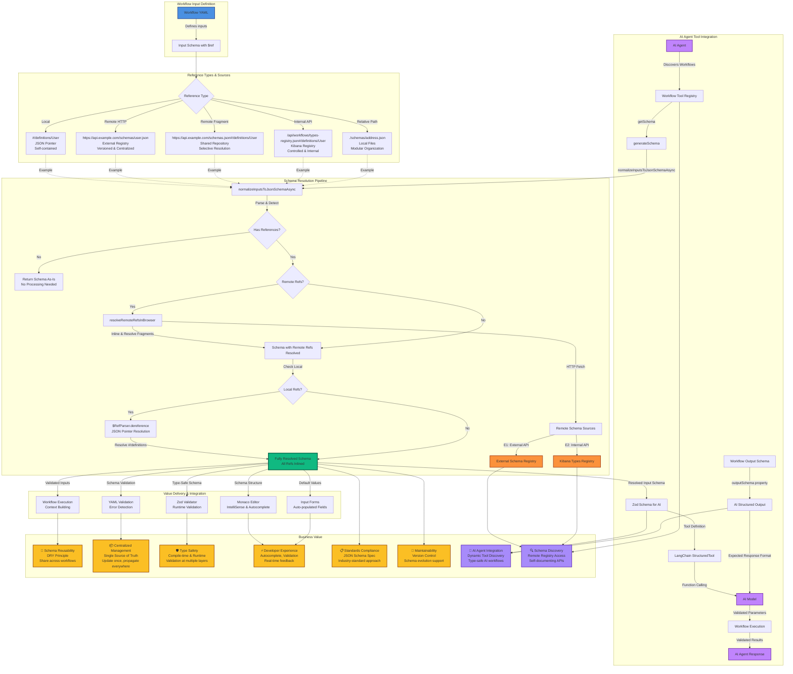

# Remote JSON Schema Reference Architecture



## Key Architecture Components

### 1. **Reference Resolution Engine**
- **Entry Point**: `normalizeInputsToJsonSchemaAsync()`
- **Remote Resolution**: `resolveRemoteRefsInBrowser()` - Uses `fetch` API for cross-platform compatibility
- **Local Resolution**: `$RefParser.dereference()` - Handles JSON Pointer resolution
- **Optimization**: Early returns for schemas without references

### 2. **Supported Reference Types**

| Type | Pattern | Use Case | Example |
|------|---------|----------|---------|
| **Local** | `#/definitions/...` | Workflow-specific types | `$ref: "#/definitions/User"` |
| **Remote HTTP** | `https://...` | External schema registry | `$ref: "https://api.example.com/schemas/user.json"` |
| **Remote Fragment** | `https://...#/...` | Shared repository | `$ref: "https://api.example.com/schemas.json#/definitions/User"` |
| **Internal API** | `/api/...` | Kibana types registry | `$ref: "/api/workflows/types-registry.json#/definitions/User"` |
| **Relative** | `./...` or `../...` | Local file system | `$ref: "./schemas/address.json"` |

### 3. **Integration Points**

- **Frontend**: Monaco Editor autocomplete, form validation, default value pre-filling
- **Backend**: Workflow execution context building, input validation
- **Validation**: YAML schema validation, default value validation

### 4. **AI Agent Tool Integration**

When workflows are used as tools for AI agents, remote schema references provide critical capabilities:

#### **Input Schema Discovery**
- **Dynamic Tool Registration**: AI agents discover available workflows and their input requirements
- **Schema Resolution**: Remote schemas are resolved to generate Zod schemas that AI models understand
- **Type-Safe Parameters**: AI agents receive structured input schemas, ensuring correct parameter types
- **Example Flow**:
  ```typescript
  // AI Agent discovers workflow tool
  workflowTool.getSchema() 
    → normalizeInputsToJsonSchemaAsync(workflow.inputs)
    → resolveAllReferences() // Resolves remote $ref
    → generateSchema() // Converts to Zod
    → LangChain StructuredTool // AI can use it
  ```

#### **Output Schema Validation**
- **Structured Output**: Workflows can define `outputSchema` to specify expected response format
- **AI Model Compliance**: AI models use output schemas to generate structured responses
- **Validation**: Output is validated against the schema before returning to the agent
- **Example**:
  ```yaml
  - name: extract_data
    type: ai_prompt
    with:
      prompt: "Extract information from {{ inputs.text }}"
      outputSchema:
        type: object
        properties:
          summary: { type: string }
          key_points: { type: array, items: { type: string } }
  ```

#### **Benefits for AI Agents**
- **Self-Documenting**: Remote schemas provide up-to-date documentation for AI agents
- **Version Control**: Schema changes propagate automatically to all workflows using them
- **Consistency**: Shared schemas ensure consistent data structures across workflows
- **Discovery**: AI agents can query remote schema registries to discover available types
- **Type Safety**: Prevents runtime errors by validating inputs/outputs at schema level

### 5. **Value Propositions**

- **Reusability**: Define once, use everywhere across workflows
- **Centralization**: Single source of truth for type definitions
- **Type Safety**: Multi-layer validation (compile-time + runtime)
- **Developer Experience**: IntelliSense, autocomplete, real-time validation
- **Standards Compliance**: Full JSON Schema specification support
- **Maintainability**: Update schemas in one place, propagate automatically
- **AI Agent Integration**: Dynamic tool discovery with type-safe schemas
- **Schema Discovery**: Remote registry access enables self-documenting APIs

## AI Agent Use Case Examples

### Example 1: Workflow as AI Tool with Remote Input Schema

```yaml
# Workflow Definition
name: Process User Data
inputs:
  properties:
    user:
      $ref: "https://api.example.com/schemas/v1/user.json"
    address:
      $ref: "/api/workflows/types-registry.json#/definitions/Address"
```

**AI Agent Flow**:
1. Agent discovers workflow tool via registry
2. Calls `getSchema()` which resolves remote `$ref` references
3. Receives fully resolved Zod schema with all type information
4. Uses schema to generate correct function call parameters
5. Executes workflow with validated inputs

### Example 2: Workflow with Structured Output Schema

```yaml
# Workflow with AI step that has output schema
steps:
  - name: analyze_sentiment
    type: ai_prompt
    with:
      connectorId: "my-ai-connector"
      prompt: "Analyze sentiment of: {{ inputs.text }}"
      outputSchema:
        $ref: "https://api.example.com/schemas/v1/sentiment-analysis.json"
```

**Benefits**:
- AI model receives output schema from remote registry
- Ensures consistent response format across all workflows
- Schema updates automatically propagate to all workflows
- AI agents can validate responses against expected schema

### Example 3: Centralized Type Registry for AI Tools

```yaml
# Multiple workflows sharing the same schema
# Workflow 1
inputs:
  properties:
    incident:
      $ref: "/api/workflows/types-registry.json#/definitions/Incident"

# Workflow 2  
inputs:
  properties:
    ticket:
      $ref: "/api/workflows/types-registry.json#/definitions/Incident"
```

**AI Agent Benefits**:
- Single source of truth for `Incident` type
- AI agents learn consistent structure across all workflows
- Schema changes update all workflows automatically
- Reduces confusion from inconsistent type definitions

### Example 4: Dynamic Schema Discovery

```typescript
// AI Agent discovers available schemas
const schemaRegistry = await fetch('/api/workflows/types-registry.json');
const availableTypes = schemaRegistry.definitions;

// Agent can now understand what types are available
// and suggest appropriate workflows to users
```

**Value**:
- AI agents can query schema registry dynamically
- Enables intelligent workflow recommendations
- Supports schema evolution without breaking changes
- Provides self-documenting API for AI systems
