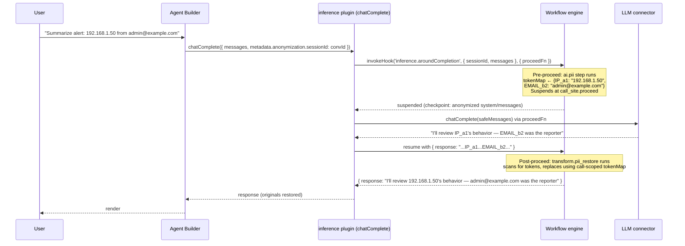
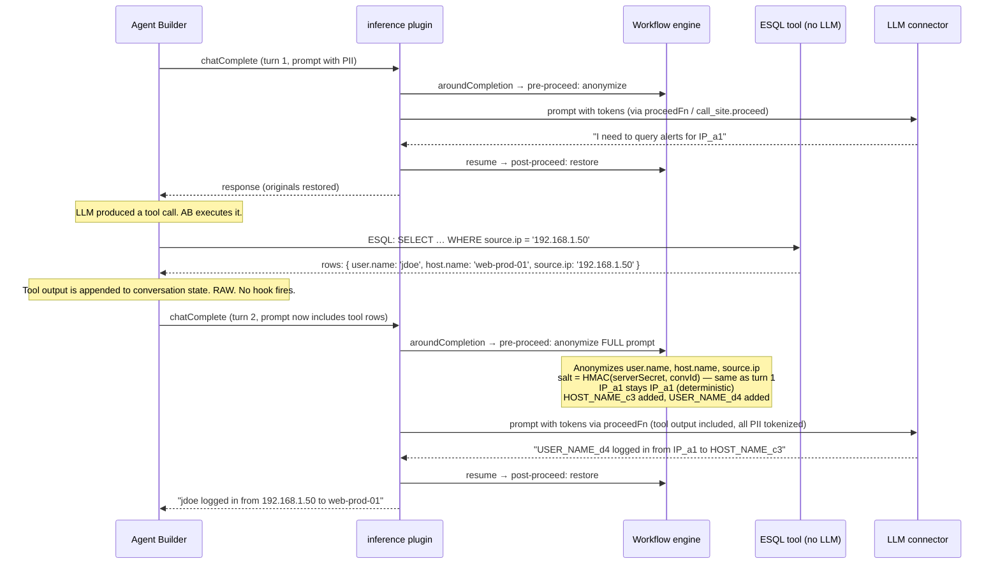

# RFC: Workflow-Driven LLM Anonymization at the Inference Layer

> **Status:** Draft
> **Date:** May 2026
> **Companion:** [`proposal.md`](./proposal.md) — workflow lifecycle hooks platform proposal
> **Supersedes:** the abandoned three-layer anonymization platform RFC

## 1. Summary

Anonymize what we send to a language model — nothing more, nothing less. Place a single AOP-style "around" synchronous workflow lifecycle hook at the **`inference` plugin's `chatComplete` boundary**, the one site every LLM call in Kibana must pass through. A single `aroundCompletion` workflow anonymizes the serialized prompt in its pre-proceed steps, suspends at a `call_site.proceed` step while the real LLM call executes, then resumes to restore originals in the response.

> **Mental model**
>
> 1. **Scope is model-bound traffic** — when `xpack.inference.anonymization.experimental_workflow_driven: true` and `xpack.inference.anonymization.experimental_around_hook: true` are set and the seeded workflow is enabled, the hook fires on every qualifying `chatComplete` call. There is no temporal coupling to unrelated async workflows (e.g. a "case opened" workflow running in parallel does not affect anonymization).
> 2. **"Workflow" in the anonymization story means a single inference lifecycle hook** — `inference.aroundCompletion`. Admin customization is done via saved workflows attached to this hook, not via general Kibana workflows.
> 3. **Does not redact stored data** — Elasticsearch documents, case comments, exports, and emails are unaffected unless those flows separately route through `chatComplete`.
> 4. **Policy layer is distinct from "any workflow that mentions PII"** — `failureMode`, `maxTokensPerCall`, and the per-space workflow `enabled` toggle are the admin-controlled policy surface.

Two new step types — `ai.pii` and `transform.pii_restore` — make the anonymization itself author-customizable through the existing workflow YAML. A `call_site.proceed` sentinel step marks where the real LLM call executes. A default workflow ships out of the box with the regex set the PM doc requires (IP, EMAIL, HOST_NAME, USER_NAME, custom). Agent Builder requires zero changes. The workflow engine gets one optional field on `registerTriggerDefinition`, suspend/resume execution support, and one new method on `WorkflowsClient`. Every existing anonymization implementation in the repo is deprecated and replaced by this single integration point.

## 2. Goals & Non-goals

### Goals

- **G1.** Prevent any prompt text — user message, attached context, tool output — from reaching a model in raw form when anonymization is enabled.
- **G2.** Restore original values in the model response before it is rendered to the user, with consistent token correlation across multiple inferences in one conversation.
- **G3.** Achieve this with a workflow-driven, user-extensible mechanism (regex set is configurable in YAML, custom rules can be added) rather than hard-coded plumbing.
- **G4.** Add **one** integration point — the `chatComplete` boundary — that covers Agent Builder, Observability AI Assistant, Security AI, attack-discovery, and any future LLM consumer without per-consumer wiring.
- **G5.** Make Agent Builder a passive beneficiary: zero code changes, zero new contracts.
- **G6.** Replace every existing in-tree anonymization implementation with this one mechanism.

### Non-goals

- **N1.** Field-level allow/anonymize/deny. ESQL lineage gaps make this unworkable for tool outputs (ESQL operators like `EVAL`, `STATS`, `MV_*` produce derived columns whose lineage to source fields cannot be reconstructed). Documented in [`MEMORY`](#) and the PM doc; this RFC operates strictly at text level.
- **N2.** Persistent replacements. PM directive: transient state only. No system index, no encryption-at-rest, no cross-session correlation.
- **N3.** NER-based PII detection. Deferred to a phase-2 RFC; the regex set covers the structured-PII cases in scope today.
- **N4.** Cases / Dashboards lifecycle hook integrations. Those are covered by [`proposal.md`](./proposal.md); this RFC narrows to inference.
- **N5.** Guardrail-style policy denial (`ai.guardrail`, off-topic checks). Same hook platform, separate concern, separate workflow.
- **N6.** Reshaping or rewriting either the workflow engine or Agent Builder. Both gain additive surface area only.

## 3. Context & Prior Art

### 3.1 PM constraints

The PM milestone doc (`Anonymization P1 Milestone_ Bare-Bones LLM Data Protection.md`) sets three hard constraints inherited from prior team direction:

1. **LLM-only scope** — anonymize what we send to the model; everything else is a nice-to-have.
2. **Transient state** — no persistence; in-memory mapping between before/after callbacks.
3. **Tightly scoped integration** — originally framed as "Agent Builder only"; this RFC interprets that as "one integration site that covers all current and future LLM consumers" (the `inference` plugin), which is *more* scoped than per-consumer wiring.

The PM doc also names what is explicitly out of scope: field-level rules, NER, persistent replacements, encrypted storage, global anonymization profiles, legacy migration tooling.

### 3.2 ESQL lineage limitation → text-level not field-level

The abandoned three-layer RFC documented an irreducible problem: per-field Allow/Anonymize/Deny only works when you can trace which source field produced a given column. ESQL operators (`EVAL`, `STATS`, `MV_*`, renames, complex expressions) produce derived columns whose lineage is ambiguous or unrecoverable outside the ESQL planner. Because Agent Builder tools are defined in ESQL, any data flowing through tool outputs has typically been transformed beyond field-level traceability.

The fallback for unknown lineage is either deny (drop the value entirely) or over-anonymize (mask everything), both of which degrade usability. Achieving comprehensive field-level coverage would require either ESQL-native lineage support or a maintained lineage extractor — neither exists, neither is planned.

Operating at the **text/prompt level** sidesteps the lineage problem entirely: regex matches a value, replaces it with a token, and the anonymization is invariant to whatever transformations produced that text.

### 3.3 Inventory of existing anonymization implementations

Eight implementations exist in the repo today. All are deprecated by this RFC; reusable utilities are extracted, the rest is removed. The full table is in [§8 Deprecation & Migration](#8-deprecation--migration). Headlines:

| Location | What it does | Fate |
|---|---|---|
| `inference/server/chat_complete/anonymization/*` | Regex + NER detection, persistent replacements, AES-256-GCM encryption | Remove; extract regex executor |
| `anonymization/` plugin | Profiles, salt service, policy resolver, system index | Remove entirely |
| `kbn-elastic-assistant-common/impl/data_anonymization/*` | UUID-based field-level replacements | Remove |
| `elastic_assistant` `anonymizationFields`, `transformRawData` | Field-level rule plumbing on alerts | Remove |
| `ai:anonymizationSettings` UI setting | Legacy regex/NER rule storage | Remove (one-shot import) |
| `observability_ai_assistant/.../add_anonymization_data.ts` | Streaming deanon decorator coupled to old replacements | Remove |
| `legacy_ui_settings_migration.ts` | Migration from `ai:anonymizationSettings` to profiles | Remove |
| `kbn-ai-infra/anonymization-common/generate_token.ts` | HMAC-SHA256 deterministic tokenizer | **Keep & reuse** |

### 3.4 Plugin dependency graph

The implementation introduces a new `inferenceWorkflows` x-pack plugin to keep `workflowsExtensions` free of inference/AI knowledge. The dependency graph is a clean DAG:

```
workflowsExtensions   (pure framework — zero inference/AI knowledge)
        ↑
  inference           (optionally depends on workflowsExtensions; calls invokeHook at chatComplete boundary)
        ↑
  inference_workflows (x-pack plugin; registers trigger definitions, AI steps, PII steps; deps on inference + workflowsExtensions)
        ↑
  workflowsManagement (seeds default workflows; optional dep on inferenceWorkflows)
        ↑
  agent_builder       (depends on inference + workflowsExtensions + inferenceWorkflows)
```

`inference_workflows` registers both the trigger definitions (`registerTriggerDefinition`) and the step types (`ai.pii`, `transform.pii_restore`, `ai.prompt`, `ai.classify`, `ai.summarize`) with `workflowsExtensions`. The `inference` plugin itself does not call `registerTriggerDefinition` — it only calls `invokeHook` at the `chatComplete` boundary. This one-way dependency is what keeps `workflowsExtensions` free of inference/AI knowledge while letting `inference_workflows` depend on both. `workflowsManagement` has `inferenceWorkflows` as an optional dependency to support workflow seeding at startup without creating a circular reference.

## 4. Architecture

### 4.1 Single hook point at `chatComplete`

Every LLM call from Kibana code goes through `inference.chatComplete` (or its streaming counterpart, `chat`). Agent Builder's research and answer agents both use `InferenceChatModel` from `@kbn/inference-langchain`, which delegates to `chatComplete`. Tools that call the LLM internally do the same. Observability AI Assistant, Security AI workflows, attack-discovery — all routed through `chatComplete`.

The following table documents the verified call path for each current consumer (verified against the codebase at the time of this RFC):

| Consumer | How it reaches `chatComplete` | Covered |
|---|---|---|
| Agent Builder (research + answer agents) | `InferenceChatModel` (`@kbn/inference-langchain`) → `client.chatComplete` | Yes |
| Observability AI Assistant | `plugins.inference.getClient()` → `inferenceClient.chatComplete()` directly | Yes |
| Attack Discovery | `inference.getClientWithoutRequest()` → `chatComplete` | Yes |
| SIEM Migrations | `inference.getChatModel()` → `InferenceChatModel` → `chatComplete` | Yes |
| Entity Analytics / Lead Generation | `inference.getChatModel()` → `InferenceChatModel` → `chatComplete` | Yes |
| AI Rule Creation (Detection Engine) | `inference.getClient()` → `chatComplete` | Yes |
| Automatic Import | `InferenceChatModel` → `chatComplete` | Yes |
| **Security AI Assistant (primary path)** | `inference.getChatModel()` → `InferenceChatModel` → `chatComplete` | **Yes** |
| **Security AI Assistant (legacy path)** | `ActionsClientChatOpenAI` / `ActionsClientChatBedrockConverse` / `ActionsClientChatVertexAI` → `actionsClient.execute()` directly | **No — bypasses inference plugin** |

> **Exception — Security AI legacy path.** The `elastic_assistant` plugin has a feature-flagged bypass (`inferenceChatModelDisabled`) that instantiates LangChain model classes directly against the actions connector, skipping the inference plugin entirely. When this flag is `true`, no `chatComplete` call is made and neither anonymization hook fires. The flag exists as a compatibility escape hatch from the migration to inference-routed models. Phase 3 of this RFC's migration (§8.3) must include removing this bypass path; until it is removed, Security AI sessions that hit the legacy path receive no anonymization. The Phase 1 implementation checklist must verify that `inferenceChatModelDisabled` is never `true` in production deployments, and Phase 3 deletes the flag and the three `ActionsClientChat*` model classes it selects.

The RFC places a single AOP-style "around" synchronous hook at the `chatComplete` boundary:

```
                                     ┌───────────────────────────────────┐
                                     │  inference plugin · chatComplete  │
                                     │                                   │
caller (AB graph node, OAS,    ──→   │   1. resolve options              │
attack-discovery, etc.)              │   2. invokeHook('aroundCompletion')│
                                     │      ├─ pre-proceed: anonymize    │
                                     │      ├─ call_site.proceed →       │
                                     │      │   connector.chatComplete(…)│
                                     │      └─ post-proceed: restore     │
                                     │   3. return                       │
                                     └───────────────────────────────────┘
```

That single placement gives us:

- **G4 satisfied** — every consumer is covered without per-consumer wiring.
- **G5 satisfied** — Agent Builder code is untouched.
- **Tool output coverage by induction** — tools that don't call the LLM produce raw text → that text becomes part of the *next* `chatComplete`'s prompt → the pre-proceed steps anonymize the whole serialized prompt, including the tool output, before the connector sees it. There is no path from tool result to model that bypasses `chatComplete`.
- **Tools that call the LLM internally go through two anonymization cycles per user turn.** Some tools call `chatComplete` themselves (summarization, classification, LLM-assisted retrieval). Each such call gets its own `aroundCompletion` invocation — the tool's query is anonymized via the pre-proceed steps, the response is de-anonymized via the post-proceed steps, and the tool returns real values to Agent Builder. Agent Builder then incorporates those real values into the next parent `chatComplete` call, where the same PII is anonymized again. A single PII value therefore passes through the anonymization cycle twice in one user turn: once inside the tool's LLM call and once in the parent's follow-up prompt. This is correct behavior — HMAC determinism ensures `192.168.1.50` produces the same token `IP_a1b2c3` in both cycles — but it is a non-obvious consequence of the boundary placement that implementers should be aware of.

### 4.2 Trigger registrations from `inference_workflows`

A single trigger, registered during `inference_workflows`'s `setup()`. It lives here — not in the `inference` plugin — to avoid the circular dependency that would arise if `inference` depended on `workflowsExtensions` for both trigger registration and step execution while `inference_workflows` step types call back into `inference` for LLM access.

```typescript
// x-pack/platform/plugins/shared/inference_workflows/server/plugin.ts — setup()

import { z } from '@kbn/zod/v4';

workflowsExtensions.registerTriggerDefinition({
  id: 'inference.aroundCompletion',
  eventSchema: z.object({
    sessionId: z.string().describe('Caller-supplied conversation identifier'),
    system: z.string().optional(),
    messages: z.array(MessageSchema),
  }),
  sync: {
    maxTimeout: '30s',
    failurePolicy: 'closed',         // broken anonymization MUST NOT silently leak PII
    chained: false,                  // around hook replaces chaining — call_site.proceed is the chain point
    inlineExecution: true,           // opt-in: WorkflowsClient executes YAML inline via executeWorkflowSync
  },
});
```

> **Note on `inlineExecution`:** This opt-in flag ensures only triggers that explicitly request it use the inline YAML execution path via `executeWorkflowSync` with suspend/resume support. All other sync triggers continue to use the registered in-memory handler path, making the change backward-compatible.

> **Note on trigger schema location:** The event schema (`aroundCompletionEventSchema`) and trigger ID (`AROUND_COMPLETION_TRIGGER_ID`) are declared in `@kbn/workflows-extensions/common` rather than inside `inference` or `inference_workflows`. This lets any plugin import them without taking a dependency on either heavier plugin.

The trigger follows `proposal.md`'s shape: an event schema for the input, a `sync` block with a timeout and a failure policy. The `outputSchema` is omitted — the around hook output is validated against the trigger's `eventSchema` shape by default. The workflow must include a `workflow.output` step to emit the final de-anonymized `response`.

### 4.3 Derived salt and call-scoped token map

The anonymization mechanism needs two things to function correctly across turns within a conversation:

1. **A deterministic salt** — so the same PII value always produces the same token, across turns and across Kibana nodes.
2. **A token map** — so `transform.pii_restore` can reverse tokens back to originals in the response.

Both are achieved without persistent state.

#### Derived salt

The HMAC salt is derived on demand from a stable server secret and the caller-supplied `sessionId`:

```typescript
function deriveSalt(sessionId: string, serverSecret: string): string {
  return createHmac('sha256', serverSecret).update(sessionId).digest('hex');
}
```

`serverSecret` is a Kibana keystore value (same category as `xpack.encryptedSavedObjects.encryptionKey` — stable across restarts, not rotated routinely). Because the function is pure, any Kibana node derives the same salt for the same `sessionId`. No storage, no TTL, no session affinity required, no distributed-state problem.

Cross-turn token consistency follows directly: `192.168.1.50` produces `IP_a1` in turn 1 and `IP_a1` in turn 5, even if the Kibana process restarted between turns, because the salt is always `HMAC(serverSecret, sessionId)`. This is a strict improvement over a session-store design, which would produce different token names after a session eviction.

#### Call-scoped token map

The token map lives only for the duration of a single `chatComplete` call. The inference plugin creates it before invoking `beforeCompletion`, passes it to both hook executions via a call-scoped context handle, and discards it when the call returns:

```typescript
// Inside chatComplete — simplified
const salt = deriveSalt(sessionId, serverSecret);
const tokenMap: TokenMap = new Map();

const anonymizationContext = createAnonymizationContext({ salt, tokenMap });

// callLLM is the proceed function: receives anonymized system/messages, calls connector,
// returns full response (non-streaming for the around hook path).
const callLLM = async ({ system, messages }) => {
  // If any tokens were produced by pre-proceed steps, append the anonymization instruction.
  const finalSystem = appendAnonymizationInstruction(system, tokenMap);
  const response = await connector.chatComplete({ messages, system: finalSystem });
  return { response: assembleFullResponse(response) };
};

const result = await invokeHook(
  'inference.aroundCompletion',
  event,
  { anonymizationContext, proceedFn: callLLM }
);
// result.output.response is the de-anonymized LLM response
```

`ai.pii` and `transform.pii_restore` access the context via a capability handle — the workflow YAML sees neither the salt nor the map. The token map is garbage-collected with the request; it is never written to disk, never shared across requests, and never visible to other concurrent calls.

#### `[Anonymization context]` system-prompt instruction

After the `beforeCompletion` hook returns, if any tokens were produced the inference plugin appends a short instruction to the system prompt:

```
[Anonymization context]
Some values in this prompt have been replaced with privacy tokens of the form
ENTITY_TYPE_<32 hex chars> (e.g. EMAIL_a3f2c1d809e64b275fae2a8c9b1d04e7).
Entity types present: IP, EMAIL.
Rules:
- Preserve tokens exactly as written; do not attempt to infer or reveal the original value.
- If instructed to use a token in an action, treat the token as the identifier.
- Do not mention that anonymization is in effect unless the user asks directly.
```

Without this, the LLM encounters tokens with no context and may hallucinate what they represent, attempt to "fill them in", or refuse to use them in tool calls on the grounds that they "look like placeholders." The instruction is omitted entirely on pass-through (empty tokenMap), adding zero overhead when anonymization is off.

**Token cost.** The default instruction is roughly 150 tokens per call. Across reasoning, tool-decision, and final-response calls within a single agent round (the runner can issue several inference calls), this is a non-trivial recurring overhead. Worth measuring alongside the latency overhead from the regex pass. If cost becomes prohibitive, two mitigations are available: (a) ship a shorter instruction once per session in the system prompt rather than per call; (b) cache the instruction on the call context and skip it when the entity-type set is unchanged from the previous call in the same round.

**Override.** Workflow authors who want custom instruction wording set `systemPromptInstruction` on the `ai.pii` step input. The step echoes it through to its output; the inference plugin uses it instead of the auto-generated default. This is optional — most workflows should leave it unset.

#### Per-consumer threading expectations

`sessionId` is supplied by the caller through `ChatCompleteOptions.metadata.anonymization.sessionId`. Without it, the inference plugin generates a per-request UUID — anonymization works for that call, cross-turn token consistency is lost.

| Consumer | Stable identifier available | Action required |
|---|---|---|
| Agent Builder | `conversationId` (generated at chat-round entry, persisted with the conversation) | Map `conversationId → metadata.anonymization.sessionId` in the existing inference call site. **Verify in implementation** that AB threads this through `chatComplete` |
| Observability AI Assistant | Conversation saved object ID | Map saved-object ID → `sessionId`. **Verify** OAS uses a stable ID across turns |
| Security AI / attack-discovery | Typically single-shot batch operations | Per-call UUID is acceptable — cross-call consistency not needed. Document explicitly |
| New consumers | Must decide based on use case | Supply a stable ID if multi-turn correlation matters; omit otherwise |

**Migration of `replacementsId`**: the existing `metadata.anonymization.replacementsId` field was used by the persistent-replacements feature being deleted. In Phase 1, the inference plugin accepts both — `sessionId` if present, otherwise `replacementsId` as a fallback. By Phase 3 the `replacementsId` form is removed entirely.

### 4.4 New step types — `ai.pii` and `transform.pii_restore`

Both shipped server-side, registered via `inference_workflows` (the domain plugin that owns AI and PII steps — see §3.4). Both reuse existing utilities so the surface area is small.

#### `ai.pii`

Detects PII in input text and replaces matches with deterministic HMAC-SHA256 tokens. Writes matches to the call-scoped token map via the execution context handle.

```yaml
- name: anonymise
  type: ai.pii
  with:
    sessionId: "{{ event.sessionId }}"
    # ${{ }} calls evalValueSync, which returns the raw JS value (array preserved).
    # {{ }} calls renderSync, which serialises arrays to a string — breaking the step.
    input: '${{ event.messages }}'
    entities:
      - IP
      - EMAIL
      - HOST_NAME
      - USER_NAME
    customPatterns:
      - pattern: 'EMP_\d{6}'
        entityClass: EMPLOYEE_ID
    action: replace                 # 'replace' (default) | 'block'
    # Optional: override the [Anonymization context] system-prompt instruction wording.
    # When omitted the inference plugin generates the default instruction automatically.
    # systemPromptInstruction: "Custom wording here…"
```

Internally:

1. Iterate over the configured rules; run each regex against the serialized input.
2. For each match, look up the original in the call-scoped token map (return existing token if already seen in this call), else compute `generateToken(salt, entityClass, '', value)` from the derived salt and insert into the map.
3. Return the substituted text, longest-match-first to avoid partial overlaps (e.g., `192.168.1.50` before `192.168.1.5`).

Reused utilities:
- `generateToken()` from `@kbn/ai-infra/anonymization-common/generate_token.ts:33-56`.
- The regex executor and entity-class taxonomy currently live in `default_rules.ts` inside `inference_workflows` as an interim location. Extraction into `@kbn/ai-infra/pii-detection` is a **Phase 2** step — it is not a Phase 1 prerequisite.

#### `transform.pii_restore`

Reverse pass — scans input text for tokens and restores originals from the call-scoped token map. No-ops if the map is empty.

```yaml
- name: deanonymise
  type: transform.pii_restore
  with:
    input: "{{ event.response }}"
```

Single regex against the token format `{ENTITY_CLASS}_{HEX}` (deterministic from `generateToken`'s output shape) plus a map lookup per match.

> **Safety net for over-broad patterns:** Tool call argument restoration (`restoreInValue` on the assembled message's `toolCalls`) acts as a safety net for sloppy `customPatterns`. Even if a regex tokenizes file paths or identifiers it shouldn't, tool arguments are restored before any tool is invoked — preventing downstream breakage. This does not excuse over-broad patterns: the LLM's reasoning quality degrades when it sees tokens instead of real values, and the noise shows up in execution traces.

### 4.5 Default workflow shipped out of the box

> **Current execution model (Phase 2 — implemented)**
>
> `invokeHook` queries the `.kibana-workflows` index for workflows subscribed to the trigger in the current space. If the trigger has `inlineExecution: true` and at least one enabled workflow is found, those workflows are executed inline via `executeWorkflowSync` — a lightweight in-process runner that evaluates YAML steps sequentially using the existing `WorkflowTemplatingEngine`, with no Task Manager involvement and no Elasticsearch state writes. When the executor encounters `call_site.proceed`, it saves a checkpoint and returns `suspended`; the workflow management layer then calls the `proceedFn` capability (the real LLM call) and resumes execution.
>
> The default YAML workflow (`Default PII Anonymization (around completion)`) is seeded automatically into `.kibana-workflows` on startup with `enabled: false`. The admin enables it in the Workflow Management UI to activate the feature for their space. No workflow IDs need to be configured elsewhere — the existing `enabled` toggle combined with the per-document `spaceId` field provides complete per-space control.
>
> When no enabled workflows are found for a trigger, `invokeHook` returns a pass-through immediately.

A single YAML workflow ships in a small companion package (`@kbn/ai-infra/default-anonymization-workflows` — content-only, no plugin code). It subscribes to the `inference.aroundCompletion` trigger and uses the standard regex set from the PM doc:

```yaml
# Default around-completion anonymization — seeded with enabled: false
version: '1'
name: Default PII Anonymization (around completion)
enabled: false
triggers:
  - type: inference.aroundCompletion

steps:
  - name: anonymize_system
    type: ai.pii
    if: 'event.system'
    with:
      sessionId: '{{ event.sessionId }}'
      input: '{{ event.system }}'
      entities: [IP, EMAIL, HOST_NAME]  # USER_NAME can be added via customPatterns if needed

  - name: anonymize_messages
    type: ai.pii
    with:
      sessionId: '{{ event.sessionId }}'
      input: '${{ event.messages }}'    # ${{ }} preserves the messages array; {{ }} would serialise it to a string
      entities: [IP, EMAIL, HOST_NAME]  # USER_NAME can be added via customPatterns if needed

  - name: proceed
    type: call_site.proceed
    with:
      sessionId: '{{ event.sessionId }}'
      # ${{ }} returns null when anonymize_system was skipped (no system prompt).
      # invoke_around_completion.ts falls back to the original system via the ?? operator.
      system: '${{ steps.anonymize_system.output.output }}'
      messages: '${{ steps.anonymize_messages.output.output }}'

  - name: restore
    type: transform.pii_restore
    with:
      sessionId: '{{ event.sessionId }}'
      input: '{{ steps.proceed.output.response }}'

  - name: emit_output
    type: workflow.output
    with:
      response: '${{ steps.restore.output.output }}'
```

**Both `event.system` and `event.messages` are anonymized.** System prompts can contain PII when callers embed user-configurable strings (space names, agent descriptions, tool definitions referencing customer URLs); leaving them unprocessed would defeat the feature. The around-hook input schema explicitly includes `system`, and the default workflow covers it. The `if:` clause skips the system anonymization step when no system prompt is supplied.

Off by default at two levels:

1. **Server flags** — `xpack.inference.anonymization.experimental_workflow_driven: true` and `xpack.inference.anonymization.experimental_around_hook: true` in `kibana.yml` (both default: `false`). When `false`, the legacy `prepareAnonymization`/`deanonymizeMessage` path runs unchanged — existing deployments are unaffected. Both flags will be removed once the workflow-driven path is validated and ready to become the default.
2. **Workflow document** — the seeded workflow has `enabled: false`. Even with the server flags set, the hook returns pass-through until the admin enables the workflow in their space via the Workflow Management UI.

Enterprise license required, consistent with the legacy Assistant.

Admin can:
- Disable the default workflow.
- Clone it and add custom regex rules (e.g., internal employee IDs, account numbers).
- Author entirely different workflows that subscribe to the same triggers.

#### Multi-workflow ordering with around hooks

The `aroundCompletion` trigger uses `chained: false`. When multiple workflows are subscribed to the trigger, they run sequentially — each receives the original event as input, each calls `call_site.proceed` to invoke the LLM (or the next workflow's proceed chain), and each returns a final de-anonymized response. The token map is shared via the session capability cache, so a value matched in one workflow's pre-proceed steps yields the same token in another (HMAC determinism + map idempotency).

In practice, multiple around workflows chaining is unusual and complex — each workflow independently wraps the LLM call, which can produce unexpected nesting. The recommended pattern is to keep anonymization in a single workflow and add `entities`/`customPatterns` to it. If multi-team ownership is needed, teams can share one workflow document or use the chained before/after triggers instead.

**Read-only auditing workflows** should subscribe to the async `inference.promptAnonymized` event — a separate event trigger to be added if the audit use case materializes. They must not subscribe to the `aroundCompletion` sync hook.

> **Tool call argument restoration is outside the hook payload.** The `aroundCompletion` hook returns `{ response: string }` — text only. Tool call argument restoration (`restoreInValue` on the assembled message's `toolCalls`) happens in the inference pipeline outside the hook and is not part of the hook contract.

> **Phase 1 limitation — session capability registry:** The `AnonymizationContext` instance is stored in a per-session registry for the duration of each hook invocation (for YAML step executors like `ai.pii` to look up), then deleted in a `finally` block. Two concurrent `chatComplete` calls sharing the same `sessionId` on the same node will race on this registry. This is acceptable for Phase 1 (Agent Builder drives sequential calls) but must be fixed before production: thread the context through the workflow engine's per-execution context rather than a module-level map.

### 4.6 Streaming de-anonymization

`chatComplete` has a streaming sibling. The `afterCompletion` hook runs once on the assembled response in the non-streaming path, but for streams the de-anonymization needs to operate on each chunk while preserving correctness across:

1. **Token boundaries** — a single `IP_a1b2c3…` token can be split across chunks.

The inference plugin wraps the SSE/streamed response through a transform operator that:

1. Maintains a per-subscription `holdBuffer` (string, in original anonymized form) that accumulates chunk content.
2. After each chunk, runs a partial-token detection regex `/[A-Z][A-Z0-9_]*(?:_[0-9a-f]*)?$/` against the end of the buffer. If a potential partial token tail is found, the buffer is split: the safe prefix is emitted (with complete tokens restored via `restoreInString`), and the tail is held.
3. False positives (e.g. the word `EMAIL` that turns out not to be a full token) cause at most one chunk of latency — acceptable.
4. On `ChatCompletionMessage` arrival: flush the remaining buffer, call the `afterCompletion` hook once on the full assembled text, restore tool call arguments with `restoreInValue`, then emit a flush chunk (remaining buffer content + restored tool calls) followed by the de-anonymized assembled message.

The hook runs exactly once per call. The buffer is an inference-plugin implementation detail invisible to workflow hooks — this keeps the workflow contract simple and avoids paying hook overhead per chunk.

**Note on structural boundaries:** The streaming transform sits *above* the `chunksIntoMessage` operator, which already assembles partial tool-call JSON deltas into complete `toolCalls` objects. This means structural boundaries (connector-level delta shapes for OpenAI, Anthropic, Bedrock, Gemini) are an invisible implementation detail at this level — only content text token boundaries require the sliding buffer. This significantly reduces implementation complexity compared to placing the transform below the connector's stream parser.

## 5. End-to-end flow

### 5.1 Single-cycle round



### 5.2 Multi-cycle round with a tool that doesn't call the LLM

This is where the "single hook covers tool outputs" property is most visible. The tool produces raw PII; the next inference cycle anonymizes it on its way to the model. No separate tool hook is required.



The key property: **tokens are stable across cycles** because the salt is derived deterministically from `HMAC(serverSecret, convId)` — the same value always produces the same token regardless of which Kibana node handles the request or how much time has elapsed between turns.

## 6. API surface — what changes, what doesn't

### 6.1 Workflow engine (additive)

| Change | Where | Surface |
|---|---|---|
| Optional `sync` block on trigger registration | `workflows_extensions/server/types.ts` | One new optional field on the trigger definition — backward compatible |
| `sync.chained` flag on trigger registration | same | One new optional sub-field — defaults to `false` (proposal.md merge model) |
| `WorkflowsClient.invokeHook(triggerId, payload)` | `kbn-workflows/server/types.ts` | One new method on the public client |
| Internal sync execution path | New file alongside the existing async machinery | Reuses `executeWorkflow({ waitForCompletion: true })` |
| Save-time validation: chained sync triggers reject read-only workflows | workflow editor / save handler | Small validation rule |

> **Note:** `WorkflowsClient.invokeHook` accepts a third `capabilities` argument and forwards it correctly. The inference plugin calls through the client wrapper (via `makeHookInvoker` in `inference/server/plugin.ts`) — no direct calls to `workflowsExtensions.start.invokeHook` are needed.

No engine rewrite. `emitEvent` continues to behave exactly as today. Triggers without a `sync` block remain async-only and reject `invokeHook` calls. The `chained` flag is a small addition isolated to sync execution.

### 6.2 Inference plugin (additive)

| Change | File |
|---|---|
| Register single `aroundCompletion` trigger in `setup()` | `inference_workflows/server/plugin.ts` (see §4.2 — trigger lives here, not in `inference`, to avoid the circular dependency) |
| Wrap `createChatCompleteApi` to call `invokeHook('aroundCompletion', …)`, passing `proceedFn` as a capability | `inference/server/chat_complete/callback_api.ts` |
| `deriveSalt(sessionId, serverSecret)` — pure function, no storage | `inference/server/anonymization/derive_salt.ts` |
| `AnonymizationContext` — call-scoped handle carrying `{ salt, tokenMap }`, passed as a capability to the around hook | `inference/server/anonymization/context.ts` |
| `buildAnonymizationInstruction(tokenMap)` — appends a `[Anonymization context]` block to the system prompt when tokens are present, listing only entity types actually produced in this call; omitted on pass-through | `inference/server/chat_complete/invoke_around_completion.ts` |
| Streaming transform that buffers across chunks, captures token map in closure | `inference/server/chat_complete/streaming_anonymizer.ts` |

### 6.3 Agent Builder (`conversationId` threading added)

Most of Agent Builder is unchanged — the chat-round path, graph nodes, hooks, prompt assembly, and tool runner are not modified. Anonymization is invisible to the vast majority of Agent Builder code; it just happens in the inference plugin.

One targeted change was made to enable cross-turn token determinism: Agent Builder now threads its `conversationId` from the execution runner down through the runner factory, into `createModelProvider`, and finally into the `InferenceChatModel` instance it creates. There it is stored as `anonymizationSessionId` and forwarded in the `metadata.anonymization.sessionId` field of every `chatComplete` call. This ensures PII tokens are stable for the lifetime of a conversation — the same IP address always produces the same HMAC token across turns.

This change is entirely behind the existing plugin boundary — Agent Builder's user-facing behaviour is unchanged. The `anonymizationSessionId` field is also available on `InferenceChatModel` (the `@kbn/inference-langchain` LangChain adapter) for any other consumer that instantiates the model class directly.

### 6.4 New / reused packages

| Package | Status |
|---|---|
| `@kbn/ai-infra/anonymization-common` | **Keep** — `generateToken()` reused as-is |
| `@kbn/ai-infra/pii-detection` | **New** — extracted regex executor + entity-class taxonomy from inference plugin |
| `@kbn/ai-infra/default-anonymization-workflows` | **New** — content-only YAML library |
| `@kbn/anonymization-common` (current) | **Remove** after default workflow ships |

## 7. Key design decisions

For each decision below: the recommendation, a one-paragraph rationale, and an alternatives table.

### 7.1 Hook placement: `chatComplete` boundary

**Recommended:** A single hook pair at `inference.chatComplete`.

**Rationale:** Every model-bound text in Kibana — agent prompts, tool outputs that ride along in the next prompt, observability summaries, attack-discovery prompts — passes through this one boundary. Hooking here gives complete coverage by induction (tool outputs become part of the next prompt and are anonymized at that point) and zero per-consumer wiring. The PM doc's framing of "before LLM call / after LLM call" maps onto this boundary verbatim.

| Option | Coverage | Wiring | Risk |
|---|---|---|---|
| **`chatComplete` boundary (recommended)** | Full | One site | Low |
| Per-consumer (AB graph nodes + `afterToolCall` hook + Observability AI + Security AI + …) | Full only if every site is wired | N sites | High — easy to miss a path; new consumers must remember to wire |
| Connector layer (below inference plugin) | Full | One site | Medium — connectors are vendor-specific; harder to expose a uniform message shape |

### 7.2 Token map ownership: call-scoped context with derived salt

**Recommended:** The inference plugin derives the HMAC salt from `HMAC(serverSecret, sessionId)` on each call and holds the token map in a call-scoped `AnonymizationContext` that is threaded between the two hook invocations as an internal implementation detail. Workflow steps access it via an execution-context capability handle; the YAML never references the salt or map directly.

**Rationale:** A derived salt is fully deterministic — the same `sessionId` always produces the same salt on any node, so cross-turn token consistency holds without any persistent state. The call-scoped token map avoids in-memory session management (no TTL, no eviction, no LRU, no distributed-state problem in multi-node Kibana deployments) while keeping the workflow YAML as clean as the session-store approach. The inference plugin remains stateless, which is appropriate for a platform infrastructure component.

| Option | Pros | Cons |
|---|---|---|
| **Derived salt + call-scoped context (recommended)** | Stateless; works across nodes; no TTL/eviction; clean YAML; deterministic cross-turn consistency | HMAC recomputed per match per turn (negligible cost); requires `serverSecret` in inference plugin |
| Session-store (`SessionStore` keyed by `sessionId`) | Salt cached after first call | Node-local in-memory state; breaks in multi-node clusters without sticky sessions; requires TTL, eviction, and `maxSessions` cap in a platform plugin that should be stateless |
| Caller-passed `tokenMap` in hook payload (proposal.md Alt A) | Pure functional; no side-channel | Every consumer must thread the map; cross-turn consistency requires callers to hold and forward the map themselves |
| Engine-side ephemeral state (proposal.md Alt B) | Engine owns it | New storage subsystem; key-collision risk; cleanup problem on after-hook failure; opaque in execution logs |

### 7.3 Sync hook registration: extend existing API

**Recommended:** Add an optional `sync` block to `registerTriggerDefinition`.

**Rationale:** Workflow authors subscribe the same way to async events and sync hooks today; differentiating at registration time (rather than splitting into `registerTriggerDefinition` vs `registerHookDefinition`) preserves that uniformity. The change is one optional field — zero impact on every async trigger registered today.

| Option | Pros | Cons |
|---|---|---|
| **Optional `sync` block (recommended)** | Single API; backward compatible; matches `proposal.md` | Slightly more discriminated-union complexity in the registry type |
| New `registerHookDefinition()` | Visually clearer separation | Two APIs; two registries; subscribers need to know which is which |

### 7.4 Default workflow: shipped baked-in (off by default)

**Recommended:** Ship a single default YAML `aroundCompletion` workflow; admin enables per-space or per-agent.

**Rationale:** Out-of-box safety with admin opt-in. The PM doc requires a small fixed regex set; shipping it as a single workflow makes it the same author-surface as everything else (admins can clone/override/extend without touching code). A single workflow is simpler than two — pre- and post-proceed behavior are co-located, and the admin enables one document to activate the full anonymization cycle. Off-by-default protects existing deployments from unexpected behavior changes.

| Option | Pros | Cons |
|---|---|---|
| **Single `aroundCompletion` workflow, off by default (recommended)** | One-toggle activation; co-located pre/post logic; consistent author surface | Slightly more shipped content |
| Two separate workflows (before + after) | Familiar two-step pattern | Admin must enable two documents; state is shared implicitly via session cache |
| Admin-must-author | Engine stays content-free | Anonymization is off until someone wires it; bad default for security |
| Shipped on by default | Strongest default | Behavior change for deployments that don't expect it |

### 7.5 Step type ownership: domain-package pattern

**Decision: domain-package pattern.** Two boundaries govern where a step type lives:

1. **License boundary.** `workflows_extensions` is OSS (SSPL/EL/AGPL triple-licensed). Steps without an x-pack dependency belong there. Steps that depend on x-pack features must live in an x-pack plugin.
2. **Domain boundary.** `workflows_extensions` contains only generic, zero-domain built-ins (`data.map`, `data.set`, `if`, `foreach`). Domain-specific steps belong in domain packages.

`inference_workflows` is the reference implementation: it owns AI steps (`ai.prompt`, `ai.classify`, `ai.summarize`), PII steps (`ai.pii`, `transform.pii_restore`), and the default anonymization hook handlers. This keeps `workflowsExtensions` free of inference/AI knowledge, allows a clean `inference → workflowsExtensions` dependency, and enables future domain packages to follow the same pattern without polluting the generic framework.

| Step | Home | Reason |
|---|---|---|
| `data.set`, `if`, `foreach` | `workflows_extensions` | Generic, OSS, zero-domain dependency |
| `ai.pii`, `transform.pii_restore` | `inference_workflows` | x-pack; depends on inference plugin capabilities |
| Future `cases.*` steps | `cases_workflows` (future plugin) | Depends on cases plugin |
| Future `security.*` steps | `security_workflows` (future plugin) | Depends on security plugin |

Any steps listed in prior drafts as "future additions to `workflows_extensions`" should be re-evaluated: if they have a domain dependency, they belong in a domain plugin, not the generic framework.

### 7.6 Failure-mode default: fail-closed

**Recommended:** Default `failureMode: 'block'` (fail-closed). Admin can opt into `'allow_unsafe'` (fail-open) per space.

**Rationale:** A broken anonymization workflow under fail-open silently sends raw PII to the model with no caller-side signal, no UI badge, no error — exactly the behavior the feature exists to prevent. PII leaks must not happen unnoticed. Fail-closed surfaces the failure to the user ("Anonymization is currently unavailable; the request was rejected") and lets the admin investigate. Operators who explicitly need service continuity over safety can opt in; no one gets the unsafe default by accident.

| Option | Pros | Cons |
|---|---|---|
| **Fail-closed default (recommended)** | No silent leaks; admin sees the failure; clear signal to investigate | Service interruption when a regex workflow is misconfigured |
| Fail-open default (proposal.md original) | Service continuity | Silent PII leak; defeats the feature's purpose; no caller-side signal |
| Hard fail-closed (no opt-in) | Strongest safety | Some deployments need to keep chat working during anonymization outages; removing the option creates pressure to disable anonymization entirely |

The opt-in (`'allow_unsafe'`) is named deliberately so it appears in audit logs as such; admins cannot enable it without a setting name that calls out the risk.

## 8. Deprecation & migration

### 8.1 What goes away

| Existing | Status | Reusable parts → moved to |
|---|---|---|
| `x-pack/platform/plugins/shared/inference/server/chat_complete/anonymization/*` | **Remove** | Extract regex executor + entity-class enum → `@kbn/ai-infra/pii-detection`; drop `prepare_anonymization`, `replacements_repository`, encryption layer, NER worker |
| `x-pack/platform/plugins/shared/anonymization/` (profiles, salt, policy) | **Remove entirely** | None |
| `x-pack/platform/packages/shared/kbn-elastic-assistant-common/impl/data_anonymization/*` | **Remove** | None |
| `elastic_assistant` field-level rule plumbing (`anonymizationFields`, `transformRawData`) | **Remove** | None |
| `ai:anonymizationSettings` UI setting | **Remove** | One-shot import: regex rules land in default workflow's pattern list |
| `observability_ai_assistant/.../add_anonymization_data.ts` | **Remove** | None |
| `legacy_ui_settings_migration.ts` | **Remove** | One-shot UI-setting import preserved separately |

### 8.2 What we keep / extract

| Kept | Reason |
|---|---|
| `@kbn/ai-infra/anonymization-common/generate_token.ts` | HMAC-SHA256 deterministic tokenizer — see signature change below |
| `@kbn/ai-infra/anonymization-common/ecs_entity_class_suggestions.ts` | Entity-class taxonomy + ECS field mappings (used by the default workflow's regex set) |
| Regex executor (extracted from `execute_regex_rule_task.ts`) | Position-tracked match logic — moved to new `@kbn/ai-infra/pii-detection` package, used by `ai.pii` step |

**`generateToken` signature change**: the current signature takes a `field` parameter (`generateToken(secret, entityClass, field, value, hashLength?)`) that was relevant only for field-level anonymization. With field-level deprecated (§N1), `field` is removed from the public signature: `generateToken(secret, entityClass, value, hashLength?)`. The HMAC input remains length-prefixed for delimiter safety. This is a breaking change for the deprecated callers (`prepare_anonymization`, `transformRawData`); since those are also being deleted, no third-party caller is affected.

### 8.2.1 `ai:anonymizationSettings` import

This is the **Observability AI Assistant** setting visible in Stack Management → Advanced Settings → Observability → Anonymization Settings. It is distinct from the Security AI Assistant's field-level anonymization rules (stored in saved objects), which are out of scope for this migration.

The legacy UI setting carries two rule shapes:

- **Regex rules** (`{ type: "RegExp", pattern, entityClass, enabled }`) — converted directly into entries in the default workflow's `customPatterns` list under each `ai.pii` step. Disabled rules are skipped. The conversion is one-shot at first read after upgrade and produces an audit log entry per imported rule.
- **NER rules** (`{ type: "NER", modelId, allowedEntityClasses?, … }`) — **dropped** with a deprecation warning. Phase 2 (NER support) is not in this RFC's scope; admins who depended on NER rules see a clear log line and a UI banner pointing to the workflow editor and to the NER-tracking issue. Their existing rules are preserved in the legacy setting until manually removed, so a future NER RFC can re-import them.

The import is implemented as a one-shot migration in the inference plugin's startup, gated on the presence of `ai:anonymizationSettings` and idempotent (re-running is a no-op once the default workflow has been customized).

### 8.3 Migration phases

**Phase 1 — Land platform** (additive, dark)
- Workflow engine: optional `sync` block + `invokeHook`.
- Inference plugin: triggers + `deriveSalt` + `AnonymizationContext` + streaming transform; behind a feature flag, default off.
- New `ai.pii`, `transform.pii_restore` step types.
- Extract regex executor into `@kbn/ai-infra/pii-detection`.
No user-visible change; the existing inference-plugin anonymization continues to run alongside.

**Phase 1 runtime model (historical):** `invokeHook` dispatched to in-memory `HookHandler` chains registered by `inference_workflows`. No saved objects were queried; the workflow execution engine was not involved. The shipped YAML was the canonical spec and authoring surface — not the runtime source of truth. This was superseded by Phase 2 on the same branch.

**Phase 2 — Ship default workflow** ✅ *Delivered*
- Single default YAML workflow (`Default PII Anonymization (around completion)`) shipped via `@kbn/ai-infra/default-anonymization-workflows` and seeded automatically on startup into `.kibana-workflows` (idempotent; `enabled: false` so it doesn't run until the admin explicitly enables it).
- `executeWorkflowSync` inline executor added to `workflowsExecutionEngine` — runs YAML steps in-process without Task Manager, using the existing `WorkflowTemplatingEngine`. Gains suspend/resume support for the `call_site.proceed` sentinel step.
- `WorkflowsClient.invokeHook` updated to execute YAML inline when `triggerDef.sync.inlineExecution === true` and enabled workflows exist in the current space; handles the suspend/resume cycle for around hooks.
- One-shot migration: `ai:anonymizationSettings` regex rules imported into the seeded workflow's `customPatterns` on first run; NER rules logged as dropped with a deprecation warning.
- Per-space control via the standard workflow `enabled` toggle — no separate UI setting or workflow ID list is required. Each workflow document is space-scoped; enabling one in space A does not affect space B.
- `setSessionCapabilities` / `clearSessionCapabilities` added to the `workflowsExtensions` start contract so `WorkflowsClient.invokeHook` can manage the `AnonymizationContext` capability cache directly for the inline execution path.
- Agent Builder `conversationId` threading added (see §6.3).

**Phase 3 — Remove deprecated code**
- Delete `inference/server/chat_complete/anonymization/*` (after extraction lands).
- Delete `anonymization/` plugin in full.
- Delete `kbn-elastic-assistant-common/impl/data_anonymization/*`.
- Delete `elastic_assistant` field-level plumbing.
- Delete `observability_ai_assistant` deanon decorator.
- **Delete `elastic_assistant` legacy LLM path**: remove `inferenceChatModelDisabled` flag, `ActionsClientChatOpenAI`, `ActionsClientChatBedrockConverse`, `ActionsClientChatVertexAI`, and the `getLlmClass()` selector. All Security AI paths must route through `InferenceChatModel` before anonymization can be declared complete for that consumer.
- Coordinate timing with the Elastic Assistant retirement schedule.

The RFC itself ships **no code changes**; the phases above are the implementation plan, sequenced so that no version of `main` ever ships without working anonymization.

## 9. Guardrails

Inherited from `proposal.md` §"Lifecycle Hook Guardrails", with one important deviation: **failure policy defaults to `'closed'`** for anonymization. A broken anonymization workflow must not silently send raw PII to the model; the inference call is rejected and the caller surfaces an error.

| Guardrail | Setting |
|---|---|
| Hard timeout | 15s trigger (configurable via `maxTimeout` in the trigger registration) |
| Failure policy (default) | `'closed'` — broken or timed-out anonymization workflow rejects the inference call. The caller (e.g., AB) surfaces an error to the user explaining anonymization is currently unavailable |
| Failure policy (admin opt-in) | `xpack.inference.anonymization.failureMode: 'allow_unsafe'` (kibana.yml) — the admin explicitly accepts that a broken workflow will pass raw prompts to the model. Logged as a warning each time. Not the default; deployments that want service continuity over safety must opt in |
| Token-cap exceeded | When the call-scoped token map for a single `chatComplete` call exceeds the configured cap and `ai.pii` would need to insert a *new* token, the step returns failure. Existing tokens in that call's map still resolve correctly. With `failureMode: 'block'` (default) the inference call is rejected; with `allow_unsafe`, the call proceeds and only already-seen values are anonymized. Admin can raise the cap via `xpack.inference.anonymization.maxTokensPerCall` |
| Sync chain depth | Sequential per-workflow; multiple workflows on same trigger run one after another in subscription order |
| Save-time validation | Reject `wait`, `workflow.executeAsync`, `foreach > 100`, > 20 steps in hook workflows |
| Step output size | Existing engine limits inherited |
| Circuit breaker | Future enhancement — auto-suspend workflows that fail repeatedly |
| Experimental server flag | `xpack.inference.anonymization.experimental_workflow_driven: false` (default). When `false`, the new hook path never runs and the legacy path is unchanged. Set to `true` to opt in. Will be removed once the path is validated |
| Space-level control | Enable or disable the seeded workflow in Workflow Management for the relevant space. When no workflows are enabled in the current space, `invokeHook` returns pass-through immediately |
| Environment fallback | When `workflowsExtensions` is not loaded (OSS / non-workflows environments), `anonymizationHookInvoker` is null and the legacy path runs regardless of the server flag |

### Failure-mode semantics in detail

| Hook | Workflow result | `failureMode: 'block'` (default) | `failureMode: 'allow_unsafe'` |
|---|---|---|---|
| `beforeCompletion` | success | Use anonymized prompt | Use anonymized prompt |
| `beforeCompletion` | failed / timeout | **Reject `chatComplete`** with `InferenceAnonymizationUnavailableError` | Log warn, send raw prompt to model |
| `afterCompletion` | success | Return restored response | Return restored response |
| `afterCompletion` | failed / timeout | **Reject `chatComplete`** with the same error class — caller does not see tokens | Log warn, return raw tokenized response (caller may show tokens or error to user) |

The default is fail-closed because the alternative is a silent PII leak with no caller-side signal. Admins who explicitly need service continuity can opt into `allow_unsafe` per-space. Both modes emit metrics (`anonymization.workflow.failure.count`) so dashboards can alert.

Streaming-specific: the buffering described in §4.6 is bounded (`MAX_TOKEN_LENGTH ≈ 128 bytes`) and adds a single-digit-millisecond latency floor; the regex-replace pass dominates. If the `afterCompletion` workflow fails mid-stream under `'block'`, the stream is aborted with the standard error class — partial chunks already emitted are unavoidable but those have already been de-anonymized by the streaming transform.

## 10. Open questions

- **Q1.** *Resolved in §4.3*. `metadata.anonymization.sessionId` becomes the canonical field. `replacementsId` accepted as fallback in Phase 1, removed by Phase 3.
- **Q2.** *Resolved.* The default YAML lives in a content-only package (`@kbn/ai-infra/default-anonymization-workflows`) and is seeded into `.kibana-workflows` on startup by `workflowsManagement`. Admins discover and edit it in the Workflow Management UI; the package copy serves as a versioned reference and reset point.
- **Q3.** *Resolved.* A `workflowIds` UI setting was considered and prototyped but removed. Per-space control is achieved entirely through the standard workflow `enabled` toggle: each workflow document is space-scoped, so enabling a workflow in one space has no effect on other spaces. No separate setting is needed, and no IDs need to be copied manually.
- **Q4.** Streaming + multiple workflows on the same trigger under `chained: true` — the streaming transform is applied to the final merged response. If two chained workflows produce different token-restoration logic, the second's output is what's streamed. Recommendation: hold; the realistic use case is one PII workflow + optional read-only audit workflows (which don't subscribe to sync triggers anyway).
- **Q5.** Custom-pattern UX surface — does this RFC need to specify the admin UI for managing custom regex rules, or does that ride along with the workflow-authoring UI that already exists? Recommendation: ride along — adding/editing custom rules means cloning the default workflow and editing its `customPatterns` field.
- **Q6.** **`sessionId` threading audit per consumer** (introduced in §4.3). Phase 1 implementation work must include a verification pass:
  - **AB**: confirm `conversationId` is threaded into `ChatCompleteOptions.metadata.anonymization.sessionId` from every chat-round inference call site (research agent, answer agent, any tool that calls the LLM internally).
  - **Observability AI Assistant**: confirm conversation saved-object ID is threaded the same way; if OAS allocates per-call IDs today, decide whether to thread the saved-object ID or to accept lost cross-turn correlation as the OAS migration cost.
  - **Security AI / attack-discovery / future consumers**: per-call UUID is acceptable but document explicitly so reviewers don't assume cross-call consistency.
  - The Phase 1 PR introducing the inference-plugin hook must include this audit as a checklist item; the RFC can't pre-resolve it because it requires reading current inference call sites that may change before implementation.
- **Q7.** Failure-mode default at the granularity level. The RFC sets `failureMode: 'block'` globally per space. Should agents/consumers be allowed to override it per call (e.g., a trusted internal pipeline that can tolerate temporary regex outage)? Recommendation: no — keep the default at the admin-policy layer, not the per-call layer, so individual consumers cannot weaken the security posture.
- **Q8.** Token-cap monitoring. Beyond the `anonymization.workflow.failure.count` metric in §9, do we need per-call cap-utilization metrics for early-warning? Recommendation: yes — surface `anonymization.call.tokens.count` histogram so admins can size the cap correctly. The per-call cap is far less likely to be hit than a per-session cap was (it requires a single prompt to contain more than 10 000 unique PII values), but the metric is still useful for sizing. Implementation detail, not a design question.

## 11. Success criteria

Restated from the PM doc, scoped to this RFC:

1. An admin can enable anonymization for an agent (or for an entire space) and configure which PII patterns are detected.
2. An analyst can ask "Summarize this alert" and the LLM never sees raw IPs, emails, hostnames, or usernames that match configured patterns — verifiable in workflow execution traces and connector logs. Both `system` prompts and `messages` are covered.
3. The analyst sees real values in the chat response (de-anonymized in the response stream/blob).
4. Deterministic tokens preserve entity correlation: the same value yields the same token across every `chatComplete` call that shares a `sessionId`, on any Kibana node, across restarts. Token determinism derives from `HMAC(serverSecret, sessionId)` — no stored state required.
5. No data persisted — the token map exists only for the duration of a single `chatComplete` call and is garbage-collected with the request. There is no session store, no TTL, and no eviction logic.
6. **Fail-closed by default**: when anonymization is enabled and a regex workflow fails, no raw prompt is sent to the model. The user sees a clear "Anonymization unavailable" error; admins see a metric and warn log. Silent leaks under default settings are not possible. The opt-in `failureMode: 'allow_unsafe'` is logged distinctly so audits can detect it.
7. **Token-cap exhaustion is loud, not silent**: when a single `chatComplete` call's prompt contains more than `maxTokensPerCall` unique PII values, new insertions produce a step failure that flows through `failureMode`. With the default, the call is rejected. The per-call cap is much harder to hit than a per-session cap — it requires a single prompt to contain more than 10 000 distinct PII values.
8. Enterprise license required for the feature to be enabled.
9. Works in air-gapped deployments — no external service dependency; HMAC and regex are local.
10. Regex scanning adds < 100 ms latency to prompt processing for the default rule set.
11. Every consumer of the inference plugin benefits without modification, **subject to the Phase 1 sessionId audit (Q6)** — Observability AI Assistant, Security AI, attack-discovery, Agent Builder all anonymize the same way through the same hook. Multi-turn correlation requires the consumer to thread a stable `sessionId`.
12. Every existing in-tree anonymization implementation listed in §8.1 is removed by the end of Phase 3.

## Appendix A — Future potential improvements

### Phase 3+: NER support via `ai.ner`

The regex-based `ai.pii` step covers structured PII with known patterns. Unstructured PII — free-text person names, physical addresses, organisation names — requires machine-learning–based named entity recognition (NER), which runs inside Elasticsearch via the `_ml/trained_models/<id>/_infer` API.

#### What is needed

**1. Expose a scoped ES client in `executeWorkflowSync`.**
The inline executor currently throws if a step calls `getScopedEsClient` — a deliberate Phase 2 simplification to keep execution pure in-memory. The caller (`WorkflowsClient.invokeHook`) already holds the `KibanaRequest`, so it can create a scoped ES client and pass it in as an additional parameter to `executeWorkflowSync`. This is the only structural change needed in the executor itself.

**2. A new `ai.ner` step type in `inference_workflows`.**
```yaml
- name: ner_messages
  type: ai.ner
  with:
    sessionId: '{{ event.sessionId }}'
    input: '{{ event.messages }}'
    modelId: '.elser-2'
```
The step would call `_ml/trained_models/_infer` with the serialized input, parse the entity span annotations from the response, and apply the same HMAC token replacement as `ai.pii` — writing into the same `AnonymizationContext.tokenMap`. The `transform.pii_restore` step and token format are already compatible; no changes are needed on the restore side.

**3. Update the one-shot legacy migration.**
The migration currently drops `{ type: 'NER', modelId: '...' }` rules with a deprecation warning. Once `ai.ner` exists the migration can convert those rules into `ai.ner` steps rather than discarding them. The preserved legacy settings (intentionally left in place for exactly this purpose) are the source.

#### Latency implications
Each `ai.ner` call adds a synchronous Elasticsearch round-trip inside the `beforeCompletion` hook. The 15-second trigger timeout would need to be revisited, or the step designed to batch all text into a single inference request. Multi-model pipelines (regex `ai.pii` for structured PII + `ai.ner` for unstructured) can be composed in a single workflow — both steps write into the same `tokenMap`, so `transform.pii_restore` handles the full set.

## Appendix B — Surface area summary

A reviewer should be able to skim this table and conclude "this is small."

| Component | Net change |
|---|---|
| Workflow engine | +1 optional `sync` field on `registerTriggerDefinition` (with `chained` sub-field); +1 method (`invokeHook`) on `WorkflowsClient`; suspend/resume support in `executeWorkflowSync` for `call_site.proceed` sentinel; save-time validation rule for sync triggers |
| Inference plugin | wrap `chatComplete` body to call single `invokeHook('aroundCompletion', …, { proceedFn })`; +1 `deriveSalt` pure function; +1 `AnonymizationContext` call-scoped handle; +1 streaming transform (token-boundary + structural-boundary aware); +5 admin settings (`experimental_workflow_driven`, `experimental_around_hook`, `workers.anonymization.enabled`, `failureMode`, `maxTokensPerCall`); **−** all of `chat_complete/anonymization/*` (after extraction); **no persistent state added** |
| New shared step types | `ai.pii`, `transform.pii_restore`, `call_site.proceed` (sentinel — executor-native, documented in `inference_workflows`) |
| New x-pack plugin | `inference_workflows` — owns AI steps, PII steps, and default anonymization hook handlers; `workflowsExtensions` has zero AI/inference knowledge (see §3.4) |
| New shared package | `@kbn/ai-infra/pii-detection` (extracted regex executor + entity-class taxonomy) |
| New content package | `@kbn/ai-infra/default-anonymization-workflows` (one YAML file — the `aroundCompletion` workflow) |
| `generateToken` signature | `field` parameter removed (only used by deprecated callers being deleted) |
| Agent Builder | `conversationId` → `metadata.anonymization.sessionId` threading completed in Phase 2 (see §6.3); no other call-site changes |
| Observability AI Assistant | Phase 1 audit; threading change if needed |
| Security AI / attack-discovery | Primary path via `InferenceChatModel` → covered. **Legacy path (`inferenceChatModelDisabled`)** bypasses inference plugin — must be removed in Phase 3 (see §4.1). Per-request UUID acceptable for cross-turn correlation; documented in Q6 |
| `anonymization` plugin | Removed |
| `elastic_assistant` field-level anonymization | Removed |
| `observability_ai_assistant` deanon decorator | Removed |
| `kbn-elastic-assistant-common/data_anonymization` | Removed |
| `ai:anonymizationSettings` | Removed via one-shot import (regex rules → default workflow `customPatterns`; NER rules dropped with deprecation warning) |

## Appendix B — Glossary

- **Lifecycle hook** — synchronous, blocking workflow execution at a named "before" or "after" point. Distinguished from async events (`emitEvent`) by the `sync` block on the trigger definition.
- **`invokeHook(triggerId, payload)`** — new method on `WorkflowsClient`, returns `Promise<HookResult>`. Sync sibling of `emitEvent`.
- **`HookResult`** — `{ status, output, error? }`. `output` matches the trigger's declared `outputSchema`.
- **Session** — a logical conversation identified by `sessionId`. Used only as input to `deriveSalt`; the inference plugin holds no per-session state.
- **Derived salt** — `HMAC(serverSecret, sessionId)`. Pure function; same inputs always produce the same salt on any node. The salt is what makes tokens deterministic across turns.
- **`AnonymizationContext`** — call-scoped object holding `{ salt, tokenMap }`, created at the start of each `chatComplete` call and discarded when the call returns. Threaded between `beforeCompletion` and `afterCompletion` as an internal implementation detail; never exposed in workflow YAML.
- **Token** — a deterministic HMAC-SHA256 string of the form `{ENTITY_CLASS}_{HEX}` substituted for a PII value.
- **Token map** — the `Map<token, { original, entityClass }>` inside `AnonymizationContext`. Exists only for the duration of one `chatComplete` call.
- **`failurePolicy: 'open' | 'closed'`** — workflow failure causes the caller to proceed (`open`) or to surface an error (`closed`). Anonymization defaults to `'closed'`; admin can opt into `'open'` via `failureMode: 'allow_unsafe'`.
- **`inference_workflows` plugin** — x-pack plugin that registers AI steps (`ai.prompt`, `ai.classify`, `ai.summarize`), PII steps (`ai.pii`, `transform.pii_restore`), and the default anonymization hook handlers with `workflowsExtensions`. The reference implementation of the domain-package pattern (§7.5); `workflowsExtensions` has no direct dependency on it.
- **Phase 1 execution model** — `invokeHook` dispatches to in-memory `HookHandler` chains registered at plugin startup. No saved objects, no workflow execution engine involvement. Default behavior is implemented as TypeScript handlers that mirror the shipped YAML spec.
- **Phase 2 execution model** — `invokeHook` resolves persisted trigger-subscription saved objects and routes matching workflows through the execution engine. The OOTB workflow is a seeded or importable saved object; admins can discover, clone, and edit it in Workflow Management.
