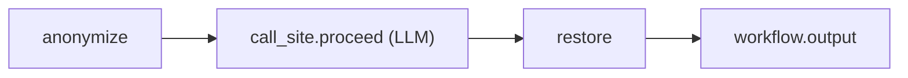
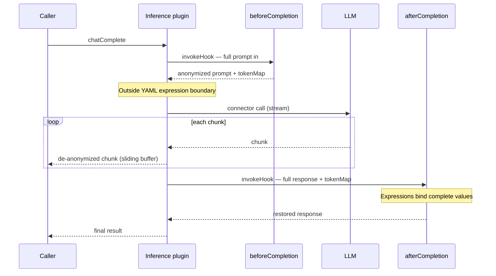
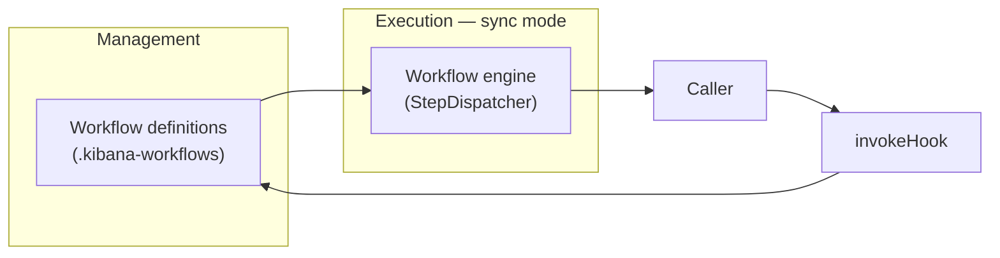

# PII Anonymization — Requirements

Anonymize text sent to external LLMs via `inference.chatComplete`. Built on the [Workflow Lifecycle Hooks proposal](./workflows-aop-proposal.md): sync `invokeHook`, subscribed YAML workflows from the management store, by-value I/O. Engine design rationale: [design evolution](./design_evolution.md).

**Problem:** Regulated customers need AI on sensitive data without shipping PII to external models. One integration point must cover Agent Builder and all other `chatComplete` consumers.

---

## Build this


| Area              | Requirement                                                                                                                                   |
| ----------------- | --------------------------------------------------------------------------------------------------------------------------------------------- |
| **Where**         | Sync hooks at `inference.chatComplete` — full prompt (system, messages, tool history), not AB-only round hooks                                |
| **How**           | Built-in steps (`ai.pii`, `transform.pii_restore`) + OOB seeded workflows (YAML config, per-space enable)                                     |
| **Detection**     | Phase 1: regex (IP, EMAIL, HOST_NAME, USER_NAME + custom patterns). Phase 2: NER (optional)                                                   |
| **Tokens**        | HMAC-SHA256 with `HMAC(encryptionKey, sessionId)`; entity-prefixed (`IP_…`); same value → same token across turns/nodes                       |
| **Token map**     | Produced by `beforeCompletion`, held in memory by inference plugin, passed to `afterCompletion`, discarded after call — **no ES persistence** |
| **Tools**         | Tool args de-anonymized in inference pipeline before executor; tool results anonymized on next `chatComplete`                                 |
| **Streaming**     | Required. Sliding-buffer de-anonymization on stream; `afterCompletion` runs once on assembled text                                            |
| **Failure**       | Fail-closed by default; opt-in `allow_unsafe`                                                                                                 |
| **Composability** | Multiple workflows per hook; `sync.chained: true` passes previous output to next (not merge/last-writer-wins)                                 |
| **Per-agent**     | `sessionId` + `agentId` on hook events; workflow `if: 'event.agentId == "…"'` guards                                                          |
| **Activation**    | Server flag + enable seeded workflows per space                                                                                               |


---

## Do not build

- Standalone anonymization platform (profiles, replacement index, Stack Management UI)
- Field-level allow/anonymize/deny or ESQL lineage extraction (text-level scanning only)
- Persistent token maps / `replacementsId` in Elasticsearch
- Anonymization of data at rest or show-anonymized UI toggle
- Porting Security AI Assistant field-level rules to Agent Builder
- Token map via capabilities side-channel (workflow data only; `proceedFn` only for `call_site.proceed`)
- Workflow YAML allowlist for which tools get deanonymized args
- A standalone inline executor that duplicates step dispatch, templating, or validation outside the workflow engine
- In-memory hook handlers (`registerHookHandler`) as a product path for lifecycle hooks — hooks are workflows from the management store, executed by the engine

---

## Hooks


| Hook                         | Phase 1      | Role                                         |
| ---------------------------- | ------------ | -------------------------------------------- |
| `inference.beforeCompletion` | **Required** | Anonymize prompt; output text + `tokenMap`   |
| `inference.afterCompletion`  | **Required** | Restore response using `tokenMap`            |
| `inference.aroundCompletion` | Phase 2      | Single-workflow UX; see streaming note below |


**Phase 1 default:** two seeded workflows (before + after). Both must be enabled for anonymization to work end-to-end. This is the streaming-safe model — see [Why `aroundCompletion` breaks streaming](#why-aroundcompletion-breaks-streaming).

---

## Flow (one `chatComplete` call)

```mermaid
sequenceDiagram
  participant Caller
  participant Inference as Inference plugin
  participant Before as beforeCompletion
  participant LLM
  participant After as afterCompletion

  Caller->>Inference: chatComplete (sessionId, agentId)
  Inference->>Inference: derive salt, inject event.salt
  Inference->>Before: invokeHook — chained sync workflows
  Before-->>Inference: anonymized prompt + tokenMap
  Inference->>Inference: append anonymization context if PII found
  Inference->>LLM: connector call
  loop streaming
    LLM-->>Inference: chunk
    Inference->>Inference: sliding-buffer restore; restore tool args
    Inference-->>Caller: de-anonymized chunk
  end
  Inference->>After: invokeHook (tokenMap in event)
  After-->>Inference: restored response
  Inference->>Inference: discard tokenMap
  Inference-->>Caller: final result
```


1. Caller supplies `sessionId` (e.g. `conversationId`) and optional `agentId` in metadata
2. Inference plugin derives `salt = HMAC(encryptionKey, sessionId)` and injects `event.salt` before `beforeCompletion` — workflows never compute salt
3. `invokeHook('beforeCompletion')` — chained sync workflows run; final output = anonymized prompt + `tokenMap`
4. Inference plugin appends `[Anonymization context]` to system prompt if PII found
5. LLM connector call (streaming or not)
6. Stream: sliding-buffer token restore; tool-call args restored in pipeline
7. `invokeHook('afterCompletion')` with `tokenMap` in event — restore response
8. Return to caller; discard `tokenMap`

Cross-turn: same PII → same token via stable `sessionId` + `encryptionKey` (not stored replacements).

---

## Anonymization architecture

### Token map ownership

The token map is **call-scoped state owned by the inference plugin** for the duration of one `chatComplete`. Workflows **read and write it as declared data** — never as a capability or mutable side-channel object.


| Responsibility                                  | Owner                                               |
| ----------------------------------------------- | --------------------------------------------------- |
| Derive `salt` from `sessionId` + encryption key | Inference plugin (injected into hook event)         |
| Hold `tokenMap` between before/after hooks      | Inference plugin (in-memory only)                   |
| Produce/consume `tokenMap` in workflow steps    | `ai.pii` / `transform.pii_restore` via declared I/O |
| Pass `tokenMap` to `afterCompletion`            | Inference plugin (field on event, not capability)   |
| Discard `tokenMap` after call                   | Inference plugin                                    |


**Invariant:** If you can read the YAML and understand each step type, you understand the full data flow. No hidden objects, no capability side-channels for data.

### Token map constraints


| Constraint        | Requirement                                                                                                         |
| ----------------- | ------------------------------------------------------------------------------------------------------------------- |
| **Size cap**      | Hard limit on entries per call (e.g. 10k); exceed → fail-closed with actionable error                               |
| **Log redaction** | `tokenMap` values (originals) and `salt` **must never** appear in workflow event logs, APM attributes, EBT, or server logs. `salt` enables confirmation attacks (enumerate candidate values, compute token, match against known tokens from anonymized text) even though it cannot directly reverse a token. The `StepDispatcher` log redaction policy must strip both fields from step input/output payloads before write. |
| **Serialization** | By-value only within one process; no cross-node handoff without a separate encrypted ephemeral store (out of scope) |
| **Schema**        | `tokenMap: Record<token, { original, entityClass }>` — declared on trigger `outputSchema` / `eventSchema`           |


### Tool de-anonymization

Tool args may contain anonymization tokens when the model calls a tool. Restoration happens **in the inference pipeline**, not in workflow YAML:

- Inference plugin restores tokens in tool-call arguments before invoking the tool executor
- Tool results are anonymized on the next `chatComplete` via `beforeCompletion` (text-level scan)
- No per-tool YAML allowlist — all tools get the same treatment

### Streaming

- **Before hook:** operates on full assembled prompt (not per-chunk)
- **LLM stream:** inference plugin applies sliding-buffer de-anonymization using in-memory `tokenMap`
- **After hook:** runs once on fully assembled response text

#### Why `aroundCompletion` breaks streaming {#why-aroundcompletion-breaks-streaming}

**Root cause:** the workflow YAML expression engine resolves step inputs from **fully materialized values** before each step runs. Expressions like `{{ steps.proceed.output.response }}` or `${{ steps.anonymize_messages.output.tokenMap }}` are evaluated once, at step dispatch time, against completed step outputs. There is no partial evaluation, lazy binding, or per-chunk streaming through the templating layer.

A full `aroundCompletion` workflow:




Post-proceed steps (`transform.pii_restore`, custom YAML logic) declare their inputs referencing `steps.proceed.output.*`. Those references **cannot resolve until `call_site.proceed` has finished** and produced a complete output object. While the LLM is still streaming, that output does not exist — the expression engine has nothing to bind to.

`call_site.proceed` is therefore a **suspend point**: the workflow pauses, the engine invokes the LLM via `proceedFn`, and the workflow resumes only when the LLM call returns a fully assembled result. Consequences:

1. **The engine must buffer the entire LLM response** before post-proceed inputs can be resolved and those steps can run.
2. **Post-proceed restoration cannot run per-chunk** — there is no expression primitive for "current chunk of an in-flight stream". Steps always receive whole values.
3. **The caller is blocked on the workflow** — nothing reaches `workflow.output` (and therefore the caller) until every post-proceed step has run on the complete response.

**Before / after (streaming-safe):**




**Around with `call_site.proceed` (buffered):**

```mermaid
sequenceDiagram
  participant Caller
  participant Workflow as aroundCompletion workflow
  participant LLM

  Caller->>Workflow: invokeHook (caller blocked)
  Workflow->>Workflow: anonymize
  Workflow->>LLM: call_site.proceed via proceedFn
  Note over Workflow,LLM: Stream buffered — steps.proceed.output cannot resolve until complete
  LLM-->>Workflow: full assembled response
  Workflow->>Workflow: restore (expressions resolve)
  Workflow->>Workflow: workflow.output
  Workflow-->>Caller: result (no streaming; TTFT = full pipeline)
```


**Pre-proceed-only `aroundCompletion`** (no `call_site.proceed`) avoids this: the workflow returns anonymized inputs + `tokenMap` via `workflow.output` — all expressions resolve against known, complete values — and the **inference plugin** performs the connector call and streaming de-anonymization outside the expression engine. Same effective split as `beforeCompletion` + `afterCompletion`, just packaged in one YAML file. It streams, but it is not a true around hook; post-LLM logic still belongs on `afterCompletion`.

**Why `beforeCompletion` + `afterCompletion` is the Phase 1 default:** the inference plugin sits **outside** the YAML expression boundary during the LLM call. It can de-anonymize chunks progressively (sliding buffer on token prefixes) without needing resolved step outputs. `afterCompletion` runs once on the fully assembled response — at that point the expression engine has a complete value to bind, and streaming to the caller is already done.


| Model                          | Who calls the LLM        | Streaming to caller       | Post-LLM YAML logic                                 |
| ------------------------------ | ------------------------ | ------------------------- | --------------------------------------------------- |
| `before` + `after`             | Inference plugin         | Yes (sliding buffer)      | `afterCompletion` on assembled text                 |
| `around` pre-proceed only      | Inference plugin         | Yes (same as above)       | `afterCompletion` still needed for workflow restore |
| `around` + `call_site.proceed` | Workflow via `proceedFn` | No — full buffer required | In same workflow                                    |


Defer full `aroundCompletion` with `call_site.proceed` to Phase 2 unless product explicitly accepts non-streaming for workflows that use it.

---

## Workflow engine architecture

Sync lifecycle hooks are a **first-class execution mode** of the regular workflow engine — not a parallel executor, not a PoC shortcut. Anonymization is the first consumer; the engine work must be general and durable.

### `invokeHook` execution model

Any trigger with a `sync` block follows one product path when called via `invokeHook`:



1. **`invokeHook(triggerId, payload)`** blocks the caller until the hook completes
2. **Management** — load enabled workflows subscribed to `triggerId` in the current space
3. **Execution** — run each workflow via **sync execution mode** (in-process, same step dispatch as async, non-durable)
4. **Return** — chained output (when `sync.chained: true`) or `pass_through` / `failed` per failure semantics

There is **no opt-in flag** and **no alternate in-memory handler path** for product lifecycle hooks. Admins configure behavior in the Workflows UI; the engine executes subscribed YAML. This matches the [AOP proposal](./workflows-aop-proposal.md) model: *single `invokeHook` call — engine resolves all subscribers.*

| API | Execution | What runs |
| --- | --------- | --------- |
| `emitEvent()` | Async — Task Manager | Background workflows |
| `invokeHook()` | Sync — blocks caller | Enabled YAML workflows via sync execution mode |

**Not in scope for product hooks:** plugin-registered TypeScript handlers as a parallel backend. If the platform retains an internal handler registry, it is for tests/bootstrap only — not documented as a lifecycle-hook customization path.

**Management / execution separation (desired state):** workflow definitions live in the management store; execution happens in sync engine mode at invoke time. Sync runs are non-durable (no execution saved object, no Task Manager) — that is an accepted tradeoff for the hot path, not a reason to bypass the engine.

### Blocking prerequisites (workflows team)

1. **Same engine, same dispatch** — sync runs use `StepDispatcher`, step registry, templating, and input validation — identical code path to async runs
2. **Observability parity** — APM spans, workflow event log; every entry tagged `mode: sync` and `triggerId`
3. **Non-durable by design** — sync runs use synthetic execution IDs (`sync_<uuid>`); no Task Manager, no ES execution documents, no retries, no cross-node resume
4. **Caller-owned timeout** — per-workflow `maxTimeout` plus a documented **chain budget** when multiple workflows subscribe to one trigger; a slow step blocks the LLM call
5. **Save-time validation** — linear topology only; structural branching/parallel/loops rejected at install; capability subset checked at registration
6. **Chained I/O validation** — when `sync.chained: true`, validate that each workflow's `workflow.output` schema is compatible with the next workflow's trigger `event` schema. This is **workflow-level chaining** (one complete workflow's output becomes the next workflow's event input), distinct from step-level chaining within a single workflow (handled by the template engine via `${{ steps.x.output.y }}` expressions). Validation can only happen when the full chain is known — i.e., when an execution order is established (workflows enabled and ordered for a trigger). Not possible at individual workflow save time, since chain membership and order are determined at activation/configuration time.
7. **PII-safe logging** — event logger redacts known sensitive fields (`tokenMap`, step inputs/outputs for PII steps) before write
8. **Deterministic multi-workflow order** — explicit ordering (e.g. priority field or stable install order), not implicit sort by `updated_at`
9. **`invokeHook` contract** — sync triggers always resolve and execute subscribed YAML workflows; no dual execution backends

### Accepted tradeoffs (explicit)

Sync hooks **break management/execution separation** for the duration of the call:


| Async workflows                  | Sync hooks                              |
| -------------------------------- | --------------------------------------- |
| Task Manager schedules execution | In-process, blocks caller               |
| ES-backed execution state        | In-memory only; dies with caller        |
| Retries, resume, long waits      | None — caller timeout only              |
| Extractable to remote executor   | Not extractable; runs in Kibana process |


This is intentional. Document it. Do not pretend sync runs are async runs with a flag.

`proceedFn` (for `aroundCompletion` only) is the **only** capability — a closed, typed `KnownCapabilities` registry with Zod validation at dispatch and subset checks at registration. No `Record<string, unknown>` bags.

### Trigger registration contract

Each inference lifecycle trigger declares:

```ts
sync: {
  maxTimeout: '15s',           // per workflow; before/after — 30s for around
  failurePolicy: 'closed',     // anonymization must not silently pass raw PII
  chained: true,               // before/after; false for around
  outputSchema: /* … */,       // declared on trigger; single source of truth
}
providesCapabilities: [],      // before/after — empty
// aroundCompletion only:
providesCapabilities: ['proceedFn'],
```

All inference lifecycle triggers use the same `invokeHook` → subscribed YAML → sync engine path. No per-trigger execution backend switch.

### Composability

- Multiple enabled workflows per trigger execute in **deterministic order** (explicit priority or stable install order — not `updated_at`)
- `sync.chained: true`: previous workflow's `output` becomes the next workflow's `event` input
- Each workflow must end with `workflow.output` declaring its schema (or match implicit input/output schema when shapes align)
- Custom workflows can chain library workflows (e.g. redact SSN → anonymize remainder)

### Failure semantics


| Scenario | Behavior |
| -------- | -------- |
| Hook step throws / times out | Fail-closed → `chatComplete` error (unless `allow_unsafe`) |
| Workflows plugin unavailable | Fail-closed when anonymization is enabled for the space — **not** `pass_through` |
| No workflows enabled for trigger | Fail-closed when anonymization is enabled — silent pass-through sends raw PII |
| `afterCompletion` disabled but `beforeCompletion` ran | Fail-closed — never return tokenized text to user |
| `beforeCompletion` disabled but `afterCompletion` enabled | No-op restore (empty `tokenMap`) |
| Anonymization disabled / hook not required | `pass_through` acceptable — caller receives unmodified payload |

**Layering:** trigger `failurePolicy: 'closed'` governs workflow step failures; inference `failureMode: 'block' \| 'allow_unsafe'` governs how the caller handles hook errors. When anonymization is active, both must fail closed — `pass_through` is not a silent success.


### Performance

- Regex detection: < 100ms per pass (target)
- ES workflow definition lookup: 2× per `chatComplete` (before + after) — benchmark under multi-tool agent load before ship
- Hook overhead budget: measure end-to-end latency impact at production scale

---

## Admin & enablement

- Config in workflow YAML (entities, custom patterns, per-agent `if:` guards)
- Clone/customize seeded workflows; chain library workflows
- One-shot migration from `ai:anonymizationSettings` → seeded before workflow
- No separate anon-profiles UI

### Two-workflow enablement

Before + after workflows are a known operational footgun. Requirements:

- Seeded workflows ship as a **pair** with linked IDs or shared tag
- Workflows UI warns when only one of the pair is enabled
- Ideal: single enable action toggles both; acceptable: validation error on save/enable of orphan workflow
- Default on first space setup: both enabled together when feature flag is on

---

## Platform ownership


| Component                                                                        | Owner                                                                    |
| -------------------------------------------------------------------------------- | ------------------------------------------------------------------------ |
| `ai.pii`, `transform.pii_restore` steps                                          | `@kbn/inference-workflows`                                               |
| Trigger registration (`beforeCompletion`, `afterCompletion`, `aroundCompletion`) | `@kbn/inference-workflows`                                               |
| Seeded default workflows                                                         | `@kbn/default-anonymization-workflows`                                   |
| `chatComplete` wrap, `tokenMap` hold, streaming transform, tool arg restore      | Inference plugin                                                         |
| Sync execution mode, `invokeHook`, chained semantics, save-time validation       | Workflows engine (`workflows_management` + `workflows_execution_engine`) |
| Trigger event/output schemas (single source of truth)                            | `@kbn/workflows-extensions/common` (imported by inference + inference_workflows) |
| `KnownCapabilities` registry                                                     | Workflows engine                                                         |


---

## Consumers

- **Agent Builder:** thread `sessionId` + `agentId` only — no anon UI or logic in AB
- **All `chatComplete` consumers:** covered automatically once hooks are wired
- **Security AI legacy path** (`inferenceChatModelDisabled`): must be removed or migrated for complete coverage — known gap until done

---

## Phase 2 (later)

- NER via `ai.ner` step; opt-in; benchmark latency vs hook timeout
- `aroundCompletion` with `call_site.proceed` (accepts non-streaming tradeoff)
- Per-agent enablement UI (workflow `if:` guards sufficient in Phase 1)
- Cross-node sync / encrypted ephemeral store for token map (only if multi-node sync hooks are required)

---

## Done when

### Anonymization

- LLM never sees configured PII; users see real values back (including streams)
- Fail-closed default; no silent tokenized responses if after-workflow disabled
- `tokenMap` visible in workflow YAML I/O — no capability side-channel for data
- `tokenMap` never appears in logs, traces, or EBT
- Token map size cap enforced with actionable error
- Tool args restored before executor; tool results anonymized on next call
- Composable chained workflows work; per-agent `if:` guards work
- O11y `ai:anonymizationSettings` migrated to seeded workflow

### Workflow engine

- Sync runs use same `StepDispatcher` as async — no forked executor
- `invokeHook` on sync triggers always executes subscribed YAML workflows via sync execution mode
- Sync runs observable in APM + event log with `mode: sync` and `triggerId` tags
- `tokenMap` redacted in all observability sinks
- Save-time rejection of non-linear sync workflows and capability mismatches
- Chained workflow I/O validated at activation/ordering time (when execution order for a trigger's enabled workflows is established)
- Deterministic multi-workflow execution order
- `pass_through` never used when anonymization is enabled
- Workflows team sign-off on non-durable sync semantics
- Production-scale latency benchmarked (hook overhead + ES lookup × 2)

### Coverage

- Security AI legacy inference path removed or migrated
- All `chatComplete` consumers covered without per-consumer changes (beyond metadata)

