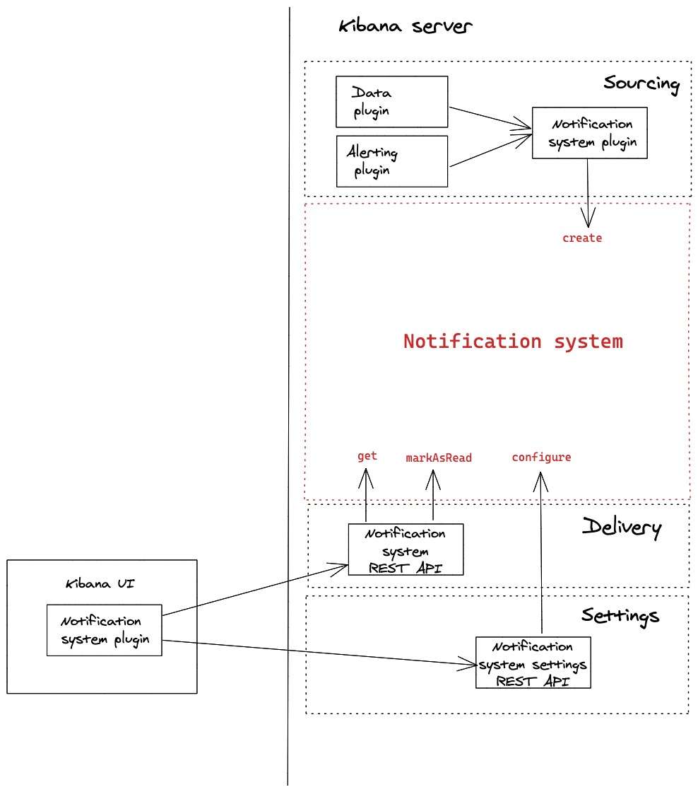

- Start Date: 2021-02-04
- RFC PR: (leave this empty)
- Kibana Issue: (leave this empty)

---
- [Summary](#summary)
- [Motivation](#motivation)
- [Detailed design](#detailed-design)
  - [Unified Notification Service](#unified-notification-service)
  - [Kibana Notification Service](#kibana-notification-service)
    - [Kibana Notification Service key elements](#kibana-notification-service-key-elements)
    - [Notification event](#notification-event)
    - [Sourcing](#sourcing)
    - [Notification System](#notification-system)
      - [LocalRepository](#localrepository)
        - [Notification model](#notification-model)
        - [Notification storage](#notification-storage)
      - [RemoteRepository](#remoterepository)
    - [Delivery](#delivery)
      - [List of notifications](#list-of-notifications)
      - [Notification Status](#notification-status)
    - [Settings](#settings)
      - [Filtering](#filtering)
- [Drawbacks](#drawbacks)
- [Alternatives](#alternatives)
- [Adoption strategy](#adoption-strategy)
- [How we teach this](#how-we-teach-this)
- [Unresolved questions](#unresolved-questions)
---

# Summary

The notification service improves UX by providing a way of drawing the user's attention to an event that occurred in Kibana or another Elastic product.

# Motivation

The number of interactive events in the product grows from release to release.
It became clear we need a unified mechanism to help our users to navigate through the flow of events and react to them.

# Detailed design
## Unified Notification Service
The main goal of the Notification service is to provide seamless integration for notifications across different Elastic products.
This will be achieved through introducing Unified Notification Service (UNS), which can be accessed by a variety of
Elastic products deployed on the Cloud. It accumulates notifications creates by different company products and provides
access to them via the Kibana UI and Cloud Console UI.
Unified Notification Service is still in the planning stages and beyond the scope of this RFC.


The need to support UNS in the future leads to the following consequences for Notification service design in Kibana:
- Kibana is just another source of notifications for UNS
- Kibana is one of the UI mechanisms for UNS
- UNS is not available outside of Cloud environment, so Kibana needs to implement a Notification Service that able to work on-prem Kibana

## Kibana Notification Service
This RFC focuses on the Kibana Notification System implementation, responsible for collecting all the Kibana notifications and showing notifications in Kibana UI. 
The on-premise Kibana version uses KNS to collect notifications created by Kibana plugins to show them in Kibana UI.
In this case, Kibana is the single source of notifications and the only UI for them.


For the Kibana deployed on Cloud, KNS integrates with UNS under the hood transparently to the rest of Kibana.
KNS sends created Kibana notifications to UNS and reads notifications from UNS.
Having UNS as a single source of truth reduces the disk space usage for the system data and the possibility of data inconsistency between the local database and the remote service.


### Kibana Notification Service key elements
- *Notification event* - a message with associated CTA to show to an end-user.
- *Source* - a program entity creating a notification event.
- *Sourcing* - collects notification events created by different internal sources.
- *Notification* system - abstracts the way notifications are created, stored, configured, and retrieved.  Ensures compatible operation for on-prem and Cloud Kibana versions.
- *Delivery* - provides API for Kibana UI to retrieve the latest notifications for a user, to update notification status (read / unread).
- *Settings* - provides API to adjust user-specific notification settings (unsubscribe from / subscribe to a source).


### Notification event
It consists of a message with an associated CTA to show to an end-user.
*NotificationEvent* interface
- `recipient_id: string []` - unique identifiers of all the recipients. It might be the same as `elastic_id` (if the env supports it) - the unique user identifier across all the company products. 
There is currently no way to unambiguously identify the user. WIP [#82725](https://github.com/elastic/kibana/issues/82725)
- `priority: number` - to prioritize the delivery in case of async delivery mechanism.
Where 0 - the standard priority, 10 - the critical priority. An event with high priority is processed first.
Shouldn’t be used in UI.
- `created_at: number` - Unix timestamp in UTC timezone when a notification has been created.
- `expired_at?: number` - Unix timestamp in UTC timezone when notification can be removed from the system. 
- `pinned_status?: boolean` - a flag to pin a notification at top of the list of notifications. Used by a source to draw a user's attention to a notification.
- `source_type: string` - source type. the same as source domain name: `cloud`, `alerting`.
- `source_subtype: string` - source-specific type (`cloud.insufficient_funds`, `alerting.something`)
- `group_id?: string` - identifier to associate several notifications in the UI
- `content: NotificationContent` - see below.

*NotificationContent* interface (see [UI component](https://github.com/elastic/eui/issues/4257))
- `icon?: { euiIconType: string }` - icon on the left side of the title.
Compatible with all the types supported by euiIcon type: a predefined EUI icon name, URL to SVG file, data URL for SVG file.
- `badge?: "critical"` - badge below the notification message.
- `message: { i18n_key: string, values: object } | { text: string }` - a notification message is subject to i18n. 
Locale might be changed on the Space level (on the User level in the future).
Thus, we cannot determine a message locale during notification creation.
Considering that Kibana notifications might be rendered outside of Kibana UI (in Cloud UI, for example), the message must contain translations for all the supported locales.
- `title: { i18n_key: string, values: object, url?: string } | { text: string, url?: string }` - notification header.
- `action: { i18n_key: string, values: object, url: string } | { text: string, url: string }` - notification CTA

### Sourcing
Source is a program entity creating a notification event.
The list of supported notification sources:
- Stack
    - Onboarding suggestions
    - Search sessions ([#61738](https://github.com/elastic/kibana/issues/61738))
    - Cases ([#237](https://github.com/elastic/security-team/issues/237), [#80334](https://github.com/elastic/kibana/issues/80334))
    - Security messages ([#73929](https://github.com/elastic/kibana/issues/73929), [#4976](https://github.com/elastic/infosec/issues/4976))
    - Alerting ([#51547](https://github.com/elastic/kibana/issues/51547))
    - Scheduled reports ([#79905](https://github.com/elastic/kibana/issues/79905))
- Cloud
    - Stack notifications from multiple deployments
    - Cloud console notifications
    - Billing
    - Autoscaling
    - Critical errors, issues with cloud platform, completed actions, expiring trials, warnings, new releases, and others.
- Marketing
    - Elastic news feed
    - With personalization, potentially support for multiple subscriptions ([#61550](https://github.com/elastic/kibana/issues/61550))
- Support (On Cloud only)
    - Cases updates from support
- Training (On Cloud only)
    - Suggested trainings
    - Reminders for upcoming training

The on-premise Kibana collects and shows notifications created by Kibana only.
Cloud Kibana collects notifications from Kibana, shows in UI notifications from Kibana itself and external sources.

A source creates a notification as a reaction to an event.
A notification might be addressed to:
- a user
- a specific group of users
- all the users

Sources have domain-specific logic to determine whether a concrete user is authorized to act. For example, a user should not
receive an Alert if they have no permission to react to it. Similarly, a user cannot be assigned to a Case if they
don't have permission to work with the Security Solutions plugin. So, the notification system piggybacks this security
check and relies on a plugin to specify a notification recipient with sufficient permissions to react to the notification. 
It's a bit complicated when it comes to sending notifications to a group of users.
Sources work with different concepts of groups: Cloud - Teams, Kibana - Spaces. These concepts do not map to each other directly. 
The notification service doesn't know about any user groups within the sources. So the group of users should unfold to a list of recipients before creating a notification. 
Since the users in a group might have different roles and permissions, we have two options for security model implementation for group notifications:
- A notification source, being a feature owner, enumerates a list of recipients before creating a notification.
  It's technically impossible at the moment, but potentially this functionality might be added in [#80334](https://github.com/elastic/kibana/issues/80334).
  With this model, it’s possible to create a notification that a user cannot act on when user permissions have been changed after notification creation.
  It’s acceptable because it will be even more confusing if a notification disappears from the UI later due to changes in users permissions.
  Having more use-cases, we can consider extending notification creation API to specify Kibana-specific permissions for the recipients
  (send a notification to all the users with access to a feature X or space Y).
  Although, it will require declaring Notification plugin dependency on other Kibana plugins, which can turn into circular dependency problems later.
- Kibana calculates whether a user should receive a notification in runtime before showing one to the customer.
  The only available option for the current Kibana Security model. Considering the future integration with UNS,
  Kibana has to provide an HTTP API to check users' permissions are sufficient to see a notification.
  Unified Notification center performs a call to HTTP API to filter out notifications before rendering them in Cloud UI. 
  This option adds a significant runtime performance penalty. Moreover, it makes the rendering process dependent on Kibana instance availability. If one of them is temporarily unavailable, the UNS can't decide if a notification must be shown or not.

### Notification System
Abstracts the way notifications are created, stored, configured, and retrieved.
It allows Kibana to adopt different strategies for on-premise and Cloud versions:
- *LocalRepository* - a repository for on-premise version, it stores data within the current deployment. 
- *RemoteRepository* - a repository for the Cloud version of Kibana. It stores data within the Unified Notification System deployed in the Cloud.
In this case, a user can see in Kibana UI the external notifications created outside of Kibana.

*Repository* interface:
- `create(NotificationEvent)`- creates a notification in the Notification system. 
- `get({ search_after?: number; size?: number; type_id?: string[] })` - retrieves last notifications for the current user.
Might be paginated using `search_after` filed.
- `markAsRead({ notification_id: string[] })` - mark notifications with given ids as read.
- `markAsUnread({ notification_id: string[] })` - mark notifications with given ids as unread.
- `markAllAsRead()` - mark all the notifications as read.
- `markAsPin({ notification_id: string[] })` - mark notifications with given ids as pinned.
- `markAsUnpin({ notification_id: string[] })` - mark notifications with given ids as unpinned.
- `configure()` - updates user-specific notification settings.

#### LocalRepository


##### Notification model
Notification model is responsible for:
- Applying policies to an incoming notification. NS must check whether a recipient unsubscribed from a source before processing to delivery.
- Enhancing an incoming notification with necessary data: 
    - `expired_at` if not specified. Kibana allows administrators to set how long notifications will be stored. Falls back to 30 - 90 days be default. 
- Writing new incoming messages to the Notification storage.

Processing a large number of incoming notifications might slow down Kibana and create a disproportionately high load on some Kibana instances.
The use of a queue allows us to make the handling of incoming notifications asynchronously.
Async mechanism lets Kibana to cope with spikes in the number of messages created. The queue implementation is based on the Elasticsearch server. 

The logic is run as a background task. The usage of the single background task:
- reduces the possibility of read- and write-conflicts
- allows re-using task_manager built-in features: scheduling, retry, monitoring

If Kibana processes notifications in asynchronous batches, we will need a prioritization mechanism to be sure events
with a higher severity are delivered first without a significant delay. The prioritization mechanism is based on
priority property value: the notification with the higher value is processed earlier to provide an experience as close to real-time as possible.

##### Notification storage

NS storage keeps different notification statuses for every user. Most Kibana deployments have [from 20 to 90 users](https://elastic.slack.com/archives/C9097ABGC/p1597162974399900),
although there are some odd instances with >100k users. So we consider two options at the moment (see the [workflow](https://docs.google.com/document/d/18s-BTHog_oPaQKf871gzuhxkah4pK1GYJM9DCLceaLo/edit#)):
- Store notification state separately from a notification. State for new notifications created for every user when they change the state.
```typescript
interface  NotificationState {
  notification_id: string;
  recipient_id: string;
  read_status: boolean;
  pinned_status: boolean;
}
``` 
This option consumes less storage space but might lead to expensive read operations due to an additional JOIN call to 
search for notification state objects. We don’t expect Kibana to read more than 10-20 notifications at once, so the overhead might be acceptable.
- Create a copy for every notification in a user-specific list of notifications. It’s [the recommended way to store data](https://www.elastic.co/guide/en/elasticsearch/reference/current/joining-queries.html),
but it leads to duplicating notification messages. 

Stale notifications and their states must be removed from the storage. There should be a dedicated task performing
look up through the storage to remove notifications with *expired_at* > the current timestamp.

Data are stored in the hidden system index to prevent accidental access by a random user.
We don’t expect notifications to contain sensitive information.
They must be stored in an encrypted form otherwise. 
Kibana can query user-specific notifications by *recipent_id*.

Alternative implementation might be to use SO with OLS([#17888](https://github.com/elastic/kibana/issues/17888)),
but it might be overhead as we don't need any advanced SO functionality like export/import.
Also, SO search functionality is quite limited and doesn’t allow using complex search queries. 

### RemoteRepository
Cloud plugin registered RemoteRepository as a strategy Kibana Notification Service for creation, storage,
and retrieval notifications from the remote Unified Notification Service. 
It’s still not clear what functionality is supported by UNS, but we expect it to be:
- Create a notification for a particular recipient, a group of recipients. 
- Read a list notification for a particular recipient.
- Filter notification list.
- Change a notification state.

Kibana-specific entities shouldn’t leak to UNS: 
- Kibana sends message translations for all the supported locales.
- Kibana-specific groups of recipients unfolded to a list of *recipient_id*.
- *recipient_id* is set to *elastic_id*.

## Delivery
The delivery mechanism is responsible for the notifications shipment to Kibana UI. 

#### List of notifications
For simplicity, we can start with Kibana UI using the HTTP polling mechanism to fetch the last notifications from `/notifications` endpoint.
Server orders notifications by *pinned_status* and *created_at* timestamp.

Kibana HTTP API:
- Endpoint: `GET /notifications/` 
    - `search_after?: number` - Unix timestamp to start searching from.
    - `type_id?: string[]` - list of source types to filter by.
    - `size?: number` - max number of notifications to retrieve.

*search_after* and *size* params used to implement pagination logic.

In one of the next phases of the project, we will have to do load testing and decide whether to consider the alternative
to HTTP polling delivery mechanisms: passing information with a response header (as done for licensing), WebSockets, ServerSideEvents.

#### Notification Status
The delivery mechanism handles Notification status change performed by Kibana UI.
Every notification has a different status for every user.
Supported notification statuses:
- `read: boolean`
- `pinned: boolean`

Kibana UI changes notification status to `read: true` when a user interacts with it: clicks on CTA or `Mark as Read` button.

The user can change the notification status to `read: false` manually in the Kibana UI.

The user can change the status for all the existing notifications (`mark all as read`), even for those not-rendered in UI yet.

Kibana HTTP API:
- mark notification as read
```
POST /notification/read
{ notification_id: string[] }
```
- Mark all the notification read
```
POST /notifications/_mark_all_read
```
- Pin a notification.
```
POST /notification/pin
{ notification_id: string[] }
```
- Unpin a notification.
```
POST /notification/unpin
{ notification_id: string[] }
```

Writing to the same Notification storage might cause conflict on the `write`. If the storage mechanism implementation
doesn’t make them impossible, we will have to use a single place to change notification status (via the [queue](#localrepository)).

## Settings
Provides HTTP API for Kibana UI to configure user-specific settings.
Not provided in MVP, we might add in the future:
- Unsubscribe from a source
- Subscribe to a source

#### Filtering
Filtering allows users to hide notifications they aren’t interested in. Kibana UI attaches a list of filters when requesting notifications.
Kibana stores filter as a part of User settings data to provide a seamless experience between different deployments on Cloud and user sessions.


# Drawbacks

- It is not entirely clear what functionality will be supported by UNS and when this will be known.
It forces us to evaluate each feature separately as to how difficult it will be to adapt it to UNS later.
- The service relies on the yet-to-be-added ability to uniquely identify the user, enumerate users with a given set of permissions.
- The service doesn't provide a built-in security mechanism but relies on a notification source implementation.
- Lack of a centralized i18n service makes message transferring over-bloated due to the necessity to send all the possible translations over the wire.


# Alternatives

### Threat Cloud as another pluggable storage mechanism.
Kibana notification service collects internal notifications and shows them in the UI for both on-prem and Cloud environments.
Kibana reuses Notification service implementation on Cloud but enhances it with additional pluggable storage of external notifications.


The main benefit of this approach is that Kibana always uses the same service in any environment.
But in addition to the restrictions listed in the [Drawbacks](#drawbacks) section, the following are added:
- Each retrieval of a notification list still requires waiting for a roundtrip to UNS.
- The list of Kibana notifications stored in an instance might be out of sync with a copy stored in UNS due to network problems. 
- Storing notifications in the Cloud deployment and their copy in UNS consumes twice the disk space.

# Adoption strategy

We start with introducing Kibana Notification Service as a Kibana plugin, adding more notification sources along the road.
Integration with UNS is something that is not going to happen any time soon. The work can be divided into the following phases:

### Phase I
Kibana shows notifications created by the Newsfeed Kibana plugin in Notification flyout.

A notification cannot have a particular recipient in the lack of a way to identify a user in the system. A notification will be shown to all the users instead.
User-specific notification state (*read_status*) is not stored in Kibana but browser Local Storage.
### Phase II
When [user profiles](https://github.com/elastic/kibana/issues/17888) are supported, Kibana UI starts showing user-specific notifications.
KIbana UI supports applying filters to the notification list.
The very first three candidates for the integration with Notification systems:
- Data plugin - Search sessions
- Security solutions plugin - Cases
- Alerting plugin - Alerts

The notification system supports a user-specific state for notifications.
Telemetry tracks the number of unique users and the number of notifications in the system.

### Phase III
Kibana UI supports pinning a notification, grouping notifications.
Notification content supports i18n, all internal notifications are translated according to user-specific language settings.
Load testing is done. Make adjustments according to the number of unique users: notification queue, a different schema for notification storage, etc.

### Phase IV
Kibana implements notification center UI on a separate page. 
Notification flyout is cleaned up from "advanced" functionality.


### Phase V
When Unified Notification Service is supported, align on API functionality supported by both systems Kibana NS and UNS.
Add a Kibana adapter for the Unified Notification Service.
Refactor Kibana plugins not to emit notifications provided by UNS (Newsfeed, Suggestions).

# How we teach this

The Core team provides Kibana Notification Service as a Kibana plugin and refactors Newsfeed plugin to be the first consumer of the Notification Plugin API.
Plugin documentation and an integration example will be the reference point for other plugins willing to integrate with the Notification Service.

# Unresolved questions

- What Notification service capabilities are supported by UNS?
- Does the user identification mechanism from [#82725](https://github.com/elastic/kibana/issues/82725) cover all the IdP cases?
- Are we okay to integrate Newsfeed (probably Suggestions) via plugin interface for on-prem Kibana, but disable the plugins in Cloud env in favor of UNS?
