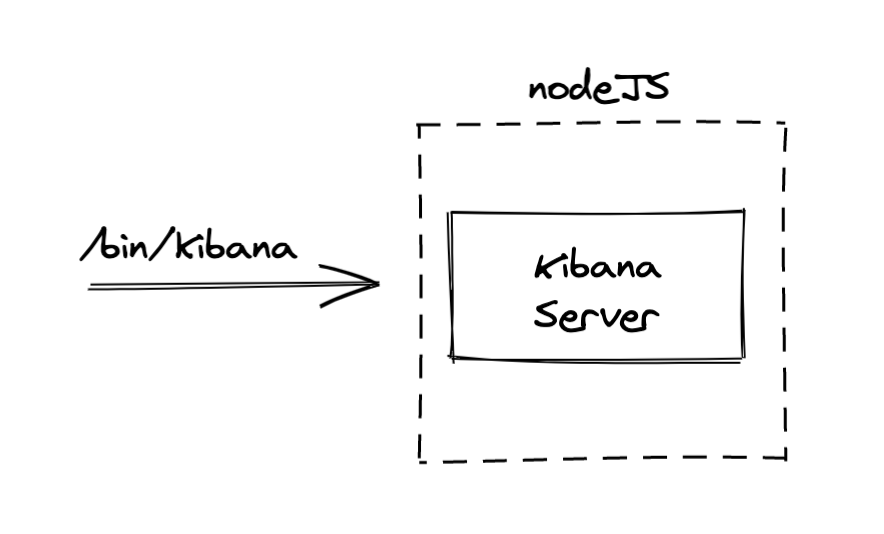
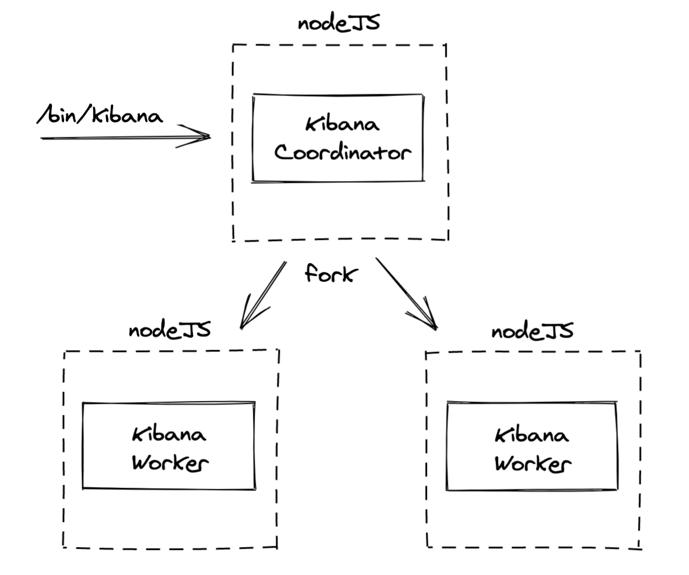
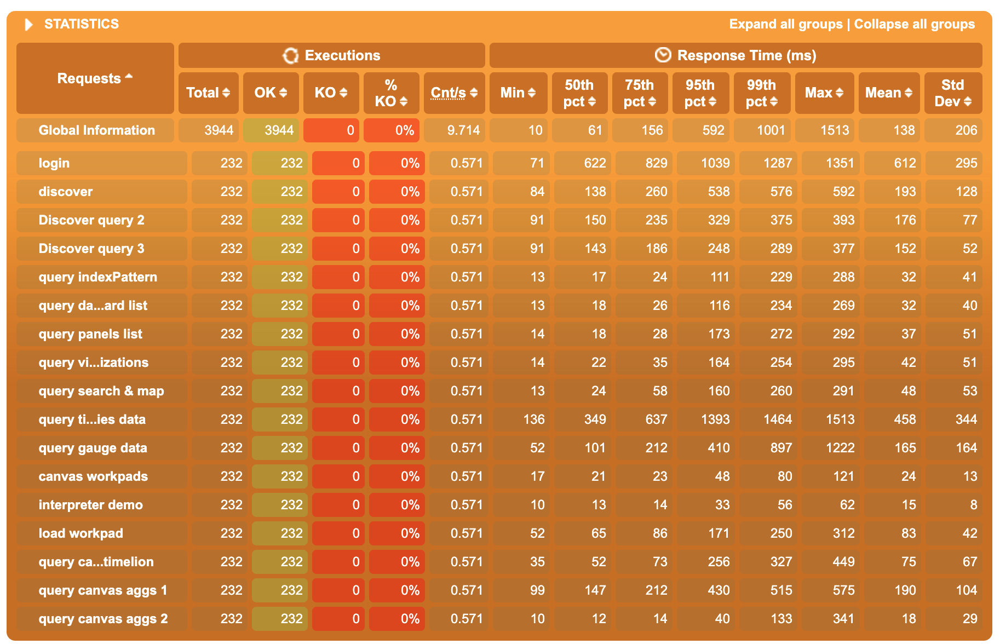

- Start Date: 2021-03-09
- RFC PR: https://github.com/elastic/kibana/pull/94057
- Kibana Issue: https://github.com/elastic/kibana/issues/68626
- POC PR: https://github.com/elastic/kibana/pull/93380

---

- [1. Summary](#1-summary)
- [2. Motivation](#2-motivation)
- [3. Architecture](#3-architecture)
- [4. Testing](#4-testing)
- [5. Detailed design](#5-detailed-design)
- [6. Technical impact](#6-technical-impact)
  - [6.1 Technical impact on Core](#6.1-technical-impact-on-core)
  - [6.2 Technical impact on Plugins](#6.2-technical-impact-on-plugins)
  - [6.3 Summary of breaking changes](#6.3-summary-of-breaking-changes)
- [7. Drawbacks](#7-drawbacks)
- [8. Alternatives](#8-alternatives)
- [9. Adoption strategy](#9-adoption-strategy)
- [10. How we teach this](#10-how-we-teach-this)
- [11. Unresolved questions](#11-unresolved-questions)
- [12. Resolved questions](#12-resolved-questions)

# 1. Summary

Leveraging NodeJS clustering API to have multi-processes Kibana instances.

# 2. Motivation

Kibana currently uses a single Node process/thread to serve HTTP traffic.
This means Kibana cannot take advantage of multi-core hardware making it expensive to scale out Kibana.

Clustering mode would allow spawning multiple Kibana processes ('workers') from a single Kibana instance. See the `alternatives`
section for the difference between clustering and worker pool.

This should be an optional way to run Kibana since users running Kibana inside docker containers might
choose to rather use their container orchestration to run a container (with a single kibana process)per host CPU.

# 3. Architecture

In 'classic' mode, the Kibana server is started in the main NodeJS process.



In clustering mode, the main NodeJS process would only start the coordinator, which would then fork workers using 
Node's `cluster` API. NodeJS underlying socket implementation allows multiple processes to listen to the same ports, 
performing http traffic balancing between the workers for us.



The coordinator sole responsibility is to orchestrate the workers. It would not be a 'super' worker handling both 
the job of a worker while being in charge of managing the other workers.

# 4. Testing

## 4.1 Local testing

These tests were performed against a local development machine, with a 8-core cpu (2.4 GHz 8-Core Intel Core i9 - 32 GB 2400 MHz DDR4),
using the default configuration of the `kibana-load-testing` tool.

### 4.1.1 Raw results

#### Non-clustered mode


#### Clustered mode, 2 workers



#### Clustered mode, 4 workers


### 4.1.2 Analysis 

- Between non-clustered and 2-worker cluster mode, we observe a 20/25% gain in the 50th percentile response time. 
  Gain for the 75th and 95th are between 10% and 40%
- Between 2-worker and 4-workers cluster mode, the gain on 50th is negligible, but the 75th and the 95th are 
  significantly better on the 4-workers results, sometimes up to 100% gain (factor 2 ratio)

Overall, switching to 2 workers comes with the most significant improvement in the 50th pct, 
and increasing further to 4 workers decreases even more significantly the highest percentiles. 
Even if increasing the number of workers doesn’t just linearly increase the performances 
(which totally make sense, most of our requests response time is caused by awaiting ES response), 
the improvements of the clustering mode on performance under heavy load are far from negligible.

## 4.2 Testing against cloud

There is currently no easy way to test the performance improvements this could provide on Cloud, as we can't
deploy custom builds or branches on Cloud at the moment.

On Cloud, Kibana is running in a containerised environment using CPU CFS quota and CPU shares. 

If we want to investigate the potential perf improvement on Cloud further, our only option would be to setup a 
similar-ish environment locally (which wasn't done during the initial investigation)

# 5. Detailed design

## 5.1 Enabling clustering mode

Enabling clustering mode will be done using the `clustering.enabled` configuration property.

The whole `clustering` configuration would look like:

```ts
export const config = {
  path: 'clustering',
  schema: schema.object({
    enabled: schema.boolean({ defaultValue: false }),
    workers: schema.conditional(
      schema.siblingRef('enabled'),
      false,
      schema.number({ defaultValue: 1 }),
      schema.number()
    )
  }),
};
```

Notes:
- As there isn't really a good way to automatically choose the correct number of workers automatically, It will be required 
  for the user to manually specify `clustering.workers` when clustering is enabled.
  
## 5.2 Cross-worker communication

For some of our changes (such as the /status API, see below), we will need some kind of cross-worker communication. This 
will need to pass through the coordinator, which will also serve as an 'event bus', or IPC forwarder.

This IPC API will be exposed from the clustering service.

```ts
export interface ClusteringServiceSetup {
  // [...]
  broadcast: (type: string, payload?: ClusterMessagePayload, options?: BroadcastOptions) => void;
  addMessageHandler: (type: string, handler: MessageHandler) => MessageHandlerUnsubscribeFn;
}
```

To preserve isolation and to avoid creating an implicit cross-plugin API, handlers registered from a given plugin will only be
invoked for messages sent by the same plugin.

Notes:
-  to reduce clustered and non-clustered mode divergence, in non-clustered mode, these APIs would just be no-ops. 
   It will avoid to force (most) code to check in which mode Kibana is running before calling them.
-  We could eventually use an Observable pattern instead of a handler pattern to subscribe to messages.

## 5.3 Executing code on a single worker

In some scenarios, we would like to have parts of the code executed only from a single process. 

The SO migration would be a good example: 
we don't need to have each worker try to perform the migration, and we'd prefer to have one performing/trying the migration, 
and the others wait for it. Due to the architecture, we can't have the coordinator perform such single-process jobs, 
as it doesn't actually run a Kibana server.

There are various ways to address such use-cases. What seems to be the best compromise right now would be the concept of 
'main worker'. The coordinator would arbitrary elect a worker as the 'main' one at startup. The clustering service would then expose 
an API to let workers identify themselves as main or not.

```ts
export interface ClusteringServiceSetup {
  // [...]
  isMainWorker: () => boolean;
}
```

Notes:
- in non-clustered mode, `isMainWorker` would always return true, to reduce the divergence between clustered and 
  non-clustered modes.

## 5.4 The clustering service API

We will be adding a new clustering service to core, that will add the necessary cluster APIs, and would be accessible via core's setup and start contracts (`coreSetup.clustering` and `coreStart.clustering`).

At the moment, no need to extend Core's request handler context with clustering related APIs has been identified.

The contract interface would look like (more APIs could be added depending on the discussions on this RFC)

```ts
type ClusterMessagePayload = Serializable;

interface BroadcastOptions {
  /**
   * If true, will also send the message to the worker that sent it.
   * Defaults to false.
   */
  sendToSelf?: boolean;
  /**
   * If true, the message will also be sent to subscribers subscribing after the message was effectively sent.
   * Defaults to false.
   */
  persist?: boolean;
}

export interface ClusteringServiceSetup {
  /**
   * Return true if clustering mode is enabled, false otherwise
   */
  isEnabled: () => boolean;
  /**
   * Return the current worker's id. In non-clustered mode, will return `1`
   */
  getWorkerId: () => number;
  /**
   * Broadcast a message to other workers.
   * In non-clustered mode, this is a no-op
   */
  broadcast: (type: string, payload?: ClusterMessagePayload, options?: BroadcastOptions) => void;
  /**
   * Registered a handler for given `type` of IPC messages
   * In non-clustered mode, this is a no-op that returns a no-op unsubscription callback.
   */
  addMessageHandler: (type: string, handler: MessageHandler) => MessageHandlerUnsubscribeFn;
  /**
   * Returns true if the current worker has been elected as the main one. In non-clustered mode, will always return true
   */
  isMainWorker: () => boolean;
}
```

### 5.4.1 Example: SO Migration

To take the example of SO migration, the `KibanaMigrator.runMigrations` implementation could change to
(naive implementation, the function is supposed to return a promise here, did not include that for simplicity):

```ts
runMigration() {
   if(clustering.isMainWorker()) {
     this.runMigrationsInternal().then((result) => {
        applyMigrationState(result);
        clustering.broadcast('migration-complete', { payload: result }, { persist: true }); // persist: true will send message even if subscriber subscribe after the message was actually sent
      })
   }
   else {
     const unsubscribe = clustering.addMessageHandler('migration-complete', ({ payload: result }) => {
       applyMigrationState(result);
       unsubscribe();
     });
   }
}
```

Notes:
  - to be sure that we do not encounter a race condition with the event subscribing / sending (workers subscribing after 
    the main worker actually send the `migration-complete` event and then waiting indefinitely), we are using the `persist` option of the `broadcast` API.
    I'm honestly not sure this is the best pattern, but I couldn't come with anything better (maybe shared state instead?). 
    This is probably something else we should discuss.


## 5.5 Sharing state between workers

This is not identified as necessary at the moment, and IPC broadcast should be sufficient, hopefully. 

If we do need shared state, we will probably have to use syscall libraries to share buffers such as [mmap-io](https://www.npmjs.com/package/mmap-io), 
and expose a higher level API for that from the `clustering` service.

# 6. Technical impact

This section is meant to be an exhaustive (even if realistically not at the moment) inventory  of the changes that would
be required to support clustering mode.

## 6.1 Technical impact on Core

### 6.1.1 Handling multi-process logs

This is an example of log output in a 2 workers cluster, coming from the POC:

```
[2021-03-02T10:23:41.834+01:00][INFO ][plugins-service] Plugin initialization disabled.
[2021-03-02T10:23:41.840+01:00][INFO ][plugins-service] Plugin initialization disabled.
[2021-03-02T10:23:41.900+01:00][WARN ][savedobjects-service] Skipping Saved Object migrations on startup. Note: Individual documents will still be migrated when read or written.
[2021-03-02T10:23:41.903+01:00][WARN ][savedobjects-service] Skipping Saved Object migrations on startup. Note: Individual documents will still be migrated when read or written.
```

The workers logs are interleaved, and, most importantly, there is no way to see which process each log entry is coming from. 
We will need to address that.

Our (non-exclusive) options are:

1. Have a distinct logging configuration for each worker

We could do that by automatically adding a suffix depending on the process to the appropriate file appenders configuration. 
Note that this doesn’t solve the problem for the console appender, which is probably a no-go.

2. Add the process info to the log pattern and output it with the log message

We could add the process name information to the log messages, and add a new conversion to be able to display it with 
the pattern layout, such as `%worker` for example.

the default pattern could evolve to (ideally, only when clustering is enabled)

```
[%date][%level][%worker][%logger] %message
```

The logging output would then look like

```
[2021-03-02T10:23:41.834+01:00][INFO ][worker-1][plugins-service] Plugin initialization disabled.
[2021-03-02T10:23:41.840+01:00][INFO ][worker-2][plugins-service] Plugin initialization disabled.
```

This will require some non-trivial changes in the logging system implementation, as currently the BaseLogger has no logic to 
enhance the log record with context information before forwarding it to its appenders, but this still
seems to be the best solution. (This may even be the first step to implement our MDC)

Notes:
- The coordinator will probably need to output logs too. `%worker` would be interpolated to `coordinator` 
  for the coordinator process
- Even if we add the `%worker` pattern, do we want to also allow users to specify per-worker log files? 

### 6.1.2 The rolling-file appender

The rolling process of the `rolling-file` appender is going to be problematic in clustered mode, as it will cause 
concurrency issues during the rolling. We need to find a way to have this rolling stage clustered-proof.

Identified options are:

1. have the rolling file appenders coordinate themselves when rolling

By using a broadcast message based mutex mechanism, the appenders could acquire a ‘lock’ to roll a specific file, and
notify other workers when the rolling is complete (quite similar to what we want to do with SO migration for example).

An alternative to this option would be to only have the main worker handle the rolling logic. We will lose control
on the exact size the file is when rolling, as we would need to wait until the main worker receives a log message
for the rolling appender before the rolling is effectively performed. The upside would be that it reduces the inter-workers
communication to a notification from the main worker to the others once the rolling is done for them to reopen their
file handler.

2. have the coordinator process perform the rolling

Another option would be to have the coordinator perform the rotation instead. When a rolling is required, the appender 
would send a message to the coordinator, which would perform the rolling and notify the workers once the operation is complete. 

Note that this option is even more complicated than the previous one, as it forces to move the rolling implementation 
outside of the appender, without any significant upsides identified.

3. centralize the logging system in the coordinator

We could go further, and change the way the logging system works in clustering mode by having the coordinator centralize 
the logging system. The worker’s logger implementation would just send messages to the coordinator. If this may be a 
correct design, the main downside is that the logging implementation would be totally different in cluster and 
non cluster mode, and seems to be way more work that the other options.

Overall, if no option is trivial, I feel like option `1.` is still the most pragmatic one. Option `3.` may be a better 
design, but represents more work. It would probably be fine if all our appenders were impacted, but as only the 
rolling-file one is, I feel like going with `3.` would be ok.

### 6.1.3 The status API

In clustering mode, the workers will all have an individual status. One could have a connectivity issue with ES 
while the other ones are green. Hitting the `/status` endpoint will reach a random (and different each time) worker, 
meaning that it would not be possible to know the status of the cluster as a whole.

We will need to add a centralized status service in the coordinator. Also, as the `/status` endpoint cannot be served 
from the coordinator, we will also need to have the workers retrieve the global status from the coordinator to serve 
the status endpoint.

We may also want to have the `/status` endpoint display each individual worker status in addition to the 
global status, which may be breaking change in the `/status` API response format.

### 6.1.4 PID file

Without changes, each worker is going to try to write and read the same PID file. Also, this breaks the whole pid file 
usage, as the PID stored in the file will be a arbitrary worker’s PID, instead of the coordinator (main process) PID.

In clustering mode, we will need to have to coordinator handle the PID file logic, and to disable pid file handling 
in the worker's environment service.

### 6.1.5 SavedObjects migration

In the current state, all workers are going to try to perform the migration. Ideally, we would have only one process 
perform the migration, and the other ones just wait for a ready signal. We can’t easily have the coordinator do it, 
so we would probably have to leverage the ‘main worker’ concept here.

The SO migration v2 is supposed to be resilient to concurrent attempts though, as we already support multi-instances 
Kibana, so this can probably be considered an improvement.

### 6.1.6 Open questions and things to solve

#### Memory consumption

In clustered mode, node options such as `max-old-space-size` will be used by all processes. 

E.g using `--max-old-space-size=1024` in a 2 workers cluster would have a maximum memory usage of 3gb (1 coordinator + 2 workers). 

If this something we will need to document somewhere?

#### Workers error handling

When using `cluster`, the common best practice is to have the coordinator recreate ('restart') workers when they terminate unexpectedly. 
However, given Kibana's architecture, some failures are not recoverable (workers failing because of config validation, failed migration...). 

For instance, if a worker (well, all workers) terminates because of an invalid configuration property, it doesn't make
any sense to have the coordinator recreate them indefinitely, as the error requires manual intervention. 

Should we try to distinguish recoverable and non-recoverable errors, or are we good terminating the main Kibana process 
when any worker terminates unexpectedly for any reason (After all, this is already the behavior in non-cluster mode)?

#### Data folder

The data folder (`path.data`) is currently the same for all workers. 

We still have to identify with the teams if this is going to be a problem. It could be, for example, if some plugins
are accessing files in write mode, which could result in concurrency issues between the workers.

If that was confirmed, we would have to create and use a distinct data folder for each worker.

One pragmatic solution could be, when clustering is enabled, to create a sub folder under path.data for each worker. 

The data folder is not considered part of our public API, and the implementation and path already changed in previous
minor releases, so this should not be considered a breaking change.

#### instanceUUID

The same instance UUID (`server.uuid` / `{dataFolder}/uuid`) is currently used by all the workers. 

We still need to identify with the teams if this is going to be a problem, in which case we would need to have distinct 
instance uuid per workers.

Note that this could be a breaking change, as the single `server.uuid` configuration property would not be enough. 
Could the new `clustering.getWorkerId()` API be used here somehow? We could have a unique worker id with `{serverUUid}-{workerId}`. 

#### The Dev CLI

In development mode, we are already spawning processes from the main process: The Kibana server running in the main process 
actually just kickstarts core to get the configuration and services required to instantiate the `CliDevMode` 
(from the legacy service), which itself spawns a child process to run the actual Kibana server.

Even if not technically blocking, it would greatly simplify parts of the workers and coordinator logic if we were able 
to finally extract the dev cli from Core and to avoid having it create a temporary server just to access the Legacy service
and configuration.

Note that extracting and refactoring the dev cli is going to be required anyway to remove the last bits of legacy, 
as it currently relies on the legacy configuration to run (and is running from the legacy service). This task is currently
planned for 7.13 or early 7.14, see [the associated GH issue](https://github.com/elastic/kibana/issues/76935)

## 6.2 Technical impact on Plugins

### 6.2.1 Identifying things that may break

- Concurrent access to the same resources

Is there, for example, some part of the code that is accessing and writing files from the data folder (or anywhere else) 
and makes the assumption that it is the sole process actually writing to that file?

- Using instanceUUID as a unique Kibana process identifier

Is there, for example, schedulers that are using the instanceUUID a single process id, in opposition to a single 
Kibana instance id? Are there situations where having the same instance UUID for all the workers is going to be a problem?

- Things needing to run only once per Kibana instance

Is there any part of the code that needs to be executed only once in a multi-worker mode, such as initialization code, 
or starting schedulers? 

An example would be reporting's queueFactory pooling. As we want to only be running a single headless at a time per 
Kibana instance, only one worker should have pooling enabled.

### 6.2.2 Identified required changes

(Probably not exhaustive at the moment)

#### Reporting

We will probably want to restrict to a single headless per Kibana instance. For that, we will have to change the logic 
in [createQueueFactory](https://github.com/elastic/kibana/blob/4584a8b570402aa07832cf3e5b520e5d2cfa7166/x-pack/plugins/reporting/server/lib/create_queue.ts#L60-L64) 
to only have the 'main' worker be pooling for reporting tasks.

#### Telemetry

- Server side fetcher
  
The telemetry/server/fetcher.ts will attempt sending the telemetry usage multiple times once per day from each process. 
We do store a state in the SavedObjects store of the last time the usage was sent to prevent sending multiple times 
(although race conditions might occur).

- Tasks storing telemetry data
  
We have tasks across several plugins storing data in savedobjects specifically for telemetry. Under clustering these 
tasks will be registered multiple times.

Note that sending the data multiple times doesn’t have any real consequences, apart from the additional number of ES requests, 
so this should be considered non-blocking and only an improvement.

- Event-based telemetry

Event-based telemetry may be affected as well. Both the existing one in the Security Solutions team and the general 
one that is in the works. More specifically, the size of the queues will be multiplied per worker, also growing in the
amount of network bandwidth used, and potentially affecting our customers.

We could address that by making sure that the queues are held only in the main worker.

#### TaskManager

Currently, task manager does "claims" for jobs to run based on the server uuid. I think this would still work with 
workers - each task manager in the worker would be doing "claims" for the same server uuid, which I think is basically
the same as setting your max_workers to "current max_workers * number of workers"

We probably only want one worker doing the task claims, and then when it gets tasks to run, sends them to a worker to run.
Short term, having only the 'main' worker perform the task claims and executions should be good enough.

#### Alerting

Do we need the alerting task runner (`TaskRunner`, `TaskRunnerFactory`) to be running on a single worker?

## 6.3 Summary of breaking changes

### 6.3.1 status API

If we want to have the status API returns each individual worker's status, we will need to change the output of the 
status API in clustering mode. 

Note that the new format for /api/status is still behind a v8format flag, meaning that if we do these changes before 8.0, 
we won't be introducing any breaking change later.

### 6.3.2 instanceUUID

Depending on our decision regarding the instanceUUID problematic, we may have to change the server.uuid configuration 
property when clustering mode is enabled, which would be a breaking change.

### 6.3.3 distinct logging configuration

If we decide to have each worker output log in distinct files, we would have to change the logging configuration to 
add a prefix/suffix to each log file, which would be a breaking change. Note that this option is probably not the one 
we'll choose.

# 7. Drawbacks

- Implementation cost is going to be significant, both in core and in plugins. Also, this will have to be a collaborative
  effort, as we can't enable the clustered mode in production until all the identified breaking changes have been addressed.
  
- Even if easier to deploy, it doesn't really provide anything more than a multi-instances Kibana setup.
  
- This will complexify the code, especially in Core were some part of the logic will drastically change between clustered and 
non-clustered modes (e.g the status API, rolling-file appender).
  
- It could introduce subtle bugs in clustered mode, as we may overlook some breaking changes, or developers may omit to
ensure clustered mode compatibility when adding new features.
  
- Proper testing of all the edge cases is going to be tedious, if not just realistically impossible. We can't really
  automate the testing of the clustered mode.

# 8. Alternatives

One alternative of the `cluster` module is using a worker pool via `worker_threads`. Both have distinct use cases
though. Clustering is meant to have multiple workers with the same codebase, often sharing a network socket to balance
network traffic. Worker threads is a way to create specialized workers in charge of executing isolated, CPU intensive
tasks on demand (e.g encrypting or descrypting a file). If we were to identify that under heavy load, the actual bottleneck
is ES, maybe exposing a worker thread service and API from core (task_manager would be a perfect example of potential consumer) 
would make more sense.

Another alternative would be to provide tooling to ease the deployment of multi-instance Kibana setups, and only support
multi-instance mode.

# 9. Adoption strategy

Phase 1: we perform the required changes in `Core`, and add the `clustering.enabled` configuration property for development mode only.
That way, we allow developers to test their features against clustering mode and to adapt their code to use the new `clustering` API
and service.

Phase 2: when all the required changes have been performed in plugins code, we enable the `clustering` configuration on production mode as a `beta` feature.
We would ideally also add telemetry collection for the clustering usages (relevant metrics TBD) to have a precise vision of the adoption of the feature.

# 10. How we teach this

During phase 1, we should create documentation on the clustering mode: best practices, how to identify code that may breaks in clustered mode, and so on.

# 11. Unresolved questions

None (well, except every single section of the document).

# 12. Resolved questions

...
