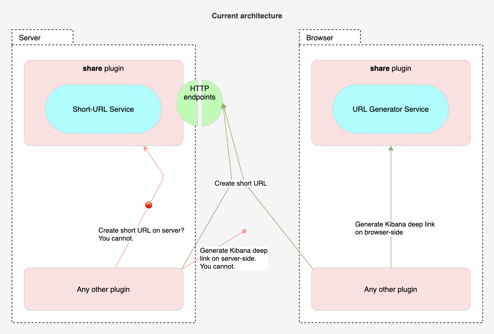
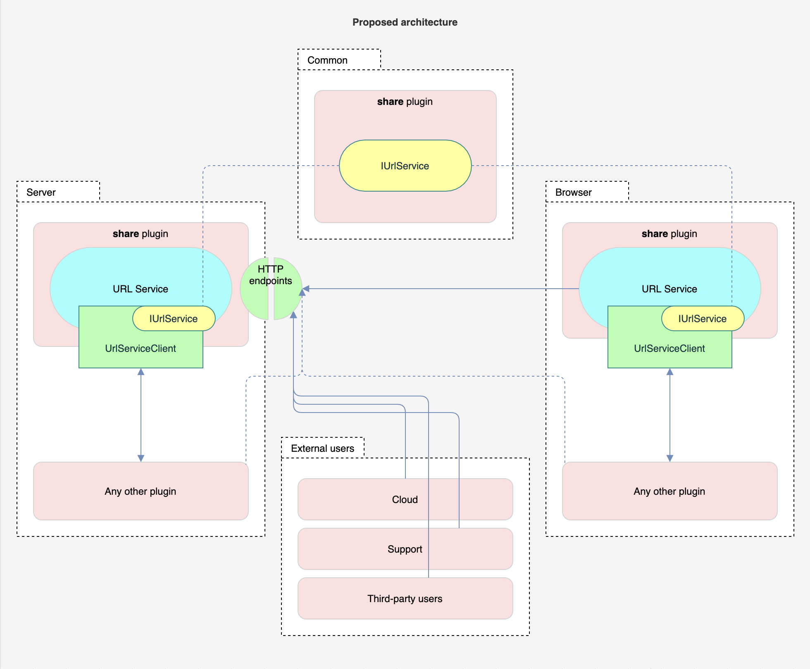

- Start Date: 2021-03-26
- RFC PR: (leave this empty)
- Kibana Issue: (leave this empty)


# Summary

Currently in Kibana `share` plugin we have two services that deal with URLs.

One is *Short URL Service*: given a long internal Kibana URL it returns an ID.
That ID can be used to "resolve" back to the long URL and redirect the user to
that long URL page. (The Short URL Service is now used in Dashboard, Discover,
Visualize apps, and have a few upcoming users, for example, when sharing panels
by Slack or e-mail we will want to use short URLs.)

```ts
// It does not have a plugin API, you can only use it through an HTTP request.
const shortUrl = await http.post('/api/shorten_url', {
  url: '/some/long/kibana/url/.../very?long=true#q=(rison:approved)'
});
```

The other is the *URL Generator Service*: it simply receives an object of
parameters and returns back a deep link within Kibana. (You can use it, for
example, to navigate to some specific query with specific filters for a
specific index pattern in the Discover app. As of this writing, there are
eight registered URL generators, which are used by ten plugins.)

```ts
// You first register a URL generator.
const myGenerator = share.registerUrlGenerator(/* ... */);

// You can fetch it from the registry (if you don't already have it).
const myGenerator = share.getUrlGenerator(/* ... */);

// Now you can use it to generate deep link into Kibana.
const deepLink: string = myGenerator.createUrl({ /* ... */ });
```

The proposal is to unify both of these services (Short URL Service and URL
Generator Service) into a single new *URL Service*. The new unified service
will still provide all the functionality the above mentioned services provide
and in addition will implement the following improvements:

1. It will provide all public APIs through plugin contracts and HTTP endpoints.
1. It will expose a consistent client interface, the same interface on the
   server-side as on the browser-side, so it is easier to write isomorphic
   plugins, which rely on URL services.
1. Improve the HTTP endpoints for use by external users, Cloud, and Support.
1. Expose a "redirect" endpoint, which given URL generator ID and parameters,
   redirects the user to a deep link inside Kibana.
1. Add ability to generate human-readable short URLs.
1. Add ability to delete short URLs.
1. Add ability to generate short URLs using URL generators.
1. Will not use MD5 hashing algorithm.


# Basic example

The URL Service will have a client (`UrlServiceClient`) which will have the same
interface, both, on the server-side and the client-side. It will also have a
documented public set of HTTP API endpoints for use by: (1) the client-side
client; (2) external users, Elastic Cloud, and Support.

The following code examples will work, both, on the server-side and the
client-side, as the base `UrlServiceClient` interface will be the same for both
environments.

In this example let's consider a case where Discover app registers a URL
generator, then another plugin uses that to create a short URL, and let's say
Elastic Cloud uses that URL generator to navigate deeply within the Discover
app.

First, the Discover app registers a URL generator (which it already does using
the old URL Generator Service, it will just use the new URL Service):

```ts
share.url.generators.create({
  id: 'DISCOVER_DEEP_LINKS',
  createUrl: ({indexPattern}) => `/app/discover/${indexPattern}`,
});
```

Now, let's consider some alert that sends an e-mail or a user from the UI wants
to generate a short URL for some deep link inside Discover, the developer would
be able to generate a short URL as follows:

```ts
share.url.shortUrls.create({
  slug: 'my-discover-query', // Human-readable URL slug.
  generator: 'DISCOVER_DEEP_LINKS',
  state: {
    indexPattern: 'xxxxxxxx-xxxx-xxxx-xxxx-xxxxxxxxxxxxx',
  },
});
```

Both of the code snippets above would look the same and work on the server and
browser, wherever the developer needs those.

Finally, the Elastic Cloud would be able to use the redirect endpoint to
navigate deeply within the Discover app. It could use the server-side HTTP
endpoint:

```
POST /api/share/url/_redirect/DISCOVER_DEEP_LINKS
{
  "state": {
    "indexPattern": "xxxxxxxx-xxxx-xxxx-xxxx-xxxxxxxxxxxxx"
  }
}
```

Or using the dedicated client-side "redirect" app:

```
GET /app/goto/_redirect/DISCOVER_DEEP_LINKS?state=(indexPattern: "xxxxxxxx-xxxx-xxxx-xxxx-xxxxxxxxxxxxx")
```


# Motivation

Our motivation to improve the URL services comes from us intending to use them
more, for example, for panel sharing to Slack or e-mail; and we believe that the
current state of the URL services needs an upgrade.


## Limitations of the Short URL Service

We have identified the following limitations in the current implementation of
the Short URL Service:

1. It exposes only HTTP endpoint API.
   1. __Will do:__ We will also expose a URL Service client through plugin
      contract on the server and browser.
1. It only has 3 HTTP endpoints, yet all three have different paths:
   (1) `/short_url`, (2) `/shorten_url`; and (3) `/goto`.
   1. __Will do:__ We will normalize the HTTP endpoints. We will use HTTP
      method "verbs" like POST, instead of verbs in the url like "shorten_url".
1. There is no migration system. If an application exposes this functionality,
   every possible URL that might be generated should be supported forever. A
   migration could be written inside the app itself, on page load, but this is a
   risky path for URLs with many possibilities.
   1. __Will do:__ Short URLs will be created using URL generators. We will use
      migrations provided by the URL generators to migrate the stored parameters
      in the short URL saved object.
1. There is not much documentation for developers.
   1. __Will do:__ The new service will have a much nicer API and docs.
1. There is no way to delete short URLs once they are created.
   1. __Will do:__ The new service will provide CRUD API to manage short URLs,
      including deletion.
1. Short URL service uses MD5 algorithm to hash long URLs. Security team
   requested to stop using that algorithm.
   1. __Will do:__ The new URL Service will not use MD5 algorithm.
1. Short URLs store only the URL of the destination page. However, the
   destination page might have other state which affects the display of the page
   but is not present in the URL. Once the short URL is used to navigate to that
   page, any state that is kept only in memory is lost.
   1. __Could do:__ We will not support storing additional, non-URL state in
      short URLs in the initial implementation. However, it will be possible to
      store addition non-URL state with each short URL. That state would be
      provided to a Kibana app once user first navigates to that app using a
      short URL. (This non-URL state might also need migration support.)
1. Short URLs are not automatically deleted when the target (say dashboard) is
   deleted. (#10450)
   1. __Could do:__ The URL Service will not provide such feature. Though the
      short URLs will keep track of saved object references used in the params
      to generate a short URL. Maybe those saved references could somehow be
      used in the future to provide such facility.
      
      Currently, there are two possible avenues for deleting a short URL when
      the underlying dashboard is deleted:

      1. The Dashboard app could keep track of short URLs it generates for each
         dashboard. Once a dashboard is deleted, the Dashboard app also
         deletes all short URLs associated with that dashboard.
      1. Saved Objects Service could implement *cascading deletes*. Once a saved
         object is deleted, the associated saved objects are also deleted
         (#71453).
1. Add additional metadata to each short URL.
   1. __Could do:__ Each short URL already keeps a counter of how often it was
      resolved, we could also keep track of a timestamp when it was last
      resolved, and have an ability for users to give a title to each short URL.
1. Short URLs don't have a management UI.
   1. __Will NOT do:__ We will not create a dedicated UI for managing short
      URLs. We could improve how short URLs saved objects are presented in saved
      object management UI.
1. Short URLs can't be created by read-only users (#18006).
   1. __Will NOT do:__ Currently short URLs are stored as saved objects of type
      `url`, we would like to keep it that way and benefit from saved object
      facilities like references, migrations, authorization etc.. The consensus
      is that we will not allow anonymous users to create short URLs. We want to
      continue using saved object for short URLs going forward and not
      compromise on their security model.


## Limitations of the URL Generator Service

We have identified the following limitations in the current implementation of
the URL Generator Service:

1. URL generators are available only on the client-side. There is no way to use
   them together with short URLs.
   1. __Will do:__ We will implement URL generators also on the server-side
      (they will be available in both environments) and we will combine them
      with the Short URL Service.
1. URL generators are not exposed externally, thus Cloud and Support cannot use
   them to generate deep links into Kibana.
   1. __Will do:__ We will expose HTTP endpoints on the server-side and the
      "redirect" app on the client-side which external users will be able to use
      to deep link into Kibana using URL generators.


## Limitations of the architecture

One major reason we want to "refresh" the Short URL Service and the URL
Generator Service is their architecture.

Currently, the Short URL Service is implemented on
top of `url` type saved object on the server-side. However, it only exposes the
HTTP endpoints, it does not expose any API on the server for the server-side
plugins to consume; on the client-side there is no plugin API either, developers
need to manually execute HTTP requests. 

The URL Generator Service is only available on the client-side, there is no way
to use it on the server-side, yet we already have use cases (for example ML
team) where a server-side plugin wants to use a URL generator.



The current architecture does not allow both service to be conveniently used,
also as they are implemented in different locations, they are disjointed&mdash;
we cannot create a short URL using an URL generator.


# Detailed design


## High level architecture

Below diagramed shows the proposed architecture of the URL Service.




## Plugin contracts

The is to provide developers the same experience on the server and browser.

Below are preliminary interfaces of the new URL Service. `IUrlService` will be
a shared interface defined in `/common` folder shared across server and browser.
This will allow us to provide users a common API interface on the server and
browser, wherever they choose to use the URL Service:

```ts
/**
 * Common URL Service client interface for the server-side and the client-side.
 */
interface IUrlService {
  generators: IUrlGeneratorClient;
  shortUrls: IShortUrlClient;
}
```

The URL generator client will be 

```ts
/**
 * URL generator registry.
 */
interface IUrlGeneratorClient {
  register<S>(urlGenerator: UrlGeneratorDefinition<S>): UrlGenerator;
  get<S>(id: string): UrlGenerator<S>;
}

interface UrlGeneratorDefinition<State> {
  id: string;
  createUrl: (state: State) => Promise<string>;
  isDeprecated?: boolean;
  migrate?: (state: State) => Promise<{ state: unknown; id: string }>;
}

interface UrlGenerator<State> {
  isDeprecated: boolean;
  createUrl(state: State): Promise<URL>;
  migrate(): Promise<never | { state: unknown; id: string }>;
}
```

asdf...

```ts
/**
 * CRUD-like API for short URLs.
 */
interface IShortUrlClient {
  /**
   * Create a new short URL from URL generator.
   *
   * @param urlGeneratorId ID of the URL generator.
   * @param state State object to provide to the URL generator.
   * @param slug Optionally, provide a custom slug (ID) of the short URL.
   */
  create(
    urlGeneratorId: string,
    state: unknown,
    slug?: string
  ): Promise<{ slug: string; url: URL }>;

  /**
   * Delete a short URL.
   * 
   * @param slug The slug (ID) of the short URL.
   * @return Returns true if deletion was successful.
   */
  delete(slug: string): Promise<boolean>;

  /**
   * Fetch short URL.
   * 
   * @param slug The slug (ID) of the short URL.
   */
  get(slug: string): Promise<{ slug: string; shortUrl: object; url: URL }>;

  /**
   * Same as `get()` but it also increments the "view" counter and the
   * "last view" timestamp of this short URL.
   * 
   * @param slug The slug (ID) of the short URL.
   */
  resolve(slug: string): Promise<{ slug: string; shortUrl: object; url: URL }>;
}
```

The above `IShortUrlClient` interface is a common interface which will be the
same on the server and browser. However, the server and browser might add extra
utility methods for convenience.


## HTTP endpoints


### Short URL CRUD+ HTTP endpoints

Below HTTP endpoints are designed to work specifically with short URLs:

| HTTP method           | Path                                | Description                                                                                                                              |
|-----------------------|-------------------------------------|------------------------------------------------------------------------------------------------------------------------------------------|
| __POST__              | `/api/short_url`                    | Endpoint for creating new short URLs.                                                                                                    |
| __GET__               | `/api/short_url/<slug>`             | Endpoint for retrieving information about an existing short URL.                                                                         |
| __DELETE__            | `/api/short_url/<slug>`             | Endpoint for deleting an existing short URL.                                                                                             |
| __POST__              | `/api/short_url/<slug>`             | Endpoint for updating information about an existing short URL.                                                                           |
| __GET__ or __POST__   | `/api/short_url/<slug>/_resolve`    | Same as `GET /api/short_url/<slug>`, but this endpoint also increments the short URL access count counter and the last access timestamp. |
| __GET__ or __POST__   | `/api/short_url/<slug>/_redirect`   | Redirects the user using HTTP 301 (permanent) redirect to the destination long URL.                                                      |


### Other URL Service HTTP endpoints

Below are all the other HTTP endpoints that URL Service will provide:

| HTTP method           | Path                                | Description                                                                                                                              |
|-----------------------|-------------------------------------|------------------------------------------------------------------------------------------------------------------------------------------|
| __POST__              | `/api/url/_redirect`                | Redirects the user using HTTP 302 (temporary) redirect. Receives URL generator ID and parameters in the POST body payload.               |
| __GET__ or __POST__   | `/go/<slug>`                        | A very short alias for `POST /api/share/url/<slug>/_redirect` endpoint.                                                                  |


#### The URL generator "redirect" endpoint


### Legacy endpoints

Below are the legacy HTTP endpoints implemented by the `share` plugin, with a plan
of action for each endpoint:

| HTTP method           | Path                                | Description                                                                                                                              |
|-----------------------|-------------------------------------|------------------------------------------------------------------------------------------------------------------------------------------|
| __ANY__               | `/goto/<slug>`                      | Legacy endpoint for redirecting short URLs. We will keep this endpoint, it will work the same as the `/go/<slug>` endpoint.              |
| __GET__               | `/api/short_url/<slug>`             | The new `GET /api/short_url/<slug>` endpoint will return a superset of the payload that the legacy endpoint now returns.                 |
| __POST__              | `/api/shorten_url`                  | The legacy endpoints for creating short URLs. We will remove it or deprecate this endpoint and maintain it until 8.0 major release.      |


--- HOW will URL generator state will be serialized to short URL?..??????

# Drawbacks

Why should we *not* do this?

- Implementation cost will be few weeks, but the code complexity and quality
  will improve.
- There is cost of migrating existing Kibana plugins to use the new API.


# Alternatives

We haven't considered other design alternatives.

The impact of not doing this change is essentially extending technical debt. 


# Adoption strategy

Is this a breaking change? It is a breaking change in the sense that the API
will change. However, all the existing use cases will be supported. When
implementing this we will also adjust all Kibana code to use the new API. From
the perspective of the developers when using the existing URL services nothing
will change, they will simply need to review a PR which stops using the URL
Generator Service and uses the combined URL Service instead, which will provide
a superset of features.

Alternatively, we can deprecate the URL Generator Service and maintain it for
few minor releases.


# How we teach this

For the existing short URL and URL generator functionality there is nothing to
teach, as they will continue working with a largely similar API.

Everything else in the new URL Service will have JSDoc comments and good
documentation on or website.
