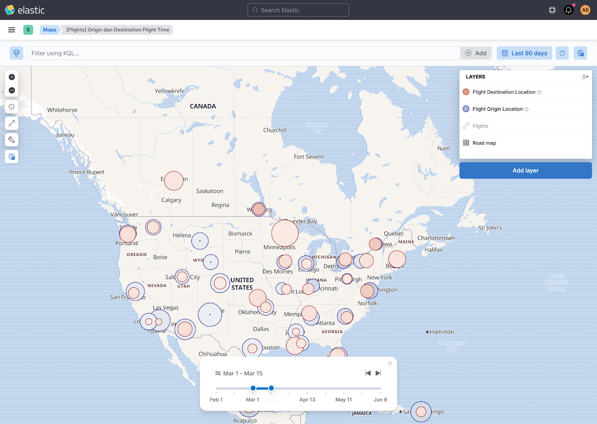
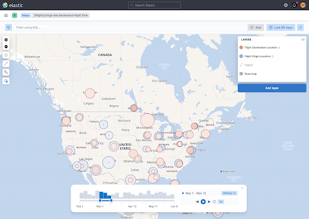
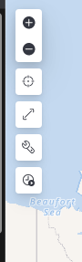

- Start Date: 2020-04-26
- RFC PR: (leave this empty)
- Kibana Issue: (leave this empty)

---
- [1. Summary](#1-summary)
- [2. Detailed design](#2-detailed-design)

# 1. Summary

A timeslider is a UX component that allows users to intuitively navigate through time-based data.

This RFC proposes adding a timeslider control to the Maps application. 

It proposes a two phased for roll-out in the Maps application. The detailed design proposal focuses on the first phase.

Since the a timeslider UX is relevant for other Kibana apps, the implementation should be portable. We propose to implement the control as a React-component 
without implicit dependencies on Kibana-state or Maps-state.

The RFC details the integration of this control in Maps. It includes specific consideration to how timeslider affects data-refresh in the context of Maps.

This RFC also outlines a possible integration  of this Timeslider-React component with an Embeddable, and the introduction of a new piece of embeddable-state `TimesSlice`.

This RFC does not address how this component should _behave_ in apps other than the Maps-app.

# 2. Detailed design

Below outlines:
- the two design phases intended for Kibana Maps
- outline of the Timeslider UX component implementation
- outline of the integration in Maps of the Timeslider UX component

## 2.1 Design phases overview


### 2.1.1 Time-range selection and stepped navigation

A first phase includes arbitrary time-range selection and stepped navigation.



This is the focus of this RFC

### 2.2.2 Data distribution preview with histogram and playback

A second phase adds a date histogram showing the preview of the data.



Details on this compinent are beyond the scope of this RFC.

## 2.2 The timeslider UX React-component (phase 1)

This focuses on Phase 1. Phase 2, with date histogram preview and auto-playback is out of scope for now.

### 2.2.1 Interface

The core timeslider-UX is a React-component.

The component has no implicit dependencies on any Kibana-state or Maps-store state. 

Its interface its fully defined by its `props`-contract.

```
export type Timeslice = {
  from: number; // epoch timestamp
  to: number;   // epoch timestamp
};

export interface TimeSliderProps {
  onTimesliceChanged: (timeslice: Timeslice) => void;
  timerange: Timerange; // TimeRange The start and end time of the entire time-range. TimeRange is defined in `data/common` 
  timeslice?: Timeslice; // The currently displayed timeslice. Needs to be set after onTimesliceChange to be reflected back in UX. If ommitted, the control selects the first timeslice.
}
```

`timeslice` is clamped to the bounds of `timeRange`.

Any change to `timeslice`, either by dragging the handles of the timeslider, or pressing the back or forward buttons, calls the `onTimesliceChanged` handler.

Since the initial use is inside Maps, the initial location of this React-component is inside the Maps plugin, `x-pack/plugins/maps/public/timeslider`.

Nonetheless, this UX-component should be easily "copy-pastable" to another location.

### 2.2.2 Internals

The timeslider automatically subdivides the timerange with equal breaks that are heuristically determined. 

It assigns about 6-10 breaks within a timerange, snaps the "ticks" to a natural "pretty data" using `calcAutoIntervalNear` from `data/common`. 

For example;
- a timerange of 8.5 days, it would assign a 8 day-steps, plus some padding on either end, depending on the entire `timeRange`.
- a timerange of 6.9 years would snap to year-long step, plus some padding on either end, depending on the entire `timerange`.

The slider itself is a `<EuiDualRange>`.

### 2.2.2 End-user behavior

- the user can manipulate the `timeslice`-double ranged slider to any arbitrary range within `timeRange`.
- the user can press the forward and back buttons for a stepped navigation. The range of the current time-slice is preserved when there is room for the timeslice within the range. 
     - when the user has not modified the with of the `timeslice`, it means stepping through the pre-determined ticks (e.g. by year, by day, ...)
     - when the user has already modified the width of the `timeslice`, it means stepping through the `timeRange`, with a stride of the `timeslice`.
- the `timeslice` "snaps" to the beginning or end (depending on direction)
    
## 2.3 Maps integration of the timeslider React component

This control will be integrated in the Maps-UX.

Maps is Redux-based, so `timeslice` selection and activation/de-activation all propagates to the Redux-store.

#### 2.3.1 Position in the UX

The timeslider control is enabled/disabled by the timeslider on/off toggle-button in the main toolbar.




#### 2.3.2 Layer interactions


Enabling the Timeslider will automatically retrigger refresh of _all_ time-based layers to the currently selected timeslice.

The Layer-TOC will indicate which layer is currently "time-filtered" by the Timeslider.

On a layer-per-layer basis, users will be able to explicitly opt-out if they should be governed by the timeslider or not. This is relevant for having users add contextual layers that should _not_ depend on the timeslice (e.g. the entire trajectory of a vehicle), with layers that _do_ have to be governed by the timeslider (e.g. the actual location of that vehicle along the track within that `timeslice`).


#### 2.3.3 Omitting timeslider on a dashboard

Maps will not display the timeslider-tool on Maps that are embedded in a Dashboard. 

We believe that a Timeslider-embeddable would be a better vehicle to 

#### 2.3.3 Data-fetch considerations

---
**NOTE**

The below is very Maps-specific, although similar challenges would be present in other applications as well. 

Some of these considerations will not generalize to all of Kibana.

The main ways that Maps distinguishes if from other use-cases:
 - the majority of the data-fetching for layers in Maps depends on the scale and extent. Ie. different data is requested based on the current zoom-level and current-extent of the Map, even if they share the same time, query and filter-state.
 - For some layer-types, Maps will fetch individual documents, rather than the result of an aggregation.

---

Data-fetch for timeslider should be responsive and smooth. A user dragging the slider should have an immediate visual result on the map.
 
In addition, we expect the timeslider will be used a lot for "comparisons", ie. a user stepping back&forth between timeslices.

For this reason, we want to flexibly:
- pre-fetch data when possible
- cache data when possible

Every layer will therefore implement time-based datasets based on _two_ pieces of state
- the entire `timeRange` (aka. the global Kibana timerange)
- the selected `timeslice` (aka. the timeslice chosen by the user in the timeslider)

##### 2.3.3.1 Pre-fetching individual documents for faster display

todo

##### 2.3.3.2 Caching of aggregated searches


We do not propose pre-fetching of aggregated data in this initial phase of the Maps timeslider effort. There is a couple reasons:
- Based on the intended user-interactions for timeslider, where the end-user can flexible select a time-range, it would be 
- Maps already strains the maximum bucket sizes.


##### 2.3.3.3 Decouple data-fetch from UX-effort

The implementation will decouple any data-fetch considerations from the actual timeslider-UX work.
 
The idea is that dial in data-fetch optimizations can be dialed into Maps in a parallel work-thread. These optimizations would not only affect timeslider users, but support all interaction patterns that require smooth data-updates (e.g. panning back&forth to two locations, toggling back&forth between two filters, ...)

The main effort to support efficient data-fetch in a maps-context is move use `.mvt` as the default data format. This is a stack-wide effort in collaboration with the Elasticsearch team, which will add `.mvt` as a core response format to Elasticsearch.

- More efficient pre-fetching of data. `.mvt` are a more efficient dfata
- Efficient client-side caching of 


##### 2.3.3.4 timeslider and async search

It is unclear on what the practical uses for async-search would be in the context of a timeslider-control in Maps. 

timeslider is a highly interactive control that require immediate visual feedback. We also do not intend to activate timeslider in Maps on a Dashboard (see above).

End-users who are interested in creating a dashboard with a long-running background search will need to manipulate the _global Kibana time picker_ to select the time-range, and will not be able to use the timeslider to do so.


# Unresolved questions

## Expanding Timeslider into a Kibana Embeddable

This below is a forward looking section. It's a proposal of how the Timeslider-UX can be exposed as an Embeddable.

The main 
- a
- specifically, the 

It requires the new
`TimeSlice`


