# Kibana plugin dependency diagrams

## actions

## advancedSettings

## aiops

## alerting

## apm

## assetManager

## banners

## bfetch

## canvas

## cases

## charts

## cloud

## cloudChat

## cloudDataMigration

## cloudDefend

## cloudExperiments

## cloudFullStory

## cloudGainsight

## cloudLinks

## cloudSecurityPosture

## console

## contentManagement

## controls

## crossClusterReplication

## customBranding

## customIntegrations

## dashboard

## dashboardEnhanced

## data

## dataViewEditor

## dataViewFieldEditor

## dataViewManagement

## dataViews

## dataVisualizer

## devTools

## discover

## discoverEnhanced

## ecsDataQualityDashboard

## embeddable

## embeddableEnhanced

## encryptedSavedObjects

## enterpriseSearch

## esUiShared

## eventAnnotation

## eventLog

## exploratoryView

## expressionError

## expressionGauge

## expressionHeatmap

## expressionImage

## expressionLegacyMetricVis

## expressionMetric

## expressionMetricVis

## expressionPartitionVis

## expressionRepeatImage

## expressionRevealImage

## expressionShape

## expressionTagcloud

## expressionXY

## expressions

## features

## fieldFormats

## fileUpload

## files

## filesManagement

## fleet

## ftrApis

## globalSearch

## globalSearchBar

## globalSearchProviders

## graph

## grokdebugger

## guidedOnboarding

## home

## imageEmbeddable

## indexLifecycleManagement

## indexManagement

## infra

## ingestPipelines

## inputControlVis

## inspector

## interactiveSetup

## kibanaOverview

## kibanaReact

## kibanaUsageCollection

## kibanaUtils

## kubernetesSecurity

## lens

## licenseApiGuard

## licenseManagement

## licensing

## lists

## logstash

## management

## maps

## mapsEms

## ml

## monitoring

## monitoringCollection

## navigation

## newsfeed

## notifications

## observability

## observabilityOnboarding

## observabilityShared

## osquery

## painlessLab

## presentationUtil

## profiling

## remoteClusters

## reporting

## rollup

## ruleRegistry

## runtimeFields

## savedObjects

## savedObjectsFinder

## savedObjectsManagement

## savedObjectsTagging

## savedObjectsTaggingOss

## savedSearch

## screenshotMode

## screenshotting

## searchprofiler

## security

## securitySolution

## serverless

## serverlessObservability

## serverlessSearch

## serverlessSecurity

## sessionView

## share

## snapshotRestore

## spaces

## stackAlerts

## stackConnectors

## synthetics

## taskManager

## telemetry

## telemetryCollectionManager

## telemetryCollectionXpack

## telemetryManagementSection

## threatIntelligence

## timelines

## transform

## translations

## triggersActionsUi

## uiActions

## uiActionsEnhanced

## unifiedFieldList

## unifiedHistogram

## unifiedSearch

## upgradeAssistant

## urlDrilldown

## urlForwarding

## usageCollection

## ux

## visDefaultEditor

## visTypeGauge

## visTypeHeatmap

## visTypeMarkdown

## visTypeMetric

## visTypePie

## visTypeTable

## visTypeTagcloud

## visTypeTimelion

## visTypeTimeseries

## visTypeVega

## visTypeVislib

## visTypeXy

## visualizationUiComponents

## visualizations

## watcher

