# Kibana plugin dependency diagrams


## actions

```mermaid
stateDiagram
direction TB
accTitle: actions dependencies
accDescr: red: this plugin; blue: required by this plugin; green: requires this plugin
classDef requires   fill:#ccf,stroke:#333,stroke-width:2px;
classDef requiredBy fill:#cfc,stroke:#333,stroke-width:2px;
classDef focus      fill:#fcc,stroke:#333,stroke-width:2px;
  actions:::focus --> encryptedSavedObjects:::requires
  actions:::focus --> eventLog:::requires
  actions:::focus --> features:::requires
  actions:::focus --> licensing:::requires
  actions:::focus --> monitoringCollection:::requires
  actions:::focus --> security:::requires
  actions:::focus --> spaces:::requires
  actions:::focus --> taskManager:::requires
  actions:::focus --> usageCollection:::requires
  advancedSettings:::requires --> home:::requires
  advancedSettings:::requires --> management:::requires
  advancedSettings:::requires --> usageCollection:::requires
  alerting:::requiredBy --> actions:::focus
  apm:::requiredBy --> actions:::focus
  apm:::requiredBy --> alerting:::requiredBy
  apm:::requiredBy --> cases:::requiredBy
  apm:::requiredBy --> exploratoryView:::requiredBy
  apm:::requiredBy --> fleet:::requiredBy
  apm:::requiredBy --> infra:::requiredBy
  apm:::requiredBy --> ml:::requiredBy
  apm:::requiredBy --> observability:::requiredBy
  apm:::requiredBy --> observabilityShared:::requiredBy
  apm:::requiredBy --> ruleRegistry:::requiredBy
  apm:::requiredBy --> triggersActionsUi:::requiredBy
  canvas:::requiredBy --> reporting:::requiredBy
  cases:::requiredBy --> actions:::focus
  cases:::requiredBy --> notifications:::requiredBy
  cases:::requiredBy --> ruleRegistry:::requiredBy
  cases:::requiredBy --> triggersActionsUi:::requiredBy
  cloud:::requires --> usageCollection:::requires
  cloudDefend:::requiredBy --> fleet:::requiredBy
  cloudSecurityPosture:::requiredBy --> discover:::requiredBy
  cloudSecurityPosture:::requiredBy --> fleet:::requiredBy
  crossClusterReplication:::requiredBy --> indexManagement:::requiredBy
  crossClusterReplication:::requiredBy --> remoteClusters:::requiredBy
  dataViews:::requires --> expressions:::requires
  dataViews:::requires --> fieldFormats:::requires
  dataViews:::requires --> usageCollection:::requires
  dataVisualizer:::requiredBy --> discover:::requiredBy
  discover:::requiredBy --> triggersActionsUi:::requiredBy
  discoverEnhanced:::requiredBy --> discover:::requiredBy
  encryptedSavedObjects:::requires --> security:::requires
  enterpriseSearch:::requiredBy --> discover:::requiredBy
  enterpriseSearch:::requiredBy --> infra:::requiredBy
  enterpriseSearch:::requiredBy --> ml:::requiredBy
  eventLog:::requires --> spaces:::requires
  exploratoryView:::requiredBy --> alerting:::requiredBy
  exploratoryView:::requiredBy --> cases:::requiredBy
  exploratoryView:::requiredBy --> discover:::requiredBy
  exploratoryView:::requiredBy --> observabilityShared:::requiredBy
  exploratoryView:::requiredBy --> triggersActionsUi:::requiredBy
  features:::requires --> licensing:::requires
  fleet:::requiredBy --> discover:::requiredBy
  guidedOnboarding:::requires --> cloud:::requires
  guidedOnboarding:::requires --> features:::requires
  home:::requires --> cloud:::requires
  home:::requires --> customIntegrations:::requires
  home:::requires --> dataViews:::requires
  home:::requires --> guidedOnboarding:::requires
  home:::requires --> share:::requires
  home:::requires --> urlForwarding:::requires
  home:::requires --> usageCollection:::requires
  indexLifecycleManagement:::requiredBy --> indexManagement:::requiredBy
  indexManagement:::requiredBy --> fleet:::requiredBy
  infra:::requiredBy --> alerting:::requiredBy
  infra:::requiredBy --> cases:::requiredBy
  infra:::requiredBy --> discover:::requiredBy
  infra:::requiredBy --> ml:::requiredBy
  infra:::requiredBy --> observability:::requiredBy
  infra:::requiredBy --> observabilityShared:::requiredBy
  infra:::requiredBy --> osquery:::requiredBy
  infra:::requiredBy --> ruleRegistry:::requiredBy
  infra:::requiredBy --> triggersActionsUi:::requiredBy
  kubernetesSecurity:::requiredBy --> ruleRegistry:::requiredBy
  kubernetesSecurity:::requiredBy --> sessionView:::requiredBy
  kubernetesSecurity:::requiredBy --> timelines:::requiredBy
  logstash:::requiredBy --> monitoring:::requiredBy
  management:::requires --> home:::requires
  management:::requires --> share:::requires
  ml:::requiredBy --> alerting:::requiredBy
  ml:::requiredBy --> cases:::requiredBy
  ml:::requiredBy --> dataVisualizer:::requiredBy
  ml:::requiredBy --> discover:::requiredBy
  ml:::requiredBy --> triggersActionsUi:::requiredBy
  monitoring:::requiredBy --> actions:::focus
  monitoring:::requiredBy --> alerting:::requiredBy
  monitoring:::requiredBy --> fleet:::requiredBy
  monitoring:::requiredBy --> infra:::requiredBy
  monitoring:::requiredBy --> observability:::requiredBy
  monitoring:::requiredBy --> triggersActionsUi:::requiredBy
  notifications:::requiredBy --> actions:::focus
  observability:::requiredBy --> alerting:::requiredBy
  observability:::requiredBy --> cases:::requiredBy
  observability:::requiredBy --> discover:::requiredBy
  observability:::requiredBy --> exploratoryView:::requiredBy
  observability:::requiredBy --> observabilityShared:::requiredBy
  observability:::requiredBy --> ruleRegistry:::requiredBy
  observability:::requiredBy --> triggersActionsUi:::requiredBy
  observabilityOnboarding:::requiredBy --> observability:::requiredBy
  observabilityShared:::requiredBy --> cases:::requiredBy
  osquery:::requiredBy --> actions:::focus
  osquery:::requiredBy --> cases:::requiredBy
  osquery:::requiredBy --> discover:::requiredBy
  osquery:::requiredBy --> fleet:::requiredBy
  osquery:::requiredBy --> ruleRegistry:::requiredBy
  osquery:::requiredBy --> triggersActionsUi:::requiredBy
  profiling:::requiredBy --> fleet:::requiredBy
  profiling:::requiredBy --> observability:::requiredBy
  profiling:::requiredBy --> observabilityShared:::requiredBy
  remoteClusters:::requiredBy --> indexManagement:::requiredBy
  reporting:::requiredBy --> discover:::requiredBy
  rollup:::requiredBy --> indexManagement:::requiredBy
  ruleRegistry:::requiredBy --> alerting:::requiredBy
  ruleRegistry:::requiredBy --> triggersActionsUi:::requiredBy
  security:::requires --> cloud:::requires
  security:::requires --> dataViews:::requires
  security:::requires --> features:::requires
  security:::requires --> home:::requires
  security:::requires --> licensing:::requires
  security:::requires --> management:::requires
  security:::requires --> share:::requires
  security:::requires --> spaces:::requires
  security:::requires --> taskManager:::requires
  security:::requires --> usageCollection:::requires
  securitySolution:::requiredBy --> actions:::focus
  securitySolution:::requiredBy --> alerting:::requiredBy
  securitySolution:::requiredBy --> cases:::requiredBy
  securitySolution:::requiredBy --> cloudDefend:::requiredBy
  securitySolution:::requiredBy --> cloudSecurityPosture:::requiredBy
  securitySolution:::requiredBy --> fleet:::requiredBy
  securitySolution:::requiredBy --> kubernetesSecurity:::requiredBy
  securitySolution:::requiredBy --> ml:::requiredBy
  securitySolution:::requiredBy --> osquery:::requiredBy
  securitySolution:::requiredBy --> ruleRegistry:::requiredBy
  securitySolution:::requiredBy --> sessionView:::requiredBy
  securitySolution:::requiredBy --> threatIntelligence:::requiredBy
  securitySolution:::requiredBy --> timelines:::requiredBy
  securitySolution:::requiredBy --> triggersActionsUi:::requiredBy
  serverlessObservability:::requiredBy --> observabilityShared:::requiredBy
  serverlessSearch:::requiredBy --> enterpriseSearch:::requiredBy
  serverlessSecurity:::requiredBy --> securitySolution:::requiredBy
  sessionView:::requiredBy --> ruleRegistry:::requiredBy
  sessionView:::requiredBy --> timelines:::requiredBy
  spaces:::requires --> advancedSettings:::requires
  spaces:::requires --> features:::requires
  spaces:::requires --> home:::requires
  spaces:::requires --> licensing:::requires
  spaces:::requires --> management:::requires
  spaces:::requires --> usageCollection:::requires
  stackAlerts:::requiredBy --> alerting:::requiredBy
  stackAlerts:::requiredBy --> triggersActionsUi:::requiredBy
  stackConnectors:::requiredBy --> actions:::focus
  stackConnectors:::requiredBy --> triggersActionsUi:::requiredBy
  synthetics:::requiredBy --> actions:::focus
  synthetics:::requiredBy --> alerting:::requiredBy
  synthetics:::requiredBy --> cases:::requiredBy
  synthetics:::requiredBy --> discover:::requiredBy
  synthetics:::requiredBy --> exploratoryView:::requiredBy
  synthetics:::requiredBy --> fleet:::requiredBy
  synthetics:::requiredBy --> ml:::requiredBy
  synthetics:::requiredBy --> observability:::requiredBy
  synthetics:::requiredBy --> observabilityShared:::requiredBy
  synthetics:::requiredBy --> ruleRegistry:::requiredBy
  synthetics:::requiredBy --> triggersActionsUi:::requiredBy
  taskManager:::requires --> usageCollection:::requires
  threatIntelligence:::requiredBy --> cases:::requiredBy
  threatIntelligence:::requiredBy --> triggersActionsUi:::requiredBy
  timelines:::requiredBy --> alerting:::requiredBy
  timelines:::requiredBy --> cases:::requiredBy
  transform:::requiredBy --> alerting:::requiredBy
  transform:::requiredBy --> triggersActionsUi:::requiredBy
  triggersActionsUi:::requiredBy --> actions:::focus
  triggersActionsUi:::requiredBy --> alerting:::requiredBy
  upgradeAssistant:::requiredBy --> infra:::requiredBy
  ux:::requiredBy --> actions:::focus
  ux:::requiredBy --> apm:::requiredBy
  ux:::requiredBy --> exploratoryView:::requiredBy
  ux:::requiredBy --> infra:::requiredBy
  ux:::requiredBy --> observability:::requiredBy
  ux:::requiredBy --> observabilityShared:::requiredBy
  ux:::requiredBy --> triggersActionsUi:::requiredBy
```


## advancedSettings

```mermaid
stateDiagram
direction TB
accTitle: advancedSettings dependencies
accDescr: red: this plugin; blue: required by this plugin; green: requires this plugin
classDef requires   fill:#ccf,stroke:#333,stroke-width:2px;
classDef requiredBy fill:#cfc,stroke:#333,stroke-width:2px;
classDef focus      fill:#fcc,stroke:#333,stroke-width:2px;
  actions:::requiredBy --> encryptedSavedObjects:::requiredBy
  actions:::requiredBy --> eventLog:::requiredBy
  actions:::requiredBy --> security:::requiredBy
  actions:::requiredBy --> spaces:::requiredBy
  advancedSettings:::focus --> home:::requires
  advancedSettings:::focus --> management:::requires
  advancedSettings:::focus --> usageCollection:::requires
  aiops:::requiredBy --> data:::requiredBy
  aiops:::requiredBy --> lens:::requiredBy
  aiops:::requiredBy --> unifiedFieldList:::requiredBy
  alerting:::requiredBy --> actions:::requiredBy
  alerting:::requiredBy --> data:::requiredBy
  alerting:::requiredBy --> encryptedSavedObjects:::requiredBy
  alerting:::requiredBy --> eventLog:::requiredBy
  alerting:::requiredBy --> security:::requiredBy
  alerting:::requiredBy --> spaces:::requiredBy
  apm:::requiredBy --> actions:::requiredBy
  apm:::requiredBy --> advancedSettings:::focus
  apm:::requiredBy --> alerting:::requiredBy
  apm:::requiredBy --> cases:::requiredBy
  apm:::requiredBy --> data:::requiredBy
  apm:::requiredBy --> embeddable:::requiredBy
  apm:::requiredBy --> exploratoryView:::requiredBy
  apm:::requiredBy --> fleet:::requiredBy
  apm:::requiredBy --> infra:::requiredBy
  apm:::requiredBy --> lens:::requiredBy
  apm:::requiredBy --> maps:::requiredBy
  apm:::requiredBy --> ml:::requiredBy
  apm:::requiredBy --> observability:::requiredBy
  apm:::requiredBy --> observabilityShared:::requiredBy
  apm:::requiredBy --> ruleRegistry:::requiredBy
  apm:::requiredBy --> security:::requiredBy
  apm:::requiredBy --> spaces:::requiredBy
  apm:::requiredBy --> triggersActionsUi:::requiredBy
  apm:::requiredBy --> unifiedFieldList:::requiredBy
  apm:::requiredBy --> unifiedSearch:::requiredBy
  canvas:::requiredBy --> data:::requiredBy
  canvas:::requiredBy --> embeddable:::requiredBy
  canvas:::requiredBy --> expressionError:::requiredBy
  canvas:::requiredBy --> expressionImage:::requiredBy
  canvas:::requiredBy --> expressionMetric:::requiredBy
  canvas:::requiredBy --> expressionRepeatImage:::requiredBy
  canvas:::requiredBy --> expressionRevealImage:::requiredBy
  canvas:::requiredBy --> expressionShape:::requiredBy
  canvas:::requiredBy --> presentationUtil:::requiredBy
  canvas:::requiredBy --> reporting:::requiredBy
  canvas:::requiredBy --> savedObjects:::requiredBy
  canvas:::requiredBy --> savedObjectsManagement:::requiredBy
  canvas:::requiredBy --> spaces:::requiredBy
  canvas:::requiredBy --> visualizations:::requiredBy
  cases:::requiredBy --> actions:::requiredBy
  cases:::requiredBy --> data:::requiredBy
  cases:::requiredBy --> embeddable:::requiredBy
  cases:::requiredBy --> files:::requiredBy
  cases:::requiredBy --> lens:::requiredBy
  cases:::requiredBy --> notifications:::requiredBy
  cases:::requiredBy --> ruleRegistry:::requiredBy
  cases:::requiredBy --> savedObjectsManagement:::requiredBy
  cases:::requiredBy --> security:::requiredBy
  cases:::requiredBy --> spaces:::requiredBy
  cases:::requiredBy --> triggersActionsUi:::requiredBy
  cloud:::requires --> usageCollection:::requires
  cloudChat:::requiredBy --> security:::requiredBy
  cloudDefend:::requiredBy --> data:::requiredBy
  cloudDefend:::requiredBy --> fleet:::requiredBy
  cloudDefend:::requiredBy --> navigation:::requiredBy
  cloudDefend:::requiredBy --> security:::requiredBy
  cloudDefend:::requiredBy --> unifiedSearch:::requiredBy
  cloudFullStory:::requiredBy --> security:::requiredBy
  cloudLinks:::requiredBy --> security:::requiredBy
  cloudSecurityPosture:::requiredBy --> data:::requiredBy
  cloudSecurityPosture:::requiredBy --> discover:::requiredBy
  cloudSecurityPosture:::requiredBy --> fleet:::requiredBy
  cloudSecurityPosture:::requiredBy --> navigation:::requiredBy
  cloudSecurityPosture:::requiredBy --> security:::requiredBy
  cloudSecurityPosture:::requiredBy --> unifiedSearch:::requiredBy
  controls:::requiredBy --> data:::requiredBy
  controls:::requiredBy --> embeddable:::requiredBy
  controls:::requiredBy --> presentationUtil:::requiredBy
  controls:::requiredBy --> savedObjects:::requiredBy
  controls:::requiredBy --> unifiedSearch:::requiredBy
  crossClusterReplication:::requiredBy --> indexManagement:::requiredBy
  crossClusterReplication:::requiredBy --> remoteClusters:::requiredBy
  dashboard:::requiredBy --> controls:::requiredBy
  dashboard:::requiredBy --> data:::requiredBy
  dashboard:::requiredBy --> dataViewEditor:::requiredBy
  dashboard:::requiredBy --> embeddable:::requiredBy
  dashboard:::requiredBy --> navigation:::requiredBy
  dashboard:::requiredBy --> presentationUtil:::requiredBy
  dashboard:::requiredBy --> savedObjects:::requiredBy
  dashboard:::requiredBy --> savedObjectsManagement:::requiredBy
  dashboard:::requiredBy --> savedObjectsTaggingOss:::requiredBy
  dashboard:::requiredBy --> spaces:::requiredBy
  dashboard:::requiredBy --> unifiedSearch:::requiredBy
  dashboard:::requiredBy --> visualizations:::requiredBy
  dashboardEnhanced:::requiredBy --> dashboard:::requiredBy
  dashboardEnhanced:::requiredBy --> data:::requiredBy
  dashboardEnhanced:::requiredBy --> embeddable:::requiredBy
  dashboardEnhanced:::requiredBy --> uiActionsEnhanced:::requiredBy
  dashboardEnhanced:::requiredBy --> unifiedSearch:::requiredBy
  data:::requiredBy --> security:::requiredBy
  dataViewEditor:::requiredBy --> data:::requiredBy
  dataViewFieldEditor:::requiredBy --> data:::requiredBy
  dataViewManagement:::requiredBy --> data:::requiredBy
  dataViewManagement:::requiredBy --> dataViewEditor:::requiredBy
  dataViewManagement:::requiredBy --> dataViewFieldEditor:::requiredBy
  dataViewManagement:::requiredBy --> savedObjectsManagement:::requiredBy
  dataViewManagement:::requiredBy --> spaces:::requiredBy
  dataViewManagement:::requiredBy --> unifiedSearch:::requiredBy
  dataViews:::requires --> expressions:::requires
  dataViews:::requires --> fieldFormats:::requires
  dataViews:::requires --> usageCollection:::requires
  dataVisualizer:::requiredBy --> data:::requiredBy
  dataVisualizer:::requiredBy --> dataViewFieldEditor:::requiredBy
  dataVisualizer:::requiredBy --> discover:::requiredBy
  dataVisualizer:::requiredBy --> embeddable:::requiredBy
  dataVisualizer:::requiredBy --> fileUpload:::requiredBy
  dataVisualizer:::requiredBy --> lens:::requiredBy
  dataVisualizer:::requiredBy --> maps:::requiredBy
  dataVisualizer:::requiredBy --> security:::requiredBy
  dataVisualizer:::requiredBy --> unifiedSearch:::requiredBy
  discover:::requiredBy --> data:::requiredBy
  discover:::requiredBy --> dataViewEditor:::requiredBy
  discover:::requiredBy --> dataViewFieldEditor:::requiredBy
  discover:::requiredBy --> embeddable:::requiredBy
  discover:::requiredBy --> lens:::requiredBy
  discover:::requiredBy --> navigation:::requiredBy
  discover:::requiredBy --> savedObjects:::requiredBy
  discover:::requiredBy --> savedObjectsManagement:::requiredBy
  discover:::requiredBy --> savedObjectsTaggingOss:::requiredBy
  discover:::requiredBy --> spaces:::requiredBy
  discover:::requiredBy --> triggersActionsUi:::requiredBy
  discover:::requiredBy --> unifiedFieldList:::requiredBy
  discover:::requiredBy --> unifiedSearch:::requiredBy
  discoverEnhanced:::requiredBy --> discover:::requiredBy
  discoverEnhanced:::requiredBy --> embeddable:::requiredBy
  ecsDataQualityDashboard:::requiredBy --> data:::requiredBy
  embeddable:::requiredBy --> data:::requiredBy
  embeddable:::requiredBy --> savedObjectsManagement:::requiredBy
  embeddable:::requiredBy --> savedObjectsTaggingOss:::requiredBy
  embeddableEnhanced:::requiredBy --> embeddable:::requiredBy
  embeddableEnhanced:::requiredBy --> uiActionsEnhanced:::requiredBy
  encryptedSavedObjects:::requiredBy --> security:::requiredBy
  enterpriseSearch:::requiredBy --> data:::requiredBy
  enterpriseSearch:::requiredBy --> discover:::requiredBy
  enterpriseSearch:::requiredBy --> embeddable:::requiredBy
  enterpriseSearch:::requiredBy --> infra:::requiredBy
  enterpriseSearch:::requiredBy --> lens:::requiredBy
  enterpriseSearch:::requiredBy --> ml:::requiredBy
  enterpriseSearch:::requiredBy --> security:::requiredBy
  enterpriseSearch:::requiredBy --> spaces:::requiredBy
  eventAnnotation:::requiredBy --> data:::requiredBy
  eventLog:::requiredBy --> spaces:::requiredBy
  exploratoryView:::requiredBy --> alerting:::requiredBy
  exploratoryView:::requiredBy --> cases:::requiredBy
  exploratoryView:::requiredBy --> data:::requiredBy
  exploratoryView:::requiredBy --> discover:::requiredBy
  exploratoryView:::requiredBy --> embeddable:::requiredBy
  exploratoryView:::requiredBy --> files:::requiredBy
  exploratoryView:::requiredBy --> lens:::requiredBy
  exploratoryView:::requiredBy --> observabilityShared:::requiredBy
  exploratoryView:::requiredBy --> security:::requiredBy
  exploratoryView:::requiredBy --> spaces:::requiredBy
  exploratoryView:::requiredBy --> triggersActionsUi:::requiredBy
  exploratoryView:::requiredBy --> unifiedSearch:::requiredBy
  expressionError:::requiredBy --> presentationUtil:::requiredBy
  expressionGauge:::requiredBy --> data:::requiredBy
  expressionGauge:::requiredBy --> presentationUtil:::requiredBy
  expressionGauge:::requiredBy --> visualizations:::requiredBy
  expressionHeatmap:::requiredBy --> data:::requiredBy
  expressionHeatmap:::requiredBy --> presentationUtil:::requiredBy
  expressionHeatmap:::requiredBy --> visualizations:::requiredBy
  expressionImage:::requiredBy --> presentationUtil:::requiredBy
  expressionLegacyMetricVis:::requiredBy --> presentationUtil:::requiredBy
  expressionLegacyMetricVis:::requiredBy --> visualizations:::requiredBy
  expressionMetric:::requiredBy --> presentationUtil:::requiredBy
  expressionMetricVis:::requiredBy --> presentationUtil:::requiredBy
  expressionMetricVis:::requiredBy --> visualizations:::requiredBy
  expressionPartitionVis:::requiredBy --> data:::requiredBy
  expressionPartitionVis:::requiredBy --> presentationUtil:::requiredBy
  expressionPartitionVis:::requiredBy --> visualizations:::requiredBy
  expressionRepeatImage:::requiredBy --> presentationUtil:::requiredBy
  expressionRevealImage:::requiredBy --> presentationUtil:::requiredBy
  expressionShape:::requiredBy --> presentationUtil:::requiredBy
  expressionTagcloud:::requiredBy --> presentationUtil:::requiredBy
  expressionTagcloud:::requiredBy --> visualizations:::requiredBy
  expressionXY:::requiredBy --> data:::requiredBy
  expressionXY:::requiredBy --> eventAnnotation:::requiredBy
  expressionXY:::requiredBy --> visualizations:::requiredBy
  features:::requires --> licensing:::requires
  fileUpload:::requiredBy --> data:::requiredBy
  fileUpload:::requiredBy --> security:::requiredBy
  files:::requiredBy --> security:::requiredBy
  filesManagement:::requiredBy --> files:::requiredBy
  fleet:::requiredBy --> data:::requiredBy
  fleet:::requiredBy --> discover:::requiredBy
  fleet:::requiredBy --> encryptedSavedObjects:::requiredBy
  fleet:::requiredBy --> files:::requiredBy
  fleet:::requiredBy --> ingestPipelines:::requiredBy
  fleet:::requiredBy --> navigation:::requiredBy
  fleet:::requiredBy --> savedObjectsTagging:::requiredBy
  fleet:::requiredBy --> security:::requiredBy
  fleet:::requiredBy --> spaces:::requiredBy
  fleet:::requiredBy --> telemetry:::requiredBy
  fleet:::requiredBy --> unifiedSearch:::requiredBy
  globalSearchBar:::requiredBy --> savedObjectsTagging:::requiredBy
  graph:::requiredBy --> data:::requiredBy
  graph:::requiredBy --> navigation:::requiredBy
  graph:::requiredBy --> savedObjects:::requiredBy
  graph:::requiredBy --> savedObjectsManagement:::requiredBy
  graph:::requiredBy --> spaces:::requiredBy
  graph:::requiredBy --> unifiedSearch:::requiredBy
  guidedOnboarding:::requires --> cloud:::requires
  guidedOnboarding:::requires --> features:::requires
  home:::requires --> cloud:::requires
  home:::requires --> customIntegrations:::requires
  home:::requires --> dataViews:::requires
  home:::requires --> guidedOnboarding:::requires
  home:::requires --> share:::requires
  home:::requires --> urlForwarding:::requires
  home:::requires --> usageCollection:::requires
  imageEmbeddable:::requiredBy --> embeddable:::requiredBy
  imageEmbeddable:::requiredBy --> files:::requiredBy
  imageEmbeddable:::requiredBy --> security:::requiredBy
  indexLifecycleManagement:::requiredBy --> indexManagement:::requiredBy
  indexManagement:::requiredBy --> fleet:::requiredBy
  indexManagement:::requiredBy --> security:::requiredBy
  infra:::requiredBy --> alerting:::requiredBy
  infra:::requiredBy --> cases:::requiredBy
  infra:::requiredBy --> data:::requiredBy
  infra:::requiredBy --> discover:::requiredBy
  infra:::requiredBy --> embeddable:::requiredBy
  infra:::requiredBy --> lens:::requiredBy
  infra:::requiredBy --> ml:::requiredBy
  infra:::requiredBy --> observability:::requiredBy
  infra:::requiredBy --> observabilityShared:::requiredBy
  infra:::requiredBy --> osquery:::requiredBy
  infra:::requiredBy --> ruleRegistry:::requiredBy
  infra:::requiredBy --> security:::requiredBy
  infra:::requiredBy --> spaces:::requiredBy
  infra:::requiredBy --> triggersActionsUi:::requiredBy
  infra:::requiredBy --> unifiedSearch:::requiredBy
  infra:::requiredBy --> visTypeTimeseries:::requiredBy
  ingestPipelines:::requiredBy --> fileUpload:::requiredBy
  ingestPipelines:::requiredBy --> security:::requiredBy
  inputControlVis:::requiredBy --> data:::requiredBy
  inputControlVis:::requiredBy --> unifiedSearch:::requiredBy
  inputControlVis:::requiredBy --> visDefaultEditor:::requiredBy
  inputControlVis:::requiredBy --> visualizations:::requiredBy
  kibanaOverview:::requiredBy --> dataViewEditor:::requiredBy
  kibanaOverview:::requiredBy --> navigation:::requiredBy
  kubernetesSecurity:::requiredBy --> data:::requiredBy
  kubernetesSecurity:::requiredBy --> ruleRegistry:::requiredBy
  kubernetesSecurity:::requiredBy --> sessionView:::requiredBy
  kubernetesSecurity:::requiredBy --> timelines:::requiredBy
  lens:::requiredBy --> dashboard:::requiredBy
  lens:::requiredBy --> data:::requiredBy
  lens:::requiredBy --> dataViewEditor:::requiredBy
  lens:::requiredBy --> dataViewFieldEditor:::requiredBy
  lens:::requiredBy --> embeddable:::requiredBy
  lens:::requiredBy --> eventAnnotation:::requiredBy
  lens:::requiredBy --> expressionGauge:::requiredBy
  lens:::requiredBy --> expressionHeatmap:::requiredBy
  lens:::requiredBy --> expressionLegacyMetricVis:::requiredBy
  lens:::requiredBy --> expressionMetricVis:::requiredBy
  lens:::requiredBy --> expressionPartitionVis:::requiredBy
  lens:::requiredBy --> expressionXY:::requiredBy
  lens:::requiredBy --> navigation:::requiredBy
  lens:::requiredBy --> presentationUtil:::requiredBy
  lens:::requiredBy --> savedObjectsTagging:::requiredBy
  lens:::requiredBy --> spaces:::requiredBy
  lens:::requiredBy --> uiActionsEnhanced:::requiredBy
  lens:::requiredBy --> unifiedFieldList:::requiredBy
  lens:::requiredBy --> unifiedSearch:::requiredBy
  lens:::requiredBy --> visualizations:::requiredBy
  licenseManagement:::requiredBy --> telemetry:::requiredBy
  lists:::requiredBy --> security:::requiredBy
  lists:::requiredBy --> spaces:::requiredBy
  logstash:::requiredBy --> monitoring:::requiredBy
  logstash:::requiredBy --> security:::requiredBy
  management:::requires --> home:::requires
  management:::requires --> share:::requires
  maps:::requiredBy --> controls:::requiredBy
  maps:::requiredBy --> dashboard:::requiredBy
  maps:::requiredBy --> data:::requiredBy
  maps:::requiredBy --> embeddable:::requiredBy
  maps:::requiredBy --> fileUpload:::requiredBy
  maps:::requiredBy --> lens:::requiredBy
  maps:::requiredBy --> navigation:::requiredBy
  maps:::requiredBy --> presentationUtil:::requiredBy
  maps:::requiredBy --> savedObjects:::requiredBy
  maps:::requiredBy --> savedObjectsTagging:::requiredBy
  maps:::requiredBy --> security:::requiredBy
  maps:::requiredBy --> spaces:::requiredBy
  maps:::requiredBy --> unifiedSearch:::requiredBy
  maps:::requiredBy --> visualizations:::requiredBy
  ml:::requiredBy --> aiops:::requiredBy
  ml:::requiredBy --> alerting:::requiredBy
  ml:::requiredBy --> cases:::requiredBy
  ml:::requiredBy --> dashboard:::requiredBy
  ml:::requiredBy --> data:::requiredBy
  ml:::requiredBy --> dataVisualizer:::requiredBy
  ml:::requiredBy --> discover:::requiredBy
  ml:::requiredBy --> embeddable:::requiredBy
  ml:::requiredBy --> lens:::requiredBy
  ml:::requiredBy --> licenseManagement:::requiredBy
  ml:::requiredBy --> maps:::requiredBy
  ml:::requiredBy --> savedObjectsManagement:::requiredBy
  ml:::requiredBy --> security:::requiredBy
  ml:::requiredBy --> spaces:::requiredBy
  ml:::requiredBy --> triggersActionsUi:::requiredBy
  ml:::requiredBy --> unifiedSearch:::requiredBy
  monitoring:::requiredBy --> actions:::requiredBy
  monitoring:::requiredBy --> alerting:::requiredBy
  monitoring:::requiredBy --> dashboard:::requiredBy
  monitoring:::requiredBy --> data:::requiredBy
  monitoring:::requiredBy --> encryptedSavedObjects:::requiredBy
  monitoring:::requiredBy --> fleet:::requiredBy
  monitoring:::requiredBy --> infra:::requiredBy
  monitoring:::requiredBy --> navigation:::requiredBy
  monitoring:::requiredBy --> observability:::requiredBy
  monitoring:::requiredBy --> triggersActionsUi:::requiredBy
  monitoring:::requiredBy --> unifiedSearch:::requiredBy
  navigation:::requiredBy --> unifiedSearch:::requiredBy
  notifications:::requiredBy --> actions:::requiredBy
  observability:::requiredBy --> alerting:::requiredBy
  observability:::requiredBy --> cases:::requiredBy
  observability:::requiredBy --> data:::requiredBy
  observability:::requiredBy --> discover:::requiredBy
  observability:::requiredBy --> embeddable:::requiredBy
  observability:::requiredBy --> exploratoryView:::requiredBy
  observability:::requiredBy --> files:::requiredBy
  observability:::requiredBy --> lens:::requiredBy
  observability:::requiredBy --> observabilityShared:::requiredBy
  observability:::requiredBy --> ruleRegistry:::requiredBy
  observability:::requiredBy --> security:::requiredBy
  observability:::requiredBy --> spaces:::requiredBy
  observability:::requiredBy --> triggersActionsUi:::requiredBy
  observability:::requiredBy --> unifiedSearch:::requiredBy
  observability:::requiredBy --> visualizations:::requiredBy
  observabilityOnboarding:::requiredBy --> data:::requiredBy
  observabilityOnboarding:::requiredBy --> observability:::requiredBy
  observabilityShared:::requiredBy --> cases:::requiredBy
  osquery:::requiredBy --> actions:::requiredBy
  osquery:::requiredBy --> cases:::requiredBy
  osquery:::requiredBy --> data:::requiredBy
  osquery:::requiredBy --> discover:::requiredBy
  osquery:::requiredBy --> fleet:::requiredBy
  osquery:::requiredBy --> lens:::requiredBy
  osquery:::requiredBy --> navigation:::requiredBy
  osquery:::requiredBy --> ruleRegistry:::requiredBy
  osquery:::requiredBy --> security:::requiredBy
  osquery:::requiredBy --> telemetry:::requiredBy
  osquery:::requiredBy --> triggersActionsUi:::requiredBy
  presentationUtil:::requiredBy --> embeddable:::requiredBy
  presentationUtil:::requiredBy --> savedObjects:::requiredBy
  profiling:::requiredBy --> data:::requiredBy
  profiling:::requiredBy --> fleet:::requiredBy
  profiling:::requiredBy --> navigation:::requiredBy
  profiling:::requiredBy --> observability:::requiredBy
  profiling:::requiredBy --> observabilityShared:::requiredBy
  profiling:::requiredBy --> spaces:::requiredBy
  profiling:::requiredBy --> unifiedSearch:::requiredBy
  remoteClusters:::requiredBy --> indexManagement:::requiredBy
  reporting:::requiredBy --> data:::requiredBy
  reporting:::requiredBy --> discover:::requiredBy
  reporting:::requiredBy --> embeddable:::requiredBy
  reporting:::requiredBy --> security:::requiredBy
  reporting:::requiredBy --> spaces:::requiredBy
  rollup:::requiredBy --> indexManagement:::requiredBy
  rollup:::requiredBy --> visTypeTimeseries:::requiredBy
  ruleRegistry:::requiredBy --> alerting:::requiredBy
  ruleRegistry:::requiredBy --> data:::requiredBy
  ruleRegistry:::requiredBy --> security:::requiredBy
  ruleRegistry:::requiredBy --> spaces:::requiredBy
  ruleRegistry:::requiredBy --> triggersActionsUi:::requiredBy
  savedObjects:::requiredBy --> data:::requiredBy
  savedObjectsManagement:::requiredBy --> data:::requiredBy
  savedObjectsManagement:::requiredBy --> savedObjectsTaggingOss:::requiredBy
  savedObjectsManagement:::requiredBy --> spaces:::requiredBy
  savedObjectsTagging:::requiredBy --> savedObjectsTaggingOss:::requiredBy
  savedObjectsTagging:::requiredBy --> security:::requiredBy
  savedObjectsTaggingOss:::requiredBy --> savedObjects:::requiredBy
  savedSearch:::requiredBy --> data:::requiredBy
  security:::requiredBy --> spaces:::requiredBy
  securitySolution:::requiredBy --> actions:::requiredBy
  securitySolution:::requiredBy --> alerting:::requiredBy
  securitySolution:::requiredBy --> cases:::requiredBy
  securitySolution:::requiredBy --> cloudDefend:::requiredBy
  securitySolution:::requiredBy --> cloudSecurityPosture:::requiredBy
  securitySolution:::requiredBy --> controls:::requiredBy
  securitySolution:::requiredBy --> dashboard:::requiredBy
  securitySolution:::requiredBy --> data:::requiredBy
  securitySolution:::requiredBy --> dataViewFieldEditor:::requiredBy
  securitySolution:::requiredBy --> ecsDataQualityDashboard:::requiredBy
  securitySolution:::requiredBy --> embeddable:::requiredBy
  securitySolution:::requiredBy --> encryptedSavedObjects:::requiredBy
  securitySolution:::requiredBy --> eventLog:::requiredBy
  securitySolution:::requiredBy --> files:::requiredBy
  securitySolution:::requiredBy --> fleet:::requiredBy
  securitySolution:::requiredBy --> kubernetesSecurity:::requiredBy
  securitySolution:::requiredBy --> lens:::requiredBy
  securitySolution:::requiredBy --> lists:::requiredBy
  securitySolution:::requiredBy --> maps:::requiredBy
  securitySolution:::requiredBy --> ml:::requiredBy
  securitySolution:::requiredBy --> osquery:::requiredBy
  securitySolution:::requiredBy --> ruleRegistry:::requiredBy
  securitySolution:::requiredBy --> savedObjectsManagement:::requiredBy
  securitySolution:::requiredBy --> savedObjectsTaggingOss:::requiredBy
  securitySolution:::requiredBy --> security:::requiredBy
  securitySolution:::requiredBy --> sessionView:::requiredBy
  securitySolution:::requiredBy --> spaces:::requiredBy
  securitySolution:::requiredBy --> telemetry:::requiredBy
  securitySolution:::requiredBy --> threatIntelligence:::requiredBy
  securitySolution:::requiredBy --> timelines:::requiredBy
  securitySolution:::requiredBy --> triggersActionsUi:::requiredBy
  securitySolution:::requiredBy --> unifiedSearch:::requiredBy
  serverlessObservability:::requiredBy --> observabilityShared:::requiredBy
  serverlessSearch:::requiredBy --> enterpriseSearch:::requiredBy
  serverlessSecurity:::requiredBy --> security:::requiredBy
  serverlessSecurity:::requiredBy --> securitySolution:::requiredBy
  sessionView:::requiredBy --> data:::requiredBy
  sessionView:::requiredBy --> ruleRegistry:::requiredBy
  sessionView:::requiredBy --> timelines:::requiredBy
  snapshotRestore:::requiredBy --> security:::requiredBy
  spaces:::requiredBy --> advancedSettings:::focus
  stackAlerts:::requiredBy --> alerting:::requiredBy
  stackAlerts:::requiredBy --> data:::requiredBy
  stackAlerts:::requiredBy --> savedObjects:::requiredBy
  stackAlerts:::requiredBy --> triggersActionsUi:::requiredBy
  stackAlerts:::requiredBy --> unifiedSearch:::requiredBy
  stackConnectors:::requiredBy --> actions:::requiredBy
  stackConnectors:::requiredBy --> triggersActionsUi:::requiredBy
  synthetics:::requiredBy --> actions:::requiredBy
  synthetics:::requiredBy --> alerting:::requiredBy
  synthetics:::requiredBy --> cases:::requiredBy
  synthetics:::requiredBy --> data:::requiredBy
  synthetics:::requiredBy --> discover:::requiredBy
  synthetics:::requiredBy --> embeddable:::requiredBy
  synthetics:::requiredBy --> encryptedSavedObjects:::requiredBy
  synthetics:::requiredBy --> exploratoryView:::requiredBy
  synthetics:::requiredBy --> fleet:::requiredBy
  synthetics:::requiredBy --> ml:::requiredBy
  synthetics:::requiredBy --> observability:::requiredBy
  synthetics:::requiredBy --> observabilityShared:::requiredBy
  synthetics:::requiredBy --> ruleRegistry:::requiredBy
  synthetics:::requiredBy --> security:::requiredBy
  synthetics:::requiredBy --> spaces:::requiredBy
  synthetics:::requiredBy --> telemetry:::requiredBy
  synthetics:::requiredBy --> triggersActionsUi:::requiredBy
  synthetics:::requiredBy --> unifiedSearch:::requiredBy
  telemetry:::requiredBy --> security:::requiredBy
  telemetryManagementSection:::requiredBy --> advancedSettings:::focus
  telemetryManagementSection:::requiredBy --> telemetry:::requiredBy
  threatIntelligence:::requiredBy --> cases:::requiredBy
  threatIntelligence:::requiredBy --> data:::requiredBy
  threatIntelligence:::requiredBy --> navigation:::requiredBy
  threatIntelligence:::requiredBy --> triggersActionsUi:::requiredBy
  timelines:::requiredBy --> alerting:::requiredBy
  timelines:::requiredBy --> cases:::requiredBy
  timelines:::requiredBy --> data:::requiredBy
  timelines:::requiredBy --> security:::requiredBy
  transform:::requiredBy --> alerting:::requiredBy
  transform:::requiredBy --> data:::requiredBy
  transform:::requiredBy --> savedObjectsManagement:::requiredBy
  transform:::requiredBy --> security:::requiredBy
  transform:::requiredBy --> spaces:::requiredBy
  transform:::requiredBy --> triggersActionsUi:::requiredBy
  transform:::requiredBy --> unifiedSearch:::requiredBy
  triggersActionsUi:::requiredBy --> actions:::requiredBy
  triggersActionsUi:::requiredBy --> alerting:::requiredBy
  triggersActionsUi:::requiredBy --> data:::requiredBy
  triggersActionsUi:::requiredBy --> dataViewEditor:::requiredBy
  triggersActionsUi:::requiredBy --> savedObjects:::requiredBy
  triggersActionsUi:::requiredBy --> spaces:::requiredBy
  triggersActionsUi:::requiredBy --> unifiedSearch:::requiredBy
  uiActionsEnhanced:::requiredBy --> embeddable:::requiredBy
  unifiedFieldList:::requiredBy --> data:::requiredBy
  unifiedSearch:::requiredBy --> data:::requiredBy
  unifiedSearch:::requiredBy --> savedObjectsManagement:::requiredBy
  upgradeAssistant:::requiredBy --> data:::requiredBy
  upgradeAssistant:::requiredBy --> infra:::requiredBy
  upgradeAssistant:::requiredBy --> security:::requiredBy
  urlDrilldown:::requiredBy --> embeddable:::requiredBy
  urlDrilldown:::requiredBy --> uiActionsEnhanced:::requiredBy
  ux:::requiredBy --> actions:::requiredBy
  ux:::requiredBy --> apm:::requiredBy
  ux:::requiredBy --> data:::requiredBy
  ux:::requiredBy --> embeddable:::requiredBy
  ux:::requiredBy --> exploratoryView:::requiredBy
  ux:::requiredBy --> infra:::requiredBy
  ux:::requiredBy --> lens:::requiredBy
  ux:::requiredBy --> maps:::requiredBy
  ux:::requiredBy --> observability:::requiredBy
  ux:::requiredBy --> observabilityShared:::requiredBy
  ux:::requiredBy --> security:::requiredBy
  ux:::requiredBy --> triggersActionsUi:::requiredBy
  visDefaultEditor:::requiredBy --> visualizations:::requiredBy
  visTypeGauge:::requiredBy --> data:::requiredBy
  visTypeGauge:::requiredBy --> expressionGauge:::requiredBy
  visTypeGauge:::requiredBy --> visualizations:::requiredBy
  visTypeHeatmap:::requiredBy --> data:::requiredBy
  visTypeHeatmap:::requiredBy --> visualizations:::requiredBy
  visTypeMarkdown:::requiredBy --> visualizations:::requiredBy
  visTypeMetric:::requiredBy --> data:::requiredBy
  visTypeMetric:::requiredBy --> visualizations:::requiredBy
  visTypePie:::requiredBy --> data:::requiredBy
  visTypePie:::requiredBy --> expressionPartitionVis:::requiredBy
  visTypePie:::requiredBy --> visualizations:::requiredBy
  visTypeTable:::requiredBy --> visualizations:::requiredBy
  visTypeTagcloud:::requiredBy --> data:::requiredBy
  visTypeTagcloud:::requiredBy --> visualizations:::requiredBy
  visTypeTimelion:::requiredBy --> data:::requiredBy
  visTypeTimelion:::requiredBy --> visualizations:::requiredBy
  visTypeTimeseries:::requiredBy --> data:::requiredBy
  visTypeTimeseries:::requiredBy --> unifiedSearch:::requiredBy
  visTypeTimeseries:::requiredBy --> visualizations:::requiredBy
  visTypeVega:::requiredBy --> data:::requiredBy
  visTypeVega:::requiredBy --> visualizations:::requiredBy
  visTypeVislib:::requiredBy --> data:::requiredBy
  visTypeVislib:::requiredBy --> visualizations:::requiredBy
  visTypeXy:::requiredBy --> data:::requiredBy
  visTypeXy:::requiredBy --> visualizations:::requiredBy
  visualizations:::requiredBy --> data:::requiredBy
  visualizations:::requiredBy --> dataViewEditor:::requiredBy
  visualizations:::requiredBy --> embeddable:::requiredBy
  visualizations:::requiredBy --> navigation:::requiredBy
  visualizations:::requiredBy --> presentationUtil:::requiredBy
  visualizations:::requiredBy --> savedObjects:::requiredBy
  visualizations:::requiredBy --> savedObjectsManagement:::requiredBy
  visualizations:::requiredBy --> savedObjectsTaggingOss:::requiredBy
  visualizations:::requiredBy --> spaces:::requiredBy
  visualizations:::requiredBy --> unifiedSearch:::requiredBy
  watcher:::requiredBy --> data:::requiredBy
  watcher:::requiredBy --> licenseManagement:::requiredBy
```


## aiops

```mermaid
stateDiagram
direction TB
accTitle: aiops dependencies
accDescr: red: this plugin; blue: required by this plugin; green: requires this plugin
classDef requires   fill:#ccf,stroke:#333,stroke-width:2px;
classDef requiredBy fill:#cfc,stroke:#333,stroke-width:2px;
classDef focus      fill:#fcc,stroke:#333,stroke-width:2px;
  advancedSettings:::requires --> home:::requires
  advancedSettings:::requires --> management:::requires
  advancedSettings:::requires --> usageCollection:::requires
  aiops:::focus --> charts:::requires
  aiops:::focus --> data:::requires
  aiops:::focus --> lens:::requires
  aiops:::focus --> licensing:::requires
  aiops:::focus --> uiActions:::requires
  aiops:::focus --> unifiedFieldList:::requires
  apm:::requiredBy --> infra:::requiredBy
  apm:::requiredBy --> ml:::requiredBy
  charts:::requires --> expressions:::requires
  cloud:::requires --> usageCollection:::requires
  controls:::requires --> data:::requires
  controls:::requires --> dataViews:::requires
  controls:::requires --> embeddable:::requires
  controls:::requires --> expressions:::requires
  controls:::requires --> kibanaReact:::requires
  controls:::requires --> presentationUtil:::requires
  controls:::requires --> savedObjects:::requires
  controls:::requires --> uiActions:::requires
  controls:::requires --> unifiedSearch:::requires
  dashboard:::requires --> controls:::requires
  dashboard:::requires --> data:::requires
  dashboard:::requires --> dataViewEditor:::requires
  dashboard:::requires --> dataViews:::requires
  dashboard:::requires --> embeddable:::requires
  dashboard:::requires --> home:::requires
  dashboard:::requires --> inspector:::requires
  dashboard:::requires --> navigation:::requires
  dashboard:::requires --> presentationUtil:::requires
  dashboard:::requires --> savedObjects:::requires
  dashboard:::requires --> savedObjectsFinder:::requires
  dashboard:::requires --> savedObjectsManagement:::requires
  dashboard:::requires --> savedObjectsTaggingOss:::requires
  dashboard:::requires --> screenshotMode:::requires
  dashboard:::requires --> share:::requires
  dashboard:::requires --> spaces:::requires
  dashboard:::requires --> taskManager:::requires
  dashboard:::requires --> uiActions:::requires
  dashboard:::requires --> unifiedSearch:::requires
  dashboard:::requires --> urlForwarding:::requires
  dashboard:::requires --> usageCollection:::requires
  dashboard:::requires --> visualizations:::requires
  data:::requires --> bfetch:::requires
  data:::requires --> dataViews:::requires
  data:::requires --> expressions:::requires
  data:::requires --> fieldFormats:::requires
  data:::requires --> inspector:::requires
  data:::requires --> management:::requires
  data:::requires --> screenshotMode:::requires
  data:::requires --> security:::requires
  data:::requires --> share:::requires
  data:::requires --> taskManager:::requires
  data:::requires --> uiActions:::requires
  data:::requires --> usageCollection:::requires
  dataViewEditor:::requires --> data:::requires
  dataViewEditor:::requires --> dataViews:::requires
  dataViewFieldEditor:::requires --> data:::requires
  dataViewFieldEditor:::requires --> dataViews:::requires
  dataViewFieldEditor:::requires --> fieldFormats:::requires
  dataViewFieldEditor:::requires --> usageCollection:::requires
  dataViews:::requires --> expressions:::requires
  dataViews:::requires --> fieldFormats:::requires
  dataViews:::requires --> usageCollection:::requires
  embeddable:::requires --> data:::requires
  embeddable:::requires --> inspector:::requires
  embeddable:::requires --> savedObjectsFinder:::requires
  embeddable:::requires --> savedObjectsManagement:::requires
  embeddable:::requires --> savedObjectsTaggingOss:::requires
  embeddable:::requires --> uiActions:::requires
  enterpriseSearch:::requiredBy --> infra:::requiredBy
  enterpriseSearch:::requiredBy --> ml:::requiredBy
  eventAnnotation:::requires --> data:::requires
  eventAnnotation:::requires --> expressions:::requires
  expressionGauge:::requires --> charts:::requires
  expressionGauge:::requires --> data:::requires
  expressionGauge:::requires --> expressions:::requires
  expressionGauge:::requires --> fieldFormats:::requires
  expressionGauge:::requires --> presentationUtil:::requires
  expressionGauge:::requires --> usageCollection:::requires
  expressionGauge:::requires --> visualizations:::requires
  expressionHeatmap:::requires --> charts:::requires
  expressionHeatmap:::requires --> data:::requires
  expressionHeatmap:::requires --> expressions:::requires
  expressionHeatmap:::requires --> fieldFormats:::requires
  expressionHeatmap:::requires --> presentationUtil:::requires
  expressionHeatmap:::requires --> usageCollection:::requires
  expressionHeatmap:::requires --> visualizations:::requires
  expressionLegacyMetricVis:::requires --> charts:::requires
  expressionLegacyMetricVis:::requires --> expressions:::requires
  expressionLegacyMetricVis:::requires --> fieldFormats:::requires
  expressionLegacyMetricVis:::requires --> presentationUtil:::requires
  expressionLegacyMetricVis:::requires --> usageCollection:::requires
  expressionLegacyMetricVis:::requires --> visualizations:::requires
  expressionMetricVis:::requires --> charts:::requires
  expressionMetricVis:::requires --> expressions:::requires
  expressionMetricVis:::requires --> fieldFormats:::requires
  expressionMetricVis:::requires --> presentationUtil:::requires
  expressionMetricVis:::requires --> usageCollection:::requires
  expressionMetricVis:::requires --> visualizations:::requires
  expressionPartitionVis:::requires --> charts:::requires
  expressionPartitionVis:::requires --> data:::requires
  expressionPartitionVis:::requires --> expressions:::requires
  expressionPartitionVis:::requires --> fieldFormats:::requires
  expressionPartitionVis:::requires --> presentationUtil:::requires
  expressionPartitionVis:::requires --> usageCollection:::requires
  expressionPartitionVis:::requires --> visualizations:::requires
  expressionXY:::requires --> charts:::requires
  expressionXY:::requires --> data:::requires
  expressionXY:::requires --> eventAnnotation:::requires
  expressionXY:::requires --> expressions:::requires
  expressionXY:::requires --> fieldFormats:::requires
  expressionXY:::requires --> uiActions:::requires
  expressionXY:::requires --> usageCollection:::requires
  expressionXY:::requires --> visualizations:::requires
  features:::requires --> licensing:::requires
  globalSearch:::requires --> licensing:::requires
  guidedOnboarding:::requires --> cloud:::requires
  guidedOnboarding:::requires --> features:::requires
  home:::requires --> cloud:::requires
  home:::requires --> customIntegrations:::requires
  home:::requires --> dataViews:::requires
  home:::requires --> guidedOnboarding:::requires
  home:::requires --> share:::requires
  home:::requires --> urlForwarding:::requires
  home:::requires --> usageCollection:::requires
  infra:::requiredBy --> ml:::requiredBy
  inspector:::requires --> share:::requires
  lens:::requires --> charts:::requires
  lens:::requires --> contentManagement:::requires
  lens:::requires --> dashboard:::requires
  lens:::requires --> data:::requires
  lens:::requires --> dataViewEditor:::requires
  lens:::requires --> dataViewFieldEditor:::requires
  lens:::requires --> dataViews:::requires
  lens:::requires --> embeddable:::requires
  lens:::requires --> eventAnnotation:::requires
  lens:::requires --> expressionGauge:::requires
  lens:::requires --> expressionHeatmap:::requires
  lens:::requires --> expressionLegacyMetricVis:::requires
  lens:::requires --> expressionMetricVis:::requires
  lens:::requires --> expressionPartitionVis:::requires
  lens:::requires --> expressionXY:::requires
  lens:::requires --> expressions:::requires
  lens:::requires --> fieldFormats:::requires
  lens:::requires --> globalSearch:::requires
  lens:::requires --> inspector:::requires
  lens:::requires --> navigation:::requires
  lens:::requires --> presentationUtil:::requires
  lens:::requires --> savedObjectsTagging:::requires
  lens:::requires --> share:::requires
  lens:::requires --> spaces:::requires
  lens:::requires --> taskManager:::requires
  lens:::requires --> uiActions:::requires
  lens:::requires --> uiActionsEnhanced:::requires
  lens:::requires --> unifiedFieldList:::requires
  lens:::requires --> unifiedSearch:::requires
  lens:::requires --> urlForwarding:::requires
  lens:::requires --> usageCollection:::requires
  lens:::requires --> visualizations:::requires
  logstash:::requiredBy --> monitoring:::requiredBy
  management:::requires --> home:::requires
  management:::requires --> share:::requires
  ml:::requiredBy --> aiops:::focus
  monitoring:::requiredBy --> infra:::requiredBy
  navigation:::requires --> unifiedSearch:::requires
  presentationUtil:::requires --> dataViews:::requires
  presentationUtil:::requires --> embeddable:::requires
  presentationUtil:::requires --> expressions:::requires
  presentationUtil:::requires --> kibanaReact:::requires
  presentationUtil:::requires --> savedObjects:::requires
  presentationUtil:::requires --> uiActions:::requires
  savedObjects:::requires --> data:::requires
  savedObjects:::requires --> dataViews:::requires
  savedObjectsManagement:::requires --> data:::requires
  savedObjectsManagement:::requires --> dataViews:::requires
  savedObjectsManagement:::requires --> home:::requires
  savedObjectsManagement:::requires --> management:::requires
  savedObjectsManagement:::requires --> savedObjectsTaggingOss:::requires
  savedObjectsManagement:::requires --> spaces:::requires
  savedObjectsTagging:::requires --> features:::requires
  savedObjectsTagging:::requires --> management:::requires
  savedObjectsTagging:::requires --> savedObjectsTaggingOss:::requires
  savedObjectsTagging:::requires --> security:::requires
  savedObjectsTagging:::requires --> usageCollection:::requires
  savedObjectsTaggingOss:::requires --> savedObjects:::requires
  security:::requires --> cloud:::requires
  security:::requires --> dataViews:::requires
  security:::requires --> features:::requires
  security:::requires --> home:::requires
  security:::requires --> licensing:::requires
  security:::requires --> management:::requires
  security:::requires --> share:::requires
  security:::requires --> spaces:::requires
  security:::requires --> taskManager:::requires
  security:::requires --> usageCollection:::requires
  securitySolution:::requiredBy --> ml:::requiredBy
  serverlessSearch:::requiredBy --> enterpriseSearch:::requiredBy
  serverlessSecurity:::requiredBy --> securitySolution:::requiredBy
  spaces:::requires --> advancedSettings:::requires
  spaces:::requires --> features:::requires
  spaces:::requires --> home:::requires
  spaces:::requires --> licensing:::requires
  spaces:::requires --> management:::requires
  spaces:::requires --> usageCollection:::requires
  synthetics:::requiredBy --> ml:::requiredBy
  taskManager:::requires --> usageCollection:::requires
  uiActions:::requires --> dataViews:::requires
  uiActionsEnhanced:::requires --> embeddable:::requires
  uiActionsEnhanced:::requires --> licensing:::requires
  uiActionsEnhanced:::requires --> uiActions:::requires
  unifiedFieldList:::requires --> charts:::requires
  unifiedFieldList:::requires --> data:::requires
  unifiedFieldList:::requires --> dataViews:::requires
  unifiedFieldList:::requires --> fieldFormats:::requires
  unifiedFieldList:::requires --> uiActions:::requires
  unifiedSearch:::requires --> data:::requires
  unifiedSearch:::requires --> dataViews:::requires
  unifiedSearch:::requires --> savedObjectsManagement:::requires
  unifiedSearch:::requires --> screenshotMode:::requires
  unifiedSearch:::requires --> uiActions:::requires
  unifiedSearch:::requires --> usageCollection:::requires
  upgradeAssistant:::requiredBy --> infra:::requiredBy
  ux:::requiredBy --> apm:::requiredBy
  ux:::requiredBy --> infra:::requiredBy
  visualizations:::requires --> charts:::requires
  visualizations:::requires --> contentManagement:::requires
  visualizations:::requires --> data:::requires
  visualizations:::requires --> dataViewEditor:::requires
  visualizations:::requires --> dataViews:::requires
  visualizations:::requires --> embeddable:::requires
  visualizations:::requires --> expressions:::requires
  visualizations:::requires --> fieldFormats:::requires
  visualizations:::requires --> home:::requires
  visualizations:::requires --> inspector:::requires
  visualizations:::requires --> navigation:::requires
  visualizations:::requires --> presentationUtil:::requires
  visualizations:::requires --> savedObjects:::requires
  visualizations:::requires --> savedObjectsFinder:::requires
  visualizations:::requires --> savedObjectsManagement:::requires
  visualizations:::requires --> savedObjectsTaggingOss:::requires
  visualizations:::requires --> screenshotMode:::requires
  visualizations:::requires --> share:::requires
  visualizations:::requires --> spaces:::requires
  visualizations:::requires --> uiActions:::requires
  visualizations:::requires --> unifiedSearch:::requires
  visualizations:::requires --> urlForwarding:::requires
  visualizations:::requires --> usageCollection:::requires
```


## alerting

```mermaid
stateDiagram
direction TB
accTitle: alerting dependencies
accDescr: red: this plugin; blue: required by this plugin; green: requires this plugin
classDef requires   fill:#ccf,stroke:#333,stroke-width:2px;
classDef requiredBy fill:#cfc,stroke:#333,stroke-width:2px;
classDef focus      fill:#fcc,stroke:#333,stroke-width:2px;
  actions:::requires --> encryptedSavedObjects:::requires
  actions:::requires --> eventLog:::requires
  actions:::requires --> features:::requires
  actions:::requires --> licensing:::requires
  actions:::requires --> monitoringCollection:::requires
  actions:::requires --> security:::requires
  actions:::requires --> spaces:::requires
  actions:::requires --> taskManager:::requires
  actions:::requires --> usageCollection:::requires
  advancedSettings:::requires --> home:::requires
  advancedSettings:::requires --> management:::requires
  advancedSettings:::requires --> usageCollection:::requires
  alerting:::focus --> actions:::requires
  alerting:::focus --> data:::requires
  alerting:::focus --> dataViews:::requires
  alerting:::focus --> encryptedSavedObjects:::requires
  alerting:::focus --> esUiShared:::requires
  alerting:::focus --> eventLog:::requires
  alerting:::focus --> features:::requires
  alerting:::focus --> kibanaReact:::requires
  alerting:::focus --> kibanaUtils:::requires
  alerting:::focus --> licensing:::requires
  alerting:::focus --> management:::requires
  alerting:::focus --> monitoringCollection:::requires
  alerting:::focus --> security:::requires
  alerting:::focus --> share:::requires
  alerting:::focus --> spaces:::requires
  alerting:::focus --> taskManager:::requires
  alerting:::focus --> usageCollection:::requires
  apm:::requiredBy --> alerting:::focus
  apm:::requiredBy --> cases:::requiredBy
  apm:::requiredBy --> exploratoryView:::requiredBy
  apm:::requiredBy --> fleet:::requiredBy
  apm:::requiredBy --> infra:::requiredBy
  apm:::requiredBy --> ml:::requiredBy
  apm:::requiredBy --> observability:::requiredBy
  apm:::requiredBy --> observabilityShared:::requiredBy
  apm:::requiredBy --> ruleRegistry:::requiredBy
  apm:::requiredBy --> triggersActionsUi:::requiredBy
  canvas:::requiredBy --> reporting:::requiredBy
  cases:::requiredBy --> ruleRegistry:::requiredBy
  cases:::requiredBy --> triggersActionsUi:::requiredBy
  cloud:::requires --> usageCollection:::requires
  cloudDefend:::requiredBy --> fleet:::requiredBy
  cloudSecurityPosture:::requiredBy --> discover:::requiredBy
  cloudSecurityPosture:::requiredBy --> fleet:::requiredBy
  crossClusterReplication:::requiredBy --> indexManagement:::requiredBy
  crossClusterReplication:::requiredBy --> remoteClusters:::requiredBy
  data:::requires --> bfetch:::requires
  data:::requires --> dataViews:::requires
  data:::requires --> expressions:::requires
  data:::requires --> fieldFormats:::requires
  data:::requires --> inspector:::requires
  data:::requires --> management:::requires
  data:::requires --> screenshotMode:::requires
  data:::requires --> security:::requires
  data:::requires --> share:::requires
  data:::requires --> taskManager:::requires
  data:::requires --> uiActions:::requires
  data:::requires --> usageCollection:::requires
  dataViews:::requires --> expressions:::requires
  dataViews:::requires --> fieldFormats:::requires
  dataViews:::requires --> usageCollection:::requires
  dataVisualizer:::requiredBy --> discover:::requiredBy
  discover:::requiredBy --> triggersActionsUi:::requiredBy
  discoverEnhanced:::requiredBy --> discover:::requiredBy
  encryptedSavedObjects:::requires --> security:::requires
  enterpriseSearch:::requiredBy --> discover:::requiredBy
  enterpriseSearch:::requiredBy --> infra:::requiredBy
  enterpriseSearch:::requiredBy --> ml:::requiredBy
  eventLog:::requires --> spaces:::requires
  exploratoryView:::requiredBy --> alerting:::focus
  exploratoryView:::requiredBy --> cases:::requiredBy
  exploratoryView:::requiredBy --> discover:::requiredBy
  exploratoryView:::requiredBy --> observabilityShared:::requiredBy
  exploratoryView:::requiredBy --> triggersActionsUi:::requiredBy
  features:::requires --> licensing:::requires
  fleet:::requiredBy --> discover:::requiredBy
  guidedOnboarding:::requires --> cloud:::requires
  guidedOnboarding:::requires --> features:::requires
  home:::requires --> cloud:::requires
  home:::requires --> customIntegrations:::requires
  home:::requires --> dataViews:::requires
  home:::requires --> guidedOnboarding:::requires
  home:::requires --> share:::requires
  home:::requires --> urlForwarding:::requires
  home:::requires --> usageCollection:::requires
  indexLifecycleManagement:::requiredBy --> indexManagement:::requiredBy
  indexManagement:::requiredBy --> fleet:::requiredBy
  infra:::requiredBy --> alerting:::focus
  infra:::requiredBy --> cases:::requiredBy
  infra:::requiredBy --> discover:::requiredBy
  infra:::requiredBy --> ml:::requiredBy
  infra:::requiredBy --> observability:::requiredBy
  infra:::requiredBy --> observabilityShared:::requiredBy
  infra:::requiredBy --> osquery:::requiredBy
  infra:::requiredBy --> ruleRegistry:::requiredBy
  infra:::requiredBy --> triggersActionsUi:::requiredBy
  inspector:::requires --> share:::requires
  kubernetesSecurity:::requiredBy --> ruleRegistry:::requiredBy
  kubernetesSecurity:::requiredBy --> sessionView:::requiredBy
  kubernetesSecurity:::requiredBy --> timelines:::requiredBy
  logstash:::requiredBy --> monitoring:::requiredBy
  management:::requires --> home:::requires
  management:::requires --> share:::requires
  ml:::requiredBy --> alerting:::focus
  ml:::requiredBy --> cases:::requiredBy
  ml:::requiredBy --> dataVisualizer:::requiredBy
  ml:::requiredBy --> discover:::requiredBy
  ml:::requiredBy --> triggersActionsUi:::requiredBy
  monitoring:::requiredBy --> alerting:::focus
  monitoring:::requiredBy --> fleet:::requiredBy
  monitoring:::requiredBy --> infra:::requiredBy
  monitoring:::requiredBy --> observability:::requiredBy
  monitoring:::requiredBy --> triggersActionsUi:::requiredBy
  observability:::requiredBy --> alerting:::focus
  observability:::requiredBy --> cases:::requiredBy
  observability:::requiredBy --> discover:::requiredBy
  observability:::requiredBy --> exploratoryView:::requiredBy
  observability:::requiredBy --> observabilityShared:::requiredBy
  observability:::requiredBy --> ruleRegistry:::requiredBy
  observability:::requiredBy --> triggersActionsUi:::requiredBy
  observabilityOnboarding:::requiredBy --> observability:::requiredBy
  observabilityShared:::requiredBy --> cases:::requiredBy
  osquery:::requiredBy --> cases:::requiredBy
  osquery:::requiredBy --> discover:::requiredBy
  osquery:::requiredBy --> fleet:::requiredBy
  osquery:::requiredBy --> ruleRegistry:::requiredBy
  osquery:::requiredBy --> triggersActionsUi:::requiredBy
  profiling:::requiredBy --> fleet:::requiredBy
  profiling:::requiredBy --> observability:::requiredBy
  profiling:::requiredBy --> observabilityShared:::requiredBy
  remoteClusters:::requiredBy --> indexManagement:::requiredBy
  reporting:::requiredBy --> discover:::requiredBy
  rollup:::requiredBy --> indexManagement:::requiredBy
  ruleRegistry:::requiredBy --> alerting:::focus
  ruleRegistry:::requiredBy --> triggersActionsUi:::requiredBy
  security:::requires --> cloud:::requires
  security:::requires --> dataViews:::requires
  security:::requires --> features:::requires
  security:::requires --> home:::requires
  security:::requires --> licensing:::requires
  security:::requires --> management:::requires
  security:::requires --> share:::requires
  security:::requires --> spaces:::requires
  security:::requires --> taskManager:::requires
  security:::requires --> usageCollection:::requires
  securitySolution:::requiredBy --> alerting:::focus
  securitySolution:::requiredBy --> cases:::requiredBy
  securitySolution:::requiredBy --> cloudDefend:::requiredBy
  securitySolution:::requiredBy --> cloudSecurityPosture:::requiredBy
  securitySolution:::requiredBy --> fleet:::requiredBy
  securitySolution:::requiredBy --> kubernetesSecurity:::requiredBy
  securitySolution:::requiredBy --> ml:::requiredBy
  securitySolution:::requiredBy --> osquery:::requiredBy
  securitySolution:::requiredBy --> ruleRegistry:::requiredBy
  securitySolution:::requiredBy --> sessionView:::requiredBy
  securitySolution:::requiredBy --> threatIntelligence:::requiredBy
  securitySolution:::requiredBy --> timelines:::requiredBy
  securitySolution:::requiredBy --> triggersActionsUi:::requiredBy
  serverlessObservability:::requiredBy --> observabilityShared:::requiredBy
  serverlessSearch:::requiredBy --> enterpriseSearch:::requiredBy
  serverlessSecurity:::requiredBy --> securitySolution:::requiredBy
  sessionView:::requiredBy --> ruleRegistry:::requiredBy
  sessionView:::requiredBy --> timelines:::requiredBy
  spaces:::requires --> advancedSettings:::requires
  spaces:::requires --> features:::requires
  spaces:::requires --> home:::requires
  spaces:::requires --> licensing:::requires
  spaces:::requires --> management:::requires
  spaces:::requires --> usageCollection:::requires
  stackAlerts:::requiredBy --> alerting:::focus
  stackAlerts:::requiredBy --> triggersActionsUi:::requiredBy
  stackConnectors:::requiredBy --> triggersActionsUi:::requiredBy
  synthetics:::requiredBy --> alerting:::focus
  synthetics:::requiredBy --> cases:::requiredBy
  synthetics:::requiredBy --> discover:::requiredBy
  synthetics:::requiredBy --> exploratoryView:::requiredBy
  synthetics:::requiredBy --> fleet:::requiredBy
  synthetics:::requiredBy --> ml:::requiredBy
  synthetics:::requiredBy --> observability:::requiredBy
  synthetics:::requiredBy --> observabilityShared:::requiredBy
  synthetics:::requiredBy --> ruleRegistry:::requiredBy
  synthetics:::requiredBy --> triggersActionsUi:::requiredBy
  taskManager:::requires --> usageCollection:::requires
  threatIntelligence:::requiredBy --> cases:::requiredBy
  threatIntelligence:::requiredBy --> triggersActionsUi:::requiredBy
  timelines:::requiredBy --> alerting:::focus
  timelines:::requiredBy --> cases:::requiredBy
  transform:::requiredBy --> alerting:::focus
  transform:::requiredBy --> triggersActionsUi:::requiredBy
  triggersActionsUi:::requiredBy --> alerting:::focus
  uiActions:::requires --> dataViews:::requires
  upgradeAssistant:::requiredBy --> infra:::requiredBy
  ux:::requiredBy --> apm:::requiredBy
  ux:::requiredBy --> exploratoryView:::requiredBy
  ux:::requiredBy --> infra:::requiredBy
  ux:::requiredBy --> observability:::requiredBy
  ux:::requiredBy --> observabilityShared:::requiredBy
  ux:::requiredBy --> triggersActionsUi:::requiredBy
```


## apm

```mermaid
stateDiagram
direction TB
accTitle: apm dependencies
accDescr: red: this plugin; blue: required by this plugin; green: requires this plugin
classDef requires   fill:#ccf,stroke:#333,stroke-width:2px;
classDef requiredBy fill:#cfc,stroke:#333,stroke-width:2px;
classDef focus      fill:#fcc,stroke:#333,stroke-width:2px;
  actions:::requires --> encryptedSavedObjects:::requires
  actions:::requires --> eventLog:::requires
  actions:::requires --> features:::requires
  actions:::requires --> licensing:::requires
  actions:::requires --> monitoringCollection:::requires
  actions:::requires --> security:::requires
  actions:::requires --> spaces:::requires
  actions:::requires --> taskManager:::requires
  actions:::requires --> usageCollection:::requires
  advancedSettings:::requires --> home:::requires
  advancedSettings:::requires --> management:::requires
  advancedSettings:::requires --> usageCollection:::requires
  aiops:::requires --> charts:::requires
  aiops:::requires --> data:::requires
  aiops:::requires --> lens:::requires
  aiops:::requires --> licensing:::requires
  aiops:::requires --> uiActions:::requires
  aiops:::requires --> unifiedFieldList:::requires
  alerting:::requires --> actions:::requires
  alerting:::requires --> data:::requires
  alerting:::requires --> dataViews:::requires
  alerting:::requires --> encryptedSavedObjects:::requires
  alerting:::requires --> esUiShared:::requires
  alerting:::requires --> eventLog:::requires
  alerting:::requires --> features:::requires
  alerting:::requires --> kibanaReact:::requires
  alerting:::requires --> kibanaUtils:::requires
  alerting:::requires --> licensing:::requires
  alerting:::requires --> management:::requires
  alerting:::requires --> monitoringCollection:::requires
  alerting:::requires --> security:::requires
  alerting:::requires --> share:::requires
  alerting:::requires --> spaces:::requires
  alerting:::requires --> taskManager:::requires
  alerting:::requires --> usageCollection:::requires
  apm:::focus --> actions:::requires
  apm:::focus --> advancedSettings:::requires
  apm:::focus --> alerting:::requires
  apm:::focus --> cases:::requires
  apm:::focus --> charts:::requires
  apm:::focus --> cloud:::requires
  apm:::focus --> data:::requires
  apm:::focus --> dataViews:::requires
  apm:::focus --> embeddable:::requires
  apm:::focus --> exploratoryView:::requires
  apm:::focus --> features:::requires
  apm:::focus --> fieldFormats:::requires
  apm:::focus --> fleet:::requires
  apm:::focus --> home:::requires
  apm:::focus --> infra:::requires
  apm:::focus --> inspector:::requires
  apm:::focus --> lens:::requires
  apm:::focus --> licensing:::requires
  apm:::focus --> maps:::requires
  apm:::focus --> ml:::requires
  apm:::focus --> observability:::requires
  apm:::focus --> observabilityShared:::requires
  apm:::focus --> ruleRegistry:::requires
  apm:::focus --> security:::requires
  apm:::focus --> share:::requires
  apm:::focus --> spaces:::requires
  apm:::focus --> taskManager:::requires
  apm:::focus --> triggersActionsUi:::requires
  apm:::focus --> unifiedFieldList:::requires
  apm:::focus --> unifiedSearch:::requires
  apm:::focus --> usageCollection:::requires
  cases:::requires --> actions:::requires
  cases:::requires --> data:::requires
  cases:::requires --> embeddable:::requires
  cases:::requires --> esUiShared:::requires
  cases:::requires --> features:::requires
  cases:::requires --> files:::requires
  cases:::requires --> home:::requires
  cases:::requires --> kibanaReact:::requires
  cases:::requires --> kibanaUtils:::requires
  cases:::requires --> lens:::requires
  cases:::requires --> licensing:::requires
  cases:::requires --> management:::requires
  cases:::requires --> notifications:::requires
  cases:::requires --> ruleRegistry:::requires
  cases:::requires --> savedObjectsFinder:::requires
  cases:::requires --> savedObjectsManagement:::requires
  cases:::requires --> security:::requires
  cases:::requires --> spaces:::requires
  cases:::requires --> taskManager:::requires
  cases:::requires --> triggersActionsUi:::requires
  cases:::requires --> usageCollection:::requires
  charts:::requires --> expressions:::requires
  cloud:::requires --> usageCollection:::requires
  controls:::requires --> data:::requires
  controls:::requires --> dataViews:::requires
  controls:::requires --> embeddable:::requires
  controls:::requires --> expressions:::requires
  controls:::requires --> kibanaReact:::requires
  controls:::requires --> presentationUtil:::requires
  controls:::requires --> savedObjects:::requires
  controls:::requires --> uiActions:::requires
  controls:::requires --> unifiedSearch:::requires
  dashboard:::requires --> controls:::requires
  dashboard:::requires --> data:::requires
  dashboard:::requires --> dataViewEditor:::requires
  dashboard:::requires --> dataViews:::requires
  dashboard:::requires --> embeddable:::requires
  dashboard:::requires --> home:::requires
  dashboard:::requires --> inspector:::requires
  dashboard:::requires --> navigation:::requires
  dashboard:::requires --> presentationUtil:::requires
  dashboard:::requires --> savedObjects:::requires
  dashboard:::requires --> savedObjectsFinder:::requires
  dashboard:::requires --> savedObjectsManagement:::requires
  dashboard:::requires --> savedObjectsTaggingOss:::requires
  dashboard:::requires --> screenshotMode:::requires
  dashboard:::requires --> share:::requires
  dashboard:::requires --> spaces:::requires
  dashboard:::requires --> taskManager:::requires
  dashboard:::requires --> uiActions:::requires
  dashboard:::requires --> unifiedSearch:::requires
  dashboard:::requires --> urlForwarding:::requires
  dashboard:::requires --> usageCollection:::requires
  dashboard:::requires --> visualizations:::requires
  data:::requires --> bfetch:::requires
  data:::requires --> dataViews:::requires
  data:::requires --> expressions:::requires
  data:::requires --> fieldFormats:::requires
  data:::requires --> inspector:::requires
  data:::requires --> management:::requires
  data:::requires --> screenshotMode:::requires
  data:::requires --> security:::requires
  data:::requires --> share:::requires
  data:::requires --> taskManager:::requires
  data:::requires --> uiActions:::requires
  data:::requires --> usageCollection:::requires
  dataViewEditor:::requires --> data:::requires
  dataViewEditor:::requires --> dataViews:::requires
  dataViewFieldEditor:::requires --> data:::requires
  dataViewFieldEditor:::requires --> dataViews:::requires
  dataViewFieldEditor:::requires --> fieldFormats:::requires
  dataViewFieldEditor:::requires --> usageCollection:::requires
  dataViews:::requires --> expressions:::requires
  dataViews:::requires --> fieldFormats:::requires
  dataViews:::requires --> usageCollection:::requires
  dataVisualizer:::requires --> charts:::requires
  dataVisualizer:::requires --> cloud:::requires
  dataVisualizer:::requires --> customIntegrations:::requires
  dataVisualizer:::requires --> data:::requires
  dataVisualizer:::requires --> dataViewFieldEditor:::requires
  dataVisualizer:::requires --> discover:::requires
  dataVisualizer:::requires --> embeddable:::requires
  dataVisualizer:::requires --> fileUpload:::requires
  dataVisualizer:::requires --> home:::requires
  dataVisualizer:::requires --> lens:::requires
  dataVisualizer:::requires --> maps:::requires
  dataVisualizer:::requires --> security:::requires
  dataVisualizer:::requires --> share:::requires
  dataVisualizer:::requires --> uiActions:::requires
  dataVisualizer:::requires --> unifiedSearch:::requires
  dataVisualizer:::requires --> usageCollection:::requires
  discover:::requires --> charts:::requires
  discover:::requires --> data:::requires
  discover:::requires --> dataViewEditor:::requires
  discover:::requires --> dataViewFieldEditor:::requires
  discover:::requires --> dataViews:::requires
  discover:::requires --> embeddable:::requires
  discover:::requires --> expressions:::requires
  discover:::requires --> fieldFormats:::requires
  discover:::requires --> home:::requires
  discover:::requires --> inspector:::requires
  discover:::requires --> lens:::requires
  discover:::requires --> navigation:::requires
  discover:::requires --> savedObjects:::requires
  discover:::requires --> savedObjectsFinder:::requires
  discover:::requires --> savedObjectsManagement:::requires
  discover:::requires --> savedObjectsTaggingOss:::requires
  discover:::requires --> share:::requires
  discover:::requires --> spaces:::requires
  discover:::requires --> triggersActionsUi:::requires
  discover:::requires --> uiActions:::requires
  discover:::requires --> unifiedFieldList:::requires
  discover:::requires --> unifiedHistogram:::requires
  discover:::requires --> unifiedSearch:::requires
  discover:::requires --> urlForwarding:::requires
  discover:::requires --> usageCollection:::requires
  embeddable:::requires --> data:::requires
  embeddable:::requires --> inspector:::requires
  embeddable:::requires --> savedObjectsFinder:::requires
  embeddable:::requires --> savedObjectsManagement:::requires
  embeddable:::requires --> savedObjectsTaggingOss:::requires
  embeddable:::requires --> uiActions:::requires
  encryptedSavedObjects:::requires --> security:::requires
  eventAnnotation:::requires --> data:::requires
  eventAnnotation:::requires --> expressions:::requires
  eventLog:::requires --> spaces:::requires
  exploratoryView:::requires --> alerting:::requires
  exploratoryView:::requires --> cases:::requires
  exploratoryView:::requires --> charts:::requires
  exploratoryView:::requires --> data:::requires
  exploratoryView:::requires --> dataViews:::requires
  exploratoryView:::requires --> discover:::requires
  exploratoryView:::requires --> embeddable:::requires
  exploratoryView:::requires --> features:::requires
  exploratoryView:::requires --> files:::requires
  exploratoryView:::requires --> guidedOnboarding:::requires
  exploratoryView:::requires --> home:::requires
  exploratoryView:::requires --> inspector:::requires
  exploratoryView:::requires --> lens:::requires
  exploratoryView:::requires --> licensing:::requires
  exploratoryView:::requires --> observabilityShared:::requires
  exploratoryView:::requires --> security:::requires
  exploratoryView:::requires --> share:::requires
  exploratoryView:::requires --> spaces:::requires
  exploratoryView:::requires --> triggersActionsUi:::requires
  exploratoryView:::requires --> unifiedSearch:::requires
  exploratoryView:::requires --> usageCollection:::requires
  expressionGauge:::requires --> charts:::requires
  expressionGauge:::requires --> data:::requires
  expressionGauge:::requires --> expressions:::requires
  expressionGauge:::requires --> fieldFormats:::requires
  expressionGauge:::requires --> presentationUtil:::requires
  expressionGauge:::requires --> usageCollection:::requires
  expressionGauge:::requires --> visualizations:::requires
  expressionHeatmap:::requires --> charts:::requires
  expressionHeatmap:::requires --> data:::requires
  expressionHeatmap:::requires --> expressions:::requires
  expressionHeatmap:::requires --> fieldFormats:::requires
  expressionHeatmap:::requires --> presentationUtil:::requires
  expressionHeatmap:::requires --> usageCollection:::requires
  expressionHeatmap:::requires --> visualizations:::requires
  expressionLegacyMetricVis:::requires --> charts:::requires
  expressionLegacyMetricVis:::requires --> expressions:::requires
  expressionLegacyMetricVis:::requires --> fieldFormats:::requires
  expressionLegacyMetricVis:::requires --> presentationUtil:::requires
  expressionLegacyMetricVis:::requires --> usageCollection:::requires
  expressionLegacyMetricVis:::requires --> visualizations:::requires
  expressionMetricVis:::requires --> charts:::requires
  expressionMetricVis:::requires --> expressions:::requires
  expressionMetricVis:::requires --> fieldFormats:::requires
  expressionMetricVis:::requires --> presentationUtil:::requires
  expressionMetricVis:::requires --> usageCollection:::requires
  expressionMetricVis:::requires --> visualizations:::requires
  expressionPartitionVis:::requires --> charts:::requires
  expressionPartitionVis:::requires --> data:::requires
  expressionPartitionVis:::requires --> expressions:::requires
  expressionPartitionVis:::requires --> fieldFormats:::requires
  expressionPartitionVis:::requires --> presentationUtil:::requires
  expressionPartitionVis:::requires --> usageCollection:::requires
  expressionPartitionVis:::requires --> visualizations:::requires
  expressionXY:::requires --> charts:::requires
  expressionXY:::requires --> data:::requires
  expressionXY:::requires --> eventAnnotation:::requires
  expressionXY:::requires --> expressions:::requires
  expressionXY:::requires --> fieldFormats:::requires
  expressionXY:::requires --> uiActions:::requires
  expressionXY:::requires --> usageCollection:::requires
  expressionXY:::requires --> visualizations:::requires
  features:::requires --> licensing:::requires
  fileUpload:::requires --> data:::requires
  fileUpload:::requires --> security:::requires
  fileUpload:::requires --> usageCollection:::requires
  files:::requires --> security:::requires
  files:::requires --> usageCollection:::requires
  fleet:::requires --> cloud:::requires
  fleet:::requires --> customIntegrations:::requires
  fleet:::requires --> data:::requires
  fleet:::requires --> discover:::requires
  fleet:::requires --> encryptedSavedObjects:::requires
  fleet:::requires --> features:::requires
  fleet:::requires --> files:::requires
  fleet:::requires --> globalSearch:::requires
  fleet:::requires --> guidedOnboarding:::requires
  fleet:::requires --> home:::requires
  fleet:::requires --> ingestPipelines:::requires
  fleet:::requires --> licensing:::requires
  fleet:::requires --> navigation:::requires
  fleet:::requires --> savedObjectsTagging:::requires
  fleet:::requires --> security:::requires
  fleet:::requires --> share:::requires
  fleet:::requires --> spaces:::requires
  fleet:::requires --> taskManager:::requires
  fleet:::requires --> telemetry:::requires
  fleet:::requires --> unifiedSearch:::requires
  fleet:::requires --> usageCollection:::requires
  globalSearch:::requires --> licensing:::requires
  guidedOnboarding:::requires --> cloud:::requires
  guidedOnboarding:::requires --> features:::requires
  home:::requires --> cloud:::requires
  home:::requires --> customIntegrations:::requires
  home:::requires --> dataViews:::requires
  home:::requires --> guidedOnboarding:::requires
  home:::requires --> share:::requires
  home:::requires --> urlForwarding:::requires
  home:::requires --> usageCollection:::requires
  infra:::requires --> alerting:::requires
  infra:::requires --> cases:::requires
  infra:::requires --> charts:::requires
  infra:::requires --> data:::requires
  infra:::requires --> dataViews:::requires
  infra:::requires --> discover:::requires
  infra:::requires --> embeddable:::requires
  infra:::requires --> features:::requires
  infra:::requires --> home:::requires
  infra:::requires --> lens:::requires
  infra:::requires --> ml:::requires
  infra:::requires --> observability:::requires
  infra:::requires --> observabilityShared:::requires
  infra:::requires --> osquery:::requires
  infra:::requires --> ruleRegistry:::requires
  infra:::requires --> security:::requires
  infra:::requires --> share:::requires
  infra:::requires --> spaces:::requires
  infra:::requires --> triggersActionsUi:::requires
  infra:::requires --> unifiedSearch:::requires
  infra:::requires --> usageCollection:::requires
  infra:::requires --> visTypeTimeseries:::requires
  ingestPipelines:::requires --> features:::requires
  ingestPipelines:::requires --> fileUpload:::requires
  ingestPipelines:::requires --> licensing:::requires
  ingestPipelines:::requires --> management:::requires
  ingestPipelines:::requires --> security:::requires
  ingestPipelines:::requires --> share:::requires
  ingestPipelines:::requires --> usageCollection:::requires
  inspector:::requires --> share:::requires
  lens:::requires --> charts:::requires
  lens:::requires --> contentManagement:::requires
  lens:::requires --> dashboard:::requires
  lens:::requires --> data:::requires
  lens:::requires --> dataViewEditor:::requires
  lens:::requires --> dataViewFieldEditor:::requires
  lens:::requires --> dataViews:::requires
  lens:::requires --> embeddable:::requires
  lens:::requires --> eventAnnotation:::requires
  lens:::requires --> expressionGauge:::requires
  lens:::requires --> expressionHeatmap:::requires
  lens:::requires --> expressionLegacyMetricVis:::requires
  lens:::requires --> expressionMetricVis:::requires
  lens:::requires --> expressionPartitionVis:::requires
  lens:::requires --> expressionXY:::requires
  lens:::requires --> expressions:::requires
  lens:::requires --> fieldFormats:::requires
  lens:::requires --> globalSearch:::requires
  lens:::requires --> inspector:::requires
  lens:::requires --> navigation:::requires
  lens:::requires --> presentationUtil:::requires
  lens:::requires --> savedObjectsTagging:::requires
  lens:::requires --> share:::requires
  lens:::requires --> spaces:::requires
  lens:::requires --> taskManager:::requires
  lens:::requires --> uiActions:::requires
  lens:::requires --> uiActionsEnhanced:::requires
  lens:::requires --> unifiedFieldList:::requires
  lens:::requires --> unifiedSearch:::requires
  lens:::requires --> urlForwarding:::requires
  lens:::requires --> usageCollection:::requires
  lens:::requires --> visualizations:::requires
  licenseManagement:::requires --> features:::requires
  licenseManagement:::requires --> home:::requires
  licenseManagement:::requires --> licensing:::requires
  licenseManagement:::requires --> management:::requires
  licenseManagement:::requires --> share:::requires
  licenseManagement:::requires --> telemetry:::requires
  management:::requires --> home:::requires
  management:::requires --> share:::requires
  maps:::requires --> charts:::requires
  maps:::requires --> cloud:::requires
  maps:::requires --> contentManagement:::requires
  maps:::requires --> controls:::requires
  maps:::requires --> customIntegrations:::requires
  maps:::requires --> dashboard:::requires
  maps:::requires --> data:::requires
  maps:::requires --> embeddable:::requires
  maps:::requires --> expressions:::requires
  maps:::requires --> features:::requires
  maps:::requires --> fieldFormats:::requires
  maps:::requires --> fileUpload:::requires
  maps:::requires --> home:::requires
  maps:::requires --> inspector:::requires
  maps:::requires --> lens:::requires
  maps:::requires --> licensing:::requires
  maps:::requires --> mapsEms:::requires
  maps:::requires --> navigation:::requires
  maps:::requires --> presentationUtil:::requires
  maps:::requires --> savedObjects:::requires
  maps:::requires --> savedObjectsTagging:::requires
  maps:::requires --> screenshotMode:::requires
  maps:::requires --> security:::requires
  maps:::requires --> share:::requires
  maps:::requires --> spaces:::requires
  maps:::requires --> uiActions:::requires
  maps:::requires --> unifiedSearch:::requires
  maps:::requires --> usageCollection:::requires
  maps:::requires --> visualizations:::requires
  mapsEms:::requires --> licensing:::requires
  ml:::requires --> aiops:::requires
  ml:::requires --> alerting:::requires
  ml:::requires --> cases:::requires
  ml:::requires --> charts:::requires
  ml:::requires --> cloud:::requires
  ml:::requires --> dashboard:::requires
  ml:::requires --> data:::requires
  ml:::requires --> dataViews:::requires
  ml:::requires --> dataVisualizer:::requires
  ml:::requires --> discover:::requires
  ml:::requires --> embeddable:::requires
  ml:::requires --> features:::requires
  ml:::requires --> fieldFormats:::requires
  ml:::requires --> home:::requires
  ml:::requires --> lens:::requires
  ml:::requires --> licenseManagement:::requires
  ml:::requires --> licensing:::requires
  ml:::requires --> management:::requires
  ml:::requires --> maps:::requires
  ml:::requires --> savedObjectsFinder:::requires
  ml:::requires --> savedObjectsManagement:::requires
  ml:::requires --> security:::requires
  ml:::requires --> share:::requires
  ml:::requires --> spaces:::requires
  ml:::requires --> taskManager:::requires
  ml:::requires --> triggersActionsUi:::requires
  ml:::requires --> uiActions:::requires
  ml:::requires --> unifiedSearch:::requires
  ml:::requires --> usageCollection:::requires
  navigation:::requires --> unifiedSearch:::requires
  notifications:::requires --> actions:::requires
  notifications:::requires --> licensing:::requires
  observability:::requires --> alerting:::requires
  observability:::requires --> cases:::requires
  observability:::requires --> charts:::requires
  observability:::requires --> data:::requires
  observability:::requires --> dataViews:::requires
  observability:::requires --> discover:::requires
  observability:::requires --> embeddable:::requires
  observability:::requires --> exploratoryView:::requires
  observability:::requires --> features:::requires
  observability:::requires --> files:::requires
  observability:::requires --> guidedOnboarding:::requires
  observability:::requires --> home:::requires
  observability:::requires --> inspector:::requires
  observability:::requires --> lens:::requires
  observability:::requires --> licensing:::requires
  observability:::requires --> observabilityShared:::requires
  observability:::requires --> ruleRegistry:::requires
  observability:::requires --> security:::requires
  observability:::requires --> share:::requires
  observability:::requires --> spaces:::requires
  observability:::requires --> triggersActionsUi:::requires
  observability:::requires --> unifiedSearch:::requires
  observability:::requires --> usageCollection:::requires
  observability:::requires --> visualizations:::requires
  observabilityShared:::requires --> cases:::requires
  observabilityShared:::requires --> guidedOnboarding:::requires
  osquery:::requires --> actions:::requires
  osquery:::requires --> cases:::requires
  osquery:::requires --> data:::requires
  osquery:::requires --> dataViews:::requires
  osquery:::requires --> discover:::requires
  osquery:::requires --> features:::requires
  osquery:::requires --> fleet:::requires
  osquery:::requires --> home:::requires
  osquery:::requires --> lens:::requires
  osquery:::requires --> licensing:::requires
  osquery:::requires --> navigation:::requires
  osquery:::requires --> ruleRegistry:::requires
  osquery:::requires --> security:::requires
  osquery:::requires --> taskManager:::requires
  osquery:::requires --> telemetry:::requires
  osquery:::requires --> triggersActionsUi:::requires
  osquery:::requires --> usageCollection:::requires
  presentationUtil:::requires --> dataViews:::requires
  presentationUtil:::requires --> embeddable:::requires
  presentationUtil:::requires --> expressions:::requires
  presentationUtil:::requires --> kibanaReact:::requires
  presentationUtil:::requires --> savedObjects:::requires
  presentationUtil:::requires --> uiActions:::requires
  ruleRegistry:::requires --> alerting:::requires
  ruleRegistry:::requires --> data:::requires
  ruleRegistry:::requires --> security:::requires
  ruleRegistry:::requires --> spaces:::requires
  ruleRegistry:::requires --> triggersActionsUi:::requires
  savedObjects:::requires --> data:::requires
  savedObjects:::requires --> dataViews:::requires
  savedObjectsManagement:::requires --> data:::requires
  savedObjectsManagement:::requires --> dataViews:::requires
  savedObjectsManagement:::requires --> home:::requires
  savedObjectsManagement:::requires --> management:::requires
  savedObjectsManagement:::requires --> savedObjectsTaggingOss:::requires
  savedObjectsManagement:::requires --> spaces:::requires
  savedObjectsTagging:::requires --> features:::requires
  savedObjectsTagging:::requires --> management:::requires
  savedObjectsTagging:::requires --> savedObjectsTaggingOss:::requires
  savedObjectsTagging:::requires --> security:::requires
  savedObjectsTagging:::requires --> usageCollection:::requires
  savedObjectsTaggingOss:::requires --> savedObjects:::requires
  security:::requires --> cloud:::requires
  security:::requires --> dataViews:::requires
  security:::requires --> features:::requires
  security:::requires --> home:::requires
  security:::requires --> licensing:::requires
  security:::requires --> management:::requires
  security:::requires --> share:::requires
  security:::requires --> spaces:::requires
  security:::requires --> taskManager:::requires
  security:::requires --> usageCollection:::requires
  spaces:::requires --> advancedSettings:::requires
  spaces:::requires --> features:::requires
  spaces:::requires --> home:::requires
  spaces:::requires --> licensing:::requires
  spaces:::requires --> management:::requires
  spaces:::requires --> usageCollection:::requires
  taskManager:::requires --> usageCollection:::requires
  telemetry:::requires --> home:::requires
  telemetry:::requires --> screenshotMode:::requires
  telemetry:::requires --> security:::requires
  telemetry:::requires --> telemetryCollectionManager:::requires
  telemetry:::requires --> usageCollection:::requires
  telemetryCollectionManager:::requires --> usageCollection:::requires
  triggersActionsUi:::requires --> actions:::requires
  triggersActionsUi:::requires --> alerting:::requires
  triggersActionsUi:::requires --> charts:::requires
  triggersActionsUi:::requires --> cloud:::requires
  triggersActionsUi:::requires --> data:::requires
  triggersActionsUi:::requires --> dataViewEditor:::requires
  triggersActionsUi:::requires --> dataViews:::requires
  triggersActionsUi:::requires --> features:::requires
  triggersActionsUi:::requires --> home:::requires
  triggersActionsUi:::requires --> kibanaReact:::requires
  triggersActionsUi:::requires --> kibanaUtils:::requires
  triggersActionsUi:::requires --> management:::requires
  triggersActionsUi:::requires --> savedObjects:::requires
  triggersActionsUi:::requires --> spaces:::requires
  triggersActionsUi:::requires --> unifiedSearch:::requires
  uiActions:::requires --> dataViews:::requires
  uiActionsEnhanced:::requires --> embeddable:::requires
  uiActionsEnhanced:::requires --> licensing:::requires
  uiActionsEnhanced:::requires --> uiActions:::requires
  unifiedFieldList:::requires --> charts:::requires
  unifiedFieldList:::requires --> data:::requires
  unifiedFieldList:::requires --> dataViews:::requires
  unifiedFieldList:::requires --> fieldFormats:::requires
  unifiedFieldList:::requires --> uiActions:::requires
  unifiedSearch:::requires --> data:::requires
  unifiedSearch:::requires --> dataViews:::requires
  unifiedSearch:::requires --> savedObjectsManagement:::requires
  unifiedSearch:::requires --> screenshotMode:::requires
  unifiedSearch:::requires --> uiActions:::requires
  unifiedSearch:::requires --> usageCollection:::requires
  ux:::requiredBy --> apm:::focus
  visTypeTimeseries:::requires --> charts:::requires
  visTypeTimeseries:::requires --> data:::requires
  visTypeTimeseries:::requires --> dataViews:::requires
  visTypeTimeseries:::requires --> expressions:::requires
  visTypeTimeseries:::requires --> fieldFormats:::requires
  visTypeTimeseries:::requires --> home:::requires
  visTypeTimeseries:::requires --> inspector:::requires
  visTypeTimeseries:::requires --> unifiedSearch:::requires
  visTypeTimeseries:::requires --> usageCollection:::requires
  visTypeTimeseries:::requires --> visualizations:::requires
  visualizations:::requires --> charts:::requires
  visualizations:::requires --> contentManagement:::requires
  visualizations:::requires --> data:::requires
  visualizations:::requires --> dataViewEditor:::requires
  visualizations:::requires --> dataViews:::requires
  visualizations:::requires --> embeddable:::requires
  visualizations:::requires --> expressions:::requires
  visualizations:::requires --> fieldFormats:::requires
  visualizations:::requires --> home:::requires
  visualizations:::requires --> inspector:::requires
  visualizations:::requires --> navigation:::requires
  visualizations:::requires --> presentationUtil:::requires
  visualizations:::requires --> savedObjects:::requires
  visualizations:::requires --> savedObjectsFinder:::requires
  visualizations:::requires --> savedObjectsManagement:::requires
  visualizations:::requires --> savedObjectsTaggingOss:::requires
  visualizations:::requires --> screenshotMode:::requires
  visualizations:::requires --> share:::requires
  visualizations:::requires --> spaces:::requires
  visualizations:::requires --> uiActions:::requires
  visualizations:::requires --> unifiedSearch:::requires
  visualizations:::requires --> urlForwarding:::requires
  visualizations:::requires --> usageCollection:::requires
```


## assetManager

```mermaid
stateDiagram
direction TB
accTitle: assetManager dependencies
accDescr: red: this plugin; blue: required by this plugin; green: requires this plugin
classDef requires   fill:#ccf,stroke:#333,stroke-width:2px;
classDef requiredBy fill:#cfc,stroke:#333,stroke-width:2px;
classDef focus      fill:#fcc,stroke:#333,stroke-width:2px;
```


## banners

```mermaid
stateDiagram
direction TB
accTitle: banners dependencies
accDescr: red: this plugin; blue: required by this plugin; green: requires this plugin
classDef requires   fill:#ccf,stroke:#333,stroke-width:2px;
classDef requiredBy fill:#cfc,stroke:#333,stroke-width:2px;
classDef focus      fill:#fcc,stroke:#333,stroke-width:2px;
  banners:::focus --> licensing:::requires
  banners:::focus --> screenshotMode:::requires
```


## bfetch

```mermaid
stateDiagram
direction TB
accTitle: bfetch dependencies
accDescr: red: this plugin; blue: required by this plugin; green: requires this plugin
classDef requires   fill:#ccf,stroke:#333,stroke-width:2px;
classDef requiredBy fill:#cfc,stroke:#333,stroke-width:2px;
classDef focus      fill:#fcc,stroke:#333,stroke-width:2px;
  aiops:::requiredBy --> data:::requiredBy
  aiops:::requiredBy --> lens:::requiredBy
  aiops:::requiredBy --> unifiedFieldList:::requiredBy
  alerting:::requiredBy --> data:::requiredBy
  apm:::requiredBy --> alerting:::requiredBy
  apm:::requiredBy --> cases:::requiredBy
  apm:::requiredBy --> data:::requiredBy
  apm:::requiredBy --> embeddable:::requiredBy
  apm:::requiredBy --> exploratoryView:::requiredBy
  apm:::requiredBy --> fleet:::requiredBy
  apm:::requiredBy --> infra:::requiredBy
  apm:::requiredBy --> lens:::requiredBy
  apm:::requiredBy --> maps:::requiredBy
  apm:::requiredBy --> ml:::requiredBy
  apm:::requiredBy --> observability:::requiredBy
  apm:::requiredBy --> observabilityShared:::requiredBy
  apm:::requiredBy --> ruleRegistry:::requiredBy
  apm:::requiredBy --> triggersActionsUi:::requiredBy
  apm:::requiredBy --> unifiedFieldList:::requiredBy
  apm:::requiredBy --> unifiedSearch:::requiredBy
  canvas:::requiredBy --> bfetch:::focus
  canvas:::requiredBy --> data:::requiredBy
  canvas:::requiredBy --> embeddable:::requiredBy
  canvas:::requiredBy --> expressionError:::requiredBy
  canvas:::requiredBy --> expressionImage:::requiredBy
  canvas:::requiredBy --> expressionMetric:::requiredBy
  canvas:::requiredBy --> expressionRepeatImage:::requiredBy
  canvas:::requiredBy --> expressionRevealImage:::requiredBy
  canvas:::requiredBy --> expressionShape:::requiredBy
  canvas:::requiredBy --> presentationUtil:::requiredBy
  canvas:::requiredBy --> reporting:::requiredBy
  canvas:::requiredBy --> savedObjects:::requiredBy
  canvas:::requiredBy --> savedObjectsManagement:::requiredBy
  canvas:::requiredBy --> visualizations:::requiredBy
  cases:::requiredBy --> data:::requiredBy
  cases:::requiredBy --> embeddable:::requiredBy
  cases:::requiredBy --> lens:::requiredBy
  cases:::requiredBy --> ruleRegistry:::requiredBy
  cases:::requiredBy --> savedObjectsManagement:::requiredBy
  cases:::requiredBy --> triggersActionsUi:::requiredBy
  cloudDefend:::requiredBy --> data:::requiredBy
  cloudDefend:::requiredBy --> fleet:::requiredBy
  cloudDefend:::requiredBy --> navigation:::requiredBy
  cloudDefend:::requiredBy --> unifiedSearch:::requiredBy
  cloudSecurityPosture:::requiredBy --> data:::requiredBy
  cloudSecurityPosture:::requiredBy --> discover:::requiredBy
  cloudSecurityPosture:::requiredBy --> fleet:::requiredBy
  cloudSecurityPosture:::requiredBy --> navigation:::requiredBy
  cloudSecurityPosture:::requiredBy --> unifiedSearch:::requiredBy
  controls:::requiredBy --> data:::requiredBy
  controls:::requiredBy --> embeddable:::requiredBy
  controls:::requiredBy --> presentationUtil:::requiredBy
  controls:::requiredBy --> savedObjects:::requiredBy
  controls:::requiredBy --> unifiedSearch:::requiredBy
  crossClusterReplication:::requiredBy --> indexManagement:::requiredBy
  crossClusterReplication:::requiredBy --> remoteClusters:::requiredBy
  dashboard:::requiredBy --> controls:::requiredBy
  dashboard:::requiredBy --> data:::requiredBy
  dashboard:::requiredBy --> dataViewEditor:::requiredBy
  dashboard:::requiredBy --> embeddable:::requiredBy
  dashboard:::requiredBy --> navigation:::requiredBy
  dashboard:::requiredBy --> presentationUtil:::requiredBy
  dashboard:::requiredBy --> savedObjects:::requiredBy
  dashboard:::requiredBy --> savedObjectsManagement:::requiredBy
  dashboard:::requiredBy --> savedObjectsTaggingOss:::requiredBy
  dashboard:::requiredBy --> unifiedSearch:::requiredBy
  dashboard:::requiredBy --> visualizations:::requiredBy
  dashboardEnhanced:::requiredBy --> dashboard:::requiredBy
  dashboardEnhanced:::requiredBy --> data:::requiredBy
  dashboardEnhanced:::requiredBy --> embeddable:::requiredBy
  dashboardEnhanced:::requiredBy --> uiActionsEnhanced:::requiredBy
  dashboardEnhanced:::requiredBy --> unifiedSearch:::requiredBy
  data:::requiredBy --> bfetch:::focus
  dataViewEditor:::requiredBy --> data:::requiredBy
  dataViewFieldEditor:::requiredBy --> data:::requiredBy
  dataViewManagement:::requiredBy --> data:::requiredBy
  dataViewManagement:::requiredBy --> dataViewEditor:::requiredBy
  dataViewManagement:::requiredBy --> dataViewFieldEditor:::requiredBy
  dataViewManagement:::requiredBy --> savedObjectsManagement:::requiredBy
  dataViewManagement:::requiredBy --> unifiedSearch:::requiredBy
  dataVisualizer:::requiredBy --> data:::requiredBy
  dataVisualizer:::requiredBy --> dataViewFieldEditor:::requiredBy
  dataVisualizer:::requiredBy --> discover:::requiredBy
  dataVisualizer:::requiredBy --> embeddable:::requiredBy
  dataVisualizer:::requiredBy --> fileUpload:::requiredBy
  dataVisualizer:::requiredBy --> lens:::requiredBy
  dataVisualizer:::requiredBy --> maps:::requiredBy
  dataVisualizer:::requiredBy --> unifiedSearch:::requiredBy
  discover:::requiredBy --> data:::requiredBy
  discover:::requiredBy --> dataViewEditor:::requiredBy
  discover:::requiredBy --> dataViewFieldEditor:::requiredBy
  discover:::requiredBy --> embeddable:::requiredBy
  discover:::requiredBy --> lens:::requiredBy
  discover:::requiredBy --> navigation:::requiredBy
  discover:::requiredBy --> savedObjects:::requiredBy
  discover:::requiredBy --> savedObjectsManagement:::requiredBy
  discover:::requiredBy --> savedObjectsTaggingOss:::requiredBy
  discover:::requiredBy --> triggersActionsUi:::requiredBy
  discover:::requiredBy --> unifiedFieldList:::requiredBy
  discover:::requiredBy --> unifiedSearch:::requiredBy
  discoverEnhanced:::requiredBy --> discover:::requiredBy
  discoverEnhanced:::requiredBy --> embeddable:::requiredBy
  ecsDataQualityDashboard:::requiredBy --> data:::requiredBy
  embeddable:::requiredBy --> data:::requiredBy
  embeddable:::requiredBy --> savedObjectsManagement:::requiredBy
  embeddable:::requiredBy --> savedObjectsTaggingOss:::requiredBy
  embeddableEnhanced:::requiredBy --> embeddable:::requiredBy
  embeddableEnhanced:::requiredBy --> uiActionsEnhanced:::requiredBy
  enterpriseSearch:::requiredBy --> data:::requiredBy
  enterpriseSearch:::requiredBy --> discover:::requiredBy
  enterpriseSearch:::requiredBy --> embeddable:::requiredBy
  enterpriseSearch:::requiredBy --> infra:::requiredBy
  enterpriseSearch:::requiredBy --> lens:::requiredBy
  enterpriseSearch:::requiredBy --> ml:::requiredBy
  eventAnnotation:::requiredBy --> data:::requiredBy
  exploratoryView:::requiredBy --> alerting:::requiredBy
  exploratoryView:::requiredBy --> cases:::requiredBy
  exploratoryView:::requiredBy --> data:::requiredBy
  exploratoryView:::requiredBy --> discover:::requiredBy
  exploratoryView:::requiredBy --> embeddable:::requiredBy
  exploratoryView:::requiredBy --> lens:::requiredBy
  exploratoryView:::requiredBy --> observabilityShared:::requiredBy
  exploratoryView:::requiredBy --> triggersActionsUi:::requiredBy
  exploratoryView:::requiredBy --> unifiedSearch:::requiredBy
  expressionError:::requiredBy --> presentationUtil:::requiredBy
  expressionGauge:::requiredBy --> data:::requiredBy
  expressionGauge:::requiredBy --> presentationUtil:::requiredBy
  expressionGauge:::requiredBy --> visualizations:::requiredBy
  expressionHeatmap:::requiredBy --> data:::requiredBy
  expressionHeatmap:::requiredBy --> presentationUtil:::requiredBy
  expressionHeatmap:::requiredBy --> visualizations:::requiredBy
  expressionImage:::requiredBy --> presentationUtil:::requiredBy
  expressionLegacyMetricVis:::requiredBy --> presentationUtil:::requiredBy
  expressionLegacyMetricVis:::requiredBy --> visualizations:::requiredBy
  expressionMetric:::requiredBy --> presentationUtil:::requiredBy
  expressionMetricVis:::requiredBy --> presentationUtil:::requiredBy
  expressionMetricVis:::requiredBy --> visualizations:::requiredBy
  expressionPartitionVis:::requiredBy --> data:::requiredBy
  expressionPartitionVis:::requiredBy --> presentationUtil:::requiredBy
  expressionPartitionVis:::requiredBy --> visualizations:::requiredBy
  expressionRepeatImage:::requiredBy --> presentationUtil:::requiredBy
  expressionRevealImage:::requiredBy --> presentationUtil:::requiredBy
  expressionShape:::requiredBy --> presentationUtil:::requiredBy
  expressionTagcloud:::requiredBy --> presentationUtil:::requiredBy
  expressionTagcloud:::requiredBy --> visualizations:::requiredBy
  expressionXY:::requiredBy --> data:::requiredBy
  expressionXY:::requiredBy --> eventAnnotation:::requiredBy
  expressionXY:::requiredBy --> visualizations:::requiredBy
  fileUpload:::requiredBy --> data:::requiredBy
  fleet:::requiredBy --> data:::requiredBy
  fleet:::requiredBy --> discover:::requiredBy
  fleet:::requiredBy --> ingestPipelines:::requiredBy
  fleet:::requiredBy --> navigation:::requiredBy
  fleet:::requiredBy --> savedObjectsTagging:::requiredBy
  fleet:::requiredBy --> unifiedSearch:::requiredBy
  globalSearchBar:::requiredBy --> savedObjectsTagging:::requiredBy
  graph:::requiredBy --> data:::requiredBy
  graph:::requiredBy --> navigation:::requiredBy
  graph:::requiredBy --> savedObjects:::requiredBy
  graph:::requiredBy --> savedObjectsManagement:::requiredBy
  graph:::requiredBy --> unifiedSearch:::requiredBy
  imageEmbeddable:::requiredBy --> embeddable:::requiredBy
  indexLifecycleManagement:::requiredBy --> indexManagement:::requiredBy
  indexManagement:::requiredBy --> fleet:::requiredBy
  infra:::requiredBy --> alerting:::requiredBy
  infra:::requiredBy --> cases:::requiredBy
  infra:::requiredBy --> data:::requiredBy
  infra:::requiredBy --> discover:::requiredBy
  infra:::requiredBy --> embeddable:::requiredBy
  infra:::requiredBy --> lens:::requiredBy
  infra:::requiredBy --> ml:::requiredBy
  infra:::requiredBy --> observability:::requiredBy
  infra:::requiredBy --> observabilityShared:::requiredBy
  infra:::requiredBy --> osquery:::requiredBy
  infra:::requiredBy --> ruleRegistry:::requiredBy
  infra:::requiredBy --> triggersActionsUi:::requiredBy
  infra:::requiredBy --> unifiedSearch:::requiredBy
  infra:::requiredBy --> visTypeTimeseries:::requiredBy
  ingestPipelines:::requiredBy --> fileUpload:::requiredBy
  inputControlVis:::requiredBy --> data:::requiredBy
  inputControlVis:::requiredBy --> unifiedSearch:::requiredBy
  inputControlVis:::requiredBy --> visDefaultEditor:::requiredBy
  inputControlVis:::requiredBy --> visualizations:::requiredBy
  kibanaOverview:::requiredBy --> dataViewEditor:::requiredBy
  kibanaOverview:::requiredBy --> navigation:::requiredBy
  kubernetesSecurity:::requiredBy --> data:::requiredBy
  kubernetesSecurity:::requiredBy --> ruleRegistry:::requiredBy
  kubernetesSecurity:::requiredBy --> sessionView:::requiredBy
  kubernetesSecurity:::requiredBy --> timelines:::requiredBy
  lens:::requiredBy --> dashboard:::requiredBy
  lens:::requiredBy --> data:::requiredBy
  lens:::requiredBy --> dataViewEditor:::requiredBy
  lens:::requiredBy --> dataViewFieldEditor:::requiredBy
  lens:::requiredBy --> embeddable:::requiredBy
  lens:::requiredBy --> eventAnnotation:::requiredBy
  lens:::requiredBy --> expressionGauge:::requiredBy
  lens:::requiredBy --> expressionHeatmap:::requiredBy
  lens:::requiredBy --> expressionLegacyMetricVis:::requiredBy
  lens:::requiredBy --> expressionMetricVis:::requiredBy
  lens:::requiredBy --> expressionPartitionVis:::requiredBy
  lens:::requiredBy --> expressionXY:::requiredBy
  lens:::requiredBy --> navigation:::requiredBy
  lens:::requiredBy --> presentationUtil:::requiredBy
  lens:::requiredBy --> savedObjectsTagging:::requiredBy
  lens:::requiredBy --> uiActionsEnhanced:::requiredBy
  lens:::requiredBy --> unifiedFieldList:::requiredBy
  lens:::requiredBy --> unifiedSearch:::requiredBy
  lens:::requiredBy --> visualizations:::requiredBy
  logstash:::requiredBy --> monitoring:::requiredBy
  maps:::requiredBy --> controls:::requiredBy
  maps:::requiredBy --> dashboard:::requiredBy
  maps:::requiredBy --> data:::requiredBy
  maps:::requiredBy --> embeddable:::requiredBy
  maps:::requiredBy --> fileUpload:::requiredBy
  maps:::requiredBy --> lens:::requiredBy
  maps:::requiredBy --> navigation:::requiredBy
  maps:::requiredBy --> presentationUtil:::requiredBy
  maps:::requiredBy --> savedObjects:::requiredBy
  maps:::requiredBy --> savedObjectsTagging:::requiredBy
  maps:::requiredBy --> unifiedSearch:::requiredBy
  maps:::requiredBy --> visualizations:::requiredBy
  ml:::requiredBy --> aiops:::requiredBy
  ml:::requiredBy --> alerting:::requiredBy
  ml:::requiredBy --> cases:::requiredBy
  ml:::requiredBy --> dashboard:::requiredBy
  ml:::requiredBy --> data:::requiredBy
  ml:::requiredBy --> dataVisualizer:::requiredBy
  ml:::requiredBy --> discover:::requiredBy
  ml:::requiredBy --> embeddable:::requiredBy
  ml:::requiredBy --> lens:::requiredBy
  ml:::requiredBy --> maps:::requiredBy
  ml:::requiredBy --> savedObjectsManagement:::requiredBy
  ml:::requiredBy --> triggersActionsUi:::requiredBy
  ml:::requiredBy --> unifiedSearch:::requiredBy
  monitoring:::requiredBy --> alerting:::requiredBy
  monitoring:::requiredBy --> dashboard:::requiredBy
  monitoring:::requiredBy --> data:::requiredBy
  monitoring:::requiredBy --> fleet:::requiredBy
  monitoring:::requiredBy --> infra:::requiredBy
  monitoring:::requiredBy --> navigation:::requiredBy
  monitoring:::requiredBy --> observability:::requiredBy
  monitoring:::requiredBy --> triggersActionsUi:::requiredBy
  monitoring:::requiredBy --> unifiedSearch:::requiredBy
  navigation:::requiredBy --> unifiedSearch:::requiredBy
  observability:::requiredBy --> alerting:::requiredBy
  observability:::requiredBy --> cases:::requiredBy
  observability:::requiredBy --> data:::requiredBy
  observability:::requiredBy --> discover:::requiredBy
  observability:::requiredBy --> embeddable:::requiredBy
  observability:::requiredBy --> exploratoryView:::requiredBy
  observability:::requiredBy --> lens:::requiredBy
  observability:::requiredBy --> observabilityShared:::requiredBy
  observability:::requiredBy --> ruleRegistry:::requiredBy
  observability:::requiredBy --> triggersActionsUi:::requiredBy
  observability:::requiredBy --> unifiedSearch:::requiredBy
  observability:::requiredBy --> visualizations:::requiredBy
  observabilityOnboarding:::requiredBy --> data:::requiredBy
  observabilityOnboarding:::requiredBy --> observability:::requiredBy
  observabilityShared:::requiredBy --> cases:::requiredBy
  osquery:::requiredBy --> cases:::requiredBy
  osquery:::requiredBy --> data:::requiredBy
  osquery:::requiredBy --> discover:::requiredBy
  osquery:::requiredBy --> fleet:::requiredBy
  osquery:::requiredBy --> lens:::requiredBy
  osquery:::requiredBy --> navigation:::requiredBy
  osquery:::requiredBy --> ruleRegistry:::requiredBy
  osquery:::requiredBy --> triggersActionsUi:::requiredBy
  presentationUtil:::requiredBy --> embeddable:::requiredBy
  presentationUtil:::requiredBy --> savedObjects:::requiredBy
  profiling:::requiredBy --> data:::requiredBy
  profiling:::requiredBy --> fleet:::requiredBy
  profiling:::requiredBy --> navigation:::requiredBy
  profiling:::requiredBy --> observability:::requiredBy
  profiling:::requiredBy --> observabilityShared:::requiredBy
  profiling:::requiredBy --> unifiedSearch:::requiredBy
  remoteClusters:::requiredBy --> indexManagement:::requiredBy
  reporting:::requiredBy --> data:::requiredBy
  reporting:::requiredBy --> discover:::requiredBy
  reporting:::requiredBy --> embeddable:::requiredBy
  rollup:::requiredBy --> indexManagement:::requiredBy
  rollup:::requiredBy --> visTypeTimeseries:::requiredBy
  ruleRegistry:::requiredBy --> alerting:::requiredBy
  ruleRegistry:::requiredBy --> data:::requiredBy
  ruleRegistry:::requiredBy --> triggersActionsUi:::requiredBy
  savedObjects:::requiredBy --> data:::requiredBy
  savedObjectsManagement:::requiredBy --> data:::requiredBy
  savedObjectsManagement:::requiredBy --> savedObjectsTaggingOss:::requiredBy
  savedObjectsTagging:::requiredBy --> savedObjectsTaggingOss:::requiredBy
  savedObjectsTaggingOss:::requiredBy --> savedObjects:::requiredBy
  savedSearch:::requiredBy --> data:::requiredBy
  securitySolution:::requiredBy --> alerting:::requiredBy
  securitySolution:::requiredBy --> cases:::requiredBy
  securitySolution:::requiredBy --> cloudDefend:::requiredBy
  securitySolution:::requiredBy --> cloudSecurityPosture:::requiredBy
  securitySolution:::requiredBy --> controls:::requiredBy
  securitySolution:::requiredBy --> dashboard:::requiredBy
  securitySolution:::requiredBy --> data:::requiredBy
  securitySolution:::requiredBy --> dataViewFieldEditor:::requiredBy
  securitySolution:::requiredBy --> ecsDataQualityDashboard:::requiredBy
  securitySolution:::requiredBy --> embeddable:::requiredBy
  securitySolution:::requiredBy --> fleet:::requiredBy
  securitySolution:::requiredBy --> kubernetesSecurity:::requiredBy
  securitySolution:::requiredBy --> lens:::requiredBy
  securitySolution:::requiredBy --> maps:::requiredBy
  securitySolution:::requiredBy --> ml:::requiredBy
  securitySolution:::requiredBy --> osquery:::requiredBy
  securitySolution:::requiredBy --> ruleRegistry:::requiredBy
  securitySolution:::requiredBy --> savedObjectsManagement:::requiredBy
  securitySolution:::requiredBy --> savedObjectsTaggingOss:::requiredBy
  securitySolution:::requiredBy --> sessionView:::requiredBy
  securitySolution:::requiredBy --> threatIntelligence:::requiredBy
  securitySolution:::requiredBy --> timelines:::requiredBy
  securitySolution:::requiredBy --> triggersActionsUi:::requiredBy
  securitySolution:::requiredBy --> unifiedSearch:::requiredBy
  serverlessObservability:::requiredBy --> observabilityShared:::requiredBy
  serverlessSearch:::requiredBy --> enterpriseSearch:::requiredBy
  serverlessSecurity:::requiredBy --> securitySolution:::requiredBy
  sessionView:::requiredBy --> data:::requiredBy
  sessionView:::requiredBy --> ruleRegistry:::requiredBy
  sessionView:::requiredBy --> timelines:::requiredBy
  stackAlerts:::requiredBy --> alerting:::requiredBy
  stackAlerts:::requiredBy --> data:::requiredBy
  stackAlerts:::requiredBy --> savedObjects:::requiredBy
  stackAlerts:::requiredBy --> triggersActionsUi:::requiredBy
  stackAlerts:::requiredBy --> unifiedSearch:::requiredBy
  stackConnectors:::requiredBy --> triggersActionsUi:::requiredBy
  synthetics:::requiredBy --> alerting:::requiredBy
  synthetics:::requiredBy --> bfetch:::focus
  synthetics:::requiredBy --> cases:::requiredBy
  synthetics:::requiredBy --> data:::requiredBy
  synthetics:::requiredBy --> discover:::requiredBy
  synthetics:::requiredBy --> embeddable:::requiredBy
  synthetics:::requiredBy --> exploratoryView:::requiredBy
  synthetics:::requiredBy --> fleet:::requiredBy
  synthetics:::requiredBy --> ml:::requiredBy
  synthetics:::requiredBy --> observability:::requiredBy
  synthetics:::requiredBy --> observabilityShared:::requiredBy
  synthetics:::requiredBy --> ruleRegistry:::requiredBy
  synthetics:::requiredBy --> triggersActionsUi:::requiredBy
  synthetics:::requiredBy --> unifiedSearch:::requiredBy
  threatIntelligence:::requiredBy --> cases:::requiredBy
  threatIntelligence:::requiredBy --> data:::requiredBy
  threatIntelligence:::requiredBy --> navigation:::requiredBy
  threatIntelligence:::requiredBy --> triggersActionsUi:::requiredBy
  timelines:::requiredBy --> alerting:::requiredBy
  timelines:::requiredBy --> cases:::requiredBy
  timelines:::requiredBy --> data:::requiredBy
  transform:::requiredBy --> alerting:::requiredBy
  transform:::requiredBy --> data:::requiredBy
  transform:::requiredBy --> savedObjectsManagement:::requiredBy
  transform:::requiredBy --> triggersActionsUi:::requiredBy
  transform:::requiredBy --> unifiedSearch:::requiredBy
  triggersActionsUi:::requiredBy --> alerting:::requiredBy
  triggersActionsUi:::requiredBy --> data:::requiredBy
  triggersActionsUi:::requiredBy --> dataViewEditor:::requiredBy
  triggersActionsUi:::requiredBy --> savedObjects:::requiredBy
  triggersActionsUi:::requiredBy --> unifiedSearch:::requiredBy
  uiActionsEnhanced:::requiredBy --> embeddable:::requiredBy
  unifiedFieldList:::requiredBy --> data:::requiredBy
  unifiedSearch:::requiredBy --> data:::requiredBy
  unifiedSearch:::requiredBy --> savedObjectsManagement:::requiredBy
  upgradeAssistant:::requiredBy --> data:::requiredBy
  upgradeAssistant:::requiredBy --> infra:::requiredBy
  urlDrilldown:::requiredBy --> embeddable:::requiredBy
  urlDrilldown:::requiredBy --> uiActionsEnhanced:::requiredBy
  ux:::requiredBy --> apm:::requiredBy
  ux:::requiredBy --> data:::requiredBy
  ux:::requiredBy --> embeddable:::requiredBy
  ux:::requiredBy --> exploratoryView:::requiredBy
  ux:::requiredBy --> infra:::requiredBy
  ux:::requiredBy --> lens:::requiredBy
  ux:::requiredBy --> maps:::requiredBy
  ux:::requiredBy --> observability:::requiredBy
  ux:::requiredBy --> observabilityShared:::requiredBy
  ux:::requiredBy --> triggersActionsUi:::requiredBy
  visDefaultEditor:::requiredBy --> visualizations:::requiredBy
  visTypeGauge:::requiredBy --> data:::requiredBy
  visTypeGauge:::requiredBy --> expressionGauge:::requiredBy
  visTypeGauge:::requiredBy --> visualizations:::requiredBy
  visTypeHeatmap:::requiredBy --> data:::requiredBy
  visTypeHeatmap:::requiredBy --> visualizations:::requiredBy
  visTypeMarkdown:::requiredBy --> visualizations:::requiredBy
  visTypeMetric:::requiredBy --> data:::requiredBy
  visTypeMetric:::requiredBy --> visualizations:::requiredBy
  visTypePie:::requiredBy --> data:::requiredBy
  visTypePie:::requiredBy --> expressionPartitionVis:::requiredBy
  visTypePie:::requiredBy --> visualizations:::requiredBy
  visTypeTable:::requiredBy --> visualizations:::requiredBy
  visTypeTagcloud:::requiredBy --> data:::requiredBy
  visTypeTagcloud:::requiredBy --> visualizations:::requiredBy
  visTypeTimelion:::requiredBy --> data:::requiredBy
  visTypeTimelion:::requiredBy --> visualizations:::requiredBy
  visTypeTimeseries:::requiredBy --> data:::requiredBy
  visTypeTimeseries:::requiredBy --> unifiedSearch:::requiredBy
  visTypeTimeseries:::requiredBy --> visualizations:::requiredBy
  visTypeVega:::requiredBy --> data:::requiredBy
  visTypeVega:::requiredBy --> visualizations:::requiredBy
  visTypeVislib:::requiredBy --> data:::requiredBy
  visTypeVislib:::requiredBy --> visualizations:::requiredBy
  visTypeXy:::requiredBy --> data:::requiredBy
  visTypeXy:::requiredBy --> visualizations:::requiredBy
  visualizations:::requiredBy --> data:::requiredBy
  visualizations:::requiredBy --> dataViewEditor:::requiredBy
  visualizations:::requiredBy --> embeddable:::requiredBy
  visualizations:::requiredBy --> navigation:::requiredBy
  visualizations:::requiredBy --> presentationUtil:::requiredBy
  visualizations:::requiredBy --> savedObjects:::requiredBy
  visualizations:::requiredBy --> savedObjectsManagement:::requiredBy
  visualizations:::requiredBy --> savedObjectsTaggingOss:::requiredBy
  visualizations:::requiredBy --> unifiedSearch:::requiredBy
  watcher:::requiredBy --> data:::requiredBy
```


## canvas

```mermaid
stateDiagram
direction TB
accTitle: canvas dependencies
accDescr: red: this plugin; blue: required by this plugin; green: requires this plugin
classDef requires   fill:#ccf,stroke:#333,stroke-width:2px;
classDef requiredBy fill:#cfc,stroke:#333,stroke-width:2px;
classDef focus      fill:#fcc,stroke:#333,stroke-width:2px;
  actions:::requires --> encryptedSavedObjects:::requires
  actions:::requires --> eventLog:::requires
  actions:::requires --> features:::requires
  actions:::requires --> licensing:::requires
  actions:::requires --> monitoringCollection:::requires
  actions:::requires --> security:::requires
  actions:::requires --> spaces:::requires
  actions:::requires --> taskManager:::requires
  actions:::requires --> usageCollection:::requires
  advancedSettings:::requires --> home:::requires
  advancedSettings:::requires --> management:::requires
  advancedSettings:::requires --> usageCollection:::requires
  alerting:::requires --> actions:::requires
  alerting:::requires --> data:::requires
  alerting:::requires --> dataViews:::requires
  alerting:::requires --> encryptedSavedObjects:::requires
  alerting:::requires --> esUiShared:::requires
  alerting:::requires --> eventLog:::requires
  alerting:::requires --> features:::requires
  alerting:::requires --> kibanaReact:::requires
  alerting:::requires --> kibanaUtils:::requires
  alerting:::requires --> licensing:::requires
  alerting:::requires --> management:::requires
  alerting:::requires --> monitoringCollection:::requires
  alerting:::requires --> security:::requires
  alerting:::requires --> share:::requires
  alerting:::requires --> spaces:::requires
  alerting:::requires --> taskManager:::requires
  alerting:::requires --> usageCollection:::requires
  canvas:::focus --> bfetch:::requires
  canvas:::focus --> charts:::requires
  canvas:::focus --> data:::requires
  canvas:::focus --> dataViews:::requires
  canvas:::focus --> embeddable:::requires
  canvas:::focus --> expressionError:::requires
  canvas:::focus --> expressionImage:::requires
  canvas:::focus --> expressionMetric:::requires
  canvas:::focus --> expressionRepeatImage:::requires
  canvas:::focus --> expressionRevealImage:::requires
  canvas:::focus --> expressionShape:::requires
  canvas:::focus --> expressions:::requires
  canvas:::focus --> features:::requires
  canvas:::focus --> home:::requires
  canvas:::focus --> inspector:::requires
  canvas:::focus --> presentationUtil:::requires
  canvas:::focus --> reporting:::requires
  canvas:::focus --> savedObjects:::requires
  canvas:::focus --> savedObjectsFinder:::requires
  canvas:::focus --> savedObjectsManagement:::requires
  canvas:::focus --> share:::requires
  canvas:::focus --> spaces:::requires
  canvas:::focus --> uiActions:::requires
  canvas:::focus --> usageCollection:::requires
  canvas:::focus --> visualizations:::requires
  charts:::requires --> expressions:::requires
  cloud:::requires --> usageCollection:::requires
  controls:::requires --> data:::requires
  controls:::requires --> dataViews:::requires
  controls:::requires --> embeddable:::requires
  controls:::requires --> expressions:::requires
  controls:::requires --> kibanaReact:::requires
  controls:::requires --> presentationUtil:::requires
  controls:::requires --> savedObjects:::requires
  controls:::requires --> uiActions:::requires
  controls:::requires --> unifiedSearch:::requires
  dashboard:::requires --> controls:::requires
  dashboard:::requires --> data:::requires
  dashboard:::requires --> dataViewEditor:::requires
  dashboard:::requires --> dataViews:::requires
  dashboard:::requires --> embeddable:::requires
  dashboard:::requires --> home:::requires
  dashboard:::requires --> inspector:::requires
  dashboard:::requires --> navigation:::requires
  dashboard:::requires --> presentationUtil:::requires
  dashboard:::requires --> savedObjects:::requires
  dashboard:::requires --> savedObjectsFinder:::requires
  dashboard:::requires --> savedObjectsManagement:::requires
  dashboard:::requires --> savedObjectsTaggingOss:::requires
  dashboard:::requires --> screenshotMode:::requires
  dashboard:::requires --> share:::requires
  dashboard:::requires --> spaces:::requires
  dashboard:::requires --> taskManager:::requires
  dashboard:::requires --> uiActions:::requires
  dashboard:::requires --> unifiedSearch:::requires
  dashboard:::requires --> urlForwarding:::requires
  dashboard:::requires --> usageCollection:::requires
  dashboard:::requires --> visualizations:::requires
  data:::requires --> bfetch:::requires
  data:::requires --> dataViews:::requires
  data:::requires --> expressions:::requires
  data:::requires --> fieldFormats:::requires
  data:::requires --> inspector:::requires
  data:::requires --> management:::requires
  data:::requires --> screenshotMode:::requires
  data:::requires --> security:::requires
  data:::requires --> share:::requires
  data:::requires --> taskManager:::requires
  data:::requires --> uiActions:::requires
  data:::requires --> usageCollection:::requires
  dataViewEditor:::requires --> data:::requires
  dataViewEditor:::requires --> dataViews:::requires
  dataViewFieldEditor:::requires --> data:::requires
  dataViewFieldEditor:::requires --> dataViews:::requires
  dataViewFieldEditor:::requires --> fieldFormats:::requires
  dataViewFieldEditor:::requires --> usageCollection:::requires
  dataViews:::requires --> expressions:::requires
  dataViews:::requires --> fieldFormats:::requires
  dataViews:::requires --> usageCollection:::requires
  discover:::requires --> charts:::requires
  discover:::requires --> data:::requires
  discover:::requires --> dataViewEditor:::requires
  discover:::requires --> dataViewFieldEditor:::requires
  discover:::requires --> dataViews:::requires
  discover:::requires --> embeddable:::requires
  discover:::requires --> expressions:::requires
  discover:::requires --> fieldFormats:::requires
  discover:::requires --> home:::requires
  discover:::requires --> inspector:::requires
  discover:::requires --> lens:::requires
  discover:::requires --> navigation:::requires
  discover:::requires --> savedObjects:::requires
  discover:::requires --> savedObjectsFinder:::requires
  discover:::requires --> savedObjectsManagement:::requires
  discover:::requires --> savedObjectsTaggingOss:::requires
  discover:::requires --> share:::requires
  discover:::requires --> spaces:::requires
  discover:::requires --> triggersActionsUi:::requires
  discover:::requires --> uiActions:::requires
  discover:::requires --> unifiedFieldList:::requires
  discover:::requires --> unifiedHistogram:::requires
  discover:::requires --> unifiedSearch:::requires
  discover:::requires --> urlForwarding:::requires
  discover:::requires --> usageCollection:::requires
  embeddable:::requires --> data:::requires
  embeddable:::requires --> inspector:::requires
  embeddable:::requires --> savedObjectsFinder:::requires
  embeddable:::requires --> savedObjectsManagement:::requires
  embeddable:::requires --> savedObjectsTaggingOss:::requires
  embeddable:::requires --> uiActions:::requires
  encryptedSavedObjects:::requires --> security:::requires
  eventAnnotation:::requires --> data:::requires
  eventAnnotation:::requires --> expressions:::requires
  eventLog:::requires --> spaces:::requires
  expressionError:::requires --> expressions:::requires
  expressionError:::requires --> presentationUtil:::requires
  expressionGauge:::requires --> charts:::requires
  expressionGauge:::requires --> data:::requires
  expressionGauge:::requires --> expressions:::requires
  expressionGauge:::requires --> fieldFormats:::requires
  expressionGauge:::requires --> presentationUtil:::requires
  expressionGauge:::requires --> usageCollection:::requires
  expressionGauge:::requires --> visualizations:::requires
  expressionHeatmap:::requires --> charts:::requires
  expressionHeatmap:::requires --> data:::requires
  expressionHeatmap:::requires --> expressions:::requires
  expressionHeatmap:::requires --> fieldFormats:::requires
  expressionHeatmap:::requires --> presentationUtil:::requires
  expressionHeatmap:::requires --> usageCollection:::requires
  expressionHeatmap:::requires --> visualizations:::requires
  expressionImage:::requires --> expressions:::requires
  expressionImage:::requires --> presentationUtil:::requires
  expressionLegacyMetricVis:::requires --> charts:::requires
  expressionLegacyMetricVis:::requires --> expressions:::requires
  expressionLegacyMetricVis:::requires --> fieldFormats:::requires
  expressionLegacyMetricVis:::requires --> presentationUtil:::requires
  expressionLegacyMetricVis:::requires --> usageCollection:::requires
  expressionLegacyMetricVis:::requires --> visualizations:::requires
  expressionMetric:::requires --> expressions:::requires
  expressionMetric:::requires --> presentationUtil:::requires
  expressionMetricVis:::requires --> charts:::requires
  expressionMetricVis:::requires --> expressions:::requires
  expressionMetricVis:::requires --> fieldFormats:::requires
  expressionMetricVis:::requires --> presentationUtil:::requires
  expressionMetricVis:::requires --> usageCollection:::requires
  expressionMetricVis:::requires --> visualizations:::requires
  expressionPartitionVis:::requires --> charts:::requires
  expressionPartitionVis:::requires --> data:::requires
  expressionPartitionVis:::requires --> expressions:::requires
  expressionPartitionVis:::requires --> fieldFormats:::requires
  expressionPartitionVis:::requires --> presentationUtil:::requires
  expressionPartitionVis:::requires --> usageCollection:::requires
  expressionPartitionVis:::requires --> visualizations:::requires
  expressionRepeatImage:::requires --> expressions:::requires
  expressionRepeatImage:::requires --> presentationUtil:::requires
  expressionRevealImage:::requires --> expressions:::requires
  expressionRevealImage:::requires --> presentationUtil:::requires
  expressionShape:::requires --> expressions:::requires
  expressionShape:::requires --> presentationUtil:::requires
  expressionXY:::requires --> charts:::requires
  expressionXY:::requires --> data:::requires
  expressionXY:::requires --> eventAnnotation:::requires
  expressionXY:::requires --> expressions:::requires
  expressionXY:::requires --> fieldFormats:::requires
  expressionXY:::requires --> uiActions:::requires
  expressionXY:::requires --> usageCollection:::requires
  expressionXY:::requires --> visualizations:::requires
  features:::requires --> licensing:::requires
  globalSearch:::requires --> licensing:::requires
  guidedOnboarding:::requires --> cloud:::requires
  guidedOnboarding:::requires --> features:::requires
  home:::requires --> cloud:::requires
  home:::requires --> customIntegrations:::requires
  home:::requires --> dataViews:::requires
  home:::requires --> guidedOnboarding:::requires
  home:::requires --> share:::requires
  home:::requires --> urlForwarding:::requires
  home:::requires --> usageCollection:::requires
  inspector:::requires --> share:::requires
  lens:::requires --> charts:::requires
  lens:::requires --> contentManagement:::requires
  lens:::requires --> dashboard:::requires
  lens:::requires --> data:::requires
  lens:::requires --> dataViewEditor:::requires
  lens:::requires --> dataViewFieldEditor:::requires
  lens:::requires --> dataViews:::requires
  lens:::requires --> embeddable:::requires
  lens:::requires --> eventAnnotation:::requires
  lens:::requires --> expressionGauge:::requires
  lens:::requires --> expressionHeatmap:::requires
  lens:::requires --> expressionLegacyMetricVis:::requires
  lens:::requires --> expressionMetricVis:::requires
  lens:::requires --> expressionPartitionVis:::requires
  lens:::requires --> expressionXY:::requires
  lens:::requires --> expressions:::requires
  lens:::requires --> fieldFormats:::requires
  lens:::requires --> globalSearch:::requires
  lens:::requires --> inspector:::requires
  lens:::requires --> navigation:::requires
  lens:::requires --> presentationUtil:::requires
  lens:::requires --> savedObjectsTagging:::requires
  lens:::requires --> share:::requires
  lens:::requires --> spaces:::requires
  lens:::requires --> taskManager:::requires
  lens:::requires --> uiActions:::requires
  lens:::requires --> uiActionsEnhanced:::requires
  lens:::requires --> unifiedFieldList:::requires
  lens:::requires --> unifiedSearch:::requires
  lens:::requires --> urlForwarding:::requires
  lens:::requires --> usageCollection:::requires
  lens:::requires --> visualizations:::requires
  management:::requires --> home:::requires
  management:::requires --> share:::requires
  navigation:::requires --> unifiedSearch:::requires
  presentationUtil:::requires --> dataViews:::requires
  presentationUtil:::requires --> embeddable:::requires
  presentationUtil:::requires --> expressions:::requires
  presentationUtil:::requires --> kibanaReact:::requires
  presentationUtil:::requires --> savedObjects:::requires
  presentationUtil:::requires --> uiActions:::requires
  reporting:::requires --> data:::requires
  reporting:::requires --> discover:::requires
  reporting:::requires --> embeddable:::requires
  reporting:::requires --> esUiShared:::requires
  reporting:::requires --> features:::requires
  reporting:::requires --> fieldFormats:::requires
  reporting:::requires --> home:::requires
  reporting:::requires --> licensing:::requires
  reporting:::requires --> management:::requires
  reporting:::requires --> screenshotMode:::requires
  reporting:::requires --> screenshotting:::requires
  reporting:::requires --> security:::requires
  reporting:::requires --> share:::requires
  reporting:::requires --> spaces:::requires
  reporting:::requires --> taskManager:::requires
  reporting:::requires --> uiActions:::requires
  reporting:::requires --> usageCollection:::requires
  savedObjects:::requires --> data:::requires
  savedObjects:::requires --> dataViews:::requires
  savedObjectsManagement:::requires --> data:::requires
  savedObjectsManagement:::requires --> dataViews:::requires
  savedObjectsManagement:::requires --> home:::requires
  savedObjectsManagement:::requires --> management:::requires
  savedObjectsManagement:::requires --> savedObjectsTaggingOss:::requires
  savedObjectsManagement:::requires --> spaces:::requires
  savedObjectsTagging:::requires --> features:::requires
  savedObjectsTagging:::requires --> management:::requires
  savedObjectsTagging:::requires --> savedObjectsTaggingOss:::requires
  savedObjectsTagging:::requires --> security:::requires
  savedObjectsTagging:::requires --> usageCollection:::requires
  savedObjectsTaggingOss:::requires --> savedObjects:::requires
  screenshotting:::requires --> cloud:::requires
  screenshotting:::requires --> expressions:::requires
  screenshotting:::requires --> screenshotMode:::requires
  security:::requires --> cloud:::requires
  security:::requires --> dataViews:::requires
  security:::requires --> features:::requires
  security:::requires --> home:::requires
  security:::requires --> licensing:::requires
  security:::requires --> management:::requires
  security:::requires --> share:::requires
  security:::requires --> spaces:::requires
  security:::requires --> taskManager:::requires
  security:::requires --> usageCollection:::requires
  spaces:::requires --> advancedSettings:::requires
  spaces:::requires --> features:::requires
  spaces:::requires --> home:::requires
  spaces:::requires --> licensing:::requires
  spaces:::requires --> management:::requires
  spaces:::requires --> usageCollection:::requires
  taskManager:::requires --> usageCollection:::requires
  triggersActionsUi:::requires --> actions:::requires
  triggersActionsUi:::requires --> alerting:::requires
  triggersActionsUi:::requires --> charts:::requires
  triggersActionsUi:::requires --> cloud:::requires
  triggersActionsUi:::requires --> data:::requires
  triggersActionsUi:::requires --> dataViewEditor:::requires
  triggersActionsUi:::requires --> dataViews:::requires
  triggersActionsUi:::requires --> features:::requires
  triggersActionsUi:::requires --> home:::requires
  triggersActionsUi:::requires --> kibanaReact:::requires
  triggersActionsUi:::requires --> kibanaUtils:::requires
  triggersActionsUi:::requires --> management:::requires
  triggersActionsUi:::requires --> savedObjects:::requires
  triggersActionsUi:::requires --> spaces:::requires
  triggersActionsUi:::requires --> unifiedSearch:::requires
  uiActions:::requires --> dataViews:::requires
  uiActionsEnhanced:::requires --> embeddable:::requires
  uiActionsEnhanced:::requires --> licensing:::requires
  uiActionsEnhanced:::requires --> uiActions:::requires
  unifiedFieldList:::requires --> charts:::requires
  unifiedFieldList:::requires --> data:::requires
  unifiedFieldList:::requires --> dataViews:::requires
  unifiedFieldList:::requires --> fieldFormats:::requires
  unifiedFieldList:::requires --> uiActions:::requires
  unifiedSearch:::requires --> data:::requires
  unifiedSearch:::requires --> dataViews:::requires
  unifiedSearch:::requires --> savedObjectsManagement:::requires
  unifiedSearch:::requires --> screenshotMode:::requires
  unifiedSearch:::requires --> uiActions:::requires
  unifiedSearch:::requires --> usageCollection:::requires
  visualizations:::requires --> charts:::requires
  visualizations:::requires --> contentManagement:::requires
  visualizations:::requires --> data:::requires
  visualizations:::requires --> dataViewEditor:::requires
  visualizations:::requires --> dataViews:::requires
  visualizations:::requires --> embeddable:::requires
  visualizations:::requires --> expressions:::requires
  visualizations:::requires --> fieldFormats:::requires
  visualizations:::requires --> home:::requires
  visualizations:::requires --> inspector:::requires
  visualizations:::requires --> navigation:::requires
  visualizations:::requires --> presentationUtil:::requires
  visualizations:::requires --> savedObjects:::requires
  visualizations:::requires --> savedObjectsFinder:::requires
  visualizations:::requires --> savedObjectsManagement:::requires
  visualizations:::requires --> savedObjectsTaggingOss:::requires
  visualizations:::requires --> screenshotMode:::requires
  visualizations:::requires --> share:::requires
  visualizations:::requires --> spaces:::requires
  visualizations:::requires --> uiActions:::requires
  visualizations:::requires --> unifiedSearch:::requires
  visualizations:::requires --> urlForwarding:::requires
  visualizations:::requires --> usageCollection:::requires
```


## cases

```mermaid
stateDiagram
direction TB
accTitle: cases dependencies
accDescr: red: this plugin; blue: required by this plugin; green: requires this plugin
classDef requires   fill:#ccf,stroke:#333,stroke-width:2px;
classDef requiredBy fill:#cfc,stroke:#333,stroke-width:2px;
classDef focus      fill:#fcc,stroke:#333,stroke-width:2px;
  actions:::requires --> encryptedSavedObjects:::requires
  actions:::requires --> eventLog:::requires
  actions:::requires --> features:::requires
  actions:::requires --> licensing:::requires
  actions:::requires --> monitoringCollection:::requires
  actions:::requires --> security:::requires
  actions:::requires --> spaces:::requires
  actions:::requires --> taskManager:::requires
  actions:::requires --> usageCollection:::requires
  advancedSettings:::requires --> home:::requires
  advancedSettings:::requires --> management:::requires
  advancedSettings:::requires --> usageCollection:::requires
  alerting:::requires --> actions:::requires
  alerting:::requires --> data:::requires
  alerting:::requires --> dataViews:::requires
  alerting:::requires --> encryptedSavedObjects:::requires
  alerting:::requires --> esUiShared:::requires
  alerting:::requires --> eventLog:::requires
  alerting:::requires --> features:::requires
  alerting:::requires --> kibanaReact:::requires
  alerting:::requires --> kibanaUtils:::requires
  alerting:::requires --> licensing:::requires
  alerting:::requires --> management:::requires
  alerting:::requires --> monitoringCollection:::requires
  alerting:::requires --> security:::requires
  alerting:::requires --> share:::requires
  alerting:::requires --> spaces:::requires
  alerting:::requires --> taskManager:::requires
  alerting:::requires --> usageCollection:::requires
  apm:::requiredBy --> cases:::focus
  apm:::requiredBy --> exploratoryView:::requiredBy
  apm:::requiredBy --> infra:::requiredBy
  apm:::requiredBy --> ml:::requiredBy
  apm:::requiredBy --> observability:::requiredBy
  apm:::requiredBy --> observabilityShared:::requiredBy
  cases:::focus --> actions:::requires
  cases:::focus --> data:::requires
  cases:::focus --> embeddable:::requires
  cases:::focus --> esUiShared:::requires
  cases:::focus --> features:::requires
  cases:::focus --> files:::requires
  cases:::focus --> home:::requires
  cases:::focus --> kibanaReact:::requires
  cases:::focus --> kibanaUtils:::requires
  cases:::focus --> lens:::requires
  cases:::focus --> licensing:::requires
  cases:::focus --> management:::requires
  cases:::focus --> notifications:::requires
  cases:::focus --> ruleRegistry:::requires
  cases:::focus --> savedObjectsFinder:::requires
  cases:::focus --> savedObjectsManagement:::requires
  cases:::focus --> security:::requires
  cases:::focus --> spaces:::requires
  cases:::focus --> taskManager:::requires
  cases:::focus --> triggersActionsUi:::requires
  cases:::focus --> usageCollection:::requires
  charts:::requires --> expressions:::requires
  cloud:::requires --> usageCollection:::requires
  controls:::requires --> data:::requires
  controls:::requires --> dataViews:::requires
  controls:::requires --> embeddable:::requires
  controls:::requires --> expressions:::requires
  controls:::requires --> kibanaReact:::requires
  controls:::requires --> presentationUtil:::requires
  controls:::requires --> savedObjects:::requires
  controls:::requires --> uiActions:::requires
  controls:::requires --> unifiedSearch:::requires
  dashboard:::requires --> controls:::requires
  dashboard:::requires --> data:::requires
  dashboard:::requires --> dataViewEditor:::requires
  dashboard:::requires --> dataViews:::requires
  dashboard:::requires --> embeddable:::requires
  dashboard:::requires --> home:::requires
  dashboard:::requires --> inspector:::requires
  dashboard:::requires --> navigation:::requires
  dashboard:::requires --> presentationUtil:::requires
  dashboard:::requires --> savedObjects:::requires
  dashboard:::requires --> savedObjectsFinder:::requires
  dashboard:::requires --> savedObjectsManagement:::requires
  dashboard:::requires --> savedObjectsTaggingOss:::requires
  dashboard:::requires --> screenshotMode:::requires
  dashboard:::requires --> share:::requires
  dashboard:::requires --> spaces:::requires
  dashboard:::requires --> taskManager:::requires
  dashboard:::requires --> uiActions:::requires
  dashboard:::requires --> unifiedSearch:::requires
  dashboard:::requires --> urlForwarding:::requires
  dashboard:::requires --> usageCollection:::requires
  dashboard:::requires --> visualizations:::requires
  data:::requires --> bfetch:::requires
  data:::requires --> dataViews:::requires
  data:::requires --> expressions:::requires
  data:::requires --> fieldFormats:::requires
  data:::requires --> inspector:::requires
  data:::requires --> management:::requires
  data:::requires --> screenshotMode:::requires
  data:::requires --> security:::requires
  data:::requires --> share:::requires
  data:::requires --> taskManager:::requires
  data:::requires --> uiActions:::requires
  data:::requires --> usageCollection:::requires
  dataViewEditor:::requires --> data:::requires
  dataViewEditor:::requires --> dataViews:::requires
  dataViewFieldEditor:::requires --> data:::requires
  dataViewFieldEditor:::requires --> dataViews:::requires
  dataViewFieldEditor:::requires --> fieldFormats:::requires
  dataViewFieldEditor:::requires --> usageCollection:::requires
  dataViews:::requires --> expressions:::requires
  dataViews:::requires --> fieldFormats:::requires
  dataViews:::requires --> usageCollection:::requires
  embeddable:::requires --> data:::requires
  embeddable:::requires --> inspector:::requires
  embeddable:::requires --> savedObjectsFinder:::requires
  embeddable:::requires --> savedObjectsManagement:::requires
  embeddable:::requires --> savedObjectsTaggingOss:::requires
  embeddable:::requires --> uiActions:::requires
  encryptedSavedObjects:::requires --> security:::requires
  enterpriseSearch:::requiredBy --> infra:::requiredBy
  enterpriseSearch:::requiredBy --> ml:::requiredBy
  eventAnnotation:::requires --> data:::requires
  eventAnnotation:::requires --> expressions:::requires
  eventLog:::requires --> spaces:::requires
  exploratoryView:::requiredBy --> cases:::focus
  exploratoryView:::requiredBy --> observabilityShared:::requiredBy
  expressionGauge:::requires --> charts:::requires
  expressionGauge:::requires --> data:::requires
  expressionGauge:::requires --> expressions:::requires
  expressionGauge:::requires --> fieldFormats:::requires
  expressionGauge:::requires --> presentationUtil:::requires
  expressionGauge:::requires --> usageCollection:::requires
  expressionGauge:::requires --> visualizations:::requires
  expressionHeatmap:::requires --> charts:::requires
  expressionHeatmap:::requires --> data:::requires
  expressionHeatmap:::requires --> expressions:::requires
  expressionHeatmap:::requires --> fieldFormats:::requires
  expressionHeatmap:::requires --> presentationUtil:::requires
  expressionHeatmap:::requires --> usageCollection:::requires
  expressionHeatmap:::requires --> visualizations:::requires
  expressionLegacyMetricVis:::requires --> charts:::requires
  expressionLegacyMetricVis:::requires --> expressions:::requires
  expressionLegacyMetricVis:::requires --> fieldFormats:::requires
  expressionLegacyMetricVis:::requires --> presentationUtil:::requires
  expressionLegacyMetricVis:::requires --> usageCollection:::requires
  expressionLegacyMetricVis:::requires --> visualizations:::requires
  expressionMetricVis:::requires --> charts:::requires
  expressionMetricVis:::requires --> expressions:::requires
  expressionMetricVis:::requires --> fieldFormats:::requires
  expressionMetricVis:::requires --> presentationUtil:::requires
  expressionMetricVis:::requires --> usageCollection:::requires
  expressionMetricVis:::requires --> visualizations:::requires
  expressionPartitionVis:::requires --> charts:::requires
  expressionPartitionVis:::requires --> data:::requires
  expressionPartitionVis:::requires --> expressions:::requires
  expressionPartitionVis:::requires --> fieldFormats:::requires
  expressionPartitionVis:::requires --> presentationUtil:::requires
  expressionPartitionVis:::requires --> usageCollection:::requires
  expressionPartitionVis:::requires --> visualizations:::requires
  expressionXY:::requires --> charts:::requires
  expressionXY:::requires --> data:::requires
  expressionXY:::requires --> eventAnnotation:::requires
  expressionXY:::requires --> expressions:::requires
  expressionXY:::requires --> fieldFormats:::requires
  expressionXY:::requires --> uiActions:::requires
  expressionXY:::requires --> usageCollection:::requires
  expressionXY:::requires --> visualizations:::requires
  features:::requires --> licensing:::requires
  files:::requires --> security:::requires
  files:::requires --> usageCollection:::requires
  globalSearch:::requires --> licensing:::requires
  guidedOnboarding:::requires --> cloud:::requires
  guidedOnboarding:::requires --> features:::requires
  home:::requires --> cloud:::requires
  home:::requires --> customIntegrations:::requires
  home:::requires --> dataViews:::requires
  home:::requires --> guidedOnboarding:::requires
  home:::requires --> share:::requires
  home:::requires --> urlForwarding:::requires
  home:::requires --> usageCollection:::requires
  infra:::requiredBy --> cases:::focus
  infra:::requiredBy --> ml:::requiredBy
  infra:::requiredBy --> observability:::requiredBy
  infra:::requiredBy --> observabilityShared:::requiredBy
  infra:::requiredBy --> osquery:::requiredBy
  inspector:::requires --> share:::requires
  kubernetesSecurity:::requiredBy --> sessionView:::requiredBy
  kubernetesSecurity:::requiredBy --> timelines:::requiredBy
  lens:::requires --> charts:::requires
  lens:::requires --> contentManagement:::requires
  lens:::requires --> dashboard:::requires
  lens:::requires --> data:::requires
  lens:::requires --> dataViewEditor:::requires
  lens:::requires --> dataViewFieldEditor:::requires
  lens:::requires --> dataViews:::requires
  lens:::requires --> embeddable:::requires
  lens:::requires --> eventAnnotation:::requires
  lens:::requires --> expressionGauge:::requires
  lens:::requires --> expressionHeatmap:::requires
  lens:::requires --> expressionLegacyMetricVis:::requires
  lens:::requires --> expressionMetricVis:::requires
  lens:::requires --> expressionPartitionVis:::requires
  lens:::requires --> expressionXY:::requires
  lens:::requires --> expressions:::requires
  lens:::requires --> fieldFormats:::requires
  lens:::requires --> globalSearch:::requires
  lens:::requires --> inspector:::requires
  lens:::requires --> navigation:::requires
  lens:::requires --> presentationUtil:::requires
  lens:::requires --> savedObjectsTagging:::requires
  lens:::requires --> share:::requires
  lens:::requires --> spaces:::requires
  lens:::requires --> taskManager:::requires
  lens:::requires --> uiActions:::requires
  lens:::requires --> uiActionsEnhanced:::requires
  lens:::requires --> unifiedFieldList:::requires
  lens:::requires --> unifiedSearch:::requires
  lens:::requires --> urlForwarding:::requires
  lens:::requires --> usageCollection:::requires
  lens:::requires --> visualizations:::requires
  logstash:::requiredBy --> monitoring:::requiredBy
  management:::requires --> home:::requires
  management:::requires --> share:::requires
  ml:::requiredBy --> cases:::focus
  monitoring:::requiredBy --> infra:::requiredBy
  monitoring:::requiredBy --> observability:::requiredBy
  navigation:::requires --> unifiedSearch:::requires
  notifications:::requires --> actions:::requires
  notifications:::requires --> licensing:::requires
  observability:::requiredBy --> cases:::focus
  observability:::requiredBy --> exploratoryView:::requiredBy
  observability:::requiredBy --> observabilityShared:::requiredBy
  observabilityOnboarding:::requiredBy --> observability:::requiredBy
  observabilityShared:::requiredBy --> cases:::focus
  osquery:::requiredBy --> cases:::focus
  presentationUtil:::requires --> dataViews:::requires
  presentationUtil:::requires --> embeddable:::requires
  presentationUtil:::requires --> expressions:::requires
  presentationUtil:::requires --> kibanaReact:::requires
  presentationUtil:::requires --> savedObjects:::requires
  presentationUtil:::requires --> uiActions:::requires
  profiling:::requiredBy --> observability:::requiredBy
  profiling:::requiredBy --> observabilityShared:::requiredBy
  ruleRegistry:::requires --> alerting:::requires
  ruleRegistry:::requires --> data:::requires
  ruleRegistry:::requires --> security:::requires
  ruleRegistry:::requires --> spaces:::requires
  ruleRegistry:::requires --> triggersActionsUi:::requires
  savedObjects:::requires --> data:::requires
  savedObjects:::requires --> dataViews:::requires
  savedObjectsManagement:::requires --> data:::requires
  savedObjectsManagement:::requires --> dataViews:::requires
  savedObjectsManagement:::requires --> home:::requires
  savedObjectsManagement:::requires --> management:::requires
  savedObjectsManagement:::requires --> savedObjectsTaggingOss:::requires
  savedObjectsManagement:::requires --> spaces:::requires
  savedObjectsTagging:::requires --> features:::requires
  savedObjectsTagging:::requires --> management:::requires
  savedObjectsTagging:::requires --> savedObjectsTaggingOss:::requires
  savedObjectsTagging:::requires --> security:::requires
  savedObjectsTagging:::requires --> usageCollection:::requires
  savedObjectsTaggingOss:::requires --> savedObjects:::requires
  security:::requires --> cloud:::requires
  security:::requires --> dataViews:::requires
  security:::requires --> features:::requires
  security:::requires --> home:::requires
  security:::requires --> licensing:::requires
  security:::requires --> management:::requires
  security:::requires --> share:::requires
  security:::requires --> spaces:::requires
  security:::requires --> taskManager:::requires
  security:::requires --> usageCollection:::requires
  securitySolution:::requiredBy --> cases:::focus
  securitySolution:::requiredBy --> kubernetesSecurity:::requiredBy
  securitySolution:::requiredBy --> ml:::requiredBy
  securitySolution:::requiredBy --> osquery:::requiredBy
  securitySolution:::requiredBy --> sessionView:::requiredBy
  securitySolution:::requiredBy --> threatIntelligence:::requiredBy
  securitySolution:::requiredBy --> timelines:::requiredBy
  serverlessObservability:::requiredBy --> observabilityShared:::requiredBy
  serverlessSearch:::requiredBy --> enterpriseSearch:::requiredBy
  serverlessSecurity:::requiredBy --> securitySolution:::requiredBy
  sessionView:::requiredBy --> timelines:::requiredBy
  spaces:::requires --> advancedSettings:::requires
  spaces:::requires --> features:::requires
  spaces:::requires --> home:::requires
  spaces:::requires --> licensing:::requires
  spaces:::requires --> management:::requires
  spaces:::requires --> usageCollection:::requires
  synthetics:::requiredBy --> cases:::focus
  synthetics:::requiredBy --> exploratoryView:::requiredBy
  synthetics:::requiredBy --> ml:::requiredBy
  synthetics:::requiredBy --> observability:::requiredBy
  synthetics:::requiredBy --> observabilityShared:::requiredBy
  taskManager:::requires --> usageCollection:::requires
  threatIntelligence:::requiredBy --> cases:::focus
  timelines:::requiredBy --> cases:::focus
  triggersActionsUi:::requires --> actions:::requires
  triggersActionsUi:::requires --> alerting:::requires
  triggersActionsUi:::requires --> charts:::requires
  triggersActionsUi:::requires --> cloud:::requires
  triggersActionsUi:::requires --> data:::requires
  triggersActionsUi:::requires --> dataViewEditor:::requires
  triggersActionsUi:::requires --> dataViews:::requires
  triggersActionsUi:::requires --> features:::requires
  triggersActionsUi:::requires --> home:::requires
  triggersActionsUi:::requires --> kibanaReact:::requires
  triggersActionsUi:::requires --> kibanaUtils:::requires
  triggersActionsUi:::requires --> management:::requires
  triggersActionsUi:::requires --> savedObjects:::requires
  triggersActionsUi:::requires --> spaces:::requires
  triggersActionsUi:::requires --> unifiedSearch:::requires
  uiActions:::requires --> dataViews:::requires
  uiActionsEnhanced:::requires --> embeddable:::requires
  uiActionsEnhanced:::requires --> licensing:::requires
  uiActionsEnhanced:::requires --> uiActions:::requires
  unifiedFieldList:::requires --> charts:::requires
  unifiedFieldList:::requires --> data:::requires
  unifiedFieldList:::requires --> dataViews:::requires
  unifiedFieldList:::requires --> fieldFormats:::requires
  unifiedFieldList:::requires --> uiActions:::requires
  unifiedSearch:::requires --> data:::requires
  unifiedSearch:::requires --> dataViews:::requires
  unifiedSearch:::requires --> savedObjectsManagement:::requires
  unifiedSearch:::requires --> screenshotMode:::requires
  unifiedSearch:::requires --> uiActions:::requires
  unifiedSearch:::requires --> usageCollection:::requires
  upgradeAssistant:::requiredBy --> infra:::requiredBy
  ux:::requiredBy --> apm:::requiredBy
  ux:::requiredBy --> exploratoryView:::requiredBy
  ux:::requiredBy --> infra:::requiredBy
  ux:::requiredBy --> observability:::requiredBy
  ux:::requiredBy --> observabilityShared:::requiredBy
  visualizations:::requires --> charts:::requires
  visualizations:::requires --> contentManagement:::requires
  visualizations:::requires --> data:::requires
  visualizations:::requires --> dataViewEditor:::requires
  visualizations:::requires --> dataViews:::requires
  visualizations:::requires --> embeddable:::requires
  visualizations:::requires --> expressions:::requires
  visualizations:::requires --> fieldFormats:::requires
  visualizations:::requires --> home:::requires
  visualizations:::requires --> inspector:::requires
  visualizations:::requires --> navigation:::requires
  visualizations:::requires --> presentationUtil:::requires
  visualizations:::requires --> savedObjects:::requires
  visualizations:::requires --> savedObjectsFinder:::requires
  visualizations:::requires --> savedObjectsManagement:::requires
  visualizations:::requires --> savedObjectsTaggingOss:::requires
  visualizations:::requires --> screenshotMode:::requires
  visualizations:::requires --> share:::requires
  visualizations:::requires --> spaces:::requires
  visualizations:::requires --> uiActions:::requires
  visualizations:::requires --> unifiedSearch:::requires
  visualizations:::requires --> urlForwarding:::requires
  visualizations:::requires --> usageCollection:::requires
```


## charts

```mermaid
stateDiagram
direction TB
accTitle: charts dependencies
accDescr: red: this plugin; blue: required by this plugin; green: requires this plugin
classDef requires   fill:#ccf,stroke:#333,stroke-width:2px;
classDef requiredBy fill:#cfc,stroke:#333,stroke-width:2px;
classDef focus      fill:#fcc,stroke:#333,stroke-width:2px;
  aiops:::requiredBy --> charts:::focus
  aiops:::requiredBy --> lens:::requiredBy
  aiops:::requiredBy --> unifiedFieldList:::requiredBy
  apm:::requiredBy --> cases:::requiredBy
  apm:::requiredBy --> charts:::focus
  apm:::requiredBy --> exploratoryView:::requiredBy
  apm:::requiredBy --> fleet:::requiredBy
  apm:::requiredBy --> infra:::requiredBy
  apm:::requiredBy --> lens:::requiredBy
  apm:::requiredBy --> maps:::requiredBy
  apm:::requiredBy --> ml:::requiredBy
  apm:::requiredBy --> observability:::requiredBy
  apm:::requiredBy --> observabilityShared:::requiredBy
  apm:::requiredBy --> ruleRegistry:::requiredBy
  apm:::requiredBy --> triggersActionsUi:::requiredBy
  apm:::requiredBy --> unifiedFieldList:::requiredBy
  canvas:::requiredBy --> charts:::focus
  canvas:::requiredBy --> reporting:::requiredBy
  canvas:::requiredBy --> visualizations:::requiredBy
  cases:::requiredBy --> lens:::requiredBy
  cases:::requiredBy --> ruleRegistry:::requiredBy
  cases:::requiredBy --> triggersActionsUi:::requiredBy
  charts:::focus --> expressions:::requires
  cloudDefend:::requiredBy --> fleet:::requiredBy
  cloudSecurityPosture:::requiredBy --> charts:::focus
  cloudSecurityPosture:::requiredBy --> discover:::requiredBy
  cloudSecurityPosture:::requiredBy --> fleet:::requiredBy
  crossClusterReplication:::requiredBy --> indexManagement:::requiredBy
  crossClusterReplication:::requiredBy --> remoteClusters:::requiredBy
  dashboard:::requiredBy --> visualizations:::requiredBy
  dashboardEnhanced:::requiredBy --> dashboard:::requiredBy
  dataVisualizer:::requiredBy --> charts:::focus
  dataVisualizer:::requiredBy --> discover:::requiredBy
  dataVisualizer:::requiredBy --> lens:::requiredBy
  dataVisualizer:::requiredBy --> maps:::requiredBy
  discover:::requiredBy --> charts:::focus
  discover:::requiredBy --> lens:::requiredBy
  discover:::requiredBy --> triggersActionsUi:::requiredBy
  discover:::requiredBy --> unifiedFieldList:::requiredBy
  discoverEnhanced:::requiredBy --> discover:::requiredBy
  enterpriseSearch:::requiredBy --> charts:::focus
  enterpriseSearch:::requiredBy --> discover:::requiredBy
  enterpriseSearch:::requiredBy --> infra:::requiredBy
  enterpriseSearch:::requiredBy --> lens:::requiredBy
  enterpriseSearch:::requiredBy --> ml:::requiredBy
  exploratoryView:::requiredBy --> cases:::requiredBy
  exploratoryView:::requiredBy --> charts:::focus
  exploratoryView:::requiredBy --> discover:::requiredBy
  exploratoryView:::requiredBy --> lens:::requiredBy
  exploratoryView:::requiredBy --> observabilityShared:::requiredBy
  exploratoryView:::requiredBy --> triggersActionsUi:::requiredBy
  expressionGauge:::requiredBy --> charts:::focus
  expressionGauge:::requiredBy --> visualizations:::requiredBy
  expressionHeatmap:::requiredBy --> charts:::focus
  expressionHeatmap:::requiredBy --> visualizations:::requiredBy
  expressionLegacyMetricVis:::requiredBy --> charts:::focus
  expressionLegacyMetricVis:::requiredBy --> visualizations:::requiredBy
  expressionMetricVis:::requiredBy --> charts:::focus
  expressionMetricVis:::requiredBy --> visualizations:::requiredBy
  expressionPartitionVis:::requiredBy --> charts:::focus
  expressionPartitionVis:::requiredBy --> visualizations:::requiredBy
  expressionTagcloud:::requiredBy --> charts:::focus
  expressionTagcloud:::requiredBy --> visualizations:::requiredBy
  expressionXY:::requiredBy --> charts:::focus
  expressionXY:::requiredBy --> visualizations:::requiredBy
  fleet:::requiredBy --> discover:::requiredBy
  indexLifecycleManagement:::requiredBy --> indexManagement:::requiredBy
  indexManagement:::requiredBy --> fleet:::requiredBy
  infra:::requiredBy --> cases:::requiredBy
  infra:::requiredBy --> charts:::focus
  infra:::requiredBy --> discover:::requiredBy
  infra:::requiredBy --> lens:::requiredBy
  infra:::requiredBy --> ml:::requiredBy
  infra:::requiredBy --> observability:::requiredBy
  infra:::requiredBy --> observabilityShared:::requiredBy
  infra:::requiredBy --> osquery:::requiredBy
  infra:::requiredBy --> ruleRegistry:::requiredBy
  infra:::requiredBy --> triggersActionsUi:::requiredBy
  infra:::requiredBy --> visTypeTimeseries:::requiredBy
  inputControlVis:::requiredBy --> visDefaultEditor:::requiredBy
  inputControlVis:::requiredBy --> visualizations:::requiredBy
  kubernetesSecurity:::requiredBy --> ruleRegistry:::requiredBy
  kubernetesSecurity:::requiredBy --> sessionView:::requiredBy
  kubernetesSecurity:::requiredBy --> timelines:::requiredBy
  lens:::requiredBy --> charts:::focus
  lens:::requiredBy --> dashboard:::requiredBy
  lens:::requiredBy --> expressionGauge:::requiredBy
  lens:::requiredBy --> expressionHeatmap:::requiredBy
  lens:::requiredBy --> expressionLegacyMetricVis:::requiredBy
  lens:::requiredBy --> expressionMetricVis:::requiredBy
  lens:::requiredBy --> expressionPartitionVis:::requiredBy
  lens:::requiredBy --> expressionXY:::requiredBy
  lens:::requiredBy --> unifiedFieldList:::requiredBy
  lens:::requiredBy --> visualizations:::requiredBy
  logstash:::requiredBy --> monitoring:::requiredBy
  maps:::requiredBy --> charts:::focus
  maps:::requiredBy --> dashboard:::requiredBy
  maps:::requiredBy --> lens:::requiredBy
  maps:::requiredBy --> visualizations:::requiredBy
  ml:::requiredBy --> aiops:::requiredBy
  ml:::requiredBy --> cases:::requiredBy
  ml:::requiredBy --> charts:::focus
  ml:::requiredBy --> dashboard:::requiredBy
  ml:::requiredBy --> dataVisualizer:::requiredBy
  ml:::requiredBy --> discover:::requiredBy
  ml:::requiredBy --> lens:::requiredBy
  ml:::requiredBy --> maps:::requiredBy
  ml:::requiredBy --> triggersActionsUi:::requiredBy
  monitoring:::requiredBy --> dashboard:::requiredBy
  monitoring:::requiredBy --> fleet:::requiredBy
  monitoring:::requiredBy --> infra:::requiredBy
  monitoring:::requiredBy --> observability:::requiredBy
  monitoring:::requiredBy --> triggersActionsUi:::requiredBy
  observability:::requiredBy --> cases:::requiredBy
  observability:::requiredBy --> charts:::focus
  observability:::requiredBy --> discover:::requiredBy
  observability:::requiredBy --> exploratoryView:::requiredBy
  observability:::requiredBy --> lens:::requiredBy
  observability:::requiredBy --> observabilityShared:::requiredBy
  observability:::requiredBy --> ruleRegistry:::requiredBy
  observability:::requiredBy --> triggersActionsUi:::requiredBy
  observability:::requiredBy --> visualizations:::requiredBy
  observabilityOnboarding:::requiredBy --> observability:::requiredBy
  observabilityShared:::requiredBy --> cases:::requiredBy
  osquery:::requiredBy --> cases:::requiredBy
  osquery:::requiredBy --> discover:::requiredBy
  osquery:::requiredBy --> fleet:::requiredBy
  osquery:::requiredBy --> lens:::requiredBy
  osquery:::requiredBy --> ruleRegistry:::requiredBy
  osquery:::requiredBy --> triggersActionsUi:::requiredBy
  profiling:::requiredBy --> charts:::focus
  profiling:::requiredBy --> fleet:::requiredBy
  profiling:::requiredBy --> observability:::requiredBy
  profiling:::requiredBy --> observabilityShared:::requiredBy
  remoteClusters:::requiredBy --> indexManagement:::requiredBy
  reporting:::requiredBy --> discover:::requiredBy
  rollup:::requiredBy --> indexManagement:::requiredBy
  rollup:::requiredBy --> visTypeTimeseries:::requiredBy
  ruleRegistry:::requiredBy --> triggersActionsUi:::requiredBy
  securitySolution:::requiredBy --> cases:::requiredBy
  securitySolution:::requiredBy --> cloudDefend:::requiredBy
  securitySolution:::requiredBy --> cloudSecurityPosture:::requiredBy
  securitySolution:::requiredBy --> dashboard:::requiredBy
  securitySolution:::requiredBy --> fleet:::requiredBy
  securitySolution:::requiredBy --> kubernetesSecurity:::requiredBy
  securitySolution:::requiredBy --> lens:::requiredBy
  securitySolution:::requiredBy --> maps:::requiredBy
  securitySolution:::requiredBy --> ml:::requiredBy
  securitySolution:::requiredBy --> osquery:::requiredBy
  securitySolution:::requiredBy --> ruleRegistry:::requiredBy
  securitySolution:::requiredBy --> sessionView:::requiredBy
  securitySolution:::requiredBy --> threatIntelligence:::requiredBy
  securitySolution:::requiredBy --> timelines:::requiredBy
  securitySolution:::requiredBy --> triggersActionsUi:::requiredBy
  serverlessObservability:::requiredBy --> observabilityShared:::requiredBy
  serverlessSearch:::requiredBy --> enterpriseSearch:::requiredBy
  serverlessSecurity:::requiredBy --> securitySolution:::requiredBy
  sessionView:::requiredBy --> ruleRegistry:::requiredBy
  sessionView:::requiredBy --> timelines:::requiredBy
  stackAlerts:::requiredBy --> triggersActionsUi:::requiredBy
  stackConnectors:::requiredBy --> triggersActionsUi:::requiredBy
  synthetics:::requiredBy --> cases:::requiredBy
  synthetics:::requiredBy --> discover:::requiredBy
  synthetics:::requiredBy --> exploratoryView:::requiredBy
  synthetics:::requiredBy --> fleet:::requiredBy
  synthetics:::requiredBy --> ml:::requiredBy
  synthetics:::requiredBy --> observability:::requiredBy
  synthetics:::requiredBy --> observabilityShared:::requiredBy
  synthetics:::requiredBy --> ruleRegistry:::requiredBy
  synthetics:::requiredBy --> triggersActionsUi:::requiredBy
  threatIntelligence:::requiredBy --> cases:::requiredBy
  threatIntelligence:::requiredBy --> triggersActionsUi:::requiredBy
  timelines:::requiredBy --> cases:::requiredBy
  transform:::requiredBy --> charts:::focus
  transform:::requiredBy --> triggersActionsUi:::requiredBy
  triggersActionsUi:::requiredBy --> charts:::focus
  unifiedFieldList:::requiredBy --> charts:::focus
  upgradeAssistant:::requiredBy --> infra:::requiredBy
  ux:::requiredBy --> apm:::requiredBy
  ux:::requiredBy --> exploratoryView:::requiredBy
  ux:::requiredBy --> infra:::requiredBy
  ux:::requiredBy --> lens:::requiredBy
  ux:::requiredBy --> maps:::requiredBy
  ux:::requiredBy --> observability:::requiredBy
  ux:::requiredBy --> observabilityShared:::requiredBy
  ux:::requiredBy --> triggersActionsUi:::requiredBy
  visDefaultEditor:::requiredBy --> visualizations:::requiredBy
  visTypeGauge:::requiredBy --> charts:::focus
  visTypeGauge:::requiredBy --> expressionGauge:::requiredBy
  visTypeGauge:::requiredBy --> visualizations:::requiredBy
  visTypeHeatmap:::requiredBy --> charts:::focus
  visTypeHeatmap:::requiredBy --> visualizations:::requiredBy
  visTypeMarkdown:::requiredBy --> visualizations:::requiredBy
  visTypeMetric:::requiredBy --> charts:::focus
  visTypeMetric:::requiredBy --> visualizations:::requiredBy
  visTypePie:::requiredBy --> charts:::focus
  visTypePie:::requiredBy --> expressionPartitionVis:::requiredBy
  visTypePie:::requiredBy --> visualizations:::requiredBy
  visTypeTable:::requiredBy --> visualizations:::requiredBy
  visTypeTagcloud:::requiredBy --> charts:::focus
  visTypeTagcloud:::requiredBy --> visualizations:::requiredBy
  visTypeTimelion:::requiredBy --> charts:::focus
  visTypeTimelion:::requiredBy --> visualizations:::requiredBy
  visTypeTimeseries:::requiredBy --> charts:::focus
  visTypeTimeseries:::requiredBy --> visualizations:::requiredBy
  visTypeVega:::requiredBy --> visualizations:::requiredBy
  visTypeVislib:::requiredBy --> charts:::focus
  visTypeVislib:::requiredBy --> visualizations:::requiredBy
  visTypeXy:::requiredBy --> charts:::focus
  visTypeXy:::requiredBy --> visualizations:::requiredBy
  visualizations:::requiredBy --> charts:::focus
  watcher:::requiredBy --> charts:::focus
```


## cloud

```mermaid
stateDiagram
direction TB
accTitle: cloud dependencies
accDescr: red: this plugin; blue: required by this plugin; green: requires this plugin
classDef requires   fill:#ccf,stroke:#333,stroke-width:2px;
classDef requiredBy fill:#cfc,stroke:#333,stroke-width:2px;
classDef focus      fill:#fcc,stroke:#333,stroke-width:2px;
  actions:::requiredBy --> encryptedSavedObjects:::requiredBy
  actions:::requiredBy --> eventLog:::requiredBy
  actions:::requiredBy --> security:::requiredBy
  actions:::requiredBy --> spaces:::requiredBy
  advancedSettings:::requiredBy --> home:::requiredBy
  advancedSettings:::requiredBy --> management:::requiredBy
  aiops:::requiredBy --> data:::requiredBy
  aiops:::requiredBy --> lens:::requiredBy
  aiops:::requiredBy --> unifiedFieldList:::requiredBy
  alerting:::requiredBy --> actions:::requiredBy
  alerting:::requiredBy --> data:::requiredBy
  alerting:::requiredBy --> encryptedSavedObjects:::requiredBy
  alerting:::requiredBy --> eventLog:::requiredBy
  alerting:::requiredBy --> management:::requiredBy
  alerting:::requiredBy --> security:::requiredBy
  alerting:::requiredBy --> spaces:::requiredBy
  apm:::requiredBy --> actions:::requiredBy
  apm:::requiredBy --> advancedSettings:::requiredBy
  apm:::requiredBy --> alerting:::requiredBy
  apm:::requiredBy --> cases:::requiredBy
  apm:::requiredBy --> cloud:::focus
  apm:::requiredBy --> data:::requiredBy
  apm:::requiredBy --> embeddable:::requiredBy
  apm:::requiredBy --> exploratoryView:::requiredBy
  apm:::requiredBy --> fleet:::requiredBy
  apm:::requiredBy --> home:::requiredBy
  apm:::requiredBy --> infra:::requiredBy
  apm:::requiredBy --> lens:::requiredBy
  apm:::requiredBy --> maps:::requiredBy
  apm:::requiredBy --> ml:::requiredBy
  apm:::requiredBy --> observability:::requiredBy
  apm:::requiredBy --> observabilityShared:::requiredBy
  apm:::requiredBy --> ruleRegistry:::requiredBy
  apm:::requiredBy --> security:::requiredBy
  apm:::requiredBy --> spaces:::requiredBy
  apm:::requiredBy --> triggersActionsUi:::requiredBy
  apm:::requiredBy --> unifiedFieldList:::requiredBy
  apm:::requiredBy --> unifiedSearch:::requiredBy
  canvas:::requiredBy --> data:::requiredBy
  canvas:::requiredBy --> embeddable:::requiredBy
  canvas:::requiredBy --> expressionError:::requiredBy
  canvas:::requiredBy --> expressionImage:::requiredBy
  canvas:::requiredBy --> expressionMetric:::requiredBy
  canvas:::requiredBy --> expressionRepeatImage:::requiredBy
  canvas:::requiredBy --> expressionRevealImage:::requiredBy
  canvas:::requiredBy --> expressionShape:::requiredBy
  canvas:::requiredBy --> home:::requiredBy
  canvas:::requiredBy --> presentationUtil:::requiredBy
  canvas:::requiredBy --> reporting:::requiredBy
  canvas:::requiredBy --> savedObjects:::requiredBy
  canvas:::requiredBy --> savedObjectsManagement:::requiredBy
  canvas:::requiredBy --> spaces:::requiredBy
  canvas:::requiredBy --> visualizations:::requiredBy
  cases:::requiredBy --> actions:::requiredBy
  cases:::requiredBy --> data:::requiredBy
  cases:::requiredBy --> embeddable:::requiredBy
  cases:::requiredBy --> files:::requiredBy
  cases:::requiredBy --> home:::requiredBy
  cases:::requiredBy --> lens:::requiredBy
  cases:::requiredBy --> management:::requiredBy
  cases:::requiredBy --> notifications:::requiredBy
  cases:::requiredBy --> ruleRegistry:::requiredBy
  cases:::requiredBy --> savedObjectsManagement:::requiredBy
  cases:::requiredBy --> security:::requiredBy
  cases:::requiredBy --> spaces:::requiredBy
  cases:::requiredBy --> triggersActionsUi:::requiredBy
  cloud:::focus --> usageCollection:::requires
  cloudChat:::requiredBy --> cloud:::focus
  cloudChat:::requiredBy --> security:::requiredBy
  cloudDataMigration:::requiredBy --> cloud:::focus
  cloudDataMigration:::requiredBy --> management:::requiredBy
  cloudDefend:::requiredBy --> cloud:::focus
  cloudDefend:::requiredBy --> data:::requiredBy
  cloudDefend:::requiredBy --> fleet:::requiredBy
  cloudDefend:::requiredBy --> navigation:::requiredBy
  cloudDefend:::requiredBy --> security:::requiredBy
  cloudDefend:::requiredBy --> unifiedSearch:::requiredBy
  cloudExperiments:::requiredBy --> cloud:::focus
  cloudFullStory:::requiredBy --> cloud:::focus
  cloudFullStory:::requiredBy --> security:::requiredBy
  cloudGainsight:::requiredBy --> cloud:::focus
  cloudLinks:::requiredBy --> cloud:::focus
  cloudLinks:::requiredBy --> guidedOnboarding:::requiredBy
  cloudLinks:::requiredBy --> security:::requiredBy
  cloudSecurityPosture:::requiredBy --> cloud:::focus
  cloudSecurityPosture:::requiredBy --> data:::requiredBy
  cloudSecurityPosture:::requiredBy --> discover:::requiredBy
  cloudSecurityPosture:::requiredBy --> fleet:::requiredBy
  cloudSecurityPosture:::requiredBy --> navigation:::requiredBy
  cloudSecurityPosture:::requiredBy --> security:::requiredBy
  cloudSecurityPosture:::requiredBy --> unifiedSearch:::requiredBy
  console:::requiredBy --> home:::requiredBy
  controls:::requiredBy --> data:::requiredBy
  controls:::requiredBy --> embeddable:::requiredBy
  controls:::requiredBy --> presentationUtil:::requiredBy
  controls:::requiredBy --> savedObjects:::requiredBy
  controls:::requiredBy --> unifiedSearch:::requiredBy
  crossClusterReplication:::requiredBy --> home:::requiredBy
  crossClusterReplication:::requiredBy --> indexManagement:::requiredBy
  crossClusterReplication:::requiredBy --> management:::requiredBy
  crossClusterReplication:::requiredBy --> remoteClusters:::requiredBy
  dashboard:::requiredBy --> controls:::requiredBy
  dashboard:::requiredBy --> data:::requiredBy
  dashboard:::requiredBy --> dataViewEditor:::requiredBy
  dashboard:::requiredBy --> embeddable:::requiredBy
  dashboard:::requiredBy --> home:::requiredBy
  dashboard:::requiredBy --> navigation:::requiredBy
  dashboard:::requiredBy --> presentationUtil:::requiredBy
  dashboard:::requiredBy --> savedObjects:::requiredBy
  dashboard:::requiredBy --> savedObjectsManagement:::requiredBy
  dashboard:::requiredBy --> savedObjectsTaggingOss:::requiredBy
  dashboard:::requiredBy --> spaces:::requiredBy
  dashboard:::requiredBy --> unifiedSearch:::requiredBy
  dashboard:::requiredBy --> visualizations:::requiredBy
  dashboardEnhanced:::requiredBy --> dashboard:::requiredBy
  dashboardEnhanced:::requiredBy --> data:::requiredBy
  dashboardEnhanced:::requiredBy --> embeddable:::requiredBy
  dashboardEnhanced:::requiredBy --> uiActionsEnhanced:::requiredBy
  dashboardEnhanced:::requiredBy --> unifiedSearch:::requiredBy
  data:::requiredBy --> management:::requiredBy
  data:::requiredBy --> security:::requiredBy
  dataViewEditor:::requiredBy --> data:::requiredBy
  dataViewFieldEditor:::requiredBy --> data:::requiredBy
  dataViewManagement:::requiredBy --> data:::requiredBy
  dataViewManagement:::requiredBy --> dataViewEditor:::requiredBy
  dataViewManagement:::requiredBy --> dataViewFieldEditor:::requiredBy
  dataViewManagement:::requiredBy --> management:::requiredBy
  dataViewManagement:::requiredBy --> savedObjectsManagement:::requiredBy
  dataViewManagement:::requiredBy --> spaces:::requiredBy
  dataViewManagement:::requiredBy --> unifiedSearch:::requiredBy
  dataVisualizer:::requiredBy --> cloud:::focus
  dataVisualizer:::requiredBy --> data:::requiredBy
  dataVisualizer:::requiredBy --> dataViewFieldEditor:::requiredBy
  dataVisualizer:::requiredBy --> discover:::requiredBy
  dataVisualizer:::requiredBy --> embeddable:::requiredBy
  dataVisualizer:::requiredBy --> fileUpload:::requiredBy
  dataVisualizer:::requiredBy --> home:::requiredBy
  dataVisualizer:::requiredBy --> lens:::requiredBy
  dataVisualizer:::requiredBy --> maps:::requiredBy
  dataVisualizer:::requiredBy --> security:::requiredBy
  dataVisualizer:::requiredBy --> unifiedSearch:::requiredBy
  discover:::requiredBy --> data:::requiredBy
  discover:::requiredBy --> dataViewEditor:::requiredBy
  discover:::requiredBy --> dataViewFieldEditor:::requiredBy
  discover:::requiredBy --> embeddable:::requiredBy
  discover:::requiredBy --> home:::requiredBy
  discover:::requiredBy --> lens:::requiredBy
  discover:::requiredBy --> navigation:::requiredBy
  discover:::requiredBy --> savedObjects:::requiredBy
  discover:::requiredBy --> savedObjectsManagement:::requiredBy
  discover:::requiredBy --> savedObjectsTaggingOss:::requiredBy
  discover:::requiredBy --> spaces:::requiredBy
  discover:::requiredBy --> triggersActionsUi:::requiredBy
  discover:::requiredBy --> unifiedFieldList:::requiredBy
  discover:::requiredBy --> unifiedSearch:::requiredBy
  discoverEnhanced:::requiredBy --> discover:::requiredBy
  discoverEnhanced:::requiredBy --> embeddable:::requiredBy
  ecsDataQualityDashboard:::requiredBy --> data:::requiredBy
  embeddable:::requiredBy --> data:::requiredBy
  embeddable:::requiredBy --> savedObjectsManagement:::requiredBy
  embeddable:::requiredBy --> savedObjectsTaggingOss:::requiredBy
  embeddableEnhanced:::requiredBy --> embeddable:::requiredBy
  embeddableEnhanced:::requiredBy --> uiActionsEnhanced:::requiredBy
  encryptedSavedObjects:::requiredBy --> security:::requiredBy
  enterpriseSearch:::requiredBy --> cloud:::focus
  enterpriseSearch:::requiredBy --> data:::requiredBy
  enterpriseSearch:::requiredBy --> discover:::requiredBy
  enterpriseSearch:::requiredBy --> embeddable:::requiredBy
  enterpriseSearch:::requiredBy --> guidedOnboarding:::requiredBy
  enterpriseSearch:::requiredBy --> home:::requiredBy
  enterpriseSearch:::requiredBy --> infra:::requiredBy
  enterpriseSearch:::requiredBy --> lens:::requiredBy
  enterpriseSearch:::requiredBy --> ml:::requiredBy
  enterpriseSearch:::requiredBy --> security:::requiredBy
  enterpriseSearch:::requiredBy --> spaces:::requiredBy
  eventAnnotation:::requiredBy --> data:::requiredBy
  eventLog:::requiredBy --> spaces:::requiredBy
  exploratoryView:::requiredBy --> alerting:::requiredBy
  exploratoryView:::requiredBy --> cases:::requiredBy
  exploratoryView:::requiredBy --> data:::requiredBy
  exploratoryView:::requiredBy --> discover:::requiredBy
  exploratoryView:::requiredBy --> embeddable:::requiredBy
  exploratoryView:::requiredBy --> files:::requiredBy
  exploratoryView:::requiredBy --> guidedOnboarding:::requiredBy
  exploratoryView:::requiredBy --> home:::requiredBy
  exploratoryView:::requiredBy --> lens:::requiredBy
  exploratoryView:::requiredBy --> observabilityShared:::requiredBy
  exploratoryView:::requiredBy --> security:::requiredBy
  exploratoryView:::requiredBy --> spaces:::requiredBy
  exploratoryView:::requiredBy --> triggersActionsUi:::requiredBy
  exploratoryView:::requiredBy --> unifiedSearch:::requiredBy
  expressionError:::requiredBy --> presentationUtil:::requiredBy
  expressionGauge:::requiredBy --> data:::requiredBy
  expressionGauge:::requiredBy --> presentationUtil:::requiredBy
  expressionGauge:::requiredBy --> visualizations:::requiredBy
  expressionHeatmap:::requiredBy --> data:::requiredBy
  expressionHeatmap:::requiredBy --> presentationUtil:::requiredBy
  expressionHeatmap:::requiredBy --> visualizations:::requiredBy
  expressionImage:::requiredBy --> presentationUtil:::requiredBy
  expressionLegacyMetricVis:::requiredBy --> presentationUtil:::requiredBy
  expressionLegacyMetricVis:::requiredBy --> visualizations:::requiredBy
  expressionMetric:::requiredBy --> presentationUtil:::requiredBy
  expressionMetricVis:::requiredBy --> presentationUtil:::requiredBy
  expressionMetricVis:::requiredBy --> visualizations:::requiredBy
  expressionPartitionVis:::requiredBy --> data:::requiredBy
  expressionPartitionVis:::requiredBy --> presentationUtil:::requiredBy
  expressionPartitionVis:::requiredBy --> visualizations:::requiredBy
  expressionRepeatImage:::requiredBy --> presentationUtil:::requiredBy
  expressionRevealImage:::requiredBy --> presentationUtil:::requiredBy
  expressionShape:::requiredBy --> presentationUtil:::requiredBy
  expressionTagcloud:::requiredBy --> presentationUtil:::requiredBy
  expressionTagcloud:::requiredBy --> visualizations:::requiredBy
  expressionXY:::requiredBy --> data:::requiredBy
  expressionXY:::requiredBy --> eventAnnotation:::requiredBy
  expressionXY:::requiredBy --> visualizations:::requiredBy
  fileUpload:::requiredBy --> data:::requiredBy
  fileUpload:::requiredBy --> security:::requiredBy
  files:::requiredBy --> security:::requiredBy
  filesManagement:::requiredBy --> files:::requiredBy
  filesManagement:::requiredBy --> management:::requiredBy
  fleet:::requiredBy --> cloud:::focus
  fleet:::requiredBy --> data:::requiredBy
  fleet:::requiredBy --> discover:::requiredBy
  fleet:::requiredBy --> encryptedSavedObjects:::requiredBy
  fleet:::requiredBy --> files:::requiredBy
  fleet:::requiredBy --> guidedOnboarding:::requiredBy
  fleet:::requiredBy --> home:::requiredBy
  fleet:::requiredBy --> ingestPipelines:::requiredBy
  fleet:::requiredBy --> navigation:::requiredBy
  fleet:::requiredBy --> savedObjectsTagging:::requiredBy
  fleet:::requiredBy --> security:::requiredBy
  fleet:::requiredBy --> spaces:::requiredBy
  fleet:::requiredBy --> telemetry:::requiredBy
  fleet:::requiredBy --> unifiedSearch:::requiredBy
  globalSearchBar:::requiredBy --> savedObjectsTagging:::requiredBy
  graph:::requiredBy --> data:::requiredBy
  graph:::requiredBy --> home:::requiredBy
  graph:::requiredBy --> navigation:::requiredBy
  graph:::requiredBy --> savedObjects:::requiredBy
  graph:::requiredBy --> savedObjectsManagement:::requiredBy
  graph:::requiredBy --> spaces:::requiredBy
  graph:::requiredBy --> unifiedSearch:::requiredBy
  grokdebugger:::requiredBy --> home:::requiredBy
  guidedOnboarding:::requiredBy --> cloud:::focus
  home:::requiredBy --> cloud:::focus
  home:::requiredBy --> guidedOnboarding:::requiredBy
  imageEmbeddable:::requiredBy --> embeddable:::requiredBy
  imageEmbeddable:::requiredBy --> files:::requiredBy
  imageEmbeddable:::requiredBy --> security:::requiredBy
  indexLifecycleManagement:::requiredBy --> cloud:::focus
  indexLifecycleManagement:::requiredBy --> home:::requiredBy
  indexLifecycleManagement:::requiredBy --> indexManagement:::requiredBy
  indexLifecycleManagement:::requiredBy --> management:::requiredBy
  indexManagement:::requiredBy --> fleet:::requiredBy
  indexManagement:::requiredBy --> home:::requiredBy
  indexManagement:::requiredBy --> management:::requiredBy
  indexManagement:::requiredBy --> security:::requiredBy
  infra:::requiredBy --> alerting:::requiredBy
  infra:::requiredBy --> cases:::requiredBy
  infra:::requiredBy --> data:::requiredBy
  infra:::requiredBy --> discover:::requiredBy
  infra:::requiredBy --> embeddable:::requiredBy
  infra:::requiredBy --> home:::requiredBy
  infra:::requiredBy --> lens:::requiredBy
  infra:::requiredBy --> ml:::requiredBy
  infra:::requiredBy --> observability:::requiredBy
  infra:::requiredBy --> observabilityShared:::requiredBy
  infra:::requiredBy --> osquery:::requiredBy
  infra:::requiredBy --> ruleRegistry:::requiredBy
  infra:::requiredBy --> security:::requiredBy
  infra:::requiredBy --> spaces:::requiredBy
  infra:::requiredBy --> triggersActionsUi:::requiredBy
  infra:::requiredBy --> unifiedSearch:::requiredBy
  infra:::requiredBy --> visTypeTimeseries:::requiredBy
  ingestPipelines:::requiredBy --> fileUpload:::requiredBy
  ingestPipelines:::requiredBy --> management:::requiredBy
  ingestPipelines:::requiredBy --> security:::requiredBy
  inputControlVis:::requiredBy --> data:::requiredBy
  inputControlVis:::requiredBy --> unifiedSearch:::requiredBy
  inputControlVis:::requiredBy --> visDefaultEditor:::requiredBy
  inputControlVis:::requiredBy --> visualizations:::requiredBy
  kibanaOverview:::requiredBy --> dataViewEditor:::requiredBy
  kibanaOverview:::requiredBy --> home:::requiredBy
  kibanaOverview:::requiredBy --> navigation:::requiredBy
  kubernetesSecurity:::requiredBy --> data:::requiredBy
  kubernetesSecurity:::requiredBy --> ruleRegistry:::requiredBy
  kubernetesSecurity:::requiredBy --> sessionView:::requiredBy
  kubernetesSecurity:::requiredBy --> timelines:::requiredBy
  lens:::requiredBy --> dashboard:::requiredBy
  lens:::requiredBy --> data:::requiredBy
  lens:::requiredBy --> dataViewEditor:::requiredBy
  lens:::requiredBy --> dataViewFieldEditor:::requiredBy
  lens:::requiredBy --> embeddable:::requiredBy
  lens:::requiredBy --> eventAnnotation:::requiredBy
  lens:::requiredBy --> expressionGauge:::requiredBy
  lens:::requiredBy --> expressionHeatmap:::requiredBy
  lens:::requiredBy --> expressionLegacyMetricVis:::requiredBy
  lens:::requiredBy --> expressionMetricVis:::requiredBy
  lens:::requiredBy --> expressionPartitionVis:::requiredBy
  lens:::requiredBy --> expressionXY:::requiredBy
  lens:::requiredBy --> navigation:::requiredBy
  lens:::requiredBy --> presentationUtil:::requiredBy
  lens:::requiredBy --> savedObjectsTagging:::requiredBy
  lens:::requiredBy --> spaces:::requiredBy
  lens:::requiredBy --> uiActionsEnhanced:::requiredBy
  lens:::requiredBy --> unifiedFieldList:::requiredBy
  lens:::requiredBy --> unifiedSearch:::requiredBy
  lens:::requiredBy --> visualizations:::requiredBy
  licenseManagement:::requiredBy --> home:::requiredBy
  licenseManagement:::requiredBy --> management:::requiredBy
  licenseManagement:::requiredBy --> telemetry:::requiredBy
  lists:::requiredBy --> security:::requiredBy
  lists:::requiredBy --> spaces:::requiredBy
  logstash:::requiredBy --> home:::requiredBy
  logstash:::requiredBy --> management:::requiredBy
  logstash:::requiredBy --> monitoring:::requiredBy
  logstash:::requiredBy --> security:::requiredBy
  management:::requiredBy --> home:::requiredBy
  maps:::requiredBy --> cloud:::focus
  maps:::requiredBy --> controls:::requiredBy
  maps:::requiredBy --> dashboard:::requiredBy
  maps:::requiredBy --> data:::requiredBy
  maps:::requiredBy --> embeddable:::requiredBy
  maps:::requiredBy --> fileUpload:::requiredBy
  maps:::requiredBy --> home:::requiredBy
  maps:::requiredBy --> lens:::requiredBy
  maps:::requiredBy --> navigation:::requiredBy
  maps:::requiredBy --> presentationUtil:::requiredBy
  maps:::requiredBy --> savedObjects:::requiredBy
  maps:::requiredBy --> savedObjectsTagging:::requiredBy
  maps:::requiredBy --> security:::requiredBy
  maps:::requiredBy --> spaces:::requiredBy
  maps:::requiredBy --> unifiedSearch:::requiredBy
  maps:::requiredBy --> visualizations:::requiredBy
  ml:::requiredBy --> aiops:::requiredBy
  ml:::requiredBy --> alerting:::requiredBy
  ml:::requiredBy --> cases:::requiredBy
  ml:::requiredBy --> cloud:::focus
  ml:::requiredBy --> dashboard:::requiredBy
  ml:::requiredBy --> data:::requiredBy
  ml:::requiredBy --> dataVisualizer:::requiredBy
  ml:::requiredBy --> discover:::requiredBy
  ml:::requiredBy --> embeddable:::requiredBy
  ml:::requiredBy --> home:::requiredBy
  ml:::requiredBy --> lens:::requiredBy
  ml:::requiredBy --> licenseManagement:::requiredBy
  ml:::requiredBy --> management:::requiredBy
  ml:::requiredBy --> maps:::requiredBy
  ml:::requiredBy --> savedObjectsManagement:::requiredBy
  ml:::requiredBy --> security:::requiredBy
  ml:::requiredBy --> spaces:::requiredBy
  ml:::requiredBy --> triggersActionsUi:::requiredBy
  ml:::requiredBy --> unifiedSearch:::requiredBy
  monitoring:::requiredBy --> actions:::requiredBy
  monitoring:::requiredBy --> alerting:::requiredBy
  monitoring:::requiredBy --> cloud:::focus
  monitoring:::requiredBy --> dashboard:::requiredBy
  monitoring:::requiredBy --> data:::requiredBy
  monitoring:::requiredBy --> encryptedSavedObjects:::requiredBy
  monitoring:::requiredBy --> fleet:::requiredBy
  monitoring:::requiredBy --> home:::requiredBy
  monitoring:::requiredBy --> infra:::requiredBy
  monitoring:::requiredBy --> navigation:::requiredBy
  monitoring:::requiredBy --> observability:::requiredBy
  monitoring:::requiredBy --> triggersActionsUi:::requiredBy
  monitoring:::requiredBy --> unifiedSearch:::requiredBy
  navigation:::requiredBy --> unifiedSearch:::requiredBy
  notifications:::requiredBy --> actions:::requiredBy
  observability:::requiredBy --> alerting:::requiredBy
  observability:::requiredBy --> cases:::requiredBy
  observability:::requiredBy --> data:::requiredBy
  observability:::requiredBy --> discover:::requiredBy
  observability:::requiredBy --> embeddable:::requiredBy
  observability:::requiredBy --> exploratoryView:::requiredBy
  observability:::requiredBy --> files:::requiredBy
  observability:::requiredBy --> guidedOnboarding:::requiredBy
  observability:::requiredBy --> home:::requiredBy
  observability:::requiredBy --> lens:::requiredBy
  observability:::requiredBy --> observabilityShared:::requiredBy
  observability:::requiredBy --> ruleRegistry:::requiredBy
  observability:::requiredBy --> security:::requiredBy
  observability:::requiredBy --> spaces:::requiredBy
  observability:::requiredBy --> triggersActionsUi:::requiredBy
  observability:::requiredBy --> unifiedSearch:::requiredBy
  observability:::requiredBy --> visualizations:::requiredBy
  observabilityOnboarding:::requiredBy --> cloud:::focus
  observabilityOnboarding:::requiredBy --> data:::requiredBy
  observabilityOnboarding:::requiredBy --> observability:::requiredBy
  observabilityShared:::requiredBy --> cases:::requiredBy
  observabilityShared:::requiredBy --> guidedOnboarding:::requiredBy
  osquery:::requiredBy --> actions:::requiredBy
  osquery:::requiredBy --> cases:::requiredBy
  osquery:::requiredBy --> data:::requiredBy
  osquery:::requiredBy --> discover:::requiredBy
  osquery:::requiredBy --> fleet:::requiredBy
  osquery:::requiredBy --> home:::requiredBy
  osquery:::requiredBy --> lens:::requiredBy
  osquery:::requiredBy --> navigation:::requiredBy
  osquery:::requiredBy --> ruleRegistry:::requiredBy
  osquery:::requiredBy --> security:::requiredBy
  osquery:::requiredBy --> telemetry:::requiredBy
  osquery:::requiredBy --> triggersActionsUi:::requiredBy
  painlessLab:::requiredBy --> home:::requiredBy
  presentationUtil:::requiredBy --> embeddable:::requiredBy
  presentationUtil:::requiredBy --> savedObjects:::requiredBy
  profiling:::requiredBy --> cloud:::focus
  profiling:::requiredBy --> data:::requiredBy
  profiling:::requiredBy --> fleet:::requiredBy
  profiling:::requiredBy --> navigation:::requiredBy
  profiling:::requiredBy --> observability:::requiredBy
  profiling:::requiredBy --> observabilityShared:::requiredBy
  profiling:::requiredBy --> spaces:::requiredBy
  profiling:::requiredBy --> unifiedSearch:::requiredBy
  remoteClusters:::requiredBy --> cloud:::focus
  remoteClusters:::requiredBy --> indexManagement:::requiredBy
  remoteClusters:::requiredBy --> management:::requiredBy
  reporting:::requiredBy --> data:::requiredBy
  reporting:::requiredBy --> discover:::requiredBy
  reporting:::requiredBy --> embeddable:::requiredBy
  reporting:::requiredBy --> home:::requiredBy
  reporting:::requiredBy --> management:::requiredBy
  reporting:::requiredBy --> screenshotting:::requiredBy
  reporting:::requiredBy --> security:::requiredBy
  reporting:::requiredBy --> spaces:::requiredBy
  rollup:::requiredBy --> home:::requiredBy
  rollup:::requiredBy --> indexManagement:::requiredBy
  rollup:::requiredBy --> management:::requiredBy
  rollup:::requiredBy --> visTypeTimeseries:::requiredBy
  ruleRegistry:::requiredBy --> alerting:::requiredBy
  ruleRegistry:::requiredBy --> data:::requiredBy
  ruleRegistry:::requiredBy --> security:::requiredBy
  ruleRegistry:::requiredBy --> spaces:::requiredBy
  ruleRegistry:::requiredBy --> triggersActionsUi:::requiredBy
  savedObjects:::requiredBy --> data:::requiredBy
  savedObjectsManagement:::requiredBy --> data:::requiredBy
  savedObjectsManagement:::requiredBy --> home:::requiredBy
  savedObjectsManagement:::requiredBy --> management:::requiredBy
  savedObjectsManagement:::requiredBy --> savedObjectsTaggingOss:::requiredBy
  savedObjectsManagement:::requiredBy --> spaces:::requiredBy
  savedObjectsTagging:::requiredBy --> management:::requiredBy
  savedObjectsTagging:::requiredBy --> savedObjectsTaggingOss:::requiredBy
  savedObjectsTagging:::requiredBy --> security:::requiredBy
  savedObjectsTaggingOss:::requiredBy --> savedObjects:::requiredBy
  savedSearch:::requiredBy --> data:::requiredBy
  screenshotting:::requiredBy --> cloud:::focus
  searchprofiler:::requiredBy --> home:::requiredBy
  security:::requiredBy --> cloud:::focus
  security:::requiredBy --> home:::requiredBy
  security:::requiredBy --> management:::requiredBy
  security:::requiredBy --> spaces:::requiredBy
  securitySolution:::requiredBy --> actions:::requiredBy
  securitySolution:::requiredBy --> alerting:::requiredBy
  securitySolution:::requiredBy --> cases:::requiredBy
  securitySolution:::requiredBy --> cloud:::focus
  securitySolution:::requiredBy --> cloudDefend:::requiredBy
  securitySolution:::requiredBy --> cloudExperiments:::requiredBy
  securitySolution:::requiredBy --> cloudSecurityPosture:::requiredBy
  securitySolution:::requiredBy --> controls:::requiredBy
  securitySolution:::requiredBy --> dashboard:::requiredBy
  securitySolution:::requiredBy --> data:::requiredBy
  securitySolution:::requiredBy --> dataViewFieldEditor:::requiredBy
  securitySolution:::requiredBy --> ecsDataQualityDashboard:::requiredBy
  securitySolution:::requiredBy --> embeddable:::requiredBy
  securitySolution:::requiredBy --> encryptedSavedObjects:::requiredBy
  securitySolution:::requiredBy --> eventLog:::requiredBy
  securitySolution:::requiredBy --> files:::requiredBy
  securitySolution:::requiredBy --> fleet:::requiredBy
  securitySolution:::requiredBy --> guidedOnboarding:::requiredBy
  securitySolution:::requiredBy --> home:::requiredBy
  securitySolution:::requiredBy --> kubernetesSecurity:::requiredBy
  securitySolution:::requiredBy --> lens:::requiredBy
  securitySolution:::requiredBy --> lists:::requiredBy
  securitySolution:::requiredBy --> maps:::requiredBy
  securitySolution:::requiredBy --> ml:::requiredBy
  securitySolution:::requiredBy --> osquery:::requiredBy
  securitySolution:::requiredBy --> ruleRegistry:::requiredBy
  securitySolution:::requiredBy --> savedObjectsManagement:::requiredBy
  securitySolution:::requiredBy --> savedObjectsTaggingOss:::requiredBy
  securitySolution:::requiredBy --> security:::requiredBy
  securitySolution:::requiredBy --> sessionView:::requiredBy
  securitySolution:::requiredBy --> spaces:::requiredBy
  securitySolution:::requiredBy --> telemetry:::requiredBy
  securitySolution:::requiredBy --> threatIntelligence:::requiredBy
  securitySolution:::requiredBy --> timelines:::requiredBy
  securitySolution:::requiredBy --> triggersActionsUi:::requiredBy
  securitySolution:::requiredBy --> unifiedSearch:::requiredBy
  serverless:::requiredBy --> management:::requiredBy
  serverlessObservability:::requiredBy --> observabilityShared:::requiredBy
  serverlessObservability:::requiredBy --> serverless:::requiredBy
  serverlessSearch:::requiredBy --> enterpriseSearch:::requiredBy
  serverlessSearch:::requiredBy --> management:::requiredBy
  serverlessSearch:::requiredBy --> serverless:::requiredBy
  serverlessSecurity:::requiredBy --> security:::requiredBy
  serverlessSecurity:::requiredBy --> securitySolution:::requiredBy
  serverlessSecurity:::requiredBy --> serverless:::requiredBy
  sessionView:::requiredBy --> data:::requiredBy
  sessionView:::requiredBy --> ruleRegistry:::requiredBy
  sessionView:::requiredBy --> timelines:::requiredBy
  snapshotRestore:::requiredBy --> cloud:::focus
  snapshotRestore:::requiredBy --> home:::requiredBy
  snapshotRestore:::requiredBy --> management:::requiredBy
  snapshotRestore:::requiredBy --> security:::requiredBy
  spaces:::requiredBy --> advancedSettings:::requiredBy
  spaces:::requiredBy --> home:::requiredBy
  spaces:::requiredBy --> management:::requiredBy
  stackAlerts:::requiredBy --> alerting:::requiredBy
  stackAlerts:::requiredBy --> data:::requiredBy
  stackAlerts:::requiredBy --> savedObjects:::requiredBy
  stackAlerts:::requiredBy --> triggersActionsUi:::requiredBy
  stackAlerts:::requiredBy --> unifiedSearch:::requiredBy
  stackConnectors:::requiredBy --> actions:::requiredBy
  stackConnectors:::requiredBy --> triggersActionsUi:::requiredBy
  synthetics:::requiredBy --> actions:::requiredBy
  synthetics:::requiredBy --> alerting:::requiredBy
  synthetics:::requiredBy --> cases:::requiredBy
  synthetics:::requiredBy --> cloud:::focus
  synthetics:::requiredBy --> data:::requiredBy
  synthetics:::requiredBy --> discover:::requiredBy
  synthetics:::requiredBy --> embeddable:::requiredBy
  synthetics:::requiredBy --> encryptedSavedObjects:::requiredBy
  synthetics:::requiredBy --> exploratoryView:::requiredBy
  synthetics:::requiredBy --> fleet:::requiredBy
  synthetics:::requiredBy --> home:::requiredBy
  synthetics:::requiredBy --> ml:::requiredBy
  synthetics:::requiredBy --> observability:::requiredBy
  synthetics:::requiredBy --> observabilityShared:::requiredBy
  synthetics:::requiredBy --> ruleRegistry:::requiredBy
  synthetics:::requiredBy --> security:::requiredBy
  synthetics:::requiredBy --> spaces:::requiredBy
  synthetics:::requiredBy --> telemetry:::requiredBy
  synthetics:::requiredBy --> triggersActionsUi:::requiredBy
  synthetics:::requiredBy --> unifiedSearch:::requiredBy
  telemetry:::requiredBy --> home:::requiredBy
  telemetry:::requiredBy --> security:::requiredBy
  telemetryManagementSection:::requiredBy --> advancedSettings:::requiredBy
  telemetryManagementSection:::requiredBy --> telemetry:::requiredBy
  threatIntelligence:::requiredBy --> cases:::requiredBy
  threatIntelligence:::requiredBy --> data:::requiredBy
  threatIntelligence:::requiredBy --> navigation:::requiredBy
  threatIntelligence:::requiredBy --> triggersActionsUi:::requiredBy
  timelines:::requiredBy --> alerting:::requiredBy
  timelines:::requiredBy --> cases:::requiredBy
  timelines:::requiredBy --> data:::requiredBy
  timelines:::requiredBy --> security:::requiredBy
  transform:::requiredBy --> alerting:::requiredBy
  transform:::requiredBy --> data:::requiredBy
  transform:::requiredBy --> home:::requiredBy
  transform:::requiredBy --> management:::requiredBy
  transform:::requiredBy --> savedObjectsManagement:::requiredBy
  transform:::requiredBy --> security:::requiredBy
  transform:::requiredBy --> spaces:::requiredBy
  transform:::requiredBy --> triggersActionsUi:::requiredBy
  transform:::requiredBy --> unifiedSearch:::requiredBy
  triggersActionsUi:::requiredBy --> actions:::requiredBy
  triggersActionsUi:::requiredBy --> alerting:::requiredBy
  triggersActionsUi:::requiredBy --> cloud:::focus
  triggersActionsUi:::requiredBy --> data:::requiredBy
  triggersActionsUi:::requiredBy --> dataViewEditor:::requiredBy
  triggersActionsUi:::requiredBy --> home:::requiredBy
  triggersActionsUi:::requiredBy --> management:::requiredBy
  triggersActionsUi:::requiredBy --> savedObjects:::requiredBy
  triggersActionsUi:::requiredBy --> spaces:::requiredBy
  triggersActionsUi:::requiredBy --> unifiedSearch:::requiredBy
  uiActionsEnhanced:::requiredBy --> embeddable:::requiredBy
  unifiedFieldList:::requiredBy --> data:::requiredBy
  unifiedSearch:::requiredBy --> data:::requiredBy
  unifiedSearch:::requiredBy --> savedObjectsManagement:::requiredBy
  upgradeAssistant:::requiredBy --> cloud:::focus
  upgradeAssistant:::requiredBy --> data:::requiredBy
  upgradeAssistant:::requiredBy --> infra:::requiredBy
  upgradeAssistant:::requiredBy --> management:::requiredBy
  upgradeAssistant:::requiredBy --> security:::requiredBy
  urlDrilldown:::requiredBy --> embeddable:::requiredBy
  urlDrilldown:::requiredBy --> uiActionsEnhanced:::requiredBy
  ux:::requiredBy --> actions:::requiredBy
  ux:::requiredBy --> apm:::requiredBy
  ux:::requiredBy --> cloud:::focus
  ux:::requiredBy --> data:::requiredBy
  ux:::requiredBy --> embeddable:::requiredBy
  ux:::requiredBy --> exploratoryView:::requiredBy
  ux:::requiredBy --> infra:::requiredBy
  ux:::requiredBy --> lens:::requiredBy
  ux:::requiredBy --> maps:::requiredBy
  ux:::requiredBy --> observability:::requiredBy
  ux:::requiredBy --> observabilityShared:::requiredBy
  ux:::requiredBy --> security:::requiredBy
  ux:::requiredBy --> triggersActionsUi:::requiredBy
  visDefaultEditor:::requiredBy --> visualizations:::requiredBy
  visTypeGauge:::requiredBy --> data:::requiredBy
  visTypeGauge:::requiredBy --> expressionGauge:::requiredBy
  visTypeGauge:::requiredBy --> visualizations:::requiredBy
  visTypeHeatmap:::requiredBy --> data:::requiredBy
  visTypeHeatmap:::requiredBy --> visualizations:::requiredBy
  visTypeMarkdown:::requiredBy --> visualizations:::requiredBy
  visTypeMetric:::requiredBy --> data:::requiredBy
  visTypeMetric:::requiredBy --> visualizations:::requiredBy
  visTypePie:::requiredBy --> data:::requiredBy
  visTypePie:::requiredBy --> expressionPartitionVis:::requiredBy
  visTypePie:::requiredBy --> visualizations:::requiredBy
  visTypeTable:::requiredBy --> visualizations:::requiredBy
  visTypeTagcloud:::requiredBy --> data:::requiredBy
  visTypeTagcloud:::requiredBy --> visualizations:::requiredBy
  visTypeTimelion:::requiredBy --> data:::requiredBy
  visTypeTimelion:::requiredBy --> visualizations:::requiredBy
  visTypeTimeseries:::requiredBy --> data:::requiredBy
  visTypeTimeseries:::requiredBy --> home:::requiredBy
  visTypeTimeseries:::requiredBy --> unifiedSearch:::requiredBy
  visTypeTimeseries:::requiredBy --> visualizations:::requiredBy
  visTypeVega:::requiredBy --> data:::requiredBy
  visTypeVega:::requiredBy --> home:::requiredBy
  visTypeVega:::requiredBy --> visualizations:::requiredBy
  visTypeVislib:::requiredBy --> data:::requiredBy
  visTypeVislib:::requiredBy --> visualizations:::requiredBy
  visTypeXy:::requiredBy --> data:::requiredBy
  visTypeXy:::requiredBy --> visualizations:::requiredBy
  visualizations:::requiredBy --> data:::requiredBy
  visualizations:::requiredBy --> dataViewEditor:::requiredBy
  visualizations:::requiredBy --> embeddable:::requiredBy
  visualizations:::requiredBy --> home:::requiredBy
  visualizations:::requiredBy --> navigation:::requiredBy
  visualizations:::requiredBy --> presentationUtil:::requiredBy
  visualizations:::requiredBy --> savedObjects:::requiredBy
  visualizations:::requiredBy --> savedObjectsManagement:::requiredBy
  visualizations:::requiredBy --> savedObjectsTaggingOss:::requiredBy
  visualizations:::requiredBy --> spaces:::requiredBy
  visualizations:::requiredBy --> unifiedSearch:::requiredBy
  watcher:::requiredBy --> data:::requiredBy
  watcher:::requiredBy --> home:::requiredBy
  watcher:::requiredBy --> licenseManagement:::requiredBy
  watcher:::requiredBy --> management:::requiredBy
```


## cloudChat

```mermaid
stateDiagram
direction TB
accTitle: cloudChat dependencies
accDescr: red: this plugin; blue: required by this plugin; green: requires this plugin
classDef requires   fill:#ccf,stroke:#333,stroke-width:2px;
classDef requiredBy fill:#cfc,stroke:#333,stroke-width:2px;
classDef focus      fill:#fcc,stroke:#333,stroke-width:2px;
  advancedSettings:::requires --> home:::requires
  advancedSettings:::requires --> management:::requires
  advancedSettings:::requires --> usageCollection:::requires
  cloud:::requires --> usageCollection:::requires
  cloudChat:::focus --> cloud:::requires
  cloudChat:::focus --> security:::requires
  dataViews:::requires --> expressions:::requires
  dataViews:::requires --> fieldFormats:::requires
  dataViews:::requires --> usageCollection:::requires
  features:::requires --> licensing:::requires
  guidedOnboarding:::requires --> cloud:::requires
  guidedOnboarding:::requires --> features:::requires
  home:::requires --> cloud:::requires
  home:::requires --> customIntegrations:::requires
  home:::requires --> dataViews:::requires
  home:::requires --> guidedOnboarding:::requires
  home:::requires --> share:::requires
  home:::requires --> urlForwarding:::requires
  home:::requires --> usageCollection:::requires
  management:::requires --> home:::requires
  management:::requires --> share:::requires
  security:::requires --> cloud:::requires
  security:::requires --> dataViews:::requires
  security:::requires --> features:::requires
  security:::requires --> home:::requires
  security:::requires --> licensing:::requires
  security:::requires --> management:::requires
  security:::requires --> share:::requires
  security:::requires --> spaces:::requires
  security:::requires --> taskManager:::requires
  security:::requires --> usageCollection:::requires
  spaces:::requires --> advancedSettings:::requires
  spaces:::requires --> features:::requires
  spaces:::requires --> home:::requires
  spaces:::requires --> licensing:::requires
  spaces:::requires --> management:::requires
  spaces:::requires --> usageCollection:::requires
  taskManager:::requires --> usageCollection:::requires
```


## cloudDataMigration

```mermaid
stateDiagram
direction TB
accTitle: cloudDataMigration dependencies
accDescr: red: this plugin; blue: required by this plugin; green: requires this plugin
classDef requires   fill:#ccf,stroke:#333,stroke-width:2px;
classDef requiredBy fill:#cfc,stroke:#333,stroke-width:2px;
classDef focus      fill:#fcc,stroke:#333,stroke-width:2px;
  cloud:::requires --> usageCollection:::requires
  cloudDataMigration:::focus --> cloud:::requires
  cloudDataMigration:::focus --> features:::requires
  cloudDataMigration:::focus --> kibanaReact:::requires
  cloudDataMigration:::focus --> management:::requires
  dataViews:::requires --> expressions:::requires
  dataViews:::requires --> fieldFormats:::requires
  dataViews:::requires --> usageCollection:::requires
  features:::requires --> licensing:::requires
  guidedOnboarding:::requires --> cloud:::requires
  guidedOnboarding:::requires --> features:::requires
  home:::requires --> cloud:::requires
  home:::requires --> customIntegrations:::requires
  home:::requires --> dataViews:::requires
  home:::requires --> guidedOnboarding:::requires
  home:::requires --> share:::requires
  home:::requires --> urlForwarding:::requires
  home:::requires --> usageCollection:::requires
  management:::requires --> home:::requires
  management:::requires --> share:::requires
```


## cloudDefend

```mermaid
stateDiagram
direction TB
accTitle: cloudDefend dependencies
accDescr: red: this plugin; blue: required by this plugin; green: requires this plugin
classDef requires   fill:#ccf,stroke:#333,stroke-width:2px;
classDef requiredBy fill:#cfc,stroke:#333,stroke-width:2px;
classDef focus      fill:#fcc,stroke:#333,stroke-width:2px;
  actions:::requires --> encryptedSavedObjects:::requires
  actions:::requires --> eventLog:::requires
  actions:::requires --> features:::requires
  actions:::requires --> licensing:::requires
  actions:::requires --> monitoringCollection:::requires
  actions:::requires --> security:::requires
  actions:::requires --> spaces:::requires
  actions:::requires --> taskManager:::requires
  actions:::requires --> usageCollection:::requires
  advancedSettings:::requires --> home:::requires
  advancedSettings:::requires --> management:::requires
  advancedSettings:::requires --> usageCollection:::requires
  alerting:::requires --> actions:::requires
  alerting:::requires --> data:::requires
  alerting:::requires --> dataViews:::requires
  alerting:::requires --> encryptedSavedObjects:::requires
  alerting:::requires --> esUiShared:::requires
  alerting:::requires --> eventLog:::requires
  alerting:::requires --> features:::requires
  alerting:::requires --> kibanaReact:::requires
  alerting:::requires --> kibanaUtils:::requires
  alerting:::requires --> licensing:::requires
  alerting:::requires --> management:::requires
  alerting:::requires --> monitoringCollection:::requires
  alerting:::requires --> security:::requires
  alerting:::requires --> share:::requires
  alerting:::requires --> spaces:::requires
  alerting:::requires --> taskManager:::requires
  alerting:::requires --> usageCollection:::requires
  charts:::requires --> expressions:::requires
  cloud:::requires --> usageCollection:::requires
  cloudDefend:::focus --> cloud:::requires
  cloudDefend:::focus --> data:::requires
  cloudDefend:::focus --> fleet:::requires
  cloudDefend:::focus --> kibanaReact:::requires
  cloudDefend:::focus --> licensing:::requires
  cloudDefend:::focus --> navigation:::requires
  cloudDefend:::focus --> security:::requires
  cloudDefend:::focus --> unifiedSearch:::requires
  cloudDefend:::focus --> usageCollection:::requires
  controls:::requires --> data:::requires
  controls:::requires --> dataViews:::requires
  controls:::requires --> embeddable:::requires
  controls:::requires --> expressions:::requires
  controls:::requires --> kibanaReact:::requires
  controls:::requires --> presentationUtil:::requires
  controls:::requires --> savedObjects:::requires
  controls:::requires --> uiActions:::requires
  controls:::requires --> unifiedSearch:::requires
  dashboard:::requires --> controls:::requires
  dashboard:::requires --> data:::requires
  dashboard:::requires --> dataViewEditor:::requires
  dashboard:::requires --> dataViews:::requires
  dashboard:::requires --> embeddable:::requires
  dashboard:::requires --> home:::requires
  dashboard:::requires --> inspector:::requires
  dashboard:::requires --> navigation:::requires
  dashboard:::requires --> presentationUtil:::requires
  dashboard:::requires --> savedObjects:::requires
  dashboard:::requires --> savedObjectsFinder:::requires
  dashboard:::requires --> savedObjectsManagement:::requires
  dashboard:::requires --> savedObjectsTaggingOss:::requires
  dashboard:::requires --> screenshotMode:::requires
  dashboard:::requires --> share:::requires
  dashboard:::requires --> spaces:::requires
  dashboard:::requires --> taskManager:::requires
  dashboard:::requires --> uiActions:::requires
  dashboard:::requires --> unifiedSearch:::requires
  dashboard:::requires --> urlForwarding:::requires
  dashboard:::requires --> usageCollection:::requires
  dashboard:::requires --> visualizations:::requires
  data:::requires --> bfetch:::requires
  data:::requires --> dataViews:::requires
  data:::requires --> expressions:::requires
  data:::requires --> fieldFormats:::requires
  data:::requires --> inspector:::requires
  data:::requires --> management:::requires
  data:::requires --> screenshotMode:::requires
  data:::requires --> security:::requires
  data:::requires --> share:::requires
  data:::requires --> taskManager:::requires
  data:::requires --> uiActions:::requires
  data:::requires --> usageCollection:::requires
  dataViewEditor:::requires --> data:::requires
  dataViewEditor:::requires --> dataViews:::requires
  dataViewFieldEditor:::requires --> data:::requires
  dataViewFieldEditor:::requires --> dataViews:::requires
  dataViewFieldEditor:::requires --> fieldFormats:::requires
  dataViewFieldEditor:::requires --> usageCollection:::requires
  dataViews:::requires --> expressions:::requires
  dataViews:::requires --> fieldFormats:::requires
  dataViews:::requires --> usageCollection:::requires
  discover:::requires --> charts:::requires
  discover:::requires --> data:::requires
  discover:::requires --> dataViewEditor:::requires
  discover:::requires --> dataViewFieldEditor:::requires
  discover:::requires --> dataViews:::requires
  discover:::requires --> embeddable:::requires
  discover:::requires --> expressions:::requires
  discover:::requires --> fieldFormats:::requires
  discover:::requires --> home:::requires
  discover:::requires --> inspector:::requires
  discover:::requires --> lens:::requires
  discover:::requires --> navigation:::requires
  discover:::requires --> savedObjects:::requires
  discover:::requires --> savedObjectsFinder:::requires
  discover:::requires --> savedObjectsManagement:::requires
  discover:::requires --> savedObjectsTaggingOss:::requires
  discover:::requires --> share:::requires
  discover:::requires --> spaces:::requires
  discover:::requires --> triggersActionsUi:::requires
  discover:::requires --> uiActions:::requires
  discover:::requires --> unifiedFieldList:::requires
  discover:::requires --> unifiedHistogram:::requires
  discover:::requires --> unifiedSearch:::requires
  discover:::requires --> urlForwarding:::requires
  discover:::requires --> usageCollection:::requires
  embeddable:::requires --> data:::requires
  embeddable:::requires --> inspector:::requires
  embeddable:::requires --> savedObjectsFinder:::requires
  embeddable:::requires --> savedObjectsManagement:::requires
  embeddable:::requires --> savedObjectsTaggingOss:::requires
  embeddable:::requires --> uiActions:::requires
  encryptedSavedObjects:::requires --> security:::requires
  eventAnnotation:::requires --> data:::requires
  eventAnnotation:::requires --> expressions:::requires
  eventLog:::requires --> spaces:::requires
  expressionGauge:::requires --> charts:::requires
  expressionGauge:::requires --> data:::requires
  expressionGauge:::requires --> expressions:::requires
  expressionGauge:::requires --> fieldFormats:::requires
  expressionGauge:::requires --> presentationUtil:::requires
  expressionGauge:::requires --> usageCollection:::requires
  expressionGauge:::requires --> visualizations:::requires
  expressionHeatmap:::requires --> charts:::requires
  expressionHeatmap:::requires --> data:::requires
  expressionHeatmap:::requires --> expressions:::requires
  expressionHeatmap:::requires --> fieldFormats:::requires
  expressionHeatmap:::requires --> presentationUtil:::requires
  expressionHeatmap:::requires --> usageCollection:::requires
  expressionHeatmap:::requires --> visualizations:::requires
  expressionLegacyMetricVis:::requires --> charts:::requires
  expressionLegacyMetricVis:::requires --> expressions:::requires
  expressionLegacyMetricVis:::requires --> fieldFormats:::requires
  expressionLegacyMetricVis:::requires --> presentationUtil:::requires
  expressionLegacyMetricVis:::requires --> usageCollection:::requires
  expressionLegacyMetricVis:::requires --> visualizations:::requires
  expressionMetricVis:::requires --> charts:::requires
  expressionMetricVis:::requires --> expressions:::requires
  expressionMetricVis:::requires --> fieldFormats:::requires
  expressionMetricVis:::requires --> presentationUtil:::requires
  expressionMetricVis:::requires --> usageCollection:::requires
  expressionMetricVis:::requires --> visualizations:::requires
  expressionPartitionVis:::requires --> charts:::requires
  expressionPartitionVis:::requires --> data:::requires
  expressionPartitionVis:::requires --> expressions:::requires
  expressionPartitionVis:::requires --> fieldFormats:::requires
  expressionPartitionVis:::requires --> presentationUtil:::requires
  expressionPartitionVis:::requires --> usageCollection:::requires
  expressionPartitionVis:::requires --> visualizations:::requires
  expressionXY:::requires --> charts:::requires
  expressionXY:::requires --> data:::requires
  expressionXY:::requires --> eventAnnotation:::requires
  expressionXY:::requires --> expressions:::requires
  expressionXY:::requires --> fieldFormats:::requires
  expressionXY:::requires --> uiActions:::requires
  expressionXY:::requires --> usageCollection:::requires
  expressionXY:::requires --> visualizations:::requires
  features:::requires --> licensing:::requires
  fileUpload:::requires --> data:::requires
  fileUpload:::requires --> security:::requires
  fileUpload:::requires --> usageCollection:::requires
  files:::requires --> security:::requires
  files:::requires --> usageCollection:::requires
  fleet:::requires --> cloud:::requires
  fleet:::requires --> customIntegrations:::requires
  fleet:::requires --> data:::requires
  fleet:::requires --> discover:::requires
  fleet:::requires --> encryptedSavedObjects:::requires
  fleet:::requires --> features:::requires
  fleet:::requires --> files:::requires
  fleet:::requires --> globalSearch:::requires
  fleet:::requires --> guidedOnboarding:::requires
  fleet:::requires --> home:::requires
  fleet:::requires --> ingestPipelines:::requires
  fleet:::requires --> licensing:::requires
  fleet:::requires --> navigation:::requires
  fleet:::requires --> savedObjectsTagging:::requires
  fleet:::requires --> security:::requires
  fleet:::requires --> share:::requires
  fleet:::requires --> spaces:::requires
  fleet:::requires --> taskManager:::requires
  fleet:::requires --> telemetry:::requires
  fleet:::requires --> unifiedSearch:::requires
  fleet:::requires --> usageCollection:::requires
  globalSearch:::requires --> licensing:::requires
  guidedOnboarding:::requires --> cloud:::requires
  guidedOnboarding:::requires --> features:::requires
  home:::requires --> cloud:::requires
  home:::requires --> customIntegrations:::requires
  home:::requires --> dataViews:::requires
  home:::requires --> guidedOnboarding:::requires
  home:::requires --> share:::requires
  home:::requires --> urlForwarding:::requires
  home:::requires --> usageCollection:::requires
  ingestPipelines:::requires --> features:::requires
  ingestPipelines:::requires --> fileUpload:::requires
  ingestPipelines:::requires --> licensing:::requires
  ingestPipelines:::requires --> management:::requires
  ingestPipelines:::requires --> security:::requires
  ingestPipelines:::requires --> share:::requires
  ingestPipelines:::requires --> usageCollection:::requires
  inspector:::requires --> share:::requires
  lens:::requires --> charts:::requires
  lens:::requires --> contentManagement:::requires
  lens:::requires --> dashboard:::requires
  lens:::requires --> data:::requires
  lens:::requires --> dataViewEditor:::requires
  lens:::requires --> dataViewFieldEditor:::requires
  lens:::requires --> dataViews:::requires
  lens:::requires --> embeddable:::requires
  lens:::requires --> eventAnnotation:::requires
  lens:::requires --> expressionGauge:::requires
  lens:::requires --> expressionHeatmap:::requires
  lens:::requires --> expressionLegacyMetricVis:::requires
  lens:::requires --> expressionMetricVis:::requires
  lens:::requires --> expressionPartitionVis:::requires
  lens:::requires --> expressionXY:::requires
  lens:::requires --> expressions:::requires
  lens:::requires --> fieldFormats:::requires
  lens:::requires --> globalSearch:::requires
  lens:::requires --> inspector:::requires
  lens:::requires --> navigation:::requires
  lens:::requires --> presentationUtil:::requires
  lens:::requires --> savedObjectsTagging:::requires
  lens:::requires --> share:::requires
  lens:::requires --> spaces:::requires
  lens:::requires --> taskManager:::requires
  lens:::requires --> uiActions:::requires
  lens:::requires --> uiActionsEnhanced:::requires
  lens:::requires --> unifiedFieldList:::requires
  lens:::requires --> unifiedSearch:::requires
  lens:::requires --> urlForwarding:::requires
  lens:::requires --> usageCollection:::requires
  lens:::requires --> visualizations:::requires
  management:::requires --> home:::requires
  management:::requires --> share:::requires
  navigation:::requires --> unifiedSearch:::requires
  presentationUtil:::requires --> dataViews:::requires
  presentationUtil:::requires --> embeddable:::requires
  presentationUtil:::requires --> expressions:::requires
  presentationUtil:::requires --> kibanaReact:::requires
  presentationUtil:::requires --> savedObjects:::requires
  presentationUtil:::requires --> uiActions:::requires
  savedObjects:::requires --> data:::requires
  savedObjects:::requires --> dataViews:::requires
  savedObjectsManagement:::requires --> data:::requires
  savedObjectsManagement:::requires --> dataViews:::requires
  savedObjectsManagement:::requires --> home:::requires
  savedObjectsManagement:::requires --> management:::requires
  savedObjectsManagement:::requires --> savedObjectsTaggingOss:::requires
  savedObjectsManagement:::requires --> spaces:::requires
  savedObjectsTagging:::requires --> features:::requires
  savedObjectsTagging:::requires --> management:::requires
  savedObjectsTagging:::requires --> savedObjectsTaggingOss:::requires
  savedObjectsTagging:::requires --> security:::requires
  savedObjectsTagging:::requires --> usageCollection:::requires
  savedObjectsTaggingOss:::requires --> savedObjects:::requires
  security:::requires --> cloud:::requires
  security:::requires --> dataViews:::requires
  security:::requires --> features:::requires
  security:::requires --> home:::requires
  security:::requires --> licensing:::requires
  security:::requires --> management:::requires
  security:::requires --> share:::requires
  security:::requires --> spaces:::requires
  security:::requires --> taskManager:::requires
  security:::requires --> usageCollection:::requires
  securitySolution:::requiredBy --> cloudDefend:::focus
  serverlessSecurity:::requiredBy --> securitySolution:::requiredBy
  spaces:::requires --> advancedSettings:::requires
  spaces:::requires --> features:::requires
  spaces:::requires --> home:::requires
  spaces:::requires --> licensing:::requires
  spaces:::requires --> management:::requires
  spaces:::requires --> usageCollection:::requires
  taskManager:::requires --> usageCollection:::requires
  telemetry:::requires --> home:::requires
  telemetry:::requires --> screenshotMode:::requires
  telemetry:::requires --> security:::requires
  telemetry:::requires --> telemetryCollectionManager:::requires
  telemetry:::requires --> usageCollection:::requires
  telemetryCollectionManager:::requires --> usageCollection:::requires
  triggersActionsUi:::requires --> actions:::requires
  triggersActionsUi:::requires --> alerting:::requires
  triggersActionsUi:::requires --> charts:::requires
  triggersActionsUi:::requires --> cloud:::requires
  triggersActionsUi:::requires --> data:::requires
  triggersActionsUi:::requires --> dataViewEditor:::requires
  triggersActionsUi:::requires --> dataViews:::requires
  triggersActionsUi:::requires --> features:::requires
  triggersActionsUi:::requires --> home:::requires
  triggersActionsUi:::requires --> kibanaReact:::requires
  triggersActionsUi:::requires --> kibanaUtils:::requires
  triggersActionsUi:::requires --> management:::requires
  triggersActionsUi:::requires --> savedObjects:::requires
  triggersActionsUi:::requires --> spaces:::requires
  triggersActionsUi:::requires --> unifiedSearch:::requires
  uiActions:::requires --> dataViews:::requires
  uiActionsEnhanced:::requires --> embeddable:::requires
  uiActionsEnhanced:::requires --> licensing:::requires
  uiActionsEnhanced:::requires --> uiActions:::requires
  unifiedFieldList:::requires --> charts:::requires
  unifiedFieldList:::requires --> data:::requires
  unifiedFieldList:::requires --> dataViews:::requires
  unifiedFieldList:::requires --> fieldFormats:::requires
  unifiedFieldList:::requires --> uiActions:::requires
  unifiedSearch:::requires --> data:::requires
  unifiedSearch:::requires --> dataViews:::requires
  unifiedSearch:::requires --> savedObjectsManagement:::requires
  unifiedSearch:::requires --> screenshotMode:::requires
  unifiedSearch:::requires --> uiActions:::requires
  unifiedSearch:::requires --> usageCollection:::requires
  visualizations:::requires --> charts:::requires
  visualizations:::requires --> contentManagement:::requires
  visualizations:::requires --> data:::requires
  visualizations:::requires --> dataViewEditor:::requires
  visualizations:::requires --> dataViews:::requires
  visualizations:::requires --> embeddable:::requires
  visualizations:::requires --> expressions:::requires
  visualizations:::requires --> fieldFormats:::requires
  visualizations:::requires --> home:::requires
  visualizations:::requires --> inspector:::requires
  visualizations:::requires --> navigation:::requires
  visualizations:::requires --> presentationUtil:::requires
  visualizations:::requires --> savedObjects:::requires
  visualizations:::requires --> savedObjectsFinder:::requires
  visualizations:::requires --> savedObjectsManagement:::requires
  visualizations:::requires --> savedObjectsTaggingOss:::requires
  visualizations:::requires --> screenshotMode:::requires
  visualizations:::requires --> share:::requires
  visualizations:::requires --> spaces:::requires
  visualizations:::requires --> uiActions:::requires
  visualizations:::requires --> unifiedSearch:::requires
  visualizations:::requires --> urlForwarding:::requires
  visualizations:::requires --> usageCollection:::requires
```


## cloudExperiments

```mermaid
stateDiagram
direction TB
accTitle: cloudExperiments dependencies
accDescr: red: this plugin; blue: required by this plugin; green: requires this plugin
classDef requires   fill:#ccf,stroke:#333,stroke-width:2px;
classDef requiredBy fill:#cfc,stroke:#333,stroke-width:2px;
classDef focus      fill:#fcc,stroke:#333,stroke-width:2px;
  cloud:::requires --> usageCollection:::requires
  cloudExperiments:::focus --> cloud:::requires
  cloudExperiments:::focus --> dataViews:::requires
  cloudExperiments:::focus --> usageCollection:::requires
  dataViews:::requires --> expressions:::requires
  dataViews:::requires --> fieldFormats:::requires
  dataViews:::requires --> usageCollection:::requires
  securitySolution:::requiredBy --> cloudExperiments:::focus
  serverlessSecurity:::requiredBy --> securitySolution:::requiredBy
```


## cloudFullStory

```mermaid
stateDiagram
direction TB
accTitle: cloudFullStory dependencies
accDescr: red: this plugin; blue: required by this plugin; green: requires this plugin
classDef requires   fill:#ccf,stroke:#333,stroke-width:2px;
classDef requiredBy fill:#cfc,stroke:#333,stroke-width:2px;
classDef focus      fill:#fcc,stroke:#333,stroke-width:2px;
  advancedSettings:::requires --> home:::requires
  advancedSettings:::requires --> management:::requires
  advancedSettings:::requires --> usageCollection:::requires
  cloud:::requires --> usageCollection:::requires
  cloudFullStory:::focus --> cloud:::requires
  cloudFullStory:::focus --> security:::requires
  dataViews:::requires --> expressions:::requires
  dataViews:::requires --> fieldFormats:::requires
  dataViews:::requires --> usageCollection:::requires
  features:::requires --> licensing:::requires
  guidedOnboarding:::requires --> cloud:::requires
  guidedOnboarding:::requires --> features:::requires
  home:::requires --> cloud:::requires
  home:::requires --> customIntegrations:::requires
  home:::requires --> dataViews:::requires
  home:::requires --> guidedOnboarding:::requires
  home:::requires --> share:::requires
  home:::requires --> urlForwarding:::requires
  home:::requires --> usageCollection:::requires
  management:::requires --> home:::requires
  management:::requires --> share:::requires
  security:::requires --> cloud:::requires
  security:::requires --> dataViews:::requires
  security:::requires --> features:::requires
  security:::requires --> home:::requires
  security:::requires --> licensing:::requires
  security:::requires --> management:::requires
  security:::requires --> share:::requires
  security:::requires --> spaces:::requires
  security:::requires --> taskManager:::requires
  security:::requires --> usageCollection:::requires
  spaces:::requires --> advancedSettings:::requires
  spaces:::requires --> features:::requires
  spaces:::requires --> home:::requires
  spaces:::requires --> licensing:::requires
  spaces:::requires --> management:::requires
  spaces:::requires --> usageCollection:::requires
  taskManager:::requires --> usageCollection:::requires
```


## cloudGainsight

```mermaid
stateDiagram
direction TB
accTitle: cloudGainsight dependencies
accDescr: red: this plugin; blue: required by this plugin; green: requires this plugin
classDef requires   fill:#ccf,stroke:#333,stroke-width:2px;
classDef requiredBy fill:#cfc,stroke:#333,stroke-width:2px;
classDef focus      fill:#fcc,stroke:#333,stroke-width:2px;
  cloud:::requires --> usageCollection:::requires
  cloudGainsight:::focus --> cloud:::requires
```


## cloudLinks

```mermaid
stateDiagram
direction TB
accTitle: cloudLinks dependencies
accDescr: red: this plugin; blue: required by this plugin; green: requires this plugin
classDef requires   fill:#ccf,stroke:#333,stroke-width:2px;
classDef requiredBy fill:#cfc,stroke:#333,stroke-width:2px;
classDef focus      fill:#fcc,stroke:#333,stroke-width:2px;
  advancedSettings:::requires --> home:::requires
  advancedSettings:::requires --> management:::requires
  advancedSettings:::requires --> usageCollection:::requires
  cloud:::requires --> usageCollection:::requires
  cloudLinks:::focus --> cloud:::requires
  cloudLinks:::focus --> guidedOnboarding:::requires
  cloudLinks:::focus --> security:::requires
  dataViews:::requires --> expressions:::requires
  dataViews:::requires --> fieldFormats:::requires
  dataViews:::requires --> usageCollection:::requires
  features:::requires --> licensing:::requires
  guidedOnboarding:::requires --> cloud:::requires
  guidedOnboarding:::requires --> features:::requires
  home:::requires --> cloud:::requires
  home:::requires --> customIntegrations:::requires
  home:::requires --> dataViews:::requires
  home:::requires --> guidedOnboarding:::requires
  home:::requires --> share:::requires
  home:::requires --> urlForwarding:::requires
  home:::requires --> usageCollection:::requires
  management:::requires --> home:::requires
  management:::requires --> share:::requires
  security:::requires --> cloud:::requires
  security:::requires --> dataViews:::requires
  security:::requires --> features:::requires
  security:::requires --> home:::requires
  security:::requires --> licensing:::requires
  security:::requires --> management:::requires
  security:::requires --> share:::requires
  security:::requires --> spaces:::requires
  security:::requires --> taskManager:::requires
  security:::requires --> usageCollection:::requires
  spaces:::requires --> advancedSettings:::requires
  spaces:::requires --> features:::requires
  spaces:::requires --> home:::requires
  spaces:::requires --> licensing:::requires
  spaces:::requires --> management:::requires
  spaces:::requires --> usageCollection:::requires
  taskManager:::requires --> usageCollection:::requires
```


## cloudSecurityPosture

```mermaid
stateDiagram
direction TB
accTitle: cloudSecurityPosture dependencies
accDescr: red: this plugin; blue: required by this plugin; green: requires this plugin
classDef requires   fill:#ccf,stroke:#333,stroke-width:2px;
classDef requiredBy fill:#cfc,stroke:#333,stroke-width:2px;
classDef focus      fill:#fcc,stroke:#333,stroke-width:2px;
  actions:::requires --> encryptedSavedObjects:::requires
  actions:::requires --> eventLog:::requires
  actions:::requires --> features:::requires
  actions:::requires --> licensing:::requires
  actions:::requires --> monitoringCollection:::requires
  actions:::requires --> security:::requires
  actions:::requires --> spaces:::requires
  actions:::requires --> taskManager:::requires
  actions:::requires --> usageCollection:::requires
  advancedSettings:::requires --> home:::requires
  advancedSettings:::requires --> management:::requires
  advancedSettings:::requires --> usageCollection:::requires
  alerting:::requires --> actions:::requires
  alerting:::requires --> data:::requires
  alerting:::requires --> dataViews:::requires
  alerting:::requires --> encryptedSavedObjects:::requires
  alerting:::requires --> esUiShared:::requires
  alerting:::requires --> eventLog:::requires
  alerting:::requires --> features:::requires
  alerting:::requires --> kibanaReact:::requires
  alerting:::requires --> kibanaUtils:::requires
  alerting:::requires --> licensing:::requires
  alerting:::requires --> management:::requires
  alerting:::requires --> monitoringCollection:::requires
  alerting:::requires --> security:::requires
  alerting:::requires --> share:::requires
  alerting:::requires --> spaces:::requires
  alerting:::requires --> taskManager:::requires
  alerting:::requires --> usageCollection:::requires
  charts:::requires --> expressions:::requires
  cloud:::requires --> usageCollection:::requires
  cloudSecurityPosture:::focus --> charts:::requires
  cloudSecurityPosture:::focus --> cloud:::requires
  cloudSecurityPosture:::focus --> data:::requires
  cloudSecurityPosture:::focus --> discover:::requires
  cloudSecurityPosture:::focus --> fleet:::requires
  cloudSecurityPosture:::focus --> licensing:::requires
  cloudSecurityPosture:::focus --> navigation:::requires
  cloudSecurityPosture:::focus --> security:::requires
  cloudSecurityPosture:::focus --> taskManager:::requires
  cloudSecurityPosture:::focus --> unifiedSearch:::requires
  cloudSecurityPosture:::focus --> usageCollection:::requires
  controls:::requires --> data:::requires
  controls:::requires --> dataViews:::requires
  controls:::requires --> embeddable:::requires
  controls:::requires --> expressions:::requires
  controls:::requires --> kibanaReact:::requires
  controls:::requires --> presentationUtil:::requires
  controls:::requires --> savedObjects:::requires
  controls:::requires --> uiActions:::requires
  controls:::requires --> unifiedSearch:::requires
  dashboard:::requires --> controls:::requires
  dashboard:::requires --> data:::requires
  dashboard:::requires --> dataViewEditor:::requires
  dashboard:::requires --> dataViews:::requires
  dashboard:::requires --> embeddable:::requires
  dashboard:::requires --> home:::requires
  dashboard:::requires --> inspector:::requires
  dashboard:::requires --> navigation:::requires
  dashboard:::requires --> presentationUtil:::requires
  dashboard:::requires --> savedObjects:::requires
  dashboard:::requires --> savedObjectsFinder:::requires
  dashboard:::requires --> savedObjectsManagement:::requires
  dashboard:::requires --> savedObjectsTaggingOss:::requires
  dashboard:::requires --> screenshotMode:::requires
  dashboard:::requires --> share:::requires
  dashboard:::requires --> spaces:::requires
  dashboard:::requires --> taskManager:::requires
  dashboard:::requires --> uiActions:::requires
  dashboard:::requires --> unifiedSearch:::requires
  dashboard:::requires --> urlForwarding:::requires
  dashboard:::requires --> usageCollection:::requires
  dashboard:::requires --> visualizations:::requires
  data:::requires --> bfetch:::requires
  data:::requires --> dataViews:::requires
  data:::requires --> expressions:::requires
  data:::requires --> fieldFormats:::requires
  data:::requires --> inspector:::requires
  data:::requires --> management:::requires
  data:::requires --> screenshotMode:::requires
  data:::requires --> security:::requires
  data:::requires --> share:::requires
  data:::requires --> taskManager:::requires
  data:::requires --> uiActions:::requires
  data:::requires --> usageCollection:::requires
  dataViewEditor:::requires --> data:::requires
  dataViewEditor:::requires --> dataViews:::requires
  dataViewFieldEditor:::requires --> data:::requires
  dataViewFieldEditor:::requires --> dataViews:::requires
  dataViewFieldEditor:::requires --> fieldFormats:::requires
  dataViewFieldEditor:::requires --> usageCollection:::requires
  dataViews:::requires --> expressions:::requires
  dataViews:::requires --> fieldFormats:::requires
  dataViews:::requires --> usageCollection:::requires
  discover:::requires --> charts:::requires
  discover:::requires --> data:::requires
  discover:::requires --> dataViewEditor:::requires
  discover:::requires --> dataViewFieldEditor:::requires
  discover:::requires --> dataViews:::requires
  discover:::requires --> embeddable:::requires
  discover:::requires --> expressions:::requires
  discover:::requires --> fieldFormats:::requires
  discover:::requires --> home:::requires
  discover:::requires --> inspector:::requires
  discover:::requires --> lens:::requires
  discover:::requires --> navigation:::requires
  discover:::requires --> savedObjects:::requires
  discover:::requires --> savedObjectsFinder:::requires
  discover:::requires --> savedObjectsManagement:::requires
  discover:::requires --> savedObjectsTaggingOss:::requires
  discover:::requires --> share:::requires
  discover:::requires --> spaces:::requires
  discover:::requires --> triggersActionsUi:::requires
  discover:::requires --> uiActions:::requires
  discover:::requires --> unifiedFieldList:::requires
  discover:::requires --> unifiedHistogram:::requires
  discover:::requires --> unifiedSearch:::requires
  discover:::requires --> urlForwarding:::requires
  discover:::requires --> usageCollection:::requires
  embeddable:::requires --> data:::requires
  embeddable:::requires --> inspector:::requires
  embeddable:::requires --> savedObjectsFinder:::requires
  embeddable:::requires --> savedObjectsManagement:::requires
  embeddable:::requires --> savedObjectsTaggingOss:::requires
  embeddable:::requires --> uiActions:::requires
  encryptedSavedObjects:::requires --> security:::requires
  eventAnnotation:::requires --> data:::requires
  eventAnnotation:::requires --> expressions:::requires
  eventLog:::requires --> spaces:::requires
  expressionGauge:::requires --> charts:::requires
  expressionGauge:::requires --> data:::requires
  expressionGauge:::requires --> expressions:::requires
  expressionGauge:::requires --> fieldFormats:::requires
  expressionGauge:::requires --> presentationUtil:::requires
  expressionGauge:::requires --> usageCollection:::requires
  expressionGauge:::requires --> visualizations:::requires
  expressionHeatmap:::requires --> charts:::requires
  expressionHeatmap:::requires --> data:::requires
  expressionHeatmap:::requires --> expressions:::requires
  expressionHeatmap:::requires --> fieldFormats:::requires
  expressionHeatmap:::requires --> presentationUtil:::requires
  expressionHeatmap:::requires --> usageCollection:::requires
  expressionHeatmap:::requires --> visualizations:::requires
  expressionLegacyMetricVis:::requires --> charts:::requires
  expressionLegacyMetricVis:::requires --> expressions:::requires
  expressionLegacyMetricVis:::requires --> fieldFormats:::requires
  expressionLegacyMetricVis:::requires --> presentationUtil:::requires
  expressionLegacyMetricVis:::requires --> usageCollection:::requires
  expressionLegacyMetricVis:::requires --> visualizations:::requires
  expressionMetricVis:::requires --> charts:::requires
  expressionMetricVis:::requires --> expressions:::requires
  expressionMetricVis:::requires --> fieldFormats:::requires
  expressionMetricVis:::requires --> presentationUtil:::requires
  expressionMetricVis:::requires --> usageCollection:::requires
  expressionMetricVis:::requires --> visualizations:::requires
  expressionPartitionVis:::requires --> charts:::requires
  expressionPartitionVis:::requires --> data:::requires
  expressionPartitionVis:::requires --> expressions:::requires
  expressionPartitionVis:::requires --> fieldFormats:::requires
  expressionPartitionVis:::requires --> presentationUtil:::requires
  expressionPartitionVis:::requires --> usageCollection:::requires
  expressionPartitionVis:::requires --> visualizations:::requires
  expressionXY:::requires --> charts:::requires
  expressionXY:::requires --> data:::requires
  expressionXY:::requires --> eventAnnotation:::requires
  expressionXY:::requires --> expressions:::requires
  expressionXY:::requires --> fieldFormats:::requires
  expressionXY:::requires --> uiActions:::requires
  expressionXY:::requires --> usageCollection:::requires
  expressionXY:::requires --> visualizations:::requires
  features:::requires --> licensing:::requires
  fileUpload:::requires --> data:::requires
  fileUpload:::requires --> security:::requires
  fileUpload:::requires --> usageCollection:::requires
  files:::requires --> security:::requires
  files:::requires --> usageCollection:::requires
  fleet:::requires --> cloud:::requires
  fleet:::requires --> customIntegrations:::requires
  fleet:::requires --> data:::requires
  fleet:::requires --> discover:::requires
  fleet:::requires --> encryptedSavedObjects:::requires
  fleet:::requires --> features:::requires
  fleet:::requires --> files:::requires
  fleet:::requires --> globalSearch:::requires
  fleet:::requires --> guidedOnboarding:::requires
  fleet:::requires --> home:::requires
  fleet:::requires --> ingestPipelines:::requires
  fleet:::requires --> licensing:::requires
  fleet:::requires --> navigation:::requires
  fleet:::requires --> savedObjectsTagging:::requires
  fleet:::requires --> security:::requires
  fleet:::requires --> share:::requires
  fleet:::requires --> spaces:::requires
  fleet:::requires --> taskManager:::requires
  fleet:::requires --> telemetry:::requires
  fleet:::requires --> unifiedSearch:::requires
  fleet:::requires --> usageCollection:::requires
  globalSearch:::requires --> licensing:::requires
  guidedOnboarding:::requires --> cloud:::requires
  guidedOnboarding:::requires --> features:::requires
  home:::requires --> cloud:::requires
  home:::requires --> customIntegrations:::requires
  home:::requires --> dataViews:::requires
  home:::requires --> guidedOnboarding:::requires
  home:::requires --> share:::requires
  home:::requires --> urlForwarding:::requires
  home:::requires --> usageCollection:::requires
  ingestPipelines:::requires --> features:::requires
  ingestPipelines:::requires --> fileUpload:::requires
  ingestPipelines:::requires --> licensing:::requires
  ingestPipelines:::requires --> management:::requires
  ingestPipelines:::requires --> security:::requires
  ingestPipelines:::requires --> share:::requires
  ingestPipelines:::requires --> usageCollection:::requires
  inspector:::requires --> share:::requires
  lens:::requires --> charts:::requires
  lens:::requires --> contentManagement:::requires
  lens:::requires --> dashboard:::requires
  lens:::requires --> data:::requires
  lens:::requires --> dataViewEditor:::requires
  lens:::requires --> dataViewFieldEditor:::requires
  lens:::requires --> dataViews:::requires
  lens:::requires --> embeddable:::requires
  lens:::requires --> eventAnnotation:::requires
  lens:::requires --> expressionGauge:::requires
  lens:::requires --> expressionHeatmap:::requires
  lens:::requires --> expressionLegacyMetricVis:::requires
  lens:::requires --> expressionMetricVis:::requires
  lens:::requires --> expressionPartitionVis:::requires
  lens:::requires --> expressionXY:::requires
  lens:::requires --> expressions:::requires
  lens:::requires --> fieldFormats:::requires
  lens:::requires --> globalSearch:::requires
  lens:::requires --> inspector:::requires
  lens:::requires --> navigation:::requires
  lens:::requires --> presentationUtil:::requires
  lens:::requires --> savedObjectsTagging:::requires
  lens:::requires --> share:::requires
  lens:::requires --> spaces:::requires
  lens:::requires --> taskManager:::requires
  lens:::requires --> uiActions:::requires
  lens:::requires --> uiActionsEnhanced:::requires
  lens:::requires --> unifiedFieldList:::requires
  lens:::requires --> unifiedSearch:::requires
  lens:::requires --> urlForwarding:::requires
  lens:::requires --> usageCollection:::requires
  lens:::requires --> visualizations:::requires
  management:::requires --> home:::requires
  management:::requires --> share:::requires
  navigation:::requires --> unifiedSearch:::requires
  presentationUtil:::requires --> dataViews:::requires
  presentationUtil:::requires --> embeddable:::requires
  presentationUtil:::requires --> expressions:::requires
  presentationUtil:::requires --> kibanaReact:::requires
  presentationUtil:::requires --> savedObjects:::requires
  presentationUtil:::requires --> uiActions:::requires
  savedObjects:::requires --> data:::requires
  savedObjects:::requires --> dataViews:::requires
  savedObjectsManagement:::requires --> data:::requires
  savedObjectsManagement:::requires --> dataViews:::requires
  savedObjectsManagement:::requires --> home:::requires
  savedObjectsManagement:::requires --> management:::requires
  savedObjectsManagement:::requires --> savedObjectsTaggingOss:::requires
  savedObjectsManagement:::requires --> spaces:::requires
  savedObjectsTagging:::requires --> features:::requires
  savedObjectsTagging:::requires --> management:::requires
  savedObjectsTagging:::requires --> savedObjectsTaggingOss:::requires
  savedObjectsTagging:::requires --> security:::requires
  savedObjectsTagging:::requires --> usageCollection:::requires
  savedObjectsTaggingOss:::requires --> savedObjects:::requires
  security:::requires --> cloud:::requires
  security:::requires --> dataViews:::requires
  security:::requires --> features:::requires
  security:::requires --> home:::requires
  security:::requires --> licensing:::requires
  security:::requires --> management:::requires
  security:::requires --> share:::requires
  security:::requires --> spaces:::requires
  security:::requires --> taskManager:::requires
  security:::requires --> usageCollection:::requires
  securitySolution:::requiredBy --> cloudSecurityPosture:::focus
  serverlessSecurity:::requiredBy --> securitySolution:::requiredBy
  spaces:::requires --> advancedSettings:::requires
  spaces:::requires --> features:::requires
  spaces:::requires --> home:::requires
  spaces:::requires --> licensing:::requires
  spaces:::requires --> management:::requires
  spaces:::requires --> usageCollection:::requires
  taskManager:::requires --> usageCollection:::requires
  telemetry:::requires --> home:::requires
  telemetry:::requires --> screenshotMode:::requires
  telemetry:::requires --> security:::requires
  telemetry:::requires --> telemetryCollectionManager:::requires
  telemetry:::requires --> usageCollection:::requires
  telemetryCollectionManager:::requires --> usageCollection:::requires
  triggersActionsUi:::requires --> actions:::requires
  triggersActionsUi:::requires --> alerting:::requires
  triggersActionsUi:::requires --> charts:::requires
  triggersActionsUi:::requires --> cloud:::requires
  triggersActionsUi:::requires --> data:::requires
  triggersActionsUi:::requires --> dataViewEditor:::requires
  triggersActionsUi:::requires --> dataViews:::requires
  triggersActionsUi:::requires --> features:::requires
  triggersActionsUi:::requires --> home:::requires
  triggersActionsUi:::requires --> kibanaReact:::requires
  triggersActionsUi:::requires --> kibanaUtils:::requires
  triggersActionsUi:::requires --> management:::requires
  triggersActionsUi:::requires --> savedObjects:::requires
  triggersActionsUi:::requires --> spaces:::requires
  triggersActionsUi:::requires --> unifiedSearch:::requires
  uiActions:::requires --> dataViews:::requires
  uiActionsEnhanced:::requires --> embeddable:::requires
  uiActionsEnhanced:::requires --> licensing:::requires
  uiActionsEnhanced:::requires --> uiActions:::requires
  unifiedFieldList:::requires --> charts:::requires
  unifiedFieldList:::requires --> data:::requires
  unifiedFieldList:::requires --> dataViews:::requires
  unifiedFieldList:::requires --> fieldFormats:::requires
  unifiedFieldList:::requires --> uiActions:::requires
  unifiedSearch:::requires --> data:::requires
  unifiedSearch:::requires --> dataViews:::requires
  unifiedSearch:::requires --> savedObjectsManagement:::requires
  unifiedSearch:::requires --> screenshotMode:::requires
  unifiedSearch:::requires --> uiActions:::requires
  unifiedSearch:::requires --> usageCollection:::requires
  visualizations:::requires --> charts:::requires
  visualizations:::requires --> contentManagement:::requires
  visualizations:::requires --> data:::requires
  visualizations:::requires --> dataViewEditor:::requires
  visualizations:::requires --> dataViews:::requires
  visualizations:::requires --> embeddable:::requires
  visualizations:::requires --> expressions:::requires
  visualizations:::requires --> fieldFormats:::requires
  visualizations:::requires --> home:::requires
  visualizations:::requires --> inspector:::requires
  visualizations:::requires --> navigation:::requires
  visualizations:::requires --> presentationUtil:::requires
  visualizations:::requires --> savedObjects:::requires
  visualizations:::requires --> savedObjectsFinder:::requires
  visualizations:::requires --> savedObjectsManagement:::requires
  visualizations:::requires --> savedObjectsTaggingOss:::requires
  visualizations:::requires --> screenshotMode:::requires
  visualizations:::requires --> share:::requires
  visualizations:::requires --> spaces:::requires
  visualizations:::requires --> uiActions:::requires
  visualizations:::requires --> unifiedSearch:::requires
  visualizations:::requires --> urlForwarding:::requires
  visualizations:::requires --> usageCollection:::requires
```


## console

```mermaid
stateDiagram
direction TB
accTitle: console dependencies
accDescr: red: this plugin; blue: required by this plugin; green: requires this plugin
classDef requires   fill:#ccf,stroke:#333,stroke-width:2px;
classDef requiredBy fill:#cfc,stroke:#333,stroke-width:2px;
classDef focus      fill:#fcc,stroke:#333,stroke-width:2px;
  cloud:::requires --> usageCollection:::requires
  console:::focus --> devTools:::requires
  console:::focus --> home:::requires
  console:::focus --> share:::requires
  console:::focus --> usageCollection:::requires
  dataViews:::requires --> expressions:::requires
  dataViews:::requires --> fieldFormats:::requires
  dataViews:::requires --> usageCollection:::requires
  devTools:::requires --> urlForwarding:::requires
  features:::requires --> licensing:::requires
  guidedOnboarding:::requires --> cloud:::requires
  guidedOnboarding:::requires --> features:::requires
  home:::requires --> cloud:::requires
  home:::requires --> customIntegrations:::requires
  home:::requires --> dataViews:::requires
  home:::requires --> guidedOnboarding:::requires
  home:::requires --> share:::requires
  home:::requires --> urlForwarding:::requires
  home:::requires --> usageCollection:::requires
```


## contentManagement

```mermaid
stateDiagram
direction TB
accTitle: contentManagement dependencies
accDescr: red: this plugin; blue: required by this plugin; green: requires this plugin
classDef requires   fill:#ccf,stroke:#333,stroke-width:2px;
classDef requiredBy fill:#cfc,stroke:#333,stroke-width:2px;
classDef focus      fill:#fcc,stroke:#333,stroke-width:2px;
  aiops:::requiredBy --> lens:::requiredBy
  apm:::requiredBy --> cases:::requiredBy
  apm:::requiredBy --> exploratoryView:::requiredBy
  apm:::requiredBy --> fleet:::requiredBy
  apm:::requiredBy --> infra:::requiredBy
  apm:::requiredBy --> lens:::requiredBy
  apm:::requiredBy --> maps:::requiredBy
  apm:::requiredBy --> ml:::requiredBy
  apm:::requiredBy --> observability:::requiredBy
  apm:::requiredBy --> observabilityShared:::requiredBy
  canvas:::requiredBy --> reporting:::requiredBy
  canvas:::requiredBy --> visualizations:::requiredBy
  cases:::requiredBy --> lens:::requiredBy
  cloudDefend:::requiredBy --> fleet:::requiredBy
  cloudSecurityPosture:::requiredBy --> discover:::requiredBy
  cloudSecurityPosture:::requiredBy --> fleet:::requiredBy
  crossClusterReplication:::requiredBy --> indexManagement:::requiredBy
  crossClusterReplication:::requiredBy --> remoteClusters:::requiredBy
  dashboard:::requiredBy --> visualizations:::requiredBy
  dashboardEnhanced:::requiredBy --> dashboard:::requiredBy
  dataVisualizer:::requiredBy --> discover:::requiredBy
  dataVisualizer:::requiredBy --> lens:::requiredBy
  dataVisualizer:::requiredBy --> maps:::requiredBy
  discover:::requiredBy --> lens:::requiredBy
  discoverEnhanced:::requiredBy --> discover:::requiredBy
  enterpriseSearch:::requiredBy --> discover:::requiredBy
  enterpriseSearch:::requiredBy --> infra:::requiredBy
  enterpriseSearch:::requiredBy --> lens:::requiredBy
  enterpriseSearch:::requiredBy --> ml:::requiredBy
  exploratoryView:::requiredBy --> cases:::requiredBy
  exploratoryView:::requiredBy --> discover:::requiredBy
  exploratoryView:::requiredBy --> lens:::requiredBy
  exploratoryView:::requiredBy --> observabilityShared:::requiredBy
  expressionGauge:::requiredBy --> visualizations:::requiredBy
  expressionHeatmap:::requiredBy --> visualizations:::requiredBy
  expressionLegacyMetricVis:::requiredBy --> visualizations:::requiredBy
  expressionMetricVis:::requiredBy --> visualizations:::requiredBy
  expressionPartitionVis:::requiredBy --> visualizations:::requiredBy
  expressionTagcloud:::requiredBy --> visualizations:::requiredBy
  expressionXY:::requiredBy --> visualizations:::requiredBy
  fleet:::requiredBy --> discover:::requiredBy
  indexLifecycleManagement:::requiredBy --> indexManagement:::requiredBy
  indexManagement:::requiredBy --> fleet:::requiredBy
  infra:::requiredBy --> cases:::requiredBy
  infra:::requiredBy --> discover:::requiredBy
  infra:::requiredBy --> lens:::requiredBy
  infra:::requiredBy --> ml:::requiredBy
  infra:::requiredBy --> observability:::requiredBy
  infra:::requiredBy --> observabilityShared:::requiredBy
  infra:::requiredBy --> osquery:::requiredBy
  infra:::requiredBy --> visTypeTimeseries:::requiredBy
  inputControlVis:::requiredBy --> visDefaultEditor:::requiredBy
  inputControlVis:::requiredBy --> visualizations:::requiredBy
  kubernetesSecurity:::requiredBy --> sessionView:::requiredBy
  kubernetesSecurity:::requiredBy --> timelines:::requiredBy
  lens:::requiredBy --> contentManagement:::focus
  lens:::requiredBy --> dashboard:::requiredBy
  lens:::requiredBy --> expressionGauge:::requiredBy
  lens:::requiredBy --> expressionHeatmap:::requiredBy
  lens:::requiredBy --> expressionLegacyMetricVis:::requiredBy
  lens:::requiredBy --> expressionMetricVis:::requiredBy
  lens:::requiredBy --> expressionPartitionVis:::requiredBy
  lens:::requiredBy --> expressionXY:::requiredBy
  lens:::requiredBy --> visualizations:::requiredBy
  logstash:::requiredBy --> monitoring:::requiredBy
  maps:::requiredBy --> contentManagement:::focus
  maps:::requiredBy --> dashboard:::requiredBy
  maps:::requiredBy --> lens:::requiredBy
  maps:::requiredBy --> visualizations:::requiredBy
  ml:::requiredBy --> aiops:::requiredBy
  ml:::requiredBy --> cases:::requiredBy
  ml:::requiredBy --> dashboard:::requiredBy
  ml:::requiredBy --> dataVisualizer:::requiredBy
  ml:::requiredBy --> discover:::requiredBy
  ml:::requiredBy --> lens:::requiredBy
  ml:::requiredBy --> maps:::requiredBy
  monitoring:::requiredBy --> dashboard:::requiredBy
  monitoring:::requiredBy --> fleet:::requiredBy
  monitoring:::requiredBy --> infra:::requiredBy
  monitoring:::requiredBy --> observability:::requiredBy
  observability:::requiredBy --> cases:::requiredBy
  observability:::requiredBy --> discover:::requiredBy
  observability:::requiredBy --> exploratoryView:::requiredBy
  observability:::requiredBy --> lens:::requiredBy
  observability:::requiredBy --> observabilityShared:::requiredBy
  observability:::requiredBy --> visualizations:::requiredBy
  observabilityOnboarding:::requiredBy --> observability:::requiredBy
  observabilityShared:::requiredBy --> cases:::requiredBy
  osquery:::requiredBy --> cases:::requiredBy
  osquery:::requiredBy --> discover:::requiredBy
  osquery:::requiredBy --> fleet:::requiredBy
  osquery:::requiredBy --> lens:::requiredBy
  profiling:::requiredBy --> fleet:::requiredBy
  profiling:::requiredBy --> observability:::requiredBy
  profiling:::requiredBy --> observabilityShared:::requiredBy
  remoteClusters:::requiredBy --> indexManagement:::requiredBy
  reporting:::requiredBy --> discover:::requiredBy
  rollup:::requiredBy --> indexManagement:::requiredBy
  rollup:::requiredBy --> visTypeTimeseries:::requiredBy
  securitySolution:::requiredBy --> cases:::requiredBy
  securitySolution:::requiredBy --> cloudDefend:::requiredBy
  securitySolution:::requiredBy --> cloudSecurityPosture:::requiredBy
  securitySolution:::requiredBy --> dashboard:::requiredBy
  securitySolution:::requiredBy --> fleet:::requiredBy
  securitySolution:::requiredBy --> kubernetesSecurity:::requiredBy
  securitySolution:::requiredBy --> lens:::requiredBy
  securitySolution:::requiredBy --> maps:::requiredBy
  securitySolution:::requiredBy --> ml:::requiredBy
  securitySolution:::requiredBy --> osquery:::requiredBy
  securitySolution:::requiredBy --> sessionView:::requiredBy
  securitySolution:::requiredBy --> threatIntelligence:::requiredBy
  securitySolution:::requiredBy --> timelines:::requiredBy
  serverlessObservability:::requiredBy --> observabilityShared:::requiredBy
  serverlessSearch:::requiredBy --> enterpriseSearch:::requiredBy
  serverlessSecurity:::requiredBy --> securitySolution:::requiredBy
  sessionView:::requiredBy --> timelines:::requiredBy
  synthetics:::requiredBy --> cases:::requiredBy
  synthetics:::requiredBy --> discover:::requiredBy
  synthetics:::requiredBy --> exploratoryView:::requiredBy
  synthetics:::requiredBy --> fleet:::requiredBy
  synthetics:::requiredBy --> ml:::requiredBy
  synthetics:::requiredBy --> observability:::requiredBy
  synthetics:::requiredBy --> observabilityShared:::requiredBy
  threatIntelligence:::requiredBy --> cases:::requiredBy
  timelines:::requiredBy --> cases:::requiredBy
  upgradeAssistant:::requiredBy --> infra:::requiredBy
  ux:::requiredBy --> apm:::requiredBy
  ux:::requiredBy --> exploratoryView:::requiredBy
  ux:::requiredBy --> infra:::requiredBy
  ux:::requiredBy --> lens:::requiredBy
  ux:::requiredBy --> maps:::requiredBy
  ux:::requiredBy --> observability:::requiredBy
  ux:::requiredBy --> observabilityShared:::requiredBy
  visDefaultEditor:::requiredBy --> visualizations:::requiredBy
  visTypeGauge:::requiredBy --> expressionGauge:::requiredBy
  visTypeGauge:::requiredBy --> visualizations:::requiredBy
  visTypeHeatmap:::requiredBy --> visualizations:::requiredBy
  visTypeMarkdown:::requiredBy --> visualizations:::requiredBy
  visTypeMetric:::requiredBy --> visualizations:::requiredBy
  visTypePie:::requiredBy --> expressionPartitionVis:::requiredBy
  visTypePie:::requiredBy --> visualizations:::requiredBy
  visTypeTable:::requiredBy --> visualizations:::requiredBy
  visTypeTagcloud:::requiredBy --> visualizations:::requiredBy
  visTypeTimelion:::requiredBy --> visualizations:::requiredBy
  visTypeTimeseries:::requiredBy --> visualizations:::requiredBy
  visTypeVega:::requiredBy --> visualizations:::requiredBy
  visTypeVislib:::requiredBy --> visualizations:::requiredBy
  visTypeXy:::requiredBy --> visualizations:::requiredBy
  visualizations:::requiredBy --> contentManagement:::focus
```


## controls

```mermaid
stateDiagram
direction TB
accTitle: controls dependencies
accDescr: red: this plugin; blue: required by this plugin; green: requires this plugin
classDef requires   fill:#ccf,stroke:#333,stroke-width:2px;
classDef requiredBy fill:#cfc,stroke:#333,stroke-width:2px;
classDef focus      fill:#fcc,stroke:#333,stroke-width:2px;
  advancedSettings:::requires --> home:::requires
  advancedSettings:::requires --> management:::requires
  advancedSettings:::requires --> usageCollection:::requires
  aiops:::requiredBy --> lens:::requiredBy
  apm:::requiredBy --> cases:::requiredBy
  apm:::requiredBy --> exploratoryView:::requiredBy
  apm:::requiredBy --> fleet:::requiredBy
  apm:::requiredBy --> infra:::requiredBy
  apm:::requiredBy --> lens:::requiredBy
  apm:::requiredBy --> maps:::requiredBy
  apm:::requiredBy --> ml:::requiredBy
  apm:::requiredBy --> observability:::requiredBy
  apm:::requiredBy --> observabilityShared:::requiredBy
  canvas:::requiredBy --> reporting:::requiredBy
  cases:::requiredBy --> lens:::requiredBy
  cloud:::requires --> usageCollection:::requires
  cloudDefend:::requiredBy --> fleet:::requiredBy
  cloudSecurityPosture:::requiredBy --> discover:::requiredBy
  cloudSecurityPosture:::requiredBy --> fleet:::requiredBy
  controls:::focus --> data:::requires
  controls:::focus --> dataViews:::requires
  controls:::focus --> embeddable:::requires
  controls:::focus --> expressions:::requires
  controls:::focus --> kibanaReact:::requires
  controls:::focus --> presentationUtil:::requires
  controls:::focus --> savedObjects:::requires
  controls:::focus --> uiActions:::requires
  controls:::focus --> unifiedSearch:::requires
  crossClusterReplication:::requiredBy --> indexManagement:::requiredBy
  crossClusterReplication:::requiredBy --> remoteClusters:::requiredBy
  dashboard:::requiredBy --> controls:::focus
  dashboardEnhanced:::requiredBy --> dashboard:::requiredBy
  data:::requires --> bfetch:::requires
  data:::requires --> dataViews:::requires
  data:::requires --> expressions:::requires
  data:::requires --> fieldFormats:::requires
  data:::requires --> inspector:::requires
  data:::requires --> management:::requires
  data:::requires --> screenshotMode:::requires
  data:::requires --> security:::requires
  data:::requires --> share:::requires
  data:::requires --> taskManager:::requires
  data:::requires --> uiActions:::requires
  data:::requires --> usageCollection:::requires
  dataViews:::requires --> expressions:::requires
  dataViews:::requires --> fieldFormats:::requires
  dataViews:::requires --> usageCollection:::requires
  dataVisualizer:::requiredBy --> discover:::requiredBy
  dataVisualizer:::requiredBy --> lens:::requiredBy
  dataVisualizer:::requiredBy --> maps:::requiredBy
  discover:::requiredBy --> lens:::requiredBy
  discoverEnhanced:::requiredBy --> discover:::requiredBy
  embeddable:::requires --> data:::requires
  embeddable:::requires --> inspector:::requires
  embeddable:::requires --> savedObjectsFinder:::requires
  embeddable:::requires --> savedObjectsManagement:::requires
  embeddable:::requires --> savedObjectsTaggingOss:::requires
  embeddable:::requires --> uiActions:::requires
  enterpriseSearch:::requiredBy --> discover:::requiredBy
  enterpriseSearch:::requiredBy --> infra:::requiredBy
  enterpriseSearch:::requiredBy --> lens:::requiredBy
  enterpriseSearch:::requiredBy --> ml:::requiredBy
  exploratoryView:::requiredBy --> cases:::requiredBy
  exploratoryView:::requiredBy --> discover:::requiredBy
  exploratoryView:::requiredBy --> lens:::requiredBy
  exploratoryView:::requiredBy --> observabilityShared:::requiredBy
  features:::requires --> licensing:::requires
  fleet:::requiredBy --> discover:::requiredBy
  guidedOnboarding:::requires --> cloud:::requires
  guidedOnboarding:::requires --> features:::requires
  home:::requires --> cloud:::requires
  home:::requires --> customIntegrations:::requires
  home:::requires --> dataViews:::requires
  home:::requires --> guidedOnboarding:::requires
  home:::requires --> share:::requires
  home:::requires --> urlForwarding:::requires
  home:::requires --> usageCollection:::requires
  indexLifecycleManagement:::requiredBy --> indexManagement:::requiredBy
  indexManagement:::requiredBy --> fleet:::requiredBy
  infra:::requiredBy --> cases:::requiredBy
  infra:::requiredBy --> discover:::requiredBy
  infra:::requiredBy --> lens:::requiredBy
  infra:::requiredBy --> ml:::requiredBy
  infra:::requiredBy --> observability:::requiredBy
  infra:::requiredBy --> observabilityShared:::requiredBy
  infra:::requiredBy --> osquery:::requiredBy
  inspector:::requires --> share:::requires
  kubernetesSecurity:::requiredBy --> sessionView:::requiredBy
  kubernetesSecurity:::requiredBy --> timelines:::requiredBy
  lens:::requiredBy --> dashboard:::requiredBy
  logstash:::requiredBy --> monitoring:::requiredBy
  management:::requires --> home:::requires
  management:::requires --> share:::requires
  maps:::requiredBy --> controls:::focus
  maps:::requiredBy --> dashboard:::requiredBy
  maps:::requiredBy --> lens:::requiredBy
  ml:::requiredBy --> aiops:::requiredBy
  ml:::requiredBy --> cases:::requiredBy
  ml:::requiredBy --> dashboard:::requiredBy
  ml:::requiredBy --> dataVisualizer:::requiredBy
  ml:::requiredBy --> discover:::requiredBy
  ml:::requiredBy --> lens:::requiredBy
  ml:::requiredBy --> maps:::requiredBy
  monitoring:::requiredBy --> dashboard:::requiredBy
  monitoring:::requiredBy --> fleet:::requiredBy
  monitoring:::requiredBy --> infra:::requiredBy
  monitoring:::requiredBy --> observability:::requiredBy
  observability:::requiredBy --> cases:::requiredBy
  observability:::requiredBy --> discover:::requiredBy
  observability:::requiredBy --> exploratoryView:::requiredBy
  observability:::requiredBy --> lens:::requiredBy
  observability:::requiredBy --> observabilityShared:::requiredBy
  observabilityOnboarding:::requiredBy --> observability:::requiredBy
  observabilityShared:::requiredBy --> cases:::requiredBy
  osquery:::requiredBy --> cases:::requiredBy
  osquery:::requiredBy --> discover:::requiredBy
  osquery:::requiredBy --> fleet:::requiredBy
  osquery:::requiredBy --> lens:::requiredBy
  presentationUtil:::requires --> dataViews:::requires
  presentationUtil:::requires --> embeddable:::requires
  presentationUtil:::requires --> expressions:::requires
  presentationUtil:::requires --> kibanaReact:::requires
  presentationUtil:::requires --> savedObjects:::requires
  presentationUtil:::requires --> uiActions:::requires
  profiling:::requiredBy --> fleet:::requiredBy
  profiling:::requiredBy --> observability:::requiredBy
  profiling:::requiredBy --> observabilityShared:::requiredBy
  remoteClusters:::requiredBy --> indexManagement:::requiredBy
  reporting:::requiredBy --> discover:::requiredBy
  rollup:::requiredBy --> indexManagement:::requiredBy
  savedObjects:::requires --> data:::requires
  savedObjects:::requires --> dataViews:::requires
  savedObjectsManagement:::requires --> data:::requires
  savedObjectsManagement:::requires --> dataViews:::requires
  savedObjectsManagement:::requires --> home:::requires
  savedObjectsManagement:::requires --> management:::requires
  savedObjectsManagement:::requires --> savedObjectsTaggingOss:::requires
  savedObjectsManagement:::requires --> spaces:::requires
  savedObjectsTaggingOss:::requires --> savedObjects:::requires
  security:::requires --> cloud:::requires
  security:::requires --> dataViews:::requires
  security:::requires --> features:::requires
  security:::requires --> home:::requires
  security:::requires --> licensing:::requires
  security:::requires --> management:::requires
  security:::requires --> share:::requires
  security:::requires --> spaces:::requires
  security:::requires --> taskManager:::requires
  security:::requires --> usageCollection:::requires
  securitySolution:::requiredBy --> cases:::requiredBy
  securitySolution:::requiredBy --> cloudDefend:::requiredBy
  securitySolution:::requiredBy --> cloudSecurityPosture:::requiredBy
  securitySolution:::requiredBy --> controls:::focus
  securitySolution:::requiredBy --> dashboard:::requiredBy
  securitySolution:::requiredBy --> fleet:::requiredBy
  securitySolution:::requiredBy --> kubernetesSecurity:::requiredBy
  securitySolution:::requiredBy --> lens:::requiredBy
  securitySolution:::requiredBy --> maps:::requiredBy
  securitySolution:::requiredBy --> ml:::requiredBy
  securitySolution:::requiredBy --> osquery:::requiredBy
  securitySolution:::requiredBy --> sessionView:::requiredBy
  securitySolution:::requiredBy --> threatIntelligence:::requiredBy
  securitySolution:::requiredBy --> timelines:::requiredBy
  serverlessObservability:::requiredBy --> observabilityShared:::requiredBy
  serverlessSearch:::requiredBy --> enterpriseSearch:::requiredBy
  serverlessSecurity:::requiredBy --> securitySolution:::requiredBy
  sessionView:::requiredBy --> timelines:::requiredBy
  spaces:::requires --> advancedSettings:::requires
  spaces:::requires --> features:::requires
  spaces:::requires --> home:::requires
  spaces:::requires --> licensing:::requires
  spaces:::requires --> management:::requires
  spaces:::requires --> usageCollection:::requires
  synthetics:::requiredBy --> cases:::requiredBy
  synthetics:::requiredBy --> discover:::requiredBy
  synthetics:::requiredBy --> exploratoryView:::requiredBy
  synthetics:::requiredBy --> fleet:::requiredBy
  synthetics:::requiredBy --> ml:::requiredBy
  synthetics:::requiredBy --> observability:::requiredBy
  synthetics:::requiredBy --> observabilityShared:::requiredBy
  taskManager:::requires --> usageCollection:::requires
  threatIntelligence:::requiredBy --> cases:::requiredBy
  timelines:::requiredBy --> cases:::requiredBy
  uiActions:::requires --> dataViews:::requires
  unifiedSearch:::requires --> data:::requires
  unifiedSearch:::requires --> dataViews:::requires
  unifiedSearch:::requires --> savedObjectsManagement:::requires
  unifiedSearch:::requires --> screenshotMode:::requires
  unifiedSearch:::requires --> uiActions:::requires
  unifiedSearch:::requires --> usageCollection:::requires
  upgradeAssistant:::requiredBy --> infra:::requiredBy
  ux:::requiredBy --> apm:::requiredBy
  ux:::requiredBy --> exploratoryView:::requiredBy
  ux:::requiredBy --> infra:::requiredBy
  ux:::requiredBy --> lens:::requiredBy
  ux:::requiredBy --> maps:::requiredBy
  ux:::requiredBy --> observability:::requiredBy
  ux:::requiredBy --> observabilityShared:::requiredBy
```


## crossClusterReplication

```mermaid
stateDiagram
direction TB
accTitle: crossClusterReplication dependencies
accDescr: red: this plugin; blue: required by this plugin; green: requires this plugin
classDef requires   fill:#ccf,stroke:#333,stroke-width:2px;
classDef requiredBy fill:#cfc,stroke:#333,stroke-width:2px;
classDef focus      fill:#fcc,stroke:#333,stroke-width:2px;
  actions:::requires --> encryptedSavedObjects:::requires
  actions:::requires --> eventLog:::requires
  actions:::requires --> features:::requires
  actions:::requires --> licensing:::requires
  actions:::requires --> monitoringCollection:::requires
  actions:::requires --> security:::requires
  actions:::requires --> spaces:::requires
  actions:::requires --> taskManager:::requires
  actions:::requires --> usageCollection:::requires
  advancedSettings:::requires --> home:::requires
  advancedSettings:::requires --> management:::requires
  advancedSettings:::requires --> usageCollection:::requires
  alerting:::requires --> actions:::requires
  alerting:::requires --> data:::requires
  alerting:::requires --> dataViews:::requires
  alerting:::requires --> encryptedSavedObjects:::requires
  alerting:::requires --> esUiShared:::requires
  alerting:::requires --> eventLog:::requires
  alerting:::requires --> features:::requires
  alerting:::requires --> kibanaReact:::requires
  alerting:::requires --> kibanaUtils:::requires
  alerting:::requires --> licensing:::requires
  alerting:::requires --> management:::requires
  alerting:::requires --> monitoringCollection:::requires
  alerting:::requires --> security:::requires
  alerting:::requires --> share:::requires
  alerting:::requires --> spaces:::requires
  alerting:::requires --> taskManager:::requires
  alerting:::requires --> usageCollection:::requires
  charts:::requires --> expressions:::requires
  cloud:::requires --> usageCollection:::requires
  controls:::requires --> data:::requires
  controls:::requires --> dataViews:::requires
  controls:::requires --> embeddable:::requires
  controls:::requires --> expressions:::requires
  controls:::requires --> kibanaReact:::requires
  controls:::requires --> presentationUtil:::requires
  controls:::requires --> savedObjects:::requires
  controls:::requires --> uiActions:::requires
  controls:::requires --> unifiedSearch:::requires
  crossClusterReplication:::focus --> features:::requires
  crossClusterReplication:::focus --> home:::requires
  crossClusterReplication:::focus --> indexManagement:::requires
  crossClusterReplication:::focus --> licenseApiGuard:::requires
  crossClusterReplication:::focus --> licensing:::requires
  crossClusterReplication:::focus --> management:::requires
  crossClusterReplication:::focus --> remoteClusters:::requires
  crossClusterReplication:::focus --> usageCollection:::requires
  dashboard:::requires --> controls:::requires
  dashboard:::requires --> data:::requires
  dashboard:::requires --> dataViewEditor:::requires
  dashboard:::requires --> dataViews:::requires
  dashboard:::requires --> embeddable:::requires
  dashboard:::requires --> home:::requires
  dashboard:::requires --> inspector:::requires
  dashboard:::requires --> navigation:::requires
  dashboard:::requires --> presentationUtil:::requires
  dashboard:::requires --> savedObjects:::requires
  dashboard:::requires --> savedObjectsFinder:::requires
  dashboard:::requires --> savedObjectsManagement:::requires
  dashboard:::requires --> savedObjectsTaggingOss:::requires
  dashboard:::requires --> screenshotMode:::requires
  dashboard:::requires --> share:::requires
  dashboard:::requires --> spaces:::requires
  dashboard:::requires --> taskManager:::requires
  dashboard:::requires --> uiActions:::requires
  dashboard:::requires --> unifiedSearch:::requires
  dashboard:::requires --> urlForwarding:::requires
  dashboard:::requires --> usageCollection:::requires
  dashboard:::requires --> visualizations:::requires
  data:::requires --> bfetch:::requires
  data:::requires --> dataViews:::requires
  data:::requires --> expressions:::requires
  data:::requires --> fieldFormats:::requires
  data:::requires --> inspector:::requires
  data:::requires --> management:::requires
  data:::requires --> screenshotMode:::requires
  data:::requires --> security:::requires
  data:::requires --> share:::requires
  data:::requires --> taskManager:::requires
  data:::requires --> uiActions:::requires
  data:::requires --> usageCollection:::requires
  dataViewEditor:::requires --> data:::requires
  dataViewEditor:::requires --> dataViews:::requires
  dataViewFieldEditor:::requires --> data:::requires
  dataViewFieldEditor:::requires --> dataViews:::requires
  dataViewFieldEditor:::requires --> fieldFormats:::requires
  dataViewFieldEditor:::requires --> usageCollection:::requires
  dataViews:::requires --> expressions:::requires
  dataViews:::requires --> fieldFormats:::requires
  dataViews:::requires --> usageCollection:::requires
  discover:::requires --> charts:::requires
  discover:::requires --> data:::requires
  discover:::requires --> dataViewEditor:::requires
  discover:::requires --> dataViewFieldEditor:::requires
  discover:::requires --> dataViews:::requires
  discover:::requires --> embeddable:::requires
  discover:::requires --> expressions:::requires
  discover:::requires --> fieldFormats:::requires
  discover:::requires --> home:::requires
  discover:::requires --> inspector:::requires
  discover:::requires --> lens:::requires
  discover:::requires --> navigation:::requires
  discover:::requires --> savedObjects:::requires
  discover:::requires --> savedObjectsFinder:::requires
  discover:::requires --> savedObjectsManagement:::requires
  discover:::requires --> savedObjectsTaggingOss:::requires
  discover:::requires --> share:::requires
  discover:::requires --> spaces:::requires
  discover:::requires --> triggersActionsUi:::requires
  discover:::requires --> uiActions:::requires
  discover:::requires --> unifiedFieldList:::requires
  discover:::requires --> unifiedHistogram:::requires
  discover:::requires --> unifiedSearch:::requires
  discover:::requires --> urlForwarding:::requires
  discover:::requires --> usageCollection:::requires
  embeddable:::requires --> data:::requires
  embeddable:::requires --> inspector:::requires
  embeddable:::requires --> savedObjectsFinder:::requires
  embeddable:::requires --> savedObjectsManagement:::requires
  embeddable:::requires --> savedObjectsTaggingOss:::requires
  embeddable:::requires --> uiActions:::requires
  encryptedSavedObjects:::requires --> security:::requires
  eventAnnotation:::requires --> data:::requires
  eventAnnotation:::requires --> expressions:::requires
  eventLog:::requires --> spaces:::requires
  expressionGauge:::requires --> charts:::requires
  expressionGauge:::requires --> data:::requires
  expressionGauge:::requires --> expressions:::requires
  expressionGauge:::requires --> fieldFormats:::requires
  expressionGauge:::requires --> presentationUtil:::requires
  expressionGauge:::requires --> usageCollection:::requires
  expressionGauge:::requires --> visualizations:::requires
  expressionHeatmap:::requires --> charts:::requires
  expressionHeatmap:::requires --> data:::requires
  expressionHeatmap:::requires --> expressions:::requires
  expressionHeatmap:::requires --> fieldFormats:::requires
  expressionHeatmap:::requires --> presentationUtil:::requires
  expressionHeatmap:::requires --> usageCollection:::requires
  expressionHeatmap:::requires --> visualizations:::requires
  expressionLegacyMetricVis:::requires --> charts:::requires
  expressionLegacyMetricVis:::requires --> expressions:::requires
  expressionLegacyMetricVis:::requires --> fieldFormats:::requires
  expressionLegacyMetricVis:::requires --> presentationUtil:::requires
  expressionLegacyMetricVis:::requires --> usageCollection:::requires
  expressionLegacyMetricVis:::requires --> visualizations:::requires
  expressionMetricVis:::requires --> charts:::requires
  expressionMetricVis:::requires --> expressions:::requires
  expressionMetricVis:::requires --> fieldFormats:::requires
  expressionMetricVis:::requires --> presentationUtil:::requires
  expressionMetricVis:::requires --> usageCollection:::requires
  expressionMetricVis:::requires --> visualizations:::requires
  expressionPartitionVis:::requires --> charts:::requires
  expressionPartitionVis:::requires --> data:::requires
  expressionPartitionVis:::requires --> expressions:::requires
  expressionPartitionVis:::requires --> fieldFormats:::requires
  expressionPartitionVis:::requires --> presentationUtil:::requires
  expressionPartitionVis:::requires --> usageCollection:::requires
  expressionPartitionVis:::requires --> visualizations:::requires
  expressionXY:::requires --> charts:::requires
  expressionXY:::requires --> data:::requires
  expressionXY:::requires --> eventAnnotation:::requires
  expressionXY:::requires --> expressions:::requires
  expressionXY:::requires --> fieldFormats:::requires
  expressionXY:::requires --> uiActions:::requires
  expressionXY:::requires --> usageCollection:::requires
  expressionXY:::requires --> visualizations:::requires
  features:::requires --> licensing:::requires
  fileUpload:::requires --> data:::requires
  fileUpload:::requires --> security:::requires
  fileUpload:::requires --> usageCollection:::requires
  files:::requires --> security:::requires
  files:::requires --> usageCollection:::requires
  fleet:::requires --> cloud:::requires
  fleet:::requires --> customIntegrations:::requires
  fleet:::requires --> data:::requires
  fleet:::requires --> discover:::requires
  fleet:::requires --> encryptedSavedObjects:::requires
  fleet:::requires --> features:::requires
  fleet:::requires --> files:::requires
  fleet:::requires --> globalSearch:::requires
  fleet:::requires --> guidedOnboarding:::requires
  fleet:::requires --> home:::requires
  fleet:::requires --> ingestPipelines:::requires
  fleet:::requires --> licensing:::requires
  fleet:::requires --> navigation:::requires
  fleet:::requires --> savedObjectsTagging:::requires
  fleet:::requires --> security:::requires
  fleet:::requires --> share:::requires
  fleet:::requires --> spaces:::requires
  fleet:::requires --> taskManager:::requires
  fleet:::requires --> telemetry:::requires
  fleet:::requires --> unifiedSearch:::requires
  fleet:::requires --> usageCollection:::requires
  globalSearch:::requires --> licensing:::requires
  guidedOnboarding:::requires --> cloud:::requires
  guidedOnboarding:::requires --> features:::requires
  home:::requires --> cloud:::requires
  home:::requires --> customIntegrations:::requires
  home:::requires --> dataViews:::requires
  home:::requires --> guidedOnboarding:::requires
  home:::requires --> share:::requires
  home:::requires --> urlForwarding:::requires
  home:::requires --> usageCollection:::requires
  indexManagement:::requires --> features:::requires
  indexManagement:::requires --> fleet:::requires
  indexManagement:::requires --> home:::requires
  indexManagement:::requires --> management:::requires
  indexManagement:::requires --> security:::requires
  indexManagement:::requires --> share:::requires
  indexManagement:::requires --> usageCollection:::requires
  ingestPipelines:::requires --> features:::requires
  ingestPipelines:::requires --> fileUpload:::requires
  ingestPipelines:::requires --> licensing:::requires
  ingestPipelines:::requires --> management:::requires
  ingestPipelines:::requires --> security:::requires
  ingestPipelines:::requires --> share:::requires
  ingestPipelines:::requires --> usageCollection:::requires
  inspector:::requires --> share:::requires
  lens:::requires --> charts:::requires
  lens:::requires --> contentManagement:::requires
  lens:::requires --> dashboard:::requires
  lens:::requires --> data:::requires
  lens:::requires --> dataViewEditor:::requires
  lens:::requires --> dataViewFieldEditor:::requires
  lens:::requires --> dataViews:::requires
  lens:::requires --> embeddable:::requires
  lens:::requires --> eventAnnotation:::requires
  lens:::requires --> expressionGauge:::requires
  lens:::requires --> expressionHeatmap:::requires
  lens:::requires --> expressionLegacyMetricVis:::requires
  lens:::requires --> expressionMetricVis:::requires
  lens:::requires --> expressionPartitionVis:::requires
  lens:::requires --> expressionXY:::requires
  lens:::requires --> expressions:::requires
  lens:::requires --> fieldFormats:::requires
  lens:::requires --> globalSearch:::requires
  lens:::requires --> inspector:::requires
  lens:::requires --> navigation:::requires
  lens:::requires --> presentationUtil:::requires
  lens:::requires --> savedObjectsTagging:::requires
  lens:::requires --> share:::requires
  lens:::requires --> spaces:::requires
  lens:::requires --> taskManager:::requires
  lens:::requires --> uiActions:::requires
  lens:::requires --> uiActionsEnhanced:::requires
  lens:::requires --> unifiedFieldList:::requires
  lens:::requires --> unifiedSearch:::requires
  lens:::requires --> urlForwarding:::requires
  lens:::requires --> usageCollection:::requires
  lens:::requires --> visualizations:::requires
  management:::requires --> home:::requires
  management:::requires --> share:::requires
  navigation:::requires --> unifiedSearch:::requires
  presentationUtil:::requires --> dataViews:::requires
  presentationUtil:::requires --> embeddable:::requires
  presentationUtil:::requires --> expressions:::requires
  presentationUtil:::requires --> kibanaReact:::requires
  presentationUtil:::requires --> savedObjects:::requires
  presentationUtil:::requires --> uiActions:::requires
  remoteClusters:::requires --> cloud:::requires
  remoteClusters:::requires --> features:::requires
  remoteClusters:::requires --> indexManagement:::requires
  remoteClusters:::requires --> licensing:::requires
  remoteClusters:::requires --> management:::requires
  remoteClusters:::requires --> share:::requires
  remoteClusters:::requires --> usageCollection:::requires
  savedObjects:::requires --> data:::requires
  savedObjects:::requires --> dataViews:::requires
  savedObjectsManagement:::requires --> data:::requires
  savedObjectsManagement:::requires --> dataViews:::requires
  savedObjectsManagement:::requires --> home:::requires
  savedObjectsManagement:::requires --> management:::requires
  savedObjectsManagement:::requires --> savedObjectsTaggingOss:::requires
  savedObjectsManagement:::requires --> spaces:::requires
  savedObjectsTagging:::requires --> features:::requires
  savedObjectsTagging:::requires --> management:::requires
  savedObjectsTagging:::requires --> savedObjectsTaggingOss:::requires
  savedObjectsTagging:::requires --> security:::requires
  savedObjectsTagging:::requires --> usageCollection:::requires
  savedObjectsTaggingOss:::requires --> savedObjects:::requires
  security:::requires --> cloud:::requires
  security:::requires --> dataViews:::requires
  security:::requires --> features:::requires
  security:::requires --> home:::requires
  security:::requires --> licensing:::requires
  security:::requires --> management:::requires
  security:::requires --> share:::requires
  security:::requires --> spaces:::requires
  security:::requires --> taskManager:::requires
  security:::requires --> usageCollection:::requires
  spaces:::requires --> advancedSettings:::requires
  spaces:::requires --> features:::requires
  spaces:::requires --> home:::requires
  spaces:::requires --> licensing:::requires
  spaces:::requires --> management:::requires
  spaces:::requires --> usageCollection:::requires
  taskManager:::requires --> usageCollection:::requires
  telemetry:::requires --> home:::requires
  telemetry:::requires --> screenshotMode:::requires
  telemetry:::requires --> security:::requires
  telemetry:::requires --> telemetryCollectionManager:::requires
  telemetry:::requires --> usageCollection:::requires
  telemetryCollectionManager:::requires --> usageCollection:::requires
  triggersActionsUi:::requires --> actions:::requires
  triggersActionsUi:::requires --> alerting:::requires
  triggersActionsUi:::requires --> charts:::requires
  triggersActionsUi:::requires --> cloud:::requires
  triggersActionsUi:::requires --> data:::requires
  triggersActionsUi:::requires --> dataViewEditor:::requires
  triggersActionsUi:::requires --> dataViews:::requires
  triggersActionsUi:::requires --> features:::requires
  triggersActionsUi:::requires --> home:::requires
  triggersActionsUi:::requires --> kibanaReact:::requires
  triggersActionsUi:::requires --> kibanaUtils:::requires
  triggersActionsUi:::requires --> management:::requires
  triggersActionsUi:::requires --> savedObjects:::requires
  triggersActionsUi:::requires --> spaces:::requires
  triggersActionsUi:::requires --> unifiedSearch:::requires
  uiActions:::requires --> dataViews:::requires
  uiActionsEnhanced:::requires --> embeddable:::requires
  uiActionsEnhanced:::requires --> licensing:::requires
  uiActionsEnhanced:::requires --> uiActions:::requires
  unifiedFieldList:::requires --> charts:::requires
  unifiedFieldList:::requires --> data:::requires
  unifiedFieldList:::requires --> dataViews:::requires
  unifiedFieldList:::requires --> fieldFormats:::requires
  unifiedFieldList:::requires --> uiActions:::requires
  unifiedSearch:::requires --> data:::requires
  unifiedSearch:::requires --> dataViews:::requires
  unifiedSearch:::requires --> savedObjectsManagement:::requires
  unifiedSearch:::requires --> screenshotMode:::requires
  unifiedSearch:::requires --> uiActions:::requires
  unifiedSearch:::requires --> usageCollection:::requires
  visualizations:::requires --> charts:::requires
  visualizations:::requires --> contentManagement:::requires
  visualizations:::requires --> data:::requires
  visualizations:::requires --> dataViewEditor:::requires
  visualizations:::requires --> dataViews:::requires
  visualizations:::requires --> embeddable:::requires
  visualizations:::requires --> expressions:::requires
  visualizations:::requires --> fieldFormats:::requires
  visualizations:::requires --> home:::requires
  visualizations:::requires --> inspector:::requires
  visualizations:::requires --> navigation:::requires
  visualizations:::requires --> presentationUtil:::requires
  visualizations:::requires --> savedObjects:::requires
  visualizations:::requires --> savedObjectsFinder:::requires
  visualizations:::requires --> savedObjectsManagement:::requires
  visualizations:::requires --> savedObjectsTaggingOss:::requires
  visualizations:::requires --> screenshotMode:::requires
  visualizations:::requires --> share:::requires
  visualizations:::requires --> spaces:::requires
  visualizations:::requires --> uiActions:::requires
  visualizations:::requires --> unifiedSearch:::requires
  visualizations:::requires --> urlForwarding:::requires
  visualizations:::requires --> usageCollection:::requires
```


## customBranding

```mermaid
stateDiagram
direction TB
accTitle: customBranding dependencies
accDescr: red: this plugin; blue: required by this plugin; green: requires this plugin
classDef requires   fill:#ccf,stroke:#333,stroke-width:2px;
classDef requiredBy fill:#cfc,stroke:#333,stroke-width:2px;
classDef focus      fill:#fcc,stroke:#333,stroke-width:2px;
  customBranding:::focus --> licenseApiGuard:::requires
  customBranding:::focus --> licensing:::requires
```


## customIntegrations

```mermaid
stateDiagram
direction TB
accTitle: customIntegrations dependencies
accDescr: red: this plugin; blue: required by this plugin; green: requires this plugin
classDef requires   fill:#ccf,stroke:#333,stroke-width:2px;
classDef requiredBy fill:#cfc,stroke:#333,stroke-width:2px;
classDef focus      fill:#fcc,stroke:#333,stroke-width:2px;
  actions:::requiredBy --> encryptedSavedObjects:::requiredBy
  actions:::requiredBy --> eventLog:::requiredBy
  actions:::requiredBy --> security:::requiredBy
  actions:::requiredBy --> spaces:::requiredBy
  advancedSettings:::requiredBy --> home:::requiredBy
  advancedSettings:::requiredBy --> management:::requiredBy
  aiops:::requiredBy --> data:::requiredBy
  aiops:::requiredBy --> lens:::requiredBy
  aiops:::requiredBy --> unifiedFieldList:::requiredBy
  alerting:::requiredBy --> actions:::requiredBy
  alerting:::requiredBy --> data:::requiredBy
  alerting:::requiredBy --> encryptedSavedObjects:::requiredBy
  alerting:::requiredBy --> eventLog:::requiredBy
  alerting:::requiredBy --> management:::requiredBy
  alerting:::requiredBy --> security:::requiredBy
  alerting:::requiredBy --> spaces:::requiredBy
  apm:::requiredBy --> actions:::requiredBy
  apm:::requiredBy --> advancedSettings:::requiredBy
  apm:::requiredBy --> alerting:::requiredBy
  apm:::requiredBy --> cases:::requiredBy
  apm:::requiredBy --> data:::requiredBy
  apm:::requiredBy --> embeddable:::requiredBy
  apm:::requiredBy --> exploratoryView:::requiredBy
  apm:::requiredBy --> fleet:::requiredBy
  apm:::requiredBy --> home:::requiredBy
  apm:::requiredBy --> infra:::requiredBy
  apm:::requiredBy --> lens:::requiredBy
  apm:::requiredBy --> maps:::requiredBy
  apm:::requiredBy --> ml:::requiredBy
  apm:::requiredBy --> observability:::requiredBy
  apm:::requiredBy --> observabilityShared:::requiredBy
  apm:::requiredBy --> ruleRegistry:::requiredBy
  apm:::requiredBy --> security:::requiredBy
  apm:::requiredBy --> spaces:::requiredBy
  apm:::requiredBy --> triggersActionsUi:::requiredBy
  apm:::requiredBy --> unifiedFieldList:::requiredBy
  apm:::requiredBy --> unifiedSearch:::requiredBy
  canvas:::requiredBy --> data:::requiredBy
  canvas:::requiredBy --> embeddable:::requiredBy
  canvas:::requiredBy --> expressionError:::requiredBy
  canvas:::requiredBy --> expressionImage:::requiredBy
  canvas:::requiredBy --> expressionMetric:::requiredBy
  canvas:::requiredBy --> expressionRepeatImage:::requiredBy
  canvas:::requiredBy --> expressionRevealImage:::requiredBy
  canvas:::requiredBy --> expressionShape:::requiredBy
  canvas:::requiredBy --> home:::requiredBy
  canvas:::requiredBy --> presentationUtil:::requiredBy
  canvas:::requiredBy --> reporting:::requiredBy
  canvas:::requiredBy --> savedObjects:::requiredBy
  canvas:::requiredBy --> savedObjectsManagement:::requiredBy
  canvas:::requiredBy --> spaces:::requiredBy
  canvas:::requiredBy --> visualizations:::requiredBy
  cases:::requiredBy --> actions:::requiredBy
  cases:::requiredBy --> data:::requiredBy
  cases:::requiredBy --> embeddable:::requiredBy
  cases:::requiredBy --> files:::requiredBy
  cases:::requiredBy --> home:::requiredBy
  cases:::requiredBy --> lens:::requiredBy
  cases:::requiredBy --> management:::requiredBy
  cases:::requiredBy --> notifications:::requiredBy
  cases:::requiredBy --> ruleRegistry:::requiredBy
  cases:::requiredBy --> savedObjectsManagement:::requiredBy
  cases:::requiredBy --> security:::requiredBy
  cases:::requiredBy --> spaces:::requiredBy
  cases:::requiredBy --> triggersActionsUi:::requiredBy
  cloudChat:::requiredBy --> security:::requiredBy
  cloudDataMigration:::requiredBy --> management:::requiredBy
  cloudDefend:::requiredBy --> data:::requiredBy
  cloudDefend:::requiredBy --> fleet:::requiredBy
  cloudDefend:::requiredBy --> navigation:::requiredBy
  cloudDefend:::requiredBy --> security:::requiredBy
  cloudDefend:::requiredBy --> unifiedSearch:::requiredBy
  cloudFullStory:::requiredBy --> security:::requiredBy
  cloudLinks:::requiredBy --> security:::requiredBy
  cloudSecurityPosture:::requiredBy --> data:::requiredBy
  cloudSecurityPosture:::requiredBy --> discover:::requiredBy
  cloudSecurityPosture:::requiredBy --> fleet:::requiredBy
  cloudSecurityPosture:::requiredBy --> navigation:::requiredBy
  cloudSecurityPosture:::requiredBy --> security:::requiredBy
  cloudSecurityPosture:::requiredBy --> unifiedSearch:::requiredBy
  console:::requiredBy --> home:::requiredBy
  controls:::requiredBy --> data:::requiredBy
  controls:::requiredBy --> embeddable:::requiredBy
  controls:::requiredBy --> presentationUtil:::requiredBy
  controls:::requiredBy --> savedObjects:::requiredBy
  controls:::requiredBy --> unifiedSearch:::requiredBy
  crossClusterReplication:::requiredBy --> home:::requiredBy
  crossClusterReplication:::requiredBy --> indexManagement:::requiredBy
  crossClusterReplication:::requiredBy --> management:::requiredBy
  crossClusterReplication:::requiredBy --> remoteClusters:::requiredBy
  dashboard:::requiredBy --> controls:::requiredBy
  dashboard:::requiredBy --> data:::requiredBy
  dashboard:::requiredBy --> dataViewEditor:::requiredBy
  dashboard:::requiredBy --> embeddable:::requiredBy
  dashboard:::requiredBy --> home:::requiredBy
  dashboard:::requiredBy --> navigation:::requiredBy
  dashboard:::requiredBy --> presentationUtil:::requiredBy
  dashboard:::requiredBy --> savedObjects:::requiredBy
  dashboard:::requiredBy --> savedObjectsManagement:::requiredBy
  dashboard:::requiredBy --> savedObjectsTaggingOss:::requiredBy
  dashboard:::requiredBy --> spaces:::requiredBy
  dashboard:::requiredBy --> unifiedSearch:::requiredBy
  dashboard:::requiredBy --> visualizations:::requiredBy
  dashboardEnhanced:::requiredBy --> dashboard:::requiredBy
  dashboardEnhanced:::requiredBy --> data:::requiredBy
  dashboardEnhanced:::requiredBy --> embeddable:::requiredBy
  dashboardEnhanced:::requiredBy --> uiActionsEnhanced:::requiredBy
  dashboardEnhanced:::requiredBy --> unifiedSearch:::requiredBy
  data:::requiredBy --> management:::requiredBy
  data:::requiredBy --> security:::requiredBy
  dataViewEditor:::requiredBy --> data:::requiredBy
  dataViewFieldEditor:::requiredBy --> data:::requiredBy
  dataViewManagement:::requiredBy --> data:::requiredBy
  dataViewManagement:::requiredBy --> dataViewEditor:::requiredBy
  dataViewManagement:::requiredBy --> dataViewFieldEditor:::requiredBy
  dataViewManagement:::requiredBy --> management:::requiredBy
  dataViewManagement:::requiredBy --> savedObjectsManagement:::requiredBy
  dataViewManagement:::requiredBy --> spaces:::requiredBy
  dataViewManagement:::requiredBy --> unifiedSearch:::requiredBy
  dataVisualizer:::requiredBy --> customIntegrations:::focus
  dataVisualizer:::requiredBy --> data:::requiredBy
  dataVisualizer:::requiredBy --> dataViewFieldEditor:::requiredBy
  dataVisualizer:::requiredBy --> discover:::requiredBy
  dataVisualizer:::requiredBy --> embeddable:::requiredBy
  dataVisualizer:::requiredBy --> fileUpload:::requiredBy
  dataVisualizer:::requiredBy --> home:::requiredBy
  dataVisualizer:::requiredBy --> lens:::requiredBy
  dataVisualizer:::requiredBy --> maps:::requiredBy
  dataVisualizer:::requiredBy --> security:::requiredBy
  dataVisualizer:::requiredBy --> unifiedSearch:::requiredBy
  discover:::requiredBy --> data:::requiredBy
  discover:::requiredBy --> dataViewEditor:::requiredBy
  discover:::requiredBy --> dataViewFieldEditor:::requiredBy
  discover:::requiredBy --> embeddable:::requiredBy
  discover:::requiredBy --> home:::requiredBy
  discover:::requiredBy --> lens:::requiredBy
  discover:::requiredBy --> navigation:::requiredBy
  discover:::requiredBy --> savedObjects:::requiredBy
  discover:::requiredBy --> savedObjectsManagement:::requiredBy
  discover:::requiredBy --> savedObjectsTaggingOss:::requiredBy
  discover:::requiredBy --> spaces:::requiredBy
  discover:::requiredBy --> triggersActionsUi:::requiredBy
  discover:::requiredBy --> unifiedFieldList:::requiredBy
  discover:::requiredBy --> unifiedSearch:::requiredBy
  discoverEnhanced:::requiredBy --> discover:::requiredBy
  discoverEnhanced:::requiredBy --> embeddable:::requiredBy
  ecsDataQualityDashboard:::requiredBy --> data:::requiredBy
  embeddable:::requiredBy --> data:::requiredBy
  embeddable:::requiredBy --> savedObjectsManagement:::requiredBy
  embeddable:::requiredBy --> savedObjectsTaggingOss:::requiredBy
  embeddableEnhanced:::requiredBy --> embeddable:::requiredBy
  embeddableEnhanced:::requiredBy --> uiActionsEnhanced:::requiredBy
  encryptedSavedObjects:::requiredBy --> security:::requiredBy
  enterpriseSearch:::requiredBy --> customIntegrations:::focus
  enterpriseSearch:::requiredBy --> data:::requiredBy
  enterpriseSearch:::requiredBy --> discover:::requiredBy
  enterpriseSearch:::requiredBy --> embeddable:::requiredBy
  enterpriseSearch:::requiredBy --> home:::requiredBy
  enterpriseSearch:::requiredBy --> infra:::requiredBy
  enterpriseSearch:::requiredBy --> lens:::requiredBy
  enterpriseSearch:::requiredBy --> ml:::requiredBy
  enterpriseSearch:::requiredBy --> security:::requiredBy
  enterpriseSearch:::requiredBy --> spaces:::requiredBy
  eventAnnotation:::requiredBy --> data:::requiredBy
  eventLog:::requiredBy --> spaces:::requiredBy
  exploratoryView:::requiredBy --> alerting:::requiredBy
  exploratoryView:::requiredBy --> cases:::requiredBy
  exploratoryView:::requiredBy --> data:::requiredBy
  exploratoryView:::requiredBy --> discover:::requiredBy
  exploratoryView:::requiredBy --> embeddable:::requiredBy
  exploratoryView:::requiredBy --> files:::requiredBy
  exploratoryView:::requiredBy --> home:::requiredBy
  exploratoryView:::requiredBy --> lens:::requiredBy
  exploratoryView:::requiredBy --> observabilityShared:::requiredBy
  exploratoryView:::requiredBy --> security:::requiredBy
  exploratoryView:::requiredBy --> spaces:::requiredBy
  exploratoryView:::requiredBy --> triggersActionsUi:::requiredBy
  exploratoryView:::requiredBy --> unifiedSearch:::requiredBy
  expressionError:::requiredBy --> presentationUtil:::requiredBy
  expressionGauge:::requiredBy --> data:::requiredBy
  expressionGauge:::requiredBy --> presentationUtil:::requiredBy
  expressionGauge:::requiredBy --> visualizations:::requiredBy
  expressionHeatmap:::requiredBy --> data:::requiredBy
  expressionHeatmap:::requiredBy --> presentationUtil:::requiredBy
  expressionHeatmap:::requiredBy --> visualizations:::requiredBy
  expressionImage:::requiredBy --> presentationUtil:::requiredBy
  expressionLegacyMetricVis:::requiredBy --> presentationUtil:::requiredBy
  expressionLegacyMetricVis:::requiredBy --> visualizations:::requiredBy
  expressionMetric:::requiredBy --> presentationUtil:::requiredBy
  expressionMetricVis:::requiredBy --> presentationUtil:::requiredBy
  expressionMetricVis:::requiredBy --> visualizations:::requiredBy
  expressionPartitionVis:::requiredBy --> data:::requiredBy
  expressionPartitionVis:::requiredBy --> presentationUtil:::requiredBy
  expressionPartitionVis:::requiredBy --> visualizations:::requiredBy
  expressionRepeatImage:::requiredBy --> presentationUtil:::requiredBy
  expressionRevealImage:::requiredBy --> presentationUtil:::requiredBy
  expressionShape:::requiredBy --> presentationUtil:::requiredBy
  expressionTagcloud:::requiredBy --> presentationUtil:::requiredBy
  expressionTagcloud:::requiredBy --> visualizations:::requiredBy
  expressionXY:::requiredBy --> data:::requiredBy
  expressionXY:::requiredBy --> eventAnnotation:::requiredBy
  expressionXY:::requiredBy --> visualizations:::requiredBy
  fileUpload:::requiredBy --> data:::requiredBy
  fileUpload:::requiredBy --> security:::requiredBy
  files:::requiredBy --> security:::requiredBy
  filesManagement:::requiredBy --> files:::requiredBy
  filesManagement:::requiredBy --> management:::requiredBy
  fleet:::requiredBy --> customIntegrations:::focus
  fleet:::requiredBy --> data:::requiredBy
  fleet:::requiredBy --> discover:::requiredBy
  fleet:::requiredBy --> encryptedSavedObjects:::requiredBy
  fleet:::requiredBy --> files:::requiredBy
  fleet:::requiredBy --> home:::requiredBy
  fleet:::requiredBy --> ingestPipelines:::requiredBy
  fleet:::requiredBy --> navigation:::requiredBy
  fleet:::requiredBy --> savedObjectsTagging:::requiredBy
  fleet:::requiredBy --> security:::requiredBy
  fleet:::requiredBy --> spaces:::requiredBy
  fleet:::requiredBy --> telemetry:::requiredBy
  fleet:::requiredBy --> unifiedSearch:::requiredBy
  globalSearchBar:::requiredBy --> savedObjectsTagging:::requiredBy
  graph:::requiredBy --> data:::requiredBy
  graph:::requiredBy --> home:::requiredBy
  graph:::requiredBy --> navigation:::requiredBy
  graph:::requiredBy --> savedObjects:::requiredBy
  graph:::requiredBy --> savedObjectsManagement:::requiredBy
  graph:::requiredBy --> spaces:::requiredBy
  graph:::requiredBy --> unifiedSearch:::requiredBy
  grokdebugger:::requiredBy --> home:::requiredBy
  home:::requiredBy --> customIntegrations:::focus
  imageEmbeddable:::requiredBy --> embeddable:::requiredBy
  imageEmbeddable:::requiredBy --> files:::requiredBy
  imageEmbeddable:::requiredBy --> security:::requiredBy
  indexLifecycleManagement:::requiredBy --> home:::requiredBy
  indexLifecycleManagement:::requiredBy --> indexManagement:::requiredBy
  indexLifecycleManagement:::requiredBy --> management:::requiredBy
  indexManagement:::requiredBy --> fleet:::requiredBy
  indexManagement:::requiredBy --> home:::requiredBy
  indexManagement:::requiredBy --> management:::requiredBy
  indexManagement:::requiredBy --> security:::requiredBy
  infra:::requiredBy --> alerting:::requiredBy
  infra:::requiredBy --> cases:::requiredBy
  infra:::requiredBy --> data:::requiredBy
  infra:::requiredBy --> discover:::requiredBy
  infra:::requiredBy --> embeddable:::requiredBy
  infra:::requiredBy --> home:::requiredBy
  infra:::requiredBy --> lens:::requiredBy
  infra:::requiredBy --> ml:::requiredBy
  infra:::requiredBy --> observability:::requiredBy
  infra:::requiredBy --> observabilityShared:::requiredBy
  infra:::requiredBy --> osquery:::requiredBy
  infra:::requiredBy --> ruleRegistry:::requiredBy
  infra:::requiredBy --> security:::requiredBy
  infra:::requiredBy --> spaces:::requiredBy
  infra:::requiredBy --> triggersActionsUi:::requiredBy
  infra:::requiredBy --> unifiedSearch:::requiredBy
  infra:::requiredBy --> visTypeTimeseries:::requiredBy
  ingestPipelines:::requiredBy --> fileUpload:::requiredBy
  ingestPipelines:::requiredBy --> management:::requiredBy
  ingestPipelines:::requiredBy --> security:::requiredBy
  inputControlVis:::requiredBy --> data:::requiredBy
  inputControlVis:::requiredBy --> unifiedSearch:::requiredBy
  inputControlVis:::requiredBy --> visDefaultEditor:::requiredBy
  inputControlVis:::requiredBy --> visualizations:::requiredBy
  kibanaOverview:::requiredBy --> dataViewEditor:::requiredBy
  kibanaOverview:::requiredBy --> home:::requiredBy
  kibanaOverview:::requiredBy --> navigation:::requiredBy
  kubernetesSecurity:::requiredBy --> data:::requiredBy
  kubernetesSecurity:::requiredBy --> ruleRegistry:::requiredBy
  kubernetesSecurity:::requiredBy --> sessionView:::requiredBy
  kubernetesSecurity:::requiredBy --> timelines:::requiredBy
  lens:::requiredBy --> dashboard:::requiredBy
  lens:::requiredBy --> data:::requiredBy
  lens:::requiredBy --> dataViewEditor:::requiredBy
  lens:::requiredBy --> dataViewFieldEditor:::requiredBy
  lens:::requiredBy --> embeddable:::requiredBy
  lens:::requiredBy --> eventAnnotation:::requiredBy
  lens:::requiredBy --> expressionGauge:::requiredBy
  lens:::requiredBy --> expressionHeatmap:::requiredBy
  lens:::requiredBy --> expressionLegacyMetricVis:::requiredBy
  lens:::requiredBy --> expressionMetricVis:::requiredBy
  lens:::requiredBy --> expressionPartitionVis:::requiredBy
  lens:::requiredBy --> expressionXY:::requiredBy
  lens:::requiredBy --> navigation:::requiredBy
  lens:::requiredBy --> presentationUtil:::requiredBy
  lens:::requiredBy --> savedObjectsTagging:::requiredBy
  lens:::requiredBy --> spaces:::requiredBy
  lens:::requiredBy --> uiActionsEnhanced:::requiredBy
  lens:::requiredBy --> unifiedFieldList:::requiredBy
  lens:::requiredBy --> unifiedSearch:::requiredBy
  lens:::requiredBy --> visualizations:::requiredBy
  licenseManagement:::requiredBy --> home:::requiredBy
  licenseManagement:::requiredBy --> management:::requiredBy
  licenseManagement:::requiredBy --> telemetry:::requiredBy
  lists:::requiredBy --> security:::requiredBy
  lists:::requiredBy --> spaces:::requiredBy
  logstash:::requiredBy --> home:::requiredBy
  logstash:::requiredBy --> management:::requiredBy
  logstash:::requiredBy --> monitoring:::requiredBy
  logstash:::requiredBy --> security:::requiredBy
  management:::requiredBy --> home:::requiredBy
  maps:::requiredBy --> controls:::requiredBy
  maps:::requiredBy --> customIntegrations:::focus
  maps:::requiredBy --> dashboard:::requiredBy
  maps:::requiredBy --> data:::requiredBy
  maps:::requiredBy --> embeddable:::requiredBy
  maps:::requiredBy --> fileUpload:::requiredBy
  maps:::requiredBy --> home:::requiredBy
  maps:::requiredBy --> lens:::requiredBy
  maps:::requiredBy --> navigation:::requiredBy
  maps:::requiredBy --> presentationUtil:::requiredBy
  maps:::requiredBy --> savedObjects:::requiredBy
  maps:::requiredBy --> savedObjectsTagging:::requiredBy
  maps:::requiredBy --> security:::requiredBy
  maps:::requiredBy --> spaces:::requiredBy
  maps:::requiredBy --> unifiedSearch:::requiredBy
  maps:::requiredBy --> visualizations:::requiredBy
  ml:::requiredBy --> aiops:::requiredBy
  ml:::requiredBy --> alerting:::requiredBy
  ml:::requiredBy --> cases:::requiredBy
  ml:::requiredBy --> dashboard:::requiredBy
  ml:::requiredBy --> data:::requiredBy
  ml:::requiredBy --> dataVisualizer:::requiredBy
  ml:::requiredBy --> discover:::requiredBy
  ml:::requiredBy --> embeddable:::requiredBy
  ml:::requiredBy --> home:::requiredBy
  ml:::requiredBy --> lens:::requiredBy
  ml:::requiredBy --> licenseManagement:::requiredBy
  ml:::requiredBy --> management:::requiredBy
  ml:::requiredBy --> maps:::requiredBy
  ml:::requiredBy --> savedObjectsManagement:::requiredBy
  ml:::requiredBy --> security:::requiredBy
  ml:::requiredBy --> spaces:::requiredBy
  ml:::requiredBy --> triggersActionsUi:::requiredBy
  ml:::requiredBy --> unifiedSearch:::requiredBy
  monitoring:::requiredBy --> actions:::requiredBy
  monitoring:::requiredBy --> alerting:::requiredBy
  monitoring:::requiredBy --> dashboard:::requiredBy
  monitoring:::requiredBy --> data:::requiredBy
  monitoring:::requiredBy --> encryptedSavedObjects:::requiredBy
  monitoring:::requiredBy --> fleet:::requiredBy
  monitoring:::requiredBy --> home:::requiredBy
  monitoring:::requiredBy --> infra:::requiredBy
  monitoring:::requiredBy --> navigation:::requiredBy
  monitoring:::requiredBy --> observability:::requiredBy
  monitoring:::requiredBy --> triggersActionsUi:::requiredBy
  monitoring:::requiredBy --> unifiedSearch:::requiredBy
  navigation:::requiredBy --> unifiedSearch:::requiredBy
  notifications:::requiredBy --> actions:::requiredBy
  observability:::requiredBy --> alerting:::requiredBy
  observability:::requiredBy --> cases:::requiredBy
  observability:::requiredBy --> data:::requiredBy
  observability:::requiredBy --> discover:::requiredBy
  observability:::requiredBy --> embeddable:::requiredBy
  observability:::requiredBy --> exploratoryView:::requiredBy
  observability:::requiredBy --> files:::requiredBy
  observability:::requiredBy --> home:::requiredBy
  observability:::requiredBy --> lens:::requiredBy
  observability:::requiredBy --> observabilityShared:::requiredBy
  observability:::requiredBy --> ruleRegistry:::requiredBy
  observability:::requiredBy --> security:::requiredBy
  observability:::requiredBy --> spaces:::requiredBy
  observability:::requiredBy --> triggersActionsUi:::requiredBy
  observability:::requiredBy --> unifiedSearch:::requiredBy
  observability:::requiredBy --> visualizations:::requiredBy
  observabilityOnboarding:::requiredBy --> data:::requiredBy
  observabilityOnboarding:::requiredBy --> observability:::requiredBy
  observabilityShared:::requiredBy --> cases:::requiredBy
  osquery:::requiredBy --> actions:::requiredBy
  osquery:::requiredBy --> cases:::requiredBy
  osquery:::requiredBy --> data:::requiredBy
  osquery:::requiredBy --> discover:::requiredBy
  osquery:::requiredBy --> fleet:::requiredBy
  osquery:::requiredBy --> home:::requiredBy
  osquery:::requiredBy --> lens:::requiredBy
  osquery:::requiredBy --> navigation:::requiredBy
  osquery:::requiredBy --> ruleRegistry:::requiredBy
  osquery:::requiredBy --> security:::requiredBy
  osquery:::requiredBy --> telemetry:::requiredBy
  osquery:::requiredBy --> triggersActionsUi:::requiredBy
  painlessLab:::requiredBy --> home:::requiredBy
  presentationUtil:::requiredBy --> embeddable:::requiredBy
  presentationUtil:::requiredBy --> savedObjects:::requiredBy
  profiling:::requiredBy --> data:::requiredBy
  profiling:::requiredBy --> fleet:::requiredBy
  profiling:::requiredBy --> navigation:::requiredBy
  profiling:::requiredBy --> observability:::requiredBy
  profiling:::requiredBy --> observabilityShared:::requiredBy
  profiling:::requiredBy --> spaces:::requiredBy
  profiling:::requiredBy --> unifiedSearch:::requiredBy
  remoteClusters:::requiredBy --> indexManagement:::requiredBy
  remoteClusters:::requiredBy --> management:::requiredBy
  reporting:::requiredBy --> data:::requiredBy
  reporting:::requiredBy --> discover:::requiredBy
  reporting:::requiredBy --> embeddable:::requiredBy
  reporting:::requiredBy --> home:::requiredBy
  reporting:::requiredBy --> management:::requiredBy
  reporting:::requiredBy --> security:::requiredBy
  reporting:::requiredBy --> spaces:::requiredBy
  rollup:::requiredBy --> home:::requiredBy
  rollup:::requiredBy --> indexManagement:::requiredBy
  rollup:::requiredBy --> management:::requiredBy
  rollup:::requiredBy --> visTypeTimeseries:::requiredBy
  ruleRegistry:::requiredBy --> alerting:::requiredBy
  ruleRegistry:::requiredBy --> data:::requiredBy
  ruleRegistry:::requiredBy --> security:::requiredBy
  ruleRegistry:::requiredBy --> spaces:::requiredBy
  ruleRegistry:::requiredBy --> triggersActionsUi:::requiredBy
  savedObjects:::requiredBy --> data:::requiredBy
  savedObjectsManagement:::requiredBy --> data:::requiredBy
  savedObjectsManagement:::requiredBy --> home:::requiredBy
  savedObjectsManagement:::requiredBy --> management:::requiredBy
  savedObjectsManagement:::requiredBy --> savedObjectsTaggingOss:::requiredBy
  savedObjectsManagement:::requiredBy --> spaces:::requiredBy
  savedObjectsTagging:::requiredBy --> management:::requiredBy
  savedObjectsTagging:::requiredBy --> savedObjectsTaggingOss:::requiredBy
  savedObjectsTagging:::requiredBy --> security:::requiredBy
  savedObjectsTaggingOss:::requiredBy --> savedObjects:::requiredBy
  savedSearch:::requiredBy --> data:::requiredBy
  searchprofiler:::requiredBy --> home:::requiredBy
  security:::requiredBy --> home:::requiredBy
  security:::requiredBy --> management:::requiredBy
  security:::requiredBy --> spaces:::requiredBy
  securitySolution:::requiredBy --> actions:::requiredBy
  securitySolution:::requiredBy --> alerting:::requiredBy
  securitySolution:::requiredBy --> cases:::requiredBy
  securitySolution:::requiredBy --> cloudDefend:::requiredBy
  securitySolution:::requiredBy --> cloudSecurityPosture:::requiredBy
  securitySolution:::requiredBy --> controls:::requiredBy
  securitySolution:::requiredBy --> dashboard:::requiredBy
  securitySolution:::requiredBy --> data:::requiredBy
  securitySolution:::requiredBy --> dataViewFieldEditor:::requiredBy
  securitySolution:::requiredBy --> ecsDataQualityDashboard:::requiredBy
  securitySolution:::requiredBy --> embeddable:::requiredBy
  securitySolution:::requiredBy --> encryptedSavedObjects:::requiredBy
  securitySolution:::requiredBy --> eventLog:::requiredBy
  securitySolution:::requiredBy --> files:::requiredBy
  securitySolution:::requiredBy --> fleet:::requiredBy
  securitySolution:::requiredBy --> home:::requiredBy
  securitySolution:::requiredBy --> kubernetesSecurity:::requiredBy
  securitySolution:::requiredBy --> lens:::requiredBy
  securitySolution:::requiredBy --> lists:::requiredBy
  securitySolution:::requiredBy --> maps:::requiredBy
  securitySolution:::requiredBy --> ml:::requiredBy
  securitySolution:::requiredBy --> osquery:::requiredBy
  securitySolution:::requiredBy --> ruleRegistry:::requiredBy
  securitySolution:::requiredBy --> savedObjectsManagement:::requiredBy
  securitySolution:::requiredBy --> savedObjectsTaggingOss:::requiredBy
  securitySolution:::requiredBy --> security:::requiredBy
  securitySolution:::requiredBy --> sessionView:::requiredBy
  securitySolution:::requiredBy --> spaces:::requiredBy
  securitySolution:::requiredBy --> telemetry:::requiredBy
  securitySolution:::requiredBy --> threatIntelligence:::requiredBy
  securitySolution:::requiredBy --> timelines:::requiredBy
  securitySolution:::requiredBy --> triggersActionsUi:::requiredBy
  securitySolution:::requiredBy --> unifiedSearch:::requiredBy
  serverless:::requiredBy --> management:::requiredBy
  serverlessObservability:::requiredBy --> observabilityShared:::requiredBy
  serverlessObservability:::requiredBy --> serverless:::requiredBy
  serverlessSearch:::requiredBy --> enterpriseSearch:::requiredBy
  serverlessSearch:::requiredBy --> management:::requiredBy
  serverlessSearch:::requiredBy --> serverless:::requiredBy
  serverlessSecurity:::requiredBy --> security:::requiredBy
  serverlessSecurity:::requiredBy --> securitySolution:::requiredBy
  serverlessSecurity:::requiredBy --> serverless:::requiredBy
  sessionView:::requiredBy --> data:::requiredBy
  sessionView:::requiredBy --> ruleRegistry:::requiredBy
  sessionView:::requiredBy --> timelines:::requiredBy
  snapshotRestore:::requiredBy --> home:::requiredBy
  snapshotRestore:::requiredBy --> management:::requiredBy
  snapshotRestore:::requiredBy --> security:::requiredBy
  spaces:::requiredBy --> advancedSettings:::requiredBy
  spaces:::requiredBy --> home:::requiredBy
  spaces:::requiredBy --> management:::requiredBy
  stackAlerts:::requiredBy --> alerting:::requiredBy
  stackAlerts:::requiredBy --> data:::requiredBy
  stackAlerts:::requiredBy --> savedObjects:::requiredBy
  stackAlerts:::requiredBy --> triggersActionsUi:::requiredBy
  stackAlerts:::requiredBy --> unifiedSearch:::requiredBy
  stackConnectors:::requiredBy --> actions:::requiredBy
  stackConnectors:::requiredBy --> triggersActionsUi:::requiredBy
  synthetics:::requiredBy --> actions:::requiredBy
  synthetics:::requiredBy --> alerting:::requiredBy
  synthetics:::requiredBy --> cases:::requiredBy
  synthetics:::requiredBy --> data:::requiredBy
  synthetics:::requiredBy --> discover:::requiredBy
  synthetics:::requiredBy --> embeddable:::requiredBy
  synthetics:::requiredBy --> encryptedSavedObjects:::requiredBy
  synthetics:::requiredBy --> exploratoryView:::requiredBy
  synthetics:::requiredBy --> fleet:::requiredBy
  synthetics:::requiredBy --> home:::requiredBy
  synthetics:::requiredBy --> ml:::requiredBy
  synthetics:::requiredBy --> observability:::requiredBy
  synthetics:::requiredBy --> observabilityShared:::requiredBy
  synthetics:::requiredBy --> ruleRegistry:::requiredBy
  synthetics:::requiredBy --> security:::requiredBy
  synthetics:::requiredBy --> spaces:::requiredBy
  synthetics:::requiredBy --> telemetry:::requiredBy
  synthetics:::requiredBy --> triggersActionsUi:::requiredBy
  synthetics:::requiredBy --> unifiedSearch:::requiredBy
  telemetry:::requiredBy --> home:::requiredBy
  telemetry:::requiredBy --> security:::requiredBy
  telemetryManagementSection:::requiredBy --> advancedSettings:::requiredBy
  telemetryManagementSection:::requiredBy --> telemetry:::requiredBy
  threatIntelligence:::requiredBy --> cases:::requiredBy
  threatIntelligence:::requiredBy --> data:::requiredBy
  threatIntelligence:::requiredBy --> navigation:::requiredBy
  threatIntelligence:::requiredBy --> triggersActionsUi:::requiredBy
  timelines:::requiredBy --> alerting:::requiredBy
  timelines:::requiredBy --> cases:::requiredBy
  timelines:::requiredBy --> data:::requiredBy
  timelines:::requiredBy --> security:::requiredBy
  transform:::requiredBy --> alerting:::requiredBy
  transform:::requiredBy --> data:::requiredBy
  transform:::requiredBy --> home:::requiredBy
  transform:::requiredBy --> management:::requiredBy
  transform:::requiredBy --> savedObjectsManagement:::requiredBy
  transform:::requiredBy --> security:::requiredBy
  transform:::requiredBy --> spaces:::requiredBy
  transform:::requiredBy --> triggersActionsUi:::requiredBy
  transform:::requiredBy --> unifiedSearch:::requiredBy
  triggersActionsUi:::requiredBy --> actions:::requiredBy
  triggersActionsUi:::requiredBy --> alerting:::requiredBy
  triggersActionsUi:::requiredBy --> data:::requiredBy
  triggersActionsUi:::requiredBy --> dataViewEditor:::requiredBy
  triggersActionsUi:::requiredBy --> home:::requiredBy
  triggersActionsUi:::requiredBy --> management:::requiredBy
  triggersActionsUi:::requiredBy --> savedObjects:::requiredBy
  triggersActionsUi:::requiredBy --> spaces:::requiredBy
  triggersActionsUi:::requiredBy --> unifiedSearch:::requiredBy
  uiActionsEnhanced:::requiredBy --> embeddable:::requiredBy
  unifiedFieldList:::requiredBy --> data:::requiredBy
  unifiedSearch:::requiredBy --> data:::requiredBy
  unifiedSearch:::requiredBy --> savedObjectsManagement:::requiredBy
  upgradeAssistant:::requiredBy --> data:::requiredBy
  upgradeAssistant:::requiredBy --> infra:::requiredBy
  upgradeAssistant:::requiredBy --> management:::requiredBy
  upgradeAssistant:::requiredBy --> security:::requiredBy
  urlDrilldown:::requiredBy --> embeddable:::requiredBy
  urlDrilldown:::requiredBy --> uiActionsEnhanced:::requiredBy
  ux:::requiredBy --> actions:::requiredBy
  ux:::requiredBy --> apm:::requiredBy
  ux:::requiredBy --> data:::requiredBy
  ux:::requiredBy --> embeddable:::requiredBy
  ux:::requiredBy --> exploratoryView:::requiredBy
  ux:::requiredBy --> infra:::requiredBy
  ux:::requiredBy --> lens:::requiredBy
  ux:::requiredBy --> maps:::requiredBy
  ux:::requiredBy --> observability:::requiredBy
  ux:::requiredBy --> observabilityShared:::requiredBy
  ux:::requiredBy --> security:::requiredBy
  ux:::requiredBy --> triggersActionsUi:::requiredBy
  visDefaultEditor:::requiredBy --> visualizations:::requiredBy
  visTypeGauge:::requiredBy --> data:::requiredBy
  visTypeGauge:::requiredBy --> expressionGauge:::requiredBy
  visTypeGauge:::requiredBy --> visualizations:::requiredBy
  visTypeHeatmap:::requiredBy --> data:::requiredBy
  visTypeHeatmap:::requiredBy --> visualizations:::requiredBy
  visTypeMarkdown:::requiredBy --> visualizations:::requiredBy
  visTypeMetric:::requiredBy --> data:::requiredBy
  visTypeMetric:::requiredBy --> visualizations:::requiredBy
  visTypePie:::requiredBy --> data:::requiredBy
  visTypePie:::requiredBy --> expressionPartitionVis:::requiredBy
  visTypePie:::requiredBy --> visualizations:::requiredBy
  visTypeTable:::requiredBy --> visualizations:::requiredBy
  visTypeTagcloud:::requiredBy --> data:::requiredBy
  visTypeTagcloud:::requiredBy --> visualizations:::requiredBy
  visTypeTimelion:::requiredBy --> data:::requiredBy
  visTypeTimelion:::requiredBy --> visualizations:::requiredBy
  visTypeTimeseries:::requiredBy --> data:::requiredBy
  visTypeTimeseries:::requiredBy --> home:::requiredBy
  visTypeTimeseries:::requiredBy --> unifiedSearch:::requiredBy
  visTypeTimeseries:::requiredBy --> visualizations:::requiredBy
  visTypeVega:::requiredBy --> data:::requiredBy
  visTypeVega:::requiredBy --> home:::requiredBy
  visTypeVega:::requiredBy --> visualizations:::requiredBy
  visTypeVislib:::requiredBy --> data:::requiredBy
  visTypeVislib:::requiredBy --> visualizations:::requiredBy
  visTypeXy:::requiredBy --> data:::requiredBy
  visTypeXy:::requiredBy --> visualizations:::requiredBy
  visualizations:::requiredBy --> data:::requiredBy
  visualizations:::requiredBy --> dataViewEditor:::requiredBy
  visualizations:::requiredBy --> embeddable:::requiredBy
  visualizations:::requiredBy --> home:::requiredBy
  visualizations:::requiredBy --> navigation:::requiredBy
  visualizations:::requiredBy --> presentationUtil:::requiredBy
  visualizations:::requiredBy --> savedObjects:::requiredBy
  visualizations:::requiredBy --> savedObjectsManagement:::requiredBy
  visualizations:::requiredBy --> savedObjectsTaggingOss:::requiredBy
  visualizations:::requiredBy --> spaces:::requiredBy
  visualizations:::requiredBy --> unifiedSearch:::requiredBy
  watcher:::requiredBy --> data:::requiredBy
  watcher:::requiredBy --> home:::requiredBy
  watcher:::requiredBy --> licenseManagement:::requiredBy
  watcher:::requiredBy --> management:::requiredBy
```


## dashboard

```mermaid
stateDiagram
direction TB
accTitle: dashboard dependencies
accDescr: red: this plugin; blue: required by this plugin; green: requires this plugin
classDef requires   fill:#ccf,stroke:#333,stroke-width:2px;
classDef requiredBy fill:#cfc,stroke:#333,stroke-width:2px;
classDef focus      fill:#fcc,stroke:#333,stroke-width:2px;
  advancedSettings:::requires --> home:::requires
  advancedSettings:::requires --> management:::requires
  advancedSettings:::requires --> usageCollection:::requires
  aiops:::requiredBy --> lens:::requiredBy
  apm:::requiredBy --> cases:::requiredBy
  apm:::requiredBy --> exploratoryView:::requiredBy
  apm:::requiredBy --> fleet:::requiredBy
  apm:::requiredBy --> infra:::requiredBy
  apm:::requiredBy --> lens:::requiredBy
  apm:::requiredBy --> maps:::requiredBy
  apm:::requiredBy --> ml:::requiredBy
  apm:::requiredBy --> observability:::requiredBy
  apm:::requiredBy --> observabilityShared:::requiredBy
  canvas:::requiredBy --> reporting:::requiredBy
  cases:::requiredBy --> lens:::requiredBy
  charts:::requires --> expressions:::requires
  cloud:::requires --> usageCollection:::requires
  cloudDefend:::requiredBy --> fleet:::requiredBy
  cloudSecurityPosture:::requiredBy --> discover:::requiredBy
  cloudSecurityPosture:::requiredBy --> fleet:::requiredBy
  controls:::requires --> data:::requires
  controls:::requires --> dataViews:::requires
  controls:::requires --> embeddable:::requires
  controls:::requires --> expressions:::requires
  controls:::requires --> kibanaReact:::requires
  controls:::requires --> presentationUtil:::requires
  controls:::requires --> savedObjects:::requires
  controls:::requires --> uiActions:::requires
  controls:::requires --> unifiedSearch:::requires
  crossClusterReplication:::requiredBy --> indexManagement:::requiredBy
  crossClusterReplication:::requiredBy --> remoteClusters:::requiredBy
  dashboard:::focus --> controls:::requires
  dashboard:::focus --> data:::requires
  dashboard:::focus --> dataViewEditor:::requires
  dashboard:::focus --> dataViews:::requires
  dashboard:::focus --> embeddable:::requires
  dashboard:::focus --> home:::requires
  dashboard:::focus --> inspector:::requires
  dashboard:::focus --> navigation:::requires
  dashboard:::focus --> presentationUtil:::requires
  dashboard:::focus --> savedObjects:::requires
  dashboard:::focus --> savedObjectsFinder:::requires
  dashboard:::focus --> savedObjectsManagement:::requires
  dashboard:::focus --> savedObjectsTaggingOss:::requires
  dashboard:::focus --> screenshotMode:::requires
  dashboard:::focus --> share:::requires
  dashboard:::focus --> spaces:::requires
  dashboard:::focus --> taskManager:::requires
  dashboard:::focus --> uiActions:::requires
  dashboard:::focus --> unifiedSearch:::requires
  dashboard:::focus --> urlForwarding:::requires
  dashboard:::focus --> usageCollection:::requires
  dashboard:::focus --> visualizations:::requires
  dashboardEnhanced:::requiredBy --> dashboard:::focus
  data:::requires --> bfetch:::requires
  data:::requires --> dataViews:::requires
  data:::requires --> expressions:::requires
  data:::requires --> fieldFormats:::requires
  data:::requires --> inspector:::requires
  data:::requires --> management:::requires
  data:::requires --> screenshotMode:::requires
  data:::requires --> security:::requires
  data:::requires --> share:::requires
  data:::requires --> taskManager:::requires
  data:::requires --> uiActions:::requires
  data:::requires --> usageCollection:::requires
  dataViewEditor:::requires --> data:::requires
  dataViewEditor:::requires --> dataViews:::requires
  dataViews:::requires --> expressions:::requires
  dataViews:::requires --> fieldFormats:::requires
  dataViews:::requires --> usageCollection:::requires
  dataVisualizer:::requiredBy --> discover:::requiredBy
  dataVisualizer:::requiredBy --> lens:::requiredBy
  dataVisualizer:::requiredBy --> maps:::requiredBy
  discover:::requiredBy --> lens:::requiredBy
  discoverEnhanced:::requiredBy --> discover:::requiredBy
  embeddable:::requires --> data:::requires
  embeddable:::requires --> inspector:::requires
  embeddable:::requires --> savedObjectsFinder:::requires
  embeddable:::requires --> savedObjectsManagement:::requires
  embeddable:::requires --> savedObjectsTaggingOss:::requires
  embeddable:::requires --> uiActions:::requires
  enterpriseSearch:::requiredBy --> discover:::requiredBy
  enterpriseSearch:::requiredBy --> infra:::requiredBy
  enterpriseSearch:::requiredBy --> lens:::requiredBy
  enterpriseSearch:::requiredBy --> ml:::requiredBy
  exploratoryView:::requiredBy --> cases:::requiredBy
  exploratoryView:::requiredBy --> discover:::requiredBy
  exploratoryView:::requiredBy --> lens:::requiredBy
  exploratoryView:::requiredBy --> observabilityShared:::requiredBy
  features:::requires --> licensing:::requires
  fleet:::requiredBy --> discover:::requiredBy
  guidedOnboarding:::requires --> cloud:::requires
  guidedOnboarding:::requires --> features:::requires
  home:::requires --> cloud:::requires
  home:::requires --> customIntegrations:::requires
  home:::requires --> dataViews:::requires
  home:::requires --> guidedOnboarding:::requires
  home:::requires --> share:::requires
  home:::requires --> urlForwarding:::requires
  home:::requires --> usageCollection:::requires
  indexLifecycleManagement:::requiredBy --> indexManagement:::requiredBy
  indexManagement:::requiredBy --> fleet:::requiredBy
  infra:::requiredBy --> cases:::requiredBy
  infra:::requiredBy --> discover:::requiredBy
  infra:::requiredBy --> lens:::requiredBy
  infra:::requiredBy --> ml:::requiredBy
  infra:::requiredBy --> observability:::requiredBy
  infra:::requiredBy --> observabilityShared:::requiredBy
  infra:::requiredBy --> osquery:::requiredBy
  inspector:::requires --> share:::requires
  kubernetesSecurity:::requiredBy --> sessionView:::requiredBy
  kubernetesSecurity:::requiredBy --> timelines:::requiredBy
  lens:::requiredBy --> dashboard:::focus
  logstash:::requiredBy --> monitoring:::requiredBy
  management:::requires --> home:::requires
  management:::requires --> share:::requires
  maps:::requiredBy --> dashboard:::focus
  maps:::requiredBy --> lens:::requiredBy
  ml:::requiredBy --> aiops:::requiredBy
  ml:::requiredBy --> cases:::requiredBy
  ml:::requiredBy --> dashboard:::focus
  ml:::requiredBy --> dataVisualizer:::requiredBy
  ml:::requiredBy --> discover:::requiredBy
  ml:::requiredBy --> lens:::requiredBy
  ml:::requiredBy --> maps:::requiredBy
  monitoring:::requiredBy --> dashboard:::focus
  monitoring:::requiredBy --> fleet:::requiredBy
  monitoring:::requiredBy --> infra:::requiredBy
  monitoring:::requiredBy --> observability:::requiredBy
  navigation:::requires --> unifiedSearch:::requires
  observability:::requiredBy --> cases:::requiredBy
  observability:::requiredBy --> discover:::requiredBy
  observability:::requiredBy --> exploratoryView:::requiredBy
  observability:::requiredBy --> lens:::requiredBy
  observability:::requiredBy --> observabilityShared:::requiredBy
  observabilityOnboarding:::requiredBy --> observability:::requiredBy
  observabilityShared:::requiredBy --> cases:::requiredBy
  osquery:::requiredBy --> cases:::requiredBy
  osquery:::requiredBy --> discover:::requiredBy
  osquery:::requiredBy --> fleet:::requiredBy
  osquery:::requiredBy --> lens:::requiredBy
  presentationUtil:::requires --> dataViews:::requires
  presentationUtil:::requires --> embeddable:::requires
  presentationUtil:::requires --> expressions:::requires
  presentationUtil:::requires --> kibanaReact:::requires
  presentationUtil:::requires --> savedObjects:::requires
  presentationUtil:::requires --> uiActions:::requires
  profiling:::requiredBy --> fleet:::requiredBy
  profiling:::requiredBy --> observability:::requiredBy
  profiling:::requiredBy --> observabilityShared:::requiredBy
  remoteClusters:::requiredBy --> indexManagement:::requiredBy
  reporting:::requiredBy --> discover:::requiredBy
  rollup:::requiredBy --> indexManagement:::requiredBy
  savedObjects:::requires --> data:::requires
  savedObjects:::requires --> dataViews:::requires
  savedObjectsManagement:::requires --> data:::requires
  savedObjectsManagement:::requires --> dataViews:::requires
  savedObjectsManagement:::requires --> home:::requires
  savedObjectsManagement:::requires --> management:::requires
  savedObjectsManagement:::requires --> savedObjectsTaggingOss:::requires
  savedObjectsManagement:::requires --> spaces:::requires
  savedObjectsTaggingOss:::requires --> savedObjects:::requires
  security:::requires --> cloud:::requires
  security:::requires --> dataViews:::requires
  security:::requires --> features:::requires
  security:::requires --> home:::requires
  security:::requires --> licensing:::requires
  security:::requires --> management:::requires
  security:::requires --> share:::requires
  security:::requires --> spaces:::requires
  security:::requires --> taskManager:::requires
  security:::requires --> usageCollection:::requires
  securitySolution:::requiredBy --> cases:::requiredBy
  securitySolution:::requiredBy --> cloudDefend:::requiredBy
  securitySolution:::requiredBy --> cloudSecurityPosture:::requiredBy
  securitySolution:::requiredBy --> dashboard:::focus
  securitySolution:::requiredBy --> fleet:::requiredBy
  securitySolution:::requiredBy --> kubernetesSecurity:::requiredBy
  securitySolution:::requiredBy --> lens:::requiredBy
  securitySolution:::requiredBy --> maps:::requiredBy
  securitySolution:::requiredBy --> ml:::requiredBy
  securitySolution:::requiredBy --> osquery:::requiredBy
  securitySolution:::requiredBy --> sessionView:::requiredBy
  securitySolution:::requiredBy --> threatIntelligence:::requiredBy
  securitySolution:::requiredBy --> timelines:::requiredBy
  serverlessObservability:::requiredBy --> observabilityShared:::requiredBy
  serverlessSearch:::requiredBy --> enterpriseSearch:::requiredBy
  serverlessSecurity:::requiredBy --> securitySolution:::requiredBy
  sessionView:::requiredBy --> timelines:::requiredBy
  spaces:::requires --> advancedSettings:::requires
  spaces:::requires --> features:::requires
  spaces:::requires --> home:::requires
  spaces:::requires --> licensing:::requires
  spaces:::requires --> management:::requires
  spaces:::requires --> usageCollection:::requires
  synthetics:::requiredBy --> cases:::requiredBy
  synthetics:::requiredBy --> discover:::requiredBy
  synthetics:::requiredBy --> exploratoryView:::requiredBy
  synthetics:::requiredBy --> fleet:::requiredBy
  synthetics:::requiredBy --> ml:::requiredBy
  synthetics:::requiredBy --> observability:::requiredBy
  synthetics:::requiredBy --> observabilityShared:::requiredBy
  taskManager:::requires --> usageCollection:::requires
  threatIntelligence:::requiredBy --> cases:::requiredBy
  timelines:::requiredBy --> cases:::requiredBy
  uiActions:::requires --> dataViews:::requires
  unifiedSearch:::requires --> data:::requires
  unifiedSearch:::requires --> dataViews:::requires
  unifiedSearch:::requires --> savedObjectsManagement:::requires
  unifiedSearch:::requires --> screenshotMode:::requires
  unifiedSearch:::requires --> uiActions:::requires
  unifiedSearch:::requires --> usageCollection:::requires
  upgradeAssistant:::requiredBy --> infra:::requiredBy
  ux:::requiredBy --> apm:::requiredBy
  ux:::requiredBy --> exploratoryView:::requiredBy
  ux:::requiredBy --> infra:::requiredBy
  ux:::requiredBy --> lens:::requiredBy
  ux:::requiredBy --> maps:::requiredBy
  ux:::requiredBy --> observability:::requiredBy
  ux:::requiredBy --> observabilityShared:::requiredBy
  visualizations:::requires --> charts:::requires
  visualizations:::requires --> contentManagement:::requires
  visualizations:::requires --> data:::requires
  visualizations:::requires --> dataViewEditor:::requires
  visualizations:::requires --> dataViews:::requires
  visualizations:::requires --> embeddable:::requires
  visualizations:::requires --> expressions:::requires
  visualizations:::requires --> fieldFormats:::requires
  visualizations:::requires --> home:::requires
  visualizations:::requires --> inspector:::requires
  visualizations:::requires --> navigation:::requires
  visualizations:::requires --> presentationUtil:::requires
  visualizations:::requires --> savedObjects:::requires
  visualizations:::requires --> savedObjectsFinder:::requires
  visualizations:::requires --> savedObjectsManagement:::requires
  visualizations:::requires --> savedObjectsTaggingOss:::requires
  visualizations:::requires --> screenshotMode:::requires
  visualizations:::requires --> share:::requires
  visualizations:::requires --> spaces:::requires
  visualizations:::requires --> uiActions:::requires
  visualizations:::requires --> unifiedSearch:::requires
  visualizations:::requires --> urlForwarding:::requires
  visualizations:::requires --> usageCollection:::requires
```


## dashboardEnhanced

```mermaid
stateDiagram
direction TB
accTitle: dashboardEnhanced dependencies
accDescr: red: this plugin; blue: required by this plugin; green: requires this plugin
classDef requires   fill:#ccf,stroke:#333,stroke-width:2px;
classDef requiredBy fill:#cfc,stroke:#333,stroke-width:2px;
classDef focus      fill:#fcc,stroke:#333,stroke-width:2px;
  advancedSettings:::requires --> home:::requires
  advancedSettings:::requires --> management:::requires
  advancedSettings:::requires --> usageCollection:::requires
  charts:::requires --> expressions:::requires
  cloud:::requires --> usageCollection:::requires
  controls:::requires --> data:::requires
  controls:::requires --> dataViews:::requires
  controls:::requires --> embeddable:::requires
  controls:::requires --> expressions:::requires
  controls:::requires --> kibanaReact:::requires
  controls:::requires --> presentationUtil:::requires
  controls:::requires --> savedObjects:::requires
  controls:::requires --> uiActions:::requires
  controls:::requires --> unifiedSearch:::requires
  dashboard:::requires --> controls:::requires
  dashboard:::requires --> data:::requires
  dashboard:::requires --> dataViewEditor:::requires
  dashboard:::requires --> dataViews:::requires
  dashboard:::requires --> embeddable:::requires
  dashboard:::requires --> home:::requires
  dashboard:::requires --> inspector:::requires
  dashboard:::requires --> navigation:::requires
  dashboard:::requires --> presentationUtil:::requires
  dashboard:::requires --> savedObjects:::requires
  dashboard:::requires --> savedObjectsFinder:::requires
  dashboard:::requires --> savedObjectsManagement:::requires
  dashboard:::requires --> savedObjectsTaggingOss:::requires
  dashboard:::requires --> screenshotMode:::requires
  dashboard:::requires --> share:::requires
  dashboard:::requires --> spaces:::requires
  dashboard:::requires --> taskManager:::requires
  dashboard:::requires --> uiActions:::requires
  dashboard:::requires --> unifiedSearch:::requires
  dashboard:::requires --> urlForwarding:::requires
  dashboard:::requires --> usageCollection:::requires
  dashboard:::requires --> visualizations:::requires
  dashboardEnhanced:::focus --> dashboard:::requires
  dashboardEnhanced:::focus --> data:::requires
  dashboardEnhanced:::focus --> embeddable:::requires
  dashboardEnhanced:::focus --> share:::requires
  dashboardEnhanced:::focus --> uiActionsEnhanced:::requires
  dashboardEnhanced:::focus --> unifiedSearch:::requires
  data:::requires --> bfetch:::requires
  data:::requires --> dataViews:::requires
  data:::requires --> expressions:::requires
  data:::requires --> fieldFormats:::requires
  data:::requires --> inspector:::requires
  data:::requires --> management:::requires
  data:::requires --> screenshotMode:::requires
  data:::requires --> security:::requires
  data:::requires --> share:::requires
  data:::requires --> taskManager:::requires
  data:::requires --> uiActions:::requires
  data:::requires --> usageCollection:::requires
  dataViewEditor:::requires --> data:::requires
  dataViewEditor:::requires --> dataViews:::requires
  dataViews:::requires --> expressions:::requires
  dataViews:::requires --> fieldFormats:::requires
  dataViews:::requires --> usageCollection:::requires
  embeddable:::requires --> data:::requires
  embeddable:::requires --> inspector:::requires
  embeddable:::requires --> savedObjectsFinder:::requires
  embeddable:::requires --> savedObjectsManagement:::requires
  embeddable:::requires --> savedObjectsTaggingOss:::requires
  embeddable:::requires --> uiActions:::requires
  features:::requires --> licensing:::requires
  guidedOnboarding:::requires --> cloud:::requires
  guidedOnboarding:::requires --> features:::requires
  home:::requires --> cloud:::requires
  home:::requires --> customIntegrations:::requires
  home:::requires --> dataViews:::requires
  home:::requires --> guidedOnboarding:::requires
  home:::requires --> share:::requires
  home:::requires --> urlForwarding:::requires
  home:::requires --> usageCollection:::requires
  inspector:::requires --> share:::requires
  management:::requires --> home:::requires
  management:::requires --> share:::requires
  navigation:::requires --> unifiedSearch:::requires
  presentationUtil:::requires --> dataViews:::requires
  presentationUtil:::requires --> embeddable:::requires
  presentationUtil:::requires --> expressions:::requires
  presentationUtil:::requires --> kibanaReact:::requires
  presentationUtil:::requires --> savedObjects:::requires
  presentationUtil:::requires --> uiActions:::requires
  savedObjects:::requires --> data:::requires
  savedObjects:::requires --> dataViews:::requires
  savedObjectsManagement:::requires --> data:::requires
  savedObjectsManagement:::requires --> dataViews:::requires
  savedObjectsManagement:::requires --> home:::requires
  savedObjectsManagement:::requires --> management:::requires
  savedObjectsManagement:::requires --> savedObjectsTaggingOss:::requires
  savedObjectsManagement:::requires --> spaces:::requires
  savedObjectsTaggingOss:::requires --> savedObjects:::requires
  security:::requires --> cloud:::requires
  security:::requires --> dataViews:::requires
  security:::requires --> features:::requires
  security:::requires --> home:::requires
  security:::requires --> licensing:::requires
  security:::requires --> management:::requires
  security:::requires --> share:::requires
  security:::requires --> spaces:::requires
  security:::requires --> taskManager:::requires
  security:::requires --> usageCollection:::requires
  spaces:::requires --> advancedSettings:::requires
  spaces:::requires --> features:::requires
  spaces:::requires --> home:::requires
  spaces:::requires --> licensing:::requires
  spaces:::requires --> management:::requires
  spaces:::requires --> usageCollection:::requires
  taskManager:::requires --> usageCollection:::requires
  uiActions:::requires --> dataViews:::requires
  uiActionsEnhanced:::requires --> embeddable:::requires
  uiActionsEnhanced:::requires --> licensing:::requires
  uiActionsEnhanced:::requires --> uiActions:::requires
  unifiedSearch:::requires --> data:::requires
  unifiedSearch:::requires --> dataViews:::requires
  unifiedSearch:::requires --> savedObjectsManagement:::requires
  unifiedSearch:::requires --> screenshotMode:::requires
  unifiedSearch:::requires --> uiActions:::requires
  unifiedSearch:::requires --> usageCollection:::requires
  visualizations:::requires --> charts:::requires
  visualizations:::requires --> contentManagement:::requires
  visualizations:::requires --> data:::requires
  visualizations:::requires --> dataViewEditor:::requires
  visualizations:::requires --> dataViews:::requires
  visualizations:::requires --> embeddable:::requires
  visualizations:::requires --> expressions:::requires
  visualizations:::requires --> fieldFormats:::requires
  visualizations:::requires --> home:::requires
  visualizations:::requires --> inspector:::requires
  visualizations:::requires --> navigation:::requires
  visualizations:::requires --> presentationUtil:::requires
  visualizations:::requires --> savedObjects:::requires
  visualizations:::requires --> savedObjectsFinder:::requires
  visualizations:::requires --> savedObjectsManagement:::requires
  visualizations:::requires --> savedObjectsTaggingOss:::requires
  visualizations:::requires --> screenshotMode:::requires
  visualizations:::requires --> share:::requires
  visualizations:::requires --> spaces:::requires
  visualizations:::requires --> uiActions:::requires
  visualizations:::requires --> unifiedSearch:::requires
  visualizations:::requires --> urlForwarding:::requires
  visualizations:::requires --> usageCollection:::requires
```


## data

```mermaid
stateDiagram
direction TB
accTitle: data dependencies
accDescr: red: this plugin; blue: required by this plugin; green: requires this plugin
classDef requires   fill:#ccf,stroke:#333,stroke-width:2px;
classDef requiredBy fill:#cfc,stroke:#333,stroke-width:2px;
classDef focus      fill:#fcc,stroke:#333,stroke-width:2px;
  advancedSettings:::requires --> home:::requires
  advancedSettings:::requires --> management:::requires
  advancedSettings:::requires --> usageCollection:::requires
  aiops:::requiredBy --> data:::focus
  aiops:::requiredBy --> lens:::requiredBy
  aiops:::requiredBy --> unifiedFieldList:::requiredBy
  alerting:::requiredBy --> data:::focus
  apm:::requiredBy --> alerting:::requiredBy
  apm:::requiredBy --> cases:::requiredBy
  apm:::requiredBy --> data:::focus
  apm:::requiredBy --> embeddable:::requiredBy
  apm:::requiredBy --> exploratoryView:::requiredBy
  apm:::requiredBy --> fleet:::requiredBy
  apm:::requiredBy --> infra:::requiredBy
  apm:::requiredBy --> lens:::requiredBy
  apm:::requiredBy --> maps:::requiredBy
  apm:::requiredBy --> ml:::requiredBy
  apm:::requiredBy --> observability:::requiredBy
  apm:::requiredBy --> observabilityShared:::requiredBy
  apm:::requiredBy --> ruleRegistry:::requiredBy
  apm:::requiredBy --> triggersActionsUi:::requiredBy
  apm:::requiredBy --> unifiedFieldList:::requiredBy
  apm:::requiredBy --> unifiedSearch:::requiredBy
  canvas:::requiredBy --> data:::focus
  canvas:::requiredBy --> embeddable:::requiredBy
  canvas:::requiredBy --> expressionError:::requiredBy
  canvas:::requiredBy --> expressionImage:::requiredBy
  canvas:::requiredBy --> expressionMetric:::requiredBy
  canvas:::requiredBy --> expressionRepeatImage:::requiredBy
  canvas:::requiredBy --> expressionRevealImage:::requiredBy
  canvas:::requiredBy --> expressionShape:::requiredBy
  canvas:::requiredBy --> presentationUtil:::requiredBy
  canvas:::requiredBy --> reporting:::requiredBy
  canvas:::requiredBy --> savedObjects:::requiredBy
  canvas:::requiredBy --> savedObjectsManagement:::requiredBy
  canvas:::requiredBy --> visualizations:::requiredBy
  cases:::requiredBy --> data:::focus
  cases:::requiredBy --> embeddable:::requiredBy
  cases:::requiredBy --> lens:::requiredBy
  cases:::requiredBy --> ruleRegistry:::requiredBy
  cases:::requiredBy --> savedObjectsManagement:::requiredBy
  cases:::requiredBy --> triggersActionsUi:::requiredBy
  cloud:::requires --> usageCollection:::requires
  cloudDefend:::requiredBy --> data:::focus
  cloudDefend:::requiredBy --> fleet:::requiredBy
  cloudDefend:::requiredBy --> navigation:::requiredBy
  cloudDefend:::requiredBy --> unifiedSearch:::requiredBy
  cloudSecurityPosture:::requiredBy --> data:::focus
  cloudSecurityPosture:::requiredBy --> discover:::requiredBy
  cloudSecurityPosture:::requiredBy --> fleet:::requiredBy
  cloudSecurityPosture:::requiredBy --> navigation:::requiredBy
  cloudSecurityPosture:::requiredBy --> unifiedSearch:::requiredBy
  controls:::requiredBy --> data:::focus
  controls:::requiredBy --> embeddable:::requiredBy
  controls:::requiredBy --> presentationUtil:::requiredBy
  controls:::requiredBy --> savedObjects:::requiredBy
  controls:::requiredBy --> unifiedSearch:::requiredBy
  crossClusterReplication:::requiredBy --> indexManagement:::requiredBy
  crossClusterReplication:::requiredBy --> remoteClusters:::requiredBy
  dashboard:::requiredBy --> controls:::requiredBy
  dashboard:::requiredBy --> data:::focus
  dashboard:::requiredBy --> dataViewEditor:::requiredBy
  dashboard:::requiredBy --> embeddable:::requiredBy
  dashboard:::requiredBy --> navigation:::requiredBy
  dashboard:::requiredBy --> presentationUtil:::requiredBy
  dashboard:::requiredBy --> savedObjects:::requiredBy
  dashboard:::requiredBy --> savedObjectsManagement:::requiredBy
  dashboard:::requiredBy --> savedObjectsTaggingOss:::requiredBy
  dashboard:::requiredBy --> unifiedSearch:::requiredBy
  dashboard:::requiredBy --> visualizations:::requiredBy
  dashboardEnhanced:::requiredBy --> dashboard:::requiredBy
  dashboardEnhanced:::requiredBy --> data:::focus
  dashboardEnhanced:::requiredBy --> embeddable:::requiredBy
  dashboardEnhanced:::requiredBy --> uiActionsEnhanced:::requiredBy
  dashboardEnhanced:::requiredBy --> unifiedSearch:::requiredBy
  data:::focus --> bfetch:::requires
  data:::focus --> dataViews:::requires
  data:::focus --> expressions:::requires
  data:::focus --> fieldFormats:::requires
  data:::focus --> inspector:::requires
  data:::focus --> management:::requires
  data:::focus --> screenshotMode:::requires
  data:::focus --> security:::requires
  data:::focus --> share:::requires
  data:::focus --> taskManager:::requires
  data:::focus --> uiActions:::requires
  data:::focus --> usageCollection:::requires
  dataViewEditor:::requiredBy --> data:::focus
  dataViewFieldEditor:::requiredBy --> data:::focus
  dataViewManagement:::requiredBy --> data:::focus
  dataViewManagement:::requiredBy --> dataViewEditor:::requiredBy
  dataViewManagement:::requiredBy --> dataViewFieldEditor:::requiredBy
  dataViewManagement:::requiredBy --> savedObjectsManagement:::requiredBy
  dataViewManagement:::requiredBy --> unifiedSearch:::requiredBy
  dataViews:::requires --> expressions:::requires
  dataViews:::requires --> fieldFormats:::requires
  dataViews:::requires --> usageCollection:::requires
  dataVisualizer:::requiredBy --> data:::focus
  dataVisualizer:::requiredBy --> dataViewFieldEditor:::requiredBy
  dataVisualizer:::requiredBy --> discover:::requiredBy
  dataVisualizer:::requiredBy --> embeddable:::requiredBy
  dataVisualizer:::requiredBy --> fileUpload:::requiredBy
  dataVisualizer:::requiredBy --> lens:::requiredBy
  dataVisualizer:::requiredBy --> maps:::requiredBy
  dataVisualizer:::requiredBy --> unifiedSearch:::requiredBy
  discover:::requiredBy --> data:::focus
  discover:::requiredBy --> dataViewEditor:::requiredBy
  discover:::requiredBy --> dataViewFieldEditor:::requiredBy
  discover:::requiredBy --> embeddable:::requiredBy
  discover:::requiredBy --> lens:::requiredBy
  discover:::requiredBy --> navigation:::requiredBy
  discover:::requiredBy --> savedObjects:::requiredBy
  discover:::requiredBy --> savedObjectsManagement:::requiredBy
  discover:::requiredBy --> savedObjectsTaggingOss:::requiredBy
  discover:::requiredBy --> triggersActionsUi:::requiredBy
  discover:::requiredBy --> unifiedFieldList:::requiredBy
  discover:::requiredBy --> unifiedSearch:::requiredBy
  discoverEnhanced:::requiredBy --> discover:::requiredBy
  discoverEnhanced:::requiredBy --> embeddable:::requiredBy
  ecsDataQualityDashboard:::requiredBy --> data:::focus
  embeddable:::requiredBy --> data:::focus
  embeddable:::requiredBy --> savedObjectsManagement:::requiredBy
  embeddable:::requiredBy --> savedObjectsTaggingOss:::requiredBy
  embeddableEnhanced:::requiredBy --> embeddable:::requiredBy
  embeddableEnhanced:::requiredBy --> uiActionsEnhanced:::requiredBy
  enterpriseSearch:::requiredBy --> data:::focus
  enterpriseSearch:::requiredBy --> discover:::requiredBy
  enterpriseSearch:::requiredBy --> embeddable:::requiredBy
  enterpriseSearch:::requiredBy --> infra:::requiredBy
  enterpriseSearch:::requiredBy --> lens:::requiredBy
  enterpriseSearch:::requiredBy --> ml:::requiredBy
  eventAnnotation:::requiredBy --> data:::focus
  exploratoryView:::requiredBy --> alerting:::requiredBy
  exploratoryView:::requiredBy --> cases:::requiredBy
  exploratoryView:::requiredBy --> data:::focus
  exploratoryView:::requiredBy --> discover:::requiredBy
  exploratoryView:::requiredBy --> embeddable:::requiredBy
  exploratoryView:::requiredBy --> lens:::requiredBy
  exploratoryView:::requiredBy --> observabilityShared:::requiredBy
  exploratoryView:::requiredBy --> triggersActionsUi:::requiredBy
  exploratoryView:::requiredBy --> unifiedSearch:::requiredBy
  expressionError:::requiredBy --> presentationUtil:::requiredBy
  expressionGauge:::requiredBy --> data:::focus
  expressionGauge:::requiredBy --> presentationUtil:::requiredBy
  expressionGauge:::requiredBy --> visualizations:::requiredBy
  expressionHeatmap:::requiredBy --> data:::focus
  expressionHeatmap:::requiredBy --> presentationUtil:::requiredBy
  expressionHeatmap:::requiredBy --> visualizations:::requiredBy
  expressionImage:::requiredBy --> presentationUtil:::requiredBy
  expressionLegacyMetricVis:::requiredBy --> presentationUtil:::requiredBy
  expressionLegacyMetricVis:::requiredBy --> visualizations:::requiredBy
  expressionMetric:::requiredBy --> presentationUtil:::requiredBy
  expressionMetricVis:::requiredBy --> presentationUtil:::requiredBy
  expressionMetricVis:::requiredBy --> visualizations:::requiredBy
  expressionPartitionVis:::requiredBy --> data:::focus
  expressionPartitionVis:::requiredBy --> presentationUtil:::requiredBy
  expressionPartitionVis:::requiredBy --> visualizations:::requiredBy
  expressionRepeatImage:::requiredBy --> presentationUtil:::requiredBy
  expressionRevealImage:::requiredBy --> presentationUtil:::requiredBy
  expressionShape:::requiredBy --> presentationUtil:::requiredBy
  expressionTagcloud:::requiredBy --> presentationUtil:::requiredBy
  expressionTagcloud:::requiredBy --> visualizations:::requiredBy
  expressionXY:::requiredBy --> data:::focus
  expressionXY:::requiredBy --> eventAnnotation:::requiredBy
  expressionXY:::requiredBy --> visualizations:::requiredBy
  features:::requires --> licensing:::requires
  fileUpload:::requiredBy --> data:::focus
  fleet:::requiredBy --> data:::focus
  fleet:::requiredBy --> discover:::requiredBy
  fleet:::requiredBy --> ingestPipelines:::requiredBy
  fleet:::requiredBy --> navigation:::requiredBy
  fleet:::requiredBy --> savedObjectsTagging:::requiredBy
  fleet:::requiredBy --> unifiedSearch:::requiredBy
  globalSearchBar:::requiredBy --> savedObjectsTagging:::requiredBy
  graph:::requiredBy --> data:::focus
  graph:::requiredBy --> navigation:::requiredBy
  graph:::requiredBy --> savedObjects:::requiredBy
  graph:::requiredBy --> savedObjectsManagement:::requiredBy
  graph:::requiredBy --> unifiedSearch:::requiredBy
  guidedOnboarding:::requires --> cloud:::requires
  guidedOnboarding:::requires --> features:::requires
  home:::requires --> cloud:::requires
  home:::requires --> customIntegrations:::requires
  home:::requires --> dataViews:::requires
  home:::requires --> guidedOnboarding:::requires
  home:::requires --> share:::requires
  home:::requires --> urlForwarding:::requires
  home:::requires --> usageCollection:::requires
  imageEmbeddable:::requiredBy --> embeddable:::requiredBy
  indexLifecycleManagement:::requiredBy --> indexManagement:::requiredBy
  indexManagement:::requiredBy --> fleet:::requiredBy
  infra:::requiredBy --> alerting:::requiredBy
  infra:::requiredBy --> cases:::requiredBy
  infra:::requiredBy --> data:::focus
  infra:::requiredBy --> discover:::requiredBy
  infra:::requiredBy --> embeddable:::requiredBy
  infra:::requiredBy --> lens:::requiredBy
  infra:::requiredBy --> ml:::requiredBy
  infra:::requiredBy --> observability:::requiredBy
  infra:::requiredBy --> observabilityShared:::requiredBy
  infra:::requiredBy --> osquery:::requiredBy
  infra:::requiredBy --> ruleRegistry:::requiredBy
  infra:::requiredBy --> triggersActionsUi:::requiredBy
  infra:::requiredBy --> unifiedSearch:::requiredBy
  infra:::requiredBy --> visTypeTimeseries:::requiredBy
  ingestPipelines:::requiredBy --> fileUpload:::requiredBy
  inputControlVis:::requiredBy --> data:::focus
  inputControlVis:::requiredBy --> unifiedSearch:::requiredBy
  inputControlVis:::requiredBy --> visDefaultEditor:::requiredBy
  inputControlVis:::requiredBy --> visualizations:::requiredBy
  inspector:::requires --> share:::requires
  kibanaOverview:::requiredBy --> dataViewEditor:::requiredBy
  kibanaOverview:::requiredBy --> navigation:::requiredBy
  kubernetesSecurity:::requiredBy --> data:::focus
  kubernetesSecurity:::requiredBy --> ruleRegistry:::requiredBy
  kubernetesSecurity:::requiredBy --> sessionView:::requiredBy
  kubernetesSecurity:::requiredBy --> timelines:::requiredBy
  lens:::requiredBy --> dashboard:::requiredBy
  lens:::requiredBy --> data:::focus
  lens:::requiredBy --> dataViewEditor:::requiredBy
  lens:::requiredBy --> dataViewFieldEditor:::requiredBy
  lens:::requiredBy --> embeddable:::requiredBy
  lens:::requiredBy --> eventAnnotation:::requiredBy
  lens:::requiredBy --> expressionGauge:::requiredBy
  lens:::requiredBy --> expressionHeatmap:::requiredBy
  lens:::requiredBy --> expressionLegacyMetricVis:::requiredBy
  lens:::requiredBy --> expressionMetricVis:::requiredBy
  lens:::requiredBy --> expressionPartitionVis:::requiredBy
  lens:::requiredBy --> expressionXY:::requiredBy
  lens:::requiredBy --> navigation:::requiredBy
  lens:::requiredBy --> presentationUtil:::requiredBy
  lens:::requiredBy --> savedObjectsTagging:::requiredBy
  lens:::requiredBy --> uiActionsEnhanced:::requiredBy
  lens:::requiredBy --> unifiedFieldList:::requiredBy
  lens:::requiredBy --> unifiedSearch:::requiredBy
  lens:::requiredBy --> visualizations:::requiredBy
  logstash:::requiredBy --> monitoring:::requiredBy
  management:::requires --> home:::requires
  management:::requires --> share:::requires
  maps:::requiredBy --> controls:::requiredBy
  maps:::requiredBy --> dashboard:::requiredBy
  maps:::requiredBy --> data:::focus
  maps:::requiredBy --> embeddable:::requiredBy
  maps:::requiredBy --> fileUpload:::requiredBy
  maps:::requiredBy --> lens:::requiredBy
  maps:::requiredBy --> navigation:::requiredBy
  maps:::requiredBy --> presentationUtil:::requiredBy
  maps:::requiredBy --> savedObjects:::requiredBy
  maps:::requiredBy --> savedObjectsTagging:::requiredBy
  maps:::requiredBy --> unifiedSearch:::requiredBy
  maps:::requiredBy --> visualizations:::requiredBy
  ml:::requiredBy --> aiops:::requiredBy
  ml:::requiredBy --> alerting:::requiredBy
  ml:::requiredBy --> cases:::requiredBy
  ml:::requiredBy --> dashboard:::requiredBy
  ml:::requiredBy --> data:::focus
  ml:::requiredBy --> dataVisualizer:::requiredBy
  ml:::requiredBy --> discover:::requiredBy
  ml:::requiredBy --> embeddable:::requiredBy
  ml:::requiredBy --> lens:::requiredBy
  ml:::requiredBy --> maps:::requiredBy
  ml:::requiredBy --> savedObjectsManagement:::requiredBy
  ml:::requiredBy --> triggersActionsUi:::requiredBy
  ml:::requiredBy --> unifiedSearch:::requiredBy
  monitoring:::requiredBy --> alerting:::requiredBy
  monitoring:::requiredBy --> dashboard:::requiredBy
  monitoring:::requiredBy --> data:::focus
  monitoring:::requiredBy --> fleet:::requiredBy
  monitoring:::requiredBy --> infra:::requiredBy
  monitoring:::requiredBy --> navigation:::requiredBy
  monitoring:::requiredBy --> observability:::requiredBy
  monitoring:::requiredBy --> triggersActionsUi:::requiredBy
  monitoring:::requiredBy --> unifiedSearch:::requiredBy
  navigation:::requiredBy --> unifiedSearch:::requiredBy
  observability:::requiredBy --> alerting:::requiredBy
  observability:::requiredBy --> cases:::requiredBy
  observability:::requiredBy --> data:::focus
  observability:::requiredBy --> discover:::requiredBy
  observability:::requiredBy --> embeddable:::requiredBy
  observability:::requiredBy --> exploratoryView:::requiredBy
  observability:::requiredBy --> lens:::requiredBy
  observability:::requiredBy --> observabilityShared:::requiredBy
  observability:::requiredBy --> ruleRegistry:::requiredBy
  observability:::requiredBy --> triggersActionsUi:::requiredBy
  observability:::requiredBy --> unifiedSearch:::requiredBy
  observability:::requiredBy --> visualizations:::requiredBy
  observabilityOnboarding:::requiredBy --> data:::focus
  observabilityOnboarding:::requiredBy --> observability:::requiredBy
  observabilityShared:::requiredBy --> cases:::requiredBy
  osquery:::requiredBy --> cases:::requiredBy
  osquery:::requiredBy --> data:::focus
  osquery:::requiredBy --> discover:::requiredBy
  osquery:::requiredBy --> fleet:::requiredBy
  osquery:::requiredBy --> lens:::requiredBy
  osquery:::requiredBy --> navigation:::requiredBy
  osquery:::requiredBy --> ruleRegistry:::requiredBy
  osquery:::requiredBy --> triggersActionsUi:::requiredBy
  presentationUtil:::requiredBy --> embeddable:::requiredBy
  presentationUtil:::requiredBy --> savedObjects:::requiredBy
  profiling:::requiredBy --> data:::focus
  profiling:::requiredBy --> fleet:::requiredBy
  profiling:::requiredBy --> navigation:::requiredBy
  profiling:::requiredBy --> observability:::requiredBy
  profiling:::requiredBy --> observabilityShared:::requiredBy
  profiling:::requiredBy --> unifiedSearch:::requiredBy
  remoteClusters:::requiredBy --> indexManagement:::requiredBy
  reporting:::requiredBy --> data:::focus
  reporting:::requiredBy --> discover:::requiredBy
  reporting:::requiredBy --> embeddable:::requiredBy
  rollup:::requiredBy --> indexManagement:::requiredBy
  rollup:::requiredBy --> visTypeTimeseries:::requiredBy
  ruleRegistry:::requiredBy --> alerting:::requiredBy
  ruleRegistry:::requiredBy --> data:::focus
  ruleRegistry:::requiredBy --> triggersActionsUi:::requiredBy
  savedObjects:::requiredBy --> data:::focus
  savedObjectsManagement:::requiredBy --> data:::focus
  savedObjectsManagement:::requiredBy --> savedObjectsTaggingOss:::requiredBy
  savedObjectsTagging:::requiredBy --> savedObjectsTaggingOss:::requiredBy
  savedObjectsTaggingOss:::requiredBy --> savedObjects:::requiredBy
  savedSearch:::requiredBy --> data:::focus
  security:::requires --> cloud:::requires
  security:::requires --> dataViews:::requires
  security:::requires --> features:::requires
  security:::requires --> home:::requires
  security:::requires --> licensing:::requires
  security:::requires --> management:::requires
  security:::requires --> share:::requires
  security:::requires --> spaces:::requires
  security:::requires --> taskManager:::requires
  security:::requires --> usageCollection:::requires
  securitySolution:::requiredBy --> alerting:::requiredBy
  securitySolution:::requiredBy --> cases:::requiredBy
  securitySolution:::requiredBy --> cloudDefend:::requiredBy
  securitySolution:::requiredBy --> cloudSecurityPosture:::requiredBy
  securitySolution:::requiredBy --> controls:::requiredBy
  securitySolution:::requiredBy --> dashboard:::requiredBy
  securitySolution:::requiredBy --> data:::focus
  securitySolution:::requiredBy --> dataViewFieldEditor:::requiredBy
  securitySolution:::requiredBy --> ecsDataQualityDashboard:::requiredBy
  securitySolution:::requiredBy --> embeddable:::requiredBy
  securitySolution:::requiredBy --> fleet:::requiredBy
  securitySolution:::requiredBy --> kubernetesSecurity:::requiredBy
  securitySolution:::requiredBy --> lens:::requiredBy
  securitySolution:::requiredBy --> maps:::requiredBy
  securitySolution:::requiredBy --> ml:::requiredBy
  securitySolution:::requiredBy --> osquery:::requiredBy
  securitySolution:::requiredBy --> ruleRegistry:::requiredBy
  securitySolution:::requiredBy --> savedObjectsManagement:::requiredBy
  securitySolution:::requiredBy --> savedObjectsTaggingOss:::requiredBy
  securitySolution:::requiredBy --> sessionView:::requiredBy
  securitySolution:::requiredBy --> threatIntelligence:::requiredBy
  securitySolution:::requiredBy --> timelines:::requiredBy
  securitySolution:::requiredBy --> triggersActionsUi:::requiredBy
  securitySolution:::requiredBy --> unifiedSearch:::requiredBy
  serverlessObservability:::requiredBy --> observabilityShared:::requiredBy
  serverlessSearch:::requiredBy --> enterpriseSearch:::requiredBy
  serverlessSecurity:::requiredBy --> securitySolution:::requiredBy
  sessionView:::requiredBy --> data:::focus
  sessionView:::requiredBy --> ruleRegistry:::requiredBy
  sessionView:::requiredBy --> timelines:::requiredBy
  spaces:::requires --> advancedSettings:::requires
  spaces:::requires --> features:::requires
  spaces:::requires --> home:::requires
  spaces:::requires --> licensing:::requires
  spaces:::requires --> management:::requires
  spaces:::requires --> usageCollection:::requires
  stackAlerts:::requiredBy --> alerting:::requiredBy
  stackAlerts:::requiredBy --> data:::focus
  stackAlerts:::requiredBy --> savedObjects:::requiredBy
  stackAlerts:::requiredBy --> triggersActionsUi:::requiredBy
  stackAlerts:::requiredBy --> unifiedSearch:::requiredBy
  stackConnectors:::requiredBy --> triggersActionsUi:::requiredBy
  synthetics:::requiredBy --> alerting:::requiredBy
  synthetics:::requiredBy --> cases:::requiredBy
  synthetics:::requiredBy --> data:::focus
  synthetics:::requiredBy --> discover:::requiredBy
  synthetics:::requiredBy --> embeddable:::requiredBy
  synthetics:::requiredBy --> exploratoryView:::requiredBy
  synthetics:::requiredBy --> fleet:::requiredBy
  synthetics:::requiredBy --> ml:::requiredBy
  synthetics:::requiredBy --> observability:::requiredBy
  synthetics:::requiredBy --> observabilityShared:::requiredBy
  synthetics:::requiredBy --> ruleRegistry:::requiredBy
  synthetics:::requiredBy --> triggersActionsUi:::requiredBy
  synthetics:::requiredBy --> unifiedSearch:::requiredBy
  taskManager:::requires --> usageCollection:::requires
  threatIntelligence:::requiredBy --> cases:::requiredBy
  threatIntelligence:::requiredBy --> data:::focus
  threatIntelligence:::requiredBy --> navigation:::requiredBy
  threatIntelligence:::requiredBy --> triggersActionsUi:::requiredBy
  timelines:::requiredBy --> alerting:::requiredBy
  timelines:::requiredBy --> cases:::requiredBy
  timelines:::requiredBy --> data:::focus
  transform:::requiredBy --> alerting:::requiredBy
  transform:::requiredBy --> data:::focus
  transform:::requiredBy --> savedObjectsManagement:::requiredBy
  transform:::requiredBy --> triggersActionsUi:::requiredBy
  transform:::requiredBy --> unifiedSearch:::requiredBy
  triggersActionsUi:::requiredBy --> alerting:::requiredBy
  triggersActionsUi:::requiredBy --> data:::focus
  triggersActionsUi:::requiredBy --> dataViewEditor:::requiredBy
  triggersActionsUi:::requiredBy --> savedObjects:::requiredBy
  triggersActionsUi:::requiredBy --> unifiedSearch:::requiredBy
  uiActions:::requires --> dataViews:::requires
  uiActionsEnhanced:::requiredBy --> embeddable:::requiredBy
  unifiedFieldList:::requiredBy --> data:::focus
  unifiedSearch:::requiredBy --> data:::focus
  unifiedSearch:::requiredBy --> savedObjectsManagement:::requiredBy
  upgradeAssistant:::requiredBy --> data:::focus
  upgradeAssistant:::requiredBy --> infra:::requiredBy
  urlDrilldown:::requiredBy --> embeddable:::requiredBy
  urlDrilldown:::requiredBy --> uiActionsEnhanced:::requiredBy
  ux:::requiredBy --> apm:::requiredBy
  ux:::requiredBy --> data:::focus
  ux:::requiredBy --> embeddable:::requiredBy
  ux:::requiredBy --> exploratoryView:::requiredBy
  ux:::requiredBy --> infra:::requiredBy
  ux:::requiredBy --> lens:::requiredBy
  ux:::requiredBy --> maps:::requiredBy
  ux:::requiredBy --> observability:::requiredBy
  ux:::requiredBy --> observabilityShared:::requiredBy
  ux:::requiredBy --> triggersActionsUi:::requiredBy
  visDefaultEditor:::requiredBy --> visualizations:::requiredBy
  visTypeGauge:::requiredBy --> data:::focus
  visTypeGauge:::requiredBy --> expressionGauge:::requiredBy
  visTypeGauge:::requiredBy --> visualizations:::requiredBy
  visTypeHeatmap:::requiredBy --> data:::focus
  visTypeHeatmap:::requiredBy --> visualizations:::requiredBy
  visTypeMarkdown:::requiredBy --> visualizations:::requiredBy
  visTypeMetric:::requiredBy --> data:::focus
  visTypeMetric:::requiredBy --> visualizations:::requiredBy
  visTypePie:::requiredBy --> data:::focus
  visTypePie:::requiredBy --> expressionPartitionVis:::requiredBy
  visTypePie:::requiredBy --> visualizations:::requiredBy
  visTypeTable:::requiredBy --> visualizations:::requiredBy
  visTypeTagcloud:::requiredBy --> data:::focus
  visTypeTagcloud:::requiredBy --> visualizations:::requiredBy
  visTypeTimelion:::requiredBy --> data:::focus
  visTypeTimelion:::requiredBy --> visualizations:::requiredBy
  visTypeTimeseries:::requiredBy --> data:::focus
  visTypeTimeseries:::requiredBy --> unifiedSearch:::requiredBy
  visTypeTimeseries:::requiredBy --> visualizations:::requiredBy
  visTypeVega:::requiredBy --> data:::focus
  visTypeVega:::requiredBy --> visualizations:::requiredBy
  visTypeVislib:::requiredBy --> data:::focus
  visTypeVislib:::requiredBy --> visualizations:::requiredBy
  visTypeXy:::requiredBy --> data:::focus
  visTypeXy:::requiredBy --> visualizations:::requiredBy
  visualizations:::requiredBy --> data:::focus
  visualizations:::requiredBy --> dataViewEditor:::requiredBy
  visualizations:::requiredBy --> embeddable:::requiredBy
  visualizations:::requiredBy --> navigation:::requiredBy
  visualizations:::requiredBy --> presentationUtil:::requiredBy
  visualizations:::requiredBy --> savedObjects:::requiredBy
  visualizations:::requiredBy --> savedObjectsManagement:::requiredBy
  visualizations:::requiredBy --> savedObjectsTaggingOss:::requiredBy
  visualizations:::requiredBy --> unifiedSearch:::requiredBy
  watcher:::requiredBy --> data:::focus
```


## dataViewEditor

```mermaid
stateDiagram
direction TB
accTitle: dataViewEditor dependencies
accDescr: red: this plugin; blue: required by this plugin; green: requires this plugin
classDef requires   fill:#ccf,stroke:#333,stroke-width:2px;
classDef requiredBy fill:#cfc,stroke:#333,stroke-width:2px;
classDef focus      fill:#fcc,stroke:#333,stroke-width:2px;
  advancedSettings:::requires --> home:::requires
  advancedSettings:::requires --> management:::requires
  advancedSettings:::requires --> usageCollection:::requires
  aiops:::requiredBy --> lens:::requiredBy
  apm:::requiredBy --> cases:::requiredBy
  apm:::requiredBy --> exploratoryView:::requiredBy
  apm:::requiredBy --> fleet:::requiredBy
  apm:::requiredBy --> infra:::requiredBy
  apm:::requiredBy --> lens:::requiredBy
  apm:::requiredBy --> maps:::requiredBy
  apm:::requiredBy --> ml:::requiredBy
  apm:::requiredBy --> observability:::requiredBy
  apm:::requiredBy --> observabilityShared:::requiredBy
  apm:::requiredBy --> ruleRegistry:::requiredBy
  apm:::requiredBy --> triggersActionsUi:::requiredBy
  canvas:::requiredBy --> reporting:::requiredBy
  canvas:::requiredBy --> visualizations:::requiredBy
  cases:::requiredBy --> lens:::requiredBy
  cases:::requiredBy --> ruleRegistry:::requiredBy
  cases:::requiredBy --> triggersActionsUi:::requiredBy
  cloud:::requires --> usageCollection:::requires
  cloudDefend:::requiredBy --> fleet:::requiredBy
  cloudSecurityPosture:::requiredBy --> discover:::requiredBy
  cloudSecurityPosture:::requiredBy --> fleet:::requiredBy
  crossClusterReplication:::requiredBy --> indexManagement:::requiredBy
  crossClusterReplication:::requiredBy --> remoteClusters:::requiredBy
  dashboard:::requiredBy --> dataViewEditor:::focus
  dashboard:::requiredBy --> visualizations:::requiredBy
  dashboardEnhanced:::requiredBy --> dashboard:::requiredBy
  data:::requires --> bfetch:::requires
  data:::requires --> dataViews:::requires
  data:::requires --> expressions:::requires
  data:::requires --> fieldFormats:::requires
  data:::requires --> inspector:::requires
  data:::requires --> management:::requires
  data:::requires --> screenshotMode:::requires
  data:::requires --> security:::requires
  data:::requires --> share:::requires
  data:::requires --> taskManager:::requires
  data:::requires --> uiActions:::requires
  data:::requires --> usageCollection:::requires
  dataViewEditor:::focus --> data:::requires
  dataViewEditor:::focus --> dataViews:::requires
  dataViewManagement:::requiredBy --> dataViewEditor:::focus
  dataViews:::requires --> expressions:::requires
  dataViews:::requires --> fieldFormats:::requires
  dataViews:::requires --> usageCollection:::requires
  dataVisualizer:::requiredBy --> discover:::requiredBy
  dataVisualizer:::requiredBy --> lens:::requiredBy
  dataVisualizer:::requiredBy --> maps:::requiredBy
  discover:::requiredBy --> dataViewEditor:::focus
  discover:::requiredBy --> lens:::requiredBy
  discover:::requiredBy --> triggersActionsUi:::requiredBy
  discoverEnhanced:::requiredBy --> discover:::requiredBy
  enterpriseSearch:::requiredBy --> discover:::requiredBy
  enterpriseSearch:::requiredBy --> infra:::requiredBy
  enterpriseSearch:::requiredBy --> lens:::requiredBy
  enterpriseSearch:::requiredBy --> ml:::requiredBy
  exploratoryView:::requiredBy --> cases:::requiredBy
  exploratoryView:::requiredBy --> discover:::requiredBy
  exploratoryView:::requiredBy --> lens:::requiredBy
  exploratoryView:::requiredBy --> observabilityShared:::requiredBy
  exploratoryView:::requiredBy --> triggersActionsUi:::requiredBy
  expressionGauge:::requiredBy --> visualizations:::requiredBy
  expressionHeatmap:::requiredBy --> visualizations:::requiredBy
  expressionLegacyMetricVis:::requiredBy --> visualizations:::requiredBy
  expressionMetricVis:::requiredBy --> visualizations:::requiredBy
  expressionPartitionVis:::requiredBy --> visualizations:::requiredBy
  expressionTagcloud:::requiredBy --> visualizations:::requiredBy
  expressionXY:::requiredBy --> visualizations:::requiredBy
  features:::requires --> licensing:::requires
  fleet:::requiredBy --> discover:::requiredBy
  guidedOnboarding:::requires --> cloud:::requires
  guidedOnboarding:::requires --> features:::requires
  home:::requires --> cloud:::requires
  home:::requires --> customIntegrations:::requires
  home:::requires --> dataViews:::requires
  home:::requires --> guidedOnboarding:::requires
  home:::requires --> share:::requires
  home:::requires --> urlForwarding:::requires
  home:::requires --> usageCollection:::requires
  indexLifecycleManagement:::requiredBy --> indexManagement:::requiredBy
  indexManagement:::requiredBy --> fleet:::requiredBy
  infra:::requiredBy --> cases:::requiredBy
  infra:::requiredBy --> discover:::requiredBy
  infra:::requiredBy --> lens:::requiredBy
  infra:::requiredBy --> ml:::requiredBy
  infra:::requiredBy --> observability:::requiredBy
  infra:::requiredBy --> observabilityShared:::requiredBy
  infra:::requiredBy --> osquery:::requiredBy
  infra:::requiredBy --> ruleRegistry:::requiredBy
  infra:::requiredBy --> triggersActionsUi:::requiredBy
  infra:::requiredBy --> visTypeTimeseries:::requiredBy
  inputControlVis:::requiredBy --> visDefaultEditor:::requiredBy
  inputControlVis:::requiredBy --> visualizations:::requiredBy
  inspector:::requires --> share:::requires
  kibanaOverview:::requiredBy --> dataViewEditor:::focus
  kubernetesSecurity:::requiredBy --> ruleRegistry:::requiredBy
  kubernetesSecurity:::requiredBy --> sessionView:::requiredBy
  kubernetesSecurity:::requiredBy --> timelines:::requiredBy
  lens:::requiredBy --> dashboard:::requiredBy
  lens:::requiredBy --> dataViewEditor:::focus
  lens:::requiredBy --> expressionGauge:::requiredBy
  lens:::requiredBy --> expressionHeatmap:::requiredBy
  lens:::requiredBy --> expressionLegacyMetricVis:::requiredBy
  lens:::requiredBy --> expressionMetricVis:::requiredBy
  lens:::requiredBy --> expressionPartitionVis:::requiredBy
  lens:::requiredBy --> expressionXY:::requiredBy
  lens:::requiredBy --> visualizations:::requiredBy
  logstash:::requiredBy --> monitoring:::requiredBy
  management:::requires --> home:::requires
  management:::requires --> share:::requires
  maps:::requiredBy --> dashboard:::requiredBy
  maps:::requiredBy --> lens:::requiredBy
  maps:::requiredBy --> visualizations:::requiredBy
  ml:::requiredBy --> aiops:::requiredBy
  ml:::requiredBy --> cases:::requiredBy
  ml:::requiredBy --> dashboard:::requiredBy
  ml:::requiredBy --> dataVisualizer:::requiredBy
  ml:::requiredBy --> discover:::requiredBy
  ml:::requiredBy --> lens:::requiredBy
  ml:::requiredBy --> maps:::requiredBy
  ml:::requiredBy --> triggersActionsUi:::requiredBy
  monitoring:::requiredBy --> dashboard:::requiredBy
  monitoring:::requiredBy --> fleet:::requiredBy
  monitoring:::requiredBy --> infra:::requiredBy
  monitoring:::requiredBy --> observability:::requiredBy
  monitoring:::requiredBy --> triggersActionsUi:::requiredBy
  observability:::requiredBy --> cases:::requiredBy
  observability:::requiredBy --> discover:::requiredBy
  observability:::requiredBy --> exploratoryView:::requiredBy
  observability:::requiredBy --> lens:::requiredBy
  observability:::requiredBy --> observabilityShared:::requiredBy
  observability:::requiredBy --> ruleRegistry:::requiredBy
  observability:::requiredBy --> triggersActionsUi:::requiredBy
  observability:::requiredBy --> visualizations:::requiredBy
  observabilityOnboarding:::requiredBy --> observability:::requiredBy
  observabilityShared:::requiredBy --> cases:::requiredBy
  osquery:::requiredBy --> cases:::requiredBy
  osquery:::requiredBy --> discover:::requiredBy
  osquery:::requiredBy --> fleet:::requiredBy
  osquery:::requiredBy --> lens:::requiredBy
  osquery:::requiredBy --> ruleRegistry:::requiredBy
  osquery:::requiredBy --> triggersActionsUi:::requiredBy
  profiling:::requiredBy --> fleet:::requiredBy
  profiling:::requiredBy --> observability:::requiredBy
  profiling:::requiredBy --> observabilityShared:::requiredBy
  remoteClusters:::requiredBy --> indexManagement:::requiredBy
  reporting:::requiredBy --> discover:::requiredBy
  rollup:::requiredBy --> indexManagement:::requiredBy
  rollup:::requiredBy --> visTypeTimeseries:::requiredBy
  ruleRegistry:::requiredBy --> triggersActionsUi:::requiredBy
  security:::requires --> cloud:::requires
  security:::requires --> dataViews:::requires
  security:::requires --> features:::requires
  security:::requires --> home:::requires
  security:::requires --> licensing:::requires
  security:::requires --> management:::requires
  security:::requires --> share:::requires
  security:::requires --> spaces:::requires
  security:::requires --> taskManager:::requires
  security:::requires --> usageCollection:::requires
  securitySolution:::requiredBy --> cases:::requiredBy
  securitySolution:::requiredBy --> cloudDefend:::requiredBy
  securitySolution:::requiredBy --> cloudSecurityPosture:::requiredBy
  securitySolution:::requiredBy --> dashboard:::requiredBy
  securitySolution:::requiredBy --> fleet:::requiredBy
  securitySolution:::requiredBy --> kubernetesSecurity:::requiredBy
  securitySolution:::requiredBy --> lens:::requiredBy
  securitySolution:::requiredBy --> maps:::requiredBy
  securitySolution:::requiredBy --> ml:::requiredBy
  securitySolution:::requiredBy --> osquery:::requiredBy
  securitySolution:::requiredBy --> ruleRegistry:::requiredBy
  securitySolution:::requiredBy --> sessionView:::requiredBy
  securitySolution:::requiredBy --> threatIntelligence:::requiredBy
  securitySolution:::requiredBy --> timelines:::requiredBy
  securitySolution:::requiredBy --> triggersActionsUi:::requiredBy
  serverlessObservability:::requiredBy --> observabilityShared:::requiredBy
  serverlessSearch:::requiredBy --> enterpriseSearch:::requiredBy
  serverlessSecurity:::requiredBy --> securitySolution:::requiredBy
  sessionView:::requiredBy --> ruleRegistry:::requiredBy
  sessionView:::requiredBy --> timelines:::requiredBy
  spaces:::requires --> advancedSettings:::requires
  spaces:::requires --> features:::requires
  spaces:::requires --> home:::requires
  spaces:::requires --> licensing:::requires
  spaces:::requires --> management:::requires
  spaces:::requires --> usageCollection:::requires
  stackAlerts:::requiredBy --> triggersActionsUi:::requiredBy
  stackConnectors:::requiredBy --> triggersActionsUi:::requiredBy
  synthetics:::requiredBy --> cases:::requiredBy
  synthetics:::requiredBy --> discover:::requiredBy
  synthetics:::requiredBy --> exploratoryView:::requiredBy
  synthetics:::requiredBy --> fleet:::requiredBy
  synthetics:::requiredBy --> ml:::requiredBy
  synthetics:::requiredBy --> observability:::requiredBy
  synthetics:::requiredBy --> observabilityShared:::requiredBy
  synthetics:::requiredBy --> ruleRegistry:::requiredBy
  synthetics:::requiredBy --> triggersActionsUi:::requiredBy
  taskManager:::requires --> usageCollection:::requires
  threatIntelligence:::requiredBy --> cases:::requiredBy
  threatIntelligence:::requiredBy --> triggersActionsUi:::requiredBy
  timelines:::requiredBy --> cases:::requiredBy
  transform:::requiredBy --> triggersActionsUi:::requiredBy
  triggersActionsUi:::requiredBy --> dataViewEditor:::focus
  uiActions:::requires --> dataViews:::requires
  upgradeAssistant:::requiredBy --> infra:::requiredBy
  ux:::requiredBy --> apm:::requiredBy
  ux:::requiredBy --> exploratoryView:::requiredBy
  ux:::requiredBy --> infra:::requiredBy
  ux:::requiredBy --> lens:::requiredBy
  ux:::requiredBy --> maps:::requiredBy
  ux:::requiredBy --> observability:::requiredBy
  ux:::requiredBy --> observabilityShared:::requiredBy
  ux:::requiredBy --> triggersActionsUi:::requiredBy
  visDefaultEditor:::requiredBy --> visualizations:::requiredBy
  visTypeGauge:::requiredBy --> expressionGauge:::requiredBy
  visTypeGauge:::requiredBy --> visualizations:::requiredBy
  visTypeHeatmap:::requiredBy --> visualizations:::requiredBy
  visTypeMarkdown:::requiredBy --> visualizations:::requiredBy
  visTypeMetric:::requiredBy --> visualizations:::requiredBy
  visTypePie:::requiredBy --> expressionPartitionVis:::requiredBy
  visTypePie:::requiredBy --> visualizations:::requiredBy
  visTypeTable:::requiredBy --> visualizations:::requiredBy
  visTypeTagcloud:::requiredBy --> visualizations:::requiredBy
  visTypeTimelion:::requiredBy --> visualizations:::requiredBy
  visTypeTimeseries:::requiredBy --> visualizations:::requiredBy
  visTypeVega:::requiredBy --> visualizations:::requiredBy
  visTypeVislib:::requiredBy --> visualizations:::requiredBy
  visTypeXy:::requiredBy --> visualizations:::requiredBy
  visualizations:::requiredBy --> dataViewEditor:::focus
```


## dataViewFieldEditor

```mermaid
stateDiagram
direction TB
accTitle: dataViewFieldEditor dependencies
accDescr: red: this plugin; blue: required by this plugin; green: requires this plugin
classDef requires   fill:#ccf,stroke:#333,stroke-width:2px;
classDef requiredBy fill:#cfc,stroke:#333,stroke-width:2px;
classDef focus      fill:#fcc,stroke:#333,stroke-width:2px;
  advancedSettings:::requires --> home:::requires
  advancedSettings:::requires --> management:::requires
  advancedSettings:::requires --> usageCollection:::requires
  aiops:::requiredBy --> lens:::requiredBy
  apm:::requiredBy --> cases:::requiredBy
  apm:::requiredBy --> exploratoryView:::requiredBy
  apm:::requiredBy --> fleet:::requiredBy
  apm:::requiredBy --> infra:::requiredBy
  apm:::requiredBy --> lens:::requiredBy
  apm:::requiredBy --> maps:::requiredBy
  apm:::requiredBy --> ml:::requiredBy
  apm:::requiredBy --> observability:::requiredBy
  apm:::requiredBy --> observabilityShared:::requiredBy
  canvas:::requiredBy --> reporting:::requiredBy
  cases:::requiredBy --> lens:::requiredBy
  cloud:::requires --> usageCollection:::requires
  cloudDefend:::requiredBy --> fleet:::requiredBy
  cloudSecurityPosture:::requiredBy --> discover:::requiredBy
  cloudSecurityPosture:::requiredBy --> fleet:::requiredBy
  crossClusterReplication:::requiredBy --> indexManagement:::requiredBy
  crossClusterReplication:::requiredBy --> remoteClusters:::requiredBy
  data:::requires --> bfetch:::requires
  data:::requires --> dataViews:::requires
  data:::requires --> expressions:::requires
  data:::requires --> fieldFormats:::requires
  data:::requires --> inspector:::requires
  data:::requires --> management:::requires
  data:::requires --> screenshotMode:::requires
  data:::requires --> security:::requires
  data:::requires --> share:::requires
  data:::requires --> taskManager:::requires
  data:::requires --> uiActions:::requires
  data:::requires --> usageCollection:::requires
  dataViewFieldEditor:::focus --> data:::requires
  dataViewFieldEditor:::focus --> dataViews:::requires
  dataViewFieldEditor:::focus --> fieldFormats:::requires
  dataViewFieldEditor:::focus --> usageCollection:::requires
  dataViewManagement:::requiredBy --> dataViewFieldEditor:::focus
  dataViews:::requires --> expressions:::requires
  dataViews:::requires --> fieldFormats:::requires
  dataViews:::requires --> usageCollection:::requires
  dataVisualizer:::requiredBy --> dataViewFieldEditor:::focus
  dataVisualizer:::requiredBy --> discover:::requiredBy
  dataVisualizer:::requiredBy --> lens:::requiredBy
  dataVisualizer:::requiredBy --> maps:::requiredBy
  discover:::requiredBy --> dataViewFieldEditor:::focus
  discover:::requiredBy --> lens:::requiredBy
  discoverEnhanced:::requiredBy --> discover:::requiredBy
  enterpriseSearch:::requiredBy --> discover:::requiredBy
  enterpriseSearch:::requiredBy --> infra:::requiredBy
  enterpriseSearch:::requiredBy --> lens:::requiredBy
  enterpriseSearch:::requiredBy --> ml:::requiredBy
  exploratoryView:::requiredBy --> cases:::requiredBy
  exploratoryView:::requiredBy --> discover:::requiredBy
  exploratoryView:::requiredBy --> lens:::requiredBy
  exploratoryView:::requiredBy --> observabilityShared:::requiredBy
  features:::requires --> licensing:::requires
  fleet:::requiredBy --> discover:::requiredBy
  guidedOnboarding:::requires --> cloud:::requires
  guidedOnboarding:::requires --> features:::requires
  home:::requires --> cloud:::requires
  home:::requires --> customIntegrations:::requires
  home:::requires --> dataViews:::requires
  home:::requires --> guidedOnboarding:::requires
  home:::requires --> share:::requires
  home:::requires --> urlForwarding:::requires
  home:::requires --> usageCollection:::requires
  indexLifecycleManagement:::requiredBy --> indexManagement:::requiredBy
  indexManagement:::requiredBy --> fleet:::requiredBy
  infra:::requiredBy --> cases:::requiredBy
  infra:::requiredBy --> discover:::requiredBy
  infra:::requiredBy --> lens:::requiredBy
  infra:::requiredBy --> ml:::requiredBy
  infra:::requiredBy --> observability:::requiredBy
  infra:::requiredBy --> observabilityShared:::requiredBy
  infra:::requiredBy --> osquery:::requiredBy
  inspector:::requires --> share:::requires
  kubernetesSecurity:::requiredBy --> sessionView:::requiredBy
  kubernetesSecurity:::requiredBy --> timelines:::requiredBy
  lens:::requiredBy --> dataViewFieldEditor:::focus
  logstash:::requiredBy --> monitoring:::requiredBy
  management:::requires --> home:::requires
  management:::requires --> share:::requires
  maps:::requiredBy --> lens:::requiredBy
  ml:::requiredBy --> aiops:::requiredBy
  ml:::requiredBy --> cases:::requiredBy
  ml:::requiredBy --> dataVisualizer:::requiredBy
  ml:::requiredBy --> discover:::requiredBy
  ml:::requiredBy --> lens:::requiredBy
  ml:::requiredBy --> maps:::requiredBy
  monitoring:::requiredBy --> fleet:::requiredBy
  monitoring:::requiredBy --> infra:::requiredBy
  monitoring:::requiredBy --> observability:::requiredBy
  observability:::requiredBy --> cases:::requiredBy
  observability:::requiredBy --> discover:::requiredBy
  observability:::requiredBy --> exploratoryView:::requiredBy
  observability:::requiredBy --> lens:::requiredBy
  observability:::requiredBy --> observabilityShared:::requiredBy
  observabilityOnboarding:::requiredBy --> observability:::requiredBy
  observabilityShared:::requiredBy --> cases:::requiredBy
  osquery:::requiredBy --> cases:::requiredBy
  osquery:::requiredBy --> discover:::requiredBy
  osquery:::requiredBy --> fleet:::requiredBy
  osquery:::requiredBy --> lens:::requiredBy
  profiling:::requiredBy --> fleet:::requiredBy
  profiling:::requiredBy --> observability:::requiredBy
  profiling:::requiredBy --> observabilityShared:::requiredBy
  remoteClusters:::requiredBy --> indexManagement:::requiredBy
  reporting:::requiredBy --> discover:::requiredBy
  rollup:::requiredBy --> indexManagement:::requiredBy
  security:::requires --> cloud:::requires
  security:::requires --> dataViews:::requires
  security:::requires --> features:::requires
  security:::requires --> home:::requires
  security:::requires --> licensing:::requires
  security:::requires --> management:::requires
  security:::requires --> share:::requires
  security:::requires --> spaces:::requires
  security:::requires --> taskManager:::requires
  security:::requires --> usageCollection:::requires
  securitySolution:::requiredBy --> cases:::requiredBy
  securitySolution:::requiredBy --> cloudDefend:::requiredBy
  securitySolution:::requiredBy --> cloudSecurityPosture:::requiredBy
  securitySolution:::requiredBy --> dataViewFieldEditor:::focus
  securitySolution:::requiredBy --> fleet:::requiredBy
  securitySolution:::requiredBy --> kubernetesSecurity:::requiredBy
  securitySolution:::requiredBy --> lens:::requiredBy
  securitySolution:::requiredBy --> maps:::requiredBy
  securitySolution:::requiredBy --> ml:::requiredBy
  securitySolution:::requiredBy --> osquery:::requiredBy
  securitySolution:::requiredBy --> sessionView:::requiredBy
  securitySolution:::requiredBy --> threatIntelligence:::requiredBy
  securitySolution:::requiredBy --> timelines:::requiredBy
  serverlessObservability:::requiredBy --> observabilityShared:::requiredBy
  serverlessSearch:::requiredBy --> enterpriseSearch:::requiredBy
  serverlessSecurity:::requiredBy --> securitySolution:::requiredBy
  sessionView:::requiredBy --> timelines:::requiredBy
  spaces:::requires --> advancedSettings:::requires
  spaces:::requires --> features:::requires
  spaces:::requires --> home:::requires
  spaces:::requires --> licensing:::requires
  spaces:::requires --> management:::requires
  spaces:::requires --> usageCollection:::requires
  synthetics:::requiredBy --> cases:::requiredBy
  synthetics:::requiredBy --> discover:::requiredBy
  synthetics:::requiredBy --> exploratoryView:::requiredBy
  synthetics:::requiredBy --> fleet:::requiredBy
  synthetics:::requiredBy --> ml:::requiredBy
  synthetics:::requiredBy --> observability:::requiredBy
  synthetics:::requiredBy --> observabilityShared:::requiredBy
  taskManager:::requires --> usageCollection:::requires
  threatIntelligence:::requiredBy --> cases:::requiredBy
  timelines:::requiredBy --> cases:::requiredBy
  uiActions:::requires --> dataViews:::requires
  upgradeAssistant:::requiredBy --> infra:::requiredBy
  ux:::requiredBy --> apm:::requiredBy
  ux:::requiredBy --> exploratoryView:::requiredBy
  ux:::requiredBy --> infra:::requiredBy
  ux:::requiredBy --> lens:::requiredBy
  ux:::requiredBy --> maps:::requiredBy
  ux:::requiredBy --> observability:::requiredBy
  ux:::requiredBy --> observabilityShared:::requiredBy
```


## dataViewManagement

```mermaid
stateDiagram
direction TB
accTitle: dataViewManagement dependencies
accDescr: red: this plugin; blue: required by this plugin; green: requires this plugin
classDef requires   fill:#ccf,stroke:#333,stroke-width:2px;
classDef requiredBy fill:#cfc,stroke:#333,stroke-width:2px;
classDef focus      fill:#fcc,stroke:#333,stroke-width:2px;
  advancedSettings:::requires --> home:::requires
  advancedSettings:::requires --> management:::requires
  advancedSettings:::requires --> usageCollection:::requires
  cloud:::requires --> usageCollection:::requires
  data:::requires --> bfetch:::requires
  data:::requires --> dataViews:::requires
  data:::requires --> expressions:::requires
  data:::requires --> fieldFormats:::requires
  data:::requires --> inspector:::requires
  data:::requires --> management:::requires
  data:::requires --> screenshotMode:::requires
  data:::requires --> security:::requires
  data:::requires --> share:::requires
  data:::requires --> taskManager:::requires
  data:::requires --> uiActions:::requires
  data:::requires --> usageCollection:::requires
  dataViewEditor:::requires --> data:::requires
  dataViewEditor:::requires --> dataViews:::requires
  dataViewFieldEditor:::requires --> data:::requires
  dataViewFieldEditor:::requires --> dataViews:::requires
  dataViewFieldEditor:::requires --> fieldFormats:::requires
  dataViewFieldEditor:::requires --> usageCollection:::requires
  dataViewManagement:::focus --> data:::requires
  dataViewManagement:::focus --> dataViewEditor:::requires
  dataViewManagement:::focus --> dataViewFieldEditor:::requires
  dataViewManagement:::focus --> dataViews:::requires
  dataViewManagement:::focus --> fieldFormats:::requires
  dataViewManagement:::focus --> management:::requires
  dataViewManagement:::focus --> savedObjectsManagement:::requires
  dataViewManagement:::focus --> spaces:::requires
  dataViewManagement:::focus --> unifiedSearch:::requires
  dataViewManagement:::focus --> urlForwarding:::requires
  dataViews:::requires --> expressions:::requires
  dataViews:::requires --> fieldFormats:::requires
  dataViews:::requires --> usageCollection:::requires
  features:::requires --> licensing:::requires
  guidedOnboarding:::requires --> cloud:::requires
  guidedOnboarding:::requires --> features:::requires
  home:::requires --> cloud:::requires
  home:::requires --> customIntegrations:::requires
  home:::requires --> dataViews:::requires
  home:::requires --> guidedOnboarding:::requires
  home:::requires --> share:::requires
  home:::requires --> urlForwarding:::requires
  home:::requires --> usageCollection:::requires
  inspector:::requires --> share:::requires
  management:::requires --> home:::requires
  management:::requires --> share:::requires
  savedObjects:::requires --> data:::requires
  savedObjects:::requires --> dataViews:::requires
  savedObjectsManagement:::requires --> data:::requires
  savedObjectsManagement:::requires --> dataViews:::requires
  savedObjectsManagement:::requires --> home:::requires
  savedObjectsManagement:::requires --> management:::requires
  savedObjectsManagement:::requires --> savedObjectsTaggingOss:::requires
  savedObjectsManagement:::requires --> spaces:::requires
  savedObjectsTaggingOss:::requires --> savedObjects:::requires
  security:::requires --> cloud:::requires
  security:::requires --> dataViews:::requires
  security:::requires --> features:::requires
  security:::requires --> home:::requires
  security:::requires --> licensing:::requires
  security:::requires --> management:::requires
  security:::requires --> share:::requires
  security:::requires --> spaces:::requires
  security:::requires --> taskManager:::requires
  security:::requires --> usageCollection:::requires
  spaces:::requires --> advancedSettings:::requires
  spaces:::requires --> features:::requires
  spaces:::requires --> home:::requires
  spaces:::requires --> licensing:::requires
  spaces:::requires --> management:::requires
  spaces:::requires --> usageCollection:::requires
  taskManager:::requires --> usageCollection:::requires
  uiActions:::requires --> dataViews:::requires
  unifiedSearch:::requires --> data:::requires
  unifiedSearch:::requires --> dataViews:::requires
  unifiedSearch:::requires --> savedObjectsManagement:::requires
  unifiedSearch:::requires --> screenshotMode:::requires
  unifiedSearch:::requires --> uiActions:::requires
  unifiedSearch:::requires --> usageCollection:::requires
```


## dataViews

```mermaid
stateDiagram
direction TB
accTitle: dataViews dependencies
accDescr: red: this plugin; blue: required by this plugin; green: requires this plugin
classDef requires   fill:#ccf,stroke:#333,stroke-width:2px;
classDef requiredBy fill:#cfc,stroke:#333,stroke-width:2px;
classDef focus      fill:#fcc,stroke:#333,stroke-width:2px;
  actions:::requiredBy --> encryptedSavedObjects:::requiredBy
  actions:::requiredBy --> eventLog:::requiredBy
  actions:::requiredBy --> security:::requiredBy
  actions:::requiredBy --> spaces:::requiredBy
  advancedSettings:::requiredBy --> home:::requiredBy
  advancedSettings:::requiredBy --> management:::requiredBy
  aiops:::requiredBy --> data:::requiredBy
  aiops:::requiredBy --> lens:::requiredBy
  aiops:::requiredBy --> uiActions:::requiredBy
  aiops:::requiredBy --> unifiedFieldList:::requiredBy
  alerting:::requiredBy --> actions:::requiredBy
  alerting:::requiredBy --> data:::requiredBy
  alerting:::requiredBy --> dataViews:::focus
  alerting:::requiredBy --> encryptedSavedObjects:::requiredBy
  alerting:::requiredBy --> eventLog:::requiredBy
  alerting:::requiredBy --> management:::requiredBy
  alerting:::requiredBy --> security:::requiredBy
  alerting:::requiredBy --> spaces:::requiredBy
  apm:::requiredBy --> actions:::requiredBy
  apm:::requiredBy --> advancedSettings:::requiredBy
  apm:::requiredBy --> alerting:::requiredBy
  apm:::requiredBy --> cases:::requiredBy
  apm:::requiredBy --> data:::requiredBy
  apm:::requiredBy --> dataViews:::focus
  apm:::requiredBy --> embeddable:::requiredBy
  apm:::requiredBy --> exploratoryView:::requiredBy
  apm:::requiredBy --> fleet:::requiredBy
  apm:::requiredBy --> home:::requiredBy
  apm:::requiredBy --> infra:::requiredBy
  apm:::requiredBy --> lens:::requiredBy
  apm:::requiredBy --> maps:::requiredBy
  apm:::requiredBy --> ml:::requiredBy
  apm:::requiredBy --> observability:::requiredBy
  apm:::requiredBy --> observabilityShared:::requiredBy
  apm:::requiredBy --> ruleRegistry:::requiredBy
  apm:::requiredBy --> security:::requiredBy
  apm:::requiredBy --> spaces:::requiredBy
  apm:::requiredBy --> triggersActionsUi:::requiredBy
  apm:::requiredBy --> unifiedFieldList:::requiredBy
  apm:::requiredBy --> unifiedSearch:::requiredBy
  canvas:::requiredBy --> data:::requiredBy
  canvas:::requiredBy --> dataViews:::focus
  canvas:::requiredBy --> embeddable:::requiredBy
  canvas:::requiredBy --> expressionError:::requiredBy
  canvas:::requiredBy --> expressionImage:::requiredBy
  canvas:::requiredBy --> expressionMetric:::requiredBy
  canvas:::requiredBy --> expressionRepeatImage:::requiredBy
  canvas:::requiredBy --> expressionRevealImage:::requiredBy
  canvas:::requiredBy --> expressionShape:::requiredBy
  canvas:::requiredBy --> home:::requiredBy
  canvas:::requiredBy --> presentationUtil:::requiredBy
  canvas:::requiredBy --> reporting:::requiredBy
  canvas:::requiredBy --> savedObjects:::requiredBy
  canvas:::requiredBy --> savedObjectsManagement:::requiredBy
  canvas:::requiredBy --> spaces:::requiredBy
  canvas:::requiredBy --> uiActions:::requiredBy
  canvas:::requiredBy --> visualizations:::requiredBy
  cases:::requiredBy --> actions:::requiredBy
  cases:::requiredBy --> data:::requiredBy
  cases:::requiredBy --> embeddable:::requiredBy
  cases:::requiredBy --> files:::requiredBy
  cases:::requiredBy --> home:::requiredBy
  cases:::requiredBy --> lens:::requiredBy
  cases:::requiredBy --> management:::requiredBy
  cases:::requiredBy --> notifications:::requiredBy
  cases:::requiredBy --> ruleRegistry:::requiredBy
  cases:::requiredBy --> savedObjectsManagement:::requiredBy
  cases:::requiredBy --> security:::requiredBy
  cases:::requiredBy --> spaces:::requiredBy
  cases:::requiredBy --> triggersActionsUi:::requiredBy
  cloudChat:::requiredBy --> security:::requiredBy
  cloudDataMigration:::requiredBy --> management:::requiredBy
  cloudDefend:::requiredBy --> data:::requiredBy
  cloudDefend:::requiredBy --> fleet:::requiredBy
  cloudDefend:::requiredBy --> navigation:::requiredBy
  cloudDefend:::requiredBy --> security:::requiredBy
  cloudDefend:::requiredBy --> unifiedSearch:::requiredBy
  cloudExperiments:::requiredBy --> dataViews:::focus
  cloudFullStory:::requiredBy --> security:::requiredBy
  cloudLinks:::requiredBy --> security:::requiredBy
  cloudSecurityPosture:::requiredBy --> data:::requiredBy
  cloudSecurityPosture:::requiredBy --> discover:::requiredBy
  cloudSecurityPosture:::requiredBy --> fleet:::requiredBy
  cloudSecurityPosture:::requiredBy --> navigation:::requiredBy
  cloudSecurityPosture:::requiredBy --> security:::requiredBy
  cloudSecurityPosture:::requiredBy --> unifiedSearch:::requiredBy
  console:::requiredBy --> home:::requiredBy
  controls:::requiredBy --> data:::requiredBy
  controls:::requiredBy --> dataViews:::focus
  controls:::requiredBy --> embeddable:::requiredBy
  controls:::requiredBy --> presentationUtil:::requiredBy
  controls:::requiredBy --> savedObjects:::requiredBy
  controls:::requiredBy --> uiActions:::requiredBy
  controls:::requiredBy --> unifiedSearch:::requiredBy
  crossClusterReplication:::requiredBy --> home:::requiredBy
  crossClusterReplication:::requiredBy --> indexManagement:::requiredBy
  crossClusterReplication:::requiredBy --> management:::requiredBy
  crossClusterReplication:::requiredBy --> remoteClusters:::requiredBy
  dashboard:::requiredBy --> controls:::requiredBy
  dashboard:::requiredBy --> data:::requiredBy
  dashboard:::requiredBy --> dataViewEditor:::requiredBy
  dashboard:::requiredBy --> dataViews:::focus
  dashboard:::requiredBy --> embeddable:::requiredBy
  dashboard:::requiredBy --> home:::requiredBy
  dashboard:::requiredBy --> navigation:::requiredBy
  dashboard:::requiredBy --> presentationUtil:::requiredBy
  dashboard:::requiredBy --> savedObjects:::requiredBy
  dashboard:::requiredBy --> savedObjectsManagement:::requiredBy
  dashboard:::requiredBy --> savedObjectsTaggingOss:::requiredBy
  dashboard:::requiredBy --> spaces:::requiredBy
  dashboard:::requiredBy --> uiActions:::requiredBy
  dashboard:::requiredBy --> unifiedSearch:::requiredBy
  dashboard:::requiredBy --> visualizations:::requiredBy
  dashboardEnhanced:::requiredBy --> dashboard:::requiredBy
  dashboardEnhanced:::requiredBy --> data:::requiredBy
  dashboardEnhanced:::requiredBy --> embeddable:::requiredBy
  dashboardEnhanced:::requiredBy --> uiActionsEnhanced:::requiredBy
  dashboardEnhanced:::requiredBy --> unifiedSearch:::requiredBy
  data:::requiredBy --> dataViews:::focus
  data:::requiredBy --> management:::requiredBy
  data:::requiredBy --> security:::requiredBy
  data:::requiredBy --> uiActions:::requiredBy
  dataViewEditor:::requiredBy --> data:::requiredBy
  dataViewEditor:::requiredBy --> dataViews:::focus
  dataViewFieldEditor:::requiredBy --> data:::requiredBy
  dataViewFieldEditor:::requiredBy --> dataViews:::focus
  dataViewManagement:::requiredBy --> data:::requiredBy
  dataViewManagement:::requiredBy --> dataViewEditor:::requiredBy
  dataViewManagement:::requiredBy --> dataViewFieldEditor:::requiredBy
  dataViewManagement:::requiredBy --> dataViews:::focus
  dataViewManagement:::requiredBy --> management:::requiredBy
  dataViewManagement:::requiredBy --> savedObjectsManagement:::requiredBy
  dataViewManagement:::requiredBy --> spaces:::requiredBy
  dataViewManagement:::requiredBy --> unifiedSearch:::requiredBy
  dataViews:::focus --> expressions:::requires
  dataViews:::focus --> fieldFormats:::requires
  dataViews:::focus --> usageCollection:::requires
  dataVisualizer:::requiredBy --> data:::requiredBy
  dataVisualizer:::requiredBy --> dataViewFieldEditor:::requiredBy
  dataVisualizer:::requiredBy --> discover:::requiredBy
  dataVisualizer:::requiredBy --> embeddable:::requiredBy
  dataVisualizer:::requiredBy --> fileUpload:::requiredBy
  dataVisualizer:::requiredBy --> home:::requiredBy
  dataVisualizer:::requiredBy --> lens:::requiredBy
  dataVisualizer:::requiredBy --> maps:::requiredBy
  dataVisualizer:::requiredBy --> security:::requiredBy
  dataVisualizer:::requiredBy --> uiActions:::requiredBy
  dataVisualizer:::requiredBy --> unifiedSearch:::requiredBy
  discover:::requiredBy --> data:::requiredBy
  discover:::requiredBy --> dataViewEditor:::requiredBy
  discover:::requiredBy --> dataViewFieldEditor:::requiredBy
  discover:::requiredBy --> dataViews:::focus
  discover:::requiredBy --> embeddable:::requiredBy
  discover:::requiredBy --> home:::requiredBy
  discover:::requiredBy --> lens:::requiredBy
  discover:::requiredBy --> navigation:::requiredBy
  discover:::requiredBy --> savedObjects:::requiredBy
  discover:::requiredBy --> savedObjectsManagement:::requiredBy
  discover:::requiredBy --> savedObjectsTaggingOss:::requiredBy
  discover:::requiredBy --> spaces:::requiredBy
  discover:::requiredBy --> triggersActionsUi:::requiredBy
  discover:::requiredBy --> uiActions:::requiredBy
  discover:::requiredBy --> unifiedFieldList:::requiredBy
  discover:::requiredBy --> unifiedSearch:::requiredBy
  discoverEnhanced:::requiredBy --> discover:::requiredBy
  discoverEnhanced:::requiredBy --> embeddable:::requiredBy
  discoverEnhanced:::requiredBy --> uiActions:::requiredBy
  ecsDataQualityDashboard:::requiredBy --> data:::requiredBy
  embeddable:::requiredBy --> data:::requiredBy
  embeddable:::requiredBy --> savedObjectsManagement:::requiredBy
  embeddable:::requiredBy --> savedObjectsTaggingOss:::requiredBy
  embeddable:::requiredBy --> uiActions:::requiredBy
  embeddableEnhanced:::requiredBy --> embeddable:::requiredBy
  embeddableEnhanced:::requiredBy --> uiActions:::requiredBy
  embeddableEnhanced:::requiredBy --> uiActionsEnhanced:::requiredBy
  encryptedSavedObjects:::requiredBy --> security:::requiredBy
  enterpriseSearch:::requiredBy --> data:::requiredBy
  enterpriseSearch:::requiredBy --> discover:::requiredBy
  enterpriseSearch:::requiredBy --> embeddable:::requiredBy
  enterpriseSearch:::requiredBy --> home:::requiredBy
  enterpriseSearch:::requiredBy --> infra:::requiredBy
  enterpriseSearch:::requiredBy --> lens:::requiredBy
  enterpriseSearch:::requiredBy --> ml:::requiredBy
  enterpriseSearch:::requiredBy --> security:::requiredBy
  enterpriseSearch:::requiredBy --> spaces:::requiredBy
  eventAnnotation:::requiredBy --> data:::requiredBy
  eventLog:::requiredBy --> spaces:::requiredBy
  exploratoryView:::requiredBy --> alerting:::requiredBy
  exploratoryView:::requiredBy --> cases:::requiredBy
  exploratoryView:::requiredBy --> data:::requiredBy
  exploratoryView:::requiredBy --> dataViews:::focus
  exploratoryView:::requiredBy --> discover:::requiredBy
  exploratoryView:::requiredBy --> embeddable:::requiredBy
  exploratoryView:::requiredBy --> files:::requiredBy
  exploratoryView:::requiredBy --> home:::requiredBy
  exploratoryView:::requiredBy --> lens:::requiredBy
  exploratoryView:::requiredBy --> observabilityShared:::requiredBy
  exploratoryView:::requiredBy --> security:::requiredBy
  exploratoryView:::requiredBy --> spaces:::requiredBy
  exploratoryView:::requiredBy --> triggersActionsUi:::requiredBy
  exploratoryView:::requiredBy --> unifiedSearch:::requiredBy
  expressionError:::requiredBy --> presentationUtil:::requiredBy
  expressionGauge:::requiredBy --> data:::requiredBy
  expressionGauge:::requiredBy --> presentationUtil:::requiredBy
  expressionGauge:::requiredBy --> visualizations:::requiredBy
  expressionHeatmap:::requiredBy --> data:::requiredBy
  expressionHeatmap:::requiredBy --> presentationUtil:::requiredBy
  expressionHeatmap:::requiredBy --> visualizations:::requiredBy
  expressionImage:::requiredBy --> presentationUtil:::requiredBy
  expressionLegacyMetricVis:::requiredBy --> presentationUtil:::requiredBy
  expressionLegacyMetricVis:::requiredBy --> visualizations:::requiredBy
  expressionMetric:::requiredBy --> presentationUtil:::requiredBy
  expressionMetricVis:::requiredBy --> presentationUtil:::requiredBy
  expressionMetricVis:::requiredBy --> visualizations:::requiredBy
  expressionPartitionVis:::requiredBy --> data:::requiredBy
  expressionPartitionVis:::requiredBy --> presentationUtil:::requiredBy
  expressionPartitionVis:::requiredBy --> visualizations:::requiredBy
  expressionRepeatImage:::requiredBy --> presentationUtil:::requiredBy
  expressionRevealImage:::requiredBy --> presentationUtil:::requiredBy
  expressionShape:::requiredBy --> presentationUtil:::requiredBy
  expressionTagcloud:::requiredBy --> presentationUtil:::requiredBy
  expressionTagcloud:::requiredBy --> visualizations:::requiredBy
  expressionXY:::requiredBy --> data:::requiredBy
  expressionXY:::requiredBy --> eventAnnotation:::requiredBy
  expressionXY:::requiredBy --> uiActions:::requiredBy
  expressionXY:::requiredBy --> visualizations:::requiredBy
  fileUpload:::requiredBy --> data:::requiredBy
  fileUpload:::requiredBy --> security:::requiredBy
  files:::requiredBy --> security:::requiredBy
  filesManagement:::requiredBy --> files:::requiredBy
  filesManagement:::requiredBy --> management:::requiredBy
  fleet:::requiredBy --> data:::requiredBy
  fleet:::requiredBy --> discover:::requiredBy
  fleet:::requiredBy --> encryptedSavedObjects:::requiredBy
  fleet:::requiredBy --> files:::requiredBy
  fleet:::requiredBy --> home:::requiredBy
  fleet:::requiredBy --> ingestPipelines:::requiredBy
  fleet:::requiredBy --> navigation:::requiredBy
  fleet:::requiredBy --> savedObjectsTagging:::requiredBy
  fleet:::requiredBy --> security:::requiredBy
  fleet:::requiredBy --> spaces:::requiredBy
  fleet:::requiredBy --> telemetry:::requiredBy
  fleet:::requiredBy --> unifiedSearch:::requiredBy
  globalSearchBar:::requiredBy --> savedObjectsTagging:::requiredBy
  graph:::requiredBy --> data:::requiredBy
  graph:::requiredBy --> home:::requiredBy
  graph:::requiredBy --> navigation:::requiredBy
  graph:::requiredBy --> savedObjects:::requiredBy
  graph:::requiredBy --> savedObjectsManagement:::requiredBy
  graph:::requiredBy --> spaces:::requiredBy
  graph:::requiredBy --> unifiedSearch:::requiredBy
  grokdebugger:::requiredBy --> home:::requiredBy
  home:::requiredBy --> dataViews:::focus
  imageEmbeddable:::requiredBy --> embeddable:::requiredBy
  imageEmbeddable:::requiredBy --> files:::requiredBy
  imageEmbeddable:::requiredBy --> security:::requiredBy
  imageEmbeddable:::requiredBy --> uiActions:::requiredBy
  indexLifecycleManagement:::requiredBy --> home:::requiredBy
  indexLifecycleManagement:::requiredBy --> indexManagement:::requiredBy
  indexLifecycleManagement:::requiredBy --> management:::requiredBy
  indexManagement:::requiredBy --> fleet:::requiredBy
  indexManagement:::requiredBy --> home:::requiredBy
  indexManagement:::requiredBy --> management:::requiredBy
  indexManagement:::requiredBy --> security:::requiredBy
  infra:::requiredBy --> alerting:::requiredBy
  infra:::requiredBy --> cases:::requiredBy
  infra:::requiredBy --> data:::requiredBy
  infra:::requiredBy --> dataViews:::focus
  infra:::requiredBy --> discover:::requiredBy
  infra:::requiredBy --> embeddable:::requiredBy
  infra:::requiredBy --> home:::requiredBy
  infra:::requiredBy --> lens:::requiredBy
  infra:::requiredBy --> ml:::requiredBy
  infra:::requiredBy --> observability:::requiredBy
  infra:::requiredBy --> observabilityShared:::requiredBy
  infra:::requiredBy --> osquery:::requiredBy
  infra:::requiredBy --> ruleRegistry:::requiredBy
  infra:::requiredBy --> security:::requiredBy
  infra:::requiredBy --> spaces:::requiredBy
  infra:::requiredBy --> triggersActionsUi:::requiredBy
  infra:::requiredBy --> unifiedSearch:::requiredBy
  infra:::requiredBy --> visTypeTimeseries:::requiredBy
  ingestPipelines:::requiredBy --> fileUpload:::requiredBy
  ingestPipelines:::requiredBy --> management:::requiredBy
  ingestPipelines:::requiredBy --> security:::requiredBy
  inputControlVis:::requiredBy --> data:::requiredBy
  inputControlVis:::requiredBy --> unifiedSearch:::requiredBy
  inputControlVis:::requiredBy --> visDefaultEditor:::requiredBy
  inputControlVis:::requiredBy --> visualizations:::requiredBy
  kibanaOverview:::requiredBy --> dataViewEditor:::requiredBy
  kibanaOverview:::requiredBy --> dataViews:::focus
  kibanaOverview:::requiredBy --> home:::requiredBy
  kibanaOverview:::requiredBy --> navigation:::requiredBy
  kubernetesSecurity:::requiredBy --> data:::requiredBy
  kubernetesSecurity:::requiredBy --> ruleRegistry:::requiredBy
  kubernetesSecurity:::requiredBy --> sessionView:::requiredBy
  kubernetesSecurity:::requiredBy --> timelines:::requiredBy
  lens:::requiredBy --> dashboard:::requiredBy
  lens:::requiredBy --> data:::requiredBy
  lens:::requiredBy --> dataViewEditor:::requiredBy
  lens:::requiredBy --> dataViewFieldEditor:::requiredBy
  lens:::requiredBy --> dataViews:::focus
  lens:::requiredBy --> embeddable:::requiredBy
  lens:::requiredBy --> eventAnnotation:::requiredBy
  lens:::requiredBy --> expressionGauge:::requiredBy
  lens:::requiredBy --> expressionHeatmap:::requiredBy
  lens:::requiredBy --> expressionLegacyMetricVis:::requiredBy
  lens:::requiredBy --> expressionMetricVis:::requiredBy
  lens:::requiredBy --> expressionPartitionVis:::requiredBy
  lens:::requiredBy --> expressionXY:::requiredBy
  lens:::requiredBy --> navigation:::requiredBy
  lens:::requiredBy --> presentationUtil:::requiredBy
  lens:::requiredBy --> savedObjectsTagging:::requiredBy
  lens:::requiredBy --> spaces:::requiredBy
  lens:::requiredBy --> uiActions:::requiredBy
  lens:::requiredBy --> uiActionsEnhanced:::requiredBy
  lens:::requiredBy --> unifiedFieldList:::requiredBy
  lens:::requiredBy --> unifiedSearch:::requiredBy
  lens:::requiredBy --> visualizations:::requiredBy
  licenseManagement:::requiredBy --> home:::requiredBy
  licenseManagement:::requiredBy --> management:::requiredBy
  licenseManagement:::requiredBy --> telemetry:::requiredBy
  lists:::requiredBy --> security:::requiredBy
  lists:::requiredBy --> spaces:::requiredBy
  logstash:::requiredBy --> home:::requiredBy
  logstash:::requiredBy --> management:::requiredBy
  logstash:::requiredBy --> monitoring:::requiredBy
  logstash:::requiredBy --> security:::requiredBy
  management:::requiredBy --> home:::requiredBy
  maps:::requiredBy --> controls:::requiredBy
  maps:::requiredBy --> dashboard:::requiredBy
  maps:::requiredBy --> data:::requiredBy
  maps:::requiredBy --> embeddable:::requiredBy
  maps:::requiredBy --> fileUpload:::requiredBy
  maps:::requiredBy --> home:::requiredBy
  maps:::requiredBy --> lens:::requiredBy
  maps:::requiredBy --> navigation:::requiredBy
  maps:::requiredBy --> presentationUtil:::requiredBy
  maps:::requiredBy --> savedObjects:::requiredBy
  maps:::requiredBy --> savedObjectsTagging:::requiredBy
  maps:::requiredBy --> security:::requiredBy
  maps:::requiredBy --> spaces:::requiredBy
  maps:::requiredBy --> uiActions:::requiredBy
  maps:::requiredBy --> unifiedSearch:::requiredBy
  maps:::requiredBy --> visualizations:::requiredBy
  ml:::requiredBy --> aiops:::requiredBy
  ml:::requiredBy --> alerting:::requiredBy
  ml:::requiredBy --> cases:::requiredBy
  ml:::requiredBy --> dashboard:::requiredBy
  ml:::requiredBy --> data:::requiredBy
  ml:::requiredBy --> dataViews:::focus
  ml:::requiredBy --> dataVisualizer:::requiredBy
  ml:::requiredBy --> discover:::requiredBy
  ml:::requiredBy --> embeddable:::requiredBy
  ml:::requiredBy --> home:::requiredBy
  ml:::requiredBy --> lens:::requiredBy
  ml:::requiredBy --> licenseManagement:::requiredBy
  ml:::requiredBy --> management:::requiredBy
  ml:::requiredBy --> maps:::requiredBy
  ml:::requiredBy --> savedObjectsManagement:::requiredBy
  ml:::requiredBy --> security:::requiredBy
  ml:::requiredBy --> spaces:::requiredBy
  ml:::requiredBy --> triggersActionsUi:::requiredBy
  ml:::requiredBy --> uiActions:::requiredBy
  ml:::requiredBy --> unifiedSearch:::requiredBy
  monitoring:::requiredBy --> actions:::requiredBy
  monitoring:::requiredBy --> alerting:::requiredBy
  monitoring:::requiredBy --> dashboard:::requiredBy
  monitoring:::requiredBy --> data:::requiredBy
  monitoring:::requiredBy --> dataViews:::focus
  monitoring:::requiredBy --> encryptedSavedObjects:::requiredBy
  monitoring:::requiredBy --> fleet:::requiredBy
  monitoring:::requiredBy --> home:::requiredBy
  monitoring:::requiredBy --> infra:::requiredBy
  monitoring:::requiredBy --> navigation:::requiredBy
  monitoring:::requiredBy --> observability:::requiredBy
  monitoring:::requiredBy --> triggersActionsUi:::requiredBy
  monitoring:::requiredBy --> unifiedSearch:::requiredBy
  navigation:::requiredBy --> unifiedSearch:::requiredBy
  notifications:::requiredBy --> actions:::requiredBy
  observability:::requiredBy --> alerting:::requiredBy
  observability:::requiredBy --> cases:::requiredBy
  observability:::requiredBy --> data:::requiredBy
  observability:::requiredBy --> dataViews:::focus
  observability:::requiredBy --> discover:::requiredBy
  observability:::requiredBy --> embeddable:::requiredBy
  observability:::requiredBy --> exploratoryView:::requiredBy
  observability:::requiredBy --> files:::requiredBy
  observability:::requiredBy --> home:::requiredBy
  observability:::requiredBy --> lens:::requiredBy
  observability:::requiredBy --> observabilityShared:::requiredBy
  observability:::requiredBy --> ruleRegistry:::requiredBy
  observability:::requiredBy --> security:::requiredBy
  observability:::requiredBy --> spaces:::requiredBy
  observability:::requiredBy --> triggersActionsUi:::requiredBy
  observability:::requiredBy --> unifiedSearch:::requiredBy
  observability:::requiredBy --> visualizations:::requiredBy
  observabilityOnboarding:::requiredBy --> data:::requiredBy
  observabilityOnboarding:::requiredBy --> observability:::requiredBy
  observabilityShared:::requiredBy --> cases:::requiredBy
  osquery:::requiredBy --> actions:::requiredBy
  osquery:::requiredBy --> cases:::requiredBy
  osquery:::requiredBy --> data:::requiredBy
  osquery:::requiredBy --> dataViews:::focus
  osquery:::requiredBy --> discover:::requiredBy
  osquery:::requiredBy --> fleet:::requiredBy
  osquery:::requiredBy --> home:::requiredBy
  osquery:::requiredBy --> lens:::requiredBy
  osquery:::requiredBy --> navigation:::requiredBy
  osquery:::requiredBy --> ruleRegistry:::requiredBy
  osquery:::requiredBy --> security:::requiredBy
  osquery:::requiredBy --> telemetry:::requiredBy
  osquery:::requiredBy --> triggersActionsUi:::requiredBy
  painlessLab:::requiredBy --> home:::requiredBy
  presentationUtil:::requiredBy --> dataViews:::focus
  presentationUtil:::requiredBy --> embeddable:::requiredBy
  presentationUtil:::requiredBy --> savedObjects:::requiredBy
  presentationUtil:::requiredBy --> uiActions:::requiredBy
  profiling:::requiredBy --> data:::requiredBy
  profiling:::requiredBy --> dataViews:::focus
  profiling:::requiredBy --> fleet:::requiredBy
  profiling:::requiredBy --> navigation:::requiredBy
  profiling:::requiredBy --> observability:::requiredBy
  profiling:::requiredBy --> observabilityShared:::requiredBy
  profiling:::requiredBy --> spaces:::requiredBy
  profiling:::requiredBy --> unifiedSearch:::requiredBy
  remoteClusters:::requiredBy --> indexManagement:::requiredBy
  remoteClusters:::requiredBy --> management:::requiredBy
  reporting:::requiredBy --> data:::requiredBy
  reporting:::requiredBy --> discover:::requiredBy
  reporting:::requiredBy --> embeddable:::requiredBy
  reporting:::requiredBy --> home:::requiredBy
  reporting:::requiredBy --> management:::requiredBy
  reporting:::requiredBy --> security:::requiredBy
  reporting:::requiredBy --> spaces:::requiredBy
  reporting:::requiredBy --> uiActions:::requiredBy
  rollup:::requiredBy --> home:::requiredBy
  rollup:::requiredBy --> indexManagement:::requiredBy
  rollup:::requiredBy --> management:::requiredBy
  rollup:::requiredBy --> visTypeTimeseries:::requiredBy
  ruleRegistry:::requiredBy --> alerting:::requiredBy
  ruleRegistry:::requiredBy --> data:::requiredBy
  ruleRegistry:::requiredBy --> security:::requiredBy
  ruleRegistry:::requiredBy --> spaces:::requiredBy
  ruleRegistry:::requiredBy --> triggersActionsUi:::requiredBy
  savedObjects:::requiredBy --> data:::requiredBy
  savedObjects:::requiredBy --> dataViews:::focus
  savedObjectsManagement:::requiredBy --> data:::requiredBy
  savedObjectsManagement:::requiredBy --> dataViews:::focus
  savedObjectsManagement:::requiredBy --> home:::requiredBy
  savedObjectsManagement:::requiredBy --> management:::requiredBy
  savedObjectsManagement:::requiredBy --> savedObjectsTaggingOss:::requiredBy
  savedObjectsManagement:::requiredBy --> spaces:::requiredBy
  savedObjectsTagging:::requiredBy --> management:::requiredBy
  savedObjectsTagging:::requiredBy --> savedObjectsTaggingOss:::requiredBy
  savedObjectsTagging:::requiredBy --> security:::requiredBy
  savedObjectsTaggingOss:::requiredBy --> savedObjects:::requiredBy
  savedSearch:::requiredBy --> data:::requiredBy
  searchprofiler:::requiredBy --> home:::requiredBy
  security:::requiredBy --> dataViews:::focus
  security:::requiredBy --> home:::requiredBy
  security:::requiredBy --> management:::requiredBy
  security:::requiredBy --> spaces:::requiredBy
  securitySolution:::requiredBy --> actions:::requiredBy
  securitySolution:::requiredBy --> alerting:::requiredBy
  securitySolution:::requiredBy --> cases:::requiredBy
  securitySolution:::requiredBy --> cloudDefend:::requiredBy
  securitySolution:::requiredBy --> cloudExperiments:::requiredBy
  securitySolution:::requiredBy --> cloudSecurityPosture:::requiredBy
  securitySolution:::requiredBy --> controls:::requiredBy
  securitySolution:::requiredBy --> dashboard:::requiredBy
  securitySolution:::requiredBy --> data:::requiredBy
  securitySolution:::requiredBy --> dataViewFieldEditor:::requiredBy
  securitySolution:::requiredBy --> dataViews:::focus
  securitySolution:::requiredBy --> ecsDataQualityDashboard:::requiredBy
  securitySolution:::requiredBy --> embeddable:::requiredBy
  securitySolution:::requiredBy --> encryptedSavedObjects:::requiredBy
  securitySolution:::requiredBy --> eventLog:::requiredBy
  securitySolution:::requiredBy --> files:::requiredBy
  securitySolution:::requiredBy --> fleet:::requiredBy
  securitySolution:::requiredBy --> home:::requiredBy
  securitySolution:::requiredBy --> kubernetesSecurity:::requiredBy
  securitySolution:::requiredBy --> lens:::requiredBy
  securitySolution:::requiredBy --> lists:::requiredBy
  securitySolution:::requiredBy --> maps:::requiredBy
  securitySolution:::requiredBy --> ml:::requiredBy
  securitySolution:::requiredBy --> osquery:::requiredBy
  securitySolution:::requiredBy --> ruleRegistry:::requiredBy
  securitySolution:::requiredBy --> savedObjectsManagement:::requiredBy
  securitySolution:::requiredBy --> savedObjectsTaggingOss:::requiredBy
  securitySolution:::requiredBy --> security:::requiredBy
  securitySolution:::requiredBy --> sessionView:::requiredBy
  securitySolution:::requiredBy --> spaces:::requiredBy
  securitySolution:::requiredBy --> telemetry:::requiredBy
  securitySolution:::requiredBy --> threatIntelligence:::requiredBy
  securitySolution:::requiredBy --> timelines:::requiredBy
  securitySolution:::requiredBy --> triggersActionsUi:::requiredBy
  securitySolution:::requiredBy --> uiActions:::requiredBy
  securitySolution:::requiredBy --> unifiedSearch:::requiredBy
  serverless:::requiredBy --> management:::requiredBy
  serverlessObservability:::requiredBy --> observabilityShared:::requiredBy
  serverlessObservability:::requiredBy --> serverless:::requiredBy
  serverlessSearch:::requiredBy --> enterpriseSearch:::requiredBy
  serverlessSearch:::requiredBy --> management:::requiredBy
  serverlessSearch:::requiredBy --> serverless:::requiredBy
  serverlessSecurity:::requiredBy --> security:::requiredBy
  serverlessSecurity:::requiredBy --> securitySolution:::requiredBy
  serverlessSecurity:::requiredBy --> serverless:::requiredBy
  sessionView:::requiredBy --> data:::requiredBy
  sessionView:::requiredBy --> ruleRegistry:::requiredBy
  sessionView:::requiredBy --> timelines:::requiredBy
  snapshotRestore:::requiredBy --> home:::requiredBy
  snapshotRestore:::requiredBy --> management:::requiredBy
  snapshotRestore:::requiredBy --> security:::requiredBy
  spaces:::requiredBy --> advancedSettings:::requiredBy
  spaces:::requiredBy --> home:::requiredBy
  spaces:::requiredBy --> management:::requiredBy
  stackAlerts:::requiredBy --> alerting:::requiredBy
  stackAlerts:::requiredBy --> data:::requiredBy
  stackAlerts:::requiredBy --> dataViews:::focus
  stackAlerts:::requiredBy --> savedObjects:::requiredBy
  stackAlerts:::requiredBy --> triggersActionsUi:::requiredBy
  stackAlerts:::requiredBy --> unifiedSearch:::requiredBy
  stackConnectors:::requiredBy --> actions:::requiredBy
  stackConnectors:::requiredBy --> triggersActionsUi:::requiredBy
  synthetics:::requiredBy --> actions:::requiredBy
  synthetics:::requiredBy --> alerting:::requiredBy
  synthetics:::requiredBy --> cases:::requiredBy
  synthetics:::requiredBy --> data:::requiredBy
  synthetics:::requiredBy --> dataViews:::focus
  synthetics:::requiredBy --> discover:::requiredBy
  synthetics:::requiredBy --> embeddable:::requiredBy
  synthetics:::requiredBy --> encryptedSavedObjects:::requiredBy
  synthetics:::requiredBy --> exploratoryView:::requiredBy
  synthetics:::requiredBy --> fleet:::requiredBy
  synthetics:::requiredBy --> home:::requiredBy
  synthetics:::requiredBy --> ml:::requiredBy
  synthetics:::requiredBy --> observability:::requiredBy
  synthetics:::requiredBy --> observabilityShared:::requiredBy
  synthetics:::requiredBy --> ruleRegistry:::requiredBy
  synthetics:::requiredBy --> security:::requiredBy
  synthetics:::requiredBy --> spaces:::requiredBy
  synthetics:::requiredBy --> telemetry:::requiredBy
  synthetics:::requiredBy --> triggersActionsUi:::requiredBy
  synthetics:::requiredBy --> unifiedSearch:::requiredBy
  telemetry:::requiredBy --> home:::requiredBy
  telemetry:::requiredBy --> security:::requiredBy
  telemetryManagementSection:::requiredBy --> advancedSettings:::requiredBy
  telemetryManagementSection:::requiredBy --> telemetry:::requiredBy
  threatIntelligence:::requiredBy --> cases:::requiredBy
  threatIntelligence:::requiredBy --> data:::requiredBy
  threatIntelligence:::requiredBy --> dataViews:::focus
  threatIntelligence:::requiredBy --> navigation:::requiredBy
  threatIntelligence:::requiredBy --> triggersActionsUi:::requiredBy
  timelines:::requiredBy --> alerting:::requiredBy
  timelines:::requiredBy --> cases:::requiredBy
  timelines:::requiredBy --> data:::requiredBy
  timelines:::requiredBy --> security:::requiredBy
  transform:::requiredBy --> alerting:::requiredBy
  transform:::requiredBy --> data:::requiredBy
  transform:::requiredBy --> dataViews:::focus
  transform:::requiredBy --> home:::requiredBy
  transform:::requiredBy --> management:::requiredBy
  transform:::requiredBy --> savedObjectsManagement:::requiredBy
  transform:::requiredBy --> security:::requiredBy
  transform:::requiredBy --> spaces:::requiredBy
  transform:::requiredBy --> triggersActionsUi:::requiredBy
  transform:::requiredBy --> unifiedSearch:::requiredBy
  triggersActionsUi:::requiredBy --> actions:::requiredBy
  triggersActionsUi:::requiredBy --> alerting:::requiredBy
  triggersActionsUi:::requiredBy --> data:::requiredBy
  triggersActionsUi:::requiredBy --> dataViewEditor:::requiredBy
  triggersActionsUi:::requiredBy --> dataViews:::focus
  triggersActionsUi:::requiredBy --> home:::requiredBy
  triggersActionsUi:::requiredBy --> management:::requiredBy
  triggersActionsUi:::requiredBy --> savedObjects:::requiredBy
  triggersActionsUi:::requiredBy --> spaces:::requiredBy
  triggersActionsUi:::requiredBy --> unifiedSearch:::requiredBy
  uiActions:::requiredBy --> dataViews:::focus
  uiActionsEnhanced:::requiredBy --> embeddable:::requiredBy
  uiActionsEnhanced:::requiredBy --> uiActions:::requiredBy
  unifiedFieldList:::requiredBy --> data:::requiredBy
  unifiedFieldList:::requiredBy --> dataViews:::focus
  unifiedFieldList:::requiredBy --> uiActions:::requiredBy
  unifiedSearch:::requiredBy --> data:::requiredBy
  unifiedSearch:::requiredBy --> dataViews:::focus
  unifiedSearch:::requiredBy --> savedObjectsManagement:::requiredBy
  unifiedSearch:::requiredBy --> uiActions:::requiredBy
  upgradeAssistant:::requiredBy --> data:::requiredBy
  upgradeAssistant:::requiredBy --> infra:::requiredBy
  upgradeAssistant:::requiredBy --> management:::requiredBy
  upgradeAssistant:::requiredBy --> security:::requiredBy
  urlDrilldown:::requiredBy --> embeddable:::requiredBy
  urlDrilldown:::requiredBy --> uiActions:::requiredBy
  urlDrilldown:::requiredBy --> uiActionsEnhanced:::requiredBy
  ux:::requiredBy --> actions:::requiredBy
  ux:::requiredBy --> apm:::requiredBy
  ux:::requiredBy --> data:::requiredBy
  ux:::requiredBy --> dataViews:::focus
  ux:::requiredBy --> embeddable:::requiredBy
  ux:::requiredBy --> exploratoryView:::requiredBy
  ux:::requiredBy --> infra:::requiredBy
  ux:::requiredBy --> lens:::requiredBy
  ux:::requiredBy --> maps:::requiredBy
  ux:::requiredBy --> observability:::requiredBy
  ux:::requiredBy --> observabilityShared:::requiredBy
  ux:::requiredBy --> security:::requiredBy
  ux:::requiredBy --> triggersActionsUi:::requiredBy
  visDefaultEditor:::requiredBy --> dataViews:::focus
  visDefaultEditor:::requiredBy --> visualizations:::requiredBy
  visTypeGauge:::requiredBy --> data:::requiredBy
  visTypeGauge:::requiredBy --> dataViews:::focus
  visTypeGauge:::requiredBy --> expressionGauge:::requiredBy
  visTypeGauge:::requiredBy --> visualizations:::requiredBy
  visTypeHeatmap:::requiredBy --> data:::requiredBy
  visTypeHeatmap:::requiredBy --> dataViews:::focus
  visTypeHeatmap:::requiredBy --> visualizations:::requiredBy
  visTypeMarkdown:::requiredBy --> visualizations:::requiredBy
  visTypeMetric:::requiredBy --> data:::requiredBy
  visTypeMetric:::requiredBy --> dataViews:::focus
  visTypeMetric:::requiredBy --> visualizations:::requiredBy
  visTypePie:::requiredBy --> data:::requiredBy
  visTypePie:::requiredBy --> dataViews:::focus
  visTypePie:::requiredBy --> expressionPartitionVis:::requiredBy
  visTypePie:::requiredBy --> visualizations:::requiredBy
  visTypeTable:::requiredBy --> dataViews:::focus
  visTypeTable:::requiredBy --> visualizations:::requiredBy
  visTypeTagcloud:::requiredBy --> data:::requiredBy
  visTypeTagcloud:::requiredBy --> visualizations:::requiredBy
  visTypeTimelion:::requiredBy --> data:::requiredBy
  visTypeTimelion:::requiredBy --> dataViews:::focus
  visTypeTimelion:::requiredBy --> visualizations:::requiredBy
  visTypeTimeseries:::requiredBy --> data:::requiredBy
  visTypeTimeseries:::requiredBy --> dataViews:::focus
  visTypeTimeseries:::requiredBy --> home:::requiredBy
  visTypeTimeseries:::requiredBy --> unifiedSearch:::requiredBy
  visTypeTimeseries:::requiredBy --> visualizations:::requiredBy
  visTypeVega:::requiredBy --> data:::requiredBy
  visTypeVega:::requiredBy --> dataViews:::focus
  visTypeVega:::requiredBy --> home:::requiredBy
  visTypeVega:::requiredBy --> visualizations:::requiredBy
  visTypeVislib:::requiredBy --> data:::requiredBy
  visTypeVislib:::requiredBy --> visualizations:::requiredBy
  visTypeXy:::requiredBy --> data:::requiredBy
  visTypeXy:::requiredBy --> dataViews:::focus
  visTypeXy:::requiredBy --> visualizations:::requiredBy
  visualizations:::requiredBy --> data:::requiredBy
  visualizations:::requiredBy --> dataViewEditor:::requiredBy
  visualizations:::requiredBy --> dataViews:::focus
  visualizations:::requiredBy --> embeddable:::requiredBy
  visualizations:::requiredBy --> home:::requiredBy
  visualizations:::requiredBy --> navigation:::requiredBy
  visualizations:::requiredBy --> presentationUtil:::requiredBy
  visualizations:::requiredBy --> savedObjects:::requiredBy
  visualizations:::requiredBy --> savedObjectsManagement:::requiredBy
  visualizations:::requiredBy --> savedObjectsTaggingOss:::requiredBy
  visualizations:::requiredBy --> spaces:::requiredBy
  visualizations:::requiredBy --> uiActions:::requiredBy
  visualizations:::requiredBy --> unifiedSearch:::requiredBy
  watcher:::requiredBy --> data:::requiredBy
  watcher:::requiredBy --> home:::requiredBy
  watcher:::requiredBy --> licenseManagement:::requiredBy
  watcher:::requiredBy --> management:::requiredBy
```


## dataVisualizer

```mermaid
stateDiagram
direction TB
accTitle: dataVisualizer dependencies
accDescr: red: this plugin; blue: required by this plugin; green: requires this plugin
classDef requires   fill:#ccf,stroke:#333,stroke-width:2px;
classDef requiredBy fill:#cfc,stroke:#333,stroke-width:2px;
classDef focus      fill:#fcc,stroke:#333,stroke-width:2px;
  actions:::requires --> encryptedSavedObjects:::requires
  actions:::requires --> eventLog:::requires
  actions:::requires --> features:::requires
  actions:::requires --> licensing:::requires
  actions:::requires --> monitoringCollection:::requires
  actions:::requires --> security:::requires
  actions:::requires --> spaces:::requires
  actions:::requires --> taskManager:::requires
  actions:::requires --> usageCollection:::requires
  advancedSettings:::requires --> home:::requires
  advancedSettings:::requires --> management:::requires
  advancedSettings:::requires --> usageCollection:::requires
  alerting:::requires --> actions:::requires
  alerting:::requires --> data:::requires
  alerting:::requires --> dataViews:::requires
  alerting:::requires --> encryptedSavedObjects:::requires
  alerting:::requires --> esUiShared:::requires
  alerting:::requires --> eventLog:::requires
  alerting:::requires --> features:::requires
  alerting:::requires --> kibanaReact:::requires
  alerting:::requires --> kibanaUtils:::requires
  alerting:::requires --> licensing:::requires
  alerting:::requires --> management:::requires
  alerting:::requires --> monitoringCollection:::requires
  alerting:::requires --> security:::requires
  alerting:::requires --> share:::requires
  alerting:::requires --> spaces:::requires
  alerting:::requires --> taskManager:::requires
  alerting:::requires --> usageCollection:::requires
  apm:::requiredBy --> infra:::requiredBy
  apm:::requiredBy --> ml:::requiredBy
  charts:::requires --> expressions:::requires
  cloud:::requires --> usageCollection:::requires
  controls:::requires --> data:::requires
  controls:::requires --> dataViews:::requires
  controls:::requires --> embeddable:::requires
  controls:::requires --> expressions:::requires
  controls:::requires --> kibanaReact:::requires
  controls:::requires --> presentationUtil:::requires
  controls:::requires --> savedObjects:::requires
  controls:::requires --> uiActions:::requires
  controls:::requires --> unifiedSearch:::requires
  dashboard:::requires --> controls:::requires
  dashboard:::requires --> data:::requires
  dashboard:::requires --> dataViewEditor:::requires
  dashboard:::requires --> dataViews:::requires
  dashboard:::requires --> embeddable:::requires
  dashboard:::requires --> home:::requires
  dashboard:::requires --> inspector:::requires
  dashboard:::requires --> navigation:::requires
  dashboard:::requires --> presentationUtil:::requires
  dashboard:::requires --> savedObjects:::requires
  dashboard:::requires --> savedObjectsFinder:::requires
  dashboard:::requires --> savedObjectsManagement:::requires
  dashboard:::requires --> savedObjectsTaggingOss:::requires
  dashboard:::requires --> screenshotMode:::requires
  dashboard:::requires --> share:::requires
  dashboard:::requires --> spaces:::requires
  dashboard:::requires --> taskManager:::requires
  dashboard:::requires --> uiActions:::requires
  dashboard:::requires --> unifiedSearch:::requires
  dashboard:::requires --> urlForwarding:::requires
  dashboard:::requires --> usageCollection:::requires
  dashboard:::requires --> visualizations:::requires
  data:::requires --> bfetch:::requires
  data:::requires --> dataViews:::requires
  data:::requires --> expressions:::requires
  data:::requires --> fieldFormats:::requires
  data:::requires --> inspector:::requires
  data:::requires --> management:::requires
  data:::requires --> screenshotMode:::requires
  data:::requires --> security:::requires
  data:::requires --> share:::requires
  data:::requires --> taskManager:::requires
  data:::requires --> uiActions:::requires
  data:::requires --> usageCollection:::requires
  dataViewEditor:::requires --> data:::requires
  dataViewEditor:::requires --> dataViews:::requires
  dataViewFieldEditor:::requires --> data:::requires
  dataViewFieldEditor:::requires --> dataViews:::requires
  dataViewFieldEditor:::requires --> fieldFormats:::requires
  dataViewFieldEditor:::requires --> usageCollection:::requires
  dataViews:::requires --> expressions:::requires
  dataViews:::requires --> fieldFormats:::requires
  dataViews:::requires --> usageCollection:::requires
  dataVisualizer:::focus --> charts:::requires
  dataVisualizer:::focus --> cloud:::requires
  dataVisualizer:::focus --> customIntegrations:::requires
  dataVisualizer:::focus --> data:::requires
  dataVisualizer:::focus --> dataViewFieldEditor:::requires
  dataVisualizer:::focus --> discover:::requires
  dataVisualizer:::focus --> embeddable:::requires
  dataVisualizer:::focus --> fileUpload:::requires
  dataVisualizer:::focus --> home:::requires
  dataVisualizer:::focus --> lens:::requires
  dataVisualizer:::focus --> maps:::requires
  dataVisualizer:::focus --> security:::requires
  dataVisualizer:::focus --> share:::requires
  dataVisualizer:::focus --> uiActions:::requires
  dataVisualizer:::focus --> unifiedSearch:::requires
  dataVisualizer:::focus --> usageCollection:::requires
  discover:::requires --> charts:::requires
  discover:::requires --> data:::requires
  discover:::requires --> dataViewEditor:::requires
  discover:::requires --> dataViewFieldEditor:::requires
  discover:::requires --> dataViews:::requires
  discover:::requires --> embeddable:::requires
  discover:::requires --> expressions:::requires
  discover:::requires --> fieldFormats:::requires
  discover:::requires --> home:::requires
  discover:::requires --> inspector:::requires
  discover:::requires --> lens:::requires
  discover:::requires --> navigation:::requires
  discover:::requires --> savedObjects:::requires
  discover:::requires --> savedObjectsFinder:::requires
  discover:::requires --> savedObjectsManagement:::requires
  discover:::requires --> savedObjectsTaggingOss:::requires
  discover:::requires --> share:::requires
  discover:::requires --> spaces:::requires
  discover:::requires --> triggersActionsUi:::requires
  discover:::requires --> uiActions:::requires
  discover:::requires --> unifiedFieldList:::requires
  discover:::requires --> unifiedHistogram:::requires
  discover:::requires --> unifiedSearch:::requires
  discover:::requires --> urlForwarding:::requires
  discover:::requires --> usageCollection:::requires
  embeddable:::requires --> data:::requires
  embeddable:::requires --> inspector:::requires
  embeddable:::requires --> savedObjectsFinder:::requires
  embeddable:::requires --> savedObjectsManagement:::requires
  embeddable:::requires --> savedObjectsTaggingOss:::requires
  embeddable:::requires --> uiActions:::requires
  encryptedSavedObjects:::requires --> security:::requires
  enterpriseSearch:::requiredBy --> infra:::requiredBy
  enterpriseSearch:::requiredBy --> ml:::requiredBy
  eventAnnotation:::requires --> data:::requires
  eventAnnotation:::requires --> expressions:::requires
  eventLog:::requires --> spaces:::requires
  expressionGauge:::requires --> charts:::requires
  expressionGauge:::requires --> data:::requires
  expressionGauge:::requires --> expressions:::requires
  expressionGauge:::requires --> fieldFormats:::requires
  expressionGauge:::requires --> presentationUtil:::requires
  expressionGauge:::requires --> usageCollection:::requires
  expressionGauge:::requires --> visualizations:::requires
  expressionHeatmap:::requires --> charts:::requires
  expressionHeatmap:::requires --> data:::requires
  expressionHeatmap:::requires --> expressions:::requires
  expressionHeatmap:::requires --> fieldFormats:::requires
  expressionHeatmap:::requires --> presentationUtil:::requires
  expressionHeatmap:::requires --> usageCollection:::requires
  expressionHeatmap:::requires --> visualizations:::requires
  expressionLegacyMetricVis:::requires --> charts:::requires
  expressionLegacyMetricVis:::requires --> expressions:::requires
  expressionLegacyMetricVis:::requires --> fieldFormats:::requires
  expressionLegacyMetricVis:::requires --> presentationUtil:::requires
  expressionLegacyMetricVis:::requires --> usageCollection:::requires
  expressionLegacyMetricVis:::requires --> visualizations:::requires
  expressionMetricVis:::requires --> charts:::requires
  expressionMetricVis:::requires --> expressions:::requires
  expressionMetricVis:::requires --> fieldFormats:::requires
  expressionMetricVis:::requires --> presentationUtil:::requires
  expressionMetricVis:::requires --> usageCollection:::requires
  expressionMetricVis:::requires --> visualizations:::requires
  expressionPartitionVis:::requires --> charts:::requires
  expressionPartitionVis:::requires --> data:::requires
  expressionPartitionVis:::requires --> expressions:::requires
  expressionPartitionVis:::requires --> fieldFormats:::requires
  expressionPartitionVis:::requires --> presentationUtil:::requires
  expressionPartitionVis:::requires --> usageCollection:::requires
  expressionPartitionVis:::requires --> visualizations:::requires
  expressionXY:::requires --> charts:::requires
  expressionXY:::requires --> data:::requires
  expressionXY:::requires --> eventAnnotation:::requires
  expressionXY:::requires --> expressions:::requires
  expressionXY:::requires --> fieldFormats:::requires
  expressionXY:::requires --> uiActions:::requires
  expressionXY:::requires --> usageCollection:::requires
  expressionXY:::requires --> visualizations:::requires
  features:::requires --> licensing:::requires
  fileUpload:::requires --> data:::requires
  fileUpload:::requires --> security:::requires
  fileUpload:::requires --> usageCollection:::requires
  globalSearch:::requires --> licensing:::requires
  guidedOnboarding:::requires --> cloud:::requires
  guidedOnboarding:::requires --> features:::requires
  home:::requires --> cloud:::requires
  home:::requires --> customIntegrations:::requires
  home:::requires --> dataViews:::requires
  home:::requires --> guidedOnboarding:::requires
  home:::requires --> share:::requires
  home:::requires --> urlForwarding:::requires
  home:::requires --> usageCollection:::requires
  infra:::requiredBy --> ml:::requiredBy
  inspector:::requires --> share:::requires
  lens:::requires --> charts:::requires
  lens:::requires --> contentManagement:::requires
  lens:::requires --> dashboard:::requires
  lens:::requires --> data:::requires
  lens:::requires --> dataViewEditor:::requires
  lens:::requires --> dataViewFieldEditor:::requires
  lens:::requires --> dataViews:::requires
  lens:::requires --> embeddable:::requires
  lens:::requires --> eventAnnotation:::requires
  lens:::requires --> expressionGauge:::requires
  lens:::requires --> expressionHeatmap:::requires
  lens:::requires --> expressionLegacyMetricVis:::requires
  lens:::requires --> expressionMetricVis:::requires
  lens:::requires --> expressionPartitionVis:::requires
  lens:::requires --> expressionXY:::requires
  lens:::requires --> expressions:::requires
  lens:::requires --> fieldFormats:::requires
  lens:::requires --> globalSearch:::requires
  lens:::requires --> inspector:::requires
  lens:::requires --> navigation:::requires
  lens:::requires --> presentationUtil:::requires
  lens:::requires --> savedObjectsTagging:::requires
  lens:::requires --> share:::requires
  lens:::requires --> spaces:::requires
  lens:::requires --> taskManager:::requires
  lens:::requires --> uiActions:::requires
  lens:::requires --> uiActionsEnhanced:::requires
  lens:::requires --> unifiedFieldList:::requires
  lens:::requires --> unifiedSearch:::requires
  lens:::requires --> urlForwarding:::requires
  lens:::requires --> usageCollection:::requires
  lens:::requires --> visualizations:::requires
  logstash:::requiredBy --> monitoring:::requiredBy
  management:::requires --> home:::requires
  management:::requires --> share:::requires
  maps:::requires --> charts:::requires
  maps:::requires --> cloud:::requires
  maps:::requires --> contentManagement:::requires
  maps:::requires --> controls:::requires
  maps:::requires --> customIntegrations:::requires
  maps:::requires --> dashboard:::requires
  maps:::requires --> data:::requires
  maps:::requires --> embeddable:::requires
  maps:::requires --> expressions:::requires
  maps:::requires --> features:::requires
  maps:::requires --> fieldFormats:::requires
  maps:::requires --> fileUpload:::requires
  maps:::requires --> home:::requires
  maps:::requires --> inspector:::requires
  maps:::requires --> lens:::requires
  maps:::requires --> licensing:::requires
  maps:::requires --> mapsEms:::requires
  maps:::requires --> navigation:::requires
  maps:::requires --> presentationUtil:::requires
  maps:::requires --> savedObjects:::requires
  maps:::requires --> savedObjectsTagging:::requires
  maps:::requires --> screenshotMode:::requires
  maps:::requires --> security:::requires
  maps:::requires --> share:::requires
  maps:::requires --> spaces:::requires
  maps:::requires --> uiActions:::requires
  maps:::requires --> unifiedSearch:::requires
  maps:::requires --> usageCollection:::requires
  maps:::requires --> visualizations:::requires
  mapsEms:::requires --> licensing:::requires
  ml:::requiredBy --> dataVisualizer:::focus
  monitoring:::requiredBy --> infra:::requiredBy
  navigation:::requires --> unifiedSearch:::requires
  presentationUtil:::requires --> dataViews:::requires
  presentationUtil:::requires --> embeddable:::requires
  presentationUtil:::requires --> expressions:::requires
  presentationUtil:::requires --> kibanaReact:::requires
  presentationUtil:::requires --> savedObjects:::requires
  presentationUtil:::requires --> uiActions:::requires
  savedObjects:::requires --> data:::requires
  savedObjects:::requires --> dataViews:::requires
  savedObjectsManagement:::requires --> data:::requires
  savedObjectsManagement:::requires --> dataViews:::requires
  savedObjectsManagement:::requires --> home:::requires
  savedObjectsManagement:::requires --> management:::requires
  savedObjectsManagement:::requires --> savedObjectsTaggingOss:::requires
  savedObjectsManagement:::requires --> spaces:::requires
  savedObjectsTagging:::requires --> features:::requires
  savedObjectsTagging:::requires --> management:::requires
  savedObjectsTagging:::requires --> savedObjectsTaggingOss:::requires
  savedObjectsTagging:::requires --> security:::requires
  savedObjectsTagging:::requires --> usageCollection:::requires
  savedObjectsTaggingOss:::requires --> savedObjects:::requires
  security:::requires --> cloud:::requires
  security:::requires --> dataViews:::requires
  security:::requires --> features:::requires
  security:::requires --> home:::requires
  security:::requires --> licensing:::requires
  security:::requires --> management:::requires
  security:::requires --> share:::requires
  security:::requires --> spaces:::requires
  security:::requires --> taskManager:::requires
  security:::requires --> usageCollection:::requires
  securitySolution:::requiredBy --> ml:::requiredBy
  serverlessSearch:::requiredBy --> enterpriseSearch:::requiredBy
  serverlessSecurity:::requiredBy --> securitySolution:::requiredBy
  spaces:::requires --> advancedSettings:::requires
  spaces:::requires --> features:::requires
  spaces:::requires --> home:::requires
  spaces:::requires --> licensing:::requires
  spaces:::requires --> management:::requires
  spaces:::requires --> usageCollection:::requires
  synthetics:::requiredBy --> ml:::requiredBy
  taskManager:::requires --> usageCollection:::requires
  triggersActionsUi:::requires --> actions:::requires
  triggersActionsUi:::requires --> alerting:::requires
  triggersActionsUi:::requires --> charts:::requires
  triggersActionsUi:::requires --> cloud:::requires
  triggersActionsUi:::requires --> data:::requires
  triggersActionsUi:::requires --> dataViewEditor:::requires
  triggersActionsUi:::requires --> dataViews:::requires
  triggersActionsUi:::requires --> features:::requires
  triggersActionsUi:::requires --> home:::requires
  triggersActionsUi:::requires --> kibanaReact:::requires
  triggersActionsUi:::requires --> kibanaUtils:::requires
  triggersActionsUi:::requires --> management:::requires
  triggersActionsUi:::requires --> savedObjects:::requires
  triggersActionsUi:::requires --> spaces:::requires
  triggersActionsUi:::requires --> unifiedSearch:::requires
  uiActions:::requires --> dataViews:::requires
  uiActionsEnhanced:::requires --> embeddable:::requires
  uiActionsEnhanced:::requires --> licensing:::requires
  uiActionsEnhanced:::requires --> uiActions:::requires
  unifiedFieldList:::requires --> charts:::requires
  unifiedFieldList:::requires --> data:::requires
  unifiedFieldList:::requires --> dataViews:::requires
  unifiedFieldList:::requires --> fieldFormats:::requires
  unifiedFieldList:::requires --> uiActions:::requires
  unifiedSearch:::requires --> data:::requires
  unifiedSearch:::requires --> dataViews:::requires
  unifiedSearch:::requires --> savedObjectsManagement:::requires
  unifiedSearch:::requires --> screenshotMode:::requires
  unifiedSearch:::requires --> uiActions:::requires
  unifiedSearch:::requires --> usageCollection:::requires
  upgradeAssistant:::requiredBy --> infra:::requiredBy
  ux:::requiredBy --> apm:::requiredBy
  ux:::requiredBy --> infra:::requiredBy
  visualizations:::requires --> charts:::requires
  visualizations:::requires --> contentManagement:::requires
  visualizations:::requires --> data:::requires
  visualizations:::requires --> dataViewEditor:::requires
  visualizations:::requires --> dataViews:::requires
  visualizations:::requires --> embeddable:::requires
  visualizations:::requires --> expressions:::requires
  visualizations:::requires --> fieldFormats:::requires
  visualizations:::requires --> home:::requires
  visualizations:::requires --> inspector:::requires
  visualizations:::requires --> navigation:::requires
  visualizations:::requires --> presentationUtil:::requires
  visualizations:::requires --> savedObjects:::requires
  visualizations:::requires --> savedObjectsFinder:::requires
  visualizations:::requires --> savedObjectsManagement:::requires
  visualizations:::requires --> savedObjectsTaggingOss:::requires
  visualizations:::requires --> screenshotMode:::requires
  visualizations:::requires --> share:::requires
  visualizations:::requires --> spaces:::requires
  visualizations:::requires --> uiActions:::requires
  visualizations:::requires --> unifiedSearch:::requires
  visualizations:::requires --> urlForwarding:::requires
  visualizations:::requires --> usageCollection:::requires
```


## devTools

```mermaid
stateDiagram
direction TB
accTitle: devTools dependencies
accDescr: red: this plugin; blue: required by this plugin; green: requires this plugin
classDef requires   fill:#ccf,stroke:#333,stroke-width:2px;
classDef requiredBy fill:#cfc,stroke:#333,stroke-width:2px;
classDef focus      fill:#fcc,stroke:#333,stroke-width:2px;
  console:::requiredBy --> devTools:::focus
  devTools:::focus --> urlForwarding:::requires
  grokdebugger:::requiredBy --> devTools:::focus
  painlessLab:::requiredBy --> devTools:::focus
  searchprofiler:::requiredBy --> devTools:::focus
```


## discover

```mermaid
stateDiagram
direction TB
accTitle: discover dependencies
accDescr: red: this plugin; blue: required by this plugin; green: requires this plugin
classDef requires   fill:#ccf,stroke:#333,stroke-width:2px;
classDef requiredBy fill:#cfc,stroke:#333,stroke-width:2px;
classDef focus      fill:#fcc,stroke:#333,stroke-width:2px;
  actions:::requires --> encryptedSavedObjects:::requires
  actions:::requires --> eventLog:::requires
  actions:::requires --> features:::requires
  actions:::requires --> licensing:::requires
  actions:::requires --> monitoringCollection:::requires
  actions:::requires --> security:::requires
  actions:::requires --> spaces:::requires
  actions:::requires --> taskManager:::requires
  actions:::requires --> usageCollection:::requires
  advancedSettings:::requires --> home:::requires
  advancedSettings:::requires --> management:::requires
  advancedSettings:::requires --> usageCollection:::requires
  alerting:::requires --> actions:::requires
  alerting:::requires --> data:::requires
  alerting:::requires --> dataViews:::requires
  alerting:::requires --> encryptedSavedObjects:::requires
  alerting:::requires --> esUiShared:::requires
  alerting:::requires --> eventLog:::requires
  alerting:::requires --> features:::requires
  alerting:::requires --> kibanaReact:::requires
  alerting:::requires --> kibanaUtils:::requires
  alerting:::requires --> licensing:::requires
  alerting:::requires --> management:::requires
  alerting:::requires --> monitoringCollection:::requires
  alerting:::requires --> security:::requires
  alerting:::requires --> share:::requires
  alerting:::requires --> spaces:::requires
  alerting:::requires --> taskManager:::requires
  alerting:::requires --> usageCollection:::requires
  apm:::requiredBy --> exploratoryView:::requiredBy
  apm:::requiredBy --> fleet:::requiredBy
  apm:::requiredBy --> infra:::requiredBy
  apm:::requiredBy --> ml:::requiredBy
  apm:::requiredBy --> observability:::requiredBy
  canvas:::requiredBy --> reporting:::requiredBy
  charts:::requires --> expressions:::requires
  cloud:::requires --> usageCollection:::requires
  cloudDefend:::requiredBy --> fleet:::requiredBy
  cloudSecurityPosture:::requiredBy --> discover:::focus
  cloudSecurityPosture:::requiredBy --> fleet:::requiredBy
  controls:::requires --> data:::requires
  controls:::requires --> dataViews:::requires
  controls:::requires --> embeddable:::requires
  controls:::requires --> expressions:::requires
  controls:::requires --> kibanaReact:::requires
  controls:::requires --> presentationUtil:::requires
  controls:::requires --> savedObjects:::requires
  controls:::requires --> uiActions:::requires
  controls:::requires --> unifiedSearch:::requires
  crossClusterReplication:::requiredBy --> indexManagement:::requiredBy
  crossClusterReplication:::requiredBy --> remoteClusters:::requiredBy
  dashboard:::requires --> controls:::requires
  dashboard:::requires --> data:::requires
  dashboard:::requires --> dataViewEditor:::requires
  dashboard:::requires --> dataViews:::requires
  dashboard:::requires --> embeddable:::requires
  dashboard:::requires --> home:::requires
  dashboard:::requires --> inspector:::requires
  dashboard:::requires --> navigation:::requires
  dashboard:::requires --> presentationUtil:::requires
  dashboard:::requires --> savedObjects:::requires
  dashboard:::requires --> savedObjectsFinder:::requires
  dashboard:::requires --> savedObjectsManagement:::requires
  dashboard:::requires --> savedObjectsTaggingOss:::requires
  dashboard:::requires --> screenshotMode:::requires
  dashboard:::requires --> share:::requires
  dashboard:::requires --> spaces:::requires
  dashboard:::requires --> taskManager:::requires
  dashboard:::requires --> uiActions:::requires
  dashboard:::requires --> unifiedSearch:::requires
  dashboard:::requires --> urlForwarding:::requires
  dashboard:::requires --> usageCollection:::requires
  dashboard:::requires --> visualizations:::requires
  data:::requires --> bfetch:::requires
  data:::requires --> dataViews:::requires
  data:::requires --> expressions:::requires
  data:::requires --> fieldFormats:::requires
  data:::requires --> inspector:::requires
  data:::requires --> management:::requires
  data:::requires --> screenshotMode:::requires
  data:::requires --> security:::requires
  data:::requires --> share:::requires
  data:::requires --> taskManager:::requires
  data:::requires --> uiActions:::requires
  data:::requires --> usageCollection:::requires
  dataViewEditor:::requires --> data:::requires
  dataViewEditor:::requires --> dataViews:::requires
  dataViewFieldEditor:::requires --> data:::requires
  dataViewFieldEditor:::requires --> dataViews:::requires
  dataViewFieldEditor:::requires --> fieldFormats:::requires
  dataViewFieldEditor:::requires --> usageCollection:::requires
  dataViews:::requires --> expressions:::requires
  dataViews:::requires --> fieldFormats:::requires
  dataViews:::requires --> usageCollection:::requires
  dataVisualizer:::requiredBy --> discover:::focus
  discover:::focus --> charts:::requires
  discover:::focus --> data:::requires
  discover:::focus --> dataViewEditor:::requires
  discover:::focus --> dataViewFieldEditor:::requires
  discover:::focus --> dataViews:::requires
  discover:::focus --> embeddable:::requires
  discover:::focus --> expressions:::requires
  discover:::focus --> fieldFormats:::requires
  discover:::focus --> home:::requires
  discover:::focus --> inspector:::requires
  discover:::focus --> lens:::requires
  discover:::focus --> navigation:::requires
  discover:::focus --> savedObjects:::requires
  discover:::focus --> savedObjectsFinder:::requires
  discover:::focus --> savedObjectsManagement:::requires
  discover:::focus --> savedObjectsTaggingOss:::requires
  discover:::focus --> share:::requires
  discover:::focus --> spaces:::requires
  discover:::focus --> triggersActionsUi:::requires
  discover:::focus --> uiActions:::requires
  discover:::focus --> unifiedFieldList:::requires
  discover:::focus --> unifiedHistogram:::requires
  discover:::focus --> unifiedSearch:::requires
  discover:::focus --> urlForwarding:::requires
  discover:::focus --> usageCollection:::requires
  discoverEnhanced:::requiredBy --> discover:::focus
  embeddable:::requires --> data:::requires
  embeddable:::requires --> inspector:::requires
  embeddable:::requires --> savedObjectsFinder:::requires
  embeddable:::requires --> savedObjectsManagement:::requires
  embeddable:::requires --> savedObjectsTaggingOss:::requires
  embeddable:::requires --> uiActions:::requires
  encryptedSavedObjects:::requires --> security:::requires
  enterpriseSearch:::requiredBy --> discover:::focus
  enterpriseSearch:::requiredBy --> infra:::requiredBy
  enterpriseSearch:::requiredBy --> ml:::requiredBy
  eventAnnotation:::requires --> data:::requires
  eventAnnotation:::requires --> expressions:::requires
  eventLog:::requires --> spaces:::requires
  exploratoryView:::requiredBy --> discover:::focus
  expressionGauge:::requires --> charts:::requires
  expressionGauge:::requires --> data:::requires
  expressionGauge:::requires --> expressions:::requires
  expressionGauge:::requires --> fieldFormats:::requires
  expressionGauge:::requires --> presentationUtil:::requires
  expressionGauge:::requires --> usageCollection:::requires
  expressionGauge:::requires --> visualizations:::requires
  expressionHeatmap:::requires --> charts:::requires
  expressionHeatmap:::requires --> data:::requires
  expressionHeatmap:::requires --> expressions:::requires
  expressionHeatmap:::requires --> fieldFormats:::requires
  expressionHeatmap:::requires --> presentationUtil:::requires
  expressionHeatmap:::requires --> usageCollection:::requires
  expressionHeatmap:::requires --> visualizations:::requires
  expressionLegacyMetricVis:::requires --> charts:::requires
  expressionLegacyMetricVis:::requires --> expressions:::requires
  expressionLegacyMetricVis:::requires --> fieldFormats:::requires
  expressionLegacyMetricVis:::requires --> presentationUtil:::requires
  expressionLegacyMetricVis:::requires --> usageCollection:::requires
  expressionLegacyMetricVis:::requires --> visualizations:::requires
  expressionMetricVis:::requires --> charts:::requires
  expressionMetricVis:::requires --> expressions:::requires
  expressionMetricVis:::requires --> fieldFormats:::requires
  expressionMetricVis:::requires --> presentationUtil:::requires
  expressionMetricVis:::requires --> usageCollection:::requires
  expressionMetricVis:::requires --> visualizations:::requires
  expressionPartitionVis:::requires --> charts:::requires
  expressionPartitionVis:::requires --> data:::requires
  expressionPartitionVis:::requires --> expressions:::requires
  expressionPartitionVis:::requires --> fieldFormats:::requires
  expressionPartitionVis:::requires --> presentationUtil:::requires
  expressionPartitionVis:::requires --> usageCollection:::requires
  expressionPartitionVis:::requires --> visualizations:::requires
  expressionXY:::requires --> charts:::requires
  expressionXY:::requires --> data:::requires
  expressionXY:::requires --> eventAnnotation:::requires
  expressionXY:::requires --> expressions:::requires
  expressionXY:::requires --> fieldFormats:::requires
  expressionXY:::requires --> uiActions:::requires
  expressionXY:::requires --> usageCollection:::requires
  expressionXY:::requires --> visualizations:::requires
  features:::requires --> licensing:::requires
  fleet:::requiredBy --> discover:::focus
  globalSearch:::requires --> licensing:::requires
  guidedOnboarding:::requires --> cloud:::requires
  guidedOnboarding:::requires --> features:::requires
  home:::requires --> cloud:::requires
  home:::requires --> customIntegrations:::requires
  home:::requires --> dataViews:::requires
  home:::requires --> guidedOnboarding:::requires
  home:::requires --> share:::requires
  home:::requires --> urlForwarding:::requires
  home:::requires --> usageCollection:::requires
  indexLifecycleManagement:::requiredBy --> indexManagement:::requiredBy
  indexManagement:::requiredBy --> fleet:::requiredBy
  infra:::requiredBy --> discover:::focus
  infra:::requiredBy --> ml:::requiredBy
  infra:::requiredBy --> observability:::requiredBy
  infra:::requiredBy --> osquery:::requiredBy
  inspector:::requires --> share:::requires
  lens:::requires --> charts:::requires
  lens:::requires --> contentManagement:::requires
  lens:::requires --> dashboard:::requires
  lens:::requires --> data:::requires
  lens:::requires --> dataViewEditor:::requires
  lens:::requires --> dataViewFieldEditor:::requires
  lens:::requires --> dataViews:::requires
  lens:::requires --> embeddable:::requires
  lens:::requires --> eventAnnotation:::requires
  lens:::requires --> expressionGauge:::requires
  lens:::requires --> expressionHeatmap:::requires
  lens:::requires --> expressionLegacyMetricVis:::requires
  lens:::requires --> expressionMetricVis:::requires
  lens:::requires --> expressionPartitionVis:::requires
  lens:::requires --> expressionXY:::requires
  lens:::requires --> expressions:::requires
  lens:::requires --> fieldFormats:::requires
  lens:::requires --> globalSearch:::requires
  lens:::requires --> inspector:::requires
  lens:::requires --> navigation:::requires
  lens:::requires --> presentationUtil:::requires
  lens:::requires --> savedObjectsTagging:::requires
  lens:::requires --> share:::requires
  lens:::requires --> spaces:::requires
  lens:::requires --> taskManager:::requires
  lens:::requires --> uiActions:::requires
  lens:::requires --> uiActionsEnhanced:::requires
  lens:::requires --> unifiedFieldList:::requires
  lens:::requires --> unifiedSearch:::requires
  lens:::requires --> urlForwarding:::requires
  lens:::requires --> usageCollection:::requires
  lens:::requires --> visualizations:::requires
  logstash:::requiredBy --> monitoring:::requiredBy
  management:::requires --> home:::requires
  management:::requires --> share:::requires
  ml:::requiredBy --> dataVisualizer:::requiredBy
  ml:::requiredBy --> discover:::focus
  monitoring:::requiredBy --> fleet:::requiredBy
  monitoring:::requiredBy --> infra:::requiredBy
  monitoring:::requiredBy --> observability:::requiredBy
  navigation:::requires --> unifiedSearch:::requires
  observability:::requiredBy --> discover:::focus
  observability:::requiredBy --> exploratoryView:::requiredBy
  observabilityOnboarding:::requiredBy --> observability:::requiredBy
  osquery:::requiredBy --> discover:::focus
  osquery:::requiredBy --> fleet:::requiredBy
  presentationUtil:::requires --> dataViews:::requires
  presentationUtil:::requires --> embeddable:::requires
  presentationUtil:::requires --> expressions:::requires
  presentationUtil:::requires --> kibanaReact:::requires
  presentationUtil:::requires --> savedObjects:::requires
  presentationUtil:::requires --> uiActions:::requires
  profiling:::requiredBy --> fleet:::requiredBy
  profiling:::requiredBy --> observability:::requiredBy
  remoteClusters:::requiredBy --> indexManagement:::requiredBy
  reporting:::requiredBy --> discover:::focus
  rollup:::requiredBy --> indexManagement:::requiredBy
  savedObjects:::requires --> data:::requires
  savedObjects:::requires --> dataViews:::requires
  savedObjectsManagement:::requires --> data:::requires
  savedObjectsManagement:::requires --> dataViews:::requires
  savedObjectsManagement:::requires --> home:::requires
  savedObjectsManagement:::requires --> management:::requires
  savedObjectsManagement:::requires --> savedObjectsTaggingOss:::requires
  savedObjectsManagement:::requires --> spaces:::requires
  savedObjectsTagging:::requires --> features:::requires
  savedObjectsTagging:::requires --> management:::requires
  savedObjectsTagging:::requires --> savedObjectsTaggingOss:::requires
  savedObjectsTagging:::requires --> security:::requires
  savedObjectsTagging:::requires --> usageCollection:::requires
  savedObjectsTaggingOss:::requires --> savedObjects:::requires
  security:::requires --> cloud:::requires
  security:::requires --> dataViews:::requires
  security:::requires --> features:::requires
  security:::requires --> home:::requires
  security:::requires --> licensing:::requires
  security:::requires --> management:::requires
  security:::requires --> share:::requires
  security:::requires --> spaces:::requires
  security:::requires --> taskManager:::requires
  security:::requires --> usageCollection:::requires
  securitySolution:::requiredBy --> cloudDefend:::requiredBy
  securitySolution:::requiredBy --> cloudSecurityPosture:::requiredBy
  securitySolution:::requiredBy --> fleet:::requiredBy
  securitySolution:::requiredBy --> ml:::requiredBy
  securitySolution:::requiredBy --> osquery:::requiredBy
  serverlessSearch:::requiredBy --> enterpriseSearch:::requiredBy
  serverlessSecurity:::requiredBy --> securitySolution:::requiredBy
  spaces:::requires --> advancedSettings:::requires
  spaces:::requires --> features:::requires
  spaces:::requires --> home:::requires
  spaces:::requires --> licensing:::requires
  spaces:::requires --> management:::requires
  spaces:::requires --> usageCollection:::requires
  synthetics:::requiredBy --> discover:::focus
  synthetics:::requiredBy --> exploratoryView:::requiredBy
  synthetics:::requiredBy --> fleet:::requiredBy
  synthetics:::requiredBy --> ml:::requiredBy
  synthetics:::requiredBy --> observability:::requiredBy
  taskManager:::requires --> usageCollection:::requires
  triggersActionsUi:::requires --> actions:::requires
  triggersActionsUi:::requires --> alerting:::requires
  triggersActionsUi:::requires --> charts:::requires
  triggersActionsUi:::requires --> cloud:::requires
  triggersActionsUi:::requires --> data:::requires
  triggersActionsUi:::requires --> dataViewEditor:::requires
  triggersActionsUi:::requires --> dataViews:::requires
  triggersActionsUi:::requires --> features:::requires
  triggersActionsUi:::requires --> home:::requires
  triggersActionsUi:::requires --> kibanaReact:::requires
  triggersActionsUi:::requires --> kibanaUtils:::requires
  triggersActionsUi:::requires --> management:::requires
  triggersActionsUi:::requires --> savedObjects:::requires
  triggersActionsUi:::requires --> spaces:::requires
  triggersActionsUi:::requires --> unifiedSearch:::requires
  uiActions:::requires --> dataViews:::requires
  uiActionsEnhanced:::requires --> embeddable:::requires
  uiActionsEnhanced:::requires --> licensing:::requires
  uiActionsEnhanced:::requires --> uiActions:::requires
  unifiedFieldList:::requires --> charts:::requires
  unifiedFieldList:::requires --> data:::requires
  unifiedFieldList:::requires --> dataViews:::requires
  unifiedFieldList:::requires --> fieldFormats:::requires
  unifiedFieldList:::requires --> uiActions:::requires
  unifiedSearch:::requires --> data:::requires
  unifiedSearch:::requires --> dataViews:::requires
  unifiedSearch:::requires --> savedObjectsManagement:::requires
  unifiedSearch:::requires --> screenshotMode:::requires
  unifiedSearch:::requires --> uiActions:::requires
  unifiedSearch:::requires --> usageCollection:::requires
  upgradeAssistant:::requiredBy --> infra:::requiredBy
  ux:::requiredBy --> apm:::requiredBy
  ux:::requiredBy --> exploratoryView:::requiredBy
  ux:::requiredBy --> infra:::requiredBy
  ux:::requiredBy --> observability:::requiredBy
  visualizations:::requires --> charts:::requires
  visualizations:::requires --> contentManagement:::requires
  visualizations:::requires --> data:::requires
  visualizations:::requires --> dataViewEditor:::requires
  visualizations:::requires --> dataViews:::requires
  visualizations:::requires --> embeddable:::requires
  visualizations:::requires --> expressions:::requires
  visualizations:::requires --> fieldFormats:::requires
  visualizations:::requires --> home:::requires
  visualizations:::requires --> inspector:::requires
  visualizations:::requires --> navigation:::requires
  visualizations:::requires --> presentationUtil:::requires
  visualizations:::requires --> savedObjects:::requires
  visualizations:::requires --> savedObjectsFinder:::requires
  visualizations:::requires --> savedObjectsManagement:::requires
  visualizations:::requires --> savedObjectsTaggingOss:::requires
  visualizations:::requires --> screenshotMode:::requires
  visualizations:::requires --> share:::requires
  visualizations:::requires --> spaces:::requires
  visualizations:::requires --> uiActions:::requires
  visualizations:::requires --> unifiedSearch:::requires
  visualizations:::requires --> urlForwarding:::requires
  visualizations:::requires --> usageCollection:::requires
```


## discoverEnhanced

```mermaid
stateDiagram
direction TB
accTitle: discoverEnhanced dependencies
accDescr: red: this plugin; blue: required by this plugin; green: requires this plugin
classDef requires   fill:#ccf,stroke:#333,stroke-width:2px;
classDef requiredBy fill:#cfc,stroke:#333,stroke-width:2px;
classDef focus      fill:#fcc,stroke:#333,stroke-width:2px;
  actions:::requires --> encryptedSavedObjects:::requires
  actions:::requires --> eventLog:::requires
  actions:::requires --> features:::requires
  actions:::requires --> licensing:::requires
  actions:::requires --> monitoringCollection:::requires
  actions:::requires --> security:::requires
  actions:::requires --> spaces:::requires
  actions:::requires --> taskManager:::requires
  actions:::requires --> usageCollection:::requires
  advancedSettings:::requires --> home:::requires
  advancedSettings:::requires --> management:::requires
  advancedSettings:::requires --> usageCollection:::requires
  alerting:::requires --> actions:::requires
  alerting:::requires --> data:::requires
  alerting:::requires --> dataViews:::requires
  alerting:::requires --> encryptedSavedObjects:::requires
  alerting:::requires --> esUiShared:::requires
  alerting:::requires --> eventLog:::requires
  alerting:::requires --> features:::requires
  alerting:::requires --> kibanaReact:::requires
  alerting:::requires --> kibanaUtils:::requires
  alerting:::requires --> licensing:::requires
  alerting:::requires --> management:::requires
  alerting:::requires --> monitoringCollection:::requires
  alerting:::requires --> security:::requires
  alerting:::requires --> share:::requires
  alerting:::requires --> spaces:::requires
  alerting:::requires --> taskManager:::requires
  alerting:::requires --> usageCollection:::requires
  charts:::requires --> expressions:::requires
  cloud:::requires --> usageCollection:::requires
  controls:::requires --> data:::requires
  controls:::requires --> dataViews:::requires
  controls:::requires --> embeddable:::requires
  controls:::requires --> expressions:::requires
  controls:::requires --> kibanaReact:::requires
  controls:::requires --> presentationUtil:::requires
  controls:::requires --> savedObjects:::requires
  controls:::requires --> uiActions:::requires
  controls:::requires --> unifiedSearch:::requires
  dashboard:::requires --> controls:::requires
  dashboard:::requires --> data:::requires
  dashboard:::requires --> dataViewEditor:::requires
  dashboard:::requires --> dataViews:::requires
  dashboard:::requires --> embeddable:::requires
  dashboard:::requires --> home:::requires
  dashboard:::requires --> inspector:::requires
  dashboard:::requires --> navigation:::requires
  dashboard:::requires --> presentationUtil:::requires
  dashboard:::requires --> savedObjects:::requires
  dashboard:::requires --> savedObjectsFinder:::requires
  dashboard:::requires --> savedObjectsManagement:::requires
  dashboard:::requires --> savedObjectsTaggingOss:::requires
  dashboard:::requires --> screenshotMode:::requires
  dashboard:::requires --> share:::requires
  dashboard:::requires --> spaces:::requires
  dashboard:::requires --> taskManager:::requires
  dashboard:::requires --> uiActions:::requires
  dashboard:::requires --> unifiedSearch:::requires
  dashboard:::requires --> urlForwarding:::requires
  dashboard:::requires --> usageCollection:::requires
  dashboard:::requires --> visualizations:::requires
  data:::requires --> bfetch:::requires
  data:::requires --> dataViews:::requires
  data:::requires --> expressions:::requires
  data:::requires --> fieldFormats:::requires
  data:::requires --> inspector:::requires
  data:::requires --> management:::requires
  data:::requires --> screenshotMode:::requires
  data:::requires --> security:::requires
  data:::requires --> share:::requires
  data:::requires --> taskManager:::requires
  data:::requires --> uiActions:::requires
  data:::requires --> usageCollection:::requires
  dataViewEditor:::requires --> data:::requires
  dataViewEditor:::requires --> dataViews:::requires
  dataViewFieldEditor:::requires --> data:::requires
  dataViewFieldEditor:::requires --> dataViews:::requires
  dataViewFieldEditor:::requires --> fieldFormats:::requires
  dataViewFieldEditor:::requires --> usageCollection:::requires
  dataViews:::requires --> expressions:::requires
  dataViews:::requires --> fieldFormats:::requires
  dataViews:::requires --> usageCollection:::requires
  discover:::requires --> charts:::requires
  discover:::requires --> data:::requires
  discover:::requires --> dataViewEditor:::requires
  discover:::requires --> dataViewFieldEditor:::requires
  discover:::requires --> dataViews:::requires
  discover:::requires --> embeddable:::requires
  discover:::requires --> expressions:::requires
  discover:::requires --> fieldFormats:::requires
  discover:::requires --> home:::requires
  discover:::requires --> inspector:::requires
  discover:::requires --> lens:::requires
  discover:::requires --> navigation:::requires
  discover:::requires --> savedObjects:::requires
  discover:::requires --> savedObjectsFinder:::requires
  discover:::requires --> savedObjectsManagement:::requires
  discover:::requires --> savedObjectsTaggingOss:::requires
  discover:::requires --> share:::requires
  discover:::requires --> spaces:::requires
  discover:::requires --> triggersActionsUi:::requires
  discover:::requires --> uiActions:::requires
  discover:::requires --> unifiedFieldList:::requires
  discover:::requires --> unifiedHistogram:::requires
  discover:::requires --> unifiedSearch:::requires
  discover:::requires --> urlForwarding:::requires
  discover:::requires --> usageCollection:::requires
  discoverEnhanced:::focus --> discover:::requires
  discoverEnhanced:::focus --> embeddable:::requires
  discoverEnhanced:::focus --> share:::requires
  discoverEnhanced:::focus --> uiActions:::requires
  discoverEnhanced:::focus --> usageCollection:::requires
  embeddable:::requires --> data:::requires
  embeddable:::requires --> inspector:::requires
  embeddable:::requires --> savedObjectsFinder:::requires
  embeddable:::requires --> savedObjectsManagement:::requires
  embeddable:::requires --> savedObjectsTaggingOss:::requires
  embeddable:::requires --> uiActions:::requires
  encryptedSavedObjects:::requires --> security:::requires
  eventAnnotation:::requires --> data:::requires
  eventAnnotation:::requires --> expressions:::requires
  eventLog:::requires --> spaces:::requires
  expressionGauge:::requires --> charts:::requires
  expressionGauge:::requires --> data:::requires
  expressionGauge:::requires --> expressions:::requires
  expressionGauge:::requires --> fieldFormats:::requires
  expressionGauge:::requires --> presentationUtil:::requires
  expressionGauge:::requires --> usageCollection:::requires
  expressionGauge:::requires --> visualizations:::requires
  expressionHeatmap:::requires --> charts:::requires
  expressionHeatmap:::requires --> data:::requires
  expressionHeatmap:::requires --> expressions:::requires
  expressionHeatmap:::requires --> fieldFormats:::requires
  expressionHeatmap:::requires --> presentationUtil:::requires
  expressionHeatmap:::requires --> usageCollection:::requires
  expressionHeatmap:::requires --> visualizations:::requires
  expressionLegacyMetricVis:::requires --> charts:::requires
  expressionLegacyMetricVis:::requires --> expressions:::requires
  expressionLegacyMetricVis:::requires --> fieldFormats:::requires
  expressionLegacyMetricVis:::requires --> presentationUtil:::requires
  expressionLegacyMetricVis:::requires --> usageCollection:::requires
  expressionLegacyMetricVis:::requires --> visualizations:::requires
  expressionMetricVis:::requires --> charts:::requires
  expressionMetricVis:::requires --> expressions:::requires
  expressionMetricVis:::requires --> fieldFormats:::requires
  expressionMetricVis:::requires --> presentationUtil:::requires
  expressionMetricVis:::requires --> usageCollection:::requires
  expressionMetricVis:::requires --> visualizations:::requires
  expressionPartitionVis:::requires --> charts:::requires
  expressionPartitionVis:::requires --> data:::requires
  expressionPartitionVis:::requires --> expressions:::requires
  expressionPartitionVis:::requires --> fieldFormats:::requires
  expressionPartitionVis:::requires --> presentationUtil:::requires
  expressionPartitionVis:::requires --> usageCollection:::requires
  expressionPartitionVis:::requires --> visualizations:::requires
  expressionXY:::requires --> charts:::requires
  expressionXY:::requires --> data:::requires
  expressionXY:::requires --> eventAnnotation:::requires
  expressionXY:::requires --> expressions:::requires
  expressionXY:::requires --> fieldFormats:::requires
  expressionXY:::requires --> uiActions:::requires
  expressionXY:::requires --> usageCollection:::requires
  expressionXY:::requires --> visualizations:::requires
  features:::requires --> licensing:::requires
  globalSearch:::requires --> licensing:::requires
  guidedOnboarding:::requires --> cloud:::requires
  guidedOnboarding:::requires --> features:::requires
  home:::requires --> cloud:::requires
  home:::requires --> customIntegrations:::requires
  home:::requires --> dataViews:::requires
  home:::requires --> guidedOnboarding:::requires
  home:::requires --> share:::requires
  home:::requires --> urlForwarding:::requires
  home:::requires --> usageCollection:::requires
  inspector:::requires --> share:::requires
  lens:::requires --> charts:::requires
  lens:::requires --> contentManagement:::requires
  lens:::requires --> dashboard:::requires
  lens:::requires --> data:::requires
  lens:::requires --> dataViewEditor:::requires
  lens:::requires --> dataViewFieldEditor:::requires
  lens:::requires --> dataViews:::requires
  lens:::requires --> embeddable:::requires
  lens:::requires --> eventAnnotation:::requires
  lens:::requires --> expressionGauge:::requires
  lens:::requires --> expressionHeatmap:::requires
  lens:::requires --> expressionLegacyMetricVis:::requires
  lens:::requires --> expressionMetricVis:::requires
  lens:::requires --> expressionPartitionVis:::requires
  lens:::requires --> expressionXY:::requires
  lens:::requires --> expressions:::requires
  lens:::requires --> fieldFormats:::requires
  lens:::requires --> globalSearch:::requires
  lens:::requires --> inspector:::requires
  lens:::requires --> navigation:::requires
  lens:::requires --> presentationUtil:::requires
  lens:::requires --> savedObjectsTagging:::requires
  lens:::requires --> share:::requires
  lens:::requires --> spaces:::requires
  lens:::requires --> taskManager:::requires
  lens:::requires --> uiActions:::requires
  lens:::requires --> uiActionsEnhanced:::requires
  lens:::requires --> unifiedFieldList:::requires
  lens:::requires --> unifiedSearch:::requires
  lens:::requires --> urlForwarding:::requires
  lens:::requires --> usageCollection:::requires
  lens:::requires --> visualizations:::requires
  management:::requires --> home:::requires
  management:::requires --> share:::requires
  navigation:::requires --> unifiedSearch:::requires
  presentationUtil:::requires --> dataViews:::requires
  presentationUtil:::requires --> embeddable:::requires
  presentationUtil:::requires --> expressions:::requires
  presentationUtil:::requires --> kibanaReact:::requires
  presentationUtil:::requires --> savedObjects:::requires
  presentationUtil:::requires --> uiActions:::requires
  savedObjects:::requires --> data:::requires
  savedObjects:::requires --> dataViews:::requires
  savedObjectsManagement:::requires --> data:::requires
  savedObjectsManagement:::requires --> dataViews:::requires
  savedObjectsManagement:::requires --> home:::requires
  savedObjectsManagement:::requires --> management:::requires
  savedObjectsManagement:::requires --> savedObjectsTaggingOss:::requires
  savedObjectsManagement:::requires --> spaces:::requires
  savedObjectsTagging:::requires --> features:::requires
  savedObjectsTagging:::requires --> management:::requires
  savedObjectsTagging:::requires --> savedObjectsTaggingOss:::requires
  savedObjectsTagging:::requires --> security:::requires
  savedObjectsTagging:::requires --> usageCollection:::requires
  savedObjectsTaggingOss:::requires --> savedObjects:::requires
  security:::requires --> cloud:::requires
  security:::requires --> dataViews:::requires
  security:::requires --> features:::requires
  security:::requires --> home:::requires
  security:::requires --> licensing:::requires
  security:::requires --> management:::requires
  security:::requires --> share:::requires
  security:::requires --> spaces:::requires
  security:::requires --> taskManager:::requires
  security:::requires --> usageCollection:::requires
  spaces:::requires --> advancedSettings:::requires
  spaces:::requires --> features:::requires
  spaces:::requires --> home:::requires
  spaces:::requires --> licensing:::requires
  spaces:::requires --> management:::requires
  spaces:::requires --> usageCollection:::requires
  taskManager:::requires --> usageCollection:::requires
  triggersActionsUi:::requires --> actions:::requires
  triggersActionsUi:::requires --> alerting:::requires
  triggersActionsUi:::requires --> charts:::requires
  triggersActionsUi:::requires --> cloud:::requires
  triggersActionsUi:::requires --> data:::requires
  triggersActionsUi:::requires --> dataViewEditor:::requires
  triggersActionsUi:::requires --> dataViews:::requires
  triggersActionsUi:::requires --> features:::requires
  triggersActionsUi:::requires --> home:::requires
  triggersActionsUi:::requires --> kibanaReact:::requires
  triggersActionsUi:::requires --> kibanaUtils:::requires
  triggersActionsUi:::requires --> management:::requires
  triggersActionsUi:::requires --> savedObjects:::requires
  triggersActionsUi:::requires --> spaces:::requires
  triggersActionsUi:::requires --> unifiedSearch:::requires
  uiActions:::requires --> dataViews:::requires
  uiActionsEnhanced:::requires --> embeddable:::requires
  uiActionsEnhanced:::requires --> licensing:::requires
  uiActionsEnhanced:::requires --> uiActions:::requires
  unifiedFieldList:::requires --> charts:::requires
  unifiedFieldList:::requires --> data:::requires
  unifiedFieldList:::requires --> dataViews:::requires
  unifiedFieldList:::requires --> fieldFormats:::requires
  unifiedFieldList:::requires --> uiActions:::requires
  unifiedSearch:::requires --> data:::requires
  unifiedSearch:::requires --> dataViews:::requires
  unifiedSearch:::requires --> savedObjectsManagement:::requires
  unifiedSearch:::requires --> screenshotMode:::requires
  unifiedSearch:::requires --> uiActions:::requires
  unifiedSearch:::requires --> usageCollection:::requires
  visualizations:::requires --> charts:::requires
  visualizations:::requires --> contentManagement:::requires
  visualizations:::requires --> data:::requires
  visualizations:::requires --> dataViewEditor:::requires
  visualizations:::requires --> dataViews:::requires
  visualizations:::requires --> embeddable:::requires
  visualizations:::requires --> expressions:::requires
  visualizations:::requires --> fieldFormats:::requires
  visualizations:::requires --> home:::requires
  visualizations:::requires --> inspector:::requires
  visualizations:::requires --> navigation:::requires
  visualizations:::requires --> presentationUtil:::requires
  visualizations:::requires --> savedObjects:::requires
  visualizations:::requires --> savedObjectsFinder:::requires
  visualizations:::requires --> savedObjectsManagement:::requires
  visualizations:::requires --> savedObjectsTaggingOss:::requires
  visualizations:::requires --> screenshotMode:::requires
  visualizations:::requires --> share:::requires
  visualizations:::requires --> spaces:::requires
  visualizations:::requires --> uiActions:::requires
  visualizations:::requires --> unifiedSearch:::requires
  visualizations:::requires --> urlForwarding:::requires
  visualizations:::requires --> usageCollection:::requires
```


## ecsDataQualityDashboard

```mermaid
stateDiagram
direction TB
accTitle: ecsDataQualityDashboard dependencies
accDescr: red: this plugin; blue: required by this plugin; green: requires this plugin
classDef requires   fill:#ccf,stroke:#333,stroke-width:2px;
classDef requiredBy fill:#cfc,stroke:#333,stroke-width:2px;
classDef focus      fill:#fcc,stroke:#333,stroke-width:2px;
  advancedSettings:::requires --> home:::requires
  advancedSettings:::requires --> management:::requires
  advancedSettings:::requires --> usageCollection:::requires
  cloud:::requires --> usageCollection:::requires
  data:::requires --> bfetch:::requires
  data:::requires --> dataViews:::requires
  data:::requires --> expressions:::requires
  data:::requires --> fieldFormats:::requires
  data:::requires --> inspector:::requires
  data:::requires --> management:::requires
  data:::requires --> screenshotMode:::requires
  data:::requires --> security:::requires
  data:::requires --> share:::requires
  data:::requires --> taskManager:::requires
  data:::requires --> uiActions:::requires
  data:::requires --> usageCollection:::requires
  dataViews:::requires --> expressions:::requires
  dataViews:::requires --> fieldFormats:::requires
  dataViews:::requires --> usageCollection:::requires
  ecsDataQualityDashboard:::focus --> data:::requires
  features:::requires --> licensing:::requires
  guidedOnboarding:::requires --> cloud:::requires
  guidedOnboarding:::requires --> features:::requires
  home:::requires --> cloud:::requires
  home:::requires --> customIntegrations:::requires
  home:::requires --> dataViews:::requires
  home:::requires --> guidedOnboarding:::requires
  home:::requires --> share:::requires
  home:::requires --> urlForwarding:::requires
  home:::requires --> usageCollection:::requires
  inspector:::requires --> share:::requires
  management:::requires --> home:::requires
  management:::requires --> share:::requires
  security:::requires --> cloud:::requires
  security:::requires --> dataViews:::requires
  security:::requires --> features:::requires
  security:::requires --> home:::requires
  security:::requires --> licensing:::requires
  security:::requires --> management:::requires
  security:::requires --> share:::requires
  security:::requires --> spaces:::requires
  security:::requires --> taskManager:::requires
  security:::requires --> usageCollection:::requires
  securitySolution:::requiredBy --> ecsDataQualityDashboard:::focus
  serverlessSecurity:::requiredBy --> securitySolution:::requiredBy
  spaces:::requires --> advancedSettings:::requires
  spaces:::requires --> features:::requires
  spaces:::requires --> home:::requires
  spaces:::requires --> licensing:::requires
  spaces:::requires --> management:::requires
  spaces:::requires --> usageCollection:::requires
  taskManager:::requires --> usageCollection:::requires
  uiActions:::requires --> dataViews:::requires
```


## embeddable

```mermaid
stateDiagram
direction TB
accTitle: embeddable dependencies
accDescr: red: this plugin; blue: required by this plugin; green: requires this plugin
classDef requires   fill:#ccf,stroke:#333,stroke-width:2px;
classDef requiredBy fill:#cfc,stroke:#333,stroke-width:2px;
classDef focus      fill:#fcc,stroke:#333,stroke-width:2px;
  advancedSettings:::requires --> home:::requires
  advancedSettings:::requires --> management:::requires
  advancedSettings:::requires --> usageCollection:::requires
  aiops:::requiredBy --> lens:::requiredBy
  apm:::requiredBy --> cases:::requiredBy
  apm:::requiredBy --> embeddable:::focus
  apm:::requiredBy --> exploratoryView:::requiredBy
  apm:::requiredBy --> fleet:::requiredBy
  apm:::requiredBy --> infra:::requiredBy
  apm:::requiredBy --> lens:::requiredBy
  apm:::requiredBy --> maps:::requiredBy
  apm:::requiredBy --> ml:::requiredBy
  apm:::requiredBy --> observability:::requiredBy
  apm:::requiredBy --> observabilityShared:::requiredBy
  canvas:::requiredBy --> embeddable:::focus
  canvas:::requiredBy --> expressionError:::requiredBy
  canvas:::requiredBy --> expressionImage:::requiredBy
  canvas:::requiredBy --> expressionMetric:::requiredBy
  canvas:::requiredBy --> expressionRepeatImage:::requiredBy
  canvas:::requiredBy --> expressionRevealImage:::requiredBy
  canvas:::requiredBy --> expressionShape:::requiredBy
  canvas:::requiredBy --> presentationUtil:::requiredBy
  canvas:::requiredBy --> reporting:::requiredBy
  canvas:::requiredBy --> visualizations:::requiredBy
  cases:::requiredBy --> embeddable:::focus
  cases:::requiredBy --> lens:::requiredBy
  cloud:::requires --> usageCollection:::requires
  cloudDefend:::requiredBy --> fleet:::requiredBy
  cloudSecurityPosture:::requiredBy --> discover:::requiredBy
  cloudSecurityPosture:::requiredBy --> fleet:::requiredBy
  controls:::requiredBy --> embeddable:::focus
  controls:::requiredBy --> presentationUtil:::requiredBy
  crossClusterReplication:::requiredBy --> indexManagement:::requiredBy
  crossClusterReplication:::requiredBy --> remoteClusters:::requiredBy
  dashboard:::requiredBy --> controls:::requiredBy
  dashboard:::requiredBy --> embeddable:::focus
  dashboard:::requiredBy --> presentationUtil:::requiredBy
  dashboard:::requiredBy --> visualizations:::requiredBy
  dashboardEnhanced:::requiredBy --> dashboard:::requiredBy
  dashboardEnhanced:::requiredBy --> embeddable:::focus
  dashboardEnhanced:::requiredBy --> uiActionsEnhanced:::requiredBy
  data:::requires --> bfetch:::requires
  data:::requires --> dataViews:::requires
  data:::requires --> expressions:::requires
  data:::requires --> fieldFormats:::requires
  data:::requires --> inspector:::requires
  data:::requires --> management:::requires
  data:::requires --> screenshotMode:::requires
  data:::requires --> security:::requires
  data:::requires --> share:::requires
  data:::requires --> taskManager:::requires
  data:::requires --> uiActions:::requires
  data:::requires --> usageCollection:::requires
  dataViews:::requires --> expressions:::requires
  dataViews:::requires --> fieldFormats:::requires
  dataViews:::requires --> usageCollection:::requires
  dataVisualizer:::requiredBy --> discover:::requiredBy
  dataVisualizer:::requiredBy --> embeddable:::focus
  dataVisualizer:::requiredBy --> lens:::requiredBy
  dataVisualizer:::requiredBy --> maps:::requiredBy
  discover:::requiredBy --> embeddable:::focus
  discover:::requiredBy --> lens:::requiredBy
  discoverEnhanced:::requiredBy --> discover:::requiredBy
  discoverEnhanced:::requiredBy --> embeddable:::focus
  embeddable:::focus --> data:::requires
  embeddable:::focus --> inspector:::requires
  embeddable:::focus --> savedObjectsFinder:::requires
  embeddable:::focus --> savedObjectsManagement:::requires
  embeddable:::focus --> savedObjectsTaggingOss:::requires
  embeddable:::focus --> uiActions:::requires
  embeddableEnhanced:::requiredBy --> embeddable:::focus
  embeddableEnhanced:::requiredBy --> uiActionsEnhanced:::requiredBy
  enterpriseSearch:::requiredBy --> discover:::requiredBy
  enterpriseSearch:::requiredBy --> embeddable:::focus
  enterpriseSearch:::requiredBy --> infra:::requiredBy
  enterpriseSearch:::requiredBy --> lens:::requiredBy
  enterpriseSearch:::requiredBy --> ml:::requiredBy
  exploratoryView:::requiredBy --> cases:::requiredBy
  exploratoryView:::requiredBy --> discover:::requiredBy
  exploratoryView:::requiredBy --> embeddable:::focus
  exploratoryView:::requiredBy --> lens:::requiredBy
  exploratoryView:::requiredBy --> observabilityShared:::requiredBy
  expressionError:::requiredBy --> presentationUtil:::requiredBy
  expressionGauge:::requiredBy --> presentationUtil:::requiredBy
  expressionGauge:::requiredBy --> visualizations:::requiredBy
  expressionHeatmap:::requiredBy --> presentationUtil:::requiredBy
  expressionHeatmap:::requiredBy --> visualizations:::requiredBy
  expressionImage:::requiredBy --> presentationUtil:::requiredBy
  expressionLegacyMetricVis:::requiredBy --> presentationUtil:::requiredBy
  expressionLegacyMetricVis:::requiredBy --> visualizations:::requiredBy
  expressionMetric:::requiredBy --> presentationUtil:::requiredBy
  expressionMetricVis:::requiredBy --> presentationUtil:::requiredBy
  expressionMetricVis:::requiredBy --> visualizations:::requiredBy
  expressionPartitionVis:::requiredBy --> presentationUtil:::requiredBy
  expressionPartitionVis:::requiredBy --> visualizations:::requiredBy
  expressionRepeatImage:::requiredBy --> presentationUtil:::requiredBy
  expressionRevealImage:::requiredBy --> presentationUtil:::requiredBy
  expressionShape:::requiredBy --> presentationUtil:::requiredBy
  expressionTagcloud:::requiredBy --> presentationUtil:::requiredBy
  expressionTagcloud:::requiredBy --> visualizations:::requiredBy
  expressionXY:::requiredBy --> visualizations:::requiredBy
  features:::requires --> licensing:::requires
  fleet:::requiredBy --> discover:::requiredBy
  guidedOnboarding:::requires --> cloud:::requires
  guidedOnboarding:::requires --> features:::requires
  home:::requires --> cloud:::requires
  home:::requires --> customIntegrations:::requires
  home:::requires --> dataViews:::requires
  home:::requires --> guidedOnboarding:::requires
  home:::requires --> share:::requires
  home:::requires --> urlForwarding:::requires
  home:::requires --> usageCollection:::requires
  imageEmbeddable:::requiredBy --> embeddable:::focus
  indexLifecycleManagement:::requiredBy --> indexManagement:::requiredBy
  indexManagement:::requiredBy --> fleet:::requiredBy
  infra:::requiredBy --> cases:::requiredBy
  infra:::requiredBy --> discover:::requiredBy
  infra:::requiredBy --> embeddable:::focus
  infra:::requiredBy --> lens:::requiredBy
  infra:::requiredBy --> ml:::requiredBy
  infra:::requiredBy --> observability:::requiredBy
  infra:::requiredBy --> observabilityShared:::requiredBy
  infra:::requiredBy --> osquery:::requiredBy
  infra:::requiredBy --> visTypeTimeseries:::requiredBy
  inputControlVis:::requiredBy --> visDefaultEditor:::requiredBy
  inputControlVis:::requiredBy --> visualizations:::requiredBy
  inspector:::requires --> share:::requires
  kubernetesSecurity:::requiredBy --> sessionView:::requiredBy
  kubernetesSecurity:::requiredBy --> timelines:::requiredBy
  lens:::requiredBy --> dashboard:::requiredBy
  lens:::requiredBy --> embeddable:::focus
  lens:::requiredBy --> expressionGauge:::requiredBy
  lens:::requiredBy --> expressionHeatmap:::requiredBy
  lens:::requiredBy --> expressionLegacyMetricVis:::requiredBy
  lens:::requiredBy --> expressionMetricVis:::requiredBy
  lens:::requiredBy --> expressionPartitionVis:::requiredBy
  lens:::requiredBy --> expressionXY:::requiredBy
  lens:::requiredBy --> presentationUtil:::requiredBy
  lens:::requiredBy --> uiActionsEnhanced:::requiredBy
  lens:::requiredBy --> visualizations:::requiredBy
  logstash:::requiredBy --> monitoring:::requiredBy
  management:::requires --> home:::requires
  management:::requires --> share:::requires
  maps:::requiredBy --> controls:::requiredBy
  maps:::requiredBy --> dashboard:::requiredBy
  maps:::requiredBy --> embeddable:::focus
  maps:::requiredBy --> lens:::requiredBy
  maps:::requiredBy --> presentationUtil:::requiredBy
  maps:::requiredBy --> visualizations:::requiredBy
  ml:::requiredBy --> aiops:::requiredBy
  ml:::requiredBy --> cases:::requiredBy
  ml:::requiredBy --> dashboard:::requiredBy
  ml:::requiredBy --> dataVisualizer:::requiredBy
  ml:::requiredBy --> discover:::requiredBy
  ml:::requiredBy --> embeddable:::focus
  ml:::requiredBy --> lens:::requiredBy
  ml:::requiredBy --> maps:::requiredBy
  monitoring:::requiredBy --> dashboard:::requiredBy
  monitoring:::requiredBy --> fleet:::requiredBy
  monitoring:::requiredBy --> infra:::requiredBy
  monitoring:::requiredBy --> observability:::requiredBy
  observability:::requiredBy --> cases:::requiredBy
  observability:::requiredBy --> discover:::requiredBy
  observability:::requiredBy --> embeddable:::focus
  observability:::requiredBy --> exploratoryView:::requiredBy
  observability:::requiredBy --> lens:::requiredBy
  observability:::requiredBy --> observabilityShared:::requiredBy
  observability:::requiredBy --> visualizations:::requiredBy
  observabilityOnboarding:::requiredBy --> observability:::requiredBy
  observabilityShared:::requiredBy --> cases:::requiredBy
  osquery:::requiredBy --> cases:::requiredBy
  osquery:::requiredBy --> discover:::requiredBy
  osquery:::requiredBy --> fleet:::requiredBy
  osquery:::requiredBy --> lens:::requiredBy
  presentationUtil:::requiredBy --> embeddable:::focus
  profiling:::requiredBy --> fleet:::requiredBy
  profiling:::requiredBy --> observability:::requiredBy
  profiling:::requiredBy --> observabilityShared:::requiredBy
  remoteClusters:::requiredBy --> indexManagement:::requiredBy
  reporting:::requiredBy --> discover:::requiredBy
  reporting:::requiredBy --> embeddable:::focus
  rollup:::requiredBy --> indexManagement:::requiredBy
  rollup:::requiredBy --> visTypeTimeseries:::requiredBy
  savedObjects:::requires --> data:::requires
  savedObjects:::requires --> dataViews:::requires
  savedObjectsManagement:::requires --> data:::requires
  savedObjectsManagement:::requires --> dataViews:::requires
  savedObjectsManagement:::requires --> home:::requires
  savedObjectsManagement:::requires --> management:::requires
  savedObjectsManagement:::requires --> savedObjectsTaggingOss:::requires
  savedObjectsManagement:::requires --> spaces:::requires
  savedObjectsTaggingOss:::requires --> savedObjects:::requires
  security:::requires --> cloud:::requires
  security:::requires --> dataViews:::requires
  security:::requires --> features:::requires
  security:::requires --> home:::requires
  security:::requires --> licensing:::requires
  security:::requires --> management:::requires
  security:::requires --> share:::requires
  security:::requires --> spaces:::requires
  security:::requires --> taskManager:::requires
  security:::requires --> usageCollection:::requires
  securitySolution:::requiredBy --> cases:::requiredBy
  securitySolution:::requiredBy --> cloudDefend:::requiredBy
  securitySolution:::requiredBy --> cloudSecurityPosture:::requiredBy
  securitySolution:::requiredBy --> controls:::requiredBy
  securitySolution:::requiredBy --> dashboard:::requiredBy
  securitySolution:::requiredBy --> embeddable:::focus
  securitySolution:::requiredBy --> fleet:::requiredBy
  securitySolution:::requiredBy --> kubernetesSecurity:::requiredBy
  securitySolution:::requiredBy --> lens:::requiredBy
  securitySolution:::requiredBy --> maps:::requiredBy
  securitySolution:::requiredBy --> ml:::requiredBy
  securitySolution:::requiredBy --> osquery:::requiredBy
  securitySolution:::requiredBy --> sessionView:::requiredBy
  securitySolution:::requiredBy --> threatIntelligence:::requiredBy
  securitySolution:::requiredBy --> timelines:::requiredBy
  serverlessObservability:::requiredBy --> observabilityShared:::requiredBy
  serverlessSearch:::requiredBy --> enterpriseSearch:::requiredBy
  serverlessSecurity:::requiredBy --> securitySolution:::requiredBy
  sessionView:::requiredBy --> timelines:::requiredBy
  spaces:::requires --> advancedSettings:::requires
  spaces:::requires --> features:::requires
  spaces:::requires --> home:::requires
  spaces:::requires --> licensing:::requires
  spaces:::requires --> management:::requires
  spaces:::requires --> usageCollection:::requires
  synthetics:::requiredBy --> cases:::requiredBy
  synthetics:::requiredBy --> discover:::requiredBy
  synthetics:::requiredBy --> embeddable:::focus
  synthetics:::requiredBy --> exploratoryView:::requiredBy
  synthetics:::requiredBy --> fleet:::requiredBy
  synthetics:::requiredBy --> ml:::requiredBy
  synthetics:::requiredBy --> observability:::requiredBy
  synthetics:::requiredBy --> observabilityShared:::requiredBy
  taskManager:::requires --> usageCollection:::requires
  threatIntelligence:::requiredBy --> cases:::requiredBy
  timelines:::requiredBy --> cases:::requiredBy
  uiActions:::requires --> dataViews:::requires
  uiActionsEnhanced:::requiredBy --> embeddable:::focus
  upgradeAssistant:::requiredBy --> infra:::requiredBy
  urlDrilldown:::requiredBy --> embeddable:::focus
  urlDrilldown:::requiredBy --> uiActionsEnhanced:::requiredBy
  ux:::requiredBy --> apm:::requiredBy
  ux:::requiredBy --> embeddable:::focus
  ux:::requiredBy --> exploratoryView:::requiredBy
  ux:::requiredBy --> infra:::requiredBy
  ux:::requiredBy --> lens:::requiredBy
  ux:::requiredBy --> maps:::requiredBy
  ux:::requiredBy --> observability:::requiredBy
  ux:::requiredBy --> observabilityShared:::requiredBy
  visDefaultEditor:::requiredBy --> visualizations:::requiredBy
  visTypeGauge:::requiredBy --> expressionGauge:::requiredBy
  visTypeGauge:::requiredBy --> visualizations:::requiredBy
  visTypeHeatmap:::requiredBy --> visualizations:::requiredBy
  visTypeMarkdown:::requiredBy --> visualizations:::requiredBy
  visTypeMetric:::requiredBy --> visualizations:::requiredBy
  visTypePie:::requiredBy --> expressionPartitionVis:::requiredBy
  visTypePie:::requiredBy --> visualizations:::requiredBy
  visTypeTable:::requiredBy --> visualizations:::requiredBy
  visTypeTagcloud:::requiredBy --> visualizations:::requiredBy
  visTypeTimelion:::requiredBy --> visualizations:::requiredBy
  visTypeTimeseries:::requiredBy --> visualizations:::requiredBy
  visTypeVega:::requiredBy --> visualizations:::requiredBy
  visTypeVislib:::requiredBy --> visualizations:::requiredBy
  visTypeXy:::requiredBy --> visualizations:::requiredBy
  visualizations:::requiredBy --> embeddable:::focus
  visualizations:::requiredBy --> presentationUtil:::requiredBy
```


## embeddableEnhanced

```mermaid
stateDiagram
direction TB
accTitle: embeddableEnhanced dependencies
accDescr: red: this plugin; blue: required by this plugin; green: requires this plugin
classDef requires   fill:#ccf,stroke:#333,stroke-width:2px;
classDef requiredBy fill:#cfc,stroke:#333,stroke-width:2px;
classDef focus      fill:#fcc,stroke:#333,stroke-width:2px;
  advancedSettings:::requires --> home:::requires
  advancedSettings:::requires --> management:::requires
  advancedSettings:::requires --> usageCollection:::requires
  cloud:::requires --> usageCollection:::requires
  data:::requires --> bfetch:::requires
  data:::requires --> dataViews:::requires
  data:::requires --> expressions:::requires
  data:::requires --> fieldFormats:::requires
  data:::requires --> inspector:::requires
  data:::requires --> management:::requires
  data:::requires --> screenshotMode:::requires
  data:::requires --> security:::requires
  data:::requires --> share:::requires
  data:::requires --> taskManager:::requires
  data:::requires --> uiActions:::requires
  data:::requires --> usageCollection:::requires
  dataViews:::requires --> expressions:::requires
  dataViews:::requires --> fieldFormats:::requires
  dataViews:::requires --> usageCollection:::requires
  embeddable:::requires --> data:::requires
  embeddable:::requires --> inspector:::requires
  embeddable:::requires --> savedObjectsFinder:::requires
  embeddable:::requires --> savedObjectsManagement:::requires
  embeddable:::requires --> savedObjectsTaggingOss:::requires
  embeddable:::requires --> uiActions:::requires
  embeddableEnhanced:::focus --> embeddable:::requires
  embeddableEnhanced:::focus --> kibanaReact:::requires
  embeddableEnhanced:::focus --> uiActions:::requires
  embeddableEnhanced:::focus --> uiActionsEnhanced:::requires
  features:::requires --> licensing:::requires
  guidedOnboarding:::requires --> cloud:::requires
  guidedOnboarding:::requires --> features:::requires
  home:::requires --> cloud:::requires
  home:::requires --> customIntegrations:::requires
  home:::requires --> dataViews:::requires
  home:::requires --> guidedOnboarding:::requires
  home:::requires --> share:::requires
  home:::requires --> urlForwarding:::requires
  home:::requires --> usageCollection:::requires
  inspector:::requires --> share:::requires
  management:::requires --> home:::requires
  management:::requires --> share:::requires
  savedObjects:::requires --> data:::requires
  savedObjects:::requires --> dataViews:::requires
  savedObjectsManagement:::requires --> data:::requires
  savedObjectsManagement:::requires --> dataViews:::requires
  savedObjectsManagement:::requires --> home:::requires
  savedObjectsManagement:::requires --> management:::requires
  savedObjectsManagement:::requires --> savedObjectsTaggingOss:::requires
  savedObjectsManagement:::requires --> spaces:::requires
  savedObjectsTaggingOss:::requires --> savedObjects:::requires
  security:::requires --> cloud:::requires
  security:::requires --> dataViews:::requires
  security:::requires --> features:::requires
  security:::requires --> home:::requires
  security:::requires --> licensing:::requires
  security:::requires --> management:::requires
  security:::requires --> share:::requires
  security:::requires --> spaces:::requires
  security:::requires --> taskManager:::requires
  security:::requires --> usageCollection:::requires
  spaces:::requires --> advancedSettings:::requires
  spaces:::requires --> features:::requires
  spaces:::requires --> home:::requires
  spaces:::requires --> licensing:::requires
  spaces:::requires --> management:::requires
  spaces:::requires --> usageCollection:::requires
  taskManager:::requires --> usageCollection:::requires
  uiActions:::requires --> dataViews:::requires
  uiActionsEnhanced:::requires --> embeddable:::requires
  uiActionsEnhanced:::requires --> licensing:::requires
  uiActionsEnhanced:::requires --> uiActions:::requires
```


## encryptedSavedObjects

```mermaid
stateDiagram
direction TB
accTitle: encryptedSavedObjects dependencies
accDescr: red: this plugin; blue: required by this plugin; green: requires this plugin
classDef requires   fill:#ccf,stroke:#333,stroke-width:2px;
classDef requiredBy fill:#cfc,stroke:#333,stroke-width:2px;
classDef focus      fill:#fcc,stroke:#333,stroke-width:2px;
  actions:::requiredBy --> encryptedSavedObjects:::focus
  advancedSettings:::requires --> home:::requires
  advancedSettings:::requires --> management:::requires
  advancedSettings:::requires --> usageCollection:::requires
  alerting:::requiredBy --> actions:::requiredBy
  alerting:::requiredBy --> encryptedSavedObjects:::focus
  apm:::requiredBy --> actions:::requiredBy
  apm:::requiredBy --> alerting:::requiredBy
  apm:::requiredBy --> cases:::requiredBy
  apm:::requiredBy --> exploratoryView:::requiredBy
  apm:::requiredBy --> fleet:::requiredBy
  apm:::requiredBy --> infra:::requiredBy
  apm:::requiredBy --> ml:::requiredBy
  apm:::requiredBy --> observability:::requiredBy
  apm:::requiredBy --> observabilityShared:::requiredBy
  apm:::requiredBy --> ruleRegistry:::requiredBy
  apm:::requiredBy --> triggersActionsUi:::requiredBy
  canvas:::requiredBy --> reporting:::requiredBy
  cases:::requiredBy --> actions:::requiredBy
  cases:::requiredBy --> notifications:::requiredBy
  cases:::requiredBy --> ruleRegistry:::requiredBy
  cases:::requiredBy --> triggersActionsUi:::requiredBy
  cloud:::requires --> usageCollection:::requires
  cloudDefend:::requiredBy --> fleet:::requiredBy
  cloudSecurityPosture:::requiredBy --> discover:::requiredBy
  cloudSecurityPosture:::requiredBy --> fleet:::requiredBy
  crossClusterReplication:::requiredBy --> indexManagement:::requiredBy
  crossClusterReplication:::requiredBy --> remoteClusters:::requiredBy
  dataViews:::requires --> expressions:::requires
  dataViews:::requires --> fieldFormats:::requires
  dataViews:::requires --> usageCollection:::requires
  dataVisualizer:::requiredBy --> discover:::requiredBy
  discover:::requiredBy --> triggersActionsUi:::requiredBy
  discoverEnhanced:::requiredBy --> discover:::requiredBy
  encryptedSavedObjects:::focus --> security:::requires
  enterpriseSearch:::requiredBy --> discover:::requiredBy
  enterpriseSearch:::requiredBy --> infra:::requiredBy
  enterpriseSearch:::requiredBy --> ml:::requiredBy
  exploratoryView:::requiredBy --> alerting:::requiredBy
  exploratoryView:::requiredBy --> cases:::requiredBy
  exploratoryView:::requiredBy --> discover:::requiredBy
  exploratoryView:::requiredBy --> observabilityShared:::requiredBy
  exploratoryView:::requiredBy --> triggersActionsUi:::requiredBy
  features:::requires --> licensing:::requires
  fleet:::requiredBy --> discover:::requiredBy
  fleet:::requiredBy --> encryptedSavedObjects:::focus
  guidedOnboarding:::requires --> cloud:::requires
  guidedOnboarding:::requires --> features:::requires
  home:::requires --> cloud:::requires
  home:::requires --> customIntegrations:::requires
  home:::requires --> dataViews:::requires
  home:::requires --> guidedOnboarding:::requires
  home:::requires --> share:::requires
  home:::requires --> urlForwarding:::requires
  home:::requires --> usageCollection:::requires
  indexLifecycleManagement:::requiredBy --> indexManagement:::requiredBy
  indexManagement:::requiredBy --> fleet:::requiredBy
  infra:::requiredBy --> alerting:::requiredBy
  infra:::requiredBy --> cases:::requiredBy
  infra:::requiredBy --> discover:::requiredBy
  infra:::requiredBy --> ml:::requiredBy
  infra:::requiredBy --> observability:::requiredBy
  infra:::requiredBy --> observabilityShared:::requiredBy
  infra:::requiredBy --> osquery:::requiredBy
  infra:::requiredBy --> ruleRegistry:::requiredBy
  infra:::requiredBy --> triggersActionsUi:::requiredBy
  kubernetesSecurity:::requiredBy --> ruleRegistry:::requiredBy
  kubernetesSecurity:::requiredBy --> sessionView:::requiredBy
  kubernetesSecurity:::requiredBy --> timelines:::requiredBy
  logstash:::requiredBy --> monitoring:::requiredBy
  management:::requires --> home:::requires
  management:::requires --> share:::requires
  ml:::requiredBy --> alerting:::requiredBy
  ml:::requiredBy --> cases:::requiredBy
  ml:::requiredBy --> dataVisualizer:::requiredBy
  ml:::requiredBy --> discover:::requiredBy
  ml:::requiredBy --> triggersActionsUi:::requiredBy
  monitoring:::requiredBy --> actions:::requiredBy
  monitoring:::requiredBy --> alerting:::requiredBy
  monitoring:::requiredBy --> encryptedSavedObjects:::focus
  monitoring:::requiredBy --> fleet:::requiredBy
  monitoring:::requiredBy --> infra:::requiredBy
  monitoring:::requiredBy --> observability:::requiredBy
  monitoring:::requiredBy --> triggersActionsUi:::requiredBy
  notifications:::requiredBy --> actions:::requiredBy
  observability:::requiredBy --> alerting:::requiredBy
  observability:::requiredBy --> cases:::requiredBy
  observability:::requiredBy --> discover:::requiredBy
  observability:::requiredBy --> exploratoryView:::requiredBy
  observability:::requiredBy --> observabilityShared:::requiredBy
  observability:::requiredBy --> ruleRegistry:::requiredBy
  observability:::requiredBy --> triggersActionsUi:::requiredBy
  observabilityOnboarding:::requiredBy --> observability:::requiredBy
  observabilityShared:::requiredBy --> cases:::requiredBy
  osquery:::requiredBy --> actions:::requiredBy
  osquery:::requiredBy --> cases:::requiredBy
  osquery:::requiredBy --> discover:::requiredBy
  osquery:::requiredBy --> fleet:::requiredBy
  osquery:::requiredBy --> ruleRegistry:::requiredBy
  osquery:::requiredBy --> triggersActionsUi:::requiredBy
  profiling:::requiredBy --> fleet:::requiredBy
  profiling:::requiredBy --> observability:::requiredBy
  profiling:::requiredBy --> observabilityShared:::requiredBy
  remoteClusters:::requiredBy --> indexManagement:::requiredBy
  reporting:::requiredBy --> discover:::requiredBy
  rollup:::requiredBy --> indexManagement:::requiredBy
  ruleRegistry:::requiredBy --> alerting:::requiredBy
  ruleRegistry:::requiredBy --> triggersActionsUi:::requiredBy
  security:::requires --> cloud:::requires
  security:::requires --> dataViews:::requires
  security:::requires --> features:::requires
  security:::requires --> home:::requires
  security:::requires --> licensing:::requires
  security:::requires --> management:::requires
  security:::requires --> share:::requires
  security:::requires --> spaces:::requires
  security:::requires --> taskManager:::requires
  security:::requires --> usageCollection:::requires
  securitySolution:::requiredBy --> actions:::requiredBy
  securitySolution:::requiredBy --> alerting:::requiredBy
  securitySolution:::requiredBy --> cases:::requiredBy
  securitySolution:::requiredBy --> cloudDefend:::requiredBy
  securitySolution:::requiredBy --> cloudSecurityPosture:::requiredBy
  securitySolution:::requiredBy --> encryptedSavedObjects:::focus
  securitySolution:::requiredBy --> fleet:::requiredBy
  securitySolution:::requiredBy --> kubernetesSecurity:::requiredBy
  securitySolution:::requiredBy --> ml:::requiredBy
  securitySolution:::requiredBy --> osquery:::requiredBy
  securitySolution:::requiredBy --> ruleRegistry:::requiredBy
  securitySolution:::requiredBy --> sessionView:::requiredBy
  securitySolution:::requiredBy --> threatIntelligence:::requiredBy
  securitySolution:::requiredBy --> timelines:::requiredBy
  securitySolution:::requiredBy --> triggersActionsUi:::requiredBy
  serverlessObservability:::requiredBy --> observabilityShared:::requiredBy
  serverlessSearch:::requiredBy --> enterpriseSearch:::requiredBy
  serverlessSecurity:::requiredBy --> securitySolution:::requiredBy
  sessionView:::requiredBy --> ruleRegistry:::requiredBy
  sessionView:::requiredBy --> timelines:::requiredBy
  spaces:::requires --> advancedSettings:::requires
  spaces:::requires --> features:::requires
  spaces:::requires --> home:::requires
  spaces:::requires --> licensing:::requires
  spaces:::requires --> management:::requires
  spaces:::requires --> usageCollection:::requires
  stackAlerts:::requiredBy --> alerting:::requiredBy
  stackAlerts:::requiredBy --> triggersActionsUi:::requiredBy
  stackConnectors:::requiredBy --> actions:::requiredBy
  stackConnectors:::requiredBy --> triggersActionsUi:::requiredBy
  synthetics:::requiredBy --> actions:::requiredBy
  synthetics:::requiredBy --> alerting:::requiredBy
  synthetics:::requiredBy --> cases:::requiredBy
  synthetics:::requiredBy --> discover:::requiredBy
  synthetics:::requiredBy --> encryptedSavedObjects:::focus
  synthetics:::requiredBy --> exploratoryView:::requiredBy
  synthetics:::requiredBy --> fleet:::requiredBy
  synthetics:::requiredBy --> ml:::requiredBy
  synthetics:::requiredBy --> observability:::requiredBy
  synthetics:::requiredBy --> observabilityShared:::requiredBy
  synthetics:::requiredBy --> ruleRegistry:::requiredBy
  synthetics:::requiredBy --> triggersActionsUi:::requiredBy
  taskManager:::requires --> usageCollection:::requires
  threatIntelligence:::requiredBy --> cases:::requiredBy
  threatIntelligence:::requiredBy --> triggersActionsUi:::requiredBy
  timelines:::requiredBy --> alerting:::requiredBy
  timelines:::requiredBy --> cases:::requiredBy
  transform:::requiredBy --> alerting:::requiredBy
  transform:::requiredBy --> triggersActionsUi:::requiredBy
  triggersActionsUi:::requiredBy --> actions:::requiredBy
  triggersActionsUi:::requiredBy --> alerting:::requiredBy
  upgradeAssistant:::requiredBy --> infra:::requiredBy
  ux:::requiredBy --> actions:::requiredBy
  ux:::requiredBy --> apm:::requiredBy
  ux:::requiredBy --> exploratoryView:::requiredBy
  ux:::requiredBy --> infra:::requiredBy
  ux:::requiredBy --> observability:::requiredBy
  ux:::requiredBy --> observabilityShared:::requiredBy
  ux:::requiredBy --> triggersActionsUi:::requiredBy
```


## enterpriseSearch

```mermaid
stateDiagram
direction TB
accTitle: enterpriseSearch dependencies
accDescr: red: this plugin; blue: required by this plugin; green: requires this plugin
classDef requires   fill:#ccf,stroke:#333,stroke-width:2px;
classDef requiredBy fill:#cfc,stroke:#333,stroke-width:2px;
classDef focus      fill:#fcc,stroke:#333,stroke-width:2px;
  actions:::requires --> encryptedSavedObjects:::requires
  actions:::requires --> eventLog:::requires
  actions:::requires --> features:::requires
  actions:::requires --> licensing:::requires
  actions:::requires --> monitoringCollection:::requires
  actions:::requires --> security:::requires
  actions:::requires --> spaces:::requires
  actions:::requires --> taskManager:::requires
  actions:::requires --> usageCollection:::requires
  advancedSettings:::requires --> home:::requires
  advancedSettings:::requires --> management:::requires
  advancedSettings:::requires --> usageCollection:::requires
  aiops:::requires --> charts:::requires
  aiops:::requires --> data:::requires
  aiops:::requires --> lens:::requires
  aiops:::requires --> licensing:::requires
  aiops:::requires --> uiActions:::requires
  aiops:::requires --> unifiedFieldList:::requires
  alerting:::requires --> actions:::requires
  alerting:::requires --> data:::requires
  alerting:::requires --> dataViews:::requires
  alerting:::requires --> encryptedSavedObjects:::requires
  alerting:::requires --> esUiShared:::requires
  alerting:::requires --> eventLog:::requires
  alerting:::requires --> features:::requires
  alerting:::requires --> kibanaReact:::requires
  alerting:::requires --> kibanaUtils:::requires
  alerting:::requires --> licensing:::requires
  alerting:::requires --> management:::requires
  alerting:::requires --> monitoringCollection:::requires
  alerting:::requires --> security:::requires
  alerting:::requires --> share:::requires
  alerting:::requires --> spaces:::requires
  alerting:::requires --> taskManager:::requires
  alerting:::requires --> usageCollection:::requires
  cases:::requires --> actions:::requires
  cases:::requires --> data:::requires
  cases:::requires --> embeddable:::requires
  cases:::requires --> esUiShared:::requires
  cases:::requires --> features:::requires
  cases:::requires --> files:::requires
  cases:::requires --> home:::requires
  cases:::requires --> kibanaReact:::requires
  cases:::requires --> kibanaUtils:::requires
  cases:::requires --> lens:::requires
  cases:::requires --> licensing:::requires
  cases:::requires --> management:::requires
  cases:::requires --> notifications:::requires
  cases:::requires --> ruleRegistry:::requires
  cases:::requires --> savedObjectsFinder:::requires
  cases:::requires --> savedObjectsManagement:::requires
  cases:::requires --> security:::requires
  cases:::requires --> spaces:::requires
  cases:::requires --> taskManager:::requires
  cases:::requires --> triggersActionsUi:::requires
  cases:::requires --> usageCollection:::requires
  charts:::requires --> expressions:::requires
  cloud:::requires --> usageCollection:::requires
  controls:::requires --> data:::requires
  controls:::requires --> dataViews:::requires
  controls:::requires --> embeddable:::requires
  controls:::requires --> expressions:::requires
  controls:::requires --> kibanaReact:::requires
  controls:::requires --> presentationUtil:::requires
  controls:::requires --> savedObjects:::requires
  controls:::requires --> uiActions:::requires
  controls:::requires --> unifiedSearch:::requires
  dashboard:::requires --> controls:::requires
  dashboard:::requires --> data:::requires
  dashboard:::requires --> dataViewEditor:::requires
  dashboard:::requires --> dataViews:::requires
  dashboard:::requires --> embeddable:::requires
  dashboard:::requires --> home:::requires
  dashboard:::requires --> inspector:::requires
  dashboard:::requires --> navigation:::requires
  dashboard:::requires --> presentationUtil:::requires
  dashboard:::requires --> savedObjects:::requires
  dashboard:::requires --> savedObjectsFinder:::requires
  dashboard:::requires --> savedObjectsManagement:::requires
  dashboard:::requires --> savedObjectsTaggingOss:::requires
  dashboard:::requires --> screenshotMode:::requires
  dashboard:::requires --> share:::requires
  dashboard:::requires --> spaces:::requires
  dashboard:::requires --> taskManager:::requires
  dashboard:::requires --> uiActions:::requires
  dashboard:::requires --> unifiedSearch:::requires
  dashboard:::requires --> urlForwarding:::requires
  dashboard:::requires --> usageCollection:::requires
  dashboard:::requires --> visualizations:::requires
  data:::requires --> bfetch:::requires
  data:::requires --> dataViews:::requires
  data:::requires --> expressions:::requires
  data:::requires --> fieldFormats:::requires
  data:::requires --> inspector:::requires
  data:::requires --> management:::requires
  data:::requires --> screenshotMode:::requires
  data:::requires --> security:::requires
  data:::requires --> share:::requires
  data:::requires --> taskManager:::requires
  data:::requires --> uiActions:::requires
  data:::requires --> usageCollection:::requires
  dataViewEditor:::requires --> data:::requires
  dataViewEditor:::requires --> dataViews:::requires
  dataViewFieldEditor:::requires --> data:::requires
  dataViewFieldEditor:::requires --> dataViews:::requires
  dataViewFieldEditor:::requires --> fieldFormats:::requires
  dataViewFieldEditor:::requires --> usageCollection:::requires
  dataViews:::requires --> expressions:::requires
  dataViews:::requires --> fieldFormats:::requires
  dataViews:::requires --> usageCollection:::requires
  dataVisualizer:::requires --> charts:::requires
  dataVisualizer:::requires --> cloud:::requires
  dataVisualizer:::requires --> customIntegrations:::requires
  dataVisualizer:::requires --> data:::requires
  dataVisualizer:::requires --> dataViewFieldEditor:::requires
  dataVisualizer:::requires --> discover:::requires
  dataVisualizer:::requires --> embeddable:::requires
  dataVisualizer:::requires --> fileUpload:::requires
  dataVisualizer:::requires --> home:::requires
  dataVisualizer:::requires --> lens:::requires
  dataVisualizer:::requires --> maps:::requires
  dataVisualizer:::requires --> security:::requires
  dataVisualizer:::requires --> share:::requires
  dataVisualizer:::requires --> uiActions:::requires
  dataVisualizer:::requires --> unifiedSearch:::requires
  dataVisualizer:::requires --> usageCollection:::requires
  discover:::requires --> charts:::requires
  discover:::requires --> data:::requires
  discover:::requires --> dataViewEditor:::requires
  discover:::requires --> dataViewFieldEditor:::requires
  discover:::requires --> dataViews:::requires
  discover:::requires --> embeddable:::requires
  discover:::requires --> expressions:::requires
  discover:::requires --> fieldFormats:::requires
  discover:::requires --> home:::requires
  discover:::requires --> inspector:::requires
  discover:::requires --> lens:::requires
  discover:::requires --> navigation:::requires
  discover:::requires --> savedObjects:::requires
  discover:::requires --> savedObjectsFinder:::requires
  discover:::requires --> savedObjectsManagement:::requires
  discover:::requires --> savedObjectsTaggingOss:::requires
  discover:::requires --> share:::requires
  discover:::requires --> spaces:::requires
  discover:::requires --> triggersActionsUi:::requires
  discover:::requires --> uiActions:::requires
  discover:::requires --> unifiedFieldList:::requires
  discover:::requires --> unifiedHistogram:::requires
  discover:::requires --> unifiedSearch:::requires
  discover:::requires --> urlForwarding:::requires
  discover:::requires --> usageCollection:::requires
  embeddable:::requires --> data:::requires
  embeddable:::requires --> inspector:::requires
  embeddable:::requires --> savedObjectsFinder:::requires
  embeddable:::requires --> savedObjectsManagement:::requires
  embeddable:::requires --> savedObjectsTaggingOss:::requires
  embeddable:::requires --> uiActions:::requires
  encryptedSavedObjects:::requires --> security:::requires
  enterpriseSearch:::focus --> charts:::requires
  enterpriseSearch:::focus --> cloud:::requires
  enterpriseSearch:::focus --> customIntegrations:::requires
  enterpriseSearch:::focus --> data:::requires
  enterpriseSearch:::focus --> discover:::requires
  enterpriseSearch:::focus --> embeddable:::requires
  enterpriseSearch:::focus --> esUiShared:::requires
  enterpriseSearch:::focus --> features:::requires
  enterpriseSearch:::focus --> globalSearch:::requires
  enterpriseSearch:::focus --> guidedOnboarding:::requires
  enterpriseSearch:::focus --> home:::requires
  enterpriseSearch:::focus --> infra:::requires
  enterpriseSearch:::focus --> lens:::requires
  enterpriseSearch:::focus --> licensing:::requires
  enterpriseSearch:::focus --> ml:::requires
  enterpriseSearch:::focus --> security:::requires
  enterpriseSearch:::focus --> spaces:::requires
  enterpriseSearch:::focus --> usageCollection:::requires
  eventAnnotation:::requires --> data:::requires
  eventAnnotation:::requires --> expressions:::requires
  eventLog:::requires --> spaces:::requires
  exploratoryView:::requires --> alerting:::requires
  exploratoryView:::requires --> cases:::requires
  exploratoryView:::requires --> charts:::requires
  exploratoryView:::requires --> data:::requires
  exploratoryView:::requires --> dataViews:::requires
  exploratoryView:::requires --> discover:::requires
  exploratoryView:::requires --> embeddable:::requires
  exploratoryView:::requires --> features:::requires
  exploratoryView:::requires --> files:::requires
  exploratoryView:::requires --> guidedOnboarding:::requires
  exploratoryView:::requires --> home:::requires
  exploratoryView:::requires --> inspector:::requires
  exploratoryView:::requires --> lens:::requires
  exploratoryView:::requires --> licensing:::requires
  exploratoryView:::requires --> observabilityShared:::requires
  exploratoryView:::requires --> security:::requires
  exploratoryView:::requires --> share:::requires
  exploratoryView:::requires --> spaces:::requires
  exploratoryView:::requires --> triggersActionsUi:::requires
  exploratoryView:::requires --> unifiedSearch:::requires
  exploratoryView:::requires --> usageCollection:::requires
  expressionGauge:::requires --> charts:::requires
  expressionGauge:::requires --> data:::requires
  expressionGauge:::requires --> expressions:::requires
  expressionGauge:::requires --> fieldFormats:::requires
  expressionGauge:::requires --> presentationUtil:::requires
  expressionGauge:::requires --> usageCollection:::requires
  expressionGauge:::requires --> visualizations:::requires
  expressionHeatmap:::requires --> charts:::requires
  expressionHeatmap:::requires --> data:::requires
  expressionHeatmap:::requires --> expressions:::requires
  expressionHeatmap:::requires --> fieldFormats:::requires
  expressionHeatmap:::requires --> presentationUtil:::requires
  expressionHeatmap:::requires --> usageCollection:::requires
  expressionHeatmap:::requires --> visualizations:::requires
  expressionLegacyMetricVis:::requires --> charts:::requires
  expressionLegacyMetricVis:::requires --> expressions:::requires
  expressionLegacyMetricVis:::requires --> fieldFormats:::requires
  expressionLegacyMetricVis:::requires --> presentationUtil:::requires
  expressionLegacyMetricVis:::requires --> usageCollection:::requires
  expressionLegacyMetricVis:::requires --> visualizations:::requires
  expressionMetricVis:::requires --> charts:::requires
  expressionMetricVis:::requires --> expressions:::requires
  expressionMetricVis:::requires --> fieldFormats:::requires
  expressionMetricVis:::requires --> presentationUtil:::requires
  expressionMetricVis:::requires --> usageCollection:::requires
  expressionMetricVis:::requires --> visualizations:::requires
  expressionPartitionVis:::requires --> charts:::requires
  expressionPartitionVis:::requires --> data:::requires
  expressionPartitionVis:::requires --> expressions:::requires
  expressionPartitionVis:::requires --> fieldFormats:::requires
  expressionPartitionVis:::requires --> presentationUtil:::requires
  expressionPartitionVis:::requires --> usageCollection:::requires
  expressionPartitionVis:::requires --> visualizations:::requires
  expressionXY:::requires --> charts:::requires
  expressionXY:::requires --> data:::requires
  expressionXY:::requires --> eventAnnotation:::requires
  expressionXY:::requires --> expressions:::requires
  expressionXY:::requires --> fieldFormats:::requires
  expressionXY:::requires --> uiActions:::requires
  expressionXY:::requires --> usageCollection:::requires
  expressionXY:::requires --> visualizations:::requires
  features:::requires --> licensing:::requires
  fileUpload:::requires --> data:::requires
  fileUpload:::requires --> security:::requires
  fileUpload:::requires --> usageCollection:::requires
  files:::requires --> security:::requires
  files:::requires --> usageCollection:::requires
  fleet:::requires --> cloud:::requires
  fleet:::requires --> customIntegrations:::requires
  fleet:::requires --> data:::requires
  fleet:::requires --> discover:::requires
  fleet:::requires --> encryptedSavedObjects:::requires
  fleet:::requires --> features:::requires
  fleet:::requires --> files:::requires
  fleet:::requires --> globalSearch:::requires
  fleet:::requires --> guidedOnboarding:::requires
  fleet:::requires --> home:::requires
  fleet:::requires --> ingestPipelines:::requires
  fleet:::requires --> licensing:::requires
  fleet:::requires --> navigation:::requires
  fleet:::requires --> savedObjectsTagging:::requires
  fleet:::requires --> security:::requires
  fleet:::requires --> share:::requires
  fleet:::requires --> spaces:::requires
  fleet:::requires --> taskManager:::requires
  fleet:::requires --> telemetry:::requires
  fleet:::requires --> unifiedSearch:::requires
  fleet:::requires --> usageCollection:::requires
  globalSearch:::requires --> licensing:::requires
  guidedOnboarding:::requires --> cloud:::requires
  guidedOnboarding:::requires --> features:::requires
  home:::requires --> cloud:::requires
  home:::requires --> customIntegrations:::requires
  home:::requires --> dataViews:::requires
  home:::requires --> guidedOnboarding:::requires
  home:::requires --> share:::requires
  home:::requires --> urlForwarding:::requires
  home:::requires --> usageCollection:::requires
  infra:::requires --> alerting:::requires
  infra:::requires --> cases:::requires
  infra:::requires --> charts:::requires
  infra:::requires --> data:::requires
  infra:::requires --> dataViews:::requires
  infra:::requires --> discover:::requires
  infra:::requires --> embeddable:::requires
  infra:::requires --> features:::requires
  infra:::requires --> home:::requires
  infra:::requires --> lens:::requires
  infra:::requires --> ml:::requires
  infra:::requires --> observability:::requires
  infra:::requires --> observabilityShared:::requires
  infra:::requires --> osquery:::requires
  infra:::requires --> ruleRegistry:::requires
  infra:::requires --> security:::requires
  infra:::requires --> share:::requires
  infra:::requires --> spaces:::requires
  infra:::requires --> triggersActionsUi:::requires
  infra:::requires --> unifiedSearch:::requires
  infra:::requires --> usageCollection:::requires
  infra:::requires --> visTypeTimeseries:::requires
  ingestPipelines:::requires --> features:::requires
  ingestPipelines:::requires --> fileUpload:::requires
  ingestPipelines:::requires --> licensing:::requires
  ingestPipelines:::requires --> management:::requires
  ingestPipelines:::requires --> security:::requires
  ingestPipelines:::requires --> share:::requires
  ingestPipelines:::requires --> usageCollection:::requires
  inspector:::requires --> share:::requires
  lens:::requires --> charts:::requires
  lens:::requires --> contentManagement:::requires
  lens:::requires --> dashboard:::requires
  lens:::requires --> data:::requires
  lens:::requires --> dataViewEditor:::requires
  lens:::requires --> dataViewFieldEditor:::requires
  lens:::requires --> dataViews:::requires
  lens:::requires --> embeddable:::requires
  lens:::requires --> eventAnnotation:::requires
  lens:::requires --> expressionGauge:::requires
  lens:::requires --> expressionHeatmap:::requires
  lens:::requires --> expressionLegacyMetricVis:::requires
  lens:::requires --> expressionMetricVis:::requires
  lens:::requires --> expressionPartitionVis:::requires
  lens:::requires --> expressionXY:::requires
  lens:::requires --> expressions:::requires
  lens:::requires --> fieldFormats:::requires
  lens:::requires --> globalSearch:::requires
  lens:::requires --> inspector:::requires
  lens:::requires --> navigation:::requires
  lens:::requires --> presentationUtil:::requires
  lens:::requires --> savedObjectsTagging:::requires
  lens:::requires --> share:::requires
  lens:::requires --> spaces:::requires
  lens:::requires --> taskManager:::requires
  lens:::requires --> uiActions:::requires
  lens:::requires --> uiActionsEnhanced:::requires
  lens:::requires --> unifiedFieldList:::requires
  lens:::requires --> unifiedSearch:::requires
  lens:::requires --> urlForwarding:::requires
  lens:::requires --> usageCollection:::requires
  lens:::requires --> visualizations:::requires
  licenseManagement:::requires --> features:::requires
  licenseManagement:::requires --> home:::requires
  licenseManagement:::requires --> licensing:::requires
  licenseManagement:::requires --> management:::requires
  licenseManagement:::requires --> share:::requires
  licenseManagement:::requires --> telemetry:::requires
  management:::requires --> home:::requires
  management:::requires --> share:::requires
  maps:::requires --> charts:::requires
  maps:::requires --> cloud:::requires
  maps:::requires --> contentManagement:::requires
  maps:::requires --> controls:::requires
  maps:::requires --> customIntegrations:::requires
  maps:::requires --> dashboard:::requires
  maps:::requires --> data:::requires
  maps:::requires --> embeddable:::requires
  maps:::requires --> expressions:::requires
  maps:::requires --> features:::requires
  maps:::requires --> fieldFormats:::requires
  maps:::requires --> fileUpload:::requires
  maps:::requires --> home:::requires
  maps:::requires --> inspector:::requires
  maps:::requires --> lens:::requires
  maps:::requires --> licensing:::requires
  maps:::requires --> mapsEms:::requires
  maps:::requires --> navigation:::requires
  maps:::requires --> presentationUtil:::requires
  maps:::requires --> savedObjects:::requires
  maps:::requires --> savedObjectsTagging:::requires
  maps:::requires --> screenshotMode:::requires
  maps:::requires --> security:::requires
  maps:::requires --> share:::requires
  maps:::requires --> spaces:::requires
  maps:::requires --> uiActions:::requires
  maps:::requires --> unifiedSearch:::requires
  maps:::requires --> usageCollection:::requires
  maps:::requires --> visualizations:::requires
  mapsEms:::requires --> licensing:::requires
  ml:::requires --> aiops:::requires
  ml:::requires --> alerting:::requires
  ml:::requires --> cases:::requires
  ml:::requires --> charts:::requires
  ml:::requires --> cloud:::requires
  ml:::requires --> dashboard:::requires
  ml:::requires --> data:::requires
  ml:::requires --> dataViews:::requires
  ml:::requires --> dataVisualizer:::requires
  ml:::requires --> discover:::requires
  ml:::requires --> embeddable:::requires
  ml:::requires --> features:::requires
  ml:::requires --> fieldFormats:::requires
  ml:::requires --> home:::requires
  ml:::requires --> lens:::requires
  ml:::requires --> licenseManagement:::requires
  ml:::requires --> licensing:::requires
  ml:::requires --> management:::requires
  ml:::requires --> maps:::requires
  ml:::requires --> savedObjectsFinder:::requires
  ml:::requires --> savedObjectsManagement:::requires
  ml:::requires --> security:::requires
  ml:::requires --> share:::requires
  ml:::requires --> spaces:::requires
  ml:::requires --> taskManager:::requires
  ml:::requires --> triggersActionsUi:::requires
  ml:::requires --> uiActions:::requires
  ml:::requires --> unifiedSearch:::requires
  ml:::requires --> usageCollection:::requires
  navigation:::requires --> unifiedSearch:::requires
  notifications:::requires --> actions:::requires
  notifications:::requires --> licensing:::requires
  observability:::requires --> alerting:::requires
  observability:::requires --> cases:::requires
  observability:::requires --> charts:::requires
  observability:::requires --> data:::requires
  observability:::requires --> dataViews:::requires
  observability:::requires --> discover:::requires
  observability:::requires --> embeddable:::requires
  observability:::requires --> exploratoryView:::requires
  observability:::requires --> features:::requires
  observability:::requires --> files:::requires
  observability:::requires --> guidedOnboarding:::requires
  observability:::requires --> home:::requires
  observability:::requires --> inspector:::requires
  observability:::requires --> lens:::requires
  observability:::requires --> licensing:::requires
  observability:::requires --> observabilityShared:::requires
  observability:::requires --> ruleRegistry:::requires
  observability:::requires --> security:::requires
  observability:::requires --> share:::requires
  observability:::requires --> spaces:::requires
  observability:::requires --> triggersActionsUi:::requires
  observability:::requires --> unifiedSearch:::requires
  observability:::requires --> usageCollection:::requires
  observability:::requires --> visualizations:::requires
  observabilityShared:::requires --> cases:::requires
  observabilityShared:::requires --> guidedOnboarding:::requires
  osquery:::requires --> actions:::requires
  osquery:::requires --> cases:::requires
  osquery:::requires --> data:::requires
  osquery:::requires --> dataViews:::requires
  osquery:::requires --> discover:::requires
  osquery:::requires --> features:::requires
  osquery:::requires --> fleet:::requires
  osquery:::requires --> home:::requires
  osquery:::requires --> lens:::requires
  osquery:::requires --> licensing:::requires
  osquery:::requires --> navigation:::requires
  osquery:::requires --> ruleRegistry:::requires
  osquery:::requires --> security:::requires
  osquery:::requires --> taskManager:::requires
  osquery:::requires --> telemetry:::requires
  osquery:::requires --> triggersActionsUi:::requires
  osquery:::requires --> usageCollection:::requires
  presentationUtil:::requires --> dataViews:::requires
  presentationUtil:::requires --> embeddable:::requires
  presentationUtil:::requires --> expressions:::requires
  presentationUtil:::requires --> kibanaReact:::requires
  presentationUtil:::requires --> savedObjects:::requires
  presentationUtil:::requires --> uiActions:::requires
  ruleRegistry:::requires --> alerting:::requires
  ruleRegistry:::requires --> data:::requires
  ruleRegistry:::requires --> security:::requires
  ruleRegistry:::requires --> spaces:::requires
  ruleRegistry:::requires --> triggersActionsUi:::requires
  savedObjects:::requires --> data:::requires
  savedObjects:::requires --> dataViews:::requires
  savedObjectsManagement:::requires --> data:::requires
  savedObjectsManagement:::requires --> dataViews:::requires
  savedObjectsManagement:::requires --> home:::requires
  savedObjectsManagement:::requires --> management:::requires
  savedObjectsManagement:::requires --> savedObjectsTaggingOss:::requires
  savedObjectsManagement:::requires --> spaces:::requires
  savedObjectsTagging:::requires --> features:::requires
  savedObjectsTagging:::requires --> management:::requires
  savedObjectsTagging:::requires --> savedObjectsTaggingOss:::requires
  savedObjectsTagging:::requires --> security:::requires
  savedObjectsTagging:::requires --> usageCollection:::requires
  savedObjectsTaggingOss:::requires --> savedObjects:::requires
  security:::requires --> cloud:::requires
  security:::requires --> dataViews:::requires
  security:::requires --> features:::requires
  security:::requires --> home:::requires
  security:::requires --> licensing:::requires
  security:::requires --> management:::requires
  security:::requires --> share:::requires
  security:::requires --> spaces:::requires
  security:::requires --> taskManager:::requires
  security:::requires --> usageCollection:::requires
  serverlessSearch:::requiredBy --> enterpriseSearch:::focus
  spaces:::requires --> advancedSettings:::requires
  spaces:::requires --> features:::requires
  spaces:::requires --> home:::requires
  spaces:::requires --> licensing:::requires
  spaces:::requires --> management:::requires
  spaces:::requires --> usageCollection:::requires
  taskManager:::requires --> usageCollection:::requires
  telemetry:::requires --> home:::requires
  telemetry:::requires --> screenshotMode:::requires
  telemetry:::requires --> security:::requires
  telemetry:::requires --> telemetryCollectionManager:::requires
  telemetry:::requires --> usageCollection:::requires
  telemetryCollectionManager:::requires --> usageCollection:::requires
  triggersActionsUi:::requires --> actions:::requires
  triggersActionsUi:::requires --> alerting:::requires
  triggersActionsUi:::requires --> charts:::requires
  triggersActionsUi:::requires --> cloud:::requires
  triggersActionsUi:::requires --> data:::requires
  triggersActionsUi:::requires --> dataViewEditor:::requires
  triggersActionsUi:::requires --> dataViews:::requires
  triggersActionsUi:::requires --> features:::requires
  triggersActionsUi:::requires --> home:::requires
  triggersActionsUi:::requires --> kibanaReact:::requires
  triggersActionsUi:::requires --> kibanaUtils:::requires
  triggersActionsUi:::requires --> management:::requires
  triggersActionsUi:::requires --> savedObjects:::requires
  triggersActionsUi:::requires --> spaces:::requires
  triggersActionsUi:::requires --> unifiedSearch:::requires
  uiActions:::requires --> dataViews:::requires
  uiActionsEnhanced:::requires --> embeddable:::requires
  uiActionsEnhanced:::requires --> licensing:::requires
  uiActionsEnhanced:::requires --> uiActions:::requires
  unifiedFieldList:::requires --> charts:::requires
  unifiedFieldList:::requires --> data:::requires
  unifiedFieldList:::requires --> dataViews:::requires
  unifiedFieldList:::requires --> fieldFormats:::requires
  unifiedFieldList:::requires --> uiActions:::requires
  unifiedSearch:::requires --> data:::requires
  unifiedSearch:::requires --> dataViews:::requires
  unifiedSearch:::requires --> savedObjectsManagement:::requires
  unifiedSearch:::requires --> screenshotMode:::requires
  unifiedSearch:::requires --> uiActions:::requires
  unifiedSearch:::requires --> usageCollection:::requires
  visTypeTimeseries:::requires --> charts:::requires
  visTypeTimeseries:::requires --> data:::requires
  visTypeTimeseries:::requires --> dataViews:::requires
  visTypeTimeseries:::requires --> expressions:::requires
  visTypeTimeseries:::requires --> fieldFormats:::requires
  visTypeTimeseries:::requires --> home:::requires
  visTypeTimeseries:::requires --> inspector:::requires
  visTypeTimeseries:::requires --> unifiedSearch:::requires
  visTypeTimeseries:::requires --> usageCollection:::requires
  visTypeTimeseries:::requires --> visualizations:::requires
  visualizations:::requires --> charts:::requires
  visualizations:::requires --> contentManagement:::requires
  visualizations:::requires --> data:::requires
  visualizations:::requires --> dataViewEditor:::requires
  visualizations:::requires --> dataViews:::requires
  visualizations:::requires --> embeddable:::requires
  visualizations:::requires --> expressions:::requires
  visualizations:::requires --> fieldFormats:::requires
  visualizations:::requires --> home:::requires
  visualizations:::requires --> inspector:::requires
  visualizations:::requires --> navigation:::requires
  visualizations:::requires --> presentationUtil:::requires
  visualizations:::requires --> savedObjects:::requires
  visualizations:::requires --> savedObjectsFinder:::requires
  visualizations:::requires --> savedObjectsManagement:::requires
  visualizations:::requires --> savedObjectsTaggingOss:::requires
  visualizations:::requires --> screenshotMode:::requires
  visualizations:::requires --> share:::requires
  visualizations:::requires --> spaces:::requires
  visualizations:::requires --> uiActions:::requires
  visualizations:::requires --> unifiedSearch:::requires
  visualizations:::requires --> urlForwarding:::requires
  visualizations:::requires --> usageCollection:::requires
```


## esUiShared

```mermaid
stateDiagram
direction TB
accTitle: esUiShared dependencies
accDescr: red: this plugin; blue: required by this plugin; green: requires this plugin
classDef requires   fill:#ccf,stroke:#333,stroke-width:2px;
classDef requiredBy fill:#cfc,stroke:#333,stroke-width:2px;
classDef focus      fill:#fcc,stroke:#333,stroke-width:2px;
  alerting:::requiredBy --> esUiShared:::focus
  apm:::requiredBy --> alerting:::requiredBy
  apm:::requiredBy --> cases:::requiredBy
  apm:::requiredBy --> exploratoryView:::requiredBy
  apm:::requiredBy --> fleet:::requiredBy
  apm:::requiredBy --> infra:::requiredBy
  apm:::requiredBy --> ml:::requiredBy
  apm:::requiredBy --> observability:::requiredBy
  apm:::requiredBy --> observabilityShared:::requiredBy
  apm:::requiredBy --> ruleRegistry:::requiredBy
  apm:::requiredBy --> triggersActionsUi:::requiredBy
  canvas:::requiredBy --> reporting:::requiredBy
  cases:::requiredBy --> esUiShared:::focus
  cases:::requiredBy --> ruleRegistry:::requiredBy
  cases:::requiredBy --> triggersActionsUi:::requiredBy
  cloudDefend:::requiredBy --> fleet:::requiredBy
  cloudSecurityPosture:::requiredBy --> discover:::requiredBy
  cloudSecurityPosture:::requiredBy --> fleet:::requiredBy
  crossClusterReplication:::requiredBy --> indexManagement:::requiredBy
  crossClusterReplication:::requiredBy --> remoteClusters:::requiredBy
  dataVisualizer:::requiredBy --> discover:::requiredBy
  discover:::requiredBy --> triggersActionsUi:::requiredBy
  discoverEnhanced:::requiredBy --> discover:::requiredBy
  enterpriseSearch:::requiredBy --> discover:::requiredBy
  enterpriseSearch:::requiredBy --> esUiShared:::focus
  enterpriseSearch:::requiredBy --> infra:::requiredBy
  enterpriseSearch:::requiredBy --> ml:::requiredBy
  exploratoryView:::requiredBy --> alerting:::requiredBy
  exploratoryView:::requiredBy --> cases:::requiredBy
  exploratoryView:::requiredBy --> discover:::requiredBy
  exploratoryView:::requiredBy --> observabilityShared:::requiredBy
  exploratoryView:::requiredBy --> triggersActionsUi:::requiredBy
  fleet:::requiredBy --> discover:::requiredBy
  indexLifecycleManagement:::requiredBy --> indexManagement:::requiredBy
  indexManagement:::requiredBy --> fleet:::requiredBy
  infra:::requiredBy --> alerting:::requiredBy
  infra:::requiredBy --> cases:::requiredBy
  infra:::requiredBy --> discover:::requiredBy
  infra:::requiredBy --> ml:::requiredBy
  infra:::requiredBy --> observability:::requiredBy
  infra:::requiredBy --> observabilityShared:::requiredBy
  infra:::requiredBy --> osquery:::requiredBy
  infra:::requiredBy --> ruleRegistry:::requiredBy
  infra:::requiredBy --> triggersActionsUi:::requiredBy
  kubernetesSecurity:::requiredBy --> ruleRegistry:::requiredBy
  kubernetesSecurity:::requiredBy --> sessionView:::requiredBy
  kubernetesSecurity:::requiredBy --> timelines:::requiredBy
  logstash:::requiredBy --> monitoring:::requiredBy
  ml:::requiredBy --> alerting:::requiredBy
  ml:::requiredBy --> cases:::requiredBy
  ml:::requiredBy --> dataVisualizer:::requiredBy
  ml:::requiredBy --> discover:::requiredBy
  ml:::requiredBy --> triggersActionsUi:::requiredBy
  monitoring:::requiredBy --> alerting:::requiredBy
  monitoring:::requiredBy --> fleet:::requiredBy
  monitoring:::requiredBy --> infra:::requiredBy
  monitoring:::requiredBy --> observability:::requiredBy
  monitoring:::requiredBy --> triggersActionsUi:::requiredBy
  observability:::requiredBy --> alerting:::requiredBy
  observability:::requiredBy --> cases:::requiredBy
  observability:::requiredBy --> discover:::requiredBy
  observability:::requiredBy --> exploratoryView:::requiredBy
  observability:::requiredBy --> observabilityShared:::requiredBy
  observability:::requiredBy --> ruleRegistry:::requiredBy
  observability:::requiredBy --> triggersActionsUi:::requiredBy
  observabilityOnboarding:::requiredBy --> observability:::requiredBy
  observabilityShared:::requiredBy --> cases:::requiredBy
  osquery:::requiredBy --> cases:::requiredBy
  osquery:::requiredBy --> discover:::requiredBy
  osquery:::requiredBy --> fleet:::requiredBy
  osquery:::requiredBy --> ruleRegistry:::requiredBy
  osquery:::requiredBy --> triggersActionsUi:::requiredBy
  profiling:::requiredBy --> fleet:::requiredBy
  profiling:::requiredBy --> observability:::requiredBy
  profiling:::requiredBy --> observabilityShared:::requiredBy
  remoteClusters:::requiredBy --> indexManagement:::requiredBy
  reporting:::requiredBy --> discover:::requiredBy
  reporting:::requiredBy --> esUiShared:::focus
  rollup:::requiredBy --> indexManagement:::requiredBy
  ruleRegistry:::requiredBy --> alerting:::requiredBy
  ruleRegistry:::requiredBy --> triggersActionsUi:::requiredBy
  securitySolution:::requiredBy --> alerting:::requiredBy
  securitySolution:::requiredBy --> cases:::requiredBy
  securitySolution:::requiredBy --> cloudDefend:::requiredBy
  securitySolution:::requiredBy --> cloudSecurityPosture:::requiredBy
  securitySolution:::requiredBy --> fleet:::requiredBy
  securitySolution:::requiredBy --> kubernetesSecurity:::requiredBy
  securitySolution:::requiredBy --> ml:::requiredBy
  securitySolution:::requiredBy --> osquery:::requiredBy
  securitySolution:::requiredBy --> ruleRegistry:::requiredBy
  securitySolution:::requiredBy --> sessionView:::requiredBy
  securitySolution:::requiredBy --> threatIntelligence:::requiredBy
  securitySolution:::requiredBy --> timelines:::requiredBy
  securitySolution:::requiredBy --> triggersActionsUi:::requiredBy
  serverlessObservability:::requiredBy --> observabilityShared:::requiredBy
  serverlessSearch:::requiredBy --> enterpriseSearch:::requiredBy
  serverlessSecurity:::requiredBy --> securitySolution:::requiredBy
  sessionView:::requiredBy --> ruleRegistry:::requiredBy
  sessionView:::requiredBy --> timelines:::requiredBy
  stackAlerts:::requiredBy --> alerting:::requiredBy
  stackAlerts:::requiredBy --> triggersActionsUi:::requiredBy
  stackConnectors:::requiredBy --> esUiShared:::focus
  stackConnectors:::requiredBy --> triggersActionsUi:::requiredBy
  synthetics:::requiredBy --> alerting:::requiredBy
  synthetics:::requiredBy --> cases:::requiredBy
  synthetics:::requiredBy --> discover:::requiredBy
  synthetics:::requiredBy --> exploratoryView:::requiredBy
  synthetics:::requiredBy --> fleet:::requiredBy
  synthetics:::requiredBy --> ml:::requiredBy
  synthetics:::requiredBy --> observability:::requiredBy
  synthetics:::requiredBy --> observabilityShared:::requiredBy
  synthetics:::requiredBy --> ruleRegistry:::requiredBy
  synthetics:::requiredBy --> triggersActionsUi:::requiredBy
  threatIntelligence:::requiredBy --> cases:::requiredBy
  threatIntelligence:::requiredBy --> triggersActionsUi:::requiredBy
  timelines:::requiredBy --> alerting:::requiredBy
  timelines:::requiredBy --> cases:::requiredBy
  transform:::requiredBy --> alerting:::requiredBy
  transform:::requiredBy --> triggersActionsUi:::requiredBy
  triggersActionsUi:::requiredBy --> alerting:::requiredBy
  upgradeAssistant:::requiredBy --> infra:::requiredBy
  ux:::requiredBy --> apm:::requiredBy
  ux:::requiredBy --> exploratoryView:::requiredBy
  ux:::requiredBy --> infra:::requiredBy
  ux:::requiredBy --> observability:::requiredBy
  ux:::requiredBy --> observabilityShared:::requiredBy
  ux:::requiredBy --> triggersActionsUi:::requiredBy
```


## eventAnnotation

```mermaid
stateDiagram
direction TB
accTitle: eventAnnotation dependencies
accDescr: red: this plugin; blue: required by this plugin; green: requires this plugin
classDef requires   fill:#ccf,stroke:#333,stroke-width:2px;
classDef requiredBy fill:#cfc,stroke:#333,stroke-width:2px;
classDef focus      fill:#fcc,stroke:#333,stroke-width:2px;
  advancedSettings:::requires --> home:::requires
  advancedSettings:::requires --> management:::requires
  advancedSettings:::requires --> usageCollection:::requires
  aiops:::requiredBy --> lens:::requiredBy
  apm:::requiredBy --> cases:::requiredBy
  apm:::requiredBy --> exploratoryView:::requiredBy
  apm:::requiredBy --> fleet:::requiredBy
  apm:::requiredBy --> infra:::requiredBy
  apm:::requiredBy --> lens:::requiredBy
  apm:::requiredBy --> maps:::requiredBy
  apm:::requiredBy --> ml:::requiredBy
  apm:::requiredBy --> observability:::requiredBy
  apm:::requiredBy --> observabilityShared:::requiredBy
  canvas:::requiredBy --> reporting:::requiredBy
  cases:::requiredBy --> lens:::requiredBy
  cloud:::requires --> usageCollection:::requires
  cloudDefend:::requiredBy --> fleet:::requiredBy
  cloudSecurityPosture:::requiredBy --> discover:::requiredBy
  cloudSecurityPosture:::requiredBy --> fleet:::requiredBy
  crossClusterReplication:::requiredBy --> indexManagement:::requiredBy
  crossClusterReplication:::requiredBy --> remoteClusters:::requiredBy
  data:::requires --> bfetch:::requires
  data:::requires --> dataViews:::requires
  data:::requires --> expressions:::requires
  data:::requires --> fieldFormats:::requires
  data:::requires --> inspector:::requires
  data:::requires --> management:::requires
  data:::requires --> screenshotMode:::requires
  data:::requires --> security:::requires
  data:::requires --> share:::requires
  data:::requires --> taskManager:::requires
  data:::requires --> uiActions:::requires
  data:::requires --> usageCollection:::requires
  dataViews:::requires --> expressions:::requires
  dataViews:::requires --> fieldFormats:::requires
  dataViews:::requires --> usageCollection:::requires
  dataVisualizer:::requiredBy --> discover:::requiredBy
  dataVisualizer:::requiredBy --> lens:::requiredBy
  dataVisualizer:::requiredBy --> maps:::requiredBy
  discover:::requiredBy --> lens:::requiredBy
  discoverEnhanced:::requiredBy --> discover:::requiredBy
  enterpriseSearch:::requiredBy --> discover:::requiredBy
  enterpriseSearch:::requiredBy --> infra:::requiredBy
  enterpriseSearch:::requiredBy --> lens:::requiredBy
  enterpriseSearch:::requiredBy --> ml:::requiredBy
  eventAnnotation:::focus --> data:::requires
  eventAnnotation:::focus --> expressions:::requires
  exploratoryView:::requiredBy --> cases:::requiredBy
  exploratoryView:::requiredBy --> discover:::requiredBy
  exploratoryView:::requiredBy --> lens:::requiredBy
  exploratoryView:::requiredBy --> observabilityShared:::requiredBy
  expressionXY:::requiredBy --> eventAnnotation:::focus
  features:::requires --> licensing:::requires
  fleet:::requiredBy --> discover:::requiredBy
  guidedOnboarding:::requires --> cloud:::requires
  guidedOnboarding:::requires --> features:::requires
  home:::requires --> cloud:::requires
  home:::requires --> customIntegrations:::requires
  home:::requires --> dataViews:::requires
  home:::requires --> guidedOnboarding:::requires
  home:::requires --> share:::requires
  home:::requires --> urlForwarding:::requires
  home:::requires --> usageCollection:::requires
  indexLifecycleManagement:::requiredBy --> indexManagement:::requiredBy
  indexManagement:::requiredBy --> fleet:::requiredBy
  infra:::requiredBy --> cases:::requiredBy
  infra:::requiredBy --> discover:::requiredBy
  infra:::requiredBy --> lens:::requiredBy
  infra:::requiredBy --> ml:::requiredBy
  infra:::requiredBy --> observability:::requiredBy
  infra:::requiredBy --> observabilityShared:::requiredBy
  infra:::requiredBy --> osquery:::requiredBy
  inspector:::requires --> share:::requires
  kubernetesSecurity:::requiredBy --> sessionView:::requiredBy
  kubernetesSecurity:::requiredBy --> timelines:::requiredBy
  lens:::requiredBy --> eventAnnotation:::focus
  lens:::requiredBy --> expressionXY:::requiredBy
  logstash:::requiredBy --> monitoring:::requiredBy
  management:::requires --> home:::requires
  management:::requires --> share:::requires
  maps:::requiredBy --> lens:::requiredBy
  ml:::requiredBy --> aiops:::requiredBy
  ml:::requiredBy --> cases:::requiredBy
  ml:::requiredBy --> dataVisualizer:::requiredBy
  ml:::requiredBy --> discover:::requiredBy
  ml:::requiredBy --> lens:::requiredBy
  ml:::requiredBy --> maps:::requiredBy
  monitoring:::requiredBy --> fleet:::requiredBy
  monitoring:::requiredBy --> infra:::requiredBy
  monitoring:::requiredBy --> observability:::requiredBy
  observability:::requiredBy --> cases:::requiredBy
  observability:::requiredBy --> discover:::requiredBy
  observability:::requiredBy --> exploratoryView:::requiredBy
  observability:::requiredBy --> lens:::requiredBy
  observability:::requiredBy --> observabilityShared:::requiredBy
  observabilityOnboarding:::requiredBy --> observability:::requiredBy
  observabilityShared:::requiredBy --> cases:::requiredBy
  osquery:::requiredBy --> cases:::requiredBy
  osquery:::requiredBy --> discover:::requiredBy
  osquery:::requiredBy --> fleet:::requiredBy
  osquery:::requiredBy --> lens:::requiredBy
  profiling:::requiredBy --> fleet:::requiredBy
  profiling:::requiredBy --> observability:::requiredBy
  profiling:::requiredBy --> observabilityShared:::requiredBy
  remoteClusters:::requiredBy --> indexManagement:::requiredBy
  reporting:::requiredBy --> discover:::requiredBy
  rollup:::requiredBy --> indexManagement:::requiredBy
  security:::requires --> cloud:::requires
  security:::requires --> dataViews:::requires
  security:::requires --> features:::requires
  security:::requires --> home:::requires
  security:::requires --> licensing:::requires
  security:::requires --> management:::requires
  security:::requires --> share:::requires
  security:::requires --> spaces:::requires
  security:::requires --> taskManager:::requires
  security:::requires --> usageCollection:::requires
  securitySolution:::requiredBy --> cases:::requiredBy
  securitySolution:::requiredBy --> cloudDefend:::requiredBy
  securitySolution:::requiredBy --> cloudSecurityPosture:::requiredBy
  securitySolution:::requiredBy --> fleet:::requiredBy
  securitySolution:::requiredBy --> kubernetesSecurity:::requiredBy
  securitySolution:::requiredBy --> lens:::requiredBy
  securitySolution:::requiredBy --> maps:::requiredBy
  securitySolution:::requiredBy --> ml:::requiredBy
  securitySolution:::requiredBy --> osquery:::requiredBy
  securitySolution:::requiredBy --> sessionView:::requiredBy
  securitySolution:::requiredBy --> threatIntelligence:::requiredBy
  securitySolution:::requiredBy --> timelines:::requiredBy
  serverlessObservability:::requiredBy --> observabilityShared:::requiredBy
  serverlessSearch:::requiredBy --> enterpriseSearch:::requiredBy
  serverlessSecurity:::requiredBy --> securitySolution:::requiredBy
  sessionView:::requiredBy --> timelines:::requiredBy
  spaces:::requires --> advancedSettings:::requires
  spaces:::requires --> features:::requires
  spaces:::requires --> home:::requires
  spaces:::requires --> licensing:::requires
  spaces:::requires --> management:::requires
  spaces:::requires --> usageCollection:::requires
  synthetics:::requiredBy --> cases:::requiredBy
  synthetics:::requiredBy --> discover:::requiredBy
  synthetics:::requiredBy --> exploratoryView:::requiredBy
  synthetics:::requiredBy --> fleet:::requiredBy
  synthetics:::requiredBy --> ml:::requiredBy
  synthetics:::requiredBy --> observability:::requiredBy
  synthetics:::requiredBy --> observabilityShared:::requiredBy
  taskManager:::requires --> usageCollection:::requires
  threatIntelligence:::requiredBy --> cases:::requiredBy
  timelines:::requiredBy --> cases:::requiredBy
  uiActions:::requires --> dataViews:::requires
  upgradeAssistant:::requiredBy --> infra:::requiredBy
  ux:::requiredBy --> apm:::requiredBy
  ux:::requiredBy --> exploratoryView:::requiredBy
  ux:::requiredBy --> infra:::requiredBy
  ux:::requiredBy --> lens:::requiredBy
  ux:::requiredBy --> maps:::requiredBy
  ux:::requiredBy --> observability:::requiredBy
  ux:::requiredBy --> observabilityShared:::requiredBy
```


## eventLog

```mermaid
stateDiagram
direction TB
accTitle: eventLog dependencies
accDescr: red: this plugin; blue: required by this plugin; green: requires this plugin
classDef requires   fill:#ccf,stroke:#333,stroke-width:2px;
classDef requiredBy fill:#cfc,stroke:#333,stroke-width:2px;
classDef focus      fill:#fcc,stroke:#333,stroke-width:2px;
  actions:::requiredBy --> eventLog:::focus
  advancedSettings:::requires --> home:::requires
  advancedSettings:::requires --> management:::requires
  advancedSettings:::requires --> usageCollection:::requires
  alerting:::requiredBy --> actions:::requiredBy
  alerting:::requiredBy --> eventLog:::focus
  apm:::requiredBy --> actions:::requiredBy
  apm:::requiredBy --> alerting:::requiredBy
  apm:::requiredBy --> cases:::requiredBy
  apm:::requiredBy --> exploratoryView:::requiredBy
  apm:::requiredBy --> fleet:::requiredBy
  apm:::requiredBy --> infra:::requiredBy
  apm:::requiredBy --> ml:::requiredBy
  apm:::requiredBy --> observability:::requiredBy
  apm:::requiredBy --> observabilityShared:::requiredBy
  apm:::requiredBy --> ruleRegistry:::requiredBy
  apm:::requiredBy --> triggersActionsUi:::requiredBy
  canvas:::requiredBy --> reporting:::requiredBy
  cases:::requiredBy --> actions:::requiredBy
  cases:::requiredBy --> notifications:::requiredBy
  cases:::requiredBy --> ruleRegistry:::requiredBy
  cases:::requiredBy --> triggersActionsUi:::requiredBy
  cloud:::requires --> usageCollection:::requires
  cloudDefend:::requiredBy --> fleet:::requiredBy
  cloudSecurityPosture:::requiredBy --> discover:::requiredBy
  cloudSecurityPosture:::requiredBy --> fleet:::requiredBy
  crossClusterReplication:::requiredBy --> indexManagement:::requiredBy
  crossClusterReplication:::requiredBy --> remoteClusters:::requiredBy
  dataViews:::requires --> expressions:::requires
  dataViews:::requires --> fieldFormats:::requires
  dataViews:::requires --> usageCollection:::requires
  dataVisualizer:::requiredBy --> discover:::requiredBy
  discover:::requiredBy --> triggersActionsUi:::requiredBy
  discoverEnhanced:::requiredBy --> discover:::requiredBy
  enterpriseSearch:::requiredBy --> discover:::requiredBy
  enterpriseSearch:::requiredBy --> infra:::requiredBy
  enterpriseSearch:::requiredBy --> ml:::requiredBy
  eventLog:::focus --> spaces:::requires
  exploratoryView:::requiredBy --> alerting:::requiredBy
  exploratoryView:::requiredBy --> cases:::requiredBy
  exploratoryView:::requiredBy --> discover:::requiredBy
  exploratoryView:::requiredBy --> observabilityShared:::requiredBy
  exploratoryView:::requiredBy --> triggersActionsUi:::requiredBy
  features:::requires --> licensing:::requires
  fleet:::requiredBy --> discover:::requiredBy
  guidedOnboarding:::requires --> cloud:::requires
  guidedOnboarding:::requires --> features:::requires
  home:::requires --> cloud:::requires
  home:::requires --> customIntegrations:::requires
  home:::requires --> dataViews:::requires
  home:::requires --> guidedOnboarding:::requires
  home:::requires --> share:::requires
  home:::requires --> urlForwarding:::requires
  home:::requires --> usageCollection:::requires
  indexLifecycleManagement:::requiredBy --> indexManagement:::requiredBy
  indexManagement:::requiredBy --> fleet:::requiredBy
  infra:::requiredBy --> alerting:::requiredBy
  infra:::requiredBy --> cases:::requiredBy
  infra:::requiredBy --> discover:::requiredBy
  infra:::requiredBy --> ml:::requiredBy
  infra:::requiredBy --> observability:::requiredBy
  infra:::requiredBy --> observabilityShared:::requiredBy
  infra:::requiredBy --> osquery:::requiredBy
  infra:::requiredBy --> ruleRegistry:::requiredBy
  infra:::requiredBy --> triggersActionsUi:::requiredBy
  kubernetesSecurity:::requiredBy --> ruleRegistry:::requiredBy
  kubernetesSecurity:::requiredBy --> sessionView:::requiredBy
  kubernetesSecurity:::requiredBy --> timelines:::requiredBy
  logstash:::requiredBy --> monitoring:::requiredBy
  management:::requires --> home:::requires
  management:::requires --> share:::requires
  ml:::requiredBy --> alerting:::requiredBy
  ml:::requiredBy --> cases:::requiredBy
  ml:::requiredBy --> dataVisualizer:::requiredBy
  ml:::requiredBy --> discover:::requiredBy
  ml:::requiredBy --> triggersActionsUi:::requiredBy
  monitoring:::requiredBy --> actions:::requiredBy
  monitoring:::requiredBy --> alerting:::requiredBy
  monitoring:::requiredBy --> fleet:::requiredBy
  monitoring:::requiredBy --> infra:::requiredBy
  monitoring:::requiredBy --> observability:::requiredBy
  monitoring:::requiredBy --> triggersActionsUi:::requiredBy
  notifications:::requiredBy --> actions:::requiredBy
  observability:::requiredBy --> alerting:::requiredBy
  observability:::requiredBy --> cases:::requiredBy
  observability:::requiredBy --> discover:::requiredBy
  observability:::requiredBy --> exploratoryView:::requiredBy
  observability:::requiredBy --> observabilityShared:::requiredBy
  observability:::requiredBy --> ruleRegistry:::requiredBy
  observability:::requiredBy --> triggersActionsUi:::requiredBy
  observabilityOnboarding:::requiredBy --> observability:::requiredBy
  observabilityShared:::requiredBy --> cases:::requiredBy
  osquery:::requiredBy --> actions:::requiredBy
  osquery:::requiredBy --> cases:::requiredBy
  osquery:::requiredBy --> discover:::requiredBy
  osquery:::requiredBy --> fleet:::requiredBy
  osquery:::requiredBy --> ruleRegistry:::requiredBy
  osquery:::requiredBy --> triggersActionsUi:::requiredBy
  profiling:::requiredBy --> fleet:::requiredBy
  profiling:::requiredBy --> observability:::requiredBy
  profiling:::requiredBy --> observabilityShared:::requiredBy
  remoteClusters:::requiredBy --> indexManagement:::requiredBy
  reporting:::requiredBy --> discover:::requiredBy
  rollup:::requiredBy --> indexManagement:::requiredBy
  ruleRegistry:::requiredBy --> alerting:::requiredBy
  ruleRegistry:::requiredBy --> triggersActionsUi:::requiredBy
  securitySolution:::requiredBy --> actions:::requiredBy
  securitySolution:::requiredBy --> alerting:::requiredBy
  securitySolution:::requiredBy --> cases:::requiredBy
  securitySolution:::requiredBy --> cloudDefend:::requiredBy
  securitySolution:::requiredBy --> cloudSecurityPosture:::requiredBy
  securitySolution:::requiredBy --> eventLog:::focus
  securitySolution:::requiredBy --> fleet:::requiredBy
  securitySolution:::requiredBy --> kubernetesSecurity:::requiredBy
  securitySolution:::requiredBy --> ml:::requiredBy
  securitySolution:::requiredBy --> osquery:::requiredBy
  securitySolution:::requiredBy --> ruleRegistry:::requiredBy
  securitySolution:::requiredBy --> sessionView:::requiredBy
  securitySolution:::requiredBy --> threatIntelligence:::requiredBy
  securitySolution:::requiredBy --> timelines:::requiredBy
  securitySolution:::requiredBy --> triggersActionsUi:::requiredBy
  serverlessObservability:::requiredBy --> observabilityShared:::requiredBy
  serverlessSearch:::requiredBy --> enterpriseSearch:::requiredBy
  serverlessSecurity:::requiredBy --> securitySolution:::requiredBy
  sessionView:::requiredBy --> ruleRegistry:::requiredBy
  sessionView:::requiredBy --> timelines:::requiredBy
  spaces:::requires --> advancedSettings:::requires
  spaces:::requires --> features:::requires
  spaces:::requires --> home:::requires
  spaces:::requires --> licensing:::requires
  spaces:::requires --> management:::requires
  spaces:::requires --> usageCollection:::requires
  stackAlerts:::requiredBy --> alerting:::requiredBy
  stackAlerts:::requiredBy --> triggersActionsUi:::requiredBy
  stackConnectors:::requiredBy --> actions:::requiredBy
  stackConnectors:::requiredBy --> triggersActionsUi:::requiredBy
  synthetics:::requiredBy --> actions:::requiredBy
  synthetics:::requiredBy --> alerting:::requiredBy
  synthetics:::requiredBy --> cases:::requiredBy
  synthetics:::requiredBy --> discover:::requiredBy
  synthetics:::requiredBy --> exploratoryView:::requiredBy
  synthetics:::requiredBy --> fleet:::requiredBy
  synthetics:::requiredBy --> ml:::requiredBy
  synthetics:::requiredBy --> observability:::requiredBy
  synthetics:::requiredBy --> observabilityShared:::requiredBy
  synthetics:::requiredBy --> ruleRegistry:::requiredBy
  synthetics:::requiredBy --> triggersActionsUi:::requiredBy
  threatIntelligence:::requiredBy --> cases:::requiredBy
  threatIntelligence:::requiredBy --> triggersActionsUi:::requiredBy
  timelines:::requiredBy --> alerting:::requiredBy
  timelines:::requiredBy --> cases:::requiredBy
  transform:::requiredBy --> alerting:::requiredBy
  transform:::requiredBy --> triggersActionsUi:::requiredBy
  triggersActionsUi:::requiredBy --> actions:::requiredBy
  triggersActionsUi:::requiredBy --> alerting:::requiredBy
  upgradeAssistant:::requiredBy --> infra:::requiredBy
  ux:::requiredBy --> actions:::requiredBy
  ux:::requiredBy --> apm:::requiredBy
  ux:::requiredBy --> exploratoryView:::requiredBy
  ux:::requiredBy --> infra:::requiredBy
  ux:::requiredBy --> observability:::requiredBy
  ux:::requiredBy --> observabilityShared:::requiredBy
  ux:::requiredBy --> triggersActionsUi:::requiredBy
```


## exploratoryView

```mermaid
stateDiagram
direction TB
accTitle: exploratoryView dependencies
accDescr: red: this plugin; blue: required by this plugin; green: requires this plugin
classDef requires   fill:#ccf,stroke:#333,stroke-width:2px;
classDef requiredBy fill:#cfc,stroke:#333,stroke-width:2px;
classDef focus      fill:#fcc,stroke:#333,stroke-width:2px;
  actions:::requires --> encryptedSavedObjects:::requires
  actions:::requires --> eventLog:::requires
  actions:::requires --> features:::requires
  actions:::requires --> licensing:::requires
  actions:::requires --> monitoringCollection:::requires
  actions:::requires --> security:::requires
  actions:::requires --> spaces:::requires
  actions:::requires --> taskManager:::requires
  actions:::requires --> usageCollection:::requires
  advancedSettings:::requires --> home:::requires
  advancedSettings:::requires --> management:::requires
  advancedSettings:::requires --> usageCollection:::requires
  alerting:::requires --> actions:::requires
  alerting:::requires --> data:::requires
  alerting:::requires --> dataViews:::requires
  alerting:::requires --> encryptedSavedObjects:::requires
  alerting:::requires --> esUiShared:::requires
  alerting:::requires --> eventLog:::requires
  alerting:::requires --> features:::requires
  alerting:::requires --> kibanaReact:::requires
  alerting:::requires --> kibanaUtils:::requires
  alerting:::requires --> licensing:::requires
  alerting:::requires --> management:::requires
  alerting:::requires --> monitoringCollection:::requires
  alerting:::requires --> security:::requires
  alerting:::requires --> share:::requires
  alerting:::requires --> spaces:::requires
  alerting:::requires --> taskManager:::requires
  alerting:::requires --> usageCollection:::requires
  apm:::requiredBy --> exploratoryView:::focus
  apm:::requiredBy --> infra:::requiredBy
  apm:::requiredBy --> observability:::requiredBy
  cases:::requires --> actions:::requires
  cases:::requires --> data:::requires
  cases:::requires --> embeddable:::requires
  cases:::requires --> esUiShared:::requires
  cases:::requires --> features:::requires
  cases:::requires --> files:::requires
  cases:::requires --> home:::requires
  cases:::requires --> kibanaReact:::requires
  cases:::requires --> kibanaUtils:::requires
  cases:::requires --> lens:::requires
  cases:::requires --> licensing:::requires
  cases:::requires --> management:::requires
  cases:::requires --> notifications:::requires
  cases:::requires --> ruleRegistry:::requires
  cases:::requires --> savedObjectsFinder:::requires
  cases:::requires --> savedObjectsManagement:::requires
  cases:::requires --> security:::requires
  cases:::requires --> spaces:::requires
  cases:::requires --> taskManager:::requires
  cases:::requires --> triggersActionsUi:::requires
  cases:::requires --> usageCollection:::requires
  charts:::requires --> expressions:::requires
  cloud:::requires --> usageCollection:::requires
  controls:::requires --> data:::requires
  controls:::requires --> dataViews:::requires
  controls:::requires --> embeddable:::requires
  controls:::requires --> expressions:::requires
  controls:::requires --> kibanaReact:::requires
  controls:::requires --> presentationUtil:::requires
  controls:::requires --> savedObjects:::requires
  controls:::requires --> uiActions:::requires
  controls:::requires --> unifiedSearch:::requires
  dashboard:::requires --> controls:::requires
  dashboard:::requires --> data:::requires
  dashboard:::requires --> dataViewEditor:::requires
  dashboard:::requires --> dataViews:::requires
  dashboard:::requires --> embeddable:::requires
  dashboard:::requires --> home:::requires
  dashboard:::requires --> inspector:::requires
  dashboard:::requires --> navigation:::requires
  dashboard:::requires --> presentationUtil:::requires
  dashboard:::requires --> savedObjects:::requires
  dashboard:::requires --> savedObjectsFinder:::requires
  dashboard:::requires --> savedObjectsManagement:::requires
  dashboard:::requires --> savedObjectsTaggingOss:::requires
  dashboard:::requires --> screenshotMode:::requires
  dashboard:::requires --> share:::requires
  dashboard:::requires --> spaces:::requires
  dashboard:::requires --> taskManager:::requires
  dashboard:::requires --> uiActions:::requires
  dashboard:::requires --> unifiedSearch:::requires
  dashboard:::requires --> urlForwarding:::requires
  dashboard:::requires --> usageCollection:::requires
  dashboard:::requires --> visualizations:::requires
  data:::requires --> bfetch:::requires
  data:::requires --> dataViews:::requires
  data:::requires --> expressions:::requires
  data:::requires --> fieldFormats:::requires
  data:::requires --> inspector:::requires
  data:::requires --> management:::requires
  data:::requires --> screenshotMode:::requires
  data:::requires --> security:::requires
  data:::requires --> share:::requires
  data:::requires --> taskManager:::requires
  data:::requires --> uiActions:::requires
  data:::requires --> usageCollection:::requires
  dataViewEditor:::requires --> data:::requires
  dataViewEditor:::requires --> dataViews:::requires
  dataViewFieldEditor:::requires --> data:::requires
  dataViewFieldEditor:::requires --> dataViews:::requires
  dataViewFieldEditor:::requires --> fieldFormats:::requires
  dataViewFieldEditor:::requires --> usageCollection:::requires
  dataViews:::requires --> expressions:::requires
  dataViews:::requires --> fieldFormats:::requires
  dataViews:::requires --> usageCollection:::requires
  discover:::requires --> charts:::requires
  discover:::requires --> data:::requires
  discover:::requires --> dataViewEditor:::requires
  discover:::requires --> dataViewFieldEditor:::requires
  discover:::requires --> dataViews:::requires
  discover:::requires --> embeddable:::requires
  discover:::requires --> expressions:::requires
  discover:::requires --> fieldFormats:::requires
  discover:::requires --> home:::requires
  discover:::requires --> inspector:::requires
  discover:::requires --> lens:::requires
  discover:::requires --> navigation:::requires
  discover:::requires --> savedObjects:::requires
  discover:::requires --> savedObjectsFinder:::requires
  discover:::requires --> savedObjectsManagement:::requires
  discover:::requires --> savedObjectsTaggingOss:::requires
  discover:::requires --> share:::requires
  discover:::requires --> spaces:::requires
  discover:::requires --> triggersActionsUi:::requires
  discover:::requires --> uiActions:::requires
  discover:::requires --> unifiedFieldList:::requires
  discover:::requires --> unifiedHistogram:::requires
  discover:::requires --> unifiedSearch:::requires
  discover:::requires --> urlForwarding:::requires
  discover:::requires --> usageCollection:::requires
  embeddable:::requires --> data:::requires
  embeddable:::requires --> inspector:::requires
  embeddable:::requires --> savedObjectsFinder:::requires
  embeddable:::requires --> savedObjectsManagement:::requires
  embeddable:::requires --> savedObjectsTaggingOss:::requires
  embeddable:::requires --> uiActions:::requires
  encryptedSavedObjects:::requires --> security:::requires
  enterpriseSearch:::requiredBy --> infra:::requiredBy
  eventAnnotation:::requires --> data:::requires
  eventAnnotation:::requires --> expressions:::requires
  eventLog:::requires --> spaces:::requires
  exploratoryView:::focus --> alerting:::requires
  exploratoryView:::focus --> cases:::requires
  exploratoryView:::focus --> charts:::requires
  exploratoryView:::focus --> data:::requires
  exploratoryView:::focus --> dataViews:::requires
  exploratoryView:::focus --> discover:::requires
  exploratoryView:::focus --> embeddable:::requires
  exploratoryView:::focus --> features:::requires
  exploratoryView:::focus --> files:::requires
  exploratoryView:::focus --> guidedOnboarding:::requires
  exploratoryView:::focus --> home:::requires
  exploratoryView:::focus --> inspector:::requires
  exploratoryView:::focus --> lens:::requires
  exploratoryView:::focus --> licensing:::requires
  exploratoryView:::focus --> observabilityShared:::requires
  exploratoryView:::focus --> security:::requires
  exploratoryView:::focus --> share:::requires
  exploratoryView:::focus --> spaces:::requires
  exploratoryView:::focus --> triggersActionsUi:::requires
  exploratoryView:::focus --> unifiedSearch:::requires
  exploratoryView:::focus --> usageCollection:::requires
  expressionGauge:::requires --> charts:::requires
  expressionGauge:::requires --> data:::requires
  expressionGauge:::requires --> expressions:::requires
  expressionGauge:::requires --> fieldFormats:::requires
  expressionGauge:::requires --> presentationUtil:::requires
  expressionGauge:::requires --> usageCollection:::requires
  expressionGauge:::requires --> visualizations:::requires
  expressionHeatmap:::requires --> charts:::requires
  expressionHeatmap:::requires --> data:::requires
  expressionHeatmap:::requires --> expressions:::requires
  expressionHeatmap:::requires --> fieldFormats:::requires
  expressionHeatmap:::requires --> presentationUtil:::requires
  expressionHeatmap:::requires --> usageCollection:::requires
  expressionHeatmap:::requires --> visualizations:::requires
  expressionLegacyMetricVis:::requires --> charts:::requires
  expressionLegacyMetricVis:::requires --> expressions:::requires
  expressionLegacyMetricVis:::requires --> fieldFormats:::requires
  expressionLegacyMetricVis:::requires --> presentationUtil:::requires
  expressionLegacyMetricVis:::requires --> usageCollection:::requires
  expressionLegacyMetricVis:::requires --> visualizations:::requires
  expressionMetricVis:::requires --> charts:::requires
  expressionMetricVis:::requires --> expressions:::requires
  expressionMetricVis:::requires --> fieldFormats:::requires
  expressionMetricVis:::requires --> presentationUtil:::requires
  expressionMetricVis:::requires --> usageCollection:::requires
  expressionMetricVis:::requires --> visualizations:::requires
  expressionPartitionVis:::requires --> charts:::requires
  expressionPartitionVis:::requires --> data:::requires
  expressionPartitionVis:::requires --> expressions:::requires
  expressionPartitionVis:::requires --> fieldFormats:::requires
  expressionPartitionVis:::requires --> presentationUtil:::requires
  expressionPartitionVis:::requires --> usageCollection:::requires
  expressionPartitionVis:::requires --> visualizations:::requires
  expressionXY:::requires --> charts:::requires
  expressionXY:::requires --> data:::requires
  expressionXY:::requires --> eventAnnotation:::requires
  expressionXY:::requires --> expressions:::requires
  expressionXY:::requires --> fieldFormats:::requires
  expressionXY:::requires --> uiActions:::requires
  expressionXY:::requires --> usageCollection:::requires
  expressionXY:::requires --> visualizations:::requires
  features:::requires --> licensing:::requires
  files:::requires --> security:::requires
  files:::requires --> usageCollection:::requires
  globalSearch:::requires --> licensing:::requires
  guidedOnboarding:::requires --> cloud:::requires
  guidedOnboarding:::requires --> features:::requires
  home:::requires --> cloud:::requires
  home:::requires --> customIntegrations:::requires
  home:::requires --> dataViews:::requires
  home:::requires --> guidedOnboarding:::requires
  home:::requires --> share:::requires
  home:::requires --> urlForwarding:::requires
  home:::requires --> usageCollection:::requires
  infra:::requiredBy --> observability:::requiredBy
  inspector:::requires --> share:::requires
  lens:::requires --> charts:::requires
  lens:::requires --> contentManagement:::requires
  lens:::requires --> dashboard:::requires
  lens:::requires --> data:::requires
  lens:::requires --> dataViewEditor:::requires
  lens:::requires --> dataViewFieldEditor:::requires
  lens:::requires --> dataViews:::requires
  lens:::requires --> embeddable:::requires
  lens:::requires --> eventAnnotation:::requires
  lens:::requires --> expressionGauge:::requires
  lens:::requires --> expressionHeatmap:::requires
  lens:::requires --> expressionLegacyMetricVis:::requires
  lens:::requires --> expressionMetricVis:::requires
  lens:::requires --> expressionPartitionVis:::requires
  lens:::requires --> expressionXY:::requires
  lens:::requires --> expressions:::requires
  lens:::requires --> fieldFormats:::requires
  lens:::requires --> globalSearch:::requires
  lens:::requires --> inspector:::requires
  lens:::requires --> navigation:::requires
  lens:::requires --> presentationUtil:::requires
  lens:::requires --> savedObjectsTagging:::requires
  lens:::requires --> share:::requires
  lens:::requires --> spaces:::requires
  lens:::requires --> taskManager:::requires
  lens:::requires --> uiActions:::requires
  lens:::requires --> uiActionsEnhanced:::requires
  lens:::requires --> unifiedFieldList:::requires
  lens:::requires --> unifiedSearch:::requires
  lens:::requires --> urlForwarding:::requires
  lens:::requires --> usageCollection:::requires
  lens:::requires --> visualizations:::requires
  logstash:::requiredBy --> monitoring:::requiredBy
  management:::requires --> home:::requires
  management:::requires --> share:::requires
  monitoring:::requiredBy --> infra:::requiredBy
  monitoring:::requiredBy --> observability:::requiredBy
  navigation:::requires --> unifiedSearch:::requires
  notifications:::requires --> actions:::requires
  notifications:::requires --> licensing:::requires
  observability:::requiredBy --> exploratoryView:::focus
  observabilityOnboarding:::requiredBy --> observability:::requiredBy
  observabilityShared:::requires --> cases:::requires
  observabilityShared:::requires --> guidedOnboarding:::requires
  presentationUtil:::requires --> dataViews:::requires
  presentationUtil:::requires --> embeddable:::requires
  presentationUtil:::requires --> expressions:::requires
  presentationUtil:::requires --> kibanaReact:::requires
  presentationUtil:::requires --> savedObjects:::requires
  presentationUtil:::requires --> uiActions:::requires
  profiling:::requiredBy --> observability:::requiredBy
  ruleRegistry:::requires --> alerting:::requires
  ruleRegistry:::requires --> data:::requires
  ruleRegistry:::requires --> security:::requires
  ruleRegistry:::requires --> spaces:::requires
  ruleRegistry:::requires --> triggersActionsUi:::requires
  savedObjects:::requires --> data:::requires
  savedObjects:::requires --> dataViews:::requires
  savedObjectsManagement:::requires --> data:::requires
  savedObjectsManagement:::requires --> dataViews:::requires
  savedObjectsManagement:::requires --> home:::requires
  savedObjectsManagement:::requires --> management:::requires
  savedObjectsManagement:::requires --> savedObjectsTaggingOss:::requires
  savedObjectsManagement:::requires --> spaces:::requires
  savedObjectsTagging:::requires --> features:::requires
  savedObjectsTagging:::requires --> management:::requires
  savedObjectsTagging:::requires --> savedObjectsTaggingOss:::requires
  savedObjectsTagging:::requires --> security:::requires
  savedObjectsTagging:::requires --> usageCollection:::requires
  savedObjectsTaggingOss:::requires --> savedObjects:::requires
  security:::requires --> cloud:::requires
  security:::requires --> dataViews:::requires
  security:::requires --> features:::requires
  security:::requires --> home:::requires
  security:::requires --> licensing:::requires
  security:::requires --> management:::requires
  security:::requires --> share:::requires
  security:::requires --> spaces:::requires
  security:::requires --> taskManager:::requires
  security:::requires --> usageCollection:::requires
  serverlessSearch:::requiredBy --> enterpriseSearch:::requiredBy
  spaces:::requires --> advancedSettings:::requires
  spaces:::requires --> features:::requires
  spaces:::requires --> home:::requires
  spaces:::requires --> licensing:::requires
  spaces:::requires --> management:::requires
  spaces:::requires --> usageCollection:::requires
  synthetics:::requiredBy --> exploratoryView:::focus
  synthetics:::requiredBy --> observability:::requiredBy
  taskManager:::requires --> usageCollection:::requires
  triggersActionsUi:::requires --> actions:::requires
  triggersActionsUi:::requires --> alerting:::requires
  triggersActionsUi:::requires --> charts:::requires
  triggersActionsUi:::requires --> cloud:::requires
  triggersActionsUi:::requires --> data:::requires
  triggersActionsUi:::requires --> dataViewEditor:::requires
  triggersActionsUi:::requires --> dataViews:::requires
  triggersActionsUi:::requires --> features:::requires
  triggersActionsUi:::requires --> home:::requires
  triggersActionsUi:::requires --> kibanaReact:::requires
  triggersActionsUi:::requires --> kibanaUtils:::requires
  triggersActionsUi:::requires --> management:::requires
  triggersActionsUi:::requires --> savedObjects:::requires
  triggersActionsUi:::requires --> spaces:::requires
  triggersActionsUi:::requires --> unifiedSearch:::requires
  uiActions:::requires --> dataViews:::requires
  uiActionsEnhanced:::requires --> embeddable:::requires
  uiActionsEnhanced:::requires --> licensing:::requires
  uiActionsEnhanced:::requires --> uiActions:::requires
  unifiedFieldList:::requires --> charts:::requires
  unifiedFieldList:::requires --> data:::requires
  unifiedFieldList:::requires --> dataViews:::requires
  unifiedFieldList:::requires --> fieldFormats:::requires
  unifiedFieldList:::requires --> uiActions:::requires
  unifiedSearch:::requires --> data:::requires
  unifiedSearch:::requires --> dataViews:::requires
  unifiedSearch:::requires --> savedObjectsManagement:::requires
  unifiedSearch:::requires --> screenshotMode:::requires
  unifiedSearch:::requires --> uiActions:::requires
  unifiedSearch:::requires --> usageCollection:::requires
  upgradeAssistant:::requiredBy --> infra:::requiredBy
  ux:::requiredBy --> apm:::requiredBy
  ux:::requiredBy --> exploratoryView:::focus
  ux:::requiredBy --> infra:::requiredBy
  ux:::requiredBy --> observability:::requiredBy
  visualizations:::requires --> charts:::requires
  visualizations:::requires --> contentManagement:::requires
  visualizations:::requires --> data:::requires
  visualizations:::requires --> dataViewEditor:::requires
  visualizations:::requires --> dataViews:::requires
  visualizations:::requires --> embeddable:::requires
  visualizations:::requires --> expressions:::requires
  visualizations:::requires --> fieldFormats:::requires
  visualizations:::requires --> home:::requires
  visualizations:::requires --> inspector:::requires
  visualizations:::requires --> navigation:::requires
  visualizations:::requires --> presentationUtil:::requires
  visualizations:::requires --> savedObjects:::requires
  visualizations:::requires --> savedObjectsFinder:::requires
  visualizations:::requires --> savedObjectsManagement:::requires
  visualizations:::requires --> savedObjectsTaggingOss:::requires
  visualizations:::requires --> screenshotMode:::requires
  visualizations:::requires --> share:::requires
  visualizations:::requires --> spaces:::requires
  visualizations:::requires --> uiActions:::requires
  visualizations:::requires --> unifiedSearch:::requires
  visualizations:::requires --> urlForwarding:::requires
  visualizations:::requires --> usageCollection:::requires
```


## expressionError

```mermaid
stateDiagram
direction TB
accTitle: expressionError dependencies
accDescr: red: this plugin; blue: required by this plugin; green: requires this plugin
classDef requires   fill:#ccf,stroke:#333,stroke-width:2px;
classDef requiredBy fill:#cfc,stroke:#333,stroke-width:2px;
classDef focus      fill:#fcc,stroke:#333,stroke-width:2px;
  advancedSettings:::requires --> home:::requires
  advancedSettings:::requires --> management:::requires
  advancedSettings:::requires --> usageCollection:::requires
  canvas:::requiredBy --> expressionError:::focus
  cloud:::requires --> usageCollection:::requires
  data:::requires --> bfetch:::requires
  data:::requires --> dataViews:::requires
  data:::requires --> expressions:::requires
  data:::requires --> fieldFormats:::requires
  data:::requires --> inspector:::requires
  data:::requires --> management:::requires
  data:::requires --> screenshotMode:::requires
  data:::requires --> security:::requires
  data:::requires --> share:::requires
  data:::requires --> taskManager:::requires
  data:::requires --> uiActions:::requires
  data:::requires --> usageCollection:::requires
  dataViews:::requires --> expressions:::requires
  dataViews:::requires --> fieldFormats:::requires
  dataViews:::requires --> usageCollection:::requires
  embeddable:::requires --> data:::requires
  embeddable:::requires --> inspector:::requires
  embeddable:::requires --> savedObjectsFinder:::requires
  embeddable:::requires --> savedObjectsManagement:::requires
  embeddable:::requires --> savedObjectsTaggingOss:::requires
  embeddable:::requires --> uiActions:::requires
  expressionError:::focus --> expressions:::requires
  expressionError:::focus --> presentationUtil:::requires
  features:::requires --> licensing:::requires
  guidedOnboarding:::requires --> cloud:::requires
  guidedOnboarding:::requires --> features:::requires
  home:::requires --> cloud:::requires
  home:::requires --> customIntegrations:::requires
  home:::requires --> dataViews:::requires
  home:::requires --> guidedOnboarding:::requires
  home:::requires --> share:::requires
  home:::requires --> urlForwarding:::requires
  home:::requires --> usageCollection:::requires
  inspector:::requires --> share:::requires
  management:::requires --> home:::requires
  management:::requires --> share:::requires
  presentationUtil:::requires --> dataViews:::requires
  presentationUtil:::requires --> embeddable:::requires
  presentationUtil:::requires --> expressions:::requires
  presentationUtil:::requires --> kibanaReact:::requires
  presentationUtil:::requires --> savedObjects:::requires
  presentationUtil:::requires --> uiActions:::requires
  savedObjects:::requires --> data:::requires
  savedObjects:::requires --> dataViews:::requires
  savedObjectsManagement:::requires --> data:::requires
  savedObjectsManagement:::requires --> dataViews:::requires
  savedObjectsManagement:::requires --> home:::requires
  savedObjectsManagement:::requires --> management:::requires
  savedObjectsManagement:::requires --> savedObjectsTaggingOss:::requires
  savedObjectsManagement:::requires --> spaces:::requires
  savedObjectsTaggingOss:::requires --> savedObjects:::requires
  security:::requires --> cloud:::requires
  security:::requires --> dataViews:::requires
  security:::requires --> features:::requires
  security:::requires --> home:::requires
  security:::requires --> licensing:::requires
  security:::requires --> management:::requires
  security:::requires --> share:::requires
  security:::requires --> spaces:::requires
  security:::requires --> taskManager:::requires
  security:::requires --> usageCollection:::requires
  spaces:::requires --> advancedSettings:::requires
  spaces:::requires --> features:::requires
  spaces:::requires --> home:::requires
  spaces:::requires --> licensing:::requires
  spaces:::requires --> management:::requires
  spaces:::requires --> usageCollection:::requires
  taskManager:::requires --> usageCollection:::requires
  uiActions:::requires --> dataViews:::requires
```


## expressionGauge

```mermaid
stateDiagram
direction TB
accTitle: expressionGauge dependencies
accDescr: red: this plugin; blue: required by this plugin; green: requires this plugin
classDef requires   fill:#ccf,stroke:#333,stroke-width:2px;
classDef requiredBy fill:#cfc,stroke:#333,stroke-width:2px;
classDef focus      fill:#fcc,stroke:#333,stroke-width:2px;
  advancedSettings:::requires --> home:::requires
  advancedSettings:::requires --> management:::requires
  advancedSettings:::requires --> usageCollection:::requires
  aiops:::requiredBy --> lens:::requiredBy
  apm:::requiredBy --> cases:::requiredBy
  apm:::requiredBy --> exploratoryView:::requiredBy
  apm:::requiredBy --> fleet:::requiredBy
  apm:::requiredBy --> infra:::requiredBy
  apm:::requiredBy --> lens:::requiredBy
  apm:::requiredBy --> maps:::requiredBy
  apm:::requiredBy --> ml:::requiredBy
  apm:::requiredBy --> observability:::requiredBy
  apm:::requiredBy --> observabilityShared:::requiredBy
  canvas:::requiredBy --> reporting:::requiredBy
  cases:::requiredBy --> lens:::requiredBy
  charts:::requires --> expressions:::requires
  cloud:::requires --> usageCollection:::requires
  cloudDefend:::requiredBy --> fleet:::requiredBy
  cloudSecurityPosture:::requiredBy --> discover:::requiredBy
  cloudSecurityPosture:::requiredBy --> fleet:::requiredBy
  crossClusterReplication:::requiredBy --> indexManagement:::requiredBy
  crossClusterReplication:::requiredBy --> remoteClusters:::requiredBy
  data:::requires --> bfetch:::requires
  data:::requires --> dataViews:::requires
  data:::requires --> expressions:::requires
  data:::requires --> fieldFormats:::requires
  data:::requires --> inspector:::requires
  data:::requires --> management:::requires
  data:::requires --> screenshotMode:::requires
  data:::requires --> security:::requires
  data:::requires --> share:::requires
  data:::requires --> taskManager:::requires
  data:::requires --> uiActions:::requires
  data:::requires --> usageCollection:::requires
  dataViewEditor:::requires --> data:::requires
  dataViewEditor:::requires --> dataViews:::requires
  dataViews:::requires --> expressions:::requires
  dataViews:::requires --> fieldFormats:::requires
  dataViews:::requires --> usageCollection:::requires
  dataVisualizer:::requiredBy --> discover:::requiredBy
  dataVisualizer:::requiredBy --> lens:::requiredBy
  dataVisualizer:::requiredBy --> maps:::requiredBy
  discover:::requiredBy --> lens:::requiredBy
  discoverEnhanced:::requiredBy --> discover:::requiredBy
  embeddable:::requires --> data:::requires
  embeddable:::requires --> inspector:::requires
  embeddable:::requires --> savedObjectsFinder:::requires
  embeddable:::requires --> savedObjectsManagement:::requires
  embeddable:::requires --> savedObjectsTaggingOss:::requires
  embeddable:::requires --> uiActions:::requires
  enterpriseSearch:::requiredBy --> discover:::requiredBy
  enterpriseSearch:::requiredBy --> infra:::requiredBy
  enterpriseSearch:::requiredBy --> lens:::requiredBy
  enterpriseSearch:::requiredBy --> ml:::requiredBy
  exploratoryView:::requiredBy --> cases:::requiredBy
  exploratoryView:::requiredBy --> discover:::requiredBy
  exploratoryView:::requiredBy --> lens:::requiredBy
  exploratoryView:::requiredBy --> observabilityShared:::requiredBy
  expressionGauge:::focus --> charts:::requires
  expressionGauge:::focus --> data:::requires
  expressionGauge:::focus --> expressions:::requires
  expressionGauge:::focus --> fieldFormats:::requires
  expressionGauge:::focus --> presentationUtil:::requires
  expressionGauge:::focus --> usageCollection:::requires
  expressionGauge:::focus --> visualizations:::requires
  features:::requires --> licensing:::requires
  fleet:::requiredBy --> discover:::requiredBy
  guidedOnboarding:::requires --> cloud:::requires
  guidedOnboarding:::requires --> features:::requires
  home:::requires --> cloud:::requires
  home:::requires --> customIntegrations:::requires
  home:::requires --> dataViews:::requires
  home:::requires --> guidedOnboarding:::requires
  home:::requires --> share:::requires
  home:::requires --> urlForwarding:::requires
  home:::requires --> usageCollection:::requires
  indexLifecycleManagement:::requiredBy --> indexManagement:::requiredBy
  indexManagement:::requiredBy --> fleet:::requiredBy
  infra:::requiredBy --> cases:::requiredBy
  infra:::requiredBy --> discover:::requiredBy
  infra:::requiredBy --> lens:::requiredBy
  infra:::requiredBy --> ml:::requiredBy
  infra:::requiredBy --> observability:::requiredBy
  infra:::requiredBy --> observabilityShared:::requiredBy
  infra:::requiredBy --> osquery:::requiredBy
  inspector:::requires --> share:::requires
  kubernetesSecurity:::requiredBy --> sessionView:::requiredBy
  kubernetesSecurity:::requiredBy --> timelines:::requiredBy
  lens:::requiredBy --> expressionGauge:::focus
  logstash:::requiredBy --> monitoring:::requiredBy
  management:::requires --> home:::requires
  management:::requires --> share:::requires
  maps:::requiredBy --> lens:::requiredBy
  ml:::requiredBy --> aiops:::requiredBy
  ml:::requiredBy --> cases:::requiredBy
  ml:::requiredBy --> dataVisualizer:::requiredBy
  ml:::requiredBy --> discover:::requiredBy
  ml:::requiredBy --> lens:::requiredBy
  ml:::requiredBy --> maps:::requiredBy
  monitoring:::requiredBy --> fleet:::requiredBy
  monitoring:::requiredBy --> infra:::requiredBy
  monitoring:::requiredBy --> observability:::requiredBy
  navigation:::requires --> unifiedSearch:::requires
  observability:::requiredBy --> cases:::requiredBy
  observability:::requiredBy --> discover:::requiredBy
  observability:::requiredBy --> exploratoryView:::requiredBy
  observability:::requiredBy --> lens:::requiredBy
  observability:::requiredBy --> observabilityShared:::requiredBy
  observabilityOnboarding:::requiredBy --> observability:::requiredBy
  observabilityShared:::requiredBy --> cases:::requiredBy
  osquery:::requiredBy --> cases:::requiredBy
  osquery:::requiredBy --> discover:::requiredBy
  osquery:::requiredBy --> fleet:::requiredBy
  osquery:::requiredBy --> lens:::requiredBy
  presentationUtil:::requires --> dataViews:::requires
  presentationUtil:::requires --> embeddable:::requires
  presentationUtil:::requires --> expressions:::requires
  presentationUtil:::requires --> kibanaReact:::requires
  presentationUtil:::requires --> savedObjects:::requires
  presentationUtil:::requires --> uiActions:::requires
  profiling:::requiredBy --> fleet:::requiredBy
  profiling:::requiredBy --> observability:::requiredBy
  profiling:::requiredBy --> observabilityShared:::requiredBy
  remoteClusters:::requiredBy --> indexManagement:::requiredBy
  reporting:::requiredBy --> discover:::requiredBy
  rollup:::requiredBy --> indexManagement:::requiredBy
  savedObjects:::requires --> data:::requires
  savedObjects:::requires --> dataViews:::requires
  savedObjectsManagement:::requires --> data:::requires
  savedObjectsManagement:::requires --> dataViews:::requires
  savedObjectsManagement:::requires --> home:::requires
  savedObjectsManagement:::requires --> management:::requires
  savedObjectsManagement:::requires --> savedObjectsTaggingOss:::requires
  savedObjectsManagement:::requires --> spaces:::requires
  savedObjectsTaggingOss:::requires --> savedObjects:::requires
  security:::requires --> cloud:::requires
  security:::requires --> dataViews:::requires
  security:::requires --> features:::requires
  security:::requires --> home:::requires
  security:::requires --> licensing:::requires
  security:::requires --> management:::requires
  security:::requires --> share:::requires
  security:::requires --> spaces:::requires
  security:::requires --> taskManager:::requires
  security:::requires --> usageCollection:::requires
  securitySolution:::requiredBy --> cases:::requiredBy
  securitySolution:::requiredBy --> cloudDefend:::requiredBy
  securitySolution:::requiredBy --> cloudSecurityPosture:::requiredBy
  securitySolution:::requiredBy --> fleet:::requiredBy
  securitySolution:::requiredBy --> kubernetesSecurity:::requiredBy
  securitySolution:::requiredBy --> lens:::requiredBy
  securitySolution:::requiredBy --> maps:::requiredBy
  securitySolution:::requiredBy --> ml:::requiredBy
  securitySolution:::requiredBy --> osquery:::requiredBy
  securitySolution:::requiredBy --> sessionView:::requiredBy
  securitySolution:::requiredBy --> threatIntelligence:::requiredBy
  securitySolution:::requiredBy --> timelines:::requiredBy
  serverlessObservability:::requiredBy --> observabilityShared:::requiredBy
  serverlessSearch:::requiredBy --> enterpriseSearch:::requiredBy
  serverlessSecurity:::requiredBy --> securitySolution:::requiredBy
  sessionView:::requiredBy --> timelines:::requiredBy
  spaces:::requires --> advancedSettings:::requires
  spaces:::requires --> features:::requires
  spaces:::requires --> home:::requires
  spaces:::requires --> licensing:::requires
  spaces:::requires --> management:::requires
  spaces:::requires --> usageCollection:::requires
  synthetics:::requiredBy --> cases:::requiredBy
  synthetics:::requiredBy --> discover:::requiredBy
  synthetics:::requiredBy --> exploratoryView:::requiredBy
  synthetics:::requiredBy --> fleet:::requiredBy
  synthetics:::requiredBy --> ml:::requiredBy
  synthetics:::requiredBy --> observability:::requiredBy
  synthetics:::requiredBy --> observabilityShared:::requiredBy
  taskManager:::requires --> usageCollection:::requires
  threatIntelligence:::requiredBy --> cases:::requiredBy
  timelines:::requiredBy --> cases:::requiredBy
  uiActions:::requires --> dataViews:::requires
  unifiedSearch:::requires --> data:::requires
  unifiedSearch:::requires --> dataViews:::requires
  unifiedSearch:::requires --> savedObjectsManagement:::requires
  unifiedSearch:::requires --> screenshotMode:::requires
  unifiedSearch:::requires --> uiActions:::requires
  unifiedSearch:::requires --> usageCollection:::requires
  upgradeAssistant:::requiredBy --> infra:::requiredBy
  ux:::requiredBy --> apm:::requiredBy
  ux:::requiredBy --> exploratoryView:::requiredBy
  ux:::requiredBy --> infra:::requiredBy
  ux:::requiredBy --> lens:::requiredBy
  ux:::requiredBy --> maps:::requiredBy
  ux:::requiredBy --> observability:::requiredBy
  ux:::requiredBy --> observabilityShared:::requiredBy
  visTypeGauge:::requiredBy --> expressionGauge:::focus
  visualizations:::requires --> charts:::requires
  visualizations:::requires --> contentManagement:::requires
  visualizations:::requires --> data:::requires
  visualizations:::requires --> dataViewEditor:::requires
  visualizations:::requires --> dataViews:::requires
  visualizations:::requires --> embeddable:::requires
  visualizations:::requires --> expressions:::requires
  visualizations:::requires --> fieldFormats:::requires
  visualizations:::requires --> home:::requires
  visualizations:::requires --> inspector:::requires
  visualizations:::requires --> navigation:::requires
  visualizations:::requires --> presentationUtil:::requires
  visualizations:::requires --> savedObjects:::requires
  visualizations:::requires --> savedObjectsFinder:::requires
  visualizations:::requires --> savedObjectsManagement:::requires
  visualizations:::requires --> savedObjectsTaggingOss:::requires
  visualizations:::requires --> screenshotMode:::requires
  visualizations:::requires --> share:::requires
  visualizations:::requires --> spaces:::requires
  visualizations:::requires --> uiActions:::requires
  visualizations:::requires --> unifiedSearch:::requires
  visualizations:::requires --> urlForwarding:::requires
  visualizations:::requires --> usageCollection:::requires
```


## expressionHeatmap

```mermaid
stateDiagram
direction TB
accTitle: expressionHeatmap dependencies
accDescr: red: this plugin; blue: required by this plugin; green: requires this plugin
classDef requires   fill:#ccf,stroke:#333,stroke-width:2px;
classDef requiredBy fill:#cfc,stroke:#333,stroke-width:2px;
classDef focus      fill:#fcc,stroke:#333,stroke-width:2px;
  advancedSettings:::requires --> home:::requires
  advancedSettings:::requires --> management:::requires
  advancedSettings:::requires --> usageCollection:::requires
  aiops:::requiredBy --> lens:::requiredBy
  apm:::requiredBy --> cases:::requiredBy
  apm:::requiredBy --> exploratoryView:::requiredBy
  apm:::requiredBy --> fleet:::requiredBy
  apm:::requiredBy --> infra:::requiredBy
  apm:::requiredBy --> lens:::requiredBy
  apm:::requiredBy --> maps:::requiredBy
  apm:::requiredBy --> ml:::requiredBy
  apm:::requiredBy --> observability:::requiredBy
  apm:::requiredBy --> observabilityShared:::requiredBy
  canvas:::requiredBy --> reporting:::requiredBy
  cases:::requiredBy --> lens:::requiredBy
  charts:::requires --> expressions:::requires
  cloud:::requires --> usageCollection:::requires
  cloudDefend:::requiredBy --> fleet:::requiredBy
  cloudSecurityPosture:::requiredBy --> discover:::requiredBy
  cloudSecurityPosture:::requiredBy --> fleet:::requiredBy
  crossClusterReplication:::requiredBy --> indexManagement:::requiredBy
  crossClusterReplication:::requiredBy --> remoteClusters:::requiredBy
  data:::requires --> bfetch:::requires
  data:::requires --> dataViews:::requires
  data:::requires --> expressions:::requires
  data:::requires --> fieldFormats:::requires
  data:::requires --> inspector:::requires
  data:::requires --> management:::requires
  data:::requires --> screenshotMode:::requires
  data:::requires --> security:::requires
  data:::requires --> share:::requires
  data:::requires --> taskManager:::requires
  data:::requires --> uiActions:::requires
  data:::requires --> usageCollection:::requires
  dataViewEditor:::requires --> data:::requires
  dataViewEditor:::requires --> dataViews:::requires
  dataViews:::requires --> expressions:::requires
  dataViews:::requires --> fieldFormats:::requires
  dataViews:::requires --> usageCollection:::requires
  dataVisualizer:::requiredBy --> discover:::requiredBy
  dataVisualizer:::requiredBy --> lens:::requiredBy
  dataVisualizer:::requiredBy --> maps:::requiredBy
  discover:::requiredBy --> lens:::requiredBy
  discoverEnhanced:::requiredBy --> discover:::requiredBy
  embeddable:::requires --> data:::requires
  embeddable:::requires --> inspector:::requires
  embeddable:::requires --> savedObjectsFinder:::requires
  embeddable:::requires --> savedObjectsManagement:::requires
  embeddable:::requires --> savedObjectsTaggingOss:::requires
  embeddable:::requires --> uiActions:::requires
  enterpriseSearch:::requiredBy --> discover:::requiredBy
  enterpriseSearch:::requiredBy --> infra:::requiredBy
  enterpriseSearch:::requiredBy --> lens:::requiredBy
  enterpriseSearch:::requiredBy --> ml:::requiredBy
  exploratoryView:::requiredBy --> cases:::requiredBy
  exploratoryView:::requiredBy --> discover:::requiredBy
  exploratoryView:::requiredBy --> lens:::requiredBy
  exploratoryView:::requiredBy --> observabilityShared:::requiredBy
  expressionHeatmap:::focus --> charts:::requires
  expressionHeatmap:::focus --> data:::requires
  expressionHeatmap:::focus --> expressions:::requires
  expressionHeatmap:::focus --> fieldFormats:::requires
  expressionHeatmap:::focus --> presentationUtil:::requires
  expressionHeatmap:::focus --> usageCollection:::requires
  expressionHeatmap:::focus --> visualizations:::requires
  features:::requires --> licensing:::requires
  fleet:::requiredBy --> discover:::requiredBy
  guidedOnboarding:::requires --> cloud:::requires
  guidedOnboarding:::requires --> features:::requires
  home:::requires --> cloud:::requires
  home:::requires --> customIntegrations:::requires
  home:::requires --> dataViews:::requires
  home:::requires --> guidedOnboarding:::requires
  home:::requires --> share:::requires
  home:::requires --> urlForwarding:::requires
  home:::requires --> usageCollection:::requires
  indexLifecycleManagement:::requiredBy --> indexManagement:::requiredBy
  indexManagement:::requiredBy --> fleet:::requiredBy
  infra:::requiredBy --> cases:::requiredBy
  infra:::requiredBy --> discover:::requiredBy
  infra:::requiredBy --> lens:::requiredBy
  infra:::requiredBy --> ml:::requiredBy
  infra:::requiredBy --> observability:::requiredBy
  infra:::requiredBy --> observabilityShared:::requiredBy
  infra:::requiredBy --> osquery:::requiredBy
  inspector:::requires --> share:::requires
  kubernetesSecurity:::requiredBy --> sessionView:::requiredBy
  kubernetesSecurity:::requiredBy --> timelines:::requiredBy
  lens:::requiredBy --> expressionHeatmap:::focus
  logstash:::requiredBy --> monitoring:::requiredBy
  management:::requires --> home:::requires
  management:::requires --> share:::requires
  maps:::requiredBy --> lens:::requiredBy
  ml:::requiredBy --> aiops:::requiredBy
  ml:::requiredBy --> cases:::requiredBy
  ml:::requiredBy --> dataVisualizer:::requiredBy
  ml:::requiredBy --> discover:::requiredBy
  ml:::requiredBy --> lens:::requiredBy
  ml:::requiredBy --> maps:::requiredBy
  monitoring:::requiredBy --> fleet:::requiredBy
  monitoring:::requiredBy --> infra:::requiredBy
  monitoring:::requiredBy --> observability:::requiredBy
  navigation:::requires --> unifiedSearch:::requires
  observability:::requiredBy --> cases:::requiredBy
  observability:::requiredBy --> discover:::requiredBy
  observability:::requiredBy --> exploratoryView:::requiredBy
  observability:::requiredBy --> lens:::requiredBy
  observability:::requiredBy --> observabilityShared:::requiredBy
  observabilityOnboarding:::requiredBy --> observability:::requiredBy
  observabilityShared:::requiredBy --> cases:::requiredBy
  osquery:::requiredBy --> cases:::requiredBy
  osquery:::requiredBy --> discover:::requiredBy
  osquery:::requiredBy --> fleet:::requiredBy
  osquery:::requiredBy --> lens:::requiredBy
  presentationUtil:::requires --> dataViews:::requires
  presentationUtil:::requires --> embeddable:::requires
  presentationUtil:::requires --> expressions:::requires
  presentationUtil:::requires --> kibanaReact:::requires
  presentationUtil:::requires --> savedObjects:::requires
  presentationUtil:::requires --> uiActions:::requires
  profiling:::requiredBy --> fleet:::requiredBy
  profiling:::requiredBy --> observability:::requiredBy
  profiling:::requiredBy --> observabilityShared:::requiredBy
  remoteClusters:::requiredBy --> indexManagement:::requiredBy
  reporting:::requiredBy --> discover:::requiredBy
  rollup:::requiredBy --> indexManagement:::requiredBy
  savedObjects:::requires --> data:::requires
  savedObjects:::requires --> dataViews:::requires
  savedObjectsManagement:::requires --> data:::requires
  savedObjectsManagement:::requires --> dataViews:::requires
  savedObjectsManagement:::requires --> home:::requires
  savedObjectsManagement:::requires --> management:::requires
  savedObjectsManagement:::requires --> savedObjectsTaggingOss:::requires
  savedObjectsManagement:::requires --> spaces:::requires
  savedObjectsTaggingOss:::requires --> savedObjects:::requires
  security:::requires --> cloud:::requires
  security:::requires --> dataViews:::requires
  security:::requires --> features:::requires
  security:::requires --> home:::requires
  security:::requires --> licensing:::requires
  security:::requires --> management:::requires
  security:::requires --> share:::requires
  security:::requires --> spaces:::requires
  security:::requires --> taskManager:::requires
  security:::requires --> usageCollection:::requires
  securitySolution:::requiredBy --> cases:::requiredBy
  securitySolution:::requiredBy --> cloudDefend:::requiredBy
  securitySolution:::requiredBy --> cloudSecurityPosture:::requiredBy
  securitySolution:::requiredBy --> fleet:::requiredBy
  securitySolution:::requiredBy --> kubernetesSecurity:::requiredBy
  securitySolution:::requiredBy --> lens:::requiredBy
  securitySolution:::requiredBy --> maps:::requiredBy
  securitySolution:::requiredBy --> ml:::requiredBy
  securitySolution:::requiredBy --> osquery:::requiredBy
  securitySolution:::requiredBy --> sessionView:::requiredBy
  securitySolution:::requiredBy --> threatIntelligence:::requiredBy
  securitySolution:::requiredBy --> timelines:::requiredBy
  serverlessObservability:::requiredBy --> observabilityShared:::requiredBy
  serverlessSearch:::requiredBy --> enterpriseSearch:::requiredBy
  serverlessSecurity:::requiredBy --> securitySolution:::requiredBy
  sessionView:::requiredBy --> timelines:::requiredBy
  spaces:::requires --> advancedSettings:::requires
  spaces:::requires --> features:::requires
  spaces:::requires --> home:::requires
  spaces:::requires --> licensing:::requires
  spaces:::requires --> management:::requires
  spaces:::requires --> usageCollection:::requires
  synthetics:::requiredBy --> cases:::requiredBy
  synthetics:::requiredBy --> discover:::requiredBy
  synthetics:::requiredBy --> exploratoryView:::requiredBy
  synthetics:::requiredBy --> fleet:::requiredBy
  synthetics:::requiredBy --> ml:::requiredBy
  synthetics:::requiredBy --> observability:::requiredBy
  synthetics:::requiredBy --> observabilityShared:::requiredBy
  taskManager:::requires --> usageCollection:::requires
  threatIntelligence:::requiredBy --> cases:::requiredBy
  timelines:::requiredBy --> cases:::requiredBy
  uiActions:::requires --> dataViews:::requires
  unifiedSearch:::requires --> data:::requires
  unifiedSearch:::requires --> dataViews:::requires
  unifiedSearch:::requires --> savedObjectsManagement:::requires
  unifiedSearch:::requires --> screenshotMode:::requires
  unifiedSearch:::requires --> uiActions:::requires
  unifiedSearch:::requires --> usageCollection:::requires
  upgradeAssistant:::requiredBy --> infra:::requiredBy
  ux:::requiredBy --> apm:::requiredBy
  ux:::requiredBy --> exploratoryView:::requiredBy
  ux:::requiredBy --> infra:::requiredBy
  ux:::requiredBy --> lens:::requiredBy
  ux:::requiredBy --> maps:::requiredBy
  ux:::requiredBy --> observability:::requiredBy
  ux:::requiredBy --> observabilityShared:::requiredBy
  visualizations:::requires --> charts:::requires
  visualizations:::requires --> contentManagement:::requires
  visualizations:::requires --> data:::requires
  visualizations:::requires --> dataViewEditor:::requires
  visualizations:::requires --> dataViews:::requires
  visualizations:::requires --> embeddable:::requires
  visualizations:::requires --> expressions:::requires
  visualizations:::requires --> fieldFormats:::requires
  visualizations:::requires --> home:::requires
  visualizations:::requires --> inspector:::requires
  visualizations:::requires --> navigation:::requires
  visualizations:::requires --> presentationUtil:::requires
  visualizations:::requires --> savedObjects:::requires
  visualizations:::requires --> savedObjectsFinder:::requires
  visualizations:::requires --> savedObjectsManagement:::requires
  visualizations:::requires --> savedObjectsTaggingOss:::requires
  visualizations:::requires --> screenshotMode:::requires
  visualizations:::requires --> share:::requires
  visualizations:::requires --> spaces:::requires
  visualizations:::requires --> uiActions:::requires
  visualizations:::requires --> unifiedSearch:::requires
  visualizations:::requires --> urlForwarding:::requires
  visualizations:::requires --> usageCollection:::requires
```


## expressionImage

```mermaid
stateDiagram
direction TB
accTitle: expressionImage dependencies
accDescr: red: this plugin; blue: required by this plugin; green: requires this plugin
classDef requires   fill:#ccf,stroke:#333,stroke-width:2px;
classDef requiredBy fill:#cfc,stroke:#333,stroke-width:2px;
classDef focus      fill:#fcc,stroke:#333,stroke-width:2px;
  advancedSettings:::requires --> home:::requires
  advancedSettings:::requires --> management:::requires
  advancedSettings:::requires --> usageCollection:::requires
  canvas:::requiredBy --> expressionImage:::focus
  cloud:::requires --> usageCollection:::requires
  data:::requires --> bfetch:::requires
  data:::requires --> dataViews:::requires
  data:::requires --> expressions:::requires
  data:::requires --> fieldFormats:::requires
  data:::requires --> inspector:::requires
  data:::requires --> management:::requires
  data:::requires --> screenshotMode:::requires
  data:::requires --> security:::requires
  data:::requires --> share:::requires
  data:::requires --> taskManager:::requires
  data:::requires --> uiActions:::requires
  data:::requires --> usageCollection:::requires
  dataViews:::requires --> expressions:::requires
  dataViews:::requires --> fieldFormats:::requires
  dataViews:::requires --> usageCollection:::requires
  embeddable:::requires --> data:::requires
  embeddable:::requires --> inspector:::requires
  embeddable:::requires --> savedObjectsFinder:::requires
  embeddable:::requires --> savedObjectsManagement:::requires
  embeddable:::requires --> savedObjectsTaggingOss:::requires
  embeddable:::requires --> uiActions:::requires
  expressionImage:::focus --> expressions:::requires
  expressionImage:::focus --> presentationUtil:::requires
  features:::requires --> licensing:::requires
  guidedOnboarding:::requires --> cloud:::requires
  guidedOnboarding:::requires --> features:::requires
  home:::requires --> cloud:::requires
  home:::requires --> customIntegrations:::requires
  home:::requires --> dataViews:::requires
  home:::requires --> guidedOnboarding:::requires
  home:::requires --> share:::requires
  home:::requires --> urlForwarding:::requires
  home:::requires --> usageCollection:::requires
  inspector:::requires --> share:::requires
  management:::requires --> home:::requires
  management:::requires --> share:::requires
  presentationUtil:::requires --> dataViews:::requires
  presentationUtil:::requires --> embeddable:::requires
  presentationUtil:::requires --> expressions:::requires
  presentationUtil:::requires --> kibanaReact:::requires
  presentationUtil:::requires --> savedObjects:::requires
  presentationUtil:::requires --> uiActions:::requires
  savedObjects:::requires --> data:::requires
  savedObjects:::requires --> dataViews:::requires
  savedObjectsManagement:::requires --> data:::requires
  savedObjectsManagement:::requires --> dataViews:::requires
  savedObjectsManagement:::requires --> home:::requires
  savedObjectsManagement:::requires --> management:::requires
  savedObjectsManagement:::requires --> savedObjectsTaggingOss:::requires
  savedObjectsManagement:::requires --> spaces:::requires
  savedObjectsTaggingOss:::requires --> savedObjects:::requires
  security:::requires --> cloud:::requires
  security:::requires --> dataViews:::requires
  security:::requires --> features:::requires
  security:::requires --> home:::requires
  security:::requires --> licensing:::requires
  security:::requires --> management:::requires
  security:::requires --> share:::requires
  security:::requires --> spaces:::requires
  security:::requires --> taskManager:::requires
  security:::requires --> usageCollection:::requires
  spaces:::requires --> advancedSettings:::requires
  spaces:::requires --> features:::requires
  spaces:::requires --> home:::requires
  spaces:::requires --> licensing:::requires
  spaces:::requires --> management:::requires
  spaces:::requires --> usageCollection:::requires
  taskManager:::requires --> usageCollection:::requires
  uiActions:::requires --> dataViews:::requires
```


## expressionLegacyMetricVis

```mermaid
stateDiagram
direction TB
accTitle: expressionLegacyMetricVis dependencies
accDescr: red: this plugin; blue: required by this plugin; green: requires this plugin
classDef requires   fill:#ccf,stroke:#333,stroke-width:2px;
classDef requiredBy fill:#cfc,stroke:#333,stroke-width:2px;
classDef focus      fill:#fcc,stroke:#333,stroke-width:2px;
  advancedSettings:::requires --> home:::requires
  advancedSettings:::requires --> management:::requires
  advancedSettings:::requires --> usageCollection:::requires
  aiops:::requiredBy --> lens:::requiredBy
  apm:::requiredBy --> cases:::requiredBy
  apm:::requiredBy --> exploratoryView:::requiredBy
  apm:::requiredBy --> fleet:::requiredBy
  apm:::requiredBy --> infra:::requiredBy
  apm:::requiredBy --> lens:::requiredBy
  apm:::requiredBy --> maps:::requiredBy
  apm:::requiredBy --> ml:::requiredBy
  apm:::requiredBy --> observability:::requiredBy
  apm:::requiredBy --> observabilityShared:::requiredBy
  canvas:::requiredBy --> reporting:::requiredBy
  cases:::requiredBy --> lens:::requiredBy
  charts:::requires --> expressions:::requires
  cloud:::requires --> usageCollection:::requires
  cloudDefend:::requiredBy --> fleet:::requiredBy
  cloudSecurityPosture:::requiredBy --> discover:::requiredBy
  cloudSecurityPosture:::requiredBy --> fleet:::requiredBy
  crossClusterReplication:::requiredBy --> indexManagement:::requiredBy
  crossClusterReplication:::requiredBy --> remoteClusters:::requiredBy
  data:::requires --> bfetch:::requires
  data:::requires --> dataViews:::requires
  data:::requires --> expressions:::requires
  data:::requires --> fieldFormats:::requires
  data:::requires --> inspector:::requires
  data:::requires --> management:::requires
  data:::requires --> screenshotMode:::requires
  data:::requires --> security:::requires
  data:::requires --> share:::requires
  data:::requires --> taskManager:::requires
  data:::requires --> uiActions:::requires
  data:::requires --> usageCollection:::requires
  dataViewEditor:::requires --> data:::requires
  dataViewEditor:::requires --> dataViews:::requires
  dataViews:::requires --> expressions:::requires
  dataViews:::requires --> fieldFormats:::requires
  dataViews:::requires --> usageCollection:::requires
  dataVisualizer:::requiredBy --> discover:::requiredBy
  dataVisualizer:::requiredBy --> lens:::requiredBy
  dataVisualizer:::requiredBy --> maps:::requiredBy
  discover:::requiredBy --> lens:::requiredBy
  discoverEnhanced:::requiredBy --> discover:::requiredBy
  embeddable:::requires --> data:::requires
  embeddable:::requires --> inspector:::requires
  embeddable:::requires --> savedObjectsFinder:::requires
  embeddable:::requires --> savedObjectsManagement:::requires
  embeddable:::requires --> savedObjectsTaggingOss:::requires
  embeddable:::requires --> uiActions:::requires
  enterpriseSearch:::requiredBy --> discover:::requiredBy
  enterpriseSearch:::requiredBy --> infra:::requiredBy
  enterpriseSearch:::requiredBy --> lens:::requiredBy
  enterpriseSearch:::requiredBy --> ml:::requiredBy
  exploratoryView:::requiredBy --> cases:::requiredBy
  exploratoryView:::requiredBy --> discover:::requiredBy
  exploratoryView:::requiredBy --> lens:::requiredBy
  exploratoryView:::requiredBy --> observabilityShared:::requiredBy
  expressionLegacyMetricVis:::focus --> charts:::requires
  expressionLegacyMetricVis:::focus --> expressions:::requires
  expressionLegacyMetricVis:::focus --> fieldFormats:::requires
  expressionLegacyMetricVis:::focus --> presentationUtil:::requires
  expressionLegacyMetricVis:::focus --> usageCollection:::requires
  expressionLegacyMetricVis:::focus --> visualizations:::requires
  features:::requires --> licensing:::requires
  fleet:::requiredBy --> discover:::requiredBy
  guidedOnboarding:::requires --> cloud:::requires
  guidedOnboarding:::requires --> features:::requires
  home:::requires --> cloud:::requires
  home:::requires --> customIntegrations:::requires
  home:::requires --> dataViews:::requires
  home:::requires --> guidedOnboarding:::requires
  home:::requires --> share:::requires
  home:::requires --> urlForwarding:::requires
  home:::requires --> usageCollection:::requires
  indexLifecycleManagement:::requiredBy --> indexManagement:::requiredBy
  indexManagement:::requiredBy --> fleet:::requiredBy
  infra:::requiredBy --> cases:::requiredBy
  infra:::requiredBy --> discover:::requiredBy
  infra:::requiredBy --> lens:::requiredBy
  infra:::requiredBy --> ml:::requiredBy
  infra:::requiredBy --> observability:::requiredBy
  infra:::requiredBy --> observabilityShared:::requiredBy
  infra:::requiredBy --> osquery:::requiredBy
  inspector:::requires --> share:::requires
  kubernetesSecurity:::requiredBy --> sessionView:::requiredBy
  kubernetesSecurity:::requiredBy --> timelines:::requiredBy
  lens:::requiredBy --> expressionLegacyMetricVis:::focus
  logstash:::requiredBy --> monitoring:::requiredBy
  management:::requires --> home:::requires
  management:::requires --> share:::requires
  maps:::requiredBy --> lens:::requiredBy
  ml:::requiredBy --> aiops:::requiredBy
  ml:::requiredBy --> cases:::requiredBy
  ml:::requiredBy --> dataVisualizer:::requiredBy
  ml:::requiredBy --> discover:::requiredBy
  ml:::requiredBy --> lens:::requiredBy
  ml:::requiredBy --> maps:::requiredBy
  monitoring:::requiredBy --> fleet:::requiredBy
  monitoring:::requiredBy --> infra:::requiredBy
  monitoring:::requiredBy --> observability:::requiredBy
  navigation:::requires --> unifiedSearch:::requires
  observability:::requiredBy --> cases:::requiredBy
  observability:::requiredBy --> discover:::requiredBy
  observability:::requiredBy --> exploratoryView:::requiredBy
  observability:::requiredBy --> lens:::requiredBy
  observability:::requiredBy --> observabilityShared:::requiredBy
  observabilityOnboarding:::requiredBy --> observability:::requiredBy
  observabilityShared:::requiredBy --> cases:::requiredBy
  osquery:::requiredBy --> cases:::requiredBy
  osquery:::requiredBy --> discover:::requiredBy
  osquery:::requiredBy --> fleet:::requiredBy
  osquery:::requiredBy --> lens:::requiredBy
  presentationUtil:::requires --> dataViews:::requires
  presentationUtil:::requires --> embeddable:::requires
  presentationUtil:::requires --> expressions:::requires
  presentationUtil:::requires --> kibanaReact:::requires
  presentationUtil:::requires --> savedObjects:::requires
  presentationUtil:::requires --> uiActions:::requires
  profiling:::requiredBy --> fleet:::requiredBy
  profiling:::requiredBy --> observability:::requiredBy
  profiling:::requiredBy --> observabilityShared:::requiredBy
  remoteClusters:::requiredBy --> indexManagement:::requiredBy
  reporting:::requiredBy --> discover:::requiredBy
  rollup:::requiredBy --> indexManagement:::requiredBy
  savedObjects:::requires --> data:::requires
  savedObjects:::requires --> dataViews:::requires
  savedObjectsManagement:::requires --> data:::requires
  savedObjectsManagement:::requires --> dataViews:::requires
  savedObjectsManagement:::requires --> home:::requires
  savedObjectsManagement:::requires --> management:::requires
  savedObjectsManagement:::requires --> savedObjectsTaggingOss:::requires
  savedObjectsManagement:::requires --> spaces:::requires
  savedObjectsTaggingOss:::requires --> savedObjects:::requires
  security:::requires --> cloud:::requires
  security:::requires --> dataViews:::requires
  security:::requires --> features:::requires
  security:::requires --> home:::requires
  security:::requires --> licensing:::requires
  security:::requires --> management:::requires
  security:::requires --> share:::requires
  security:::requires --> spaces:::requires
  security:::requires --> taskManager:::requires
  security:::requires --> usageCollection:::requires
  securitySolution:::requiredBy --> cases:::requiredBy
  securitySolution:::requiredBy --> cloudDefend:::requiredBy
  securitySolution:::requiredBy --> cloudSecurityPosture:::requiredBy
  securitySolution:::requiredBy --> fleet:::requiredBy
  securitySolution:::requiredBy --> kubernetesSecurity:::requiredBy
  securitySolution:::requiredBy --> lens:::requiredBy
  securitySolution:::requiredBy --> maps:::requiredBy
  securitySolution:::requiredBy --> ml:::requiredBy
  securitySolution:::requiredBy --> osquery:::requiredBy
  securitySolution:::requiredBy --> sessionView:::requiredBy
  securitySolution:::requiredBy --> threatIntelligence:::requiredBy
  securitySolution:::requiredBy --> timelines:::requiredBy
  serverlessObservability:::requiredBy --> observabilityShared:::requiredBy
  serverlessSearch:::requiredBy --> enterpriseSearch:::requiredBy
  serverlessSecurity:::requiredBy --> securitySolution:::requiredBy
  sessionView:::requiredBy --> timelines:::requiredBy
  spaces:::requires --> advancedSettings:::requires
  spaces:::requires --> features:::requires
  spaces:::requires --> home:::requires
  spaces:::requires --> licensing:::requires
  spaces:::requires --> management:::requires
  spaces:::requires --> usageCollection:::requires
  synthetics:::requiredBy --> cases:::requiredBy
  synthetics:::requiredBy --> discover:::requiredBy
  synthetics:::requiredBy --> exploratoryView:::requiredBy
  synthetics:::requiredBy --> fleet:::requiredBy
  synthetics:::requiredBy --> ml:::requiredBy
  synthetics:::requiredBy --> observability:::requiredBy
  synthetics:::requiredBy --> observabilityShared:::requiredBy
  taskManager:::requires --> usageCollection:::requires
  threatIntelligence:::requiredBy --> cases:::requiredBy
  timelines:::requiredBy --> cases:::requiredBy
  uiActions:::requires --> dataViews:::requires
  unifiedSearch:::requires --> data:::requires
  unifiedSearch:::requires --> dataViews:::requires
  unifiedSearch:::requires --> savedObjectsManagement:::requires
  unifiedSearch:::requires --> screenshotMode:::requires
  unifiedSearch:::requires --> uiActions:::requires
  unifiedSearch:::requires --> usageCollection:::requires
  upgradeAssistant:::requiredBy --> infra:::requiredBy
  ux:::requiredBy --> apm:::requiredBy
  ux:::requiredBy --> exploratoryView:::requiredBy
  ux:::requiredBy --> infra:::requiredBy
  ux:::requiredBy --> lens:::requiredBy
  ux:::requiredBy --> maps:::requiredBy
  ux:::requiredBy --> observability:::requiredBy
  ux:::requiredBy --> observabilityShared:::requiredBy
  visualizations:::requires --> charts:::requires
  visualizations:::requires --> contentManagement:::requires
  visualizations:::requires --> data:::requires
  visualizations:::requires --> dataViewEditor:::requires
  visualizations:::requires --> dataViews:::requires
  visualizations:::requires --> embeddable:::requires
  visualizations:::requires --> expressions:::requires
  visualizations:::requires --> fieldFormats:::requires
  visualizations:::requires --> home:::requires
  visualizations:::requires --> inspector:::requires
  visualizations:::requires --> navigation:::requires
  visualizations:::requires --> presentationUtil:::requires
  visualizations:::requires --> savedObjects:::requires
  visualizations:::requires --> savedObjectsFinder:::requires
  visualizations:::requires --> savedObjectsManagement:::requires
  visualizations:::requires --> savedObjectsTaggingOss:::requires
  visualizations:::requires --> screenshotMode:::requires
  visualizations:::requires --> share:::requires
  visualizations:::requires --> spaces:::requires
  visualizations:::requires --> uiActions:::requires
  visualizations:::requires --> unifiedSearch:::requires
  visualizations:::requires --> urlForwarding:::requires
  visualizations:::requires --> usageCollection:::requires
```


## expressionMetric

```mermaid
stateDiagram
direction TB
accTitle: expressionMetric dependencies
accDescr: red: this plugin; blue: required by this plugin; green: requires this plugin
classDef requires   fill:#ccf,stroke:#333,stroke-width:2px;
classDef requiredBy fill:#cfc,stroke:#333,stroke-width:2px;
classDef focus      fill:#fcc,stroke:#333,stroke-width:2px;
  advancedSettings:::requires --> home:::requires
  advancedSettings:::requires --> management:::requires
  advancedSettings:::requires --> usageCollection:::requires
  canvas:::requiredBy --> expressionMetric:::focus
  cloud:::requires --> usageCollection:::requires
  data:::requires --> bfetch:::requires
  data:::requires --> dataViews:::requires
  data:::requires --> expressions:::requires
  data:::requires --> fieldFormats:::requires
  data:::requires --> inspector:::requires
  data:::requires --> management:::requires
  data:::requires --> screenshotMode:::requires
  data:::requires --> security:::requires
  data:::requires --> share:::requires
  data:::requires --> taskManager:::requires
  data:::requires --> uiActions:::requires
  data:::requires --> usageCollection:::requires
  dataViews:::requires --> expressions:::requires
  dataViews:::requires --> fieldFormats:::requires
  dataViews:::requires --> usageCollection:::requires
  embeddable:::requires --> data:::requires
  embeddable:::requires --> inspector:::requires
  embeddable:::requires --> savedObjectsFinder:::requires
  embeddable:::requires --> savedObjectsManagement:::requires
  embeddable:::requires --> savedObjectsTaggingOss:::requires
  embeddable:::requires --> uiActions:::requires
  expressionMetric:::focus --> expressions:::requires
  expressionMetric:::focus --> presentationUtil:::requires
  features:::requires --> licensing:::requires
  guidedOnboarding:::requires --> cloud:::requires
  guidedOnboarding:::requires --> features:::requires
  home:::requires --> cloud:::requires
  home:::requires --> customIntegrations:::requires
  home:::requires --> dataViews:::requires
  home:::requires --> guidedOnboarding:::requires
  home:::requires --> share:::requires
  home:::requires --> urlForwarding:::requires
  home:::requires --> usageCollection:::requires
  inspector:::requires --> share:::requires
  management:::requires --> home:::requires
  management:::requires --> share:::requires
  presentationUtil:::requires --> dataViews:::requires
  presentationUtil:::requires --> embeddable:::requires
  presentationUtil:::requires --> expressions:::requires
  presentationUtil:::requires --> kibanaReact:::requires
  presentationUtil:::requires --> savedObjects:::requires
  presentationUtil:::requires --> uiActions:::requires
  savedObjects:::requires --> data:::requires
  savedObjects:::requires --> dataViews:::requires
  savedObjectsManagement:::requires --> data:::requires
  savedObjectsManagement:::requires --> dataViews:::requires
  savedObjectsManagement:::requires --> home:::requires
  savedObjectsManagement:::requires --> management:::requires
  savedObjectsManagement:::requires --> savedObjectsTaggingOss:::requires
  savedObjectsManagement:::requires --> spaces:::requires
  savedObjectsTaggingOss:::requires --> savedObjects:::requires
  security:::requires --> cloud:::requires
  security:::requires --> dataViews:::requires
  security:::requires --> features:::requires
  security:::requires --> home:::requires
  security:::requires --> licensing:::requires
  security:::requires --> management:::requires
  security:::requires --> share:::requires
  security:::requires --> spaces:::requires
  security:::requires --> taskManager:::requires
  security:::requires --> usageCollection:::requires
  spaces:::requires --> advancedSettings:::requires
  spaces:::requires --> features:::requires
  spaces:::requires --> home:::requires
  spaces:::requires --> licensing:::requires
  spaces:::requires --> management:::requires
  spaces:::requires --> usageCollection:::requires
  taskManager:::requires --> usageCollection:::requires
  uiActions:::requires --> dataViews:::requires
```


## expressionMetricVis

```mermaid
stateDiagram
direction TB
accTitle: expressionMetricVis dependencies
accDescr: red: this plugin; blue: required by this plugin; green: requires this plugin
classDef requires   fill:#ccf,stroke:#333,stroke-width:2px;
classDef requiredBy fill:#cfc,stroke:#333,stroke-width:2px;
classDef focus      fill:#fcc,stroke:#333,stroke-width:2px;
  advancedSettings:::requires --> home:::requires
  advancedSettings:::requires --> management:::requires
  advancedSettings:::requires --> usageCollection:::requires
  aiops:::requiredBy --> lens:::requiredBy
  apm:::requiredBy --> cases:::requiredBy
  apm:::requiredBy --> exploratoryView:::requiredBy
  apm:::requiredBy --> fleet:::requiredBy
  apm:::requiredBy --> infra:::requiredBy
  apm:::requiredBy --> lens:::requiredBy
  apm:::requiredBy --> maps:::requiredBy
  apm:::requiredBy --> ml:::requiredBy
  apm:::requiredBy --> observability:::requiredBy
  apm:::requiredBy --> observabilityShared:::requiredBy
  canvas:::requiredBy --> reporting:::requiredBy
  cases:::requiredBy --> lens:::requiredBy
  charts:::requires --> expressions:::requires
  cloud:::requires --> usageCollection:::requires
  cloudDefend:::requiredBy --> fleet:::requiredBy
  cloudSecurityPosture:::requiredBy --> discover:::requiredBy
  cloudSecurityPosture:::requiredBy --> fleet:::requiredBy
  crossClusterReplication:::requiredBy --> indexManagement:::requiredBy
  crossClusterReplication:::requiredBy --> remoteClusters:::requiredBy
  data:::requires --> bfetch:::requires
  data:::requires --> dataViews:::requires
  data:::requires --> expressions:::requires
  data:::requires --> fieldFormats:::requires
  data:::requires --> inspector:::requires
  data:::requires --> management:::requires
  data:::requires --> screenshotMode:::requires
  data:::requires --> security:::requires
  data:::requires --> share:::requires
  data:::requires --> taskManager:::requires
  data:::requires --> uiActions:::requires
  data:::requires --> usageCollection:::requires
  dataViewEditor:::requires --> data:::requires
  dataViewEditor:::requires --> dataViews:::requires
  dataViews:::requires --> expressions:::requires
  dataViews:::requires --> fieldFormats:::requires
  dataViews:::requires --> usageCollection:::requires
  dataVisualizer:::requiredBy --> discover:::requiredBy
  dataVisualizer:::requiredBy --> lens:::requiredBy
  dataVisualizer:::requiredBy --> maps:::requiredBy
  discover:::requiredBy --> lens:::requiredBy
  discoverEnhanced:::requiredBy --> discover:::requiredBy
  embeddable:::requires --> data:::requires
  embeddable:::requires --> inspector:::requires
  embeddable:::requires --> savedObjectsFinder:::requires
  embeddable:::requires --> savedObjectsManagement:::requires
  embeddable:::requires --> savedObjectsTaggingOss:::requires
  embeddable:::requires --> uiActions:::requires
  enterpriseSearch:::requiredBy --> discover:::requiredBy
  enterpriseSearch:::requiredBy --> infra:::requiredBy
  enterpriseSearch:::requiredBy --> lens:::requiredBy
  enterpriseSearch:::requiredBy --> ml:::requiredBy
  exploratoryView:::requiredBy --> cases:::requiredBy
  exploratoryView:::requiredBy --> discover:::requiredBy
  exploratoryView:::requiredBy --> lens:::requiredBy
  exploratoryView:::requiredBy --> observabilityShared:::requiredBy
  expressionMetricVis:::focus --> charts:::requires
  expressionMetricVis:::focus --> expressions:::requires
  expressionMetricVis:::focus --> fieldFormats:::requires
  expressionMetricVis:::focus --> presentationUtil:::requires
  expressionMetricVis:::focus --> usageCollection:::requires
  expressionMetricVis:::focus --> visualizations:::requires
  features:::requires --> licensing:::requires
  fleet:::requiredBy --> discover:::requiredBy
  guidedOnboarding:::requires --> cloud:::requires
  guidedOnboarding:::requires --> features:::requires
  home:::requires --> cloud:::requires
  home:::requires --> customIntegrations:::requires
  home:::requires --> dataViews:::requires
  home:::requires --> guidedOnboarding:::requires
  home:::requires --> share:::requires
  home:::requires --> urlForwarding:::requires
  home:::requires --> usageCollection:::requires
  indexLifecycleManagement:::requiredBy --> indexManagement:::requiredBy
  indexManagement:::requiredBy --> fleet:::requiredBy
  infra:::requiredBy --> cases:::requiredBy
  infra:::requiredBy --> discover:::requiredBy
  infra:::requiredBy --> lens:::requiredBy
  infra:::requiredBy --> ml:::requiredBy
  infra:::requiredBy --> observability:::requiredBy
  infra:::requiredBy --> observabilityShared:::requiredBy
  infra:::requiredBy --> osquery:::requiredBy
  inspector:::requires --> share:::requires
  kubernetesSecurity:::requiredBy --> sessionView:::requiredBy
  kubernetesSecurity:::requiredBy --> timelines:::requiredBy
  lens:::requiredBy --> expressionMetricVis:::focus
  logstash:::requiredBy --> monitoring:::requiredBy
  management:::requires --> home:::requires
  management:::requires --> share:::requires
  maps:::requiredBy --> lens:::requiredBy
  ml:::requiredBy --> aiops:::requiredBy
  ml:::requiredBy --> cases:::requiredBy
  ml:::requiredBy --> dataVisualizer:::requiredBy
  ml:::requiredBy --> discover:::requiredBy
  ml:::requiredBy --> lens:::requiredBy
  ml:::requiredBy --> maps:::requiredBy
  monitoring:::requiredBy --> fleet:::requiredBy
  monitoring:::requiredBy --> infra:::requiredBy
  monitoring:::requiredBy --> observability:::requiredBy
  navigation:::requires --> unifiedSearch:::requires
  observability:::requiredBy --> cases:::requiredBy
  observability:::requiredBy --> discover:::requiredBy
  observability:::requiredBy --> exploratoryView:::requiredBy
  observability:::requiredBy --> lens:::requiredBy
  observability:::requiredBy --> observabilityShared:::requiredBy
  observabilityOnboarding:::requiredBy --> observability:::requiredBy
  observabilityShared:::requiredBy --> cases:::requiredBy
  osquery:::requiredBy --> cases:::requiredBy
  osquery:::requiredBy --> discover:::requiredBy
  osquery:::requiredBy --> fleet:::requiredBy
  osquery:::requiredBy --> lens:::requiredBy
  presentationUtil:::requires --> dataViews:::requires
  presentationUtil:::requires --> embeddable:::requires
  presentationUtil:::requires --> expressions:::requires
  presentationUtil:::requires --> kibanaReact:::requires
  presentationUtil:::requires --> savedObjects:::requires
  presentationUtil:::requires --> uiActions:::requires
  profiling:::requiredBy --> fleet:::requiredBy
  profiling:::requiredBy --> observability:::requiredBy
  profiling:::requiredBy --> observabilityShared:::requiredBy
  remoteClusters:::requiredBy --> indexManagement:::requiredBy
  reporting:::requiredBy --> discover:::requiredBy
  rollup:::requiredBy --> indexManagement:::requiredBy
  savedObjects:::requires --> data:::requires
  savedObjects:::requires --> dataViews:::requires
  savedObjectsManagement:::requires --> data:::requires
  savedObjectsManagement:::requires --> dataViews:::requires
  savedObjectsManagement:::requires --> home:::requires
  savedObjectsManagement:::requires --> management:::requires
  savedObjectsManagement:::requires --> savedObjectsTaggingOss:::requires
  savedObjectsManagement:::requires --> spaces:::requires
  savedObjectsTaggingOss:::requires --> savedObjects:::requires
  security:::requires --> cloud:::requires
  security:::requires --> dataViews:::requires
  security:::requires --> features:::requires
  security:::requires --> home:::requires
  security:::requires --> licensing:::requires
  security:::requires --> management:::requires
  security:::requires --> share:::requires
  security:::requires --> spaces:::requires
  security:::requires --> taskManager:::requires
  security:::requires --> usageCollection:::requires
  securitySolution:::requiredBy --> cases:::requiredBy
  securitySolution:::requiredBy --> cloudDefend:::requiredBy
  securitySolution:::requiredBy --> cloudSecurityPosture:::requiredBy
  securitySolution:::requiredBy --> fleet:::requiredBy
  securitySolution:::requiredBy --> kubernetesSecurity:::requiredBy
  securitySolution:::requiredBy --> lens:::requiredBy
  securitySolution:::requiredBy --> maps:::requiredBy
  securitySolution:::requiredBy --> ml:::requiredBy
  securitySolution:::requiredBy --> osquery:::requiredBy
  securitySolution:::requiredBy --> sessionView:::requiredBy
  securitySolution:::requiredBy --> threatIntelligence:::requiredBy
  securitySolution:::requiredBy --> timelines:::requiredBy
  serverlessObservability:::requiredBy --> observabilityShared:::requiredBy
  serverlessSearch:::requiredBy --> enterpriseSearch:::requiredBy
  serverlessSecurity:::requiredBy --> securitySolution:::requiredBy
  sessionView:::requiredBy --> timelines:::requiredBy
  spaces:::requires --> advancedSettings:::requires
  spaces:::requires --> features:::requires
  spaces:::requires --> home:::requires
  spaces:::requires --> licensing:::requires
  spaces:::requires --> management:::requires
  spaces:::requires --> usageCollection:::requires
  synthetics:::requiredBy --> cases:::requiredBy
  synthetics:::requiredBy --> discover:::requiredBy
  synthetics:::requiredBy --> exploratoryView:::requiredBy
  synthetics:::requiredBy --> fleet:::requiredBy
  synthetics:::requiredBy --> ml:::requiredBy
  synthetics:::requiredBy --> observability:::requiredBy
  synthetics:::requiredBy --> observabilityShared:::requiredBy
  taskManager:::requires --> usageCollection:::requires
  threatIntelligence:::requiredBy --> cases:::requiredBy
  timelines:::requiredBy --> cases:::requiredBy
  uiActions:::requires --> dataViews:::requires
  unifiedSearch:::requires --> data:::requires
  unifiedSearch:::requires --> dataViews:::requires
  unifiedSearch:::requires --> savedObjectsManagement:::requires
  unifiedSearch:::requires --> screenshotMode:::requires
  unifiedSearch:::requires --> uiActions:::requires
  unifiedSearch:::requires --> usageCollection:::requires
  upgradeAssistant:::requiredBy --> infra:::requiredBy
  ux:::requiredBy --> apm:::requiredBy
  ux:::requiredBy --> exploratoryView:::requiredBy
  ux:::requiredBy --> infra:::requiredBy
  ux:::requiredBy --> lens:::requiredBy
  ux:::requiredBy --> maps:::requiredBy
  ux:::requiredBy --> observability:::requiredBy
  ux:::requiredBy --> observabilityShared:::requiredBy
  visualizations:::requires --> charts:::requires
  visualizations:::requires --> contentManagement:::requires
  visualizations:::requires --> data:::requires
  visualizations:::requires --> dataViewEditor:::requires
  visualizations:::requires --> dataViews:::requires
  visualizations:::requires --> embeddable:::requires
  visualizations:::requires --> expressions:::requires
  visualizations:::requires --> fieldFormats:::requires
  visualizations:::requires --> home:::requires
  visualizations:::requires --> inspector:::requires
  visualizations:::requires --> navigation:::requires
  visualizations:::requires --> presentationUtil:::requires
  visualizations:::requires --> savedObjects:::requires
  visualizations:::requires --> savedObjectsFinder:::requires
  visualizations:::requires --> savedObjectsManagement:::requires
  visualizations:::requires --> savedObjectsTaggingOss:::requires
  visualizations:::requires --> screenshotMode:::requires
  visualizations:::requires --> share:::requires
  visualizations:::requires --> spaces:::requires
  visualizations:::requires --> uiActions:::requires
  visualizations:::requires --> unifiedSearch:::requires
  visualizations:::requires --> urlForwarding:::requires
  visualizations:::requires --> usageCollection:::requires
```


## expressionPartitionVis

```mermaid
stateDiagram
direction TB
accTitle: expressionPartitionVis dependencies
accDescr: red: this plugin; blue: required by this plugin; green: requires this plugin
classDef requires   fill:#ccf,stroke:#333,stroke-width:2px;
classDef requiredBy fill:#cfc,stroke:#333,stroke-width:2px;
classDef focus      fill:#fcc,stroke:#333,stroke-width:2px;
  advancedSettings:::requires --> home:::requires
  advancedSettings:::requires --> management:::requires
  advancedSettings:::requires --> usageCollection:::requires
  aiops:::requiredBy --> lens:::requiredBy
  apm:::requiredBy --> cases:::requiredBy
  apm:::requiredBy --> exploratoryView:::requiredBy
  apm:::requiredBy --> fleet:::requiredBy
  apm:::requiredBy --> infra:::requiredBy
  apm:::requiredBy --> lens:::requiredBy
  apm:::requiredBy --> maps:::requiredBy
  apm:::requiredBy --> ml:::requiredBy
  apm:::requiredBy --> observability:::requiredBy
  apm:::requiredBy --> observabilityShared:::requiredBy
  canvas:::requiredBy --> reporting:::requiredBy
  cases:::requiredBy --> lens:::requiredBy
  charts:::requires --> expressions:::requires
  cloud:::requires --> usageCollection:::requires
  cloudDefend:::requiredBy --> fleet:::requiredBy
  cloudSecurityPosture:::requiredBy --> discover:::requiredBy
  cloudSecurityPosture:::requiredBy --> fleet:::requiredBy
  crossClusterReplication:::requiredBy --> indexManagement:::requiredBy
  crossClusterReplication:::requiredBy --> remoteClusters:::requiredBy
  data:::requires --> bfetch:::requires
  data:::requires --> dataViews:::requires
  data:::requires --> expressions:::requires
  data:::requires --> fieldFormats:::requires
  data:::requires --> inspector:::requires
  data:::requires --> management:::requires
  data:::requires --> screenshotMode:::requires
  data:::requires --> security:::requires
  data:::requires --> share:::requires
  data:::requires --> taskManager:::requires
  data:::requires --> uiActions:::requires
  data:::requires --> usageCollection:::requires
  dataViewEditor:::requires --> data:::requires
  dataViewEditor:::requires --> dataViews:::requires
  dataViews:::requires --> expressions:::requires
  dataViews:::requires --> fieldFormats:::requires
  dataViews:::requires --> usageCollection:::requires
  dataVisualizer:::requiredBy --> discover:::requiredBy
  dataVisualizer:::requiredBy --> lens:::requiredBy
  dataVisualizer:::requiredBy --> maps:::requiredBy
  discover:::requiredBy --> lens:::requiredBy
  discoverEnhanced:::requiredBy --> discover:::requiredBy
  embeddable:::requires --> data:::requires
  embeddable:::requires --> inspector:::requires
  embeddable:::requires --> savedObjectsFinder:::requires
  embeddable:::requires --> savedObjectsManagement:::requires
  embeddable:::requires --> savedObjectsTaggingOss:::requires
  embeddable:::requires --> uiActions:::requires
  enterpriseSearch:::requiredBy --> discover:::requiredBy
  enterpriseSearch:::requiredBy --> infra:::requiredBy
  enterpriseSearch:::requiredBy --> lens:::requiredBy
  enterpriseSearch:::requiredBy --> ml:::requiredBy
  exploratoryView:::requiredBy --> cases:::requiredBy
  exploratoryView:::requiredBy --> discover:::requiredBy
  exploratoryView:::requiredBy --> lens:::requiredBy
  exploratoryView:::requiredBy --> observabilityShared:::requiredBy
  expressionPartitionVis:::focus --> charts:::requires
  expressionPartitionVis:::focus --> data:::requires
  expressionPartitionVis:::focus --> expressions:::requires
  expressionPartitionVis:::focus --> fieldFormats:::requires
  expressionPartitionVis:::focus --> presentationUtil:::requires
  expressionPartitionVis:::focus --> usageCollection:::requires
  expressionPartitionVis:::focus --> visualizations:::requires
  features:::requires --> licensing:::requires
  fleet:::requiredBy --> discover:::requiredBy
  guidedOnboarding:::requires --> cloud:::requires
  guidedOnboarding:::requires --> features:::requires
  home:::requires --> cloud:::requires
  home:::requires --> customIntegrations:::requires
  home:::requires --> dataViews:::requires
  home:::requires --> guidedOnboarding:::requires
  home:::requires --> share:::requires
  home:::requires --> urlForwarding:::requires
  home:::requires --> usageCollection:::requires
  indexLifecycleManagement:::requiredBy --> indexManagement:::requiredBy
  indexManagement:::requiredBy --> fleet:::requiredBy
  infra:::requiredBy --> cases:::requiredBy
  infra:::requiredBy --> discover:::requiredBy
  infra:::requiredBy --> lens:::requiredBy
  infra:::requiredBy --> ml:::requiredBy
  infra:::requiredBy --> observability:::requiredBy
  infra:::requiredBy --> observabilityShared:::requiredBy
  infra:::requiredBy --> osquery:::requiredBy
  inspector:::requires --> share:::requires
  kubernetesSecurity:::requiredBy --> sessionView:::requiredBy
  kubernetesSecurity:::requiredBy --> timelines:::requiredBy
  lens:::requiredBy --> expressionPartitionVis:::focus
  logstash:::requiredBy --> monitoring:::requiredBy
  management:::requires --> home:::requires
  management:::requires --> share:::requires
  maps:::requiredBy --> lens:::requiredBy
  ml:::requiredBy --> aiops:::requiredBy
  ml:::requiredBy --> cases:::requiredBy
  ml:::requiredBy --> dataVisualizer:::requiredBy
  ml:::requiredBy --> discover:::requiredBy
  ml:::requiredBy --> lens:::requiredBy
  ml:::requiredBy --> maps:::requiredBy
  monitoring:::requiredBy --> fleet:::requiredBy
  monitoring:::requiredBy --> infra:::requiredBy
  monitoring:::requiredBy --> observability:::requiredBy
  navigation:::requires --> unifiedSearch:::requires
  observability:::requiredBy --> cases:::requiredBy
  observability:::requiredBy --> discover:::requiredBy
  observability:::requiredBy --> exploratoryView:::requiredBy
  observability:::requiredBy --> lens:::requiredBy
  observability:::requiredBy --> observabilityShared:::requiredBy
  observabilityOnboarding:::requiredBy --> observability:::requiredBy
  observabilityShared:::requiredBy --> cases:::requiredBy
  osquery:::requiredBy --> cases:::requiredBy
  osquery:::requiredBy --> discover:::requiredBy
  osquery:::requiredBy --> fleet:::requiredBy
  osquery:::requiredBy --> lens:::requiredBy
  presentationUtil:::requires --> dataViews:::requires
  presentationUtil:::requires --> embeddable:::requires
  presentationUtil:::requires --> expressions:::requires
  presentationUtil:::requires --> kibanaReact:::requires
  presentationUtil:::requires --> savedObjects:::requires
  presentationUtil:::requires --> uiActions:::requires
  profiling:::requiredBy --> fleet:::requiredBy
  profiling:::requiredBy --> observability:::requiredBy
  profiling:::requiredBy --> observabilityShared:::requiredBy
  remoteClusters:::requiredBy --> indexManagement:::requiredBy
  reporting:::requiredBy --> discover:::requiredBy
  rollup:::requiredBy --> indexManagement:::requiredBy
  savedObjects:::requires --> data:::requires
  savedObjects:::requires --> dataViews:::requires
  savedObjectsManagement:::requires --> data:::requires
  savedObjectsManagement:::requires --> dataViews:::requires
  savedObjectsManagement:::requires --> home:::requires
  savedObjectsManagement:::requires --> management:::requires
  savedObjectsManagement:::requires --> savedObjectsTaggingOss:::requires
  savedObjectsManagement:::requires --> spaces:::requires
  savedObjectsTaggingOss:::requires --> savedObjects:::requires
  security:::requires --> cloud:::requires
  security:::requires --> dataViews:::requires
  security:::requires --> features:::requires
  security:::requires --> home:::requires
  security:::requires --> licensing:::requires
  security:::requires --> management:::requires
  security:::requires --> share:::requires
  security:::requires --> spaces:::requires
  security:::requires --> taskManager:::requires
  security:::requires --> usageCollection:::requires
  securitySolution:::requiredBy --> cases:::requiredBy
  securitySolution:::requiredBy --> cloudDefend:::requiredBy
  securitySolution:::requiredBy --> cloudSecurityPosture:::requiredBy
  securitySolution:::requiredBy --> fleet:::requiredBy
  securitySolution:::requiredBy --> kubernetesSecurity:::requiredBy
  securitySolution:::requiredBy --> lens:::requiredBy
  securitySolution:::requiredBy --> maps:::requiredBy
  securitySolution:::requiredBy --> ml:::requiredBy
  securitySolution:::requiredBy --> osquery:::requiredBy
  securitySolution:::requiredBy --> sessionView:::requiredBy
  securitySolution:::requiredBy --> threatIntelligence:::requiredBy
  securitySolution:::requiredBy --> timelines:::requiredBy
  serverlessObservability:::requiredBy --> observabilityShared:::requiredBy
  serverlessSearch:::requiredBy --> enterpriseSearch:::requiredBy
  serverlessSecurity:::requiredBy --> securitySolution:::requiredBy
  sessionView:::requiredBy --> timelines:::requiredBy
  spaces:::requires --> advancedSettings:::requires
  spaces:::requires --> features:::requires
  spaces:::requires --> home:::requires
  spaces:::requires --> licensing:::requires
  spaces:::requires --> management:::requires
  spaces:::requires --> usageCollection:::requires
  synthetics:::requiredBy --> cases:::requiredBy
  synthetics:::requiredBy --> discover:::requiredBy
  synthetics:::requiredBy --> exploratoryView:::requiredBy
  synthetics:::requiredBy --> fleet:::requiredBy
  synthetics:::requiredBy --> ml:::requiredBy
  synthetics:::requiredBy --> observability:::requiredBy
  synthetics:::requiredBy --> observabilityShared:::requiredBy
  taskManager:::requires --> usageCollection:::requires
  threatIntelligence:::requiredBy --> cases:::requiredBy
  timelines:::requiredBy --> cases:::requiredBy
  uiActions:::requires --> dataViews:::requires
  unifiedSearch:::requires --> data:::requires
  unifiedSearch:::requires --> dataViews:::requires
  unifiedSearch:::requires --> savedObjectsManagement:::requires
  unifiedSearch:::requires --> screenshotMode:::requires
  unifiedSearch:::requires --> uiActions:::requires
  unifiedSearch:::requires --> usageCollection:::requires
  upgradeAssistant:::requiredBy --> infra:::requiredBy
  ux:::requiredBy --> apm:::requiredBy
  ux:::requiredBy --> exploratoryView:::requiredBy
  ux:::requiredBy --> infra:::requiredBy
  ux:::requiredBy --> lens:::requiredBy
  ux:::requiredBy --> maps:::requiredBy
  ux:::requiredBy --> observability:::requiredBy
  ux:::requiredBy --> observabilityShared:::requiredBy
  visTypePie:::requiredBy --> expressionPartitionVis:::focus
  visualizations:::requires --> charts:::requires
  visualizations:::requires --> contentManagement:::requires
  visualizations:::requires --> data:::requires
  visualizations:::requires --> dataViewEditor:::requires
  visualizations:::requires --> dataViews:::requires
  visualizations:::requires --> embeddable:::requires
  visualizations:::requires --> expressions:::requires
  visualizations:::requires --> fieldFormats:::requires
  visualizations:::requires --> home:::requires
  visualizations:::requires --> inspector:::requires
  visualizations:::requires --> navigation:::requires
  visualizations:::requires --> presentationUtil:::requires
  visualizations:::requires --> savedObjects:::requires
  visualizations:::requires --> savedObjectsFinder:::requires
  visualizations:::requires --> savedObjectsManagement:::requires
  visualizations:::requires --> savedObjectsTaggingOss:::requires
  visualizations:::requires --> screenshotMode:::requires
  visualizations:::requires --> share:::requires
  visualizations:::requires --> spaces:::requires
  visualizations:::requires --> uiActions:::requires
  visualizations:::requires --> unifiedSearch:::requires
  visualizations:::requires --> urlForwarding:::requires
  visualizations:::requires --> usageCollection:::requires
```


## expressionRepeatImage

```mermaid
stateDiagram
direction TB
accTitle: expressionRepeatImage dependencies
accDescr: red: this plugin; blue: required by this plugin; green: requires this plugin
classDef requires   fill:#ccf,stroke:#333,stroke-width:2px;
classDef requiredBy fill:#cfc,stroke:#333,stroke-width:2px;
classDef focus      fill:#fcc,stroke:#333,stroke-width:2px;
  advancedSettings:::requires --> home:::requires
  advancedSettings:::requires --> management:::requires
  advancedSettings:::requires --> usageCollection:::requires
  canvas:::requiredBy --> expressionRepeatImage:::focus
  cloud:::requires --> usageCollection:::requires
  data:::requires --> bfetch:::requires
  data:::requires --> dataViews:::requires
  data:::requires --> expressions:::requires
  data:::requires --> fieldFormats:::requires
  data:::requires --> inspector:::requires
  data:::requires --> management:::requires
  data:::requires --> screenshotMode:::requires
  data:::requires --> security:::requires
  data:::requires --> share:::requires
  data:::requires --> taskManager:::requires
  data:::requires --> uiActions:::requires
  data:::requires --> usageCollection:::requires
  dataViews:::requires --> expressions:::requires
  dataViews:::requires --> fieldFormats:::requires
  dataViews:::requires --> usageCollection:::requires
  embeddable:::requires --> data:::requires
  embeddable:::requires --> inspector:::requires
  embeddable:::requires --> savedObjectsFinder:::requires
  embeddable:::requires --> savedObjectsManagement:::requires
  embeddable:::requires --> savedObjectsTaggingOss:::requires
  embeddable:::requires --> uiActions:::requires
  expressionRepeatImage:::focus --> expressions:::requires
  expressionRepeatImage:::focus --> presentationUtil:::requires
  features:::requires --> licensing:::requires
  guidedOnboarding:::requires --> cloud:::requires
  guidedOnboarding:::requires --> features:::requires
  home:::requires --> cloud:::requires
  home:::requires --> customIntegrations:::requires
  home:::requires --> dataViews:::requires
  home:::requires --> guidedOnboarding:::requires
  home:::requires --> share:::requires
  home:::requires --> urlForwarding:::requires
  home:::requires --> usageCollection:::requires
  inspector:::requires --> share:::requires
  management:::requires --> home:::requires
  management:::requires --> share:::requires
  presentationUtil:::requires --> dataViews:::requires
  presentationUtil:::requires --> embeddable:::requires
  presentationUtil:::requires --> expressions:::requires
  presentationUtil:::requires --> kibanaReact:::requires
  presentationUtil:::requires --> savedObjects:::requires
  presentationUtil:::requires --> uiActions:::requires
  savedObjects:::requires --> data:::requires
  savedObjects:::requires --> dataViews:::requires
  savedObjectsManagement:::requires --> data:::requires
  savedObjectsManagement:::requires --> dataViews:::requires
  savedObjectsManagement:::requires --> home:::requires
  savedObjectsManagement:::requires --> management:::requires
  savedObjectsManagement:::requires --> savedObjectsTaggingOss:::requires
  savedObjectsManagement:::requires --> spaces:::requires
  savedObjectsTaggingOss:::requires --> savedObjects:::requires
  security:::requires --> cloud:::requires
  security:::requires --> dataViews:::requires
  security:::requires --> features:::requires
  security:::requires --> home:::requires
  security:::requires --> licensing:::requires
  security:::requires --> management:::requires
  security:::requires --> share:::requires
  security:::requires --> spaces:::requires
  security:::requires --> taskManager:::requires
  security:::requires --> usageCollection:::requires
  spaces:::requires --> advancedSettings:::requires
  spaces:::requires --> features:::requires
  spaces:::requires --> home:::requires
  spaces:::requires --> licensing:::requires
  spaces:::requires --> management:::requires
  spaces:::requires --> usageCollection:::requires
  taskManager:::requires --> usageCollection:::requires
  uiActions:::requires --> dataViews:::requires
```


## expressionRevealImage

```mermaid
stateDiagram
direction TB
accTitle: expressionRevealImage dependencies
accDescr: red: this plugin; blue: required by this plugin; green: requires this plugin
classDef requires   fill:#ccf,stroke:#333,stroke-width:2px;
classDef requiredBy fill:#cfc,stroke:#333,stroke-width:2px;
classDef focus      fill:#fcc,stroke:#333,stroke-width:2px;
  advancedSettings:::requires --> home:::requires
  advancedSettings:::requires --> management:::requires
  advancedSettings:::requires --> usageCollection:::requires
  canvas:::requiredBy --> expressionRevealImage:::focus
  cloud:::requires --> usageCollection:::requires
  data:::requires --> bfetch:::requires
  data:::requires --> dataViews:::requires
  data:::requires --> expressions:::requires
  data:::requires --> fieldFormats:::requires
  data:::requires --> inspector:::requires
  data:::requires --> management:::requires
  data:::requires --> screenshotMode:::requires
  data:::requires --> security:::requires
  data:::requires --> share:::requires
  data:::requires --> taskManager:::requires
  data:::requires --> uiActions:::requires
  data:::requires --> usageCollection:::requires
  dataViews:::requires --> expressions:::requires
  dataViews:::requires --> fieldFormats:::requires
  dataViews:::requires --> usageCollection:::requires
  embeddable:::requires --> data:::requires
  embeddable:::requires --> inspector:::requires
  embeddable:::requires --> savedObjectsFinder:::requires
  embeddable:::requires --> savedObjectsManagement:::requires
  embeddable:::requires --> savedObjectsTaggingOss:::requires
  embeddable:::requires --> uiActions:::requires
  expressionRevealImage:::focus --> expressions:::requires
  expressionRevealImage:::focus --> presentationUtil:::requires
  features:::requires --> licensing:::requires
  guidedOnboarding:::requires --> cloud:::requires
  guidedOnboarding:::requires --> features:::requires
  home:::requires --> cloud:::requires
  home:::requires --> customIntegrations:::requires
  home:::requires --> dataViews:::requires
  home:::requires --> guidedOnboarding:::requires
  home:::requires --> share:::requires
  home:::requires --> urlForwarding:::requires
  home:::requires --> usageCollection:::requires
  inspector:::requires --> share:::requires
  management:::requires --> home:::requires
  management:::requires --> share:::requires
  presentationUtil:::requires --> dataViews:::requires
  presentationUtil:::requires --> embeddable:::requires
  presentationUtil:::requires --> expressions:::requires
  presentationUtil:::requires --> kibanaReact:::requires
  presentationUtil:::requires --> savedObjects:::requires
  presentationUtil:::requires --> uiActions:::requires
  savedObjects:::requires --> data:::requires
  savedObjects:::requires --> dataViews:::requires
  savedObjectsManagement:::requires --> data:::requires
  savedObjectsManagement:::requires --> dataViews:::requires
  savedObjectsManagement:::requires --> home:::requires
  savedObjectsManagement:::requires --> management:::requires
  savedObjectsManagement:::requires --> savedObjectsTaggingOss:::requires
  savedObjectsManagement:::requires --> spaces:::requires
  savedObjectsTaggingOss:::requires --> savedObjects:::requires
  security:::requires --> cloud:::requires
  security:::requires --> dataViews:::requires
  security:::requires --> features:::requires
  security:::requires --> home:::requires
  security:::requires --> licensing:::requires
  security:::requires --> management:::requires
  security:::requires --> share:::requires
  security:::requires --> spaces:::requires
  security:::requires --> taskManager:::requires
  security:::requires --> usageCollection:::requires
  spaces:::requires --> advancedSettings:::requires
  spaces:::requires --> features:::requires
  spaces:::requires --> home:::requires
  spaces:::requires --> licensing:::requires
  spaces:::requires --> management:::requires
  spaces:::requires --> usageCollection:::requires
  taskManager:::requires --> usageCollection:::requires
  uiActions:::requires --> dataViews:::requires
```


## expressionShape

```mermaid
stateDiagram
direction TB
accTitle: expressionShape dependencies
accDescr: red: this plugin; blue: required by this plugin; green: requires this plugin
classDef requires   fill:#ccf,stroke:#333,stroke-width:2px;
classDef requiredBy fill:#cfc,stroke:#333,stroke-width:2px;
classDef focus      fill:#fcc,stroke:#333,stroke-width:2px;
  advancedSettings:::requires --> home:::requires
  advancedSettings:::requires --> management:::requires
  advancedSettings:::requires --> usageCollection:::requires
  canvas:::requiredBy --> expressionShape:::focus
  cloud:::requires --> usageCollection:::requires
  data:::requires --> bfetch:::requires
  data:::requires --> dataViews:::requires
  data:::requires --> expressions:::requires
  data:::requires --> fieldFormats:::requires
  data:::requires --> inspector:::requires
  data:::requires --> management:::requires
  data:::requires --> screenshotMode:::requires
  data:::requires --> security:::requires
  data:::requires --> share:::requires
  data:::requires --> taskManager:::requires
  data:::requires --> uiActions:::requires
  data:::requires --> usageCollection:::requires
  dataViews:::requires --> expressions:::requires
  dataViews:::requires --> fieldFormats:::requires
  dataViews:::requires --> usageCollection:::requires
  embeddable:::requires --> data:::requires
  embeddable:::requires --> inspector:::requires
  embeddable:::requires --> savedObjectsFinder:::requires
  embeddable:::requires --> savedObjectsManagement:::requires
  embeddable:::requires --> savedObjectsTaggingOss:::requires
  embeddable:::requires --> uiActions:::requires
  expressionShape:::focus --> expressions:::requires
  expressionShape:::focus --> presentationUtil:::requires
  features:::requires --> licensing:::requires
  guidedOnboarding:::requires --> cloud:::requires
  guidedOnboarding:::requires --> features:::requires
  home:::requires --> cloud:::requires
  home:::requires --> customIntegrations:::requires
  home:::requires --> dataViews:::requires
  home:::requires --> guidedOnboarding:::requires
  home:::requires --> share:::requires
  home:::requires --> urlForwarding:::requires
  home:::requires --> usageCollection:::requires
  inspector:::requires --> share:::requires
  management:::requires --> home:::requires
  management:::requires --> share:::requires
  presentationUtil:::requires --> dataViews:::requires
  presentationUtil:::requires --> embeddable:::requires
  presentationUtil:::requires --> expressions:::requires
  presentationUtil:::requires --> kibanaReact:::requires
  presentationUtil:::requires --> savedObjects:::requires
  presentationUtil:::requires --> uiActions:::requires
  savedObjects:::requires --> data:::requires
  savedObjects:::requires --> dataViews:::requires
  savedObjectsManagement:::requires --> data:::requires
  savedObjectsManagement:::requires --> dataViews:::requires
  savedObjectsManagement:::requires --> home:::requires
  savedObjectsManagement:::requires --> management:::requires
  savedObjectsManagement:::requires --> savedObjectsTaggingOss:::requires
  savedObjectsManagement:::requires --> spaces:::requires
  savedObjectsTaggingOss:::requires --> savedObjects:::requires
  security:::requires --> cloud:::requires
  security:::requires --> dataViews:::requires
  security:::requires --> features:::requires
  security:::requires --> home:::requires
  security:::requires --> licensing:::requires
  security:::requires --> management:::requires
  security:::requires --> share:::requires
  security:::requires --> spaces:::requires
  security:::requires --> taskManager:::requires
  security:::requires --> usageCollection:::requires
  spaces:::requires --> advancedSettings:::requires
  spaces:::requires --> features:::requires
  spaces:::requires --> home:::requires
  spaces:::requires --> licensing:::requires
  spaces:::requires --> management:::requires
  spaces:::requires --> usageCollection:::requires
  taskManager:::requires --> usageCollection:::requires
  uiActions:::requires --> dataViews:::requires
```


## expressionTagcloud

```mermaid
stateDiagram
direction TB
accTitle: expressionTagcloud dependencies
accDescr: red: this plugin; blue: required by this plugin; green: requires this plugin
classDef requires   fill:#ccf,stroke:#333,stroke-width:2px;
classDef requiredBy fill:#cfc,stroke:#333,stroke-width:2px;
classDef focus      fill:#fcc,stroke:#333,stroke-width:2px;
  advancedSettings:::requires --> home:::requires
  advancedSettings:::requires --> management:::requires
  advancedSettings:::requires --> usageCollection:::requires
  charts:::requires --> expressions:::requires
  cloud:::requires --> usageCollection:::requires
  data:::requires --> bfetch:::requires
  data:::requires --> dataViews:::requires
  data:::requires --> expressions:::requires
  data:::requires --> fieldFormats:::requires
  data:::requires --> inspector:::requires
  data:::requires --> management:::requires
  data:::requires --> screenshotMode:::requires
  data:::requires --> security:::requires
  data:::requires --> share:::requires
  data:::requires --> taskManager:::requires
  data:::requires --> uiActions:::requires
  data:::requires --> usageCollection:::requires
  dataViewEditor:::requires --> data:::requires
  dataViewEditor:::requires --> dataViews:::requires
  dataViews:::requires --> expressions:::requires
  dataViews:::requires --> fieldFormats:::requires
  dataViews:::requires --> usageCollection:::requires
  embeddable:::requires --> data:::requires
  embeddable:::requires --> inspector:::requires
  embeddable:::requires --> savedObjectsFinder:::requires
  embeddable:::requires --> savedObjectsManagement:::requires
  embeddable:::requires --> savedObjectsTaggingOss:::requires
  embeddable:::requires --> uiActions:::requires
  expressionTagcloud:::focus --> charts:::requires
  expressionTagcloud:::focus --> expressions:::requires
  expressionTagcloud:::focus --> fieldFormats:::requires
  expressionTagcloud:::focus --> presentationUtil:::requires
  expressionTagcloud:::focus --> usageCollection:::requires
  expressionTagcloud:::focus --> visualizations:::requires
  features:::requires --> licensing:::requires
  guidedOnboarding:::requires --> cloud:::requires
  guidedOnboarding:::requires --> features:::requires
  home:::requires --> cloud:::requires
  home:::requires --> customIntegrations:::requires
  home:::requires --> dataViews:::requires
  home:::requires --> guidedOnboarding:::requires
  home:::requires --> share:::requires
  home:::requires --> urlForwarding:::requires
  home:::requires --> usageCollection:::requires
  inspector:::requires --> share:::requires
  management:::requires --> home:::requires
  management:::requires --> share:::requires
  navigation:::requires --> unifiedSearch:::requires
  presentationUtil:::requires --> dataViews:::requires
  presentationUtil:::requires --> embeddable:::requires
  presentationUtil:::requires --> expressions:::requires
  presentationUtil:::requires --> kibanaReact:::requires
  presentationUtil:::requires --> savedObjects:::requires
  presentationUtil:::requires --> uiActions:::requires
  savedObjects:::requires --> data:::requires
  savedObjects:::requires --> dataViews:::requires
  savedObjectsManagement:::requires --> data:::requires
  savedObjectsManagement:::requires --> dataViews:::requires
  savedObjectsManagement:::requires --> home:::requires
  savedObjectsManagement:::requires --> management:::requires
  savedObjectsManagement:::requires --> savedObjectsTaggingOss:::requires
  savedObjectsManagement:::requires --> spaces:::requires
  savedObjectsTaggingOss:::requires --> savedObjects:::requires
  security:::requires --> cloud:::requires
  security:::requires --> dataViews:::requires
  security:::requires --> features:::requires
  security:::requires --> home:::requires
  security:::requires --> licensing:::requires
  security:::requires --> management:::requires
  security:::requires --> share:::requires
  security:::requires --> spaces:::requires
  security:::requires --> taskManager:::requires
  security:::requires --> usageCollection:::requires
  spaces:::requires --> advancedSettings:::requires
  spaces:::requires --> features:::requires
  spaces:::requires --> home:::requires
  spaces:::requires --> licensing:::requires
  spaces:::requires --> management:::requires
  spaces:::requires --> usageCollection:::requires
  taskManager:::requires --> usageCollection:::requires
  uiActions:::requires --> dataViews:::requires
  unifiedSearch:::requires --> data:::requires
  unifiedSearch:::requires --> dataViews:::requires
  unifiedSearch:::requires --> savedObjectsManagement:::requires
  unifiedSearch:::requires --> screenshotMode:::requires
  unifiedSearch:::requires --> uiActions:::requires
  unifiedSearch:::requires --> usageCollection:::requires
  visualizations:::requires --> charts:::requires
  visualizations:::requires --> contentManagement:::requires
  visualizations:::requires --> data:::requires
  visualizations:::requires --> dataViewEditor:::requires
  visualizations:::requires --> dataViews:::requires
  visualizations:::requires --> embeddable:::requires
  visualizations:::requires --> expressions:::requires
  visualizations:::requires --> fieldFormats:::requires
  visualizations:::requires --> home:::requires
  visualizations:::requires --> inspector:::requires
  visualizations:::requires --> navigation:::requires
  visualizations:::requires --> presentationUtil:::requires
  visualizations:::requires --> savedObjects:::requires
  visualizations:::requires --> savedObjectsFinder:::requires
  visualizations:::requires --> savedObjectsManagement:::requires
  visualizations:::requires --> savedObjectsTaggingOss:::requires
  visualizations:::requires --> screenshotMode:::requires
  visualizations:::requires --> share:::requires
  visualizations:::requires --> spaces:::requires
  visualizations:::requires --> uiActions:::requires
  visualizations:::requires --> unifiedSearch:::requires
  visualizations:::requires --> urlForwarding:::requires
  visualizations:::requires --> usageCollection:::requires
```


## expressionXY

```mermaid
stateDiagram
direction TB
accTitle: expressionXY dependencies
accDescr: red: this plugin; blue: required by this plugin; green: requires this plugin
classDef requires   fill:#ccf,stroke:#333,stroke-width:2px;
classDef requiredBy fill:#cfc,stroke:#333,stroke-width:2px;
classDef focus      fill:#fcc,stroke:#333,stroke-width:2px;
  advancedSettings:::requires --> home:::requires
  advancedSettings:::requires --> management:::requires
  advancedSettings:::requires --> usageCollection:::requires
  aiops:::requiredBy --> lens:::requiredBy
  apm:::requiredBy --> cases:::requiredBy
  apm:::requiredBy --> exploratoryView:::requiredBy
  apm:::requiredBy --> fleet:::requiredBy
  apm:::requiredBy --> infra:::requiredBy
  apm:::requiredBy --> lens:::requiredBy
  apm:::requiredBy --> maps:::requiredBy
  apm:::requiredBy --> ml:::requiredBy
  apm:::requiredBy --> observability:::requiredBy
  apm:::requiredBy --> observabilityShared:::requiredBy
  canvas:::requiredBy --> reporting:::requiredBy
  cases:::requiredBy --> lens:::requiredBy
  charts:::requires --> expressions:::requires
  cloud:::requires --> usageCollection:::requires
  cloudDefend:::requiredBy --> fleet:::requiredBy
  cloudSecurityPosture:::requiredBy --> discover:::requiredBy
  cloudSecurityPosture:::requiredBy --> fleet:::requiredBy
  crossClusterReplication:::requiredBy --> indexManagement:::requiredBy
  crossClusterReplication:::requiredBy --> remoteClusters:::requiredBy
  data:::requires --> bfetch:::requires
  data:::requires --> dataViews:::requires
  data:::requires --> expressions:::requires
  data:::requires --> fieldFormats:::requires
  data:::requires --> inspector:::requires
  data:::requires --> management:::requires
  data:::requires --> screenshotMode:::requires
  data:::requires --> security:::requires
  data:::requires --> share:::requires
  data:::requires --> taskManager:::requires
  data:::requires --> uiActions:::requires
  data:::requires --> usageCollection:::requires
  dataViewEditor:::requires --> data:::requires
  dataViewEditor:::requires --> dataViews:::requires
  dataViews:::requires --> expressions:::requires
  dataViews:::requires --> fieldFormats:::requires
  dataViews:::requires --> usageCollection:::requires
  dataVisualizer:::requiredBy --> discover:::requiredBy
  dataVisualizer:::requiredBy --> lens:::requiredBy
  dataVisualizer:::requiredBy --> maps:::requiredBy
  discover:::requiredBy --> lens:::requiredBy
  discoverEnhanced:::requiredBy --> discover:::requiredBy
  embeddable:::requires --> data:::requires
  embeddable:::requires --> inspector:::requires
  embeddable:::requires --> savedObjectsFinder:::requires
  embeddable:::requires --> savedObjectsManagement:::requires
  embeddable:::requires --> savedObjectsTaggingOss:::requires
  embeddable:::requires --> uiActions:::requires
  enterpriseSearch:::requiredBy --> discover:::requiredBy
  enterpriseSearch:::requiredBy --> infra:::requiredBy
  enterpriseSearch:::requiredBy --> lens:::requiredBy
  enterpriseSearch:::requiredBy --> ml:::requiredBy
  eventAnnotation:::requires --> data:::requires
  eventAnnotation:::requires --> expressions:::requires
  exploratoryView:::requiredBy --> cases:::requiredBy
  exploratoryView:::requiredBy --> discover:::requiredBy
  exploratoryView:::requiredBy --> lens:::requiredBy
  exploratoryView:::requiredBy --> observabilityShared:::requiredBy
  expressionXY:::focus --> charts:::requires
  expressionXY:::focus --> data:::requires
  expressionXY:::focus --> eventAnnotation:::requires
  expressionXY:::focus --> expressions:::requires
  expressionXY:::focus --> fieldFormats:::requires
  expressionXY:::focus --> uiActions:::requires
  expressionXY:::focus --> usageCollection:::requires
  expressionXY:::focus --> visualizations:::requires
  features:::requires --> licensing:::requires
  fleet:::requiredBy --> discover:::requiredBy
  guidedOnboarding:::requires --> cloud:::requires
  guidedOnboarding:::requires --> features:::requires
  home:::requires --> cloud:::requires
  home:::requires --> customIntegrations:::requires
  home:::requires --> dataViews:::requires
  home:::requires --> guidedOnboarding:::requires
  home:::requires --> share:::requires
  home:::requires --> urlForwarding:::requires
  home:::requires --> usageCollection:::requires
  indexLifecycleManagement:::requiredBy --> indexManagement:::requiredBy
  indexManagement:::requiredBy --> fleet:::requiredBy
  infra:::requiredBy --> cases:::requiredBy
  infra:::requiredBy --> discover:::requiredBy
  infra:::requiredBy --> lens:::requiredBy
  infra:::requiredBy --> ml:::requiredBy
  infra:::requiredBy --> observability:::requiredBy
  infra:::requiredBy --> observabilityShared:::requiredBy
  infra:::requiredBy --> osquery:::requiredBy
  inspector:::requires --> share:::requires
  kubernetesSecurity:::requiredBy --> sessionView:::requiredBy
  kubernetesSecurity:::requiredBy --> timelines:::requiredBy
  lens:::requiredBy --> expressionXY:::focus
  logstash:::requiredBy --> monitoring:::requiredBy
  management:::requires --> home:::requires
  management:::requires --> share:::requires
  maps:::requiredBy --> lens:::requiredBy
  ml:::requiredBy --> aiops:::requiredBy
  ml:::requiredBy --> cases:::requiredBy
  ml:::requiredBy --> dataVisualizer:::requiredBy
  ml:::requiredBy --> discover:::requiredBy
  ml:::requiredBy --> lens:::requiredBy
  ml:::requiredBy --> maps:::requiredBy
  monitoring:::requiredBy --> fleet:::requiredBy
  monitoring:::requiredBy --> infra:::requiredBy
  monitoring:::requiredBy --> observability:::requiredBy
  navigation:::requires --> unifiedSearch:::requires
  observability:::requiredBy --> cases:::requiredBy
  observability:::requiredBy --> discover:::requiredBy
  observability:::requiredBy --> exploratoryView:::requiredBy
  observability:::requiredBy --> lens:::requiredBy
  observability:::requiredBy --> observabilityShared:::requiredBy
  observabilityOnboarding:::requiredBy --> observability:::requiredBy
  observabilityShared:::requiredBy --> cases:::requiredBy
  osquery:::requiredBy --> cases:::requiredBy
  osquery:::requiredBy --> discover:::requiredBy
  osquery:::requiredBy --> fleet:::requiredBy
  osquery:::requiredBy --> lens:::requiredBy
  presentationUtil:::requires --> dataViews:::requires
  presentationUtil:::requires --> embeddable:::requires
  presentationUtil:::requires --> expressions:::requires
  presentationUtil:::requires --> kibanaReact:::requires
  presentationUtil:::requires --> savedObjects:::requires
  presentationUtil:::requires --> uiActions:::requires
  profiling:::requiredBy --> fleet:::requiredBy
  profiling:::requiredBy --> observability:::requiredBy
  profiling:::requiredBy --> observabilityShared:::requiredBy
  remoteClusters:::requiredBy --> indexManagement:::requiredBy
  reporting:::requiredBy --> discover:::requiredBy
  rollup:::requiredBy --> indexManagement:::requiredBy
  savedObjects:::requires --> data:::requires
  savedObjects:::requires --> dataViews:::requires
  savedObjectsManagement:::requires --> data:::requires
  savedObjectsManagement:::requires --> dataViews:::requires
  savedObjectsManagement:::requires --> home:::requires
  savedObjectsManagement:::requires --> management:::requires
  savedObjectsManagement:::requires --> savedObjectsTaggingOss:::requires
  savedObjectsManagement:::requires --> spaces:::requires
  savedObjectsTaggingOss:::requires --> savedObjects:::requires
  security:::requires --> cloud:::requires
  security:::requires --> dataViews:::requires
  security:::requires --> features:::requires
  security:::requires --> home:::requires
  security:::requires --> licensing:::requires
  security:::requires --> management:::requires
  security:::requires --> share:::requires
  security:::requires --> spaces:::requires
  security:::requires --> taskManager:::requires
  security:::requires --> usageCollection:::requires
  securitySolution:::requiredBy --> cases:::requiredBy
  securitySolution:::requiredBy --> cloudDefend:::requiredBy
  securitySolution:::requiredBy --> cloudSecurityPosture:::requiredBy
  securitySolution:::requiredBy --> fleet:::requiredBy
  securitySolution:::requiredBy --> kubernetesSecurity:::requiredBy
  securitySolution:::requiredBy --> lens:::requiredBy
  securitySolution:::requiredBy --> maps:::requiredBy
  securitySolution:::requiredBy --> ml:::requiredBy
  securitySolution:::requiredBy --> osquery:::requiredBy
  securitySolution:::requiredBy --> sessionView:::requiredBy
  securitySolution:::requiredBy --> threatIntelligence:::requiredBy
  securitySolution:::requiredBy --> timelines:::requiredBy
  serverlessObservability:::requiredBy --> observabilityShared:::requiredBy
  serverlessSearch:::requiredBy --> enterpriseSearch:::requiredBy
  serverlessSecurity:::requiredBy --> securitySolution:::requiredBy
  sessionView:::requiredBy --> timelines:::requiredBy
  spaces:::requires --> advancedSettings:::requires
  spaces:::requires --> features:::requires
  spaces:::requires --> home:::requires
  spaces:::requires --> licensing:::requires
  spaces:::requires --> management:::requires
  spaces:::requires --> usageCollection:::requires
  synthetics:::requiredBy --> cases:::requiredBy
  synthetics:::requiredBy --> discover:::requiredBy
  synthetics:::requiredBy --> exploratoryView:::requiredBy
  synthetics:::requiredBy --> fleet:::requiredBy
  synthetics:::requiredBy --> ml:::requiredBy
  synthetics:::requiredBy --> observability:::requiredBy
  synthetics:::requiredBy --> observabilityShared:::requiredBy
  taskManager:::requires --> usageCollection:::requires
  threatIntelligence:::requiredBy --> cases:::requiredBy
  timelines:::requiredBy --> cases:::requiredBy
  uiActions:::requires --> dataViews:::requires
  unifiedSearch:::requires --> data:::requires
  unifiedSearch:::requires --> dataViews:::requires
  unifiedSearch:::requires --> savedObjectsManagement:::requires
  unifiedSearch:::requires --> screenshotMode:::requires
  unifiedSearch:::requires --> uiActions:::requires
  unifiedSearch:::requires --> usageCollection:::requires
  upgradeAssistant:::requiredBy --> infra:::requiredBy
  ux:::requiredBy --> apm:::requiredBy
  ux:::requiredBy --> exploratoryView:::requiredBy
  ux:::requiredBy --> infra:::requiredBy
  ux:::requiredBy --> lens:::requiredBy
  ux:::requiredBy --> maps:::requiredBy
  ux:::requiredBy --> observability:::requiredBy
  ux:::requiredBy --> observabilityShared:::requiredBy
  visualizations:::requires --> charts:::requires
  visualizations:::requires --> contentManagement:::requires
  visualizations:::requires --> data:::requires
  visualizations:::requires --> dataViewEditor:::requires
  visualizations:::requires --> dataViews:::requires
  visualizations:::requires --> embeddable:::requires
  visualizations:::requires --> expressions:::requires
  visualizations:::requires --> fieldFormats:::requires
  visualizations:::requires --> home:::requires
  visualizations:::requires --> inspector:::requires
  visualizations:::requires --> navigation:::requires
  visualizations:::requires --> presentationUtil:::requires
  visualizations:::requires --> savedObjects:::requires
  visualizations:::requires --> savedObjectsFinder:::requires
  visualizations:::requires --> savedObjectsManagement:::requires
  visualizations:::requires --> savedObjectsTaggingOss:::requires
  visualizations:::requires --> screenshotMode:::requires
  visualizations:::requires --> share:::requires
  visualizations:::requires --> spaces:::requires
  visualizations:::requires --> uiActions:::requires
  visualizations:::requires --> unifiedSearch:::requires
  visualizations:::requires --> urlForwarding:::requires
  visualizations:::requires --> usageCollection:::requires
```


## expressions

```mermaid
stateDiagram
direction TB
accTitle: expressions dependencies
accDescr: red: this plugin; blue: required by this plugin; green: requires this plugin
classDef requires   fill:#ccf,stroke:#333,stroke-width:2px;
classDef requiredBy fill:#cfc,stroke:#333,stroke-width:2px;
classDef focus      fill:#fcc,stroke:#333,stroke-width:2px;
  actions:::requiredBy --> encryptedSavedObjects:::requiredBy
  actions:::requiredBy --> eventLog:::requiredBy
  actions:::requiredBy --> security:::requiredBy
  actions:::requiredBy --> spaces:::requiredBy
  advancedSettings:::requiredBy --> home:::requiredBy
  advancedSettings:::requiredBy --> management:::requiredBy
  aiops:::requiredBy --> charts:::requiredBy
  aiops:::requiredBy --> data:::requiredBy
  aiops:::requiredBy --> lens:::requiredBy
  aiops:::requiredBy --> uiActions:::requiredBy
  aiops:::requiredBy --> unifiedFieldList:::requiredBy
  alerting:::requiredBy --> actions:::requiredBy
  alerting:::requiredBy --> data:::requiredBy
  alerting:::requiredBy --> dataViews:::requiredBy
  alerting:::requiredBy --> encryptedSavedObjects:::requiredBy
  alerting:::requiredBy --> eventLog:::requiredBy
  alerting:::requiredBy --> management:::requiredBy
  alerting:::requiredBy --> security:::requiredBy
  alerting:::requiredBy --> spaces:::requiredBy
  apm:::requiredBy --> actions:::requiredBy
  apm:::requiredBy --> advancedSettings:::requiredBy
  apm:::requiredBy --> alerting:::requiredBy
  apm:::requiredBy --> cases:::requiredBy
  apm:::requiredBy --> charts:::requiredBy
  apm:::requiredBy --> data:::requiredBy
  apm:::requiredBy --> dataViews:::requiredBy
  apm:::requiredBy --> embeddable:::requiredBy
  apm:::requiredBy --> exploratoryView:::requiredBy
  apm:::requiredBy --> fleet:::requiredBy
  apm:::requiredBy --> home:::requiredBy
  apm:::requiredBy --> infra:::requiredBy
  apm:::requiredBy --> lens:::requiredBy
  apm:::requiredBy --> maps:::requiredBy
  apm:::requiredBy --> ml:::requiredBy
  apm:::requiredBy --> observability:::requiredBy
  apm:::requiredBy --> observabilityShared:::requiredBy
  apm:::requiredBy --> ruleRegistry:::requiredBy
  apm:::requiredBy --> security:::requiredBy
  apm:::requiredBy --> spaces:::requiredBy
  apm:::requiredBy --> triggersActionsUi:::requiredBy
  apm:::requiredBy --> unifiedFieldList:::requiredBy
  apm:::requiredBy --> unifiedSearch:::requiredBy
  canvas:::requiredBy --> charts:::requiredBy
  canvas:::requiredBy --> data:::requiredBy
  canvas:::requiredBy --> dataViews:::requiredBy
  canvas:::requiredBy --> embeddable:::requiredBy
  canvas:::requiredBy --> expressionError:::requiredBy
  canvas:::requiredBy --> expressionImage:::requiredBy
  canvas:::requiredBy --> expressionMetric:::requiredBy
  canvas:::requiredBy --> expressionRepeatImage:::requiredBy
  canvas:::requiredBy --> expressionRevealImage:::requiredBy
  canvas:::requiredBy --> expressionShape:::requiredBy
  canvas:::requiredBy --> expressions:::focus
  canvas:::requiredBy --> home:::requiredBy
  canvas:::requiredBy --> presentationUtil:::requiredBy
  canvas:::requiredBy --> reporting:::requiredBy
  canvas:::requiredBy --> savedObjects:::requiredBy
  canvas:::requiredBy --> savedObjectsManagement:::requiredBy
  canvas:::requiredBy --> spaces:::requiredBy
  canvas:::requiredBy --> uiActions:::requiredBy
  canvas:::requiredBy --> visualizations:::requiredBy
  cases:::requiredBy --> actions:::requiredBy
  cases:::requiredBy --> data:::requiredBy
  cases:::requiredBy --> embeddable:::requiredBy
  cases:::requiredBy --> files:::requiredBy
  cases:::requiredBy --> home:::requiredBy
  cases:::requiredBy --> lens:::requiredBy
  cases:::requiredBy --> management:::requiredBy
  cases:::requiredBy --> notifications:::requiredBy
  cases:::requiredBy --> ruleRegistry:::requiredBy
  cases:::requiredBy --> savedObjectsManagement:::requiredBy
  cases:::requiredBy --> security:::requiredBy
  cases:::requiredBy --> spaces:::requiredBy
  cases:::requiredBy --> triggersActionsUi:::requiredBy
  charts:::requiredBy --> expressions:::focus
  cloudChat:::requiredBy --> security:::requiredBy
  cloudDataMigration:::requiredBy --> management:::requiredBy
  cloudDefend:::requiredBy --> data:::requiredBy
  cloudDefend:::requiredBy --> fleet:::requiredBy
  cloudDefend:::requiredBy --> navigation:::requiredBy
  cloudDefend:::requiredBy --> security:::requiredBy
  cloudDefend:::requiredBy --> unifiedSearch:::requiredBy
  cloudExperiments:::requiredBy --> dataViews:::requiredBy
  cloudFullStory:::requiredBy --> security:::requiredBy
  cloudLinks:::requiredBy --> security:::requiredBy
  cloudSecurityPosture:::requiredBy --> charts:::requiredBy
  cloudSecurityPosture:::requiredBy --> data:::requiredBy
  cloudSecurityPosture:::requiredBy --> discover:::requiredBy
  cloudSecurityPosture:::requiredBy --> fleet:::requiredBy
  cloudSecurityPosture:::requiredBy --> navigation:::requiredBy
  cloudSecurityPosture:::requiredBy --> security:::requiredBy
  cloudSecurityPosture:::requiredBy --> unifiedSearch:::requiredBy
  console:::requiredBy --> home:::requiredBy
  controls:::requiredBy --> data:::requiredBy
  controls:::requiredBy --> dataViews:::requiredBy
  controls:::requiredBy --> embeddable:::requiredBy
  controls:::requiredBy --> expressions:::focus
  controls:::requiredBy --> presentationUtil:::requiredBy
  controls:::requiredBy --> savedObjects:::requiredBy
  controls:::requiredBy --> uiActions:::requiredBy
  controls:::requiredBy --> unifiedSearch:::requiredBy
  crossClusterReplication:::requiredBy --> home:::requiredBy
  crossClusterReplication:::requiredBy --> indexManagement:::requiredBy
  crossClusterReplication:::requiredBy --> management:::requiredBy
  crossClusterReplication:::requiredBy --> remoteClusters:::requiredBy
  dashboard:::requiredBy --> controls:::requiredBy
  dashboard:::requiredBy --> data:::requiredBy
  dashboard:::requiredBy --> dataViewEditor:::requiredBy
  dashboard:::requiredBy --> dataViews:::requiredBy
  dashboard:::requiredBy --> embeddable:::requiredBy
  dashboard:::requiredBy --> home:::requiredBy
  dashboard:::requiredBy --> navigation:::requiredBy
  dashboard:::requiredBy --> presentationUtil:::requiredBy
  dashboard:::requiredBy --> savedObjects:::requiredBy
  dashboard:::requiredBy --> savedObjectsManagement:::requiredBy
  dashboard:::requiredBy --> savedObjectsTaggingOss:::requiredBy
  dashboard:::requiredBy --> spaces:::requiredBy
  dashboard:::requiredBy --> uiActions:::requiredBy
  dashboard:::requiredBy --> unifiedSearch:::requiredBy
  dashboard:::requiredBy --> visualizations:::requiredBy
  dashboardEnhanced:::requiredBy --> dashboard:::requiredBy
  dashboardEnhanced:::requiredBy --> data:::requiredBy
  dashboardEnhanced:::requiredBy --> embeddable:::requiredBy
  dashboardEnhanced:::requiredBy --> uiActionsEnhanced:::requiredBy
  dashboardEnhanced:::requiredBy --> unifiedSearch:::requiredBy
  data:::requiredBy --> dataViews:::requiredBy
  data:::requiredBy --> expressions:::focus
  data:::requiredBy --> management:::requiredBy
  data:::requiredBy --> security:::requiredBy
  data:::requiredBy --> uiActions:::requiredBy
  dataViewEditor:::requiredBy --> data:::requiredBy
  dataViewEditor:::requiredBy --> dataViews:::requiredBy
  dataViewFieldEditor:::requiredBy --> data:::requiredBy
  dataViewFieldEditor:::requiredBy --> dataViews:::requiredBy
  dataViewManagement:::requiredBy --> data:::requiredBy
  dataViewManagement:::requiredBy --> dataViewEditor:::requiredBy
  dataViewManagement:::requiredBy --> dataViewFieldEditor:::requiredBy
  dataViewManagement:::requiredBy --> dataViews:::requiredBy
  dataViewManagement:::requiredBy --> management:::requiredBy
  dataViewManagement:::requiredBy --> savedObjectsManagement:::requiredBy
  dataViewManagement:::requiredBy --> spaces:::requiredBy
  dataViewManagement:::requiredBy --> unifiedSearch:::requiredBy
  dataViews:::requiredBy --> expressions:::focus
  dataVisualizer:::requiredBy --> charts:::requiredBy
  dataVisualizer:::requiredBy --> data:::requiredBy
  dataVisualizer:::requiredBy --> dataViewFieldEditor:::requiredBy
  dataVisualizer:::requiredBy --> discover:::requiredBy
  dataVisualizer:::requiredBy --> embeddable:::requiredBy
  dataVisualizer:::requiredBy --> fileUpload:::requiredBy
  dataVisualizer:::requiredBy --> home:::requiredBy
  dataVisualizer:::requiredBy --> lens:::requiredBy
  dataVisualizer:::requiredBy --> maps:::requiredBy
  dataVisualizer:::requiredBy --> security:::requiredBy
  dataVisualizer:::requiredBy --> uiActions:::requiredBy
  dataVisualizer:::requiredBy --> unifiedSearch:::requiredBy
  discover:::requiredBy --> charts:::requiredBy
  discover:::requiredBy --> data:::requiredBy
  discover:::requiredBy --> dataViewEditor:::requiredBy
  discover:::requiredBy --> dataViewFieldEditor:::requiredBy
  discover:::requiredBy --> dataViews:::requiredBy
  discover:::requiredBy --> embeddable:::requiredBy
  discover:::requiredBy --> expressions:::focus
  discover:::requiredBy --> home:::requiredBy
  discover:::requiredBy --> lens:::requiredBy
  discover:::requiredBy --> navigation:::requiredBy
  discover:::requiredBy --> savedObjects:::requiredBy
  discover:::requiredBy --> savedObjectsManagement:::requiredBy
  discover:::requiredBy --> savedObjectsTaggingOss:::requiredBy
  discover:::requiredBy --> spaces:::requiredBy
  discover:::requiredBy --> triggersActionsUi:::requiredBy
  discover:::requiredBy --> uiActions:::requiredBy
  discover:::requiredBy --> unifiedFieldList:::requiredBy
  discover:::requiredBy --> unifiedSearch:::requiredBy
  discoverEnhanced:::requiredBy --> discover:::requiredBy
  discoverEnhanced:::requiredBy --> embeddable:::requiredBy
  discoverEnhanced:::requiredBy --> uiActions:::requiredBy
  ecsDataQualityDashboard:::requiredBy --> data:::requiredBy
  embeddable:::requiredBy --> data:::requiredBy
  embeddable:::requiredBy --> savedObjectsManagement:::requiredBy
  embeddable:::requiredBy --> savedObjectsTaggingOss:::requiredBy
  embeddable:::requiredBy --> uiActions:::requiredBy
  embeddableEnhanced:::requiredBy --> embeddable:::requiredBy
  embeddableEnhanced:::requiredBy --> uiActions:::requiredBy
  embeddableEnhanced:::requiredBy --> uiActionsEnhanced:::requiredBy
  encryptedSavedObjects:::requiredBy --> security:::requiredBy
  enterpriseSearch:::requiredBy --> charts:::requiredBy
  enterpriseSearch:::requiredBy --> data:::requiredBy
  enterpriseSearch:::requiredBy --> discover:::requiredBy
  enterpriseSearch:::requiredBy --> embeddable:::requiredBy
  enterpriseSearch:::requiredBy --> home:::requiredBy
  enterpriseSearch:::requiredBy --> infra:::requiredBy
  enterpriseSearch:::requiredBy --> lens:::requiredBy
  enterpriseSearch:::requiredBy --> ml:::requiredBy
  enterpriseSearch:::requiredBy --> security:::requiredBy
  enterpriseSearch:::requiredBy --> spaces:::requiredBy
  eventAnnotation:::requiredBy --> data:::requiredBy
  eventAnnotation:::requiredBy --> expressions:::focus
  eventLog:::requiredBy --> spaces:::requiredBy
  exploratoryView:::requiredBy --> alerting:::requiredBy
  exploratoryView:::requiredBy --> cases:::requiredBy
  exploratoryView:::requiredBy --> charts:::requiredBy
  exploratoryView:::requiredBy --> data:::requiredBy
  exploratoryView:::requiredBy --> dataViews:::requiredBy
  exploratoryView:::requiredBy --> discover:::requiredBy
  exploratoryView:::requiredBy --> embeddable:::requiredBy
  exploratoryView:::requiredBy --> files:::requiredBy
  exploratoryView:::requiredBy --> home:::requiredBy
  exploratoryView:::requiredBy --> lens:::requiredBy
  exploratoryView:::requiredBy --> observabilityShared:::requiredBy
  exploratoryView:::requiredBy --> security:::requiredBy
  exploratoryView:::requiredBy --> spaces:::requiredBy
  exploratoryView:::requiredBy --> triggersActionsUi:::requiredBy
  exploratoryView:::requiredBy --> unifiedSearch:::requiredBy
  expressionError:::requiredBy --> expressions:::focus
  expressionError:::requiredBy --> presentationUtil:::requiredBy
  expressionGauge:::requiredBy --> charts:::requiredBy
  expressionGauge:::requiredBy --> data:::requiredBy
  expressionGauge:::requiredBy --> expressions:::focus
  expressionGauge:::requiredBy --> presentationUtil:::requiredBy
  expressionGauge:::requiredBy --> visualizations:::requiredBy
  expressionHeatmap:::requiredBy --> charts:::requiredBy
  expressionHeatmap:::requiredBy --> data:::requiredBy
  expressionHeatmap:::requiredBy --> expressions:::focus
  expressionHeatmap:::requiredBy --> presentationUtil:::requiredBy
  expressionHeatmap:::requiredBy --> visualizations:::requiredBy
  expressionImage:::requiredBy --> expressions:::focus
  expressionImage:::requiredBy --> presentationUtil:::requiredBy
  expressionLegacyMetricVis:::requiredBy --> charts:::requiredBy
  expressionLegacyMetricVis:::requiredBy --> expressions:::focus
  expressionLegacyMetricVis:::requiredBy --> presentationUtil:::requiredBy
  expressionLegacyMetricVis:::requiredBy --> visualizations:::requiredBy
  expressionMetric:::requiredBy --> expressions:::focus
  expressionMetric:::requiredBy --> presentationUtil:::requiredBy
  expressionMetricVis:::requiredBy --> charts:::requiredBy
  expressionMetricVis:::requiredBy --> expressions:::focus
  expressionMetricVis:::requiredBy --> presentationUtil:::requiredBy
  expressionMetricVis:::requiredBy --> visualizations:::requiredBy
  expressionPartitionVis:::requiredBy --> charts:::requiredBy
  expressionPartitionVis:::requiredBy --> data:::requiredBy
  expressionPartitionVis:::requiredBy --> expressions:::focus
  expressionPartitionVis:::requiredBy --> presentationUtil:::requiredBy
  expressionPartitionVis:::requiredBy --> visualizations:::requiredBy
  expressionRepeatImage:::requiredBy --> expressions:::focus
  expressionRepeatImage:::requiredBy --> presentationUtil:::requiredBy
  expressionRevealImage:::requiredBy --> expressions:::focus
  expressionRevealImage:::requiredBy --> presentationUtil:::requiredBy
  expressionShape:::requiredBy --> expressions:::focus
  expressionShape:::requiredBy --> presentationUtil:::requiredBy
  expressionTagcloud:::requiredBy --> charts:::requiredBy
  expressionTagcloud:::requiredBy --> expressions:::focus
  expressionTagcloud:::requiredBy --> presentationUtil:::requiredBy
  expressionTagcloud:::requiredBy --> visualizations:::requiredBy
  expressionXY:::requiredBy --> charts:::requiredBy
  expressionXY:::requiredBy --> data:::requiredBy
  expressionXY:::requiredBy --> eventAnnotation:::requiredBy
  expressionXY:::requiredBy --> expressions:::focus
  expressionXY:::requiredBy --> uiActions:::requiredBy
  expressionXY:::requiredBy --> visualizations:::requiredBy
  fileUpload:::requiredBy --> data:::requiredBy
  fileUpload:::requiredBy --> security:::requiredBy
  files:::requiredBy --> security:::requiredBy
  filesManagement:::requiredBy --> files:::requiredBy
  filesManagement:::requiredBy --> management:::requiredBy
  fleet:::requiredBy --> data:::requiredBy
  fleet:::requiredBy --> discover:::requiredBy
  fleet:::requiredBy --> encryptedSavedObjects:::requiredBy
  fleet:::requiredBy --> files:::requiredBy
  fleet:::requiredBy --> home:::requiredBy
  fleet:::requiredBy --> ingestPipelines:::requiredBy
  fleet:::requiredBy --> navigation:::requiredBy
  fleet:::requiredBy --> savedObjectsTagging:::requiredBy
  fleet:::requiredBy --> security:::requiredBy
  fleet:::requiredBy --> spaces:::requiredBy
  fleet:::requiredBy --> telemetry:::requiredBy
  fleet:::requiredBy --> unifiedSearch:::requiredBy
  globalSearchBar:::requiredBy --> savedObjectsTagging:::requiredBy
  graph:::requiredBy --> data:::requiredBy
  graph:::requiredBy --> home:::requiredBy
  graph:::requiredBy --> navigation:::requiredBy
  graph:::requiredBy --> savedObjects:::requiredBy
  graph:::requiredBy --> savedObjectsManagement:::requiredBy
  graph:::requiredBy --> spaces:::requiredBy
  graph:::requiredBy --> unifiedSearch:::requiredBy
  grokdebugger:::requiredBy --> home:::requiredBy
  home:::requiredBy --> dataViews:::requiredBy
  imageEmbeddable:::requiredBy --> embeddable:::requiredBy
  imageEmbeddable:::requiredBy --> files:::requiredBy
  imageEmbeddable:::requiredBy --> security:::requiredBy
  imageEmbeddable:::requiredBy --> uiActions:::requiredBy
  indexLifecycleManagement:::requiredBy --> home:::requiredBy
  indexLifecycleManagement:::requiredBy --> indexManagement:::requiredBy
  indexLifecycleManagement:::requiredBy --> management:::requiredBy
  indexManagement:::requiredBy --> fleet:::requiredBy
  indexManagement:::requiredBy --> home:::requiredBy
  indexManagement:::requiredBy --> management:::requiredBy
  indexManagement:::requiredBy --> security:::requiredBy
  infra:::requiredBy --> alerting:::requiredBy
  infra:::requiredBy --> cases:::requiredBy
  infra:::requiredBy --> charts:::requiredBy
  infra:::requiredBy --> data:::requiredBy
  infra:::requiredBy --> dataViews:::requiredBy
  infra:::requiredBy --> discover:::requiredBy
  infra:::requiredBy --> embeddable:::requiredBy
  infra:::requiredBy --> home:::requiredBy
  infra:::requiredBy --> lens:::requiredBy
  infra:::requiredBy --> ml:::requiredBy
  infra:::requiredBy --> observability:::requiredBy
  infra:::requiredBy --> observabilityShared:::requiredBy
  infra:::requiredBy --> osquery:::requiredBy
  infra:::requiredBy --> ruleRegistry:::requiredBy
  infra:::requiredBy --> security:::requiredBy
  infra:::requiredBy --> spaces:::requiredBy
  infra:::requiredBy --> triggersActionsUi:::requiredBy
  infra:::requiredBy --> unifiedSearch:::requiredBy
  infra:::requiredBy --> visTypeTimeseries:::requiredBy
  ingestPipelines:::requiredBy --> fileUpload:::requiredBy
  ingestPipelines:::requiredBy --> management:::requiredBy
  ingestPipelines:::requiredBy --> security:::requiredBy
  inputControlVis:::requiredBy --> data:::requiredBy
  inputControlVis:::requiredBy --> expressions:::focus
  inputControlVis:::requiredBy --> unifiedSearch:::requiredBy
  inputControlVis:::requiredBy --> visDefaultEditor:::requiredBy
  inputControlVis:::requiredBy --> visualizations:::requiredBy
  kibanaOverview:::requiredBy --> dataViewEditor:::requiredBy
  kibanaOverview:::requiredBy --> dataViews:::requiredBy
  kibanaOverview:::requiredBy --> home:::requiredBy
  kibanaOverview:::requiredBy --> navigation:::requiredBy
  kubernetesSecurity:::requiredBy --> data:::requiredBy
  kubernetesSecurity:::requiredBy --> ruleRegistry:::requiredBy
  kubernetesSecurity:::requiredBy --> sessionView:::requiredBy
  kubernetesSecurity:::requiredBy --> timelines:::requiredBy
  lens:::requiredBy --> charts:::requiredBy
  lens:::requiredBy --> dashboard:::requiredBy
  lens:::requiredBy --> data:::requiredBy
  lens:::requiredBy --> dataViewEditor:::requiredBy
  lens:::requiredBy --> dataViewFieldEditor:::requiredBy
  lens:::requiredBy --> dataViews:::requiredBy
  lens:::requiredBy --> embeddable:::requiredBy
  lens:::requiredBy --> eventAnnotation:::requiredBy
  lens:::requiredBy --> expressionGauge:::requiredBy
  lens:::requiredBy --> expressionHeatmap:::requiredBy
  lens:::requiredBy --> expressionLegacyMetricVis:::requiredBy
  lens:::requiredBy --> expressionMetricVis:::requiredBy
  lens:::requiredBy --> expressionPartitionVis:::requiredBy
  lens:::requiredBy --> expressionXY:::requiredBy
  lens:::requiredBy --> expressions:::focus
  lens:::requiredBy --> navigation:::requiredBy
  lens:::requiredBy --> presentationUtil:::requiredBy
  lens:::requiredBy --> savedObjectsTagging:::requiredBy
  lens:::requiredBy --> spaces:::requiredBy
  lens:::requiredBy --> uiActions:::requiredBy
  lens:::requiredBy --> uiActionsEnhanced:::requiredBy
  lens:::requiredBy --> unifiedFieldList:::requiredBy
  lens:::requiredBy --> unifiedSearch:::requiredBy
  lens:::requiredBy --> visualizations:::requiredBy
  licenseManagement:::requiredBy --> home:::requiredBy
  licenseManagement:::requiredBy --> management:::requiredBy
  licenseManagement:::requiredBy --> telemetry:::requiredBy
  lists:::requiredBy --> security:::requiredBy
  lists:::requiredBy --> spaces:::requiredBy
  logstash:::requiredBy --> home:::requiredBy
  logstash:::requiredBy --> management:::requiredBy
  logstash:::requiredBy --> monitoring:::requiredBy
  logstash:::requiredBy --> security:::requiredBy
  management:::requiredBy --> home:::requiredBy
  maps:::requiredBy --> charts:::requiredBy
  maps:::requiredBy --> controls:::requiredBy
  maps:::requiredBy --> dashboard:::requiredBy
  maps:::requiredBy --> data:::requiredBy
  maps:::requiredBy --> embeddable:::requiredBy
  maps:::requiredBy --> expressions:::focus
  maps:::requiredBy --> fileUpload:::requiredBy
  maps:::requiredBy --> home:::requiredBy
  maps:::requiredBy --> lens:::requiredBy
  maps:::requiredBy --> navigation:::requiredBy
  maps:::requiredBy --> presentationUtil:::requiredBy
  maps:::requiredBy --> savedObjects:::requiredBy
  maps:::requiredBy --> savedObjectsTagging:::requiredBy
  maps:::requiredBy --> security:::requiredBy
  maps:::requiredBy --> spaces:::requiredBy
  maps:::requiredBy --> uiActions:::requiredBy
  maps:::requiredBy --> unifiedSearch:::requiredBy
  maps:::requiredBy --> visualizations:::requiredBy
  ml:::requiredBy --> aiops:::requiredBy
  ml:::requiredBy --> alerting:::requiredBy
  ml:::requiredBy --> cases:::requiredBy
  ml:::requiredBy --> charts:::requiredBy
  ml:::requiredBy --> dashboard:::requiredBy
  ml:::requiredBy --> data:::requiredBy
  ml:::requiredBy --> dataViews:::requiredBy
  ml:::requiredBy --> dataVisualizer:::requiredBy
  ml:::requiredBy --> discover:::requiredBy
  ml:::requiredBy --> embeddable:::requiredBy
  ml:::requiredBy --> home:::requiredBy
  ml:::requiredBy --> lens:::requiredBy
  ml:::requiredBy --> licenseManagement:::requiredBy
  ml:::requiredBy --> management:::requiredBy
  ml:::requiredBy --> maps:::requiredBy
  ml:::requiredBy --> savedObjectsManagement:::requiredBy
  ml:::requiredBy --> security:::requiredBy
  ml:::requiredBy --> spaces:::requiredBy
  ml:::requiredBy --> triggersActionsUi:::requiredBy
  ml:::requiredBy --> uiActions:::requiredBy
  ml:::requiredBy --> unifiedSearch:::requiredBy
  monitoring:::requiredBy --> actions:::requiredBy
  monitoring:::requiredBy --> alerting:::requiredBy
  monitoring:::requiredBy --> dashboard:::requiredBy
  monitoring:::requiredBy --> data:::requiredBy
  monitoring:::requiredBy --> dataViews:::requiredBy
  monitoring:::requiredBy --> encryptedSavedObjects:::requiredBy
  monitoring:::requiredBy --> fleet:::requiredBy
  monitoring:::requiredBy --> home:::requiredBy
  monitoring:::requiredBy --> infra:::requiredBy
  monitoring:::requiredBy --> navigation:::requiredBy
  monitoring:::requiredBy --> observability:::requiredBy
  monitoring:::requiredBy --> triggersActionsUi:::requiredBy
  monitoring:::requiredBy --> unifiedSearch:::requiredBy
  navigation:::requiredBy --> unifiedSearch:::requiredBy
  notifications:::requiredBy --> actions:::requiredBy
  observability:::requiredBy --> alerting:::requiredBy
  observability:::requiredBy --> cases:::requiredBy
  observability:::requiredBy --> charts:::requiredBy
  observability:::requiredBy --> data:::requiredBy
  observability:::requiredBy --> dataViews:::requiredBy
  observability:::requiredBy --> discover:::requiredBy
  observability:::requiredBy --> embeddable:::requiredBy
  observability:::requiredBy --> exploratoryView:::requiredBy
  observability:::requiredBy --> files:::requiredBy
  observability:::requiredBy --> home:::requiredBy
  observability:::requiredBy --> lens:::requiredBy
  observability:::requiredBy --> observabilityShared:::requiredBy
  observability:::requiredBy --> ruleRegistry:::requiredBy
  observability:::requiredBy --> security:::requiredBy
  observability:::requiredBy --> spaces:::requiredBy
  observability:::requiredBy --> triggersActionsUi:::requiredBy
  observability:::requiredBy --> unifiedSearch:::requiredBy
  observability:::requiredBy --> visualizations:::requiredBy
  observabilityOnboarding:::requiredBy --> data:::requiredBy
  observabilityOnboarding:::requiredBy --> observability:::requiredBy
  observabilityShared:::requiredBy --> cases:::requiredBy
  osquery:::requiredBy --> actions:::requiredBy
  osquery:::requiredBy --> cases:::requiredBy
  osquery:::requiredBy --> data:::requiredBy
  osquery:::requiredBy --> dataViews:::requiredBy
  osquery:::requiredBy --> discover:::requiredBy
  osquery:::requiredBy --> fleet:::requiredBy
  osquery:::requiredBy --> home:::requiredBy
  osquery:::requiredBy --> lens:::requiredBy
  osquery:::requiredBy --> navigation:::requiredBy
  osquery:::requiredBy --> ruleRegistry:::requiredBy
  osquery:::requiredBy --> security:::requiredBy
  osquery:::requiredBy --> telemetry:::requiredBy
  osquery:::requiredBy --> triggersActionsUi:::requiredBy
  painlessLab:::requiredBy --> home:::requiredBy
  presentationUtil:::requiredBy --> dataViews:::requiredBy
  presentationUtil:::requiredBy --> embeddable:::requiredBy
  presentationUtil:::requiredBy --> expressions:::focus
  presentationUtil:::requiredBy --> savedObjects:::requiredBy
  presentationUtil:::requiredBy --> uiActions:::requiredBy
  profiling:::requiredBy --> charts:::requiredBy
  profiling:::requiredBy --> data:::requiredBy
  profiling:::requiredBy --> dataViews:::requiredBy
  profiling:::requiredBy --> fleet:::requiredBy
  profiling:::requiredBy --> navigation:::requiredBy
  profiling:::requiredBy --> observability:::requiredBy
  profiling:::requiredBy --> observabilityShared:::requiredBy
  profiling:::requiredBy --> spaces:::requiredBy
  profiling:::requiredBy --> unifiedSearch:::requiredBy
  remoteClusters:::requiredBy --> indexManagement:::requiredBy
  remoteClusters:::requiredBy --> management:::requiredBy
  reporting:::requiredBy --> data:::requiredBy
  reporting:::requiredBy --> discover:::requiredBy
  reporting:::requiredBy --> embeddable:::requiredBy
  reporting:::requiredBy --> home:::requiredBy
  reporting:::requiredBy --> management:::requiredBy
  reporting:::requiredBy --> screenshotting:::requiredBy
  reporting:::requiredBy --> security:::requiredBy
  reporting:::requiredBy --> spaces:::requiredBy
  reporting:::requiredBy --> uiActions:::requiredBy
  rollup:::requiredBy --> home:::requiredBy
  rollup:::requiredBy --> indexManagement:::requiredBy
  rollup:::requiredBy --> management:::requiredBy
  rollup:::requiredBy --> visTypeTimeseries:::requiredBy
  ruleRegistry:::requiredBy --> alerting:::requiredBy
  ruleRegistry:::requiredBy --> data:::requiredBy
  ruleRegistry:::requiredBy --> security:::requiredBy
  ruleRegistry:::requiredBy --> spaces:::requiredBy
  ruleRegistry:::requiredBy --> triggersActionsUi:::requiredBy
  savedObjects:::requiredBy --> data:::requiredBy
  savedObjects:::requiredBy --> dataViews:::requiredBy
  savedObjectsManagement:::requiredBy --> data:::requiredBy
  savedObjectsManagement:::requiredBy --> dataViews:::requiredBy
  savedObjectsManagement:::requiredBy --> home:::requiredBy
  savedObjectsManagement:::requiredBy --> management:::requiredBy
  savedObjectsManagement:::requiredBy --> savedObjectsTaggingOss:::requiredBy
  savedObjectsManagement:::requiredBy --> spaces:::requiredBy
  savedObjectsTagging:::requiredBy --> management:::requiredBy
  savedObjectsTagging:::requiredBy --> savedObjectsTaggingOss:::requiredBy
  savedObjectsTagging:::requiredBy --> security:::requiredBy
  savedObjectsTaggingOss:::requiredBy --> savedObjects:::requiredBy
  savedSearch:::requiredBy --> data:::requiredBy
  screenshotting:::requiredBy --> expressions:::focus
  searchprofiler:::requiredBy --> home:::requiredBy
  security:::requiredBy --> dataViews:::requiredBy
  security:::requiredBy --> home:::requiredBy
  security:::requiredBy --> management:::requiredBy
  security:::requiredBy --> spaces:::requiredBy
  securitySolution:::requiredBy --> actions:::requiredBy
  securitySolution:::requiredBy --> alerting:::requiredBy
  securitySolution:::requiredBy --> cases:::requiredBy
  securitySolution:::requiredBy --> cloudDefend:::requiredBy
  securitySolution:::requiredBy --> cloudExperiments:::requiredBy
  securitySolution:::requiredBy --> cloudSecurityPosture:::requiredBy
  securitySolution:::requiredBy --> controls:::requiredBy
  securitySolution:::requiredBy --> dashboard:::requiredBy
  securitySolution:::requiredBy --> data:::requiredBy
  securitySolution:::requiredBy --> dataViewFieldEditor:::requiredBy
  securitySolution:::requiredBy --> dataViews:::requiredBy
  securitySolution:::requiredBy --> ecsDataQualityDashboard:::requiredBy
  securitySolution:::requiredBy --> embeddable:::requiredBy
  securitySolution:::requiredBy --> encryptedSavedObjects:::requiredBy
  securitySolution:::requiredBy --> eventLog:::requiredBy
  securitySolution:::requiredBy --> files:::requiredBy
  securitySolution:::requiredBy --> fleet:::requiredBy
  securitySolution:::requiredBy --> home:::requiredBy
  securitySolution:::requiredBy --> kubernetesSecurity:::requiredBy
  securitySolution:::requiredBy --> lens:::requiredBy
  securitySolution:::requiredBy --> lists:::requiredBy
  securitySolution:::requiredBy --> maps:::requiredBy
  securitySolution:::requiredBy --> ml:::requiredBy
  securitySolution:::requiredBy --> osquery:::requiredBy
  securitySolution:::requiredBy --> ruleRegistry:::requiredBy
  securitySolution:::requiredBy --> savedObjectsManagement:::requiredBy
  securitySolution:::requiredBy --> savedObjectsTaggingOss:::requiredBy
  securitySolution:::requiredBy --> security:::requiredBy
  securitySolution:::requiredBy --> sessionView:::requiredBy
  securitySolution:::requiredBy --> spaces:::requiredBy
  securitySolution:::requiredBy --> telemetry:::requiredBy
  securitySolution:::requiredBy --> threatIntelligence:::requiredBy
  securitySolution:::requiredBy --> timelines:::requiredBy
  securitySolution:::requiredBy --> triggersActionsUi:::requiredBy
  securitySolution:::requiredBy --> uiActions:::requiredBy
  securitySolution:::requiredBy --> unifiedSearch:::requiredBy
  serverless:::requiredBy --> management:::requiredBy
  serverlessObservability:::requiredBy --> observabilityShared:::requiredBy
  serverlessObservability:::requiredBy --> serverless:::requiredBy
  serverlessSearch:::requiredBy --> enterpriseSearch:::requiredBy
  serverlessSearch:::requiredBy --> management:::requiredBy
  serverlessSearch:::requiredBy --> serverless:::requiredBy
  serverlessSecurity:::requiredBy --> security:::requiredBy
  serverlessSecurity:::requiredBy --> securitySolution:::requiredBy
  serverlessSecurity:::requiredBy --> serverless:::requiredBy
  sessionView:::requiredBy --> data:::requiredBy
  sessionView:::requiredBy --> ruleRegistry:::requiredBy
  sessionView:::requiredBy --> timelines:::requiredBy
  snapshotRestore:::requiredBy --> home:::requiredBy
  snapshotRestore:::requiredBy --> management:::requiredBy
  snapshotRestore:::requiredBy --> security:::requiredBy
  spaces:::requiredBy --> advancedSettings:::requiredBy
  spaces:::requiredBy --> home:::requiredBy
  spaces:::requiredBy --> management:::requiredBy
  stackAlerts:::requiredBy --> alerting:::requiredBy
  stackAlerts:::requiredBy --> data:::requiredBy
  stackAlerts:::requiredBy --> dataViews:::requiredBy
  stackAlerts:::requiredBy --> savedObjects:::requiredBy
  stackAlerts:::requiredBy --> triggersActionsUi:::requiredBy
  stackAlerts:::requiredBy --> unifiedSearch:::requiredBy
  stackConnectors:::requiredBy --> actions:::requiredBy
  stackConnectors:::requiredBy --> triggersActionsUi:::requiredBy
  synthetics:::requiredBy --> actions:::requiredBy
  synthetics:::requiredBy --> alerting:::requiredBy
  synthetics:::requiredBy --> cases:::requiredBy
  synthetics:::requiredBy --> data:::requiredBy
  synthetics:::requiredBy --> dataViews:::requiredBy
  synthetics:::requiredBy --> discover:::requiredBy
  synthetics:::requiredBy --> embeddable:::requiredBy
  synthetics:::requiredBy --> encryptedSavedObjects:::requiredBy
  synthetics:::requiredBy --> exploratoryView:::requiredBy
  synthetics:::requiredBy --> fleet:::requiredBy
  synthetics:::requiredBy --> home:::requiredBy
  synthetics:::requiredBy --> ml:::requiredBy
  synthetics:::requiredBy --> observability:::requiredBy
  synthetics:::requiredBy --> observabilityShared:::requiredBy
  synthetics:::requiredBy --> ruleRegistry:::requiredBy
  synthetics:::requiredBy --> security:::requiredBy
  synthetics:::requiredBy --> spaces:::requiredBy
  synthetics:::requiredBy --> telemetry:::requiredBy
  synthetics:::requiredBy --> triggersActionsUi:::requiredBy
  synthetics:::requiredBy --> unifiedSearch:::requiredBy
  telemetry:::requiredBy --> home:::requiredBy
  telemetry:::requiredBy --> security:::requiredBy
  telemetryManagementSection:::requiredBy --> advancedSettings:::requiredBy
  telemetryManagementSection:::requiredBy --> telemetry:::requiredBy
  threatIntelligence:::requiredBy --> cases:::requiredBy
  threatIntelligence:::requiredBy --> data:::requiredBy
  threatIntelligence:::requiredBy --> dataViews:::requiredBy
  threatIntelligence:::requiredBy --> navigation:::requiredBy
  threatIntelligence:::requiredBy --> triggersActionsUi:::requiredBy
  timelines:::requiredBy --> alerting:::requiredBy
  timelines:::requiredBy --> cases:::requiredBy
  timelines:::requiredBy --> data:::requiredBy
  timelines:::requiredBy --> security:::requiredBy
  transform:::requiredBy --> alerting:::requiredBy
  transform:::requiredBy --> charts:::requiredBy
  transform:::requiredBy --> data:::requiredBy
  transform:::requiredBy --> dataViews:::requiredBy
  transform:::requiredBy --> home:::requiredBy
  transform:::requiredBy --> management:::requiredBy
  transform:::requiredBy --> savedObjectsManagement:::requiredBy
  transform:::requiredBy --> security:::requiredBy
  transform:::requiredBy --> spaces:::requiredBy
  transform:::requiredBy --> triggersActionsUi:::requiredBy
  transform:::requiredBy --> unifiedSearch:::requiredBy
  triggersActionsUi:::requiredBy --> actions:::requiredBy
  triggersActionsUi:::requiredBy --> alerting:::requiredBy
  triggersActionsUi:::requiredBy --> charts:::requiredBy
  triggersActionsUi:::requiredBy --> data:::requiredBy
  triggersActionsUi:::requiredBy --> dataViewEditor:::requiredBy
  triggersActionsUi:::requiredBy --> dataViews:::requiredBy
  triggersActionsUi:::requiredBy --> home:::requiredBy
  triggersActionsUi:::requiredBy --> management:::requiredBy
  triggersActionsUi:::requiredBy --> savedObjects:::requiredBy
  triggersActionsUi:::requiredBy --> spaces:::requiredBy
  triggersActionsUi:::requiredBy --> unifiedSearch:::requiredBy
  uiActions:::requiredBy --> dataViews:::requiredBy
  uiActionsEnhanced:::requiredBy --> embeddable:::requiredBy
  uiActionsEnhanced:::requiredBy --> uiActions:::requiredBy
  unifiedFieldList:::requiredBy --> charts:::requiredBy
  unifiedFieldList:::requiredBy --> data:::requiredBy
  unifiedFieldList:::requiredBy --> dataViews:::requiredBy
  unifiedFieldList:::requiredBy --> uiActions:::requiredBy
  unifiedSearch:::requiredBy --> data:::requiredBy
  unifiedSearch:::requiredBy --> dataViews:::requiredBy
  unifiedSearch:::requiredBy --> savedObjectsManagement:::requiredBy
  unifiedSearch:::requiredBy --> uiActions:::requiredBy
  upgradeAssistant:::requiredBy --> data:::requiredBy
  upgradeAssistant:::requiredBy --> infra:::requiredBy
  upgradeAssistant:::requiredBy --> management:::requiredBy
  upgradeAssistant:::requiredBy --> security:::requiredBy
  urlDrilldown:::requiredBy --> embeddable:::requiredBy
  urlDrilldown:::requiredBy --> uiActions:::requiredBy
  urlDrilldown:::requiredBy --> uiActionsEnhanced:::requiredBy
  ux:::requiredBy --> actions:::requiredBy
  ux:::requiredBy --> apm:::requiredBy
  ux:::requiredBy --> data:::requiredBy
  ux:::requiredBy --> dataViews:::requiredBy
  ux:::requiredBy --> embeddable:::requiredBy
  ux:::requiredBy --> exploratoryView:::requiredBy
  ux:::requiredBy --> infra:::requiredBy
  ux:::requiredBy --> lens:::requiredBy
  ux:::requiredBy --> maps:::requiredBy
  ux:::requiredBy --> observability:::requiredBy
  ux:::requiredBy --> observabilityShared:::requiredBy
  ux:::requiredBy --> security:::requiredBy
  ux:::requiredBy --> triggersActionsUi:::requiredBy
  visDefaultEditor:::requiredBy --> dataViews:::requiredBy
  visDefaultEditor:::requiredBy --> visualizations:::requiredBy
  visTypeGauge:::requiredBy --> charts:::requiredBy
  visTypeGauge:::requiredBy --> data:::requiredBy
  visTypeGauge:::requiredBy --> dataViews:::requiredBy
  visTypeGauge:::requiredBy --> expressionGauge:::requiredBy
  visTypeGauge:::requiredBy --> expressions:::focus
  visTypeGauge:::requiredBy --> visualizations:::requiredBy
  visTypeHeatmap:::requiredBy --> charts:::requiredBy
  visTypeHeatmap:::requiredBy --> data:::requiredBy
  visTypeHeatmap:::requiredBy --> dataViews:::requiredBy
  visTypeHeatmap:::requiredBy --> expressions:::focus
  visTypeHeatmap:::requiredBy --> visualizations:::requiredBy
  visTypeMarkdown:::requiredBy --> expressions:::focus
  visTypeMarkdown:::requiredBy --> visualizations:::requiredBy
  visTypeMetric:::requiredBy --> charts:::requiredBy
  visTypeMetric:::requiredBy --> data:::requiredBy
  visTypeMetric:::requiredBy --> dataViews:::requiredBy
  visTypeMetric:::requiredBy --> expressions:::focus
  visTypeMetric:::requiredBy --> visualizations:::requiredBy
  visTypePie:::requiredBy --> charts:::requiredBy
  visTypePie:::requiredBy --> data:::requiredBy
  visTypePie:::requiredBy --> dataViews:::requiredBy
  visTypePie:::requiredBy --> expressionPartitionVis:::requiredBy
  visTypePie:::requiredBy --> expressions:::focus
  visTypePie:::requiredBy --> visualizations:::requiredBy
  visTypeTable:::requiredBy --> dataViews:::requiredBy
  visTypeTable:::requiredBy --> expressions:::focus
  visTypeTable:::requiredBy --> visualizations:::requiredBy
  visTypeTagcloud:::requiredBy --> charts:::requiredBy
  visTypeTagcloud:::requiredBy --> data:::requiredBy
  visTypeTagcloud:::requiredBy --> expressions:::focus
  visTypeTagcloud:::requiredBy --> visualizations:::requiredBy
  visTypeTimelion:::requiredBy --> charts:::requiredBy
  visTypeTimelion:::requiredBy --> data:::requiredBy
  visTypeTimelion:::requiredBy --> dataViews:::requiredBy
  visTypeTimelion:::requiredBy --> expressions:::focus
  visTypeTimelion:::requiredBy --> visualizations:::requiredBy
  visTypeTimeseries:::requiredBy --> charts:::requiredBy
  visTypeTimeseries:::requiredBy --> data:::requiredBy
  visTypeTimeseries:::requiredBy --> dataViews:::requiredBy
  visTypeTimeseries:::requiredBy --> expressions:::focus
  visTypeTimeseries:::requiredBy --> home:::requiredBy
  visTypeTimeseries:::requiredBy --> unifiedSearch:::requiredBy
  visTypeTimeseries:::requiredBy --> visualizations:::requiredBy
  visTypeVega:::requiredBy --> data:::requiredBy
  visTypeVega:::requiredBy --> dataViews:::requiredBy
  visTypeVega:::requiredBy --> expressions:::focus
  visTypeVega:::requiredBy --> home:::requiredBy
  visTypeVega:::requiredBy --> visualizations:::requiredBy
  visTypeVislib:::requiredBy --> charts:::requiredBy
  visTypeVislib:::requiredBy --> data:::requiredBy
  visTypeVislib:::requiredBy --> expressions:::focus
  visTypeVislib:::requiredBy --> visualizations:::requiredBy
  visTypeXy:::requiredBy --> charts:::requiredBy
  visTypeXy:::requiredBy --> data:::requiredBy
  visTypeXy:::requiredBy --> dataViews:::requiredBy
  visTypeXy:::requiredBy --> expressions:::focus
  visTypeXy:::requiredBy --> visualizations:::requiredBy
  visualizations:::requiredBy --> charts:::requiredBy
  visualizations:::requiredBy --> data:::requiredBy
  visualizations:::requiredBy --> dataViewEditor:::requiredBy
  visualizations:::requiredBy --> dataViews:::requiredBy
  visualizations:::requiredBy --> embeddable:::requiredBy
  visualizations:::requiredBy --> expressions:::focus
  visualizations:::requiredBy --> home:::requiredBy
  visualizations:::requiredBy --> navigation:::requiredBy
  visualizations:::requiredBy --> presentationUtil:::requiredBy
  visualizations:::requiredBy --> savedObjects:::requiredBy
  visualizations:::requiredBy --> savedObjectsManagement:::requiredBy
  visualizations:::requiredBy --> savedObjectsTaggingOss:::requiredBy
  visualizations:::requiredBy --> spaces:::requiredBy
  visualizations:::requiredBy --> uiActions:::requiredBy
  visualizations:::requiredBy --> unifiedSearch:::requiredBy
  watcher:::requiredBy --> charts:::requiredBy
  watcher:::requiredBy --> data:::requiredBy
  watcher:::requiredBy --> home:::requiredBy
  watcher:::requiredBy --> licenseManagement:::requiredBy
  watcher:::requiredBy --> management:::requiredBy
```


## features

```mermaid
stateDiagram
direction TB
accTitle: features dependencies
accDescr: red: this plugin; blue: required by this plugin; green: requires this plugin
classDef requires   fill:#ccf,stroke:#333,stroke-width:2px;
classDef requiredBy fill:#cfc,stroke:#333,stroke-width:2px;
classDef focus      fill:#fcc,stroke:#333,stroke-width:2px;
  actions:::requiredBy --> encryptedSavedObjects:::requiredBy
  actions:::requiredBy --> eventLog:::requiredBy
  actions:::requiredBy --> features:::focus
  actions:::requiredBy --> security:::requiredBy
  actions:::requiredBy --> spaces:::requiredBy
  advancedSettings:::requiredBy --> home:::requiredBy
  advancedSettings:::requiredBy --> management:::requiredBy
  aiops:::requiredBy --> data:::requiredBy
  aiops:::requiredBy --> lens:::requiredBy
  aiops:::requiredBy --> unifiedFieldList:::requiredBy
  alerting:::requiredBy --> actions:::requiredBy
  alerting:::requiredBy --> data:::requiredBy
  alerting:::requiredBy --> encryptedSavedObjects:::requiredBy
  alerting:::requiredBy --> eventLog:::requiredBy
  alerting:::requiredBy --> features:::focus
  alerting:::requiredBy --> management:::requiredBy
  alerting:::requiredBy --> security:::requiredBy
  alerting:::requiredBy --> spaces:::requiredBy
  apm:::requiredBy --> actions:::requiredBy
  apm:::requiredBy --> advancedSettings:::requiredBy
  apm:::requiredBy --> alerting:::requiredBy
  apm:::requiredBy --> cases:::requiredBy
  apm:::requiredBy --> data:::requiredBy
  apm:::requiredBy --> embeddable:::requiredBy
  apm:::requiredBy --> exploratoryView:::requiredBy
  apm:::requiredBy --> features:::focus
  apm:::requiredBy --> fleet:::requiredBy
  apm:::requiredBy --> home:::requiredBy
  apm:::requiredBy --> infra:::requiredBy
  apm:::requiredBy --> lens:::requiredBy
  apm:::requiredBy --> maps:::requiredBy
  apm:::requiredBy --> ml:::requiredBy
  apm:::requiredBy --> observability:::requiredBy
  apm:::requiredBy --> observabilityShared:::requiredBy
  apm:::requiredBy --> ruleRegistry:::requiredBy
  apm:::requiredBy --> security:::requiredBy
  apm:::requiredBy --> spaces:::requiredBy
  apm:::requiredBy --> triggersActionsUi:::requiredBy
  apm:::requiredBy --> unifiedFieldList:::requiredBy
  apm:::requiredBy --> unifiedSearch:::requiredBy
  canvas:::requiredBy --> data:::requiredBy
  canvas:::requiredBy --> embeddable:::requiredBy
  canvas:::requiredBy --> expressionError:::requiredBy
  canvas:::requiredBy --> expressionImage:::requiredBy
  canvas:::requiredBy --> expressionMetric:::requiredBy
  canvas:::requiredBy --> expressionRepeatImage:::requiredBy
  canvas:::requiredBy --> expressionRevealImage:::requiredBy
  canvas:::requiredBy --> expressionShape:::requiredBy
  canvas:::requiredBy --> features:::focus
  canvas:::requiredBy --> home:::requiredBy
  canvas:::requiredBy --> presentationUtil:::requiredBy
  canvas:::requiredBy --> reporting:::requiredBy
  canvas:::requiredBy --> savedObjects:::requiredBy
  canvas:::requiredBy --> savedObjectsManagement:::requiredBy
  canvas:::requiredBy --> spaces:::requiredBy
  canvas:::requiredBy --> visualizations:::requiredBy
  cases:::requiredBy --> actions:::requiredBy
  cases:::requiredBy --> data:::requiredBy
  cases:::requiredBy --> embeddable:::requiredBy
  cases:::requiredBy --> features:::focus
  cases:::requiredBy --> files:::requiredBy
  cases:::requiredBy --> home:::requiredBy
  cases:::requiredBy --> lens:::requiredBy
  cases:::requiredBy --> management:::requiredBy
  cases:::requiredBy --> notifications:::requiredBy
  cases:::requiredBy --> ruleRegistry:::requiredBy
  cases:::requiredBy --> savedObjectsManagement:::requiredBy
  cases:::requiredBy --> security:::requiredBy
  cases:::requiredBy --> spaces:::requiredBy
  cases:::requiredBy --> triggersActionsUi:::requiredBy
  cloudChat:::requiredBy --> security:::requiredBy
  cloudDataMigration:::requiredBy --> features:::focus
  cloudDataMigration:::requiredBy --> management:::requiredBy
  cloudDefend:::requiredBy --> data:::requiredBy
  cloudDefend:::requiredBy --> fleet:::requiredBy
  cloudDefend:::requiredBy --> navigation:::requiredBy
  cloudDefend:::requiredBy --> security:::requiredBy
  cloudDefend:::requiredBy --> unifiedSearch:::requiredBy
  cloudFullStory:::requiredBy --> security:::requiredBy
  cloudLinks:::requiredBy --> guidedOnboarding:::requiredBy
  cloudLinks:::requiredBy --> security:::requiredBy
  cloudSecurityPosture:::requiredBy --> data:::requiredBy
  cloudSecurityPosture:::requiredBy --> discover:::requiredBy
  cloudSecurityPosture:::requiredBy --> fleet:::requiredBy
  cloudSecurityPosture:::requiredBy --> navigation:::requiredBy
  cloudSecurityPosture:::requiredBy --> security:::requiredBy
  cloudSecurityPosture:::requiredBy --> unifiedSearch:::requiredBy
  console:::requiredBy --> home:::requiredBy
  controls:::requiredBy --> data:::requiredBy
  controls:::requiredBy --> embeddable:::requiredBy
  controls:::requiredBy --> presentationUtil:::requiredBy
  controls:::requiredBy --> savedObjects:::requiredBy
  controls:::requiredBy --> unifiedSearch:::requiredBy
  crossClusterReplication:::requiredBy --> features:::focus
  crossClusterReplication:::requiredBy --> home:::requiredBy
  crossClusterReplication:::requiredBy --> indexManagement:::requiredBy
  crossClusterReplication:::requiredBy --> management:::requiredBy
  crossClusterReplication:::requiredBy --> remoteClusters:::requiredBy
  dashboard:::requiredBy --> controls:::requiredBy
  dashboard:::requiredBy --> data:::requiredBy
  dashboard:::requiredBy --> dataViewEditor:::requiredBy
  dashboard:::requiredBy --> embeddable:::requiredBy
  dashboard:::requiredBy --> home:::requiredBy
  dashboard:::requiredBy --> navigation:::requiredBy
  dashboard:::requiredBy --> presentationUtil:::requiredBy
  dashboard:::requiredBy --> savedObjects:::requiredBy
  dashboard:::requiredBy --> savedObjectsManagement:::requiredBy
  dashboard:::requiredBy --> savedObjectsTaggingOss:::requiredBy
  dashboard:::requiredBy --> spaces:::requiredBy
  dashboard:::requiredBy --> unifiedSearch:::requiredBy
  dashboard:::requiredBy --> visualizations:::requiredBy
  dashboardEnhanced:::requiredBy --> dashboard:::requiredBy
  dashboardEnhanced:::requiredBy --> data:::requiredBy
  dashboardEnhanced:::requiredBy --> embeddable:::requiredBy
  dashboardEnhanced:::requiredBy --> uiActionsEnhanced:::requiredBy
  dashboardEnhanced:::requiredBy --> unifiedSearch:::requiredBy
  data:::requiredBy --> management:::requiredBy
  data:::requiredBy --> security:::requiredBy
  dataViewEditor:::requiredBy --> data:::requiredBy
  dataViewFieldEditor:::requiredBy --> data:::requiredBy
  dataViewManagement:::requiredBy --> data:::requiredBy
  dataViewManagement:::requiredBy --> dataViewEditor:::requiredBy
  dataViewManagement:::requiredBy --> dataViewFieldEditor:::requiredBy
  dataViewManagement:::requiredBy --> management:::requiredBy
  dataViewManagement:::requiredBy --> savedObjectsManagement:::requiredBy
  dataViewManagement:::requiredBy --> spaces:::requiredBy
  dataViewManagement:::requiredBy --> unifiedSearch:::requiredBy
  dataVisualizer:::requiredBy --> data:::requiredBy
  dataVisualizer:::requiredBy --> dataViewFieldEditor:::requiredBy
  dataVisualizer:::requiredBy --> discover:::requiredBy
  dataVisualizer:::requiredBy --> embeddable:::requiredBy
  dataVisualizer:::requiredBy --> fileUpload:::requiredBy
  dataVisualizer:::requiredBy --> home:::requiredBy
  dataVisualizer:::requiredBy --> lens:::requiredBy
  dataVisualizer:::requiredBy --> maps:::requiredBy
  dataVisualizer:::requiredBy --> security:::requiredBy
  dataVisualizer:::requiredBy --> unifiedSearch:::requiredBy
  discover:::requiredBy --> data:::requiredBy
  discover:::requiredBy --> dataViewEditor:::requiredBy
  discover:::requiredBy --> dataViewFieldEditor:::requiredBy
  discover:::requiredBy --> embeddable:::requiredBy
  discover:::requiredBy --> home:::requiredBy
  discover:::requiredBy --> lens:::requiredBy
  discover:::requiredBy --> navigation:::requiredBy
  discover:::requiredBy --> savedObjects:::requiredBy
  discover:::requiredBy --> savedObjectsManagement:::requiredBy
  discover:::requiredBy --> savedObjectsTaggingOss:::requiredBy
  discover:::requiredBy --> spaces:::requiredBy
  discover:::requiredBy --> triggersActionsUi:::requiredBy
  discover:::requiredBy --> unifiedFieldList:::requiredBy
  discover:::requiredBy --> unifiedSearch:::requiredBy
  discoverEnhanced:::requiredBy --> discover:::requiredBy
  discoverEnhanced:::requiredBy --> embeddable:::requiredBy
  ecsDataQualityDashboard:::requiredBy --> data:::requiredBy
  embeddable:::requiredBy --> data:::requiredBy
  embeddable:::requiredBy --> savedObjectsManagement:::requiredBy
  embeddable:::requiredBy --> savedObjectsTaggingOss:::requiredBy
  embeddableEnhanced:::requiredBy --> embeddable:::requiredBy
  embeddableEnhanced:::requiredBy --> uiActionsEnhanced:::requiredBy
  encryptedSavedObjects:::requiredBy --> security:::requiredBy
  enterpriseSearch:::requiredBy --> data:::requiredBy
  enterpriseSearch:::requiredBy --> discover:::requiredBy
  enterpriseSearch:::requiredBy --> embeddable:::requiredBy
  enterpriseSearch:::requiredBy --> features:::focus
  enterpriseSearch:::requiredBy --> guidedOnboarding:::requiredBy
  enterpriseSearch:::requiredBy --> home:::requiredBy
  enterpriseSearch:::requiredBy --> infra:::requiredBy
  enterpriseSearch:::requiredBy --> lens:::requiredBy
  enterpriseSearch:::requiredBy --> ml:::requiredBy
  enterpriseSearch:::requiredBy --> security:::requiredBy
  enterpriseSearch:::requiredBy --> spaces:::requiredBy
  eventAnnotation:::requiredBy --> data:::requiredBy
  eventLog:::requiredBy --> spaces:::requiredBy
  exploratoryView:::requiredBy --> alerting:::requiredBy
  exploratoryView:::requiredBy --> cases:::requiredBy
  exploratoryView:::requiredBy --> data:::requiredBy
  exploratoryView:::requiredBy --> discover:::requiredBy
  exploratoryView:::requiredBy --> embeddable:::requiredBy
  exploratoryView:::requiredBy --> features:::focus
  exploratoryView:::requiredBy --> files:::requiredBy
  exploratoryView:::requiredBy --> guidedOnboarding:::requiredBy
  exploratoryView:::requiredBy --> home:::requiredBy
  exploratoryView:::requiredBy --> lens:::requiredBy
  exploratoryView:::requiredBy --> observabilityShared:::requiredBy
  exploratoryView:::requiredBy --> security:::requiredBy
  exploratoryView:::requiredBy --> spaces:::requiredBy
  exploratoryView:::requiredBy --> triggersActionsUi:::requiredBy
  exploratoryView:::requiredBy --> unifiedSearch:::requiredBy
  expressionError:::requiredBy --> presentationUtil:::requiredBy
  expressionGauge:::requiredBy --> data:::requiredBy
  expressionGauge:::requiredBy --> presentationUtil:::requiredBy
  expressionGauge:::requiredBy --> visualizations:::requiredBy
  expressionHeatmap:::requiredBy --> data:::requiredBy
  expressionHeatmap:::requiredBy --> presentationUtil:::requiredBy
  expressionHeatmap:::requiredBy --> visualizations:::requiredBy
  expressionImage:::requiredBy --> presentationUtil:::requiredBy
  expressionLegacyMetricVis:::requiredBy --> presentationUtil:::requiredBy
  expressionLegacyMetricVis:::requiredBy --> visualizations:::requiredBy
  expressionMetric:::requiredBy --> presentationUtil:::requiredBy
  expressionMetricVis:::requiredBy --> presentationUtil:::requiredBy
  expressionMetricVis:::requiredBy --> visualizations:::requiredBy
  expressionPartitionVis:::requiredBy --> data:::requiredBy
  expressionPartitionVis:::requiredBy --> presentationUtil:::requiredBy
  expressionPartitionVis:::requiredBy --> visualizations:::requiredBy
  expressionRepeatImage:::requiredBy --> presentationUtil:::requiredBy
  expressionRevealImage:::requiredBy --> presentationUtil:::requiredBy
  expressionShape:::requiredBy --> presentationUtil:::requiredBy
  expressionTagcloud:::requiredBy --> presentationUtil:::requiredBy
  expressionTagcloud:::requiredBy --> visualizations:::requiredBy
  expressionXY:::requiredBy --> data:::requiredBy
  expressionXY:::requiredBy --> eventAnnotation:::requiredBy
  expressionXY:::requiredBy --> visualizations:::requiredBy
  features:::focus --> licensing:::requires
  fileUpload:::requiredBy --> data:::requiredBy
  fileUpload:::requiredBy --> security:::requiredBy
  files:::requiredBy --> security:::requiredBy
  filesManagement:::requiredBy --> files:::requiredBy
  filesManagement:::requiredBy --> management:::requiredBy
  fleet:::requiredBy --> data:::requiredBy
  fleet:::requiredBy --> discover:::requiredBy
  fleet:::requiredBy --> encryptedSavedObjects:::requiredBy
  fleet:::requiredBy --> features:::focus
  fleet:::requiredBy --> files:::requiredBy
  fleet:::requiredBy --> guidedOnboarding:::requiredBy
  fleet:::requiredBy --> home:::requiredBy
  fleet:::requiredBy --> ingestPipelines:::requiredBy
  fleet:::requiredBy --> navigation:::requiredBy
  fleet:::requiredBy --> savedObjectsTagging:::requiredBy
  fleet:::requiredBy --> security:::requiredBy
  fleet:::requiredBy --> spaces:::requiredBy
  fleet:::requiredBy --> telemetry:::requiredBy
  fleet:::requiredBy --> unifiedSearch:::requiredBy
  globalSearchBar:::requiredBy --> savedObjectsTagging:::requiredBy
  graph:::requiredBy --> data:::requiredBy
  graph:::requiredBy --> features:::focus
  graph:::requiredBy --> home:::requiredBy
  graph:::requiredBy --> navigation:::requiredBy
  graph:::requiredBy --> savedObjects:::requiredBy
  graph:::requiredBy --> savedObjectsManagement:::requiredBy
  graph:::requiredBy --> spaces:::requiredBy
  graph:::requiredBy --> unifiedSearch:::requiredBy
  grokdebugger:::requiredBy --> home:::requiredBy
  guidedOnboarding:::requiredBy --> features:::focus
  home:::requiredBy --> guidedOnboarding:::requiredBy
  imageEmbeddable:::requiredBy --> embeddable:::requiredBy
  imageEmbeddable:::requiredBy --> files:::requiredBy
  imageEmbeddable:::requiredBy --> security:::requiredBy
  indexLifecycleManagement:::requiredBy --> features:::focus
  indexLifecycleManagement:::requiredBy --> home:::requiredBy
  indexLifecycleManagement:::requiredBy --> indexManagement:::requiredBy
  indexLifecycleManagement:::requiredBy --> management:::requiredBy
  indexManagement:::requiredBy --> features:::focus
  indexManagement:::requiredBy --> fleet:::requiredBy
  indexManagement:::requiredBy --> home:::requiredBy
  indexManagement:::requiredBy --> management:::requiredBy
  indexManagement:::requiredBy --> security:::requiredBy
  infra:::requiredBy --> alerting:::requiredBy
  infra:::requiredBy --> cases:::requiredBy
  infra:::requiredBy --> data:::requiredBy
  infra:::requiredBy --> discover:::requiredBy
  infra:::requiredBy --> embeddable:::requiredBy
  infra:::requiredBy --> features:::focus
  infra:::requiredBy --> home:::requiredBy
  infra:::requiredBy --> lens:::requiredBy
  infra:::requiredBy --> ml:::requiredBy
  infra:::requiredBy --> observability:::requiredBy
  infra:::requiredBy --> observabilityShared:::requiredBy
  infra:::requiredBy --> osquery:::requiredBy
  infra:::requiredBy --> ruleRegistry:::requiredBy
  infra:::requiredBy --> security:::requiredBy
  infra:::requiredBy --> spaces:::requiredBy
  infra:::requiredBy --> triggersActionsUi:::requiredBy
  infra:::requiredBy --> unifiedSearch:::requiredBy
  infra:::requiredBy --> visTypeTimeseries:::requiredBy
  ingestPipelines:::requiredBy --> features:::focus
  ingestPipelines:::requiredBy --> fileUpload:::requiredBy
  ingestPipelines:::requiredBy --> management:::requiredBy
  ingestPipelines:::requiredBy --> security:::requiredBy
  inputControlVis:::requiredBy --> data:::requiredBy
  inputControlVis:::requiredBy --> unifiedSearch:::requiredBy
  inputControlVis:::requiredBy --> visDefaultEditor:::requiredBy
  inputControlVis:::requiredBy --> visualizations:::requiredBy
  kibanaOverview:::requiredBy --> dataViewEditor:::requiredBy
  kibanaOverview:::requiredBy --> home:::requiredBy
  kibanaOverview:::requiredBy --> navigation:::requiredBy
  kubernetesSecurity:::requiredBy --> data:::requiredBy
  kubernetesSecurity:::requiredBy --> ruleRegistry:::requiredBy
  kubernetesSecurity:::requiredBy --> sessionView:::requiredBy
  kubernetesSecurity:::requiredBy --> timelines:::requiredBy
  lens:::requiredBy --> dashboard:::requiredBy
  lens:::requiredBy --> data:::requiredBy
  lens:::requiredBy --> dataViewEditor:::requiredBy
  lens:::requiredBy --> dataViewFieldEditor:::requiredBy
  lens:::requiredBy --> embeddable:::requiredBy
  lens:::requiredBy --> eventAnnotation:::requiredBy
  lens:::requiredBy --> expressionGauge:::requiredBy
  lens:::requiredBy --> expressionHeatmap:::requiredBy
  lens:::requiredBy --> expressionLegacyMetricVis:::requiredBy
  lens:::requiredBy --> expressionMetricVis:::requiredBy
  lens:::requiredBy --> expressionPartitionVis:::requiredBy
  lens:::requiredBy --> expressionXY:::requiredBy
  lens:::requiredBy --> navigation:::requiredBy
  lens:::requiredBy --> presentationUtil:::requiredBy
  lens:::requiredBy --> savedObjectsTagging:::requiredBy
  lens:::requiredBy --> spaces:::requiredBy
  lens:::requiredBy --> uiActionsEnhanced:::requiredBy
  lens:::requiredBy --> unifiedFieldList:::requiredBy
  lens:::requiredBy --> unifiedSearch:::requiredBy
  lens:::requiredBy --> visualizations:::requiredBy
  licenseManagement:::requiredBy --> features:::focus
  licenseManagement:::requiredBy --> home:::requiredBy
  licenseManagement:::requiredBy --> management:::requiredBy
  licenseManagement:::requiredBy --> telemetry:::requiredBy
  lists:::requiredBy --> security:::requiredBy
  lists:::requiredBy --> spaces:::requiredBy
  logstash:::requiredBy --> features:::focus
  logstash:::requiredBy --> home:::requiredBy
  logstash:::requiredBy --> management:::requiredBy
  logstash:::requiredBy --> monitoring:::requiredBy
  logstash:::requiredBy --> security:::requiredBy
  management:::requiredBy --> home:::requiredBy
  maps:::requiredBy --> controls:::requiredBy
  maps:::requiredBy --> dashboard:::requiredBy
  maps:::requiredBy --> data:::requiredBy
  maps:::requiredBy --> embeddable:::requiredBy
  maps:::requiredBy --> features:::focus
  maps:::requiredBy --> fileUpload:::requiredBy
  maps:::requiredBy --> home:::requiredBy
  maps:::requiredBy --> lens:::requiredBy
  maps:::requiredBy --> navigation:::requiredBy
  maps:::requiredBy --> presentationUtil:::requiredBy
  maps:::requiredBy --> savedObjects:::requiredBy
  maps:::requiredBy --> savedObjectsTagging:::requiredBy
  maps:::requiredBy --> security:::requiredBy
  maps:::requiredBy --> spaces:::requiredBy
  maps:::requiredBy --> unifiedSearch:::requiredBy
  maps:::requiredBy --> visualizations:::requiredBy
  ml:::requiredBy --> aiops:::requiredBy
  ml:::requiredBy --> alerting:::requiredBy
  ml:::requiredBy --> cases:::requiredBy
  ml:::requiredBy --> dashboard:::requiredBy
  ml:::requiredBy --> data:::requiredBy
  ml:::requiredBy --> dataVisualizer:::requiredBy
  ml:::requiredBy --> discover:::requiredBy
  ml:::requiredBy --> embeddable:::requiredBy
  ml:::requiredBy --> features:::focus
  ml:::requiredBy --> home:::requiredBy
  ml:::requiredBy --> lens:::requiredBy
  ml:::requiredBy --> licenseManagement:::requiredBy
  ml:::requiredBy --> management:::requiredBy
  ml:::requiredBy --> maps:::requiredBy
  ml:::requiredBy --> savedObjectsManagement:::requiredBy
  ml:::requiredBy --> security:::requiredBy
  ml:::requiredBy --> spaces:::requiredBy
  ml:::requiredBy --> triggersActionsUi:::requiredBy
  ml:::requiredBy --> unifiedSearch:::requiredBy
  monitoring:::requiredBy --> actions:::requiredBy
  monitoring:::requiredBy --> alerting:::requiredBy
  monitoring:::requiredBy --> dashboard:::requiredBy
  monitoring:::requiredBy --> data:::requiredBy
  monitoring:::requiredBy --> encryptedSavedObjects:::requiredBy
  monitoring:::requiredBy --> features:::focus
  monitoring:::requiredBy --> fleet:::requiredBy
  monitoring:::requiredBy --> home:::requiredBy
  monitoring:::requiredBy --> infra:::requiredBy
  monitoring:::requiredBy --> navigation:::requiredBy
  monitoring:::requiredBy --> observability:::requiredBy
  monitoring:::requiredBy --> triggersActionsUi:::requiredBy
  monitoring:::requiredBy --> unifiedSearch:::requiredBy
  navigation:::requiredBy --> unifiedSearch:::requiredBy
  notifications:::requiredBy --> actions:::requiredBy
  observability:::requiredBy --> alerting:::requiredBy
  observability:::requiredBy --> cases:::requiredBy
  observability:::requiredBy --> data:::requiredBy
  observability:::requiredBy --> discover:::requiredBy
  observability:::requiredBy --> embeddable:::requiredBy
  observability:::requiredBy --> exploratoryView:::requiredBy
  observability:::requiredBy --> features:::focus
  observability:::requiredBy --> files:::requiredBy
  observability:::requiredBy --> guidedOnboarding:::requiredBy
  observability:::requiredBy --> home:::requiredBy
  observability:::requiredBy --> lens:::requiredBy
  observability:::requiredBy --> observabilityShared:::requiredBy
  observability:::requiredBy --> ruleRegistry:::requiredBy
  observability:::requiredBy --> security:::requiredBy
  observability:::requiredBy --> spaces:::requiredBy
  observability:::requiredBy --> triggersActionsUi:::requiredBy
  observability:::requiredBy --> unifiedSearch:::requiredBy
  observability:::requiredBy --> visualizations:::requiredBy
  observabilityOnboarding:::requiredBy --> data:::requiredBy
  observabilityOnboarding:::requiredBy --> observability:::requiredBy
  observabilityShared:::requiredBy --> cases:::requiredBy
  observabilityShared:::requiredBy --> guidedOnboarding:::requiredBy
  osquery:::requiredBy --> actions:::requiredBy
  osquery:::requiredBy --> cases:::requiredBy
  osquery:::requiredBy --> data:::requiredBy
  osquery:::requiredBy --> discover:::requiredBy
  osquery:::requiredBy --> features:::focus
  osquery:::requiredBy --> fleet:::requiredBy
  osquery:::requiredBy --> home:::requiredBy
  osquery:::requiredBy --> lens:::requiredBy
  osquery:::requiredBy --> navigation:::requiredBy
  osquery:::requiredBy --> ruleRegistry:::requiredBy
  osquery:::requiredBy --> security:::requiredBy
  osquery:::requiredBy --> telemetry:::requiredBy
  osquery:::requiredBy --> triggersActionsUi:::requiredBy
  painlessLab:::requiredBy --> home:::requiredBy
  presentationUtil:::requiredBy --> embeddable:::requiredBy
  presentationUtil:::requiredBy --> savedObjects:::requiredBy
  profiling:::requiredBy --> data:::requiredBy
  profiling:::requiredBy --> features:::focus
  profiling:::requiredBy --> fleet:::requiredBy
  profiling:::requiredBy --> navigation:::requiredBy
  profiling:::requiredBy --> observability:::requiredBy
  profiling:::requiredBy --> observabilityShared:::requiredBy
  profiling:::requiredBy --> spaces:::requiredBy
  profiling:::requiredBy --> unifiedSearch:::requiredBy
  remoteClusters:::requiredBy --> features:::focus
  remoteClusters:::requiredBy --> indexManagement:::requiredBy
  remoteClusters:::requiredBy --> management:::requiredBy
  reporting:::requiredBy --> data:::requiredBy
  reporting:::requiredBy --> discover:::requiredBy
  reporting:::requiredBy --> embeddable:::requiredBy
  reporting:::requiredBy --> features:::focus
  reporting:::requiredBy --> home:::requiredBy
  reporting:::requiredBy --> management:::requiredBy
  reporting:::requiredBy --> security:::requiredBy
  reporting:::requiredBy --> spaces:::requiredBy
  rollup:::requiredBy --> features:::focus
  rollup:::requiredBy --> home:::requiredBy
  rollup:::requiredBy --> indexManagement:::requiredBy
  rollup:::requiredBy --> management:::requiredBy
  rollup:::requiredBy --> visTypeTimeseries:::requiredBy
  ruleRegistry:::requiredBy --> alerting:::requiredBy
  ruleRegistry:::requiredBy --> data:::requiredBy
  ruleRegistry:::requiredBy --> security:::requiredBy
  ruleRegistry:::requiredBy --> spaces:::requiredBy
  ruleRegistry:::requiredBy --> triggersActionsUi:::requiredBy
  savedObjects:::requiredBy --> data:::requiredBy
  savedObjectsManagement:::requiredBy --> data:::requiredBy
  savedObjectsManagement:::requiredBy --> home:::requiredBy
  savedObjectsManagement:::requiredBy --> management:::requiredBy
  savedObjectsManagement:::requiredBy --> savedObjectsTaggingOss:::requiredBy
  savedObjectsManagement:::requiredBy --> spaces:::requiredBy
  savedObjectsTagging:::requiredBy --> features:::focus
  savedObjectsTagging:::requiredBy --> management:::requiredBy
  savedObjectsTagging:::requiredBy --> savedObjectsTaggingOss:::requiredBy
  savedObjectsTagging:::requiredBy --> security:::requiredBy
  savedObjectsTaggingOss:::requiredBy --> savedObjects:::requiredBy
  savedSearch:::requiredBy --> data:::requiredBy
  searchprofiler:::requiredBy --> home:::requiredBy
  security:::requiredBy --> features:::focus
  security:::requiredBy --> home:::requiredBy
  security:::requiredBy --> management:::requiredBy
  security:::requiredBy --> spaces:::requiredBy
  securitySolution:::requiredBy --> actions:::requiredBy
  securitySolution:::requiredBy --> alerting:::requiredBy
  securitySolution:::requiredBy --> cases:::requiredBy
  securitySolution:::requiredBy --> cloudDefend:::requiredBy
  securitySolution:::requiredBy --> cloudSecurityPosture:::requiredBy
  securitySolution:::requiredBy --> controls:::requiredBy
  securitySolution:::requiredBy --> dashboard:::requiredBy
  securitySolution:::requiredBy --> data:::requiredBy
  securitySolution:::requiredBy --> dataViewFieldEditor:::requiredBy
  securitySolution:::requiredBy --> ecsDataQualityDashboard:::requiredBy
  securitySolution:::requiredBy --> embeddable:::requiredBy
  securitySolution:::requiredBy --> encryptedSavedObjects:::requiredBy
  securitySolution:::requiredBy --> eventLog:::requiredBy
  securitySolution:::requiredBy --> features:::focus
  securitySolution:::requiredBy --> files:::requiredBy
  securitySolution:::requiredBy --> fleet:::requiredBy
  securitySolution:::requiredBy --> guidedOnboarding:::requiredBy
  securitySolution:::requiredBy --> home:::requiredBy
  securitySolution:::requiredBy --> kubernetesSecurity:::requiredBy
  securitySolution:::requiredBy --> lens:::requiredBy
  securitySolution:::requiredBy --> lists:::requiredBy
  securitySolution:::requiredBy --> maps:::requiredBy
  securitySolution:::requiredBy --> ml:::requiredBy
  securitySolution:::requiredBy --> osquery:::requiredBy
  securitySolution:::requiredBy --> ruleRegistry:::requiredBy
  securitySolution:::requiredBy --> savedObjectsManagement:::requiredBy
  securitySolution:::requiredBy --> savedObjectsTaggingOss:::requiredBy
  securitySolution:::requiredBy --> security:::requiredBy
  securitySolution:::requiredBy --> sessionView:::requiredBy
  securitySolution:::requiredBy --> spaces:::requiredBy
  securitySolution:::requiredBy --> telemetry:::requiredBy
  securitySolution:::requiredBy --> threatIntelligence:::requiredBy
  securitySolution:::requiredBy --> timelines:::requiredBy
  securitySolution:::requiredBy --> triggersActionsUi:::requiredBy
  securitySolution:::requiredBy --> unifiedSearch:::requiredBy
  serverless:::requiredBy --> management:::requiredBy
  serverlessObservability:::requiredBy --> observabilityShared:::requiredBy
  serverlessObservability:::requiredBy --> serverless:::requiredBy
  serverlessSearch:::requiredBy --> enterpriseSearch:::requiredBy
  serverlessSearch:::requiredBy --> management:::requiredBy
  serverlessSearch:::requiredBy --> serverless:::requiredBy
  serverlessSecurity:::requiredBy --> security:::requiredBy
  serverlessSecurity:::requiredBy --> securitySolution:::requiredBy
  serverlessSecurity:::requiredBy --> serverless:::requiredBy
  sessionView:::requiredBy --> data:::requiredBy
  sessionView:::requiredBy --> ruleRegistry:::requiredBy
  sessionView:::requiredBy --> timelines:::requiredBy
  snapshotRestore:::requiredBy --> features:::focus
  snapshotRestore:::requiredBy --> home:::requiredBy
  snapshotRestore:::requiredBy --> management:::requiredBy
  snapshotRestore:::requiredBy --> security:::requiredBy
  spaces:::requiredBy --> advancedSettings:::requiredBy
  spaces:::requiredBy --> features:::focus
  spaces:::requiredBy --> home:::requiredBy
  spaces:::requiredBy --> management:::requiredBy
  stackAlerts:::requiredBy --> alerting:::requiredBy
  stackAlerts:::requiredBy --> data:::requiredBy
  stackAlerts:::requiredBy --> features:::focus
  stackAlerts:::requiredBy --> savedObjects:::requiredBy
  stackAlerts:::requiredBy --> triggersActionsUi:::requiredBy
  stackAlerts:::requiredBy --> unifiedSearch:::requiredBy
  stackConnectors:::requiredBy --> actions:::requiredBy
  stackConnectors:::requiredBy --> triggersActionsUi:::requiredBy
  synthetics:::requiredBy --> actions:::requiredBy
  synthetics:::requiredBy --> alerting:::requiredBy
  synthetics:::requiredBy --> cases:::requiredBy
  synthetics:::requiredBy --> data:::requiredBy
  synthetics:::requiredBy --> discover:::requiredBy
  synthetics:::requiredBy --> embeddable:::requiredBy
  synthetics:::requiredBy --> encryptedSavedObjects:::requiredBy
  synthetics:::requiredBy --> exploratoryView:::requiredBy
  synthetics:::requiredBy --> features:::focus
  synthetics:::requiredBy --> fleet:::requiredBy
  synthetics:::requiredBy --> home:::requiredBy
  synthetics:::requiredBy --> ml:::requiredBy
  synthetics:::requiredBy --> observability:::requiredBy
  synthetics:::requiredBy --> observabilityShared:::requiredBy
  synthetics:::requiredBy --> ruleRegistry:::requiredBy
  synthetics:::requiredBy --> security:::requiredBy
  synthetics:::requiredBy --> spaces:::requiredBy
  synthetics:::requiredBy --> telemetry:::requiredBy
  synthetics:::requiredBy --> triggersActionsUi:::requiredBy
  synthetics:::requiredBy --> unifiedSearch:::requiredBy
  telemetry:::requiredBy --> home:::requiredBy
  telemetry:::requiredBy --> security:::requiredBy
  telemetryManagementSection:::requiredBy --> advancedSettings:::requiredBy
  telemetryManagementSection:::requiredBy --> telemetry:::requiredBy
  threatIntelligence:::requiredBy --> cases:::requiredBy
  threatIntelligence:::requiredBy --> data:::requiredBy
  threatIntelligence:::requiredBy --> navigation:::requiredBy
  threatIntelligence:::requiredBy --> triggersActionsUi:::requiredBy
  timelines:::requiredBy --> alerting:::requiredBy
  timelines:::requiredBy --> cases:::requiredBy
  timelines:::requiredBy --> data:::requiredBy
  timelines:::requiredBy --> security:::requiredBy
  transform:::requiredBy --> alerting:::requiredBy
  transform:::requiredBy --> data:::requiredBy
  transform:::requiredBy --> features:::focus
  transform:::requiredBy --> home:::requiredBy
  transform:::requiredBy --> management:::requiredBy
  transform:::requiredBy --> savedObjectsManagement:::requiredBy
  transform:::requiredBy --> security:::requiredBy
  transform:::requiredBy --> spaces:::requiredBy
  transform:::requiredBy --> triggersActionsUi:::requiredBy
  transform:::requiredBy --> unifiedSearch:::requiredBy
  triggersActionsUi:::requiredBy --> actions:::requiredBy
  triggersActionsUi:::requiredBy --> alerting:::requiredBy
  triggersActionsUi:::requiredBy --> data:::requiredBy
  triggersActionsUi:::requiredBy --> dataViewEditor:::requiredBy
  triggersActionsUi:::requiredBy --> features:::focus
  triggersActionsUi:::requiredBy --> home:::requiredBy
  triggersActionsUi:::requiredBy --> management:::requiredBy
  triggersActionsUi:::requiredBy --> savedObjects:::requiredBy
  triggersActionsUi:::requiredBy --> spaces:::requiredBy
  triggersActionsUi:::requiredBy --> unifiedSearch:::requiredBy
  uiActionsEnhanced:::requiredBy --> embeddable:::requiredBy
  unifiedFieldList:::requiredBy --> data:::requiredBy
  unifiedSearch:::requiredBy --> data:::requiredBy
  unifiedSearch:::requiredBy --> savedObjectsManagement:::requiredBy
  upgradeAssistant:::requiredBy --> data:::requiredBy
  upgradeAssistant:::requiredBy --> features:::focus
  upgradeAssistant:::requiredBy --> infra:::requiredBy
  upgradeAssistant:::requiredBy --> management:::requiredBy
  upgradeAssistant:::requiredBy --> security:::requiredBy
  urlDrilldown:::requiredBy --> embeddable:::requiredBy
  urlDrilldown:::requiredBy --> uiActionsEnhanced:::requiredBy
  ux:::requiredBy --> actions:::requiredBy
  ux:::requiredBy --> apm:::requiredBy
  ux:::requiredBy --> data:::requiredBy
  ux:::requiredBy --> embeddable:::requiredBy
  ux:::requiredBy --> exploratoryView:::requiredBy
  ux:::requiredBy --> features:::focus
  ux:::requiredBy --> infra:::requiredBy
  ux:::requiredBy --> lens:::requiredBy
  ux:::requiredBy --> maps:::requiredBy
  ux:::requiredBy --> observability:::requiredBy
  ux:::requiredBy --> observabilityShared:::requiredBy
  ux:::requiredBy --> security:::requiredBy
  ux:::requiredBy --> triggersActionsUi:::requiredBy
  visDefaultEditor:::requiredBy --> visualizations:::requiredBy
  visTypeGauge:::requiredBy --> data:::requiredBy
  visTypeGauge:::requiredBy --> expressionGauge:::requiredBy
  visTypeGauge:::requiredBy --> visualizations:::requiredBy
  visTypeHeatmap:::requiredBy --> data:::requiredBy
  visTypeHeatmap:::requiredBy --> visualizations:::requiredBy
  visTypeMarkdown:::requiredBy --> visualizations:::requiredBy
  visTypeMetric:::requiredBy --> data:::requiredBy
  visTypeMetric:::requiredBy --> visualizations:::requiredBy
  visTypePie:::requiredBy --> data:::requiredBy
  visTypePie:::requiredBy --> expressionPartitionVis:::requiredBy
  visTypePie:::requiredBy --> visualizations:::requiredBy
  visTypeTable:::requiredBy --> visualizations:::requiredBy
  visTypeTagcloud:::requiredBy --> data:::requiredBy
  visTypeTagcloud:::requiredBy --> visualizations:::requiredBy
  visTypeTimelion:::requiredBy --> data:::requiredBy
  visTypeTimelion:::requiredBy --> visualizations:::requiredBy
  visTypeTimeseries:::requiredBy --> data:::requiredBy
  visTypeTimeseries:::requiredBy --> home:::requiredBy
  visTypeTimeseries:::requiredBy --> unifiedSearch:::requiredBy
  visTypeTimeseries:::requiredBy --> visualizations:::requiredBy
  visTypeVega:::requiredBy --> data:::requiredBy
  visTypeVega:::requiredBy --> home:::requiredBy
  visTypeVega:::requiredBy --> visualizations:::requiredBy
  visTypeVislib:::requiredBy --> data:::requiredBy
  visTypeVislib:::requiredBy --> visualizations:::requiredBy
  visTypeXy:::requiredBy --> data:::requiredBy
  visTypeXy:::requiredBy --> visualizations:::requiredBy
  visualizations:::requiredBy --> data:::requiredBy
  visualizations:::requiredBy --> dataViewEditor:::requiredBy
  visualizations:::requiredBy --> embeddable:::requiredBy
  visualizations:::requiredBy --> home:::requiredBy
  visualizations:::requiredBy --> navigation:::requiredBy
  visualizations:::requiredBy --> presentationUtil:::requiredBy
  visualizations:::requiredBy --> savedObjects:::requiredBy
  visualizations:::requiredBy --> savedObjectsManagement:::requiredBy
  visualizations:::requiredBy --> savedObjectsTaggingOss:::requiredBy
  visualizations:::requiredBy --> spaces:::requiredBy
  visualizations:::requiredBy --> unifiedSearch:::requiredBy
  watcher:::requiredBy --> data:::requiredBy
  watcher:::requiredBy --> features:::focus
  watcher:::requiredBy --> home:::requiredBy
  watcher:::requiredBy --> licenseManagement:::requiredBy
  watcher:::requiredBy --> management:::requiredBy
```


## fieldFormats

```mermaid
stateDiagram
direction TB
accTitle: fieldFormats dependencies
accDescr: red: this plugin; blue: required by this plugin; green: requires this plugin
classDef requires   fill:#ccf,stroke:#333,stroke-width:2px;
classDef requiredBy fill:#cfc,stroke:#333,stroke-width:2px;
classDef focus      fill:#fcc,stroke:#333,stroke-width:2px;
  actions:::requiredBy --> encryptedSavedObjects:::requiredBy
  actions:::requiredBy --> eventLog:::requiredBy
  actions:::requiredBy --> security:::requiredBy
  actions:::requiredBy --> spaces:::requiredBy
  advancedSettings:::requiredBy --> home:::requiredBy
  advancedSettings:::requiredBy --> management:::requiredBy
  aiops:::requiredBy --> data:::requiredBy
  aiops:::requiredBy --> lens:::requiredBy
  aiops:::requiredBy --> uiActions:::requiredBy
  aiops:::requiredBy --> unifiedFieldList:::requiredBy
  alerting:::requiredBy --> actions:::requiredBy
  alerting:::requiredBy --> data:::requiredBy
  alerting:::requiredBy --> dataViews:::requiredBy
  alerting:::requiredBy --> encryptedSavedObjects:::requiredBy
  alerting:::requiredBy --> eventLog:::requiredBy
  alerting:::requiredBy --> management:::requiredBy
  alerting:::requiredBy --> security:::requiredBy
  alerting:::requiredBy --> spaces:::requiredBy
  apm:::requiredBy --> actions:::requiredBy
  apm:::requiredBy --> advancedSettings:::requiredBy
  apm:::requiredBy --> alerting:::requiredBy
  apm:::requiredBy --> cases:::requiredBy
  apm:::requiredBy --> data:::requiredBy
  apm:::requiredBy --> dataViews:::requiredBy
  apm:::requiredBy --> embeddable:::requiredBy
  apm:::requiredBy --> exploratoryView:::requiredBy
  apm:::requiredBy --> fieldFormats:::focus
  apm:::requiredBy --> fleet:::requiredBy
  apm:::requiredBy --> home:::requiredBy
  apm:::requiredBy --> infra:::requiredBy
  apm:::requiredBy --> lens:::requiredBy
  apm:::requiredBy --> maps:::requiredBy
  apm:::requiredBy --> ml:::requiredBy
  apm:::requiredBy --> observability:::requiredBy
  apm:::requiredBy --> observabilityShared:::requiredBy
  apm:::requiredBy --> ruleRegistry:::requiredBy
  apm:::requiredBy --> security:::requiredBy
  apm:::requiredBy --> spaces:::requiredBy
  apm:::requiredBy --> triggersActionsUi:::requiredBy
  apm:::requiredBy --> unifiedFieldList:::requiredBy
  apm:::requiredBy --> unifiedSearch:::requiredBy
  canvas:::requiredBy --> data:::requiredBy
  canvas:::requiredBy --> dataViews:::requiredBy
  canvas:::requiredBy --> embeddable:::requiredBy
  canvas:::requiredBy --> expressionError:::requiredBy
  canvas:::requiredBy --> expressionImage:::requiredBy
  canvas:::requiredBy --> expressionMetric:::requiredBy
  canvas:::requiredBy --> expressionRepeatImage:::requiredBy
  canvas:::requiredBy --> expressionRevealImage:::requiredBy
  canvas:::requiredBy --> expressionShape:::requiredBy
  canvas:::requiredBy --> home:::requiredBy
  canvas:::requiredBy --> presentationUtil:::requiredBy
  canvas:::requiredBy --> reporting:::requiredBy
  canvas:::requiredBy --> savedObjects:::requiredBy
  canvas:::requiredBy --> savedObjectsManagement:::requiredBy
  canvas:::requiredBy --> spaces:::requiredBy
  canvas:::requiredBy --> uiActions:::requiredBy
  canvas:::requiredBy --> visualizations:::requiredBy
  cases:::requiredBy --> actions:::requiredBy
  cases:::requiredBy --> data:::requiredBy
  cases:::requiredBy --> embeddable:::requiredBy
  cases:::requiredBy --> files:::requiredBy
  cases:::requiredBy --> home:::requiredBy
  cases:::requiredBy --> lens:::requiredBy
  cases:::requiredBy --> management:::requiredBy
  cases:::requiredBy --> notifications:::requiredBy
  cases:::requiredBy --> ruleRegistry:::requiredBy
  cases:::requiredBy --> savedObjectsManagement:::requiredBy
  cases:::requiredBy --> security:::requiredBy
  cases:::requiredBy --> spaces:::requiredBy
  cases:::requiredBy --> triggersActionsUi:::requiredBy
  cloudChat:::requiredBy --> security:::requiredBy
  cloudDataMigration:::requiredBy --> management:::requiredBy
  cloudDefend:::requiredBy --> data:::requiredBy
  cloudDefend:::requiredBy --> fleet:::requiredBy
  cloudDefend:::requiredBy --> navigation:::requiredBy
  cloudDefend:::requiredBy --> security:::requiredBy
  cloudDefend:::requiredBy --> unifiedSearch:::requiredBy
  cloudExperiments:::requiredBy --> dataViews:::requiredBy
  cloudFullStory:::requiredBy --> security:::requiredBy
  cloudLinks:::requiredBy --> security:::requiredBy
  cloudSecurityPosture:::requiredBy --> data:::requiredBy
  cloudSecurityPosture:::requiredBy --> discover:::requiredBy
  cloudSecurityPosture:::requiredBy --> fleet:::requiredBy
  cloudSecurityPosture:::requiredBy --> navigation:::requiredBy
  cloudSecurityPosture:::requiredBy --> security:::requiredBy
  cloudSecurityPosture:::requiredBy --> unifiedSearch:::requiredBy
  console:::requiredBy --> home:::requiredBy
  controls:::requiredBy --> data:::requiredBy
  controls:::requiredBy --> dataViews:::requiredBy
  controls:::requiredBy --> embeddable:::requiredBy
  controls:::requiredBy --> presentationUtil:::requiredBy
  controls:::requiredBy --> savedObjects:::requiredBy
  controls:::requiredBy --> uiActions:::requiredBy
  controls:::requiredBy --> unifiedSearch:::requiredBy
  crossClusterReplication:::requiredBy --> home:::requiredBy
  crossClusterReplication:::requiredBy --> indexManagement:::requiredBy
  crossClusterReplication:::requiredBy --> management:::requiredBy
  crossClusterReplication:::requiredBy --> remoteClusters:::requiredBy
  dashboard:::requiredBy --> controls:::requiredBy
  dashboard:::requiredBy --> data:::requiredBy
  dashboard:::requiredBy --> dataViewEditor:::requiredBy
  dashboard:::requiredBy --> dataViews:::requiredBy
  dashboard:::requiredBy --> embeddable:::requiredBy
  dashboard:::requiredBy --> home:::requiredBy
  dashboard:::requiredBy --> navigation:::requiredBy
  dashboard:::requiredBy --> presentationUtil:::requiredBy
  dashboard:::requiredBy --> savedObjects:::requiredBy
  dashboard:::requiredBy --> savedObjectsManagement:::requiredBy
  dashboard:::requiredBy --> savedObjectsTaggingOss:::requiredBy
  dashboard:::requiredBy --> spaces:::requiredBy
  dashboard:::requiredBy --> uiActions:::requiredBy
  dashboard:::requiredBy --> unifiedSearch:::requiredBy
  dashboard:::requiredBy --> visualizations:::requiredBy
  dashboardEnhanced:::requiredBy --> dashboard:::requiredBy
  dashboardEnhanced:::requiredBy --> data:::requiredBy
  dashboardEnhanced:::requiredBy --> embeddable:::requiredBy
  dashboardEnhanced:::requiredBy --> uiActionsEnhanced:::requiredBy
  dashboardEnhanced:::requiredBy --> unifiedSearch:::requiredBy
  data:::requiredBy --> dataViews:::requiredBy
  data:::requiredBy --> fieldFormats:::focus
  data:::requiredBy --> management:::requiredBy
  data:::requiredBy --> security:::requiredBy
  data:::requiredBy --> uiActions:::requiredBy
  dataViewEditor:::requiredBy --> data:::requiredBy
  dataViewEditor:::requiredBy --> dataViews:::requiredBy
  dataViewFieldEditor:::requiredBy --> data:::requiredBy
  dataViewFieldEditor:::requiredBy --> dataViews:::requiredBy
  dataViewFieldEditor:::requiredBy --> fieldFormats:::focus
  dataViewManagement:::requiredBy --> data:::requiredBy
  dataViewManagement:::requiredBy --> dataViewEditor:::requiredBy
  dataViewManagement:::requiredBy --> dataViewFieldEditor:::requiredBy
  dataViewManagement:::requiredBy --> dataViews:::requiredBy
  dataViewManagement:::requiredBy --> fieldFormats:::focus
  dataViewManagement:::requiredBy --> management:::requiredBy
  dataViewManagement:::requiredBy --> savedObjectsManagement:::requiredBy
  dataViewManagement:::requiredBy --> spaces:::requiredBy
  dataViewManagement:::requiredBy --> unifiedSearch:::requiredBy
  dataViews:::requiredBy --> fieldFormats:::focus
  dataVisualizer:::requiredBy --> data:::requiredBy
  dataVisualizer:::requiredBy --> dataViewFieldEditor:::requiredBy
  dataVisualizer:::requiredBy --> discover:::requiredBy
  dataVisualizer:::requiredBy --> embeddable:::requiredBy
  dataVisualizer:::requiredBy --> fileUpload:::requiredBy
  dataVisualizer:::requiredBy --> home:::requiredBy
  dataVisualizer:::requiredBy --> lens:::requiredBy
  dataVisualizer:::requiredBy --> maps:::requiredBy
  dataVisualizer:::requiredBy --> security:::requiredBy
  dataVisualizer:::requiredBy --> uiActions:::requiredBy
  dataVisualizer:::requiredBy --> unifiedSearch:::requiredBy
  discover:::requiredBy --> data:::requiredBy
  discover:::requiredBy --> dataViewEditor:::requiredBy
  discover:::requiredBy --> dataViewFieldEditor:::requiredBy
  discover:::requiredBy --> dataViews:::requiredBy
  discover:::requiredBy --> embeddable:::requiredBy
  discover:::requiredBy --> fieldFormats:::focus
  discover:::requiredBy --> home:::requiredBy
  discover:::requiredBy --> lens:::requiredBy
  discover:::requiredBy --> navigation:::requiredBy
  discover:::requiredBy --> savedObjects:::requiredBy
  discover:::requiredBy --> savedObjectsManagement:::requiredBy
  discover:::requiredBy --> savedObjectsTaggingOss:::requiredBy
  discover:::requiredBy --> spaces:::requiredBy
  discover:::requiredBy --> triggersActionsUi:::requiredBy
  discover:::requiredBy --> uiActions:::requiredBy
  discover:::requiredBy --> unifiedFieldList:::requiredBy
  discover:::requiredBy --> unifiedSearch:::requiredBy
  discoverEnhanced:::requiredBy --> discover:::requiredBy
  discoverEnhanced:::requiredBy --> embeddable:::requiredBy
  discoverEnhanced:::requiredBy --> uiActions:::requiredBy
  ecsDataQualityDashboard:::requiredBy --> data:::requiredBy
  embeddable:::requiredBy --> data:::requiredBy
  embeddable:::requiredBy --> savedObjectsManagement:::requiredBy
  embeddable:::requiredBy --> savedObjectsTaggingOss:::requiredBy
  embeddable:::requiredBy --> uiActions:::requiredBy
  embeddableEnhanced:::requiredBy --> embeddable:::requiredBy
  embeddableEnhanced:::requiredBy --> uiActions:::requiredBy
  embeddableEnhanced:::requiredBy --> uiActionsEnhanced:::requiredBy
  encryptedSavedObjects:::requiredBy --> security:::requiredBy
  enterpriseSearch:::requiredBy --> data:::requiredBy
  enterpriseSearch:::requiredBy --> discover:::requiredBy
  enterpriseSearch:::requiredBy --> embeddable:::requiredBy
  enterpriseSearch:::requiredBy --> home:::requiredBy
  enterpriseSearch:::requiredBy --> infra:::requiredBy
  enterpriseSearch:::requiredBy --> lens:::requiredBy
  enterpriseSearch:::requiredBy --> ml:::requiredBy
  enterpriseSearch:::requiredBy --> security:::requiredBy
  enterpriseSearch:::requiredBy --> spaces:::requiredBy
  eventAnnotation:::requiredBy --> data:::requiredBy
  eventLog:::requiredBy --> spaces:::requiredBy
  exploratoryView:::requiredBy --> alerting:::requiredBy
  exploratoryView:::requiredBy --> cases:::requiredBy
  exploratoryView:::requiredBy --> data:::requiredBy
  exploratoryView:::requiredBy --> dataViews:::requiredBy
  exploratoryView:::requiredBy --> discover:::requiredBy
  exploratoryView:::requiredBy --> embeddable:::requiredBy
  exploratoryView:::requiredBy --> files:::requiredBy
  exploratoryView:::requiredBy --> home:::requiredBy
  exploratoryView:::requiredBy --> lens:::requiredBy
  exploratoryView:::requiredBy --> observabilityShared:::requiredBy
  exploratoryView:::requiredBy --> security:::requiredBy
  exploratoryView:::requiredBy --> spaces:::requiredBy
  exploratoryView:::requiredBy --> triggersActionsUi:::requiredBy
  exploratoryView:::requiredBy --> unifiedSearch:::requiredBy
  expressionError:::requiredBy --> presentationUtil:::requiredBy
  expressionGauge:::requiredBy --> data:::requiredBy
  expressionGauge:::requiredBy --> fieldFormats:::focus
  expressionGauge:::requiredBy --> presentationUtil:::requiredBy
  expressionGauge:::requiredBy --> visualizations:::requiredBy
  expressionHeatmap:::requiredBy --> data:::requiredBy
  expressionHeatmap:::requiredBy --> fieldFormats:::focus
  expressionHeatmap:::requiredBy --> presentationUtil:::requiredBy
  expressionHeatmap:::requiredBy --> visualizations:::requiredBy
  expressionImage:::requiredBy --> presentationUtil:::requiredBy
  expressionLegacyMetricVis:::requiredBy --> fieldFormats:::focus
  expressionLegacyMetricVis:::requiredBy --> presentationUtil:::requiredBy
  expressionLegacyMetricVis:::requiredBy --> visualizations:::requiredBy
  expressionMetric:::requiredBy --> presentationUtil:::requiredBy
  expressionMetricVis:::requiredBy --> fieldFormats:::focus
  expressionMetricVis:::requiredBy --> presentationUtil:::requiredBy
  expressionMetricVis:::requiredBy --> visualizations:::requiredBy
  expressionPartitionVis:::requiredBy --> data:::requiredBy
  expressionPartitionVis:::requiredBy --> fieldFormats:::focus
  expressionPartitionVis:::requiredBy --> presentationUtil:::requiredBy
  expressionPartitionVis:::requiredBy --> visualizations:::requiredBy
  expressionRepeatImage:::requiredBy --> presentationUtil:::requiredBy
  expressionRevealImage:::requiredBy --> presentationUtil:::requiredBy
  expressionShape:::requiredBy --> presentationUtil:::requiredBy
  expressionTagcloud:::requiredBy --> fieldFormats:::focus
  expressionTagcloud:::requiredBy --> presentationUtil:::requiredBy
  expressionTagcloud:::requiredBy --> visualizations:::requiredBy
  expressionXY:::requiredBy --> data:::requiredBy
  expressionXY:::requiredBy --> eventAnnotation:::requiredBy
  expressionXY:::requiredBy --> fieldFormats:::focus
  expressionXY:::requiredBy --> uiActions:::requiredBy
  expressionXY:::requiredBy --> visualizations:::requiredBy
  fileUpload:::requiredBy --> data:::requiredBy
  fileUpload:::requiredBy --> security:::requiredBy
  files:::requiredBy --> security:::requiredBy
  filesManagement:::requiredBy --> files:::requiredBy
  filesManagement:::requiredBy --> management:::requiredBy
  fleet:::requiredBy --> data:::requiredBy
  fleet:::requiredBy --> discover:::requiredBy
  fleet:::requiredBy --> encryptedSavedObjects:::requiredBy
  fleet:::requiredBy --> files:::requiredBy
  fleet:::requiredBy --> home:::requiredBy
  fleet:::requiredBy --> ingestPipelines:::requiredBy
  fleet:::requiredBy --> navigation:::requiredBy
  fleet:::requiredBy --> savedObjectsTagging:::requiredBy
  fleet:::requiredBy --> security:::requiredBy
  fleet:::requiredBy --> spaces:::requiredBy
  fleet:::requiredBy --> telemetry:::requiredBy
  fleet:::requiredBy --> unifiedSearch:::requiredBy
  globalSearchBar:::requiredBy --> savedObjectsTagging:::requiredBy
  graph:::requiredBy --> data:::requiredBy
  graph:::requiredBy --> home:::requiredBy
  graph:::requiredBy --> navigation:::requiredBy
  graph:::requiredBy --> savedObjects:::requiredBy
  graph:::requiredBy --> savedObjectsManagement:::requiredBy
  graph:::requiredBy --> spaces:::requiredBy
  graph:::requiredBy --> unifiedSearch:::requiredBy
  grokdebugger:::requiredBy --> home:::requiredBy
  home:::requiredBy --> dataViews:::requiredBy
  imageEmbeddable:::requiredBy --> embeddable:::requiredBy
  imageEmbeddable:::requiredBy --> files:::requiredBy
  imageEmbeddable:::requiredBy --> security:::requiredBy
  imageEmbeddable:::requiredBy --> uiActions:::requiredBy
  indexLifecycleManagement:::requiredBy --> home:::requiredBy
  indexLifecycleManagement:::requiredBy --> indexManagement:::requiredBy
  indexLifecycleManagement:::requiredBy --> management:::requiredBy
  indexManagement:::requiredBy --> fleet:::requiredBy
  indexManagement:::requiredBy --> home:::requiredBy
  indexManagement:::requiredBy --> management:::requiredBy
  indexManagement:::requiredBy --> security:::requiredBy
  infra:::requiredBy --> alerting:::requiredBy
  infra:::requiredBy --> cases:::requiredBy
  infra:::requiredBy --> data:::requiredBy
  infra:::requiredBy --> dataViews:::requiredBy
  infra:::requiredBy --> discover:::requiredBy
  infra:::requiredBy --> embeddable:::requiredBy
  infra:::requiredBy --> home:::requiredBy
  infra:::requiredBy --> lens:::requiredBy
  infra:::requiredBy --> ml:::requiredBy
  infra:::requiredBy --> observability:::requiredBy
  infra:::requiredBy --> observabilityShared:::requiredBy
  infra:::requiredBy --> osquery:::requiredBy
  infra:::requiredBy --> ruleRegistry:::requiredBy
  infra:::requiredBy --> security:::requiredBy
  infra:::requiredBy --> spaces:::requiredBy
  infra:::requiredBy --> triggersActionsUi:::requiredBy
  infra:::requiredBy --> unifiedSearch:::requiredBy
  infra:::requiredBy --> visTypeTimeseries:::requiredBy
  ingestPipelines:::requiredBy --> fileUpload:::requiredBy
  ingestPipelines:::requiredBy --> management:::requiredBy
  ingestPipelines:::requiredBy --> security:::requiredBy
  inputControlVis:::requiredBy --> data:::requiredBy
  inputControlVis:::requiredBy --> unifiedSearch:::requiredBy
  inputControlVis:::requiredBy --> visDefaultEditor:::requiredBy
  inputControlVis:::requiredBy --> visualizations:::requiredBy
  kibanaOverview:::requiredBy --> dataViewEditor:::requiredBy
  kibanaOverview:::requiredBy --> dataViews:::requiredBy
  kibanaOverview:::requiredBy --> home:::requiredBy
  kibanaOverview:::requiredBy --> navigation:::requiredBy
  kubernetesSecurity:::requiredBy --> data:::requiredBy
  kubernetesSecurity:::requiredBy --> ruleRegistry:::requiredBy
  kubernetesSecurity:::requiredBy --> sessionView:::requiredBy
  kubernetesSecurity:::requiredBy --> timelines:::requiredBy
  lens:::requiredBy --> dashboard:::requiredBy
  lens:::requiredBy --> data:::requiredBy
  lens:::requiredBy --> dataViewEditor:::requiredBy
  lens:::requiredBy --> dataViewFieldEditor:::requiredBy
  lens:::requiredBy --> dataViews:::requiredBy
  lens:::requiredBy --> embeddable:::requiredBy
  lens:::requiredBy --> eventAnnotation:::requiredBy
  lens:::requiredBy --> expressionGauge:::requiredBy
  lens:::requiredBy --> expressionHeatmap:::requiredBy
  lens:::requiredBy --> expressionLegacyMetricVis:::requiredBy
  lens:::requiredBy --> expressionMetricVis:::requiredBy
  lens:::requiredBy --> expressionPartitionVis:::requiredBy
  lens:::requiredBy --> expressionXY:::requiredBy
  lens:::requiredBy --> fieldFormats:::focus
  lens:::requiredBy --> navigation:::requiredBy
  lens:::requiredBy --> presentationUtil:::requiredBy
  lens:::requiredBy --> savedObjectsTagging:::requiredBy
  lens:::requiredBy --> spaces:::requiredBy
  lens:::requiredBy --> uiActions:::requiredBy
  lens:::requiredBy --> uiActionsEnhanced:::requiredBy
  lens:::requiredBy --> unifiedFieldList:::requiredBy
  lens:::requiredBy --> unifiedSearch:::requiredBy
  lens:::requiredBy --> visualizations:::requiredBy
  licenseManagement:::requiredBy --> home:::requiredBy
  licenseManagement:::requiredBy --> management:::requiredBy
  licenseManagement:::requiredBy --> telemetry:::requiredBy
  lists:::requiredBy --> security:::requiredBy
  lists:::requiredBy --> spaces:::requiredBy
  logstash:::requiredBy --> home:::requiredBy
  logstash:::requiredBy --> management:::requiredBy
  logstash:::requiredBy --> monitoring:::requiredBy
  logstash:::requiredBy --> security:::requiredBy
  management:::requiredBy --> home:::requiredBy
  maps:::requiredBy --> controls:::requiredBy
  maps:::requiredBy --> dashboard:::requiredBy
  maps:::requiredBy --> data:::requiredBy
  maps:::requiredBy --> embeddable:::requiredBy
  maps:::requiredBy --> fieldFormats:::focus
  maps:::requiredBy --> fileUpload:::requiredBy
  maps:::requiredBy --> home:::requiredBy
  maps:::requiredBy --> lens:::requiredBy
  maps:::requiredBy --> navigation:::requiredBy
  maps:::requiredBy --> presentationUtil:::requiredBy
  maps:::requiredBy --> savedObjects:::requiredBy
  maps:::requiredBy --> savedObjectsTagging:::requiredBy
  maps:::requiredBy --> security:::requiredBy
  maps:::requiredBy --> spaces:::requiredBy
  maps:::requiredBy --> uiActions:::requiredBy
  maps:::requiredBy --> unifiedSearch:::requiredBy
  maps:::requiredBy --> visualizations:::requiredBy
  ml:::requiredBy --> aiops:::requiredBy
  ml:::requiredBy --> alerting:::requiredBy
  ml:::requiredBy --> cases:::requiredBy
  ml:::requiredBy --> dashboard:::requiredBy
  ml:::requiredBy --> data:::requiredBy
  ml:::requiredBy --> dataViews:::requiredBy
  ml:::requiredBy --> dataVisualizer:::requiredBy
  ml:::requiredBy --> discover:::requiredBy
  ml:::requiredBy --> embeddable:::requiredBy
  ml:::requiredBy --> fieldFormats:::focus
  ml:::requiredBy --> home:::requiredBy
  ml:::requiredBy --> lens:::requiredBy
  ml:::requiredBy --> licenseManagement:::requiredBy
  ml:::requiredBy --> management:::requiredBy
  ml:::requiredBy --> maps:::requiredBy
  ml:::requiredBy --> savedObjectsManagement:::requiredBy
  ml:::requiredBy --> security:::requiredBy
  ml:::requiredBy --> spaces:::requiredBy
  ml:::requiredBy --> triggersActionsUi:::requiredBy
  ml:::requiredBy --> uiActions:::requiredBy
  ml:::requiredBy --> unifiedSearch:::requiredBy
  monitoring:::requiredBy --> actions:::requiredBy
  monitoring:::requiredBy --> alerting:::requiredBy
  monitoring:::requiredBy --> dashboard:::requiredBy
  monitoring:::requiredBy --> data:::requiredBy
  monitoring:::requiredBy --> dataViews:::requiredBy
  monitoring:::requiredBy --> encryptedSavedObjects:::requiredBy
  monitoring:::requiredBy --> fleet:::requiredBy
  monitoring:::requiredBy --> home:::requiredBy
  monitoring:::requiredBy --> infra:::requiredBy
  monitoring:::requiredBy --> navigation:::requiredBy
  monitoring:::requiredBy --> observability:::requiredBy
  monitoring:::requiredBy --> triggersActionsUi:::requiredBy
  monitoring:::requiredBy --> unifiedSearch:::requiredBy
  navigation:::requiredBy --> unifiedSearch:::requiredBy
  notifications:::requiredBy --> actions:::requiredBy
  observability:::requiredBy --> alerting:::requiredBy
  observability:::requiredBy --> cases:::requiredBy
  observability:::requiredBy --> data:::requiredBy
  observability:::requiredBy --> dataViews:::requiredBy
  observability:::requiredBy --> discover:::requiredBy
  observability:::requiredBy --> embeddable:::requiredBy
  observability:::requiredBy --> exploratoryView:::requiredBy
  observability:::requiredBy --> files:::requiredBy
  observability:::requiredBy --> home:::requiredBy
  observability:::requiredBy --> lens:::requiredBy
  observability:::requiredBy --> observabilityShared:::requiredBy
  observability:::requiredBy --> ruleRegistry:::requiredBy
  observability:::requiredBy --> security:::requiredBy
  observability:::requiredBy --> spaces:::requiredBy
  observability:::requiredBy --> triggersActionsUi:::requiredBy
  observability:::requiredBy --> unifiedSearch:::requiredBy
  observability:::requiredBy --> visualizations:::requiredBy
  observabilityOnboarding:::requiredBy --> data:::requiredBy
  observabilityOnboarding:::requiredBy --> observability:::requiredBy
  observabilityShared:::requiredBy --> cases:::requiredBy
  osquery:::requiredBy --> actions:::requiredBy
  osquery:::requiredBy --> cases:::requiredBy
  osquery:::requiredBy --> data:::requiredBy
  osquery:::requiredBy --> dataViews:::requiredBy
  osquery:::requiredBy --> discover:::requiredBy
  osquery:::requiredBy --> fleet:::requiredBy
  osquery:::requiredBy --> home:::requiredBy
  osquery:::requiredBy --> lens:::requiredBy
  osquery:::requiredBy --> navigation:::requiredBy
  osquery:::requiredBy --> ruleRegistry:::requiredBy
  osquery:::requiredBy --> security:::requiredBy
  osquery:::requiredBy --> telemetry:::requiredBy
  osquery:::requiredBy --> triggersActionsUi:::requiredBy
  painlessLab:::requiredBy --> home:::requiredBy
  presentationUtil:::requiredBy --> dataViews:::requiredBy
  presentationUtil:::requiredBy --> embeddable:::requiredBy
  presentationUtil:::requiredBy --> savedObjects:::requiredBy
  presentationUtil:::requiredBy --> uiActions:::requiredBy
  profiling:::requiredBy --> data:::requiredBy
  profiling:::requiredBy --> dataViews:::requiredBy
  profiling:::requiredBy --> fleet:::requiredBy
  profiling:::requiredBy --> navigation:::requiredBy
  profiling:::requiredBy --> observability:::requiredBy
  profiling:::requiredBy --> observabilityShared:::requiredBy
  profiling:::requiredBy --> spaces:::requiredBy
  profiling:::requiredBy --> unifiedSearch:::requiredBy
  remoteClusters:::requiredBy --> indexManagement:::requiredBy
  remoteClusters:::requiredBy --> management:::requiredBy
  reporting:::requiredBy --> data:::requiredBy
  reporting:::requiredBy --> discover:::requiredBy
  reporting:::requiredBy --> embeddable:::requiredBy
  reporting:::requiredBy --> fieldFormats:::focus
  reporting:::requiredBy --> home:::requiredBy
  reporting:::requiredBy --> management:::requiredBy
  reporting:::requiredBy --> security:::requiredBy
  reporting:::requiredBy --> spaces:::requiredBy
  reporting:::requiredBy --> uiActions:::requiredBy
  rollup:::requiredBy --> home:::requiredBy
  rollup:::requiredBy --> indexManagement:::requiredBy
  rollup:::requiredBy --> management:::requiredBy
  rollup:::requiredBy --> visTypeTimeseries:::requiredBy
  ruleRegistry:::requiredBy --> alerting:::requiredBy
  ruleRegistry:::requiredBy --> data:::requiredBy
  ruleRegistry:::requiredBy --> security:::requiredBy
  ruleRegistry:::requiredBy --> spaces:::requiredBy
  ruleRegistry:::requiredBy --> triggersActionsUi:::requiredBy
  savedObjects:::requiredBy --> data:::requiredBy
  savedObjects:::requiredBy --> dataViews:::requiredBy
  savedObjectsManagement:::requiredBy --> data:::requiredBy
  savedObjectsManagement:::requiredBy --> dataViews:::requiredBy
  savedObjectsManagement:::requiredBy --> home:::requiredBy
  savedObjectsManagement:::requiredBy --> management:::requiredBy
  savedObjectsManagement:::requiredBy --> savedObjectsTaggingOss:::requiredBy
  savedObjectsManagement:::requiredBy --> spaces:::requiredBy
  savedObjectsTagging:::requiredBy --> management:::requiredBy
  savedObjectsTagging:::requiredBy --> savedObjectsTaggingOss:::requiredBy
  savedObjectsTagging:::requiredBy --> security:::requiredBy
  savedObjectsTaggingOss:::requiredBy --> savedObjects:::requiredBy
  savedSearch:::requiredBy --> data:::requiredBy
  searchprofiler:::requiredBy --> home:::requiredBy
  security:::requiredBy --> dataViews:::requiredBy
  security:::requiredBy --> home:::requiredBy
  security:::requiredBy --> management:::requiredBy
  security:::requiredBy --> spaces:::requiredBy
  securitySolution:::requiredBy --> actions:::requiredBy
  securitySolution:::requiredBy --> alerting:::requiredBy
  securitySolution:::requiredBy --> cases:::requiredBy
  securitySolution:::requiredBy --> cloudDefend:::requiredBy
  securitySolution:::requiredBy --> cloudExperiments:::requiredBy
  securitySolution:::requiredBy --> cloudSecurityPosture:::requiredBy
  securitySolution:::requiredBy --> controls:::requiredBy
  securitySolution:::requiredBy --> dashboard:::requiredBy
  securitySolution:::requiredBy --> data:::requiredBy
  securitySolution:::requiredBy --> dataViewFieldEditor:::requiredBy
  securitySolution:::requiredBy --> dataViews:::requiredBy
  securitySolution:::requiredBy --> ecsDataQualityDashboard:::requiredBy
  securitySolution:::requiredBy --> embeddable:::requiredBy
  securitySolution:::requiredBy --> encryptedSavedObjects:::requiredBy
  securitySolution:::requiredBy --> eventLog:::requiredBy
  securitySolution:::requiredBy --> files:::requiredBy
  securitySolution:::requiredBy --> fleet:::requiredBy
  securitySolution:::requiredBy --> home:::requiredBy
  securitySolution:::requiredBy --> kubernetesSecurity:::requiredBy
  securitySolution:::requiredBy --> lens:::requiredBy
  securitySolution:::requiredBy --> lists:::requiredBy
  securitySolution:::requiredBy --> maps:::requiredBy
  securitySolution:::requiredBy --> ml:::requiredBy
  securitySolution:::requiredBy --> osquery:::requiredBy
  securitySolution:::requiredBy --> ruleRegistry:::requiredBy
  securitySolution:::requiredBy --> savedObjectsManagement:::requiredBy
  securitySolution:::requiredBy --> savedObjectsTaggingOss:::requiredBy
  securitySolution:::requiredBy --> security:::requiredBy
  securitySolution:::requiredBy --> sessionView:::requiredBy
  securitySolution:::requiredBy --> spaces:::requiredBy
  securitySolution:::requiredBy --> telemetry:::requiredBy
  securitySolution:::requiredBy --> threatIntelligence:::requiredBy
  securitySolution:::requiredBy --> timelines:::requiredBy
  securitySolution:::requiredBy --> triggersActionsUi:::requiredBy
  securitySolution:::requiredBy --> uiActions:::requiredBy
  securitySolution:::requiredBy --> unifiedSearch:::requiredBy
  serverless:::requiredBy --> management:::requiredBy
  serverlessObservability:::requiredBy --> observabilityShared:::requiredBy
  serverlessObservability:::requiredBy --> serverless:::requiredBy
  serverlessSearch:::requiredBy --> enterpriseSearch:::requiredBy
  serverlessSearch:::requiredBy --> management:::requiredBy
  serverlessSearch:::requiredBy --> serverless:::requiredBy
  serverlessSecurity:::requiredBy --> security:::requiredBy
  serverlessSecurity:::requiredBy --> securitySolution:::requiredBy
  serverlessSecurity:::requiredBy --> serverless:::requiredBy
  sessionView:::requiredBy --> data:::requiredBy
  sessionView:::requiredBy --> ruleRegistry:::requiredBy
  sessionView:::requiredBy --> timelines:::requiredBy
  snapshotRestore:::requiredBy --> home:::requiredBy
  snapshotRestore:::requiredBy --> management:::requiredBy
  snapshotRestore:::requiredBy --> security:::requiredBy
  spaces:::requiredBy --> advancedSettings:::requiredBy
  spaces:::requiredBy --> home:::requiredBy
  spaces:::requiredBy --> management:::requiredBy
  stackAlerts:::requiredBy --> alerting:::requiredBy
  stackAlerts:::requiredBy --> data:::requiredBy
  stackAlerts:::requiredBy --> dataViews:::requiredBy
  stackAlerts:::requiredBy --> savedObjects:::requiredBy
  stackAlerts:::requiredBy --> triggersActionsUi:::requiredBy
  stackAlerts:::requiredBy --> unifiedSearch:::requiredBy
  stackConnectors:::requiredBy --> actions:::requiredBy
  stackConnectors:::requiredBy --> triggersActionsUi:::requiredBy
  synthetics:::requiredBy --> actions:::requiredBy
  synthetics:::requiredBy --> alerting:::requiredBy
  synthetics:::requiredBy --> cases:::requiredBy
  synthetics:::requiredBy --> data:::requiredBy
  synthetics:::requiredBy --> dataViews:::requiredBy
  synthetics:::requiredBy --> discover:::requiredBy
  synthetics:::requiredBy --> embeddable:::requiredBy
  synthetics:::requiredBy --> encryptedSavedObjects:::requiredBy
  synthetics:::requiredBy --> exploratoryView:::requiredBy
  synthetics:::requiredBy --> fleet:::requiredBy
  synthetics:::requiredBy --> home:::requiredBy
  synthetics:::requiredBy --> ml:::requiredBy
  synthetics:::requiredBy --> observability:::requiredBy
  synthetics:::requiredBy --> observabilityShared:::requiredBy
  synthetics:::requiredBy --> ruleRegistry:::requiredBy
  synthetics:::requiredBy --> security:::requiredBy
  synthetics:::requiredBy --> spaces:::requiredBy
  synthetics:::requiredBy --> telemetry:::requiredBy
  synthetics:::requiredBy --> triggersActionsUi:::requiredBy
  synthetics:::requiredBy --> unifiedSearch:::requiredBy
  telemetry:::requiredBy --> home:::requiredBy
  telemetry:::requiredBy --> security:::requiredBy
  telemetryManagementSection:::requiredBy --> advancedSettings:::requiredBy
  telemetryManagementSection:::requiredBy --> telemetry:::requiredBy
  threatIntelligence:::requiredBy --> cases:::requiredBy
  threatIntelligence:::requiredBy --> data:::requiredBy
  threatIntelligence:::requiredBy --> dataViews:::requiredBy
  threatIntelligence:::requiredBy --> navigation:::requiredBy
  threatIntelligence:::requiredBy --> triggersActionsUi:::requiredBy
  timelines:::requiredBy --> alerting:::requiredBy
  timelines:::requiredBy --> cases:::requiredBy
  timelines:::requiredBy --> data:::requiredBy
  timelines:::requiredBy --> security:::requiredBy
  transform:::requiredBy --> alerting:::requiredBy
  transform:::requiredBy --> data:::requiredBy
  transform:::requiredBy --> dataViews:::requiredBy
  transform:::requiredBy --> fieldFormats:::focus
  transform:::requiredBy --> home:::requiredBy
  transform:::requiredBy --> management:::requiredBy
  transform:::requiredBy --> savedObjectsManagement:::requiredBy
  transform:::requiredBy --> security:::requiredBy
  transform:::requiredBy --> spaces:::requiredBy
  transform:::requiredBy --> triggersActionsUi:::requiredBy
  transform:::requiredBy --> unifiedSearch:::requiredBy
  triggersActionsUi:::requiredBy --> actions:::requiredBy
  triggersActionsUi:::requiredBy --> alerting:::requiredBy
  triggersActionsUi:::requiredBy --> data:::requiredBy
  triggersActionsUi:::requiredBy --> dataViewEditor:::requiredBy
  triggersActionsUi:::requiredBy --> dataViews:::requiredBy
  triggersActionsUi:::requiredBy --> home:::requiredBy
  triggersActionsUi:::requiredBy --> management:::requiredBy
  triggersActionsUi:::requiredBy --> savedObjects:::requiredBy
  triggersActionsUi:::requiredBy --> spaces:::requiredBy
  triggersActionsUi:::requiredBy --> unifiedSearch:::requiredBy
  uiActions:::requiredBy --> dataViews:::requiredBy
  uiActionsEnhanced:::requiredBy --> embeddable:::requiredBy
  uiActionsEnhanced:::requiredBy --> uiActions:::requiredBy
  unifiedFieldList:::requiredBy --> data:::requiredBy
  unifiedFieldList:::requiredBy --> dataViews:::requiredBy
  unifiedFieldList:::requiredBy --> fieldFormats:::focus
  unifiedFieldList:::requiredBy --> uiActions:::requiredBy
  unifiedSearch:::requiredBy --> data:::requiredBy
  unifiedSearch:::requiredBy --> dataViews:::requiredBy
  unifiedSearch:::requiredBy --> savedObjectsManagement:::requiredBy
  unifiedSearch:::requiredBy --> uiActions:::requiredBy
  upgradeAssistant:::requiredBy --> data:::requiredBy
  upgradeAssistant:::requiredBy --> infra:::requiredBy
  upgradeAssistant:::requiredBy --> management:::requiredBy
  upgradeAssistant:::requiredBy --> security:::requiredBy
  urlDrilldown:::requiredBy --> embeddable:::requiredBy
  urlDrilldown:::requiredBy --> uiActions:::requiredBy
  urlDrilldown:::requiredBy --> uiActionsEnhanced:::requiredBy
  ux:::requiredBy --> actions:::requiredBy
  ux:::requiredBy --> apm:::requiredBy
  ux:::requiredBy --> data:::requiredBy
  ux:::requiredBy --> dataViews:::requiredBy
  ux:::requiredBy --> embeddable:::requiredBy
  ux:::requiredBy --> exploratoryView:::requiredBy
  ux:::requiredBy --> infra:::requiredBy
  ux:::requiredBy --> lens:::requiredBy
  ux:::requiredBy --> maps:::requiredBy
  ux:::requiredBy --> observability:::requiredBy
  ux:::requiredBy --> observabilityShared:::requiredBy
  ux:::requiredBy --> security:::requiredBy
  ux:::requiredBy --> triggersActionsUi:::requiredBy
  visDefaultEditor:::requiredBy --> dataViews:::requiredBy
  visDefaultEditor:::requiredBy --> visualizations:::requiredBy
  visTypeGauge:::requiredBy --> data:::requiredBy
  visTypeGauge:::requiredBy --> dataViews:::requiredBy
  visTypeGauge:::requiredBy --> expressionGauge:::requiredBy
  visTypeGauge:::requiredBy --> visualizations:::requiredBy
  visTypeHeatmap:::requiredBy --> data:::requiredBy
  visTypeHeatmap:::requiredBy --> dataViews:::requiredBy
  visTypeHeatmap:::requiredBy --> fieldFormats:::focus
  visTypeHeatmap:::requiredBy --> visualizations:::requiredBy
  visTypeMarkdown:::requiredBy --> visualizations:::requiredBy
  visTypeMetric:::requiredBy --> data:::requiredBy
  visTypeMetric:::requiredBy --> dataViews:::requiredBy
  visTypeMetric:::requiredBy --> visualizations:::requiredBy
  visTypePie:::requiredBy --> data:::requiredBy
  visTypePie:::requiredBy --> dataViews:::requiredBy
  visTypePie:::requiredBy --> expressionPartitionVis:::requiredBy
  visTypePie:::requiredBy --> visualizations:::requiredBy
  visTypeTable:::requiredBy --> dataViews:::requiredBy
  visTypeTable:::requiredBy --> fieldFormats:::focus
  visTypeTable:::requiredBy --> visualizations:::requiredBy
  visTypeTagcloud:::requiredBy --> data:::requiredBy
  visTypeTagcloud:::requiredBy --> visualizations:::requiredBy
  visTypeTimelion:::requiredBy --> data:::requiredBy
  visTypeTimelion:::requiredBy --> dataViews:::requiredBy
  visTypeTimelion:::requiredBy --> fieldFormats:::focus
  visTypeTimelion:::requiredBy --> visualizations:::requiredBy
  visTypeTimeseries:::requiredBy --> data:::requiredBy
  visTypeTimeseries:::requiredBy --> dataViews:::requiredBy
  visTypeTimeseries:::requiredBy --> fieldFormats:::focus
  visTypeTimeseries:::requiredBy --> home:::requiredBy
  visTypeTimeseries:::requiredBy --> unifiedSearch:::requiredBy
  visTypeTimeseries:::requiredBy --> visualizations:::requiredBy
  visTypeVega:::requiredBy --> data:::requiredBy
  visTypeVega:::requiredBy --> dataViews:::requiredBy
  visTypeVega:::requiredBy --> home:::requiredBy
  visTypeVega:::requiredBy --> visualizations:::requiredBy
  visTypeVislib:::requiredBy --> data:::requiredBy
  visTypeVislib:::requiredBy --> fieldFormats:::focus
  visTypeVislib:::requiredBy --> visualizations:::requiredBy
  visTypeXy:::requiredBy --> data:::requiredBy
  visTypeXy:::requiredBy --> dataViews:::requiredBy
  visTypeXy:::requiredBy --> visualizations:::requiredBy
  visualizations:::requiredBy --> data:::requiredBy
  visualizations:::requiredBy --> dataViewEditor:::requiredBy
  visualizations:::requiredBy --> dataViews:::requiredBy
  visualizations:::requiredBy --> embeddable:::requiredBy
  visualizations:::requiredBy --> fieldFormats:::focus
  visualizations:::requiredBy --> home:::requiredBy
  visualizations:::requiredBy --> navigation:::requiredBy
  visualizations:::requiredBy --> presentationUtil:::requiredBy
  visualizations:::requiredBy --> savedObjects:::requiredBy
  visualizations:::requiredBy --> savedObjectsManagement:::requiredBy
  visualizations:::requiredBy --> savedObjectsTaggingOss:::requiredBy
  visualizations:::requiredBy --> spaces:::requiredBy
  visualizations:::requiredBy --> uiActions:::requiredBy
  visualizations:::requiredBy --> unifiedSearch:::requiredBy
  watcher:::requiredBy --> data:::requiredBy
  watcher:::requiredBy --> home:::requiredBy
  watcher:::requiredBy --> licenseManagement:::requiredBy
  watcher:::requiredBy --> management:::requiredBy
```


## fileUpload

```mermaid
stateDiagram
direction TB
accTitle: fileUpload dependencies
accDescr: red: this plugin; blue: required by this plugin; green: requires this plugin
classDef requires   fill:#ccf,stroke:#333,stroke-width:2px;
classDef requiredBy fill:#cfc,stroke:#333,stroke-width:2px;
classDef focus      fill:#fcc,stroke:#333,stroke-width:2px;
  advancedSettings:::requires --> home:::requires
  advancedSettings:::requires --> management:::requires
  advancedSettings:::requires --> usageCollection:::requires
  apm:::requiredBy --> fleet:::requiredBy
  apm:::requiredBy --> infra:::requiredBy
  apm:::requiredBy --> maps:::requiredBy
  apm:::requiredBy --> ml:::requiredBy
  cloud:::requires --> usageCollection:::requires
  cloudDefend:::requiredBy --> fleet:::requiredBy
  cloudSecurityPosture:::requiredBy --> fleet:::requiredBy
  crossClusterReplication:::requiredBy --> indexManagement:::requiredBy
  crossClusterReplication:::requiredBy --> remoteClusters:::requiredBy
  data:::requires --> bfetch:::requires
  data:::requires --> dataViews:::requires
  data:::requires --> expressions:::requires
  data:::requires --> fieldFormats:::requires
  data:::requires --> inspector:::requires
  data:::requires --> management:::requires
  data:::requires --> screenshotMode:::requires
  data:::requires --> security:::requires
  data:::requires --> share:::requires
  data:::requires --> taskManager:::requires
  data:::requires --> uiActions:::requires
  data:::requires --> usageCollection:::requires
  dataViews:::requires --> expressions:::requires
  dataViews:::requires --> fieldFormats:::requires
  dataViews:::requires --> usageCollection:::requires
  dataVisualizer:::requiredBy --> fileUpload:::focus
  dataVisualizer:::requiredBy --> maps:::requiredBy
  enterpriseSearch:::requiredBy --> infra:::requiredBy
  enterpriseSearch:::requiredBy --> ml:::requiredBy
  features:::requires --> licensing:::requires
  fileUpload:::focus --> data:::requires
  fileUpload:::focus --> security:::requires
  fileUpload:::focus --> usageCollection:::requires
  fleet:::requiredBy --> ingestPipelines:::requiredBy
  guidedOnboarding:::requires --> cloud:::requires
  guidedOnboarding:::requires --> features:::requires
  home:::requires --> cloud:::requires
  home:::requires --> customIntegrations:::requires
  home:::requires --> dataViews:::requires
  home:::requires --> guidedOnboarding:::requires
  home:::requires --> share:::requires
  home:::requires --> urlForwarding:::requires
  home:::requires --> usageCollection:::requires
  indexLifecycleManagement:::requiredBy --> indexManagement:::requiredBy
  indexManagement:::requiredBy --> fleet:::requiredBy
  infra:::requiredBy --> ml:::requiredBy
  infra:::requiredBy --> osquery:::requiredBy
  ingestPipelines:::requiredBy --> fileUpload:::focus
  inspector:::requires --> share:::requires
  logstash:::requiredBy --> monitoring:::requiredBy
  management:::requires --> home:::requires
  management:::requires --> share:::requires
  maps:::requiredBy --> fileUpload:::focus
  ml:::requiredBy --> dataVisualizer:::requiredBy
  ml:::requiredBy --> maps:::requiredBy
  monitoring:::requiredBy --> fleet:::requiredBy
  monitoring:::requiredBy --> infra:::requiredBy
  osquery:::requiredBy --> fleet:::requiredBy
  profiling:::requiredBy --> fleet:::requiredBy
  remoteClusters:::requiredBy --> indexManagement:::requiredBy
  rollup:::requiredBy --> indexManagement:::requiredBy
  security:::requires --> cloud:::requires
  security:::requires --> dataViews:::requires
  security:::requires --> features:::requires
  security:::requires --> home:::requires
  security:::requires --> licensing:::requires
  security:::requires --> management:::requires
  security:::requires --> share:::requires
  security:::requires --> spaces:::requires
  security:::requires --> taskManager:::requires
  security:::requires --> usageCollection:::requires
  securitySolution:::requiredBy --> cloudDefend:::requiredBy
  securitySolution:::requiredBy --> cloudSecurityPosture:::requiredBy
  securitySolution:::requiredBy --> fleet:::requiredBy
  securitySolution:::requiredBy --> maps:::requiredBy
  securitySolution:::requiredBy --> ml:::requiredBy
  securitySolution:::requiredBy --> osquery:::requiredBy
  serverlessSearch:::requiredBy --> enterpriseSearch:::requiredBy
  serverlessSecurity:::requiredBy --> securitySolution:::requiredBy
  spaces:::requires --> advancedSettings:::requires
  spaces:::requires --> features:::requires
  spaces:::requires --> home:::requires
  spaces:::requires --> licensing:::requires
  spaces:::requires --> management:::requires
  spaces:::requires --> usageCollection:::requires
  synthetics:::requiredBy --> fleet:::requiredBy
  synthetics:::requiredBy --> ml:::requiredBy
  taskManager:::requires --> usageCollection:::requires
  uiActions:::requires --> dataViews:::requires
  upgradeAssistant:::requiredBy --> infra:::requiredBy
  ux:::requiredBy --> apm:::requiredBy
  ux:::requiredBy --> infra:::requiredBy
  ux:::requiredBy --> maps:::requiredBy
```


## files

```mermaid
stateDiagram
direction TB
accTitle: files dependencies
accDescr: red: this plugin; blue: required by this plugin; green: requires this plugin
classDef requires   fill:#ccf,stroke:#333,stroke-width:2px;
classDef requiredBy fill:#cfc,stroke:#333,stroke-width:2px;
classDef focus      fill:#fcc,stroke:#333,stroke-width:2px;
  advancedSettings:::requires --> home:::requires
  advancedSettings:::requires --> management:::requires
  advancedSettings:::requires --> usageCollection:::requires
  apm:::requiredBy --> cases:::requiredBy
  apm:::requiredBy --> exploratoryView:::requiredBy
  apm:::requiredBy --> fleet:::requiredBy
  apm:::requiredBy --> infra:::requiredBy
  apm:::requiredBy --> ml:::requiredBy
  apm:::requiredBy --> observability:::requiredBy
  apm:::requiredBy --> observabilityShared:::requiredBy
  cases:::requiredBy --> files:::focus
  cloud:::requires --> usageCollection:::requires
  cloudDefend:::requiredBy --> fleet:::requiredBy
  cloudSecurityPosture:::requiredBy --> fleet:::requiredBy
  crossClusterReplication:::requiredBy --> indexManagement:::requiredBy
  crossClusterReplication:::requiredBy --> remoteClusters:::requiredBy
  dataViews:::requires --> expressions:::requires
  dataViews:::requires --> fieldFormats:::requires
  dataViews:::requires --> usageCollection:::requires
  enterpriseSearch:::requiredBy --> infra:::requiredBy
  enterpriseSearch:::requiredBy --> ml:::requiredBy
  exploratoryView:::requiredBy --> cases:::requiredBy
  exploratoryView:::requiredBy --> files:::focus
  exploratoryView:::requiredBy --> observabilityShared:::requiredBy
  features:::requires --> licensing:::requires
  files:::focus --> security:::requires
  files:::focus --> usageCollection:::requires
  filesManagement:::requiredBy --> files:::focus
  fleet:::requiredBy --> files:::focus
  guidedOnboarding:::requires --> cloud:::requires
  guidedOnboarding:::requires --> features:::requires
  home:::requires --> cloud:::requires
  home:::requires --> customIntegrations:::requires
  home:::requires --> dataViews:::requires
  home:::requires --> guidedOnboarding:::requires
  home:::requires --> share:::requires
  home:::requires --> urlForwarding:::requires
  home:::requires --> usageCollection:::requires
  imageEmbeddable:::requiredBy --> files:::focus
  indexLifecycleManagement:::requiredBy --> indexManagement:::requiredBy
  indexManagement:::requiredBy --> fleet:::requiredBy
  infra:::requiredBy --> cases:::requiredBy
  infra:::requiredBy --> ml:::requiredBy
  infra:::requiredBy --> observability:::requiredBy
  infra:::requiredBy --> observabilityShared:::requiredBy
  infra:::requiredBy --> osquery:::requiredBy
  kubernetesSecurity:::requiredBy --> sessionView:::requiredBy
  kubernetesSecurity:::requiredBy --> timelines:::requiredBy
  logstash:::requiredBy --> monitoring:::requiredBy
  management:::requires --> home:::requires
  management:::requires --> share:::requires
  ml:::requiredBy --> cases:::requiredBy
  monitoring:::requiredBy --> fleet:::requiredBy
  monitoring:::requiredBy --> infra:::requiredBy
  monitoring:::requiredBy --> observability:::requiredBy
  observability:::requiredBy --> cases:::requiredBy
  observability:::requiredBy --> exploratoryView:::requiredBy
  observability:::requiredBy --> files:::focus
  observability:::requiredBy --> observabilityShared:::requiredBy
  observabilityOnboarding:::requiredBy --> observability:::requiredBy
  observabilityShared:::requiredBy --> cases:::requiredBy
  osquery:::requiredBy --> cases:::requiredBy
  osquery:::requiredBy --> fleet:::requiredBy
  profiling:::requiredBy --> fleet:::requiredBy
  profiling:::requiredBy --> observability:::requiredBy
  profiling:::requiredBy --> observabilityShared:::requiredBy
  remoteClusters:::requiredBy --> indexManagement:::requiredBy
  rollup:::requiredBy --> indexManagement:::requiredBy
  security:::requires --> cloud:::requires
  security:::requires --> dataViews:::requires
  security:::requires --> features:::requires
  security:::requires --> home:::requires
  security:::requires --> licensing:::requires
  security:::requires --> management:::requires
  security:::requires --> share:::requires
  security:::requires --> spaces:::requires
  security:::requires --> taskManager:::requires
  security:::requires --> usageCollection:::requires
  securitySolution:::requiredBy --> cases:::requiredBy
  securitySolution:::requiredBy --> cloudDefend:::requiredBy
  securitySolution:::requiredBy --> cloudSecurityPosture:::requiredBy
  securitySolution:::requiredBy --> files:::focus
  securitySolution:::requiredBy --> fleet:::requiredBy
  securitySolution:::requiredBy --> kubernetesSecurity:::requiredBy
  securitySolution:::requiredBy --> ml:::requiredBy
  securitySolution:::requiredBy --> osquery:::requiredBy
  securitySolution:::requiredBy --> sessionView:::requiredBy
  securitySolution:::requiredBy --> threatIntelligence:::requiredBy
  securitySolution:::requiredBy --> timelines:::requiredBy
  serverlessObservability:::requiredBy --> observabilityShared:::requiredBy
  serverlessSearch:::requiredBy --> enterpriseSearch:::requiredBy
  serverlessSecurity:::requiredBy --> securitySolution:::requiredBy
  sessionView:::requiredBy --> timelines:::requiredBy
  spaces:::requires --> advancedSettings:::requires
  spaces:::requires --> features:::requires
  spaces:::requires --> home:::requires
  spaces:::requires --> licensing:::requires
  spaces:::requires --> management:::requires
  spaces:::requires --> usageCollection:::requires
  synthetics:::requiredBy --> cases:::requiredBy
  synthetics:::requiredBy --> exploratoryView:::requiredBy
  synthetics:::requiredBy --> fleet:::requiredBy
  synthetics:::requiredBy --> ml:::requiredBy
  synthetics:::requiredBy --> observability:::requiredBy
  synthetics:::requiredBy --> observabilityShared:::requiredBy
  taskManager:::requires --> usageCollection:::requires
  threatIntelligence:::requiredBy --> cases:::requiredBy
  timelines:::requiredBy --> cases:::requiredBy
  upgradeAssistant:::requiredBy --> infra:::requiredBy
  ux:::requiredBy --> apm:::requiredBy
  ux:::requiredBy --> exploratoryView:::requiredBy
  ux:::requiredBy --> infra:::requiredBy
  ux:::requiredBy --> observability:::requiredBy
  ux:::requiredBy --> observabilityShared:::requiredBy
```


## filesManagement

```mermaid
stateDiagram
direction TB
accTitle: filesManagement dependencies
accDescr: red: this plugin; blue: required by this plugin; green: requires this plugin
classDef requires   fill:#ccf,stroke:#333,stroke-width:2px;
classDef requiredBy fill:#cfc,stroke:#333,stroke-width:2px;
classDef focus      fill:#fcc,stroke:#333,stroke-width:2px;
  advancedSettings:::requires --> home:::requires
  advancedSettings:::requires --> management:::requires
  advancedSettings:::requires --> usageCollection:::requires
  cloud:::requires --> usageCollection:::requires
  dataViews:::requires --> expressions:::requires
  dataViews:::requires --> fieldFormats:::requires
  dataViews:::requires --> usageCollection:::requires
  features:::requires --> licensing:::requires
  files:::requires --> security:::requires
  files:::requires --> usageCollection:::requires
  filesManagement:::focus --> files:::requires
  filesManagement:::focus --> management:::requires
  guidedOnboarding:::requires --> cloud:::requires
  guidedOnboarding:::requires --> features:::requires
  home:::requires --> cloud:::requires
  home:::requires --> customIntegrations:::requires
  home:::requires --> dataViews:::requires
  home:::requires --> guidedOnboarding:::requires
  home:::requires --> share:::requires
  home:::requires --> urlForwarding:::requires
  home:::requires --> usageCollection:::requires
  management:::requires --> home:::requires
  management:::requires --> share:::requires
  security:::requires --> cloud:::requires
  security:::requires --> dataViews:::requires
  security:::requires --> features:::requires
  security:::requires --> home:::requires
  security:::requires --> licensing:::requires
  security:::requires --> management:::requires
  security:::requires --> share:::requires
  security:::requires --> spaces:::requires
  security:::requires --> taskManager:::requires
  security:::requires --> usageCollection:::requires
  spaces:::requires --> advancedSettings:::requires
  spaces:::requires --> features:::requires
  spaces:::requires --> home:::requires
  spaces:::requires --> licensing:::requires
  spaces:::requires --> management:::requires
  spaces:::requires --> usageCollection:::requires
  taskManager:::requires --> usageCollection:::requires
```


## fleet

```mermaid
stateDiagram
direction TB
accTitle: fleet dependencies
accDescr: red: this plugin; blue: required by this plugin; green: requires this plugin
classDef requires   fill:#ccf,stroke:#333,stroke-width:2px;
classDef requiredBy fill:#cfc,stroke:#333,stroke-width:2px;
classDef focus      fill:#fcc,stroke:#333,stroke-width:2px;
  actions:::requires --> encryptedSavedObjects:::requires
  actions:::requires --> eventLog:::requires
  actions:::requires --> features:::requires
  actions:::requires --> licensing:::requires
  actions:::requires --> monitoringCollection:::requires
  actions:::requires --> security:::requires
  actions:::requires --> spaces:::requires
  actions:::requires --> taskManager:::requires
  actions:::requires --> usageCollection:::requires
  advancedSettings:::requires --> home:::requires
  advancedSettings:::requires --> management:::requires
  advancedSettings:::requires --> usageCollection:::requires
  alerting:::requires --> actions:::requires
  alerting:::requires --> data:::requires
  alerting:::requires --> dataViews:::requires
  alerting:::requires --> encryptedSavedObjects:::requires
  alerting:::requires --> esUiShared:::requires
  alerting:::requires --> eventLog:::requires
  alerting:::requires --> features:::requires
  alerting:::requires --> kibanaReact:::requires
  alerting:::requires --> kibanaUtils:::requires
  alerting:::requires --> licensing:::requires
  alerting:::requires --> management:::requires
  alerting:::requires --> monitoringCollection:::requires
  alerting:::requires --> security:::requires
  alerting:::requires --> share:::requires
  alerting:::requires --> spaces:::requires
  alerting:::requires --> taskManager:::requires
  alerting:::requires --> usageCollection:::requires
  apm:::requiredBy --> fleet:::focus
  apm:::requiredBy --> infra:::requiredBy
  charts:::requires --> expressions:::requires
  cloud:::requires --> usageCollection:::requires
  cloudDefend:::requiredBy --> fleet:::focus
  cloudSecurityPosture:::requiredBy --> fleet:::focus
  controls:::requires --> data:::requires
  controls:::requires --> dataViews:::requires
  controls:::requires --> embeddable:::requires
  controls:::requires --> expressions:::requires
  controls:::requires --> kibanaReact:::requires
  controls:::requires --> presentationUtil:::requires
  controls:::requires --> savedObjects:::requires
  controls:::requires --> uiActions:::requires
  controls:::requires --> unifiedSearch:::requires
  crossClusterReplication:::requiredBy --> indexManagement:::requiredBy
  crossClusterReplication:::requiredBy --> remoteClusters:::requiredBy
  dashboard:::requires --> controls:::requires
  dashboard:::requires --> data:::requires
  dashboard:::requires --> dataViewEditor:::requires
  dashboard:::requires --> dataViews:::requires
  dashboard:::requires --> embeddable:::requires
  dashboard:::requires --> home:::requires
  dashboard:::requires --> inspector:::requires
  dashboard:::requires --> navigation:::requires
  dashboard:::requires --> presentationUtil:::requires
  dashboard:::requires --> savedObjects:::requires
  dashboard:::requires --> savedObjectsFinder:::requires
  dashboard:::requires --> savedObjectsManagement:::requires
  dashboard:::requires --> savedObjectsTaggingOss:::requires
  dashboard:::requires --> screenshotMode:::requires
  dashboard:::requires --> share:::requires
  dashboard:::requires --> spaces:::requires
  dashboard:::requires --> taskManager:::requires
  dashboard:::requires --> uiActions:::requires
  dashboard:::requires --> unifiedSearch:::requires
  dashboard:::requires --> urlForwarding:::requires
  dashboard:::requires --> usageCollection:::requires
  dashboard:::requires --> visualizations:::requires
  data:::requires --> bfetch:::requires
  data:::requires --> dataViews:::requires
  data:::requires --> expressions:::requires
  data:::requires --> fieldFormats:::requires
  data:::requires --> inspector:::requires
  data:::requires --> management:::requires
  data:::requires --> screenshotMode:::requires
  data:::requires --> security:::requires
  data:::requires --> share:::requires
  data:::requires --> taskManager:::requires
  data:::requires --> uiActions:::requires
  data:::requires --> usageCollection:::requires
  dataViewEditor:::requires --> data:::requires
  dataViewEditor:::requires --> dataViews:::requires
  dataViewFieldEditor:::requires --> data:::requires
  dataViewFieldEditor:::requires --> dataViews:::requires
  dataViewFieldEditor:::requires --> fieldFormats:::requires
  dataViewFieldEditor:::requires --> usageCollection:::requires
  dataViews:::requires --> expressions:::requires
  dataViews:::requires --> fieldFormats:::requires
  dataViews:::requires --> usageCollection:::requires
  discover:::requires --> charts:::requires
  discover:::requires --> data:::requires
  discover:::requires --> dataViewEditor:::requires
  discover:::requires --> dataViewFieldEditor:::requires
  discover:::requires --> dataViews:::requires
  discover:::requires --> embeddable:::requires
  discover:::requires --> expressions:::requires
  discover:::requires --> fieldFormats:::requires
  discover:::requires --> home:::requires
  discover:::requires --> inspector:::requires
  discover:::requires --> lens:::requires
  discover:::requires --> navigation:::requires
  discover:::requires --> savedObjects:::requires
  discover:::requires --> savedObjectsFinder:::requires
  discover:::requires --> savedObjectsManagement:::requires
  discover:::requires --> savedObjectsTaggingOss:::requires
  discover:::requires --> share:::requires
  discover:::requires --> spaces:::requires
  discover:::requires --> triggersActionsUi:::requires
  discover:::requires --> uiActions:::requires
  discover:::requires --> unifiedFieldList:::requires
  discover:::requires --> unifiedHistogram:::requires
  discover:::requires --> unifiedSearch:::requires
  discover:::requires --> urlForwarding:::requires
  discover:::requires --> usageCollection:::requires
  embeddable:::requires --> data:::requires
  embeddable:::requires --> inspector:::requires
  embeddable:::requires --> savedObjectsFinder:::requires
  embeddable:::requires --> savedObjectsManagement:::requires
  embeddable:::requires --> savedObjectsTaggingOss:::requires
  embeddable:::requires --> uiActions:::requires
  encryptedSavedObjects:::requires --> security:::requires
  enterpriseSearch:::requiredBy --> infra:::requiredBy
  eventAnnotation:::requires --> data:::requires
  eventAnnotation:::requires --> expressions:::requires
  eventLog:::requires --> spaces:::requires
  expressionGauge:::requires --> charts:::requires
  expressionGauge:::requires --> data:::requires
  expressionGauge:::requires --> expressions:::requires
  expressionGauge:::requires --> fieldFormats:::requires
  expressionGauge:::requires --> presentationUtil:::requires
  expressionGauge:::requires --> usageCollection:::requires
  expressionGauge:::requires --> visualizations:::requires
  expressionHeatmap:::requires --> charts:::requires
  expressionHeatmap:::requires --> data:::requires
  expressionHeatmap:::requires --> expressions:::requires
  expressionHeatmap:::requires --> fieldFormats:::requires
  expressionHeatmap:::requires --> presentationUtil:::requires
  expressionHeatmap:::requires --> usageCollection:::requires
  expressionHeatmap:::requires --> visualizations:::requires
  expressionLegacyMetricVis:::requires --> charts:::requires
  expressionLegacyMetricVis:::requires --> expressions:::requires
  expressionLegacyMetricVis:::requires --> fieldFormats:::requires
  expressionLegacyMetricVis:::requires --> presentationUtil:::requires
  expressionLegacyMetricVis:::requires --> usageCollection:::requires
  expressionLegacyMetricVis:::requires --> visualizations:::requires
  expressionMetricVis:::requires --> charts:::requires
  expressionMetricVis:::requires --> expressions:::requires
  expressionMetricVis:::requires --> fieldFormats:::requires
  expressionMetricVis:::requires --> presentationUtil:::requires
  expressionMetricVis:::requires --> usageCollection:::requires
  expressionMetricVis:::requires --> visualizations:::requires
  expressionPartitionVis:::requires --> charts:::requires
  expressionPartitionVis:::requires --> data:::requires
  expressionPartitionVis:::requires --> expressions:::requires
  expressionPartitionVis:::requires --> fieldFormats:::requires
  expressionPartitionVis:::requires --> presentationUtil:::requires
  expressionPartitionVis:::requires --> usageCollection:::requires
  expressionPartitionVis:::requires --> visualizations:::requires
  expressionXY:::requires --> charts:::requires
  expressionXY:::requires --> data:::requires
  expressionXY:::requires --> eventAnnotation:::requires
  expressionXY:::requires --> expressions:::requires
  expressionXY:::requires --> fieldFormats:::requires
  expressionXY:::requires --> uiActions:::requires
  expressionXY:::requires --> usageCollection:::requires
  expressionXY:::requires --> visualizations:::requires
  features:::requires --> licensing:::requires
  fileUpload:::requires --> data:::requires
  fileUpload:::requires --> security:::requires
  fileUpload:::requires --> usageCollection:::requires
  files:::requires --> security:::requires
  files:::requires --> usageCollection:::requires
  fleet:::focus --> cloud:::requires
  fleet:::focus --> customIntegrations:::requires
  fleet:::focus --> data:::requires
  fleet:::focus --> discover:::requires
  fleet:::focus --> encryptedSavedObjects:::requires
  fleet:::focus --> features:::requires
  fleet:::focus --> files:::requires
  fleet:::focus --> globalSearch:::requires
  fleet:::focus --> guidedOnboarding:::requires
  fleet:::focus --> home:::requires
  fleet:::focus --> ingestPipelines:::requires
  fleet:::focus --> licensing:::requires
  fleet:::focus --> navigation:::requires
  fleet:::focus --> savedObjectsTagging:::requires
  fleet:::focus --> security:::requires
  fleet:::focus --> share:::requires
  fleet:::focus --> spaces:::requires
  fleet:::focus --> taskManager:::requires
  fleet:::focus --> telemetry:::requires
  fleet:::focus --> unifiedSearch:::requires
  fleet:::focus --> usageCollection:::requires
  globalSearch:::requires --> licensing:::requires
  guidedOnboarding:::requires --> cloud:::requires
  guidedOnboarding:::requires --> features:::requires
  home:::requires --> cloud:::requires
  home:::requires --> customIntegrations:::requires
  home:::requires --> dataViews:::requires
  home:::requires --> guidedOnboarding:::requires
  home:::requires --> share:::requires
  home:::requires --> urlForwarding:::requires
  home:::requires --> usageCollection:::requires
  indexLifecycleManagement:::requiredBy --> indexManagement:::requiredBy
  indexManagement:::requiredBy --> fleet:::focus
  infra:::requiredBy --> osquery:::requiredBy
  ingestPipelines:::requires --> features:::requires
  ingestPipelines:::requires --> fileUpload:::requires
  ingestPipelines:::requires --> licensing:::requires
  ingestPipelines:::requires --> management:::requires
  ingestPipelines:::requires --> security:::requires
  ingestPipelines:::requires --> share:::requires
  ingestPipelines:::requires --> usageCollection:::requires
  inspector:::requires --> share:::requires
  lens:::requires --> charts:::requires
  lens:::requires --> contentManagement:::requires
  lens:::requires --> dashboard:::requires
  lens:::requires --> data:::requires
  lens:::requires --> dataViewEditor:::requires
  lens:::requires --> dataViewFieldEditor:::requires
  lens:::requires --> dataViews:::requires
  lens:::requires --> embeddable:::requires
  lens:::requires --> eventAnnotation:::requires
  lens:::requires --> expressionGauge:::requires
  lens:::requires --> expressionHeatmap:::requires
  lens:::requires --> expressionLegacyMetricVis:::requires
  lens:::requires --> expressionMetricVis:::requires
  lens:::requires --> expressionPartitionVis:::requires
  lens:::requires --> expressionXY:::requires
  lens:::requires --> expressions:::requires
  lens:::requires --> fieldFormats:::requires
  lens:::requires --> globalSearch:::requires
  lens:::requires --> inspector:::requires
  lens:::requires --> navigation:::requires
  lens:::requires --> presentationUtil:::requires
  lens:::requires --> savedObjectsTagging:::requires
  lens:::requires --> share:::requires
  lens:::requires --> spaces:::requires
  lens:::requires --> taskManager:::requires
  lens:::requires --> uiActions:::requires
  lens:::requires --> uiActionsEnhanced:::requires
  lens:::requires --> unifiedFieldList:::requires
  lens:::requires --> unifiedSearch:::requires
  lens:::requires --> urlForwarding:::requires
  lens:::requires --> usageCollection:::requires
  lens:::requires --> visualizations:::requires
  logstash:::requiredBy --> monitoring:::requiredBy
  management:::requires --> home:::requires
  management:::requires --> share:::requires
  monitoring:::requiredBy --> fleet:::focus
  monitoring:::requiredBy --> infra:::requiredBy
  navigation:::requires --> unifiedSearch:::requires
  osquery:::requiredBy --> fleet:::focus
  presentationUtil:::requires --> dataViews:::requires
  presentationUtil:::requires --> embeddable:::requires
  presentationUtil:::requires --> expressions:::requires
  presentationUtil:::requires --> kibanaReact:::requires
  presentationUtil:::requires --> savedObjects:::requires
  presentationUtil:::requires --> uiActions:::requires
  profiling:::requiredBy --> fleet:::focus
  remoteClusters:::requiredBy --> indexManagement:::requiredBy
  rollup:::requiredBy --> indexManagement:::requiredBy
  savedObjects:::requires --> data:::requires
  savedObjects:::requires --> dataViews:::requires
  savedObjectsManagement:::requires --> data:::requires
  savedObjectsManagement:::requires --> dataViews:::requires
  savedObjectsManagement:::requires --> home:::requires
  savedObjectsManagement:::requires --> management:::requires
  savedObjectsManagement:::requires --> savedObjectsTaggingOss:::requires
  savedObjectsManagement:::requires --> spaces:::requires
  savedObjectsTagging:::requires --> features:::requires
  savedObjectsTagging:::requires --> management:::requires
  savedObjectsTagging:::requires --> savedObjectsTaggingOss:::requires
  savedObjectsTagging:::requires --> security:::requires
  savedObjectsTagging:::requires --> usageCollection:::requires
  savedObjectsTaggingOss:::requires --> savedObjects:::requires
  security:::requires --> cloud:::requires
  security:::requires --> dataViews:::requires
  security:::requires --> features:::requires
  security:::requires --> home:::requires
  security:::requires --> licensing:::requires
  security:::requires --> management:::requires
  security:::requires --> share:::requires
  security:::requires --> spaces:::requires
  security:::requires --> taskManager:::requires
  security:::requires --> usageCollection:::requires
  securitySolution:::requiredBy --> cloudDefend:::requiredBy
  securitySolution:::requiredBy --> cloudSecurityPosture:::requiredBy
  securitySolution:::requiredBy --> fleet:::focus
  securitySolution:::requiredBy --> osquery:::requiredBy
  serverlessSearch:::requiredBy --> enterpriseSearch:::requiredBy
  serverlessSecurity:::requiredBy --> securitySolution:::requiredBy
  spaces:::requires --> advancedSettings:::requires
  spaces:::requires --> features:::requires
  spaces:::requires --> home:::requires
  spaces:::requires --> licensing:::requires
  spaces:::requires --> management:::requires
  spaces:::requires --> usageCollection:::requires
  synthetics:::requiredBy --> fleet:::focus
  taskManager:::requires --> usageCollection:::requires
  telemetry:::requires --> home:::requires
  telemetry:::requires --> screenshotMode:::requires
  telemetry:::requires --> security:::requires
  telemetry:::requires --> telemetryCollectionManager:::requires
  telemetry:::requires --> usageCollection:::requires
  telemetryCollectionManager:::requires --> usageCollection:::requires
  triggersActionsUi:::requires --> actions:::requires
  triggersActionsUi:::requires --> alerting:::requires
  triggersActionsUi:::requires --> charts:::requires
  triggersActionsUi:::requires --> cloud:::requires
  triggersActionsUi:::requires --> data:::requires
  triggersActionsUi:::requires --> dataViewEditor:::requires
  triggersActionsUi:::requires --> dataViews:::requires
  triggersActionsUi:::requires --> features:::requires
  triggersActionsUi:::requires --> home:::requires
  triggersActionsUi:::requires --> kibanaReact:::requires
  triggersActionsUi:::requires --> kibanaUtils:::requires
  triggersActionsUi:::requires --> management:::requires
  triggersActionsUi:::requires --> savedObjects:::requires
  triggersActionsUi:::requires --> spaces:::requires
  triggersActionsUi:::requires --> unifiedSearch:::requires
  uiActions:::requires --> dataViews:::requires
  uiActionsEnhanced:::requires --> embeddable:::requires
  uiActionsEnhanced:::requires --> licensing:::requires
  uiActionsEnhanced:::requires --> uiActions:::requires
  unifiedFieldList:::requires --> charts:::requires
  unifiedFieldList:::requires --> data:::requires
  unifiedFieldList:::requires --> dataViews:::requires
  unifiedFieldList:::requires --> fieldFormats:::requires
  unifiedFieldList:::requires --> uiActions:::requires
  unifiedSearch:::requires --> data:::requires
  unifiedSearch:::requires --> dataViews:::requires
  unifiedSearch:::requires --> savedObjectsManagement:::requires
  unifiedSearch:::requires --> screenshotMode:::requires
  unifiedSearch:::requires --> uiActions:::requires
  unifiedSearch:::requires --> usageCollection:::requires
  upgradeAssistant:::requiredBy --> infra:::requiredBy
  ux:::requiredBy --> apm:::requiredBy
  ux:::requiredBy --> infra:::requiredBy
  visualizations:::requires --> charts:::requires
  visualizations:::requires --> contentManagement:::requires
  visualizations:::requires --> data:::requires
  visualizations:::requires --> dataViewEditor:::requires
  visualizations:::requires --> dataViews:::requires
  visualizations:::requires --> embeddable:::requires
  visualizations:::requires --> expressions:::requires
  visualizations:::requires --> fieldFormats:::requires
  visualizations:::requires --> home:::requires
  visualizations:::requires --> inspector:::requires
  visualizations:::requires --> navigation:::requires
  visualizations:::requires --> presentationUtil:::requires
  visualizations:::requires --> savedObjects:::requires
  visualizations:::requires --> savedObjectsFinder:::requires
  visualizations:::requires --> savedObjectsManagement:::requires
  visualizations:::requires --> savedObjectsTaggingOss:::requires
  visualizations:::requires --> screenshotMode:::requires
  visualizations:::requires --> share:::requires
  visualizations:::requires --> spaces:::requires
  visualizations:::requires --> uiActions:::requires
  visualizations:::requires --> unifiedSearch:::requires
  visualizations:::requires --> urlForwarding:::requires
  visualizations:::requires --> usageCollection:::requires
```


## ftrApis

```mermaid
stateDiagram
direction TB
accTitle: ftrApis dependencies
accDescr: red: this plugin; blue: required by this plugin; green: requires this plugin
classDef requires   fill:#ccf,stroke:#333,stroke-width:2px;
classDef requiredBy fill:#cfc,stroke:#333,stroke-width:2px;
classDef focus      fill:#fcc,stroke:#333,stroke-width:2px;
```


## globalSearch

```mermaid
stateDiagram
direction TB
accTitle: globalSearch dependencies
accDescr: red: this plugin; blue: required by this plugin; green: requires this plugin
classDef requires   fill:#ccf,stroke:#333,stroke-width:2px;
classDef requiredBy fill:#cfc,stroke:#333,stroke-width:2px;
classDef focus      fill:#fcc,stroke:#333,stroke-width:2px;
  aiops:::requiredBy --> lens:::requiredBy
  apm:::requiredBy --> cases:::requiredBy
  apm:::requiredBy --> exploratoryView:::requiredBy
  apm:::requiredBy --> fleet:::requiredBy
  apm:::requiredBy --> infra:::requiredBy
  apm:::requiredBy --> lens:::requiredBy
  apm:::requiredBy --> maps:::requiredBy
  apm:::requiredBy --> ml:::requiredBy
  apm:::requiredBy --> observability:::requiredBy
  apm:::requiredBy --> observabilityShared:::requiredBy
  canvas:::requiredBy --> reporting:::requiredBy
  cases:::requiredBy --> lens:::requiredBy
  cloudDefend:::requiredBy --> fleet:::requiredBy
  cloudSecurityPosture:::requiredBy --> discover:::requiredBy
  cloudSecurityPosture:::requiredBy --> fleet:::requiredBy
  crossClusterReplication:::requiredBy --> indexManagement:::requiredBy
  crossClusterReplication:::requiredBy --> remoteClusters:::requiredBy
  dataVisualizer:::requiredBy --> discover:::requiredBy
  dataVisualizer:::requiredBy --> lens:::requiredBy
  dataVisualizer:::requiredBy --> maps:::requiredBy
  discover:::requiredBy --> lens:::requiredBy
  discoverEnhanced:::requiredBy --> discover:::requiredBy
  enterpriseSearch:::requiredBy --> discover:::requiredBy
  enterpriseSearch:::requiredBy --> globalSearch:::focus
  enterpriseSearch:::requiredBy --> infra:::requiredBy
  enterpriseSearch:::requiredBy --> lens:::requiredBy
  enterpriseSearch:::requiredBy --> ml:::requiredBy
  exploratoryView:::requiredBy --> cases:::requiredBy
  exploratoryView:::requiredBy --> discover:::requiredBy
  exploratoryView:::requiredBy --> lens:::requiredBy
  exploratoryView:::requiredBy --> observabilityShared:::requiredBy
  fleet:::requiredBy --> discover:::requiredBy
  fleet:::requiredBy --> globalSearch:::focus
  globalSearch:::focus --> licensing:::requires
  globalSearchBar:::requiredBy --> globalSearch:::focus
  globalSearchProviders:::requiredBy --> globalSearch:::focus
  indexLifecycleManagement:::requiredBy --> indexManagement:::requiredBy
  indexManagement:::requiredBy --> fleet:::requiredBy
  infra:::requiredBy --> cases:::requiredBy
  infra:::requiredBy --> discover:::requiredBy
  infra:::requiredBy --> lens:::requiredBy
  infra:::requiredBy --> ml:::requiredBy
  infra:::requiredBy --> observability:::requiredBy
  infra:::requiredBy --> observabilityShared:::requiredBy
  infra:::requiredBy --> osquery:::requiredBy
  kubernetesSecurity:::requiredBy --> sessionView:::requiredBy
  kubernetesSecurity:::requiredBy --> timelines:::requiredBy
  lens:::requiredBy --> globalSearch:::focus
  logstash:::requiredBy --> monitoring:::requiredBy
  maps:::requiredBy --> lens:::requiredBy
  ml:::requiredBy --> aiops:::requiredBy
  ml:::requiredBy --> cases:::requiredBy
  ml:::requiredBy --> dataVisualizer:::requiredBy
  ml:::requiredBy --> discover:::requiredBy
  ml:::requiredBy --> lens:::requiredBy
  ml:::requiredBy --> maps:::requiredBy
  monitoring:::requiredBy --> fleet:::requiredBy
  monitoring:::requiredBy --> infra:::requiredBy
  monitoring:::requiredBy --> observability:::requiredBy
  observability:::requiredBy --> cases:::requiredBy
  observability:::requiredBy --> discover:::requiredBy
  observability:::requiredBy --> exploratoryView:::requiredBy
  observability:::requiredBy --> lens:::requiredBy
  observability:::requiredBy --> observabilityShared:::requiredBy
  observabilityOnboarding:::requiredBy --> observability:::requiredBy
  observabilityShared:::requiredBy --> cases:::requiredBy
  osquery:::requiredBy --> cases:::requiredBy
  osquery:::requiredBy --> discover:::requiredBy
  osquery:::requiredBy --> fleet:::requiredBy
  osquery:::requiredBy --> lens:::requiredBy
  profiling:::requiredBy --> fleet:::requiredBy
  profiling:::requiredBy --> observability:::requiredBy
  profiling:::requiredBy --> observabilityShared:::requiredBy
  remoteClusters:::requiredBy --> indexManagement:::requiredBy
  reporting:::requiredBy --> discover:::requiredBy
  rollup:::requiredBy --> indexManagement:::requiredBy
  securitySolution:::requiredBy --> cases:::requiredBy
  securitySolution:::requiredBy --> cloudDefend:::requiredBy
  securitySolution:::requiredBy --> cloudSecurityPosture:::requiredBy
  securitySolution:::requiredBy --> fleet:::requiredBy
  securitySolution:::requiredBy --> kubernetesSecurity:::requiredBy
  securitySolution:::requiredBy --> lens:::requiredBy
  securitySolution:::requiredBy --> maps:::requiredBy
  securitySolution:::requiredBy --> ml:::requiredBy
  securitySolution:::requiredBy --> osquery:::requiredBy
  securitySolution:::requiredBy --> sessionView:::requiredBy
  securitySolution:::requiredBy --> threatIntelligence:::requiredBy
  securitySolution:::requiredBy --> timelines:::requiredBy
  serverlessObservability:::requiredBy --> observabilityShared:::requiredBy
  serverlessSearch:::requiredBy --> enterpriseSearch:::requiredBy
  serverlessSecurity:::requiredBy --> securitySolution:::requiredBy
  sessionView:::requiredBy --> timelines:::requiredBy
  synthetics:::requiredBy --> cases:::requiredBy
  synthetics:::requiredBy --> discover:::requiredBy
  synthetics:::requiredBy --> exploratoryView:::requiredBy
  synthetics:::requiredBy --> fleet:::requiredBy
  synthetics:::requiredBy --> ml:::requiredBy
  synthetics:::requiredBy --> observability:::requiredBy
  synthetics:::requiredBy --> observabilityShared:::requiredBy
  threatIntelligence:::requiredBy --> cases:::requiredBy
  timelines:::requiredBy --> cases:::requiredBy
  upgradeAssistant:::requiredBy --> infra:::requiredBy
  ux:::requiredBy --> apm:::requiredBy
  ux:::requiredBy --> exploratoryView:::requiredBy
  ux:::requiredBy --> infra:::requiredBy
  ux:::requiredBy --> lens:::requiredBy
  ux:::requiredBy --> maps:::requiredBy
  ux:::requiredBy --> observability:::requiredBy
  ux:::requiredBy --> observabilityShared:::requiredBy
```


## globalSearchBar

```mermaid
stateDiagram
direction TB
accTitle: globalSearchBar dependencies
accDescr: red: this plugin; blue: required by this plugin; green: requires this plugin
classDef requires   fill:#ccf,stroke:#333,stroke-width:2px;
classDef requiredBy fill:#cfc,stroke:#333,stroke-width:2px;
classDef focus      fill:#fcc,stroke:#333,stroke-width:2px;
  advancedSettings:::requires --> home:::requires
  advancedSettings:::requires --> management:::requires
  advancedSettings:::requires --> usageCollection:::requires
  cloud:::requires --> usageCollection:::requires
  data:::requires --> bfetch:::requires
  data:::requires --> dataViews:::requires
  data:::requires --> expressions:::requires
  data:::requires --> fieldFormats:::requires
  data:::requires --> inspector:::requires
  data:::requires --> management:::requires
  data:::requires --> screenshotMode:::requires
  data:::requires --> security:::requires
  data:::requires --> share:::requires
  data:::requires --> taskManager:::requires
  data:::requires --> uiActions:::requires
  data:::requires --> usageCollection:::requires
  dataViews:::requires --> expressions:::requires
  dataViews:::requires --> fieldFormats:::requires
  dataViews:::requires --> usageCollection:::requires
  features:::requires --> licensing:::requires
  globalSearch:::requires --> licensing:::requires
  globalSearchBar:::focus --> globalSearch:::requires
  globalSearchBar:::focus --> savedObjectsTagging:::requires
  globalSearchBar:::focus --> usageCollection:::requires
  guidedOnboarding:::requires --> cloud:::requires
  guidedOnboarding:::requires --> features:::requires
  home:::requires --> cloud:::requires
  home:::requires --> customIntegrations:::requires
  home:::requires --> dataViews:::requires
  home:::requires --> guidedOnboarding:::requires
  home:::requires --> share:::requires
  home:::requires --> urlForwarding:::requires
  home:::requires --> usageCollection:::requires
  inspector:::requires --> share:::requires
  management:::requires --> home:::requires
  management:::requires --> share:::requires
  savedObjects:::requires --> data:::requires
  savedObjects:::requires --> dataViews:::requires
  savedObjectsTagging:::requires --> features:::requires
  savedObjectsTagging:::requires --> management:::requires
  savedObjectsTagging:::requires --> savedObjectsTaggingOss:::requires
  savedObjectsTagging:::requires --> security:::requires
  savedObjectsTagging:::requires --> usageCollection:::requires
  savedObjectsTaggingOss:::requires --> savedObjects:::requires
  security:::requires --> cloud:::requires
  security:::requires --> dataViews:::requires
  security:::requires --> features:::requires
  security:::requires --> home:::requires
  security:::requires --> licensing:::requires
  security:::requires --> management:::requires
  security:::requires --> share:::requires
  security:::requires --> spaces:::requires
  security:::requires --> taskManager:::requires
  security:::requires --> usageCollection:::requires
  spaces:::requires --> advancedSettings:::requires
  spaces:::requires --> features:::requires
  spaces:::requires --> home:::requires
  spaces:::requires --> licensing:::requires
  spaces:::requires --> management:::requires
  spaces:::requires --> usageCollection:::requires
  taskManager:::requires --> usageCollection:::requires
  uiActions:::requires --> dataViews:::requires
```


## globalSearchProviders

```mermaid
stateDiagram
direction TB
accTitle: globalSearchProviders dependencies
accDescr: red: this plugin; blue: required by this plugin; green: requires this plugin
classDef requires   fill:#ccf,stroke:#333,stroke-width:2px;
classDef requiredBy fill:#cfc,stroke:#333,stroke-width:2px;
classDef focus      fill:#fcc,stroke:#333,stroke-width:2px;
  globalSearch:::requires --> licensing:::requires
  globalSearchProviders:::focus --> globalSearch:::requires
```


## graph

```mermaid
stateDiagram
direction TB
accTitle: graph dependencies
accDescr: red: this plugin; blue: required by this plugin; green: requires this plugin
classDef requires   fill:#ccf,stroke:#333,stroke-width:2px;
classDef requiredBy fill:#cfc,stroke:#333,stroke-width:2px;
classDef focus      fill:#fcc,stroke:#333,stroke-width:2px;
  advancedSettings:::requires --> home:::requires
  advancedSettings:::requires --> management:::requires
  advancedSettings:::requires --> usageCollection:::requires
  cloud:::requires --> usageCollection:::requires
  data:::requires --> bfetch:::requires
  data:::requires --> dataViews:::requires
  data:::requires --> expressions:::requires
  data:::requires --> fieldFormats:::requires
  data:::requires --> inspector:::requires
  data:::requires --> management:::requires
  data:::requires --> screenshotMode:::requires
  data:::requires --> security:::requires
  data:::requires --> share:::requires
  data:::requires --> taskManager:::requires
  data:::requires --> uiActions:::requires
  data:::requires --> usageCollection:::requires
  dataViews:::requires --> expressions:::requires
  dataViews:::requires --> fieldFormats:::requires
  dataViews:::requires --> usageCollection:::requires
  features:::requires --> licensing:::requires
  graph:::focus --> data:::requires
  graph:::focus --> features:::requires
  graph:::focus --> home:::requires
  graph:::focus --> inspector:::requires
  graph:::focus --> licensing:::requires
  graph:::focus --> navigation:::requires
  graph:::focus --> savedObjects:::requires
  graph:::focus --> savedObjectsFinder:::requires
  graph:::focus --> savedObjectsManagement:::requires
  graph:::focus --> spaces:::requires
  graph:::focus --> unifiedSearch:::requires
  guidedOnboarding:::requires --> cloud:::requires
  guidedOnboarding:::requires --> features:::requires
  home:::requires --> cloud:::requires
  home:::requires --> customIntegrations:::requires
  home:::requires --> dataViews:::requires
  home:::requires --> guidedOnboarding:::requires
  home:::requires --> share:::requires
  home:::requires --> urlForwarding:::requires
  home:::requires --> usageCollection:::requires
  inspector:::requires --> share:::requires
  management:::requires --> home:::requires
  management:::requires --> share:::requires
  navigation:::requires --> unifiedSearch:::requires
  savedObjects:::requires --> data:::requires
  savedObjects:::requires --> dataViews:::requires
  savedObjectsManagement:::requires --> data:::requires
  savedObjectsManagement:::requires --> dataViews:::requires
  savedObjectsManagement:::requires --> home:::requires
  savedObjectsManagement:::requires --> management:::requires
  savedObjectsManagement:::requires --> savedObjectsTaggingOss:::requires
  savedObjectsManagement:::requires --> spaces:::requires
  savedObjectsTaggingOss:::requires --> savedObjects:::requires
  security:::requires --> cloud:::requires
  security:::requires --> dataViews:::requires
  security:::requires --> features:::requires
  security:::requires --> home:::requires
  security:::requires --> licensing:::requires
  security:::requires --> management:::requires
  security:::requires --> share:::requires
  security:::requires --> spaces:::requires
  security:::requires --> taskManager:::requires
  security:::requires --> usageCollection:::requires
  spaces:::requires --> advancedSettings:::requires
  spaces:::requires --> features:::requires
  spaces:::requires --> home:::requires
  spaces:::requires --> licensing:::requires
  spaces:::requires --> management:::requires
  spaces:::requires --> usageCollection:::requires
  taskManager:::requires --> usageCollection:::requires
  uiActions:::requires --> dataViews:::requires
  unifiedSearch:::requires --> data:::requires
  unifiedSearch:::requires --> dataViews:::requires
  unifiedSearch:::requires --> savedObjectsManagement:::requires
  unifiedSearch:::requires --> screenshotMode:::requires
  unifiedSearch:::requires --> uiActions:::requires
  unifiedSearch:::requires --> usageCollection:::requires
```


## grokdebugger

```mermaid
stateDiagram
direction TB
accTitle: grokdebugger dependencies
accDescr: red: this plugin; blue: required by this plugin; green: requires this plugin
classDef requires   fill:#ccf,stroke:#333,stroke-width:2px;
classDef requiredBy fill:#cfc,stroke:#333,stroke-width:2px;
classDef focus      fill:#fcc,stroke:#333,stroke-width:2px;
  cloud:::requires --> usageCollection:::requires
  dataViews:::requires --> expressions:::requires
  dataViews:::requires --> fieldFormats:::requires
  dataViews:::requires --> usageCollection:::requires
  devTools:::requires --> urlForwarding:::requires
  features:::requires --> licensing:::requires
  grokdebugger:::focus --> devTools:::requires
  grokdebugger:::focus --> home:::requires
  grokdebugger:::focus --> licensing:::requires
  guidedOnboarding:::requires --> cloud:::requires
  guidedOnboarding:::requires --> features:::requires
  home:::requires --> cloud:::requires
  home:::requires --> customIntegrations:::requires
  home:::requires --> dataViews:::requires
  home:::requires --> guidedOnboarding:::requires
  home:::requires --> share:::requires
  home:::requires --> urlForwarding:::requires
  home:::requires --> usageCollection:::requires
```


## guidedOnboarding

```mermaid
stateDiagram
direction TB
accTitle: guidedOnboarding dependencies
accDescr: red: this plugin; blue: required by this plugin; green: requires this plugin
classDef requires   fill:#ccf,stroke:#333,stroke-width:2px;
classDef requiredBy fill:#cfc,stroke:#333,stroke-width:2px;
classDef focus      fill:#fcc,stroke:#333,stroke-width:2px;
  actions:::requiredBy --> encryptedSavedObjects:::requiredBy
  actions:::requiredBy --> eventLog:::requiredBy
  actions:::requiredBy --> security:::requiredBy
  actions:::requiredBy --> spaces:::requiredBy
  advancedSettings:::requiredBy --> home:::requiredBy
  advancedSettings:::requiredBy --> management:::requiredBy
  aiops:::requiredBy --> data:::requiredBy
  aiops:::requiredBy --> lens:::requiredBy
  aiops:::requiredBy --> unifiedFieldList:::requiredBy
  alerting:::requiredBy --> actions:::requiredBy
  alerting:::requiredBy --> data:::requiredBy
  alerting:::requiredBy --> encryptedSavedObjects:::requiredBy
  alerting:::requiredBy --> eventLog:::requiredBy
  alerting:::requiredBy --> management:::requiredBy
  alerting:::requiredBy --> security:::requiredBy
  alerting:::requiredBy --> spaces:::requiredBy
  apm:::requiredBy --> actions:::requiredBy
  apm:::requiredBy --> advancedSettings:::requiredBy
  apm:::requiredBy --> alerting:::requiredBy
  apm:::requiredBy --> cases:::requiredBy
  apm:::requiredBy --> data:::requiredBy
  apm:::requiredBy --> embeddable:::requiredBy
  apm:::requiredBy --> exploratoryView:::requiredBy
  apm:::requiredBy --> fleet:::requiredBy
  apm:::requiredBy --> home:::requiredBy
  apm:::requiredBy --> infra:::requiredBy
  apm:::requiredBy --> lens:::requiredBy
  apm:::requiredBy --> maps:::requiredBy
  apm:::requiredBy --> ml:::requiredBy
  apm:::requiredBy --> observability:::requiredBy
  apm:::requiredBy --> observabilityShared:::requiredBy
  apm:::requiredBy --> ruleRegistry:::requiredBy
  apm:::requiredBy --> security:::requiredBy
  apm:::requiredBy --> spaces:::requiredBy
  apm:::requiredBy --> triggersActionsUi:::requiredBy
  apm:::requiredBy --> unifiedFieldList:::requiredBy
  apm:::requiredBy --> unifiedSearch:::requiredBy
  canvas:::requiredBy --> data:::requiredBy
  canvas:::requiredBy --> embeddable:::requiredBy
  canvas:::requiredBy --> expressionError:::requiredBy
  canvas:::requiredBy --> expressionImage:::requiredBy
  canvas:::requiredBy --> expressionMetric:::requiredBy
  canvas:::requiredBy --> expressionRepeatImage:::requiredBy
  canvas:::requiredBy --> expressionRevealImage:::requiredBy
  canvas:::requiredBy --> expressionShape:::requiredBy
  canvas:::requiredBy --> home:::requiredBy
  canvas:::requiredBy --> presentationUtil:::requiredBy
  canvas:::requiredBy --> reporting:::requiredBy
  canvas:::requiredBy --> savedObjects:::requiredBy
  canvas:::requiredBy --> savedObjectsManagement:::requiredBy
  canvas:::requiredBy --> spaces:::requiredBy
  canvas:::requiredBy --> visualizations:::requiredBy
  cases:::requiredBy --> actions:::requiredBy
  cases:::requiredBy --> data:::requiredBy
  cases:::requiredBy --> embeddable:::requiredBy
  cases:::requiredBy --> files:::requiredBy
  cases:::requiredBy --> home:::requiredBy
  cases:::requiredBy --> lens:::requiredBy
  cases:::requiredBy --> management:::requiredBy
  cases:::requiredBy --> notifications:::requiredBy
  cases:::requiredBy --> ruleRegistry:::requiredBy
  cases:::requiredBy --> savedObjectsManagement:::requiredBy
  cases:::requiredBy --> security:::requiredBy
  cases:::requiredBy --> spaces:::requiredBy
  cases:::requiredBy --> triggersActionsUi:::requiredBy
  cloud:::requires --> usageCollection:::requires
  cloudChat:::requiredBy --> security:::requiredBy
  cloudDataMigration:::requiredBy --> management:::requiredBy
  cloudDefend:::requiredBy --> data:::requiredBy
  cloudDefend:::requiredBy --> fleet:::requiredBy
  cloudDefend:::requiredBy --> navigation:::requiredBy
  cloudDefend:::requiredBy --> security:::requiredBy
  cloudDefend:::requiredBy --> unifiedSearch:::requiredBy
  cloudFullStory:::requiredBy --> security:::requiredBy
  cloudLinks:::requiredBy --> guidedOnboarding:::focus
  cloudLinks:::requiredBy --> security:::requiredBy
  cloudSecurityPosture:::requiredBy --> data:::requiredBy
  cloudSecurityPosture:::requiredBy --> discover:::requiredBy
  cloudSecurityPosture:::requiredBy --> fleet:::requiredBy
  cloudSecurityPosture:::requiredBy --> navigation:::requiredBy
  cloudSecurityPosture:::requiredBy --> security:::requiredBy
  cloudSecurityPosture:::requiredBy --> unifiedSearch:::requiredBy
  console:::requiredBy --> home:::requiredBy
  controls:::requiredBy --> data:::requiredBy
  controls:::requiredBy --> embeddable:::requiredBy
  controls:::requiredBy --> presentationUtil:::requiredBy
  controls:::requiredBy --> savedObjects:::requiredBy
  controls:::requiredBy --> unifiedSearch:::requiredBy
  crossClusterReplication:::requiredBy --> home:::requiredBy
  crossClusterReplication:::requiredBy --> indexManagement:::requiredBy
  crossClusterReplication:::requiredBy --> management:::requiredBy
  crossClusterReplication:::requiredBy --> remoteClusters:::requiredBy
  dashboard:::requiredBy --> controls:::requiredBy
  dashboard:::requiredBy --> data:::requiredBy
  dashboard:::requiredBy --> dataViewEditor:::requiredBy
  dashboard:::requiredBy --> embeddable:::requiredBy
  dashboard:::requiredBy --> home:::requiredBy
  dashboard:::requiredBy --> navigation:::requiredBy
  dashboard:::requiredBy --> presentationUtil:::requiredBy
  dashboard:::requiredBy --> savedObjects:::requiredBy
  dashboard:::requiredBy --> savedObjectsManagement:::requiredBy
  dashboard:::requiredBy --> savedObjectsTaggingOss:::requiredBy
  dashboard:::requiredBy --> spaces:::requiredBy
  dashboard:::requiredBy --> unifiedSearch:::requiredBy
  dashboard:::requiredBy --> visualizations:::requiredBy
  dashboardEnhanced:::requiredBy --> dashboard:::requiredBy
  dashboardEnhanced:::requiredBy --> data:::requiredBy
  dashboardEnhanced:::requiredBy --> embeddable:::requiredBy
  dashboardEnhanced:::requiredBy --> uiActionsEnhanced:::requiredBy
  dashboardEnhanced:::requiredBy --> unifiedSearch:::requiredBy
  data:::requiredBy --> management:::requiredBy
  data:::requiredBy --> security:::requiredBy
  dataViewEditor:::requiredBy --> data:::requiredBy
  dataViewFieldEditor:::requiredBy --> data:::requiredBy
  dataViewManagement:::requiredBy --> data:::requiredBy
  dataViewManagement:::requiredBy --> dataViewEditor:::requiredBy
  dataViewManagement:::requiredBy --> dataViewFieldEditor:::requiredBy
  dataViewManagement:::requiredBy --> management:::requiredBy
  dataViewManagement:::requiredBy --> savedObjectsManagement:::requiredBy
  dataViewManagement:::requiredBy --> spaces:::requiredBy
  dataViewManagement:::requiredBy --> unifiedSearch:::requiredBy
  dataVisualizer:::requiredBy --> data:::requiredBy
  dataVisualizer:::requiredBy --> dataViewFieldEditor:::requiredBy
  dataVisualizer:::requiredBy --> discover:::requiredBy
  dataVisualizer:::requiredBy --> embeddable:::requiredBy
  dataVisualizer:::requiredBy --> fileUpload:::requiredBy
  dataVisualizer:::requiredBy --> home:::requiredBy
  dataVisualizer:::requiredBy --> lens:::requiredBy
  dataVisualizer:::requiredBy --> maps:::requiredBy
  dataVisualizer:::requiredBy --> security:::requiredBy
  dataVisualizer:::requiredBy --> unifiedSearch:::requiredBy
  discover:::requiredBy --> data:::requiredBy
  discover:::requiredBy --> dataViewEditor:::requiredBy
  discover:::requiredBy --> dataViewFieldEditor:::requiredBy
  discover:::requiredBy --> embeddable:::requiredBy
  discover:::requiredBy --> home:::requiredBy
  discover:::requiredBy --> lens:::requiredBy
  discover:::requiredBy --> navigation:::requiredBy
  discover:::requiredBy --> savedObjects:::requiredBy
  discover:::requiredBy --> savedObjectsManagement:::requiredBy
  discover:::requiredBy --> savedObjectsTaggingOss:::requiredBy
  discover:::requiredBy --> spaces:::requiredBy
  discover:::requiredBy --> triggersActionsUi:::requiredBy
  discover:::requiredBy --> unifiedFieldList:::requiredBy
  discover:::requiredBy --> unifiedSearch:::requiredBy
  discoverEnhanced:::requiredBy --> discover:::requiredBy
  discoverEnhanced:::requiredBy --> embeddable:::requiredBy
  ecsDataQualityDashboard:::requiredBy --> data:::requiredBy
  embeddable:::requiredBy --> data:::requiredBy
  embeddable:::requiredBy --> savedObjectsManagement:::requiredBy
  embeddable:::requiredBy --> savedObjectsTaggingOss:::requiredBy
  embeddableEnhanced:::requiredBy --> embeddable:::requiredBy
  embeddableEnhanced:::requiredBy --> uiActionsEnhanced:::requiredBy
  encryptedSavedObjects:::requiredBy --> security:::requiredBy
  enterpriseSearch:::requiredBy --> data:::requiredBy
  enterpriseSearch:::requiredBy --> discover:::requiredBy
  enterpriseSearch:::requiredBy --> embeddable:::requiredBy
  enterpriseSearch:::requiredBy --> guidedOnboarding:::focus
  enterpriseSearch:::requiredBy --> home:::requiredBy
  enterpriseSearch:::requiredBy --> infra:::requiredBy
  enterpriseSearch:::requiredBy --> lens:::requiredBy
  enterpriseSearch:::requiredBy --> ml:::requiredBy
  enterpriseSearch:::requiredBy --> security:::requiredBy
  enterpriseSearch:::requiredBy --> spaces:::requiredBy
  eventAnnotation:::requiredBy --> data:::requiredBy
  eventLog:::requiredBy --> spaces:::requiredBy
  exploratoryView:::requiredBy --> alerting:::requiredBy
  exploratoryView:::requiredBy --> cases:::requiredBy
  exploratoryView:::requiredBy --> data:::requiredBy
  exploratoryView:::requiredBy --> discover:::requiredBy
  exploratoryView:::requiredBy --> embeddable:::requiredBy
  exploratoryView:::requiredBy --> files:::requiredBy
  exploratoryView:::requiredBy --> guidedOnboarding:::focus
  exploratoryView:::requiredBy --> home:::requiredBy
  exploratoryView:::requiredBy --> lens:::requiredBy
  exploratoryView:::requiredBy --> observabilityShared:::requiredBy
  exploratoryView:::requiredBy --> security:::requiredBy
  exploratoryView:::requiredBy --> spaces:::requiredBy
  exploratoryView:::requiredBy --> triggersActionsUi:::requiredBy
  exploratoryView:::requiredBy --> unifiedSearch:::requiredBy
  expressionError:::requiredBy --> presentationUtil:::requiredBy
  expressionGauge:::requiredBy --> data:::requiredBy
  expressionGauge:::requiredBy --> presentationUtil:::requiredBy
  expressionGauge:::requiredBy --> visualizations:::requiredBy
  expressionHeatmap:::requiredBy --> data:::requiredBy
  expressionHeatmap:::requiredBy --> presentationUtil:::requiredBy
  expressionHeatmap:::requiredBy --> visualizations:::requiredBy
  expressionImage:::requiredBy --> presentationUtil:::requiredBy
  expressionLegacyMetricVis:::requiredBy --> presentationUtil:::requiredBy
  expressionLegacyMetricVis:::requiredBy --> visualizations:::requiredBy
  expressionMetric:::requiredBy --> presentationUtil:::requiredBy
  expressionMetricVis:::requiredBy --> presentationUtil:::requiredBy
  expressionMetricVis:::requiredBy --> visualizations:::requiredBy
  expressionPartitionVis:::requiredBy --> data:::requiredBy
  expressionPartitionVis:::requiredBy --> presentationUtil:::requiredBy
  expressionPartitionVis:::requiredBy --> visualizations:::requiredBy
  expressionRepeatImage:::requiredBy --> presentationUtil:::requiredBy
  expressionRevealImage:::requiredBy --> presentationUtil:::requiredBy
  expressionShape:::requiredBy --> presentationUtil:::requiredBy
  expressionTagcloud:::requiredBy --> presentationUtil:::requiredBy
  expressionTagcloud:::requiredBy --> visualizations:::requiredBy
  expressionXY:::requiredBy --> data:::requiredBy
  expressionXY:::requiredBy --> eventAnnotation:::requiredBy
  expressionXY:::requiredBy --> visualizations:::requiredBy
  features:::requires --> licensing:::requires
  fileUpload:::requiredBy --> data:::requiredBy
  fileUpload:::requiredBy --> security:::requiredBy
  files:::requiredBy --> security:::requiredBy
  filesManagement:::requiredBy --> files:::requiredBy
  filesManagement:::requiredBy --> management:::requiredBy
  fleet:::requiredBy --> data:::requiredBy
  fleet:::requiredBy --> discover:::requiredBy
  fleet:::requiredBy --> encryptedSavedObjects:::requiredBy
  fleet:::requiredBy --> files:::requiredBy
  fleet:::requiredBy --> guidedOnboarding:::focus
  fleet:::requiredBy --> home:::requiredBy
  fleet:::requiredBy --> ingestPipelines:::requiredBy
  fleet:::requiredBy --> navigation:::requiredBy
  fleet:::requiredBy --> savedObjectsTagging:::requiredBy
  fleet:::requiredBy --> security:::requiredBy
  fleet:::requiredBy --> spaces:::requiredBy
  fleet:::requiredBy --> telemetry:::requiredBy
  fleet:::requiredBy --> unifiedSearch:::requiredBy
  globalSearchBar:::requiredBy --> savedObjectsTagging:::requiredBy
  graph:::requiredBy --> data:::requiredBy
  graph:::requiredBy --> home:::requiredBy
  graph:::requiredBy --> navigation:::requiredBy
  graph:::requiredBy --> savedObjects:::requiredBy
  graph:::requiredBy --> savedObjectsManagement:::requiredBy
  graph:::requiredBy --> spaces:::requiredBy
  graph:::requiredBy --> unifiedSearch:::requiredBy
  grokdebugger:::requiredBy --> home:::requiredBy
  guidedOnboarding:::focus --> cloud:::requires
  guidedOnboarding:::focus --> features:::requires
  home:::requiredBy --> guidedOnboarding:::focus
  imageEmbeddable:::requiredBy --> embeddable:::requiredBy
  imageEmbeddable:::requiredBy --> files:::requiredBy
  imageEmbeddable:::requiredBy --> security:::requiredBy
  indexLifecycleManagement:::requiredBy --> home:::requiredBy
  indexLifecycleManagement:::requiredBy --> indexManagement:::requiredBy
  indexLifecycleManagement:::requiredBy --> management:::requiredBy
  indexManagement:::requiredBy --> fleet:::requiredBy
  indexManagement:::requiredBy --> home:::requiredBy
  indexManagement:::requiredBy --> management:::requiredBy
  indexManagement:::requiredBy --> security:::requiredBy
  infra:::requiredBy --> alerting:::requiredBy
  infra:::requiredBy --> cases:::requiredBy
  infra:::requiredBy --> data:::requiredBy
  infra:::requiredBy --> discover:::requiredBy
  infra:::requiredBy --> embeddable:::requiredBy
  infra:::requiredBy --> home:::requiredBy
  infra:::requiredBy --> lens:::requiredBy
  infra:::requiredBy --> ml:::requiredBy
  infra:::requiredBy --> observability:::requiredBy
  infra:::requiredBy --> observabilityShared:::requiredBy
  infra:::requiredBy --> osquery:::requiredBy
  infra:::requiredBy --> ruleRegistry:::requiredBy
  infra:::requiredBy --> security:::requiredBy
  infra:::requiredBy --> spaces:::requiredBy
  infra:::requiredBy --> triggersActionsUi:::requiredBy
  infra:::requiredBy --> unifiedSearch:::requiredBy
  infra:::requiredBy --> visTypeTimeseries:::requiredBy
  ingestPipelines:::requiredBy --> fileUpload:::requiredBy
  ingestPipelines:::requiredBy --> management:::requiredBy
  ingestPipelines:::requiredBy --> security:::requiredBy
  inputControlVis:::requiredBy --> data:::requiredBy
  inputControlVis:::requiredBy --> unifiedSearch:::requiredBy
  inputControlVis:::requiredBy --> visDefaultEditor:::requiredBy
  inputControlVis:::requiredBy --> visualizations:::requiredBy
  kibanaOverview:::requiredBy --> dataViewEditor:::requiredBy
  kibanaOverview:::requiredBy --> home:::requiredBy
  kibanaOverview:::requiredBy --> navigation:::requiredBy
  kubernetesSecurity:::requiredBy --> data:::requiredBy
  kubernetesSecurity:::requiredBy --> ruleRegistry:::requiredBy
  kubernetesSecurity:::requiredBy --> sessionView:::requiredBy
  kubernetesSecurity:::requiredBy --> timelines:::requiredBy
  lens:::requiredBy --> dashboard:::requiredBy
  lens:::requiredBy --> data:::requiredBy
  lens:::requiredBy --> dataViewEditor:::requiredBy
  lens:::requiredBy --> dataViewFieldEditor:::requiredBy
  lens:::requiredBy --> embeddable:::requiredBy
  lens:::requiredBy --> eventAnnotation:::requiredBy
  lens:::requiredBy --> expressionGauge:::requiredBy
  lens:::requiredBy --> expressionHeatmap:::requiredBy
  lens:::requiredBy --> expressionLegacyMetricVis:::requiredBy
  lens:::requiredBy --> expressionMetricVis:::requiredBy
  lens:::requiredBy --> expressionPartitionVis:::requiredBy
  lens:::requiredBy --> expressionXY:::requiredBy
  lens:::requiredBy --> navigation:::requiredBy
  lens:::requiredBy --> presentationUtil:::requiredBy
  lens:::requiredBy --> savedObjectsTagging:::requiredBy
  lens:::requiredBy --> spaces:::requiredBy
  lens:::requiredBy --> uiActionsEnhanced:::requiredBy
  lens:::requiredBy --> unifiedFieldList:::requiredBy
  lens:::requiredBy --> unifiedSearch:::requiredBy
  lens:::requiredBy --> visualizations:::requiredBy
  licenseManagement:::requiredBy --> home:::requiredBy
  licenseManagement:::requiredBy --> management:::requiredBy
  licenseManagement:::requiredBy --> telemetry:::requiredBy
  lists:::requiredBy --> security:::requiredBy
  lists:::requiredBy --> spaces:::requiredBy
  logstash:::requiredBy --> home:::requiredBy
  logstash:::requiredBy --> management:::requiredBy
  logstash:::requiredBy --> monitoring:::requiredBy
  logstash:::requiredBy --> security:::requiredBy
  management:::requiredBy --> home:::requiredBy
  maps:::requiredBy --> controls:::requiredBy
  maps:::requiredBy --> dashboard:::requiredBy
  maps:::requiredBy --> data:::requiredBy
  maps:::requiredBy --> embeddable:::requiredBy
  maps:::requiredBy --> fileUpload:::requiredBy
  maps:::requiredBy --> home:::requiredBy
  maps:::requiredBy --> lens:::requiredBy
  maps:::requiredBy --> navigation:::requiredBy
  maps:::requiredBy --> presentationUtil:::requiredBy
  maps:::requiredBy --> savedObjects:::requiredBy
  maps:::requiredBy --> savedObjectsTagging:::requiredBy
  maps:::requiredBy --> security:::requiredBy
  maps:::requiredBy --> spaces:::requiredBy
  maps:::requiredBy --> unifiedSearch:::requiredBy
  maps:::requiredBy --> visualizations:::requiredBy
  ml:::requiredBy --> aiops:::requiredBy
  ml:::requiredBy --> alerting:::requiredBy
  ml:::requiredBy --> cases:::requiredBy
  ml:::requiredBy --> dashboard:::requiredBy
  ml:::requiredBy --> data:::requiredBy
  ml:::requiredBy --> dataVisualizer:::requiredBy
  ml:::requiredBy --> discover:::requiredBy
  ml:::requiredBy --> embeddable:::requiredBy
  ml:::requiredBy --> home:::requiredBy
  ml:::requiredBy --> lens:::requiredBy
  ml:::requiredBy --> licenseManagement:::requiredBy
  ml:::requiredBy --> management:::requiredBy
  ml:::requiredBy --> maps:::requiredBy
  ml:::requiredBy --> savedObjectsManagement:::requiredBy
  ml:::requiredBy --> security:::requiredBy
  ml:::requiredBy --> spaces:::requiredBy
  ml:::requiredBy --> triggersActionsUi:::requiredBy
  ml:::requiredBy --> unifiedSearch:::requiredBy
  monitoring:::requiredBy --> actions:::requiredBy
  monitoring:::requiredBy --> alerting:::requiredBy
  monitoring:::requiredBy --> dashboard:::requiredBy
  monitoring:::requiredBy --> data:::requiredBy
  monitoring:::requiredBy --> encryptedSavedObjects:::requiredBy
  monitoring:::requiredBy --> fleet:::requiredBy
  monitoring:::requiredBy --> home:::requiredBy
  monitoring:::requiredBy --> infra:::requiredBy
  monitoring:::requiredBy --> navigation:::requiredBy
  monitoring:::requiredBy --> observability:::requiredBy
  monitoring:::requiredBy --> triggersActionsUi:::requiredBy
  monitoring:::requiredBy --> unifiedSearch:::requiredBy
  navigation:::requiredBy --> unifiedSearch:::requiredBy
  notifications:::requiredBy --> actions:::requiredBy
  observability:::requiredBy --> alerting:::requiredBy
  observability:::requiredBy --> cases:::requiredBy
  observability:::requiredBy --> data:::requiredBy
  observability:::requiredBy --> discover:::requiredBy
  observability:::requiredBy --> embeddable:::requiredBy
  observability:::requiredBy --> exploratoryView:::requiredBy
  observability:::requiredBy --> files:::requiredBy
  observability:::requiredBy --> guidedOnboarding:::focus
  observability:::requiredBy --> home:::requiredBy
  observability:::requiredBy --> lens:::requiredBy
  observability:::requiredBy --> observabilityShared:::requiredBy
  observability:::requiredBy --> ruleRegistry:::requiredBy
  observability:::requiredBy --> security:::requiredBy
  observability:::requiredBy --> spaces:::requiredBy
  observability:::requiredBy --> triggersActionsUi:::requiredBy
  observability:::requiredBy --> unifiedSearch:::requiredBy
  observability:::requiredBy --> visualizations:::requiredBy
  observabilityOnboarding:::requiredBy --> data:::requiredBy
  observabilityOnboarding:::requiredBy --> observability:::requiredBy
  observabilityShared:::requiredBy --> cases:::requiredBy
  observabilityShared:::requiredBy --> guidedOnboarding:::focus
  osquery:::requiredBy --> actions:::requiredBy
  osquery:::requiredBy --> cases:::requiredBy
  osquery:::requiredBy --> data:::requiredBy
  osquery:::requiredBy --> discover:::requiredBy
  osquery:::requiredBy --> fleet:::requiredBy
  osquery:::requiredBy --> home:::requiredBy
  osquery:::requiredBy --> lens:::requiredBy
  osquery:::requiredBy --> navigation:::requiredBy
  osquery:::requiredBy --> ruleRegistry:::requiredBy
  osquery:::requiredBy --> security:::requiredBy
  osquery:::requiredBy --> telemetry:::requiredBy
  osquery:::requiredBy --> triggersActionsUi:::requiredBy
  painlessLab:::requiredBy --> home:::requiredBy
  presentationUtil:::requiredBy --> embeddable:::requiredBy
  presentationUtil:::requiredBy --> savedObjects:::requiredBy
  profiling:::requiredBy --> data:::requiredBy
  profiling:::requiredBy --> fleet:::requiredBy
  profiling:::requiredBy --> navigation:::requiredBy
  profiling:::requiredBy --> observability:::requiredBy
  profiling:::requiredBy --> observabilityShared:::requiredBy
  profiling:::requiredBy --> spaces:::requiredBy
  profiling:::requiredBy --> unifiedSearch:::requiredBy
  remoteClusters:::requiredBy --> indexManagement:::requiredBy
  remoteClusters:::requiredBy --> management:::requiredBy
  reporting:::requiredBy --> data:::requiredBy
  reporting:::requiredBy --> discover:::requiredBy
  reporting:::requiredBy --> embeddable:::requiredBy
  reporting:::requiredBy --> home:::requiredBy
  reporting:::requiredBy --> management:::requiredBy
  reporting:::requiredBy --> security:::requiredBy
  reporting:::requiredBy --> spaces:::requiredBy
  rollup:::requiredBy --> home:::requiredBy
  rollup:::requiredBy --> indexManagement:::requiredBy
  rollup:::requiredBy --> management:::requiredBy
  rollup:::requiredBy --> visTypeTimeseries:::requiredBy
  ruleRegistry:::requiredBy --> alerting:::requiredBy
  ruleRegistry:::requiredBy --> data:::requiredBy
  ruleRegistry:::requiredBy --> security:::requiredBy
  ruleRegistry:::requiredBy --> spaces:::requiredBy
  ruleRegistry:::requiredBy --> triggersActionsUi:::requiredBy
  savedObjects:::requiredBy --> data:::requiredBy
  savedObjectsManagement:::requiredBy --> data:::requiredBy
  savedObjectsManagement:::requiredBy --> home:::requiredBy
  savedObjectsManagement:::requiredBy --> management:::requiredBy
  savedObjectsManagement:::requiredBy --> savedObjectsTaggingOss:::requiredBy
  savedObjectsManagement:::requiredBy --> spaces:::requiredBy
  savedObjectsTagging:::requiredBy --> management:::requiredBy
  savedObjectsTagging:::requiredBy --> savedObjectsTaggingOss:::requiredBy
  savedObjectsTagging:::requiredBy --> security:::requiredBy
  savedObjectsTaggingOss:::requiredBy --> savedObjects:::requiredBy
  savedSearch:::requiredBy --> data:::requiredBy
  searchprofiler:::requiredBy --> home:::requiredBy
  security:::requiredBy --> home:::requiredBy
  security:::requiredBy --> management:::requiredBy
  security:::requiredBy --> spaces:::requiredBy
  securitySolution:::requiredBy --> actions:::requiredBy
  securitySolution:::requiredBy --> alerting:::requiredBy
  securitySolution:::requiredBy --> cases:::requiredBy
  securitySolution:::requiredBy --> cloudDefend:::requiredBy
  securitySolution:::requiredBy --> cloudSecurityPosture:::requiredBy
  securitySolution:::requiredBy --> controls:::requiredBy
  securitySolution:::requiredBy --> dashboard:::requiredBy
  securitySolution:::requiredBy --> data:::requiredBy
  securitySolution:::requiredBy --> dataViewFieldEditor:::requiredBy
  securitySolution:::requiredBy --> ecsDataQualityDashboard:::requiredBy
  securitySolution:::requiredBy --> embeddable:::requiredBy
  securitySolution:::requiredBy --> encryptedSavedObjects:::requiredBy
  securitySolution:::requiredBy --> eventLog:::requiredBy
  securitySolution:::requiredBy --> files:::requiredBy
  securitySolution:::requiredBy --> fleet:::requiredBy
  securitySolution:::requiredBy --> guidedOnboarding:::focus
  securitySolution:::requiredBy --> home:::requiredBy
  securitySolution:::requiredBy --> kubernetesSecurity:::requiredBy
  securitySolution:::requiredBy --> lens:::requiredBy
  securitySolution:::requiredBy --> lists:::requiredBy
  securitySolution:::requiredBy --> maps:::requiredBy
  securitySolution:::requiredBy --> ml:::requiredBy
  securitySolution:::requiredBy --> osquery:::requiredBy
  securitySolution:::requiredBy --> ruleRegistry:::requiredBy
  securitySolution:::requiredBy --> savedObjectsManagement:::requiredBy
  securitySolution:::requiredBy --> savedObjectsTaggingOss:::requiredBy
  securitySolution:::requiredBy --> security:::requiredBy
  securitySolution:::requiredBy --> sessionView:::requiredBy
  securitySolution:::requiredBy --> spaces:::requiredBy
  securitySolution:::requiredBy --> telemetry:::requiredBy
  securitySolution:::requiredBy --> threatIntelligence:::requiredBy
  securitySolution:::requiredBy --> timelines:::requiredBy
  securitySolution:::requiredBy --> triggersActionsUi:::requiredBy
  securitySolution:::requiredBy --> unifiedSearch:::requiredBy
  serverless:::requiredBy --> management:::requiredBy
  serverlessObservability:::requiredBy --> observabilityShared:::requiredBy
  serverlessObservability:::requiredBy --> serverless:::requiredBy
  serverlessSearch:::requiredBy --> enterpriseSearch:::requiredBy
  serverlessSearch:::requiredBy --> management:::requiredBy
  serverlessSearch:::requiredBy --> serverless:::requiredBy
  serverlessSecurity:::requiredBy --> security:::requiredBy
  serverlessSecurity:::requiredBy --> securitySolution:::requiredBy
  serverlessSecurity:::requiredBy --> serverless:::requiredBy
  sessionView:::requiredBy --> data:::requiredBy
  sessionView:::requiredBy --> ruleRegistry:::requiredBy
  sessionView:::requiredBy --> timelines:::requiredBy
  snapshotRestore:::requiredBy --> home:::requiredBy
  snapshotRestore:::requiredBy --> management:::requiredBy
  snapshotRestore:::requiredBy --> security:::requiredBy
  spaces:::requiredBy --> advancedSettings:::requiredBy
  spaces:::requiredBy --> home:::requiredBy
  spaces:::requiredBy --> management:::requiredBy
  stackAlerts:::requiredBy --> alerting:::requiredBy
  stackAlerts:::requiredBy --> data:::requiredBy
  stackAlerts:::requiredBy --> savedObjects:::requiredBy
  stackAlerts:::requiredBy --> triggersActionsUi:::requiredBy
  stackAlerts:::requiredBy --> unifiedSearch:::requiredBy
  stackConnectors:::requiredBy --> actions:::requiredBy
  stackConnectors:::requiredBy --> triggersActionsUi:::requiredBy
  synthetics:::requiredBy --> actions:::requiredBy
  synthetics:::requiredBy --> alerting:::requiredBy
  synthetics:::requiredBy --> cases:::requiredBy
  synthetics:::requiredBy --> data:::requiredBy
  synthetics:::requiredBy --> discover:::requiredBy
  synthetics:::requiredBy --> embeddable:::requiredBy
  synthetics:::requiredBy --> encryptedSavedObjects:::requiredBy
  synthetics:::requiredBy --> exploratoryView:::requiredBy
  synthetics:::requiredBy --> fleet:::requiredBy
  synthetics:::requiredBy --> home:::requiredBy
  synthetics:::requiredBy --> ml:::requiredBy
  synthetics:::requiredBy --> observability:::requiredBy
  synthetics:::requiredBy --> observabilityShared:::requiredBy
  synthetics:::requiredBy --> ruleRegistry:::requiredBy
  synthetics:::requiredBy --> security:::requiredBy
  synthetics:::requiredBy --> spaces:::requiredBy
  synthetics:::requiredBy --> telemetry:::requiredBy
  synthetics:::requiredBy --> triggersActionsUi:::requiredBy
  synthetics:::requiredBy --> unifiedSearch:::requiredBy
  telemetry:::requiredBy --> home:::requiredBy
  telemetry:::requiredBy --> security:::requiredBy
  telemetryManagementSection:::requiredBy --> advancedSettings:::requiredBy
  telemetryManagementSection:::requiredBy --> telemetry:::requiredBy
  threatIntelligence:::requiredBy --> cases:::requiredBy
  threatIntelligence:::requiredBy --> data:::requiredBy
  threatIntelligence:::requiredBy --> navigation:::requiredBy
  threatIntelligence:::requiredBy --> triggersActionsUi:::requiredBy
  timelines:::requiredBy --> alerting:::requiredBy
  timelines:::requiredBy --> cases:::requiredBy
  timelines:::requiredBy --> data:::requiredBy
  timelines:::requiredBy --> security:::requiredBy
  transform:::requiredBy --> alerting:::requiredBy
  transform:::requiredBy --> data:::requiredBy
  transform:::requiredBy --> home:::requiredBy
  transform:::requiredBy --> management:::requiredBy
  transform:::requiredBy --> savedObjectsManagement:::requiredBy
  transform:::requiredBy --> security:::requiredBy
  transform:::requiredBy --> spaces:::requiredBy
  transform:::requiredBy --> triggersActionsUi:::requiredBy
  transform:::requiredBy --> unifiedSearch:::requiredBy
  triggersActionsUi:::requiredBy --> actions:::requiredBy
  triggersActionsUi:::requiredBy --> alerting:::requiredBy
  triggersActionsUi:::requiredBy --> data:::requiredBy
  triggersActionsUi:::requiredBy --> dataViewEditor:::requiredBy
  triggersActionsUi:::requiredBy --> home:::requiredBy
  triggersActionsUi:::requiredBy --> management:::requiredBy
  triggersActionsUi:::requiredBy --> savedObjects:::requiredBy
  triggersActionsUi:::requiredBy --> spaces:::requiredBy
  triggersActionsUi:::requiredBy --> unifiedSearch:::requiredBy
  uiActionsEnhanced:::requiredBy --> embeddable:::requiredBy
  unifiedFieldList:::requiredBy --> data:::requiredBy
  unifiedSearch:::requiredBy --> data:::requiredBy
  unifiedSearch:::requiredBy --> savedObjectsManagement:::requiredBy
  upgradeAssistant:::requiredBy --> data:::requiredBy
  upgradeAssistant:::requiredBy --> infra:::requiredBy
  upgradeAssistant:::requiredBy --> management:::requiredBy
  upgradeAssistant:::requiredBy --> security:::requiredBy
  urlDrilldown:::requiredBy --> embeddable:::requiredBy
  urlDrilldown:::requiredBy --> uiActionsEnhanced:::requiredBy
  ux:::requiredBy --> actions:::requiredBy
  ux:::requiredBy --> apm:::requiredBy
  ux:::requiredBy --> data:::requiredBy
  ux:::requiredBy --> embeddable:::requiredBy
  ux:::requiredBy --> exploratoryView:::requiredBy
  ux:::requiredBy --> infra:::requiredBy
  ux:::requiredBy --> lens:::requiredBy
  ux:::requiredBy --> maps:::requiredBy
  ux:::requiredBy --> observability:::requiredBy
  ux:::requiredBy --> observabilityShared:::requiredBy
  ux:::requiredBy --> security:::requiredBy
  ux:::requiredBy --> triggersActionsUi:::requiredBy
  visDefaultEditor:::requiredBy --> visualizations:::requiredBy
  visTypeGauge:::requiredBy --> data:::requiredBy
  visTypeGauge:::requiredBy --> expressionGauge:::requiredBy
  visTypeGauge:::requiredBy --> visualizations:::requiredBy
  visTypeHeatmap:::requiredBy --> data:::requiredBy
  visTypeHeatmap:::requiredBy --> visualizations:::requiredBy
  visTypeMarkdown:::requiredBy --> visualizations:::requiredBy
  visTypeMetric:::requiredBy --> data:::requiredBy
  visTypeMetric:::requiredBy --> visualizations:::requiredBy
  visTypePie:::requiredBy --> data:::requiredBy
  visTypePie:::requiredBy --> expressionPartitionVis:::requiredBy
  visTypePie:::requiredBy --> visualizations:::requiredBy
  visTypeTable:::requiredBy --> visualizations:::requiredBy
  visTypeTagcloud:::requiredBy --> data:::requiredBy
  visTypeTagcloud:::requiredBy --> visualizations:::requiredBy
  visTypeTimelion:::requiredBy --> data:::requiredBy
  visTypeTimelion:::requiredBy --> visualizations:::requiredBy
  visTypeTimeseries:::requiredBy --> data:::requiredBy
  visTypeTimeseries:::requiredBy --> home:::requiredBy
  visTypeTimeseries:::requiredBy --> unifiedSearch:::requiredBy
  visTypeTimeseries:::requiredBy --> visualizations:::requiredBy
  visTypeVega:::requiredBy --> data:::requiredBy
  visTypeVega:::requiredBy --> home:::requiredBy
  visTypeVega:::requiredBy --> visualizations:::requiredBy
  visTypeVislib:::requiredBy --> data:::requiredBy
  visTypeVislib:::requiredBy --> visualizations:::requiredBy
  visTypeXy:::requiredBy --> data:::requiredBy
  visTypeXy:::requiredBy --> visualizations:::requiredBy
  visualizations:::requiredBy --> data:::requiredBy
  visualizations:::requiredBy --> dataViewEditor:::requiredBy
  visualizations:::requiredBy --> embeddable:::requiredBy
  visualizations:::requiredBy --> home:::requiredBy
  visualizations:::requiredBy --> navigation:::requiredBy
  visualizations:::requiredBy --> presentationUtil:::requiredBy
  visualizations:::requiredBy --> savedObjects:::requiredBy
  visualizations:::requiredBy --> savedObjectsManagement:::requiredBy
  visualizations:::requiredBy --> savedObjectsTaggingOss:::requiredBy
  visualizations:::requiredBy --> spaces:::requiredBy
  visualizations:::requiredBy --> unifiedSearch:::requiredBy
  watcher:::requiredBy --> data:::requiredBy
  watcher:::requiredBy --> home:::requiredBy
  watcher:::requiredBy --> licenseManagement:::requiredBy
  watcher:::requiredBy --> management:::requiredBy
```


## home

```mermaid
stateDiagram
direction TB
accTitle: home dependencies
accDescr: red: this plugin; blue: required by this plugin; green: requires this plugin
classDef requires   fill:#ccf,stroke:#333,stroke-width:2px;
classDef requiredBy fill:#cfc,stroke:#333,stroke-width:2px;
classDef focus      fill:#fcc,stroke:#333,stroke-width:2px;
  actions:::requiredBy --> encryptedSavedObjects:::requiredBy
  actions:::requiredBy --> eventLog:::requiredBy
  actions:::requiredBy --> security:::requiredBy
  actions:::requiredBy --> spaces:::requiredBy
  advancedSettings:::requiredBy --> home:::focus
  advancedSettings:::requiredBy --> management:::requiredBy
  aiops:::requiredBy --> data:::requiredBy
  aiops:::requiredBy --> lens:::requiredBy
  aiops:::requiredBy --> unifiedFieldList:::requiredBy
  alerting:::requiredBy --> actions:::requiredBy
  alerting:::requiredBy --> data:::requiredBy
  alerting:::requiredBy --> encryptedSavedObjects:::requiredBy
  alerting:::requiredBy --> eventLog:::requiredBy
  alerting:::requiredBy --> management:::requiredBy
  alerting:::requiredBy --> security:::requiredBy
  alerting:::requiredBy --> spaces:::requiredBy
  apm:::requiredBy --> actions:::requiredBy
  apm:::requiredBy --> advancedSettings:::requiredBy
  apm:::requiredBy --> alerting:::requiredBy
  apm:::requiredBy --> cases:::requiredBy
  apm:::requiredBy --> data:::requiredBy
  apm:::requiredBy --> embeddable:::requiredBy
  apm:::requiredBy --> exploratoryView:::requiredBy
  apm:::requiredBy --> fleet:::requiredBy
  apm:::requiredBy --> home:::focus
  apm:::requiredBy --> infra:::requiredBy
  apm:::requiredBy --> lens:::requiredBy
  apm:::requiredBy --> maps:::requiredBy
  apm:::requiredBy --> ml:::requiredBy
  apm:::requiredBy --> observability:::requiredBy
  apm:::requiredBy --> observabilityShared:::requiredBy
  apm:::requiredBy --> ruleRegistry:::requiredBy
  apm:::requiredBy --> security:::requiredBy
  apm:::requiredBy --> spaces:::requiredBy
  apm:::requiredBy --> triggersActionsUi:::requiredBy
  apm:::requiredBy --> unifiedFieldList:::requiredBy
  apm:::requiredBy --> unifiedSearch:::requiredBy
  canvas:::requiredBy --> data:::requiredBy
  canvas:::requiredBy --> embeddable:::requiredBy
  canvas:::requiredBy --> expressionError:::requiredBy
  canvas:::requiredBy --> expressionImage:::requiredBy
  canvas:::requiredBy --> expressionMetric:::requiredBy
  canvas:::requiredBy --> expressionRepeatImage:::requiredBy
  canvas:::requiredBy --> expressionRevealImage:::requiredBy
  canvas:::requiredBy --> expressionShape:::requiredBy
  canvas:::requiredBy --> home:::focus
  canvas:::requiredBy --> presentationUtil:::requiredBy
  canvas:::requiredBy --> reporting:::requiredBy
  canvas:::requiredBy --> savedObjects:::requiredBy
  canvas:::requiredBy --> savedObjectsManagement:::requiredBy
  canvas:::requiredBy --> spaces:::requiredBy
  canvas:::requiredBy --> visualizations:::requiredBy
  cases:::requiredBy --> actions:::requiredBy
  cases:::requiredBy --> data:::requiredBy
  cases:::requiredBy --> embeddable:::requiredBy
  cases:::requiredBy --> files:::requiredBy
  cases:::requiredBy --> home:::focus
  cases:::requiredBy --> lens:::requiredBy
  cases:::requiredBy --> management:::requiredBy
  cases:::requiredBy --> notifications:::requiredBy
  cases:::requiredBy --> ruleRegistry:::requiredBy
  cases:::requiredBy --> savedObjectsManagement:::requiredBy
  cases:::requiredBy --> security:::requiredBy
  cases:::requiredBy --> spaces:::requiredBy
  cases:::requiredBy --> triggersActionsUi:::requiredBy
  cloud:::requires --> usageCollection:::requires
  cloudChat:::requiredBy --> security:::requiredBy
  cloudDataMigration:::requiredBy --> management:::requiredBy
  cloudDefend:::requiredBy --> data:::requiredBy
  cloudDefend:::requiredBy --> fleet:::requiredBy
  cloudDefend:::requiredBy --> navigation:::requiredBy
  cloudDefend:::requiredBy --> security:::requiredBy
  cloudDefend:::requiredBy --> unifiedSearch:::requiredBy
  cloudFullStory:::requiredBy --> security:::requiredBy
  cloudLinks:::requiredBy --> security:::requiredBy
  cloudSecurityPosture:::requiredBy --> data:::requiredBy
  cloudSecurityPosture:::requiredBy --> discover:::requiredBy
  cloudSecurityPosture:::requiredBy --> fleet:::requiredBy
  cloudSecurityPosture:::requiredBy --> navigation:::requiredBy
  cloudSecurityPosture:::requiredBy --> security:::requiredBy
  cloudSecurityPosture:::requiredBy --> unifiedSearch:::requiredBy
  console:::requiredBy --> home:::focus
  controls:::requiredBy --> data:::requiredBy
  controls:::requiredBy --> embeddable:::requiredBy
  controls:::requiredBy --> presentationUtil:::requiredBy
  controls:::requiredBy --> savedObjects:::requiredBy
  controls:::requiredBy --> unifiedSearch:::requiredBy
  crossClusterReplication:::requiredBy --> home:::focus
  crossClusterReplication:::requiredBy --> indexManagement:::requiredBy
  crossClusterReplication:::requiredBy --> management:::requiredBy
  crossClusterReplication:::requiredBy --> remoteClusters:::requiredBy
  dashboard:::requiredBy --> controls:::requiredBy
  dashboard:::requiredBy --> data:::requiredBy
  dashboard:::requiredBy --> dataViewEditor:::requiredBy
  dashboard:::requiredBy --> embeddable:::requiredBy
  dashboard:::requiredBy --> home:::focus
  dashboard:::requiredBy --> navigation:::requiredBy
  dashboard:::requiredBy --> presentationUtil:::requiredBy
  dashboard:::requiredBy --> savedObjects:::requiredBy
  dashboard:::requiredBy --> savedObjectsManagement:::requiredBy
  dashboard:::requiredBy --> savedObjectsTaggingOss:::requiredBy
  dashboard:::requiredBy --> spaces:::requiredBy
  dashboard:::requiredBy --> unifiedSearch:::requiredBy
  dashboard:::requiredBy --> visualizations:::requiredBy
  dashboardEnhanced:::requiredBy --> dashboard:::requiredBy
  dashboardEnhanced:::requiredBy --> data:::requiredBy
  dashboardEnhanced:::requiredBy --> embeddable:::requiredBy
  dashboardEnhanced:::requiredBy --> uiActionsEnhanced:::requiredBy
  dashboardEnhanced:::requiredBy --> unifiedSearch:::requiredBy
  data:::requiredBy --> management:::requiredBy
  data:::requiredBy --> security:::requiredBy
  dataViewEditor:::requiredBy --> data:::requiredBy
  dataViewFieldEditor:::requiredBy --> data:::requiredBy
  dataViewManagement:::requiredBy --> data:::requiredBy
  dataViewManagement:::requiredBy --> dataViewEditor:::requiredBy
  dataViewManagement:::requiredBy --> dataViewFieldEditor:::requiredBy
  dataViewManagement:::requiredBy --> management:::requiredBy
  dataViewManagement:::requiredBy --> savedObjectsManagement:::requiredBy
  dataViewManagement:::requiredBy --> spaces:::requiredBy
  dataViewManagement:::requiredBy --> unifiedSearch:::requiredBy
  dataViews:::requires --> expressions:::requires
  dataViews:::requires --> fieldFormats:::requires
  dataViews:::requires --> usageCollection:::requires
  dataVisualizer:::requiredBy --> data:::requiredBy
  dataVisualizer:::requiredBy --> dataViewFieldEditor:::requiredBy
  dataVisualizer:::requiredBy --> discover:::requiredBy
  dataVisualizer:::requiredBy --> embeddable:::requiredBy
  dataVisualizer:::requiredBy --> fileUpload:::requiredBy
  dataVisualizer:::requiredBy --> home:::focus
  dataVisualizer:::requiredBy --> lens:::requiredBy
  dataVisualizer:::requiredBy --> maps:::requiredBy
  dataVisualizer:::requiredBy --> security:::requiredBy
  dataVisualizer:::requiredBy --> unifiedSearch:::requiredBy
  discover:::requiredBy --> data:::requiredBy
  discover:::requiredBy --> dataViewEditor:::requiredBy
  discover:::requiredBy --> dataViewFieldEditor:::requiredBy
  discover:::requiredBy --> embeddable:::requiredBy
  discover:::requiredBy --> home:::focus
  discover:::requiredBy --> lens:::requiredBy
  discover:::requiredBy --> navigation:::requiredBy
  discover:::requiredBy --> savedObjects:::requiredBy
  discover:::requiredBy --> savedObjectsManagement:::requiredBy
  discover:::requiredBy --> savedObjectsTaggingOss:::requiredBy
  discover:::requiredBy --> spaces:::requiredBy
  discover:::requiredBy --> triggersActionsUi:::requiredBy
  discover:::requiredBy --> unifiedFieldList:::requiredBy
  discover:::requiredBy --> unifiedSearch:::requiredBy
  discoverEnhanced:::requiredBy --> discover:::requiredBy
  discoverEnhanced:::requiredBy --> embeddable:::requiredBy
  ecsDataQualityDashboard:::requiredBy --> data:::requiredBy
  embeddable:::requiredBy --> data:::requiredBy
  embeddable:::requiredBy --> savedObjectsManagement:::requiredBy
  embeddable:::requiredBy --> savedObjectsTaggingOss:::requiredBy
  embeddableEnhanced:::requiredBy --> embeddable:::requiredBy
  embeddableEnhanced:::requiredBy --> uiActionsEnhanced:::requiredBy
  encryptedSavedObjects:::requiredBy --> security:::requiredBy
  enterpriseSearch:::requiredBy --> data:::requiredBy
  enterpriseSearch:::requiredBy --> discover:::requiredBy
  enterpriseSearch:::requiredBy --> embeddable:::requiredBy
  enterpriseSearch:::requiredBy --> home:::focus
  enterpriseSearch:::requiredBy --> infra:::requiredBy
  enterpriseSearch:::requiredBy --> lens:::requiredBy
  enterpriseSearch:::requiredBy --> ml:::requiredBy
  enterpriseSearch:::requiredBy --> security:::requiredBy
  enterpriseSearch:::requiredBy --> spaces:::requiredBy
  eventAnnotation:::requiredBy --> data:::requiredBy
  eventLog:::requiredBy --> spaces:::requiredBy
  exploratoryView:::requiredBy --> alerting:::requiredBy
  exploratoryView:::requiredBy --> cases:::requiredBy
  exploratoryView:::requiredBy --> data:::requiredBy
  exploratoryView:::requiredBy --> discover:::requiredBy
  exploratoryView:::requiredBy --> embeddable:::requiredBy
  exploratoryView:::requiredBy --> files:::requiredBy
  exploratoryView:::requiredBy --> home:::focus
  exploratoryView:::requiredBy --> lens:::requiredBy
  exploratoryView:::requiredBy --> observabilityShared:::requiredBy
  exploratoryView:::requiredBy --> security:::requiredBy
  exploratoryView:::requiredBy --> spaces:::requiredBy
  exploratoryView:::requiredBy --> triggersActionsUi:::requiredBy
  exploratoryView:::requiredBy --> unifiedSearch:::requiredBy
  expressionError:::requiredBy --> presentationUtil:::requiredBy
  expressionGauge:::requiredBy --> data:::requiredBy
  expressionGauge:::requiredBy --> presentationUtil:::requiredBy
  expressionGauge:::requiredBy --> visualizations:::requiredBy
  expressionHeatmap:::requiredBy --> data:::requiredBy
  expressionHeatmap:::requiredBy --> presentationUtil:::requiredBy
  expressionHeatmap:::requiredBy --> visualizations:::requiredBy
  expressionImage:::requiredBy --> presentationUtil:::requiredBy
  expressionLegacyMetricVis:::requiredBy --> presentationUtil:::requiredBy
  expressionLegacyMetricVis:::requiredBy --> visualizations:::requiredBy
  expressionMetric:::requiredBy --> presentationUtil:::requiredBy
  expressionMetricVis:::requiredBy --> presentationUtil:::requiredBy
  expressionMetricVis:::requiredBy --> visualizations:::requiredBy
  expressionPartitionVis:::requiredBy --> data:::requiredBy
  expressionPartitionVis:::requiredBy --> presentationUtil:::requiredBy
  expressionPartitionVis:::requiredBy --> visualizations:::requiredBy
  expressionRepeatImage:::requiredBy --> presentationUtil:::requiredBy
  expressionRevealImage:::requiredBy --> presentationUtil:::requiredBy
  expressionShape:::requiredBy --> presentationUtil:::requiredBy
  expressionTagcloud:::requiredBy --> presentationUtil:::requiredBy
  expressionTagcloud:::requiredBy --> visualizations:::requiredBy
  expressionXY:::requiredBy --> data:::requiredBy
  expressionXY:::requiredBy --> eventAnnotation:::requiredBy
  expressionXY:::requiredBy --> visualizations:::requiredBy
  features:::requires --> licensing:::requires
  fileUpload:::requiredBy --> data:::requiredBy
  fileUpload:::requiredBy --> security:::requiredBy
  files:::requiredBy --> security:::requiredBy
  filesManagement:::requiredBy --> files:::requiredBy
  filesManagement:::requiredBy --> management:::requiredBy
  fleet:::requiredBy --> data:::requiredBy
  fleet:::requiredBy --> discover:::requiredBy
  fleet:::requiredBy --> encryptedSavedObjects:::requiredBy
  fleet:::requiredBy --> files:::requiredBy
  fleet:::requiredBy --> home:::focus
  fleet:::requiredBy --> ingestPipelines:::requiredBy
  fleet:::requiredBy --> navigation:::requiredBy
  fleet:::requiredBy --> savedObjectsTagging:::requiredBy
  fleet:::requiredBy --> security:::requiredBy
  fleet:::requiredBy --> spaces:::requiredBy
  fleet:::requiredBy --> telemetry:::requiredBy
  fleet:::requiredBy --> unifiedSearch:::requiredBy
  globalSearchBar:::requiredBy --> savedObjectsTagging:::requiredBy
  graph:::requiredBy --> data:::requiredBy
  graph:::requiredBy --> home:::focus
  graph:::requiredBy --> navigation:::requiredBy
  graph:::requiredBy --> savedObjects:::requiredBy
  graph:::requiredBy --> savedObjectsManagement:::requiredBy
  graph:::requiredBy --> spaces:::requiredBy
  graph:::requiredBy --> unifiedSearch:::requiredBy
  grokdebugger:::requiredBy --> home:::focus
  guidedOnboarding:::requires --> cloud:::requires
  guidedOnboarding:::requires --> features:::requires
  home:::focus --> cloud:::requires
  home:::focus --> customIntegrations:::requires
  home:::focus --> dataViews:::requires
  home:::focus --> guidedOnboarding:::requires
  home:::focus --> share:::requires
  home:::focus --> urlForwarding:::requires
  home:::focus --> usageCollection:::requires
  imageEmbeddable:::requiredBy --> embeddable:::requiredBy
  imageEmbeddable:::requiredBy --> files:::requiredBy
  imageEmbeddable:::requiredBy --> security:::requiredBy
  indexLifecycleManagement:::requiredBy --> home:::focus
  indexLifecycleManagement:::requiredBy --> indexManagement:::requiredBy
  indexLifecycleManagement:::requiredBy --> management:::requiredBy
  indexManagement:::requiredBy --> fleet:::requiredBy
  indexManagement:::requiredBy --> home:::focus
  indexManagement:::requiredBy --> management:::requiredBy
  indexManagement:::requiredBy --> security:::requiredBy
  infra:::requiredBy --> alerting:::requiredBy
  infra:::requiredBy --> cases:::requiredBy
  infra:::requiredBy --> data:::requiredBy
  infra:::requiredBy --> discover:::requiredBy
  infra:::requiredBy --> embeddable:::requiredBy
  infra:::requiredBy --> home:::focus
  infra:::requiredBy --> lens:::requiredBy
  infra:::requiredBy --> ml:::requiredBy
  infra:::requiredBy --> observability:::requiredBy
  infra:::requiredBy --> observabilityShared:::requiredBy
  infra:::requiredBy --> osquery:::requiredBy
  infra:::requiredBy --> ruleRegistry:::requiredBy
  infra:::requiredBy --> security:::requiredBy
  infra:::requiredBy --> spaces:::requiredBy
  infra:::requiredBy --> triggersActionsUi:::requiredBy
  infra:::requiredBy --> unifiedSearch:::requiredBy
  infra:::requiredBy --> visTypeTimeseries:::requiredBy
  ingestPipelines:::requiredBy --> fileUpload:::requiredBy
  ingestPipelines:::requiredBy --> management:::requiredBy
  ingestPipelines:::requiredBy --> security:::requiredBy
  inputControlVis:::requiredBy --> data:::requiredBy
  inputControlVis:::requiredBy --> unifiedSearch:::requiredBy
  inputControlVis:::requiredBy --> visDefaultEditor:::requiredBy
  inputControlVis:::requiredBy --> visualizations:::requiredBy
  kibanaOverview:::requiredBy --> dataViewEditor:::requiredBy
  kibanaOverview:::requiredBy --> home:::focus
  kibanaOverview:::requiredBy --> navigation:::requiredBy
  kubernetesSecurity:::requiredBy --> data:::requiredBy
  kubernetesSecurity:::requiredBy --> ruleRegistry:::requiredBy
  kubernetesSecurity:::requiredBy --> sessionView:::requiredBy
  kubernetesSecurity:::requiredBy --> timelines:::requiredBy
  lens:::requiredBy --> dashboard:::requiredBy
  lens:::requiredBy --> data:::requiredBy
  lens:::requiredBy --> dataViewEditor:::requiredBy
  lens:::requiredBy --> dataViewFieldEditor:::requiredBy
  lens:::requiredBy --> embeddable:::requiredBy
  lens:::requiredBy --> eventAnnotation:::requiredBy
  lens:::requiredBy --> expressionGauge:::requiredBy
  lens:::requiredBy --> expressionHeatmap:::requiredBy
  lens:::requiredBy --> expressionLegacyMetricVis:::requiredBy
  lens:::requiredBy --> expressionMetricVis:::requiredBy
  lens:::requiredBy --> expressionPartitionVis:::requiredBy
  lens:::requiredBy --> expressionXY:::requiredBy
  lens:::requiredBy --> navigation:::requiredBy
  lens:::requiredBy --> presentationUtil:::requiredBy
  lens:::requiredBy --> savedObjectsTagging:::requiredBy
  lens:::requiredBy --> spaces:::requiredBy
  lens:::requiredBy --> uiActionsEnhanced:::requiredBy
  lens:::requiredBy --> unifiedFieldList:::requiredBy
  lens:::requiredBy --> unifiedSearch:::requiredBy
  lens:::requiredBy --> visualizations:::requiredBy
  licenseManagement:::requiredBy --> home:::focus
  licenseManagement:::requiredBy --> management:::requiredBy
  licenseManagement:::requiredBy --> telemetry:::requiredBy
  lists:::requiredBy --> security:::requiredBy
  lists:::requiredBy --> spaces:::requiredBy
  logstash:::requiredBy --> home:::focus
  logstash:::requiredBy --> management:::requiredBy
  logstash:::requiredBy --> monitoring:::requiredBy
  logstash:::requiredBy --> security:::requiredBy
  management:::requiredBy --> home:::focus
  maps:::requiredBy --> controls:::requiredBy
  maps:::requiredBy --> dashboard:::requiredBy
  maps:::requiredBy --> data:::requiredBy
  maps:::requiredBy --> embeddable:::requiredBy
  maps:::requiredBy --> fileUpload:::requiredBy
  maps:::requiredBy --> home:::focus
  maps:::requiredBy --> lens:::requiredBy
  maps:::requiredBy --> navigation:::requiredBy
  maps:::requiredBy --> presentationUtil:::requiredBy
  maps:::requiredBy --> savedObjects:::requiredBy
  maps:::requiredBy --> savedObjectsTagging:::requiredBy
  maps:::requiredBy --> security:::requiredBy
  maps:::requiredBy --> spaces:::requiredBy
  maps:::requiredBy --> unifiedSearch:::requiredBy
  maps:::requiredBy --> visualizations:::requiredBy
  ml:::requiredBy --> aiops:::requiredBy
  ml:::requiredBy --> alerting:::requiredBy
  ml:::requiredBy --> cases:::requiredBy
  ml:::requiredBy --> dashboard:::requiredBy
  ml:::requiredBy --> data:::requiredBy
  ml:::requiredBy --> dataVisualizer:::requiredBy
  ml:::requiredBy --> discover:::requiredBy
  ml:::requiredBy --> embeddable:::requiredBy
  ml:::requiredBy --> home:::focus
  ml:::requiredBy --> lens:::requiredBy
  ml:::requiredBy --> licenseManagement:::requiredBy
  ml:::requiredBy --> management:::requiredBy
  ml:::requiredBy --> maps:::requiredBy
  ml:::requiredBy --> savedObjectsManagement:::requiredBy
  ml:::requiredBy --> security:::requiredBy
  ml:::requiredBy --> spaces:::requiredBy
  ml:::requiredBy --> triggersActionsUi:::requiredBy
  ml:::requiredBy --> unifiedSearch:::requiredBy
  monitoring:::requiredBy --> actions:::requiredBy
  monitoring:::requiredBy --> alerting:::requiredBy
  monitoring:::requiredBy --> dashboard:::requiredBy
  monitoring:::requiredBy --> data:::requiredBy
  monitoring:::requiredBy --> encryptedSavedObjects:::requiredBy
  monitoring:::requiredBy --> fleet:::requiredBy
  monitoring:::requiredBy --> home:::focus
  monitoring:::requiredBy --> infra:::requiredBy
  monitoring:::requiredBy --> navigation:::requiredBy
  monitoring:::requiredBy --> observability:::requiredBy
  monitoring:::requiredBy --> triggersActionsUi:::requiredBy
  monitoring:::requiredBy --> unifiedSearch:::requiredBy
  navigation:::requiredBy --> unifiedSearch:::requiredBy
  notifications:::requiredBy --> actions:::requiredBy
  observability:::requiredBy --> alerting:::requiredBy
  observability:::requiredBy --> cases:::requiredBy
  observability:::requiredBy --> data:::requiredBy
  observability:::requiredBy --> discover:::requiredBy
  observability:::requiredBy --> embeddable:::requiredBy
  observability:::requiredBy --> exploratoryView:::requiredBy
  observability:::requiredBy --> files:::requiredBy
  observability:::requiredBy --> home:::focus
  observability:::requiredBy --> lens:::requiredBy
  observability:::requiredBy --> observabilityShared:::requiredBy
  observability:::requiredBy --> ruleRegistry:::requiredBy
  observability:::requiredBy --> security:::requiredBy
  observability:::requiredBy --> spaces:::requiredBy
  observability:::requiredBy --> triggersActionsUi:::requiredBy
  observability:::requiredBy --> unifiedSearch:::requiredBy
  observability:::requiredBy --> visualizations:::requiredBy
  observabilityOnboarding:::requiredBy --> data:::requiredBy
  observabilityOnboarding:::requiredBy --> observability:::requiredBy
  observabilityShared:::requiredBy --> cases:::requiredBy
  osquery:::requiredBy --> actions:::requiredBy
  osquery:::requiredBy --> cases:::requiredBy
  osquery:::requiredBy --> data:::requiredBy
  osquery:::requiredBy --> discover:::requiredBy
  osquery:::requiredBy --> fleet:::requiredBy
  osquery:::requiredBy --> home:::focus
  osquery:::requiredBy --> lens:::requiredBy
  osquery:::requiredBy --> navigation:::requiredBy
  osquery:::requiredBy --> ruleRegistry:::requiredBy
  osquery:::requiredBy --> security:::requiredBy
  osquery:::requiredBy --> telemetry:::requiredBy
  osquery:::requiredBy --> triggersActionsUi:::requiredBy
  painlessLab:::requiredBy --> home:::focus
  presentationUtil:::requiredBy --> embeddable:::requiredBy
  presentationUtil:::requiredBy --> savedObjects:::requiredBy
  profiling:::requiredBy --> data:::requiredBy
  profiling:::requiredBy --> fleet:::requiredBy
  profiling:::requiredBy --> navigation:::requiredBy
  profiling:::requiredBy --> observability:::requiredBy
  profiling:::requiredBy --> observabilityShared:::requiredBy
  profiling:::requiredBy --> spaces:::requiredBy
  profiling:::requiredBy --> unifiedSearch:::requiredBy
  remoteClusters:::requiredBy --> indexManagement:::requiredBy
  remoteClusters:::requiredBy --> management:::requiredBy
  reporting:::requiredBy --> data:::requiredBy
  reporting:::requiredBy --> discover:::requiredBy
  reporting:::requiredBy --> embeddable:::requiredBy
  reporting:::requiredBy --> home:::focus
  reporting:::requiredBy --> management:::requiredBy
  reporting:::requiredBy --> security:::requiredBy
  reporting:::requiredBy --> spaces:::requiredBy
  rollup:::requiredBy --> home:::focus
  rollup:::requiredBy --> indexManagement:::requiredBy
  rollup:::requiredBy --> management:::requiredBy
  rollup:::requiredBy --> visTypeTimeseries:::requiredBy
  ruleRegistry:::requiredBy --> alerting:::requiredBy
  ruleRegistry:::requiredBy --> data:::requiredBy
  ruleRegistry:::requiredBy --> security:::requiredBy
  ruleRegistry:::requiredBy --> spaces:::requiredBy
  ruleRegistry:::requiredBy --> triggersActionsUi:::requiredBy
  savedObjects:::requiredBy --> data:::requiredBy
  savedObjectsManagement:::requiredBy --> data:::requiredBy
  savedObjectsManagement:::requiredBy --> home:::focus
  savedObjectsManagement:::requiredBy --> management:::requiredBy
  savedObjectsManagement:::requiredBy --> savedObjectsTaggingOss:::requiredBy
  savedObjectsManagement:::requiredBy --> spaces:::requiredBy
  savedObjectsTagging:::requiredBy --> management:::requiredBy
  savedObjectsTagging:::requiredBy --> savedObjectsTaggingOss:::requiredBy
  savedObjectsTagging:::requiredBy --> security:::requiredBy
  savedObjectsTaggingOss:::requiredBy --> savedObjects:::requiredBy
  savedSearch:::requiredBy --> data:::requiredBy
  searchprofiler:::requiredBy --> home:::focus
  security:::requiredBy --> home:::focus
  security:::requiredBy --> management:::requiredBy
  security:::requiredBy --> spaces:::requiredBy
  securitySolution:::requiredBy --> actions:::requiredBy
  securitySolution:::requiredBy --> alerting:::requiredBy
  securitySolution:::requiredBy --> cases:::requiredBy
  securitySolution:::requiredBy --> cloudDefend:::requiredBy
  securitySolution:::requiredBy --> cloudSecurityPosture:::requiredBy
  securitySolution:::requiredBy --> controls:::requiredBy
  securitySolution:::requiredBy --> dashboard:::requiredBy
  securitySolution:::requiredBy --> data:::requiredBy
  securitySolution:::requiredBy --> dataViewFieldEditor:::requiredBy
  securitySolution:::requiredBy --> ecsDataQualityDashboard:::requiredBy
  securitySolution:::requiredBy --> embeddable:::requiredBy
  securitySolution:::requiredBy --> encryptedSavedObjects:::requiredBy
  securitySolution:::requiredBy --> eventLog:::requiredBy
  securitySolution:::requiredBy --> files:::requiredBy
  securitySolution:::requiredBy --> fleet:::requiredBy
  securitySolution:::requiredBy --> home:::focus
  securitySolution:::requiredBy --> kubernetesSecurity:::requiredBy
  securitySolution:::requiredBy --> lens:::requiredBy
  securitySolution:::requiredBy --> lists:::requiredBy
  securitySolution:::requiredBy --> maps:::requiredBy
  securitySolution:::requiredBy --> ml:::requiredBy
  securitySolution:::requiredBy --> osquery:::requiredBy
  securitySolution:::requiredBy --> ruleRegistry:::requiredBy
  securitySolution:::requiredBy --> savedObjectsManagement:::requiredBy
  securitySolution:::requiredBy --> savedObjectsTaggingOss:::requiredBy
  securitySolution:::requiredBy --> security:::requiredBy
  securitySolution:::requiredBy --> sessionView:::requiredBy
  securitySolution:::requiredBy --> spaces:::requiredBy
  securitySolution:::requiredBy --> telemetry:::requiredBy
  securitySolution:::requiredBy --> threatIntelligence:::requiredBy
  securitySolution:::requiredBy --> timelines:::requiredBy
  securitySolution:::requiredBy --> triggersActionsUi:::requiredBy
  securitySolution:::requiredBy --> unifiedSearch:::requiredBy
  serverless:::requiredBy --> management:::requiredBy
  serverlessObservability:::requiredBy --> observabilityShared:::requiredBy
  serverlessObservability:::requiredBy --> serverless:::requiredBy
  serverlessSearch:::requiredBy --> enterpriseSearch:::requiredBy
  serverlessSearch:::requiredBy --> management:::requiredBy
  serverlessSearch:::requiredBy --> serverless:::requiredBy
  serverlessSecurity:::requiredBy --> security:::requiredBy
  serverlessSecurity:::requiredBy --> securitySolution:::requiredBy
  serverlessSecurity:::requiredBy --> serverless:::requiredBy
  sessionView:::requiredBy --> data:::requiredBy
  sessionView:::requiredBy --> ruleRegistry:::requiredBy
  sessionView:::requiredBy --> timelines:::requiredBy
  snapshotRestore:::requiredBy --> home:::focus
  snapshotRestore:::requiredBy --> management:::requiredBy
  snapshotRestore:::requiredBy --> security:::requiredBy
  spaces:::requiredBy --> advancedSettings:::requiredBy
  spaces:::requiredBy --> home:::focus
  spaces:::requiredBy --> management:::requiredBy
  stackAlerts:::requiredBy --> alerting:::requiredBy
  stackAlerts:::requiredBy --> data:::requiredBy
  stackAlerts:::requiredBy --> savedObjects:::requiredBy
  stackAlerts:::requiredBy --> triggersActionsUi:::requiredBy
  stackAlerts:::requiredBy --> unifiedSearch:::requiredBy
  stackConnectors:::requiredBy --> actions:::requiredBy
  stackConnectors:::requiredBy --> triggersActionsUi:::requiredBy
  synthetics:::requiredBy --> actions:::requiredBy
  synthetics:::requiredBy --> alerting:::requiredBy
  synthetics:::requiredBy --> cases:::requiredBy
  synthetics:::requiredBy --> data:::requiredBy
  synthetics:::requiredBy --> discover:::requiredBy
  synthetics:::requiredBy --> embeddable:::requiredBy
  synthetics:::requiredBy --> encryptedSavedObjects:::requiredBy
  synthetics:::requiredBy --> exploratoryView:::requiredBy
  synthetics:::requiredBy --> fleet:::requiredBy
  synthetics:::requiredBy --> home:::focus
  synthetics:::requiredBy --> ml:::requiredBy
  synthetics:::requiredBy --> observability:::requiredBy
  synthetics:::requiredBy --> observabilityShared:::requiredBy
  synthetics:::requiredBy --> ruleRegistry:::requiredBy
  synthetics:::requiredBy --> security:::requiredBy
  synthetics:::requiredBy --> spaces:::requiredBy
  synthetics:::requiredBy --> telemetry:::requiredBy
  synthetics:::requiredBy --> triggersActionsUi:::requiredBy
  synthetics:::requiredBy --> unifiedSearch:::requiredBy
  telemetry:::requiredBy --> home:::focus
  telemetry:::requiredBy --> security:::requiredBy
  telemetryManagementSection:::requiredBy --> advancedSettings:::requiredBy
  telemetryManagementSection:::requiredBy --> telemetry:::requiredBy
  threatIntelligence:::requiredBy --> cases:::requiredBy
  threatIntelligence:::requiredBy --> data:::requiredBy
  threatIntelligence:::requiredBy --> navigation:::requiredBy
  threatIntelligence:::requiredBy --> triggersActionsUi:::requiredBy
  timelines:::requiredBy --> alerting:::requiredBy
  timelines:::requiredBy --> cases:::requiredBy
  timelines:::requiredBy --> data:::requiredBy
  timelines:::requiredBy --> security:::requiredBy
  transform:::requiredBy --> alerting:::requiredBy
  transform:::requiredBy --> data:::requiredBy
  transform:::requiredBy --> home:::focus
  transform:::requiredBy --> management:::requiredBy
  transform:::requiredBy --> savedObjectsManagement:::requiredBy
  transform:::requiredBy --> security:::requiredBy
  transform:::requiredBy --> spaces:::requiredBy
  transform:::requiredBy --> triggersActionsUi:::requiredBy
  transform:::requiredBy --> unifiedSearch:::requiredBy
  triggersActionsUi:::requiredBy --> actions:::requiredBy
  triggersActionsUi:::requiredBy --> alerting:::requiredBy
  triggersActionsUi:::requiredBy --> data:::requiredBy
  triggersActionsUi:::requiredBy --> dataViewEditor:::requiredBy
  triggersActionsUi:::requiredBy --> home:::focus
  triggersActionsUi:::requiredBy --> management:::requiredBy
  triggersActionsUi:::requiredBy --> savedObjects:::requiredBy
  triggersActionsUi:::requiredBy --> spaces:::requiredBy
  triggersActionsUi:::requiredBy --> unifiedSearch:::requiredBy
  uiActionsEnhanced:::requiredBy --> embeddable:::requiredBy
  unifiedFieldList:::requiredBy --> data:::requiredBy
  unifiedSearch:::requiredBy --> data:::requiredBy
  unifiedSearch:::requiredBy --> savedObjectsManagement:::requiredBy
  upgradeAssistant:::requiredBy --> data:::requiredBy
  upgradeAssistant:::requiredBy --> infra:::requiredBy
  upgradeAssistant:::requiredBy --> management:::requiredBy
  upgradeAssistant:::requiredBy --> security:::requiredBy
  urlDrilldown:::requiredBy --> embeddable:::requiredBy
  urlDrilldown:::requiredBy --> uiActionsEnhanced:::requiredBy
  ux:::requiredBy --> actions:::requiredBy
  ux:::requiredBy --> apm:::requiredBy
  ux:::requiredBy --> data:::requiredBy
  ux:::requiredBy --> embeddable:::requiredBy
  ux:::requiredBy --> exploratoryView:::requiredBy
  ux:::requiredBy --> infra:::requiredBy
  ux:::requiredBy --> lens:::requiredBy
  ux:::requiredBy --> maps:::requiredBy
  ux:::requiredBy --> observability:::requiredBy
  ux:::requiredBy --> observabilityShared:::requiredBy
  ux:::requiredBy --> security:::requiredBy
  ux:::requiredBy --> triggersActionsUi:::requiredBy
  visDefaultEditor:::requiredBy --> visualizations:::requiredBy
  visTypeGauge:::requiredBy --> data:::requiredBy
  visTypeGauge:::requiredBy --> expressionGauge:::requiredBy
  visTypeGauge:::requiredBy --> visualizations:::requiredBy
  visTypeHeatmap:::requiredBy --> data:::requiredBy
  visTypeHeatmap:::requiredBy --> visualizations:::requiredBy
  visTypeMarkdown:::requiredBy --> visualizations:::requiredBy
  visTypeMetric:::requiredBy --> data:::requiredBy
  visTypeMetric:::requiredBy --> visualizations:::requiredBy
  visTypePie:::requiredBy --> data:::requiredBy
  visTypePie:::requiredBy --> expressionPartitionVis:::requiredBy
  visTypePie:::requiredBy --> visualizations:::requiredBy
  visTypeTable:::requiredBy --> visualizations:::requiredBy
  visTypeTagcloud:::requiredBy --> data:::requiredBy
  visTypeTagcloud:::requiredBy --> visualizations:::requiredBy
  visTypeTimelion:::requiredBy --> data:::requiredBy
  visTypeTimelion:::requiredBy --> visualizations:::requiredBy
  visTypeTimeseries:::requiredBy --> data:::requiredBy
  visTypeTimeseries:::requiredBy --> home:::focus
  visTypeTimeseries:::requiredBy --> unifiedSearch:::requiredBy
  visTypeTimeseries:::requiredBy --> visualizations:::requiredBy
  visTypeVega:::requiredBy --> data:::requiredBy
  visTypeVega:::requiredBy --> home:::focus
  visTypeVega:::requiredBy --> visualizations:::requiredBy
  visTypeVislib:::requiredBy --> data:::requiredBy
  visTypeVislib:::requiredBy --> visualizations:::requiredBy
  visTypeXy:::requiredBy --> data:::requiredBy
  visTypeXy:::requiredBy --> visualizations:::requiredBy
  visualizations:::requiredBy --> data:::requiredBy
  visualizations:::requiredBy --> dataViewEditor:::requiredBy
  visualizations:::requiredBy --> embeddable:::requiredBy
  visualizations:::requiredBy --> home:::focus
  visualizations:::requiredBy --> navigation:::requiredBy
  visualizations:::requiredBy --> presentationUtil:::requiredBy
  visualizations:::requiredBy --> savedObjects:::requiredBy
  visualizations:::requiredBy --> savedObjectsManagement:::requiredBy
  visualizations:::requiredBy --> savedObjectsTaggingOss:::requiredBy
  visualizations:::requiredBy --> spaces:::requiredBy
  visualizations:::requiredBy --> unifiedSearch:::requiredBy
  watcher:::requiredBy --> data:::requiredBy
  watcher:::requiredBy --> home:::focus
  watcher:::requiredBy --> licenseManagement:::requiredBy
  watcher:::requiredBy --> management:::requiredBy
```


## imageEmbeddable

```mermaid
stateDiagram
direction TB
accTitle: imageEmbeddable dependencies
accDescr: red: this plugin; blue: required by this plugin; green: requires this plugin
classDef requires   fill:#ccf,stroke:#333,stroke-width:2px;
classDef requiredBy fill:#cfc,stroke:#333,stroke-width:2px;
classDef focus      fill:#fcc,stroke:#333,stroke-width:2px;
  advancedSettings:::requires --> home:::requires
  advancedSettings:::requires --> management:::requires
  advancedSettings:::requires --> usageCollection:::requires
  cloud:::requires --> usageCollection:::requires
  data:::requires --> bfetch:::requires
  data:::requires --> dataViews:::requires
  data:::requires --> expressions:::requires
  data:::requires --> fieldFormats:::requires
  data:::requires --> inspector:::requires
  data:::requires --> management:::requires
  data:::requires --> screenshotMode:::requires
  data:::requires --> security:::requires
  data:::requires --> share:::requires
  data:::requires --> taskManager:::requires
  data:::requires --> uiActions:::requires
  data:::requires --> usageCollection:::requires
  dataViews:::requires --> expressions:::requires
  dataViews:::requires --> fieldFormats:::requires
  dataViews:::requires --> usageCollection:::requires
  embeddable:::requires --> data:::requires
  embeddable:::requires --> inspector:::requires
  embeddable:::requires --> savedObjectsFinder:::requires
  embeddable:::requires --> savedObjectsManagement:::requires
  embeddable:::requires --> savedObjectsTaggingOss:::requires
  embeddable:::requires --> uiActions:::requires
  features:::requires --> licensing:::requires
  files:::requires --> security:::requires
  files:::requires --> usageCollection:::requires
  guidedOnboarding:::requires --> cloud:::requires
  guidedOnboarding:::requires --> features:::requires
  home:::requires --> cloud:::requires
  home:::requires --> customIntegrations:::requires
  home:::requires --> dataViews:::requires
  home:::requires --> guidedOnboarding:::requires
  home:::requires --> share:::requires
  home:::requires --> urlForwarding:::requires
  home:::requires --> usageCollection:::requires
  imageEmbeddable:::focus --> embeddable:::requires
  imageEmbeddable:::focus --> files:::requires
  imageEmbeddable:::focus --> screenshotMode:::requires
  imageEmbeddable:::focus --> security:::requires
  imageEmbeddable:::focus --> uiActions:::requires
  inspector:::requires --> share:::requires
  management:::requires --> home:::requires
  management:::requires --> share:::requires
  savedObjects:::requires --> data:::requires
  savedObjects:::requires --> dataViews:::requires
  savedObjectsManagement:::requires --> data:::requires
  savedObjectsManagement:::requires --> dataViews:::requires
  savedObjectsManagement:::requires --> home:::requires
  savedObjectsManagement:::requires --> management:::requires
  savedObjectsManagement:::requires --> savedObjectsTaggingOss:::requires
  savedObjectsManagement:::requires --> spaces:::requires
  savedObjectsTaggingOss:::requires --> savedObjects:::requires
  security:::requires --> cloud:::requires
  security:::requires --> dataViews:::requires
  security:::requires --> features:::requires
  security:::requires --> home:::requires
  security:::requires --> licensing:::requires
  security:::requires --> management:::requires
  security:::requires --> share:::requires
  security:::requires --> spaces:::requires
  security:::requires --> taskManager:::requires
  security:::requires --> usageCollection:::requires
  spaces:::requires --> advancedSettings:::requires
  spaces:::requires --> features:::requires
  spaces:::requires --> home:::requires
  spaces:::requires --> licensing:::requires
  spaces:::requires --> management:::requires
  spaces:::requires --> usageCollection:::requires
  taskManager:::requires --> usageCollection:::requires
  uiActions:::requires --> dataViews:::requires
```


## indexLifecycleManagement

```mermaid
stateDiagram
direction TB
accTitle: indexLifecycleManagement dependencies
accDescr: red: this plugin; blue: required by this plugin; green: requires this plugin
classDef requires   fill:#ccf,stroke:#333,stroke-width:2px;
classDef requiredBy fill:#cfc,stroke:#333,stroke-width:2px;
classDef focus      fill:#fcc,stroke:#333,stroke-width:2px;
  actions:::requires --> encryptedSavedObjects:::requires
  actions:::requires --> eventLog:::requires
  actions:::requires --> features:::requires
  actions:::requires --> licensing:::requires
  actions:::requires --> monitoringCollection:::requires
  actions:::requires --> security:::requires
  actions:::requires --> spaces:::requires
  actions:::requires --> taskManager:::requires
  actions:::requires --> usageCollection:::requires
  advancedSettings:::requires --> home:::requires
  advancedSettings:::requires --> management:::requires
  advancedSettings:::requires --> usageCollection:::requires
  alerting:::requires --> actions:::requires
  alerting:::requires --> data:::requires
  alerting:::requires --> dataViews:::requires
  alerting:::requires --> encryptedSavedObjects:::requires
  alerting:::requires --> esUiShared:::requires
  alerting:::requires --> eventLog:::requires
  alerting:::requires --> features:::requires
  alerting:::requires --> kibanaReact:::requires
  alerting:::requires --> kibanaUtils:::requires
  alerting:::requires --> licensing:::requires
  alerting:::requires --> management:::requires
  alerting:::requires --> monitoringCollection:::requires
  alerting:::requires --> security:::requires
  alerting:::requires --> share:::requires
  alerting:::requires --> spaces:::requires
  alerting:::requires --> taskManager:::requires
  alerting:::requires --> usageCollection:::requires
  charts:::requires --> expressions:::requires
  cloud:::requires --> usageCollection:::requires
  controls:::requires --> data:::requires
  controls:::requires --> dataViews:::requires
  controls:::requires --> embeddable:::requires
  controls:::requires --> expressions:::requires
  controls:::requires --> kibanaReact:::requires
  controls:::requires --> presentationUtil:::requires
  controls:::requires --> savedObjects:::requires
  controls:::requires --> uiActions:::requires
  controls:::requires --> unifiedSearch:::requires
  dashboard:::requires --> controls:::requires
  dashboard:::requires --> data:::requires
  dashboard:::requires --> dataViewEditor:::requires
  dashboard:::requires --> dataViews:::requires
  dashboard:::requires --> embeddable:::requires
  dashboard:::requires --> home:::requires
  dashboard:::requires --> inspector:::requires
  dashboard:::requires --> navigation:::requires
  dashboard:::requires --> presentationUtil:::requires
  dashboard:::requires --> savedObjects:::requires
  dashboard:::requires --> savedObjectsFinder:::requires
  dashboard:::requires --> savedObjectsManagement:::requires
  dashboard:::requires --> savedObjectsTaggingOss:::requires
  dashboard:::requires --> screenshotMode:::requires
  dashboard:::requires --> share:::requires
  dashboard:::requires --> spaces:::requires
  dashboard:::requires --> taskManager:::requires
  dashboard:::requires --> uiActions:::requires
  dashboard:::requires --> unifiedSearch:::requires
  dashboard:::requires --> urlForwarding:::requires
  dashboard:::requires --> usageCollection:::requires
  dashboard:::requires --> visualizations:::requires
  data:::requires --> bfetch:::requires
  data:::requires --> dataViews:::requires
  data:::requires --> expressions:::requires
  data:::requires --> fieldFormats:::requires
  data:::requires --> inspector:::requires
  data:::requires --> management:::requires
  data:::requires --> screenshotMode:::requires
  data:::requires --> security:::requires
  data:::requires --> share:::requires
  data:::requires --> taskManager:::requires
  data:::requires --> uiActions:::requires
  data:::requires --> usageCollection:::requires
  dataViewEditor:::requires --> data:::requires
  dataViewEditor:::requires --> dataViews:::requires
  dataViewFieldEditor:::requires --> data:::requires
  dataViewFieldEditor:::requires --> dataViews:::requires
  dataViewFieldEditor:::requires --> fieldFormats:::requires
  dataViewFieldEditor:::requires --> usageCollection:::requires
  dataViews:::requires --> expressions:::requires
  dataViews:::requires --> fieldFormats:::requires
  dataViews:::requires --> usageCollection:::requires
  discover:::requires --> charts:::requires
  discover:::requires --> data:::requires
  discover:::requires --> dataViewEditor:::requires
  discover:::requires --> dataViewFieldEditor:::requires
  discover:::requires --> dataViews:::requires
  discover:::requires --> embeddable:::requires
  discover:::requires --> expressions:::requires
  discover:::requires --> fieldFormats:::requires
  discover:::requires --> home:::requires
  discover:::requires --> inspector:::requires
  discover:::requires --> lens:::requires
  discover:::requires --> navigation:::requires
  discover:::requires --> savedObjects:::requires
  discover:::requires --> savedObjectsFinder:::requires
  discover:::requires --> savedObjectsManagement:::requires
  discover:::requires --> savedObjectsTaggingOss:::requires
  discover:::requires --> share:::requires
  discover:::requires --> spaces:::requires
  discover:::requires --> triggersActionsUi:::requires
  discover:::requires --> uiActions:::requires
  discover:::requires --> unifiedFieldList:::requires
  discover:::requires --> unifiedHistogram:::requires
  discover:::requires --> unifiedSearch:::requires
  discover:::requires --> urlForwarding:::requires
  discover:::requires --> usageCollection:::requires
  embeddable:::requires --> data:::requires
  embeddable:::requires --> inspector:::requires
  embeddable:::requires --> savedObjectsFinder:::requires
  embeddable:::requires --> savedObjectsManagement:::requires
  embeddable:::requires --> savedObjectsTaggingOss:::requires
  embeddable:::requires --> uiActions:::requires
  encryptedSavedObjects:::requires --> security:::requires
  eventAnnotation:::requires --> data:::requires
  eventAnnotation:::requires --> expressions:::requires
  eventLog:::requires --> spaces:::requires
  expressionGauge:::requires --> charts:::requires
  expressionGauge:::requires --> data:::requires
  expressionGauge:::requires --> expressions:::requires
  expressionGauge:::requires --> fieldFormats:::requires
  expressionGauge:::requires --> presentationUtil:::requires
  expressionGauge:::requires --> usageCollection:::requires
  expressionGauge:::requires --> visualizations:::requires
  expressionHeatmap:::requires --> charts:::requires
  expressionHeatmap:::requires --> data:::requires
  expressionHeatmap:::requires --> expressions:::requires
  expressionHeatmap:::requires --> fieldFormats:::requires
  expressionHeatmap:::requires --> presentationUtil:::requires
  expressionHeatmap:::requires --> usageCollection:::requires
  expressionHeatmap:::requires --> visualizations:::requires
  expressionLegacyMetricVis:::requires --> charts:::requires
  expressionLegacyMetricVis:::requires --> expressions:::requires
  expressionLegacyMetricVis:::requires --> fieldFormats:::requires
  expressionLegacyMetricVis:::requires --> presentationUtil:::requires
  expressionLegacyMetricVis:::requires --> usageCollection:::requires
  expressionLegacyMetricVis:::requires --> visualizations:::requires
  expressionMetricVis:::requires --> charts:::requires
  expressionMetricVis:::requires --> expressions:::requires
  expressionMetricVis:::requires --> fieldFormats:::requires
  expressionMetricVis:::requires --> presentationUtil:::requires
  expressionMetricVis:::requires --> usageCollection:::requires
  expressionMetricVis:::requires --> visualizations:::requires
  expressionPartitionVis:::requires --> charts:::requires
  expressionPartitionVis:::requires --> data:::requires
  expressionPartitionVis:::requires --> expressions:::requires
  expressionPartitionVis:::requires --> fieldFormats:::requires
  expressionPartitionVis:::requires --> presentationUtil:::requires
  expressionPartitionVis:::requires --> usageCollection:::requires
  expressionPartitionVis:::requires --> visualizations:::requires
  expressionXY:::requires --> charts:::requires
  expressionXY:::requires --> data:::requires
  expressionXY:::requires --> eventAnnotation:::requires
  expressionXY:::requires --> expressions:::requires
  expressionXY:::requires --> fieldFormats:::requires
  expressionXY:::requires --> uiActions:::requires
  expressionXY:::requires --> usageCollection:::requires
  expressionXY:::requires --> visualizations:::requires
  features:::requires --> licensing:::requires
  fileUpload:::requires --> data:::requires
  fileUpload:::requires --> security:::requires
  fileUpload:::requires --> usageCollection:::requires
  files:::requires --> security:::requires
  files:::requires --> usageCollection:::requires
  fleet:::requires --> cloud:::requires
  fleet:::requires --> customIntegrations:::requires
  fleet:::requires --> data:::requires
  fleet:::requires --> discover:::requires
  fleet:::requires --> encryptedSavedObjects:::requires
  fleet:::requires --> features:::requires
  fleet:::requires --> files:::requires
  fleet:::requires --> globalSearch:::requires
  fleet:::requires --> guidedOnboarding:::requires
  fleet:::requires --> home:::requires
  fleet:::requires --> ingestPipelines:::requires
  fleet:::requires --> licensing:::requires
  fleet:::requires --> navigation:::requires
  fleet:::requires --> savedObjectsTagging:::requires
  fleet:::requires --> security:::requires
  fleet:::requires --> share:::requires
  fleet:::requires --> spaces:::requires
  fleet:::requires --> taskManager:::requires
  fleet:::requires --> telemetry:::requires
  fleet:::requires --> unifiedSearch:::requires
  fleet:::requires --> usageCollection:::requires
  globalSearch:::requires --> licensing:::requires
  guidedOnboarding:::requires --> cloud:::requires
  guidedOnboarding:::requires --> features:::requires
  home:::requires --> cloud:::requires
  home:::requires --> customIntegrations:::requires
  home:::requires --> dataViews:::requires
  home:::requires --> guidedOnboarding:::requires
  home:::requires --> share:::requires
  home:::requires --> urlForwarding:::requires
  home:::requires --> usageCollection:::requires
  indexLifecycleManagement:::focus --> cloud:::requires
  indexLifecycleManagement:::focus --> features:::requires
  indexLifecycleManagement:::focus --> home:::requires
  indexLifecycleManagement:::focus --> indexManagement:::requires
  indexLifecycleManagement:::focus --> licensing:::requires
  indexLifecycleManagement:::focus --> management:::requires
  indexLifecycleManagement:::focus --> share:::requires
  indexLifecycleManagement:::focus --> usageCollection:::requires
  indexManagement:::requires --> features:::requires
  indexManagement:::requires --> fleet:::requires
  indexManagement:::requires --> home:::requires
  indexManagement:::requires --> management:::requires
  indexManagement:::requires --> security:::requires
  indexManagement:::requires --> share:::requires
  indexManagement:::requires --> usageCollection:::requires
  ingestPipelines:::requires --> features:::requires
  ingestPipelines:::requires --> fileUpload:::requires
  ingestPipelines:::requires --> licensing:::requires
  ingestPipelines:::requires --> management:::requires
  ingestPipelines:::requires --> security:::requires
  ingestPipelines:::requires --> share:::requires
  ingestPipelines:::requires --> usageCollection:::requires
  inspector:::requires --> share:::requires
  lens:::requires --> charts:::requires
  lens:::requires --> contentManagement:::requires
  lens:::requires --> dashboard:::requires
  lens:::requires --> data:::requires
  lens:::requires --> dataViewEditor:::requires
  lens:::requires --> dataViewFieldEditor:::requires
  lens:::requires --> dataViews:::requires
  lens:::requires --> embeddable:::requires
  lens:::requires --> eventAnnotation:::requires
  lens:::requires --> expressionGauge:::requires
  lens:::requires --> expressionHeatmap:::requires
  lens:::requires --> expressionLegacyMetricVis:::requires
  lens:::requires --> expressionMetricVis:::requires
  lens:::requires --> expressionPartitionVis:::requires
  lens:::requires --> expressionXY:::requires
  lens:::requires --> expressions:::requires
  lens:::requires --> fieldFormats:::requires
  lens:::requires --> globalSearch:::requires
  lens:::requires --> inspector:::requires
  lens:::requires --> navigation:::requires
  lens:::requires --> presentationUtil:::requires
  lens:::requires --> savedObjectsTagging:::requires
  lens:::requires --> share:::requires
  lens:::requires --> spaces:::requires
  lens:::requires --> taskManager:::requires
  lens:::requires --> uiActions:::requires
  lens:::requires --> uiActionsEnhanced:::requires
  lens:::requires --> unifiedFieldList:::requires
  lens:::requires --> unifiedSearch:::requires
  lens:::requires --> urlForwarding:::requires
  lens:::requires --> usageCollection:::requires
  lens:::requires --> visualizations:::requires
  management:::requires --> home:::requires
  management:::requires --> share:::requires
  navigation:::requires --> unifiedSearch:::requires
  presentationUtil:::requires --> dataViews:::requires
  presentationUtil:::requires --> embeddable:::requires
  presentationUtil:::requires --> expressions:::requires
  presentationUtil:::requires --> kibanaReact:::requires
  presentationUtil:::requires --> savedObjects:::requires
  presentationUtil:::requires --> uiActions:::requires
  savedObjects:::requires --> data:::requires
  savedObjects:::requires --> dataViews:::requires
  savedObjectsManagement:::requires --> data:::requires
  savedObjectsManagement:::requires --> dataViews:::requires
  savedObjectsManagement:::requires --> home:::requires
  savedObjectsManagement:::requires --> management:::requires
  savedObjectsManagement:::requires --> savedObjectsTaggingOss:::requires
  savedObjectsManagement:::requires --> spaces:::requires
  savedObjectsTagging:::requires --> features:::requires
  savedObjectsTagging:::requires --> management:::requires
  savedObjectsTagging:::requires --> savedObjectsTaggingOss:::requires
  savedObjectsTagging:::requires --> security:::requires
  savedObjectsTagging:::requires --> usageCollection:::requires
  savedObjectsTaggingOss:::requires --> savedObjects:::requires
  security:::requires --> cloud:::requires
  security:::requires --> dataViews:::requires
  security:::requires --> features:::requires
  security:::requires --> home:::requires
  security:::requires --> licensing:::requires
  security:::requires --> management:::requires
  security:::requires --> share:::requires
  security:::requires --> spaces:::requires
  security:::requires --> taskManager:::requires
  security:::requires --> usageCollection:::requires
  spaces:::requires --> advancedSettings:::requires
  spaces:::requires --> features:::requires
  spaces:::requires --> home:::requires
  spaces:::requires --> licensing:::requires
  spaces:::requires --> management:::requires
  spaces:::requires --> usageCollection:::requires
  taskManager:::requires --> usageCollection:::requires
  telemetry:::requires --> home:::requires
  telemetry:::requires --> screenshotMode:::requires
  telemetry:::requires --> security:::requires
  telemetry:::requires --> telemetryCollectionManager:::requires
  telemetry:::requires --> usageCollection:::requires
  telemetryCollectionManager:::requires --> usageCollection:::requires
  triggersActionsUi:::requires --> actions:::requires
  triggersActionsUi:::requires --> alerting:::requires
  triggersActionsUi:::requires --> charts:::requires
  triggersActionsUi:::requires --> cloud:::requires
  triggersActionsUi:::requires --> data:::requires
  triggersActionsUi:::requires --> dataViewEditor:::requires
  triggersActionsUi:::requires --> dataViews:::requires
  triggersActionsUi:::requires --> features:::requires
  triggersActionsUi:::requires --> home:::requires
  triggersActionsUi:::requires --> kibanaReact:::requires
  triggersActionsUi:::requires --> kibanaUtils:::requires
  triggersActionsUi:::requires --> management:::requires
  triggersActionsUi:::requires --> savedObjects:::requires
  triggersActionsUi:::requires --> spaces:::requires
  triggersActionsUi:::requires --> unifiedSearch:::requires
  uiActions:::requires --> dataViews:::requires
  uiActionsEnhanced:::requires --> embeddable:::requires
  uiActionsEnhanced:::requires --> licensing:::requires
  uiActionsEnhanced:::requires --> uiActions:::requires
  unifiedFieldList:::requires --> charts:::requires
  unifiedFieldList:::requires --> data:::requires
  unifiedFieldList:::requires --> dataViews:::requires
  unifiedFieldList:::requires --> fieldFormats:::requires
  unifiedFieldList:::requires --> uiActions:::requires
  unifiedSearch:::requires --> data:::requires
  unifiedSearch:::requires --> dataViews:::requires
  unifiedSearch:::requires --> savedObjectsManagement:::requires
  unifiedSearch:::requires --> screenshotMode:::requires
  unifiedSearch:::requires --> uiActions:::requires
  unifiedSearch:::requires --> usageCollection:::requires
  visualizations:::requires --> charts:::requires
  visualizations:::requires --> contentManagement:::requires
  visualizations:::requires --> data:::requires
  visualizations:::requires --> dataViewEditor:::requires
  visualizations:::requires --> dataViews:::requires
  visualizations:::requires --> embeddable:::requires
  visualizations:::requires --> expressions:::requires
  visualizations:::requires --> fieldFormats:::requires
  visualizations:::requires --> home:::requires
  visualizations:::requires --> inspector:::requires
  visualizations:::requires --> navigation:::requires
  visualizations:::requires --> presentationUtil:::requires
  visualizations:::requires --> savedObjects:::requires
  visualizations:::requires --> savedObjectsFinder:::requires
  visualizations:::requires --> savedObjectsManagement:::requires
  visualizations:::requires --> savedObjectsTaggingOss:::requires
  visualizations:::requires --> screenshotMode:::requires
  visualizations:::requires --> share:::requires
  visualizations:::requires --> spaces:::requires
  visualizations:::requires --> uiActions:::requires
  visualizations:::requires --> unifiedSearch:::requires
  visualizations:::requires --> urlForwarding:::requires
  visualizations:::requires --> usageCollection:::requires
```


## indexManagement

```mermaid
stateDiagram
direction TB
accTitle: indexManagement dependencies
accDescr: red: this plugin; blue: required by this plugin; green: requires this plugin
classDef requires   fill:#ccf,stroke:#333,stroke-width:2px;
classDef requiredBy fill:#cfc,stroke:#333,stroke-width:2px;
classDef focus      fill:#fcc,stroke:#333,stroke-width:2px;
  actions:::requires --> encryptedSavedObjects:::requires
  actions:::requires --> eventLog:::requires
  actions:::requires --> features:::requires
  actions:::requires --> licensing:::requires
  actions:::requires --> monitoringCollection:::requires
  actions:::requires --> security:::requires
  actions:::requires --> spaces:::requires
  actions:::requires --> taskManager:::requires
  actions:::requires --> usageCollection:::requires
  advancedSettings:::requires --> home:::requires
  advancedSettings:::requires --> management:::requires
  advancedSettings:::requires --> usageCollection:::requires
  alerting:::requires --> actions:::requires
  alerting:::requires --> data:::requires
  alerting:::requires --> dataViews:::requires
  alerting:::requires --> encryptedSavedObjects:::requires
  alerting:::requires --> esUiShared:::requires
  alerting:::requires --> eventLog:::requires
  alerting:::requires --> features:::requires
  alerting:::requires --> kibanaReact:::requires
  alerting:::requires --> kibanaUtils:::requires
  alerting:::requires --> licensing:::requires
  alerting:::requires --> management:::requires
  alerting:::requires --> monitoringCollection:::requires
  alerting:::requires --> security:::requires
  alerting:::requires --> share:::requires
  alerting:::requires --> spaces:::requires
  alerting:::requires --> taskManager:::requires
  alerting:::requires --> usageCollection:::requires
  charts:::requires --> expressions:::requires
  cloud:::requires --> usageCollection:::requires
  controls:::requires --> data:::requires
  controls:::requires --> dataViews:::requires
  controls:::requires --> embeddable:::requires
  controls:::requires --> expressions:::requires
  controls:::requires --> kibanaReact:::requires
  controls:::requires --> presentationUtil:::requires
  controls:::requires --> savedObjects:::requires
  controls:::requires --> uiActions:::requires
  controls:::requires --> unifiedSearch:::requires
  crossClusterReplication:::requiredBy --> indexManagement:::focus
  crossClusterReplication:::requiredBy --> remoteClusters:::requiredBy
  dashboard:::requires --> controls:::requires
  dashboard:::requires --> data:::requires
  dashboard:::requires --> dataViewEditor:::requires
  dashboard:::requires --> dataViews:::requires
  dashboard:::requires --> embeddable:::requires
  dashboard:::requires --> home:::requires
  dashboard:::requires --> inspector:::requires
  dashboard:::requires --> navigation:::requires
  dashboard:::requires --> presentationUtil:::requires
  dashboard:::requires --> savedObjects:::requires
  dashboard:::requires --> savedObjectsFinder:::requires
  dashboard:::requires --> savedObjectsManagement:::requires
  dashboard:::requires --> savedObjectsTaggingOss:::requires
  dashboard:::requires --> screenshotMode:::requires
  dashboard:::requires --> share:::requires
  dashboard:::requires --> spaces:::requires
  dashboard:::requires --> taskManager:::requires
  dashboard:::requires --> uiActions:::requires
  dashboard:::requires --> unifiedSearch:::requires
  dashboard:::requires --> urlForwarding:::requires
  dashboard:::requires --> usageCollection:::requires
  dashboard:::requires --> visualizations:::requires
  data:::requires --> bfetch:::requires
  data:::requires --> dataViews:::requires
  data:::requires --> expressions:::requires
  data:::requires --> fieldFormats:::requires
  data:::requires --> inspector:::requires
  data:::requires --> management:::requires
  data:::requires --> screenshotMode:::requires
  data:::requires --> security:::requires
  data:::requires --> share:::requires
  data:::requires --> taskManager:::requires
  data:::requires --> uiActions:::requires
  data:::requires --> usageCollection:::requires
  dataViewEditor:::requires --> data:::requires
  dataViewEditor:::requires --> dataViews:::requires
  dataViewFieldEditor:::requires --> data:::requires
  dataViewFieldEditor:::requires --> dataViews:::requires
  dataViewFieldEditor:::requires --> fieldFormats:::requires
  dataViewFieldEditor:::requires --> usageCollection:::requires
  dataViews:::requires --> expressions:::requires
  dataViews:::requires --> fieldFormats:::requires
  dataViews:::requires --> usageCollection:::requires
  discover:::requires --> charts:::requires
  discover:::requires --> data:::requires
  discover:::requires --> dataViewEditor:::requires
  discover:::requires --> dataViewFieldEditor:::requires
  discover:::requires --> dataViews:::requires
  discover:::requires --> embeddable:::requires
  discover:::requires --> expressions:::requires
  discover:::requires --> fieldFormats:::requires
  discover:::requires --> home:::requires
  discover:::requires --> inspector:::requires
  discover:::requires --> lens:::requires
  discover:::requires --> navigation:::requires
  discover:::requires --> savedObjects:::requires
  discover:::requires --> savedObjectsFinder:::requires
  discover:::requires --> savedObjectsManagement:::requires
  discover:::requires --> savedObjectsTaggingOss:::requires
  discover:::requires --> share:::requires
  discover:::requires --> spaces:::requires
  discover:::requires --> triggersActionsUi:::requires
  discover:::requires --> uiActions:::requires
  discover:::requires --> unifiedFieldList:::requires
  discover:::requires --> unifiedHistogram:::requires
  discover:::requires --> unifiedSearch:::requires
  discover:::requires --> urlForwarding:::requires
  discover:::requires --> usageCollection:::requires
  embeddable:::requires --> data:::requires
  embeddable:::requires --> inspector:::requires
  embeddable:::requires --> savedObjectsFinder:::requires
  embeddable:::requires --> savedObjectsManagement:::requires
  embeddable:::requires --> savedObjectsTaggingOss:::requires
  embeddable:::requires --> uiActions:::requires
  encryptedSavedObjects:::requires --> security:::requires
  eventAnnotation:::requires --> data:::requires
  eventAnnotation:::requires --> expressions:::requires
  eventLog:::requires --> spaces:::requires
  expressionGauge:::requires --> charts:::requires
  expressionGauge:::requires --> data:::requires
  expressionGauge:::requires --> expressions:::requires
  expressionGauge:::requires --> fieldFormats:::requires
  expressionGauge:::requires --> presentationUtil:::requires
  expressionGauge:::requires --> usageCollection:::requires
  expressionGauge:::requires --> visualizations:::requires
  expressionHeatmap:::requires --> charts:::requires
  expressionHeatmap:::requires --> data:::requires
  expressionHeatmap:::requires --> expressions:::requires
  expressionHeatmap:::requires --> fieldFormats:::requires
  expressionHeatmap:::requires --> presentationUtil:::requires
  expressionHeatmap:::requires --> usageCollection:::requires
  expressionHeatmap:::requires --> visualizations:::requires
  expressionLegacyMetricVis:::requires --> charts:::requires
  expressionLegacyMetricVis:::requires --> expressions:::requires
  expressionLegacyMetricVis:::requires --> fieldFormats:::requires
  expressionLegacyMetricVis:::requires --> presentationUtil:::requires
  expressionLegacyMetricVis:::requires --> usageCollection:::requires
  expressionLegacyMetricVis:::requires --> visualizations:::requires
  expressionMetricVis:::requires --> charts:::requires
  expressionMetricVis:::requires --> expressions:::requires
  expressionMetricVis:::requires --> fieldFormats:::requires
  expressionMetricVis:::requires --> presentationUtil:::requires
  expressionMetricVis:::requires --> usageCollection:::requires
  expressionMetricVis:::requires --> visualizations:::requires
  expressionPartitionVis:::requires --> charts:::requires
  expressionPartitionVis:::requires --> data:::requires
  expressionPartitionVis:::requires --> expressions:::requires
  expressionPartitionVis:::requires --> fieldFormats:::requires
  expressionPartitionVis:::requires --> presentationUtil:::requires
  expressionPartitionVis:::requires --> usageCollection:::requires
  expressionPartitionVis:::requires --> visualizations:::requires
  expressionXY:::requires --> charts:::requires
  expressionXY:::requires --> data:::requires
  expressionXY:::requires --> eventAnnotation:::requires
  expressionXY:::requires --> expressions:::requires
  expressionXY:::requires --> fieldFormats:::requires
  expressionXY:::requires --> uiActions:::requires
  expressionXY:::requires --> usageCollection:::requires
  expressionXY:::requires --> visualizations:::requires
  features:::requires --> licensing:::requires
  fileUpload:::requires --> data:::requires
  fileUpload:::requires --> security:::requires
  fileUpload:::requires --> usageCollection:::requires
  files:::requires --> security:::requires
  files:::requires --> usageCollection:::requires
  fleet:::requires --> cloud:::requires
  fleet:::requires --> customIntegrations:::requires
  fleet:::requires --> data:::requires
  fleet:::requires --> discover:::requires
  fleet:::requires --> encryptedSavedObjects:::requires
  fleet:::requires --> features:::requires
  fleet:::requires --> files:::requires
  fleet:::requires --> globalSearch:::requires
  fleet:::requires --> guidedOnboarding:::requires
  fleet:::requires --> home:::requires
  fleet:::requires --> ingestPipelines:::requires
  fleet:::requires --> licensing:::requires
  fleet:::requires --> navigation:::requires
  fleet:::requires --> savedObjectsTagging:::requires
  fleet:::requires --> security:::requires
  fleet:::requires --> share:::requires
  fleet:::requires --> spaces:::requires
  fleet:::requires --> taskManager:::requires
  fleet:::requires --> telemetry:::requires
  fleet:::requires --> unifiedSearch:::requires
  fleet:::requires --> usageCollection:::requires
  globalSearch:::requires --> licensing:::requires
  guidedOnboarding:::requires --> cloud:::requires
  guidedOnboarding:::requires --> features:::requires
  home:::requires --> cloud:::requires
  home:::requires --> customIntegrations:::requires
  home:::requires --> dataViews:::requires
  home:::requires --> guidedOnboarding:::requires
  home:::requires --> share:::requires
  home:::requires --> urlForwarding:::requires
  home:::requires --> usageCollection:::requires
  indexLifecycleManagement:::requiredBy --> indexManagement:::focus
  indexManagement:::focus --> features:::requires
  indexManagement:::focus --> fleet:::requires
  indexManagement:::focus --> home:::requires
  indexManagement:::focus --> management:::requires
  indexManagement:::focus --> security:::requires
  indexManagement:::focus --> share:::requires
  indexManagement:::focus --> usageCollection:::requires
  ingestPipelines:::requires --> features:::requires
  ingestPipelines:::requires --> fileUpload:::requires
  ingestPipelines:::requires --> licensing:::requires
  ingestPipelines:::requires --> management:::requires
  ingestPipelines:::requires --> security:::requires
  ingestPipelines:::requires --> share:::requires
  ingestPipelines:::requires --> usageCollection:::requires
  inspector:::requires --> share:::requires
  lens:::requires --> charts:::requires
  lens:::requires --> contentManagement:::requires
  lens:::requires --> dashboard:::requires
  lens:::requires --> data:::requires
  lens:::requires --> dataViewEditor:::requires
  lens:::requires --> dataViewFieldEditor:::requires
  lens:::requires --> dataViews:::requires
  lens:::requires --> embeddable:::requires
  lens:::requires --> eventAnnotation:::requires
  lens:::requires --> expressionGauge:::requires
  lens:::requires --> expressionHeatmap:::requires
  lens:::requires --> expressionLegacyMetricVis:::requires
  lens:::requires --> expressionMetricVis:::requires
  lens:::requires --> expressionPartitionVis:::requires
  lens:::requires --> expressionXY:::requires
  lens:::requires --> expressions:::requires
  lens:::requires --> fieldFormats:::requires
  lens:::requires --> globalSearch:::requires
  lens:::requires --> inspector:::requires
  lens:::requires --> navigation:::requires
  lens:::requires --> presentationUtil:::requires
  lens:::requires --> savedObjectsTagging:::requires
  lens:::requires --> share:::requires
  lens:::requires --> spaces:::requires
  lens:::requires --> taskManager:::requires
  lens:::requires --> uiActions:::requires
  lens:::requires --> uiActionsEnhanced:::requires
  lens:::requires --> unifiedFieldList:::requires
  lens:::requires --> unifiedSearch:::requires
  lens:::requires --> urlForwarding:::requires
  lens:::requires --> usageCollection:::requires
  lens:::requires --> visualizations:::requires
  management:::requires --> home:::requires
  management:::requires --> share:::requires
  navigation:::requires --> unifiedSearch:::requires
  presentationUtil:::requires --> dataViews:::requires
  presentationUtil:::requires --> embeddable:::requires
  presentationUtil:::requires --> expressions:::requires
  presentationUtil:::requires --> kibanaReact:::requires
  presentationUtil:::requires --> savedObjects:::requires
  presentationUtil:::requires --> uiActions:::requires
  remoteClusters:::requiredBy --> indexManagement:::focus
  rollup:::requiredBy --> indexManagement:::focus
  savedObjects:::requires --> data:::requires
  savedObjects:::requires --> dataViews:::requires
  savedObjectsManagement:::requires --> data:::requires
  savedObjectsManagement:::requires --> dataViews:::requires
  savedObjectsManagement:::requires --> home:::requires
  savedObjectsManagement:::requires --> management:::requires
  savedObjectsManagement:::requires --> savedObjectsTaggingOss:::requires
  savedObjectsManagement:::requires --> spaces:::requires
  savedObjectsTagging:::requires --> features:::requires
  savedObjectsTagging:::requires --> management:::requires
  savedObjectsTagging:::requires --> savedObjectsTaggingOss:::requires
  savedObjectsTagging:::requires --> security:::requires
  savedObjectsTagging:::requires --> usageCollection:::requires
  savedObjectsTaggingOss:::requires --> savedObjects:::requires
  security:::requires --> cloud:::requires
  security:::requires --> dataViews:::requires
  security:::requires --> features:::requires
  security:::requires --> home:::requires
  security:::requires --> licensing:::requires
  security:::requires --> management:::requires
  security:::requires --> share:::requires
  security:::requires --> spaces:::requires
  security:::requires --> taskManager:::requires
  security:::requires --> usageCollection:::requires
  spaces:::requires --> advancedSettings:::requires
  spaces:::requires --> features:::requires
  spaces:::requires --> home:::requires
  spaces:::requires --> licensing:::requires
  spaces:::requires --> management:::requires
  spaces:::requires --> usageCollection:::requires
  taskManager:::requires --> usageCollection:::requires
  telemetry:::requires --> home:::requires
  telemetry:::requires --> screenshotMode:::requires
  telemetry:::requires --> security:::requires
  telemetry:::requires --> telemetryCollectionManager:::requires
  telemetry:::requires --> usageCollection:::requires
  telemetryCollectionManager:::requires --> usageCollection:::requires
  triggersActionsUi:::requires --> actions:::requires
  triggersActionsUi:::requires --> alerting:::requires
  triggersActionsUi:::requires --> charts:::requires
  triggersActionsUi:::requires --> cloud:::requires
  triggersActionsUi:::requires --> data:::requires
  triggersActionsUi:::requires --> dataViewEditor:::requires
  triggersActionsUi:::requires --> dataViews:::requires
  triggersActionsUi:::requires --> features:::requires
  triggersActionsUi:::requires --> home:::requires
  triggersActionsUi:::requires --> kibanaReact:::requires
  triggersActionsUi:::requires --> kibanaUtils:::requires
  triggersActionsUi:::requires --> management:::requires
  triggersActionsUi:::requires --> savedObjects:::requires
  triggersActionsUi:::requires --> spaces:::requires
  triggersActionsUi:::requires --> unifiedSearch:::requires
  uiActions:::requires --> dataViews:::requires
  uiActionsEnhanced:::requires --> embeddable:::requires
  uiActionsEnhanced:::requires --> licensing:::requires
  uiActionsEnhanced:::requires --> uiActions:::requires
  unifiedFieldList:::requires --> charts:::requires
  unifiedFieldList:::requires --> data:::requires
  unifiedFieldList:::requires --> dataViews:::requires
  unifiedFieldList:::requires --> fieldFormats:::requires
  unifiedFieldList:::requires --> uiActions:::requires
  unifiedSearch:::requires --> data:::requires
  unifiedSearch:::requires --> dataViews:::requires
  unifiedSearch:::requires --> savedObjectsManagement:::requires
  unifiedSearch:::requires --> screenshotMode:::requires
  unifiedSearch:::requires --> uiActions:::requires
  unifiedSearch:::requires --> usageCollection:::requires
  visualizations:::requires --> charts:::requires
  visualizations:::requires --> contentManagement:::requires
  visualizations:::requires --> data:::requires
  visualizations:::requires --> dataViewEditor:::requires
  visualizations:::requires --> dataViews:::requires
  visualizations:::requires --> embeddable:::requires
  visualizations:::requires --> expressions:::requires
  visualizations:::requires --> fieldFormats:::requires
  visualizations:::requires --> home:::requires
  visualizations:::requires --> inspector:::requires
  visualizations:::requires --> navigation:::requires
  visualizations:::requires --> presentationUtil:::requires
  visualizations:::requires --> savedObjects:::requires
  visualizations:::requires --> savedObjectsFinder:::requires
  visualizations:::requires --> savedObjectsManagement:::requires
  visualizations:::requires --> savedObjectsTaggingOss:::requires
  visualizations:::requires --> screenshotMode:::requires
  visualizations:::requires --> share:::requires
  visualizations:::requires --> spaces:::requires
  visualizations:::requires --> uiActions:::requires
  visualizations:::requires --> unifiedSearch:::requires
  visualizations:::requires --> urlForwarding:::requires
  visualizations:::requires --> usageCollection:::requires
```


## infra

```mermaid
stateDiagram
direction TB
accTitle: infra dependencies
accDescr: red: this plugin; blue: required by this plugin; green: requires this plugin
classDef requires   fill:#ccf,stroke:#333,stroke-width:2px;
classDef requiredBy fill:#cfc,stroke:#333,stroke-width:2px;
classDef focus      fill:#fcc,stroke:#333,stroke-width:2px;
  actions:::requires --> encryptedSavedObjects:::requires
  actions:::requires --> eventLog:::requires
  actions:::requires --> features:::requires
  actions:::requires --> licensing:::requires
  actions:::requires --> monitoringCollection:::requires
  actions:::requires --> security:::requires
  actions:::requires --> spaces:::requires
  actions:::requires --> taskManager:::requires
  actions:::requires --> usageCollection:::requires
  advancedSettings:::requires --> home:::requires
  advancedSettings:::requires --> management:::requires
  advancedSettings:::requires --> usageCollection:::requires
  aiops:::requires --> charts:::requires
  aiops:::requires --> data:::requires
  aiops:::requires --> lens:::requires
  aiops:::requires --> licensing:::requires
  aiops:::requires --> uiActions:::requires
  aiops:::requires --> unifiedFieldList:::requires
  alerting:::requires --> actions:::requires
  alerting:::requires --> data:::requires
  alerting:::requires --> dataViews:::requires
  alerting:::requires --> encryptedSavedObjects:::requires
  alerting:::requires --> esUiShared:::requires
  alerting:::requires --> eventLog:::requires
  alerting:::requires --> features:::requires
  alerting:::requires --> kibanaReact:::requires
  alerting:::requires --> kibanaUtils:::requires
  alerting:::requires --> licensing:::requires
  alerting:::requires --> management:::requires
  alerting:::requires --> monitoringCollection:::requires
  alerting:::requires --> security:::requires
  alerting:::requires --> share:::requires
  alerting:::requires --> spaces:::requires
  alerting:::requires --> taskManager:::requires
  alerting:::requires --> usageCollection:::requires
  apm:::requiredBy --> infra:::focus
  cases:::requires --> actions:::requires
  cases:::requires --> data:::requires
  cases:::requires --> embeddable:::requires
  cases:::requires --> esUiShared:::requires
  cases:::requires --> features:::requires
  cases:::requires --> files:::requires
  cases:::requires --> home:::requires
  cases:::requires --> kibanaReact:::requires
  cases:::requires --> kibanaUtils:::requires
  cases:::requires --> lens:::requires
  cases:::requires --> licensing:::requires
  cases:::requires --> management:::requires
  cases:::requires --> notifications:::requires
  cases:::requires --> ruleRegistry:::requires
  cases:::requires --> savedObjectsFinder:::requires
  cases:::requires --> savedObjectsManagement:::requires
  cases:::requires --> security:::requires
  cases:::requires --> spaces:::requires
  cases:::requires --> taskManager:::requires
  cases:::requires --> triggersActionsUi:::requires
  cases:::requires --> usageCollection:::requires
  charts:::requires --> expressions:::requires
  cloud:::requires --> usageCollection:::requires
  controls:::requires --> data:::requires
  controls:::requires --> dataViews:::requires
  controls:::requires --> embeddable:::requires
  controls:::requires --> expressions:::requires
  controls:::requires --> kibanaReact:::requires
  controls:::requires --> presentationUtil:::requires
  controls:::requires --> savedObjects:::requires
  controls:::requires --> uiActions:::requires
  controls:::requires --> unifiedSearch:::requires
  dashboard:::requires --> controls:::requires
  dashboard:::requires --> data:::requires
  dashboard:::requires --> dataViewEditor:::requires
  dashboard:::requires --> dataViews:::requires
  dashboard:::requires --> embeddable:::requires
  dashboard:::requires --> home:::requires
  dashboard:::requires --> inspector:::requires
  dashboard:::requires --> navigation:::requires
  dashboard:::requires --> presentationUtil:::requires
  dashboard:::requires --> savedObjects:::requires
  dashboard:::requires --> savedObjectsFinder:::requires
  dashboard:::requires --> savedObjectsManagement:::requires
  dashboard:::requires --> savedObjectsTaggingOss:::requires
  dashboard:::requires --> screenshotMode:::requires
  dashboard:::requires --> share:::requires
  dashboard:::requires --> spaces:::requires
  dashboard:::requires --> taskManager:::requires
  dashboard:::requires --> uiActions:::requires
  dashboard:::requires --> unifiedSearch:::requires
  dashboard:::requires --> urlForwarding:::requires
  dashboard:::requires --> usageCollection:::requires
  dashboard:::requires --> visualizations:::requires
  data:::requires --> bfetch:::requires
  data:::requires --> dataViews:::requires
  data:::requires --> expressions:::requires
  data:::requires --> fieldFormats:::requires
  data:::requires --> inspector:::requires
  data:::requires --> management:::requires
  data:::requires --> screenshotMode:::requires
  data:::requires --> security:::requires
  data:::requires --> share:::requires
  data:::requires --> taskManager:::requires
  data:::requires --> uiActions:::requires
  data:::requires --> usageCollection:::requires
  dataViewEditor:::requires --> data:::requires
  dataViewEditor:::requires --> dataViews:::requires
  dataViewFieldEditor:::requires --> data:::requires
  dataViewFieldEditor:::requires --> dataViews:::requires
  dataViewFieldEditor:::requires --> fieldFormats:::requires
  dataViewFieldEditor:::requires --> usageCollection:::requires
  dataViews:::requires --> expressions:::requires
  dataViews:::requires --> fieldFormats:::requires
  dataViews:::requires --> usageCollection:::requires
  dataVisualizer:::requires --> charts:::requires
  dataVisualizer:::requires --> cloud:::requires
  dataVisualizer:::requires --> customIntegrations:::requires
  dataVisualizer:::requires --> data:::requires
  dataVisualizer:::requires --> dataViewFieldEditor:::requires
  dataVisualizer:::requires --> discover:::requires
  dataVisualizer:::requires --> embeddable:::requires
  dataVisualizer:::requires --> fileUpload:::requires
  dataVisualizer:::requires --> home:::requires
  dataVisualizer:::requires --> lens:::requires
  dataVisualizer:::requires --> maps:::requires
  dataVisualizer:::requires --> security:::requires
  dataVisualizer:::requires --> share:::requires
  dataVisualizer:::requires --> uiActions:::requires
  dataVisualizer:::requires --> unifiedSearch:::requires
  dataVisualizer:::requires --> usageCollection:::requires
  discover:::requires --> charts:::requires
  discover:::requires --> data:::requires
  discover:::requires --> dataViewEditor:::requires
  discover:::requires --> dataViewFieldEditor:::requires
  discover:::requires --> dataViews:::requires
  discover:::requires --> embeddable:::requires
  discover:::requires --> expressions:::requires
  discover:::requires --> fieldFormats:::requires
  discover:::requires --> home:::requires
  discover:::requires --> inspector:::requires
  discover:::requires --> lens:::requires
  discover:::requires --> navigation:::requires
  discover:::requires --> savedObjects:::requires
  discover:::requires --> savedObjectsFinder:::requires
  discover:::requires --> savedObjectsManagement:::requires
  discover:::requires --> savedObjectsTaggingOss:::requires
  discover:::requires --> share:::requires
  discover:::requires --> spaces:::requires
  discover:::requires --> triggersActionsUi:::requires
  discover:::requires --> uiActions:::requires
  discover:::requires --> unifiedFieldList:::requires
  discover:::requires --> unifiedHistogram:::requires
  discover:::requires --> unifiedSearch:::requires
  discover:::requires --> urlForwarding:::requires
  discover:::requires --> usageCollection:::requires
  embeddable:::requires --> data:::requires
  embeddable:::requires --> inspector:::requires
  embeddable:::requires --> savedObjectsFinder:::requires
  embeddable:::requires --> savedObjectsManagement:::requires
  embeddable:::requires --> savedObjectsTaggingOss:::requires
  embeddable:::requires --> uiActions:::requires
  encryptedSavedObjects:::requires --> security:::requires
  enterpriseSearch:::requiredBy --> infra:::focus
  eventAnnotation:::requires --> data:::requires
  eventAnnotation:::requires --> expressions:::requires
  eventLog:::requires --> spaces:::requires
  exploratoryView:::requires --> alerting:::requires
  exploratoryView:::requires --> cases:::requires
  exploratoryView:::requires --> charts:::requires
  exploratoryView:::requires --> data:::requires
  exploratoryView:::requires --> dataViews:::requires
  exploratoryView:::requires --> discover:::requires
  exploratoryView:::requires --> embeddable:::requires
  exploratoryView:::requires --> features:::requires
  exploratoryView:::requires --> files:::requires
  exploratoryView:::requires --> guidedOnboarding:::requires
  exploratoryView:::requires --> home:::requires
  exploratoryView:::requires --> inspector:::requires
  exploratoryView:::requires --> lens:::requires
  exploratoryView:::requires --> licensing:::requires
  exploratoryView:::requires --> observabilityShared:::requires
  exploratoryView:::requires --> security:::requires
  exploratoryView:::requires --> share:::requires
  exploratoryView:::requires --> spaces:::requires
  exploratoryView:::requires --> triggersActionsUi:::requires
  exploratoryView:::requires --> unifiedSearch:::requires
  exploratoryView:::requires --> usageCollection:::requires
  expressionGauge:::requires --> charts:::requires
  expressionGauge:::requires --> data:::requires
  expressionGauge:::requires --> expressions:::requires
  expressionGauge:::requires --> fieldFormats:::requires
  expressionGauge:::requires --> presentationUtil:::requires
  expressionGauge:::requires --> usageCollection:::requires
  expressionGauge:::requires --> visualizations:::requires
  expressionHeatmap:::requires --> charts:::requires
  expressionHeatmap:::requires --> data:::requires
  expressionHeatmap:::requires --> expressions:::requires
  expressionHeatmap:::requires --> fieldFormats:::requires
  expressionHeatmap:::requires --> presentationUtil:::requires
  expressionHeatmap:::requires --> usageCollection:::requires
  expressionHeatmap:::requires --> visualizations:::requires
  expressionLegacyMetricVis:::requires --> charts:::requires
  expressionLegacyMetricVis:::requires --> expressions:::requires
  expressionLegacyMetricVis:::requires --> fieldFormats:::requires
  expressionLegacyMetricVis:::requires --> presentationUtil:::requires
  expressionLegacyMetricVis:::requires --> usageCollection:::requires
  expressionLegacyMetricVis:::requires --> visualizations:::requires
  expressionMetricVis:::requires --> charts:::requires
  expressionMetricVis:::requires --> expressions:::requires
  expressionMetricVis:::requires --> fieldFormats:::requires
  expressionMetricVis:::requires --> presentationUtil:::requires
  expressionMetricVis:::requires --> usageCollection:::requires
  expressionMetricVis:::requires --> visualizations:::requires
  expressionPartitionVis:::requires --> charts:::requires
  expressionPartitionVis:::requires --> data:::requires
  expressionPartitionVis:::requires --> expressions:::requires
  expressionPartitionVis:::requires --> fieldFormats:::requires
  expressionPartitionVis:::requires --> presentationUtil:::requires
  expressionPartitionVis:::requires --> usageCollection:::requires
  expressionPartitionVis:::requires --> visualizations:::requires
  expressionXY:::requires --> charts:::requires
  expressionXY:::requires --> data:::requires
  expressionXY:::requires --> eventAnnotation:::requires
  expressionXY:::requires --> expressions:::requires
  expressionXY:::requires --> fieldFormats:::requires
  expressionXY:::requires --> uiActions:::requires
  expressionXY:::requires --> usageCollection:::requires
  expressionXY:::requires --> visualizations:::requires
  features:::requires --> licensing:::requires
  fileUpload:::requires --> data:::requires
  fileUpload:::requires --> security:::requires
  fileUpload:::requires --> usageCollection:::requires
  files:::requires --> security:::requires
  files:::requires --> usageCollection:::requires
  fleet:::requires --> cloud:::requires
  fleet:::requires --> customIntegrations:::requires
  fleet:::requires --> data:::requires
  fleet:::requires --> discover:::requires
  fleet:::requires --> encryptedSavedObjects:::requires
  fleet:::requires --> features:::requires
  fleet:::requires --> files:::requires
  fleet:::requires --> globalSearch:::requires
  fleet:::requires --> guidedOnboarding:::requires
  fleet:::requires --> home:::requires
  fleet:::requires --> ingestPipelines:::requires
  fleet:::requires --> licensing:::requires
  fleet:::requires --> navigation:::requires
  fleet:::requires --> savedObjectsTagging:::requires
  fleet:::requires --> security:::requires
  fleet:::requires --> share:::requires
  fleet:::requires --> spaces:::requires
  fleet:::requires --> taskManager:::requires
  fleet:::requires --> telemetry:::requires
  fleet:::requires --> unifiedSearch:::requires
  fleet:::requires --> usageCollection:::requires
  globalSearch:::requires --> licensing:::requires
  guidedOnboarding:::requires --> cloud:::requires
  guidedOnboarding:::requires --> features:::requires
  home:::requires --> cloud:::requires
  home:::requires --> customIntegrations:::requires
  home:::requires --> dataViews:::requires
  home:::requires --> guidedOnboarding:::requires
  home:::requires --> share:::requires
  home:::requires --> urlForwarding:::requires
  home:::requires --> usageCollection:::requires
  infra:::focus --> alerting:::requires
  infra:::focus --> cases:::requires
  infra:::focus --> charts:::requires
  infra:::focus --> data:::requires
  infra:::focus --> dataViews:::requires
  infra:::focus --> discover:::requires
  infra:::focus --> embeddable:::requires
  infra:::focus --> features:::requires
  infra:::focus --> home:::requires
  infra:::focus --> lens:::requires
  infra:::focus --> ml:::requires
  infra:::focus --> observability:::requires
  infra:::focus --> observabilityShared:::requires
  infra:::focus --> osquery:::requires
  infra:::focus --> ruleRegistry:::requires
  infra:::focus --> security:::requires
  infra:::focus --> share:::requires
  infra:::focus --> spaces:::requires
  infra:::focus --> triggersActionsUi:::requires
  infra:::focus --> unifiedSearch:::requires
  infra:::focus --> usageCollection:::requires
  infra:::focus --> visTypeTimeseries:::requires
  ingestPipelines:::requires --> features:::requires
  ingestPipelines:::requires --> fileUpload:::requires
  ingestPipelines:::requires --> licensing:::requires
  ingestPipelines:::requires --> management:::requires
  ingestPipelines:::requires --> security:::requires
  ingestPipelines:::requires --> share:::requires
  ingestPipelines:::requires --> usageCollection:::requires
  inspector:::requires --> share:::requires
  lens:::requires --> charts:::requires
  lens:::requires --> contentManagement:::requires
  lens:::requires --> dashboard:::requires
  lens:::requires --> data:::requires
  lens:::requires --> dataViewEditor:::requires
  lens:::requires --> dataViewFieldEditor:::requires
  lens:::requires --> dataViews:::requires
  lens:::requires --> embeddable:::requires
  lens:::requires --> eventAnnotation:::requires
  lens:::requires --> expressionGauge:::requires
  lens:::requires --> expressionHeatmap:::requires
  lens:::requires --> expressionLegacyMetricVis:::requires
  lens:::requires --> expressionMetricVis:::requires
  lens:::requires --> expressionPartitionVis:::requires
  lens:::requires --> expressionXY:::requires
  lens:::requires --> expressions:::requires
  lens:::requires --> fieldFormats:::requires
  lens:::requires --> globalSearch:::requires
  lens:::requires --> inspector:::requires
  lens:::requires --> navigation:::requires
  lens:::requires --> presentationUtil:::requires
  lens:::requires --> savedObjectsTagging:::requires
  lens:::requires --> share:::requires
  lens:::requires --> spaces:::requires
  lens:::requires --> taskManager:::requires
  lens:::requires --> uiActions:::requires
  lens:::requires --> uiActionsEnhanced:::requires
  lens:::requires --> unifiedFieldList:::requires
  lens:::requires --> unifiedSearch:::requires
  lens:::requires --> urlForwarding:::requires
  lens:::requires --> usageCollection:::requires
  lens:::requires --> visualizations:::requires
  licenseManagement:::requires --> features:::requires
  licenseManagement:::requires --> home:::requires
  licenseManagement:::requires --> licensing:::requires
  licenseManagement:::requires --> management:::requires
  licenseManagement:::requires --> share:::requires
  licenseManagement:::requires --> telemetry:::requires
  logstash:::requiredBy --> monitoring:::requiredBy
  management:::requires --> home:::requires
  management:::requires --> share:::requires
  maps:::requires --> charts:::requires
  maps:::requires --> cloud:::requires
  maps:::requires --> contentManagement:::requires
  maps:::requires --> controls:::requires
  maps:::requires --> customIntegrations:::requires
  maps:::requires --> dashboard:::requires
  maps:::requires --> data:::requires
  maps:::requires --> embeddable:::requires
  maps:::requires --> expressions:::requires
  maps:::requires --> features:::requires
  maps:::requires --> fieldFormats:::requires
  maps:::requires --> fileUpload:::requires
  maps:::requires --> home:::requires
  maps:::requires --> inspector:::requires
  maps:::requires --> lens:::requires
  maps:::requires --> licensing:::requires
  maps:::requires --> mapsEms:::requires
  maps:::requires --> navigation:::requires
  maps:::requires --> presentationUtil:::requires
  maps:::requires --> savedObjects:::requires
  maps:::requires --> savedObjectsTagging:::requires
  maps:::requires --> screenshotMode:::requires
  maps:::requires --> security:::requires
  maps:::requires --> share:::requires
  maps:::requires --> spaces:::requires
  maps:::requires --> uiActions:::requires
  maps:::requires --> unifiedSearch:::requires
  maps:::requires --> usageCollection:::requires
  maps:::requires --> visualizations:::requires
  mapsEms:::requires --> licensing:::requires
  ml:::requires --> aiops:::requires
  ml:::requires --> alerting:::requires
  ml:::requires --> cases:::requires
  ml:::requires --> charts:::requires
  ml:::requires --> cloud:::requires
  ml:::requires --> dashboard:::requires
  ml:::requires --> data:::requires
  ml:::requires --> dataViews:::requires
  ml:::requires --> dataVisualizer:::requires
  ml:::requires --> discover:::requires
  ml:::requires --> embeddable:::requires
  ml:::requires --> features:::requires
  ml:::requires --> fieldFormats:::requires
  ml:::requires --> home:::requires
  ml:::requires --> lens:::requires
  ml:::requires --> licenseManagement:::requires
  ml:::requires --> licensing:::requires
  ml:::requires --> management:::requires
  ml:::requires --> maps:::requires
  ml:::requires --> savedObjectsFinder:::requires
  ml:::requires --> savedObjectsManagement:::requires
  ml:::requires --> security:::requires
  ml:::requires --> share:::requires
  ml:::requires --> spaces:::requires
  ml:::requires --> taskManager:::requires
  ml:::requires --> triggersActionsUi:::requires
  ml:::requires --> uiActions:::requires
  ml:::requires --> unifiedSearch:::requires
  ml:::requires --> usageCollection:::requires
  monitoring:::requiredBy --> infra:::focus
  navigation:::requires --> unifiedSearch:::requires
  notifications:::requires --> actions:::requires
  notifications:::requires --> licensing:::requires
  observability:::requires --> alerting:::requires
  observability:::requires --> cases:::requires
  observability:::requires --> charts:::requires
  observability:::requires --> data:::requires
  observability:::requires --> dataViews:::requires
  observability:::requires --> discover:::requires
  observability:::requires --> embeddable:::requires
  observability:::requires --> exploratoryView:::requires
  observability:::requires --> features:::requires
  observability:::requires --> files:::requires
  observability:::requires --> guidedOnboarding:::requires
  observability:::requires --> home:::requires
  observability:::requires --> inspector:::requires
  observability:::requires --> lens:::requires
  observability:::requires --> licensing:::requires
  observability:::requires --> observabilityShared:::requires
  observability:::requires --> ruleRegistry:::requires
  observability:::requires --> security:::requires
  observability:::requires --> share:::requires
  observability:::requires --> spaces:::requires
  observability:::requires --> triggersActionsUi:::requires
  observability:::requires --> unifiedSearch:::requires
  observability:::requires --> usageCollection:::requires
  observability:::requires --> visualizations:::requires
  observabilityShared:::requires --> cases:::requires
  observabilityShared:::requires --> guidedOnboarding:::requires
  osquery:::requires --> actions:::requires
  osquery:::requires --> cases:::requires
  osquery:::requires --> data:::requires
  osquery:::requires --> dataViews:::requires
  osquery:::requires --> discover:::requires
  osquery:::requires --> features:::requires
  osquery:::requires --> fleet:::requires
  osquery:::requires --> home:::requires
  osquery:::requires --> lens:::requires
  osquery:::requires --> licensing:::requires
  osquery:::requires --> navigation:::requires
  osquery:::requires --> ruleRegistry:::requires
  osquery:::requires --> security:::requires
  osquery:::requires --> taskManager:::requires
  osquery:::requires --> telemetry:::requires
  osquery:::requires --> triggersActionsUi:::requires
  osquery:::requires --> usageCollection:::requires
  presentationUtil:::requires --> dataViews:::requires
  presentationUtil:::requires --> embeddable:::requires
  presentationUtil:::requires --> expressions:::requires
  presentationUtil:::requires --> kibanaReact:::requires
  presentationUtil:::requires --> savedObjects:::requires
  presentationUtil:::requires --> uiActions:::requires
  ruleRegistry:::requires --> alerting:::requires
  ruleRegistry:::requires --> data:::requires
  ruleRegistry:::requires --> security:::requires
  ruleRegistry:::requires --> spaces:::requires
  ruleRegistry:::requires --> triggersActionsUi:::requires
  savedObjects:::requires --> data:::requires
  savedObjects:::requires --> dataViews:::requires
  savedObjectsManagement:::requires --> data:::requires
  savedObjectsManagement:::requires --> dataViews:::requires
  savedObjectsManagement:::requires --> home:::requires
  savedObjectsManagement:::requires --> management:::requires
  savedObjectsManagement:::requires --> savedObjectsTaggingOss:::requires
  savedObjectsManagement:::requires --> spaces:::requires
  savedObjectsTagging:::requires --> features:::requires
  savedObjectsTagging:::requires --> management:::requires
  savedObjectsTagging:::requires --> savedObjectsTaggingOss:::requires
  savedObjectsTagging:::requires --> security:::requires
  savedObjectsTagging:::requires --> usageCollection:::requires
  savedObjectsTaggingOss:::requires --> savedObjects:::requires
  security:::requires --> cloud:::requires
  security:::requires --> dataViews:::requires
  security:::requires --> features:::requires
  security:::requires --> home:::requires
  security:::requires --> licensing:::requires
  security:::requires --> management:::requires
  security:::requires --> share:::requires
  security:::requires --> spaces:::requires
  security:::requires --> taskManager:::requires
  security:::requires --> usageCollection:::requires
  serverlessSearch:::requiredBy --> enterpriseSearch:::requiredBy
  spaces:::requires --> advancedSettings:::requires
  spaces:::requires --> features:::requires
  spaces:::requires --> home:::requires
  spaces:::requires --> licensing:::requires
  spaces:::requires --> management:::requires
  spaces:::requires --> usageCollection:::requires
  taskManager:::requires --> usageCollection:::requires
  telemetry:::requires --> home:::requires
  telemetry:::requires --> screenshotMode:::requires
  telemetry:::requires --> security:::requires
  telemetry:::requires --> telemetryCollectionManager:::requires
  telemetry:::requires --> usageCollection:::requires
  telemetryCollectionManager:::requires --> usageCollection:::requires
  triggersActionsUi:::requires --> actions:::requires
  triggersActionsUi:::requires --> alerting:::requires
  triggersActionsUi:::requires --> charts:::requires
  triggersActionsUi:::requires --> cloud:::requires
  triggersActionsUi:::requires --> data:::requires
  triggersActionsUi:::requires --> dataViewEditor:::requires
  triggersActionsUi:::requires --> dataViews:::requires
  triggersActionsUi:::requires --> features:::requires
  triggersActionsUi:::requires --> home:::requires
  triggersActionsUi:::requires --> kibanaReact:::requires
  triggersActionsUi:::requires --> kibanaUtils:::requires
  triggersActionsUi:::requires --> management:::requires
  triggersActionsUi:::requires --> savedObjects:::requires
  triggersActionsUi:::requires --> spaces:::requires
  triggersActionsUi:::requires --> unifiedSearch:::requires
  uiActions:::requires --> dataViews:::requires
  uiActionsEnhanced:::requires --> embeddable:::requires
  uiActionsEnhanced:::requires --> licensing:::requires
  uiActionsEnhanced:::requires --> uiActions:::requires
  unifiedFieldList:::requires --> charts:::requires
  unifiedFieldList:::requires --> data:::requires
  unifiedFieldList:::requires --> dataViews:::requires
  unifiedFieldList:::requires --> fieldFormats:::requires
  unifiedFieldList:::requires --> uiActions:::requires
  unifiedSearch:::requires --> data:::requires
  unifiedSearch:::requires --> dataViews:::requires
  unifiedSearch:::requires --> savedObjectsManagement:::requires
  unifiedSearch:::requires --> screenshotMode:::requires
  unifiedSearch:::requires --> uiActions:::requires
  unifiedSearch:::requires --> usageCollection:::requires
  upgradeAssistant:::requiredBy --> infra:::focus
  ux:::requiredBy --> apm:::requiredBy
  ux:::requiredBy --> infra:::focus
  visTypeTimeseries:::requires --> charts:::requires
  visTypeTimeseries:::requires --> data:::requires
  visTypeTimeseries:::requires --> dataViews:::requires
  visTypeTimeseries:::requires --> expressions:::requires
  visTypeTimeseries:::requires --> fieldFormats:::requires
  visTypeTimeseries:::requires --> home:::requires
  visTypeTimeseries:::requires --> inspector:::requires
  visTypeTimeseries:::requires --> unifiedSearch:::requires
  visTypeTimeseries:::requires --> usageCollection:::requires
  visTypeTimeseries:::requires --> visualizations:::requires
  visualizations:::requires --> charts:::requires
  visualizations:::requires --> contentManagement:::requires
  visualizations:::requires --> data:::requires
  visualizations:::requires --> dataViewEditor:::requires
  visualizations:::requires --> dataViews:::requires
  visualizations:::requires --> embeddable:::requires
  visualizations:::requires --> expressions:::requires
  visualizations:::requires --> fieldFormats:::requires
  visualizations:::requires --> home:::requires
  visualizations:::requires --> inspector:::requires
  visualizations:::requires --> navigation:::requires
  visualizations:::requires --> presentationUtil:::requires
  visualizations:::requires --> savedObjects:::requires
  visualizations:::requires --> savedObjectsFinder:::requires
  visualizations:::requires --> savedObjectsManagement:::requires
  visualizations:::requires --> savedObjectsTaggingOss:::requires
  visualizations:::requires --> screenshotMode:::requires
  visualizations:::requires --> share:::requires
  visualizations:::requires --> spaces:::requires
  visualizations:::requires --> uiActions:::requires
  visualizations:::requires --> unifiedSearch:::requires
  visualizations:::requires --> urlForwarding:::requires
  visualizations:::requires --> usageCollection:::requires
```


## ingestPipelines

```mermaid
stateDiagram
direction TB
accTitle: ingestPipelines dependencies
accDescr: red: this plugin; blue: required by this plugin; green: requires this plugin
classDef requires   fill:#ccf,stroke:#333,stroke-width:2px;
classDef requiredBy fill:#cfc,stroke:#333,stroke-width:2px;
classDef focus      fill:#fcc,stroke:#333,stroke-width:2px;
  advancedSettings:::requires --> home:::requires
  advancedSettings:::requires --> management:::requires
  advancedSettings:::requires --> usageCollection:::requires
  apm:::requiredBy --> fleet:::requiredBy
  apm:::requiredBy --> infra:::requiredBy
  cloud:::requires --> usageCollection:::requires
  cloudDefend:::requiredBy --> fleet:::requiredBy
  cloudSecurityPosture:::requiredBy --> fleet:::requiredBy
  crossClusterReplication:::requiredBy --> indexManagement:::requiredBy
  crossClusterReplication:::requiredBy --> remoteClusters:::requiredBy
  data:::requires --> bfetch:::requires
  data:::requires --> dataViews:::requires
  data:::requires --> expressions:::requires
  data:::requires --> fieldFormats:::requires
  data:::requires --> inspector:::requires
  data:::requires --> management:::requires
  data:::requires --> screenshotMode:::requires
  data:::requires --> security:::requires
  data:::requires --> share:::requires
  data:::requires --> taskManager:::requires
  data:::requires --> uiActions:::requires
  data:::requires --> usageCollection:::requires
  dataViews:::requires --> expressions:::requires
  dataViews:::requires --> fieldFormats:::requires
  dataViews:::requires --> usageCollection:::requires
  enterpriseSearch:::requiredBy --> infra:::requiredBy
  features:::requires --> licensing:::requires
  fileUpload:::requires --> data:::requires
  fileUpload:::requires --> security:::requires
  fileUpload:::requires --> usageCollection:::requires
  fleet:::requiredBy --> ingestPipelines:::focus
  guidedOnboarding:::requires --> cloud:::requires
  guidedOnboarding:::requires --> features:::requires
  home:::requires --> cloud:::requires
  home:::requires --> customIntegrations:::requires
  home:::requires --> dataViews:::requires
  home:::requires --> guidedOnboarding:::requires
  home:::requires --> share:::requires
  home:::requires --> urlForwarding:::requires
  home:::requires --> usageCollection:::requires
  indexLifecycleManagement:::requiredBy --> indexManagement:::requiredBy
  indexManagement:::requiredBy --> fleet:::requiredBy
  infra:::requiredBy --> osquery:::requiredBy
  ingestPipelines:::focus --> features:::requires
  ingestPipelines:::focus --> fileUpload:::requires
  ingestPipelines:::focus --> licensing:::requires
  ingestPipelines:::focus --> management:::requires
  ingestPipelines:::focus --> security:::requires
  ingestPipelines:::focus --> share:::requires
  ingestPipelines:::focus --> usageCollection:::requires
  inspector:::requires --> share:::requires
  logstash:::requiredBy --> monitoring:::requiredBy
  management:::requires --> home:::requires
  management:::requires --> share:::requires
  monitoring:::requiredBy --> fleet:::requiredBy
  monitoring:::requiredBy --> infra:::requiredBy
  osquery:::requiredBy --> fleet:::requiredBy
  profiling:::requiredBy --> fleet:::requiredBy
  remoteClusters:::requiredBy --> indexManagement:::requiredBy
  rollup:::requiredBy --> indexManagement:::requiredBy
  security:::requires --> cloud:::requires
  security:::requires --> dataViews:::requires
  security:::requires --> features:::requires
  security:::requires --> home:::requires
  security:::requires --> licensing:::requires
  security:::requires --> management:::requires
  security:::requires --> share:::requires
  security:::requires --> spaces:::requires
  security:::requires --> taskManager:::requires
  security:::requires --> usageCollection:::requires
  securitySolution:::requiredBy --> cloudDefend:::requiredBy
  securitySolution:::requiredBy --> cloudSecurityPosture:::requiredBy
  securitySolution:::requiredBy --> fleet:::requiredBy
  securitySolution:::requiredBy --> osquery:::requiredBy
  serverlessSearch:::requiredBy --> enterpriseSearch:::requiredBy
  serverlessSecurity:::requiredBy --> securitySolution:::requiredBy
  spaces:::requires --> advancedSettings:::requires
  spaces:::requires --> features:::requires
  spaces:::requires --> home:::requires
  spaces:::requires --> licensing:::requires
  spaces:::requires --> management:::requires
  spaces:::requires --> usageCollection:::requires
  synthetics:::requiredBy --> fleet:::requiredBy
  taskManager:::requires --> usageCollection:::requires
  uiActions:::requires --> dataViews:::requires
  upgradeAssistant:::requiredBy --> infra:::requiredBy
  ux:::requiredBy --> apm:::requiredBy
  ux:::requiredBy --> infra:::requiredBy
```


## inputControlVis

```mermaid
stateDiagram
direction TB
accTitle: inputControlVis dependencies
accDescr: red: this plugin; blue: required by this plugin; green: requires this plugin
classDef requires   fill:#ccf,stroke:#333,stroke-width:2px;
classDef requiredBy fill:#cfc,stroke:#333,stroke-width:2px;
classDef focus      fill:#fcc,stroke:#333,stroke-width:2px;
  advancedSettings:::requires --> home:::requires
  advancedSettings:::requires --> management:::requires
  advancedSettings:::requires --> usageCollection:::requires
  charts:::requires --> expressions:::requires
  cloud:::requires --> usageCollection:::requires
  data:::requires --> bfetch:::requires
  data:::requires --> dataViews:::requires
  data:::requires --> expressions:::requires
  data:::requires --> fieldFormats:::requires
  data:::requires --> inspector:::requires
  data:::requires --> management:::requires
  data:::requires --> screenshotMode:::requires
  data:::requires --> security:::requires
  data:::requires --> share:::requires
  data:::requires --> taskManager:::requires
  data:::requires --> uiActions:::requires
  data:::requires --> usageCollection:::requires
  dataViewEditor:::requires --> data:::requires
  dataViewEditor:::requires --> dataViews:::requires
  dataViews:::requires --> expressions:::requires
  dataViews:::requires --> fieldFormats:::requires
  dataViews:::requires --> usageCollection:::requires
  embeddable:::requires --> data:::requires
  embeddable:::requires --> inspector:::requires
  embeddable:::requires --> savedObjectsFinder:::requires
  embeddable:::requires --> savedObjectsManagement:::requires
  embeddable:::requires --> savedObjectsTaggingOss:::requires
  embeddable:::requires --> uiActions:::requires
  features:::requires --> licensing:::requires
  guidedOnboarding:::requires --> cloud:::requires
  guidedOnboarding:::requires --> features:::requires
  home:::requires --> cloud:::requires
  home:::requires --> customIntegrations:::requires
  home:::requires --> dataViews:::requires
  home:::requires --> guidedOnboarding:::requires
  home:::requires --> share:::requires
  home:::requires --> urlForwarding:::requires
  home:::requires --> usageCollection:::requires
  inputControlVis:::focus --> data:::requires
  inputControlVis:::focus --> expressions:::requires
  inputControlVis:::focus --> unifiedSearch:::requires
  inputControlVis:::focus --> visDefaultEditor:::requires
  inputControlVis:::focus --> visualizations:::requires
  inspector:::requires --> share:::requires
  management:::requires --> home:::requires
  management:::requires --> share:::requires
  navigation:::requires --> unifiedSearch:::requires
  presentationUtil:::requires --> dataViews:::requires
  presentationUtil:::requires --> embeddable:::requires
  presentationUtil:::requires --> expressions:::requires
  presentationUtil:::requires --> kibanaReact:::requires
  presentationUtil:::requires --> savedObjects:::requires
  presentationUtil:::requires --> uiActions:::requires
  savedObjects:::requires --> data:::requires
  savedObjects:::requires --> dataViews:::requires
  savedObjectsManagement:::requires --> data:::requires
  savedObjectsManagement:::requires --> dataViews:::requires
  savedObjectsManagement:::requires --> home:::requires
  savedObjectsManagement:::requires --> management:::requires
  savedObjectsManagement:::requires --> savedObjectsTaggingOss:::requires
  savedObjectsManagement:::requires --> spaces:::requires
  savedObjectsTaggingOss:::requires --> savedObjects:::requires
  security:::requires --> cloud:::requires
  security:::requires --> dataViews:::requires
  security:::requires --> features:::requires
  security:::requires --> home:::requires
  security:::requires --> licensing:::requires
  security:::requires --> management:::requires
  security:::requires --> share:::requires
  security:::requires --> spaces:::requires
  security:::requires --> taskManager:::requires
  security:::requires --> usageCollection:::requires
  spaces:::requires --> advancedSettings:::requires
  spaces:::requires --> features:::requires
  spaces:::requires --> home:::requires
  spaces:::requires --> licensing:::requires
  spaces:::requires --> management:::requires
  spaces:::requires --> usageCollection:::requires
  taskManager:::requires --> usageCollection:::requires
  uiActions:::requires --> dataViews:::requires
  unifiedSearch:::requires --> data:::requires
  unifiedSearch:::requires --> dataViews:::requires
  unifiedSearch:::requires --> savedObjectsManagement:::requires
  unifiedSearch:::requires --> screenshotMode:::requires
  unifiedSearch:::requires --> uiActions:::requires
  unifiedSearch:::requires --> usageCollection:::requires
  visDefaultEditor:::requires --> dataViews:::requires
  visDefaultEditor:::requires --> visualizations:::requires
  visualizations:::requires --> charts:::requires
  visualizations:::requires --> contentManagement:::requires
  visualizations:::requires --> data:::requires
  visualizations:::requires --> dataViewEditor:::requires
  visualizations:::requires --> dataViews:::requires
  visualizations:::requires --> embeddable:::requires
  visualizations:::requires --> expressions:::requires
  visualizations:::requires --> fieldFormats:::requires
  visualizations:::requires --> home:::requires
  visualizations:::requires --> inspector:::requires
  visualizations:::requires --> navigation:::requires
  visualizations:::requires --> presentationUtil:::requires
  visualizations:::requires --> savedObjects:::requires
  visualizations:::requires --> savedObjectsFinder:::requires
  visualizations:::requires --> savedObjectsManagement:::requires
  visualizations:::requires --> savedObjectsTaggingOss:::requires
  visualizations:::requires --> screenshotMode:::requires
  visualizations:::requires --> share:::requires
  visualizations:::requires --> spaces:::requires
  visualizations:::requires --> uiActions:::requires
  visualizations:::requires --> unifiedSearch:::requires
  visualizations:::requires --> urlForwarding:::requires
  visualizations:::requires --> usageCollection:::requires
```


## inspector

```mermaid
stateDiagram
direction TB
accTitle: inspector dependencies
accDescr: red: this plugin; blue: required by this plugin; green: requires this plugin
classDef requires   fill:#ccf,stroke:#333,stroke-width:2px;
classDef requiredBy fill:#cfc,stroke:#333,stroke-width:2px;
classDef focus      fill:#fcc,stroke:#333,stroke-width:2px;
  aiops:::requiredBy --> data:::requiredBy
  aiops:::requiredBy --> lens:::requiredBy
  aiops:::requiredBy --> unifiedFieldList:::requiredBy
  alerting:::requiredBy --> data:::requiredBy
  apm:::requiredBy --> alerting:::requiredBy
  apm:::requiredBy --> cases:::requiredBy
  apm:::requiredBy --> data:::requiredBy
  apm:::requiredBy --> embeddable:::requiredBy
  apm:::requiredBy --> exploratoryView:::requiredBy
  apm:::requiredBy --> fleet:::requiredBy
  apm:::requiredBy --> infra:::requiredBy
  apm:::requiredBy --> inspector:::focus
  apm:::requiredBy --> lens:::requiredBy
  apm:::requiredBy --> maps:::requiredBy
  apm:::requiredBy --> ml:::requiredBy
  apm:::requiredBy --> observability:::requiredBy
  apm:::requiredBy --> observabilityShared:::requiredBy
  apm:::requiredBy --> ruleRegistry:::requiredBy
  apm:::requiredBy --> triggersActionsUi:::requiredBy
  apm:::requiredBy --> unifiedFieldList:::requiredBy
  apm:::requiredBy --> unifiedSearch:::requiredBy
  canvas:::requiredBy --> data:::requiredBy
  canvas:::requiredBy --> embeddable:::requiredBy
  canvas:::requiredBy --> expressionError:::requiredBy
  canvas:::requiredBy --> expressionImage:::requiredBy
  canvas:::requiredBy --> expressionMetric:::requiredBy
  canvas:::requiredBy --> expressionRepeatImage:::requiredBy
  canvas:::requiredBy --> expressionRevealImage:::requiredBy
  canvas:::requiredBy --> expressionShape:::requiredBy
  canvas:::requiredBy --> inspector:::focus
  canvas:::requiredBy --> presentationUtil:::requiredBy
  canvas:::requiredBy --> reporting:::requiredBy
  canvas:::requiredBy --> savedObjects:::requiredBy
  canvas:::requiredBy --> savedObjectsManagement:::requiredBy
  canvas:::requiredBy --> visualizations:::requiredBy
  cases:::requiredBy --> data:::requiredBy
  cases:::requiredBy --> embeddable:::requiredBy
  cases:::requiredBy --> lens:::requiredBy
  cases:::requiredBy --> ruleRegistry:::requiredBy
  cases:::requiredBy --> savedObjectsManagement:::requiredBy
  cases:::requiredBy --> triggersActionsUi:::requiredBy
  cloudDefend:::requiredBy --> data:::requiredBy
  cloudDefend:::requiredBy --> fleet:::requiredBy
  cloudDefend:::requiredBy --> navigation:::requiredBy
  cloudDefend:::requiredBy --> unifiedSearch:::requiredBy
  cloudSecurityPosture:::requiredBy --> data:::requiredBy
  cloudSecurityPosture:::requiredBy --> discover:::requiredBy
  cloudSecurityPosture:::requiredBy --> fleet:::requiredBy
  cloudSecurityPosture:::requiredBy --> navigation:::requiredBy
  cloudSecurityPosture:::requiredBy --> unifiedSearch:::requiredBy
  controls:::requiredBy --> data:::requiredBy
  controls:::requiredBy --> embeddable:::requiredBy
  controls:::requiredBy --> presentationUtil:::requiredBy
  controls:::requiredBy --> savedObjects:::requiredBy
  controls:::requiredBy --> unifiedSearch:::requiredBy
  crossClusterReplication:::requiredBy --> indexManagement:::requiredBy
  crossClusterReplication:::requiredBy --> remoteClusters:::requiredBy
  dashboard:::requiredBy --> controls:::requiredBy
  dashboard:::requiredBy --> data:::requiredBy
  dashboard:::requiredBy --> dataViewEditor:::requiredBy
  dashboard:::requiredBy --> embeddable:::requiredBy
  dashboard:::requiredBy --> inspector:::focus
  dashboard:::requiredBy --> navigation:::requiredBy
  dashboard:::requiredBy --> presentationUtil:::requiredBy
  dashboard:::requiredBy --> savedObjects:::requiredBy
  dashboard:::requiredBy --> savedObjectsManagement:::requiredBy
  dashboard:::requiredBy --> savedObjectsTaggingOss:::requiredBy
  dashboard:::requiredBy --> unifiedSearch:::requiredBy
  dashboard:::requiredBy --> visualizations:::requiredBy
  dashboardEnhanced:::requiredBy --> dashboard:::requiredBy
  dashboardEnhanced:::requiredBy --> data:::requiredBy
  dashboardEnhanced:::requiredBy --> embeddable:::requiredBy
  dashboardEnhanced:::requiredBy --> uiActionsEnhanced:::requiredBy
  dashboardEnhanced:::requiredBy --> unifiedSearch:::requiredBy
  data:::requiredBy --> inspector:::focus
  dataViewEditor:::requiredBy --> data:::requiredBy
  dataViewFieldEditor:::requiredBy --> data:::requiredBy
  dataViewManagement:::requiredBy --> data:::requiredBy
  dataViewManagement:::requiredBy --> dataViewEditor:::requiredBy
  dataViewManagement:::requiredBy --> dataViewFieldEditor:::requiredBy
  dataViewManagement:::requiredBy --> savedObjectsManagement:::requiredBy
  dataViewManagement:::requiredBy --> unifiedSearch:::requiredBy
  dataVisualizer:::requiredBy --> data:::requiredBy
  dataVisualizer:::requiredBy --> dataViewFieldEditor:::requiredBy
  dataVisualizer:::requiredBy --> discover:::requiredBy
  dataVisualizer:::requiredBy --> embeddable:::requiredBy
  dataVisualizer:::requiredBy --> fileUpload:::requiredBy
  dataVisualizer:::requiredBy --> lens:::requiredBy
  dataVisualizer:::requiredBy --> maps:::requiredBy
  dataVisualizer:::requiredBy --> unifiedSearch:::requiredBy
  discover:::requiredBy --> data:::requiredBy
  discover:::requiredBy --> dataViewEditor:::requiredBy
  discover:::requiredBy --> dataViewFieldEditor:::requiredBy
  discover:::requiredBy --> embeddable:::requiredBy
  discover:::requiredBy --> inspector:::focus
  discover:::requiredBy --> lens:::requiredBy
  discover:::requiredBy --> navigation:::requiredBy
  discover:::requiredBy --> savedObjects:::requiredBy
  discover:::requiredBy --> savedObjectsManagement:::requiredBy
  discover:::requiredBy --> savedObjectsTaggingOss:::requiredBy
  discover:::requiredBy --> triggersActionsUi:::requiredBy
  discover:::requiredBy --> unifiedFieldList:::requiredBy
  discover:::requiredBy --> unifiedSearch:::requiredBy
  discoverEnhanced:::requiredBy --> discover:::requiredBy
  discoverEnhanced:::requiredBy --> embeddable:::requiredBy
  ecsDataQualityDashboard:::requiredBy --> data:::requiredBy
  embeddable:::requiredBy --> data:::requiredBy
  embeddable:::requiredBy --> inspector:::focus
  embeddable:::requiredBy --> savedObjectsManagement:::requiredBy
  embeddable:::requiredBy --> savedObjectsTaggingOss:::requiredBy
  embeddableEnhanced:::requiredBy --> embeddable:::requiredBy
  embeddableEnhanced:::requiredBy --> uiActionsEnhanced:::requiredBy
  enterpriseSearch:::requiredBy --> data:::requiredBy
  enterpriseSearch:::requiredBy --> discover:::requiredBy
  enterpriseSearch:::requiredBy --> embeddable:::requiredBy
  enterpriseSearch:::requiredBy --> infra:::requiredBy
  enterpriseSearch:::requiredBy --> lens:::requiredBy
  enterpriseSearch:::requiredBy --> ml:::requiredBy
  eventAnnotation:::requiredBy --> data:::requiredBy
  exploratoryView:::requiredBy --> alerting:::requiredBy
  exploratoryView:::requiredBy --> cases:::requiredBy
  exploratoryView:::requiredBy --> data:::requiredBy
  exploratoryView:::requiredBy --> discover:::requiredBy
  exploratoryView:::requiredBy --> embeddable:::requiredBy
  exploratoryView:::requiredBy --> inspector:::focus
  exploratoryView:::requiredBy --> lens:::requiredBy
  exploratoryView:::requiredBy --> observabilityShared:::requiredBy
  exploratoryView:::requiredBy --> triggersActionsUi:::requiredBy
  exploratoryView:::requiredBy --> unifiedSearch:::requiredBy
  expressionError:::requiredBy --> presentationUtil:::requiredBy
  expressionGauge:::requiredBy --> data:::requiredBy
  expressionGauge:::requiredBy --> presentationUtil:::requiredBy
  expressionGauge:::requiredBy --> visualizations:::requiredBy
  expressionHeatmap:::requiredBy --> data:::requiredBy
  expressionHeatmap:::requiredBy --> presentationUtil:::requiredBy
  expressionHeatmap:::requiredBy --> visualizations:::requiredBy
  expressionImage:::requiredBy --> presentationUtil:::requiredBy
  expressionLegacyMetricVis:::requiredBy --> presentationUtil:::requiredBy
  expressionLegacyMetricVis:::requiredBy --> visualizations:::requiredBy
  expressionMetric:::requiredBy --> presentationUtil:::requiredBy
  expressionMetricVis:::requiredBy --> presentationUtil:::requiredBy
  expressionMetricVis:::requiredBy --> visualizations:::requiredBy
  expressionPartitionVis:::requiredBy --> data:::requiredBy
  expressionPartitionVis:::requiredBy --> presentationUtil:::requiredBy
  expressionPartitionVis:::requiredBy --> visualizations:::requiredBy
  expressionRepeatImage:::requiredBy --> presentationUtil:::requiredBy
  expressionRevealImage:::requiredBy --> presentationUtil:::requiredBy
  expressionShape:::requiredBy --> presentationUtil:::requiredBy
  expressionTagcloud:::requiredBy --> presentationUtil:::requiredBy
  expressionTagcloud:::requiredBy --> visualizations:::requiredBy
  expressionXY:::requiredBy --> data:::requiredBy
  expressionXY:::requiredBy --> eventAnnotation:::requiredBy
  expressionXY:::requiredBy --> visualizations:::requiredBy
  fileUpload:::requiredBy --> data:::requiredBy
  fleet:::requiredBy --> data:::requiredBy
  fleet:::requiredBy --> discover:::requiredBy
  fleet:::requiredBy --> ingestPipelines:::requiredBy
  fleet:::requiredBy --> navigation:::requiredBy
  fleet:::requiredBy --> savedObjectsTagging:::requiredBy
  fleet:::requiredBy --> unifiedSearch:::requiredBy
  globalSearchBar:::requiredBy --> savedObjectsTagging:::requiredBy
  graph:::requiredBy --> data:::requiredBy
  graph:::requiredBy --> inspector:::focus
  graph:::requiredBy --> navigation:::requiredBy
  graph:::requiredBy --> savedObjects:::requiredBy
  graph:::requiredBy --> savedObjectsManagement:::requiredBy
  graph:::requiredBy --> unifiedSearch:::requiredBy
  imageEmbeddable:::requiredBy --> embeddable:::requiredBy
  indexLifecycleManagement:::requiredBy --> indexManagement:::requiredBy
  indexManagement:::requiredBy --> fleet:::requiredBy
  infra:::requiredBy --> alerting:::requiredBy
  infra:::requiredBy --> cases:::requiredBy
  infra:::requiredBy --> data:::requiredBy
  infra:::requiredBy --> discover:::requiredBy
  infra:::requiredBy --> embeddable:::requiredBy
  infra:::requiredBy --> lens:::requiredBy
  infra:::requiredBy --> ml:::requiredBy
  infra:::requiredBy --> observability:::requiredBy
  infra:::requiredBy --> observabilityShared:::requiredBy
  infra:::requiredBy --> osquery:::requiredBy
  infra:::requiredBy --> ruleRegistry:::requiredBy
  infra:::requiredBy --> triggersActionsUi:::requiredBy
  infra:::requiredBy --> unifiedSearch:::requiredBy
  infra:::requiredBy --> visTypeTimeseries:::requiredBy
  ingestPipelines:::requiredBy --> fileUpload:::requiredBy
  inputControlVis:::requiredBy --> data:::requiredBy
  inputControlVis:::requiredBy --> unifiedSearch:::requiredBy
  inputControlVis:::requiredBy --> visDefaultEditor:::requiredBy
  inputControlVis:::requiredBy --> visualizations:::requiredBy
  inspector:::focus --> share:::requires
  kibanaOverview:::requiredBy --> dataViewEditor:::requiredBy
  kibanaOverview:::requiredBy --> navigation:::requiredBy
  kubernetesSecurity:::requiredBy --> data:::requiredBy
  kubernetesSecurity:::requiredBy --> ruleRegistry:::requiredBy
  kubernetesSecurity:::requiredBy --> sessionView:::requiredBy
  kubernetesSecurity:::requiredBy --> timelines:::requiredBy
  lens:::requiredBy --> dashboard:::requiredBy
  lens:::requiredBy --> data:::requiredBy
  lens:::requiredBy --> dataViewEditor:::requiredBy
  lens:::requiredBy --> dataViewFieldEditor:::requiredBy
  lens:::requiredBy --> embeddable:::requiredBy
  lens:::requiredBy --> eventAnnotation:::requiredBy
  lens:::requiredBy --> expressionGauge:::requiredBy
  lens:::requiredBy --> expressionHeatmap:::requiredBy
  lens:::requiredBy --> expressionLegacyMetricVis:::requiredBy
  lens:::requiredBy --> expressionMetricVis:::requiredBy
  lens:::requiredBy --> expressionPartitionVis:::requiredBy
  lens:::requiredBy --> expressionXY:::requiredBy
  lens:::requiredBy --> inspector:::focus
  lens:::requiredBy --> navigation:::requiredBy
  lens:::requiredBy --> presentationUtil:::requiredBy
  lens:::requiredBy --> savedObjectsTagging:::requiredBy
  lens:::requiredBy --> uiActionsEnhanced:::requiredBy
  lens:::requiredBy --> unifiedFieldList:::requiredBy
  lens:::requiredBy --> unifiedSearch:::requiredBy
  lens:::requiredBy --> visualizations:::requiredBy
  logstash:::requiredBy --> monitoring:::requiredBy
  maps:::requiredBy --> controls:::requiredBy
  maps:::requiredBy --> dashboard:::requiredBy
  maps:::requiredBy --> data:::requiredBy
  maps:::requiredBy --> embeddable:::requiredBy
  maps:::requiredBy --> fileUpload:::requiredBy
  maps:::requiredBy --> inspector:::focus
  maps:::requiredBy --> lens:::requiredBy
  maps:::requiredBy --> navigation:::requiredBy
  maps:::requiredBy --> presentationUtil:::requiredBy
  maps:::requiredBy --> savedObjects:::requiredBy
  maps:::requiredBy --> savedObjectsTagging:::requiredBy
  maps:::requiredBy --> unifiedSearch:::requiredBy
  maps:::requiredBy --> visualizations:::requiredBy
  ml:::requiredBy --> aiops:::requiredBy
  ml:::requiredBy --> alerting:::requiredBy
  ml:::requiredBy --> cases:::requiredBy
  ml:::requiredBy --> dashboard:::requiredBy
  ml:::requiredBy --> data:::requiredBy
  ml:::requiredBy --> dataVisualizer:::requiredBy
  ml:::requiredBy --> discover:::requiredBy
  ml:::requiredBy --> embeddable:::requiredBy
  ml:::requiredBy --> lens:::requiredBy
  ml:::requiredBy --> maps:::requiredBy
  ml:::requiredBy --> savedObjectsManagement:::requiredBy
  ml:::requiredBy --> triggersActionsUi:::requiredBy
  ml:::requiredBy --> unifiedSearch:::requiredBy
  monitoring:::requiredBy --> alerting:::requiredBy
  monitoring:::requiredBy --> dashboard:::requiredBy
  monitoring:::requiredBy --> data:::requiredBy
  monitoring:::requiredBy --> fleet:::requiredBy
  monitoring:::requiredBy --> infra:::requiredBy
  monitoring:::requiredBy --> navigation:::requiredBy
  monitoring:::requiredBy --> observability:::requiredBy
  monitoring:::requiredBy --> triggersActionsUi:::requiredBy
  monitoring:::requiredBy --> unifiedSearch:::requiredBy
  navigation:::requiredBy --> unifiedSearch:::requiredBy
  observability:::requiredBy --> alerting:::requiredBy
  observability:::requiredBy --> cases:::requiredBy
  observability:::requiredBy --> data:::requiredBy
  observability:::requiredBy --> discover:::requiredBy
  observability:::requiredBy --> embeddable:::requiredBy
  observability:::requiredBy --> exploratoryView:::requiredBy
  observability:::requiredBy --> inspector:::focus
  observability:::requiredBy --> lens:::requiredBy
  observability:::requiredBy --> observabilityShared:::requiredBy
  observability:::requiredBy --> ruleRegistry:::requiredBy
  observability:::requiredBy --> triggersActionsUi:::requiredBy
  observability:::requiredBy --> unifiedSearch:::requiredBy
  observability:::requiredBy --> visualizations:::requiredBy
  observabilityOnboarding:::requiredBy --> data:::requiredBy
  observabilityOnboarding:::requiredBy --> observability:::requiredBy
  observabilityShared:::requiredBy --> cases:::requiredBy
  osquery:::requiredBy --> cases:::requiredBy
  osquery:::requiredBy --> data:::requiredBy
  osquery:::requiredBy --> discover:::requiredBy
  osquery:::requiredBy --> fleet:::requiredBy
  osquery:::requiredBy --> lens:::requiredBy
  osquery:::requiredBy --> navigation:::requiredBy
  osquery:::requiredBy --> ruleRegistry:::requiredBy
  osquery:::requiredBy --> triggersActionsUi:::requiredBy
  presentationUtil:::requiredBy --> embeddable:::requiredBy
  presentationUtil:::requiredBy --> savedObjects:::requiredBy
  profiling:::requiredBy --> data:::requiredBy
  profiling:::requiredBy --> fleet:::requiredBy
  profiling:::requiredBy --> navigation:::requiredBy
  profiling:::requiredBy --> observability:::requiredBy
  profiling:::requiredBy --> observabilityShared:::requiredBy
  profiling:::requiredBy --> unifiedSearch:::requiredBy
  remoteClusters:::requiredBy --> indexManagement:::requiredBy
  reporting:::requiredBy --> data:::requiredBy
  reporting:::requiredBy --> discover:::requiredBy
  reporting:::requiredBy --> embeddable:::requiredBy
  rollup:::requiredBy --> indexManagement:::requiredBy
  rollup:::requiredBy --> visTypeTimeseries:::requiredBy
  ruleRegistry:::requiredBy --> alerting:::requiredBy
  ruleRegistry:::requiredBy --> data:::requiredBy
  ruleRegistry:::requiredBy --> triggersActionsUi:::requiredBy
  savedObjects:::requiredBy --> data:::requiredBy
  savedObjectsManagement:::requiredBy --> data:::requiredBy
  savedObjectsManagement:::requiredBy --> savedObjectsTaggingOss:::requiredBy
  savedObjectsTagging:::requiredBy --> savedObjectsTaggingOss:::requiredBy
  savedObjectsTaggingOss:::requiredBy --> savedObjects:::requiredBy
  savedSearch:::requiredBy --> data:::requiredBy
  securitySolution:::requiredBy --> alerting:::requiredBy
  securitySolution:::requiredBy --> cases:::requiredBy
  securitySolution:::requiredBy --> cloudDefend:::requiredBy
  securitySolution:::requiredBy --> cloudSecurityPosture:::requiredBy
  securitySolution:::requiredBy --> controls:::requiredBy
  securitySolution:::requiredBy --> dashboard:::requiredBy
  securitySolution:::requiredBy --> data:::requiredBy
  securitySolution:::requiredBy --> dataViewFieldEditor:::requiredBy
  securitySolution:::requiredBy --> ecsDataQualityDashboard:::requiredBy
  securitySolution:::requiredBy --> embeddable:::requiredBy
  securitySolution:::requiredBy --> fleet:::requiredBy
  securitySolution:::requiredBy --> inspector:::focus
  securitySolution:::requiredBy --> kubernetesSecurity:::requiredBy
  securitySolution:::requiredBy --> lens:::requiredBy
  securitySolution:::requiredBy --> maps:::requiredBy
  securitySolution:::requiredBy --> ml:::requiredBy
  securitySolution:::requiredBy --> osquery:::requiredBy
  securitySolution:::requiredBy --> ruleRegistry:::requiredBy
  securitySolution:::requiredBy --> savedObjectsManagement:::requiredBy
  securitySolution:::requiredBy --> savedObjectsTaggingOss:::requiredBy
  securitySolution:::requiredBy --> sessionView:::requiredBy
  securitySolution:::requiredBy --> threatIntelligence:::requiredBy
  securitySolution:::requiredBy --> timelines:::requiredBy
  securitySolution:::requiredBy --> triggersActionsUi:::requiredBy
  securitySolution:::requiredBy --> unifiedSearch:::requiredBy
  serverlessObservability:::requiredBy --> observabilityShared:::requiredBy
  serverlessSearch:::requiredBy --> enterpriseSearch:::requiredBy
  serverlessSecurity:::requiredBy --> securitySolution:::requiredBy
  sessionView:::requiredBy --> data:::requiredBy
  sessionView:::requiredBy --> ruleRegistry:::requiredBy
  sessionView:::requiredBy --> timelines:::requiredBy
  stackAlerts:::requiredBy --> alerting:::requiredBy
  stackAlerts:::requiredBy --> data:::requiredBy
  stackAlerts:::requiredBy --> savedObjects:::requiredBy
  stackAlerts:::requiredBy --> triggersActionsUi:::requiredBy
  stackAlerts:::requiredBy --> unifiedSearch:::requiredBy
  stackConnectors:::requiredBy --> triggersActionsUi:::requiredBy
  synthetics:::requiredBy --> alerting:::requiredBy
  synthetics:::requiredBy --> cases:::requiredBy
  synthetics:::requiredBy --> data:::requiredBy
  synthetics:::requiredBy --> discover:::requiredBy
  synthetics:::requiredBy --> embeddable:::requiredBy
  synthetics:::requiredBy --> exploratoryView:::requiredBy
  synthetics:::requiredBy --> fleet:::requiredBy
  synthetics:::requiredBy --> inspector:::focus
  synthetics:::requiredBy --> ml:::requiredBy
  synthetics:::requiredBy --> observability:::requiredBy
  synthetics:::requiredBy --> observabilityShared:::requiredBy
  synthetics:::requiredBy --> ruleRegistry:::requiredBy
  synthetics:::requiredBy --> triggersActionsUi:::requiredBy
  synthetics:::requiredBy --> unifiedSearch:::requiredBy
  threatIntelligence:::requiredBy --> cases:::requiredBy
  threatIntelligence:::requiredBy --> data:::requiredBy
  threatIntelligence:::requiredBy --> inspector:::focus
  threatIntelligence:::requiredBy --> navigation:::requiredBy
  threatIntelligence:::requiredBy --> triggersActionsUi:::requiredBy
  timelines:::requiredBy --> alerting:::requiredBy
  timelines:::requiredBy --> cases:::requiredBy
  timelines:::requiredBy --> data:::requiredBy
  transform:::requiredBy --> alerting:::requiredBy
  transform:::requiredBy --> data:::requiredBy
  transform:::requiredBy --> savedObjectsManagement:::requiredBy
  transform:::requiredBy --> triggersActionsUi:::requiredBy
  transform:::requiredBy --> unifiedSearch:::requiredBy
  triggersActionsUi:::requiredBy --> alerting:::requiredBy
  triggersActionsUi:::requiredBy --> data:::requiredBy
  triggersActionsUi:::requiredBy --> dataViewEditor:::requiredBy
  triggersActionsUi:::requiredBy --> savedObjects:::requiredBy
  triggersActionsUi:::requiredBy --> unifiedSearch:::requiredBy
  uiActionsEnhanced:::requiredBy --> embeddable:::requiredBy
  unifiedFieldList:::requiredBy --> data:::requiredBy
  unifiedSearch:::requiredBy --> data:::requiredBy
  unifiedSearch:::requiredBy --> savedObjectsManagement:::requiredBy
  upgradeAssistant:::requiredBy --> data:::requiredBy
  upgradeAssistant:::requiredBy --> infra:::requiredBy
  urlDrilldown:::requiredBy --> embeddable:::requiredBy
  urlDrilldown:::requiredBy --> uiActionsEnhanced:::requiredBy
  ux:::requiredBy --> apm:::requiredBy
  ux:::requiredBy --> data:::requiredBy
  ux:::requiredBy --> embeddable:::requiredBy
  ux:::requiredBy --> exploratoryView:::requiredBy
  ux:::requiredBy --> infra:::requiredBy
  ux:::requiredBy --> inspector:::focus
  ux:::requiredBy --> lens:::requiredBy
  ux:::requiredBy --> maps:::requiredBy
  ux:::requiredBy --> observability:::requiredBy
  ux:::requiredBy --> observabilityShared:::requiredBy
  ux:::requiredBy --> triggersActionsUi:::requiredBy
  visDefaultEditor:::requiredBy --> visualizations:::requiredBy
  visTypeGauge:::requiredBy --> data:::requiredBy
  visTypeGauge:::requiredBy --> expressionGauge:::requiredBy
  visTypeGauge:::requiredBy --> visualizations:::requiredBy
  visTypeHeatmap:::requiredBy --> data:::requiredBy
  visTypeHeatmap:::requiredBy --> visualizations:::requiredBy
  visTypeMarkdown:::requiredBy --> visualizations:::requiredBy
  visTypeMetric:::requiredBy --> data:::requiredBy
  visTypeMetric:::requiredBy --> visualizations:::requiredBy
  visTypePie:::requiredBy --> data:::requiredBy
  visTypePie:::requiredBy --> expressionPartitionVis:::requiredBy
  visTypePie:::requiredBy --> visualizations:::requiredBy
  visTypeTable:::requiredBy --> visualizations:::requiredBy
  visTypeTagcloud:::requiredBy --> data:::requiredBy
  visTypeTagcloud:::requiredBy --> visualizations:::requiredBy
  visTypeTimelion:::requiredBy --> data:::requiredBy
  visTypeTimelion:::requiredBy --> visualizations:::requiredBy
  visTypeTimeseries:::requiredBy --> data:::requiredBy
  visTypeTimeseries:::requiredBy --> inspector:::focus
  visTypeTimeseries:::requiredBy --> unifiedSearch:::requiredBy
  visTypeTimeseries:::requiredBy --> visualizations:::requiredBy
  visTypeVega:::requiredBy --> data:::requiredBy
  visTypeVega:::requiredBy --> inspector:::focus
  visTypeVega:::requiredBy --> visualizations:::requiredBy
  visTypeVislib:::requiredBy --> data:::requiredBy
  visTypeVislib:::requiredBy --> visualizations:::requiredBy
  visTypeXy:::requiredBy --> data:::requiredBy
  visTypeXy:::requiredBy --> visualizations:::requiredBy
  visualizations:::requiredBy --> data:::requiredBy
  visualizations:::requiredBy --> dataViewEditor:::requiredBy
  visualizations:::requiredBy --> embeddable:::requiredBy
  visualizations:::requiredBy --> inspector:::focus
  visualizations:::requiredBy --> navigation:::requiredBy
  visualizations:::requiredBy --> presentationUtil:::requiredBy
  visualizations:::requiredBy --> savedObjects:::requiredBy
  visualizations:::requiredBy --> savedObjectsManagement:::requiredBy
  visualizations:::requiredBy --> savedObjectsTaggingOss:::requiredBy
  visualizations:::requiredBy --> unifiedSearch:::requiredBy
  watcher:::requiredBy --> data:::requiredBy
```


## interactiveSetup

```mermaid
stateDiagram
direction TB
accTitle: interactiveSetup dependencies
accDescr: red: this plugin; blue: required by this plugin; green: requires this plugin
classDef requires   fill:#ccf,stroke:#333,stroke-width:2px;
classDef requiredBy fill:#cfc,stroke:#333,stroke-width:2px;
classDef focus      fill:#fcc,stroke:#333,stroke-width:2px;
```


## kibanaOverview

```mermaid
stateDiagram
direction TB
accTitle: kibanaOverview dependencies
accDescr: red: this plugin; blue: required by this plugin; green: requires this plugin
classDef requires   fill:#ccf,stroke:#333,stroke-width:2px;
classDef requiredBy fill:#cfc,stroke:#333,stroke-width:2px;
classDef focus      fill:#fcc,stroke:#333,stroke-width:2px;
  advancedSettings:::requires --> home:::requires
  advancedSettings:::requires --> management:::requires
  advancedSettings:::requires --> usageCollection:::requires
  cloud:::requires --> usageCollection:::requires
  data:::requires --> bfetch:::requires
  data:::requires --> dataViews:::requires
  data:::requires --> expressions:::requires
  data:::requires --> fieldFormats:::requires
  data:::requires --> inspector:::requires
  data:::requires --> management:::requires
  data:::requires --> screenshotMode:::requires
  data:::requires --> security:::requires
  data:::requires --> share:::requires
  data:::requires --> taskManager:::requires
  data:::requires --> uiActions:::requires
  data:::requires --> usageCollection:::requires
  dataViewEditor:::requires --> data:::requires
  dataViewEditor:::requires --> dataViews:::requires
  dataViews:::requires --> expressions:::requires
  dataViews:::requires --> fieldFormats:::requires
  dataViews:::requires --> usageCollection:::requires
  features:::requires --> licensing:::requires
  guidedOnboarding:::requires --> cloud:::requires
  guidedOnboarding:::requires --> features:::requires
  home:::requires --> cloud:::requires
  home:::requires --> customIntegrations:::requires
  home:::requires --> dataViews:::requires
  home:::requires --> guidedOnboarding:::requires
  home:::requires --> share:::requires
  home:::requires --> urlForwarding:::requires
  home:::requires --> usageCollection:::requires
  inspector:::requires --> share:::requires
  kibanaOverview:::focus --> dataViewEditor:::requires
  kibanaOverview:::focus --> dataViews:::requires
  kibanaOverview:::focus --> home:::requires
  kibanaOverview:::focus --> navigation:::requires
  kibanaOverview:::focus --> newsfeed:::requires
  kibanaOverview:::focus --> share:::requires
  kibanaOverview:::focus --> usageCollection:::requires
  management:::requires --> home:::requires
  management:::requires --> share:::requires
  navigation:::requires --> unifiedSearch:::requires
  newsfeed:::requires --> screenshotMode:::requires
  savedObjects:::requires --> data:::requires
  savedObjects:::requires --> dataViews:::requires
  savedObjectsManagement:::requires --> data:::requires
  savedObjectsManagement:::requires --> dataViews:::requires
  savedObjectsManagement:::requires --> home:::requires
  savedObjectsManagement:::requires --> management:::requires
  savedObjectsManagement:::requires --> savedObjectsTaggingOss:::requires
  savedObjectsManagement:::requires --> spaces:::requires
  savedObjectsTaggingOss:::requires --> savedObjects:::requires
  security:::requires --> cloud:::requires
  security:::requires --> dataViews:::requires
  security:::requires --> features:::requires
  security:::requires --> home:::requires
  security:::requires --> licensing:::requires
  security:::requires --> management:::requires
  security:::requires --> share:::requires
  security:::requires --> spaces:::requires
  security:::requires --> taskManager:::requires
  security:::requires --> usageCollection:::requires
  spaces:::requires --> advancedSettings:::requires
  spaces:::requires --> features:::requires
  spaces:::requires --> home:::requires
  spaces:::requires --> licensing:::requires
  spaces:::requires --> management:::requires
  spaces:::requires --> usageCollection:::requires
  taskManager:::requires --> usageCollection:::requires
  uiActions:::requires --> dataViews:::requires
  unifiedSearch:::requires --> data:::requires
  unifiedSearch:::requires --> dataViews:::requires
  unifiedSearch:::requires --> savedObjectsManagement:::requires
  unifiedSearch:::requires --> screenshotMode:::requires
  unifiedSearch:::requires --> uiActions:::requires
  unifiedSearch:::requires --> usageCollection:::requires
```


## kibanaReact

```mermaid
stateDiagram
direction TB
accTitle: kibanaReact dependencies
accDescr: red: this plugin; blue: required by this plugin; green: requires this plugin
classDef requires   fill:#ccf,stroke:#333,stroke-width:2px;
classDef requiredBy fill:#cfc,stroke:#333,stroke-width:2px;
classDef focus      fill:#fcc,stroke:#333,stroke-width:2px;
  aiops:::requiredBy --> lens:::requiredBy
  alerting:::requiredBy --> kibanaReact:::focus
  apm:::requiredBy --> alerting:::requiredBy
  apm:::requiredBy --> cases:::requiredBy
  apm:::requiredBy --> exploratoryView:::requiredBy
  apm:::requiredBy --> fleet:::requiredBy
  apm:::requiredBy --> infra:::requiredBy
  apm:::requiredBy --> lens:::requiredBy
  apm:::requiredBy --> maps:::requiredBy
  apm:::requiredBy --> ml:::requiredBy
  apm:::requiredBy --> observability:::requiredBy
  apm:::requiredBy --> observabilityShared:::requiredBy
  apm:::requiredBy --> ruleRegistry:::requiredBy
  apm:::requiredBy --> triggersActionsUi:::requiredBy
  canvas:::requiredBy --> expressionError:::requiredBy
  canvas:::requiredBy --> expressionImage:::requiredBy
  canvas:::requiredBy --> expressionMetric:::requiredBy
  canvas:::requiredBy --> expressionRepeatImage:::requiredBy
  canvas:::requiredBy --> expressionRevealImage:::requiredBy
  canvas:::requiredBy --> expressionShape:::requiredBy
  canvas:::requiredBy --> presentationUtil:::requiredBy
  canvas:::requiredBy --> reporting:::requiredBy
  canvas:::requiredBy --> visualizations:::requiredBy
  cases:::requiredBy --> kibanaReact:::focus
  cases:::requiredBy --> lens:::requiredBy
  cases:::requiredBy --> ruleRegistry:::requiredBy
  cases:::requiredBy --> triggersActionsUi:::requiredBy
  cloudDataMigration:::requiredBy --> kibanaReact:::focus
  cloudDefend:::requiredBy --> fleet:::requiredBy
  cloudDefend:::requiredBy --> kibanaReact:::focus
  cloudSecurityPosture:::requiredBy --> discover:::requiredBy
  cloudSecurityPosture:::requiredBy --> fleet:::requiredBy
  controls:::requiredBy --> kibanaReact:::focus
  controls:::requiredBy --> presentationUtil:::requiredBy
  crossClusterReplication:::requiredBy --> indexManagement:::requiredBy
  crossClusterReplication:::requiredBy --> remoteClusters:::requiredBy
  dashboard:::requiredBy --> controls:::requiredBy
  dashboard:::requiredBy --> presentationUtil:::requiredBy
  dashboard:::requiredBy --> visualizations:::requiredBy
  dashboardEnhanced:::requiredBy --> dashboard:::requiredBy
  dataVisualizer:::requiredBy --> discover:::requiredBy
  dataVisualizer:::requiredBy --> lens:::requiredBy
  dataVisualizer:::requiredBy --> maps:::requiredBy
  discover:::requiredBy --> lens:::requiredBy
  discover:::requiredBy --> triggersActionsUi:::requiredBy
  discoverEnhanced:::requiredBy --> discover:::requiredBy
  embeddableEnhanced:::requiredBy --> kibanaReact:::focus
  enterpriseSearch:::requiredBy --> discover:::requiredBy
  enterpriseSearch:::requiredBy --> infra:::requiredBy
  enterpriseSearch:::requiredBy --> lens:::requiredBy
  enterpriseSearch:::requiredBy --> ml:::requiredBy
  exploratoryView:::requiredBy --> alerting:::requiredBy
  exploratoryView:::requiredBy --> cases:::requiredBy
  exploratoryView:::requiredBy --> discover:::requiredBy
  exploratoryView:::requiredBy --> lens:::requiredBy
  exploratoryView:::requiredBy --> observabilityShared:::requiredBy
  exploratoryView:::requiredBy --> triggersActionsUi:::requiredBy
  expressionError:::requiredBy --> presentationUtil:::requiredBy
  expressionGauge:::requiredBy --> presentationUtil:::requiredBy
  expressionGauge:::requiredBy --> visualizations:::requiredBy
  expressionHeatmap:::requiredBy --> presentationUtil:::requiredBy
  expressionHeatmap:::requiredBy --> visualizations:::requiredBy
  expressionImage:::requiredBy --> presentationUtil:::requiredBy
  expressionLegacyMetricVis:::requiredBy --> presentationUtil:::requiredBy
  expressionLegacyMetricVis:::requiredBy --> visualizations:::requiredBy
  expressionMetric:::requiredBy --> presentationUtil:::requiredBy
  expressionMetricVis:::requiredBy --> presentationUtil:::requiredBy
  expressionMetricVis:::requiredBy --> visualizations:::requiredBy
  expressionPartitionVis:::requiredBy --> presentationUtil:::requiredBy
  expressionPartitionVis:::requiredBy --> visualizations:::requiredBy
  expressionRepeatImage:::requiredBy --> presentationUtil:::requiredBy
  expressionRevealImage:::requiredBy --> presentationUtil:::requiredBy
  expressionShape:::requiredBy --> presentationUtil:::requiredBy
  expressionTagcloud:::requiredBy --> presentationUtil:::requiredBy
  expressionTagcloud:::requiredBy --> visualizations:::requiredBy
  expressionXY:::requiredBy --> visualizations:::requiredBy
  fleet:::requiredBy --> discover:::requiredBy
  indexLifecycleManagement:::requiredBy --> indexManagement:::requiredBy
  indexManagement:::requiredBy --> fleet:::requiredBy
  infra:::requiredBy --> alerting:::requiredBy
  infra:::requiredBy --> cases:::requiredBy
  infra:::requiredBy --> discover:::requiredBy
  infra:::requiredBy --> lens:::requiredBy
  infra:::requiredBy --> ml:::requiredBy
  infra:::requiredBy --> observability:::requiredBy
  infra:::requiredBy --> observabilityShared:::requiredBy
  infra:::requiredBy --> osquery:::requiredBy
  infra:::requiredBy --> ruleRegistry:::requiredBy
  infra:::requiredBy --> triggersActionsUi:::requiredBy
  infra:::requiredBy --> visTypeTimeseries:::requiredBy
  inputControlVis:::requiredBy --> visDefaultEditor:::requiredBy
  inputControlVis:::requiredBy --> visualizations:::requiredBy
  kubernetesSecurity:::requiredBy --> ruleRegistry:::requiredBy
  kubernetesSecurity:::requiredBy --> sessionView:::requiredBy
  kubernetesSecurity:::requiredBy --> timelines:::requiredBy
  lens:::requiredBy --> dashboard:::requiredBy
  lens:::requiredBy --> expressionGauge:::requiredBy
  lens:::requiredBy --> expressionHeatmap:::requiredBy
  lens:::requiredBy --> expressionLegacyMetricVis:::requiredBy
  lens:::requiredBy --> expressionMetricVis:::requiredBy
  lens:::requiredBy --> expressionPartitionVis:::requiredBy
  lens:::requiredBy --> expressionXY:::requiredBy
  lens:::requiredBy --> presentationUtil:::requiredBy
  lens:::requiredBy --> visualizations:::requiredBy
  logstash:::requiredBy --> monitoring:::requiredBy
  maps:::requiredBy --> controls:::requiredBy
  maps:::requiredBy --> dashboard:::requiredBy
  maps:::requiredBy --> lens:::requiredBy
  maps:::requiredBy --> presentationUtil:::requiredBy
  maps:::requiredBy --> visualizations:::requiredBy
  ml:::requiredBy --> aiops:::requiredBy
  ml:::requiredBy --> alerting:::requiredBy
  ml:::requiredBy --> cases:::requiredBy
  ml:::requiredBy --> dashboard:::requiredBy
  ml:::requiredBy --> dataVisualizer:::requiredBy
  ml:::requiredBy --> discover:::requiredBy
  ml:::requiredBy --> lens:::requiredBy
  ml:::requiredBy --> maps:::requiredBy
  ml:::requiredBy --> triggersActionsUi:::requiredBy
  monitoring:::requiredBy --> alerting:::requiredBy
  monitoring:::requiredBy --> dashboard:::requiredBy
  monitoring:::requiredBy --> fleet:::requiredBy
  monitoring:::requiredBy --> infra:::requiredBy
  monitoring:::requiredBy --> observability:::requiredBy
  monitoring:::requiredBy --> triggersActionsUi:::requiredBy
  observability:::requiredBy --> alerting:::requiredBy
  observability:::requiredBy --> cases:::requiredBy
  observability:::requiredBy --> discover:::requiredBy
  observability:::requiredBy --> exploratoryView:::requiredBy
  observability:::requiredBy --> lens:::requiredBy
  observability:::requiredBy --> observabilityShared:::requiredBy
  observability:::requiredBy --> ruleRegistry:::requiredBy
  observability:::requiredBy --> triggersActionsUi:::requiredBy
  observability:::requiredBy --> visualizations:::requiredBy
  observabilityOnboarding:::requiredBy --> observability:::requiredBy
  observabilityShared:::requiredBy --> cases:::requiredBy
  osquery:::requiredBy --> cases:::requiredBy
  osquery:::requiredBy --> discover:::requiredBy
  osquery:::requiredBy --> fleet:::requiredBy
  osquery:::requiredBy --> lens:::requiredBy
  osquery:::requiredBy --> ruleRegistry:::requiredBy
  osquery:::requiredBy --> triggersActionsUi:::requiredBy
  presentationUtil:::requiredBy --> kibanaReact:::focus
  profiling:::requiredBy --> fleet:::requiredBy
  profiling:::requiredBy --> kibanaReact:::focus
  profiling:::requiredBy --> observability:::requiredBy
  profiling:::requiredBy --> observabilityShared:::requiredBy
  remoteClusters:::requiredBy --> indexManagement:::requiredBy
  reporting:::requiredBy --> discover:::requiredBy
  rollup:::requiredBy --> indexManagement:::requiredBy
  rollup:::requiredBy --> visTypeTimeseries:::requiredBy
  ruleRegistry:::requiredBy --> alerting:::requiredBy
  ruleRegistry:::requiredBy --> triggersActionsUi:::requiredBy
  securitySolution:::requiredBy --> alerting:::requiredBy
  securitySolution:::requiredBy --> cases:::requiredBy
  securitySolution:::requiredBy --> cloudDefend:::requiredBy
  securitySolution:::requiredBy --> cloudSecurityPosture:::requiredBy
  securitySolution:::requiredBy --> controls:::requiredBy
  securitySolution:::requiredBy --> dashboard:::requiredBy
  securitySolution:::requiredBy --> fleet:::requiredBy
  securitySolution:::requiredBy --> kubernetesSecurity:::requiredBy
  securitySolution:::requiredBy --> lens:::requiredBy
  securitySolution:::requiredBy --> maps:::requiredBy
  securitySolution:::requiredBy --> ml:::requiredBy
  securitySolution:::requiredBy --> osquery:::requiredBy
  securitySolution:::requiredBy --> ruleRegistry:::requiredBy
  securitySolution:::requiredBy --> sessionView:::requiredBy
  securitySolution:::requiredBy --> threatIntelligence:::requiredBy
  securitySolution:::requiredBy --> timelines:::requiredBy
  securitySolution:::requiredBy --> triggersActionsUi:::requiredBy
  serverless:::requiredBy --> kibanaReact:::focus
  serverlessObservability:::requiredBy --> observabilityShared:::requiredBy
  serverlessObservability:::requiredBy --> serverless:::requiredBy
  serverlessSearch:::requiredBy --> enterpriseSearch:::requiredBy
  serverlessSearch:::requiredBy --> serverless:::requiredBy
  serverlessSecurity:::requiredBy --> kibanaReact:::focus
  serverlessSecurity:::requiredBy --> securitySolution:::requiredBy
  serverlessSecurity:::requiredBy --> serverless:::requiredBy
  sessionView:::requiredBy --> ruleRegistry:::requiredBy
  sessionView:::requiredBy --> timelines:::requiredBy
  stackAlerts:::requiredBy --> alerting:::requiredBy
  stackAlerts:::requiredBy --> kibanaReact:::focus
  stackAlerts:::requiredBy --> triggersActionsUi:::requiredBy
  stackConnectors:::requiredBy --> triggersActionsUi:::requiredBy
  synthetics:::requiredBy --> alerting:::requiredBy
  synthetics:::requiredBy --> cases:::requiredBy
  synthetics:::requiredBy --> discover:::requiredBy
  synthetics:::requiredBy --> exploratoryView:::requiredBy
  synthetics:::requiredBy --> fleet:::requiredBy
  synthetics:::requiredBy --> ml:::requiredBy
  synthetics:::requiredBy --> observability:::requiredBy
  synthetics:::requiredBy --> observabilityShared:::requiredBy
  synthetics:::requiredBy --> ruleRegistry:::requiredBy
  synthetics:::requiredBy --> triggersActionsUi:::requiredBy
  threatIntelligence:::requiredBy --> cases:::requiredBy
  threatIntelligence:::requiredBy --> kibanaReact:::focus
  threatIntelligence:::requiredBy --> triggersActionsUi:::requiredBy
  timelines:::requiredBy --> alerting:::requiredBy
  timelines:::requiredBy --> cases:::requiredBy
  timelines:::requiredBy --> kibanaReact:::focus
  transform:::requiredBy --> alerting:::requiredBy
  transform:::requiredBy --> triggersActionsUi:::requiredBy
  triggersActionsUi:::requiredBy --> alerting:::requiredBy
  triggersActionsUi:::requiredBy --> kibanaReact:::focus
  upgradeAssistant:::requiredBy --> infra:::requiredBy
  ux:::requiredBy --> apm:::requiredBy
  ux:::requiredBy --> exploratoryView:::requiredBy
  ux:::requiredBy --> infra:::requiredBy
  ux:::requiredBy --> lens:::requiredBy
  ux:::requiredBy --> maps:::requiredBy
  ux:::requiredBy --> observability:::requiredBy
  ux:::requiredBy --> observabilityShared:::requiredBy
  ux:::requiredBy --> triggersActionsUi:::requiredBy
  visDefaultEditor:::requiredBy --> visualizations:::requiredBy
  visTypeGauge:::requiredBy --> expressionGauge:::requiredBy
  visTypeGauge:::requiredBy --> visualizations:::requiredBy
  visTypeHeatmap:::requiredBy --> visualizations:::requiredBy
  visTypeMarkdown:::requiredBy --> visualizations:::requiredBy
  visTypeMetric:::requiredBy --> visualizations:::requiredBy
  visTypePie:::requiredBy --> expressionPartitionVis:::requiredBy
  visTypePie:::requiredBy --> visualizations:::requiredBy
  visTypeTable:::requiredBy --> visualizations:::requiredBy
  visTypeTagcloud:::requiredBy --> visualizations:::requiredBy
  visTypeTimelion:::requiredBy --> visualizations:::requiredBy
  visTypeTimeseries:::requiredBy --> visualizations:::requiredBy
  visTypeVega:::requiredBy --> visualizations:::requiredBy
  visTypeVislib:::requiredBy --> visualizations:::requiredBy
  visTypeXy:::requiredBy --> visualizations:::requiredBy
  visualizations:::requiredBy --> presentationUtil:::requiredBy
```


## kibanaUsageCollection

```mermaid
stateDiagram
direction TB
accTitle: kibanaUsageCollection dependencies
accDescr: red: this plugin; blue: required by this plugin; green: requires this plugin
classDef requires   fill:#ccf,stroke:#333,stroke-width:2px;
classDef requiredBy fill:#cfc,stroke:#333,stroke-width:2px;
classDef focus      fill:#fcc,stroke:#333,stroke-width:2px;
  kibanaUsageCollection:::focus --> usageCollection:::requires
```


## kibanaUtils

```mermaid
stateDiagram
direction TB
accTitle: kibanaUtils dependencies
accDescr: red: this plugin; blue: required by this plugin; green: requires this plugin
classDef requires   fill:#ccf,stroke:#333,stroke-width:2px;
classDef requiredBy fill:#cfc,stroke:#333,stroke-width:2px;
classDef focus      fill:#fcc,stroke:#333,stroke-width:2px;
  alerting:::requiredBy --> kibanaUtils:::focus
  apm:::requiredBy --> alerting:::requiredBy
  apm:::requiredBy --> cases:::requiredBy
  apm:::requiredBy --> exploratoryView:::requiredBy
  apm:::requiredBy --> fleet:::requiredBy
  apm:::requiredBy --> infra:::requiredBy
  apm:::requiredBy --> ml:::requiredBy
  apm:::requiredBy --> observability:::requiredBy
  apm:::requiredBy --> observabilityShared:::requiredBy
  apm:::requiredBy --> ruleRegistry:::requiredBy
  apm:::requiredBy --> triggersActionsUi:::requiredBy
  canvas:::requiredBy --> reporting:::requiredBy
  cases:::requiredBy --> kibanaUtils:::focus
  cases:::requiredBy --> ruleRegistry:::requiredBy
  cases:::requiredBy --> triggersActionsUi:::requiredBy
  cloudDefend:::requiredBy --> fleet:::requiredBy
  cloudSecurityPosture:::requiredBy --> discover:::requiredBy
  cloudSecurityPosture:::requiredBy --> fleet:::requiredBy
  crossClusterReplication:::requiredBy --> indexManagement:::requiredBy
  crossClusterReplication:::requiredBy --> remoteClusters:::requiredBy
  dataVisualizer:::requiredBy --> discover:::requiredBy
  discover:::requiredBy --> triggersActionsUi:::requiredBy
  discoverEnhanced:::requiredBy --> discover:::requiredBy
  enterpriseSearch:::requiredBy --> discover:::requiredBy
  enterpriseSearch:::requiredBy --> infra:::requiredBy
  enterpriseSearch:::requiredBy --> ml:::requiredBy
  exploratoryView:::requiredBy --> alerting:::requiredBy
  exploratoryView:::requiredBy --> cases:::requiredBy
  exploratoryView:::requiredBy --> discover:::requiredBy
  exploratoryView:::requiredBy --> observabilityShared:::requiredBy
  exploratoryView:::requiredBy --> triggersActionsUi:::requiredBy
  fleet:::requiredBy --> discover:::requiredBy
  indexLifecycleManagement:::requiredBy --> indexManagement:::requiredBy
  indexManagement:::requiredBy --> fleet:::requiredBy
  infra:::requiredBy --> alerting:::requiredBy
  infra:::requiredBy --> cases:::requiredBy
  infra:::requiredBy --> discover:::requiredBy
  infra:::requiredBy --> ml:::requiredBy
  infra:::requiredBy --> observability:::requiredBy
  infra:::requiredBy --> observabilityShared:::requiredBy
  infra:::requiredBy --> osquery:::requiredBy
  infra:::requiredBy --> ruleRegistry:::requiredBy
  infra:::requiredBy --> triggersActionsUi:::requiredBy
  kubernetesSecurity:::requiredBy --> ruleRegistry:::requiredBy
  kubernetesSecurity:::requiredBy --> sessionView:::requiredBy
  kubernetesSecurity:::requiredBy --> timelines:::requiredBy
  logstash:::requiredBy --> monitoring:::requiredBy
  ml:::requiredBy --> alerting:::requiredBy
  ml:::requiredBy --> cases:::requiredBy
  ml:::requiredBy --> dataVisualizer:::requiredBy
  ml:::requiredBy --> discover:::requiredBy
  ml:::requiredBy --> triggersActionsUi:::requiredBy
  monitoring:::requiredBy --> alerting:::requiredBy
  monitoring:::requiredBy --> fleet:::requiredBy
  monitoring:::requiredBy --> infra:::requiredBy
  monitoring:::requiredBy --> observability:::requiredBy
  monitoring:::requiredBy --> triggersActionsUi:::requiredBy
  observability:::requiredBy --> alerting:::requiredBy
  observability:::requiredBy --> cases:::requiredBy
  observability:::requiredBy --> discover:::requiredBy
  observability:::requiredBy --> exploratoryView:::requiredBy
  observability:::requiredBy --> observabilityShared:::requiredBy
  observability:::requiredBy --> ruleRegistry:::requiredBy
  observability:::requiredBy --> triggersActionsUi:::requiredBy
  observabilityOnboarding:::requiredBy --> observability:::requiredBy
  observabilityShared:::requiredBy --> cases:::requiredBy
  osquery:::requiredBy --> cases:::requiredBy
  osquery:::requiredBy --> discover:::requiredBy
  osquery:::requiredBy --> fleet:::requiredBy
  osquery:::requiredBy --> ruleRegistry:::requiredBy
  osquery:::requiredBy --> triggersActionsUi:::requiredBy
  profiling:::requiredBy --> fleet:::requiredBy
  profiling:::requiredBy --> kibanaUtils:::focus
  profiling:::requiredBy --> observability:::requiredBy
  profiling:::requiredBy --> observabilityShared:::requiredBy
  remoteClusters:::requiredBy --> indexManagement:::requiredBy
  reporting:::requiredBy --> discover:::requiredBy
  rollup:::requiredBy --> indexManagement:::requiredBy
  ruleRegistry:::requiredBy --> alerting:::requiredBy
  ruleRegistry:::requiredBy --> triggersActionsUi:::requiredBy
  securitySolution:::requiredBy --> alerting:::requiredBy
  securitySolution:::requiredBy --> cases:::requiredBy
  securitySolution:::requiredBy --> cloudDefend:::requiredBy
  securitySolution:::requiredBy --> cloudSecurityPosture:::requiredBy
  securitySolution:::requiredBy --> fleet:::requiredBy
  securitySolution:::requiredBy --> kubernetesSecurity:::requiredBy
  securitySolution:::requiredBy --> ml:::requiredBy
  securitySolution:::requiredBy --> osquery:::requiredBy
  securitySolution:::requiredBy --> ruleRegistry:::requiredBy
  securitySolution:::requiredBy --> sessionView:::requiredBy
  securitySolution:::requiredBy --> threatIntelligence:::requiredBy
  securitySolution:::requiredBy --> timelines:::requiredBy
  securitySolution:::requiredBy --> triggersActionsUi:::requiredBy
  serverlessObservability:::requiredBy --> observabilityShared:::requiredBy
  serverlessSearch:::requiredBy --> enterpriseSearch:::requiredBy
  serverlessSecurity:::requiredBy --> securitySolution:::requiredBy
  sessionView:::requiredBy --> ruleRegistry:::requiredBy
  sessionView:::requiredBy --> timelines:::requiredBy
  stackAlerts:::requiredBy --> alerting:::requiredBy
  stackAlerts:::requiredBy --> kibanaUtils:::focus
  stackAlerts:::requiredBy --> triggersActionsUi:::requiredBy
  stackConnectors:::requiredBy --> triggersActionsUi:::requiredBy
  synthetics:::requiredBy --> alerting:::requiredBy
  synthetics:::requiredBy --> cases:::requiredBy
  synthetics:::requiredBy --> discover:::requiredBy
  synthetics:::requiredBy --> exploratoryView:::requiredBy
  synthetics:::requiredBy --> fleet:::requiredBy
  synthetics:::requiredBy --> ml:::requiredBy
  synthetics:::requiredBy --> observability:::requiredBy
  synthetics:::requiredBy --> observabilityShared:::requiredBy
  synthetics:::requiredBy --> ruleRegistry:::requiredBy
  synthetics:::requiredBy --> triggersActionsUi:::requiredBy
  threatIntelligence:::requiredBy --> cases:::requiredBy
  threatIntelligence:::requiredBy --> kibanaUtils:::focus
  threatIntelligence:::requiredBy --> triggersActionsUi:::requiredBy
  timelines:::requiredBy --> alerting:::requiredBy
  timelines:::requiredBy --> cases:::requiredBy
  timelines:::requiredBy --> kibanaUtils:::focus
  transform:::requiredBy --> alerting:::requiredBy
  transform:::requiredBy --> triggersActionsUi:::requiredBy
  triggersActionsUi:::requiredBy --> alerting:::requiredBy
  triggersActionsUi:::requiredBy --> kibanaUtils:::focus
  upgradeAssistant:::requiredBy --> infra:::requiredBy
  ux:::requiredBy --> apm:::requiredBy
  ux:::requiredBy --> exploratoryView:::requiredBy
  ux:::requiredBy --> infra:::requiredBy
  ux:::requiredBy --> observability:::requiredBy
  ux:::requiredBy --> observabilityShared:::requiredBy
  ux:::requiredBy --> triggersActionsUi:::requiredBy
```


## kubernetesSecurity

```mermaid
stateDiagram
direction TB
accTitle: kubernetesSecurity dependencies
accDescr: red: this plugin; blue: required by this plugin; green: requires this plugin
classDef requires   fill:#ccf,stroke:#333,stroke-width:2px;
classDef requiredBy fill:#cfc,stroke:#333,stroke-width:2px;
classDef focus      fill:#fcc,stroke:#333,stroke-width:2px;
  actions:::requires --> encryptedSavedObjects:::requires
  actions:::requires --> eventLog:::requires
  actions:::requires --> features:::requires
  actions:::requires --> licensing:::requires
  actions:::requires --> monitoringCollection:::requires
  actions:::requires --> security:::requires
  actions:::requires --> spaces:::requires
  actions:::requires --> taskManager:::requires
  actions:::requires --> usageCollection:::requires
  advancedSettings:::requires --> home:::requires
  advancedSettings:::requires --> management:::requires
  advancedSettings:::requires --> usageCollection:::requires
  alerting:::requires --> actions:::requires
  alerting:::requires --> data:::requires
  alerting:::requires --> dataViews:::requires
  alerting:::requires --> encryptedSavedObjects:::requires
  alerting:::requires --> esUiShared:::requires
  alerting:::requires --> eventLog:::requires
  alerting:::requires --> features:::requires
  alerting:::requires --> kibanaReact:::requires
  alerting:::requires --> kibanaUtils:::requires
  alerting:::requires --> licensing:::requires
  alerting:::requires --> management:::requires
  alerting:::requires --> monitoringCollection:::requires
  alerting:::requires --> security:::requires
  alerting:::requires --> share:::requires
  alerting:::requires --> spaces:::requires
  alerting:::requires --> taskManager:::requires
  alerting:::requires --> usageCollection:::requires
  cases:::requires --> actions:::requires
  cases:::requires --> data:::requires
  cases:::requires --> embeddable:::requires
  cases:::requires --> esUiShared:::requires
  cases:::requires --> features:::requires
  cases:::requires --> files:::requires
  cases:::requires --> home:::requires
  cases:::requires --> kibanaReact:::requires
  cases:::requires --> kibanaUtils:::requires
  cases:::requires --> lens:::requires
  cases:::requires --> licensing:::requires
  cases:::requires --> management:::requires
  cases:::requires --> notifications:::requires
  cases:::requires --> ruleRegistry:::requires
  cases:::requires --> savedObjectsFinder:::requires
  cases:::requires --> savedObjectsManagement:::requires
  cases:::requires --> security:::requires
  cases:::requires --> spaces:::requires
  cases:::requires --> taskManager:::requires
  cases:::requires --> triggersActionsUi:::requires
  cases:::requires --> usageCollection:::requires
  charts:::requires --> expressions:::requires
  cloud:::requires --> usageCollection:::requires
  controls:::requires --> data:::requires
  controls:::requires --> dataViews:::requires
  controls:::requires --> embeddable:::requires
  controls:::requires --> expressions:::requires
  controls:::requires --> kibanaReact:::requires
  controls:::requires --> presentationUtil:::requires
  controls:::requires --> savedObjects:::requires
  controls:::requires --> uiActions:::requires
  controls:::requires --> unifiedSearch:::requires
  dashboard:::requires --> controls:::requires
  dashboard:::requires --> data:::requires
  dashboard:::requires --> dataViewEditor:::requires
  dashboard:::requires --> dataViews:::requires
  dashboard:::requires --> embeddable:::requires
  dashboard:::requires --> home:::requires
  dashboard:::requires --> inspector:::requires
  dashboard:::requires --> navigation:::requires
  dashboard:::requires --> presentationUtil:::requires
  dashboard:::requires --> savedObjects:::requires
  dashboard:::requires --> savedObjectsFinder:::requires
  dashboard:::requires --> savedObjectsManagement:::requires
  dashboard:::requires --> savedObjectsTaggingOss:::requires
  dashboard:::requires --> screenshotMode:::requires
  dashboard:::requires --> share:::requires
  dashboard:::requires --> spaces:::requires
  dashboard:::requires --> taskManager:::requires
  dashboard:::requires --> uiActions:::requires
  dashboard:::requires --> unifiedSearch:::requires
  dashboard:::requires --> urlForwarding:::requires
  dashboard:::requires --> usageCollection:::requires
  dashboard:::requires --> visualizations:::requires
  data:::requires --> bfetch:::requires
  data:::requires --> dataViews:::requires
  data:::requires --> expressions:::requires
  data:::requires --> fieldFormats:::requires
  data:::requires --> inspector:::requires
  data:::requires --> management:::requires
  data:::requires --> screenshotMode:::requires
  data:::requires --> security:::requires
  data:::requires --> share:::requires
  data:::requires --> taskManager:::requires
  data:::requires --> uiActions:::requires
  data:::requires --> usageCollection:::requires
  dataViewEditor:::requires --> data:::requires
  dataViewEditor:::requires --> dataViews:::requires
  dataViewFieldEditor:::requires --> data:::requires
  dataViewFieldEditor:::requires --> dataViews:::requires
  dataViewFieldEditor:::requires --> fieldFormats:::requires
  dataViewFieldEditor:::requires --> usageCollection:::requires
  dataViews:::requires --> expressions:::requires
  dataViews:::requires --> fieldFormats:::requires
  dataViews:::requires --> usageCollection:::requires
  embeddable:::requires --> data:::requires
  embeddable:::requires --> inspector:::requires
  embeddable:::requires --> savedObjectsFinder:::requires
  embeddable:::requires --> savedObjectsManagement:::requires
  embeddable:::requires --> savedObjectsTaggingOss:::requires
  embeddable:::requires --> uiActions:::requires
  encryptedSavedObjects:::requires --> security:::requires
  eventAnnotation:::requires --> data:::requires
  eventAnnotation:::requires --> expressions:::requires
  eventLog:::requires --> spaces:::requires
  expressionGauge:::requires --> charts:::requires
  expressionGauge:::requires --> data:::requires
  expressionGauge:::requires --> expressions:::requires
  expressionGauge:::requires --> fieldFormats:::requires
  expressionGauge:::requires --> presentationUtil:::requires
  expressionGauge:::requires --> usageCollection:::requires
  expressionGauge:::requires --> visualizations:::requires
  expressionHeatmap:::requires --> charts:::requires
  expressionHeatmap:::requires --> data:::requires
  expressionHeatmap:::requires --> expressions:::requires
  expressionHeatmap:::requires --> fieldFormats:::requires
  expressionHeatmap:::requires --> presentationUtil:::requires
  expressionHeatmap:::requires --> usageCollection:::requires
  expressionHeatmap:::requires --> visualizations:::requires
  expressionLegacyMetricVis:::requires --> charts:::requires
  expressionLegacyMetricVis:::requires --> expressions:::requires
  expressionLegacyMetricVis:::requires --> fieldFormats:::requires
  expressionLegacyMetricVis:::requires --> presentationUtil:::requires
  expressionLegacyMetricVis:::requires --> usageCollection:::requires
  expressionLegacyMetricVis:::requires --> visualizations:::requires
  expressionMetricVis:::requires --> charts:::requires
  expressionMetricVis:::requires --> expressions:::requires
  expressionMetricVis:::requires --> fieldFormats:::requires
  expressionMetricVis:::requires --> presentationUtil:::requires
  expressionMetricVis:::requires --> usageCollection:::requires
  expressionMetricVis:::requires --> visualizations:::requires
  expressionPartitionVis:::requires --> charts:::requires
  expressionPartitionVis:::requires --> data:::requires
  expressionPartitionVis:::requires --> expressions:::requires
  expressionPartitionVis:::requires --> fieldFormats:::requires
  expressionPartitionVis:::requires --> presentationUtil:::requires
  expressionPartitionVis:::requires --> usageCollection:::requires
  expressionPartitionVis:::requires --> visualizations:::requires
  expressionXY:::requires --> charts:::requires
  expressionXY:::requires --> data:::requires
  expressionXY:::requires --> eventAnnotation:::requires
  expressionXY:::requires --> expressions:::requires
  expressionXY:::requires --> fieldFormats:::requires
  expressionXY:::requires --> uiActions:::requires
  expressionXY:::requires --> usageCollection:::requires
  expressionXY:::requires --> visualizations:::requires
  features:::requires --> licensing:::requires
  files:::requires --> security:::requires
  files:::requires --> usageCollection:::requires
  globalSearch:::requires --> licensing:::requires
  guidedOnboarding:::requires --> cloud:::requires
  guidedOnboarding:::requires --> features:::requires
  home:::requires --> cloud:::requires
  home:::requires --> customIntegrations:::requires
  home:::requires --> dataViews:::requires
  home:::requires --> guidedOnboarding:::requires
  home:::requires --> share:::requires
  home:::requires --> urlForwarding:::requires
  home:::requires --> usageCollection:::requires
  inspector:::requires --> share:::requires
  kubernetesSecurity:::focus --> data:::requires
  kubernetesSecurity:::focus --> ruleRegistry:::requires
  kubernetesSecurity:::focus --> sessionView:::requires
  kubernetesSecurity:::focus --> timelines:::requires
  lens:::requires --> charts:::requires
  lens:::requires --> contentManagement:::requires
  lens:::requires --> dashboard:::requires
  lens:::requires --> data:::requires
  lens:::requires --> dataViewEditor:::requires
  lens:::requires --> dataViewFieldEditor:::requires
  lens:::requires --> dataViews:::requires
  lens:::requires --> embeddable:::requires
  lens:::requires --> eventAnnotation:::requires
  lens:::requires --> expressionGauge:::requires
  lens:::requires --> expressionHeatmap:::requires
  lens:::requires --> expressionLegacyMetricVis:::requires
  lens:::requires --> expressionMetricVis:::requires
  lens:::requires --> expressionPartitionVis:::requires
  lens:::requires --> expressionXY:::requires
  lens:::requires --> expressions:::requires
  lens:::requires --> fieldFormats:::requires
  lens:::requires --> globalSearch:::requires
  lens:::requires --> inspector:::requires
  lens:::requires --> navigation:::requires
  lens:::requires --> presentationUtil:::requires
  lens:::requires --> savedObjectsTagging:::requires
  lens:::requires --> share:::requires
  lens:::requires --> spaces:::requires
  lens:::requires --> taskManager:::requires
  lens:::requires --> uiActions:::requires
  lens:::requires --> uiActionsEnhanced:::requires
  lens:::requires --> unifiedFieldList:::requires
  lens:::requires --> unifiedSearch:::requires
  lens:::requires --> urlForwarding:::requires
  lens:::requires --> usageCollection:::requires
  lens:::requires --> visualizations:::requires
  management:::requires --> home:::requires
  management:::requires --> share:::requires
  navigation:::requires --> unifiedSearch:::requires
  notifications:::requires --> actions:::requires
  notifications:::requires --> licensing:::requires
  presentationUtil:::requires --> dataViews:::requires
  presentationUtil:::requires --> embeddable:::requires
  presentationUtil:::requires --> expressions:::requires
  presentationUtil:::requires --> kibanaReact:::requires
  presentationUtil:::requires --> savedObjects:::requires
  presentationUtil:::requires --> uiActions:::requires
  ruleRegistry:::requires --> alerting:::requires
  ruleRegistry:::requires --> data:::requires
  ruleRegistry:::requires --> security:::requires
  ruleRegistry:::requires --> spaces:::requires
  ruleRegistry:::requires --> triggersActionsUi:::requires
  savedObjects:::requires --> data:::requires
  savedObjects:::requires --> dataViews:::requires
  savedObjectsManagement:::requires --> data:::requires
  savedObjectsManagement:::requires --> dataViews:::requires
  savedObjectsManagement:::requires --> home:::requires
  savedObjectsManagement:::requires --> management:::requires
  savedObjectsManagement:::requires --> savedObjectsTaggingOss:::requires
  savedObjectsManagement:::requires --> spaces:::requires
  savedObjectsTagging:::requires --> features:::requires
  savedObjectsTagging:::requires --> management:::requires
  savedObjectsTagging:::requires --> savedObjectsTaggingOss:::requires
  savedObjectsTagging:::requires --> security:::requires
  savedObjectsTagging:::requires --> usageCollection:::requires
  savedObjectsTaggingOss:::requires --> savedObjects:::requires
  security:::requires --> cloud:::requires
  security:::requires --> dataViews:::requires
  security:::requires --> features:::requires
  security:::requires --> home:::requires
  security:::requires --> licensing:::requires
  security:::requires --> management:::requires
  security:::requires --> share:::requires
  security:::requires --> spaces:::requires
  security:::requires --> taskManager:::requires
  security:::requires --> usageCollection:::requires
  securitySolution:::requiredBy --> kubernetesSecurity:::focus
  serverlessSecurity:::requiredBy --> securitySolution:::requiredBy
  sessionView:::requires --> data:::requires
  sessionView:::requires --> ruleRegistry:::requires
  sessionView:::requires --> timelines:::requires
  spaces:::requires --> advancedSettings:::requires
  spaces:::requires --> features:::requires
  spaces:::requires --> home:::requires
  spaces:::requires --> licensing:::requires
  spaces:::requires --> management:::requires
  spaces:::requires --> usageCollection:::requires
  taskManager:::requires --> usageCollection:::requires
  timelines:::requires --> alerting:::requires
  timelines:::requires --> cases:::requires
  timelines:::requires --> data:::requires
  timelines:::requires --> kibanaReact:::requires
  timelines:::requires --> kibanaUtils:::requires
  timelines:::requires --> security:::requires
  triggersActionsUi:::requires --> actions:::requires
  triggersActionsUi:::requires --> alerting:::requires
  triggersActionsUi:::requires --> charts:::requires
  triggersActionsUi:::requires --> cloud:::requires
  triggersActionsUi:::requires --> data:::requires
  triggersActionsUi:::requires --> dataViewEditor:::requires
  triggersActionsUi:::requires --> dataViews:::requires
  triggersActionsUi:::requires --> features:::requires
  triggersActionsUi:::requires --> home:::requires
  triggersActionsUi:::requires --> kibanaReact:::requires
  triggersActionsUi:::requires --> kibanaUtils:::requires
  triggersActionsUi:::requires --> management:::requires
  triggersActionsUi:::requires --> savedObjects:::requires
  triggersActionsUi:::requires --> spaces:::requires
  triggersActionsUi:::requires --> unifiedSearch:::requires
  uiActions:::requires --> dataViews:::requires
  uiActionsEnhanced:::requires --> embeddable:::requires
  uiActionsEnhanced:::requires --> licensing:::requires
  uiActionsEnhanced:::requires --> uiActions:::requires
  unifiedFieldList:::requires --> charts:::requires
  unifiedFieldList:::requires --> data:::requires
  unifiedFieldList:::requires --> dataViews:::requires
  unifiedFieldList:::requires --> fieldFormats:::requires
  unifiedFieldList:::requires --> uiActions:::requires
  unifiedSearch:::requires --> data:::requires
  unifiedSearch:::requires --> dataViews:::requires
  unifiedSearch:::requires --> savedObjectsManagement:::requires
  unifiedSearch:::requires --> screenshotMode:::requires
  unifiedSearch:::requires --> uiActions:::requires
  unifiedSearch:::requires --> usageCollection:::requires
  visualizations:::requires --> charts:::requires
  visualizations:::requires --> contentManagement:::requires
  visualizations:::requires --> data:::requires
  visualizations:::requires --> dataViewEditor:::requires
  visualizations:::requires --> dataViews:::requires
  visualizations:::requires --> embeddable:::requires
  visualizations:::requires --> expressions:::requires
  visualizations:::requires --> fieldFormats:::requires
  visualizations:::requires --> home:::requires
  visualizations:::requires --> inspector:::requires
  visualizations:::requires --> navigation:::requires
  visualizations:::requires --> presentationUtil:::requires
  visualizations:::requires --> savedObjects:::requires
  visualizations:::requires --> savedObjectsFinder:::requires
  visualizations:::requires --> savedObjectsManagement:::requires
  visualizations:::requires --> savedObjectsTaggingOss:::requires
  visualizations:::requires --> screenshotMode:::requires
  visualizations:::requires --> share:::requires
  visualizations:::requires --> spaces:::requires
  visualizations:::requires --> uiActions:::requires
  visualizations:::requires --> unifiedSearch:::requires
  visualizations:::requires --> urlForwarding:::requires
  visualizations:::requires --> usageCollection:::requires
```


## lens

```mermaid
stateDiagram
direction TB
accTitle: lens dependencies
accDescr: red: this plugin; blue: required by this plugin; green: requires this plugin
classDef requires   fill:#ccf,stroke:#333,stroke-width:2px;
classDef requiredBy fill:#cfc,stroke:#333,stroke-width:2px;
classDef focus      fill:#fcc,stroke:#333,stroke-width:2px;
  advancedSettings:::requires --> home:::requires
  advancedSettings:::requires --> management:::requires
  advancedSettings:::requires --> usageCollection:::requires
  aiops:::requiredBy --> lens:::focus
  apm:::requiredBy --> cases:::requiredBy
  apm:::requiredBy --> exploratoryView:::requiredBy
  apm:::requiredBy --> fleet:::requiredBy
  apm:::requiredBy --> infra:::requiredBy
  apm:::requiredBy --> lens:::focus
  apm:::requiredBy --> maps:::requiredBy
  apm:::requiredBy --> ml:::requiredBy
  apm:::requiredBy --> observability:::requiredBy
  apm:::requiredBy --> observabilityShared:::requiredBy
  canvas:::requiredBy --> reporting:::requiredBy
  cases:::requiredBy --> lens:::focus
  charts:::requires --> expressions:::requires
  cloud:::requires --> usageCollection:::requires
  cloudDefend:::requiredBy --> fleet:::requiredBy
  cloudSecurityPosture:::requiredBy --> discover:::requiredBy
  cloudSecurityPosture:::requiredBy --> fleet:::requiredBy
  controls:::requires --> data:::requires
  controls:::requires --> dataViews:::requires
  controls:::requires --> embeddable:::requires
  controls:::requires --> expressions:::requires
  controls:::requires --> kibanaReact:::requires
  controls:::requires --> presentationUtil:::requires
  controls:::requires --> savedObjects:::requires
  controls:::requires --> uiActions:::requires
  controls:::requires --> unifiedSearch:::requires
  crossClusterReplication:::requiredBy --> indexManagement:::requiredBy
  crossClusterReplication:::requiredBy --> remoteClusters:::requiredBy
  dashboard:::requires --> controls:::requires
  dashboard:::requires --> data:::requires
  dashboard:::requires --> dataViewEditor:::requires
  dashboard:::requires --> dataViews:::requires
  dashboard:::requires --> embeddable:::requires
  dashboard:::requires --> home:::requires
  dashboard:::requires --> inspector:::requires
  dashboard:::requires --> navigation:::requires
  dashboard:::requires --> presentationUtil:::requires
  dashboard:::requires --> savedObjects:::requires
  dashboard:::requires --> savedObjectsFinder:::requires
  dashboard:::requires --> savedObjectsManagement:::requires
  dashboard:::requires --> savedObjectsTaggingOss:::requires
  dashboard:::requires --> screenshotMode:::requires
  dashboard:::requires --> share:::requires
  dashboard:::requires --> spaces:::requires
  dashboard:::requires --> taskManager:::requires
  dashboard:::requires --> uiActions:::requires
  dashboard:::requires --> unifiedSearch:::requires
  dashboard:::requires --> urlForwarding:::requires
  dashboard:::requires --> usageCollection:::requires
  dashboard:::requires --> visualizations:::requires
  data:::requires --> bfetch:::requires
  data:::requires --> dataViews:::requires
  data:::requires --> expressions:::requires
  data:::requires --> fieldFormats:::requires
  data:::requires --> inspector:::requires
  data:::requires --> management:::requires
  data:::requires --> screenshotMode:::requires
  data:::requires --> security:::requires
  data:::requires --> share:::requires
  data:::requires --> taskManager:::requires
  data:::requires --> uiActions:::requires
  data:::requires --> usageCollection:::requires
  dataViewEditor:::requires --> data:::requires
  dataViewEditor:::requires --> dataViews:::requires
  dataViewFieldEditor:::requires --> data:::requires
  dataViewFieldEditor:::requires --> dataViews:::requires
  dataViewFieldEditor:::requires --> fieldFormats:::requires
  dataViewFieldEditor:::requires --> usageCollection:::requires
  dataViews:::requires --> expressions:::requires
  dataViews:::requires --> fieldFormats:::requires
  dataViews:::requires --> usageCollection:::requires
  dataVisualizer:::requiredBy --> discover:::requiredBy
  dataVisualizer:::requiredBy --> lens:::focus
  dataVisualizer:::requiredBy --> maps:::requiredBy
  discover:::requiredBy --> lens:::focus
  discoverEnhanced:::requiredBy --> discover:::requiredBy
  embeddable:::requires --> data:::requires
  embeddable:::requires --> inspector:::requires
  embeddable:::requires --> savedObjectsFinder:::requires
  embeddable:::requires --> savedObjectsManagement:::requires
  embeddable:::requires --> savedObjectsTaggingOss:::requires
  embeddable:::requires --> uiActions:::requires
  enterpriseSearch:::requiredBy --> discover:::requiredBy
  enterpriseSearch:::requiredBy --> infra:::requiredBy
  enterpriseSearch:::requiredBy --> lens:::focus
  enterpriseSearch:::requiredBy --> ml:::requiredBy
  eventAnnotation:::requires --> data:::requires
  eventAnnotation:::requires --> expressions:::requires
  exploratoryView:::requiredBy --> cases:::requiredBy
  exploratoryView:::requiredBy --> discover:::requiredBy
  exploratoryView:::requiredBy --> lens:::focus
  exploratoryView:::requiredBy --> observabilityShared:::requiredBy
  expressionGauge:::requires --> charts:::requires
  expressionGauge:::requires --> data:::requires
  expressionGauge:::requires --> expressions:::requires
  expressionGauge:::requires --> fieldFormats:::requires
  expressionGauge:::requires --> presentationUtil:::requires
  expressionGauge:::requires --> usageCollection:::requires
  expressionGauge:::requires --> visualizations:::requires
  expressionHeatmap:::requires --> charts:::requires
  expressionHeatmap:::requires --> data:::requires
  expressionHeatmap:::requires --> expressions:::requires
  expressionHeatmap:::requires --> fieldFormats:::requires
  expressionHeatmap:::requires --> presentationUtil:::requires
  expressionHeatmap:::requires --> usageCollection:::requires
  expressionHeatmap:::requires --> visualizations:::requires
  expressionLegacyMetricVis:::requires --> charts:::requires
  expressionLegacyMetricVis:::requires --> expressions:::requires
  expressionLegacyMetricVis:::requires --> fieldFormats:::requires
  expressionLegacyMetricVis:::requires --> presentationUtil:::requires
  expressionLegacyMetricVis:::requires --> usageCollection:::requires
  expressionLegacyMetricVis:::requires --> visualizations:::requires
  expressionMetricVis:::requires --> charts:::requires
  expressionMetricVis:::requires --> expressions:::requires
  expressionMetricVis:::requires --> fieldFormats:::requires
  expressionMetricVis:::requires --> presentationUtil:::requires
  expressionMetricVis:::requires --> usageCollection:::requires
  expressionMetricVis:::requires --> visualizations:::requires
  expressionPartitionVis:::requires --> charts:::requires
  expressionPartitionVis:::requires --> data:::requires
  expressionPartitionVis:::requires --> expressions:::requires
  expressionPartitionVis:::requires --> fieldFormats:::requires
  expressionPartitionVis:::requires --> presentationUtil:::requires
  expressionPartitionVis:::requires --> usageCollection:::requires
  expressionPartitionVis:::requires --> visualizations:::requires
  expressionXY:::requires --> charts:::requires
  expressionXY:::requires --> data:::requires
  expressionXY:::requires --> eventAnnotation:::requires
  expressionXY:::requires --> expressions:::requires
  expressionXY:::requires --> fieldFormats:::requires
  expressionXY:::requires --> uiActions:::requires
  expressionXY:::requires --> usageCollection:::requires
  expressionXY:::requires --> visualizations:::requires
  features:::requires --> licensing:::requires
  fleet:::requiredBy --> discover:::requiredBy
  globalSearch:::requires --> licensing:::requires
  guidedOnboarding:::requires --> cloud:::requires
  guidedOnboarding:::requires --> features:::requires
  home:::requires --> cloud:::requires
  home:::requires --> customIntegrations:::requires
  home:::requires --> dataViews:::requires
  home:::requires --> guidedOnboarding:::requires
  home:::requires --> share:::requires
  home:::requires --> urlForwarding:::requires
  home:::requires --> usageCollection:::requires
  indexLifecycleManagement:::requiredBy --> indexManagement:::requiredBy
  indexManagement:::requiredBy --> fleet:::requiredBy
  infra:::requiredBy --> cases:::requiredBy
  infra:::requiredBy --> discover:::requiredBy
  infra:::requiredBy --> lens:::focus
  infra:::requiredBy --> ml:::requiredBy
  infra:::requiredBy --> observability:::requiredBy
  infra:::requiredBy --> observabilityShared:::requiredBy
  infra:::requiredBy --> osquery:::requiredBy
  inspector:::requires --> share:::requires
  kubernetesSecurity:::requiredBy --> sessionView:::requiredBy
  kubernetesSecurity:::requiredBy --> timelines:::requiredBy
  lens:::focus --> charts:::requires
  lens:::focus --> contentManagement:::requires
  lens:::focus --> dashboard:::requires
  lens:::focus --> data:::requires
  lens:::focus --> dataViewEditor:::requires
  lens:::focus --> dataViewFieldEditor:::requires
  lens:::focus --> dataViews:::requires
  lens:::focus --> embeddable:::requires
  lens:::focus --> eventAnnotation:::requires
  lens:::focus --> expressionGauge:::requires
  lens:::focus --> expressionHeatmap:::requires
  lens:::focus --> expressionLegacyMetricVis:::requires
  lens:::focus --> expressionMetricVis:::requires
  lens:::focus --> expressionPartitionVis:::requires
  lens:::focus --> expressionXY:::requires
  lens:::focus --> expressions:::requires
  lens:::focus --> fieldFormats:::requires
  lens:::focus --> globalSearch:::requires
  lens:::focus --> inspector:::requires
  lens:::focus --> navigation:::requires
  lens:::focus --> presentationUtil:::requires
  lens:::focus --> savedObjectsTagging:::requires
  lens:::focus --> share:::requires
  lens:::focus --> spaces:::requires
  lens:::focus --> taskManager:::requires
  lens:::focus --> uiActions:::requires
  lens:::focus --> uiActionsEnhanced:::requires
  lens:::focus --> unifiedFieldList:::requires
  lens:::focus --> unifiedSearch:::requires
  lens:::focus --> urlForwarding:::requires
  lens:::focus --> usageCollection:::requires
  lens:::focus --> visualizations:::requires
  logstash:::requiredBy --> monitoring:::requiredBy
  management:::requires --> home:::requires
  management:::requires --> share:::requires
  maps:::requiredBy --> lens:::focus
  ml:::requiredBy --> aiops:::requiredBy
  ml:::requiredBy --> cases:::requiredBy
  ml:::requiredBy --> dataVisualizer:::requiredBy
  ml:::requiredBy --> discover:::requiredBy
  ml:::requiredBy --> lens:::focus
  ml:::requiredBy --> maps:::requiredBy
  monitoring:::requiredBy --> fleet:::requiredBy
  monitoring:::requiredBy --> infra:::requiredBy
  monitoring:::requiredBy --> observability:::requiredBy
  navigation:::requires --> unifiedSearch:::requires
  observability:::requiredBy --> cases:::requiredBy
  observability:::requiredBy --> discover:::requiredBy
  observability:::requiredBy --> exploratoryView:::requiredBy
  observability:::requiredBy --> lens:::focus
  observability:::requiredBy --> observabilityShared:::requiredBy
  observabilityOnboarding:::requiredBy --> observability:::requiredBy
  observabilityShared:::requiredBy --> cases:::requiredBy
  osquery:::requiredBy --> cases:::requiredBy
  osquery:::requiredBy --> discover:::requiredBy
  osquery:::requiredBy --> fleet:::requiredBy
  osquery:::requiredBy --> lens:::focus
  presentationUtil:::requires --> dataViews:::requires
  presentationUtil:::requires --> embeddable:::requires
  presentationUtil:::requires --> expressions:::requires
  presentationUtil:::requires --> kibanaReact:::requires
  presentationUtil:::requires --> savedObjects:::requires
  presentationUtil:::requires --> uiActions:::requires
  profiling:::requiredBy --> fleet:::requiredBy
  profiling:::requiredBy --> observability:::requiredBy
  profiling:::requiredBy --> observabilityShared:::requiredBy
  remoteClusters:::requiredBy --> indexManagement:::requiredBy
  reporting:::requiredBy --> discover:::requiredBy
  rollup:::requiredBy --> indexManagement:::requiredBy
  savedObjects:::requires --> data:::requires
  savedObjects:::requires --> dataViews:::requires
  savedObjectsManagement:::requires --> data:::requires
  savedObjectsManagement:::requires --> dataViews:::requires
  savedObjectsManagement:::requires --> home:::requires
  savedObjectsManagement:::requires --> management:::requires
  savedObjectsManagement:::requires --> savedObjectsTaggingOss:::requires
  savedObjectsManagement:::requires --> spaces:::requires
  savedObjectsTagging:::requires --> features:::requires
  savedObjectsTagging:::requires --> management:::requires
  savedObjectsTagging:::requires --> savedObjectsTaggingOss:::requires
  savedObjectsTagging:::requires --> security:::requires
  savedObjectsTagging:::requires --> usageCollection:::requires
  savedObjectsTaggingOss:::requires --> savedObjects:::requires
  security:::requires --> cloud:::requires
  security:::requires --> dataViews:::requires
  security:::requires --> features:::requires
  security:::requires --> home:::requires
  security:::requires --> licensing:::requires
  security:::requires --> management:::requires
  security:::requires --> share:::requires
  security:::requires --> spaces:::requires
  security:::requires --> taskManager:::requires
  security:::requires --> usageCollection:::requires
  securitySolution:::requiredBy --> cases:::requiredBy
  securitySolution:::requiredBy --> cloudDefend:::requiredBy
  securitySolution:::requiredBy --> cloudSecurityPosture:::requiredBy
  securitySolution:::requiredBy --> fleet:::requiredBy
  securitySolution:::requiredBy --> kubernetesSecurity:::requiredBy
  securitySolution:::requiredBy --> lens:::focus
  securitySolution:::requiredBy --> maps:::requiredBy
  securitySolution:::requiredBy --> ml:::requiredBy
  securitySolution:::requiredBy --> osquery:::requiredBy
  securitySolution:::requiredBy --> sessionView:::requiredBy
  securitySolution:::requiredBy --> threatIntelligence:::requiredBy
  securitySolution:::requiredBy --> timelines:::requiredBy
  serverlessObservability:::requiredBy --> observabilityShared:::requiredBy
  serverlessSearch:::requiredBy --> enterpriseSearch:::requiredBy
  serverlessSecurity:::requiredBy --> securitySolution:::requiredBy
  sessionView:::requiredBy --> timelines:::requiredBy
  spaces:::requires --> advancedSettings:::requires
  spaces:::requires --> features:::requires
  spaces:::requires --> home:::requires
  spaces:::requires --> licensing:::requires
  spaces:::requires --> management:::requires
  spaces:::requires --> usageCollection:::requires
  synthetics:::requiredBy --> cases:::requiredBy
  synthetics:::requiredBy --> discover:::requiredBy
  synthetics:::requiredBy --> exploratoryView:::requiredBy
  synthetics:::requiredBy --> fleet:::requiredBy
  synthetics:::requiredBy --> ml:::requiredBy
  synthetics:::requiredBy --> observability:::requiredBy
  synthetics:::requiredBy --> observabilityShared:::requiredBy
  taskManager:::requires --> usageCollection:::requires
  threatIntelligence:::requiredBy --> cases:::requiredBy
  timelines:::requiredBy --> cases:::requiredBy
  uiActions:::requires --> dataViews:::requires
  uiActionsEnhanced:::requires --> embeddable:::requires
  uiActionsEnhanced:::requires --> licensing:::requires
  uiActionsEnhanced:::requires --> uiActions:::requires
  unifiedFieldList:::requires --> charts:::requires
  unifiedFieldList:::requires --> data:::requires
  unifiedFieldList:::requires --> dataViews:::requires
  unifiedFieldList:::requires --> fieldFormats:::requires
  unifiedFieldList:::requires --> uiActions:::requires
  unifiedSearch:::requires --> data:::requires
  unifiedSearch:::requires --> dataViews:::requires
  unifiedSearch:::requires --> savedObjectsManagement:::requires
  unifiedSearch:::requires --> screenshotMode:::requires
  unifiedSearch:::requires --> uiActions:::requires
  unifiedSearch:::requires --> usageCollection:::requires
  upgradeAssistant:::requiredBy --> infra:::requiredBy
  ux:::requiredBy --> apm:::requiredBy
  ux:::requiredBy --> exploratoryView:::requiredBy
  ux:::requiredBy --> infra:::requiredBy
  ux:::requiredBy --> lens:::focus
  ux:::requiredBy --> maps:::requiredBy
  ux:::requiredBy --> observability:::requiredBy
  ux:::requiredBy --> observabilityShared:::requiredBy
  visualizations:::requires --> charts:::requires
  visualizations:::requires --> contentManagement:::requires
  visualizations:::requires --> data:::requires
  visualizations:::requires --> dataViewEditor:::requires
  visualizations:::requires --> dataViews:::requires
  visualizations:::requires --> embeddable:::requires
  visualizations:::requires --> expressions:::requires
  visualizations:::requires --> fieldFormats:::requires
  visualizations:::requires --> home:::requires
  visualizations:::requires --> inspector:::requires
  visualizations:::requires --> navigation:::requires
  visualizations:::requires --> presentationUtil:::requires
  visualizations:::requires --> savedObjects:::requires
  visualizations:::requires --> savedObjectsFinder:::requires
  visualizations:::requires --> savedObjectsManagement:::requires
  visualizations:::requires --> savedObjectsTaggingOss:::requires
  visualizations:::requires --> screenshotMode:::requires
  visualizations:::requires --> share:::requires
  visualizations:::requires --> spaces:::requires
  visualizations:::requires --> uiActions:::requires
  visualizations:::requires --> unifiedSearch:::requires
  visualizations:::requires --> urlForwarding:::requires
  visualizations:::requires --> usageCollection:::requires
```


## licenseApiGuard

```mermaid
stateDiagram
direction TB
accTitle: licenseApiGuard dependencies
accDescr: red: this plugin; blue: required by this plugin; green: requires this plugin
classDef requires   fill:#ccf,stroke:#333,stroke-width:2px;
classDef requiredBy fill:#cfc,stroke:#333,stroke-width:2px;
classDef focus      fill:#fcc,stroke:#333,stroke-width:2px;
  crossClusterReplication:::requiredBy --> licenseApiGuard:::focus
  customBranding:::requiredBy --> licenseApiGuard:::focus
  watcher:::requiredBy --> licenseApiGuard:::focus
```


## licenseManagement

```mermaid
stateDiagram
direction TB
accTitle: licenseManagement dependencies
accDescr: red: this plugin; blue: required by this plugin; green: requires this plugin
classDef requires   fill:#ccf,stroke:#333,stroke-width:2px;
classDef requiredBy fill:#cfc,stroke:#333,stroke-width:2px;
classDef focus      fill:#fcc,stroke:#333,stroke-width:2px;
  advancedSettings:::requires --> home:::requires
  advancedSettings:::requires --> management:::requires
  advancedSettings:::requires --> usageCollection:::requires
  apm:::requiredBy --> infra:::requiredBy
  apm:::requiredBy --> ml:::requiredBy
  cloud:::requires --> usageCollection:::requires
  dataViews:::requires --> expressions:::requires
  dataViews:::requires --> fieldFormats:::requires
  dataViews:::requires --> usageCollection:::requires
  enterpriseSearch:::requiredBy --> infra:::requiredBy
  enterpriseSearch:::requiredBy --> ml:::requiredBy
  features:::requires --> licensing:::requires
  guidedOnboarding:::requires --> cloud:::requires
  guidedOnboarding:::requires --> features:::requires
  home:::requires --> cloud:::requires
  home:::requires --> customIntegrations:::requires
  home:::requires --> dataViews:::requires
  home:::requires --> guidedOnboarding:::requires
  home:::requires --> share:::requires
  home:::requires --> urlForwarding:::requires
  home:::requires --> usageCollection:::requires
  infra:::requiredBy --> ml:::requiredBy
  licenseManagement:::focus --> features:::requires
  licenseManagement:::focus --> home:::requires
  licenseManagement:::focus --> licensing:::requires
  licenseManagement:::focus --> management:::requires
  licenseManagement:::focus --> share:::requires
  licenseManagement:::focus --> telemetry:::requires
  logstash:::requiredBy --> monitoring:::requiredBy
  management:::requires --> home:::requires
  management:::requires --> share:::requires
  ml:::requiredBy --> licenseManagement:::focus
  monitoring:::requiredBy --> infra:::requiredBy
  security:::requires --> cloud:::requires
  security:::requires --> dataViews:::requires
  security:::requires --> features:::requires
  security:::requires --> home:::requires
  security:::requires --> licensing:::requires
  security:::requires --> management:::requires
  security:::requires --> share:::requires
  security:::requires --> spaces:::requires
  security:::requires --> taskManager:::requires
  security:::requires --> usageCollection:::requires
  securitySolution:::requiredBy --> ml:::requiredBy
  serverlessSearch:::requiredBy --> enterpriseSearch:::requiredBy
  serverlessSecurity:::requiredBy --> securitySolution:::requiredBy
  spaces:::requires --> advancedSettings:::requires
  spaces:::requires --> features:::requires
  spaces:::requires --> home:::requires
  spaces:::requires --> licensing:::requires
  spaces:::requires --> management:::requires
  spaces:::requires --> usageCollection:::requires
  synthetics:::requiredBy --> ml:::requiredBy
  taskManager:::requires --> usageCollection:::requires
  telemetry:::requires --> home:::requires
  telemetry:::requires --> screenshotMode:::requires
  telemetry:::requires --> security:::requires
  telemetry:::requires --> telemetryCollectionManager:::requires
  telemetry:::requires --> usageCollection:::requires
  telemetryCollectionManager:::requires --> usageCollection:::requires
  upgradeAssistant:::requiredBy --> infra:::requiredBy
  ux:::requiredBy --> apm:::requiredBy
  ux:::requiredBy --> infra:::requiredBy
  watcher:::requiredBy --> licenseManagement:::focus
```


## licensing

```mermaid
stateDiagram
direction TB
accTitle: licensing dependencies
accDescr: red: this plugin; blue: required by this plugin; green: requires this plugin
classDef requires   fill:#ccf,stroke:#333,stroke-width:2px;
classDef requiredBy fill:#cfc,stroke:#333,stroke-width:2px;
classDef focus      fill:#fcc,stroke:#333,stroke-width:2px;
  actions:::requiredBy --> encryptedSavedObjects:::requiredBy
  actions:::requiredBy --> eventLog:::requiredBy
  actions:::requiredBy --> features:::requiredBy
  actions:::requiredBy --> licensing:::focus
  actions:::requiredBy --> security:::requiredBy
  actions:::requiredBy --> spaces:::requiredBy
  advancedSettings:::requiredBy --> home:::requiredBy
  advancedSettings:::requiredBy --> management:::requiredBy
  aiops:::requiredBy --> data:::requiredBy
  aiops:::requiredBy --> lens:::requiredBy
  aiops:::requiredBy --> licensing:::focus
  aiops:::requiredBy --> unifiedFieldList:::requiredBy
  alerting:::requiredBy --> actions:::requiredBy
  alerting:::requiredBy --> data:::requiredBy
  alerting:::requiredBy --> encryptedSavedObjects:::requiredBy
  alerting:::requiredBy --> eventLog:::requiredBy
  alerting:::requiredBy --> features:::requiredBy
  alerting:::requiredBy --> licensing:::focus
  alerting:::requiredBy --> management:::requiredBy
  alerting:::requiredBy --> security:::requiredBy
  alerting:::requiredBy --> spaces:::requiredBy
  apm:::requiredBy --> actions:::requiredBy
  apm:::requiredBy --> advancedSettings:::requiredBy
  apm:::requiredBy --> alerting:::requiredBy
  apm:::requiredBy --> cases:::requiredBy
  apm:::requiredBy --> data:::requiredBy
  apm:::requiredBy --> embeddable:::requiredBy
  apm:::requiredBy --> exploratoryView:::requiredBy
  apm:::requiredBy --> features:::requiredBy
  apm:::requiredBy --> fleet:::requiredBy
  apm:::requiredBy --> home:::requiredBy
  apm:::requiredBy --> infra:::requiredBy
  apm:::requiredBy --> lens:::requiredBy
  apm:::requiredBy --> licensing:::focus
  apm:::requiredBy --> maps:::requiredBy
  apm:::requiredBy --> ml:::requiredBy
  apm:::requiredBy --> observability:::requiredBy
  apm:::requiredBy --> observabilityShared:::requiredBy
  apm:::requiredBy --> ruleRegistry:::requiredBy
  apm:::requiredBy --> security:::requiredBy
  apm:::requiredBy --> spaces:::requiredBy
  apm:::requiredBy --> triggersActionsUi:::requiredBy
  apm:::requiredBy --> unifiedFieldList:::requiredBy
  apm:::requiredBy --> unifiedSearch:::requiredBy
  banners:::requiredBy --> licensing:::focus
  canvas:::requiredBy --> data:::requiredBy
  canvas:::requiredBy --> embeddable:::requiredBy
  canvas:::requiredBy --> expressionError:::requiredBy
  canvas:::requiredBy --> expressionImage:::requiredBy
  canvas:::requiredBy --> expressionMetric:::requiredBy
  canvas:::requiredBy --> expressionRepeatImage:::requiredBy
  canvas:::requiredBy --> expressionRevealImage:::requiredBy
  canvas:::requiredBy --> expressionShape:::requiredBy
  canvas:::requiredBy --> features:::requiredBy
  canvas:::requiredBy --> home:::requiredBy
  canvas:::requiredBy --> presentationUtil:::requiredBy
  canvas:::requiredBy --> reporting:::requiredBy
  canvas:::requiredBy --> savedObjects:::requiredBy
  canvas:::requiredBy --> savedObjectsManagement:::requiredBy
  canvas:::requiredBy --> spaces:::requiredBy
  canvas:::requiredBy --> visualizations:::requiredBy
  cases:::requiredBy --> actions:::requiredBy
  cases:::requiredBy --> data:::requiredBy
  cases:::requiredBy --> embeddable:::requiredBy
  cases:::requiredBy --> features:::requiredBy
  cases:::requiredBy --> files:::requiredBy
  cases:::requiredBy --> home:::requiredBy
  cases:::requiredBy --> lens:::requiredBy
  cases:::requiredBy --> licensing:::focus
  cases:::requiredBy --> management:::requiredBy
  cases:::requiredBy --> notifications:::requiredBy
  cases:::requiredBy --> ruleRegistry:::requiredBy
  cases:::requiredBy --> savedObjectsManagement:::requiredBy
  cases:::requiredBy --> security:::requiredBy
  cases:::requiredBy --> spaces:::requiredBy
  cases:::requiredBy --> triggersActionsUi:::requiredBy
  cloudChat:::requiredBy --> security:::requiredBy
  cloudDataMigration:::requiredBy --> features:::requiredBy
  cloudDataMigration:::requiredBy --> management:::requiredBy
  cloudDefend:::requiredBy --> data:::requiredBy
  cloudDefend:::requiredBy --> fleet:::requiredBy
  cloudDefend:::requiredBy --> licensing:::focus
  cloudDefend:::requiredBy --> navigation:::requiredBy
  cloudDefend:::requiredBy --> security:::requiredBy
  cloudDefend:::requiredBy --> unifiedSearch:::requiredBy
  cloudFullStory:::requiredBy --> security:::requiredBy
  cloudLinks:::requiredBy --> guidedOnboarding:::requiredBy
  cloudLinks:::requiredBy --> security:::requiredBy
  cloudSecurityPosture:::requiredBy --> data:::requiredBy
  cloudSecurityPosture:::requiredBy --> discover:::requiredBy
  cloudSecurityPosture:::requiredBy --> fleet:::requiredBy
  cloudSecurityPosture:::requiredBy --> licensing:::focus
  cloudSecurityPosture:::requiredBy --> navigation:::requiredBy
  cloudSecurityPosture:::requiredBy --> security:::requiredBy
  cloudSecurityPosture:::requiredBy --> unifiedSearch:::requiredBy
  console:::requiredBy --> home:::requiredBy
  controls:::requiredBy --> data:::requiredBy
  controls:::requiredBy --> embeddable:::requiredBy
  controls:::requiredBy --> presentationUtil:::requiredBy
  controls:::requiredBy --> savedObjects:::requiredBy
  controls:::requiredBy --> unifiedSearch:::requiredBy
  crossClusterReplication:::requiredBy --> features:::requiredBy
  crossClusterReplication:::requiredBy --> home:::requiredBy
  crossClusterReplication:::requiredBy --> indexManagement:::requiredBy
  crossClusterReplication:::requiredBy --> licensing:::focus
  crossClusterReplication:::requiredBy --> management:::requiredBy
  crossClusterReplication:::requiredBy --> remoteClusters:::requiredBy
  customBranding:::requiredBy --> licensing:::focus
  dashboard:::requiredBy --> controls:::requiredBy
  dashboard:::requiredBy --> data:::requiredBy
  dashboard:::requiredBy --> dataViewEditor:::requiredBy
  dashboard:::requiredBy --> embeddable:::requiredBy
  dashboard:::requiredBy --> home:::requiredBy
  dashboard:::requiredBy --> navigation:::requiredBy
  dashboard:::requiredBy --> presentationUtil:::requiredBy
  dashboard:::requiredBy --> savedObjects:::requiredBy
  dashboard:::requiredBy --> savedObjectsManagement:::requiredBy
  dashboard:::requiredBy --> savedObjectsTaggingOss:::requiredBy
  dashboard:::requiredBy --> spaces:::requiredBy
  dashboard:::requiredBy --> unifiedSearch:::requiredBy
  dashboard:::requiredBy --> visualizations:::requiredBy
  dashboardEnhanced:::requiredBy --> dashboard:::requiredBy
  dashboardEnhanced:::requiredBy --> data:::requiredBy
  dashboardEnhanced:::requiredBy --> embeddable:::requiredBy
  dashboardEnhanced:::requiredBy --> uiActionsEnhanced:::requiredBy
  dashboardEnhanced:::requiredBy --> unifiedSearch:::requiredBy
  data:::requiredBy --> management:::requiredBy
  data:::requiredBy --> security:::requiredBy
  dataViewEditor:::requiredBy --> data:::requiredBy
  dataViewFieldEditor:::requiredBy --> data:::requiredBy
  dataViewManagement:::requiredBy --> data:::requiredBy
  dataViewManagement:::requiredBy --> dataViewEditor:::requiredBy
  dataViewManagement:::requiredBy --> dataViewFieldEditor:::requiredBy
  dataViewManagement:::requiredBy --> management:::requiredBy
  dataViewManagement:::requiredBy --> savedObjectsManagement:::requiredBy
  dataViewManagement:::requiredBy --> spaces:::requiredBy
  dataViewManagement:::requiredBy --> unifiedSearch:::requiredBy
  dataVisualizer:::requiredBy --> data:::requiredBy
  dataVisualizer:::requiredBy --> dataViewFieldEditor:::requiredBy
  dataVisualizer:::requiredBy --> discover:::requiredBy
  dataVisualizer:::requiredBy --> embeddable:::requiredBy
  dataVisualizer:::requiredBy --> fileUpload:::requiredBy
  dataVisualizer:::requiredBy --> home:::requiredBy
  dataVisualizer:::requiredBy --> lens:::requiredBy
  dataVisualizer:::requiredBy --> maps:::requiredBy
  dataVisualizer:::requiredBy --> security:::requiredBy
  dataVisualizer:::requiredBy --> unifiedSearch:::requiredBy
  discover:::requiredBy --> data:::requiredBy
  discover:::requiredBy --> dataViewEditor:::requiredBy
  discover:::requiredBy --> dataViewFieldEditor:::requiredBy
  discover:::requiredBy --> embeddable:::requiredBy
  discover:::requiredBy --> home:::requiredBy
  discover:::requiredBy --> lens:::requiredBy
  discover:::requiredBy --> navigation:::requiredBy
  discover:::requiredBy --> savedObjects:::requiredBy
  discover:::requiredBy --> savedObjectsManagement:::requiredBy
  discover:::requiredBy --> savedObjectsTaggingOss:::requiredBy
  discover:::requiredBy --> spaces:::requiredBy
  discover:::requiredBy --> triggersActionsUi:::requiredBy
  discover:::requiredBy --> unifiedFieldList:::requiredBy
  discover:::requiredBy --> unifiedSearch:::requiredBy
  discoverEnhanced:::requiredBy --> discover:::requiredBy
  discoverEnhanced:::requiredBy --> embeddable:::requiredBy
  ecsDataQualityDashboard:::requiredBy --> data:::requiredBy
  embeddable:::requiredBy --> data:::requiredBy
  embeddable:::requiredBy --> savedObjectsManagement:::requiredBy
  embeddable:::requiredBy --> savedObjectsTaggingOss:::requiredBy
  embeddableEnhanced:::requiredBy --> embeddable:::requiredBy
  embeddableEnhanced:::requiredBy --> uiActionsEnhanced:::requiredBy
  encryptedSavedObjects:::requiredBy --> security:::requiredBy
  enterpriseSearch:::requiredBy --> data:::requiredBy
  enterpriseSearch:::requiredBy --> discover:::requiredBy
  enterpriseSearch:::requiredBy --> embeddable:::requiredBy
  enterpriseSearch:::requiredBy --> features:::requiredBy
  enterpriseSearch:::requiredBy --> globalSearch:::requiredBy
  enterpriseSearch:::requiredBy --> guidedOnboarding:::requiredBy
  enterpriseSearch:::requiredBy --> home:::requiredBy
  enterpriseSearch:::requiredBy --> infra:::requiredBy
  enterpriseSearch:::requiredBy --> lens:::requiredBy
  enterpriseSearch:::requiredBy --> licensing:::focus
  enterpriseSearch:::requiredBy --> ml:::requiredBy
  enterpriseSearch:::requiredBy --> security:::requiredBy
  enterpriseSearch:::requiredBy --> spaces:::requiredBy
  eventAnnotation:::requiredBy --> data:::requiredBy
  eventLog:::requiredBy --> spaces:::requiredBy
  exploratoryView:::requiredBy --> alerting:::requiredBy
  exploratoryView:::requiredBy --> cases:::requiredBy
  exploratoryView:::requiredBy --> data:::requiredBy
  exploratoryView:::requiredBy --> discover:::requiredBy
  exploratoryView:::requiredBy --> embeddable:::requiredBy
  exploratoryView:::requiredBy --> features:::requiredBy
  exploratoryView:::requiredBy --> files:::requiredBy
  exploratoryView:::requiredBy --> guidedOnboarding:::requiredBy
  exploratoryView:::requiredBy --> home:::requiredBy
  exploratoryView:::requiredBy --> lens:::requiredBy
  exploratoryView:::requiredBy --> licensing:::focus
  exploratoryView:::requiredBy --> observabilityShared:::requiredBy
  exploratoryView:::requiredBy --> security:::requiredBy
  exploratoryView:::requiredBy --> spaces:::requiredBy
  exploratoryView:::requiredBy --> triggersActionsUi:::requiredBy
  exploratoryView:::requiredBy --> unifiedSearch:::requiredBy
  expressionError:::requiredBy --> presentationUtil:::requiredBy
  expressionGauge:::requiredBy --> data:::requiredBy
  expressionGauge:::requiredBy --> presentationUtil:::requiredBy
  expressionGauge:::requiredBy --> visualizations:::requiredBy
  expressionHeatmap:::requiredBy --> data:::requiredBy
  expressionHeatmap:::requiredBy --> presentationUtil:::requiredBy
  expressionHeatmap:::requiredBy --> visualizations:::requiredBy
  expressionImage:::requiredBy --> presentationUtil:::requiredBy
  expressionLegacyMetricVis:::requiredBy --> presentationUtil:::requiredBy
  expressionLegacyMetricVis:::requiredBy --> visualizations:::requiredBy
  expressionMetric:::requiredBy --> presentationUtil:::requiredBy
  expressionMetricVis:::requiredBy --> presentationUtil:::requiredBy
  expressionMetricVis:::requiredBy --> visualizations:::requiredBy
  expressionPartitionVis:::requiredBy --> data:::requiredBy
  expressionPartitionVis:::requiredBy --> presentationUtil:::requiredBy
  expressionPartitionVis:::requiredBy --> visualizations:::requiredBy
  expressionRepeatImage:::requiredBy --> presentationUtil:::requiredBy
  expressionRevealImage:::requiredBy --> presentationUtil:::requiredBy
  expressionShape:::requiredBy --> presentationUtil:::requiredBy
  expressionTagcloud:::requiredBy --> presentationUtil:::requiredBy
  expressionTagcloud:::requiredBy --> visualizations:::requiredBy
  expressionXY:::requiredBy --> data:::requiredBy
  expressionXY:::requiredBy --> eventAnnotation:::requiredBy
  expressionXY:::requiredBy --> visualizations:::requiredBy
  features:::requiredBy --> licensing:::focus
  fileUpload:::requiredBy --> data:::requiredBy
  fileUpload:::requiredBy --> security:::requiredBy
  files:::requiredBy --> security:::requiredBy
  filesManagement:::requiredBy --> files:::requiredBy
  filesManagement:::requiredBy --> management:::requiredBy
  fleet:::requiredBy --> data:::requiredBy
  fleet:::requiredBy --> discover:::requiredBy
  fleet:::requiredBy --> encryptedSavedObjects:::requiredBy
  fleet:::requiredBy --> features:::requiredBy
  fleet:::requiredBy --> files:::requiredBy
  fleet:::requiredBy --> globalSearch:::requiredBy
  fleet:::requiredBy --> guidedOnboarding:::requiredBy
  fleet:::requiredBy --> home:::requiredBy
  fleet:::requiredBy --> ingestPipelines:::requiredBy
  fleet:::requiredBy --> licensing:::focus
  fleet:::requiredBy --> navigation:::requiredBy
  fleet:::requiredBy --> savedObjectsTagging:::requiredBy
  fleet:::requiredBy --> security:::requiredBy
  fleet:::requiredBy --> spaces:::requiredBy
  fleet:::requiredBy --> telemetry:::requiredBy
  fleet:::requiredBy --> unifiedSearch:::requiredBy
  globalSearch:::requiredBy --> licensing:::focus
  globalSearchBar:::requiredBy --> globalSearch:::requiredBy
  globalSearchBar:::requiredBy --> savedObjectsTagging:::requiredBy
  globalSearchProviders:::requiredBy --> globalSearch:::requiredBy
  graph:::requiredBy --> data:::requiredBy
  graph:::requiredBy --> features:::requiredBy
  graph:::requiredBy --> home:::requiredBy
  graph:::requiredBy --> licensing:::focus
  graph:::requiredBy --> navigation:::requiredBy
  graph:::requiredBy --> savedObjects:::requiredBy
  graph:::requiredBy --> savedObjectsManagement:::requiredBy
  graph:::requiredBy --> spaces:::requiredBy
  graph:::requiredBy --> unifiedSearch:::requiredBy
  grokdebugger:::requiredBy --> home:::requiredBy
  grokdebugger:::requiredBy --> licensing:::focus
  guidedOnboarding:::requiredBy --> features:::requiredBy
  home:::requiredBy --> guidedOnboarding:::requiredBy
  imageEmbeddable:::requiredBy --> embeddable:::requiredBy
  imageEmbeddable:::requiredBy --> files:::requiredBy
  imageEmbeddable:::requiredBy --> security:::requiredBy
  indexLifecycleManagement:::requiredBy --> features:::requiredBy
  indexLifecycleManagement:::requiredBy --> home:::requiredBy
  indexLifecycleManagement:::requiredBy --> indexManagement:::requiredBy
  indexLifecycleManagement:::requiredBy --> licensing:::focus
  indexLifecycleManagement:::requiredBy --> management:::requiredBy
  indexManagement:::requiredBy --> features:::requiredBy
  indexManagement:::requiredBy --> fleet:::requiredBy
  indexManagement:::requiredBy --> home:::requiredBy
  indexManagement:::requiredBy --> management:::requiredBy
  indexManagement:::requiredBy --> security:::requiredBy
  infra:::requiredBy --> alerting:::requiredBy
  infra:::requiredBy --> cases:::requiredBy
  infra:::requiredBy --> data:::requiredBy
  infra:::requiredBy --> discover:::requiredBy
  infra:::requiredBy --> embeddable:::requiredBy
  infra:::requiredBy --> features:::requiredBy
  infra:::requiredBy --> home:::requiredBy
  infra:::requiredBy --> lens:::requiredBy
  infra:::requiredBy --> ml:::requiredBy
  infra:::requiredBy --> observability:::requiredBy
  infra:::requiredBy --> observabilityShared:::requiredBy
  infra:::requiredBy --> osquery:::requiredBy
  infra:::requiredBy --> ruleRegistry:::requiredBy
  infra:::requiredBy --> security:::requiredBy
  infra:::requiredBy --> spaces:::requiredBy
  infra:::requiredBy --> triggersActionsUi:::requiredBy
  infra:::requiredBy --> unifiedSearch:::requiredBy
  infra:::requiredBy --> visTypeTimeseries:::requiredBy
  ingestPipelines:::requiredBy --> features:::requiredBy
  ingestPipelines:::requiredBy --> fileUpload:::requiredBy
  ingestPipelines:::requiredBy --> licensing:::focus
  ingestPipelines:::requiredBy --> management:::requiredBy
  ingestPipelines:::requiredBy --> security:::requiredBy
  inputControlVis:::requiredBy --> data:::requiredBy
  inputControlVis:::requiredBy --> unifiedSearch:::requiredBy
  inputControlVis:::requiredBy --> visDefaultEditor:::requiredBy
  inputControlVis:::requiredBy --> visualizations:::requiredBy
  kibanaOverview:::requiredBy --> dataViewEditor:::requiredBy
  kibanaOverview:::requiredBy --> home:::requiredBy
  kibanaOverview:::requiredBy --> navigation:::requiredBy
  kubernetesSecurity:::requiredBy --> data:::requiredBy
  kubernetesSecurity:::requiredBy --> ruleRegistry:::requiredBy
  kubernetesSecurity:::requiredBy --> sessionView:::requiredBy
  kubernetesSecurity:::requiredBy --> timelines:::requiredBy
  lens:::requiredBy --> dashboard:::requiredBy
  lens:::requiredBy --> data:::requiredBy
  lens:::requiredBy --> dataViewEditor:::requiredBy
  lens:::requiredBy --> dataViewFieldEditor:::requiredBy
  lens:::requiredBy --> embeddable:::requiredBy
  lens:::requiredBy --> eventAnnotation:::requiredBy
  lens:::requiredBy --> expressionGauge:::requiredBy
  lens:::requiredBy --> expressionHeatmap:::requiredBy
  lens:::requiredBy --> expressionLegacyMetricVis:::requiredBy
  lens:::requiredBy --> expressionMetricVis:::requiredBy
  lens:::requiredBy --> expressionPartitionVis:::requiredBy
  lens:::requiredBy --> expressionXY:::requiredBy
  lens:::requiredBy --> globalSearch:::requiredBy
  lens:::requiredBy --> navigation:::requiredBy
  lens:::requiredBy --> presentationUtil:::requiredBy
  lens:::requiredBy --> savedObjectsTagging:::requiredBy
  lens:::requiredBy --> spaces:::requiredBy
  lens:::requiredBy --> uiActionsEnhanced:::requiredBy
  lens:::requiredBy --> unifiedFieldList:::requiredBy
  lens:::requiredBy --> unifiedSearch:::requiredBy
  lens:::requiredBy --> visualizations:::requiredBy
  licenseManagement:::requiredBy --> features:::requiredBy
  licenseManagement:::requiredBy --> home:::requiredBy
  licenseManagement:::requiredBy --> licensing:::focus
  licenseManagement:::requiredBy --> management:::requiredBy
  licenseManagement:::requiredBy --> telemetry:::requiredBy
  lists:::requiredBy --> security:::requiredBy
  lists:::requiredBy --> spaces:::requiredBy
  logstash:::requiredBy --> features:::requiredBy
  logstash:::requiredBy --> home:::requiredBy
  logstash:::requiredBy --> licensing:::focus
  logstash:::requiredBy --> management:::requiredBy
  logstash:::requiredBy --> monitoring:::requiredBy
  logstash:::requiredBy --> security:::requiredBy
  management:::requiredBy --> home:::requiredBy
  maps:::requiredBy --> controls:::requiredBy
  maps:::requiredBy --> dashboard:::requiredBy
  maps:::requiredBy --> data:::requiredBy
  maps:::requiredBy --> embeddable:::requiredBy
  maps:::requiredBy --> features:::requiredBy
  maps:::requiredBy --> fileUpload:::requiredBy
  maps:::requiredBy --> home:::requiredBy
  maps:::requiredBy --> lens:::requiredBy
  maps:::requiredBy --> licensing:::focus
  maps:::requiredBy --> mapsEms:::requiredBy
  maps:::requiredBy --> navigation:::requiredBy
  maps:::requiredBy --> presentationUtil:::requiredBy
  maps:::requiredBy --> savedObjects:::requiredBy
  maps:::requiredBy --> savedObjectsTagging:::requiredBy
  maps:::requiredBy --> security:::requiredBy
  maps:::requiredBy --> spaces:::requiredBy
  maps:::requiredBy --> unifiedSearch:::requiredBy
  maps:::requiredBy --> visualizations:::requiredBy
  mapsEms:::requiredBy --> licensing:::focus
  ml:::requiredBy --> aiops:::requiredBy
  ml:::requiredBy --> alerting:::requiredBy
  ml:::requiredBy --> cases:::requiredBy
  ml:::requiredBy --> dashboard:::requiredBy
  ml:::requiredBy --> data:::requiredBy
  ml:::requiredBy --> dataVisualizer:::requiredBy
  ml:::requiredBy --> discover:::requiredBy
  ml:::requiredBy --> embeddable:::requiredBy
  ml:::requiredBy --> features:::requiredBy
  ml:::requiredBy --> home:::requiredBy
  ml:::requiredBy --> lens:::requiredBy
  ml:::requiredBy --> licenseManagement:::requiredBy
  ml:::requiredBy --> licensing:::focus
  ml:::requiredBy --> management:::requiredBy
  ml:::requiredBy --> maps:::requiredBy
  ml:::requiredBy --> savedObjectsManagement:::requiredBy
  ml:::requiredBy --> security:::requiredBy
  ml:::requiredBy --> spaces:::requiredBy
  ml:::requiredBy --> triggersActionsUi:::requiredBy
  ml:::requiredBy --> unifiedSearch:::requiredBy
  monitoring:::requiredBy --> actions:::requiredBy
  monitoring:::requiredBy --> alerting:::requiredBy
  monitoring:::requiredBy --> dashboard:::requiredBy
  monitoring:::requiredBy --> data:::requiredBy
  monitoring:::requiredBy --> encryptedSavedObjects:::requiredBy
  monitoring:::requiredBy --> features:::requiredBy
  monitoring:::requiredBy --> fleet:::requiredBy
  monitoring:::requiredBy --> home:::requiredBy
  monitoring:::requiredBy --> infra:::requiredBy
  monitoring:::requiredBy --> licensing:::focus
  monitoring:::requiredBy --> navigation:::requiredBy
  monitoring:::requiredBy --> observability:::requiredBy
  monitoring:::requiredBy --> triggersActionsUi:::requiredBy
  monitoring:::requiredBy --> unifiedSearch:::requiredBy
  navigation:::requiredBy --> unifiedSearch:::requiredBy
  notifications:::requiredBy --> actions:::requiredBy
  notifications:::requiredBy --> licensing:::focus
  observability:::requiredBy --> alerting:::requiredBy
  observability:::requiredBy --> cases:::requiredBy
  observability:::requiredBy --> data:::requiredBy
  observability:::requiredBy --> discover:::requiredBy
  observability:::requiredBy --> embeddable:::requiredBy
  observability:::requiredBy --> exploratoryView:::requiredBy
  observability:::requiredBy --> features:::requiredBy
  observability:::requiredBy --> files:::requiredBy
  observability:::requiredBy --> guidedOnboarding:::requiredBy
  observability:::requiredBy --> home:::requiredBy
  observability:::requiredBy --> lens:::requiredBy
  observability:::requiredBy --> licensing:::focus
  observability:::requiredBy --> observabilityShared:::requiredBy
  observability:::requiredBy --> ruleRegistry:::requiredBy
  observability:::requiredBy --> security:::requiredBy
  observability:::requiredBy --> spaces:::requiredBy
  observability:::requiredBy --> triggersActionsUi:::requiredBy
  observability:::requiredBy --> unifiedSearch:::requiredBy
  observability:::requiredBy --> visualizations:::requiredBy
  observabilityOnboarding:::requiredBy --> data:::requiredBy
  observabilityOnboarding:::requiredBy --> observability:::requiredBy
  observabilityShared:::requiredBy --> cases:::requiredBy
  observabilityShared:::requiredBy --> guidedOnboarding:::requiredBy
  osquery:::requiredBy --> actions:::requiredBy
  osquery:::requiredBy --> cases:::requiredBy
  osquery:::requiredBy --> data:::requiredBy
  osquery:::requiredBy --> discover:::requiredBy
  osquery:::requiredBy --> features:::requiredBy
  osquery:::requiredBy --> fleet:::requiredBy
  osquery:::requiredBy --> home:::requiredBy
  osquery:::requiredBy --> lens:::requiredBy
  osquery:::requiredBy --> licensing:::focus
  osquery:::requiredBy --> navigation:::requiredBy
  osquery:::requiredBy --> ruleRegistry:::requiredBy
  osquery:::requiredBy --> security:::requiredBy
  osquery:::requiredBy --> telemetry:::requiredBy
  osquery:::requiredBy --> triggersActionsUi:::requiredBy
  painlessLab:::requiredBy --> home:::requiredBy
  painlessLab:::requiredBy --> licensing:::focus
  presentationUtil:::requiredBy --> embeddable:::requiredBy
  presentationUtil:::requiredBy --> savedObjects:::requiredBy
  profiling:::requiredBy --> data:::requiredBy
  profiling:::requiredBy --> features:::requiredBy
  profiling:::requiredBy --> fleet:::requiredBy
  profiling:::requiredBy --> licensing:::focus
  profiling:::requiredBy --> navigation:::requiredBy
  profiling:::requiredBy --> observability:::requiredBy
  profiling:::requiredBy --> observabilityShared:::requiredBy
  profiling:::requiredBy --> spaces:::requiredBy
  profiling:::requiredBy --> unifiedSearch:::requiredBy
  remoteClusters:::requiredBy --> features:::requiredBy
  remoteClusters:::requiredBy --> indexManagement:::requiredBy
  remoteClusters:::requiredBy --> licensing:::focus
  remoteClusters:::requiredBy --> management:::requiredBy
  reporting:::requiredBy --> data:::requiredBy
  reporting:::requiredBy --> discover:::requiredBy
  reporting:::requiredBy --> embeddable:::requiredBy
  reporting:::requiredBy --> features:::requiredBy
  reporting:::requiredBy --> home:::requiredBy
  reporting:::requiredBy --> licensing:::focus
  reporting:::requiredBy --> management:::requiredBy
  reporting:::requiredBy --> security:::requiredBy
  reporting:::requiredBy --> spaces:::requiredBy
  rollup:::requiredBy --> features:::requiredBy
  rollup:::requiredBy --> home:::requiredBy
  rollup:::requiredBy --> indexManagement:::requiredBy
  rollup:::requiredBy --> licensing:::focus
  rollup:::requiredBy --> management:::requiredBy
  rollup:::requiredBy --> visTypeTimeseries:::requiredBy
  ruleRegistry:::requiredBy --> alerting:::requiredBy
  ruleRegistry:::requiredBy --> data:::requiredBy
  ruleRegistry:::requiredBy --> security:::requiredBy
  ruleRegistry:::requiredBy --> spaces:::requiredBy
  ruleRegistry:::requiredBy --> triggersActionsUi:::requiredBy
  savedObjects:::requiredBy --> data:::requiredBy
  savedObjectsManagement:::requiredBy --> data:::requiredBy
  savedObjectsManagement:::requiredBy --> home:::requiredBy
  savedObjectsManagement:::requiredBy --> management:::requiredBy
  savedObjectsManagement:::requiredBy --> savedObjectsTaggingOss:::requiredBy
  savedObjectsManagement:::requiredBy --> spaces:::requiredBy
  savedObjectsTagging:::requiredBy --> features:::requiredBy
  savedObjectsTagging:::requiredBy --> management:::requiredBy
  savedObjectsTagging:::requiredBy --> savedObjectsTaggingOss:::requiredBy
  savedObjectsTagging:::requiredBy --> security:::requiredBy
  savedObjectsTaggingOss:::requiredBy --> savedObjects:::requiredBy
  savedSearch:::requiredBy --> data:::requiredBy
  searchprofiler:::requiredBy --> home:::requiredBy
  searchprofiler:::requiredBy --> licensing:::focus
  security:::requiredBy --> features:::requiredBy
  security:::requiredBy --> home:::requiredBy
  security:::requiredBy --> licensing:::focus
  security:::requiredBy --> management:::requiredBy
  security:::requiredBy --> spaces:::requiredBy
  securitySolution:::requiredBy --> actions:::requiredBy
  securitySolution:::requiredBy --> alerting:::requiredBy
  securitySolution:::requiredBy --> cases:::requiredBy
  securitySolution:::requiredBy --> cloudDefend:::requiredBy
  securitySolution:::requiredBy --> cloudSecurityPosture:::requiredBy
  securitySolution:::requiredBy --> controls:::requiredBy
  securitySolution:::requiredBy --> dashboard:::requiredBy
  securitySolution:::requiredBy --> data:::requiredBy
  securitySolution:::requiredBy --> dataViewFieldEditor:::requiredBy
  securitySolution:::requiredBy --> ecsDataQualityDashboard:::requiredBy
  securitySolution:::requiredBy --> embeddable:::requiredBy
  securitySolution:::requiredBy --> encryptedSavedObjects:::requiredBy
  securitySolution:::requiredBy --> eventLog:::requiredBy
  securitySolution:::requiredBy --> features:::requiredBy
  securitySolution:::requiredBy --> files:::requiredBy
  securitySolution:::requiredBy --> fleet:::requiredBy
  securitySolution:::requiredBy --> guidedOnboarding:::requiredBy
  securitySolution:::requiredBy --> home:::requiredBy
  securitySolution:::requiredBy --> kubernetesSecurity:::requiredBy
  securitySolution:::requiredBy --> lens:::requiredBy
  securitySolution:::requiredBy --> licensing:::focus
  securitySolution:::requiredBy --> lists:::requiredBy
  securitySolution:::requiredBy --> maps:::requiredBy
  securitySolution:::requiredBy --> ml:::requiredBy
  securitySolution:::requiredBy --> osquery:::requiredBy
  securitySolution:::requiredBy --> ruleRegistry:::requiredBy
  securitySolution:::requiredBy --> savedObjectsManagement:::requiredBy
  securitySolution:::requiredBy --> savedObjectsTaggingOss:::requiredBy
  securitySolution:::requiredBy --> security:::requiredBy
  securitySolution:::requiredBy --> sessionView:::requiredBy
  securitySolution:::requiredBy --> spaces:::requiredBy
  securitySolution:::requiredBy --> telemetry:::requiredBy
  securitySolution:::requiredBy --> threatIntelligence:::requiredBy
  securitySolution:::requiredBy --> timelines:::requiredBy
  securitySolution:::requiredBy --> triggersActionsUi:::requiredBy
  securitySolution:::requiredBy --> unifiedSearch:::requiredBy
  serverless:::requiredBy --> management:::requiredBy
  serverlessObservability:::requiredBy --> observabilityShared:::requiredBy
  serverlessObservability:::requiredBy --> serverless:::requiredBy
  serverlessSearch:::requiredBy --> enterpriseSearch:::requiredBy
  serverlessSearch:::requiredBy --> management:::requiredBy
  serverlessSearch:::requiredBy --> serverless:::requiredBy
  serverlessSecurity:::requiredBy --> security:::requiredBy
  serverlessSecurity:::requiredBy --> securitySolution:::requiredBy
  serverlessSecurity:::requiredBy --> serverless:::requiredBy
  sessionView:::requiredBy --> data:::requiredBy
  sessionView:::requiredBy --> ruleRegistry:::requiredBy
  sessionView:::requiredBy --> timelines:::requiredBy
  snapshotRestore:::requiredBy --> features:::requiredBy
  snapshotRestore:::requiredBy --> home:::requiredBy
  snapshotRestore:::requiredBy --> licensing:::focus
  snapshotRestore:::requiredBy --> management:::requiredBy
  snapshotRestore:::requiredBy --> security:::requiredBy
  spaces:::requiredBy --> advancedSettings:::requiredBy
  spaces:::requiredBy --> features:::requiredBy
  spaces:::requiredBy --> home:::requiredBy
  spaces:::requiredBy --> licensing:::focus
  spaces:::requiredBy --> management:::requiredBy
  stackAlerts:::requiredBy --> alerting:::requiredBy
  stackAlerts:::requiredBy --> data:::requiredBy
  stackAlerts:::requiredBy --> features:::requiredBy
  stackAlerts:::requiredBy --> savedObjects:::requiredBy
  stackAlerts:::requiredBy --> triggersActionsUi:::requiredBy
  stackAlerts:::requiredBy --> unifiedSearch:::requiredBy
  stackConnectors:::requiredBy --> actions:::requiredBy
  stackConnectors:::requiredBy --> triggersActionsUi:::requiredBy
  synthetics:::requiredBy --> actions:::requiredBy
  synthetics:::requiredBy --> alerting:::requiredBy
  synthetics:::requiredBy --> cases:::requiredBy
  synthetics:::requiredBy --> data:::requiredBy
  synthetics:::requiredBy --> discover:::requiredBy
  synthetics:::requiredBy --> embeddable:::requiredBy
  synthetics:::requiredBy --> encryptedSavedObjects:::requiredBy
  synthetics:::requiredBy --> exploratoryView:::requiredBy
  synthetics:::requiredBy --> features:::requiredBy
  synthetics:::requiredBy --> fleet:::requiredBy
  synthetics:::requiredBy --> home:::requiredBy
  synthetics:::requiredBy --> licensing:::focus
  synthetics:::requiredBy --> ml:::requiredBy
  synthetics:::requiredBy --> observability:::requiredBy
  synthetics:::requiredBy --> observabilityShared:::requiredBy
  synthetics:::requiredBy --> ruleRegistry:::requiredBy
  synthetics:::requiredBy --> security:::requiredBy
  synthetics:::requiredBy --> spaces:::requiredBy
  synthetics:::requiredBy --> telemetry:::requiredBy
  synthetics:::requiredBy --> triggersActionsUi:::requiredBy
  synthetics:::requiredBy --> unifiedSearch:::requiredBy
  telemetry:::requiredBy --> home:::requiredBy
  telemetry:::requiredBy --> security:::requiredBy
  telemetryManagementSection:::requiredBy --> advancedSettings:::requiredBy
  telemetryManagementSection:::requiredBy --> telemetry:::requiredBy
  threatIntelligence:::requiredBy --> cases:::requiredBy
  threatIntelligence:::requiredBy --> data:::requiredBy
  threatIntelligence:::requiredBy --> navigation:::requiredBy
  threatIntelligence:::requiredBy --> triggersActionsUi:::requiredBy
  timelines:::requiredBy --> alerting:::requiredBy
  timelines:::requiredBy --> cases:::requiredBy
  timelines:::requiredBy --> data:::requiredBy
  timelines:::requiredBy --> security:::requiredBy
  transform:::requiredBy --> alerting:::requiredBy
  transform:::requiredBy --> data:::requiredBy
  transform:::requiredBy --> features:::requiredBy
  transform:::requiredBy --> home:::requiredBy
  transform:::requiredBy --> licensing:::focus
  transform:::requiredBy --> management:::requiredBy
  transform:::requiredBy --> savedObjectsManagement:::requiredBy
  transform:::requiredBy --> security:::requiredBy
  transform:::requiredBy --> spaces:::requiredBy
  transform:::requiredBy --> triggersActionsUi:::requiredBy
  transform:::requiredBy --> unifiedSearch:::requiredBy
  triggersActionsUi:::requiredBy --> actions:::requiredBy
  triggersActionsUi:::requiredBy --> alerting:::requiredBy
  triggersActionsUi:::requiredBy --> data:::requiredBy
  triggersActionsUi:::requiredBy --> dataViewEditor:::requiredBy
  triggersActionsUi:::requiredBy --> features:::requiredBy
  triggersActionsUi:::requiredBy --> home:::requiredBy
  triggersActionsUi:::requiredBy --> management:::requiredBy
  triggersActionsUi:::requiredBy --> savedObjects:::requiredBy
  triggersActionsUi:::requiredBy --> spaces:::requiredBy
  triggersActionsUi:::requiredBy --> unifiedSearch:::requiredBy
  uiActionsEnhanced:::requiredBy --> embeddable:::requiredBy
  uiActionsEnhanced:::requiredBy --> licensing:::focus
  unifiedFieldList:::requiredBy --> data:::requiredBy
  unifiedSearch:::requiredBy --> data:::requiredBy
  unifiedSearch:::requiredBy --> savedObjectsManagement:::requiredBy
  upgradeAssistant:::requiredBy --> data:::requiredBy
  upgradeAssistant:::requiredBy --> features:::requiredBy
  upgradeAssistant:::requiredBy --> infra:::requiredBy
  upgradeAssistant:::requiredBy --> licensing:::focus
  upgradeAssistant:::requiredBy --> management:::requiredBy
  upgradeAssistant:::requiredBy --> security:::requiredBy
  urlDrilldown:::requiredBy --> embeddable:::requiredBy
  urlDrilldown:::requiredBy --> uiActionsEnhanced:::requiredBy
  ux:::requiredBy --> actions:::requiredBy
  ux:::requiredBy --> apm:::requiredBy
  ux:::requiredBy --> data:::requiredBy
  ux:::requiredBy --> embeddable:::requiredBy
  ux:::requiredBy --> exploratoryView:::requiredBy
  ux:::requiredBy --> features:::requiredBy
  ux:::requiredBy --> infra:::requiredBy
  ux:::requiredBy --> lens:::requiredBy
  ux:::requiredBy --> licensing:::focus
  ux:::requiredBy --> maps:::requiredBy
  ux:::requiredBy --> observability:::requiredBy
  ux:::requiredBy --> observabilityShared:::requiredBy
  ux:::requiredBy --> security:::requiredBy
  ux:::requiredBy --> triggersActionsUi:::requiredBy
  visDefaultEditor:::requiredBy --> visualizations:::requiredBy
  visTypeGauge:::requiredBy --> data:::requiredBy
  visTypeGauge:::requiredBy --> expressionGauge:::requiredBy
  visTypeGauge:::requiredBy --> visualizations:::requiredBy
  visTypeHeatmap:::requiredBy --> data:::requiredBy
  visTypeHeatmap:::requiredBy --> visualizations:::requiredBy
  visTypeMarkdown:::requiredBy --> visualizations:::requiredBy
  visTypeMetric:::requiredBy --> data:::requiredBy
  visTypeMetric:::requiredBy --> visualizations:::requiredBy
  visTypePie:::requiredBy --> data:::requiredBy
  visTypePie:::requiredBy --> expressionPartitionVis:::requiredBy
  visTypePie:::requiredBy --> visualizations:::requiredBy
  visTypeTable:::requiredBy --> visualizations:::requiredBy
  visTypeTagcloud:::requiredBy --> data:::requiredBy
  visTypeTagcloud:::requiredBy --> visualizations:::requiredBy
  visTypeTimelion:::requiredBy --> data:::requiredBy
  visTypeTimelion:::requiredBy --> visualizations:::requiredBy
  visTypeTimeseries:::requiredBy --> data:::requiredBy
  visTypeTimeseries:::requiredBy --> home:::requiredBy
  visTypeTimeseries:::requiredBy --> unifiedSearch:::requiredBy
  visTypeTimeseries:::requiredBy --> visualizations:::requiredBy
  visTypeVega:::requiredBy --> data:::requiredBy
  visTypeVega:::requiredBy --> home:::requiredBy
  visTypeVega:::requiredBy --> mapsEms:::requiredBy
  visTypeVega:::requiredBy --> visualizations:::requiredBy
  visTypeVislib:::requiredBy --> data:::requiredBy
  visTypeVislib:::requiredBy --> visualizations:::requiredBy
  visTypeXy:::requiredBy --> data:::requiredBy
  visTypeXy:::requiredBy --> visualizations:::requiredBy
  visualizations:::requiredBy --> data:::requiredBy
  visualizations:::requiredBy --> dataViewEditor:::requiredBy
  visualizations:::requiredBy --> embeddable:::requiredBy
  visualizations:::requiredBy --> home:::requiredBy
  visualizations:::requiredBy --> navigation:::requiredBy
  visualizations:::requiredBy --> presentationUtil:::requiredBy
  visualizations:::requiredBy --> savedObjects:::requiredBy
  visualizations:::requiredBy --> savedObjectsManagement:::requiredBy
  visualizations:::requiredBy --> savedObjectsTaggingOss:::requiredBy
  visualizations:::requiredBy --> spaces:::requiredBy
  visualizations:::requiredBy --> unifiedSearch:::requiredBy
  watcher:::requiredBy --> data:::requiredBy
  watcher:::requiredBy --> features:::requiredBy
  watcher:::requiredBy --> home:::requiredBy
  watcher:::requiredBy --> licenseManagement:::requiredBy
  watcher:::requiredBy --> licensing:::focus
  watcher:::requiredBy --> management:::requiredBy
```


## lists

```mermaid
stateDiagram
direction TB
accTitle: lists dependencies
accDescr: red: this plugin; blue: required by this plugin; green: requires this plugin
classDef requires   fill:#ccf,stroke:#333,stroke-width:2px;
classDef requiredBy fill:#cfc,stroke:#333,stroke-width:2px;
classDef focus      fill:#fcc,stroke:#333,stroke-width:2px;
  advancedSettings:::requires --> home:::requires
  advancedSettings:::requires --> management:::requires
  advancedSettings:::requires --> usageCollection:::requires
  cloud:::requires --> usageCollection:::requires
  dataViews:::requires --> expressions:::requires
  dataViews:::requires --> fieldFormats:::requires
  dataViews:::requires --> usageCollection:::requires
  features:::requires --> licensing:::requires
  guidedOnboarding:::requires --> cloud:::requires
  guidedOnboarding:::requires --> features:::requires
  home:::requires --> cloud:::requires
  home:::requires --> customIntegrations:::requires
  home:::requires --> dataViews:::requires
  home:::requires --> guidedOnboarding:::requires
  home:::requires --> share:::requires
  home:::requires --> urlForwarding:::requires
  home:::requires --> usageCollection:::requires
  lists:::focus --> security:::requires
  lists:::focus --> spaces:::requires
  management:::requires --> home:::requires
  management:::requires --> share:::requires
  security:::requires --> cloud:::requires
  security:::requires --> dataViews:::requires
  security:::requires --> features:::requires
  security:::requires --> home:::requires
  security:::requires --> licensing:::requires
  security:::requires --> management:::requires
  security:::requires --> share:::requires
  security:::requires --> spaces:::requires
  security:::requires --> taskManager:::requires
  security:::requires --> usageCollection:::requires
  securitySolution:::requiredBy --> lists:::focus
  serverlessSecurity:::requiredBy --> securitySolution:::requiredBy
  spaces:::requires --> advancedSettings:::requires
  spaces:::requires --> features:::requires
  spaces:::requires --> home:::requires
  spaces:::requires --> licensing:::requires
  spaces:::requires --> management:::requires
  spaces:::requires --> usageCollection:::requires
  taskManager:::requires --> usageCollection:::requires
```


## logstash

```mermaid
stateDiagram
direction TB
accTitle: logstash dependencies
accDescr: red: this plugin; blue: required by this plugin; green: requires this plugin
classDef requires   fill:#ccf,stroke:#333,stroke-width:2px;
classDef requiredBy fill:#cfc,stroke:#333,stroke-width:2px;
classDef focus      fill:#fcc,stroke:#333,stroke-width:2px;
  actions:::requires --> encryptedSavedObjects:::requires
  actions:::requires --> eventLog:::requires
  actions:::requires --> features:::requires
  actions:::requires --> licensing:::requires
  actions:::requires --> monitoringCollection:::requires
  actions:::requires --> security:::requires
  actions:::requires --> spaces:::requires
  actions:::requires --> taskManager:::requires
  actions:::requires --> usageCollection:::requires
  advancedSettings:::requires --> home:::requires
  advancedSettings:::requires --> management:::requires
  advancedSettings:::requires --> usageCollection:::requires
  aiops:::requires --> charts:::requires
  aiops:::requires --> data:::requires
  aiops:::requires --> lens:::requires
  aiops:::requires --> licensing:::requires
  aiops:::requires --> uiActions:::requires
  aiops:::requires --> unifiedFieldList:::requires
  alerting:::requires --> actions:::requires
  alerting:::requires --> data:::requires
  alerting:::requires --> dataViews:::requires
  alerting:::requires --> encryptedSavedObjects:::requires
  alerting:::requires --> esUiShared:::requires
  alerting:::requires --> eventLog:::requires
  alerting:::requires --> features:::requires
  alerting:::requires --> kibanaReact:::requires
  alerting:::requires --> kibanaUtils:::requires
  alerting:::requires --> licensing:::requires
  alerting:::requires --> management:::requires
  alerting:::requires --> monitoringCollection:::requires
  alerting:::requires --> security:::requires
  alerting:::requires --> share:::requires
  alerting:::requires --> spaces:::requires
  alerting:::requires --> taskManager:::requires
  alerting:::requires --> usageCollection:::requires
  cases:::requires --> actions:::requires
  cases:::requires --> data:::requires
  cases:::requires --> embeddable:::requires
  cases:::requires --> esUiShared:::requires
  cases:::requires --> features:::requires
  cases:::requires --> files:::requires
  cases:::requires --> home:::requires
  cases:::requires --> kibanaReact:::requires
  cases:::requires --> kibanaUtils:::requires
  cases:::requires --> lens:::requires
  cases:::requires --> licensing:::requires
  cases:::requires --> management:::requires
  cases:::requires --> notifications:::requires
  cases:::requires --> ruleRegistry:::requires
  cases:::requires --> savedObjectsFinder:::requires
  cases:::requires --> savedObjectsManagement:::requires
  cases:::requires --> security:::requires
  cases:::requires --> spaces:::requires
  cases:::requires --> taskManager:::requires
  cases:::requires --> triggersActionsUi:::requires
  cases:::requires --> usageCollection:::requires
  charts:::requires --> expressions:::requires
  cloud:::requires --> usageCollection:::requires
  controls:::requires --> data:::requires
  controls:::requires --> dataViews:::requires
  controls:::requires --> embeddable:::requires
  controls:::requires --> expressions:::requires
  controls:::requires --> kibanaReact:::requires
  controls:::requires --> presentationUtil:::requires
  controls:::requires --> savedObjects:::requires
  controls:::requires --> uiActions:::requires
  controls:::requires --> unifiedSearch:::requires
  dashboard:::requires --> controls:::requires
  dashboard:::requires --> data:::requires
  dashboard:::requires --> dataViewEditor:::requires
  dashboard:::requires --> dataViews:::requires
  dashboard:::requires --> embeddable:::requires
  dashboard:::requires --> home:::requires
  dashboard:::requires --> inspector:::requires
  dashboard:::requires --> navigation:::requires
  dashboard:::requires --> presentationUtil:::requires
  dashboard:::requires --> savedObjects:::requires
  dashboard:::requires --> savedObjectsFinder:::requires
  dashboard:::requires --> savedObjectsManagement:::requires
  dashboard:::requires --> savedObjectsTaggingOss:::requires
  dashboard:::requires --> screenshotMode:::requires
  dashboard:::requires --> share:::requires
  dashboard:::requires --> spaces:::requires
  dashboard:::requires --> taskManager:::requires
  dashboard:::requires --> uiActions:::requires
  dashboard:::requires --> unifiedSearch:::requires
  dashboard:::requires --> urlForwarding:::requires
  dashboard:::requires --> usageCollection:::requires
  dashboard:::requires --> visualizations:::requires
  data:::requires --> bfetch:::requires
  data:::requires --> dataViews:::requires
  data:::requires --> expressions:::requires
  data:::requires --> fieldFormats:::requires
  data:::requires --> inspector:::requires
  data:::requires --> management:::requires
  data:::requires --> screenshotMode:::requires
  data:::requires --> security:::requires
  data:::requires --> share:::requires
  data:::requires --> taskManager:::requires
  data:::requires --> uiActions:::requires
  data:::requires --> usageCollection:::requires
  dataViewEditor:::requires --> data:::requires
  dataViewEditor:::requires --> dataViews:::requires
  dataViewFieldEditor:::requires --> data:::requires
  dataViewFieldEditor:::requires --> dataViews:::requires
  dataViewFieldEditor:::requires --> fieldFormats:::requires
  dataViewFieldEditor:::requires --> usageCollection:::requires
  dataViews:::requires --> expressions:::requires
  dataViews:::requires --> fieldFormats:::requires
  dataViews:::requires --> usageCollection:::requires
  dataVisualizer:::requires --> charts:::requires
  dataVisualizer:::requires --> cloud:::requires
  dataVisualizer:::requires --> customIntegrations:::requires
  dataVisualizer:::requires --> data:::requires
  dataVisualizer:::requires --> dataViewFieldEditor:::requires
  dataVisualizer:::requires --> discover:::requires
  dataVisualizer:::requires --> embeddable:::requires
  dataVisualizer:::requires --> fileUpload:::requires
  dataVisualizer:::requires --> home:::requires
  dataVisualizer:::requires --> lens:::requires
  dataVisualizer:::requires --> maps:::requires
  dataVisualizer:::requires --> security:::requires
  dataVisualizer:::requires --> share:::requires
  dataVisualizer:::requires --> uiActions:::requires
  dataVisualizer:::requires --> unifiedSearch:::requires
  dataVisualizer:::requires --> usageCollection:::requires
  discover:::requires --> charts:::requires
  discover:::requires --> data:::requires
  discover:::requires --> dataViewEditor:::requires
  discover:::requires --> dataViewFieldEditor:::requires
  discover:::requires --> dataViews:::requires
  discover:::requires --> embeddable:::requires
  discover:::requires --> expressions:::requires
  discover:::requires --> fieldFormats:::requires
  discover:::requires --> home:::requires
  discover:::requires --> inspector:::requires
  discover:::requires --> lens:::requires
  discover:::requires --> navigation:::requires
  discover:::requires --> savedObjects:::requires
  discover:::requires --> savedObjectsFinder:::requires
  discover:::requires --> savedObjectsManagement:::requires
  discover:::requires --> savedObjectsTaggingOss:::requires
  discover:::requires --> share:::requires
  discover:::requires --> spaces:::requires
  discover:::requires --> triggersActionsUi:::requires
  discover:::requires --> uiActions:::requires
  discover:::requires --> unifiedFieldList:::requires
  discover:::requires --> unifiedHistogram:::requires
  discover:::requires --> unifiedSearch:::requires
  discover:::requires --> urlForwarding:::requires
  discover:::requires --> usageCollection:::requires
  embeddable:::requires --> data:::requires
  embeddable:::requires --> inspector:::requires
  embeddable:::requires --> savedObjectsFinder:::requires
  embeddable:::requires --> savedObjectsManagement:::requires
  embeddable:::requires --> savedObjectsTaggingOss:::requires
  embeddable:::requires --> uiActions:::requires
  encryptedSavedObjects:::requires --> security:::requires
  eventAnnotation:::requires --> data:::requires
  eventAnnotation:::requires --> expressions:::requires
  eventLog:::requires --> spaces:::requires
  exploratoryView:::requires --> alerting:::requires
  exploratoryView:::requires --> cases:::requires
  exploratoryView:::requires --> charts:::requires
  exploratoryView:::requires --> data:::requires
  exploratoryView:::requires --> dataViews:::requires
  exploratoryView:::requires --> discover:::requires
  exploratoryView:::requires --> embeddable:::requires
  exploratoryView:::requires --> features:::requires
  exploratoryView:::requires --> files:::requires
  exploratoryView:::requires --> guidedOnboarding:::requires
  exploratoryView:::requires --> home:::requires
  exploratoryView:::requires --> inspector:::requires
  exploratoryView:::requires --> lens:::requires
  exploratoryView:::requires --> licensing:::requires
  exploratoryView:::requires --> observabilityShared:::requires
  exploratoryView:::requires --> security:::requires
  exploratoryView:::requires --> share:::requires
  exploratoryView:::requires --> spaces:::requires
  exploratoryView:::requires --> triggersActionsUi:::requires
  exploratoryView:::requires --> unifiedSearch:::requires
  exploratoryView:::requires --> usageCollection:::requires
  expressionGauge:::requires --> charts:::requires
  expressionGauge:::requires --> data:::requires
  expressionGauge:::requires --> expressions:::requires
  expressionGauge:::requires --> fieldFormats:::requires
  expressionGauge:::requires --> presentationUtil:::requires
  expressionGauge:::requires --> usageCollection:::requires
  expressionGauge:::requires --> visualizations:::requires
  expressionHeatmap:::requires --> charts:::requires
  expressionHeatmap:::requires --> data:::requires
  expressionHeatmap:::requires --> expressions:::requires
  expressionHeatmap:::requires --> fieldFormats:::requires
  expressionHeatmap:::requires --> presentationUtil:::requires
  expressionHeatmap:::requires --> usageCollection:::requires
  expressionHeatmap:::requires --> visualizations:::requires
  expressionLegacyMetricVis:::requires --> charts:::requires
  expressionLegacyMetricVis:::requires --> expressions:::requires
  expressionLegacyMetricVis:::requires --> fieldFormats:::requires
  expressionLegacyMetricVis:::requires --> presentationUtil:::requires
  expressionLegacyMetricVis:::requires --> usageCollection:::requires
  expressionLegacyMetricVis:::requires --> visualizations:::requires
  expressionMetricVis:::requires --> charts:::requires
  expressionMetricVis:::requires --> expressions:::requires
  expressionMetricVis:::requires --> fieldFormats:::requires
  expressionMetricVis:::requires --> presentationUtil:::requires
  expressionMetricVis:::requires --> usageCollection:::requires
  expressionMetricVis:::requires --> visualizations:::requires
  expressionPartitionVis:::requires --> charts:::requires
  expressionPartitionVis:::requires --> data:::requires
  expressionPartitionVis:::requires --> expressions:::requires
  expressionPartitionVis:::requires --> fieldFormats:::requires
  expressionPartitionVis:::requires --> presentationUtil:::requires
  expressionPartitionVis:::requires --> usageCollection:::requires
  expressionPartitionVis:::requires --> visualizations:::requires
  expressionXY:::requires --> charts:::requires
  expressionXY:::requires --> data:::requires
  expressionXY:::requires --> eventAnnotation:::requires
  expressionXY:::requires --> expressions:::requires
  expressionXY:::requires --> fieldFormats:::requires
  expressionXY:::requires --> uiActions:::requires
  expressionXY:::requires --> usageCollection:::requires
  expressionXY:::requires --> visualizations:::requires
  features:::requires --> licensing:::requires
  fileUpload:::requires --> data:::requires
  fileUpload:::requires --> security:::requires
  fileUpload:::requires --> usageCollection:::requires
  files:::requires --> security:::requires
  files:::requires --> usageCollection:::requires
  fleet:::requires --> cloud:::requires
  fleet:::requires --> customIntegrations:::requires
  fleet:::requires --> data:::requires
  fleet:::requires --> discover:::requires
  fleet:::requires --> encryptedSavedObjects:::requires
  fleet:::requires --> features:::requires
  fleet:::requires --> files:::requires
  fleet:::requires --> globalSearch:::requires
  fleet:::requires --> guidedOnboarding:::requires
  fleet:::requires --> home:::requires
  fleet:::requires --> ingestPipelines:::requires
  fleet:::requires --> licensing:::requires
  fleet:::requires --> navigation:::requires
  fleet:::requires --> savedObjectsTagging:::requires
  fleet:::requires --> security:::requires
  fleet:::requires --> share:::requires
  fleet:::requires --> spaces:::requires
  fleet:::requires --> taskManager:::requires
  fleet:::requires --> telemetry:::requires
  fleet:::requires --> unifiedSearch:::requires
  fleet:::requires --> usageCollection:::requires
  globalSearch:::requires --> licensing:::requires
  guidedOnboarding:::requires --> cloud:::requires
  guidedOnboarding:::requires --> features:::requires
  home:::requires --> cloud:::requires
  home:::requires --> customIntegrations:::requires
  home:::requires --> dataViews:::requires
  home:::requires --> guidedOnboarding:::requires
  home:::requires --> share:::requires
  home:::requires --> urlForwarding:::requires
  home:::requires --> usageCollection:::requires
  infra:::requires --> alerting:::requires
  infra:::requires --> cases:::requires
  infra:::requires --> charts:::requires
  infra:::requires --> data:::requires
  infra:::requires --> dataViews:::requires
  infra:::requires --> discover:::requires
  infra:::requires --> embeddable:::requires
  infra:::requires --> features:::requires
  infra:::requires --> home:::requires
  infra:::requires --> lens:::requires
  infra:::requires --> ml:::requires
  infra:::requires --> observability:::requires
  infra:::requires --> observabilityShared:::requires
  infra:::requires --> osquery:::requires
  infra:::requires --> ruleRegistry:::requires
  infra:::requires --> security:::requires
  infra:::requires --> share:::requires
  infra:::requires --> spaces:::requires
  infra:::requires --> triggersActionsUi:::requires
  infra:::requires --> unifiedSearch:::requires
  infra:::requires --> usageCollection:::requires
  infra:::requires --> visTypeTimeseries:::requires
  ingestPipelines:::requires --> features:::requires
  ingestPipelines:::requires --> fileUpload:::requires
  ingestPipelines:::requires --> licensing:::requires
  ingestPipelines:::requires --> management:::requires
  ingestPipelines:::requires --> security:::requires
  ingestPipelines:::requires --> share:::requires
  ingestPipelines:::requires --> usageCollection:::requires
  inspector:::requires --> share:::requires
  lens:::requires --> charts:::requires
  lens:::requires --> contentManagement:::requires
  lens:::requires --> dashboard:::requires
  lens:::requires --> data:::requires
  lens:::requires --> dataViewEditor:::requires
  lens:::requires --> dataViewFieldEditor:::requires
  lens:::requires --> dataViews:::requires
  lens:::requires --> embeddable:::requires
  lens:::requires --> eventAnnotation:::requires
  lens:::requires --> expressionGauge:::requires
  lens:::requires --> expressionHeatmap:::requires
  lens:::requires --> expressionLegacyMetricVis:::requires
  lens:::requires --> expressionMetricVis:::requires
  lens:::requires --> expressionPartitionVis:::requires
  lens:::requires --> expressionXY:::requires
  lens:::requires --> expressions:::requires
  lens:::requires --> fieldFormats:::requires
  lens:::requires --> globalSearch:::requires
  lens:::requires --> inspector:::requires
  lens:::requires --> navigation:::requires
  lens:::requires --> presentationUtil:::requires
  lens:::requires --> savedObjectsTagging:::requires
  lens:::requires --> share:::requires
  lens:::requires --> spaces:::requires
  lens:::requires --> taskManager:::requires
  lens:::requires --> uiActions:::requires
  lens:::requires --> uiActionsEnhanced:::requires
  lens:::requires --> unifiedFieldList:::requires
  lens:::requires --> unifiedSearch:::requires
  lens:::requires --> urlForwarding:::requires
  lens:::requires --> usageCollection:::requires
  lens:::requires --> visualizations:::requires
  licenseManagement:::requires --> features:::requires
  licenseManagement:::requires --> home:::requires
  licenseManagement:::requires --> licensing:::requires
  licenseManagement:::requires --> management:::requires
  licenseManagement:::requires --> share:::requires
  licenseManagement:::requires --> telemetry:::requires
  logstash:::focus --> features:::requires
  logstash:::focus --> home:::requires
  logstash:::focus --> licensing:::requires
  logstash:::focus --> management:::requires
  logstash:::focus --> monitoring:::requires
  logstash:::focus --> security:::requires
  management:::requires --> home:::requires
  management:::requires --> share:::requires
  maps:::requires --> charts:::requires
  maps:::requires --> cloud:::requires
  maps:::requires --> contentManagement:::requires
  maps:::requires --> controls:::requires
  maps:::requires --> customIntegrations:::requires
  maps:::requires --> dashboard:::requires
  maps:::requires --> data:::requires
  maps:::requires --> embeddable:::requires
  maps:::requires --> expressions:::requires
  maps:::requires --> features:::requires
  maps:::requires --> fieldFormats:::requires
  maps:::requires --> fileUpload:::requires
  maps:::requires --> home:::requires
  maps:::requires --> inspector:::requires
  maps:::requires --> lens:::requires
  maps:::requires --> licensing:::requires
  maps:::requires --> mapsEms:::requires
  maps:::requires --> navigation:::requires
  maps:::requires --> presentationUtil:::requires
  maps:::requires --> savedObjects:::requires
  maps:::requires --> savedObjectsTagging:::requires
  maps:::requires --> screenshotMode:::requires
  maps:::requires --> security:::requires
  maps:::requires --> share:::requires
  maps:::requires --> spaces:::requires
  maps:::requires --> uiActions:::requires
  maps:::requires --> unifiedSearch:::requires
  maps:::requires --> usageCollection:::requires
  maps:::requires --> visualizations:::requires
  mapsEms:::requires --> licensing:::requires
  ml:::requires --> aiops:::requires
  ml:::requires --> alerting:::requires
  ml:::requires --> cases:::requires
  ml:::requires --> charts:::requires
  ml:::requires --> cloud:::requires
  ml:::requires --> dashboard:::requires
  ml:::requires --> data:::requires
  ml:::requires --> dataViews:::requires
  ml:::requires --> dataVisualizer:::requires
  ml:::requires --> discover:::requires
  ml:::requires --> embeddable:::requires
  ml:::requires --> features:::requires
  ml:::requires --> fieldFormats:::requires
  ml:::requires --> home:::requires
  ml:::requires --> lens:::requires
  ml:::requires --> licenseManagement:::requires
  ml:::requires --> licensing:::requires
  ml:::requires --> management:::requires
  ml:::requires --> maps:::requires
  ml:::requires --> savedObjectsFinder:::requires
  ml:::requires --> savedObjectsManagement:::requires
  ml:::requires --> security:::requires
  ml:::requires --> share:::requires
  ml:::requires --> spaces:::requires
  ml:::requires --> taskManager:::requires
  ml:::requires --> triggersActionsUi:::requires
  ml:::requires --> uiActions:::requires
  ml:::requires --> unifiedSearch:::requires
  ml:::requires --> usageCollection:::requires
  monitoring:::requires --> actions:::requires
  monitoring:::requires --> alerting:::requires
  monitoring:::requires --> cloud:::requires
  monitoring:::requires --> dashboard:::requires
  monitoring:::requires --> data:::requires
  monitoring:::requires --> dataViews:::requires
  monitoring:::requires --> encryptedSavedObjects:::requires
  monitoring:::requires --> features:::requires
  monitoring:::requires --> fleet:::requires
  monitoring:::requires --> home:::requires
  monitoring:::requires --> infra:::requires
  monitoring:::requires --> licensing:::requires
  monitoring:::requires --> navigation:::requires
  monitoring:::requires --> observability:::requires
  monitoring:::requires --> triggersActionsUi:::requires
  monitoring:::requires --> unifiedSearch:::requires
  monitoring:::requires --> usageCollection:::requires
  navigation:::requires --> unifiedSearch:::requires
  notifications:::requires --> actions:::requires
  notifications:::requires --> licensing:::requires
  observability:::requires --> alerting:::requires
  observability:::requires --> cases:::requires
  observability:::requires --> charts:::requires
  observability:::requires --> data:::requires
  observability:::requires --> dataViews:::requires
  observability:::requires --> discover:::requires
  observability:::requires --> embeddable:::requires
  observability:::requires --> exploratoryView:::requires
  observability:::requires --> features:::requires
  observability:::requires --> files:::requires
  observability:::requires --> guidedOnboarding:::requires
  observability:::requires --> home:::requires
  observability:::requires --> inspector:::requires
  observability:::requires --> lens:::requires
  observability:::requires --> licensing:::requires
  observability:::requires --> observabilityShared:::requires
  observability:::requires --> ruleRegistry:::requires
  observability:::requires --> security:::requires
  observability:::requires --> share:::requires
  observability:::requires --> spaces:::requires
  observability:::requires --> triggersActionsUi:::requires
  observability:::requires --> unifiedSearch:::requires
  observability:::requires --> usageCollection:::requires
  observability:::requires --> visualizations:::requires
  observabilityShared:::requires --> cases:::requires
  observabilityShared:::requires --> guidedOnboarding:::requires
  osquery:::requires --> actions:::requires
  osquery:::requires --> cases:::requires
  osquery:::requires --> data:::requires
  osquery:::requires --> dataViews:::requires
  osquery:::requires --> discover:::requires
  osquery:::requires --> features:::requires
  osquery:::requires --> fleet:::requires
  osquery:::requires --> home:::requires
  osquery:::requires --> lens:::requires
  osquery:::requires --> licensing:::requires
  osquery:::requires --> navigation:::requires
  osquery:::requires --> ruleRegistry:::requires
  osquery:::requires --> security:::requires
  osquery:::requires --> taskManager:::requires
  osquery:::requires --> telemetry:::requires
  osquery:::requires --> triggersActionsUi:::requires
  osquery:::requires --> usageCollection:::requires
  presentationUtil:::requires --> dataViews:::requires
  presentationUtil:::requires --> embeddable:::requires
  presentationUtil:::requires --> expressions:::requires
  presentationUtil:::requires --> kibanaReact:::requires
  presentationUtil:::requires --> savedObjects:::requires
  presentationUtil:::requires --> uiActions:::requires
  ruleRegistry:::requires --> alerting:::requires
  ruleRegistry:::requires --> data:::requires
  ruleRegistry:::requires --> security:::requires
  ruleRegistry:::requires --> spaces:::requires
  ruleRegistry:::requires --> triggersActionsUi:::requires
  savedObjects:::requires --> data:::requires
  savedObjects:::requires --> dataViews:::requires
  savedObjectsManagement:::requires --> data:::requires
  savedObjectsManagement:::requires --> dataViews:::requires
  savedObjectsManagement:::requires --> home:::requires
  savedObjectsManagement:::requires --> management:::requires
  savedObjectsManagement:::requires --> savedObjectsTaggingOss:::requires
  savedObjectsManagement:::requires --> spaces:::requires
  savedObjectsTagging:::requires --> features:::requires
  savedObjectsTagging:::requires --> management:::requires
  savedObjectsTagging:::requires --> savedObjectsTaggingOss:::requires
  savedObjectsTagging:::requires --> security:::requires
  savedObjectsTagging:::requires --> usageCollection:::requires
  savedObjectsTaggingOss:::requires --> savedObjects:::requires
  security:::requires --> cloud:::requires
  security:::requires --> dataViews:::requires
  security:::requires --> features:::requires
  security:::requires --> home:::requires
  security:::requires --> licensing:::requires
  security:::requires --> management:::requires
  security:::requires --> share:::requires
  security:::requires --> spaces:::requires
  security:::requires --> taskManager:::requires
  security:::requires --> usageCollection:::requires
  spaces:::requires --> advancedSettings:::requires
  spaces:::requires --> features:::requires
  spaces:::requires --> home:::requires
  spaces:::requires --> licensing:::requires
  spaces:::requires --> management:::requires
  spaces:::requires --> usageCollection:::requires
  taskManager:::requires --> usageCollection:::requires
  telemetry:::requires --> home:::requires
  telemetry:::requires --> screenshotMode:::requires
  telemetry:::requires --> security:::requires
  telemetry:::requires --> telemetryCollectionManager:::requires
  telemetry:::requires --> usageCollection:::requires
  telemetryCollectionManager:::requires --> usageCollection:::requires
  triggersActionsUi:::requires --> actions:::requires
  triggersActionsUi:::requires --> alerting:::requires
  triggersActionsUi:::requires --> charts:::requires
  triggersActionsUi:::requires --> cloud:::requires
  triggersActionsUi:::requires --> data:::requires
  triggersActionsUi:::requires --> dataViewEditor:::requires
  triggersActionsUi:::requires --> dataViews:::requires
  triggersActionsUi:::requires --> features:::requires
  triggersActionsUi:::requires --> home:::requires
  triggersActionsUi:::requires --> kibanaReact:::requires
  triggersActionsUi:::requires --> kibanaUtils:::requires
  triggersActionsUi:::requires --> management:::requires
  triggersActionsUi:::requires --> savedObjects:::requires
  triggersActionsUi:::requires --> spaces:::requires
  triggersActionsUi:::requires --> unifiedSearch:::requires
  uiActions:::requires --> dataViews:::requires
  uiActionsEnhanced:::requires --> embeddable:::requires
  uiActionsEnhanced:::requires --> licensing:::requires
  uiActionsEnhanced:::requires --> uiActions:::requires
  unifiedFieldList:::requires --> charts:::requires
  unifiedFieldList:::requires --> data:::requires
  unifiedFieldList:::requires --> dataViews:::requires
  unifiedFieldList:::requires --> fieldFormats:::requires
  unifiedFieldList:::requires --> uiActions:::requires
  unifiedSearch:::requires --> data:::requires
  unifiedSearch:::requires --> dataViews:::requires
  unifiedSearch:::requires --> savedObjectsManagement:::requires
  unifiedSearch:::requires --> screenshotMode:::requires
  unifiedSearch:::requires --> uiActions:::requires
  unifiedSearch:::requires --> usageCollection:::requires
  visTypeTimeseries:::requires --> charts:::requires
  visTypeTimeseries:::requires --> data:::requires
  visTypeTimeseries:::requires --> dataViews:::requires
  visTypeTimeseries:::requires --> expressions:::requires
  visTypeTimeseries:::requires --> fieldFormats:::requires
  visTypeTimeseries:::requires --> home:::requires
  visTypeTimeseries:::requires --> inspector:::requires
  visTypeTimeseries:::requires --> unifiedSearch:::requires
  visTypeTimeseries:::requires --> usageCollection:::requires
  visTypeTimeseries:::requires --> visualizations:::requires
  visualizations:::requires --> charts:::requires
  visualizations:::requires --> contentManagement:::requires
  visualizations:::requires --> data:::requires
  visualizations:::requires --> dataViewEditor:::requires
  visualizations:::requires --> dataViews:::requires
  visualizations:::requires --> embeddable:::requires
  visualizations:::requires --> expressions:::requires
  visualizations:::requires --> fieldFormats:::requires
  visualizations:::requires --> home:::requires
  visualizations:::requires --> inspector:::requires
  visualizations:::requires --> navigation:::requires
  visualizations:::requires --> presentationUtil:::requires
  visualizations:::requires --> savedObjects:::requires
  visualizations:::requires --> savedObjectsFinder:::requires
  visualizations:::requires --> savedObjectsManagement:::requires
  visualizations:::requires --> savedObjectsTaggingOss:::requires
  visualizations:::requires --> screenshotMode:::requires
  visualizations:::requires --> share:::requires
  visualizations:::requires --> spaces:::requires
  visualizations:::requires --> uiActions:::requires
  visualizations:::requires --> unifiedSearch:::requires
  visualizations:::requires --> urlForwarding:::requires
  visualizations:::requires --> usageCollection:::requires
```


## management

```mermaid
stateDiagram
direction TB
accTitle: management dependencies
accDescr: red: this plugin; blue: required by this plugin; green: requires this plugin
classDef requires   fill:#ccf,stroke:#333,stroke-width:2px;
classDef requiredBy fill:#cfc,stroke:#333,stroke-width:2px;
classDef focus      fill:#fcc,stroke:#333,stroke-width:2px;
  actions:::requiredBy --> encryptedSavedObjects:::requiredBy
  actions:::requiredBy --> eventLog:::requiredBy
  actions:::requiredBy --> security:::requiredBy
  actions:::requiredBy --> spaces:::requiredBy
  advancedSettings:::requiredBy --> management:::focus
  aiops:::requiredBy --> data:::requiredBy
  aiops:::requiredBy --> lens:::requiredBy
  aiops:::requiredBy --> unifiedFieldList:::requiredBy
  alerting:::requiredBy --> actions:::requiredBy
  alerting:::requiredBy --> data:::requiredBy
  alerting:::requiredBy --> encryptedSavedObjects:::requiredBy
  alerting:::requiredBy --> eventLog:::requiredBy
  alerting:::requiredBy --> management:::focus
  alerting:::requiredBy --> security:::requiredBy
  alerting:::requiredBy --> spaces:::requiredBy
  apm:::requiredBy --> actions:::requiredBy
  apm:::requiredBy --> advancedSettings:::requiredBy
  apm:::requiredBy --> alerting:::requiredBy
  apm:::requiredBy --> cases:::requiredBy
  apm:::requiredBy --> data:::requiredBy
  apm:::requiredBy --> embeddable:::requiredBy
  apm:::requiredBy --> exploratoryView:::requiredBy
  apm:::requiredBy --> fleet:::requiredBy
  apm:::requiredBy --> infra:::requiredBy
  apm:::requiredBy --> lens:::requiredBy
  apm:::requiredBy --> maps:::requiredBy
  apm:::requiredBy --> ml:::requiredBy
  apm:::requiredBy --> observability:::requiredBy
  apm:::requiredBy --> observabilityShared:::requiredBy
  apm:::requiredBy --> ruleRegistry:::requiredBy
  apm:::requiredBy --> security:::requiredBy
  apm:::requiredBy --> spaces:::requiredBy
  apm:::requiredBy --> triggersActionsUi:::requiredBy
  apm:::requiredBy --> unifiedFieldList:::requiredBy
  apm:::requiredBy --> unifiedSearch:::requiredBy
  canvas:::requiredBy --> data:::requiredBy
  canvas:::requiredBy --> embeddable:::requiredBy
  canvas:::requiredBy --> expressionError:::requiredBy
  canvas:::requiredBy --> expressionImage:::requiredBy
  canvas:::requiredBy --> expressionMetric:::requiredBy
  canvas:::requiredBy --> expressionRepeatImage:::requiredBy
  canvas:::requiredBy --> expressionRevealImage:::requiredBy
  canvas:::requiredBy --> expressionShape:::requiredBy
  canvas:::requiredBy --> presentationUtil:::requiredBy
  canvas:::requiredBy --> reporting:::requiredBy
  canvas:::requiredBy --> savedObjects:::requiredBy
  canvas:::requiredBy --> savedObjectsManagement:::requiredBy
  canvas:::requiredBy --> spaces:::requiredBy
  canvas:::requiredBy --> visualizations:::requiredBy
  cases:::requiredBy --> actions:::requiredBy
  cases:::requiredBy --> data:::requiredBy
  cases:::requiredBy --> embeddable:::requiredBy
  cases:::requiredBy --> files:::requiredBy
  cases:::requiredBy --> lens:::requiredBy
  cases:::requiredBy --> management:::focus
  cases:::requiredBy --> notifications:::requiredBy
  cases:::requiredBy --> ruleRegistry:::requiredBy
  cases:::requiredBy --> savedObjectsManagement:::requiredBy
  cases:::requiredBy --> security:::requiredBy
  cases:::requiredBy --> spaces:::requiredBy
  cases:::requiredBy --> triggersActionsUi:::requiredBy
  cloud:::requires --> usageCollection:::requires
  cloudChat:::requiredBy --> security:::requiredBy
  cloudDataMigration:::requiredBy --> management:::focus
  cloudDefend:::requiredBy --> data:::requiredBy
  cloudDefend:::requiredBy --> fleet:::requiredBy
  cloudDefend:::requiredBy --> navigation:::requiredBy
  cloudDefend:::requiredBy --> security:::requiredBy
  cloudDefend:::requiredBy --> unifiedSearch:::requiredBy
  cloudFullStory:::requiredBy --> security:::requiredBy
  cloudLinks:::requiredBy --> security:::requiredBy
  cloudSecurityPosture:::requiredBy --> data:::requiredBy
  cloudSecurityPosture:::requiredBy --> discover:::requiredBy
  cloudSecurityPosture:::requiredBy --> fleet:::requiredBy
  cloudSecurityPosture:::requiredBy --> navigation:::requiredBy
  cloudSecurityPosture:::requiredBy --> security:::requiredBy
  cloudSecurityPosture:::requiredBy --> unifiedSearch:::requiredBy
  controls:::requiredBy --> data:::requiredBy
  controls:::requiredBy --> embeddable:::requiredBy
  controls:::requiredBy --> presentationUtil:::requiredBy
  controls:::requiredBy --> savedObjects:::requiredBy
  controls:::requiredBy --> unifiedSearch:::requiredBy
  crossClusterReplication:::requiredBy --> indexManagement:::requiredBy
  crossClusterReplication:::requiredBy --> management:::focus
  crossClusterReplication:::requiredBy --> remoteClusters:::requiredBy
  dashboard:::requiredBy --> controls:::requiredBy
  dashboard:::requiredBy --> data:::requiredBy
  dashboard:::requiredBy --> dataViewEditor:::requiredBy
  dashboard:::requiredBy --> embeddable:::requiredBy
  dashboard:::requiredBy --> navigation:::requiredBy
  dashboard:::requiredBy --> presentationUtil:::requiredBy
  dashboard:::requiredBy --> savedObjects:::requiredBy
  dashboard:::requiredBy --> savedObjectsManagement:::requiredBy
  dashboard:::requiredBy --> savedObjectsTaggingOss:::requiredBy
  dashboard:::requiredBy --> spaces:::requiredBy
  dashboard:::requiredBy --> unifiedSearch:::requiredBy
  dashboard:::requiredBy --> visualizations:::requiredBy
  dashboardEnhanced:::requiredBy --> dashboard:::requiredBy
  dashboardEnhanced:::requiredBy --> data:::requiredBy
  dashboardEnhanced:::requiredBy --> embeddable:::requiredBy
  dashboardEnhanced:::requiredBy --> uiActionsEnhanced:::requiredBy
  dashboardEnhanced:::requiredBy --> unifiedSearch:::requiredBy
  data:::requiredBy --> management:::focus
  data:::requiredBy --> security:::requiredBy
  dataViewEditor:::requiredBy --> data:::requiredBy
  dataViewFieldEditor:::requiredBy --> data:::requiredBy
  dataViewManagement:::requiredBy --> data:::requiredBy
  dataViewManagement:::requiredBy --> dataViewEditor:::requiredBy
  dataViewManagement:::requiredBy --> dataViewFieldEditor:::requiredBy
  dataViewManagement:::requiredBy --> management:::focus
  dataViewManagement:::requiredBy --> savedObjectsManagement:::requiredBy
  dataViewManagement:::requiredBy --> spaces:::requiredBy
  dataViewManagement:::requiredBy --> unifiedSearch:::requiredBy
  dataViews:::requires --> expressions:::requires
  dataViews:::requires --> fieldFormats:::requires
  dataViews:::requires --> usageCollection:::requires
  dataVisualizer:::requiredBy --> data:::requiredBy
  dataVisualizer:::requiredBy --> dataViewFieldEditor:::requiredBy
  dataVisualizer:::requiredBy --> discover:::requiredBy
  dataVisualizer:::requiredBy --> embeddable:::requiredBy
  dataVisualizer:::requiredBy --> fileUpload:::requiredBy
  dataVisualizer:::requiredBy --> lens:::requiredBy
  dataVisualizer:::requiredBy --> maps:::requiredBy
  dataVisualizer:::requiredBy --> security:::requiredBy
  dataVisualizer:::requiredBy --> unifiedSearch:::requiredBy
  discover:::requiredBy --> data:::requiredBy
  discover:::requiredBy --> dataViewEditor:::requiredBy
  discover:::requiredBy --> dataViewFieldEditor:::requiredBy
  discover:::requiredBy --> embeddable:::requiredBy
  discover:::requiredBy --> lens:::requiredBy
  discover:::requiredBy --> navigation:::requiredBy
  discover:::requiredBy --> savedObjects:::requiredBy
  discover:::requiredBy --> savedObjectsManagement:::requiredBy
  discover:::requiredBy --> savedObjectsTaggingOss:::requiredBy
  discover:::requiredBy --> spaces:::requiredBy
  discover:::requiredBy --> triggersActionsUi:::requiredBy
  discover:::requiredBy --> unifiedFieldList:::requiredBy
  discover:::requiredBy --> unifiedSearch:::requiredBy
  discoverEnhanced:::requiredBy --> discover:::requiredBy
  discoverEnhanced:::requiredBy --> embeddable:::requiredBy
  ecsDataQualityDashboard:::requiredBy --> data:::requiredBy
  embeddable:::requiredBy --> data:::requiredBy
  embeddable:::requiredBy --> savedObjectsManagement:::requiredBy
  embeddable:::requiredBy --> savedObjectsTaggingOss:::requiredBy
  embeddableEnhanced:::requiredBy --> embeddable:::requiredBy
  embeddableEnhanced:::requiredBy --> uiActionsEnhanced:::requiredBy
  encryptedSavedObjects:::requiredBy --> security:::requiredBy
  enterpriseSearch:::requiredBy --> data:::requiredBy
  enterpriseSearch:::requiredBy --> discover:::requiredBy
  enterpriseSearch:::requiredBy --> embeddable:::requiredBy
  enterpriseSearch:::requiredBy --> infra:::requiredBy
  enterpriseSearch:::requiredBy --> lens:::requiredBy
  enterpriseSearch:::requiredBy --> ml:::requiredBy
  enterpriseSearch:::requiredBy --> security:::requiredBy
  enterpriseSearch:::requiredBy --> spaces:::requiredBy
  eventAnnotation:::requiredBy --> data:::requiredBy
  eventLog:::requiredBy --> spaces:::requiredBy
  exploratoryView:::requiredBy --> alerting:::requiredBy
  exploratoryView:::requiredBy --> cases:::requiredBy
  exploratoryView:::requiredBy --> data:::requiredBy
  exploratoryView:::requiredBy --> discover:::requiredBy
  exploratoryView:::requiredBy --> embeddable:::requiredBy
  exploratoryView:::requiredBy --> files:::requiredBy
  exploratoryView:::requiredBy --> lens:::requiredBy
  exploratoryView:::requiredBy --> observabilityShared:::requiredBy
  exploratoryView:::requiredBy --> security:::requiredBy
  exploratoryView:::requiredBy --> spaces:::requiredBy
  exploratoryView:::requiredBy --> triggersActionsUi:::requiredBy
  exploratoryView:::requiredBy --> unifiedSearch:::requiredBy
  expressionError:::requiredBy --> presentationUtil:::requiredBy
  expressionGauge:::requiredBy --> data:::requiredBy
  expressionGauge:::requiredBy --> presentationUtil:::requiredBy
  expressionGauge:::requiredBy --> visualizations:::requiredBy
  expressionHeatmap:::requiredBy --> data:::requiredBy
  expressionHeatmap:::requiredBy --> presentationUtil:::requiredBy
  expressionHeatmap:::requiredBy --> visualizations:::requiredBy
  expressionImage:::requiredBy --> presentationUtil:::requiredBy
  expressionLegacyMetricVis:::requiredBy --> presentationUtil:::requiredBy
  expressionLegacyMetricVis:::requiredBy --> visualizations:::requiredBy
  expressionMetric:::requiredBy --> presentationUtil:::requiredBy
  expressionMetricVis:::requiredBy --> presentationUtil:::requiredBy
  expressionMetricVis:::requiredBy --> visualizations:::requiredBy
  expressionPartitionVis:::requiredBy --> data:::requiredBy
  expressionPartitionVis:::requiredBy --> presentationUtil:::requiredBy
  expressionPartitionVis:::requiredBy --> visualizations:::requiredBy
  expressionRepeatImage:::requiredBy --> presentationUtil:::requiredBy
  expressionRevealImage:::requiredBy --> presentationUtil:::requiredBy
  expressionShape:::requiredBy --> presentationUtil:::requiredBy
  expressionTagcloud:::requiredBy --> presentationUtil:::requiredBy
  expressionTagcloud:::requiredBy --> visualizations:::requiredBy
  expressionXY:::requiredBy --> data:::requiredBy
  expressionXY:::requiredBy --> eventAnnotation:::requiredBy
  expressionXY:::requiredBy --> visualizations:::requiredBy
  features:::requires --> licensing:::requires
  fileUpload:::requiredBy --> data:::requiredBy
  fileUpload:::requiredBy --> security:::requiredBy
  files:::requiredBy --> security:::requiredBy
  filesManagement:::requiredBy --> files:::requiredBy
  filesManagement:::requiredBy --> management:::focus
  fleet:::requiredBy --> data:::requiredBy
  fleet:::requiredBy --> discover:::requiredBy
  fleet:::requiredBy --> encryptedSavedObjects:::requiredBy
  fleet:::requiredBy --> files:::requiredBy
  fleet:::requiredBy --> ingestPipelines:::requiredBy
  fleet:::requiredBy --> navigation:::requiredBy
  fleet:::requiredBy --> savedObjectsTagging:::requiredBy
  fleet:::requiredBy --> security:::requiredBy
  fleet:::requiredBy --> spaces:::requiredBy
  fleet:::requiredBy --> telemetry:::requiredBy
  fleet:::requiredBy --> unifiedSearch:::requiredBy
  globalSearchBar:::requiredBy --> savedObjectsTagging:::requiredBy
  graph:::requiredBy --> data:::requiredBy
  graph:::requiredBy --> navigation:::requiredBy
  graph:::requiredBy --> savedObjects:::requiredBy
  graph:::requiredBy --> savedObjectsManagement:::requiredBy
  graph:::requiredBy --> spaces:::requiredBy
  graph:::requiredBy --> unifiedSearch:::requiredBy
  guidedOnboarding:::requires --> cloud:::requires
  guidedOnboarding:::requires --> features:::requires
  home:::requires --> cloud:::requires
  home:::requires --> customIntegrations:::requires
  home:::requires --> dataViews:::requires
  home:::requires --> guidedOnboarding:::requires
  home:::requires --> share:::requires
  home:::requires --> urlForwarding:::requires
  home:::requires --> usageCollection:::requires
  imageEmbeddable:::requiredBy --> embeddable:::requiredBy
  imageEmbeddable:::requiredBy --> files:::requiredBy
  imageEmbeddable:::requiredBy --> security:::requiredBy
  indexLifecycleManagement:::requiredBy --> indexManagement:::requiredBy
  indexLifecycleManagement:::requiredBy --> management:::focus
  indexManagement:::requiredBy --> fleet:::requiredBy
  indexManagement:::requiredBy --> management:::focus
  indexManagement:::requiredBy --> security:::requiredBy
  infra:::requiredBy --> alerting:::requiredBy
  infra:::requiredBy --> cases:::requiredBy
  infra:::requiredBy --> data:::requiredBy
  infra:::requiredBy --> discover:::requiredBy
  infra:::requiredBy --> embeddable:::requiredBy
  infra:::requiredBy --> lens:::requiredBy
  infra:::requiredBy --> ml:::requiredBy
  infra:::requiredBy --> observability:::requiredBy
  infra:::requiredBy --> observabilityShared:::requiredBy
  infra:::requiredBy --> osquery:::requiredBy
  infra:::requiredBy --> ruleRegistry:::requiredBy
  infra:::requiredBy --> security:::requiredBy
  infra:::requiredBy --> spaces:::requiredBy
  infra:::requiredBy --> triggersActionsUi:::requiredBy
  infra:::requiredBy --> unifiedSearch:::requiredBy
  infra:::requiredBy --> visTypeTimeseries:::requiredBy
  ingestPipelines:::requiredBy --> fileUpload:::requiredBy
  ingestPipelines:::requiredBy --> management:::focus
  ingestPipelines:::requiredBy --> security:::requiredBy
  inputControlVis:::requiredBy --> data:::requiredBy
  inputControlVis:::requiredBy --> unifiedSearch:::requiredBy
  inputControlVis:::requiredBy --> visDefaultEditor:::requiredBy
  inputControlVis:::requiredBy --> visualizations:::requiredBy
  kibanaOverview:::requiredBy --> dataViewEditor:::requiredBy
  kibanaOverview:::requiredBy --> navigation:::requiredBy
  kubernetesSecurity:::requiredBy --> data:::requiredBy
  kubernetesSecurity:::requiredBy --> ruleRegistry:::requiredBy
  kubernetesSecurity:::requiredBy --> sessionView:::requiredBy
  kubernetesSecurity:::requiredBy --> timelines:::requiredBy
  lens:::requiredBy --> dashboard:::requiredBy
  lens:::requiredBy --> data:::requiredBy
  lens:::requiredBy --> dataViewEditor:::requiredBy
  lens:::requiredBy --> dataViewFieldEditor:::requiredBy
  lens:::requiredBy --> embeddable:::requiredBy
  lens:::requiredBy --> eventAnnotation:::requiredBy
  lens:::requiredBy --> expressionGauge:::requiredBy
  lens:::requiredBy --> expressionHeatmap:::requiredBy
  lens:::requiredBy --> expressionLegacyMetricVis:::requiredBy
  lens:::requiredBy --> expressionMetricVis:::requiredBy
  lens:::requiredBy --> expressionPartitionVis:::requiredBy
  lens:::requiredBy --> expressionXY:::requiredBy
  lens:::requiredBy --> navigation:::requiredBy
  lens:::requiredBy --> presentationUtil:::requiredBy
  lens:::requiredBy --> savedObjectsTagging:::requiredBy
  lens:::requiredBy --> spaces:::requiredBy
  lens:::requiredBy --> uiActionsEnhanced:::requiredBy
  lens:::requiredBy --> unifiedFieldList:::requiredBy
  lens:::requiredBy --> unifiedSearch:::requiredBy
  lens:::requiredBy --> visualizations:::requiredBy
  licenseManagement:::requiredBy --> management:::focus
  licenseManagement:::requiredBy --> telemetry:::requiredBy
  lists:::requiredBy --> security:::requiredBy
  lists:::requiredBy --> spaces:::requiredBy
  logstash:::requiredBy --> management:::focus
  logstash:::requiredBy --> monitoring:::requiredBy
  logstash:::requiredBy --> security:::requiredBy
  management:::focus --> home:::requires
  management:::focus --> share:::requires
  maps:::requiredBy --> controls:::requiredBy
  maps:::requiredBy --> dashboard:::requiredBy
  maps:::requiredBy --> data:::requiredBy
  maps:::requiredBy --> embeddable:::requiredBy
  maps:::requiredBy --> fileUpload:::requiredBy
  maps:::requiredBy --> lens:::requiredBy
  maps:::requiredBy --> navigation:::requiredBy
  maps:::requiredBy --> presentationUtil:::requiredBy
  maps:::requiredBy --> savedObjects:::requiredBy
  maps:::requiredBy --> savedObjectsTagging:::requiredBy
  maps:::requiredBy --> security:::requiredBy
  maps:::requiredBy --> spaces:::requiredBy
  maps:::requiredBy --> unifiedSearch:::requiredBy
  maps:::requiredBy --> visualizations:::requiredBy
  ml:::requiredBy --> aiops:::requiredBy
  ml:::requiredBy --> alerting:::requiredBy
  ml:::requiredBy --> cases:::requiredBy
  ml:::requiredBy --> dashboard:::requiredBy
  ml:::requiredBy --> data:::requiredBy
  ml:::requiredBy --> dataVisualizer:::requiredBy
  ml:::requiredBy --> discover:::requiredBy
  ml:::requiredBy --> embeddable:::requiredBy
  ml:::requiredBy --> lens:::requiredBy
  ml:::requiredBy --> licenseManagement:::requiredBy
  ml:::requiredBy --> management:::focus
  ml:::requiredBy --> maps:::requiredBy
  ml:::requiredBy --> savedObjectsManagement:::requiredBy
  ml:::requiredBy --> security:::requiredBy
  ml:::requiredBy --> spaces:::requiredBy
  ml:::requiredBy --> triggersActionsUi:::requiredBy
  ml:::requiredBy --> unifiedSearch:::requiredBy
  monitoring:::requiredBy --> actions:::requiredBy
  monitoring:::requiredBy --> alerting:::requiredBy
  monitoring:::requiredBy --> dashboard:::requiredBy
  monitoring:::requiredBy --> data:::requiredBy
  monitoring:::requiredBy --> encryptedSavedObjects:::requiredBy
  monitoring:::requiredBy --> fleet:::requiredBy
  monitoring:::requiredBy --> infra:::requiredBy
  monitoring:::requiredBy --> navigation:::requiredBy
  monitoring:::requiredBy --> observability:::requiredBy
  monitoring:::requiredBy --> triggersActionsUi:::requiredBy
  monitoring:::requiredBy --> unifiedSearch:::requiredBy
  navigation:::requiredBy --> unifiedSearch:::requiredBy
  notifications:::requiredBy --> actions:::requiredBy
  observability:::requiredBy --> alerting:::requiredBy
  observability:::requiredBy --> cases:::requiredBy
  observability:::requiredBy --> data:::requiredBy
  observability:::requiredBy --> discover:::requiredBy
  observability:::requiredBy --> embeddable:::requiredBy
  observability:::requiredBy --> exploratoryView:::requiredBy
  observability:::requiredBy --> files:::requiredBy
  observability:::requiredBy --> lens:::requiredBy
  observability:::requiredBy --> observabilityShared:::requiredBy
  observability:::requiredBy --> ruleRegistry:::requiredBy
  observability:::requiredBy --> security:::requiredBy
  observability:::requiredBy --> spaces:::requiredBy
  observability:::requiredBy --> triggersActionsUi:::requiredBy
  observability:::requiredBy --> unifiedSearch:::requiredBy
  observability:::requiredBy --> visualizations:::requiredBy
  observabilityOnboarding:::requiredBy --> data:::requiredBy
  observabilityOnboarding:::requiredBy --> observability:::requiredBy
  observabilityShared:::requiredBy --> cases:::requiredBy
  osquery:::requiredBy --> actions:::requiredBy
  osquery:::requiredBy --> cases:::requiredBy
  osquery:::requiredBy --> data:::requiredBy
  osquery:::requiredBy --> discover:::requiredBy
  osquery:::requiredBy --> fleet:::requiredBy
  osquery:::requiredBy --> lens:::requiredBy
  osquery:::requiredBy --> navigation:::requiredBy
  osquery:::requiredBy --> ruleRegistry:::requiredBy
  osquery:::requiredBy --> security:::requiredBy
  osquery:::requiredBy --> telemetry:::requiredBy
  osquery:::requiredBy --> triggersActionsUi:::requiredBy
  presentationUtil:::requiredBy --> embeddable:::requiredBy
  presentationUtil:::requiredBy --> savedObjects:::requiredBy
  profiling:::requiredBy --> data:::requiredBy
  profiling:::requiredBy --> fleet:::requiredBy
  profiling:::requiredBy --> navigation:::requiredBy
  profiling:::requiredBy --> observability:::requiredBy
  profiling:::requiredBy --> observabilityShared:::requiredBy
  profiling:::requiredBy --> spaces:::requiredBy
  profiling:::requiredBy --> unifiedSearch:::requiredBy
  remoteClusters:::requiredBy --> indexManagement:::requiredBy
  remoteClusters:::requiredBy --> management:::focus
  reporting:::requiredBy --> data:::requiredBy
  reporting:::requiredBy --> discover:::requiredBy
  reporting:::requiredBy --> embeddable:::requiredBy
  reporting:::requiredBy --> management:::focus
  reporting:::requiredBy --> security:::requiredBy
  reporting:::requiredBy --> spaces:::requiredBy
  rollup:::requiredBy --> indexManagement:::requiredBy
  rollup:::requiredBy --> management:::focus
  rollup:::requiredBy --> visTypeTimeseries:::requiredBy
  ruleRegistry:::requiredBy --> alerting:::requiredBy
  ruleRegistry:::requiredBy --> data:::requiredBy
  ruleRegistry:::requiredBy --> security:::requiredBy
  ruleRegistry:::requiredBy --> spaces:::requiredBy
  ruleRegistry:::requiredBy --> triggersActionsUi:::requiredBy
  savedObjects:::requiredBy --> data:::requiredBy
  savedObjectsManagement:::requiredBy --> data:::requiredBy
  savedObjectsManagement:::requiredBy --> management:::focus
  savedObjectsManagement:::requiredBy --> savedObjectsTaggingOss:::requiredBy
  savedObjectsManagement:::requiredBy --> spaces:::requiredBy
  savedObjectsTagging:::requiredBy --> management:::focus
  savedObjectsTagging:::requiredBy --> savedObjectsTaggingOss:::requiredBy
  savedObjectsTagging:::requiredBy --> security:::requiredBy
  savedObjectsTaggingOss:::requiredBy --> savedObjects:::requiredBy
  savedSearch:::requiredBy --> data:::requiredBy
  security:::requiredBy --> management:::focus
  security:::requiredBy --> spaces:::requiredBy
  securitySolution:::requiredBy --> actions:::requiredBy
  securitySolution:::requiredBy --> alerting:::requiredBy
  securitySolution:::requiredBy --> cases:::requiredBy
  securitySolution:::requiredBy --> cloudDefend:::requiredBy
  securitySolution:::requiredBy --> cloudSecurityPosture:::requiredBy
  securitySolution:::requiredBy --> controls:::requiredBy
  securitySolution:::requiredBy --> dashboard:::requiredBy
  securitySolution:::requiredBy --> data:::requiredBy
  securitySolution:::requiredBy --> dataViewFieldEditor:::requiredBy
  securitySolution:::requiredBy --> ecsDataQualityDashboard:::requiredBy
  securitySolution:::requiredBy --> embeddable:::requiredBy
  securitySolution:::requiredBy --> encryptedSavedObjects:::requiredBy
  securitySolution:::requiredBy --> eventLog:::requiredBy
  securitySolution:::requiredBy --> files:::requiredBy
  securitySolution:::requiredBy --> fleet:::requiredBy
  securitySolution:::requiredBy --> kubernetesSecurity:::requiredBy
  securitySolution:::requiredBy --> lens:::requiredBy
  securitySolution:::requiredBy --> lists:::requiredBy
  securitySolution:::requiredBy --> maps:::requiredBy
  securitySolution:::requiredBy --> ml:::requiredBy
  securitySolution:::requiredBy --> osquery:::requiredBy
  securitySolution:::requiredBy --> ruleRegistry:::requiredBy
  securitySolution:::requiredBy --> savedObjectsManagement:::requiredBy
  securitySolution:::requiredBy --> savedObjectsTaggingOss:::requiredBy
  securitySolution:::requiredBy --> security:::requiredBy
  securitySolution:::requiredBy --> sessionView:::requiredBy
  securitySolution:::requiredBy --> spaces:::requiredBy
  securitySolution:::requiredBy --> telemetry:::requiredBy
  securitySolution:::requiredBy --> threatIntelligence:::requiredBy
  securitySolution:::requiredBy --> timelines:::requiredBy
  securitySolution:::requiredBy --> triggersActionsUi:::requiredBy
  securitySolution:::requiredBy --> unifiedSearch:::requiredBy
  serverless:::requiredBy --> management:::focus
  serverlessObservability:::requiredBy --> observabilityShared:::requiredBy
  serverlessObservability:::requiredBy --> serverless:::requiredBy
  serverlessSearch:::requiredBy --> enterpriseSearch:::requiredBy
  serverlessSearch:::requiredBy --> management:::focus
  serverlessSearch:::requiredBy --> serverless:::requiredBy
  serverlessSecurity:::requiredBy --> security:::requiredBy
  serverlessSecurity:::requiredBy --> securitySolution:::requiredBy
  serverlessSecurity:::requiredBy --> serverless:::requiredBy
  sessionView:::requiredBy --> data:::requiredBy
  sessionView:::requiredBy --> ruleRegistry:::requiredBy
  sessionView:::requiredBy --> timelines:::requiredBy
  snapshotRestore:::requiredBy --> management:::focus
  snapshotRestore:::requiredBy --> security:::requiredBy
  spaces:::requiredBy --> advancedSettings:::requiredBy
  spaces:::requiredBy --> management:::focus
  stackAlerts:::requiredBy --> alerting:::requiredBy
  stackAlerts:::requiredBy --> data:::requiredBy
  stackAlerts:::requiredBy --> savedObjects:::requiredBy
  stackAlerts:::requiredBy --> triggersActionsUi:::requiredBy
  stackAlerts:::requiredBy --> unifiedSearch:::requiredBy
  stackConnectors:::requiredBy --> actions:::requiredBy
  stackConnectors:::requiredBy --> triggersActionsUi:::requiredBy
  synthetics:::requiredBy --> actions:::requiredBy
  synthetics:::requiredBy --> alerting:::requiredBy
  synthetics:::requiredBy --> cases:::requiredBy
  synthetics:::requiredBy --> data:::requiredBy
  synthetics:::requiredBy --> discover:::requiredBy
  synthetics:::requiredBy --> embeddable:::requiredBy
  synthetics:::requiredBy --> encryptedSavedObjects:::requiredBy
  synthetics:::requiredBy --> exploratoryView:::requiredBy
  synthetics:::requiredBy --> fleet:::requiredBy
  synthetics:::requiredBy --> ml:::requiredBy
  synthetics:::requiredBy --> observability:::requiredBy
  synthetics:::requiredBy --> observabilityShared:::requiredBy
  synthetics:::requiredBy --> ruleRegistry:::requiredBy
  synthetics:::requiredBy --> security:::requiredBy
  synthetics:::requiredBy --> spaces:::requiredBy
  synthetics:::requiredBy --> telemetry:::requiredBy
  synthetics:::requiredBy --> triggersActionsUi:::requiredBy
  synthetics:::requiredBy --> unifiedSearch:::requiredBy
  telemetry:::requiredBy --> security:::requiredBy
  telemetryManagementSection:::requiredBy --> advancedSettings:::requiredBy
  telemetryManagementSection:::requiredBy --> telemetry:::requiredBy
  threatIntelligence:::requiredBy --> cases:::requiredBy
  threatIntelligence:::requiredBy --> data:::requiredBy
  threatIntelligence:::requiredBy --> navigation:::requiredBy
  threatIntelligence:::requiredBy --> triggersActionsUi:::requiredBy
  timelines:::requiredBy --> alerting:::requiredBy
  timelines:::requiredBy --> cases:::requiredBy
  timelines:::requiredBy --> data:::requiredBy
  timelines:::requiredBy --> security:::requiredBy
  transform:::requiredBy --> alerting:::requiredBy
  transform:::requiredBy --> data:::requiredBy
  transform:::requiredBy --> management:::focus
  transform:::requiredBy --> savedObjectsManagement:::requiredBy
  transform:::requiredBy --> security:::requiredBy
  transform:::requiredBy --> spaces:::requiredBy
  transform:::requiredBy --> triggersActionsUi:::requiredBy
  transform:::requiredBy --> unifiedSearch:::requiredBy
  triggersActionsUi:::requiredBy --> actions:::requiredBy
  triggersActionsUi:::requiredBy --> alerting:::requiredBy
  triggersActionsUi:::requiredBy --> data:::requiredBy
  triggersActionsUi:::requiredBy --> dataViewEditor:::requiredBy
  triggersActionsUi:::requiredBy --> management:::focus
  triggersActionsUi:::requiredBy --> savedObjects:::requiredBy
  triggersActionsUi:::requiredBy --> spaces:::requiredBy
  triggersActionsUi:::requiredBy --> unifiedSearch:::requiredBy
  uiActionsEnhanced:::requiredBy --> embeddable:::requiredBy
  unifiedFieldList:::requiredBy --> data:::requiredBy
  unifiedSearch:::requiredBy --> data:::requiredBy
  unifiedSearch:::requiredBy --> savedObjectsManagement:::requiredBy
  upgradeAssistant:::requiredBy --> data:::requiredBy
  upgradeAssistant:::requiredBy --> infra:::requiredBy
  upgradeAssistant:::requiredBy --> management:::focus
  upgradeAssistant:::requiredBy --> security:::requiredBy
  urlDrilldown:::requiredBy --> embeddable:::requiredBy
  urlDrilldown:::requiredBy --> uiActionsEnhanced:::requiredBy
  ux:::requiredBy --> actions:::requiredBy
  ux:::requiredBy --> apm:::requiredBy
  ux:::requiredBy --> data:::requiredBy
  ux:::requiredBy --> embeddable:::requiredBy
  ux:::requiredBy --> exploratoryView:::requiredBy
  ux:::requiredBy --> infra:::requiredBy
  ux:::requiredBy --> lens:::requiredBy
  ux:::requiredBy --> maps:::requiredBy
  ux:::requiredBy --> observability:::requiredBy
  ux:::requiredBy --> observabilityShared:::requiredBy
  ux:::requiredBy --> security:::requiredBy
  ux:::requiredBy --> triggersActionsUi:::requiredBy
  visDefaultEditor:::requiredBy --> visualizations:::requiredBy
  visTypeGauge:::requiredBy --> data:::requiredBy
  visTypeGauge:::requiredBy --> expressionGauge:::requiredBy
  visTypeGauge:::requiredBy --> visualizations:::requiredBy
  visTypeHeatmap:::requiredBy --> data:::requiredBy
  visTypeHeatmap:::requiredBy --> visualizations:::requiredBy
  visTypeMarkdown:::requiredBy --> visualizations:::requiredBy
  visTypeMetric:::requiredBy --> data:::requiredBy
  visTypeMetric:::requiredBy --> visualizations:::requiredBy
  visTypePie:::requiredBy --> data:::requiredBy
  visTypePie:::requiredBy --> expressionPartitionVis:::requiredBy
  visTypePie:::requiredBy --> visualizations:::requiredBy
  visTypeTable:::requiredBy --> visualizations:::requiredBy
  visTypeTagcloud:::requiredBy --> data:::requiredBy
  visTypeTagcloud:::requiredBy --> visualizations:::requiredBy
  visTypeTimelion:::requiredBy --> data:::requiredBy
  visTypeTimelion:::requiredBy --> visualizations:::requiredBy
  visTypeTimeseries:::requiredBy --> data:::requiredBy
  visTypeTimeseries:::requiredBy --> unifiedSearch:::requiredBy
  visTypeTimeseries:::requiredBy --> visualizations:::requiredBy
  visTypeVega:::requiredBy --> data:::requiredBy
  visTypeVega:::requiredBy --> visualizations:::requiredBy
  visTypeVislib:::requiredBy --> data:::requiredBy
  visTypeVislib:::requiredBy --> visualizations:::requiredBy
  visTypeXy:::requiredBy --> data:::requiredBy
  visTypeXy:::requiredBy --> visualizations:::requiredBy
  visualizations:::requiredBy --> data:::requiredBy
  visualizations:::requiredBy --> dataViewEditor:::requiredBy
  visualizations:::requiredBy --> embeddable:::requiredBy
  visualizations:::requiredBy --> navigation:::requiredBy
  visualizations:::requiredBy --> presentationUtil:::requiredBy
  visualizations:::requiredBy --> savedObjects:::requiredBy
  visualizations:::requiredBy --> savedObjectsManagement:::requiredBy
  visualizations:::requiredBy --> savedObjectsTaggingOss:::requiredBy
  visualizations:::requiredBy --> spaces:::requiredBy
  visualizations:::requiredBy --> unifiedSearch:::requiredBy
  watcher:::requiredBy --> data:::requiredBy
  watcher:::requiredBy --> licenseManagement:::requiredBy
  watcher:::requiredBy --> management:::focus
```


## maps

```mermaid
stateDiagram
direction TB
accTitle: maps dependencies
accDescr: red: this plugin; blue: required by this plugin; green: requires this plugin
classDef requires   fill:#ccf,stroke:#333,stroke-width:2px;
classDef requiredBy fill:#cfc,stroke:#333,stroke-width:2px;
classDef focus      fill:#fcc,stroke:#333,stroke-width:2px;
  advancedSettings:::requires --> home:::requires
  advancedSettings:::requires --> management:::requires
  advancedSettings:::requires --> usageCollection:::requires
  apm:::requiredBy --> infra:::requiredBy
  apm:::requiredBy --> maps:::focus
  apm:::requiredBy --> ml:::requiredBy
  charts:::requires --> expressions:::requires
  cloud:::requires --> usageCollection:::requires
  controls:::requires --> data:::requires
  controls:::requires --> dataViews:::requires
  controls:::requires --> embeddable:::requires
  controls:::requires --> expressions:::requires
  controls:::requires --> kibanaReact:::requires
  controls:::requires --> presentationUtil:::requires
  controls:::requires --> savedObjects:::requires
  controls:::requires --> uiActions:::requires
  controls:::requires --> unifiedSearch:::requires
  dashboard:::requires --> controls:::requires
  dashboard:::requires --> data:::requires
  dashboard:::requires --> dataViewEditor:::requires
  dashboard:::requires --> dataViews:::requires
  dashboard:::requires --> embeddable:::requires
  dashboard:::requires --> home:::requires
  dashboard:::requires --> inspector:::requires
  dashboard:::requires --> navigation:::requires
  dashboard:::requires --> presentationUtil:::requires
  dashboard:::requires --> savedObjects:::requires
  dashboard:::requires --> savedObjectsFinder:::requires
  dashboard:::requires --> savedObjectsManagement:::requires
  dashboard:::requires --> savedObjectsTaggingOss:::requires
  dashboard:::requires --> screenshotMode:::requires
  dashboard:::requires --> share:::requires
  dashboard:::requires --> spaces:::requires
  dashboard:::requires --> taskManager:::requires
  dashboard:::requires --> uiActions:::requires
  dashboard:::requires --> unifiedSearch:::requires
  dashboard:::requires --> urlForwarding:::requires
  dashboard:::requires --> usageCollection:::requires
  dashboard:::requires --> visualizations:::requires
  data:::requires --> bfetch:::requires
  data:::requires --> dataViews:::requires
  data:::requires --> expressions:::requires
  data:::requires --> fieldFormats:::requires
  data:::requires --> inspector:::requires
  data:::requires --> management:::requires
  data:::requires --> screenshotMode:::requires
  data:::requires --> security:::requires
  data:::requires --> share:::requires
  data:::requires --> taskManager:::requires
  data:::requires --> uiActions:::requires
  data:::requires --> usageCollection:::requires
  dataViewEditor:::requires --> data:::requires
  dataViewEditor:::requires --> dataViews:::requires
  dataViewFieldEditor:::requires --> data:::requires
  dataViewFieldEditor:::requires --> dataViews:::requires
  dataViewFieldEditor:::requires --> fieldFormats:::requires
  dataViewFieldEditor:::requires --> usageCollection:::requires
  dataViews:::requires --> expressions:::requires
  dataViews:::requires --> fieldFormats:::requires
  dataViews:::requires --> usageCollection:::requires
  dataVisualizer:::requiredBy --> maps:::focus
  embeddable:::requires --> data:::requires
  embeddable:::requires --> inspector:::requires
  embeddable:::requires --> savedObjectsFinder:::requires
  embeddable:::requires --> savedObjectsManagement:::requires
  embeddable:::requires --> savedObjectsTaggingOss:::requires
  embeddable:::requires --> uiActions:::requires
  enterpriseSearch:::requiredBy --> infra:::requiredBy
  enterpriseSearch:::requiredBy --> ml:::requiredBy
  eventAnnotation:::requires --> data:::requires
  eventAnnotation:::requires --> expressions:::requires
  expressionGauge:::requires --> charts:::requires
  expressionGauge:::requires --> data:::requires
  expressionGauge:::requires --> expressions:::requires
  expressionGauge:::requires --> fieldFormats:::requires
  expressionGauge:::requires --> presentationUtil:::requires
  expressionGauge:::requires --> usageCollection:::requires
  expressionGauge:::requires --> visualizations:::requires
  expressionHeatmap:::requires --> charts:::requires
  expressionHeatmap:::requires --> data:::requires
  expressionHeatmap:::requires --> expressions:::requires
  expressionHeatmap:::requires --> fieldFormats:::requires
  expressionHeatmap:::requires --> presentationUtil:::requires
  expressionHeatmap:::requires --> usageCollection:::requires
  expressionHeatmap:::requires --> visualizations:::requires
  expressionLegacyMetricVis:::requires --> charts:::requires
  expressionLegacyMetricVis:::requires --> expressions:::requires
  expressionLegacyMetricVis:::requires --> fieldFormats:::requires
  expressionLegacyMetricVis:::requires --> presentationUtil:::requires
  expressionLegacyMetricVis:::requires --> usageCollection:::requires
  expressionLegacyMetricVis:::requires --> visualizations:::requires
  expressionMetricVis:::requires --> charts:::requires
  expressionMetricVis:::requires --> expressions:::requires
  expressionMetricVis:::requires --> fieldFormats:::requires
  expressionMetricVis:::requires --> presentationUtil:::requires
  expressionMetricVis:::requires --> usageCollection:::requires
  expressionMetricVis:::requires --> visualizations:::requires
  expressionPartitionVis:::requires --> charts:::requires
  expressionPartitionVis:::requires --> data:::requires
  expressionPartitionVis:::requires --> expressions:::requires
  expressionPartitionVis:::requires --> fieldFormats:::requires
  expressionPartitionVis:::requires --> presentationUtil:::requires
  expressionPartitionVis:::requires --> usageCollection:::requires
  expressionPartitionVis:::requires --> visualizations:::requires
  expressionXY:::requires --> charts:::requires
  expressionXY:::requires --> data:::requires
  expressionXY:::requires --> eventAnnotation:::requires
  expressionXY:::requires --> expressions:::requires
  expressionXY:::requires --> fieldFormats:::requires
  expressionXY:::requires --> uiActions:::requires
  expressionXY:::requires --> usageCollection:::requires
  expressionXY:::requires --> visualizations:::requires
  features:::requires --> licensing:::requires
  fileUpload:::requires --> data:::requires
  fileUpload:::requires --> security:::requires
  fileUpload:::requires --> usageCollection:::requires
  globalSearch:::requires --> licensing:::requires
  guidedOnboarding:::requires --> cloud:::requires
  guidedOnboarding:::requires --> features:::requires
  home:::requires --> cloud:::requires
  home:::requires --> customIntegrations:::requires
  home:::requires --> dataViews:::requires
  home:::requires --> guidedOnboarding:::requires
  home:::requires --> share:::requires
  home:::requires --> urlForwarding:::requires
  home:::requires --> usageCollection:::requires
  infra:::requiredBy --> ml:::requiredBy
  inspector:::requires --> share:::requires
  lens:::requires --> charts:::requires
  lens:::requires --> contentManagement:::requires
  lens:::requires --> dashboard:::requires
  lens:::requires --> data:::requires
  lens:::requires --> dataViewEditor:::requires
  lens:::requires --> dataViewFieldEditor:::requires
  lens:::requires --> dataViews:::requires
  lens:::requires --> embeddable:::requires
  lens:::requires --> eventAnnotation:::requires
  lens:::requires --> expressionGauge:::requires
  lens:::requires --> expressionHeatmap:::requires
  lens:::requires --> expressionLegacyMetricVis:::requires
  lens:::requires --> expressionMetricVis:::requires
  lens:::requires --> expressionPartitionVis:::requires
  lens:::requires --> expressionXY:::requires
  lens:::requires --> expressions:::requires
  lens:::requires --> fieldFormats:::requires
  lens:::requires --> globalSearch:::requires
  lens:::requires --> inspector:::requires
  lens:::requires --> navigation:::requires
  lens:::requires --> presentationUtil:::requires
  lens:::requires --> savedObjectsTagging:::requires
  lens:::requires --> share:::requires
  lens:::requires --> spaces:::requires
  lens:::requires --> taskManager:::requires
  lens:::requires --> uiActions:::requires
  lens:::requires --> uiActionsEnhanced:::requires
  lens:::requires --> unifiedFieldList:::requires
  lens:::requires --> unifiedSearch:::requires
  lens:::requires --> urlForwarding:::requires
  lens:::requires --> usageCollection:::requires
  lens:::requires --> visualizations:::requires
  logstash:::requiredBy --> monitoring:::requiredBy
  management:::requires --> home:::requires
  management:::requires --> share:::requires
  maps:::focus --> charts:::requires
  maps:::focus --> cloud:::requires
  maps:::focus --> contentManagement:::requires
  maps:::focus --> controls:::requires
  maps:::focus --> customIntegrations:::requires
  maps:::focus --> dashboard:::requires
  maps:::focus --> data:::requires
  maps:::focus --> embeddable:::requires
  maps:::focus --> expressions:::requires
  maps:::focus --> features:::requires
  maps:::focus --> fieldFormats:::requires
  maps:::focus --> fileUpload:::requires
  maps:::focus --> home:::requires
  maps:::focus --> inspector:::requires
  maps:::focus --> lens:::requires
  maps:::focus --> licensing:::requires
  maps:::focus --> mapsEms:::requires
  maps:::focus --> navigation:::requires
  maps:::focus --> presentationUtil:::requires
  maps:::focus --> savedObjects:::requires
  maps:::focus --> savedObjectsTagging:::requires
  maps:::focus --> screenshotMode:::requires
  maps:::focus --> security:::requires
  maps:::focus --> share:::requires
  maps:::focus --> spaces:::requires
  maps:::focus --> uiActions:::requires
  maps:::focus --> unifiedSearch:::requires
  maps:::focus --> usageCollection:::requires
  maps:::focus --> visualizations:::requires
  mapsEms:::requires --> licensing:::requires
  ml:::requiredBy --> dataVisualizer:::requiredBy
  ml:::requiredBy --> maps:::focus
  monitoring:::requiredBy --> infra:::requiredBy
  navigation:::requires --> unifiedSearch:::requires
  presentationUtil:::requires --> dataViews:::requires
  presentationUtil:::requires --> embeddable:::requires
  presentationUtil:::requires --> expressions:::requires
  presentationUtil:::requires --> kibanaReact:::requires
  presentationUtil:::requires --> savedObjects:::requires
  presentationUtil:::requires --> uiActions:::requires
  savedObjects:::requires --> data:::requires
  savedObjects:::requires --> dataViews:::requires
  savedObjectsManagement:::requires --> data:::requires
  savedObjectsManagement:::requires --> dataViews:::requires
  savedObjectsManagement:::requires --> home:::requires
  savedObjectsManagement:::requires --> management:::requires
  savedObjectsManagement:::requires --> savedObjectsTaggingOss:::requires
  savedObjectsManagement:::requires --> spaces:::requires
  savedObjectsTagging:::requires --> features:::requires
  savedObjectsTagging:::requires --> management:::requires
  savedObjectsTagging:::requires --> savedObjectsTaggingOss:::requires
  savedObjectsTagging:::requires --> security:::requires
  savedObjectsTagging:::requires --> usageCollection:::requires
  savedObjectsTaggingOss:::requires --> savedObjects:::requires
  security:::requires --> cloud:::requires
  security:::requires --> dataViews:::requires
  security:::requires --> features:::requires
  security:::requires --> home:::requires
  security:::requires --> licensing:::requires
  security:::requires --> management:::requires
  security:::requires --> share:::requires
  security:::requires --> spaces:::requires
  security:::requires --> taskManager:::requires
  security:::requires --> usageCollection:::requires
  securitySolution:::requiredBy --> maps:::focus
  securitySolution:::requiredBy --> ml:::requiredBy
  serverlessSearch:::requiredBy --> enterpriseSearch:::requiredBy
  serverlessSecurity:::requiredBy --> securitySolution:::requiredBy
  spaces:::requires --> advancedSettings:::requires
  spaces:::requires --> features:::requires
  spaces:::requires --> home:::requires
  spaces:::requires --> licensing:::requires
  spaces:::requires --> management:::requires
  spaces:::requires --> usageCollection:::requires
  synthetics:::requiredBy --> ml:::requiredBy
  taskManager:::requires --> usageCollection:::requires
  uiActions:::requires --> dataViews:::requires
  uiActionsEnhanced:::requires --> embeddable:::requires
  uiActionsEnhanced:::requires --> licensing:::requires
  uiActionsEnhanced:::requires --> uiActions:::requires
  unifiedFieldList:::requires --> charts:::requires
  unifiedFieldList:::requires --> data:::requires
  unifiedFieldList:::requires --> dataViews:::requires
  unifiedFieldList:::requires --> fieldFormats:::requires
  unifiedFieldList:::requires --> uiActions:::requires
  unifiedSearch:::requires --> data:::requires
  unifiedSearch:::requires --> dataViews:::requires
  unifiedSearch:::requires --> savedObjectsManagement:::requires
  unifiedSearch:::requires --> screenshotMode:::requires
  unifiedSearch:::requires --> uiActions:::requires
  unifiedSearch:::requires --> usageCollection:::requires
  upgradeAssistant:::requiredBy --> infra:::requiredBy
  ux:::requiredBy --> apm:::requiredBy
  ux:::requiredBy --> infra:::requiredBy
  ux:::requiredBy --> maps:::focus
  visualizations:::requires --> charts:::requires
  visualizations:::requires --> contentManagement:::requires
  visualizations:::requires --> data:::requires
  visualizations:::requires --> dataViewEditor:::requires
  visualizations:::requires --> dataViews:::requires
  visualizations:::requires --> embeddable:::requires
  visualizations:::requires --> expressions:::requires
  visualizations:::requires --> fieldFormats:::requires
  visualizations:::requires --> home:::requires
  visualizations:::requires --> inspector:::requires
  visualizations:::requires --> navigation:::requires
  visualizations:::requires --> presentationUtil:::requires
  visualizations:::requires --> savedObjects:::requires
  visualizations:::requires --> savedObjectsFinder:::requires
  visualizations:::requires --> savedObjectsManagement:::requires
  visualizations:::requires --> savedObjectsTaggingOss:::requires
  visualizations:::requires --> screenshotMode:::requires
  visualizations:::requires --> share:::requires
  visualizations:::requires --> spaces:::requires
  visualizations:::requires --> uiActions:::requires
  visualizations:::requires --> unifiedSearch:::requires
  visualizations:::requires --> urlForwarding:::requires
  visualizations:::requires --> usageCollection:::requires
```


## mapsEms

```mermaid
stateDiagram
direction TB
accTitle: mapsEms dependencies
accDescr: red: this plugin; blue: required by this plugin; green: requires this plugin
classDef requires   fill:#ccf,stroke:#333,stroke-width:2px;
classDef requiredBy fill:#cfc,stroke:#333,stroke-width:2px;
classDef focus      fill:#fcc,stroke:#333,stroke-width:2px;
  apm:::requiredBy --> infra:::requiredBy
  apm:::requiredBy --> maps:::requiredBy
  apm:::requiredBy --> ml:::requiredBy
  dataVisualizer:::requiredBy --> maps:::requiredBy
  enterpriseSearch:::requiredBy --> infra:::requiredBy
  enterpriseSearch:::requiredBy --> ml:::requiredBy
  infra:::requiredBy --> ml:::requiredBy
  logstash:::requiredBy --> monitoring:::requiredBy
  maps:::requiredBy --> mapsEms:::focus
  mapsEms:::focus --> licensing:::requires
  ml:::requiredBy --> dataVisualizer:::requiredBy
  ml:::requiredBy --> maps:::requiredBy
  monitoring:::requiredBy --> infra:::requiredBy
  securitySolution:::requiredBy --> maps:::requiredBy
  securitySolution:::requiredBy --> ml:::requiredBy
  serverlessSearch:::requiredBy --> enterpriseSearch:::requiredBy
  serverlessSecurity:::requiredBy --> securitySolution:::requiredBy
  synthetics:::requiredBy --> ml:::requiredBy
  upgradeAssistant:::requiredBy --> infra:::requiredBy
  ux:::requiredBy --> apm:::requiredBy
  ux:::requiredBy --> infra:::requiredBy
  ux:::requiredBy --> maps:::requiredBy
  visTypeVega:::requiredBy --> mapsEms:::focus
```


## ml

```mermaid
stateDiagram
direction TB
accTitle: ml dependencies
accDescr: red: this plugin; blue: required by this plugin; green: requires this plugin
classDef requires   fill:#ccf,stroke:#333,stroke-width:2px;
classDef requiredBy fill:#cfc,stroke:#333,stroke-width:2px;
classDef focus      fill:#fcc,stroke:#333,stroke-width:2px;
  actions:::requires --> encryptedSavedObjects:::requires
  actions:::requires --> eventLog:::requires
  actions:::requires --> features:::requires
  actions:::requires --> licensing:::requires
  actions:::requires --> monitoringCollection:::requires
  actions:::requires --> security:::requires
  actions:::requires --> spaces:::requires
  actions:::requires --> taskManager:::requires
  actions:::requires --> usageCollection:::requires
  advancedSettings:::requires --> home:::requires
  advancedSettings:::requires --> management:::requires
  advancedSettings:::requires --> usageCollection:::requires
  aiops:::requires --> charts:::requires
  aiops:::requires --> data:::requires
  aiops:::requires --> lens:::requires
  aiops:::requires --> licensing:::requires
  aiops:::requires --> uiActions:::requires
  aiops:::requires --> unifiedFieldList:::requires
  alerting:::requires --> actions:::requires
  alerting:::requires --> data:::requires
  alerting:::requires --> dataViews:::requires
  alerting:::requires --> encryptedSavedObjects:::requires
  alerting:::requires --> esUiShared:::requires
  alerting:::requires --> eventLog:::requires
  alerting:::requires --> features:::requires
  alerting:::requires --> kibanaReact:::requires
  alerting:::requires --> kibanaUtils:::requires
  alerting:::requires --> licensing:::requires
  alerting:::requires --> management:::requires
  alerting:::requires --> monitoringCollection:::requires
  alerting:::requires --> security:::requires
  alerting:::requires --> share:::requires
  alerting:::requires --> spaces:::requires
  alerting:::requires --> taskManager:::requires
  alerting:::requires --> usageCollection:::requires
  apm:::requiredBy --> infra:::requiredBy
  apm:::requiredBy --> ml:::focus
  cases:::requires --> actions:::requires
  cases:::requires --> data:::requires
  cases:::requires --> embeddable:::requires
  cases:::requires --> esUiShared:::requires
  cases:::requires --> features:::requires
  cases:::requires --> files:::requires
  cases:::requires --> home:::requires
  cases:::requires --> kibanaReact:::requires
  cases:::requires --> kibanaUtils:::requires
  cases:::requires --> lens:::requires
  cases:::requires --> licensing:::requires
  cases:::requires --> management:::requires
  cases:::requires --> notifications:::requires
  cases:::requires --> ruleRegistry:::requires
  cases:::requires --> savedObjectsFinder:::requires
  cases:::requires --> savedObjectsManagement:::requires
  cases:::requires --> security:::requires
  cases:::requires --> spaces:::requires
  cases:::requires --> taskManager:::requires
  cases:::requires --> triggersActionsUi:::requires
  cases:::requires --> usageCollection:::requires
  charts:::requires --> expressions:::requires
  cloud:::requires --> usageCollection:::requires
  controls:::requires --> data:::requires
  controls:::requires --> dataViews:::requires
  controls:::requires --> embeddable:::requires
  controls:::requires --> expressions:::requires
  controls:::requires --> kibanaReact:::requires
  controls:::requires --> presentationUtil:::requires
  controls:::requires --> savedObjects:::requires
  controls:::requires --> uiActions:::requires
  controls:::requires --> unifiedSearch:::requires
  dashboard:::requires --> controls:::requires
  dashboard:::requires --> data:::requires
  dashboard:::requires --> dataViewEditor:::requires
  dashboard:::requires --> dataViews:::requires
  dashboard:::requires --> embeddable:::requires
  dashboard:::requires --> home:::requires
  dashboard:::requires --> inspector:::requires
  dashboard:::requires --> navigation:::requires
  dashboard:::requires --> presentationUtil:::requires
  dashboard:::requires --> savedObjects:::requires
  dashboard:::requires --> savedObjectsFinder:::requires
  dashboard:::requires --> savedObjectsManagement:::requires
  dashboard:::requires --> savedObjectsTaggingOss:::requires
  dashboard:::requires --> screenshotMode:::requires
  dashboard:::requires --> share:::requires
  dashboard:::requires --> spaces:::requires
  dashboard:::requires --> taskManager:::requires
  dashboard:::requires --> uiActions:::requires
  dashboard:::requires --> unifiedSearch:::requires
  dashboard:::requires --> urlForwarding:::requires
  dashboard:::requires --> usageCollection:::requires
  dashboard:::requires --> visualizations:::requires
  data:::requires --> bfetch:::requires
  data:::requires --> dataViews:::requires
  data:::requires --> expressions:::requires
  data:::requires --> fieldFormats:::requires
  data:::requires --> inspector:::requires
  data:::requires --> management:::requires
  data:::requires --> screenshotMode:::requires
  data:::requires --> security:::requires
  data:::requires --> share:::requires
  data:::requires --> taskManager:::requires
  data:::requires --> uiActions:::requires
  data:::requires --> usageCollection:::requires
  dataViewEditor:::requires --> data:::requires
  dataViewEditor:::requires --> dataViews:::requires
  dataViewFieldEditor:::requires --> data:::requires
  dataViewFieldEditor:::requires --> dataViews:::requires
  dataViewFieldEditor:::requires --> fieldFormats:::requires
  dataViewFieldEditor:::requires --> usageCollection:::requires
  dataViews:::requires --> expressions:::requires
  dataViews:::requires --> fieldFormats:::requires
  dataViews:::requires --> usageCollection:::requires
  dataVisualizer:::requires --> charts:::requires
  dataVisualizer:::requires --> cloud:::requires
  dataVisualizer:::requires --> customIntegrations:::requires
  dataVisualizer:::requires --> data:::requires
  dataVisualizer:::requires --> dataViewFieldEditor:::requires
  dataVisualizer:::requires --> discover:::requires
  dataVisualizer:::requires --> embeddable:::requires
  dataVisualizer:::requires --> fileUpload:::requires
  dataVisualizer:::requires --> home:::requires
  dataVisualizer:::requires --> lens:::requires
  dataVisualizer:::requires --> maps:::requires
  dataVisualizer:::requires --> security:::requires
  dataVisualizer:::requires --> share:::requires
  dataVisualizer:::requires --> uiActions:::requires
  dataVisualizer:::requires --> unifiedSearch:::requires
  dataVisualizer:::requires --> usageCollection:::requires
  discover:::requires --> charts:::requires
  discover:::requires --> data:::requires
  discover:::requires --> dataViewEditor:::requires
  discover:::requires --> dataViewFieldEditor:::requires
  discover:::requires --> dataViews:::requires
  discover:::requires --> embeddable:::requires
  discover:::requires --> expressions:::requires
  discover:::requires --> fieldFormats:::requires
  discover:::requires --> home:::requires
  discover:::requires --> inspector:::requires
  discover:::requires --> lens:::requires
  discover:::requires --> navigation:::requires
  discover:::requires --> savedObjects:::requires
  discover:::requires --> savedObjectsFinder:::requires
  discover:::requires --> savedObjectsManagement:::requires
  discover:::requires --> savedObjectsTaggingOss:::requires
  discover:::requires --> share:::requires
  discover:::requires --> spaces:::requires
  discover:::requires --> triggersActionsUi:::requires
  discover:::requires --> uiActions:::requires
  discover:::requires --> unifiedFieldList:::requires
  discover:::requires --> unifiedHistogram:::requires
  discover:::requires --> unifiedSearch:::requires
  discover:::requires --> urlForwarding:::requires
  discover:::requires --> usageCollection:::requires
  embeddable:::requires --> data:::requires
  embeddable:::requires --> inspector:::requires
  embeddable:::requires --> savedObjectsFinder:::requires
  embeddable:::requires --> savedObjectsManagement:::requires
  embeddable:::requires --> savedObjectsTaggingOss:::requires
  embeddable:::requires --> uiActions:::requires
  encryptedSavedObjects:::requires --> security:::requires
  enterpriseSearch:::requiredBy --> infra:::requiredBy
  enterpriseSearch:::requiredBy --> ml:::focus
  eventAnnotation:::requires --> data:::requires
  eventAnnotation:::requires --> expressions:::requires
  eventLog:::requires --> spaces:::requires
  expressionGauge:::requires --> charts:::requires
  expressionGauge:::requires --> data:::requires
  expressionGauge:::requires --> expressions:::requires
  expressionGauge:::requires --> fieldFormats:::requires
  expressionGauge:::requires --> presentationUtil:::requires
  expressionGauge:::requires --> usageCollection:::requires
  expressionGauge:::requires --> visualizations:::requires
  expressionHeatmap:::requires --> charts:::requires
  expressionHeatmap:::requires --> data:::requires
  expressionHeatmap:::requires --> expressions:::requires
  expressionHeatmap:::requires --> fieldFormats:::requires
  expressionHeatmap:::requires --> presentationUtil:::requires
  expressionHeatmap:::requires --> usageCollection:::requires
  expressionHeatmap:::requires --> visualizations:::requires
  expressionLegacyMetricVis:::requires --> charts:::requires
  expressionLegacyMetricVis:::requires --> expressions:::requires
  expressionLegacyMetricVis:::requires --> fieldFormats:::requires
  expressionLegacyMetricVis:::requires --> presentationUtil:::requires
  expressionLegacyMetricVis:::requires --> usageCollection:::requires
  expressionLegacyMetricVis:::requires --> visualizations:::requires
  expressionMetricVis:::requires --> charts:::requires
  expressionMetricVis:::requires --> expressions:::requires
  expressionMetricVis:::requires --> fieldFormats:::requires
  expressionMetricVis:::requires --> presentationUtil:::requires
  expressionMetricVis:::requires --> usageCollection:::requires
  expressionMetricVis:::requires --> visualizations:::requires
  expressionPartitionVis:::requires --> charts:::requires
  expressionPartitionVis:::requires --> data:::requires
  expressionPartitionVis:::requires --> expressions:::requires
  expressionPartitionVis:::requires --> fieldFormats:::requires
  expressionPartitionVis:::requires --> presentationUtil:::requires
  expressionPartitionVis:::requires --> usageCollection:::requires
  expressionPartitionVis:::requires --> visualizations:::requires
  expressionXY:::requires --> charts:::requires
  expressionXY:::requires --> data:::requires
  expressionXY:::requires --> eventAnnotation:::requires
  expressionXY:::requires --> expressions:::requires
  expressionXY:::requires --> fieldFormats:::requires
  expressionXY:::requires --> uiActions:::requires
  expressionXY:::requires --> usageCollection:::requires
  expressionXY:::requires --> visualizations:::requires
  features:::requires --> licensing:::requires
  fileUpload:::requires --> data:::requires
  fileUpload:::requires --> security:::requires
  fileUpload:::requires --> usageCollection:::requires
  files:::requires --> security:::requires
  files:::requires --> usageCollection:::requires
  globalSearch:::requires --> licensing:::requires
  guidedOnboarding:::requires --> cloud:::requires
  guidedOnboarding:::requires --> features:::requires
  home:::requires --> cloud:::requires
  home:::requires --> customIntegrations:::requires
  home:::requires --> dataViews:::requires
  home:::requires --> guidedOnboarding:::requires
  home:::requires --> share:::requires
  home:::requires --> urlForwarding:::requires
  home:::requires --> usageCollection:::requires
  infra:::requiredBy --> ml:::focus
  inspector:::requires --> share:::requires
  lens:::requires --> charts:::requires
  lens:::requires --> contentManagement:::requires
  lens:::requires --> dashboard:::requires
  lens:::requires --> data:::requires
  lens:::requires --> dataViewEditor:::requires
  lens:::requires --> dataViewFieldEditor:::requires
  lens:::requires --> dataViews:::requires
  lens:::requires --> embeddable:::requires
  lens:::requires --> eventAnnotation:::requires
  lens:::requires --> expressionGauge:::requires
  lens:::requires --> expressionHeatmap:::requires
  lens:::requires --> expressionLegacyMetricVis:::requires
  lens:::requires --> expressionMetricVis:::requires
  lens:::requires --> expressionPartitionVis:::requires
  lens:::requires --> expressionXY:::requires
  lens:::requires --> expressions:::requires
  lens:::requires --> fieldFormats:::requires
  lens:::requires --> globalSearch:::requires
  lens:::requires --> inspector:::requires
  lens:::requires --> navigation:::requires
  lens:::requires --> presentationUtil:::requires
  lens:::requires --> savedObjectsTagging:::requires
  lens:::requires --> share:::requires
  lens:::requires --> spaces:::requires
  lens:::requires --> taskManager:::requires
  lens:::requires --> uiActions:::requires
  lens:::requires --> uiActionsEnhanced:::requires
  lens:::requires --> unifiedFieldList:::requires
  lens:::requires --> unifiedSearch:::requires
  lens:::requires --> urlForwarding:::requires
  lens:::requires --> usageCollection:::requires
  lens:::requires --> visualizations:::requires
  licenseManagement:::requires --> features:::requires
  licenseManagement:::requires --> home:::requires
  licenseManagement:::requires --> licensing:::requires
  licenseManagement:::requires --> management:::requires
  licenseManagement:::requires --> share:::requires
  licenseManagement:::requires --> telemetry:::requires
  logstash:::requiredBy --> monitoring:::requiredBy
  management:::requires --> home:::requires
  management:::requires --> share:::requires
  maps:::requires --> charts:::requires
  maps:::requires --> cloud:::requires
  maps:::requires --> contentManagement:::requires
  maps:::requires --> controls:::requires
  maps:::requires --> customIntegrations:::requires
  maps:::requires --> dashboard:::requires
  maps:::requires --> data:::requires
  maps:::requires --> embeddable:::requires
  maps:::requires --> expressions:::requires
  maps:::requires --> features:::requires
  maps:::requires --> fieldFormats:::requires
  maps:::requires --> fileUpload:::requires
  maps:::requires --> home:::requires
  maps:::requires --> inspector:::requires
  maps:::requires --> lens:::requires
  maps:::requires --> licensing:::requires
  maps:::requires --> mapsEms:::requires
  maps:::requires --> navigation:::requires
  maps:::requires --> presentationUtil:::requires
  maps:::requires --> savedObjects:::requires
  maps:::requires --> savedObjectsTagging:::requires
  maps:::requires --> screenshotMode:::requires
  maps:::requires --> security:::requires
  maps:::requires --> share:::requires
  maps:::requires --> spaces:::requires
  maps:::requires --> uiActions:::requires
  maps:::requires --> unifiedSearch:::requires
  maps:::requires --> usageCollection:::requires
  maps:::requires --> visualizations:::requires
  mapsEms:::requires --> licensing:::requires
  ml:::focus --> aiops:::requires
  ml:::focus --> alerting:::requires
  ml:::focus --> cases:::requires
  ml:::focus --> charts:::requires
  ml:::focus --> cloud:::requires
  ml:::focus --> dashboard:::requires
  ml:::focus --> data:::requires
  ml:::focus --> dataViews:::requires
  ml:::focus --> dataVisualizer:::requires
  ml:::focus --> discover:::requires
  ml:::focus --> embeddable:::requires
  ml:::focus --> features:::requires
  ml:::focus --> fieldFormats:::requires
  ml:::focus --> home:::requires
  ml:::focus --> lens:::requires
  ml:::focus --> licenseManagement:::requires
  ml:::focus --> licensing:::requires
  ml:::focus --> management:::requires
  ml:::focus --> maps:::requires
  ml:::focus --> savedObjectsFinder:::requires
  ml:::focus --> savedObjectsManagement:::requires
  ml:::focus --> security:::requires
  ml:::focus --> share:::requires
  ml:::focus --> spaces:::requires
  ml:::focus --> taskManager:::requires
  ml:::focus --> triggersActionsUi:::requires
  ml:::focus --> uiActions:::requires
  ml:::focus --> unifiedSearch:::requires
  ml:::focus --> usageCollection:::requires
  monitoring:::requiredBy --> infra:::requiredBy
  navigation:::requires --> unifiedSearch:::requires
  notifications:::requires --> actions:::requires
  notifications:::requires --> licensing:::requires
  presentationUtil:::requires --> dataViews:::requires
  presentationUtil:::requires --> embeddable:::requires
  presentationUtil:::requires --> expressions:::requires
  presentationUtil:::requires --> kibanaReact:::requires
  presentationUtil:::requires --> savedObjects:::requires
  presentationUtil:::requires --> uiActions:::requires
  ruleRegistry:::requires --> alerting:::requires
  ruleRegistry:::requires --> data:::requires
  ruleRegistry:::requires --> security:::requires
  ruleRegistry:::requires --> spaces:::requires
  ruleRegistry:::requires --> triggersActionsUi:::requires
  savedObjects:::requires --> data:::requires
  savedObjects:::requires --> dataViews:::requires
  savedObjectsManagement:::requires --> data:::requires
  savedObjectsManagement:::requires --> dataViews:::requires
  savedObjectsManagement:::requires --> home:::requires
  savedObjectsManagement:::requires --> management:::requires
  savedObjectsManagement:::requires --> savedObjectsTaggingOss:::requires
  savedObjectsManagement:::requires --> spaces:::requires
  savedObjectsTagging:::requires --> features:::requires
  savedObjectsTagging:::requires --> management:::requires
  savedObjectsTagging:::requires --> savedObjectsTaggingOss:::requires
  savedObjectsTagging:::requires --> security:::requires
  savedObjectsTagging:::requires --> usageCollection:::requires
  savedObjectsTaggingOss:::requires --> savedObjects:::requires
  security:::requires --> cloud:::requires
  security:::requires --> dataViews:::requires
  security:::requires --> features:::requires
  security:::requires --> home:::requires
  security:::requires --> licensing:::requires
  security:::requires --> management:::requires
  security:::requires --> share:::requires
  security:::requires --> spaces:::requires
  security:::requires --> taskManager:::requires
  security:::requires --> usageCollection:::requires
  securitySolution:::requiredBy --> ml:::focus
  serverlessSearch:::requiredBy --> enterpriseSearch:::requiredBy
  serverlessSecurity:::requiredBy --> securitySolution:::requiredBy
  spaces:::requires --> advancedSettings:::requires
  spaces:::requires --> features:::requires
  spaces:::requires --> home:::requires
  spaces:::requires --> licensing:::requires
  spaces:::requires --> management:::requires
  spaces:::requires --> usageCollection:::requires
  synthetics:::requiredBy --> ml:::focus
  taskManager:::requires --> usageCollection:::requires
  telemetry:::requires --> home:::requires
  telemetry:::requires --> screenshotMode:::requires
  telemetry:::requires --> security:::requires
  telemetry:::requires --> telemetryCollectionManager:::requires
  telemetry:::requires --> usageCollection:::requires
  telemetryCollectionManager:::requires --> usageCollection:::requires
  triggersActionsUi:::requires --> actions:::requires
  triggersActionsUi:::requires --> alerting:::requires
  triggersActionsUi:::requires --> charts:::requires
  triggersActionsUi:::requires --> cloud:::requires
  triggersActionsUi:::requires --> data:::requires
  triggersActionsUi:::requires --> dataViewEditor:::requires
  triggersActionsUi:::requires --> dataViews:::requires
  triggersActionsUi:::requires --> features:::requires
  triggersActionsUi:::requires --> home:::requires
  triggersActionsUi:::requires --> kibanaReact:::requires
  triggersActionsUi:::requires --> kibanaUtils:::requires
  triggersActionsUi:::requires --> management:::requires
  triggersActionsUi:::requires --> savedObjects:::requires
  triggersActionsUi:::requires --> spaces:::requires
  triggersActionsUi:::requires --> unifiedSearch:::requires
  uiActions:::requires --> dataViews:::requires
  uiActionsEnhanced:::requires --> embeddable:::requires
  uiActionsEnhanced:::requires --> licensing:::requires
  uiActionsEnhanced:::requires --> uiActions:::requires
  unifiedFieldList:::requires --> charts:::requires
  unifiedFieldList:::requires --> data:::requires
  unifiedFieldList:::requires --> dataViews:::requires
  unifiedFieldList:::requires --> fieldFormats:::requires
  unifiedFieldList:::requires --> uiActions:::requires
  unifiedSearch:::requires --> data:::requires
  unifiedSearch:::requires --> dataViews:::requires
  unifiedSearch:::requires --> savedObjectsManagement:::requires
  unifiedSearch:::requires --> screenshotMode:::requires
  unifiedSearch:::requires --> uiActions:::requires
  unifiedSearch:::requires --> usageCollection:::requires
  upgradeAssistant:::requiredBy --> infra:::requiredBy
  ux:::requiredBy --> apm:::requiredBy
  ux:::requiredBy --> infra:::requiredBy
  visualizations:::requires --> charts:::requires
  visualizations:::requires --> contentManagement:::requires
  visualizations:::requires --> data:::requires
  visualizations:::requires --> dataViewEditor:::requires
  visualizations:::requires --> dataViews:::requires
  visualizations:::requires --> embeddable:::requires
  visualizations:::requires --> expressions:::requires
  visualizations:::requires --> fieldFormats:::requires
  visualizations:::requires --> home:::requires
  visualizations:::requires --> inspector:::requires
  visualizations:::requires --> navigation:::requires
  visualizations:::requires --> presentationUtil:::requires
  visualizations:::requires --> savedObjects:::requires
  visualizations:::requires --> savedObjectsFinder:::requires
  visualizations:::requires --> savedObjectsManagement:::requires
  visualizations:::requires --> savedObjectsTaggingOss:::requires
  visualizations:::requires --> screenshotMode:::requires
  visualizations:::requires --> share:::requires
  visualizations:::requires --> spaces:::requires
  visualizations:::requires --> uiActions:::requires
  visualizations:::requires --> unifiedSearch:::requires
  visualizations:::requires --> urlForwarding:::requires
  visualizations:::requires --> usageCollection:::requires
```


## monitoring

```mermaid
stateDiagram
direction TB
accTitle: monitoring dependencies
accDescr: red: this plugin; blue: required by this plugin; green: requires this plugin
classDef requires   fill:#ccf,stroke:#333,stroke-width:2px;
classDef requiredBy fill:#cfc,stroke:#333,stroke-width:2px;
classDef focus      fill:#fcc,stroke:#333,stroke-width:2px;
  actions:::requires --> encryptedSavedObjects:::requires
  actions:::requires --> eventLog:::requires
  actions:::requires --> features:::requires
  actions:::requires --> licensing:::requires
  actions:::requires --> monitoringCollection:::requires
  actions:::requires --> security:::requires
  actions:::requires --> spaces:::requires
  actions:::requires --> taskManager:::requires
  actions:::requires --> usageCollection:::requires
  advancedSettings:::requires --> home:::requires
  advancedSettings:::requires --> management:::requires
  advancedSettings:::requires --> usageCollection:::requires
  aiops:::requires --> charts:::requires
  aiops:::requires --> data:::requires
  aiops:::requires --> lens:::requires
  aiops:::requires --> licensing:::requires
  aiops:::requires --> uiActions:::requires
  aiops:::requires --> unifiedFieldList:::requires
  alerting:::requires --> actions:::requires
  alerting:::requires --> data:::requires
  alerting:::requires --> dataViews:::requires
  alerting:::requires --> encryptedSavedObjects:::requires
  alerting:::requires --> esUiShared:::requires
  alerting:::requires --> eventLog:::requires
  alerting:::requires --> features:::requires
  alerting:::requires --> kibanaReact:::requires
  alerting:::requires --> kibanaUtils:::requires
  alerting:::requires --> licensing:::requires
  alerting:::requires --> management:::requires
  alerting:::requires --> monitoringCollection:::requires
  alerting:::requires --> security:::requires
  alerting:::requires --> share:::requires
  alerting:::requires --> spaces:::requires
  alerting:::requires --> taskManager:::requires
  alerting:::requires --> usageCollection:::requires
  cases:::requires --> actions:::requires
  cases:::requires --> data:::requires
  cases:::requires --> embeddable:::requires
  cases:::requires --> esUiShared:::requires
  cases:::requires --> features:::requires
  cases:::requires --> files:::requires
  cases:::requires --> home:::requires
  cases:::requires --> kibanaReact:::requires
  cases:::requires --> kibanaUtils:::requires
  cases:::requires --> lens:::requires
  cases:::requires --> licensing:::requires
  cases:::requires --> management:::requires
  cases:::requires --> notifications:::requires
  cases:::requires --> ruleRegistry:::requires
  cases:::requires --> savedObjectsFinder:::requires
  cases:::requires --> savedObjectsManagement:::requires
  cases:::requires --> security:::requires
  cases:::requires --> spaces:::requires
  cases:::requires --> taskManager:::requires
  cases:::requires --> triggersActionsUi:::requires
  cases:::requires --> usageCollection:::requires
  charts:::requires --> expressions:::requires
  cloud:::requires --> usageCollection:::requires
  controls:::requires --> data:::requires
  controls:::requires --> dataViews:::requires
  controls:::requires --> embeddable:::requires
  controls:::requires --> expressions:::requires
  controls:::requires --> kibanaReact:::requires
  controls:::requires --> presentationUtil:::requires
  controls:::requires --> savedObjects:::requires
  controls:::requires --> uiActions:::requires
  controls:::requires --> unifiedSearch:::requires
  dashboard:::requires --> controls:::requires
  dashboard:::requires --> data:::requires
  dashboard:::requires --> dataViewEditor:::requires
  dashboard:::requires --> dataViews:::requires
  dashboard:::requires --> embeddable:::requires
  dashboard:::requires --> home:::requires
  dashboard:::requires --> inspector:::requires
  dashboard:::requires --> navigation:::requires
  dashboard:::requires --> presentationUtil:::requires
  dashboard:::requires --> savedObjects:::requires
  dashboard:::requires --> savedObjectsFinder:::requires
  dashboard:::requires --> savedObjectsManagement:::requires
  dashboard:::requires --> savedObjectsTaggingOss:::requires
  dashboard:::requires --> screenshotMode:::requires
  dashboard:::requires --> share:::requires
  dashboard:::requires --> spaces:::requires
  dashboard:::requires --> taskManager:::requires
  dashboard:::requires --> uiActions:::requires
  dashboard:::requires --> unifiedSearch:::requires
  dashboard:::requires --> urlForwarding:::requires
  dashboard:::requires --> usageCollection:::requires
  dashboard:::requires --> visualizations:::requires
  data:::requires --> bfetch:::requires
  data:::requires --> dataViews:::requires
  data:::requires --> expressions:::requires
  data:::requires --> fieldFormats:::requires
  data:::requires --> inspector:::requires
  data:::requires --> management:::requires
  data:::requires --> screenshotMode:::requires
  data:::requires --> security:::requires
  data:::requires --> share:::requires
  data:::requires --> taskManager:::requires
  data:::requires --> uiActions:::requires
  data:::requires --> usageCollection:::requires
  dataViewEditor:::requires --> data:::requires
  dataViewEditor:::requires --> dataViews:::requires
  dataViewFieldEditor:::requires --> data:::requires
  dataViewFieldEditor:::requires --> dataViews:::requires
  dataViewFieldEditor:::requires --> fieldFormats:::requires
  dataViewFieldEditor:::requires --> usageCollection:::requires
  dataViews:::requires --> expressions:::requires
  dataViews:::requires --> fieldFormats:::requires
  dataViews:::requires --> usageCollection:::requires
  dataVisualizer:::requires --> charts:::requires
  dataVisualizer:::requires --> cloud:::requires
  dataVisualizer:::requires --> customIntegrations:::requires
  dataVisualizer:::requires --> data:::requires
  dataVisualizer:::requires --> dataViewFieldEditor:::requires
  dataVisualizer:::requires --> discover:::requires
  dataVisualizer:::requires --> embeddable:::requires
  dataVisualizer:::requires --> fileUpload:::requires
  dataVisualizer:::requires --> home:::requires
  dataVisualizer:::requires --> lens:::requires
  dataVisualizer:::requires --> maps:::requires
  dataVisualizer:::requires --> security:::requires
  dataVisualizer:::requires --> share:::requires
  dataVisualizer:::requires --> uiActions:::requires
  dataVisualizer:::requires --> unifiedSearch:::requires
  dataVisualizer:::requires --> usageCollection:::requires
  discover:::requires --> charts:::requires
  discover:::requires --> data:::requires
  discover:::requires --> dataViewEditor:::requires
  discover:::requires --> dataViewFieldEditor:::requires
  discover:::requires --> dataViews:::requires
  discover:::requires --> embeddable:::requires
  discover:::requires --> expressions:::requires
  discover:::requires --> fieldFormats:::requires
  discover:::requires --> home:::requires
  discover:::requires --> inspector:::requires
  discover:::requires --> lens:::requires
  discover:::requires --> navigation:::requires
  discover:::requires --> savedObjects:::requires
  discover:::requires --> savedObjectsFinder:::requires
  discover:::requires --> savedObjectsManagement:::requires
  discover:::requires --> savedObjectsTaggingOss:::requires
  discover:::requires --> share:::requires
  discover:::requires --> spaces:::requires
  discover:::requires --> triggersActionsUi:::requires
  discover:::requires --> uiActions:::requires
  discover:::requires --> unifiedFieldList:::requires
  discover:::requires --> unifiedHistogram:::requires
  discover:::requires --> unifiedSearch:::requires
  discover:::requires --> urlForwarding:::requires
  discover:::requires --> usageCollection:::requires
  embeddable:::requires --> data:::requires
  embeddable:::requires --> inspector:::requires
  embeddable:::requires --> savedObjectsFinder:::requires
  embeddable:::requires --> savedObjectsManagement:::requires
  embeddable:::requires --> savedObjectsTaggingOss:::requires
  embeddable:::requires --> uiActions:::requires
  encryptedSavedObjects:::requires --> security:::requires
  eventAnnotation:::requires --> data:::requires
  eventAnnotation:::requires --> expressions:::requires
  eventLog:::requires --> spaces:::requires
  exploratoryView:::requires --> alerting:::requires
  exploratoryView:::requires --> cases:::requires
  exploratoryView:::requires --> charts:::requires
  exploratoryView:::requires --> data:::requires
  exploratoryView:::requires --> dataViews:::requires
  exploratoryView:::requires --> discover:::requires
  exploratoryView:::requires --> embeddable:::requires
  exploratoryView:::requires --> features:::requires
  exploratoryView:::requires --> files:::requires
  exploratoryView:::requires --> guidedOnboarding:::requires
  exploratoryView:::requires --> home:::requires
  exploratoryView:::requires --> inspector:::requires
  exploratoryView:::requires --> lens:::requires
  exploratoryView:::requires --> licensing:::requires
  exploratoryView:::requires --> observabilityShared:::requires
  exploratoryView:::requires --> security:::requires
  exploratoryView:::requires --> share:::requires
  exploratoryView:::requires --> spaces:::requires
  exploratoryView:::requires --> triggersActionsUi:::requires
  exploratoryView:::requires --> unifiedSearch:::requires
  exploratoryView:::requires --> usageCollection:::requires
  expressionGauge:::requires --> charts:::requires
  expressionGauge:::requires --> data:::requires
  expressionGauge:::requires --> expressions:::requires
  expressionGauge:::requires --> fieldFormats:::requires
  expressionGauge:::requires --> presentationUtil:::requires
  expressionGauge:::requires --> usageCollection:::requires
  expressionGauge:::requires --> visualizations:::requires
  expressionHeatmap:::requires --> charts:::requires
  expressionHeatmap:::requires --> data:::requires
  expressionHeatmap:::requires --> expressions:::requires
  expressionHeatmap:::requires --> fieldFormats:::requires
  expressionHeatmap:::requires --> presentationUtil:::requires
  expressionHeatmap:::requires --> usageCollection:::requires
  expressionHeatmap:::requires --> visualizations:::requires
  expressionLegacyMetricVis:::requires --> charts:::requires
  expressionLegacyMetricVis:::requires --> expressions:::requires
  expressionLegacyMetricVis:::requires --> fieldFormats:::requires
  expressionLegacyMetricVis:::requires --> presentationUtil:::requires
  expressionLegacyMetricVis:::requires --> usageCollection:::requires
  expressionLegacyMetricVis:::requires --> visualizations:::requires
  expressionMetricVis:::requires --> charts:::requires
  expressionMetricVis:::requires --> expressions:::requires
  expressionMetricVis:::requires --> fieldFormats:::requires
  expressionMetricVis:::requires --> presentationUtil:::requires
  expressionMetricVis:::requires --> usageCollection:::requires
  expressionMetricVis:::requires --> visualizations:::requires
  expressionPartitionVis:::requires --> charts:::requires
  expressionPartitionVis:::requires --> data:::requires
  expressionPartitionVis:::requires --> expressions:::requires
  expressionPartitionVis:::requires --> fieldFormats:::requires
  expressionPartitionVis:::requires --> presentationUtil:::requires
  expressionPartitionVis:::requires --> usageCollection:::requires
  expressionPartitionVis:::requires --> visualizations:::requires
  expressionXY:::requires --> charts:::requires
  expressionXY:::requires --> data:::requires
  expressionXY:::requires --> eventAnnotation:::requires
  expressionXY:::requires --> expressions:::requires
  expressionXY:::requires --> fieldFormats:::requires
  expressionXY:::requires --> uiActions:::requires
  expressionXY:::requires --> usageCollection:::requires
  expressionXY:::requires --> visualizations:::requires
  features:::requires --> licensing:::requires
  fileUpload:::requires --> data:::requires
  fileUpload:::requires --> security:::requires
  fileUpload:::requires --> usageCollection:::requires
  files:::requires --> security:::requires
  files:::requires --> usageCollection:::requires
  fleet:::requires --> cloud:::requires
  fleet:::requires --> customIntegrations:::requires
  fleet:::requires --> data:::requires
  fleet:::requires --> discover:::requires
  fleet:::requires --> encryptedSavedObjects:::requires
  fleet:::requires --> features:::requires
  fleet:::requires --> files:::requires
  fleet:::requires --> globalSearch:::requires
  fleet:::requires --> guidedOnboarding:::requires
  fleet:::requires --> home:::requires
  fleet:::requires --> ingestPipelines:::requires
  fleet:::requires --> licensing:::requires
  fleet:::requires --> navigation:::requires
  fleet:::requires --> savedObjectsTagging:::requires
  fleet:::requires --> security:::requires
  fleet:::requires --> share:::requires
  fleet:::requires --> spaces:::requires
  fleet:::requires --> taskManager:::requires
  fleet:::requires --> telemetry:::requires
  fleet:::requires --> unifiedSearch:::requires
  fleet:::requires --> usageCollection:::requires
  globalSearch:::requires --> licensing:::requires
  guidedOnboarding:::requires --> cloud:::requires
  guidedOnboarding:::requires --> features:::requires
  home:::requires --> cloud:::requires
  home:::requires --> customIntegrations:::requires
  home:::requires --> dataViews:::requires
  home:::requires --> guidedOnboarding:::requires
  home:::requires --> share:::requires
  home:::requires --> urlForwarding:::requires
  home:::requires --> usageCollection:::requires
  infra:::requires --> alerting:::requires
  infra:::requires --> cases:::requires
  infra:::requires --> charts:::requires
  infra:::requires --> data:::requires
  infra:::requires --> dataViews:::requires
  infra:::requires --> discover:::requires
  infra:::requires --> embeddable:::requires
  infra:::requires --> features:::requires
  infra:::requires --> home:::requires
  infra:::requires --> lens:::requires
  infra:::requires --> ml:::requires
  infra:::requires --> observability:::requires
  infra:::requires --> observabilityShared:::requires
  infra:::requires --> osquery:::requires
  infra:::requires --> ruleRegistry:::requires
  infra:::requires --> security:::requires
  infra:::requires --> share:::requires
  infra:::requires --> spaces:::requires
  infra:::requires --> triggersActionsUi:::requires
  infra:::requires --> unifiedSearch:::requires
  infra:::requires --> usageCollection:::requires
  infra:::requires --> visTypeTimeseries:::requires
  ingestPipelines:::requires --> features:::requires
  ingestPipelines:::requires --> fileUpload:::requires
  ingestPipelines:::requires --> licensing:::requires
  ingestPipelines:::requires --> management:::requires
  ingestPipelines:::requires --> security:::requires
  ingestPipelines:::requires --> share:::requires
  ingestPipelines:::requires --> usageCollection:::requires
  inspector:::requires --> share:::requires
  lens:::requires --> charts:::requires
  lens:::requires --> contentManagement:::requires
  lens:::requires --> dashboard:::requires
  lens:::requires --> data:::requires
  lens:::requires --> dataViewEditor:::requires
  lens:::requires --> dataViewFieldEditor:::requires
  lens:::requires --> dataViews:::requires
  lens:::requires --> embeddable:::requires
  lens:::requires --> eventAnnotation:::requires
  lens:::requires --> expressionGauge:::requires
  lens:::requires --> expressionHeatmap:::requires
  lens:::requires --> expressionLegacyMetricVis:::requires
  lens:::requires --> expressionMetricVis:::requires
  lens:::requires --> expressionPartitionVis:::requires
  lens:::requires --> expressionXY:::requires
  lens:::requires --> expressions:::requires
  lens:::requires --> fieldFormats:::requires
  lens:::requires --> globalSearch:::requires
  lens:::requires --> inspector:::requires
  lens:::requires --> navigation:::requires
  lens:::requires --> presentationUtil:::requires
  lens:::requires --> savedObjectsTagging:::requires
  lens:::requires --> share:::requires
  lens:::requires --> spaces:::requires
  lens:::requires --> taskManager:::requires
  lens:::requires --> uiActions:::requires
  lens:::requires --> uiActionsEnhanced:::requires
  lens:::requires --> unifiedFieldList:::requires
  lens:::requires --> unifiedSearch:::requires
  lens:::requires --> urlForwarding:::requires
  lens:::requires --> usageCollection:::requires
  lens:::requires --> visualizations:::requires
  licenseManagement:::requires --> features:::requires
  licenseManagement:::requires --> home:::requires
  licenseManagement:::requires --> licensing:::requires
  licenseManagement:::requires --> management:::requires
  licenseManagement:::requires --> share:::requires
  licenseManagement:::requires --> telemetry:::requires
  logstash:::requiredBy --> monitoring:::focus
  management:::requires --> home:::requires
  management:::requires --> share:::requires
  maps:::requires --> charts:::requires
  maps:::requires --> cloud:::requires
  maps:::requires --> contentManagement:::requires
  maps:::requires --> controls:::requires
  maps:::requires --> customIntegrations:::requires
  maps:::requires --> dashboard:::requires
  maps:::requires --> data:::requires
  maps:::requires --> embeddable:::requires
  maps:::requires --> expressions:::requires
  maps:::requires --> features:::requires
  maps:::requires --> fieldFormats:::requires
  maps:::requires --> fileUpload:::requires
  maps:::requires --> home:::requires
  maps:::requires --> inspector:::requires
  maps:::requires --> lens:::requires
  maps:::requires --> licensing:::requires
  maps:::requires --> mapsEms:::requires
  maps:::requires --> navigation:::requires
  maps:::requires --> presentationUtil:::requires
  maps:::requires --> savedObjects:::requires
  maps:::requires --> savedObjectsTagging:::requires
  maps:::requires --> screenshotMode:::requires
  maps:::requires --> security:::requires
  maps:::requires --> share:::requires
  maps:::requires --> spaces:::requires
  maps:::requires --> uiActions:::requires
  maps:::requires --> unifiedSearch:::requires
  maps:::requires --> usageCollection:::requires
  maps:::requires --> visualizations:::requires
  mapsEms:::requires --> licensing:::requires
  ml:::requires --> aiops:::requires
  ml:::requires --> alerting:::requires
  ml:::requires --> cases:::requires
  ml:::requires --> charts:::requires
  ml:::requires --> cloud:::requires
  ml:::requires --> dashboard:::requires
  ml:::requires --> data:::requires
  ml:::requires --> dataViews:::requires
  ml:::requires --> dataVisualizer:::requires
  ml:::requires --> discover:::requires
  ml:::requires --> embeddable:::requires
  ml:::requires --> features:::requires
  ml:::requires --> fieldFormats:::requires
  ml:::requires --> home:::requires
  ml:::requires --> lens:::requires
  ml:::requires --> licenseManagement:::requires
  ml:::requires --> licensing:::requires
  ml:::requires --> management:::requires
  ml:::requires --> maps:::requires
  ml:::requires --> savedObjectsFinder:::requires
  ml:::requires --> savedObjectsManagement:::requires
  ml:::requires --> security:::requires
  ml:::requires --> share:::requires
  ml:::requires --> spaces:::requires
  ml:::requires --> taskManager:::requires
  ml:::requires --> triggersActionsUi:::requires
  ml:::requires --> uiActions:::requires
  ml:::requires --> unifiedSearch:::requires
  ml:::requires --> usageCollection:::requires
  monitoring:::focus --> actions:::requires
  monitoring:::focus --> alerting:::requires
  monitoring:::focus --> cloud:::requires
  monitoring:::focus --> dashboard:::requires
  monitoring:::focus --> data:::requires
  monitoring:::focus --> dataViews:::requires
  monitoring:::focus --> encryptedSavedObjects:::requires
  monitoring:::focus --> features:::requires
  monitoring:::focus --> fleet:::requires
  monitoring:::focus --> home:::requires
  monitoring:::focus --> infra:::requires
  monitoring:::focus --> licensing:::requires
  monitoring:::focus --> navigation:::requires
  monitoring:::focus --> observability:::requires
  monitoring:::focus --> triggersActionsUi:::requires
  monitoring:::focus --> unifiedSearch:::requires
  monitoring:::focus --> usageCollection:::requires
  navigation:::requires --> unifiedSearch:::requires
  notifications:::requires --> actions:::requires
  notifications:::requires --> licensing:::requires
  observability:::requires --> alerting:::requires
  observability:::requires --> cases:::requires
  observability:::requires --> charts:::requires
  observability:::requires --> data:::requires
  observability:::requires --> dataViews:::requires
  observability:::requires --> discover:::requires
  observability:::requires --> embeddable:::requires
  observability:::requires --> exploratoryView:::requires
  observability:::requires --> features:::requires
  observability:::requires --> files:::requires
  observability:::requires --> guidedOnboarding:::requires
  observability:::requires --> home:::requires
  observability:::requires --> inspector:::requires
  observability:::requires --> lens:::requires
  observability:::requires --> licensing:::requires
  observability:::requires --> observabilityShared:::requires
  observability:::requires --> ruleRegistry:::requires
  observability:::requires --> security:::requires
  observability:::requires --> share:::requires
  observability:::requires --> spaces:::requires
  observability:::requires --> triggersActionsUi:::requires
  observability:::requires --> unifiedSearch:::requires
  observability:::requires --> usageCollection:::requires
  observability:::requires --> visualizations:::requires
  observabilityShared:::requires --> cases:::requires
  observabilityShared:::requires --> guidedOnboarding:::requires
  osquery:::requires --> actions:::requires
  osquery:::requires --> cases:::requires
  osquery:::requires --> data:::requires
  osquery:::requires --> dataViews:::requires
  osquery:::requires --> discover:::requires
  osquery:::requires --> features:::requires
  osquery:::requires --> fleet:::requires
  osquery:::requires --> home:::requires
  osquery:::requires --> lens:::requires
  osquery:::requires --> licensing:::requires
  osquery:::requires --> navigation:::requires
  osquery:::requires --> ruleRegistry:::requires
  osquery:::requires --> security:::requires
  osquery:::requires --> taskManager:::requires
  osquery:::requires --> telemetry:::requires
  osquery:::requires --> triggersActionsUi:::requires
  osquery:::requires --> usageCollection:::requires
  presentationUtil:::requires --> dataViews:::requires
  presentationUtil:::requires --> embeddable:::requires
  presentationUtil:::requires --> expressions:::requires
  presentationUtil:::requires --> kibanaReact:::requires
  presentationUtil:::requires --> savedObjects:::requires
  presentationUtil:::requires --> uiActions:::requires
  ruleRegistry:::requires --> alerting:::requires
  ruleRegistry:::requires --> data:::requires
  ruleRegistry:::requires --> security:::requires
  ruleRegistry:::requires --> spaces:::requires
  ruleRegistry:::requires --> triggersActionsUi:::requires
  savedObjects:::requires --> data:::requires
  savedObjects:::requires --> dataViews:::requires
  savedObjectsManagement:::requires --> data:::requires
  savedObjectsManagement:::requires --> dataViews:::requires
  savedObjectsManagement:::requires --> home:::requires
  savedObjectsManagement:::requires --> management:::requires
  savedObjectsManagement:::requires --> savedObjectsTaggingOss:::requires
  savedObjectsManagement:::requires --> spaces:::requires
  savedObjectsTagging:::requires --> features:::requires
  savedObjectsTagging:::requires --> management:::requires
  savedObjectsTagging:::requires --> savedObjectsTaggingOss:::requires
  savedObjectsTagging:::requires --> security:::requires
  savedObjectsTagging:::requires --> usageCollection:::requires
  savedObjectsTaggingOss:::requires --> savedObjects:::requires
  security:::requires --> cloud:::requires
  security:::requires --> dataViews:::requires
  security:::requires --> features:::requires
  security:::requires --> home:::requires
  security:::requires --> licensing:::requires
  security:::requires --> management:::requires
  security:::requires --> share:::requires
  security:::requires --> spaces:::requires
  security:::requires --> taskManager:::requires
  security:::requires --> usageCollection:::requires
  spaces:::requires --> advancedSettings:::requires
  spaces:::requires --> features:::requires
  spaces:::requires --> home:::requires
  spaces:::requires --> licensing:::requires
  spaces:::requires --> management:::requires
  spaces:::requires --> usageCollection:::requires
  taskManager:::requires --> usageCollection:::requires
  telemetry:::requires --> home:::requires
  telemetry:::requires --> screenshotMode:::requires
  telemetry:::requires --> security:::requires
  telemetry:::requires --> telemetryCollectionManager:::requires
  telemetry:::requires --> usageCollection:::requires
  telemetryCollectionManager:::requires --> usageCollection:::requires
  triggersActionsUi:::requires --> actions:::requires
  triggersActionsUi:::requires --> alerting:::requires
  triggersActionsUi:::requires --> charts:::requires
  triggersActionsUi:::requires --> cloud:::requires
  triggersActionsUi:::requires --> data:::requires
  triggersActionsUi:::requires --> dataViewEditor:::requires
  triggersActionsUi:::requires --> dataViews:::requires
  triggersActionsUi:::requires --> features:::requires
  triggersActionsUi:::requires --> home:::requires
  triggersActionsUi:::requires --> kibanaReact:::requires
  triggersActionsUi:::requires --> kibanaUtils:::requires
  triggersActionsUi:::requires --> management:::requires
  triggersActionsUi:::requires --> savedObjects:::requires
  triggersActionsUi:::requires --> spaces:::requires
  triggersActionsUi:::requires --> unifiedSearch:::requires
  uiActions:::requires --> dataViews:::requires
  uiActionsEnhanced:::requires --> embeddable:::requires
  uiActionsEnhanced:::requires --> licensing:::requires
  uiActionsEnhanced:::requires --> uiActions:::requires
  unifiedFieldList:::requires --> charts:::requires
  unifiedFieldList:::requires --> data:::requires
  unifiedFieldList:::requires --> dataViews:::requires
  unifiedFieldList:::requires --> fieldFormats:::requires
  unifiedFieldList:::requires --> uiActions:::requires
  unifiedSearch:::requires --> data:::requires
  unifiedSearch:::requires --> dataViews:::requires
  unifiedSearch:::requires --> savedObjectsManagement:::requires
  unifiedSearch:::requires --> screenshotMode:::requires
  unifiedSearch:::requires --> uiActions:::requires
  unifiedSearch:::requires --> usageCollection:::requires
  visTypeTimeseries:::requires --> charts:::requires
  visTypeTimeseries:::requires --> data:::requires
  visTypeTimeseries:::requires --> dataViews:::requires
  visTypeTimeseries:::requires --> expressions:::requires
  visTypeTimeseries:::requires --> fieldFormats:::requires
  visTypeTimeseries:::requires --> home:::requires
  visTypeTimeseries:::requires --> inspector:::requires
  visTypeTimeseries:::requires --> unifiedSearch:::requires
  visTypeTimeseries:::requires --> usageCollection:::requires
  visTypeTimeseries:::requires --> visualizations:::requires
  visualizations:::requires --> charts:::requires
  visualizations:::requires --> contentManagement:::requires
  visualizations:::requires --> data:::requires
  visualizations:::requires --> dataViewEditor:::requires
  visualizations:::requires --> dataViews:::requires
  visualizations:::requires --> embeddable:::requires
  visualizations:::requires --> expressions:::requires
  visualizations:::requires --> fieldFormats:::requires
  visualizations:::requires --> home:::requires
  visualizations:::requires --> inspector:::requires
  visualizations:::requires --> navigation:::requires
  visualizations:::requires --> presentationUtil:::requires
  visualizations:::requires --> savedObjects:::requires
  visualizations:::requires --> savedObjectsFinder:::requires
  visualizations:::requires --> savedObjectsManagement:::requires
  visualizations:::requires --> savedObjectsTaggingOss:::requires
  visualizations:::requires --> screenshotMode:::requires
  visualizations:::requires --> share:::requires
  visualizations:::requires --> spaces:::requires
  visualizations:::requires --> uiActions:::requires
  visualizations:::requires --> unifiedSearch:::requires
  visualizations:::requires --> urlForwarding:::requires
  visualizations:::requires --> usageCollection:::requires
```


## monitoringCollection

```mermaid
stateDiagram
direction TB
accTitle: monitoringCollection dependencies
accDescr: red: this plugin; blue: required by this plugin; green: requires this plugin
classDef requires   fill:#ccf,stroke:#333,stroke-width:2px;
classDef requiredBy fill:#cfc,stroke:#333,stroke-width:2px;
classDef focus      fill:#fcc,stroke:#333,stroke-width:2px;
  actions:::requiredBy --> monitoringCollection:::focus
  alerting:::requiredBy --> actions:::requiredBy
  alerting:::requiredBy --> monitoringCollection:::focus
  apm:::requiredBy --> actions:::requiredBy
  apm:::requiredBy --> alerting:::requiredBy
  apm:::requiredBy --> cases:::requiredBy
  apm:::requiredBy --> exploratoryView:::requiredBy
  apm:::requiredBy --> fleet:::requiredBy
  apm:::requiredBy --> infra:::requiredBy
  apm:::requiredBy --> ml:::requiredBy
  apm:::requiredBy --> observability:::requiredBy
  apm:::requiredBy --> observabilityShared:::requiredBy
  apm:::requiredBy --> ruleRegistry:::requiredBy
  apm:::requiredBy --> triggersActionsUi:::requiredBy
  canvas:::requiredBy --> reporting:::requiredBy
  cases:::requiredBy --> actions:::requiredBy
  cases:::requiredBy --> notifications:::requiredBy
  cases:::requiredBy --> ruleRegistry:::requiredBy
  cases:::requiredBy --> triggersActionsUi:::requiredBy
  cloudDefend:::requiredBy --> fleet:::requiredBy
  cloudSecurityPosture:::requiredBy --> discover:::requiredBy
  cloudSecurityPosture:::requiredBy --> fleet:::requiredBy
  crossClusterReplication:::requiredBy --> indexManagement:::requiredBy
  crossClusterReplication:::requiredBy --> remoteClusters:::requiredBy
  dataVisualizer:::requiredBy --> discover:::requiredBy
  discover:::requiredBy --> triggersActionsUi:::requiredBy
  discoverEnhanced:::requiredBy --> discover:::requiredBy
  enterpriseSearch:::requiredBy --> discover:::requiredBy
  enterpriseSearch:::requiredBy --> infra:::requiredBy
  enterpriseSearch:::requiredBy --> ml:::requiredBy
  exploratoryView:::requiredBy --> alerting:::requiredBy
  exploratoryView:::requiredBy --> cases:::requiredBy
  exploratoryView:::requiredBy --> discover:::requiredBy
  exploratoryView:::requiredBy --> observabilityShared:::requiredBy
  exploratoryView:::requiredBy --> triggersActionsUi:::requiredBy
  fleet:::requiredBy --> discover:::requiredBy
  indexLifecycleManagement:::requiredBy --> indexManagement:::requiredBy
  indexManagement:::requiredBy --> fleet:::requiredBy
  infra:::requiredBy --> alerting:::requiredBy
  infra:::requiredBy --> cases:::requiredBy
  infra:::requiredBy --> discover:::requiredBy
  infra:::requiredBy --> ml:::requiredBy
  infra:::requiredBy --> observability:::requiredBy
  infra:::requiredBy --> observabilityShared:::requiredBy
  infra:::requiredBy --> osquery:::requiredBy
  infra:::requiredBy --> ruleRegistry:::requiredBy
  infra:::requiredBy --> triggersActionsUi:::requiredBy
  kubernetesSecurity:::requiredBy --> ruleRegistry:::requiredBy
  kubernetesSecurity:::requiredBy --> sessionView:::requiredBy
  kubernetesSecurity:::requiredBy --> timelines:::requiredBy
  logstash:::requiredBy --> monitoring:::requiredBy
  ml:::requiredBy --> alerting:::requiredBy
  ml:::requiredBy --> cases:::requiredBy
  ml:::requiredBy --> dataVisualizer:::requiredBy
  ml:::requiredBy --> discover:::requiredBy
  ml:::requiredBy --> triggersActionsUi:::requiredBy
  monitoring:::requiredBy --> actions:::requiredBy
  monitoring:::requiredBy --> alerting:::requiredBy
  monitoring:::requiredBy --> fleet:::requiredBy
  monitoring:::requiredBy --> infra:::requiredBy
  monitoring:::requiredBy --> observability:::requiredBy
  monitoring:::requiredBy --> triggersActionsUi:::requiredBy
  notifications:::requiredBy --> actions:::requiredBy
  observability:::requiredBy --> alerting:::requiredBy
  observability:::requiredBy --> cases:::requiredBy
  observability:::requiredBy --> discover:::requiredBy
  observability:::requiredBy --> exploratoryView:::requiredBy
  observability:::requiredBy --> observabilityShared:::requiredBy
  observability:::requiredBy --> ruleRegistry:::requiredBy
  observability:::requiredBy --> triggersActionsUi:::requiredBy
  observabilityOnboarding:::requiredBy --> observability:::requiredBy
  observabilityShared:::requiredBy --> cases:::requiredBy
  osquery:::requiredBy --> actions:::requiredBy
  osquery:::requiredBy --> cases:::requiredBy
  osquery:::requiredBy --> discover:::requiredBy
  osquery:::requiredBy --> fleet:::requiredBy
  osquery:::requiredBy --> ruleRegistry:::requiredBy
  osquery:::requiredBy --> triggersActionsUi:::requiredBy
  profiling:::requiredBy --> fleet:::requiredBy
  profiling:::requiredBy --> observability:::requiredBy
  profiling:::requiredBy --> observabilityShared:::requiredBy
  remoteClusters:::requiredBy --> indexManagement:::requiredBy
  reporting:::requiredBy --> discover:::requiredBy
  rollup:::requiredBy --> indexManagement:::requiredBy
  ruleRegistry:::requiredBy --> alerting:::requiredBy
  ruleRegistry:::requiredBy --> triggersActionsUi:::requiredBy
  securitySolution:::requiredBy --> actions:::requiredBy
  securitySolution:::requiredBy --> alerting:::requiredBy
  securitySolution:::requiredBy --> cases:::requiredBy
  securitySolution:::requiredBy --> cloudDefend:::requiredBy
  securitySolution:::requiredBy --> cloudSecurityPosture:::requiredBy
  securitySolution:::requiredBy --> fleet:::requiredBy
  securitySolution:::requiredBy --> kubernetesSecurity:::requiredBy
  securitySolution:::requiredBy --> ml:::requiredBy
  securitySolution:::requiredBy --> osquery:::requiredBy
  securitySolution:::requiredBy --> ruleRegistry:::requiredBy
  securitySolution:::requiredBy --> sessionView:::requiredBy
  securitySolution:::requiredBy --> threatIntelligence:::requiredBy
  securitySolution:::requiredBy --> timelines:::requiredBy
  securitySolution:::requiredBy --> triggersActionsUi:::requiredBy
  serverlessObservability:::requiredBy --> observabilityShared:::requiredBy
  serverlessSearch:::requiredBy --> enterpriseSearch:::requiredBy
  serverlessSecurity:::requiredBy --> securitySolution:::requiredBy
  sessionView:::requiredBy --> ruleRegistry:::requiredBy
  sessionView:::requiredBy --> timelines:::requiredBy
  stackAlerts:::requiredBy --> alerting:::requiredBy
  stackAlerts:::requiredBy --> triggersActionsUi:::requiredBy
  stackConnectors:::requiredBy --> actions:::requiredBy
  stackConnectors:::requiredBy --> triggersActionsUi:::requiredBy
  synthetics:::requiredBy --> actions:::requiredBy
  synthetics:::requiredBy --> alerting:::requiredBy
  synthetics:::requiredBy --> cases:::requiredBy
  synthetics:::requiredBy --> discover:::requiredBy
  synthetics:::requiredBy --> exploratoryView:::requiredBy
  synthetics:::requiredBy --> fleet:::requiredBy
  synthetics:::requiredBy --> ml:::requiredBy
  synthetics:::requiredBy --> observability:::requiredBy
  synthetics:::requiredBy --> observabilityShared:::requiredBy
  synthetics:::requiredBy --> ruleRegistry:::requiredBy
  synthetics:::requiredBy --> triggersActionsUi:::requiredBy
  threatIntelligence:::requiredBy --> cases:::requiredBy
  threatIntelligence:::requiredBy --> triggersActionsUi:::requiredBy
  timelines:::requiredBy --> alerting:::requiredBy
  timelines:::requiredBy --> cases:::requiredBy
  transform:::requiredBy --> alerting:::requiredBy
  transform:::requiredBy --> triggersActionsUi:::requiredBy
  triggersActionsUi:::requiredBy --> actions:::requiredBy
  triggersActionsUi:::requiredBy --> alerting:::requiredBy
  upgradeAssistant:::requiredBy --> infra:::requiredBy
  ux:::requiredBy --> actions:::requiredBy
  ux:::requiredBy --> apm:::requiredBy
  ux:::requiredBy --> exploratoryView:::requiredBy
  ux:::requiredBy --> infra:::requiredBy
  ux:::requiredBy --> observability:::requiredBy
  ux:::requiredBy --> observabilityShared:::requiredBy
  ux:::requiredBy --> triggersActionsUi:::requiredBy
```


## navigation

```mermaid
stateDiagram
direction TB
accTitle: navigation dependencies
accDescr: red: this plugin; blue: required by this plugin; green: requires this plugin
classDef requires   fill:#ccf,stroke:#333,stroke-width:2px;
classDef requiredBy fill:#cfc,stroke:#333,stroke-width:2px;
classDef focus      fill:#fcc,stroke:#333,stroke-width:2px;
  advancedSettings:::requires --> home:::requires
  advancedSettings:::requires --> management:::requires
  advancedSettings:::requires --> usageCollection:::requires
  aiops:::requiredBy --> lens:::requiredBy
  apm:::requiredBy --> cases:::requiredBy
  apm:::requiredBy --> exploratoryView:::requiredBy
  apm:::requiredBy --> fleet:::requiredBy
  apm:::requiredBy --> infra:::requiredBy
  apm:::requiredBy --> lens:::requiredBy
  apm:::requiredBy --> maps:::requiredBy
  apm:::requiredBy --> ml:::requiredBy
  apm:::requiredBy --> observability:::requiredBy
  apm:::requiredBy --> observabilityShared:::requiredBy
  canvas:::requiredBy --> reporting:::requiredBy
  canvas:::requiredBy --> visualizations:::requiredBy
  cases:::requiredBy --> lens:::requiredBy
  cloud:::requires --> usageCollection:::requires
  cloudDefend:::requiredBy --> fleet:::requiredBy
  cloudDefend:::requiredBy --> navigation:::focus
  cloudSecurityPosture:::requiredBy --> discover:::requiredBy
  cloudSecurityPosture:::requiredBy --> fleet:::requiredBy
  cloudSecurityPosture:::requiredBy --> navigation:::focus
  crossClusterReplication:::requiredBy --> indexManagement:::requiredBy
  crossClusterReplication:::requiredBy --> remoteClusters:::requiredBy
  dashboard:::requiredBy --> navigation:::focus
  dashboard:::requiredBy --> visualizations:::requiredBy
  dashboardEnhanced:::requiredBy --> dashboard:::requiredBy
  data:::requires --> bfetch:::requires
  data:::requires --> dataViews:::requires
  data:::requires --> expressions:::requires
  data:::requires --> fieldFormats:::requires
  data:::requires --> inspector:::requires
  data:::requires --> management:::requires
  data:::requires --> screenshotMode:::requires
  data:::requires --> security:::requires
  data:::requires --> share:::requires
  data:::requires --> taskManager:::requires
  data:::requires --> uiActions:::requires
  data:::requires --> usageCollection:::requires
  dataViews:::requires --> expressions:::requires
  dataViews:::requires --> fieldFormats:::requires
  dataViews:::requires --> usageCollection:::requires
  dataVisualizer:::requiredBy --> discover:::requiredBy
  dataVisualizer:::requiredBy --> lens:::requiredBy
  dataVisualizer:::requiredBy --> maps:::requiredBy
  discover:::requiredBy --> lens:::requiredBy
  discover:::requiredBy --> navigation:::focus
  discoverEnhanced:::requiredBy --> discover:::requiredBy
  enterpriseSearch:::requiredBy --> discover:::requiredBy
  enterpriseSearch:::requiredBy --> infra:::requiredBy
  enterpriseSearch:::requiredBy --> lens:::requiredBy
  enterpriseSearch:::requiredBy --> ml:::requiredBy
  exploratoryView:::requiredBy --> cases:::requiredBy
  exploratoryView:::requiredBy --> discover:::requiredBy
  exploratoryView:::requiredBy --> lens:::requiredBy
  exploratoryView:::requiredBy --> observabilityShared:::requiredBy
  expressionGauge:::requiredBy --> visualizations:::requiredBy
  expressionHeatmap:::requiredBy --> visualizations:::requiredBy
  expressionLegacyMetricVis:::requiredBy --> visualizations:::requiredBy
  expressionMetricVis:::requiredBy --> visualizations:::requiredBy
  expressionPartitionVis:::requiredBy --> visualizations:::requiredBy
  expressionTagcloud:::requiredBy --> visualizations:::requiredBy
  expressionXY:::requiredBy --> visualizations:::requiredBy
  features:::requires --> licensing:::requires
  fleet:::requiredBy --> discover:::requiredBy
  fleet:::requiredBy --> navigation:::focus
  graph:::requiredBy --> navigation:::focus
  guidedOnboarding:::requires --> cloud:::requires
  guidedOnboarding:::requires --> features:::requires
  home:::requires --> cloud:::requires
  home:::requires --> customIntegrations:::requires
  home:::requires --> dataViews:::requires
  home:::requires --> guidedOnboarding:::requires
  home:::requires --> share:::requires
  home:::requires --> urlForwarding:::requires
  home:::requires --> usageCollection:::requires
  indexLifecycleManagement:::requiredBy --> indexManagement:::requiredBy
  indexManagement:::requiredBy --> fleet:::requiredBy
  infra:::requiredBy --> cases:::requiredBy
  infra:::requiredBy --> discover:::requiredBy
  infra:::requiredBy --> lens:::requiredBy
  infra:::requiredBy --> ml:::requiredBy
  infra:::requiredBy --> observability:::requiredBy
  infra:::requiredBy --> observabilityShared:::requiredBy
  infra:::requiredBy --> osquery:::requiredBy
  infra:::requiredBy --> visTypeTimeseries:::requiredBy
  inputControlVis:::requiredBy --> visDefaultEditor:::requiredBy
  inputControlVis:::requiredBy --> visualizations:::requiredBy
  inspector:::requires --> share:::requires
  kibanaOverview:::requiredBy --> navigation:::focus
  kubernetesSecurity:::requiredBy --> sessionView:::requiredBy
  kubernetesSecurity:::requiredBy --> timelines:::requiredBy
  lens:::requiredBy --> dashboard:::requiredBy
  lens:::requiredBy --> expressionGauge:::requiredBy
  lens:::requiredBy --> expressionHeatmap:::requiredBy
  lens:::requiredBy --> expressionLegacyMetricVis:::requiredBy
  lens:::requiredBy --> expressionMetricVis:::requiredBy
  lens:::requiredBy --> expressionPartitionVis:::requiredBy
  lens:::requiredBy --> expressionXY:::requiredBy
  lens:::requiredBy --> navigation:::focus
  lens:::requiredBy --> visualizations:::requiredBy
  logstash:::requiredBy --> monitoring:::requiredBy
  management:::requires --> home:::requires
  management:::requires --> share:::requires
  maps:::requiredBy --> dashboard:::requiredBy
  maps:::requiredBy --> lens:::requiredBy
  maps:::requiredBy --> navigation:::focus
  maps:::requiredBy --> visualizations:::requiredBy
  ml:::requiredBy --> aiops:::requiredBy
  ml:::requiredBy --> cases:::requiredBy
  ml:::requiredBy --> dashboard:::requiredBy
  ml:::requiredBy --> dataVisualizer:::requiredBy
  ml:::requiredBy --> discover:::requiredBy
  ml:::requiredBy --> lens:::requiredBy
  ml:::requiredBy --> maps:::requiredBy
  monitoring:::requiredBy --> dashboard:::requiredBy
  monitoring:::requiredBy --> fleet:::requiredBy
  monitoring:::requiredBy --> infra:::requiredBy
  monitoring:::requiredBy --> navigation:::focus
  monitoring:::requiredBy --> observability:::requiredBy
  navigation:::focus --> unifiedSearch:::requires
  observability:::requiredBy --> cases:::requiredBy
  observability:::requiredBy --> discover:::requiredBy
  observability:::requiredBy --> exploratoryView:::requiredBy
  observability:::requiredBy --> lens:::requiredBy
  observability:::requiredBy --> observabilityShared:::requiredBy
  observability:::requiredBy --> visualizations:::requiredBy
  observabilityOnboarding:::requiredBy --> observability:::requiredBy
  observabilityShared:::requiredBy --> cases:::requiredBy
  osquery:::requiredBy --> cases:::requiredBy
  osquery:::requiredBy --> discover:::requiredBy
  osquery:::requiredBy --> fleet:::requiredBy
  osquery:::requiredBy --> lens:::requiredBy
  osquery:::requiredBy --> navigation:::focus
  profiling:::requiredBy --> fleet:::requiredBy
  profiling:::requiredBy --> navigation:::focus
  profiling:::requiredBy --> observability:::requiredBy
  profiling:::requiredBy --> observabilityShared:::requiredBy
  remoteClusters:::requiredBy --> indexManagement:::requiredBy
  reporting:::requiredBy --> discover:::requiredBy
  rollup:::requiredBy --> indexManagement:::requiredBy
  rollup:::requiredBy --> visTypeTimeseries:::requiredBy
  savedObjects:::requires --> data:::requires
  savedObjects:::requires --> dataViews:::requires
  savedObjectsManagement:::requires --> data:::requires
  savedObjectsManagement:::requires --> dataViews:::requires
  savedObjectsManagement:::requires --> home:::requires
  savedObjectsManagement:::requires --> management:::requires
  savedObjectsManagement:::requires --> savedObjectsTaggingOss:::requires
  savedObjectsManagement:::requires --> spaces:::requires
  savedObjectsTaggingOss:::requires --> savedObjects:::requires
  security:::requires --> cloud:::requires
  security:::requires --> dataViews:::requires
  security:::requires --> features:::requires
  security:::requires --> home:::requires
  security:::requires --> licensing:::requires
  security:::requires --> management:::requires
  security:::requires --> share:::requires
  security:::requires --> spaces:::requires
  security:::requires --> taskManager:::requires
  security:::requires --> usageCollection:::requires
  securitySolution:::requiredBy --> cases:::requiredBy
  securitySolution:::requiredBy --> cloudDefend:::requiredBy
  securitySolution:::requiredBy --> cloudSecurityPosture:::requiredBy
  securitySolution:::requiredBy --> dashboard:::requiredBy
  securitySolution:::requiredBy --> fleet:::requiredBy
  securitySolution:::requiredBy --> kubernetesSecurity:::requiredBy
  securitySolution:::requiredBy --> lens:::requiredBy
  securitySolution:::requiredBy --> maps:::requiredBy
  securitySolution:::requiredBy --> ml:::requiredBy
  securitySolution:::requiredBy --> osquery:::requiredBy
  securitySolution:::requiredBy --> sessionView:::requiredBy
  securitySolution:::requiredBy --> threatIntelligence:::requiredBy
  securitySolution:::requiredBy --> timelines:::requiredBy
  serverlessObservability:::requiredBy --> observabilityShared:::requiredBy
  serverlessSearch:::requiredBy --> enterpriseSearch:::requiredBy
  serverlessSecurity:::requiredBy --> securitySolution:::requiredBy
  sessionView:::requiredBy --> timelines:::requiredBy
  spaces:::requires --> advancedSettings:::requires
  spaces:::requires --> features:::requires
  spaces:::requires --> home:::requires
  spaces:::requires --> licensing:::requires
  spaces:::requires --> management:::requires
  spaces:::requires --> usageCollection:::requires
  synthetics:::requiredBy --> cases:::requiredBy
  synthetics:::requiredBy --> discover:::requiredBy
  synthetics:::requiredBy --> exploratoryView:::requiredBy
  synthetics:::requiredBy --> fleet:::requiredBy
  synthetics:::requiredBy --> ml:::requiredBy
  synthetics:::requiredBy --> observability:::requiredBy
  synthetics:::requiredBy --> observabilityShared:::requiredBy
  taskManager:::requires --> usageCollection:::requires
  threatIntelligence:::requiredBy --> cases:::requiredBy
  threatIntelligence:::requiredBy --> navigation:::focus
  timelines:::requiredBy --> cases:::requiredBy
  uiActions:::requires --> dataViews:::requires
  unifiedSearch:::requires --> data:::requires
  unifiedSearch:::requires --> dataViews:::requires
  unifiedSearch:::requires --> savedObjectsManagement:::requires
  unifiedSearch:::requires --> screenshotMode:::requires
  unifiedSearch:::requires --> uiActions:::requires
  unifiedSearch:::requires --> usageCollection:::requires
  upgradeAssistant:::requiredBy --> infra:::requiredBy
  ux:::requiredBy --> apm:::requiredBy
  ux:::requiredBy --> exploratoryView:::requiredBy
  ux:::requiredBy --> infra:::requiredBy
  ux:::requiredBy --> lens:::requiredBy
  ux:::requiredBy --> maps:::requiredBy
  ux:::requiredBy --> observability:::requiredBy
  ux:::requiredBy --> observabilityShared:::requiredBy
  visDefaultEditor:::requiredBy --> visualizations:::requiredBy
  visTypeGauge:::requiredBy --> expressionGauge:::requiredBy
  visTypeGauge:::requiredBy --> visualizations:::requiredBy
  visTypeHeatmap:::requiredBy --> visualizations:::requiredBy
  visTypeMarkdown:::requiredBy --> visualizations:::requiredBy
  visTypeMetric:::requiredBy --> visualizations:::requiredBy
  visTypePie:::requiredBy --> expressionPartitionVis:::requiredBy
  visTypePie:::requiredBy --> visualizations:::requiredBy
  visTypeTable:::requiredBy --> visualizations:::requiredBy
  visTypeTagcloud:::requiredBy --> visualizations:::requiredBy
  visTypeTimelion:::requiredBy --> visualizations:::requiredBy
  visTypeTimeseries:::requiredBy --> visualizations:::requiredBy
  visTypeVega:::requiredBy --> visualizations:::requiredBy
  visTypeVislib:::requiredBy --> visualizations:::requiredBy
  visTypeXy:::requiredBy --> visualizations:::requiredBy
  visualizations:::requiredBy --> navigation:::focus
```


## newsfeed

```mermaid
stateDiagram
direction TB
accTitle: newsfeed dependencies
accDescr: red: this plugin; blue: required by this plugin; green: requires this plugin
classDef requires   fill:#ccf,stroke:#333,stroke-width:2px;
classDef requiredBy fill:#cfc,stroke:#333,stroke-width:2px;
classDef focus      fill:#fcc,stroke:#333,stroke-width:2px;
  kibanaOverview:::requiredBy --> newsfeed:::focus
  newsfeed:::focus --> screenshotMode:::requires
  securitySolution:::requiredBy --> newsfeed:::focus
  serverlessSecurity:::requiredBy --> securitySolution:::requiredBy
```


## notifications

```mermaid
stateDiagram
direction TB
accTitle: notifications dependencies
accDescr: red: this plugin; blue: required by this plugin; green: requires this plugin
classDef requires   fill:#ccf,stroke:#333,stroke-width:2px;
classDef requiredBy fill:#cfc,stroke:#333,stroke-width:2px;
classDef focus      fill:#fcc,stroke:#333,stroke-width:2px;
  actions:::requires --> encryptedSavedObjects:::requires
  actions:::requires --> eventLog:::requires
  actions:::requires --> features:::requires
  actions:::requires --> licensing:::requires
  actions:::requires --> monitoringCollection:::requires
  actions:::requires --> security:::requires
  actions:::requires --> spaces:::requires
  actions:::requires --> taskManager:::requires
  actions:::requires --> usageCollection:::requires
  advancedSettings:::requires --> home:::requires
  advancedSettings:::requires --> management:::requires
  advancedSettings:::requires --> usageCollection:::requires
  apm:::requiredBy --> cases:::requiredBy
  apm:::requiredBy --> exploratoryView:::requiredBy
  apm:::requiredBy --> infra:::requiredBy
  apm:::requiredBy --> ml:::requiredBy
  apm:::requiredBy --> observability:::requiredBy
  apm:::requiredBy --> observabilityShared:::requiredBy
  cases:::requiredBy --> notifications:::focus
  cloud:::requires --> usageCollection:::requires
  dataViews:::requires --> expressions:::requires
  dataViews:::requires --> fieldFormats:::requires
  dataViews:::requires --> usageCollection:::requires
  encryptedSavedObjects:::requires --> security:::requires
  enterpriseSearch:::requiredBy --> infra:::requiredBy
  enterpriseSearch:::requiredBy --> ml:::requiredBy
  eventLog:::requires --> spaces:::requires
  exploratoryView:::requiredBy --> cases:::requiredBy
  exploratoryView:::requiredBy --> observabilityShared:::requiredBy
  features:::requires --> licensing:::requires
  guidedOnboarding:::requires --> cloud:::requires
  guidedOnboarding:::requires --> features:::requires
  home:::requires --> cloud:::requires
  home:::requires --> customIntegrations:::requires
  home:::requires --> dataViews:::requires
  home:::requires --> guidedOnboarding:::requires
  home:::requires --> share:::requires
  home:::requires --> urlForwarding:::requires
  home:::requires --> usageCollection:::requires
  infra:::requiredBy --> cases:::requiredBy
  infra:::requiredBy --> ml:::requiredBy
  infra:::requiredBy --> observability:::requiredBy
  infra:::requiredBy --> observabilityShared:::requiredBy
  infra:::requiredBy --> osquery:::requiredBy
  kubernetesSecurity:::requiredBy --> sessionView:::requiredBy
  kubernetesSecurity:::requiredBy --> timelines:::requiredBy
  logstash:::requiredBy --> monitoring:::requiredBy
  management:::requires --> home:::requires
  management:::requires --> share:::requires
  ml:::requiredBy --> cases:::requiredBy
  monitoring:::requiredBy --> infra:::requiredBy
  monitoring:::requiredBy --> observability:::requiredBy
  notifications:::focus --> actions:::requires
  notifications:::focus --> licensing:::requires
  observability:::requiredBy --> cases:::requiredBy
  observability:::requiredBy --> exploratoryView:::requiredBy
  observability:::requiredBy --> observabilityShared:::requiredBy
  observabilityOnboarding:::requiredBy --> observability:::requiredBy
  observabilityShared:::requiredBy --> cases:::requiredBy
  osquery:::requiredBy --> cases:::requiredBy
  profiling:::requiredBy --> observability:::requiredBy
  profiling:::requiredBy --> observabilityShared:::requiredBy
  security:::requires --> cloud:::requires
  security:::requires --> dataViews:::requires
  security:::requires --> features:::requires
  security:::requires --> home:::requires
  security:::requires --> licensing:::requires
  security:::requires --> management:::requires
  security:::requires --> share:::requires
  security:::requires --> spaces:::requires
  security:::requires --> taskManager:::requires
  security:::requires --> usageCollection:::requires
  securitySolution:::requiredBy --> cases:::requiredBy
  securitySolution:::requiredBy --> kubernetesSecurity:::requiredBy
  securitySolution:::requiredBy --> ml:::requiredBy
  securitySolution:::requiredBy --> osquery:::requiredBy
  securitySolution:::requiredBy --> sessionView:::requiredBy
  securitySolution:::requiredBy --> threatIntelligence:::requiredBy
  securitySolution:::requiredBy --> timelines:::requiredBy
  serverlessObservability:::requiredBy --> observabilityShared:::requiredBy
  serverlessSearch:::requiredBy --> enterpriseSearch:::requiredBy
  serverlessSecurity:::requiredBy --> securitySolution:::requiredBy
  sessionView:::requiredBy --> timelines:::requiredBy
  spaces:::requires --> advancedSettings:::requires
  spaces:::requires --> features:::requires
  spaces:::requires --> home:::requires
  spaces:::requires --> licensing:::requires
  spaces:::requires --> management:::requires
  spaces:::requires --> usageCollection:::requires
  synthetics:::requiredBy --> cases:::requiredBy
  synthetics:::requiredBy --> exploratoryView:::requiredBy
  synthetics:::requiredBy --> ml:::requiredBy
  synthetics:::requiredBy --> observability:::requiredBy
  synthetics:::requiredBy --> observabilityShared:::requiredBy
  taskManager:::requires --> usageCollection:::requires
  threatIntelligence:::requiredBy --> cases:::requiredBy
  timelines:::requiredBy --> cases:::requiredBy
  upgradeAssistant:::requiredBy --> infra:::requiredBy
  ux:::requiredBy --> apm:::requiredBy
  ux:::requiredBy --> exploratoryView:::requiredBy
  ux:::requiredBy --> infra:::requiredBy
  ux:::requiredBy --> observability:::requiredBy
  ux:::requiredBy --> observabilityShared:::requiredBy
```


## observability

```mermaid
stateDiagram
direction TB
accTitle: observability dependencies
accDescr: red: this plugin; blue: required by this plugin; green: requires this plugin
classDef requires   fill:#ccf,stroke:#333,stroke-width:2px;
classDef requiredBy fill:#cfc,stroke:#333,stroke-width:2px;
classDef focus      fill:#fcc,stroke:#333,stroke-width:2px;
  actions:::requires --> encryptedSavedObjects:::requires
  actions:::requires --> eventLog:::requires
  actions:::requires --> features:::requires
  actions:::requires --> licensing:::requires
  actions:::requires --> monitoringCollection:::requires
  actions:::requires --> security:::requires
  actions:::requires --> spaces:::requires
  actions:::requires --> taskManager:::requires
  actions:::requires --> usageCollection:::requires
  advancedSettings:::requires --> home:::requires
  advancedSettings:::requires --> management:::requires
  advancedSettings:::requires --> usageCollection:::requires
  alerting:::requires --> actions:::requires
  alerting:::requires --> data:::requires
  alerting:::requires --> dataViews:::requires
  alerting:::requires --> encryptedSavedObjects:::requires
  alerting:::requires --> esUiShared:::requires
  alerting:::requires --> eventLog:::requires
  alerting:::requires --> features:::requires
  alerting:::requires --> kibanaReact:::requires
  alerting:::requires --> kibanaUtils:::requires
  alerting:::requires --> licensing:::requires
  alerting:::requires --> management:::requires
  alerting:::requires --> monitoringCollection:::requires
  alerting:::requires --> security:::requires
  alerting:::requires --> share:::requires
  alerting:::requires --> spaces:::requires
  alerting:::requires --> taskManager:::requires
  alerting:::requires --> usageCollection:::requires
  apm:::requiredBy --> infra:::requiredBy
  apm:::requiredBy --> observability:::focus
  cases:::requires --> actions:::requires
  cases:::requires --> data:::requires
  cases:::requires --> embeddable:::requires
  cases:::requires --> esUiShared:::requires
  cases:::requires --> features:::requires
  cases:::requires --> files:::requires
  cases:::requires --> home:::requires
  cases:::requires --> kibanaReact:::requires
  cases:::requires --> kibanaUtils:::requires
  cases:::requires --> lens:::requires
  cases:::requires --> licensing:::requires
  cases:::requires --> management:::requires
  cases:::requires --> notifications:::requires
  cases:::requires --> ruleRegistry:::requires
  cases:::requires --> savedObjectsFinder:::requires
  cases:::requires --> savedObjectsManagement:::requires
  cases:::requires --> security:::requires
  cases:::requires --> spaces:::requires
  cases:::requires --> taskManager:::requires
  cases:::requires --> triggersActionsUi:::requires
  cases:::requires --> usageCollection:::requires
  charts:::requires --> expressions:::requires
  cloud:::requires --> usageCollection:::requires
  controls:::requires --> data:::requires
  controls:::requires --> dataViews:::requires
  controls:::requires --> embeddable:::requires
  controls:::requires --> expressions:::requires
  controls:::requires --> kibanaReact:::requires
  controls:::requires --> presentationUtil:::requires
  controls:::requires --> savedObjects:::requires
  controls:::requires --> uiActions:::requires
  controls:::requires --> unifiedSearch:::requires
  dashboard:::requires --> controls:::requires
  dashboard:::requires --> data:::requires
  dashboard:::requires --> dataViewEditor:::requires
  dashboard:::requires --> dataViews:::requires
  dashboard:::requires --> embeddable:::requires
  dashboard:::requires --> home:::requires
  dashboard:::requires --> inspector:::requires
  dashboard:::requires --> navigation:::requires
  dashboard:::requires --> presentationUtil:::requires
  dashboard:::requires --> savedObjects:::requires
  dashboard:::requires --> savedObjectsFinder:::requires
  dashboard:::requires --> savedObjectsManagement:::requires
  dashboard:::requires --> savedObjectsTaggingOss:::requires
  dashboard:::requires --> screenshotMode:::requires
  dashboard:::requires --> share:::requires
  dashboard:::requires --> spaces:::requires
  dashboard:::requires --> taskManager:::requires
  dashboard:::requires --> uiActions:::requires
  dashboard:::requires --> unifiedSearch:::requires
  dashboard:::requires --> urlForwarding:::requires
  dashboard:::requires --> usageCollection:::requires
  dashboard:::requires --> visualizations:::requires
  data:::requires --> bfetch:::requires
  data:::requires --> dataViews:::requires
  data:::requires --> expressions:::requires
  data:::requires --> fieldFormats:::requires
  data:::requires --> inspector:::requires
  data:::requires --> management:::requires
  data:::requires --> screenshotMode:::requires
  data:::requires --> security:::requires
  data:::requires --> share:::requires
  data:::requires --> taskManager:::requires
  data:::requires --> uiActions:::requires
  data:::requires --> usageCollection:::requires
  dataViewEditor:::requires --> data:::requires
  dataViewEditor:::requires --> dataViews:::requires
  dataViewFieldEditor:::requires --> data:::requires
  dataViewFieldEditor:::requires --> dataViews:::requires
  dataViewFieldEditor:::requires --> fieldFormats:::requires
  dataViewFieldEditor:::requires --> usageCollection:::requires
  dataViews:::requires --> expressions:::requires
  dataViews:::requires --> fieldFormats:::requires
  dataViews:::requires --> usageCollection:::requires
  discover:::requires --> charts:::requires
  discover:::requires --> data:::requires
  discover:::requires --> dataViewEditor:::requires
  discover:::requires --> dataViewFieldEditor:::requires
  discover:::requires --> dataViews:::requires
  discover:::requires --> embeddable:::requires
  discover:::requires --> expressions:::requires
  discover:::requires --> fieldFormats:::requires
  discover:::requires --> home:::requires
  discover:::requires --> inspector:::requires
  discover:::requires --> lens:::requires
  discover:::requires --> navigation:::requires
  discover:::requires --> savedObjects:::requires
  discover:::requires --> savedObjectsFinder:::requires
  discover:::requires --> savedObjectsManagement:::requires
  discover:::requires --> savedObjectsTaggingOss:::requires
  discover:::requires --> share:::requires
  discover:::requires --> spaces:::requires
  discover:::requires --> triggersActionsUi:::requires
  discover:::requires --> uiActions:::requires
  discover:::requires --> unifiedFieldList:::requires
  discover:::requires --> unifiedHistogram:::requires
  discover:::requires --> unifiedSearch:::requires
  discover:::requires --> urlForwarding:::requires
  discover:::requires --> usageCollection:::requires
  embeddable:::requires --> data:::requires
  embeddable:::requires --> inspector:::requires
  embeddable:::requires --> savedObjectsFinder:::requires
  embeddable:::requires --> savedObjectsManagement:::requires
  embeddable:::requires --> savedObjectsTaggingOss:::requires
  embeddable:::requires --> uiActions:::requires
  encryptedSavedObjects:::requires --> security:::requires
  enterpriseSearch:::requiredBy --> infra:::requiredBy
  eventAnnotation:::requires --> data:::requires
  eventAnnotation:::requires --> expressions:::requires
  eventLog:::requires --> spaces:::requires
  exploratoryView:::requires --> alerting:::requires
  exploratoryView:::requires --> cases:::requires
  exploratoryView:::requires --> charts:::requires
  exploratoryView:::requires --> data:::requires
  exploratoryView:::requires --> dataViews:::requires
  exploratoryView:::requires --> discover:::requires
  exploratoryView:::requires --> embeddable:::requires
  exploratoryView:::requires --> features:::requires
  exploratoryView:::requires --> files:::requires
  exploratoryView:::requires --> guidedOnboarding:::requires
  exploratoryView:::requires --> home:::requires
  exploratoryView:::requires --> inspector:::requires
  exploratoryView:::requires --> lens:::requires
  exploratoryView:::requires --> licensing:::requires
  exploratoryView:::requires --> observabilityShared:::requires
  exploratoryView:::requires --> security:::requires
  exploratoryView:::requires --> share:::requires
  exploratoryView:::requires --> spaces:::requires
  exploratoryView:::requires --> triggersActionsUi:::requires
  exploratoryView:::requires --> unifiedSearch:::requires
  exploratoryView:::requires --> usageCollection:::requires
  expressionGauge:::requires --> charts:::requires
  expressionGauge:::requires --> data:::requires
  expressionGauge:::requires --> expressions:::requires
  expressionGauge:::requires --> fieldFormats:::requires
  expressionGauge:::requires --> presentationUtil:::requires
  expressionGauge:::requires --> usageCollection:::requires
  expressionGauge:::requires --> visualizations:::requires
  expressionHeatmap:::requires --> charts:::requires
  expressionHeatmap:::requires --> data:::requires
  expressionHeatmap:::requires --> expressions:::requires
  expressionHeatmap:::requires --> fieldFormats:::requires
  expressionHeatmap:::requires --> presentationUtil:::requires
  expressionHeatmap:::requires --> usageCollection:::requires
  expressionHeatmap:::requires --> visualizations:::requires
  expressionLegacyMetricVis:::requires --> charts:::requires
  expressionLegacyMetricVis:::requires --> expressions:::requires
  expressionLegacyMetricVis:::requires --> fieldFormats:::requires
  expressionLegacyMetricVis:::requires --> presentationUtil:::requires
  expressionLegacyMetricVis:::requires --> usageCollection:::requires
  expressionLegacyMetricVis:::requires --> visualizations:::requires
  expressionMetricVis:::requires --> charts:::requires
  expressionMetricVis:::requires --> expressions:::requires
  expressionMetricVis:::requires --> fieldFormats:::requires
  expressionMetricVis:::requires --> presentationUtil:::requires
  expressionMetricVis:::requires --> usageCollection:::requires
  expressionMetricVis:::requires --> visualizations:::requires
  expressionPartitionVis:::requires --> charts:::requires
  expressionPartitionVis:::requires --> data:::requires
  expressionPartitionVis:::requires --> expressions:::requires
  expressionPartitionVis:::requires --> fieldFormats:::requires
  expressionPartitionVis:::requires --> presentationUtil:::requires
  expressionPartitionVis:::requires --> usageCollection:::requires
  expressionPartitionVis:::requires --> visualizations:::requires
  expressionXY:::requires --> charts:::requires
  expressionXY:::requires --> data:::requires
  expressionXY:::requires --> eventAnnotation:::requires
  expressionXY:::requires --> expressions:::requires
  expressionXY:::requires --> fieldFormats:::requires
  expressionXY:::requires --> uiActions:::requires
  expressionXY:::requires --> usageCollection:::requires
  expressionXY:::requires --> visualizations:::requires
  features:::requires --> licensing:::requires
  files:::requires --> security:::requires
  files:::requires --> usageCollection:::requires
  globalSearch:::requires --> licensing:::requires
  guidedOnboarding:::requires --> cloud:::requires
  guidedOnboarding:::requires --> features:::requires
  home:::requires --> cloud:::requires
  home:::requires --> customIntegrations:::requires
  home:::requires --> dataViews:::requires
  home:::requires --> guidedOnboarding:::requires
  home:::requires --> share:::requires
  home:::requires --> urlForwarding:::requires
  home:::requires --> usageCollection:::requires
  infra:::requiredBy --> observability:::focus
  inspector:::requires --> share:::requires
  lens:::requires --> charts:::requires
  lens:::requires --> contentManagement:::requires
  lens:::requires --> dashboard:::requires
  lens:::requires --> data:::requires
  lens:::requires --> dataViewEditor:::requires
  lens:::requires --> dataViewFieldEditor:::requires
  lens:::requires --> dataViews:::requires
  lens:::requires --> embeddable:::requires
  lens:::requires --> eventAnnotation:::requires
  lens:::requires --> expressionGauge:::requires
  lens:::requires --> expressionHeatmap:::requires
  lens:::requires --> expressionLegacyMetricVis:::requires
  lens:::requires --> expressionMetricVis:::requires
  lens:::requires --> expressionPartitionVis:::requires
  lens:::requires --> expressionXY:::requires
  lens:::requires --> expressions:::requires
  lens:::requires --> fieldFormats:::requires
  lens:::requires --> globalSearch:::requires
  lens:::requires --> inspector:::requires
  lens:::requires --> navigation:::requires
  lens:::requires --> presentationUtil:::requires
  lens:::requires --> savedObjectsTagging:::requires
  lens:::requires --> share:::requires
  lens:::requires --> spaces:::requires
  lens:::requires --> taskManager:::requires
  lens:::requires --> uiActions:::requires
  lens:::requires --> uiActionsEnhanced:::requires
  lens:::requires --> unifiedFieldList:::requires
  lens:::requires --> unifiedSearch:::requires
  lens:::requires --> urlForwarding:::requires
  lens:::requires --> usageCollection:::requires
  lens:::requires --> visualizations:::requires
  logstash:::requiredBy --> monitoring:::requiredBy
  management:::requires --> home:::requires
  management:::requires --> share:::requires
  monitoring:::requiredBy --> infra:::requiredBy
  monitoring:::requiredBy --> observability:::focus
  navigation:::requires --> unifiedSearch:::requires
  notifications:::requires --> actions:::requires
  notifications:::requires --> licensing:::requires
  observability:::focus --> alerting:::requires
  observability:::focus --> cases:::requires
  observability:::focus --> charts:::requires
  observability:::focus --> data:::requires
  observability:::focus --> dataViews:::requires
  observability:::focus --> discover:::requires
  observability:::focus --> embeddable:::requires
  observability:::focus --> exploratoryView:::requires
  observability:::focus --> features:::requires
  observability:::focus --> files:::requires
  observability:::focus --> guidedOnboarding:::requires
  observability:::focus --> home:::requires
  observability:::focus --> inspector:::requires
  observability:::focus --> lens:::requires
  observability:::focus --> licensing:::requires
  observability:::focus --> observabilityShared:::requires
  observability:::focus --> ruleRegistry:::requires
  observability:::focus --> security:::requires
  observability:::focus --> share:::requires
  observability:::focus --> spaces:::requires
  observability:::focus --> triggersActionsUi:::requires
  observability:::focus --> unifiedSearch:::requires
  observability:::focus --> usageCollection:::requires
  observability:::focus --> visualizations:::requires
  observabilityOnboarding:::requiredBy --> observability:::focus
  observabilityShared:::requires --> cases:::requires
  observabilityShared:::requires --> guidedOnboarding:::requires
  presentationUtil:::requires --> dataViews:::requires
  presentationUtil:::requires --> embeddable:::requires
  presentationUtil:::requires --> expressions:::requires
  presentationUtil:::requires --> kibanaReact:::requires
  presentationUtil:::requires --> savedObjects:::requires
  presentationUtil:::requires --> uiActions:::requires
  profiling:::requiredBy --> observability:::focus
  ruleRegistry:::requires --> alerting:::requires
  ruleRegistry:::requires --> data:::requires
  ruleRegistry:::requires --> security:::requires
  ruleRegistry:::requires --> spaces:::requires
  ruleRegistry:::requires --> triggersActionsUi:::requires
  savedObjects:::requires --> data:::requires
  savedObjects:::requires --> dataViews:::requires
  savedObjectsManagement:::requires --> data:::requires
  savedObjectsManagement:::requires --> dataViews:::requires
  savedObjectsManagement:::requires --> home:::requires
  savedObjectsManagement:::requires --> management:::requires
  savedObjectsManagement:::requires --> savedObjectsTaggingOss:::requires
  savedObjectsManagement:::requires --> spaces:::requires
  savedObjectsTagging:::requires --> features:::requires
  savedObjectsTagging:::requires --> management:::requires
  savedObjectsTagging:::requires --> savedObjectsTaggingOss:::requires
  savedObjectsTagging:::requires --> security:::requires
  savedObjectsTagging:::requires --> usageCollection:::requires
  savedObjectsTaggingOss:::requires --> savedObjects:::requires
  security:::requires --> cloud:::requires
  security:::requires --> dataViews:::requires
  security:::requires --> features:::requires
  security:::requires --> home:::requires
  security:::requires --> licensing:::requires
  security:::requires --> management:::requires
  security:::requires --> share:::requires
  security:::requires --> spaces:::requires
  security:::requires --> taskManager:::requires
  security:::requires --> usageCollection:::requires
  serverlessSearch:::requiredBy --> enterpriseSearch:::requiredBy
  spaces:::requires --> advancedSettings:::requires
  spaces:::requires --> features:::requires
  spaces:::requires --> home:::requires
  spaces:::requires --> licensing:::requires
  spaces:::requires --> management:::requires
  spaces:::requires --> usageCollection:::requires
  synthetics:::requiredBy --> observability:::focus
  taskManager:::requires --> usageCollection:::requires
  triggersActionsUi:::requires --> actions:::requires
  triggersActionsUi:::requires --> alerting:::requires
  triggersActionsUi:::requires --> charts:::requires
  triggersActionsUi:::requires --> cloud:::requires
  triggersActionsUi:::requires --> data:::requires
  triggersActionsUi:::requires --> dataViewEditor:::requires
  triggersActionsUi:::requires --> dataViews:::requires
  triggersActionsUi:::requires --> features:::requires
  triggersActionsUi:::requires --> home:::requires
  triggersActionsUi:::requires --> kibanaReact:::requires
  triggersActionsUi:::requires --> kibanaUtils:::requires
  triggersActionsUi:::requires --> management:::requires
  triggersActionsUi:::requires --> savedObjects:::requires
  triggersActionsUi:::requires --> spaces:::requires
  triggersActionsUi:::requires --> unifiedSearch:::requires
  uiActions:::requires --> dataViews:::requires
  uiActionsEnhanced:::requires --> embeddable:::requires
  uiActionsEnhanced:::requires --> licensing:::requires
  uiActionsEnhanced:::requires --> uiActions:::requires
  unifiedFieldList:::requires --> charts:::requires
  unifiedFieldList:::requires --> data:::requires
  unifiedFieldList:::requires --> dataViews:::requires
  unifiedFieldList:::requires --> fieldFormats:::requires
  unifiedFieldList:::requires --> uiActions:::requires
  unifiedSearch:::requires --> data:::requires
  unifiedSearch:::requires --> dataViews:::requires
  unifiedSearch:::requires --> savedObjectsManagement:::requires
  unifiedSearch:::requires --> screenshotMode:::requires
  unifiedSearch:::requires --> uiActions:::requires
  unifiedSearch:::requires --> usageCollection:::requires
  upgradeAssistant:::requiredBy --> infra:::requiredBy
  ux:::requiredBy --> apm:::requiredBy
  ux:::requiredBy --> infra:::requiredBy
  ux:::requiredBy --> observability:::focus
  visualizations:::requires --> charts:::requires
  visualizations:::requires --> contentManagement:::requires
  visualizations:::requires --> data:::requires
  visualizations:::requires --> dataViewEditor:::requires
  visualizations:::requires --> dataViews:::requires
  visualizations:::requires --> embeddable:::requires
  visualizations:::requires --> expressions:::requires
  visualizations:::requires --> fieldFormats:::requires
  visualizations:::requires --> home:::requires
  visualizations:::requires --> inspector:::requires
  visualizations:::requires --> navigation:::requires
  visualizations:::requires --> presentationUtil:::requires
  visualizations:::requires --> savedObjects:::requires
  visualizations:::requires --> savedObjectsFinder:::requires
  visualizations:::requires --> savedObjectsManagement:::requires
  visualizations:::requires --> savedObjectsTaggingOss:::requires
  visualizations:::requires --> screenshotMode:::requires
  visualizations:::requires --> share:::requires
  visualizations:::requires --> spaces:::requires
  visualizations:::requires --> uiActions:::requires
  visualizations:::requires --> unifiedSearch:::requires
  visualizations:::requires --> urlForwarding:::requires
  visualizations:::requires --> usageCollection:::requires
```


## observabilityOnboarding

```mermaid
stateDiagram
direction TB
accTitle: observabilityOnboarding dependencies
accDescr: red: this plugin; blue: required by this plugin; green: requires this plugin
classDef requires   fill:#ccf,stroke:#333,stroke-width:2px;
classDef requiredBy fill:#cfc,stroke:#333,stroke-width:2px;
classDef focus      fill:#fcc,stroke:#333,stroke-width:2px;
  actions:::requires --> encryptedSavedObjects:::requires
  actions:::requires --> eventLog:::requires
  actions:::requires --> features:::requires
  actions:::requires --> licensing:::requires
  actions:::requires --> monitoringCollection:::requires
  actions:::requires --> security:::requires
  actions:::requires --> spaces:::requires
  actions:::requires --> taskManager:::requires
  actions:::requires --> usageCollection:::requires
  advancedSettings:::requires --> home:::requires
  advancedSettings:::requires --> management:::requires
  advancedSettings:::requires --> usageCollection:::requires
  alerting:::requires --> actions:::requires
  alerting:::requires --> data:::requires
  alerting:::requires --> dataViews:::requires
  alerting:::requires --> encryptedSavedObjects:::requires
  alerting:::requires --> esUiShared:::requires
  alerting:::requires --> eventLog:::requires
  alerting:::requires --> features:::requires
  alerting:::requires --> kibanaReact:::requires
  alerting:::requires --> kibanaUtils:::requires
  alerting:::requires --> licensing:::requires
  alerting:::requires --> management:::requires
  alerting:::requires --> monitoringCollection:::requires
  alerting:::requires --> security:::requires
  alerting:::requires --> share:::requires
  alerting:::requires --> spaces:::requires
  alerting:::requires --> taskManager:::requires
  alerting:::requires --> usageCollection:::requires
  cases:::requires --> actions:::requires
  cases:::requires --> data:::requires
  cases:::requires --> embeddable:::requires
  cases:::requires --> esUiShared:::requires
  cases:::requires --> features:::requires
  cases:::requires --> files:::requires
  cases:::requires --> home:::requires
  cases:::requires --> kibanaReact:::requires
  cases:::requires --> kibanaUtils:::requires
  cases:::requires --> lens:::requires
  cases:::requires --> licensing:::requires
  cases:::requires --> management:::requires
  cases:::requires --> notifications:::requires
  cases:::requires --> ruleRegistry:::requires
  cases:::requires --> savedObjectsFinder:::requires
  cases:::requires --> savedObjectsManagement:::requires
  cases:::requires --> security:::requires
  cases:::requires --> spaces:::requires
  cases:::requires --> taskManager:::requires
  cases:::requires --> triggersActionsUi:::requires
  cases:::requires --> usageCollection:::requires
  charts:::requires --> expressions:::requires
  cloud:::requires --> usageCollection:::requires
  controls:::requires --> data:::requires
  controls:::requires --> dataViews:::requires
  controls:::requires --> embeddable:::requires
  controls:::requires --> expressions:::requires
  controls:::requires --> kibanaReact:::requires
  controls:::requires --> presentationUtil:::requires
  controls:::requires --> savedObjects:::requires
  controls:::requires --> uiActions:::requires
  controls:::requires --> unifiedSearch:::requires
  dashboard:::requires --> controls:::requires
  dashboard:::requires --> data:::requires
  dashboard:::requires --> dataViewEditor:::requires
  dashboard:::requires --> dataViews:::requires
  dashboard:::requires --> embeddable:::requires
  dashboard:::requires --> home:::requires
  dashboard:::requires --> inspector:::requires
  dashboard:::requires --> navigation:::requires
  dashboard:::requires --> presentationUtil:::requires
  dashboard:::requires --> savedObjects:::requires
  dashboard:::requires --> savedObjectsFinder:::requires
  dashboard:::requires --> savedObjectsManagement:::requires
  dashboard:::requires --> savedObjectsTaggingOss:::requires
  dashboard:::requires --> screenshotMode:::requires
  dashboard:::requires --> share:::requires
  dashboard:::requires --> spaces:::requires
  dashboard:::requires --> taskManager:::requires
  dashboard:::requires --> uiActions:::requires
  dashboard:::requires --> unifiedSearch:::requires
  dashboard:::requires --> urlForwarding:::requires
  dashboard:::requires --> usageCollection:::requires
  dashboard:::requires --> visualizations:::requires
  data:::requires --> bfetch:::requires
  data:::requires --> dataViews:::requires
  data:::requires --> expressions:::requires
  data:::requires --> fieldFormats:::requires
  data:::requires --> inspector:::requires
  data:::requires --> management:::requires
  data:::requires --> screenshotMode:::requires
  data:::requires --> security:::requires
  data:::requires --> share:::requires
  data:::requires --> taskManager:::requires
  data:::requires --> uiActions:::requires
  data:::requires --> usageCollection:::requires
  dataViewEditor:::requires --> data:::requires
  dataViewEditor:::requires --> dataViews:::requires
  dataViewFieldEditor:::requires --> data:::requires
  dataViewFieldEditor:::requires --> dataViews:::requires
  dataViewFieldEditor:::requires --> fieldFormats:::requires
  dataViewFieldEditor:::requires --> usageCollection:::requires
  dataViews:::requires --> expressions:::requires
  dataViews:::requires --> fieldFormats:::requires
  dataViews:::requires --> usageCollection:::requires
  discover:::requires --> charts:::requires
  discover:::requires --> data:::requires
  discover:::requires --> dataViewEditor:::requires
  discover:::requires --> dataViewFieldEditor:::requires
  discover:::requires --> dataViews:::requires
  discover:::requires --> embeddable:::requires
  discover:::requires --> expressions:::requires
  discover:::requires --> fieldFormats:::requires
  discover:::requires --> home:::requires
  discover:::requires --> inspector:::requires
  discover:::requires --> lens:::requires
  discover:::requires --> navigation:::requires
  discover:::requires --> savedObjects:::requires
  discover:::requires --> savedObjectsFinder:::requires
  discover:::requires --> savedObjectsManagement:::requires
  discover:::requires --> savedObjectsTaggingOss:::requires
  discover:::requires --> share:::requires
  discover:::requires --> spaces:::requires
  discover:::requires --> triggersActionsUi:::requires
  discover:::requires --> uiActions:::requires
  discover:::requires --> unifiedFieldList:::requires
  discover:::requires --> unifiedHistogram:::requires
  discover:::requires --> unifiedSearch:::requires
  discover:::requires --> urlForwarding:::requires
  discover:::requires --> usageCollection:::requires
  embeddable:::requires --> data:::requires
  embeddable:::requires --> inspector:::requires
  embeddable:::requires --> savedObjectsFinder:::requires
  embeddable:::requires --> savedObjectsManagement:::requires
  embeddable:::requires --> savedObjectsTaggingOss:::requires
  embeddable:::requires --> uiActions:::requires
  encryptedSavedObjects:::requires --> security:::requires
  eventAnnotation:::requires --> data:::requires
  eventAnnotation:::requires --> expressions:::requires
  eventLog:::requires --> spaces:::requires
  exploratoryView:::requires --> alerting:::requires
  exploratoryView:::requires --> cases:::requires
  exploratoryView:::requires --> charts:::requires
  exploratoryView:::requires --> data:::requires
  exploratoryView:::requires --> dataViews:::requires
  exploratoryView:::requires --> discover:::requires
  exploratoryView:::requires --> embeddable:::requires
  exploratoryView:::requires --> features:::requires
  exploratoryView:::requires --> files:::requires
  exploratoryView:::requires --> guidedOnboarding:::requires
  exploratoryView:::requires --> home:::requires
  exploratoryView:::requires --> inspector:::requires
  exploratoryView:::requires --> lens:::requires
  exploratoryView:::requires --> licensing:::requires
  exploratoryView:::requires --> observabilityShared:::requires
  exploratoryView:::requires --> security:::requires
  exploratoryView:::requires --> share:::requires
  exploratoryView:::requires --> spaces:::requires
  exploratoryView:::requires --> triggersActionsUi:::requires
  exploratoryView:::requires --> unifiedSearch:::requires
  exploratoryView:::requires --> usageCollection:::requires
  expressionGauge:::requires --> charts:::requires
  expressionGauge:::requires --> data:::requires
  expressionGauge:::requires --> expressions:::requires
  expressionGauge:::requires --> fieldFormats:::requires
  expressionGauge:::requires --> presentationUtil:::requires
  expressionGauge:::requires --> usageCollection:::requires
  expressionGauge:::requires --> visualizations:::requires
  expressionHeatmap:::requires --> charts:::requires
  expressionHeatmap:::requires --> data:::requires
  expressionHeatmap:::requires --> expressions:::requires
  expressionHeatmap:::requires --> fieldFormats:::requires
  expressionHeatmap:::requires --> presentationUtil:::requires
  expressionHeatmap:::requires --> usageCollection:::requires
  expressionHeatmap:::requires --> visualizations:::requires
  expressionLegacyMetricVis:::requires --> charts:::requires
  expressionLegacyMetricVis:::requires --> expressions:::requires
  expressionLegacyMetricVis:::requires --> fieldFormats:::requires
  expressionLegacyMetricVis:::requires --> presentationUtil:::requires
  expressionLegacyMetricVis:::requires --> usageCollection:::requires
  expressionLegacyMetricVis:::requires --> visualizations:::requires
  expressionMetricVis:::requires --> charts:::requires
  expressionMetricVis:::requires --> expressions:::requires
  expressionMetricVis:::requires --> fieldFormats:::requires
  expressionMetricVis:::requires --> presentationUtil:::requires
  expressionMetricVis:::requires --> usageCollection:::requires
  expressionMetricVis:::requires --> visualizations:::requires
  expressionPartitionVis:::requires --> charts:::requires
  expressionPartitionVis:::requires --> data:::requires
  expressionPartitionVis:::requires --> expressions:::requires
  expressionPartitionVis:::requires --> fieldFormats:::requires
  expressionPartitionVis:::requires --> presentationUtil:::requires
  expressionPartitionVis:::requires --> usageCollection:::requires
  expressionPartitionVis:::requires --> visualizations:::requires
  expressionXY:::requires --> charts:::requires
  expressionXY:::requires --> data:::requires
  expressionXY:::requires --> eventAnnotation:::requires
  expressionXY:::requires --> expressions:::requires
  expressionXY:::requires --> fieldFormats:::requires
  expressionXY:::requires --> uiActions:::requires
  expressionXY:::requires --> usageCollection:::requires
  expressionXY:::requires --> visualizations:::requires
  features:::requires --> licensing:::requires
  files:::requires --> security:::requires
  files:::requires --> usageCollection:::requires
  globalSearch:::requires --> licensing:::requires
  guidedOnboarding:::requires --> cloud:::requires
  guidedOnboarding:::requires --> features:::requires
  home:::requires --> cloud:::requires
  home:::requires --> customIntegrations:::requires
  home:::requires --> dataViews:::requires
  home:::requires --> guidedOnboarding:::requires
  home:::requires --> share:::requires
  home:::requires --> urlForwarding:::requires
  home:::requires --> usageCollection:::requires
  inspector:::requires --> share:::requires
  lens:::requires --> charts:::requires
  lens:::requires --> contentManagement:::requires
  lens:::requires --> dashboard:::requires
  lens:::requires --> data:::requires
  lens:::requires --> dataViewEditor:::requires
  lens:::requires --> dataViewFieldEditor:::requires
  lens:::requires --> dataViews:::requires
  lens:::requires --> embeddable:::requires
  lens:::requires --> eventAnnotation:::requires
  lens:::requires --> expressionGauge:::requires
  lens:::requires --> expressionHeatmap:::requires
  lens:::requires --> expressionLegacyMetricVis:::requires
  lens:::requires --> expressionMetricVis:::requires
  lens:::requires --> expressionPartitionVis:::requires
  lens:::requires --> expressionXY:::requires
  lens:::requires --> expressions:::requires
  lens:::requires --> fieldFormats:::requires
  lens:::requires --> globalSearch:::requires
  lens:::requires --> inspector:::requires
  lens:::requires --> navigation:::requires
  lens:::requires --> presentationUtil:::requires
  lens:::requires --> savedObjectsTagging:::requires
  lens:::requires --> share:::requires
  lens:::requires --> spaces:::requires
  lens:::requires --> taskManager:::requires
  lens:::requires --> uiActions:::requires
  lens:::requires --> uiActionsEnhanced:::requires
  lens:::requires --> unifiedFieldList:::requires
  lens:::requires --> unifiedSearch:::requires
  lens:::requires --> urlForwarding:::requires
  lens:::requires --> usageCollection:::requires
  lens:::requires --> visualizations:::requires
  management:::requires --> home:::requires
  management:::requires --> share:::requires
  navigation:::requires --> unifiedSearch:::requires
  notifications:::requires --> actions:::requires
  notifications:::requires --> licensing:::requires
  observability:::requires --> alerting:::requires
  observability:::requires --> cases:::requires
  observability:::requires --> charts:::requires
  observability:::requires --> data:::requires
  observability:::requires --> dataViews:::requires
  observability:::requires --> discover:::requires
  observability:::requires --> embeddable:::requires
  observability:::requires --> exploratoryView:::requires
  observability:::requires --> features:::requires
  observability:::requires --> files:::requires
  observability:::requires --> guidedOnboarding:::requires
  observability:::requires --> home:::requires
  observability:::requires --> inspector:::requires
  observability:::requires --> lens:::requires
  observability:::requires --> licensing:::requires
  observability:::requires --> observabilityShared:::requires
  observability:::requires --> ruleRegistry:::requires
  observability:::requires --> security:::requires
  observability:::requires --> share:::requires
  observability:::requires --> spaces:::requires
  observability:::requires --> triggersActionsUi:::requires
  observability:::requires --> unifiedSearch:::requires
  observability:::requires --> usageCollection:::requires
  observability:::requires --> visualizations:::requires
  observabilityOnboarding:::focus --> cloud:::requires
  observabilityOnboarding:::focus --> data:::requires
  observabilityOnboarding:::focus --> observability:::requires
  observabilityOnboarding:::focus --> usageCollection:::requires
  observabilityShared:::requires --> cases:::requires
  observabilityShared:::requires --> guidedOnboarding:::requires
  presentationUtil:::requires --> dataViews:::requires
  presentationUtil:::requires --> embeddable:::requires
  presentationUtil:::requires --> expressions:::requires
  presentationUtil:::requires --> kibanaReact:::requires
  presentationUtil:::requires --> savedObjects:::requires
  presentationUtil:::requires --> uiActions:::requires
  ruleRegistry:::requires --> alerting:::requires
  ruleRegistry:::requires --> data:::requires
  ruleRegistry:::requires --> security:::requires
  ruleRegistry:::requires --> spaces:::requires
  ruleRegistry:::requires --> triggersActionsUi:::requires
  savedObjects:::requires --> data:::requires
  savedObjects:::requires --> dataViews:::requires
  savedObjectsManagement:::requires --> data:::requires
  savedObjectsManagement:::requires --> dataViews:::requires
  savedObjectsManagement:::requires --> home:::requires
  savedObjectsManagement:::requires --> management:::requires
  savedObjectsManagement:::requires --> savedObjectsTaggingOss:::requires
  savedObjectsManagement:::requires --> spaces:::requires
  savedObjectsTagging:::requires --> features:::requires
  savedObjectsTagging:::requires --> management:::requires
  savedObjectsTagging:::requires --> savedObjectsTaggingOss:::requires
  savedObjectsTagging:::requires --> security:::requires
  savedObjectsTagging:::requires --> usageCollection:::requires
  savedObjectsTaggingOss:::requires --> savedObjects:::requires
  security:::requires --> cloud:::requires
  security:::requires --> dataViews:::requires
  security:::requires --> features:::requires
  security:::requires --> home:::requires
  security:::requires --> licensing:::requires
  security:::requires --> management:::requires
  security:::requires --> share:::requires
  security:::requires --> spaces:::requires
  security:::requires --> taskManager:::requires
  security:::requires --> usageCollection:::requires
  spaces:::requires --> advancedSettings:::requires
  spaces:::requires --> features:::requires
  spaces:::requires --> home:::requires
  spaces:::requires --> licensing:::requires
  spaces:::requires --> management:::requires
  spaces:::requires --> usageCollection:::requires
  taskManager:::requires --> usageCollection:::requires
  triggersActionsUi:::requires --> actions:::requires
  triggersActionsUi:::requires --> alerting:::requires
  triggersActionsUi:::requires --> charts:::requires
  triggersActionsUi:::requires --> cloud:::requires
  triggersActionsUi:::requires --> data:::requires
  triggersActionsUi:::requires --> dataViewEditor:::requires
  triggersActionsUi:::requires --> dataViews:::requires
  triggersActionsUi:::requires --> features:::requires
  triggersActionsUi:::requires --> home:::requires
  triggersActionsUi:::requires --> kibanaReact:::requires
  triggersActionsUi:::requires --> kibanaUtils:::requires
  triggersActionsUi:::requires --> management:::requires
  triggersActionsUi:::requires --> savedObjects:::requires
  triggersActionsUi:::requires --> spaces:::requires
  triggersActionsUi:::requires --> unifiedSearch:::requires
  uiActions:::requires --> dataViews:::requires
  uiActionsEnhanced:::requires --> embeddable:::requires
  uiActionsEnhanced:::requires --> licensing:::requires
  uiActionsEnhanced:::requires --> uiActions:::requires
  unifiedFieldList:::requires --> charts:::requires
  unifiedFieldList:::requires --> data:::requires
  unifiedFieldList:::requires --> dataViews:::requires
  unifiedFieldList:::requires --> fieldFormats:::requires
  unifiedFieldList:::requires --> uiActions:::requires
  unifiedSearch:::requires --> data:::requires
  unifiedSearch:::requires --> dataViews:::requires
  unifiedSearch:::requires --> savedObjectsManagement:::requires
  unifiedSearch:::requires --> screenshotMode:::requires
  unifiedSearch:::requires --> uiActions:::requires
  unifiedSearch:::requires --> usageCollection:::requires
  visualizations:::requires --> charts:::requires
  visualizations:::requires --> contentManagement:::requires
  visualizations:::requires --> data:::requires
  visualizations:::requires --> dataViewEditor:::requires
  visualizations:::requires --> dataViews:::requires
  visualizations:::requires --> embeddable:::requires
  visualizations:::requires --> expressions:::requires
  visualizations:::requires --> fieldFormats:::requires
  visualizations:::requires --> home:::requires
  visualizations:::requires --> inspector:::requires
  visualizations:::requires --> navigation:::requires
  visualizations:::requires --> presentationUtil:::requires
  visualizations:::requires --> savedObjects:::requires
  visualizations:::requires --> savedObjectsFinder:::requires
  visualizations:::requires --> savedObjectsManagement:::requires
  visualizations:::requires --> savedObjectsTaggingOss:::requires
  visualizations:::requires --> screenshotMode:::requires
  visualizations:::requires --> share:::requires
  visualizations:::requires --> spaces:::requires
  visualizations:::requires --> uiActions:::requires
  visualizations:::requires --> unifiedSearch:::requires
  visualizations:::requires --> urlForwarding:::requires
  visualizations:::requires --> usageCollection:::requires
```


## observabilityShared

```mermaid
stateDiagram
direction TB
accTitle: observabilityShared dependencies
accDescr: red: this plugin; blue: required by this plugin; green: requires this plugin
classDef requires   fill:#ccf,stroke:#333,stroke-width:2px;
classDef requiredBy fill:#cfc,stroke:#333,stroke-width:2px;
classDef focus      fill:#fcc,stroke:#333,stroke-width:2px;
  actions:::requires --> encryptedSavedObjects:::requires
  actions:::requires --> eventLog:::requires
  actions:::requires --> features:::requires
  actions:::requires --> licensing:::requires
  actions:::requires --> monitoringCollection:::requires
  actions:::requires --> security:::requires
  actions:::requires --> spaces:::requires
  actions:::requires --> taskManager:::requires
  actions:::requires --> usageCollection:::requires
  advancedSettings:::requires --> home:::requires
  advancedSettings:::requires --> management:::requires
  advancedSettings:::requires --> usageCollection:::requires
  alerting:::requires --> actions:::requires
  alerting:::requires --> data:::requires
  alerting:::requires --> dataViews:::requires
  alerting:::requires --> encryptedSavedObjects:::requires
  alerting:::requires --> esUiShared:::requires
  alerting:::requires --> eventLog:::requires
  alerting:::requires --> features:::requires
  alerting:::requires --> kibanaReact:::requires
  alerting:::requires --> kibanaUtils:::requires
  alerting:::requires --> licensing:::requires
  alerting:::requires --> management:::requires
  alerting:::requires --> monitoringCollection:::requires
  alerting:::requires --> security:::requires
  alerting:::requires --> share:::requires
  alerting:::requires --> spaces:::requires
  alerting:::requires --> taskManager:::requires
  alerting:::requires --> usageCollection:::requires
  apm:::requiredBy --> exploratoryView:::requiredBy
  apm:::requiredBy --> infra:::requiredBy
  apm:::requiredBy --> observability:::requiredBy
  apm:::requiredBy --> observabilityShared:::focus
  cases:::requires --> actions:::requires
  cases:::requires --> data:::requires
  cases:::requires --> embeddable:::requires
  cases:::requires --> esUiShared:::requires
  cases:::requires --> features:::requires
  cases:::requires --> files:::requires
  cases:::requires --> home:::requires
  cases:::requires --> kibanaReact:::requires
  cases:::requires --> kibanaUtils:::requires
  cases:::requires --> lens:::requires
  cases:::requires --> licensing:::requires
  cases:::requires --> management:::requires
  cases:::requires --> notifications:::requires
  cases:::requires --> ruleRegistry:::requires
  cases:::requires --> savedObjectsFinder:::requires
  cases:::requires --> savedObjectsManagement:::requires
  cases:::requires --> security:::requires
  cases:::requires --> spaces:::requires
  cases:::requires --> taskManager:::requires
  cases:::requires --> triggersActionsUi:::requires
  cases:::requires --> usageCollection:::requires
  charts:::requires --> expressions:::requires
  cloud:::requires --> usageCollection:::requires
  controls:::requires --> data:::requires
  controls:::requires --> dataViews:::requires
  controls:::requires --> embeddable:::requires
  controls:::requires --> expressions:::requires
  controls:::requires --> kibanaReact:::requires
  controls:::requires --> presentationUtil:::requires
  controls:::requires --> savedObjects:::requires
  controls:::requires --> uiActions:::requires
  controls:::requires --> unifiedSearch:::requires
  dashboard:::requires --> controls:::requires
  dashboard:::requires --> data:::requires
  dashboard:::requires --> dataViewEditor:::requires
  dashboard:::requires --> dataViews:::requires
  dashboard:::requires --> embeddable:::requires
  dashboard:::requires --> home:::requires
  dashboard:::requires --> inspector:::requires
  dashboard:::requires --> navigation:::requires
  dashboard:::requires --> presentationUtil:::requires
  dashboard:::requires --> savedObjects:::requires
  dashboard:::requires --> savedObjectsFinder:::requires
  dashboard:::requires --> savedObjectsManagement:::requires
  dashboard:::requires --> savedObjectsTaggingOss:::requires
  dashboard:::requires --> screenshotMode:::requires
  dashboard:::requires --> share:::requires
  dashboard:::requires --> spaces:::requires
  dashboard:::requires --> taskManager:::requires
  dashboard:::requires --> uiActions:::requires
  dashboard:::requires --> unifiedSearch:::requires
  dashboard:::requires --> urlForwarding:::requires
  dashboard:::requires --> usageCollection:::requires
  dashboard:::requires --> visualizations:::requires
  data:::requires --> bfetch:::requires
  data:::requires --> dataViews:::requires
  data:::requires --> expressions:::requires
  data:::requires --> fieldFormats:::requires
  data:::requires --> inspector:::requires
  data:::requires --> management:::requires
  data:::requires --> screenshotMode:::requires
  data:::requires --> security:::requires
  data:::requires --> share:::requires
  data:::requires --> taskManager:::requires
  data:::requires --> uiActions:::requires
  data:::requires --> usageCollection:::requires
  dataViewEditor:::requires --> data:::requires
  dataViewEditor:::requires --> dataViews:::requires
  dataViewFieldEditor:::requires --> data:::requires
  dataViewFieldEditor:::requires --> dataViews:::requires
  dataViewFieldEditor:::requires --> fieldFormats:::requires
  dataViewFieldEditor:::requires --> usageCollection:::requires
  dataViews:::requires --> expressions:::requires
  dataViews:::requires --> fieldFormats:::requires
  dataViews:::requires --> usageCollection:::requires
  embeddable:::requires --> data:::requires
  embeddable:::requires --> inspector:::requires
  embeddable:::requires --> savedObjectsFinder:::requires
  embeddable:::requires --> savedObjectsManagement:::requires
  embeddable:::requires --> savedObjectsTaggingOss:::requires
  embeddable:::requires --> uiActions:::requires
  encryptedSavedObjects:::requires --> security:::requires
  enterpriseSearch:::requiredBy --> infra:::requiredBy
  eventAnnotation:::requires --> data:::requires
  eventAnnotation:::requires --> expressions:::requires
  eventLog:::requires --> spaces:::requires
  exploratoryView:::requiredBy --> observabilityShared:::focus
  expressionGauge:::requires --> charts:::requires
  expressionGauge:::requires --> data:::requires
  expressionGauge:::requires --> expressions:::requires
  expressionGauge:::requires --> fieldFormats:::requires
  expressionGauge:::requires --> presentationUtil:::requires
  expressionGauge:::requires --> usageCollection:::requires
  expressionGauge:::requires --> visualizations:::requires
  expressionHeatmap:::requires --> charts:::requires
  expressionHeatmap:::requires --> data:::requires
  expressionHeatmap:::requires --> expressions:::requires
  expressionHeatmap:::requires --> fieldFormats:::requires
  expressionHeatmap:::requires --> presentationUtil:::requires
  expressionHeatmap:::requires --> usageCollection:::requires
  expressionHeatmap:::requires --> visualizations:::requires
  expressionLegacyMetricVis:::requires --> charts:::requires
  expressionLegacyMetricVis:::requires --> expressions:::requires
  expressionLegacyMetricVis:::requires --> fieldFormats:::requires
  expressionLegacyMetricVis:::requires --> presentationUtil:::requires
  expressionLegacyMetricVis:::requires --> usageCollection:::requires
  expressionLegacyMetricVis:::requires --> visualizations:::requires
  expressionMetricVis:::requires --> charts:::requires
  expressionMetricVis:::requires --> expressions:::requires
  expressionMetricVis:::requires --> fieldFormats:::requires
  expressionMetricVis:::requires --> presentationUtil:::requires
  expressionMetricVis:::requires --> usageCollection:::requires
  expressionMetricVis:::requires --> visualizations:::requires
  expressionPartitionVis:::requires --> charts:::requires
  expressionPartitionVis:::requires --> data:::requires
  expressionPartitionVis:::requires --> expressions:::requires
  expressionPartitionVis:::requires --> fieldFormats:::requires
  expressionPartitionVis:::requires --> presentationUtil:::requires
  expressionPartitionVis:::requires --> usageCollection:::requires
  expressionPartitionVis:::requires --> visualizations:::requires
  expressionXY:::requires --> charts:::requires
  expressionXY:::requires --> data:::requires
  expressionXY:::requires --> eventAnnotation:::requires
  expressionXY:::requires --> expressions:::requires
  expressionXY:::requires --> fieldFormats:::requires
  expressionXY:::requires --> uiActions:::requires
  expressionXY:::requires --> usageCollection:::requires
  expressionXY:::requires --> visualizations:::requires
  features:::requires --> licensing:::requires
  files:::requires --> security:::requires
  files:::requires --> usageCollection:::requires
  globalSearch:::requires --> licensing:::requires
  guidedOnboarding:::requires --> cloud:::requires
  guidedOnboarding:::requires --> features:::requires
  home:::requires --> cloud:::requires
  home:::requires --> customIntegrations:::requires
  home:::requires --> dataViews:::requires
  home:::requires --> guidedOnboarding:::requires
  home:::requires --> share:::requires
  home:::requires --> urlForwarding:::requires
  home:::requires --> usageCollection:::requires
  infra:::requiredBy --> observability:::requiredBy
  infra:::requiredBy --> observabilityShared:::focus
  inspector:::requires --> share:::requires
  lens:::requires --> charts:::requires
  lens:::requires --> contentManagement:::requires
  lens:::requires --> dashboard:::requires
  lens:::requires --> data:::requires
  lens:::requires --> dataViewEditor:::requires
  lens:::requires --> dataViewFieldEditor:::requires
  lens:::requires --> dataViews:::requires
  lens:::requires --> embeddable:::requires
  lens:::requires --> eventAnnotation:::requires
  lens:::requires --> expressionGauge:::requires
  lens:::requires --> expressionHeatmap:::requires
  lens:::requires --> expressionLegacyMetricVis:::requires
  lens:::requires --> expressionMetricVis:::requires
  lens:::requires --> expressionPartitionVis:::requires
  lens:::requires --> expressionXY:::requires
  lens:::requires --> expressions:::requires
  lens:::requires --> fieldFormats:::requires
  lens:::requires --> globalSearch:::requires
  lens:::requires --> inspector:::requires
  lens:::requires --> navigation:::requires
  lens:::requires --> presentationUtil:::requires
  lens:::requires --> savedObjectsTagging:::requires
  lens:::requires --> share:::requires
  lens:::requires --> spaces:::requires
  lens:::requires --> taskManager:::requires
  lens:::requires --> uiActions:::requires
  lens:::requires --> uiActionsEnhanced:::requires
  lens:::requires --> unifiedFieldList:::requires
  lens:::requires --> unifiedSearch:::requires
  lens:::requires --> urlForwarding:::requires
  lens:::requires --> usageCollection:::requires
  lens:::requires --> visualizations:::requires
  logstash:::requiredBy --> monitoring:::requiredBy
  management:::requires --> home:::requires
  management:::requires --> share:::requires
  monitoring:::requiredBy --> infra:::requiredBy
  monitoring:::requiredBy --> observability:::requiredBy
  navigation:::requires --> unifiedSearch:::requires
  notifications:::requires --> actions:::requires
  notifications:::requires --> licensing:::requires
  observability:::requiredBy --> exploratoryView:::requiredBy
  observability:::requiredBy --> observabilityShared:::focus
  observabilityOnboarding:::requiredBy --> observability:::requiredBy
  observabilityShared:::focus --> cases:::requires
  observabilityShared:::focus --> guidedOnboarding:::requires
  presentationUtil:::requires --> dataViews:::requires
  presentationUtil:::requires --> embeddable:::requires
  presentationUtil:::requires --> expressions:::requires
  presentationUtil:::requires --> kibanaReact:::requires
  presentationUtil:::requires --> savedObjects:::requires
  presentationUtil:::requires --> uiActions:::requires
  profiling:::requiredBy --> observability:::requiredBy
  profiling:::requiredBy --> observabilityShared:::focus
  ruleRegistry:::requires --> alerting:::requires
  ruleRegistry:::requires --> data:::requires
  ruleRegistry:::requires --> security:::requires
  ruleRegistry:::requires --> spaces:::requires
  ruleRegistry:::requires --> triggersActionsUi:::requires
  savedObjects:::requires --> data:::requires
  savedObjects:::requires --> dataViews:::requires
  savedObjectsManagement:::requires --> data:::requires
  savedObjectsManagement:::requires --> dataViews:::requires
  savedObjectsManagement:::requires --> home:::requires
  savedObjectsManagement:::requires --> management:::requires
  savedObjectsManagement:::requires --> savedObjectsTaggingOss:::requires
  savedObjectsManagement:::requires --> spaces:::requires
  savedObjectsTagging:::requires --> features:::requires
  savedObjectsTagging:::requires --> management:::requires
  savedObjectsTagging:::requires --> savedObjectsTaggingOss:::requires
  savedObjectsTagging:::requires --> security:::requires
  savedObjectsTagging:::requires --> usageCollection:::requires
  savedObjectsTaggingOss:::requires --> savedObjects:::requires
  security:::requires --> cloud:::requires
  security:::requires --> dataViews:::requires
  security:::requires --> features:::requires
  security:::requires --> home:::requires
  security:::requires --> licensing:::requires
  security:::requires --> management:::requires
  security:::requires --> share:::requires
  security:::requires --> spaces:::requires
  security:::requires --> taskManager:::requires
  security:::requires --> usageCollection:::requires
  serverlessObservability:::requiredBy --> observabilityShared:::focus
  serverlessSearch:::requiredBy --> enterpriseSearch:::requiredBy
  spaces:::requires --> advancedSettings:::requires
  spaces:::requires --> features:::requires
  spaces:::requires --> home:::requires
  spaces:::requires --> licensing:::requires
  spaces:::requires --> management:::requires
  spaces:::requires --> usageCollection:::requires
  synthetics:::requiredBy --> exploratoryView:::requiredBy
  synthetics:::requiredBy --> observability:::requiredBy
  synthetics:::requiredBy --> observabilityShared:::focus
  taskManager:::requires --> usageCollection:::requires
  triggersActionsUi:::requires --> actions:::requires
  triggersActionsUi:::requires --> alerting:::requires
  triggersActionsUi:::requires --> charts:::requires
  triggersActionsUi:::requires --> cloud:::requires
  triggersActionsUi:::requires --> data:::requires
  triggersActionsUi:::requires --> dataViewEditor:::requires
  triggersActionsUi:::requires --> dataViews:::requires
  triggersActionsUi:::requires --> features:::requires
  triggersActionsUi:::requires --> home:::requires
  triggersActionsUi:::requires --> kibanaReact:::requires
  triggersActionsUi:::requires --> kibanaUtils:::requires
  triggersActionsUi:::requires --> management:::requires
  triggersActionsUi:::requires --> savedObjects:::requires
  triggersActionsUi:::requires --> spaces:::requires
  triggersActionsUi:::requires --> unifiedSearch:::requires
  uiActions:::requires --> dataViews:::requires
  uiActionsEnhanced:::requires --> embeddable:::requires
  uiActionsEnhanced:::requires --> licensing:::requires
  uiActionsEnhanced:::requires --> uiActions:::requires
  unifiedFieldList:::requires --> charts:::requires
  unifiedFieldList:::requires --> data:::requires
  unifiedFieldList:::requires --> dataViews:::requires
  unifiedFieldList:::requires --> fieldFormats:::requires
  unifiedFieldList:::requires --> uiActions:::requires
  unifiedSearch:::requires --> data:::requires
  unifiedSearch:::requires --> dataViews:::requires
  unifiedSearch:::requires --> savedObjectsManagement:::requires
  unifiedSearch:::requires --> screenshotMode:::requires
  unifiedSearch:::requires --> uiActions:::requires
  unifiedSearch:::requires --> usageCollection:::requires
  upgradeAssistant:::requiredBy --> infra:::requiredBy
  ux:::requiredBy --> apm:::requiredBy
  ux:::requiredBy --> exploratoryView:::requiredBy
  ux:::requiredBy --> infra:::requiredBy
  ux:::requiredBy --> observability:::requiredBy
  ux:::requiredBy --> observabilityShared:::focus
  visualizations:::requires --> charts:::requires
  visualizations:::requires --> contentManagement:::requires
  visualizations:::requires --> data:::requires
  visualizations:::requires --> dataViewEditor:::requires
  visualizations:::requires --> dataViews:::requires
  visualizations:::requires --> embeddable:::requires
  visualizations:::requires --> expressions:::requires
  visualizations:::requires --> fieldFormats:::requires
  visualizations:::requires --> home:::requires
  visualizations:::requires --> inspector:::requires
  visualizations:::requires --> navigation:::requires
  visualizations:::requires --> presentationUtil:::requires
  visualizations:::requires --> savedObjects:::requires
  visualizations:::requires --> savedObjectsFinder:::requires
  visualizations:::requires --> savedObjectsManagement:::requires
  visualizations:::requires --> savedObjectsTaggingOss:::requires
  visualizations:::requires --> screenshotMode:::requires
  visualizations:::requires --> share:::requires
  visualizations:::requires --> spaces:::requires
  visualizations:::requires --> uiActions:::requires
  visualizations:::requires --> unifiedSearch:::requires
  visualizations:::requires --> urlForwarding:::requires
  visualizations:::requires --> usageCollection:::requires
```


## osquery

```mermaid
stateDiagram
direction TB
accTitle: osquery dependencies
accDescr: red: this plugin; blue: required by this plugin; green: requires this plugin
classDef requires   fill:#ccf,stroke:#333,stroke-width:2px;
classDef requiredBy fill:#cfc,stroke:#333,stroke-width:2px;
classDef focus      fill:#fcc,stroke:#333,stroke-width:2px;
  actions:::requires --> encryptedSavedObjects:::requires
  actions:::requires --> eventLog:::requires
  actions:::requires --> features:::requires
  actions:::requires --> licensing:::requires
  actions:::requires --> monitoringCollection:::requires
  actions:::requires --> security:::requires
  actions:::requires --> spaces:::requires
  actions:::requires --> taskManager:::requires
  actions:::requires --> usageCollection:::requires
  advancedSettings:::requires --> home:::requires
  advancedSettings:::requires --> management:::requires
  advancedSettings:::requires --> usageCollection:::requires
  alerting:::requires --> actions:::requires
  alerting:::requires --> data:::requires
  alerting:::requires --> dataViews:::requires
  alerting:::requires --> encryptedSavedObjects:::requires
  alerting:::requires --> esUiShared:::requires
  alerting:::requires --> eventLog:::requires
  alerting:::requires --> features:::requires
  alerting:::requires --> kibanaReact:::requires
  alerting:::requires --> kibanaUtils:::requires
  alerting:::requires --> licensing:::requires
  alerting:::requires --> management:::requires
  alerting:::requires --> monitoringCollection:::requires
  alerting:::requires --> security:::requires
  alerting:::requires --> share:::requires
  alerting:::requires --> spaces:::requires
  alerting:::requires --> taskManager:::requires
  alerting:::requires --> usageCollection:::requires
  apm:::requiredBy --> infra:::requiredBy
  cases:::requires --> actions:::requires
  cases:::requires --> data:::requires
  cases:::requires --> embeddable:::requires
  cases:::requires --> esUiShared:::requires
  cases:::requires --> features:::requires
  cases:::requires --> files:::requires
  cases:::requires --> home:::requires
  cases:::requires --> kibanaReact:::requires
  cases:::requires --> kibanaUtils:::requires
  cases:::requires --> lens:::requires
  cases:::requires --> licensing:::requires
  cases:::requires --> management:::requires
  cases:::requires --> notifications:::requires
  cases:::requires --> ruleRegistry:::requires
  cases:::requires --> savedObjectsFinder:::requires
  cases:::requires --> savedObjectsManagement:::requires
  cases:::requires --> security:::requires
  cases:::requires --> spaces:::requires
  cases:::requires --> taskManager:::requires
  cases:::requires --> triggersActionsUi:::requires
  cases:::requires --> usageCollection:::requires
  charts:::requires --> expressions:::requires
  cloud:::requires --> usageCollection:::requires
  controls:::requires --> data:::requires
  controls:::requires --> dataViews:::requires
  controls:::requires --> embeddable:::requires
  controls:::requires --> expressions:::requires
  controls:::requires --> kibanaReact:::requires
  controls:::requires --> presentationUtil:::requires
  controls:::requires --> savedObjects:::requires
  controls:::requires --> uiActions:::requires
  controls:::requires --> unifiedSearch:::requires
  dashboard:::requires --> controls:::requires
  dashboard:::requires --> data:::requires
  dashboard:::requires --> dataViewEditor:::requires
  dashboard:::requires --> dataViews:::requires
  dashboard:::requires --> embeddable:::requires
  dashboard:::requires --> home:::requires
  dashboard:::requires --> inspector:::requires
  dashboard:::requires --> navigation:::requires
  dashboard:::requires --> presentationUtil:::requires
  dashboard:::requires --> savedObjects:::requires
  dashboard:::requires --> savedObjectsFinder:::requires
  dashboard:::requires --> savedObjectsManagement:::requires
  dashboard:::requires --> savedObjectsTaggingOss:::requires
  dashboard:::requires --> screenshotMode:::requires
  dashboard:::requires --> share:::requires
  dashboard:::requires --> spaces:::requires
  dashboard:::requires --> taskManager:::requires
  dashboard:::requires --> uiActions:::requires
  dashboard:::requires --> unifiedSearch:::requires
  dashboard:::requires --> urlForwarding:::requires
  dashboard:::requires --> usageCollection:::requires
  dashboard:::requires --> visualizations:::requires
  data:::requires --> bfetch:::requires
  data:::requires --> dataViews:::requires
  data:::requires --> expressions:::requires
  data:::requires --> fieldFormats:::requires
  data:::requires --> inspector:::requires
  data:::requires --> management:::requires
  data:::requires --> screenshotMode:::requires
  data:::requires --> security:::requires
  data:::requires --> share:::requires
  data:::requires --> taskManager:::requires
  data:::requires --> uiActions:::requires
  data:::requires --> usageCollection:::requires
  dataViewEditor:::requires --> data:::requires
  dataViewEditor:::requires --> dataViews:::requires
  dataViewFieldEditor:::requires --> data:::requires
  dataViewFieldEditor:::requires --> dataViews:::requires
  dataViewFieldEditor:::requires --> fieldFormats:::requires
  dataViewFieldEditor:::requires --> usageCollection:::requires
  dataViews:::requires --> expressions:::requires
  dataViews:::requires --> fieldFormats:::requires
  dataViews:::requires --> usageCollection:::requires
  discover:::requires --> charts:::requires
  discover:::requires --> data:::requires
  discover:::requires --> dataViewEditor:::requires
  discover:::requires --> dataViewFieldEditor:::requires
  discover:::requires --> dataViews:::requires
  discover:::requires --> embeddable:::requires
  discover:::requires --> expressions:::requires
  discover:::requires --> fieldFormats:::requires
  discover:::requires --> home:::requires
  discover:::requires --> inspector:::requires
  discover:::requires --> lens:::requires
  discover:::requires --> navigation:::requires
  discover:::requires --> savedObjects:::requires
  discover:::requires --> savedObjectsFinder:::requires
  discover:::requires --> savedObjectsManagement:::requires
  discover:::requires --> savedObjectsTaggingOss:::requires
  discover:::requires --> share:::requires
  discover:::requires --> spaces:::requires
  discover:::requires --> triggersActionsUi:::requires
  discover:::requires --> uiActions:::requires
  discover:::requires --> unifiedFieldList:::requires
  discover:::requires --> unifiedHistogram:::requires
  discover:::requires --> unifiedSearch:::requires
  discover:::requires --> urlForwarding:::requires
  discover:::requires --> usageCollection:::requires
  embeddable:::requires --> data:::requires
  embeddable:::requires --> inspector:::requires
  embeddable:::requires --> savedObjectsFinder:::requires
  embeddable:::requires --> savedObjectsManagement:::requires
  embeddable:::requires --> savedObjectsTaggingOss:::requires
  embeddable:::requires --> uiActions:::requires
  encryptedSavedObjects:::requires --> security:::requires
  enterpriseSearch:::requiredBy --> infra:::requiredBy
  eventAnnotation:::requires --> data:::requires
  eventAnnotation:::requires --> expressions:::requires
  eventLog:::requires --> spaces:::requires
  expressionGauge:::requires --> charts:::requires
  expressionGauge:::requires --> data:::requires
  expressionGauge:::requires --> expressions:::requires
  expressionGauge:::requires --> fieldFormats:::requires
  expressionGauge:::requires --> presentationUtil:::requires
  expressionGauge:::requires --> usageCollection:::requires
  expressionGauge:::requires --> visualizations:::requires
  expressionHeatmap:::requires --> charts:::requires
  expressionHeatmap:::requires --> data:::requires
  expressionHeatmap:::requires --> expressions:::requires
  expressionHeatmap:::requires --> fieldFormats:::requires
  expressionHeatmap:::requires --> presentationUtil:::requires
  expressionHeatmap:::requires --> usageCollection:::requires
  expressionHeatmap:::requires --> visualizations:::requires
  expressionLegacyMetricVis:::requires --> charts:::requires
  expressionLegacyMetricVis:::requires --> expressions:::requires
  expressionLegacyMetricVis:::requires --> fieldFormats:::requires
  expressionLegacyMetricVis:::requires --> presentationUtil:::requires
  expressionLegacyMetricVis:::requires --> usageCollection:::requires
  expressionLegacyMetricVis:::requires --> visualizations:::requires
  expressionMetricVis:::requires --> charts:::requires
  expressionMetricVis:::requires --> expressions:::requires
  expressionMetricVis:::requires --> fieldFormats:::requires
  expressionMetricVis:::requires --> presentationUtil:::requires
  expressionMetricVis:::requires --> usageCollection:::requires
  expressionMetricVis:::requires --> visualizations:::requires
  expressionPartitionVis:::requires --> charts:::requires
  expressionPartitionVis:::requires --> data:::requires
  expressionPartitionVis:::requires --> expressions:::requires
  expressionPartitionVis:::requires --> fieldFormats:::requires
  expressionPartitionVis:::requires --> presentationUtil:::requires
  expressionPartitionVis:::requires --> usageCollection:::requires
  expressionPartitionVis:::requires --> visualizations:::requires
  expressionXY:::requires --> charts:::requires
  expressionXY:::requires --> data:::requires
  expressionXY:::requires --> eventAnnotation:::requires
  expressionXY:::requires --> expressions:::requires
  expressionXY:::requires --> fieldFormats:::requires
  expressionXY:::requires --> uiActions:::requires
  expressionXY:::requires --> usageCollection:::requires
  expressionXY:::requires --> visualizations:::requires
  features:::requires --> licensing:::requires
  fileUpload:::requires --> data:::requires
  fileUpload:::requires --> security:::requires
  fileUpload:::requires --> usageCollection:::requires
  files:::requires --> security:::requires
  files:::requires --> usageCollection:::requires
  fleet:::requires --> cloud:::requires
  fleet:::requires --> customIntegrations:::requires
  fleet:::requires --> data:::requires
  fleet:::requires --> discover:::requires
  fleet:::requires --> encryptedSavedObjects:::requires
  fleet:::requires --> features:::requires
  fleet:::requires --> files:::requires
  fleet:::requires --> globalSearch:::requires
  fleet:::requires --> guidedOnboarding:::requires
  fleet:::requires --> home:::requires
  fleet:::requires --> ingestPipelines:::requires
  fleet:::requires --> licensing:::requires
  fleet:::requires --> navigation:::requires
  fleet:::requires --> savedObjectsTagging:::requires
  fleet:::requires --> security:::requires
  fleet:::requires --> share:::requires
  fleet:::requires --> spaces:::requires
  fleet:::requires --> taskManager:::requires
  fleet:::requires --> telemetry:::requires
  fleet:::requires --> unifiedSearch:::requires
  fleet:::requires --> usageCollection:::requires
  globalSearch:::requires --> licensing:::requires
  guidedOnboarding:::requires --> cloud:::requires
  guidedOnboarding:::requires --> features:::requires
  home:::requires --> cloud:::requires
  home:::requires --> customIntegrations:::requires
  home:::requires --> dataViews:::requires
  home:::requires --> guidedOnboarding:::requires
  home:::requires --> share:::requires
  home:::requires --> urlForwarding:::requires
  home:::requires --> usageCollection:::requires
  infra:::requiredBy --> osquery:::focus
  ingestPipelines:::requires --> features:::requires
  ingestPipelines:::requires --> fileUpload:::requires
  ingestPipelines:::requires --> licensing:::requires
  ingestPipelines:::requires --> management:::requires
  ingestPipelines:::requires --> security:::requires
  ingestPipelines:::requires --> share:::requires
  ingestPipelines:::requires --> usageCollection:::requires
  inspector:::requires --> share:::requires
  lens:::requires --> charts:::requires
  lens:::requires --> contentManagement:::requires
  lens:::requires --> dashboard:::requires
  lens:::requires --> data:::requires
  lens:::requires --> dataViewEditor:::requires
  lens:::requires --> dataViewFieldEditor:::requires
  lens:::requires --> dataViews:::requires
  lens:::requires --> embeddable:::requires
  lens:::requires --> eventAnnotation:::requires
  lens:::requires --> expressionGauge:::requires
  lens:::requires --> expressionHeatmap:::requires
  lens:::requires --> expressionLegacyMetricVis:::requires
  lens:::requires --> expressionMetricVis:::requires
  lens:::requires --> expressionPartitionVis:::requires
  lens:::requires --> expressionXY:::requires
  lens:::requires --> expressions:::requires
  lens:::requires --> fieldFormats:::requires
  lens:::requires --> globalSearch:::requires
  lens:::requires --> inspector:::requires
  lens:::requires --> navigation:::requires
  lens:::requires --> presentationUtil:::requires
  lens:::requires --> savedObjectsTagging:::requires
  lens:::requires --> share:::requires
  lens:::requires --> spaces:::requires
  lens:::requires --> taskManager:::requires
  lens:::requires --> uiActions:::requires
  lens:::requires --> uiActionsEnhanced:::requires
  lens:::requires --> unifiedFieldList:::requires
  lens:::requires --> unifiedSearch:::requires
  lens:::requires --> urlForwarding:::requires
  lens:::requires --> usageCollection:::requires
  lens:::requires --> visualizations:::requires
  logstash:::requiredBy --> monitoring:::requiredBy
  management:::requires --> home:::requires
  management:::requires --> share:::requires
  monitoring:::requiredBy --> infra:::requiredBy
  navigation:::requires --> unifiedSearch:::requires
  notifications:::requires --> actions:::requires
  notifications:::requires --> licensing:::requires
  osquery:::focus --> actions:::requires
  osquery:::focus --> cases:::requires
  osquery:::focus --> data:::requires
  osquery:::focus --> dataViews:::requires
  osquery:::focus --> discover:::requires
  osquery:::focus --> features:::requires
  osquery:::focus --> fleet:::requires
  osquery:::focus --> home:::requires
  osquery:::focus --> lens:::requires
  osquery:::focus --> licensing:::requires
  osquery:::focus --> navigation:::requires
  osquery:::focus --> ruleRegistry:::requires
  osquery:::focus --> security:::requires
  osquery:::focus --> taskManager:::requires
  osquery:::focus --> telemetry:::requires
  osquery:::focus --> triggersActionsUi:::requires
  osquery:::focus --> usageCollection:::requires
  presentationUtil:::requires --> dataViews:::requires
  presentationUtil:::requires --> embeddable:::requires
  presentationUtil:::requires --> expressions:::requires
  presentationUtil:::requires --> kibanaReact:::requires
  presentationUtil:::requires --> savedObjects:::requires
  presentationUtil:::requires --> uiActions:::requires
  ruleRegistry:::requires --> alerting:::requires
  ruleRegistry:::requires --> data:::requires
  ruleRegistry:::requires --> security:::requires
  ruleRegistry:::requires --> spaces:::requires
  ruleRegistry:::requires --> triggersActionsUi:::requires
  savedObjects:::requires --> data:::requires
  savedObjects:::requires --> dataViews:::requires
  savedObjectsManagement:::requires --> data:::requires
  savedObjectsManagement:::requires --> dataViews:::requires
  savedObjectsManagement:::requires --> home:::requires
  savedObjectsManagement:::requires --> management:::requires
  savedObjectsManagement:::requires --> savedObjectsTaggingOss:::requires
  savedObjectsManagement:::requires --> spaces:::requires
  savedObjectsTagging:::requires --> features:::requires
  savedObjectsTagging:::requires --> management:::requires
  savedObjectsTagging:::requires --> savedObjectsTaggingOss:::requires
  savedObjectsTagging:::requires --> security:::requires
  savedObjectsTagging:::requires --> usageCollection:::requires
  savedObjectsTaggingOss:::requires --> savedObjects:::requires
  security:::requires --> cloud:::requires
  security:::requires --> dataViews:::requires
  security:::requires --> features:::requires
  security:::requires --> home:::requires
  security:::requires --> licensing:::requires
  security:::requires --> management:::requires
  security:::requires --> share:::requires
  security:::requires --> spaces:::requires
  security:::requires --> taskManager:::requires
  security:::requires --> usageCollection:::requires
  securitySolution:::requiredBy --> osquery:::focus
  serverlessSearch:::requiredBy --> enterpriseSearch:::requiredBy
  serverlessSecurity:::requiredBy --> securitySolution:::requiredBy
  spaces:::requires --> advancedSettings:::requires
  spaces:::requires --> features:::requires
  spaces:::requires --> home:::requires
  spaces:::requires --> licensing:::requires
  spaces:::requires --> management:::requires
  spaces:::requires --> usageCollection:::requires
  taskManager:::requires --> usageCollection:::requires
  telemetry:::requires --> home:::requires
  telemetry:::requires --> screenshotMode:::requires
  telemetry:::requires --> security:::requires
  telemetry:::requires --> telemetryCollectionManager:::requires
  telemetry:::requires --> usageCollection:::requires
  telemetryCollectionManager:::requires --> usageCollection:::requires
  triggersActionsUi:::requires --> actions:::requires
  triggersActionsUi:::requires --> alerting:::requires
  triggersActionsUi:::requires --> charts:::requires
  triggersActionsUi:::requires --> cloud:::requires
  triggersActionsUi:::requires --> data:::requires
  triggersActionsUi:::requires --> dataViewEditor:::requires
  triggersActionsUi:::requires --> dataViews:::requires
  triggersActionsUi:::requires --> features:::requires
  triggersActionsUi:::requires --> home:::requires
  triggersActionsUi:::requires --> kibanaReact:::requires
  triggersActionsUi:::requires --> kibanaUtils:::requires
  triggersActionsUi:::requires --> management:::requires
  triggersActionsUi:::requires --> savedObjects:::requires
  triggersActionsUi:::requires --> spaces:::requires
  triggersActionsUi:::requires --> unifiedSearch:::requires
  uiActions:::requires --> dataViews:::requires
  uiActionsEnhanced:::requires --> embeddable:::requires
  uiActionsEnhanced:::requires --> licensing:::requires
  uiActionsEnhanced:::requires --> uiActions:::requires
  unifiedFieldList:::requires --> charts:::requires
  unifiedFieldList:::requires --> data:::requires
  unifiedFieldList:::requires --> dataViews:::requires
  unifiedFieldList:::requires --> fieldFormats:::requires
  unifiedFieldList:::requires --> uiActions:::requires
  unifiedSearch:::requires --> data:::requires
  unifiedSearch:::requires --> dataViews:::requires
  unifiedSearch:::requires --> savedObjectsManagement:::requires
  unifiedSearch:::requires --> screenshotMode:::requires
  unifiedSearch:::requires --> uiActions:::requires
  unifiedSearch:::requires --> usageCollection:::requires
  upgradeAssistant:::requiredBy --> infra:::requiredBy
  ux:::requiredBy --> apm:::requiredBy
  ux:::requiredBy --> infra:::requiredBy
  visualizations:::requires --> charts:::requires
  visualizations:::requires --> contentManagement:::requires
  visualizations:::requires --> data:::requires
  visualizations:::requires --> dataViewEditor:::requires
  visualizations:::requires --> dataViews:::requires
  visualizations:::requires --> embeddable:::requires
  visualizations:::requires --> expressions:::requires
  visualizations:::requires --> fieldFormats:::requires
  visualizations:::requires --> home:::requires
  visualizations:::requires --> inspector:::requires
  visualizations:::requires --> navigation:::requires
  visualizations:::requires --> presentationUtil:::requires
  visualizations:::requires --> savedObjects:::requires
  visualizations:::requires --> savedObjectsFinder:::requires
  visualizations:::requires --> savedObjectsManagement:::requires
  visualizations:::requires --> savedObjectsTaggingOss:::requires
  visualizations:::requires --> screenshotMode:::requires
  visualizations:::requires --> share:::requires
  visualizations:::requires --> spaces:::requires
  visualizations:::requires --> uiActions:::requires
  visualizations:::requires --> unifiedSearch:::requires
  visualizations:::requires --> urlForwarding:::requires
  visualizations:::requires --> usageCollection:::requires
```


## painlessLab

```mermaid
stateDiagram
direction TB
accTitle: painlessLab dependencies
accDescr: red: this plugin; blue: required by this plugin; green: requires this plugin
classDef requires   fill:#ccf,stroke:#333,stroke-width:2px;
classDef requiredBy fill:#cfc,stroke:#333,stroke-width:2px;
classDef focus      fill:#fcc,stroke:#333,stroke-width:2px;
  cloud:::requires --> usageCollection:::requires
  dataViews:::requires --> expressions:::requires
  dataViews:::requires --> fieldFormats:::requires
  dataViews:::requires --> usageCollection:::requires
  devTools:::requires --> urlForwarding:::requires
  features:::requires --> licensing:::requires
  guidedOnboarding:::requires --> cloud:::requires
  guidedOnboarding:::requires --> features:::requires
  home:::requires --> cloud:::requires
  home:::requires --> customIntegrations:::requires
  home:::requires --> dataViews:::requires
  home:::requires --> guidedOnboarding:::requires
  home:::requires --> share:::requires
  home:::requires --> urlForwarding:::requires
  home:::requires --> usageCollection:::requires
  painlessLab:::focus --> devTools:::requires
  painlessLab:::focus --> home:::requires
  painlessLab:::focus --> licensing:::requires
```


## presentationUtil

```mermaid
stateDiagram
direction TB
accTitle: presentationUtil dependencies
accDescr: red: this plugin; blue: required by this plugin; green: requires this plugin
classDef requires   fill:#ccf,stroke:#333,stroke-width:2px;
classDef requiredBy fill:#cfc,stroke:#333,stroke-width:2px;
classDef focus      fill:#fcc,stroke:#333,stroke-width:2px;
  advancedSettings:::requires --> home:::requires
  advancedSettings:::requires --> management:::requires
  advancedSettings:::requires --> usageCollection:::requires
  aiops:::requiredBy --> lens:::requiredBy
  apm:::requiredBy --> cases:::requiredBy
  apm:::requiredBy --> exploratoryView:::requiredBy
  apm:::requiredBy --> fleet:::requiredBy
  apm:::requiredBy --> infra:::requiredBy
  apm:::requiredBy --> lens:::requiredBy
  apm:::requiredBy --> maps:::requiredBy
  apm:::requiredBy --> ml:::requiredBy
  apm:::requiredBy --> observability:::requiredBy
  apm:::requiredBy --> observabilityShared:::requiredBy
  canvas:::requiredBy --> expressionError:::requiredBy
  canvas:::requiredBy --> expressionImage:::requiredBy
  canvas:::requiredBy --> expressionMetric:::requiredBy
  canvas:::requiredBy --> expressionRepeatImage:::requiredBy
  canvas:::requiredBy --> expressionRevealImage:::requiredBy
  canvas:::requiredBy --> expressionShape:::requiredBy
  canvas:::requiredBy --> presentationUtil:::focus
  canvas:::requiredBy --> reporting:::requiredBy
  canvas:::requiredBy --> visualizations:::requiredBy
  cases:::requiredBy --> lens:::requiredBy
  cloud:::requires --> usageCollection:::requires
  cloudDefend:::requiredBy --> fleet:::requiredBy
  cloudSecurityPosture:::requiredBy --> discover:::requiredBy
  cloudSecurityPosture:::requiredBy --> fleet:::requiredBy
  controls:::requiredBy --> presentationUtil:::focus
  crossClusterReplication:::requiredBy --> indexManagement:::requiredBy
  crossClusterReplication:::requiredBy --> remoteClusters:::requiredBy
  dashboard:::requiredBy --> controls:::requiredBy
  dashboard:::requiredBy --> presentationUtil:::focus
  dashboard:::requiredBy --> visualizations:::requiredBy
  dashboardEnhanced:::requiredBy --> dashboard:::requiredBy
  data:::requires --> bfetch:::requires
  data:::requires --> dataViews:::requires
  data:::requires --> expressions:::requires
  data:::requires --> fieldFormats:::requires
  data:::requires --> inspector:::requires
  data:::requires --> management:::requires
  data:::requires --> screenshotMode:::requires
  data:::requires --> security:::requires
  data:::requires --> share:::requires
  data:::requires --> taskManager:::requires
  data:::requires --> uiActions:::requires
  data:::requires --> usageCollection:::requires
  dataViews:::requires --> expressions:::requires
  dataViews:::requires --> fieldFormats:::requires
  dataViews:::requires --> usageCollection:::requires
  dataVisualizer:::requiredBy --> discover:::requiredBy
  dataVisualizer:::requiredBy --> lens:::requiredBy
  dataVisualizer:::requiredBy --> maps:::requiredBy
  discover:::requiredBy --> lens:::requiredBy
  discoverEnhanced:::requiredBy --> discover:::requiredBy
  embeddable:::requires --> data:::requires
  embeddable:::requires --> inspector:::requires
  embeddable:::requires --> savedObjectsFinder:::requires
  embeddable:::requires --> savedObjectsManagement:::requires
  embeddable:::requires --> savedObjectsTaggingOss:::requires
  embeddable:::requires --> uiActions:::requires
  enterpriseSearch:::requiredBy --> discover:::requiredBy
  enterpriseSearch:::requiredBy --> infra:::requiredBy
  enterpriseSearch:::requiredBy --> lens:::requiredBy
  enterpriseSearch:::requiredBy --> ml:::requiredBy
  exploratoryView:::requiredBy --> cases:::requiredBy
  exploratoryView:::requiredBy --> discover:::requiredBy
  exploratoryView:::requiredBy --> lens:::requiredBy
  exploratoryView:::requiredBy --> observabilityShared:::requiredBy
  expressionError:::requiredBy --> presentationUtil:::focus
  expressionGauge:::requiredBy --> presentationUtil:::focus
  expressionGauge:::requiredBy --> visualizations:::requiredBy
  expressionHeatmap:::requiredBy --> presentationUtil:::focus
  expressionHeatmap:::requiredBy --> visualizations:::requiredBy
  expressionImage:::requiredBy --> presentationUtil:::focus
  expressionLegacyMetricVis:::requiredBy --> presentationUtil:::focus
  expressionLegacyMetricVis:::requiredBy --> visualizations:::requiredBy
  expressionMetric:::requiredBy --> presentationUtil:::focus
  expressionMetricVis:::requiredBy --> presentationUtil:::focus
  expressionMetricVis:::requiredBy --> visualizations:::requiredBy
  expressionPartitionVis:::requiredBy --> presentationUtil:::focus
  expressionPartitionVis:::requiredBy --> visualizations:::requiredBy
  expressionRepeatImage:::requiredBy --> presentationUtil:::focus
  expressionRevealImage:::requiredBy --> presentationUtil:::focus
  expressionShape:::requiredBy --> presentationUtil:::focus
  expressionTagcloud:::requiredBy --> presentationUtil:::focus
  expressionTagcloud:::requiredBy --> visualizations:::requiredBy
  expressionXY:::requiredBy --> visualizations:::requiredBy
  features:::requires --> licensing:::requires
  fleet:::requiredBy --> discover:::requiredBy
  guidedOnboarding:::requires --> cloud:::requires
  guidedOnboarding:::requires --> features:::requires
  home:::requires --> cloud:::requires
  home:::requires --> customIntegrations:::requires
  home:::requires --> dataViews:::requires
  home:::requires --> guidedOnboarding:::requires
  home:::requires --> share:::requires
  home:::requires --> urlForwarding:::requires
  home:::requires --> usageCollection:::requires
  indexLifecycleManagement:::requiredBy --> indexManagement:::requiredBy
  indexManagement:::requiredBy --> fleet:::requiredBy
  infra:::requiredBy --> cases:::requiredBy
  infra:::requiredBy --> discover:::requiredBy
  infra:::requiredBy --> lens:::requiredBy
  infra:::requiredBy --> ml:::requiredBy
  infra:::requiredBy --> observability:::requiredBy
  infra:::requiredBy --> observabilityShared:::requiredBy
  infra:::requiredBy --> osquery:::requiredBy
  infra:::requiredBy --> visTypeTimeseries:::requiredBy
  inputControlVis:::requiredBy --> visDefaultEditor:::requiredBy
  inputControlVis:::requiredBy --> visualizations:::requiredBy
  inspector:::requires --> share:::requires
  kubernetesSecurity:::requiredBy --> sessionView:::requiredBy
  kubernetesSecurity:::requiredBy --> timelines:::requiredBy
  lens:::requiredBy --> dashboard:::requiredBy
  lens:::requiredBy --> expressionGauge:::requiredBy
  lens:::requiredBy --> expressionHeatmap:::requiredBy
  lens:::requiredBy --> expressionLegacyMetricVis:::requiredBy
  lens:::requiredBy --> expressionMetricVis:::requiredBy
  lens:::requiredBy --> expressionPartitionVis:::requiredBy
  lens:::requiredBy --> expressionXY:::requiredBy
  lens:::requiredBy --> presentationUtil:::focus
  lens:::requiredBy --> visualizations:::requiredBy
  logstash:::requiredBy --> monitoring:::requiredBy
  management:::requires --> home:::requires
  management:::requires --> share:::requires
  maps:::requiredBy --> controls:::requiredBy
  maps:::requiredBy --> dashboard:::requiredBy
  maps:::requiredBy --> lens:::requiredBy
  maps:::requiredBy --> presentationUtil:::focus
  maps:::requiredBy --> visualizations:::requiredBy
  ml:::requiredBy --> aiops:::requiredBy
  ml:::requiredBy --> cases:::requiredBy
  ml:::requiredBy --> dashboard:::requiredBy
  ml:::requiredBy --> dataVisualizer:::requiredBy
  ml:::requiredBy --> discover:::requiredBy
  ml:::requiredBy --> lens:::requiredBy
  ml:::requiredBy --> maps:::requiredBy
  monitoring:::requiredBy --> dashboard:::requiredBy
  monitoring:::requiredBy --> fleet:::requiredBy
  monitoring:::requiredBy --> infra:::requiredBy
  monitoring:::requiredBy --> observability:::requiredBy
  observability:::requiredBy --> cases:::requiredBy
  observability:::requiredBy --> discover:::requiredBy
  observability:::requiredBy --> exploratoryView:::requiredBy
  observability:::requiredBy --> lens:::requiredBy
  observability:::requiredBy --> observabilityShared:::requiredBy
  observability:::requiredBy --> visualizations:::requiredBy
  observabilityOnboarding:::requiredBy --> observability:::requiredBy
  observabilityShared:::requiredBy --> cases:::requiredBy
  osquery:::requiredBy --> cases:::requiredBy
  osquery:::requiredBy --> discover:::requiredBy
  osquery:::requiredBy --> fleet:::requiredBy
  osquery:::requiredBy --> lens:::requiredBy
  presentationUtil:::focus --> dataViews:::requires
  presentationUtil:::focus --> embeddable:::requires
  presentationUtil:::focus --> expressions:::requires
  presentationUtil:::focus --> kibanaReact:::requires
  presentationUtil:::focus --> savedObjects:::requires
  presentationUtil:::focus --> uiActions:::requires
  profiling:::requiredBy --> fleet:::requiredBy
  profiling:::requiredBy --> observability:::requiredBy
  profiling:::requiredBy --> observabilityShared:::requiredBy
  remoteClusters:::requiredBy --> indexManagement:::requiredBy
  reporting:::requiredBy --> discover:::requiredBy
  rollup:::requiredBy --> indexManagement:::requiredBy
  rollup:::requiredBy --> visTypeTimeseries:::requiredBy
  savedObjects:::requires --> data:::requires
  savedObjects:::requires --> dataViews:::requires
  savedObjectsManagement:::requires --> data:::requires
  savedObjectsManagement:::requires --> dataViews:::requires
  savedObjectsManagement:::requires --> home:::requires
  savedObjectsManagement:::requires --> management:::requires
  savedObjectsManagement:::requires --> savedObjectsTaggingOss:::requires
  savedObjectsManagement:::requires --> spaces:::requires
  savedObjectsTaggingOss:::requires --> savedObjects:::requires
  security:::requires --> cloud:::requires
  security:::requires --> dataViews:::requires
  security:::requires --> features:::requires
  security:::requires --> home:::requires
  security:::requires --> licensing:::requires
  security:::requires --> management:::requires
  security:::requires --> share:::requires
  security:::requires --> spaces:::requires
  security:::requires --> taskManager:::requires
  security:::requires --> usageCollection:::requires
  securitySolution:::requiredBy --> cases:::requiredBy
  securitySolution:::requiredBy --> cloudDefend:::requiredBy
  securitySolution:::requiredBy --> cloudSecurityPosture:::requiredBy
  securitySolution:::requiredBy --> controls:::requiredBy
  securitySolution:::requiredBy --> dashboard:::requiredBy
  securitySolution:::requiredBy --> fleet:::requiredBy
  securitySolution:::requiredBy --> kubernetesSecurity:::requiredBy
  securitySolution:::requiredBy --> lens:::requiredBy
  securitySolution:::requiredBy --> maps:::requiredBy
  securitySolution:::requiredBy --> ml:::requiredBy
  securitySolution:::requiredBy --> osquery:::requiredBy
  securitySolution:::requiredBy --> sessionView:::requiredBy
  securitySolution:::requiredBy --> threatIntelligence:::requiredBy
  securitySolution:::requiredBy --> timelines:::requiredBy
  serverlessObservability:::requiredBy --> observabilityShared:::requiredBy
  serverlessSearch:::requiredBy --> enterpriseSearch:::requiredBy
  serverlessSecurity:::requiredBy --> securitySolution:::requiredBy
  sessionView:::requiredBy --> timelines:::requiredBy
  spaces:::requires --> advancedSettings:::requires
  spaces:::requires --> features:::requires
  spaces:::requires --> home:::requires
  spaces:::requires --> licensing:::requires
  spaces:::requires --> management:::requires
  spaces:::requires --> usageCollection:::requires
  synthetics:::requiredBy --> cases:::requiredBy
  synthetics:::requiredBy --> discover:::requiredBy
  synthetics:::requiredBy --> exploratoryView:::requiredBy
  synthetics:::requiredBy --> fleet:::requiredBy
  synthetics:::requiredBy --> ml:::requiredBy
  synthetics:::requiredBy --> observability:::requiredBy
  synthetics:::requiredBy --> observabilityShared:::requiredBy
  taskManager:::requires --> usageCollection:::requires
  threatIntelligence:::requiredBy --> cases:::requiredBy
  timelines:::requiredBy --> cases:::requiredBy
  uiActions:::requires --> dataViews:::requires
  upgradeAssistant:::requiredBy --> infra:::requiredBy
  ux:::requiredBy --> apm:::requiredBy
  ux:::requiredBy --> exploratoryView:::requiredBy
  ux:::requiredBy --> infra:::requiredBy
  ux:::requiredBy --> lens:::requiredBy
  ux:::requiredBy --> maps:::requiredBy
  ux:::requiredBy --> observability:::requiredBy
  ux:::requiredBy --> observabilityShared:::requiredBy
  visDefaultEditor:::requiredBy --> visualizations:::requiredBy
  visTypeGauge:::requiredBy --> expressionGauge:::requiredBy
  visTypeGauge:::requiredBy --> visualizations:::requiredBy
  visTypeHeatmap:::requiredBy --> visualizations:::requiredBy
  visTypeMarkdown:::requiredBy --> visualizations:::requiredBy
  visTypeMetric:::requiredBy --> visualizations:::requiredBy
  visTypePie:::requiredBy --> expressionPartitionVis:::requiredBy
  visTypePie:::requiredBy --> visualizations:::requiredBy
  visTypeTable:::requiredBy --> visualizations:::requiredBy
  visTypeTagcloud:::requiredBy --> visualizations:::requiredBy
  visTypeTimelion:::requiredBy --> visualizations:::requiredBy
  visTypeTimeseries:::requiredBy --> visualizations:::requiredBy
  visTypeVega:::requiredBy --> visualizations:::requiredBy
  visTypeVislib:::requiredBy --> visualizations:::requiredBy
  visTypeXy:::requiredBy --> visualizations:::requiredBy
  visualizations:::requiredBy --> presentationUtil:::focus
```


## profiling

```mermaid
stateDiagram
direction TB
accTitle: profiling dependencies
accDescr: red: this plugin; blue: required by this plugin; green: requires this plugin
classDef requires   fill:#ccf,stroke:#333,stroke-width:2px;
classDef requiredBy fill:#cfc,stroke:#333,stroke-width:2px;
classDef focus      fill:#fcc,stroke:#333,stroke-width:2px;
  actions:::requires --> encryptedSavedObjects:::requires
  actions:::requires --> eventLog:::requires
  actions:::requires --> features:::requires
  actions:::requires --> licensing:::requires
  actions:::requires --> monitoringCollection:::requires
  actions:::requires --> security:::requires
  actions:::requires --> spaces:::requires
  actions:::requires --> taskManager:::requires
  actions:::requires --> usageCollection:::requires
  advancedSettings:::requires --> home:::requires
  advancedSettings:::requires --> management:::requires
  advancedSettings:::requires --> usageCollection:::requires
  alerting:::requires --> actions:::requires
  alerting:::requires --> data:::requires
  alerting:::requires --> dataViews:::requires
  alerting:::requires --> encryptedSavedObjects:::requires
  alerting:::requires --> esUiShared:::requires
  alerting:::requires --> eventLog:::requires
  alerting:::requires --> features:::requires
  alerting:::requires --> kibanaReact:::requires
  alerting:::requires --> kibanaUtils:::requires
  alerting:::requires --> licensing:::requires
  alerting:::requires --> management:::requires
  alerting:::requires --> monitoringCollection:::requires
  alerting:::requires --> security:::requires
  alerting:::requires --> share:::requires
  alerting:::requires --> spaces:::requires
  alerting:::requires --> taskManager:::requires
  alerting:::requires --> usageCollection:::requires
  cases:::requires --> actions:::requires
  cases:::requires --> data:::requires
  cases:::requires --> embeddable:::requires
  cases:::requires --> esUiShared:::requires
  cases:::requires --> features:::requires
  cases:::requires --> files:::requires
  cases:::requires --> home:::requires
  cases:::requires --> kibanaReact:::requires
  cases:::requires --> kibanaUtils:::requires
  cases:::requires --> lens:::requires
  cases:::requires --> licensing:::requires
  cases:::requires --> management:::requires
  cases:::requires --> notifications:::requires
  cases:::requires --> ruleRegistry:::requires
  cases:::requires --> savedObjectsFinder:::requires
  cases:::requires --> savedObjectsManagement:::requires
  cases:::requires --> security:::requires
  cases:::requires --> spaces:::requires
  cases:::requires --> taskManager:::requires
  cases:::requires --> triggersActionsUi:::requires
  cases:::requires --> usageCollection:::requires
  charts:::requires --> expressions:::requires
  cloud:::requires --> usageCollection:::requires
  controls:::requires --> data:::requires
  controls:::requires --> dataViews:::requires
  controls:::requires --> embeddable:::requires
  controls:::requires --> expressions:::requires
  controls:::requires --> kibanaReact:::requires
  controls:::requires --> presentationUtil:::requires
  controls:::requires --> savedObjects:::requires
  controls:::requires --> uiActions:::requires
  controls:::requires --> unifiedSearch:::requires
  dashboard:::requires --> controls:::requires
  dashboard:::requires --> data:::requires
  dashboard:::requires --> dataViewEditor:::requires
  dashboard:::requires --> dataViews:::requires
  dashboard:::requires --> embeddable:::requires
  dashboard:::requires --> home:::requires
  dashboard:::requires --> inspector:::requires
  dashboard:::requires --> navigation:::requires
  dashboard:::requires --> presentationUtil:::requires
  dashboard:::requires --> savedObjects:::requires
  dashboard:::requires --> savedObjectsFinder:::requires
  dashboard:::requires --> savedObjectsManagement:::requires
  dashboard:::requires --> savedObjectsTaggingOss:::requires
  dashboard:::requires --> screenshotMode:::requires
  dashboard:::requires --> share:::requires
  dashboard:::requires --> spaces:::requires
  dashboard:::requires --> taskManager:::requires
  dashboard:::requires --> uiActions:::requires
  dashboard:::requires --> unifiedSearch:::requires
  dashboard:::requires --> urlForwarding:::requires
  dashboard:::requires --> usageCollection:::requires
  dashboard:::requires --> visualizations:::requires
  data:::requires --> bfetch:::requires
  data:::requires --> dataViews:::requires
  data:::requires --> expressions:::requires
  data:::requires --> fieldFormats:::requires
  data:::requires --> inspector:::requires
  data:::requires --> management:::requires
  data:::requires --> screenshotMode:::requires
  data:::requires --> security:::requires
  data:::requires --> share:::requires
  data:::requires --> taskManager:::requires
  data:::requires --> uiActions:::requires
  data:::requires --> usageCollection:::requires
  dataViewEditor:::requires --> data:::requires
  dataViewEditor:::requires --> dataViews:::requires
  dataViewFieldEditor:::requires --> data:::requires
  dataViewFieldEditor:::requires --> dataViews:::requires
  dataViewFieldEditor:::requires --> fieldFormats:::requires
  dataViewFieldEditor:::requires --> usageCollection:::requires
  dataViews:::requires --> expressions:::requires
  dataViews:::requires --> fieldFormats:::requires
  dataViews:::requires --> usageCollection:::requires
  discover:::requires --> charts:::requires
  discover:::requires --> data:::requires
  discover:::requires --> dataViewEditor:::requires
  discover:::requires --> dataViewFieldEditor:::requires
  discover:::requires --> dataViews:::requires
  discover:::requires --> embeddable:::requires
  discover:::requires --> expressions:::requires
  discover:::requires --> fieldFormats:::requires
  discover:::requires --> home:::requires
  discover:::requires --> inspector:::requires
  discover:::requires --> lens:::requires
  discover:::requires --> navigation:::requires
  discover:::requires --> savedObjects:::requires
  discover:::requires --> savedObjectsFinder:::requires
  discover:::requires --> savedObjectsManagement:::requires
  discover:::requires --> savedObjectsTaggingOss:::requires
  discover:::requires --> share:::requires
  discover:::requires --> spaces:::requires
  discover:::requires --> triggersActionsUi:::requires
  discover:::requires --> uiActions:::requires
  discover:::requires --> unifiedFieldList:::requires
  discover:::requires --> unifiedHistogram:::requires
  discover:::requires --> unifiedSearch:::requires
  discover:::requires --> urlForwarding:::requires
  discover:::requires --> usageCollection:::requires
  embeddable:::requires --> data:::requires
  embeddable:::requires --> inspector:::requires
  embeddable:::requires --> savedObjectsFinder:::requires
  embeddable:::requires --> savedObjectsManagement:::requires
  embeddable:::requires --> savedObjectsTaggingOss:::requires
  embeddable:::requires --> uiActions:::requires
  encryptedSavedObjects:::requires --> security:::requires
  eventAnnotation:::requires --> data:::requires
  eventAnnotation:::requires --> expressions:::requires
  eventLog:::requires --> spaces:::requires
  exploratoryView:::requires --> alerting:::requires
  exploratoryView:::requires --> cases:::requires
  exploratoryView:::requires --> charts:::requires
  exploratoryView:::requires --> data:::requires
  exploratoryView:::requires --> dataViews:::requires
  exploratoryView:::requires --> discover:::requires
  exploratoryView:::requires --> embeddable:::requires
  exploratoryView:::requires --> features:::requires
  exploratoryView:::requires --> files:::requires
  exploratoryView:::requires --> guidedOnboarding:::requires
  exploratoryView:::requires --> home:::requires
  exploratoryView:::requires --> inspector:::requires
  exploratoryView:::requires --> lens:::requires
  exploratoryView:::requires --> licensing:::requires
  exploratoryView:::requires --> observabilityShared:::requires
  exploratoryView:::requires --> security:::requires
  exploratoryView:::requires --> share:::requires
  exploratoryView:::requires --> spaces:::requires
  exploratoryView:::requires --> triggersActionsUi:::requires
  exploratoryView:::requires --> unifiedSearch:::requires
  exploratoryView:::requires --> usageCollection:::requires
  expressionGauge:::requires --> charts:::requires
  expressionGauge:::requires --> data:::requires
  expressionGauge:::requires --> expressions:::requires
  expressionGauge:::requires --> fieldFormats:::requires
  expressionGauge:::requires --> presentationUtil:::requires
  expressionGauge:::requires --> usageCollection:::requires
  expressionGauge:::requires --> visualizations:::requires
  expressionHeatmap:::requires --> charts:::requires
  expressionHeatmap:::requires --> data:::requires
  expressionHeatmap:::requires --> expressions:::requires
  expressionHeatmap:::requires --> fieldFormats:::requires
  expressionHeatmap:::requires --> presentationUtil:::requires
  expressionHeatmap:::requires --> usageCollection:::requires
  expressionHeatmap:::requires --> visualizations:::requires
  expressionLegacyMetricVis:::requires --> charts:::requires
  expressionLegacyMetricVis:::requires --> expressions:::requires
  expressionLegacyMetricVis:::requires --> fieldFormats:::requires
  expressionLegacyMetricVis:::requires --> presentationUtil:::requires
  expressionLegacyMetricVis:::requires --> usageCollection:::requires
  expressionLegacyMetricVis:::requires --> visualizations:::requires
  expressionMetricVis:::requires --> charts:::requires
  expressionMetricVis:::requires --> expressions:::requires
  expressionMetricVis:::requires --> fieldFormats:::requires
  expressionMetricVis:::requires --> presentationUtil:::requires
  expressionMetricVis:::requires --> usageCollection:::requires
  expressionMetricVis:::requires --> visualizations:::requires
  expressionPartitionVis:::requires --> charts:::requires
  expressionPartitionVis:::requires --> data:::requires
  expressionPartitionVis:::requires --> expressions:::requires
  expressionPartitionVis:::requires --> fieldFormats:::requires
  expressionPartitionVis:::requires --> presentationUtil:::requires
  expressionPartitionVis:::requires --> usageCollection:::requires
  expressionPartitionVis:::requires --> visualizations:::requires
  expressionXY:::requires --> charts:::requires
  expressionXY:::requires --> data:::requires
  expressionXY:::requires --> eventAnnotation:::requires
  expressionXY:::requires --> expressions:::requires
  expressionXY:::requires --> fieldFormats:::requires
  expressionXY:::requires --> uiActions:::requires
  expressionXY:::requires --> usageCollection:::requires
  expressionXY:::requires --> visualizations:::requires
  features:::requires --> licensing:::requires
  fileUpload:::requires --> data:::requires
  fileUpload:::requires --> security:::requires
  fileUpload:::requires --> usageCollection:::requires
  files:::requires --> security:::requires
  files:::requires --> usageCollection:::requires
  fleet:::requires --> cloud:::requires
  fleet:::requires --> customIntegrations:::requires
  fleet:::requires --> data:::requires
  fleet:::requires --> discover:::requires
  fleet:::requires --> encryptedSavedObjects:::requires
  fleet:::requires --> features:::requires
  fleet:::requires --> files:::requires
  fleet:::requires --> globalSearch:::requires
  fleet:::requires --> guidedOnboarding:::requires
  fleet:::requires --> home:::requires
  fleet:::requires --> ingestPipelines:::requires
  fleet:::requires --> licensing:::requires
  fleet:::requires --> navigation:::requires
  fleet:::requires --> savedObjectsTagging:::requires
  fleet:::requires --> security:::requires
  fleet:::requires --> share:::requires
  fleet:::requires --> spaces:::requires
  fleet:::requires --> taskManager:::requires
  fleet:::requires --> telemetry:::requires
  fleet:::requires --> unifiedSearch:::requires
  fleet:::requires --> usageCollection:::requires
  globalSearch:::requires --> licensing:::requires
  guidedOnboarding:::requires --> cloud:::requires
  guidedOnboarding:::requires --> features:::requires
  home:::requires --> cloud:::requires
  home:::requires --> customIntegrations:::requires
  home:::requires --> dataViews:::requires
  home:::requires --> guidedOnboarding:::requires
  home:::requires --> share:::requires
  home:::requires --> urlForwarding:::requires
  home:::requires --> usageCollection:::requires
  ingestPipelines:::requires --> features:::requires
  ingestPipelines:::requires --> fileUpload:::requires
  ingestPipelines:::requires --> licensing:::requires
  ingestPipelines:::requires --> management:::requires
  ingestPipelines:::requires --> security:::requires
  ingestPipelines:::requires --> share:::requires
  ingestPipelines:::requires --> usageCollection:::requires
  inspector:::requires --> share:::requires
  lens:::requires --> charts:::requires
  lens:::requires --> contentManagement:::requires
  lens:::requires --> dashboard:::requires
  lens:::requires --> data:::requires
  lens:::requires --> dataViewEditor:::requires
  lens:::requires --> dataViewFieldEditor:::requires
  lens:::requires --> dataViews:::requires
  lens:::requires --> embeddable:::requires
  lens:::requires --> eventAnnotation:::requires
  lens:::requires --> expressionGauge:::requires
  lens:::requires --> expressionHeatmap:::requires
  lens:::requires --> expressionLegacyMetricVis:::requires
  lens:::requires --> expressionMetricVis:::requires
  lens:::requires --> expressionPartitionVis:::requires
  lens:::requires --> expressionXY:::requires
  lens:::requires --> expressions:::requires
  lens:::requires --> fieldFormats:::requires
  lens:::requires --> globalSearch:::requires
  lens:::requires --> inspector:::requires
  lens:::requires --> navigation:::requires
  lens:::requires --> presentationUtil:::requires
  lens:::requires --> savedObjectsTagging:::requires
  lens:::requires --> share:::requires
  lens:::requires --> spaces:::requires
  lens:::requires --> taskManager:::requires
  lens:::requires --> uiActions:::requires
  lens:::requires --> uiActionsEnhanced:::requires
  lens:::requires --> unifiedFieldList:::requires
  lens:::requires --> unifiedSearch:::requires
  lens:::requires --> urlForwarding:::requires
  lens:::requires --> usageCollection:::requires
  lens:::requires --> visualizations:::requires
  management:::requires --> home:::requires
  management:::requires --> share:::requires
  navigation:::requires --> unifiedSearch:::requires
  notifications:::requires --> actions:::requires
  notifications:::requires --> licensing:::requires
  observability:::requires --> alerting:::requires
  observability:::requires --> cases:::requires
  observability:::requires --> charts:::requires
  observability:::requires --> data:::requires
  observability:::requires --> dataViews:::requires
  observability:::requires --> discover:::requires
  observability:::requires --> embeddable:::requires
  observability:::requires --> exploratoryView:::requires
  observability:::requires --> features:::requires
  observability:::requires --> files:::requires
  observability:::requires --> guidedOnboarding:::requires
  observability:::requires --> home:::requires
  observability:::requires --> inspector:::requires
  observability:::requires --> lens:::requires
  observability:::requires --> licensing:::requires
  observability:::requires --> observabilityShared:::requires
  observability:::requires --> ruleRegistry:::requires
  observability:::requires --> security:::requires
  observability:::requires --> share:::requires
  observability:::requires --> spaces:::requires
  observability:::requires --> triggersActionsUi:::requires
  observability:::requires --> unifiedSearch:::requires
  observability:::requires --> usageCollection:::requires
  observability:::requires --> visualizations:::requires
  observabilityShared:::requires --> cases:::requires
  observabilityShared:::requires --> guidedOnboarding:::requires
  presentationUtil:::requires --> dataViews:::requires
  presentationUtil:::requires --> embeddable:::requires
  presentationUtil:::requires --> expressions:::requires
  presentationUtil:::requires --> kibanaReact:::requires
  presentationUtil:::requires --> savedObjects:::requires
  presentationUtil:::requires --> uiActions:::requires
  profiling:::focus --> charts:::requires
  profiling:::focus --> cloud:::requires
  profiling:::focus --> data:::requires
  profiling:::focus --> dataViews:::requires
  profiling:::focus --> features:::requires
  profiling:::focus --> fleet:::requires
  profiling:::focus --> kibanaReact:::requires
  profiling:::focus --> kibanaUtils:::requires
  profiling:::focus --> licensing:::requires
  profiling:::focus --> navigation:::requires
  profiling:::focus --> observability:::requires
  profiling:::focus --> observabilityShared:::requires
  profiling:::focus --> share:::requires
  profiling:::focus --> spaces:::requires
  profiling:::focus --> unifiedSearch:::requires
  ruleRegistry:::requires --> alerting:::requires
  ruleRegistry:::requires --> data:::requires
  ruleRegistry:::requires --> security:::requires
  ruleRegistry:::requires --> spaces:::requires
  ruleRegistry:::requires --> triggersActionsUi:::requires
  savedObjects:::requires --> data:::requires
  savedObjects:::requires --> dataViews:::requires
  savedObjectsManagement:::requires --> data:::requires
  savedObjectsManagement:::requires --> dataViews:::requires
  savedObjectsManagement:::requires --> home:::requires
  savedObjectsManagement:::requires --> management:::requires
  savedObjectsManagement:::requires --> savedObjectsTaggingOss:::requires
  savedObjectsManagement:::requires --> spaces:::requires
  savedObjectsTagging:::requires --> features:::requires
  savedObjectsTagging:::requires --> management:::requires
  savedObjectsTagging:::requires --> savedObjectsTaggingOss:::requires
  savedObjectsTagging:::requires --> security:::requires
  savedObjectsTagging:::requires --> usageCollection:::requires
  savedObjectsTaggingOss:::requires --> savedObjects:::requires
  security:::requires --> cloud:::requires
  security:::requires --> dataViews:::requires
  security:::requires --> features:::requires
  security:::requires --> home:::requires
  security:::requires --> licensing:::requires
  security:::requires --> management:::requires
  security:::requires --> share:::requires
  security:::requires --> spaces:::requires
  security:::requires --> taskManager:::requires
  security:::requires --> usageCollection:::requires
  spaces:::requires --> advancedSettings:::requires
  spaces:::requires --> features:::requires
  spaces:::requires --> home:::requires
  spaces:::requires --> licensing:::requires
  spaces:::requires --> management:::requires
  spaces:::requires --> usageCollection:::requires
  taskManager:::requires --> usageCollection:::requires
  telemetry:::requires --> home:::requires
  telemetry:::requires --> screenshotMode:::requires
  telemetry:::requires --> security:::requires
  telemetry:::requires --> telemetryCollectionManager:::requires
  telemetry:::requires --> usageCollection:::requires
  telemetryCollectionManager:::requires --> usageCollection:::requires
  triggersActionsUi:::requires --> actions:::requires
  triggersActionsUi:::requires --> alerting:::requires
  triggersActionsUi:::requires --> charts:::requires
  triggersActionsUi:::requires --> cloud:::requires
  triggersActionsUi:::requires --> data:::requires
  triggersActionsUi:::requires --> dataViewEditor:::requires
  triggersActionsUi:::requires --> dataViews:::requires
  triggersActionsUi:::requires --> features:::requires
  triggersActionsUi:::requires --> home:::requires
  triggersActionsUi:::requires --> kibanaReact:::requires
  triggersActionsUi:::requires --> kibanaUtils:::requires
  triggersActionsUi:::requires --> management:::requires
  triggersActionsUi:::requires --> savedObjects:::requires
  triggersActionsUi:::requires --> spaces:::requires
  triggersActionsUi:::requires --> unifiedSearch:::requires
  uiActions:::requires --> dataViews:::requires
  uiActionsEnhanced:::requires --> embeddable:::requires
  uiActionsEnhanced:::requires --> licensing:::requires
  uiActionsEnhanced:::requires --> uiActions:::requires
  unifiedFieldList:::requires --> charts:::requires
  unifiedFieldList:::requires --> data:::requires
  unifiedFieldList:::requires --> dataViews:::requires
  unifiedFieldList:::requires --> fieldFormats:::requires
  unifiedFieldList:::requires --> uiActions:::requires
  unifiedSearch:::requires --> data:::requires
  unifiedSearch:::requires --> dataViews:::requires
  unifiedSearch:::requires --> savedObjectsManagement:::requires
  unifiedSearch:::requires --> screenshotMode:::requires
  unifiedSearch:::requires --> uiActions:::requires
  unifiedSearch:::requires --> usageCollection:::requires
  visualizations:::requires --> charts:::requires
  visualizations:::requires --> contentManagement:::requires
  visualizations:::requires --> data:::requires
  visualizations:::requires --> dataViewEditor:::requires
  visualizations:::requires --> dataViews:::requires
  visualizations:::requires --> embeddable:::requires
  visualizations:::requires --> expressions:::requires
  visualizations:::requires --> fieldFormats:::requires
  visualizations:::requires --> home:::requires
  visualizations:::requires --> inspector:::requires
  visualizations:::requires --> navigation:::requires
  visualizations:::requires --> presentationUtil:::requires
  visualizations:::requires --> savedObjects:::requires
  visualizations:::requires --> savedObjectsFinder:::requires
  visualizations:::requires --> savedObjectsManagement:::requires
  visualizations:::requires --> savedObjectsTaggingOss:::requires
  visualizations:::requires --> screenshotMode:::requires
  visualizations:::requires --> share:::requires
  visualizations:::requires --> spaces:::requires
  visualizations:::requires --> uiActions:::requires
  visualizations:::requires --> unifiedSearch:::requires
  visualizations:::requires --> urlForwarding:::requires
  visualizations:::requires --> usageCollection:::requires
```


## remoteClusters

```mermaid
stateDiagram
direction TB
accTitle: remoteClusters dependencies
accDescr: red: this plugin; blue: required by this plugin; green: requires this plugin
classDef requires   fill:#ccf,stroke:#333,stroke-width:2px;
classDef requiredBy fill:#cfc,stroke:#333,stroke-width:2px;
classDef focus      fill:#fcc,stroke:#333,stroke-width:2px;
  actions:::requires --> encryptedSavedObjects:::requires
  actions:::requires --> eventLog:::requires
  actions:::requires --> features:::requires
  actions:::requires --> licensing:::requires
  actions:::requires --> monitoringCollection:::requires
  actions:::requires --> security:::requires
  actions:::requires --> spaces:::requires
  actions:::requires --> taskManager:::requires
  actions:::requires --> usageCollection:::requires
  advancedSettings:::requires --> home:::requires
  advancedSettings:::requires --> management:::requires
  advancedSettings:::requires --> usageCollection:::requires
  alerting:::requires --> actions:::requires
  alerting:::requires --> data:::requires
  alerting:::requires --> dataViews:::requires
  alerting:::requires --> encryptedSavedObjects:::requires
  alerting:::requires --> esUiShared:::requires
  alerting:::requires --> eventLog:::requires
  alerting:::requires --> features:::requires
  alerting:::requires --> kibanaReact:::requires
  alerting:::requires --> kibanaUtils:::requires
  alerting:::requires --> licensing:::requires
  alerting:::requires --> management:::requires
  alerting:::requires --> monitoringCollection:::requires
  alerting:::requires --> security:::requires
  alerting:::requires --> share:::requires
  alerting:::requires --> spaces:::requires
  alerting:::requires --> taskManager:::requires
  alerting:::requires --> usageCollection:::requires
  charts:::requires --> expressions:::requires
  cloud:::requires --> usageCollection:::requires
  controls:::requires --> data:::requires
  controls:::requires --> dataViews:::requires
  controls:::requires --> embeddable:::requires
  controls:::requires --> expressions:::requires
  controls:::requires --> kibanaReact:::requires
  controls:::requires --> presentationUtil:::requires
  controls:::requires --> savedObjects:::requires
  controls:::requires --> uiActions:::requires
  controls:::requires --> unifiedSearch:::requires
  crossClusterReplication:::requiredBy --> remoteClusters:::focus
  dashboard:::requires --> controls:::requires
  dashboard:::requires --> data:::requires
  dashboard:::requires --> dataViewEditor:::requires
  dashboard:::requires --> dataViews:::requires
  dashboard:::requires --> embeddable:::requires
  dashboard:::requires --> home:::requires
  dashboard:::requires --> inspector:::requires
  dashboard:::requires --> navigation:::requires
  dashboard:::requires --> presentationUtil:::requires
  dashboard:::requires --> savedObjects:::requires
  dashboard:::requires --> savedObjectsFinder:::requires
  dashboard:::requires --> savedObjectsManagement:::requires
  dashboard:::requires --> savedObjectsTaggingOss:::requires
  dashboard:::requires --> screenshotMode:::requires
  dashboard:::requires --> share:::requires
  dashboard:::requires --> spaces:::requires
  dashboard:::requires --> taskManager:::requires
  dashboard:::requires --> uiActions:::requires
  dashboard:::requires --> unifiedSearch:::requires
  dashboard:::requires --> urlForwarding:::requires
  dashboard:::requires --> usageCollection:::requires
  dashboard:::requires --> visualizations:::requires
  data:::requires --> bfetch:::requires
  data:::requires --> dataViews:::requires
  data:::requires --> expressions:::requires
  data:::requires --> fieldFormats:::requires
  data:::requires --> inspector:::requires
  data:::requires --> management:::requires
  data:::requires --> screenshotMode:::requires
  data:::requires --> security:::requires
  data:::requires --> share:::requires
  data:::requires --> taskManager:::requires
  data:::requires --> uiActions:::requires
  data:::requires --> usageCollection:::requires
  dataViewEditor:::requires --> data:::requires
  dataViewEditor:::requires --> dataViews:::requires
  dataViewFieldEditor:::requires --> data:::requires
  dataViewFieldEditor:::requires --> dataViews:::requires
  dataViewFieldEditor:::requires --> fieldFormats:::requires
  dataViewFieldEditor:::requires --> usageCollection:::requires
  dataViews:::requires --> expressions:::requires
  dataViews:::requires --> fieldFormats:::requires
  dataViews:::requires --> usageCollection:::requires
  discover:::requires --> charts:::requires
  discover:::requires --> data:::requires
  discover:::requires --> dataViewEditor:::requires
  discover:::requires --> dataViewFieldEditor:::requires
  discover:::requires --> dataViews:::requires
  discover:::requires --> embeddable:::requires
  discover:::requires --> expressions:::requires
  discover:::requires --> fieldFormats:::requires
  discover:::requires --> home:::requires
  discover:::requires --> inspector:::requires
  discover:::requires --> lens:::requires
  discover:::requires --> navigation:::requires
  discover:::requires --> savedObjects:::requires
  discover:::requires --> savedObjectsFinder:::requires
  discover:::requires --> savedObjectsManagement:::requires
  discover:::requires --> savedObjectsTaggingOss:::requires
  discover:::requires --> share:::requires
  discover:::requires --> spaces:::requires
  discover:::requires --> triggersActionsUi:::requires
  discover:::requires --> uiActions:::requires
  discover:::requires --> unifiedFieldList:::requires
  discover:::requires --> unifiedHistogram:::requires
  discover:::requires --> unifiedSearch:::requires
  discover:::requires --> urlForwarding:::requires
  discover:::requires --> usageCollection:::requires
  embeddable:::requires --> data:::requires
  embeddable:::requires --> inspector:::requires
  embeddable:::requires --> savedObjectsFinder:::requires
  embeddable:::requires --> savedObjectsManagement:::requires
  embeddable:::requires --> savedObjectsTaggingOss:::requires
  embeddable:::requires --> uiActions:::requires
  encryptedSavedObjects:::requires --> security:::requires
  eventAnnotation:::requires --> data:::requires
  eventAnnotation:::requires --> expressions:::requires
  eventLog:::requires --> spaces:::requires
  expressionGauge:::requires --> charts:::requires
  expressionGauge:::requires --> data:::requires
  expressionGauge:::requires --> expressions:::requires
  expressionGauge:::requires --> fieldFormats:::requires
  expressionGauge:::requires --> presentationUtil:::requires
  expressionGauge:::requires --> usageCollection:::requires
  expressionGauge:::requires --> visualizations:::requires
  expressionHeatmap:::requires --> charts:::requires
  expressionHeatmap:::requires --> data:::requires
  expressionHeatmap:::requires --> expressions:::requires
  expressionHeatmap:::requires --> fieldFormats:::requires
  expressionHeatmap:::requires --> presentationUtil:::requires
  expressionHeatmap:::requires --> usageCollection:::requires
  expressionHeatmap:::requires --> visualizations:::requires
  expressionLegacyMetricVis:::requires --> charts:::requires
  expressionLegacyMetricVis:::requires --> expressions:::requires
  expressionLegacyMetricVis:::requires --> fieldFormats:::requires
  expressionLegacyMetricVis:::requires --> presentationUtil:::requires
  expressionLegacyMetricVis:::requires --> usageCollection:::requires
  expressionLegacyMetricVis:::requires --> visualizations:::requires
  expressionMetricVis:::requires --> charts:::requires
  expressionMetricVis:::requires --> expressions:::requires
  expressionMetricVis:::requires --> fieldFormats:::requires
  expressionMetricVis:::requires --> presentationUtil:::requires
  expressionMetricVis:::requires --> usageCollection:::requires
  expressionMetricVis:::requires --> visualizations:::requires
  expressionPartitionVis:::requires --> charts:::requires
  expressionPartitionVis:::requires --> data:::requires
  expressionPartitionVis:::requires --> expressions:::requires
  expressionPartitionVis:::requires --> fieldFormats:::requires
  expressionPartitionVis:::requires --> presentationUtil:::requires
  expressionPartitionVis:::requires --> usageCollection:::requires
  expressionPartitionVis:::requires --> visualizations:::requires
  expressionXY:::requires --> charts:::requires
  expressionXY:::requires --> data:::requires
  expressionXY:::requires --> eventAnnotation:::requires
  expressionXY:::requires --> expressions:::requires
  expressionXY:::requires --> fieldFormats:::requires
  expressionXY:::requires --> uiActions:::requires
  expressionXY:::requires --> usageCollection:::requires
  expressionXY:::requires --> visualizations:::requires
  features:::requires --> licensing:::requires
  fileUpload:::requires --> data:::requires
  fileUpload:::requires --> security:::requires
  fileUpload:::requires --> usageCollection:::requires
  files:::requires --> security:::requires
  files:::requires --> usageCollection:::requires
  fleet:::requires --> cloud:::requires
  fleet:::requires --> customIntegrations:::requires
  fleet:::requires --> data:::requires
  fleet:::requires --> discover:::requires
  fleet:::requires --> encryptedSavedObjects:::requires
  fleet:::requires --> features:::requires
  fleet:::requires --> files:::requires
  fleet:::requires --> globalSearch:::requires
  fleet:::requires --> guidedOnboarding:::requires
  fleet:::requires --> home:::requires
  fleet:::requires --> ingestPipelines:::requires
  fleet:::requires --> licensing:::requires
  fleet:::requires --> navigation:::requires
  fleet:::requires --> savedObjectsTagging:::requires
  fleet:::requires --> security:::requires
  fleet:::requires --> share:::requires
  fleet:::requires --> spaces:::requires
  fleet:::requires --> taskManager:::requires
  fleet:::requires --> telemetry:::requires
  fleet:::requires --> unifiedSearch:::requires
  fleet:::requires --> usageCollection:::requires
  globalSearch:::requires --> licensing:::requires
  guidedOnboarding:::requires --> cloud:::requires
  guidedOnboarding:::requires --> features:::requires
  home:::requires --> cloud:::requires
  home:::requires --> customIntegrations:::requires
  home:::requires --> dataViews:::requires
  home:::requires --> guidedOnboarding:::requires
  home:::requires --> share:::requires
  home:::requires --> urlForwarding:::requires
  home:::requires --> usageCollection:::requires
  indexManagement:::requires --> features:::requires
  indexManagement:::requires --> fleet:::requires
  indexManagement:::requires --> home:::requires
  indexManagement:::requires --> management:::requires
  indexManagement:::requires --> security:::requires
  indexManagement:::requires --> share:::requires
  indexManagement:::requires --> usageCollection:::requires
  ingestPipelines:::requires --> features:::requires
  ingestPipelines:::requires --> fileUpload:::requires
  ingestPipelines:::requires --> licensing:::requires
  ingestPipelines:::requires --> management:::requires
  ingestPipelines:::requires --> security:::requires
  ingestPipelines:::requires --> share:::requires
  ingestPipelines:::requires --> usageCollection:::requires
  inspector:::requires --> share:::requires
  lens:::requires --> charts:::requires
  lens:::requires --> contentManagement:::requires
  lens:::requires --> dashboard:::requires
  lens:::requires --> data:::requires
  lens:::requires --> dataViewEditor:::requires
  lens:::requires --> dataViewFieldEditor:::requires
  lens:::requires --> dataViews:::requires
  lens:::requires --> embeddable:::requires
  lens:::requires --> eventAnnotation:::requires
  lens:::requires --> expressionGauge:::requires
  lens:::requires --> expressionHeatmap:::requires
  lens:::requires --> expressionLegacyMetricVis:::requires
  lens:::requires --> expressionMetricVis:::requires
  lens:::requires --> expressionPartitionVis:::requires
  lens:::requires --> expressionXY:::requires
  lens:::requires --> expressions:::requires
  lens:::requires --> fieldFormats:::requires
  lens:::requires --> globalSearch:::requires
  lens:::requires --> inspector:::requires
  lens:::requires --> navigation:::requires
  lens:::requires --> presentationUtil:::requires
  lens:::requires --> savedObjectsTagging:::requires
  lens:::requires --> share:::requires
  lens:::requires --> spaces:::requires
  lens:::requires --> taskManager:::requires
  lens:::requires --> uiActions:::requires
  lens:::requires --> uiActionsEnhanced:::requires
  lens:::requires --> unifiedFieldList:::requires
  lens:::requires --> unifiedSearch:::requires
  lens:::requires --> urlForwarding:::requires
  lens:::requires --> usageCollection:::requires
  lens:::requires --> visualizations:::requires
  management:::requires --> home:::requires
  management:::requires --> share:::requires
  navigation:::requires --> unifiedSearch:::requires
  presentationUtil:::requires --> dataViews:::requires
  presentationUtil:::requires --> embeddable:::requires
  presentationUtil:::requires --> expressions:::requires
  presentationUtil:::requires --> kibanaReact:::requires
  presentationUtil:::requires --> savedObjects:::requires
  presentationUtil:::requires --> uiActions:::requires
  remoteClusters:::focus --> cloud:::requires
  remoteClusters:::focus --> features:::requires
  remoteClusters:::focus --> indexManagement:::requires
  remoteClusters:::focus --> licensing:::requires
  remoteClusters:::focus --> management:::requires
  remoteClusters:::focus --> share:::requires
  remoteClusters:::focus --> usageCollection:::requires
  savedObjects:::requires --> data:::requires
  savedObjects:::requires --> dataViews:::requires
  savedObjectsManagement:::requires --> data:::requires
  savedObjectsManagement:::requires --> dataViews:::requires
  savedObjectsManagement:::requires --> home:::requires
  savedObjectsManagement:::requires --> management:::requires
  savedObjectsManagement:::requires --> savedObjectsTaggingOss:::requires
  savedObjectsManagement:::requires --> spaces:::requires
  savedObjectsTagging:::requires --> features:::requires
  savedObjectsTagging:::requires --> management:::requires
  savedObjectsTagging:::requires --> savedObjectsTaggingOss:::requires
  savedObjectsTagging:::requires --> security:::requires
  savedObjectsTagging:::requires --> usageCollection:::requires
  savedObjectsTaggingOss:::requires --> savedObjects:::requires
  security:::requires --> cloud:::requires
  security:::requires --> dataViews:::requires
  security:::requires --> features:::requires
  security:::requires --> home:::requires
  security:::requires --> licensing:::requires
  security:::requires --> management:::requires
  security:::requires --> share:::requires
  security:::requires --> spaces:::requires
  security:::requires --> taskManager:::requires
  security:::requires --> usageCollection:::requires
  spaces:::requires --> advancedSettings:::requires
  spaces:::requires --> features:::requires
  spaces:::requires --> home:::requires
  spaces:::requires --> licensing:::requires
  spaces:::requires --> management:::requires
  spaces:::requires --> usageCollection:::requires
  taskManager:::requires --> usageCollection:::requires
  telemetry:::requires --> home:::requires
  telemetry:::requires --> screenshotMode:::requires
  telemetry:::requires --> security:::requires
  telemetry:::requires --> telemetryCollectionManager:::requires
  telemetry:::requires --> usageCollection:::requires
  telemetryCollectionManager:::requires --> usageCollection:::requires
  triggersActionsUi:::requires --> actions:::requires
  triggersActionsUi:::requires --> alerting:::requires
  triggersActionsUi:::requires --> charts:::requires
  triggersActionsUi:::requires --> cloud:::requires
  triggersActionsUi:::requires --> data:::requires
  triggersActionsUi:::requires --> dataViewEditor:::requires
  triggersActionsUi:::requires --> dataViews:::requires
  triggersActionsUi:::requires --> features:::requires
  triggersActionsUi:::requires --> home:::requires
  triggersActionsUi:::requires --> kibanaReact:::requires
  triggersActionsUi:::requires --> kibanaUtils:::requires
  triggersActionsUi:::requires --> management:::requires
  triggersActionsUi:::requires --> savedObjects:::requires
  triggersActionsUi:::requires --> spaces:::requires
  triggersActionsUi:::requires --> unifiedSearch:::requires
  uiActions:::requires --> dataViews:::requires
  uiActionsEnhanced:::requires --> embeddable:::requires
  uiActionsEnhanced:::requires --> licensing:::requires
  uiActionsEnhanced:::requires --> uiActions:::requires
  unifiedFieldList:::requires --> charts:::requires
  unifiedFieldList:::requires --> data:::requires
  unifiedFieldList:::requires --> dataViews:::requires
  unifiedFieldList:::requires --> fieldFormats:::requires
  unifiedFieldList:::requires --> uiActions:::requires
  unifiedSearch:::requires --> data:::requires
  unifiedSearch:::requires --> dataViews:::requires
  unifiedSearch:::requires --> savedObjectsManagement:::requires
  unifiedSearch:::requires --> screenshotMode:::requires
  unifiedSearch:::requires --> uiActions:::requires
  unifiedSearch:::requires --> usageCollection:::requires
  visualizations:::requires --> charts:::requires
  visualizations:::requires --> contentManagement:::requires
  visualizations:::requires --> data:::requires
  visualizations:::requires --> dataViewEditor:::requires
  visualizations:::requires --> dataViews:::requires
  visualizations:::requires --> embeddable:::requires
  visualizations:::requires --> expressions:::requires
  visualizations:::requires --> fieldFormats:::requires
  visualizations:::requires --> home:::requires
  visualizations:::requires --> inspector:::requires
  visualizations:::requires --> navigation:::requires
  visualizations:::requires --> presentationUtil:::requires
  visualizations:::requires --> savedObjects:::requires
  visualizations:::requires --> savedObjectsFinder:::requires
  visualizations:::requires --> savedObjectsManagement:::requires
  visualizations:::requires --> savedObjectsTaggingOss:::requires
  visualizations:::requires --> screenshotMode:::requires
  visualizations:::requires --> share:::requires
  visualizations:::requires --> spaces:::requires
  visualizations:::requires --> uiActions:::requires
  visualizations:::requires --> unifiedSearch:::requires
  visualizations:::requires --> urlForwarding:::requires
  visualizations:::requires --> usageCollection:::requires
```


## reporting

```mermaid
stateDiagram
direction TB
accTitle: reporting dependencies
accDescr: red: this plugin; blue: required by this plugin; green: requires this plugin
classDef requires   fill:#ccf,stroke:#333,stroke-width:2px;
classDef requiredBy fill:#cfc,stroke:#333,stroke-width:2px;
classDef focus      fill:#fcc,stroke:#333,stroke-width:2px;
  actions:::requires --> encryptedSavedObjects:::requires
  actions:::requires --> eventLog:::requires
  actions:::requires --> features:::requires
  actions:::requires --> licensing:::requires
  actions:::requires --> monitoringCollection:::requires
  actions:::requires --> security:::requires
  actions:::requires --> spaces:::requires
  actions:::requires --> taskManager:::requires
  actions:::requires --> usageCollection:::requires
  advancedSettings:::requires --> home:::requires
  advancedSettings:::requires --> management:::requires
  advancedSettings:::requires --> usageCollection:::requires
  alerting:::requires --> actions:::requires
  alerting:::requires --> data:::requires
  alerting:::requires --> dataViews:::requires
  alerting:::requires --> encryptedSavedObjects:::requires
  alerting:::requires --> esUiShared:::requires
  alerting:::requires --> eventLog:::requires
  alerting:::requires --> features:::requires
  alerting:::requires --> kibanaReact:::requires
  alerting:::requires --> kibanaUtils:::requires
  alerting:::requires --> licensing:::requires
  alerting:::requires --> management:::requires
  alerting:::requires --> monitoringCollection:::requires
  alerting:::requires --> security:::requires
  alerting:::requires --> share:::requires
  alerting:::requires --> spaces:::requires
  alerting:::requires --> taskManager:::requires
  alerting:::requires --> usageCollection:::requires
  canvas:::requiredBy --> reporting:::focus
  charts:::requires --> expressions:::requires
  cloud:::requires --> usageCollection:::requires
  controls:::requires --> data:::requires
  controls:::requires --> dataViews:::requires
  controls:::requires --> embeddable:::requires
  controls:::requires --> expressions:::requires
  controls:::requires --> kibanaReact:::requires
  controls:::requires --> presentationUtil:::requires
  controls:::requires --> savedObjects:::requires
  controls:::requires --> uiActions:::requires
  controls:::requires --> unifiedSearch:::requires
  dashboard:::requires --> controls:::requires
  dashboard:::requires --> data:::requires
  dashboard:::requires --> dataViewEditor:::requires
  dashboard:::requires --> dataViews:::requires
  dashboard:::requires --> embeddable:::requires
  dashboard:::requires --> home:::requires
  dashboard:::requires --> inspector:::requires
  dashboard:::requires --> navigation:::requires
  dashboard:::requires --> presentationUtil:::requires
  dashboard:::requires --> savedObjects:::requires
  dashboard:::requires --> savedObjectsFinder:::requires
  dashboard:::requires --> savedObjectsManagement:::requires
  dashboard:::requires --> savedObjectsTaggingOss:::requires
  dashboard:::requires --> screenshotMode:::requires
  dashboard:::requires --> share:::requires
  dashboard:::requires --> spaces:::requires
  dashboard:::requires --> taskManager:::requires
  dashboard:::requires --> uiActions:::requires
  dashboard:::requires --> unifiedSearch:::requires
  dashboard:::requires --> urlForwarding:::requires
  dashboard:::requires --> usageCollection:::requires
  dashboard:::requires --> visualizations:::requires
  data:::requires --> bfetch:::requires
  data:::requires --> dataViews:::requires
  data:::requires --> expressions:::requires
  data:::requires --> fieldFormats:::requires
  data:::requires --> inspector:::requires
  data:::requires --> management:::requires
  data:::requires --> screenshotMode:::requires
  data:::requires --> security:::requires
  data:::requires --> share:::requires
  data:::requires --> taskManager:::requires
  data:::requires --> uiActions:::requires
  data:::requires --> usageCollection:::requires
  dataViewEditor:::requires --> data:::requires
  dataViewEditor:::requires --> dataViews:::requires
  dataViewFieldEditor:::requires --> data:::requires
  dataViewFieldEditor:::requires --> dataViews:::requires
  dataViewFieldEditor:::requires --> fieldFormats:::requires
  dataViewFieldEditor:::requires --> usageCollection:::requires
  dataViews:::requires --> expressions:::requires
  dataViews:::requires --> fieldFormats:::requires
  dataViews:::requires --> usageCollection:::requires
  discover:::requires --> charts:::requires
  discover:::requires --> data:::requires
  discover:::requires --> dataViewEditor:::requires
  discover:::requires --> dataViewFieldEditor:::requires
  discover:::requires --> dataViews:::requires
  discover:::requires --> embeddable:::requires
  discover:::requires --> expressions:::requires
  discover:::requires --> fieldFormats:::requires
  discover:::requires --> home:::requires
  discover:::requires --> inspector:::requires
  discover:::requires --> lens:::requires
  discover:::requires --> navigation:::requires
  discover:::requires --> savedObjects:::requires
  discover:::requires --> savedObjectsFinder:::requires
  discover:::requires --> savedObjectsManagement:::requires
  discover:::requires --> savedObjectsTaggingOss:::requires
  discover:::requires --> share:::requires
  discover:::requires --> spaces:::requires
  discover:::requires --> triggersActionsUi:::requires
  discover:::requires --> uiActions:::requires
  discover:::requires --> unifiedFieldList:::requires
  discover:::requires --> unifiedHistogram:::requires
  discover:::requires --> unifiedSearch:::requires
  discover:::requires --> urlForwarding:::requires
  discover:::requires --> usageCollection:::requires
  embeddable:::requires --> data:::requires
  embeddable:::requires --> inspector:::requires
  embeddable:::requires --> savedObjectsFinder:::requires
  embeddable:::requires --> savedObjectsManagement:::requires
  embeddable:::requires --> savedObjectsTaggingOss:::requires
  embeddable:::requires --> uiActions:::requires
  encryptedSavedObjects:::requires --> security:::requires
  eventAnnotation:::requires --> data:::requires
  eventAnnotation:::requires --> expressions:::requires
  eventLog:::requires --> spaces:::requires
  expressionGauge:::requires --> charts:::requires
  expressionGauge:::requires --> data:::requires
  expressionGauge:::requires --> expressions:::requires
  expressionGauge:::requires --> fieldFormats:::requires
  expressionGauge:::requires --> presentationUtil:::requires
  expressionGauge:::requires --> usageCollection:::requires
  expressionGauge:::requires --> visualizations:::requires
  expressionHeatmap:::requires --> charts:::requires
  expressionHeatmap:::requires --> data:::requires
  expressionHeatmap:::requires --> expressions:::requires
  expressionHeatmap:::requires --> fieldFormats:::requires
  expressionHeatmap:::requires --> presentationUtil:::requires
  expressionHeatmap:::requires --> usageCollection:::requires
  expressionHeatmap:::requires --> visualizations:::requires
  expressionLegacyMetricVis:::requires --> charts:::requires
  expressionLegacyMetricVis:::requires --> expressions:::requires
  expressionLegacyMetricVis:::requires --> fieldFormats:::requires
  expressionLegacyMetricVis:::requires --> presentationUtil:::requires
  expressionLegacyMetricVis:::requires --> usageCollection:::requires
  expressionLegacyMetricVis:::requires --> visualizations:::requires
  expressionMetricVis:::requires --> charts:::requires
  expressionMetricVis:::requires --> expressions:::requires
  expressionMetricVis:::requires --> fieldFormats:::requires
  expressionMetricVis:::requires --> presentationUtil:::requires
  expressionMetricVis:::requires --> usageCollection:::requires
  expressionMetricVis:::requires --> visualizations:::requires
  expressionPartitionVis:::requires --> charts:::requires
  expressionPartitionVis:::requires --> data:::requires
  expressionPartitionVis:::requires --> expressions:::requires
  expressionPartitionVis:::requires --> fieldFormats:::requires
  expressionPartitionVis:::requires --> presentationUtil:::requires
  expressionPartitionVis:::requires --> usageCollection:::requires
  expressionPartitionVis:::requires --> visualizations:::requires
  expressionXY:::requires --> charts:::requires
  expressionXY:::requires --> data:::requires
  expressionXY:::requires --> eventAnnotation:::requires
  expressionXY:::requires --> expressions:::requires
  expressionXY:::requires --> fieldFormats:::requires
  expressionXY:::requires --> uiActions:::requires
  expressionXY:::requires --> usageCollection:::requires
  expressionXY:::requires --> visualizations:::requires
  features:::requires --> licensing:::requires
  globalSearch:::requires --> licensing:::requires
  guidedOnboarding:::requires --> cloud:::requires
  guidedOnboarding:::requires --> features:::requires
  home:::requires --> cloud:::requires
  home:::requires --> customIntegrations:::requires
  home:::requires --> dataViews:::requires
  home:::requires --> guidedOnboarding:::requires
  home:::requires --> share:::requires
  home:::requires --> urlForwarding:::requires
  home:::requires --> usageCollection:::requires
  inspector:::requires --> share:::requires
  lens:::requires --> charts:::requires
  lens:::requires --> contentManagement:::requires
  lens:::requires --> dashboard:::requires
  lens:::requires --> data:::requires
  lens:::requires --> dataViewEditor:::requires
  lens:::requires --> dataViewFieldEditor:::requires
  lens:::requires --> dataViews:::requires
  lens:::requires --> embeddable:::requires
  lens:::requires --> eventAnnotation:::requires
  lens:::requires --> expressionGauge:::requires
  lens:::requires --> expressionHeatmap:::requires
  lens:::requires --> expressionLegacyMetricVis:::requires
  lens:::requires --> expressionMetricVis:::requires
  lens:::requires --> expressionPartitionVis:::requires
  lens:::requires --> expressionXY:::requires
  lens:::requires --> expressions:::requires
  lens:::requires --> fieldFormats:::requires
  lens:::requires --> globalSearch:::requires
  lens:::requires --> inspector:::requires
  lens:::requires --> navigation:::requires
  lens:::requires --> presentationUtil:::requires
  lens:::requires --> savedObjectsTagging:::requires
  lens:::requires --> share:::requires
  lens:::requires --> spaces:::requires
  lens:::requires --> taskManager:::requires
  lens:::requires --> uiActions:::requires
  lens:::requires --> uiActionsEnhanced:::requires
  lens:::requires --> unifiedFieldList:::requires
  lens:::requires --> unifiedSearch:::requires
  lens:::requires --> urlForwarding:::requires
  lens:::requires --> usageCollection:::requires
  lens:::requires --> visualizations:::requires
  management:::requires --> home:::requires
  management:::requires --> share:::requires
  navigation:::requires --> unifiedSearch:::requires
  presentationUtil:::requires --> dataViews:::requires
  presentationUtil:::requires --> embeddable:::requires
  presentationUtil:::requires --> expressions:::requires
  presentationUtil:::requires --> kibanaReact:::requires
  presentationUtil:::requires --> savedObjects:::requires
  presentationUtil:::requires --> uiActions:::requires
  reporting:::focus --> data:::requires
  reporting:::focus --> discover:::requires
  reporting:::focus --> embeddable:::requires
  reporting:::focus --> esUiShared:::requires
  reporting:::focus --> features:::requires
  reporting:::focus --> fieldFormats:::requires
  reporting:::focus --> home:::requires
  reporting:::focus --> licensing:::requires
  reporting:::focus --> management:::requires
  reporting:::focus --> screenshotMode:::requires
  reporting:::focus --> screenshotting:::requires
  reporting:::focus --> security:::requires
  reporting:::focus --> share:::requires
  reporting:::focus --> spaces:::requires
  reporting:::focus --> taskManager:::requires
  reporting:::focus --> uiActions:::requires
  reporting:::focus --> usageCollection:::requires
  savedObjects:::requires --> data:::requires
  savedObjects:::requires --> dataViews:::requires
  savedObjectsManagement:::requires --> data:::requires
  savedObjectsManagement:::requires --> dataViews:::requires
  savedObjectsManagement:::requires --> home:::requires
  savedObjectsManagement:::requires --> management:::requires
  savedObjectsManagement:::requires --> savedObjectsTaggingOss:::requires
  savedObjectsManagement:::requires --> spaces:::requires
  savedObjectsTagging:::requires --> features:::requires
  savedObjectsTagging:::requires --> management:::requires
  savedObjectsTagging:::requires --> savedObjectsTaggingOss:::requires
  savedObjectsTagging:::requires --> security:::requires
  savedObjectsTagging:::requires --> usageCollection:::requires
  savedObjectsTaggingOss:::requires --> savedObjects:::requires
  screenshotting:::requires --> cloud:::requires
  screenshotting:::requires --> expressions:::requires
  screenshotting:::requires --> screenshotMode:::requires
  security:::requires --> cloud:::requires
  security:::requires --> dataViews:::requires
  security:::requires --> features:::requires
  security:::requires --> home:::requires
  security:::requires --> licensing:::requires
  security:::requires --> management:::requires
  security:::requires --> share:::requires
  security:::requires --> spaces:::requires
  security:::requires --> taskManager:::requires
  security:::requires --> usageCollection:::requires
  spaces:::requires --> advancedSettings:::requires
  spaces:::requires --> features:::requires
  spaces:::requires --> home:::requires
  spaces:::requires --> licensing:::requires
  spaces:::requires --> management:::requires
  spaces:::requires --> usageCollection:::requires
  taskManager:::requires --> usageCollection:::requires
  triggersActionsUi:::requires --> actions:::requires
  triggersActionsUi:::requires --> alerting:::requires
  triggersActionsUi:::requires --> charts:::requires
  triggersActionsUi:::requires --> cloud:::requires
  triggersActionsUi:::requires --> data:::requires
  triggersActionsUi:::requires --> dataViewEditor:::requires
  triggersActionsUi:::requires --> dataViews:::requires
  triggersActionsUi:::requires --> features:::requires
  triggersActionsUi:::requires --> home:::requires
  triggersActionsUi:::requires --> kibanaReact:::requires
  triggersActionsUi:::requires --> kibanaUtils:::requires
  triggersActionsUi:::requires --> management:::requires
  triggersActionsUi:::requires --> savedObjects:::requires
  triggersActionsUi:::requires --> spaces:::requires
  triggersActionsUi:::requires --> unifiedSearch:::requires
  uiActions:::requires --> dataViews:::requires
  uiActionsEnhanced:::requires --> embeddable:::requires
  uiActionsEnhanced:::requires --> licensing:::requires
  uiActionsEnhanced:::requires --> uiActions:::requires
  unifiedFieldList:::requires --> charts:::requires
  unifiedFieldList:::requires --> data:::requires
  unifiedFieldList:::requires --> dataViews:::requires
  unifiedFieldList:::requires --> fieldFormats:::requires
  unifiedFieldList:::requires --> uiActions:::requires
  unifiedSearch:::requires --> data:::requires
  unifiedSearch:::requires --> dataViews:::requires
  unifiedSearch:::requires --> savedObjectsManagement:::requires
  unifiedSearch:::requires --> screenshotMode:::requires
  unifiedSearch:::requires --> uiActions:::requires
  unifiedSearch:::requires --> usageCollection:::requires
  visualizations:::requires --> charts:::requires
  visualizations:::requires --> contentManagement:::requires
  visualizations:::requires --> data:::requires
  visualizations:::requires --> dataViewEditor:::requires
  visualizations:::requires --> dataViews:::requires
  visualizations:::requires --> embeddable:::requires
  visualizations:::requires --> expressions:::requires
  visualizations:::requires --> fieldFormats:::requires
  visualizations:::requires --> home:::requires
  visualizations:::requires --> inspector:::requires
  visualizations:::requires --> navigation:::requires
  visualizations:::requires --> presentationUtil:::requires
  visualizations:::requires --> savedObjects:::requires
  visualizations:::requires --> savedObjectsFinder:::requires
  visualizations:::requires --> savedObjectsManagement:::requires
  visualizations:::requires --> savedObjectsTaggingOss:::requires
  visualizations:::requires --> screenshotMode:::requires
  visualizations:::requires --> share:::requires
  visualizations:::requires --> spaces:::requires
  visualizations:::requires --> uiActions:::requires
  visualizations:::requires --> unifiedSearch:::requires
  visualizations:::requires --> urlForwarding:::requires
  visualizations:::requires --> usageCollection:::requires
```


## rollup

```mermaid
stateDiagram
direction TB
accTitle: rollup dependencies
accDescr: red: this plugin; blue: required by this plugin; green: requires this plugin
classDef requires   fill:#ccf,stroke:#333,stroke-width:2px;
classDef requiredBy fill:#cfc,stroke:#333,stroke-width:2px;
classDef focus      fill:#fcc,stroke:#333,stroke-width:2px;
  actions:::requires --> encryptedSavedObjects:::requires
  actions:::requires --> eventLog:::requires
  actions:::requires --> features:::requires
  actions:::requires --> licensing:::requires
  actions:::requires --> monitoringCollection:::requires
  actions:::requires --> security:::requires
  actions:::requires --> spaces:::requires
  actions:::requires --> taskManager:::requires
  actions:::requires --> usageCollection:::requires
  advancedSettings:::requires --> home:::requires
  advancedSettings:::requires --> management:::requires
  advancedSettings:::requires --> usageCollection:::requires
  alerting:::requires --> actions:::requires
  alerting:::requires --> data:::requires
  alerting:::requires --> dataViews:::requires
  alerting:::requires --> encryptedSavedObjects:::requires
  alerting:::requires --> esUiShared:::requires
  alerting:::requires --> eventLog:::requires
  alerting:::requires --> features:::requires
  alerting:::requires --> kibanaReact:::requires
  alerting:::requires --> kibanaUtils:::requires
  alerting:::requires --> licensing:::requires
  alerting:::requires --> management:::requires
  alerting:::requires --> monitoringCollection:::requires
  alerting:::requires --> security:::requires
  alerting:::requires --> share:::requires
  alerting:::requires --> spaces:::requires
  alerting:::requires --> taskManager:::requires
  alerting:::requires --> usageCollection:::requires
  charts:::requires --> expressions:::requires
  cloud:::requires --> usageCollection:::requires
  controls:::requires --> data:::requires
  controls:::requires --> dataViews:::requires
  controls:::requires --> embeddable:::requires
  controls:::requires --> expressions:::requires
  controls:::requires --> kibanaReact:::requires
  controls:::requires --> presentationUtil:::requires
  controls:::requires --> savedObjects:::requires
  controls:::requires --> uiActions:::requires
  controls:::requires --> unifiedSearch:::requires
  dashboard:::requires --> controls:::requires
  dashboard:::requires --> data:::requires
  dashboard:::requires --> dataViewEditor:::requires
  dashboard:::requires --> dataViews:::requires
  dashboard:::requires --> embeddable:::requires
  dashboard:::requires --> home:::requires
  dashboard:::requires --> inspector:::requires
  dashboard:::requires --> navigation:::requires
  dashboard:::requires --> presentationUtil:::requires
  dashboard:::requires --> savedObjects:::requires
  dashboard:::requires --> savedObjectsFinder:::requires
  dashboard:::requires --> savedObjectsManagement:::requires
  dashboard:::requires --> savedObjectsTaggingOss:::requires
  dashboard:::requires --> screenshotMode:::requires
  dashboard:::requires --> share:::requires
  dashboard:::requires --> spaces:::requires
  dashboard:::requires --> taskManager:::requires
  dashboard:::requires --> uiActions:::requires
  dashboard:::requires --> unifiedSearch:::requires
  dashboard:::requires --> urlForwarding:::requires
  dashboard:::requires --> usageCollection:::requires
  dashboard:::requires --> visualizations:::requires
  data:::requires --> bfetch:::requires
  data:::requires --> dataViews:::requires
  data:::requires --> expressions:::requires
  data:::requires --> fieldFormats:::requires
  data:::requires --> inspector:::requires
  data:::requires --> management:::requires
  data:::requires --> screenshotMode:::requires
  data:::requires --> security:::requires
  data:::requires --> share:::requires
  data:::requires --> taskManager:::requires
  data:::requires --> uiActions:::requires
  data:::requires --> usageCollection:::requires
  dataViewEditor:::requires --> data:::requires
  dataViewEditor:::requires --> dataViews:::requires
  dataViewFieldEditor:::requires --> data:::requires
  dataViewFieldEditor:::requires --> dataViews:::requires
  dataViewFieldEditor:::requires --> fieldFormats:::requires
  dataViewFieldEditor:::requires --> usageCollection:::requires
  dataViews:::requires --> expressions:::requires
  dataViews:::requires --> fieldFormats:::requires
  dataViews:::requires --> usageCollection:::requires
  discover:::requires --> charts:::requires
  discover:::requires --> data:::requires
  discover:::requires --> dataViewEditor:::requires
  discover:::requires --> dataViewFieldEditor:::requires
  discover:::requires --> dataViews:::requires
  discover:::requires --> embeddable:::requires
  discover:::requires --> expressions:::requires
  discover:::requires --> fieldFormats:::requires
  discover:::requires --> home:::requires
  discover:::requires --> inspector:::requires
  discover:::requires --> lens:::requires
  discover:::requires --> navigation:::requires
  discover:::requires --> savedObjects:::requires
  discover:::requires --> savedObjectsFinder:::requires
  discover:::requires --> savedObjectsManagement:::requires
  discover:::requires --> savedObjectsTaggingOss:::requires
  discover:::requires --> share:::requires
  discover:::requires --> spaces:::requires
  discover:::requires --> triggersActionsUi:::requires
  discover:::requires --> uiActions:::requires
  discover:::requires --> unifiedFieldList:::requires
  discover:::requires --> unifiedHistogram:::requires
  discover:::requires --> unifiedSearch:::requires
  discover:::requires --> urlForwarding:::requires
  discover:::requires --> usageCollection:::requires
  embeddable:::requires --> data:::requires
  embeddable:::requires --> inspector:::requires
  embeddable:::requires --> savedObjectsFinder:::requires
  embeddable:::requires --> savedObjectsManagement:::requires
  embeddable:::requires --> savedObjectsTaggingOss:::requires
  embeddable:::requires --> uiActions:::requires
  encryptedSavedObjects:::requires --> security:::requires
  eventAnnotation:::requires --> data:::requires
  eventAnnotation:::requires --> expressions:::requires
  eventLog:::requires --> spaces:::requires
  expressionGauge:::requires --> charts:::requires
  expressionGauge:::requires --> data:::requires
  expressionGauge:::requires --> expressions:::requires
  expressionGauge:::requires --> fieldFormats:::requires
  expressionGauge:::requires --> presentationUtil:::requires
  expressionGauge:::requires --> usageCollection:::requires
  expressionGauge:::requires --> visualizations:::requires
  expressionHeatmap:::requires --> charts:::requires
  expressionHeatmap:::requires --> data:::requires
  expressionHeatmap:::requires --> expressions:::requires
  expressionHeatmap:::requires --> fieldFormats:::requires
  expressionHeatmap:::requires --> presentationUtil:::requires
  expressionHeatmap:::requires --> usageCollection:::requires
  expressionHeatmap:::requires --> visualizations:::requires
  expressionLegacyMetricVis:::requires --> charts:::requires
  expressionLegacyMetricVis:::requires --> expressions:::requires
  expressionLegacyMetricVis:::requires --> fieldFormats:::requires
  expressionLegacyMetricVis:::requires --> presentationUtil:::requires
  expressionLegacyMetricVis:::requires --> usageCollection:::requires
  expressionLegacyMetricVis:::requires --> visualizations:::requires
  expressionMetricVis:::requires --> charts:::requires
  expressionMetricVis:::requires --> expressions:::requires
  expressionMetricVis:::requires --> fieldFormats:::requires
  expressionMetricVis:::requires --> presentationUtil:::requires
  expressionMetricVis:::requires --> usageCollection:::requires
  expressionMetricVis:::requires --> visualizations:::requires
  expressionPartitionVis:::requires --> charts:::requires
  expressionPartitionVis:::requires --> data:::requires
  expressionPartitionVis:::requires --> expressions:::requires
  expressionPartitionVis:::requires --> fieldFormats:::requires
  expressionPartitionVis:::requires --> presentationUtil:::requires
  expressionPartitionVis:::requires --> usageCollection:::requires
  expressionPartitionVis:::requires --> visualizations:::requires
  expressionXY:::requires --> charts:::requires
  expressionXY:::requires --> data:::requires
  expressionXY:::requires --> eventAnnotation:::requires
  expressionXY:::requires --> expressions:::requires
  expressionXY:::requires --> fieldFormats:::requires
  expressionXY:::requires --> uiActions:::requires
  expressionXY:::requires --> usageCollection:::requires
  expressionXY:::requires --> visualizations:::requires
  features:::requires --> licensing:::requires
  fileUpload:::requires --> data:::requires
  fileUpload:::requires --> security:::requires
  fileUpload:::requires --> usageCollection:::requires
  files:::requires --> security:::requires
  files:::requires --> usageCollection:::requires
  fleet:::requires --> cloud:::requires
  fleet:::requires --> customIntegrations:::requires
  fleet:::requires --> data:::requires
  fleet:::requires --> discover:::requires
  fleet:::requires --> encryptedSavedObjects:::requires
  fleet:::requires --> features:::requires
  fleet:::requires --> files:::requires
  fleet:::requires --> globalSearch:::requires
  fleet:::requires --> guidedOnboarding:::requires
  fleet:::requires --> home:::requires
  fleet:::requires --> ingestPipelines:::requires
  fleet:::requires --> licensing:::requires
  fleet:::requires --> navigation:::requires
  fleet:::requires --> savedObjectsTagging:::requires
  fleet:::requires --> security:::requires
  fleet:::requires --> share:::requires
  fleet:::requires --> spaces:::requires
  fleet:::requires --> taskManager:::requires
  fleet:::requires --> telemetry:::requires
  fleet:::requires --> unifiedSearch:::requires
  fleet:::requires --> usageCollection:::requires
  globalSearch:::requires --> licensing:::requires
  guidedOnboarding:::requires --> cloud:::requires
  guidedOnboarding:::requires --> features:::requires
  home:::requires --> cloud:::requires
  home:::requires --> customIntegrations:::requires
  home:::requires --> dataViews:::requires
  home:::requires --> guidedOnboarding:::requires
  home:::requires --> share:::requires
  home:::requires --> urlForwarding:::requires
  home:::requires --> usageCollection:::requires
  indexManagement:::requires --> features:::requires
  indexManagement:::requires --> fleet:::requires
  indexManagement:::requires --> home:::requires
  indexManagement:::requires --> management:::requires
  indexManagement:::requires --> security:::requires
  indexManagement:::requires --> share:::requires
  indexManagement:::requires --> usageCollection:::requires
  ingestPipelines:::requires --> features:::requires
  ingestPipelines:::requires --> fileUpload:::requires
  ingestPipelines:::requires --> licensing:::requires
  ingestPipelines:::requires --> management:::requires
  ingestPipelines:::requires --> security:::requires
  ingestPipelines:::requires --> share:::requires
  ingestPipelines:::requires --> usageCollection:::requires
  inspector:::requires --> share:::requires
  lens:::requires --> charts:::requires
  lens:::requires --> contentManagement:::requires
  lens:::requires --> dashboard:::requires
  lens:::requires --> data:::requires
  lens:::requires --> dataViewEditor:::requires
  lens:::requires --> dataViewFieldEditor:::requires
  lens:::requires --> dataViews:::requires
  lens:::requires --> embeddable:::requires
  lens:::requires --> eventAnnotation:::requires
  lens:::requires --> expressionGauge:::requires
  lens:::requires --> expressionHeatmap:::requires
  lens:::requires --> expressionLegacyMetricVis:::requires
  lens:::requires --> expressionMetricVis:::requires
  lens:::requires --> expressionPartitionVis:::requires
  lens:::requires --> expressionXY:::requires
  lens:::requires --> expressions:::requires
  lens:::requires --> fieldFormats:::requires
  lens:::requires --> globalSearch:::requires
  lens:::requires --> inspector:::requires
  lens:::requires --> navigation:::requires
  lens:::requires --> presentationUtil:::requires
  lens:::requires --> savedObjectsTagging:::requires
  lens:::requires --> share:::requires
  lens:::requires --> spaces:::requires
  lens:::requires --> taskManager:::requires
  lens:::requires --> uiActions:::requires
  lens:::requires --> uiActionsEnhanced:::requires
  lens:::requires --> unifiedFieldList:::requires
  lens:::requires --> unifiedSearch:::requires
  lens:::requires --> urlForwarding:::requires
  lens:::requires --> usageCollection:::requires
  lens:::requires --> visualizations:::requires
  management:::requires --> home:::requires
  management:::requires --> share:::requires
  navigation:::requires --> unifiedSearch:::requires
  presentationUtil:::requires --> dataViews:::requires
  presentationUtil:::requires --> embeddable:::requires
  presentationUtil:::requires --> expressions:::requires
  presentationUtil:::requires --> kibanaReact:::requires
  presentationUtil:::requires --> savedObjects:::requires
  presentationUtil:::requires --> uiActions:::requires
  rollup:::focus --> features:::requires
  rollup:::focus --> home:::requires
  rollup:::focus --> indexManagement:::requires
  rollup:::focus --> licensing:::requires
  rollup:::focus --> management:::requires
  rollup:::focus --> usageCollection:::requires
  rollup:::focus --> visTypeTimeseries:::requires
  savedObjects:::requires --> data:::requires
  savedObjects:::requires --> dataViews:::requires
  savedObjectsManagement:::requires --> data:::requires
  savedObjectsManagement:::requires --> dataViews:::requires
  savedObjectsManagement:::requires --> home:::requires
  savedObjectsManagement:::requires --> management:::requires
  savedObjectsManagement:::requires --> savedObjectsTaggingOss:::requires
  savedObjectsManagement:::requires --> spaces:::requires
  savedObjectsTagging:::requires --> features:::requires
  savedObjectsTagging:::requires --> management:::requires
  savedObjectsTagging:::requires --> savedObjectsTaggingOss:::requires
  savedObjectsTagging:::requires --> security:::requires
  savedObjectsTagging:::requires --> usageCollection:::requires
  savedObjectsTaggingOss:::requires --> savedObjects:::requires
  security:::requires --> cloud:::requires
  security:::requires --> dataViews:::requires
  security:::requires --> features:::requires
  security:::requires --> home:::requires
  security:::requires --> licensing:::requires
  security:::requires --> management:::requires
  security:::requires --> share:::requires
  security:::requires --> spaces:::requires
  security:::requires --> taskManager:::requires
  security:::requires --> usageCollection:::requires
  spaces:::requires --> advancedSettings:::requires
  spaces:::requires --> features:::requires
  spaces:::requires --> home:::requires
  spaces:::requires --> licensing:::requires
  spaces:::requires --> management:::requires
  spaces:::requires --> usageCollection:::requires
  taskManager:::requires --> usageCollection:::requires
  telemetry:::requires --> home:::requires
  telemetry:::requires --> screenshotMode:::requires
  telemetry:::requires --> security:::requires
  telemetry:::requires --> telemetryCollectionManager:::requires
  telemetry:::requires --> usageCollection:::requires
  telemetryCollectionManager:::requires --> usageCollection:::requires
  triggersActionsUi:::requires --> actions:::requires
  triggersActionsUi:::requires --> alerting:::requires
  triggersActionsUi:::requires --> charts:::requires
  triggersActionsUi:::requires --> cloud:::requires
  triggersActionsUi:::requires --> data:::requires
  triggersActionsUi:::requires --> dataViewEditor:::requires
  triggersActionsUi:::requires --> dataViews:::requires
  triggersActionsUi:::requires --> features:::requires
  triggersActionsUi:::requires --> home:::requires
  triggersActionsUi:::requires --> kibanaReact:::requires
  triggersActionsUi:::requires --> kibanaUtils:::requires
  triggersActionsUi:::requires --> management:::requires
  triggersActionsUi:::requires --> savedObjects:::requires
  triggersActionsUi:::requires --> spaces:::requires
  triggersActionsUi:::requires --> unifiedSearch:::requires
  uiActions:::requires --> dataViews:::requires
  uiActionsEnhanced:::requires --> embeddable:::requires
  uiActionsEnhanced:::requires --> licensing:::requires
  uiActionsEnhanced:::requires --> uiActions:::requires
  unifiedFieldList:::requires --> charts:::requires
  unifiedFieldList:::requires --> data:::requires
  unifiedFieldList:::requires --> dataViews:::requires
  unifiedFieldList:::requires --> fieldFormats:::requires
  unifiedFieldList:::requires --> uiActions:::requires
  unifiedSearch:::requires --> data:::requires
  unifiedSearch:::requires --> dataViews:::requires
  unifiedSearch:::requires --> savedObjectsManagement:::requires
  unifiedSearch:::requires --> screenshotMode:::requires
  unifiedSearch:::requires --> uiActions:::requires
  unifiedSearch:::requires --> usageCollection:::requires
  visTypeTimeseries:::requires --> charts:::requires
  visTypeTimeseries:::requires --> data:::requires
  visTypeTimeseries:::requires --> dataViews:::requires
  visTypeTimeseries:::requires --> expressions:::requires
  visTypeTimeseries:::requires --> fieldFormats:::requires
  visTypeTimeseries:::requires --> home:::requires
  visTypeTimeseries:::requires --> inspector:::requires
  visTypeTimeseries:::requires --> unifiedSearch:::requires
  visTypeTimeseries:::requires --> usageCollection:::requires
  visTypeTimeseries:::requires --> visualizations:::requires
  visualizations:::requires --> charts:::requires
  visualizations:::requires --> contentManagement:::requires
  visualizations:::requires --> data:::requires
  visualizations:::requires --> dataViewEditor:::requires
  visualizations:::requires --> dataViews:::requires
  visualizations:::requires --> embeddable:::requires
  visualizations:::requires --> expressions:::requires
  visualizations:::requires --> fieldFormats:::requires
  visualizations:::requires --> home:::requires
  visualizations:::requires --> inspector:::requires
  visualizations:::requires --> navigation:::requires
  visualizations:::requires --> presentationUtil:::requires
  visualizations:::requires --> savedObjects:::requires
  visualizations:::requires --> savedObjectsFinder:::requires
  visualizations:::requires --> savedObjectsManagement:::requires
  visualizations:::requires --> savedObjectsTaggingOss:::requires
  visualizations:::requires --> screenshotMode:::requires
  visualizations:::requires --> share:::requires
  visualizations:::requires --> spaces:::requires
  visualizations:::requires --> uiActions:::requires
  visualizations:::requires --> unifiedSearch:::requires
  visualizations:::requires --> urlForwarding:::requires
  visualizations:::requires --> usageCollection:::requires
```


## ruleRegistry

```mermaid
stateDiagram
direction TB
accTitle: ruleRegistry dependencies
accDescr: red: this plugin; blue: required by this plugin; green: requires this plugin
classDef requires   fill:#ccf,stroke:#333,stroke-width:2px;
classDef requiredBy fill:#cfc,stroke:#333,stroke-width:2px;
classDef focus      fill:#fcc,stroke:#333,stroke-width:2px;
  actions:::requires --> encryptedSavedObjects:::requires
  actions:::requires --> eventLog:::requires
  actions:::requires --> features:::requires
  actions:::requires --> licensing:::requires
  actions:::requires --> monitoringCollection:::requires
  actions:::requires --> security:::requires
  actions:::requires --> spaces:::requires
  actions:::requires --> taskManager:::requires
  actions:::requires --> usageCollection:::requires
  advancedSettings:::requires --> home:::requires
  advancedSettings:::requires --> management:::requires
  advancedSettings:::requires --> usageCollection:::requires
  alerting:::requires --> actions:::requires
  alerting:::requires --> data:::requires
  alerting:::requires --> dataViews:::requires
  alerting:::requires --> encryptedSavedObjects:::requires
  alerting:::requires --> esUiShared:::requires
  alerting:::requires --> eventLog:::requires
  alerting:::requires --> features:::requires
  alerting:::requires --> kibanaReact:::requires
  alerting:::requires --> kibanaUtils:::requires
  alerting:::requires --> licensing:::requires
  alerting:::requires --> management:::requires
  alerting:::requires --> monitoringCollection:::requires
  alerting:::requires --> security:::requires
  alerting:::requires --> share:::requires
  alerting:::requires --> spaces:::requires
  alerting:::requires --> taskManager:::requires
  alerting:::requires --> usageCollection:::requires
  apm:::requiredBy --> cases:::requiredBy
  apm:::requiredBy --> exploratoryView:::requiredBy
  apm:::requiredBy --> infra:::requiredBy
  apm:::requiredBy --> ml:::requiredBy
  apm:::requiredBy --> observability:::requiredBy
  apm:::requiredBy --> observabilityShared:::requiredBy
  apm:::requiredBy --> ruleRegistry:::focus
  cases:::requiredBy --> ruleRegistry:::focus
  charts:::requires --> expressions:::requires
  cloud:::requires --> usageCollection:::requires
  data:::requires --> bfetch:::requires
  data:::requires --> dataViews:::requires
  data:::requires --> expressions:::requires
  data:::requires --> fieldFormats:::requires
  data:::requires --> inspector:::requires
  data:::requires --> management:::requires
  data:::requires --> screenshotMode:::requires
  data:::requires --> security:::requires
  data:::requires --> share:::requires
  data:::requires --> taskManager:::requires
  data:::requires --> uiActions:::requires
  data:::requires --> usageCollection:::requires
  dataViewEditor:::requires --> data:::requires
  dataViewEditor:::requires --> dataViews:::requires
  dataViews:::requires --> expressions:::requires
  dataViews:::requires --> fieldFormats:::requires
  dataViews:::requires --> usageCollection:::requires
  encryptedSavedObjects:::requires --> security:::requires
  enterpriseSearch:::requiredBy --> infra:::requiredBy
  enterpriseSearch:::requiredBy --> ml:::requiredBy
  eventLog:::requires --> spaces:::requires
  exploratoryView:::requiredBy --> cases:::requiredBy
  exploratoryView:::requiredBy --> observabilityShared:::requiredBy
  features:::requires --> licensing:::requires
  guidedOnboarding:::requires --> cloud:::requires
  guidedOnboarding:::requires --> features:::requires
  home:::requires --> cloud:::requires
  home:::requires --> customIntegrations:::requires
  home:::requires --> dataViews:::requires
  home:::requires --> guidedOnboarding:::requires
  home:::requires --> share:::requires
  home:::requires --> urlForwarding:::requires
  home:::requires --> usageCollection:::requires
  infra:::requiredBy --> cases:::requiredBy
  infra:::requiredBy --> ml:::requiredBy
  infra:::requiredBy --> observability:::requiredBy
  infra:::requiredBy --> observabilityShared:::requiredBy
  infra:::requiredBy --> osquery:::requiredBy
  infra:::requiredBy --> ruleRegistry:::focus
  inspector:::requires --> share:::requires
  kubernetesSecurity:::requiredBy --> ruleRegistry:::focus
  kubernetesSecurity:::requiredBy --> sessionView:::requiredBy
  kubernetesSecurity:::requiredBy --> timelines:::requiredBy
  logstash:::requiredBy --> monitoring:::requiredBy
  management:::requires --> home:::requires
  management:::requires --> share:::requires
  ml:::requiredBy --> cases:::requiredBy
  monitoring:::requiredBy --> infra:::requiredBy
  monitoring:::requiredBy --> observability:::requiredBy
  observability:::requiredBy --> cases:::requiredBy
  observability:::requiredBy --> exploratoryView:::requiredBy
  observability:::requiredBy --> observabilityShared:::requiredBy
  observability:::requiredBy --> ruleRegistry:::focus
  observabilityOnboarding:::requiredBy --> observability:::requiredBy
  observabilityShared:::requiredBy --> cases:::requiredBy
  osquery:::requiredBy --> cases:::requiredBy
  osquery:::requiredBy --> ruleRegistry:::focus
  profiling:::requiredBy --> observability:::requiredBy
  profiling:::requiredBy --> observabilityShared:::requiredBy
  ruleRegistry:::focus --> alerting:::requires
  ruleRegistry:::focus --> data:::requires
  ruleRegistry:::focus --> security:::requires
  ruleRegistry:::focus --> spaces:::requires
  ruleRegistry:::focus --> triggersActionsUi:::requires
  savedObjects:::requires --> data:::requires
  savedObjects:::requires --> dataViews:::requires
  savedObjectsManagement:::requires --> data:::requires
  savedObjectsManagement:::requires --> dataViews:::requires
  savedObjectsManagement:::requires --> home:::requires
  savedObjectsManagement:::requires --> management:::requires
  savedObjectsManagement:::requires --> savedObjectsTaggingOss:::requires
  savedObjectsManagement:::requires --> spaces:::requires
  savedObjectsTaggingOss:::requires --> savedObjects:::requires
  security:::requires --> cloud:::requires
  security:::requires --> dataViews:::requires
  security:::requires --> features:::requires
  security:::requires --> home:::requires
  security:::requires --> licensing:::requires
  security:::requires --> management:::requires
  security:::requires --> share:::requires
  security:::requires --> spaces:::requires
  security:::requires --> taskManager:::requires
  security:::requires --> usageCollection:::requires
  securitySolution:::requiredBy --> cases:::requiredBy
  securitySolution:::requiredBy --> kubernetesSecurity:::requiredBy
  securitySolution:::requiredBy --> ml:::requiredBy
  securitySolution:::requiredBy --> osquery:::requiredBy
  securitySolution:::requiredBy --> ruleRegistry:::focus
  securitySolution:::requiredBy --> sessionView:::requiredBy
  securitySolution:::requiredBy --> threatIntelligence:::requiredBy
  securitySolution:::requiredBy --> timelines:::requiredBy
  serverlessObservability:::requiredBy --> observabilityShared:::requiredBy
  serverlessSearch:::requiredBy --> enterpriseSearch:::requiredBy
  serverlessSecurity:::requiredBy --> securitySolution:::requiredBy
  sessionView:::requiredBy --> ruleRegistry:::focus
  sessionView:::requiredBy --> timelines:::requiredBy
  spaces:::requires --> advancedSettings:::requires
  spaces:::requires --> features:::requires
  spaces:::requires --> home:::requires
  spaces:::requires --> licensing:::requires
  spaces:::requires --> management:::requires
  spaces:::requires --> usageCollection:::requires
  synthetics:::requiredBy --> cases:::requiredBy
  synthetics:::requiredBy --> exploratoryView:::requiredBy
  synthetics:::requiredBy --> ml:::requiredBy
  synthetics:::requiredBy --> observability:::requiredBy
  synthetics:::requiredBy --> observabilityShared:::requiredBy
  synthetics:::requiredBy --> ruleRegistry:::focus
  taskManager:::requires --> usageCollection:::requires
  threatIntelligence:::requiredBy --> cases:::requiredBy
  timelines:::requiredBy --> cases:::requiredBy
  triggersActionsUi:::requires --> actions:::requires
  triggersActionsUi:::requires --> alerting:::requires
  triggersActionsUi:::requires --> charts:::requires
  triggersActionsUi:::requires --> cloud:::requires
  triggersActionsUi:::requires --> data:::requires
  triggersActionsUi:::requires --> dataViewEditor:::requires
  triggersActionsUi:::requires --> dataViews:::requires
  triggersActionsUi:::requires --> features:::requires
  triggersActionsUi:::requires --> home:::requires
  triggersActionsUi:::requires --> kibanaReact:::requires
  triggersActionsUi:::requires --> kibanaUtils:::requires
  triggersActionsUi:::requires --> management:::requires
  triggersActionsUi:::requires --> savedObjects:::requires
  triggersActionsUi:::requires --> spaces:::requires
  triggersActionsUi:::requires --> unifiedSearch:::requires
  uiActions:::requires --> dataViews:::requires
  unifiedSearch:::requires --> data:::requires
  unifiedSearch:::requires --> dataViews:::requires
  unifiedSearch:::requires --> savedObjectsManagement:::requires
  unifiedSearch:::requires --> screenshotMode:::requires
  unifiedSearch:::requires --> uiActions:::requires
  unifiedSearch:::requires --> usageCollection:::requires
  upgradeAssistant:::requiredBy --> infra:::requiredBy
  ux:::requiredBy --> apm:::requiredBy
  ux:::requiredBy --> exploratoryView:::requiredBy
  ux:::requiredBy --> infra:::requiredBy
  ux:::requiredBy --> observability:::requiredBy
  ux:::requiredBy --> observabilityShared:::requiredBy
```


## runtimeFields

```mermaid
stateDiagram
direction TB
accTitle: runtimeFields dependencies
accDescr: red: this plugin; blue: required by this plugin; green: requires this plugin
classDef requires   fill:#ccf,stroke:#333,stroke-width:2px;
classDef requiredBy fill:#cfc,stroke:#333,stroke-width:2px;
classDef focus      fill:#fcc,stroke:#333,stroke-width:2px;
```


## savedObjects

```mermaid
stateDiagram
direction TB
accTitle: savedObjects dependencies
accDescr: red: this plugin; blue: required by this plugin; green: requires this plugin
classDef requires   fill:#ccf,stroke:#333,stroke-width:2px;
classDef requiredBy fill:#cfc,stroke:#333,stroke-width:2px;
classDef focus      fill:#fcc,stroke:#333,stroke-width:2px;
  advancedSettings:::requires --> home:::requires
  advancedSettings:::requires --> management:::requires
  advancedSettings:::requires --> usageCollection:::requires
  aiops:::requiredBy --> lens:::requiredBy
  apm:::requiredBy --> cases:::requiredBy
  apm:::requiredBy --> embeddable:::requiredBy
  apm:::requiredBy --> exploratoryView:::requiredBy
  apm:::requiredBy --> fleet:::requiredBy
  apm:::requiredBy --> infra:::requiredBy
  apm:::requiredBy --> lens:::requiredBy
  apm:::requiredBy --> maps:::requiredBy
  apm:::requiredBy --> ml:::requiredBy
  apm:::requiredBy --> observability:::requiredBy
  apm:::requiredBy --> observabilityShared:::requiredBy
  apm:::requiredBy --> ruleRegistry:::requiredBy
  apm:::requiredBy --> triggersActionsUi:::requiredBy
  apm:::requiredBy --> unifiedSearch:::requiredBy
  canvas:::requiredBy --> embeddable:::requiredBy
  canvas:::requiredBy --> expressionError:::requiredBy
  canvas:::requiredBy --> expressionImage:::requiredBy
  canvas:::requiredBy --> expressionMetric:::requiredBy
  canvas:::requiredBy --> expressionRepeatImage:::requiredBy
  canvas:::requiredBy --> expressionRevealImage:::requiredBy
  canvas:::requiredBy --> expressionShape:::requiredBy
  canvas:::requiredBy --> presentationUtil:::requiredBy
  canvas:::requiredBy --> reporting:::requiredBy
  canvas:::requiredBy --> savedObjects:::focus
  canvas:::requiredBy --> savedObjectsManagement:::requiredBy
  canvas:::requiredBy --> visualizations:::requiredBy
  cases:::requiredBy --> embeddable:::requiredBy
  cases:::requiredBy --> lens:::requiredBy
  cases:::requiredBy --> ruleRegistry:::requiredBy
  cases:::requiredBy --> savedObjectsManagement:::requiredBy
  cases:::requiredBy --> triggersActionsUi:::requiredBy
  cloud:::requires --> usageCollection:::requires
  cloudDefend:::requiredBy --> fleet:::requiredBy
  cloudDefend:::requiredBy --> navigation:::requiredBy
  cloudDefend:::requiredBy --> unifiedSearch:::requiredBy
  cloudSecurityPosture:::requiredBy --> discover:::requiredBy
  cloudSecurityPosture:::requiredBy --> fleet:::requiredBy
  cloudSecurityPosture:::requiredBy --> navigation:::requiredBy
  cloudSecurityPosture:::requiredBy --> unifiedSearch:::requiredBy
  controls:::requiredBy --> embeddable:::requiredBy
  controls:::requiredBy --> presentationUtil:::requiredBy
  controls:::requiredBy --> savedObjects:::focus
  controls:::requiredBy --> unifiedSearch:::requiredBy
  crossClusterReplication:::requiredBy --> indexManagement:::requiredBy
  crossClusterReplication:::requiredBy --> remoteClusters:::requiredBy
  dashboard:::requiredBy --> controls:::requiredBy
  dashboard:::requiredBy --> embeddable:::requiredBy
  dashboard:::requiredBy --> navigation:::requiredBy
  dashboard:::requiredBy --> presentationUtil:::requiredBy
  dashboard:::requiredBy --> savedObjects:::focus
  dashboard:::requiredBy --> savedObjectsManagement:::requiredBy
  dashboard:::requiredBy --> savedObjectsTaggingOss:::requiredBy
  dashboard:::requiredBy --> unifiedSearch:::requiredBy
  dashboard:::requiredBy --> visualizations:::requiredBy
  dashboardEnhanced:::requiredBy --> dashboard:::requiredBy
  dashboardEnhanced:::requiredBy --> embeddable:::requiredBy
  dashboardEnhanced:::requiredBy --> uiActionsEnhanced:::requiredBy
  dashboardEnhanced:::requiredBy --> unifiedSearch:::requiredBy
  data:::requires --> bfetch:::requires
  data:::requires --> dataViews:::requires
  data:::requires --> expressions:::requires
  data:::requires --> fieldFormats:::requires
  data:::requires --> inspector:::requires
  data:::requires --> management:::requires
  data:::requires --> screenshotMode:::requires
  data:::requires --> security:::requires
  data:::requires --> share:::requires
  data:::requires --> taskManager:::requires
  data:::requires --> uiActions:::requires
  data:::requires --> usageCollection:::requires
  dataViewManagement:::requiredBy --> savedObjectsManagement:::requiredBy
  dataViewManagement:::requiredBy --> unifiedSearch:::requiredBy
  dataViews:::requires --> expressions:::requires
  dataViews:::requires --> fieldFormats:::requires
  dataViews:::requires --> usageCollection:::requires
  dataVisualizer:::requiredBy --> discover:::requiredBy
  dataVisualizer:::requiredBy --> embeddable:::requiredBy
  dataVisualizer:::requiredBy --> lens:::requiredBy
  dataVisualizer:::requiredBy --> maps:::requiredBy
  dataVisualizer:::requiredBy --> unifiedSearch:::requiredBy
  discover:::requiredBy --> embeddable:::requiredBy
  discover:::requiredBy --> lens:::requiredBy
  discover:::requiredBy --> navigation:::requiredBy
  discover:::requiredBy --> savedObjects:::focus
  discover:::requiredBy --> savedObjectsManagement:::requiredBy
  discover:::requiredBy --> savedObjectsTaggingOss:::requiredBy
  discover:::requiredBy --> triggersActionsUi:::requiredBy
  discover:::requiredBy --> unifiedSearch:::requiredBy
  discoverEnhanced:::requiredBy --> discover:::requiredBy
  discoverEnhanced:::requiredBy --> embeddable:::requiredBy
  embeddable:::requiredBy --> savedObjectsManagement:::requiredBy
  embeddable:::requiredBy --> savedObjectsTaggingOss:::requiredBy
  embeddableEnhanced:::requiredBy --> embeddable:::requiredBy
  embeddableEnhanced:::requiredBy --> uiActionsEnhanced:::requiredBy
  enterpriseSearch:::requiredBy --> discover:::requiredBy
  enterpriseSearch:::requiredBy --> embeddable:::requiredBy
  enterpriseSearch:::requiredBy --> infra:::requiredBy
  enterpriseSearch:::requiredBy --> lens:::requiredBy
  enterpriseSearch:::requiredBy --> ml:::requiredBy
  exploratoryView:::requiredBy --> cases:::requiredBy
  exploratoryView:::requiredBy --> discover:::requiredBy
  exploratoryView:::requiredBy --> embeddable:::requiredBy
  exploratoryView:::requiredBy --> lens:::requiredBy
  exploratoryView:::requiredBy --> observabilityShared:::requiredBy
  exploratoryView:::requiredBy --> triggersActionsUi:::requiredBy
  exploratoryView:::requiredBy --> unifiedSearch:::requiredBy
  expressionError:::requiredBy --> presentationUtil:::requiredBy
  expressionGauge:::requiredBy --> presentationUtil:::requiredBy
  expressionGauge:::requiredBy --> visualizations:::requiredBy
  expressionHeatmap:::requiredBy --> presentationUtil:::requiredBy
  expressionHeatmap:::requiredBy --> visualizations:::requiredBy
  expressionImage:::requiredBy --> presentationUtil:::requiredBy
  expressionLegacyMetricVis:::requiredBy --> presentationUtil:::requiredBy
  expressionLegacyMetricVis:::requiredBy --> visualizations:::requiredBy
  expressionMetric:::requiredBy --> presentationUtil:::requiredBy
  expressionMetricVis:::requiredBy --> presentationUtil:::requiredBy
  expressionMetricVis:::requiredBy --> visualizations:::requiredBy
  expressionPartitionVis:::requiredBy --> presentationUtil:::requiredBy
  expressionPartitionVis:::requiredBy --> visualizations:::requiredBy
  expressionRepeatImage:::requiredBy --> presentationUtil:::requiredBy
  expressionRevealImage:::requiredBy --> presentationUtil:::requiredBy
  expressionShape:::requiredBy --> presentationUtil:::requiredBy
  expressionTagcloud:::requiredBy --> presentationUtil:::requiredBy
  expressionTagcloud:::requiredBy --> visualizations:::requiredBy
  expressionXY:::requiredBy --> visualizations:::requiredBy
  features:::requires --> licensing:::requires
  fleet:::requiredBy --> discover:::requiredBy
  fleet:::requiredBy --> navigation:::requiredBy
  fleet:::requiredBy --> savedObjectsTagging:::requiredBy
  fleet:::requiredBy --> unifiedSearch:::requiredBy
  globalSearchBar:::requiredBy --> savedObjectsTagging:::requiredBy
  graph:::requiredBy --> navigation:::requiredBy
  graph:::requiredBy --> savedObjects:::focus
  graph:::requiredBy --> savedObjectsManagement:::requiredBy
  graph:::requiredBy --> unifiedSearch:::requiredBy
  guidedOnboarding:::requires --> cloud:::requires
  guidedOnboarding:::requires --> features:::requires
  home:::requires --> cloud:::requires
  home:::requires --> customIntegrations:::requires
  home:::requires --> dataViews:::requires
  home:::requires --> guidedOnboarding:::requires
  home:::requires --> share:::requires
  home:::requires --> urlForwarding:::requires
  home:::requires --> usageCollection:::requires
  imageEmbeddable:::requiredBy --> embeddable:::requiredBy
  indexLifecycleManagement:::requiredBy --> indexManagement:::requiredBy
  indexManagement:::requiredBy --> fleet:::requiredBy
  infra:::requiredBy --> cases:::requiredBy
  infra:::requiredBy --> discover:::requiredBy
  infra:::requiredBy --> embeddable:::requiredBy
  infra:::requiredBy --> lens:::requiredBy
  infra:::requiredBy --> ml:::requiredBy
  infra:::requiredBy --> observability:::requiredBy
  infra:::requiredBy --> observabilityShared:::requiredBy
  infra:::requiredBy --> osquery:::requiredBy
  infra:::requiredBy --> ruleRegistry:::requiredBy
  infra:::requiredBy --> triggersActionsUi:::requiredBy
  infra:::requiredBy --> unifiedSearch:::requiredBy
  infra:::requiredBy --> visTypeTimeseries:::requiredBy
  inputControlVis:::requiredBy --> unifiedSearch:::requiredBy
  inputControlVis:::requiredBy --> visDefaultEditor:::requiredBy
  inputControlVis:::requiredBy --> visualizations:::requiredBy
  inspector:::requires --> share:::requires
  kibanaOverview:::requiredBy --> navigation:::requiredBy
  kubernetesSecurity:::requiredBy --> ruleRegistry:::requiredBy
  kubernetesSecurity:::requiredBy --> sessionView:::requiredBy
  kubernetesSecurity:::requiredBy --> timelines:::requiredBy
  lens:::requiredBy --> dashboard:::requiredBy
  lens:::requiredBy --> embeddable:::requiredBy
  lens:::requiredBy --> expressionGauge:::requiredBy
  lens:::requiredBy --> expressionHeatmap:::requiredBy
  lens:::requiredBy --> expressionLegacyMetricVis:::requiredBy
  lens:::requiredBy --> expressionMetricVis:::requiredBy
  lens:::requiredBy --> expressionPartitionVis:::requiredBy
  lens:::requiredBy --> expressionXY:::requiredBy
  lens:::requiredBy --> navigation:::requiredBy
  lens:::requiredBy --> presentationUtil:::requiredBy
  lens:::requiredBy --> savedObjectsTagging:::requiredBy
  lens:::requiredBy --> uiActionsEnhanced:::requiredBy
  lens:::requiredBy --> unifiedSearch:::requiredBy
  lens:::requiredBy --> visualizations:::requiredBy
  logstash:::requiredBy --> monitoring:::requiredBy
  management:::requires --> home:::requires
  management:::requires --> share:::requires
  maps:::requiredBy --> controls:::requiredBy
  maps:::requiredBy --> dashboard:::requiredBy
  maps:::requiredBy --> embeddable:::requiredBy
  maps:::requiredBy --> lens:::requiredBy
  maps:::requiredBy --> navigation:::requiredBy
  maps:::requiredBy --> presentationUtil:::requiredBy
  maps:::requiredBy --> savedObjects:::focus
  maps:::requiredBy --> savedObjectsTagging:::requiredBy
  maps:::requiredBy --> unifiedSearch:::requiredBy
  maps:::requiredBy --> visualizations:::requiredBy
  ml:::requiredBy --> aiops:::requiredBy
  ml:::requiredBy --> cases:::requiredBy
  ml:::requiredBy --> dashboard:::requiredBy
  ml:::requiredBy --> dataVisualizer:::requiredBy
  ml:::requiredBy --> discover:::requiredBy
  ml:::requiredBy --> embeddable:::requiredBy
  ml:::requiredBy --> lens:::requiredBy
  ml:::requiredBy --> maps:::requiredBy
  ml:::requiredBy --> savedObjectsManagement:::requiredBy
  ml:::requiredBy --> triggersActionsUi:::requiredBy
  ml:::requiredBy --> unifiedSearch:::requiredBy
  monitoring:::requiredBy --> dashboard:::requiredBy
  monitoring:::requiredBy --> fleet:::requiredBy
  monitoring:::requiredBy --> infra:::requiredBy
  monitoring:::requiredBy --> navigation:::requiredBy
  monitoring:::requiredBy --> observability:::requiredBy
  monitoring:::requiredBy --> triggersActionsUi:::requiredBy
  monitoring:::requiredBy --> unifiedSearch:::requiredBy
  navigation:::requiredBy --> unifiedSearch:::requiredBy
  observability:::requiredBy --> cases:::requiredBy
  observability:::requiredBy --> discover:::requiredBy
  observability:::requiredBy --> embeddable:::requiredBy
  observability:::requiredBy --> exploratoryView:::requiredBy
  observability:::requiredBy --> lens:::requiredBy
  observability:::requiredBy --> observabilityShared:::requiredBy
  observability:::requiredBy --> ruleRegistry:::requiredBy
  observability:::requiredBy --> triggersActionsUi:::requiredBy
  observability:::requiredBy --> unifiedSearch:::requiredBy
  observability:::requiredBy --> visualizations:::requiredBy
  observabilityOnboarding:::requiredBy --> observability:::requiredBy
  observabilityShared:::requiredBy --> cases:::requiredBy
  osquery:::requiredBy --> cases:::requiredBy
  osquery:::requiredBy --> discover:::requiredBy
  osquery:::requiredBy --> fleet:::requiredBy
  osquery:::requiredBy --> lens:::requiredBy
  osquery:::requiredBy --> navigation:::requiredBy
  osquery:::requiredBy --> ruleRegistry:::requiredBy
  osquery:::requiredBy --> triggersActionsUi:::requiredBy
  presentationUtil:::requiredBy --> embeddable:::requiredBy
  presentationUtil:::requiredBy --> savedObjects:::focus
  profiling:::requiredBy --> fleet:::requiredBy
  profiling:::requiredBy --> navigation:::requiredBy
  profiling:::requiredBy --> observability:::requiredBy
  profiling:::requiredBy --> observabilityShared:::requiredBy
  profiling:::requiredBy --> unifiedSearch:::requiredBy
  remoteClusters:::requiredBy --> indexManagement:::requiredBy
  reporting:::requiredBy --> discover:::requiredBy
  reporting:::requiredBy --> embeddable:::requiredBy
  rollup:::requiredBy --> indexManagement:::requiredBy
  rollup:::requiredBy --> visTypeTimeseries:::requiredBy
  ruleRegistry:::requiredBy --> triggersActionsUi:::requiredBy
  savedObjects:::focus --> data:::requires
  savedObjects:::focus --> dataViews:::requires
  savedObjectsManagement:::requiredBy --> savedObjectsTaggingOss:::requiredBy
  savedObjectsTagging:::requiredBy --> savedObjectsTaggingOss:::requiredBy
  savedObjectsTaggingOss:::requiredBy --> savedObjects:::focus
  security:::requires --> cloud:::requires
  security:::requires --> dataViews:::requires
  security:::requires --> features:::requires
  security:::requires --> home:::requires
  security:::requires --> licensing:::requires
  security:::requires --> management:::requires
  security:::requires --> share:::requires
  security:::requires --> spaces:::requires
  security:::requires --> taskManager:::requires
  security:::requires --> usageCollection:::requires
  securitySolution:::requiredBy --> cases:::requiredBy
  securitySolution:::requiredBy --> cloudDefend:::requiredBy
  securitySolution:::requiredBy --> cloudSecurityPosture:::requiredBy
  securitySolution:::requiredBy --> controls:::requiredBy
  securitySolution:::requiredBy --> dashboard:::requiredBy
  securitySolution:::requiredBy --> embeddable:::requiredBy
  securitySolution:::requiredBy --> fleet:::requiredBy
  securitySolution:::requiredBy --> kubernetesSecurity:::requiredBy
  securitySolution:::requiredBy --> lens:::requiredBy
  securitySolution:::requiredBy --> maps:::requiredBy
  securitySolution:::requiredBy --> ml:::requiredBy
  securitySolution:::requiredBy --> osquery:::requiredBy
  securitySolution:::requiredBy --> ruleRegistry:::requiredBy
  securitySolution:::requiredBy --> savedObjectsManagement:::requiredBy
  securitySolution:::requiredBy --> savedObjectsTaggingOss:::requiredBy
  securitySolution:::requiredBy --> sessionView:::requiredBy
  securitySolution:::requiredBy --> threatIntelligence:::requiredBy
  securitySolution:::requiredBy --> timelines:::requiredBy
  securitySolution:::requiredBy --> triggersActionsUi:::requiredBy
  securitySolution:::requiredBy --> unifiedSearch:::requiredBy
  serverlessObservability:::requiredBy --> observabilityShared:::requiredBy
  serverlessSearch:::requiredBy --> enterpriseSearch:::requiredBy
  serverlessSecurity:::requiredBy --> securitySolution:::requiredBy
  sessionView:::requiredBy --> ruleRegistry:::requiredBy
  sessionView:::requiredBy --> timelines:::requiredBy
  spaces:::requires --> advancedSettings:::requires
  spaces:::requires --> features:::requires
  spaces:::requires --> home:::requires
  spaces:::requires --> licensing:::requires
  spaces:::requires --> management:::requires
  spaces:::requires --> usageCollection:::requires
  stackAlerts:::requiredBy --> savedObjects:::focus
  stackAlerts:::requiredBy --> triggersActionsUi:::requiredBy
  stackAlerts:::requiredBy --> unifiedSearch:::requiredBy
  stackConnectors:::requiredBy --> triggersActionsUi:::requiredBy
  synthetics:::requiredBy --> cases:::requiredBy
  synthetics:::requiredBy --> discover:::requiredBy
  synthetics:::requiredBy --> embeddable:::requiredBy
  synthetics:::requiredBy --> exploratoryView:::requiredBy
  synthetics:::requiredBy --> fleet:::requiredBy
  synthetics:::requiredBy --> ml:::requiredBy
  synthetics:::requiredBy --> observability:::requiredBy
  synthetics:::requiredBy --> observabilityShared:::requiredBy
  synthetics:::requiredBy --> ruleRegistry:::requiredBy
  synthetics:::requiredBy --> triggersActionsUi:::requiredBy
  synthetics:::requiredBy --> unifiedSearch:::requiredBy
  taskManager:::requires --> usageCollection:::requires
  threatIntelligence:::requiredBy --> cases:::requiredBy
  threatIntelligence:::requiredBy --> navigation:::requiredBy
  threatIntelligence:::requiredBy --> triggersActionsUi:::requiredBy
  timelines:::requiredBy --> cases:::requiredBy
  transform:::requiredBy --> savedObjectsManagement:::requiredBy
  transform:::requiredBy --> triggersActionsUi:::requiredBy
  transform:::requiredBy --> unifiedSearch:::requiredBy
  triggersActionsUi:::requiredBy --> savedObjects:::focus
  triggersActionsUi:::requiredBy --> unifiedSearch:::requiredBy
  uiActions:::requires --> dataViews:::requires
  uiActionsEnhanced:::requiredBy --> embeddable:::requiredBy
  unifiedSearch:::requiredBy --> savedObjectsManagement:::requiredBy
  upgradeAssistant:::requiredBy --> infra:::requiredBy
  urlDrilldown:::requiredBy --> embeddable:::requiredBy
  urlDrilldown:::requiredBy --> uiActionsEnhanced:::requiredBy
  ux:::requiredBy --> apm:::requiredBy
  ux:::requiredBy --> embeddable:::requiredBy
  ux:::requiredBy --> exploratoryView:::requiredBy
  ux:::requiredBy --> infra:::requiredBy
  ux:::requiredBy --> lens:::requiredBy
  ux:::requiredBy --> maps:::requiredBy
  ux:::requiredBy --> observability:::requiredBy
  ux:::requiredBy --> observabilityShared:::requiredBy
  ux:::requiredBy --> triggersActionsUi:::requiredBy
  visDefaultEditor:::requiredBy --> visualizations:::requiredBy
  visTypeGauge:::requiredBy --> expressionGauge:::requiredBy
  visTypeGauge:::requiredBy --> visualizations:::requiredBy
  visTypeHeatmap:::requiredBy --> visualizations:::requiredBy
  visTypeMarkdown:::requiredBy --> visualizations:::requiredBy
  visTypeMetric:::requiredBy --> visualizations:::requiredBy
  visTypePie:::requiredBy --> expressionPartitionVis:::requiredBy
  visTypePie:::requiredBy --> visualizations:::requiredBy
  visTypeTable:::requiredBy --> visualizations:::requiredBy
  visTypeTagcloud:::requiredBy --> visualizations:::requiredBy
  visTypeTimelion:::requiredBy --> visualizations:::requiredBy
  visTypeTimeseries:::requiredBy --> unifiedSearch:::requiredBy
  visTypeTimeseries:::requiredBy --> visualizations:::requiredBy
  visTypeVega:::requiredBy --> visualizations:::requiredBy
  visTypeVislib:::requiredBy --> visualizations:::requiredBy
  visTypeXy:::requiredBy --> visualizations:::requiredBy
  visualizations:::requiredBy --> embeddable:::requiredBy
  visualizations:::requiredBy --> navigation:::requiredBy
  visualizations:::requiredBy --> presentationUtil:::requiredBy
  visualizations:::requiredBy --> savedObjects:::focus
  visualizations:::requiredBy --> savedObjectsManagement:::requiredBy
  visualizations:::requiredBy --> savedObjectsTaggingOss:::requiredBy
  visualizations:::requiredBy --> unifiedSearch:::requiredBy
```


## savedObjectsFinder

```mermaid
stateDiagram
direction TB
accTitle: savedObjectsFinder dependencies
accDescr: red: this plugin; blue: required by this plugin; green: requires this plugin
classDef requires   fill:#ccf,stroke:#333,stroke-width:2px;
classDef requiredBy fill:#cfc,stroke:#333,stroke-width:2px;
classDef focus      fill:#fcc,stroke:#333,stroke-width:2px;
  aiops:::requiredBy --> lens:::requiredBy
  apm:::requiredBy --> cases:::requiredBy
  apm:::requiredBy --> embeddable:::requiredBy
  apm:::requiredBy --> exploratoryView:::requiredBy
  apm:::requiredBy --> fleet:::requiredBy
  apm:::requiredBy --> infra:::requiredBy
  apm:::requiredBy --> lens:::requiredBy
  apm:::requiredBy --> maps:::requiredBy
  apm:::requiredBy --> ml:::requiredBy
  apm:::requiredBy --> observability:::requiredBy
  apm:::requiredBy --> observabilityShared:::requiredBy
  canvas:::requiredBy --> embeddable:::requiredBy
  canvas:::requiredBy --> expressionError:::requiredBy
  canvas:::requiredBy --> expressionImage:::requiredBy
  canvas:::requiredBy --> expressionMetric:::requiredBy
  canvas:::requiredBy --> expressionRepeatImage:::requiredBy
  canvas:::requiredBy --> expressionRevealImage:::requiredBy
  canvas:::requiredBy --> expressionShape:::requiredBy
  canvas:::requiredBy --> presentationUtil:::requiredBy
  canvas:::requiredBy --> reporting:::requiredBy
  canvas:::requiredBy --> savedObjectsFinder:::focus
  canvas:::requiredBy --> visualizations:::requiredBy
  cases:::requiredBy --> embeddable:::requiredBy
  cases:::requiredBy --> lens:::requiredBy
  cases:::requiredBy --> savedObjectsFinder:::focus
  cloudDefend:::requiredBy --> fleet:::requiredBy
  cloudSecurityPosture:::requiredBy --> discover:::requiredBy
  cloudSecurityPosture:::requiredBy --> fleet:::requiredBy
  controls:::requiredBy --> embeddable:::requiredBy
  controls:::requiredBy --> presentationUtil:::requiredBy
  crossClusterReplication:::requiredBy --> indexManagement:::requiredBy
  crossClusterReplication:::requiredBy --> remoteClusters:::requiredBy
  dashboard:::requiredBy --> controls:::requiredBy
  dashboard:::requiredBy --> embeddable:::requiredBy
  dashboard:::requiredBy --> presentationUtil:::requiredBy
  dashboard:::requiredBy --> savedObjectsFinder:::focus
  dashboard:::requiredBy --> visualizations:::requiredBy
  dashboardEnhanced:::requiredBy --> dashboard:::requiredBy
  dashboardEnhanced:::requiredBy --> embeddable:::requiredBy
  dashboardEnhanced:::requiredBy --> uiActionsEnhanced:::requiredBy
  dataVisualizer:::requiredBy --> discover:::requiredBy
  dataVisualizer:::requiredBy --> embeddable:::requiredBy
  dataVisualizer:::requiredBy --> lens:::requiredBy
  dataVisualizer:::requiredBy --> maps:::requiredBy
  discover:::requiredBy --> embeddable:::requiredBy
  discover:::requiredBy --> lens:::requiredBy
  discover:::requiredBy --> savedObjectsFinder:::focus
  discoverEnhanced:::requiredBy --> discover:::requiredBy
  discoverEnhanced:::requiredBy --> embeddable:::requiredBy
  embeddable:::requiredBy --> savedObjectsFinder:::focus
  embeddableEnhanced:::requiredBy --> embeddable:::requiredBy
  embeddableEnhanced:::requiredBy --> uiActionsEnhanced:::requiredBy
  enterpriseSearch:::requiredBy --> discover:::requiredBy
  enterpriseSearch:::requiredBy --> embeddable:::requiredBy
  enterpriseSearch:::requiredBy --> infra:::requiredBy
  enterpriseSearch:::requiredBy --> lens:::requiredBy
  enterpriseSearch:::requiredBy --> ml:::requiredBy
  exploratoryView:::requiredBy --> cases:::requiredBy
  exploratoryView:::requiredBy --> discover:::requiredBy
  exploratoryView:::requiredBy --> embeddable:::requiredBy
  exploratoryView:::requiredBy --> lens:::requiredBy
  exploratoryView:::requiredBy --> observabilityShared:::requiredBy
  expressionError:::requiredBy --> presentationUtil:::requiredBy
  expressionGauge:::requiredBy --> presentationUtil:::requiredBy
  expressionGauge:::requiredBy --> visualizations:::requiredBy
  expressionHeatmap:::requiredBy --> presentationUtil:::requiredBy
  expressionHeatmap:::requiredBy --> visualizations:::requiredBy
  expressionImage:::requiredBy --> presentationUtil:::requiredBy
  expressionLegacyMetricVis:::requiredBy --> presentationUtil:::requiredBy
  expressionLegacyMetricVis:::requiredBy --> visualizations:::requiredBy
  expressionMetric:::requiredBy --> presentationUtil:::requiredBy
  expressionMetricVis:::requiredBy --> presentationUtil:::requiredBy
  expressionMetricVis:::requiredBy --> visualizations:::requiredBy
  expressionPartitionVis:::requiredBy --> presentationUtil:::requiredBy
  expressionPartitionVis:::requiredBy --> visualizations:::requiredBy
  expressionRepeatImage:::requiredBy --> presentationUtil:::requiredBy
  expressionRevealImage:::requiredBy --> presentationUtil:::requiredBy
  expressionShape:::requiredBy --> presentationUtil:::requiredBy
  expressionTagcloud:::requiredBy --> presentationUtil:::requiredBy
  expressionTagcloud:::requiredBy --> visualizations:::requiredBy
  expressionXY:::requiredBy --> visualizations:::requiredBy
  fleet:::requiredBy --> discover:::requiredBy
  graph:::requiredBy --> savedObjectsFinder:::focus
  imageEmbeddable:::requiredBy --> embeddable:::requiredBy
  indexLifecycleManagement:::requiredBy --> indexManagement:::requiredBy
  indexManagement:::requiredBy --> fleet:::requiredBy
  infra:::requiredBy --> cases:::requiredBy
  infra:::requiredBy --> discover:::requiredBy
  infra:::requiredBy --> embeddable:::requiredBy
  infra:::requiredBy --> lens:::requiredBy
  infra:::requiredBy --> ml:::requiredBy
  infra:::requiredBy --> observability:::requiredBy
  infra:::requiredBy --> observabilityShared:::requiredBy
  infra:::requiredBy --> osquery:::requiredBy
  infra:::requiredBy --> visTypeTimeseries:::requiredBy
  inputControlVis:::requiredBy --> visDefaultEditor:::requiredBy
  inputControlVis:::requiredBy --> visualizations:::requiredBy
  kubernetesSecurity:::requiredBy --> sessionView:::requiredBy
  kubernetesSecurity:::requiredBy --> timelines:::requiredBy
  lens:::requiredBy --> dashboard:::requiredBy
  lens:::requiredBy --> embeddable:::requiredBy
  lens:::requiredBy --> expressionGauge:::requiredBy
  lens:::requiredBy --> expressionHeatmap:::requiredBy
  lens:::requiredBy --> expressionLegacyMetricVis:::requiredBy
  lens:::requiredBy --> expressionMetricVis:::requiredBy
  lens:::requiredBy --> expressionPartitionVis:::requiredBy
  lens:::requiredBy --> expressionXY:::requiredBy
  lens:::requiredBy --> presentationUtil:::requiredBy
  lens:::requiredBy --> uiActionsEnhanced:::requiredBy
  lens:::requiredBy --> visualizations:::requiredBy
  logstash:::requiredBy --> monitoring:::requiredBy
  maps:::requiredBy --> controls:::requiredBy
  maps:::requiredBy --> dashboard:::requiredBy
  maps:::requiredBy --> embeddable:::requiredBy
  maps:::requiredBy --> lens:::requiredBy
  maps:::requiredBy --> presentationUtil:::requiredBy
  maps:::requiredBy --> visualizations:::requiredBy
  ml:::requiredBy --> aiops:::requiredBy
  ml:::requiredBy --> cases:::requiredBy
  ml:::requiredBy --> dashboard:::requiredBy
  ml:::requiredBy --> dataVisualizer:::requiredBy
  ml:::requiredBy --> discover:::requiredBy
  ml:::requiredBy --> embeddable:::requiredBy
  ml:::requiredBy --> lens:::requiredBy
  ml:::requiredBy --> maps:::requiredBy
  ml:::requiredBy --> savedObjectsFinder:::focus
  monitoring:::requiredBy --> dashboard:::requiredBy
  monitoring:::requiredBy --> fleet:::requiredBy
  monitoring:::requiredBy --> infra:::requiredBy
  monitoring:::requiredBy --> observability:::requiredBy
  observability:::requiredBy --> cases:::requiredBy
  observability:::requiredBy --> discover:::requiredBy
  observability:::requiredBy --> embeddable:::requiredBy
  observability:::requiredBy --> exploratoryView:::requiredBy
  observability:::requiredBy --> lens:::requiredBy
  observability:::requiredBy --> observabilityShared:::requiredBy
  observability:::requiredBy --> visualizations:::requiredBy
  observabilityOnboarding:::requiredBy --> observability:::requiredBy
  observabilityShared:::requiredBy --> cases:::requiredBy
  osquery:::requiredBy --> cases:::requiredBy
  osquery:::requiredBy --> discover:::requiredBy
  osquery:::requiredBy --> fleet:::requiredBy
  osquery:::requiredBy --> lens:::requiredBy
  presentationUtil:::requiredBy --> embeddable:::requiredBy
  profiling:::requiredBy --> fleet:::requiredBy
  profiling:::requiredBy --> observability:::requiredBy
  profiling:::requiredBy --> observabilityShared:::requiredBy
  remoteClusters:::requiredBy --> indexManagement:::requiredBy
  reporting:::requiredBy --> discover:::requiredBy
  reporting:::requiredBy --> embeddable:::requiredBy
  rollup:::requiredBy --> indexManagement:::requiredBy
  rollup:::requiredBy --> visTypeTimeseries:::requiredBy
  securitySolution:::requiredBy --> cases:::requiredBy
  securitySolution:::requiredBy --> cloudDefend:::requiredBy
  securitySolution:::requiredBy --> cloudSecurityPosture:::requiredBy
  securitySolution:::requiredBy --> controls:::requiredBy
  securitySolution:::requiredBy --> dashboard:::requiredBy
  securitySolution:::requiredBy --> embeddable:::requiredBy
  securitySolution:::requiredBy --> fleet:::requiredBy
  securitySolution:::requiredBy --> kubernetesSecurity:::requiredBy
  securitySolution:::requiredBy --> lens:::requiredBy
  securitySolution:::requiredBy --> maps:::requiredBy
  securitySolution:::requiredBy --> ml:::requiredBy
  securitySolution:::requiredBy --> osquery:::requiredBy
  securitySolution:::requiredBy --> sessionView:::requiredBy
  securitySolution:::requiredBy --> threatIntelligence:::requiredBy
  securitySolution:::requiredBy --> timelines:::requiredBy
  serverlessObservability:::requiredBy --> observabilityShared:::requiredBy
  serverlessSearch:::requiredBy --> enterpriseSearch:::requiredBy
  serverlessSecurity:::requiredBy --> securitySolution:::requiredBy
  sessionView:::requiredBy --> timelines:::requiredBy
  synthetics:::requiredBy --> cases:::requiredBy
  synthetics:::requiredBy --> discover:::requiredBy
  synthetics:::requiredBy --> embeddable:::requiredBy
  synthetics:::requiredBy --> exploratoryView:::requiredBy
  synthetics:::requiredBy --> fleet:::requiredBy
  synthetics:::requiredBy --> ml:::requiredBy
  synthetics:::requiredBy --> observability:::requiredBy
  synthetics:::requiredBy --> observabilityShared:::requiredBy
  threatIntelligence:::requiredBy --> cases:::requiredBy
  timelines:::requiredBy --> cases:::requiredBy
  transform:::requiredBy --> savedObjectsFinder:::focus
  uiActionsEnhanced:::requiredBy --> embeddable:::requiredBy
  upgradeAssistant:::requiredBy --> infra:::requiredBy
  urlDrilldown:::requiredBy --> embeddable:::requiredBy
  urlDrilldown:::requiredBy --> uiActionsEnhanced:::requiredBy
  ux:::requiredBy --> apm:::requiredBy
  ux:::requiredBy --> embeddable:::requiredBy
  ux:::requiredBy --> exploratoryView:::requiredBy
  ux:::requiredBy --> infra:::requiredBy
  ux:::requiredBy --> lens:::requiredBy
  ux:::requiredBy --> maps:::requiredBy
  ux:::requiredBy --> observability:::requiredBy
  ux:::requiredBy --> observabilityShared:::requiredBy
  visDefaultEditor:::requiredBy --> visualizations:::requiredBy
  visTypeGauge:::requiredBy --> expressionGauge:::requiredBy
  visTypeGauge:::requiredBy --> visualizations:::requiredBy
  visTypeHeatmap:::requiredBy --> visualizations:::requiredBy
  visTypeMarkdown:::requiredBy --> visualizations:::requiredBy
  visTypeMetric:::requiredBy --> visualizations:::requiredBy
  visTypePie:::requiredBy --> expressionPartitionVis:::requiredBy
  visTypePie:::requiredBy --> visualizations:::requiredBy
  visTypeTable:::requiredBy --> visualizations:::requiredBy
  visTypeTagcloud:::requiredBy --> visualizations:::requiredBy
  visTypeTimelion:::requiredBy --> visualizations:::requiredBy
  visTypeTimeseries:::requiredBy --> visualizations:::requiredBy
  visTypeVega:::requiredBy --> visualizations:::requiredBy
  visTypeVislib:::requiredBy --> visualizations:::requiredBy
  visTypeXy:::requiredBy --> visualizations:::requiredBy
  visualizations:::requiredBy --> embeddable:::requiredBy
  visualizations:::requiredBy --> presentationUtil:::requiredBy
  visualizations:::requiredBy --> savedObjectsFinder:::focus
```


## savedObjectsManagement

```mermaid
stateDiagram
direction TB
accTitle: savedObjectsManagement dependencies
accDescr: red: this plugin; blue: required by this plugin; green: requires this plugin
classDef requires   fill:#ccf,stroke:#333,stroke-width:2px;
classDef requiredBy fill:#cfc,stroke:#333,stroke-width:2px;
classDef focus      fill:#fcc,stroke:#333,stroke-width:2px;
  advancedSettings:::requires --> home:::requires
  advancedSettings:::requires --> management:::requires
  advancedSettings:::requires --> usageCollection:::requires
  aiops:::requiredBy --> lens:::requiredBy
  apm:::requiredBy --> cases:::requiredBy
  apm:::requiredBy --> embeddable:::requiredBy
  apm:::requiredBy --> exploratoryView:::requiredBy
  apm:::requiredBy --> fleet:::requiredBy
  apm:::requiredBy --> infra:::requiredBy
  apm:::requiredBy --> lens:::requiredBy
  apm:::requiredBy --> maps:::requiredBy
  apm:::requiredBy --> ml:::requiredBy
  apm:::requiredBy --> observability:::requiredBy
  apm:::requiredBy --> observabilityShared:::requiredBy
  apm:::requiredBy --> ruleRegistry:::requiredBy
  apm:::requiredBy --> triggersActionsUi:::requiredBy
  apm:::requiredBy --> unifiedSearch:::requiredBy
  canvas:::requiredBy --> embeddable:::requiredBy
  canvas:::requiredBy --> expressionError:::requiredBy
  canvas:::requiredBy --> expressionImage:::requiredBy
  canvas:::requiredBy --> expressionMetric:::requiredBy
  canvas:::requiredBy --> expressionRepeatImage:::requiredBy
  canvas:::requiredBy --> expressionRevealImage:::requiredBy
  canvas:::requiredBy --> expressionShape:::requiredBy
  canvas:::requiredBy --> presentationUtil:::requiredBy
  canvas:::requiredBy --> reporting:::requiredBy
  canvas:::requiredBy --> savedObjectsManagement:::focus
  canvas:::requiredBy --> visualizations:::requiredBy
  cases:::requiredBy --> embeddable:::requiredBy
  cases:::requiredBy --> lens:::requiredBy
  cases:::requiredBy --> ruleRegistry:::requiredBy
  cases:::requiredBy --> savedObjectsManagement:::focus
  cases:::requiredBy --> triggersActionsUi:::requiredBy
  cloud:::requires --> usageCollection:::requires
  cloudDefend:::requiredBy --> fleet:::requiredBy
  cloudDefend:::requiredBy --> navigation:::requiredBy
  cloudDefend:::requiredBy --> unifiedSearch:::requiredBy
  cloudSecurityPosture:::requiredBy --> discover:::requiredBy
  cloudSecurityPosture:::requiredBy --> fleet:::requiredBy
  cloudSecurityPosture:::requiredBy --> navigation:::requiredBy
  cloudSecurityPosture:::requiredBy --> unifiedSearch:::requiredBy
  controls:::requiredBy --> embeddable:::requiredBy
  controls:::requiredBy --> presentationUtil:::requiredBy
  controls:::requiredBy --> unifiedSearch:::requiredBy
  crossClusterReplication:::requiredBy --> indexManagement:::requiredBy
  crossClusterReplication:::requiredBy --> remoteClusters:::requiredBy
  dashboard:::requiredBy --> controls:::requiredBy
  dashboard:::requiredBy --> embeddable:::requiredBy
  dashboard:::requiredBy --> navigation:::requiredBy
  dashboard:::requiredBy --> presentationUtil:::requiredBy
  dashboard:::requiredBy --> savedObjectsManagement:::focus
  dashboard:::requiredBy --> unifiedSearch:::requiredBy
  dashboard:::requiredBy --> visualizations:::requiredBy
  dashboardEnhanced:::requiredBy --> dashboard:::requiredBy
  dashboardEnhanced:::requiredBy --> embeddable:::requiredBy
  dashboardEnhanced:::requiredBy --> uiActionsEnhanced:::requiredBy
  dashboardEnhanced:::requiredBy --> unifiedSearch:::requiredBy
  data:::requires --> bfetch:::requires
  data:::requires --> dataViews:::requires
  data:::requires --> expressions:::requires
  data:::requires --> fieldFormats:::requires
  data:::requires --> inspector:::requires
  data:::requires --> management:::requires
  data:::requires --> screenshotMode:::requires
  data:::requires --> security:::requires
  data:::requires --> share:::requires
  data:::requires --> taskManager:::requires
  data:::requires --> uiActions:::requires
  data:::requires --> usageCollection:::requires
  dataViewManagement:::requiredBy --> savedObjectsManagement:::focus
  dataViewManagement:::requiredBy --> unifiedSearch:::requiredBy
  dataViews:::requires --> expressions:::requires
  dataViews:::requires --> fieldFormats:::requires
  dataViews:::requires --> usageCollection:::requires
  dataVisualizer:::requiredBy --> discover:::requiredBy
  dataVisualizer:::requiredBy --> embeddable:::requiredBy
  dataVisualizer:::requiredBy --> lens:::requiredBy
  dataVisualizer:::requiredBy --> maps:::requiredBy
  dataVisualizer:::requiredBy --> unifiedSearch:::requiredBy
  discover:::requiredBy --> embeddable:::requiredBy
  discover:::requiredBy --> lens:::requiredBy
  discover:::requiredBy --> navigation:::requiredBy
  discover:::requiredBy --> savedObjectsManagement:::focus
  discover:::requiredBy --> triggersActionsUi:::requiredBy
  discover:::requiredBy --> unifiedSearch:::requiredBy
  discoverEnhanced:::requiredBy --> discover:::requiredBy
  discoverEnhanced:::requiredBy --> embeddable:::requiredBy
  embeddable:::requiredBy --> savedObjectsManagement:::focus
  embeddableEnhanced:::requiredBy --> embeddable:::requiredBy
  embeddableEnhanced:::requiredBy --> uiActionsEnhanced:::requiredBy
  enterpriseSearch:::requiredBy --> discover:::requiredBy
  enterpriseSearch:::requiredBy --> embeddable:::requiredBy
  enterpriseSearch:::requiredBy --> infra:::requiredBy
  enterpriseSearch:::requiredBy --> lens:::requiredBy
  enterpriseSearch:::requiredBy --> ml:::requiredBy
  exploratoryView:::requiredBy --> cases:::requiredBy
  exploratoryView:::requiredBy --> discover:::requiredBy
  exploratoryView:::requiredBy --> embeddable:::requiredBy
  exploratoryView:::requiredBy --> lens:::requiredBy
  exploratoryView:::requiredBy --> observabilityShared:::requiredBy
  exploratoryView:::requiredBy --> triggersActionsUi:::requiredBy
  exploratoryView:::requiredBy --> unifiedSearch:::requiredBy
  expressionError:::requiredBy --> presentationUtil:::requiredBy
  expressionGauge:::requiredBy --> presentationUtil:::requiredBy
  expressionGauge:::requiredBy --> visualizations:::requiredBy
  expressionHeatmap:::requiredBy --> presentationUtil:::requiredBy
  expressionHeatmap:::requiredBy --> visualizations:::requiredBy
  expressionImage:::requiredBy --> presentationUtil:::requiredBy
  expressionLegacyMetricVis:::requiredBy --> presentationUtil:::requiredBy
  expressionLegacyMetricVis:::requiredBy --> visualizations:::requiredBy
  expressionMetric:::requiredBy --> presentationUtil:::requiredBy
  expressionMetricVis:::requiredBy --> presentationUtil:::requiredBy
  expressionMetricVis:::requiredBy --> visualizations:::requiredBy
  expressionPartitionVis:::requiredBy --> presentationUtil:::requiredBy
  expressionPartitionVis:::requiredBy --> visualizations:::requiredBy
  expressionRepeatImage:::requiredBy --> presentationUtil:::requiredBy
  expressionRevealImage:::requiredBy --> presentationUtil:::requiredBy
  expressionShape:::requiredBy --> presentationUtil:::requiredBy
  expressionTagcloud:::requiredBy --> presentationUtil:::requiredBy
  expressionTagcloud:::requiredBy --> visualizations:::requiredBy
  expressionXY:::requiredBy --> visualizations:::requiredBy
  features:::requires --> licensing:::requires
  fleet:::requiredBy --> discover:::requiredBy
  fleet:::requiredBy --> navigation:::requiredBy
  fleet:::requiredBy --> unifiedSearch:::requiredBy
  graph:::requiredBy --> navigation:::requiredBy
  graph:::requiredBy --> savedObjectsManagement:::focus
  graph:::requiredBy --> unifiedSearch:::requiredBy
  guidedOnboarding:::requires --> cloud:::requires
  guidedOnboarding:::requires --> features:::requires
  home:::requires --> cloud:::requires
  home:::requires --> customIntegrations:::requires
  home:::requires --> dataViews:::requires
  home:::requires --> guidedOnboarding:::requires
  home:::requires --> share:::requires
  home:::requires --> urlForwarding:::requires
  home:::requires --> usageCollection:::requires
  imageEmbeddable:::requiredBy --> embeddable:::requiredBy
  indexLifecycleManagement:::requiredBy --> indexManagement:::requiredBy
  indexManagement:::requiredBy --> fleet:::requiredBy
  infra:::requiredBy --> cases:::requiredBy
  infra:::requiredBy --> discover:::requiredBy
  infra:::requiredBy --> embeddable:::requiredBy
  infra:::requiredBy --> lens:::requiredBy
  infra:::requiredBy --> ml:::requiredBy
  infra:::requiredBy --> observability:::requiredBy
  infra:::requiredBy --> observabilityShared:::requiredBy
  infra:::requiredBy --> osquery:::requiredBy
  infra:::requiredBy --> ruleRegistry:::requiredBy
  infra:::requiredBy --> triggersActionsUi:::requiredBy
  infra:::requiredBy --> unifiedSearch:::requiredBy
  infra:::requiredBy --> visTypeTimeseries:::requiredBy
  inputControlVis:::requiredBy --> unifiedSearch:::requiredBy
  inputControlVis:::requiredBy --> visDefaultEditor:::requiredBy
  inputControlVis:::requiredBy --> visualizations:::requiredBy
  inspector:::requires --> share:::requires
  kibanaOverview:::requiredBy --> navigation:::requiredBy
  kubernetesSecurity:::requiredBy --> ruleRegistry:::requiredBy
  kubernetesSecurity:::requiredBy --> sessionView:::requiredBy
  kubernetesSecurity:::requiredBy --> timelines:::requiredBy
  lens:::requiredBy --> dashboard:::requiredBy
  lens:::requiredBy --> embeddable:::requiredBy
  lens:::requiredBy --> expressionGauge:::requiredBy
  lens:::requiredBy --> expressionHeatmap:::requiredBy
  lens:::requiredBy --> expressionLegacyMetricVis:::requiredBy
  lens:::requiredBy --> expressionMetricVis:::requiredBy
  lens:::requiredBy --> expressionPartitionVis:::requiredBy
  lens:::requiredBy --> expressionXY:::requiredBy
  lens:::requiredBy --> navigation:::requiredBy
  lens:::requiredBy --> presentationUtil:::requiredBy
  lens:::requiredBy --> uiActionsEnhanced:::requiredBy
  lens:::requiredBy --> unifiedSearch:::requiredBy
  lens:::requiredBy --> visualizations:::requiredBy
  logstash:::requiredBy --> monitoring:::requiredBy
  management:::requires --> home:::requires
  management:::requires --> share:::requires
  maps:::requiredBy --> controls:::requiredBy
  maps:::requiredBy --> dashboard:::requiredBy
  maps:::requiredBy --> embeddable:::requiredBy
  maps:::requiredBy --> lens:::requiredBy
  maps:::requiredBy --> navigation:::requiredBy
  maps:::requiredBy --> presentationUtil:::requiredBy
  maps:::requiredBy --> unifiedSearch:::requiredBy
  maps:::requiredBy --> visualizations:::requiredBy
  ml:::requiredBy --> aiops:::requiredBy
  ml:::requiredBy --> cases:::requiredBy
  ml:::requiredBy --> dashboard:::requiredBy
  ml:::requiredBy --> dataVisualizer:::requiredBy
  ml:::requiredBy --> discover:::requiredBy
  ml:::requiredBy --> embeddable:::requiredBy
  ml:::requiredBy --> lens:::requiredBy
  ml:::requiredBy --> maps:::requiredBy
  ml:::requiredBy --> savedObjectsManagement:::focus
  ml:::requiredBy --> triggersActionsUi:::requiredBy
  ml:::requiredBy --> unifiedSearch:::requiredBy
  monitoring:::requiredBy --> dashboard:::requiredBy
  monitoring:::requiredBy --> fleet:::requiredBy
  monitoring:::requiredBy --> infra:::requiredBy
  monitoring:::requiredBy --> navigation:::requiredBy
  monitoring:::requiredBy --> observability:::requiredBy
  monitoring:::requiredBy --> triggersActionsUi:::requiredBy
  monitoring:::requiredBy --> unifiedSearch:::requiredBy
  navigation:::requiredBy --> unifiedSearch:::requiredBy
  observability:::requiredBy --> cases:::requiredBy
  observability:::requiredBy --> discover:::requiredBy
  observability:::requiredBy --> embeddable:::requiredBy
  observability:::requiredBy --> exploratoryView:::requiredBy
  observability:::requiredBy --> lens:::requiredBy
  observability:::requiredBy --> observabilityShared:::requiredBy
  observability:::requiredBy --> ruleRegistry:::requiredBy
  observability:::requiredBy --> triggersActionsUi:::requiredBy
  observability:::requiredBy --> unifiedSearch:::requiredBy
  observability:::requiredBy --> visualizations:::requiredBy
  observabilityOnboarding:::requiredBy --> observability:::requiredBy
  observabilityShared:::requiredBy --> cases:::requiredBy
  osquery:::requiredBy --> cases:::requiredBy
  osquery:::requiredBy --> discover:::requiredBy
  osquery:::requiredBy --> fleet:::requiredBy
  osquery:::requiredBy --> lens:::requiredBy
  osquery:::requiredBy --> navigation:::requiredBy
  osquery:::requiredBy --> ruleRegistry:::requiredBy
  osquery:::requiredBy --> triggersActionsUi:::requiredBy
  presentationUtil:::requiredBy --> embeddable:::requiredBy
  profiling:::requiredBy --> fleet:::requiredBy
  profiling:::requiredBy --> navigation:::requiredBy
  profiling:::requiredBy --> observability:::requiredBy
  profiling:::requiredBy --> observabilityShared:::requiredBy
  profiling:::requiredBy --> unifiedSearch:::requiredBy
  remoteClusters:::requiredBy --> indexManagement:::requiredBy
  reporting:::requiredBy --> discover:::requiredBy
  reporting:::requiredBy --> embeddable:::requiredBy
  rollup:::requiredBy --> indexManagement:::requiredBy
  rollup:::requiredBy --> visTypeTimeseries:::requiredBy
  ruleRegistry:::requiredBy --> triggersActionsUi:::requiredBy
  savedObjects:::requires --> data:::requires
  savedObjects:::requires --> dataViews:::requires
  savedObjectsManagement:::focus --> data:::requires
  savedObjectsManagement:::focus --> dataViews:::requires
  savedObjectsManagement:::focus --> home:::requires
  savedObjectsManagement:::focus --> management:::requires
  savedObjectsManagement:::focus --> savedObjectsTaggingOss:::requires
  savedObjectsManagement:::focus --> spaces:::requires
  savedObjectsTaggingOss:::requires --> savedObjects:::requires
  security:::requires --> cloud:::requires
  security:::requires --> dataViews:::requires
  security:::requires --> features:::requires
  security:::requires --> home:::requires
  security:::requires --> licensing:::requires
  security:::requires --> management:::requires
  security:::requires --> share:::requires
  security:::requires --> spaces:::requires
  security:::requires --> taskManager:::requires
  security:::requires --> usageCollection:::requires
  securitySolution:::requiredBy --> cases:::requiredBy
  securitySolution:::requiredBy --> cloudDefend:::requiredBy
  securitySolution:::requiredBy --> cloudSecurityPosture:::requiredBy
  securitySolution:::requiredBy --> controls:::requiredBy
  securitySolution:::requiredBy --> dashboard:::requiredBy
  securitySolution:::requiredBy --> embeddable:::requiredBy
  securitySolution:::requiredBy --> fleet:::requiredBy
  securitySolution:::requiredBy --> kubernetesSecurity:::requiredBy
  securitySolution:::requiredBy --> lens:::requiredBy
  securitySolution:::requiredBy --> maps:::requiredBy
  securitySolution:::requiredBy --> ml:::requiredBy
  securitySolution:::requiredBy --> osquery:::requiredBy
  securitySolution:::requiredBy --> ruleRegistry:::requiredBy
  securitySolution:::requiredBy --> savedObjectsManagement:::focus
  securitySolution:::requiredBy --> sessionView:::requiredBy
  securitySolution:::requiredBy --> threatIntelligence:::requiredBy
  securitySolution:::requiredBy --> timelines:::requiredBy
  securitySolution:::requiredBy --> triggersActionsUi:::requiredBy
  securitySolution:::requiredBy --> unifiedSearch:::requiredBy
  serverlessObservability:::requiredBy --> observabilityShared:::requiredBy
  serverlessSearch:::requiredBy --> enterpriseSearch:::requiredBy
  serverlessSecurity:::requiredBy --> securitySolution:::requiredBy
  sessionView:::requiredBy --> ruleRegistry:::requiredBy
  sessionView:::requiredBy --> timelines:::requiredBy
  spaces:::requires --> advancedSettings:::requires
  spaces:::requires --> features:::requires
  spaces:::requires --> home:::requires
  spaces:::requires --> licensing:::requires
  spaces:::requires --> management:::requires
  spaces:::requires --> usageCollection:::requires
  stackAlerts:::requiredBy --> triggersActionsUi:::requiredBy
  stackAlerts:::requiredBy --> unifiedSearch:::requiredBy
  stackConnectors:::requiredBy --> triggersActionsUi:::requiredBy
  synthetics:::requiredBy --> cases:::requiredBy
  synthetics:::requiredBy --> discover:::requiredBy
  synthetics:::requiredBy --> embeddable:::requiredBy
  synthetics:::requiredBy --> exploratoryView:::requiredBy
  synthetics:::requiredBy --> fleet:::requiredBy
  synthetics:::requiredBy --> ml:::requiredBy
  synthetics:::requiredBy --> observability:::requiredBy
  synthetics:::requiredBy --> observabilityShared:::requiredBy
  synthetics:::requiredBy --> ruleRegistry:::requiredBy
  synthetics:::requiredBy --> triggersActionsUi:::requiredBy
  synthetics:::requiredBy --> unifiedSearch:::requiredBy
  taskManager:::requires --> usageCollection:::requires
  threatIntelligence:::requiredBy --> cases:::requiredBy
  threatIntelligence:::requiredBy --> navigation:::requiredBy
  threatIntelligence:::requiredBy --> triggersActionsUi:::requiredBy
  timelines:::requiredBy --> cases:::requiredBy
  transform:::requiredBy --> savedObjectsManagement:::focus
  transform:::requiredBy --> triggersActionsUi:::requiredBy
  transform:::requiredBy --> unifiedSearch:::requiredBy
  triggersActionsUi:::requiredBy --> unifiedSearch:::requiredBy
  uiActions:::requires --> dataViews:::requires
  uiActionsEnhanced:::requiredBy --> embeddable:::requiredBy
  unifiedSearch:::requiredBy --> savedObjectsManagement:::focus
  upgradeAssistant:::requiredBy --> infra:::requiredBy
  urlDrilldown:::requiredBy --> embeddable:::requiredBy
  urlDrilldown:::requiredBy --> uiActionsEnhanced:::requiredBy
  ux:::requiredBy --> apm:::requiredBy
  ux:::requiredBy --> embeddable:::requiredBy
  ux:::requiredBy --> exploratoryView:::requiredBy
  ux:::requiredBy --> infra:::requiredBy
  ux:::requiredBy --> lens:::requiredBy
  ux:::requiredBy --> maps:::requiredBy
  ux:::requiredBy --> observability:::requiredBy
  ux:::requiredBy --> observabilityShared:::requiredBy
  ux:::requiredBy --> triggersActionsUi:::requiredBy
  visDefaultEditor:::requiredBy --> visualizations:::requiredBy
  visTypeGauge:::requiredBy --> expressionGauge:::requiredBy
  visTypeGauge:::requiredBy --> visualizations:::requiredBy
  visTypeHeatmap:::requiredBy --> visualizations:::requiredBy
  visTypeMarkdown:::requiredBy --> visualizations:::requiredBy
  visTypeMetric:::requiredBy --> visualizations:::requiredBy
  visTypePie:::requiredBy --> expressionPartitionVis:::requiredBy
  visTypePie:::requiredBy --> visualizations:::requiredBy
  visTypeTable:::requiredBy --> visualizations:::requiredBy
  visTypeTagcloud:::requiredBy --> visualizations:::requiredBy
  visTypeTimelion:::requiredBy --> visualizations:::requiredBy
  visTypeTimeseries:::requiredBy --> unifiedSearch:::requiredBy
  visTypeTimeseries:::requiredBy --> visualizations:::requiredBy
  visTypeVega:::requiredBy --> visualizations:::requiredBy
  visTypeVislib:::requiredBy --> visualizations:::requiredBy
  visTypeXy:::requiredBy --> visualizations:::requiredBy
  visualizations:::requiredBy --> embeddable:::requiredBy
  visualizations:::requiredBy --> navigation:::requiredBy
  visualizations:::requiredBy --> presentationUtil:::requiredBy
  visualizations:::requiredBy --> savedObjectsManagement:::focus
  visualizations:::requiredBy --> unifiedSearch:::requiredBy
```


## savedObjectsTagging

```mermaid
stateDiagram
direction TB
accTitle: savedObjectsTagging dependencies
accDescr: red: this plugin; blue: required by this plugin; green: requires this plugin
classDef requires   fill:#ccf,stroke:#333,stroke-width:2px;
classDef requiredBy fill:#cfc,stroke:#333,stroke-width:2px;
classDef focus      fill:#fcc,stroke:#333,stroke-width:2px;
  advancedSettings:::requires --> home:::requires
  advancedSettings:::requires --> management:::requires
  advancedSettings:::requires --> usageCollection:::requires
  aiops:::requiredBy --> lens:::requiredBy
  apm:::requiredBy --> cases:::requiredBy
  apm:::requiredBy --> exploratoryView:::requiredBy
  apm:::requiredBy --> fleet:::requiredBy
  apm:::requiredBy --> infra:::requiredBy
  apm:::requiredBy --> lens:::requiredBy
  apm:::requiredBy --> maps:::requiredBy
  apm:::requiredBy --> ml:::requiredBy
  apm:::requiredBy --> observability:::requiredBy
  apm:::requiredBy --> observabilityShared:::requiredBy
  canvas:::requiredBy --> reporting:::requiredBy
  cases:::requiredBy --> lens:::requiredBy
  cloud:::requires --> usageCollection:::requires
  cloudDefend:::requiredBy --> fleet:::requiredBy
  cloudSecurityPosture:::requiredBy --> discover:::requiredBy
  cloudSecurityPosture:::requiredBy --> fleet:::requiredBy
  crossClusterReplication:::requiredBy --> indexManagement:::requiredBy
  crossClusterReplication:::requiredBy --> remoteClusters:::requiredBy
  data:::requires --> bfetch:::requires
  data:::requires --> dataViews:::requires
  data:::requires --> expressions:::requires
  data:::requires --> fieldFormats:::requires
  data:::requires --> inspector:::requires
  data:::requires --> management:::requires
  data:::requires --> screenshotMode:::requires
  data:::requires --> security:::requires
  data:::requires --> share:::requires
  data:::requires --> taskManager:::requires
  data:::requires --> uiActions:::requires
  data:::requires --> usageCollection:::requires
  dataViews:::requires --> expressions:::requires
  dataViews:::requires --> fieldFormats:::requires
  dataViews:::requires --> usageCollection:::requires
  dataVisualizer:::requiredBy --> discover:::requiredBy
  dataVisualizer:::requiredBy --> lens:::requiredBy
  dataVisualizer:::requiredBy --> maps:::requiredBy
  discover:::requiredBy --> lens:::requiredBy
  discoverEnhanced:::requiredBy --> discover:::requiredBy
  enterpriseSearch:::requiredBy --> discover:::requiredBy
  enterpriseSearch:::requiredBy --> infra:::requiredBy
  enterpriseSearch:::requiredBy --> lens:::requiredBy
  enterpriseSearch:::requiredBy --> ml:::requiredBy
  exploratoryView:::requiredBy --> cases:::requiredBy
  exploratoryView:::requiredBy --> discover:::requiredBy
  exploratoryView:::requiredBy --> lens:::requiredBy
  exploratoryView:::requiredBy --> observabilityShared:::requiredBy
  features:::requires --> licensing:::requires
  fleet:::requiredBy --> discover:::requiredBy
  fleet:::requiredBy --> savedObjectsTagging:::focus
  globalSearchBar:::requiredBy --> savedObjectsTagging:::focus
  guidedOnboarding:::requires --> cloud:::requires
  guidedOnboarding:::requires --> features:::requires
  home:::requires --> cloud:::requires
  home:::requires --> customIntegrations:::requires
  home:::requires --> dataViews:::requires
  home:::requires --> guidedOnboarding:::requires
  home:::requires --> share:::requires
  home:::requires --> urlForwarding:::requires
  home:::requires --> usageCollection:::requires
  indexLifecycleManagement:::requiredBy --> indexManagement:::requiredBy
  indexManagement:::requiredBy --> fleet:::requiredBy
  infra:::requiredBy --> cases:::requiredBy
  infra:::requiredBy --> discover:::requiredBy
  infra:::requiredBy --> lens:::requiredBy
  infra:::requiredBy --> ml:::requiredBy
  infra:::requiredBy --> observability:::requiredBy
  infra:::requiredBy --> observabilityShared:::requiredBy
  infra:::requiredBy --> osquery:::requiredBy
  inspector:::requires --> share:::requires
  kubernetesSecurity:::requiredBy --> sessionView:::requiredBy
  kubernetesSecurity:::requiredBy --> timelines:::requiredBy
  lens:::requiredBy --> savedObjectsTagging:::focus
  logstash:::requiredBy --> monitoring:::requiredBy
  management:::requires --> home:::requires
  management:::requires --> share:::requires
  maps:::requiredBy --> lens:::requiredBy
  maps:::requiredBy --> savedObjectsTagging:::focus
  ml:::requiredBy --> aiops:::requiredBy
  ml:::requiredBy --> cases:::requiredBy
  ml:::requiredBy --> dataVisualizer:::requiredBy
  ml:::requiredBy --> discover:::requiredBy
  ml:::requiredBy --> lens:::requiredBy
  ml:::requiredBy --> maps:::requiredBy
  monitoring:::requiredBy --> fleet:::requiredBy
  monitoring:::requiredBy --> infra:::requiredBy
  monitoring:::requiredBy --> observability:::requiredBy
  observability:::requiredBy --> cases:::requiredBy
  observability:::requiredBy --> discover:::requiredBy
  observability:::requiredBy --> exploratoryView:::requiredBy
  observability:::requiredBy --> lens:::requiredBy
  observability:::requiredBy --> observabilityShared:::requiredBy
  observabilityOnboarding:::requiredBy --> observability:::requiredBy
  observabilityShared:::requiredBy --> cases:::requiredBy
  osquery:::requiredBy --> cases:::requiredBy
  osquery:::requiredBy --> discover:::requiredBy
  osquery:::requiredBy --> fleet:::requiredBy
  osquery:::requiredBy --> lens:::requiredBy
  profiling:::requiredBy --> fleet:::requiredBy
  profiling:::requiredBy --> observability:::requiredBy
  profiling:::requiredBy --> observabilityShared:::requiredBy
  remoteClusters:::requiredBy --> indexManagement:::requiredBy
  reporting:::requiredBy --> discover:::requiredBy
  rollup:::requiredBy --> indexManagement:::requiredBy
  savedObjects:::requires --> data:::requires
  savedObjects:::requires --> dataViews:::requires
  savedObjectsTagging:::focus --> features:::requires
  savedObjectsTagging:::focus --> management:::requires
  savedObjectsTagging:::focus --> savedObjectsTaggingOss:::requires
  savedObjectsTagging:::focus --> security:::requires
  savedObjectsTagging:::focus --> usageCollection:::requires
  savedObjectsTaggingOss:::requires --> savedObjects:::requires
  security:::requires --> cloud:::requires
  security:::requires --> dataViews:::requires
  security:::requires --> features:::requires
  security:::requires --> home:::requires
  security:::requires --> licensing:::requires
  security:::requires --> management:::requires
  security:::requires --> share:::requires
  security:::requires --> spaces:::requires
  security:::requires --> taskManager:::requires
  security:::requires --> usageCollection:::requires
  securitySolution:::requiredBy --> cases:::requiredBy
  securitySolution:::requiredBy --> cloudDefend:::requiredBy
  securitySolution:::requiredBy --> cloudSecurityPosture:::requiredBy
  securitySolution:::requiredBy --> fleet:::requiredBy
  securitySolution:::requiredBy --> kubernetesSecurity:::requiredBy
  securitySolution:::requiredBy --> lens:::requiredBy
  securitySolution:::requiredBy --> maps:::requiredBy
  securitySolution:::requiredBy --> ml:::requiredBy
  securitySolution:::requiredBy --> osquery:::requiredBy
  securitySolution:::requiredBy --> sessionView:::requiredBy
  securitySolution:::requiredBy --> threatIntelligence:::requiredBy
  securitySolution:::requiredBy --> timelines:::requiredBy
  serverlessObservability:::requiredBy --> observabilityShared:::requiredBy
  serverlessSearch:::requiredBy --> enterpriseSearch:::requiredBy
  serverlessSecurity:::requiredBy --> securitySolution:::requiredBy
  sessionView:::requiredBy --> timelines:::requiredBy
  spaces:::requires --> advancedSettings:::requires
  spaces:::requires --> features:::requires
  spaces:::requires --> home:::requires
  spaces:::requires --> licensing:::requires
  spaces:::requires --> management:::requires
  spaces:::requires --> usageCollection:::requires
  synthetics:::requiredBy --> cases:::requiredBy
  synthetics:::requiredBy --> discover:::requiredBy
  synthetics:::requiredBy --> exploratoryView:::requiredBy
  synthetics:::requiredBy --> fleet:::requiredBy
  synthetics:::requiredBy --> ml:::requiredBy
  synthetics:::requiredBy --> observability:::requiredBy
  synthetics:::requiredBy --> observabilityShared:::requiredBy
  taskManager:::requires --> usageCollection:::requires
  threatIntelligence:::requiredBy --> cases:::requiredBy
  timelines:::requiredBy --> cases:::requiredBy
  uiActions:::requires --> dataViews:::requires
  upgradeAssistant:::requiredBy --> infra:::requiredBy
  ux:::requiredBy --> apm:::requiredBy
  ux:::requiredBy --> exploratoryView:::requiredBy
  ux:::requiredBy --> infra:::requiredBy
  ux:::requiredBy --> lens:::requiredBy
  ux:::requiredBy --> maps:::requiredBy
  ux:::requiredBy --> observability:::requiredBy
  ux:::requiredBy --> observabilityShared:::requiredBy
```


## savedObjectsTaggingOss

```mermaid
stateDiagram
direction TB
accTitle: savedObjectsTaggingOss dependencies
accDescr: red: this plugin; blue: required by this plugin; green: requires this plugin
classDef requires   fill:#ccf,stroke:#333,stroke-width:2px;
classDef requiredBy fill:#cfc,stroke:#333,stroke-width:2px;
classDef focus      fill:#fcc,stroke:#333,stroke-width:2px;
  advancedSettings:::requires --> home:::requires
  advancedSettings:::requires --> management:::requires
  advancedSettings:::requires --> usageCollection:::requires
  aiops:::requiredBy --> lens:::requiredBy
  apm:::requiredBy --> cases:::requiredBy
  apm:::requiredBy --> embeddable:::requiredBy
  apm:::requiredBy --> exploratoryView:::requiredBy
  apm:::requiredBy --> fleet:::requiredBy
  apm:::requiredBy --> infra:::requiredBy
  apm:::requiredBy --> lens:::requiredBy
  apm:::requiredBy --> maps:::requiredBy
  apm:::requiredBy --> ml:::requiredBy
  apm:::requiredBy --> observability:::requiredBy
  apm:::requiredBy --> observabilityShared:::requiredBy
  apm:::requiredBy --> ruleRegistry:::requiredBy
  apm:::requiredBy --> triggersActionsUi:::requiredBy
  apm:::requiredBy --> unifiedSearch:::requiredBy
  canvas:::requiredBy --> embeddable:::requiredBy
  canvas:::requiredBy --> expressionError:::requiredBy
  canvas:::requiredBy --> expressionImage:::requiredBy
  canvas:::requiredBy --> expressionMetric:::requiredBy
  canvas:::requiredBy --> expressionRepeatImage:::requiredBy
  canvas:::requiredBy --> expressionRevealImage:::requiredBy
  canvas:::requiredBy --> expressionShape:::requiredBy
  canvas:::requiredBy --> presentationUtil:::requiredBy
  canvas:::requiredBy --> reporting:::requiredBy
  canvas:::requiredBy --> savedObjectsManagement:::requiredBy
  canvas:::requiredBy --> visualizations:::requiredBy
  cases:::requiredBy --> embeddable:::requiredBy
  cases:::requiredBy --> lens:::requiredBy
  cases:::requiredBy --> ruleRegistry:::requiredBy
  cases:::requiredBy --> savedObjectsManagement:::requiredBy
  cases:::requiredBy --> triggersActionsUi:::requiredBy
  cloud:::requires --> usageCollection:::requires
  cloudDefend:::requiredBy --> fleet:::requiredBy
  cloudDefend:::requiredBy --> navigation:::requiredBy
  cloudDefend:::requiredBy --> unifiedSearch:::requiredBy
  cloudSecurityPosture:::requiredBy --> discover:::requiredBy
  cloudSecurityPosture:::requiredBy --> fleet:::requiredBy
  cloudSecurityPosture:::requiredBy --> navigation:::requiredBy
  cloudSecurityPosture:::requiredBy --> unifiedSearch:::requiredBy
  controls:::requiredBy --> embeddable:::requiredBy
  controls:::requiredBy --> presentationUtil:::requiredBy
  controls:::requiredBy --> unifiedSearch:::requiredBy
  crossClusterReplication:::requiredBy --> indexManagement:::requiredBy
  crossClusterReplication:::requiredBy --> remoteClusters:::requiredBy
  dashboard:::requiredBy --> controls:::requiredBy
  dashboard:::requiredBy --> embeddable:::requiredBy
  dashboard:::requiredBy --> navigation:::requiredBy
  dashboard:::requiredBy --> presentationUtil:::requiredBy
  dashboard:::requiredBy --> savedObjectsManagement:::requiredBy
  dashboard:::requiredBy --> savedObjectsTaggingOss:::focus
  dashboard:::requiredBy --> unifiedSearch:::requiredBy
  dashboard:::requiredBy --> visualizations:::requiredBy
  dashboardEnhanced:::requiredBy --> dashboard:::requiredBy
  dashboardEnhanced:::requiredBy --> embeddable:::requiredBy
  dashboardEnhanced:::requiredBy --> uiActionsEnhanced:::requiredBy
  dashboardEnhanced:::requiredBy --> unifiedSearch:::requiredBy
  data:::requires --> bfetch:::requires
  data:::requires --> dataViews:::requires
  data:::requires --> expressions:::requires
  data:::requires --> fieldFormats:::requires
  data:::requires --> inspector:::requires
  data:::requires --> management:::requires
  data:::requires --> screenshotMode:::requires
  data:::requires --> security:::requires
  data:::requires --> share:::requires
  data:::requires --> taskManager:::requires
  data:::requires --> uiActions:::requires
  data:::requires --> usageCollection:::requires
  dataViewManagement:::requiredBy --> savedObjectsManagement:::requiredBy
  dataViewManagement:::requiredBy --> unifiedSearch:::requiredBy
  dataViews:::requires --> expressions:::requires
  dataViews:::requires --> fieldFormats:::requires
  dataViews:::requires --> usageCollection:::requires
  dataVisualizer:::requiredBy --> discover:::requiredBy
  dataVisualizer:::requiredBy --> embeddable:::requiredBy
  dataVisualizer:::requiredBy --> lens:::requiredBy
  dataVisualizer:::requiredBy --> maps:::requiredBy
  dataVisualizer:::requiredBy --> unifiedSearch:::requiredBy
  discover:::requiredBy --> embeddable:::requiredBy
  discover:::requiredBy --> lens:::requiredBy
  discover:::requiredBy --> navigation:::requiredBy
  discover:::requiredBy --> savedObjectsManagement:::requiredBy
  discover:::requiredBy --> savedObjectsTaggingOss:::focus
  discover:::requiredBy --> triggersActionsUi:::requiredBy
  discover:::requiredBy --> unifiedSearch:::requiredBy
  discoverEnhanced:::requiredBy --> discover:::requiredBy
  discoverEnhanced:::requiredBy --> embeddable:::requiredBy
  embeddable:::requiredBy --> savedObjectsManagement:::requiredBy
  embeddable:::requiredBy --> savedObjectsTaggingOss:::focus
  embeddableEnhanced:::requiredBy --> embeddable:::requiredBy
  embeddableEnhanced:::requiredBy --> uiActionsEnhanced:::requiredBy
  enterpriseSearch:::requiredBy --> discover:::requiredBy
  enterpriseSearch:::requiredBy --> embeddable:::requiredBy
  enterpriseSearch:::requiredBy --> infra:::requiredBy
  enterpriseSearch:::requiredBy --> lens:::requiredBy
  enterpriseSearch:::requiredBy --> ml:::requiredBy
  exploratoryView:::requiredBy --> cases:::requiredBy
  exploratoryView:::requiredBy --> discover:::requiredBy
  exploratoryView:::requiredBy --> embeddable:::requiredBy
  exploratoryView:::requiredBy --> lens:::requiredBy
  exploratoryView:::requiredBy --> observabilityShared:::requiredBy
  exploratoryView:::requiredBy --> triggersActionsUi:::requiredBy
  exploratoryView:::requiredBy --> unifiedSearch:::requiredBy
  expressionError:::requiredBy --> presentationUtil:::requiredBy
  expressionGauge:::requiredBy --> presentationUtil:::requiredBy
  expressionGauge:::requiredBy --> visualizations:::requiredBy
  expressionHeatmap:::requiredBy --> presentationUtil:::requiredBy
  expressionHeatmap:::requiredBy --> visualizations:::requiredBy
  expressionImage:::requiredBy --> presentationUtil:::requiredBy
  expressionLegacyMetricVis:::requiredBy --> presentationUtil:::requiredBy
  expressionLegacyMetricVis:::requiredBy --> visualizations:::requiredBy
  expressionMetric:::requiredBy --> presentationUtil:::requiredBy
  expressionMetricVis:::requiredBy --> presentationUtil:::requiredBy
  expressionMetricVis:::requiredBy --> visualizations:::requiredBy
  expressionPartitionVis:::requiredBy --> presentationUtil:::requiredBy
  expressionPartitionVis:::requiredBy --> visualizations:::requiredBy
  expressionRepeatImage:::requiredBy --> presentationUtil:::requiredBy
  expressionRevealImage:::requiredBy --> presentationUtil:::requiredBy
  expressionShape:::requiredBy --> presentationUtil:::requiredBy
  expressionTagcloud:::requiredBy --> presentationUtil:::requiredBy
  expressionTagcloud:::requiredBy --> visualizations:::requiredBy
  expressionXY:::requiredBy --> visualizations:::requiredBy
  features:::requires --> licensing:::requires
  fleet:::requiredBy --> discover:::requiredBy
  fleet:::requiredBy --> navigation:::requiredBy
  fleet:::requiredBy --> savedObjectsTagging:::requiredBy
  fleet:::requiredBy --> unifiedSearch:::requiredBy
  globalSearchBar:::requiredBy --> savedObjectsTagging:::requiredBy
  graph:::requiredBy --> navigation:::requiredBy
  graph:::requiredBy --> savedObjectsManagement:::requiredBy
  graph:::requiredBy --> unifiedSearch:::requiredBy
  guidedOnboarding:::requires --> cloud:::requires
  guidedOnboarding:::requires --> features:::requires
  home:::requires --> cloud:::requires
  home:::requires --> customIntegrations:::requires
  home:::requires --> dataViews:::requires
  home:::requires --> guidedOnboarding:::requires
  home:::requires --> share:::requires
  home:::requires --> urlForwarding:::requires
  home:::requires --> usageCollection:::requires
  imageEmbeddable:::requiredBy --> embeddable:::requiredBy
  indexLifecycleManagement:::requiredBy --> indexManagement:::requiredBy
  indexManagement:::requiredBy --> fleet:::requiredBy
  infra:::requiredBy --> cases:::requiredBy
  infra:::requiredBy --> discover:::requiredBy
  infra:::requiredBy --> embeddable:::requiredBy
  infra:::requiredBy --> lens:::requiredBy
  infra:::requiredBy --> ml:::requiredBy
  infra:::requiredBy --> observability:::requiredBy
  infra:::requiredBy --> observabilityShared:::requiredBy
  infra:::requiredBy --> osquery:::requiredBy
  infra:::requiredBy --> ruleRegistry:::requiredBy
  infra:::requiredBy --> triggersActionsUi:::requiredBy
  infra:::requiredBy --> unifiedSearch:::requiredBy
  infra:::requiredBy --> visTypeTimeseries:::requiredBy
  inputControlVis:::requiredBy --> unifiedSearch:::requiredBy
  inputControlVis:::requiredBy --> visDefaultEditor:::requiredBy
  inputControlVis:::requiredBy --> visualizations:::requiredBy
  inspector:::requires --> share:::requires
  kibanaOverview:::requiredBy --> navigation:::requiredBy
  kubernetesSecurity:::requiredBy --> ruleRegistry:::requiredBy
  kubernetesSecurity:::requiredBy --> sessionView:::requiredBy
  kubernetesSecurity:::requiredBy --> timelines:::requiredBy
  lens:::requiredBy --> dashboard:::requiredBy
  lens:::requiredBy --> embeddable:::requiredBy
  lens:::requiredBy --> expressionGauge:::requiredBy
  lens:::requiredBy --> expressionHeatmap:::requiredBy
  lens:::requiredBy --> expressionLegacyMetricVis:::requiredBy
  lens:::requiredBy --> expressionMetricVis:::requiredBy
  lens:::requiredBy --> expressionPartitionVis:::requiredBy
  lens:::requiredBy --> expressionXY:::requiredBy
  lens:::requiredBy --> navigation:::requiredBy
  lens:::requiredBy --> presentationUtil:::requiredBy
  lens:::requiredBy --> savedObjectsTagging:::requiredBy
  lens:::requiredBy --> uiActionsEnhanced:::requiredBy
  lens:::requiredBy --> unifiedSearch:::requiredBy
  lens:::requiredBy --> visualizations:::requiredBy
  logstash:::requiredBy --> monitoring:::requiredBy
  management:::requires --> home:::requires
  management:::requires --> share:::requires
  maps:::requiredBy --> controls:::requiredBy
  maps:::requiredBy --> dashboard:::requiredBy
  maps:::requiredBy --> embeddable:::requiredBy
  maps:::requiredBy --> lens:::requiredBy
  maps:::requiredBy --> navigation:::requiredBy
  maps:::requiredBy --> presentationUtil:::requiredBy
  maps:::requiredBy --> savedObjectsTagging:::requiredBy
  maps:::requiredBy --> unifiedSearch:::requiredBy
  maps:::requiredBy --> visualizations:::requiredBy
  ml:::requiredBy --> aiops:::requiredBy
  ml:::requiredBy --> cases:::requiredBy
  ml:::requiredBy --> dashboard:::requiredBy
  ml:::requiredBy --> dataVisualizer:::requiredBy
  ml:::requiredBy --> discover:::requiredBy
  ml:::requiredBy --> embeddable:::requiredBy
  ml:::requiredBy --> lens:::requiredBy
  ml:::requiredBy --> maps:::requiredBy
  ml:::requiredBy --> savedObjectsManagement:::requiredBy
  ml:::requiredBy --> triggersActionsUi:::requiredBy
  ml:::requiredBy --> unifiedSearch:::requiredBy
  monitoring:::requiredBy --> dashboard:::requiredBy
  monitoring:::requiredBy --> fleet:::requiredBy
  monitoring:::requiredBy --> infra:::requiredBy
  monitoring:::requiredBy --> navigation:::requiredBy
  monitoring:::requiredBy --> observability:::requiredBy
  monitoring:::requiredBy --> triggersActionsUi:::requiredBy
  monitoring:::requiredBy --> unifiedSearch:::requiredBy
  navigation:::requiredBy --> unifiedSearch:::requiredBy
  observability:::requiredBy --> cases:::requiredBy
  observability:::requiredBy --> discover:::requiredBy
  observability:::requiredBy --> embeddable:::requiredBy
  observability:::requiredBy --> exploratoryView:::requiredBy
  observability:::requiredBy --> lens:::requiredBy
  observability:::requiredBy --> observabilityShared:::requiredBy
  observability:::requiredBy --> ruleRegistry:::requiredBy
  observability:::requiredBy --> triggersActionsUi:::requiredBy
  observability:::requiredBy --> unifiedSearch:::requiredBy
  observability:::requiredBy --> visualizations:::requiredBy
  observabilityOnboarding:::requiredBy --> observability:::requiredBy
  observabilityShared:::requiredBy --> cases:::requiredBy
  osquery:::requiredBy --> cases:::requiredBy
  osquery:::requiredBy --> discover:::requiredBy
  osquery:::requiredBy --> fleet:::requiredBy
  osquery:::requiredBy --> lens:::requiredBy
  osquery:::requiredBy --> navigation:::requiredBy
  osquery:::requiredBy --> ruleRegistry:::requiredBy
  osquery:::requiredBy --> triggersActionsUi:::requiredBy
  presentationUtil:::requiredBy --> embeddable:::requiredBy
  profiling:::requiredBy --> fleet:::requiredBy
  profiling:::requiredBy --> navigation:::requiredBy
  profiling:::requiredBy --> observability:::requiredBy
  profiling:::requiredBy --> observabilityShared:::requiredBy
  profiling:::requiredBy --> unifiedSearch:::requiredBy
  remoteClusters:::requiredBy --> indexManagement:::requiredBy
  reporting:::requiredBy --> discover:::requiredBy
  reporting:::requiredBy --> embeddable:::requiredBy
  rollup:::requiredBy --> indexManagement:::requiredBy
  rollup:::requiredBy --> visTypeTimeseries:::requiredBy
  ruleRegistry:::requiredBy --> triggersActionsUi:::requiredBy
  savedObjects:::requires --> data:::requires
  savedObjects:::requires --> dataViews:::requires
  savedObjectsManagement:::requiredBy --> savedObjectsTaggingOss:::focus
  savedObjectsTagging:::requiredBy --> savedObjectsTaggingOss:::focus
  savedObjectsTaggingOss:::focus --> savedObjects:::requires
  security:::requires --> cloud:::requires
  security:::requires --> dataViews:::requires
  security:::requires --> features:::requires
  security:::requires --> home:::requires
  security:::requires --> licensing:::requires
  security:::requires --> management:::requires
  security:::requires --> share:::requires
  security:::requires --> spaces:::requires
  security:::requires --> taskManager:::requires
  security:::requires --> usageCollection:::requires
  securitySolution:::requiredBy --> cases:::requiredBy
  securitySolution:::requiredBy --> cloudDefend:::requiredBy
  securitySolution:::requiredBy --> cloudSecurityPosture:::requiredBy
  securitySolution:::requiredBy --> controls:::requiredBy
  securitySolution:::requiredBy --> dashboard:::requiredBy
  securitySolution:::requiredBy --> embeddable:::requiredBy
  securitySolution:::requiredBy --> fleet:::requiredBy
  securitySolution:::requiredBy --> kubernetesSecurity:::requiredBy
  securitySolution:::requiredBy --> lens:::requiredBy
  securitySolution:::requiredBy --> maps:::requiredBy
  securitySolution:::requiredBy --> ml:::requiredBy
  securitySolution:::requiredBy --> osquery:::requiredBy
  securitySolution:::requiredBy --> ruleRegistry:::requiredBy
  securitySolution:::requiredBy --> savedObjectsManagement:::requiredBy
  securitySolution:::requiredBy --> savedObjectsTaggingOss:::focus
  securitySolution:::requiredBy --> sessionView:::requiredBy
  securitySolution:::requiredBy --> threatIntelligence:::requiredBy
  securitySolution:::requiredBy --> timelines:::requiredBy
  securitySolution:::requiredBy --> triggersActionsUi:::requiredBy
  securitySolution:::requiredBy --> unifiedSearch:::requiredBy
  serverlessObservability:::requiredBy --> observabilityShared:::requiredBy
  serverlessSearch:::requiredBy --> enterpriseSearch:::requiredBy
  serverlessSecurity:::requiredBy --> securitySolution:::requiredBy
  sessionView:::requiredBy --> ruleRegistry:::requiredBy
  sessionView:::requiredBy --> timelines:::requiredBy
  spaces:::requires --> advancedSettings:::requires
  spaces:::requires --> features:::requires
  spaces:::requires --> home:::requires
  spaces:::requires --> licensing:::requires
  spaces:::requires --> management:::requires
  spaces:::requires --> usageCollection:::requires
  stackAlerts:::requiredBy --> triggersActionsUi:::requiredBy
  stackAlerts:::requiredBy --> unifiedSearch:::requiredBy
  stackConnectors:::requiredBy --> triggersActionsUi:::requiredBy
  synthetics:::requiredBy --> cases:::requiredBy
  synthetics:::requiredBy --> discover:::requiredBy
  synthetics:::requiredBy --> embeddable:::requiredBy
  synthetics:::requiredBy --> exploratoryView:::requiredBy
  synthetics:::requiredBy --> fleet:::requiredBy
  synthetics:::requiredBy --> ml:::requiredBy
  synthetics:::requiredBy --> observability:::requiredBy
  synthetics:::requiredBy --> observabilityShared:::requiredBy
  synthetics:::requiredBy --> ruleRegistry:::requiredBy
  synthetics:::requiredBy --> triggersActionsUi:::requiredBy
  synthetics:::requiredBy --> unifiedSearch:::requiredBy
  taskManager:::requires --> usageCollection:::requires
  threatIntelligence:::requiredBy --> cases:::requiredBy
  threatIntelligence:::requiredBy --> navigation:::requiredBy
  threatIntelligence:::requiredBy --> triggersActionsUi:::requiredBy
  timelines:::requiredBy --> cases:::requiredBy
  transform:::requiredBy --> savedObjectsManagement:::requiredBy
  transform:::requiredBy --> triggersActionsUi:::requiredBy
  transform:::requiredBy --> unifiedSearch:::requiredBy
  triggersActionsUi:::requiredBy --> unifiedSearch:::requiredBy
  uiActions:::requires --> dataViews:::requires
  uiActionsEnhanced:::requiredBy --> embeddable:::requiredBy
  unifiedSearch:::requiredBy --> savedObjectsManagement:::requiredBy
  upgradeAssistant:::requiredBy --> infra:::requiredBy
  urlDrilldown:::requiredBy --> embeddable:::requiredBy
  urlDrilldown:::requiredBy --> uiActionsEnhanced:::requiredBy
  ux:::requiredBy --> apm:::requiredBy
  ux:::requiredBy --> embeddable:::requiredBy
  ux:::requiredBy --> exploratoryView:::requiredBy
  ux:::requiredBy --> infra:::requiredBy
  ux:::requiredBy --> lens:::requiredBy
  ux:::requiredBy --> maps:::requiredBy
  ux:::requiredBy --> observability:::requiredBy
  ux:::requiredBy --> observabilityShared:::requiredBy
  ux:::requiredBy --> triggersActionsUi:::requiredBy
  visDefaultEditor:::requiredBy --> visualizations:::requiredBy
  visTypeGauge:::requiredBy --> expressionGauge:::requiredBy
  visTypeGauge:::requiredBy --> visualizations:::requiredBy
  visTypeHeatmap:::requiredBy --> visualizations:::requiredBy
  visTypeMarkdown:::requiredBy --> visualizations:::requiredBy
  visTypeMetric:::requiredBy --> visualizations:::requiredBy
  visTypePie:::requiredBy --> expressionPartitionVis:::requiredBy
  visTypePie:::requiredBy --> visualizations:::requiredBy
  visTypeTable:::requiredBy --> visualizations:::requiredBy
  visTypeTagcloud:::requiredBy --> visualizations:::requiredBy
  visTypeTimelion:::requiredBy --> visualizations:::requiredBy
  visTypeTimeseries:::requiredBy --> unifiedSearch:::requiredBy
  visTypeTimeseries:::requiredBy --> visualizations:::requiredBy
  visTypeVega:::requiredBy --> visualizations:::requiredBy
  visTypeVislib:::requiredBy --> visualizations:::requiredBy
  visTypeXy:::requiredBy --> visualizations:::requiredBy
  visualizations:::requiredBy --> embeddable:::requiredBy
  visualizations:::requiredBy --> navigation:::requiredBy
  visualizations:::requiredBy --> presentationUtil:::requiredBy
  visualizations:::requiredBy --> savedObjectsManagement:::requiredBy
  visualizations:::requiredBy --> savedObjectsTaggingOss:::focus
  visualizations:::requiredBy --> unifiedSearch:::requiredBy
```


## savedSearch

```mermaid
stateDiagram
direction TB
accTitle: savedSearch dependencies
accDescr: red: this plugin; blue: required by this plugin; green: requires this plugin
classDef requires   fill:#ccf,stroke:#333,stroke-width:2px;
classDef requiredBy fill:#cfc,stroke:#333,stroke-width:2px;
classDef focus      fill:#fcc,stroke:#333,stroke-width:2px;
  advancedSettings:::requires --> home:::requires
  advancedSettings:::requires --> management:::requires
  advancedSettings:::requires --> usageCollection:::requires
  cloud:::requires --> usageCollection:::requires
  data:::requires --> bfetch:::requires
  data:::requires --> dataViews:::requires
  data:::requires --> expressions:::requires
  data:::requires --> fieldFormats:::requires
  data:::requires --> inspector:::requires
  data:::requires --> management:::requires
  data:::requires --> screenshotMode:::requires
  data:::requires --> security:::requires
  data:::requires --> share:::requires
  data:::requires --> taskManager:::requires
  data:::requires --> uiActions:::requires
  data:::requires --> usageCollection:::requires
  dataViews:::requires --> expressions:::requires
  dataViews:::requires --> fieldFormats:::requires
  dataViews:::requires --> usageCollection:::requires
  features:::requires --> licensing:::requires
  guidedOnboarding:::requires --> cloud:::requires
  guidedOnboarding:::requires --> features:::requires
  home:::requires --> cloud:::requires
  home:::requires --> customIntegrations:::requires
  home:::requires --> dataViews:::requires
  home:::requires --> guidedOnboarding:::requires
  home:::requires --> share:::requires
  home:::requires --> urlForwarding:::requires
  home:::requires --> usageCollection:::requires
  inspector:::requires --> share:::requires
  management:::requires --> home:::requires
  management:::requires --> share:::requires
  savedSearch:::focus --> data:::requires
  security:::requires --> cloud:::requires
  security:::requires --> dataViews:::requires
  security:::requires --> features:::requires
  security:::requires --> home:::requires
  security:::requires --> licensing:::requires
  security:::requires --> management:::requires
  security:::requires --> share:::requires
  security:::requires --> spaces:::requires
  security:::requires --> taskManager:::requires
  security:::requires --> usageCollection:::requires
  spaces:::requires --> advancedSettings:::requires
  spaces:::requires --> features:::requires
  spaces:::requires --> home:::requires
  spaces:::requires --> licensing:::requires
  spaces:::requires --> management:::requires
  spaces:::requires --> usageCollection:::requires
  taskManager:::requires --> usageCollection:::requires
  uiActions:::requires --> dataViews:::requires
```


## screenshotMode

```mermaid
stateDiagram
direction TB
accTitle: screenshotMode dependencies
accDescr: red: this plugin; blue: required by this plugin; green: requires this plugin
classDef requires   fill:#ccf,stroke:#333,stroke-width:2px;
classDef requiredBy fill:#cfc,stroke:#333,stroke-width:2px;
classDef focus      fill:#fcc,stroke:#333,stroke-width:2px;
  aiops:::requiredBy --> data:::requiredBy
  aiops:::requiredBy --> lens:::requiredBy
  aiops:::requiredBy --> unifiedFieldList:::requiredBy
  alerting:::requiredBy --> data:::requiredBy
  apm:::requiredBy --> alerting:::requiredBy
  apm:::requiredBy --> cases:::requiredBy
  apm:::requiredBy --> data:::requiredBy
  apm:::requiredBy --> embeddable:::requiredBy
  apm:::requiredBy --> exploratoryView:::requiredBy
  apm:::requiredBy --> fleet:::requiredBy
  apm:::requiredBy --> infra:::requiredBy
  apm:::requiredBy --> lens:::requiredBy
  apm:::requiredBy --> maps:::requiredBy
  apm:::requiredBy --> ml:::requiredBy
  apm:::requiredBy --> observability:::requiredBy
  apm:::requiredBy --> observabilityShared:::requiredBy
  apm:::requiredBy --> ruleRegistry:::requiredBy
  apm:::requiredBy --> triggersActionsUi:::requiredBy
  apm:::requiredBy --> unifiedFieldList:::requiredBy
  apm:::requiredBy --> unifiedSearch:::requiredBy
  banners:::requiredBy --> screenshotMode:::focus
  canvas:::requiredBy --> data:::requiredBy
  canvas:::requiredBy --> embeddable:::requiredBy
  canvas:::requiredBy --> expressionError:::requiredBy
  canvas:::requiredBy --> expressionImage:::requiredBy
  canvas:::requiredBy --> expressionMetric:::requiredBy
  canvas:::requiredBy --> expressionRepeatImage:::requiredBy
  canvas:::requiredBy --> expressionRevealImage:::requiredBy
  canvas:::requiredBy --> expressionShape:::requiredBy
  canvas:::requiredBy --> presentationUtil:::requiredBy
  canvas:::requiredBy --> reporting:::requiredBy
  canvas:::requiredBy --> savedObjects:::requiredBy
  canvas:::requiredBy --> savedObjectsManagement:::requiredBy
  canvas:::requiredBy --> visualizations:::requiredBy
  cases:::requiredBy --> data:::requiredBy
  cases:::requiredBy --> embeddable:::requiredBy
  cases:::requiredBy --> lens:::requiredBy
  cases:::requiredBy --> ruleRegistry:::requiredBy
  cases:::requiredBy --> savedObjectsManagement:::requiredBy
  cases:::requiredBy --> triggersActionsUi:::requiredBy
  cloudDefend:::requiredBy --> data:::requiredBy
  cloudDefend:::requiredBy --> fleet:::requiredBy
  cloudDefend:::requiredBy --> navigation:::requiredBy
  cloudDefend:::requiredBy --> unifiedSearch:::requiredBy
  cloudSecurityPosture:::requiredBy --> data:::requiredBy
  cloudSecurityPosture:::requiredBy --> discover:::requiredBy
  cloudSecurityPosture:::requiredBy --> fleet:::requiredBy
  cloudSecurityPosture:::requiredBy --> navigation:::requiredBy
  cloudSecurityPosture:::requiredBy --> unifiedSearch:::requiredBy
  controls:::requiredBy --> data:::requiredBy
  controls:::requiredBy --> embeddable:::requiredBy
  controls:::requiredBy --> presentationUtil:::requiredBy
  controls:::requiredBy --> savedObjects:::requiredBy
  controls:::requiredBy --> unifiedSearch:::requiredBy
  crossClusterReplication:::requiredBy --> indexManagement:::requiredBy
  crossClusterReplication:::requiredBy --> remoteClusters:::requiredBy
  dashboard:::requiredBy --> controls:::requiredBy
  dashboard:::requiredBy --> data:::requiredBy
  dashboard:::requiredBy --> dataViewEditor:::requiredBy
  dashboard:::requiredBy --> embeddable:::requiredBy
  dashboard:::requiredBy --> navigation:::requiredBy
  dashboard:::requiredBy --> presentationUtil:::requiredBy
  dashboard:::requiredBy --> savedObjects:::requiredBy
  dashboard:::requiredBy --> savedObjectsManagement:::requiredBy
  dashboard:::requiredBy --> savedObjectsTaggingOss:::requiredBy
  dashboard:::requiredBy --> screenshotMode:::focus
  dashboard:::requiredBy --> unifiedSearch:::requiredBy
  dashboard:::requiredBy --> visualizations:::requiredBy
  dashboardEnhanced:::requiredBy --> dashboard:::requiredBy
  dashboardEnhanced:::requiredBy --> data:::requiredBy
  dashboardEnhanced:::requiredBy --> embeddable:::requiredBy
  dashboardEnhanced:::requiredBy --> uiActionsEnhanced:::requiredBy
  dashboardEnhanced:::requiredBy --> unifiedSearch:::requiredBy
  data:::requiredBy --> screenshotMode:::focus
  dataViewEditor:::requiredBy --> data:::requiredBy
  dataViewFieldEditor:::requiredBy --> data:::requiredBy
  dataViewManagement:::requiredBy --> data:::requiredBy
  dataViewManagement:::requiredBy --> dataViewEditor:::requiredBy
  dataViewManagement:::requiredBy --> dataViewFieldEditor:::requiredBy
  dataViewManagement:::requiredBy --> savedObjectsManagement:::requiredBy
  dataViewManagement:::requiredBy --> unifiedSearch:::requiredBy
  dataVisualizer:::requiredBy --> data:::requiredBy
  dataVisualizer:::requiredBy --> dataViewFieldEditor:::requiredBy
  dataVisualizer:::requiredBy --> discover:::requiredBy
  dataVisualizer:::requiredBy --> embeddable:::requiredBy
  dataVisualizer:::requiredBy --> fileUpload:::requiredBy
  dataVisualizer:::requiredBy --> lens:::requiredBy
  dataVisualizer:::requiredBy --> maps:::requiredBy
  dataVisualizer:::requiredBy --> unifiedSearch:::requiredBy
  discover:::requiredBy --> data:::requiredBy
  discover:::requiredBy --> dataViewEditor:::requiredBy
  discover:::requiredBy --> dataViewFieldEditor:::requiredBy
  discover:::requiredBy --> embeddable:::requiredBy
  discover:::requiredBy --> lens:::requiredBy
  discover:::requiredBy --> navigation:::requiredBy
  discover:::requiredBy --> savedObjects:::requiredBy
  discover:::requiredBy --> savedObjectsManagement:::requiredBy
  discover:::requiredBy --> savedObjectsTaggingOss:::requiredBy
  discover:::requiredBy --> triggersActionsUi:::requiredBy
  discover:::requiredBy --> unifiedFieldList:::requiredBy
  discover:::requiredBy --> unifiedSearch:::requiredBy
  discoverEnhanced:::requiredBy --> discover:::requiredBy
  discoverEnhanced:::requiredBy --> embeddable:::requiredBy
  ecsDataQualityDashboard:::requiredBy --> data:::requiredBy
  embeddable:::requiredBy --> data:::requiredBy
  embeddable:::requiredBy --> savedObjectsManagement:::requiredBy
  embeddable:::requiredBy --> savedObjectsTaggingOss:::requiredBy
  embeddableEnhanced:::requiredBy --> embeddable:::requiredBy
  embeddableEnhanced:::requiredBy --> uiActionsEnhanced:::requiredBy
  enterpriseSearch:::requiredBy --> data:::requiredBy
  enterpriseSearch:::requiredBy --> discover:::requiredBy
  enterpriseSearch:::requiredBy --> embeddable:::requiredBy
  enterpriseSearch:::requiredBy --> infra:::requiredBy
  enterpriseSearch:::requiredBy --> lens:::requiredBy
  enterpriseSearch:::requiredBy --> ml:::requiredBy
  eventAnnotation:::requiredBy --> data:::requiredBy
  exploratoryView:::requiredBy --> alerting:::requiredBy
  exploratoryView:::requiredBy --> cases:::requiredBy
  exploratoryView:::requiredBy --> data:::requiredBy
  exploratoryView:::requiredBy --> discover:::requiredBy
  exploratoryView:::requiredBy --> embeddable:::requiredBy
  exploratoryView:::requiredBy --> lens:::requiredBy
  exploratoryView:::requiredBy --> observabilityShared:::requiredBy
  exploratoryView:::requiredBy --> triggersActionsUi:::requiredBy
  exploratoryView:::requiredBy --> unifiedSearch:::requiredBy
  expressionError:::requiredBy --> presentationUtil:::requiredBy
  expressionGauge:::requiredBy --> data:::requiredBy
  expressionGauge:::requiredBy --> presentationUtil:::requiredBy
  expressionGauge:::requiredBy --> visualizations:::requiredBy
  expressionHeatmap:::requiredBy --> data:::requiredBy
  expressionHeatmap:::requiredBy --> presentationUtil:::requiredBy
  expressionHeatmap:::requiredBy --> visualizations:::requiredBy
  expressionImage:::requiredBy --> presentationUtil:::requiredBy
  expressionLegacyMetricVis:::requiredBy --> presentationUtil:::requiredBy
  expressionLegacyMetricVis:::requiredBy --> visualizations:::requiredBy
  expressionMetric:::requiredBy --> presentationUtil:::requiredBy
  expressionMetricVis:::requiredBy --> presentationUtil:::requiredBy
  expressionMetricVis:::requiredBy --> visualizations:::requiredBy
  expressionPartitionVis:::requiredBy --> data:::requiredBy
  expressionPartitionVis:::requiredBy --> presentationUtil:::requiredBy
  expressionPartitionVis:::requiredBy --> visualizations:::requiredBy
  expressionRepeatImage:::requiredBy --> presentationUtil:::requiredBy
  expressionRevealImage:::requiredBy --> presentationUtil:::requiredBy
  expressionShape:::requiredBy --> presentationUtil:::requiredBy
  expressionTagcloud:::requiredBy --> presentationUtil:::requiredBy
  expressionTagcloud:::requiredBy --> visualizations:::requiredBy
  expressionXY:::requiredBy --> data:::requiredBy
  expressionXY:::requiredBy --> eventAnnotation:::requiredBy
  expressionXY:::requiredBy --> visualizations:::requiredBy
  fileUpload:::requiredBy --> data:::requiredBy
  fleet:::requiredBy --> data:::requiredBy
  fleet:::requiredBy --> discover:::requiredBy
  fleet:::requiredBy --> ingestPipelines:::requiredBy
  fleet:::requiredBy --> navigation:::requiredBy
  fleet:::requiredBy --> savedObjectsTagging:::requiredBy
  fleet:::requiredBy --> telemetry:::requiredBy
  fleet:::requiredBy --> unifiedSearch:::requiredBy
  globalSearchBar:::requiredBy --> savedObjectsTagging:::requiredBy
  graph:::requiredBy --> data:::requiredBy
  graph:::requiredBy --> navigation:::requiredBy
  graph:::requiredBy --> savedObjects:::requiredBy
  graph:::requiredBy --> savedObjectsManagement:::requiredBy
  graph:::requiredBy --> unifiedSearch:::requiredBy
  imageEmbeddable:::requiredBy --> embeddable:::requiredBy
  imageEmbeddable:::requiredBy --> screenshotMode:::focus
  indexLifecycleManagement:::requiredBy --> indexManagement:::requiredBy
  indexManagement:::requiredBy --> fleet:::requiredBy
  infra:::requiredBy --> alerting:::requiredBy
  infra:::requiredBy --> cases:::requiredBy
  infra:::requiredBy --> data:::requiredBy
  infra:::requiredBy --> discover:::requiredBy
  infra:::requiredBy --> embeddable:::requiredBy
  infra:::requiredBy --> lens:::requiredBy
  infra:::requiredBy --> ml:::requiredBy
  infra:::requiredBy --> observability:::requiredBy
  infra:::requiredBy --> observabilityShared:::requiredBy
  infra:::requiredBy --> osquery:::requiredBy
  infra:::requiredBy --> ruleRegistry:::requiredBy
  infra:::requiredBy --> triggersActionsUi:::requiredBy
  infra:::requiredBy --> unifiedSearch:::requiredBy
  infra:::requiredBy --> visTypeTimeseries:::requiredBy
  ingestPipelines:::requiredBy --> fileUpload:::requiredBy
  inputControlVis:::requiredBy --> data:::requiredBy
  inputControlVis:::requiredBy --> unifiedSearch:::requiredBy
  inputControlVis:::requiredBy --> visDefaultEditor:::requiredBy
  inputControlVis:::requiredBy --> visualizations:::requiredBy
  kibanaOverview:::requiredBy --> dataViewEditor:::requiredBy
  kibanaOverview:::requiredBy --> navigation:::requiredBy
  kibanaOverview:::requiredBy --> newsfeed:::requiredBy
  kubernetesSecurity:::requiredBy --> data:::requiredBy
  kubernetesSecurity:::requiredBy --> ruleRegistry:::requiredBy
  kubernetesSecurity:::requiredBy --> sessionView:::requiredBy
  kubernetesSecurity:::requiredBy --> timelines:::requiredBy
  lens:::requiredBy --> dashboard:::requiredBy
  lens:::requiredBy --> data:::requiredBy
  lens:::requiredBy --> dataViewEditor:::requiredBy
  lens:::requiredBy --> dataViewFieldEditor:::requiredBy
  lens:::requiredBy --> embeddable:::requiredBy
  lens:::requiredBy --> eventAnnotation:::requiredBy
  lens:::requiredBy --> expressionGauge:::requiredBy
  lens:::requiredBy --> expressionHeatmap:::requiredBy
  lens:::requiredBy --> expressionLegacyMetricVis:::requiredBy
  lens:::requiredBy --> expressionMetricVis:::requiredBy
  lens:::requiredBy --> expressionPartitionVis:::requiredBy
  lens:::requiredBy --> expressionXY:::requiredBy
  lens:::requiredBy --> navigation:::requiredBy
  lens:::requiredBy --> presentationUtil:::requiredBy
  lens:::requiredBy --> savedObjectsTagging:::requiredBy
  lens:::requiredBy --> uiActionsEnhanced:::requiredBy
  lens:::requiredBy --> unifiedFieldList:::requiredBy
  lens:::requiredBy --> unifiedSearch:::requiredBy
  lens:::requiredBy --> visualizations:::requiredBy
  licenseManagement:::requiredBy --> telemetry:::requiredBy
  logstash:::requiredBy --> monitoring:::requiredBy
  maps:::requiredBy --> controls:::requiredBy
  maps:::requiredBy --> dashboard:::requiredBy
  maps:::requiredBy --> data:::requiredBy
  maps:::requiredBy --> embeddable:::requiredBy
  maps:::requiredBy --> fileUpload:::requiredBy
  maps:::requiredBy --> lens:::requiredBy
  maps:::requiredBy --> navigation:::requiredBy
  maps:::requiredBy --> presentationUtil:::requiredBy
  maps:::requiredBy --> savedObjects:::requiredBy
  maps:::requiredBy --> savedObjectsTagging:::requiredBy
  maps:::requiredBy --> screenshotMode:::focus
  maps:::requiredBy --> unifiedSearch:::requiredBy
  maps:::requiredBy --> visualizations:::requiredBy
  ml:::requiredBy --> aiops:::requiredBy
  ml:::requiredBy --> alerting:::requiredBy
  ml:::requiredBy --> cases:::requiredBy
  ml:::requiredBy --> dashboard:::requiredBy
  ml:::requiredBy --> data:::requiredBy
  ml:::requiredBy --> dataVisualizer:::requiredBy
  ml:::requiredBy --> discover:::requiredBy
  ml:::requiredBy --> embeddable:::requiredBy
  ml:::requiredBy --> lens:::requiredBy
  ml:::requiredBy --> licenseManagement:::requiredBy
  ml:::requiredBy --> maps:::requiredBy
  ml:::requiredBy --> savedObjectsManagement:::requiredBy
  ml:::requiredBy --> triggersActionsUi:::requiredBy
  ml:::requiredBy --> unifiedSearch:::requiredBy
  monitoring:::requiredBy --> alerting:::requiredBy
  monitoring:::requiredBy --> dashboard:::requiredBy
  monitoring:::requiredBy --> data:::requiredBy
  monitoring:::requiredBy --> fleet:::requiredBy
  monitoring:::requiredBy --> infra:::requiredBy
  monitoring:::requiredBy --> navigation:::requiredBy
  monitoring:::requiredBy --> observability:::requiredBy
  monitoring:::requiredBy --> triggersActionsUi:::requiredBy
  monitoring:::requiredBy --> unifiedSearch:::requiredBy
  navigation:::requiredBy --> unifiedSearch:::requiredBy
  newsfeed:::requiredBy --> screenshotMode:::focus
  observability:::requiredBy --> alerting:::requiredBy
  observability:::requiredBy --> cases:::requiredBy
  observability:::requiredBy --> data:::requiredBy
  observability:::requiredBy --> discover:::requiredBy
  observability:::requiredBy --> embeddable:::requiredBy
  observability:::requiredBy --> exploratoryView:::requiredBy
  observability:::requiredBy --> lens:::requiredBy
  observability:::requiredBy --> observabilityShared:::requiredBy
  observability:::requiredBy --> ruleRegistry:::requiredBy
  observability:::requiredBy --> triggersActionsUi:::requiredBy
  observability:::requiredBy --> unifiedSearch:::requiredBy
  observability:::requiredBy --> visualizations:::requiredBy
  observabilityOnboarding:::requiredBy --> data:::requiredBy
  observabilityOnboarding:::requiredBy --> observability:::requiredBy
  observabilityShared:::requiredBy --> cases:::requiredBy
  osquery:::requiredBy --> cases:::requiredBy
  osquery:::requiredBy --> data:::requiredBy
  osquery:::requiredBy --> discover:::requiredBy
  osquery:::requiredBy --> fleet:::requiredBy
  osquery:::requiredBy --> lens:::requiredBy
  osquery:::requiredBy --> navigation:::requiredBy
  osquery:::requiredBy --> ruleRegistry:::requiredBy
  osquery:::requiredBy --> telemetry:::requiredBy
  osquery:::requiredBy --> triggersActionsUi:::requiredBy
  presentationUtil:::requiredBy --> embeddable:::requiredBy
  presentationUtil:::requiredBy --> savedObjects:::requiredBy
  profiling:::requiredBy --> data:::requiredBy
  profiling:::requiredBy --> fleet:::requiredBy
  profiling:::requiredBy --> navigation:::requiredBy
  profiling:::requiredBy --> observability:::requiredBy
  profiling:::requiredBy --> observabilityShared:::requiredBy
  profiling:::requiredBy --> unifiedSearch:::requiredBy
  remoteClusters:::requiredBy --> indexManagement:::requiredBy
  reporting:::requiredBy --> data:::requiredBy
  reporting:::requiredBy --> discover:::requiredBy
  reporting:::requiredBy --> embeddable:::requiredBy
  reporting:::requiredBy --> screenshotMode:::focus
  reporting:::requiredBy --> screenshotting:::requiredBy
  rollup:::requiredBy --> indexManagement:::requiredBy
  rollup:::requiredBy --> visTypeTimeseries:::requiredBy
  ruleRegistry:::requiredBy --> alerting:::requiredBy
  ruleRegistry:::requiredBy --> data:::requiredBy
  ruleRegistry:::requiredBy --> triggersActionsUi:::requiredBy
  savedObjects:::requiredBy --> data:::requiredBy
  savedObjectsManagement:::requiredBy --> data:::requiredBy
  savedObjectsManagement:::requiredBy --> savedObjectsTaggingOss:::requiredBy
  savedObjectsTagging:::requiredBy --> savedObjectsTaggingOss:::requiredBy
  savedObjectsTaggingOss:::requiredBy --> savedObjects:::requiredBy
  savedSearch:::requiredBy --> data:::requiredBy
  screenshotting:::requiredBy --> screenshotMode:::focus
  securitySolution:::requiredBy --> alerting:::requiredBy
  securitySolution:::requiredBy --> cases:::requiredBy
  securitySolution:::requiredBy --> cloudDefend:::requiredBy
  securitySolution:::requiredBy --> cloudSecurityPosture:::requiredBy
  securitySolution:::requiredBy --> controls:::requiredBy
  securitySolution:::requiredBy --> dashboard:::requiredBy
  securitySolution:::requiredBy --> data:::requiredBy
  securitySolution:::requiredBy --> dataViewFieldEditor:::requiredBy
  securitySolution:::requiredBy --> ecsDataQualityDashboard:::requiredBy
  securitySolution:::requiredBy --> embeddable:::requiredBy
  securitySolution:::requiredBy --> fleet:::requiredBy
  securitySolution:::requiredBy --> kubernetesSecurity:::requiredBy
  securitySolution:::requiredBy --> lens:::requiredBy
  securitySolution:::requiredBy --> maps:::requiredBy
  securitySolution:::requiredBy --> ml:::requiredBy
  securitySolution:::requiredBy --> newsfeed:::requiredBy
  securitySolution:::requiredBy --> osquery:::requiredBy
  securitySolution:::requiredBy --> ruleRegistry:::requiredBy
  securitySolution:::requiredBy --> savedObjectsManagement:::requiredBy
  securitySolution:::requiredBy --> savedObjectsTaggingOss:::requiredBy
  securitySolution:::requiredBy --> sessionView:::requiredBy
  securitySolution:::requiredBy --> telemetry:::requiredBy
  securitySolution:::requiredBy --> threatIntelligence:::requiredBy
  securitySolution:::requiredBy --> timelines:::requiredBy
  securitySolution:::requiredBy --> triggersActionsUi:::requiredBy
  securitySolution:::requiredBy --> unifiedSearch:::requiredBy
  serverlessObservability:::requiredBy --> observabilityShared:::requiredBy
  serverlessSearch:::requiredBy --> enterpriseSearch:::requiredBy
  serverlessSecurity:::requiredBy --> securitySolution:::requiredBy
  sessionView:::requiredBy --> data:::requiredBy
  sessionView:::requiredBy --> ruleRegistry:::requiredBy
  sessionView:::requiredBy --> timelines:::requiredBy
  stackAlerts:::requiredBy --> alerting:::requiredBy
  stackAlerts:::requiredBy --> data:::requiredBy
  stackAlerts:::requiredBy --> savedObjects:::requiredBy
  stackAlerts:::requiredBy --> triggersActionsUi:::requiredBy
  stackAlerts:::requiredBy --> unifiedSearch:::requiredBy
  stackConnectors:::requiredBy --> triggersActionsUi:::requiredBy
  synthetics:::requiredBy --> alerting:::requiredBy
  synthetics:::requiredBy --> cases:::requiredBy
  synthetics:::requiredBy --> data:::requiredBy
  synthetics:::requiredBy --> discover:::requiredBy
  synthetics:::requiredBy --> embeddable:::requiredBy
  synthetics:::requiredBy --> exploratoryView:::requiredBy
  synthetics:::requiredBy --> fleet:::requiredBy
  synthetics:::requiredBy --> ml:::requiredBy
  synthetics:::requiredBy --> observability:::requiredBy
  synthetics:::requiredBy --> observabilityShared:::requiredBy
  synthetics:::requiredBy --> ruleRegistry:::requiredBy
  synthetics:::requiredBy --> telemetry:::requiredBy
  synthetics:::requiredBy --> triggersActionsUi:::requiredBy
  synthetics:::requiredBy --> unifiedSearch:::requiredBy
  telemetry:::requiredBy --> screenshotMode:::focus
  telemetryManagementSection:::requiredBy --> telemetry:::requiredBy
  threatIntelligence:::requiredBy --> cases:::requiredBy
  threatIntelligence:::requiredBy --> data:::requiredBy
  threatIntelligence:::requiredBy --> navigation:::requiredBy
  threatIntelligence:::requiredBy --> triggersActionsUi:::requiredBy
  timelines:::requiredBy --> alerting:::requiredBy
  timelines:::requiredBy --> cases:::requiredBy
  timelines:::requiredBy --> data:::requiredBy
  transform:::requiredBy --> alerting:::requiredBy
  transform:::requiredBy --> data:::requiredBy
  transform:::requiredBy --> savedObjectsManagement:::requiredBy
  transform:::requiredBy --> triggersActionsUi:::requiredBy
  transform:::requiredBy --> unifiedSearch:::requiredBy
  triggersActionsUi:::requiredBy --> alerting:::requiredBy
  triggersActionsUi:::requiredBy --> data:::requiredBy
  triggersActionsUi:::requiredBy --> dataViewEditor:::requiredBy
  triggersActionsUi:::requiredBy --> savedObjects:::requiredBy
  triggersActionsUi:::requiredBy --> unifiedSearch:::requiredBy
  uiActionsEnhanced:::requiredBy --> embeddable:::requiredBy
  unifiedFieldList:::requiredBy --> data:::requiredBy
  unifiedSearch:::requiredBy --> data:::requiredBy
  unifiedSearch:::requiredBy --> savedObjectsManagement:::requiredBy
  unifiedSearch:::requiredBy --> screenshotMode:::focus
  upgradeAssistant:::requiredBy --> data:::requiredBy
  upgradeAssistant:::requiredBy --> infra:::requiredBy
  urlDrilldown:::requiredBy --> embeddable:::requiredBy
  urlDrilldown:::requiredBy --> uiActionsEnhanced:::requiredBy
  ux:::requiredBy --> apm:::requiredBy
  ux:::requiredBy --> data:::requiredBy
  ux:::requiredBy --> embeddable:::requiredBy
  ux:::requiredBy --> exploratoryView:::requiredBy
  ux:::requiredBy --> infra:::requiredBy
  ux:::requiredBy --> lens:::requiredBy
  ux:::requiredBy --> maps:::requiredBy
  ux:::requiredBy --> observability:::requiredBy
  ux:::requiredBy --> observabilityShared:::requiredBy
  ux:::requiredBy --> triggersActionsUi:::requiredBy
  visDefaultEditor:::requiredBy --> visualizations:::requiredBy
  visTypeGauge:::requiredBy --> data:::requiredBy
  visTypeGauge:::requiredBy --> expressionGauge:::requiredBy
  visTypeGauge:::requiredBy --> visualizations:::requiredBy
  visTypeHeatmap:::requiredBy --> data:::requiredBy
  visTypeHeatmap:::requiredBy --> visualizations:::requiredBy
  visTypeMarkdown:::requiredBy --> visualizations:::requiredBy
  visTypeMetric:::requiredBy --> data:::requiredBy
  visTypeMetric:::requiredBy --> visualizations:::requiredBy
  visTypePie:::requiredBy --> data:::requiredBy
  visTypePie:::requiredBy --> expressionPartitionVis:::requiredBy
  visTypePie:::requiredBy --> visualizations:::requiredBy
  visTypeTable:::requiredBy --> visualizations:::requiredBy
  visTypeTagcloud:::requiredBy --> data:::requiredBy
  visTypeTagcloud:::requiredBy --> visualizations:::requiredBy
  visTypeTimelion:::requiredBy --> data:::requiredBy
  visTypeTimelion:::requiredBy --> visualizations:::requiredBy
  visTypeTimeseries:::requiredBy --> data:::requiredBy
  visTypeTimeseries:::requiredBy --> unifiedSearch:::requiredBy
  visTypeTimeseries:::requiredBy --> visualizations:::requiredBy
  visTypeVega:::requiredBy --> data:::requiredBy
  visTypeVega:::requiredBy --> visualizations:::requiredBy
  visTypeVislib:::requiredBy --> data:::requiredBy
  visTypeVislib:::requiredBy --> visualizations:::requiredBy
  visTypeXy:::requiredBy --> data:::requiredBy
  visTypeXy:::requiredBy --> visualizations:::requiredBy
  visualizations:::requiredBy --> data:::requiredBy
  visualizations:::requiredBy --> dataViewEditor:::requiredBy
  visualizations:::requiredBy --> embeddable:::requiredBy
  visualizations:::requiredBy --> navigation:::requiredBy
  visualizations:::requiredBy --> presentationUtil:::requiredBy
  visualizations:::requiredBy --> savedObjects:::requiredBy
  visualizations:::requiredBy --> savedObjectsManagement:::requiredBy
  visualizations:::requiredBy --> savedObjectsTaggingOss:::requiredBy
  visualizations:::requiredBy --> screenshotMode:::focus
  visualizations:::requiredBy --> unifiedSearch:::requiredBy
  watcher:::requiredBy --> data:::requiredBy
  watcher:::requiredBy --> licenseManagement:::requiredBy
```


## screenshotting

```mermaid
stateDiagram
direction TB
accTitle: screenshotting dependencies
accDescr: red: this plugin; blue: required by this plugin; green: requires this plugin
classDef requires   fill:#ccf,stroke:#333,stroke-width:2px;
classDef requiredBy fill:#cfc,stroke:#333,stroke-width:2px;
classDef focus      fill:#fcc,stroke:#333,stroke-width:2px;
  canvas:::requiredBy --> reporting:::requiredBy
  cloud:::requires --> usageCollection:::requires
  reporting:::requiredBy --> screenshotting:::focus
  screenshotting:::focus --> cloud:::requires
  screenshotting:::focus --> expressions:::requires
  screenshotting:::focus --> screenshotMode:::requires
```


## searchprofiler

```mermaid
stateDiagram
direction TB
accTitle: searchprofiler dependencies
accDescr: red: this plugin; blue: required by this plugin; green: requires this plugin
classDef requires   fill:#ccf,stroke:#333,stroke-width:2px;
classDef requiredBy fill:#cfc,stroke:#333,stroke-width:2px;
classDef focus      fill:#fcc,stroke:#333,stroke-width:2px;
  cloud:::requires --> usageCollection:::requires
  dataViews:::requires --> expressions:::requires
  dataViews:::requires --> fieldFormats:::requires
  dataViews:::requires --> usageCollection:::requires
  devTools:::requires --> urlForwarding:::requires
  features:::requires --> licensing:::requires
  guidedOnboarding:::requires --> cloud:::requires
  guidedOnboarding:::requires --> features:::requires
  home:::requires --> cloud:::requires
  home:::requires --> customIntegrations:::requires
  home:::requires --> dataViews:::requires
  home:::requires --> guidedOnboarding:::requires
  home:::requires --> share:::requires
  home:::requires --> urlForwarding:::requires
  home:::requires --> usageCollection:::requires
  searchprofiler:::focus --> devTools:::requires
  searchprofiler:::focus --> home:::requires
  searchprofiler:::focus --> licensing:::requires
  searchprofiler:::focus --> share:::requires
```


## security

```mermaid
stateDiagram
direction TB
accTitle: security dependencies
accDescr: red: this plugin; blue: required by this plugin; green: requires this plugin
classDef requires   fill:#ccf,stroke:#333,stroke-width:2px;
classDef requiredBy fill:#cfc,stroke:#333,stroke-width:2px;
classDef focus      fill:#fcc,stroke:#333,stroke-width:2px;
  actions:::requiredBy --> encryptedSavedObjects:::requiredBy
  actions:::requiredBy --> security:::focus
  advancedSettings:::requires --> home:::requires
  advancedSettings:::requires --> management:::requires
  advancedSettings:::requires --> usageCollection:::requires
  aiops:::requiredBy --> data:::requiredBy
  aiops:::requiredBy --> lens:::requiredBy
  aiops:::requiredBy --> unifiedFieldList:::requiredBy
  alerting:::requiredBy --> actions:::requiredBy
  alerting:::requiredBy --> data:::requiredBy
  alerting:::requiredBy --> encryptedSavedObjects:::requiredBy
  alerting:::requiredBy --> security:::focus
  apm:::requiredBy --> actions:::requiredBy
  apm:::requiredBy --> alerting:::requiredBy
  apm:::requiredBy --> cases:::requiredBy
  apm:::requiredBy --> data:::requiredBy
  apm:::requiredBy --> embeddable:::requiredBy
  apm:::requiredBy --> exploratoryView:::requiredBy
  apm:::requiredBy --> fleet:::requiredBy
  apm:::requiredBy --> infra:::requiredBy
  apm:::requiredBy --> lens:::requiredBy
  apm:::requiredBy --> maps:::requiredBy
  apm:::requiredBy --> ml:::requiredBy
  apm:::requiredBy --> observability:::requiredBy
  apm:::requiredBy --> observabilityShared:::requiredBy
  apm:::requiredBy --> ruleRegistry:::requiredBy
  apm:::requiredBy --> security:::focus
  apm:::requiredBy --> triggersActionsUi:::requiredBy
  apm:::requiredBy --> unifiedFieldList:::requiredBy
  apm:::requiredBy --> unifiedSearch:::requiredBy
  canvas:::requiredBy --> data:::requiredBy
  canvas:::requiredBy --> embeddable:::requiredBy
  canvas:::requiredBy --> expressionError:::requiredBy
  canvas:::requiredBy --> expressionImage:::requiredBy
  canvas:::requiredBy --> expressionMetric:::requiredBy
  canvas:::requiredBy --> expressionRepeatImage:::requiredBy
  canvas:::requiredBy --> expressionRevealImage:::requiredBy
  canvas:::requiredBy --> expressionShape:::requiredBy
  canvas:::requiredBy --> presentationUtil:::requiredBy
  canvas:::requiredBy --> reporting:::requiredBy
  canvas:::requiredBy --> savedObjects:::requiredBy
  canvas:::requiredBy --> savedObjectsManagement:::requiredBy
  canvas:::requiredBy --> visualizations:::requiredBy
  cases:::requiredBy --> actions:::requiredBy
  cases:::requiredBy --> data:::requiredBy
  cases:::requiredBy --> embeddable:::requiredBy
  cases:::requiredBy --> files:::requiredBy
  cases:::requiredBy --> lens:::requiredBy
  cases:::requiredBy --> notifications:::requiredBy
  cases:::requiredBy --> ruleRegistry:::requiredBy
  cases:::requiredBy --> savedObjectsManagement:::requiredBy
  cases:::requiredBy --> security:::focus
  cases:::requiredBy --> triggersActionsUi:::requiredBy
  cloud:::requires --> usageCollection:::requires
  cloudChat:::requiredBy --> security:::focus
  cloudDefend:::requiredBy --> data:::requiredBy
  cloudDefend:::requiredBy --> fleet:::requiredBy
  cloudDefend:::requiredBy --> navigation:::requiredBy
  cloudDefend:::requiredBy --> security:::focus
  cloudDefend:::requiredBy --> unifiedSearch:::requiredBy
  cloudFullStory:::requiredBy --> security:::focus
  cloudLinks:::requiredBy --> security:::focus
  cloudSecurityPosture:::requiredBy --> data:::requiredBy
  cloudSecurityPosture:::requiredBy --> discover:::requiredBy
  cloudSecurityPosture:::requiredBy --> fleet:::requiredBy
  cloudSecurityPosture:::requiredBy --> navigation:::requiredBy
  cloudSecurityPosture:::requiredBy --> security:::focus
  cloudSecurityPosture:::requiredBy --> unifiedSearch:::requiredBy
  controls:::requiredBy --> data:::requiredBy
  controls:::requiredBy --> embeddable:::requiredBy
  controls:::requiredBy --> presentationUtil:::requiredBy
  controls:::requiredBy --> savedObjects:::requiredBy
  controls:::requiredBy --> unifiedSearch:::requiredBy
  crossClusterReplication:::requiredBy --> indexManagement:::requiredBy
  crossClusterReplication:::requiredBy --> remoteClusters:::requiredBy
  dashboard:::requiredBy --> controls:::requiredBy
  dashboard:::requiredBy --> data:::requiredBy
  dashboard:::requiredBy --> dataViewEditor:::requiredBy
  dashboard:::requiredBy --> embeddable:::requiredBy
  dashboard:::requiredBy --> navigation:::requiredBy
  dashboard:::requiredBy --> presentationUtil:::requiredBy
  dashboard:::requiredBy --> savedObjects:::requiredBy
  dashboard:::requiredBy --> savedObjectsManagement:::requiredBy
  dashboard:::requiredBy --> savedObjectsTaggingOss:::requiredBy
  dashboard:::requiredBy --> unifiedSearch:::requiredBy
  dashboard:::requiredBy --> visualizations:::requiredBy
  dashboardEnhanced:::requiredBy --> dashboard:::requiredBy
  dashboardEnhanced:::requiredBy --> data:::requiredBy
  dashboardEnhanced:::requiredBy --> embeddable:::requiredBy
  dashboardEnhanced:::requiredBy --> uiActionsEnhanced:::requiredBy
  dashboardEnhanced:::requiredBy --> unifiedSearch:::requiredBy
  data:::requiredBy --> security:::focus
  dataViewEditor:::requiredBy --> data:::requiredBy
  dataViewFieldEditor:::requiredBy --> data:::requiredBy
  dataViewManagement:::requiredBy --> data:::requiredBy
  dataViewManagement:::requiredBy --> dataViewEditor:::requiredBy
  dataViewManagement:::requiredBy --> dataViewFieldEditor:::requiredBy
  dataViewManagement:::requiredBy --> savedObjectsManagement:::requiredBy
  dataViewManagement:::requiredBy --> unifiedSearch:::requiredBy
  dataViews:::requires --> expressions:::requires
  dataViews:::requires --> fieldFormats:::requires
  dataViews:::requires --> usageCollection:::requires
  dataVisualizer:::requiredBy --> data:::requiredBy
  dataVisualizer:::requiredBy --> dataViewFieldEditor:::requiredBy
  dataVisualizer:::requiredBy --> discover:::requiredBy
  dataVisualizer:::requiredBy --> embeddable:::requiredBy
  dataVisualizer:::requiredBy --> fileUpload:::requiredBy
  dataVisualizer:::requiredBy --> lens:::requiredBy
  dataVisualizer:::requiredBy --> maps:::requiredBy
  dataVisualizer:::requiredBy --> security:::focus
  dataVisualizer:::requiredBy --> unifiedSearch:::requiredBy
  discover:::requiredBy --> data:::requiredBy
  discover:::requiredBy --> dataViewEditor:::requiredBy
  discover:::requiredBy --> dataViewFieldEditor:::requiredBy
  discover:::requiredBy --> embeddable:::requiredBy
  discover:::requiredBy --> lens:::requiredBy
  discover:::requiredBy --> navigation:::requiredBy
  discover:::requiredBy --> savedObjects:::requiredBy
  discover:::requiredBy --> savedObjectsManagement:::requiredBy
  discover:::requiredBy --> savedObjectsTaggingOss:::requiredBy
  discover:::requiredBy --> triggersActionsUi:::requiredBy
  discover:::requiredBy --> unifiedFieldList:::requiredBy
  discover:::requiredBy --> unifiedSearch:::requiredBy
  discoverEnhanced:::requiredBy --> discover:::requiredBy
  discoverEnhanced:::requiredBy --> embeddable:::requiredBy
  ecsDataQualityDashboard:::requiredBy --> data:::requiredBy
  embeddable:::requiredBy --> data:::requiredBy
  embeddable:::requiredBy --> savedObjectsManagement:::requiredBy
  embeddable:::requiredBy --> savedObjectsTaggingOss:::requiredBy
  embeddableEnhanced:::requiredBy --> embeddable:::requiredBy
  embeddableEnhanced:::requiredBy --> uiActionsEnhanced:::requiredBy
  encryptedSavedObjects:::requiredBy --> security:::focus
  enterpriseSearch:::requiredBy --> data:::requiredBy
  enterpriseSearch:::requiredBy --> discover:::requiredBy
  enterpriseSearch:::requiredBy --> embeddable:::requiredBy
  enterpriseSearch:::requiredBy --> infra:::requiredBy
  enterpriseSearch:::requiredBy --> lens:::requiredBy
  enterpriseSearch:::requiredBy --> ml:::requiredBy
  enterpriseSearch:::requiredBy --> security:::focus
  eventAnnotation:::requiredBy --> data:::requiredBy
  exploratoryView:::requiredBy --> alerting:::requiredBy
  exploratoryView:::requiredBy --> cases:::requiredBy
  exploratoryView:::requiredBy --> data:::requiredBy
  exploratoryView:::requiredBy --> discover:::requiredBy
  exploratoryView:::requiredBy --> embeddable:::requiredBy
  exploratoryView:::requiredBy --> files:::requiredBy
  exploratoryView:::requiredBy --> lens:::requiredBy
  exploratoryView:::requiredBy --> observabilityShared:::requiredBy
  exploratoryView:::requiredBy --> security:::focus
  exploratoryView:::requiredBy --> triggersActionsUi:::requiredBy
  exploratoryView:::requiredBy --> unifiedSearch:::requiredBy
  expressionError:::requiredBy --> presentationUtil:::requiredBy
  expressionGauge:::requiredBy --> data:::requiredBy
  expressionGauge:::requiredBy --> presentationUtil:::requiredBy
  expressionGauge:::requiredBy --> visualizations:::requiredBy
  expressionHeatmap:::requiredBy --> data:::requiredBy
  expressionHeatmap:::requiredBy --> presentationUtil:::requiredBy
  expressionHeatmap:::requiredBy --> visualizations:::requiredBy
  expressionImage:::requiredBy --> presentationUtil:::requiredBy
  expressionLegacyMetricVis:::requiredBy --> presentationUtil:::requiredBy
  expressionLegacyMetricVis:::requiredBy --> visualizations:::requiredBy
  expressionMetric:::requiredBy --> presentationUtil:::requiredBy
  expressionMetricVis:::requiredBy --> presentationUtil:::requiredBy
  expressionMetricVis:::requiredBy --> visualizations:::requiredBy
  expressionPartitionVis:::requiredBy --> data:::requiredBy
  expressionPartitionVis:::requiredBy --> presentationUtil:::requiredBy
  expressionPartitionVis:::requiredBy --> visualizations:::requiredBy
  expressionRepeatImage:::requiredBy --> presentationUtil:::requiredBy
  expressionRevealImage:::requiredBy --> presentationUtil:::requiredBy
  expressionShape:::requiredBy --> presentationUtil:::requiredBy
  expressionTagcloud:::requiredBy --> presentationUtil:::requiredBy
  expressionTagcloud:::requiredBy --> visualizations:::requiredBy
  expressionXY:::requiredBy --> data:::requiredBy
  expressionXY:::requiredBy --> eventAnnotation:::requiredBy
  expressionXY:::requiredBy --> visualizations:::requiredBy
  features:::requires --> licensing:::requires
  fileUpload:::requiredBy --> data:::requiredBy
  fileUpload:::requiredBy --> security:::focus
  files:::requiredBy --> security:::focus
  filesManagement:::requiredBy --> files:::requiredBy
  fleet:::requiredBy --> data:::requiredBy
  fleet:::requiredBy --> discover:::requiredBy
  fleet:::requiredBy --> encryptedSavedObjects:::requiredBy
  fleet:::requiredBy --> files:::requiredBy
  fleet:::requiredBy --> ingestPipelines:::requiredBy
  fleet:::requiredBy --> navigation:::requiredBy
  fleet:::requiredBy --> savedObjectsTagging:::requiredBy
  fleet:::requiredBy --> security:::focus
  fleet:::requiredBy --> telemetry:::requiredBy
  fleet:::requiredBy --> unifiedSearch:::requiredBy
  globalSearchBar:::requiredBy --> savedObjectsTagging:::requiredBy
  graph:::requiredBy --> data:::requiredBy
  graph:::requiredBy --> navigation:::requiredBy
  graph:::requiredBy --> savedObjects:::requiredBy
  graph:::requiredBy --> savedObjectsManagement:::requiredBy
  graph:::requiredBy --> unifiedSearch:::requiredBy
  guidedOnboarding:::requires --> cloud:::requires
  guidedOnboarding:::requires --> features:::requires
  home:::requires --> cloud:::requires
  home:::requires --> customIntegrations:::requires
  home:::requires --> dataViews:::requires
  home:::requires --> guidedOnboarding:::requires
  home:::requires --> share:::requires
  home:::requires --> urlForwarding:::requires
  home:::requires --> usageCollection:::requires
  imageEmbeddable:::requiredBy --> embeddable:::requiredBy
  imageEmbeddable:::requiredBy --> files:::requiredBy
  imageEmbeddable:::requiredBy --> security:::focus
  indexLifecycleManagement:::requiredBy --> indexManagement:::requiredBy
  indexManagement:::requiredBy --> fleet:::requiredBy
  indexManagement:::requiredBy --> security:::focus
  infra:::requiredBy --> alerting:::requiredBy
  infra:::requiredBy --> cases:::requiredBy
  infra:::requiredBy --> data:::requiredBy
  infra:::requiredBy --> discover:::requiredBy
  infra:::requiredBy --> embeddable:::requiredBy
  infra:::requiredBy --> lens:::requiredBy
  infra:::requiredBy --> ml:::requiredBy
  infra:::requiredBy --> observability:::requiredBy
  infra:::requiredBy --> observabilityShared:::requiredBy
  infra:::requiredBy --> osquery:::requiredBy
  infra:::requiredBy --> ruleRegistry:::requiredBy
  infra:::requiredBy --> security:::focus
  infra:::requiredBy --> triggersActionsUi:::requiredBy
  infra:::requiredBy --> unifiedSearch:::requiredBy
  infra:::requiredBy --> visTypeTimeseries:::requiredBy
  ingestPipelines:::requiredBy --> fileUpload:::requiredBy
  ingestPipelines:::requiredBy --> security:::focus
  inputControlVis:::requiredBy --> data:::requiredBy
  inputControlVis:::requiredBy --> unifiedSearch:::requiredBy
  inputControlVis:::requiredBy --> visDefaultEditor:::requiredBy
  inputControlVis:::requiredBy --> visualizations:::requiredBy
  kibanaOverview:::requiredBy --> dataViewEditor:::requiredBy
  kibanaOverview:::requiredBy --> navigation:::requiredBy
  kubernetesSecurity:::requiredBy --> data:::requiredBy
  kubernetesSecurity:::requiredBy --> ruleRegistry:::requiredBy
  kubernetesSecurity:::requiredBy --> sessionView:::requiredBy
  kubernetesSecurity:::requiredBy --> timelines:::requiredBy
  lens:::requiredBy --> dashboard:::requiredBy
  lens:::requiredBy --> data:::requiredBy
  lens:::requiredBy --> dataViewEditor:::requiredBy
  lens:::requiredBy --> dataViewFieldEditor:::requiredBy
  lens:::requiredBy --> embeddable:::requiredBy
  lens:::requiredBy --> eventAnnotation:::requiredBy
  lens:::requiredBy --> expressionGauge:::requiredBy
  lens:::requiredBy --> expressionHeatmap:::requiredBy
  lens:::requiredBy --> expressionLegacyMetricVis:::requiredBy
  lens:::requiredBy --> expressionMetricVis:::requiredBy
  lens:::requiredBy --> expressionPartitionVis:::requiredBy
  lens:::requiredBy --> expressionXY:::requiredBy
  lens:::requiredBy --> navigation:::requiredBy
  lens:::requiredBy --> presentationUtil:::requiredBy
  lens:::requiredBy --> savedObjectsTagging:::requiredBy
  lens:::requiredBy --> uiActionsEnhanced:::requiredBy
  lens:::requiredBy --> unifiedFieldList:::requiredBy
  lens:::requiredBy --> unifiedSearch:::requiredBy
  lens:::requiredBy --> visualizations:::requiredBy
  licenseManagement:::requiredBy --> telemetry:::requiredBy
  lists:::requiredBy --> security:::focus
  logstash:::requiredBy --> monitoring:::requiredBy
  logstash:::requiredBy --> security:::focus
  management:::requires --> home:::requires
  management:::requires --> share:::requires
  maps:::requiredBy --> controls:::requiredBy
  maps:::requiredBy --> dashboard:::requiredBy
  maps:::requiredBy --> data:::requiredBy
  maps:::requiredBy --> embeddable:::requiredBy
  maps:::requiredBy --> fileUpload:::requiredBy
  maps:::requiredBy --> lens:::requiredBy
  maps:::requiredBy --> navigation:::requiredBy
  maps:::requiredBy --> presentationUtil:::requiredBy
  maps:::requiredBy --> savedObjects:::requiredBy
  maps:::requiredBy --> savedObjectsTagging:::requiredBy
  maps:::requiredBy --> security:::focus
  maps:::requiredBy --> unifiedSearch:::requiredBy
  maps:::requiredBy --> visualizations:::requiredBy
  ml:::requiredBy --> aiops:::requiredBy
  ml:::requiredBy --> alerting:::requiredBy
  ml:::requiredBy --> cases:::requiredBy
  ml:::requiredBy --> dashboard:::requiredBy
  ml:::requiredBy --> data:::requiredBy
  ml:::requiredBy --> dataVisualizer:::requiredBy
  ml:::requiredBy --> discover:::requiredBy
  ml:::requiredBy --> embeddable:::requiredBy
  ml:::requiredBy --> lens:::requiredBy
  ml:::requiredBy --> licenseManagement:::requiredBy
  ml:::requiredBy --> maps:::requiredBy
  ml:::requiredBy --> savedObjectsManagement:::requiredBy
  ml:::requiredBy --> security:::focus
  ml:::requiredBy --> triggersActionsUi:::requiredBy
  ml:::requiredBy --> unifiedSearch:::requiredBy
  monitoring:::requiredBy --> actions:::requiredBy
  monitoring:::requiredBy --> alerting:::requiredBy
  monitoring:::requiredBy --> dashboard:::requiredBy
  monitoring:::requiredBy --> data:::requiredBy
  monitoring:::requiredBy --> encryptedSavedObjects:::requiredBy
  monitoring:::requiredBy --> fleet:::requiredBy
  monitoring:::requiredBy --> infra:::requiredBy
  monitoring:::requiredBy --> navigation:::requiredBy
  monitoring:::requiredBy --> observability:::requiredBy
  monitoring:::requiredBy --> triggersActionsUi:::requiredBy
  monitoring:::requiredBy --> unifiedSearch:::requiredBy
  navigation:::requiredBy --> unifiedSearch:::requiredBy
  notifications:::requiredBy --> actions:::requiredBy
  observability:::requiredBy --> alerting:::requiredBy
  observability:::requiredBy --> cases:::requiredBy
  observability:::requiredBy --> data:::requiredBy
  observability:::requiredBy --> discover:::requiredBy
  observability:::requiredBy --> embeddable:::requiredBy
  observability:::requiredBy --> exploratoryView:::requiredBy
  observability:::requiredBy --> files:::requiredBy
  observability:::requiredBy --> lens:::requiredBy
  observability:::requiredBy --> observabilityShared:::requiredBy
  observability:::requiredBy --> ruleRegistry:::requiredBy
  observability:::requiredBy --> security:::focus
  observability:::requiredBy --> triggersActionsUi:::requiredBy
  observability:::requiredBy --> unifiedSearch:::requiredBy
  observability:::requiredBy --> visualizations:::requiredBy
  observabilityOnboarding:::requiredBy --> data:::requiredBy
  observabilityOnboarding:::requiredBy --> observability:::requiredBy
  observabilityShared:::requiredBy --> cases:::requiredBy
  osquery:::requiredBy --> actions:::requiredBy
  osquery:::requiredBy --> cases:::requiredBy
  osquery:::requiredBy --> data:::requiredBy
  osquery:::requiredBy --> discover:::requiredBy
  osquery:::requiredBy --> fleet:::requiredBy
  osquery:::requiredBy --> lens:::requiredBy
  osquery:::requiredBy --> navigation:::requiredBy
  osquery:::requiredBy --> ruleRegistry:::requiredBy
  osquery:::requiredBy --> security:::focus
  osquery:::requiredBy --> telemetry:::requiredBy
  osquery:::requiredBy --> triggersActionsUi:::requiredBy
  presentationUtil:::requiredBy --> embeddable:::requiredBy
  presentationUtil:::requiredBy --> savedObjects:::requiredBy
  profiling:::requiredBy --> data:::requiredBy
  profiling:::requiredBy --> fleet:::requiredBy
  profiling:::requiredBy --> navigation:::requiredBy
  profiling:::requiredBy --> observability:::requiredBy
  profiling:::requiredBy --> observabilityShared:::requiredBy
  profiling:::requiredBy --> unifiedSearch:::requiredBy
  remoteClusters:::requiredBy --> indexManagement:::requiredBy
  reporting:::requiredBy --> data:::requiredBy
  reporting:::requiredBy --> discover:::requiredBy
  reporting:::requiredBy --> embeddable:::requiredBy
  reporting:::requiredBy --> security:::focus
  rollup:::requiredBy --> indexManagement:::requiredBy
  rollup:::requiredBy --> visTypeTimeseries:::requiredBy
  ruleRegistry:::requiredBy --> alerting:::requiredBy
  ruleRegistry:::requiredBy --> data:::requiredBy
  ruleRegistry:::requiredBy --> security:::focus
  ruleRegistry:::requiredBy --> triggersActionsUi:::requiredBy
  savedObjects:::requiredBy --> data:::requiredBy
  savedObjectsManagement:::requiredBy --> data:::requiredBy
  savedObjectsManagement:::requiredBy --> savedObjectsTaggingOss:::requiredBy
  savedObjectsTagging:::requiredBy --> savedObjectsTaggingOss:::requiredBy
  savedObjectsTagging:::requiredBy --> security:::focus
  savedObjectsTaggingOss:::requiredBy --> savedObjects:::requiredBy
  savedSearch:::requiredBy --> data:::requiredBy
  security:::focus --> cloud:::requires
  security:::focus --> dataViews:::requires
  security:::focus --> features:::requires
  security:::focus --> home:::requires
  security:::focus --> licensing:::requires
  security:::focus --> management:::requires
  security:::focus --> share:::requires
  security:::focus --> spaces:::requires
  security:::focus --> taskManager:::requires
  security:::focus --> usageCollection:::requires
  securitySolution:::requiredBy --> actions:::requiredBy
  securitySolution:::requiredBy --> alerting:::requiredBy
  securitySolution:::requiredBy --> cases:::requiredBy
  securitySolution:::requiredBy --> cloudDefend:::requiredBy
  securitySolution:::requiredBy --> cloudSecurityPosture:::requiredBy
  securitySolution:::requiredBy --> controls:::requiredBy
  securitySolution:::requiredBy --> dashboard:::requiredBy
  securitySolution:::requiredBy --> data:::requiredBy
  securitySolution:::requiredBy --> dataViewFieldEditor:::requiredBy
  securitySolution:::requiredBy --> ecsDataQualityDashboard:::requiredBy
  securitySolution:::requiredBy --> embeddable:::requiredBy
  securitySolution:::requiredBy --> encryptedSavedObjects:::requiredBy
  securitySolution:::requiredBy --> files:::requiredBy
  securitySolution:::requiredBy --> fleet:::requiredBy
  securitySolution:::requiredBy --> kubernetesSecurity:::requiredBy
  securitySolution:::requiredBy --> lens:::requiredBy
  securitySolution:::requiredBy --> lists:::requiredBy
  securitySolution:::requiredBy --> maps:::requiredBy
  securitySolution:::requiredBy --> ml:::requiredBy
  securitySolution:::requiredBy --> osquery:::requiredBy
  securitySolution:::requiredBy --> ruleRegistry:::requiredBy
  securitySolution:::requiredBy --> savedObjectsManagement:::requiredBy
  securitySolution:::requiredBy --> savedObjectsTaggingOss:::requiredBy
  securitySolution:::requiredBy --> security:::focus
  securitySolution:::requiredBy --> sessionView:::requiredBy
  securitySolution:::requiredBy --> telemetry:::requiredBy
  securitySolution:::requiredBy --> threatIntelligence:::requiredBy
  securitySolution:::requiredBy --> timelines:::requiredBy
  securitySolution:::requiredBy --> triggersActionsUi:::requiredBy
  securitySolution:::requiredBy --> unifiedSearch:::requiredBy
  serverlessObservability:::requiredBy --> observabilityShared:::requiredBy
  serverlessSearch:::requiredBy --> enterpriseSearch:::requiredBy
  serverlessSecurity:::requiredBy --> security:::focus
  serverlessSecurity:::requiredBy --> securitySolution:::requiredBy
  sessionView:::requiredBy --> data:::requiredBy
  sessionView:::requiredBy --> ruleRegistry:::requiredBy
  sessionView:::requiredBy --> timelines:::requiredBy
  snapshotRestore:::requiredBy --> security:::focus
  spaces:::requires --> advancedSettings:::requires
  spaces:::requires --> features:::requires
  spaces:::requires --> home:::requires
  spaces:::requires --> licensing:::requires
  spaces:::requires --> management:::requires
  spaces:::requires --> usageCollection:::requires
  stackAlerts:::requiredBy --> alerting:::requiredBy
  stackAlerts:::requiredBy --> data:::requiredBy
  stackAlerts:::requiredBy --> savedObjects:::requiredBy
  stackAlerts:::requiredBy --> triggersActionsUi:::requiredBy
  stackAlerts:::requiredBy --> unifiedSearch:::requiredBy
  stackConnectors:::requiredBy --> actions:::requiredBy
  stackConnectors:::requiredBy --> triggersActionsUi:::requiredBy
  synthetics:::requiredBy --> actions:::requiredBy
  synthetics:::requiredBy --> alerting:::requiredBy
  synthetics:::requiredBy --> cases:::requiredBy
  synthetics:::requiredBy --> data:::requiredBy
  synthetics:::requiredBy --> discover:::requiredBy
  synthetics:::requiredBy --> embeddable:::requiredBy
  synthetics:::requiredBy --> encryptedSavedObjects:::requiredBy
  synthetics:::requiredBy --> exploratoryView:::requiredBy
  synthetics:::requiredBy --> fleet:::requiredBy
  synthetics:::requiredBy --> ml:::requiredBy
  synthetics:::requiredBy --> observability:::requiredBy
  synthetics:::requiredBy --> observabilityShared:::requiredBy
  synthetics:::requiredBy --> ruleRegistry:::requiredBy
  synthetics:::requiredBy --> security:::focus
  synthetics:::requiredBy --> telemetry:::requiredBy
  synthetics:::requiredBy --> triggersActionsUi:::requiredBy
  synthetics:::requiredBy --> unifiedSearch:::requiredBy
  taskManager:::requires --> usageCollection:::requires
  telemetry:::requiredBy --> security:::focus
  telemetryManagementSection:::requiredBy --> telemetry:::requiredBy
  threatIntelligence:::requiredBy --> cases:::requiredBy
  threatIntelligence:::requiredBy --> data:::requiredBy
  threatIntelligence:::requiredBy --> navigation:::requiredBy
  threatIntelligence:::requiredBy --> triggersActionsUi:::requiredBy
  timelines:::requiredBy --> alerting:::requiredBy
  timelines:::requiredBy --> cases:::requiredBy
  timelines:::requiredBy --> data:::requiredBy
  timelines:::requiredBy --> security:::focus
  transform:::requiredBy --> alerting:::requiredBy
  transform:::requiredBy --> data:::requiredBy
  transform:::requiredBy --> savedObjectsManagement:::requiredBy
  transform:::requiredBy --> security:::focus
  transform:::requiredBy --> triggersActionsUi:::requiredBy
  transform:::requiredBy --> unifiedSearch:::requiredBy
  triggersActionsUi:::requiredBy --> actions:::requiredBy
  triggersActionsUi:::requiredBy --> alerting:::requiredBy
  triggersActionsUi:::requiredBy --> data:::requiredBy
  triggersActionsUi:::requiredBy --> dataViewEditor:::requiredBy
  triggersActionsUi:::requiredBy --> savedObjects:::requiredBy
  triggersActionsUi:::requiredBy --> unifiedSearch:::requiredBy
  uiActionsEnhanced:::requiredBy --> embeddable:::requiredBy
  unifiedFieldList:::requiredBy --> data:::requiredBy
  unifiedSearch:::requiredBy --> data:::requiredBy
  unifiedSearch:::requiredBy --> savedObjectsManagement:::requiredBy
  upgradeAssistant:::requiredBy --> data:::requiredBy
  upgradeAssistant:::requiredBy --> infra:::requiredBy
  upgradeAssistant:::requiredBy --> security:::focus
  urlDrilldown:::requiredBy --> embeddable:::requiredBy
  urlDrilldown:::requiredBy --> uiActionsEnhanced:::requiredBy
  ux:::requiredBy --> actions:::requiredBy
  ux:::requiredBy --> apm:::requiredBy
  ux:::requiredBy --> data:::requiredBy
  ux:::requiredBy --> embeddable:::requiredBy
  ux:::requiredBy --> exploratoryView:::requiredBy
  ux:::requiredBy --> infra:::requiredBy
  ux:::requiredBy --> lens:::requiredBy
  ux:::requiredBy --> maps:::requiredBy
  ux:::requiredBy --> observability:::requiredBy
  ux:::requiredBy --> observabilityShared:::requiredBy
  ux:::requiredBy --> security:::focus
  ux:::requiredBy --> triggersActionsUi:::requiredBy
  visDefaultEditor:::requiredBy --> visualizations:::requiredBy
  visTypeGauge:::requiredBy --> data:::requiredBy
  visTypeGauge:::requiredBy --> expressionGauge:::requiredBy
  visTypeGauge:::requiredBy --> visualizations:::requiredBy
  visTypeHeatmap:::requiredBy --> data:::requiredBy
  visTypeHeatmap:::requiredBy --> visualizations:::requiredBy
  visTypeMarkdown:::requiredBy --> visualizations:::requiredBy
  visTypeMetric:::requiredBy --> data:::requiredBy
  visTypeMetric:::requiredBy --> visualizations:::requiredBy
  visTypePie:::requiredBy --> data:::requiredBy
  visTypePie:::requiredBy --> expressionPartitionVis:::requiredBy
  visTypePie:::requiredBy --> visualizations:::requiredBy
  visTypeTable:::requiredBy --> visualizations:::requiredBy
  visTypeTagcloud:::requiredBy --> data:::requiredBy
  visTypeTagcloud:::requiredBy --> visualizations:::requiredBy
  visTypeTimelion:::requiredBy --> data:::requiredBy
  visTypeTimelion:::requiredBy --> visualizations:::requiredBy
  visTypeTimeseries:::requiredBy --> data:::requiredBy
  visTypeTimeseries:::requiredBy --> unifiedSearch:::requiredBy
  visTypeTimeseries:::requiredBy --> visualizations:::requiredBy
  visTypeVega:::requiredBy --> data:::requiredBy
  visTypeVega:::requiredBy --> visualizations:::requiredBy
  visTypeVislib:::requiredBy --> data:::requiredBy
  visTypeVislib:::requiredBy --> visualizations:::requiredBy
  visTypeXy:::requiredBy --> data:::requiredBy
  visTypeXy:::requiredBy --> visualizations:::requiredBy
  visualizations:::requiredBy --> data:::requiredBy
  visualizations:::requiredBy --> dataViewEditor:::requiredBy
  visualizations:::requiredBy --> embeddable:::requiredBy
  visualizations:::requiredBy --> navigation:::requiredBy
  visualizations:::requiredBy --> presentationUtil:::requiredBy
  visualizations:::requiredBy --> savedObjects:::requiredBy
  visualizations:::requiredBy --> savedObjectsManagement:::requiredBy
  visualizations:::requiredBy --> savedObjectsTaggingOss:::requiredBy
  visualizations:::requiredBy --> unifiedSearch:::requiredBy
  watcher:::requiredBy --> data:::requiredBy
  watcher:::requiredBy --> licenseManagement:::requiredBy
```


## securitySolution

```mermaid
stateDiagram
direction TB
accTitle: securitySolution dependencies
accDescr: red: this plugin; blue: required by this plugin; green: requires this plugin
classDef requires   fill:#ccf,stroke:#333,stroke-width:2px;
classDef requiredBy fill:#cfc,stroke:#333,stroke-width:2px;
classDef focus      fill:#fcc,stroke:#333,stroke-width:2px;
  actions:::requires --> encryptedSavedObjects:::requires
  actions:::requires --> eventLog:::requires
  actions:::requires --> features:::requires
  actions:::requires --> licensing:::requires
  actions:::requires --> monitoringCollection:::requires
  actions:::requires --> security:::requires
  actions:::requires --> spaces:::requires
  actions:::requires --> taskManager:::requires
  actions:::requires --> usageCollection:::requires
  advancedSettings:::requires --> home:::requires
  advancedSettings:::requires --> management:::requires
  advancedSettings:::requires --> usageCollection:::requires
  aiops:::requires --> charts:::requires
  aiops:::requires --> data:::requires
  aiops:::requires --> lens:::requires
  aiops:::requires --> licensing:::requires
  aiops:::requires --> uiActions:::requires
  aiops:::requires --> unifiedFieldList:::requires
  alerting:::requires --> actions:::requires
  alerting:::requires --> data:::requires
  alerting:::requires --> dataViews:::requires
  alerting:::requires --> encryptedSavedObjects:::requires
  alerting:::requires --> esUiShared:::requires
  alerting:::requires --> eventLog:::requires
  alerting:::requires --> features:::requires
  alerting:::requires --> kibanaReact:::requires
  alerting:::requires --> kibanaUtils:::requires
  alerting:::requires --> licensing:::requires
  alerting:::requires --> management:::requires
  alerting:::requires --> monitoringCollection:::requires
  alerting:::requires --> security:::requires
  alerting:::requires --> share:::requires
  alerting:::requires --> spaces:::requires
  alerting:::requires --> taskManager:::requires
  alerting:::requires --> usageCollection:::requires
  cases:::requires --> actions:::requires
  cases:::requires --> data:::requires
  cases:::requires --> embeddable:::requires
  cases:::requires --> esUiShared:::requires
  cases:::requires --> features:::requires
  cases:::requires --> files:::requires
  cases:::requires --> home:::requires
  cases:::requires --> kibanaReact:::requires
  cases:::requires --> kibanaUtils:::requires
  cases:::requires --> lens:::requires
  cases:::requires --> licensing:::requires
  cases:::requires --> management:::requires
  cases:::requires --> notifications:::requires
  cases:::requires --> ruleRegistry:::requires
  cases:::requires --> savedObjectsFinder:::requires
  cases:::requires --> savedObjectsManagement:::requires
  cases:::requires --> security:::requires
  cases:::requires --> spaces:::requires
  cases:::requires --> taskManager:::requires
  cases:::requires --> triggersActionsUi:::requires
  cases:::requires --> usageCollection:::requires
  charts:::requires --> expressions:::requires
  cloud:::requires --> usageCollection:::requires
  cloudDefend:::requires --> cloud:::requires
  cloudDefend:::requires --> data:::requires
  cloudDefend:::requires --> fleet:::requires
  cloudDefend:::requires --> kibanaReact:::requires
  cloudDefend:::requires --> licensing:::requires
  cloudDefend:::requires --> navigation:::requires
  cloudDefend:::requires --> security:::requires
  cloudDefend:::requires --> unifiedSearch:::requires
  cloudDefend:::requires --> usageCollection:::requires
  cloudExperiments:::requires --> cloud:::requires
  cloudExperiments:::requires --> dataViews:::requires
  cloudExperiments:::requires --> usageCollection:::requires
  cloudSecurityPosture:::requires --> charts:::requires
  cloudSecurityPosture:::requires --> cloud:::requires
  cloudSecurityPosture:::requires --> data:::requires
  cloudSecurityPosture:::requires --> discover:::requires
  cloudSecurityPosture:::requires --> fleet:::requires
  cloudSecurityPosture:::requires --> licensing:::requires
  cloudSecurityPosture:::requires --> navigation:::requires
  cloudSecurityPosture:::requires --> security:::requires
  cloudSecurityPosture:::requires --> taskManager:::requires
  cloudSecurityPosture:::requires --> unifiedSearch:::requires
  cloudSecurityPosture:::requires --> usageCollection:::requires
  controls:::requires --> data:::requires
  controls:::requires --> dataViews:::requires
  controls:::requires --> embeddable:::requires
  controls:::requires --> expressions:::requires
  controls:::requires --> kibanaReact:::requires
  controls:::requires --> presentationUtil:::requires
  controls:::requires --> savedObjects:::requires
  controls:::requires --> uiActions:::requires
  controls:::requires --> unifiedSearch:::requires
  dashboard:::requires --> controls:::requires
  dashboard:::requires --> data:::requires
  dashboard:::requires --> dataViewEditor:::requires
  dashboard:::requires --> dataViews:::requires
  dashboard:::requires --> embeddable:::requires
  dashboard:::requires --> home:::requires
  dashboard:::requires --> inspector:::requires
  dashboard:::requires --> navigation:::requires
  dashboard:::requires --> presentationUtil:::requires
  dashboard:::requires --> savedObjects:::requires
  dashboard:::requires --> savedObjectsFinder:::requires
  dashboard:::requires --> savedObjectsManagement:::requires
  dashboard:::requires --> savedObjectsTaggingOss:::requires
  dashboard:::requires --> screenshotMode:::requires
  dashboard:::requires --> share:::requires
  dashboard:::requires --> spaces:::requires
  dashboard:::requires --> taskManager:::requires
  dashboard:::requires --> uiActions:::requires
  dashboard:::requires --> unifiedSearch:::requires
  dashboard:::requires --> urlForwarding:::requires
  dashboard:::requires --> usageCollection:::requires
  dashboard:::requires --> visualizations:::requires
  data:::requires --> bfetch:::requires
  data:::requires --> dataViews:::requires
  data:::requires --> expressions:::requires
  data:::requires --> fieldFormats:::requires
  data:::requires --> inspector:::requires
  data:::requires --> management:::requires
  data:::requires --> screenshotMode:::requires
  data:::requires --> security:::requires
  data:::requires --> share:::requires
  data:::requires --> taskManager:::requires
  data:::requires --> uiActions:::requires
  data:::requires --> usageCollection:::requires
  dataViewEditor:::requires --> data:::requires
  dataViewEditor:::requires --> dataViews:::requires
  dataViewFieldEditor:::requires --> data:::requires
  dataViewFieldEditor:::requires --> dataViews:::requires
  dataViewFieldEditor:::requires --> fieldFormats:::requires
  dataViewFieldEditor:::requires --> usageCollection:::requires
  dataViews:::requires --> expressions:::requires
  dataViews:::requires --> fieldFormats:::requires
  dataViews:::requires --> usageCollection:::requires
  dataVisualizer:::requires --> charts:::requires
  dataVisualizer:::requires --> cloud:::requires
  dataVisualizer:::requires --> customIntegrations:::requires
  dataVisualizer:::requires --> data:::requires
  dataVisualizer:::requires --> dataViewFieldEditor:::requires
  dataVisualizer:::requires --> discover:::requires
  dataVisualizer:::requires --> embeddable:::requires
  dataVisualizer:::requires --> fileUpload:::requires
  dataVisualizer:::requires --> home:::requires
  dataVisualizer:::requires --> lens:::requires
  dataVisualizer:::requires --> maps:::requires
  dataVisualizer:::requires --> security:::requires
  dataVisualizer:::requires --> share:::requires
  dataVisualizer:::requires --> uiActions:::requires
  dataVisualizer:::requires --> unifiedSearch:::requires
  dataVisualizer:::requires --> usageCollection:::requires
  discover:::requires --> charts:::requires
  discover:::requires --> data:::requires
  discover:::requires --> dataViewEditor:::requires
  discover:::requires --> dataViewFieldEditor:::requires
  discover:::requires --> dataViews:::requires
  discover:::requires --> embeddable:::requires
  discover:::requires --> expressions:::requires
  discover:::requires --> fieldFormats:::requires
  discover:::requires --> home:::requires
  discover:::requires --> inspector:::requires
  discover:::requires --> lens:::requires
  discover:::requires --> navigation:::requires
  discover:::requires --> savedObjects:::requires
  discover:::requires --> savedObjectsFinder:::requires
  discover:::requires --> savedObjectsManagement:::requires
  discover:::requires --> savedObjectsTaggingOss:::requires
  discover:::requires --> share:::requires
  discover:::requires --> spaces:::requires
  discover:::requires --> triggersActionsUi:::requires
  discover:::requires --> uiActions:::requires
  discover:::requires --> unifiedFieldList:::requires
  discover:::requires --> unifiedHistogram:::requires
  discover:::requires --> unifiedSearch:::requires
  discover:::requires --> urlForwarding:::requires
  discover:::requires --> usageCollection:::requires
  ecsDataQualityDashboard:::requires --> data:::requires
  embeddable:::requires --> data:::requires
  embeddable:::requires --> inspector:::requires
  embeddable:::requires --> savedObjectsFinder:::requires
  embeddable:::requires --> savedObjectsManagement:::requires
  embeddable:::requires --> savedObjectsTaggingOss:::requires
  embeddable:::requires --> uiActions:::requires
  encryptedSavedObjects:::requires --> security:::requires
  eventAnnotation:::requires --> data:::requires
  eventAnnotation:::requires --> expressions:::requires
  eventLog:::requires --> spaces:::requires
  expressionGauge:::requires --> charts:::requires
  expressionGauge:::requires --> data:::requires
  expressionGauge:::requires --> expressions:::requires
  expressionGauge:::requires --> fieldFormats:::requires
  expressionGauge:::requires --> presentationUtil:::requires
  expressionGauge:::requires --> usageCollection:::requires
  expressionGauge:::requires --> visualizations:::requires
  expressionHeatmap:::requires --> charts:::requires
  expressionHeatmap:::requires --> data:::requires
  expressionHeatmap:::requires --> expressions:::requires
  expressionHeatmap:::requires --> fieldFormats:::requires
  expressionHeatmap:::requires --> presentationUtil:::requires
  expressionHeatmap:::requires --> usageCollection:::requires
  expressionHeatmap:::requires --> visualizations:::requires
  expressionLegacyMetricVis:::requires --> charts:::requires
  expressionLegacyMetricVis:::requires --> expressions:::requires
  expressionLegacyMetricVis:::requires --> fieldFormats:::requires
  expressionLegacyMetricVis:::requires --> presentationUtil:::requires
  expressionLegacyMetricVis:::requires --> usageCollection:::requires
  expressionLegacyMetricVis:::requires --> visualizations:::requires
  expressionMetricVis:::requires --> charts:::requires
  expressionMetricVis:::requires --> expressions:::requires
  expressionMetricVis:::requires --> fieldFormats:::requires
  expressionMetricVis:::requires --> presentationUtil:::requires
  expressionMetricVis:::requires --> usageCollection:::requires
  expressionMetricVis:::requires --> visualizations:::requires
  expressionPartitionVis:::requires --> charts:::requires
  expressionPartitionVis:::requires --> data:::requires
  expressionPartitionVis:::requires --> expressions:::requires
  expressionPartitionVis:::requires --> fieldFormats:::requires
  expressionPartitionVis:::requires --> presentationUtil:::requires
  expressionPartitionVis:::requires --> usageCollection:::requires
  expressionPartitionVis:::requires --> visualizations:::requires
  expressionXY:::requires --> charts:::requires
  expressionXY:::requires --> data:::requires
  expressionXY:::requires --> eventAnnotation:::requires
  expressionXY:::requires --> expressions:::requires
  expressionXY:::requires --> fieldFormats:::requires
  expressionXY:::requires --> uiActions:::requires
  expressionXY:::requires --> usageCollection:::requires
  expressionXY:::requires --> visualizations:::requires
  features:::requires --> licensing:::requires
  fileUpload:::requires --> data:::requires
  fileUpload:::requires --> security:::requires
  fileUpload:::requires --> usageCollection:::requires
  files:::requires --> security:::requires
  files:::requires --> usageCollection:::requires
  fleet:::requires --> cloud:::requires
  fleet:::requires --> customIntegrations:::requires
  fleet:::requires --> data:::requires
  fleet:::requires --> discover:::requires
  fleet:::requires --> encryptedSavedObjects:::requires
  fleet:::requires --> features:::requires
  fleet:::requires --> files:::requires
  fleet:::requires --> globalSearch:::requires
  fleet:::requires --> guidedOnboarding:::requires
  fleet:::requires --> home:::requires
  fleet:::requires --> ingestPipelines:::requires
  fleet:::requires --> licensing:::requires
  fleet:::requires --> navigation:::requires
  fleet:::requires --> savedObjectsTagging:::requires
  fleet:::requires --> security:::requires
  fleet:::requires --> share:::requires
  fleet:::requires --> spaces:::requires
  fleet:::requires --> taskManager:::requires
  fleet:::requires --> telemetry:::requires
  fleet:::requires --> unifiedSearch:::requires
  fleet:::requires --> usageCollection:::requires
  globalSearch:::requires --> licensing:::requires
  guidedOnboarding:::requires --> cloud:::requires
  guidedOnboarding:::requires --> features:::requires
  home:::requires --> cloud:::requires
  home:::requires --> customIntegrations:::requires
  home:::requires --> dataViews:::requires
  home:::requires --> guidedOnboarding:::requires
  home:::requires --> share:::requires
  home:::requires --> urlForwarding:::requires
  home:::requires --> usageCollection:::requires
  ingestPipelines:::requires --> features:::requires
  ingestPipelines:::requires --> fileUpload:::requires
  ingestPipelines:::requires --> licensing:::requires
  ingestPipelines:::requires --> management:::requires
  ingestPipelines:::requires --> security:::requires
  ingestPipelines:::requires --> share:::requires
  ingestPipelines:::requires --> usageCollection:::requires
  inspector:::requires --> share:::requires
  kubernetesSecurity:::requires --> data:::requires
  kubernetesSecurity:::requires --> ruleRegistry:::requires
  kubernetesSecurity:::requires --> sessionView:::requires
  kubernetesSecurity:::requires --> timelines:::requires
  lens:::requires --> charts:::requires
  lens:::requires --> contentManagement:::requires
  lens:::requires --> dashboard:::requires
  lens:::requires --> data:::requires
  lens:::requires --> dataViewEditor:::requires
  lens:::requires --> dataViewFieldEditor:::requires
  lens:::requires --> dataViews:::requires
  lens:::requires --> embeddable:::requires
  lens:::requires --> eventAnnotation:::requires
  lens:::requires --> expressionGauge:::requires
  lens:::requires --> expressionHeatmap:::requires
  lens:::requires --> expressionLegacyMetricVis:::requires
  lens:::requires --> expressionMetricVis:::requires
  lens:::requires --> expressionPartitionVis:::requires
  lens:::requires --> expressionXY:::requires
  lens:::requires --> expressions:::requires
  lens:::requires --> fieldFormats:::requires
  lens:::requires --> globalSearch:::requires
  lens:::requires --> inspector:::requires
  lens:::requires --> navigation:::requires
  lens:::requires --> presentationUtil:::requires
  lens:::requires --> savedObjectsTagging:::requires
  lens:::requires --> share:::requires
  lens:::requires --> spaces:::requires
  lens:::requires --> taskManager:::requires
  lens:::requires --> uiActions:::requires
  lens:::requires --> uiActionsEnhanced:::requires
  lens:::requires --> unifiedFieldList:::requires
  lens:::requires --> unifiedSearch:::requires
  lens:::requires --> urlForwarding:::requires
  lens:::requires --> usageCollection:::requires
  lens:::requires --> visualizations:::requires
  licenseManagement:::requires --> features:::requires
  licenseManagement:::requires --> home:::requires
  licenseManagement:::requires --> licensing:::requires
  licenseManagement:::requires --> management:::requires
  licenseManagement:::requires --> share:::requires
  licenseManagement:::requires --> telemetry:::requires
  lists:::requires --> security:::requires
  lists:::requires --> spaces:::requires
  management:::requires --> home:::requires
  management:::requires --> share:::requires
  maps:::requires --> charts:::requires
  maps:::requires --> cloud:::requires
  maps:::requires --> contentManagement:::requires
  maps:::requires --> controls:::requires
  maps:::requires --> customIntegrations:::requires
  maps:::requires --> dashboard:::requires
  maps:::requires --> data:::requires
  maps:::requires --> embeddable:::requires
  maps:::requires --> expressions:::requires
  maps:::requires --> features:::requires
  maps:::requires --> fieldFormats:::requires
  maps:::requires --> fileUpload:::requires
  maps:::requires --> home:::requires
  maps:::requires --> inspector:::requires
  maps:::requires --> lens:::requires
  maps:::requires --> licensing:::requires
  maps:::requires --> mapsEms:::requires
  maps:::requires --> navigation:::requires
  maps:::requires --> presentationUtil:::requires
  maps:::requires --> savedObjects:::requires
  maps:::requires --> savedObjectsTagging:::requires
  maps:::requires --> screenshotMode:::requires
  maps:::requires --> security:::requires
  maps:::requires --> share:::requires
  maps:::requires --> spaces:::requires
  maps:::requires --> uiActions:::requires
  maps:::requires --> unifiedSearch:::requires
  maps:::requires --> usageCollection:::requires
  maps:::requires --> visualizations:::requires
  mapsEms:::requires --> licensing:::requires
  ml:::requires --> aiops:::requires
  ml:::requires --> alerting:::requires
  ml:::requires --> cases:::requires
  ml:::requires --> charts:::requires
  ml:::requires --> cloud:::requires
  ml:::requires --> dashboard:::requires
  ml:::requires --> data:::requires
  ml:::requires --> dataViews:::requires
  ml:::requires --> dataVisualizer:::requires
  ml:::requires --> discover:::requires
  ml:::requires --> embeddable:::requires
  ml:::requires --> features:::requires
  ml:::requires --> fieldFormats:::requires
  ml:::requires --> home:::requires
  ml:::requires --> lens:::requires
  ml:::requires --> licenseManagement:::requires
  ml:::requires --> licensing:::requires
  ml:::requires --> management:::requires
  ml:::requires --> maps:::requires
  ml:::requires --> savedObjectsFinder:::requires
  ml:::requires --> savedObjectsManagement:::requires
  ml:::requires --> security:::requires
  ml:::requires --> share:::requires
  ml:::requires --> spaces:::requires
  ml:::requires --> taskManager:::requires
  ml:::requires --> triggersActionsUi:::requires
  ml:::requires --> uiActions:::requires
  ml:::requires --> unifiedSearch:::requires
  ml:::requires --> usageCollection:::requires
  navigation:::requires --> unifiedSearch:::requires
  newsfeed:::requires --> screenshotMode:::requires
  notifications:::requires --> actions:::requires
  notifications:::requires --> licensing:::requires
  osquery:::requires --> actions:::requires
  osquery:::requires --> cases:::requires
  osquery:::requires --> data:::requires
  osquery:::requires --> dataViews:::requires
  osquery:::requires --> discover:::requires
  osquery:::requires --> features:::requires
  osquery:::requires --> fleet:::requires
  osquery:::requires --> home:::requires
  osquery:::requires --> lens:::requires
  osquery:::requires --> licensing:::requires
  osquery:::requires --> navigation:::requires
  osquery:::requires --> ruleRegistry:::requires
  osquery:::requires --> security:::requires
  osquery:::requires --> taskManager:::requires
  osquery:::requires --> telemetry:::requires
  osquery:::requires --> triggersActionsUi:::requires
  osquery:::requires --> usageCollection:::requires
  presentationUtil:::requires --> dataViews:::requires
  presentationUtil:::requires --> embeddable:::requires
  presentationUtil:::requires --> expressions:::requires
  presentationUtil:::requires --> kibanaReact:::requires
  presentationUtil:::requires --> savedObjects:::requires
  presentationUtil:::requires --> uiActions:::requires
  ruleRegistry:::requires --> alerting:::requires
  ruleRegistry:::requires --> data:::requires
  ruleRegistry:::requires --> security:::requires
  ruleRegistry:::requires --> spaces:::requires
  ruleRegistry:::requires --> triggersActionsUi:::requires
  savedObjects:::requires --> data:::requires
  savedObjects:::requires --> dataViews:::requires
  savedObjectsManagement:::requires --> data:::requires
  savedObjectsManagement:::requires --> dataViews:::requires
  savedObjectsManagement:::requires --> home:::requires
  savedObjectsManagement:::requires --> management:::requires
  savedObjectsManagement:::requires --> savedObjectsTaggingOss:::requires
  savedObjectsManagement:::requires --> spaces:::requires
  savedObjectsTagging:::requires --> features:::requires
  savedObjectsTagging:::requires --> management:::requires
  savedObjectsTagging:::requires --> savedObjectsTaggingOss:::requires
  savedObjectsTagging:::requires --> security:::requires
  savedObjectsTagging:::requires --> usageCollection:::requires
  savedObjectsTaggingOss:::requires --> savedObjects:::requires
  security:::requires --> cloud:::requires
  security:::requires --> dataViews:::requires
  security:::requires --> features:::requires
  security:::requires --> home:::requires
  security:::requires --> licensing:::requires
  security:::requires --> management:::requires
  security:::requires --> share:::requires
  security:::requires --> spaces:::requires
  security:::requires --> taskManager:::requires
  security:::requires --> usageCollection:::requires
  securitySolution:::focus --> actions:::requires
  securitySolution:::focus --> alerting:::requires
  securitySolution:::focus --> cases:::requires
  securitySolution:::focus --> cloud:::requires
  securitySolution:::focus --> cloudDefend:::requires
  securitySolution:::focus --> cloudExperiments:::requires
  securitySolution:::focus --> cloudSecurityPosture:::requires
  securitySolution:::focus --> controls:::requires
  securitySolution:::focus --> dashboard:::requires
  securitySolution:::focus --> data:::requires
  securitySolution:::focus --> dataViewFieldEditor:::requires
  securitySolution:::focus --> dataViews:::requires
  securitySolution:::focus --> ecsDataQualityDashboard:::requires
  securitySolution:::focus --> embeddable:::requires
  securitySolution:::focus --> encryptedSavedObjects:::requires
  securitySolution:::focus --> eventLog:::requires
  securitySolution:::focus --> features:::requires
  securitySolution:::focus --> files:::requires
  securitySolution:::focus --> fleet:::requires
  securitySolution:::focus --> guidedOnboarding:::requires
  securitySolution:::focus --> home:::requires
  securitySolution:::focus --> inspector:::requires
  securitySolution:::focus --> kubernetesSecurity:::requires
  securitySolution:::focus --> lens:::requires
  securitySolution:::focus --> licensing:::requires
  securitySolution:::focus --> lists:::requires
  securitySolution:::focus --> maps:::requires
  securitySolution:::focus --> ml:::requires
  securitySolution:::focus --> newsfeed:::requires
  securitySolution:::focus --> osquery:::requires
  securitySolution:::focus --> ruleRegistry:::requires
  securitySolution:::focus --> savedObjectsManagement:::requires
  securitySolution:::focus --> savedObjectsTaggingOss:::requires
  securitySolution:::focus --> security:::requires
  securitySolution:::focus --> sessionView:::requires
  securitySolution:::focus --> spaces:::requires
  securitySolution:::focus --> taskManager:::requires
  securitySolution:::focus --> telemetry:::requires
  securitySolution:::focus --> threatIntelligence:::requires
  securitySolution:::focus --> timelines:::requires
  securitySolution:::focus --> triggersActionsUi:::requires
  securitySolution:::focus --> uiActions:::requires
  securitySolution:::focus --> unifiedSearch:::requires
  securitySolution:::focus --> usageCollection:::requires
  serverlessSecurity:::requiredBy --> securitySolution:::focus
  sessionView:::requires --> data:::requires
  sessionView:::requires --> ruleRegistry:::requires
  sessionView:::requires --> timelines:::requires
  spaces:::requires --> advancedSettings:::requires
  spaces:::requires --> features:::requires
  spaces:::requires --> home:::requires
  spaces:::requires --> licensing:::requires
  spaces:::requires --> management:::requires
  spaces:::requires --> usageCollection:::requires
  taskManager:::requires --> usageCollection:::requires
  telemetry:::requires --> home:::requires
  telemetry:::requires --> screenshotMode:::requires
  telemetry:::requires --> security:::requires
  telemetry:::requires --> telemetryCollectionManager:::requires
  telemetry:::requires --> usageCollection:::requires
  telemetryCollectionManager:::requires --> usageCollection:::requires
  threatIntelligence:::requires --> cases:::requires
  threatIntelligence:::requires --> data:::requires
  threatIntelligence:::requires --> dataViews:::requires
  threatIntelligence:::requires --> inspector:::requires
  threatIntelligence:::requires --> kibanaReact:::requires
  threatIntelligence:::requires --> kibanaUtils:::requires
  threatIntelligence:::requires --> navigation:::requires
  threatIntelligence:::requires --> triggersActionsUi:::requires
  timelines:::requires --> alerting:::requires
  timelines:::requires --> cases:::requires
  timelines:::requires --> data:::requires
  timelines:::requires --> kibanaReact:::requires
  timelines:::requires --> kibanaUtils:::requires
  timelines:::requires --> security:::requires
  triggersActionsUi:::requires --> actions:::requires
  triggersActionsUi:::requires --> alerting:::requires
  triggersActionsUi:::requires --> charts:::requires
  triggersActionsUi:::requires --> cloud:::requires
  triggersActionsUi:::requires --> data:::requires
  triggersActionsUi:::requires --> dataViewEditor:::requires
  triggersActionsUi:::requires --> dataViews:::requires
  triggersActionsUi:::requires --> features:::requires
  triggersActionsUi:::requires --> home:::requires
  triggersActionsUi:::requires --> kibanaReact:::requires
  triggersActionsUi:::requires --> kibanaUtils:::requires
  triggersActionsUi:::requires --> management:::requires
  triggersActionsUi:::requires --> savedObjects:::requires
  triggersActionsUi:::requires --> spaces:::requires
  triggersActionsUi:::requires --> unifiedSearch:::requires
  uiActions:::requires --> dataViews:::requires
  uiActionsEnhanced:::requires --> embeddable:::requires
  uiActionsEnhanced:::requires --> licensing:::requires
  uiActionsEnhanced:::requires --> uiActions:::requires
  unifiedFieldList:::requires --> charts:::requires
  unifiedFieldList:::requires --> data:::requires
  unifiedFieldList:::requires --> dataViews:::requires
  unifiedFieldList:::requires --> fieldFormats:::requires
  unifiedFieldList:::requires --> uiActions:::requires
  unifiedSearch:::requires --> data:::requires
  unifiedSearch:::requires --> dataViews:::requires
  unifiedSearch:::requires --> savedObjectsManagement:::requires
  unifiedSearch:::requires --> screenshotMode:::requires
  unifiedSearch:::requires --> uiActions:::requires
  unifiedSearch:::requires --> usageCollection:::requires
  visualizations:::requires --> charts:::requires
  visualizations:::requires --> contentManagement:::requires
  visualizations:::requires --> data:::requires
  visualizations:::requires --> dataViewEditor:::requires
  visualizations:::requires --> dataViews:::requires
  visualizations:::requires --> embeddable:::requires
  visualizations:::requires --> expressions:::requires
  visualizations:::requires --> fieldFormats:::requires
  visualizations:::requires --> home:::requires
  visualizations:::requires --> inspector:::requires
  visualizations:::requires --> navigation:::requires
  visualizations:::requires --> presentationUtil:::requires
  visualizations:::requires --> savedObjects:::requires
  visualizations:::requires --> savedObjectsFinder:::requires
  visualizations:::requires --> savedObjectsManagement:::requires
  visualizations:::requires --> savedObjectsTaggingOss:::requires
  visualizations:::requires --> screenshotMode:::requires
  visualizations:::requires --> share:::requires
  visualizations:::requires --> spaces:::requires
  visualizations:::requires --> uiActions:::requires
  visualizations:::requires --> unifiedSearch:::requires
  visualizations:::requires --> urlForwarding:::requires
  visualizations:::requires --> usageCollection:::requires
```


## serverless

```mermaid
stateDiagram
direction TB
accTitle: serverless dependencies
accDescr: red: this plugin; blue: required by this plugin; green: requires this plugin
classDef requires   fill:#ccf,stroke:#333,stroke-width:2px;
classDef requiredBy fill:#cfc,stroke:#333,stroke-width:2px;
classDef focus      fill:#fcc,stroke:#333,stroke-width:2px;
  cloud:::requires --> usageCollection:::requires
  dataViews:::requires --> expressions:::requires
  dataViews:::requires --> fieldFormats:::requires
  dataViews:::requires --> usageCollection:::requires
  features:::requires --> licensing:::requires
  guidedOnboarding:::requires --> cloud:::requires
  guidedOnboarding:::requires --> features:::requires
  home:::requires --> cloud:::requires
  home:::requires --> customIntegrations:::requires
  home:::requires --> dataViews:::requires
  home:::requires --> guidedOnboarding:::requires
  home:::requires --> share:::requires
  home:::requires --> urlForwarding:::requires
  home:::requires --> usageCollection:::requires
  management:::requires --> home:::requires
  management:::requires --> share:::requires
  serverless:::focus --> kibanaReact:::requires
  serverless:::focus --> management:::requires
  serverlessObservability:::requiredBy --> serverless:::focus
  serverlessSearch:::requiredBy --> serverless:::focus
  serverlessSecurity:::requiredBy --> serverless:::focus
```


## serverlessObservability

```mermaid
stateDiagram
direction TB
accTitle: serverlessObservability dependencies
accDescr: red: this plugin; blue: required by this plugin; green: requires this plugin
classDef requires   fill:#ccf,stroke:#333,stroke-width:2px;
classDef requiredBy fill:#cfc,stroke:#333,stroke-width:2px;
classDef focus      fill:#fcc,stroke:#333,stroke-width:2px;
  actions:::requires --> encryptedSavedObjects:::requires
  actions:::requires --> eventLog:::requires
  actions:::requires --> features:::requires
  actions:::requires --> licensing:::requires
  actions:::requires --> monitoringCollection:::requires
  actions:::requires --> security:::requires
  actions:::requires --> spaces:::requires
  actions:::requires --> taskManager:::requires
  actions:::requires --> usageCollection:::requires
  advancedSettings:::requires --> home:::requires
  advancedSettings:::requires --> management:::requires
  advancedSettings:::requires --> usageCollection:::requires
  alerting:::requires --> actions:::requires
  alerting:::requires --> data:::requires
  alerting:::requires --> dataViews:::requires
  alerting:::requires --> encryptedSavedObjects:::requires
  alerting:::requires --> esUiShared:::requires
  alerting:::requires --> eventLog:::requires
  alerting:::requires --> features:::requires
  alerting:::requires --> kibanaReact:::requires
  alerting:::requires --> kibanaUtils:::requires
  alerting:::requires --> licensing:::requires
  alerting:::requires --> management:::requires
  alerting:::requires --> monitoringCollection:::requires
  alerting:::requires --> security:::requires
  alerting:::requires --> share:::requires
  alerting:::requires --> spaces:::requires
  alerting:::requires --> taskManager:::requires
  alerting:::requires --> usageCollection:::requires
  cases:::requires --> actions:::requires
  cases:::requires --> data:::requires
  cases:::requires --> embeddable:::requires
  cases:::requires --> esUiShared:::requires
  cases:::requires --> features:::requires
  cases:::requires --> files:::requires
  cases:::requires --> home:::requires
  cases:::requires --> kibanaReact:::requires
  cases:::requires --> kibanaUtils:::requires
  cases:::requires --> lens:::requires
  cases:::requires --> licensing:::requires
  cases:::requires --> management:::requires
  cases:::requires --> notifications:::requires
  cases:::requires --> ruleRegistry:::requires
  cases:::requires --> savedObjectsFinder:::requires
  cases:::requires --> savedObjectsManagement:::requires
  cases:::requires --> security:::requires
  cases:::requires --> spaces:::requires
  cases:::requires --> taskManager:::requires
  cases:::requires --> triggersActionsUi:::requires
  cases:::requires --> usageCollection:::requires
  charts:::requires --> expressions:::requires
  cloud:::requires --> usageCollection:::requires
  controls:::requires --> data:::requires
  controls:::requires --> dataViews:::requires
  controls:::requires --> embeddable:::requires
  controls:::requires --> expressions:::requires
  controls:::requires --> kibanaReact:::requires
  controls:::requires --> presentationUtil:::requires
  controls:::requires --> savedObjects:::requires
  controls:::requires --> uiActions:::requires
  controls:::requires --> unifiedSearch:::requires
  dashboard:::requires --> controls:::requires
  dashboard:::requires --> data:::requires
  dashboard:::requires --> dataViewEditor:::requires
  dashboard:::requires --> dataViews:::requires
  dashboard:::requires --> embeddable:::requires
  dashboard:::requires --> home:::requires
  dashboard:::requires --> inspector:::requires
  dashboard:::requires --> navigation:::requires
  dashboard:::requires --> presentationUtil:::requires
  dashboard:::requires --> savedObjects:::requires
  dashboard:::requires --> savedObjectsFinder:::requires
  dashboard:::requires --> savedObjectsManagement:::requires
  dashboard:::requires --> savedObjectsTaggingOss:::requires
  dashboard:::requires --> screenshotMode:::requires
  dashboard:::requires --> share:::requires
  dashboard:::requires --> spaces:::requires
  dashboard:::requires --> taskManager:::requires
  dashboard:::requires --> uiActions:::requires
  dashboard:::requires --> unifiedSearch:::requires
  dashboard:::requires --> urlForwarding:::requires
  dashboard:::requires --> usageCollection:::requires
  dashboard:::requires --> visualizations:::requires
  data:::requires --> bfetch:::requires
  data:::requires --> dataViews:::requires
  data:::requires --> expressions:::requires
  data:::requires --> fieldFormats:::requires
  data:::requires --> inspector:::requires
  data:::requires --> management:::requires
  data:::requires --> screenshotMode:::requires
  data:::requires --> security:::requires
  data:::requires --> share:::requires
  data:::requires --> taskManager:::requires
  data:::requires --> uiActions:::requires
  data:::requires --> usageCollection:::requires
  dataViewEditor:::requires --> data:::requires
  dataViewEditor:::requires --> dataViews:::requires
  dataViewFieldEditor:::requires --> data:::requires
  dataViewFieldEditor:::requires --> dataViews:::requires
  dataViewFieldEditor:::requires --> fieldFormats:::requires
  dataViewFieldEditor:::requires --> usageCollection:::requires
  dataViews:::requires --> expressions:::requires
  dataViews:::requires --> fieldFormats:::requires
  dataViews:::requires --> usageCollection:::requires
  embeddable:::requires --> data:::requires
  embeddable:::requires --> inspector:::requires
  embeddable:::requires --> savedObjectsFinder:::requires
  embeddable:::requires --> savedObjectsManagement:::requires
  embeddable:::requires --> savedObjectsTaggingOss:::requires
  embeddable:::requires --> uiActions:::requires
  encryptedSavedObjects:::requires --> security:::requires
  eventAnnotation:::requires --> data:::requires
  eventAnnotation:::requires --> expressions:::requires
  eventLog:::requires --> spaces:::requires
  expressionGauge:::requires --> charts:::requires
  expressionGauge:::requires --> data:::requires
  expressionGauge:::requires --> expressions:::requires
  expressionGauge:::requires --> fieldFormats:::requires
  expressionGauge:::requires --> presentationUtil:::requires
  expressionGauge:::requires --> usageCollection:::requires
  expressionGauge:::requires --> visualizations:::requires
  expressionHeatmap:::requires --> charts:::requires
  expressionHeatmap:::requires --> data:::requires
  expressionHeatmap:::requires --> expressions:::requires
  expressionHeatmap:::requires --> fieldFormats:::requires
  expressionHeatmap:::requires --> presentationUtil:::requires
  expressionHeatmap:::requires --> usageCollection:::requires
  expressionHeatmap:::requires --> visualizations:::requires
  expressionLegacyMetricVis:::requires --> charts:::requires
  expressionLegacyMetricVis:::requires --> expressions:::requires
  expressionLegacyMetricVis:::requires --> fieldFormats:::requires
  expressionLegacyMetricVis:::requires --> presentationUtil:::requires
  expressionLegacyMetricVis:::requires --> usageCollection:::requires
  expressionLegacyMetricVis:::requires --> visualizations:::requires
  expressionMetricVis:::requires --> charts:::requires
  expressionMetricVis:::requires --> expressions:::requires
  expressionMetricVis:::requires --> fieldFormats:::requires
  expressionMetricVis:::requires --> presentationUtil:::requires
  expressionMetricVis:::requires --> usageCollection:::requires
  expressionMetricVis:::requires --> visualizations:::requires
  expressionPartitionVis:::requires --> charts:::requires
  expressionPartitionVis:::requires --> data:::requires
  expressionPartitionVis:::requires --> expressions:::requires
  expressionPartitionVis:::requires --> fieldFormats:::requires
  expressionPartitionVis:::requires --> presentationUtil:::requires
  expressionPartitionVis:::requires --> usageCollection:::requires
  expressionPartitionVis:::requires --> visualizations:::requires
  expressionXY:::requires --> charts:::requires
  expressionXY:::requires --> data:::requires
  expressionXY:::requires --> eventAnnotation:::requires
  expressionXY:::requires --> expressions:::requires
  expressionXY:::requires --> fieldFormats:::requires
  expressionXY:::requires --> uiActions:::requires
  expressionXY:::requires --> usageCollection:::requires
  expressionXY:::requires --> visualizations:::requires
  features:::requires --> licensing:::requires
  files:::requires --> security:::requires
  files:::requires --> usageCollection:::requires
  globalSearch:::requires --> licensing:::requires
  guidedOnboarding:::requires --> cloud:::requires
  guidedOnboarding:::requires --> features:::requires
  home:::requires --> cloud:::requires
  home:::requires --> customIntegrations:::requires
  home:::requires --> dataViews:::requires
  home:::requires --> guidedOnboarding:::requires
  home:::requires --> share:::requires
  home:::requires --> urlForwarding:::requires
  home:::requires --> usageCollection:::requires
  inspector:::requires --> share:::requires
  lens:::requires --> charts:::requires
  lens:::requires --> contentManagement:::requires
  lens:::requires --> dashboard:::requires
  lens:::requires --> data:::requires
  lens:::requires --> dataViewEditor:::requires
  lens:::requires --> dataViewFieldEditor:::requires
  lens:::requires --> dataViews:::requires
  lens:::requires --> embeddable:::requires
  lens:::requires --> eventAnnotation:::requires
  lens:::requires --> expressionGauge:::requires
  lens:::requires --> expressionHeatmap:::requires
  lens:::requires --> expressionLegacyMetricVis:::requires
  lens:::requires --> expressionMetricVis:::requires
  lens:::requires --> expressionPartitionVis:::requires
  lens:::requires --> expressionXY:::requires
  lens:::requires --> expressions:::requires
  lens:::requires --> fieldFormats:::requires
  lens:::requires --> globalSearch:::requires
  lens:::requires --> inspector:::requires
  lens:::requires --> navigation:::requires
  lens:::requires --> presentationUtil:::requires
  lens:::requires --> savedObjectsTagging:::requires
  lens:::requires --> share:::requires
  lens:::requires --> spaces:::requires
  lens:::requires --> taskManager:::requires
  lens:::requires --> uiActions:::requires
  lens:::requires --> uiActionsEnhanced:::requires
  lens:::requires --> unifiedFieldList:::requires
  lens:::requires --> unifiedSearch:::requires
  lens:::requires --> urlForwarding:::requires
  lens:::requires --> usageCollection:::requires
  lens:::requires --> visualizations:::requires
  management:::requires --> home:::requires
  management:::requires --> share:::requires
  navigation:::requires --> unifiedSearch:::requires
  notifications:::requires --> actions:::requires
  notifications:::requires --> licensing:::requires
  observabilityShared:::requires --> cases:::requires
  observabilityShared:::requires --> guidedOnboarding:::requires
  presentationUtil:::requires --> dataViews:::requires
  presentationUtil:::requires --> embeddable:::requires
  presentationUtil:::requires --> expressions:::requires
  presentationUtil:::requires --> kibanaReact:::requires
  presentationUtil:::requires --> savedObjects:::requires
  presentationUtil:::requires --> uiActions:::requires
  ruleRegistry:::requires --> alerting:::requires
  ruleRegistry:::requires --> data:::requires
  ruleRegistry:::requires --> security:::requires
  ruleRegistry:::requires --> spaces:::requires
  ruleRegistry:::requires --> triggersActionsUi:::requires
  savedObjects:::requires --> data:::requires
  savedObjects:::requires --> dataViews:::requires
  savedObjectsManagement:::requires --> data:::requires
  savedObjectsManagement:::requires --> dataViews:::requires
  savedObjectsManagement:::requires --> home:::requires
  savedObjectsManagement:::requires --> management:::requires
  savedObjectsManagement:::requires --> savedObjectsTaggingOss:::requires
  savedObjectsManagement:::requires --> spaces:::requires
  savedObjectsTagging:::requires --> features:::requires
  savedObjectsTagging:::requires --> management:::requires
  savedObjectsTagging:::requires --> savedObjectsTaggingOss:::requires
  savedObjectsTagging:::requires --> security:::requires
  savedObjectsTagging:::requires --> usageCollection:::requires
  savedObjectsTaggingOss:::requires --> savedObjects:::requires
  security:::requires --> cloud:::requires
  security:::requires --> dataViews:::requires
  security:::requires --> features:::requires
  security:::requires --> home:::requires
  security:::requires --> licensing:::requires
  security:::requires --> management:::requires
  security:::requires --> share:::requires
  security:::requires --> spaces:::requires
  security:::requires --> taskManager:::requires
  security:::requires --> usageCollection:::requires
  serverless:::requires --> kibanaReact:::requires
  serverless:::requires --> management:::requires
  serverlessObservability:::focus --> observabilityShared:::requires
  serverlessObservability:::focus --> serverless:::requires
  spaces:::requires --> advancedSettings:::requires
  spaces:::requires --> features:::requires
  spaces:::requires --> home:::requires
  spaces:::requires --> licensing:::requires
  spaces:::requires --> management:::requires
  spaces:::requires --> usageCollection:::requires
  taskManager:::requires --> usageCollection:::requires
  triggersActionsUi:::requires --> actions:::requires
  triggersActionsUi:::requires --> alerting:::requires
  triggersActionsUi:::requires --> charts:::requires
  triggersActionsUi:::requires --> cloud:::requires
  triggersActionsUi:::requires --> data:::requires
  triggersActionsUi:::requires --> dataViewEditor:::requires
  triggersActionsUi:::requires --> dataViews:::requires
  triggersActionsUi:::requires --> features:::requires
  triggersActionsUi:::requires --> home:::requires
  triggersActionsUi:::requires --> kibanaReact:::requires
  triggersActionsUi:::requires --> kibanaUtils:::requires
  triggersActionsUi:::requires --> management:::requires
  triggersActionsUi:::requires --> savedObjects:::requires
  triggersActionsUi:::requires --> spaces:::requires
  triggersActionsUi:::requires --> unifiedSearch:::requires
  uiActions:::requires --> dataViews:::requires
  uiActionsEnhanced:::requires --> embeddable:::requires
  uiActionsEnhanced:::requires --> licensing:::requires
  uiActionsEnhanced:::requires --> uiActions:::requires
  unifiedFieldList:::requires --> charts:::requires
  unifiedFieldList:::requires --> data:::requires
  unifiedFieldList:::requires --> dataViews:::requires
  unifiedFieldList:::requires --> fieldFormats:::requires
  unifiedFieldList:::requires --> uiActions:::requires
  unifiedSearch:::requires --> data:::requires
  unifiedSearch:::requires --> dataViews:::requires
  unifiedSearch:::requires --> savedObjectsManagement:::requires
  unifiedSearch:::requires --> screenshotMode:::requires
  unifiedSearch:::requires --> uiActions:::requires
  unifiedSearch:::requires --> usageCollection:::requires
  visualizations:::requires --> charts:::requires
  visualizations:::requires --> contentManagement:::requires
  visualizations:::requires --> data:::requires
  visualizations:::requires --> dataViewEditor:::requires
  visualizations:::requires --> dataViews:::requires
  visualizations:::requires --> embeddable:::requires
  visualizations:::requires --> expressions:::requires
  visualizations:::requires --> fieldFormats:::requires
  visualizations:::requires --> home:::requires
  visualizations:::requires --> inspector:::requires
  visualizations:::requires --> navigation:::requires
  visualizations:::requires --> presentationUtil:::requires
  visualizations:::requires --> savedObjects:::requires
  visualizations:::requires --> savedObjectsFinder:::requires
  visualizations:::requires --> savedObjectsManagement:::requires
  visualizations:::requires --> savedObjectsTaggingOss:::requires
  visualizations:::requires --> screenshotMode:::requires
  visualizations:::requires --> share:::requires
  visualizations:::requires --> spaces:::requires
  visualizations:::requires --> uiActions:::requires
  visualizations:::requires --> unifiedSearch:::requires
  visualizations:::requires --> urlForwarding:::requires
  visualizations:::requires --> usageCollection:::requires
```


## serverlessSearch

```mermaid
stateDiagram
direction TB
accTitle: serverlessSearch dependencies
accDescr: red: this plugin; blue: required by this plugin; green: requires this plugin
classDef requires   fill:#ccf,stroke:#333,stroke-width:2px;
classDef requiredBy fill:#cfc,stroke:#333,stroke-width:2px;
classDef focus      fill:#fcc,stroke:#333,stroke-width:2px;
  actions:::requires --> encryptedSavedObjects:::requires
  actions:::requires --> eventLog:::requires
  actions:::requires --> features:::requires
  actions:::requires --> licensing:::requires
  actions:::requires --> monitoringCollection:::requires
  actions:::requires --> security:::requires
  actions:::requires --> spaces:::requires
  actions:::requires --> taskManager:::requires
  actions:::requires --> usageCollection:::requires
  advancedSettings:::requires --> home:::requires
  advancedSettings:::requires --> management:::requires
  advancedSettings:::requires --> usageCollection:::requires
  aiops:::requires --> charts:::requires
  aiops:::requires --> data:::requires
  aiops:::requires --> lens:::requires
  aiops:::requires --> licensing:::requires
  aiops:::requires --> uiActions:::requires
  aiops:::requires --> unifiedFieldList:::requires
  alerting:::requires --> actions:::requires
  alerting:::requires --> data:::requires
  alerting:::requires --> dataViews:::requires
  alerting:::requires --> encryptedSavedObjects:::requires
  alerting:::requires --> esUiShared:::requires
  alerting:::requires --> eventLog:::requires
  alerting:::requires --> features:::requires
  alerting:::requires --> kibanaReact:::requires
  alerting:::requires --> kibanaUtils:::requires
  alerting:::requires --> licensing:::requires
  alerting:::requires --> management:::requires
  alerting:::requires --> monitoringCollection:::requires
  alerting:::requires --> security:::requires
  alerting:::requires --> share:::requires
  alerting:::requires --> spaces:::requires
  alerting:::requires --> taskManager:::requires
  alerting:::requires --> usageCollection:::requires
  cases:::requires --> actions:::requires
  cases:::requires --> data:::requires
  cases:::requires --> embeddable:::requires
  cases:::requires --> esUiShared:::requires
  cases:::requires --> features:::requires
  cases:::requires --> files:::requires
  cases:::requires --> home:::requires
  cases:::requires --> kibanaReact:::requires
  cases:::requires --> kibanaUtils:::requires
  cases:::requires --> lens:::requires
  cases:::requires --> licensing:::requires
  cases:::requires --> management:::requires
  cases:::requires --> notifications:::requires
  cases:::requires --> ruleRegistry:::requires
  cases:::requires --> savedObjectsFinder:::requires
  cases:::requires --> savedObjectsManagement:::requires
  cases:::requires --> security:::requires
  cases:::requires --> spaces:::requires
  cases:::requires --> taskManager:::requires
  cases:::requires --> triggersActionsUi:::requires
  cases:::requires --> usageCollection:::requires
  charts:::requires --> expressions:::requires
  cloud:::requires --> usageCollection:::requires
  controls:::requires --> data:::requires
  controls:::requires --> dataViews:::requires
  controls:::requires --> embeddable:::requires
  controls:::requires --> expressions:::requires
  controls:::requires --> kibanaReact:::requires
  controls:::requires --> presentationUtil:::requires
  controls:::requires --> savedObjects:::requires
  controls:::requires --> uiActions:::requires
  controls:::requires --> unifiedSearch:::requires
  dashboard:::requires --> controls:::requires
  dashboard:::requires --> data:::requires
  dashboard:::requires --> dataViewEditor:::requires
  dashboard:::requires --> dataViews:::requires
  dashboard:::requires --> embeddable:::requires
  dashboard:::requires --> home:::requires
  dashboard:::requires --> inspector:::requires
  dashboard:::requires --> navigation:::requires
  dashboard:::requires --> presentationUtil:::requires
  dashboard:::requires --> savedObjects:::requires
  dashboard:::requires --> savedObjectsFinder:::requires
  dashboard:::requires --> savedObjectsManagement:::requires
  dashboard:::requires --> savedObjectsTaggingOss:::requires
  dashboard:::requires --> screenshotMode:::requires
  dashboard:::requires --> share:::requires
  dashboard:::requires --> spaces:::requires
  dashboard:::requires --> taskManager:::requires
  dashboard:::requires --> uiActions:::requires
  dashboard:::requires --> unifiedSearch:::requires
  dashboard:::requires --> urlForwarding:::requires
  dashboard:::requires --> usageCollection:::requires
  dashboard:::requires --> visualizations:::requires
  data:::requires --> bfetch:::requires
  data:::requires --> dataViews:::requires
  data:::requires --> expressions:::requires
  data:::requires --> fieldFormats:::requires
  data:::requires --> inspector:::requires
  data:::requires --> management:::requires
  data:::requires --> screenshotMode:::requires
  data:::requires --> security:::requires
  data:::requires --> share:::requires
  data:::requires --> taskManager:::requires
  data:::requires --> uiActions:::requires
  data:::requires --> usageCollection:::requires
  dataViewEditor:::requires --> data:::requires
  dataViewEditor:::requires --> dataViews:::requires
  dataViewFieldEditor:::requires --> data:::requires
  dataViewFieldEditor:::requires --> dataViews:::requires
  dataViewFieldEditor:::requires --> fieldFormats:::requires
  dataViewFieldEditor:::requires --> usageCollection:::requires
  dataViews:::requires --> expressions:::requires
  dataViews:::requires --> fieldFormats:::requires
  dataViews:::requires --> usageCollection:::requires
  dataVisualizer:::requires --> charts:::requires
  dataVisualizer:::requires --> cloud:::requires
  dataVisualizer:::requires --> customIntegrations:::requires
  dataVisualizer:::requires --> data:::requires
  dataVisualizer:::requires --> dataViewFieldEditor:::requires
  dataVisualizer:::requires --> discover:::requires
  dataVisualizer:::requires --> embeddable:::requires
  dataVisualizer:::requires --> fileUpload:::requires
  dataVisualizer:::requires --> home:::requires
  dataVisualizer:::requires --> lens:::requires
  dataVisualizer:::requires --> maps:::requires
  dataVisualizer:::requires --> security:::requires
  dataVisualizer:::requires --> share:::requires
  dataVisualizer:::requires --> uiActions:::requires
  dataVisualizer:::requires --> unifiedSearch:::requires
  dataVisualizer:::requires --> usageCollection:::requires
  discover:::requires --> charts:::requires
  discover:::requires --> data:::requires
  discover:::requires --> dataViewEditor:::requires
  discover:::requires --> dataViewFieldEditor:::requires
  discover:::requires --> dataViews:::requires
  discover:::requires --> embeddable:::requires
  discover:::requires --> expressions:::requires
  discover:::requires --> fieldFormats:::requires
  discover:::requires --> home:::requires
  discover:::requires --> inspector:::requires
  discover:::requires --> lens:::requires
  discover:::requires --> navigation:::requires
  discover:::requires --> savedObjects:::requires
  discover:::requires --> savedObjectsFinder:::requires
  discover:::requires --> savedObjectsManagement:::requires
  discover:::requires --> savedObjectsTaggingOss:::requires
  discover:::requires --> share:::requires
  discover:::requires --> spaces:::requires
  discover:::requires --> triggersActionsUi:::requires
  discover:::requires --> uiActions:::requires
  discover:::requires --> unifiedFieldList:::requires
  discover:::requires --> unifiedHistogram:::requires
  discover:::requires --> unifiedSearch:::requires
  discover:::requires --> urlForwarding:::requires
  discover:::requires --> usageCollection:::requires
  embeddable:::requires --> data:::requires
  embeddable:::requires --> inspector:::requires
  embeddable:::requires --> savedObjectsFinder:::requires
  embeddable:::requires --> savedObjectsManagement:::requires
  embeddable:::requires --> savedObjectsTaggingOss:::requires
  embeddable:::requires --> uiActions:::requires
  encryptedSavedObjects:::requires --> security:::requires
  enterpriseSearch:::requires --> charts:::requires
  enterpriseSearch:::requires --> cloud:::requires
  enterpriseSearch:::requires --> customIntegrations:::requires
  enterpriseSearch:::requires --> data:::requires
  enterpriseSearch:::requires --> discover:::requires
  enterpriseSearch:::requires --> embeddable:::requires
  enterpriseSearch:::requires --> esUiShared:::requires
  enterpriseSearch:::requires --> features:::requires
  enterpriseSearch:::requires --> globalSearch:::requires
  enterpriseSearch:::requires --> guidedOnboarding:::requires
  enterpriseSearch:::requires --> home:::requires
  enterpriseSearch:::requires --> infra:::requires
  enterpriseSearch:::requires --> lens:::requires
  enterpriseSearch:::requires --> licensing:::requires
  enterpriseSearch:::requires --> ml:::requires
  enterpriseSearch:::requires --> security:::requires
  enterpriseSearch:::requires --> spaces:::requires
  enterpriseSearch:::requires --> usageCollection:::requires
  eventAnnotation:::requires --> data:::requires
  eventAnnotation:::requires --> expressions:::requires
  eventLog:::requires --> spaces:::requires
  exploratoryView:::requires --> alerting:::requires
  exploratoryView:::requires --> cases:::requires
  exploratoryView:::requires --> charts:::requires
  exploratoryView:::requires --> data:::requires
  exploratoryView:::requires --> dataViews:::requires
  exploratoryView:::requires --> discover:::requires
  exploratoryView:::requires --> embeddable:::requires
  exploratoryView:::requires --> features:::requires
  exploratoryView:::requires --> files:::requires
  exploratoryView:::requires --> guidedOnboarding:::requires
  exploratoryView:::requires --> home:::requires
  exploratoryView:::requires --> inspector:::requires
  exploratoryView:::requires --> lens:::requires
  exploratoryView:::requires --> licensing:::requires
  exploratoryView:::requires --> observabilityShared:::requires
  exploratoryView:::requires --> security:::requires
  exploratoryView:::requires --> share:::requires
  exploratoryView:::requires --> spaces:::requires
  exploratoryView:::requires --> triggersActionsUi:::requires
  exploratoryView:::requires --> unifiedSearch:::requires
  exploratoryView:::requires --> usageCollection:::requires
  expressionGauge:::requires --> charts:::requires
  expressionGauge:::requires --> data:::requires
  expressionGauge:::requires --> expressions:::requires
  expressionGauge:::requires --> fieldFormats:::requires
  expressionGauge:::requires --> presentationUtil:::requires
  expressionGauge:::requires --> usageCollection:::requires
  expressionGauge:::requires --> visualizations:::requires
  expressionHeatmap:::requires --> charts:::requires
  expressionHeatmap:::requires --> data:::requires
  expressionHeatmap:::requires --> expressions:::requires
  expressionHeatmap:::requires --> fieldFormats:::requires
  expressionHeatmap:::requires --> presentationUtil:::requires
  expressionHeatmap:::requires --> usageCollection:::requires
  expressionHeatmap:::requires --> visualizations:::requires
  expressionLegacyMetricVis:::requires --> charts:::requires
  expressionLegacyMetricVis:::requires --> expressions:::requires
  expressionLegacyMetricVis:::requires --> fieldFormats:::requires
  expressionLegacyMetricVis:::requires --> presentationUtil:::requires
  expressionLegacyMetricVis:::requires --> usageCollection:::requires
  expressionLegacyMetricVis:::requires --> visualizations:::requires
  expressionMetricVis:::requires --> charts:::requires
  expressionMetricVis:::requires --> expressions:::requires
  expressionMetricVis:::requires --> fieldFormats:::requires
  expressionMetricVis:::requires --> presentationUtil:::requires
  expressionMetricVis:::requires --> usageCollection:::requires
  expressionMetricVis:::requires --> visualizations:::requires
  expressionPartitionVis:::requires --> charts:::requires
  expressionPartitionVis:::requires --> data:::requires
  expressionPartitionVis:::requires --> expressions:::requires
  expressionPartitionVis:::requires --> fieldFormats:::requires
  expressionPartitionVis:::requires --> presentationUtil:::requires
  expressionPartitionVis:::requires --> usageCollection:::requires
  expressionPartitionVis:::requires --> visualizations:::requires
  expressionXY:::requires --> charts:::requires
  expressionXY:::requires --> data:::requires
  expressionXY:::requires --> eventAnnotation:::requires
  expressionXY:::requires --> expressions:::requires
  expressionXY:::requires --> fieldFormats:::requires
  expressionXY:::requires --> uiActions:::requires
  expressionXY:::requires --> usageCollection:::requires
  expressionXY:::requires --> visualizations:::requires
  features:::requires --> licensing:::requires
  fileUpload:::requires --> data:::requires
  fileUpload:::requires --> security:::requires
  fileUpload:::requires --> usageCollection:::requires
  files:::requires --> security:::requires
  files:::requires --> usageCollection:::requires
  fleet:::requires --> cloud:::requires
  fleet:::requires --> customIntegrations:::requires
  fleet:::requires --> data:::requires
  fleet:::requires --> discover:::requires
  fleet:::requires --> encryptedSavedObjects:::requires
  fleet:::requires --> features:::requires
  fleet:::requires --> files:::requires
  fleet:::requires --> globalSearch:::requires
  fleet:::requires --> guidedOnboarding:::requires
  fleet:::requires --> home:::requires
  fleet:::requires --> ingestPipelines:::requires
  fleet:::requires --> licensing:::requires
  fleet:::requires --> navigation:::requires
  fleet:::requires --> savedObjectsTagging:::requires
  fleet:::requires --> security:::requires
  fleet:::requires --> share:::requires
  fleet:::requires --> spaces:::requires
  fleet:::requires --> taskManager:::requires
  fleet:::requires --> telemetry:::requires
  fleet:::requires --> unifiedSearch:::requires
  fleet:::requires --> usageCollection:::requires
  globalSearch:::requires --> licensing:::requires
  guidedOnboarding:::requires --> cloud:::requires
  guidedOnboarding:::requires --> features:::requires
  home:::requires --> cloud:::requires
  home:::requires --> customIntegrations:::requires
  home:::requires --> dataViews:::requires
  home:::requires --> guidedOnboarding:::requires
  home:::requires --> share:::requires
  home:::requires --> urlForwarding:::requires
  home:::requires --> usageCollection:::requires
  infra:::requires --> alerting:::requires
  infra:::requires --> cases:::requires
  infra:::requires --> charts:::requires
  infra:::requires --> data:::requires
  infra:::requires --> dataViews:::requires
  infra:::requires --> discover:::requires
  infra:::requires --> embeddable:::requires
  infra:::requires --> features:::requires
  infra:::requires --> home:::requires
  infra:::requires --> lens:::requires
  infra:::requires --> ml:::requires
  infra:::requires --> observability:::requires
  infra:::requires --> observabilityShared:::requires
  infra:::requires --> osquery:::requires
  infra:::requires --> ruleRegistry:::requires
  infra:::requires --> security:::requires
  infra:::requires --> share:::requires
  infra:::requires --> spaces:::requires
  infra:::requires --> triggersActionsUi:::requires
  infra:::requires --> unifiedSearch:::requires
  infra:::requires --> usageCollection:::requires
  infra:::requires --> visTypeTimeseries:::requires
  ingestPipelines:::requires --> features:::requires
  ingestPipelines:::requires --> fileUpload:::requires
  ingestPipelines:::requires --> licensing:::requires
  ingestPipelines:::requires --> management:::requires
  ingestPipelines:::requires --> security:::requires
  ingestPipelines:::requires --> share:::requires
  ingestPipelines:::requires --> usageCollection:::requires
  inspector:::requires --> share:::requires
  lens:::requires --> charts:::requires
  lens:::requires --> contentManagement:::requires
  lens:::requires --> dashboard:::requires
  lens:::requires --> data:::requires
  lens:::requires --> dataViewEditor:::requires
  lens:::requires --> dataViewFieldEditor:::requires
  lens:::requires --> dataViews:::requires
  lens:::requires --> embeddable:::requires
  lens:::requires --> eventAnnotation:::requires
  lens:::requires --> expressionGauge:::requires
  lens:::requires --> expressionHeatmap:::requires
  lens:::requires --> expressionLegacyMetricVis:::requires
  lens:::requires --> expressionMetricVis:::requires
  lens:::requires --> expressionPartitionVis:::requires
  lens:::requires --> expressionXY:::requires
  lens:::requires --> expressions:::requires
  lens:::requires --> fieldFormats:::requires
  lens:::requires --> globalSearch:::requires
  lens:::requires --> inspector:::requires
  lens:::requires --> navigation:::requires
  lens:::requires --> presentationUtil:::requires
  lens:::requires --> savedObjectsTagging:::requires
  lens:::requires --> share:::requires
  lens:::requires --> spaces:::requires
  lens:::requires --> taskManager:::requires
  lens:::requires --> uiActions:::requires
  lens:::requires --> uiActionsEnhanced:::requires
  lens:::requires --> unifiedFieldList:::requires
  lens:::requires --> unifiedSearch:::requires
  lens:::requires --> urlForwarding:::requires
  lens:::requires --> usageCollection:::requires
  lens:::requires --> visualizations:::requires
  licenseManagement:::requires --> features:::requires
  licenseManagement:::requires --> home:::requires
  licenseManagement:::requires --> licensing:::requires
  licenseManagement:::requires --> management:::requires
  licenseManagement:::requires --> share:::requires
  licenseManagement:::requires --> telemetry:::requires
  management:::requires --> home:::requires
  management:::requires --> share:::requires
  maps:::requires --> charts:::requires
  maps:::requires --> cloud:::requires
  maps:::requires --> contentManagement:::requires
  maps:::requires --> controls:::requires
  maps:::requires --> customIntegrations:::requires
  maps:::requires --> dashboard:::requires
  maps:::requires --> data:::requires
  maps:::requires --> embeddable:::requires
  maps:::requires --> expressions:::requires
  maps:::requires --> features:::requires
  maps:::requires --> fieldFormats:::requires
  maps:::requires --> fileUpload:::requires
  maps:::requires --> home:::requires
  maps:::requires --> inspector:::requires
  maps:::requires --> lens:::requires
  maps:::requires --> licensing:::requires
  maps:::requires --> mapsEms:::requires
  maps:::requires --> navigation:::requires
  maps:::requires --> presentationUtil:::requires
  maps:::requires --> savedObjects:::requires
  maps:::requires --> savedObjectsTagging:::requires
  maps:::requires --> screenshotMode:::requires
  maps:::requires --> security:::requires
  maps:::requires --> share:::requires
  maps:::requires --> spaces:::requires
  maps:::requires --> uiActions:::requires
  maps:::requires --> unifiedSearch:::requires
  maps:::requires --> usageCollection:::requires
  maps:::requires --> visualizations:::requires
  mapsEms:::requires --> licensing:::requires
  ml:::requires --> aiops:::requires
  ml:::requires --> alerting:::requires
  ml:::requires --> cases:::requires
  ml:::requires --> charts:::requires
  ml:::requires --> cloud:::requires
  ml:::requires --> dashboard:::requires
  ml:::requires --> data:::requires
  ml:::requires --> dataViews:::requires
  ml:::requires --> dataVisualizer:::requires
  ml:::requires --> discover:::requires
  ml:::requires --> embeddable:::requires
  ml:::requires --> features:::requires
  ml:::requires --> fieldFormats:::requires
  ml:::requires --> home:::requires
  ml:::requires --> lens:::requires
  ml:::requires --> licenseManagement:::requires
  ml:::requires --> licensing:::requires
  ml:::requires --> management:::requires
  ml:::requires --> maps:::requires
  ml:::requires --> savedObjectsFinder:::requires
  ml:::requires --> savedObjectsManagement:::requires
  ml:::requires --> security:::requires
  ml:::requires --> share:::requires
  ml:::requires --> spaces:::requires
  ml:::requires --> taskManager:::requires
  ml:::requires --> triggersActionsUi:::requires
  ml:::requires --> uiActions:::requires
  ml:::requires --> unifiedSearch:::requires
  ml:::requires --> usageCollection:::requires
  navigation:::requires --> unifiedSearch:::requires
  notifications:::requires --> actions:::requires
  notifications:::requires --> licensing:::requires
  observability:::requires --> alerting:::requires
  observability:::requires --> cases:::requires
  observability:::requires --> charts:::requires
  observability:::requires --> data:::requires
  observability:::requires --> dataViews:::requires
  observability:::requires --> discover:::requires
  observability:::requires --> embeddable:::requires
  observability:::requires --> exploratoryView:::requires
  observability:::requires --> features:::requires
  observability:::requires --> files:::requires
  observability:::requires --> guidedOnboarding:::requires
  observability:::requires --> home:::requires
  observability:::requires --> inspector:::requires
  observability:::requires --> lens:::requires
  observability:::requires --> licensing:::requires
  observability:::requires --> observabilityShared:::requires
  observability:::requires --> ruleRegistry:::requires
  observability:::requires --> security:::requires
  observability:::requires --> share:::requires
  observability:::requires --> spaces:::requires
  observability:::requires --> triggersActionsUi:::requires
  observability:::requires --> unifiedSearch:::requires
  observability:::requires --> usageCollection:::requires
  observability:::requires --> visualizations:::requires
  observabilityShared:::requires --> cases:::requires
  observabilityShared:::requires --> guidedOnboarding:::requires
  osquery:::requires --> actions:::requires
  osquery:::requires --> cases:::requires
  osquery:::requires --> data:::requires
  osquery:::requires --> dataViews:::requires
  osquery:::requires --> discover:::requires
  osquery:::requires --> features:::requires
  osquery:::requires --> fleet:::requires
  osquery:::requires --> home:::requires
  osquery:::requires --> lens:::requires
  osquery:::requires --> licensing:::requires
  osquery:::requires --> navigation:::requires
  osquery:::requires --> ruleRegistry:::requires
  osquery:::requires --> security:::requires
  osquery:::requires --> taskManager:::requires
  osquery:::requires --> telemetry:::requires
  osquery:::requires --> triggersActionsUi:::requires
  osquery:::requires --> usageCollection:::requires
  presentationUtil:::requires --> dataViews:::requires
  presentationUtil:::requires --> embeddable:::requires
  presentationUtil:::requires --> expressions:::requires
  presentationUtil:::requires --> kibanaReact:::requires
  presentationUtil:::requires --> savedObjects:::requires
  presentationUtil:::requires --> uiActions:::requires
  ruleRegistry:::requires --> alerting:::requires
  ruleRegistry:::requires --> data:::requires
  ruleRegistry:::requires --> security:::requires
  ruleRegistry:::requires --> spaces:::requires
  ruleRegistry:::requires --> triggersActionsUi:::requires
  savedObjects:::requires --> data:::requires
  savedObjects:::requires --> dataViews:::requires
  savedObjectsManagement:::requires --> data:::requires
  savedObjectsManagement:::requires --> dataViews:::requires
  savedObjectsManagement:::requires --> home:::requires
  savedObjectsManagement:::requires --> management:::requires
  savedObjectsManagement:::requires --> savedObjectsTaggingOss:::requires
  savedObjectsManagement:::requires --> spaces:::requires
  savedObjectsTagging:::requires --> features:::requires
  savedObjectsTagging:::requires --> management:::requires
  savedObjectsTagging:::requires --> savedObjectsTaggingOss:::requires
  savedObjectsTagging:::requires --> security:::requires
  savedObjectsTagging:::requires --> usageCollection:::requires
  savedObjectsTaggingOss:::requires --> savedObjects:::requires
  security:::requires --> cloud:::requires
  security:::requires --> dataViews:::requires
  security:::requires --> features:::requires
  security:::requires --> home:::requires
  security:::requires --> licensing:::requires
  security:::requires --> management:::requires
  security:::requires --> share:::requires
  security:::requires --> spaces:::requires
  security:::requires --> taskManager:::requires
  security:::requires --> usageCollection:::requires
  serverless:::requires --> kibanaReact:::requires
  serverless:::requires --> management:::requires
  serverlessSearch:::focus --> enterpriseSearch:::requires
  serverlessSearch:::focus --> management:::requires
  serverlessSearch:::focus --> serverless:::requires
  spaces:::requires --> advancedSettings:::requires
  spaces:::requires --> features:::requires
  spaces:::requires --> home:::requires
  spaces:::requires --> licensing:::requires
  spaces:::requires --> management:::requires
  spaces:::requires --> usageCollection:::requires
  taskManager:::requires --> usageCollection:::requires
  telemetry:::requires --> home:::requires
  telemetry:::requires --> screenshotMode:::requires
  telemetry:::requires --> security:::requires
  telemetry:::requires --> telemetryCollectionManager:::requires
  telemetry:::requires --> usageCollection:::requires
  telemetryCollectionManager:::requires --> usageCollection:::requires
  triggersActionsUi:::requires --> actions:::requires
  triggersActionsUi:::requires --> alerting:::requires
  triggersActionsUi:::requires --> charts:::requires
  triggersActionsUi:::requires --> cloud:::requires
  triggersActionsUi:::requires --> data:::requires
  triggersActionsUi:::requires --> dataViewEditor:::requires
  triggersActionsUi:::requires --> dataViews:::requires
  triggersActionsUi:::requires --> features:::requires
  triggersActionsUi:::requires --> home:::requires
  triggersActionsUi:::requires --> kibanaReact:::requires
  triggersActionsUi:::requires --> kibanaUtils:::requires
  triggersActionsUi:::requires --> management:::requires
  triggersActionsUi:::requires --> savedObjects:::requires
  triggersActionsUi:::requires --> spaces:::requires
  triggersActionsUi:::requires --> unifiedSearch:::requires
  uiActions:::requires --> dataViews:::requires
  uiActionsEnhanced:::requires --> embeddable:::requires
  uiActionsEnhanced:::requires --> licensing:::requires
  uiActionsEnhanced:::requires --> uiActions:::requires
  unifiedFieldList:::requires --> charts:::requires
  unifiedFieldList:::requires --> data:::requires
  unifiedFieldList:::requires --> dataViews:::requires
  unifiedFieldList:::requires --> fieldFormats:::requires
  unifiedFieldList:::requires --> uiActions:::requires
  unifiedSearch:::requires --> data:::requires
  unifiedSearch:::requires --> dataViews:::requires
  unifiedSearch:::requires --> savedObjectsManagement:::requires
  unifiedSearch:::requires --> screenshotMode:::requires
  unifiedSearch:::requires --> uiActions:::requires
  unifiedSearch:::requires --> usageCollection:::requires
  visTypeTimeseries:::requires --> charts:::requires
  visTypeTimeseries:::requires --> data:::requires
  visTypeTimeseries:::requires --> dataViews:::requires
  visTypeTimeseries:::requires --> expressions:::requires
  visTypeTimeseries:::requires --> fieldFormats:::requires
  visTypeTimeseries:::requires --> home:::requires
  visTypeTimeseries:::requires --> inspector:::requires
  visTypeTimeseries:::requires --> unifiedSearch:::requires
  visTypeTimeseries:::requires --> usageCollection:::requires
  visTypeTimeseries:::requires --> visualizations:::requires
  visualizations:::requires --> charts:::requires
  visualizations:::requires --> contentManagement:::requires
  visualizations:::requires --> data:::requires
  visualizations:::requires --> dataViewEditor:::requires
  visualizations:::requires --> dataViews:::requires
  visualizations:::requires --> embeddable:::requires
  visualizations:::requires --> expressions:::requires
  visualizations:::requires --> fieldFormats:::requires
  visualizations:::requires --> home:::requires
  visualizations:::requires --> inspector:::requires
  visualizations:::requires --> navigation:::requires
  visualizations:::requires --> presentationUtil:::requires
  visualizations:::requires --> savedObjects:::requires
  visualizations:::requires --> savedObjectsFinder:::requires
  visualizations:::requires --> savedObjectsManagement:::requires
  visualizations:::requires --> savedObjectsTaggingOss:::requires
  visualizations:::requires --> screenshotMode:::requires
  visualizations:::requires --> share:::requires
  visualizations:::requires --> spaces:::requires
  visualizations:::requires --> uiActions:::requires
  visualizations:::requires --> unifiedSearch:::requires
  visualizations:::requires --> urlForwarding:::requires
  visualizations:::requires --> usageCollection:::requires
```


## serverlessSecurity

```mermaid
stateDiagram
direction TB
accTitle: serverlessSecurity dependencies
accDescr: red: this plugin; blue: required by this plugin; green: requires this plugin
classDef requires   fill:#ccf,stroke:#333,stroke-width:2px;
classDef requiredBy fill:#cfc,stroke:#333,stroke-width:2px;
classDef focus      fill:#fcc,stroke:#333,stroke-width:2px;
  actions:::requires --> encryptedSavedObjects:::requires
  actions:::requires --> eventLog:::requires
  actions:::requires --> features:::requires
  actions:::requires --> licensing:::requires
  actions:::requires --> monitoringCollection:::requires
  actions:::requires --> security:::requires
  actions:::requires --> spaces:::requires
  actions:::requires --> taskManager:::requires
  actions:::requires --> usageCollection:::requires
  advancedSettings:::requires --> home:::requires
  advancedSettings:::requires --> management:::requires
  advancedSettings:::requires --> usageCollection:::requires
  aiops:::requires --> charts:::requires
  aiops:::requires --> data:::requires
  aiops:::requires --> lens:::requires
  aiops:::requires --> licensing:::requires
  aiops:::requires --> uiActions:::requires
  aiops:::requires --> unifiedFieldList:::requires
  alerting:::requires --> actions:::requires
  alerting:::requires --> data:::requires
  alerting:::requires --> dataViews:::requires
  alerting:::requires --> encryptedSavedObjects:::requires
  alerting:::requires --> esUiShared:::requires
  alerting:::requires --> eventLog:::requires
  alerting:::requires --> features:::requires
  alerting:::requires --> kibanaReact:::requires
  alerting:::requires --> kibanaUtils:::requires
  alerting:::requires --> licensing:::requires
  alerting:::requires --> management:::requires
  alerting:::requires --> monitoringCollection:::requires
  alerting:::requires --> security:::requires
  alerting:::requires --> share:::requires
  alerting:::requires --> spaces:::requires
  alerting:::requires --> taskManager:::requires
  alerting:::requires --> usageCollection:::requires
  cases:::requires --> actions:::requires
  cases:::requires --> data:::requires
  cases:::requires --> embeddable:::requires
  cases:::requires --> esUiShared:::requires
  cases:::requires --> features:::requires
  cases:::requires --> files:::requires
  cases:::requires --> home:::requires
  cases:::requires --> kibanaReact:::requires
  cases:::requires --> kibanaUtils:::requires
  cases:::requires --> lens:::requires
  cases:::requires --> licensing:::requires
  cases:::requires --> management:::requires
  cases:::requires --> notifications:::requires
  cases:::requires --> ruleRegistry:::requires
  cases:::requires --> savedObjectsFinder:::requires
  cases:::requires --> savedObjectsManagement:::requires
  cases:::requires --> security:::requires
  cases:::requires --> spaces:::requires
  cases:::requires --> taskManager:::requires
  cases:::requires --> triggersActionsUi:::requires
  cases:::requires --> usageCollection:::requires
  charts:::requires --> expressions:::requires
  cloud:::requires --> usageCollection:::requires
  cloudDefend:::requires --> cloud:::requires
  cloudDefend:::requires --> data:::requires
  cloudDefend:::requires --> fleet:::requires
  cloudDefend:::requires --> kibanaReact:::requires
  cloudDefend:::requires --> licensing:::requires
  cloudDefend:::requires --> navigation:::requires
  cloudDefend:::requires --> security:::requires
  cloudDefend:::requires --> unifiedSearch:::requires
  cloudDefend:::requires --> usageCollection:::requires
  cloudExperiments:::requires --> cloud:::requires
  cloudExperiments:::requires --> dataViews:::requires
  cloudExperiments:::requires --> usageCollection:::requires
  cloudSecurityPosture:::requires --> charts:::requires
  cloudSecurityPosture:::requires --> cloud:::requires
  cloudSecurityPosture:::requires --> data:::requires
  cloudSecurityPosture:::requires --> discover:::requires
  cloudSecurityPosture:::requires --> fleet:::requires
  cloudSecurityPosture:::requires --> licensing:::requires
  cloudSecurityPosture:::requires --> navigation:::requires
  cloudSecurityPosture:::requires --> security:::requires
  cloudSecurityPosture:::requires --> taskManager:::requires
  cloudSecurityPosture:::requires --> unifiedSearch:::requires
  cloudSecurityPosture:::requires --> usageCollection:::requires
  controls:::requires --> data:::requires
  controls:::requires --> dataViews:::requires
  controls:::requires --> embeddable:::requires
  controls:::requires --> expressions:::requires
  controls:::requires --> kibanaReact:::requires
  controls:::requires --> presentationUtil:::requires
  controls:::requires --> savedObjects:::requires
  controls:::requires --> uiActions:::requires
  controls:::requires --> unifiedSearch:::requires
  dashboard:::requires --> controls:::requires
  dashboard:::requires --> data:::requires
  dashboard:::requires --> dataViewEditor:::requires
  dashboard:::requires --> dataViews:::requires
  dashboard:::requires --> embeddable:::requires
  dashboard:::requires --> home:::requires
  dashboard:::requires --> inspector:::requires
  dashboard:::requires --> navigation:::requires
  dashboard:::requires --> presentationUtil:::requires
  dashboard:::requires --> savedObjects:::requires
  dashboard:::requires --> savedObjectsFinder:::requires
  dashboard:::requires --> savedObjectsManagement:::requires
  dashboard:::requires --> savedObjectsTaggingOss:::requires
  dashboard:::requires --> screenshotMode:::requires
  dashboard:::requires --> share:::requires
  dashboard:::requires --> spaces:::requires
  dashboard:::requires --> taskManager:::requires
  dashboard:::requires --> uiActions:::requires
  dashboard:::requires --> unifiedSearch:::requires
  dashboard:::requires --> urlForwarding:::requires
  dashboard:::requires --> usageCollection:::requires
  dashboard:::requires --> visualizations:::requires
  data:::requires --> bfetch:::requires
  data:::requires --> dataViews:::requires
  data:::requires --> expressions:::requires
  data:::requires --> fieldFormats:::requires
  data:::requires --> inspector:::requires
  data:::requires --> management:::requires
  data:::requires --> screenshotMode:::requires
  data:::requires --> security:::requires
  data:::requires --> share:::requires
  data:::requires --> taskManager:::requires
  data:::requires --> uiActions:::requires
  data:::requires --> usageCollection:::requires
  dataViewEditor:::requires --> data:::requires
  dataViewEditor:::requires --> dataViews:::requires
  dataViewFieldEditor:::requires --> data:::requires
  dataViewFieldEditor:::requires --> dataViews:::requires
  dataViewFieldEditor:::requires --> fieldFormats:::requires
  dataViewFieldEditor:::requires --> usageCollection:::requires
  dataViews:::requires --> expressions:::requires
  dataViews:::requires --> fieldFormats:::requires
  dataViews:::requires --> usageCollection:::requires
  dataVisualizer:::requires --> charts:::requires
  dataVisualizer:::requires --> cloud:::requires
  dataVisualizer:::requires --> customIntegrations:::requires
  dataVisualizer:::requires --> data:::requires
  dataVisualizer:::requires --> dataViewFieldEditor:::requires
  dataVisualizer:::requires --> discover:::requires
  dataVisualizer:::requires --> embeddable:::requires
  dataVisualizer:::requires --> fileUpload:::requires
  dataVisualizer:::requires --> home:::requires
  dataVisualizer:::requires --> lens:::requires
  dataVisualizer:::requires --> maps:::requires
  dataVisualizer:::requires --> security:::requires
  dataVisualizer:::requires --> share:::requires
  dataVisualizer:::requires --> uiActions:::requires
  dataVisualizer:::requires --> unifiedSearch:::requires
  dataVisualizer:::requires --> usageCollection:::requires
  discover:::requires --> charts:::requires
  discover:::requires --> data:::requires
  discover:::requires --> dataViewEditor:::requires
  discover:::requires --> dataViewFieldEditor:::requires
  discover:::requires --> dataViews:::requires
  discover:::requires --> embeddable:::requires
  discover:::requires --> expressions:::requires
  discover:::requires --> fieldFormats:::requires
  discover:::requires --> home:::requires
  discover:::requires --> inspector:::requires
  discover:::requires --> lens:::requires
  discover:::requires --> navigation:::requires
  discover:::requires --> savedObjects:::requires
  discover:::requires --> savedObjectsFinder:::requires
  discover:::requires --> savedObjectsManagement:::requires
  discover:::requires --> savedObjectsTaggingOss:::requires
  discover:::requires --> share:::requires
  discover:::requires --> spaces:::requires
  discover:::requires --> triggersActionsUi:::requires
  discover:::requires --> uiActions:::requires
  discover:::requires --> unifiedFieldList:::requires
  discover:::requires --> unifiedHistogram:::requires
  discover:::requires --> unifiedSearch:::requires
  discover:::requires --> urlForwarding:::requires
  discover:::requires --> usageCollection:::requires
  ecsDataQualityDashboard:::requires --> data:::requires
  embeddable:::requires --> data:::requires
  embeddable:::requires --> inspector:::requires
  embeddable:::requires --> savedObjectsFinder:::requires
  embeddable:::requires --> savedObjectsManagement:::requires
  embeddable:::requires --> savedObjectsTaggingOss:::requires
  embeddable:::requires --> uiActions:::requires
  encryptedSavedObjects:::requires --> security:::requires
  eventAnnotation:::requires --> data:::requires
  eventAnnotation:::requires --> expressions:::requires
  eventLog:::requires --> spaces:::requires
  expressionGauge:::requires --> charts:::requires
  expressionGauge:::requires --> data:::requires
  expressionGauge:::requires --> expressions:::requires
  expressionGauge:::requires --> fieldFormats:::requires
  expressionGauge:::requires --> presentationUtil:::requires
  expressionGauge:::requires --> usageCollection:::requires
  expressionGauge:::requires --> visualizations:::requires
  expressionHeatmap:::requires --> charts:::requires
  expressionHeatmap:::requires --> data:::requires
  expressionHeatmap:::requires --> expressions:::requires
  expressionHeatmap:::requires --> fieldFormats:::requires
  expressionHeatmap:::requires --> presentationUtil:::requires
  expressionHeatmap:::requires --> usageCollection:::requires
  expressionHeatmap:::requires --> visualizations:::requires
  expressionLegacyMetricVis:::requires --> charts:::requires
  expressionLegacyMetricVis:::requires --> expressions:::requires
  expressionLegacyMetricVis:::requires --> fieldFormats:::requires
  expressionLegacyMetricVis:::requires --> presentationUtil:::requires
  expressionLegacyMetricVis:::requires --> usageCollection:::requires
  expressionLegacyMetricVis:::requires --> visualizations:::requires
  expressionMetricVis:::requires --> charts:::requires
  expressionMetricVis:::requires --> expressions:::requires
  expressionMetricVis:::requires --> fieldFormats:::requires
  expressionMetricVis:::requires --> presentationUtil:::requires
  expressionMetricVis:::requires --> usageCollection:::requires
  expressionMetricVis:::requires --> visualizations:::requires
  expressionPartitionVis:::requires --> charts:::requires
  expressionPartitionVis:::requires --> data:::requires
  expressionPartitionVis:::requires --> expressions:::requires
  expressionPartitionVis:::requires --> fieldFormats:::requires
  expressionPartitionVis:::requires --> presentationUtil:::requires
  expressionPartitionVis:::requires --> usageCollection:::requires
  expressionPartitionVis:::requires --> visualizations:::requires
  expressionXY:::requires --> charts:::requires
  expressionXY:::requires --> data:::requires
  expressionXY:::requires --> eventAnnotation:::requires
  expressionXY:::requires --> expressions:::requires
  expressionXY:::requires --> fieldFormats:::requires
  expressionXY:::requires --> uiActions:::requires
  expressionXY:::requires --> usageCollection:::requires
  expressionXY:::requires --> visualizations:::requires
  features:::requires --> licensing:::requires
  fileUpload:::requires --> data:::requires
  fileUpload:::requires --> security:::requires
  fileUpload:::requires --> usageCollection:::requires
  files:::requires --> security:::requires
  files:::requires --> usageCollection:::requires
  fleet:::requires --> cloud:::requires
  fleet:::requires --> customIntegrations:::requires
  fleet:::requires --> data:::requires
  fleet:::requires --> discover:::requires
  fleet:::requires --> encryptedSavedObjects:::requires
  fleet:::requires --> features:::requires
  fleet:::requires --> files:::requires
  fleet:::requires --> globalSearch:::requires
  fleet:::requires --> guidedOnboarding:::requires
  fleet:::requires --> home:::requires
  fleet:::requires --> ingestPipelines:::requires
  fleet:::requires --> licensing:::requires
  fleet:::requires --> navigation:::requires
  fleet:::requires --> savedObjectsTagging:::requires
  fleet:::requires --> security:::requires
  fleet:::requires --> share:::requires
  fleet:::requires --> spaces:::requires
  fleet:::requires --> taskManager:::requires
  fleet:::requires --> telemetry:::requires
  fleet:::requires --> unifiedSearch:::requires
  fleet:::requires --> usageCollection:::requires
  globalSearch:::requires --> licensing:::requires
  guidedOnboarding:::requires --> cloud:::requires
  guidedOnboarding:::requires --> features:::requires
  home:::requires --> cloud:::requires
  home:::requires --> customIntegrations:::requires
  home:::requires --> dataViews:::requires
  home:::requires --> guidedOnboarding:::requires
  home:::requires --> share:::requires
  home:::requires --> urlForwarding:::requires
  home:::requires --> usageCollection:::requires
  ingestPipelines:::requires --> features:::requires
  ingestPipelines:::requires --> fileUpload:::requires
  ingestPipelines:::requires --> licensing:::requires
  ingestPipelines:::requires --> management:::requires
  ingestPipelines:::requires --> security:::requires
  ingestPipelines:::requires --> share:::requires
  ingestPipelines:::requires --> usageCollection:::requires
  inspector:::requires --> share:::requires
  kubernetesSecurity:::requires --> data:::requires
  kubernetesSecurity:::requires --> ruleRegistry:::requires
  kubernetesSecurity:::requires --> sessionView:::requires
  kubernetesSecurity:::requires --> timelines:::requires
  lens:::requires --> charts:::requires
  lens:::requires --> contentManagement:::requires
  lens:::requires --> dashboard:::requires
  lens:::requires --> data:::requires
  lens:::requires --> dataViewEditor:::requires
  lens:::requires --> dataViewFieldEditor:::requires
  lens:::requires --> dataViews:::requires
  lens:::requires --> embeddable:::requires
  lens:::requires --> eventAnnotation:::requires
  lens:::requires --> expressionGauge:::requires
  lens:::requires --> expressionHeatmap:::requires
  lens:::requires --> expressionLegacyMetricVis:::requires
  lens:::requires --> expressionMetricVis:::requires
  lens:::requires --> expressionPartitionVis:::requires
  lens:::requires --> expressionXY:::requires
  lens:::requires --> expressions:::requires
  lens:::requires --> fieldFormats:::requires
  lens:::requires --> globalSearch:::requires
  lens:::requires --> inspector:::requires
  lens:::requires --> navigation:::requires
  lens:::requires --> presentationUtil:::requires
  lens:::requires --> savedObjectsTagging:::requires
  lens:::requires --> share:::requires
  lens:::requires --> spaces:::requires
  lens:::requires --> taskManager:::requires
  lens:::requires --> uiActions:::requires
  lens:::requires --> uiActionsEnhanced:::requires
  lens:::requires --> unifiedFieldList:::requires
  lens:::requires --> unifiedSearch:::requires
  lens:::requires --> urlForwarding:::requires
  lens:::requires --> usageCollection:::requires
  lens:::requires --> visualizations:::requires
  licenseManagement:::requires --> features:::requires
  licenseManagement:::requires --> home:::requires
  licenseManagement:::requires --> licensing:::requires
  licenseManagement:::requires --> management:::requires
  licenseManagement:::requires --> share:::requires
  licenseManagement:::requires --> telemetry:::requires
  lists:::requires --> security:::requires
  lists:::requires --> spaces:::requires
  management:::requires --> home:::requires
  management:::requires --> share:::requires
  maps:::requires --> charts:::requires
  maps:::requires --> cloud:::requires
  maps:::requires --> contentManagement:::requires
  maps:::requires --> controls:::requires
  maps:::requires --> customIntegrations:::requires
  maps:::requires --> dashboard:::requires
  maps:::requires --> data:::requires
  maps:::requires --> embeddable:::requires
  maps:::requires --> expressions:::requires
  maps:::requires --> features:::requires
  maps:::requires --> fieldFormats:::requires
  maps:::requires --> fileUpload:::requires
  maps:::requires --> home:::requires
  maps:::requires --> inspector:::requires
  maps:::requires --> lens:::requires
  maps:::requires --> licensing:::requires
  maps:::requires --> mapsEms:::requires
  maps:::requires --> navigation:::requires
  maps:::requires --> presentationUtil:::requires
  maps:::requires --> savedObjects:::requires
  maps:::requires --> savedObjectsTagging:::requires
  maps:::requires --> screenshotMode:::requires
  maps:::requires --> security:::requires
  maps:::requires --> share:::requires
  maps:::requires --> spaces:::requires
  maps:::requires --> uiActions:::requires
  maps:::requires --> unifiedSearch:::requires
  maps:::requires --> usageCollection:::requires
  maps:::requires --> visualizations:::requires
  mapsEms:::requires --> licensing:::requires
  ml:::requires --> aiops:::requires
  ml:::requires --> alerting:::requires
  ml:::requires --> cases:::requires
  ml:::requires --> charts:::requires
  ml:::requires --> cloud:::requires
  ml:::requires --> dashboard:::requires
  ml:::requires --> data:::requires
  ml:::requires --> dataViews:::requires
  ml:::requires --> dataVisualizer:::requires
  ml:::requires --> discover:::requires
  ml:::requires --> embeddable:::requires
  ml:::requires --> features:::requires
  ml:::requires --> fieldFormats:::requires
  ml:::requires --> home:::requires
  ml:::requires --> lens:::requires
  ml:::requires --> licenseManagement:::requires
  ml:::requires --> licensing:::requires
  ml:::requires --> management:::requires
  ml:::requires --> maps:::requires
  ml:::requires --> savedObjectsFinder:::requires
  ml:::requires --> savedObjectsManagement:::requires
  ml:::requires --> security:::requires
  ml:::requires --> share:::requires
  ml:::requires --> spaces:::requires
  ml:::requires --> taskManager:::requires
  ml:::requires --> triggersActionsUi:::requires
  ml:::requires --> uiActions:::requires
  ml:::requires --> unifiedSearch:::requires
  ml:::requires --> usageCollection:::requires
  navigation:::requires --> unifiedSearch:::requires
  newsfeed:::requires --> screenshotMode:::requires
  notifications:::requires --> actions:::requires
  notifications:::requires --> licensing:::requires
  osquery:::requires --> actions:::requires
  osquery:::requires --> cases:::requires
  osquery:::requires --> data:::requires
  osquery:::requires --> dataViews:::requires
  osquery:::requires --> discover:::requires
  osquery:::requires --> features:::requires
  osquery:::requires --> fleet:::requires
  osquery:::requires --> home:::requires
  osquery:::requires --> lens:::requires
  osquery:::requires --> licensing:::requires
  osquery:::requires --> navigation:::requires
  osquery:::requires --> ruleRegistry:::requires
  osquery:::requires --> security:::requires
  osquery:::requires --> taskManager:::requires
  osquery:::requires --> telemetry:::requires
  osquery:::requires --> triggersActionsUi:::requires
  osquery:::requires --> usageCollection:::requires
  presentationUtil:::requires --> dataViews:::requires
  presentationUtil:::requires --> embeddable:::requires
  presentationUtil:::requires --> expressions:::requires
  presentationUtil:::requires --> kibanaReact:::requires
  presentationUtil:::requires --> savedObjects:::requires
  presentationUtil:::requires --> uiActions:::requires
  ruleRegistry:::requires --> alerting:::requires
  ruleRegistry:::requires --> data:::requires
  ruleRegistry:::requires --> security:::requires
  ruleRegistry:::requires --> spaces:::requires
  ruleRegistry:::requires --> triggersActionsUi:::requires
  savedObjects:::requires --> data:::requires
  savedObjects:::requires --> dataViews:::requires
  savedObjectsManagement:::requires --> data:::requires
  savedObjectsManagement:::requires --> dataViews:::requires
  savedObjectsManagement:::requires --> home:::requires
  savedObjectsManagement:::requires --> management:::requires
  savedObjectsManagement:::requires --> savedObjectsTaggingOss:::requires
  savedObjectsManagement:::requires --> spaces:::requires
  savedObjectsTagging:::requires --> features:::requires
  savedObjectsTagging:::requires --> management:::requires
  savedObjectsTagging:::requires --> savedObjectsTaggingOss:::requires
  savedObjectsTagging:::requires --> security:::requires
  savedObjectsTagging:::requires --> usageCollection:::requires
  savedObjectsTaggingOss:::requires --> savedObjects:::requires
  security:::requires --> cloud:::requires
  security:::requires --> dataViews:::requires
  security:::requires --> features:::requires
  security:::requires --> home:::requires
  security:::requires --> licensing:::requires
  security:::requires --> management:::requires
  security:::requires --> share:::requires
  security:::requires --> spaces:::requires
  security:::requires --> taskManager:::requires
  security:::requires --> usageCollection:::requires
  securitySolution:::requires --> actions:::requires
  securitySolution:::requires --> alerting:::requires
  securitySolution:::requires --> cases:::requires
  securitySolution:::requires --> cloud:::requires
  securitySolution:::requires --> cloudDefend:::requires
  securitySolution:::requires --> cloudExperiments:::requires
  securitySolution:::requires --> cloudSecurityPosture:::requires
  securitySolution:::requires --> controls:::requires
  securitySolution:::requires --> dashboard:::requires
  securitySolution:::requires --> data:::requires
  securitySolution:::requires --> dataViewFieldEditor:::requires
  securitySolution:::requires --> dataViews:::requires
  securitySolution:::requires --> ecsDataQualityDashboard:::requires
  securitySolution:::requires --> embeddable:::requires
  securitySolution:::requires --> encryptedSavedObjects:::requires
  securitySolution:::requires --> eventLog:::requires
  securitySolution:::requires --> features:::requires
  securitySolution:::requires --> files:::requires
  securitySolution:::requires --> fleet:::requires
  securitySolution:::requires --> guidedOnboarding:::requires
  securitySolution:::requires --> home:::requires
  securitySolution:::requires --> inspector:::requires
  securitySolution:::requires --> kubernetesSecurity:::requires
  securitySolution:::requires --> lens:::requires
  securitySolution:::requires --> licensing:::requires
  securitySolution:::requires --> lists:::requires
  securitySolution:::requires --> maps:::requires
  securitySolution:::requires --> ml:::requires
  securitySolution:::requires --> newsfeed:::requires
  securitySolution:::requires --> osquery:::requires
  securitySolution:::requires --> ruleRegistry:::requires
  securitySolution:::requires --> savedObjectsManagement:::requires
  securitySolution:::requires --> savedObjectsTaggingOss:::requires
  securitySolution:::requires --> security:::requires
  securitySolution:::requires --> sessionView:::requires
  securitySolution:::requires --> spaces:::requires
  securitySolution:::requires --> taskManager:::requires
  securitySolution:::requires --> telemetry:::requires
  securitySolution:::requires --> threatIntelligence:::requires
  securitySolution:::requires --> timelines:::requires
  securitySolution:::requires --> triggersActionsUi:::requires
  securitySolution:::requires --> uiActions:::requires
  securitySolution:::requires --> unifiedSearch:::requires
  securitySolution:::requires --> usageCollection:::requires
  serverless:::requires --> kibanaReact:::requires
  serverless:::requires --> management:::requires
  serverlessSecurity:::focus --> kibanaReact:::requires
  serverlessSecurity:::focus --> security:::requires
  serverlessSecurity:::focus --> securitySolution:::requires
  serverlessSecurity:::focus --> serverless:::requires
  sessionView:::requires --> data:::requires
  sessionView:::requires --> ruleRegistry:::requires
  sessionView:::requires --> timelines:::requires
  spaces:::requires --> advancedSettings:::requires
  spaces:::requires --> features:::requires
  spaces:::requires --> home:::requires
  spaces:::requires --> licensing:::requires
  spaces:::requires --> management:::requires
  spaces:::requires --> usageCollection:::requires
  taskManager:::requires --> usageCollection:::requires
  telemetry:::requires --> home:::requires
  telemetry:::requires --> screenshotMode:::requires
  telemetry:::requires --> security:::requires
  telemetry:::requires --> telemetryCollectionManager:::requires
  telemetry:::requires --> usageCollection:::requires
  telemetryCollectionManager:::requires --> usageCollection:::requires
  threatIntelligence:::requires --> cases:::requires
  threatIntelligence:::requires --> data:::requires
  threatIntelligence:::requires --> dataViews:::requires
  threatIntelligence:::requires --> inspector:::requires
  threatIntelligence:::requires --> kibanaReact:::requires
  threatIntelligence:::requires --> kibanaUtils:::requires
  threatIntelligence:::requires --> navigation:::requires
  threatIntelligence:::requires --> triggersActionsUi:::requires
  timelines:::requires --> alerting:::requires
  timelines:::requires --> cases:::requires
  timelines:::requires --> data:::requires
  timelines:::requires --> kibanaReact:::requires
  timelines:::requires --> kibanaUtils:::requires
  timelines:::requires --> security:::requires
  triggersActionsUi:::requires --> actions:::requires
  triggersActionsUi:::requires --> alerting:::requires
  triggersActionsUi:::requires --> charts:::requires
  triggersActionsUi:::requires --> cloud:::requires
  triggersActionsUi:::requires --> data:::requires
  triggersActionsUi:::requires --> dataViewEditor:::requires
  triggersActionsUi:::requires --> dataViews:::requires
  triggersActionsUi:::requires --> features:::requires
  triggersActionsUi:::requires --> home:::requires
  triggersActionsUi:::requires --> kibanaReact:::requires
  triggersActionsUi:::requires --> kibanaUtils:::requires
  triggersActionsUi:::requires --> management:::requires
  triggersActionsUi:::requires --> savedObjects:::requires
  triggersActionsUi:::requires --> spaces:::requires
  triggersActionsUi:::requires --> unifiedSearch:::requires
  uiActions:::requires --> dataViews:::requires
  uiActionsEnhanced:::requires --> embeddable:::requires
  uiActionsEnhanced:::requires --> licensing:::requires
  uiActionsEnhanced:::requires --> uiActions:::requires
  unifiedFieldList:::requires --> charts:::requires
  unifiedFieldList:::requires --> data:::requires
  unifiedFieldList:::requires --> dataViews:::requires
  unifiedFieldList:::requires --> fieldFormats:::requires
  unifiedFieldList:::requires --> uiActions:::requires
  unifiedSearch:::requires --> data:::requires
  unifiedSearch:::requires --> dataViews:::requires
  unifiedSearch:::requires --> savedObjectsManagement:::requires
  unifiedSearch:::requires --> screenshotMode:::requires
  unifiedSearch:::requires --> uiActions:::requires
  unifiedSearch:::requires --> usageCollection:::requires
  visualizations:::requires --> charts:::requires
  visualizations:::requires --> contentManagement:::requires
  visualizations:::requires --> data:::requires
  visualizations:::requires --> dataViewEditor:::requires
  visualizations:::requires --> dataViews:::requires
  visualizations:::requires --> embeddable:::requires
  visualizations:::requires --> expressions:::requires
  visualizations:::requires --> fieldFormats:::requires
  visualizations:::requires --> home:::requires
  visualizations:::requires --> inspector:::requires
  visualizations:::requires --> navigation:::requires
  visualizations:::requires --> presentationUtil:::requires
  visualizations:::requires --> savedObjects:::requires
  visualizations:::requires --> savedObjectsFinder:::requires
  visualizations:::requires --> savedObjectsManagement:::requires
  visualizations:::requires --> savedObjectsTaggingOss:::requires
  visualizations:::requires --> screenshotMode:::requires
  visualizations:::requires --> share:::requires
  visualizations:::requires --> spaces:::requires
  visualizations:::requires --> uiActions:::requires
  visualizations:::requires --> unifiedSearch:::requires
  visualizations:::requires --> urlForwarding:::requires
  visualizations:::requires --> usageCollection:::requires
```


## sessionView

```mermaid
stateDiagram
direction TB
accTitle: sessionView dependencies
accDescr: red: this plugin; blue: required by this plugin; green: requires this plugin
classDef requires   fill:#ccf,stroke:#333,stroke-width:2px;
classDef requiredBy fill:#cfc,stroke:#333,stroke-width:2px;
classDef focus      fill:#fcc,stroke:#333,stroke-width:2px;
  actions:::requires --> encryptedSavedObjects:::requires
  actions:::requires --> eventLog:::requires
  actions:::requires --> features:::requires
  actions:::requires --> licensing:::requires
  actions:::requires --> monitoringCollection:::requires
  actions:::requires --> security:::requires
  actions:::requires --> spaces:::requires
  actions:::requires --> taskManager:::requires
  actions:::requires --> usageCollection:::requires
  advancedSettings:::requires --> home:::requires
  advancedSettings:::requires --> management:::requires
  advancedSettings:::requires --> usageCollection:::requires
  alerting:::requires --> actions:::requires
  alerting:::requires --> data:::requires
  alerting:::requires --> dataViews:::requires
  alerting:::requires --> encryptedSavedObjects:::requires
  alerting:::requires --> esUiShared:::requires
  alerting:::requires --> eventLog:::requires
  alerting:::requires --> features:::requires
  alerting:::requires --> kibanaReact:::requires
  alerting:::requires --> kibanaUtils:::requires
  alerting:::requires --> licensing:::requires
  alerting:::requires --> management:::requires
  alerting:::requires --> monitoringCollection:::requires
  alerting:::requires --> security:::requires
  alerting:::requires --> share:::requires
  alerting:::requires --> spaces:::requires
  alerting:::requires --> taskManager:::requires
  alerting:::requires --> usageCollection:::requires
  cases:::requires --> actions:::requires
  cases:::requires --> data:::requires
  cases:::requires --> embeddable:::requires
  cases:::requires --> esUiShared:::requires
  cases:::requires --> features:::requires
  cases:::requires --> files:::requires
  cases:::requires --> home:::requires
  cases:::requires --> kibanaReact:::requires
  cases:::requires --> kibanaUtils:::requires
  cases:::requires --> lens:::requires
  cases:::requires --> licensing:::requires
  cases:::requires --> management:::requires
  cases:::requires --> notifications:::requires
  cases:::requires --> ruleRegistry:::requires
  cases:::requires --> savedObjectsFinder:::requires
  cases:::requires --> savedObjectsManagement:::requires
  cases:::requires --> security:::requires
  cases:::requires --> spaces:::requires
  cases:::requires --> taskManager:::requires
  cases:::requires --> triggersActionsUi:::requires
  cases:::requires --> usageCollection:::requires
  charts:::requires --> expressions:::requires
  cloud:::requires --> usageCollection:::requires
  controls:::requires --> data:::requires
  controls:::requires --> dataViews:::requires
  controls:::requires --> embeddable:::requires
  controls:::requires --> expressions:::requires
  controls:::requires --> kibanaReact:::requires
  controls:::requires --> presentationUtil:::requires
  controls:::requires --> savedObjects:::requires
  controls:::requires --> uiActions:::requires
  controls:::requires --> unifiedSearch:::requires
  dashboard:::requires --> controls:::requires
  dashboard:::requires --> data:::requires
  dashboard:::requires --> dataViewEditor:::requires
  dashboard:::requires --> dataViews:::requires
  dashboard:::requires --> embeddable:::requires
  dashboard:::requires --> home:::requires
  dashboard:::requires --> inspector:::requires
  dashboard:::requires --> navigation:::requires
  dashboard:::requires --> presentationUtil:::requires
  dashboard:::requires --> savedObjects:::requires
  dashboard:::requires --> savedObjectsFinder:::requires
  dashboard:::requires --> savedObjectsManagement:::requires
  dashboard:::requires --> savedObjectsTaggingOss:::requires
  dashboard:::requires --> screenshotMode:::requires
  dashboard:::requires --> share:::requires
  dashboard:::requires --> spaces:::requires
  dashboard:::requires --> taskManager:::requires
  dashboard:::requires --> uiActions:::requires
  dashboard:::requires --> unifiedSearch:::requires
  dashboard:::requires --> urlForwarding:::requires
  dashboard:::requires --> usageCollection:::requires
  dashboard:::requires --> visualizations:::requires
  data:::requires --> bfetch:::requires
  data:::requires --> dataViews:::requires
  data:::requires --> expressions:::requires
  data:::requires --> fieldFormats:::requires
  data:::requires --> inspector:::requires
  data:::requires --> management:::requires
  data:::requires --> screenshotMode:::requires
  data:::requires --> security:::requires
  data:::requires --> share:::requires
  data:::requires --> taskManager:::requires
  data:::requires --> uiActions:::requires
  data:::requires --> usageCollection:::requires
  dataViewEditor:::requires --> data:::requires
  dataViewEditor:::requires --> dataViews:::requires
  dataViewFieldEditor:::requires --> data:::requires
  dataViewFieldEditor:::requires --> dataViews:::requires
  dataViewFieldEditor:::requires --> fieldFormats:::requires
  dataViewFieldEditor:::requires --> usageCollection:::requires
  dataViews:::requires --> expressions:::requires
  dataViews:::requires --> fieldFormats:::requires
  dataViews:::requires --> usageCollection:::requires
  embeddable:::requires --> data:::requires
  embeddable:::requires --> inspector:::requires
  embeddable:::requires --> savedObjectsFinder:::requires
  embeddable:::requires --> savedObjectsManagement:::requires
  embeddable:::requires --> savedObjectsTaggingOss:::requires
  embeddable:::requires --> uiActions:::requires
  encryptedSavedObjects:::requires --> security:::requires
  eventAnnotation:::requires --> data:::requires
  eventAnnotation:::requires --> expressions:::requires
  eventLog:::requires --> spaces:::requires
  expressionGauge:::requires --> charts:::requires
  expressionGauge:::requires --> data:::requires
  expressionGauge:::requires --> expressions:::requires
  expressionGauge:::requires --> fieldFormats:::requires
  expressionGauge:::requires --> presentationUtil:::requires
  expressionGauge:::requires --> usageCollection:::requires
  expressionGauge:::requires --> visualizations:::requires
  expressionHeatmap:::requires --> charts:::requires
  expressionHeatmap:::requires --> data:::requires
  expressionHeatmap:::requires --> expressions:::requires
  expressionHeatmap:::requires --> fieldFormats:::requires
  expressionHeatmap:::requires --> presentationUtil:::requires
  expressionHeatmap:::requires --> usageCollection:::requires
  expressionHeatmap:::requires --> visualizations:::requires
  expressionLegacyMetricVis:::requires --> charts:::requires
  expressionLegacyMetricVis:::requires --> expressions:::requires
  expressionLegacyMetricVis:::requires --> fieldFormats:::requires
  expressionLegacyMetricVis:::requires --> presentationUtil:::requires
  expressionLegacyMetricVis:::requires --> usageCollection:::requires
  expressionLegacyMetricVis:::requires --> visualizations:::requires
  expressionMetricVis:::requires --> charts:::requires
  expressionMetricVis:::requires --> expressions:::requires
  expressionMetricVis:::requires --> fieldFormats:::requires
  expressionMetricVis:::requires --> presentationUtil:::requires
  expressionMetricVis:::requires --> usageCollection:::requires
  expressionMetricVis:::requires --> visualizations:::requires
  expressionPartitionVis:::requires --> charts:::requires
  expressionPartitionVis:::requires --> data:::requires
  expressionPartitionVis:::requires --> expressions:::requires
  expressionPartitionVis:::requires --> fieldFormats:::requires
  expressionPartitionVis:::requires --> presentationUtil:::requires
  expressionPartitionVis:::requires --> usageCollection:::requires
  expressionPartitionVis:::requires --> visualizations:::requires
  expressionXY:::requires --> charts:::requires
  expressionXY:::requires --> data:::requires
  expressionXY:::requires --> eventAnnotation:::requires
  expressionXY:::requires --> expressions:::requires
  expressionXY:::requires --> fieldFormats:::requires
  expressionXY:::requires --> uiActions:::requires
  expressionXY:::requires --> usageCollection:::requires
  expressionXY:::requires --> visualizations:::requires
  features:::requires --> licensing:::requires
  files:::requires --> security:::requires
  files:::requires --> usageCollection:::requires
  globalSearch:::requires --> licensing:::requires
  guidedOnboarding:::requires --> cloud:::requires
  guidedOnboarding:::requires --> features:::requires
  home:::requires --> cloud:::requires
  home:::requires --> customIntegrations:::requires
  home:::requires --> dataViews:::requires
  home:::requires --> guidedOnboarding:::requires
  home:::requires --> share:::requires
  home:::requires --> urlForwarding:::requires
  home:::requires --> usageCollection:::requires
  inspector:::requires --> share:::requires
  kubernetesSecurity:::requiredBy --> sessionView:::focus
  lens:::requires --> charts:::requires
  lens:::requires --> contentManagement:::requires
  lens:::requires --> dashboard:::requires
  lens:::requires --> data:::requires
  lens:::requires --> dataViewEditor:::requires
  lens:::requires --> dataViewFieldEditor:::requires
  lens:::requires --> dataViews:::requires
  lens:::requires --> embeddable:::requires
  lens:::requires --> eventAnnotation:::requires
  lens:::requires --> expressionGauge:::requires
  lens:::requires --> expressionHeatmap:::requires
  lens:::requires --> expressionLegacyMetricVis:::requires
  lens:::requires --> expressionMetricVis:::requires
  lens:::requires --> expressionPartitionVis:::requires
  lens:::requires --> expressionXY:::requires
  lens:::requires --> expressions:::requires
  lens:::requires --> fieldFormats:::requires
  lens:::requires --> globalSearch:::requires
  lens:::requires --> inspector:::requires
  lens:::requires --> navigation:::requires
  lens:::requires --> presentationUtil:::requires
  lens:::requires --> savedObjectsTagging:::requires
  lens:::requires --> share:::requires
  lens:::requires --> spaces:::requires
  lens:::requires --> taskManager:::requires
  lens:::requires --> uiActions:::requires
  lens:::requires --> uiActionsEnhanced:::requires
  lens:::requires --> unifiedFieldList:::requires
  lens:::requires --> unifiedSearch:::requires
  lens:::requires --> urlForwarding:::requires
  lens:::requires --> usageCollection:::requires
  lens:::requires --> visualizations:::requires
  management:::requires --> home:::requires
  management:::requires --> share:::requires
  navigation:::requires --> unifiedSearch:::requires
  notifications:::requires --> actions:::requires
  notifications:::requires --> licensing:::requires
  presentationUtil:::requires --> dataViews:::requires
  presentationUtil:::requires --> embeddable:::requires
  presentationUtil:::requires --> expressions:::requires
  presentationUtil:::requires --> kibanaReact:::requires
  presentationUtil:::requires --> savedObjects:::requires
  presentationUtil:::requires --> uiActions:::requires
  ruleRegistry:::requires --> alerting:::requires
  ruleRegistry:::requires --> data:::requires
  ruleRegistry:::requires --> security:::requires
  ruleRegistry:::requires --> spaces:::requires
  ruleRegistry:::requires --> triggersActionsUi:::requires
  savedObjects:::requires --> data:::requires
  savedObjects:::requires --> dataViews:::requires
  savedObjectsManagement:::requires --> data:::requires
  savedObjectsManagement:::requires --> dataViews:::requires
  savedObjectsManagement:::requires --> home:::requires
  savedObjectsManagement:::requires --> management:::requires
  savedObjectsManagement:::requires --> savedObjectsTaggingOss:::requires
  savedObjectsManagement:::requires --> spaces:::requires
  savedObjectsTagging:::requires --> features:::requires
  savedObjectsTagging:::requires --> management:::requires
  savedObjectsTagging:::requires --> savedObjectsTaggingOss:::requires
  savedObjectsTagging:::requires --> security:::requires
  savedObjectsTagging:::requires --> usageCollection:::requires
  savedObjectsTaggingOss:::requires --> savedObjects:::requires
  security:::requires --> cloud:::requires
  security:::requires --> dataViews:::requires
  security:::requires --> features:::requires
  security:::requires --> home:::requires
  security:::requires --> licensing:::requires
  security:::requires --> management:::requires
  security:::requires --> share:::requires
  security:::requires --> spaces:::requires
  security:::requires --> taskManager:::requires
  security:::requires --> usageCollection:::requires
  securitySolution:::requiredBy --> kubernetesSecurity:::requiredBy
  securitySolution:::requiredBy --> sessionView:::focus
  serverlessSecurity:::requiredBy --> securitySolution:::requiredBy
  sessionView:::focus --> data:::requires
  sessionView:::focus --> ruleRegistry:::requires
  sessionView:::focus --> timelines:::requires
  spaces:::requires --> advancedSettings:::requires
  spaces:::requires --> features:::requires
  spaces:::requires --> home:::requires
  spaces:::requires --> licensing:::requires
  spaces:::requires --> management:::requires
  spaces:::requires --> usageCollection:::requires
  taskManager:::requires --> usageCollection:::requires
  timelines:::requires --> alerting:::requires
  timelines:::requires --> cases:::requires
  timelines:::requires --> data:::requires
  timelines:::requires --> kibanaReact:::requires
  timelines:::requires --> kibanaUtils:::requires
  timelines:::requires --> security:::requires
  triggersActionsUi:::requires --> actions:::requires
  triggersActionsUi:::requires --> alerting:::requires
  triggersActionsUi:::requires --> charts:::requires
  triggersActionsUi:::requires --> cloud:::requires
  triggersActionsUi:::requires --> data:::requires
  triggersActionsUi:::requires --> dataViewEditor:::requires
  triggersActionsUi:::requires --> dataViews:::requires
  triggersActionsUi:::requires --> features:::requires
  triggersActionsUi:::requires --> home:::requires
  triggersActionsUi:::requires --> kibanaReact:::requires
  triggersActionsUi:::requires --> kibanaUtils:::requires
  triggersActionsUi:::requires --> management:::requires
  triggersActionsUi:::requires --> savedObjects:::requires
  triggersActionsUi:::requires --> spaces:::requires
  triggersActionsUi:::requires --> unifiedSearch:::requires
  uiActions:::requires --> dataViews:::requires
  uiActionsEnhanced:::requires --> embeddable:::requires
  uiActionsEnhanced:::requires --> licensing:::requires
  uiActionsEnhanced:::requires --> uiActions:::requires
  unifiedFieldList:::requires --> charts:::requires
  unifiedFieldList:::requires --> data:::requires
  unifiedFieldList:::requires --> dataViews:::requires
  unifiedFieldList:::requires --> fieldFormats:::requires
  unifiedFieldList:::requires --> uiActions:::requires
  unifiedSearch:::requires --> data:::requires
  unifiedSearch:::requires --> dataViews:::requires
  unifiedSearch:::requires --> savedObjectsManagement:::requires
  unifiedSearch:::requires --> screenshotMode:::requires
  unifiedSearch:::requires --> uiActions:::requires
  unifiedSearch:::requires --> usageCollection:::requires
  visualizations:::requires --> charts:::requires
  visualizations:::requires --> contentManagement:::requires
  visualizations:::requires --> data:::requires
  visualizations:::requires --> dataViewEditor:::requires
  visualizations:::requires --> dataViews:::requires
  visualizations:::requires --> embeddable:::requires
  visualizations:::requires --> expressions:::requires
  visualizations:::requires --> fieldFormats:::requires
  visualizations:::requires --> home:::requires
  visualizations:::requires --> inspector:::requires
  visualizations:::requires --> navigation:::requires
  visualizations:::requires --> presentationUtil:::requires
  visualizations:::requires --> savedObjects:::requires
  visualizations:::requires --> savedObjectsFinder:::requires
  visualizations:::requires --> savedObjectsManagement:::requires
  visualizations:::requires --> savedObjectsTaggingOss:::requires
  visualizations:::requires --> screenshotMode:::requires
  visualizations:::requires --> share:::requires
  visualizations:::requires --> spaces:::requires
  visualizations:::requires --> uiActions:::requires
  visualizations:::requires --> unifiedSearch:::requires
  visualizations:::requires --> urlForwarding:::requires
  visualizations:::requires --> usageCollection:::requires
```


## share

```mermaid
stateDiagram
direction TB
accTitle: share dependencies
accDescr: red: this plugin; blue: required by this plugin; green: requires this plugin
classDef requires   fill:#ccf,stroke:#333,stroke-width:2px;
classDef requiredBy fill:#cfc,stroke:#333,stroke-width:2px;
classDef focus      fill:#fcc,stroke:#333,stroke-width:2px;
  actions:::requiredBy --> encryptedSavedObjects:::requiredBy
  actions:::requiredBy --> eventLog:::requiredBy
  actions:::requiredBy --> security:::requiredBy
  actions:::requiredBy --> spaces:::requiredBy
  advancedSettings:::requiredBy --> home:::requiredBy
  advancedSettings:::requiredBy --> management:::requiredBy
  aiops:::requiredBy --> data:::requiredBy
  aiops:::requiredBy --> lens:::requiredBy
  aiops:::requiredBy --> unifiedFieldList:::requiredBy
  alerting:::requiredBy --> actions:::requiredBy
  alerting:::requiredBy --> data:::requiredBy
  alerting:::requiredBy --> encryptedSavedObjects:::requiredBy
  alerting:::requiredBy --> eventLog:::requiredBy
  alerting:::requiredBy --> management:::requiredBy
  alerting:::requiredBy --> security:::requiredBy
  alerting:::requiredBy --> share:::focus
  alerting:::requiredBy --> spaces:::requiredBy
  apm:::requiredBy --> actions:::requiredBy
  apm:::requiredBy --> advancedSettings:::requiredBy
  apm:::requiredBy --> alerting:::requiredBy
  apm:::requiredBy --> cases:::requiredBy
  apm:::requiredBy --> data:::requiredBy
  apm:::requiredBy --> embeddable:::requiredBy
  apm:::requiredBy --> exploratoryView:::requiredBy
  apm:::requiredBy --> fleet:::requiredBy
  apm:::requiredBy --> home:::requiredBy
  apm:::requiredBy --> infra:::requiredBy
  apm:::requiredBy --> inspector:::requiredBy
  apm:::requiredBy --> lens:::requiredBy
  apm:::requiredBy --> maps:::requiredBy
  apm:::requiredBy --> ml:::requiredBy
  apm:::requiredBy --> observability:::requiredBy
  apm:::requiredBy --> observabilityShared:::requiredBy
  apm:::requiredBy --> ruleRegistry:::requiredBy
  apm:::requiredBy --> security:::requiredBy
  apm:::requiredBy --> share:::focus
  apm:::requiredBy --> spaces:::requiredBy
  apm:::requiredBy --> triggersActionsUi:::requiredBy
  apm:::requiredBy --> unifiedFieldList:::requiredBy
  apm:::requiredBy --> unifiedSearch:::requiredBy
  canvas:::requiredBy --> data:::requiredBy
  canvas:::requiredBy --> embeddable:::requiredBy
  canvas:::requiredBy --> expressionError:::requiredBy
  canvas:::requiredBy --> expressionImage:::requiredBy
  canvas:::requiredBy --> expressionMetric:::requiredBy
  canvas:::requiredBy --> expressionRepeatImage:::requiredBy
  canvas:::requiredBy --> expressionRevealImage:::requiredBy
  canvas:::requiredBy --> expressionShape:::requiredBy
  canvas:::requiredBy --> home:::requiredBy
  canvas:::requiredBy --> inspector:::requiredBy
  canvas:::requiredBy --> presentationUtil:::requiredBy
  canvas:::requiredBy --> reporting:::requiredBy
  canvas:::requiredBy --> savedObjects:::requiredBy
  canvas:::requiredBy --> savedObjectsManagement:::requiredBy
  canvas:::requiredBy --> share:::focus
  canvas:::requiredBy --> spaces:::requiredBy
  canvas:::requiredBy --> visualizations:::requiredBy
  cases:::requiredBy --> actions:::requiredBy
  cases:::requiredBy --> data:::requiredBy
  cases:::requiredBy --> embeddable:::requiredBy
  cases:::requiredBy --> files:::requiredBy
  cases:::requiredBy --> home:::requiredBy
  cases:::requiredBy --> lens:::requiredBy
  cases:::requiredBy --> management:::requiredBy
  cases:::requiredBy --> notifications:::requiredBy
  cases:::requiredBy --> ruleRegistry:::requiredBy
  cases:::requiredBy --> savedObjectsManagement:::requiredBy
  cases:::requiredBy --> security:::requiredBy
  cases:::requiredBy --> spaces:::requiredBy
  cases:::requiredBy --> triggersActionsUi:::requiredBy
  cloudChat:::requiredBy --> security:::requiredBy
  cloudDataMigration:::requiredBy --> management:::requiredBy
  cloudDefend:::requiredBy --> data:::requiredBy
  cloudDefend:::requiredBy --> fleet:::requiredBy
  cloudDefend:::requiredBy --> navigation:::requiredBy
  cloudDefend:::requiredBy --> security:::requiredBy
  cloudDefend:::requiredBy --> unifiedSearch:::requiredBy
  cloudFullStory:::requiredBy --> security:::requiredBy
  cloudLinks:::requiredBy --> security:::requiredBy
  cloudSecurityPosture:::requiredBy --> data:::requiredBy
  cloudSecurityPosture:::requiredBy --> discover:::requiredBy
  cloudSecurityPosture:::requiredBy --> fleet:::requiredBy
  cloudSecurityPosture:::requiredBy --> navigation:::requiredBy
  cloudSecurityPosture:::requiredBy --> security:::requiredBy
  cloudSecurityPosture:::requiredBy --> unifiedSearch:::requiredBy
  console:::requiredBy --> home:::requiredBy
  console:::requiredBy --> share:::focus
  controls:::requiredBy --> data:::requiredBy
  controls:::requiredBy --> embeddable:::requiredBy
  controls:::requiredBy --> presentationUtil:::requiredBy
  controls:::requiredBy --> savedObjects:::requiredBy
  controls:::requiredBy --> unifiedSearch:::requiredBy
  crossClusterReplication:::requiredBy --> home:::requiredBy
  crossClusterReplication:::requiredBy --> indexManagement:::requiredBy
  crossClusterReplication:::requiredBy --> management:::requiredBy
  crossClusterReplication:::requiredBy --> remoteClusters:::requiredBy
  dashboard:::requiredBy --> controls:::requiredBy
  dashboard:::requiredBy --> data:::requiredBy
  dashboard:::requiredBy --> dataViewEditor:::requiredBy
  dashboard:::requiredBy --> embeddable:::requiredBy
  dashboard:::requiredBy --> home:::requiredBy
  dashboard:::requiredBy --> inspector:::requiredBy
  dashboard:::requiredBy --> navigation:::requiredBy
  dashboard:::requiredBy --> presentationUtil:::requiredBy
  dashboard:::requiredBy --> savedObjects:::requiredBy
  dashboard:::requiredBy --> savedObjectsManagement:::requiredBy
  dashboard:::requiredBy --> savedObjectsTaggingOss:::requiredBy
  dashboard:::requiredBy --> share:::focus
  dashboard:::requiredBy --> spaces:::requiredBy
  dashboard:::requiredBy --> unifiedSearch:::requiredBy
  dashboard:::requiredBy --> visualizations:::requiredBy
  dashboardEnhanced:::requiredBy --> dashboard:::requiredBy
  dashboardEnhanced:::requiredBy --> data:::requiredBy
  dashboardEnhanced:::requiredBy --> embeddable:::requiredBy
  dashboardEnhanced:::requiredBy --> share:::focus
  dashboardEnhanced:::requiredBy --> uiActionsEnhanced:::requiredBy
  dashboardEnhanced:::requiredBy --> unifiedSearch:::requiredBy
  data:::requiredBy --> inspector:::requiredBy
  data:::requiredBy --> management:::requiredBy
  data:::requiredBy --> security:::requiredBy
  data:::requiredBy --> share:::focus
  dataViewEditor:::requiredBy --> data:::requiredBy
  dataViewFieldEditor:::requiredBy --> data:::requiredBy
  dataViewManagement:::requiredBy --> data:::requiredBy
  dataViewManagement:::requiredBy --> dataViewEditor:::requiredBy
  dataViewManagement:::requiredBy --> dataViewFieldEditor:::requiredBy
  dataViewManagement:::requiredBy --> management:::requiredBy
  dataViewManagement:::requiredBy --> savedObjectsManagement:::requiredBy
  dataViewManagement:::requiredBy --> spaces:::requiredBy
  dataViewManagement:::requiredBy --> unifiedSearch:::requiredBy
  dataVisualizer:::requiredBy --> data:::requiredBy
  dataVisualizer:::requiredBy --> dataViewFieldEditor:::requiredBy
  dataVisualizer:::requiredBy --> discover:::requiredBy
  dataVisualizer:::requiredBy --> embeddable:::requiredBy
  dataVisualizer:::requiredBy --> fileUpload:::requiredBy
  dataVisualizer:::requiredBy --> home:::requiredBy
  dataVisualizer:::requiredBy --> lens:::requiredBy
  dataVisualizer:::requiredBy --> maps:::requiredBy
  dataVisualizer:::requiredBy --> security:::requiredBy
  dataVisualizer:::requiredBy --> share:::focus
  dataVisualizer:::requiredBy --> unifiedSearch:::requiredBy
  discover:::requiredBy --> data:::requiredBy
  discover:::requiredBy --> dataViewEditor:::requiredBy
  discover:::requiredBy --> dataViewFieldEditor:::requiredBy
  discover:::requiredBy --> embeddable:::requiredBy
  discover:::requiredBy --> home:::requiredBy
  discover:::requiredBy --> inspector:::requiredBy
  discover:::requiredBy --> lens:::requiredBy
  discover:::requiredBy --> navigation:::requiredBy
  discover:::requiredBy --> savedObjects:::requiredBy
  discover:::requiredBy --> savedObjectsManagement:::requiredBy
  discover:::requiredBy --> savedObjectsTaggingOss:::requiredBy
  discover:::requiredBy --> share:::focus
  discover:::requiredBy --> spaces:::requiredBy
  discover:::requiredBy --> triggersActionsUi:::requiredBy
  discover:::requiredBy --> unifiedFieldList:::requiredBy
  discover:::requiredBy --> unifiedSearch:::requiredBy
  discoverEnhanced:::requiredBy --> discover:::requiredBy
  discoverEnhanced:::requiredBy --> embeddable:::requiredBy
  discoverEnhanced:::requiredBy --> share:::focus
  ecsDataQualityDashboard:::requiredBy --> data:::requiredBy
  embeddable:::requiredBy --> data:::requiredBy
  embeddable:::requiredBy --> inspector:::requiredBy
  embeddable:::requiredBy --> savedObjectsManagement:::requiredBy
  embeddable:::requiredBy --> savedObjectsTaggingOss:::requiredBy
  embeddableEnhanced:::requiredBy --> embeddable:::requiredBy
  embeddableEnhanced:::requiredBy --> uiActionsEnhanced:::requiredBy
  encryptedSavedObjects:::requiredBy --> security:::requiredBy
  enterpriseSearch:::requiredBy --> data:::requiredBy
  enterpriseSearch:::requiredBy --> discover:::requiredBy
  enterpriseSearch:::requiredBy --> embeddable:::requiredBy
  enterpriseSearch:::requiredBy --> home:::requiredBy
  enterpriseSearch:::requiredBy --> infra:::requiredBy
  enterpriseSearch:::requiredBy --> lens:::requiredBy
  enterpriseSearch:::requiredBy --> ml:::requiredBy
  enterpriseSearch:::requiredBy --> security:::requiredBy
  enterpriseSearch:::requiredBy --> spaces:::requiredBy
  eventAnnotation:::requiredBy --> data:::requiredBy
  eventLog:::requiredBy --> spaces:::requiredBy
  exploratoryView:::requiredBy --> alerting:::requiredBy
  exploratoryView:::requiredBy --> cases:::requiredBy
  exploratoryView:::requiredBy --> data:::requiredBy
  exploratoryView:::requiredBy --> discover:::requiredBy
  exploratoryView:::requiredBy --> embeddable:::requiredBy
  exploratoryView:::requiredBy --> files:::requiredBy
  exploratoryView:::requiredBy --> home:::requiredBy
  exploratoryView:::requiredBy --> inspector:::requiredBy
  exploratoryView:::requiredBy --> lens:::requiredBy
  exploratoryView:::requiredBy --> observabilityShared:::requiredBy
  exploratoryView:::requiredBy --> security:::requiredBy
  exploratoryView:::requiredBy --> share:::focus
  exploratoryView:::requiredBy --> spaces:::requiredBy
  exploratoryView:::requiredBy --> triggersActionsUi:::requiredBy
  exploratoryView:::requiredBy --> unifiedSearch:::requiredBy
  expressionError:::requiredBy --> presentationUtil:::requiredBy
  expressionGauge:::requiredBy --> data:::requiredBy
  expressionGauge:::requiredBy --> presentationUtil:::requiredBy
  expressionGauge:::requiredBy --> visualizations:::requiredBy
  expressionHeatmap:::requiredBy --> data:::requiredBy
  expressionHeatmap:::requiredBy --> presentationUtil:::requiredBy
  expressionHeatmap:::requiredBy --> visualizations:::requiredBy
  expressionImage:::requiredBy --> presentationUtil:::requiredBy
  expressionLegacyMetricVis:::requiredBy --> presentationUtil:::requiredBy
  expressionLegacyMetricVis:::requiredBy --> visualizations:::requiredBy
  expressionMetric:::requiredBy --> presentationUtil:::requiredBy
  expressionMetricVis:::requiredBy --> presentationUtil:::requiredBy
  expressionMetricVis:::requiredBy --> visualizations:::requiredBy
  expressionPartitionVis:::requiredBy --> data:::requiredBy
  expressionPartitionVis:::requiredBy --> presentationUtil:::requiredBy
  expressionPartitionVis:::requiredBy --> visualizations:::requiredBy
  expressionRepeatImage:::requiredBy --> presentationUtil:::requiredBy
  expressionRevealImage:::requiredBy --> presentationUtil:::requiredBy
  expressionShape:::requiredBy --> presentationUtil:::requiredBy
  expressionTagcloud:::requiredBy --> presentationUtil:::requiredBy
  expressionTagcloud:::requiredBy --> visualizations:::requiredBy
  expressionXY:::requiredBy --> data:::requiredBy
  expressionXY:::requiredBy --> eventAnnotation:::requiredBy
  expressionXY:::requiredBy --> visualizations:::requiredBy
  fileUpload:::requiredBy --> data:::requiredBy
  fileUpload:::requiredBy --> security:::requiredBy
  files:::requiredBy --> security:::requiredBy
  filesManagement:::requiredBy --> files:::requiredBy
  filesManagement:::requiredBy --> management:::requiredBy
  fleet:::requiredBy --> data:::requiredBy
  fleet:::requiredBy --> discover:::requiredBy
  fleet:::requiredBy --> encryptedSavedObjects:::requiredBy
  fleet:::requiredBy --> files:::requiredBy
  fleet:::requiredBy --> home:::requiredBy
  fleet:::requiredBy --> ingestPipelines:::requiredBy
  fleet:::requiredBy --> navigation:::requiredBy
  fleet:::requiredBy --> savedObjectsTagging:::requiredBy
  fleet:::requiredBy --> security:::requiredBy
  fleet:::requiredBy --> share:::focus
  fleet:::requiredBy --> spaces:::requiredBy
  fleet:::requiredBy --> telemetry:::requiredBy
  fleet:::requiredBy --> unifiedSearch:::requiredBy
  globalSearchBar:::requiredBy --> savedObjectsTagging:::requiredBy
  graph:::requiredBy --> data:::requiredBy
  graph:::requiredBy --> home:::requiredBy
  graph:::requiredBy --> inspector:::requiredBy
  graph:::requiredBy --> navigation:::requiredBy
  graph:::requiredBy --> savedObjects:::requiredBy
  graph:::requiredBy --> savedObjectsManagement:::requiredBy
  graph:::requiredBy --> spaces:::requiredBy
  graph:::requiredBy --> unifiedSearch:::requiredBy
  grokdebugger:::requiredBy --> home:::requiredBy
  home:::requiredBy --> share:::focus
  imageEmbeddable:::requiredBy --> embeddable:::requiredBy
  imageEmbeddable:::requiredBy --> files:::requiredBy
  imageEmbeddable:::requiredBy --> security:::requiredBy
  indexLifecycleManagement:::requiredBy --> home:::requiredBy
  indexLifecycleManagement:::requiredBy --> indexManagement:::requiredBy
  indexLifecycleManagement:::requiredBy --> management:::requiredBy
  indexLifecycleManagement:::requiredBy --> share:::focus
  indexManagement:::requiredBy --> fleet:::requiredBy
  indexManagement:::requiredBy --> home:::requiredBy
  indexManagement:::requiredBy --> management:::requiredBy
  indexManagement:::requiredBy --> security:::requiredBy
  indexManagement:::requiredBy --> share:::focus
  infra:::requiredBy --> alerting:::requiredBy
  infra:::requiredBy --> cases:::requiredBy
  infra:::requiredBy --> data:::requiredBy
  infra:::requiredBy --> discover:::requiredBy
  infra:::requiredBy --> embeddable:::requiredBy
  infra:::requiredBy --> home:::requiredBy
  infra:::requiredBy --> lens:::requiredBy
  infra:::requiredBy --> ml:::requiredBy
  infra:::requiredBy --> observability:::requiredBy
  infra:::requiredBy --> observabilityShared:::requiredBy
  infra:::requiredBy --> osquery:::requiredBy
  infra:::requiredBy --> ruleRegistry:::requiredBy
  infra:::requiredBy --> security:::requiredBy
  infra:::requiredBy --> share:::focus
  infra:::requiredBy --> spaces:::requiredBy
  infra:::requiredBy --> triggersActionsUi:::requiredBy
  infra:::requiredBy --> unifiedSearch:::requiredBy
  infra:::requiredBy --> visTypeTimeseries:::requiredBy
  ingestPipelines:::requiredBy --> fileUpload:::requiredBy
  ingestPipelines:::requiredBy --> management:::requiredBy
  ingestPipelines:::requiredBy --> security:::requiredBy
  ingestPipelines:::requiredBy --> share:::focus
  inputControlVis:::requiredBy --> data:::requiredBy
  inputControlVis:::requiredBy --> unifiedSearch:::requiredBy
  inputControlVis:::requiredBy --> visDefaultEditor:::requiredBy
  inputControlVis:::requiredBy --> visualizations:::requiredBy
  inspector:::requiredBy --> share:::focus
  kibanaOverview:::requiredBy --> dataViewEditor:::requiredBy
  kibanaOverview:::requiredBy --> home:::requiredBy
  kibanaOverview:::requiredBy --> navigation:::requiredBy
  kibanaOverview:::requiredBy --> share:::focus
  kubernetesSecurity:::requiredBy --> data:::requiredBy
  kubernetesSecurity:::requiredBy --> ruleRegistry:::requiredBy
  kubernetesSecurity:::requiredBy --> sessionView:::requiredBy
  kubernetesSecurity:::requiredBy --> timelines:::requiredBy
  lens:::requiredBy --> dashboard:::requiredBy
  lens:::requiredBy --> data:::requiredBy
  lens:::requiredBy --> dataViewEditor:::requiredBy
  lens:::requiredBy --> dataViewFieldEditor:::requiredBy
  lens:::requiredBy --> embeddable:::requiredBy
  lens:::requiredBy --> eventAnnotation:::requiredBy
  lens:::requiredBy --> expressionGauge:::requiredBy
  lens:::requiredBy --> expressionHeatmap:::requiredBy
  lens:::requiredBy --> expressionLegacyMetricVis:::requiredBy
  lens:::requiredBy --> expressionMetricVis:::requiredBy
  lens:::requiredBy --> expressionPartitionVis:::requiredBy
  lens:::requiredBy --> expressionXY:::requiredBy
  lens:::requiredBy --> inspector:::requiredBy
  lens:::requiredBy --> navigation:::requiredBy
  lens:::requiredBy --> presentationUtil:::requiredBy
  lens:::requiredBy --> savedObjectsTagging:::requiredBy
  lens:::requiredBy --> share:::focus
  lens:::requiredBy --> spaces:::requiredBy
  lens:::requiredBy --> uiActionsEnhanced:::requiredBy
  lens:::requiredBy --> unifiedFieldList:::requiredBy
  lens:::requiredBy --> unifiedSearch:::requiredBy
  lens:::requiredBy --> visualizations:::requiredBy
  licenseManagement:::requiredBy --> home:::requiredBy
  licenseManagement:::requiredBy --> management:::requiredBy
  licenseManagement:::requiredBy --> share:::focus
  licenseManagement:::requiredBy --> telemetry:::requiredBy
  lists:::requiredBy --> security:::requiredBy
  lists:::requiredBy --> spaces:::requiredBy
  logstash:::requiredBy --> home:::requiredBy
  logstash:::requiredBy --> management:::requiredBy
  logstash:::requiredBy --> monitoring:::requiredBy
  logstash:::requiredBy --> security:::requiredBy
  management:::requiredBy --> home:::requiredBy
  management:::requiredBy --> share:::focus
  maps:::requiredBy --> controls:::requiredBy
  maps:::requiredBy --> dashboard:::requiredBy
  maps:::requiredBy --> data:::requiredBy
  maps:::requiredBy --> embeddable:::requiredBy
  maps:::requiredBy --> fileUpload:::requiredBy
  maps:::requiredBy --> home:::requiredBy
  maps:::requiredBy --> inspector:::requiredBy
  maps:::requiredBy --> lens:::requiredBy
  maps:::requiredBy --> navigation:::requiredBy
  maps:::requiredBy --> presentationUtil:::requiredBy
  maps:::requiredBy --> savedObjects:::requiredBy
  maps:::requiredBy --> savedObjectsTagging:::requiredBy
  maps:::requiredBy --> security:::requiredBy
  maps:::requiredBy --> share:::focus
  maps:::requiredBy --> spaces:::requiredBy
  maps:::requiredBy --> unifiedSearch:::requiredBy
  maps:::requiredBy --> visualizations:::requiredBy
  ml:::requiredBy --> aiops:::requiredBy
  ml:::requiredBy --> alerting:::requiredBy
  ml:::requiredBy --> cases:::requiredBy
  ml:::requiredBy --> dashboard:::requiredBy
  ml:::requiredBy --> data:::requiredBy
  ml:::requiredBy --> dataVisualizer:::requiredBy
  ml:::requiredBy --> discover:::requiredBy
  ml:::requiredBy --> embeddable:::requiredBy
  ml:::requiredBy --> home:::requiredBy
  ml:::requiredBy --> lens:::requiredBy
  ml:::requiredBy --> licenseManagement:::requiredBy
  ml:::requiredBy --> management:::requiredBy
  ml:::requiredBy --> maps:::requiredBy
  ml:::requiredBy --> savedObjectsManagement:::requiredBy
  ml:::requiredBy --> security:::requiredBy
  ml:::requiredBy --> share:::focus
  ml:::requiredBy --> spaces:::requiredBy
  ml:::requiredBy --> triggersActionsUi:::requiredBy
  ml:::requiredBy --> unifiedSearch:::requiredBy
  monitoring:::requiredBy --> actions:::requiredBy
  monitoring:::requiredBy --> alerting:::requiredBy
  monitoring:::requiredBy --> dashboard:::requiredBy
  monitoring:::requiredBy --> data:::requiredBy
  monitoring:::requiredBy --> encryptedSavedObjects:::requiredBy
  monitoring:::requiredBy --> fleet:::requiredBy
  monitoring:::requiredBy --> home:::requiredBy
  monitoring:::requiredBy --> infra:::requiredBy
  monitoring:::requiredBy --> navigation:::requiredBy
  monitoring:::requiredBy --> observability:::requiredBy
  monitoring:::requiredBy --> triggersActionsUi:::requiredBy
  monitoring:::requiredBy --> unifiedSearch:::requiredBy
  navigation:::requiredBy --> unifiedSearch:::requiredBy
  notifications:::requiredBy --> actions:::requiredBy
  observability:::requiredBy --> alerting:::requiredBy
  observability:::requiredBy --> cases:::requiredBy
  observability:::requiredBy --> data:::requiredBy
  observability:::requiredBy --> discover:::requiredBy
  observability:::requiredBy --> embeddable:::requiredBy
  observability:::requiredBy --> exploratoryView:::requiredBy
  observability:::requiredBy --> files:::requiredBy
  observability:::requiredBy --> home:::requiredBy
  observability:::requiredBy --> inspector:::requiredBy
  observability:::requiredBy --> lens:::requiredBy
  observability:::requiredBy --> observabilityShared:::requiredBy
  observability:::requiredBy --> ruleRegistry:::requiredBy
  observability:::requiredBy --> security:::requiredBy
  observability:::requiredBy --> share:::focus
  observability:::requiredBy --> spaces:::requiredBy
  observability:::requiredBy --> triggersActionsUi:::requiredBy
  observability:::requiredBy --> unifiedSearch:::requiredBy
  observability:::requiredBy --> visualizations:::requiredBy
  observabilityOnboarding:::requiredBy --> data:::requiredBy
  observabilityOnboarding:::requiredBy --> observability:::requiredBy
  observabilityShared:::requiredBy --> cases:::requiredBy
  osquery:::requiredBy --> actions:::requiredBy
  osquery:::requiredBy --> cases:::requiredBy
  osquery:::requiredBy --> data:::requiredBy
  osquery:::requiredBy --> discover:::requiredBy
  osquery:::requiredBy --> fleet:::requiredBy
  osquery:::requiredBy --> home:::requiredBy
  osquery:::requiredBy --> lens:::requiredBy
  osquery:::requiredBy --> navigation:::requiredBy
  osquery:::requiredBy --> ruleRegistry:::requiredBy
  osquery:::requiredBy --> security:::requiredBy
  osquery:::requiredBy --> telemetry:::requiredBy
  osquery:::requiredBy --> triggersActionsUi:::requiredBy
  painlessLab:::requiredBy --> home:::requiredBy
  presentationUtil:::requiredBy --> embeddable:::requiredBy
  presentationUtil:::requiredBy --> savedObjects:::requiredBy
  profiling:::requiredBy --> data:::requiredBy
  profiling:::requiredBy --> fleet:::requiredBy
  profiling:::requiredBy --> navigation:::requiredBy
  profiling:::requiredBy --> observability:::requiredBy
  profiling:::requiredBy --> observabilityShared:::requiredBy
  profiling:::requiredBy --> share:::focus
  profiling:::requiredBy --> spaces:::requiredBy
  profiling:::requiredBy --> unifiedSearch:::requiredBy
  remoteClusters:::requiredBy --> indexManagement:::requiredBy
  remoteClusters:::requiredBy --> management:::requiredBy
  remoteClusters:::requiredBy --> share:::focus
  reporting:::requiredBy --> data:::requiredBy
  reporting:::requiredBy --> discover:::requiredBy
  reporting:::requiredBy --> embeddable:::requiredBy
  reporting:::requiredBy --> home:::requiredBy
  reporting:::requiredBy --> management:::requiredBy
  reporting:::requiredBy --> security:::requiredBy
  reporting:::requiredBy --> share:::focus
  reporting:::requiredBy --> spaces:::requiredBy
  rollup:::requiredBy --> home:::requiredBy
  rollup:::requiredBy --> indexManagement:::requiredBy
  rollup:::requiredBy --> management:::requiredBy
  rollup:::requiredBy --> visTypeTimeseries:::requiredBy
  ruleRegistry:::requiredBy --> alerting:::requiredBy
  ruleRegistry:::requiredBy --> data:::requiredBy
  ruleRegistry:::requiredBy --> security:::requiredBy
  ruleRegistry:::requiredBy --> spaces:::requiredBy
  ruleRegistry:::requiredBy --> triggersActionsUi:::requiredBy
  savedObjects:::requiredBy --> data:::requiredBy
  savedObjectsManagement:::requiredBy --> data:::requiredBy
  savedObjectsManagement:::requiredBy --> home:::requiredBy
  savedObjectsManagement:::requiredBy --> management:::requiredBy
  savedObjectsManagement:::requiredBy --> savedObjectsTaggingOss:::requiredBy
  savedObjectsManagement:::requiredBy --> spaces:::requiredBy
  savedObjectsTagging:::requiredBy --> management:::requiredBy
  savedObjectsTagging:::requiredBy --> savedObjectsTaggingOss:::requiredBy
  savedObjectsTagging:::requiredBy --> security:::requiredBy
  savedObjectsTaggingOss:::requiredBy --> savedObjects:::requiredBy
  savedSearch:::requiredBy --> data:::requiredBy
  searchprofiler:::requiredBy --> home:::requiredBy
  searchprofiler:::requiredBy --> share:::focus
  security:::requiredBy --> home:::requiredBy
  security:::requiredBy --> management:::requiredBy
  security:::requiredBy --> share:::focus
  security:::requiredBy --> spaces:::requiredBy
  securitySolution:::requiredBy --> actions:::requiredBy
  securitySolution:::requiredBy --> alerting:::requiredBy
  securitySolution:::requiredBy --> cases:::requiredBy
  securitySolution:::requiredBy --> cloudDefend:::requiredBy
  securitySolution:::requiredBy --> cloudSecurityPosture:::requiredBy
  securitySolution:::requiredBy --> controls:::requiredBy
  securitySolution:::requiredBy --> dashboard:::requiredBy
  securitySolution:::requiredBy --> data:::requiredBy
  securitySolution:::requiredBy --> dataViewFieldEditor:::requiredBy
  securitySolution:::requiredBy --> ecsDataQualityDashboard:::requiredBy
  securitySolution:::requiredBy --> embeddable:::requiredBy
  securitySolution:::requiredBy --> encryptedSavedObjects:::requiredBy
  securitySolution:::requiredBy --> eventLog:::requiredBy
  securitySolution:::requiredBy --> files:::requiredBy
  securitySolution:::requiredBy --> fleet:::requiredBy
  securitySolution:::requiredBy --> home:::requiredBy
  securitySolution:::requiredBy --> inspector:::requiredBy
  securitySolution:::requiredBy --> kubernetesSecurity:::requiredBy
  securitySolution:::requiredBy --> lens:::requiredBy
  securitySolution:::requiredBy --> lists:::requiredBy
  securitySolution:::requiredBy --> maps:::requiredBy
  securitySolution:::requiredBy --> ml:::requiredBy
  securitySolution:::requiredBy --> osquery:::requiredBy
  securitySolution:::requiredBy --> ruleRegistry:::requiredBy
  securitySolution:::requiredBy --> savedObjectsManagement:::requiredBy
  securitySolution:::requiredBy --> savedObjectsTaggingOss:::requiredBy
  securitySolution:::requiredBy --> security:::requiredBy
  securitySolution:::requiredBy --> sessionView:::requiredBy
  securitySolution:::requiredBy --> spaces:::requiredBy
  securitySolution:::requiredBy --> telemetry:::requiredBy
  securitySolution:::requiredBy --> threatIntelligence:::requiredBy
  securitySolution:::requiredBy --> timelines:::requiredBy
  securitySolution:::requiredBy --> triggersActionsUi:::requiredBy
  securitySolution:::requiredBy --> unifiedSearch:::requiredBy
  serverless:::requiredBy --> management:::requiredBy
  serverlessObservability:::requiredBy --> observabilityShared:::requiredBy
  serverlessObservability:::requiredBy --> serverless:::requiredBy
  serverlessSearch:::requiredBy --> enterpriseSearch:::requiredBy
  serverlessSearch:::requiredBy --> management:::requiredBy
  serverlessSearch:::requiredBy --> serverless:::requiredBy
  serverlessSecurity:::requiredBy --> security:::requiredBy
  serverlessSecurity:::requiredBy --> securitySolution:::requiredBy
  serverlessSecurity:::requiredBy --> serverless:::requiredBy
  sessionView:::requiredBy --> data:::requiredBy
  sessionView:::requiredBy --> ruleRegistry:::requiredBy
  sessionView:::requiredBy --> timelines:::requiredBy
  snapshotRestore:::requiredBy --> home:::requiredBy
  snapshotRestore:::requiredBy --> management:::requiredBy
  snapshotRestore:::requiredBy --> security:::requiredBy
  snapshotRestore:::requiredBy --> share:::focus
  spaces:::requiredBy --> advancedSettings:::requiredBy
  spaces:::requiredBy --> home:::requiredBy
  spaces:::requiredBy --> management:::requiredBy
  stackAlerts:::requiredBy --> alerting:::requiredBy
  stackAlerts:::requiredBy --> data:::requiredBy
  stackAlerts:::requiredBy --> savedObjects:::requiredBy
  stackAlerts:::requiredBy --> triggersActionsUi:::requiredBy
  stackAlerts:::requiredBy --> unifiedSearch:::requiredBy
  stackConnectors:::requiredBy --> actions:::requiredBy
  stackConnectors:::requiredBy --> triggersActionsUi:::requiredBy
  synthetics:::requiredBy --> actions:::requiredBy
  synthetics:::requiredBy --> alerting:::requiredBy
  synthetics:::requiredBy --> cases:::requiredBy
  synthetics:::requiredBy --> data:::requiredBy
  synthetics:::requiredBy --> discover:::requiredBy
  synthetics:::requiredBy --> embeddable:::requiredBy
  synthetics:::requiredBy --> encryptedSavedObjects:::requiredBy
  synthetics:::requiredBy --> exploratoryView:::requiredBy
  synthetics:::requiredBy --> fleet:::requiredBy
  synthetics:::requiredBy --> home:::requiredBy
  synthetics:::requiredBy --> inspector:::requiredBy
  synthetics:::requiredBy --> ml:::requiredBy
  synthetics:::requiredBy --> observability:::requiredBy
  synthetics:::requiredBy --> observabilityShared:::requiredBy
  synthetics:::requiredBy --> ruleRegistry:::requiredBy
  synthetics:::requiredBy --> security:::requiredBy
  synthetics:::requiredBy --> share:::focus
  synthetics:::requiredBy --> spaces:::requiredBy
  synthetics:::requiredBy --> telemetry:::requiredBy
  synthetics:::requiredBy --> triggersActionsUi:::requiredBy
  synthetics:::requiredBy --> unifiedSearch:::requiredBy
  telemetry:::requiredBy --> home:::requiredBy
  telemetry:::requiredBy --> security:::requiredBy
  telemetryManagementSection:::requiredBy --> advancedSettings:::requiredBy
  telemetryManagementSection:::requiredBy --> telemetry:::requiredBy
  threatIntelligence:::requiredBy --> cases:::requiredBy
  threatIntelligence:::requiredBy --> data:::requiredBy
  threatIntelligence:::requiredBy --> inspector:::requiredBy
  threatIntelligence:::requiredBy --> navigation:::requiredBy
  threatIntelligence:::requiredBy --> triggersActionsUi:::requiredBy
  timelines:::requiredBy --> alerting:::requiredBy
  timelines:::requiredBy --> cases:::requiredBy
  timelines:::requiredBy --> data:::requiredBy
  timelines:::requiredBy --> security:::requiredBy
  transform:::requiredBy --> alerting:::requiredBy
  transform:::requiredBy --> data:::requiredBy
  transform:::requiredBy --> home:::requiredBy
  transform:::requiredBy --> management:::requiredBy
  transform:::requiredBy --> savedObjectsManagement:::requiredBy
  transform:::requiredBy --> security:::requiredBy
  transform:::requiredBy --> share:::focus
  transform:::requiredBy --> spaces:::requiredBy
  transform:::requiredBy --> triggersActionsUi:::requiredBy
  transform:::requiredBy --> unifiedSearch:::requiredBy
  triggersActionsUi:::requiredBy --> actions:::requiredBy
  triggersActionsUi:::requiredBy --> alerting:::requiredBy
  triggersActionsUi:::requiredBy --> data:::requiredBy
  triggersActionsUi:::requiredBy --> dataViewEditor:::requiredBy
  triggersActionsUi:::requiredBy --> home:::requiredBy
  triggersActionsUi:::requiredBy --> management:::requiredBy
  triggersActionsUi:::requiredBy --> savedObjects:::requiredBy
  triggersActionsUi:::requiredBy --> spaces:::requiredBy
  triggersActionsUi:::requiredBy --> unifiedSearch:::requiredBy
  uiActionsEnhanced:::requiredBy --> embeddable:::requiredBy
  unifiedFieldList:::requiredBy --> data:::requiredBy
  unifiedSearch:::requiredBy --> data:::requiredBy
  unifiedSearch:::requiredBy --> savedObjectsManagement:::requiredBy
  upgradeAssistant:::requiredBy --> data:::requiredBy
  upgradeAssistant:::requiredBy --> infra:::requiredBy
  upgradeAssistant:::requiredBy --> management:::requiredBy
  upgradeAssistant:::requiredBy --> security:::requiredBy
  upgradeAssistant:::requiredBy --> share:::focus
  urlDrilldown:::requiredBy --> embeddable:::requiredBy
  urlDrilldown:::requiredBy --> uiActionsEnhanced:::requiredBy
  ux:::requiredBy --> actions:::requiredBy
  ux:::requiredBy --> apm:::requiredBy
  ux:::requiredBy --> data:::requiredBy
  ux:::requiredBy --> embeddable:::requiredBy
  ux:::requiredBy --> exploratoryView:::requiredBy
  ux:::requiredBy --> infra:::requiredBy
  ux:::requiredBy --> inspector:::requiredBy
  ux:::requiredBy --> lens:::requiredBy
  ux:::requiredBy --> maps:::requiredBy
  ux:::requiredBy --> observability:::requiredBy
  ux:::requiredBy --> observabilityShared:::requiredBy
  ux:::requiredBy --> security:::requiredBy
  ux:::requiredBy --> triggersActionsUi:::requiredBy
  visDefaultEditor:::requiredBy --> visualizations:::requiredBy
  visTypeGauge:::requiredBy --> data:::requiredBy
  visTypeGauge:::requiredBy --> expressionGauge:::requiredBy
  visTypeGauge:::requiredBy --> visualizations:::requiredBy
  visTypeHeatmap:::requiredBy --> data:::requiredBy
  visTypeHeatmap:::requiredBy --> visualizations:::requiredBy
  visTypeMarkdown:::requiredBy --> visualizations:::requiredBy
  visTypeMetric:::requiredBy --> data:::requiredBy
  visTypeMetric:::requiredBy --> visualizations:::requiredBy
  visTypePie:::requiredBy --> data:::requiredBy
  visTypePie:::requiredBy --> expressionPartitionVis:::requiredBy
  visTypePie:::requiredBy --> visualizations:::requiredBy
  visTypeTable:::requiredBy --> visualizations:::requiredBy
  visTypeTagcloud:::requiredBy --> data:::requiredBy
  visTypeTagcloud:::requiredBy --> visualizations:::requiredBy
  visTypeTimelion:::requiredBy --> data:::requiredBy
  visTypeTimelion:::requiredBy --> visualizations:::requiredBy
  visTypeTimeseries:::requiredBy --> data:::requiredBy
  visTypeTimeseries:::requiredBy --> home:::requiredBy
  visTypeTimeseries:::requiredBy --> inspector:::requiredBy
  visTypeTimeseries:::requiredBy --> unifiedSearch:::requiredBy
  visTypeTimeseries:::requiredBy --> visualizations:::requiredBy
  visTypeVega:::requiredBy --> data:::requiredBy
  visTypeVega:::requiredBy --> home:::requiredBy
  visTypeVega:::requiredBy --> inspector:::requiredBy
  visTypeVega:::requiredBy --> visualizations:::requiredBy
  visTypeVislib:::requiredBy --> data:::requiredBy
  visTypeVislib:::requiredBy --> visualizations:::requiredBy
  visTypeXy:::requiredBy --> data:::requiredBy
  visTypeXy:::requiredBy --> visualizations:::requiredBy
  visualizations:::requiredBy --> data:::requiredBy
  visualizations:::requiredBy --> dataViewEditor:::requiredBy
  visualizations:::requiredBy --> embeddable:::requiredBy
  visualizations:::requiredBy --> home:::requiredBy
  visualizations:::requiredBy --> inspector:::requiredBy
  visualizations:::requiredBy --> navigation:::requiredBy
  visualizations:::requiredBy --> presentationUtil:::requiredBy
  visualizations:::requiredBy --> savedObjects:::requiredBy
  visualizations:::requiredBy --> savedObjectsManagement:::requiredBy
  visualizations:::requiredBy --> savedObjectsTaggingOss:::requiredBy
  visualizations:::requiredBy --> share:::focus
  visualizations:::requiredBy --> spaces:::requiredBy
  visualizations:::requiredBy --> unifiedSearch:::requiredBy
  watcher:::requiredBy --> data:::requiredBy
  watcher:::requiredBy --> home:::requiredBy
  watcher:::requiredBy --> licenseManagement:::requiredBy
  watcher:::requiredBy --> management:::requiredBy
```


## snapshotRestore

```mermaid
stateDiagram
direction TB
accTitle: snapshotRestore dependencies
accDescr: red: this plugin; blue: required by this plugin; green: requires this plugin
classDef requires   fill:#ccf,stroke:#333,stroke-width:2px;
classDef requiredBy fill:#cfc,stroke:#333,stroke-width:2px;
classDef focus      fill:#fcc,stroke:#333,stroke-width:2px;
  advancedSettings:::requires --> home:::requires
  advancedSettings:::requires --> management:::requires
  advancedSettings:::requires --> usageCollection:::requires
  cloud:::requires --> usageCollection:::requires
  dataViews:::requires --> expressions:::requires
  dataViews:::requires --> fieldFormats:::requires
  dataViews:::requires --> usageCollection:::requires
  features:::requires --> licensing:::requires
  guidedOnboarding:::requires --> cloud:::requires
  guidedOnboarding:::requires --> features:::requires
  home:::requires --> cloud:::requires
  home:::requires --> customIntegrations:::requires
  home:::requires --> dataViews:::requires
  home:::requires --> guidedOnboarding:::requires
  home:::requires --> share:::requires
  home:::requires --> urlForwarding:::requires
  home:::requires --> usageCollection:::requires
  management:::requires --> home:::requires
  management:::requires --> share:::requires
  security:::requires --> cloud:::requires
  security:::requires --> dataViews:::requires
  security:::requires --> features:::requires
  security:::requires --> home:::requires
  security:::requires --> licensing:::requires
  security:::requires --> management:::requires
  security:::requires --> share:::requires
  security:::requires --> spaces:::requires
  security:::requires --> taskManager:::requires
  security:::requires --> usageCollection:::requires
  snapshotRestore:::focus --> cloud:::requires
  snapshotRestore:::focus --> features:::requires
  snapshotRestore:::focus --> home:::requires
  snapshotRestore:::focus --> licensing:::requires
  snapshotRestore:::focus --> management:::requires
  snapshotRestore:::focus --> security:::requires
  snapshotRestore:::focus --> share:::requires
  snapshotRestore:::focus --> usageCollection:::requires
  spaces:::requires --> advancedSettings:::requires
  spaces:::requires --> features:::requires
  spaces:::requires --> home:::requires
  spaces:::requires --> licensing:::requires
  spaces:::requires --> management:::requires
  spaces:::requires --> usageCollection:::requires
  taskManager:::requires --> usageCollection:::requires
```


## spaces

```mermaid
stateDiagram
direction TB
accTitle: spaces dependencies
accDescr: red: this plugin; blue: required by this plugin; green: requires this plugin
classDef requires   fill:#ccf,stroke:#333,stroke-width:2px;
classDef requiredBy fill:#cfc,stroke:#333,stroke-width:2px;
classDef focus      fill:#fcc,stroke:#333,stroke-width:2px;
  actions:::requiredBy --> encryptedSavedObjects:::requiredBy
  actions:::requiredBy --> eventLog:::requiredBy
  actions:::requiredBy --> security:::requiredBy
  actions:::requiredBy --> spaces:::focus
  advancedSettings:::requires --> home:::requires
  advancedSettings:::requires --> management:::requires
  advancedSettings:::requires --> usageCollection:::requires
  aiops:::requiredBy --> data:::requiredBy
  aiops:::requiredBy --> lens:::requiredBy
  aiops:::requiredBy --> unifiedFieldList:::requiredBy
  alerting:::requiredBy --> actions:::requiredBy
  alerting:::requiredBy --> data:::requiredBy
  alerting:::requiredBy --> encryptedSavedObjects:::requiredBy
  alerting:::requiredBy --> eventLog:::requiredBy
  alerting:::requiredBy --> security:::requiredBy
  alerting:::requiredBy --> spaces:::focus
  apm:::requiredBy --> actions:::requiredBy
  apm:::requiredBy --> alerting:::requiredBy
  apm:::requiredBy --> cases:::requiredBy
  apm:::requiredBy --> data:::requiredBy
  apm:::requiredBy --> embeddable:::requiredBy
  apm:::requiredBy --> exploratoryView:::requiredBy
  apm:::requiredBy --> fleet:::requiredBy
  apm:::requiredBy --> infra:::requiredBy
  apm:::requiredBy --> lens:::requiredBy
  apm:::requiredBy --> maps:::requiredBy
  apm:::requiredBy --> ml:::requiredBy
  apm:::requiredBy --> observability:::requiredBy
  apm:::requiredBy --> observabilityShared:::requiredBy
  apm:::requiredBy --> ruleRegistry:::requiredBy
  apm:::requiredBy --> security:::requiredBy
  apm:::requiredBy --> spaces:::focus
  apm:::requiredBy --> triggersActionsUi:::requiredBy
  apm:::requiredBy --> unifiedFieldList:::requiredBy
  apm:::requiredBy --> unifiedSearch:::requiredBy
  canvas:::requiredBy --> data:::requiredBy
  canvas:::requiredBy --> embeddable:::requiredBy
  canvas:::requiredBy --> expressionError:::requiredBy
  canvas:::requiredBy --> expressionImage:::requiredBy
  canvas:::requiredBy --> expressionMetric:::requiredBy
  canvas:::requiredBy --> expressionRepeatImage:::requiredBy
  canvas:::requiredBy --> expressionRevealImage:::requiredBy
  canvas:::requiredBy --> expressionShape:::requiredBy
  canvas:::requiredBy --> presentationUtil:::requiredBy
  canvas:::requiredBy --> reporting:::requiredBy
  canvas:::requiredBy --> savedObjects:::requiredBy
  canvas:::requiredBy --> savedObjectsManagement:::requiredBy
  canvas:::requiredBy --> spaces:::focus
  canvas:::requiredBy --> visualizations:::requiredBy
  cases:::requiredBy --> actions:::requiredBy
  cases:::requiredBy --> data:::requiredBy
  cases:::requiredBy --> embeddable:::requiredBy
  cases:::requiredBy --> files:::requiredBy
  cases:::requiredBy --> lens:::requiredBy
  cases:::requiredBy --> notifications:::requiredBy
  cases:::requiredBy --> ruleRegistry:::requiredBy
  cases:::requiredBy --> savedObjectsManagement:::requiredBy
  cases:::requiredBy --> security:::requiredBy
  cases:::requiredBy --> spaces:::focus
  cases:::requiredBy --> triggersActionsUi:::requiredBy
  cloud:::requires --> usageCollection:::requires
  cloudChat:::requiredBy --> security:::requiredBy
  cloudDefend:::requiredBy --> data:::requiredBy
  cloudDefend:::requiredBy --> fleet:::requiredBy
  cloudDefend:::requiredBy --> navigation:::requiredBy
  cloudDefend:::requiredBy --> security:::requiredBy
  cloudDefend:::requiredBy --> unifiedSearch:::requiredBy
  cloudFullStory:::requiredBy --> security:::requiredBy
  cloudLinks:::requiredBy --> security:::requiredBy
  cloudSecurityPosture:::requiredBy --> data:::requiredBy
  cloudSecurityPosture:::requiredBy --> discover:::requiredBy
  cloudSecurityPosture:::requiredBy --> fleet:::requiredBy
  cloudSecurityPosture:::requiredBy --> navigation:::requiredBy
  cloudSecurityPosture:::requiredBy --> security:::requiredBy
  cloudSecurityPosture:::requiredBy --> unifiedSearch:::requiredBy
  controls:::requiredBy --> data:::requiredBy
  controls:::requiredBy --> embeddable:::requiredBy
  controls:::requiredBy --> presentationUtil:::requiredBy
  controls:::requiredBy --> savedObjects:::requiredBy
  controls:::requiredBy --> unifiedSearch:::requiredBy
  crossClusterReplication:::requiredBy --> indexManagement:::requiredBy
  crossClusterReplication:::requiredBy --> remoteClusters:::requiredBy
  dashboard:::requiredBy --> controls:::requiredBy
  dashboard:::requiredBy --> data:::requiredBy
  dashboard:::requiredBy --> dataViewEditor:::requiredBy
  dashboard:::requiredBy --> embeddable:::requiredBy
  dashboard:::requiredBy --> navigation:::requiredBy
  dashboard:::requiredBy --> presentationUtil:::requiredBy
  dashboard:::requiredBy --> savedObjects:::requiredBy
  dashboard:::requiredBy --> savedObjectsManagement:::requiredBy
  dashboard:::requiredBy --> savedObjectsTaggingOss:::requiredBy
  dashboard:::requiredBy --> spaces:::focus
  dashboard:::requiredBy --> unifiedSearch:::requiredBy
  dashboard:::requiredBy --> visualizations:::requiredBy
  dashboardEnhanced:::requiredBy --> dashboard:::requiredBy
  dashboardEnhanced:::requiredBy --> data:::requiredBy
  dashboardEnhanced:::requiredBy --> embeddable:::requiredBy
  dashboardEnhanced:::requiredBy --> uiActionsEnhanced:::requiredBy
  dashboardEnhanced:::requiredBy --> unifiedSearch:::requiredBy
  data:::requiredBy --> security:::requiredBy
  dataViewEditor:::requiredBy --> data:::requiredBy
  dataViewFieldEditor:::requiredBy --> data:::requiredBy
  dataViewManagement:::requiredBy --> data:::requiredBy
  dataViewManagement:::requiredBy --> dataViewEditor:::requiredBy
  dataViewManagement:::requiredBy --> dataViewFieldEditor:::requiredBy
  dataViewManagement:::requiredBy --> savedObjectsManagement:::requiredBy
  dataViewManagement:::requiredBy --> spaces:::focus
  dataViewManagement:::requiredBy --> unifiedSearch:::requiredBy
  dataViews:::requires --> expressions:::requires
  dataViews:::requires --> fieldFormats:::requires
  dataViews:::requires --> usageCollection:::requires
  dataVisualizer:::requiredBy --> data:::requiredBy
  dataVisualizer:::requiredBy --> dataViewFieldEditor:::requiredBy
  dataVisualizer:::requiredBy --> discover:::requiredBy
  dataVisualizer:::requiredBy --> embeddable:::requiredBy
  dataVisualizer:::requiredBy --> fileUpload:::requiredBy
  dataVisualizer:::requiredBy --> lens:::requiredBy
  dataVisualizer:::requiredBy --> maps:::requiredBy
  dataVisualizer:::requiredBy --> security:::requiredBy
  dataVisualizer:::requiredBy --> unifiedSearch:::requiredBy
  discover:::requiredBy --> data:::requiredBy
  discover:::requiredBy --> dataViewEditor:::requiredBy
  discover:::requiredBy --> dataViewFieldEditor:::requiredBy
  discover:::requiredBy --> embeddable:::requiredBy
  discover:::requiredBy --> lens:::requiredBy
  discover:::requiredBy --> navigation:::requiredBy
  discover:::requiredBy --> savedObjects:::requiredBy
  discover:::requiredBy --> savedObjectsManagement:::requiredBy
  discover:::requiredBy --> savedObjectsTaggingOss:::requiredBy
  discover:::requiredBy --> spaces:::focus
  discover:::requiredBy --> triggersActionsUi:::requiredBy
  discover:::requiredBy --> unifiedFieldList:::requiredBy
  discover:::requiredBy --> unifiedSearch:::requiredBy
  discoverEnhanced:::requiredBy --> discover:::requiredBy
  discoverEnhanced:::requiredBy --> embeddable:::requiredBy
  ecsDataQualityDashboard:::requiredBy --> data:::requiredBy
  embeddable:::requiredBy --> data:::requiredBy
  embeddable:::requiredBy --> savedObjectsManagement:::requiredBy
  embeddable:::requiredBy --> savedObjectsTaggingOss:::requiredBy
  embeddableEnhanced:::requiredBy --> embeddable:::requiredBy
  embeddableEnhanced:::requiredBy --> uiActionsEnhanced:::requiredBy
  encryptedSavedObjects:::requiredBy --> security:::requiredBy
  enterpriseSearch:::requiredBy --> data:::requiredBy
  enterpriseSearch:::requiredBy --> discover:::requiredBy
  enterpriseSearch:::requiredBy --> embeddable:::requiredBy
  enterpriseSearch:::requiredBy --> infra:::requiredBy
  enterpriseSearch:::requiredBy --> lens:::requiredBy
  enterpriseSearch:::requiredBy --> ml:::requiredBy
  enterpriseSearch:::requiredBy --> security:::requiredBy
  enterpriseSearch:::requiredBy --> spaces:::focus
  eventAnnotation:::requiredBy --> data:::requiredBy
  eventLog:::requiredBy --> spaces:::focus
  exploratoryView:::requiredBy --> alerting:::requiredBy
  exploratoryView:::requiredBy --> cases:::requiredBy
  exploratoryView:::requiredBy --> data:::requiredBy
  exploratoryView:::requiredBy --> discover:::requiredBy
  exploratoryView:::requiredBy --> embeddable:::requiredBy
  exploratoryView:::requiredBy --> files:::requiredBy
  exploratoryView:::requiredBy --> lens:::requiredBy
  exploratoryView:::requiredBy --> observabilityShared:::requiredBy
  exploratoryView:::requiredBy --> security:::requiredBy
  exploratoryView:::requiredBy --> spaces:::focus
  exploratoryView:::requiredBy --> triggersActionsUi:::requiredBy
  exploratoryView:::requiredBy --> unifiedSearch:::requiredBy
  expressionError:::requiredBy --> presentationUtil:::requiredBy
  expressionGauge:::requiredBy --> data:::requiredBy
  expressionGauge:::requiredBy --> presentationUtil:::requiredBy
  expressionGauge:::requiredBy --> visualizations:::requiredBy
  expressionHeatmap:::requiredBy --> data:::requiredBy
  expressionHeatmap:::requiredBy --> presentationUtil:::requiredBy
  expressionHeatmap:::requiredBy --> visualizations:::requiredBy
  expressionImage:::requiredBy --> presentationUtil:::requiredBy
  expressionLegacyMetricVis:::requiredBy --> presentationUtil:::requiredBy
  expressionLegacyMetricVis:::requiredBy --> visualizations:::requiredBy
  expressionMetric:::requiredBy --> presentationUtil:::requiredBy
  expressionMetricVis:::requiredBy --> presentationUtil:::requiredBy
  expressionMetricVis:::requiredBy --> visualizations:::requiredBy
  expressionPartitionVis:::requiredBy --> data:::requiredBy
  expressionPartitionVis:::requiredBy --> presentationUtil:::requiredBy
  expressionPartitionVis:::requiredBy --> visualizations:::requiredBy
  expressionRepeatImage:::requiredBy --> presentationUtil:::requiredBy
  expressionRevealImage:::requiredBy --> presentationUtil:::requiredBy
  expressionShape:::requiredBy --> presentationUtil:::requiredBy
  expressionTagcloud:::requiredBy --> presentationUtil:::requiredBy
  expressionTagcloud:::requiredBy --> visualizations:::requiredBy
  expressionXY:::requiredBy --> data:::requiredBy
  expressionXY:::requiredBy --> eventAnnotation:::requiredBy
  expressionXY:::requiredBy --> visualizations:::requiredBy
  features:::requires --> licensing:::requires
  fileUpload:::requiredBy --> data:::requiredBy
  fileUpload:::requiredBy --> security:::requiredBy
  files:::requiredBy --> security:::requiredBy
  filesManagement:::requiredBy --> files:::requiredBy
  fleet:::requiredBy --> data:::requiredBy
  fleet:::requiredBy --> discover:::requiredBy
  fleet:::requiredBy --> encryptedSavedObjects:::requiredBy
  fleet:::requiredBy --> files:::requiredBy
  fleet:::requiredBy --> ingestPipelines:::requiredBy
  fleet:::requiredBy --> navigation:::requiredBy
  fleet:::requiredBy --> savedObjectsTagging:::requiredBy
  fleet:::requiredBy --> security:::requiredBy
  fleet:::requiredBy --> spaces:::focus
  fleet:::requiredBy --> telemetry:::requiredBy
  fleet:::requiredBy --> unifiedSearch:::requiredBy
  globalSearchBar:::requiredBy --> savedObjectsTagging:::requiredBy
  graph:::requiredBy --> data:::requiredBy
  graph:::requiredBy --> navigation:::requiredBy
  graph:::requiredBy --> savedObjects:::requiredBy
  graph:::requiredBy --> savedObjectsManagement:::requiredBy
  graph:::requiredBy --> spaces:::focus
  graph:::requiredBy --> unifiedSearch:::requiredBy
  guidedOnboarding:::requires --> cloud:::requires
  guidedOnboarding:::requires --> features:::requires
  home:::requires --> cloud:::requires
  home:::requires --> customIntegrations:::requires
  home:::requires --> dataViews:::requires
  home:::requires --> guidedOnboarding:::requires
  home:::requires --> share:::requires
  home:::requires --> urlForwarding:::requires
  home:::requires --> usageCollection:::requires
  imageEmbeddable:::requiredBy --> embeddable:::requiredBy
  imageEmbeddable:::requiredBy --> files:::requiredBy
  imageEmbeddable:::requiredBy --> security:::requiredBy
  indexLifecycleManagement:::requiredBy --> indexManagement:::requiredBy
  indexManagement:::requiredBy --> fleet:::requiredBy
  indexManagement:::requiredBy --> security:::requiredBy
  infra:::requiredBy --> alerting:::requiredBy
  infra:::requiredBy --> cases:::requiredBy
  infra:::requiredBy --> data:::requiredBy
  infra:::requiredBy --> discover:::requiredBy
  infra:::requiredBy --> embeddable:::requiredBy
  infra:::requiredBy --> lens:::requiredBy
  infra:::requiredBy --> ml:::requiredBy
  infra:::requiredBy --> observability:::requiredBy
  infra:::requiredBy --> observabilityShared:::requiredBy
  infra:::requiredBy --> osquery:::requiredBy
  infra:::requiredBy --> ruleRegistry:::requiredBy
  infra:::requiredBy --> security:::requiredBy
  infra:::requiredBy --> spaces:::focus
  infra:::requiredBy --> triggersActionsUi:::requiredBy
  infra:::requiredBy --> unifiedSearch:::requiredBy
  infra:::requiredBy --> visTypeTimeseries:::requiredBy
  ingestPipelines:::requiredBy --> fileUpload:::requiredBy
  ingestPipelines:::requiredBy --> security:::requiredBy
  inputControlVis:::requiredBy --> data:::requiredBy
  inputControlVis:::requiredBy --> unifiedSearch:::requiredBy
  inputControlVis:::requiredBy --> visDefaultEditor:::requiredBy
  inputControlVis:::requiredBy --> visualizations:::requiredBy
  kibanaOverview:::requiredBy --> dataViewEditor:::requiredBy
  kibanaOverview:::requiredBy --> navigation:::requiredBy
  kubernetesSecurity:::requiredBy --> data:::requiredBy
  kubernetesSecurity:::requiredBy --> ruleRegistry:::requiredBy
  kubernetesSecurity:::requiredBy --> sessionView:::requiredBy
  kubernetesSecurity:::requiredBy --> timelines:::requiredBy
  lens:::requiredBy --> dashboard:::requiredBy
  lens:::requiredBy --> data:::requiredBy
  lens:::requiredBy --> dataViewEditor:::requiredBy
  lens:::requiredBy --> dataViewFieldEditor:::requiredBy
  lens:::requiredBy --> embeddable:::requiredBy
  lens:::requiredBy --> eventAnnotation:::requiredBy
  lens:::requiredBy --> expressionGauge:::requiredBy
  lens:::requiredBy --> expressionHeatmap:::requiredBy
  lens:::requiredBy --> expressionLegacyMetricVis:::requiredBy
  lens:::requiredBy --> expressionMetricVis:::requiredBy
  lens:::requiredBy --> expressionPartitionVis:::requiredBy
  lens:::requiredBy --> expressionXY:::requiredBy
  lens:::requiredBy --> navigation:::requiredBy
  lens:::requiredBy --> presentationUtil:::requiredBy
  lens:::requiredBy --> savedObjectsTagging:::requiredBy
  lens:::requiredBy --> spaces:::focus
  lens:::requiredBy --> uiActionsEnhanced:::requiredBy
  lens:::requiredBy --> unifiedFieldList:::requiredBy
  lens:::requiredBy --> unifiedSearch:::requiredBy
  lens:::requiredBy --> visualizations:::requiredBy
  licenseManagement:::requiredBy --> telemetry:::requiredBy
  lists:::requiredBy --> security:::requiredBy
  lists:::requiredBy --> spaces:::focus
  logstash:::requiredBy --> monitoring:::requiredBy
  logstash:::requiredBy --> security:::requiredBy
  management:::requires --> home:::requires
  management:::requires --> share:::requires
  maps:::requiredBy --> controls:::requiredBy
  maps:::requiredBy --> dashboard:::requiredBy
  maps:::requiredBy --> data:::requiredBy
  maps:::requiredBy --> embeddable:::requiredBy
  maps:::requiredBy --> fileUpload:::requiredBy
  maps:::requiredBy --> lens:::requiredBy
  maps:::requiredBy --> navigation:::requiredBy
  maps:::requiredBy --> presentationUtil:::requiredBy
  maps:::requiredBy --> savedObjects:::requiredBy
  maps:::requiredBy --> savedObjectsTagging:::requiredBy
  maps:::requiredBy --> security:::requiredBy
  maps:::requiredBy --> spaces:::focus
  maps:::requiredBy --> unifiedSearch:::requiredBy
  maps:::requiredBy --> visualizations:::requiredBy
  ml:::requiredBy --> aiops:::requiredBy
  ml:::requiredBy --> alerting:::requiredBy
  ml:::requiredBy --> cases:::requiredBy
  ml:::requiredBy --> dashboard:::requiredBy
  ml:::requiredBy --> data:::requiredBy
  ml:::requiredBy --> dataVisualizer:::requiredBy
  ml:::requiredBy --> discover:::requiredBy
  ml:::requiredBy --> embeddable:::requiredBy
  ml:::requiredBy --> lens:::requiredBy
  ml:::requiredBy --> licenseManagement:::requiredBy
  ml:::requiredBy --> maps:::requiredBy
  ml:::requiredBy --> savedObjectsManagement:::requiredBy
  ml:::requiredBy --> security:::requiredBy
  ml:::requiredBy --> spaces:::focus
  ml:::requiredBy --> triggersActionsUi:::requiredBy
  ml:::requiredBy --> unifiedSearch:::requiredBy
  monitoring:::requiredBy --> actions:::requiredBy
  monitoring:::requiredBy --> alerting:::requiredBy
  monitoring:::requiredBy --> dashboard:::requiredBy
  monitoring:::requiredBy --> data:::requiredBy
  monitoring:::requiredBy --> encryptedSavedObjects:::requiredBy
  monitoring:::requiredBy --> fleet:::requiredBy
  monitoring:::requiredBy --> infra:::requiredBy
  monitoring:::requiredBy --> navigation:::requiredBy
  monitoring:::requiredBy --> observability:::requiredBy
  monitoring:::requiredBy --> triggersActionsUi:::requiredBy
  monitoring:::requiredBy --> unifiedSearch:::requiredBy
  navigation:::requiredBy --> unifiedSearch:::requiredBy
  notifications:::requiredBy --> actions:::requiredBy
  observability:::requiredBy --> alerting:::requiredBy
  observability:::requiredBy --> cases:::requiredBy
  observability:::requiredBy --> data:::requiredBy
  observability:::requiredBy --> discover:::requiredBy
  observability:::requiredBy --> embeddable:::requiredBy
  observability:::requiredBy --> exploratoryView:::requiredBy
  observability:::requiredBy --> files:::requiredBy
  observability:::requiredBy --> lens:::requiredBy
  observability:::requiredBy --> observabilityShared:::requiredBy
  observability:::requiredBy --> ruleRegistry:::requiredBy
  observability:::requiredBy --> security:::requiredBy
  observability:::requiredBy --> spaces:::focus
  observability:::requiredBy --> triggersActionsUi:::requiredBy
  observability:::requiredBy --> unifiedSearch:::requiredBy
  observability:::requiredBy --> visualizations:::requiredBy
  observabilityOnboarding:::requiredBy --> data:::requiredBy
  observabilityOnboarding:::requiredBy --> observability:::requiredBy
  observabilityShared:::requiredBy --> cases:::requiredBy
  osquery:::requiredBy --> actions:::requiredBy
  osquery:::requiredBy --> cases:::requiredBy
  osquery:::requiredBy --> data:::requiredBy
  osquery:::requiredBy --> discover:::requiredBy
  osquery:::requiredBy --> fleet:::requiredBy
  osquery:::requiredBy --> lens:::requiredBy
  osquery:::requiredBy --> navigation:::requiredBy
  osquery:::requiredBy --> ruleRegistry:::requiredBy
  osquery:::requiredBy --> security:::requiredBy
  osquery:::requiredBy --> telemetry:::requiredBy
  osquery:::requiredBy --> triggersActionsUi:::requiredBy
  presentationUtil:::requiredBy --> embeddable:::requiredBy
  presentationUtil:::requiredBy --> savedObjects:::requiredBy
  profiling:::requiredBy --> data:::requiredBy
  profiling:::requiredBy --> fleet:::requiredBy
  profiling:::requiredBy --> navigation:::requiredBy
  profiling:::requiredBy --> observability:::requiredBy
  profiling:::requiredBy --> observabilityShared:::requiredBy
  profiling:::requiredBy --> spaces:::focus
  profiling:::requiredBy --> unifiedSearch:::requiredBy
  remoteClusters:::requiredBy --> indexManagement:::requiredBy
  reporting:::requiredBy --> data:::requiredBy
  reporting:::requiredBy --> discover:::requiredBy
  reporting:::requiredBy --> embeddable:::requiredBy
  reporting:::requiredBy --> security:::requiredBy
  reporting:::requiredBy --> spaces:::focus
  rollup:::requiredBy --> indexManagement:::requiredBy
  rollup:::requiredBy --> visTypeTimeseries:::requiredBy
  ruleRegistry:::requiredBy --> alerting:::requiredBy
  ruleRegistry:::requiredBy --> data:::requiredBy
  ruleRegistry:::requiredBy --> security:::requiredBy
  ruleRegistry:::requiredBy --> spaces:::focus
  ruleRegistry:::requiredBy --> triggersActionsUi:::requiredBy
  savedObjects:::requiredBy --> data:::requiredBy
  savedObjectsManagement:::requiredBy --> data:::requiredBy
  savedObjectsManagement:::requiredBy --> savedObjectsTaggingOss:::requiredBy
  savedObjectsManagement:::requiredBy --> spaces:::focus
  savedObjectsTagging:::requiredBy --> savedObjectsTaggingOss:::requiredBy
  savedObjectsTagging:::requiredBy --> security:::requiredBy
  savedObjectsTaggingOss:::requiredBy --> savedObjects:::requiredBy
  savedSearch:::requiredBy --> data:::requiredBy
  security:::requiredBy --> spaces:::focus
  securitySolution:::requiredBy --> actions:::requiredBy
  securitySolution:::requiredBy --> alerting:::requiredBy
  securitySolution:::requiredBy --> cases:::requiredBy
  securitySolution:::requiredBy --> cloudDefend:::requiredBy
  securitySolution:::requiredBy --> cloudSecurityPosture:::requiredBy
  securitySolution:::requiredBy --> controls:::requiredBy
  securitySolution:::requiredBy --> dashboard:::requiredBy
  securitySolution:::requiredBy --> data:::requiredBy
  securitySolution:::requiredBy --> dataViewFieldEditor:::requiredBy
  securitySolution:::requiredBy --> ecsDataQualityDashboard:::requiredBy
  securitySolution:::requiredBy --> embeddable:::requiredBy
  securitySolution:::requiredBy --> encryptedSavedObjects:::requiredBy
  securitySolution:::requiredBy --> eventLog:::requiredBy
  securitySolution:::requiredBy --> files:::requiredBy
  securitySolution:::requiredBy --> fleet:::requiredBy
  securitySolution:::requiredBy --> kubernetesSecurity:::requiredBy
  securitySolution:::requiredBy --> lens:::requiredBy
  securitySolution:::requiredBy --> lists:::requiredBy
  securitySolution:::requiredBy --> maps:::requiredBy
  securitySolution:::requiredBy --> ml:::requiredBy
  securitySolution:::requiredBy --> osquery:::requiredBy
  securitySolution:::requiredBy --> ruleRegistry:::requiredBy
  securitySolution:::requiredBy --> savedObjectsManagement:::requiredBy
  securitySolution:::requiredBy --> savedObjectsTaggingOss:::requiredBy
  securitySolution:::requiredBy --> security:::requiredBy
  securitySolution:::requiredBy --> sessionView:::requiredBy
  securitySolution:::requiredBy --> spaces:::focus
  securitySolution:::requiredBy --> telemetry:::requiredBy
  securitySolution:::requiredBy --> threatIntelligence:::requiredBy
  securitySolution:::requiredBy --> timelines:::requiredBy
  securitySolution:::requiredBy --> triggersActionsUi:::requiredBy
  securitySolution:::requiredBy --> unifiedSearch:::requiredBy
  serverlessObservability:::requiredBy --> observabilityShared:::requiredBy
  serverlessSearch:::requiredBy --> enterpriseSearch:::requiredBy
  serverlessSecurity:::requiredBy --> security:::requiredBy
  serverlessSecurity:::requiredBy --> securitySolution:::requiredBy
  sessionView:::requiredBy --> data:::requiredBy
  sessionView:::requiredBy --> ruleRegistry:::requiredBy
  sessionView:::requiredBy --> timelines:::requiredBy
  snapshotRestore:::requiredBy --> security:::requiredBy
  spaces:::focus --> advancedSettings:::requires
  spaces:::focus --> features:::requires
  spaces:::focus --> home:::requires
  spaces:::focus --> licensing:::requires
  spaces:::focus --> management:::requires
  spaces:::focus --> usageCollection:::requires
  stackAlerts:::requiredBy --> alerting:::requiredBy
  stackAlerts:::requiredBy --> data:::requiredBy
  stackAlerts:::requiredBy --> savedObjects:::requiredBy
  stackAlerts:::requiredBy --> triggersActionsUi:::requiredBy
  stackAlerts:::requiredBy --> unifiedSearch:::requiredBy
  stackConnectors:::requiredBy --> actions:::requiredBy
  stackConnectors:::requiredBy --> triggersActionsUi:::requiredBy
  synthetics:::requiredBy --> actions:::requiredBy
  synthetics:::requiredBy --> alerting:::requiredBy
  synthetics:::requiredBy --> cases:::requiredBy
  synthetics:::requiredBy --> data:::requiredBy
  synthetics:::requiredBy --> discover:::requiredBy
  synthetics:::requiredBy --> embeddable:::requiredBy
  synthetics:::requiredBy --> encryptedSavedObjects:::requiredBy
  synthetics:::requiredBy --> exploratoryView:::requiredBy
  synthetics:::requiredBy --> fleet:::requiredBy
  synthetics:::requiredBy --> ml:::requiredBy
  synthetics:::requiredBy --> observability:::requiredBy
  synthetics:::requiredBy --> observabilityShared:::requiredBy
  synthetics:::requiredBy --> ruleRegistry:::requiredBy
  synthetics:::requiredBy --> security:::requiredBy
  synthetics:::requiredBy --> spaces:::focus
  synthetics:::requiredBy --> telemetry:::requiredBy
  synthetics:::requiredBy --> triggersActionsUi:::requiredBy
  synthetics:::requiredBy --> unifiedSearch:::requiredBy
  telemetry:::requiredBy --> security:::requiredBy
  telemetryManagementSection:::requiredBy --> telemetry:::requiredBy
  threatIntelligence:::requiredBy --> cases:::requiredBy
  threatIntelligence:::requiredBy --> data:::requiredBy
  threatIntelligence:::requiredBy --> navigation:::requiredBy
  threatIntelligence:::requiredBy --> triggersActionsUi:::requiredBy
  timelines:::requiredBy --> alerting:::requiredBy
  timelines:::requiredBy --> cases:::requiredBy
  timelines:::requiredBy --> data:::requiredBy
  timelines:::requiredBy --> security:::requiredBy
  transform:::requiredBy --> alerting:::requiredBy
  transform:::requiredBy --> data:::requiredBy
  transform:::requiredBy --> savedObjectsManagement:::requiredBy
  transform:::requiredBy --> security:::requiredBy
  transform:::requiredBy --> spaces:::focus
  transform:::requiredBy --> triggersActionsUi:::requiredBy
  transform:::requiredBy --> unifiedSearch:::requiredBy
  triggersActionsUi:::requiredBy --> actions:::requiredBy
  triggersActionsUi:::requiredBy --> alerting:::requiredBy
  triggersActionsUi:::requiredBy --> data:::requiredBy
  triggersActionsUi:::requiredBy --> dataViewEditor:::requiredBy
  triggersActionsUi:::requiredBy --> savedObjects:::requiredBy
  triggersActionsUi:::requiredBy --> spaces:::focus
  triggersActionsUi:::requiredBy --> unifiedSearch:::requiredBy
  uiActionsEnhanced:::requiredBy --> embeddable:::requiredBy
  unifiedFieldList:::requiredBy --> data:::requiredBy
  unifiedSearch:::requiredBy --> data:::requiredBy
  unifiedSearch:::requiredBy --> savedObjectsManagement:::requiredBy
  upgradeAssistant:::requiredBy --> data:::requiredBy
  upgradeAssistant:::requiredBy --> infra:::requiredBy
  upgradeAssistant:::requiredBy --> security:::requiredBy
  urlDrilldown:::requiredBy --> embeddable:::requiredBy
  urlDrilldown:::requiredBy --> uiActionsEnhanced:::requiredBy
  ux:::requiredBy --> actions:::requiredBy
  ux:::requiredBy --> apm:::requiredBy
  ux:::requiredBy --> data:::requiredBy
  ux:::requiredBy --> embeddable:::requiredBy
  ux:::requiredBy --> exploratoryView:::requiredBy
  ux:::requiredBy --> infra:::requiredBy
  ux:::requiredBy --> lens:::requiredBy
  ux:::requiredBy --> maps:::requiredBy
  ux:::requiredBy --> observability:::requiredBy
  ux:::requiredBy --> observabilityShared:::requiredBy
  ux:::requiredBy --> security:::requiredBy
  ux:::requiredBy --> triggersActionsUi:::requiredBy
  visDefaultEditor:::requiredBy --> visualizations:::requiredBy
  visTypeGauge:::requiredBy --> data:::requiredBy
  visTypeGauge:::requiredBy --> expressionGauge:::requiredBy
  visTypeGauge:::requiredBy --> visualizations:::requiredBy
  visTypeHeatmap:::requiredBy --> data:::requiredBy
  visTypeHeatmap:::requiredBy --> visualizations:::requiredBy
  visTypeMarkdown:::requiredBy --> visualizations:::requiredBy
  visTypeMetric:::requiredBy --> data:::requiredBy
  visTypeMetric:::requiredBy --> visualizations:::requiredBy
  visTypePie:::requiredBy --> data:::requiredBy
  visTypePie:::requiredBy --> expressionPartitionVis:::requiredBy
  visTypePie:::requiredBy --> visualizations:::requiredBy
  visTypeTable:::requiredBy --> visualizations:::requiredBy
  visTypeTagcloud:::requiredBy --> data:::requiredBy
  visTypeTagcloud:::requiredBy --> visualizations:::requiredBy
  visTypeTimelion:::requiredBy --> data:::requiredBy
  visTypeTimelion:::requiredBy --> visualizations:::requiredBy
  visTypeTimeseries:::requiredBy --> data:::requiredBy
  visTypeTimeseries:::requiredBy --> unifiedSearch:::requiredBy
  visTypeTimeseries:::requiredBy --> visualizations:::requiredBy
  visTypeVega:::requiredBy --> data:::requiredBy
  visTypeVega:::requiredBy --> visualizations:::requiredBy
  visTypeVislib:::requiredBy --> data:::requiredBy
  visTypeVislib:::requiredBy --> visualizations:::requiredBy
  visTypeXy:::requiredBy --> data:::requiredBy
  visTypeXy:::requiredBy --> visualizations:::requiredBy
  visualizations:::requiredBy --> data:::requiredBy
  visualizations:::requiredBy --> dataViewEditor:::requiredBy
  visualizations:::requiredBy --> embeddable:::requiredBy
  visualizations:::requiredBy --> navigation:::requiredBy
  visualizations:::requiredBy --> presentationUtil:::requiredBy
  visualizations:::requiredBy --> savedObjects:::requiredBy
  visualizations:::requiredBy --> savedObjectsManagement:::requiredBy
  visualizations:::requiredBy --> savedObjectsTaggingOss:::requiredBy
  visualizations:::requiredBy --> spaces:::focus
  visualizations:::requiredBy --> unifiedSearch:::requiredBy
  watcher:::requiredBy --> data:::requiredBy
  watcher:::requiredBy --> licenseManagement:::requiredBy
```


## stackAlerts

```mermaid
stateDiagram
direction TB
accTitle: stackAlerts dependencies
accDescr: red: this plugin; blue: required by this plugin; green: requires this plugin
classDef requires   fill:#ccf,stroke:#333,stroke-width:2px;
classDef requiredBy fill:#cfc,stroke:#333,stroke-width:2px;
classDef focus      fill:#fcc,stroke:#333,stroke-width:2px;
  actions:::requires --> encryptedSavedObjects:::requires
  actions:::requires --> eventLog:::requires
  actions:::requires --> features:::requires
  actions:::requires --> licensing:::requires
  actions:::requires --> monitoringCollection:::requires
  actions:::requires --> security:::requires
  actions:::requires --> spaces:::requires
  actions:::requires --> taskManager:::requires
  actions:::requires --> usageCollection:::requires
  advancedSettings:::requires --> home:::requires
  advancedSettings:::requires --> management:::requires
  advancedSettings:::requires --> usageCollection:::requires
  alerting:::requires --> actions:::requires
  alerting:::requires --> data:::requires
  alerting:::requires --> dataViews:::requires
  alerting:::requires --> encryptedSavedObjects:::requires
  alerting:::requires --> esUiShared:::requires
  alerting:::requires --> eventLog:::requires
  alerting:::requires --> features:::requires
  alerting:::requires --> kibanaReact:::requires
  alerting:::requires --> kibanaUtils:::requires
  alerting:::requires --> licensing:::requires
  alerting:::requires --> management:::requires
  alerting:::requires --> monitoringCollection:::requires
  alerting:::requires --> security:::requires
  alerting:::requires --> share:::requires
  alerting:::requires --> spaces:::requires
  alerting:::requires --> taskManager:::requires
  alerting:::requires --> usageCollection:::requires
  charts:::requires --> expressions:::requires
  cloud:::requires --> usageCollection:::requires
  data:::requires --> bfetch:::requires
  data:::requires --> dataViews:::requires
  data:::requires --> expressions:::requires
  data:::requires --> fieldFormats:::requires
  data:::requires --> inspector:::requires
  data:::requires --> management:::requires
  data:::requires --> screenshotMode:::requires
  data:::requires --> security:::requires
  data:::requires --> share:::requires
  data:::requires --> taskManager:::requires
  data:::requires --> uiActions:::requires
  data:::requires --> usageCollection:::requires
  dataViewEditor:::requires --> data:::requires
  dataViewEditor:::requires --> dataViews:::requires
  dataViews:::requires --> expressions:::requires
  dataViews:::requires --> fieldFormats:::requires
  dataViews:::requires --> usageCollection:::requires
  encryptedSavedObjects:::requires --> security:::requires
  eventLog:::requires --> spaces:::requires
  features:::requires --> licensing:::requires
  guidedOnboarding:::requires --> cloud:::requires
  guidedOnboarding:::requires --> features:::requires
  home:::requires --> cloud:::requires
  home:::requires --> customIntegrations:::requires
  home:::requires --> dataViews:::requires
  home:::requires --> guidedOnboarding:::requires
  home:::requires --> share:::requires
  home:::requires --> urlForwarding:::requires
  home:::requires --> usageCollection:::requires
  inspector:::requires --> share:::requires
  management:::requires --> home:::requires
  management:::requires --> share:::requires
  savedObjects:::requires --> data:::requires
  savedObjects:::requires --> dataViews:::requires
  savedObjectsManagement:::requires --> data:::requires
  savedObjectsManagement:::requires --> dataViews:::requires
  savedObjectsManagement:::requires --> home:::requires
  savedObjectsManagement:::requires --> management:::requires
  savedObjectsManagement:::requires --> savedObjectsTaggingOss:::requires
  savedObjectsManagement:::requires --> spaces:::requires
  savedObjectsTaggingOss:::requires --> savedObjects:::requires
  security:::requires --> cloud:::requires
  security:::requires --> dataViews:::requires
  security:::requires --> features:::requires
  security:::requires --> home:::requires
  security:::requires --> licensing:::requires
  security:::requires --> management:::requires
  security:::requires --> share:::requires
  security:::requires --> spaces:::requires
  security:::requires --> taskManager:::requires
  security:::requires --> usageCollection:::requires
  spaces:::requires --> advancedSettings:::requires
  spaces:::requires --> features:::requires
  spaces:::requires --> home:::requires
  spaces:::requires --> licensing:::requires
  spaces:::requires --> management:::requires
  spaces:::requires --> usageCollection:::requires
  stackAlerts:::focus --> alerting:::requires
  stackAlerts:::focus --> data:::requires
  stackAlerts:::focus --> dataViews:::requires
  stackAlerts:::focus --> features:::requires
  stackAlerts:::focus --> kibanaReact:::requires
  stackAlerts:::focus --> kibanaUtils:::requires
  stackAlerts:::focus --> savedObjects:::requires
  stackAlerts:::focus --> triggersActionsUi:::requires
  stackAlerts:::focus --> unifiedSearch:::requires
  taskManager:::requires --> usageCollection:::requires
  triggersActionsUi:::requires --> actions:::requires
  triggersActionsUi:::requires --> alerting:::requires
  triggersActionsUi:::requires --> charts:::requires
  triggersActionsUi:::requires --> cloud:::requires
  triggersActionsUi:::requires --> data:::requires
  triggersActionsUi:::requires --> dataViewEditor:::requires
  triggersActionsUi:::requires --> dataViews:::requires
  triggersActionsUi:::requires --> features:::requires
  triggersActionsUi:::requires --> home:::requires
  triggersActionsUi:::requires --> kibanaReact:::requires
  triggersActionsUi:::requires --> kibanaUtils:::requires
  triggersActionsUi:::requires --> management:::requires
  triggersActionsUi:::requires --> savedObjects:::requires
  triggersActionsUi:::requires --> spaces:::requires
  triggersActionsUi:::requires --> unifiedSearch:::requires
  uiActions:::requires --> dataViews:::requires
  unifiedSearch:::requires --> data:::requires
  unifiedSearch:::requires --> dataViews:::requires
  unifiedSearch:::requires --> savedObjectsManagement:::requires
  unifiedSearch:::requires --> screenshotMode:::requires
  unifiedSearch:::requires --> uiActions:::requires
  unifiedSearch:::requires --> usageCollection:::requires
```


## stackConnectors

```mermaid
stateDiagram
direction TB
accTitle: stackConnectors dependencies
accDescr: red: this plugin; blue: required by this plugin; green: requires this plugin
classDef requires   fill:#ccf,stroke:#333,stroke-width:2px;
classDef requiredBy fill:#cfc,stroke:#333,stroke-width:2px;
classDef focus      fill:#fcc,stroke:#333,stroke-width:2px;
  actions:::requires --> encryptedSavedObjects:::requires
  actions:::requires --> eventLog:::requires
  actions:::requires --> features:::requires
  actions:::requires --> licensing:::requires
  actions:::requires --> monitoringCollection:::requires
  actions:::requires --> security:::requires
  actions:::requires --> spaces:::requires
  actions:::requires --> taskManager:::requires
  actions:::requires --> usageCollection:::requires
  advancedSettings:::requires --> home:::requires
  advancedSettings:::requires --> management:::requires
  advancedSettings:::requires --> usageCollection:::requires
  alerting:::requires --> actions:::requires
  alerting:::requires --> data:::requires
  alerting:::requires --> dataViews:::requires
  alerting:::requires --> encryptedSavedObjects:::requires
  alerting:::requires --> esUiShared:::requires
  alerting:::requires --> eventLog:::requires
  alerting:::requires --> features:::requires
  alerting:::requires --> kibanaReact:::requires
  alerting:::requires --> kibanaUtils:::requires
  alerting:::requires --> licensing:::requires
  alerting:::requires --> management:::requires
  alerting:::requires --> monitoringCollection:::requires
  alerting:::requires --> security:::requires
  alerting:::requires --> share:::requires
  alerting:::requires --> spaces:::requires
  alerting:::requires --> taskManager:::requires
  alerting:::requires --> usageCollection:::requires
  charts:::requires --> expressions:::requires
  cloud:::requires --> usageCollection:::requires
  data:::requires --> bfetch:::requires
  data:::requires --> dataViews:::requires
  data:::requires --> expressions:::requires
  data:::requires --> fieldFormats:::requires
  data:::requires --> inspector:::requires
  data:::requires --> management:::requires
  data:::requires --> screenshotMode:::requires
  data:::requires --> security:::requires
  data:::requires --> share:::requires
  data:::requires --> taskManager:::requires
  data:::requires --> uiActions:::requires
  data:::requires --> usageCollection:::requires
  dataViewEditor:::requires --> data:::requires
  dataViewEditor:::requires --> dataViews:::requires
  dataViews:::requires --> expressions:::requires
  dataViews:::requires --> fieldFormats:::requires
  dataViews:::requires --> usageCollection:::requires
  encryptedSavedObjects:::requires --> security:::requires
  eventLog:::requires --> spaces:::requires
  features:::requires --> licensing:::requires
  guidedOnboarding:::requires --> cloud:::requires
  guidedOnboarding:::requires --> features:::requires
  home:::requires --> cloud:::requires
  home:::requires --> customIntegrations:::requires
  home:::requires --> dataViews:::requires
  home:::requires --> guidedOnboarding:::requires
  home:::requires --> share:::requires
  home:::requires --> urlForwarding:::requires
  home:::requires --> usageCollection:::requires
  inspector:::requires --> share:::requires
  management:::requires --> home:::requires
  management:::requires --> share:::requires
  savedObjects:::requires --> data:::requires
  savedObjects:::requires --> dataViews:::requires
  savedObjectsManagement:::requires --> data:::requires
  savedObjectsManagement:::requires --> dataViews:::requires
  savedObjectsManagement:::requires --> home:::requires
  savedObjectsManagement:::requires --> management:::requires
  savedObjectsManagement:::requires --> savedObjectsTaggingOss:::requires
  savedObjectsManagement:::requires --> spaces:::requires
  savedObjectsTaggingOss:::requires --> savedObjects:::requires
  security:::requires --> cloud:::requires
  security:::requires --> dataViews:::requires
  security:::requires --> features:::requires
  security:::requires --> home:::requires
  security:::requires --> licensing:::requires
  security:::requires --> management:::requires
  security:::requires --> share:::requires
  security:::requires --> spaces:::requires
  security:::requires --> taskManager:::requires
  security:::requires --> usageCollection:::requires
  spaces:::requires --> advancedSettings:::requires
  spaces:::requires --> features:::requires
  spaces:::requires --> home:::requires
  spaces:::requires --> licensing:::requires
  spaces:::requires --> management:::requires
  spaces:::requires --> usageCollection:::requires
  stackConnectors:::focus --> actions:::requires
  stackConnectors:::focus --> esUiShared:::requires
  stackConnectors:::focus --> triggersActionsUi:::requires
  taskManager:::requires --> usageCollection:::requires
  triggersActionsUi:::requires --> actions:::requires
  triggersActionsUi:::requires --> alerting:::requires
  triggersActionsUi:::requires --> charts:::requires
  triggersActionsUi:::requires --> cloud:::requires
  triggersActionsUi:::requires --> data:::requires
  triggersActionsUi:::requires --> dataViewEditor:::requires
  triggersActionsUi:::requires --> dataViews:::requires
  triggersActionsUi:::requires --> features:::requires
  triggersActionsUi:::requires --> home:::requires
  triggersActionsUi:::requires --> kibanaReact:::requires
  triggersActionsUi:::requires --> kibanaUtils:::requires
  triggersActionsUi:::requires --> management:::requires
  triggersActionsUi:::requires --> savedObjects:::requires
  triggersActionsUi:::requires --> spaces:::requires
  triggersActionsUi:::requires --> unifiedSearch:::requires
  uiActions:::requires --> dataViews:::requires
  unifiedSearch:::requires --> data:::requires
  unifiedSearch:::requires --> dataViews:::requires
  unifiedSearch:::requires --> savedObjectsManagement:::requires
  unifiedSearch:::requires --> screenshotMode:::requires
  unifiedSearch:::requires --> uiActions:::requires
  unifiedSearch:::requires --> usageCollection:::requires
```


## synthetics

```mermaid
stateDiagram
direction TB
accTitle: synthetics dependencies
accDescr: red: this plugin; blue: required by this plugin; green: requires this plugin
classDef requires   fill:#ccf,stroke:#333,stroke-width:2px;
classDef requiredBy fill:#cfc,stroke:#333,stroke-width:2px;
classDef focus      fill:#fcc,stroke:#333,stroke-width:2px;
  actions:::requires --> encryptedSavedObjects:::requires
  actions:::requires --> eventLog:::requires
  actions:::requires --> features:::requires
  actions:::requires --> licensing:::requires
  actions:::requires --> monitoringCollection:::requires
  actions:::requires --> security:::requires
  actions:::requires --> spaces:::requires
  actions:::requires --> taskManager:::requires
  actions:::requires --> usageCollection:::requires
  advancedSettings:::requires --> home:::requires
  advancedSettings:::requires --> management:::requires
  advancedSettings:::requires --> usageCollection:::requires
  aiops:::requires --> charts:::requires
  aiops:::requires --> data:::requires
  aiops:::requires --> lens:::requires
  aiops:::requires --> licensing:::requires
  aiops:::requires --> uiActions:::requires
  aiops:::requires --> unifiedFieldList:::requires
  alerting:::requires --> actions:::requires
  alerting:::requires --> data:::requires
  alerting:::requires --> dataViews:::requires
  alerting:::requires --> encryptedSavedObjects:::requires
  alerting:::requires --> esUiShared:::requires
  alerting:::requires --> eventLog:::requires
  alerting:::requires --> features:::requires
  alerting:::requires --> kibanaReact:::requires
  alerting:::requires --> kibanaUtils:::requires
  alerting:::requires --> licensing:::requires
  alerting:::requires --> management:::requires
  alerting:::requires --> monitoringCollection:::requires
  alerting:::requires --> security:::requires
  alerting:::requires --> share:::requires
  alerting:::requires --> spaces:::requires
  alerting:::requires --> taskManager:::requires
  alerting:::requires --> usageCollection:::requires
  cases:::requires --> actions:::requires
  cases:::requires --> data:::requires
  cases:::requires --> embeddable:::requires
  cases:::requires --> esUiShared:::requires
  cases:::requires --> features:::requires
  cases:::requires --> files:::requires
  cases:::requires --> home:::requires
  cases:::requires --> kibanaReact:::requires
  cases:::requires --> kibanaUtils:::requires
  cases:::requires --> lens:::requires
  cases:::requires --> licensing:::requires
  cases:::requires --> management:::requires
  cases:::requires --> notifications:::requires
  cases:::requires --> ruleRegistry:::requires
  cases:::requires --> savedObjectsFinder:::requires
  cases:::requires --> savedObjectsManagement:::requires
  cases:::requires --> security:::requires
  cases:::requires --> spaces:::requires
  cases:::requires --> taskManager:::requires
  cases:::requires --> triggersActionsUi:::requires
  cases:::requires --> usageCollection:::requires
  charts:::requires --> expressions:::requires
  cloud:::requires --> usageCollection:::requires
  controls:::requires --> data:::requires
  controls:::requires --> dataViews:::requires
  controls:::requires --> embeddable:::requires
  controls:::requires --> expressions:::requires
  controls:::requires --> kibanaReact:::requires
  controls:::requires --> presentationUtil:::requires
  controls:::requires --> savedObjects:::requires
  controls:::requires --> uiActions:::requires
  controls:::requires --> unifiedSearch:::requires
  dashboard:::requires --> controls:::requires
  dashboard:::requires --> data:::requires
  dashboard:::requires --> dataViewEditor:::requires
  dashboard:::requires --> dataViews:::requires
  dashboard:::requires --> embeddable:::requires
  dashboard:::requires --> home:::requires
  dashboard:::requires --> inspector:::requires
  dashboard:::requires --> navigation:::requires
  dashboard:::requires --> presentationUtil:::requires
  dashboard:::requires --> savedObjects:::requires
  dashboard:::requires --> savedObjectsFinder:::requires
  dashboard:::requires --> savedObjectsManagement:::requires
  dashboard:::requires --> savedObjectsTaggingOss:::requires
  dashboard:::requires --> screenshotMode:::requires
  dashboard:::requires --> share:::requires
  dashboard:::requires --> spaces:::requires
  dashboard:::requires --> taskManager:::requires
  dashboard:::requires --> uiActions:::requires
  dashboard:::requires --> unifiedSearch:::requires
  dashboard:::requires --> urlForwarding:::requires
  dashboard:::requires --> usageCollection:::requires
  dashboard:::requires --> visualizations:::requires
  data:::requires --> bfetch:::requires
  data:::requires --> dataViews:::requires
  data:::requires --> expressions:::requires
  data:::requires --> fieldFormats:::requires
  data:::requires --> inspector:::requires
  data:::requires --> management:::requires
  data:::requires --> screenshotMode:::requires
  data:::requires --> security:::requires
  data:::requires --> share:::requires
  data:::requires --> taskManager:::requires
  data:::requires --> uiActions:::requires
  data:::requires --> usageCollection:::requires
  dataViewEditor:::requires --> data:::requires
  dataViewEditor:::requires --> dataViews:::requires
  dataViewFieldEditor:::requires --> data:::requires
  dataViewFieldEditor:::requires --> dataViews:::requires
  dataViewFieldEditor:::requires --> fieldFormats:::requires
  dataViewFieldEditor:::requires --> usageCollection:::requires
  dataViews:::requires --> expressions:::requires
  dataViews:::requires --> fieldFormats:::requires
  dataViews:::requires --> usageCollection:::requires
  dataVisualizer:::requires --> charts:::requires
  dataVisualizer:::requires --> cloud:::requires
  dataVisualizer:::requires --> customIntegrations:::requires
  dataVisualizer:::requires --> data:::requires
  dataVisualizer:::requires --> dataViewFieldEditor:::requires
  dataVisualizer:::requires --> discover:::requires
  dataVisualizer:::requires --> embeddable:::requires
  dataVisualizer:::requires --> fileUpload:::requires
  dataVisualizer:::requires --> home:::requires
  dataVisualizer:::requires --> lens:::requires
  dataVisualizer:::requires --> maps:::requires
  dataVisualizer:::requires --> security:::requires
  dataVisualizer:::requires --> share:::requires
  dataVisualizer:::requires --> uiActions:::requires
  dataVisualizer:::requires --> unifiedSearch:::requires
  dataVisualizer:::requires --> usageCollection:::requires
  discover:::requires --> charts:::requires
  discover:::requires --> data:::requires
  discover:::requires --> dataViewEditor:::requires
  discover:::requires --> dataViewFieldEditor:::requires
  discover:::requires --> dataViews:::requires
  discover:::requires --> embeddable:::requires
  discover:::requires --> expressions:::requires
  discover:::requires --> fieldFormats:::requires
  discover:::requires --> home:::requires
  discover:::requires --> inspector:::requires
  discover:::requires --> lens:::requires
  discover:::requires --> navigation:::requires
  discover:::requires --> savedObjects:::requires
  discover:::requires --> savedObjectsFinder:::requires
  discover:::requires --> savedObjectsManagement:::requires
  discover:::requires --> savedObjectsTaggingOss:::requires
  discover:::requires --> share:::requires
  discover:::requires --> spaces:::requires
  discover:::requires --> triggersActionsUi:::requires
  discover:::requires --> uiActions:::requires
  discover:::requires --> unifiedFieldList:::requires
  discover:::requires --> unifiedHistogram:::requires
  discover:::requires --> unifiedSearch:::requires
  discover:::requires --> urlForwarding:::requires
  discover:::requires --> usageCollection:::requires
  embeddable:::requires --> data:::requires
  embeddable:::requires --> inspector:::requires
  embeddable:::requires --> savedObjectsFinder:::requires
  embeddable:::requires --> savedObjectsManagement:::requires
  embeddable:::requires --> savedObjectsTaggingOss:::requires
  embeddable:::requires --> uiActions:::requires
  encryptedSavedObjects:::requires --> security:::requires
  eventAnnotation:::requires --> data:::requires
  eventAnnotation:::requires --> expressions:::requires
  eventLog:::requires --> spaces:::requires
  exploratoryView:::requires --> alerting:::requires
  exploratoryView:::requires --> cases:::requires
  exploratoryView:::requires --> charts:::requires
  exploratoryView:::requires --> data:::requires
  exploratoryView:::requires --> dataViews:::requires
  exploratoryView:::requires --> discover:::requires
  exploratoryView:::requires --> embeddable:::requires
  exploratoryView:::requires --> features:::requires
  exploratoryView:::requires --> files:::requires
  exploratoryView:::requires --> guidedOnboarding:::requires
  exploratoryView:::requires --> home:::requires
  exploratoryView:::requires --> inspector:::requires
  exploratoryView:::requires --> lens:::requires
  exploratoryView:::requires --> licensing:::requires
  exploratoryView:::requires --> observabilityShared:::requires
  exploratoryView:::requires --> security:::requires
  exploratoryView:::requires --> share:::requires
  exploratoryView:::requires --> spaces:::requires
  exploratoryView:::requires --> triggersActionsUi:::requires
  exploratoryView:::requires --> unifiedSearch:::requires
  exploratoryView:::requires --> usageCollection:::requires
  expressionGauge:::requires --> charts:::requires
  expressionGauge:::requires --> data:::requires
  expressionGauge:::requires --> expressions:::requires
  expressionGauge:::requires --> fieldFormats:::requires
  expressionGauge:::requires --> presentationUtil:::requires
  expressionGauge:::requires --> usageCollection:::requires
  expressionGauge:::requires --> visualizations:::requires
  expressionHeatmap:::requires --> charts:::requires
  expressionHeatmap:::requires --> data:::requires
  expressionHeatmap:::requires --> expressions:::requires
  expressionHeatmap:::requires --> fieldFormats:::requires
  expressionHeatmap:::requires --> presentationUtil:::requires
  expressionHeatmap:::requires --> usageCollection:::requires
  expressionHeatmap:::requires --> visualizations:::requires
  expressionLegacyMetricVis:::requires --> charts:::requires
  expressionLegacyMetricVis:::requires --> expressions:::requires
  expressionLegacyMetricVis:::requires --> fieldFormats:::requires
  expressionLegacyMetricVis:::requires --> presentationUtil:::requires
  expressionLegacyMetricVis:::requires --> usageCollection:::requires
  expressionLegacyMetricVis:::requires --> visualizations:::requires
  expressionMetricVis:::requires --> charts:::requires
  expressionMetricVis:::requires --> expressions:::requires
  expressionMetricVis:::requires --> fieldFormats:::requires
  expressionMetricVis:::requires --> presentationUtil:::requires
  expressionMetricVis:::requires --> usageCollection:::requires
  expressionMetricVis:::requires --> visualizations:::requires
  expressionPartitionVis:::requires --> charts:::requires
  expressionPartitionVis:::requires --> data:::requires
  expressionPartitionVis:::requires --> expressions:::requires
  expressionPartitionVis:::requires --> fieldFormats:::requires
  expressionPartitionVis:::requires --> presentationUtil:::requires
  expressionPartitionVis:::requires --> usageCollection:::requires
  expressionPartitionVis:::requires --> visualizations:::requires
  expressionXY:::requires --> charts:::requires
  expressionXY:::requires --> data:::requires
  expressionXY:::requires --> eventAnnotation:::requires
  expressionXY:::requires --> expressions:::requires
  expressionXY:::requires --> fieldFormats:::requires
  expressionXY:::requires --> uiActions:::requires
  expressionXY:::requires --> usageCollection:::requires
  expressionXY:::requires --> visualizations:::requires
  features:::requires --> licensing:::requires
  fileUpload:::requires --> data:::requires
  fileUpload:::requires --> security:::requires
  fileUpload:::requires --> usageCollection:::requires
  files:::requires --> security:::requires
  files:::requires --> usageCollection:::requires
  fleet:::requires --> cloud:::requires
  fleet:::requires --> customIntegrations:::requires
  fleet:::requires --> data:::requires
  fleet:::requires --> discover:::requires
  fleet:::requires --> encryptedSavedObjects:::requires
  fleet:::requires --> features:::requires
  fleet:::requires --> files:::requires
  fleet:::requires --> globalSearch:::requires
  fleet:::requires --> guidedOnboarding:::requires
  fleet:::requires --> home:::requires
  fleet:::requires --> ingestPipelines:::requires
  fleet:::requires --> licensing:::requires
  fleet:::requires --> navigation:::requires
  fleet:::requires --> savedObjectsTagging:::requires
  fleet:::requires --> security:::requires
  fleet:::requires --> share:::requires
  fleet:::requires --> spaces:::requires
  fleet:::requires --> taskManager:::requires
  fleet:::requires --> telemetry:::requires
  fleet:::requires --> unifiedSearch:::requires
  fleet:::requires --> usageCollection:::requires
  globalSearch:::requires --> licensing:::requires
  guidedOnboarding:::requires --> cloud:::requires
  guidedOnboarding:::requires --> features:::requires
  home:::requires --> cloud:::requires
  home:::requires --> customIntegrations:::requires
  home:::requires --> dataViews:::requires
  home:::requires --> guidedOnboarding:::requires
  home:::requires --> share:::requires
  home:::requires --> urlForwarding:::requires
  home:::requires --> usageCollection:::requires
  ingestPipelines:::requires --> features:::requires
  ingestPipelines:::requires --> fileUpload:::requires
  ingestPipelines:::requires --> licensing:::requires
  ingestPipelines:::requires --> management:::requires
  ingestPipelines:::requires --> security:::requires
  ingestPipelines:::requires --> share:::requires
  ingestPipelines:::requires --> usageCollection:::requires
  inspector:::requires --> share:::requires
  lens:::requires --> charts:::requires
  lens:::requires --> contentManagement:::requires
  lens:::requires --> dashboard:::requires
  lens:::requires --> data:::requires
  lens:::requires --> dataViewEditor:::requires
  lens:::requires --> dataViewFieldEditor:::requires
  lens:::requires --> dataViews:::requires
  lens:::requires --> embeddable:::requires
  lens:::requires --> eventAnnotation:::requires
  lens:::requires --> expressionGauge:::requires
  lens:::requires --> expressionHeatmap:::requires
  lens:::requires --> expressionLegacyMetricVis:::requires
  lens:::requires --> expressionMetricVis:::requires
  lens:::requires --> expressionPartitionVis:::requires
  lens:::requires --> expressionXY:::requires
  lens:::requires --> expressions:::requires
  lens:::requires --> fieldFormats:::requires
  lens:::requires --> globalSearch:::requires
  lens:::requires --> inspector:::requires
  lens:::requires --> navigation:::requires
  lens:::requires --> presentationUtil:::requires
  lens:::requires --> savedObjectsTagging:::requires
  lens:::requires --> share:::requires
  lens:::requires --> spaces:::requires
  lens:::requires --> taskManager:::requires
  lens:::requires --> uiActions:::requires
  lens:::requires --> uiActionsEnhanced:::requires
  lens:::requires --> unifiedFieldList:::requires
  lens:::requires --> unifiedSearch:::requires
  lens:::requires --> urlForwarding:::requires
  lens:::requires --> usageCollection:::requires
  lens:::requires --> visualizations:::requires
  licenseManagement:::requires --> features:::requires
  licenseManagement:::requires --> home:::requires
  licenseManagement:::requires --> licensing:::requires
  licenseManagement:::requires --> management:::requires
  licenseManagement:::requires --> share:::requires
  licenseManagement:::requires --> telemetry:::requires
  management:::requires --> home:::requires
  management:::requires --> share:::requires
  maps:::requires --> charts:::requires
  maps:::requires --> cloud:::requires
  maps:::requires --> contentManagement:::requires
  maps:::requires --> controls:::requires
  maps:::requires --> customIntegrations:::requires
  maps:::requires --> dashboard:::requires
  maps:::requires --> data:::requires
  maps:::requires --> embeddable:::requires
  maps:::requires --> expressions:::requires
  maps:::requires --> features:::requires
  maps:::requires --> fieldFormats:::requires
  maps:::requires --> fileUpload:::requires
  maps:::requires --> home:::requires
  maps:::requires --> inspector:::requires
  maps:::requires --> lens:::requires
  maps:::requires --> licensing:::requires
  maps:::requires --> mapsEms:::requires
  maps:::requires --> navigation:::requires
  maps:::requires --> presentationUtil:::requires
  maps:::requires --> savedObjects:::requires
  maps:::requires --> savedObjectsTagging:::requires
  maps:::requires --> screenshotMode:::requires
  maps:::requires --> security:::requires
  maps:::requires --> share:::requires
  maps:::requires --> spaces:::requires
  maps:::requires --> uiActions:::requires
  maps:::requires --> unifiedSearch:::requires
  maps:::requires --> usageCollection:::requires
  maps:::requires --> visualizations:::requires
  mapsEms:::requires --> licensing:::requires
  ml:::requires --> aiops:::requires
  ml:::requires --> alerting:::requires
  ml:::requires --> cases:::requires
  ml:::requires --> charts:::requires
  ml:::requires --> cloud:::requires
  ml:::requires --> dashboard:::requires
  ml:::requires --> data:::requires
  ml:::requires --> dataViews:::requires
  ml:::requires --> dataVisualizer:::requires
  ml:::requires --> discover:::requires
  ml:::requires --> embeddable:::requires
  ml:::requires --> features:::requires
  ml:::requires --> fieldFormats:::requires
  ml:::requires --> home:::requires
  ml:::requires --> lens:::requires
  ml:::requires --> licenseManagement:::requires
  ml:::requires --> licensing:::requires
  ml:::requires --> management:::requires
  ml:::requires --> maps:::requires
  ml:::requires --> savedObjectsFinder:::requires
  ml:::requires --> savedObjectsManagement:::requires
  ml:::requires --> security:::requires
  ml:::requires --> share:::requires
  ml:::requires --> spaces:::requires
  ml:::requires --> taskManager:::requires
  ml:::requires --> triggersActionsUi:::requires
  ml:::requires --> uiActions:::requires
  ml:::requires --> unifiedSearch:::requires
  ml:::requires --> usageCollection:::requires
  navigation:::requires --> unifiedSearch:::requires
  notifications:::requires --> actions:::requires
  notifications:::requires --> licensing:::requires
  observability:::requires --> alerting:::requires
  observability:::requires --> cases:::requires
  observability:::requires --> charts:::requires
  observability:::requires --> data:::requires
  observability:::requires --> dataViews:::requires
  observability:::requires --> discover:::requires
  observability:::requires --> embeddable:::requires
  observability:::requires --> exploratoryView:::requires
  observability:::requires --> features:::requires
  observability:::requires --> files:::requires
  observability:::requires --> guidedOnboarding:::requires
  observability:::requires --> home:::requires
  observability:::requires --> inspector:::requires
  observability:::requires --> lens:::requires
  observability:::requires --> licensing:::requires
  observability:::requires --> observabilityShared:::requires
  observability:::requires --> ruleRegistry:::requires
  observability:::requires --> security:::requires
  observability:::requires --> share:::requires
  observability:::requires --> spaces:::requires
  observability:::requires --> triggersActionsUi:::requires
  observability:::requires --> unifiedSearch:::requires
  observability:::requires --> usageCollection:::requires
  observability:::requires --> visualizations:::requires
  observabilityShared:::requires --> cases:::requires
  observabilityShared:::requires --> guidedOnboarding:::requires
  presentationUtil:::requires --> dataViews:::requires
  presentationUtil:::requires --> embeddable:::requires
  presentationUtil:::requires --> expressions:::requires
  presentationUtil:::requires --> kibanaReact:::requires
  presentationUtil:::requires --> savedObjects:::requires
  presentationUtil:::requires --> uiActions:::requires
  ruleRegistry:::requires --> alerting:::requires
  ruleRegistry:::requires --> data:::requires
  ruleRegistry:::requires --> security:::requires
  ruleRegistry:::requires --> spaces:::requires
  ruleRegistry:::requires --> triggersActionsUi:::requires
  savedObjects:::requires --> data:::requires
  savedObjects:::requires --> dataViews:::requires
  savedObjectsManagement:::requires --> data:::requires
  savedObjectsManagement:::requires --> dataViews:::requires
  savedObjectsManagement:::requires --> home:::requires
  savedObjectsManagement:::requires --> management:::requires
  savedObjectsManagement:::requires --> savedObjectsTaggingOss:::requires
  savedObjectsManagement:::requires --> spaces:::requires
  savedObjectsTagging:::requires --> features:::requires
  savedObjectsTagging:::requires --> management:::requires
  savedObjectsTagging:::requires --> savedObjectsTaggingOss:::requires
  savedObjectsTagging:::requires --> security:::requires
  savedObjectsTagging:::requires --> usageCollection:::requires
  savedObjectsTaggingOss:::requires --> savedObjects:::requires
  security:::requires --> cloud:::requires
  security:::requires --> dataViews:::requires
  security:::requires --> features:::requires
  security:::requires --> home:::requires
  security:::requires --> licensing:::requires
  security:::requires --> management:::requires
  security:::requires --> share:::requires
  security:::requires --> spaces:::requires
  security:::requires --> taskManager:::requires
  security:::requires --> usageCollection:::requires
  spaces:::requires --> advancedSettings:::requires
  spaces:::requires --> features:::requires
  spaces:::requires --> home:::requires
  spaces:::requires --> licensing:::requires
  spaces:::requires --> management:::requires
  spaces:::requires --> usageCollection:::requires
  synthetics:::focus --> actions:::requires
  synthetics:::focus --> alerting:::requires
  synthetics:::focus --> bfetch:::requires
  synthetics:::focus --> cases:::requires
  synthetics:::focus --> cloud:::requires
  synthetics:::focus --> data:::requires
  synthetics:::focus --> dataViews:::requires
  synthetics:::focus --> discover:::requires
  synthetics:::focus --> embeddable:::requires
  synthetics:::focus --> encryptedSavedObjects:::requires
  synthetics:::focus --> exploratoryView:::requires
  synthetics:::focus --> features:::requires
  synthetics:::focus --> fleet:::requires
  synthetics:::focus --> home:::requires
  synthetics:::focus --> inspector:::requires
  synthetics:::focus --> licensing:::requires
  synthetics:::focus --> ml:::requires
  synthetics:::focus --> observability:::requires
  synthetics:::focus --> observabilityShared:::requires
  synthetics:::focus --> ruleRegistry:::requires
  synthetics:::focus --> security:::requires
  synthetics:::focus --> share:::requires
  synthetics:::focus --> spaces:::requires
  synthetics:::focus --> taskManager:::requires
  synthetics:::focus --> telemetry:::requires
  synthetics:::focus --> triggersActionsUi:::requires
  synthetics:::focus --> unifiedSearch:::requires
  synthetics:::focus --> usageCollection:::requires
  taskManager:::requires --> usageCollection:::requires
  telemetry:::requires --> home:::requires
  telemetry:::requires --> screenshotMode:::requires
  telemetry:::requires --> security:::requires
  telemetry:::requires --> telemetryCollectionManager:::requires
  telemetry:::requires --> usageCollection:::requires
  telemetryCollectionManager:::requires --> usageCollection:::requires
  triggersActionsUi:::requires --> actions:::requires
  triggersActionsUi:::requires --> alerting:::requires
  triggersActionsUi:::requires --> charts:::requires
  triggersActionsUi:::requires --> cloud:::requires
  triggersActionsUi:::requires --> data:::requires
  triggersActionsUi:::requires --> dataViewEditor:::requires
  triggersActionsUi:::requires --> dataViews:::requires
  triggersActionsUi:::requires --> features:::requires
  triggersActionsUi:::requires --> home:::requires
  triggersActionsUi:::requires --> kibanaReact:::requires
  triggersActionsUi:::requires --> kibanaUtils:::requires
  triggersActionsUi:::requires --> management:::requires
  triggersActionsUi:::requires --> savedObjects:::requires
  triggersActionsUi:::requires --> spaces:::requires
  triggersActionsUi:::requires --> unifiedSearch:::requires
  uiActions:::requires --> dataViews:::requires
  uiActionsEnhanced:::requires --> embeddable:::requires
  uiActionsEnhanced:::requires --> licensing:::requires
  uiActionsEnhanced:::requires --> uiActions:::requires
  unifiedFieldList:::requires --> charts:::requires
  unifiedFieldList:::requires --> data:::requires
  unifiedFieldList:::requires --> dataViews:::requires
  unifiedFieldList:::requires --> fieldFormats:::requires
  unifiedFieldList:::requires --> uiActions:::requires
  unifiedSearch:::requires --> data:::requires
  unifiedSearch:::requires --> dataViews:::requires
  unifiedSearch:::requires --> savedObjectsManagement:::requires
  unifiedSearch:::requires --> screenshotMode:::requires
  unifiedSearch:::requires --> uiActions:::requires
  unifiedSearch:::requires --> usageCollection:::requires
  visualizations:::requires --> charts:::requires
  visualizations:::requires --> contentManagement:::requires
  visualizations:::requires --> data:::requires
  visualizations:::requires --> dataViewEditor:::requires
  visualizations:::requires --> dataViews:::requires
  visualizations:::requires --> embeddable:::requires
  visualizations:::requires --> expressions:::requires
  visualizations:::requires --> fieldFormats:::requires
  visualizations:::requires --> home:::requires
  visualizations:::requires --> inspector:::requires
  visualizations:::requires --> navigation:::requires
  visualizations:::requires --> presentationUtil:::requires
  visualizations:::requires --> savedObjects:::requires
  visualizations:::requires --> savedObjectsFinder:::requires
  visualizations:::requires --> savedObjectsManagement:::requires
  visualizations:::requires --> savedObjectsTaggingOss:::requires
  visualizations:::requires --> screenshotMode:::requires
  visualizations:::requires --> share:::requires
  visualizations:::requires --> spaces:::requires
  visualizations:::requires --> uiActions:::requires
  visualizations:::requires --> unifiedSearch:::requires
  visualizations:::requires --> urlForwarding:::requires
  visualizations:::requires --> usageCollection:::requires
```


## taskManager

```mermaid
stateDiagram
direction TB
accTitle: taskManager dependencies
accDescr: red: this plugin; blue: required by this plugin; green: requires this plugin
classDef requires   fill:#ccf,stroke:#333,stroke-width:2px;
classDef requiredBy fill:#cfc,stroke:#333,stroke-width:2px;
classDef focus      fill:#fcc,stroke:#333,stroke-width:2px;
  actions:::requiredBy --> encryptedSavedObjects:::requiredBy
  actions:::requiredBy --> security:::requiredBy
  actions:::requiredBy --> taskManager:::focus
  aiops:::requiredBy --> data:::requiredBy
  aiops:::requiredBy --> lens:::requiredBy
  aiops:::requiredBy --> unifiedFieldList:::requiredBy
  alerting:::requiredBy --> actions:::requiredBy
  alerting:::requiredBy --> data:::requiredBy
  alerting:::requiredBy --> encryptedSavedObjects:::requiredBy
  alerting:::requiredBy --> security:::requiredBy
  alerting:::requiredBy --> taskManager:::focus
  apm:::requiredBy --> actions:::requiredBy
  apm:::requiredBy --> alerting:::requiredBy
  apm:::requiredBy --> cases:::requiredBy
  apm:::requiredBy --> data:::requiredBy
  apm:::requiredBy --> embeddable:::requiredBy
  apm:::requiredBy --> exploratoryView:::requiredBy
  apm:::requiredBy --> fleet:::requiredBy
  apm:::requiredBy --> infra:::requiredBy
  apm:::requiredBy --> lens:::requiredBy
  apm:::requiredBy --> maps:::requiredBy
  apm:::requiredBy --> ml:::requiredBy
  apm:::requiredBy --> observability:::requiredBy
  apm:::requiredBy --> observabilityShared:::requiredBy
  apm:::requiredBy --> ruleRegistry:::requiredBy
  apm:::requiredBy --> security:::requiredBy
  apm:::requiredBy --> taskManager:::focus
  apm:::requiredBy --> triggersActionsUi:::requiredBy
  apm:::requiredBy --> unifiedFieldList:::requiredBy
  apm:::requiredBy --> unifiedSearch:::requiredBy
  canvas:::requiredBy --> data:::requiredBy
  canvas:::requiredBy --> embeddable:::requiredBy
  canvas:::requiredBy --> expressionError:::requiredBy
  canvas:::requiredBy --> expressionImage:::requiredBy
  canvas:::requiredBy --> expressionMetric:::requiredBy
  canvas:::requiredBy --> expressionRepeatImage:::requiredBy
  canvas:::requiredBy --> expressionRevealImage:::requiredBy
  canvas:::requiredBy --> expressionShape:::requiredBy
  canvas:::requiredBy --> presentationUtil:::requiredBy
  canvas:::requiredBy --> reporting:::requiredBy
  canvas:::requiredBy --> savedObjects:::requiredBy
  canvas:::requiredBy --> savedObjectsManagement:::requiredBy
  canvas:::requiredBy --> visualizations:::requiredBy
  cases:::requiredBy --> actions:::requiredBy
  cases:::requiredBy --> data:::requiredBy
  cases:::requiredBy --> embeddable:::requiredBy
  cases:::requiredBy --> files:::requiredBy
  cases:::requiredBy --> lens:::requiredBy
  cases:::requiredBy --> notifications:::requiredBy
  cases:::requiredBy --> ruleRegistry:::requiredBy
  cases:::requiredBy --> savedObjectsManagement:::requiredBy
  cases:::requiredBy --> security:::requiredBy
  cases:::requiredBy --> taskManager:::focus
  cases:::requiredBy --> triggersActionsUi:::requiredBy
  cloudChat:::requiredBy --> security:::requiredBy
  cloudDefend:::requiredBy --> data:::requiredBy
  cloudDefend:::requiredBy --> fleet:::requiredBy
  cloudDefend:::requiredBy --> navigation:::requiredBy
  cloudDefend:::requiredBy --> security:::requiredBy
  cloudDefend:::requiredBy --> unifiedSearch:::requiredBy
  cloudFullStory:::requiredBy --> security:::requiredBy
  cloudLinks:::requiredBy --> security:::requiredBy
  cloudSecurityPosture:::requiredBy --> data:::requiredBy
  cloudSecurityPosture:::requiredBy --> discover:::requiredBy
  cloudSecurityPosture:::requiredBy --> fleet:::requiredBy
  cloudSecurityPosture:::requiredBy --> navigation:::requiredBy
  cloudSecurityPosture:::requiredBy --> security:::requiredBy
  cloudSecurityPosture:::requiredBy --> taskManager:::focus
  cloudSecurityPosture:::requiredBy --> unifiedSearch:::requiredBy
  controls:::requiredBy --> data:::requiredBy
  controls:::requiredBy --> embeddable:::requiredBy
  controls:::requiredBy --> presentationUtil:::requiredBy
  controls:::requiredBy --> savedObjects:::requiredBy
  controls:::requiredBy --> unifiedSearch:::requiredBy
  crossClusterReplication:::requiredBy --> indexManagement:::requiredBy
  crossClusterReplication:::requiredBy --> remoteClusters:::requiredBy
  dashboard:::requiredBy --> controls:::requiredBy
  dashboard:::requiredBy --> data:::requiredBy
  dashboard:::requiredBy --> dataViewEditor:::requiredBy
  dashboard:::requiredBy --> embeddable:::requiredBy
  dashboard:::requiredBy --> navigation:::requiredBy
  dashboard:::requiredBy --> presentationUtil:::requiredBy
  dashboard:::requiredBy --> savedObjects:::requiredBy
  dashboard:::requiredBy --> savedObjectsManagement:::requiredBy
  dashboard:::requiredBy --> savedObjectsTaggingOss:::requiredBy
  dashboard:::requiredBy --> taskManager:::focus
  dashboard:::requiredBy --> unifiedSearch:::requiredBy
  dashboard:::requiredBy --> visualizations:::requiredBy
  dashboardEnhanced:::requiredBy --> dashboard:::requiredBy
  dashboardEnhanced:::requiredBy --> data:::requiredBy
  dashboardEnhanced:::requiredBy --> embeddable:::requiredBy
  dashboardEnhanced:::requiredBy --> uiActionsEnhanced:::requiredBy
  dashboardEnhanced:::requiredBy --> unifiedSearch:::requiredBy
  data:::requiredBy --> security:::requiredBy
  data:::requiredBy --> taskManager:::focus
  dataViewEditor:::requiredBy --> data:::requiredBy
  dataViewFieldEditor:::requiredBy --> data:::requiredBy
  dataViewManagement:::requiredBy --> data:::requiredBy
  dataViewManagement:::requiredBy --> dataViewEditor:::requiredBy
  dataViewManagement:::requiredBy --> dataViewFieldEditor:::requiredBy
  dataViewManagement:::requiredBy --> savedObjectsManagement:::requiredBy
  dataViewManagement:::requiredBy --> unifiedSearch:::requiredBy
  dataVisualizer:::requiredBy --> data:::requiredBy
  dataVisualizer:::requiredBy --> dataViewFieldEditor:::requiredBy
  dataVisualizer:::requiredBy --> discover:::requiredBy
  dataVisualizer:::requiredBy --> embeddable:::requiredBy
  dataVisualizer:::requiredBy --> fileUpload:::requiredBy
  dataVisualizer:::requiredBy --> lens:::requiredBy
  dataVisualizer:::requiredBy --> maps:::requiredBy
  dataVisualizer:::requiredBy --> security:::requiredBy
  dataVisualizer:::requiredBy --> unifiedSearch:::requiredBy
  discover:::requiredBy --> data:::requiredBy
  discover:::requiredBy --> dataViewEditor:::requiredBy
  discover:::requiredBy --> dataViewFieldEditor:::requiredBy
  discover:::requiredBy --> embeddable:::requiredBy
  discover:::requiredBy --> lens:::requiredBy
  discover:::requiredBy --> navigation:::requiredBy
  discover:::requiredBy --> savedObjects:::requiredBy
  discover:::requiredBy --> savedObjectsManagement:::requiredBy
  discover:::requiredBy --> savedObjectsTaggingOss:::requiredBy
  discover:::requiredBy --> triggersActionsUi:::requiredBy
  discover:::requiredBy --> unifiedFieldList:::requiredBy
  discover:::requiredBy --> unifiedSearch:::requiredBy
  discoverEnhanced:::requiredBy --> discover:::requiredBy
  discoverEnhanced:::requiredBy --> embeddable:::requiredBy
  ecsDataQualityDashboard:::requiredBy --> data:::requiredBy
  embeddable:::requiredBy --> data:::requiredBy
  embeddable:::requiredBy --> savedObjectsManagement:::requiredBy
  embeddable:::requiredBy --> savedObjectsTaggingOss:::requiredBy
  embeddableEnhanced:::requiredBy --> embeddable:::requiredBy
  embeddableEnhanced:::requiredBy --> uiActionsEnhanced:::requiredBy
  encryptedSavedObjects:::requiredBy --> security:::requiredBy
  enterpriseSearch:::requiredBy --> data:::requiredBy
  enterpriseSearch:::requiredBy --> discover:::requiredBy
  enterpriseSearch:::requiredBy --> embeddable:::requiredBy
  enterpriseSearch:::requiredBy --> infra:::requiredBy
  enterpriseSearch:::requiredBy --> lens:::requiredBy
  enterpriseSearch:::requiredBy --> ml:::requiredBy
  enterpriseSearch:::requiredBy --> security:::requiredBy
  eventAnnotation:::requiredBy --> data:::requiredBy
  exploratoryView:::requiredBy --> alerting:::requiredBy
  exploratoryView:::requiredBy --> cases:::requiredBy
  exploratoryView:::requiredBy --> data:::requiredBy
  exploratoryView:::requiredBy --> discover:::requiredBy
  exploratoryView:::requiredBy --> embeddable:::requiredBy
  exploratoryView:::requiredBy --> files:::requiredBy
  exploratoryView:::requiredBy --> lens:::requiredBy
  exploratoryView:::requiredBy --> observabilityShared:::requiredBy
  exploratoryView:::requiredBy --> security:::requiredBy
  exploratoryView:::requiredBy --> triggersActionsUi:::requiredBy
  exploratoryView:::requiredBy --> unifiedSearch:::requiredBy
  expressionError:::requiredBy --> presentationUtil:::requiredBy
  expressionGauge:::requiredBy --> data:::requiredBy
  expressionGauge:::requiredBy --> presentationUtil:::requiredBy
  expressionGauge:::requiredBy --> visualizations:::requiredBy
  expressionHeatmap:::requiredBy --> data:::requiredBy
  expressionHeatmap:::requiredBy --> presentationUtil:::requiredBy
  expressionHeatmap:::requiredBy --> visualizations:::requiredBy
  expressionImage:::requiredBy --> presentationUtil:::requiredBy
  expressionLegacyMetricVis:::requiredBy --> presentationUtil:::requiredBy
  expressionLegacyMetricVis:::requiredBy --> visualizations:::requiredBy
  expressionMetric:::requiredBy --> presentationUtil:::requiredBy
  expressionMetricVis:::requiredBy --> presentationUtil:::requiredBy
  expressionMetricVis:::requiredBy --> visualizations:::requiredBy
  expressionPartitionVis:::requiredBy --> data:::requiredBy
  expressionPartitionVis:::requiredBy --> presentationUtil:::requiredBy
  expressionPartitionVis:::requiredBy --> visualizations:::requiredBy
  expressionRepeatImage:::requiredBy --> presentationUtil:::requiredBy
  expressionRevealImage:::requiredBy --> presentationUtil:::requiredBy
  expressionShape:::requiredBy --> presentationUtil:::requiredBy
  expressionTagcloud:::requiredBy --> presentationUtil:::requiredBy
  expressionTagcloud:::requiredBy --> visualizations:::requiredBy
  expressionXY:::requiredBy --> data:::requiredBy
  expressionXY:::requiredBy --> eventAnnotation:::requiredBy
  expressionXY:::requiredBy --> visualizations:::requiredBy
  fileUpload:::requiredBy --> data:::requiredBy
  fileUpload:::requiredBy --> security:::requiredBy
  files:::requiredBy --> security:::requiredBy
  filesManagement:::requiredBy --> files:::requiredBy
  fleet:::requiredBy --> data:::requiredBy
  fleet:::requiredBy --> discover:::requiredBy
  fleet:::requiredBy --> encryptedSavedObjects:::requiredBy
  fleet:::requiredBy --> files:::requiredBy
  fleet:::requiredBy --> ingestPipelines:::requiredBy
  fleet:::requiredBy --> navigation:::requiredBy
  fleet:::requiredBy --> savedObjectsTagging:::requiredBy
  fleet:::requiredBy --> security:::requiredBy
  fleet:::requiredBy --> taskManager:::focus
  fleet:::requiredBy --> telemetry:::requiredBy
  fleet:::requiredBy --> unifiedSearch:::requiredBy
  globalSearchBar:::requiredBy --> savedObjectsTagging:::requiredBy
  graph:::requiredBy --> data:::requiredBy
  graph:::requiredBy --> navigation:::requiredBy
  graph:::requiredBy --> savedObjects:::requiredBy
  graph:::requiredBy --> savedObjectsManagement:::requiredBy
  graph:::requiredBy --> unifiedSearch:::requiredBy
  imageEmbeddable:::requiredBy --> embeddable:::requiredBy
  imageEmbeddable:::requiredBy --> files:::requiredBy
  imageEmbeddable:::requiredBy --> security:::requiredBy
  indexLifecycleManagement:::requiredBy --> indexManagement:::requiredBy
  indexManagement:::requiredBy --> fleet:::requiredBy
  indexManagement:::requiredBy --> security:::requiredBy
  infra:::requiredBy --> alerting:::requiredBy
  infra:::requiredBy --> cases:::requiredBy
  infra:::requiredBy --> data:::requiredBy
  infra:::requiredBy --> discover:::requiredBy
  infra:::requiredBy --> embeddable:::requiredBy
  infra:::requiredBy --> lens:::requiredBy
  infra:::requiredBy --> ml:::requiredBy
  infra:::requiredBy --> observability:::requiredBy
  infra:::requiredBy --> observabilityShared:::requiredBy
  infra:::requiredBy --> osquery:::requiredBy
  infra:::requiredBy --> ruleRegistry:::requiredBy
  infra:::requiredBy --> security:::requiredBy
  infra:::requiredBy --> triggersActionsUi:::requiredBy
  infra:::requiredBy --> unifiedSearch:::requiredBy
  infra:::requiredBy --> visTypeTimeseries:::requiredBy
  ingestPipelines:::requiredBy --> fileUpload:::requiredBy
  ingestPipelines:::requiredBy --> security:::requiredBy
  inputControlVis:::requiredBy --> data:::requiredBy
  inputControlVis:::requiredBy --> unifiedSearch:::requiredBy
  inputControlVis:::requiredBy --> visDefaultEditor:::requiredBy
  inputControlVis:::requiredBy --> visualizations:::requiredBy
  kibanaOverview:::requiredBy --> dataViewEditor:::requiredBy
  kibanaOverview:::requiredBy --> navigation:::requiredBy
  kubernetesSecurity:::requiredBy --> data:::requiredBy
  kubernetesSecurity:::requiredBy --> ruleRegistry:::requiredBy
  kubernetesSecurity:::requiredBy --> sessionView:::requiredBy
  kubernetesSecurity:::requiredBy --> timelines:::requiredBy
  lens:::requiredBy --> dashboard:::requiredBy
  lens:::requiredBy --> data:::requiredBy
  lens:::requiredBy --> dataViewEditor:::requiredBy
  lens:::requiredBy --> dataViewFieldEditor:::requiredBy
  lens:::requiredBy --> embeddable:::requiredBy
  lens:::requiredBy --> eventAnnotation:::requiredBy
  lens:::requiredBy --> expressionGauge:::requiredBy
  lens:::requiredBy --> expressionHeatmap:::requiredBy
  lens:::requiredBy --> expressionLegacyMetricVis:::requiredBy
  lens:::requiredBy --> expressionMetricVis:::requiredBy
  lens:::requiredBy --> expressionPartitionVis:::requiredBy
  lens:::requiredBy --> expressionXY:::requiredBy
  lens:::requiredBy --> navigation:::requiredBy
  lens:::requiredBy --> presentationUtil:::requiredBy
  lens:::requiredBy --> savedObjectsTagging:::requiredBy
  lens:::requiredBy --> taskManager:::focus
  lens:::requiredBy --> uiActionsEnhanced:::requiredBy
  lens:::requiredBy --> unifiedFieldList:::requiredBy
  lens:::requiredBy --> unifiedSearch:::requiredBy
  lens:::requiredBy --> visualizations:::requiredBy
  licenseManagement:::requiredBy --> telemetry:::requiredBy
  lists:::requiredBy --> security:::requiredBy
  logstash:::requiredBy --> monitoring:::requiredBy
  logstash:::requiredBy --> security:::requiredBy
  maps:::requiredBy --> controls:::requiredBy
  maps:::requiredBy --> dashboard:::requiredBy
  maps:::requiredBy --> data:::requiredBy
  maps:::requiredBy --> embeddable:::requiredBy
  maps:::requiredBy --> fileUpload:::requiredBy
  maps:::requiredBy --> lens:::requiredBy
  maps:::requiredBy --> navigation:::requiredBy
  maps:::requiredBy --> presentationUtil:::requiredBy
  maps:::requiredBy --> savedObjects:::requiredBy
  maps:::requiredBy --> savedObjectsTagging:::requiredBy
  maps:::requiredBy --> security:::requiredBy
  maps:::requiredBy --> unifiedSearch:::requiredBy
  maps:::requiredBy --> visualizations:::requiredBy
  ml:::requiredBy --> aiops:::requiredBy
  ml:::requiredBy --> alerting:::requiredBy
  ml:::requiredBy --> cases:::requiredBy
  ml:::requiredBy --> dashboard:::requiredBy
  ml:::requiredBy --> data:::requiredBy
  ml:::requiredBy --> dataVisualizer:::requiredBy
  ml:::requiredBy --> discover:::requiredBy
  ml:::requiredBy --> embeddable:::requiredBy
  ml:::requiredBy --> lens:::requiredBy
  ml:::requiredBy --> licenseManagement:::requiredBy
  ml:::requiredBy --> maps:::requiredBy
  ml:::requiredBy --> savedObjectsManagement:::requiredBy
  ml:::requiredBy --> security:::requiredBy
  ml:::requiredBy --> taskManager:::focus
  ml:::requiredBy --> triggersActionsUi:::requiredBy
  ml:::requiredBy --> unifiedSearch:::requiredBy
  monitoring:::requiredBy --> actions:::requiredBy
  monitoring:::requiredBy --> alerting:::requiredBy
  monitoring:::requiredBy --> dashboard:::requiredBy
  monitoring:::requiredBy --> data:::requiredBy
  monitoring:::requiredBy --> encryptedSavedObjects:::requiredBy
  monitoring:::requiredBy --> fleet:::requiredBy
  monitoring:::requiredBy --> infra:::requiredBy
  monitoring:::requiredBy --> navigation:::requiredBy
  monitoring:::requiredBy --> observability:::requiredBy
  monitoring:::requiredBy --> triggersActionsUi:::requiredBy
  monitoring:::requiredBy --> unifiedSearch:::requiredBy
  navigation:::requiredBy --> unifiedSearch:::requiredBy
  notifications:::requiredBy --> actions:::requiredBy
  observability:::requiredBy --> alerting:::requiredBy
  observability:::requiredBy --> cases:::requiredBy
  observability:::requiredBy --> data:::requiredBy
  observability:::requiredBy --> discover:::requiredBy
  observability:::requiredBy --> embeddable:::requiredBy
  observability:::requiredBy --> exploratoryView:::requiredBy
  observability:::requiredBy --> files:::requiredBy
  observability:::requiredBy --> lens:::requiredBy
  observability:::requiredBy --> observabilityShared:::requiredBy
  observability:::requiredBy --> ruleRegistry:::requiredBy
  observability:::requiredBy --> security:::requiredBy
  observability:::requiredBy --> triggersActionsUi:::requiredBy
  observability:::requiredBy --> unifiedSearch:::requiredBy
  observability:::requiredBy --> visualizations:::requiredBy
  observabilityOnboarding:::requiredBy --> data:::requiredBy
  observabilityOnboarding:::requiredBy --> observability:::requiredBy
  observabilityShared:::requiredBy --> cases:::requiredBy
  osquery:::requiredBy --> actions:::requiredBy
  osquery:::requiredBy --> cases:::requiredBy
  osquery:::requiredBy --> data:::requiredBy
  osquery:::requiredBy --> discover:::requiredBy
  osquery:::requiredBy --> fleet:::requiredBy
  osquery:::requiredBy --> lens:::requiredBy
  osquery:::requiredBy --> navigation:::requiredBy
  osquery:::requiredBy --> ruleRegistry:::requiredBy
  osquery:::requiredBy --> security:::requiredBy
  osquery:::requiredBy --> taskManager:::focus
  osquery:::requiredBy --> telemetry:::requiredBy
  osquery:::requiredBy --> triggersActionsUi:::requiredBy
  presentationUtil:::requiredBy --> embeddable:::requiredBy
  presentationUtil:::requiredBy --> savedObjects:::requiredBy
  profiling:::requiredBy --> data:::requiredBy
  profiling:::requiredBy --> fleet:::requiredBy
  profiling:::requiredBy --> navigation:::requiredBy
  profiling:::requiredBy --> observability:::requiredBy
  profiling:::requiredBy --> observabilityShared:::requiredBy
  profiling:::requiredBy --> unifiedSearch:::requiredBy
  remoteClusters:::requiredBy --> indexManagement:::requiredBy
  reporting:::requiredBy --> data:::requiredBy
  reporting:::requiredBy --> discover:::requiredBy
  reporting:::requiredBy --> embeddable:::requiredBy
  reporting:::requiredBy --> security:::requiredBy
  reporting:::requiredBy --> taskManager:::focus
  rollup:::requiredBy --> indexManagement:::requiredBy
  rollup:::requiredBy --> visTypeTimeseries:::requiredBy
  ruleRegistry:::requiredBy --> alerting:::requiredBy
  ruleRegistry:::requiredBy --> data:::requiredBy
  ruleRegistry:::requiredBy --> security:::requiredBy
  ruleRegistry:::requiredBy --> triggersActionsUi:::requiredBy
  savedObjects:::requiredBy --> data:::requiredBy
  savedObjectsManagement:::requiredBy --> data:::requiredBy
  savedObjectsManagement:::requiredBy --> savedObjectsTaggingOss:::requiredBy
  savedObjectsTagging:::requiredBy --> savedObjectsTaggingOss:::requiredBy
  savedObjectsTagging:::requiredBy --> security:::requiredBy
  savedObjectsTaggingOss:::requiredBy --> savedObjects:::requiredBy
  savedSearch:::requiredBy --> data:::requiredBy
  security:::requiredBy --> taskManager:::focus
  securitySolution:::requiredBy --> actions:::requiredBy
  securitySolution:::requiredBy --> alerting:::requiredBy
  securitySolution:::requiredBy --> cases:::requiredBy
  securitySolution:::requiredBy --> cloudDefend:::requiredBy
  securitySolution:::requiredBy --> cloudSecurityPosture:::requiredBy
  securitySolution:::requiredBy --> controls:::requiredBy
  securitySolution:::requiredBy --> dashboard:::requiredBy
  securitySolution:::requiredBy --> data:::requiredBy
  securitySolution:::requiredBy --> dataViewFieldEditor:::requiredBy
  securitySolution:::requiredBy --> ecsDataQualityDashboard:::requiredBy
  securitySolution:::requiredBy --> embeddable:::requiredBy
  securitySolution:::requiredBy --> encryptedSavedObjects:::requiredBy
  securitySolution:::requiredBy --> files:::requiredBy
  securitySolution:::requiredBy --> fleet:::requiredBy
  securitySolution:::requiredBy --> kubernetesSecurity:::requiredBy
  securitySolution:::requiredBy --> lens:::requiredBy
  securitySolution:::requiredBy --> lists:::requiredBy
  securitySolution:::requiredBy --> maps:::requiredBy
  securitySolution:::requiredBy --> ml:::requiredBy
  securitySolution:::requiredBy --> osquery:::requiredBy
  securitySolution:::requiredBy --> ruleRegistry:::requiredBy
  securitySolution:::requiredBy --> savedObjectsManagement:::requiredBy
  securitySolution:::requiredBy --> savedObjectsTaggingOss:::requiredBy
  securitySolution:::requiredBy --> security:::requiredBy
  securitySolution:::requiredBy --> sessionView:::requiredBy
  securitySolution:::requiredBy --> taskManager:::focus
  securitySolution:::requiredBy --> telemetry:::requiredBy
  securitySolution:::requiredBy --> threatIntelligence:::requiredBy
  securitySolution:::requiredBy --> timelines:::requiredBy
  securitySolution:::requiredBy --> triggersActionsUi:::requiredBy
  securitySolution:::requiredBy --> unifiedSearch:::requiredBy
  serverlessObservability:::requiredBy --> observabilityShared:::requiredBy
  serverlessSearch:::requiredBy --> enterpriseSearch:::requiredBy
  serverlessSecurity:::requiredBy --> security:::requiredBy
  serverlessSecurity:::requiredBy --> securitySolution:::requiredBy
  sessionView:::requiredBy --> data:::requiredBy
  sessionView:::requiredBy --> ruleRegistry:::requiredBy
  sessionView:::requiredBy --> timelines:::requiredBy
  snapshotRestore:::requiredBy --> security:::requiredBy
  stackAlerts:::requiredBy --> alerting:::requiredBy
  stackAlerts:::requiredBy --> data:::requiredBy
  stackAlerts:::requiredBy --> savedObjects:::requiredBy
  stackAlerts:::requiredBy --> triggersActionsUi:::requiredBy
  stackAlerts:::requiredBy --> unifiedSearch:::requiredBy
  stackConnectors:::requiredBy --> actions:::requiredBy
  stackConnectors:::requiredBy --> triggersActionsUi:::requiredBy
  synthetics:::requiredBy --> actions:::requiredBy
  synthetics:::requiredBy --> alerting:::requiredBy
  synthetics:::requiredBy --> cases:::requiredBy
  synthetics:::requiredBy --> data:::requiredBy
  synthetics:::requiredBy --> discover:::requiredBy
  synthetics:::requiredBy --> embeddable:::requiredBy
  synthetics:::requiredBy --> encryptedSavedObjects:::requiredBy
  synthetics:::requiredBy --> exploratoryView:::requiredBy
  synthetics:::requiredBy --> fleet:::requiredBy
  synthetics:::requiredBy --> ml:::requiredBy
  synthetics:::requiredBy --> observability:::requiredBy
  synthetics:::requiredBy --> observabilityShared:::requiredBy
  synthetics:::requiredBy --> ruleRegistry:::requiredBy
  synthetics:::requiredBy --> security:::requiredBy
  synthetics:::requiredBy --> taskManager:::focus
  synthetics:::requiredBy --> telemetry:::requiredBy
  synthetics:::requiredBy --> triggersActionsUi:::requiredBy
  synthetics:::requiredBy --> unifiedSearch:::requiredBy
  taskManager:::focus --> usageCollection:::requires
  telemetry:::requiredBy --> security:::requiredBy
  telemetryManagementSection:::requiredBy --> telemetry:::requiredBy
  threatIntelligence:::requiredBy --> cases:::requiredBy
  threatIntelligence:::requiredBy --> data:::requiredBy
  threatIntelligence:::requiredBy --> navigation:::requiredBy
  threatIntelligence:::requiredBy --> triggersActionsUi:::requiredBy
  timelines:::requiredBy --> alerting:::requiredBy
  timelines:::requiredBy --> cases:::requiredBy
  timelines:::requiredBy --> data:::requiredBy
  timelines:::requiredBy --> security:::requiredBy
  transform:::requiredBy --> alerting:::requiredBy
  transform:::requiredBy --> data:::requiredBy
  transform:::requiredBy --> savedObjectsManagement:::requiredBy
  transform:::requiredBy --> security:::requiredBy
  transform:::requiredBy --> triggersActionsUi:::requiredBy
  transform:::requiredBy --> unifiedSearch:::requiredBy
  triggersActionsUi:::requiredBy --> actions:::requiredBy
  triggersActionsUi:::requiredBy --> alerting:::requiredBy
  triggersActionsUi:::requiredBy --> data:::requiredBy
  triggersActionsUi:::requiredBy --> dataViewEditor:::requiredBy
  triggersActionsUi:::requiredBy --> savedObjects:::requiredBy
  triggersActionsUi:::requiredBy --> unifiedSearch:::requiredBy
  uiActionsEnhanced:::requiredBy --> embeddable:::requiredBy
  unifiedFieldList:::requiredBy --> data:::requiredBy
  unifiedSearch:::requiredBy --> data:::requiredBy
  unifiedSearch:::requiredBy --> savedObjectsManagement:::requiredBy
  upgradeAssistant:::requiredBy --> data:::requiredBy
  upgradeAssistant:::requiredBy --> infra:::requiredBy
  upgradeAssistant:::requiredBy --> security:::requiredBy
  urlDrilldown:::requiredBy --> embeddable:::requiredBy
  urlDrilldown:::requiredBy --> uiActionsEnhanced:::requiredBy
  ux:::requiredBy --> actions:::requiredBy
  ux:::requiredBy --> apm:::requiredBy
  ux:::requiredBy --> data:::requiredBy
  ux:::requiredBy --> embeddable:::requiredBy
  ux:::requiredBy --> exploratoryView:::requiredBy
  ux:::requiredBy --> infra:::requiredBy
  ux:::requiredBy --> lens:::requiredBy
  ux:::requiredBy --> maps:::requiredBy
  ux:::requiredBy --> observability:::requiredBy
  ux:::requiredBy --> observabilityShared:::requiredBy
  ux:::requiredBy --> security:::requiredBy
  ux:::requiredBy --> taskManager:::focus
  ux:::requiredBy --> triggersActionsUi:::requiredBy
  visDefaultEditor:::requiredBy --> visualizations:::requiredBy
  visTypeGauge:::requiredBy --> data:::requiredBy
  visTypeGauge:::requiredBy --> expressionGauge:::requiredBy
  visTypeGauge:::requiredBy --> visualizations:::requiredBy
  visTypeHeatmap:::requiredBy --> data:::requiredBy
  visTypeHeatmap:::requiredBy --> visualizations:::requiredBy
  visTypeMarkdown:::requiredBy --> visualizations:::requiredBy
  visTypeMetric:::requiredBy --> data:::requiredBy
  visTypeMetric:::requiredBy --> visualizations:::requiredBy
  visTypePie:::requiredBy --> data:::requiredBy
  visTypePie:::requiredBy --> expressionPartitionVis:::requiredBy
  visTypePie:::requiredBy --> visualizations:::requiredBy
  visTypeTable:::requiredBy --> visualizations:::requiredBy
  visTypeTagcloud:::requiredBy --> data:::requiredBy
  visTypeTagcloud:::requiredBy --> visualizations:::requiredBy
  visTypeTimelion:::requiredBy --> data:::requiredBy
  visTypeTimelion:::requiredBy --> visualizations:::requiredBy
  visTypeTimeseries:::requiredBy --> data:::requiredBy
  visTypeTimeseries:::requiredBy --> unifiedSearch:::requiredBy
  visTypeTimeseries:::requiredBy --> visualizations:::requiredBy
  visTypeVega:::requiredBy --> data:::requiredBy
  visTypeVega:::requiredBy --> visualizations:::requiredBy
  visTypeVislib:::requiredBy --> data:::requiredBy
  visTypeVislib:::requiredBy --> visualizations:::requiredBy
  visTypeXy:::requiredBy --> data:::requiredBy
  visTypeXy:::requiredBy --> visualizations:::requiredBy
  visualizations:::requiredBy --> data:::requiredBy
  visualizations:::requiredBy --> dataViewEditor:::requiredBy
  visualizations:::requiredBy --> embeddable:::requiredBy
  visualizations:::requiredBy --> navigation:::requiredBy
  visualizations:::requiredBy --> presentationUtil:::requiredBy
  visualizations:::requiredBy --> savedObjects:::requiredBy
  visualizations:::requiredBy --> savedObjectsManagement:::requiredBy
  visualizations:::requiredBy --> savedObjectsTaggingOss:::requiredBy
  visualizations:::requiredBy --> unifiedSearch:::requiredBy
  watcher:::requiredBy --> data:::requiredBy
  watcher:::requiredBy --> licenseManagement:::requiredBy
```


## telemetry

```mermaid
stateDiagram
direction TB
accTitle: telemetry dependencies
accDescr: red: this plugin; blue: required by this plugin; green: requires this plugin
classDef requires   fill:#ccf,stroke:#333,stroke-width:2px;
classDef requiredBy fill:#cfc,stroke:#333,stroke-width:2px;
classDef focus      fill:#fcc,stroke:#333,stroke-width:2px;
  advancedSettings:::requires --> home:::requires
  advancedSettings:::requires --> management:::requires
  advancedSettings:::requires --> usageCollection:::requires
  apm:::requiredBy --> fleet:::requiredBy
  apm:::requiredBy --> infra:::requiredBy
  apm:::requiredBy --> ml:::requiredBy
  cloud:::requires --> usageCollection:::requires
  cloudDefend:::requiredBy --> fleet:::requiredBy
  cloudSecurityPosture:::requiredBy --> fleet:::requiredBy
  crossClusterReplication:::requiredBy --> indexManagement:::requiredBy
  crossClusterReplication:::requiredBy --> remoteClusters:::requiredBy
  dataViews:::requires --> expressions:::requires
  dataViews:::requires --> fieldFormats:::requires
  dataViews:::requires --> usageCollection:::requires
  enterpriseSearch:::requiredBy --> infra:::requiredBy
  enterpriseSearch:::requiredBy --> ml:::requiredBy
  features:::requires --> licensing:::requires
  fleet:::requiredBy --> telemetry:::focus
  guidedOnboarding:::requires --> cloud:::requires
  guidedOnboarding:::requires --> features:::requires
  home:::requires --> cloud:::requires
  home:::requires --> customIntegrations:::requires
  home:::requires --> dataViews:::requires
  home:::requires --> guidedOnboarding:::requires
  home:::requires --> share:::requires
  home:::requires --> urlForwarding:::requires
  home:::requires --> usageCollection:::requires
  indexLifecycleManagement:::requiredBy --> indexManagement:::requiredBy
  indexManagement:::requiredBy --> fleet:::requiredBy
  infra:::requiredBy --> ml:::requiredBy
  infra:::requiredBy --> osquery:::requiredBy
  licenseManagement:::requiredBy --> telemetry:::focus
  logstash:::requiredBy --> monitoring:::requiredBy
  management:::requires --> home:::requires
  management:::requires --> share:::requires
  ml:::requiredBy --> licenseManagement:::requiredBy
  monitoring:::requiredBy --> fleet:::requiredBy
  monitoring:::requiredBy --> infra:::requiredBy
  osquery:::requiredBy --> fleet:::requiredBy
  osquery:::requiredBy --> telemetry:::focus
  profiling:::requiredBy --> fleet:::requiredBy
  remoteClusters:::requiredBy --> indexManagement:::requiredBy
  rollup:::requiredBy --> indexManagement:::requiredBy
  security:::requires --> cloud:::requires
  security:::requires --> dataViews:::requires
  security:::requires --> features:::requires
  security:::requires --> home:::requires
  security:::requires --> licensing:::requires
  security:::requires --> management:::requires
  security:::requires --> share:::requires
  security:::requires --> spaces:::requires
  security:::requires --> taskManager:::requires
  security:::requires --> usageCollection:::requires
  securitySolution:::requiredBy --> cloudDefend:::requiredBy
  securitySolution:::requiredBy --> cloudSecurityPosture:::requiredBy
  securitySolution:::requiredBy --> fleet:::requiredBy
  securitySolution:::requiredBy --> ml:::requiredBy
  securitySolution:::requiredBy --> osquery:::requiredBy
  securitySolution:::requiredBy --> telemetry:::focus
  serverlessSearch:::requiredBy --> enterpriseSearch:::requiredBy
  serverlessSecurity:::requiredBy --> securitySolution:::requiredBy
  spaces:::requires --> advancedSettings:::requires
  spaces:::requires --> features:::requires
  spaces:::requires --> home:::requires
  spaces:::requires --> licensing:::requires
  spaces:::requires --> management:::requires
  spaces:::requires --> usageCollection:::requires
  synthetics:::requiredBy --> fleet:::requiredBy
  synthetics:::requiredBy --> ml:::requiredBy
  synthetics:::requiredBy --> telemetry:::focus
  taskManager:::requires --> usageCollection:::requires
  telemetry:::focus --> home:::requires
  telemetry:::focus --> screenshotMode:::requires
  telemetry:::focus --> security:::requires
  telemetry:::focus --> telemetryCollectionManager:::requires
  telemetry:::focus --> usageCollection:::requires
  telemetryCollectionManager:::requires --> usageCollection:::requires
  telemetryManagementSection:::requiredBy --> telemetry:::focus
  upgradeAssistant:::requiredBy --> infra:::requiredBy
  ux:::requiredBy --> apm:::requiredBy
  ux:::requiredBy --> infra:::requiredBy
  watcher:::requiredBy --> licenseManagement:::requiredBy
```


## telemetryCollectionManager

```mermaid
stateDiagram
direction TB
accTitle: telemetryCollectionManager dependencies
accDescr: red: this plugin; blue: required by this plugin; green: requires this plugin
classDef requires   fill:#ccf,stroke:#333,stroke-width:2px;
classDef requiredBy fill:#cfc,stroke:#333,stroke-width:2px;
classDef focus      fill:#fcc,stroke:#333,stroke-width:2px;
  apm:::requiredBy --> fleet:::requiredBy
  apm:::requiredBy --> infra:::requiredBy
  apm:::requiredBy --> ml:::requiredBy
  cloudDefend:::requiredBy --> fleet:::requiredBy
  cloudSecurityPosture:::requiredBy --> fleet:::requiredBy
  crossClusterReplication:::requiredBy --> indexManagement:::requiredBy
  crossClusterReplication:::requiredBy --> remoteClusters:::requiredBy
  enterpriseSearch:::requiredBy --> infra:::requiredBy
  enterpriseSearch:::requiredBy --> ml:::requiredBy
  fleet:::requiredBy --> telemetry:::requiredBy
  indexLifecycleManagement:::requiredBy --> indexManagement:::requiredBy
  indexManagement:::requiredBy --> fleet:::requiredBy
  infra:::requiredBy --> ml:::requiredBy
  infra:::requiredBy --> osquery:::requiredBy
  licenseManagement:::requiredBy --> telemetry:::requiredBy
  logstash:::requiredBy --> monitoring:::requiredBy
  ml:::requiredBy --> licenseManagement:::requiredBy
  monitoring:::requiredBy --> fleet:::requiredBy
  monitoring:::requiredBy --> infra:::requiredBy
  osquery:::requiredBy --> fleet:::requiredBy
  osquery:::requiredBy --> telemetry:::requiredBy
  profiling:::requiredBy --> fleet:::requiredBy
  remoteClusters:::requiredBy --> indexManagement:::requiredBy
  rollup:::requiredBy --> indexManagement:::requiredBy
  securitySolution:::requiredBy --> cloudDefend:::requiredBy
  securitySolution:::requiredBy --> cloudSecurityPosture:::requiredBy
  securitySolution:::requiredBy --> fleet:::requiredBy
  securitySolution:::requiredBy --> ml:::requiredBy
  securitySolution:::requiredBy --> osquery:::requiredBy
  securitySolution:::requiredBy --> telemetry:::requiredBy
  serverlessSearch:::requiredBy --> enterpriseSearch:::requiredBy
  serverlessSecurity:::requiredBy --> securitySolution:::requiredBy
  synthetics:::requiredBy --> fleet:::requiredBy
  synthetics:::requiredBy --> ml:::requiredBy
  synthetics:::requiredBy --> telemetry:::requiredBy
  telemetry:::requiredBy --> telemetryCollectionManager:::focus
  telemetryCollectionManager:::focus --> usageCollection:::requires
  telemetryCollectionXpack:::requiredBy --> telemetryCollectionManager:::focus
  telemetryManagementSection:::requiredBy --> telemetry:::requiredBy
  upgradeAssistant:::requiredBy --> infra:::requiredBy
  ux:::requiredBy --> apm:::requiredBy
  ux:::requiredBy --> infra:::requiredBy
  watcher:::requiredBy --> licenseManagement:::requiredBy
```


## telemetryCollectionXpack

```mermaid
stateDiagram
direction TB
accTitle: telemetryCollectionXpack dependencies
accDescr: red: this plugin; blue: required by this plugin; green: requires this plugin
classDef requires   fill:#ccf,stroke:#333,stroke-width:2px;
classDef requiredBy fill:#cfc,stroke:#333,stroke-width:2px;
classDef focus      fill:#fcc,stroke:#333,stroke-width:2px;
  telemetryCollectionManager:::requires --> usageCollection:::requires
  telemetryCollectionXpack:::focus --> telemetryCollectionManager:::requires
```


## telemetryManagementSection

```mermaid
stateDiagram
direction TB
accTitle: telemetryManagementSection dependencies
accDescr: red: this plugin; blue: required by this plugin; green: requires this plugin
classDef requires   fill:#ccf,stroke:#333,stroke-width:2px;
classDef requiredBy fill:#cfc,stroke:#333,stroke-width:2px;
classDef focus      fill:#fcc,stroke:#333,stroke-width:2px;
  advancedSettings:::requires --> home:::requires
  advancedSettings:::requires --> management:::requires
  advancedSettings:::requires --> usageCollection:::requires
  cloud:::requires --> usageCollection:::requires
  dataViews:::requires --> expressions:::requires
  dataViews:::requires --> fieldFormats:::requires
  dataViews:::requires --> usageCollection:::requires
  features:::requires --> licensing:::requires
  guidedOnboarding:::requires --> cloud:::requires
  guidedOnboarding:::requires --> features:::requires
  home:::requires --> cloud:::requires
  home:::requires --> customIntegrations:::requires
  home:::requires --> dataViews:::requires
  home:::requires --> guidedOnboarding:::requires
  home:::requires --> share:::requires
  home:::requires --> urlForwarding:::requires
  home:::requires --> usageCollection:::requires
  management:::requires --> home:::requires
  management:::requires --> share:::requires
  security:::requires --> cloud:::requires
  security:::requires --> dataViews:::requires
  security:::requires --> features:::requires
  security:::requires --> home:::requires
  security:::requires --> licensing:::requires
  security:::requires --> management:::requires
  security:::requires --> share:::requires
  security:::requires --> spaces:::requires
  security:::requires --> taskManager:::requires
  security:::requires --> usageCollection:::requires
  spaces:::requires --> advancedSettings:::requires
  spaces:::requires --> features:::requires
  spaces:::requires --> home:::requires
  spaces:::requires --> licensing:::requires
  spaces:::requires --> management:::requires
  spaces:::requires --> usageCollection:::requires
  taskManager:::requires --> usageCollection:::requires
  telemetry:::requires --> home:::requires
  telemetry:::requires --> screenshotMode:::requires
  telemetry:::requires --> security:::requires
  telemetry:::requires --> telemetryCollectionManager:::requires
  telemetry:::requires --> usageCollection:::requires
  telemetryCollectionManager:::requires --> usageCollection:::requires
  telemetryManagementSection:::focus --> advancedSettings:::requires
  telemetryManagementSection:::focus --> telemetry:::requires
  telemetryManagementSection:::focus --> usageCollection:::requires
```


## threatIntelligence

```mermaid
stateDiagram
direction TB
accTitle: threatIntelligence dependencies
accDescr: red: this plugin; blue: required by this plugin; green: requires this plugin
classDef requires   fill:#ccf,stroke:#333,stroke-width:2px;
classDef requiredBy fill:#cfc,stroke:#333,stroke-width:2px;
classDef focus      fill:#fcc,stroke:#333,stroke-width:2px;
  actions:::requires --> encryptedSavedObjects:::requires
  actions:::requires --> eventLog:::requires
  actions:::requires --> features:::requires
  actions:::requires --> licensing:::requires
  actions:::requires --> monitoringCollection:::requires
  actions:::requires --> security:::requires
  actions:::requires --> spaces:::requires
  actions:::requires --> taskManager:::requires
  actions:::requires --> usageCollection:::requires
  advancedSettings:::requires --> home:::requires
  advancedSettings:::requires --> management:::requires
  advancedSettings:::requires --> usageCollection:::requires
  alerting:::requires --> actions:::requires
  alerting:::requires --> data:::requires
  alerting:::requires --> dataViews:::requires
  alerting:::requires --> encryptedSavedObjects:::requires
  alerting:::requires --> esUiShared:::requires
  alerting:::requires --> eventLog:::requires
  alerting:::requires --> features:::requires
  alerting:::requires --> kibanaReact:::requires
  alerting:::requires --> kibanaUtils:::requires
  alerting:::requires --> licensing:::requires
  alerting:::requires --> management:::requires
  alerting:::requires --> monitoringCollection:::requires
  alerting:::requires --> security:::requires
  alerting:::requires --> share:::requires
  alerting:::requires --> spaces:::requires
  alerting:::requires --> taskManager:::requires
  alerting:::requires --> usageCollection:::requires
  cases:::requires --> actions:::requires
  cases:::requires --> data:::requires
  cases:::requires --> embeddable:::requires
  cases:::requires --> esUiShared:::requires
  cases:::requires --> features:::requires
  cases:::requires --> files:::requires
  cases:::requires --> home:::requires
  cases:::requires --> kibanaReact:::requires
  cases:::requires --> kibanaUtils:::requires
  cases:::requires --> lens:::requires
  cases:::requires --> licensing:::requires
  cases:::requires --> management:::requires
  cases:::requires --> notifications:::requires
  cases:::requires --> ruleRegistry:::requires
  cases:::requires --> savedObjectsFinder:::requires
  cases:::requires --> savedObjectsManagement:::requires
  cases:::requires --> security:::requires
  cases:::requires --> spaces:::requires
  cases:::requires --> taskManager:::requires
  cases:::requires --> triggersActionsUi:::requires
  cases:::requires --> usageCollection:::requires
  charts:::requires --> expressions:::requires
  cloud:::requires --> usageCollection:::requires
  controls:::requires --> data:::requires
  controls:::requires --> dataViews:::requires
  controls:::requires --> embeddable:::requires
  controls:::requires --> expressions:::requires
  controls:::requires --> kibanaReact:::requires
  controls:::requires --> presentationUtil:::requires
  controls:::requires --> savedObjects:::requires
  controls:::requires --> uiActions:::requires
  controls:::requires --> unifiedSearch:::requires
  dashboard:::requires --> controls:::requires
  dashboard:::requires --> data:::requires
  dashboard:::requires --> dataViewEditor:::requires
  dashboard:::requires --> dataViews:::requires
  dashboard:::requires --> embeddable:::requires
  dashboard:::requires --> home:::requires
  dashboard:::requires --> inspector:::requires
  dashboard:::requires --> navigation:::requires
  dashboard:::requires --> presentationUtil:::requires
  dashboard:::requires --> savedObjects:::requires
  dashboard:::requires --> savedObjectsFinder:::requires
  dashboard:::requires --> savedObjectsManagement:::requires
  dashboard:::requires --> savedObjectsTaggingOss:::requires
  dashboard:::requires --> screenshotMode:::requires
  dashboard:::requires --> share:::requires
  dashboard:::requires --> spaces:::requires
  dashboard:::requires --> taskManager:::requires
  dashboard:::requires --> uiActions:::requires
  dashboard:::requires --> unifiedSearch:::requires
  dashboard:::requires --> urlForwarding:::requires
  dashboard:::requires --> usageCollection:::requires
  dashboard:::requires --> visualizations:::requires
  data:::requires --> bfetch:::requires
  data:::requires --> dataViews:::requires
  data:::requires --> expressions:::requires
  data:::requires --> fieldFormats:::requires
  data:::requires --> inspector:::requires
  data:::requires --> management:::requires
  data:::requires --> screenshotMode:::requires
  data:::requires --> security:::requires
  data:::requires --> share:::requires
  data:::requires --> taskManager:::requires
  data:::requires --> uiActions:::requires
  data:::requires --> usageCollection:::requires
  dataViewEditor:::requires --> data:::requires
  dataViewEditor:::requires --> dataViews:::requires
  dataViewFieldEditor:::requires --> data:::requires
  dataViewFieldEditor:::requires --> dataViews:::requires
  dataViewFieldEditor:::requires --> fieldFormats:::requires
  dataViewFieldEditor:::requires --> usageCollection:::requires
  dataViews:::requires --> expressions:::requires
  dataViews:::requires --> fieldFormats:::requires
  dataViews:::requires --> usageCollection:::requires
  embeddable:::requires --> data:::requires
  embeddable:::requires --> inspector:::requires
  embeddable:::requires --> savedObjectsFinder:::requires
  embeddable:::requires --> savedObjectsManagement:::requires
  embeddable:::requires --> savedObjectsTaggingOss:::requires
  embeddable:::requires --> uiActions:::requires
  encryptedSavedObjects:::requires --> security:::requires
  eventAnnotation:::requires --> data:::requires
  eventAnnotation:::requires --> expressions:::requires
  eventLog:::requires --> spaces:::requires
  expressionGauge:::requires --> charts:::requires
  expressionGauge:::requires --> data:::requires
  expressionGauge:::requires --> expressions:::requires
  expressionGauge:::requires --> fieldFormats:::requires
  expressionGauge:::requires --> presentationUtil:::requires
  expressionGauge:::requires --> usageCollection:::requires
  expressionGauge:::requires --> visualizations:::requires
  expressionHeatmap:::requires --> charts:::requires
  expressionHeatmap:::requires --> data:::requires
  expressionHeatmap:::requires --> expressions:::requires
  expressionHeatmap:::requires --> fieldFormats:::requires
  expressionHeatmap:::requires --> presentationUtil:::requires
  expressionHeatmap:::requires --> usageCollection:::requires
  expressionHeatmap:::requires --> visualizations:::requires
  expressionLegacyMetricVis:::requires --> charts:::requires
  expressionLegacyMetricVis:::requires --> expressions:::requires
  expressionLegacyMetricVis:::requires --> fieldFormats:::requires
  expressionLegacyMetricVis:::requires --> presentationUtil:::requires
  expressionLegacyMetricVis:::requires --> usageCollection:::requires
  expressionLegacyMetricVis:::requires --> visualizations:::requires
  expressionMetricVis:::requires --> charts:::requires
  expressionMetricVis:::requires --> expressions:::requires
  expressionMetricVis:::requires --> fieldFormats:::requires
  expressionMetricVis:::requires --> presentationUtil:::requires
  expressionMetricVis:::requires --> usageCollection:::requires
  expressionMetricVis:::requires --> visualizations:::requires
  expressionPartitionVis:::requires --> charts:::requires
  expressionPartitionVis:::requires --> data:::requires
  expressionPartitionVis:::requires --> expressions:::requires
  expressionPartitionVis:::requires --> fieldFormats:::requires
  expressionPartitionVis:::requires --> presentationUtil:::requires
  expressionPartitionVis:::requires --> usageCollection:::requires
  expressionPartitionVis:::requires --> visualizations:::requires
  expressionXY:::requires --> charts:::requires
  expressionXY:::requires --> data:::requires
  expressionXY:::requires --> eventAnnotation:::requires
  expressionXY:::requires --> expressions:::requires
  expressionXY:::requires --> fieldFormats:::requires
  expressionXY:::requires --> uiActions:::requires
  expressionXY:::requires --> usageCollection:::requires
  expressionXY:::requires --> visualizations:::requires
  features:::requires --> licensing:::requires
  files:::requires --> security:::requires
  files:::requires --> usageCollection:::requires
  globalSearch:::requires --> licensing:::requires
  guidedOnboarding:::requires --> cloud:::requires
  guidedOnboarding:::requires --> features:::requires
  home:::requires --> cloud:::requires
  home:::requires --> customIntegrations:::requires
  home:::requires --> dataViews:::requires
  home:::requires --> guidedOnboarding:::requires
  home:::requires --> share:::requires
  home:::requires --> urlForwarding:::requires
  home:::requires --> usageCollection:::requires
  inspector:::requires --> share:::requires
  lens:::requires --> charts:::requires
  lens:::requires --> contentManagement:::requires
  lens:::requires --> dashboard:::requires
  lens:::requires --> data:::requires
  lens:::requires --> dataViewEditor:::requires
  lens:::requires --> dataViewFieldEditor:::requires
  lens:::requires --> dataViews:::requires
  lens:::requires --> embeddable:::requires
  lens:::requires --> eventAnnotation:::requires
  lens:::requires --> expressionGauge:::requires
  lens:::requires --> expressionHeatmap:::requires
  lens:::requires --> expressionLegacyMetricVis:::requires
  lens:::requires --> expressionMetricVis:::requires
  lens:::requires --> expressionPartitionVis:::requires
  lens:::requires --> expressionXY:::requires
  lens:::requires --> expressions:::requires
  lens:::requires --> fieldFormats:::requires
  lens:::requires --> globalSearch:::requires
  lens:::requires --> inspector:::requires
  lens:::requires --> navigation:::requires
  lens:::requires --> presentationUtil:::requires
  lens:::requires --> savedObjectsTagging:::requires
  lens:::requires --> share:::requires
  lens:::requires --> spaces:::requires
  lens:::requires --> taskManager:::requires
  lens:::requires --> uiActions:::requires
  lens:::requires --> uiActionsEnhanced:::requires
  lens:::requires --> unifiedFieldList:::requires
  lens:::requires --> unifiedSearch:::requires
  lens:::requires --> urlForwarding:::requires
  lens:::requires --> usageCollection:::requires
  lens:::requires --> visualizations:::requires
  management:::requires --> home:::requires
  management:::requires --> share:::requires
  navigation:::requires --> unifiedSearch:::requires
  notifications:::requires --> actions:::requires
  notifications:::requires --> licensing:::requires
  presentationUtil:::requires --> dataViews:::requires
  presentationUtil:::requires --> embeddable:::requires
  presentationUtil:::requires --> expressions:::requires
  presentationUtil:::requires --> kibanaReact:::requires
  presentationUtil:::requires --> savedObjects:::requires
  presentationUtil:::requires --> uiActions:::requires
  ruleRegistry:::requires --> alerting:::requires
  ruleRegistry:::requires --> data:::requires
  ruleRegistry:::requires --> security:::requires
  ruleRegistry:::requires --> spaces:::requires
  ruleRegistry:::requires --> triggersActionsUi:::requires
  savedObjects:::requires --> data:::requires
  savedObjects:::requires --> dataViews:::requires
  savedObjectsManagement:::requires --> data:::requires
  savedObjectsManagement:::requires --> dataViews:::requires
  savedObjectsManagement:::requires --> home:::requires
  savedObjectsManagement:::requires --> management:::requires
  savedObjectsManagement:::requires --> savedObjectsTaggingOss:::requires
  savedObjectsManagement:::requires --> spaces:::requires
  savedObjectsTagging:::requires --> features:::requires
  savedObjectsTagging:::requires --> management:::requires
  savedObjectsTagging:::requires --> savedObjectsTaggingOss:::requires
  savedObjectsTagging:::requires --> security:::requires
  savedObjectsTagging:::requires --> usageCollection:::requires
  savedObjectsTaggingOss:::requires --> savedObjects:::requires
  security:::requires --> cloud:::requires
  security:::requires --> dataViews:::requires
  security:::requires --> features:::requires
  security:::requires --> home:::requires
  security:::requires --> licensing:::requires
  security:::requires --> management:::requires
  security:::requires --> share:::requires
  security:::requires --> spaces:::requires
  security:::requires --> taskManager:::requires
  security:::requires --> usageCollection:::requires
  securitySolution:::requiredBy --> threatIntelligence:::focus
  serverlessSecurity:::requiredBy --> securitySolution:::requiredBy
  spaces:::requires --> advancedSettings:::requires
  spaces:::requires --> features:::requires
  spaces:::requires --> home:::requires
  spaces:::requires --> licensing:::requires
  spaces:::requires --> management:::requires
  spaces:::requires --> usageCollection:::requires
  taskManager:::requires --> usageCollection:::requires
  threatIntelligence:::focus --> cases:::requires
  threatIntelligence:::focus --> data:::requires
  threatIntelligence:::focus --> dataViews:::requires
  threatIntelligence:::focus --> inspector:::requires
  threatIntelligence:::focus --> kibanaReact:::requires
  threatIntelligence:::focus --> kibanaUtils:::requires
  threatIntelligence:::focus --> navigation:::requires
  threatIntelligence:::focus --> triggersActionsUi:::requires
  triggersActionsUi:::requires --> actions:::requires
  triggersActionsUi:::requires --> alerting:::requires
  triggersActionsUi:::requires --> charts:::requires
  triggersActionsUi:::requires --> cloud:::requires
  triggersActionsUi:::requires --> data:::requires
  triggersActionsUi:::requires --> dataViewEditor:::requires
  triggersActionsUi:::requires --> dataViews:::requires
  triggersActionsUi:::requires --> features:::requires
  triggersActionsUi:::requires --> home:::requires
  triggersActionsUi:::requires --> kibanaReact:::requires
  triggersActionsUi:::requires --> kibanaUtils:::requires
  triggersActionsUi:::requires --> management:::requires
  triggersActionsUi:::requires --> savedObjects:::requires
  triggersActionsUi:::requires --> spaces:::requires
  triggersActionsUi:::requires --> unifiedSearch:::requires
  uiActions:::requires --> dataViews:::requires
  uiActionsEnhanced:::requires --> embeddable:::requires
  uiActionsEnhanced:::requires --> licensing:::requires
  uiActionsEnhanced:::requires --> uiActions:::requires
  unifiedFieldList:::requires --> charts:::requires
  unifiedFieldList:::requires --> data:::requires
  unifiedFieldList:::requires --> dataViews:::requires
  unifiedFieldList:::requires --> fieldFormats:::requires
  unifiedFieldList:::requires --> uiActions:::requires
  unifiedSearch:::requires --> data:::requires
  unifiedSearch:::requires --> dataViews:::requires
  unifiedSearch:::requires --> savedObjectsManagement:::requires
  unifiedSearch:::requires --> screenshotMode:::requires
  unifiedSearch:::requires --> uiActions:::requires
  unifiedSearch:::requires --> usageCollection:::requires
  visualizations:::requires --> charts:::requires
  visualizations:::requires --> contentManagement:::requires
  visualizations:::requires --> data:::requires
  visualizations:::requires --> dataViewEditor:::requires
  visualizations:::requires --> dataViews:::requires
  visualizations:::requires --> embeddable:::requires
  visualizations:::requires --> expressions:::requires
  visualizations:::requires --> fieldFormats:::requires
  visualizations:::requires --> home:::requires
  visualizations:::requires --> inspector:::requires
  visualizations:::requires --> navigation:::requires
  visualizations:::requires --> presentationUtil:::requires
  visualizations:::requires --> savedObjects:::requires
  visualizations:::requires --> savedObjectsFinder:::requires
  visualizations:::requires --> savedObjectsManagement:::requires
  visualizations:::requires --> savedObjectsTaggingOss:::requires
  visualizations:::requires --> screenshotMode:::requires
  visualizations:::requires --> share:::requires
  visualizations:::requires --> spaces:::requires
  visualizations:::requires --> uiActions:::requires
  visualizations:::requires --> unifiedSearch:::requires
  visualizations:::requires --> urlForwarding:::requires
  visualizations:::requires --> usageCollection:::requires
```


## timelines

```mermaid
stateDiagram
direction TB
accTitle: timelines dependencies
accDescr: red: this plugin; blue: required by this plugin; green: requires this plugin
classDef requires   fill:#ccf,stroke:#333,stroke-width:2px;
classDef requiredBy fill:#cfc,stroke:#333,stroke-width:2px;
classDef focus      fill:#fcc,stroke:#333,stroke-width:2px;
  actions:::requires --> encryptedSavedObjects:::requires
  actions:::requires --> eventLog:::requires
  actions:::requires --> features:::requires
  actions:::requires --> licensing:::requires
  actions:::requires --> monitoringCollection:::requires
  actions:::requires --> security:::requires
  actions:::requires --> spaces:::requires
  actions:::requires --> taskManager:::requires
  actions:::requires --> usageCollection:::requires
  advancedSettings:::requires --> home:::requires
  advancedSettings:::requires --> management:::requires
  advancedSettings:::requires --> usageCollection:::requires
  alerting:::requires --> actions:::requires
  alerting:::requires --> data:::requires
  alerting:::requires --> dataViews:::requires
  alerting:::requires --> encryptedSavedObjects:::requires
  alerting:::requires --> esUiShared:::requires
  alerting:::requires --> eventLog:::requires
  alerting:::requires --> features:::requires
  alerting:::requires --> kibanaReact:::requires
  alerting:::requires --> kibanaUtils:::requires
  alerting:::requires --> licensing:::requires
  alerting:::requires --> management:::requires
  alerting:::requires --> monitoringCollection:::requires
  alerting:::requires --> security:::requires
  alerting:::requires --> share:::requires
  alerting:::requires --> spaces:::requires
  alerting:::requires --> taskManager:::requires
  alerting:::requires --> usageCollection:::requires
  cases:::requires --> actions:::requires
  cases:::requires --> data:::requires
  cases:::requires --> embeddable:::requires
  cases:::requires --> esUiShared:::requires
  cases:::requires --> features:::requires
  cases:::requires --> files:::requires
  cases:::requires --> home:::requires
  cases:::requires --> kibanaReact:::requires
  cases:::requires --> kibanaUtils:::requires
  cases:::requires --> lens:::requires
  cases:::requires --> licensing:::requires
  cases:::requires --> management:::requires
  cases:::requires --> notifications:::requires
  cases:::requires --> ruleRegistry:::requires
  cases:::requires --> savedObjectsFinder:::requires
  cases:::requires --> savedObjectsManagement:::requires
  cases:::requires --> security:::requires
  cases:::requires --> spaces:::requires
  cases:::requires --> taskManager:::requires
  cases:::requires --> triggersActionsUi:::requires
  cases:::requires --> usageCollection:::requires
  charts:::requires --> expressions:::requires
  cloud:::requires --> usageCollection:::requires
  controls:::requires --> data:::requires
  controls:::requires --> dataViews:::requires
  controls:::requires --> embeddable:::requires
  controls:::requires --> expressions:::requires
  controls:::requires --> kibanaReact:::requires
  controls:::requires --> presentationUtil:::requires
  controls:::requires --> savedObjects:::requires
  controls:::requires --> uiActions:::requires
  controls:::requires --> unifiedSearch:::requires
  dashboard:::requires --> controls:::requires
  dashboard:::requires --> data:::requires
  dashboard:::requires --> dataViewEditor:::requires
  dashboard:::requires --> dataViews:::requires
  dashboard:::requires --> embeddable:::requires
  dashboard:::requires --> home:::requires
  dashboard:::requires --> inspector:::requires
  dashboard:::requires --> navigation:::requires
  dashboard:::requires --> presentationUtil:::requires
  dashboard:::requires --> savedObjects:::requires
  dashboard:::requires --> savedObjectsFinder:::requires
  dashboard:::requires --> savedObjectsManagement:::requires
  dashboard:::requires --> savedObjectsTaggingOss:::requires
  dashboard:::requires --> screenshotMode:::requires
  dashboard:::requires --> share:::requires
  dashboard:::requires --> spaces:::requires
  dashboard:::requires --> taskManager:::requires
  dashboard:::requires --> uiActions:::requires
  dashboard:::requires --> unifiedSearch:::requires
  dashboard:::requires --> urlForwarding:::requires
  dashboard:::requires --> usageCollection:::requires
  dashboard:::requires --> visualizations:::requires
  data:::requires --> bfetch:::requires
  data:::requires --> dataViews:::requires
  data:::requires --> expressions:::requires
  data:::requires --> fieldFormats:::requires
  data:::requires --> inspector:::requires
  data:::requires --> management:::requires
  data:::requires --> screenshotMode:::requires
  data:::requires --> security:::requires
  data:::requires --> share:::requires
  data:::requires --> taskManager:::requires
  data:::requires --> uiActions:::requires
  data:::requires --> usageCollection:::requires
  dataViewEditor:::requires --> data:::requires
  dataViewEditor:::requires --> dataViews:::requires
  dataViewFieldEditor:::requires --> data:::requires
  dataViewFieldEditor:::requires --> dataViews:::requires
  dataViewFieldEditor:::requires --> fieldFormats:::requires
  dataViewFieldEditor:::requires --> usageCollection:::requires
  dataViews:::requires --> expressions:::requires
  dataViews:::requires --> fieldFormats:::requires
  dataViews:::requires --> usageCollection:::requires
  embeddable:::requires --> data:::requires
  embeddable:::requires --> inspector:::requires
  embeddable:::requires --> savedObjectsFinder:::requires
  embeddable:::requires --> savedObjectsManagement:::requires
  embeddable:::requires --> savedObjectsTaggingOss:::requires
  embeddable:::requires --> uiActions:::requires
  encryptedSavedObjects:::requires --> security:::requires
  eventAnnotation:::requires --> data:::requires
  eventAnnotation:::requires --> expressions:::requires
  eventLog:::requires --> spaces:::requires
  expressionGauge:::requires --> charts:::requires
  expressionGauge:::requires --> data:::requires
  expressionGauge:::requires --> expressions:::requires
  expressionGauge:::requires --> fieldFormats:::requires
  expressionGauge:::requires --> presentationUtil:::requires
  expressionGauge:::requires --> usageCollection:::requires
  expressionGauge:::requires --> visualizations:::requires
  expressionHeatmap:::requires --> charts:::requires
  expressionHeatmap:::requires --> data:::requires
  expressionHeatmap:::requires --> expressions:::requires
  expressionHeatmap:::requires --> fieldFormats:::requires
  expressionHeatmap:::requires --> presentationUtil:::requires
  expressionHeatmap:::requires --> usageCollection:::requires
  expressionHeatmap:::requires --> visualizations:::requires
  expressionLegacyMetricVis:::requires --> charts:::requires
  expressionLegacyMetricVis:::requires --> expressions:::requires
  expressionLegacyMetricVis:::requires --> fieldFormats:::requires
  expressionLegacyMetricVis:::requires --> presentationUtil:::requires
  expressionLegacyMetricVis:::requires --> usageCollection:::requires
  expressionLegacyMetricVis:::requires --> visualizations:::requires
  expressionMetricVis:::requires --> charts:::requires
  expressionMetricVis:::requires --> expressions:::requires
  expressionMetricVis:::requires --> fieldFormats:::requires
  expressionMetricVis:::requires --> presentationUtil:::requires
  expressionMetricVis:::requires --> usageCollection:::requires
  expressionMetricVis:::requires --> visualizations:::requires
  expressionPartitionVis:::requires --> charts:::requires
  expressionPartitionVis:::requires --> data:::requires
  expressionPartitionVis:::requires --> expressions:::requires
  expressionPartitionVis:::requires --> fieldFormats:::requires
  expressionPartitionVis:::requires --> presentationUtil:::requires
  expressionPartitionVis:::requires --> usageCollection:::requires
  expressionPartitionVis:::requires --> visualizations:::requires
  expressionXY:::requires --> charts:::requires
  expressionXY:::requires --> data:::requires
  expressionXY:::requires --> eventAnnotation:::requires
  expressionXY:::requires --> expressions:::requires
  expressionXY:::requires --> fieldFormats:::requires
  expressionXY:::requires --> uiActions:::requires
  expressionXY:::requires --> usageCollection:::requires
  expressionXY:::requires --> visualizations:::requires
  features:::requires --> licensing:::requires
  files:::requires --> security:::requires
  files:::requires --> usageCollection:::requires
  globalSearch:::requires --> licensing:::requires
  guidedOnboarding:::requires --> cloud:::requires
  guidedOnboarding:::requires --> features:::requires
  home:::requires --> cloud:::requires
  home:::requires --> customIntegrations:::requires
  home:::requires --> dataViews:::requires
  home:::requires --> guidedOnboarding:::requires
  home:::requires --> share:::requires
  home:::requires --> urlForwarding:::requires
  home:::requires --> usageCollection:::requires
  inspector:::requires --> share:::requires
  kubernetesSecurity:::requiredBy --> sessionView:::requiredBy
  kubernetesSecurity:::requiredBy --> timelines:::focus
  lens:::requires --> charts:::requires
  lens:::requires --> contentManagement:::requires
  lens:::requires --> dashboard:::requires
  lens:::requires --> data:::requires
  lens:::requires --> dataViewEditor:::requires
  lens:::requires --> dataViewFieldEditor:::requires
  lens:::requires --> dataViews:::requires
  lens:::requires --> embeddable:::requires
  lens:::requires --> eventAnnotation:::requires
  lens:::requires --> expressionGauge:::requires
  lens:::requires --> expressionHeatmap:::requires
  lens:::requires --> expressionLegacyMetricVis:::requires
  lens:::requires --> expressionMetricVis:::requires
  lens:::requires --> expressionPartitionVis:::requires
  lens:::requires --> expressionXY:::requires
  lens:::requires --> expressions:::requires
  lens:::requires --> fieldFormats:::requires
  lens:::requires --> globalSearch:::requires
  lens:::requires --> inspector:::requires
  lens:::requires --> navigation:::requires
  lens:::requires --> presentationUtil:::requires
  lens:::requires --> savedObjectsTagging:::requires
  lens:::requires --> share:::requires
  lens:::requires --> spaces:::requires
  lens:::requires --> taskManager:::requires
  lens:::requires --> uiActions:::requires
  lens:::requires --> uiActionsEnhanced:::requires
  lens:::requires --> unifiedFieldList:::requires
  lens:::requires --> unifiedSearch:::requires
  lens:::requires --> urlForwarding:::requires
  lens:::requires --> usageCollection:::requires
  lens:::requires --> visualizations:::requires
  management:::requires --> home:::requires
  management:::requires --> share:::requires
  navigation:::requires --> unifiedSearch:::requires
  notifications:::requires --> actions:::requires
  notifications:::requires --> licensing:::requires
  presentationUtil:::requires --> dataViews:::requires
  presentationUtil:::requires --> embeddable:::requires
  presentationUtil:::requires --> expressions:::requires
  presentationUtil:::requires --> kibanaReact:::requires
  presentationUtil:::requires --> savedObjects:::requires
  presentationUtil:::requires --> uiActions:::requires
  ruleRegistry:::requires --> alerting:::requires
  ruleRegistry:::requires --> data:::requires
  ruleRegistry:::requires --> security:::requires
  ruleRegistry:::requires --> spaces:::requires
  ruleRegistry:::requires --> triggersActionsUi:::requires
  savedObjects:::requires --> data:::requires
  savedObjects:::requires --> dataViews:::requires
  savedObjectsManagement:::requires --> data:::requires
  savedObjectsManagement:::requires --> dataViews:::requires
  savedObjectsManagement:::requires --> home:::requires
  savedObjectsManagement:::requires --> management:::requires
  savedObjectsManagement:::requires --> savedObjectsTaggingOss:::requires
  savedObjectsManagement:::requires --> spaces:::requires
  savedObjectsTagging:::requires --> features:::requires
  savedObjectsTagging:::requires --> management:::requires
  savedObjectsTagging:::requires --> savedObjectsTaggingOss:::requires
  savedObjectsTagging:::requires --> security:::requires
  savedObjectsTagging:::requires --> usageCollection:::requires
  savedObjectsTaggingOss:::requires --> savedObjects:::requires
  security:::requires --> cloud:::requires
  security:::requires --> dataViews:::requires
  security:::requires --> features:::requires
  security:::requires --> home:::requires
  security:::requires --> licensing:::requires
  security:::requires --> management:::requires
  security:::requires --> share:::requires
  security:::requires --> spaces:::requires
  security:::requires --> taskManager:::requires
  security:::requires --> usageCollection:::requires
  securitySolution:::requiredBy --> kubernetesSecurity:::requiredBy
  securitySolution:::requiredBy --> sessionView:::requiredBy
  securitySolution:::requiredBy --> timelines:::focus
  serverlessSecurity:::requiredBy --> securitySolution:::requiredBy
  sessionView:::requiredBy --> timelines:::focus
  spaces:::requires --> advancedSettings:::requires
  spaces:::requires --> features:::requires
  spaces:::requires --> home:::requires
  spaces:::requires --> licensing:::requires
  spaces:::requires --> management:::requires
  spaces:::requires --> usageCollection:::requires
  taskManager:::requires --> usageCollection:::requires
  timelines:::focus --> alerting:::requires
  timelines:::focus --> cases:::requires
  timelines:::focus --> data:::requires
  timelines:::focus --> kibanaReact:::requires
  timelines:::focus --> kibanaUtils:::requires
  timelines:::focus --> security:::requires
  triggersActionsUi:::requires --> actions:::requires
  triggersActionsUi:::requires --> alerting:::requires
  triggersActionsUi:::requires --> charts:::requires
  triggersActionsUi:::requires --> cloud:::requires
  triggersActionsUi:::requires --> data:::requires
  triggersActionsUi:::requires --> dataViewEditor:::requires
  triggersActionsUi:::requires --> dataViews:::requires
  triggersActionsUi:::requires --> features:::requires
  triggersActionsUi:::requires --> home:::requires
  triggersActionsUi:::requires --> kibanaReact:::requires
  triggersActionsUi:::requires --> kibanaUtils:::requires
  triggersActionsUi:::requires --> management:::requires
  triggersActionsUi:::requires --> savedObjects:::requires
  triggersActionsUi:::requires --> spaces:::requires
  triggersActionsUi:::requires --> unifiedSearch:::requires
  uiActions:::requires --> dataViews:::requires
  uiActionsEnhanced:::requires --> embeddable:::requires
  uiActionsEnhanced:::requires --> licensing:::requires
  uiActionsEnhanced:::requires --> uiActions:::requires
  unifiedFieldList:::requires --> charts:::requires
  unifiedFieldList:::requires --> data:::requires
  unifiedFieldList:::requires --> dataViews:::requires
  unifiedFieldList:::requires --> fieldFormats:::requires
  unifiedFieldList:::requires --> uiActions:::requires
  unifiedSearch:::requires --> data:::requires
  unifiedSearch:::requires --> dataViews:::requires
  unifiedSearch:::requires --> savedObjectsManagement:::requires
  unifiedSearch:::requires --> screenshotMode:::requires
  unifiedSearch:::requires --> uiActions:::requires
  unifiedSearch:::requires --> usageCollection:::requires
  visualizations:::requires --> charts:::requires
  visualizations:::requires --> contentManagement:::requires
  visualizations:::requires --> data:::requires
  visualizations:::requires --> dataViewEditor:::requires
  visualizations:::requires --> dataViews:::requires
  visualizations:::requires --> embeddable:::requires
  visualizations:::requires --> expressions:::requires
  visualizations:::requires --> fieldFormats:::requires
  visualizations:::requires --> home:::requires
  visualizations:::requires --> inspector:::requires
  visualizations:::requires --> navigation:::requires
  visualizations:::requires --> presentationUtil:::requires
  visualizations:::requires --> savedObjects:::requires
  visualizations:::requires --> savedObjectsFinder:::requires
  visualizations:::requires --> savedObjectsManagement:::requires
  visualizations:::requires --> savedObjectsTaggingOss:::requires
  visualizations:::requires --> screenshotMode:::requires
  visualizations:::requires --> share:::requires
  visualizations:::requires --> spaces:::requires
  visualizations:::requires --> uiActions:::requires
  visualizations:::requires --> unifiedSearch:::requires
  visualizations:::requires --> urlForwarding:::requires
  visualizations:::requires --> usageCollection:::requires
```


## transform

```mermaid
stateDiagram
direction TB
accTitle: transform dependencies
accDescr: red: this plugin; blue: required by this plugin; green: requires this plugin
classDef requires   fill:#ccf,stroke:#333,stroke-width:2px;
classDef requiredBy fill:#cfc,stroke:#333,stroke-width:2px;
classDef focus      fill:#fcc,stroke:#333,stroke-width:2px;
  actions:::requires --> encryptedSavedObjects:::requires
  actions:::requires --> eventLog:::requires
  actions:::requires --> features:::requires
  actions:::requires --> licensing:::requires
  actions:::requires --> monitoringCollection:::requires
  actions:::requires --> security:::requires
  actions:::requires --> spaces:::requires
  actions:::requires --> taskManager:::requires
  actions:::requires --> usageCollection:::requires
  advancedSettings:::requires --> home:::requires
  advancedSettings:::requires --> management:::requires
  advancedSettings:::requires --> usageCollection:::requires
  alerting:::requires --> actions:::requires
  alerting:::requires --> data:::requires
  alerting:::requires --> dataViews:::requires
  alerting:::requires --> encryptedSavedObjects:::requires
  alerting:::requires --> esUiShared:::requires
  alerting:::requires --> eventLog:::requires
  alerting:::requires --> features:::requires
  alerting:::requires --> kibanaReact:::requires
  alerting:::requires --> kibanaUtils:::requires
  alerting:::requires --> licensing:::requires
  alerting:::requires --> management:::requires
  alerting:::requires --> monitoringCollection:::requires
  alerting:::requires --> security:::requires
  alerting:::requires --> share:::requires
  alerting:::requires --> spaces:::requires
  alerting:::requires --> taskManager:::requires
  alerting:::requires --> usageCollection:::requires
  charts:::requires --> expressions:::requires
  cloud:::requires --> usageCollection:::requires
  data:::requires --> bfetch:::requires
  data:::requires --> dataViews:::requires
  data:::requires --> expressions:::requires
  data:::requires --> fieldFormats:::requires
  data:::requires --> inspector:::requires
  data:::requires --> management:::requires
  data:::requires --> screenshotMode:::requires
  data:::requires --> security:::requires
  data:::requires --> share:::requires
  data:::requires --> taskManager:::requires
  data:::requires --> uiActions:::requires
  data:::requires --> usageCollection:::requires
  dataViewEditor:::requires --> data:::requires
  dataViewEditor:::requires --> dataViews:::requires
  dataViews:::requires --> expressions:::requires
  dataViews:::requires --> fieldFormats:::requires
  dataViews:::requires --> usageCollection:::requires
  encryptedSavedObjects:::requires --> security:::requires
  eventLog:::requires --> spaces:::requires
  features:::requires --> licensing:::requires
  guidedOnboarding:::requires --> cloud:::requires
  guidedOnboarding:::requires --> features:::requires
  home:::requires --> cloud:::requires
  home:::requires --> customIntegrations:::requires
  home:::requires --> dataViews:::requires
  home:::requires --> guidedOnboarding:::requires
  home:::requires --> share:::requires
  home:::requires --> urlForwarding:::requires
  home:::requires --> usageCollection:::requires
  inspector:::requires --> share:::requires
  management:::requires --> home:::requires
  management:::requires --> share:::requires
  savedObjects:::requires --> data:::requires
  savedObjects:::requires --> dataViews:::requires
  savedObjectsManagement:::requires --> data:::requires
  savedObjectsManagement:::requires --> dataViews:::requires
  savedObjectsManagement:::requires --> home:::requires
  savedObjectsManagement:::requires --> management:::requires
  savedObjectsManagement:::requires --> savedObjectsTaggingOss:::requires
  savedObjectsManagement:::requires --> spaces:::requires
  savedObjectsTaggingOss:::requires --> savedObjects:::requires
  security:::requires --> cloud:::requires
  security:::requires --> dataViews:::requires
  security:::requires --> features:::requires
  security:::requires --> home:::requires
  security:::requires --> licensing:::requires
  security:::requires --> management:::requires
  security:::requires --> share:::requires
  security:::requires --> spaces:::requires
  security:::requires --> taskManager:::requires
  security:::requires --> usageCollection:::requires
  spaces:::requires --> advancedSettings:::requires
  spaces:::requires --> features:::requires
  spaces:::requires --> home:::requires
  spaces:::requires --> licensing:::requires
  spaces:::requires --> management:::requires
  spaces:::requires --> usageCollection:::requires
  taskManager:::requires --> usageCollection:::requires
  transform:::focus --> alerting:::requires
  transform:::focus --> charts:::requires
  transform:::focus --> data:::requires
  transform:::focus --> dataViews:::requires
  transform:::focus --> features:::requires
  transform:::focus --> fieldFormats:::requires
  transform:::focus --> home:::requires
  transform:::focus --> licensing:::requires
  transform:::focus --> management:::requires
  transform:::focus --> savedObjectsFinder:::requires
  transform:::focus --> savedObjectsManagement:::requires
  transform:::focus --> security:::requires
  transform:::focus --> share:::requires
  transform:::focus --> spaces:::requires
  transform:::focus --> triggersActionsUi:::requires
  transform:::focus --> unifiedSearch:::requires
  transform:::focus --> usageCollection:::requires
  triggersActionsUi:::requires --> actions:::requires
  triggersActionsUi:::requires --> alerting:::requires
  triggersActionsUi:::requires --> charts:::requires
  triggersActionsUi:::requires --> cloud:::requires
  triggersActionsUi:::requires --> data:::requires
  triggersActionsUi:::requires --> dataViewEditor:::requires
  triggersActionsUi:::requires --> dataViews:::requires
  triggersActionsUi:::requires --> features:::requires
  triggersActionsUi:::requires --> home:::requires
  triggersActionsUi:::requires --> kibanaReact:::requires
  triggersActionsUi:::requires --> kibanaUtils:::requires
  triggersActionsUi:::requires --> management:::requires
  triggersActionsUi:::requires --> savedObjects:::requires
  triggersActionsUi:::requires --> spaces:::requires
  triggersActionsUi:::requires --> unifiedSearch:::requires
  uiActions:::requires --> dataViews:::requires
  unifiedSearch:::requires --> data:::requires
  unifiedSearch:::requires --> dataViews:::requires
  unifiedSearch:::requires --> savedObjectsManagement:::requires
  unifiedSearch:::requires --> screenshotMode:::requires
  unifiedSearch:::requires --> uiActions:::requires
  unifiedSearch:::requires --> usageCollection:::requires
```


## translations

```mermaid
stateDiagram
direction TB
accTitle: translations dependencies
accDescr: red: this plugin; blue: required by this plugin; green: requires this plugin
classDef requires   fill:#ccf,stroke:#333,stroke-width:2px;
classDef requiredBy fill:#cfc,stroke:#333,stroke-width:2px;
classDef focus      fill:#fcc,stroke:#333,stroke-width:2px;
```


## triggersActionsUi

```mermaid
stateDiagram
direction TB
accTitle: triggersActionsUi dependencies
accDescr: red: this plugin; blue: required by this plugin; green: requires this plugin
classDef requires   fill:#ccf,stroke:#333,stroke-width:2px;
classDef requiredBy fill:#cfc,stroke:#333,stroke-width:2px;
classDef focus      fill:#fcc,stroke:#333,stroke-width:2px;
  actions:::requires --> encryptedSavedObjects:::requires
  actions:::requires --> eventLog:::requires
  actions:::requires --> features:::requires
  actions:::requires --> licensing:::requires
  actions:::requires --> monitoringCollection:::requires
  actions:::requires --> security:::requires
  actions:::requires --> spaces:::requires
  actions:::requires --> taskManager:::requires
  actions:::requires --> usageCollection:::requires
  advancedSettings:::requires --> home:::requires
  advancedSettings:::requires --> management:::requires
  advancedSettings:::requires --> usageCollection:::requires
  alerting:::requires --> actions:::requires
  alerting:::requires --> data:::requires
  alerting:::requires --> dataViews:::requires
  alerting:::requires --> encryptedSavedObjects:::requires
  alerting:::requires --> esUiShared:::requires
  alerting:::requires --> eventLog:::requires
  alerting:::requires --> features:::requires
  alerting:::requires --> kibanaReact:::requires
  alerting:::requires --> kibanaUtils:::requires
  alerting:::requires --> licensing:::requires
  alerting:::requires --> management:::requires
  alerting:::requires --> monitoringCollection:::requires
  alerting:::requires --> security:::requires
  alerting:::requires --> share:::requires
  alerting:::requires --> spaces:::requires
  alerting:::requires --> taskManager:::requires
  alerting:::requires --> usageCollection:::requires
  apm:::requiredBy --> cases:::requiredBy
  apm:::requiredBy --> exploratoryView:::requiredBy
  apm:::requiredBy --> fleet:::requiredBy
  apm:::requiredBy --> infra:::requiredBy
  apm:::requiredBy --> ml:::requiredBy
  apm:::requiredBy --> observability:::requiredBy
  apm:::requiredBy --> observabilityShared:::requiredBy
  apm:::requiredBy --> ruleRegistry:::requiredBy
  apm:::requiredBy --> triggersActionsUi:::focus
  canvas:::requiredBy --> reporting:::requiredBy
  cases:::requiredBy --> ruleRegistry:::requiredBy
  cases:::requiredBy --> triggersActionsUi:::focus
  charts:::requires --> expressions:::requires
  cloud:::requires --> usageCollection:::requires
  cloudDefend:::requiredBy --> fleet:::requiredBy
  cloudSecurityPosture:::requiredBy --> discover:::requiredBy
  cloudSecurityPosture:::requiredBy --> fleet:::requiredBy
  crossClusterReplication:::requiredBy --> indexManagement:::requiredBy
  crossClusterReplication:::requiredBy --> remoteClusters:::requiredBy
  data:::requires --> bfetch:::requires
  data:::requires --> dataViews:::requires
  data:::requires --> expressions:::requires
  data:::requires --> fieldFormats:::requires
  data:::requires --> inspector:::requires
  data:::requires --> management:::requires
  data:::requires --> screenshotMode:::requires
  data:::requires --> security:::requires
  data:::requires --> share:::requires
  data:::requires --> taskManager:::requires
  data:::requires --> uiActions:::requires
  data:::requires --> usageCollection:::requires
  dataViewEditor:::requires --> data:::requires
  dataViewEditor:::requires --> dataViews:::requires
  dataViews:::requires --> expressions:::requires
  dataViews:::requires --> fieldFormats:::requires
  dataViews:::requires --> usageCollection:::requires
  dataVisualizer:::requiredBy --> discover:::requiredBy
  discover:::requiredBy --> triggersActionsUi:::focus
  discoverEnhanced:::requiredBy --> discover:::requiredBy
  encryptedSavedObjects:::requires --> security:::requires
  enterpriseSearch:::requiredBy --> discover:::requiredBy
  enterpriseSearch:::requiredBy --> infra:::requiredBy
  enterpriseSearch:::requiredBy --> ml:::requiredBy
  eventLog:::requires --> spaces:::requires
  exploratoryView:::requiredBy --> cases:::requiredBy
  exploratoryView:::requiredBy --> discover:::requiredBy
  exploratoryView:::requiredBy --> observabilityShared:::requiredBy
  exploratoryView:::requiredBy --> triggersActionsUi:::focus
  features:::requires --> licensing:::requires
  fleet:::requiredBy --> discover:::requiredBy
  guidedOnboarding:::requires --> cloud:::requires
  guidedOnboarding:::requires --> features:::requires
  home:::requires --> cloud:::requires
  home:::requires --> customIntegrations:::requires
  home:::requires --> dataViews:::requires
  home:::requires --> guidedOnboarding:::requires
  home:::requires --> share:::requires
  home:::requires --> urlForwarding:::requires
  home:::requires --> usageCollection:::requires
  indexLifecycleManagement:::requiredBy --> indexManagement:::requiredBy
  indexManagement:::requiredBy --> fleet:::requiredBy
  infra:::requiredBy --> cases:::requiredBy
  infra:::requiredBy --> discover:::requiredBy
  infra:::requiredBy --> ml:::requiredBy
  infra:::requiredBy --> observability:::requiredBy
  infra:::requiredBy --> observabilityShared:::requiredBy
  infra:::requiredBy --> osquery:::requiredBy
  infra:::requiredBy --> ruleRegistry:::requiredBy
  infra:::requiredBy --> triggersActionsUi:::focus
  inspector:::requires --> share:::requires
  kubernetesSecurity:::requiredBy --> ruleRegistry:::requiredBy
  kubernetesSecurity:::requiredBy --> sessionView:::requiredBy
  kubernetesSecurity:::requiredBy --> timelines:::requiredBy
  logstash:::requiredBy --> monitoring:::requiredBy
  management:::requires --> home:::requires
  management:::requires --> share:::requires
  ml:::requiredBy --> cases:::requiredBy
  ml:::requiredBy --> dataVisualizer:::requiredBy
  ml:::requiredBy --> discover:::requiredBy
  ml:::requiredBy --> triggersActionsUi:::focus
  monitoring:::requiredBy --> fleet:::requiredBy
  monitoring:::requiredBy --> infra:::requiredBy
  monitoring:::requiredBy --> observability:::requiredBy
  monitoring:::requiredBy --> triggersActionsUi:::focus
  observability:::requiredBy --> cases:::requiredBy
  observability:::requiredBy --> discover:::requiredBy
  observability:::requiredBy --> exploratoryView:::requiredBy
  observability:::requiredBy --> observabilityShared:::requiredBy
  observability:::requiredBy --> ruleRegistry:::requiredBy
  observability:::requiredBy --> triggersActionsUi:::focus
  observabilityOnboarding:::requiredBy --> observability:::requiredBy
  observabilityShared:::requiredBy --> cases:::requiredBy
  osquery:::requiredBy --> cases:::requiredBy
  osquery:::requiredBy --> discover:::requiredBy
  osquery:::requiredBy --> fleet:::requiredBy
  osquery:::requiredBy --> ruleRegistry:::requiredBy
  osquery:::requiredBy --> triggersActionsUi:::focus
  profiling:::requiredBy --> fleet:::requiredBy
  profiling:::requiredBy --> observability:::requiredBy
  profiling:::requiredBy --> observabilityShared:::requiredBy
  remoteClusters:::requiredBy --> indexManagement:::requiredBy
  reporting:::requiredBy --> discover:::requiredBy
  rollup:::requiredBy --> indexManagement:::requiredBy
  ruleRegistry:::requiredBy --> triggersActionsUi:::focus
  savedObjects:::requires --> data:::requires
  savedObjects:::requires --> dataViews:::requires
  savedObjectsManagement:::requires --> data:::requires
  savedObjectsManagement:::requires --> dataViews:::requires
  savedObjectsManagement:::requires --> home:::requires
  savedObjectsManagement:::requires --> management:::requires
  savedObjectsManagement:::requires --> savedObjectsTaggingOss:::requires
  savedObjectsManagement:::requires --> spaces:::requires
  savedObjectsTaggingOss:::requires --> savedObjects:::requires
  security:::requires --> cloud:::requires
  security:::requires --> dataViews:::requires
  security:::requires --> features:::requires
  security:::requires --> home:::requires
  security:::requires --> licensing:::requires
  security:::requires --> management:::requires
  security:::requires --> share:::requires
  security:::requires --> spaces:::requires
  security:::requires --> taskManager:::requires
  security:::requires --> usageCollection:::requires
  securitySolution:::requiredBy --> cases:::requiredBy
  securitySolution:::requiredBy --> cloudDefend:::requiredBy
  securitySolution:::requiredBy --> cloudSecurityPosture:::requiredBy
  securitySolution:::requiredBy --> fleet:::requiredBy
  securitySolution:::requiredBy --> kubernetesSecurity:::requiredBy
  securitySolution:::requiredBy --> ml:::requiredBy
  securitySolution:::requiredBy --> osquery:::requiredBy
  securitySolution:::requiredBy --> ruleRegistry:::requiredBy
  securitySolution:::requiredBy --> sessionView:::requiredBy
  securitySolution:::requiredBy --> threatIntelligence:::requiredBy
  securitySolution:::requiredBy --> timelines:::requiredBy
  securitySolution:::requiredBy --> triggersActionsUi:::focus
  serverlessObservability:::requiredBy --> observabilityShared:::requiredBy
  serverlessSearch:::requiredBy --> enterpriseSearch:::requiredBy
  serverlessSecurity:::requiredBy --> securitySolution:::requiredBy
  sessionView:::requiredBy --> ruleRegistry:::requiredBy
  sessionView:::requiredBy --> timelines:::requiredBy
  spaces:::requires --> advancedSettings:::requires
  spaces:::requires --> features:::requires
  spaces:::requires --> home:::requires
  spaces:::requires --> licensing:::requires
  spaces:::requires --> management:::requires
  spaces:::requires --> usageCollection:::requires
  stackAlerts:::requiredBy --> triggersActionsUi:::focus
  stackConnectors:::requiredBy --> triggersActionsUi:::focus
  synthetics:::requiredBy --> cases:::requiredBy
  synthetics:::requiredBy --> discover:::requiredBy
  synthetics:::requiredBy --> exploratoryView:::requiredBy
  synthetics:::requiredBy --> fleet:::requiredBy
  synthetics:::requiredBy --> ml:::requiredBy
  synthetics:::requiredBy --> observability:::requiredBy
  synthetics:::requiredBy --> observabilityShared:::requiredBy
  synthetics:::requiredBy --> ruleRegistry:::requiredBy
  synthetics:::requiredBy --> triggersActionsUi:::focus
  taskManager:::requires --> usageCollection:::requires
  threatIntelligence:::requiredBy --> cases:::requiredBy
  threatIntelligence:::requiredBy --> triggersActionsUi:::focus
  timelines:::requiredBy --> cases:::requiredBy
  transform:::requiredBy --> triggersActionsUi:::focus
  triggersActionsUi:::focus --> actions:::requires
  triggersActionsUi:::focus --> alerting:::requires
  triggersActionsUi:::focus --> charts:::requires
  triggersActionsUi:::focus --> cloud:::requires
  triggersActionsUi:::focus --> data:::requires
  triggersActionsUi:::focus --> dataViewEditor:::requires
  triggersActionsUi:::focus --> dataViews:::requires
  triggersActionsUi:::focus --> features:::requires
  triggersActionsUi:::focus --> home:::requires
  triggersActionsUi:::focus --> kibanaReact:::requires
  triggersActionsUi:::focus --> kibanaUtils:::requires
  triggersActionsUi:::focus --> management:::requires
  triggersActionsUi:::focus --> savedObjects:::requires
  triggersActionsUi:::focus --> spaces:::requires
  triggersActionsUi:::focus --> unifiedSearch:::requires
  uiActions:::requires --> dataViews:::requires
  unifiedSearch:::requires --> data:::requires
  unifiedSearch:::requires --> dataViews:::requires
  unifiedSearch:::requires --> savedObjectsManagement:::requires
  unifiedSearch:::requires --> screenshotMode:::requires
  unifiedSearch:::requires --> uiActions:::requires
  unifiedSearch:::requires --> usageCollection:::requires
  upgradeAssistant:::requiredBy --> infra:::requiredBy
  ux:::requiredBy --> apm:::requiredBy
  ux:::requiredBy --> exploratoryView:::requiredBy
  ux:::requiredBy --> infra:::requiredBy
  ux:::requiredBy --> observability:::requiredBy
  ux:::requiredBy --> observabilityShared:::requiredBy
  ux:::requiredBy --> triggersActionsUi:::focus
```


## uiActions

```mermaid
stateDiagram
direction TB
accTitle: uiActions dependencies
accDescr: red: this plugin; blue: required by this plugin; green: requires this plugin
classDef requires   fill:#ccf,stroke:#333,stroke-width:2px;
classDef requiredBy fill:#cfc,stroke:#333,stroke-width:2px;
classDef focus      fill:#fcc,stroke:#333,stroke-width:2px;
  aiops:::requiredBy --> data:::requiredBy
  aiops:::requiredBy --> lens:::requiredBy
  aiops:::requiredBy --> uiActions:::focus
  aiops:::requiredBy --> unifiedFieldList:::requiredBy
  alerting:::requiredBy --> data:::requiredBy
  apm:::requiredBy --> alerting:::requiredBy
  apm:::requiredBy --> cases:::requiredBy
  apm:::requiredBy --> data:::requiredBy
  apm:::requiredBy --> embeddable:::requiredBy
  apm:::requiredBy --> exploratoryView:::requiredBy
  apm:::requiredBy --> fleet:::requiredBy
  apm:::requiredBy --> infra:::requiredBy
  apm:::requiredBy --> lens:::requiredBy
  apm:::requiredBy --> maps:::requiredBy
  apm:::requiredBy --> ml:::requiredBy
  apm:::requiredBy --> observability:::requiredBy
  apm:::requiredBy --> observabilityShared:::requiredBy
  apm:::requiredBy --> ruleRegistry:::requiredBy
  apm:::requiredBy --> triggersActionsUi:::requiredBy
  apm:::requiredBy --> unifiedFieldList:::requiredBy
  apm:::requiredBy --> unifiedSearch:::requiredBy
  canvas:::requiredBy --> data:::requiredBy
  canvas:::requiredBy --> embeddable:::requiredBy
  canvas:::requiredBy --> expressionError:::requiredBy
  canvas:::requiredBy --> expressionImage:::requiredBy
  canvas:::requiredBy --> expressionMetric:::requiredBy
  canvas:::requiredBy --> expressionRepeatImage:::requiredBy
  canvas:::requiredBy --> expressionRevealImage:::requiredBy
  canvas:::requiredBy --> expressionShape:::requiredBy
  canvas:::requiredBy --> presentationUtil:::requiredBy
  canvas:::requiredBy --> reporting:::requiredBy
  canvas:::requiredBy --> savedObjects:::requiredBy
  canvas:::requiredBy --> savedObjectsManagement:::requiredBy
  canvas:::requiredBy --> uiActions:::focus
  canvas:::requiredBy --> visualizations:::requiredBy
  cases:::requiredBy --> data:::requiredBy
  cases:::requiredBy --> embeddable:::requiredBy
  cases:::requiredBy --> lens:::requiredBy
  cases:::requiredBy --> ruleRegistry:::requiredBy
  cases:::requiredBy --> savedObjectsManagement:::requiredBy
  cases:::requiredBy --> triggersActionsUi:::requiredBy
  cloudDefend:::requiredBy --> data:::requiredBy
  cloudDefend:::requiredBy --> fleet:::requiredBy
  cloudDefend:::requiredBy --> navigation:::requiredBy
  cloudDefend:::requiredBy --> unifiedSearch:::requiredBy
  cloudSecurityPosture:::requiredBy --> data:::requiredBy
  cloudSecurityPosture:::requiredBy --> discover:::requiredBy
  cloudSecurityPosture:::requiredBy --> fleet:::requiredBy
  cloudSecurityPosture:::requiredBy --> navigation:::requiredBy
  cloudSecurityPosture:::requiredBy --> unifiedSearch:::requiredBy
  controls:::requiredBy --> data:::requiredBy
  controls:::requiredBy --> embeddable:::requiredBy
  controls:::requiredBy --> presentationUtil:::requiredBy
  controls:::requiredBy --> savedObjects:::requiredBy
  controls:::requiredBy --> uiActions:::focus
  controls:::requiredBy --> unifiedSearch:::requiredBy
  crossClusterReplication:::requiredBy --> indexManagement:::requiredBy
  crossClusterReplication:::requiredBy --> remoteClusters:::requiredBy
  dashboard:::requiredBy --> controls:::requiredBy
  dashboard:::requiredBy --> data:::requiredBy
  dashboard:::requiredBy --> dataViewEditor:::requiredBy
  dashboard:::requiredBy --> embeddable:::requiredBy
  dashboard:::requiredBy --> navigation:::requiredBy
  dashboard:::requiredBy --> presentationUtil:::requiredBy
  dashboard:::requiredBy --> savedObjects:::requiredBy
  dashboard:::requiredBy --> savedObjectsManagement:::requiredBy
  dashboard:::requiredBy --> savedObjectsTaggingOss:::requiredBy
  dashboard:::requiredBy --> uiActions:::focus
  dashboard:::requiredBy --> unifiedSearch:::requiredBy
  dashboard:::requiredBy --> visualizations:::requiredBy
  dashboardEnhanced:::requiredBy --> dashboard:::requiredBy
  dashboardEnhanced:::requiredBy --> data:::requiredBy
  dashboardEnhanced:::requiredBy --> embeddable:::requiredBy
  dashboardEnhanced:::requiredBy --> uiActionsEnhanced:::requiredBy
  dashboardEnhanced:::requiredBy --> unifiedSearch:::requiredBy
  data:::requiredBy --> uiActions:::focus
  dataViewEditor:::requiredBy --> data:::requiredBy
  dataViewFieldEditor:::requiredBy --> data:::requiredBy
  dataViewManagement:::requiredBy --> data:::requiredBy
  dataViewManagement:::requiredBy --> dataViewEditor:::requiredBy
  dataViewManagement:::requiredBy --> dataViewFieldEditor:::requiredBy
  dataViewManagement:::requiredBy --> savedObjectsManagement:::requiredBy
  dataViewManagement:::requiredBy --> unifiedSearch:::requiredBy
  dataViews:::requires --> expressions:::requires
  dataViews:::requires --> fieldFormats:::requires
  dataViews:::requires --> usageCollection:::requires
  dataVisualizer:::requiredBy --> data:::requiredBy
  dataVisualizer:::requiredBy --> dataViewFieldEditor:::requiredBy
  dataVisualizer:::requiredBy --> discover:::requiredBy
  dataVisualizer:::requiredBy --> embeddable:::requiredBy
  dataVisualizer:::requiredBy --> fileUpload:::requiredBy
  dataVisualizer:::requiredBy --> lens:::requiredBy
  dataVisualizer:::requiredBy --> maps:::requiredBy
  dataVisualizer:::requiredBy --> uiActions:::focus
  dataVisualizer:::requiredBy --> unifiedSearch:::requiredBy
  discover:::requiredBy --> data:::requiredBy
  discover:::requiredBy --> dataViewEditor:::requiredBy
  discover:::requiredBy --> dataViewFieldEditor:::requiredBy
  discover:::requiredBy --> embeddable:::requiredBy
  discover:::requiredBy --> lens:::requiredBy
  discover:::requiredBy --> navigation:::requiredBy
  discover:::requiredBy --> savedObjects:::requiredBy
  discover:::requiredBy --> savedObjectsManagement:::requiredBy
  discover:::requiredBy --> savedObjectsTaggingOss:::requiredBy
  discover:::requiredBy --> triggersActionsUi:::requiredBy
  discover:::requiredBy --> uiActions:::focus
  discover:::requiredBy --> unifiedFieldList:::requiredBy
  discover:::requiredBy --> unifiedSearch:::requiredBy
  discoverEnhanced:::requiredBy --> discover:::requiredBy
  discoverEnhanced:::requiredBy --> embeddable:::requiredBy
  discoverEnhanced:::requiredBy --> uiActions:::focus
  ecsDataQualityDashboard:::requiredBy --> data:::requiredBy
  embeddable:::requiredBy --> data:::requiredBy
  embeddable:::requiredBy --> savedObjectsManagement:::requiredBy
  embeddable:::requiredBy --> savedObjectsTaggingOss:::requiredBy
  embeddable:::requiredBy --> uiActions:::focus
  embeddableEnhanced:::requiredBy --> embeddable:::requiredBy
  embeddableEnhanced:::requiredBy --> uiActions:::focus
  embeddableEnhanced:::requiredBy --> uiActionsEnhanced:::requiredBy
  enterpriseSearch:::requiredBy --> data:::requiredBy
  enterpriseSearch:::requiredBy --> discover:::requiredBy
  enterpriseSearch:::requiredBy --> embeddable:::requiredBy
  enterpriseSearch:::requiredBy --> infra:::requiredBy
  enterpriseSearch:::requiredBy --> lens:::requiredBy
  enterpriseSearch:::requiredBy --> ml:::requiredBy
  eventAnnotation:::requiredBy --> data:::requiredBy
  exploratoryView:::requiredBy --> alerting:::requiredBy
  exploratoryView:::requiredBy --> cases:::requiredBy
  exploratoryView:::requiredBy --> data:::requiredBy
  exploratoryView:::requiredBy --> discover:::requiredBy
  exploratoryView:::requiredBy --> embeddable:::requiredBy
  exploratoryView:::requiredBy --> lens:::requiredBy
  exploratoryView:::requiredBy --> observabilityShared:::requiredBy
  exploratoryView:::requiredBy --> triggersActionsUi:::requiredBy
  exploratoryView:::requiredBy --> unifiedSearch:::requiredBy
  expressionError:::requiredBy --> presentationUtil:::requiredBy
  expressionGauge:::requiredBy --> data:::requiredBy
  expressionGauge:::requiredBy --> presentationUtil:::requiredBy
  expressionGauge:::requiredBy --> visualizations:::requiredBy
  expressionHeatmap:::requiredBy --> data:::requiredBy
  expressionHeatmap:::requiredBy --> presentationUtil:::requiredBy
  expressionHeatmap:::requiredBy --> visualizations:::requiredBy
  expressionImage:::requiredBy --> presentationUtil:::requiredBy
  expressionLegacyMetricVis:::requiredBy --> presentationUtil:::requiredBy
  expressionLegacyMetricVis:::requiredBy --> visualizations:::requiredBy
  expressionMetric:::requiredBy --> presentationUtil:::requiredBy
  expressionMetricVis:::requiredBy --> presentationUtil:::requiredBy
  expressionMetricVis:::requiredBy --> visualizations:::requiredBy
  expressionPartitionVis:::requiredBy --> data:::requiredBy
  expressionPartitionVis:::requiredBy --> presentationUtil:::requiredBy
  expressionPartitionVis:::requiredBy --> visualizations:::requiredBy
  expressionRepeatImage:::requiredBy --> presentationUtil:::requiredBy
  expressionRevealImage:::requiredBy --> presentationUtil:::requiredBy
  expressionShape:::requiredBy --> presentationUtil:::requiredBy
  expressionTagcloud:::requiredBy --> presentationUtil:::requiredBy
  expressionTagcloud:::requiredBy --> visualizations:::requiredBy
  expressionXY:::requiredBy --> data:::requiredBy
  expressionXY:::requiredBy --> eventAnnotation:::requiredBy
  expressionXY:::requiredBy --> uiActions:::focus
  expressionXY:::requiredBy --> visualizations:::requiredBy
  fileUpload:::requiredBy --> data:::requiredBy
  fleet:::requiredBy --> data:::requiredBy
  fleet:::requiredBy --> discover:::requiredBy
  fleet:::requiredBy --> ingestPipelines:::requiredBy
  fleet:::requiredBy --> navigation:::requiredBy
  fleet:::requiredBy --> savedObjectsTagging:::requiredBy
  fleet:::requiredBy --> unifiedSearch:::requiredBy
  globalSearchBar:::requiredBy --> savedObjectsTagging:::requiredBy
  graph:::requiredBy --> data:::requiredBy
  graph:::requiredBy --> navigation:::requiredBy
  graph:::requiredBy --> savedObjects:::requiredBy
  graph:::requiredBy --> savedObjectsManagement:::requiredBy
  graph:::requiredBy --> unifiedSearch:::requiredBy
  imageEmbeddable:::requiredBy --> embeddable:::requiredBy
  imageEmbeddable:::requiredBy --> uiActions:::focus
  indexLifecycleManagement:::requiredBy --> indexManagement:::requiredBy
  indexManagement:::requiredBy --> fleet:::requiredBy
  infra:::requiredBy --> alerting:::requiredBy
  infra:::requiredBy --> cases:::requiredBy
  infra:::requiredBy --> data:::requiredBy
  infra:::requiredBy --> discover:::requiredBy
  infra:::requiredBy --> embeddable:::requiredBy
  infra:::requiredBy --> lens:::requiredBy
  infra:::requiredBy --> ml:::requiredBy
  infra:::requiredBy --> observability:::requiredBy
  infra:::requiredBy --> observabilityShared:::requiredBy
  infra:::requiredBy --> osquery:::requiredBy
  infra:::requiredBy --> ruleRegistry:::requiredBy
  infra:::requiredBy --> triggersActionsUi:::requiredBy
  infra:::requiredBy --> unifiedSearch:::requiredBy
  infra:::requiredBy --> visTypeTimeseries:::requiredBy
  ingestPipelines:::requiredBy --> fileUpload:::requiredBy
  inputControlVis:::requiredBy --> data:::requiredBy
  inputControlVis:::requiredBy --> unifiedSearch:::requiredBy
  inputControlVis:::requiredBy --> visDefaultEditor:::requiredBy
  inputControlVis:::requiredBy --> visualizations:::requiredBy
  kibanaOverview:::requiredBy --> dataViewEditor:::requiredBy
  kibanaOverview:::requiredBy --> navigation:::requiredBy
  kubernetesSecurity:::requiredBy --> data:::requiredBy
  kubernetesSecurity:::requiredBy --> ruleRegistry:::requiredBy
  kubernetesSecurity:::requiredBy --> sessionView:::requiredBy
  kubernetesSecurity:::requiredBy --> timelines:::requiredBy
  lens:::requiredBy --> dashboard:::requiredBy
  lens:::requiredBy --> data:::requiredBy
  lens:::requiredBy --> dataViewEditor:::requiredBy
  lens:::requiredBy --> dataViewFieldEditor:::requiredBy
  lens:::requiredBy --> embeddable:::requiredBy
  lens:::requiredBy --> eventAnnotation:::requiredBy
  lens:::requiredBy --> expressionGauge:::requiredBy
  lens:::requiredBy --> expressionHeatmap:::requiredBy
  lens:::requiredBy --> expressionLegacyMetricVis:::requiredBy
  lens:::requiredBy --> expressionMetricVis:::requiredBy
  lens:::requiredBy --> expressionPartitionVis:::requiredBy
  lens:::requiredBy --> expressionXY:::requiredBy
  lens:::requiredBy --> navigation:::requiredBy
  lens:::requiredBy --> presentationUtil:::requiredBy
  lens:::requiredBy --> savedObjectsTagging:::requiredBy
  lens:::requiredBy --> uiActions:::focus
  lens:::requiredBy --> uiActionsEnhanced:::requiredBy
  lens:::requiredBy --> unifiedFieldList:::requiredBy
  lens:::requiredBy --> unifiedSearch:::requiredBy
  lens:::requiredBy --> visualizations:::requiredBy
  logstash:::requiredBy --> monitoring:::requiredBy
  maps:::requiredBy --> controls:::requiredBy
  maps:::requiredBy --> dashboard:::requiredBy
  maps:::requiredBy --> data:::requiredBy
  maps:::requiredBy --> embeddable:::requiredBy
  maps:::requiredBy --> fileUpload:::requiredBy
  maps:::requiredBy --> lens:::requiredBy
  maps:::requiredBy --> navigation:::requiredBy
  maps:::requiredBy --> presentationUtil:::requiredBy
  maps:::requiredBy --> savedObjects:::requiredBy
  maps:::requiredBy --> savedObjectsTagging:::requiredBy
  maps:::requiredBy --> uiActions:::focus
  maps:::requiredBy --> unifiedSearch:::requiredBy
  maps:::requiredBy --> visualizations:::requiredBy
  ml:::requiredBy --> aiops:::requiredBy
  ml:::requiredBy --> alerting:::requiredBy
  ml:::requiredBy --> cases:::requiredBy
  ml:::requiredBy --> dashboard:::requiredBy
  ml:::requiredBy --> data:::requiredBy
  ml:::requiredBy --> dataVisualizer:::requiredBy
  ml:::requiredBy --> discover:::requiredBy
  ml:::requiredBy --> embeddable:::requiredBy
  ml:::requiredBy --> lens:::requiredBy
  ml:::requiredBy --> maps:::requiredBy
  ml:::requiredBy --> savedObjectsManagement:::requiredBy
  ml:::requiredBy --> triggersActionsUi:::requiredBy
  ml:::requiredBy --> uiActions:::focus
  ml:::requiredBy --> unifiedSearch:::requiredBy
  monitoring:::requiredBy --> alerting:::requiredBy
  monitoring:::requiredBy --> dashboard:::requiredBy
  monitoring:::requiredBy --> data:::requiredBy
  monitoring:::requiredBy --> fleet:::requiredBy
  monitoring:::requiredBy --> infra:::requiredBy
  monitoring:::requiredBy --> navigation:::requiredBy
  monitoring:::requiredBy --> observability:::requiredBy
  monitoring:::requiredBy --> triggersActionsUi:::requiredBy
  monitoring:::requiredBy --> unifiedSearch:::requiredBy
  navigation:::requiredBy --> unifiedSearch:::requiredBy
  observability:::requiredBy --> alerting:::requiredBy
  observability:::requiredBy --> cases:::requiredBy
  observability:::requiredBy --> data:::requiredBy
  observability:::requiredBy --> discover:::requiredBy
  observability:::requiredBy --> embeddable:::requiredBy
  observability:::requiredBy --> exploratoryView:::requiredBy
  observability:::requiredBy --> lens:::requiredBy
  observability:::requiredBy --> observabilityShared:::requiredBy
  observability:::requiredBy --> ruleRegistry:::requiredBy
  observability:::requiredBy --> triggersActionsUi:::requiredBy
  observability:::requiredBy --> unifiedSearch:::requiredBy
  observability:::requiredBy --> visualizations:::requiredBy
  observabilityOnboarding:::requiredBy --> data:::requiredBy
  observabilityOnboarding:::requiredBy --> observability:::requiredBy
  observabilityShared:::requiredBy --> cases:::requiredBy
  osquery:::requiredBy --> cases:::requiredBy
  osquery:::requiredBy --> data:::requiredBy
  osquery:::requiredBy --> discover:::requiredBy
  osquery:::requiredBy --> fleet:::requiredBy
  osquery:::requiredBy --> lens:::requiredBy
  osquery:::requiredBy --> navigation:::requiredBy
  osquery:::requiredBy --> ruleRegistry:::requiredBy
  osquery:::requiredBy --> triggersActionsUi:::requiredBy
  presentationUtil:::requiredBy --> embeddable:::requiredBy
  presentationUtil:::requiredBy --> savedObjects:::requiredBy
  presentationUtil:::requiredBy --> uiActions:::focus
  profiling:::requiredBy --> data:::requiredBy
  profiling:::requiredBy --> fleet:::requiredBy
  profiling:::requiredBy --> navigation:::requiredBy
  profiling:::requiredBy --> observability:::requiredBy
  profiling:::requiredBy --> observabilityShared:::requiredBy
  profiling:::requiredBy --> unifiedSearch:::requiredBy
  remoteClusters:::requiredBy --> indexManagement:::requiredBy
  reporting:::requiredBy --> data:::requiredBy
  reporting:::requiredBy --> discover:::requiredBy
  reporting:::requiredBy --> embeddable:::requiredBy
  reporting:::requiredBy --> uiActions:::focus
  rollup:::requiredBy --> indexManagement:::requiredBy
  rollup:::requiredBy --> visTypeTimeseries:::requiredBy
  ruleRegistry:::requiredBy --> alerting:::requiredBy
  ruleRegistry:::requiredBy --> data:::requiredBy
  ruleRegistry:::requiredBy --> triggersActionsUi:::requiredBy
  savedObjects:::requiredBy --> data:::requiredBy
  savedObjectsManagement:::requiredBy --> data:::requiredBy
  savedObjectsManagement:::requiredBy --> savedObjectsTaggingOss:::requiredBy
  savedObjectsTagging:::requiredBy --> savedObjectsTaggingOss:::requiredBy
  savedObjectsTaggingOss:::requiredBy --> savedObjects:::requiredBy
  savedSearch:::requiredBy --> data:::requiredBy
  securitySolution:::requiredBy --> alerting:::requiredBy
  securitySolution:::requiredBy --> cases:::requiredBy
  securitySolution:::requiredBy --> cloudDefend:::requiredBy
  securitySolution:::requiredBy --> cloudSecurityPosture:::requiredBy
  securitySolution:::requiredBy --> controls:::requiredBy
  securitySolution:::requiredBy --> dashboard:::requiredBy
  securitySolution:::requiredBy --> data:::requiredBy
  securitySolution:::requiredBy --> dataViewFieldEditor:::requiredBy
  securitySolution:::requiredBy --> ecsDataQualityDashboard:::requiredBy
  securitySolution:::requiredBy --> embeddable:::requiredBy
  securitySolution:::requiredBy --> fleet:::requiredBy
  securitySolution:::requiredBy --> kubernetesSecurity:::requiredBy
  securitySolution:::requiredBy --> lens:::requiredBy
  securitySolution:::requiredBy --> maps:::requiredBy
  securitySolution:::requiredBy --> ml:::requiredBy
  securitySolution:::requiredBy --> osquery:::requiredBy
  securitySolution:::requiredBy --> ruleRegistry:::requiredBy
  securitySolution:::requiredBy --> savedObjectsManagement:::requiredBy
  securitySolution:::requiredBy --> savedObjectsTaggingOss:::requiredBy
  securitySolution:::requiredBy --> sessionView:::requiredBy
  securitySolution:::requiredBy --> threatIntelligence:::requiredBy
  securitySolution:::requiredBy --> timelines:::requiredBy
  securitySolution:::requiredBy --> triggersActionsUi:::requiredBy
  securitySolution:::requiredBy --> uiActions:::focus
  securitySolution:::requiredBy --> unifiedSearch:::requiredBy
  serverlessObservability:::requiredBy --> observabilityShared:::requiredBy
  serverlessSearch:::requiredBy --> enterpriseSearch:::requiredBy
  serverlessSecurity:::requiredBy --> securitySolution:::requiredBy
  sessionView:::requiredBy --> data:::requiredBy
  sessionView:::requiredBy --> ruleRegistry:::requiredBy
  sessionView:::requiredBy --> timelines:::requiredBy
  stackAlerts:::requiredBy --> alerting:::requiredBy
  stackAlerts:::requiredBy --> data:::requiredBy
  stackAlerts:::requiredBy --> savedObjects:::requiredBy
  stackAlerts:::requiredBy --> triggersActionsUi:::requiredBy
  stackAlerts:::requiredBy --> unifiedSearch:::requiredBy
  stackConnectors:::requiredBy --> triggersActionsUi:::requiredBy
  synthetics:::requiredBy --> alerting:::requiredBy
  synthetics:::requiredBy --> cases:::requiredBy
  synthetics:::requiredBy --> data:::requiredBy
  synthetics:::requiredBy --> discover:::requiredBy
  synthetics:::requiredBy --> embeddable:::requiredBy
  synthetics:::requiredBy --> exploratoryView:::requiredBy
  synthetics:::requiredBy --> fleet:::requiredBy
  synthetics:::requiredBy --> ml:::requiredBy
  synthetics:::requiredBy --> observability:::requiredBy
  synthetics:::requiredBy --> observabilityShared:::requiredBy
  synthetics:::requiredBy --> ruleRegistry:::requiredBy
  synthetics:::requiredBy --> triggersActionsUi:::requiredBy
  synthetics:::requiredBy --> unifiedSearch:::requiredBy
  threatIntelligence:::requiredBy --> cases:::requiredBy
  threatIntelligence:::requiredBy --> data:::requiredBy
  threatIntelligence:::requiredBy --> navigation:::requiredBy
  threatIntelligence:::requiredBy --> triggersActionsUi:::requiredBy
  timelines:::requiredBy --> alerting:::requiredBy
  timelines:::requiredBy --> cases:::requiredBy
  timelines:::requiredBy --> data:::requiredBy
  transform:::requiredBy --> alerting:::requiredBy
  transform:::requiredBy --> data:::requiredBy
  transform:::requiredBy --> savedObjectsManagement:::requiredBy
  transform:::requiredBy --> triggersActionsUi:::requiredBy
  transform:::requiredBy --> unifiedSearch:::requiredBy
  triggersActionsUi:::requiredBy --> alerting:::requiredBy
  triggersActionsUi:::requiredBy --> data:::requiredBy
  triggersActionsUi:::requiredBy --> dataViewEditor:::requiredBy
  triggersActionsUi:::requiredBy --> savedObjects:::requiredBy
  triggersActionsUi:::requiredBy --> unifiedSearch:::requiredBy
  uiActions:::focus --> dataViews:::requires
  uiActionsEnhanced:::requiredBy --> embeddable:::requiredBy
  uiActionsEnhanced:::requiredBy --> uiActions:::focus
  unifiedFieldList:::requiredBy --> data:::requiredBy
  unifiedFieldList:::requiredBy --> uiActions:::focus
  unifiedSearch:::requiredBy --> data:::requiredBy
  unifiedSearch:::requiredBy --> savedObjectsManagement:::requiredBy
  unifiedSearch:::requiredBy --> uiActions:::focus
  upgradeAssistant:::requiredBy --> data:::requiredBy
  upgradeAssistant:::requiredBy --> infra:::requiredBy
  urlDrilldown:::requiredBy --> embeddable:::requiredBy
  urlDrilldown:::requiredBy --> uiActions:::focus
  urlDrilldown:::requiredBy --> uiActionsEnhanced:::requiredBy
  ux:::requiredBy --> apm:::requiredBy
  ux:::requiredBy --> data:::requiredBy
  ux:::requiredBy --> embeddable:::requiredBy
  ux:::requiredBy --> exploratoryView:::requiredBy
  ux:::requiredBy --> infra:::requiredBy
  ux:::requiredBy --> lens:::requiredBy
  ux:::requiredBy --> maps:::requiredBy
  ux:::requiredBy --> observability:::requiredBy
  ux:::requiredBy --> observabilityShared:::requiredBy
  ux:::requiredBy --> triggersActionsUi:::requiredBy
  visDefaultEditor:::requiredBy --> visualizations:::requiredBy
  visTypeGauge:::requiredBy --> data:::requiredBy
  visTypeGauge:::requiredBy --> expressionGauge:::requiredBy
  visTypeGauge:::requiredBy --> visualizations:::requiredBy
  visTypeHeatmap:::requiredBy --> data:::requiredBy
  visTypeHeatmap:::requiredBy --> visualizations:::requiredBy
  visTypeMarkdown:::requiredBy --> visualizations:::requiredBy
  visTypeMetric:::requiredBy --> data:::requiredBy
  visTypeMetric:::requiredBy --> visualizations:::requiredBy
  visTypePie:::requiredBy --> data:::requiredBy
  visTypePie:::requiredBy --> expressionPartitionVis:::requiredBy
  visTypePie:::requiredBy --> visualizations:::requiredBy
  visTypeTable:::requiredBy --> visualizations:::requiredBy
  visTypeTagcloud:::requiredBy --> data:::requiredBy
  visTypeTagcloud:::requiredBy --> visualizations:::requiredBy
  visTypeTimelion:::requiredBy --> data:::requiredBy
  visTypeTimelion:::requiredBy --> visualizations:::requiredBy
  visTypeTimeseries:::requiredBy --> data:::requiredBy
  visTypeTimeseries:::requiredBy --> unifiedSearch:::requiredBy
  visTypeTimeseries:::requiredBy --> visualizations:::requiredBy
  visTypeVega:::requiredBy --> data:::requiredBy
  visTypeVega:::requiredBy --> visualizations:::requiredBy
  visTypeVislib:::requiredBy --> data:::requiredBy
  visTypeVislib:::requiredBy --> visualizations:::requiredBy
  visTypeXy:::requiredBy --> data:::requiredBy
  visTypeXy:::requiredBy --> visualizations:::requiredBy
  visualizations:::requiredBy --> data:::requiredBy
  visualizations:::requiredBy --> dataViewEditor:::requiredBy
  visualizations:::requiredBy --> embeddable:::requiredBy
  visualizations:::requiredBy --> navigation:::requiredBy
  visualizations:::requiredBy --> presentationUtil:::requiredBy
  visualizations:::requiredBy --> savedObjects:::requiredBy
  visualizations:::requiredBy --> savedObjectsManagement:::requiredBy
  visualizations:::requiredBy --> savedObjectsTaggingOss:::requiredBy
  visualizations:::requiredBy --> uiActions:::focus
  visualizations:::requiredBy --> unifiedSearch:::requiredBy
  watcher:::requiredBy --> data:::requiredBy
```


## uiActionsEnhanced

```mermaid
stateDiagram
direction TB
accTitle: uiActionsEnhanced dependencies
accDescr: red: this plugin; blue: required by this plugin; green: requires this plugin
classDef requires   fill:#ccf,stroke:#333,stroke-width:2px;
classDef requiredBy fill:#cfc,stroke:#333,stroke-width:2px;
classDef focus      fill:#fcc,stroke:#333,stroke-width:2px;
  advancedSettings:::requires --> home:::requires
  advancedSettings:::requires --> management:::requires
  advancedSettings:::requires --> usageCollection:::requires
  aiops:::requiredBy --> lens:::requiredBy
  apm:::requiredBy --> cases:::requiredBy
  apm:::requiredBy --> exploratoryView:::requiredBy
  apm:::requiredBy --> fleet:::requiredBy
  apm:::requiredBy --> infra:::requiredBy
  apm:::requiredBy --> lens:::requiredBy
  apm:::requiredBy --> maps:::requiredBy
  apm:::requiredBy --> ml:::requiredBy
  apm:::requiredBy --> observability:::requiredBy
  apm:::requiredBy --> observabilityShared:::requiredBy
  canvas:::requiredBy --> reporting:::requiredBy
  cases:::requiredBy --> lens:::requiredBy
  cloud:::requires --> usageCollection:::requires
  cloudDefend:::requiredBy --> fleet:::requiredBy
  cloudSecurityPosture:::requiredBy --> discover:::requiredBy
  cloudSecurityPosture:::requiredBy --> fleet:::requiredBy
  crossClusterReplication:::requiredBy --> indexManagement:::requiredBy
  crossClusterReplication:::requiredBy --> remoteClusters:::requiredBy
  dashboardEnhanced:::requiredBy --> uiActionsEnhanced:::focus
  data:::requires --> bfetch:::requires
  data:::requires --> dataViews:::requires
  data:::requires --> expressions:::requires
  data:::requires --> fieldFormats:::requires
  data:::requires --> inspector:::requires
  data:::requires --> management:::requires
  data:::requires --> screenshotMode:::requires
  data:::requires --> security:::requires
  data:::requires --> share:::requires
  data:::requires --> taskManager:::requires
  data:::requires --> uiActions:::requires
  data:::requires --> usageCollection:::requires
  dataViews:::requires --> expressions:::requires
  dataViews:::requires --> fieldFormats:::requires
  dataViews:::requires --> usageCollection:::requires
  dataVisualizer:::requiredBy --> discover:::requiredBy
  dataVisualizer:::requiredBy --> lens:::requiredBy
  dataVisualizer:::requiredBy --> maps:::requiredBy
  discover:::requiredBy --> lens:::requiredBy
  discoverEnhanced:::requiredBy --> discover:::requiredBy
  embeddable:::requires --> data:::requires
  embeddable:::requires --> inspector:::requires
  embeddable:::requires --> savedObjectsFinder:::requires
  embeddable:::requires --> savedObjectsManagement:::requires
  embeddable:::requires --> savedObjectsTaggingOss:::requires
  embeddable:::requires --> uiActions:::requires
  embeddableEnhanced:::requiredBy --> uiActionsEnhanced:::focus
  enterpriseSearch:::requiredBy --> discover:::requiredBy
  enterpriseSearch:::requiredBy --> infra:::requiredBy
  enterpriseSearch:::requiredBy --> lens:::requiredBy
  enterpriseSearch:::requiredBy --> ml:::requiredBy
  exploratoryView:::requiredBy --> cases:::requiredBy
  exploratoryView:::requiredBy --> discover:::requiredBy
  exploratoryView:::requiredBy --> lens:::requiredBy
  exploratoryView:::requiredBy --> observabilityShared:::requiredBy
  features:::requires --> licensing:::requires
  fleet:::requiredBy --> discover:::requiredBy
  guidedOnboarding:::requires --> cloud:::requires
  guidedOnboarding:::requires --> features:::requires
  home:::requires --> cloud:::requires
  home:::requires --> customIntegrations:::requires
  home:::requires --> dataViews:::requires
  home:::requires --> guidedOnboarding:::requires
  home:::requires --> share:::requires
  home:::requires --> urlForwarding:::requires
  home:::requires --> usageCollection:::requires
  indexLifecycleManagement:::requiredBy --> indexManagement:::requiredBy
  indexManagement:::requiredBy --> fleet:::requiredBy
  infra:::requiredBy --> cases:::requiredBy
  infra:::requiredBy --> discover:::requiredBy
  infra:::requiredBy --> lens:::requiredBy
  infra:::requiredBy --> ml:::requiredBy
  infra:::requiredBy --> observability:::requiredBy
  infra:::requiredBy --> observabilityShared:::requiredBy
  infra:::requiredBy --> osquery:::requiredBy
  inspector:::requires --> share:::requires
  kubernetesSecurity:::requiredBy --> sessionView:::requiredBy
  kubernetesSecurity:::requiredBy --> timelines:::requiredBy
  lens:::requiredBy --> uiActionsEnhanced:::focus
  logstash:::requiredBy --> monitoring:::requiredBy
  management:::requires --> home:::requires
  management:::requires --> share:::requires
  maps:::requiredBy --> lens:::requiredBy
  ml:::requiredBy --> aiops:::requiredBy
  ml:::requiredBy --> cases:::requiredBy
  ml:::requiredBy --> dataVisualizer:::requiredBy
  ml:::requiredBy --> discover:::requiredBy
  ml:::requiredBy --> lens:::requiredBy
  ml:::requiredBy --> maps:::requiredBy
  monitoring:::requiredBy --> fleet:::requiredBy
  monitoring:::requiredBy --> infra:::requiredBy
  monitoring:::requiredBy --> observability:::requiredBy
  observability:::requiredBy --> cases:::requiredBy
  observability:::requiredBy --> discover:::requiredBy
  observability:::requiredBy --> exploratoryView:::requiredBy
  observability:::requiredBy --> lens:::requiredBy
  observability:::requiredBy --> observabilityShared:::requiredBy
  observabilityOnboarding:::requiredBy --> observability:::requiredBy
  observabilityShared:::requiredBy --> cases:::requiredBy
  osquery:::requiredBy --> cases:::requiredBy
  osquery:::requiredBy --> discover:::requiredBy
  osquery:::requiredBy --> fleet:::requiredBy
  osquery:::requiredBy --> lens:::requiredBy
  profiling:::requiredBy --> fleet:::requiredBy
  profiling:::requiredBy --> observability:::requiredBy
  profiling:::requiredBy --> observabilityShared:::requiredBy
  remoteClusters:::requiredBy --> indexManagement:::requiredBy
  reporting:::requiredBy --> discover:::requiredBy
  rollup:::requiredBy --> indexManagement:::requiredBy
  savedObjects:::requires --> data:::requires
  savedObjects:::requires --> dataViews:::requires
  savedObjectsManagement:::requires --> data:::requires
  savedObjectsManagement:::requires --> dataViews:::requires
  savedObjectsManagement:::requires --> home:::requires
  savedObjectsManagement:::requires --> management:::requires
  savedObjectsManagement:::requires --> savedObjectsTaggingOss:::requires
  savedObjectsManagement:::requires --> spaces:::requires
  savedObjectsTaggingOss:::requires --> savedObjects:::requires
  security:::requires --> cloud:::requires
  security:::requires --> dataViews:::requires
  security:::requires --> features:::requires
  security:::requires --> home:::requires
  security:::requires --> licensing:::requires
  security:::requires --> management:::requires
  security:::requires --> share:::requires
  security:::requires --> spaces:::requires
  security:::requires --> taskManager:::requires
  security:::requires --> usageCollection:::requires
  securitySolution:::requiredBy --> cases:::requiredBy
  securitySolution:::requiredBy --> cloudDefend:::requiredBy
  securitySolution:::requiredBy --> cloudSecurityPosture:::requiredBy
  securitySolution:::requiredBy --> fleet:::requiredBy
  securitySolution:::requiredBy --> kubernetesSecurity:::requiredBy
  securitySolution:::requiredBy --> lens:::requiredBy
  securitySolution:::requiredBy --> maps:::requiredBy
  securitySolution:::requiredBy --> ml:::requiredBy
  securitySolution:::requiredBy --> osquery:::requiredBy
  securitySolution:::requiredBy --> sessionView:::requiredBy
  securitySolution:::requiredBy --> threatIntelligence:::requiredBy
  securitySolution:::requiredBy --> timelines:::requiredBy
  serverlessObservability:::requiredBy --> observabilityShared:::requiredBy
  serverlessSearch:::requiredBy --> enterpriseSearch:::requiredBy
  serverlessSecurity:::requiredBy --> securitySolution:::requiredBy
  sessionView:::requiredBy --> timelines:::requiredBy
  spaces:::requires --> advancedSettings:::requires
  spaces:::requires --> features:::requires
  spaces:::requires --> home:::requires
  spaces:::requires --> licensing:::requires
  spaces:::requires --> management:::requires
  spaces:::requires --> usageCollection:::requires
  synthetics:::requiredBy --> cases:::requiredBy
  synthetics:::requiredBy --> discover:::requiredBy
  synthetics:::requiredBy --> exploratoryView:::requiredBy
  synthetics:::requiredBy --> fleet:::requiredBy
  synthetics:::requiredBy --> ml:::requiredBy
  synthetics:::requiredBy --> observability:::requiredBy
  synthetics:::requiredBy --> observabilityShared:::requiredBy
  taskManager:::requires --> usageCollection:::requires
  threatIntelligence:::requiredBy --> cases:::requiredBy
  timelines:::requiredBy --> cases:::requiredBy
  uiActions:::requires --> dataViews:::requires
  uiActionsEnhanced:::focus --> embeddable:::requires
  uiActionsEnhanced:::focus --> licensing:::requires
  uiActionsEnhanced:::focus --> uiActions:::requires
  upgradeAssistant:::requiredBy --> infra:::requiredBy
  urlDrilldown:::requiredBy --> uiActionsEnhanced:::focus
  ux:::requiredBy --> apm:::requiredBy
  ux:::requiredBy --> exploratoryView:::requiredBy
  ux:::requiredBy --> infra:::requiredBy
  ux:::requiredBy --> lens:::requiredBy
  ux:::requiredBy --> maps:::requiredBy
  ux:::requiredBy --> observability:::requiredBy
  ux:::requiredBy --> observabilityShared:::requiredBy
```


## unifiedFieldList

```mermaid
stateDiagram
direction TB
accTitle: unifiedFieldList dependencies
accDescr: red: this plugin; blue: required by this plugin; green: requires this plugin
classDef requires   fill:#ccf,stroke:#333,stroke-width:2px;
classDef requiredBy fill:#cfc,stroke:#333,stroke-width:2px;
classDef focus      fill:#fcc,stroke:#333,stroke-width:2px;
  advancedSettings:::requires --> home:::requires
  advancedSettings:::requires --> management:::requires
  advancedSettings:::requires --> usageCollection:::requires
  aiops:::requiredBy --> lens:::requiredBy
  aiops:::requiredBy --> unifiedFieldList:::focus
  apm:::requiredBy --> cases:::requiredBy
  apm:::requiredBy --> exploratoryView:::requiredBy
  apm:::requiredBy --> fleet:::requiredBy
  apm:::requiredBy --> infra:::requiredBy
  apm:::requiredBy --> lens:::requiredBy
  apm:::requiredBy --> maps:::requiredBy
  apm:::requiredBy --> ml:::requiredBy
  apm:::requiredBy --> observability:::requiredBy
  apm:::requiredBy --> observabilityShared:::requiredBy
  apm:::requiredBy --> unifiedFieldList:::focus
  canvas:::requiredBy --> reporting:::requiredBy
  cases:::requiredBy --> lens:::requiredBy
  charts:::requires --> expressions:::requires
  cloud:::requires --> usageCollection:::requires
  cloudDefend:::requiredBy --> fleet:::requiredBy
  cloudSecurityPosture:::requiredBy --> discover:::requiredBy
  cloudSecurityPosture:::requiredBy --> fleet:::requiredBy
  crossClusterReplication:::requiredBy --> indexManagement:::requiredBy
  crossClusterReplication:::requiredBy --> remoteClusters:::requiredBy
  data:::requires --> bfetch:::requires
  data:::requires --> dataViews:::requires
  data:::requires --> expressions:::requires
  data:::requires --> fieldFormats:::requires
  data:::requires --> inspector:::requires
  data:::requires --> management:::requires
  data:::requires --> screenshotMode:::requires
  data:::requires --> security:::requires
  data:::requires --> share:::requires
  data:::requires --> taskManager:::requires
  data:::requires --> uiActions:::requires
  data:::requires --> usageCollection:::requires
  dataViews:::requires --> expressions:::requires
  dataViews:::requires --> fieldFormats:::requires
  dataViews:::requires --> usageCollection:::requires
  dataVisualizer:::requiredBy --> discover:::requiredBy
  dataVisualizer:::requiredBy --> lens:::requiredBy
  dataVisualizer:::requiredBy --> maps:::requiredBy
  discover:::requiredBy --> lens:::requiredBy
  discover:::requiredBy --> unifiedFieldList:::focus
  discoverEnhanced:::requiredBy --> discover:::requiredBy
  enterpriseSearch:::requiredBy --> discover:::requiredBy
  enterpriseSearch:::requiredBy --> infra:::requiredBy
  enterpriseSearch:::requiredBy --> lens:::requiredBy
  enterpriseSearch:::requiredBy --> ml:::requiredBy
  exploratoryView:::requiredBy --> cases:::requiredBy
  exploratoryView:::requiredBy --> discover:::requiredBy
  exploratoryView:::requiredBy --> lens:::requiredBy
  exploratoryView:::requiredBy --> observabilityShared:::requiredBy
  features:::requires --> licensing:::requires
  fleet:::requiredBy --> discover:::requiredBy
  guidedOnboarding:::requires --> cloud:::requires
  guidedOnboarding:::requires --> features:::requires
  home:::requires --> cloud:::requires
  home:::requires --> customIntegrations:::requires
  home:::requires --> dataViews:::requires
  home:::requires --> guidedOnboarding:::requires
  home:::requires --> share:::requires
  home:::requires --> urlForwarding:::requires
  home:::requires --> usageCollection:::requires
  indexLifecycleManagement:::requiredBy --> indexManagement:::requiredBy
  indexManagement:::requiredBy --> fleet:::requiredBy
  infra:::requiredBy --> cases:::requiredBy
  infra:::requiredBy --> discover:::requiredBy
  infra:::requiredBy --> lens:::requiredBy
  infra:::requiredBy --> ml:::requiredBy
  infra:::requiredBy --> observability:::requiredBy
  infra:::requiredBy --> observabilityShared:::requiredBy
  infra:::requiredBy --> osquery:::requiredBy
  inspector:::requires --> share:::requires
  kubernetesSecurity:::requiredBy --> sessionView:::requiredBy
  kubernetesSecurity:::requiredBy --> timelines:::requiredBy
  lens:::requiredBy --> unifiedFieldList:::focus
  logstash:::requiredBy --> monitoring:::requiredBy
  management:::requires --> home:::requires
  management:::requires --> share:::requires
  maps:::requiredBy --> lens:::requiredBy
  ml:::requiredBy --> aiops:::requiredBy
  ml:::requiredBy --> cases:::requiredBy
  ml:::requiredBy --> dataVisualizer:::requiredBy
  ml:::requiredBy --> discover:::requiredBy
  ml:::requiredBy --> lens:::requiredBy
  ml:::requiredBy --> maps:::requiredBy
  monitoring:::requiredBy --> fleet:::requiredBy
  monitoring:::requiredBy --> infra:::requiredBy
  monitoring:::requiredBy --> observability:::requiredBy
  observability:::requiredBy --> cases:::requiredBy
  observability:::requiredBy --> discover:::requiredBy
  observability:::requiredBy --> exploratoryView:::requiredBy
  observability:::requiredBy --> lens:::requiredBy
  observability:::requiredBy --> observabilityShared:::requiredBy
  observabilityOnboarding:::requiredBy --> observability:::requiredBy
  observabilityShared:::requiredBy --> cases:::requiredBy
  osquery:::requiredBy --> cases:::requiredBy
  osquery:::requiredBy --> discover:::requiredBy
  osquery:::requiredBy --> fleet:::requiredBy
  osquery:::requiredBy --> lens:::requiredBy
  profiling:::requiredBy --> fleet:::requiredBy
  profiling:::requiredBy --> observability:::requiredBy
  profiling:::requiredBy --> observabilityShared:::requiredBy
  remoteClusters:::requiredBy --> indexManagement:::requiredBy
  reporting:::requiredBy --> discover:::requiredBy
  rollup:::requiredBy --> indexManagement:::requiredBy
  security:::requires --> cloud:::requires
  security:::requires --> dataViews:::requires
  security:::requires --> features:::requires
  security:::requires --> home:::requires
  security:::requires --> licensing:::requires
  security:::requires --> management:::requires
  security:::requires --> share:::requires
  security:::requires --> spaces:::requires
  security:::requires --> taskManager:::requires
  security:::requires --> usageCollection:::requires
  securitySolution:::requiredBy --> cases:::requiredBy
  securitySolution:::requiredBy --> cloudDefend:::requiredBy
  securitySolution:::requiredBy --> cloudSecurityPosture:::requiredBy
  securitySolution:::requiredBy --> fleet:::requiredBy
  securitySolution:::requiredBy --> kubernetesSecurity:::requiredBy
  securitySolution:::requiredBy --> lens:::requiredBy
  securitySolution:::requiredBy --> maps:::requiredBy
  securitySolution:::requiredBy --> ml:::requiredBy
  securitySolution:::requiredBy --> osquery:::requiredBy
  securitySolution:::requiredBy --> sessionView:::requiredBy
  securitySolution:::requiredBy --> threatIntelligence:::requiredBy
  securitySolution:::requiredBy --> timelines:::requiredBy
  serverlessObservability:::requiredBy --> observabilityShared:::requiredBy
  serverlessSearch:::requiredBy --> enterpriseSearch:::requiredBy
  serverlessSecurity:::requiredBy --> securitySolution:::requiredBy
  sessionView:::requiredBy --> timelines:::requiredBy
  spaces:::requires --> advancedSettings:::requires
  spaces:::requires --> features:::requires
  spaces:::requires --> home:::requires
  spaces:::requires --> licensing:::requires
  spaces:::requires --> management:::requires
  spaces:::requires --> usageCollection:::requires
  synthetics:::requiredBy --> cases:::requiredBy
  synthetics:::requiredBy --> discover:::requiredBy
  synthetics:::requiredBy --> exploratoryView:::requiredBy
  synthetics:::requiredBy --> fleet:::requiredBy
  synthetics:::requiredBy --> ml:::requiredBy
  synthetics:::requiredBy --> observability:::requiredBy
  synthetics:::requiredBy --> observabilityShared:::requiredBy
  taskManager:::requires --> usageCollection:::requires
  threatIntelligence:::requiredBy --> cases:::requiredBy
  timelines:::requiredBy --> cases:::requiredBy
  uiActions:::requires --> dataViews:::requires
  unifiedFieldList:::focus --> charts:::requires
  unifiedFieldList:::focus --> data:::requires
  unifiedFieldList:::focus --> dataViews:::requires
  unifiedFieldList:::focus --> fieldFormats:::requires
  unifiedFieldList:::focus --> uiActions:::requires
  upgradeAssistant:::requiredBy --> infra:::requiredBy
  ux:::requiredBy --> apm:::requiredBy
  ux:::requiredBy --> exploratoryView:::requiredBy
  ux:::requiredBy --> infra:::requiredBy
  ux:::requiredBy --> lens:::requiredBy
  ux:::requiredBy --> maps:::requiredBy
  ux:::requiredBy --> observability:::requiredBy
  ux:::requiredBy --> observabilityShared:::requiredBy
```


## unifiedHistogram

```mermaid
stateDiagram
direction TB
accTitle: unifiedHistogram dependencies
accDescr: red: this plugin; blue: required by this plugin; green: requires this plugin
classDef requires   fill:#ccf,stroke:#333,stroke-width:2px;
classDef requiredBy fill:#cfc,stroke:#333,stroke-width:2px;
classDef focus      fill:#fcc,stroke:#333,stroke-width:2px;
  apm:::requiredBy --> exploratoryView:::requiredBy
  apm:::requiredBy --> fleet:::requiredBy
  apm:::requiredBy --> infra:::requiredBy
  apm:::requiredBy --> ml:::requiredBy
  apm:::requiredBy --> observability:::requiredBy
  canvas:::requiredBy --> reporting:::requiredBy
  cloudDefend:::requiredBy --> fleet:::requiredBy
  cloudSecurityPosture:::requiredBy --> discover:::requiredBy
  cloudSecurityPosture:::requiredBy --> fleet:::requiredBy
  crossClusterReplication:::requiredBy --> indexManagement:::requiredBy
  crossClusterReplication:::requiredBy --> remoteClusters:::requiredBy
  dataVisualizer:::requiredBy --> discover:::requiredBy
  discover:::requiredBy --> unifiedHistogram:::focus
  discoverEnhanced:::requiredBy --> discover:::requiredBy
  enterpriseSearch:::requiredBy --> discover:::requiredBy
  enterpriseSearch:::requiredBy --> infra:::requiredBy
  enterpriseSearch:::requiredBy --> ml:::requiredBy
  exploratoryView:::requiredBy --> discover:::requiredBy
  fleet:::requiredBy --> discover:::requiredBy
  indexLifecycleManagement:::requiredBy --> indexManagement:::requiredBy
  indexManagement:::requiredBy --> fleet:::requiredBy
  infra:::requiredBy --> discover:::requiredBy
  infra:::requiredBy --> ml:::requiredBy
  infra:::requiredBy --> observability:::requiredBy
  infra:::requiredBy --> osquery:::requiredBy
  logstash:::requiredBy --> monitoring:::requiredBy
  ml:::requiredBy --> dataVisualizer:::requiredBy
  ml:::requiredBy --> discover:::requiredBy
  monitoring:::requiredBy --> fleet:::requiredBy
  monitoring:::requiredBy --> infra:::requiredBy
  monitoring:::requiredBy --> observability:::requiredBy
  observability:::requiredBy --> discover:::requiredBy
  observability:::requiredBy --> exploratoryView:::requiredBy
  observabilityOnboarding:::requiredBy --> observability:::requiredBy
  osquery:::requiredBy --> discover:::requiredBy
  osquery:::requiredBy --> fleet:::requiredBy
  profiling:::requiredBy --> fleet:::requiredBy
  profiling:::requiredBy --> observability:::requiredBy
  remoteClusters:::requiredBy --> indexManagement:::requiredBy
  reporting:::requiredBy --> discover:::requiredBy
  rollup:::requiredBy --> indexManagement:::requiredBy
  securitySolution:::requiredBy --> cloudDefend:::requiredBy
  securitySolution:::requiredBy --> cloudSecurityPosture:::requiredBy
  securitySolution:::requiredBy --> fleet:::requiredBy
  securitySolution:::requiredBy --> ml:::requiredBy
  securitySolution:::requiredBy --> osquery:::requiredBy
  serverlessSearch:::requiredBy --> enterpriseSearch:::requiredBy
  serverlessSecurity:::requiredBy --> securitySolution:::requiredBy
  synthetics:::requiredBy --> discover:::requiredBy
  synthetics:::requiredBy --> exploratoryView:::requiredBy
  synthetics:::requiredBy --> fleet:::requiredBy
  synthetics:::requiredBy --> ml:::requiredBy
  synthetics:::requiredBy --> observability:::requiredBy
  upgradeAssistant:::requiredBy --> infra:::requiredBy
  ux:::requiredBy --> apm:::requiredBy
  ux:::requiredBy --> exploratoryView:::requiredBy
  ux:::requiredBy --> infra:::requiredBy
  ux:::requiredBy --> observability:::requiredBy
```


## unifiedSearch

```mermaid
stateDiagram
direction TB
accTitle: unifiedSearch dependencies
accDescr: red: this plugin; blue: required by this plugin; green: requires this plugin
classDef requires   fill:#ccf,stroke:#333,stroke-width:2px;
classDef requiredBy fill:#cfc,stroke:#333,stroke-width:2px;
classDef focus      fill:#fcc,stroke:#333,stroke-width:2px;
  advancedSettings:::requires --> home:::requires
  advancedSettings:::requires --> management:::requires
  advancedSettings:::requires --> usageCollection:::requires
  aiops:::requiredBy --> lens:::requiredBy
  apm:::requiredBy --> cases:::requiredBy
  apm:::requiredBy --> exploratoryView:::requiredBy
  apm:::requiredBy --> fleet:::requiredBy
  apm:::requiredBy --> infra:::requiredBy
  apm:::requiredBy --> lens:::requiredBy
  apm:::requiredBy --> maps:::requiredBy
  apm:::requiredBy --> ml:::requiredBy
  apm:::requiredBy --> observability:::requiredBy
  apm:::requiredBy --> observabilityShared:::requiredBy
  apm:::requiredBy --> ruleRegistry:::requiredBy
  apm:::requiredBy --> triggersActionsUi:::requiredBy
  apm:::requiredBy --> unifiedSearch:::focus
  canvas:::requiredBy --> reporting:::requiredBy
  canvas:::requiredBy --> visualizations:::requiredBy
  cases:::requiredBy --> lens:::requiredBy
  cases:::requiredBy --> ruleRegistry:::requiredBy
  cases:::requiredBy --> triggersActionsUi:::requiredBy
  cloud:::requires --> usageCollection:::requires
  cloudDefend:::requiredBy --> fleet:::requiredBy
  cloudDefend:::requiredBy --> navigation:::requiredBy
  cloudDefend:::requiredBy --> unifiedSearch:::focus
  cloudSecurityPosture:::requiredBy --> discover:::requiredBy
  cloudSecurityPosture:::requiredBy --> fleet:::requiredBy
  cloudSecurityPosture:::requiredBy --> navigation:::requiredBy
  cloudSecurityPosture:::requiredBy --> unifiedSearch:::focus
  controls:::requiredBy --> unifiedSearch:::focus
  crossClusterReplication:::requiredBy --> indexManagement:::requiredBy
  crossClusterReplication:::requiredBy --> remoteClusters:::requiredBy
  dashboard:::requiredBy --> controls:::requiredBy
  dashboard:::requiredBy --> navigation:::requiredBy
  dashboard:::requiredBy --> unifiedSearch:::focus
  dashboard:::requiredBy --> visualizations:::requiredBy
  dashboardEnhanced:::requiredBy --> dashboard:::requiredBy
  dashboardEnhanced:::requiredBy --> unifiedSearch:::focus
  data:::requires --> bfetch:::requires
  data:::requires --> dataViews:::requires
  data:::requires --> expressions:::requires
  data:::requires --> fieldFormats:::requires
  data:::requires --> inspector:::requires
  data:::requires --> management:::requires
  data:::requires --> screenshotMode:::requires
  data:::requires --> security:::requires
  data:::requires --> share:::requires
  data:::requires --> taskManager:::requires
  data:::requires --> uiActions:::requires
  data:::requires --> usageCollection:::requires
  dataViewManagement:::requiredBy --> unifiedSearch:::focus
  dataViews:::requires --> expressions:::requires
  dataViews:::requires --> fieldFormats:::requires
  dataViews:::requires --> usageCollection:::requires
  dataVisualizer:::requiredBy --> discover:::requiredBy
  dataVisualizer:::requiredBy --> lens:::requiredBy
  dataVisualizer:::requiredBy --> maps:::requiredBy
  dataVisualizer:::requiredBy --> unifiedSearch:::focus
  discover:::requiredBy --> lens:::requiredBy
  discover:::requiredBy --> navigation:::requiredBy
  discover:::requiredBy --> triggersActionsUi:::requiredBy
  discover:::requiredBy --> unifiedSearch:::focus
  discoverEnhanced:::requiredBy --> discover:::requiredBy
  enterpriseSearch:::requiredBy --> discover:::requiredBy
  enterpriseSearch:::requiredBy --> infra:::requiredBy
  enterpriseSearch:::requiredBy --> lens:::requiredBy
  enterpriseSearch:::requiredBy --> ml:::requiredBy
  exploratoryView:::requiredBy --> cases:::requiredBy
  exploratoryView:::requiredBy --> discover:::requiredBy
  exploratoryView:::requiredBy --> lens:::requiredBy
  exploratoryView:::requiredBy --> observabilityShared:::requiredBy
  exploratoryView:::requiredBy --> triggersActionsUi:::requiredBy
  exploratoryView:::requiredBy --> unifiedSearch:::focus
  expressionGauge:::requiredBy --> visualizations:::requiredBy
  expressionHeatmap:::requiredBy --> visualizations:::requiredBy
  expressionLegacyMetricVis:::requiredBy --> visualizations:::requiredBy
  expressionMetricVis:::requiredBy --> visualizations:::requiredBy
  expressionPartitionVis:::requiredBy --> visualizations:::requiredBy
  expressionTagcloud:::requiredBy --> visualizations:::requiredBy
  expressionXY:::requiredBy --> visualizations:::requiredBy
  features:::requires --> licensing:::requires
  fleet:::requiredBy --> discover:::requiredBy
  fleet:::requiredBy --> navigation:::requiredBy
  fleet:::requiredBy --> unifiedSearch:::focus
  graph:::requiredBy --> navigation:::requiredBy
  graph:::requiredBy --> unifiedSearch:::focus
  guidedOnboarding:::requires --> cloud:::requires
  guidedOnboarding:::requires --> features:::requires
  home:::requires --> cloud:::requires
  home:::requires --> customIntegrations:::requires
  home:::requires --> dataViews:::requires
  home:::requires --> guidedOnboarding:::requires
  home:::requires --> share:::requires
  home:::requires --> urlForwarding:::requires
  home:::requires --> usageCollection:::requires
  indexLifecycleManagement:::requiredBy --> indexManagement:::requiredBy
  indexManagement:::requiredBy --> fleet:::requiredBy
  infra:::requiredBy --> cases:::requiredBy
  infra:::requiredBy --> discover:::requiredBy
  infra:::requiredBy --> lens:::requiredBy
  infra:::requiredBy --> ml:::requiredBy
  infra:::requiredBy --> observability:::requiredBy
  infra:::requiredBy --> observabilityShared:::requiredBy
  infra:::requiredBy --> osquery:::requiredBy
  infra:::requiredBy --> ruleRegistry:::requiredBy
  infra:::requiredBy --> triggersActionsUi:::requiredBy
  infra:::requiredBy --> unifiedSearch:::focus
  infra:::requiredBy --> visTypeTimeseries:::requiredBy
  inputControlVis:::requiredBy --> unifiedSearch:::focus
  inputControlVis:::requiredBy --> visDefaultEditor:::requiredBy
  inputControlVis:::requiredBy --> visualizations:::requiredBy
  inspector:::requires --> share:::requires
  kibanaOverview:::requiredBy --> navigation:::requiredBy
  kubernetesSecurity:::requiredBy --> ruleRegistry:::requiredBy
  kubernetesSecurity:::requiredBy --> sessionView:::requiredBy
  kubernetesSecurity:::requiredBy --> timelines:::requiredBy
  lens:::requiredBy --> dashboard:::requiredBy
  lens:::requiredBy --> expressionGauge:::requiredBy
  lens:::requiredBy --> expressionHeatmap:::requiredBy
  lens:::requiredBy --> expressionLegacyMetricVis:::requiredBy
  lens:::requiredBy --> expressionMetricVis:::requiredBy
  lens:::requiredBy --> expressionPartitionVis:::requiredBy
  lens:::requiredBy --> expressionXY:::requiredBy
  lens:::requiredBy --> navigation:::requiredBy
  lens:::requiredBy --> unifiedSearch:::focus
  lens:::requiredBy --> visualizations:::requiredBy
  logstash:::requiredBy --> monitoring:::requiredBy
  management:::requires --> home:::requires
  management:::requires --> share:::requires
  maps:::requiredBy --> controls:::requiredBy
  maps:::requiredBy --> dashboard:::requiredBy
  maps:::requiredBy --> lens:::requiredBy
  maps:::requiredBy --> navigation:::requiredBy
  maps:::requiredBy --> unifiedSearch:::focus
  maps:::requiredBy --> visualizations:::requiredBy
  ml:::requiredBy --> aiops:::requiredBy
  ml:::requiredBy --> cases:::requiredBy
  ml:::requiredBy --> dashboard:::requiredBy
  ml:::requiredBy --> dataVisualizer:::requiredBy
  ml:::requiredBy --> discover:::requiredBy
  ml:::requiredBy --> lens:::requiredBy
  ml:::requiredBy --> maps:::requiredBy
  ml:::requiredBy --> triggersActionsUi:::requiredBy
  ml:::requiredBy --> unifiedSearch:::focus
  monitoring:::requiredBy --> dashboard:::requiredBy
  monitoring:::requiredBy --> fleet:::requiredBy
  monitoring:::requiredBy --> infra:::requiredBy
  monitoring:::requiredBy --> navigation:::requiredBy
  monitoring:::requiredBy --> observability:::requiredBy
  monitoring:::requiredBy --> triggersActionsUi:::requiredBy
  monitoring:::requiredBy --> unifiedSearch:::focus
  navigation:::requiredBy --> unifiedSearch:::focus
  observability:::requiredBy --> cases:::requiredBy
  observability:::requiredBy --> discover:::requiredBy
  observability:::requiredBy --> exploratoryView:::requiredBy
  observability:::requiredBy --> lens:::requiredBy
  observability:::requiredBy --> observabilityShared:::requiredBy
  observability:::requiredBy --> ruleRegistry:::requiredBy
  observability:::requiredBy --> triggersActionsUi:::requiredBy
  observability:::requiredBy --> unifiedSearch:::focus
  observability:::requiredBy --> visualizations:::requiredBy
  observabilityOnboarding:::requiredBy --> observability:::requiredBy
  observabilityShared:::requiredBy --> cases:::requiredBy
  osquery:::requiredBy --> cases:::requiredBy
  osquery:::requiredBy --> discover:::requiredBy
  osquery:::requiredBy --> fleet:::requiredBy
  osquery:::requiredBy --> lens:::requiredBy
  osquery:::requiredBy --> navigation:::requiredBy
  osquery:::requiredBy --> ruleRegistry:::requiredBy
  osquery:::requiredBy --> triggersActionsUi:::requiredBy
  profiling:::requiredBy --> fleet:::requiredBy
  profiling:::requiredBy --> navigation:::requiredBy
  profiling:::requiredBy --> observability:::requiredBy
  profiling:::requiredBy --> observabilityShared:::requiredBy
  profiling:::requiredBy --> unifiedSearch:::focus
  remoteClusters:::requiredBy --> indexManagement:::requiredBy
  reporting:::requiredBy --> discover:::requiredBy
  rollup:::requiredBy --> indexManagement:::requiredBy
  rollup:::requiredBy --> visTypeTimeseries:::requiredBy
  ruleRegistry:::requiredBy --> triggersActionsUi:::requiredBy
  savedObjects:::requires --> data:::requires
  savedObjects:::requires --> dataViews:::requires
  savedObjectsManagement:::requires --> data:::requires
  savedObjectsManagement:::requires --> dataViews:::requires
  savedObjectsManagement:::requires --> home:::requires
  savedObjectsManagement:::requires --> management:::requires
  savedObjectsManagement:::requires --> savedObjectsTaggingOss:::requires
  savedObjectsManagement:::requires --> spaces:::requires
  savedObjectsTaggingOss:::requires --> savedObjects:::requires
  security:::requires --> cloud:::requires
  security:::requires --> dataViews:::requires
  security:::requires --> features:::requires
  security:::requires --> home:::requires
  security:::requires --> licensing:::requires
  security:::requires --> management:::requires
  security:::requires --> share:::requires
  security:::requires --> spaces:::requires
  security:::requires --> taskManager:::requires
  security:::requires --> usageCollection:::requires
  securitySolution:::requiredBy --> cases:::requiredBy
  securitySolution:::requiredBy --> cloudDefend:::requiredBy
  securitySolution:::requiredBy --> cloudSecurityPosture:::requiredBy
  securitySolution:::requiredBy --> controls:::requiredBy
  securitySolution:::requiredBy --> dashboard:::requiredBy
  securitySolution:::requiredBy --> fleet:::requiredBy
  securitySolution:::requiredBy --> kubernetesSecurity:::requiredBy
  securitySolution:::requiredBy --> lens:::requiredBy
  securitySolution:::requiredBy --> maps:::requiredBy
  securitySolution:::requiredBy --> ml:::requiredBy
  securitySolution:::requiredBy --> osquery:::requiredBy
  securitySolution:::requiredBy --> ruleRegistry:::requiredBy
  securitySolution:::requiredBy --> sessionView:::requiredBy
  securitySolution:::requiredBy --> threatIntelligence:::requiredBy
  securitySolution:::requiredBy --> timelines:::requiredBy
  securitySolution:::requiredBy --> triggersActionsUi:::requiredBy
  securitySolution:::requiredBy --> unifiedSearch:::focus
  serverlessObservability:::requiredBy --> observabilityShared:::requiredBy
  serverlessSearch:::requiredBy --> enterpriseSearch:::requiredBy
  serverlessSecurity:::requiredBy --> securitySolution:::requiredBy
  sessionView:::requiredBy --> ruleRegistry:::requiredBy
  sessionView:::requiredBy --> timelines:::requiredBy
  spaces:::requires --> advancedSettings:::requires
  spaces:::requires --> features:::requires
  spaces:::requires --> home:::requires
  spaces:::requires --> licensing:::requires
  spaces:::requires --> management:::requires
  spaces:::requires --> usageCollection:::requires
  stackAlerts:::requiredBy --> triggersActionsUi:::requiredBy
  stackAlerts:::requiredBy --> unifiedSearch:::focus
  stackConnectors:::requiredBy --> triggersActionsUi:::requiredBy
  synthetics:::requiredBy --> cases:::requiredBy
  synthetics:::requiredBy --> discover:::requiredBy
  synthetics:::requiredBy --> exploratoryView:::requiredBy
  synthetics:::requiredBy --> fleet:::requiredBy
  synthetics:::requiredBy --> ml:::requiredBy
  synthetics:::requiredBy --> observability:::requiredBy
  synthetics:::requiredBy --> observabilityShared:::requiredBy
  synthetics:::requiredBy --> ruleRegistry:::requiredBy
  synthetics:::requiredBy --> triggersActionsUi:::requiredBy
  synthetics:::requiredBy --> unifiedSearch:::focus
  taskManager:::requires --> usageCollection:::requires
  threatIntelligence:::requiredBy --> cases:::requiredBy
  threatIntelligence:::requiredBy --> navigation:::requiredBy
  threatIntelligence:::requiredBy --> triggersActionsUi:::requiredBy
  timelines:::requiredBy --> cases:::requiredBy
  transform:::requiredBy --> triggersActionsUi:::requiredBy
  transform:::requiredBy --> unifiedSearch:::focus
  triggersActionsUi:::requiredBy --> unifiedSearch:::focus
  uiActions:::requires --> dataViews:::requires
  unifiedSearch:::focus --> data:::requires
  unifiedSearch:::focus --> dataViews:::requires
  unifiedSearch:::focus --> savedObjectsManagement:::requires
  unifiedSearch:::focus --> screenshotMode:::requires
  unifiedSearch:::focus --> uiActions:::requires
  unifiedSearch:::focus --> usageCollection:::requires
  upgradeAssistant:::requiredBy --> infra:::requiredBy
  ux:::requiredBy --> apm:::requiredBy
  ux:::requiredBy --> exploratoryView:::requiredBy
  ux:::requiredBy --> infra:::requiredBy
  ux:::requiredBy --> lens:::requiredBy
  ux:::requiredBy --> maps:::requiredBy
  ux:::requiredBy --> observability:::requiredBy
  ux:::requiredBy --> observabilityShared:::requiredBy
  ux:::requiredBy --> triggersActionsUi:::requiredBy
  visDefaultEditor:::requiredBy --> visualizations:::requiredBy
  visTypeGauge:::requiredBy --> expressionGauge:::requiredBy
  visTypeGauge:::requiredBy --> visualizations:::requiredBy
  visTypeHeatmap:::requiredBy --> visualizations:::requiredBy
  visTypeMarkdown:::requiredBy --> visualizations:::requiredBy
  visTypeMetric:::requiredBy --> visualizations:::requiredBy
  visTypePie:::requiredBy --> expressionPartitionVis:::requiredBy
  visTypePie:::requiredBy --> visualizations:::requiredBy
  visTypeTable:::requiredBy --> visualizations:::requiredBy
  visTypeTagcloud:::requiredBy --> visualizations:::requiredBy
  visTypeTimelion:::requiredBy --> visualizations:::requiredBy
  visTypeTimeseries:::requiredBy --> unifiedSearch:::focus
  visTypeTimeseries:::requiredBy --> visualizations:::requiredBy
  visTypeVega:::requiredBy --> visualizations:::requiredBy
  visTypeVislib:::requiredBy --> visualizations:::requiredBy
  visTypeXy:::requiredBy --> visualizations:::requiredBy
  visualizations:::requiredBy --> navigation:::requiredBy
  visualizations:::requiredBy --> unifiedSearch:::focus
```


## upgradeAssistant

```mermaid
stateDiagram
direction TB
accTitle: upgradeAssistant dependencies
accDescr: red: this plugin; blue: required by this plugin; green: requires this plugin
classDef requires   fill:#ccf,stroke:#333,stroke-width:2px;
classDef requiredBy fill:#cfc,stroke:#333,stroke-width:2px;
classDef focus      fill:#fcc,stroke:#333,stroke-width:2px;
  actions:::requires --> encryptedSavedObjects:::requires
  actions:::requires --> eventLog:::requires
  actions:::requires --> features:::requires
  actions:::requires --> licensing:::requires
  actions:::requires --> monitoringCollection:::requires
  actions:::requires --> security:::requires
  actions:::requires --> spaces:::requires
  actions:::requires --> taskManager:::requires
  actions:::requires --> usageCollection:::requires
  advancedSettings:::requires --> home:::requires
  advancedSettings:::requires --> management:::requires
  advancedSettings:::requires --> usageCollection:::requires
  aiops:::requires --> charts:::requires
  aiops:::requires --> data:::requires
  aiops:::requires --> lens:::requires
  aiops:::requires --> licensing:::requires
  aiops:::requires --> uiActions:::requires
  aiops:::requires --> unifiedFieldList:::requires
  alerting:::requires --> actions:::requires
  alerting:::requires --> data:::requires
  alerting:::requires --> dataViews:::requires
  alerting:::requires --> encryptedSavedObjects:::requires
  alerting:::requires --> esUiShared:::requires
  alerting:::requires --> eventLog:::requires
  alerting:::requires --> features:::requires
  alerting:::requires --> kibanaReact:::requires
  alerting:::requires --> kibanaUtils:::requires
  alerting:::requires --> licensing:::requires
  alerting:::requires --> management:::requires
  alerting:::requires --> monitoringCollection:::requires
  alerting:::requires --> security:::requires
  alerting:::requires --> share:::requires
  alerting:::requires --> spaces:::requires
  alerting:::requires --> taskManager:::requires
  alerting:::requires --> usageCollection:::requires
  cases:::requires --> actions:::requires
  cases:::requires --> data:::requires
  cases:::requires --> embeddable:::requires
  cases:::requires --> esUiShared:::requires
  cases:::requires --> features:::requires
  cases:::requires --> files:::requires
  cases:::requires --> home:::requires
  cases:::requires --> kibanaReact:::requires
  cases:::requires --> kibanaUtils:::requires
  cases:::requires --> lens:::requires
  cases:::requires --> licensing:::requires
  cases:::requires --> management:::requires
  cases:::requires --> notifications:::requires
  cases:::requires --> ruleRegistry:::requires
  cases:::requires --> savedObjectsFinder:::requires
  cases:::requires --> savedObjectsManagement:::requires
  cases:::requires --> security:::requires
  cases:::requires --> spaces:::requires
  cases:::requires --> taskManager:::requires
  cases:::requires --> triggersActionsUi:::requires
  cases:::requires --> usageCollection:::requires
  charts:::requires --> expressions:::requires
  cloud:::requires --> usageCollection:::requires
  controls:::requires --> data:::requires
  controls:::requires --> dataViews:::requires
  controls:::requires --> embeddable:::requires
  controls:::requires --> expressions:::requires
  controls:::requires --> kibanaReact:::requires
  controls:::requires --> presentationUtil:::requires
  controls:::requires --> savedObjects:::requires
  controls:::requires --> uiActions:::requires
  controls:::requires --> unifiedSearch:::requires
  dashboard:::requires --> controls:::requires
  dashboard:::requires --> data:::requires
  dashboard:::requires --> dataViewEditor:::requires
  dashboard:::requires --> dataViews:::requires
  dashboard:::requires --> embeddable:::requires
  dashboard:::requires --> home:::requires
  dashboard:::requires --> inspector:::requires
  dashboard:::requires --> navigation:::requires
  dashboard:::requires --> presentationUtil:::requires
  dashboard:::requires --> savedObjects:::requires
  dashboard:::requires --> savedObjectsFinder:::requires
  dashboard:::requires --> savedObjectsManagement:::requires
  dashboard:::requires --> savedObjectsTaggingOss:::requires
  dashboard:::requires --> screenshotMode:::requires
  dashboard:::requires --> share:::requires
  dashboard:::requires --> spaces:::requires
  dashboard:::requires --> taskManager:::requires
  dashboard:::requires --> uiActions:::requires
  dashboard:::requires --> unifiedSearch:::requires
  dashboard:::requires --> urlForwarding:::requires
  dashboard:::requires --> usageCollection:::requires
  dashboard:::requires --> visualizations:::requires
  data:::requires --> bfetch:::requires
  data:::requires --> dataViews:::requires
  data:::requires --> expressions:::requires
  data:::requires --> fieldFormats:::requires
  data:::requires --> inspector:::requires
  data:::requires --> management:::requires
  data:::requires --> screenshotMode:::requires
  data:::requires --> security:::requires
  data:::requires --> share:::requires
  data:::requires --> taskManager:::requires
  data:::requires --> uiActions:::requires
  data:::requires --> usageCollection:::requires
  dataViewEditor:::requires --> data:::requires
  dataViewEditor:::requires --> dataViews:::requires
  dataViewFieldEditor:::requires --> data:::requires
  dataViewFieldEditor:::requires --> dataViews:::requires
  dataViewFieldEditor:::requires --> fieldFormats:::requires
  dataViewFieldEditor:::requires --> usageCollection:::requires
  dataViews:::requires --> expressions:::requires
  dataViews:::requires --> fieldFormats:::requires
  dataViews:::requires --> usageCollection:::requires
  dataVisualizer:::requires --> charts:::requires
  dataVisualizer:::requires --> cloud:::requires
  dataVisualizer:::requires --> customIntegrations:::requires
  dataVisualizer:::requires --> data:::requires
  dataVisualizer:::requires --> dataViewFieldEditor:::requires
  dataVisualizer:::requires --> discover:::requires
  dataVisualizer:::requires --> embeddable:::requires
  dataVisualizer:::requires --> fileUpload:::requires
  dataVisualizer:::requires --> home:::requires
  dataVisualizer:::requires --> lens:::requires
  dataVisualizer:::requires --> maps:::requires
  dataVisualizer:::requires --> security:::requires
  dataVisualizer:::requires --> share:::requires
  dataVisualizer:::requires --> uiActions:::requires
  dataVisualizer:::requires --> unifiedSearch:::requires
  dataVisualizer:::requires --> usageCollection:::requires
  discover:::requires --> charts:::requires
  discover:::requires --> data:::requires
  discover:::requires --> dataViewEditor:::requires
  discover:::requires --> dataViewFieldEditor:::requires
  discover:::requires --> dataViews:::requires
  discover:::requires --> embeddable:::requires
  discover:::requires --> expressions:::requires
  discover:::requires --> fieldFormats:::requires
  discover:::requires --> home:::requires
  discover:::requires --> inspector:::requires
  discover:::requires --> lens:::requires
  discover:::requires --> navigation:::requires
  discover:::requires --> savedObjects:::requires
  discover:::requires --> savedObjectsFinder:::requires
  discover:::requires --> savedObjectsManagement:::requires
  discover:::requires --> savedObjectsTaggingOss:::requires
  discover:::requires --> share:::requires
  discover:::requires --> spaces:::requires
  discover:::requires --> triggersActionsUi:::requires
  discover:::requires --> uiActions:::requires
  discover:::requires --> unifiedFieldList:::requires
  discover:::requires --> unifiedHistogram:::requires
  discover:::requires --> unifiedSearch:::requires
  discover:::requires --> urlForwarding:::requires
  discover:::requires --> usageCollection:::requires
  embeddable:::requires --> data:::requires
  embeddable:::requires --> inspector:::requires
  embeddable:::requires --> savedObjectsFinder:::requires
  embeddable:::requires --> savedObjectsManagement:::requires
  embeddable:::requires --> savedObjectsTaggingOss:::requires
  embeddable:::requires --> uiActions:::requires
  encryptedSavedObjects:::requires --> security:::requires
  eventAnnotation:::requires --> data:::requires
  eventAnnotation:::requires --> expressions:::requires
  eventLog:::requires --> spaces:::requires
  exploratoryView:::requires --> alerting:::requires
  exploratoryView:::requires --> cases:::requires
  exploratoryView:::requires --> charts:::requires
  exploratoryView:::requires --> data:::requires
  exploratoryView:::requires --> dataViews:::requires
  exploratoryView:::requires --> discover:::requires
  exploratoryView:::requires --> embeddable:::requires
  exploratoryView:::requires --> features:::requires
  exploratoryView:::requires --> files:::requires
  exploratoryView:::requires --> guidedOnboarding:::requires
  exploratoryView:::requires --> home:::requires
  exploratoryView:::requires --> inspector:::requires
  exploratoryView:::requires --> lens:::requires
  exploratoryView:::requires --> licensing:::requires
  exploratoryView:::requires --> observabilityShared:::requires
  exploratoryView:::requires --> security:::requires
  exploratoryView:::requires --> share:::requires
  exploratoryView:::requires --> spaces:::requires
  exploratoryView:::requires --> triggersActionsUi:::requires
  exploratoryView:::requires --> unifiedSearch:::requires
  exploratoryView:::requires --> usageCollection:::requires
  expressionGauge:::requires --> charts:::requires
  expressionGauge:::requires --> data:::requires
  expressionGauge:::requires --> expressions:::requires
  expressionGauge:::requires --> fieldFormats:::requires
  expressionGauge:::requires --> presentationUtil:::requires
  expressionGauge:::requires --> usageCollection:::requires
  expressionGauge:::requires --> visualizations:::requires
  expressionHeatmap:::requires --> charts:::requires
  expressionHeatmap:::requires --> data:::requires
  expressionHeatmap:::requires --> expressions:::requires
  expressionHeatmap:::requires --> fieldFormats:::requires
  expressionHeatmap:::requires --> presentationUtil:::requires
  expressionHeatmap:::requires --> usageCollection:::requires
  expressionHeatmap:::requires --> visualizations:::requires
  expressionLegacyMetricVis:::requires --> charts:::requires
  expressionLegacyMetricVis:::requires --> expressions:::requires
  expressionLegacyMetricVis:::requires --> fieldFormats:::requires
  expressionLegacyMetricVis:::requires --> presentationUtil:::requires
  expressionLegacyMetricVis:::requires --> usageCollection:::requires
  expressionLegacyMetricVis:::requires --> visualizations:::requires
  expressionMetricVis:::requires --> charts:::requires
  expressionMetricVis:::requires --> expressions:::requires
  expressionMetricVis:::requires --> fieldFormats:::requires
  expressionMetricVis:::requires --> presentationUtil:::requires
  expressionMetricVis:::requires --> usageCollection:::requires
  expressionMetricVis:::requires --> visualizations:::requires
  expressionPartitionVis:::requires --> charts:::requires
  expressionPartitionVis:::requires --> data:::requires
  expressionPartitionVis:::requires --> expressions:::requires
  expressionPartitionVis:::requires --> fieldFormats:::requires
  expressionPartitionVis:::requires --> presentationUtil:::requires
  expressionPartitionVis:::requires --> usageCollection:::requires
  expressionPartitionVis:::requires --> visualizations:::requires
  expressionXY:::requires --> charts:::requires
  expressionXY:::requires --> data:::requires
  expressionXY:::requires --> eventAnnotation:::requires
  expressionXY:::requires --> expressions:::requires
  expressionXY:::requires --> fieldFormats:::requires
  expressionXY:::requires --> uiActions:::requires
  expressionXY:::requires --> usageCollection:::requires
  expressionXY:::requires --> visualizations:::requires
  features:::requires --> licensing:::requires
  fileUpload:::requires --> data:::requires
  fileUpload:::requires --> security:::requires
  fileUpload:::requires --> usageCollection:::requires
  files:::requires --> security:::requires
  files:::requires --> usageCollection:::requires
  fleet:::requires --> cloud:::requires
  fleet:::requires --> customIntegrations:::requires
  fleet:::requires --> data:::requires
  fleet:::requires --> discover:::requires
  fleet:::requires --> encryptedSavedObjects:::requires
  fleet:::requires --> features:::requires
  fleet:::requires --> files:::requires
  fleet:::requires --> globalSearch:::requires
  fleet:::requires --> guidedOnboarding:::requires
  fleet:::requires --> home:::requires
  fleet:::requires --> ingestPipelines:::requires
  fleet:::requires --> licensing:::requires
  fleet:::requires --> navigation:::requires
  fleet:::requires --> savedObjectsTagging:::requires
  fleet:::requires --> security:::requires
  fleet:::requires --> share:::requires
  fleet:::requires --> spaces:::requires
  fleet:::requires --> taskManager:::requires
  fleet:::requires --> telemetry:::requires
  fleet:::requires --> unifiedSearch:::requires
  fleet:::requires --> usageCollection:::requires
  globalSearch:::requires --> licensing:::requires
  guidedOnboarding:::requires --> cloud:::requires
  guidedOnboarding:::requires --> features:::requires
  home:::requires --> cloud:::requires
  home:::requires --> customIntegrations:::requires
  home:::requires --> dataViews:::requires
  home:::requires --> guidedOnboarding:::requires
  home:::requires --> share:::requires
  home:::requires --> urlForwarding:::requires
  home:::requires --> usageCollection:::requires
  infra:::requires --> alerting:::requires
  infra:::requires --> cases:::requires
  infra:::requires --> charts:::requires
  infra:::requires --> data:::requires
  infra:::requires --> dataViews:::requires
  infra:::requires --> discover:::requires
  infra:::requires --> embeddable:::requires
  infra:::requires --> features:::requires
  infra:::requires --> home:::requires
  infra:::requires --> lens:::requires
  infra:::requires --> ml:::requires
  infra:::requires --> observability:::requires
  infra:::requires --> observabilityShared:::requires
  infra:::requires --> osquery:::requires
  infra:::requires --> ruleRegistry:::requires
  infra:::requires --> security:::requires
  infra:::requires --> share:::requires
  infra:::requires --> spaces:::requires
  infra:::requires --> triggersActionsUi:::requires
  infra:::requires --> unifiedSearch:::requires
  infra:::requires --> usageCollection:::requires
  infra:::requires --> visTypeTimeseries:::requires
  ingestPipelines:::requires --> features:::requires
  ingestPipelines:::requires --> fileUpload:::requires
  ingestPipelines:::requires --> licensing:::requires
  ingestPipelines:::requires --> management:::requires
  ingestPipelines:::requires --> security:::requires
  ingestPipelines:::requires --> share:::requires
  ingestPipelines:::requires --> usageCollection:::requires
  inspector:::requires --> share:::requires
  lens:::requires --> charts:::requires
  lens:::requires --> contentManagement:::requires
  lens:::requires --> dashboard:::requires
  lens:::requires --> data:::requires
  lens:::requires --> dataViewEditor:::requires
  lens:::requires --> dataViewFieldEditor:::requires
  lens:::requires --> dataViews:::requires
  lens:::requires --> embeddable:::requires
  lens:::requires --> eventAnnotation:::requires
  lens:::requires --> expressionGauge:::requires
  lens:::requires --> expressionHeatmap:::requires
  lens:::requires --> expressionLegacyMetricVis:::requires
  lens:::requires --> expressionMetricVis:::requires
  lens:::requires --> expressionPartitionVis:::requires
  lens:::requires --> expressionXY:::requires
  lens:::requires --> expressions:::requires
  lens:::requires --> fieldFormats:::requires
  lens:::requires --> globalSearch:::requires
  lens:::requires --> inspector:::requires
  lens:::requires --> navigation:::requires
  lens:::requires --> presentationUtil:::requires
  lens:::requires --> savedObjectsTagging:::requires
  lens:::requires --> share:::requires
  lens:::requires --> spaces:::requires
  lens:::requires --> taskManager:::requires
  lens:::requires --> uiActions:::requires
  lens:::requires --> uiActionsEnhanced:::requires
  lens:::requires --> unifiedFieldList:::requires
  lens:::requires --> unifiedSearch:::requires
  lens:::requires --> urlForwarding:::requires
  lens:::requires --> usageCollection:::requires
  lens:::requires --> visualizations:::requires
  licenseManagement:::requires --> features:::requires
  licenseManagement:::requires --> home:::requires
  licenseManagement:::requires --> licensing:::requires
  licenseManagement:::requires --> management:::requires
  licenseManagement:::requires --> share:::requires
  licenseManagement:::requires --> telemetry:::requires
  management:::requires --> home:::requires
  management:::requires --> share:::requires
  maps:::requires --> charts:::requires
  maps:::requires --> cloud:::requires
  maps:::requires --> contentManagement:::requires
  maps:::requires --> controls:::requires
  maps:::requires --> customIntegrations:::requires
  maps:::requires --> dashboard:::requires
  maps:::requires --> data:::requires
  maps:::requires --> embeddable:::requires
  maps:::requires --> expressions:::requires
  maps:::requires --> features:::requires
  maps:::requires --> fieldFormats:::requires
  maps:::requires --> fileUpload:::requires
  maps:::requires --> home:::requires
  maps:::requires --> inspector:::requires
  maps:::requires --> lens:::requires
  maps:::requires --> licensing:::requires
  maps:::requires --> mapsEms:::requires
  maps:::requires --> navigation:::requires
  maps:::requires --> presentationUtil:::requires
  maps:::requires --> savedObjects:::requires
  maps:::requires --> savedObjectsTagging:::requires
  maps:::requires --> screenshotMode:::requires
  maps:::requires --> security:::requires
  maps:::requires --> share:::requires
  maps:::requires --> spaces:::requires
  maps:::requires --> uiActions:::requires
  maps:::requires --> unifiedSearch:::requires
  maps:::requires --> usageCollection:::requires
  maps:::requires --> visualizations:::requires
  mapsEms:::requires --> licensing:::requires
  ml:::requires --> aiops:::requires
  ml:::requires --> alerting:::requires
  ml:::requires --> cases:::requires
  ml:::requires --> charts:::requires
  ml:::requires --> cloud:::requires
  ml:::requires --> dashboard:::requires
  ml:::requires --> data:::requires
  ml:::requires --> dataViews:::requires
  ml:::requires --> dataVisualizer:::requires
  ml:::requires --> discover:::requires
  ml:::requires --> embeddable:::requires
  ml:::requires --> features:::requires
  ml:::requires --> fieldFormats:::requires
  ml:::requires --> home:::requires
  ml:::requires --> lens:::requires
  ml:::requires --> licenseManagement:::requires
  ml:::requires --> licensing:::requires
  ml:::requires --> management:::requires
  ml:::requires --> maps:::requires
  ml:::requires --> savedObjectsFinder:::requires
  ml:::requires --> savedObjectsManagement:::requires
  ml:::requires --> security:::requires
  ml:::requires --> share:::requires
  ml:::requires --> spaces:::requires
  ml:::requires --> taskManager:::requires
  ml:::requires --> triggersActionsUi:::requires
  ml:::requires --> uiActions:::requires
  ml:::requires --> unifiedSearch:::requires
  ml:::requires --> usageCollection:::requires
  navigation:::requires --> unifiedSearch:::requires
  notifications:::requires --> actions:::requires
  notifications:::requires --> licensing:::requires
  observability:::requires --> alerting:::requires
  observability:::requires --> cases:::requires
  observability:::requires --> charts:::requires
  observability:::requires --> data:::requires
  observability:::requires --> dataViews:::requires
  observability:::requires --> discover:::requires
  observability:::requires --> embeddable:::requires
  observability:::requires --> exploratoryView:::requires
  observability:::requires --> features:::requires
  observability:::requires --> files:::requires
  observability:::requires --> guidedOnboarding:::requires
  observability:::requires --> home:::requires
  observability:::requires --> inspector:::requires
  observability:::requires --> lens:::requires
  observability:::requires --> licensing:::requires
  observability:::requires --> observabilityShared:::requires
  observability:::requires --> ruleRegistry:::requires
  observability:::requires --> security:::requires
  observability:::requires --> share:::requires
  observability:::requires --> spaces:::requires
  observability:::requires --> triggersActionsUi:::requires
  observability:::requires --> unifiedSearch:::requires
  observability:::requires --> usageCollection:::requires
  observability:::requires --> visualizations:::requires
  observabilityShared:::requires --> cases:::requires
  observabilityShared:::requires --> guidedOnboarding:::requires
  osquery:::requires --> actions:::requires
  osquery:::requires --> cases:::requires
  osquery:::requires --> data:::requires
  osquery:::requires --> dataViews:::requires
  osquery:::requires --> discover:::requires
  osquery:::requires --> features:::requires
  osquery:::requires --> fleet:::requires
  osquery:::requires --> home:::requires
  osquery:::requires --> lens:::requires
  osquery:::requires --> licensing:::requires
  osquery:::requires --> navigation:::requires
  osquery:::requires --> ruleRegistry:::requires
  osquery:::requires --> security:::requires
  osquery:::requires --> taskManager:::requires
  osquery:::requires --> telemetry:::requires
  osquery:::requires --> triggersActionsUi:::requires
  osquery:::requires --> usageCollection:::requires
  presentationUtil:::requires --> dataViews:::requires
  presentationUtil:::requires --> embeddable:::requires
  presentationUtil:::requires --> expressions:::requires
  presentationUtil:::requires --> kibanaReact:::requires
  presentationUtil:::requires --> savedObjects:::requires
  presentationUtil:::requires --> uiActions:::requires
  ruleRegistry:::requires --> alerting:::requires
  ruleRegistry:::requires --> data:::requires
  ruleRegistry:::requires --> security:::requires
  ruleRegistry:::requires --> spaces:::requires
  ruleRegistry:::requires --> triggersActionsUi:::requires
  savedObjects:::requires --> data:::requires
  savedObjects:::requires --> dataViews:::requires
  savedObjectsManagement:::requires --> data:::requires
  savedObjectsManagement:::requires --> dataViews:::requires
  savedObjectsManagement:::requires --> home:::requires
  savedObjectsManagement:::requires --> management:::requires
  savedObjectsManagement:::requires --> savedObjectsTaggingOss:::requires
  savedObjectsManagement:::requires --> spaces:::requires
  savedObjectsTagging:::requires --> features:::requires
  savedObjectsTagging:::requires --> management:::requires
  savedObjectsTagging:::requires --> savedObjectsTaggingOss:::requires
  savedObjectsTagging:::requires --> security:::requires
  savedObjectsTagging:::requires --> usageCollection:::requires
  savedObjectsTaggingOss:::requires --> savedObjects:::requires
  security:::requires --> cloud:::requires
  security:::requires --> dataViews:::requires
  security:::requires --> features:::requires
  security:::requires --> home:::requires
  security:::requires --> licensing:::requires
  security:::requires --> management:::requires
  security:::requires --> share:::requires
  security:::requires --> spaces:::requires
  security:::requires --> taskManager:::requires
  security:::requires --> usageCollection:::requires
  spaces:::requires --> advancedSettings:::requires
  spaces:::requires --> features:::requires
  spaces:::requires --> home:::requires
  spaces:::requires --> licensing:::requires
  spaces:::requires --> management:::requires
  spaces:::requires --> usageCollection:::requires
  taskManager:::requires --> usageCollection:::requires
  telemetry:::requires --> home:::requires
  telemetry:::requires --> screenshotMode:::requires
  telemetry:::requires --> security:::requires
  telemetry:::requires --> telemetryCollectionManager:::requires
  telemetry:::requires --> usageCollection:::requires
  telemetryCollectionManager:::requires --> usageCollection:::requires
  triggersActionsUi:::requires --> actions:::requires
  triggersActionsUi:::requires --> alerting:::requires
  triggersActionsUi:::requires --> charts:::requires
  triggersActionsUi:::requires --> cloud:::requires
  triggersActionsUi:::requires --> data:::requires
  triggersActionsUi:::requires --> dataViewEditor:::requires
  triggersActionsUi:::requires --> dataViews:::requires
  triggersActionsUi:::requires --> features:::requires
  triggersActionsUi:::requires --> home:::requires
  triggersActionsUi:::requires --> kibanaReact:::requires
  triggersActionsUi:::requires --> kibanaUtils:::requires
  triggersActionsUi:::requires --> management:::requires
  triggersActionsUi:::requires --> savedObjects:::requires
  triggersActionsUi:::requires --> spaces:::requires
  triggersActionsUi:::requires --> unifiedSearch:::requires
  uiActions:::requires --> dataViews:::requires
  uiActionsEnhanced:::requires --> embeddable:::requires
  uiActionsEnhanced:::requires --> licensing:::requires
  uiActionsEnhanced:::requires --> uiActions:::requires
  unifiedFieldList:::requires --> charts:::requires
  unifiedFieldList:::requires --> data:::requires
  unifiedFieldList:::requires --> dataViews:::requires
  unifiedFieldList:::requires --> fieldFormats:::requires
  unifiedFieldList:::requires --> uiActions:::requires
  unifiedSearch:::requires --> data:::requires
  unifiedSearch:::requires --> dataViews:::requires
  unifiedSearch:::requires --> savedObjectsManagement:::requires
  unifiedSearch:::requires --> screenshotMode:::requires
  unifiedSearch:::requires --> uiActions:::requires
  unifiedSearch:::requires --> usageCollection:::requires
  upgradeAssistant:::focus --> cloud:::requires
  upgradeAssistant:::focus --> data:::requires
  upgradeAssistant:::focus --> features:::requires
  upgradeAssistant:::focus --> infra:::requires
  upgradeAssistant:::focus --> licensing:::requires
  upgradeAssistant:::focus --> management:::requires
  upgradeAssistant:::focus --> security:::requires
  upgradeAssistant:::focus --> share:::requires
  upgradeAssistant:::focus --> usageCollection:::requires
  visTypeTimeseries:::requires --> charts:::requires
  visTypeTimeseries:::requires --> data:::requires
  visTypeTimeseries:::requires --> dataViews:::requires
  visTypeTimeseries:::requires --> expressions:::requires
  visTypeTimeseries:::requires --> fieldFormats:::requires
  visTypeTimeseries:::requires --> home:::requires
  visTypeTimeseries:::requires --> inspector:::requires
  visTypeTimeseries:::requires --> unifiedSearch:::requires
  visTypeTimeseries:::requires --> usageCollection:::requires
  visTypeTimeseries:::requires --> visualizations:::requires
  visualizations:::requires --> charts:::requires
  visualizations:::requires --> contentManagement:::requires
  visualizations:::requires --> data:::requires
  visualizations:::requires --> dataViewEditor:::requires
  visualizations:::requires --> dataViews:::requires
  visualizations:::requires --> embeddable:::requires
  visualizations:::requires --> expressions:::requires
  visualizations:::requires --> fieldFormats:::requires
  visualizations:::requires --> home:::requires
  visualizations:::requires --> inspector:::requires
  visualizations:::requires --> navigation:::requires
  visualizations:::requires --> presentationUtil:::requires
  visualizations:::requires --> savedObjects:::requires
  visualizations:::requires --> savedObjectsFinder:::requires
  visualizations:::requires --> savedObjectsManagement:::requires
  visualizations:::requires --> savedObjectsTaggingOss:::requires
  visualizations:::requires --> screenshotMode:::requires
  visualizations:::requires --> share:::requires
  visualizations:::requires --> spaces:::requires
  visualizations:::requires --> uiActions:::requires
  visualizations:::requires --> unifiedSearch:::requires
  visualizations:::requires --> urlForwarding:::requires
  visualizations:::requires --> usageCollection:::requires
```


## urlDrilldown

```mermaid
stateDiagram
direction TB
accTitle: urlDrilldown dependencies
accDescr: red: this plugin; blue: required by this plugin; green: requires this plugin
classDef requires   fill:#ccf,stroke:#333,stroke-width:2px;
classDef requiredBy fill:#cfc,stroke:#333,stroke-width:2px;
classDef focus      fill:#fcc,stroke:#333,stroke-width:2px;
  advancedSettings:::requires --> home:::requires
  advancedSettings:::requires --> management:::requires
  advancedSettings:::requires --> usageCollection:::requires
  cloud:::requires --> usageCollection:::requires
  data:::requires --> bfetch:::requires
  data:::requires --> dataViews:::requires
  data:::requires --> expressions:::requires
  data:::requires --> fieldFormats:::requires
  data:::requires --> inspector:::requires
  data:::requires --> management:::requires
  data:::requires --> screenshotMode:::requires
  data:::requires --> security:::requires
  data:::requires --> share:::requires
  data:::requires --> taskManager:::requires
  data:::requires --> uiActions:::requires
  data:::requires --> usageCollection:::requires
  dataViews:::requires --> expressions:::requires
  dataViews:::requires --> fieldFormats:::requires
  dataViews:::requires --> usageCollection:::requires
  embeddable:::requires --> data:::requires
  embeddable:::requires --> inspector:::requires
  embeddable:::requires --> savedObjectsFinder:::requires
  embeddable:::requires --> savedObjectsManagement:::requires
  embeddable:::requires --> savedObjectsTaggingOss:::requires
  embeddable:::requires --> uiActions:::requires
  features:::requires --> licensing:::requires
  guidedOnboarding:::requires --> cloud:::requires
  guidedOnboarding:::requires --> features:::requires
  home:::requires --> cloud:::requires
  home:::requires --> customIntegrations:::requires
  home:::requires --> dataViews:::requires
  home:::requires --> guidedOnboarding:::requires
  home:::requires --> share:::requires
  home:::requires --> urlForwarding:::requires
  home:::requires --> usageCollection:::requires
  inspector:::requires --> share:::requires
  management:::requires --> home:::requires
  management:::requires --> share:::requires
  savedObjects:::requires --> data:::requires
  savedObjects:::requires --> dataViews:::requires
  savedObjectsManagement:::requires --> data:::requires
  savedObjectsManagement:::requires --> dataViews:::requires
  savedObjectsManagement:::requires --> home:::requires
  savedObjectsManagement:::requires --> management:::requires
  savedObjectsManagement:::requires --> savedObjectsTaggingOss:::requires
  savedObjectsManagement:::requires --> spaces:::requires
  savedObjectsTaggingOss:::requires --> savedObjects:::requires
  security:::requires --> cloud:::requires
  security:::requires --> dataViews:::requires
  security:::requires --> features:::requires
  security:::requires --> home:::requires
  security:::requires --> licensing:::requires
  security:::requires --> management:::requires
  security:::requires --> share:::requires
  security:::requires --> spaces:::requires
  security:::requires --> taskManager:::requires
  security:::requires --> usageCollection:::requires
  spaces:::requires --> advancedSettings:::requires
  spaces:::requires --> features:::requires
  spaces:::requires --> home:::requires
  spaces:::requires --> licensing:::requires
  spaces:::requires --> management:::requires
  spaces:::requires --> usageCollection:::requires
  taskManager:::requires --> usageCollection:::requires
  uiActions:::requires --> dataViews:::requires
  uiActionsEnhanced:::requires --> embeddable:::requires
  uiActionsEnhanced:::requires --> licensing:::requires
  uiActionsEnhanced:::requires --> uiActions:::requires
  urlDrilldown:::focus --> embeddable:::requires
  urlDrilldown:::focus --> uiActions:::requires
  urlDrilldown:::focus --> uiActionsEnhanced:::requires
```


## urlForwarding

```mermaid
stateDiagram
direction TB
accTitle: urlForwarding dependencies
accDescr: red: this plugin; blue: required by this plugin; green: requires this plugin
classDef requires   fill:#ccf,stroke:#333,stroke-width:2px;
classDef requiredBy fill:#cfc,stroke:#333,stroke-width:2px;
classDef focus      fill:#fcc,stroke:#333,stroke-width:2px;
  actions:::requiredBy --> encryptedSavedObjects:::requiredBy
  actions:::requiredBy --> eventLog:::requiredBy
  actions:::requiredBy --> security:::requiredBy
  actions:::requiredBy --> spaces:::requiredBy
  advancedSettings:::requiredBy --> home:::requiredBy
  advancedSettings:::requiredBy --> management:::requiredBy
  aiops:::requiredBy --> data:::requiredBy
  aiops:::requiredBy --> lens:::requiredBy
  aiops:::requiredBy --> unifiedFieldList:::requiredBy
  alerting:::requiredBy --> actions:::requiredBy
  alerting:::requiredBy --> data:::requiredBy
  alerting:::requiredBy --> encryptedSavedObjects:::requiredBy
  alerting:::requiredBy --> eventLog:::requiredBy
  alerting:::requiredBy --> management:::requiredBy
  alerting:::requiredBy --> security:::requiredBy
  alerting:::requiredBy --> spaces:::requiredBy
  apm:::requiredBy --> actions:::requiredBy
  apm:::requiredBy --> advancedSettings:::requiredBy
  apm:::requiredBy --> alerting:::requiredBy
  apm:::requiredBy --> cases:::requiredBy
  apm:::requiredBy --> data:::requiredBy
  apm:::requiredBy --> embeddable:::requiredBy
  apm:::requiredBy --> exploratoryView:::requiredBy
  apm:::requiredBy --> fleet:::requiredBy
  apm:::requiredBy --> home:::requiredBy
  apm:::requiredBy --> infra:::requiredBy
  apm:::requiredBy --> lens:::requiredBy
  apm:::requiredBy --> maps:::requiredBy
  apm:::requiredBy --> ml:::requiredBy
  apm:::requiredBy --> observability:::requiredBy
  apm:::requiredBy --> observabilityShared:::requiredBy
  apm:::requiredBy --> ruleRegistry:::requiredBy
  apm:::requiredBy --> security:::requiredBy
  apm:::requiredBy --> spaces:::requiredBy
  apm:::requiredBy --> triggersActionsUi:::requiredBy
  apm:::requiredBy --> unifiedFieldList:::requiredBy
  apm:::requiredBy --> unifiedSearch:::requiredBy
  canvas:::requiredBy --> data:::requiredBy
  canvas:::requiredBy --> embeddable:::requiredBy
  canvas:::requiredBy --> expressionError:::requiredBy
  canvas:::requiredBy --> expressionImage:::requiredBy
  canvas:::requiredBy --> expressionMetric:::requiredBy
  canvas:::requiredBy --> expressionRepeatImage:::requiredBy
  canvas:::requiredBy --> expressionRevealImage:::requiredBy
  canvas:::requiredBy --> expressionShape:::requiredBy
  canvas:::requiredBy --> home:::requiredBy
  canvas:::requiredBy --> presentationUtil:::requiredBy
  canvas:::requiredBy --> reporting:::requiredBy
  canvas:::requiredBy --> savedObjects:::requiredBy
  canvas:::requiredBy --> savedObjectsManagement:::requiredBy
  canvas:::requiredBy --> spaces:::requiredBy
  canvas:::requiredBy --> visualizations:::requiredBy
  cases:::requiredBy --> actions:::requiredBy
  cases:::requiredBy --> data:::requiredBy
  cases:::requiredBy --> embeddable:::requiredBy
  cases:::requiredBy --> files:::requiredBy
  cases:::requiredBy --> home:::requiredBy
  cases:::requiredBy --> lens:::requiredBy
  cases:::requiredBy --> management:::requiredBy
  cases:::requiredBy --> notifications:::requiredBy
  cases:::requiredBy --> ruleRegistry:::requiredBy
  cases:::requiredBy --> savedObjectsManagement:::requiredBy
  cases:::requiredBy --> security:::requiredBy
  cases:::requiredBy --> spaces:::requiredBy
  cases:::requiredBy --> triggersActionsUi:::requiredBy
  cloudChat:::requiredBy --> security:::requiredBy
  cloudDataMigration:::requiredBy --> management:::requiredBy
  cloudDefend:::requiredBy --> data:::requiredBy
  cloudDefend:::requiredBy --> fleet:::requiredBy
  cloudDefend:::requiredBy --> navigation:::requiredBy
  cloudDefend:::requiredBy --> security:::requiredBy
  cloudDefend:::requiredBy --> unifiedSearch:::requiredBy
  cloudFullStory:::requiredBy --> security:::requiredBy
  cloudLinks:::requiredBy --> security:::requiredBy
  cloudSecurityPosture:::requiredBy --> data:::requiredBy
  cloudSecurityPosture:::requiredBy --> discover:::requiredBy
  cloudSecurityPosture:::requiredBy --> fleet:::requiredBy
  cloudSecurityPosture:::requiredBy --> navigation:::requiredBy
  cloudSecurityPosture:::requiredBy --> security:::requiredBy
  cloudSecurityPosture:::requiredBy --> unifiedSearch:::requiredBy
  console:::requiredBy --> devTools:::requiredBy
  console:::requiredBy --> home:::requiredBy
  controls:::requiredBy --> data:::requiredBy
  controls:::requiredBy --> embeddable:::requiredBy
  controls:::requiredBy --> presentationUtil:::requiredBy
  controls:::requiredBy --> savedObjects:::requiredBy
  controls:::requiredBy --> unifiedSearch:::requiredBy
  crossClusterReplication:::requiredBy --> home:::requiredBy
  crossClusterReplication:::requiredBy --> indexManagement:::requiredBy
  crossClusterReplication:::requiredBy --> management:::requiredBy
  crossClusterReplication:::requiredBy --> remoteClusters:::requiredBy
  dashboard:::requiredBy --> controls:::requiredBy
  dashboard:::requiredBy --> data:::requiredBy
  dashboard:::requiredBy --> dataViewEditor:::requiredBy
  dashboard:::requiredBy --> embeddable:::requiredBy
  dashboard:::requiredBy --> home:::requiredBy
  dashboard:::requiredBy --> navigation:::requiredBy
  dashboard:::requiredBy --> presentationUtil:::requiredBy
  dashboard:::requiredBy --> savedObjects:::requiredBy
  dashboard:::requiredBy --> savedObjectsManagement:::requiredBy
  dashboard:::requiredBy --> savedObjectsTaggingOss:::requiredBy
  dashboard:::requiredBy --> spaces:::requiredBy
  dashboard:::requiredBy --> unifiedSearch:::requiredBy
  dashboard:::requiredBy --> urlForwarding:::focus
  dashboard:::requiredBy --> visualizations:::requiredBy
  dashboardEnhanced:::requiredBy --> dashboard:::requiredBy
  dashboardEnhanced:::requiredBy --> data:::requiredBy
  dashboardEnhanced:::requiredBy --> embeddable:::requiredBy
  dashboardEnhanced:::requiredBy --> uiActionsEnhanced:::requiredBy
  dashboardEnhanced:::requiredBy --> unifiedSearch:::requiredBy
  data:::requiredBy --> management:::requiredBy
  data:::requiredBy --> security:::requiredBy
  dataViewEditor:::requiredBy --> data:::requiredBy
  dataViewFieldEditor:::requiredBy --> data:::requiredBy
  dataViewManagement:::requiredBy --> data:::requiredBy
  dataViewManagement:::requiredBy --> dataViewEditor:::requiredBy
  dataViewManagement:::requiredBy --> dataViewFieldEditor:::requiredBy
  dataViewManagement:::requiredBy --> management:::requiredBy
  dataViewManagement:::requiredBy --> savedObjectsManagement:::requiredBy
  dataViewManagement:::requiredBy --> spaces:::requiredBy
  dataViewManagement:::requiredBy --> unifiedSearch:::requiredBy
  dataViewManagement:::requiredBy --> urlForwarding:::focus
  dataVisualizer:::requiredBy --> data:::requiredBy
  dataVisualizer:::requiredBy --> dataViewFieldEditor:::requiredBy
  dataVisualizer:::requiredBy --> discover:::requiredBy
  dataVisualizer:::requiredBy --> embeddable:::requiredBy
  dataVisualizer:::requiredBy --> fileUpload:::requiredBy
  dataVisualizer:::requiredBy --> home:::requiredBy
  dataVisualizer:::requiredBy --> lens:::requiredBy
  dataVisualizer:::requiredBy --> maps:::requiredBy
  dataVisualizer:::requiredBy --> security:::requiredBy
  dataVisualizer:::requiredBy --> unifiedSearch:::requiredBy
  devTools:::requiredBy --> urlForwarding:::focus
  discover:::requiredBy --> data:::requiredBy
  discover:::requiredBy --> dataViewEditor:::requiredBy
  discover:::requiredBy --> dataViewFieldEditor:::requiredBy
  discover:::requiredBy --> embeddable:::requiredBy
  discover:::requiredBy --> home:::requiredBy
  discover:::requiredBy --> lens:::requiredBy
  discover:::requiredBy --> navigation:::requiredBy
  discover:::requiredBy --> savedObjects:::requiredBy
  discover:::requiredBy --> savedObjectsManagement:::requiredBy
  discover:::requiredBy --> savedObjectsTaggingOss:::requiredBy
  discover:::requiredBy --> spaces:::requiredBy
  discover:::requiredBy --> triggersActionsUi:::requiredBy
  discover:::requiredBy --> unifiedFieldList:::requiredBy
  discover:::requiredBy --> unifiedSearch:::requiredBy
  discover:::requiredBy --> urlForwarding:::focus
  discoverEnhanced:::requiredBy --> discover:::requiredBy
  discoverEnhanced:::requiredBy --> embeddable:::requiredBy
  ecsDataQualityDashboard:::requiredBy --> data:::requiredBy
  embeddable:::requiredBy --> data:::requiredBy
  embeddable:::requiredBy --> savedObjectsManagement:::requiredBy
  embeddable:::requiredBy --> savedObjectsTaggingOss:::requiredBy
  embeddableEnhanced:::requiredBy --> embeddable:::requiredBy
  embeddableEnhanced:::requiredBy --> uiActionsEnhanced:::requiredBy
  encryptedSavedObjects:::requiredBy --> security:::requiredBy
  enterpriseSearch:::requiredBy --> data:::requiredBy
  enterpriseSearch:::requiredBy --> discover:::requiredBy
  enterpriseSearch:::requiredBy --> embeddable:::requiredBy
  enterpriseSearch:::requiredBy --> home:::requiredBy
  enterpriseSearch:::requiredBy --> infra:::requiredBy
  enterpriseSearch:::requiredBy --> lens:::requiredBy
  enterpriseSearch:::requiredBy --> ml:::requiredBy
  enterpriseSearch:::requiredBy --> security:::requiredBy
  enterpriseSearch:::requiredBy --> spaces:::requiredBy
  eventAnnotation:::requiredBy --> data:::requiredBy
  eventLog:::requiredBy --> spaces:::requiredBy
  exploratoryView:::requiredBy --> alerting:::requiredBy
  exploratoryView:::requiredBy --> cases:::requiredBy
  exploratoryView:::requiredBy --> data:::requiredBy
  exploratoryView:::requiredBy --> discover:::requiredBy
  exploratoryView:::requiredBy --> embeddable:::requiredBy
  exploratoryView:::requiredBy --> files:::requiredBy
  exploratoryView:::requiredBy --> home:::requiredBy
  exploratoryView:::requiredBy --> lens:::requiredBy
  exploratoryView:::requiredBy --> observabilityShared:::requiredBy
  exploratoryView:::requiredBy --> security:::requiredBy
  exploratoryView:::requiredBy --> spaces:::requiredBy
  exploratoryView:::requiredBy --> triggersActionsUi:::requiredBy
  exploratoryView:::requiredBy --> unifiedSearch:::requiredBy
  expressionError:::requiredBy --> presentationUtil:::requiredBy
  expressionGauge:::requiredBy --> data:::requiredBy
  expressionGauge:::requiredBy --> presentationUtil:::requiredBy
  expressionGauge:::requiredBy --> visualizations:::requiredBy
  expressionHeatmap:::requiredBy --> data:::requiredBy
  expressionHeatmap:::requiredBy --> presentationUtil:::requiredBy
  expressionHeatmap:::requiredBy --> visualizations:::requiredBy
  expressionImage:::requiredBy --> presentationUtil:::requiredBy
  expressionLegacyMetricVis:::requiredBy --> presentationUtil:::requiredBy
  expressionLegacyMetricVis:::requiredBy --> visualizations:::requiredBy
  expressionMetric:::requiredBy --> presentationUtil:::requiredBy
  expressionMetricVis:::requiredBy --> presentationUtil:::requiredBy
  expressionMetricVis:::requiredBy --> visualizations:::requiredBy
  expressionPartitionVis:::requiredBy --> data:::requiredBy
  expressionPartitionVis:::requiredBy --> presentationUtil:::requiredBy
  expressionPartitionVis:::requiredBy --> visualizations:::requiredBy
  expressionRepeatImage:::requiredBy --> presentationUtil:::requiredBy
  expressionRevealImage:::requiredBy --> presentationUtil:::requiredBy
  expressionShape:::requiredBy --> presentationUtil:::requiredBy
  expressionTagcloud:::requiredBy --> presentationUtil:::requiredBy
  expressionTagcloud:::requiredBy --> visualizations:::requiredBy
  expressionXY:::requiredBy --> data:::requiredBy
  expressionXY:::requiredBy --> eventAnnotation:::requiredBy
  expressionXY:::requiredBy --> visualizations:::requiredBy
  fileUpload:::requiredBy --> data:::requiredBy
  fileUpload:::requiredBy --> security:::requiredBy
  files:::requiredBy --> security:::requiredBy
  filesManagement:::requiredBy --> files:::requiredBy
  filesManagement:::requiredBy --> management:::requiredBy
  fleet:::requiredBy --> data:::requiredBy
  fleet:::requiredBy --> discover:::requiredBy
  fleet:::requiredBy --> encryptedSavedObjects:::requiredBy
  fleet:::requiredBy --> files:::requiredBy
  fleet:::requiredBy --> home:::requiredBy
  fleet:::requiredBy --> ingestPipelines:::requiredBy
  fleet:::requiredBy --> navigation:::requiredBy
  fleet:::requiredBy --> savedObjectsTagging:::requiredBy
  fleet:::requiredBy --> security:::requiredBy
  fleet:::requiredBy --> spaces:::requiredBy
  fleet:::requiredBy --> telemetry:::requiredBy
  fleet:::requiredBy --> unifiedSearch:::requiredBy
  globalSearchBar:::requiredBy --> savedObjectsTagging:::requiredBy
  graph:::requiredBy --> data:::requiredBy
  graph:::requiredBy --> home:::requiredBy
  graph:::requiredBy --> navigation:::requiredBy
  graph:::requiredBy --> savedObjects:::requiredBy
  graph:::requiredBy --> savedObjectsManagement:::requiredBy
  graph:::requiredBy --> spaces:::requiredBy
  graph:::requiredBy --> unifiedSearch:::requiredBy
  grokdebugger:::requiredBy --> devTools:::requiredBy
  grokdebugger:::requiredBy --> home:::requiredBy
  home:::requiredBy --> urlForwarding:::focus
  imageEmbeddable:::requiredBy --> embeddable:::requiredBy
  imageEmbeddable:::requiredBy --> files:::requiredBy
  imageEmbeddable:::requiredBy --> security:::requiredBy
  indexLifecycleManagement:::requiredBy --> home:::requiredBy
  indexLifecycleManagement:::requiredBy --> indexManagement:::requiredBy
  indexLifecycleManagement:::requiredBy --> management:::requiredBy
  indexManagement:::requiredBy --> fleet:::requiredBy
  indexManagement:::requiredBy --> home:::requiredBy
  indexManagement:::requiredBy --> management:::requiredBy
  indexManagement:::requiredBy --> security:::requiredBy
  infra:::requiredBy --> alerting:::requiredBy
  infra:::requiredBy --> cases:::requiredBy
  infra:::requiredBy --> data:::requiredBy
  infra:::requiredBy --> discover:::requiredBy
  infra:::requiredBy --> embeddable:::requiredBy
  infra:::requiredBy --> home:::requiredBy
  infra:::requiredBy --> lens:::requiredBy
  infra:::requiredBy --> ml:::requiredBy
  infra:::requiredBy --> observability:::requiredBy
  infra:::requiredBy --> observabilityShared:::requiredBy
  infra:::requiredBy --> osquery:::requiredBy
  infra:::requiredBy --> ruleRegistry:::requiredBy
  infra:::requiredBy --> security:::requiredBy
  infra:::requiredBy --> spaces:::requiredBy
  infra:::requiredBy --> triggersActionsUi:::requiredBy
  infra:::requiredBy --> unifiedSearch:::requiredBy
  infra:::requiredBy --> visTypeTimeseries:::requiredBy
  ingestPipelines:::requiredBy --> fileUpload:::requiredBy
  ingestPipelines:::requiredBy --> management:::requiredBy
  ingestPipelines:::requiredBy --> security:::requiredBy
  inputControlVis:::requiredBy --> data:::requiredBy
  inputControlVis:::requiredBy --> unifiedSearch:::requiredBy
  inputControlVis:::requiredBy --> visDefaultEditor:::requiredBy
  inputControlVis:::requiredBy --> visualizations:::requiredBy
  kibanaOverview:::requiredBy --> dataViewEditor:::requiredBy
  kibanaOverview:::requiredBy --> home:::requiredBy
  kibanaOverview:::requiredBy --> navigation:::requiredBy
  kubernetesSecurity:::requiredBy --> data:::requiredBy
  kubernetesSecurity:::requiredBy --> ruleRegistry:::requiredBy
  kubernetesSecurity:::requiredBy --> sessionView:::requiredBy
  kubernetesSecurity:::requiredBy --> timelines:::requiredBy
  lens:::requiredBy --> dashboard:::requiredBy
  lens:::requiredBy --> data:::requiredBy
  lens:::requiredBy --> dataViewEditor:::requiredBy
  lens:::requiredBy --> dataViewFieldEditor:::requiredBy
  lens:::requiredBy --> embeddable:::requiredBy
  lens:::requiredBy --> eventAnnotation:::requiredBy
  lens:::requiredBy --> expressionGauge:::requiredBy
  lens:::requiredBy --> expressionHeatmap:::requiredBy
  lens:::requiredBy --> expressionLegacyMetricVis:::requiredBy
  lens:::requiredBy --> expressionMetricVis:::requiredBy
  lens:::requiredBy --> expressionPartitionVis:::requiredBy
  lens:::requiredBy --> expressionXY:::requiredBy
  lens:::requiredBy --> navigation:::requiredBy
  lens:::requiredBy --> presentationUtil:::requiredBy
  lens:::requiredBy --> savedObjectsTagging:::requiredBy
  lens:::requiredBy --> spaces:::requiredBy
  lens:::requiredBy --> uiActionsEnhanced:::requiredBy
  lens:::requiredBy --> unifiedFieldList:::requiredBy
  lens:::requiredBy --> unifiedSearch:::requiredBy
  lens:::requiredBy --> urlForwarding:::focus
  lens:::requiredBy --> visualizations:::requiredBy
  licenseManagement:::requiredBy --> home:::requiredBy
  licenseManagement:::requiredBy --> management:::requiredBy
  licenseManagement:::requiredBy --> telemetry:::requiredBy
  lists:::requiredBy --> security:::requiredBy
  lists:::requiredBy --> spaces:::requiredBy
  logstash:::requiredBy --> home:::requiredBy
  logstash:::requiredBy --> management:::requiredBy
  logstash:::requiredBy --> monitoring:::requiredBy
  logstash:::requiredBy --> security:::requiredBy
  management:::requiredBy --> home:::requiredBy
  maps:::requiredBy --> controls:::requiredBy
  maps:::requiredBy --> dashboard:::requiredBy
  maps:::requiredBy --> data:::requiredBy
  maps:::requiredBy --> embeddable:::requiredBy
  maps:::requiredBy --> fileUpload:::requiredBy
  maps:::requiredBy --> home:::requiredBy
  maps:::requiredBy --> lens:::requiredBy
  maps:::requiredBy --> navigation:::requiredBy
  maps:::requiredBy --> presentationUtil:::requiredBy
  maps:::requiredBy --> savedObjects:::requiredBy
  maps:::requiredBy --> savedObjectsTagging:::requiredBy
  maps:::requiredBy --> security:::requiredBy
  maps:::requiredBy --> spaces:::requiredBy
  maps:::requiredBy --> unifiedSearch:::requiredBy
  maps:::requiredBy --> visualizations:::requiredBy
  ml:::requiredBy --> aiops:::requiredBy
  ml:::requiredBy --> alerting:::requiredBy
  ml:::requiredBy --> cases:::requiredBy
  ml:::requiredBy --> dashboard:::requiredBy
  ml:::requiredBy --> data:::requiredBy
  ml:::requiredBy --> dataVisualizer:::requiredBy
  ml:::requiredBy --> discover:::requiredBy
  ml:::requiredBy --> embeddable:::requiredBy
  ml:::requiredBy --> home:::requiredBy
  ml:::requiredBy --> lens:::requiredBy
  ml:::requiredBy --> licenseManagement:::requiredBy
  ml:::requiredBy --> management:::requiredBy
  ml:::requiredBy --> maps:::requiredBy
  ml:::requiredBy --> savedObjectsManagement:::requiredBy
  ml:::requiredBy --> security:::requiredBy
  ml:::requiredBy --> spaces:::requiredBy
  ml:::requiredBy --> triggersActionsUi:::requiredBy
  ml:::requiredBy --> unifiedSearch:::requiredBy
  monitoring:::requiredBy --> actions:::requiredBy
  monitoring:::requiredBy --> alerting:::requiredBy
  monitoring:::requiredBy --> dashboard:::requiredBy
  monitoring:::requiredBy --> data:::requiredBy
  monitoring:::requiredBy --> encryptedSavedObjects:::requiredBy
  monitoring:::requiredBy --> fleet:::requiredBy
  monitoring:::requiredBy --> home:::requiredBy
  monitoring:::requiredBy --> infra:::requiredBy
  monitoring:::requiredBy --> navigation:::requiredBy
  monitoring:::requiredBy --> observability:::requiredBy
  monitoring:::requiredBy --> triggersActionsUi:::requiredBy
  monitoring:::requiredBy --> unifiedSearch:::requiredBy
  navigation:::requiredBy --> unifiedSearch:::requiredBy
  notifications:::requiredBy --> actions:::requiredBy
  observability:::requiredBy --> alerting:::requiredBy
  observability:::requiredBy --> cases:::requiredBy
  observability:::requiredBy --> data:::requiredBy
  observability:::requiredBy --> discover:::requiredBy
  observability:::requiredBy --> embeddable:::requiredBy
  observability:::requiredBy --> exploratoryView:::requiredBy
  observability:::requiredBy --> files:::requiredBy
  observability:::requiredBy --> home:::requiredBy
  observability:::requiredBy --> lens:::requiredBy
  observability:::requiredBy --> observabilityShared:::requiredBy
  observability:::requiredBy --> ruleRegistry:::requiredBy
  observability:::requiredBy --> security:::requiredBy
  observability:::requiredBy --> spaces:::requiredBy
  observability:::requiredBy --> triggersActionsUi:::requiredBy
  observability:::requiredBy --> unifiedSearch:::requiredBy
  observability:::requiredBy --> visualizations:::requiredBy
  observabilityOnboarding:::requiredBy --> data:::requiredBy
  observabilityOnboarding:::requiredBy --> observability:::requiredBy
  observabilityShared:::requiredBy --> cases:::requiredBy
  osquery:::requiredBy --> actions:::requiredBy
  osquery:::requiredBy --> cases:::requiredBy
  osquery:::requiredBy --> data:::requiredBy
  osquery:::requiredBy --> discover:::requiredBy
  osquery:::requiredBy --> fleet:::requiredBy
  osquery:::requiredBy --> home:::requiredBy
  osquery:::requiredBy --> lens:::requiredBy
  osquery:::requiredBy --> navigation:::requiredBy
  osquery:::requiredBy --> ruleRegistry:::requiredBy
  osquery:::requiredBy --> security:::requiredBy
  osquery:::requiredBy --> telemetry:::requiredBy
  osquery:::requiredBy --> triggersActionsUi:::requiredBy
  painlessLab:::requiredBy --> devTools:::requiredBy
  painlessLab:::requiredBy --> home:::requiredBy
  presentationUtil:::requiredBy --> embeddable:::requiredBy
  presentationUtil:::requiredBy --> savedObjects:::requiredBy
  profiling:::requiredBy --> data:::requiredBy
  profiling:::requiredBy --> fleet:::requiredBy
  profiling:::requiredBy --> navigation:::requiredBy
  profiling:::requiredBy --> observability:::requiredBy
  profiling:::requiredBy --> observabilityShared:::requiredBy
  profiling:::requiredBy --> spaces:::requiredBy
  profiling:::requiredBy --> unifiedSearch:::requiredBy
  remoteClusters:::requiredBy --> indexManagement:::requiredBy
  remoteClusters:::requiredBy --> management:::requiredBy
  reporting:::requiredBy --> data:::requiredBy
  reporting:::requiredBy --> discover:::requiredBy
  reporting:::requiredBy --> embeddable:::requiredBy
  reporting:::requiredBy --> home:::requiredBy
  reporting:::requiredBy --> management:::requiredBy
  reporting:::requiredBy --> security:::requiredBy
  reporting:::requiredBy --> spaces:::requiredBy
  rollup:::requiredBy --> home:::requiredBy
  rollup:::requiredBy --> indexManagement:::requiredBy
  rollup:::requiredBy --> management:::requiredBy
  rollup:::requiredBy --> visTypeTimeseries:::requiredBy
  ruleRegistry:::requiredBy --> alerting:::requiredBy
  ruleRegistry:::requiredBy --> data:::requiredBy
  ruleRegistry:::requiredBy --> security:::requiredBy
  ruleRegistry:::requiredBy --> spaces:::requiredBy
  ruleRegistry:::requiredBy --> triggersActionsUi:::requiredBy
  savedObjects:::requiredBy --> data:::requiredBy
  savedObjectsManagement:::requiredBy --> data:::requiredBy
  savedObjectsManagement:::requiredBy --> home:::requiredBy
  savedObjectsManagement:::requiredBy --> management:::requiredBy
  savedObjectsManagement:::requiredBy --> savedObjectsTaggingOss:::requiredBy
  savedObjectsManagement:::requiredBy --> spaces:::requiredBy
  savedObjectsTagging:::requiredBy --> management:::requiredBy
  savedObjectsTagging:::requiredBy --> savedObjectsTaggingOss:::requiredBy
  savedObjectsTagging:::requiredBy --> security:::requiredBy
  savedObjectsTaggingOss:::requiredBy --> savedObjects:::requiredBy
  savedSearch:::requiredBy --> data:::requiredBy
  searchprofiler:::requiredBy --> devTools:::requiredBy
  searchprofiler:::requiredBy --> home:::requiredBy
  security:::requiredBy --> home:::requiredBy
  security:::requiredBy --> management:::requiredBy
  security:::requiredBy --> spaces:::requiredBy
  securitySolution:::requiredBy --> actions:::requiredBy
  securitySolution:::requiredBy --> alerting:::requiredBy
  securitySolution:::requiredBy --> cases:::requiredBy
  securitySolution:::requiredBy --> cloudDefend:::requiredBy
  securitySolution:::requiredBy --> cloudSecurityPosture:::requiredBy
  securitySolution:::requiredBy --> controls:::requiredBy
  securitySolution:::requiredBy --> dashboard:::requiredBy
  securitySolution:::requiredBy --> data:::requiredBy
  securitySolution:::requiredBy --> dataViewFieldEditor:::requiredBy
  securitySolution:::requiredBy --> ecsDataQualityDashboard:::requiredBy
  securitySolution:::requiredBy --> embeddable:::requiredBy
  securitySolution:::requiredBy --> encryptedSavedObjects:::requiredBy
  securitySolution:::requiredBy --> eventLog:::requiredBy
  securitySolution:::requiredBy --> files:::requiredBy
  securitySolution:::requiredBy --> fleet:::requiredBy
  securitySolution:::requiredBy --> home:::requiredBy
  securitySolution:::requiredBy --> kubernetesSecurity:::requiredBy
  securitySolution:::requiredBy --> lens:::requiredBy
  securitySolution:::requiredBy --> lists:::requiredBy
  securitySolution:::requiredBy --> maps:::requiredBy
  securitySolution:::requiredBy --> ml:::requiredBy
  securitySolution:::requiredBy --> osquery:::requiredBy
  securitySolution:::requiredBy --> ruleRegistry:::requiredBy
  securitySolution:::requiredBy --> savedObjectsManagement:::requiredBy
  securitySolution:::requiredBy --> savedObjectsTaggingOss:::requiredBy
  securitySolution:::requiredBy --> security:::requiredBy
  securitySolution:::requiredBy --> sessionView:::requiredBy
  securitySolution:::requiredBy --> spaces:::requiredBy
  securitySolution:::requiredBy --> telemetry:::requiredBy
  securitySolution:::requiredBy --> threatIntelligence:::requiredBy
  securitySolution:::requiredBy --> timelines:::requiredBy
  securitySolution:::requiredBy --> triggersActionsUi:::requiredBy
  securitySolution:::requiredBy --> unifiedSearch:::requiredBy
  serverless:::requiredBy --> management:::requiredBy
  serverlessObservability:::requiredBy --> observabilityShared:::requiredBy
  serverlessObservability:::requiredBy --> serverless:::requiredBy
  serverlessSearch:::requiredBy --> enterpriseSearch:::requiredBy
  serverlessSearch:::requiredBy --> management:::requiredBy
  serverlessSearch:::requiredBy --> serverless:::requiredBy
  serverlessSecurity:::requiredBy --> security:::requiredBy
  serverlessSecurity:::requiredBy --> securitySolution:::requiredBy
  serverlessSecurity:::requiredBy --> serverless:::requiredBy
  sessionView:::requiredBy --> data:::requiredBy
  sessionView:::requiredBy --> ruleRegistry:::requiredBy
  sessionView:::requiredBy --> timelines:::requiredBy
  snapshotRestore:::requiredBy --> home:::requiredBy
  snapshotRestore:::requiredBy --> management:::requiredBy
  snapshotRestore:::requiredBy --> security:::requiredBy
  spaces:::requiredBy --> advancedSettings:::requiredBy
  spaces:::requiredBy --> home:::requiredBy
  spaces:::requiredBy --> management:::requiredBy
  stackAlerts:::requiredBy --> alerting:::requiredBy
  stackAlerts:::requiredBy --> data:::requiredBy
  stackAlerts:::requiredBy --> savedObjects:::requiredBy
  stackAlerts:::requiredBy --> triggersActionsUi:::requiredBy
  stackAlerts:::requiredBy --> unifiedSearch:::requiredBy
  stackConnectors:::requiredBy --> actions:::requiredBy
  stackConnectors:::requiredBy --> triggersActionsUi:::requiredBy
  synthetics:::requiredBy --> actions:::requiredBy
  synthetics:::requiredBy --> alerting:::requiredBy
  synthetics:::requiredBy --> cases:::requiredBy
  synthetics:::requiredBy --> data:::requiredBy
  synthetics:::requiredBy --> discover:::requiredBy
  synthetics:::requiredBy --> embeddable:::requiredBy
  synthetics:::requiredBy --> encryptedSavedObjects:::requiredBy
  synthetics:::requiredBy --> exploratoryView:::requiredBy
  synthetics:::requiredBy --> fleet:::requiredBy
  synthetics:::requiredBy --> home:::requiredBy
  synthetics:::requiredBy --> ml:::requiredBy
  synthetics:::requiredBy --> observability:::requiredBy
  synthetics:::requiredBy --> observabilityShared:::requiredBy
  synthetics:::requiredBy --> ruleRegistry:::requiredBy
  synthetics:::requiredBy --> security:::requiredBy
  synthetics:::requiredBy --> spaces:::requiredBy
  synthetics:::requiredBy --> telemetry:::requiredBy
  synthetics:::requiredBy --> triggersActionsUi:::requiredBy
  synthetics:::requiredBy --> unifiedSearch:::requiredBy
  telemetry:::requiredBy --> home:::requiredBy
  telemetry:::requiredBy --> security:::requiredBy
  telemetryManagementSection:::requiredBy --> advancedSettings:::requiredBy
  telemetryManagementSection:::requiredBy --> telemetry:::requiredBy
  threatIntelligence:::requiredBy --> cases:::requiredBy
  threatIntelligence:::requiredBy --> data:::requiredBy
  threatIntelligence:::requiredBy --> navigation:::requiredBy
  threatIntelligence:::requiredBy --> triggersActionsUi:::requiredBy
  timelines:::requiredBy --> alerting:::requiredBy
  timelines:::requiredBy --> cases:::requiredBy
  timelines:::requiredBy --> data:::requiredBy
  timelines:::requiredBy --> security:::requiredBy
  transform:::requiredBy --> alerting:::requiredBy
  transform:::requiredBy --> data:::requiredBy
  transform:::requiredBy --> home:::requiredBy
  transform:::requiredBy --> management:::requiredBy
  transform:::requiredBy --> savedObjectsManagement:::requiredBy
  transform:::requiredBy --> security:::requiredBy
  transform:::requiredBy --> spaces:::requiredBy
  transform:::requiredBy --> triggersActionsUi:::requiredBy
  transform:::requiredBy --> unifiedSearch:::requiredBy
  triggersActionsUi:::requiredBy --> actions:::requiredBy
  triggersActionsUi:::requiredBy --> alerting:::requiredBy
  triggersActionsUi:::requiredBy --> data:::requiredBy
  triggersActionsUi:::requiredBy --> dataViewEditor:::requiredBy
  triggersActionsUi:::requiredBy --> home:::requiredBy
  triggersActionsUi:::requiredBy --> management:::requiredBy
  triggersActionsUi:::requiredBy --> savedObjects:::requiredBy
  triggersActionsUi:::requiredBy --> spaces:::requiredBy
  triggersActionsUi:::requiredBy --> unifiedSearch:::requiredBy
  uiActionsEnhanced:::requiredBy --> embeddable:::requiredBy
  unifiedFieldList:::requiredBy --> data:::requiredBy
  unifiedSearch:::requiredBy --> data:::requiredBy
  unifiedSearch:::requiredBy --> savedObjectsManagement:::requiredBy
  upgradeAssistant:::requiredBy --> data:::requiredBy
  upgradeAssistant:::requiredBy --> infra:::requiredBy
  upgradeAssistant:::requiredBy --> management:::requiredBy
  upgradeAssistant:::requiredBy --> security:::requiredBy
  urlDrilldown:::requiredBy --> embeddable:::requiredBy
  urlDrilldown:::requiredBy --> uiActionsEnhanced:::requiredBy
  ux:::requiredBy --> actions:::requiredBy
  ux:::requiredBy --> apm:::requiredBy
  ux:::requiredBy --> data:::requiredBy
  ux:::requiredBy --> embeddable:::requiredBy
  ux:::requiredBy --> exploratoryView:::requiredBy
  ux:::requiredBy --> infra:::requiredBy
  ux:::requiredBy --> lens:::requiredBy
  ux:::requiredBy --> maps:::requiredBy
  ux:::requiredBy --> observability:::requiredBy
  ux:::requiredBy --> observabilityShared:::requiredBy
  ux:::requiredBy --> security:::requiredBy
  ux:::requiredBy --> triggersActionsUi:::requiredBy
  visDefaultEditor:::requiredBy --> visualizations:::requiredBy
  visTypeGauge:::requiredBy --> data:::requiredBy
  visTypeGauge:::requiredBy --> expressionGauge:::requiredBy
  visTypeGauge:::requiredBy --> visualizations:::requiredBy
  visTypeHeatmap:::requiredBy --> data:::requiredBy
  visTypeHeatmap:::requiredBy --> visualizations:::requiredBy
  visTypeMarkdown:::requiredBy --> visualizations:::requiredBy
  visTypeMetric:::requiredBy --> data:::requiredBy
  visTypeMetric:::requiredBy --> visualizations:::requiredBy
  visTypePie:::requiredBy --> data:::requiredBy
  visTypePie:::requiredBy --> expressionPartitionVis:::requiredBy
  visTypePie:::requiredBy --> visualizations:::requiredBy
  visTypeTable:::requiredBy --> visualizations:::requiredBy
  visTypeTagcloud:::requiredBy --> data:::requiredBy
  visTypeTagcloud:::requiredBy --> visualizations:::requiredBy
  visTypeTimelion:::requiredBy --> data:::requiredBy
  visTypeTimelion:::requiredBy --> visualizations:::requiredBy
  visTypeTimeseries:::requiredBy --> data:::requiredBy
  visTypeTimeseries:::requiredBy --> home:::requiredBy
  visTypeTimeseries:::requiredBy --> unifiedSearch:::requiredBy
  visTypeTimeseries:::requiredBy --> visualizations:::requiredBy
  visTypeVega:::requiredBy --> data:::requiredBy
  visTypeVega:::requiredBy --> home:::requiredBy
  visTypeVega:::requiredBy --> visualizations:::requiredBy
  visTypeVislib:::requiredBy --> data:::requiredBy
  visTypeVislib:::requiredBy --> visualizations:::requiredBy
  visTypeXy:::requiredBy --> data:::requiredBy
  visTypeXy:::requiredBy --> visualizations:::requiredBy
  visualizations:::requiredBy --> data:::requiredBy
  visualizations:::requiredBy --> dataViewEditor:::requiredBy
  visualizations:::requiredBy --> embeddable:::requiredBy
  visualizations:::requiredBy --> home:::requiredBy
  visualizations:::requiredBy --> navigation:::requiredBy
  visualizations:::requiredBy --> presentationUtil:::requiredBy
  visualizations:::requiredBy --> savedObjects:::requiredBy
  visualizations:::requiredBy --> savedObjectsManagement:::requiredBy
  visualizations:::requiredBy --> savedObjectsTaggingOss:::requiredBy
  visualizations:::requiredBy --> spaces:::requiredBy
  visualizations:::requiredBy --> unifiedSearch:::requiredBy
  visualizations:::requiredBy --> urlForwarding:::focus
  watcher:::requiredBy --> data:::requiredBy
  watcher:::requiredBy --> home:::requiredBy
  watcher:::requiredBy --> licenseManagement:::requiredBy
  watcher:::requiredBy --> management:::requiredBy
```


## usageCollection

```mermaid
stateDiagram
direction TB
accTitle: usageCollection dependencies
accDescr: red: this plugin; blue: required by this plugin; green: requires this plugin
classDef requires   fill:#ccf,stroke:#333,stroke-width:2px;
classDef requiredBy fill:#cfc,stroke:#333,stroke-width:2px;
classDef focus      fill:#fcc,stroke:#333,stroke-width:2px;
  actions:::requiredBy --> encryptedSavedObjects:::requiredBy
  actions:::requiredBy --> eventLog:::requiredBy
  actions:::requiredBy --> security:::requiredBy
  actions:::requiredBy --> spaces:::requiredBy
  actions:::requiredBy --> taskManager:::requiredBy
  actions:::requiredBy --> usageCollection:::focus
  advancedSettings:::requiredBy --> home:::requiredBy
  advancedSettings:::requiredBy --> management:::requiredBy
  advancedSettings:::requiredBy --> usageCollection:::focus
  aiops:::requiredBy --> data:::requiredBy
  aiops:::requiredBy --> lens:::requiredBy
  aiops:::requiredBy --> uiActions:::requiredBy
  aiops:::requiredBy --> unifiedFieldList:::requiredBy
  alerting:::requiredBy --> actions:::requiredBy
  alerting:::requiredBy --> data:::requiredBy
  alerting:::requiredBy --> dataViews:::requiredBy
  alerting:::requiredBy --> encryptedSavedObjects:::requiredBy
  alerting:::requiredBy --> eventLog:::requiredBy
  alerting:::requiredBy --> management:::requiredBy
  alerting:::requiredBy --> security:::requiredBy
  alerting:::requiredBy --> spaces:::requiredBy
  alerting:::requiredBy --> taskManager:::requiredBy
  alerting:::requiredBy --> usageCollection:::focus
  apm:::requiredBy --> actions:::requiredBy
  apm:::requiredBy --> advancedSettings:::requiredBy
  apm:::requiredBy --> alerting:::requiredBy
  apm:::requiredBy --> cases:::requiredBy
  apm:::requiredBy --> cloud:::requiredBy
  apm:::requiredBy --> data:::requiredBy
  apm:::requiredBy --> dataViews:::requiredBy
  apm:::requiredBy --> embeddable:::requiredBy
  apm:::requiredBy --> exploratoryView:::requiredBy
  apm:::requiredBy --> fleet:::requiredBy
  apm:::requiredBy --> home:::requiredBy
  apm:::requiredBy --> infra:::requiredBy
  apm:::requiredBy --> lens:::requiredBy
  apm:::requiredBy --> maps:::requiredBy
  apm:::requiredBy --> ml:::requiredBy
  apm:::requiredBy --> observability:::requiredBy
  apm:::requiredBy --> observabilityShared:::requiredBy
  apm:::requiredBy --> ruleRegistry:::requiredBy
  apm:::requiredBy --> security:::requiredBy
  apm:::requiredBy --> spaces:::requiredBy
  apm:::requiredBy --> taskManager:::requiredBy
  apm:::requiredBy --> triggersActionsUi:::requiredBy
  apm:::requiredBy --> unifiedFieldList:::requiredBy
  apm:::requiredBy --> unifiedSearch:::requiredBy
  apm:::requiredBy --> usageCollection:::focus
  canvas:::requiredBy --> data:::requiredBy
  canvas:::requiredBy --> dataViews:::requiredBy
  canvas:::requiredBy --> embeddable:::requiredBy
  canvas:::requiredBy --> expressionError:::requiredBy
  canvas:::requiredBy --> expressionImage:::requiredBy
  canvas:::requiredBy --> expressionMetric:::requiredBy
  canvas:::requiredBy --> expressionRepeatImage:::requiredBy
  canvas:::requiredBy --> expressionRevealImage:::requiredBy
  canvas:::requiredBy --> expressionShape:::requiredBy
  canvas:::requiredBy --> home:::requiredBy
  canvas:::requiredBy --> presentationUtil:::requiredBy
  canvas:::requiredBy --> reporting:::requiredBy
  canvas:::requiredBy --> savedObjects:::requiredBy
  canvas:::requiredBy --> savedObjectsManagement:::requiredBy
  canvas:::requiredBy --> spaces:::requiredBy
  canvas:::requiredBy --> uiActions:::requiredBy
  canvas:::requiredBy --> usageCollection:::focus
  canvas:::requiredBy --> visualizations:::requiredBy
  cases:::requiredBy --> actions:::requiredBy
  cases:::requiredBy --> data:::requiredBy
  cases:::requiredBy --> embeddable:::requiredBy
  cases:::requiredBy --> files:::requiredBy
  cases:::requiredBy --> home:::requiredBy
  cases:::requiredBy --> lens:::requiredBy
  cases:::requiredBy --> management:::requiredBy
  cases:::requiredBy --> notifications:::requiredBy
  cases:::requiredBy --> ruleRegistry:::requiredBy
  cases:::requiredBy --> savedObjectsManagement:::requiredBy
  cases:::requiredBy --> security:::requiredBy
  cases:::requiredBy --> spaces:::requiredBy
  cases:::requiredBy --> taskManager:::requiredBy
  cases:::requiredBy --> triggersActionsUi:::requiredBy
  cases:::requiredBy --> usageCollection:::focus
  cloud:::requiredBy --> usageCollection:::focus
  cloudChat:::requiredBy --> cloud:::requiredBy
  cloudChat:::requiredBy --> security:::requiredBy
  cloudDataMigration:::requiredBy --> cloud:::requiredBy
  cloudDataMigration:::requiredBy --> management:::requiredBy
  cloudDefend:::requiredBy --> cloud:::requiredBy
  cloudDefend:::requiredBy --> data:::requiredBy
  cloudDefend:::requiredBy --> fleet:::requiredBy
  cloudDefend:::requiredBy --> navigation:::requiredBy
  cloudDefend:::requiredBy --> security:::requiredBy
  cloudDefend:::requiredBy --> unifiedSearch:::requiredBy
  cloudDefend:::requiredBy --> usageCollection:::focus
  cloudExperiments:::requiredBy --> cloud:::requiredBy
  cloudExperiments:::requiredBy --> dataViews:::requiredBy
  cloudExperiments:::requiredBy --> usageCollection:::focus
  cloudFullStory:::requiredBy --> cloud:::requiredBy
  cloudFullStory:::requiredBy --> security:::requiredBy
  cloudGainsight:::requiredBy --> cloud:::requiredBy
  cloudLinks:::requiredBy --> cloud:::requiredBy
  cloudLinks:::requiredBy --> guidedOnboarding:::requiredBy
  cloudLinks:::requiredBy --> security:::requiredBy
  cloudSecurityPosture:::requiredBy --> cloud:::requiredBy
  cloudSecurityPosture:::requiredBy --> data:::requiredBy
  cloudSecurityPosture:::requiredBy --> discover:::requiredBy
  cloudSecurityPosture:::requiredBy --> fleet:::requiredBy
  cloudSecurityPosture:::requiredBy --> navigation:::requiredBy
  cloudSecurityPosture:::requiredBy --> security:::requiredBy
  cloudSecurityPosture:::requiredBy --> taskManager:::requiredBy
  cloudSecurityPosture:::requiredBy --> unifiedSearch:::requiredBy
  cloudSecurityPosture:::requiredBy --> usageCollection:::focus
  console:::requiredBy --> home:::requiredBy
  console:::requiredBy --> usageCollection:::focus
  controls:::requiredBy --> data:::requiredBy
  controls:::requiredBy --> dataViews:::requiredBy
  controls:::requiredBy --> embeddable:::requiredBy
  controls:::requiredBy --> presentationUtil:::requiredBy
  controls:::requiredBy --> savedObjects:::requiredBy
  controls:::requiredBy --> uiActions:::requiredBy
  controls:::requiredBy --> unifiedSearch:::requiredBy
  crossClusterReplication:::requiredBy --> home:::requiredBy
  crossClusterReplication:::requiredBy --> indexManagement:::requiredBy
  crossClusterReplication:::requiredBy --> management:::requiredBy
  crossClusterReplication:::requiredBy --> remoteClusters:::requiredBy
  crossClusterReplication:::requiredBy --> usageCollection:::focus
  dashboard:::requiredBy --> controls:::requiredBy
  dashboard:::requiredBy --> data:::requiredBy
  dashboard:::requiredBy --> dataViewEditor:::requiredBy
  dashboard:::requiredBy --> dataViews:::requiredBy
  dashboard:::requiredBy --> embeddable:::requiredBy
  dashboard:::requiredBy --> home:::requiredBy
  dashboard:::requiredBy --> navigation:::requiredBy
  dashboard:::requiredBy --> presentationUtil:::requiredBy
  dashboard:::requiredBy --> savedObjects:::requiredBy
  dashboard:::requiredBy --> savedObjectsManagement:::requiredBy
  dashboard:::requiredBy --> savedObjectsTaggingOss:::requiredBy
  dashboard:::requiredBy --> spaces:::requiredBy
  dashboard:::requiredBy --> taskManager:::requiredBy
  dashboard:::requiredBy --> uiActions:::requiredBy
  dashboard:::requiredBy --> unifiedSearch:::requiredBy
  dashboard:::requiredBy --> usageCollection:::focus
  dashboard:::requiredBy --> visualizations:::requiredBy
  dashboardEnhanced:::requiredBy --> dashboard:::requiredBy
  dashboardEnhanced:::requiredBy --> data:::requiredBy
  dashboardEnhanced:::requiredBy --> embeddable:::requiredBy
  dashboardEnhanced:::requiredBy --> uiActionsEnhanced:::requiredBy
  dashboardEnhanced:::requiredBy --> unifiedSearch:::requiredBy
  data:::requiredBy --> dataViews:::requiredBy
  data:::requiredBy --> management:::requiredBy
  data:::requiredBy --> security:::requiredBy
  data:::requiredBy --> taskManager:::requiredBy
  data:::requiredBy --> uiActions:::requiredBy
  data:::requiredBy --> usageCollection:::focus
  dataViewEditor:::requiredBy --> data:::requiredBy
  dataViewEditor:::requiredBy --> dataViews:::requiredBy
  dataViewFieldEditor:::requiredBy --> data:::requiredBy
  dataViewFieldEditor:::requiredBy --> dataViews:::requiredBy
  dataViewFieldEditor:::requiredBy --> usageCollection:::focus
  dataViewManagement:::requiredBy --> data:::requiredBy
  dataViewManagement:::requiredBy --> dataViewEditor:::requiredBy
  dataViewManagement:::requiredBy --> dataViewFieldEditor:::requiredBy
  dataViewManagement:::requiredBy --> dataViews:::requiredBy
  dataViewManagement:::requiredBy --> management:::requiredBy
  dataViewManagement:::requiredBy --> savedObjectsManagement:::requiredBy
  dataViewManagement:::requiredBy --> spaces:::requiredBy
  dataViewManagement:::requiredBy --> unifiedSearch:::requiredBy
  dataViews:::requiredBy --> usageCollection:::focus
  dataVisualizer:::requiredBy --> cloud:::requiredBy
  dataVisualizer:::requiredBy --> data:::requiredBy
  dataVisualizer:::requiredBy --> dataViewFieldEditor:::requiredBy
  dataVisualizer:::requiredBy --> discover:::requiredBy
  dataVisualizer:::requiredBy --> embeddable:::requiredBy
  dataVisualizer:::requiredBy --> fileUpload:::requiredBy
  dataVisualizer:::requiredBy --> home:::requiredBy
  dataVisualizer:::requiredBy --> lens:::requiredBy
  dataVisualizer:::requiredBy --> maps:::requiredBy
  dataVisualizer:::requiredBy --> security:::requiredBy
  dataVisualizer:::requiredBy --> uiActions:::requiredBy
  dataVisualizer:::requiredBy --> unifiedSearch:::requiredBy
  dataVisualizer:::requiredBy --> usageCollection:::focus
  discover:::requiredBy --> data:::requiredBy
  discover:::requiredBy --> dataViewEditor:::requiredBy
  discover:::requiredBy --> dataViewFieldEditor:::requiredBy
  discover:::requiredBy --> dataViews:::requiredBy
  discover:::requiredBy --> embeddable:::requiredBy
  discover:::requiredBy --> home:::requiredBy
  discover:::requiredBy --> lens:::requiredBy
  discover:::requiredBy --> navigation:::requiredBy
  discover:::requiredBy --> savedObjects:::requiredBy
  discover:::requiredBy --> savedObjectsManagement:::requiredBy
  discover:::requiredBy --> savedObjectsTaggingOss:::requiredBy
  discover:::requiredBy --> spaces:::requiredBy
  discover:::requiredBy --> triggersActionsUi:::requiredBy
  discover:::requiredBy --> uiActions:::requiredBy
  discover:::requiredBy --> unifiedFieldList:::requiredBy
  discover:::requiredBy --> unifiedSearch:::requiredBy
  discover:::requiredBy --> usageCollection:::focus
  discoverEnhanced:::requiredBy --> discover:::requiredBy
  discoverEnhanced:::requiredBy --> embeddable:::requiredBy
  discoverEnhanced:::requiredBy --> uiActions:::requiredBy
  discoverEnhanced:::requiredBy --> usageCollection:::focus
  ecsDataQualityDashboard:::requiredBy --> data:::requiredBy
  embeddable:::requiredBy --> data:::requiredBy
  embeddable:::requiredBy --> savedObjectsManagement:::requiredBy
  embeddable:::requiredBy --> savedObjectsTaggingOss:::requiredBy
  embeddable:::requiredBy --> uiActions:::requiredBy
  embeddableEnhanced:::requiredBy --> embeddable:::requiredBy
  embeddableEnhanced:::requiredBy --> uiActions:::requiredBy
  embeddableEnhanced:::requiredBy --> uiActionsEnhanced:::requiredBy
  encryptedSavedObjects:::requiredBy --> security:::requiredBy
  enterpriseSearch:::requiredBy --> cloud:::requiredBy
  enterpriseSearch:::requiredBy --> data:::requiredBy
  enterpriseSearch:::requiredBy --> discover:::requiredBy
  enterpriseSearch:::requiredBy --> embeddable:::requiredBy
  enterpriseSearch:::requiredBy --> guidedOnboarding:::requiredBy
  enterpriseSearch:::requiredBy --> home:::requiredBy
  enterpriseSearch:::requiredBy --> infra:::requiredBy
  enterpriseSearch:::requiredBy --> lens:::requiredBy
  enterpriseSearch:::requiredBy --> ml:::requiredBy
  enterpriseSearch:::requiredBy --> security:::requiredBy
  enterpriseSearch:::requiredBy --> spaces:::requiredBy
  enterpriseSearch:::requiredBy --> usageCollection:::focus
  eventAnnotation:::requiredBy --> data:::requiredBy
  eventLog:::requiredBy --> spaces:::requiredBy
  exploratoryView:::requiredBy --> alerting:::requiredBy
  exploratoryView:::requiredBy --> cases:::requiredBy
  exploratoryView:::requiredBy --> data:::requiredBy
  exploratoryView:::requiredBy --> dataViews:::requiredBy
  exploratoryView:::requiredBy --> discover:::requiredBy
  exploratoryView:::requiredBy --> embeddable:::requiredBy
  exploratoryView:::requiredBy --> files:::requiredBy
  exploratoryView:::requiredBy --> guidedOnboarding:::requiredBy
  exploratoryView:::requiredBy --> home:::requiredBy
  exploratoryView:::requiredBy --> lens:::requiredBy
  exploratoryView:::requiredBy --> observabilityShared:::requiredBy
  exploratoryView:::requiredBy --> security:::requiredBy
  exploratoryView:::requiredBy --> spaces:::requiredBy
  exploratoryView:::requiredBy --> triggersActionsUi:::requiredBy
  exploratoryView:::requiredBy --> unifiedSearch:::requiredBy
  exploratoryView:::requiredBy --> usageCollection:::focus
  expressionError:::requiredBy --> presentationUtil:::requiredBy
  expressionGauge:::requiredBy --> data:::requiredBy
  expressionGauge:::requiredBy --> presentationUtil:::requiredBy
  expressionGauge:::requiredBy --> usageCollection:::focus
  expressionGauge:::requiredBy --> visualizations:::requiredBy
  expressionHeatmap:::requiredBy --> data:::requiredBy
  expressionHeatmap:::requiredBy --> presentationUtil:::requiredBy
  expressionHeatmap:::requiredBy --> usageCollection:::focus
  expressionHeatmap:::requiredBy --> visualizations:::requiredBy
  expressionImage:::requiredBy --> presentationUtil:::requiredBy
  expressionLegacyMetricVis:::requiredBy --> presentationUtil:::requiredBy
  expressionLegacyMetricVis:::requiredBy --> usageCollection:::focus
  expressionLegacyMetricVis:::requiredBy --> visualizations:::requiredBy
  expressionMetric:::requiredBy --> presentationUtil:::requiredBy
  expressionMetricVis:::requiredBy --> presentationUtil:::requiredBy
  expressionMetricVis:::requiredBy --> usageCollection:::focus
  expressionMetricVis:::requiredBy --> visualizations:::requiredBy
  expressionPartitionVis:::requiredBy --> data:::requiredBy
  expressionPartitionVis:::requiredBy --> presentationUtil:::requiredBy
  expressionPartitionVis:::requiredBy --> usageCollection:::focus
  expressionPartitionVis:::requiredBy --> visualizations:::requiredBy
  expressionRepeatImage:::requiredBy --> presentationUtil:::requiredBy
  expressionRevealImage:::requiredBy --> presentationUtil:::requiredBy
  expressionShape:::requiredBy --> presentationUtil:::requiredBy
  expressionTagcloud:::requiredBy --> presentationUtil:::requiredBy
  expressionTagcloud:::requiredBy --> usageCollection:::focus
  expressionTagcloud:::requiredBy --> visualizations:::requiredBy
  expressionXY:::requiredBy --> data:::requiredBy
  expressionXY:::requiredBy --> eventAnnotation:::requiredBy
  expressionXY:::requiredBy --> uiActions:::requiredBy
  expressionXY:::requiredBy --> usageCollection:::focus
  expressionXY:::requiredBy --> visualizations:::requiredBy
  fileUpload:::requiredBy --> data:::requiredBy
  fileUpload:::requiredBy --> security:::requiredBy
  fileUpload:::requiredBy --> usageCollection:::focus
  files:::requiredBy --> security:::requiredBy
  files:::requiredBy --> usageCollection:::focus
  filesManagement:::requiredBy --> files:::requiredBy
  filesManagement:::requiredBy --> management:::requiredBy
  fleet:::requiredBy --> cloud:::requiredBy
  fleet:::requiredBy --> data:::requiredBy
  fleet:::requiredBy --> discover:::requiredBy
  fleet:::requiredBy --> encryptedSavedObjects:::requiredBy
  fleet:::requiredBy --> files:::requiredBy
  fleet:::requiredBy --> guidedOnboarding:::requiredBy
  fleet:::requiredBy --> home:::requiredBy
  fleet:::requiredBy --> ingestPipelines:::requiredBy
  fleet:::requiredBy --> navigation:::requiredBy
  fleet:::requiredBy --> savedObjectsTagging:::requiredBy
  fleet:::requiredBy --> security:::requiredBy
  fleet:::requiredBy --> spaces:::requiredBy
  fleet:::requiredBy --> taskManager:::requiredBy
  fleet:::requiredBy --> telemetry:::requiredBy
  fleet:::requiredBy --> unifiedSearch:::requiredBy
  fleet:::requiredBy --> usageCollection:::focus
  globalSearchBar:::requiredBy --> savedObjectsTagging:::requiredBy
  globalSearchBar:::requiredBy --> usageCollection:::focus
  graph:::requiredBy --> data:::requiredBy
  graph:::requiredBy --> home:::requiredBy
  graph:::requiredBy --> navigation:::requiredBy
  graph:::requiredBy --> savedObjects:::requiredBy
  graph:::requiredBy --> savedObjectsManagement:::requiredBy
  graph:::requiredBy --> spaces:::requiredBy
  graph:::requiredBy --> unifiedSearch:::requiredBy
  grokdebugger:::requiredBy --> home:::requiredBy
  guidedOnboarding:::requiredBy --> cloud:::requiredBy
  home:::requiredBy --> cloud:::requiredBy
  home:::requiredBy --> dataViews:::requiredBy
  home:::requiredBy --> guidedOnboarding:::requiredBy
  home:::requiredBy --> usageCollection:::focus
  imageEmbeddable:::requiredBy --> embeddable:::requiredBy
  imageEmbeddable:::requiredBy --> files:::requiredBy
  imageEmbeddable:::requiredBy --> security:::requiredBy
  imageEmbeddable:::requiredBy --> uiActions:::requiredBy
  indexLifecycleManagement:::requiredBy --> cloud:::requiredBy
  indexLifecycleManagement:::requiredBy --> home:::requiredBy
  indexLifecycleManagement:::requiredBy --> indexManagement:::requiredBy
  indexLifecycleManagement:::requiredBy --> management:::requiredBy
  indexLifecycleManagement:::requiredBy --> usageCollection:::focus
  indexManagement:::requiredBy --> fleet:::requiredBy
  indexManagement:::requiredBy --> home:::requiredBy
  indexManagement:::requiredBy --> management:::requiredBy
  indexManagement:::requiredBy --> security:::requiredBy
  indexManagement:::requiredBy --> usageCollection:::focus
  infra:::requiredBy --> alerting:::requiredBy
  infra:::requiredBy --> cases:::requiredBy
  infra:::requiredBy --> data:::requiredBy
  infra:::requiredBy --> dataViews:::requiredBy
  infra:::requiredBy --> discover:::requiredBy
  infra:::requiredBy --> embeddable:::requiredBy
  infra:::requiredBy --> home:::requiredBy
  infra:::requiredBy --> lens:::requiredBy
  infra:::requiredBy --> ml:::requiredBy
  infra:::requiredBy --> observability:::requiredBy
  infra:::requiredBy --> observabilityShared:::requiredBy
  infra:::requiredBy --> osquery:::requiredBy
  infra:::requiredBy --> ruleRegistry:::requiredBy
  infra:::requiredBy --> security:::requiredBy
  infra:::requiredBy --> spaces:::requiredBy
  infra:::requiredBy --> triggersActionsUi:::requiredBy
  infra:::requiredBy --> unifiedSearch:::requiredBy
  infra:::requiredBy --> usageCollection:::focus
  infra:::requiredBy --> visTypeTimeseries:::requiredBy
  ingestPipelines:::requiredBy --> fileUpload:::requiredBy
  ingestPipelines:::requiredBy --> management:::requiredBy
  ingestPipelines:::requiredBy --> security:::requiredBy
  ingestPipelines:::requiredBy --> usageCollection:::focus
  inputControlVis:::requiredBy --> data:::requiredBy
  inputControlVis:::requiredBy --> unifiedSearch:::requiredBy
  inputControlVis:::requiredBy --> visDefaultEditor:::requiredBy
  inputControlVis:::requiredBy --> visualizations:::requiredBy
  kibanaOverview:::requiredBy --> dataViewEditor:::requiredBy
  kibanaOverview:::requiredBy --> dataViews:::requiredBy
  kibanaOverview:::requiredBy --> home:::requiredBy
  kibanaOverview:::requiredBy --> navigation:::requiredBy
  kibanaOverview:::requiredBy --> usageCollection:::focus
  kibanaUsageCollection:::requiredBy --> usageCollection:::focus
  kubernetesSecurity:::requiredBy --> data:::requiredBy
  kubernetesSecurity:::requiredBy --> ruleRegistry:::requiredBy
  kubernetesSecurity:::requiredBy --> sessionView:::requiredBy
  kubernetesSecurity:::requiredBy --> timelines:::requiredBy
  lens:::requiredBy --> dashboard:::requiredBy
  lens:::requiredBy --> data:::requiredBy
  lens:::requiredBy --> dataViewEditor:::requiredBy
  lens:::requiredBy --> dataViewFieldEditor:::requiredBy
  lens:::requiredBy --> dataViews:::requiredBy
  lens:::requiredBy --> embeddable:::requiredBy
  lens:::requiredBy --> eventAnnotation:::requiredBy
  lens:::requiredBy --> expressionGauge:::requiredBy
  lens:::requiredBy --> expressionHeatmap:::requiredBy
  lens:::requiredBy --> expressionLegacyMetricVis:::requiredBy
  lens:::requiredBy --> expressionMetricVis:::requiredBy
  lens:::requiredBy --> expressionPartitionVis:::requiredBy
  lens:::requiredBy --> expressionXY:::requiredBy
  lens:::requiredBy --> navigation:::requiredBy
  lens:::requiredBy --> presentationUtil:::requiredBy
  lens:::requiredBy --> savedObjectsTagging:::requiredBy
  lens:::requiredBy --> spaces:::requiredBy
  lens:::requiredBy --> taskManager:::requiredBy
  lens:::requiredBy --> uiActions:::requiredBy
  lens:::requiredBy --> uiActionsEnhanced:::requiredBy
  lens:::requiredBy --> unifiedFieldList:::requiredBy
  lens:::requiredBy --> unifiedSearch:::requiredBy
  lens:::requiredBy --> usageCollection:::focus
  lens:::requiredBy --> visualizations:::requiredBy
  licenseManagement:::requiredBy --> home:::requiredBy
  licenseManagement:::requiredBy --> management:::requiredBy
  licenseManagement:::requiredBy --> telemetry:::requiredBy
  lists:::requiredBy --> security:::requiredBy
  lists:::requiredBy --> spaces:::requiredBy
  logstash:::requiredBy --> home:::requiredBy
  logstash:::requiredBy --> management:::requiredBy
  logstash:::requiredBy --> monitoring:::requiredBy
  logstash:::requiredBy --> security:::requiredBy
  management:::requiredBy --> home:::requiredBy
  maps:::requiredBy --> cloud:::requiredBy
  maps:::requiredBy --> controls:::requiredBy
  maps:::requiredBy --> dashboard:::requiredBy
  maps:::requiredBy --> data:::requiredBy
  maps:::requiredBy --> embeddable:::requiredBy
  maps:::requiredBy --> fileUpload:::requiredBy
  maps:::requiredBy --> home:::requiredBy
  maps:::requiredBy --> lens:::requiredBy
  maps:::requiredBy --> navigation:::requiredBy
  maps:::requiredBy --> presentationUtil:::requiredBy
  maps:::requiredBy --> savedObjects:::requiredBy
  maps:::requiredBy --> savedObjectsTagging:::requiredBy
  maps:::requiredBy --> security:::requiredBy
  maps:::requiredBy --> spaces:::requiredBy
  maps:::requiredBy --> uiActions:::requiredBy
  maps:::requiredBy --> unifiedSearch:::requiredBy
  maps:::requiredBy --> usageCollection:::focus
  maps:::requiredBy --> visualizations:::requiredBy
  ml:::requiredBy --> aiops:::requiredBy
  ml:::requiredBy --> alerting:::requiredBy
  ml:::requiredBy --> cases:::requiredBy
  ml:::requiredBy --> cloud:::requiredBy
  ml:::requiredBy --> dashboard:::requiredBy
  ml:::requiredBy --> data:::requiredBy
  ml:::requiredBy --> dataViews:::requiredBy
  ml:::requiredBy --> dataVisualizer:::requiredBy
  ml:::requiredBy --> discover:::requiredBy
  ml:::requiredBy --> embeddable:::requiredBy
  ml:::requiredBy --> home:::requiredBy
  ml:::requiredBy --> lens:::requiredBy
  ml:::requiredBy --> licenseManagement:::requiredBy
  ml:::requiredBy --> management:::requiredBy
  ml:::requiredBy --> maps:::requiredBy
  ml:::requiredBy --> savedObjectsManagement:::requiredBy
  ml:::requiredBy --> security:::requiredBy
  ml:::requiredBy --> spaces:::requiredBy
  ml:::requiredBy --> taskManager:::requiredBy
  ml:::requiredBy --> triggersActionsUi:::requiredBy
  ml:::requiredBy --> uiActions:::requiredBy
  ml:::requiredBy --> unifiedSearch:::requiredBy
  ml:::requiredBy --> usageCollection:::focus
  monitoring:::requiredBy --> actions:::requiredBy
  monitoring:::requiredBy --> alerting:::requiredBy
  monitoring:::requiredBy --> cloud:::requiredBy
  monitoring:::requiredBy --> dashboard:::requiredBy
  monitoring:::requiredBy --> data:::requiredBy
  monitoring:::requiredBy --> dataViews:::requiredBy
  monitoring:::requiredBy --> encryptedSavedObjects:::requiredBy
  monitoring:::requiredBy --> fleet:::requiredBy
  monitoring:::requiredBy --> home:::requiredBy
  monitoring:::requiredBy --> infra:::requiredBy
  monitoring:::requiredBy --> navigation:::requiredBy
  monitoring:::requiredBy --> observability:::requiredBy
  monitoring:::requiredBy --> triggersActionsUi:::requiredBy
  monitoring:::requiredBy --> unifiedSearch:::requiredBy
  monitoring:::requiredBy --> usageCollection:::focus
  navigation:::requiredBy --> unifiedSearch:::requiredBy
  notifications:::requiredBy --> actions:::requiredBy
  observability:::requiredBy --> alerting:::requiredBy
  observability:::requiredBy --> cases:::requiredBy
  observability:::requiredBy --> data:::requiredBy
  observability:::requiredBy --> dataViews:::requiredBy
  observability:::requiredBy --> discover:::requiredBy
  observability:::requiredBy --> embeddable:::requiredBy
  observability:::requiredBy --> exploratoryView:::requiredBy
  observability:::requiredBy --> files:::requiredBy
  observability:::requiredBy --> guidedOnboarding:::requiredBy
  observability:::requiredBy --> home:::requiredBy
  observability:::requiredBy --> lens:::requiredBy
  observability:::requiredBy --> observabilityShared:::requiredBy
  observability:::requiredBy --> ruleRegistry:::requiredBy
  observability:::requiredBy --> security:::requiredBy
  observability:::requiredBy --> spaces:::requiredBy
  observability:::requiredBy --> triggersActionsUi:::requiredBy
  observability:::requiredBy --> unifiedSearch:::requiredBy
  observability:::requiredBy --> usageCollection:::focus
  observability:::requiredBy --> visualizations:::requiredBy
  observabilityOnboarding:::requiredBy --> cloud:::requiredBy
  observabilityOnboarding:::requiredBy --> data:::requiredBy
  observabilityOnboarding:::requiredBy --> observability:::requiredBy
  observabilityOnboarding:::requiredBy --> usageCollection:::focus
  observabilityShared:::requiredBy --> cases:::requiredBy
  observabilityShared:::requiredBy --> guidedOnboarding:::requiredBy
  osquery:::requiredBy --> actions:::requiredBy
  osquery:::requiredBy --> cases:::requiredBy
  osquery:::requiredBy --> data:::requiredBy
  osquery:::requiredBy --> dataViews:::requiredBy
  osquery:::requiredBy --> discover:::requiredBy
  osquery:::requiredBy --> fleet:::requiredBy
  osquery:::requiredBy --> home:::requiredBy
  osquery:::requiredBy --> lens:::requiredBy
  osquery:::requiredBy --> navigation:::requiredBy
  osquery:::requiredBy --> ruleRegistry:::requiredBy
  osquery:::requiredBy --> security:::requiredBy
  osquery:::requiredBy --> taskManager:::requiredBy
  osquery:::requiredBy --> telemetry:::requiredBy
  osquery:::requiredBy --> triggersActionsUi:::requiredBy
  osquery:::requiredBy --> usageCollection:::focus
  painlessLab:::requiredBy --> home:::requiredBy
  presentationUtil:::requiredBy --> dataViews:::requiredBy
  presentationUtil:::requiredBy --> embeddable:::requiredBy
  presentationUtil:::requiredBy --> savedObjects:::requiredBy
  presentationUtil:::requiredBy --> uiActions:::requiredBy
  profiling:::requiredBy --> cloud:::requiredBy
  profiling:::requiredBy --> data:::requiredBy
  profiling:::requiredBy --> dataViews:::requiredBy
  profiling:::requiredBy --> fleet:::requiredBy
  profiling:::requiredBy --> navigation:::requiredBy
  profiling:::requiredBy --> observability:::requiredBy
  profiling:::requiredBy --> observabilityShared:::requiredBy
  profiling:::requiredBy --> spaces:::requiredBy
  profiling:::requiredBy --> unifiedSearch:::requiredBy
  remoteClusters:::requiredBy --> cloud:::requiredBy
  remoteClusters:::requiredBy --> indexManagement:::requiredBy
  remoteClusters:::requiredBy --> management:::requiredBy
  remoteClusters:::requiredBy --> usageCollection:::focus
  reporting:::requiredBy --> data:::requiredBy
  reporting:::requiredBy --> discover:::requiredBy
  reporting:::requiredBy --> embeddable:::requiredBy
  reporting:::requiredBy --> home:::requiredBy
  reporting:::requiredBy --> management:::requiredBy
  reporting:::requiredBy --> screenshotting:::requiredBy
  reporting:::requiredBy --> security:::requiredBy
  reporting:::requiredBy --> spaces:::requiredBy
  reporting:::requiredBy --> taskManager:::requiredBy
  reporting:::requiredBy --> uiActions:::requiredBy
  reporting:::requiredBy --> usageCollection:::focus
  rollup:::requiredBy --> home:::requiredBy
  rollup:::requiredBy --> indexManagement:::requiredBy
  rollup:::requiredBy --> management:::requiredBy
  rollup:::requiredBy --> usageCollection:::focus
  rollup:::requiredBy --> visTypeTimeseries:::requiredBy
  ruleRegistry:::requiredBy --> alerting:::requiredBy
  ruleRegistry:::requiredBy --> data:::requiredBy
  ruleRegistry:::requiredBy --> security:::requiredBy
  ruleRegistry:::requiredBy --> spaces:::requiredBy
  ruleRegistry:::requiredBy --> triggersActionsUi:::requiredBy
  savedObjects:::requiredBy --> data:::requiredBy
  savedObjects:::requiredBy --> dataViews:::requiredBy
  savedObjectsManagement:::requiredBy --> data:::requiredBy
  savedObjectsManagement:::requiredBy --> dataViews:::requiredBy
  savedObjectsManagement:::requiredBy --> home:::requiredBy
  savedObjectsManagement:::requiredBy --> management:::requiredBy
  savedObjectsManagement:::requiredBy --> savedObjectsTaggingOss:::requiredBy
  savedObjectsManagement:::requiredBy --> spaces:::requiredBy
  savedObjectsTagging:::requiredBy --> management:::requiredBy
  savedObjectsTagging:::requiredBy --> savedObjectsTaggingOss:::requiredBy
  savedObjectsTagging:::requiredBy --> security:::requiredBy
  savedObjectsTagging:::requiredBy --> usageCollection:::focus
  savedObjectsTaggingOss:::requiredBy --> savedObjects:::requiredBy
  savedSearch:::requiredBy --> data:::requiredBy
  screenshotting:::requiredBy --> cloud:::requiredBy
  searchprofiler:::requiredBy --> home:::requiredBy
  security:::requiredBy --> cloud:::requiredBy
  security:::requiredBy --> dataViews:::requiredBy
  security:::requiredBy --> home:::requiredBy
  security:::requiredBy --> management:::requiredBy
  security:::requiredBy --> spaces:::requiredBy
  security:::requiredBy --> taskManager:::requiredBy
  security:::requiredBy --> usageCollection:::focus
  securitySolution:::requiredBy --> actions:::requiredBy
  securitySolution:::requiredBy --> alerting:::requiredBy
  securitySolution:::requiredBy --> cases:::requiredBy
  securitySolution:::requiredBy --> cloud:::requiredBy
  securitySolution:::requiredBy --> cloudDefend:::requiredBy
  securitySolution:::requiredBy --> cloudExperiments:::requiredBy
  securitySolution:::requiredBy --> cloudSecurityPosture:::requiredBy
  securitySolution:::requiredBy --> controls:::requiredBy
  securitySolution:::requiredBy --> dashboard:::requiredBy
  securitySolution:::requiredBy --> data:::requiredBy
  securitySolution:::requiredBy --> dataViewFieldEditor:::requiredBy
  securitySolution:::requiredBy --> dataViews:::requiredBy
  securitySolution:::requiredBy --> ecsDataQualityDashboard:::requiredBy
  securitySolution:::requiredBy --> embeddable:::requiredBy
  securitySolution:::requiredBy --> encryptedSavedObjects:::requiredBy
  securitySolution:::requiredBy --> eventLog:::requiredBy
  securitySolution:::requiredBy --> files:::requiredBy
  securitySolution:::requiredBy --> fleet:::requiredBy
  securitySolution:::requiredBy --> guidedOnboarding:::requiredBy
  securitySolution:::requiredBy --> home:::requiredBy
  securitySolution:::requiredBy --> kubernetesSecurity:::requiredBy
  securitySolution:::requiredBy --> lens:::requiredBy
  securitySolution:::requiredBy --> lists:::requiredBy
  securitySolution:::requiredBy --> maps:::requiredBy
  securitySolution:::requiredBy --> ml:::requiredBy
  securitySolution:::requiredBy --> osquery:::requiredBy
  securitySolution:::requiredBy --> ruleRegistry:::requiredBy
  securitySolution:::requiredBy --> savedObjectsManagement:::requiredBy
  securitySolution:::requiredBy --> savedObjectsTaggingOss:::requiredBy
  securitySolution:::requiredBy --> security:::requiredBy
  securitySolution:::requiredBy --> sessionView:::requiredBy
  securitySolution:::requiredBy --> spaces:::requiredBy
  securitySolution:::requiredBy --> taskManager:::requiredBy
  securitySolution:::requiredBy --> telemetry:::requiredBy
  securitySolution:::requiredBy --> threatIntelligence:::requiredBy
  securitySolution:::requiredBy --> timelines:::requiredBy
  securitySolution:::requiredBy --> triggersActionsUi:::requiredBy
  securitySolution:::requiredBy --> uiActions:::requiredBy
  securitySolution:::requiredBy --> unifiedSearch:::requiredBy
  securitySolution:::requiredBy --> usageCollection:::focus
  serverless:::requiredBy --> management:::requiredBy
  serverlessObservability:::requiredBy --> observabilityShared:::requiredBy
  serverlessObservability:::requiredBy --> serverless:::requiredBy
  serverlessSearch:::requiredBy --> enterpriseSearch:::requiredBy
  serverlessSearch:::requiredBy --> management:::requiredBy
  serverlessSearch:::requiredBy --> serverless:::requiredBy
  serverlessSecurity:::requiredBy --> security:::requiredBy
  serverlessSecurity:::requiredBy --> securitySolution:::requiredBy
  serverlessSecurity:::requiredBy --> serverless:::requiredBy
  sessionView:::requiredBy --> data:::requiredBy
  sessionView:::requiredBy --> ruleRegistry:::requiredBy
  sessionView:::requiredBy --> timelines:::requiredBy
  snapshotRestore:::requiredBy --> cloud:::requiredBy
  snapshotRestore:::requiredBy --> home:::requiredBy
  snapshotRestore:::requiredBy --> management:::requiredBy
  snapshotRestore:::requiredBy --> security:::requiredBy
  snapshotRestore:::requiredBy --> usageCollection:::focus
  spaces:::requiredBy --> advancedSettings:::requiredBy
  spaces:::requiredBy --> home:::requiredBy
  spaces:::requiredBy --> management:::requiredBy
  spaces:::requiredBy --> usageCollection:::focus
  stackAlerts:::requiredBy --> alerting:::requiredBy
  stackAlerts:::requiredBy --> data:::requiredBy
  stackAlerts:::requiredBy --> dataViews:::requiredBy
  stackAlerts:::requiredBy --> savedObjects:::requiredBy
  stackAlerts:::requiredBy --> triggersActionsUi:::requiredBy
  stackAlerts:::requiredBy --> unifiedSearch:::requiredBy
  stackConnectors:::requiredBy --> actions:::requiredBy
  stackConnectors:::requiredBy --> triggersActionsUi:::requiredBy
  synthetics:::requiredBy --> actions:::requiredBy
  synthetics:::requiredBy --> alerting:::requiredBy
  synthetics:::requiredBy --> cases:::requiredBy
  synthetics:::requiredBy --> cloud:::requiredBy
  synthetics:::requiredBy --> data:::requiredBy
  synthetics:::requiredBy --> dataViews:::requiredBy
  synthetics:::requiredBy --> discover:::requiredBy
  synthetics:::requiredBy --> embeddable:::requiredBy
  synthetics:::requiredBy --> encryptedSavedObjects:::requiredBy
  synthetics:::requiredBy --> exploratoryView:::requiredBy
  synthetics:::requiredBy --> fleet:::requiredBy
  synthetics:::requiredBy --> home:::requiredBy
  synthetics:::requiredBy --> ml:::requiredBy
  synthetics:::requiredBy --> observability:::requiredBy
  synthetics:::requiredBy --> observabilityShared:::requiredBy
  synthetics:::requiredBy --> ruleRegistry:::requiredBy
  synthetics:::requiredBy --> security:::requiredBy
  synthetics:::requiredBy --> spaces:::requiredBy
  synthetics:::requiredBy --> taskManager:::requiredBy
  synthetics:::requiredBy --> telemetry:::requiredBy
  synthetics:::requiredBy --> triggersActionsUi:::requiredBy
  synthetics:::requiredBy --> unifiedSearch:::requiredBy
  synthetics:::requiredBy --> usageCollection:::focus
  taskManager:::requiredBy --> usageCollection:::focus
  telemetry:::requiredBy --> home:::requiredBy
  telemetry:::requiredBy --> security:::requiredBy
  telemetry:::requiredBy --> telemetryCollectionManager:::requiredBy
  telemetry:::requiredBy --> usageCollection:::focus
  telemetryCollectionManager:::requiredBy --> usageCollection:::focus
  telemetryCollectionXpack:::requiredBy --> telemetryCollectionManager:::requiredBy
  telemetryManagementSection:::requiredBy --> advancedSettings:::requiredBy
  telemetryManagementSection:::requiredBy --> telemetry:::requiredBy
  telemetryManagementSection:::requiredBy --> usageCollection:::focus
  threatIntelligence:::requiredBy --> cases:::requiredBy
  threatIntelligence:::requiredBy --> data:::requiredBy
  threatIntelligence:::requiredBy --> dataViews:::requiredBy
  threatIntelligence:::requiredBy --> navigation:::requiredBy
  threatIntelligence:::requiredBy --> triggersActionsUi:::requiredBy
  timelines:::requiredBy --> alerting:::requiredBy
  timelines:::requiredBy --> cases:::requiredBy
  timelines:::requiredBy --> data:::requiredBy
  timelines:::requiredBy --> security:::requiredBy
  transform:::requiredBy --> alerting:::requiredBy
  transform:::requiredBy --> data:::requiredBy
  transform:::requiredBy --> dataViews:::requiredBy
  transform:::requiredBy --> home:::requiredBy
  transform:::requiredBy --> management:::requiredBy
  transform:::requiredBy --> savedObjectsManagement:::requiredBy
  transform:::requiredBy --> security:::requiredBy
  transform:::requiredBy --> spaces:::requiredBy
  transform:::requiredBy --> triggersActionsUi:::requiredBy
  transform:::requiredBy --> unifiedSearch:::requiredBy
  transform:::requiredBy --> usageCollection:::focus
  triggersActionsUi:::requiredBy --> actions:::requiredBy
  triggersActionsUi:::requiredBy --> alerting:::requiredBy
  triggersActionsUi:::requiredBy --> cloud:::requiredBy
  triggersActionsUi:::requiredBy --> data:::requiredBy
  triggersActionsUi:::requiredBy --> dataViewEditor:::requiredBy
  triggersActionsUi:::requiredBy --> dataViews:::requiredBy
  triggersActionsUi:::requiredBy --> home:::requiredBy
  triggersActionsUi:::requiredBy --> management:::requiredBy
  triggersActionsUi:::requiredBy --> savedObjects:::requiredBy
  triggersActionsUi:::requiredBy --> spaces:::requiredBy
  triggersActionsUi:::requiredBy --> unifiedSearch:::requiredBy
  uiActions:::requiredBy --> dataViews:::requiredBy
  uiActionsEnhanced:::requiredBy --> embeddable:::requiredBy
  uiActionsEnhanced:::requiredBy --> uiActions:::requiredBy
  unifiedFieldList:::requiredBy --> data:::requiredBy
  unifiedFieldList:::requiredBy --> dataViews:::requiredBy
  unifiedFieldList:::requiredBy --> uiActions:::requiredBy
  unifiedSearch:::requiredBy --> data:::requiredBy
  unifiedSearch:::requiredBy --> dataViews:::requiredBy
  unifiedSearch:::requiredBy --> savedObjectsManagement:::requiredBy
  unifiedSearch:::requiredBy --> uiActions:::requiredBy
  unifiedSearch:::requiredBy --> usageCollection:::focus
  upgradeAssistant:::requiredBy --> cloud:::requiredBy
  upgradeAssistant:::requiredBy --> data:::requiredBy
  upgradeAssistant:::requiredBy --> infra:::requiredBy
  upgradeAssistant:::requiredBy --> management:::requiredBy
  upgradeAssistant:::requiredBy --> security:::requiredBy
  upgradeAssistant:::requiredBy --> usageCollection:::focus
  urlDrilldown:::requiredBy --> embeddable:::requiredBy
  urlDrilldown:::requiredBy --> uiActions:::requiredBy
  urlDrilldown:::requiredBy --> uiActionsEnhanced:::requiredBy
  ux:::requiredBy --> actions:::requiredBy
  ux:::requiredBy --> apm:::requiredBy
  ux:::requiredBy --> cloud:::requiredBy
  ux:::requiredBy --> data:::requiredBy
  ux:::requiredBy --> dataViews:::requiredBy
  ux:::requiredBy --> embeddable:::requiredBy
  ux:::requiredBy --> exploratoryView:::requiredBy
  ux:::requiredBy --> infra:::requiredBy
  ux:::requiredBy --> lens:::requiredBy
  ux:::requiredBy --> maps:::requiredBy
  ux:::requiredBy --> observability:::requiredBy
  ux:::requiredBy --> observabilityShared:::requiredBy
  ux:::requiredBy --> security:::requiredBy
  ux:::requiredBy --> taskManager:::requiredBy
  ux:::requiredBy --> triggersActionsUi:::requiredBy
  ux:::requiredBy --> usageCollection:::focus
  visDefaultEditor:::requiredBy --> dataViews:::requiredBy
  visDefaultEditor:::requiredBy --> visualizations:::requiredBy
  visTypeGauge:::requiredBy --> data:::requiredBy
  visTypeGauge:::requiredBy --> dataViews:::requiredBy
  visTypeGauge:::requiredBy --> expressionGauge:::requiredBy
  visTypeGauge:::requiredBy --> visualizations:::requiredBy
  visTypeHeatmap:::requiredBy --> data:::requiredBy
  visTypeHeatmap:::requiredBy --> dataViews:::requiredBy
  visTypeHeatmap:::requiredBy --> usageCollection:::focus
  visTypeHeatmap:::requiredBy --> visualizations:::requiredBy
  visTypeMarkdown:::requiredBy --> visualizations:::requiredBy
  visTypeMetric:::requiredBy --> data:::requiredBy
  visTypeMetric:::requiredBy --> dataViews:::requiredBy
  visTypeMetric:::requiredBy --> visualizations:::requiredBy
  visTypePie:::requiredBy --> data:::requiredBy
  visTypePie:::requiredBy --> dataViews:::requiredBy
  visTypePie:::requiredBy --> expressionPartitionVis:::requiredBy
  visTypePie:::requiredBy --> usageCollection:::focus
  visTypePie:::requiredBy --> visualizations:::requiredBy
  visTypeTable:::requiredBy --> dataViews:::requiredBy
  visTypeTable:::requiredBy --> usageCollection:::focus
  visTypeTable:::requiredBy --> visualizations:::requiredBy
  visTypeTagcloud:::requiredBy --> data:::requiredBy
  visTypeTagcloud:::requiredBy --> visualizations:::requiredBy
  visTypeTimelion:::requiredBy --> data:::requiredBy
  visTypeTimelion:::requiredBy --> dataViews:::requiredBy
  visTypeTimelion:::requiredBy --> usageCollection:::focus
  visTypeTimelion:::requiredBy --> visualizations:::requiredBy
  visTypeTimeseries:::requiredBy --> data:::requiredBy
  visTypeTimeseries:::requiredBy --> dataViews:::requiredBy
  visTypeTimeseries:::requiredBy --> home:::requiredBy
  visTypeTimeseries:::requiredBy --> unifiedSearch:::requiredBy
  visTypeTimeseries:::requiredBy --> usageCollection:::focus
  visTypeTimeseries:::requiredBy --> visualizations:::requiredBy
  visTypeVega:::requiredBy --> data:::requiredBy
  visTypeVega:::requiredBy --> dataViews:::requiredBy
  visTypeVega:::requiredBy --> home:::requiredBy
  visTypeVega:::requiredBy --> usageCollection:::focus
  visTypeVega:::requiredBy --> visualizations:::requiredBy
  visTypeVislib:::requiredBy --> data:::requiredBy
  visTypeVislib:::requiredBy --> usageCollection:::focus
  visTypeVislib:::requiredBy --> visualizations:::requiredBy
  visTypeXy:::requiredBy --> data:::requiredBy
  visTypeXy:::requiredBy --> dataViews:::requiredBy
  visTypeXy:::requiredBy --> visualizations:::requiredBy
  visualizations:::requiredBy --> data:::requiredBy
  visualizations:::requiredBy --> dataViewEditor:::requiredBy
  visualizations:::requiredBy --> dataViews:::requiredBy
  visualizations:::requiredBy --> embeddable:::requiredBy
  visualizations:::requiredBy --> home:::requiredBy
  visualizations:::requiredBy --> navigation:::requiredBy
  visualizations:::requiredBy --> presentationUtil:::requiredBy
  visualizations:::requiredBy --> savedObjects:::requiredBy
  visualizations:::requiredBy --> savedObjectsManagement:::requiredBy
  visualizations:::requiredBy --> savedObjectsTaggingOss:::requiredBy
  visualizations:::requiredBy --> spaces:::requiredBy
  visualizations:::requiredBy --> uiActions:::requiredBy
  visualizations:::requiredBy --> unifiedSearch:::requiredBy
  visualizations:::requiredBy --> usageCollection:::focus
  watcher:::requiredBy --> data:::requiredBy
  watcher:::requiredBy --> home:::requiredBy
  watcher:::requiredBy --> licenseManagement:::requiredBy
  watcher:::requiredBy --> management:::requiredBy
```


## ux

```mermaid
stateDiagram
direction TB
accTitle: ux dependencies
accDescr: red: this plugin; blue: required by this plugin; green: requires this plugin
classDef requires   fill:#ccf,stroke:#333,stroke-width:2px;
classDef requiredBy fill:#cfc,stroke:#333,stroke-width:2px;
classDef focus      fill:#fcc,stroke:#333,stroke-width:2px;
  actions:::requires --> encryptedSavedObjects:::requires
  actions:::requires --> eventLog:::requires
  actions:::requires --> features:::requires
  actions:::requires --> licensing:::requires
  actions:::requires --> monitoringCollection:::requires
  actions:::requires --> security:::requires
  actions:::requires --> spaces:::requires
  actions:::requires --> taskManager:::requires
  actions:::requires --> usageCollection:::requires
  advancedSettings:::requires --> home:::requires
  advancedSettings:::requires --> management:::requires
  advancedSettings:::requires --> usageCollection:::requires
  aiops:::requires --> charts:::requires
  aiops:::requires --> data:::requires
  aiops:::requires --> lens:::requires
  aiops:::requires --> licensing:::requires
  aiops:::requires --> uiActions:::requires
  aiops:::requires --> unifiedFieldList:::requires
  alerting:::requires --> actions:::requires
  alerting:::requires --> data:::requires
  alerting:::requires --> dataViews:::requires
  alerting:::requires --> encryptedSavedObjects:::requires
  alerting:::requires --> esUiShared:::requires
  alerting:::requires --> eventLog:::requires
  alerting:::requires --> features:::requires
  alerting:::requires --> kibanaReact:::requires
  alerting:::requires --> kibanaUtils:::requires
  alerting:::requires --> licensing:::requires
  alerting:::requires --> management:::requires
  alerting:::requires --> monitoringCollection:::requires
  alerting:::requires --> security:::requires
  alerting:::requires --> share:::requires
  alerting:::requires --> spaces:::requires
  alerting:::requires --> taskManager:::requires
  alerting:::requires --> usageCollection:::requires
  apm:::requires --> actions:::requires
  apm:::requires --> advancedSettings:::requires
  apm:::requires --> alerting:::requires
  apm:::requires --> cases:::requires
  apm:::requires --> charts:::requires
  apm:::requires --> cloud:::requires
  apm:::requires --> data:::requires
  apm:::requires --> dataViews:::requires
  apm:::requires --> embeddable:::requires
  apm:::requires --> exploratoryView:::requires
  apm:::requires --> features:::requires
  apm:::requires --> fieldFormats:::requires
  apm:::requires --> fleet:::requires
  apm:::requires --> home:::requires
  apm:::requires --> infra:::requires
  apm:::requires --> inspector:::requires
  apm:::requires --> lens:::requires
  apm:::requires --> licensing:::requires
  apm:::requires --> maps:::requires
  apm:::requires --> ml:::requires
  apm:::requires --> observability:::requires
  apm:::requires --> observabilityShared:::requires
  apm:::requires --> ruleRegistry:::requires
  apm:::requires --> security:::requires
  apm:::requires --> share:::requires
  apm:::requires --> spaces:::requires
  apm:::requires --> taskManager:::requires
  apm:::requires --> triggersActionsUi:::requires
  apm:::requires --> unifiedFieldList:::requires
  apm:::requires --> unifiedSearch:::requires
  apm:::requires --> usageCollection:::requires
  cases:::requires --> actions:::requires
  cases:::requires --> data:::requires
  cases:::requires --> embeddable:::requires
  cases:::requires --> esUiShared:::requires
  cases:::requires --> features:::requires
  cases:::requires --> files:::requires
  cases:::requires --> home:::requires
  cases:::requires --> kibanaReact:::requires
  cases:::requires --> kibanaUtils:::requires
  cases:::requires --> lens:::requires
  cases:::requires --> licensing:::requires
  cases:::requires --> management:::requires
  cases:::requires --> notifications:::requires
  cases:::requires --> ruleRegistry:::requires
  cases:::requires --> savedObjectsFinder:::requires
  cases:::requires --> savedObjectsManagement:::requires
  cases:::requires --> security:::requires
  cases:::requires --> spaces:::requires
  cases:::requires --> taskManager:::requires
  cases:::requires --> triggersActionsUi:::requires
  cases:::requires --> usageCollection:::requires
  charts:::requires --> expressions:::requires
  cloud:::requires --> usageCollection:::requires
  controls:::requires --> data:::requires
  controls:::requires --> dataViews:::requires
  controls:::requires --> embeddable:::requires
  controls:::requires --> expressions:::requires
  controls:::requires --> kibanaReact:::requires
  controls:::requires --> presentationUtil:::requires
  controls:::requires --> savedObjects:::requires
  controls:::requires --> uiActions:::requires
  controls:::requires --> unifiedSearch:::requires
  dashboard:::requires --> controls:::requires
  dashboard:::requires --> data:::requires
  dashboard:::requires --> dataViewEditor:::requires
  dashboard:::requires --> dataViews:::requires
  dashboard:::requires --> embeddable:::requires
  dashboard:::requires --> home:::requires
  dashboard:::requires --> inspector:::requires
  dashboard:::requires --> navigation:::requires
  dashboard:::requires --> presentationUtil:::requires
  dashboard:::requires --> savedObjects:::requires
  dashboard:::requires --> savedObjectsFinder:::requires
  dashboard:::requires --> savedObjectsManagement:::requires
  dashboard:::requires --> savedObjectsTaggingOss:::requires
  dashboard:::requires --> screenshotMode:::requires
  dashboard:::requires --> share:::requires
  dashboard:::requires --> spaces:::requires
  dashboard:::requires --> taskManager:::requires
  dashboard:::requires --> uiActions:::requires
  dashboard:::requires --> unifiedSearch:::requires
  dashboard:::requires --> urlForwarding:::requires
  dashboard:::requires --> usageCollection:::requires
  dashboard:::requires --> visualizations:::requires
  data:::requires --> bfetch:::requires
  data:::requires --> dataViews:::requires
  data:::requires --> expressions:::requires
  data:::requires --> fieldFormats:::requires
  data:::requires --> inspector:::requires
  data:::requires --> management:::requires
  data:::requires --> screenshotMode:::requires
  data:::requires --> security:::requires
  data:::requires --> share:::requires
  data:::requires --> taskManager:::requires
  data:::requires --> uiActions:::requires
  data:::requires --> usageCollection:::requires
  dataViewEditor:::requires --> data:::requires
  dataViewEditor:::requires --> dataViews:::requires
  dataViewFieldEditor:::requires --> data:::requires
  dataViewFieldEditor:::requires --> dataViews:::requires
  dataViewFieldEditor:::requires --> fieldFormats:::requires
  dataViewFieldEditor:::requires --> usageCollection:::requires
  dataViews:::requires --> expressions:::requires
  dataViews:::requires --> fieldFormats:::requires
  dataViews:::requires --> usageCollection:::requires
  dataVisualizer:::requires --> charts:::requires
  dataVisualizer:::requires --> cloud:::requires
  dataVisualizer:::requires --> customIntegrations:::requires
  dataVisualizer:::requires --> data:::requires
  dataVisualizer:::requires --> dataViewFieldEditor:::requires
  dataVisualizer:::requires --> discover:::requires
  dataVisualizer:::requires --> embeddable:::requires
  dataVisualizer:::requires --> fileUpload:::requires
  dataVisualizer:::requires --> home:::requires
  dataVisualizer:::requires --> lens:::requires
  dataVisualizer:::requires --> maps:::requires
  dataVisualizer:::requires --> security:::requires
  dataVisualizer:::requires --> share:::requires
  dataVisualizer:::requires --> uiActions:::requires
  dataVisualizer:::requires --> unifiedSearch:::requires
  dataVisualizer:::requires --> usageCollection:::requires
  discover:::requires --> charts:::requires
  discover:::requires --> data:::requires
  discover:::requires --> dataViewEditor:::requires
  discover:::requires --> dataViewFieldEditor:::requires
  discover:::requires --> dataViews:::requires
  discover:::requires --> embeddable:::requires
  discover:::requires --> expressions:::requires
  discover:::requires --> fieldFormats:::requires
  discover:::requires --> home:::requires
  discover:::requires --> inspector:::requires
  discover:::requires --> lens:::requires
  discover:::requires --> navigation:::requires
  discover:::requires --> savedObjects:::requires
  discover:::requires --> savedObjectsFinder:::requires
  discover:::requires --> savedObjectsManagement:::requires
  discover:::requires --> savedObjectsTaggingOss:::requires
  discover:::requires --> share:::requires
  discover:::requires --> spaces:::requires
  discover:::requires --> triggersActionsUi:::requires
  discover:::requires --> uiActions:::requires
  discover:::requires --> unifiedFieldList:::requires
  discover:::requires --> unifiedHistogram:::requires
  discover:::requires --> unifiedSearch:::requires
  discover:::requires --> urlForwarding:::requires
  discover:::requires --> usageCollection:::requires
  embeddable:::requires --> data:::requires
  embeddable:::requires --> inspector:::requires
  embeddable:::requires --> savedObjectsFinder:::requires
  embeddable:::requires --> savedObjectsManagement:::requires
  embeddable:::requires --> savedObjectsTaggingOss:::requires
  embeddable:::requires --> uiActions:::requires
  encryptedSavedObjects:::requires --> security:::requires
  eventAnnotation:::requires --> data:::requires
  eventAnnotation:::requires --> expressions:::requires
  eventLog:::requires --> spaces:::requires
  exploratoryView:::requires --> alerting:::requires
  exploratoryView:::requires --> cases:::requires
  exploratoryView:::requires --> charts:::requires
  exploratoryView:::requires --> data:::requires
  exploratoryView:::requires --> dataViews:::requires
  exploratoryView:::requires --> discover:::requires
  exploratoryView:::requires --> embeddable:::requires
  exploratoryView:::requires --> features:::requires
  exploratoryView:::requires --> files:::requires
  exploratoryView:::requires --> guidedOnboarding:::requires
  exploratoryView:::requires --> home:::requires
  exploratoryView:::requires --> inspector:::requires
  exploratoryView:::requires --> lens:::requires
  exploratoryView:::requires --> licensing:::requires
  exploratoryView:::requires --> observabilityShared:::requires
  exploratoryView:::requires --> security:::requires
  exploratoryView:::requires --> share:::requires
  exploratoryView:::requires --> spaces:::requires
  exploratoryView:::requires --> triggersActionsUi:::requires
  exploratoryView:::requires --> unifiedSearch:::requires
  exploratoryView:::requires --> usageCollection:::requires
  expressionGauge:::requires --> charts:::requires
  expressionGauge:::requires --> data:::requires
  expressionGauge:::requires --> expressions:::requires
  expressionGauge:::requires --> fieldFormats:::requires
  expressionGauge:::requires --> presentationUtil:::requires
  expressionGauge:::requires --> usageCollection:::requires
  expressionGauge:::requires --> visualizations:::requires
  expressionHeatmap:::requires --> charts:::requires
  expressionHeatmap:::requires --> data:::requires
  expressionHeatmap:::requires --> expressions:::requires
  expressionHeatmap:::requires --> fieldFormats:::requires
  expressionHeatmap:::requires --> presentationUtil:::requires
  expressionHeatmap:::requires --> usageCollection:::requires
  expressionHeatmap:::requires --> visualizations:::requires
  expressionLegacyMetricVis:::requires --> charts:::requires
  expressionLegacyMetricVis:::requires --> expressions:::requires
  expressionLegacyMetricVis:::requires --> fieldFormats:::requires
  expressionLegacyMetricVis:::requires --> presentationUtil:::requires
  expressionLegacyMetricVis:::requires --> usageCollection:::requires
  expressionLegacyMetricVis:::requires --> visualizations:::requires
  expressionMetricVis:::requires --> charts:::requires
  expressionMetricVis:::requires --> expressions:::requires
  expressionMetricVis:::requires --> fieldFormats:::requires
  expressionMetricVis:::requires --> presentationUtil:::requires
  expressionMetricVis:::requires --> usageCollection:::requires
  expressionMetricVis:::requires --> visualizations:::requires
  expressionPartitionVis:::requires --> charts:::requires
  expressionPartitionVis:::requires --> data:::requires
  expressionPartitionVis:::requires --> expressions:::requires
  expressionPartitionVis:::requires --> fieldFormats:::requires
  expressionPartitionVis:::requires --> presentationUtil:::requires
  expressionPartitionVis:::requires --> usageCollection:::requires
  expressionPartitionVis:::requires --> visualizations:::requires
  expressionXY:::requires --> charts:::requires
  expressionXY:::requires --> data:::requires
  expressionXY:::requires --> eventAnnotation:::requires
  expressionXY:::requires --> expressions:::requires
  expressionXY:::requires --> fieldFormats:::requires
  expressionXY:::requires --> uiActions:::requires
  expressionXY:::requires --> usageCollection:::requires
  expressionXY:::requires --> visualizations:::requires
  features:::requires --> licensing:::requires
  fileUpload:::requires --> data:::requires
  fileUpload:::requires --> security:::requires
  fileUpload:::requires --> usageCollection:::requires
  files:::requires --> security:::requires
  files:::requires --> usageCollection:::requires
  fleet:::requires --> cloud:::requires
  fleet:::requires --> customIntegrations:::requires
  fleet:::requires --> data:::requires
  fleet:::requires --> discover:::requires
  fleet:::requires --> encryptedSavedObjects:::requires
  fleet:::requires --> features:::requires
  fleet:::requires --> files:::requires
  fleet:::requires --> globalSearch:::requires
  fleet:::requires --> guidedOnboarding:::requires
  fleet:::requires --> home:::requires
  fleet:::requires --> ingestPipelines:::requires
  fleet:::requires --> licensing:::requires
  fleet:::requires --> navigation:::requires
  fleet:::requires --> savedObjectsTagging:::requires
  fleet:::requires --> security:::requires
  fleet:::requires --> share:::requires
  fleet:::requires --> spaces:::requires
  fleet:::requires --> taskManager:::requires
  fleet:::requires --> telemetry:::requires
  fleet:::requires --> unifiedSearch:::requires
  fleet:::requires --> usageCollection:::requires
  globalSearch:::requires --> licensing:::requires
  guidedOnboarding:::requires --> cloud:::requires
  guidedOnboarding:::requires --> features:::requires
  home:::requires --> cloud:::requires
  home:::requires --> customIntegrations:::requires
  home:::requires --> dataViews:::requires
  home:::requires --> guidedOnboarding:::requires
  home:::requires --> share:::requires
  home:::requires --> urlForwarding:::requires
  home:::requires --> usageCollection:::requires
  infra:::requires --> alerting:::requires
  infra:::requires --> cases:::requires
  infra:::requires --> charts:::requires
  infra:::requires --> data:::requires
  infra:::requires --> dataViews:::requires
  infra:::requires --> discover:::requires
  infra:::requires --> embeddable:::requires
  infra:::requires --> features:::requires
  infra:::requires --> home:::requires
  infra:::requires --> lens:::requires
  infra:::requires --> ml:::requires
  infra:::requires --> observability:::requires
  infra:::requires --> observabilityShared:::requires
  infra:::requires --> osquery:::requires
  infra:::requires --> ruleRegistry:::requires
  infra:::requires --> security:::requires
  infra:::requires --> share:::requires
  infra:::requires --> spaces:::requires
  infra:::requires --> triggersActionsUi:::requires
  infra:::requires --> unifiedSearch:::requires
  infra:::requires --> usageCollection:::requires
  infra:::requires --> visTypeTimeseries:::requires
  ingestPipelines:::requires --> features:::requires
  ingestPipelines:::requires --> fileUpload:::requires
  ingestPipelines:::requires --> licensing:::requires
  ingestPipelines:::requires --> management:::requires
  ingestPipelines:::requires --> security:::requires
  ingestPipelines:::requires --> share:::requires
  ingestPipelines:::requires --> usageCollection:::requires
  inspector:::requires --> share:::requires
  lens:::requires --> charts:::requires
  lens:::requires --> contentManagement:::requires
  lens:::requires --> dashboard:::requires
  lens:::requires --> data:::requires
  lens:::requires --> dataViewEditor:::requires
  lens:::requires --> dataViewFieldEditor:::requires
  lens:::requires --> dataViews:::requires
  lens:::requires --> embeddable:::requires
  lens:::requires --> eventAnnotation:::requires
  lens:::requires --> expressionGauge:::requires
  lens:::requires --> expressionHeatmap:::requires
  lens:::requires --> expressionLegacyMetricVis:::requires
  lens:::requires --> expressionMetricVis:::requires
  lens:::requires --> expressionPartitionVis:::requires
  lens:::requires --> expressionXY:::requires
  lens:::requires --> expressions:::requires
  lens:::requires --> fieldFormats:::requires
  lens:::requires --> globalSearch:::requires
  lens:::requires --> inspector:::requires
  lens:::requires --> navigation:::requires
  lens:::requires --> presentationUtil:::requires
  lens:::requires --> savedObjectsTagging:::requires
  lens:::requires --> share:::requires
  lens:::requires --> spaces:::requires
  lens:::requires --> taskManager:::requires
  lens:::requires --> uiActions:::requires
  lens:::requires --> uiActionsEnhanced:::requires
  lens:::requires --> unifiedFieldList:::requires
  lens:::requires --> unifiedSearch:::requires
  lens:::requires --> urlForwarding:::requires
  lens:::requires --> usageCollection:::requires
  lens:::requires --> visualizations:::requires
  licenseManagement:::requires --> features:::requires
  licenseManagement:::requires --> home:::requires
  licenseManagement:::requires --> licensing:::requires
  licenseManagement:::requires --> management:::requires
  licenseManagement:::requires --> share:::requires
  licenseManagement:::requires --> telemetry:::requires
  management:::requires --> home:::requires
  management:::requires --> share:::requires
  maps:::requires --> charts:::requires
  maps:::requires --> cloud:::requires
  maps:::requires --> contentManagement:::requires
  maps:::requires --> controls:::requires
  maps:::requires --> customIntegrations:::requires
  maps:::requires --> dashboard:::requires
  maps:::requires --> data:::requires
  maps:::requires --> embeddable:::requires
  maps:::requires --> expressions:::requires
  maps:::requires --> features:::requires
  maps:::requires --> fieldFormats:::requires
  maps:::requires --> fileUpload:::requires
  maps:::requires --> home:::requires
  maps:::requires --> inspector:::requires
  maps:::requires --> lens:::requires
  maps:::requires --> licensing:::requires
  maps:::requires --> mapsEms:::requires
  maps:::requires --> navigation:::requires
  maps:::requires --> presentationUtil:::requires
  maps:::requires --> savedObjects:::requires
  maps:::requires --> savedObjectsTagging:::requires
  maps:::requires --> screenshotMode:::requires
  maps:::requires --> security:::requires
  maps:::requires --> share:::requires
  maps:::requires --> spaces:::requires
  maps:::requires --> uiActions:::requires
  maps:::requires --> unifiedSearch:::requires
  maps:::requires --> usageCollection:::requires
  maps:::requires --> visualizations:::requires
  mapsEms:::requires --> licensing:::requires
  ml:::requires --> aiops:::requires
  ml:::requires --> alerting:::requires
  ml:::requires --> cases:::requires
  ml:::requires --> charts:::requires
  ml:::requires --> cloud:::requires
  ml:::requires --> dashboard:::requires
  ml:::requires --> data:::requires
  ml:::requires --> dataViews:::requires
  ml:::requires --> dataVisualizer:::requires
  ml:::requires --> discover:::requires
  ml:::requires --> embeddable:::requires
  ml:::requires --> features:::requires
  ml:::requires --> fieldFormats:::requires
  ml:::requires --> home:::requires
  ml:::requires --> lens:::requires
  ml:::requires --> licenseManagement:::requires
  ml:::requires --> licensing:::requires
  ml:::requires --> management:::requires
  ml:::requires --> maps:::requires
  ml:::requires --> savedObjectsFinder:::requires
  ml:::requires --> savedObjectsManagement:::requires
  ml:::requires --> security:::requires
  ml:::requires --> share:::requires
  ml:::requires --> spaces:::requires
  ml:::requires --> taskManager:::requires
  ml:::requires --> triggersActionsUi:::requires
  ml:::requires --> uiActions:::requires
  ml:::requires --> unifiedSearch:::requires
  ml:::requires --> usageCollection:::requires
  navigation:::requires --> unifiedSearch:::requires
  notifications:::requires --> actions:::requires
  notifications:::requires --> licensing:::requires
  observability:::requires --> alerting:::requires
  observability:::requires --> cases:::requires
  observability:::requires --> charts:::requires
  observability:::requires --> data:::requires
  observability:::requires --> dataViews:::requires
  observability:::requires --> discover:::requires
  observability:::requires --> embeddable:::requires
  observability:::requires --> exploratoryView:::requires
  observability:::requires --> features:::requires
  observability:::requires --> files:::requires
  observability:::requires --> guidedOnboarding:::requires
  observability:::requires --> home:::requires
  observability:::requires --> inspector:::requires
  observability:::requires --> lens:::requires
  observability:::requires --> licensing:::requires
  observability:::requires --> observabilityShared:::requires
  observability:::requires --> ruleRegistry:::requires
  observability:::requires --> security:::requires
  observability:::requires --> share:::requires
  observability:::requires --> spaces:::requires
  observability:::requires --> triggersActionsUi:::requires
  observability:::requires --> unifiedSearch:::requires
  observability:::requires --> usageCollection:::requires
  observability:::requires --> visualizations:::requires
  observabilityShared:::requires --> cases:::requires
  observabilityShared:::requires --> guidedOnboarding:::requires
  osquery:::requires --> actions:::requires
  osquery:::requires --> cases:::requires
  osquery:::requires --> data:::requires
  osquery:::requires --> dataViews:::requires
  osquery:::requires --> discover:::requires
  osquery:::requires --> features:::requires
  osquery:::requires --> fleet:::requires
  osquery:::requires --> home:::requires
  osquery:::requires --> lens:::requires
  osquery:::requires --> licensing:::requires
  osquery:::requires --> navigation:::requires
  osquery:::requires --> ruleRegistry:::requires
  osquery:::requires --> security:::requires
  osquery:::requires --> taskManager:::requires
  osquery:::requires --> telemetry:::requires
  osquery:::requires --> triggersActionsUi:::requires
  osquery:::requires --> usageCollection:::requires
  presentationUtil:::requires --> dataViews:::requires
  presentationUtil:::requires --> embeddable:::requires
  presentationUtil:::requires --> expressions:::requires
  presentationUtil:::requires --> kibanaReact:::requires
  presentationUtil:::requires --> savedObjects:::requires
  presentationUtil:::requires --> uiActions:::requires
  ruleRegistry:::requires --> alerting:::requires
  ruleRegistry:::requires --> data:::requires
  ruleRegistry:::requires --> security:::requires
  ruleRegistry:::requires --> spaces:::requires
  ruleRegistry:::requires --> triggersActionsUi:::requires
  savedObjects:::requires --> data:::requires
  savedObjects:::requires --> dataViews:::requires
  savedObjectsManagement:::requires --> data:::requires
  savedObjectsManagement:::requires --> dataViews:::requires
  savedObjectsManagement:::requires --> home:::requires
  savedObjectsManagement:::requires --> management:::requires
  savedObjectsManagement:::requires --> savedObjectsTaggingOss:::requires
  savedObjectsManagement:::requires --> spaces:::requires
  savedObjectsTagging:::requires --> features:::requires
  savedObjectsTagging:::requires --> management:::requires
  savedObjectsTagging:::requires --> savedObjectsTaggingOss:::requires
  savedObjectsTagging:::requires --> security:::requires
  savedObjectsTagging:::requires --> usageCollection:::requires
  savedObjectsTaggingOss:::requires --> savedObjects:::requires
  security:::requires --> cloud:::requires
  security:::requires --> dataViews:::requires
  security:::requires --> features:::requires
  security:::requires --> home:::requires
  security:::requires --> licensing:::requires
  security:::requires --> management:::requires
  security:::requires --> share:::requires
  security:::requires --> spaces:::requires
  security:::requires --> taskManager:::requires
  security:::requires --> usageCollection:::requires
  spaces:::requires --> advancedSettings:::requires
  spaces:::requires --> features:::requires
  spaces:::requires --> home:::requires
  spaces:::requires --> licensing:::requires
  spaces:::requires --> management:::requires
  spaces:::requires --> usageCollection:::requires
  taskManager:::requires --> usageCollection:::requires
  telemetry:::requires --> home:::requires
  telemetry:::requires --> screenshotMode:::requires
  telemetry:::requires --> security:::requires
  telemetry:::requires --> telemetryCollectionManager:::requires
  telemetry:::requires --> usageCollection:::requires
  telemetryCollectionManager:::requires --> usageCollection:::requires
  triggersActionsUi:::requires --> actions:::requires
  triggersActionsUi:::requires --> alerting:::requires
  triggersActionsUi:::requires --> charts:::requires
  triggersActionsUi:::requires --> cloud:::requires
  triggersActionsUi:::requires --> data:::requires
  triggersActionsUi:::requires --> dataViewEditor:::requires
  triggersActionsUi:::requires --> dataViews:::requires
  triggersActionsUi:::requires --> features:::requires
  triggersActionsUi:::requires --> home:::requires
  triggersActionsUi:::requires --> kibanaReact:::requires
  triggersActionsUi:::requires --> kibanaUtils:::requires
  triggersActionsUi:::requires --> management:::requires
  triggersActionsUi:::requires --> savedObjects:::requires
  triggersActionsUi:::requires --> spaces:::requires
  triggersActionsUi:::requires --> unifiedSearch:::requires
  uiActions:::requires --> dataViews:::requires
  uiActionsEnhanced:::requires --> embeddable:::requires
  uiActionsEnhanced:::requires --> licensing:::requires
  uiActionsEnhanced:::requires --> uiActions:::requires
  unifiedFieldList:::requires --> charts:::requires
  unifiedFieldList:::requires --> data:::requires
  unifiedFieldList:::requires --> dataViews:::requires
  unifiedFieldList:::requires --> fieldFormats:::requires
  unifiedFieldList:::requires --> uiActions:::requires
  unifiedSearch:::requires --> data:::requires
  unifiedSearch:::requires --> dataViews:::requires
  unifiedSearch:::requires --> savedObjectsManagement:::requires
  unifiedSearch:::requires --> screenshotMode:::requires
  unifiedSearch:::requires --> uiActions:::requires
  unifiedSearch:::requires --> usageCollection:::requires
  ux:::focus --> actions:::requires
  ux:::focus --> alerts:::requires
  ux:::focus --> apm:::requires
  ux:::focus --> cloud:::requires
  ux:::focus --> data:::requires
  ux:::focus --> dataViews:::requires
  ux:::focus --> embeddable:::requires
  ux:::focus --> exploratoryView:::requires
  ux:::focus --> features:::requires
  ux:::focus --> infra:::requires
  ux:::focus --> inspector:::requires
  ux:::focus --> lens:::requires
  ux:::focus --> licensing:::requires
  ux:::focus --> maps:::requires
  ux:::focus --> observability:::requires
  ux:::focus --> observabilityShared:::requires
  ux:::focus --> security:::requires
  ux:::focus --> taskManager:::requires
  ux:::focus --> triggersActionsUi:::requires
  ux:::focus --> usageCollection:::requires
  visTypeTimeseries:::requires --> charts:::requires
  visTypeTimeseries:::requires --> data:::requires
  visTypeTimeseries:::requires --> dataViews:::requires
  visTypeTimeseries:::requires --> expressions:::requires
  visTypeTimeseries:::requires --> fieldFormats:::requires
  visTypeTimeseries:::requires --> home:::requires
  visTypeTimeseries:::requires --> inspector:::requires
  visTypeTimeseries:::requires --> unifiedSearch:::requires
  visTypeTimeseries:::requires --> usageCollection:::requires
  visTypeTimeseries:::requires --> visualizations:::requires
  visualizations:::requires --> charts:::requires
  visualizations:::requires --> contentManagement:::requires
  visualizations:::requires --> data:::requires
  visualizations:::requires --> dataViewEditor:::requires
  visualizations:::requires --> dataViews:::requires
  visualizations:::requires --> embeddable:::requires
  visualizations:::requires --> expressions:::requires
  visualizations:::requires --> fieldFormats:::requires
  visualizations:::requires --> home:::requires
  visualizations:::requires --> inspector:::requires
  visualizations:::requires --> navigation:::requires
  visualizations:::requires --> presentationUtil:::requires
  visualizations:::requires --> savedObjects:::requires
  visualizations:::requires --> savedObjectsFinder:::requires
  visualizations:::requires --> savedObjectsManagement:::requires
  visualizations:::requires --> savedObjectsTaggingOss:::requires
  visualizations:::requires --> screenshotMode:::requires
  visualizations:::requires --> share:::requires
  visualizations:::requires --> spaces:::requires
  visualizations:::requires --> uiActions:::requires
  visualizations:::requires --> unifiedSearch:::requires
  visualizations:::requires --> urlForwarding:::requires
  visualizations:::requires --> usageCollection:::requires
```


## visDefaultEditor

```mermaid
stateDiagram
direction TB
accTitle: visDefaultEditor dependencies
accDescr: red: this plugin; blue: required by this plugin; green: requires this plugin
classDef requires   fill:#ccf,stroke:#333,stroke-width:2px;
classDef requiredBy fill:#cfc,stroke:#333,stroke-width:2px;
classDef focus      fill:#fcc,stroke:#333,stroke-width:2px;
  advancedSettings:::requires --> home:::requires
  advancedSettings:::requires --> management:::requires
  advancedSettings:::requires --> usageCollection:::requires
  charts:::requires --> expressions:::requires
  cloud:::requires --> usageCollection:::requires
  data:::requires --> bfetch:::requires
  data:::requires --> dataViews:::requires
  data:::requires --> expressions:::requires
  data:::requires --> fieldFormats:::requires
  data:::requires --> inspector:::requires
  data:::requires --> management:::requires
  data:::requires --> screenshotMode:::requires
  data:::requires --> security:::requires
  data:::requires --> share:::requires
  data:::requires --> taskManager:::requires
  data:::requires --> uiActions:::requires
  data:::requires --> usageCollection:::requires
  dataViewEditor:::requires --> data:::requires
  dataViewEditor:::requires --> dataViews:::requires
  dataViews:::requires --> expressions:::requires
  dataViews:::requires --> fieldFormats:::requires
  dataViews:::requires --> usageCollection:::requires
  embeddable:::requires --> data:::requires
  embeddable:::requires --> inspector:::requires
  embeddable:::requires --> savedObjectsFinder:::requires
  embeddable:::requires --> savedObjectsManagement:::requires
  embeddable:::requires --> savedObjectsTaggingOss:::requires
  embeddable:::requires --> uiActions:::requires
  features:::requires --> licensing:::requires
  guidedOnboarding:::requires --> cloud:::requires
  guidedOnboarding:::requires --> features:::requires
  home:::requires --> cloud:::requires
  home:::requires --> customIntegrations:::requires
  home:::requires --> dataViews:::requires
  home:::requires --> guidedOnboarding:::requires
  home:::requires --> share:::requires
  home:::requires --> urlForwarding:::requires
  home:::requires --> usageCollection:::requires
  inputControlVis:::requiredBy --> visDefaultEditor:::focus
  inspector:::requires --> share:::requires
  management:::requires --> home:::requires
  management:::requires --> share:::requires
  navigation:::requires --> unifiedSearch:::requires
  presentationUtil:::requires --> dataViews:::requires
  presentationUtil:::requires --> embeddable:::requires
  presentationUtil:::requires --> expressions:::requires
  presentationUtil:::requires --> kibanaReact:::requires
  presentationUtil:::requires --> savedObjects:::requires
  presentationUtil:::requires --> uiActions:::requires
  savedObjects:::requires --> data:::requires
  savedObjects:::requires --> dataViews:::requires
  savedObjectsManagement:::requires --> data:::requires
  savedObjectsManagement:::requires --> dataViews:::requires
  savedObjectsManagement:::requires --> home:::requires
  savedObjectsManagement:::requires --> management:::requires
  savedObjectsManagement:::requires --> savedObjectsTaggingOss:::requires
  savedObjectsManagement:::requires --> spaces:::requires
  savedObjectsTaggingOss:::requires --> savedObjects:::requires
  security:::requires --> cloud:::requires
  security:::requires --> dataViews:::requires
  security:::requires --> features:::requires
  security:::requires --> home:::requires
  security:::requires --> licensing:::requires
  security:::requires --> management:::requires
  security:::requires --> share:::requires
  security:::requires --> spaces:::requires
  security:::requires --> taskManager:::requires
  security:::requires --> usageCollection:::requires
  spaces:::requires --> advancedSettings:::requires
  spaces:::requires --> features:::requires
  spaces:::requires --> home:::requires
  spaces:::requires --> licensing:::requires
  spaces:::requires --> management:::requires
  spaces:::requires --> usageCollection:::requires
  taskManager:::requires --> usageCollection:::requires
  uiActions:::requires --> dataViews:::requires
  unifiedSearch:::requires --> data:::requires
  unifiedSearch:::requires --> dataViews:::requires
  unifiedSearch:::requires --> savedObjectsManagement:::requires
  unifiedSearch:::requires --> screenshotMode:::requires
  unifiedSearch:::requires --> uiActions:::requires
  unifiedSearch:::requires --> usageCollection:::requires
  visDefaultEditor:::focus --> dataViews:::requires
  visDefaultEditor:::focus --> visualizations:::requires
  visualizations:::requires --> charts:::requires
  visualizations:::requires --> contentManagement:::requires
  visualizations:::requires --> data:::requires
  visualizations:::requires --> dataViewEditor:::requires
  visualizations:::requires --> dataViews:::requires
  visualizations:::requires --> embeddable:::requires
  visualizations:::requires --> expressions:::requires
  visualizations:::requires --> fieldFormats:::requires
  visualizations:::requires --> home:::requires
  visualizations:::requires --> inspector:::requires
  visualizations:::requires --> navigation:::requires
  visualizations:::requires --> presentationUtil:::requires
  visualizations:::requires --> savedObjects:::requires
  visualizations:::requires --> savedObjectsFinder:::requires
  visualizations:::requires --> savedObjectsManagement:::requires
  visualizations:::requires --> savedObjectsTaggingOss:::requires
  visualizations:::requires --> screenshotMode:::requires
  visualizations:::requires --> share:::requires
  visualizations:::requires --> spaces:::requires
  visualizations:::requires --> uiActions:::requires
  visualizations:::requires --> unifiedSearch:::requires
  visualizations:::requires --> urlForwarding:::requires
  visualizations:::requires --> usageCollection:::requires
```


## visTypeGauge

```mermaid
stateDiagram
direction TB
accTitle: visTypeGauge dependencies
accDescr: red: this plugin; blue: required by this plugin; green: requires this plugin
classDef requires   fill:#ccf,stroke:#333,stroke-width:2px;
classDef requiredBy fill:#cfc,stroke:#333,stroke-width:2px;
classDef focus      fill:#fcc,stroke:#333,stroke-width:2px;
  advancedSettings:::requires --> home:::requires
  advancedSettings:::requires --> management:::requires
  advancedSettings:::requires --> usageCollection:::requires
  charts:::requires --> expressions:::requires
  cloud:::requires --> usageCollection:::requires
  data:::requires --> bfetch:::requires
  data:::requires --> dataViews:::requires
  data:::requires --> expressions:::requires
  data:::requires --> fieldFormats:::requires
  data:::requires --> inspector:::requires
  data:::requires --> management:::requires
  data:::requires --> screenshotMode:::requires
  data:::requires --> security:::requires
  data:::requires --> share:::requires
  data:::requires --> taskManager:::requires
  data:::requires --> uiActions:::requires
  data:::requires --> usageCollection:::requires
  dataViewEditor:::requires --> data:::requires
  dataViewEditor:::requires --> dataViews:::requires
  dataViews:::requires --> expressions:::requires
  dataViews:::requires --> fieldFormats:::requires
  dataViews:::requires --> usageCollection:::requires
  embeddable:::requires --> data:::requires
  embeddable:::requires --> inspector:::requires
  embeddable:::requires --> savedObjectsFinder:::requires
  embeddable:::requires --> savedObjectsManagement:::requires
  embeddable:::requires --> savedObjectsTaggingOss:::requires
  embeddable:::requires --> uiActions:::requires
  expressionGauge:::requires --> charts:::requires
  expressionGauge:::requires --> data:::requires
  expressionGauge:::requires --> expressions:::requires
  expressionGauge:::requires --> fieldFormats:::requires
  expressionGauge:::requires --> presentationUtil:::requires
  expressionGauge:::requires --> usageCollection:::requires
  expressionGauge:::requires --> visualizations:::requires
  features:::requires --> licensing:::requires
  guidedOnboarding:::requires --> cloud:::requires
  guidedOnboarding:::requires --> features:::requires
  home:::requires --> cloud:::requires
  home:::requires --> customIntegrations:::requires
  home:::requires --> dataViews:::requires
  home:::requires --> guidedOnboarding:::requires
  home:::requires --> share:::requires
  home:::requires --> urlForwarding:::requires
  home:::requires --> usageCollection:::requires
  inspector:::requires --> share:::requires
  management:::requires --> home:::requires
  management:::requires --> share:::requires
  navigation:::requires --> unifiedSearch:::requires
  presentationUtil:::requires --> dataViews:::requires
  presentationUtil:::requires --> embeddable:::requires
  presentationUtil:::requires --> expressions:::requires
  presentationUtil:::requires --> kibanaReact:::requires
  presentationUtil:::requires --> savedObjects:::requires
  presentationUtil:::requires --> uiActions:::requires
  savedObjects:::requires --> data:::requires
  savedObjects:::requires --> dataViews:::requires
  savedObjectsManagement:::requires --> data:::requires
  savedObjectsManagement:::requires --> dataViews:::requires
  savedObjectsManagement:::requires --> home:::requires
  savedObjectsManagement:::requires --> management:::requires
  savedObjectsManagement:::requires --> savedObjectsTaggingOss:::requires
  savedObjectsManagement:::requires --> spaces:::requires
  savedObjectsTaggingOss:::requires --> savedObjects:::requires
  security:::requires --> cloud:::requires
  security:::requires --> dataViews:::requires
  security:::requires --> features:::requires
  security:::requires --> home:::requires
  security:::requires --> licensing:::requires
  security:::requires --> management:::requires
  security:::requires --> share:::requires
  security:::requires --> spaces:::requires
  security:::requires --> taskManager:::requires
  security:::requires --> usageCollection:::requires
  spaces:::requires --> advancedSettings:::requires
  spaces:::requires --> features:::requires
  spaces:::requires --> home:::requires
  spaces:::requires --> licensing:::requires
  spaces:::requires --> management:::requires
  spaces:::requires --> usageCollection:::requires
  taskManager:::requires --> usageCollection:::requires
  uiActions:::requires --> dataViews:::requires
  unifiedSearch:::requires --> data:::requires
  unifiedSearch:::requires --> dataViews:::requires
  unifiedSearch:::requires --> savedObjectsManagement:::requires
  unifiedSearch:::requires --> screenshotMode:::requires
  unifiedSearch:::requires --> uiActions:::requires
  unifiedSearch:::requires --> usageCollection:::requires
  visTypeGauge:::focus --> charts:::requires
  visTypeGauge:::focus --> data:::requires
  visTypeGauge:::focus --> dataViews:::requires
  visTypeGauge:::focus --> expressionGauge:::requires
  visTypeGauge:::focus --> expressions:::requires
  visTypeGauge:::focus --> visualizations:::requires
  visualizations:::requires --> charts:::requires
  visualizations:::requires --> contentManagement:::requires
  visualizations:::requires --> data:::requires
  visualizations:::requires --> dataViewEditor:::requires
  visualizations:::requires --> dataViews:::requires
  visualizations:::requires --> embeddable:::requires
  visualizations:::requires --> expressions:::requires
  visualizations:::requires --> fieldFormats:::requires
  visualizations:::requires --> home:::requires
  visualizations:::requires --> inspector:::requires
  visualizations:::requires --> navigation:::requires
  visualizations:::requires --> presentationUtil:::requires
  visualizations:::requires --> savedObjects:::requires
  visualizations:::requires --> savedObjectsFinder:::requires
  visualizations:::requires --> savedObjectsManagement:::requires
  visualizations:::requires --> savedObjectsTaggingOss:::requires
  visualizations:::requires --> screenshotMode:::requires
  visualizations:::requires --> share:::requires
  visualizations:::requires --> spaces:::requires
  visualizations:::requires --> uiActions:::requires
  visualizations:::requires --> unifiedSearch:::requires
  visualizations:::requires --> urlForwarding:::requires
  visualizations:::requires --> usageCollection:::requires
```


## visTypeHeatmap

```mermaid
stateDiagram
direction TB
accTitle: visTypeHeatmap dependencies
accDescr: red: this plugin; blue: required by this plugin; green: requires this plugin
classDef requires   fill:#ccf,stroke:#333,stroke-width:2px;
classDef requiredBy fill:#cfc,stroke:#333,stroke-width:2px;
classDef focus      fill:#fcc,stroke:#333,stroke-width:2px;
  advancedSettings:::requires --> home:::requires
  advancedSettings:::requires --> management:::requires
  advancedSettings:::requires --> usageCollection:::requires
  charts:::requires --> expressions:::requires
  cloud:::requires --> usageCollection:::requires
  data:::requires --> bfetch:::requires
  data:::requires --> dataViews:::requires
  data:::requires --> expressions:::requires
  data:::requires --> fieldFormats:::requires
  data:::requires --> inspector:::requires
  data:::requires --> management:::requires
  data:::requires --> screenshotMode:::requires
  data:::requires --> security:::requires
  data:::requires --> share:::requires
  data:::requires --> taskManager:::requires
  data:::requires --> uiActions:::requires
  data:::requires --> usageCollection:::requires
  dataViewEditor:::requires --> data:::requires
  dataViewEditor:::requires --> dataViews:::requires
  dataViews:::requires --> expressions:::requires
  dataViews:::requires --> fieldFormats:::requires
  dataViews:::requires --> usageCollection:::requires
  embeddable:::requires --> data:::requires
  embeddable:::requires --> inspector:::requires
  embeddable:::requires --> savedObjectsFinder:::requires
  embeddable:::requires --> savedObjectsManagement:::requires
  embeddable:::requires --> savedObjectsTaggingOss:::requires
  embeddable:::requires --> uiActions:::requires
  features:::requires --> licensing:::requires
  guidedOnboarding:::requires --> cloud:::requires
  guidedOnboarding:::requires --> features:::requires
  home:::requires --> cloud:::requires
  home:::requires --> customIntegrations:::requires
  home:::requires --> dataViews:::requires
  home:::requires --> guidedOnboarding:::requires
  home:::requires --> share:::requires
  home:::requires --> urlForwarding:::requires
  home:::requires --> usageCollection:::requires
  inspector:::requires --> share:::requires
  management:::requires --> home:::requires
  management:::requires --> share:::requires
  navigation:::requires --> unifiedSearch:::requires
  presentationUtil:::requires --> dataViews:::requires
  presentationUtil:::requires --> embeddable:::requires
  presentationUtil:::requires --> expressions:::requires
  presentationUtil:::requires --> kibanaReact:::requires
  presentationUtil:::requires --> savedObjects:::requires
  presentationUtil:::requires --> uiActions:::requires
  savedObjects:::requires --> data:::requires
  savedObjects:::requires --> dataViews:::requires
  savedObjectsManagement:::requires --> data:::requires
  savedObjectsManagement:::requires --> dataViews:::requires
  savedObjectsManagement:::requires --> home:::requires
  savedObjectsManagement:::requires --> management:::requires
  savedObjectsManagement:::requires --> savedObjectsTaggingOss:::requires
  savedObjectsManagement:::requires --> spaces:::requires
  savedObjectsTaggingOss:::requires --> savedObjects:::requires
  security:::requires --> cloud:::requires
  security:::requires --> dataViews:::requires
  security:::requires --> features:::requires
  security:::requires --> home:::requires
  security:::requires --> licensing:::requires
  security:::requires --> management:::requires
  security:::requires --> share:::requires
  security:::requires --> spaces:::requires
  security:::requires --> taskManager:::requires
  security:::requires --> usageCollection:::requires
  spaces:::requires --> advancedSettings:::requires
  spaces:::requires --> features:::requires
  spaces:::requires --> home:::requires
  spaces:::requires --> licensing:::requires
  spaces:::requires --> management:::requires
  spaces:::requires --> usageCollection:::requires
  taskManager:::requires --> usageCollection:::requires
  uiActions:::requires --> dataViews:::requires
  unifiedSearch:::requires --> data:::requires
  unifiedSearch:::requires --> dataViews:::requires
  unifiedSearch:::requires --> savedObjectsManagement:::requires
  unifiedSearch:::requires --> screenshotMode:::requires
  unifiedSearch:::requires --> uiActions:::requires
  unifiedSearch:::requires --> usageCollection:::requires
  visTypeHeatmap:::focus --> charts:::requires
  visTypeHeatmap:::focus --> data:::requires
  visTypeHeatmap:::focus --> dataViews:::requires
  visTypeHeatmap:::focus --> expressions:::requires
  visTypeHeatmap:::focus --> fieldFormats:::requires
  visTypeHeatmap:::focus --> usageCollection:::requires
  visTypeHeatmap:::focus --> visualizations:::requires
  visualizations:::requires --> charts:::requires
  visualizations:::requires --> contentManagement:::requires
  visualizations:::requires --> data:::requires
  visualizations:::requires --> dataViewEditor:::requires
  visualizations:::requires --> dataViews:::requires
  visualizations:::requires --> embeddable:::requires
  visualizations:::requires --> expressions:::requires
  visualizations:::requires --> fieldFormats:::requires
  visualizations:::requires --> home:::requires
  visualizations:::requires --> inspector:::requires
  visualizations:::requires --> navigation:::requires
  visualizations:::requires --> presentationUtil:::requires
  visualizations:::requires --> savedObjects:::requires
  visualizations:::requires --> savedObjectsFinder:::requires
  visualizations:::requires --> savedObjectsManagement:::requires
  visualizations:::requires --> savedObjectsTaggingOss:::requires
  visualizations:::requires --> screenshotMode:::requires
  visualizations:::requires --> share:::requires
  visualizations:::requires --> spaces:::requires
  visualizations:::requires --> uiActions:::requires
  visualizations:::requires --> unifiedSearch:::requires
  visualizations:::requires --> urlForwarding:::requires
  visualizations:::requires --> usageCollection:::requires
```


## visTypeMarkdown

```mermaid
stateDiagram
direction TB
accTitle: visTypeMarkdown dependencies
accDescr: red: this plugin; blue: required by this plugin; green: requires this plugin
classDef requires   fill:#ccf,stroke:#333,stroke-width:2px;
classDef requiredBy fill:#cfc,stroke:#333,stroke-width:2px;
classDef focus      fill:#fcc,stroke:#333,stroke-width:2px;
  advancedSettings:::requires --> home:::requires
  advancedSettings:::requires --> management:::requires
  advancedSettings:::requires --> usageCollection:::requires
  charts:::requires --> expressions:::requires
  cloud:::requires --> usageCollection:::requires
  data:::requires --> bfetch:::requires
  data:::requires --> dataViews:::requires
  data:::requires --> expressions:::requires
  data:::requires --> fieldFormats:::requires
  data:::requires --> inspector:::requires
  data:::requires --> management:::requires
  data:::requires --> screenshotMode:::requires
  data:::requires --> security:::requires
  data:::requires --> share:::requires
  data:::requires --> taskManager:::requires
  data:::requires --> uiActions:::requires
  data:::requires --> usageCollection:::requires
  dataViewEditor:::requires --> data:::requires
  dataViewEditor:::requires --> dataViews:::requires
  dataViews:::requires --> expressions:::requires
  dataViews:::requires --> fieldFormats:::requires
  dataViews:::requires --> usageCollection:::requires
  embeddable:::requires --> data:::requires
  embeddable:::requires --> inspector:::requires
  embeddable:::requires --> savedObjectsFinder:::requires
  embeddable:::requires --> savedObjectsManagement:::requires
  embeddable:::requires --> savedObjectsTaggingOss:::requires
  embeddable:::requires --> uiActions:::requires
  features:::requires --> licensing:::requires
  guidedOnboarding:::requires --> cloud:::requires
  guidedOnboarding:::requires --> features:::requires
  home:::requires --> cloud:::requires
  home:::requires --> customIntegrations:::requires
  home:::requires --> dataViews:::requires
  home:::requires --> guidedOnboarding:::requires
  home:::requires --> share:::requires
  home:::requires --> urlForwarding:::requires
  home:::requires --> usageCollection:::requires
  inspector:::requires --> share:::requires
  management:::requires --> home:::requires
  management:::requires --> share:::requires
  navigation:::requires --> unifiedSearch:::requires
  presentationUtil:::requires --> dataViews:::requires
  presentationUtil:::requires --> embeddable:::requires
  presentationUtil:::requires --> expressions:::requires
  presentationUtil:::requires --> kibanaReact:::requires
  presentationUtil:::requires --> savedObjects:::requires
  presentationUtil:::requires --> uiActions:::requires
  savedObjects:::requires --> data:::requires
  savedObjects:::requires --> dataViews:::requires
  savedObjectsManagement:::requires --> data:::requires
  savedObjectsManagement:::requires --> dataViews:::requires
  savedObjectsManagement:::requires --> home:::requires
  savedObjectsManagement:::requires --> management:::requires
  savedObjectsManagement:::requires --> savedObjectsTaggingOss:::requires
  savedObjectsManagement:::requires --> spaces:::requires
  savedObjectsTaggingOss:::requires --> savedObjects:::requires
  security:::requires --> cloud:::requires
  security:::requires --> dataViews:::requires
  security:::requires --> features:::requires
  security:::requires --> home:::requires
  security:::requires --> licensing:::requires
  security:::requires --> management:::requires
  security:::requires --> share:::requires
  security:::requires --> spaces:::requires
  security:::requires --> taskManager:::requires
  security:::requires --> usageCollection:::requires
  spaces:::requires --> advancedSettings:::requires
  spaces:::requires --> features:::requires
  spaces:::requires --> home:::requires
  spaces:::requires --> licensing:::requires
  spaces:::requires --> management:::requires
  spaces:::requires --> usageCollection:::requires
  taskManager:::requires --> usageCollection:::requires
  uiActions:::requires --> dataViews:::requires
  unifiedSearch:::requires --> data:::requires
  unifiedSearch:::requires --> dataViews:::requires
  unifiedSearch:::requires --> savedObjectsManagement:::requires
  unifiedSearch:::requires --> screenshotMode:::requires
  unifiedSearch:::requires --> uiActions:::requires
  unifiedSearch:::requires --> usageCollection:::requires
  visTypeMarkdown:::focus --> expressions:::requires
  visTypeMarkdown:::focus --> visualizations:::requires
  visualizations:::requires --> charts:::requires
  visualizations:::requires --> contentManagement:::requires
  visualizations:::requires --> data:::requires
  visualizations:::requires --> dataViewEditor:::requires
  visualizations:::requires --> dataViews:::requires
  visualizations:::requires --> embeddable:::requires
  visualizations:::requires --> expressions:::requires
  visualizations:::requires --> fieldFormats:::requires
  visualizations:::requires --> home:::requires
  visualizations:::requires --> inspector:::requires
  visualizations:::requires --> navigation:::requires
  visualizations:::requires --> presentationUtil:::requires
  visualizations:::requires --> savedObjects:::requires
  visualizations:::requires --> savedObjectsFinder:::requires
  visualizations:::requires --> savedObjectsManagement:::requires
  visualizations:::requires --> savedObjectsTaggingOss:::requires
  visualizations:::requires --> screenshotMode:::requires
  visualizations:::requires --> share:::requires
  visualizations:::requires --> spaces:::requires
  visualizations:::requires --> uiActions:::requires
  visualizations:::requires --> unifiedSearch:::requires
  visualizations:::requires --> urlForwarding:::requires
  visualizations:::requires --> usageCollection:::requires
```


## visTypeMetric

```mermaid
stateDiagram
direction TB
accTitle: visTypeMetric dependencies
accDescr: red: this plugin; blue: required by this plugin; green: requires this plugin
classDef requires   fill:#ccf,stroke:#333,stroke-width:2px;
classDef requiredBy fill:#cfc,stroke:#333,stroke-width:2px;
classDef focus      fill:#fcc,stroke:#333,stroke-width:2px;
  advancedSettings:::requires --> home:::requires
  advancedSettings:::requires --> management:::requires
  advancedSettings:::requires --> usageCollection:::requires
  charts:::requires --> expressions:::requires
  cloud:::requires --> usageCollection:::requires
  data:::requires --> bfetch:::requires
  data:::requires --> dataViews:::requires
  data:::requires --> expressions:::requires
  data:::requires --> fieldFormats:::requires
  data:::requires --> inspector:::requires
  data:::requires --> management:::requires
  data:::requires --> screenshotMode:::requires
  data:::requires --> security:::requires
  data:::requires --> share:::requires
  data:::requires --> taskManager:::requires
  data:::requires --> uiActions:::requires
  data:::requires --> usageCollection:::requires
  dataViewEditor:::requires --> data:::requires
  dataViewEditor:::requires --> dataViews:::requires
  dataViews:::requires --> expressions:::requires
  dataViews:::requires --> fieldFormats:::requires
  dataViews:::requires --> usageCollection:::requires
  embeddable:::requires --> data:::requires
  embeddable:::requires --> inspector:::requires
  embeddable:::requires --> savedObjectsFinder:::requires
  embeddable:::requires --> savedObjectsManagement:::requires
  embeddable:::requires --> savedObjectsTaggingOss:::requires
  embeddable:::requires --> uiActions:::requires
  features:::requires --> licensing:::requires
  guidedOnboarding:::requires --> cloud:::requires
  guidedOnboarding:::requires --> features:::requires
  home:::requires --> cloud:::requires
  home:::requires --> customIntegrations:::requires
  home:::requires --> dataViews:::requires
  home:::requires --> guidedOnboarding:::requires
  home:::requires --> share:::requires
  home:::requires --> urlForwarding:::requires
  home:::requires --> usageCollection:::requires
  inspector:::requires --> share:::requires
  management:::requires --> home:::requires
  management:::requires --> share:::requires
  navigation:::requires --> unifiedSearch:::requires
  presentationUtil:::requires --> dataViews:::requires
  presentationUtil:::requires --> embeddable:::requires
  presentationUtil:::requires --> expressions:::requires
  presentationUtil:::requires --> kibanaReact:::requires
  presentationUtil:::requires --> savedObjects:::requires
  presentationUtil:::requires --> uiActions:::requires
  savedObjects:::requires --> data:::requires
  savedObjects:::requires --> dataViews:::requires
  savedObjectsManagement:::requires --> data:::requires
  savedObjectsManagement:::requires --> dataViews:::requires
  savedObjectsManagement:::requires --> home:::requires
  savedObjectsManagement:::requires --> management:::requires
  savedObjectsManagement:::requires --> savedObjectsTaggingOss:::requires
  savedObjectsManagement:::requires --> spaces:::requires
  savedObjectsTaggingOss:::requires --> savedObjects:::requires
  security:::requires --> cloud:::requires
  security:::requires --> dataViews:::requires
  security:::requires --> features:::requires
  security:::requires --> home:::requires
  security:::requires --> licensing:::requires
  security:::requires --> management:::requires
  security:::requires --> share:::requires
  security:::requires --> spaces:::requires
  security:::requires --> taskManager:::requires
  security:::requires --> usageCollection:::requires
  spaces:::requires --> advancedSettings:::requires
  spaces:::requires --> features:::requires
  spaces:::requires --> home:::requires
  spaces:::requires --> licensing:::requires
  spaces:::requires --> management:::requires
  spaces:::requires --> usageCollection:::requires
  taskManager:::requires --> usageCollection:::requires
  uiActions:::requires --> dataViews:::requires
  unifiedSearch:::requires --> data:::requires
  unifiedSearch:::requires --> dataViews:::requires
  unifiedSearch:::requires --> savedObjectsManagement:::requires
  unifiedSearch:::requires --> screenshotMode:::requires
  unifiedSearch:::requires --> uiActions:::requires
  unifiedSearch:::requires --> usageCollection:::requires
  visTypeMetric:::focus --> charts:::requires
  visTypeMetric:::focus --> data:::requires
  visTypeMetric:::focus --> dataViews:::requires
  visTypeMetric:::focus --> expressions:::requires
  visTypeMetric:::focus --> visualizations:::requires
  visualizations:::requires --> charts:::requires
  visualizations:::requires --> contentManagement:::requires
  visualizations:::requires --> data:::requires
  visualizations:::requires --> dataViewEditor:::requires
  visualizations:::requires --> dataViews:::requires
  visualizations:::requires --> embeddable:::requires
  visualizations:::requires --> expressions:::requires
  visualizations:::requires --> fieldFormats:::requires
  visualizations:::requires --> home:::requires
  visualizations:::requires --> inspector:::requires
  visualizations:::requires --> navigation:::requires
  visualizations:::requires --> presentationUtil:::requires
  visualizations:::requires --> savedObjects:::requires
  visualizations:::requires --> savedObjectsFinder:::requires
  visualizations:::requires --> savedObjectsManagement:::requires
  visualizations:::requires --> savedObjectsTaggingOss:::requires
  visualizations:::requires --> screenshotMode:::requires
  visualizations:::requires --> share:::requires
  visualizations:::requires --> spaces:::requires
  visualizations:::requires --> uiActions:::requires
  visualizations:::requires --> unifiedSearch:::requires
  visualizations:::requires --> urlForwarding:::requires
  visualizations:::requires --> usageCollection:::requires
```


## visTypePie

```mermaid
stateDiagram
direction TB
accTitle: visTypePie dependencies
accDescr: red: this plugin; blue: required by this plugin; green: requires this plugin
classDef requires   fill:#ccf,stroke:#333,stroke-width:2px;
classDef requiredBy fill:#cfc,stroke:#333,stroke-width:2px;
classDef focus      fill:#fcc,stroke:#333,stroke-width:2px;
  advancedSettings:::requires --> home:::requires
  advancedSettings:::requires --> management:::requires
  advancedSettings:::requires --> usageCollection:::requires
  charts:::requires --> expressions:::requires
  cloud:::requires --> usageCollection:::requires
  data:::requires --> bfetch:::requires
  data:::requires --> dataViews:::requires
  data:::requires --> expressions:::requires
  data:::requires --> fieldFormats:::requires
  data:::requires --> inspector:::requires
  data:::requires --> management:::requires
  data:::requires --> screenshotMode:::requires
  data:::requires --> security:::requires
  data:::requires --> share:::requires
  data:::requires --> taskManager:::requires
  data:::requires --> uiActions:::requires
  data:::requires --> usageCollection:::requires
  dataViewEditor:::requires --> data:::requires
  dataViewEditor:::requires --> dataViews:::requires
  dataViews:::requires --> expressions:::requires
  dataViews:::requires --> fieldFormats:::requires
  dataViews:::requires --> usageCollection:::requires
  embeddable:::requires --> data:::requires
  embeddable:::requires --> inspector:::requires
  embeddable:::requires --> savedObjectsFinder:::requires
  embeddable:::requires --> savedObjectsManagement:::requires
  embeddable:::requires --> savedObjectsTaggingOss:::requires
  embeddable:::requires --> uiActions:::requires
  expressionPartitionVis:::requires --> charts:::requires
  expressionPartitionVis:::requires --> data:::requires
  expressionPartitionVis:::requires --> expressions:::requires
  expressionPartitionVis:::requires --> fieldFormats:::requires
  expressionPartitionVis:::requires --> presentationUtil:::requires
  expressionPartitionVis:::requires --> usageCollection:::requires
  expressionPartitionVis:::requires --> visualizations:::requires
  features:::requires --> licensing:::requires
  guidedOnboarding:::requires --> cloud:::requires
  guidedOnboarding:::requires --> features:::requires
  home:::requires --> cloud:::requires
  home:::requires --> customIntegrations:::requires
  home:::requires --> dataViews:::requires
  home:::requires --> guidedOnboarding:::requires
  home:::requires --> share:::requires
  home:::requires --> urlForwarding:::requires
  home:::requires --> usageCollection:::requires
  inspector:::requires --> share:::requires
  management:::requires --> home:::requires
  management:::requires --> share:::requires
  navigation:::requires --> unifiedSearch:::requires
  presentationUtil:::requires --> dataViews:::requires
  presentationUtil:::requires --> embeddable:::requires
  presentationUtil:::requires --> expressions:::requires
  presentationUtil:::requires --> kibanaReact:::requires
  presentationUtil:::requires --> savedObjects:::requires
  presentationUtil:::requires --> uiActions:::requires
  savedObjects:::requires --> data:::requires
  savedObjects:::requires --> dataViews:::requires
  savedObjectsManagement:::requires --> data:::requires
  savedObjectsManagement:::requires --> dataViews:::requires
  savedObjectsManagement:::requires --> home:::requires
  savedObjectsManagement:::requires --> management:::requires
  savedObjectsManagement:::requires --> savedObjectsTaggingOss:::requires
  savedObjectsManagement:::requires --> spaces:::requires
  savedObjectsTaggingOss:::requires --> savedObjects:::requires
  security:::requires --> cloud:::requires
  security:::requires --> dataViews:::requires
  security:::requires --> features:::requires
  security:::requires --> home:::requires
  security:::requires --> licensing:::requires
  security:::requires --> management:::requires
  security:::requires --> share:::requires
  security:::requires --> spaces:::requires
  security:::requires --> taskManager:::requires
  security:::requires --> usageCollection:::requires
  spaces:::requires --> advancedSettings:::requires
  spaces:::requires --> features:::requires
  spaces:::requires --> home:::requires
  spaces:::requires --> licensing:::requires
  spaces:::requires --> management:::requires
  spaces:::requires --> usageCollection:::requires
  taskManager:::requires --> usageCollection:::requires
  uiActions:::requires --> dataViews:::requires
  unifiedSearch:::requires --> data:::requires
  unifiedSearch:::requires --> dataViews:::requires
  unifiedSearch:::requires --> savedObjectsManagement:::requires
  unifiedSearch:::requires --> screenshotMode:::requires
  unifiedSearch:::requires --> uiActions:::requires
  unifiedSearch:::requires --> usageCollection:::requires
  visTypePie:::focus --> charts:::requires
  visTypePie:::focus --> data:::requires
  visTypePie:::focus --> dataViews:::requires
  visTypePie:::focus --> expressionPartitionVis:::requires
  visTypePie:::focus --> expressions:::requires
  visTypePie:::focus --> usageCollection:::requires
  visTypePie:::focus --> visualizations:::requires
  visualizations:::requires --> charts:::requires
  visualizations:::requires --> contentManagement:::requires
  visualizations:::requires --> data:::requires
  visualizations:::requires --> dataViewEditor:::requires
  visualizations:::requires --> dataViews:::requires
  visualizations:::requires --> embeddable:::requires
  visualizations:::requires --> expressions:::requires
  visualizations:::requires --> fieldFormats:::requires
  visualizations:::requires --> home:::requires
  visualizations:::requires --> inspector:::requires
  visualizations:::requires --> navigation:::requires
  visualizations:::requires --> presentationUtil:::requires
  visualizations:::requires --> savedObjects:::requires
  visualizations:::requires --> savedObjectsFinder:::requires
  visualizations:::requires --> savedObjectsManagement:::requires
  visualizations:::requires --> savedObjectsTaggingOss:::requires
  visualizations:::requires --> screenshotMode:::requires
  visualizations:::requires --> share:::requires
  visualizations:::requires --> spaces:::requires
  visualizations:::requires --> uiActions:::requires
  visualizations:::requires --> unifiedSearch:::requires
  visualizations:::requires --> urlForwarding:::requires
  visualizations:::requires --> usageCollection:::requires
```


## visTypeTable

```mermaid
stateDiagram
direction TB
accTitle: visTypeTable dependencies
accDescr: red: this plugin; blue: required by this plugin; green: requires this plugin
classDef requires   fill:#ccf,stroke:#333,stroke-width:2px;
classDef requiredBy fill:#cfc,stroke:#333,stroke-width:2px;
classDef focus      fill:#fcc,stroke:#333,stroke-width:2px;
  advancedSettings:::requires --> home:::requires
  advancedSettings:::requires --> management:::requires
  advancedSettings:::requires --> usageCollection:::requires
  charts:::requires --> expressions:::requires
  cloud:::requires --> usageCollection:::requires
  data:::requires --> bfetch:::requires
  data:::requires --> dataViews:::requires
  data:::requires --> expressions:::requires
  data:::requires --> fieldFormats:::requires
  data:::requires --> inspector:::requires
  data:::requires --> management:::requires
  data:::requires --> screenshotMode:::requires
  data:::requires --> security:::requires
  data:::requires --> share:::requires
  data:::requires --> taskManager:::requires
  data:::requires --> uiActions:::requires
  data:::requires --> usageCollection:::requires
  dataViewEditor:::requires --> data:::requires
  dataViewEditor:::requires --> dataViews:::requires
  dataViews:::requires --> expressions:::requires
  dataViews:::requires --> fieldFormats:::requires
  dataViews:::requires --> usageCollection:::requires
  embeddable:::requires --> data:::requires
  embeddable:::requires --> inspector:::requires
  embeddable:::requires --> savedObjectsFinder:::requires
  embeddable:::requires --> savedObjectsManagement:::requires
  embeddable:::requires --> savedObjectsTaggingOss:::requires
  embeddable:::requires --> uiActions:::requires
  features:::requires --> licensing:::requires
  guidedOnboarding:::requires --> cloud:::requires
  guidedOnboarding:::requires --> features:::requires
  home:::requires --> cloud:::requires
  home:::requires --> customIntegrations:::requires
  home:::requires --> dataViews:::requires
  home:::requires --> guidedOnboarding:::requires
  home:::requires --> share:::requires
  home:::requires --> urlForwarding:::requires
  home:::requires --> usageCollection:::requires
  inspector:::requires --> share:::requires
  management:::requires --> home:::requires
  management:::requires --> share:::requires
  navigation:::requires --> unifiedSearch:::requires
  presentationUtil:::requires --> dataViews:::requires
  presentationUtil:::requires --> embeddable:::requires
  presentationUtil:::requires --> expressions:::requires
  presentationUtil:::requires --> kibanaReact:::requires
  presentationUtil:::requires --> savedObjects:::requires
  presentationUtil:::requires --> uiActions:::requires
  savedObjects:::requires --> data:::requires
  savedObjects:::requires --> dataViews:::requires
  savedObjectsManagement:::requires --> data:::requires
  savedObjectsManagement:::requires --> dataViews:::requires
  savedObjectsManagement:::requires --> home:::requires
  savedObjectsManagement:::requires --> management:::requires
  savedObjectsManagement:::requires --> savedObjectsTaggingOss:::requires
  savedObjectsManagement:::requires --> spaces:::requires
  savedObjectsTaggingOss:::requires --> savedObjects:::requires
  security:::requires --> cloud:::requires
  security:::requires --> dataViews:::requires
  security:::requires --> features:::requires
  security:::requires --> home:::requires
  security:::requires --> licensing:::requires
  security:::requires --> management:::requires
  security:::requires --> share:::requires
  security:::requires --> spaces:::requires
  security:::requires --> taskManager:::requires
  security:::requires --> usageCollection:::requires
  spaces:::requires --> advancedSettings:::requires
  spaces:::requires --> features:::requires
  spaces:::requires --> home:::requires
  spaces:::requires --> licensing:::requires
  spaces:::requires --> management:::requires
  spaces:::requires --> usageCollection:::requires
  taskManager:::requires --> usageCollection:::requires
  uiActions:::requires --> dataViews:::requires
  unifiedSearch:::requires --> data:::requires
  unifiedSearch:::requires --> dataViews:::requires
  unifiedSearch:::requires --> savedObjectsManagement:::requires
  unifiedSearch:::requires --> screenshotMode:::requires
  unifiedSearch:::requires --> uiActions:::requires
  unifiedSearch:::requires --> usageCollection:::requires
  visTypeTable:::focus --> dataViews:::requires
  visTypeTable:::focus --> expressions:::requires
  visTypeTable:::focus --> fieldFormats:::requires
  visTypeTable:::focus --> usageCollection:::requires
  visTypeTable:::focus --> visualizations:::requires
  visualizations:::requires --> charts:::requires
  visualizations:::requires --> contentManagement:::requires
  visualizations:::requires --> data:::requires
  visualizations:::requires --> dataViewEditor:::requires
  visualizations:::requires --> dataViews:::requires
  visualizations:::requires --> embeddable:::requires
  visualizations:::requires --> expressions:::requires
  visualizations:::requires --> fieldFormats:::requires
  visualizations:::requires --> home:::requires
  visualizations:::requires --> inspector:::requires
  visualizations:::requires --> navigation:::requires
  visualizations:::requires --> presentationUtil:::requires
  visualizations:::requires --> savedObjects:::requires
  visualizations:::requires --> savedObjectsFinder:::requires
  visualizations:::requires --> savedObjectsManagement:::requires
  visualizations:::requires --> savedObjectsTaggingOss:::requires
  visualizations:::requires --> screenshotMode:::requires
  visualizations:::requires --> share:::requires
  visualizations:::requires --> spaces:::requires
  visualizations:::requires --> uiActions:::requires
  visualizations:::requires --> unifiedSearch:::requires
  visualizations:::requires --> urlForwarding:::requires
  visualizations:::requires --> usageCollection:::requires
```


## visTypeTagcloud

```mermaid
stateDiagram
direction TB
accTitle: visTypeTagcloud dependencies
accDescr: red: this plugin; blue: required by this plugin; green: requires this plugin
classDef requires   fill:#ccf,stroke:#333,stroke-width:2px;
classDef requiredBy fill:#cfc,stroke:#333,stroke-width:2px;
classDef focus      fill:#fcc,stroke:#333,stroke-width:2px;
  advancedSettings:::requires --> home:::requires
  advancedSettings:::requires --> management:::requires
  advancedSettings:::requires --> usageCollection:::requires
  charts:::requires --> expressions:::requires
  cloud:::requires --> usageCollection:::requires
  data:::requires --> bfetch:::requires
  data:::requires --> dataViews:::requires
  data:::requires --> expressions:::requires
  data:::requires --> fieldFormats:::requires
  data:::requires --> inspector:::requires
  data:::requires --> management:::requires
  data:::requires --> screenshotMode:::requires
  data:::requires --> security:::requires
  data:::requires --> share:::requires
  data:::requires --> taskManager:::requires
  data:::requires --> uiActions:::requires
  data:::requires --> usageCollection:::requires
  dataViewEditor:::requires --> data:::requires
  dataViewEditor:::requires --> dataViews:::requires
  dataViews:::requires --> expressions:::requires
  dataViews:::requires --> fieldFormats:::requires
  dataViews:::requires --> usageCollection:::requires
  embeddable:::requires --> data:::requires
  embeddable:::requires --> inspector:::requires
  embeddable:::requires --> savedObjectsFinder:::requires
  embeddable:::requires --> savedObjectsManagement:::requires
  embeddable:::requires --> savedObjectsTaggingOss:::requires
  embeddable:::requires --> uiActions:::requires
  features:::requires --> licensing:::requires
  guidedOnboarding:::requires --> cloud:::requires
  guidedOnboarding:::requires --> features:::requires
  home:::requires --> cloud:::requires
  home:::requires --> customIntegrations:::requires
  home:::requires --> dataViews:::requires
  home:::requires --> guidedOnboarding:::requires
  home:::requires --> share:::requires
  home:::requires --> urlForwarding:::requires
  home:::requires --> usageCollection:::requires
  inspector:::requires --> share:::requires
  management:::requires --> home:::requires
  management:::requires --> share:::requires
  navigation:::requires --> unifiedSearch:::requires
  presentationUtil:::requires --> dataViews:::requires
  presentationUtil:::requires --> embeddable:::requires
  presentationUtil:::requires --> expressions:::requires
  presentationUtil:::requires --> kibanaReact:::requires
  presentationUtil:::requires --> savedObjects:::requires
  presentationUtil:::requires --> uiActions:::requires
  savedObjects:::requires --> data:::requires
  savedObjects:::requires --> dataViews:::requires
  savedObjectsManagement:::requires --> data:::requires
  savedObjectsManagement:::requires --> dataViews:::requires
  savedObjectsManagement:::requires --> home:::requires
  savedObjectsManagement:::requires --> management:::requires
  savedObjectsManagement:::requires --> savedObjectsTaggingOss:::requires
  savedObjectsManagement:::requires --> spaces:::requires
  savedObjectsTaggingOss:::requires --> savedObjects:::requires
  security:::requires --> cloud:::requires
  security:::requires --> dataViews:::requires
  security:::requires --> features:::requires
  security:::requires --> home:::requires
  security:::requires --> licensing:::requires
  security:::requires --> management:::requires
  security:::requires --> share:::requires
  security:::requires --> spaces:::requires
  security:::requires --> taskManager:::requires
  security:::requires --> usageCollection:::requires
  spaces:::requires --> advancedSettings:::requires
  spaces:::requires --> features:::requires
  spaces:::requires --> home:::requires
  spaces:::requires --> licensing:::requires
  spaces:::requires --> management:::requires
  spaces:::requires --> usageCollection:::requires
  taskManager:::requires --> usageCollection:::requires
  uiActions:::requires --> dataViews:::requires
  unifiedSearch:::requires --> data:::requires
  unifiedSearch:::requires --> dataViews:::requires
  unifiedSearch:::requires --> savedObjectsManagement:::requires
  unifiedSearch:::requires --> screenshotMode:::requires
  unifiedSearch:::requires --> uiActions:::requires
  unifiedSearch:::requires --> usageCollection:::requires
  visTypeTagcloud:::focus --> charts:::requires
  visTypeTagcloud:::focus --> data:::requires
  visTypeTagcloud:::focus --> expressions:::requires
  visTypeTagcloud:::focus --> visualizations:::requires
  visualizations:::requires --> charts:::requires
  visualizations:::requires --> contentManagement:::requires
  visualizations:::requires --> data:::requires
  visualizations:::requires --> dataViewEditor:::requires
  visualizations:::requires --> dataViews:::requires
  visualizations:::requires --> embeddable:::requires
  visualizations:::requires --> expressions:::requires
  visualizations:::requires --> fieldFormats:::requires
  visualizations:::requires --> home:::requires
  visualizations:::requires --> inspector:::requires
  visualizations:::requires --> navigation:::requires
  visualizations:::requires --> presentationUtil:::requires
  visualizations:::requires --> savedObjects:::requires
  visualizations:::requires --> savedObjectsFinder:::requires
  visualizations:::requires --> savedObjectsManagement:::requires
  visualizations:::requires --> savedObjectsTaggingOss:::requires
  visualizations:::requires --> screenshotMode:::requires
  visualizations:::requires --> share:::requires
  visualizations:::requires --> spaces:::requires
  visualizations:::requires --> uiActions:::requires
  visualizations:::requires --> unifiedSearch:::requires
  visualizations:::requires --> urlForwarding:::requires
  visualizations:::requires --> usageCollection:::requires
```


## visTypeTimelion

```mermaid
stateDiagram
direction TB
accTitle: visTypeTimelion dependencies
accDescr: red: this plugin; blue: required by this plugin; green: requires this plugin
classDef requires   fill:#ccf,stroke:#333,stroke-width:2px;
classDef requiredBy fill:#cfc,stroke:#333,stroke-width:2px;
classDef focus      fill:#fcc,stroke:#333,stroke-width:2px;
  advancedSettings:::requires --> home:::requires
  advancedSettings:::requires --> management:::requires
  advancedSettings:::requires --> usageCollection:::requires
  charts:::requires --> expressions:::requires
  cloud:::requires --> usageCollection:::requires
  data:::requires --> bfetch:::requires
  data:::requires --> dataViews:::requires
  data:::requires --> expressions:::requires
  data:::requires --> fieldFormats:::requires
  data:::requires --> inspector:::requires
  data:::requires --> management:::requires
  data:::requires --> screenshotMode:::requires
  data:::requires --> security:::requires
  data:::requires --> share:::requires
  data:::requires --> taskManager:::requires
  data:::requires --> uiActions:::requires
  data:::requires --> usageCollection:::requires
  dataViewEditor:::requires --> data:::requires
  dataViewEditor:::requires --> dataViews:::requires
  dataViews:::requires --> expressions:::requires
  dataViews:::requires --> fieldFormats:::requires
  dataViews:::requires --> usageCollection:::requires
  embeddable:::requires --> data:::requires
  embeddable:::requires --> inspector:::requires
  embeddable:::requires --> savedObjectsFinder:::requires
  embeddable:::requires --> savedObjectsManagement:::requires
  embeddable:::requires --> savedObjectsTaggingOss:::requires
  embeddable:::requires --> uiActions:::requires
  features:::requires --> licensing:::requires
  guidedOnboarding:::requires --> cloud:::requires
  guidedOnboarding:::requires --> features:::requires
  home:::requires --> cloud:::requires
  home:::requires --> customIntegrations:::requires
  home:::requires --> dataViews:::requires
  home:::requires --> guidedOnboarding:::requires
  home:::requires --> share:::requires
  home:::requires --> urlForwarding:::requires
  home:::requires --> usageCollection:::requires
  inspector:::requires --> share:::requires
  management:::requires --> home:::requires
  management:::requires --> share:::requires
  navigation:::requires --> unifiedSearch:::requires
  presentationUtil:::requires --> dataViews:::requires
  presentationUtil:::requires --> embeddable:::requires
  presentationUtil:::requires --> expressions:::requires
  presentationUtil:::requires --> kibanaReact:::requires
  presentationUtil:::requires --> savedObjects:::requires
  presentationUtil:::requires --> uiActions:::requires
  savedObjects:::requires --> data:::requires
  savedObjects:::requires --> dataViews:::requires
  savedObjectsManagement:::requires --> data:::requires
  savedObjectsManagement:::requires --> dataViews:::requires
  savedObjectsManagement:::requires --> home:::requires
  savedObjectsManagement:::requires --> management:::requires
  savedObjectsManagement:::requires --> savedObjectsTaggingOss:::requires
  savedObjectsManagement:::requires --> spaces:::requires
  savedObjectsTaggingOss:::requires --> savedObjects:::requires
  security:::requires --> cloud:::requires
  security:::requires --> dataViews:::requires
  security:::requires --> features:::requires
  security:::requires --> home:::requires
  security:::requires --> licensing:::requires
  security:::requires --> management:::requires
  security:::requires --> share:::requires
  security:::requires --> spaces:::requires
  security:::requires --> taskManager:::requires
  security:::requires --> usageCollection:::requires
  spaces:::requires --> advancedSettings:::requires
  spaces:::requires --> features:::requires
  spaces:::requires --> home:::requires
  spaces:::requires --> licensing:::requires
  spaces:::requires --> management:::requires
  spaces:::requires --> usageCollection:::requires
  taskManager:::requires --> usageCollection:::requires
  uiActions:::requires --> dataViews:::requires
  unifiedSearch:::requires --> data:::requires
  unifiedSearch:::requires --> dataViews:::requires
  unifiedSearch:::requires --> savedObjectsManagement:::requires
  unifiedSearch:::requires --> screenshotMode:::requires
  unifiedSearch:::requires --> uiActions:::requires
  unifiedSearch:::requires --> usageCollection:::requires
  visTypeTimelion:::focus --> charts:::requires
  visTypeTimelion:::focus --> data:::requires
  visTypeTimelion:::focus --> dataViews:::requires
  visTypeTimelion:::focus --> expressions:::requires
  visTypeTimelion:::focus --> fieldFormats:::requires
  visTypeTimelion:::focus --> usageCollection:::requires
  visTypeTimelion:::focus --> visualizations:::requires
  visualizations:::requires --> charts:::requires
  visualizations:::requires --> contentManagement:::requires
  visualizations:::requires --> data:::requires
  visualizations:::requires --> dataViewEditor:::requires
  visualizations:::requires --> dataViews:::requires
  visualizations:::requires --> embeddable:::requires
  visualizations:::requires --> expressions:::requires
  visualizations:::requires --> fieldFormats:::requires
  visualizations:::requires --> home:::requires
  visualizations:::requires --> inspector:::requires
  visualizations:::requires --> navigation:::requires
  visualizations:::requires --> presentationUtil:::requires
  visualizations:::requires --> savedObjects:::requires
  visualizations:::requires --> savedObjectsFinder:::requires
  visualizations:::requires --> savedObjectsManagement:::requires
  visualizations:::requires --> savedObjectsTaggingOss:::requires
  visualizations:::requires --> screenshotMode:::requires
  visualizations:::requires --> share:::requires
  visualizations:::requires --> spaces:::requires
  visualizations:::requires --> uiActions:::requires
  visualizations:::requires --> unifiedSearch:::requires
  visualizations:::requires --> urlForwarding:::requires
  visualizations:::requires --> usageCollection:::requires
```


## visTypeTimeseries

```mermaid
stateDiagram
direction TB
accTitle: visTypeTimeseries dependencies
accDescr: red: this plugin; blue: required by this plugin; green: requires this plugin
classDef requires   fill:#ccf,stroke:#333,stroke-width:2px;
classDef requiredBy fill:#cfc,stroke:#333,stroke-width:2px;
classDef focus      fill:#fcc,stroke:#333,stroke-width:2px;
  advancedSettings:::requires --> home:::requires
  advancedSettings:::requires --> management:::requires
  advancedSettings:::requires --> usageCollection:::requires
  apm:::requiredBy --> infra:::requiredBy
  charts:::requires --> expressions:::requires
  cloud:::requires --> usageCollection:::requires
  data:::requires --> bfetch:::requires
  data:::requires --> dataViews:::requires
  data:::requires --> expressions:::requires
  data:::requires --> fieldFormats:::requires
  data:::requires --> inspector:::requires
  data:::requires --> management:::requires
  data:::requires --> screenshotMode:::requires
  data:::requires --> security:::requires
  data:::requires --> share:::requires
  data:::requires --> taskManager:::requires
  data:::requires --> uiActions:::requires
  data:::requires --> usageCollection:::requires
  dataViewEditor:::requires --> data:::requires
  dataViewEditor:::requires --> dataViews:::requires
  dataViews:::requires --> expressions:::requires
  dataViews:::requires --> fieldFormats:::requires
  dataViews:::requires --> usageCollection:::requires
  embeddable:::requires --> data:::requires
  embeddable:::requires --> inspector:::requires
  embeddable:::requires --> savedObjectsFinder:::requires
  embeddable:::requires --> savedObjectsManagement:::requires
  embeddable:::requires --> savedObjectsTaggingOss:::requires
  embeddable:::requires --> uiActions:::requires
  enterpriseSearch:::requiredBy --> infra:::requiredBy
  features:::requires --> licensing:::requires
  guidedOnboarding:::requires --> cloud:::requires
  guidedOnboarding:::requires --> features:::requires
  home:::requires --> cloud:::requires
  home:::requires --> customIntegrations:::requires
  home:::requires --> dataViews:::requires
  home:::requires --> guidedOnboarding:::requires
  home:::requires --> share:::requires
  home:::requires --> urlForwarding:::requires
  home:::requires --> usageCollection:::requires
  infra:::requiredBy --> visTypeTimeseries:::focus
  inspector:::requires --> share:::requires
  logstash:::requiredBy --> monitoring:::requiredBy
  management:::requires --> home:::requires
  management:::requires --> share:::requires
  monitoring:::requiredBy --> infra:::requiredBy
  navigation:::requires --> unifiedSearch:::requires
  presentationUtil:::requires --> dataViews:::requires
  presentationUtil:::requires --> embeddable:::requires
  presentationUtil:::requires --> expressions:::requires
  presentationUtil:::requires --> kibanaReact:::requires
  presentationUtil:::requires --> savedObjects:::requires
  presentationUtil:::requires --> uiActions:::requires
  rollup:::requiredBy --> visTypeTimeseries:::focus
  savedObjects:::requires --> data:::requires
  savedObjects:::requires --> dataViews:::requires
  savedObjectsManagement:::requires --> data:::requires
  savedObjectsManagement:::requires --> dataViews:::requires
  savedObjectsManagement:::requires --> home:::requires
  savedObjectsManagement:::requires --> management:::requires
  savedObjectsManagement:::requires --> savedObjectsTaggingOss:::requires
  savedObjectsManagement:::requires --> spaces:::requires
  savedObjectsTaggingOss:::requires --> savedObjects:::requires
  security:::requires --> cloud:::requires
  security:::requires --> dataViews:::requires
  security:::requires --> features:::requires
  security:::requires --> home:::requires
  security:::requires --> licensing:::requires
  security:::requires --> management:::requires
  security:::requires --> share:::requires
  security:::requires --> spaces:::requires
  security:::requires --> taskManager:::requires
  security:::requires --> usageCollection:::requires
  serverlessSearch:::requiredBy --> enterpriseSearch:::requiredBy
  spaces:::requires --> advancedSettings:::requires
  spaces:::requires --> features:::requires
  spaces:::requires --> home:::requires
  spaces:::requires --> licensing:::requires
  spaces:::requires --> management:::requires
  spaces:::requires --> usageCollection:::requires
  taskManager:::requires --> usageCollection:::requires
  uiActions:::requires --> dataViews:::requires
  unifiedSearch:::requires --> data:::requires
  unifiedSearch:::requires --> dataViews:::requires
  unifiedSearch:::requires --> savedObjectsManagement:::requires
  unifiedSearch:::requires --> screenshotMode:::requires
  unifiedSearch:::requires --> uiActions:::requires
  unifiedSearch:::requires --> usageCollection:::requires
  upgradeAssistant:::requiredBy --> infra:::requiredBy
  ux:::requiredBy --> apm:::requiredBy
  ux:::requiredBy --> infra:::requiredBy
  visTypeTimeseries:::focus --> charts:::requires
  visTypeTimeseries:::focus --> data:::requires
  visTypeTimeseries:::focus --> dataViews:::requires
  visTypeTimeseries:::focus --> expressions:::requires
  visTypeTimeseries:::focus --> fieldFormats:::requires
  visTypeTimeseries:::focus --> home:::requires
  visTypeTimeseries:::focus --> inspector:::requires
  visTypeTimeseries:::focus --> unifiedSearch:::requires
  visTypeTimeseries:::focus --> usageCollection:::requires
  visTypeTimeseries:::focus --> visualizations:::requires
  visualizations:::requires --> charts:::requires
  visualizations:::requires --> contentManagement:::requires
  visualizations:::requires --> data:::requires
  visualizations:::requires --> dataViewEditor:::requires
  visualizations:::requires --> dataViews:::requires
  visualizations:::requires --> embeddable:::requires
  visualizations:::requires --> expressions:::requires
  visualizations:::requires --> fieldFormats:::requires
  visualizations:::requires --> home:::requires
  visualizations:::requires --> inspector:::requires
  visualizations:::requires --> navigation:::requires
  visualizations:::requires --> presentationUtil:::requires
  visualizations:::requires --> savedObjects:::requires
  visualizations:::requires --> savedObjectsFinder:::requires
  visualizations:::requires --> savedObjectsManagement:::requires
  visualizations:::requires --> savedObjectsTaggingOss:::requires
  visualizations:::requires --> screenshotMode:::requires
  visualizations:::requires --> share:::requires
  visualizations:::requires --> spaces:::requires
  visualizations:::requires --> uiActions:::requires
  visualizations:::requires --> unifiedSearch:::requires
  visualizations:::requires --> urlForwarding:::requires
  visualizations:::requires --> usageCollection:::requires
```


## visTypeVega

```mermaid
stateDiagram
direction TB
accTitle: visTypeVega dependencies
accDescr: red: this plugin; blue: required by this plugin; green: requires this plugin
classDef requires   fill:#ccf,stroke:#333,stroke-width:2px;
classDef requiredBy fill:#cfc,stroke:#333,stroke-width:2px;
classDef focus      fill:#fcc,stroke:#333,stroke-width:2px;
  advancedSettings:::requires --> home:::requires
  advancedSettings:::requires --> management:::requires
  advancedSettings:::requires --> usageCollection:::requires
  charts:::requires --> expressions:::requires
  cloud:::requires --> usageCollection:::requires
  data:::requires --> bfetch:::requires
  data:::requires --> dataViews:::requires
  data:::requires --> expressions:::requires
  data:::requires --> fieldFormats:::requires
  data:::requires --> inspector:::requires
  data:::requires --> management:::requires
  data:::requires --> screenshotMode:::requires
  data:::requires --> security:::requires
  data:::requires --> share:::requires
  data:::requires --> taskManager:::requires
  data:::requires --> uiActions:::requires
  data:::requires --> usageCollection:::requires
  dataViewEditor:::requires --> data:::requires
  dataViewEditor:::requires --> dataViews:::requires
  dataViews:::requires --> expressions:::requires
  dataViews:::requires --> fieldFormats:::requires
  dataViews:::requires --> usageCollection:::requires
  embeddable:::requires --> data:::requires
  embeddable:::requires --> inspector:::requires
  embeddable:::requires --> savedObjectsFinder:::requires
  embeddable:::requires --> savedObjectsManagement:::requires
  embeddable:::requires --> savedObjectsTaggingOss:::requires
  embeddable:::requires --> uiActions:::requires
  features:::requires --> licensing:::requires
  guidedOnboarding:::requires --> cloud:::requires
  guidedOnboarding:::requires --> features:::requires
  home:::requires --> cloud:::requires
  home:::requires --> customIntegrations:::requires
  home:::requires --> dataViews:::requires
  home:::requires --> guidedOnboarding:::requires
  home:::requires --> share:::requires
  home:::requires --> urlForwarding:::requires
  home:::requires --> usageCollection:::requires
  inspector:::requires --> share:::requires
  management:::requires --> home:::requires
  management:::requires --> share:::requires
  mapsEms:::requires --> licensing:::requires
  navigation:::requires --> unifiedSearch:::requires
  presentationUtil:::requires --> dataViews:::requires
  presentationUtil:::requires --> embeddable:::requires
  presentationUtil:::requires --> expressions:::requires
  presentationUtil:::requires --> kibanaReact:::requires
  presentationUtil:::requires --> savedObjects:::requires
  presentationUtil:::requires --> uiActions:::requires
  savedObjects:::requires --> data:::requires
  savedObjects:::requires --> dataViews:::requires
  savedObjectsManagement:::requires --> data:::requires
  savedObjectsManagement:::requires --> dataViews:::requires
  savedObjectsManagement:::requires --> home:::requires
  savedObjectsManagement:::requires --> management:::requires
  savedObjectsManagement:::requires --> savedObjectsTaggingOss:::requires
  savedObjectsManagement:::requires --> spaces:::requires
  savedObjectsTaggingOss:::requires --> savedObjects:::requires
  security:::requires --> cloud:::requires
  security:::requires --> dataViews:::requires
  security:::requires --> features:::requires
  security:::requires --> home:::requires
  security:::requires --> licensing:::requires
  security:::requires --> management:::requires
  security:::requires --> share:::requires
  security:::requires --> spaces:::requires
  security:::requires --> taskManager:::requires
  security:::requires --> usageCollection:::requires
  spaces:::requires --> advancedSettings:::requires
  spaces:::requires --> features:::requires
  spaces:::requires --> home:::requires
  spaces:::requires --> licensing:::requires
  spaces:::requires --> management:::requires
  spaces:::requires --> usageCollection:::requires
  taskManager:::requires --> usageCollection:::requires
  uiActions:::requires --> dataViews:::requires
  unifiedSearch:::requires --> data:::requires
  unifiedSearch:::requires --> dataViews:::requires
  unifiedSearch:::requires --> savedObjectsManagement:::requires
  unifiedSearch:::requires --> screenshotMode:::requires
  unifiedSearch:::requires --> uiActions:::requires
  unifiedSearch:::requires --> usageCollection:::requires
  visTypeVega:::focus --> data:::requires
  visTypeVega:::focus --> dataViews:::requires
  visTypeVega:::focus --> expressions:::requires
  visTypeVega:::focus --> home:::requires
  visTypeVega:::focus --> inspector:::requires
  visTypeVega:::focus --> mapsEms:::requires
  visTypeVega:::focus --> usageCollection:::requires
  visTypeVega:::focus --> visualizations:::requires
  visualizations:::requires --> charts:::requires
  visualizations:::requires --> contentManagement:::requires
  visualizations:::requires --> data:::requires
  visualizations:::requires --> dataViewEditor:::requires
  visualizations:::requires --> dataViews:::requires
  visualizations:::requires --> embeddable:::requires
  visualizations:::requires --> expressions:::requires
  visualizations:::requires --> fieldFormats:::requires
  visualizations:::requires --> home:::requires
  visualizations:::requires --> inspector:::requires
  visualizations:::requires --> navigation:::requires
  visualizations:::requires --> presentationUtil:::requires
  visualizations:::requires --> savedObjects:::requires
  visualizations:::requires --> savedObjectsFinder:::requires
  visualizations:::requires --> savedObjectsManagement:::requires
  visualizations:::requires --> savedObjectsTaggingOss:::requires
  visualizations:::requires --> screenshotMode:::requires
  visualizations:::requires --> share:::requires
  visualizations:::requires --> spaces:::requires
  visualizations:::requires --> uiActions:::requires
  visualizations:::requires --> unifiedSearch:::requires
  visualizations:::requires --> urlForwarding:::requires
  visualizations:::requires --> usageCollection:::requires
```


## visTypeVislib

```mermaid
stateDiagram
direction TB
accTitle: visTypeVislib dependencies
accDescr: red: this plugin; blue: required by this plugin; green: requires this plugin
classDef requires   fill:#ccf,stroke:#333,stroke-width:2px;
classDef requiredBy fill:#cfc,stroke:#333,stroke-width:2px;
classDef focus      fill:#fcc,stroke:#333,stroke-width:2px;
  advancedSettings:::requires --> home:::requires
  advancedSettings:::requires --> management:::requires
  advancedSettings:::requires --> usageCollection:::requires
  charts:::requires --> expressions:::requires
  cloud:::requires --> usageCollection:::requires
  data:::requires --> bfetch:::requires
  data:::requires --> dataViews:::requires
  data:::requires --> expressions:::requires
  data:::requires --> fieldFormats:::requires
  data:::requires --> inspector:::requires
  data:::requires --> management:::requires
  data:::requires --> screenshotMode:::requires
  data:::requires --> security:::requires
  data:::requires --> share:::requires
  data:::requires --> taskManager:::requires
  data:::requires --> uiActions:::requires
  data:::requires --> usageCollection:::requires
  dataViewEditor:::requires --> data:::requires
  dataViewEditor:::requires --> dataViews:::requires
  dataViews:::requires --> expressions:::requires
  dataViews:::requires --> fieldFormats:::requires
  dataViews:::requires --> usageCollection:::requires
  embeddable:::requires --> data:::requires
  embeddable:::requires --> inspector:::requires
  embeddable:::requires --> savedObjectsFinder:::requires
  embeddable:::requires --> savedObjectsManagement:::requires
  embeddable:::requires --> savedObjectsTaggingOss:::requires
  embeddable:::requires --> uiActions:::requires
  features:::requires --> licensing:::requires
  guidedOnboarding:::requires --> cloud:::requires
  guidedOnboarding:::requires --> features:::requires
  home:::requires --> cloud:::requires
  home:::requires --> customIntegrations:::requires
  home:::requires --> dataViews:::requires
  home:::requires --> guidedOnboarding:::requires
  home:::requires --> share:::requires
  home:::requires --> urlForwarding:::requires
  home:::requires --> usageCollection:::requires
  inspector:::requires --> share:::requires
  management:::requires --> home:::requires
  management:::requires --> share:::requires
  navigation:::requires --> unifiedSearch:::requires
  presentationUtil:::requires --> dataViews:::requires
  presentationUtil:::requires --> embeddable:::requires
  presentationUtil:::requires --> expressions:::requires
  presentationUtil:::requires --> kibanaReact:::requires
  presentationUtil:::requires --> savedObjects:::requires
  presentationUtil:::requires --> uiActions:::requires
  savedObjects:::requires --> data:::requires
  savedObjects:::requires --> dataViews:::requires
  savedObjectsManagement:::requires --> data:::requires
  savedObjectsManagement:::requires --> dataViews:::requires
  savedObjectsManagement:::requires --> home:::requires
  savedObjectsManagement:::requires --> management:::requires
  savedObjectsManagement:::requires --> savedObjectsTaggingOss:::requires
  savedObjectsManagement:::requires --> spaces:::requires
  savedObjectsTaggingOss:::requires --> savedObjects:::requires
  security:::requires --> cloud:::requires
  security:::requires --> dataViews:::requires
  security:::requires --> features:::requires
  security:::requires --> home:::requires
  security:::requires --> licensing:::requires
  security:::requires --> management:::requires
  security:::requires --> share:::requires
  security:::requires --> spaces:::requires
  security:::requires --> taskManager:::requires
  security:::requires --> usageCollection:::requires
  spaces:::requires --> advancedSettings:::requires
  spaces:::requires --> features:::requires
  spaces:::requires --> home:::requires
  spaces:::requires --> licensing:::requires
  spaces:::requires --> management:::requires
  spaces:::requires --> usageCollection:::requires
  taskManager:::requires --> usageCollection:::requires
  uiActions:::requires --> dataViews:::requires
  unifiedSearch:::requires --> data:::requires
  unifiedSearch:::requires --> dataViews:::requires
  unifiedSearch:::requires --> savedObjectsManagement:::requires
  unifiedSearch:::requires --> screenshotMode:::requires
  unifiedSearch:::requires --> uiActions:::requires
  unifiedSearch:::requires --> usageCollection:::requires
  visTypeVislib:::focus --> charts:::requires
  visTypeVislib:::focus --> data:::requires
  visTypeVislib:::focus --> expressions:::requires
  visTypeVislib:::focus --> fieldFormats:::requires
  visTypeVislib:::focus --> usageCollection:::requires
  visTypeVislib:::focus --> visualizations:::requires
  visualizations:::requires --> charts:::requires
  visualizations:::requires --> contentManagement:::requires
  visualizations:::requires --> data:::requires
  visualizations:::requires --> dataViewEditor:::requires
  visualizations:::requires --> dataViews:::requires
  visualizations:::requires --> embeddable:::requires
  visualizations:::requires --> expressions:::requires
  visualizations:::requires --> fieldFormats:::requires
  visualizations:::requires --> home:::requires
  visualizations:::requires --> inspector:::requires
  visualizations:::requires --> navigation:::requires
  visualizations:::requires --> presentationUtil:::requires
  visualizations:::requires --> savedObjects:::requires
  visualizations:::requires --> savedObjectsFinder:::requires
  visualizations:::requires --> savedObjectsManagement:::requires
  visualizations:::requires --> savedObjectsTaggingOss:::requires
  visualizations:::requires --> screenshotMode:::requires
  visualizations:::requires --> share:::requires
  visualizations:::requires --> spaces:::requires
  visualizations:::requires --> uiActions:::requires
  visualizations:::requires --> unifiedSearch:::requires
  visualizations:::requires --> urlForwarding:::requires
  visualizations:::requires --> usageCollection:::requires
```


## visTypeXy

```mermaid
stateDiagram
direction TB
accTitle: visTypeXy dependencies
accDescr: red: this plugin; blue: required by this plugin; green: requires this plugin
classDef requires   fill:#ccf,stroke:#333,stroke-width:2px;
classDef requiredBy fill:#cfc,stroke:#333,stroke-width:2px;
classDef focus      fill:#fcc,stroke:#333,stroke-width:2px;
  advancedSettings:::requires --> home:::requires
  advancedSettings:::requires --> management:::requires
  advancedSettings:::requires --> usageCollection:::requires
  charts:::requires --> expressions:::requires
  cloud:::requires --> usageCollection:::requires
  data:::requires --> bfetch:::requires
  data:::requires --> dataViews:::requires
  data:::requires --> expressions:::requires
  data:::requires --> fieldFormats:::requires
  data:::requires --> inspector:::requires
  data:::requires --> management:::requires
  data:::requires --> screenshotMode:::requires
  data:::requires --> security:::requires
  data:::requires --> share:::requires
  data:::requires --> taskManager:::requires
  data:::requires --> uiActions:::requires
  data:::requires --> usageCollection:::requires
  dataViewEditor:::requires --> data:::requires
  dataViewEditor:::requires --> dataViews:::requires
  dataViews:::requires --> expressions:::requires
  dataViews:::requires --> fieldFormats:::requires
  dataViews:::requires --> usageCollection:::requires
  embeddable:::requires --> data:::requires
  embeddable:::requires --> inspector:::requires
  embeddable:::requires --> savedObjectsFinder:::requires
  embeddable:::requires --> savedObjectsManagement:::requires
  embeddable:::requires --> savedObjectsTaggingOss:::requires
  embeddable:::requires --> uiActions:::requires
  features:::requires --> licensing:::requires
  guidedOnboarding:::requires --> cloud:::requires
  guidedOnboarding:::requires --> features:::requires
  home:::requires --> cloud:::requires
  home:::requires --> customIntegrations:::requires
  home:::requires --> dataViews:::requires
  home:::requires --> guidedOnboarding:::requires
  home:::requires --> share:::requires
  home:::requires --> urlForwarding:::requires
  home:::requires --> usageCollection:::requires
  inspector:::requires --> share:::requires
  management:::requires --> home:::requires
  management:::requires --> share:::requires
  navigation:::requires --> unifiedSearch:::requires
  presentationUtil:::requires --> dataViews:::requires
  presentationUtil:::requires --> embeddable:::requires
  presentationUtil:::requires --> expressions:::requires
  presentationUtil:::requires --> kibanaReact:::requires
  presentationUtil:::requires --> savedObjects:::requires
  presentationUtil:::requires --> uiActions:::requires
  savedObjects:::requires --> data:::requires
  savedObjects:::requires --> dataViews:::requires
  savedObjectsManagement:::requires --> data:::requires
  savedObjectsManagement:::requires --> dataViews:::requires
  savedObjectsManagement:::requires --> home:::requires
  savedObjectsManagement:::requires --> management:::requires
  savedObjectsManagement:::requires --> savedObjectsTaggingOss:::requires
  savedObjectsManagement:::requires --> spaces:::requires
  savedObjectsTaggingOss:::requires --> savedObjects:::requires
  security:::requires --> cloud:::requires
  security:::requires --> dataViews:::requires
  security:::requires --> features:::requires
  security:::requires --> home:::requires
  security:::requires --> licensing:::requires
  security:::requires --> management:::requires
  security:::requires --> share:::requires
  security:::requires --> spaces:::requires
  security:::requires --> taskManager:::requires
  security:::requires --> usageCollection:::requires
  spaces:::requires --> advancedSettings:::requires
  spaces:::requires --> features:::requires
  spaces:::requires --> home:::requires
  spaces:::requires --> licensing:::requires
  spaces:::requires --> management:::requires
  spaces:::requires --> usageCollection:::requires
  taskManager:::requires --> usageCollection:::requires
  uiActions:::requires --> dataViews:::requires
  unifiedSearch:::requires --> data:::requires
  unifiedSearch:::requires --> dataViews:::requires
  unifiedSearch:::requires --> savedObjectsManagement:::requires
  unifiedSearch:::requires --> screenshotMode:::requires
  unifiedSearch:::requires --> uiActions:::requires
  unifiedSearch:::requires --> usageCollection:::requires
  visTypeXy:::focus --> charts:::requires
  visTypeXy:::focus --> data:::requires
  visTypeXy:::focus --> dataViews:::requires
  visTypeXy:::focus --> expressions:::requires
  visTypeXy:::focus --> visualizations:::requires
  visualizations:::requires --> charts:::requires
  visualizations:::requires --> contentManagement:::requires
  visualizations:::requires --> data:::requires
  visualizations:::requires --> dataViewEditor:::requires
  visualizations:::requires --> dataViews:::requires
  visualizations:::requires --> embeddable:::requires
  visualizations:::requires --> expressions:::requires
  visualizations:::requires --> fieldFormats:::requires
  visualizations:::requires --> home:::requires
  visualizations:::requires --> inspector:::requires
  visualizations:::requires --> navigation:::requires
  visualizations:::requires --> presentationUtil:::requires
  visualizations:::requires --> savedObjects:::requires
  visualizations:::requires --> savedObjectsFinder:::requires
  visualizations:::requires --> savedObjectsManagement:::requires
  visualizations:::requires --> savedObjectsTaggingOss:::requires
  visualizations:::requires --> screenshotMode:::requires
  visualizations:::requires --> share:::requires
  visualizations:::requires --> spaces:::requires
  visualizations:::requires --> uiActions:::requires
  visualizations:::requires --> unifiedSearch:::requires
  visualizations:::requires --> urlForwarding:::requires
  visualizations:::requires --> usageCollection:::requires
```


## visualizationUiComponents

```mermaid
stateDiagram
direction TB
accTitle: visualizationUiComponents dependencies
accDescr: red: this plugin; blue: required by this plugin; green: requires this plugin
classDef requires   fill:#ccf,stroke:#333,stroke-width:2px;
classDef requiredBy fill:#cfc,stroke:#333,stroke-width:2px;
classDef focus      fill:#fcc,stroke:#333,stroke-width:2px;
```


## visualizations

```mermaid
stateDiagram
direction TB
accTitle: visualizations dependencies
accDescr: red: this plugin; blue: required by this plugin; green: requires this plugin
classDef requires   fill:#ccf,stroke:#333,stroke-width:2px;
classDef requiredBy fill:#cfc,stroke:#333,stroke-width:2px;
classDef focus      fill:#fcc,stroke:#333,stroke-width:2px;
  advancedSettings:::requires --> home:::requires
  advancedSettings:::requires --> management:::requires
  advancedSettings:::requires --> usageCollection:::requires
  aiops:::requiredBy --> lens:::requiredBy
  apm:::requiredBy --> cases:::requiredBy
  apm:::requiredBy --> exploratoryView:::requiredBy
  apm:::requiredBy --> fleet:::requiredBy
  apm:::requiredBy --> infra:::requiredBy
  apm:::requiredBy --> lens:::requiredBy
  apm:::requiredBy --> maps:::requiredBy
  apm:::requiredBy --> ml:::requiredBy
  apm:::requiredBy --> observability:::requiredBy
  apm:::requiredBy --> observabilityShared:::requiredBy
  canvas:::requiredBy --> reporting:::requiredBy
  canvas:::requiredBy --> visualizations:::focus
  cases:::requiredBy --> lens:::requiredBy
  charts:::requires --> expressions:::requires
  cloud:::requires --> usageCollection:::requires
  cloudDefend:::requiredBy --> fleet:::requiredBy
  cloudSecurityPosture:::requiredBy --> discover:::requiredBy
  cloudSecurityPosture:::requiredBy --> fleet:::requiredBy
  crossClusterReplication:::requiredBy --> indexManagement:::requiredBy
  crossClusterReplication:::requiredBy --> remoteClusters:::requiredBy
  dashboard:::requiredBy --> visualizations:::focus
  dashboardEnhanced:::requiredBy --> dashboard:::requiredBy
  data:::requires --> bfetch:::requires
  data:::requires --> dataViews:::requires
  data:::requires --> expressions:::requires
  data:::requires --> fieldFormats:::requires
  data:::requires --> inspector:::requires
  data:::requires --> management:::requires
  data:::requires --> screenshotMode:::requires
  data:::requires --> security:::requires
  data:::requires --> share:::requires
  data:::requires --> taskManager:::requires
  data:::requires --> uiActions:::requires
  data:::requires --> usageCollection:::requires
  dataViewEditor:::requires --> data:::requires
  dataViewEditor:::requires --> dataViews:::requires
  dataViews:::requires --> expressions:::requires
  dataViews:::requires --> fieldFormats:::requires
  dataViews:::requires --> usageCollection:::requires
  dataVisualizer:::requiredBy --> discover:::requiredBy
  dataVisualizer:::requiredBy --> lens:::requiredBy
  dataVisualizer:::requiredBy --> maps:::requiredBy
  discover:::requiredBy --> lens:::requiredBy
  discoverEnhanced:::requiredBy --> discover:::requiredBy
  embeddable:::requires --> data:::requires
  embeddable:::requires --> inspector:::requires
  embeddable:::requires --> savedObjectsFinder:::requires
  embeddable:::requires --> savedObjectsManagement:::requires
  embeddable:::requires --> savedObjectsTaggingOss:::requires
  embeddable:::requires --> uiActions:::requires
  enterpriseSearch:::requiredBy --> discover:::requiredBy
  enterpriseSearch:::requiredBy --> infra:::requiredBy
  enterpriseSearch:::requiredBy --> lens:::requiredBy
  enterpriseSearch:::requiredBy --> ml:::requiredBy
  exploratoryView:::requiredBy --> cases:::requiredBy
  exploratoryView:::requiredBy --> discover:::requiredBy
  exploratoryView:::requiredBy --> lens:::requiredBy
  exploratoryView:::requiredBy --> observabilityShared:::requiredBy
  expressionGauge:::requiredBy --> visualizations:::focus
  expressionHeatmap:::requiredBy --> visualizations:::focus
  expressionLegacyMetricVis:::requiredBy --> visualizations:::focus
  expressionMetricVis:::requiredBy --> visualizations:::focus
  expressionPartitionVis:::requiredBy --> visualizations:::focus
  expressionTagcloud:::requiredBy --> visualizations:::focus
  expressionXY:::requiredBy --> visualizations:::focus
  features:::requires --> licensing:::requires
  fleet:::requiredBy --> discover:::requiredBy
  guidedOnboarding:::requires --> cloud:::requires
  guidedOnboarding:::requires --> features:::requires
  home:::requires --> cloud:::requires
  home:::requires --> customIntegrations:::requires
  home:::requires --> dataViews:::requires
  home:::requires --> guidedOnboarding:::requires
  home:::requires --> share:::requires
  home:::requires --> urlForwarding:::requires
  home:::requires --> usageCollection:::requires
  indexLifecycleManagement:::requiredBy --> indexManagement:::requiredBy
  indexManagement:::requiredBy --> fleet:::requiredBy
  infra:::requiredBy --> cases:::requiredBy
  infra:::requiredBy --> discover:::requiredBy
  infra:::requiredBy --> lens:::requiredBy
  infra:::requiredBy --> ml:::requiredBy
  infra:::requiredBy --> observability:::requiredBy
  infra:::requiredBy --> observabilityShared:::requiredBy
  infra:::requiredBy --> osquery:::requiredBy
  infra:::requiredBy --> visTypeTimeseries:::requiredBy
  inputControlVis:::requiredBy --> visDefaultEditor:::requiredBy
  inputControlVis:::requiredBy --> visualizations:::focus
  inspector:::requires --> share:::requires
  kubernetesSecurity:::requiredBy --> sessionView:::requiredBy
  kubernetesSecurity:::requiredBy --> timelines:::requiredBy
  lens:::requiredBy --> dashboard:::requiredBy
  lens:::requiredBy --> expressionGauge:::requiredBy
  lens:::requiredBy --> expressionHeatmap:::requiredBy
  lens:::requiredBy --> expressionLegacyMetricVis:::requiredBy
  lens:::requiredBy --> expressionMetricVis:::requiredBy
  lens:::requiredBy --> expressionPartitionVis:::requiredBy
  lens:::requiredBy --> expressionXY:::requiredBy
  lens:::requiredBy --> visualizations:::focus
  logstash:::requiredBy --> monitoring:::requiredBy
  management:::requires --> home:::requires
  management:::requires --> share:::requires
  maps:::requiredBy --> dashboard:::requiredBy
  maps:::requiredBy --> lens:::requiredBy
  maps:::requiredBy --> visualizations:::focus
  ml:::requiredBy --> aiops:::requiredBy
  ml:::requiredBy --> cases:::requiredBy
  ml:::requiredBy --> dashboard:::requiredBy
  ml:::requiredBy --> dataVisualizer:::requiredBy
  ml:::requiredBy --> discover:::requiredBy
  ml:::requiredBy --> lens:::requiredBy
  ml:::requiredBy --> maps:::requiredBy
  monitoring:::requiredBy --> dashboard:::requiredBy
  monitoring:::requiredBy --> fleet:::requiredBy
  monitoring:::requiredBy --> infra:::requiredBy
  monitoring:::requiredBy --> observability:::requiredBy
  navigation:::requires --> unifiedSearch:::requires
  observability:::requiredBy --> cases:::requiredBy
  observability:::requiredBy --> discover:::requiredBy
  observability:::requiredBy --> exploratoryView:::requiredBy
  observability:::requiredBy --> lens:::requiredBy
  observability:::requiredBy --> observabilityShared:::requiredBy
  observability:::requiredBy --> visualizations:::focus
  observabilityOnboarding:::requiredBy --> observability:::requiredBy
  observabilityShared:::requiredBy --> cases:::requiredBy
  osquery:::requiredBy --> cases:::requiredBy
  osquery:::requiredBy --> discover:::requiredBy
  osquery:::requiredBy --> fleet:::requiredBy
  osquery:::requiredBy --> lens:::requiredBy
  presentationUtil:::requires --> dataViews:::requires
  presentationUtil:::requires --> embeddable:::requires
  presentationUtil:::requires --> expressions:::requires
  presentationUtil:::requires --> kibanaReact:::requires
  presentationUtil:::requires --> savedObjects:::requires
  presentationUtil:::requires --> uiActions:::requires
  profiling:::requiredBy --> fleet:::requiredBy
  profiling:::requiredBy --> observability:::requiredBy
  profiling:::requiredBy --> observabilityShared:::requiredBy
  remoteClusters:::requiredBy --> indexManagement:::requiredBy
  reporting:::requiredBy --> discover:::requiredBy
  rollup:::requiredBy --> indexManagement:::requiredBy
  rollup:::requiredBy --> visTypeTimeseries:::requiredBy
  savedObjects:::requires --> data:::requires
  savedObjects:::requires --> dataViews:::requires
  savedObjectsManagement:::requires --> data:::requires
  savedObjectsManagement:::requires --> dataViews:::requires
  savedObjectsManagement:::requires --> home:::requires
  savedObjectsManagement:::requires --> management:::requires
  savedObjectsManagement:::requires --> savedObjectsTaggingOss:::requires
  savedObjectsManagement:::requires --> spaces:::requires
  savedObjectsTaggingOss:::requires --> savedObjects:::requires
  security:::requires --> cloud:::requires
  security:::requires --> dataViews:::requires
  security:::requires --> features:::requires
  security:::requires --> home:::requires
  security:::requires --> licensing:::requires
  security:::requires --> management:::requires
  security:::requires --> share:::requires
  security:::requires --> spaces:::requires
  security:::requires --> taskManager:::requires
  security:::requires --> usageCollection:::requires
  securitySolution:::requiredBy --> cases:::requiredBy
  securitySolution:::requiredBy --> cloudDefend:::requiredBy
  securitySolution:::requiredBy --> cloudSecurityPosture:::requiredBy
  securitySolution:::requiredBy --> dashboard:::requiredBy
  securitySolution:::requiredBy --> fleet:::requiredBy
  securitySolution:::requiredBy --> kubernetesSecurity:::requiredBy
  securitySolution:::requiredBy --> lens:::requiredBy
  securitySolution:::requiredBy --> maps:::requiredBy
  securitySolution:::requiredBy --> ml:::requiredBy
  securitySolution:::requiredBy --> osquery:::requiredBy
  securitySolution:::requiredBy --> sessionView:::requiredBy
  securitySolution:::requiredBy --> threatIntelligence:::requiredBy
  securitySolution:::requiredBy --> timelines:::requiredBy
  serverlessObservability:::requiredBy --> observabilityShared:::requiredBy
  serverlessSearch:::requiredBy --> enterpriseSearch:::requiredBy
  serverlessSecurity:::requiredBy --> securitySolution:::requiredBy
  sessionView:::requiredBy --> timelines:::requiredBy
  spaces:::requires --> advancedSettings:::requires
  spaces:::requires --> features:::requires
  spaces:::requires --> home:::requires
  spaces:::requires --> licensing:::requires
  spaces:::requires --> management:::requires
  spaces:::requires --> usageCollection:::requires
  synthetics:::requiredBy --> cases:::requiredBy
  synthetics:::requiredBy --> discover:::requiredBy
  synthetics:::requiredBy --> exploratoryView:::requiredBy
  synthetics:::requiredBy --> fleet:::requiredBy
  synthetics:::requiredBy --> ml:::requiredBy
  synthetics:::requiredBy --> observability:::requiredBy
  synthetics:::requiredBy --> observabilityShared:::requiredBy
  taskManager:::requires --> usageCollection:::requires
  threatIntelligence:::requiredBy --> cases:::requiredBy
  timelines:::requiredBy --> cases:::requiredBy
  uiActions:::requires --> dataViews:::requires
  unifiedSearch:::requires --> data:::requires
  unifiedSearch:::requires --> dataViews:::requires
  unifiedSearch:::requires --> savedObjectsManagement:::requires
  unifiedSearch:::requires --> screenshotMode:::requires
  unifiedSearch:::requires --> uiActions:::requires
  unifiedSearch:::requires --> usageCollection:::requires
  upgradeAssistant:::requiredBy --> infra:::requiredBy
  ux:::requiredBy --> apm:::requiredBy
  ux:::requiredBy --> exploratoryView:::requiredBy
  ux:::requiredBy --> infra:::requiredBy
  ux:::requiredBy --> lens:::requiredBy
  ux:::requiredBy --> maps:::requiredBy
  ux:::requiredBy --> observability:::requiredBy
  ux:::requiredBy --> observabilityShared:::requiredBy
  visDefaultEditor:::requiredBy --> visualizations:::focus
  visTypeGauge:::requiredBy --> expressionGauge:::requiredBy
  visTypeGauge:::requiredBy --> visualizations:::focus
  visTypeHeatmap:::requiredBy --> visualizations:::focus
  visTypeMarkdown:::requiredBy --> visualizations:::focus
  visTypeMetric:::requiredBy --> visualizations:::focus
  visTypePie:::requiredBy --> expressionPartitionVis:::requiredBy
  visTypePie:::requiredBy --> visualizations:::focus
  visTypeTable:::requiredBy --> visualizations:::focus
  visTypeTagcloud:::requiredBy --> visualizations:::focus
  visTypeTimelion:::requiredBy --> visualizations:::focus
  visTypeTimeseries:::requiredBy --> visualizations:::focus
  visTypeVega:::requiredBy --> visualizations:::focus
  visTypeVislib:::requiredBy --> visualizations:::focus
  visTypeXy:::requiredBy --> visualizations:::focus
  visualizations:::focus --> charts:::requires
  visualizations:::focus --> contentManagement:::requires
  visualizations:::focus --> data:::requires
  visualizations:::focus --> dataViewEditor:::requires
  visualizations:::focus --> dataViews:::requires
  visualizations:::focus --> embeddable:::requires
  visualizations:::focus --> expressions:::requires
  visualizations:::focus --> fieldFormats:::requires
  visualizations:::focus --> home:::requires
  visualizations:::focus --> inspector:::requires
  visualizations:::focus --> navigation:::requires
  visualizations:::focus --> presentationUtil:::requires
  visualizations:::focus --> savedObjects:::requires
  visualizations:::focus --> savedObjectsFinder:::requires
  visualizations:::focus --> savedObjectsManagement:::requires
  visualizations:::focus --> savedObjectsTaggingOss:::requires
  visualizations:::focus --> screenshotMode:::requires
  visualizations:::focus --> share:::requires
  visualizations:::focus --> spaces:::requires
  visualizations:::focus --> uiActions:::requires
  visualizations:::focus --> unifiedSearch:::requires
  visualizations:::focus --> urlForwarding:::requires
  visualizations:::focus --> usageCollection:::requires
```


## watcher

```mermaid
stateDiagram
direction TB
accTitle: watcher dependencies
accDescr: red: this plugin; blue: required by this plugin; green: requires this plugin
classDef requires   fill:#ccf,stroke:#333,stroke-width:2px;
classDef requiredBy fill:#cfc,stroke:#333,stroke-width:2px;
classDef focus      fill:#fcc,stroke:#333,stroke-width:2px;
  advancedSettings:::requires --> home:::requires
  advancedSettings:::requires --> management:::requires
  advancedSettings:::requires --> usageCollection:::requires
  charts:::requires --> expressions:::requires
  cloud:::requires --> usageCollection:::requires
  data:::requires --> bfetch:::requires
  data:::requires --> dataViews:::requires
  data:::requires --> expressions:::requires
  data:::requires --> fieldFormats:::requires
  data:::requires --> inspector:::requires
  data:::requires --> management:::requires
  data:::requires --> screenshotMode:::requires
  data:::requires --> security:::requires
  data:::requires --> share:::requires
  data:::requires --> taskManager:::requires
  data:::requires --> uiActions:::requires
  data:::requires --> usageCollection:::requires
  dataViews:::requires --> expressions:::requires
  dataViews:::requires --> fieldFormats:::requires
  dataViews:::requires --> usageCollection:::requires
  features:::requires --> licensing:::requires
  guidedOnboarding:::requires --> cloud:::requires
  guidedOnboarding:::requires --> features:::requires
  home:::requires --> cloud:::requires
  home:::requires --> customIntegrations:::requires
  home:::requires --> dataViews:::requires
  home:::requires --> guidedOnboarding:::requires
  home:::requires --> share:::requires
  home:::requires --> urlForwarding:::requires
  home:::requires --> usageCollection:::requires
  inspector:::requires --> share:::requires
  licenseManagement:::requires --> features:::requires
  licenseManagement:::requires --> home:::requires
  licenseManagement:::requires --> licensing:::requires
  licenseManagement:::requires --> management:::requires
  licenseManagement:::requires --> share:::requires
  licenseManagement:::requires --> telemetry:::requires
  management:::requires --> home:::requires
  management:::requires --> share:::requires
  security:::requires --> cloud:::requires
  security:::requires --> dataViews:::requires
  security:::requires --> features:::requires
  security:::requires --> home:::requires
  security:::requires --> licensing:::requires
  security:::requires --> management:::requires
  security:::requires --> share:::requires
  security:::requires --> spaces:::requires
  security:::requires --> taskManager:::requires
  security:::requires --> usageCollection:::requires
  spaces:::requires --> advancedSettings:::requires
  spaces:::requires --> features:::requires
  spaces:::requires --> home:::requires
  spaces:::requires --> licensing:::requires
  spaces:::requires --> management:::requires
  spaces:::requires --> usageCollection:::requires
  taskManager:::requires --> usageCollection:::requires
  telemetry:::requires --> home:::requires
  telemetry:::requires --> screenshotMode:::requires
  telemetry:::requires --> security:::requires
  telemetry:::requires --> telemetryCollectionManager:::requires
  telemetry:::requires --> usageCollection:::requires
  telemetryCollectionManager:::requires --> usageCollection:::requires
  uiActions:::requires --> dataViews:::requires
  watcher:::focus --> charts:::requires
  watcher:::focus --> data:::requires
  watcher:::focus --> features:::requires
  watcher:::focus --> home:::requires
  watcher:::focus --> licenseApiGuard:::requires
  watcher:::focus --> licenseManagement:::requires
  watcher:::focus --> licensing:::requires
  watcher:::focus --> management:::requires
```

