```
npx -p @mermaid-js/mermaid-cli mmdc -i src/cli/profiling/plugin-deps-mermaid.md -o src/cli/profiling/plugin-deps-mermaid.built.md
```

# Kibana plugin dependency diagrams

## actions

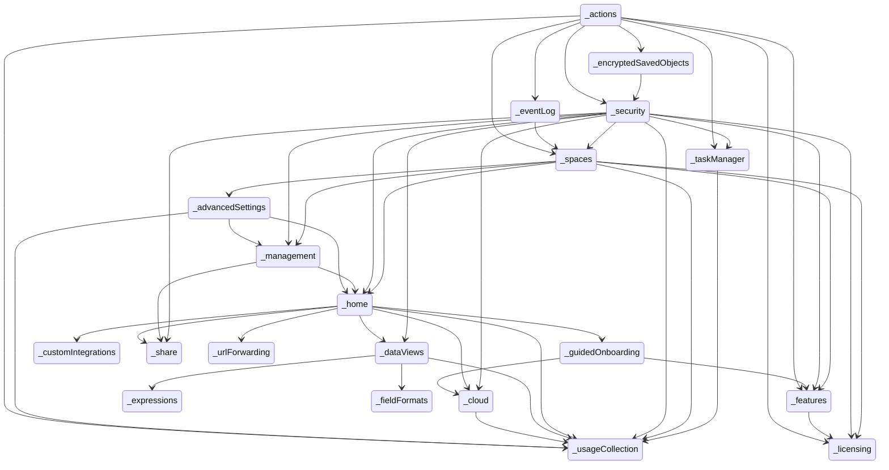


## advancedSettings

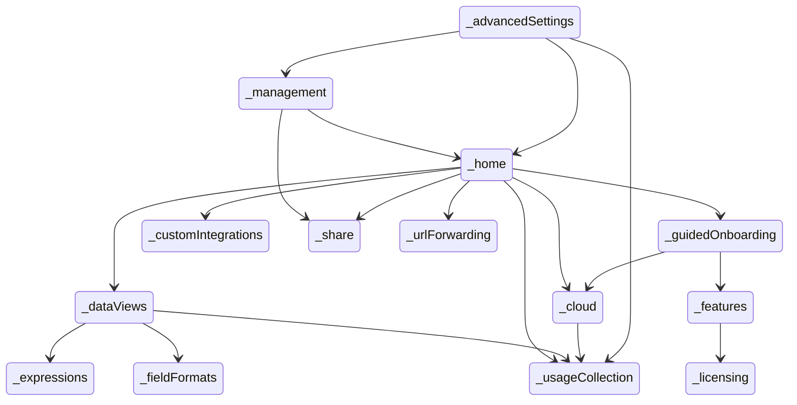


## aiops

```mermaid
stateDiagram
direction TB
accTitle: aiops dependencies
  _advancedSettings --> _home
  _advancedSettings --> _management
  _advancedSettings --> _usageCollection
  _aiops --> _charts
  _aiops --> _data
  _aiops --> _lens
  _aiops --> _licensing
  _aiops --> _uiActions
  _aiops --> _unifiedFieldList
  _charts --> _expressions
  _cloud --> _usageCollection
  _controls --> _data
  _controls --> _dataViews
  _controls --> _embeddable
  _controls --> _expressions
  _controls --> _kibanaReact
  _controls --> _presentationUtil
  _controls --> _savedObjects
  _controls --> _uiActions
  _controls --> _unifiedSearch
  _dashboard --> _controls
  _dashboard --> _data
  _dashboard --> _dataViewEditor
  _dashboard --> _dataViews
  _dashboard --> _embeddable
  _dashboard --> _home
  _dashboard --> _inspector
  _dashboard --> _navigation
  _dashboard --> _presentationUtil
  _dashboard --> _savedObjects
  _dashboard --> _savedObjectsFinder
  _dashboard --> _savedObjectsManagement
  _dashboard --> _savedObjectsTaggingOss
  _dashboard --> _screenshotMode
  _dashboard --> _share
  _dashboard --> _spaces
  _dashboard --> _taskManager
  _dashboard --> _uiActions
  _dashboard --> _unifiedSearch
  _dashboard --> _urlForwarding
  _dashboard --> _usageCollection
  _dashboard --> _visualizations
  _data --> _bfetch
  _data --> _dataViews
  _data --> _expressions
  _data --> _fieldFormats
  _data --> _inspector
  _data --> _management
  _data --> _screenshotMode
  _data --> _security
  _data --> _share
  _data --> _taskManager
  _data --> _uiActions
  _data --> _usageCollection
  _dataViewEditor --> _data
  _dataViewEditor --> _dataViews
  _dataViewFieldEditor --> _data
  _dataViewFieldEditor --> _dataViews
  _dataViewFieldEditor --> _fieldFormats
  _dataViewFieldEditor --> _usageCollection
  _dataViews --> _expressions
  _dataViews --> _fieldFormats
  _dataViews --> _usageCollection
  _embeddable --> _data
  _embeddable --> _inspector
  _embeddable --> _savedObjectsFinder
  _embeddable --> _savedObjectsManagement
  _embeddable --> _savedObjectsTaggingOss
  _embeddable --> _uiActions
  _eventAnnotation --> _data
  _eventAnnotation --> _expressions
  _expressionGauge --> _charts
  _expressionGauge --> _data
  _expressionGauge --> _expressions
  _expressionGauge --> _fieldFormats
  _expressionGauge --> _presentationUtil
  _expressionGauge --> _usageCollection
  _expressionGauge --> _visualizations
  _expressionHeatmap --> _charts
  _expressionHeatmap --> _data
  _expressionHeatmap --> _expressions
  _expressionHeatmap --> _fieldFormats
  _expressionHeatmap --> _presentationUtil
  _expressionHeatmap --> _usageCollection
  _expressionHeatmap --> _visualizations
  _expressionMetricVis --> _charts
  _expressionMetricVis --> _expressions
  _expressionMetricVis --> _fieldFormats
  _expressionMetricVis --> _presentationUtil
  _expressionMetricVis --> _usageCollection
  _expressionMetricVis --> _visualizations
  _expressionXY --> _charts
  _expressionXY --> _data
  _expressionXY --> _eventAnnotation
  _expressionXY --> _expressions
  _expressionXY --> _fieldFormats
  _expressionXY --> _uiActions
  _expressionXY --> _usageCollection
  _expressionXY --> _visualizations
  _features --> _licensing
  _guidedOnboarding --> _cloud
  _guidedOnboarding --> _features
  _home --> _cloud
  _home --> _customIntegrations
  _home --> _dataViews
  _home --> _guidedOnboarding
  _home --> _share
  _home --> _urlForwarding
  _home --> _usageCollection
  _inspector --> _share
  _lens --> _charts
  _lens --> _contentManagement
  _lens --> _dashboard
  _lens --> _data
  _lens --> _dataViewEditor
  _lens --> _dataViewFieldEditor
  _lens --> _dataViews
  _lens --> _embeddable
  _lens --> _eventAnnotation
  _lens --> _expressionGauge
  _lens --> _expressionHeatmap
  _lens --> _expressionMetricVis
  _lens --> _expressionXY
  _lens --> _expressions
  _lens --> _fieldFormats
  _lens --> _inspector
  _lens --> _navigation
  _lens --> _presentationUtil
  _lens --> _savedObjectsTagging
  _lens --> _share
  _lens --> _spaces
  _lens --> _taskManager
  _lens --> _uiActions
  _lens --> _uiActionsEnhanced
  _lens --> _unifiedFieldList
  _lens --> _unifiedSearch
  _lens --> _urlForwarding
  _lens --> _usageCollection
  _lens --> _visualizations
  _management --> _home
  _management --> _share
  _navigation --> _unifiedSearch
  _presentationUtil --> _dataViews
  _presentationUtil --> _embeddable
  _presentationUtil --> _expressions
  _presentationUtil --> _kibanaReact
  _presentationUtil --> _savedObjects
  _presentationUtil --> _uiActions
  _savedObjects --> _data
  _savedObjects --> _dataViews
  _savedObjectsManagement --> _data
  _savedObjectsManagement --> _dataViews
  _savedObjectsManagement --> _home
  _savedObjectsManagement --> _management
  _savedObjectsManagement --> _savedObjectsTaggingOss
  _savedObjectsManagement --> _spaces
  _savedObjectsTagging --> _features
  _savedObjectsTagging --> _management
  _savedObjectsTagging --> _savedObjectsTaggingOss
  _savedObjectsTagging --> _security
  _savedObjectsTagging --> _usageCollection
  _savedObjectsTaggingOss --> _savedObjects
  _security --> _cloud
  _security --> _dataViews
  _security --> _features
  _security --> _home
  _security --> _licensing
  _security --> _management
  _security --> _share
  _security --> _spaces
  _security --> _taskManager
  _security --> _usageCollection
  _spaces --> _advancedSettings
  _spaces --> _features
  _spaces --> _home
  _spaces --> _licensing
  _spaces --> _management
  _spaces --> _usageCollection
  _taskManager --> _usageCollection
  _uiActions --> _dataViews
  _uiActionsEnhanced --> _embeddable
  _uiActionsEnhanced --> _licensing
  _uiActionsEnhanced --> _uiActions
  _unifiedFieldList --> _charts
  _unifiedFieldList --> _data
  _unifiedFieldList --> _dataViews
  _unifiedFieldList --> _fieldFormats
  _unifiedFieldList --> _uiActions
  _unifiedSearch --> _data
  _unifiedSearch --> _dataViews
  _unifiedSearch --> _savedObjectsManagement
  _unifiedSearch --> _screenshotMode
  _unifiedSearch --> _uiActions
  _unifiedSearch --> _usageCollection
  _visualizations --> _charts
  _visualizations --> _contentManagement
  _visualizations --> _data
  _visualizations --> _dataViewEditor
  _visualizations --> _dataViews
  _visualizations --> _embeddable
  _visualizations --> _expressions
  _visualizations --> _fieldFormats
  _visualizations --> _home
  _visualizations --> _inspector
  _visualizations --> _navigation
  _visualizations --> _presentationUtil
  _visualizations --> _savedObjects
  _visualizations --> _savedObjectsFinder
  _visualizations --> _savedObjectsManagement
  _visualizations --> _savedObjectsTaggingOss
  _visualizations --> _screenshotMode
  _visualizations --> _share
  _visualizations --> _spaces
  _visualizations --> _uiActions
  _visualizations --> _unifiedSearch
  _visualizations --> _urlForwarding
  _visualizations --> _usageCollection
```


## alerting

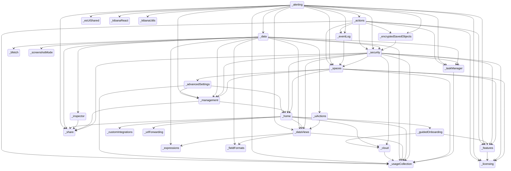


## apm

```mermaid
stateDiagram
direction TB
accTitle: apm dependencies
  _actions --> _encryptedSavedObjects
  _actions --> _eventLog
  _actions --> _features
  _actions --> _licensing
  _actions --> _security
  _actions --> _spaces
  _actions --> _taskManager
  _actions --> _usageCollection
  _advancedSettings --> _home
  _advancedSettings --> _management
  _advancedSettings --> _usageCollection
  _alerting --> _actions
  _alerting --> _data
  _alerting --> _dataViews
  _alerting --> _encryptedSavedObjects
  _alerting --> _esUiShared
  _alerting --> _eventLog
  _alerting --> _features
  _alerting --> _kibanaReact
  _alerting --> _kibanaUtils
  _alerting --> _licensing
  _alerting --> _management
  _alerting --> _security
  _alerting --> _share
  _alerting --> _spaces
  _alerting --> _taskManager
  _alerting --> _usageCollection
  _apm --> _actions
  _apm --> _advancedSettings
  _apm --> _alerting
  _apm --> _cases
  _apm --> _charts
  _apm --> _cloud
  _apm --> _data
  _apm --> _dataViews
  _apm --> _embeddable
  _apm --> _exploratoryView
  _apm --> _features
  _apm --> _fieldFormats
  _apm --> _fleet
  _apm --> _home
  _apm --> _infra
  _apm --> _inspector
  _apm --> _lens
  _apm --> _licensing
  _apm --> _maps
  _apm --> _observability
  _apm --> _observabilityShared
  _apm --> _ruleRegistry
  _apm --> _security
  _apm --> _share
  _apm --> _spaces
  _apm --> _taskManager
  _apm --> _triggersActionsUi
  _apm --> _unifiedFieldList
  _apm --> _unifiedSearch
  _apm --> _usageCollection
  _cases --> _actions
  _cases --> _data
  _cases --> _embeddable
  _cases --> _esUiShared
  _cases --> _features
  _cases --> _files
  _cases --> _home
  _cases --> _kibanaReact
  _cases --> _kibanaUtils
  _cases --> _lens
  _cases --> _licensing
  _cases --> _management
  _cases --> _notifications
  _cases --> _ruleRegistry
  _cases --> _savedObjectsFinder
  _cases --> _savedObjectsManagement
  _cases --> _security
  _cases --> _spaces
  _cases --> _taskManager
  _cases --> _triggersActionsUi
  _cases --> _usageCollection
  _charts --> _expressions
  _cloud --> _usageCollection
  _controls --> _data
  _controls --> _dataViews
  _controls --> _embeddable
  _controls --> _expressions
  _controls --> _kibanaReact
  _controls --> _presentationUtil
  _controls --> _savedObjects
  _controls --> _uiActions
  _controls --> _unifiedSearch
  _dashboard --> _controls
  _dashboard --> _data
  _dashboard --> _dataViewEditor
  _dashboard --> _dataViews
  _dashboard --> _embeddable
  _dashboard --> _home
  _dashboard --> _inspector
  _dashboard --> _navigation
  _dashboard --> _presentationUtil
  _dashboard --> _savedObjects
  _dashboard --> _savedObjectsFinder
  _dashboard --> _savedObjectsManagement
  _dashboard --> _savedObjectsTaggingOss
  _dashboard --> _screenshotMode
  _dashboard --> _share
  _dashboard --> _spaces
  _dashboard --> _taskManager
  _dashboard --> _uiActions
  _dashboard --> _unifiedSearch
  _dashboard --> _urlForwarding
  _dashboard --> _usageCollection
  _dashboard --> _visualizations
  _data --> _bfetch
  _data --> _dataViews
  _data --> _expressions
  _data --> _fieldFormats
  _data --> _inspector
  _data --> _management
  _data --> _screenshotMode
  _data --> _security
  _data --> _share
  _data --> _taskManager
  _data --> _uiActions
  _data --> _usageCollection
  _dataViewEditor --> _data
  _dataViewEditor --> _dataViews
  _dataViewFieldEditor --> _data
  _dataViewFieldEditor --> _dataViews
  _dataViewFieldEditor --> _fieldFormats
  _dataViewFieldEditor --> _usageCollection
  _dataViews --> _expressions
  _dataViews --> _fieldFormats
  _dataViews --> _usageCollection
  _discover --> _charts
  _discover --> _data
  _discover --> _dataViewEditor
  _discover --> _dataViewFieldEditor
  _discover --> _dataViews
  _discover --> _embeddable
  _discover --> _expressions
  _discover --> _fieldFormats
  _discover --> _home
  _discover --> _inspector
  _discover --> _lens
  _discover --> _navigation
  _discover --> _savedObjects
  _discover --> _savedObjectsFinder
  _discover --> _savedObjectsManagement
  _discover --> _savedObjectsTaggingOss
  _discover --> _share
  _discover --> _spaces
  _discover --> _triggersActionsUi
  _discover --> _uiActions
  _discover --> _unifiedFieldList
  _discover --> _unifiedHistogram
  _discover --> _unifiedSearch
  _discover --> _urlForwarding
  _discover --> _usageCollection
  _embeddable --> _data
  _embeddable --> _inspector
  _embeddable --> _savedObjectsFinder
  _embeddable --> _savedObjectsManagement
  _embeddable --> _savedObjectsTaggingOss
  _embeddable --> _uiActions
  _encryptedSavedObjects --> _security
  _eventAnnotation --> _data
  _eventAnnotation --> _expressions
  _eventLog --> _spaces
  _exploratoryView --> _alerting
  _exploratoryView --> _cases
  _exploratoryView --> _charts
  _exploratoryView --> _data
  _exploratoryView --> _dataViews
  _exploratoryView --> _discover
  _exploratoryView --> _embeddable
  _exploratoryView --> _features
  _exploratoryView --> _files
  _exploratoryView --> _guidedOnboarding
  _exploratoryView --> _home
  _exploratoryView --> _inspector
  _exploratoryView --> _lens
  _exploratoryView --> _licensing
  _exploratoryView --> _observabilityShared
  _exploratoryView --> _security
  _exploratoryView --> _share
  _exploratoryView --> _spaces
  _exploratoryView --> _triggersActionsUi
  _exploratoryView --> _unifiedSearch
  _exploratoryView --> _usageCollection
  _expressionGauge --> _charts
  _expressionGauge --> _data
  _expressionGauge --> _expressions
  _expressionGauge --> _fieldFormats
  _expressionGauge --> _presentationUtil
  _expressionGauge --> _usageCollection
  _expressionGauge --> _visualizations
  _expressionHeatmap --> _charts
  _expressionHeatmap --> _data
  _expressionHeatmap --> _expressions
  _expressionHeatmap --> _fieldFormats
  _expressionHeatmap --> _presentationUtil
  _expressionHeatmap --> _usageCollection
  _expressionHeatmap --> _visualizations
  _expressionMetricVis --> _charts
  _expressionMetricVis --> _expressions
  _expressionMetricVis --> _fieldFormats
  _expressionMetricVis --> _presentationUtil
  _expressionMetricVis --> _usageCollection
  _expressionMetricVis --> _visualizations
  _expressionXY --> _charts
  _expressionXY --> _data
  _expressionXY --> _eventAnnotation
  _expressionXY --> _expressions
  _expressionXY --> _fieldFormats
  _expressionXY --> _uiActions
  _expressionXY --> _usageCollection
  _expressionXY --> _visualizations
  _features --> _licensing
  _fileUpload --> _data
  _fileUpload --> _security
  _fileUpload --> _usageCollection
  _files --> _security
  _files --> _usageCollection
  _fleet --> _cloud
  _fleet --> _customIntegrations
  _fleet --> _data
  _fleet --> _discover
  _fleet --> _encryptedSavedObjects
  _fleet --> _features
  _fleet --> _files
  _fleet --> _guidedOnboarding
  _fleet --> _home
  _fleet --> _licensing
  _fleet --> _navigation
  _fleet --> _savedObjectsTagging
  _fleet --> _security
  _fleet --> _share
  _fleet --> _spaces
  _fleet --> _taskManager
  _fleet --> _unifiedSearch
  _fleet --> _usageCollection
  _guidedOnboarding --> _cloud
  _guidedOnboarding --> _features
  _home --> _cloud
  _home --> _customIntegrations
  _home --> _dataViews
  _home --> _guidedOnboarding
  _home --> _share
  _home --> _urlForwarding
  _home --> _usageCollection
  _infra --> _alerting
  _infra --> _cases
  _infra --> _charts
  _infra --> _data
  _infra --> _dataViews
  _infra --> _discover
  _infra --> _embeddable
  _infra --> _features
  _infra --> _home
  _infra --> _lens
  _infra --> _observability
  _infra --> _observabilityShared
  _infra --> _ruleRegistry
  _infra --> _security
  _infra --> _share
  _infra --> _spaces
  _infra --> _triggersActionsUi
  _infra --> _unifiedSearch
  _infra --> _usageCollection
  _infra --> _visTypeTimeseries
  _inspector --> _share
  _lens --> _charts
  _lens --> _contentManagement
  _lens --> _dashboard
  _lens --> _data
  _lens --> _dataViewEditor
  _lens --> _dataViewFieldEditor
  _lens --> _dataViews
  _lens --> _embeddable
  _lens --> _eventAnnotation
  _lens --> _expressionGauge
  _lens --> _expressionHeatmap
  _lens --> _expressionMetricVis
  _lens --> _expressionXY
  _lens --> _expressions
  _lens --> _fieldFormats
  _lens --> _inspector
  _lens --> _navigation
  _lens --> _presentationUtil
  _lens --> _savedObjectsTagging
  _lens --> _share
  _lens --> _spaces
  _lens --> _taskManager
  _lens --> _uiActions
  _lens --> _uiActionsEnhanced
  _lens --> _unifiedFieldList
  _lens --> _unifiedSearch
  _lens --> _urlForwarding
  _lens --> _usageCollection
  _lens --> _visualizations
  _management --> _home
  _management --> _share
  _maps --> _charts
  _maps --> _cloud
  _maps --> _contentManagement
  _maps --> _controls
  _maps --> _customIntegrations
  _maps --> _dashboard
  _maps --> _data
  _maps --> _embeddable
  _maps --> _expressions
  _maps --> _features
  _maps --> _fieldFormats
  _maps --> _fileUpload
  _maps --> _home
  _maps --> _inspector
  _maps --> _lens
  _maps --> _licensing
  _maps --> _mapsEms
  _maps --> _navigation
  _maps --> _presentationUtil
  _maps --> _savedObjects
  _maps --> _savedObjectsTagging
  _maps --> _screenshotMode
  _maps --> _security
  _maps --> _share
  _maps --> _spaces
  _maps --> _uiActions
  _maps --> _unifiedSearch
  _maps --> _usageCollection
  _maps --> _visualizations
  _mapsEms --> _licensing
  _navigation --> _unifiedSearch
  _notifications --> _actions
  _notifications --> _licensing
  _observability --> _alerting
  _observability --> _cases
  _observability --> _charts
  _observability --> _data
  _observability --> _dataViews
  _observability --> _discover
  _observability --> _embeddable
  _observability --> _exploratoryView
  _observability --> _features
  _observability --> _files
  _observability --> _guidedOnboarding
  _observability --> _home
  _observability --> _inspector
  _observability --> _lens
  _observability --> _licensing
  _observability --> _observabilityShared
  _observability --> _ruleRegistry
  _observability --> _security
  _observability --> _share
  _observability --> _spaces
  _observability --> _triggersActionsUi
  _observability --> _unifiedSearch
  _observability --> _usageCollection
  _observability --> _visualizations
  _observabilityShared --> _cases
  _observabilityShared --> _guidedOnboarding
  _presentationUtil --> _dataViews
  _presentationUtil --> _embeddable
  _presentationUtil --> _expressions
  _presentationUtil --> _kibanaReact
  _presentationUtil --> _savedObjects
  _presentationUtil --> _uiActions
  _ruleRegistry --> _alerting
  _ruleRegistry --> _data
  _ruleRegistry --> _security
  _ruleRegistry --> _spaces
  _ruleRegistry --> _triggersActionsUi
  _savedObjects --> _data
  _savedObjects --> _dataViews
  _savedObjectsManagement --> _data
  _savedObjectsManagement --> _dataViews
  _savedObjectsManagement --> _home
  _savedObjectsManagement --> _management
  _savedObjectsManagement --> _savedObjectsTaggingOss
  _savedObjectsManagement --> _spaces
  _savedObjectsTagging --> _features
  _savedObjectsTagging --> _management
  _savedObjectsTagging --> _savedObjectsTaggingOss
  _savedObjectsTagging --> _security
  _savedObjectsTagging --> _usageCollection
  _savedObjectsTaggingOss --> _savedObjects
  _security --> _cloud
  _security --> _dataViews
  _security --> _features
  _security --> _home
  _security --> _licensing
  _security --> _management
  _security --> _share
  _security --> _spaces
  _security --> _taskManager
  _security --> _usageCollection
  _spaces --> _advancedSettings
  _spaces --> _features
  _spaces --> _home
  _spaces --> _licensing
  _spaces --> _management
  _spaces --> _usageCollection
  _taskManager --> _usageCollection
  _triggersActionsUi --> _actions
  _triggersActionsUi --> _alerting
  _triggersActionsUi --> _charts
  _triggersActionsUi --> _cloud
  _triggersActionsUi --> _data
  _triggersActionsUi --> _dataViewEditor
  _triggersActionsUi --> _dataViews
  _triggersActionsUi --> _features
  _triggersActionsUi --> _home
  _triggersActionsUi --> _kibanaReact
  _triggersActionsUi --> _kibanaUtils
  _triggersActionsUi --> _management
  _triggersActionsUi --> _savedObjects
  _triggersActionsUi --> _spaces
  _triggersActionsUi --> _unifiedSearch
  _uiActions --> _dataViews
  _uiActionsEnhanced --> _embeddable
  _uiActionsEnhanced --> _licensing
  _uiActionsEnhanced --> _uiActions
  _unifiedFieldList --> _charts
  _unifiedFieldList --> _data
  _unifiedFieldList --> _dataViews
  _unifiedFieldList --> _fieldFormats
  _unifiedFieldList --> _uiActions
  _unifiedSearch --> _data
  _unifiedSearch --> _dataViews
  _unifiedSearch --> _savedObjectsManagement
  _unifiedSearch --> _screenshotMode
  _unifiedSearch --> _uiActions
  _unifiedSearch --> _usageCollection
  _visTypeTimeseries --> _charts
  _visTypeTimeseries --> _data
  _visTypeTimeseries --> _dataViews
  _visTypeTimeseries --> _expressions
  _visTypeTimeseries --> _fieldFormats
  _visTypeTimeseries --> _home
  _visTypeTimeseries --> _inspector
  _visTypeTimeseries --> _unifiedSearch
  _visTypeTimeseries --> _usageCollection
  _visTypeTimeseries --> _visualizations
  _visualizations --> _charts
  _visualizations --> _contentManagement
  _visualizations --> _data
  _visualizations --> _dataViewEditor
  _visualizations --> _dataViews
  _visualizations --> _embeddable
  _visualizations --> _expressions
  _visualizations --> _fieldFormats
  _visualizations --> _home
  _visualizations --> _inspector
  _visualizations --> _navigation
  _visualizations --> _presentationUtil
  _visualizations --> _savedObjects
  _visualizations --> _savedObjectsFinder
  _visualizations --> _savedObjectsManagement
  _visualizations --> _savedObjectsTaggingOss
  _visualizations --> _screenshotMode
  _visualizations --> _share
  _visualizations --> _spaces
  _visualizations --> _uiActions
  _visualizations --> _unifiedSearch
  _visualizations --> _urlForwarding
  _visualizations --> _usageCollection
```


## bfetch

```mermaid
stateDiagram
direction TB
accTitle: bfetch dependencies
```


## cases

```mermaid
stateDiagram
direction TB
accTitle: cases dependencies
  _actions --> _encryptedSavedObjects
  _actions --> _eventLog
  _actions --> _features
  _actions --> _licensing
  _actions --> _security
  _actions --> _spaces
  _actions --> _taskManager
  _actions --> _usageCollection
  _advancedSettings --> _home
  _advancedSettings --> _management
  _advancedSettings --> _usageCollection
  _alerting --> _actions
  _alerting --> _data
  _alerting --> _dataViews
  _alerting --> _encryptedSavedObjects
  _alerting --> _esUiShared
  _alerting --> _eventLog
  _alerting --> _features
  _alerting --> _kibanaReact
  _alerting --> _kibanaUtils
  _alerting --> _licensing
  _alerting --> _management
  _alerting --> _security
  _alerting --> _share
  _alerting --> _spaces
  _alerting --> _taskManager
  _alerting --> _usageCollection
  _cases --> _actions
  _cases --> _data
  _cases --> _embeddable
  _cases --> _esUiShared
  _cases --> _features
  _cases --> _files
  _cases --> _home
  _cases --> _kibanaReact
  _cases --> _kibanaUtils
  _cases --> _lens
  _cases --> _licensing
  _cases --> _management
  _cases --> _notifications
  _cases --> _ruleRegistry
  _cases --> _savedObjectsFinder
  _cases --> _savedObjectsManagement
  _cases --> _security
  _cases --> _spaces
  _cases --> _taskManager
  _cases --> _triggersActionsUi
  _cases --> _usageCollection
  _charts --> _expressions
  _cloud --> _usageCollection
  _controls --> _data
  _controls --> _dataViews
  _controls --> _embeddable
  _controls --> _expressions
  _controls --> _kibanaReact
  _controls --> _presentationUtil
  _controls --> _savedObjects
  _controls --> _uiActions
  _controls --> _unifiedSearch
  _dashboard --> _controls
  _dashboard --> _data
  _dashboard --> _dataViewEditor
  _dashboard --> _dataViews
  _dashboard --> _embeddable
  _dashboard --> _home
  _dashboard --> _inspector
  _dashboard --> _navigation
  _dashboard --> _presentationUtil
  _dashboard --> _savedObjects
  _dashboard --> _savedObjectsFinder
  _dashboard --> _savedObjectsManagement
  _dashboard --> _savedObjectsTaggingOss
  _dashboard --> _screenshotMode
  _dashboard --> _share
  _dashboard --> _spaces
  _dashboard --> _taskManager
  _dashboard --> _uiActions
  _dashboard --> _unifiedSearch
  _dashboard --> _urlForwarding
  _dashboard --> _usageCollection
  _dashboard --> _visualizations
  _data --> _bfetch
  _data --> _dataViews
  _data --> _expressions
  _data --> _fieldFormats
  _data --> _inspector
  _data --> _management
  _data --> _screenshotMode
  _data --> _security
  _data --> _share
  _data --> _taskManager
  _data --> _uiActions
  _data --> _usageCollection
  _dataViewEditor --> _data
  _dataViewEditor --> _dataViews
  _dataViewFieldEditor --> _data
  _dataViewFieldEditor --> _dataViews
  _dataViewFieldEditor --> _fieldFormats
  _dataViewFieldEditor --> _usageCollection
  _dataViews --> _expressions
  _dataViews --> _fieldFormats
  _dataViews --> _usageCollection
  _embeddable --> _data
  _embeddable --> _inspector
  _embeddable --> _savedObjectsFinder
  _embeddable --> _savedObjectsManagement
  _embeddable --> _savedObjectsTaggingOss
  _embeddable --> _uiActions
  _encryptedSavedObjects --> _security
  _eventAnnotation --> _data
  _eventAnnotation --> _expressions
  _eventLog --> _spaces
  _expressionGauge --> _charts
  _expressionGauge --> _data
  _expressionGauge --> _expressions
  _expressionGauge --> _fieldFormats
  _expressionGauge --> _presentationUtil
  _expressionGauge --> _usageCollection
  _expressionGauge --> _visualizations
  _expressionHeatmap --> _charts
  _expressionHeatmap --> _data
  _expressionHeatmap --> _expressions
  _expressionHeatmap --> _fieldFormats
  _expressionHeatmap --> _presentationUtil
  _expressionHeatmap --> _usageCollection
  _expressionHeatmap --> _visualizations
  _expressionMetricVis --> _charts
  _expressionMetricVis --> _expressions
  _expressionMetricVis --> _fieldFormats
  _expressionMetricVis --> _presentationUtil
  _expressionMetricVis --> _usageCollection
  _expressionMetricVis --> _visualizations
  _expressionXY --> _charts
  _expressionXY --> _data
  _expressionXY --> _eventAnnotation
  _expressionXY --> _expressions
  _expressionXY --> _fieldFormats
  _expressionXY --> _uiActions
  _expressionXY --> _usageCollection
  _expressionXY --> _visualizations
  _features --> _licensing
  _files --> _security
  _files --> _usageCollection
  _guidedOnboarding --> _cloud
  _guidedOnboarding --> _features
  _home --> _cloud
  _home --> _customIntegrations
  _home --> _dataViews
  _home --> _guidedOnboarding
  _home --> _share
  _home --> _urlForwarding
  _home --> _usageCollection
  _inspector --> _share
  _lens --> _charts
  _lens --> _contentManagement
  _lens --> _dashboard
  _lens --> _data
  _lens --> _dataViewEditor
  _lens --> _dataViewFieldEditor
  _lens --> _dataViews
  _lens --> _embeddable
  _lens --> _eventAnnotation
  _lens --> _expressionGauge
  _lens --> _expressionHeatmap
  _lens --> _expressionMetricVis
  _lens --> _expressionXY
  _lens --> _expressions
  _lens --> _fieldFormats
  _lens --> _inspector
  _lens --> _navigation
  _lens --> _presentationUtil
  _lens --> _savedObjectsTagging
  _lens --> _share
  _lens --> _spaces
  _lens --> _taskManager
  _lens --> _uiActions
  _lens --> _uiActionsEnhanced
  _lens --> _unifiedFieldList
  _lens --> _unifiedSearch
  _lens --> _urlForwarding
  _lens --> _usageCollection
  _lens --> _visualizations
  _management --> _home
  _management --> _share
  _navigation --> _unifiedSearch
  _notifications --> _actions
  _notifications --> _licensing
  _presentationUtil --> _dataViews
  _presentationUtil --> _embeddable
  _presentationUtil --> _expressions
  _presentationUtil --> _kibanaReact
  _presentationUtil --> _savedObjects
  _presentationUtil --> _uiActions
  _ruleRegistry --> _alerting
  _ruleRegistry --> _data
  _ruleRegistry --> _security
  _ruleRegistry --> _spaces
  _ruleRegistry --> _triggersActionsUi
  _savedObjects --> _data
  _savedObjects --> _dataViews
  _savedObjectsManagement --> _data
  _savedObjectsManagement --> _dataViews
  _savedObjectsManagement --> _home
  _savedObjectsManagement --> _management
  _savedObjectsManagement --> _savedObjectsTaggingOss
  _savedObjectsManagement --> _spaces
  _savedObjectsTagging --> _features
  _savedObjectsTagging --> _management
  _savedObjectsTagging --> _savedObjectsTaggingOss
  _savedObjectsTagging --> _security
  _savedObjectsTagging --> _usageCollection
  _savedObjectsTaggingOss --> _savedObjects
  _security --> _cloud
  _security --> _dataViews
  _security --> _features
  _security --> _home
  _security --> _licensing
  _security --> _management
  _security --> _share
  _security --> _spaces
  _security --> _taskManager
  _security --> _usageCollection
  _spaces --> _advancedSettings
  _spaces --> _features
  _spaces --> _home
  _spaces --> _licensing
  _spaces --> _management
  _spaces --> _usageCollection
  _taskManager --> _usageCollection
  _triggersActionsUi --> _actions
  _triggersActionsUi --> _alerting
  _triggersActionsUi --> _charts
  _triggersActionsUi --> _cloud
  _triggersActionsUi --> _data
  _triggersActionsUi --> _dataViewEditor
  _triggersActionsUi --> _dataViews
  _triggersActionsUi --> _features
  _triggersActionsUi --> _home
  _triggersActionsUi --> _kibanaReact
  _triggersActionsUi --> _kibanaUtils
  _triggersActionsUi --> _management
  _triggersActionsUi --> _savedObjects
  _triggersActionsUi --> _spaces
  _triggersActionsUi --> _unifiedSearch
  _uiActions --> _dataViews
  _uiActionsEnhanced --> _embeddable
  _uiActionsEnhanced --> _licensing
  _uiActionsEnhanced --> _uiActions
  _unifiedFieldList --> _charts
  _unifiedFieldList --> _data
  _unifiedFieldList --> _dataViews
  _unifiedFieldList --> _fieldFormats
  _unifiedFieldList --> _uiActions
  _unifiedSearch --> _data
  _unifiedSearch --> _dataViews
  _unifiedSearch --> _savedObjectsManagement
  _unifiedSearch --> _screenshotMode
  _unifiedSearch --> _uiActions
  _unifiedSearch --> _usageCollection
  _visualizations --> _charts
  _visualizations --> _contentManagement
  _visualizations --> _data
  _visualizations --> _dataViewEditor
  _visualizations --> _dataViews
  _visualizations --> _embeddable
  _visualizations --> _expressions
  _visualizations --> _fieldFormats
  _visualizations --> _home
  _visualizations --> _inspector
  _visualizations --> _navigation
  _visualizations --> _presentationUtil
  _visualizations --> _savedObjects
  _visualizations --> _savedObjectsFinder
  _visualizations --> _savedObjectsManagement
  _visualizations --> _savedObjectsTaggingOss
  _visualizations --> _screenshotMode
  _visualizations --> _share
  _visualizations --> _spaces
  _visualizations --> _uiActions
  _visualizations --> _unifiedSearch
  _visualizations --> _urlForwarding
  _visualizations --> _usageCollection
```


## charts

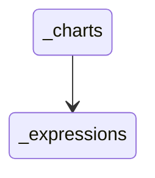


## cloud

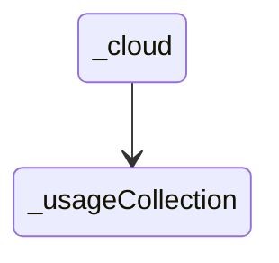


## cloudDefend

```mermaid
stateDiagram
direction TB
accTitle: cloudDefend dependencies
  _actions --> _encryptedSavedObjects
  _actions --> _eventLog
  _actions --> _features
  _actions --> _licensing
  _actions --> _security
  _actions --> _spaces
  _actions --> _taskManager
  _actions --> _usageCollection
  _advancedSettings --> _home
  _advancedSettings --> _management
  _advancedSettings --> _usageCollection
  _alerting --> _actions
  _alerting --> _data
  _alerting --> _dataViews
  _alerting --> _encryptedSavedObjects
  _alerting --> _esUiShared
  _alerting --> _eventLog
  _alerting --> _features
  _alerting --> _kibanaReact
  _alerting --> _kibanaUtils
  _alerting --> _licensing
  _alerting --> _management
  _alerting --> _security
  _alerting --> _share
  _alerting --> _spaces
  _alerting --> _taskManager
  _alerting --> _usageCollection
  _charts --> _expressions
  _cloud --> _usageCollection
  _cloudDefend --> _cloud
  _cloudDefend --> _data
  _cloudDefend --> _fleet
  _cloudDefend --> _kibanaReact
  _cloudDefend --> _licensing
  _cloudDefend --> _navigation
  _cloudDefend --> _security
  _cloudDefend --> _unifiedSearch
  _cloudDefend --> _usageCollection
  _controls --> _data
  _controls --> _dataViews
  _controls --> _embeddable
  _controls --> _expressions
  _controls --> _kibanaReact
  _controls --> _presentationUtil
  _controls --> _savedObjects
  _controls --> _uiActions
  _controls --> _unifiedSearch
  _dashboard --> _controls
  _dashboard --> _data
  _dashboard --> _dataViewEditor
  _dashboard --> _dataViews
  _dashboard --> _embeddable
  _dashboard --> _home
  _dashboard --> _inspector
  _dashboard --> _navigation
  _dashboard --> _presentationUtil
  _dashboard --> _savedObjects
  _dashboard --> _savedObjectsFinder
  _dashboard --> _savedObjectsManagement
  _dashboard --> _savedObjectsTaggingOss
  _dashboard --> _screenshotMode
  _dashboard --> _share
  _dashboard --> _spaces
  _dashboard --> _taskManager
  _dashboard --> _uiActions
  _dashboard --> _unifiedSearch
  _dashboard --> _urlForwarding
  _dashboard --> _usageCollection
  _dashboard --> _visualizations
  _data --> _bfetch
  _data --> _dataViews
  _data --> _expressions
  _data --> _fieldFormats
  _data --> _inspector
  _data --> _management
  _data --> _screenshotMode
  _data --> _security
  _data --> _share
  _data --> _taskManager
  _data --> _uiActions
  _data --> _usageCollection
  _dataViewEditor --> _data
  _dataViewEditor --> _dataViews
  _dataViewFieldEditor --> _data
  _dataViewFieldEditor --> _dataViews
  _dataViewFieldEditor --> _fieldFormats
  _dataViewFieldEditor --> _usageCollection
  _dataViews --> _expressions
  _dataViews --> _fieldFormats
  _dataViews --> _usageCollection
  _discover --> _charts
  _discover --> _data
  _discover --> _dataViewEditor
  _discover --> _dataViewFieldEditor
  _discover --> _dataViews
  _discover --> _embeddable
  _discover --> _expressions
  _discover --> _fieldFormats
  _discover --> _home
  _discover --> _inspector
  _discover --> _lens
  _discover --> _navigation
  _discover --> _savedObjects
  _discover --> _savedObjectsFinder
  _discover --> _savedObjectsManagement
  _discover --> _savedObjectsTaggingOss
  _discover --> _share
  _discover --> _spaces
  _discover --> _triggersActionsUi
  _discover --> _uiActions
  _discover --> _unifiedFieldList
  _discover --> _unifiedHistogram
  _discover --> _unifiedSearch
  _discover --> _urlForwarding
  _discover --> _usageCollection
  _embeddable --> _data
  _embeddable --> _inspector
  _embeddable --> _savedObjectsFinder
  _embeddable --> _savedObjectsManagement
  _embeddable --> _savedObjectsTaggingOss
  _embeddable --> _uiActions
  _encryptedSavedObjects --> _security
  _eventAnnotation --> _data
  _eventAnnotation --> _expressions
  _eventLog --> _spaces
  _expressionGauge --> _charts
  _expressionGauge --> _data
  _expressionGauge --> _expressions
  _expressionGauge --> _fieldFormats
  _expressionGauge --> _presentationUtil
  _expressionGauge --> _usageCollection
  _expressionGauge --> _visualizations
  _expressionHeatmap --> _charts
  _expressionHeatmap --> _data
  _expressionHeatmap --> _expressions
  _expressionHeatmap --> _fieldFormats
  _expressionHeatmap --> _presentationUtil
  _expressionHeatmap --> _usageCollection
  _expressionHeatmap --> _visualizations
  _expressionMetricVis --> _charts
  _expressionMetricVis --> _expressions
  _expressionMetricVis --> _fieldFormats
  _expressionMetricVis --> _presentationUtil
  _expressionMetricVis --> _usageCollection
  _expressionMetricVis --> _visualizations
  _expressionXY --> _charts
  _expressionXY --> _data
  _expressionXY --> _eventAnnotation
  _expressionXY --> _expressions
  _expressionXY --> _fieldFormats
  _expressionXY --> _uiActions
  _expressionXY --> _usageCollection
  _expressionXY --> _visualizations
  _features --> _licensing
  _files --> _security
  _files --> _usageCollection
  _fleet --> _cloud
  _fleet --> _customIntegrations
  _fleet --> _data
  _fleet --> _discover
  _fleet --> _encryptedSavedObjects
  _fleet --> _features
  _fleet --> _files
  _fleet --> _guidedOnboarding
  _fleet --> _home
  _fleet --> _licensing
  _fleet --> _navigation
  _fleet --> _savedObjectsTagging
  _fleet --> _security
  _fleet --> _share
  _fleet --> _spaces
  _fleet --> _taskManager
  _fleet --> _unifiedSearch
  _fleet --> _usageCollection
  _guidedOnboarding --> _cloud
  _guidedOnboarding --> _features
  _home --> _cloud
  _home --> _customIntegrations
  _home --> _dataViews
  _home --> _guidedOnboarding
  _home --> _share
  _home --> _urlForwarding
  _home --> _usageCollection
  _inspector --> _share
  _lens --> _charts
  _lens --> _contentManagement
  _lens --> _dashboard
  _lens --> _data
  _lens --> _dataViewEditor
  _lens --> _dataViewFieldEditor
  _lens --> _dataViews
  _lens --> _embeddable
  _lens --> _eventAnnotation
  _lens --> _expressionGauge
  _lens --> _expressionHeatmap
  _lens --> _expressionMetricVis
  _lens --> _expressionXY
  _lens --> _expressions
  _lens --> _fieldFormats
  _lens --> _inspector
  _lens --> _navigation
  _lens --> _presentationUtil
  _lens --> _savedObjectsTagging
  _lens --> _share
  _lens --> _spaces
  _lens --> _taskManager
  _lens --> _uiActions
  _lens --> _uiActionsEnhanced
  _lens --> _unifiedFieldList
  _lens --> _unifiedSearch
  _lens --> _urlForwarding
  _lens --> _usageCollection
  _lens --> _visualizations
  _management --> _home
  _management --> _share
  _navigation --> _unifiedSearch
  _presentationUtil --> _dataViews
  _presentationUtil --> _embeddable
  _presentationUtil --> _expressions
  _presentationUtil --> _kibanaReact
  _presentationUtil --> _savedObjects
  _presentationUtil --> _uiActions
  _savedObjects --> _data
  _savedObjects --> _dataViews
  _savedObjectsManagement --> _data
  _savedObjectsManagement --> _dataViews
  _savedObjectsManagement --> _home
  _savedObjectsManagement --> _management
  _savedObjectsManagement --> _savedObjectsTaggingOss
  _savedObjectsManagement --> _spaces
  _savedObjectsTagging --> _features
  _savedObjectsTagging --> _management
  _savedObjectsTagging --> _savedObjectsTaggingOss
  _savedObjectsTagging --> _security
  _savedObjectsTagging --> _usageCollection
  _savedObjectsTaggingOss --> _savedObjects
  _security --> _cloud
  _security --> _dataViews
  _security --> _features
  _security --> _home
  _security --> _licensing
  _security --> _management
  _security --> _share
  _security --> _spaces
  _security --> _taskManager
  _security --> _usageCollection
  _spaces --> _advancedSettings
  _spaces --> _features
  _spaces --> _home
  _spaces --> _licensing
  _spaces --> _management
  _spaces --> _usageCollection
  _taskManager --> _usageCollection
  _triggersActionsUi --> _actions
  _triggersActionsUi --> _alerting
  _triggersActionsUi --> _charts
  _triggersActionsUi --> _cloud
  _triggersActionsUi --> _data
  _triggersActionsUi --> _dataViewEditor
  _triggersActionsUi --> _dataViews
  _triggersActionsUi --> _features
  _triggersActionsUi --> _home
  _triggersActionsUi --> _kibanaReact
  _triggersActionsUi --> _kibanaUtils
  _triggersActionsUi --> _management
  _triggersActionsUi --> _savedObjects
  _triggersActionsUi --> _spaces
  _triggersActionsUi --> _unifiedSearch
  _uiActions --> _dataViews
  _uiActionsEnhanced --> _embeddable
  _uiActionsEnhanced --> _licensing
  _uiActionsEnhanced --> _uiActions
  _unifiedFieldList --> _charts
  _unifiedFieldList --> _data
  _unifiedFieldList --> _dataViews
  _unifiedFieldList --> _fieldFormats
  _unifiedFieldList --> _uiActions
  _unifiedSearch --> _data
  _unifiedSearch --> _dataViews
  _unifiedSearch --> _savedObjectsManagement
  _unifiedSearch --> _screenshotMode
  _unifiedSearch --> _uiActions
  _unifiedSearch --> _usageCollection
  _visualizations --> _charts
  _visualizations --> _contentManagement
  _visualizations --> _data
  _visualizations --> _dataViewEditor
  _visualizations --> _dataViews
  _visualizations --> _embeddable
  _visualizations --> _expressions
  _visualizations --> _fieldFormats
  _visualizations --> _home
  _visualizations --> _inspector
  _visualizations --> _navigation
  _visualizations --> _presentationUtil
  _visualizations --> _savedObjects
  _visualizations --> _savedObjectsFinder
  _visualizations --> _savedObjectsManagement
  _visualizations --> _savedObjectsTaggingOss
  _visualizations --> _screenshotMode
  _visualizations --> _share
  _visualizations --> _spaces
  _visualizations --> _uiActions
  _visualizations --> _unifiedSearch
  _visualizations --> _urlForwarding
  _visualizations --> _usageCollection
```


## cloudSecurityPosture

```mermaid
stateDiagram
direction TB
accTitle: cloudSecurityPosture dependencies
  _actions --> _encryptedSavedObjects
  _actions --> _eventLog
  _actions --> _features
  _actions --> _licensing
  _actions --> _security
  _actions --> _spaces
  _actions --> _taskManager
  _actions --> _usageCollection
  _advancedSettings --> _home
  _advancedSettings --> _management
  _advancedSettings --> _usageCollection
  _alerting --> _actions
  _alerting --> _data
  _alerting --> _dataViews
  _alerting --> _encryptedSavedObjects
  _alerting --> _esUiShared
  _alerting --> _eventLog
  _alerting --> _features
  _alerting --> _kibanaReact
  _alerting --> _kibanaUtils
  _alerting --> _licensing
  _alerting --> _management
  _alerting --> _security
  _alerting --> _share
  _alerting --> _spaces
  _alerting --> _taskManager
  _alerting --> _usageCollection
  _charts --> _expressions
  _cloud --> _usageCollection
  _cloudSecurityPosture --> _charts
  _cloudSecurityPosture --> _cloud
  _cloudSecurityPosture --> _data
  _cloudSecurityPosture --> _discover
  _cloudSecurityPosture --> _fleet
  _cloudSecurityPosture --> _licensing
  _cloudSecurityPosture --> _navigation
  _cloudSecurityPosture --> _security
  _cloudSecurityPosture --> _taskManager
  _cloudSecurityPosture --> _unifiedSearch
  _cloudSecurityPosture --> _usageCollection
  _controls --> _data
  _controls --> _dataViews
  _controls --> _embeddable
  _controls --> _expressions
  _controls --> _kibanaReact
  _controls --> _presentationUtil
  _controls --> _savedObjects
  _controls --> _uiActions
  _controls --> _unifiedSearch
  _dashboard --> _controls
  _dashboard --> _data
  _dashboard --> _dataViewEditor
  _dashboard --> _dataViews
  _dashboard --> _embeddable
  _dashboard --> _home
  _dashboard --> _inspector
  _dashboard --> _navigation
  _dashboard --> _presentationUtil
  _dashboard --> _savedObjects
  _dashboard --> _savedObjectsFinder
  _dashboard --> _savedObjectsManagement
  _dashboard --> _savedObjectsTaggingOss
  _dashboard --> _screenshotMode
  _dashboard --> _share
  _dashboard --> _spaces
  _dashboard --> _taskManager
  _dashboard --> _uiActions
  _dashboard --> _unifiedSearch
  _dashboard --> _urlForwarding
  _dashboard --> _usageCollection
  _dashboard --> _visualizations
  _data --> _bfetch
  _data --> _dataViews
  _data --> _expressions
  _data --> _fieldFormats
  _data --> _inspector
  _data --> _management
  _data --> _screenshotMode
  _data --> _security
  _data --> _share
  _data --> _taskManager
  _data --> _uiActions
  _data --> _usageCollection
  _dataViewEditor --> _data
  _dataViewEditor --> _dataViews
  _dataViewFieldEditor --> _data
  _dataViewFieldEditor --> _dataViews
  _dataViewFieldEditor --> _fieldFormats
  _dataViewFieldEditor --> _usageCollection
  _dataViews --> _expressions
  _dataViews --> _fieldFormats
  _dataViews --> _usageCollection
  _discover --> _charts
  _discover --> _data
  _discover --> _dataViewEditor
  _discover --> _dataViewFieldEditor
  _discover --> _dataViews
  _discover --> _embeddable
  _discover --> _expressions
  _discover --> _fieldFormats
  _discover --> _home
  _discover --> _inspector
  _discover --> _lens
  _discover --> _navigation
  _discover --> _savedObjects
  _discover --> _savedObjectsFinder
  _discover --> _savedObjectsManagement
  _discover --> _savedObjectsTaggingOss
  _discover --> _share
  _discover --> _spaces
  _discover --> _triggersActionsUi
  _discover --> _uiActions
  _discover --> _unifiedFieldList
  _discover --> _unifiedHistogram
  _discover --> _unifiedSearch
  _discover --> _urlForwarding
  _discover --> _usageCollection
  _embeddable --> _data
  _embeddable --> _inspector
  _embeddable --> _savedObjectsFinder
  _embeddable --> _savedObjectsManagement
  _embeddable --> _savedObjectsTaggingOss
  _embeddable --> _uiActions
  _encryptedSavedObjects --> _security
  _eventAnnotation --> _data
  _eventAnnotation --> _expressions
  _eventLog --> _spaces
  _expressionGauge --> _charts
  _expressionGauge --> _data
  _expressionGauge --> _expressions
  _expressionGauge --> _fieldFormats
  _expressionGauge --> _presentationUtil
  _expressionGauge --> _usageCollection
  _expressionGauge --> _visualizations
  _expressionHeatmap --> _charts
  _expressionHeatmap --> _data
  _expressionHeatmap --> _expressions
  _expressionHeatmap --> _fieldFormats
  _expressionHeatmap --> _presentationUtil
  _expressionHeatmap --> _usageCollection
  _expressionHeatmap --> _visualizations
  _expressionMetricVis --> _charts
  _expressionMetricVis --> _expressions
  _expressionMetricVis --> _fieldFormats
  _expressionMetricVis --> _presentationUtil
  _expressionMetricVis --> _usageCollection
  _expressionMetricVis --> _visualizations
  _expressionXY --> _charts
  _expressionXY --> _data
  _expressionXY --> _eventAnnotation
  _expressionXY --> _expressions
  _expressionXY --> _fieldFormats
  _expressionXY --> _uiActions
  _expressionXY --> _usageCollection
  _expressionXY --> _visualizations
  _features --> _licensing
  _files --> _security
  _files --> _usageCollection
  _fleet --> _cloud
  _fleet --> _customIntegrations
  _fleet --> _data
  _fleet --> _discover
  _fleet --> _encryptedSavedObjects
  _fleet --> _features
  _fleet --> _files
  _fleet --> _guidedOnboarding
  _fleet --> _home
  _fleet --> _licensing
  _fleet --> _navigation
  _fleet --> _savedObjectsTagging
  _fleet --> _security
  _fleet --> _share
  _fleet --> _spaces
  _fleet --> _taskManager
  _fleet --> _unifiedSearch
  _fleet --> _usageCollection
  _guidedOnboarding --> _cloud
  _guidedOnboarding --> _features
  _home --> _cloud
  _home --> _customIntegrations
  _home --> _dataViews
  _home --> _guidedOnboarding
  _home --> _share
  _home --> _urlForwarding
  _home --> _usageCollection
  _inspector --> _share
  _lens --> _charts
  _lens --> _contentManagement
  _lens --> _dashboard
  _lens --> _data
  _lens --> _dataViewEditor
  _lens --> _dataViewFieldEditor
  _lens --> _dataViews
  _lens --> _embeddable
  _lens --> _eventAnnotation
  _lens --> _expressionGauge
  _lens --> _expressionHeatmap
  _lens --> _expressionMetricVis
  _lens --> _expressionXY
  _lens --> _expressions
  _lens --> _fieldFormats
  _lens --> _inspector
  _lens --> _navigation
  _lens --> _presentationUtil
  _lens --> _savedObjectsTagging
  _lens --> _share
  _lens --> _spaces
  _lens --> _taskManager
  _lens --> _uiActions
  _lens --> _uiActionsEnhanced
  _lens --> _unifiedFieldList
  _lens --> _unifiedSearch
  _lens --> _urlForwarding
  _lens --> _usageCollection
  _lens --> _visualizations
  _management --> _home
  _management --> _share
  _navigation --> _unifiedSearch
  _presentationUtil --> _dataViews
  _presentationUtil --> _embeddable
  _presentationUtil --> _expressions
  _presentationUtil --> _kibanaReact
  _presentationUtil --> _savedObjects
  _presentationUtil --> _uiActions
  _savedObjects --> _data
  _savedObjects --> _dataViews
  _savedObjectsManagement --> _data
  _savedObjectsManagement --> _dataViews
  _savedObjectsManagement --> _home
  _savedObjectsManagement --> _management
  _savedObjectsManagement --> _savedObjectsTaggingOss
  _savedObjectsManagement --> _spaces
  _savedObjectsTagging --> _features
  _savedObjectsTagging --> _management
  _savedObjectsTagging --> _savedObjectsTaggingOss
  _savedObjectsTagging --> _security
  _savedObjectsTagging --> _usageCollection
  _savedObjectsTaggingOss --> _savedObjects
  _security --> _cloud
  _security --> _dataViews
  _security --> _features
  _security --> _home
  _security --> _licensing
  _security --> _management
  _security --> _share
  _security --> _spaces
  _security --> _taskManager
  _security --> _usageCollection
  _spaces --> _advancedSettings
  _spaces --> _features
  _spaces --> _home
  _spaces --> _licensing
  _spaces --> _management
  _spaces --> _usageCollection
  _taskManager --> _usageCollection
  _triggersActionsUi --> _actions
  _triggersActionsUi --> _alerting
  _triggersActionsUi --> _charts
  _triggersActionsUi --> _cloud
  _triggersActionsUi --> _data
  _triggersActionsUi --> _dataViewEditor
  _triggersActionsUi --> _dataViews
  _triggersActionsUi --> _features
  _triggersActionsUi --> _home
  _triggersActionsUi --> _kibanaReact
  _triggersActionsUi --> _kibanaUtils
  _triggersActionsUi --> _management
  _triggersActionsUi --> _savedObjects
  _triggersActionsUi --> _spaces
  _triggersActionsUi --> _unifiedSearch
  _uiActions --> _dataViews
  _uiActionsEnhanced --> _embeddable
  _uiActionsEnhanced --> _licensing
  _uiActionsEnhanced --> _uiActions
  _unifiedFieldList --> _charts
  _unifiedFieldList --> _data
  _unifiedFieldList --> _dataViews
  _unifiedFieldList --> _fieldFormats
  _unifiedFieldList --> _uiActions
  _unifiedSearch --> _data
  _unifiedSearch --> _dataViews
  _unifiedSearch --> _savedObjectsManagement
  _unifiedSearch --> _screenshotMode
  _unifiedSearch --> _uiActions
  _unifiedSearch --> _usageCollection
  _visualizations --> _charts
  _visualizations --> _contentManagement
  _visualizations --> _data
  _visualizations --> _dataViewEditor
  _visualizations --> _dataViews
  _visualizations --> _embeddable
  _visualizations --> _expressions
  _visualizations --> _fieldFormats
  _visualizations --> _home
  _visualizations --> _inspector
  _visualizations --> _navigation
  _visualizations --> _presentationUtil
  _visualizations --> _savedObjects
  _visualizations --> _savedObjectsFinder
  _visualizations --> _savedObjectsManagement
  _visualizations --> _savedObjectsTaggingOss
  _visualizations --> _screenshotMode
  _visualizations --> _share
  _visualizations --> _spaces
  _visualizations --> _uiActions
  _visualizations --> _unifiedSearch
  _visualizations --> _urlForwarding
  _visualizations --> _usageCollection
```


## contentManagement

```mermaid
stateDiagram
direction TB
accTitle: contentManagement dependencies
```


## controls

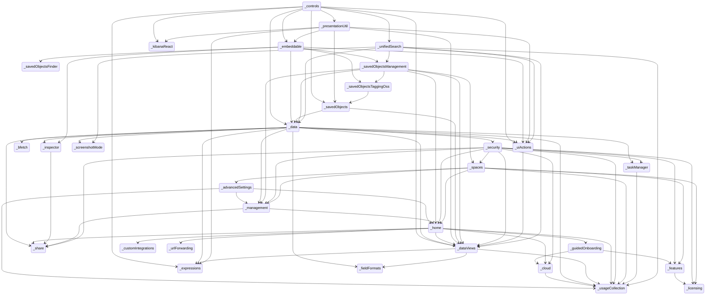


## customIntegrations

```mermaid
stateDiagram
direction TB
accTitle: customIntegrations dependencies
```


## dashboard

```mermaid
stateDiagram
direction TB
accTitle: dashboard dependencies
  _advancedSettings --> _home
  _advancedSettings --> _management
  _advancedSettings --> _usageCollection
  _charts --> _expressions
  _cloud --> _usageCollection
  _controls --> _data
  _controls --> _dataViews
  _controls --> _embeddable
  _controls --> _expressions
  _controls --> _kibanaReact
  _controls --> _presentationUtil
  _controls --> _savedObjects
  _controls --> _uiActions
  _controls --> _unifiedSearch
  _dashboard --> _controls
  _dashboard --> _data
  _dashboard --> _dataViewEditor
  _dashboard --> _dataViews
  _dashboard --> _embeddable
  _dashboard --> _home
  _dashboard --> _inspector
  _dashboard --> _navigation
  _dashboard --> _presentationUtil
  _dashboard --> _savedObjects
  _dashboard --> _savedObjectsFinder
  _dashboard --> _savedObjectsManagement
  _dashboard --> _savedObjectsTaggingOss
  _dashboard --> _screenshotMode
  _dashboard --> _share
  _dashboard --> _spaces
  _dashboard --> _taskManager
  _dashboard --> _uiActions
  _dashboard --> _unifiedSearch
  _dashboard --> _urlForwarding
  _dashboard --> _usageCollection
  _dashboard --> _visualizations
  _data --> _bfetch
  _data --> _dataViews
  _data --> _expressions
  _data --> _fieldFormats
  _data --> _inspector
  _data --> _management
  _data --> _screenshotMode
  _data --> _security
  _data --> _share
  _data --> _taskManager
  _data --> _uiActions
  _data --> _usageCollection
  _dataViewEditor --> _data
  _dataViewEditor --> _dataViews
  _dataViews --> _expressions
  _dataViews --> _fieldFormats
  _dataViews --> _usageCollection
  _embeddable --> _data
  _embeddable --> _inspector
  _embeddable --> _savedObjectsFinder
  _embeddable --> _savedObjectsManagement
  _embeddable --> _savedObjectsTaggingOss
  _embeddable --> _uiActions
  _features --> _licensing
  _guidedOnboarding --> _cloud
  _guidedOnboarding --> _features
  _home --> _cloud
  _home --> _customIntegrations
  _home --> _dataViews
  _home --> _guidedOnboarding
  _home --> _share
  _home --> _urlForwarding
  _home --> _usageCollection
  _inspector --> _share
  _management --> _home
  _management --> _share
  _navigation --> _unifiedSearch
  _presentationUtil --> _dataViews
  _presentationUtil --> _embeddable
  _presentationUtil --> _expressions
  _presentationUtil --> _kibanaReact
  _presentationUtil --> _savedObjects
  _presentationUtil --> _uiActions
  _savedObjects --> _data
  _savedObjects --> _dataViews
  _savedObjectsManagement --> _data
  _savedObjectsManagement --> _dataViews
  _savedObjectsManagement --> _home
  _savedObjectsManagement --> _management
  _savedObjectsManagement --> _savedObjectsTaggingOss
  _savedObjectsManagement --> _spaces
  _savedObjectsTaggingOss --> _savedObjects
  _security --> _cloud
  _security --> _dataViews
  _security --> _features
  _security --> _home
  _security --> _licensing
  _security --> _management
  _security --> _share
  _security --> _spaces
  _security --> _taskManager
  _security --> _usageCollection
  _spaces --> _advancedSettings
  _spaces --> _features
  _spaces --> _home
  _spaces --> _licensing
  _spaces --> _management
  _spaces --> _usageCollection
  _taskManager --> _usageCollection
  _uiActions --> _dataViews
  _unifiedSearch --> _data
  _unifiedSearch --> _dataViews
  _unifiedSearch --> _savedObjectsManagement
  _unifiedSearch --> _screenshotMode
  _unifiedSearch --> _uiActions
  _unifiedSearch --> _usageCollection
  _visualizations --> _charts
  _visualizations --> _contentManagement
  _visualizations --> _data
  _visualizations --> _dataViewEditor
  _visualizations --> _dataViews
  _visualizations --> _embeddable
  _visualizations --> _expressions
  _visualizations --> _fieldFormats
  _visualizations --> _home
  _visualizations --> _inspector
  _visualizations --> _navigation
  _visualizations --> _presentationUtil
  _visualizations --> _savedObjects
  _visualizations --> _savedObjectsFinder
  _visualizations --> _savedObjectsManagement
  _visualizations --> _savedObjectsTaggingOss
  _visualizations --> _screenshotMode
  _visualizations --> _share
  _visualizations --> _spaces
  _visualizations --> _uiActions
  _visualizations --> _unifiedSearch
  _visualizations --> _urlForwarding
  _visualizations --> _usageCollection
```


## data

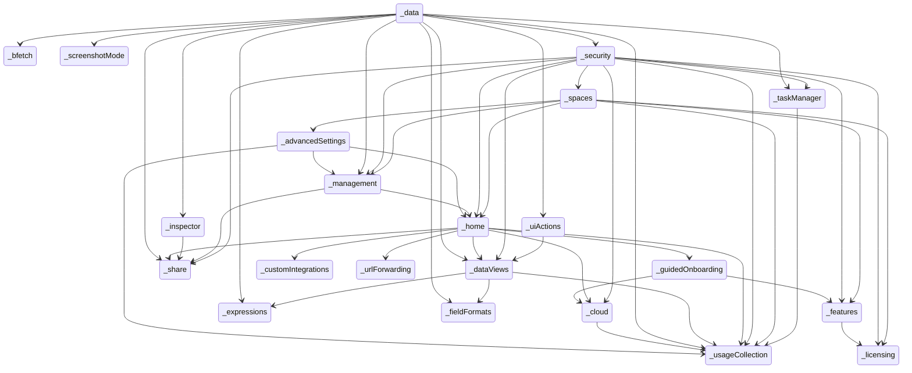


## dataViewEditor

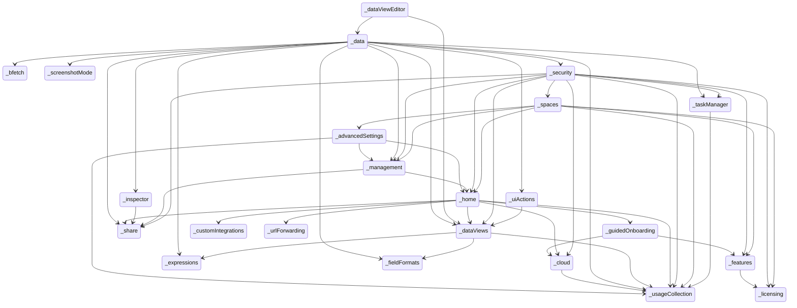


## dataViewFieldEditor

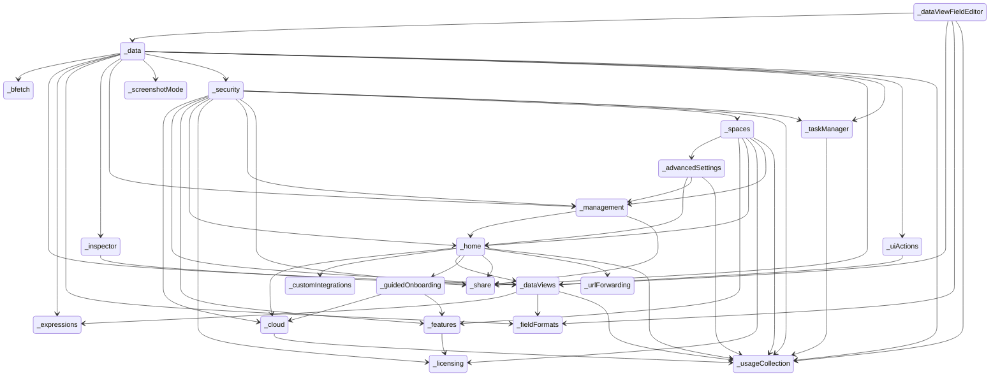


## dataViews

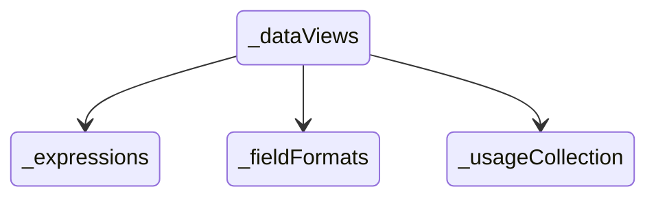


## dataVisualizer

```mermaid
stateDiagram
direction TB
accTitle: dataVisualizer dependencies
  _actions --> _encryptedSavedObjects
  _actions --> _eventLog
  _actions --> _features
  _actions --> _licensing
  _actions --> _security
  _actions --> _spaces
  _actions --> _taskManager
  _actions --> _usageCollection
  _advancedSettings --> _home
  _advancedSettings --> _management
  _advancedSettings --> _usageCollection
  _alerting --> _actions
  _alerting --> _data
  _alerting --> _dataViews
  _alerting --> _encryptedSavedObjects
  _alerting --> _esUiShared
  _alerting --> _eventLog
  _alerting --> _features
  _alerting --> _kibanaReact
  _alerting --> _kibanaUtils
  _alerting --> _licensing
  _alerting --> _management
  _alerting --> _security
  _alerting --> _share
  _alerting --> _spaces
  _alerting --> _taskManager
  _alerting --> _usageCollection
  _charts --> _expressions
  _cloud --> _usageCollection
  _controls --> _data
  _controls --> _dataViews
  _controls --> _embeddable
  _controls --> _expressions
  _controls --> _kibanaReact
  _controls --> _presentationUtil
  _controls --> _savedObjects
  _controls --> _uiActions
  _controls --> _unifiedSearch
  _dashboard --> _controls
  _dashboard --> _data
  _dashboard --> _dataViewEditor
  _dashboard --> _dataViews
  _dashboard --> _embeddable
  _dashboard --> _home
  _dashboard --> _inspector
  _dashboard --> _navigation
  _dashboard --> _presentationUtil
  _dashboard --> _savedObjects
  _dashboard --> _savedObjectsFinder
  _dashboard --> _savedObjectsManagement
  _dashboard --> _savedObjectsTaggingOss
  _dashboard --> _screenshotMode
  _dashboard --> _share
  _dashboard --> _spaces
  _dashboard --> _taskManager
  _dashboard --> _uiActions
  _dashboard --> _unifiedSearch
  _dashboard --> _urlForwarding
  _dashboard --> _usageCollection
  _dashboard --> _visualizations
  _data --> _bfetch
  _data --> _dataViews
  _data --> _expressions
  _data --> _fieldFormats
  _data --> _inspector
  _data --> _management
  _data --> _screenshotMode
  _data --> _security
  _data --> _share
  _data --> _taskManager
  _data --> _uiActions
  _data --> _usageCollection
  _dataViewEditor --> _data
  _dataViewEditor --> _dataViews
  _dataViewFieldEditor --> _data
  _dataViewFieldEditor --> _dataViews
  _dataViewFieldEditor --> _fieldFormats
  _dataViewFieldEditor --> _usageCollection
  _dataViews --> _expressions
  _dataViews --> _fieldFormats
  _dataViews --> _usageCollection
  _dataVisualizer --> _charts
  _dataVisualizer --> _cloud
  _dataVisualizer --> _customIntegrations
  _dataVisualizer --> _data
  _dataVisualizer --> _dataViewFieldEditor
  _dataVisualizer --> _discover
  _dataVisualizer --> _embeddable
  _dataVisualizer --> _fileUpload
  _dataVisualizer --> _home
  _dataVisualizer --> _lens
  _dataVisualizer --> _maps
  _dataVisualizer --> _security
  _dataVisualizer --> _share
  _dataVisualizer --> _uiActions
  _dataVisualizer --> _unifiedSearch
  _dataVisualizer --> _usageCollection
  _discover --> _charts
  _discover --> _data
  _discover --> _dataViewEditor
  _discover --> _dataViewFieldEditor
  _discover --> _dataViews
  _discover --> _embeddable
  _discover --> _expressions
  _discover --> _fieldFormats
  _discover --> _home
  _discover --> _inspector
  _discover --> _lens
  _discover --> _navigation
  _discover --> _savedObjects
  _discover --> _savedObjectsFinder
  _discover --> _savedObjectsManagement
  _discover --> _savedObjectsTaggingOss
  _discover --> _share
  _discover --> _spaces
  _discover --> _triggersActionsUi
  _discover --> _uiActions
  _discover --> _unifiedFieldList
  _discover --> _unifiedHistogram
  _discover --> _unifiedSearch
  _discover --> _urlForwarding
  _discover --> _usageCollection
  _embeddable --> _data
  _embeddable --> _inspector
  _embeddable --> _savedObjectsFinder
  _embeddable --> _savedObjectsManagement
  _embeddable --> _savedObjectsTaggingOss
  _embeddable --> _uiActions
  _encryptedSavedObjects --> _security
  _eventAnnotation --> _data
  _eventAnnotation --> _expressions
  _eventLog --> _spaces
  _expressionGauge --> _charts
  _expressionGauge --> _data
  _expressionGauge --> _expressions
  _expressionGauge --> _fieldFormats
  _expressionGauge --> _presentationUtil
  _expressionGauge --> _usageCollection
  _expressionGauge --> _visualizations
  _expressionHeatmap --> _charts
  _expressionHeatmap --> _data
  _expressionHeatmap --> _expressions
  _expressionHeatmap --> _fieldFormats
  _expressionHeatmap --> _presentationUtil
  _expressionHeatmap --> _usageCollection
  _expressionHeatmap --> _visualizations
  _expressionMetricVis --> _charts
  _expressionMetricVis --> _expressions
  _expressionMetricVis --> _fieldFormats
  _expressionMetricVis --> _presentationUtil
  _expressionMetricVis --> _usageCollection
  _expressionMetricVis --> _visualizations
  _expressionXY --> _charts
  _expressionXY --> _data
  _expressionXY --> _eventAnnotation
  _expressionXY --> _expressions
  _expressionXY --> _fieldFormats
  _expressionXY --> _uiActions
  _expressionXY --> _usageCollection
  _expressionXY --> _visualizations
  _features --> _licensing
  _fileUpload --> _data
  _fileUpload --> _security
  _fileUpload --> _usageCollection
  _guidedOnboarding --> _cloud
  _guidedOnboarding --> _features
  _home --> _cloud
  _home --> _customIntegrations
  _home --> _dataViews
  _home --> _guidedOnboarding
  _home --> _share
  _home --> _urlForwarding
  _home --> _usageCollection
  _inspector --> _share
  _lens --> _charts
  _lens --> _contentManagement
  _lens --> _dashboard
  _lens --> _data
  _lens --> _dataViewEditor
  _lens --> _dataViewFieldEditor
  _lens --> _dataViews
  _lens --> _embeddable
  _lens --> _eventAnnotation
  _lens --> _expressionGauge
  _lens --> _expressionHeatmap
  _lens --> _expressionMetricVis
  _lens --> _expressionXY
  _lens --> _expressions
  _lens --> _fieldFormats
  _lens --> _inspector
  _lens --> _navigation
  _lens --> _presentationUtil
  _lens --> _savedObjectsTagging
  _lens --> _share
  _lens --> _spaces
  _lens --> _taskManager
  _lens --> _uiActions
  _lens --> _uiActionsEnhanced
  _lens --> _unifiedFieldList
  _lens --> _unifiedSearch
  _lens --> _urlForwarding
  _lens --> _usageCollection
  _lens --> _visualizations
  _management --> _home
  _management --> _share
  _maps --> _charts
  _maps --> _cloud
  _maps --> _contentManagement
  _maps --> _controls
  _maps --> _customIntegrations
  _maps --> _dashboard
  _maps --> _data
  _maps --> _embeddable
  _maps --> _expressions
  _maps --> _features
  _maps --> _fieldFormats
  _maps --> _fileUpload
  _maps --> _home
  _maps --> _inspector
  _maps --> _lens
  _maps --> _licensing
  _maps --> _mapsEms
  _maps --> _navigation
  _maps --> _presentationUtil
  _maps --> _savedObjects
  _maps --> _savedObjectsTagging
  _maps --> _screenshotMode
  _maps --> _security
  _maps --> _share
  _maps --> _spaces
  _maps --> _uiActions
  _maps --> _unifiedSearch
  _maps --> _usageCollection
  _maps --> _visualizations
  _mapsEms --> _licensing
  _navigation --> _unifiedSearch
  _presentationUtil --> _dataViews
  _presentationUtil --> _embeddable
  _presentationUtil --> _expressions
  _presentationUtil --> _kibanaReact
  _presentationUtil --> _savedObjects
  _presentationUtil --> _uiActions
  _savedObjects --> _data
  _savedObjects --> _dataViews
  _savedObjectsManagement --> _data
  _savedObjectsManagement --> _dataViews
  _savedObjectsManagement --> _home
  _savedObjectsManagement --> _management
  _savedObjectsManagement --> _savedObjectsTaggingOss
  _savedObjectsManagement --> _spaces
  _savedObjectsTagging --> _features
  _savedObjectsTagging --> _management
  _savedObjectsTagging --> _savedObjectsTaggingOss
  _savedObjectsTagging --> _security
  _savedObjectsTagging --> _usageCollection
  _savedObjectsTaggingOss --> _savedObjects
  _security --> _cloud
  _security --> _dataViews
  _security --> _features
  _security --> _home
  _security --> _licensing
  _security --> _management
  _security --> _share
  _security --> _spaces
  _security --> _taskManager
  _security --> _usageCollection
  _spaces --> _advancedSettings
  _spaces --> _features
  _spaces --> _home
  _spaces --> _licensing
  _spaces --> _management
  _spaces --> _usageCollection
  _taskManager --> _usageCollection
  _triggersActionsUi --> _actions
  _triggersActionsUi --> _alerting
  _triggersActionsUi --> _charts
  _triggersActionsUi --> _cloud
  _triggersActionsUi --> _data
  _triggersActionsUi --> _dataViewEditor
  _triggersActionsUi --> _dataViews
  _triggersActionsUi --> _features
  _triggersActionsUi --> _home
  _triggersActionsUi --> _kibanaReact
  _triggersActionsUi --> _kibanaUtils
  _triggersActionsUi --> _management
  _triggersActionsUi --> _savedObjects
  _triggersActionsUi --> _spaces
  _triggersActionsUi --> _unifiedSearch
  _uiActions --> _dataViews
  _uiActionsEnhanced --> _embeddable
  _uiActionsEnhanced --> _licensing
  _uiActionsEnhanced --> _uiActions
  _unifiedFieldList --> _charts
  _unifiedFieldList --> _data
  _unifiedFieldList --> _dataViews
  _unifiedFieldList --> _fieldFormats
  _unifiedFieldList --> _uiActions
  _unifiedSearch --> _data
  _unifiedSearch --> _dataViews
  _unifiedSearch --> _savedObjectsManagement
  _unifiedSearch --> _screenshotMode
  _unifiedSearch --> _uiActions
  _unifiedSearch --> _usageCollection
  _visualizations --> _charts
  _visualizations --> _contentManagement
  _visualizations --> _data
  _visualizations --> _dataViewEditor
  _visualizations --> _dataViews
  _visualizations --> _embeddable
  _visualizations --> _expressions
  _visualizations --> _fieldFormats
  _visualizations --> _home
  _visualizations --> _inspector
  _visualizations --> _navigation
  _visualizations --> _presentationUtil
  _visualizations --> _savedObjects
  _visualizations --> _savedObjectsFinder
  _visualizations --> _savedObjectsManagement
  _visualizations --> _savedObjectsTaggingOss
  _visualizations --> _screenshotMode
  _visualizations --> _share
  _visualizations --> _spaces
  _visualizations --> _uiActions
  _visualizations --> _unifiedSearch
  _visualizations --> _urlForwarding
  _visualizations --> _usageCollection
```


## discover

```mermaid
stateDiagram
direction TB
accTitle: discover dependencies
  _actions --> _encryptedSavedObjects
  _actions --> _eventLog
  _actions --> _features
  _actions --> _licensing
  _actions --> _security
  _actions --> _spaces
  _actions --> _taskManager
  _actions --> _usageCollection
  _advancedSettings --> _home
  _advancedSettings --> _management
  _advancedSettings --> _usageCollection
  _alerting --> _actions
  _alerting --> _data
  _alerting --> _dataViews
  _alerting --> _encryptedSavedObjects
  _alerting --> _esUiShared
  _alerting --> _eventLog
  _alerting --> _features
  _alerting --> _kibanaReact
  _alerting --> _kibanaUtils
  _alerting --> _licensing
  _alerting --> _management
  _alerting --> _security
  _alerting --> _share
  _alerting --> _spaces
  _alerting --> _taskManager
  _alerting --> _usageCollection
  _charts --> _expressions
  _cloud --> _usageCollection
  _controls --> _data
  _controls --> _dataViews
  _controls --> _embeddable
  _controls --> _expressions
  _controls --> _kibanaReact
  _controls --> _presentationUtil
  _controls --> _savedObjects
  _controls --> _uiActions
  _controls --> _unifiedSearch
  _dashboard --> _controls
  _dashboard --> _data
  _dashboard --> _dataViewEditor
  _dashboard --> _dataViews
  _dashboard --> _embeddable
  _dashboard --> _home
  _dashboard --> _inspector
  _dashboard --> _navigation
  _dashboard --> _presentationUtil
  _dashboard --> _savedObjects
  _dashboard --> _savedObjectsFinder
  _dashboard --> _savedObjectsManagement
  _dashboard --> _savedObjectsTaggingOss
  _dashboard --> _screenshotMode
  _dashboard --> _share
  _dashboard --> _spaces
  _dashboard --> _taskManager
  _dashboard --> _uiActions
  _dashboard --> _unifiedSearch
  _dashboard --> _urlForwarding
  _dashboard --> _usageCollection
  _dashboard --> _visualizations
  _data --> _bfetch
  _data --> _dataViews
  _data --> _expressions
  _data --> _fieldFormats
  _data --> _inspector
  _data --> _management
  _data --> _screenshotMode
  _data --> _security
  _data --> _share
  _data --> _taskManager
  _data --> _uiActions
  _data --> _usageCollection
  _dataViewEditor --> _data
  _dataViewEditor --> _dataViews
  _dataViewFieldEditor --> _data
  _dataViewFieldEditor --> _dataViews
  _dataViewFieldEditor --> _fieldFormats
  _dataViewFieldEditor --> _usageCollection
  _dataViews --> _expressions
  _dataViews --> _fieldFormats
  _dataViews --> _usageCollection
  _discover --> _charts
  _discover --> _data
  _discover --> _dataViewEditor
  _discover --> _dataViewFieldEditor
  _discover --> _dataViews
  _discover --> _embeddable
  _discover --> _expressions
  _discover --> _fieldFormats
  _discover --> _home
  _discover --> _inspector
  _discover --> _lens
  _discover --> _navigation
  _discover --> _savedObjects
  _discover --> _savedObjectsFinder
  _discover --> _savedObjectsManagement
  _discover --> _savedObjectsTaggingOss
  _discover --> _share
  _discover --> _spaces
  _discover --> _triggersActionsUi
  _discover --> _uiActions
  _discover --> _unifiedFieldList
  _discover --> _unifiedHistogram
  _discover --> _unifiedSearch
  _discover --> _urlForwarding
  _discover --> _usageCollection
  _embeddable --> _data
  _embeddable --> _inspector
  _embeddable --> _savedObjectsFinder
  _embeddable --> _savedObjectsManagement
  _embeddable --> _savedObjectsTaggingOss
  _embeddable --> _uiActions
  _encryptedSavedObjects --> _security
  _eventAnnotation --> _data
  _eventAnnotation --> _expressions
  _eventLog --> _spaces
  _expressionGauge --> _charts
  _expressionGauge --> _data
  _expressionGauge --> _expressions
  _expressionGauge --> _fieldFormats
  _expressionGauge --> _presentationUtil
  _expressionGauge --> _usageCollection
  _expressionGauge --> _visualizations
  _expressionHeatmap --> _charts
  _expressionHeatmap --> _data
  _expressionHeatmap --> _expressions
  _expressionHeatmap --> _fieldFormats
  _expressionHeatmap --> _presentationUtil
  _expressionHeatmap --> _usageCollection
  _expressionHeatmap --> _visualizations
  _expressionMetricVis --> _charts
  _expressionMetricVis --> _expressions
  _expressionMetricVis --> _fieldFormats
  _expressionMetricVis --> _presentationUtil
  _expressionMetricVis --> _usageCollection
  _expressionMetricVis --> _visualizations
  _expressionXY --> _charts
  _expressionXY --> _data
  _expressionXY --> _eventAnnotation
  _expressionXY --> _expressions
  _expressionXY --> _fieldFormats
  _expressionXY --> _uiActions
  _expressionXY --> _usageCollection
  _expressionXY --> _visualizations
  _features --> _licensing
  _guidedOnboarding --> _cloud
  _guidedOnboarding --> _features
  _home --> _cloud
  _home --> _customIntegrations
  _home --> _dataViews
  _home --> _guidedOnboarding
  _home --> _share
  _home --> _urlForwarding
  _home --> _usageCollection
  _inspector --> _share
  _lens --> _charts
  _lens --> _contentManagement
  _lens --> _dashboard
  _lens --> _data
  _lens --> _dataViewEditor
  _lens --> _dataViewFieldEditor
  _lens --> _dataViews
  _lens --> _embeddable
  _lens --> _eventAnnotation
  _lens --> _expressionGauge
  _lens --> _expressionHeatmap
  _lens --> _expressionMetricVis
  _lens --> _expressionXY
  _lens --> _expressions
  _lens --> _fieldFormats
  _lens --> _inspector
  _lens --> _navigation
  _lens --> _presentationUtil
  _lens --> _savedObjectsTagging
  _lens --> _share
  _lens --> _spaces
  _lens --> _taskManager
  _lens --> _uiActions
  _lens --> _uiActionsEnhanced
  _lens --> _unifiedFieldList
  _lens --> _unifiedSearch
  _lens --> _urlForwarding
  _lens --> _usageCollection
  _lens --> _visualizations
  _management --> _home
  _management --> _share
  _navigation --> _unifiedSearch
  _presentationUtil --> _dataViews
  _presentationUtil --> _embeddable
  _presentationUtil --> _expressions
  _presentationUtil --> _kibanaReact
  _presentationUtil --> _savedObjects
  _presentationUtil --> _uiActions
  _savedObjects --> _data
  _savedObjects --> _dataViews
  _savedObjectsManagement --> _data
  _savedObjectsManagement --> _dataViews
  _savedObjectsManagement --> _home
  _savedObjectsManagement --> _management
  _savedObjectsManagement --> _savedObjectsTaggingOss
  _savedObjectsManagement --> _spaces
  _savedObjectsTagging --> _features
  _savedObjectsTagging --> _management
  _savedObjectsTagging --> _savedObjectsTaggingOss
  _savedObjectsTagging --> _security
  _savedObjectsTagging --> _usageCollection
  _savedObjectsTaggingOss --> _savedObjects
  _security --> _cloud
  _security --> _dataViews
  _security --> _features
  _security --> _home
  _security --> _licensing
  _security --> _management
  _security --> _share
  _security --> _spaces
  _security --> _taskManager
  _security --> _usageCollection
  _spaces --> _advancedSettings
  _spaces --> _features
  _spaces --> _home
  _spaces --> _licensing
  _spaces --> _management
  _spaces --> _usageCollection
  _taskManager --> _usageCollection
  _triggersActionsUi --> _actions
  _triggersActionsUi --> _alerting
  _triggersActionsUi --> _charts
  _triggersActionsUi --> _cloud
  _triggersActionsUi --> _data
  _triggersActionsUi --> _dataViewEditor
  _triggersActionsUi --> _dataViews
  _triggersActionsUi --> _features
  _triggersActionsUi --> _home
  _triggersActionsUi --> _kibanaReact
  _triggersActionsUi --> _kibanaUtils
  _triggersActionsUi --> _management
  _triggersActionsUi --> _savedObjects
  _triggersActionsUi --> _spaces
  _triggersActionsUi --> _unifiedSearch
  _uiActions --> _dataViews
  _uiActionsEnhanced --> _embeddable
  _uiActionsEnhanced --> _licensing
  _uiActionsEnhanced --> _uiActions
  _unifiedFieldList --> _charts
  _unifiedFieldList --> _data
  _unifiedFieldList --> _dataViews
  _unifiedFieldList --> _fieldFormats
  _unifiedFieldList --> _uiActions
  _unifiedSearch --> _data
  _unifiedSearch --> _dataViews
  _unifiedSearch --> _savedObjectsManagement
  _unifiedSearch --> _screenshotMode
  _unifiedSearch --> _uiActions
  _unifiedSearch --> _usageCollection
  _visualizations --> _charts
  _visualizations --> _contentManagement
  _visualizations --> _data
  _visualizations --> _dataViewEditor
  _visualizations --> _dataViews
  _visualizations --> _embeddable
  _visualizations --> _expressions
  _visualizations --> _fieldFormats
  _visualizations --> _home
  _visualizations --> _inspector
  _visualizations --> _navigation
  _visualizations --> _presentationUtil
  _visualizations --> _savedObjects
  _visualizations --> _savedObjectsFinder
  _visualizations --> _savedObjectsManagement
  _visualizations --> _savedObjectsTaggingOss
  _visualizations --> _screenshotMode
  _visualizations --> _share
  _visualizations --> _spaces
  _visualizations --> _uiActions
  _visualizations --> _unifiedSearch
  _visualizations --> _urlForwarding
  _visualizations --> _usageCollection
```


## ecsDataQualityDashboard

```mermaid
stateDiagram
direction TB
accTitle: ecsDataQualityDashboard dependencies
  _advancedSettings --> _home
  _advancedSettings --> _management
  _advancedSettings --> _usageCollection
  _cloud --> _usageCollection
  _data --> _bfetch
  _data --> _dataViews
  _data --> _expressions
  _data --> _fieldFormats
  _data --> _inspector
  _data --> _management
  _data --> _screenshotMode
  _data --> _security
  _data --> _share
  _data --> _taskManager
  _data --> _uiActions
  _data --> _usageCollection
  _dataViews --> _expressions
  _dataViews --> _fieldFormats
  _dataViews --> _usageCollection
  _ecsDataQualityDashboard --> _data
  _features --> _licensing
  _guidedOnboarding --> _cloud
  _guidedOnboarding --> _features
  _home --> _cloud
  _home --> _customIntegrations
  _home --> _dataViews
  _home --> _guidedOnboarding
  _home --> _share
  _home --> _urlForwarding
  _home --> _usageCollection
  _inspector --> _share
  _management --> _home
  _management --> _share
  _security --> _cloud
  _security --> _dataViews
  _security --> _features
  _security --> _home
  _security --> _licensing
  _security --> _management
  _security --> _share
  _security --> _spaces
  _security --> _taskManager
  _security --> _usageCollection
  _spaces --> _advancedSettings
  _spaces --> _features
  _spaces --> _home
  _spaces --> _licensing
  _spaces --> _management
  _spaces --> _usageCollection
  _taskManager --> _usageCollection
  _uiActions --> _dataViews
```


## embeddable

```mermaid
stateDiagram
direction TB
accTitle: embeddable dependencies
  _advancedSettings --> _home
  _advancedSettings --> _management
  _advancedSettings --> _usageCollection
  _cloud --> _usageCollection
  _data --> _bfetch
  _data --> _dataViews
  _data --> _expressions
  _data --> _fieldFormats
  _data --> _inspector
  _data --> _management
  _data --> _screenshotMode
  _data --> _security
  _data --> _share
  _data --> _taskManager
  _data --> _uiActions
  _data --> _usageCollection
  _dataViews --> _expressions
  _dataViews --> _fieldFormats
  _dataViews --> _usageCollection
  _embeddable --> _data
  _embeddable --> _inspector
  _embeddable --> _savedObjectsFinder
  _embeddable --> _savedObjectsManagement
  _embeddable --> _savedObjectsTaggingOss
  _embeddable --> _uiActions
  _features --> _licensing
  _guidedOnboarding --> _cloud
  _guidedOnboarding --> _features
  _home --> _cloud
  _home --> _customIntegrations
  _home --> _dataViews
  _home --> _guidedOnboarding
  _home --> _share
  _home --> _urlForwarding
  _home --> _usageCollection
  _inspector --> _share
  _management --> _home
  _management --> _share
  _savedObjects --> _data
  _savedObjects --> _dataViews
  _savedObjectsManagement --> _data
  _savedObjectsManagement --> _dataViews
  _savedObjectsManagement --> _home
  _savedObjectsManagement --> _management
  _savedObjectsManagement --> _savedObjectsTaggingOss
  _savedObjectsManagement --> _spaces
  _savedObjectsTaggingOss --> _savedObjects
  _security --> _cloud
  _security --> _dataViews
  _security --> _features
  _security --> _home
  _security --> _licensing
  _security --> _management
  _security --> _share
  _security --> _spaces
  _security --> _taskManager
  _security --> _usageCollection
  _spaces --> _advancedSettings
  _spaces --> _features
  _spaces --> _home
  _spaces --> _licensing
  _spaces --> _management
  _spaces --> _usageCollection
  _taskManager --> _usageCollection
  _uiActions --> _dataViews
```


## encryptedSavedObjects

```mermaid
stateDiagram
direction TB
accTitle: encryptedSavedObjects dependencies
  _advancedSettings --> _home
  _advancedSettings --> _management
  _advancedSettings --> _usageCollection
  _cloud --> _usageCollection
  _dataViews --> _expressions
  _dataViews --> _fieldFormats
  _dataViews --> _usageCollection
  _encryptedSavedObjects --> _security
  _features --> _licensing
  _guidedOnboarding --> _cloud
  _guidedOnboarding --> _features
  _home --> _cloud
  _home --> _customIntegrations
  _home --> _dataViews
  _home --> _guidedOnboarding
  _home --> _share
  _home --> _urlForwarding
  _home --> _usageCollection
  _management --> _home
  _management --> _share
  _security --> _cloud
  _security --> _dataViews
  _security --> _features
  _security --> _home
  _security --> _licensing
  _security --> _management
  _security --> _share
  _security --> _spaces
  _security --> _taskManager
  _security --> _usageCollection
  _spaces --> _advancedSettings
  _spaces --> _features
  _spaces --> _home
  _spaces --> _licensing
  _spaces --> _management
  _spaces --> _usageCollection
  _taskManager --> _usageCollection
```


## enterpriseSearch

```mermaid
stateDiagram
direction TB
accTitle: enterpriseSearch dependencies
  _actions --> _encryptedSavedObjects
  _actions --> _eventLog
  _actions --> _features
  _actions --> _licensing
  _actions --> _security
  _actions --> _spaces
  _actions --> _taskManager
  _actions --> _usageCollection
  _advancedSettings --> _home
  _advancedSettings --> _management
  _advancedSettings --> _usageCollection
  _alerting --> _actions
  _alerting --> _data
  _alerting --> _dataViews
  _alerting --> _encryptedSavedObjects
  _alerting --> _esUiShared
  _alerting --> _eventLog
  _alerting --> _features
  _alerting --> _kibanaReact
  _alerting --> _kibanaUtils
  _alerting --> _licensing
  _alerting --> _management
  _alerting --> _security
  _alerting --> _share
  _alerting --> _spaces
  _alerting --> _taskManager
  _alerting --> _usageCollection
  _cases --> _actions
  _cases --> _data
  _cases --> _embeddable
  _cases --> _esUiShared
  _cases --> _features
  _cases --> _files
  _cases --> _home
  _cases --> _kibanaReact
  _cases --> _kibanaUtils
  _cases --> _lens
  _cases --> _licensing
  _cases --> _management
  _cases --> _notifications
  _cases --> _ruleRegistry
  _cases --> _savedObjectsFinder
  _cases --> _savedObjectsManagement
  _cases --> _security
  _cases --> _spaces
  _cases --> _taskManager
  _cases --> _triggersActionsUi
  _cases --> _usageCollection
  _charts --> _expressions
  _cloud --> _usageCollection
  _controls --> _data
  _controls --> _dataViews
  _controls --> _embeddable
  _controls --> _expressions
  _controls --> _kibanaReact
  _controls --> _presentationUtil
  _controls --> _savedObjects
  _controls --> _uiActions
  _controls --> _unifiedSearch
  _dashboard --> _controls
  _dashboard --> _data
  _dashboard --> _dataViewEditor
  _dashboard --> _dataViews
  _dashboard --> _embeddable
  _dashboard --> _home
  _dashboard --> _inspector
  _dashboard --> _navigation
  _dashboard --> _presentationUtil
  _dashboard --> _savedObjects
  _dashboard --> _savedObjectsFinder
  _dashboard --> _savedObjectsManagement
  _dashboard --> _savedObjectsTaggingOss
  _dashboard --> _screenshotMode
  _dashboard --> _share
  _dashboard --> _spaces
  _dashboard --> _taskManager
  _dashboard --> _uiActions
  _dashboard --> _unifiedSearch
  _dashboard --> _urlForwarding
  _dashboard --> _usageCollection
  _dashboard --> _visualizations
  _data --> _bfetch
  _data --> _dataViews
  _data --> _expressions
  _data --> _fieldFormats
  _data --> _inspector
  _data --> _management
  _data --> _screenshotMode
  _data --> _security
  _data --> _share
  _data --> _taskManager
  _data --> _uiActions
  _data --> _usageCollection
  _dataViewEditor --> _data
  _dataViewEditor --> _dataViews
  _dataViewFieldEditor --> _data
  _dataViewFieldEditor --> _dataViews
  _dataViewFieldEditor --> _fieldFormats
  _dataViewFieldEditor --> _usageCollection
  _dataViews --> _expressions
  _dataViews --> _fieldFormats
  _dataViews --> _usageCollection
  _discover --> _charts
  _discover --> _data
  _discover --> _dataViewEditor
  _discover --> _dataViewFieldEditor
  _discover --> _dataViews
  _discover --> _embeddable
  _discover --> _expressions
  _discover --> _fieldFormats
  _discover --> _home
  _discover --> _inspector
  _discover --> _lens
  _discover --> _navigation
  _discover --> _savedObjects
  _discover --> _savedObjectsFinder
  _discover --> _savedObjectsManagement
  _discover --> _savedObjectsTaggingOss
  _discover --> _share
  _discover --> _spaces
  _discover --> _triggersActionsUi
  _discover --> _uiActions
  _discover --> _unifiedFieldList
  _discover --> _unifiedHistogram
  _discover --> _unifiedSearch
  _discover --> _urlForwarding
  _discover --> _usageCollection
  _embeddable --> _data
  _embeddable --> _inspector
  _embeddable --> _savedObjectsFinder
  _embeddable --> _savedObjectsManagement
  _embeddable --> _savedObjectsTaggingOss
  _embeddable --> _uiActions
  _encryptedSavedObjects --> _security
  _enterpriseSearch --> _charts
  _enterpriseSearch --> _cloud
  _enterpriseSearch --> _customIntegrations
  _enterpriseSearch --> _data
  _enterpriseSearch --> _discover
  _enterpriseSearch --> _embeddable
  _enterpriseSearch --> _esUiShared
  _enterpriseSearch --> _features
  _enterpriseSearch --> _guidedOnboarding
  _enterpriseSearch --> _home
  _enterpriseSearch --> _infra
  _enterpriseSearch --> _lens
  _enterpriseSearch --> _licensing
  _enterpriseSearch --> _security
  _enterpriseSearch --> _spaces
  _enterpriseSearch --> _usageCollection
  _eventAnnotation --> _data
  _eventAnnotation --> _expressions
  _eventLog --> _spaces
  _exploratoryView --> _alerting
  _exploratoryView --> _cases
  _exploratoryView --> _charts
  _exploratoryView --> _data
  _exploratoryView --> _dataViews
  _exploratoryView --> _discover
  _exploratoryView --> _embeddable
  _exploratoryView --> _features
  _exploratoryView --> _files
  _exploratoryView --> _guidedOnboarding
  _exploratoryView --> _home
  _exploratoryView --> _inspector
  _exploratoryView --> _lens
  _exploratoryView --> _licensing
  _exploratoryView --> _observabilityShared
  _exploratoryView --> _security
  _exploratoryView --> _share
  _exploratoryView --> _spaces
  _exploratoryView --> _triggersActionsUi
  _exploratoryView --> _unifiedSearch
  _exploratoryView --> _usageCollection
  _expressionGauge --> _charts
  _expressionGauge --> _data
  _expressionGauge --> _expressions
  _expressionGauge --> _fieldFormats
  _expressionGauge --> _presentationUtil
  _expressionGauge --> _usageCollection
  _expressionGauge --> _visualizations
  _expressionHeatmap --> _charts
  _expressionHeatmap --> _data
  _expressionHeatmap --> _expressions
  _expressionHeatmap --> _fieldFormats
  _expressionHeatmap --> _presentationUtil
  _expressionHeatmap --> _usageCollection
  _expressionHeatmap --> _visualizations
  _expressionMetricVis --> _charts
  _expressionMetricVis --> _expressions
  _expressionMetricVis --> _fieldFormats
  _expressionMetricVis --> _presentationUtil
  _expressionMetricVis --> _usageCollection
  _expressionMetricVis --> _visualizations
  _expressionXY --> _charts
  _expressionXY --> _data
  _expressionXY --> _eventAnnotation
  _expressionXY --> _expressions
  _expressionXY --> _fieldFormats
  _expressionXY --> _uiActions
  _expressionXY --> _usageCollection
  _expressionXY --> _visualizations
  _features --> _licensing
  _files --> _security
  _files --> _usageCollection
  _guidedOnboarding --> _cloud
  _guidedOnboarding --> _features
  _home --> _cloud
  _home --> _customIntegrations
  _home --> _dataViews
  _home --> _guidedOnboarding
  _home --> _share
  _home --> _urlForwarding
  _home --> _usageCollection
  _infra --> _alerting
  _infra --> _cases
  _infra --> _charts
  _infra --> _data
  _infra --> _dataViews
  _infra --> _discover
  _infra --> _embeddable
  _infra --> _features
  _infra --> _home
  _infra --> _lens
  _infra --> _observability
  _infra --> _observabilityShared
  _infra --> _ruleRegistry
  _infra --> _security
  _infra --> _share
  _infra --> _spaces
  _infra --> _triggersActionsUi
  _infra --> _unifiedSearch
  _infra --> _usageCollection
  _infra --> _visTypeTimeseries
  _inspector --> _share
  _lens --> _charts
  _lens --> _contentManagement
  _lens --> _dashboard
  _lens --> _data
  _lens --> _dataViewEditor
  _lens --> _dataViewFieldEditor
  _lens --> _dataViews
  _lens --> _embeddable
  _lens --> _eventAnnotation
  _lens --> _expressionGauge
  _lens --> _expressionHeatmap
  _lens --> _expressionMetricVis
  _lens --> _expressionXY
  _lens --> _expressions
  _lens --> _fieldFormats
  _lens --> _inspector
  _lens --> _navigation
  _lens --> _presentationUtil
  _lens --> _savedObjectsTagging
  _lens --> _share
  _lens --> _spaces
  _lens --> _taskManager
  _lens --> _uiActions
  _lens --> _uiActionsEnhanced
  _lens --> _unifiedFieldList
  _lens --> _unifiedSearch
  _lens --> _urlForwarding
  _lens --> _usageCollection
  _lens --> _visualizations
  _management --> _home
  _management --> _share
  _navigation --> _unifiedSearch
  _notifications --> _actions
  _notifications --> _licensing
  _observability --> _alerting
  _observability --> _cases
  _observability --> _charts
  _observability --> _data
  _observability --> _dataViews
  _observability --> _discover
  _observability --> _embeddable
  _observability --> _exploratoryView
  _observability --> _features
  _observability --> _files
  _observability --> _guidedOnboarding
  _observability --> _home
  _observability --> _inspector
  _observability --> _lens
  _observability --> _licensing
  _observability --> _observabilityShared
  _observability --> _ruleRegistry
  _observability --> _security
  _observability --> _share
  _observability --> _spaces
  _observability --> _triggersActionsUi
  _observability --> _unifiedSearch
  _observability --> _usageCollection
  _observability --> _visualizations
  _observabilityShared --> _cases
  _observabilityShared --> _guidedOnboarding
  _presentationUtil --> _dataViews
  _presentationUtil --> _embeddable
  _presentationUtil --> _expressions
  _presentationUtil --> _kibanaReact
  _presentationUtil --> _savedObjects
  _presentationUtil --> _uiActions
  _ruleRegistry --> _alerting
  _ruleRegistry --> _data
  _ruleRegistry --> _security
  _ruleRegistry --> _spaces
  _ruleRegistry --> _triggersActionsUi
  _savedObjects --> _data
  _savedObjects --> _dataViews
  _savedObjectsManagement --> _data
  _savedObjectsManagement --> _dataViews
  _savedObjectsManagement --> _home
  _savedObjectsManagement --> _management
  _savedObjectsManagement --> _savedObjectsTaggingOss
  _savedObjectsManagement --> _spaces
  _savedObjectsTagging --> _features
  _savedObjectsTagging --> _management
  _savedObjectsTagging --> _savedObjectsTaggingOss
  _savedObjectsTagging --> _security
  _savedObjectsTagging --> _usageCollection
  _savedObjectsTaggingOss --> _savedObjects
  _security --> _cloud
  _security --> _dataViews
  _security --> _features
  _security --> _home
  _security --> _licensing
  _security --> _management
  _security --> _share
  _security --> _spaces
  _security --> _taskManager
  _security --> _usageCollection
  _spaces --> _advancedSettings
  _spaces --> _features
  _spaces --> _home
  _spaces --> _licensing
  _spaces --> _management
  _spaces --> _usageCollection
  _taskManager --> _usageCollection
  _triggersActionsUi --> _actions
  _triggersActionsUi --> _alerting
  _triggersActionsUi --> _charts
  _triggersActionsUi --> _cloud
  _triggersActionsUi --> _data
  _triggersActionsUi --> _dataViewEditor
  _triggersActionsUi --> _dataViews
  _triggersActionsUi --> _features
  _triggersActionsUi --> _home
  _triggersActionsUi --> _kibanaReact
  _triggersActionsUi --> _kibanaUtils
  _triggersActionsUi --> _management
  _triggersActionsUi --> _savedObjects
  _triggersActionsUi --> _spaces
  _triggersActionsUi --> _unifiedSearch
  _uiActions --> _dataViews
  _uiActionsEnhanced --> _embeddable
  _uiActionsEnhanced --> _licensing
  _uiActionsEnhanced --> _uiActions
  _unifiedFieldList --> _charts
  _unifiedFieldList --> _data
  _unifiedFieldList --> _dataViews
  _unifiedFieldList --> _fieldFormats
  _unifiedFieldList --> _uiActions
  _unifiedSearch --> _data
  _unifiedSearch --> _dataViews
  _unifiedSearch --> _savedObjectsManagement
  _unifiedSearch --> _screenshotMode
  _unifiedSearch --> _uiActions
  _unifiedSearch --> _usageCollection
  _visTypeTimeseries --> _charts
  _visTypeTimeseries --> _data
  _visTypeTimeseries --> _dataViews
  _visTypeTimeseries --> _expressions
  _visTypeTimeseries --> _fieldFormats
  _visTypeTimeseries --> _home
  _visTypeTimeseries --> _inspector
  _visTypeTimeseries --> _unifiedSearch
  _visTypeTimeseries --> _usageCollection
  _visTypeTimeseries --> _visualizations
  _visualizations --> _charts
  _visualizations --> _contentManagement
  _visualizations --> _data
  _visualizations --> _dataViewEditor
  _visualizations --> _dataViews
  _visualizations --> _embeddable
  _visualizations --> _expressions
  _visualizations --> _fieldFormats
  _visualizations --> _home
  _visualizations --> _inspector
  _visualizations --> _navigation
  _visualizations --> _presentationUtil
  _visualizations --> _savedObjects
  _visualizations --> _savedObjectsFinder
  _visualizations --> _savedObjectsManagement
  _visualizations --> _savedObjectsTaggingOss
  _visualizations --> _screenshotMode
  _visualizations --> _share
  _visualizations --> _spaces
  _visualizations --> _uiActions
  _visualizations --> _unifiedSearch
  _visualizations --> _urlForwarding
  _visualizations --> _usageCollection
```


## esUiShared

```mermaid
stateDiagram
direction TB
accTitle: esUiShared dependencies
```


## eventAnnotation

```mermaid
stateDiagram
direction TB
accTitle: eventAnnotation dependencies
  _advancedSettings --> _home
  _advancedSettings --> _management
  _advancedSettings --> _usageCollection
  _cloud --> _usageCollection
  _data --> _bfetch
  _data --> _dataViews
  _data --> _expressions
  _data --> _fieldFormats
  _data --> _inspector
  _data --> _management
  _data --> _screenshotMode
  _data --> _security
  _data --> _share
  _data --> _taskManager
  _data --> _uiActions
  _data --> _usageCollection
  _dataViews --> _expressions
  _dataViews --> _fieldFormats
  _dataViews --> _usageCollection
  _eventAnnotation --> _data
  _eventAnnotation --> _expressions
  _features --> _licensing
  _guidedOnboarding --> _cloud
  _guidedOnboarding --> _features
  _home --> _cloud
  _home --> _customIntegrations
  _home --> _dataViews
  _home --> _guidedOnboarding
  _home --> _share
  _home --> _urlForwarding
  _home --> _usageCollection
  _inspector --> _share
  _management --> _home
  _management --> _share
  _security --> _cloud
  _security --> _dataViews
  _security --> _features
  _security --> _home
  _security --> _licensing
  _security --> _management
  _security --> _share
  _security --> _spaces
  _security --> _taskManager
  _security --> _usageCollection
  _spaces --> _advancedSettings
  _spaces --> _features
  _spaces --> _home
  _spaces --> _licensing
  _spaces --> _management
  _spaces --> _usageCollection
  _taskManager --> _usageCollection
  _uiActions --> _dataViews
```


## eventLog

```mermaid
stateDiagram
direction TB
accTitle: eventLog dependencies
  _advancedSettings --> _home
  _advancedSettings --> _management
  _advancedSettings --> _usageCollection
  _cloud --> _usageCollection
  _dataViews --> _expressions
  _dataViews --> _fieldFormats
  _dataViews --> _usageCollection
  _eventLog --> _spaces
  _features --> _licensing
  _guidedOnboarding --> _cloud
  _guidedOnboarding --> _features
  _home --> _cloud
  _home --> _customIntegrations
  _home --> _dataViews
  _home --> _guidedOnboarding
  _home --> _share
  _home --> _urlForwarding
  _home --> _usageCollection
  _management --> _home
  _management --> _share
  _spaces --> _advancedSettings
  _spaces --> _features
  _spaces --> _home
  _spaces --> _licensing
  _spaces --> _management
  _spaces --> _usageCollection
```


## exploratoryView

```mermaid
stateDiagram
direction TB
accTitle: exploratoryView dependencies
  _actions --> _encryptedSavedObjects
  _actions --> _eventLog
  _actions --> _features
  _actions --> _licensing
  _actions --> _security
  _actions --> _spaces
  _actions --> _taskManager
  _actions --> _usageCollection
  _advancedSettings --> _home
  _advancedSettings --> _management
  _advancedSettings --> _usageCollection
  _alerting --> _actions
  _alerting --> _data
  _alerting --> _dataViews
  _alerting --> _encryptedSavedObjects
  _alerting --> _esUiShared
  _alerting --> _eventLog
  _alerting --> _features
  _alerting --> _kibanaReact
  _alerting --> _kibanaUtils
  _alerting --> _licensing
  _alerting --> _management
  _alerting --> _security
  _alerting --> _share
  _alerting --> _spaces
  _alerting --> _taskManager
  _alerting --> _usageCollection
  _cases --> _actions
  _cases --> _data
  _cases --> _embeddable
  _cases --> _esUiShared
  _cases --> _features
  _cases --> _files
  _cases --> _home
  _cases --> _kibanaReact
  _cases --> _kibanaUtils
  _cases --> _lens
  _cases --> _licensing
  _cases --> _management
  _cases --> _notifications
  _cases --> _ruleRegistry
  _cases --> _savedObjectsFinder
  _cases --> _savedObjectsManagement
  _cases --> _security
  _cases --> _spaces
  _cases --> _taskManager
  _cases --> _triggersActionsUi
  _cases --> _usageCollection
  _charts --> _expressions
  _cloud --> _usageCollection
  _controls --> _data
  _controls --> _dataViews
  _controls --> _embeddable
  _controls --> _expressions
  _controls --> _kibanaReact
  _controls --> _presentationUtil
  _controls --> _savedObjects
  _controls --> _uiActions
  _controls --> _unifiedSearch
  _dashboard --> _controls
  _dashboard --> _data
  _dashboard --> _dataViewEditor
  _dashboard --> _dataViews
  _dashboard --> _embeddable
  _dashboard --> _home
  _dashboard --> _inspector
  _dashboard --> _navigation
  _dashboard --> _presentationUtil
  _dashboard --> _savedObjects
  _dashboard --> _savedObjectsFinder
  _dashboard --> _savedObjectsManagement
  _dashboard --> _savedObjectsTaggingOss
  _dashboard --> _screenshotMode
  _dashboard --> _share
  _dashboard --> _spaces
  _dashboard --> _taskManager
  _dashboard --> _uiActions
  _dashboard --> _unifiedSearch
  _dashboard --> _urlForwarding
  _dashboard --> _usageCollection
  _dashboard --> _visualizations
  _data --> _bfetch
  _data --> _dataViews
  _data --> _expressions
  _data --> _fieldFormats
  _data --> _inspector
  _data --> _management
  _data --> _screenshotMode
  _data --> _security
  _data --> _share
  _data --> _taskManager
  _data --> _uiActions
  _data --> _usageCollection
  _dataViewEditor --> _data
  _dataViewEditor --> _dataViews
  _dataViewFieldEditor --> _data
  _dataViewFieldEditor --> _dataViews
  _dataViewFieldEditor --> _fieldFormats
  _dataViewFieldEditor --> _usageCollection
  _dataViews --> _expressions
  _dataViews --> _fieldFormats
  _dataViews --> _usageCollection
  _discover --> _charts
  _discover --> _data
  _discover --> _dataViewEditor
  _discover --> _dataViewFieldEditor
  _discover --> _dataViews
  _discover --> _embeddable
  _discover --> _expressions
  _discover --> _fieldFormats
  _discover --> _home
  _discover --> _inspector
  _discover --> _lens
  _discover --> _navigation
  _discover --> _savedObjects
  _discover --> _savedObjectsFinder
  _discover --> _savedObjectsManagement
  _discover --> _savedObjectsTaggingOss
  _discover --> _share
  _discover --> _spaces
  _discover --> _triggersActionsUi
  _discover --> _uiActions
  _discover --> _unifiedFieldList
  _discover --> _unifiedHistogram
  _discover --> _unifiedSearch
  _discover --> _urlForwarding
  _discover --> _usageCollection
  _embeddable --> _data
  _embeddable --> _inspector
  _embeddable --> _savedObjectsFinder
  _embeddable --> _savedObjectsManagement
  _embeddable --> _savedObjectsTaggingOss
  _embeddable --> _uiActions
  _encryptedSavedObjects --> _security
  _eventAnnotation --> _data
  _eventAnnotation --> _expressions
  _eventLog --> _spaces
  _exploratoryView --> _alerting
  _exploratoryView --> _cases
  _exploratoryView --> _charts
  _exploratoryView --> _data
  _exploratoryView --> _dataViews
  _exploratoryView --> _discover
  _exploratoryView --> _embeddable
  _exploratoryView --> _features
  _exploratoryView --> _files
  _exploratoryView --> _guidedOnboarding
  _exploratoryView --> _home
  _exploratoryView --> _inspector
  _exploratoryView --> _lens
  _exploratoryView --> _licensing
  _exploratoryView --> _observabilityShared
  _exploratoryView --> _security
  _exploratoryView --> _share
  _exploratoryView --> _spaces
  _exploratoryView --> _triggersActionsUi
  _exploratoryView --> _unifiedSearch
  _exploratoryView --> _usageCollection
  _expressionGauge --> _charts
  _expressionGauge --> _data
  _expressionGauge --> _expressions
  _expressionGauge --> _fieldFormats
  _expressionGauge --> _presentationUtil
  _expressionGauge --> _usageCollection
  _expressionGauge --> _visualizations
  _expressionHeatmap --> _charts
  _expressionHeatmap --> _data
  _expressionHeatmap --> _expressions
  _expressionHeatmap --> _fieldFormats
  _expressionHeatmap --> _presentationUtil
  _expressionHeatmap --> _usageCollection
  _expressionHeatmap --> _visualizations
  _expressionMetricVis --> _charts
  _expressionMetricVis --> _expressions
  _expressionMetricVis --> _fieldFormats
  _expressionMetricVis --> _presentationUtil
  _expressionMetricVis --> _usageCollection
  _expressionMetricVis --> _visualizations
  _expressionXY --> _charts
  _expressionXY --> _data
  _expressionXY --> _eventAnnotation
  _expressionXY --> _expressions
  _expressionXY --> _fieldFormats
  _expressionXY --> _uiActions
  _expressionXY --> _usageCollection
  _expressionXY --> _visualizations
  _features --> _licensing
  _files --> _security
  _files --> _usageCollection
  _guidedOnboarding --> _cloud
  _guidedOnboarding --> _features
  _home --> _cloud
  _home --> _customIntegrations
  _home --> _dataViews
  _home --> _guidedOnboarding
  _home --> _share
  _home --> _urlForwarding
  _home --> _usageCollection
  _inspector --> _share
  _lens --> _charts
  _lens --> _contentManagement
  _lens --> _dashboard
  _lens --> _data
  _lens --> _dataViewEditor
  _lens --> _dataViewFieldEditor
  _lens --> _dataViews
  _lens --> _embeddable
  _lens --> _eventAnnotation
  _lens --> _expressionGauge
  _lens --> _expressionHeatmap
  _lens --> _expressionMetricVis
  _lens --> _expressionXY
  _lens --> _expressions
  _lens --> _fieldFormats
  _lens --> _inspector
  _lens --> _navigation
  _lens --> _presentationUtil
  _lens --> _savedObjectsTagging
  _lens --> _share
  _lens --> _spaces
  _lens --> _taskManager
  _lens --> _uiActions
  _lens --> _uiActionsEnhanced
  _lens --> _unifiedFieldList
  _lens --> _unifiedSearch
  _lens --> _urlForwarding
  _lens --> _usageCollection
  _lens --> _visualizations
  _management --> _home
  _management --> _share
  _navigation --> _unifiedSearch
  _notifications --> _actions
  _notifications --> _licensing
  _observabilityShared --> _cases
  _observabilityShared --> _guidedOnboarding
  _presentationUtil --> _dataViews
  _presentationUtil --> _embeddable
  _presentationUtil --> _expressions
  _presentationUtil --> _kibanaReact
  _presentationUtil --> _savedObjects
  _presentationUtil --> _uiActions
  _ruleRegistry --> _alerting
  _ruleRegistry --> _data
  _ruleRegistry --> _security
  _ruleRegistry --> _spaces
  _ruleRegistry --> _triggersActionsUi
  _savedObjects --> _data
  _savedObjects --> _dataViews
  _savedObjectsManagement --> _data
  _savedObjectsManagement --> _dataViews
  _savedObjectsManagement --> _home
  _savedObjectsManagement --> _management
  _savedObjectsManagement --> _savedObjectsTaggingOss
  _savedObjectsManagement --> _spaces
  _savedObjectsTagging --> _features
  _savedObjectsTagging --> _management
  _savedObjectsTagging --> _savedObjectsTaggingOss
  _savedObjectsTagging --> _security
  _savedObjectsTagging --> _usageCollection
  _savedObjectsTaggingOss --> _savedObjects
  _security --> _cloud
  _security --> _dataViews
  _security --> _features
  _security --> _home
  _security --> _licensing
  _security --> _management
  _security --> _share
  _security --> _spaces
  _security --> _taskManager
  _security --> _usageCollection
  _spaces --> _advancedSettings
  _spaces --> _features
  _spaces --> _home
  _spaces --> _licensing
  _spaces --> _management
  _spaces --> _usageCollection
  _taskManager --> _usageCollection
  _triggersActionsUi --> _actions
  _triggersActionsUi --> _alerting
  _triggersActionsUi --> _charts
  _triggersActionsUi --> _cloud
  _triggersActionsUi --> _data
  _triggersActionsUi --> _dataViewEditor
  _triggersActionsUi --> _dataViews
  _triggersActionsUi --> _features
  _triggersActionsUi --> _home
  _triggersActionsUi --> _kibanaReact
  _triggersActionsUi --> _kibanaUtils
  _triggersActionsUi --> _management
  _triggersActionsUi --> _savedObjects
  _triggersActionsUi --> _spaces
  _triggersActionsUi --> _unifiedSearch
  _uiActions --> _dataViews
  _uiActionsEnhanced --> _embeddable
  _uiActionsEnhanced --> _licensing
  _uiActionsEnhanced --> _uiActions
  _unifiedFieldList --> _charts
  _unifiedFieldList --> _data
  _unifiedFieldList --> _dataViews
  _unifiedFieldList --> _fieldFormats
  _unifiedFieldList --> _uiActions
  _unifiedSearch --> _data
  _unifiedSearch --> _dataViews
  _unifiedSearch --> _savedObjectsManagement
  _unifiedSearch --> _screenshotMode
  _unifiedSearch --> _uiActions
  _unifiedSearch --> _usageCollection
  _visualizations --> _charts
  _visualizations --> _contentManagement
  _visualizations --> _data
  _visualizations --> _dataViewEditor
  _visualizations --> _dataViews
  _visualizations --> _embeddable
  _visualizations --> _expressions
  _visualizations --> _fieldFormats
  _visualizations --> _home
  _visualizations --> _inspector
  _visualizations --> _navigation
  _visualizations --> _presentationUtil
  _visualizations --> _savedObjects
  _visualizations --> _savedObjectsFinder
  _visualizations --> _savedObjectsManagement
  _visualizations --> _savedObjectsTaggingOss
  _visualizations --> _screenshotMode
  _visualizations --> _share
  _visualizations --> _spaces
  _visualizations --> _uiActions
  _visualizations --> _unifiedSearch
  _visualizations --> _urlForwarding
  _visualizations --> _usageCollection
```


## expressionGauge

```mermaid
stateDiagram
direction TB
accTitle: expressionGauge dependencies
  _advancedSettings --> _home
  _advancedSettings --> _management
  _advancedSettings --> _usageCollection
  _charts --> _expressions
  _cloud --> _usageCollection
  _data --> _bfetch
  _data --> _dataViews
  _data --> _expressions
  _data --> _fieldFormats
  _data --> _inspector
  _data --> _management
  _data --> _screenshotMode
  _data --> _security
  _data --> _share
  _data --> _taskManager
  _data --> _uiActions
  _data --> _usageCollection
  _dataViewEditor --> _data
  _dataViewEditor --> _dataViews
  _dataViews --> _expressions
  _dataViews --> _fieldFormats
  _dataViews --> _usageCollection
  _embeddable --> _data
  _embeddable --> _inspector
  _embeddable --> _savedObjectsFinder
  _embeddable --> _savedObjectsManagement
  _embeddable --> _savedObjectsTaggingOss
  _embeddable --> _uiActions
  _expressionGauge --> _charts
  _expressionGauge --> _data
  _expressionGauge --> _expressions
  _expressionGauge --> _fieldFormats
  _expressionGauge --> _presentationUtil
  _expressionGauge --> _usageCollection
  _expressionGauge --> _visualizations
  _features --> _licensing
  _guidedOnboarding --> _cloud
  _guidedOnboarding --> _features
  _home --> _cloud
  _home --> _customIntegrations
  _home --> _dataViews
  _home --> _guidedOnboarding
  _home --> _share
  _home --> _urlForwarding
  _home --> _usageCollection
  _inspector --> _share
  _management --> _home
  _management --> _share
  _navigation --> _unifiedSearch
  _presentationUtil --> _dataViews
  _presentationUtil --> _embeddable
  _presentationUtil --> _expressions
  _presentationUtil --> _kibanaReact
  _presentationUtil --> _savedObjects
  _presentationUtil --> _uiActions
  _savedObjects --> _data
  _savedObjects --> _dataViews
  _savedObjectsManagement --> _data
  _savedObjectsManagement --> _dataViews
  _savedObjectsManagement --> _home
  _savedObjectsManagement --> _management
  _savedObjectsManagement --> _savedObjectsTaggingOss
  _savedObjectsManagement --> _spaces
  _savedObjectsTaggingOss --> _savedObjects
  _security --> _cloud
  _security --> _dataViews
  _security --> _features
  _security --> _home
  _security --> _licensing
  _security --> _management
  _security --> _share
  _security --> _spaces
  _security --> _taskManager
  _security --> _usageCollection
  _spaces --> _advancedSettings
  _spaces --> _features
  _spaces --> _home
  _spaces --> _licensing
  _spaces --> _management
  _spaces --> _usageCollection
  _taskManager --> _usageCollection
  _uiActions --> _dataViews
  _unifiedSearch --> _data
  _unifiedSearch --> _dataViews
  _unifiedSearch --> _savedObjectsManagement
  _unifiedSearch --> _screenshotMode
  _unifiedSearch --> _uiActions
  _unifiedSearch --> _usageCollection
  _visualizations --> _charts
  _visualizations --> _contentManagement
  _visualizations --> _data
  _visualizations --> _dataViewEditor
  _visualizations --> _dataViews
  _visualizations --> _embeddable
  _visualizations --> _expressions
  _visualizations --> _fieldFormats
  _visualizations --> _home
  _visualizations --> _inspector
  _visualizations --> _navigation
  _visualizations --> _presentationUtil
  _visualizations --> _savedObjects
  _visualizations --> _savedObjectsFinder
  _visualizations --> _savedObjectsManagement
  _visualizations --> _savedObjectsTaggingOss
  _visualizations --> _screenshotMode
  _visualizations --> _share
  _visualizations --> _spaces
  _visualizations --> _uiActions
  _visualizations --> _unifiedSearch
  _visualizations --> _urlForwarding
  _visualizations --> _usageCollection
```


## expressionHeatmap

```mermaid
stateDiagram
direction TB
accTitle: expressionHeatmap dependencies
  _advancedSettings --> _home
  _advancedSettings --> _management
  _advancedSettings --> _usageCollection
  _charts --> _expressions
  _cloud --> _usageCollection
  _data --> _bfetch
  _data --> _dataViews
  _data --> _expressions
  _data --> _fieldFormats
  _data --> _inspector
  _data --> _management
  _data --> _screenshotMode
  _data --> _security
  _data --> _share
  _data --> _taskManager
  _data --> _uiActions
  _data --> _usageCollection
  _dataViewEditor --> _data
  _dataViewEditor --> _dataViews
  _dataViews --> _expressions
  _dataViews --> _fieldFormats
  _dataViews --> _usageCollection
  _embeddable --> _data
  _embeddable --> _inspector
  _embeddable --> _savedObjectsFinder
  _embeddable --> _savedObjectsManagement
  _embeddable --> _savedObjectsTaggingOss
  _embeddable --> _uiActions
  _expressionHeatmap --> _charts
  _expressionHeatmap --> _data
  _expressionHeatmap --> _expressions
  _expressionHeatmap --> _fieldFormats
  _expressionHeatmap --> _presentationUtil
  _expressionHeatmap --> _usageCollection
  _expressionHeatmap --> _visualizations
  _features --> _licensing
  _guidedOnboarding --> _cloud
  _guidedOnboarding --> _features
  _home --> _cloud
  _home --> _customIntegrations
  _home --> _dataViews
  _home --> _guidedOnboarding
  _home --> _share
  _home --> _urlForwarding
  _home --> _usageCollection
  _inspector --> _share
  _management --> _home
  _management --> _share
  _navigation --> _unifiedSearch
  _presentationUtil --> _dataViews
  _presentationUtil --> _embeddable
  _presentationUtil --> _expressions
  _presentationUtil --> _kibanaReact
  _presentationUtil --> _savedObjects
  _presentationUtil --> _uiActions
  _savedObjects --> _data
  _savedObjects --> _dataViews
  _savedObjectsManagement --> _data
  _savedObjectsManagement --> _dataViews
  _savedObjectsManagement --> _home
  _savedObjectsManagement --> _management
  _savedObjectsManagement --> _savedObjectsTaggingOss
  _savedObjectsManagement --> _spaces
  _savedObjectsTaggingOss --> _savedObjects
  _security --> _cloud
  _security --> _dataViews
  _security --> _features
  _security --> _home
  _security --> _licensing
  _security --> _management
  _security --> _share
  _security --> _spaces
  _security --> _taskManager
  _security --> _usageCollection
  _spaces --> _advancedSettings
  _spaces --> _features
  _spaces --> _home
  _spaces --> _licensing
  _spaces --> _management
  _spaces --> _usageCollection
  _taskManager --> _usageCollection
  _uiActions --> _dataViews
  _unifiedSearch --> _data
  _unifiedSearch --> _dataViews
  _unifiedSearch --> _savedObjectsManagement
  _unifiedSearch --> _screenshotMode
  _unifiedSearch --> _uiActions
  _unifiedSearch --> _usageCollection
  _visualizations --> _charts
  _visualizations --> _contentManagement
  _visualizations --> _data
  _visualizations --> _dataViewEditor
  _visualizations --> _dataViews
  _visualizations --> _embeddable
  _visualizations --> _expressions
  _visualizations --> _fieldFormats
  _visualizations --> _home
  _visualizations --> _inspector
  _visualizations --> _navigation
  _visualizations --> _presentationUtil
  _visualizations --> _savedObjects
  _visualizations --> _savedObjectsFinder
  _visualizations --> _savedObjectsManagement
  _visualizations --> _savedObjectsTaggingOss
  _visualizations --> _screenshotMode
  _visualizations --> _share
  _visualizations --> _spaces
  _visualizations --> _uiActions
  _visualizations --> _unifiedSearch
  _visualizations --> _urlForwarding
  _visualizations --> _usageCollection
```


## expressionMetricVis

```mermaid
stateDiagram
direction TB
accTitle: expressionMetricVis dependencies
  _advancedSettings --> _home
  _advancedSettings --> _management
  _advancedSettings --> _usageCollection
  _charts --> _expressions
  _cloud --> _usageCollection
  _data --> _bfetch
  _data --> _dataViews
  _data --> _expressions
  _data --> _fieldFormats
  _data --> _inspector
  _data --> _management
  _data --> _screenshotMode
  _data --> _security
  _data --> _share
  _data --> _taskManager
  _data --> _uiActions
  _data --> _usageCollection
  _dataViewEditor --> _data
  _dataViewEditor --> _dataViews
  _dataViews --> _expressions
  _dataViews --> _fieldFormats
  _dataViews --> _usageCollection
  _embeddable --> _data
  _embeddable --> _inspector
  _embeddable --> _savedObjectsFinder
  _embeddable --> _savedObjectsManagement
  _embeddable --> _savedObjectsTaggingOss
  _embeddable --> _uiActions
  _expressionMetricVis --> _charts
  _expressionMetricVis --> _expressions
  _expressionMetricVis --> _fieldFormats
  _expressionMetricVis --> _presentationUtil
  _expressionMetricVis --> _usageCollection
  _expressionMetricVis --> _visualizations
  _features --> _licensing
  _guidedOnboarding --> _cloud
  _guidedOnboarding --> _features
  _home --> _cloud
  _home --> _customIntegrations
  _home --> _dataViews
  _home --> _guidedOnboarding
  _home --> _share
  _home --> _urlForwarding
  _home --> _usageCollection
  _inspector --> _share
  _management --> _home
  _management --> _share
  _navigation --> _unifiedSearch
  _presentationUtil --> _dataViews
  _presentationUtil --> _embeddable
  _presentationUtil --> _expressions
  _presentationUtil --> _kibanaReact
  _presentationUtil --> _savedObjects
  _presentationUtil --> _uiActions
  _savedObjects --> _data
  _savedObjects --> _dataViews
  _savedObjectsManagement --> _data
  _savedObjectsManagement --> _dataViews
  _savedObjectsManagement --> _home
  _savedObjectsManagement --> _management
  _savedObjectsManagement --> _savedObjectsTaggingOss
  _savedObjectsManagement --> _spaces
  _savedObjectsTaggingOss --> _savedObjects
  _security --> _cloud
  _security --> _dataViews
  _security --> _features
  _security --> _home
  _security --> _licensing
  _security --> _management
  _security --> _share
  _security --> _spaces
  _security --> _taskManager
  _security --> _usageCollection
  _spaces --> _advancedSettings
  _spaces --> _features
  _spaces --> _home
  _spaces --> _licensing
  _spaces --> _management
  _spaces --> _usageCollection
  _taskManager --> _usageCollection
  _uiActions --> _dataViews
  _unifiedSearch --> _data
  _unifiedSearch --> _dataViews
  _unifiedSearch --> _savedObjectsManagement
  _unifiedSearch --> _screenshotMode
  _unifiedSearch --> _uiActions
  _unifiedSearch --> _usageCollection
  _visualizations --> _charts
  _visualizations --> _contentManagement
  _visualizations --> _data
  _visualizations --> _dataViewEditor
  _visualizations --> _dataViews
  _visualizations --> _embeddable
  _visualizations --> _expressions
  _visualizations --> _fieldFormats
  _visualizations --> _home
  _visualizations --> _inspector
  _visualizations --> _navigation
  _visualizations --> _presentationUtil
  _visualizations --> _savedObjects
  _visualizations --> _savedObjectsFinder
  _visualizations --> _savedObjectsManagement
  _visualizations --> _savedObjectsTaggingOss
  _visualizations --> _screenshotMode
  _visualizations --> _share
  _visualizations --> _spaces
  _visualizations --> _uiActions
  _visualizations --> _unifiedSearch
  _visualizations --> _urlForwarding
  _visualizations --> _usageCollection
```


## expressionXY

```mermaid
stateDiagram
direction TB
accTitle: expressionXY dependencies
  _advancedSettings --> _home
  _advancedSettings --> _management
  _advancedSettings --> _usageCollection
  _charts --> _expressions
  _cloud --> _usageCollection
  _data --> _bfetch
  _data --> _dataViews
  _data --> _expressions
  _data --> _fieldFormats
  _data --> _inspector
  _data --> _management
  _data --> _screenshotMode
  _data --> _security
  _data --> _share
  _data --> _taskManager
  _data --> _uiActions
  _data --> _usageCollection
  _dataViewEditor --> _data
  _dataViewEditor --> _dataViews
  _dataViews --> _expressions
  _dataViews --> _fieldFormats
  _dataViews --> _usageCollection
  _embeddable --> _data
  _embeddable --> _inspector
  _embeddable --> _savedObjectsFinder
  _embeddable --> _savedObjectsManagement
  _embeddable --> _savedObjectsTaggingOss
  _embeddable --> _uiActions
  _eventAnnotation --> _data
  _eventAnnotation --> _expressions
  _expressionXY --> _charts
  _expressionXY --> _data
  _expressionXY --> _eventAnnotation
  _expressionXY --> _expressions
  _expressionXY --> _fieldFormats
  _expressionXY --> _uiActions
  _expressionXY --> _usageCollection
  _expressionXY --> _visualizations
  _features --> _licensing
  _guidedOnboarding --> _cloud
  _guidedOnboarding --> _features
  _home --> _cloud
  _home --> _customIntegrations
  _home --> _dataViews
  _home --> _guidedOnboarding
  _home --> _share
  _home --> _urlForwarding
  _home --> _usageCollection
  _inspector --> _share
  _management --> _home
  _management --> _share
  _navigation --> _unifiedSearch
  _presentationUtil --> _dataViews
  _presentationUtil --> _embeddable
  _presentationUtil --> _expressions
  _presentationUtil --> _kibanaReact
  _presentationUtil --> _savedObjects
  _presentationUtil --> _uiActions
  _savedObjects --> _data
  _savedObjects --> _dataViews
  _savedObjectsManagement --> _data
  _savedObjectsManagement --> _dataViews
  _savedObjectsManagement --> _home
  _savedObjectsManagement --> _management
  _savedObjectsManagement --> _savedObjectsTaggingOss
  _savedObjectsManagement --> _spaces
  _savedObjectsTaggingOss --> _savedObjects
  _security --> _cloud
  _security --> _dataViews
  _security --> _features
  _security --> _home
  _security --> _licensing
  _security --> _management
  _security --> _share
  _security --> _spaces
  _security --> _taskManager
  _security --> _usageCollection
  _spaces --> _advancedSettings
  _spaces --> _features
  _spaces --> _home
  _spaces --> _licensing
  _spaces --> _management
  _spaces --> _usageCollection
  _taskManager --> _usageCollection
  _uiActions --> _dataViews
  _unifiedSearch --> _data
  _unifiedSearch --> _dataViews
  _unifiedSearch --> _savedObjectsManagement
  _unifiedSearch --> _screenshotMode
  _unifiedSearch --> _uiActions
  _unifiedSearch --> _usageCollection
  _visualizations --> _charts
  _visualizations --> _contentManagement
  _visualizations --> _data
  _visualizations --> _dataViewEditor
  _visualizations --> _dataViews
  _visualizations --> _embeddable
  _visualizations --> _expressions
  _visualizations --> _fieldFormats
  _visualizations --> _home
  _visualizations --> _inspector
  _visualizations --> _navigation
  _visualizations --> _presentationUtil
  _visualizations --> _savedObjects
  _visualizations --> _savedObjectsFinder
  _visualizations --> _savedObjectsManagement
  _visualizations --> _savedObjectsTaggingOss
  _visualizations --> _screenshotMode
  _visualizations --> _share
  _visualizations --> _spaces
  _visualizations --> _uiActions
  _visualizations --> _unifiedSearch
  _visualizations --> _urlForwarding
  _visualizations --> _usageCollection
```


## expressions

```mermaid
stateDiagram
direction TB
accTitle: expressions dependencies
```


## features

```mermaid
stateDiagram
direction TB
accTitle: features dependencies
  _features --> _licensing
```


## fieldFormats

```mermaid
stateDiagram
direction TB
accTitle: fieldFormats dependencies
```


## fileUpload

```mermaid
stateDiagram
direction TB
accTitle: fileUpload dependencies
  _advancedSettings --> _home
  _advancedSettings --> _management
  _advancedSettings --> _usageCollection
  _cloud --> _usageCollection
  _data --> _bfetch
  _data --> _dataViews
  _data --> _expressions
  _data --> _fieldFormats
  _data --> _inspector
  _data --> _management
  _data --> _screenshotMode
  _data --> _security
  _data --> _share
  _data --> _taskManager
  _data --> _uiActions
  _data --> _usageCollection
  _dataViews --> _expressions
  _dataViews --> _fieldFormats
  _dataViews --> _usageCollection
  _features --> _licensing
  _fileUpload --> _data
  _fileUpload --> _security
  _fileUpload --> _usageCollection
  _guidedOnboarding --> _cloud
  _guidedOnboarding --> _features
  _home --> _cloud
  _home --> _customIntegrations
  _home --> _dataViews
  _home --> _guidedOnboarding
  _home --> _share
  _home --> _urlForwarding
  _home --> _usageCollection
  _inspector --> _share
  _management --> _home
  _management --> _share
  _security --> _cloud
  _security --> _dataViews
  _security --> _features
  _security --> _home
  _security --> _licensing
  _security --> _management
  _security --> _share
  _security --> _spaces
  _security --> _taskManager
  _security --> _usageCollection
  _spaces --> _advancedSettings
  _spaces --> _features
  _spaces --> _home
  _spaces --> _licensing
  _spaces --> _management
  _spaces --> _usageCollection
  _taskManager --> _usageCollection
  _uiActions --> _dataViews
```


## files

```mermaid
stateDiagram
direction TB
accTitle: files dependencies
  _advancedSettings --> _home
  _advancedSettings --> _management
  _advancedSettings --> _usageCollection
  _cloud --> _usageCollection
  _dataViews --> _expressions
  _dataViews --> _fieldFormats
  _dataViews --> _usageCollection
  _features --> _licensing
  _files --> _security
  _files --> _usageCollection
  _guidedOnboarding --> _cloud
  _guidedOnboarding --> _features
  _home --> _cloud
  _home --> _customIntegrations
  _home --> _dataViews
  _home --> _guidedOnboarding
  _home --> _share
  _home --> _urlForwarding
  _home --> _usageCollection
  _management --> _home
  _management --> _share
  _security --> _cloud
  _security --> _dataViews
  _security --> _features
  _security --> _home
  _security --> _licensing
  _security --> _management
  _security --> _share
  _security --> _spaces
  _security --> _taskManager
  _security --> _usageCollection
  _spaces --> _advancedSettings
  _spaces --> _features
  _spaces --> _home
  _spaces --> _licensing
  _spaces --> _management
  _spaces --> _usageCollection
  _taskManager --> _usageCollection
```


## fleet

```mermaid
stateDiagram
direction TB
accTitle: fleet dependencies
  _actions --> _encryptedSavedObjects
  _actions --> _eventLog
  _actions --> _features
  _actions --> _licensing
  _actions --> _security
  _actions --> _spaces
  _actions --> _taskManager
  _actions --> _usageCollection
  _advancedSettings --> _home
  _advancedSettings --> _management
  _advancedSettings --> _usageCollection
  _alerting --> _actions
  _alerting --> _data
  _alerting --> _dataViews
  _alerting --> _encryptedSavedObjects
  _alerting --> _esUiShared
  _alerting --> _eventLog
  _alerting --> _features
  _alerting --> _kibanaReact
  _alerting --> _kibanaUtils
  _alerting --> _licensing
  _alerting --> _management
  _alerting --> _security
  _alerting --> _share
  _alerting --> _spaces
  _alerting --> _taskManager
  _alerting --> _usageCollection
  _charts --> _expressions
  _cloud --> _usageCollection
  _controls --> _data
  _controls --> _dataViews
  _controls --> _embeddable
  _controls --> _expressions
  _controls --> _kibanaReact
  _controls --> _presentationUtil
  _controls --> _savedObjects
  _controls --> _uiActions
  _controls --> _unifiedSearch
  _dashboard --> _controls
  _dashboard --> _data
  _dashboard --> _dataViewEditor
  _dashboard --> _dataViews
  _dashboard --> _embeddable
  _dashboard --> _home
  _dashboard --> _inspector
  _dashboard --> _navigation
  _dashboard --> _presentationUtil
  _dashboard --> _savedObjects
  _dashboard --> _savedObjectsFinder
  _dashboard --> _savedObjectsManagement
  _dashboard --> _savedObjectsTaggingOss
  _dashboard --> _screenshotMode
  _dashboard --> _share
  _dashboard --> _spaces
  _dashboard --> _taskManager
  _dashboard --> _uiActions
  _dashboard --> _unifiedSearch
  _dashboard --> _urlForwarding
  _dashboard --> _usageCollection
  _dashboard --> _visualizations
  _data --> _bfetch
  _data --> _dataViews
  _data --> _expressions
  _data --> _fieldFormats
  _data --> _inspector
  _data --> _management
  _data --> _screenshotMode
  _data --> _security
  _data --> _share
  _data --> _taskManager
  _data --> _uiActions
  _data --> _usageCollection
  _dataViewEditor --> _data
  _dataViewEditor --> _dataViews
  _dataViewFieldEditor --> _data
  _dataViewFieldEditor --> _dataViews
  _dataViewFieldEditor --> _fieldFormats
  _dataViewFieldEditor --> _usageCollection
  _dataViews --> _expressions
  _dataViews --> _fieldFormats
  _dataViews --> _usageCollection
  _discover --> _charts
  _discover --> _data
  _discover --> _dataViewEditor
  _discover --> _dataViewFieldEditor
  _discover --> _dataViews
  _discover --> _embeddable
  _discover --> _expressions
  _discover --> _fieldFormats
  _discover --> _home
  _discover --> _inspector
  _discover --> _lens
  _discover --> _navigation
  _discover --> _savedObjects
  _discover --> _savedObjectsFinder
  _discover --> _savedObjectsManagement
  _discover --> _savedObjectsTaggingOss
  _discover --> _share
  _discover --> _spaces
  _discover --> _triggersActionsUi
  _discover --> _uiActions
  _discover --> _unifiedFieldList
  _discover --> _unifiedHistogram
  _discover --> _unifiedSearch
  _discover --> _urlForwarding
  _discover --> _usageCollection
  _embeddable --> _data
  _embeddable --> _inspector
  _embeddable --> _savedObjectsFinder
  _embeddable --> _savedObjectsManagement
  _embeddable --> _savedObjectsTaggingOss
  _embeddable --> _uiActions
  _encryptedSavedObjects --> _security
  _eventAnnotation --> _data
  _eventAnnotation --> _expressions
  _eventLog --> _spaces
  _expressionGauge --> _charts
  _expressionGauge --> _data
  _expressionGauge --> _expressions
  _expressionGauge --> _fieldFormats
  _expressionGauge --> _presentationUtil
  _expressionGauge --> _usageCollection
  _expressionGauge --> _visualizations
  _expressionHeatmap --> _charts
  _expressionHeatmap --> _data
  _expressionHeatmap --> _expressions
  _expressionHeatmap --> _fieldFormats
  _expressionHeatmap --> _presentationUtil
  _expressionHeatmap --> _usageCollection
  _expressionHeatmap --> _visualizations
  _expressionMetricVis --> _charts
  _expressionMetricVis --> _expressions
  _expressionMetricVis --> _fieldFormats
  _expressionMetricVis --> _presentationUtil
  _expressionMetricVis --> _usageCollection
  _expressionMetricVis --> _visualizations
  _expressionXY --> _charts
  _expressionXY --> _data
  _expressionXY --> _eventAnnotation
  _expressionXY --> _expressions
  _expressionXY --> _fieldFormats
  _expressionXY --> _uiActions
  _expressionXY --> _usageCollection
  _expressionXY --> _visualizations
  _features --> _licensing
  _files --> _security
  _files --> _usageCollection
  _fleet --> _cloud
  _fleet --> _customIntegrations
  _fleet --> _data
  _fleet --> _discover
  _fleet --> _encryptedSavedObjects
  _fleet --> _features
  _fleet --> _files
  _fleet --> _guidedOnboarding
  _fleet --> _home
  _fleet --> _licensing
  _fleet --> _navigation
  _fleet --> _savedObjectsTagging
  _fleet --> _security
  _fleet --> _share
  _fleet --> _spaces
  _fleet --> _taskManager
  _fleet --> _unifiedSearch
  _fleet --> _usageCollection
  _guidedOnboarding --> _cloud
  _guidedOnboarding --> _features
  _home --> _cloud
  _home --> _customIntegrations
  _home --> _dataViews
  _home --> _guidedOnboarding
  _home --> _share
  _home --> _urlForwarding
  _home --> _usageCollection
  _inspector --> _share
  _lens --> _charts
  _lens --> _contentManagement
  _lens --> _dashboard
  _lens --> _data
  _lens --> _dataViewEditor
  _lens --> _dataViewFieldEditor
  _lens --> _dataViews
  _lens --> _embeddable
  _lens --> _eventAnnotation
  _lens --> _expressionGauge
  _lens --> _expressionHeatmap
  _lens --> _expressionMetricVis
  _lens --> _expressionXY
  _lens --> _expressions
  _lens --> _fieldFormats
  _lens --> _inspector
  _lens --> _navigation
  _lens --> _presentationUtil
  _lens --> _savedObjectsTagging
  _lens --> _share
  _lens --> _spaces
  _lens --> _taskManager
  _lens --> _uiActions
  _lens --> _uiActionsEnhanced
  _lens --> _unifiedFieldList
  _lens --> _unifiedSearch
  _lens --> _urlForwarding
  _lens --> _usageCollection
  _lens --> _visualizations
  _management --> _home
  _management --> _share
  _navigation --> _unifiedSearch
  _presentationUtil --> _dataViews
  _presentationUtil --> _embeddable
  _presentationUtil --> _expressions
  _presentationUtil --> _kibanaReact
  _presentationUtil --> _savedObjects
  _presentationUtil --> _uiActions
  _savedObjects --> _data
  _savedObjects --> _dataViews
  _savedObjectsManagement --> _data
  _savedObjectsManagement --> _dataViews
  _savedObjectsManagement --> _home
  _savedObjectsManagement --> _management
  _savedObjectsManagement --> _savedObjectsTaggingOss
  _savedObjectsManagement --> _spaces
  _savedObjectsTagging --> _features
  _savedObjectsTagging --> _management
  _savedObjectsTagging --> _savedObjectsTaggingOss
  _savedObjectsTagging --> _security
  _savedObjectsTagging --> _usageCollection
  _savedObjectsTaggingOss --> _savedObjects
  _security --> _cloud
  _security --> _dataViews
  _security --> _features
  _security --> _home
  _security --> _licensing
  _security --> _management
  _security --> _share
  _security --> _spaces
  _security --> _taskManager
  _security --> _usageCollection
  _spaces --> _advancedSettings
  _spaces --> _features
  _spaces --> _home
  _spaces --> _licensing
  _spaces --> _management
  _spaces --> _usageCollection
  _taskManager --> _usageCollection
  _triggersActionsUi --> _actions
  _triggersActionsUi --> _alerting
  _triggersActionsUi --> _charts
  _triggersActionsUi --> _cloud
  _triggersActionsUi --> _data
  _triggersActionsUi --> _dataViewEditor
  _triggersActionsUi --> _dataViews
  _triggersActionsUi --> _features
  _triggersActionsUi --> _home
  _triggersActionsUi --> _kibanaReact
  _triggersActionsUi --> _kibanaUtils
  _triggersActionsUi --> _management
  _triggersActionsUi --> _savedObjects
  _triggersActionsUi --> _spaces
  _triggersActionsUi --> _unifiedSearch
  _uiActions --> _dataViews
  _uiActionsEnhanced --> _embeddable
  _uiActionsEnhanced --> _licensing
  _uiActionsEnhanced --> _uiActions
  _unifiedFieldList --> _charts
  _unifiedFieldList --> _data
  _unifiedFieldList --> _dataViews
  _unifiedFieldList --> _fieldFormats
  _unifiedFieldList --> _uiActions
  _unifiedSearch --> _data
  _unifiedSearch --> _dataViews
  _unifiedSearch --> _savedObjectsManagement
  _unifiedSearch --> _screenshotMode
  _unifiedSearch --> _uiActions
  _unifiedSearch --> _usageCollection
  _visualizations --> _charts
  _visualizations --> _contentManagement
  _visualizations --> _data
  _visualizations --> _dataViewEditor
  _visualizations --> _dataViews
  _visualizations --> _embeddable
  _visualizations --> _expressions
  _visualizations --> _fieldFormats
  _visualizations --> _home
  _visualizations --> _inspector
  _visualizations --> _navigation
  _visualizations --> _presentationUtil
  _visualizations --> _savedObjects
  _visualizations --> _savedObjectsFinder
  _visualizations --> _savedObjectsManagement
  _visualizations --> _savedObjectsTaggingOss
  _visualizations --> _screenshotMode
  _visualizations --> _share
  _visualizations --> _spaces
  _visualizations --> _uiActions
  _visualizations --> _unifiedSearch
  _visualizations --> _urlForwarding
  _visualizations --> _usageCollection
```


## guidedOnboarding

```mermaid
stateDiagram
direction TB
accTitle: guidedOnboarding dependencies
  _cloud --> _usageCollection
  _features --> _licensing
  _guidedOnboarding --> _cloud
  _guidedOnboarding --> _features
```


## home

```mermaid
stateDiagram
direction TB
accTitle: home dependencies
  _cloud --> _usageCollection
  _dataViews --> _expressions
  _dataViews --> _fieldFormats
  _dataViews --> _usageCollection
  _features --> _licensing
  _guidedOnboarding --> _cloud
  _guidedOnboarding --> _features
  _home --> _cloud
  _home --> _customIntegrations
  _home --> _dataViews
  _home --> _guidedOnboarding
  _home --> _share
  _home --> _urlForwarding
  _home --> _usageCollection
```


## infra

```mermaid
stateDiagram
direction TB
accTitle: infra dependencies
  _actions --> _encryptedSavedObjects
  _actions --> _eventLog
  _actions --> _features
  _actions --> _licensing
  _actions --> _security
  _actions --> _spaces
  _actions --> _taskManager
  _actions --> _usageCollection
  _advancedSettings --> _home
  _advancedSettings --> _management
  _advancedSettings --> _usageCollection
  _alerting --> _actions
  _alerting --> _data
  _alerting --> _dataViews
  _alerting --> _encryptedSavedObjects
  _alerting --> _esUiShared
  _alerting --> _eventLog
  _alerting --> _features
  _alerting --> _kibanaReact
  _alerting --> _kibanaUtils
  _alerting --> _licensing
  _alerting --> _management
  _alerting --> _security
  _alerting --> _share
  _alerting --> _spaces
  _alerting --> _taskManager
  _alerting --> _usageCollection
  _cases --> _actions
  _cases --> _data
  _cases --> _embeddable
  _cases --> _esUiShared
  _cases --> _features
  _cases --> _files
  _cases --> _home
  _cases --> _kibanaReact
  _cases --> _kibanaUtils
  _cases --> _lens
  _cases --> _licensing
  _cases --> _management
  _cases --> _notifications
  _cases --> _ruleRegistry
  _cases --> _savedObjectsFinder
  _cases --> _savedObjectsManagement
  _cases --> _security
  _cases --> _spaces
  _cases --> _taskManager
  _cases --> _triggersActionsUi
  _cases --> _usageCollection
  _charts --> _expressions
  _cloud --> _usageCollection
  _controls --> _data
  _controls --> _dataViews
  _controls --> _embeddable
  _controls --> _expressions
  _controls --> _kibanaReact
  _controls --> _presentationUtil
  _controls --> _savedObjects
  _controls --> _uiActions
  _controls --> _unifiedSearch
  _dashboard --> _controls
  _dashboard --> _data
  _dashboard --> _dataViewEditor
  _dashboard --> _dataViews
  _dashboard --> _embeddable
  _dashboard --> _home
  _dashboard --> _inspector
  _dashboard --> _navigation
  _dashboard --> _presentationUtil
  _dashboard --> _savedObjects
  _dashboard --> _savedObjectsFinder
  _dashboard --> _savedObjectsManagement
  _dashboard --> _savedObjectsTaggingOss
  _dashboard --> _screenshotMode
  _dashboard --> _share
  _dashboard --> _spaces
  _dashboard --> _taskManager
  _dashboard --> _uiActions
  _dashboard --> _unifiedSearch
  _dashboard --> _urlForwarding
  _dashboard --> _usageCollection
  _dashboard --> _visualizations
  _data --> _bfetch
  _data --> _dataViews
  _data --> _expressions
  _data --> _fieldFormats
  _data --> _inspector
  _data --> _management
  _data --> _screenshotMode
  _data --> _security
  _data --> _share
  _data --> _taskManager
  _data --> _uiActions
  _data --> _usageCollection
  _dataViewEditor --> _data
  _dataViewEditor --> _dataViews
  _dataViewFieldEditor --> _data
  _dataViewFieldEditor --> _dataViews
  _dataViewFieldEditor --> _fieldFormats
  _dataViewFieldEditor --> _usageCollection
  _dataViews --> _expressions
  _dataViews --> _fieldFormats
  _dataViews --> _usageCollection
  _discover --> _charts
  _discover --> _data
  _discover --> _dataViewEditor
  _discover --> _dataViewFieldEditor
  _discover --> _dataViews
  _discover --> _embeddable
  _discover --> _expressions
  _discover --> _fieldFormats
  _discover --> _home
  _discover --> _inspector
  _discover --> _lens
  _discover --> _navigation
  _discover --> _savedObjects
  _discover --> _savedObjectsFinder
  _discover --> _savedObjectsManagement
  _discover --> _savedObjectsTaggingOss
  _discover --> _share
  _discover --> _spaces
  _discover --> _triggersActionsUi
  _discover --> _uiActions
  _discover --> _unifiedFieldList
  _discover --> _unifiedHistogram
  _discover --> _unifiedSearch
  _discover --> _urlForwarding
  _discover --> _usageCollection
  _embeddable --> _data
  _embeddable --> _inspector
  _embeddable --> _savedObjectsFinder
  _embeddable --> _savedObjectsManagement
  _embeddable --> _savedObjectsTaggingOss
  _embeddable --> _uiActions
  _encryptedSavedObjects --> _security
  _eventAnnotation --> _data
  _eventAnnotation --> _expressions
  _eventLog --> _spaces
  _exploratoryView --> _alerting
  _exploratoryView --> _cases
  _exploratoryView --> _charts
  _exploratoryView --> _data
  _exploratoryView --> _dataViews
  _exploratoryView --> _discover
  _exploratoryView --> _embeddable
  _exploratoryView --> _features
  _exploratoryView --> _files
  _exploratoryView --> _guidedOnboarding
  _exploratoryView --> _home
  _exploratoryView --> _inspector
  _exploratoryView --> _lens
  _exploratoryView --> _licensing
  _exploratoryView --> _observabilityShared
  _exploratoryView --> _security
  _exploratoryView --> _share
  _exploratoryView --> _spaces
  _exploratoryView --> _triggersActionsUi
  _exploratoryView --> _unifiedSearch
  _exploratoryView --> _usageCollection
  _expressionGauge --> _charts
  _expressionGauge --> _data
  _expressionGauge --> _expressions
  _expressionGauge --> _fieldFormats
  _expressionGauge --> _presentationUtil
  _expressionGauge --> _usageCollection
  _expressionGauge --> _visualizations
  _expressionHeatmap --> _charts
  _expressionHeatmap --> _data
  _expressionHeatmap --> _expressions
  _expressionHeatmap --> _fieldFormats
  _expressionHeatmap --> _presentationUtil
  _expressionHeatmap --> _usageCollection
  _expressionHeatmap --> _visualizations
  _expressionMetricVis --> _charts
  _expressionMetricVis --> _expressions
  _expressionMetricVis --> _fieldFormats
  _expressionMetricVis --> _presentationUtil
  _expressionMetricVis --> _usageCollection
  _expressionMetricVis --> _visualizations
  _expressionXY --> _charts
  _expressionXY --> _data
  _expressionXY --> _eventAnnotation
  _expressionXY --> _expressions
  _expressionXY --> _fieldFormats
  _expressionXY --> _uiActions
  _expressionXY --> _usageCollection
  _expressionXY --> _visualizations
  _features --> _licensing
  _files --> _security
  _files --> _usageCollection
  _guidedOnboarding --> _cloud
  _guidedOnboarding --> _features
  _home --> _cloud
  _home --> _customIntegrations
  _home --> _dataViews
  _home --> _guidedOnboarding
  _home --> _share
  _home --> _urlForwarding
  _home --> _usageCollection
  _infra --> _alerting
  _infra --> _cases
  _infra --> _charts
  _infra --> _data
  _infra --> _dataViews
  _infra --> _discover
  _infra --> _embeddable
  _infra --> _features
  _infra --> _home
  _infra --> _lens
  _infra --> _observability
  _infra --> _observabilityShared
  _infra --> _ruleRegistry
  _infra --> _security
  _infra --> _share
  _infra --> _spaces
  _infra --> _triggersActionsUi
  _infra --> _unifiedSearch
  _infra --> _usageCollection
  _infra --> _visTypeTimeseries
  _inspector --> _share
  _lens --> _charts
  _lens --> _contentManagement
  _lens --> _dashboard
  _lens --> _data
  _lens --> _dataViewEditor
  _lens --> _dataViewFieldEditor
  _lens --> _dataViews
  _lens --> _embeddable
  _lens --> _eventAnnotation
  _lens --> _expressionGauge
  _lens --> _expressionHeatmap
  _lens --> _expressionMetricVis
  _lens --> _expressionXY
  _lens --> _expressions
  _lens --> _fieldFormats
  _lens --> _inspector
  _lens --> _navigation
  _lens --> _presentationUtil
  _lens --> _savedObjectsTagging
  _lens --> _share
  _lens --> _spaces
  _lens --> _taskManager
  _lens --> _uiActions
  _lens --> _uiActionsEnhanced
  _lens --> _unifiedFieldList
  _lens --> _unifiedSearch
  _lens --> _urlForwarding
  _lens --> _usageCollection
  _lens --> _visualizations
  _management --> _home
  _management --> _share
  _navigation --> _unifiedSearch
  _notifications --> _actions
  _notifications --> _licensing
  _observability --> _alerting
  _observability --> _cases
  _observability --> _charts
  _observability --> _data
  _observability --> _dataViews
  _observability --> _discover
  _observability --> _embeddable
  _observability --> _exploratoryView
  _observability --> _features
  _observability --> _files
  _observability --> _guidedOnboarding
  _observability --> _home
  _observability --> _inspector
  _observability --> _lens
  _observability --> _licensing
  _observability --> _observabilityShared
  _observability --> _ruleRegistry
  _observability --> _security
  _observability --> _share
  _observability --> _spaces
  _observability --> _triggersActionsUi
  _observability --> _unifiedSearch
  _observability --> _usageCollection
  _observability --> _visualizations
  _observabilityShared --> _cases
  _observabilityShared --> _guidedOnboarding
  _presentationUtil --> _dataViews
  _presentationUtil --> _embeddable
  _presentationUtil --> _expressions
  _presentationUtil --> _kibanaReact
  _presentationUtil --> _savedObjects
  _presentationUtil --> _uiActions
  _ruleRegistry --> _alerting
  _ruleRegistry --> _data
  _ruleRegistry --> _security
  _ruleRegistry --> _spaces
  _ruleRegistry --> _triggersActionsUi
  _savedObjects --> _data
  _savedObjects --> _dataViews
  _savedObjectsManagement --> _data
  _savedObjectsManagement --> _dataViews
  _savedObjectsManagement --> _home
  _savedObjectsManagement --> _management
  _savedObjectsManagement --> _savedObjectsTaggingOss
  _savedObjectsManagement --> _spaces
  _savedObjectsTagging --> _features
  _savedObjectsTagging --> _management
  _savedObjectsTagging --> _savedObjectsTaggingOss
  _savedObjectsTagging --> _security
  _savedObjectsTagging --> _usageCollection
  _savedObjectsTaggingOss --> _savedObjects
  _security --> _cloud
  _security --> _dataViews
  _security --> _features
  _security --> _home
  _security --> _licensing
  _security --> _management
  _security --> _share
  _security --> _spaces
  _security --> _taskManager
  _security --> _usageCollection
  _spaces --> _advancedSettings
  _spaces --> _features
  _spaces --> _home
  _spaces --> _licensing
  _spaces --> _management
  _spaces --> _usageCollection
  _taskManager --> _usageCollection
  _triggersActionsUi --> _actions
  _triggersActionsUi --> _alerting
  _triggersActionsUi --> _charts
  _triggersActionsUi --> _cloud
  _triggersActionsUi --> _data
  _triggersActionsUi --> _dataViewEditor
  _triggersActionsUi --> _dataViews
  _triggersActionsUi --> _features
  _triggersActionsUi --> _home
  _triggersActionsUi --> _kibanaReact
  _triggersActionsUi --> _kibanaUtils
  _triggersActionsUi --> _management
  _triggersActionsUi --> _savedObjects
  _triggersActionsUi --> _spaces
  _triggersActionsUi --> _unifiedSearch
  _uiActions --> _dataViews
  _uiActionsEnhanced --> _embeddable
  _uiActionsEnhanced --> _licensing
  _uiActionsEnhanced --> _uiActions
  _unifiedFieldList --> _charts
  _unifiedFieldList --> _data
  _unifiedFieldList --> _dataViews
  _unifiedFieldList --> _fieldFormats
  _unifiedFieldList --> _uiActions
  _unifiedSearch --> _data
  _unifiedSearch --> _dataViews
  _unifiedSearch --> _savedObjectsManagement
  _unifiedSearch --> _screenshotMode
  _unifiedSearch --> _uiActions
  _unifiedSearch --> _usageCollection
  _visTypeTimeseries --> _charts
  _visTypeTimeseries --> _data
  _visTypeTimeseries --> _dataViews
  _visTypeTimeseries --> _expressions
  _visTypeTimeseries --> _fieldFormats
  _visTypeTimeseries --> _home
  _visTypeTimeseries --> _inspector
  _visTypeTimeseries --> _unifiedSearch
  _visTypeTimeseries --> _usageCollection
  _visTypeTimeseries --> _visualizations
  _visualizations --> _charts
  _visualizations --> _contentManagement
  _visualizations --> _data
  _visualizations --> _dataViewEditor
  _visualizations --> _dataViews
  _visualizations --> _embeddable
  _visualizations --> _expressions
  _visualizations --> _fieldFormats
  _visualizations --> _home
  _visualizations --> _inspector
  _visualizations --> _navigation
  _visualizations --> _presentationUtil
  _visualizations --> _savedObjects
  _visualizations --> _savedObjectsFinder
  _visualizations --> _savedObjectsManagement
  _visualizations --> _savedObjectsTaggingOss
  _visualizations --> _screenshotMode
  _visualizations --> _share
  _visualizations --> _spaces
  _visualizations --> _uiActions
  _visualizations --> _unifiedSearch
  _visualizations --> _urlForwarding
  _visualizations --> _usageCollection
```


## inspector

```mermaid
stateDiagram
direction TB
accTitle: inspector dependencies
  _inspector --> _share
```


## kibanaReact

```mermaid
stateDiagram
direction TB
accTitle: kibanaReact dependencies
```


## kibanaUtils

```mermaid
stateDiagram
direction TB
accTitle: kibanaUtils dependencies
```


## kubernetesSecurity

```mermaid
stateDiagram
direction TB
accTitle: kubernetesSecurity dependencies
  _actions --> _encryptedSavedObjects
  _actions --> _eventLog
  _actions --> _features
  _actions --> _licensing
  _actions --> _security
  _actions --> _spaces
  _actions --> _taskManager
  _actions --> _usageCollection
  _advancedSettings --> _home
  _advancedSettings --> _management
  _advancedSettings --> _usageCollection
  _alerting --> _actions
  _alerting --> _data
  _alerting --> _dataViews
  _alerting --> _encryptedSavedObjects
  _alerting --> _esUiShared
  _alerting --> _eventLog
  _alerting --> _features
  _alerting --> _kibanaReact
  _alerting --> _kibanaUtils
  _alerting --> _licensing
  _alerting --> _management
  _alerting --> _security
  _alerting --> _share
  _alerting --> _spaces
  _alerting --> _taskManager
  _alerting --> _usageCollection
  _cases --> _actions
  _cases --> _data
  _cases --> _embeddable
  _cases --> _esUiShared
  _cases --> _features
  _cases --> _files
  _cases --> _home
  _cases --> _kibanaReact
  _cases --> _kibanaUtils
  _cases --> _lens
  _cases --> _licensing
  _cases --> _management
  _cases --> _notifications
  _cases --> _ruleRegistry
  _cases --> _savedObjectsFinder
  _cases --> _savedObjectsManagement
  _cases --> _security
  _cases --> _spaces
  _cases --> _taskManager
  _cases --> _triggersActionsUi
  _cases --> _usageCollection
  _charts --> _expressions
  _cloud --> _usageCollection
  _controls --> _data
  _controls --> _dataViews
  _controls --> _embeddable
  _controls --> _expressions
  _controls --> _kibanaReact
  _controls --> _presentationUtil
  _controls --> _savedObjects
  _controls --> _uiActions
  _controls --> _unifiedSearch
  _dashboard --> _controls
  _dashboard --> _data
  _dashboard --> _dataViewEditor
  _dashboard --> _dataViews
  _dashboard --> _embeddable
  _dashboard --> _home
  _dashboard --> _inspector
  _dashboard --> _navigation
  _dashboard --> _presentationUtil
  _dashboard --> _savedObjects
  _dashboard --> _savedObjectsFinder
  _dashboard --> _savedObjectsManagement
  _dashboard --> _savedObjectsTaggingOss
  _dashboard --> _screenshotMode
  _dashboard --> _share
  _dashboard --> _spaces
  _dashboard --> _taskManager
  _dashboard --> _uiActions
  _dashboard --> _unifiedSearch
  _dashboard --> _urlForwarding
  _dashboard --> _usageCollection
  _dashboard --> _visualizations
  _data --> _bfetch
  _data --> _dataViews
  _data --> _expressions
  _data --> _fieldFormats
  _data --> _inspector
  _data --> _management
  _data --> _screenshotMode
  _data --> _security
  _data --> _share
  _data --> _taskManager
  _data --> _uiActions
  _data --> _usageCollection
  _dataViewEditor --> _data
  _dataViewEditor --> _dataViews
  _dataViewFieldEditor --> _data
  _dataViewFieldEditor --> _dataViews
  _dataViewFieldEditor --> _fieldFormats
  _dataViewFieldEditor --> _usageCollection
  _dataViews --> _expressions
  _dataViews --> _fieldFormats
  _dataViews --> _usageCollection
  _embeddable --> _data
  _embeddable --> _inspector
  _embeddable --> _savedObjectsFinder
  _embeddable --> _savedObjectsManagement
  _embeddable --> _savedObjectsTaggingOss
  _embeddable --> _uiActions
  _encryptedSavedObjects --> _security
  _eventAnnotation --> _data
  _eventAnnotation --> _expressions
  _eventLog --> _spaces
  _expressionGauge --> _charts
  _expressionGauge --> _data
  _expressionGauge --> _expressions
  _expressionGauge --> _fieldFormats
  _expressionGauge --> _presentationUtil
  _expressionGauge --> _usageCollection
  _expressionGauge --> _visualizations
  _expressionHeatmap --> _charts
  _expressionHeatmap --> _data
  _expressionHeatmap --> _expressions
  _expressionHeatmap --> _fieldFormats
  _expressionHeatmap --> _presentationUtil
  _expressionHeatmap --> _usageCollection
  _expressionHeatmap --> _visualizations
  _expressionMetricVis --> _charts
  _expressionMetricVis --> _expressions
  _expressionMetricVis --> _fieldFormats
  _expressionMetricVis --> _presentationUtil
  _expressionMetricVis --> _usageCollection
  _expressionMetricVis --> _visualizations
  _expressionXY --> _charts
  _expressionXY --> _data
  _expressionXY --> _eventAnnotation
  _expressionXY --> _expressions
  _expressionXY --> _fieldFormats
  _expressionXY --> _uiActions
  _expressionXY --> _usageCollection
  _expressionXY --> _visualizations
  _features --> _licensing
  _files --> _security
  _files --> _usageCollection
  _guidedOnboarding --> _cloud
  _guidedOnboarding --> _features
  _home --> _cloud
  _home --> _customIntegrations
  _home --> _dataViews
  _home --> _guidedOnboarding
  _home --> _share
  _home --> _urlForwarding
  _home --> _usageCollection
  _inspector --> _share
  _kubernetesSecurity --> _data
  _kubernetesSecurity --> _ruleRegistry
  _kubernetesSecurity --> _sessionView
  _kubernetesSecurity --> _timelines
  _lens --> _charts
  _lens --> _contentManagement
  _lens --> _dashboard
  _lens --> _data
  _lens --> _dataViewEditor
  _lens --> _dataViewFieldEditor
  _lens --> _dataViews
  _lens --> _embeddable
  _lens --> _eventAnnotation
  _lens --> _expressionGauge
  _lens --> _expressionHeatmap
  _lens --> _expressionMetricVis
  _lens --> _expressionXY
  _lens --> _expressions
  _lens --> _fieldFormats
  _lens --> _inspector
  _lens --> _navigation
  _lens --> _presentationUtil
  _lens --> _savedObjectsTagging
  _lens --> _share
  _lens --> _spaces
  _lens --> _taskManager
  _lens --> _uiActions
  _lens --> _uiActionsEnhanced
  _lens --> _unifiedFieldList
  _lens --> _unifiedSearch
  _lens --> _urlForwarding
  _lens --> _usageCollection
  _lens --> _visualizations
  _management --> _home
  _management --> _share
  _navigation --> _unifiedSearch
  _notifications --> _actions
  _notifications --> _licensing
  _presentationUtil --> _dataViews
  _presentationUtil --> _embeddable
  _presentationUtil --> _expressions
  _presentationUtil --> _kibanaReact
  _presentationUtil --> _savedObjects
  _presentationUtil --> _uiActions
  _ruleRegistry --> _alerting
  _ruleRegistry --> _data
  _ruleRegistry --> _security
  _ruleRegistry --> _spaces
  _ruleRegistry --> _triggersActionsUi
  _savedObjects --> _data
  _savedObjects --> _dataViews
  _savedObjectsManagement --> _data
  _savedObjectsManagement --> _dataViews
  _savedObjectsManagement --> _home
  _savedObjectsManagement --> _management
  _savedObjectsManagement --> _savedObjectsTaggingOss
  _savedObjectsManagement --> _spaces
  _savedObjectsTagging --> _features
  _savedObjectsTagging --> _management
  _savedObjectsTagging --> _savedObjectsTaggingOss
  _savedObjectsTagging --> _security
  _savedObjectsTagging --> _usageCollection
  _savedObjectsTaggingOss --> _savedObjects
  _security --> _cloud
  _security --> _dataViews
  _security --> _features
  _security --> _home
  _security --> _licensing
  _security --> _management
  _security --> _share
  _security --> _spaces
  _security --> _taskManager
  _security --> _usageCollection
  _sessionView --> _data
  _sessionView --> _ruleRegistry
  _sessionView --> _timelines
  _spaces --> _advancedSettings
  _spaces --> _features
  _spaces --> _home
  _spaces --> _licensing
  _spaces --> _management
  _spaces --> _usageCollection
  _taskManager --> _usageCollection
  _timelines --> _alerting
  _timelines --> _cases
  _timelines --> _data
  _timelines --> _kibanaReact
  _timelines --> _kibanaUtils
  _timelines --> _security
  _triggersActionsUi --> _actions
  _triggersActionsUi --> _alerting
  _triggersActionsUi --> _charts
  _triggersActionsUi --> _cloud
  _triggersActionsUi --> _data
  _triggersActionsUi --> _dataViewEditor
  _triggersActionsUi --> _dataViews
  _triggersActionsUi --> _features
  _triggersActionsUi --> _home
  _triggersActionsUi --> _kibanaReact
  _triggersActionsUi --> _kibanaUtils
  _triggersActionsUi --> _management
  _triggersActionsUi --> _savedObjects
  _triggersActionsUi --> _spaces
  _triggersActionsUi --> _unifiedSearch
  _uiActions --> _dataViews
  _uiActionsEnhanced --> _embeddable
  _uiActionsEnhanced --> _licensing
  _uiActionsEnhanced --> _uiActions
  _unifiedFieldList --> _charts
  _unifiedFieldList --> _data
  _unifiedFieldList --> _dataViews
  _unifiedFieldList --> _fieldFormats
  _unifiedFieldList --> _uiActions
  _unifiedSearch --> _data
  _unifiedSearch --> _dataViews
  _unifiedSearch --> _savedObjectsManagement
  _unifiedSearch --> _screenshotMode
  _unifiedSearch --> _uiActions
  _unifiedSearch --> _usageCollection
  _visualizations --> _charts
  _visualizations --> _contentManagement
  _visualizations --> _data
  _visualizations --> _dataViewEditor
  _visualizations --> _dataViews
  _visualizations --> _embeddable
  _visualizations --> _expressions
  _visualizations --> _fieldFormats
  _visualizations --> _home
  _visualizations --> _inspector
  _visualizations --> _navigation
  _visualizations --> _presentationUtil
  _visualizations --> _savedObjects
  _visualizations --> _savedObjectsFinder
  _visualizations --> _savedObjectsManagement
  _visualizations --> _savedObjectsTaggingOss
  _visualizations --> _screenshotMode
  _visualizations --> _share
  _visualizations --> _spaces
  _visualizations --> _uiActions
  _visualizations --> _unifiedSearch
  _visualizations --> _urlForwarding
  _visualizations --> _usageCollection
```


## lens

```mermaid
stateDiagram
direction TB
accTitle: lens dependencies
  _advancedSettings --> _home
  _advancedSettings --> _management
  _advancedSettings --> _usageCollection
  _charts --> _expressions
  _cloud --> _usageCollection
  _controls --> _data
  _controls --> _dataViews
  _controls --> _embeddable
  _controls --> _expressions
  _controls --> _kibanaReact
  _controls --> _presentationUtil
  _controls --> _savedObjects
  _controls --> _uiActions
  _controls --> _unifiedSearch
  _dashboard --> _controls
  _dashboard --> _data
  _dashboard --> _dataViewEditor
  _dashboard --> _dataViews
  _dashboard --> _embeddable
  _dashboard --> _home
  _dashboard --> _inspector
  _dashboard --> _navigation
  _dashboard --> _presentationUtil
  _dashboard --> _savedObjects
  _dashboard --> _savedObjectsFinder
  _dashboard --> _savedObjectsManagement
  _dashboard --> _savedObjectsTaggingOss
  _dashboard --> _screenshotMode
  _dashboard --> _share
  _dashboard --> _spaces
  _dashboard --> _taskManager
  _dashboard --> _uiActions
  _dashboard --> _unifiedSearch
  _dashboard --> _urlForwarding
  _dashboard --> _usageCollection
  _dashboard --> _visualizations
  _data --> _bfetch
  _data --> _dataViews
  _data --> _expressions
  _data --> _fieldFormats
  _data --> _inspector
  _data --> _management
  _data --> _screenshotMode
  _data --> _security
  _data --> _share
  _data --> _taskManager
  _data --> _uiActions
  _data --> _usageCollection
  _dataViewEditor --> _data
  _dataViewEditor --> _dataViews
  _dataViewFieldEditor --> _data
  _dataViewFieldEditor --> _dataViews
  _dataViewFieldEditor --> _fieldFormats
  _dataViewFieldEditor --> _usageCollection
  _dataViews --> _expressions
  _dataViews --> _fieldFormats
  _dataViews --> _usageCollection
  _embeddable --> _data
  _embeddable --> _inspector
  _embeddable --> _savedObjectsFinder
  _embeddable --> _savedObjectsManagement
  _embeddable --> _savedObjectsTaggingOss
  _embeddable --> _uiActions
  _eventAnnotation --> _data
  _eventAnnotation --> _expressions
  _expressionGauge --> _charts
  _expressionGauge --> _data
  _expressionGauge --> _expressions
  _expressionGauge --> _fieldFormats
  _expressionGauge --> _presentationUtil
  _expressionGauge --> _usageCollection
  _expressionGauge --> _visualizations
  _expressionHeatmap --> _charts
  _expressionHeatmap --> _data
  _expressionHeatmap --> _expressions
  _expressionHeatmap --> _fieldFormats
  _expressionHeatmap --> _presentationUtil
  _expressionHeatmap --> _usageCollection
  _expressionHeatmap --> _visualizations
  _expressionMetricVis --> _charts
  _expressionMetricVis --> _expressions
  _expressionMetricVis --> _fieldFormats
  _expressionMetricVis --> _presentationUtil
  _expressionMetricVis --> _usageCollection
  _expressionMetricVis --> _visualizations
  _expressionXY --> _charts
  _expressionXY --> _data
  _expressionXY --> _eventAnnotation
  _expressionXY --> _expressions
  _expressionXY --> _fieldFormats
  _expressionXY --> _uiActions
  _expressionXY --> _usageCollection
  _expressionXY --> _visualizations
  _features --> _licensing
  _guidedOnboarding --> _cloud
  _guidedOnboarding --> _features
  _home --> _cloud
  _home --> _customIntegrations
  _home --> _dataViews
  _home --> _guidedOnboarding
  _home --> _share
  _home --> _urlForwarding
  _home --> _usageCollection
  _inspector --> _share
  _lens --> _charts
  _lens --> _contentManagement
  _lens --> _dashboard
  _lens --> _data
  _lens --> _dataViewEditor
  _lens --> _dataViewFieldEditor
  _lens --> _dataViews
  _lens --> _embeddable
  _lens --> _eventAnnotation
  _lens --> _expressionGauge
  _lens --> _expressionHeatmap
  _lens --> _expressionMetricVis
  _lens --> _expressionXY
  _lens --> _expressions
  _lens --> _fieldFormats
  _lens --> _inspector
  _lens --> _navigation
  _lens --> _presentationUtil
  _lens --> _savedObjectsTagging
  _lens --> _share
  _lens --> _spaces
  _lens --> _taskManager
  _lens --> _uiActions
  _lens --> _uiActionsEnhanced
  _lens --> _unifiedFieldList
  _lens --> _unifiedSearch
  _lens --> _urlForwarding
  _lens --> _usageCollection
  _lens --> _visualizations
  _management --> _home
  _management --> _share
  _navigation --> _unifiedSearch
  _presentationUtil --> _dataViews
  _presentationUtil --> _embeddable
  _presentationUtil --> _expressions
  _presentationUtil --> _kibanaReact
  _presentationUtil --> _savedObjects
  _presentationUtil --> _uiActions
  _savedObjects --> _data
  _savedObjects --> _dataViews
  _savedObjectsManagement --> _data
  _savedObjectsManagement --> _dataViews
  _savedObjectsManagement --> _home
  _savedObjectsManagement --> _management
  _savedObjectsManagement --> _savedObjectsTaggingOss
  _savedObjectsManagement --> _spaces
  _savedObjectsTagging --> _features
  _savedObjectsTagging --> _management
  _savedObjectsTagging --> _savedObjectsTaggingOss
  _savedObjectsTagging --> _security
  _savedObjectsTagging --> _usageCollection
  _savedObjectsTaggingOss --> _savedObjects
  _security --> _cloud
  _security --> _dataViews
  _security --> _features
  _security --> _home
  _security --> _licensing
  _security --> _management
  _security --> _share
  _security --> _spaces
  _security --> _taskManager
  _security --> _usageCollection
  _spaces --> _advancedSettings
  _spaces --> _features
  _spaces --> _home
  _spaces --> _licensing
  _spaces --> _management
  _spaces --> _usageCollection
  _taskManager --> _usageCollection
  _uiActions --> _dataViews
  _uiActionsEnhanced --> _embeddable
  _uiActionsEnhanced --> _licensing
  _uiActionsEnhanced --> _uiActions
  _unifiedFieldList --> _charts
  _unifiedFieldList --> _data
  _unifiedFieldList --> _dataViews
  _unifiedFieldList --> _fieldFormats
  _unifiedFieldList --> _uiActions
  _unifiedSearch --> _data
  _unifiedSearch --> _dataViews
  _unifiedSearch --> _savedObjectsManagement
  _unifiedSearch --> _screenshotMode
  _unifiedSearch --> _uiActions
  _unifiedSearch --> _usageCollection
  _visualizations --> _charts
  _visualizations --> _contentManagement
  _visualizations --> _data
  _visualizations --> _dataViewEditor
  _visualizations --> _dataViews
  _visualizations --> _embeddable
  _visualizations --> _expressions
  _visualizations --> _fieldFormats
  _visualizations --> _home
  _visualizations --> _inspector
  _visualizations --> _navigation
  _visualizations --> _presentationUtil
  _visualizations --> _savedObjects
  _visualizations --> _savedObjectsFinder
  _visualizations --> _savedObjectsManagement
  _visualizations --> _savedObjectsTaggingOss
  _visualizations --> _screenshotMode
  _visualizations --> _share
  _visualizations --> _spaces
  _visualizations --> _uiActions
  _visualizations --> _unifiedSearch
  _visualizations --> _urlForwarding
  _visualizations --> _usageCollection
```


## licensing

```mermaid
stateDiagram
direction TB
accTitle: licensing dependencies
```


## management

```mermaid
stateDiagram
direction TB
accTitle: management dependencies
  _cloud --> _usageCollection
  _dataViews --> _expressions
  _dataViews --> _fieldFormats
  _dataViews --> _usageCollection
  _features --> _licensing
  _guidedOnboarding --> _cloud
  _guidedOnboarding --> _features
  _home --> _cloud
  _home --> _customIntegrations
  _home --> _dataViews
  _home --> _guidedOnboarding
  _home --> _share
  _home --> _urlForwarding
  _home --> _usageCollection
  _management --> _home
  _management --> _share
```


## maps

```mermaid
stateDiagram
direction TB
accTitle: maps dependencies
  _advancedSettings --> _home
  _advancedSettings --> _management
  _advancedSettings --> _usageCollection
  _charts --> _expressions
  _cloud --> _usageCollection
  _controls --> _data
  _controls --> _dataViews
  _controls --> _embeddable
  _controls --> _expressions
  _controls --> _kibanaReact
  _controls --> _presentationUtil
  _controls --> _savedObjects
  _controls --> _uiActions
  _controls --> _unifiedSearch
  _dashboard --> _controls
  _dashboard --> _data
  _dashboard --> _dataViewEditor
  _dashboard --> _dataViews
  _dashboard --> _embeddable
  _dashboard --> _home
  _dashboard --> _inspector
  _dashboard --> _navigation
  _dashboard --> _presentationUtil
  _dashboard --> _savedObjects
  _dashboard --> _savedObjectsFinder
  _dashboard --> _savedObjectsManagement
  _dashboard --> _savedObjectsTaggingOss
  _dashboard --> _screenshotMode
  _dashboard --> _share
  _dashboard --> _spaces
  _dashboard --> _taskManager
  _dashboard --> _uiActions
  _dashboard --> _unifiedSearch
  _dashboard --> _urlForwarding
  _dashboard --> _usageCollection
  _dashboard --> _visualizations
  _data --> _bfetch
  _data --> _dataViews
  _data --> _expressions
  _data --> _fieldFormats
  _data --> _inspector
  _data --> _management
  _data --> _screenshotMode
  _data --> _security
  _data --> _share
  _data --> _taskManager
  _data --> _uiActions
  _data --> _usageCollection
  _dataViewEditor --> _data
  _dataViewEditor --> _dataViews
  _dataViewFieldEditor --> _data
  _dataViewFieldEditor --> _dataViews
  _dataViewFieldEditor --> _fieldFormats
  _dataViewFieldEditor --> _usageCollection
  _dataViews --> _expressions
  _dataViews --> _fieldFormats
  _dataViews --> _usageCollection
  _embeddable --> _data
  _embeddable --> _inspector
  _embeddable --> _savedObjectsFinder
  _embeddable --> _savedObjectsManagement
  _embeddable --> _savedObjectsTaggingOss
  _embeddable --> _uiActions
  _eventAnnotation --> _data
  _eventAnnotation --> _expressions
  _expressionGauge --> _charts
  _expressionGauge --> _data
  _expressionGauge --> _expressions
  _expressionGauge --> _fieldFormats
  _expressionGauge --> _presentationUtil
  _expressionGauge --> _usageCollection
  _expressionGauge --> _visualizations
  _expressionHeatmap --> _charts
  _expressionHeatmap --> _data
  _expressionHeatmap --> _expressions
  _expressionHeatmap --> _fieldFormats
  _expressionHeatmap --> _presentationUtil
  _expressionHeatmap --> _usageCollection
  _expressionHeatmap --> _visualizations
  _expressionMetricVis --> _charts
  _expressionMetricVis --> _expressions
  _expressionMetricVis --> _fieldFormats
  _expressionMetricVis --> _presentationUtil
  _expressionMetricVis --> _usageCollection
  _expressionMetricVis --> _visualizations
  _expressionXY --> _charts
  _expressionXY --> _data
  _expressionXY --> _eventAnnotation
  _expressionXY --> _expressions
  _expressionXY --> _fieldFormats
  _expressionXY --> _uiActions
  _expressionXY --> _usageCollection
  _expressionXY --> _visualizations
  _features --> _licensing
  _fileUpload --> _data
  _fileUpload --> _security
  _fileUpload --> _usageCollection
  _guidedOnboarding --> _cloud
  _guidedOnboarding --> _features
  _home --> _cloud
  _home --> _customIntegrations
  _home --> _dataViews
  _home --> _guidedOnboarding
  _home --> _share
  _home --> _urlForwarding
  _home --> _usageCollection
  _inspector --> _share
  _lens --> _charts
  _lens --> _contentManagement
  _lens --> _dashboard
  _lens --> _data
  _lens --> _dataViewEditor
  _lens --> _dataViewFieldEditor
  _lens --> _dataViews
  _lens --> _embeddable
  _lens --> _eventAnnotation
  _lens --> _expressionGauge
  _lens --> _expressionHeatmap
  _lens --> _expressionMetricVis
  _lens --> _expressionXY
  _lens --> _expressions
  _lens --> _fieldFormats
  _lens --> _inspector
  _lens --> _navigation
  _lens --> _presentationUtil
  _lens --> _savedObjectsTagging
  _lens --> _share
  _lens --> _spaces
  _lens --> _taskManager
  _lens --> _uiActions
  _lens --> _uiActionsEnhanced
  _lens --> _unifiedFieldList
  _lens --> _unifiedSearch
  _lens --> _urlForwarding
  _lens --> _usageCollection
  _lens --> _visualizations
  _management --> _home
  _management --> _share
  _maps --> _charts
  _maps --> _cloud
  _maps --> _contentManagement
  _maps --> _controls
  _maps --> _customIntegrations
  _maps --> _dashboard
  _maps --> _data
  _maps --> _embeddable
  _maps --> _expressions
  _maps --> _features
  _maps --> _fieldFormats
  _maps --> _fileUpload
  _maps --> _home
  _maps --> _inspector
  _maps --> _lens
  _maps --> _licensing
  _maps --> _mapsEms
  _maps --> _navigation
  _maps --> _presentationUtil
  _maps --> _savedObjects
  _maps --> _savedObjectsTagging
  _maps --> _screenshotMode
  _maps --> _security
  _maps --> _share
  _maps --> _spaces
  _maps --> _uiActions
  _maps --> _unifiedSearch
  _maps --> _usageCollection
  _maps --> _visualizations
  _mapsEms --> _licensing
  _navigation --> _unifiedSearch
  _presentationUtil --> _dataViews
  _presentationUtil --> _embeddable
  _presentationUtil --> _expressions
  _presentationUtil --> _kibanaReact
  _presentationUtil --> _savedObjects
  _presentationUtil --> _uiActions
  _savedObjects --> _data
  _savedObjects --> _dataViews
  _savedObjectsManagement --> _data
  _savedObjectsManagement --> _dataViews
  _savedObjectsManagement --> _home
  _savedObjectsManagement --> _management
  _savedObjectsManagement --> _savedObjectsTaggingOss
  _savedObjectsManagement --> _spaces
  _savedObjectsTagging --> _features
  _savedObjectsTagging --> _management
  _savedObjectsTagging --> _savedObjectsTaggingOss
  _savedObjectsTagging --> _security
  _savedObjectsTagging --> _usageCollection
  _savedObjectsTaggingOss --> _savedObjects
  _security --> _cloud
  _security --> _dataViews
  _security --> _features
  _security --> _home
  _security --> _licensing
  _security --> _management
  _security --> _share
  _security --> _spaces
  _security --> _taskManager
  _security --> _usageCollection
  _spaces --> _advancedSettings
  _spaces --> _features
  _spaces --> _home
  _spaces --> _licensing
  _spaces --> _management
  _spaces --> _usageCollection
  _taskManager --> _usageCollection
  _uiActions --> _dataViews
  _uiActionsEnhanced --> _embeddable
  _uiActionsEnhanced --> _licensing
  _uiActionsEnhanced --> _uiActions
  _unifiedFieldList --> _charts
  _unifiedFieldList --> _data
  _unifiedFieldList --> _dataViews
  _unifiedFieldList --> _fieldFormats
  _unifiedFieldList --> _uiActions
  _unifiedSearch --> _data
  _unifiedSearch --> _dataViews
  _unifiedSearch --> _savedObjectsManagement
  _unifiedSearch --> _screenshotMode
  _unifiedSearch --> _uiActions
  _unifiedSearch --> _usageCollection
  _visualizations --> _charts
  _visualizations --> _contentManagement
  _visualizations --> _data
  _visualizations --> _dataViewEditor
  _visualizations --> _dataViews
  _visualizations --> _embeddable
  _visualizations --> _expressions
  _visualizations --> _fieldFormats
  _visualizations --> _home
  _visualizations --> _inspector
  _visualizations --> _navigation
  _visualizations --> _presentationUtil
  _visualizations --> _savedObjects
  _visualizations --> _savedObjectsFinder
  _visualizations --> _savedObjectsManagement
  _visualizations --> _savedObjectsTaggingOss
  _visualizations --> _screenshotMode
  _visualizations --> _share
  _visualizations --> _spaces
  _visualizations --> _uiActions
  _visualizations --> _unifiedSearch
  _visualizations --> _urlForwarding
  _visualizations --> _usageCollection
```


## mapsEms

```mermaid
stateDiagram
direction TB
accTitle: mapsEms dependencies
  _mapsEms --> _licensing
```


## navigation

```mermaid
stateDiagram
direction TB
accTitle: navigation dependencies
  _advancedSettings --> _home
  _advancedSettings --> _management
  _advancedSettings --> _usageCollection
  _cloud --> _usageCollection
  _data --> _bfetch
  _data --> _dataViews
  _data --> _expressions
  _data --> _fieldFormats
  _data --> _inspector
  _data --> _management
  _data --> _screenshotMode
  _data --> _security
  _data --> _share
  _data --> _taskManager
  _data --> _uiActions
  _data --> _usageCollection
  _dataViews --> _expressions
  _dataViews --> _fieldFormats
  _dataViews --> _usageCollection
  _features --> _licensing
  _guidedOnboarding --> _cloud
  _guidedOnboarding --> _features
  _home --> _cloud
  _home --> _customIntegrations
  _home --> _dataViews
  _home --> _guidedOnboarding
  _home --> _share
  _home --> _urlForwarding
  _home --> _usageCollection
  _inspector --> _share
  _management --> _home
  _management --> _share
  _navigation --> _unifiedSearch
  _savedObjects --> _data
  _savedObjects --> _dataViews
  _savedObjectsManagement --> _data
  _savedObjectsManagement --> _dataViews
  _savedObjectsManagement --> _home
  _savedObjectsManagement --> _management
  _savedObjectsManagement --> _savedObjectsTaggingOss
  _savedObjectsManagement --> _spaces
  _savedObjectsTaggingOss --> _savedObjects
  _security --> _cloud
  _security --> _dataViews
  _security --> _features
  _security --> _home
  _security --> _licensing
  _security --> _management
  _security --> _share
  _security --> _spaces
  _security --> _taskManager
  _security --> _usageCollection
  _spaces --> _advancedSettings
  _spaces --> _features
  _spaces --> _home
  _spaces --> _licensing
  _spaces --> _management
  _spaces --> _usageCollection
  _taskManager --> _usageCollection
  _uiActions --> _dataViews
  _unifiedSearch --> _data
  _unifiedSearch --> _dataViews
  _unifiedSearch --> _savedObjectsManagement
  _unifiedSearch --> _screenshotMode
  _unifiedSearch --> _uiActions
  _unifiedSearch --> _usageCollection
```


## notifications

```mermaid
stateDiagram
direction TB
accTitle: notifications dependencies
  _actions --> _encryptedSavedObjects
  _actions --> _eventLog
  _actions --> _features
  _actions --> _licensing
  _actions --> _security
  _actions --> _spaces
  _actions --> _taskManager
  _actions --> _usageCollection
  _advancedSettings --> _home
  _advancedSettings --> _management
  _advancedSettings --> _usageCollection
  _cloud --> _usageCollection
  _dataViews --> _expressions
  _dataViews --> _fieldFormats
  _dataViews --> _usageCollection
  _encryptedSavedObjects --> _security
  _eventLog --> _spaces
  _features --> _licensing
  _guidedOnboarding --> _cloud
  _guidedOnboarding --> _features
  _home --> _cloud
  _home --> _customIntegrations
  _home --> _dataViews
  _home --> _guidedOnboarding
  _home --> _share
  _home --> _urlForwarding
  _home --> _usageCollection
  _management --> _home
  _management --> _share
  _notifications --> _actions
  _notifications --> _licensing
  _security --> _cloud
  _security --> _dataViews
  _security --> _features
  _security --> _home
  _security --> _licensing
  _security --> _management
  _security --> _share
  _security --> _spaces
  _security --> _taskManager
  _security --> _usageCollection
  _spaces --> _advancedSettings
  _spaces --> _features
  _spaces --> _home
  _spaces --> _licensing
  _spaces --> _management
  _spaces --> _usageCollection
  _taskManager --> _usageCollection
```


## observability

```mermaid
stateDiagram
direction TB
accTitle: observability dependencies
  _actions --> _encryptedSavedObjects
  _actions --> _eventLog
  _actions --> _features
  _actions --> _licensing
  _actions --> _security
  _actions --> _spaces
  _actions --> _taskManager
  _actions --> _usageCollection
  _advancedSettings --> _home
  _advancedSettings --> _management
  _advancedSettings --> _usageCollection
  _alerting --> _actions
  _alerting --> _data
  _alerting --> _dataViews
  _alerting --> _encryptedSavedObjects
  _alerting --> _esUiShared
  _alerting --> _eventLog
  _alerting --> _features
  _alerting --> _kibanaReact
  _alerting --> _kibanaUtils
  _alerting --> _licensing
  _alerting --> _management
  _alerting --> _security
  _alerting --> _share
  _alerting --> _spaces
  _alerting --> _taskManager
  _alerting --> _usageCollection
  _cases --> _actions
  _cases --> _data
  _cases --> _embeddable
  _cases --> _esUiShared
  _cases --> _features
  _cases --> _files
  _cases --> _home
  _cases --> _kibanaReact
  _cases --> _kibanaUtils
  _cases --> _lens
  _cases --> _licensing
  _cases --> _management
  _cases --> _notifications
  _cases --> _ruleRegistry
  _cases --> _savedObjectsFinder
  _cases --> _savedObjectsManagement
  _cases --> _security
  _cases --> _spaces
  _cases --> _taskManager
  _cases --> _triggersActionsUi
  _cases --> _usageCollection
  _charts --> _expressions
  _cloud --> _usageCollection
  _controls --> _data
  _controls --> _dataViews
  _controls --> _embeddable
  _controls --> _expressions
  _controls --> _kibanaReact
  _controls --> _presentationUtil
  _controls --> _savedObjects
  _controls --> _uiActions
  _controls --> _unifiedSearch
  _dashboard --> _controls
  _dashboard --> _data
  _dashboard --> _dataViewEditor
  _dashboard --> _dataViews
  _dashboard --> _embeddable
  _dashboard --> _home
  _dashboard --> _inspector
  _dashboard --> _navigation
  _dashboard --> _presentationUtil
  _dashboard --> _savedObjects
  _dashboard --> _savedObjectsFinder
  _dashboard --> _savedObjectsManagement
  _dashboard --> _savedObjectsTaggingOss
  _dashboard --> _screenshotMode
  _dashboard --> _share
  _dashboard --> _spaces
  _dashboard --> _taskManager
  _dashboard --> _uiActions
  _dashboard --> _unifiedSearch
  _dashboard --> _urlForwarding
  _dashboard --> _usageCollection
  _dashboard --> _visualizations
  _data --> _bfetch
  _data --> _dataViews
  _data --> _expressions
  _data --> _fieldFormats
  _data --> _inspector
  _data --> _management
  _data --> _screenshotMode
  _data --> _security
  _data --> _share
  _data --> _taskManager
  _data --> _uiActions
  _data --> _usageCollection
  _dataViewEditor --> _data
  _dataViewEditor --> _dataViews
  _dataViewFieldEditor --> _data
  _dataViewFieldEditor --> _dataViews
  _dataViewFieldEditor --> _fieldFormats
  _dataViewFieldEditor --> _usageCollection
  _dataViews --> _expressions
  _dataViews --> _fieldFormats
  _dataViews --> _usageCollection
  _discover --> _charts
  _discover --> _data
  _discover --> _dataViewEditor
  _discover --> _dataViewFieldEditor
  _discover --> _dataViews
  _discover --> _embeddable
  _discover --> _expressions
  _discover --> _fieldFormats
  _discover --> _home
  _discover --> _inspector
  _discover --> _lens
  _discover --> _navigation
  _discover --> _savedObjects
  _discover --> _savedObjectsFinder
  _discover --> _savedObjectsManagement
  _discover --> _savedObjectsTaggingOss
  _discover --> _share
  _discover --> _spaces
  _discover --> _triggersActionsUi
  _discover --> _uiActions
  _discover --> _unifiedFieldList
  _discover --> _unifiedHistogram
  _discover --> _unifiedSearch
  _discover --> _urlForwarding
  _discover --> _usageCollection
  _embeddable --> _data
  _embeddable --> _inspector
  _embeddable --> _savedObjectsFinder
  _embeddable --> _savedObjectsManagement
  _embeddable --> _savedObjectsTaggingOss
  _embeddable --> _uiActions
  _encryptedSavedObjects --> _security
  _eventAnnotation --> _data
  _eventAnnotation --> _expressions
  _eventLog --> _spaces
  _exploratoryView --> _alerting
  _exploratoryView --> _cases
  _exploratoryView --> _charts
  _exploratoryView --> _data
  _exploratoryView --> _dataViews
  _exploratoryView --> _discover
  _exploratoryView --> _embeddable
  _exploratoryView --> _features
  _exploratoryView --> _files
  _exploratoryView --> _guidedOnboarding
  _exploratoryView --> _home
  _exploratoryView --> _inspector
  _exploratoryView --> _lens
  _exploratoryView --> _licensing
  _exploratoryView --> _observabilityShared
  _exploratoryView --> _security
  _exploratoryView --> _share
  _exploratoryView --> _spaces
  _exploratoryView --> _triggersActionsUi
  _exploratoryView --> _unifiedSearch
  _exploratoryView --> _usageCollection
  _expressionGauge --> _charts
  _expressionGauge --> _data
  _expressionGauge --> _expressions
  _expressionGauge --> _fieldFormats
  _expressionGauge --> _presentationUtil
  _expressionGauge --> _usageCollection
  _expressionGauge --> _visualizations
  _expressionHeatmap --> _charts
  _expressionHeatmap --> _data
  _expressionHeatmap --> _expressions
  _expressionHeatmap --> _fieldFormats
  _expressionHeatmap --> _presentationUtil
  _expressionHeatmap --> _usageCollection
  _expressionHeatmap --> _visualizations
  _expressionMetricVis --> _charts
  _expressionMetricVis --> _expressions
  _expressionMetricVis --> _fieldFormats
  _expressionMetricVis --> _presentationUtil
  _expressionMetricVis --> _usageCollection
  _expressionMetricVis --> _visualizations
  _expressionXY --> _charts
  _expressionXY --> _data
  _expressionXY --> _eventAnnotation
  _expressionXY --> _expressions
  _expressionXY --> _fieldFormats
  _expressionXY --> _uiActions
  _expressionXY --> _usageCollection
  _expressionXY --> _visualizations
  _features --> _licensing
  _files --> _security
  _files --> _usageCollection
  _guidedOnboarding --> _cloud
  _guidedOnboarding --> _features
  _home --> _cloud
  _home --> _customIntegrations
  _home --> _dataViews
  _home --> _guidedOnboarding
  _home --> _share
  _home --> _urlForwarding
  _home --> _usageCollection
  _inspector --> _share
  _lens --> _charts
  _lens --> _contentManagement
  _lens --> _dashboard
  _lens --> _data
  _lens --> _dataViewEditor
  _lens --> _dataViewFieldEditor
  _lens --> _dataViews
  _lens --> _embeddable
  _lens --> _eventAnnotation
  _lens --> _expressionGauge
  _lens --> _expressionHeatmap
  _lens --> _expressionMetricVis
  _lens --> _expressionXY
  _lens --> _expressions
  _lens --> _fieldFormats
  _lens --> _inspector
  _lens --> _navigation
  _lens --> _presentationUtil
  _lens --> _savedObjectsTagging
  _lens --> _share
  _lens --> _spaces
  _lens --> _taskManager
  _lens --> _uiActions
  _lens --> _uiActionsEnhanced
  _lens --> _unifiedFieldList
  _lens --> _unifiedSearch
  _lens --> _urlForwarding
  _lens --> _usageCollection
  _lens --> _visualizations
  _management --> _home
  _management --> _share
  _navigation --> _unifiedSearch
  _notifications --> _actions
  _notifications --> _licensing
  _observability --> _alerting
  _observability --> _cases
  _observability --> _charts
  _observability --> _data
  _observability --> _dataViews
  _observability --> _discover
  _observability --> _embeddable
  _observability --> _exploratoryView
  _observability --> _features
  _observability --> _files
  _observability --> _guidedOnboarding
  _observability --> _home
  _observability --> _inspector
  _observability --> _lens
  _observability --> _licensing
  _observability --> _observabilityShared
  _observability --> _ruleRegistry
  _observability --> _security
  _observability --> _share
  _observability --> _spaces
  _observability --> _triggersActionsUi
  _observability --> _unifiedSearch
  _observability --> _usageCollection
  _observability --> _visualizations
  _observabilityShared --> _cases
  _observabilityShared --> _guidedOnboarding
  _presentationUtil --> _dataViews
  _presentationUtil --> _embeddable
  _presentationUtil --> _expressions
  _presentationUtil --> _kibanaReact
  _presentationUtil --> _savedObjects
  _presentationUtil --> _uiActions
  _ruleRegistry --> _alerting
  _ruleRegistry --> _data
  _ruleRegistry --> _security
  _ruleRegistry --> _spaces
  _ruleRegistry --> _triggersActionsUi
  _savedObjects --> _data
  _savedObjects --> _dataViews
  _savedObjectsManagement --> _data
  _savedObjectsManagement --> _dataViews
  _savedObjectsManagement --> _home
  _savedObjectsManagement --> _management
  _savedObjectsManagement --> _savedObjectsTaggingOss
  _savedObjectsManagement --> _spaces
  _savedObjectsTagging --> _features
  _savedObjectsTagging --> _management
  _savedObjectsTagging --> _savedObjectsTaggingOss
  _savedObjectsTagging --> _security
  _savedObjectsTagging --> _usageCollection
  _savedObjectsTaggingOss --> _savedObjects
  _security --> _cloud
  _security --> _dataViews
  _security --> _features
  _security --> _home
  _security --> _licensing
  _security --> _management
  _security --> _share
  _security --> _spaces
  _security --> _taskManager
  _security --> _usageCollection
  _spaces --> _advancedSettings
  _spaces --> _features
  _spaces --> _home
  _spaces --> _licensing
  _spaces --> _management
  _spaces --> _usageCollection
  _taskManager --> _usageCollection
  _triggersActionsUi --> _actions
  _triggersActionsUi --> _alerting
  _triggersActionsUi --> _charts
  _triggersActionsUi --> _cloud
  _triggersActionsUi --> _data
  _triggersActionsUi --> _dataViewEditor
  _triggersActionsUi --> _dataViews
  _triggersActionsUi --> _features
  _triggersActionsUi --> _home
  _triggersActionsUi --> _kibanaReact
  _triggersActionsUi --> _kibanaUtils
  _triggersActionsUi --> _management
  _triggersActionsUi --> _savedObjects
  _triggersActionsUi --> _spaces
  _triggersActionsUi --> _unifiedSearch
  _uiActions --> _dataViews
  _uiActionsEnhanced --> _embeddable
  _uiActionsEnhanced --> _licensing
  _uiActionsEnhanced --> _uiActions
  _unifiedFieldList --> _charts
  _unifiedFieldList --> _data
  _unifiedFieldList --> _dataViews
  _unifiedFieldList --> _fieldFormats
  _unifiedFieldList --> _uiActions
  _unifiedSearch --> _data
  _unifiedSearch --> _dataViews
  _unifiedSearch --> _savedObjectsManagement
  _unifiedSearch --> _screenshotMode
  _unifiedSearch --> _uiActions
  _unifiedSearch --> _usageCollection
  _visualizations --> _charts
  _visualizations --> _contentManagement
  _visualizations --> _data
  _visualizations --> _dataViewEditor
  _visualizations --> _dataViews
  _visualizations --> _embeddable
  _visualizations --> _expressions
  _visualizations --> _fieldFormats
  _visualizations --> _home
  _visualizations --> _inspector
  _visualizations --> _navigation
  _visualizations --> _presentationUtil
  _visualizations --> _savedObjects
  _visualizations --> _savedObjectsFinder
  _visualizations --> _savedObjectsManagement
  _visualizations --> _savedObjectsTaggingOss
  _visualizations --> _screenshotMode
  _visualizations --> _share
  _visualizations --> _spaces
  _visualizations --> _uiActions
  _visualizations --> _unifiedSearch
  _visualizations --> _urlForwarding
  _visualizations --> _usageCollection
```


## observabilityShared

```mermaid
stateDiagram
direction TB
accTitle: observabilityShared dependencies
  _actions --> _encryptedSavedObjects
  _actions --> _eventLog
  _actions --> _features
  _actions --> _licensing
  _actions --> _security
  _actions --> _spaces
  _actions --> _taskManager
  _actions --> _usageCollection
  _advancedSettings --> _home
  _advancedSettings --> _management
  _advancedSettings --> _usageCollection
  _alerting --> _actions
  _alerting --> _data
  _alerting --> _dataViews
  _alerting --> _encryptedSavedObjects
  _alerting --> _esUiShared
  _alerting --> _eventLog
  _alerting --> _features
  _alerting --> _kibanaReact
  _alerting --> _kibanaUtils
  _alerting --> _licensing
  _alerting --> _management
  _alerting --> _security
  _alerting --> _share
  _alerting --> _spaces
  _alerting --> _taskManager
  _alerting --> _usageCollection
  _cases --> _actions
  _cases --> _data
  _cases --> _embeddable
  _cases --> _esUiShared
  _cases --> _features
  _cases --> _files
  _cases --> _home
  _cases --> _kibanaReact
  _cases --> _kibanaUtils
  _cases --> _lens
  _cases --> _licensing
  _cases --> _management
  _cases --> _notifications
  _cases --> _ruleRegistry
  _cases --> _savedObjectsFinder
  _cases --> _savedObjectsManagement
  _cases --> _security
  _cases --> _spaces
  _cases --> _taskManager
  _cases --> _triggersActionsUi
  _cases --> _usageCollection
  _charts --> _expressions
  _cloud --> _usageCollection
  _controls --> _data
  _controls --> _dataViews
  _controls --> _embeddable
  _controls --> _expressions
  _controls --> _kibanaReact
  _controls --> _presentationUtil
  _controls --> _savedObjects
  _controls --> _uiActions
  _controls --> _unifiedSearch
  _dashboard --> _controls
  _dashboard --> _data
  _dashboard --> _dataViewEditor
  _dashboard --> _dataViews
  _dashboard --> _embeddable
  _dashboard --> _home
  _dashboard --> _inspector
  _dashboard --> _navigation
  _dashboard --> _presentationUtil
  _dashboard --> _savedObjects
  _dashboard --> _savedObjectsFinder
  _dashboard --> _savedObjectsManagement
  _dashboard --> _savedObjectsTaggingOss
  _dashboard --> _screenshotMode
  _dashboard --> _share
  _dashboard --> _spaces
  _dashboard --> _taskManager
  _dashboard --> _uiActions
  _dashboard --> _unifiedSearch
  _dashboard --> _urlForwarding
  _dashboard --> _usageCollection
  _dashboard --> _visualizations
  _data --> _bfetch
  _data --> _dataViews
  _data --> _expressions
  _data --> _fieldFormats
  _data --> _inspector
  _data --> _management
  _data --> _screenshotMode
  _data --> _security
  _data --> _share
  _data --> _taskManager
  _data --> _uiActions
  _data --> _usageCollection
  _dataViewEditor --> _data
  _dataViewEditor --> _dataViews
  _dataViewFieldEditor --> _data
  _dataViewFieldEditor --> _dataViews
  _dataViewFieldEditor --> _fieldFormats
  _dataViewFieldEditor --> _usageCollection
  _dataViews --> _expressions
  _dataViews --> _fieldFormats
  _dataViews --> _usageCollection
  _embeddable --> _data
  _embeddable --> _inspector
  _embeddable --> _savedObjectsFinder
  _embeddable --> _savedObjectsManagement
  _embeddable --> _savedObjectsTaggingOss
  _embeddable --> _uiActions
  _encryptedSavedObjects --> _security
  _eventAnnotation --> _data
  _eventAnnotation --> _expressions
  _eventLog --> _spaces
  _expressionGauge --> _charts
  _expressionGauge --> _data
  _expressionGauge --> _expressions
  _expressionGauge --> _fieldFormats
  _expressionGauge --> _presentationUtil
  _expressionGauge --> _usageCollection
  _expressionGauge --> _visualizations
  _expressionHeatmap --> _charts
  _expressionHeatmap --> _data
  _expressionHeatmap --> _expressions
  _expressionHeatmap --> _fieldFormats
  _expressionHeatmap --> _presentationUtil
  _expressionHeatmap --> _usageCollection
  _expressionHeatmap --> _visualizations
  _expressionMetricVis --> _charts
  _expressionMetricVis --> _expressions
  _expressionMetricVis --> _fieldFormats
  _expressionMetricVis --> _presentationUtil
  _expressionMetricVis --> _usageCollection
  _expressionMetricVis --> _visualizations
  _expressionXY --> _charts
  _expressionXY --> _data
  _expressionXY --> _eventAnnotation
  _expressionXY --> _expressions
  _expressionXY --> _fieldFormats
  _expressionXY --> _uiActions
  _expressionXY --> _usageCollection
  _expressionXY --> _visualizations
  _features --> _licensing
  _files --> _security
  _files --> _usageCollection
  _guidedOnboarding --> _cloud
  _guidedOnboarding --> _features
  _home --> _cloud
  _home --> _customIntegrations
  _home --> _dataViews
  _home --> _guidedOnboarding
  _home --> _share
  _home --> _urlForwarding
  _home --> _usageCollection
  _inspector --> _share
  _lens --> _charts
  _lens --> _contentManagement
  _lens --> _dashboard
  _lens --> _data
  _lens --> _dataViewEditor
  _lens --> _dataViewFieldEditor
  _lens --> _dataViews
  _lens --> _embeddable
  _lens --> _eventAnnotation
  _lens --> _expressionGauge
  _lens --> _expressionHeatmap
  _lens --> _expressionMetricVis
  _lens --> _expressionXY
  _lens --> _expressions
  _lens --> _fieldFormats
  _lens --> _inspector
  _lens --> _navigation
  _lens --> _presentationUtil
  _lens --> _savedObjectsTagging
  _lens --> _share
  _lens --> _spaces
  _lens --> _taskManager
  _lens --> _uiActions
  _lens --> _uiActionsEnhanced
  _lens --> _unifiedFieldList
  _lens --> _unifiedSearch
  _lens --> _urlForwarding
  _lens --> _usageCollection
  _lens --> _visualizations
  _management --> _home
  _management --> _share
  _navigation --> _unifiedSearch
  _notifications --> _actions
  _notifications --> _licensing
  _observabilityShared --> _cases
  _observabilityShared --> _guidedOnboarding
  _presentationUtil --> _dataViews
  _presentationUtil --> _embeddable
  _presentationUtil --> _expressions
  _presentationUtil --> _kibanaReact
  _presentationUtil --> _savedObjects
  _presentationUtil --> _uiActions
  _ruleRegistry --> _alerting
  _ruleRegistry --> _data
  _ruleRegistry --> _security
  _ruleRegistry --> _spaces
  _ruleRegistry --> _triggersActionsUi
  _savedObjects --> _data
  _savedObjects --> _dataViews
  _savedObjectsManagement --> _data
  _savedObjectsManagement --> _dataViews
  _savedObjectsManagement --> _home
  _savedObjectsManagement --> _management
  _savedObjectsManagement --> _savedObjectsTaggingOss
  _savedObjectsManagement --> _spaces
  _savedObjectsTagging --> _features
  _savedObjectsTagging --> _management
  _savedObjectsTagging --> _savedObjectsTaggingOss
  _savedObjectsTagging --> _security
  _savedObjectsTagging --> _usageCollection
  _savedObjectsTaggingOss --> _savedObjects
  _security --> _cloud
  _security --> _dataViews
  _security --> _features
  _security --> _home
  _security --> _licensing
  _security --> _management
  _security --> _share
  _security --> _spaces
  _security --> _taskManager
  _security --> _usageCollection
  _spaces --> _advancedSettings
  _spaces --> _features
  _spaces --> _home
  _spaces --> _licensing
  _spaces --> _management
  _spaces --> _usageCollection
  _taskManager --> _usageCollection
  _triggersActionsUi --> _actions
  _triggersActionsUi --> _alerting
  _triggersActionsUi --> _charts
  _triggersActionsUi --> _cloud
  _triggersActionsUi --> _data
  _triggersActionsUi --> _dataViewEditor
  _triggersActionsUi --> _dataViews
  _triggersActionsUi --> _features
  _triggersActionsUi --> _home
  _triggersActionsUi --> _kibanaReact
  _triggersActionsUi --> _kibanaUtils
  _triggersActionsUi --> _management
  _triggersActionsUi --> _savedObjects
  _triggersActionsUi --> _spaces
  _triggersActionsUi --> _unifiedSearch
  _uiActions --> _dataViews
  _uiActionsEnhanced --> _embeddable
  _uiActionsEnhanced --> _licensing
  _uiActionsEnhanced --> _uiActions
  _unifiedFieldList --> _charts
  _unifiedFieldList --> _data
  _unifiedFieldList --> _dataViews
  _unifiedFieldList --> _fieldFormats
  _unifiedFieldList --> _uiActions
  _unifiedSearch --> _data
  _unifiedSearch --> _dataViews
  _unifiedSearch --> _savedObjectsManagement
  _unifiedSearch --> _screenshotMode
  _unifiedSearch --> _uiActions
  _unifiedSearch --> _usageCollection
  _visualizations --> _charts
  _visualizations --> _contentManagement
  _visualizations --> _data
  _visualizations --> _dataViewEditor
  _visualizations --> _dataViews
  _visualizations --> _embeddable
  _visualizations --> _expressions
  _visualizations --> _fieldFormats
  _visualizations --> _home
  _visualizations --> _inspector
  _visualizations --> _navigation
  _visualizations --> _presentationUtil
  _visualizations --> _savedObjects
  _visualizations --> _savedObjectsFinder
  _visualizations --> _savedObjectsManagement
  _visualizations --> _savedObjectsTaggingOss
  _visualizations --> _screenshotMode
  _visualizations --> _share
  _visualizations --> _spaces
  _visualizations --> _uiActions
  _visualizations --> _unifiedSearch
  _visualizations --> _urlForwarding
  _visualizations --> _usageCollection
```


## presentationUtil

```mermaid
stateDiagram
direction TB
accTitle: presentationUtil dependencies
  _advancedSettings --> _home
  _advancedSettings --> _management
  _advancedSettings --> _usageCollection
  _cloud --> _usageCollection
  _data --> _bfetch
  _data --> _dataViews
  _data --> _expressions
  _data --> _fieldFormats
  _data --> _inspector
  _data --> _management
  _data --> _screenshotMode
  _data --> _security
  _data --> _share
  _data --> _taskManager
  _data --> _uiActions
  _data --> _usageCollection
  _dataViews --> _expressions
  _dataViews --> _fieldFormats
  _dataViews --> _usageCollection
  _embeddable --> _data
  _embeddable --> _inspector
  _embeddable --> _savedObjectsFinder
  _embeddable --> _savedObjectsManagement
  _embeddable --> _savedObjectsTaggingOss
  _embeddable --> _uiActions
  _features --> _licensing
  _guidedOnboarding --> _cloud
  _guidedOnboarding --> _features
  _home --> _cloud
  _home --> _customIntegrations
  _home --> _dataViews
  _home --> _guidedOnboarding
  _home --> _share
  _home --> _urlForwarding
  _home --> _usageCollection
  _inspector --> _share
  _management --> _home
  _management --> _share
  _presentationUtil --> _dataViews
  _presentationUtil --> _embeddable
  _presentationUtil --> _expressions
  _presentationUtil --> _kibanaReact
  _presentationUtil --> _savedObjects
  _presentationUtil --> _uiActions
  _savedObjects --> _data
  _savedObjects --> _dataViews
  _savedObjectsManagement --> _data
  _savedObjectsManagement --> _dataViews
  _savedObjectsManagement --> _home
  _savedObjectsManagement --> _management
  _savedObjectsManagement --> _savedObjectsTaggingOss
  _savedObjectsManagement --> _spaces
  _savedObjectsTaggingOss --> _savedObjects
  _security --> _cloud
  _security --> _dataViews
  _security --> _features
  _security --> _home
  _security --> _licensing
  _security --> _management
  _security --> _share
  _security --> _spaces
  _security --> _taskManager
  _security --> _usageCollection
  _spaces --> _advancedSettings
  _spaces --> _features
  _spaces --> _home
  _spaces --> _licensing
  _spaces --> _management
  _spaces --> _usageCollection
  _taskManager --> _usageCollection
  _uiActions --> _dataViews
```


## ruleRegistry

```mermaid
stateDiagram
direction TB
accTitle: ruleRegistry dependencies
  _actions --> _encryptedSavedObjects
  _actions --> _eventLog
  _actions --> _features
  _actions --> _licensing
  _actions --> _security
  _actions --> _spaces
  _actions --> _taskManager
  _actions --> _usageCollection
  _advancedSettings --> _home
  _advancedSettings --> _management
  _advancedSettings --> _usageCollection
  _alerting --> _actions
  _alerting --> _data
  _alerting --> _dataViews
  _alerting --> _encryptedSavedObjects
  _alerting --> _esUiShared
  _alerting --> _eventLog
  _alerting --> _features
  _alerting --> _kibanaReact
  _alerting --> _kibanaUtils
  _alerting --> _licensing
  _alerting --> _management
  _alerting --> _security
  _alerting --> _share
  _alerting --> _spaces
  _alerting --> _taskManager
  _alerting --> _usageCollection
  _charts --> _expressions
  _cloud --> _usageCollection
  _data --> _bfetch
  _data --> _dataViews
  _data --> _expressions
  _data --> _fieldFormats
  _data --> _inspector
  _data --> _management
  _data --> _screenshotMode
  _data --> _security
  _data --> _share
  _data --> _taskManager
  _data --> _uiActions
  _data --> _usageCollection
  _dataViewEditor --> _data
  _dataViewEditor --> _dataViews
  _dataViews --> _expressions
  _dataViews --> _fieldFormats
  _dataViews --> _usageCollection
  _encryptedSavedObjects --> _security
  _eventLog --> _spaces
  _features --> _licensing
  _guidedOnboarding --> _cloud
  _guidedOnboarding --> _features
  _home --> _cloud
  _home --> _customIntegrations
  _home --> _dataViews
  _home --> _guidedOnboarding
  _home --> _share
  _home --> _urlForwarding
  _home --> _usageCollection
  _inspector --> _share
  _management --> _home
  _management --> _share
  _ruleRegistry --> _alerting
  _ruleRegistry --> _data
  _ruleRegistry --> _security
  _ruleRegistry --> _spaces
  _ruleRegistry --> _triggersActionsUi
  _savedObjects --> _data
  _savedObjects --> _dataViews
  _savedObjectsManagement --> _data
  _savedObjectsManagement --> _dataViews
  _savedObjectsManagement --> _home
  _savedObjectsManagement --> _management
  _savedObjectsManagement --> _savedObjectsTaggingOss
  _savedObjectsManagement --> _spaces
  _savedObjectsTaggingOss --> _savedObjects
  _security --> _cloud
  _security --> _dataViews
  _security --> _features
  _security --> _home
  _security --> _licensing
  _security --> _management
  _security --> _share
  _security --> _spaces
  _security --> _taskManager
  _security --> _usageCollection
  _spaces --> _advancedSettings
  _spaces --> _features
  _spaces --> _home
  _spaces --> _licensing
  _spaces --> _management
  _spaces --> _usageCollection
  _taskManager --> _usageCollection
  _triggersActionsUi --> _actions
  _triggersActionsUi --> _alerting
  _triggersActionsUi --> _charts
  _triggersActionsUi --> _cloud
  _triggersActionsUi --> _data
  _triggersActionsUi --> _dataViewEditor
  _triggersActionsUi --> _dataViews
  _triggersActionsUi --> _features
  _triggersActionsUi --> _home
  _triggersActionsUi --> _kibanaReact
  _triggersActionsUi --> _kibanaUtils
  _triggersActionsUi --> _management
  _triggersActionsUi --> _savedObjects
  _triggersActionsUi --> _spaces
  _triggersActionsUi --> _unifiedSearch
  _uiActions --> _dataViews
  _unifiedSearch --> _data
  _unifiedSearch --> _dataViews
  _unifiedSearch --> _savedObjectsManagement
  _unifiedSearch --> _screenshotMode
  _unifiedSearch --> _uiActions
  _unifiedSearch --> _usageCollection
```


## savedObjects

```mermaid
stateDiagram
direction TB
accTitle: savedObjects dependencies
  _advancedSettings --> _home
  _advancedSettings --> _management
  _advancedSettings --> _usageCollection
  _cloud --> _usageCollection
  _data --> _bfetch
  _data --> _dataViews
  _data --> _expressions
  _data --> _fieldFormats
  _data --> _inspector
  _data --> _management
  _data --> _screenshotMode
  _data --> _security
  _data --> _share
  _data --> _taskManager
  _data --> _uiActions
  _data --> _usageCollection
  _dataViews --> _expressions
  _dataViews --> _fieldFormats
  _dataViews --> _usageCollection
  _features --> _licensing
  _guidedOnboarding --> _cloud
  _guidedOnboarding --> _features
  _home --> _cloud
  _home --> _customIntegrations
  _home --> _dataViews
  _home --> _guidedOnboarding
  _home --> _share
  _home --> _urlForwarding
  _home --> _usageCollection
  _inspector --> _share
  _management --> _home
  _management --> _share
  _savedObjects --> _data
  _savedObjects --> _dataViews
  _security --> _cloud
  _security --> _dataViews
  _security --> _features
  _security --> _home
  _security --> _licensing
  _security --> _management
  _security --> _share
  _security --> _spaces
  _security --> _taskManager
  _security --> _usageCollection
  _spaces --> _advancedSettings
  _spaces --> _features
  _spaces --> _home
  _spaces --> _licensing
  _spaces --> _management
  _spaces --> _usageCollection
  _taskManager --> _usageCollection
  _uiActions --> _dataViews
```


## savedObjectsFinder

```mermaid
stateDiagram
direction TB
accTitle: savedObjectsFinder dependencies
```


## savedObjectsManagement

```mermaid
stateDiagram
direction TB
accTitle: savedObjectsManagement dependencies
  _advancedSettings --> _home
  _advancedSettings --> _management
  _advancedSettings --> _usageCollection
  _cloud --> _usageCollection
  _data --> _bfetch
  _data --> _dataViews
  _data --> _expressions
  _data --> _fieldFormats
  _data --> _inspector
  _data --> _management
  _data --> _screenshotMode
  _data --> _security
  _data --> _share
  _data --> _taskManager
  _data --> _uiActions
  _data --> _usageCollection
  _dataViews --> _expressions
  _dataViews --> _fieldFormats
  _dataViews --> _usageCollection
  _features --> _licensing
  _guidedOnboarding --> _cloud
  _guidedOnboarding --> _features
  _home --> _cloud
  _home --> _customIntegrations
  _home --> _dataViews
  _home --> _guidedOnboarding
  _home --> _share
  _home --> _urlForwarding
  _home --> _usageCollection
  _inspector --> _share
  _management --> _home
  _management --> _share
  _savedObjects --> _data
  _savedObjects --> _dataViews
  _savedObjectsManagement --> _data
  _savedObjectsManagement --> _dataViews
  _savedObjectsManagement --> _home
  _savedObjectsManagement --> _management
  _savedObjectsManagement --> _savedObjectsTaggingOss
  _savedObjectsManagement --> _spaces
  _savedObjectsTaggingOss --> _savedObjects
  _security --> _cloud
  _security --> _dataViews
  _security --> _features
  _security --> _home
  _security --> _licensing
  _security --> _management
  _security --> _share
  _security --> _spaces
  _security --> _taskManager
  _security --> _usageCollection
  _spaces --> _advancedSettings
  _spaces --> _features
  _spaces --> _home
  _spaces --> _licensing
  _spaces --> _management
  _spaces --> _usageCollection
  _taskManager --> _usageCollection
  _uiActions --> _dataViews
```


## savedObjectsTagging

```mermaid
stateDiagram
direction TB
accTitle: savedObjectsTagging dependencies
  _advancedSettings --> _home
  _advancedSettings --> _management
  _advancedSettings --> _usageCollection
  _cloud --> _usageCollection
  _data --> _bfetch
  _data --> _dataViews
  _data --> _expressions
  _data --> _fieldFormats
  _data --> _inspector
  _data --> _management
  _data --> _screenshotMode
  _data --> _security
  _data --> _share
  _data --> _taskManager
  _data --> _uiActions
  _data --> _usageCollection
  _dataViews --> _expressions
  _dataViews --> _fieldFormats
  _dataViews --> _usageCollection
  _features --> _licensing
  _guidedOnboarding --> _cloud
  _guidedOnboarding --> _features
  _home --> _cloud
  _home --> _customIntegrations
  _home --> _dataViews
  _home --> _guidedOnboarding
  _home --> _share
  _home --> _urlForwarding
  _home --> _usageCollection
  _inspector --> _share
  _management --> _home
  _management --> _share
  _savedObjects --> _data
  _savedObjects --> _dataViews
  _savedObjectsTagging --> _features
  _savedObjectsTagging --> _management
  _savedObjectsTagging --> _savedObjectsTaggingOss
  _savedObjectsTagging --> _security
  _savedObjectsTagging --> _usageCollection
  _savedObjectsTaggingOss --> _savedObjects
  _security --> _cloud
  _security --> _dataViews
  _security --> _features
  _security --> _home
  _security --> _licensing
  _security --> _management
  _security --> _share
  _security --> _spaces
  _security --> _taskManager
  _security --> _usageCollection
  _spaces --> _advancedSettings
  _spaces --> _features
  _spaces --> _home
  _spaces --> _licensing
  _spaces --> _management
  _spaces --> _usageCollection
  _taskManager --> _usageCollection
  _uiActions --> _dataViews
```


## savedObjectsTaggingOss

```mermaid
stateDiagram
direction TB
accTitle: savedObjectsTaggingOss dependencies
  _advancedSettings --> _home
  _advancedSettings --> _management
  _advancedSettings --> _usageCollection
  _cloud --> _usageCollection
  _data --> _bfetch
  _data --> _dataViews
  _data --> _expressions
  _data --> _fieldFormats
  _data --> _inspector
  _data --> _management
  _data --> _screenshotMode
  _data --> _security
  _data --> _share
  _data --> _taskManager
  _data --> _uiActions
  _data --> _usageCollection
  _dataViews --> _expressions
  _dataViews --> _fieldFormats
  _dataViews --> _usageCollection
  _features --> _licensing
  _guidedOnboarding --> _cloud
  _guidedOnboarding --> _features
  _home --> _cloud
  _home --> _customIntegrations
  _home --> _dataViews
  _home --> _guidedOnboarding
  _home --> _share
  _home --> _urlForwarding
  _home --> _usageCollection
  _inspector --> _share
  _management --> _home
  _management --> _share
  _savedObjects --> _data
  _savedObjects --> _dataViews
  _savedObjectsTaggingOss --> _savedObjects
  _security --> _cloud
  _security --> _dataViews
  _security --> _features
  _security --> _home
  _security --> _licensing
  _security --> _management
  _security --> _share
  _security --> _spaces
  _security --> _taskManager
  _security --> _usageCollection
  _spaces --> _advancedSettings
  _spaces --> _features
  _spaces --> _home
  _spaces --> _licensing
  _spaces --> _management
  _spaces --> _usageCollection
  _taskManager --> _usageCollection
  _uiActions --> _dataViews
```


## screenshotMode

```mermaid
stateDiagram
direction TB
accTitle: screenshotMode dependencies
```


## screenshotting

```mermaid
stateDiagram
direction TB
accTitle: screenshotting dependencies
  _cloud --> _usageCollection
  _screenshotting --> _cloud
  _screenshotting --> _expressions
  _screenshotting --> _screenshotMode
```


## security

```mermaid
stateDiagram
direction TB
accTitle: security dependencies
  _advancedSettings --> _home
  _advancedSettings --> _management
  _advancedSettings --> _usageCollection
  _cloud --> _usageCollection
  _dataViews --> _expressions
  _dataViews --> _fieldFormats
  _dataViews --> _usageCollection
  _features --> _licensing
  _guidedOnboarding --> _cloud
  _guidedOnboarding --> _features
  _home --> _cloud
  _home --> _customIntegrations
  _home --> _dataViews
  _home --> _guidedOnboarding
  _home --> _share
  _home --> _urlForwarding
  _home --> _usageCollection
  _management --> _home
  _management --> _share
  _security --> _cloud
  _security --> _dataViews
  _security --> _features
  _security --> _home
  _security --> _licensing
  _security --> _management
  _security --> _share
  _security --> _spaces
  _security --> _taskManager
  _security --> _usageCollection
  _spaces --> _advancedSettings
  _spaces --> _features
  _spaces --> _home
  _spaces --> _licensing
  _spaces --> _management
  _spaces --> _usageCollection
  _taskManager --> _usageCollection
```


## securitySolution

```mermaid
stateDiagram
direction TB
accTitle: securitySolution dependencies
  _actions --> _encryptedSavedObjects
  _actions --> _eventLog
  _actions --> _features
  _actions --> _licensing
  _actions --> _security
  _actions --> _spaces
  _actions --> _taskManager
  _actions --> _usageCollection
  _advancedSettings --> _home
  _advancedSettings --> _management
  _advancedSettings --> _usageCollection
  _alerting --> _actions
  _alerting --> _data
  _alerting --> _dataViews
  _alerting --> _encryptedSavedObjects
  _alerting --> _esUiShared
  _alerting --> _eventLog
  _alerting --> _features
  _alerting --> _kibanaReact
  _alerting --> _kibanaUtils
  _alerting --> _licensing
  _alerting --> _management
  _alerting --> _security
  _alerting --> _share
  _alerting --> _spaces
  _alerting --> _taskManager
  _alerting --> _usageCollection
  _cases --> _actions
  _cases --> _data
  _cases --> _embeddable
  _cases --> _esUiShared
  _cases --> _features
  _cases --> _files
  _cases --> _home
  _cases --> _kibanaReact
  _cases --> _kibanaUtils
  _cases --> _lens
  _cases --> _licensing
  _cases --> _management
  _cases --> _notifications
  _cases --> _ruleRegistry
  _cases --> _savedObjectsFinder
  _cases --> _savedObjectsManagement
  _cases --> _security
  _cases --> _spaces
  _cases --> _taskManager
  _cases --> _triggersActionsUi
  _cases --> _usageCollection
  _charts --> _expressions
  _cloud --> _usageCollection
  _cloudDefend --> _cloud
  _cloudDefend --> _data
  _cloudDefend --> _fleet
  _cloudDefend --> _kibanaReact
  _cloudDefend --> _licensing
  _cloudDefend --> _navigation
  _cloudDefend --> _security
  _cloudDefend --> _unifiedSearch
  _cloudDefend --> _usageCollection
  _cloudSecurityPosture --> _charts
  _cloudSecurityPosture --> _cloud
  _cloudSecurityPosture --> _data
  _cloudSecurityPosture --> _discover
  _cloudSecurityPosture --> _fleet
  _cloudSecurityPosture --> _licensing
  _cloudSecurityPosture --> _navigation
  _cloudSecurityPosture --> _security
  _cloudSecurityPosture --> _taskManager
  _cloudSecurityPosture --> _unifiedSearch
  _cloudSecurityPosture --> _usageCollection
  _controls --> _data
  _controls --> _dataViews
  _controls --> _embeddable
  _controls --> _expressions
  _controls --> _kibanaReact
  _controls --> _presentationUtil
  _controls --> _savedObjects
  _controls --> _uiActions
  _controls --> _unifiedSearch
  _dashboard --> _controls
  _dashboard --> _data
  _dashboard --> _dataViewEditor
  _dashboard --> _dataViews
  _dashboard --> _embeddable
  _dashboard --> _home
  _dashboard --> _inspector
  _dashboard --> _navigation
  _dashboard --> _presentationUtil
  _dashboard --> _savedObjects
  _dashboard --> _savedObjectsFinder
  _dashboard --> _savedObjectsManagement
  _dashboard --> _savedObjectsTaggingOss
  _dashboard --> _screenshotMode
  _dashboard --> _share
  _dashboard --> _spaces
  _dashboard --> _taskManager
  _dashboard --> _uiActions
  _dashboard --> _unifiedSearch
  _dashboard --> _urlForwarding
  _dashboard --> _usageCollection
  _dashboard --> _visualizations
  _data --> _bfetch
  _data --> _dataViews
  _data --> _expressions
  _data --> _fieldFormats
  _data --> _inspector
  _data --> _management
  _data --> _screenshotMode
  _data --> _security
  _data --> _share
  _data --> _taskManager
  _data --> _uiActions
  _data --> _usageCollection
  _dataViewEditor --> _data
  _dataViewEditor --> _dataViews
  _dataViewFieldEditor --> _data
  _dataViewFieldEditor --> _dataViews
  _dataViewFieldEditor --> _fieldFormats
  _dataViewFieldEditor --> _usageCollection
  _dataViews --> _expressions
  _dataViews --> _fieldFormats
  _dataViews --> _usageCollection
  _discover --> _charts
  _discover --> _data
  _discover --> _dataViewEditor
  _discover --> _dataViewFieldEditor
  _discover --> _dataViews
  _discover --> _embeddable
  _discover --> _expressions
  _discover --> _fieldFormats
  _discover --> _home
  _discover --> _inspector
  _discover --> _lens
  _discover --> _navigation
  _discover --> _savedObjects
  _discover --> _savedObjectsFinder
  _discover --> _savedObjectsManagement
  _discover --> _savedObjectsTaggingOss
  _discover --> _share
  _discover --> _spaces
  _discover --> _triggersActionsUi
  _discover --> _uiActions
  _discover --> _unifiedFieldList
  _discover --> _unifiedHistogram
  _discover --> _unifiedSearch
  _discover --> _urlForwarding
  _discover --> _usageCollection
  _ecsDataQualityDashboard --> _data
  _embeddable --> _data
  _embeddable --> _inspector
  _embeddable --> _savedObjectsFinder
  _embeddable --> _savedObjectsManagement
  _embeddable --> _savedObjectsTaggingOss
  _embeddable --> _uiActions
  _encryptedSavedObjects --> _security
  _eventAnnotation --> _data
  _eventAnnotation --> _expressions
  _eventLog --> _spaces
  _expressionGauge --> _charts
  _expressionGauge --> _data
  _expressionGauge --> _expressions
  _expressionGauge --> _fieldFormats
  _expressionGauge --> _presentationUtil
  _expressionGauge --> _usageCollection
  _expressionGauge --> _visualizations
  _expressionHeatmap --> _charts
  _expressionHeatmap --> _data
  _expressionHeatmap --> _expressions
  _expressionHeatmap --> _fieldFormats
  _expressionHeatmap --> _presentationUtil
  _expressionHeatmap --> _usageCollection
  _expressionHeatmap --> _visualizations
  _expressionMetricVis --> _charts
  _expressionMetricVis --> _expressions
  _expressionMetricVis --> _fieldFormats
  _expressionMetricVis --> _presentationUtil
  _expressionMetricVis --> _usageCollection
  _expressionMetricVis --> _visualizations
  _expressionXY --> _charts
  _expressionXY --> _data
  _expressionXY --> _eventAnnotation
  _expressionXY --> _expressions
  _expressionXY --> _fieldFormats
  _expressionXY --> _uiActions
  _expressionXY --> _usageCollection
  _expressionXY --> _visualizations
  _features --> _licensing
  _fileUpload --> _data
  _fileUpload --> _security
  _fileUpload --> _usageCollection
  _files --> _security
  _files --> _usageCollection
  _fleet --> _cloud
  _fleet --> _customIntegrations
  _fleet --> _data
  _fleet --> _discover
  _fleet --> _encryptedSavedObjects
  _fleet --> _features
  _fleet --> _files
  _fleet --> _guidedOnboarding
  _fleet --> _home
  _fleet --> _licensing
  _fleet --> _navigation
  _fleet --> _savedObjectsTagging
  _fleet --> _security
  _fleet --> _share
  _fleet --> _spaces
  _fleet --> _taskManager
  _fleet --> _unifiedSearch
  _fleet --> _usageCollection
  _guidedOnboarding --> _cloud
  _guidedOnboarding --> _features
  _home --> _cloud
  _home --> _customIntegrations
  _home --> _dataViews
  _home --> _guidedOnboarding
  _home --> _share
  _home --> _urlForwarding
  _home --> _usageCollection
  _inspector --> _share
  _kubernetesSecurity --> _data
  _kubernetesSecurity --> _ruleRegistry
  _kubernetesSecurity --> _sessionView
  _kubernetesSecurity --> _timelines
  _lens --> _charts
  _lens --> _contentManagement
  _lens --> _dashboard
  _lens --> _data
  _lens --> _dataViewEditor
  _lens --> _dataViewFieldEditor
  _lens --> _dataViews
  _lens --> _embeddable
  _lens --> _eventAnnotation
  _lens --> _expressionGauge
  _lens --> _expressionHeatmap
  _lens --> _expressionMetricVis
  _lens --> _expressionXY
  _lens --> _expressions
  _lens --> _fieldFormats
  _lens --> _inspector
  _lens --> _navigation
  _lens --> _presentationUtil
  _lens --> _savedObjectsTagging
  _lens --> _share
  _lens --> _spaces
  _lens --> _taskManager
  _lens --> _uiActions
  _lens --> _uiActionsEnhanced
  _lens --> _unifiedFieldList
  _lens --> _unifiedSearch
  _lens --> _urlForwarding
  _lens --> _usageCollection
  _lens --> _visualizations
  _management --> _home
  _management --> _share
  _maps --> _charts
  _maps --> _cloud
  _maps --> _contentManagement
  _maps --> _controls
  _maps --> _customIntegrations
  _maps --> _dashboard
  _maps --> _data
  _maps --> _embeddable
  _maps --> _expressions
  _maps --> _features
  _maps --> _fieldFormats
  _maps --> _fileUpload
  _maps --> _home
  _maps --> _inspector
  _maps --> _lens
  _maps --> _licensing
  _maps --> _mapsEms
  _maps --> _navigation
  _maps --> _presentationUtil
  _maps --> _savedObjects
  _maps --> _savedObjectsTagging
  _maps --> _screenshotMode
  _maps --> _security
  _maps --> _share
  _maps --> _spaces
  _maps --> _uiActions
  _maps --> _unifiedSearch
  _maps --> _usageCollection
  _maps --> _visualizations
  _mapsEms --> _licensing
  _navigation --> _unifiedSearch
  _notifications --> _actions
  _notifications --> _licensing
  _presentationUtil --> _dataViews
  _presentationUtil --> _embeddable
  _presentationUtil --> _expressions
  _presentationUtil --> _kibanaReact
  _presentationUtil --> _savedObjects
  _presentationUtil --> _uiActions
  _ruleRegistry --> _alerting
  _ruleRegistry --> _data
  _ruleRegistry --> _security
  _ruleRegistry --> _spaces
  _ruleRegistry --> _triggersActionsUi
  _savedObjects --> _data
  _savedObjects --> _dataViews
  _savedObjectsManagement --> _data
  _savedObjectsManagement --> _dataViews
  _savedObjectsManagement --> _home
  _savedObjectsManagement --> _management
  _savedObjectsManagement --> _savedObjectsTaggingOss
  _savedObjectsManagement --> _spaces
  _savedObjectsTagging --> _features
  _savedObjectsTagging --> _management
  _savedObjectsTagging --> _savedObjectsTaggingOss
  _savedObjectsTagging --> _security
  _savedObjectsTagging --> _usageCollection
  _savedObjectsTaggingOss --> _savedObjects
  _security --> _cloud
  _security --> _dataViews
  _security --> _features
  _security --> _home
  _security --> _licensing
  _security --> _management
  _security --> _share
  _security --> _spaces
  _security --> _taskManager
  _security --> _usageCollection
  _securitySolution --> _actions
  _securitySolution --> _alerting
  _securitySolution --> _cases
  _securitySolution --> _cloud
  _securitySolution --> _cloudDefend
  _securitySolution --> _cloudSecurityPosture
  _securitySolution --> _controls
  _securitySolution --> _dashboard
  _securitySolution --> _data
  _securitySolution --> _dataViewFieldEditor
  _securitySolution --> _dataViews
  _securitySolution --> _ecsDataQualityDashboard
  _securitySolution --> _embeddable
  _securitySolution --> _encryptedSavedObjects
  _securitySolution --> _eventLog
  _securitySolution --> _features
  _securitySolution --> _files
  _securitySolution --> _fleet
  _securitySolution --> _guidedOnboarding
  _securitySolution --> _home
  _securitySolution --> _inspector
  _securitySolution --> _kubernetesSecurity
  _securitySolution --> _lens
  _securitySolution --> _licensing
  _securitySolution --> _maps
  _securitySolution --> _ruleRegistry
  _securitySolution --> _savedObjectsManagement
  _securitySolution --> _savedObjectsTaggingOss
  _securitySolution --> _security
  _securitySolution --> _sessionView
  _securitySolution --> _spaces
  _securitySolution --> _taskManager
  _securitySolution --> _threatIntelligence
  _securitySolution --> _timelines
  _securitySolution --> _triggersActionsUi
  _securitySolution --> _uiActions
  _securitySolution --> _unifiedSearch
  _securitySolution --> _usageCollection
  _sessionView --> _data
  _sessionView --> _ruleRegistry
  _sessionView --> _timelines
  _spaces --> _advancedSettings
  _spaces --> _features
  _spaces --> _home
  _spaces --> _licensing
  _spaces --> _management
  _spaces --> _usageCollection
  _taskManager --> _usageCollection
  _threatIntelligence --> _cases
  _threatIntelligence --> _data
  _threatIntelligence --> _dataViews
  _threatIntelligence --> _inspector
  _threatIntelligence --> _kibanaReact
  _threatIntelligence --> _kibanaUtils
  _threatIntelligence --> _navigation
  _threatIntelligence --> _triggersActionsUi
  _timelines --> _alerting
  _timelines --> _cases
  _timelines --> _data
  _timelines --> _kibanaReact
  _timelines --> _kibanaUtils
  _timelines --> _security
  _triggersActionsUi --> _actions
  _triggersActionsUi --> _alerting
  _triggersActionsUi --> _charts
  _triggersActionsUi --> _cloud
  _triggersActionsUi --> _data
  _triggersActionsUi --> _dataViewEditor
  _triggersActionsUi --> _dataViews
  _triggersActionsUi --> _features
  _triggersActionsUi --> _home
  _triggersActionsUi --> _kibanaReact
  _triggersActionsUi --> _kibanaUtils
  _triggersActionsUi --> _management
  _triggersActionsUi --> _savedObjects
  _triggersActionsUi --> _spaces
  _triggersActionsUi --> _unifiedSearch
  _uiActions --> _dataViews
  _uiActionsEnhanced --> _embeddable
  _uiActionsEnhanced --> _licensing
  _uiActionsEnhanced --> _uiActions
  _unifiedFieldList --> _charts
  _unifiedFieldList --> _data
  _unifiedFieldList --> _dataViews
  _unifiedFieldList --> _fieldFormats
  _unifiedFieldList --> _uiActions
  _unifiedSearch --> _data
  _unifiedSearch --> _dataViews
  _unifiedSearch --> _savedObjectsManagement
  _unifiedSearch --> _screenshotMode
  _unifiedSearch --> _uiActions
  _unifiedSearch --> _usageCollection
  _visualizations --> _charts
  _visualizations --> _contentManagement
  _visualizations --> _data
  _visualizations --> _dataViewEditor
  _visualizations --> _dataViews
  _visualizations --> _embeddable
  _visualizations --> _expressions
  _visualizations --> _fieldFormats
  _visualizations --> _home
  _visualizations --> _inspector
  _visualizations --> _navigation
  _visualizations --> _presentationUtil
  _visualizations --> _savedObjects
  _visualizations --> _savedObjectsFinder
  _visualizations --> _savedObjectsManagement
  _visualizations --> _savedObjectsTaggingOss
  _visualizations --> _screenshotMode
  _visualizations --> _share
  _visualizations --> _spaces
  _visualizations --> _uiActions
  _visualizations --> _unifiedSearch
  _visualizations --> _urlForwarding
  _visualizations --> _usageCollection
```


## serverless

```mermaid
stateDiagram
direction TB
accTitle: serverless dependencies
  _cloud --> _usageCollection
  _dataViews --> _expressions
  _dataViews --> _fieldFormats
  _dataViews --> _usageCollection
  _features --> _licensing
  _guidedOnboarding --> _cloud
  _guidedOnboarding --> _features
  _home --> _cloud
  _home --> _customIntegrations
  _home --> _dataViews
  _home --> _guidedOnboarding
  _home --> _share
  _home --> _urlForwarding
  _home --> _usageCollection
  _management --> _home
  _management --> _share
  _serverless --> _kibanaReact
  _serverless --> _management
```


## sessionView

```mermaid
stateDiagram
direction TB
accTitle: sessionView dependencies
  _actions --> _encryptedSavedObjects
  _actions --> _eventLog
  _actions --> _features
  _actions --> _licensing
  _actions --> _security
  _actions --> _spaces
  _actions --> _taskManager
  _actions --> _usageCollection
  _advancedSettings --> _home
  _advancedSettings --> _management
  _advancedSettings --> _usageCollection
  _alerting --> _actions
  _alerting --> _data
  _alerting --> _dataViews
  _alerting --> _encryptedSavedObjects
  _alerting --> _esUiShared
  _alerting --> _eventLog
  _alerting --> _features
  _alerting --> _kibanaReact
  _alerting --> _kibanaUtils
  _alerting --> _licensing
  _alerting --> _management
  _alerting --> _security
  _alerting --> _share
  _alerting --> _spaces
  _alerting --> _taskManager
  _alerting --> _usageCollection
  _cases --> _actions
  _cases --> _data
  _cases --> _embeddable
  _cases --> _esUiShared
  _cases --> _features
  _cases --> _files
  _cases --> _home
  _cases --> _kibanaReact
  _cases --> _kibanaUtils
  _cases --> _lens
  _cases --> _licensing
  _cases --> _management
  _cases --> _notifications
  _cases --> _ruleRegistry
  _cases --> _savedObjectsFinder
  _cases --> _savedObjectsManagement
  _cases --> _security
  _cases --> _spaces
  _cases --> _taskManager
  _cases --> _triggersActionsUi
  _cases --> _usageCollection
  _charts --> _expressions
  _cloud --> _usageCollection
  _controls --> _data
  _controls --> _dataViews
  _controls --> _embeddable
  _controls --> _expressions
  _controls --> _kibanaReact
  _controls --> _presentationUtil
  _controls --> _savedObjects
  _controls --> _uiActions
  _controls --> _unifiedSearch
  _dashboard --> _controls
  _dashboard --> _data
  _dashboard --> _dataViewEditor
  _dashboard --> _dataViews
  _dashboard --> _embeddable
  _dashboard --> _home
  _dashboard --> _inspector
  _dashboard --> _navigation
  _dashboard --> _presentationUtil
  _dashboard --> _savedObjects
  _dashboard --> _savedObjectsFinder
  _dashboard --> _savedObjectsManagement
  _dashboard --> _savedObjectsTaggingOss
  _dashboard --> _screenshotMode
  _dashboard --> _share
  _dashboard --> _spaces
  _dashboard --> _taskManager
  _dashboard --> _uiActions
  _dashboard --> _unifiedSearch
  _dashboard --> _urlForwarding
  _dashboard --> _usageCollection
  _dashboard --> _visualizations
  _data --> _bfetch
  _data --> _dataViews
  _data --> _expressions
  _data --> _fieldFormats
  _data --> _inspector
  _data --> _management
  _data --> _screenshotMode
  _data --> _security
  _data --> _share
  _data --> _taskManager
  _data --> _uiActions
  _data --> _usageCollection
  _dataViewEditor --> _data
  _dataViewEditor --> _dataViews
  _dataViewFieldEditor --> _data
  _dataViewFieldEditor --> _dataViews
  _dataViewFieldEditor --> _fieldFormats
  _dataViewFieldEditor --> _usageCollection
  _dataViews --> _expressions
  _dataViews --> _fieldFormats
  _dataViews --> _usageCollection
  _embeddable --> _data
  _embeddable --> _inspector
  _embeddable --> _savedObjectsFinder
  _embeddable --> _savedObjectsManagement
  _embeddable --> _savedObjectsTaggingOss
  _embeddable --> _uiActions
  _encryptedSavedObjects --> _security
  _eventAnnotation --> _data
  _eventAnnotation --> _expressions
  _eventLog --> _spaces
  _expressionGauge --> _charts
  _expressionGauge --> _data
  _expressionGauge --> _expressions
  _expressionGauge --> _fieldFormats
  _expressionGauge --> _presentationUtil
  _expressionGauge --> _usageCollection
  _expressionGauge --> _visualizations
  _expressionHeatmap --> _charts
  _expressionHeatmap --> _data
  _expressionHeatmap --> _expressions
  _expressionHeatmap --> _fieldFormats
  _expressionHeatmap --> _presentationUtil
  _expressionHeatmap --> _usageCollection
  _expressionHeatmap --> _visualizations
  _expressionMetricVis --> _charts
  _expressionMetricVis --> _expressions
  _expressionMetricVis --> _fieldFormats
  _expressionMetricVis --> _presentationUtil
  _expressionMetricVis --> _usageCollection
  _expressionMetricVis --> _visualizations
  _expressionXY --> _charts
  _expressionXY --> _data
  _expressionXY --> _eventAnnotation
  _expressionXY --> _expressions
  _expressionXY --> _fieldFormats
  _expressionXY --> _uiActions
  _expressionXY --> _usageCollection
  _expressionXY --> _visualizations
  _features --> _licensing
  _files --> _security
  _files --> _usageCollection
  _guidedOnboarding --> _cloud
  _guidedOnboarding --> _features
  _home --> _cloud
  _home --> _customIntegrations
  _home --> _dataViews
  _home --> _guidedOnboarding
  _home --> _share
  _home --> _urlForwarding
  _home --> _usageCollection
  _inspector --> _share
  _lens --> _charts
  _lens --> _contentManagement
  _lens --> _dashboard
  _lens --> _data
  _lens --> _dataViewEditor
  _lens --> _dataViewFieldEditor
  _lens --> _dataViews
  _lens --> _embeddable
  _lens --> _eventAnnotation
  _lens --> _expressionGauge
  _lens --> _expressionHeatmap
  _lens --> _expressionMetricVis
  _lens --> _expressionXY
  _lens --> _expressions
  _lens --> _fieldFormats
  _lens --> _inspector
  _lens --> _navigation
  _lens --> _presentationUtil
  _lens --> _savedObjectsTagging
  _lens --> _share
  _lens --> _spaces
  _lens --> _taskManager
  _lens --> _uiActions
  _lens --> _uiActionsEnhanced
  _lens --> _unifiedFieldList
  _lens --> _unifiedSearch
  _lens --> _urlForwarding
  _lens --> _usageCollection
  _lens --> _visualizations
  _management --> _home
  _management --> _share
  _navigation --> _unifiedSearch
  _notifications --> _actions
  _notifications --> _licensing
  _presentationUtil --> _dataViews
  _presentationUtil --> _embeddable
  _presentationUtil --> _expressions
  _presentationUtil --> _kibanaReact
  _presentationUtil --> _savedObjects
  _presentationUtil --> _uiActions
  _ruleRegistry --> _alerting
  _ruleRegistry --> _data
  _ruleRegistry --> _security
  _ruleRegistry --> _spaces
  _ruleRegistry --> _triggersActionsUi
  _savedObjects --> _data
  _savedObjects --> _dataViews
  _savedObjectsManagement --> _data
  _savedObjectsManagement --> _dataViews
  _savedObjectsManagement --> _home
  _savedObjectsManagement --> _management
  _savedObjectsManagement --> _savedObjectsTaggingOss
  _savedObjectsManagement --> _spaces
  _savedObjectsTagging --> _features
  _savedObjectsTagging --> _management
  _savedObjectsTagging --> _savedObjectsTaggingOss
  _savedObjectsTagging --> _security
  _savedObjectsTagging --> _usageCollection
  _savedObjectsTaggingOss --> _savedObjects
  _security --> _cloud
  _security --> _dataViews
  _security --> _features
  _security --> _home
  _security --> _licensing
  _security --> _management
  _security --> _share
  _security --> _spaces
  _security --> _taskManager
  _security --> _usageCollection
  _sessionView --> _data
  _sessionView --> _ruleRegistry
  _sessionView --> _timelines
  _spaces --> _advancedSettings
  _spaces --> _features
  _spaces --> _home
  _spaces --> _licensing
  _spaces --> _management
  _spaces --> _usageCollection
  _taskManager --> _usageCollection
  _timelines --> _alerting
  _timelines --> _cases
  _timelines --> _data
  _timelines --> _kibanaReact
  _timelines --> _kibanaUtils
  _timelines --> _security
  _triggersActionsUi --> _actions
  _triggersActionsUi --> _alerting
  _triggersActionsUi --> _charts
  _triggersActionsUi --> _cloud
  _triggersActionsUi --> _data
  _triggersActionsUi --> _dataViewEditor
  _triggersActionsUi --> _dataViews
  _triggersActionsUi --> _features
  _triggersActionsUi --> _home
  _triggersActionsUi --> _kibanaReact
  _triggersActionsUi --> _kibanaUtils
  _triggersActionsUi --> _management
  _triggersActionsUi --> _savedObjects
  _triggersActionsUi --> _spaces
  _triggersActionsUi --> _unifiedSearch
  _uiActions --> _dataViews
  _uiActionsEnhanced --> _embeddable
  _uiActionsEnhanced --> _licensing
  _uiActionsEnhanced --> _uiActions
  _unifiedFieldList --> _charts
  _unifiedFieldList --> _data
  _unifiedFieldList --> _dataViews
  _unifiedFieldList --> _fieldFormats
  _unifiedFieldList --> _uiActions
  _unifiedSearch --> _data
  _unifiedSearch --> _dataViews
  _unifiedSearch --> _savedObjectsManagement
  _unifiedSearch --> _screenshotMode
  _unifiedSearch --> _uiActions
  _unifiedSearch --> _usageCollection
  _visualizations --> _charts
  _visualizations --> _contentManagement
  _visualizations --> _data
  _visualizations --> _dataViewEditor
  _visualizations --> _dataViews
  _visualizations --> _embeddable
  _visualizations --> _expressions
  _visualizations --> _fieldFormats
  _visualizations --> _home
  _visualizations --> _inspector
  _visualizations --> _navigation
  _visualizations --> _presentationUtil
  _visualizations --> _savedObjects
  _visualizations --> _savedObjectsFinder
  _visualizations --> _savedObjectsManagement
  _visualizations --> _savedObjectsTaggingOss
  _visualizations --> _screenshotMode
  _visualizations --> _share
  _visualizations --> _spaces
  _visualizations --> _uiActions
  _visualizations --> _unifiedSearch
  _visualizations --> _urlForwarding
  _visualizations --> _usageCollection
```


## share

```mermaid
stateDiagram
direction TB
accTitle: share dependencies
```


## spaces

```mermaid
stateDiagram
direction TB
accTitle: spaces dependencies
  _advancedSettings --> _home
  _advancedSettings --> _management
  _advancedSettings --> _usageCollection
  _cloud --> _usageCollection
  _dataViews --> _expressions
  _dataViews --> _fieldFormats
  _dataViews --> _usageCollection
  _features --> _licensing
  _guidedOnboarding --> _cloud
  _guidedOnboarding --> _features
  _home --> _cloud
  _home --> _customIntegrations
  _home --> _dataViews
  _home --> _guidedOnboarding
  _home --> _share
  _home --> _urlForwarding
  _home --> _usageCollection
  _management --> _home
  _management --> _share
  _spaces --> _advancedSettings
  _spaces --> _features
  _spaces --> _home
  _spaces --> _licensing
  _spaces --> _management
  _spaces --> _usageCollection
```


## taskManager

```mermaid
stateDiagram
direction TB
accTitle: taskManager dependencies
  _taskManager --> _usageCollection
```


## threatIntelligence

```mermaid
stateDiagram
direction TB
accTitle: threatIntelligence dependencies
  _actions --> _encryptedSavedObjects
  _actions --> _eventLog
  _actions --> _features
  _actions --> _licensing
  _actions --> _security
  _actions --> _spaces
  _actions --> _taskManager
  _actions --> _usageCollection
  _advancedSettings --> _home
  _advancedSettings --> _management
  _advancedSettings --> _usageCollection
  _alerting --> _actions
  _alerting --> _data
  _alerting --> _dataViews
  _alerting --> _encryptedSavedObjects
  _alerting --> _esUiShared
  _alerting --> _eventLog
  _alerting --> _features
  _alerting --> _kibanaReact
  _alerting --> _kibanaUtils
  _alerting --> _licensing
  _alerting --> _management
  _alerting --> _security
  _alerting --> _share
  _alerting --> _spaces
  _alerting --> _taskManager
  _alerting --> _usageCollection
  _cases --> _actions
  _cases --> _data
  _cases --> _embeddable
  _cases --> _esUiShared
  _cases --> _features
  _cases --> _files
  _cases --> _home
  _cases --> _kibanaReact
  _cases --> _kibanaUtils
  _cases --> _lens
  _cases --> _licensing
  _cases --> _management
  _cases --> _notifications
  _cases --> _ruleRegistry
  _cases --> _savedObjectsFinder
  _cases --> _savedObjectsManagement
  _cases --> _security
  _cases --> _spaces
  _cases --> _taskManager
  _cases --> _triggersActionsUi
  _cases --> _usageCollection
  _charts --> _expressions
  _cloud --> _usageCollection
  _controls --> _data
  _controls --> _dataViews
  _controls --> _embeddable
  _controls --> _expressions
  _controls --> _kibanaReact
  _controls --> _presentationUtil
  _controls --> _savedObjects
  _controls --> _uiActions
  _controls --> _unifiedSearch
  _dashboard --> _controls
  _dashboard --> _data
  _dashboard --> _dataViewEditor
  _dashboard --> _dataViews
  _dashboard --> _embeddable
  _dashboard --> _home
  _dashboard --> _inspector
  _dashboard --> _navigation
  _dashboard --> _presentationUtil
  _dashboard --> _savedObjects
  _dashboard --> _savedObjectsFinder
  _dashboard --> _savedObjectsManagement
  _dashboard --> _savedObjectsTaggingOss
  _dashboard --> _screenshotMode
  _dashboard --> _share
  _dashboard --> _spaces
  _dashboard --> _taskManager
  _dashboard --> _uiActions
  _dashboard --> _unifiedSearch
  _dashboard --> _urlForwarding
  _dashboard --> _usageCollection
  _dashboard --> _visualizations
  _data --> _bfetch
  _data --> _dataViews
  _data --> _expressions
  _data --> _fieldFormats
  _data --> _inspector
  _data --> _management
  _data --> _screenshotMode
  _data --> _security
  _data --> _share
  _data --> _taskManager
  _data --> _uiActions
  _data --> _usageCollection
  _dataViewEditor --> _data
  _dataViewEditor --> _dataViews
  _dataViewFieldEditor --> _data
  _dataViewFieldEditor --> _dataViews
  _dataViewFieldEditor --> _fieldFormats
  _dataViewFieldEditor --> _usageCollection
  _dataViews --> _expressions
  _dataViews --> _fieldFormats
  _dataViews --> _usageCollection
  _embeddable --> _data
  _embeddable --> _inspector
  _embeddable --> _savedObjectsFinder
  _embeddable --> _savedObjectsManagement
  _embeddable --> _savedObjectsTaggingOss
  _embeddable --> _uiActions
  _encryptedSavedObjects --> _security
  _eventAnnotation --> _data
  _eventAnnotation --> _expressions
  _eventLog --> _spaces
  _expressionGauge --> _charts
  _expressionGauge --> _data
  _expressionGauge --> _expressions
  _expressionGauge --> _fieldFormats
  _expressionGauge --> _presentationUtil
  _expressionGauge --> _usageCollection
  _expressionGauge --> _visualizations
  _expressionHeatmap --> _charts
  _expressionHeatmap --> _data
  _expressionHeatmap --> _expressions
  _expressionHeatmap --> _fieldFormats
  _expressionHeatmap --> _presentationUtil
  _expressionHeatmap --> _usageCollection
  _expressionHeatmap --> _visualizations
  _expressionMetricVis --> _charts
  _expressionMetricVis --> _expressions
  _expressionMetricVis --> _fieldFormats
  _expressionMetricVis --> _presentationUtil
  _expressionMetricVis --> _usageCollection
  _expressionMetricVis --> _visualizations
  _expressionXY --> _charts
  _expressionXY --> _data
  _expressionXY --> _eventAnnotation
  _expressionXY --> _expressions
  _expressionXY --> _fieldFormats
  _expressionXY --> _uiActions
  _expressionXY --> _usageCollection
  _expressionXY --> _visualizations
  _features --> _licensing
  _files --> _security
  _files --> _usageCollection
  _guidedOnboarding --> _cloud
  _guidedOnboarding --> _features
  _home --> _cloud
  _home --> _customIntegrations
  _home --> _dataViews
  _home --> _guidedOnboarding
  _home --> _share
  _home --> _urlForwarding
  _home --> _usageCollection
  _inspector --> _share
  _lens --> _charts
  _lens --> _contentManagement
  _lens --> _dashboard
  _lens --> _data
  _lens --> _dataViewEditor
  _lens --> _dataViewFieldEditor
  _lens --> _dataViews
  _lens --> _embeddable
  _lens --> _eventAnnotation
  _lens --> _expressionGauge
  _lens --> _expressionHeatmap
  _lens --> _expressionMetricVis
  _lens --> _expressionXY
  _lens --> _expressions
  _lens --> _fieldFormats
  _lens --> _inspector
  _lens --> _navigation
  _lens --> _presentationUtil
  _lens --> _savedObjectsTagging
  _lens --> _share
  _lens --> _spaces
  _lens --> _taskManager
  _lens --> _uiActions
  _lens --> _uiActionsEnhanced
  _lens --> _unifiedFieldList
  _lens --> _unifiedSearch
  _lens --> _urlForwarding
  _lens --> _usageCollection
  _lens --> _visualizations
  _management --> _home
  _management --> _share
  _navigation --> _unifiedSearch
  _notifications --> _actions
  _notifications --> _licensing
  _presentationUtil --> _dataViews
  _presentationUtil --> _embeddable
  _presentationUtil --> _expressions
  _presentationUtil --> _kibanaReact
  _presentationUtil --> _savedObjects
  _presentationUtil --> _uiActions
  _ruleRegistry --> _alerting
  _ruleRegistry --> _data
  _ruleRegistry --> _security
  _ruleRegistry --> _spaces
  _ruleRegistry --> _triggersActionsUi
  _savedObjects --> _data
  _savedObjects --> _dataViews
  _savedObjectsManagement --> _data
  _savedObjectsManagement --> _dataViews
  _savedObjectsManagement --> _home
  _savedObjectsManagement --> _management
  _savedObjectsManagement --> _savedObjectsTaggingOss
  _savedObjectsManagement --> _spaces
  _savedObjectsTagging --> _features
  _savedObjectsTagging --> _management
  _savedObjectsTagging --> _savedObjectsTaggingOss
  _savedObjectsTagging --> _security
  _savedObjectsTagging --> _usageCollection
  _savedObjectsTaggingOss --> _savedObjects
  _security --> _cloud
  _security --> _dataViews
  _security --> _features
  _security --> _home
  _security --> _licensing
  _security --> _management
  _security --> _share
  _security --> _spaces
  _security --> _taskManager
  _security --> _usageCollection
  _spaces --> _advancedSettings
  _spaces --> _features
  _spaces --> _home
  _spaces --> _licensing
  _spaces --> _management
  _spaces --> _usageCollection
  _taskManager --> _usageCollection
  _threatIntelligence --> _cases
  _threatIntelligence --> _data
  _threatIntelligence --> _dataViews
  _threatIntelligence --> _inspector
  _threatIntelligence --> _kibanaReact
  _threatIntelligence --> _kibanaUtils
  _threatIntelligence --> _navigation
  _threatIntelligence --> _triggersActionsUi
  _triggersActionsUi --> _actions
  _triggersActionsUi --> _alerting
  _triggersActionsUi --> _charts
  _triggersActionsUi --> _cloud
  _triggersActionsUi --> _data
  _triggersActionsUi --> _dataViewEditor
  _triggersActionsUi --> _dataViews
  _triggersActionsUi --> _features
  _triggersActionsUi --> _home
  _triggersActionsUi --> _kibanaReact
  _triggersActionsUi --> _kibanaUtils
  _triggersActionsUi --> _management
  _triggersActionsUi --> _savedObjects
  _triggersActionsUi --> _spaces
  _triggersActionsUi --> _unifiedSearch
  _uiActions --> _dataViews
  _uiActionsEnhanced --> _embeddable
  _uiActionsEnhanced --> _licensing
  _uiActionsEnhanced --> _uiActions
  _unifiedFieldList --> _charts
  _unifiedFieldList --> _data
  _unifiedFieldList --> _dataViews
  _unifiedFieldList --> _fieldFormats
  _unifiedFieldList --> _uiActions
  _unifiedSearch --> _data
  _unifiedSearch --> _dataViews
  _unifiedSearch --> _savedObjectsManagement
  _unifiedSearch --> _screenshotMode
  _unifiedSearch --> _uiActions
  _unifiedSearch --> _usageCollection
  _visualizations --> _charts
  _visualizations --> _contentManagement
  _visualizations --> _data
  _visualizations --> _dataViewEditor
  _visualizations --> _dataViews
  _visualizations --> _embeddable
  _visualizations --> _expressions
  _visualizations --> _fieldFormats
  _visualizations --> _home
  _visualizations --> _inspector
  _visualizations --> _navigation
  _visualizations --> _presentationUtil
  _visualizations --> _savedObjects
  _visualizations --> _savedObjectsFinder
  _visualizations --> _savedObjectsManagement
  _visualizations --> _savedObjectsTaggingOss
  _visualizations --> _screenshotMode
  _visualizations --> _share
  _visualizations --> _spaces
  _visualizations --> _uiActions
  _visualizations --> _unifiedSearch
  _visualizations --> _urlForwarding
  _visualizations --> _usageCollection
```


## timelines

```mermaid
stateDiagram
direction TB
accTitle: timelines dependencies
  _actions --> _encryptedSavedObjects
  _actions --> _eventLog
  _actions --> _features
  _actions --> _licensing
  _actions --> _security
  _actions --> _spaces
  _actions --> _taskManager
  _actions --> _usageCollection
  _advancedSettings --> _home
  _advancedSettings --> _management
  _advancedSettings --> _usageCollection
  _alerting --> _actions
  _alerting --> _data
  _alerting --> _dataViews
  _alerting --> _encryptedSavedObjects
  _alerting --> _esUiShared
  _alerting --> _eventLog
  _alerting --> _features
  _alerting --> _kibanaReact
  _alerting --> _kibanaUtils
  _alerting --> _licensing
  _alerting --> _management
  _alerting --> _security
  _alerting --> _share
  _alerting --> _spaces
  _alerting --> _taskManager
  _alerting --> _usageCollection
  _cases --> _actions
  _cases --> _data
  _cases --> _embeddable
  _cases --> _esUiShared
  _cases --> _features
  _cases --> _files
  _cases --> _home
  _cases --> _kibanaReact
  _cases --> _kibanaUtils
  _cases --> _lens
  _cases --> _licensing
  _cases --> _management
  _cases --> _notifications
  _cases --> _ruleRegistry
  _cases --> _savedObjectsFinder
  _cases --> _savedObjectsManagement
  _cases --> _security
  _cases --> _spaces
  _cases --> _taskManager
  _cases --> _triggersActionsUi
  _cases --> _usageCollection
  _charts --> _expressions
  _cloud --> _usageCollection
  _controls --> _data
  _controls --> _dataViews
  _controls --> _embeddable
  _controls --> _expressions
  _controls --> _kibanaReact
  _controls --> _presentationUtil
  _controls --> _savedObjects
  _controls --> _uiActions
  _controls --> _unifiedSearch
  _dashboard --> _controls
  _dashboard --> _data
  _dashboard --> _dataViewEditor
  _dashboard --> _dataViews
  _dashboard --> _embeddable
  _dashboard --> _home
  _dashboard --> _inspector
  _dashboard --> _navigation
  _dashboard --> _presentationUtil
  _dashboard --> _savedObjects
  _dashboard --> _savedObjectsFinder
  _dashboard --> _savedObjectsManagement
  _dashboard --> _savedObjectsTaggingOss
  _dashboard --> _screenshotMode
  _dashboard --> _share
  _dashboard --> _spaces
  _dashboard --> _taskManager
  _dashboard --> _uiActions
  _dashboard --> _unifiedSearch
  _dashboard --> _urlForwarding
  _dashboard --> _usageCollection
  _dashboard --> _visualizations
  _data --> _bfetch
  _data --> _dataViews
  _data --> _expressions
  _data --> _fieldFormats
  _data --> _inspector
  _data --> _management
  _data --> _screenshotMode
  _data --> _security
  _data --> _share
  _data --> _taskManager
  _data --> _uiActions
  _data --> _usageCollection
  _dataViewEditor --> _data
  _dataViewEditor --> _dataViews
  _dataViewFieldEditor --> _data
  _dataViewFieldEditor --> _dataViews
  _dataViewFieldEditor --> _fieldFormats
  _dataViewFieldEditor --> _usageCollection
  _dataViews --> _expressions
  _dataViews --> _fieldFormats
  _dataViews --> _usageCollection
  _embeddable --> _data
  _embeddable --> _inspector
  _embeddable --> _savedObjectsFinder
  _embeddable --> _savedObjectsManagement
  _embeddable --> _savedObjectsTaggingOss
  _embeddable --> _uiActions
  _encryptedSavedObjects --> _security
  _eventAnnotation --> _data
  _eventAnnotation --> _expressions
  _eventLog --> _spaces
  _expressionGauge --> _charts
  _expressionGauge --> _data
  _expressionGauge --> _expressions
  _expressionGauge --> _fieldFormats
  _expressionGauge --> _presentationUtil
  _expressionGauge --> _usageCollection
  _expressionGauge --> _visualizations
  _expressionHeatmap --> _charts
  _expressionHeatmap --> _data
  _expressionHeatmap --> _expressions
  _expressionHeatmap --> _fieldFormats
  _expressionHeatmap --> _presentationUtil
  _expressionHeatmap --> _usageCollection
  _expressionHeatmap --> _visualizations
  _expressionMetricVis --> _charts
  _expressionMetricVis --> _expressions
  _expressionMetricVis --> _fieldFormats
  _expressionMetricVis --> _presentationUtil
  _expressionMetricVis --> _usageCollection
  _expressionMetricVis --> _visualizations
  _expressionXY --> _charts
  _expressionXY --> _data
  _expressionXY --> _eventAnnotation
  _expressionXY --> _expressions
  _expressionXY --> _fieldFormats
  _expressionXY --> _uiActions
  _expressionXY --> _usageCollection
  _expressionXY --> _visualizations
  _features --> _licensing
  _files --> _security
  _files --> _usageCollection
  _guidedOnboarding --> _cloud
  _guidedOnboarding --> _features
  _home --> _cloud
  _home --> _customIntegrations
  _home --> _dataViews
  _home --> _guidedOnboarding
  _home --> _share
  _home --> _urlForwarding
  _home --> _usageCollection
  _inspector --> _share
  _lens --> _charts
  _lens --> _contentManagement
  _lens --> _dashboard
  _lens --> _data
  _lens --> _dataViewEditor
  _lens --> _dataViewFieldEditor
  _lens --> _dataViews
  _lens --> _embeddable
  _lens --> _eventAnnotation
  _lens --> _expressionGauge
  _lens --> _expressionHeatmap
  _lens --> _expressionMetricVis
  _lens --> _expressionXY
  _lens --> _expressions
  _lens --> _fieldFormats
  _lens --> _inspector
  _lens --> _navigation
  _lens --> _presentationUtil
  _lens --> _savedObjectsTagging
  _lens --> _share
  _lens --> _spaces
  _lens --> _taskManager
  _lens --> _uiActions
  _lens --> _uiActionsEnhanced
  _lens --> _unifiedFieldList
  _lens --> _unifiedSearch
  _lens --> _urlForwarding
  _lens --> _usageCollection
  _lens --> _visualizations
  _management --> _home
  _management --> _share
  _navigation --> _unifiedSearch
  _notifications --> _actions
  _notifications --> _licensing
  _presentationUtil --> _dataViews
  _presentationUtil --> _embeddable
  _presentationUtil --> _expressions
  _presentationUtil --> _kibanaReact
  _presentationUtil --> _savedObjects
  _presentationUtil --> _uiActions
  _ruleRegistry --> _alerting
  _ruleRegistry --> _data
  _ruleRegistry --> _security
  _ruleRegistry --> _spaces
  _ruleRegistry --> _triggersActionsUi
  _savedObjects --> _data
  _savedObjects --> _dataViews
  _savedObjectsManagement --> _data
  _savedObjectsManagement --> _dataViews
  _savedObjectsManagement --> _home
  _savedObjectsManagement --> _management
  _savedObjectsManagement --> _savedObjectsTaggingOss
  _savedObjectsManagement --> _spaces
  _savedObjectsTagging --> _features
  _savedObjectsTagging --> _management
  _savedObjectsTagging --> _savedObjectsTaggingOss
  _savedObjectsTagging --> _security
  _savedObjectsTagging --> _usageCollection
  _savedObjectsTaggingOss --> _savedObjects
  _security --> _cloud
  _security --> _dataViews
  _security --> _features
  _security --> _home
  _security --> _licensing
  _security --> _management
  _security --> _share
  _security --> _spaces
  _security --> _taskManager
  _security --> _usageCollection
  _spaces --> _advancedSettings
  _spaces --> _features
  _spaces --> _home
  _spaces --> _licensing
  _spaces --> _management
  _spaces --> _usageCollection
  _taskManager --> _usageCollection
  _timelines --> _alerting
  _timelines --> _cases
  _timelines --> _data
  _timelines --> _kibanaReact
  _timelines --> _kibanaUtils
  _timelines --> _security
  _triggersActionsUi --> _actions
  _triggersActionsUi --> _alerting
  _triggersActionsUi --> _charts
  _triggersActionsUi --> _cloud
  _triggersActionsUi --> _data
  _triggersActionsUi --> _dataViewEditor
  _triggersActionsUi --> _dataViews
  _triggersActionsUi --> _features
  _triggersActionsUi --> _home
  _triggersActionsUi --> _kibanaReact
  _triggersActionsUi --> _kibanaUtils
  _triggersActionsUi --> _management
  _triggersActionsUi --> _savedObjects
  _triggersActionsUi --> _spaces
  _triggersActionsUi --> _unifiedSearch
  _uiActions --> _dataViews
  _uiActionsEnhanced --> _embeddable
  _uiActionsEnhanced --> _licensing
  _uiActionsEnhanced --> _uiActions
  _unifiedFieldList --> _charts
  _unifiedFieldList --> _data
  _unifiedFieldList --> _dataViews
  _unifiedFieldList --> _fieldFormats
  _unifiedFieldList --> _uiActions
  _unifiedSearch --> _data
  _unifiedSearch --> _dataViews
  _unifiedSearch --> _savedObjectsManagement
  _unifiedSearch --> _screenshotMode
  _unifiedSearch --> _uiActions
  _unifiedSearch --> _usageCollection
  _visualizations --> _charts
  _visualizations --> _contentManagement
  _visualizations --> _data
  _visualizations --> _dataViewEditor
  _visualizations --> _dataViews
  _visualizations --> _embeddable
  _visualizations --> _expressions
  _visualizations --> _fieldFormats
  _visualizations --> _home
  _visualizations --> _inspector
  _visualizations --> _navigation
  _visualizations --> _presentationUtil
  _visualizations --> _savedObjects
  _visualizations --> _savedObjectsFinder
  _visualizations --> _savedObjectsManagement
  _visualizations --> _savedObjectsTaggingOss
  _visualizations --> _screenshotMode
  _visualizations --> _share
  _visualizations --> _spaces
  _visualizations --> _uiActions
  _visualizations --> _unifiedSearch
  _visualizations --> _urlForwarding
  _visualizations --> _usageCollection
```


## triggersActionsUi

```mermaid
stateDiagram
direction TB
accTitle: triggersActionsUi dependencies
  _actions --> _encryptedSavedObjects
  _actions --> _eventLog
  _actions --> _features
  _actions --> _licensing
  _actions --> _security
  _actions --> _spaces
  _actions --> _taskManager
  _actions --> _usageCollection
  _advancedSettings --> _home
  _advancedSettings --> _management
  _advancedSettings --> _usageCollection
  _alerting --> _actions
  _alerting --> _data
  _alerting --> _dataViews
  _alerting --> _encryptedSavedObjects
  _alerting --> _esUiShared
  _alerting --> _eventLog
  _alerting --> _features
  _alerting --> _kibanaReact
  _alerting --> _kibanaUtils
  _alerting --> _licensing
  _alerting --> _management
  _alerting --> _security
  _alerting --> _share
  _alerting --> _spaces
  _alerting --> _taskManager
  _alerting --> _usageCollection
  _charts --> _expressions
  _cloud --> _usageCollection
  _data --> _bfetch
  _data --> _dataViews
  _data --> _expressions
  _data --> _fieldFormats
  _data --> _inspector
  _data --> _management
  _data --> _screenshotMode
  _data --> _security
  _data --> _share
  _data --> _taskManager
  _data --> _uiActions
  _data --> _usageCollection
  _dataViewEditor --> _data
  _dataViewEditor --> _dataViews
  _dataViews --> _expressions
  _dataViews --> _fieldFormats
  _dataViews --> _usageCollection
  _encryptedSavedObjects --> _security
  _eventLog --> _spaces
  _features --> _licensing
  _guidedOnboarding --> _cloud
  _guidedOnboarding --> _features
  _home --> _cloud
  _home --> _customIntegrations
  _home --> _dataViews
  _home --> _guidedOnboarding
  _home --> _share
  _home --> _urlForwarding
  _home --> _usageCollection
  _inspector --> _share
  _management --> _home
  _management --> _share
  _savedObjects --> _data
  _savedObjects --> _dataViews
  _savedObjectsManagement --> _data
  _savedObjectsManagement --> _dataViews
  _savedObjectsManagement --> _home
  _savedObjectsManagement --> _management
  _savedObjectsManagement --> _savedObjectsTaggingOss
  _savedObjectsManagement --> _spaces
  _savedObjectsTaggingOss --> _savedObjects
  _security --> _cloud
  _security --> _dataViews
  _security --> _features
  _security --> _home
  _security --> _licensing
  _security --> _management
  _security --> _share
  _security --> _spaces
  _security --> _taskManager
  _security --> _usageCollection
  _spaces --> _advancedSettings
  _spaces --> _features
  _spaces --> _home
  _spaces --> _licensing
  _spaces --> _management
  _spaces --> _usageCollection
  _taskManager --> _usageCollection
  _triggersActionsUi --> _actions
  _triggersActionsUi --> _alerting
  _triggersActionsUi --> _charts
  _triggersActionsUi --> _cloud
  _triggersActionsUi --> _data
  _triggersActionsUi --> _dataViewEditor
  _triggersActionsUi --> _dataViews
  _triggersActionsUi --> _features
  _triggersActionsUi --> _home
  _triggersActionsUi --> _kibanaReact
  _triggersActionsUi --> _kibanaUtils
  _triggersActionsUi --> _management
  _triggersActionsUi --> _savedObjects
  _triggersActionsUi --> _spaces
  _triggersActionsUi --> _unifiedSearch
  _uiActions --> _dataViews
  _unifiedSearch --> _data
  _unifiedSearch --> _dataViews
  _unifiedSearch --> _savedObjectsManagement
  _unifiedSearch --> _screenshotMode
  _unifiedSearch --> _uiActions
  _unifiedSearch --> _usageCollection
```


## uiActions

```mermaid
stateDiagram
direction TB
accTitle: uiActions dependencies
  _dataViews --> _expressions
  _dataViews --> _fieldFormats
  _dataViews --> _usageCollection
  _uiActions --> _dataViews
```


## uiActionsEnhanced

```mermaid
stateDiagram
direction TB
accTitle: uiActionsEnhanced dependencies
  _advancedSettings --> _home
  _advancedSettings --> _management
  _advancedSettings --> _usageCollection
  _cloud --> _usageCollection
  _data --> _bfetch
  _data --> _dataViews
  _data --> _expressions
  _data --> _fieldFormats
  _data --> _inspector
  _data --> _management
  _data --> _screenshotMode
  _data --> _security
  _data --> _share
  _data --> _taskManager
  _data --> _uiActions
  _data --> _usageCollection
  _dataViews --> _expressions
  _dataViews --> _fieldFormats
  _dataViews --> _usageCollection
  _embeddable --> _data
  _embeddable --> _inspector
  _embeddable --> _savedObjectsFinder
  _embeddable --> _savedObjectsManagement
  _embeddable --> _savedObjectsTaggingOss
  _embeddable --> _uiActions
  _features --> _licensing
  _guidedOnboarding --> _cloud
  _guidedOnboarding --> _features
  _home --> _cloud
  _home --> _customIntegrations
  _home --> _dataViews
  _home --> _guidedOnboarding
  _home --> _share
  _home --> _urlForwarding
  _home --> _usageCollection
  _inspector --> _share
  _management --> _home
  _management --> _share
  _savedObjects --> _data
  _savedObjects --> _dataViews
  _savedObjectsManagement --> _data
  _savedObjectsManagement --> _dataViews
  _savedObjectsManagement --> _home
  _savedObjectsManagement --> _management
  _savedObjectsManagement --> _savedObjectsTaggingOss
  _savedObjectsManagement --> _spaces
  _savedObjectsTaggingOss --> _savedObjects
  _security --> _cloud
  _security --> _dataViews
  _security --> _features
  _security --> _home
  _security --> _licensing
  _security --> _management
  _security --> _share
  _security --> _spaces
  _security --> _taskManager
  _security --> _usageCollection
  _spaces --> _advancedSettings
  _spaces --> _features
  _spaces --> _home
  _spaces --> _licensing
  _spaces --> _management
  _spaces --> _usageCollection
  _taskManager --> _usageCollection
  _uiActions --> _dataViews
  _uiActionsEnhanced --> _embeddable
  _uiActionsEnhanced --> _licensing
  _uiActionsEnhanced --> _uiActions
```


## unifiedFieldList

```mermaid
stateDiagram
direction TB
accTitle: unifiedFieldList dependencies
  _advancedSettings --> _home
  _advancedSettings --> _management
  _advancedSettings --> _usageCollection
  _charts --> _expressions
  _cloud --> _usageCollection
  _data --> _bfetch
  _data --> _dataViews
  _data --> _expressions
  _data --> _fieldFormats
  _data --> _inspector
  _data --> _management
  _data --> _screenshotMode
  _data --> _security
  _data --> _share
  _data --> _taskManager
  _data --> _uiActions
  _data --> _usageCollection
  _dataViews --> _expressions
  _dataViews --> _fieldFormats
  _dataViews --> _usageCollection
  _features --> _licensing
  _guidedOnboarding --> _cloud
  _guidedOnboarding --> _features
  _home --> _cloud
  _home --> _customIntegrations
  _home --> _dataViews
  _home --> _guidedOnboarding
  _home --> _share
  _home --> _urlForwarding
  _home --> _usageCollection
  _inspector --> _share
  _management --> _home
  _management --> _share
  _security --> _cloud
  _security --> _dataViews
  _security --> _features
  _security --> _home
  _security --> _licensing
  _security --> _management
  _security --> _share
  _security --> _spaces
  _security --> _taskManager
  _security --> _usageCollection
  _spaces --> _advancedSettings
  _spaces --> _features
  _spaces --> _home
  _spaces --> _licensing
  _spaces --> _management
  _spaces --> _usageCollection
  _taskManager --> _usageCollection
  _uiActions --> _dataViews
  _unifiedFieldList --> _charts
  _unifiedFieldList --> _data
  _unifiedFieldList --> _dataViews
  _unifiedFieldList --> _fieldFormats
  _unifiedFieldList --> _uiActions
```


## unifiedHistogram

```mermaid
stateDiagram
direction TB
accTitle: unifiedHistogram dependencies
```


## unifiedSearch

```mermaid
stateDiagram
direction TB
accTitle: unifiedSearch dependencies
  _advancedSettings --> _home
  _advancedSettings --> _management
  _advancedSettings --> _usageCollection
  _cloud --> _usageCollection
  _data --> _bfetch
  _data --> _dataViews
  _data --> _expressions
  _data --> _fieldFormats
  _data --> _inspector
  _data --> _management
  _data --> _screenshotMode
  _data --> _security
  _data --> _share
  _data --> _taskManager
  _data --> _uiActions
  _data --> _usageCollection
  _dataViews --> _expressions
  _dataViews --> _fieldFormats
  _dataViews --> _usageCollection
  _features --> _licensing
  _guidedOnboarding --> _cloud
  _guidedOnboarding --> _features
  _home --> _cloud
  _home --> _customIntegrations
  _home --> _dataViews
  _home --> _guidedOnboarding
  _home --> _share
  _home --> _urlForwarding
  _home --> _usageCollection
  _inspector --> _share
  _management --> _home
  _management --> _share
  _savedObjects --> _data
  _savedObjects --> _dataViews
  _savedObjectsManagement --> _data
  _savedObjectsManagement --> _dataViews
  _savedObjectsManagement --> _home
  _savedObjectsManagement --> _management
  _savedObjectsManagement --> _savedObjectsTaggingOss
  _savedObjectsManagement --> _spaces
  _savedObjectsTaggingOss --> _savedObjects
  _security --> _cloud
  _security --> _dataViews
  _security --> _features
  _security --> _home
  _security --> _licensing
  _security --> _management
  _security --> _share
  _security --> _spaces
  _security --> _taskManager
  _security --> _usageCollection
  _spaces --> _advancedSettings
  _spaces --> _features
  _spaces --> _home
  _spaces --> _licensing
  _spaces --> _management
  _spaces --> _usageCollection
  _taskManager --> _usageCollection
  _uiActions --> _dataViews
  _unifiedSearch --> _data
  _unifiedSearch --> _dataViews
  _unifiedSearch --> _savedObjectsManagement
  _unifiedSearch --> _screenshotMode
  _unifiedSearch --> _uiActions
  _unifiedSearch --> _usageCollection
```


## urlForwarding

```mermaid
stateDiagram
direction TB
accTitle: urlForwarding dependencies
```


## usageCollection

```mermaid
stateDiagram
direction TB
accTitle: usageCollection dependencies
```


## visTypeTimeseries

```mermaid
stateDiagram
direction TB
accTitle: visTypeTimeseries dependencies
  _advancedSettings --> _home
  _advancedSettings --> _management
  _advancedSettings --> _usageCollection
  _charts --> _expressions
  _cloud --> _usageCollection
  _data --> _bfetch
  _data --> _dataViews
  _data --> _expressions
  _data --> _fieldFormats
  _data --> _inspector
  _data --> _management
  _data --> _screenshotMode
  _data --> _security
  _data --> _share
  _data --> _taskManager
  _data --> _uiActions
  _data --> _usageCollection
  _dataViewEditor --> _data
  _dataViewEditor --> _dataViews
  _dataViews --> _expressions
  _dataViews --> _fieldFormats
  _dataViews --> _usageCollection
  _embeddable --> _data
  _embeddable --> _inspector
  _embeddable --> _savedObjectsFinder
  _embeddable --> _savedObjectsManagement
  _embeddable --> _savedObjectsTaggingOss
  _embeddable --> _uiActions
  _features --> _licensing
  _guidedOnboarding --> _cloud
  _guidedOnboarding --> _features
  _home --> _cloud
  _home --> _customIntegrations
  _home --> _dataViews
  _home --> _guidedOnboarding
  _home --> _share
  _home --> _urlForwarding
  _home --> _usageCollection
  _inspector --> _share
  _management --> _home
  _management --> _share
  _navigation --> _unifiedSearch
  _presentationUtil --> _dataViews
  _presentationUtil --> _embeddable
  _presentationUtil --> _expressions
  _presentationUtil --> _kibanaReact
  _presentationUtil --> _savedObjects
  _presentationUtil --> _uiActions
  _savedObjects --> _data
  _savedObjects --> _dataViews
  _savedObjectsManagement --> _data
  _savedObjectsManagement --> _dataViews
  _savedObjectsManagement --> _home
  _savedObjectsManagement --> _management
  _savedObjectsManagement --> _savedObjectsTaggingOss
  _savedObjectsManagement --> _spaces
  _savedObjectsTaggingOss --> _savedObjects
  _security --> _cloud
  _security --> _dataViews
  _security --> _features
  _security --> _home
  _security --> _licensing
  _security --> _management
  _security --> _share
  _security --> _spaces
  _security --> _taskManager
  _security --> _usageCollection
  _spaces --> _advancedSettings
  _spaces --> _features
  _spaces --> _home
  _spaces --> _licensing
  _spaces --> _management
  _spaces --> _usageCollection
  _taskManager --> _usageCollection
  _uiActions --> _dataViews
  _unifiedSearch --> _data
  _unifiedSearch --> _dataViews
  _unifiedSearch --> _savedObjectsManagement
  _unifiedSearch --> _screenshotMode
  _unifiedSearch --> _uiActions
  _unifiedSearch --> _usageCollection
  _visTypeTimeseries --> _charts
  _visTypeTimeseries --> _data
  _visTypeTimeseries --> _dataViews
  _visTypeTimeseries --> _expressions
  _visTypeTimeseries --> _fieldFormats
  _visTypeTimeseries --> _home
  _visTypeTimeseries --> _inspector
  _visTypeTimeseries --> _unifiedSearch
  _visTypeTimeseries --> _usageCollection
  _visTypeTimeseries --> _visualizations
  _visualizations --> _charts
  _visualizations --> _contentManagement
  _visualizations --> _data
  _visualizations --> _dataViewEditor
  _visualizations --> _dataViews
  _visualizations --> _embeddable
  _visualizations --> _expressions
  _visualizations --> _fieldFormats
  _visualizations --> _home
  _visualizations --> _inspector
  _visualizations --> _navigation
  _visualizations --> _presentationUtil
  _visualizations --> _savedObjects
  _visualizations --> _savedObjectsFinder
  _visualizations --> _savedObjectsManagement
  _visualizations --> _savedObjectsTaggingOss
  _visualizations --> _screenshotMode
  _visualizations --> _share
  _visualizations --> _spaces
  _visualizations --> _uiActions
  _visualizations --> _unifiedSearch
  _visualizations --> _urlForwarding
  _visualizations --> _usageCollection
```


## visualizations

```mermaid
stateDiagram
direction TB
accTitle: visualizations dependencies
  _advancedSettings --> _home
  _advancedSettings --> _management
  _advancedSettings --> _usageCollection
  _charts --> _expressions
  _cloud --> _usageCollection
  _data --> _bfetch
  _data --> _dataViews
  _data --> _expressions
  _data --> _fieldFormats
  _data --> _inspector
  _data --> _management
  _data --> _screenshotMode
  _data --> _security
  _data --> _share
  _data --> _taskManager
  _data --> _uiActions
  _data --> _usageCollection
  _dataViewEditor --> _data
  _dataViewEditor --> _dataViews
  _dataViews --> _expressions
  _dataViews --> _fieldFormats
  _dataViews --> _usageCollection
  _embeddable --> _data
  _embeddable --> _inspector
  _embeddable --> _savedObjectsFinder
  _embeddable --> _savedObjectsManagement
  _embeddable --> _savedObjectsTaggingOss
  _embeddable --> _uiActions
  _features --> _licensing
  _guidedOnboarding --> _cloud
  _guidedOnboarding --> _features
  _home --> _cloud
  _home --> _customIntegrations
  _home --> _dataViews
  _home --> _guidedOnboarding
  _home --> _share
  _home --> _urlForwarding
  _home --> _usageCollection
  _inspector --> _share
  _management --> _home
  _management --> _share
  _navigation --> _unifiedSearch
  _presentationUtil --> _dataViews
  _presentationUtil --> _embeddable
  _presentationUtil --> _expressions
  _presentationUtil --> _kibanaReact
  _presentationUtil --> _savedObjects
  _presentationUtil --> _uiActions
  _savedObjects --> _data
  _savedObjects --> _dataViews
  _savedObjectsManagement --> _data
  _savedObjectsManagement --> _dataViews
  _savedObjectsManagement --> _home
  _savedObjectsManagement --> _management
  _savedObjectsManagement --> _savedObjectsTaggingOss
  _savedObjectsManagement --> _spaces
  _savedObjectsTaggingOss --> _savedObjects
  _security --> _cloud
  _security --> _dataViews
  _security --> _features
  _security --> _home
  _security --> _licensing
  _security --> _management
  _security --> _share
  _security --> _spaces
  _security --> _taskManager
  _security --> _usageCollection
  _spaces --> _advancedSettings
  _spaces --> _features
  _spaces --> _home
  _spaces --> _licensing
  _spaces --> _management
  _spaces --> _usageCollection
  _taskManager --> _usageCollection
  _uiActions --> _dataViews
  _unifiedSearch --> _data
  _unifiedSearch --> _dataViews
  _unifiedSearch --> _savedObjectsManagement
  _unifiedSearch --> _screenshotMode
  _unifiedSearch --> _uiActions
  _unifiedSearch --> _usageCollection
  _visualizations --> _charts
  _visualizations --> _contentManagement
  _visualizations --> _data
  _visualizations --> _dataViewEditor
  _visualizations --> _dataViews
  _visualizations --> _embeddable
  _visualizations --> _expressions
  _visualizations --> _fieldFormats
  _visualizations --> _home
  _visualizations --> _inspector
  _visualizations --> _navigation
  _visualizations --> _presentationUtil
  _visualizations --> _savedObjects
  _visualizations --> _savedObjectsFinder
  _visualizations --> _savedObjectsManagement
  _visualizations --> _savedObjectsTaggingOss
  _visualizations --> _screenshotMode
  _visualizations --> _share
  _visualizations --> _spaces
  _visualizations --> _uiActions
  _visualizations --> _unifiedSearch
  _visualizations --> _urlForwarding
  _visualizations --> _usageCollection
```

