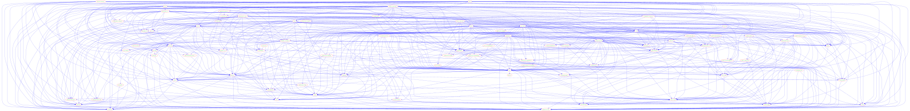
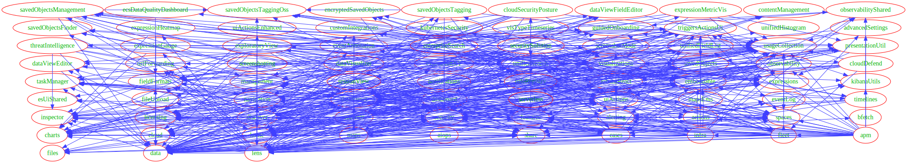

# Kibana plugin required dependencies

The visualizations below were generated by Graphviz given the required
plugin dependencies for just plugins needed to run background tasks at startup.
Each visualization is using a different engine.
The input for these images is provided at the bottom of this page.
Try yourself at https://dreampuf.github.io/GraphvizOnline

This set was determined by analyzing that graph data, best I could,
trying to find plugins which did not end up requiring task manager, nor
were required by a plugin which required task manager.  That left 83
of the total 172 plugins to analyze.

Obviously, these charts aren't useful.  I've used Graphviz in the past to 
plot out tangled graphs - but this is something I've not seen before.

While not being actually useful, I do think there is a beauty to them.

Enjoy.

## all Kibana plugins

### engine dot



### engine fdp


### engine neato


### engine osage



### engine twopi


----

<details>
<summary>Graphviz input</summary>

```
# background plugins: 83 / 172
digraph plugins {
  _advancedSettings [label="advancedSettings" color="#FF0000" fontcolor="#00AF00"];
  _bfetch [label="bfetch" color="#FF0000" fontcolor="#00AF00"];
  _expressionGauge [label="expressionGauge" color="#FF0000" fontcolor="#00AF00"];
  _expressionHeatmap [label="expressionHeatmap" color="#FF0000" fontcolor="#00AF00"];
  _expressionMetricVis [label="expressionMetricVis" color="#FF0000" fontcolor="#00AF00"];
  _expressionXY [label="expressionXY" color="#FF0000" fontcolor="#00AF00"];
  _charts [label="charts" color="#FF0000" fontcolor="#00AF00"];
  _contentManagement [label="contentManagement" color="#FF0000" fontcolor="#00AF00"];
  _controls [label="controls" color="#FF0000" fontcolor="#00AF00"];
  _customIntegrations [label="customIntegrations" color="#FF0000" fontcolor="#00AF00"];
  _dashboard [label="dashboard" color="#FF0000" fontcolor="#00AF00"];
  _data [label="data" color="#FF0000" fontcolor="#00AF00"];
  _dataViewEditor [label="dataViewEditor" color="#FF0000" fontcolor="#00AF00"];
  _dataViewFieldEditor [label="dataViewFieldEditor" color="#FF0000" fontcolor="#00AF00"];
  _dataViews [label="dataViews" color="#FF0000" fontcolor="#00AF00"];
  _discover [label="discover" color="#FF0000" fontcolor="#00AF00"];
  _embeddable [label="embeddable" color="#FF0000" fontcolor="#00AF00"];
  _esUiShared [label="esUiShared" color="#FF0000" fontcolor="#00AF00"];
  _eventAnnotation [label="eventAnnotation" color="#FF0000" fontcolor="#00AF00"];
  _expressions [label="expressions" color="#FF0000" fontcolor="#00AF00"];
  _fieldFormats [label="fieldFormats" color="#FF0000" fontcolor="#00AF00"];
  _files [label="files" color="#FF0000" fontcolor="#00AF00"];
  _guidedOnboarding [label="guidedOnboarding" color="#FF0000" fontcolor="#00AF00"];
  _home [label="home" color="#FF0000" fontcolor="#00AF00"];
  _inspector [label="inspector" color="#FF0000" fontcolor="#00AF00"];
  _kibanaReact [label="kibanaReact" color="#FF0000" fontcolor="#00AF00"];
  _kibanaUtils [label="kibanaUtils" color="#FF0000" fontcolor="#00AF00"];
  _management [label="management" color="#FF0000" fontcolor="#00AF00"];
  _mapsEms [label="mapsEms" color="#FF0000" fontcolor="#00AF00"];
  _navigation [label="navigation" color="#FF0000" fontcolor="#00AF00"];
  _presentationUtil [label="presentationUtil" color="#FF0000" fontcolor="#00AF00"];
  _savedObjects [label="savedObjects" color="#FF0000" fontcolor="#00AF00"];
  _savedObjectsFinder [label="savedObjectsFinder" color="#FF0000" fontcolor="#00AF00"];
  _savedObjectsManagement [label="savedObjectsManagement" color="#FF0000" fontcolor="#00AF00"];
  _savedObjectsTaggingOss [label="savedObjectsTaggingOss" color="#FF0000" fontcolor="#00AF00"];
  _screenshotMode [label="screenshotMode" color="#FF0000" fontcolor="#00AF00"];
  _share [label="share" color="#FF0000" fontcolor="#00AF00"];
  _uiActions [label="uiActions" color="#FF0000" fontcolor="#00AF00"];
  _uiActionsEnhanced [label="uiActionsEnhanced" color="#FF0000" fontcolor="#00AF00"];
  _unifiedFieldList [label="unifiedFieldList" color="#FF0000" fontcolor="#00AF00"];
  _unifiedHistogram [label="unifiedHistogram" color="#FF0000" fontcolor="#00AF00"];
  _unifiedSearch [label="unifiedSearch" color="#FF0000" fontcolor="#00AF00"];
  _urlForwarding [label="urlForwarding" color="#FF0000" fontcolor="#00AF00"];
  _usageCollection [label="usageCollection" color="#FF0000" fontcolor="#00AF00"];
  _visTypeTimeseries [label="visTypeTimeseries" color="#FF0000" fontcolor="#00AF00"];
  _visualizations [label="visualizations" color="#FF0000" fontcolor="#00AF00"];
  _actions [label="actions" color="#FF0000" fontcolor="#00AF00"];
  _aiops [label="aiops" color="#FF0000" fontcolor="#00AF00"];
  _alerting [label="alerting" color="#FF0000" fontcolor="#00AF00"];
  _apm [label="apm" color="#FF0000" fontcolor="#00AF00"];
  _cases [label="cases" color="#FF0000" fontcolor="#00AF00"];
  _cloud [label="cloud" color="#FF0000" fontcolor="#00AF00"];
  _cloudDefend [label="cloudDefend" color="#FF0000" fontcolor="#00AF00"];
  _cloudSecurityPosture [label="cloudSecurityPosture" color="#FF0000" fontcolor="#00AF00"];
  _dataVisualizer [label="dataVisualizer" color="#FF0000" fontcolor="#00AF00"];
  _ecsDataQualityDashboard [label="ecsDataQualityDashboard" color="#FF0000" fontcolor="#00AF00"];
  _encryptedSavedObjects [label="encryptedSavedObjects" color="#FF0000" fontcolor="#00AF00"];
  _enterpriseSearch [label="enterpriseSearch" color="#FF0000" fontcolor="#00AF00"];
  _eventLog [label="eventLog" color="#FF0000" fontcolor="#00AF00"];
  _exploratoryView [label="exploratoryView" color="#FF0000" fontcolor="#00AF00"];
  _features [label="features" color="#FF0000" fontcolor="#00AF00"];
  _fileUpload [label="fileUpload" color="#FF0000" fontcolor="#00AF00"];
  _fleet [label="fleet" color="#FF0000" fontcolor="#00AF00"];
  _infra [label="infra" color="#FF0000" fontcolor="#00AF00"];
  _kubernetesSecurity [label="kubernetesSecurity" color="#FF0000" fontcolor="#00AF00"];
  _lens [label="lens" color="#FF0000" fontcolor="#00AF00"];
  _licensing [label="licensing" color="#FF0000" fontcolor="#00AF00"];
  _maps [label="maps" color="#FF0000" fontcolor="#00AF00"];
  _notifications [label="notifications" color="#FF0000" fontcolor="#00AF00"];
  _observability [label="observability" color="#FF0000" fontcolor="#00AF00"];
  _observabilityShared [label="observabilityShared" color="#FF0000" fontcolor="#00AF00"];
  _ruleRegistry [label="ruleRegistry" color="#FF0000" fontcolor="#00AF00"];
  _savedObjectsTagging [label="savedObjectsTagging" color="#FF0000" fontcolor="#00AF00"];
  _screenshotting [label="screenshotting" color="#FF0000" fontcolor="#00AF00"];
  _security [label="security" color="#FF0000" fontcolor="#00AF00"];
  _securitySolution [label="securitySolution" color="#FF0000" fontcolor="#00AF00"];
  _serverless [label="serverless" color="#FF0000" fontcolor="#00AF00"];
  _sessionView [label="sessionView" color="#FF0000" fontcolor="#00AF00"];
  _spaces [label="spaces" color="#FF0000" fontcolor="#00AF00"];
  _taskManager [label="taskManager" color="#FF0000" fontcolor="#00AF00"];
  _threatIntelligence [label="threatIntelligence" color="#FF0000" fontcolor="#00AF00"];
  _timelines [label="timelines" color="#FF0000" fontcolor="#00AF00"];
  _triggersActionsUi [label="triggersActionsUi" color="#FF0000" fontcolor="#00AF00"];
  _advancedSettings -> _management [color="#3F3FFF"];
  _advancedSettings -> _home [color="#3F3FFF"];
  _advancedSettings -> _usageCollection [color="#3F3FFF"];
  _expressionGauge -> _expressions [color="#3F3FFF"];
  _expressionGauge -> _fieldFormats [color="#3F3FFF"];
  _expressionGauge -> _charts [color="#3F3FFF"];
  _expressionGauge -> _visualizations [color="#3F3FFF"];
  _expressionGauge -> _presentationUtil [color="#3F3FFF"];
  _expressionGauge -> _data [color="#3F3FFF"];
  _expressionGauge -> _usageCollection [color="#3F3FFF"];
  _expressionHeatmap -> _expressions [color="#3F3FFF"];
  _expressionHeatmap -> _fieldFormats [color="#3F3FFF"];
  _expressionHeatmap -> _charts [color="#3F3FFF"];
  _expressionHeatmap -> _visualizations [color="#3F3FFF"];
  _expressionHeatmap -> _presentationUtil [color="#3F3FFF"];
  _expressionHeatmap -> _data [color="#3F3FFF"];
  _expressionHeatmap -> _usageCollection [color="#3F3FFF"];
  _expressionMetricVis -> _expressions [color="#3F3FFF"];
  _expressionMetricVis -> _fieldFormats [color="#3F3FFF"];
  _expressionMetricVis -> _charts [color="#3F3FFF"];
  _expressionMetricVis -> _visualizations [color="#3F3FFF"];
  _expressionMetricVis -> _presentationUtil [color="#3F3FFF"];
  _expressionMetricVis -> _usageCollection [color="#3F3FFF"];
  _expressionXY -> _expressions [color="#3F3FFF"];
  _expressionXY -> _charts [color="#3F3FFF"];
  _expressionXY -> _data [color="#3F3FFF"];
  _expressionXY -> _fieldFormats [color="#3F3FFF"];
  _expressionXY -> _uiActions [color="#3F3FFF"];
  _expressionXY -> _eventAnnotation [color="#3F3FFF"];
  _expressionXY -> _visualizations [color="#3F3FFF"];
  _expressionXY -> _usageCollection [color="#3F3FFF"];
  _charts -> _expressions [color="#3F3FFF"];
  _controls -> _presentationUtil [color="#3F3FFF"];
  _controls -> _savedObjects [color="#3F3FFF"];
  _controls -> _kibanaReact [color="#3F3FFF"];
  _controls -> _expressions [color="#3F3FFF"];
  _controls -> _embeddable [color="#3F3FFF"];
  _controls -> _dataViews [color="#3F3FFF"];
  _controls -> _data [color="#3F3FFF"];
  _controls -> _unifiedSearch [color="#3F3FFF"];
  _controls -> _uiActions [color="#3F3FFF"];
  _dashboard -> _data [color="#3F3FFF"];
  _dashboard -> _dataViews [color="#3F3FFF"];
  _dashboard -> _dataViewEditor [color="#3F3FFF"];
  _dashboard -> _embeddable [color="#3F3FFF"];
  _dashboard -> _controls [color="#3F3FFF"];
  _dashboard -> _inspector [color="#3F3FFF"];
  _dashboard -> _navigation [color="#3F3FFF"];
  _dashboard -> _savedObjects [color="#3F3FFF"];
  _dashboard -> _savedObjectsFinder [color="#3F3FFF"];
  _dashboard -> _savedObjectsManagement [color="#3F3FFF"];
  _dashboard -> _share [color="#3F3FFF"];
  _dashboard -> _screenshotMode [color="#3F3FFF"];
  _dashboard -> _uiActions [color="#3F3FFF"];
  _dashboard -> _urlForwarding [color="#3F3FFF"];
  _dashboard -> _presentationUtil [color="#3F3FFF"];
  _dashboard -> _visualizations [color="#3F3FFF"];
  _dashboard -> _unifiedSearch [color="#3F3FFF"];
  _dashboard -> _home [color="#3F3FFF"];
  _dashboard -> _spaces [color="#3F3FFF"];
  _dashboard -> _savedObjectsTaggingOss [color="#3F3FFF"];
  _dashboard -> _screenshotMode [color="#3F3FFF"];
  _dashboard -> _usageCollection [color="#3F3FFF"];
  _dashboard -> _taskManager [color="#3F3FFF"];
  _data -> _bfetch [color="#3F3FFF"];
  _data -> _expressions [color="#3F3FFF"];
  _data -> _uiActions [color="#3F3FFF"];
  _data -> _share [color="#3F3FFF"];
  _data -> _inspector [color="#3F3FFF"];
  _data -> _fieldFormats [color="#3F3FFF"];
  _data -> _dataViews [color="#3F3FFF"];
  _data -> _screenshotMode [color="#3F3FFF"];
  _data -> _management [color="#3F3FFF"];
  _data -> _usageCollection [color="#3F3FFF"];
  _data -> _taskManager [color="#3F3FFF"];
  _data -> _security [color="#3F3FFF"];
  _dataViewEditor -> _data [color="#3F3FFF"];
  _dataViewEditor -> _dataViews [color="#3F3FFF"];
  _dataViewFieldEditor -> _data [color="#3F3FFF"];
  _dataViewFieldEditor -> _fieldFormats [color="#3F3FFF"];
  _dataViewFieldEditor -> _dataViews [color="#3F3FFF"];
  _dataViewFieldEditor -> _usageCollection [color="#3F3FFF"];
  _dataViews -> _fieldFormats [color="#3F3FFF"];
  _dataViews -> _expressions [color="#3F3FFF"];
  _dataViews -> _usageCollection [color="#3F3FFF"];
  _discover -> _charts [color="#3F3FFF"];
  _discover -> _data [color="#3F3FFF"];
  _discover -> _dataViews [color="#3F3FFF"];
  _discover -> _embeddable [color="#3F3FFF"];
  _discover -> _inspector [color="#3F3FFF"];
  _discover -> _fieldFormats [color="#3F3FFF"];
  _discover -> _urlForwarding [color="#3F3FFF"];
  _discover -> _navigation [color="#3F3FFF"];
  _discover -> _uiActions [color="#3F3FFF"];
  _discover -> _savedObjects [color="#3F3FFF"];
  _discover -> _savedObjectsFinder [color="#3F3FFF"];
  _discover -> _savedObjectsManagement [color="#3F3FFF"];
  _discover -> _dataViewFieldEditor [color="#3F3FFF"];
  _discover -> _dataViewEditor [color="#3F3FFF"];
  _discover -> _expressions [color="#3F3FFF"];
  _discover -> _unifiedFieldList [color="#3F3FFF"];
  _discover -> _unifiedSearch [color="#3F3FFF"];
  _discover -> _unifiedHistogram [color="#3F3FFF"];
  _discover -> _home [color="#3F3FFF"];
  _discover -> _share [color="#3F3FFF"];
  _discover -> _usageCollection [color="#3F3FFF"];
  _discover -> _spaces [color="#3F3FFF"];
  _discover -> _triggersActionsUi [color="#3F3FFF"];
  _discover -> _savedObjectsTaggingOss [color="#3F3FFF"];
  _discover -> _lens [color="#3F3FFF"];
  _embeddable -> _data [color="#3F3FFF"];
  _embeddable -> _inspector [color="#3F3FFF"];
  _embeddable -> _uiActions [color="#3F3FFF"];
  _embeddable -> _savedObjectsFinder [color="#3F3FFF"];
  _embeddable -> _savedObjectsManagement [color="#3F3FFF"];
  _embeddable -> _savedObjectsTaggingOss [color="#3F3FFF"];
  _eventAnnotation -> _expressions [color="#3F3FFF"];
  _eventAnnotation -> _data [color="#3F3FFF"];
  _files -> _security [color="#3F3FFF"];
  _files -> _usageCollection [color="#3F3FFF"];
  _guidedOnboarding -> _cloud [color="#3F3FFF"];
  _guidedOnboarding -> _features [color="#3F3FFF"];
  _home -> _dataViews [color="#3F3FFF"];
  _home -> _share [color="#3F3FFF"];
  _home -> _urlForwarding [color="#3F3FFF"];
  _home -> _usageCollection [color="#3F3FFF"];
  _home -> _customIntegrations [color="#3F3FFF"];
  _home -> _cloud [color="#3F3FFF"];
  _home -> _guidedOnboarding [color="#3F3FFF"];
  _inspector -> _share [color="#3F3FFF"];
  _management -> _share [color="#3F3FFF"];
  _management -> _home [color="#3F3FFF"];
  _mapsEms -> _licensing [color="#3F3FFF"];
  _navigation -> _unifiedSearch [color="#3F3FFF"];
  _presentationUtil -> _savedObjects [color="#3F3FFF"];
  _presentationUtil -> _kibanaReact [color="#3F3FFF"];
  _presentationUtil -> _embeddable [color="#3F3FFF"];
  _presentationUtil -> _expressions [color="#3F3FFF"];
  _presentationUtil -> _dataViews [color="#3F3FFF"];
  _presentationUtil -> _uiActions [color="#3F3FFF"];
  _savedObjects -> _data [color="#3F3FFF"];
  _savedObjects -> _dataViews [color="#3F3FFF"];
  _savedObjectsManagement -> _management [color="#3F3FFF"];
  _savedObjectsManagement -> _data [color="#3F3FFF"];
  _savedObjectsManagement -> _dataViews [color="#3F3FFF"];
  _savedObjectsManagement -> _home [color="#3F3FFF"];
  _savedObjectsManagement -> _savedObjectsTaggingOss [color="#3F3FFF"];
  _savedObjectsManagement -> _spaces [color="#3F3FFF"];
  _savedObjectsTaggingOss -> _savedObjects [color="#3F3FFF"];
  _uiActions -> _dataViews [color="#3F3FFF"];
  _uiActionsEnhanced -> _embeddable [color="#3F3FFF"];
  _uiActionsEnhanced -> _uiActions [color="#3F3FFF"];
  _uiActionsEnhanced -> _licensing [color="#3F3FFF"];
  _unifiedFieldList -> _dataViews [color="#3F3FFF"];
  _unifiedFieldList -> _data [color="#3F3FFF"];
  _unifiedFieldList -> _fieldFormats [color="#3F3FFF"];
  _unifiedFieldList -> _charts [color="#3F3FFF"];
  _unifiedFieldList -> _uiActions [color="#3F3FFF"];
  _unifiedSearch -> _dataViews [color="#3F3FFF"];
  _unifiedSearch -> _data [color="#3F3FFF"];
  _unifiedSearch -> _uiActions [color="#3F3FFF"];
  _unifiedSearch -> _screenshotMode [color="#3F3FFF"];
  _unifiedSearch -> _savedObjectsManagement [color="#3F3FFF"];
  _unifiedSearch -> _usageCollection [color="#3F3FFF"];
  _visTypeTimeseries -> _charts [color="#3F3FFF"];
  _visTypeTimeseries -> _data [color="#3F3FFF"];
  _visTypeTimeseries -> _expressions [color="#3F3FFF"];
  _visTypeTimeseries -> _visualizations [color="#3F3FFF"];
  _visTypeTimeseries -> _inspector [color="#3F3FFF"];
  _visTypeTimeseries -> _dataViews [color="#3F3FFF"];
  _visTypeTimeseries -> _fieldFormats [color="#3F3FFF"];
  _visTypeTimeseries -> _usageCollection [color="#3F3FFF"];
  _visTypeTimeseries -> _unifiedSearch [color="#3F3FFF"];
  _visTypeTimeseries -> _home [color="#3F3FFF"];
  _visualizations -> _data [color="#3F3FFF"];
  _visualizations -> _charts [color="#3F3FFF"];
  _visualizations -> _expressions [color="#3F3FFF"];
  _visualizations -> _fieldFormats [color="#3F3FFF"];
  _visualizations -> _uiActions [color="#3F3FFF"];
  _visualizations -> _urlForwarding [color="#3F3FFF"];
  _visualizations -> _navigation [color="#3F3FFF"];
  _visualizations -> _embeddable [color="#3F3FFF"];
  _visualizations -> _inspector [color="#3F3FFF"];
  _visualizations -> _savedObjects [color="#3F3FFF"];
  _visualizations -> _screenshotMode [color="#3F3FFF"];
  _visualizations -> _presentationUtil [color="#3F3FFF"];
  _visualizations -> _dataViews [color="#3F3FFF"];
  _visualizations -> _dataViewEditor [color="#3F3FFF"];
  _visualizations -> _unifiedSearch [color="#3F3FFF"];
  _visualizations -> _usageCollection [color="#3F3FFF"];
  _visualizations -> _savedObjectsFinder [color="#3F3FFF"];
  _visualizations -> _savedObjectsManagement [color="#3F3FFF"];
  _visualizations -> _contentManagement [color="#3F3FFF"];
  _visualizations -> _home [color="#3F3FFF"];
  _visualizations -> _share [color="#3F3FFF"];
  _visualizations -> _spaces [color="#3F3FFF"];
  _visualizations -> _savedObjectsTaggingOss [color="#3F3FFF"];
  _actions -> _licensing [color="#3F3FFF"];
  _actions -> _taskManager [color="#3F3FFF"];
  _actions -> _encryptedSavedObjects [color="#3F3FFF"];
  _actions -> _eventLog [color="#3F3FFF"];
  _actions -> _features [color="#3F3FFF"];
  _actions -> _usageCollection [color="#3F3FFF"];
  _actions -> _spaces [color="#3F3FFF"];
  _actions -> _security [color="#3F3FFF"];
  _aiops -> _charts [color="#3F3FFF"];
  _aiops -> _data [color="#3F3FFF"];
  _aiops -> _lens [color="#3F3FFF"];
  _aiops -> _licensing [color="#3F3FFF"];
  _aiops -> _uiActions [color="#3F3FFF"];
  _aiops -> _unifiedFieldList [color="#3F3FFF"];
  _alerting -> _actions [color="#3F3FFF"];
  _alerting -> _data [color="#3F3FFF"];
  _alerting -> _dataViews [color="#3F3FFF"];
  _alerting -> _share [color="#3F3FFF"];
  _alerting -> _encryptedSavedObjects [color="#3F3FFF"];
  _alerting -> _eventLog [color="#3F3FFF"];
  _alerting -> _features [color="#3F3FFF"];
  _alerting -> _kibanaUtils [color="#3F3FFF"];
  _alerting -> _licensing [color="#3F3FFF"];
  _alerting -> _taskManager [color="#3F3FFF"];
  _alerting -> _kibanaReact [color="#3F3FFF"];
  _alerting -> _management [color="#3F3FFF"];
  _alerting -> _esUiShared [color="#3F3FFF"];
  _alerting -> _usageCollection [color="#3F3FFF"];
  _alerting -> _security [color="#3F3FFF"];
  _alerting -> _spaces [color="#3F3FFF"];
  _apm -> _data [color="#3F3FFF"];
  _apm -> _embeddable [color="#3F3FFF"];
  _apm -> _features [color="#3F3FFF"];
  _apm -> _infra [color="#3F3FFF"];
  _apm -> _inspector [color="#3F3FFF"];
  _apm -> _licensing [color="#3F3FFF"];
  _apm -> _observability [color="#3F3FFF"];
  _apm -> _observabilityShared [color="#3F3FFF"];
  _apm -> _exploratoryView [color="#3F3FFF"];
  _apm -> _ruleRegistry [color="#3F3FFF"];
  _apm -> _triggersActionsUi [color="#3F3FFF"];
  _apm -> _share [color="#3F3FFF"];
  _apm -> _unifiedSearch [color="#3F3FFF"];
  _apm -> _dataViews [color="#3F3FFF"];
  _apm -> _advancedSettings [color="#3F3FFF"];
  _apm -> _unifiedFieldList [color="#3F3FFF"];
  _apm -> _lens [color="#3F3FFF"];
  _apm -> _maps [color="#3F3FFF"];
  _apm -> _actions [color="#3F3FFF"];
  _apm -> _alerting [color="#3F3FFF"];
  _apm -> _cases [color="#3F3FFF"];
  _apm -> _charts [color="#3F3FFF"];
  _apm -> _cloud [color="#3F3FFF"];
  _apm -> _fleet [color="#3F3FFF"];
  _apm -> _fieldFormats [color="#3F3FFF"];
  _apm -> _home [color="#3F3FFF"];
  _apm -> _security [color="#3F3FFF"];
  _apm -> _spaces [color="#3F3FFF"];
  _apm -> _taskManager [color="#3F3FFF"];
  _apm -> _usageCollection [color="#3F3FFF"];
  _cases -> _actions [color="#3F3FFF"];
  _cases -> _data [color="#3F3FFF"];
  _cases -> _embeddable [color="#3F3FFF"];
  _cases -> _esUiShared [color="#3F3FFF"];
  _cases -> _lens [color="#3F3FFF"];
  _cases -> _licensing [color="#3F3FFF"];
  _cases -> _features [color="#3F3FFF"];
  _cases -> _kibanaReact [color="#3F3FFF"];
  _cases -> _kibanaUtils [color="#3F3FFF"];
  _cases -> _triggersActionsUi [color="#3F3FFF"];
  _cases -> _management [color="#3F3FFF"];
  _cases -> _security [color="#3F3FFF"];
  _cases -> _notifications [color="#3F3FFF"];
  _cases -> _ruleRegistry [color="#3F3FFF"];
  _cases -> _files [color="#3F3FFF"];
  _cases -> _savedObjectsFinder [color="#3F3FFF"];
  _cases -> _savedObjectsManagement [color="#3F3FFF"];
  _cases -> _home [color="#3F3FFF"];
  _cases -> _taskManager [color="#3F3FFF"];
  _cases -> _usageCollection [color="#3F3FFF"];
  _cases -> _spaces [color="#3F3FFF"];
  _cloud -> _usageCollection [color="#3F3FFF"];
  _cloudDefend -> _navigation [color="#3F3FFF"];
  _cloudDefend -> _data [color="#3F3FFF"];
  _cloudDefend -> _fleet [color="#3F3FFF"];
  _cloudDefend -> _unifiedSearch [color="#3F3FFF"];
  _cloudDefend -> _kibanaReact [color="#3F3FFF"];
  _cloudDefend -> _cloud [color="#3F3FFF"];
  _cloudDefend -> _security [color="#3F3FFF"];
  _cloudDefend -> _licensing [color="#3F3FFF"];
  _cloudDefend -> _usageCollection [color="#3F3FFF"];
  _cloudSecurityPosture -> _navigation [color="#3F3FFF"];
  _cloudSecurityPosture -> _data [color="#3F3FFF"];
  _cloudSecurityPosture -> _fleet [color="#3F3FFF"];
  _cloudSecurityPosture -> _unifiedSearch [color="#3F3FFF"];
  _cloudSecurityPosture -> _taskManager [color="#3F3FFF"];
  _cloudSecurityPosture -> _security [color="#3F3FFF"];
  _cloudSecurityPosture -> _charts [color="#3F3FFF"];
  _cloudSecurityPosture -> _discover [color="#3F3FFF"];
  _cloudSecurityPosture -> _cloud [color="#3F3FFF"];
  _cloudSecurityPosture -> _licensing [color="#3F3FFF"];
  _cloudSecurityPosture -> _usageCollection [color="#3F3FFF"];
  _dataVisualizer -> _data [color="#3F3FFF"];
  _dataVisualizer -> _usageCollection [color="#3F3FFF"];
  _dataVisualizer -> _embeddable [color="#3F3FFF"];
  _dataVisualizer -> _share [color="#3F3FFF"];
  _dataVisualizer -> _discover [color="#3F3FFF"];
  _dataVisualizer -> _fileUpload [color="#3F3FFF"];
  _dataVisualizer -> _uiActions [color="#3F3FFF"];
  _dataVisualizer -> _charts [color="#3F3FFF"];
  _dataVisualizer -> _unifiedSearch [color="#3F3FFF"];
  _dataVisualizer -> _security [color="#3F3FFF"];
  _dataVisualizer -> _maps [color="#3F3FFF"];
  _dataVisualizer -> _home [color="#3F3FFF"];
  _dataVisualizer -> _lens [color="#3F3FFF"];
  _dataVisualizer -> _dataViewFieldEditor [color="#3F3FFF"];
  _dataVisualizer -> _customIntegrations [color="#3F3FFF"];
  _dataVisualizer -> _cloud [color="#3F3FFF"];
  _ecsDataQualityDashboard -> _data [color="#3F3FFF"];
  _encryptedSavedObjects -> _security [color="#3F3FFF"];
  _enterpriseSearch -> _features [color="#3F3FFF"];
  _enterpriseSearch -> _security [color="#3F3FFF"];
  _enterpriseSearch -> _licensing [color="#3F3FFF"];
  _enterpriseSearch -> _data [color="#3F3FFF"];
  _enterpriseSearch -> _discover [color="#3F3FFF"];
  _enterpriseSearch -> _charts [color="#3F3FFF"];
  _enterpriseSearch -> _infra [color="#3F3FFF"];
  _enterpriseSearch -> _cloud [color="#3F3FFF"];
  _enterpriseSearch -> _esUiShared [color="#3F3FFF"];
  _enterpriseSearch -> _guidedOnboarding [color="#3F3FFF"];
  _enterpriseSearch -> _lens [color="#3F3FFF"];
  _enterpriseSearch -> _embeddable [color="#3F3FFF"];
  _enterpriseSearch -> _customIntegrations [color="#3F3FFF"];
  _enterpriseSearch -> _home [color="#3F3FFF"];
  _enterpriseSearch -> _spaces [color="#3F3FFF"];
  _enterpriseSearch -> _usageCollection [color="#3F3FFF"];
  _eventLog -> _spaces [color="#3F3FFF"];
  _exploratoryView -> _alerting [color="#3F3FFF"];
  _exploratoryView -> _cases [color="#3F3FFF"];
  _exploratoryView -> _charts [color="#3F3FFF"];
  _exploratoryView -> _data [color="#3F3FFF"];
  _exploratoryView -> _dataViews [color="#3F3FFF"];
  _exploratoryView -> _features [color="#3F3FFF"];
  _exploratoryView -> _files [color="#3F3FFF"];
  _exploratoryView -> _guidedOnboarding [color="#3F3FFF"];
  _exploratoryView -> _inspector [color="#3F3FFF"];
  _exploratoryView -> _lens [color="#3F3FFF"];
  _exploratoryView -> _observabilityShared [color="#3F3FFF"];
  _exploratoryView -> _security [color="#3F3FFF"];
  _exploratoryView -> _share [color="#3F3FFF"];
  _exploratoryView -> _triggersActionsUi [color="#3F3FFF"];
  _exploratoryView -> _unifiedSearch [color="#3F3FFF"];
  _exploratoryView -> _discover [color="#3F3FFF"];
  _exploratoryView -> _embeddable [color="#3F3FFF"];
  _exploratoryView -> _home [color="#3F3FFF"];
  _exploratoryView -> _licensing [color="#3F3FFF"];
  _exploratoryView -> _spaces [color="#3F3FFF"];
  _exploratoryView -> _usageCollection [color="#3F3FFF"];
  _features -> _licensing [color="#3F3FFF"];
  _fileUpload -> _data [color="#3F3FFF"];
  _fileUpload -> _usageCollection [color="#3F3FFF"];
  _fileUpload -> _security [color="#3F3FFF"];
  _fleet -> _licensing [color="#3F3FFF"];
  _fleet -> _data [color="#3F3FFF"];
  _fleet -> _encryptedSavedObjects [color="#3F3FFF"];
  _fleet -> _navigation [color="#3F3FFF"];
  _fleet -> _customIntegrations [color="#3F3FFF"];
  _fleet -> _share [color="#3F3FFF"];
  _fleet -> _security [color="#3F3FFF"];
  _fleet -> _unifiedSearch [color="#3F3FFF"];
  _fleet -> _savedObjectsTagging [color="#3F3FFF"];
  _fleet -> _taskManager [color="#3F3FFF"];
  _fleet -> _guidedOnboarding [color="#3F3FFF"];
  _fleet -> _files [color="#3F3FFF"];
  _fleet -> _features [color="#3F3FFF"];
  _fleet -> _cloud [color="#3F3FFF"];
  _fleet -> _usageCollection [color="#3F3FFF"];
  _fleet -> _home [color="#3F3FFF"];
  _fleet -> _discover [color="#3F3FFF"];
  _fleet -> _spaces [color="#3F3FFF"];
  _infra -> _alerting [color="#3F3FFF"];
  _infra -> _cases [color="#3F3FFF"];
  _infra -> _charts [color="#3F3FFF"];
  _infra -> _data [color="#3F3FFF"];
  _infra -> _dataViews [color="#3F3FFF"];
  _infra -> _discover [color="#3F3FFF"];
  _infra -> _embeddable [color="#3F3FFF"];
  _infra -> _features [color="#3F3FFF"];
  _infra -> _lens [color="#3F3FFF"];
  _infra -> _observability [color="#3F3FFF"];
  _infra -> _observabilityShared [color="#3F3FFF"];
  _infra -> _ruleRegistry [color="#3F3FFF"];
  _infra -> _security [color="#3F3FFF"];
  _infra -> _share [color="#3F3FFF"];
  _infra -> _triggersActionsUi [color="#3F3FFF"];
  _infra -> _unifiedSearch [color="#3F3FFF"];
  _infra -> _usageCollection [color="#3F3FFF"];
  _infra -> _visTypeTimeseries [color="#3F3FFF"];
  _infra -> _spaces [color="#3F3FFF"];
  _infra -> _home [color="#3F3FFF"];
  _infra -> _embeddable [color="#3F3FFF"];
  _kubernetesSecurity -> _data [color="#3F3FFF"];
  _kubernetesSecurity -> _timelines [color="#3F3FFF"];
  _kubernetesSecurity -> _ruleRegistry [color="#3F3FFF"];
  _kubernetesSecurity -> _sessionView [color="#3F3FFF"];
  _lens -> _data [color="#3F3FFF"];
  _lens -> _dataViews [color="#3F3FFF"];
  _lens -> _charts [color="#3F3FFF"];
  _lens -> _expressions [color="#3F3FFF"];
  _lens -> _fieldFormats [color="#3F3FFF"];
  _lens -> _inspector [color="#3F3FFF"];
  _lens -> _navigation [color="#3F3FFF"];
  _lens -> _urlForwarding [color="#3F3FFF"];
  _lens -> _visualizations [color="#3F3FFF"];
  _lens -> _dashboard [color="#3F3FFF"];
  _lens -> _uiActions [color="#3F3FFF"];
  _lens -> _uiActionsEnhanced [color="#3F3FFF"];
  _lens -> _embeddable [color="#3F3FFF"];
  _lens -> _share [color="#3F3FFF"];
  _lens -> _presentationUtil [color="#3F3FFF"];
  _lens -> _dataViewFieldEditor [color="#3F3FFF"];
  _lens -> _dataViewEditor [color="#3F3FFF"];
  _lens -> _expressionGauge [color="#3F3FFF"];
  _lens -> _expressionMetricVis [color="#3F3FFF"];
  _lens -> _expressionHeatmap [color="#3F3FFF"];
  _lens -> _expressionXY [color="#3F3FFF"];
  _lens -> _eventAnnotation [color="#3F3FFF"];
  _lens -> _unifiedSearch [color="#3F3FFF"];
  _lens -> _unifiedFieldList [color="#3F3FFF"];
  _lens -> _contentManagement [color="#3F3FFF"];
  _lens -> _usageCollection [color="#3F3FFF"];
  _lens -> _taskManager [color="#3F3FFF"];
  _lens -> _savedObjectsTagging [color="#3F3FFF"];
  _lens -> _spaces [color="#3F3FFF"];
  _maps -> _controls [color="#3F3FFF"];
  _maps -> _unifiedSearch [color="#3F3FFF"];
  _maps -> _lens [color="#3F3FFF"];
  _maps -> _licensing [color="#3F3FFF"];
  _maps -> _features [color="#3F3FFF"];
  _maps -> _inspector [color="#3F3FFF"];
  _maps -> _data [color="#3F3FFF"];
  _maps -> _fieldFormats [color="#3F3FFF"];
  _maps -> _fileUpload [color="#3F3FFF"];
  _maps -> _uiActions [color="#3F3FFF"];
  _maps -> _navigation [color="#3F3FFF"];
  _maps -> _expressions [color="#3F3FFF"];
  _maps -> _visualizations [color="#3F3FFF"];
  _maps -> _dashboard [color="#3F3FFF"];
  _maps -> _embeddable [color="#3F3FFF"];
  _maps -> _mapsEms [color="#3F3FFF"];
  _maps -> _savedObjects [color="#3F3FFF"];
  _maps -> _share [color="#3F3FFF"];
  _maps -> _presentationUtil [color="#3F3FFF"];
  _maps -> _contentManagement [color="#3F3FFF"];
  _maps -> _cloud [color="#3F3FFF"];
  _maps -> _customIntegrations [color="#3F3FFF"];
  _maps -> _home [color="#3F3FFF"];
  _maps -> _savedObjectsTagging [color="#3F3FFF"];
  _maps -> _charts [color="#3F3FFF"];
  _maps -> _screenshotMode [color="#3F3FFF"];
  _maps -> _security [color="#3F3FFF"];
  _maps -> _spaces [color="#3F3FFF"];
  _maps -> _usageCollection [color="#3F3FFF"];
  _notifications -> _actions [color="#3F3FFF"];
  _notifications -> _licensing [color="#3F3FFF"];
  _observability -> _alerting [color="#3F3FFF"];
  _observability -> _cases [color="#3F3FFF"];
  _observability -> _charts [color="#3F3FFF"];
  _observability -> _data [color="#3F3FFF"];
  _observability -> _dataViews [color="#3F3FFF"];
  _observability -> _embeddable [color="#3F3FFF"];
  _observability -> _exploratoryView [color="#3F3FFF"];
  _observability -> _features [color="#3F3FFF"];
  _observability -> _files [color="#3F3FFF"];
  _observability -> _guidedOnboarding [color="#3F3FFF"];
  _observability -> _inspector [color="#3F3FFF"];
  _observability -> _lens [color="#3F3FFF"];
  _observability -> _observabilityShared [color="#3F3FFF"];
  _observability -> _ruleRegistry [color="#3F3FFF"];
  _observability -> _triggersActionsUi [color="#3F3FFF"];
  _observability -> _security [color="#3F3FFF"];
  _observability -> _share [color="#3F3FFF"];
  _observability -> _unifiedSearch [color="#3F3FFF"];
  _observability -> _visualizations [color="#3F3FFF"];
  _observability -> _discover [color="#3F3FFF"];
  _observability -> _home [color="#3F3FFF"];
  _observability -> _licensing [color="#3F3FFF"];
  _observability -> _spaces [color="#3F3FFF"];
  _observability -> _usageCollection [color="#3F3FFF"];
  _observabilityShared -> _cases [color="#3F3FFF"];
  _observabilityShared -> _guidedOnboarding [color="#3F3FFF"];
  _ruleRegistry -> _alerting [color="#3F3FFF"];
  _ruleRegistry -> _data [color="#3F3FFF"];
  _ruleRegistry -> _triggersActionsUi [color="#3F3FFF"];
  _ruleRegistry -> _security [color="#3F3FFF"];
  _ruleRegistry -> _spaces [color="#3F3FFF"];
  _savedObjectsTagging -> _features [color="#3F3FFF"];
  _savedObjectsTagging -> _management [color="#3F3FFF"];
  _savedObjectsTagging -> _savedObjectsTaggingOss [color="#3F3FFF"];
  _savedObjectsTagging -> _usageCollection [color="#3F3FFF"];
  _savedObjectsTagging -> _security [color="#3F3FFF"];
  _screenshotting -> _expressions [color="#3F3FFF"];
  _screenshotting -> _screenshotMode [color="#3F3FFF"];
  _screenshotting -> _cloud [color="#3F3FFF"];
  _security -> _features [color="#3F3FFF"];
  _security -> _licensing [color="#3F3FFF"];
  _security -> _taskManager [color="#3F3FFF"];
  _security -> _cloud [color="#3F3FFF"];
  _security -> _dataViews [color="#3F3FFF"];
  _security -> _home [color="#3F3FFF"];
  _security -> _management [color="#3F3FFF"];
  _security -> _usageCollection [color="#3F3FFF"];
  _security -> _spaces [color="#3F3FFF"];
  _security -> _share [color="#3F3FFF"];
  _securitySolution -> _actions [color="#3F3FFF"];
  _securitySolution -> _alerting [color="#3F3FFF"];
  _securitySolution -> _cases [color="#3F3FFF"];
  _securitySolution -> _cloud [color="#3F3FFF"];
  _securitySolution -> _cloudDefend [color="#3F3FFF"];
  _securitySolution -> _cloudSecurityPosture [color="#3F3FFF"];
  _securitySolution -> _dashboard [color="#3F3FFF"];
  _securitySolution -> _data [color="#3F3FFF"];
  _securitySolution -> _ecsDataQualityDashboard [color="#3F3FFF"];
  _securitySolution -> _dataViews [color="#3F3FFF"];
  _securitySolution -> _embeddable [color="#3F3FFF"];
  _securitySolution -> _eventLog [color="#3F3FFF"];
  _securitySolution -> _features [color="#3F3FFF"];
  _securitySolution -> _guidedOnboarding [color="#3F3FFF"];
  _securitySolution -> _inspector [color="#3F3FFF"];
  _securitySolution -> _kubernetesSecurity [color="#3F3FFF"];
  _securitySolution -> _lens [color="#3F3FFF"];
  _securitySolution -> _licensing [color="#3F3FFF"];
  _securitySolution -> _maps [color="#3F3FFF"];
  _securitySolution -> _ruleRegistry [color="#3F3FFF"];
  _securitySolution -> _sessionView [color="#3F3FFF"];
  _securitySolution -> _spaces [color="#3F3FFF"];
  _securitySolution -> _taskManager [color="#3F3FFF"];
  _securitySolution -> _threatIntelligence [color="#3F3FFF"];
  _securitySolution -> _timelines [color="#3F3FFF"];
  _securitySolution -> _triggersActionsUi [color="#3F3FFF"];
  _securitySolution -> _uiActions [color="#3F3FFF"];
  _securitySolution -> _unifiedSearch [color="#3F3FFF"];
  _securitySolution -> _files [color="#3F3FFF"];
  _securitySolution -> _controls [color="#3F3FFF"];
  _securitySolution -> _savedObjectsManagement [color="#3F3FFF"];
  _securitySolution -> _encryptedSavedObjects [color="#3F3FFF"];
  _securitySolution -> _fleet [color="#3F3FFF"];
  _securitySolution -> _security [color="#3F3FFF"];
  _securitySolution -> _usageCollection [color="#3F3FFF"];
  _securitySolution -> _home [color="#3F3FFF"];
  _securitySolution -> _dataViewFieldEditor [color="#3F3FFF"];
  _securitySolution -> _savedObjectsTaggingOss [color="#3F3FFF"];
  _serverless -> _kibanaReact [color="#3F3FFF"];
  _serverless -> _management [color="#3F3FFF"];
  _sessionView -> _data [color="#3F3FFF"];
  _sessionView -> _timelines [color="#3F3FFF"];
  _sessionView -> _ruleRegistry [color="#3F3FFF"];
  _spaces -> _features [color="#3F3FFF"];
  _spaces -> _licensing [color="#3F3FFF"];
  _spaces -> _advancedSettings [color="#3F3FFF"];
  _spaces -> _home [color="#3F3FFF"];
  _spaces -> _management [color="#3F3FFF"];
  _spaces -> _usageCollection [color="#3F3FFF"];
  _taskManager -> _usageCollection [color="#3F3FFF"];
  _threatIntelligence -> _cases [color="#3F3FFF"];
  _threatIntelligence -> _data [color="#3F3FFF"];
  _threatIntelligence -> _dataViews [color="#3F3FFF"];
  _threatIntelligence -> _kibanaUtils [color="#3F3FFF"];
  _threatIntelligence -> _navigation [color="#3F3FFF"];
  _threatIntelligence -> _kibanaReact [color="#3F3FFF"];
  _threatIntelligence -> _triggersActionsUi [color="#3F3FFF"];
  _threatIntelligence -> _inspector [color="#3F3FFF"];
  _timelines -> _alerting [color="#3F3FFF"];
  _timelines -> _cases [color="#3F3FFF"];
  _timelines -> _data [color="#3F3FFF"];
  _timelines -> _kibanaReact [color="#3F3FFF"];
  _timelines -> _kibanaUtils [color="#3F3FFF"];
  _timelines -> _security [color="#3F3FFF"];
  _triggersActionsUi -> _management [color="#3F3FFF"];
  _triggersActionsUi -> _charts [color="#3F3FFF"];
  _triggersActionsUi -> _data [color="#3F3FFF"];
  _triggersActionsUi -> _kibanaReact [color="#3F3FFF"];
  _triggersActionsUi -> _kibanaUtils [color="#3F3FFF"];
  _triggersActionsUi -> _savedObjects [color="#3F3FFF"];
  _triggersActionsUi -> _unifiedSearch [color="#3F3FFF"];
  _triggersActionsUi -> _dataViews [color="#3F3FFF"];
  _triggersActionsUi -> _dataViewEditor [color="#3F3FFF"];
  _triggersActionsUi -> _alerting [color="#3F3FFF"];
  _triggersActionsUi -> _actions [color="#3F3FFF"];
  _triggersActionsUi -> _cloud [color="#3F3FFF"];
  _triggersActionsUi -> _features [color="#3F3FFF"];
  _triggersActionsUi -> _home [color="#3F3FFF"];
  _triggersActionsUi -> _spaces [color="#3F3FFF"];
}
```

</details>